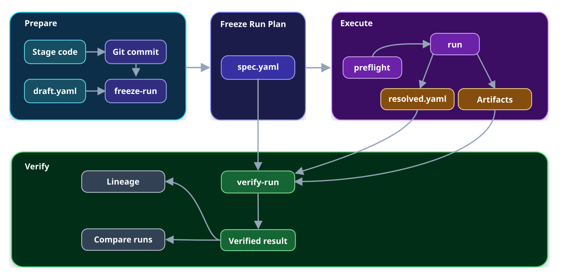

# VIPER

Run and verify reproducible ML experiments with machine-readable guardrails for
agents.

VIPER fixes an experiment before it runs and ties each result to the code and
data that produced it. VIPER verifies files stored locally or in an immutable
Hugging Face repository.

## How a run works



## Install

VIPER requires Python 3.11 or newer.

```bash
python -m pip install viper-provenance
```

## Create a project

```bash
viper init my-project --package my_project
cd my-project
```

The generated project includes templates for each VIPER stage. Replace them with your own functions, parameters, metrics, and artifact loaders.

After defining the stages, commit the project and create an experiment draft.
The draft describes one run.

## Define a stage

```python
from pathlib import Path

import viper
from my_project.training import train_model


class TrainParameters(viper.parameters.Train):
    epochs: int
    learning_rate: float


@viper.train_stage(parameter_model=TrainParameters)
def train(context: viper.StageContext[TrainParameters]) -> None:
    dataset: Path = context.inputs["dataset"]
    weights_to_output: Path = context.artifacts["parameters"]
    train_model(
        dataset=dataset,
        weights=weights_to_output,
        epochs=context.params.epochs,
        learning_rate=context.params.learning_rate,
    )
```

## Commit the project

Commit the project before freezing the experiment. VIPER checks the experiment code against this commit, giving each run an exact code version that can be retrieved and verified later.

## Freeze the experiment

The draft is an editable YAML file that tells VIPER what to run. Its top-level
fields are:

| Field | Purpose |
| --- | --- |
| `schema_version` | Selects the draft format. |
| `run_id` | Names this run. |
| `experiment_id` | Selects the experiment. |
| `variant_id` | Selects the model or settings being tested. |
| `replicate_id` | Selects the experimental replicate. |
| `benchmark_id` | Selects an optional benchmark. |
| `seed` | Sets the run-wide random seed. |
| `source` | Identifies the Git repository and commit. |
| `environment` | Describes the required Python and compute environment. |
| `reproducibility` | Sets the numerical controls applied during execution. |
| `stages` | Lists the stage specifications in execution order. |
| `estimator` | Selects the trained-model artifact produced by the run. |

Freeze the draft with:

```bash
viper freeze-run experiments/example/draft.yaml --repository-root .
```

For `experiment_id: example`, `variant_id: baseline`, and `run_id: run-001`,
VIPER creates:

```text
experiments/example/runs/baseline/run-001/spec.yaml
```

Use this generated `spec.yaml` for `preflight` and `run`.

## Check the experiment

`preflight` checks whether the current machine has the code, inputs, and
environment required by the frozen plan.

```bash
viper preflight experiments/example/runs/baseline/run-001/spec.yaml \
  --repository-root .
```

## Run the experiment

After freezing and checking the experiment, start the complete run through the
VIPER command or your project's Python entrypoint. Both options use the same
frozen plan and produce the same output files.

### Run with `viper`

Use the VIPER command when starting the experiment from a terminal, script, or
automated workflow:

```bash
viper run experiments/example/runs/baseline/run-001/spec.yaml \
  --repository-root .
```

The first argument selects the frozen run plan. `--repository-root .` tells
VIPER that the current folder is the project root.

### Run with `python`

Use your Python training script when `python train.py` is already the normal
way you start training.

Add this entrypoint to `train.py`:

```python
from pathlib import Path

import viper
from my_project.training import train_model


class TrainParameters(viper.parameters.Train):
    epochs: int
    learning_rate: float


@viper.train_stage(parameter_model=TrainParameters)
def train(context: viper.StageContext[TrainParameters]) -> None:
    dataset: Path = context.inputs["dataset"]
    weights_to_output: Path = context.artifacts["parameters"]
    train_model(
        dataset=dataset,
        weights=weights_to_output,
        epochs=context.params.epochs,
        learning_rate=context.params.learning_rate,
    )

if __name__ == "__main__":
    viper.run(train)
```

Then run:

```bash
python train.py \
  --run experiments/example/runs/baseline/run-001/spec.yaml \
  --stage train \
  --repository-root .
```

The Python entrypoint works as follows:

```text
Python starts train.py
→ train.py passes the decorated train function to VIPER
→ --stage train selects the matching stage from the frozen plan
→ VIPER confirms that the function matches the recorded stage
→ VIPER executes the complete run
```

The run plan can contain several stages. `train.py` starts the complete run,
including every stage in the frozen plan.

The command arguments have these meanings:

- `--run` selects the frozen `spec.yaml`.
- `--stage` selects the stage that owns the Python entrypoint.
- `--repository-root` identifies the project’s root folder.

## Verify the result

A successful run writes `resolved.yaml` beside the frozen plan:

```text
experiments/example/runs/baseline/run-001/resolved.yaml
```

This file identifies the completed attempt and the files produced by each
stage. Verify it with:

```bash
viper verify-run \
  experiments/example/runs/baseline/run-001/resolved.yaml \
  --trust-source https://github.com/example/project
```

Set `--trust-source` to your experiment's Git repository. VIPER uses that
repository to verify the committed code.

VIPER reads the references in `resolved.yaml`, retrieves the frozen plan and run
files, and checks every file against its recorded byte count and SHA-256
digest. It also confirms that the stages, artifacts, and measurements belong to
the same experiment. Training runs once. Verification checks the stored files
and recomputes each metric whose specification requires it.

`viper run` performs this check before reporting success. `verify-run` lets you
repeat it later or on another machine.

### View the run's lineage

Lineage shows how stages consumed inputs and produced artifacts and
measurements:

```bash
viper --json lineage \
  experiments/example/runs/baseline/run-001/resolved.yaml \
  --trust-source https://github.com/example/project
```

The JSON result contains the graph's nodes and the relationships between them.

### Compare two runs

`compare-runs` reports differences between two verified runs:

```bash
viper --json compare-runs \
  path/to/first/resolved.yaml \
  path/to/second/resolved.yaml \
  --trust-source https://github.com/example/project
```

Place `--json` before any VIPER command when an agent or program needs a
structured result.

## What VIPER verifies

Suppose `run-001` uses commit `abc123`, trains on `dataset.csv`, and produces
`weights.pt`.

```text
Frozen plan                         Completed run
spec.yaml                           resolved.yaml
├── commit: abc123                  ├── completed stages
├── input: dataset.csv              ├── artifact: weights.pt
└── stage: train                    └── recorded measurements
          \                          /
           └────── verify-run ──────┘
                         │
                         ▼
                 Verified result
```

VIPER checks that the completed run matches the frozen plan. It verifies each
referenced file using its path, byte count, and SHA-256 digest. It also checks
that every stage, artifact, and measurement belongs to the same run.

When a metric requires recomputation, VIPER calculates it again from the
verified files and compares the result with the recorded value. Training runs
once; verification repeats the selected metric calculation.

### Evaluations and benchmarks

An evaluation scores the predictions from one run. A benchmark fixes the
dataset, splits, metrics, and thresholds used to judge separate runs.
`viper execute-benchmark` executes the selected frozen plan independently,
then checks artifact parity and the benchmark's metric criteria.

## Documentation

- [Getting started](https://github.com/pvd232/viper/blob/main/docs/tutorials/getting-started.md)
- [Python and CLI API](https://github.com/pvd232/viper/blob/main/docs/reference/api.md)
- [How VIPER works](https://github.com/pvd232/viper/blob/main/docs/explanation/how-viper-works.md)
- [Formal protocol](https://github.com/pvd232/viper/blob/main/docs/reference/protocol.md)
- [Versioning](https://github.com/pvd232/viper/blob/main/docs/reference/versioning.md)
- [Contributing](https://github.com/pvd232/viper/blob/main/CONTRIBUTING.md)

## License

VIPER is licensed under the
[Apache License 2.0](https://github.com/pvd232/viper/blob/main/LICENSE).
