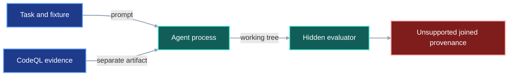

# Agent Graph-Memory Experiment

## 1. Status

**Contract status:** Apparatus implemented; no experiment result is accepted yet.

The existing rename experiments retain prompts, transcripts, patches, and
verdicts in separate records. They do not expose one verifier that proves which
treatment bytes reached each agent and which candidate bytes reached the hidden
evaluator.

| ID | Implementation obligation |
|---|---|
| `AGM-01` | Freeze the common fixture, task, evaluator, graph, model, resource limit, and each arm's treatment as inputs to three VIPER run plans. |
| `AGM-02` | Derive the static relationship list and `unresolved()` predicate from the same receipt-bound baseline `SourceGraph`. |
| `AGM-03` | Execute each arm through one VIPER-owned stage and declare its transcript, patch, candidate archive, timing, exit state, usage, and verdict as artifacts. |
| `AGM-04` | Run the hidden evaluator once inside that stage after agent termination and bind its result to the archived candidate bytes. |
| `AGM-05` | Accept an arm for comparison only after `verify-run` validates its frozen plan, stage invocation, inputs, and artifact digests. |
| `AGM-06` | Compare final correctness first and efficiency only among successful verified runs. |

## 2. Required claim

VIPER guarantees that each accepted trial receipt identifies the exact frozen
experimental input delivered to one agent and the exact candidate source
evaluated by the hidden oracle.

```math
P_a = \operatorname{Plan}(T, F, M, L, Q, G_0, a), \qquad
R_a = \operatorname{Run}(P_a),
```

```math
\operatorname{Compare}(R_a) \iff
\operatorname{VerifyRun}(R_a)
\land H(\operatorname{Extract}(C_a)) = R_a.C_a
\land \operatorname{Executed}(E,C_a).
```

where:

- `P_a` is the frozen VIPER `RunSpec` for arm `a`;
- `T` is the common task, `F` the fixture commit, `M` the model, and `L` the
  external resource limit;
- `Q` is the CodeQL analysis identity and `G_0` its receipt-bound baseline
  `SourceGraph`;
- `a` is one arm and `C_a` is its declared candidate archive artifact;
- `E` is the frozen hidden evaluator; and
- `H` is SHA-256 over canonical bytes or the identified file bytes.

This is an execution-provenance claim. VIPER's normal run verifier establishes
the plan, input, invocation, and artifact chain. The hidden evaluator decides
fixture correctness. One replicate does not establish a general
agent-performance effect.

## 3. Current gap

### Inspected path

[`agent-experiment.md`](../../plans/rename-obligation-check/agent-experiment.md)
records previous prompts, timing, token counts, and hidden results. The
receipt-bound graph and rename obligations exist in
[`system_impact`](../../src/viper/system_impact/rename.py), but no experiment
record joins those inputs to each launched agent and evaluated candidate.

### Current DAG



### Missing connector

The current records lose custody at agent launch. Nothing independently checks
that the reported prompt and treatment match the bytes supplied to the process,
or that the reported verdict came from evaluating the retained candidate.

### Proposed-change DAG


### Integrated DAG

```mermaid
flowchart LR
    Contract["AGM requirements"] -->|"PairBlock"| Checklist["Master checklist"]
    Checklist -->|"authorizes"| Plan["3 frozen RunSpec values"]
    Source["Fixture commit"] -->|"Python bytes"| CodeQL["analyze_source()"]
    CodeQL -->|"GraphReceipt"| Plan
    Plan -->|"execution.run()"| Stage["run_agent_trial()"]
    Stage -->|"exact prompt and treatment"| Agent["codex exec"]
    Agent -->|"stopped candidate"| Oracle["hidden evaluator"]
    Oracle -->|"declared artifacts"| Storage["VIPER artifact store"]
    Stage -->|"transcript, patch, archive, usage"| Storage
    Storage -->|"ResolvedRun"| Verify["verify-run"]

    class Contract,Plan,Source contract
    class Checklist checklist
    class CodeQL,Agent,Stage,Oracle implementation
    class Storage,Verify proposed
    classDef contract fill:#1e3a8a,stroke:#60a5fa,color:#ffffff,stroke-width:2px
    classDef checklist fill:#713f12,stroke:#fbbf24,color:#ffffff,stroke-width:2px
    classDef implementation fill:#115e59,stroke:#5eead4,color:#ffffff,stroke-width:2px
    classDef proposed fill:#581c87,stroke:#d8b4fe,color:#ffffff,stroke-width:2px
    linkStyle default stroke:#94a3b8,stroke-width:2px
```



## 4. Models

The complete planned declarations belong to the
[`agent-graph-memory-experiment` source plan](../../plans/agent-graph-memory-experiment/README.md).

| Model | Role |
|---|---|
| `AgentTrialParameters` | Arm, model, and externally enforced agent timeout selected by one variant. |
| `ExperimentDraft` | Three variants and one replicate sharing one stage graph. |
| `RunSpec` | One frozen arm plan with exact source, input, environment, and parameter identities. |
| `StageInvocationReceipt` | VIPER-owned stage callable, context, timing, and outcome. |
| `ResolvedSingleFileArtifact` | Digest-bound transcript, patch, candidate archive, usage, and hidden verdict. |
| `ResolvedRun` | Terminal attempt and artifact provenance verified before comparison. |

## 5. Execution

1. `prepare_project()` creates one unsegmented fixture archive, runs CodeQL once,
   compiles all five obligation sets, and writes the three short prompts.
2. `run_experiment()` constructs one `ExperimentDraft` with three variants
   and one replicate. `AgentTrialParameters.arm` is the only treatment level.
3. `plan()` authors one arm draft. `execution.run()` freezes it as an immutable
   `RunSpec` that identifies the committed stage implementation and
   digest-bound inputs.
4. `execution.run()` invokes `run_agent_trial()` once per plan. The three runs
   execute sequentially so CPU contention does not distort elapsed time.
5. `run_agent_trial()` extracts the fixture, launches Codex, enforces the
   external limit, captures JSONL, then runs the hidden evaluator once.
6. The stage writes the transcript, patch, candidate archive, usage, and verdict
   only to its declared artifact paths.
7. VIPER records the `StageInvocationReceipt`, snapshots those artifacts, and
   writes a terminal `ResolvedRun`.
8. `verify-run` verifies all three runs. `compare()` independently reverifies
   them, then reports correctness and successful-arm efficiency.

The prompts contain only the task location and the treatment operation supplied
to that arm. They contain no schedule, phase advice, expected failure, or
description of another arm.

## 6. Persisted evidence

| Evidence | Contents |
|---|---|
| `experiments/agent_graph_memory/**/spec.yaml` | Frozen experiment, variant, stage, and run records. |
| `baseline-source-graph.json` | Baseline graph plus extraction, query, and lowering receipts. |
| `impact-relationships.json` | Flat typed relationship projection supplied to graph arms. |
| `obligations/*.json` | Frozen old-to-new relationship obligations used by `unresolved()`. |
| `transcript.jsonl` | Complete Codex event stream for one arm. |
| `candidate.patch` | Final tracked working-tree difference from the fixture commit. |
| `hidden-evaluator.txt` | Oracle stdout and stderr from its single post-run execution. |
| `resolved.yaml` and attempt records | VIPER's terminal run, stage snapshot, invocation receipt, and artifact references. |
| `verification.json` | Successful `verify-run` result for one arm. |

## 7. Verification

| Rule | Executable condition |
|---|---|
| `agent_experiment.plan.closed` | Three frozen `RunSpec` values differ only through their declared arm treatment and arm-specific prompt input. |
| `agent_experiment.graph.bound` | The static list and all obligations name the baseline `GraphReceipt.sha256` stored in the plan. |
| `agent_experiment.prompt.minimal` | Each prompt equals its declared short template with only its own treatment paths substituted. |
| `agent_experiment.trial.custody` | VIPER's stage snapshot binds the transcript, patch, candidate archive, usage, and verdict to one invocation and `RunSpec`. |
| `agent_experiment.oracle.bound` | The verdict records the full candidate-tree digest observed by the evaluator, rejects evaluator mutation, and records the SHA-256 of the retained candidate archive. |
| `agent_experiment.arms.complete` | Exactly one terminal `ResolvedRun` and successful `verify-run` result exist for every planned arm. |
| `agent_experiment.summary.valid` | Correctness uses the oracle exit code; comparative efficiency excludes failed and timed-out trials. |

## 8. Propagation

| Surface | Required change |
|---|---|
| Type | Add `AgentTrialParameters`; reuse VIPER's experiment, run, invocation, artifact, and resolved-run records. |
| Authoring | Freeze task, controls, prompts, graph evidence, treatments, and evaluator into three run plans. |
| Runtime | Execute one VIPER stage per arm from the same fixture under the same external limit. |
| Persistence | Publish graph receipts, transcripts, patches, candidate archives, usage, verdicts, and terminal runs through VIPER. |
| Verification | Run `verify-run` for every arm and require exact verified arm coverage. |
| Test | Accept an intact toy receipt and reject a substituted treatment or post-evaluation candidate mutation. |
| Documentation | Record the exact run receipt and report only measurements supported by it. |
| Legacy cleanup | Retain earlier experiment reports as exploratory history; do not reuse their unjoined claims as evidence for this run. |

## 9. Acceptance case

### Success

One pilot freezes all three run plans, runs each candidate, evaluates each
candidate once, and passes `verify-run` for all three terminal records. The
summary reports the three oracle outcomes and efficiency measurements for
successful arms.

### Rejection

After freezing, replace `impact-relationships.json`. VIPER rejects execution or
verification because the captured input bytes differ from the frozen input
reference. The failure is owned by `agent_experiment.trial.custody`.

## 10. Implementation order

1. Approve the contract and its `P0-AGM-01` source-backed plan.
2. Implement `AgentTrialParameters`, input preparation, graph projection,
   predicate, VIPER stage, authoring entrypoint, comparison, focused tests, and
   parsimonious prompt assertions.
3. Materialize the plan over the isolated baseline and pass its planned-source
   gate before launching any experimental agent.
4. Freeze and execute one three-arm VIPER pilot.
5. Run `verify-run` on every arm and publish only the verified comparison as
   `P0-AGM-02` evidence.

## 11. Contract-owned PairBlocks

- `P0-AGM-01` owns the apparatus and depends on the implemented rename
  obligation checker. Its gate is the focused protocol, prompt, predicate, and
  custody test module.
- `P0-AGM-02` owns one three-arm pilot and depends on `P0-AGM-01`. Its gate is
  three successful `verify-run` records plus the source-bound experiment report.

The exact actions, requirements, dependencies, and gates are declared in
[`plan.toml`](../../plans/agent-graph-memory-experiment/plan.toml).

## 12. ContractTarget

The source plan is the sole authority for executable experiment code.
`P0-AGM-01` adds `trial.py`, `predicate.py`, `experiment.py`, `compare.py`, and
their focused tests. `P0-AGM-02` adds only the verified result report. The plan
checker compiles those actions into requirement-owned `ContractTarget` records
and materializes them over commit `9d2cdba` without changing this worktree.

## Sources

The baseline graph, obligations, candidate graph, and relationship checks use
the implemented [Rename Obligation Check](rename-obligation-check.md). The
experiment's requirement-to-test chain follows NASA's
[bidirectional traceability requirement](https://swehb.nasa.gov/spaces/SWEHBVC/pages/50888903/SWE-052%2B-%2BBidirectional%2BTraceability).
