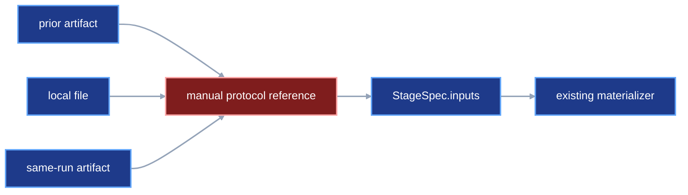
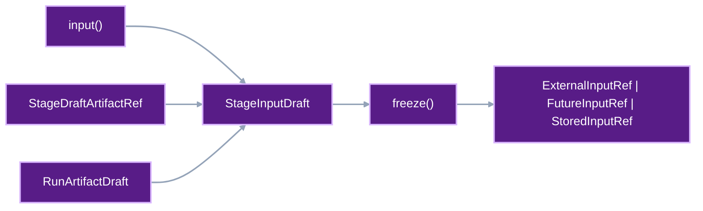

# Automatic artifact capture and input resolution

Users write decorated stage functions and typed parameter classes. VIPER
creates the references that connect one stage's output to another stage's
input. This contract defines how VIPER creates those references. A later
contract will define explicit harness mode.

## 1. Status

**Contract status:** audited; owner approval pending.

These requirements bind the contract to the master checklist:

| ID | Implementation obligation |
| --- | --- |
| AIR-01 <!-- contract-requirement: AIR-01 phase=5 test=tests/test_public_api.py --> | Add the final stage decorators, parameter namespace, and `Train` and `Eval` keys. |
| AIR-02 <!-- contract-requirement: AIR-02 phase=5 test=tests/test_authoring.py --> | Add artifact and HTTP drafts with callable-backed freezing. |
| AIR-03 <!-- contract-requirement: AIR-03 phase=5 test=tests/test_authoring.py --> | Replace YAML-backed stage drafts with Python `StageSpecDraft` models and artifact handles. |
| AIR-04 <!-- contract-requirement: AIR-04 phase=6 test=tests/test_authoring.py --> | Compile experiment, variant, replicate, metric, stage, benchmark, and run documents from one plan. |
| AIR-05 <!-- contract-requirement: AIR-05 phase=7 test=tests/test_verification_acceptance.py --> | Compile local, same-run, and prior-run inputs and publish prior-run pointers through the selected destination. |
| AIR-06 <!-- contract-requirement: AIR-06 phase=11 test=tests/test_documentation.py --> | Remove retired authoring forms and publish the complete single-run Python workflow through freeze, run, benchmark, and restore. |

**Current:** Project code imports `download` or `train` from `viper.stages` and
uses that function as a decorator. A parameter class subclasses
`viper.parameters.Train`. Each stage function receives a `Context`. The
function reads input paths from
`context.inputs` and writes files at the paths in `context.artifacts`.
See [`README.md`](../../README.md#define-a-stage) and
[`src/viper/stages.py`](../../src/viper/stages.py).

**Current:** `DownloadSpec` accepts HTTP requests. `TrainSpec` accepts
`ExternalInputRef`, `StoredInputRef`, or `FutureInputRef`. Users must choose and
construct those internal reference objects themselves.
See [`src/viper/stages.py`](../../src/viper/stages.py).

**Current:** `Context.metrics` gives project stages live metric handles,
and `ExperimentSpec.metrics` stores complete `MetricSpec` records. Stage
authoring accepts bare metric IDs. Metric implementation binding and objective
designation remain outside the authoring model.
See [`src/viper/metrics.py`](../../src/viper/metrics.py) and
[`src/viper/experiments.py`](../../src/viper/experiments.py).

**Proposed:** Project code imports `build`, `embed`, `train`, or `eval` from
`viper.stages`. The decorator's `params=` argument selects the typed parameter
class. `stage()` from `viper.authoring` receives one validated instance of that
class. `download()` from `viper.authoring` creates the runner-owned HTTP stage
directly.

The keys in `plan.stages` become the stage IDs. A user can pass a local file, an
artifact from an earlier stage, or an artifact from an earlier run to
`stage()`. `freeze()` from `viper.authoring` converts that value into `ExternalInputRef`,
`FutureInputRef`, or `StoredInputRef`. For an earlier run, VIPER also writes an
`ArtifactPointer`.

Python authoring also selects configured metric drafts. Training and evaluation
stages require one objective metric. An embedding stage can select diagnostics
and may name an objective when its algorithm has one. A fixed encoder leaves
the objective unset.

This contract changes the Python API. It also makes VIPER execute
`DownloadSpec`. The four project-owned stage types keep using `Context`.
They also keep the same artifact and input paths. The download contract makes
`ResolvedHttpRetrieval.body` equal the matching
`ResolvedSingleFileArtifact.file`.

[`download-retrieval-artifacts.md`](download-retrieval-artifacts.md) owns that
receipt-to-artifact identity rule.
[`external-input-roots.md`](external-input-roots.md) owns repository-local
capture and `ResolvedExternalInputRef` verification. This contract owns the
Python expression that selects a local file or artifact and compiles the
internal input reference.
[`frozen-plan-git-identity.md`](frozen-plan-git-identity.md) owns the Git step
between generated plan files and execution.
[`experiment-expansion.md`](experiment-expansion.md) owns deterministic
variant-replicate expansion and bounded multi-run execution.
[`stage-reuse.md`](stage-reuse.md) owns the opt-in policy and evidence required
to skip a project-owned stage.

## 2. Required claim

When a user passes a VIPER artifact into a training stage, VIPER records which
stage produced it and which artifact the user chose. VIPER writes the required
input reference. The training function receives the verified path through
`Context.inputs`.

When the user authors training or evaluation, VIPER also requires one configured
objective. Freezing writes its complete `MetricSpec`, includes its ID in the
stage, and writes one `MetricObjectiveSpec` containing the metric ID and
improvement direction. The stage or metric worker then produces the
corresponding measurement.

The user writes the stage decorator, parameter class, and training function.
`freeze()` from `viper.authoring` writes a same-run reference or pointer. VIPER
executes each `DownloadSpec`. A function decorated with `@http` from
`viper.http` handles any project-specific HTTP request.
The user commits the generated plan files before execution. VIPER keeps that
plan commit separate from the source commit that identifies project code.

## 3. Current gap

The fixed scenario is:

```text
download a dataset
-> declare the downloaded dataset as a stage artifact
-> train a model on that dataset
```

The current path is:

```text
DownloadSpec.artifacts["dataset"]
-> completed download stage records the resolved artifact
-> TrainSpec.inputs["dataset"]
-> user selects FutureInputRef or StoredInputRef
-> runtime materializes the input
-> train(context) reads context.inputs["dataset"]
```

**Inspected:** `FutureInputRef` carries `producer_stage_id` and
`producer_artifact` for an earlier stage in the same run.
[`src/viper/inputs.py`](../../src/viper/inputs.py)

**Inspected:** `StoredInputRef` carries an `ArtifactPointerRef`, a
materialization path, and a data role for an artifact from a completed run.
[`src/viper/inputs.py`](../../src/viper/inputs.py)

**Inspected:** `freeze_run_plan()` validates authored stage specifications and
writes frozen stage and run files. It currently preserves the input reference
already present in the stage specification. Pointer-document construction
belongs to the proposed authoring operation.
[`src/viper/authoring.py`](../../src/viper/authoring.py)

**Inspected:** The executor follows `StoredInputRef.pointer` and calls
`verify_promoted_artifact()`. It then places the verified files at the declared
input path and passes that path to `Context`.
[`src/viper/execution/_materialization.py`](../../src/viper/execution/_materialization.py)

VIPER can already execute all three reference types. Users still have to create
the reference objects themselves. The proposed Python API accepts ordinary
files and artifact handles. `viper.authoring.freeze()` creates the required reference.

The metric runtime also exists. The missing authoring connector is:

```text
decorated metric implementation
-> Python authoring stops at a bare metric ID
-> parameter, dependency, and comparator values remain unbound
-> training and evaluation carry an unidentified objective
```

[`unified-metric-drafting.md`](unified-metric-drafting.md) owns the missing
metric connector. It defines `MetricDraft`, typed metric parameter delivery,
stage objectives, derived experiment metric registries, and benchmark metric
results.

### Current DAG



### Proposed-change DAG



### Integrated DAG


## 4. Contract models

### Protocol-owned stage keys

VIPER defines the map keys required by training and evaluation stages:

```python
from enum import StrEnum


class Train(StrEnum):
    MODEL = "model"
    STATE = "state"


class Eval(StrEnum):
    MODEL = "model"
    TEST = "test"
    PREDS = "preds"


EvalId = HumanId


DataRole = Literal["training", "validation", "eval", "benchmark"]
```

The public import is:

```python
from viper.keys import Eval, Train
```

`Train` and `Eval` belong to the stage contracts that require these names.
The surrounding `inputs` or `artifacts` map states whether the stage reads or
writes the named value. Pydantic converts each `StrEnum` member to its string
value, so frozen YAML stores `model`, `state`, `test`, and `preds` as ordinary
map keys.

Project-defined keys remain strings or project-owned `StrEnum` members. For
example, `dataset` remains a project-defined training input name.

### Target stage decorators

The four project-owned stage decorators use `params=` for the parameter class:

```python
from my_cool_model_acronym.training import train_model
from pydantic import Field
from viper.keys import Train
from viper.stages import Context, train

class TrainParams(viper.params.Train):
    epochs: int = Field(ge=1)
    batch_size: int = Field(ge=1)
    learning_rate: float = Field(gt=0.0)
    momentum: float = Field(ge=0.0, lt=1.0)
    weight_decay: float = Field(ge=0.0)
    max_gradient_norm: float = Field(gt=0.0)


# The decorated function owns model computation. VIPER supplies frozen
# parameters, resolved input paths, output paths, metric handles, and RNGs.
@train(params=TrainParams)
def fit(context: Context[TrainParams]) -> None:
    dataset = context.inputs["dataset"]
    parameters = context.artifacts[Train.MODEL]
    train_model(
        dataset,
        parameters,
        epochs=context.params.epochs,
        batch_size=context.params.batch_size,
        learning_rate=context.params.learning_rate,
        momentum=context.params.momentum,
        weight_decay=context.params.weight_decay,
        max_gradient_norm=context.params.max_gradient_norm,
        metrics=context.metrics,
    )
```

The decorator records `TrainParams` as the parameter model. `viper.authoring.stage()`
later receives one complete `TrainParams` instance and places those values in
`TrainSpec.params`. The executor continues to pass a `Path` through
`context.inputs["dataset"]` and metric handles through `context.metrics`.

The target decorator signatures are:

```python
def build(*, params: type[BuildParamsT]) -> StageDecorator[BuildParamsT]: ...
def embed(*, params: type[EmbedParamsT]) -> StageDecorator[EmbedParamsT]: ...
def train(*, params: type[TrainParamsT]) -> StageDecorator[TrainParamsT]: ...
def eval(*, params: type[EvalParamsT]) -> StageDecorator[EvalParamsT]: ...
def http(
    *,
    id: HumanId,
    params: type[HttpParamsT] = parameters.Http,
    executables: tuple[ExternalExecutableSpec, ...] = (),
) -> HttpDecorator[HttpParamsT]: ...
```

`viper.params` is the public alias for the existing parameter categories in
`viper.parameters`. The persisted field remains `parameter_model` because it
stores a `ParameterModelRef`, while the Python authoring keyword is `params`.
The reference uses `owner="viper"` for a built-in base class and
`owner="project"` for a project subclass. Its path is relative to that owner's
source root.

```python
ParameterModelOwner = Literal["project", "viper"]
PythonSourceRelPath = Annotated[
    str,
    AfterValidator(validate_repo_rel_path),
    AfterValidator(validate_python_file_path),
]


class ParameterModelRef(ProtocolModel):
    owner: ParameterModelOwner
    path: PythonSourceRelPath
    symbol: PythonSymbol
    sha256: SHA256
    bytes: int = Field(gt=0)
```

This replaces the current project-only meaning of `ParameterModelRef`. Stage,
HTTP, and metric parameter references all use the same owner rule.

### Target `env` vocabulary

Python identifiers and persisted field names use `env`. English prose,
`environment.yml`, and `os.environ` retain their existing meanings.

```python
class PythonEnvSpec(ProtocolModel):
    python_version: NonEmptyStr
    distributions: tuple[PythonDistributionSpec, ...] = Field(min_length=1)


class GCEEnvSpec(ProtocolModel):
    kind: Literal["gce"] = "gce"
    provisioning: GCEProvisioningRef
    machine_type: NonEmptyStr
    compute: ComputeSpec
    lockfile: GitFileRef
    python_env: PythonEnvSpec


class ResolvedGCEEnv(ProtocolModel):
    kind: Literal["gce"] = "gce"
    provisioning: GCEProvisioningRef
    machine_type: NonEmptyStr
    compute: ComputeSpec
    lockfile: ResolvedGitFileRef
    python_env: PythonEnvSpec


class LocalEnvSpec(ProtocolModel):
    kind: Literal["local"] = "local"
    compute: ComputeSpec = Field(default_factory=CPUComputeSpec)
    lockfile: GitFileRef
    python_env: PythonEnvSpec


class ResolvedLocalEnv(ProtocolModel):
    kind: Literal["local"] = "local"
    compute: ComputeSpec = Field(default_factory=CPUComputeSpec)
    lockfile: ResolvedGitFileRef
    python_env: PythonEnvSpec


EnvSpec = Annotated[
    GCEEnvSpec | LocalEnvSpec,
    Field(discriminator="kind"),
]


ResolvedEnv = Annotated[
    ResolvedGCEEnv | ResolvedLocalEnv,
    Field(discriminator="kind"),
]


class ProcessStartupReceipt(ProtocolModel):
    env: dict[StartupVariable, str]
    reproducibility: ReproducibilitySpec
    generators: tuple[GeneratorInitializationReceipt, ...]


class EnvSecretRef(ProtocolModel):
    kind: Literal["env"] = "env"
    variable: NonEmptyStr
    header: HttpHeaderName
    prefix: str = ""
    authorized_origins: frozenset[HttpOrigin] = Field(min_length=1)
```

`observe_python_env()` returns `PythonEnvSpec`. `resolve_env()` converts one
`EnvSpec` into `ResolvedEnv`. `RunPlanDraft.env`, `RunSpec.env`,
`BaseSpecDraft.env`, `BaseSpec.env`, `ResolvedBaseSpec.env`, and
`ProcessStartupReceipt.env` carry those values through authoring, freezing,
execution, and verification. `HttpRequestSpec.credentials` accepts
`EnvSecretRef | None`.

### Target artifact and HTTP drafts

Users give VIPER four kinds of Python definitions:

```text
artifact loader function
-> ArtifactLoaderRef

HTTP function
-> HttpImplementationRef

parameter class
-> ParameterModelRef

metric function or stateful metric class
-> MetricImplementationRef
-> MetricSpec
```

`viper.authoring.freeze()` records the source file, Python symbol, SHA-256 digest, and
byte count for each definition. The frozen YAML stores those records.

```python
def validate_run_artifact_path(value: str) -> str:
    path = validate_repo_rel_path(value)
    parts = path.split("/")
    if len(parts) < 3 or parts[0] != "artifacts":
        raise ValueError(
            "draft artifact path must begin with artifacts/<category>/<entity_id>"
        )
    return path


RunArtifactPath = Annotated[
    str,
    AfterValidator(validate_run_artifact_path),
]


class SingleFileArtifactDraft(BaseModel):
    model_config = ConfigDict(
        arbitrary_types_allowed=True,
        extra="forbid",
        frozen=True,
    )

    kind: Literal["file"] = "file"
    path: RunArtifactPath
    loader: Callable[[Path], object]
    data_role: DataRole


class BundleArtifactDraft(BaseModel):
    model_config = ConfigDict(
        arbitrary_types_allowed=True,
        extra="forbid",
        frozen=True,
    )

    kind: Literal["bundle"] = "bundle"
    path: RunArtifactPath
    loader: Callable[[Path], object]
    data_role: DataRole


ArtifactDraft = Annotated[
    SingleFileArtifactDraft | BundleArtifactDraft,
    Field(discriminator="kind"),
]


@dataclass(frozen=True)
class CustomHttpDraft:
    id: HumanId
    implementation: HttpCallable[Any]
    params: parameters.Http
    executables: tuple[ExternalExecutableSpec, ...] = ()


HttpDraft = BuiltinHttpImplementationSpec | CustomHttpDraft


class HttpImplementationRef(ProtocolModel):
    path: PythonRepoRelPath
    symbol: PythonSymbol
    sha256: SHA256
    bytes: int = Field(gt=0)


class BuiltinHttpImplementationSpec(ProtocolModel):
    kind: Literal["builtin"] = "builtin"
    id: Literal["httpx"] = "httpx"


class ProjectHttpImplementationSpec(ProtocolModel):
    kind: Literal["project"] = "project"
    id: HumanId
    implementation: HttpImplementationRef
    parameter_model: ParameterModelRef
    params: parameters.Http
    executables: tuple[ExternalExecutableSpec, ...] = ()


HttpImplementationSpec = Annotated[
    BuiltinHttpImplementationSpec | ProjectHttpImplementationSpec,
    Field(discriminator="kind"),
]


class ResolvedHttpImplementation(ProtocolModel):
    spec: HttpImplementationSpec
    external_executables: tuple[ResolvedExternalExecutable, ...] = ()


HttpParamsT = TypeVar("HttpParamsT", bound=parameters.Http)


@dataclass(frozen=True)
class HttpContext(Generic[HttpParamsT]):
    request: HttpRequestSpec
    credential: RuntimeHttpCredential | None
    workspace: Path
    destination: Path
    policy: HttpRetrievalPolicy
    params: HttpParamsT
    executables: Mapping[HumanId, Path]


@dataclass(frozen=True)
class HttpResult:
    body: Path
    response: ObservedHttpResponse


@dataclass(frozen=True)
class HttpDefinition(Generic[HttpParamsT]):
    id: HumanId
    parameter_model: type[HttpParamsT]
    executables: tuple[ExternalExecutableSpec, ...] = ()


class HttpCallable(Protocol[HttpParamsT]):
    def __call__(self, context: HttpContext[HttpParamsT]) -> HttpResult: ...
```

The HTTP vocabulary names the user action directly. `http()` from `viper.http`
decorates the function that sends the request. `download(http=request)` from
`viper.authoring` selects that function for the download stage. The frozen and
resolved records preserve its identity through these exact replacements:

| Current name | Target name |
| --- | --- |
| `http_transport(transport_id=...)` | `http(id=...)` in `viper.http` |
| `transport()` | Delete; pass the decorated function to `download(http=...)`. |
| `parameters.HttpTransport` | `parameters.Http` |
| `HttpTransportImplementationRef` | `HttpImplementationRef` |
| `BuiltinHttpTransportSpec` | `BuiltinHttpImplementationSpec` |
| `ProjectHttpTransportSpec` | `ProjectHttpImplementationSpec` |
| `HttpTransportSpec` | `HttpImplementationSpec` |
| `ResolvedHttpTransport` | `ResolvedHttpImplementation` |
| `HttpTransportContext` | `HttpContext` |
| `HttpTransportResult` | `HttpResult` |
| `transport_id` | `id` |
| `DownloadSpec.transport` | `DownloadSpec.http` |
| `ResolvedHttpRetrieval.transport` | `ResolvedHttpRetrieval.http` |

`viper.http` remains the defining public module for the decorator and its HTTP
types. The package root forwards none of those names.

VIPER is in alpha. Implementation removes the old Python names and serialized
field names in the same increment. Callers and stored fixtures must use the
target names immediately after that increment.

`ArtifactDraft.path` is relative to the selected run root. For example,
`artifacts/models/logistic_regression/model.pt` becomes:

```text
experiments/<experiment-id>/runs/<variant-id>/<run-id>/
artifacts/models/logistic_regression/model.pt
```

The compiler writes that full repository-relative value to `ArtifactSpec.path`.
The run-relative draft path lets one `VariantDraft` serve every declared
replicate while preserving the user's chosen artifact category, entity ID,
filename, and subdirectories.

A custom HTTP function can use VIPER's base settings. The user writes:

```python
from viper.http import HttpContext, HttpResult, http


@http(id="project_httpx")
def request(context: HttpContext) -> HttpResult:
    ...
```

VIPER uses `viper.params.Http` for that function.

A configurable HTTP function defines its own parameter class. The decorator's
`params=` argument receives the class. `viper.authoring.download(params=...)` receives
the values for one run. The decorator's `executables=` argument records any
external programs required by that function.

### Target metric and experiment drafts

[`unified-metric-drafting.md`](unified-metric-drafting.md#4-contract-models)
contains the complete `MetricDraft`, `MetricObjectiveDraft`, `MetricSpec`,
`MetricContext`, `ExperimentDraft`, and benchmark declarations. This contract
uses those models when a stage selects metrics or a run plan selects an
experiment.

### Target stage drafts

`DownloadSpecDraft` contains the requests, HTTP implementation, policy, and artifact
declarations. VIPER runs each request. The other four stage drafts contain one
decorated project function and one parameter object.

```python
@dataclass(frozen=True)
class StageDraftArtifactRef:
    producer: "StageDraft"
    artifact_name: ArtifactName


class ExternalInputDraft(BaseModel):
    model_config = ConfigDict(extra="forbid", frozen=True)

    path: RepoRelPath
    data_role: DataRole


class RunArtifactDraft(BaseModel):
    model_config = ConfigDict(extra="forbid", frozen=True)

    resolved_run: Path | ResolvedRunRef
    stage_id: StageId
    artifact_name: ArtifactName


StageInputDraft = ExternalInputDraft | StageDraftArtifactRef | RunArtifactDraft


class BaseSpecDraft(BaseModel):
    model_config = ConfigDict(
        arbitrary_types_allowed=True,
        extra="forbid",
        frozen=True,
    )

    kind: str
    env: EnvSpec | None = None
    metrics: tuple[MetricDraft, ...] = ()
    artifacts: dict[ArtifactName, ArtifactDraft] = Field(min_length=1)


class ParameterizedSpecDraft(BaseSpecDraft):
    implementation: DecoratedStage
    params: parameters.ParameterSet
    reuse: StageReuseMode = "never"


class DownloadSpecDraft(BaseSpecDraft):
    kind: Literal["download"] = "download"
    inputs: dict[InputName, HttpRequestSpec] = Field(min_length=1)
    http: HttpDraft
    policy: HttpRetrievalPolicy


class InternalSpecDraft(ParameterizedSpecDraft):
    inputs: dict[InputName, StageInputDraft] = Field(min_length=1)


class BuildSpecDraft(InternalSpecDraft):
    kind: Literal["build"] = "build"
    params: parameters.Build


class EmbedSpecDraft(InternalSpecDraft):
    kind: Literal["embed"] = "embed"
    objective: MetricObjectiveDraft | None = None
    params: parameters.Embed


class TrainSpecDraft(InternalSpecDraft):
    kind: Literal["train"] = "train"
    objective: MetricObjectiveDraft
    params: parameters.Train


class EvalSpecDraft(InternalSpecDraft):
    kind: Literal["eval"] = "eval"
    eval_id: EvalId
    objective: MetricObjectiveDraft
    split_inputs: tuple[InputName, ...] = Field(min_length=1)
    params: parameters.Eval


StageSpecDraft = Annotated[
    DownloadSpecDraft
    | BuildSpecDraft
    | EmbedSpecDraft
    | TrainSpecDraft
    | EvalSpecDraft,
    Field(discriminator="kind"),
]


class StageDraft(BaseModel):
    model_config = ConfigDict(
        arbitrary_types_allowed=True,
        extra="forbid",
        frozen=True,
    )

    spec: StageSpecDraft

    @property
    def artifacts(self) -> dict[ArtifactName, StageDraftArtifactRef]:
        return {
            name: StageDraftArtifactRef(
                producer=self,
                artifact_name=name,
            )
            for name in self.spec.artifacts
        }
```

`DownloadSpecDraft` rejects unequal input and artifact keys and rejects every
artifact value except `SingleFileArtifactDraft`. The frozen `DownloadSpec`
repeats both checks, so direct frozen-model construction remains subject to
the one-request-to-one-file rule.

`TrainSpecDraft.objective` and `EvalSpecDraft.objective` are required.
`EmbedSpecDraft.objective` is optional. A fixed encoder can create embeddings
and leave the objective unset. An embedding implementation that optimizes or
scores an objective can supply one.

The compiler places `objective.metric.metric_id` first in the frozen
`metric_ids` tuple, followed by the IDs in `metrics`. It rejects duplicate IDs.
It freezes the metric ID and improvement direction as one
`MetricObjectiveSpec`. The mode rules come from
[`unified-metric-drafting.md`](unified-metric-drafting.md#7-verification).

### Target frozen download and resolved-stage models

Runner-owned download execution moves implementation identity and parameter
identity out of the common stage base. The target frozen models are:

```python
class BaseSpec(ProtocolModel):
    kind: str
    schema_version: Literal[1] = 1
    env: EnvSpec | None = None
    metric_ids: tuple[MetricId, ...] = ()
    artifacts: dict[ArtifactName, ArtifactSpec] = Field(min_length=1)


class ParameterizedSpec(BaseSpec):
    implementation: StageImplementationRef
    parameter_model: ParameterModelRef
    reuse: StageReuseMode = "never"


class DownloadSpec(BaseSpec):
    kind: Literal["download"] = "download"
    inputs: dict[InputName, HttpRequestSpec] = Field(min_length=1)
    http: HttpImplementationSpec
    policy: HttpRetrievalPolicy


class InternalSpec(ParameterizedSpec):
    inputs: dict[InputName, InputRef] = Field(min_length=1)


class BuildSpec(InternalSpec):
    kind: Literal["build"] = "build"
    params: parameters.Build


class EmbedSpec(InternalSpec):
    kind: Literal["embed"] = "embed"
    objective: MetricObjectiveSpec | None = None
    params: parameters.Embed


class TrainSpec(InternalSpec):
    kind: Literal["train"] = "train"
    metric_ids: tuple[MetricId, ...] = Field(min_length=1)
    objective: MetricObjectiveSpec
    params: parameters.Train


class EvalSpec(InternalSpec):
    kind: Literal["eval"] = "eval"
    eval_id: EvalId
    metric_ids: tuple[MetricId, ...] = Field(min_length=1)
    objective: MetricObjectiveSpec
    split_inputs: tuple[InputName, ...] = Field(min_length=1)
    params: parameters.Eval


ParameterizedStageSpec = BuildSpec | EmbedSpec | TrainSpec | EvalSpec


Spec = Annotated[
    DownloadSpec | ParameterizedStageSpec,
    Field(discriminator="kind"),
]
```

`BaseSpec.validate_artifact_paths()` retains metric, artifact-category,
reserved-name, and artifact-overlap checks. The implementation-path collision
check moves to `ParameterizedSpec`, the class that owns `implementation`.
`DownloadSpec` drops `parameter_model` and `params`.

The target stage validators use the enum values after Pydantic converts them to
strings:

```text
TrainSpec.artifacts
-> requires model and state

TrainSpec.inputs
-> accepts model and state together for checkpoint continuation

EvalSpec.inputs
-> requires model and test

EvalSpec.artifacts
-> requires preds
```

The old `parameters`, `resume_state`, `evaluation_dataset`, and `predictions`
keys fail target-model validation.

`TrainSpec` and `EvalSpec` require `objective.metric_id` to appear in
`metric_ids`. `EmbedSpec` applies the same check when `objective` is present.
Run-plan verification loads the matching `MetricSpec` from `ExperimentSpec`
and checks the objective mode and direction.

This rule proves that the stage declared and measured an objective. An arbitrary
project-owned training function can still update weights with a different
calculation. Proving that the measured loss produced the gradients would require
VIPER to own the optimizer step or supply a differentiable objective interface.
The guarantee ends at objective declaration and measurement. The complete
example uses binary cross-entropy for both the optimizer loss and the reported
training objective.

The target `EvalSpec` accepts `ExternalInputRef`, `FutureInputRef`, or
`StoredInputRef` for `Eval.TEST` and every named split. Freezing and
preflight resolve each reference to its artifact declaration and require an
`eval` or `benchmark` data role. This replaces the active validator that
requires stored inputs solely because they were authored as pointers.

The target resolved hierarchy separates runner-owned download evidence from
project-callable completion evidence. A project-owned stage records either an
execution or a verified reuse:

```python
class ResolvedBaseSpec(ProtocolModel):
    schema_version: Literal[1] = 1
    kind: str
    spec: BaseSpec
    artifacts: dict[ArtifactName, ResolvedArtifact] = Field(min_length=1)
    completed_at: AwareDatetime


class ResolvedExecutedSpec(ResolvedBaseSpec):
    env: ResolvedEnv
    execution_context: ExecutionContext


class ExecutedStageCompletion(ProtocolModel):
    kind: Literal["executed"] = "executed"
    source: ResolvedGitFileRef
    env: ResolvedEnv
    execution_context: ExecutionContext
    startup: ProcessStartupReceipt
    invocation: ResolvedStageInvocationRef
    command: tuple[str, ...] = Field(min_length=1)


class ReusedStageCompletion(ProtocolModel):
    kind: Literal["reused"] = "reused"
    receipt: ResolvedStageReuseRef


StageCompletion = Annotated[
    ExecutedStageCompletion | ReusedStageCompletion,
    Field(discriminator="kind"),
]


class ResolvedParameterizedSpec(ResolvedBaseSpec):
    spec: ParameterizedSpec
    completion: StageCompletion


class ResolvedDownloadSpec(ResolvedExecutedSpec):
    kind: Literal["download"] = "download"
    spec: DownloadSpec
    retrievals: dict[InputName, ResolvedHttpRetrieval]


class ResolvedInternalSpec(ResolvedParameterizedSpec):
    spec: InternalSpec
    inputs: dict[InputName, ResolvedInputRef]


class ResolvedEvalSpec(ResolvedInternalSpec):
    kind: Literal["eval"] = "eval"
    spec: EvalSpec
```

`ResolvedDownloadSpec` records the environment and execution context of the
VIPER process that invoked the HTTP function. Each `ResolvedHttpRetrieval`
records the selected HTTP implementation, request, response, body identity,
and timestamps.
`ExecutedStageCompletion` retains the project source, environment, execution
context, process startup, invocation receipt, and child-process command used
by build, embed, train, and eval stages. `ReusedStageCompletion` points to the
receipt defined by [`stage-reuse.md`](stage-reuse.md).

When VIPER creates an `ArtifactPointer`, it publishes the pointer at the
selected storage destination. The frozen input stores the pointer's SHA-256
digest, byte count, and storage location:

```python
class ResolvedArtifactPointerRef(ResolvedFileRef):
    kind: Literal["artifact_pointer"] = "artifact_pointer"


class StoredInputRef(ProtocolModel):
    kind: Literal["stored"] = "stored"
    pointer: ResolvedArtifactPointerRef
    path: RepoRelPath
    data_role: DataRole


class ResolvedStoredInputRef(ProtocolModel):
    kind: Literal["stored"] = "stored"
    pointer: ResolvedArtifactPointerRef
```

`ResolvedArtifactPointerRef.stored_at` is a `StorageRef`. Local publication
stores a `LocalFileRef` there. Cloud publication stores a
`ViperCloudFileRef`. The `StoredInputRef` validator checks
`pointer.stored_at.path` against the required pointer path. It also checks the
path where VIPER will place the selected artifact.

The active-to-target field changes are:

| Active field | Target field | Reason |
| --- | --- | --- |
| `StoredInputRef.pointer: ArtifactPointerRef` | `StoredInputRef.pointer: ResolvedArtifactPointerRef` | Automatic freezing needs an exact pointer reference before a Git commit exists. |
| `ResolvedArtifactPointerRef.stored_at: ArtifactPointerRef` | Inherited `ResolvedFileRef.stored_at: StorageRef` | The generated pointer records the local or cloud destination that received its immutable bytes. |
| `ResolvedStoredInputRef.pointer: ResolvedArtifactPointerRef` | Retain | The resolved stage records the exact pointer selected by the frozen input. |
| `BaseSpecDraft.metric_ids: tuple[MetricId, ...]` | `BaseSpecDraft.metrics: tuple[MetricDraft, ...]` | Python authoring carries the complete metric configuration and removes bare strings from this layer. |
| Train objective field absent | `TrainSpecDraft.objective: MetricObjectiveDraft` and `TrainSpec.objective: MetricObjectiveSpec` | Training records its primary metric and improvement direction. |
| Evaluation objective field absent | `EvalSpecDraft.objective: MetricObjectiveDraft` and `EvalSpec.objective: MetricObjectiveSpec` | Evaluation records its primary recomputed metric and improvement direction. |
| Embed objective field absent | Optional `MetricObjectiveDraft` and `MetricObjectiveSpec` fields | Optimizing embedding algorithms can name an objective; fixed encoders leave it unset. |
| Public artifact draft paths | `ArtifactDraft.path: RunArtifactPath` | The compiler prefixes the selected run root and writes the concrete repository-relative `ArtifactSpec.path`. |
| Repeated experiment identity on `RunPlanDraft` | `RunPlanDraft.experiment: ExperimentDraft` plus selected variant and replicate IDs | The experiment owns factors, variants, replicates, and derived metric definitions. |

Explicit harness mode may accept an `ArtifactPointerRef` authored in Git. The
compiler retrieves that file, checks its bytes, and writes the resulting
`ResolvedArtifactPointerRef` into the frozen `StoredInputRef`.

The active resolved model places `source`, `startup`, `invocation`, and
`command` on `ResolvedBaseSpec`. The target moves those four fields to
`ResolvedParameterizedSpec`. Verification moves the implementation-source and
invocation checks with them. Download verification uses
`ResolvedHttpRetrieval.http`, the request-response rules, and the shared
artifact-file identity.

`StageDraft.spec.artifacts` contains the run-relative path, loader, and data
role. The compiler prefixes the selected run root when it creates
`BaseSpec.artifacts`. `StageDraft.artifacts` returns opaque Python
handles that another draft can select as inputs. The public workflow uses the
handle; `StageDraftArtifactRef` remains an authoring-layer type.

The plan mapping assigns stage IDs:

```python
class RunPlanDraft(BaseModel):
    model_config = ConfigDict(
        arbitrary_types_allowed=True,
        extra="forbid",
        frozen=True,
    )

    schema_version: Literal[1] = 1
    run_id: RunId
    experiment: ExperimentDraft
    variant: VariantId
    replicate: ReplicateId
    benchmark: BenchmarkDraft | None = None
    source: GitSource
    env: EnvSpec
    reproducibility: ReproducibilitySpec
```

The compiler selects
`RunPlanDraft.experiment.variants[RunPlanDraft.variant]` and walks that
variant's `stages` mapping in insertion order. For each
`StageDraftArtifactRef`, it finds the key whose `StageDraft` is the handle's
`producer`. That key becomes `StageArtifactRef.stage_id` and then
`FutureInputRef.producer_stage_id`.

The compiler applies that ownership rule to every variant. It also requires
each variant's estimator to select an artifact from a train stage in the same
variant. Cross-variant artifact handles and estimators stop freezing.

The authoring compiler derives frozen input records from the selected values:

```text
StageDraftArtifactRef whose producer belongs to the selected VariantDraft
-> StageArtifactRef with the producer's plan key
-> FutureInputRef

ExternalInputDraft selecting one repository file
-> ExternalInputRef

RunArtifactDraft identifying one artifact in a completed run
-> generated ArtifactPointer
-> bind_run_destination(repository root, run ID, configured destination)
-> publish_resolved_files(repository root, configured destination)
-> ResolvedArtifactPointerRef with a self-locating StorageRef
-> StoredInputRef
```

The compiler also derives every frozen artifact path:

```text
ArtifactDraft.path
+ experiments/<experiment-id>/runs/<variant-id>/<run-id>/
-> ArtifactSpec.path
```

The input-map key supplies the consumer input name. The selected artifact
declaration supplies its path and data role. The selected variant's stage key
supplies the producer stage ID. The selected artifact name supplies the
producer artifact.

The compiler collects every `MetricDraft` reachable through
`StageDraft.spec.objective.metric` and `StageDraft.spec.metrics`. It writes the
`ExperimentSpec` and selected `VariantSpec` defined by
`RunPlanDraft.experiment`. It derives the selected seed from the replicate. The
complete experiment merge rules belong to
[`unified-metric-drafting.md`](unified-metric-drafting.md#experiment-drafts).

### Target public constructors

The public constructors produce the draft models above:

```python
def artifact(
    *,
    path: RunArtifactPath,
    loader: Callable[[Path], object],
    data_role: DataRole,
    kind: Literal["file", "bundle"] = "file",
) -> ArtifactDraft: ...


def input(
    *,
    path: RepoRelPath,
    data_role: DataRole,
) -> ExternalInputDraft: ...


def run_artifact(
    *,
    resolved_run: Path | ResolvedRunRef,
    stage: StageId,
    artifact: ArtifactName,
) -> RunArtifactDraft: ...


def download(
    *,
    inputs: dict[InputName, HttpRequestSpec],
    policy: HttpRetrievalPolicy,
    artifacts: dict[ArtifactName, ArtifactDraft],
    http: DecoratedHttp | None = None,
    params: parameters.Http | None = None,
    env: EnvSpec | None = None,
    metrics: tuple[MetricDraft, ...] = (),
) -> StageDraft: ...


def stage(
    implementation: DecoratedStage,
    *,
    params: parameters.ParameterSet,
    inputs: dict[InputName, StageInputDraft],
    artifacts: dict[ArtifactName, ArtifactDraft],
    env: EnvSpec | None = None,
    objective: MetricObjectiveDraft | None = None,
    metrics: tuple[MetricDraft, ...] = (),
    eval_id: EvalId | None = None,
    split_inputs: tuple[InputName, ...] = (),
    reuse: StageReuseMode = "never",
) -> StageDraft: ...


def plan(
    *,
    run_id: RunId,
    experiment: ExperimentDraft,
    variant: VariantId,
    replicate: ReplicateId,
    benchmark: BenchmarkDraft | None = None,
    source: GitSource,
    env: EnvSpec,
    reproducibility: ReproducibilitySpec,
) -> RunPlanDraft: ...


def freeze(plan: RunPlanDraft, *, root: Path | None = None) -> FrozenPlanFiles: ...
```

`artifact()` from `viper.artifacts` declares one named stage output. Omitting `kind` returns a
`SingleFileArtifactDraft`. Passing `kind="bundle"` returns a
`BundleArtifactDraft` whose path names the bundle's directory root.

```python
from viper.artifacts import artifact


model = artifact(
    path="artifacts/models/classifier/model.pt",
    loader=load_weights,
    data_role="training",
)

tokenizer = artifact(
    path="artifacts/models/classifier/tokenizer",
    loader=load_tokenizer,
    data_role="training",
    kind="bundle",
)
```

Both drafts carry the same authoring fields. Their `kind` value controls which
frozen `ArtifactSpec` and resolved artifact type VIPER writes. A download stage
accepts the single-file form because each HTTP response has one body. Project
stages accept either form.

`input()` from `viper.authoring` declares one repository file whose bytes enter VIPER at the
consuming stage. It returns `ExternalInputDraft`. Freezing converts that draft
into `ExternalInputRef`. Same-run inputs use `stage.artifacts[name]`; prior-run
inputs use `run_artifact()` from `viper.authoring`.

The result exposes the paths consumed by later public operations:

```python
class FrozenPlanFiles(BaseModel):
    model_config = ConfigDict(extra="forbid", frozen=True)

    run: RunSpec
    files: tuple[Path, ...] = Field(min_length=1)
    run_spec_path: Path
    benchmark_spec_path: Path | None = None
```

The complete plan-commit contract belongs to
[`frozen-plan-git-identity.md`](frozen-plan-git-identity.md). The user commits
every path in `files` before execution. `run_spec_path` and a present
`benchmark_spec_path` occur in that tuple.

`viper.authoring.stage()` replaces hand-written stage YAML during authoring. It returns a
`StageDraft` that describes one future stage: the decorated function, parameter
values, inputs, and artifact declarations. `viper.authoring.freeze()` later writes the
canonical YAML. The run command executes the frozen stage.

`viper.authoring.stage()` reads the stage kind and parameter class attached by the
decorator. It rejects a `params` instance whose class differs from the
decorator's class. `viper.authoring.download()` constructs `DownloadSpecDraft` directly
because the runner owns download execution. `http=None` selects
`BuiltinHttpImplementationSpec()`. A decorated HTTP function produces
`CustomHttpDraft`. `params=None` creates the package-owned `viper.params.Http`
value when that function uses the base parameter class.

`viper.authoring.freeze()` gathers every objective and additional metric selected by the
stage drafts. It writes one `MetricSpec` per metric ID into the experiment
record and one `MetricObjectiveSpec` into each stage that names an objective.
`viper.authoring.experiment()` supplies factors, variants, and replicates. The compiler
derives one metric list from their stage selections. The complete rules belong to
[`unified-metric-drafting.md`](unified-metric-drafting.md).

### Complete proposed authoring example
<!-- contract-worked-example: start -->

**Illustrative example:** this program shows the complete target API. The
constructors and shortened decorator names remain proposed until this contract
is implemented.

The example authors one candidate run and one benchmark. The candidate performs
five stages:

```text
download fixed training data
-> build a normalization profile from that data and a local feature schema
-> embed the training rows
-> train logistic regression on the training embeddings
-> evaluate the trained weights on test embeddings and a split from one
   completed benchmark-data run
```

The embed stage records reconstruction loss and embedding spread as
diagnostics. It leaves the optional objective unset. The training stage requires
and records binary cross-entropy as its objective. It also records gradient norm.
The evaluation stage requires independently recomputed binary cross-entropy as
its objective and independently recomputes accuracy.

Create this file.

`served/training.csv`:

```csv
row_id,feature_a,feature_b,label
0,0.0,0.1,0
1,0.2,0.0,0
2,0.4,0.3,0
3,0.6,0.5,0
4,1.0,1.1,1
5,1.2,0.9,1
6,1.4,1.3,1
7,1.6,1.5,1
```

Create the local schema selected by the build stage.

`inputs/feature_schema.json`:

```json
{
  "row_id": "row_id",
  "features": ["feature_a", "feature_b"],
  "label": "label"
}
```

Serve it from the repository root:

```bash
python -m http.server 8000 --directory served
```

The request freezes this byte identity:

| Input | Bytes | SHA-256 |
| --- | ---: | --- |
| `training_dataset` | 129 | `25421068ec05e0f6d703a2deb3472c186efb5301a2c6af75758370db4921b8b1` |

The completed run at `BENCHMARK_DATA_RUN` already contains an `embed_test`
artifact named `embeddings` and a `split_test` artifact named `holdout`. Those
two prior-run artifacts become both the evaluation inputs and the benchmark's
fixed test conditions.

The complete authoring program is heavily commented because each public call
creates a value consumed by a later call. Read the comments in order to follow
that dependency chain.

<!-- complete-authoring-example: start -->

```python

# models.py

from __future__ import annotations

import csv
import json
import math
import subprocess
from pathlib import Path

import httpx
import torch
from pydantic import Field
from torch import Tensor, nn
from torch.nn import functional as F
from torch.nn.utils import clip_grad_norm_
from torch.utils.data import TensorDataset
from torchdata.stateful_dataloader import StatefulDataLoader

from viper import execution, params
from viper.artifacts import artifact
from viper.authoring import (
    download,
    expand,
    experiment,
    factor,
    freeze,
    input,
    plan,
    replicate,
    run_artifact,
    stage,
    variant,
)
from viper.benchmark import at_least, at_most, benchmark
from viper.catalog import MeasurementQuery, catalog
from viper.http import (
    HttpRequestSpec,
    HttpRetrievalError,
    HttpRetrievalPolicy,
    HttpContext,
    HttpResult,
    ObservedHttpResponse,
    http,
)
from viper.keys import Eval, Train
from viper.metrics import (
    FloatComparator,
    MetricContext,
    MetricDependency,
    measure,
    metric,
    min,
)
from viper.references import GitFileRef, GitSource
from viper.resume import (
    DataLoaderConfiguration,
    ResumeState,
    capture_resume_state,
    load_resume_state,
    save_resume_state,
)
from viper.runtime import (
    LocalEnvSpec,
    NumPyRandomnessSpec,
    ParallelismSpec,
    ReproducibilitySpec,
    TorchDeterminismSpec,
    TorchPrecisionSpec,
    observe_python_env,
)
from viper.stages import Context, build, embed, eval, train


# Repository identity becomes RunSpec.source. The run ID selects one concrete
# output root when freeze() turns reusable drafts into frozen records.
REPOSITORY = "https://github.com/example/tiny-viper-model"
RUN_ID = "01ARZ3NDEKTSV4RRFFQ69G5FAV"
BENCHMARK_DATA_RUN = Path(
    "experiments/benchmark_data/runs/release/"
    "01ARZ3NDEKTSV4RRFFQ69G5FAA/resolved.yaml"
)

# Artifact draft paths are relative to the run root. Freezing places each path
# beneath the selected experiment, variant, and run directory.
TRAINING_DATASET_PATH = "artifacts/datasets/training_set/training.csv"
NORMALIZATION_PATH = "artifacts/datasets/training_set/normalization.json"
TRAINING_EMBEDDINGS_PATH = "artifacts/models/training_embeddings/embeddings.csv"
WEIGHTS_PATH = "artifacts/models/logistic_regression/model.pt"
STATE_PATH = "artifacts/models/logistic_regression/state.pt"
PREDICTIONS_PATH = "artifacts/evals/holdout/preds.csv"


# The source commit identifies the exact project definitions inspected during
# freezing. The generated YAML receives a separate plan commit later.
def current_commit() -> str:
    return subprocess.run(
        ("git", "rev-parse", "HEAD"),
        check=True,
        capture_output=True,
        text=True,
    ).stdout.strip()


def read_csv(path: Path) -> list[dict[str, str]]:
    with path.open(newline="", encoding="utf-8") as source:
        return list(csv.DictReader(source))


def load_dataset(path: Path) -> list[dict[str, str]]:
    return read_csv(path)


# Freezing records each loader's byte-addressed identity. Execution and
# verification call the loader on artifact files. Stages receive normal Paths.
def load_json_object(path: Path) -> dict[str, object]:
    value = json.loads(path.read_text(encoding="utf-8"))
    if not isinstance(value, dict):
        raise TypeError("JSON artifact must contain an object")
    return value


def load_split(path: Path) -> tuple[int, ...]:
    return tuple(int(row["row_id"]) for row in read_csv(path))


def load_embeddings(path: Path) -> list[dict[str, str]]:
    return read_csv(path)


def load_weights(path: Path) -> dict[str, Tensor]:
    value = torch.load(path, map_location="cpu", weights_only=True)
    if not isinstance(value, dict):
        raise TypeError("parameter artifact must contain a state dictionary")
    return value


def load_resume_state_artifact(path: Path) -> ResumeState:
    return load_resume_state(path)


def load_predictions(path: Path) -> list[dict[str, str]]:
    return read_csv(path)


# A custom HTTP function sends the request. VIPER supplies the frozen request,
# retrieval policy, credential, scratch destination, and base parameters.
@http(id="project_httpx")
def request(
    context: HttpContext[params.Http],
) -> HttpResult:
    headers = dict(context.request.headers)
    if context.credential is not None:
        headers[context.credential.header] = (
            f"{context.credential.prefix}{context.credential.value}"
        )

    context.destination.parent.mkdir(parents=True, exist_ok=True)
    allowed_response_headers = {
        "content-type",
        "content-encoding",
        "content-length",
        "etag",
        "last-modified",
        "digest",
        "content-digest",
    }

    with httpx.Client(follow_redirects=False, trust_env=False) as client:
        with client.stream(
            context.request.method,
            str(context.request.url),
            headers=headers,
            timeout=context.policy.timeout_seconds,
        ) as response:
            body_bytes = 0
            with context.destination.open("wb") as destination:
                for chunk in response.iter_bytes(chunk_size=64 * 1024):
                    body_bytes += len(chunk)
                    if body_bytes > context.policy.max_body_bytes:
                        raise HttpRetrievalError(
                            "HTTP body exceeds the policy limit"
                        )
                    destination.write(chunk)

            persisted_headers = {
                name.lower(): value
                for name, value in response.headers.items()
                if name.lower() in allowed_response_headers
            }
            return HttpResult(
                body=context.destination,
                response=ObservedHttpResponse(
                    response_url=str(response.url),
                    status=response.status_code,
                    response_headers=persisted_headers,
                ),
            )


# download() declares a runner-owned stage. The request key and artifact
# key match, so one successful response becomes one named single-file artifact.
# The http= argument selects the decorated request function. This example uses
# the package-owned empty parameter model because the policy and function body
# contain every HTTP setting.
download = download(
    inputs={
        "training_dataset": HttpRequestSpec(
            url="http://127.0.0.1:8000/training.csv",
            version="tiny-v1",
            expected_body_sha256=(
                "25421068ec05e0f6d703a2deb3472c18"
                "6efb5301a2c6af75758370db4921b8b1"
            ),
            expected_body_bytes=129,
        ),
    },
    http=request,
    policy=HttpRetrievalPolicy(
        allowed_schemes=frozenset({"http"}),
        allowed_hosts=frozenset({"127.0.0.1"}),
        allowed_ports=frozenset({8000}),
        accepted_statuses=frozenset({200}),
        max_redirects=0,
        max_body_bytes=4096,
        timeout_seconds=10.0,
    ),
    artifacts={
        "training_dataset": artifact(
            path=TRAINING_DATASET_PATH,
            loader=load_dataset,
            data_role="training",
        ),
    },
)


# Live metrics receive values from a running stage. Recomputed metrics read
# published artifacts after the stage finishes.
@metric(
    metric_id="embedding_reconstruction_loss",
    mode="live",
)
def embedding_reconstruction_loss(
    context: MetricContext[params.Metric],
    values: list[float],
) -> float:
    return sum(values) / len(values)


@metric(
    metric_id="embedding_spread",
    mode="live",
)
def embedding_spread(
    context: MetricContext[params.Metric],
    values: list[float],
) -> float:
    mean = sum(values) / len(values)
    return sum((value - mean) ** 2 for value in values) / len(values)


@metric(
    metric_id="training_loss",
    mode="live",
)
def training_loss(
    context: MetricContext[params.Metric],
    batch_losses: list[float],
) -> float:
    return sum(batch_losses) / len(batch_losses)


@metric(
    metric_id="gradient_norm",
    mode="live",
)
def gradient_norm(
    context: MetricContext[params.Metric],
    batch_norms: list[float],
) -> float:
    return max(batch_norms)


class LossMetricParams(params.Metric):
    epsilon: float = Field(gt=0.0, lt=0.5)
    label_column: str = Field(min_length=1)
    probability_column: str = Field(min_length=1)
    positive_label: int
    negative_label: int


@metric(
    metric_id="evaluation_loss",
    mode="recompute",
)
def evaluation_loss(
    context: MetricContext[LossMetricParams],
) -> float:
    params = context.params
    rows = load_predictions(context.artifacts[Eval.PREDS])
    losses = []
    for row in rows:
        observed_label = int(row[params.label_column])
        if observed_label == params.positive_label:
            label = 1.0
        elif observed_label == params.negative_label:
            label = 0.0
        else:
            raise ValueError("prediction contains an unknown label")

        probability = float(row[params.probability_column])
        clipped = min(max(probability, params.epsilon), 1.0 - params.epsilon)
        losses.append(
            -label * math.log(clipped)
            - (1.0 - label) * math.log(1.0 - clipped)
        )
    return sum(losses) / len(losses)


@metric(
    metric_id="evaluation_accuracy",
    mode="recompute",
)
def evaluation_accuracy(
    context: MetricContext[params.Metric],
) -> float:
    rows = load_predictions(context.artifacts[Eval.PREDS])
    correct = sum(
        int(row["prediction"]) == int(row["label"])
        for row in rows
    )
    return correct / len(rows)


# measure() supplies concrete parameters, dependencies, and comparison
# rules. The resulting drafts can be reused by stages and benchmarks.
embedding_reconstruction_metric = measure(
    embedding_reconstruction_loss
)
embedding_spread_metric = measure(embedding_spread)
training_loss_metric = measure(training_loss)
gradient_norm_metric = measure(gradient_norm)

prediction_dependency = MetricDependency(
    source="artifact",
    name=Eval.PREDS,
    required_data_role="eval",
)
evaluation_loss_metric = measure(
    evaluation_loss,
    params=LossMetricParams(
        epsilon=1e-7,
        label_column="label",
        probability_column="probability",
        positive_label=1,
        negative_label=0,
    ),
    dependencies=(prediction_dependency,),
    comparator=FloatComparator(mode="absolute", tolerance=1e-12),
)
evaluation_accuracy_metric = measure(
    evaluation_accuracy,
    dependencies=(prediction_dependency,),
    comparator=FloatComparator(),
)


# input() declares bytes that already exist in the repository. The
# build stage receives an attempt-owned capture of this file, while the
# download artifact reaches the same stage through a same-run artifact handle.
feature_schema = input(
    path="inputs/feature_schema.json",
    data_role="training",
)


class BuildParams(params.Build):
    min_rows: int = Field(ge=2)
    expected_feature_count: int = Field(ge=1)
    standard_deviation_floor: float = Field(gt=0.0)
    require_unique_row_ids: bool
    allowed_labels: tuple[int, ...] = Field(min_length=2)


# The build stage turns source data and a local schema into a reusable profile.
# Each BuildParams field controls one validation or calculation below.
@build(params=BuildParams)
def build_normalization(
    context: Context[BuildParams],
) -> None:
    rows = load_dataset(context.inputs["dataset"])
    schema = load_json_object(context.inputs["schema"])
    params = context.params

    if len(rows) < params.min_rows:
        raise ValueError("training data contains too few rows")

    raw_features = schema.get("features")
    if not isinstance(raw_features, list):
        raise TypeError("feature schema must contain a feature list")
    feature_names = tuple(str(name) for name in raw_features)
    if len(feature_names) != params.expected_feature_count:
        raise ValueError("feature schema has the wrong feature count")

    row_id_column = str(schema["row_id"])
    label_column = str(schema["label"])
    row_ids = [int(row[row_id_column]) for row in rows]
    if params.require_unique_row_ids and len(row_ids) != len(set(row_ids)):
        raise ValueError("training row IDs must be unique")

    allowed_labels = set(params.allowed_labels)
    if any(int(row[label_column]) not in allowed_labels for row in rows):
        raise ValueError("training data contains an unknown label")

    means: dict[str, float] = {}
    scales: dict[str, float] = {}
    for feature_name in feature_names:
        values = [float(row[feature_name]) for row in rows]
        mean = sum(values) / len(values)
        variance = sum((value - mean) ** 2 for value in values) / len(values)
        means[feature_name] = mean
        scales[feature_name] = max(
            math.sqrt(variance),
            params.standard_deviation_floor,
        )

    output = context.artifacts["normalization"]
    output.parent.mkdir(parents=True, exist_ok=True)
    output.write_text(
        json.dumps(
            {
                "features": feature_names,
                "means": means,
                "scales": scales,
            },
            sort_keys=True,
        ),
        encoding="utf-8",
    )


BUILD_PARAMS = BuildParams(
    min_rows=8,
    expected_feature_count=2,
    standard_deviation_floor=1e-6,
    require_unique_row_ids=True,
    allowed_labels=(0, 1),
)

normalization = stage(
    build_normalization,
    params=BUILD_PARAMS,
    inputs={
        "dataset": download.artifacts["training_dataset"],
        "schema": feature_schema,
    },
    artifacts={
        "normalization": artifact(
            path=NORMALIZATION_PATH,
            loader=load_json_object,
            data_role="training",
        ),
    },
)


class EmbedParams(params.Embed):
    proj_a: float
    proj_b: float
    proj_bias: float
    min_proj_norm: float = Field(gt=0.0)
    clip_magnitude: float = Field(gt=0.0)
    output_decimals: int = Field(ge=1, le=12)


@embed(params=EmbedParams)
def embed(context: Context[EmbedParams]) -> None:
    rows = load_dataset(context.inputs["dataset"])
    normalization_profile = load_json_object(
        context.inputs["normalization"]
    )
    params = context.params

    means = normalization_profile["means"]
    scales = normalization_profile["scales"]
    if not isinstance(means, dict) or not isinstance(scales, dict):
        raise TypeError("normalization artifact has invalid statistics")

    proj_norm = math.hypot(
        params.proj_a,
        params.proj_b,
    )
    if proj_norm < params.min_proj_norm:
        raise ValueError("embedding proj norm is too small")

    unit_a = params.proj_a / proj_norm
    unit_b = params.proj_b / proj_norm
    embedded_rows: list[tuple[int, float, int]] = []
    reconstruction_errors: list[float] = []

    for row in rows:
        standardized_a = (
            float(row["feature_a"]) - float(means["feature_a"])
        ) / float(scales["feature_a"])
        standardized_b = (
            float(row["feature_b"]) - float(means["feature_b"])
        ) / float(scales["feature_b"])

        value = (
            standardized_a * unit_a
            + standardized_b * unit_b
            + params.proj_bias
        )
        value = max(-params.clip_magnitude, min(params.clip_magnitude, value))
        value = round(value, params.output_decimals)
        reconstructed_a = value * unit_a
        reconstructed_b = value * unit_b
        reconstruction_errors.append(
            (
                (standardized_a - reconstructed_a) ** 2
                + (standardized_b - reconstructed_b) ** 2
            )
            / 2.0
        )
        embedded_rows.append(
            (int(row["row_id"]), value, int(row["label"]))
        )

    context.metrics["embedding_reconstruction_loss"].record(
        reconstruction_errors
    )
    context.metrics["embedding_spread"].record(
        [row[1] for row in embedded_rows]
    )

    output = context.artifacts["embeddings"]
    output.parent.mkdir(parents=True, exist_ok=True)
    with output.open("w", newline="", encoding="utf-8") as destination:
        writer = csv.writer(destination)
        writer.writerow(("row_id", "embedding", "label"))
        writer.writerows(embedded_rows)


EMBED_PARAMS = EmbedParams(
    proj_a=0.8,
    proj_b=0.6,
    proj_bias=0.0,
    min_proj_norm=1e-6,
    clip_magnitude=8.0,
    output_decimals=8,
)

# The two input handles become two FutureInputRef records during freezing.
# Both producer stages occur earlier in the same variant stage mapping.
training_embeddings = stage(
    embed,
    params=EMBED_PARAMS,
    inputs={
        "dataset": download.artifacts["training_dataset"],
        "normalization": normalization.artifacts["normalization"],
    },
    artifacts={
        "embeddings": artifact(
            path=TRAINING_EMBEDDINGS_PATH,
            loader=load_embeddings,
            data_role="training",
        ),
    },
    metrics=(
        embedding_reconstruction_metric,
        embedding_spread_metric,
    ),
)

class TrainParams(params.Train):
    epochs: int = Field(ge=1)
    batch_size: int = Field(ge=1)
    learning_rate: float = Field(gt=0.0)
    momentum: float = Field(ge=0.0, lt=1.0)
    weight_decay: float = Field(ge=0.0)
    max_gradient_norm: float = Field(gt=0.0)


# The decorated function owns model computation. VIPER supplies frozen
# parameters, resolved input paths, output paths, metric handles, and RNGs.
@train(params=TrainParams)
def train(context: Context[TrainParams]) -> None:
    rows = load_embeddings(context.inputs["dataset"])
    features = torch.tensor(
        [[float(row["embedding"])] for row in rows],
        dtype=torch.float32,
    )
    labels = torch.tensor(
        [float(row["label"]) for row in rows],
        dtype=torch.float32,
    )

    dataloader = StatefulDataLoader(
        TensorDataset(features, labels),
        batch_size=context.params.batch_size,
        shuffle=True,
        num_workers=0,
    )
    model = nn.Linear(in_features=1, out_features=1)
    optimizer = torch.optim.SGD(
        model.parameters(),
        lr=context.params.learning_rate,
        momentum=context.params.momentum,
        weight_decay=context.params.weight_decay,
    )

    for epoch in range(context.params.epochs):
        batch_losses: list[float] = []
        batch_gradient_norms: list[float] = []

        for batch_features, batch_labels in dataloader:
            optimizer.zero_grad(set_to_none=True)
            logits = model(batch_features).squeeze(1)
            loss = F.binary_cross_entropy_with_logits(
                logits,
                batch_labels,
            )
            loss.backward()
            norm = clip_grad_norm_(
                model.parameters(),
                context.params.max_gradient_norm,
            )
            optimizer.step()

            batch_losses.append(float(loss.detach()))
            batch_gradient_norms.append(float(norm))

        context.metrics["training_loss"].record(
            batch_losses,
            epoch=epoch,
        )
        context.metrics["gradient_norm"].record(
            batch_gradient_norms,
            epoch=epoch,
        )

    weights_path = context.artifacts[Train.MODEL]
    weights_path.parent.mkdir(parents=True, exist_ok=True)
    torch.save(model.state_dict(), weights_path)

    resume_state = capture_resume_state(
        optimizer,
        dataloader,
        context.numpy_generators,
        capture_legacy_global=True,
    )
    save_resume_state(
        context.artifacts[Train.STATE],
        resume_state,
    )


TRAIN_PARAMS = TrainParams(
    epochs=40,
    batch_size=4,
    learning_rate=0.15,
    momentum=0.9,
    weight_decay=0.001,
    max_gradient_norm=1.0,
)

# The same-run embeddings handle becomes FutureInputRef. Train.MODEL and
# Train.STATE use protocol-owned keys because later stages understand them.
# reuse="verified" permits VIPER to select a prior verified training result
# only when the complete reuse key, including the run seed, matches.
training = stage(
    train,
    params=TRAIN_PARAMS,
    inputs={"dataset": training_embeddings.artifacts["embeddings"]},
    artifacts={
        Train.MODEL: artifact(
            path=WEIGHTS_PATH,
            loader=load_weights,
            data_role="training",
        ),
        Train.STATE: artifact(
            path=STATE_PATH,
            loader=load_resume_state_artifact,
            data_role="training",
        ),
    },
    objective=min(training_loss_metric),
    metrics=(gradient_norm_metric,),
    reuse="verified",
)


# run_artifact() selects immutable outputs from one completed data run.
# Freezing publishes one pointer for each selection and reuses those pointers
# in both the evaluation stage and the benchmark definition.
benchmark_test = run_artifact(
    resolved_run=BENCHMARK_DATA_RUN,
    stage="embed_test",
    artifact="embeddings",
)

benchmark_split = run_artifact(
    resolved_run=BENCHMARK_DATA_RUN,
    stage="split_test",
    artifact="holdout",
)


class EvalParams(params.Eval):
    batch_size: int = Field(ge=1)
    decision_threshold: float = Field(gt=0.0, lt=1.0)
    temperature: float = Field(gt=0.0)
    probability_floor: float = Field(gt=0.0, lt=0.5)
    positive_label: int
    negative_label: int


@eval(params=EvalParams)
def eval_model(context: Context[EvalParams]) -> None:
    if context.params.positive_label == context.params.negative_label:
        raise ValueError("evaluation labels must differ")

    rows = load_embeddings(context.inputs[Eval.TEST])
    selected_rows = set(load_split(context.inputs["holdout"]))
    selected = [
        row for row in rows if int(row["row_id"]) in selected_rows
    ]

    model = nn.Linear(in_features=1, out_features=1)
    model.load_state_dict(load_weights(context.inputs[Eval.MODEL]))
    model.eval()

    predictions: list[tuple[int, int, float, int]] = []
    with torch.no_grad():
        for offset in range(0, len(selected), context.params.batch_size):
            batch = selected[offset : offset + context.params.batch_size]
            features = torch.tensor(
                [[float(row["embedding"])] for row in batch],
                dtype=torch.float32,
            )
            logits = model(features).squeeze(1) / context.params.temperature
            probabilities = torch.sigmoid(logits).clamp(
                min=context.params.probability_floor,
                max=1.0 - context.params.probability_floor,
            )
            for row, probability in zip(batch, probabilities, strict=True):
                value = float(probability)
                predictions.append(
                    (
                        int(row["row_id"]),
                        int(row["label"]),
                        value,
                        (
                            context.params.positive_label
                            if value >= context.params.decision_threshold
                            else context.params.negative_label
                        ),
                    )
                )

    output = context.artifacts[Eval.PREDS]
    output.parent.mkdir(parents=True, exist_ok=True)
    with output.open("w", newline="", encoding="utf-8") as destination:
        writer = csv.writer(destination)
        writer.writerow(
            ("row_id", "label", "probability", "prediction")
        )
        writer.writerows(predictions)


# The model handle is a same-run edge. The test and split handles are prior-run
# edges. All three become normal paths in the evaluation Context.
eval_stage = stage(
    eval_model,
    params=EvalParams(
        batch_size=2,
        decision_threshold=0.5,
        temperature=1.0,
        probability_floor=1e-7,
        positive_label=1,
        negative_label=0,
    ),
    inputs={
        Eval.MODEL: training.artifacts[Train.MODEL],
        Eval.TEST: benchmark_test,
        "holdout": benchmark_split,
    },
    artifacts={
        Eval.PREDS: artifact(
            path=PREDICTIONS_PATH,
            loader=load_predictions,
            data_role="eval",
        ),
    },
    objective=min(evaluation_loss_metric),
    metrics=(evaluation_accuracy_metric,),
    eval_id="holdout",
    split_inputs=("holdout",),
)


# Source, environment, and reproducibility records freeze the code and runtime
# conditions that can change the produced bytes.
source_commit = current_commit()
source = GitSource(
    repository=REPOSITORY,
    commit=source_commit,
)
env = LocalEnvSpec(
    lockfile=GitFileRef(
        repository=REPOSITORY,
        commit=source_commit,
        path="pyproject.toml",
    ),
    python_env=observe_python_env(),
)
reproducibility = ReproducibilitySpec(
    determinism=TorchDeterminismSpec(
        deterministic_algorithms=True,
        deterministic_warn_only=False,
        cudnn_deterministic=True,
        cudnn_benchmark=False,
        cublas_workspace_config=":4096:8",
    ),
    precision=TorchPrecisionSpec(
        float32_matmul_precision="highest",
        cudnn_allow_tf32=False,
        autocast_enabled=False,
        autocast_dtype=None,
    ),
    parallelism=ParallelismSpec(
        process_count=1,
        torch_intraop_threads=1,
        torch_interop_threads=1,
        dataloader=DataLoaderConfiguration(workers=0),
    ),
    numpy_randomness=NumPyRandomnessSpec(
        generators={"training": "PCG64"},
        capture_legacy_global=True,
    ),
)


regularization = factor(levels=("none", "l2"))

# The benchmark enters the plan below. Its test and split remain prior-run
# artifacts because BenchmarkDraft fixes immutable evaluation conditions.
# Criteria add pass/fail decisions without changing the recorded measurements.
benchmark = benchmark(
    benchmark_id="tiny_holdout",
    eval_id="holdout",
    test=benchmark_test,
    splits={"holdout": benchmark_split},
    metrics=(evaluation_loss_metric, evaluation_accuracy_metric),
    criteria=(
        at_most(evaluation_loss_metric, 0.35),
        at_least(evaluation_accuracy_metric, 0.75),
    ),
)


# The experiment owns reusable factors, variants, and seeded replicates. Stage
# IDs come from the variant's mapping keys, so each StageDraft stays reusable.
experiment = experiment(
    experiment_id="tiny_http",
    factors={
        "regularization": regularization,
    },
    variants={
        "l2": variant(
            levels={"regularization": "l2"},
            stages={
                "download": download,
                "build_normalization": normalization,
                "embed_training": training_embeddings,
                "train": training,
                "eval": eval_stage,
            },
            estimator=training.artifacts[Train.MODEL],
        ),
    },
    replicates={
        "replicate_01": replicate(seed=7),
        "replicate_02": replicate(seed=11),
    },
)


# The plan selects one variant and replicate, then attaches the benchmark and
# runtime contracts required for this concrete run.
plan = plan(
    run_id=RUN_ID,
    experiment=experiment,
    variant="l2",
    replicate="replicate_01",
    benchmark=benchmark,
    source=source,
    env=env,
    reproducibility=reproducibility,
)

# expand() creates one ordinary RunPlanDraft per selected
# variant-replicate pair. The first expanded plan equals the single plan above.
plans = expand(
    experiment,
    run_ids={
        "l2": {
            "replicate_01": RUN_ID,
            "replicate_02": "01ARZ3NDEKTSV4RRFFQ69G5FAW",
        },
    },
    benchmark=benchmark,
    source=source,
    env=env,
    reproducibility=reproducibility,
)
assert plans[0] == plan

# Freezing compiles Python drafts into canonical protocol files. Every
# returned manifest must enter the later plan commit before execution.
frozen_runs = tuple(freeze(item, root=Path.cwd()) for item in plans)
frozen = frozen_runs[0]
```

`RunSpec.source.commit` identifies the project source inspected during
freezing. The generated YAML files need their own later Git commit. Commit
every path in `frozen.files` before execution:

```bash
git add experiments/ benchmarks/
git commit -m "Freeze tiny HTTP run"
```

The batch runner consumes the named run paths returned by freezing. The
benchmark call then consumes one successful run and its benchmark path:

```python
if frozen.benchmark_spec_path is None:
    raise RuntimeError("the frozen plan has no benchmark")

single_run_result = execution.run(
    Path.cwd(),
    frozen.run_spec_path,
)

batch_result = execution.run_many(
    Path.cwd(),
    tuple(item.run_spec_path for item in frozen_runs[1:]),
    max_concurrency=2,
)

benchmark_result = execution.benchmark(
    Path.cwd(),
    single_run_result.resolved_run_path,
    frozen.benchmark_spec_path,
)

# The catalog rebuilds searchable rows from immutable run evidence. The query
# returns measurements with the run references required for later verification.
history = catalog(root=Path.cwd())
history.refresh()
losses = history.measurements(
    MeasurementQuery(
        experiment_id="tiny_http",
        metric_ids=("evaluation_loss",),
        limit=20,
    )
)
```

<!-- complete-authoring-example: end -->

The import block above names each defining module. Those public calls build one
dependency graph in this order:

| Public call | Value it creates | Next consumer |
| --- | --- | --- |
| `@http(...)` | Decorated HTTP implementation | `download(http=...)` |
| `artifact(...)` | One file artifact by default, or one bundle when `kind="bundle"` | `download()` or `stage()` |
| `input(...)` | Local input entering directly at the consuming stage | `stage()` |
| `download(...)` | Runner-owned download `StageDraft` | `VariantDraft.stages` and `download.artifacts[...]` |
| `@metric(...)` | Decorated metric implementation | `measure()` |
| `measure(...)` | Configured `MetricDraft` | Stage objective, stage metrics, and benchmark metrics |
| `min(...)` | Objective with improvement direction `min` | `stage(objective=...)` |
| `at_most(...)` and `at_least(...)` | Optional benchmark criteria | `benchmark()` |
| `@build(params=...)` | Decorated build implementation and parameter class | `stage()` |
| `@embed(params=...)` | Decorated embed implementation and parameter class | `stage()` |
| `@train(params=...)` | Decorated train implementation and parameter class | `stage()` |
| `@eval(params=...)` | Decorated evaluation implementation and parameter class | `stage()` |
| `stage(...)` | Project-owned `StageDraft` | Later artifact handles and `VariantDraft.stages` |
| `run_artifact(...)` | `RunArtifactDraft` selecting a completed artifact | Evaluation inputs and benchmark conditions |
| `factor(...)` | Allowed experimental levels | `experiment()` |
| `variant(...)` | Ordered stage graph, selected levels, and estimator | `experiment()` |
| `replicate(...)` | Seeded replicate declaration | `experiment()` |
| `experiment(...)` | Factors, variants, replicates, and derived metrics | `plan()` or `expand()` |
| `benchmark(...)` | Fixed test, splits, metrics, and optional criteria | `plan()` |
| `plan(...)` | One selected variant, replicate, benchmark, and runtime contract | `freeze()` |
| `expand(...)` | Ordered concrete plans for selected variants and replicates | `freeze()` for each plan |
| `freeze(...)` | Canonical experiment, benchmark, stage, and run files plus their named paths | Git plan commit |
| Git plan commit | Immutable identity for every generated plan file | `execution.run()` |
| `execution.run(...)` | Verified terminal run and its immutable reference | `execution.benchmark()` or later artifact selection |
| `execution.run_many(...)` | One ordered result for every selected frozen plan | Catalog queries and experiment review |
| `execution.benchmark(...)` | Candidate and confirmation results under the frozen test conditions | Benchmark inspection and restore |
| `catalog(...)` | Rebuildable cross-run query interface | Exact run, artifact, and measurement searches |

The graph contains eight distinct input edges:

| Consuming input | Authored value | Frozen value |
| --- | --- | --- |
| `build_normalization.inputs["dataset"]` | `download.artifacts["training_dataset"]` | `FutureInputRef(producer_stage_id="download", producer_artifact="training_dataset")` |
| `build_normalization.inputs["schema"]` | `feature_schema` | `ExternalInputRef(source=LocalSource(path="inputs/feature_schema.json"))` |
| `embed_training.inputs["dataset"]` | `download.artifacts["training_dataset"]` | `FutureInputRef(producer_stage_id="download", producer_artifact="training_dataset")` |
| `embed_training.inputs["normalization"]` | `normalization.artifacts["normalization"]` | `FutureInputRef(producer_stage_id="build_normalization", producer_artifact="normalization")` |
| `train.inputs["dataset"]` | `training_embeddings.artifacts["embeddings"]` | `FutureInputRef(producer_stage_id="embed_training", producer_artifact="embeddings")` |
| `eval_stage.inputs[Eval.MODEL]` | `training.artifacts[Train.MODEL]` | `FutureInputRef(producer_stage_id="train", producer_artifact=Train.MODEL)` |
| `eval_stage.inputs[Eval.TEST]` | `benchmark_test` | `StoredInputRef(pointer=<test pointer>)` |
| `eval_stage.inputs["holdout"]` | `benchmark_split` | `StoredInputRef(pointer=<split pointer>)` |

The benchmark reuses the last two pointers:

```text
EvalSpec.inputs[Eval.TEST].pointer == BenchmarkSpec.test
EvalSpec.inputs["holdout"].pointer == BenchmarkSpec.splits["holdout"]
```

`viper.authoring.freeze()` also binds the run's storage destination before publishing
either generated pointer. Execution later loads the same binding before stage
work. The plan commit and source commit remain separate: generated YAML comes
from the plan commit, while decorated callables and other project definitions
come from `RunSpec.source.commit`.

The success path above calls `viper.execution.run()` once. A failed attempt
uses `viper.execution.retry()` with the same repository root and frozen run
path. After a successful local or cloud publication, `viper restore` can
recover every artifact or a selected list. The retry and restore contracts live
in [`remote-storage.md`](remote-storage.md).

Every parameter changes a runtime operation:

| Parameter | Effect |
| --- | --- |
| `BuildParams.min_rows` | Rejects a training dataset below the declared sample floor. |
| `BuildParams.expected_feature_count` | Checks the local feature schema before calculating statistics. |
| `BuildParams.standard_deviation_floor` | Keeps every normalization divisor above zero. |
| `BuildParams.require_unique_row_ids` | Enables the duplicate-row-ID rejection. |
| `BuildParams.allowed_labels` | Defines the accepted training labels. |
| `EmbedParams.proj_a` and `proj_b` | Define the one-dimensional projection and reconstruction. |
| `EmbedParams.proj_bias` | Shifts every projected value. |
| `EmbedParams.min_proj_norm` | Rejects a projection vector whose norm is too small. |
| `EmbedParams.clip_magnitude` | Bounds each projected value before persistence. |
| `EmbedParams.output_decimals` | Sets the stored embedding precision. |
| `TrainParams.epochs` | Controls the number of complete training passes. |
| `TrainParams.batch_size` | Controls the number of examples in each optimizer step. |
| `TrainParams.learning_rate` | Sets the SGD step size. |
| `TrainParams.momentum` | Configures SGD momentum. |
| `TrainParams.weight_decay` | Applies L2 weight decay through the optimizer. |
| `TrainParams.max_gradient_norm` | Clips each batch gradient before the update. |
| `EvalParams.batch_size` | Controls inference batch size. |
| `EvalParams.decision_threshold` | Converts each predicted probability into a class. |
| `EvalParams.temperature` | Scales model logits before the sigmoid. |
| `EvalParams.probability_floor` | Bounds persisted probabilities away from zero and one. |
| `EvalParams.positive_label` and `negative_label` | Define the class values written to `preds.csv`. |
| `LossMetricParams.epsilon` | Bounds probabilities before recomputed logarithms. |
| `LossMetricParams.label_column` and `probability_column` | Select the persisted columns used by recomputation. |
| `LossMetricParams.positive_label` and `negative_label` | Convert persisted class values into binary-loss targets. |

The metric lifecycle is:

| Metric | Stage | Mode | Purpose |
| --- | --- | --- | --- |
| `embedding_reconstruction_loss` | Embed | Live diagnostic | Measures information lost by the fixed projection. |
| `embedding_spread` | Embed | Live diagnostic | Detects a projection that collapses the rows to nearly one value. |
| `training_loss` | Train | Live objective | Records binary cross-entropy after every epoch. |
| `gradient_norm` | Train | Live diagnostic | Shows whether clipping or unstable updates dominate training. |
| `evaluation_loss` | Eval | Recompute objective | Computes holdout binary cross-entropy from the persisted predictions. |
| `evaluation_accuracy` | Eval | Recompute metric | Computes holdout classification accuracy from the same predictions. |

The stage code computes live metrics while it still has the batch or embedding
values. Evaluation metrics run after `preds.csv` has been published. The
metric worker receives that artifact path through the declared
`MetricDependency`.
Verification runs the same metric implementation again and compares the two
values with the frozen `FloatComparator`.

The complete runtime path is:

```text
project_httpx HTTP function
-> downloads and verifies training.csv
-> publishes the training_dataset artifact

build_normalization
-> reads the downloaded training rows and captured local feature schema
-> validates row IDs, labels, and feature count
-> writes means and scales to normalization.json

embed_training
-> reads training.csv and normalization.json
-> applies the persisted centering, scaling, and configured projection
-> records reconstruction loss and spread
-> writes training embeddings

train
-> reads training embeddings
-> runs batched SGD for 40 epochs
-> records training loss and gradient norm after every epoch
-> writes model.pt and a real ResumeState

eval
-> reads the same-run model plus prior-run test embeddings and holdout row IDs
-> writes probabilities and class predictions

metric worker
-> recomputes evaluation loss and accuracy from preds.csv
-> writes measurements and metric-execution receipts

benchmark executor
-> reruns the candidate under the same test and split pointers
-> records both verified metric values
-> applies the optional loss and accuracy criteria
```

`viper.authoring.freeze()` turns each same-run artifact handle into `FutureInputRef`. It
turns `benchmark_test` and `benchmark_split` into `StoredInputRef` once and
reuses their pointer references in `BenchmarkSpec`. It also turns each
`MetricDraft` into one byte-addressed `MetricSpec`. The frozen train objective
selects `training_loss` with direction `min`. The frozen evaluation objective
selects `evaluation_loss` with the same direction. The embed spec sets
`objective=None`; its two metrics remain diagnostics. The compiler derives the
experiment metric registry from these stage selections.

### Complete local-file and prior-run selections

The complete program uses every input route. `feature_schema` enters through
`input()` from `viper.authoring`. The download, normalization, embeddings, and
model enter later stages through same-run artifact handles. `benchmark_test`
and `benchmark_split` enter through `run_artifact()` from `viper.authoring`.

The following alternative trains directly from a local embeddings file:

```python
from viper.artifacts import artifact
from viper.authoring import input, stage
from viper.metrics import min


local_embeddings = input(
    path="inputs/raw/training_embeddings.csv",
    data_role="training",
)

local_training = stage(
    train,
    params=TRAIN_PARAMS,
    inputs={"dataset": local_embeddings},
    artifacts={
        Train.MODEL: artifact(
            path=WEIGHTS_PATH,
            loader=load_weights,
            data_role="training",
        ),
        Train.STATE: artifact(
            path=STATE_PATH,
            loader=load_resume_state_artifact,
            data_role="training",
        ),
    },
    objective=min(training_loss_metric),
    metrics=(gradient_norm_metric,),
)
```

An artifact from a completed run enters through a generated pointer:

```python
from viper.artifacts import artifact
from viper.authoring import run_artifact, stage
from viper.metrics import min


prior_embeddings = run_artifact(
    resolved_run=Path(
        "experiments/tiny_http/runs/baseline/"
        "01ARZ3NDEKTSV4RRFFQ69G5FAA/resolved.yaml"
    ),
    stage="embed_training",
    artifact="embeddings",
)

prior_training = stage(
    train,
    params=TRAIN_PARAMS,
    inputs={"dataset": prior_embeddings},
    artifacts={
        Train.MODEL: artifact(
            path=WEIGHTS_PATH,
            loader=load_weights,
            data_role="training",
        ),
        Train.STATE: artifact(
            path=STATE_PATH,
            loader=load_resume_state_artifact,
            data_role="training",
        ),
    },
    objective=min(training_loss_metric),
    metrics=(gradient_norm_metric,),
)
```

Only one of `training`, `local_training`, or `prior_training` belongs in a
given plan because all three examples use the same output paths. Their
decorated callable and artifact declarations stay identical. Freezing changes
only the input record: `FutureInputRef`, `ExternalInputRef`, or
`StoredInputRef`.

### Existing internal results

For a downloaded same-run input, the coordinated target assigns distinct roles
before the authoring compiler creates the consumer reference:

```text
ResolvedDownloadSpec.retrievals["dataset"]
-> ResolvedHttpRetrieval: external-input-root record

ResolvedDownloadSpec.artifacts["dataset"]
-> ResolvedSingleFileArtifact: artifact view

TrainSpec.inputs["dataset"]
-> FutureInputRef: consumer selector
```

The HTTP receipt body and artifact file identify the same `SnapshotFileRef`.
The compiler writes `FutureInputRef`; the selected
`ResolvedSingleFileArtifact` supplies the path and bytes used by training.

The compiler produces the existing types:

```text
source run is the active run
-> FutureInputRef(
       producer_stage_id=<producer stage>,
       producer_artifact=<artifact name>,
   )

source run is a completed prior run
-> ArtifactPointer(
       run=<exact ResolvedRunRef>,
       artifact=<producer stage and artifact name>,
   )
-> serialize_document(pointer)
-> publish_resolved_files(root, destination, {pointer_path: pointer_bytes})
-> ResolvedArtifactPointerRef
-> StoredInputRef
```

`ArtifactPointer` remains the persisted record that joins a prior completed
run to one declared artifact. `RunArtifactDraft` selects that source during
Python authoring; the compiler owns pointer construction and publication.

<!-- contract-worked-example: end -->

## 5. Execution

This section isolates one same-run edge from the complete example: the download
stage publishes an artifact, and a later training stage selects it.

### Same-run path

`viper.authoring.freeze()` performs these steps:

```text
StageDraftArtifactRef(producer=download, artifact_name="dataset")
-> select VariantDraft through RunPlanDraft.variant
-> find producer key "download" in VariantDraft.stages
-> confirm the "download" entry precedes the "train" entry
-> construct FutureInputRef
-> write the frozen TrainSpec
```

When the stage starts, VIPER performs these steps:

```text
FutureInputRef
-> find the completed download stage
-> find dataset in the download stage specification
-> read the artifact's declared path
-> pass that path through Context.inputs["dataset"]
```

`FutureInputRef` represents the selection because the source artifact becomes
available inside the active run. The training callable receives the selected
artifact path through `context.inputs["dataset"]`.

### Prior-run path

For an artifact from an earlier run, `viper.authoring.freeze()` performs these steps:

```text
RunArtifactDraft(
    resolved_run=Path(
        "experiments/tiny_http/runs/baseline/"
        "01ARZ3NDEKTSV4RRFFQ69G5FAA/resolved.yaml"
    ),
    stage_id="download",
    artifact_name="dataset",
)
-> bind the run destination before the first immutable publication
-> load and verify that terminal ResolvedRun
-> for Viper Cloud, reject any reachable LocalFileRef or
   LocalStageResultSnapshotRef
-> publish resolved.yaml through publish_resolved_files(root, destination, ...)
-> construct the exact ResolvedRunRef
-> select the declared artifact
-> construct ArtifactPointer
-> serialize and publish the pointer through publish_resolved_files()
-> construct ResolvedArtifactPointerRef
-> construct StoredInputRef with the generated pointer and materialization path
-> write the frozen TrainSpec
```

When the stage starts, VIPER performs these steps:

```text
StoredInputRef.pointer
-> fetch generated ArtifactPointer
-> verify_promoted_artifact()
-> locate the exact dataset files
-> materialize the files at StoredInputRef.path
-> pass the path through Context.inputs["dataset"]
```

`viper.authoring.freeze()` writes the pointer file. The verifier checks the pointer and
the selected artifact. The training function reads the accepted artifact.

The destination binding occurs before terminal or pointer publication. A later
attempt loads that binding before stage work. Changing the configured
destination produces `storage_destination_changed`.

When `RunArtifactDraft.resolved_run` is a `Path`, `viper.authoring.freeze()` loads and
checks the terminal run. For a Viper Cloud destination, it then checks the
producer graph before publishing the terminal document. Every reachable
immutable reference must resolve through Viper Cloud, Hugging Face, or Git.
Reaching a `LocalFileRef` or `LocalStageResultSnapshotRef` produces
`storage_graph_unreachable` before pointer publication. Producer migration
remains a separate command that the user runs before freezing.

After that check passes, VIPER publishes the terminal document at the selected
destination and creates `ResolvedRunRef`. When the user supplies an existing
`ResolvedRunRef`, VIPER loads and checks the file named by that reference.

## 6. Persisted evidence

The default mode writes these records:

| Evidence | Writer | Consumer |
| --- | --- | --- |
| Declared artifact path and loader | Stage specification authoring | Stage resolver and artifact verifier |
| Resolved artifact files and byte identities | Completed-stage publication | Artifact loader and verifier |
| `FutureInputRef` | Run-plan compiler | Same-run materialization and verification |
| Generated `ArtifactPointer` | Prior-run input compiler | Pointer verifier and stored-input materializer |
| `ResolvedArtifactPointerRef` | Prior-run input compiler | Frozen `StoredInputRef` and resolved-stage publication |
| `StoredInputRef` | Run-plan compiler | Input materialization and resolved-stage publication |
| `MetricSpec` | Metric-draft compiler | Stage worker, metric worker, and verifier |
| `MetricObjectiveSpec` | Stage-draft compiler | Plan verifier and objective-measurement verifier |
| Live `Measurement` rows | Stage metric handle | Attempt verifier and run reader |
| Recomputed metric receipts | Metric worker | Metric verifier and terminal run |

The compiler derives `category` and `entity_id` from the selected artifact's
declared path. It then computes:

```text
selection_name
= <input_name>_<artifact_name>_<resolved_run_sha256>

pointer_path
= inputs/<category>/<entity_id>/<selection_name>.pointer.yaml
```

For an input and artifact both named `dataset`, the pointer path is:

```text
inputs/datasets/training_set/
dataset_dataset_<resolved_run_sha256>.pointer.yaml
```

The displayed lines form one path. VIPER replaces `<resolved_run_sha256>` with
the 64-character value in `ResolvedRunRef.sha256`. A single-file artifact uses
a sibling directory named `selection_name`, followed by the source filename. A
bundle uses the sibling directory itself.

## 7. Verification

| Rule | Executable condition |
| --- | --- |
| `stage.api.complete` <!-- verifier-rule: stage.api.complete requirement=AIR-01 --> | Public stage decorators, parameter classes, and `Train` and `Eval` keys freeze to their target protocol forms. |
| `artifact.http.authoring` <!-- verifier-rule: artifact.http.authoring requirement=AIR-02 --> | Artifact and HTTP drafts preserve callable-backed identity through freezing. |
| `stage.draft.complete` <!-- verifier-rule: stage.draft.complete requirement=AIR-03 --> | Python stage drafts replace YAML-backed stage drafting and expose typed artifact handles. |
| `plan.freeze.complete` <!-- verifier-rule: plan.freeze.complete requirement=AIR-04 --> | One plan freezes its experiment, variant, replicate, metrics, stages, benchmark, and run documents. |
| `input.pointer.complete` <!-- verifier-rule: input.pointer.complete requirement=AIR-05 --> | Local, same-run, and prior-run inputs compile to exact references, and prior-run selection publishes a resolved pointer. |
| `authoring.docs.current` <!-- verifier-rule: authoring.docs.current requirement=AIR-06 --> | Public documentation presents the final Python workflow through freeze, run, benchmark, and restore. |

The following checks cover each generated reference.

### Metric, objective, experiment, and benchmark rules

[`unified-metric-drafting.md`](unified-metric-drafting.md#7-verification)
defines parameter delivery, objective selection and direction, objective
measurement evidence, derived experiment metric registries, benchmark metric
results, and optional criteria. This contract applies those checks after it
compiles stage inputs.

The benchmark compiler resolves `BenchmarkDraft.test` and every split once. It
writes those selections as `StoredInputRef` values in the evaluation stage and
reuses their pointer references in `BenchmarkSpec.test` and
`BenchmarkSpec.splits`.

### `input.source.exists`

`viper.authoring.freeze()` looks for the selected stage and artifact. It searches the
current plan or the selected earlier run. A missing stage or artifact stops
freezing.

### `input.source.order`

For a same-run source, the producer stage appears earlier than the consuming
stage. The compiler emits `FutureInputRef` only after this ordering check.

### `input.pointer.identity`

For a prior-run source, the generated `ArtifactPointer.run` identifies the
exact terminal `ResolvedRun`, and `ArtifactPointer.artifact` identifies the
declared producer stage and artifact name.

### `input.pointer.provenance`

`verify_promoted_artifact()` follows the pointer through the resolved run,
successful attempt, selected stage, loaded stage specification, and declared
artifact files. It rejects a missing stage, undeclared artifact, invalid run,
or failed required benchmark.
See [`src/viper/verification`](../../src/viper/verification/__init__.py).

### `input.bytes`

The materializer checks the resolved file identities already recorded for the
artifact. The consumer receives the path only after the selected files pass
those checks.

### Frozen plan Git identity

[`frozen-plan-git-identity.md`](frozen-plan-git-identity.md#7-verification)
defines `plan.git_identity`, `plan.document_identity`,
`source.git_identity`, and `benchmark.plan_identity`. Those checks bind this
contract's generated documents to the Git plan commit before execution.

## 8. Default mode and harness mode

### Default mode

**Proposed:** The default mode keeps pointer creation inside the authoring and
freezing path. The user controls the four project stage decorators, typed
parameters, artifact declarations, input names, and stage code. VIPER controls
download execution, the internal reference type, and the generated pointer
document.

Users can choose an input in three ways:

```text
viper.authoring.input(path="inputs/raw/dataset.csv", data_role="training")
-> compiler writes ExternalInputRef
-> context.inputs["dataset"]

download.artifacts["dataset"]
-> training.inputs["dataset"]
-> compiler writes FutureInputRef
-> context.inputs["dataset"]

viper.authoring.run_artifact(
    resolved_run=Path(
        "experiments/tiny_http/runs/baseline/"
        "01ARZ3NDEKTSV4RRFFQ69G5FAA/resolved.yaml"
    ),
    stage="download",
    artifact="dataset",
)
-> compiler stores ArtifactPointer and writes StoredInputRef
-> context.inputs["dataset"]
```

### Harness mode

**Deferred:** Harness mode makes promotion an explicit user action. The user
selects an artifact and publishes a named pointer under the project-root
`inputs/` directory. Later runs consume that named selection.

Harness mode may add a policy such as:

```text
automatic capture of declared outputs remains enabled
explicit promotion writes inputs/<category>/<entity>/<selection>.pointer.yaml
```

Harness mode changes pointer visibility and promotion authority. Default-mode
artifact byte recording, run verification, and stage-context paths continue
unchanged. This mode requires a separate contract for command syntax, naming,
overwrite rules, and review ownership.

## 9. Propagation

| Surface | Required change | Acceptance condition |
| --- | --- | --- |
| Public stage API | Define `build`, `embed`, `train`, `eval`, and `Context` in `viper.stages`; use `params=` for each parameter class | The complete example imports every name from `viper.stages` and freezes the plan through the target API |
| Protocol-owned stage keys | Add `viper.keys.Train` and `viper.keys.Eval` as `StrEnum` classes; use their members in Python authoring and stage contexts | Required train and evaluation keys use one package-owned spelling while frozen YAML retains string keys |
| Parameter namespace | Rename the defining module to `viper.params` | `TrainParams` subclasses `viper.params.Train` without a package-root alias |
| Metric, objective, and experiment API | Implement [`unified-metric-drafting.md`](unified-metric-drafting.md) | Stages receive configured metrics, objectives carry direction, and experiments derive one metric registry |
| Download API | Define runner-owned `download()` in `viper.authoring` and remove the project download callable from the target contract | A download draft contains request, HTTP implementation, policy, environment, metrics, and artifacts; project stage implementation and stage parameters belong to the other stage drafts |
| HTTP API | Define `http()` in `viper.http`; pass the decorated function and its optional parameter instance through `download(http=..., params=...)` | The example freezes and invokes `project_httpx` through the base HTTP parameters |
| Artifact API | Define `artifact()` in `viper.artifacts` with callable-backed file and bundle drafts | Freezing converts each loader callable into an exact `ArtifactLoaderRef` |
| Artifact paths | Accept run-relative `ArtifactDraft.path` values and prefix the selected run root during freezing | One variant graph can be reused across replicates while every frozen `ArtifactSpec.path` remains concrete |
| Authoring model | Replace `StageDraft.stage_id` and `spec_source` with `spec`; add `StageSpecDraft`, `ExternalInputDraft`, `RunArtifactDraft`, and artifact-handle access through `StageDraft.artifacts` | A stage input accepts a local file, same-run artifact, or prior-run artifact draft |
| Variant and plan models | Put `dict[StageId, StageDraft]` and the estimator on `VariantDraft`; let `RunPlanDraft` select one variant and replicate | Variant stage keys become the only source of stage IDs, and each variant owns its executable graph |
| Experiment expansion | Implement [`experiment-expansion.md`](experiment-expansion.md) after the single-run compiler | `expand()` from `viper.authoring` returns ordinary ordered `RunPlanDraft` values and `run_many()` retains one result per plan |
| Stage reuse | Implement [`stage-reuse.md`](stage-reuse.md) after the provenance catalog | `reuse="verified"` skips only a fully matched project stage and records explicit source evidence |
| Catalog and MCP | Implement [`provenance-catalog-mcp.md`](provenance-catalog-mcp.md) after terminal verification and inspection are stable | Cross-run queries retain immutable source references and MCP tools route through typed API handlers |
| Variant parameter protocol | Remove `DownloadVariantStageParams` with `parameters.Download`; derive `VariantSpec.stage_params` from build, embed, train, and eval stages | The variant parameter set matches every project-owned stage and excludes runner-owned download stages |
| `freeze_run_plan()` | Resolve each artifact handle to `FutureInputRef` or generated `StoredInputRef`; consume the experiment and metric drafts defined by the unified metric contract | Frozen specs contain the correct internal references, experiment selections, and metric selections |
| Frozen plan result | Return `run_spec_path`, `benchmark_spec_path`, and the complete generated-file manifest | The user commits the exact files and later public calls consume those returned paths directly |
| Pointer writer | Bind the run destination, serialize prior-run `ArtifactPointer` documents, and publish them through the configured independent-file publisher | `StoredInputRef.pointer` carries a digest-bearing `LocalFileRef` or `ViperCloudFileRef`, and execution uses the same destination |
| Storage publication | Include local-root captures in consuming-stage snapshots; publish generated pointer files and terminal runs independently | Every record carries the enclosing snapshot or standalone storage reference required for retrieval |
| Stage validators | Validate source existence, stage order, roles, and materialization paths | Invalid declarations fail during freezing |
| Evaluation input validator | Accept external, same-run, or prior-run evaluation data and split references; validate the resolved data roles | The full example uses `Eval.TEST` and shares its prior-run test and split drafts with the benchmark |
| Benchmark input compiler | Compile `BenchmarkDraft.test` and splits once; reuse their `StoredInputRef.pointer` values in `BenchmarkSpec` | Candidate evaluation, confirmation evaluation, and benchmark evidence select identical data |
| Runtime resolution | Reuse existing `FutureInputRef` and `StoredInputRef` materialization | `Context.inputs` receives the expected path |
| Verification | Reuse `verify_promoted_artifact()` and existing file-identity checks | Tampered source run or artifact fails verification |
| Persisted schema | Change `StoredInputRef.pointer` to `ResolvedArtifactPointerRef` and broaden that reference's storage location to `StorageRef` | Default pointers avoid a Git-commit cycle and remain remotely retrievable |
| Resolved download schema | Move project-invocation fields from `ResolvedBaseSpec` to `ResolvedParameterizedSpec` | `ResolvedDownloadSpec` contains runner environment, execution context, retrieval evidence, and artifacts |
| Download runtime | Execute the HTTP function, verify and publish its result, and resolve the artifact in the runner | A successful request creates matching retrieval and artifact records in the attempt process |
| Tests | Add same-run and prior-run input cases, objective-metric cases, and one severed connector for each contract | Tests prove input resolution, objective selection, and metric evidence |
| Legacy cleanup | Replace `@viper.*_stage`, `@viper.http_transport`, `viper.transport()`, `parameter_model=`, stage-constructor `stage_id=`, tuple stage plans, the download callable, and required empty HTTP parameter classes in tests, fixtures, project scaffolding, and docs | Repository search finds each old form only in migration notes that name its replacement |
| Documentation | Publish the complete authoring example after its API and acceptance case pass | README presents the user workflow while pointer construction stays inside VIPER |

### Legacy cleanup dispositions

Each superseded path leaves in the same implementation increment as its
replacement:

| Active symbol or behavior | Disposition | Target owner |
| --- | --- | --- |
| `download()` and generated project download callables | Delete | `download()` from `viper.authoring` constructs the runner-owned draft. |
| `DownloadContext` and `HttpRetrievalHandle` | Delete | The runner consumes `HttpResult` and writes `ResolvedHttpRetrieval`. |
| `parameters.Download` | Delete | Runner-owned `DownloadSpec` uses request, policy, and `http` fields. |
| `DownloadVariantStageParams` and its `VariantStageParams` union member | Delete | Variant parameters cover project-owned build, embed, train, and eval stages. |
| `StageContextBinding.retrievals` and `HttpRetrievalContextBinding` | Delete | The runner consumes retrieval results directly. |
| `execute_stage_process(..., retrievals=...)` | Replace | `_execute_attempt()` invokes the HTTP function and resolves download artifacts directly. |
| `BaseSpec.implementation` | Move | `ParameterizedSpec.implementation` owns project-stage source identity. |
| `ResolvedBaseSpec.source`, `startup`, `invocation`, and `command` | Move | `ResolvedParameterizedSpec` owns project-stage process evidence. |
| Download-stage `StageInvocationReceipt` fixtures | Delete | Successful requests use `ResolvedHttpRetrieval`; failed download attempts use the attempt journal and raised error. |
| `build_stage`, `embed_stage`, `train_stage`, and `evaluate_stage` | Replace | `build`, `embed`, `train`, and `eval` are defined in `viper.stages` and use `params=`. |
| Private `PARAMETERS`, `RESUME_STATE`, `PARAMETERS_INPUT`, `RESUME_STATE_INPUT`, `EVALUATION_DATASET_INPUT`, and `PREDICTIONS` constants | Replace | `viper.keys.Train` and `viper.keys.Eval` replace the old constants and rename the frozen map keys to `model`, `state`, `test`, and `preds`. |
| `StageDraft.stage_id` and tuple-valued `RunPlanDraft.stages` | Replace | `VariantDraft.stages` mapping keys own stage IDs. |
| Direct `ExternalInputRef` construction in public authoring | Replace | `input()` from `viper.authoring` creates `ExternalInputDraft`; freezing writes `ExternalInputRef`. |
| Proposed prior-run construction through `RunArtifactRef` | Replace | `run_artifact()` from `viper.authoring` creates `RunArtifactDraft`; freezing verifies the completed run and writes the pointer. |
| `StoredInputRef.pointer: ArtifactPointerRef` | Replace | Use `ResolvedArtifactPointerRef` so the frozen input carries pointer byte identity and a local, Git, or remote storage location. |
| `ResolvedArtifactPointerRef.stored_at: ArtifactPointerRef` | Replace | Inherit `ResolvedFileRef`, whose `stored_at` field accepts `StorageRef`; retain canonical pointer-path validation in `StoredInputRef`. |
| YAML `spec_source` authoring and generated draft-stage files | Replace | `StageDraft.spec` holds the Python-authored declaration until freezing writes canonical YAML. |
| `http_transport(transport_id=..., parameter_model=...)` | Replace | `http(id=..., params=...)` from `viper.http` defaults to `viper.params.Http`. |
| `transport()` and required empty transport parameter instances | Delete | `download(http=request)` constructs the base `viper.params.Http` instance. |
| Direct `SingleFileArtifactSpec` or `BundleArtifactSpec` construction in public examples | Replace | `artifact()` from `viper.artifacts` accepts the loader callable and optional `kind`; freezing writes `ArtifactLoaderRef`. |
| Full run paths repeated in every `ArtifactDraft` | Replace | Drafts use `RunArtifactPath`; freezing prefixes `experiments/<experiment-id>/runs/<variant-id>/<run-id>/`. |
| Bare `metric_ids=` in Python stage authoring | Replace | `objective=` accepts `MetricObjectiveDraft`; `metrics=` accepts `MetricDraft` values; freezing writes the IDs. |
| Manual `MetricImplementationRef` construction in public examples | Replace | `measure()` from `viper.metrics` accepts the decorated metric and freezing records its exact source identity. |
| Untyped extra values stored only in `MetricSpec.params` | Replace | A custom metric parameter class produces `MetricSpec.parameter_model`; the worker validates the values through that exact class. |
| Package-owned parameter classes represented by an absent reference | Replace | Every frozen parameter class has a `ParameterModelRef`; `owner` selects the project or installed VIPER source root. |
| Stored-only evaluation input at the retired `evaluation_dataset` key | Replace | `EvalSpec.inputs[Eval.TEST]` and named splits accept any `InputRef`; freezing and preflight validate the resolved data roles. |
| Existing protocol YAML, CLI parsing, verifier reconstruction, tests, fixtures, and project scaffolding that construct the old shapes | Replace | Each consumer parses or constructs the target frozen and resolved models. |

## 10. Acceptance cases

### Protocol-owned stage keys

Construct one train draft and one evaluation draft with `Train` and `Eval`
members. Freeze both stages and assert that their YAML maps contain `model`,
`state`, `test`, and `preds`. Construct the same drafts with the replaced key
values and assert that stage validation fails before freezing.

Freeze the same variant with two replicate IDs and two run IDs. Assert that the
draft artifact paths remain unchanged and each frozen `ArtifactSpec.path`
contains its own selected run root.

### Local file and training

The acceptance fixture creates `inputs/raw/training_embeddings.csv` and selects
it through `viper.authoring.input()`.

The test first asserts that `viper.authoring.input(path=..., data_role=...)` returns a
`ExternalInputDraft` carrying the same path and role.

```text
freeze the run plan
-> compiler writes ExternalInputRef into TrainSpec.inputs["dataset"]
-> execute train
-> runner derives captured_input_path(run, attempt, stage, input, source)
-> runner atomically copies the source bytes to that path
-> train receives that attempt-owned path
-> runner verifies the captured file after training
-> train-stage snapshot includes the captured file
-> resolved train record contains ResolvedExternalInputRef
```

The test asserts the canonical capture path, captured SHA-256 digest and byte
count, worker startup comparison, and local-root verification. Changing the
snapshot bytes or invocation input path triggers `input.local_root_identity`.
The check proves which path and bytes VIPER supplied. Project callable file
access remains outside the observed boundary.

### Artifact constructor

Construct `viper.artifacts.artifact()` with the default `kind` and assert that it returns a
`SingleFileArtifactDraft` with `kind == "file"`. Construct it with
`kind="bundle"` and assert that it returns a `BundleArtifactDraft` with
`kind == "bundle"`. Freeze both declarations and assert that the resulting
`ArtifactSpec` values preserve the selected kind, path, loader identity, and
data role. Pass the bundle declaration to `viper.authoring.download()` and assert that
draft validation rejects it.

### Complete candidate and benchmark pipeline

The acceptance fixture implements the full example. It defines one download
artifact, one embed stage, one train stage, one eval stage, two prior-run
benchmark inputs, and six configured metrics.

```text
freeze the run plan
-> commit every FrozenPlanFiles.files path as the plan commit
-> plan mapping assigns all four stage IDs
-> compiler writes three FutureInputRef values
-> compiler writes two StoredInputRef values
-> compiler reuses those pointer references in BenchmarkSpec.test and splits
-> compiler writes six MetricSpec records
-> compiler writes training_loss as the train objective
-> compiler writes evaluation_loss as the evaluation objective
-> execute download, embed, train, and evaluate
-> live handles record embedding and training measurements
-> metric workers recompute evaluation loss and accuracy
-> verify the run
```

The test asserts every frozen producer stage and artifact name. It also asserts
that the embed stage omits an objective, the train and evaluation objective IDs
select their declared metrics, the evaluation and benchmark pointers match,
the parameter values reach their decorated callables, the live measurements
exist, and the recomputed values pass their comparators.

The test also asserts that `RunSpec.source.commit` identifies the project
source commit, `ResolvedRun.spec.stored_at.commit` identifies the later plan
commit, and the benchmark executor reads `frozen.benchmark_spec_path` from that
plan commit.

### Prior-run download and training

The acceptance fixture freezes and completes a download run first. A second
run declares that completed artifact as its training input.

```text
freeze the training plan
-> compiler creates one ArtifactPointer for download.dataset
-> compiler writes StoredInputRef into the frozen TrainSpec
-> pointer verification follows the source run and artifact
-> training receives the verified materialized path
```

The test asserts that the pointer selects the intended run, stage, and artifact
and that the resolved training input records the generated pointer reference.

### Input-reference rejection

After freezing a prior-run input, change
`ArtifactPointer.artifact.artifact_name` to a name absent from the selected
producer stage. The verifier must reject the input under
`input.pointer.provenance`.

This rejection severs the connector under review: the generated pointer names
an artifact absent from the declared producer stage, so the verifier rejects
the selection.

### Objective-metric rejections

Freezing a train draft with a missing `objective` fails
`metric.objective.selection`. Freezing an evaluation draft whose objective uses
`mode="live"` fails `metric.objective.role`. Removing the final `training_loss`
measurement from an otherwise successful attempt fails
`metric.objective.evidence`.

## 11. Implementation order

This implementation starts after the local publication boundary, runner-owned
download, local-root capture, and metric runtime in the
[`master execution checklist`](master-execution-checklist.md#5-dependency-order).
This section groups the work owned by the automatic-input contract. The master
checklist supplies the cross-contract commit order.

Master Phase 11 publishes the single-run workflow through `viper.authoring.freeze()`,
`viper.execution.run()`, `viper.execution.benchmark()`, and restore. The
complete target example also shows `viper.authoring.expand()`,
`viper.execution.run_many()`, verified stage reuse, `catalog()` from
`viper.catalog`, and the
knowledge API. Their owning contracts implement those calls in Phases 12–17.
Master Phase 18 publishes the combined workflow after those master phases pass.

### Implementation Step 1 — Define the Python authoring models

- [ ] Replace `StageDraft.spec_source` with `StageDraft.spec`.
- [ ] Remove `StageDraft.stage_id`; add `VariantDraft.stages` as
      `dict[StageId, StageDraft]` and put the variant estimator beside it.
- [ ] Validate that every artifact handle and estimator belongs to its own
      variant stage mapping.
- [ ] Remove `DownloadVariantStageParams` from the frozen variant-parameter
      union.
- [ ] Define the complete `StageSpecDraft` variants for the five stage kinds.
- [ ] Expose one `StageDraftArtifactRef` per declared artifact through
      `StageDraft.artifacts`.
- [ ] Add callable-backed artifact and HTTP drafts.
- [ ] Add `RunArtifactPath` and prefix the selected run root when freezing
      every `ArtifactDraft` into `ArtifactSpec`.
- [ ] Consume the metric and experiment draft types defined by
      [`unified-metric-drafting.md`](unified-metric-drafting.md).
- [ ] Add `ExternalInputDraft`, `RunArtifactDraft`, and the `StageInputDraft`
      authoring union.
- [ ] Add `viper.params`, the shortened project-stage decorators,
      `viper.authoring.stage()`, `viper.authoring.download()`, `http()` from
      `viper.http`,
      `viper.artifacts.artifact()`, `viper.authoring.input()`, `viper.authoring.run_artifact()`,
      `viper.authoring.plan()`, and `viper.authoring.freeze()` constructors.
- [ ] Add `viper.keys.Train` and `viper.keys.Eval`; replace the private
      duplicate constants with enum members.
- [ ] Add focused model tests.
- [ ] Return the complete target `FrozenPlanFiles`, including
      `run_spec_path` and `benchmark_spec_path`.

**Commit boundary:** Python constructs a complete run-plan draft with local,
same-run, or prior-run input selections. The compiler-facing draft models are
complete.

### Implementation Step 2 — Expose runner-owned download through Python authoring

- [ ] Make `viper.authoring.download()` construct `DownloadSpecDraft` directly.
- [ ] Select `BuiltinHttpImplementationSpec()` when the author omits `http=`.
- [ ] Convert a `CustomHttpDraft` into `ProjectHttpImplementationSpec` when the
      author supplies a function decorated with `@http`.
- [ ] Replace generated project download callables with `viper.authoring.download()`.

**Commit boundary:** Python authoring creates a valid runner-owned download
stage through either the built-in HTTP implementation or one function
decorated with `@http`.

### Implementation Step 3 — Compile local and same-run inputs

- [ ] Convert each `ExternalInputDraft` into `ExternalInputRef` with one
      `LocalSource` and the declared data role.
- [ ] Map each `StageDraftArtifactRef.producer` to its key in
      the selected `VariantDraft.stages` and construct `FutureInputRef`.
- [ ] Add one `captured_input_path()` helper in `src/viper/paths.py`. Use it in
      local materialization, stage-worker startup checks, and invocation
      verification.
- [ ] Atomically copy local-root bytes to that attempt-owned path, pass the path
      to the worker, include it in the stage snapshot, and add the local-root
      verifier.
- [ ] Preserve the existing `TrainSpec` and `InternalSpec` validators except
      for the explicit evaluation-input change below.
- [ ] Let evaluation datasets and split inputs use any `InputRef`; resolve the
      selected declarations and enforce their evaluation or benchmark roles.
- [ ] Add the local-file-to-training acceptance case.
- [ ] Add the complete custom-HTTP download-to-training acceptance case.

**Commit boundary:** a frozen plan connects a local file or download artifact
to training while the compiler owns the `ExternalInputRef` and
`FutureInputRef` syntax.

### Implementation Step 4 — Generate prior-run pointers

- [ ] Change `StoredInputRef.pointer` to `ResolvedArtifactPointerRef` and let
      that reference inherit `StorageRef`.
- [ ] Implement and validate the full-digest generated-pointer path rule.
- [ ] Load and verify the selected terminal `ResolvedRun`.
- [ ] Construct `ArtifactPointer` from the selected run and artifact.
- [ ] Call `bind_run_destination()` before publishing the first generated
      terminal or pointer file for this run.
- [ ] Serialize the pointer and publish it through
      `publish_resolved_files(root, destination, ...)`.
- [ ] Construct `ResolvedArtifactPointerRef` and `StoredInputRef` for the
      consumer.
- [ ] Add the prior-run acceptance case and targeted rejection.

**Commit boundary:** a later run consumes a prior VIPER artifact through a
compiler-generated pointer.

### Implementation Step 5 — Complete metric and experiment integration

- [ ] Pass this contract's complete stage graph into the metric and experiment
      compiler defined by
      [`unified-metric-drafting.md`](unified-metric-drafting.md).
- [ ] Derive one experiment metric registry from every variant's objectives and
      additional metrics.
- [ ] Compile `BenchmarkDraft.test` and every split through the matching
      evaluation-stage input, then reuse those pointer references in
      `BenchmarkSpec`.
- [ ] Use `MetricObjectiveDraft` in the train and eval examples. Keep the
      embed objective optional.
- [ ] Add live embedding diagnostics, a live training objective and gradient
      diagnostic, and recomputed evaluation loss and accuracy to the complete
      acceptance fixture.

**Commit boundary:** automatic input resolution and unified experiment drafting
freeze one complete model run through the same Python authoring program.

### Implementation Step 6 — Update user documentation

- [ ] Replace the README stage example with the complete proposed authoring
      example after the target API passes its acceptance case.
- [ ] Document plan-owned stage IDs and automatic input resolution in the
      getting-started guide.
- [ ] Document pointer files as generated protocol evidence.
- [ ] Document the required plan commit between `viper.authoring.freeze()` and
      `viper.execution.run()`.
- [ ] Add the harness-mode design as a separate proposed contract.

**Commit boundary:** the public documentation describes the user workflow and
the internal protocol separately.

### Deferred harness mode

- [ ] Define explicit promotion command or authoring API.
- [ ] Define project-root `inputs/` ownership and naming.
- [ ] Define overwrite and review rules.
- [ ] Define how explicit promotion interacts with automatically generated
      pointers.

## 12. Verdict

**Proposed decision:** implement automatic pointer generation beneath the
Python authoring API defined in this contract.

The runtime already publishes artifacts, checks pointers, and places input
files where stages can read them. The proposed API adds the missing step:
`viper.authoring.freeze()` chooses and writes `FutureInputRef` or `StoredInputRef` for the
user.

Implementation starts with the draft models and the runner-owned download
stage. The next step handles local files and artifacts from the same run. The
last step writes pointers for artifacts from earlier runs. A separate contract
will define harness mode under the project-root `inputs/` directory.

[`remote-storage.md`](remote-storage.md) defines where VIPER stores pointers and
captured files. Each `StorageRef` tells VIPER where to retrieve its file. The
same Python authoring API works with local storage and Viper Cloud.

## Implementation sources

- [Stage models and decorators](../../src/viper/stages.py)
- [Run-plan authoring](../../src/viper/authoring.py)
- [Artifact and pointer models](../../src/viper/artifacts.py)
- [Pointer and artifact verification](../../src/viper/verification/__init__.py)
- [Input materialization](../../src/viper/execution/_materialization.py)
- [Pointer acceptance construction](../../tests/test_generated_project_acceptance.py)
- [Public stage example](../../README.md#define-a-stage)
