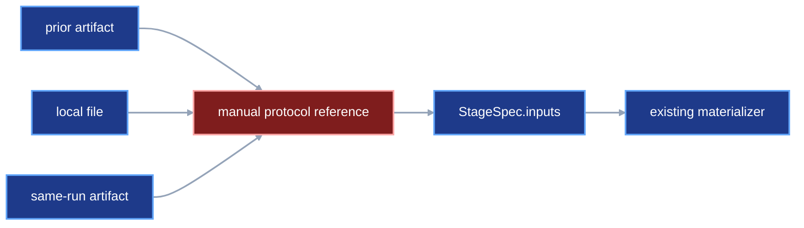
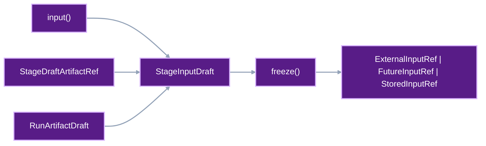

# Automatic artifact capture and input resolution

Users write decorated stage functions and typed parameter classes. VIPER
creates the references that connect one stage's output to another stage's
input. This contract defines how VIPER creates those references. A later
contract will define explicit harness mode.

## 1. Status

**Contract status:** planned.

These requirements bind the contract to the master checklist:

| ID | Implementation obligation |
| --- | --- |
| AIR-01 <!-- contract-requirement: AIR-01 phase=5 test=tests/test_public_api.py --> | Add the final stage decorators, parameter and `env` vocabulary, and `Train` and `Eval` keys. |
| AIR-02 <!-- contract-requirement: AIR-02 phase=5 test=tests/test_authoring.py --> | Add artifact and HTTP drafts with callable-backed freezing. |
| AIR-03 <!-- contract-requirement: AIR-03 phase=5 test=tests/test_authoring.py --> | Replace YAML-backed stage drafts with Python `StageSpecDraft` models and artifact handles. |
| AIR-04 <!-- contract-requirement: AIR-04 phase=6 test=tests/test_authoring.py --> | Compile experiment, variant, replicate, metric, stage, benchmark, and run documents from one plan. |
| AIR-05 <!-- contract-requirement: AIR-05 phase=7 test=tests/test_verification_acceptance.py --> | Compile local, same-run, and prior-run inputs and publish prior-run pointers through the selected destination. |
| AIR-06 <!-- contract-requirement: AIR-06 phase=11 test=tests/test_documentation.py --> | Remove retired authoring forms and publish the complete single-run Python workflow through freeze, run, benchmark, and restore. |

**Current:** Project code imports `download` or `train` from `viper.stages` and
uses that function as a decorator. A parameter class subclasses
`viper.parameters.Train`. Each stage function receives a `Context`. The
function reads input paths from
`context.inputs` and writes files at the paths in `context.artifacts`.
See [`README.md`](../../README.md#define-a-stage) and
[`src/viper/stages.py`](../../src/viper/stages.py).

**Current:** `DownloadSpec` accepts HTTP requests. `TrainSpec` accepts
`ExternalInputRef`, `StoredInputRef`, or `FutureInputRef`. Users must choose and
construct those internal reference objects themselves.
See [`src/viper/stages.py`](../../src/viper/stages.py).

**Current:** `Context.metrics` gives project stages live metric handles,
and `ExperimentSpec.metrics` stores complete `MetricSpec` records. Stage
authoring accepts bare metric IDs. Metric implementation binding and objective
designation remain outside the authoring model.
See [`src/viper/metrics.py`](../../src/viper/metrics.py) and
[`src/viper/experiments.py`](../../src/viper/experiments.py).

**Proposed:** Project code imports `build`, `embed`, `train`, or `eval` from
`viper.stages`. The decorator's `params=` argument selects the typed parameter
class. `stage()` from `viper.authoring` receives one validated instance of that
class. `download()` from `viper.authoring` creates the runner-owned HTTP stage
directly.

The keys in `plan.stages` become the stage IDs. A user can pass a local file, an
artifact from an earlier stage, or an artifact from an earlier run to
`stage()`. `freeze()` from `viper.authoring` converts that value into `ExternalInputRef`,
`FutureInputRef`, or `StoredInputRef`. For an earlier run, VIPER also writes an
`ArtifactPointer`.

Python authoring also selects configured metric drafts. Training and evaluation
stages require one objective metric. An embedding stage can select diagnostics
and may name an objective when its algorithm has one. A fixed encoder leaves
the objective unset.

This contract changes the Python API. It also makes VIPER execute
`DownloadSpec`. The four project-owned stage types keep using `Context`.
They also keep the same artifact and input paths. The download contract makes
`ResolvedHttpRetrieval.body` equal the matching
`ResolvedSingleFileArtifact.file`.

[`download-retrieval-artifacts.md`](download-retrieval-artifacts.md) owns that
receipt-to-artifact identity rule.
[`external-input-roots.md`](external-input-roots.md) owns repository-local
capture and `ResolvedExternalInputRef` verification. This contract owns the
Python expression that selects a local file or artifact and compiles the
internal input reference.
[`frozen-plan-git-identity.md`](frozen-plan-git-identity.md) owns the Git step
between generated plan files and execution.
[`experiment-expansion.md`](experiment-expansion.md) owns deterministic
variant-replicate expansion and bounded multi-run execution.
[`stage-reuse.md`](stage-reuse.md) owns the opt-in policy and evidence required
to skip a project-owned stage.

## 2. Required claim

When a user passes a VIPER artifact into a training stage, VIPER records which
stage produced it and which artifact the user chose. VIPER writes the required
input reference. The training function receives the verified path through
`Context.inputs`.

When the user authors training or evaluation, VIPER also requires one configured
objective. Freezing writes its complete `MetricSpec`, includes its ID in the
stage, and writes one `MetricObjectiveSpec` containing the metric ID and
improvement direction. The stage or metric worker then produces the
corresponding measurement.

The user writes the stage decorator, parameter class, and training function.
`freeze()` from `viper.authoring` writes a same-run reference or pointer. VIPER
executes each `DownloadSpec`. A function decorated with `@http` from
`viper.http` handles any project-specific HTTP request.
The user commits the generated plan files before execution. VIPER keeps that
plan commit separate from the source commit that identifies project code.

## 3. Current gap

The fixed scenario is:

```text
download a dataset
-> declare the downloaded dataset as a stage artifact
-> train a model on that dataset
```

The current path is:

```text
DownloadSpec.artifacts["dataset"]
-> completed download stage records the resolved artifact
-> TrainSpec.inputs["dataset"]
-> user selects FutureInputRef or StoredInputRef
-> runtime materializes the input
-> train(context) reads context.inputs["dataset"]
```

**Inspected:** `FutureInputRef` carries `producer_stage_id` and
`producer_artifact` for an earlier stage in the same run.
[`src/viper/inputs.py`](../../src/viper/inputs.py)

**Inspected:** `StoredInputRef` carries an `ArtifactPointerRef`, a
materialization path, and a data role for an artifact from a completed run.
[`src/viper/inputs.py`](../../src/viper/inputs.py)

**Inspected:** `freeze_run_plan()` validates authored stage specifications and
writes frozen stage and run files. It currently preserves the input reference
already present in the stage specification. Pointer-document construction
belongs to the proposed authoring operation.
[`src/viper/authoring.py`](../../src/viper/authoring.py)

**Inspected:** The executor follows `StoredInputRef.pointer` and calls
`verify_promoted_artifact()`. It then places the verified files at the declared
input path and passes that path to `Context`.
[`src/viper/execution/_materialization.py`](../../src/viper/execution/_materialization.py)

VIPER can already execute all three reference types. Users still have to create
the reference objects themselves. The proposed Python API accepts ordinary
files and artifact handles. `viper.authoring.freeze()` creates the required reference.

The metric runtime also exists. The missing authoring connector is:

```text
decorated metric implementation
-> Python authoring stops at a bare metric ID
-> parameter, dependency, and comparator values remain unbound
-> training and evaluation carry an unidentified objective
```

[`unified-metric-drafting.md`](unified-metric-drafting.md) owns the missing
metric connector. It defines `MetricDraft`, typed metric parameter delivery,
stage objectives, derived experiment metric registries, and benchmark metric
results.

### Current DAG



### Proposed-change DAG



### Integrated DAG


## 4. Contract models

### Protocol-owned stage keys

VIPER defines the map keys required by training and evaluation stages. The
exact `Train`, `Eval`, `EvalId`, and `DataRole` declarations are the
`P5-AIR-01` targets in [Accepted `ContractTarget`
declarations](#13-accepted-contracttarget-declarations).

The public import is:

```python
from viper.keys import Eval, Train
```

`Train` and `Eval` belong to the stage contracts that require these names.
The surrounding `inputs` or `artifacts` map states whether the stage reads or
writes the named value. Pydantic converts each `StrEnum` member to its string
value, so frozen YAML stores `model`, `state`, `test`, and `preds` as ordinary
map keys.

Project-defined keys remain strings or project-owned `StrEnum` members. For
example, `dataset` remains a project-defined training input name.

### Target stage decorators

The four project-owned stage decorators use `params=` for the parameter class:

```python
from my_cool_model_acronym.training import train_model
from pydantic import Field
from viper.keys import Train
from viper.stages import Context, train

class TrainParams(viper.params.Train):
    epochs: int = Field(ge=1)
    batch_size: int = Field(ge=1)
    learning_rate: float = Field(gt=0.0)
    momentum: float = Field(ge=0.0, lt=1.0)
    weight_decay: float = Field(ge=0.0)
    max_gradient_norm: float = Field(gt=0.0)


# The decorated function owns model computation. VIPER supplies frozen
# parameters, resolved input paths, output paths, metric handles, and RNGs.
@train(params=TrainParams)
def fit(context: Context[TrainParams]) -> None:
    dataset = context.inputs["dataset"]
    parameters = context.artifacts[Train.MODEL]
    train_model(
        dataset,
        parameters,
        epochs=context.params.epochs,
        batch_size=context.params.batch_size,
        learning_rate=context.params.learning_rate,
        momentum=context.params.momentum,
        weight_decay=context.params.weight_decay,
        max_gradient_norm=context.params.max_gradient_norm,
        metrics=context.metrics,
    )
```

The decorator records `TrainParams` as the parameter model. `viper.authoring.stage()`
later receives one complete `TrainParams` instance and places those values in
`TrainSpec.params`. The executor continues to pass a `Path` through
`context.inputs["dataset"]` and metric handles through `context.metrics`.

`P5-AIR-04` owns the complete stage decorator declarations. `P5-AIR-03` owns
the complete `http()` declaration.

`viper.params` is the public alias for the existing parameter categories in
`viper.parameters`. The persisted field remains `parameter_model` because it
stores a `ParameterModelRef`, while the Python authoring keyword is `params`.
The reference uses `owner="viper"` for a built-in base class and
`owner="project"` for a project subclass. Its path is relative to that owner's
source root.

[`unified-metric-drafting.md`](unified-metric-drafting.md) owns the complete
`ParameterModelOwner`, `PythonSourceRelPath`, and `ParameterModelRef`
declarations. `P5-AIR-01` moves the parameter declarations into the public
`viper.params` module without changing that owner rule.

### Target `env` vocabulary

Python identifiers and persisted field names use `env`. English prose,
`environment.yml`, and `os.environ` retain their existing meanings.

`P5-AIR-02` owns the complete runtime and protocol declarations that replace
the long environment identifiers with `env`. `P5-AIR-03` owns `EnvSecretRef`
because that declaration changes with the HTTP authoring boundary.

`observe_python_env()` returns `PythonEnvSpec`. `resolve_env()` converts one
`EnvSpec` into `ResolvedEnv`. `RunPlanDraft.env`, `RunSpec.env`,
`BaseSpecDraft.env`, `BaseSpec.env`, `ResolvedBaseSpec.env`, and
`ProcessStartupReceipt.env` carry those values through authoring, freezing,
execution, and verification. `HttpRequestSpec.credentials` accepts
`EnvSecretRef | None`.

GCE uses `GCEEnvSpec` and `ResolvedGCEEnv`; local execution uses
`LocalEnvSpec` and `ResolvedLocalEnv`.

### Target artifact and HTTP drafts

Users give VIPER four kinds of Python definitions:

```text
artifact loader function
-> ArtifactLoaderRef

HTTP function
-> HttpImplementationRef

parameter class
-> ParameterModelRef

metric function or stateful metric class
-> MetricImplementationRef
-> MetricSpec
```

`viper.authoring.freeze()` records the source file, Python symbol, SHA-256 digest, and
byte count for each definition. The frozen YAML stores those records.

The complete callable-backed artifact and HTTP declarations are the
`P5-AIR-03` targets. Existing frozen HTTP records that retain their field shape
remain defined by [`src/viper/http.py`](../../src/viper/http.py).

The HTTP vocabulary names the user action directly. `http()` from `viper.http`
decorates the function that sends the request. `download(http=request)` from
`viper.authoring` selects that function for the download stage. The frozen and
resolved records preserve its identity through these exact replacements:

| Current name | Target name |
| --- | --- |
| `http_transport(transport_id=...)` | `http(id=...)` in `viper.http` |
| `transport()` | Delete; pass the decorated function to `download(http=...)`. |
| `parameters.HttpTransport` | `parameters.Http` |
| `HttpTransportImplementationRef` | `HttpImplementationRef` |
| `BuiltinHttpTransportSpec` | `BuiltinHttpImplementationSpec` |
| `ProjectHttpTransportSpec` | `ProjectHttpImplementationSpec` |
| `HttpTransportSpec` | `HttpImplementationSpec` |
| `ResolvedHttpTransport` | `ResolvedHttpImplementation` |
| `HttpTransportContext` | `HttpContext` |
| `HttpTransportResult` | `HttpResult` |
| `transport_id` | `id` |
| `DownloadSpec.transport` | `DownloadSpec.http` |
| `ResolvedHttpRetrieval.transport` | `ResolvedHttpRetrieval.http` |

`viper.http` remains the defining public module for the decorator and its HTTP
types. The package root forwards none of those names.

VIPER is in alpha. Implementation removes the old Python names and serialized
field names in the same increment. Callers and stored fixtures must use the
target names immediately after that increment.

`ArtifactDraft.path` is relative to the selected run root. For example,
`artifacts/models/logistic_regression/model.pt` becomes:

```text
experiments/<experiment-id>/runs/<variant-id>/<run-id>/
artifacts/models/logistic_regression/model.pt
```

The compiler writes that full repository-relative value to `ArtifactSpec.path`.
The run-relative draft path lets one `VariantDraft` serve every declared
replicate while preserving the user's chosen artifact category, entity ID,
filename, and subdirectories.

A custom HTTP function can use VIPER's base settings. The complete callable
appears in the worked example; VIPER uses `viper.params.Http` when the
decorator omits `params=`.

A configurable HTTP function defines its own parameter class. The decorator's
`params=` argument receives the class. `viper.authoring.download(params=...)` receives
the values for one run. The decorator's `executables=` argument records any
external programs required by that function.

### Target metric and experiment drafts

[`unified-metric-drafting.md`](unified-metric-drafting.md#4-contract-models)
contains the complete `MetricDraft`, `MetricObjectiveDraft`, `MetricSpec`,
`MetricContext`, `ExperimentDraft`, and benchmark declarations. This contract
uses those models when a stage selects metrics or a run plan selects an
experiment.

### Target stage drafts

`DownloadSpecDraft` contains the requests, HTTP implementation, policy, and artifact
declarations. VIPER runs each request. The other four stage drafts contain one
decorated project function and one parameter object.

The complete Python draft hierarchy and `StageDraft.artifacts` handle are the
`P5-AIR-04` targets.

`DownloadSpecDraft` rejects unequal input and artifact keys and rejects every
artifact value except `SingleFileArtifactDraft`. The frozen `DownloadSpec`
repeats both checks, so direct frozen-model construction remains subject to
the one-request-to-one-file rule.

`TrainSpecDraft.objective` and `EvalSpecDraft.objective` are required.
`EmbedSpecDraft.objective` is optional. A fixed encoder can create embeddings
and leave the objective unset. An embedding implementation that optimizes or
scores an objective can supply one.

The compiler places `objective.metric.metric_id` first in the frozen
`metric_ids` tuple, followed by the IDs in `metrics`. It rejects duplicate IDs.
It freezes the metric ID and improvement direction as one
`MetricObjectiveSpec`. The mode rules come from
[`unified-metric-drafting.md`](unified-metric-drafting.md#7-verification).

### Target frozen download and resolved-stage models

Runner-owned download execution moves implementation identity and parameter
identity out of the common stage base. The target frozen models are:

The complete frozen stage declarations are the `P5-AIR-04` targets. They
retain the validators described below and consume the metric objective records
produced by `P4-UMD-03`.

`BaseSpec.validate_artifact_paths()` retains metric, artifact-category,
reserved-name, and artifact-overlap checks. The implementation-path collision
check moves to `ParameterizedSpec`, the class that owns `implementation`.
`DownloadSpec` drops `parameter_model` and `params`.

The target stage validators use the enum values after Pydantic converts them to
strings:

```text
TrainSpec.artifacts
-> requires model and state

TrainSpec.inputs
-> accepts model and state together for checkpoint continuation

EvalSpec.inputs
-> requires model and test

EvalSpec.artifacts
-> requires preds
```

The old `parameters`, `resume_state`, `evaluation_dataset`, and `predictions`
keys fail target-model validation.

`TrainSpec` and `EvalSpec` require `objective.metric_id` to appear in
`metric_ids`. `EmbedSpec` applies the same check when `objective` is present.
Run-plan verification loads the matching `MetricSpec` from `ExperimentSpec`
and checks the objective mode and direction.

This rule proves that the stage declared and measured an objective. An arbitrary
project-owned training function can still update weights with a different
calculation. Proving that the measured loss produced the gradients would require
VIPER to own the optimizer step or supply a differentiable objective interface.
The guarantee ends at objective declaration and measurement. The complete
example uses binary cross-entropy for both the optimizer loss and the reported
training objective.

The target `EvalSpec` accepts `ExternalInputRef`, `FutureInputRef`, or
`StoredInputRef` for `Eval.TEST` and every named split. Freezing and
preflight resolve each reference to its artifact declaration and require an
`eval` or `benchmark` data role. This replaces the active validator that
requires stored inputs solely because they were authored as pointers.

The Phase 5 resolved-stage changes are limited to `env`, `Eval`, and
`ResolvedEvalSpec` in `P5-AIR-02` and `P5-AIR-04`. The later stage-reuse
contract owns the execution-versus-reuse completion union and its corresponding
hierarchy.

`ResolvedDownloadSpec` records the environment and execution context of the
VIPER process that invoked the HTTP function. Each `ResolvedHttpRetrieval`
records the selected HTTP implementation, request, response, body identity,
and timestamps.
`ExecutedStageCompletion` retains the project source, environment, execution
context, process startup, invocation receipt, and child-process command used
by build, embed, train, and eval stages. `ReusedStageCompletion` points to the
receipt defined by [`stage-reuse.md`](stage-reuse.md).

When VIPER creates an `ArtifactPointer`, it publishes the pointer at the
selected storage destination. The frozen input stores the pointer's SHA-256
digest, byte count, and storage location:

```python
class ResolvedArtifactPointerRef(ResolvedFileRef):
    kind: Literal["artifact_pointer"] = "artifact_pointer"


class StoredInputRef(ProtocolModel):
    kind: Literal["stored"] = "stored"
    pointer: ResolvedArtifactPointerRef
    path: RepoRelPath
    data_role: DataRole


class ResolvedStoredInputRef(ProtocolModel):
    kind: Literal["stored"] = "stored"
    pointer: ResolvedArtifactPointerRef
```

`ResolvedArtifactPointerRef.stored_at` is a `StorageRef`. Local publication
stores a `LocalFileRef` there. Cloud publication stores a
`ViperCloudFileRef`. The `StoredInputRef` validator checks
`pointer.stored_at.path` against the required pointer path. It also checks the
path where VIPER will place the selected artifact.

The active-to-target field changes are:

| Active field | Target field | Reason |
| --- | --- | --- |
| `StoredInputRef.pointer: ArtifactPointerRef` | `StoredInputRef.pointer: ResolvedArtifactPointerRef` | Automatic freezing needs an exact pointer reference before a Git commit exists. |
| `ResolvedArtifactPointerRef.stored_at: ArtifactPointerRef` | Inherited `ResolvedFileRef.stored_at: StorageRef` | The generated pointer records the local or cloud destination that received its immutable bytes. |
| `ResolvedStoredInputRef.pointer: ResolvedArtifactPointerRef` | Retain | The resolved stage records the exact pointer selected by the frozen input. |
| `BaseSpecDraft.metric_ids: tuple[MetricId, ...]` | `BaseSpecDraft.metrics: tuple[MetricDraft, ...]` | Python authoring carries the complete metric configuration and removes bare strings from this layer. |
| Train objective field absent | `TrainSpecDraft.objective: MetricObjectiveDraft` and `TrainSpec.objective: MetricObjectiveSpec` | Training records its primary metric and improvement direction. |
| Evaluation objective field absent | `EvalSpecDraft.objective: MetricObjectiveDraft` and `EvalSpec.objective: MetricObjectiveSpec` | Evaluation records its primary recomputed metric and improvement direction. |
| Embed objective field absent | Optional `MetricObjectiveDraft` and `MetricObjectiveSpec` fields | Optimizing embedding algorithms can name an objective; fixed encoders leave it unset. |
| Public artifact draft paths | `ArtifactDraft.path: RunArtifactPath` | The compiler prefixes the selected run root and writes the concrete repository-relative `ArtifactSpec.path`. |
| Repeated experiment identity on `RunPlanDraft` | `RunPlanDraft.experiment: ExperimentDraft` plus selected variant and replicate IDs | The experiment owns factors, variants, replicates, and derived metric definitions. |

Explicit harness mode may accept an `ArtifactPointerRef` authored in Git. The
compiler retrieves that file, checks its bytes, and writes the resulting
`ResolvedArtifactPointerRef` into the frozen `StoredInputRef`.

The active resolved model places `source`, `startup`, `invocation`, and
`command` on `ResolvedBaseSpec`. The target moves those four fields to
`ResolvedParameterizedSpec`. Verification moves the implementation-source and
invocation checks with them. Download verification uses
`ResolvedHttpRetrieval.http`, the request-response rules, and the shared
artifact-file identity.

`StageDraft.spec.artifacts` contains the run-relative path, loader, and data
role. The compiler prefixes the selected run root when it creates
`BaseSpec.artifacts`. `StageDraft.artifacts` returns opaque Python
handles that another draft can select as inputs. The public workflow uses the
handle; `StageDraftArtifactRef` remains an authoring-layer type.

The Phase 5 `RunPlanDraft` maps stage IDs directly to `StageDraft` values.
Master Phase 6 replaces that intermediate shape with the final experiment,
variant, replicate, and benchmark composition.

The compiler selects
`RunPlanDraft.experiment.variants[RunPlanDraft.variant]` and walks that
variant's `stages` mapping in insertion order. For each
`StageDraftArtifactRef`, it finds the key whose `StageDraft` is the handle's
`producer`. That key becomes `StageArtifactRef.stage_id` and then
`FutureInputRef.producer_stage_id`.

The compiler applies that ownership rule to every variant. It also requires
each variant's estimator to select an artifact from a train stage in the same
variant. Cross-variant artifact handles and estimators stop freezing.

The authoring compiler derives frozen input records from the selected values:

```text
StageDraftArtifactRef whose producer belongs to the selected VariantDraft
-> StageArtifactRef with the producer's plan key
-> FutureInputRef

ExternalInputDraft selecting one repository file
-> ExternalInputRef

RunArtifactDraft identifying one artifact in a completed run
-> generated ArtifactPointer
-> bind_run_destination(repository root, run ID, configured destination)
-> publish_resolved_files(repository root, configured destination)
-> ResolvedArtifactPointerRef with a self-locating StorageRef
-> StoredInputRef
```

The compiler also derives every frozen artifact path:

```text
ArtifactDraft.path
+ experiments/<experiment-id>/runs/<variant-id>/<run-id>/
-> ArtifactSpec.path
```

The input-map key supplies the consumer input name. The selected artifact
declaration supplies its path and data role. The selected variant's stage key
supplies the producer stage ID. The selected artifact name supplies the
producer artifact.

The compiler collects every `MetricDraft` reachable through
`StageDraft.spec.objective.metric` and `StageDraft.spec.metrics`. It writes the
`ExperimentSpec` and selected `VariantSpec` defined by
`RunPlanDraft.experiment`. It derives the selected seed from the replicate. The
complete experiment merge rules belong to
[`unified-metric-drafting.md`](unified-metric-drafting.md#experiment-drafts).

### Target public constructors

`P5-AIR-03` owns `artifact()`. `P5-AIR-04` owns `input()`, `run_artifact()`,
`download()`, `stage()`, and `freeze_run_plan()`. Master Phase 6 owns the final
`plan()` and `freeze()` convenience functions after experiment, variant, and
replicate drafts exist.

`artifact()` from `viper.artifacts` declares one named stage output. Omitting `kind` returns a
`SingleFileArtifactDraft`. Passing `kind="bundle"` returns a
`BundleArtifactDraft` whose path names the bundle's directory root.

```python
from viper.artifacts import artifact


model = artifact(
    path="artifacts/models/classifier/model.pt",
    loader=load_weights,
    data_role="training",
)

tokenizer = artifact(
    path="artifacts/models/classifier/tokenizer",
    loader=load_tokenizer,
    data_role="training",
    kind="bundle",
)
```

Both drafts carry the same authoring fields. Their `kind` value controls which
frozen `ArtifactSpec` and resolved artifact type VIPER writes. A download stage
accepts the single-file form because each HTTP response has one body. Project
stages accept either form.

`input()` from `viper.authoring` declares one repository file whose bytes enter VIPER at the
consuming stage. It returns `ExternalInputDraft`. Freezing converts that draft
into `ExternalInputRef`. Same-run inputs use `stage.artifacts[name]`; prior-run
inputs use `run_artifact()` from `viper.authoring`.

The result exposes the paths consumed by later public operations:

```python
class FrozenPlanFiles(BaseModel):
    model_config = ConfigDict(extra="forbid", frozen=True)

    run: RunSpec
    files: tuple[Path, ...] = Field(min_length=1)
    run_spec_path: Path
    benchmark_spec_path: Path | None = None
```

The complete plan-commit contract belongs to
[`frozen-plan-git-identity.md`](frozen-plan-git-identity.md). The user commits
every path in `files` before execution. `run_spec_path` and a present
`benchmark_spec_path` occur in that tuple.

`viper.authoring.stage()` replaces hand-written stage YAML during authoring. It returns a
`StageDraft` that describes one future stage: the decorated function, parameter
values, inputs, and artifact declarations. `viper.authoring.freeze()` later writes the
canonical YAML. The run command executes the frozen stage.

`viper.authoring.stage()` reads the stage kind and parameter class attached by the
decorator. It rejects a `params` instance whose class differs from the
decorator's class. `viper.authoring.download()` constructs `DownloadSpecDraft` directly
because the runner owns download execution. `http=None` selects
`BuiltinHttpImplementationSpec()`. A decorated HTTP function produces
`CustomHttpDraft`. `params=None` creates the package-owned `viper.params.Http`
value when that function uses the base parameter class.

`viper.authoring.freeze()` gathers every objective and additional metric selected by the
stage drafts. It writes one `MetricSpec` per metric ID into the experiment
record and one `MetricObjectiveSpec` into each stage that names an objective.
`viper.authoring.experiment()` supplies factors, variants, and replicates. The compiler
derives one metric list from their stage selections. The complete rules belong to
[`unified-metric-drafting.md`](unified-metric-drafting.md).

### Complete proposed authoring example
<!-- contract-worked-example: start -->

**Illustrative example:** this program shows the complete target API. The
constructors and shortened decorator names remain proposed until this contract
is implemented.

The example authors one candidate run and one benchmark. The candidate performs
five stages:

```text
download fixed training data
-> build a normalization profile from that data and a local feature schema
-> embed the training rows
-> train logistic regression on the training embeddings
-> evaluate the trained weights on test embeddings and a split from one
   completed benchmark-data run
```

The embed stage records reconstruction loss and embedding spread as
diagnostics. It leaves the optional objective unset. The training stage requires
and records binary cross-entropy as its objective. It also records gradient norm.
The evaluation stage requires independently recomputed binary cross-entropy as
its objective and independently recomputes accuracy.

Create this file.

`served/training.csv`:

```csv
row_id,feature_a,feature_b,label
0,0.0,0.1,0
1,0.2,0.0,0
2,0.4,0.3,0
3,0.6,0.5,0
4,1.0,1.1,1
5,1.2,0.9,1
6,1.4,1.3,1
7,1.6,1.5,1
```

Create the local schema selected by the build stage.

`inputs/feature_schema.json`:

```json
{
  "row_id": "row_id",
  "features": ["feature_a", "feature_b"],
  "label": "label"
}
```

Serve it from the repository root:

```bash
python -m http.server 8000 --directory served
```

The request freezes this byte identity:

| Input | Bytes | SHA-256 |
| --- | ---: | --- |
| `training_dataset` | 129 | `25421068ec05e0f6d703a2deb3472c186efb5301a2c6af75758370db4921b8b1` |

The completed run at `BENCHMARK_DATA_RUN` already contains an `embed_test`
artifact named `embeddings` and a `split_test` artifact named `holdout`. Those
two prior-run artifacts become both the evaluation inputs and the benchmark's
fixed test conditions.

The complete authoring program is heavily commented because each public call
creates a value consumed by a later call. Read the comments in order to follow
that dependency chain.

<!-- complete-authoring-example: start -->

```python

# models.py

from __future__ import annotations

import csv
import json
import math
import subprocess
from pathlib import Path

import httpx
import torch
from pydantic import Field
from torch import Tensor, nn
from torch.nn import functional as F
from torch.nn.utils import clip_grad_norm_
from torch.utils.data import TensorDataset
from torchdata.stateful_dataloader import StatefulDataLoader

from viper import execution, params
from viper.artifacts import artifact
from viper.authoring import (
    download,
    expand,
    experiment,
    factor,
    freeze,
    input,
    plan,
    replicate,
    run_artifact,
    stage,
    variant,
)
from viper.benchmark import at_least, at_most, benchmark
from viper.catalog import MeasurementQuery, catalog
from viper.http import (
    HttpRequestSpec,
    HttpRetrievalError,
    HttpRetrievalPolicy,
    HttpContext,
    HttpResult,
    ObservedHttpResponse,
    http,
)
from viper.keys import Eval, Train
from viper.metrics import (
    FloatComparator,
    MetricContext,
    MetricDependency,
    measure,
    metric,
    min,
)
from viper.references import GitFileRef, GitSource
from viper.resume import (
    DataLoaderConfiguration,
    ResumeState,
    capture_resume_state,
    load_resume_state,
    save_resume_state,
)
from viper.runtime import (
    LocalEnvSpec,
    NumPyRandomnessSpec,
    ParallelismSpec,
    ReproducibilitySpec,
    TorchDeterminismSpec,
    TorchPrecisionSpec,
    observe_python_env,
)
from viper.stages import Context, build, embed, eval, train


# Repository identity becomes RunSpec.source. The run ID selects one concrete
# output root when freeze() turns reusable drafts into frozen records.
REPOSITORY = "https://github.com/example/tiny-viper-model"
RUN_ID = "01ARZ3NDEKTSV4RRFFQ69G5FAV"
BENCHMARK_DATA_RUN = Path(
    "experiments/benchmark_data/runs/release/"
    "01ARZ3NDEKTSV4RRFFQ69G5FAA/resolved.yaml"
)

# Artifact draft paths are relative to the run root. Freezing places each path
# beneath the selected experiment, variant, and run directory.
TRAINING_DATASET_PATH = "artifacts/datasets/training_set/training.csv"
NORMALIZATION_PATH = "artifacts/datasets/training_set/normalization.json"
TRAINING_EMBEDDINGS_PATH = "artifacts/models/training_embeddings/embeddings.csv"
WEIGHTS_PATH = "artifacts/models/logistic_regression/model.pt"
STATE_PATH = "artifacts/models/logistic_regression/state.pt"
PREDICTIONS_PATH = "artifacts/evals/holdout/preds.csv"


# The source commit identifies the exact project definitions inspected during
# freezing. The generated YAML receives a separate plan commit later.
def current_commit() -> str:
    return subprocess.run(
        ("git", "rev-parse", "HEAD"),
        check=True,
        capture_output=True,
        text=True,
    ).stdout.strip()


def read_csv(path: Path) -> list[dict[str, str]]:
    with path.open(newline="", encoding="utf-8") as source:
        return list(csv.DictReader(source))


def load_dataset(path: Path) -> list[dict[str, str]]:
    return read_csv(path)


# Freezing records each loader's byte-addressed identity. Execution and
# verification call the loader on artifact files. Stages receive normal Paths.
def load_json_object(path: Path) -> dict[str, object]:
    value = json.loads(path.read_text(encoding="utf-8"))
    if not isinstance(value, dict):
        raise TypeError("JSON artifact must contain an object")
    return value


def load_split(path: Path) -> tuple[int, ...]:
    return tuple(int(row["row_id"]) for row in read_csv(path))


def load_embeddings(path: Path) -> list[dict[str, str]]:
    return read_csv(path)


def load_weights(path: Path) -> dict[str, Tensor]:
    value = torch.load(path, map_location="cpu", weights_only=True)
    if not isinstance(value, dict):
        raise TypeError("parameter artifact must contain a state dictionary")
    return value


def load_resume_state_artifact(path: Path) -> ResumeState:
    return load_resume_state(path)


def load_predictions(path: Path) -> list[dict[str, str]]:
    return read_csv(path)


# A custom HTTP function sends the request. VIPER supplies the frozen request,
# retrieval policy, credential, scratch destination, and base parameters.
@http(id="project_httpx")
def request(
    context: HttpContext[params.Http],
) -> HttpResult:
    headers = dict(context.request.headers)
    if context.credential is not None:
        headers[context.credential.header] = (
            f"{context.credential.prefix}{context.credential.value}"
        )

    context.destination.parent.mkdir(parents=True, exist_ok=True)
    allowed_response_headers = {
        "content-type",
        "content-encoding",
        "content-length",
        "etag",
        "last-modified",
        "digest",
        "content-digest",
    }

    with httpx.Client(follow_redirects=False, trust_env=False) as client:
        with client.stream(
            context.request.method,
            str(context.request.url),
            headers=headers,
            timeout=context.policy.timeout_seconds,
        ) as response:
            body_bytes = 0
            with context.destination.open("wb") as destination:
                for chunk in response.iter_bytes(chunk_size=64 * 1024):
                    body_bytes += len(chunk)
                    if body_bytes > context.policy.max_body_bytes:
                        raise HttpRetrievalError(
                            "HTTP body exceeds the policy limit"
                        )
                    destination.write(chunk)

            persisted_headers = {
                name.lower(): value
                for name, value in response.headers.items()
                if name.lower() in allowed_response_headers
            }
            return HttpResult(
                body=context.destination,
                response=ObservedHttpResponse(
                    response_url=str(response.url),
                    status=response.status_code,
                    response_headers=persisted_headers,
                ),
            )


# download() declares a runner-owned stage. The request key and artifact
# key match, so one successful response becomes one named single-file artifact.
# The http= argument selects the decorated request function. This example uses
# the package-owned empty parameter model because the policy and function body
# contain every HTTP setting.
download = download(
    inputs={
        "training_dataset": HttpRequestSpec(
            url="http://127.0.0.1:8000/training.csv",
            version="tiny-v1",
            expected_body_sha256=(
                "25421068ec05e0f6d703a2deb3472c18"
                "6efb5301a2c6af75758370db4921b8b1"
            ),
            expected_body_bytes=129,
        ),
    },
    http=request,
    policy=HttpRetrievalPolicy(
        allowed_schemes=frozenset({"http"}),
        allowed_hosts=frozenset({"127.0.0.1"}),
        allowed_ports=frozenset({8000}),
        accepted_statuses=frozenset({200}),
        max_redirects=0,
        max_body_bytes=4096,
        timeout_seconds=10.0,
    ),
    artifacts={
        "training_dataset": artifact(
            path=TRAINING_DATASET_PATH,
            loader=load_dataset,
            data_role="training",
        ),
    },
)


# Live metrics receive values from a running stage. Recomputed metrics read
# published artifacts after the stage finishes.
@metric(
    metric_id="embedding_reconstruction_loss",
    mode="live",
)
def embedding_reconstruction_loss(
    context: MetricContext[params.Metric],
    values: list[float],
) -> float:
    return sum(values) / len(values)


@metric(
    metric_id="embedding_spread",
    mode="live",
)
def embedding_spread(
    context: MetricContext[params.Metric],
    values: list[float],
) -> float:
    mean = sum(values) / len(values)
    return sum((value - mean) ** 2 for value in values) / len(values)


@metric(
    metric_id="training_loss",
    mode="live",
)
def training_loss(
    context: MetricContext[params.Metric],
    batch_losses: list[float],
) -> float:
    return sum(batch_losses) / len(batch_losses)


@metric(
    metric_id="gradient_norm",
    mode="live",
)
def gradient_norm(
    context: MetricContext[params.Metric],
    batch_norms: list[float],
) -> float:
    return max(batch_norms)


class LossMetricParams(params.Metric):
    epsilon: float = Field(gt=0.0, lt=0.5)
    label_column: str = Field(min_length=1)
    probability_column: str = Field(min_length=1)
    positive_label: int
    negative_label: int


@metric(
    metric_id="evaluation_loss",
    mode="recompute",
)
def evaluation_loss(
    context: MetricContext[LossMetricParams],
) -> float:
    params = context.params
    rows = load_predictions(context.artifacts[Eval.PREDS])
    losses = []
    for row in rows:
        observed_label = int(row[params.label_column])
        if observed_label == params.positive_label:
            label = 1.0
        elif observed_label == params.negative_label:
            label = 0.0
        else:
            raise ValueError("prediction contains an unknown label")

        probability = float(row[params.probability_column])
        clipped = min(max(probability, params.epsilon), 1.0 - params.epsilon)
        losses.append(
            -label * math.log(clipped)
            - (1.0 - label) * math.log(1.0 - clipped)
        )
    return sum(losses) / len(losses)


@metric(
    metric_id="evaluation_accuracy",
    mode="recompute",
)
def evaluation_accuracy(
    context: MetricContext[params.Metric],
) -> float:
    rows = load_predictions(context.artifacts[Eval.PREDS])
    correct = sum(
        int(row["prediction"]) == int(row["label"])
        for row in rows
    )
    return correct / len(rows)


# measure() supplies concrete parameters, dependencies, and comparison
# rules. The resulting drafts can be reused by stages and benchmarks.
embedding_reconstruction_metric = measure(
    embedding_reconstruction_loss
)
embedding_spread_metric = measure(embedding_spread)
training_loss_metric = measure(training_loss)
gradient_norm_metric = measure(gradient_norm)

prediction_dependency = MetricDependency(
    source="artifact",
    name=Eval.PREDS,
    required_data_role="eval",
)
evaluation_loss_metric = measure(
    evaluation_loss,
    params=LossMetricParams(
        epsilon=1e-7,
        label_column="label",
        probability_column="probability",
        positive_label=1,
        negative_label=0,
    ),
    dependencies=(prediction_dependency,),
    comparator=FloatComparator(mode="absolute", tolerance=1e-12),
)
evaluation_accuracy_metric = measure(
    evaluation_accuracy,
    dependencies=(prediction_dependency,),
    comparator=FloatComparator(),
)


# input() declares bytes that already exist in the repository. The
# build stage receives an attempt-owned capture of this file, while the
# download artifact reaches the same stage through a same-run artifact handle.
feature_schema = input(
    path="inputs/feature_schema.json",
    data_role="training",
)


class BuildParams(params.Build):
    min_rows: int = Field(ge=2)
    expected_feature_count: int = Field(ge=1)
    standard_deviation_floor: float = Field(gt=0.0)
    require_unique_row_ids: bool
    allowed_labels: tuple[int, ...] = Field(min_length=2)


# The build stage turns source data and a local schema into a reusable profile.
# Each BuildParams field controls one validation or calculation below.
@build(params=BuildParams)
def build_normalization(
    context: Context[BuildParams],
) -> None:
    rows = load_dataset(context.inputs["dataset"])
    schema = load_json_object(context.inputs["schema"])
    params = context.params

    if len(rows) < params.min_rows:
        raise ValueError("training data contains too few rows")

    raw_features = schema.get("features")
    if not isinstance(raw_features, list):
        raise TypeError("feature schema must contain a feature list")
    feature_names = tuple(str(name) for name in raw_features)
    if len(feature_names) != params.expected_feature_count:
        raise ValueError("feature schema has the wrong feature count")

    row_id_column = str(schema["row_id"])
    label_column = str(schema["label"])
    row_ids = [int(row[row_id_column]) for row in rows]
    if params.require_unique_row_ids and len(row_ids) != len(set(row_ids)):
        raise ValueError("training row IDs must be unique")

    allowed_labels = set(params.allowed_labels)
    if any(int(row[label_column]) not in allowed_labels for row in rows):
        raise ValueError("training data contains an unknown label")

    means: dict[str, float] = {}
    scales: dict[str, float] = {}
    for feature_name in feature_names:
        values = [float(row[feature_name]) for row in rows]
        mean = sum(values) / len(values)
        variance = sum((value - mean) ** 2 for value in values) / len(values)
        means[feature_name] = mean
        scales[feature_name] = max(
            math.sqrt(variance),
            params.standard_deviation_floor,
        )

    output = context.artifacts["normalization"]
    output.parent.mkdir(parents=True, exist_ok=True)
    output.write_text(
        json.dumps(
            {
                "features": feature_names,
                "means": means,
                "scales": scales,
            },
            sort_keys=True,
        ),
        encoding="utf-8",
    )


BUILD_PARAMS = BuildParams(
    min_rows=8,
    expected_feature_count=2,
    standard_deviation_floor=1e-6,
    require_unique_row_ids=True,
    allowed_labels=(0, 1),
)

normalization = stage(
    build_normalization,
    params=BUILD_PARAMS,
    inputs={
        "dataset": download.artifacts["training_dataset"],
        "schema": feature_schema,
    },
    artifacts={
        "normalization": artifact(
            path=NORMALIZATION_PATH,
            loader=load_json_object,
            data_role="training",
        ),
    },
)


class EmbedParams(params.Embed):
    proj_a: float
    proj_b: float
    proj_bias: float
    min_proj_norm: float = Field(gt=0.0)
    clip_magnitude: float = Field(gt=0.0)
    output_decimals: int = Field(ge=1, le=12)


@embed(params=EmbedParams)
def embed(context: Context[EmbedParams]) -> None:
    rows = load_dataset(context.inputs["dataset"])
    normalization_profile = load_json_object(
        context.inputs["normalization"]
    )
    params = context.params

    means = normalization_profile["means"]
    scales = normalization_profile["scales"]
    if not isinstance(means, dict) or not isinstance(scales, dict):
        raise TypeError("normalization artifact has invalid statistics")

    proj_norm = math.hypot(
        params.proj_a,
        params.proj_b,
    )
    if proj_norm < params.min_proj_norm:
        raise ValueError("embedding proj norm is too small")

    unit_a = params.proj_a / proj_norm
    unit_b = params.proj_b / proj_norm
    embedded_rows: list[tuple[int, float, int]] = []
    reconstruction_errors: list[float] = []

    for row in rows:
        standardized_a = (
            float(row["feature_a"]) - float(means["feature_a"])
        ) / float(scales["feature_a"])
        standardized_b = (
            float(row["feature_b"]) - float(means["feature_b"])
        ) / float(scales["feature_b"])

        value = (
            standardized_a * unit_a
            + standardized_b * unit_b
            + params.proj_bias
        )
        value = max(-params.clip_magnitude, min(params.clip_magnitude, value))
        value = round(value, params.output_decimals)
        reconstructed_a = value * unit_a
        reconstructed_b = value * unit_b
        reconstruction_errors.append(
            (
                (standardized_a - reconstructed_a) ** 2
                + (standardized_b - reconstructed_b) ** 2
            )
            / 2.0
        )
        embedded_rows.append(
            (int(row["row_id"]), value, int(row["label"]))
        )

    context.metrics["embedding_reconstruction_loss"].record(
        reconstruction_errors
    )
    context.metrics["embedding_spread"].record(
        [row[1] for row in embedded_rows]
    )

    output = context.artifacts["embeddings"]
    output.parent.mkdir(parents=True, exist_ok=True)
    with output.open("w", newline="", encoding="utf-8") as destination:
        writer = csv.writer(destination)
        writer.writerow(("row_id", "embedding", "label"))
        writer.writerows(embedded_rows)


EMBED_PARAMS = EmbedParams(
    proj_a=0.8,
    proj_b=0.6,
    proj_bias=0.0,
    min_proj_norm=1e-6,
    clip_magnitude=8.0,
    output_decimals=8,
)

# The two input handles become two FutureInputRef records during freezing.
# Both producer stages occur earlier in the same variant stage mapping.
training_embeddings = stage(
    embed,
    params=EMBED_PARAMS,
    inputs={
        "dataset": download.artifacts["training_dataset"],
        "normalization": normalization.artifacts["normalization"],
    },
    artifacts={
        "embeddings": artifact(
            path=TRAINING_EMBEDDINGS_PATH,
            loader=load_embeddings,
            data_role="training",
        ),
    },
    metrics=(
        embedding_reconstruction_metric,
        embedding_spread_metric,
    ),
)

class TrainParams(params.Train):
    epochs: int = Field(ge=1)
    batch_size: int = Field(ge=1)
    learning_rate: float = Field(gt=0.0)
    momentum: float = Field(ge=0.0, lt=1.0)
    weight_decay: float = Field(ge=0.0)
    max_gradient_norm: float = Field(gt=0.0)


# The decorated function owns model computation. VIPER supplies frozen
# parameters, resolved input paths, output paths, metric handles, and RNGs.
@train(params=TrainParams)
def train(context: Context[TrainParams]) -> None:
    rows = load_embeddings(context.inputs["dataset"])
    features = torch.tensor(
        [[float(row["embedding"])] for row in rows],
        dtype=torch.float32,
    )
    labels = torch.tensor(
        [float(row["label"]) for row in rows],
        dtype=torch.float32,
    )

    dataloader = StatefulDataLoader(
        TensorDataset(features, labels),
        batch_size=context.params.batch_size,
        shuffle=True,
        num_workers=0,
    )
    model = nn.Linear(in_features=1, out_features=1)
    optimizer = torch.optim.SGD(
        model.parameters(),
        lr=context.params.learning_rate,
        momentum=context.params.momentum,
        weight_decay=context.params.weight_decay,
    )

    for epoch in range(context.params.epochs):
        batch_losses: list[float] = []
        batch_gradient_norms: list[float] = []

        for batch_features, batch_labels in dataloader:
            optimizer.zero_grad(set_to_none=True)
            logits = model(batch_features).squeeze(1)
            loss = F.binary_cross_entropy_with_logits(
                logits,
                batch_labels,
            )
            loss.backward()
            norm = clip_grad_norm_(
                model.parameters(),
                context.params.max_gradient_norm,
            )
            optimizer.step()

            batch_losses.append(float(loss.detach()))
            batch_gradient_norms.append(float(norm))

        context.metrics["training_loss"].record(
            batch_losses,
            epoch=epoch,
        )
        context.metrics["gradient_norm"].record(
            batch_gradient_norms,
            epoch=epoch,
        )

    weights_path = context.artifacts[Train.MODEL]
    weights_path.parent.mkdir(parents=True, exist_ok=True)
    torch.save(model.state_dict(), weights_path)

    resume_state = capture_resume_state(
        optimizer,
        dataloader,
        context.numpy_generators,
        capture_legacy_global=True,
    )
    save_resume_state(
        context.artifacts[Train.STATE],
        resume_state,
    )


TRAIN_PARAMS = TrainParams(
    epochs=40,
    batch_size=4,
    learning_rate=0.15,
    momentum=0.9,
    weight_decay=0.001,
    max_gradient_norm=1.0,
)

# The same-run embeddings handle becomes FutureInputRef. Train.MODEL and
# Train.STATE use protocol-owned keys because later stages understand them.
# reuse="verified" permits VIPER to select a prior verified training result
# only when the complete reuse key, including the run seed, matches.
training = stage(
    train,
    params=TRAIN_PARAMS,
    inputs={"dataset": training_embeddings.artifacts["embeddings"]},
    artifacts={
        Train.MODEL: artifact(
            path=WEIGHTS_PATH,
            loader=load_weights,
            data_role="training",
        ),
        Train.STATE: artifact(
            path=STATE_PATH,
            loader=load_resume_state_artifact,
            data_role="training",
        ),
    },
    objective=min(training_loss_metric),
    metrics=(gradient_norm_metric,),
    reuse="verified",
)


# run_artifact() selects immutable outputs from one completed data run.
# Freezing publishes one pointer for each selection and reuses those pointers
# in both the evaluation stage and the benchmark definition.
benchmark_test = run_artifact(
    resolved_run=BENCHMARK_DATA_RUN,
    stage="embed_test",
    artifact="embeddings",
)

benchmark_split = run_artifact(
    resolved_run=BENCHMARK_DATA_RUN,
    stage="split_test",
    artifact="holdout",
)


class EvalParams(params.Eval):
    batch_size: int = Field(ge=1)
    decision_threshold: float = Field(gt=0.0, lt=1.0)
    temperature: float = Field(gt=0.0)
    probability_floor: float = Field(gt=0.0, lt=0.5)
    positive_label: int
    negative_label: int


@eval(params=EvalParams)
def eval_model(context: Context[EvalParams]) -> None:
    if context.params.positive_label == context.params.negative_label:
        raise ValueError("evaluation labels must differ")

    rows = load_embeddings(context.inputs[Eval.TEST])
    selected_rows = set(load_split(context.inputs["holdout"]))
    selected = [
        row for row in rows if int(row["row_id"]) in selected_rows
    ]

    model = nn.Linear(in_features=1, out_features=1)
    model.load_state_dict(load_weights(context.inputs[Eval.MODEL]))
    model.eval()

    predictions: list[tuple[int, int, float, int]] = []
    with torch.no_grad():
        for offset in range(0, len(selected), context.params.batch_size):
            batch = selected[offset : offset + context.params.batch_size]
            features = torch.tensor(
                [[float(row["embedding"])] for row in batch],
                dtype=torch.float32,
            )
            logits = model(features).squeeze(1) / context.params.temperature
            probabilities = torch.sigmoid(logits).clamp(
                min=context.params.probability_floor,
                max=1.0 - context.params.probability_floor,
            )
            for row, probability in zip(batch, probabilities, strict=True):
                value = float(probability)
                predictions.append(
                    (
                        int(row["row_id"]),
                        int(row["label"]),
                        value,
                        (
                            context.params.positive_label
                            if value >= context.params.decision_threshold
                            else context.params.negative_label
                        ),
                    )
                )

    output = context.artifacts[Eval.PREDS]
    output.parent.mkdir(parents=True, exist_ok=True)
    with output.open("w", newline="", encoding="utf-8") as destination:
        writer = csv.writer(destination)
        writer.writerow(
            ("row_id", "label", "probability", "prediction")
        )
        writer.writerows(predictions)


# The model handle is a same-run edge. The test and split handles are prior-run
# edges. All three become normal paths in the evaluation Context.
eval_stage = stage(
    eval_model,
    params=EvalParams(
        batch_size=2,
        decision_threshold=0.5,
        temperature=1.0,
        probability_floor=1e-7,
        positive_label=1,
        negative_label=0,
    ),
    inputs={
        Eval.MODEL: training.artifacts[Train.MODEL],
        Eval.TEST: benchmark_test,
        "holdout": benchmark_split,
    },
    artifacts={
        Eval.PREDS: artifact(
            path=PREDICTIONS_PATH,
            loader=load_predictions,
            data_role="eval",
        ),
    },
    objective=min(evaluation_loss_metric),
    metrics=(evaluation_accuracy_metric,),
    eval_id="holdout",
    split_inputs=("holdout",),
)


# Source, environment, and reproducibility records freeze the code and runtime
# conditions that can change the produced bytes.
source_commit = current_commit()
source = GitSource(
    repository=REPOSITORY,
    commit=source_commit,
)
env = LocalEnvSpec(
    lockfile=GitFileRef(
        repository=REPOSITORY,
        commit=source_commit,
        path="pyproject.toml",
    ),
    python_env=observe_python_env(),
)
reproducibility = ReproducibilitySpec(
    determinism=TorchDeterminismSpec(
        deterministic_algorithms=True,
        deterministic_warn_only=False,
        cudnn_deterministic=True,
        cudnn_benchmark=False,
        cublas_workspace_config=":4096:8",
    ),
    precision=TorchPrecisionSpec(
        float32_matmul_precision="highest",
        cudnn_allow_tf32=False,
        autocast_enabled=False,
        autocast_dtype=None,
    ),
    parallelism=ParallelismSpec(
        process_count=1,
        torch_intraop_threads=1,
        torch_interop_threads=1,
        dataloader=DataLoaderConfiguration(workers=0),
    ),
    numpy_randomness=NumPyRandomnessSpec(
        generators={"training": "PCG64"},
        capture_legacy_global=True,
    ),
)


regularization = factor(levels=("none", "l2"))

# The benchmark enters the plan below. Its test and split remain prior-run
# artifacts because BenchmarkDraft fixes immutable evaluation conditions.
# Criteria add pass/fail decisions without changing the recorded measurements.
benchmark = benchmark(
    benchmark_id="tiny_holdout",
    eval_id="holdout",
    test=benchmark_test,
    splits={"holdout": benchmark_split},
    metrics=(evaluation_loss_metric, evaluation_accuracy_metric),
    criteria=(
        at_most(evaluation_loss_metric, 0.35),
        at_least(evaluation_accuracy_metric, 0.75),
    ),
)


# The experiment owns reusable factors, variants, and seeded replicates. Stage
# IDs come from the variant's mapping keys, so each StageDraft stays reusable.
experiment = experiment(
    experiment_id="tiny_http",
    factors={
        "regularization": regularization,
    },
    variants={
        "l2": variant(
            levels={"regularization": "l2"},
            stages={
                "download": download,
                "build_normalization": normalization,
                "embed_training": training_embeddings,
                "train": training,
                "eval": eval_stage,
            },
            estimator=training.artifacts[Train.MODEL],
        ),
    },
    replicates={
        "replicate_01": replicate(seed=7),
        "replicate_02": replicate(seed=11),
    },
)


# The plan selects one variant and replicate, then attaches the benchmark and
# runtime contracts required for this concrete run.
plan = plan(
    run_id=RUN_ID,
    experiment=experiment,
    variant="l2",
    replicate="replicate_01",
    benchmark=benchmark,
    source=source,
    env=env,
    reproducibility=reproducibility,
)

# expand() creates one ordinary RunPlanDraft per selected
# variant-replicate pair. The first expanded plan equals the single plan above.
plans = expand(
    experiment,
    run_ids={
        "l2": {
            "replicate_01": RUN_ID,
            "replicate_02": "01ARZ3NDEKTSV4RRFFQ69G5FAW",
        },
    },
    benchmark=benchmark,
    source=source,
    env=env,
    reproducibility=reproducibility,
)
assert plans[0] == plan

# Freezing compiles Python drafts into canonical protocol files. Every
# returned manifest must enter the later plan commit before execution.
frozen_runs = tuple(freeze(item, root=Path.cwd()) for item in plans)
frozen = frozen_runs[0]
```

`RunSpec.source.commit` identifies the project source inspected during
freezing. The generated YAML files need their own later Git commit. Commit
every path in `frozen.files` before execution:

```bash
git add experiments/ benchmarks/
git commit -m "Freeze tiny HTTP run"
```

The batch runner consumes the named run paths returned by freezing. The
benchmark call then consumes one successful run and its benchmark path:

```python
if frozen.benchmark_spec_path is None:
    raise RuntimeError("the frozen plan has no benchmark")

single_run_result = execution.run(
    Path.cwd(),
    frozen.run_spec_path,
)

batch_result = execution.run_many(
    Path.cwd(),
    tuple(item.run_spec_path for item in frozen_runs[1:]),
    max_concurrency=2,
)

benchmark_result = execution.benchmark(
    Path.cwd(),
    single_run_result.resolved_run_path,
    frozen.benchmark_spec_path,
)

# The catalog rebuilds searchable rows from immutable run evidence. The query
# returns measurements with the run references required for later verification.
history = catalog(root=Path.cwd())
history.refresh()
losses = history.measurements(
    MeasurementQuery(
        experiment_id="tiny_http",
        metric_ids=("evaluation_loss",),
        limit=20,
    )
)
```

<!-- complete-authoring-example: end -->

The import block above names each defining module. Those public calls build one
dependency graph in this order:

| Public call | Value it creates | Next consumer |
| --- | --- | --- |
| `@http(...)` | Decorated HTTP implementation | `download(http=...)` |
| `artifact(...)` | One file artifact by default, or one bundle when `kind="bundle"` | `download()` or `stage()` |
| `input(...)` | Local input entering directly at the consuming stage | `stage()` |
| `download(...)` | Runner-owned download `StageDraft` | `VariantDraft.stages` and `download.artifacts[...]` |
| `@metric(...)` | Decorated metric implementation | `measure()` |
| `measure(...)` | Configured `MetricDraft` | Stage objective, stage metrics, and benchmark metrics |
| `min(...)` | Objective with improvement direction `min` | `stage(objective=...)` |
| `at_most(...)` and `at_least(...)` | Optional benchmark criteria | `benchmark()` |
| `@build(params=...)` | Decorated build implementation and parameter class | `stage()` |
| `@embed(params=...)` | Decorated embed implementation and parameter class | `stage()` |
| `@train(params=...)` | Decorated train implementation and parameter class | `stage()` |
| `@eval(params=...)` | Decorated evaluation implementation and parameter class | `stage()` |
| `stage(...)` | Project-owned `StageDraft` | Later artifact handles and `VariantDraft.stages` |
| `run_artifact(...)` | `RunArtifactDraft` selecting a completed artifact | Evaluation inputs and benchmark conditions |
| `factor(...)` | Allowed experimental levels | `experiment()` |
| `variant(...)` | Ordered stage graph, selected levels, and estimator | `experiment()` |
| `replicate(...)` | Seeded replicate declaration | `experiment()` |
| `experiment(...)` | Factors, variants, replicates, and derived metrics | `plan()` or `expand()` |
| `benchmark(...)` | Fixed test, splits, metrics, and optional criteria | `plan()` |
| `plan(...)` | One selected variant, replicate, benchmark, and runtime contract | `freeze()` |
| `expand(...)` | Ordered concrete plans for selected variants and replicates | `freeze()` for each plan |
| `freeze(...)` | Canonical experiment, benchmark, stage, and run files plus their named paths | Git plan commit |
| Git plan commit | Immutable identity for every generated plan file | `execution.run()` |
| `execution.run(...)` | Verified terminal run and its immutable reference | `execution.benchmark()` or later artifact selection |
| `execution.run_many(...)` | One ordered result for every selected frozen plan | Catalog queries and experiment review |
| `execution.benchmark(...)` | Candidate and confirmation results under the frozen test conditions | Benchmark inspection and restore |
| `catalog(...)` | Rebuildable cross-run query interface | Exact run, artifact, and measurement searches |

The graph contains eight distinct input edges:

| Consuming input | Authored value | Frozen value |
| --- | --- | --- |
| `build_normalization.inputs["dataset"]` | `download.artifacts["training_dataset"]` | `FutureInputRef(producer_stage_id="download", name="training_dataset")` |
| `build_normalization.inputs["schema"]` | `feature_schema` | `ExternalInputRef(source=LocalSource(path="inputs/feature_schema.json"))` |
| `embed_training.inputs["dataset"]` | `download.artifacts["training_dataset"]` | `FutureInputRef(producer_stage_id="download", name="training_dataset")` |
| `embed_training.inputs["normalization"]` | `normalization.artifacts["normalization"]` | `FutureInputRef(producer_stage_id="build_normalization", name="normalization")` |
| `train.inputs["dataset"]` | `training_embeddings.artifacts["embeddings"]` | `FutureInputRef(producer_stage_id="embed_training", name="embeddings")` |
| `eval_stage.inputs[Eval.MODEL]` | `training.artifacts[Train.MODEL]` | `FutureInputRef(producer_stage_id="train", name=Train.MODEL)` |
| `eval_stage.inputs[Eval.TEST]` | `benchmark_test` | `StoredInputRef(pointer=<test pointer>)` |
| `eval_stage.inputs["holdout"]` | `benchmark_split` | `StoredInputRef(pointer=<split pointer>)` |

The benchmark reuses the last two pointers:

```text
EvalSpec.inputs[Eval.TEST].pointer == BenchmarkSpec.test
EvalSpec.inputs["holdout"].pointer == BenchmarkSpec.splits["holdout"]
```

`viper.authoring.freeze()` also binds the run's storage destination before publishing
either generated pointer. Execution later loads the same binding before stage
work. The plan commit and source commit remain separate: generated YAML comes
from the plan commit, while decorated callables and other project definitions
come from `RunSpec.source.commit`.

The success path above calls `viper.execution.run()` once. A failed attempt
uses `viper.execution.retry()` with the same repository root and frozen run
path. After a successful local or cloud publication, `viper restore` can
recover every artifact or a selected list. The retry and restore contracts live
in [`remote-storage.md`](remote-storage.md).

Every parameter changes a runtime operation:

| Parameter | Effect |
| --- | --- |
| `BuildParams.min_rows` | Rejects a training dataset below the declared sample floor. |
| `BuildParams.expected_feature_count` | Checks the local feature schema before calculating statistics. |
| `BuildParams.standard_deviation_floor` | Keeps every normalization divisor above zero. |
| `BuildParams.require_unique_row_ids` | Enables the duplicate-row-ID rejection. |
| `BuildParams.allowed_labels` | Defines the accepted training labels. |
| `EmbedParams.proj_a` and `proj_b` | Define the one-dimensional projection and reconstruction. |
| `EmbedParams.proj_bias` | Shifts every projected value. |
| `EmbedParams.min_proj_norm` | Rejects a projection vector whose norm is too small. |
| `EmbedParams.clip_magnitude` | Bounds each projected value before persistence. |
| `EmbedParams.output_decimals` | Sets the stored embedding precision. |
| `TrainParams.epochs` | Controls the number of complete training passes. |
| `TrainParams.batch_size` | Controls the number of examples in each optimizer step. |
| `TrainParams.learning_rate` | Sets the SGD step size. |
| `TrainParams.momentum` | Configures SGD momentum. |
| `TrainParams.weight_decay` | Applies L2 weight decay through the optimizer. |
| `TrainParams.max_gradient_norm` | Clips each batch gradient before the update. |
| `EvalParams.batch_size` | Controls inference batch size. |
| `EvalParams.decision_threshold` | Converts each predicted probability into a class. |
| `EvalParams.temperature` | Scales model logits before the sigmoid. |
| `EvalParams.probability_floor` | Bounds persisted probabilities away from zero and one. |
| `EvalParams.positive_label` and `negative_label` | Define the class values written to `preds.csv`. |
| `LossMetricParams.epsilon` | Bounds probabilities before recomputed logarithms. |
| `LossMetricParams.label_column` and `probability_column` | Select the persisted columns used by recomputation. |
| `LossMetricParams.positive_label` and `negative_label` | Convert persisted class values into binary-loss targets. |

The metric lifecycle is:

| Metric | Stage | Mode | Purpose |
| --- | --- | --- | --- |
| `embedding_reconstruction_loss` | Embed | Live diagnostic | Measures information lost by the fixed projection. |
| `embedding_spread` | Embed | Live diagnostic | Detects a projection that collapses the rows to nearly one value. |
| `training_loss` | Train | Live objective | Records binary cross-entropy after every epoch. |
| `gradient_norm` | Train | Live diagnostic | Shows whether clipping or unstable updates dominate training. |
| `evaluation_loss` | Eval | Recompute objective | Computes holdout binary cross-entropy from the persisted predictions. |
| `evaluation_accuracy` | Eval | Recompute metric | Computes holdout classification accuracy from the same predictions. |

The stage code computes live metrics while it still has the batch or embedding
values. Evaluation metrics run after `preds.csv` has been published. The
metric worker receives that artifact path through the declared
`MetricDependency`.
Verification runs the same metric implementation again and compares the two
values with the frozen `FloatComparator`.

The complete runtime path is:

```text
project_httpx HTTP function
-> downloads and verifies training.csv
-> publishes the training_dataset artifact

build_normalization
-> reads the downloaded training rows and captured local feature schema
-> validates row IDs, labels, and feature count
-> writes means and scales to normalization.json

embed_training
-> reads training.csv and normalization.json
-> applies the persisted centering, scaling, and configured projection
-> records reconstruction loss and spread
-> writes training embeddings

train
-> reads training embeddings
-> runs batched SGD for 40 epochs
-> records training loss and gradient norm after every epoch
-> writes model.pt and a real ResumeState

eval
-> reads the same-run model plus prior-run test embeddings and holdout row IDs
-> writes probabilities and class predictions

metric worker
-> recomputes evaluation loss and accuracy from preds.csv
-> writes measurements and metric-execution receipts

benchmark executor
-> reruns the candidate under the same test and split pointers
-> records both verified metric values
-> applies the optional loss and accuracy criteria
```

`viper.authoring.freeze()` turns each same-run artifact handle into `FutureInputRef`. It
turns `benchmark_test` and `benchmark_split` into `StoredInputRef` once and
reuses their pointer references in `BenchmarkSpec`. It also turns each
`MetricDraft` into one byte-addressed `MetricSpec`. The frozen train objective
selects `training_loss` with direction `min`. The frozen evaluation objective
selects `evaluation_loss` with the same direction. The embed spec sets
`objective=None`; its two metrics remain diagnostics. The compiler derives the
experiment metric registry from these stage selections.

### Complete local-file and prior-run selections

The complete program uses every input route. `feature_schema` enters through
`input()` from `viper.authoring`. The download, normalization, embeddings, and
model enter later stages through same-run artifact handles. `benchmark_test`
and `benchmark_split` enter through `run_artifact()` from `viper.authoring`.

The following alternative trains directly from a local embeddings file:

```python
from viper.artifacts import artifact
from viper.authoring import input, stage
from viper.metrics import min


local_embeddings = input(
    path="inputs/raw/training_embeddings.csv",
    data_role="training",
)

local_training = stage(
    train,
    params=TRAIN_PARAMS,
    inputs={"dataset": local_embeddings},
    artifacts={
        Train.MODEL: artifact(
            path=WEIGHTS_PATH,
            loader=load_weights,
            data_role="training",
        ),
        Train.STATE: artifact(
            path=STATE_PATH,
            loader=load_resume_state_artifact,
            data_role="training",
        ),
    },
    objective=min(training_loss_metric),
    metrics=(gradient_norm_metric,),
)
```

An artifact from a completed run enters through a generated pointer:

```python
from viper.artifacts import artifact
from viper.authoring import run_artifact, stage
from viper.metrics import min


prior_embeddings = run_artifact(
    resolved_run=Path(
        "experiments/tiny_http/runs/baseline/"
        "01ARZ3NDEKTSV4RRFFQ69G5FAA/resolved.yaml"
    ),
    stage="embed_training",
    artifact="embeddings",
)

prior_training = stage(
    train,
    params=TRAIN_PARAMS,
    inputs={"dataset": prior_embeddings},
    artifacts={
        Train.MODEL: artifact(
            path=WEIGHTS_PATH,
            loader=load_weights,
            data_role="training",
        ),
        Train.STATE: artifact(
            path=STATE_PATH,
            loader=load_resume_state_artifact,
            data_role="training",
        ),
    },
    objective=min(training_loss_metric),
    metrics=(gradient_norm_metric,),
)
```

Only one of `training`, `local_training`, or `prior_training` belongs in a
given plan because all three examples use the same output paths. Their
decorated callable and artifact declarations stay identical. Freezing changes
only the input record: `FutureInputRef`, `ExternalInputRef`, or
`StoredInputRef`.

### Existing internal results

For a downloaded same-run input, the coordinated target assigns distinct roles
before the authoring compiler creates the consumer reference:

```text
ResolvedDownloadSpec.retrievals["dataset"]
-> ResolvedHttpRetrieval: external-input-root record

ResolvedDownloadSpec.artifacts["dataset"]
-> ResolvedSingleFileArtifact: artifact view

TrainSpec.inputs["dataset"]
-> FutureInputRef: consumer selector
```

The HTTP receipt body and artifact file identify the same `SnapshotFileRef`.
The compiler writes `FutureInputRef`; the selected
`ResolvedSingleFileArtifact` supplies the path and bytes used by training.

The compiler produces the existing types:

```text
source run is the active run
-> FutureInputRef(
       producer_stage_id=<producer stage>,
       name=<artifact name>,
   )

source run is a completed prior run
-> ArtifactPointer(
       run=<exact ResolvedRunRef>,
       artifact=<producer stage and artifact name>,
   )
-> serialize_document(pointer)
-> publish_resolved_files(root, destination, {pointer_path: pointer_bytes})
-> ResolvedArtifactPointerRef
-> StoredInputRef
```

`ArtifactPointer` remains the persisted record that joins a prior completed
run to one declared artifact. `RunArtifactDraft` selects that source during
Python authoring; the compiler owns pointer construction and publication.

<!-- contract-worked-example: end -->

## 5. Execution

This section isolates one same-run edge from the complete example: the download
stage publishes an artifact, and a later training stage selects it.

### Same-run path

`viper.authoring.freeze()` performs these steps:

```text
StageDraftArtifactRef(producer=download, artifact_name="dataset")
-> select VariantDraft through RunPlanDraft.variant
-> find producer key "download" in VariantDraft.stages
-> confirm the "download" entry precedes the "train" entry
-> construct FutureInputRef
-> write the frozen TrainSpec
```

When the stage starts, VIPER performs these steps:

```text
FutureInputRef
-> find the completed download stage
-> find dataset in the download stage specification
-> read the artifact's declared path
-> pass that path through Context.inputs["dataset"]
```

`FutureInputRef` represents the selection because the source artifact becomes
available inside the active run. The training callable receives the selected
artifact path through `context.inputs["dataset"]`.

### Prior-run path

For an artifact from an earlier run, `viper.authoring.freeze()` performs these steps:

```text
RunArtifactDraft(
    resolved_run=Path(
        "experiments/tiny_http/runs/baseline/"
        "01ARZ3NDEKTSV4RRFFQ69G5FAA/resolved.yaml"
    ),
    stage_id="download",
    artifact_name="dataset",
)
-> bind the run destination before the first immutable publication
-> load and verify that terminal ResolvedRun
-> for Viper Cloud, reject any reachable LocalFileRef or
   LocalStageResultSnapshotRef
-> publish resolved.yaml through publish_resolved_files(root, destination, ...)
-> construct the exact ResolvedRunRef
-> select the declared artifact
-> construct ArtifactPointer
-> serialize and publish the pointer through publish_resolved_files()
-> construct ResolvedArtifactPointerRef
-> construct StoredInputRef with the generated pointer and materialization path
-> write the frozen TrainSpec
```

When the stage starts, VIPER performs these steps:

```text
StoredInputRef.pointer
-> fetch generated ArtifactPointer
-> verify_promoted_artifact()
-> locate the exact dataset files
-> materialize the files at StoredInputRef.path
-> pass the path through Context.inputs["dataset"]
```

`viper.authoring.freeze()` writes the pointer file. The verifier checks the pointer and
the selected artifact. The training function reads the accepted artifact.

The destination binding occurs before terminal or pointer publication. A later
attempt loads that binding before stage work. Changing the configured
destination produces `storage_destination_changed`.

When `RunArtifactDraft.resolved_run` is a `Path`, `viper.authoring.freeze()` loads and
checks the terminal run. For a Viper Cloud destination, it then checks the
producer graph before publishing the terminal document. Every reachable
immutable reference must resolve through Viper Cloud, Hugging Face, or Git.
Reaching a `LocalFileRef` or `LocalStageResultSnapshotRef` produces
`storage_graph_unreachable` before pointer publication. Producer migration
remains a separate command that the user runs before freezing.

After that check passes, VIPER publishes the terminal document at the selected
destination and creates `ResolvedRunRef`. When the user supplies an existing
`ResolvedRunRef`, VIPER loads and checks the file named by that reference.

## 6. Persisted evidence

The default mode writes these records:

| Evidence | Writer | Consumer |
| --- | --- | --- |
| Declared artifact path and loader | Stage specification authoring | Stage resolver and artifact verifier |
| Resolved artifact files and byte identities | Completed-stage publication | Artifact loader and verifier |
| `FutureInputRef` | Run-plan compiler | Same-run materialization and verification |
| Generated `ArtifactPointer` | Prior-run input compiler | Pointer verifier and stored-input materializer |
| `ResolvedArtifactPointerRef` | Prior-run input compiler | Frozen `StoredInputRef` and resolved-stage publication |
| `StoredInputRef` | Run-plan compiler | Input materialization and resolved-stage publication |
| `MetricSpec` | Metric-draft compiler | Stage worker, metric worker, and verifier |
| `MetricObjectiveSpec` | Stage-draft compiler | Plan verifier and objective-measurement verifier |
| Live `Measurement` rows | Stage metric handle | Attempt verifier and run reader |
| Recomputed metric receipts | Metric worker | Metric verifier and terminal run |

The compiler derives `category` and `entity_id` from the selected artifact's
declared path. It then computes:

```text
selection_name
= <input_name>_<artifact_name>_<resolved_run_sha256>

pointer_path
= inputs/<category>/<entity_id>/<selection_name>.pointer.yaml
```

For an input and artifact both named `dataset`, the pointer path is:

```text
inputs/datasets/training_set/
dataset_dataset_<resolved_run_sha256>.pointer.yaml
```

The displayed lines form one path. VIPER replaces `<resolved_run_sha256>` with
the 64-character value in `ResolvedRunRef.sha256`. A single-file artifact uses
a sibling directory named `selection_name`, followed by the source filename. A
bundle uses the sibling directory itself.

## 7. Verification

| Rule | Executable condition |
| --- | --- |
| `stage.api.complete` <!-- verifier-rule: stage.api.complete requirement=AIR-01 --> | Public stage decorators, parameter classes, and `Train` and `Eval` keys freeze to their target protocol forms. |
| `env.vocabulary.complete` <!-- verifier-rule: env.vocabulary.complete requirement=AIR-01 --> | Runtime models, functions, fields, and verification codes use `env` while ordinary process-environment names remain unchanged. |
| `artifact.authoring.complete` <!-- verifier-rule: artifact.authoring.complete requirement=AIR-02 --> | Artifact drafts preserve their loader identity and freeze to the selected file or bundle protocol form. |
| `http.authoring.complete` <!-- verifier-rule: http.authoring.complete requirement=AIR-02 --> | HTTP drafts preserve their callable, parameter-model, parameter-value, and executable identities through freezing. |
| `stage.draft.complete` <!-- verifier-rule: stage.draft.complete requirement=AIR-03 --> | Python stage drafts replace YAML-backed stage drafting and expose typed artifact handles. |
| `plan.freeze.complete` <!-- verifier-rule: plan.freeze.complete requirement=AIR-04 --> | One plan freezes its experiment, variant, replicate, metrics, stages, benchmark, and run documents. |
| `input.pointer.complete` <!-- verifier-rule: input.pointer.complete requirement=AIR-05 --> | Local, same-run, and prior-run inputs compile to exact references, and prior-run selection publishes a resolved pointer. |
| `authoring.docs.current` <!-- verifier-rule: authoring.docs.current requirement=AIR-06 --> | Public documentation presents the final Python workflow through freeze, run, benchmark, and restore. |

The following checks cover each generated reference.

### Metric, objective, experiment, and benchmark rules

[`unified-metric-drafting.md`](unified-metric-drafting.md#7-verification)
defines parameter delivery, objective selection and direction, objective
measurement evidence, derived experiment metric registries, benchmark metric
results, and optional criteria. This contract applies those checks after it
compiles stage inputs.

The benchmark compiler resolves `BenchmarkDraft.test` and every split once. It
writes those selections as `StoredInputRef` values in the evaluation stage and
reuses their pointer references in `BenchmarkSpec.test` and
`BenchmarkSpec.splits`.

### `input.source.exists`

`viper.authoring.freeze()` looks for the selected stage and artifact. It searches the
current plan or the selected earlier run. A missing stage or artifact stops
freezing.

### `input.source.order`

For a same-run source, the producer stage appears earlier than the consuming
stage. The compiler emits `FutureInputRef` only after this ordering check.

### `input.pointer.identity`

For a prior-run source, the generated `ArtifactPointer.run` identifies the
exact terminal `ResolvedRun`, and `ArtifactPointer.artifact` identifies the
declared producer stage and artifact name.

### `input.pointer.provenance`

`verify_promoted_artifact()` follows the pointer through the resolved run,
successful attempt, selected stage, loaded stage specification, and declared
artifact files. It rejects a missing stage, undeclared artifact, invalid run,
or failed required benchmark.
See [`src/viper/verification`](../../src/viper/verification/__init__.py).

### `input.bytes`

The materializer checks the resolved file identities already recorded for the
artifact. The consumer receives the path only after the selected files pass
those checks.

### Frozen plan Git identity

[`frozen-plan-git-identity.md`](frozen-plan-git-identity.md#7-verification)
defines `plan.git_identity`, `plan.document_identity`,
`source.git_identity`, and `benchmark.plan_identity`. Those checks bind this
contract's generated documents to the Git plan commit before execution.

## 8. Default mode and harness mode

### Default mode

**Proposed:** The default mode keeps pointer creation inside the authoring and
freezing path. The user controls the four project stage decorators, typed
parameters, artifact declarations, input names, and stage code. VIPER controls
download execution, the internal reference type, and the generated pointer
document.

Users can choose an input in three ways:

```text
viper.authoring.input(path="inputs/raw/dataset.csv", data_role="training")
-> compiler writes ExternalInputRef
-> context.inputs["dataset"]

download.artifacts["dataset"]
-> training.inputs["dataset"]
-> compiler writes FutureInputRef
-> context.inputs["dataset"]

viper.authoring.run_artifact(
    resolved_run=Path(
        "experiments/tiny_http/runs/baseline/"
        "01ARZ3NDEKTSV4RRFFQ69G5FAA/resolved.yaml"
    ),
    stage="download",
    artifact="dataset",
)
-> compiler stores ArtifactPointer and writes StoredInputRef
-> context.inputs["dataset"]
```

### Harness mode

**Deferred:** Harness mode makes promotion an explicit user action. The user
selects an artifact and publishes a named pointer under the project-root
`inputs/` directory. Later runs consume that named selection.

Harness mode may add a policy such as:

```text
automatic capture of declared outputs remains enabled
explicit promotion writes inputs/<category>/<entity>/<selection>.pointer.yaml
```

Harness mode changes pointer visibility and promotion authority. Default-mode
artifact byte recording, run verification, and stage-context paths continue
unchanged. This mode requires a separate contract for command syntax, naming,
overwrite rules, and review ownership.

## 9. Propagation

| Surface | Required change | Acceptance condition |
| --- | --- | --- |
| Public stage API | Define `build`, `embed`, `train`, `eval`, and `Context` in `viper.stages`; use `params=` for each parameter class | The complete example imports every name from `viper.stages` and freezes the plan through the target API |
| Protocol-owned stage keys | Add `viper.keys.Train` and `viper.keys.Eval` as `StrEnum` classes; use their members in Python authoring and stage contexts | Required train and evaluation keys use one package-owned spelling while frozen YAML retains string keys |
| Parameter namespace | Rename the defining module to `viper.params` | `TrainParams` subclasses `viper.params.Train` without a package-root alias |
| Metric, objective, and experiment API | Implement [`unified-metric-drafting.md`](unified-metric-drafting.md) | Stages receive configured metrics, objectives carry direction, and experiments derive one metric registry |
| Download API | Define runner-owned `download()` in `viper.authoring` and remove the project download callable from the target contract | A download draft contains request, HTTP implementation, policy, environment, metrics, and artifacts; project stage implementation and stage parameters belong to the other stage drafts |
| HTTP API | Define `http()` in `viper.http`; pass the decorated function and its optional parameter instance through `download(http=..., params=...)` | The example freezes and invokes `project_httpx` through the base HTTP parameters |
| Artifact API | Define `artifact()` in `viper.artifacts` with callable-backed file and bundle drafts | Freezing converts each loader callable into an exact `ArtifactLoaderRef` |
| Artifact paths | Accept run-relative `ArtifactDraft.path` values and prefix the selected run root during freezing | One variant graph can be reused across replicates while every frozen `ArtifactSpec.path` remains concrete |
| Authoring model | Replace `StageDraft.stage_id` and `spec_source` with `spec`; add `StageSpecDraft`, `ExternalInputDraft`, `RunArtifactDraft`, and artifact-handle access through `StageDraft.artifacts` | A stage input accepts a local file, same-run artifact, or prior-run artifact draft |
| Variant and plan models | Put `dict[StageId, StageDraft]` and the estimator on `VariantDraft`; let `RunPlanDraft` select one variant and replicate | Variant stage keys become the only source of stage IDs, and each variant owns its executable graph |
| Experiment expansion | Implement [`experiment-expansion.md`](experiment-expansion.md) after the single-run compiler | `expand()` from `viper.authoring` returns ordinary ordered `RunPlanDraft` values and `run_many()` retains one result per plan |
| Stage reuse | Implement [`stage-reuse.md`](stage-reuse.md) after the provenance catalog | `reuse="verified"` skips only a fully matched project stage and records explicit source evidence |
| Catalog and MCP | Implement [`provenance-catalog-mcp.md`](provenance-catalog-mcp.md) after terminal verification and inspection are stable | Cross-run queries retain immutable source references and MCP tools route through typed API handlers |
| Variant parameter protocol | Remove `DownloadVariantStageParams` with `parameters.Download`; derive `VariantSpec.stage_params` from build, embed, train, and eval stages | The variant parameter set matches every project-owned stage and excludes runner-owned download stages |
| `freeze_run_plan()` | Resolve each artifact handle to `FutureInputRef` or generated `StoredInputRef`; consume the experiment and metric drafts defined by the unified metric contract | Frozen specs contain the correct internal references, experiment selections, and metric selections |
| Frozen plan result | Return `run_spec_path`, `benchmark_spec_path`, and the complete generated-file manifest | The user commits the exact files and later public calls consume those returned paths directly |
| Pointer writer | Bind the run destination, serialize prior-run `ArtifactPointer` documents, and publish them through the configured independent-file publisher | `StoredInputRef.pointer` carries a digest-bearing `LocalFileRef` or `ViperCloudFileRef`, and execution uses the same destination |
| Storage publication | Include local-root captures in consuming-stage snapshots; publish generated pointer files and terminal runs independently | Every record carries the enclosing snapshot or standalone storage reference required for retrieval |
| Stage validators | Validate source existence, stage order, roles, and materialization paths | Invalid declarations fail during freezing |
| Evaluation input validator | Accept external, same-run, or prior-run evaluation data and split references; validate the resolved data roles | The full example uses `Eval.TEST` and shares its prior-run test and split drafts with the benchmark |
| Benchmark input compiler | Compile `BenchmarkDraft.test` and splits once; reuse their `StoredInputRef.pointer` values in `BenchmarkSpec` | Candidate evaluation, confirmation evaluation, and benchmark evidence select identical data |
| Runtime resolution | Reuse existing `FutureInputRef` and `StoredInputRef` materialization | `Context.inputs` receives the expected path |
| Verification | Reuse `verify_promoted_artifact()` and existing file-identity checks | Tampered source run or artifact fails verification |
| Persisted schema | Change `StoredInputRef.pointer` to `ResolvedArtifactPointerRef` and broaden that reference's storage location to `StorageRef` | Default pointers avoid a Git-commit cycle and remain remotely retrievable |
| Resolved download schema | Move project-invocation fields from `ResolvedBaseSpec` to `ResolvedParameterizedSpec` | `ResolvedDownloadSpec` contains runner environment, execution context, retrieval evidence, and artifacts |
| Download runtime | Execute the HTTP function, verify and publish its result, and resolve the artifact in the runner | A successful request creates matching retrieval and artifact records in the attempt process |
| Tests | Add same-run and prior-run input cases, objective-metric cases, and one severed connector for each contract | Tests prove input resolution, objective selection, and metric evidence |
| Legacy cleanup | Replace `@viper.*_stage`, `@viper.http_transport`, `viper.transport()`, `parameter_model=`, stage-constructor `stage_id=`, tuple stage plans, the download callable, and required empty HTTP parameter classes in tests, fixtures, project scaffolding, and docs | Repository search finds each old form only in migration notes that name its replacement |
| Documentation | Publish the complete authoring example after its API and acceptance case pass | README presents the user workflow while pointer construction stays inside VIPER |

### Legacy cleanup dispositions

Each superseded path leaves in the same implementation increment as its
replacement:

| Active symbol or behavior | Disposition | Target owner |
| --- | --- | --- |
| `download()` and generated project download callables | Delete | `download()` from `viper.authoring` constructs the runner-owned draft. |
| `DownloadContext` and `HttpRetrievalHandle` | Delete | The runner consumes `HttpResult` and writes `ResolvedHttpRetrieval`. |
| `parameters.Download` | Delete | Runner-owned `DownloadSpec` uses request, policy, and `http` fields. |
| `DownloadVariantStageParams` and its `VariantStageParams` union member | Delete | Variant parameters cover project-owned build, embed, train, and eval stages. |
| `StageContextBinding.retrievals` and `HttpRetrievalContextBinding` | Delete | The runner consumes retrieval results directly. |
| `execute_stage_process(..., retrievals=...)` | Replace | `_execute_attempt()` invokes the HTTP function and resolves download artifacts directly. |
| `BaseSpec.implementation` | Move | `ParameterizedSpec.implementation` owns project-stage source identity. |
| `ResolvedBaseSpec.source`, `startup`, `invocation`, and `command` | Move | `ResolvedParameterizedSpec` owns project-stage process evidence. |
| Download-stage `StageInvocationReceipt` fixtures | Delete | Successful requests use `ResolvedHttpRetrieval`; failed download attempts use the attempt journal and raised error. |
| `build_stage`, `embed_stage`, `train_stage`, and `evaluate_stage` | Replace | `build`, `embed`, `train`, and `eval` are defined in `viper.stages` and use `params=`. |
| Private `PARAMETERS`, `RESUME_STATE`, `PARAMETERS_INPUT`, `RESUME_STATE_INPUT`, `EVALUATION_DATASET_INPUT`, and `PREDICTIONS` constants | Replace | `viper.keys.Train` and `viper.keys.Eval` replace the old constants and rename the frozen map keys to `model`, `state`, `test`, and `preds`. |
| `StageDraft.stage_id` and tuple-valued `RunPlanDraft.stages` | Replace | `VariantDraft.stages` mapping keys own stage IDs. |
| Direct `ExternalInputRef` construction in public authoring | Replace | `input()` from `viper.authoring` creates `ExternalInputDraft`; freezing writes `ExternalInputRef`. |
| Proposed prior-run construction through `RunArtifactRef` | Replace | `run_artifact()` from `viper.authoring` creates `RunArtifactDraft`; freezing verifies the completed run and writes the pointer. |
| `StoredInputRef.pointer: ArtifactPointerRef` | Replace | Use `ResolvedArtifactPointerRef` so the frozen input carries pointer byte identity and a local, Git, or remote storage location. |
| `ResolvedArtifactPointerRef.stored_at: ArtifactPointerRef` | Replace | Inherit `ResolvedFileRef`, whose `stored_at` field accepts `StorageRef`; retain canonical pointer-path validation in `StoredInputRef`. |
| YAML `spec_source` authoring and generated draft-stage files | Replace | `StageDraft.spec` holds the Python-authored declaration until freezing writes canonical YAML. |
| `http_transport(transport_id=..., parameter_model=...)` | Replace | `http(id=..., params=...)` from `viper.http` defaults to `viper.params.Http`. |
| `transport()` and required empty transport parameter instances | Delete | `download(http=request)` constructs the base `viper.params.Http` instance. |
| Direct `SingleFileArtifactSpec` or `BundleArtifactSpec` construction in public examples | Replace | `artifact()` from `viper.artifacts` accepts the loader callable and optional `kind`; freezing writes `ArtifactLoaderRef`. |
| Full run paths repeated in every `ArtifactDraft` | Replace | Drafts use `RunArtifactPath`; freezing prefixes `experiments/<experiment-id>/runs/<variant-id>/<run-id>/`. |
| Bare `metric_ids=` in Python stage authoring | Replace | `objective=` accepts `MetricObjectiveDraft`; `metrics=` accepts `MetricDraft` values; freezing writes the IDs. |
| Manual `MetricImplementationRef` construction in public examples | Replace | `measure()` from `viper.metrics` accepts the decorated metric and freezing records its exact source identity. |
| Untyped extra values stored only in `MetricSpec.params` | Replace | A custom metric parameter class produces `MetricSpec.parameter_model`; the worker validates the values through that exact class. |
| Package-owned parameter classes represented by an absent reference | Replace | Every frozen parameter class has a `ParameterModelRef`; `owner` selects the project or installed VIPER source root. |
| Stored-only evaluation input at the retired `evaluation_dataset` key | Replace | `EvalSpec.inputs[Eval.TEST]` and named splits accept any `InputRef`; freezing and preflight validate the resolved data roles. |
| Existing protocol YAML, CLI parsing, verifier reconstruction, tests, fixtures, and project scaffolding that construct the old shapes | Replace | Each consumer parses or constructs the target frozen and resolved models. |

## 10. Acceptance cases

### Protocol-owned stage keys

Construct one train draft and one evaluation draft with `Train` and `Eval`
members. Freeze both stages and assert that their YAML maps contain `model`,
`state`, `test`, and `preds`. Construct the same drafts with the replaced key
values and assert that stage validation fails before freezing.

Freeze the same variant with two replicate IDs and two run IDs. Assert that the
draft artifact paths remain unchanged and each frozen `ArtifactSpec.path`
contains its own selected run root.

### Local file and training

The acceptance fixture creates `inputs/raw/training_embeddings.csv` and selects
it through `viper.authoring.input()`.

The test first asserts that `viper.authoring.input(path=..., data_role=...)` returns a
`ExternalInputDraft` carrying the same path and role.

```text
freeze the run plan
-> compiler writes ExternalInputRef into TrainSpec.inputs["dataset"]
-> execute train
-> runner derives captured_input_path(run, attempt, stage, input, source)
-> runner atomically copies the source bytes to that path
-> train receives that attempt-owned path
-> runner verifies the captured file after training
-> train-stage snapshot includes the captured file
-> resolved train record contains ResolvedExternalInputRef
```

The test asserts the canonical capture path, captured SHA-256 digest and byte
count, worker startup comparison, and local-root verification. Changing the
snapshot bytes or invocation input path triggers `input.local_root_identity`.
The check proves which path and bytes VIPER supplied. Project callable file
access remains outside the observed boundary.

### Artifact constructor

Construct `viper.artifacts.artifact()` with the default `kind` and assert that it returns a
`SingleFileArtifactDraft` with `kind == "file"`. Construct it with
`kind="bundle"` and assert that it returns a `BundleArtifactDraft` with
`kind == "bundle"`. Freeze both declarations and assert that the resulting
`ArtifactSpec` values preserve the selected kind, path, loader identity, and
data role. Pass the bundle declaration to `viper.authoring.download()` and assert that
draft validation rejects it.

### Complete candidate and benchmark pipeline

The acceptance fixture implements the full example. It defines one download
artifact, one embed stage, one train stage, one eval stage, two prior-run
benchmark inputs, and six configured metrics.

```text
freeze the run plan
-> commit every FrozenPlanFiles.files path as the plan commit
-> plan mapping assigns all four stage IDs
-> compiler writes three FutureInputRef values
-> compiler writes two StoredInputRef values
-> compiler reuses those pointer references in BenchmarkSpec.test and splits
-> compiler writes six MetricSpec records
-> compiler writes training_loss as the train objective
-> compiler writes evaluation_loss as the evaluation objective
-> execute download, embed, train, and evaluate
-> live handles record embedding and training measurements
-> metric workers recompute evaluation loss and accuracy
-> verify the run
```

The test asserts every frozen producer stage and artifact name. It also asserts
that the embed stage omits an objective, the train and evaluation objective IDs
select their declared metrics, the evaluation and benchmark pointers match,
the parameter values reach their decorated callables, the live measurements
exist, and the recomputed values pass their comparators.

The test also asserts that `RunSpec.source.commit` identifies the project
source commit, `ResolvedRun.spec.stored_at.commit` identifies the later plan
commit, and the benchmark executor reads `frozen.benchmark_spec_path` from that
plan commit.

### Prior-run download and training

The acceptance fixture freezes and completes a download run first. A second
run declares that completed artifact as its training input.

```text
freeze the training plan
-> compiler creates one ArtifactPointer for download.dataset
-> compiler writes StoredInputRef into the frozen TrainSpec
-> pointer verification follows the source run and artifact
-> training receives the verified materialized path
```

The test asserts that the pointer selects the intended run, stage, and artifact
and that the resolved training input records the generated pointer reference.

### Input-reference rejection

After freezing a prior-run input, change
`ArtifactPointer.artifact.artifact_name` to a name absent from the selected
producer stage. The verifier must reject the input under
`input.pointer.provenance`.

This rejection severs the connector under review: the generated pointer names
an artifact absent from the declared producer stage, so the verifier rejects
the selection.

### Objective-metric rejections

Freezing a train draft with a missing `objective` fails
`metric.objective.selection`. Freezing an evaluation draft whose objective uses
`mode="live"` fails `metric.objective.role`. Removing the final `training_loss`
measurement from an otherwise successful attempt fails
`metric.objective.evidence`.

## 11. Implementation order

This implementation starts after the local publication boundary, runner-owned
download, local-root capture, and metric runtime in the
[`master execution checklist`](master-execution-checklist.md#5-dependency-order).
This section groups the work owned by the automatic-input contract. The master
checklist supplies the cross-contract commit order.

Master Phase 11 publishes the single-run workflow through `viper.authoring.freeze()`,
`viper.execution.run()`, `viper.execution.benchmark()`, and restore. The
complete target example also shows `viper.authoring.expand()`,
`viper.execution.run_many()`, verified stage reuse, `catalog()` from
`viper.catalog`, and the
knowledge API. Their owning contracts implement those calls in Phases 12–17.
Master Phase 18 publishes the combined workflow after those master phases pass.

### Implementation Step 1 — Define the Python authoring models

- [ ] Replace `StageDraft.spec_source` with `StageDraft.spec`.
- [ ] Remove `StageDraft.stage_id`; add `VariantDraft.stages` as
      `dict[StageId, StageDraft]` and put the variant estimator beside it.
- [ ] Validate that every artifact handle and estimator belongs to its own
      variant stage mapping.
- [ ] Remove `DownloadVariantStageParams` from the frozen variant-parameter
      union.
- [ ] Define the complete `StageSpecDraft` variants for the five stage kinds.
- [ ] Expose one `StageDraftArtifactRef` per declared artifact through
      `StageDraft.artifacts`.
- [ ] Add callable-backed artifact and HTTP drafts.
- [ ] Add `RunArtifactPath` and prefix the selected run root when freezing
      every `ArtifactDraft` into `ArtifactSpec`.
- [ ] Consume the metric and experiment draft types defined by
      [`unified-metric-drafting.md`](unified-metric-drafting.md).
- [ ] Add `ExternalInputDraft`, `RunArtifactDraft`, and the `StageInputDraft`
      authoring union.
- [ ] Add `viper.params`, the shortened project-stage decorators,
      `viper.authoring.stage()`, `viper.authoring.download()`, `http()` from
      `viper.http`,
      `viper.artifacts.artifact()`, `viper.authoring.input()`, `viper.authoring.run_artifact()`,
      `viper.authoring.plan()`, and `viper.authoring.freeze()` constructors.
- [ ] Add `viper.keys.Train` and `viper.keys.Eval`; replace the private
      duplicate constants with enum members.
- [ ] Add focused model tests.
- [ ] Return the complete target `FrozenPlanFiles`, including
      `run_spec_path` and `benchmark_spec_path`.

**Commit boundary:** Python constructs a complete run-plan draft with local,
same-run, or prior-run input selections. The compiler-facing draft models are
complete.

### Implementation Step 2 — Expose runner-owned download through Python authoring

- [ ] Make `viper.authoring.download()` construct `DownloadSpecDraft` directly.
- [ ] Select `BuiltinHttpImplementationSpec()` when the author omits `http=`.
- [ ] Convert a `CustomHttpDraft` into `ProjectHttpImplementationSpec` when the
      author supplies a function decorated with `@http`.
- [ ] Replace generated project download callables with `viper.authoring.download()`.

**Commit boundary:** Python authoring creates a valid runner-owned download
stage through either the built-in HTTP implementation or one function
decorated with `@http`.

### Implementation Step 3 — Compile local and same-run inputs

- [ ] Convert each `ExternalInputDraft` into `ExternalInputRef` with one
      `LocalSource` and the declared data role.
- [ ] Map each `StageDraftArtifactRef.producer` to its key in
      the selected `VariantDraft.stages` and construct `FutureInputRef`.
- [ ] Add one `captured_input_path()` helper in `src/viper/paths.py`. Use it in
      local materialization, stage-worker startup checks, and invocation
      verification.
- [ ] Atomically copy local-root bytes to that attempt-owned path, pass the path
      to the worker, include it in the stage snapshot, and add the local-root
      verifier.
- [ ] Preserve the existing `TrainSpec` and `InternalSpec` validators except
      for the explicit evaluation-input change below.
- [ ] Let evaluation datasets and split inputs use any `InputRef`; resolve the
      selected declarations and enforce their evaluation or benchmark roles.
- [ ] Add the local-file-to-training acceptance case.
- [ ] Add the complete custom-HTTP download-to-training acceptance case.

**Commit boundary:** a frozen plan connects a local file or download artifact
to training while the compiler owns the `ExternalInputRef` and
`FutureInputRef` syntax.

### Implementation Step 4 — Generate prior-run pointers

- [ ] Change `StoredInputRef.pointer` to `ResolvedArtifactPointerRef` and let
      that reference inherit `StorageRef`.
- [ ] Implement and validate the full-digest generated-pointer path rule.
- [ ] Load and verify the selected terminal `ResolvedRun`.
- [ ] Construct `ArtifactPointer` from the selected run and artifact.
- [ ] Call `bind_run_destination()` before publishing the first generated
      terminal or pointer file for this run.
- [ ] Serialize the pointer and publish it through
      `publish_resolved_files(root, destination, ...)`.
- [ ] Construct `ResolvedArtifactPointerRef` and `StoredInputRef` for the
      consumer.
- [ ] Add the prior-run acceptance case and targeted rejection.

**Commit boundary:** a later run consumes a prior VIPER artifact through a
compiler-generated pointer.

### Implementation Step 5 — Complete metric and experiment integration

- [ ] Pass this contract's complete stage graph into the metric and experiment
      compiler defined by
      [`unified-metric-drafting.md`](unified-metric-drafting.md).
- [ ] Derive one experiment metric registry from every variant's objectives and
      additional metrics.
- [ ] Compile `BenchmarkDraft.test` and every split through the matching
      evaluation-stage input, then reuse those pointer references in
      `BenchmarkSpec`.
- [ ] Use `MetricObjectiveDraft` in the train and eval examples. Keep the
      embed objective optional.
- [ ] Add live embedding diagnostics, a live training objective and gradient
      diagnostic, and recomputed evaluation loss and accuracy to the complete
      acceptance fixture.

**Commit boundary:** automatic input resolution and unified experiment drafting
freeze one complete model run through the same Python authoring program.

### Implementation Step 6 — Update user documentation

- [ ] Replace the README stage example with the complete proposed authoring
      example after the target API passes its acceptance case.
- [ ] Document plan-owned stage IDs and automatic input resolution in the
      getting-started guide.
- [ ] Document pointer files as generated protocol evidence.
- [ ] Document the required plan commit between `viper.authoring.freeze()` and
      `viper.execution.run()`.
- [ ] Add the harness-mode design as a separate proposed contract.

**Commit boundary:** the public documentation describes the user workflow and
the internal protocol separately.

### Deferred harness mode

- [ ] Define explicit promotion command or authoring API.
- [ ] Define project-root `inputs/` ownership and naming.
- [ ] Define overwrite and review rules.
- [ ] Define how explicit promotion interacts with automatically generated
      pointers.

## 12. Contract-owned PairBlocks

<!-- pair-block-definition: P5-AIR-01 -->
```toml pair-block
id = "P5-AIR-01"
requirements = ["AIR-01"]
targets = [
    "src/viper/keys.py:Train",
    "src/viper/keys.py:Eval",
    "src/viper/keys.py:__all__",
    "src/viper/ids.py:EvalId",
    "src/viper/params.py:ParameterSet",
    "src/viper/params.py:Build",
    "src/viper/params.py:Embed",
    "src/viper/params.py:Train",
    "src/viper/params.py:Eval",
    "src/viper/params.py:Metric",
    "src/viper/params.py:Http",
    "src/viper/params.py:ParameterModelOwner",
    "src/viper/params.py:ParameterModelRef",
    "src/viper/params.py:__all__",
    "src/viper/_schema.py:DataRole",
    "src/viper/_schema.py:EvaluationId",
    "src/viper/_schema.py:PARAMETERS",
    "src/viper/_schema.py:RESUME_STATE",
    "src/viper/_schema.py:PARAMETERS_INPUT",
    "src/viper/_schema.py:RESUME_STATE_INPUT",
    "src/viper/_schema.py:EVALUATION_DATASET_INPUT",
    "src/viper/_schema.py:PREDICTIONS",
    "src/viper/_parameter/validation.py:parameter_model_path",
    "src/viper/_parameter/validation.py:load_parameter_model",
    "src/viper/_parameter/validation.py:validate_parameters",
    "src/viper/_parameter/validation.py:instantiate_parameters",
    "src/viper/_parameter/validation.py:validate_stage_parameters",
    "src/viper/experiments.py:BuildVariantStageParams",
    "src/viper/experiments.py:EmbedVariantStageParams",
    "src/viper/experiments.py:TrainVariantStageParams",
    "src/viper/experiments.py:EvaluateVariantStageParams",
    "src/viper/experiments.py:EvalVariantStageParams",
    "src/viper/experiments.py:VariantStageParams",
    "src/viper/metrics.py:MetricDraft",
    "src/viper/metrics.py:MetricSpec",
    "src/viper/metrics.py:MetricContext",
    "src/viper/metrics.py:measure",
    "src/viper/benchmark.py:BenchmarkSpec",
    "src/viper/execution/_benchmark.py:_metric_receipts",
    "src/viper/execution/_benchmark.py:benchmark",
    "src/viper/verification/__init__.py:verify_stored_input_selections",
    "src/viper/verification/__init__.py:verify_benchmark_result",
    "src/viper/artifact_loaders.py:validate_artifact_context",
    "src/viper/_workers/parameters.py:main",
    "tests/test_public_api.py:test_stage_api_uses_target_decorators_params_and_keys",
]
tests = [
    "tests/test_public_api.py:test_stage_api_uses_target_decorators_params_and_keys",
]
gate = "python -m pytest tests/test_parameter_validation.py tests/test_public_api.py tests/test_protocol.py -k 'params or keys or eval' -q"
depends_on = ["P2-DRA-04", "P4-UMD-03", "P4-RSP-01"]
```

**Context:** VIPER currently splits stage keys and parameter categories across
private constants and the long `parameters` vocabulary. This block establishes
`viper.keys`, `viper.params`, and `Eval` as the only Python and protocol names
consumed by later Phase 5 blocks.

<!-- pair-block-definition: P5-AIR-02 -->
```toml pair-block
id = "P5-AIR-02"
requirements = ["AIR-01"]
targets = [
    "src/viper/runtime.py:PythonEnvironmentSpec",
    "src/viper/runtime.py:GCEEnvironmentSpec",
    "src/viper/runtime.py:ResolvedGCEEnvironment",
    "src/viper/runtime.py:LocalEnvironmentSpec",
    "src/viper/runtime.py:ResolvedLocalEnvironment",
    "src/viper/runtime.py:EnvironmentSpec",
    "src/viper/runtime.py:ResolvedEnvironment",
    "src/viper/runtime.py:observe_python_environment",
    "src/viper/runtime.py:PythonEnvSpec",
    "src/viper/runtime.py:GCEEnvSpec",
    "src/viper/runtime.py:ResolvedGCEEnv",
    "src/viper/runtime.py:LocalEnvSpec",
    "src/viper/runtime.py:ResolvedLocalEnv",
    "src/viper/runtime.py:EnvSpec",
    "src/viper/runtime.py:ResolvedEnv",
    "src/viper/runtime.py:ProcessStartupReceipt",
    "src/viper/runtime.py:observe_python_env",
    "src/viper/runtime.py:apply_reproducibility",
    "src/viper/runtime.py:observe_execution",
    "src/viper/runs.py:RunSpec",
    "src/viper/metrics.py:MetricExecutionReceipt",
    "src/viper/execution/_resolution.py:resolve_environment",
    "src/viper/execution/_resolution.py:resolve_runner_environment",
    "src/viper/execution/_resolution.py:resolve_env",
    "src/viper/execution/_resolution.py:resolve_runner_env",
    "src/viper/execution/_resolution.py:resolve_stage",
    "src/viper/execution/_resolution.py:resolve_download_stage",
    "src/viper/execution/_attempt.py:execute_attempt",
    "src/viper/execution/_stage.py:StageWorkerResult",
    "src/viper/execution/_stage.py:StageProcessResult",
    "src/viper/execution/_stage.py:execute_stage_process",
    "src/viper/execution/_metric.py:execute_metric_process",
    "src/viper/_workers/stages.py:main",
    "src/viper/_workers/metrics.py:main",
    "src/viper/preflight.py:PreflightCheckCode",
    "src/viper/preflight.py:preflight_plan",
    "src/viper/_verification/attempt.py:_verify_effective_environment",
    "src/viper/_verification/attempt.py:_verify_effective_env",
    "src/viper/_verification/attempt.py:_verify_stage_invocation",
    "src/viper/_verification/attempt.py:verify_attempt_stages",
    "src/viper/_verification/metrics.py:_verify_metric_worker_runtime",
    "src/viper/_verification/metrics.py:verify_recomputed_metrics",
    "src/viper/_verification/plan.py:verify_run_plan_relationships",
    "tests/test_public_api.py:test_env_vocabulary_is_complete",
]
tests = ["tests/test_public_api.py:test_env_vocabulary_is_complete"]
gate = "python -m pytest tests/test_cloud_execution.py tests/test_preflight.py tests/test_run_execution.py tests/test_verification.py -k 'env or environment' -q"
depends_on = ["P5-AIR-01"]
```

**Context:** Runtime models currently persist `environment` and
`python_environment` while the target authoring API uses `env`. This block
applies one spelling across protocol models, execution, and verification while
leaving `os.environ` and `environment.yml` unchanged.

<!-- pair-block-definition: P5-AIR-03 -->
```toml pair-block
id = "P5-AIR-03"
requirements = ["AIR-02"]
targets = [
    "src/viper/artifacts.py:validate_run_artifact_path",
    "src/viper/artifacts.py:RunArtifactPath",
    "src/viper/artifacts.py:SingleFileArtifactDraft",
    "src/viper/artifacts.py:BundleArtifactDraft",
    "src/viper/artifacts.py:ArtifactDraft",
    "src/viper/artifacts.py:artifact",
    "src/viper/artifacts.py:__all__",
    "src/viper/http.py:EnvironmentSecretRef",
    "src/viper/http.py:EnvSecretRef",
    "src/viper/http.py:HttpRequestSpec",
    "src/viper/http.py:CustomHttpDraft",
    "src/viper/http.py:HttpDraft",
    "src/viper/http.py:HttpDefinition",
    "src/viper/http.py:HttpParamsT",
    "src/viper/http.py:http",
    "src/viper/http.py:ProjectHttpImplementationSpec",
    "src/viper/http.py:resolve_http",
    "src/viper/http.py:_httpx_request",
    "src/viper/http.py:invoke_http",
    "src/viper/authoring.py:_freeze_artifact",
    "src/viper/authoring.py:_freeze_http",
    "tests/test_authoring.py:test_artifact_and_http_drafts_preserve_callable_identity",
    "tests/test_authoring.py:test_artifact_constructor_selects_file_or_bundle",
]
tests = [
    "tests/test_authoring.py:test_artifact_and_http_drafts_preserve_callable_identity",
    "tests/test_authoring.py:test_artifact_constructor_selects_file_or_bundle",
    "tests/test_http_retrieval.py:test_project_http_receives_typed_parameters_and_exact_destination",
]
gate = "python -m pytest tests/test_authoring.py tests/test_http_retrieval.py -k 'artifact or http' -q"
depends_on = ["P5-AIR-02"]
```

**Context:** Frozen artifact and HTTP records exist, but users still construct
those protocol objects directly. This block adds callable-backed drafts and
freezes each loader, HTTP function, parameter class, and executable into the
existing protocol identities.

<!-- pair-block-definition: P5-AIR-04 -->
```toml pair-block
id = "P5-AIR-04"
requirements = ["AIR-01", "AIR-02", "AIR-03"]
targets = [
    "src/viper/stages.py:ParamsT",
    "src/viper/stages.py:BaseSpec",
    "src/viper/stages.py:EmbedSpec",
    "src/viper/stages.py:TrainSpec",
    "src/viper/stages.py:EvaluateSpec",
    "src/viper/stages.py:EvalSpec",
    "src/viper/stages.py:ParameterizedStageSpec",
    "src/viper/stages.py:Spec",
    "src/viper/stages.py:ResolvedBaseSpec",
    "src/viper/stages.py:ResolvedEvaluateSpec",
    "src/viper/stages.py:ResolvedEvalSpec",
    "src/viper/stages.py:ResolvedSpec",
    "src/viper/stages.py:_stage_decorator",
    "src/viper/stages.py:build",
    "src/viper/stages.py:embed",
    "src/viper/stages.py:train",
    "src/viper/stages.py:eval",
    "src/viper/authoring.py:StageDraftArtifactRef",
    "src/viper/authoring.py:ExternalInputDraft",
    "src/viper/authoring.py:RunArtifactDraft",
    "src/viper/authoring.py:StageInputDraft",
    "src/viper/authoring.py:BaseSpecDraft",
    "src/viper/authoring.py:ParameterizedSpecDraft",
    "src/viper/authoring.py:DownloadSpecDraft",
    "src/viper/authoring.py:InternalSpecDraft",
    "src/viper/authoring.py:BuildSpecDraft",
    "src/viper/authoring.py:EmbedSpecDraft",
    "src/viper/authoring.py:TrainSpecDraft",
    "src/viper/authoring.py:EvalSpecDraft",
    "src/viper/authoring.py:StageSpecDraft",
    "src/viper/authoring.py:StageDraft",
    "src/viper/authoring.py:RunPlanDraft",
    "src/viper/authoring.py:SPEC_ADAPTER",
    "src/viper/authoring.py:load_run_plan_draft",
    "src/viper/authoring.py:_freeze_input",
    "src/viper/authoring.py:_freeze_stage",
    "src/viper/authoring.py:input",
    "src/viper/authoring.py:run_artifact",
    "src/viper/authoring.py:download",
    "src/viper/authoring.py:stage",
    "src/viper/authoring.py:freeze_run_plan",
    "src/viper/project.py:_project_files",
    "src/viper/parameters.py:ParameterSet",
    "src/viper/parameters.py:Build",
    "src/viper/parameters.py:Embed",
    "src/viper/parameters.py:Train",
    "src/viper/parameters.py:Evaluate",
    "src/viper/parameters.py:Metric",
    "src/viper/parameters.py:Http",
    "src/viper/parameters.py:ParameterModelOwner",
    "src/viper/parameters.py:ParameterModelRef",
    "src/viper/parameters.py:__all__",
    "tests/test_authoring.py:test_python_stage_drafts_replace_yaml_authoring",
    "tests/test_protocol.py:test_python_stage_drafts_freeze_to_protocol_specs",
]
tests = [
    "tests/test_public_api.py:test_stage_api_uses_target_decorators_params_and_keys",
    "tests/test_authoring.py:test_python_stage_drafts_replace_yaml_authoring",
    "tests/test_protocol.py:test_python_stage_drafts_freeze_to_protocol_specs",
]
gate = "python -m pytest tests/test_authoring.py tests/test_public_api.py tests/test_protocol.py tests/test_generated_project_acceptance.py -q"
depends_on = ["P5-AIR-03"]
```

**Context:** `StageDraft` currently points to YAML that the user must write.
This block stores typed Python stage drafts, derives frozen stage identities
and references from those objects, and leaves Phase 6 to assemble the complete
experiment graph.

## 13. Accepted `ContractTarget` declarations

Each payload below is the reviewed Phase 5 declaration for one PairBlock
target. A guided edit may add a directly changed caller before the final plan
freeze; it may not omit a changed declaration or weaken its requirement.

### P5-AIR-01

**File: `src/viper/keys.py`**

<!-- contract-target: requirements=AIR-01 block=P5-AIR-01 action=add target=src/viper/keys.py:Train -->
```python contract-target
class Train:
    """Canonical artifact and input names used by training stages."""

    MODEL: Final[ArtifactName] = "model"
    STATE: Final[ArtifactName] = "state"
```

<!-- contract-target: requirements=AIR-01 block=P5-AIR-01 action=add target=src/viper/keys.py:Eval -->
```python contract-target
class Eval:
    """Canonical input and artifact names used by evaluation stages."""

    MODEL: Final[InputName] = "model"
    TEST: Final[InputName] = "test"
    PREDS: Final[ArtifactName] = "preds"
```

<!-- contract-target: requirements=AIR-01 block=P5-AIR-01 action=add target=src/viper/keys.py:__all__ -->
```python contract-target
__all__ = ["Eval", "Train"]
```

**File: `src/viper/ids.py`**

<!-- contract-target: requirements=AIR-01 block=P5-AIR-01 action=add target=src/viper/ids.py:EvalId -->
```python contract-target
EvalId = HumanId
```

**File: `src/viper/params.py`**

<!-- contract-target: requirements=AIR-01 block=P5-AIR-01 action=add target=src/viper/params.py:ParameterSet -->
```python contract-target
class ParameterSet(BaseModel):
    """A versioned JSON parameter mapping that project classes may specialize."""

    model_config = ConfigDict(extra="allow", frozen=True)

    __pydantic_extra__: dict[str, JsonValue] = Field(  # pyright: ignore[reportIncompatibleVariableOverride]
        init=False
    )
    schema_version: Literal[1] = 1
```

<!-- contract-target: requirements=AIR-01 block=P5-AIR-01 action=add target=src/viper/params.py:Build -->
```python contract-target
class Build(ParameterSet):
    """Parameters consumed by one project-defined prior builder."""
```

<!-- contract-target: requirements=AIR-01 block=P5-AIR-01 action=add target=src/viper/params.py:Embed -->
```python contract-target
class Embed(ParameterSet):
    """Parameters consumed by one project-defined embedding stage."""
```

<!-- contract-target: requirements=AIR-01 block=P5-AIR-01 action=add target=src/viper/params.py:Train -->
```python contract-target
class Train(ParameterSet):
    """Parameters consumed by one project-defined training procedure."""
```

<!-- contract-target: requirements=AIR-01 block=P5-AIR-01 action=add target=src/viper/params.py:Eval -->
```python contract-target
class Eval(ParameterSet):
    """Model-specific parameters outside the shared eval contract."""

    @model_validator(mode="after")
    def exclude_shared_fields(self) -> Self:
        """Keep metric IDs and split inputs on EvalSpec."""
        supplied = set(self.model_extra or {})
        if {"metric_ids", "split_inputs"} & supplied:
            raise ValueError(
                "metric_ids and split_inputs belong directly on EvalSpec"
            )
        return self
```

<!-- contract-target: requirements=AIR-01 block=P5-AIR-01 action=add target=src/viper/params.py:Metric -->
```python contract-target
class Metric(ParameterSet):
    """Parameters consumed by one project-defined metric."""
```

<!-- contract-target: requirements=AIR-01 block=P5-AIR-01 action=add target=src/viper/params.py:Http -->
```python contract-target
class Http(ParameterSet):
    """Parameters consumed by one project-defined HTTP implementation."""
```

<!-- contract-target: requirements=AIR-01 block=P5-AIR-01 action=add target=src/viper/params.py:ParameterModelOwner -->
```python contract-target
ParameterModelOwner = Literal["project", "viper"]
```

<!-- contract-target: requirements=AIR-01 block=P5-AIR-01 action=add target=src/viper/params.py:ParameterModelRef -->
```python contract-target
class ParameterModelRef(ProtocolModel):
    """Identify one parameter class by owner, source bytes, and symbol."""

    owner: ParameterModelOwner
    path: PythonSourceRelPath
    symbol: PythonSymbol
    sha256: SHA256
    bytes: int = Field(gt=0)
```

<!-- contract-target: requirements=AIR-01 block=P5-AIR-01 action=add target=src/viper/params.py:__all__ -->
```python contract-target
__all__ = [
    "Build",
    "Embed",
    "Eval",
    "Http",
    "Metric",
    "ParameterModelOwner",
    "ParameterModelRef",
    "ParameterSet",
    "Train",
]
```

**File: `src/viper/_schema.py`**

<!-- contract-target: requirements=AIR-01 block=P5-AIR-01 action=update target=src/viper/_schema.py:DataRole -->
```python contract-target
DataRole = Literal["training", "validation", "eval", "benchmark"]
```

<!-- contract-target: requirements=AIR-01 block=P5-AIR-01 action=remove target=src/viper/_schema.py:EvaluationId -->
<!-- contract-remove -->

<!-- contract-target: requirements=AIR-01 block=P5-AIR-01 action=remove target=src/viper/_schema.py:PARAMETERS -->
<!-- contract-remove -->

<!-- contract-target: requirements=AIR-01 block=P5-AIR-01 action=remove target=src/viper/_schema.py:RESUME_STATE -->
<!-- contract-remove -->

<!-- contract-target: requirements=AIR-01 block=P5-AIR-01 action=remove target=src/viper/_schema.py:PARAMETERS_INPUT -->
<!-- contract-remove -->

<!-- contract-target: requirements=AIR-01 block=P5-AIR-01 action=remove target=src/viper/_schema.py:RESUME_STATE_INPUT -->
<!-- contract-remove -->

<!-- contract-target: requirements=AIR-01 block=P5-AIR-01 action=remove target=src/viper/_schema.py:EVALUATION_DATASET_INPUT -->
<!-- contract-remove -->

<!-- contract-target: requirements=AIR-01 block=P5-AIR-01 action=remove target=src/viper/_schema.py:PREDICTIONS -->
<!-- contract-remove -->

**File: `src/viper/_parameter/validation.py`**

<!-- contract-target: requirements=AIR-01 block=P5-AIR-01 action=update target=src/viper/_parameter/validation.py:parameter_model_path -->
```python contract-target
def parameter_model_path(
    project_root: Path,
    reference: ParameterModelRef,
) -> Path:
    """Resolve a parameter-model path against its declared source owner."""
    base = (
        project_root.resolve()
        if reference.owner == "project"
        else Path(params.__file__).resolve().parent
    )
    path = (base / reference.path).resolve()
    if not path.is_relative_to(base):
        raise ParameterValidationError("parameter model escapes its source root")
    return path
```

<!-- contract-target: requirements=AIR-01 block=P5-AIR-01 action=update target=src/viper/_parameter/validation.py:load_parameter_model -->
```python contract-target
def load_parameter_model(
    path: Path,
    symbol: str,
    expected_base: type[params.ParameterSet],
) -> type[params.ParameterSet]:
    """Load one top-level Pydantic class and enforce its stage-specific base."""
    module_name = f"_viper_parameter_model_{path.stem}_{abs(hash(path.resolve()))}"
    spec = importlib.util.spec_from_file_location(module_name, path)
    if spec is None or spec.loader is None:
        raise ParameterValidationError("parameter model module could not be loaded")
    module = importlib.util.module_from_spec(spec)
    try:
        spec.loader.exec_module(module)
    except Exception as exc:
        raise ParameterValidationError(
            "parameter model module raised during import"
        ) from exc
    value = getattr(module, symbol, None)
    if not isinstance(value, type) or not issubclass(value, expected_base):
        raise ParameterValidationError(
            f"parameter model must subclass {expected_base.__name__}"
        )
    return cast(type[params.ParameterSet], value)
```

<!-- contract-target: requirements=AIR-01 block=P5-AIR-01 action=update target=src/viper/_parameter/validation.py:validate_parameters -->
```python contract-target
def validate_parameters(
    path: Path,
    reference: ParameterModelRef,
    params: params.ParameterSet,
    expected_base: type[params.ParameterSet],
) -> dict[str, JsonValue]:
    """Validate one frozen parameter mapping with its selected project class."""
    raw = path.read_bytes()
    verify_parameter_model_bytes(reference, raw)
    model = load_parameter_model(path, reference.symbol, expected_base)
    frozen = cast(dict[str, JsonValue], params.model_dump(mode="json"))
    validated = model.model_validate(frozen, strict=True)
    effective = cast(dict[str, JsonValue], validated.model_dump(mode="json"))
    if effective != frozen:
        raise ParameterValidationError(
            "frozen parameters must contain every effective project-model value"
        )
    return effective
```

<!-- contract-target: requirements=AIR-01 block=P5-AIR-01 action=update target=src/viper/_parameter/validation.py:instantiate_parameters -->
```python contract-target
def instantiate_parameters(
    path: Path,
    reference: ParameterModelRef,
    params: params.ParameterSet,
    expected_base: type[params.ParameterSet],
) -> params.ParameterSet:
    """Construct the exact project parameter class from one frozen mapping."""
    raw = path.read_bytes()
    verify_parameter_model_bytes(reference, raw)
    model = load_parameter_model(path, reference.symbol, expected_base)
    frozen = cast(dict[str, JsonValue], params.model_dump(mode="json"))
    validated = model.model_validate(frozen, strict=True)
    effective = cast(dict[str, JsonValue], validated.model_dump(mode="json"))
    if effective != frozen:
        raise ParameterValidationError(
            "frozen parameters must contain every effective project-model value"
        )
    return validated
```

<!-- contract-target: requirements=AIR-01 block=P5-AIR-01 action=update target=src/viper/_parameter/validation.py:validate_stage_parameters -->
```python contract-target
def validate_stage_parameters(
    repository_root: Path,
    stage_spec_path: Path,
    stage: ParameterizedSpec,
    *,
    timeout_seconds: float | None = None,
) -> dict[str, JsonValue]:
    """Validate one stage in a separate trusted-local worker process."""
    root = repository_root.resolve()
    package_root = str(Path(__file__).resolve().parents[2])
    existing_python_path = os.environ.get("PYTHONPATH")
    python_path = (
        package_root
        if existing_python_path is None
        else f"{package_root}{os.pathsep}{existing_python_path}"
    )
    state_root = root / ".viper" / "parameter-validation"
    state_root.mkdir(parents=True, exist_ok=True)
    with tempfile.TemporaryDirectory(dir=state_root) as directory:
        workspace = Path(directory)
        context_path = workspace / "context.json"
        result_path = workspace / "result.json"
        context_path.write_text(
            ParameterValidationContext(
                stage_spec_path=stage_spec_path.resolve(),
                result_path=result_path,
            ).model_dump_json(),
            encoding="utf-8",
        )
        try:
            execute_worker(
                WorkerRequest(
                    workspace_root=root,
                    working_directory=root,
                    context_path=context_path,
                    command=(
                        sys.executable,
                        "-m",
                        "viper._workers.parameters",
                    ),
                    environment={"PYTHONPATH": python_path},
                    policy=ExecutionPolicy(timeout_seconds=timeout_seconds),
                )
            )
        except Exception as exc:
            raise ParameterValidationError(
                "parameter validation worker failed"
            ) from exc
        if not result_path.is_file():
            raise ParameterValidationError(
                "parameter validation worker wrote no result"
            )
        value = json.loads(result_path.read_text(encoding="utf-8"))
        if not isinstance(value, dict):
            raise ParameterValidationError(
                "parameter validation worker returned no mapping"
            )
        return cast(dict[str, JsonValue], value)
```

**File: `src/viper/experiments.py`**

<!-- contract-target: requirements=AIR-01 block=P5-AIR-01 action=update target=src/viper/experiments.py:BuildVariantStageParams -->
```python contract-target
class BuildVariantStageParams(ProtocolModel):
    """Bind one build stage to its selected variant params."""

    kind: Literal["build"] = "build"
    stage_id: StageId
    params: params.Build
```

<!-- contract-target: requirements=AIR-01 block=P5-AIR-01 action=update target=src/viper/experiments.py:EmbedVariantStageParams -->
```python contract-target
class EmbedVariantStageParams(ProtocolModel):
    """Bind one embedding stage to its selected variant params."""

    kind: Literal["embed"] = "embed"
    stage_id: StageId
    params: params.Embed
```

<!-- contract-target: requirements=AIR-01 block=P5-AIR-01 action=update target=src/viper/experiments.py:TrainVariantStageParams -->
```python contract-target
class TrainVariantStageParams(ProtocolModel):
    """Bind one training stage to its selected variant params."""

    kind: Literal["train"] = "train"
    stage_id: StageId
    params: params.Train
```

<!-- contract-target: requirements=AIR-01 block=P5-AIR-01 action=remove target=src/viper/experiments.py:EvaluateVariantStageParams -->
<!-- contract-remove -->

<!-- contract-target: requirements=AIR-01 block=P5-AIR-01 action=add target=src/viper/experiments.py:EvalVariantStageParams -->
```python contract-target
class EvalVariantStageParams(ProtocolModel):
    """Bind one eval stage to its selected variant params."""

    kind: Literal["eval"] = "eval"
    stage_id: StageId
    params: params.Eval
```

<!-- contract-target: requirements=AIR-01 block=P5-AIR-01 action=update target=src/viper/experiments.py:VariantStageParams -->
```python contract-target
VariantStageParams = Annotated[
    BuildVariantStageParams
    | EmbedVariantStageParams
    | TrainVariantStageParams
    | EvalVariantStageParams,
    Field(discriminator="kind"),
]
```

**File: `src/viper/metrics.py`**

<!-- contract-target: requirements=AIR-01 block=P5-AIR-01 action=update target=src/viper/metrics.py:MetricDraft -->
```python contract-target
class MetricDraft[MetricParamsT: params.Metric](BaseModel):
    """Hold one configured metric before protocol freezing."""

    model_config = ConfigDict(arbitrary_types_allowed=True, extra="forbid", frozen=True)

    implementation: DecoratedMetric
    params: MetricParamsT
    dependencies: tuple[MetricDependency, ...] = ()
    comparator: FloatComparator | None = None
```

<!-- contract-target: requirements=AIR-01 block=P5-AIR-01 action=update target=src/viper/metrics.py:MetricSpec -->
```python contract-target
class MetricSpec(ProtocolModel):
    """Bind one metric identity to its implementation and frozen params."""

    schema_version: Literal[1] = 1
    metric_id: MetricId
    implementation: MetricImplementationRef
    parameter_model: ParameterModelRef
    params: params.Metric
    mode: MetricMode
    dependencies: tuple[MetricDependency, ...] = ()
    comparator: FloatComparator | None = None

    @model_validator(mode="after")
    def validate_lifecycle(self) -> MetricSpec:
        """Require one complete live or recomputed metric configuration."""
        identities = tuple((item.source, item.name) for item in self.dependencies)
        if len(set(identities)) != len(identities):
            raise ValueError("metric dependencies must be unique")
        if self.mode == "recompute":
            if not self.dependencies:
                raise ValueError("recomputed metrics require dependencies")
            if self.comparator is None:
                raise ValueError("recomputed metrics require a comparator")
        elif self.dependencies or self.comparator is not None:
            raise ValueError("live metrics do not declare dependencies or a comparator")
        return self
```

<!-- contract-target: requirements=AIR-01 block=P5-AIR-01 action=update target=src/viper/metrics.py:MetricContext -->
```python contract-target
class MetricContext[MetricParamsT: params.Metric](BaseModel):
    """Supply verified paths and frozen parameters to one metric invocation."""

    model_config = ConfigDict(extra="forbid", frozen=True)

    inputs: Mapping[str, Path] = Field(default_factory=dict)
    artifacts: Mapping[str, Path] = Field(default_factory=dict)
    params: MetricParamsT
```

<!-- contract-target: requirements=AIR-01 block=P5-AIR-01 action=update target=src/viper/metrics.py:measure -->
```python contract-target
def measure[MetricParamsT: params.Metric](
    implementation: DecoratedMetric,
    *,
    params: MetricParamsT | None = None,
    dependencies: tuple[MetricDependency, ...] = (),
    comparator: FloatComparator | None = None,
) -> MetricDraft[MetricParamsT | params.Metric]:
    """Configure one decorated metric for later freezing."""
    definition = metric_definition(implementation)
    selected_params = params.Metric() if params is None else params
    identities = tuple((item.source, item.name) for item in dependencies)
    if len(set(identities)) != len(identities):
        raise MetricError("metric dependencies must be unique")
    if definition.mode == "recompute":
        if not dependencies:
            raise MetricError("recomputed metrics require dependencies")
        if comparator is None:
            raise MetricError("recomputed metrics require a comparator")
    elif dependencies or comparator is not None:
        raise MetricError("live metrics do not declare dependencies or a comparator")
    return MetricDraft(
        implementation=implementation,
        params=selected_params,
        dependencies=dependencies,
        comparator=comparator,
    )
```

**File: `src/viper/benchmark.py`**

<!-- contract-target: requirements=AIR-01 block=P5-AIR-01 action=update target=src/viper/benchmark.py:BenchmarkSpec -->
```python contract-target
class BenchmarkSpec(ProtocolModel):
    """Define the fixed eval and criteria for a strict benchmark."""

    schema_version: Literal[1] = 1
    benchmark_id: BenchmarkId
    eval_id: EvaluationId
    eval_dataset: ArtifactPointerRef
    splits: dict[InputName, ArtifactPointerRef] = Field(min_length=1)
    metrics: tuple[MetricCriterion, ...] = Field(min_length=1)
    execution_count: Literal[2] = 2

    @model_validator(mode="after")
    def validate_unique_metrics(self) -> BenchmarkSpec:
        """Require one criterion per benchmark metric."""
        metric_ids = tuple(criterion.metric_id for criterion in self.metrics)
        if len(set(metric_ids)) != len(metric_ids):
            raise ValueError("benchmark metric IDs must be unique")
        return self
```

**File: `src/viper/execution/_benchmark.py`**

<!-- contract-target: requirements=AIR-01 block=P5-AIR-01 action=update target=src/viper/execution/_benchmark.py:_metric_receipts -->
```python contract-target
def _metric_receipts(
    attempt: RunAttempt,
    store: LocalArtifactStore,
    eval_stage_id: str,
) -> dict[str, tuple[ResolvedFileRef, MetricVerificationReceipt]]:
    """Load the recomputation receipt for each eval metric."""
    from ..serialization import parse_yaml_bytes

    receipts: dict[str, tuple[ResolvedFileRef, MetricVerificationReceipt]] = {}
    for reference in attempt.metric_verification_files:
        receipt = MetricVerificationReceipt.model_validate(
            parse_yaml_bytes(store.fetch(reference.stored_at))
        )
        if receipt.stage_id == eval_stage_id:
            receipts[receipt.metric_id] = (reference, receipt)
    return receipts
```

<!-- contract-target: requirements=AIR-01 block=P5-AIR-01 action=update target=src/viper/execution/_benchmark.py:benchmark -->
```python contract-target
def benchmark(
    repository_root: Path,
    resolved_run_path: Path,
    benchmark_spec_path: Path,
    *,
    timeout_seconds: float | None = None,
) -> BenchmarkExecutionResult:
    """Execute, assemble, verify, and publish one benchmark confirmation."""
    from .._verification.attempt import verify_attempt_stages
    from ..serialization import document_digest, parse_yaml_bytes, serialize_document
    from ..storage import LocalArtifactStore
    from ..verification import verify_benchmark_result, verify_run_result
    from ..verification.models import VerificationPolicy
    from ._run import execute_benchmark_confirmation
    from ._source import RunFetcher

    root = repository_root.resolve()
    candidate_path = resolved_run_path.resolve()
    candidate_raw = candidate_path.read_bytes()
    candidate = ResolvedRun.model_validate(parse_yaml_bytes(candidate_raw))
    run_spec_path = candidate_path.with_name("spec.yaml")
    store = LocalArtifactStore(root)

    run = candidate.spec
    fetcher = RunFetcher(root, store, str(run.stored_at.repository))
    policy = VerificationPolicy(
        trusted_source_repositories=frozenset({str(run.stored_at.repository)})
    )
    verified_candidate = verify_run_result(
        candidate,
        policy=policy,
        fetcher=fetcher,
    )
    plan = verified_candidate.plan
    if plan.benchmark is None or plan.run.benchmark_id is None:
        raise BenchmarkExecutionError("candidate run has no benchmark specification")

    expected_benchmark_path = (
        root / f"benchmarks/{plan.benchmark.benchmark_id}.spec.yaml"
    )
    selected_benchmark_path = benchmark_spec_path.resolve()
    if selected_benchmark_path != expected_benchmark_path.resolve():
        raise BenchmarkExecutionError("benchmark path differs from the frozen plan")
    benchmark_raw = selected_benchmark_path.read_bytes()
    benchmark = BenchmarkSpec.model_validate(parse_yaml_bytes(benchmark_raw))
    if benchmark != plan.benchmark:
        raise BenchmarkExecutionError("benchmark document differs from the frozen plan")
    benchmark_location = GitFileRef(
        repository=plan.run.source.repository,
        commit=plan.run.source.commit,
        path=f"benchmarks/{benchmark.benchmark_id}.spec.yaml",
    )
    if fetcher(benchmark_location) != benchmark_raw:
        raise BenchmarkExecutionError("benchmark bytes differ from the frozen source")

    result_path = candidate_path.with_name("benchmark.result.yaml")
    if result_path.exists():
        raise BenchmarkExecutionError("benchmark result already exists")
    confirmation_result = execute_benchmark_confirmation(
        root,
        run_spec_path,
        timeout_seconds=timeout_seconds,
    )
    confirmation = confirmation_result.attempt
    confirmation_stages = verify_attempt_stages(
        confirmation,
        plan.run,
        plan.stages,
        require_complete=True,
        policy=policy,
        fetcher=fetcher,
    )
    selected_attempt = next(
        attempt
        for attempt in verified_candidate.attempts
        if attempt.attempt_id == candidate.successful_attempt_id
    )
    selected_stage_refs = {
        stage.stage_id: stage for stage in selected_attempt.resolved_stages
    }
    confirmation_stage_refs = {
        stage.stage_id: stage for stage in confirmation.resolved_stages
    }

    eval_stage_ids = tuple(
        stage_id
        for stage_id, stage in plan.stages.items()
        if isinstance(stage, EvalSpec)
    )
    if len(eval_stage_ids) != 1:
        raise BenchmarkExecutionError("benchmark requires one eval stage")
    eval_stage_id = eval_stage_ids[0]
    artifact_selectors = (
        plan.run.estimator,
        StageArtifactRef(
            stage_id=eval_stage_id,
            artifact_name=PREDICTIONS,
        ),
    )
    artifact_receipts: list[ArtifactComparisonReceipt] = []
    for selector in artifact_selectors:
        candidate_artifact = verified_candidate.resolved_stages[
            selector.stage_id
        ].artifacts[selector.artifact_name]
        confirmation_artifact = confirmation_stages[selector.stage_id].artifacts[
            selector.artifact_name
        ]
        candidate_digest = document_digest(candidate_artifact)
        confirmation_digest = document_digest(confirmation_artifact)
        artifact_receipts.append(
            ArtifactComparisonReceipt(
                artifact=selector,
                candidate_stage=selected_stage_refs[selector.stage_id],
                confirmation_stage=confirmation_stage_refs[selector.stage_id],
                candidate_digest=candidate_digest,
                confirmation_digest=confirmation_digest,
                passed=candidate_digest == confirmation_digest,
            )
        )

    candidate_metrics = _metric_receipts(selected_attempt, store, eval_stage_id)
    confirmation_metrics = _metric_receipts(
        confirmation,
        store,
        eval_stage_id,
    )
    metric_receipts: list[MetricCriterionReceipt] = []
    for criterion in benchmark.metrics:
        try:
            candidate_ref, candidate_receipt = candidate_metrics[criterion.metric_id]
            confirmation_ref, confirmation_receipt = confirmation_metrics[
                criterion.metric_id
            ]
        except KeyError as exc:
            raise BenchmarkExecutionError(
                f"benchmark metric {criterion.metric_id!r} lacks verification evidence"
            ) from exc
        values = (
            candidate_receipt.recomputation.value,
            confirmation_receipt.recomputation.value,
        )
        passed = (
            all(value >= criterion.threshold for value in values)
            if criterion.comparison == "ge"
            else all(value <= criterion.threshold for value in values)
        )
        metric_receipts.append(
            MetricCriterionReceipt(
                metric_id=criterion.metric_id,
                candidate_verification=candidate_ref,
                confirmation_verification=confirmation_ref,
                comparison=criterion.comparison,
                threshold=criterion.threshold,
                passed=passed,
            )
        )

    candidate_reference = store.resolved_files(
        {candidate_path.relative_to(root).as_posix(): candidate_raw}
    )[0]
    result = BenchmarkResult(
        benchmark=ResolvedBenchmarkSpecRef(
            sha256=hashlib.sha256(benchmark_raw).hexdigest(),
            bytes=len(benchmark_raw),
            stored_at=benchmark_location,
        ),
        run=ResolvedRunRef(
            sha256=candidate_reference.sha256,
            bytes=candidate_reference.bytes,
            stored_at=candidate_reference.stored_at,
        ),
        confirmation=confirmation_result.attempt_reference,
        artifacts=tuple(artifact_receipts),
        metrics=tuple(metric_receipts),
        status=(
            "passed"
            if all(receipt.passed for receipt in artifact_receipts)
            and all(receipt.passed for receipt in metric_receipts)
            else "failed"
        ),
        completed_at=datetime.now(UTC),
    )
    verify_benchmark_result(result, policy=policy, fetcher=fetcher)
    _write_new(result_path, serialize_document(result))
    return BenchmarkExecutionResult(result=result, result_path=result_path)
```

**File: `src/viper/verification/__init__.py`**

<!-- contract-target: requirements=AIR-01 block=P5-AIR-01 action=update target=src/viper/verification/__init__.py:verify_stored_input_selections -->
```python contract-target
def verify_stored_input_selections(
    stage_id: StageId,
    stage_spec: InternalSpec,
    pointers: Mapping[InputName, ArtifactPointer],
) -> None:
    """Verify relationships among stored pointers consumed by one stage."""
    if isinstance(stage_spec, TrainSpec):
        model_input = stage_spec.inputs.get(PARAMETERS_INPUT)
        state_input = stage_spec.inputs.get(RESUME_STATE_INPUT)
        if isinstance(model_input, StoredInputRef) and isinstance(
            state_input,
            StoredInputRef,
        ):
            model_pointer = pointers[PARAMETERS_INPUT]
            state_pointer = pointers[RESUME_STATE_INPUT]
            if model_pointer.run != state_pointer.run:
                raise VerificationError(
                    f"stored checkpoint inputs of stage {stage_id!r} must select "
                    "one resolved run"
                )
            if model_pointer.artifact.stage_id != state_pointer.artifact.stage_id:
                raise VerificationError(
                    f"stored checkpoint inputs of stage {stage_id!r} must select "
                    "one producer stage"
                )
            if model_pointer.artifact.artifact_name != PARAMETERS:
                raise VerificationError(
                    f"stored checkpoint model input of stage {stage_id!r} must "
                    "select parameters"
                )
            if state_pointer.artifact.artifact_name != RESUME_STATE:
                raise VerificationError(
                    f"stored checkpoint state input of stage {stage_id!r} must "
                    "select resume_state"
                )

    if isinstance(stage_spec, EvalSpec):
        model_input = stage_spec.inputs[PARAMETERS_INPUT]
        if isinstance(model_input, StoredInputRef):
            model_pointer = pointers[PARAMETERS_INPUT]
            if model_pointer.artifact.artifact_name != PARAMETERS:
                raise VerificationError(
                    f"stored eval model input of stage {stage_id!r} must "
                    "select parameters"
                )
```

<!-- contract-target: requirements=AIR-01 block=P5-AIR-01 action=update target=src/viper/verification/__init__.py:verify_benchmark_result -->
```python contract-target
def verify_benchmark_result(
    result: BenchmarkResult,
    *,
    policy: VerificationPolicy,
    fetcher: StorageFetcher | None = None,
) -> VerifiedBenchmarkResult:
    """Verify benchmark parity and metric criteria across two executions."""
    from .._verification.attempt import (
        verify_attempt_files,
        verify_attempt_stages,
        verify_measurement_stage_times,
    )
    from .._verification.metrics import verify_recomputed_metrics
    from .._verification.paths import run_root
    from .._verification.storage import (
        artifact_revision_identity,
        read_attempt_reference,
        read_resolved_file,
        snapshot_identity,
    )

    benchmark_raw = read_resolved_file(result.benchmark, fetcher=fetcher)
    try:
        benchmark = BenchmarkSpec.model_validate(parse_yaml_bytes(benchmark_raw))
    except (yaml.YAMLError, ValueError) as exc:
        raise VerificationError(
            "benchmark result does not reference a valid BenchmarkSpec"
        ) from exc

    run_raw = read_resolved_file(result.run, fetcher=fetcher)
    try:
        resolved_run = ResolvedRun.model_validate(parse_yaml_bytes(run_raw))
    except (yaml.YAMLError, ValueError) as exc:
        raise VerificationError(
            "benchmark result does not reference a valid ResolvedRun"
        ) from exc

    verified_run = verify_run_result(resolved_run, policy=policy, fetcher=fetcher)

    if result.completed_at < resolved_run.completed_at:
        raise VerificationError(
            "benchmark result cannot precede the selected run completion"
        )

    expected_run_location = f"{run_root(verified_run.plan.run)}/resolved.yaml"
    if result.run.stored_at.path != expected_run_location:
        raise VerificationError(
            "benchmark result run reference is outside the canonical run path"
        )

    expected_benchmark_location = GitFileRef(
        repository=verified_run.plan.run.source.repository,
        commit=verified_run.plan.run.source.commit,
        path=f"benchmarks/{benchmark.benchmark_id}.spec.yaml",
    )
    if result.benchmark.stored_at != expected_benchmark_location:
        raise VerificationError(
            "benchmark result reference does not match the run source snapshot"
        )

    if verified_run.plan.benchmark != benchmark:
        raise VerificationError(
            "benchmark result and run plan select different benchmark specs"
        )

    confirmation = read_attempt_reference(
        result.confirmation,
        verified_run.plan.run,
        fetcher=fetcher,
    )
    if confirmation.status != "succeeded":
        raise VerificationError("benchmark confirmation attempt must succeed")
    if confirmation.purpose != "benchmark_confirmation":
        raise VerificationError("benchmark confirmation has the wrong purpose")
    if result.completed_at < confirmation.completed_at:
        raise VerificationError(
            "benchmark result cannot precede confirmation completion"
        )

    selected_attempt = next(
        attempt
        for attempt in verified_run.attempts
        if attempt.attempt_id == resolved_run.successful_attempt_id
    )
    original_attempt_ids = {attempt.attempt_id for attempt in verified_run.attempts}
    if confirmation.attempt_id in original_attempt_ids:
        raise VerificationError("benchmark confirmation must use a new attempt ID")
    if confirmation.attempt_id <= max(original_attempt_ids):
        raise VerificationError(
            "benchmark confirmation attempt ID must follow the candidate history"
        )

    original_snapshots = {
        snapshot_identity(stage.snapshot)
        for attempt in verified_run.attempts
        for stage in attempt.resolved_stages
    }
    confirmation_snapshots = {
        snapshot_identity(stage.snapshot) for stage in confirmation.resolved_stages
    }
    if original_snapshots & confirmation_snapshots:
        raise VerificationError(
            "benchmark confirmation must use new stage-result snapshots"
        )

    original_attempt_file_snapshots = {
        identity
        for attempt in verified_run.attempts
        for reference in (
            attempt.journal,
            *attempt.measurement_files,
            *attempt.metric_verification_files,
            *attempt.log_files,
        )
        if (identity := artifact_revision_identity(reference.stored_at)) is not None
    }
    confirmation_attempt_file_snapshots = {
        identity
        for reference in (
            confirmation.journal,
            *confirmation.measurement_files,
            *confirmation.metric_verification_files,
            *confirmation.log_files,
        )
        if (identity := artifact_revision_identity(reference.stored_at)) is not None
    }
    if original_attempt_file_snapshots & confirmation_attempt_file_snapshots:
        raise VerificationError(
            "benchmark confirmation must use a new measurement and log snapshot"
        )
    if confirmation_snapshots & confirmation_attempt_file_snapshots:
        raise VerificationError(
            "benchmark confirmation stage-result and attempt-file snapshots "
            "must be distinct"
        )

    confirmation_stages = verify_attempt_stages(
        confirmation,
        verified_run.plan.run,
        verified_run.plan.stages,
        require_complete=True,
        policy=policy,
        fetcher=fetcher,
    )
    confirmation_stored_inputs = verify_stored_inputs(
        confirmation_stages,
        policy=policy,
        fetcher=fetcher,
    )
    confirmation_future_inputs = verify_attempt_future_inputs(
        confirmation,
        verified_run.plan.run,
        confirmation_stages,
        fetcher=fetcher,
    )
    confirmation_measurements = verify_attempt_files(
        confirmation,
        verified_run.plan.run,
        verified_run.plan.experiment,
        verified_run.plan.stages,
        fetcher=fetcher,
    )
    verify_measurement_stage_times(
        confirmation_stages,
        confirmation_measurements,
        verified_run.plan.experiment,
    )
    verify_recomputed_metrics(
        confirmation,
        verified_run.plan,
        confirmation_stages,
        confirmation_measurements,
        confirmation_stored_inputs,
        confirmation_future_inputs,
        policy=policy,
        fetcher=fetcher,
    )

    estimator_ref = verified_run.plan.run.estimator
    selected_estimator = verified_run.resolved_stages[estimator_ref.stage_id].artifacts[
        estimator_ref.artifact_name
    ]
    confirmation_estimator = confirmation_stages[estimator_ref.stage_id].artifacts[
        estimator_ref.artifact_name
    ]
    estimator_parity = selected_estimator == confirmation_estimator

    eval_stage_ids = [
        stage_id
        for stage_id, stage in verified_run.plan.stages.items()
        if isinstance(stage, EvalSpec)
    ]
    if len(eval_stage_ids) != 1:
        raise VerificationError("benchmark verification requires one eval stage")
    eval_stage_id = eval_stage_ids[0]
    selected_predictions = verified_run.resolved_stages[eval_stage_id].artifacts[
        PREDICTIONS
    ]
    confirmation_predictions = confirmation_stages[eval_stage_id].artifacts[
        PREDICTIONS
    ]
    prediction_parity = selected_predictions == confirmation_predictions

    expected_artifacts = {
        (estimator_ref.stage_id, estimator_ref.artifact_name): (
            estimator_ref,
            next(
                stage
                for stage in selected_attempt.resolved_stages
                if stage.stage_id == estimator_ref.stage_id
            ),
            next(
                stage
                for stage in confirmation.resolved_stages
                if stage.stage_id == estimator_ref.stage_id
            ),
            selected_estimator,
            confirmation_estimator,
        ),
        (eval_stage_id, PREDICTIONS): (
            StageArtifactRef(
                stage_id=eval_stage_id,
                artifact_name=PREDICTIONS,
            ),
            next(
                stage
                for stage in selected_attempt.resolved_stages
                if stage.stage_id == eval_stage_id
            ),
            next(
                stage
                for stage in confirmation.resolved_stages
                if stage.stage_id == eval_stage_id
            ),
            selected_predictions,
            confirmation_predictions,
        ),
    }
    received_artifacts = {
        (receipt.artifact.stage_id, receipt.artifact.artifact_name): receipt
        for receipt in result.artifacts
    }
    if set(received_artifacts) != set(expected_artifacts):
        raise VerificationError(
            "benchmark.artifacts: result must compare parameters and predictions"
        )
    for artifact_key, expected in expected_artifacts.items():
        (
            artifact_ref,
            candidate_stage,
            confirmation_stage,
            candidate,
            confirmed,
        ) = expected
        receipt = received_artifacts[artifact_key]
        expected_candidate_digest = document_digest(candidate)
        expected_confirmation_digest = document_digest(confirmed)
        if (
            receipt.candidate_stage != candidate_stage
            or receipt.confirmation_stage != confirmation_stage
            or receipt.candidate_digest != expected_candidate_digest
            or receipt.confirmation_digest != expected_confirmation_digest
            or receipt.passed
            != (expected_candidate_digest == expected_confirmation_digest)
        ):
            raise VerificationError(
                "benchmark.artifacts: artifact comparison receipt differs"
            )

    def metric_receipts(
        attempt: RunAttempt,
    ) -> dict[str, tuple[ResolvedFileRef, MetricVerificationReceipt]]:
        """Load the eval metric receipts owned by one attempt."""
        receipts: dict[str, tuple[ResolvedFileRef, MetricVerificationReceipt]] = {}
        for reference in attempt.metric_verification_files:
            raw = read_resolved_file(reference, fetcher=fetcher)
            try:
                receipt = MetricVerificationReceipt.model_validate(
                    parse_yaml_bytes(raw)
                )
            except (yaml.YAMLError, ValueError) as exc:
                raise VerificationError(
                    "benchmark.metrics: metric verification receipt is invalid"
                ) from exc
            if receipt.stage_id != eval_stage_id:
                continue
            receipts[receipt.metric_id] = (reference, receipt)
        return receipts

    candidate_metric_receipts = metric_receipts(selected_attempt)
    confirmation_metric_receipts = metric_receipts(confirmation)
    criteria = {criterion.metric_id: criterion for criterion in benchmark.metrics}
    received_metrics = {receipt.metric_id: receipt for receipt in result.metrics}
    if set(received_metrics) != set(criteria):
        raise VerificationError(
            "benchmark.metrics: result metric IDs differ from the benchmark"
        )
    criteria_pass = True
    for metric_id, criterion in criteria.items():
        if (
            metric_id not in candidate_metric_receipts
            or metric_id not in confirmation_metric_receipts
        ):
            raise VerificationError(
                f"benchmark.metrics: metric {metric_id!r} lacks verification evidence"
            )
        candidate_ref, candidate_receipt = candidate_metric_receipts[metric_id]
        confirmation_ref, confirmation_receipt = confirmation_metric_receipts[metric_id]
        values = (
            candidate_receipt.recomputation.value,
            confirmation_receipt.recomputation.value,
        )
        criterion_passed = (
            all(value >= criterion.threshold for value in values)
            if criterion.comparison == "ge"
            else all(value <= criterion.threshold for value in values)
        )
        receipt = received_metrics[metric_id]
        if (
            not candidate_receipt.passed
            or not confirmation_receipt.passed
            or receipt.candidate_verification != candidate_ref
            or receipt.confirmation_verification != confirmation_ref
            or receipt.comparison != criterion.comparison
            or receipt.threshold != criterion.threshold
            or receipt.passed != criterion_passed
        ):
            raise VerificationError(
                "benchmark.metrics: metric criterion receipt differs"
            )
        criteria_pass &= criterion_passed

    passed = estimator_parity and prediction_parity and criteria_pass
    expected_status = "passed" if passed else "failed"
    if result.status != expected_status:
        raise VerificationError(
            "benchmark result status does not match parity and metric checks"
        )

    return VerifiedBenchmarkResult(
        result=result,
        run=verified_run,
        confirmation=confirmation,
        confirmation_stages=confirmation_stages,
        confirmation_measurements=confirmation_measurements,
    )
```

**File: `src/viper/artifact_loaders.py`**

<!-- contract-target: requirements=AIR-01 block=P5-AIR-01 action=update target=src/viper/artifact_loaders.py:validate_artifact_context -->
```python contract-target
def validate_artifact_context(
    context: ArtifactLoaderWorkerContext,
) -> ArtifactValidationResult:
    """Invoke one loader and apply the reserved validator when applicable."""
    value = _load_artifact_value(context)
    if context.artifact_name == RESUME_STATE:
        _validate_resume_state(value, context.run)
        return ArtifactValidationResult(guarantee="artifact.semantic.resume_state")
    return ArtifactValidationResult(guarantee="artifact.loadability")
```

**File: `src/viper/_workers/parameters.py`**

<!-- contract-target: requirements=AIR-01 block=P5-AIR-01 action=update target=src/viper/_workers/parameters.py:main -->
```python contract-target
def main() -> int:
    """Validate frozen stage parameters and write their effective JSON mapping."""
    context_path = os.environ.get("VIPER_CONTEXT_PATH")
    if context_path is None:
        raise ValueError("VIPER_CONTEXT_PATH is required")
    context = ParameterValidationContext.model_validate_json(
        Path(context_path).read_text(encoding="utf-8")
    )
    stage = load_stage_spec(context.stage_spec_path)
    if not isinstance(stage, ParameterizedSpec):
        raise ValueError("parameter validation requires a parameterized stage")
    reference = stage.parameter_model
    validated = validate_parameters(
        Path.cwd() / reference.path,
        reference,
        stage.params,
        type(stage.params),
    )
    context.result_path.write_text(
        json.dumps(validated, sort_keys=True, separators=(",", ":")),
        encoding="utf-8",
    )
    return 0
```

**File: `tests/test_public_api.py`**

<!-- contract-target: requirements=AIR-01 block=P5-AIR-01 action=add target=tests/test_public_api.py:test_stage_api_uses_target_decorators_params_and_keys -->
```python contract-target
def test_stage_api_uses_target_decorators_params_and_keys() -> None:
    """Expose the concise parameter, key, and evaluation vocabulary."""
    from viper import keys, params
    from viper.stages import eval

    assert keys.Train.MODEL == "model"
    assert keys.Train.STATE == "state"
    assert keys.Eval.MODEL == "model"
    assert keys.Eval.TEST == "test"
    assert keys.Eval.PREDS == "preds"
    assert issubclass(params.Eval, params.ParameterSet)
    assert callable(eval)
```

### P5-AIR-02

**File: `src/viper/runtime.py`**

<!-- contract-target: requirements=AIR-01 block=P5-AIR-02 action=remove target=src/viper/runtime.py:PythonEnvironmentSpec -->
<!-- contract-remove -->

<!-- contract-target: requirements=AIR-01 block=P5-AIR-02 action=remove target=src/viper/runtime.py:GCEEnvironmentSpec -->
<!-- contract-remove -->

<!-- contract-target: requirements=AIR-01 block=P5-AIR-02 action=remove target=src/viper/runtime.py:ResolvedGCEEnvironment -->
<!-- contract-remove -->

<!-- contract-target: requirements=AIR-01 block=P5-AIR-02 action=remove target=src/viper/runtime.py:LocalEnvironmentSpec -->
<!-- contract-remove -->

<!-- contract-target: requirements=AIR-01 block=P5-AIR-02 action=remove target=src/viper/runtime.py:ResolvedLocalEnvironment -->
<!-- contract-remove -->

<!-- contract-target: requirements=AIR-01 block=P5-AIR-02 action=remove target=src/viper/runtime.py:EnvironmentSpec -->
<!-- contract-remove -->

<!-- contract-target: requirements=AIR-01 block=P5-AIR-02 action=remove target=src/viper/runtime.py:ResolvedEnvironment -->
<!-- contract-remove -->

<!-- contract-target: requirements=AIR-01 block=P5-AIR-02 action=remove target=src/viper/runtime.py:observe_python_environment -->
<!-- contract-remove -->

<!-- contract-target: requirements=AIR-01 block=P5-AIR-02 action=add target=src/viper/runtime.py:PythonEnvSpec -->
```python contract-target
class PythonEnvSpec(ProtocolModel):
    """Fix the interpreter and installed distributions used by a stage."""

    python_version: NonEmptyStr
    distributions: tuple[PythonDistributionSpec, ...] = Field(min_length=1)

    @model_validator(mode="after")
    def validate_distribution_order(self) -> PythonEnvSpec:
        """Require one canonically ordered entry for each distribution name."""
        names = tuple(distribution.name for distribution in self.distributions)
        if names != tuple(sorted(names)):
            raise ValueError("Python distributions must be sorted by name")
        if len(set(names)) != len(names):
            raise ValueError("Python distribution names must be unique")
        return self
```

<!-- contract-target: requirements=AIR-01 block=P5-AIR-02 action=add target=src/viper/runtime.py:GCEEnvSpec -->
```python contract-target
class GCEEnvSpec(ProtocolModel):
    """Declare the requested Google Compute Engine env."""

    kind: Literal["gce"] = "gce"
    provisioning: GCEProvisioningRef
    machine_type: NonEmptyStr
    compute: ComputeSpec
    lockfile: GitFileRef
    python_env: PythonEnvSpec
```

<!-- contract-target: requirements=AIR-01 block=P5-AIR-02 action=add target=src/viper/runtime.py:ResolvedGCEEnv -->
```python contract-target
class ResolvedGCEEnv(ProtocolModel):
    """Record the env realized for one stage execution."""

    kind: Literal["gce"] = "gce"
    provisioning: GCEProvisioningRef
    machine_type: NonEmptyStr
    compute: ComputeSpec
    lockfile: ResolvedGitFileRef
    python_env: PythonEnvSpec
```

<!-- contract-target: requirements=AIR-01 block=P5-AIR-02 action=add target=src/viper/runtime.py:LocalEnvSpec -->
```python contract-target
class LocalEnvSpec(ProtocolModel):
    """Declare a local development env fixed by one lockfile."""

    kind: Literal["local"] = "local"
    compute: ComputeSpec = Field(default_factory=CPUComputeSpec)
    lockfile: GitFileRef
    python_env: PythonEnvSpec
```

<!-- contract-target: requirements=AIR-01 block=P5-AIR-02 action=add target=src/viper/runtime.py:ResolvedLocalEnv -->
```python contract-target
class ResolvedLocalEnv(ProtocolModel):
    """Record the local development env used by one stage."""

    kind: Literal["local"] = "local"
    compute: ComputeSpec = Field(default_factory=CPUComputeSpec)
    lockfile: ResolvedGitFileRef
    python_env: PythonEnvSpec
```

<!-- contract-target: requirements=AIR-01 block=P5-AIR-02 action=add target=src/viper/runtime.py:EnvSpec -->
```python contract-target
EnvSpec = Annotated[
    GCEEnvSpec | LocalEnvSpec,
    Field(discriminator="kind"),
]
```

<!-- contract-target: requirements=AIR-01 block=P5-AIR-02 action=add target=src/viper/runtime.py:ResolvedEnv -->
```python contract-target
ResolvedEnv = Annotated[
    ResolvedGCEEnv | ResolvedLocalEnv,
    Field(discriminator="kind"),
]
```

<!-- contract-target: requirements=AIR-01 block=P5-AIR-02 action=update target=src/viper/runtime.py:ProcessStartupReceipt -->
```python contract-target
class ProcessStartupReceipt(ProtocolModel):
    """Record the startup env, applied controls, and seeded generators."""

    env: dict[StartupVariable, str]
    reproducibility: ReproducibilitySpec
    generators: tuple[GeneratorInitializationReceipt, ...]
```

<!-- contract-target: requirements=AIR-01 block=P5-AIR-02 action=add target=src/viper/runtime.py:observe_python_env -->
```python contract-target
def observe_python_env() -> PythonEnvSpec:
    """Record the interpreter and every installed Python distribution."""
    versions: dict[str, str] = {}
    for distribution in importlib.metadata.distributions():
        try:
            raw_name = distribution.metadata["Name"]
        except KeyError:
            continue
        name = re.sub(r"[-_.]+", "-", raw_name).lower()
        version = distribution.version
        previous = versions.get(name)
        if previous is not None and previous != version:
            raise RuntimeError(f"installed distribution {name!r} has multiple versions")
        versions[name] = version
    if not versions:
        raise RuntimeError("the active Python env has no distributions")
    return PythonEnvSpec(
        python_version=platform.python_version(),
        distributions=tuple(
            PythonDistributionSpec(name=name, version=versions[name])
            for name in sorted(versions)
        ),
    )
```

<!-- contract-target: requirements=AIR-01 block=P5-AIR-02 action=update target=src/viper/runtime.py:apply_reproducibility -->
```python contract-target
def apply_reproducibility(
    seed: RNGSeed,
    reproducibility: ReproducibilitySpec,
) -> RuntimeInitialization:
    """Apply run controls and return the exact initialized generator objects."""
    random.seed(seed)
    receipts = [
        GeneratorInitializationReceipt(
            family="python",
            seed=seed,
            state_sha256=_sha256(pickle.dumps(random.getstate(), protocol=5)),
        )
    ]

    named_generators = {
        name: np.random.Generator(np.random.PCG64(seed))
        for name in sorted(reproducibility.numpy_randomness.generators)
    }
    receipts.extend(
        GeneratorInitializationReceipt(
            family="numpy_generator",
            name=name,
            seed=seed,
            state_sha256=_sha256(_numpy_state_bytes(generator)),
        )
        for name, generator in named_generators.items()
    )
    if reproducibility.numpy_randomness.capture_legacy_global:
        np.random.seed(seed)
        receipts.append(
            GeneratorInitializationReceipt(
                family="numpy_legacy",
                seed=seed,
                state_sha256=_sha256(pickle.dumps(np.random.get_state(), protocol=5)),
            )
        )

    torch.manual_seed(seed)
    receipts.append(
        GeneratorInitializationReceipt(
            family="torch_cpu",
            seed=seed,
            state_sha256=_sha256(torch.get_rng_state().numpy().tobytes()),
        )
    )
    if torch.cuda.is_available():
        torch.cuda.manual_seed_all(seed)
        receipts.extend(
            GeneratorInitializationReceipt(
                family="torch_cuda",
                seed=seed,
                device_index=index,
                state_sha256=_sha256(state.cpu().numpy().tobytes()),
            )
            for index, state in enumerate(torch.cuda.get_rng_state_all())
        )

    determinism = reproducibility.determinism
    torch.use_deterministic_algorithms(
        determinism.deterministic_algorithms,
        warn_only=determinism.deterministic_warn_only,
    )
    torch.backends.cudnn.deterministic = determinism.cudnn_deterministic
    torch.backends.cudnn.benchmark = determinism.cudnn_benchmark

    precision = reproducibility.precision
    torch.set_float32_matmul_precision(precision.float32_matmul_precision)
    torch.backends.cudnn.allow_tf32 = precision.cudnn_allow_tf32

    parallelism = reproducibility.parallelism
    torch.set_num_threads(parallelism.torch_intraop_threads)
    torch.set_num_interop_threads(parallelism.torch_interop_threads)

    return RuntimeInitialization(
        numpy_generators=named_generators,
        receipt=ProcessStartupReceipt(
            env=_startup_environment(),
            reproducibility=reproducibility,
            generators=tuple(receipts),
        ),
    )
```

<!-- contract-target: requirements=AIR-01 block=P5-AIR-02 action=update target=src/viper/runtime.py:observe_execution -->
```python contract-target
def observe_execution(env: EnvSpec) -> ExecutionContext:
    """Observe the host and backend selected by one effective env."""
    if isinstance(env, GCEEnvSpec):
        return observe_gce_execution(env.compute)
    return observe_local_execution(env.compute)
```

**File: `src/viper/runs.py`**

<!-- contract-target: requirements=AIR-01 block=P5-AIR-02 action=update target=src/viper/runs.py:RunSpec -->
```python contract-target
class RunSpec(ProtocolModel):
    """Freeze one run plan and its ordered stage specifications."""

    schema_version: Literal[1] = 1
    run_id: RunId
    experiment_id: ExperimentId
    variant_id: VariantId
    replicate_id: ReplicateId
    benchmark_id: BenchmarkId | None = None

    seed: RNGSeed
    source: GitSource
    env: EnvSpec
    reproducibility: ReproducibilitySpec

    stages: tuple[RunStageRef, ...] = Field(min_length=1)
    estimator: StageArtifactRef

    @model_validator(mode="after")
    def validate_common_invariants(self) -> RunSpec:
        """Enforce ordered-stage identity and estimator selection invariants."""
        stage_ids = tuple(stage.stage_id for stage in self.stages)
        if len(set(stage_ids)) != len(stage_ids):
            raise ValueError("stage IDs must be unique")

        stage_spec_paths = tuple(stage.spec for stage in self.stages)
        if len(set(stage_spec_paths)) != len(stage_spec_paths):
            raise ValueError("stage spec paths must be unique")

        run_root = (
            f"experiments/{self.experiment_id}/runs/{self.variant_id}/{self.run_id}"
        )
        for stage in self.stages:
            expected_path = f"{run_root}/stages/{stage.stage_id}/spec.yaml"
            if stage.spec != expected_path:
                raise ValueError(
                    f"stage {stage.stage_id!r} spec must use its canonical run path"
                )

        if self.estimator.stage_id not in set(stage_ids):
            raise ValueError("estimator must select a declared run stage")

        if self.estimator.artifact_name != PARAMETERS:
            raise ValueError("estimator must select the parameters artifact")

        return self
```

**File: `src/viper/metrics.py`**

<!-- contract-target: requirements=AIR-01 block=P5-AIR-02 action=update target=src/viper/metrics.py:MetricExecutionReceipt -->
```python contract-target
class MetricExecutionReceipt(ProtocolModel):
    """Record one controlled metric worker execution and its scalar result."""

    schema_version: Literal[1] = 1
    run_id: RunId
    attempt_id: int = Field(ge=1)
    metric_id: MetricId
    stage_id: StageId
    purpose: Literal["measurement", "verification"]
    implementation: MetricImplementationRef
    parameter_model: ParameterModelRef
    params: params.Metric
    dependencies: tuple[ResolvedMetricDependency, ...] = Field(min_length=1)
    startup: ProcessStartupReceipt
    execution_context: ExecutionContext
    python_environment: PythonEnvironmentSpec
    value: float = Field(allow_inf_nan=False)
    started_at: AwareDatetime
    completed_at: AwareDatetime
    outcome: Literal["succeeded"] = "succeeded"
```

**File: `src/viper/execution/_resolution.py`**

<!-- contract-target: requirements=AIR-01 block=P5-AIR-02 action=remove target=src/viper/execution/_resolution.py:resolve_environment -->
<!-- contract-remove -->

<!-- contract-target: requirements=AIR-01 block=P5-AIR-02 action=remove target=src/viper/execution/_resolution.py:resolve_runner_environment -->
<!-- contract-remove -->

<!-- contract-target: requirements=AIR-01 block=P5-AIR-02 action=add target=src/viper/execution/_resolution.py:resolve_env -->
```python contract-target
def resolve_env(
    fetcher: RunFetcher,
    env: EnvSpec,
    process: StageProcessResult,
) -> ResolvedLocalEnv | ResolvedGCEEnv:
    """Resolve one requested env from child-observed runtime evidence."""
    if isinstance(env, GCEEnvSpec):
        host = process.execution_context.host
        if not isinstance(host, GCEHostContext):
            raise RunError("GCE execution omitted its observed GCE host")
        return ResolvedGCEEnv(
            provisioning=host.provisioning,
            machine_type=host.machine_type,
            compute=env.compute,
            lockfile=resolve_git_file(fetcher, env.lockfile),
            python_env=process.python_env,
        )
    return ResolvedLocalEnv(
        compute=env.compute,
        lockfile=resolve_git_file(fetcher, env.lockfile),
        python_env=process.python_env,
    )
```

<!-- contract-target: requirements=AIR-01 block=P5-AIR-02 action=add target=src/viper/execution/_resolution.py:resolve_runner_env -->
```python contract-target
def resolve_runner_env(
    fetcher: RunFetcher,
    env: EnvSpec,
) -> tuple[ResolvedLocalEnv | ResolvedGCEEnv, ExecutionContext]:
    """Resolve the env observed by a runner-owned stage."""
    python_env = observe_python_env()
    if python_env != env.python_env:
        raise RunError("runner Python env differs from the stage request")
    execution_context = observe_execution(env)
    if isinstance(env, GCEEnvSpec):
        host = execution_context.host
        if not isinstance(host, GCEHostContext):
            raise RunError("GCE download omitted its observed GCE host")
        resolved: ResolvedLocalEnv | ResolvedGCEEnv = (
            ResolvedGCEEnv(
                provisioning=host.provisioning,
                machine_type=host.machine_type,
                compute=env.compute,
                lockfile=resolve_git_file(fetcher, env.lockfile),
                python_env=python_env,
            )
        )
    else:
        resolved = ResolvedLocalEnv(
            compute=env.compute,
            lockfile=resolve_git_file(fetcher, env.lockfile),
            python_env=python_env,
        )
    return resolved, execution_context
```

<!-- contract-target: requirements=AIR-01 block=P5-AIR-02 action=update target=src/viper/execution/_resolution.py:resolve_stage -->
```python contract-target
def resolve_stage(
    stage: ParameterizedSpec,
    *,
    source: ResolvedGitFileRef,
    env: ResolvedLocalEnv | ResolvedGCEEnv,
    process: StageProcessResult,
    invocation: ResolvedStageInvocationRef,
    inputs: dict[InputName, ResolvedInputRef] | None,
    completed_at: datetime,
) -> ResolvedSpec:
    """Construct the resolved subtype for one completed project stage."""
    result = process
    common = {
        "spec": stage,
        "source": source,
        "env": env,
        "execution_context": result.execution_context,
        "startup": result.startup,
        "invocation": invocation,
        "command": result.command,
        "artifacts": result.artifacts,
        "completed_at": completed_at,
    }
    assert inputs is not None
    if stage.kind == "build":
        return ResolvedBuildSpec(**common, inputs=inputs)
    if stage.kind == "embed":
        return ResolvedEmbedSpec(**common, inputs=inputs)
    if stage.kind == "train":
        return ResolvedTrainSpec(**common, inputs=inputs)
    return ResolvedEvalSpec(**common, inputs=inputs)
```

<!-- contract-target: requirements=AIR-01 block=P5-AIR-02 action=update target=src/viper/execution/_resolution.py:resolve_download_stage -->
```python contract-target
def resolve_download_stage(
    stage: DownloadSpec,
    *,
    env: ResolvedLocalEnv | ResolvedGCEEnv,
    execution_context: ExecutionContext,
    artifacts: dict[str, ResolvedArtifact],
    retrievals: dict[InputName, ResolvedHttpRetrieval],
    completed_at: datetime,
) -> ResolvedDownloadSpec:
    """Construct one runner-owned resolved download record."""
    return ResolvedDownloadSpec(
        spec=stage,
        env=env,
        execution_context=execution_context,
        artifacts=artifacts,
        retrievals=retrievals,
        completed_at=completed_at,
    )
```

**File: `src/viper/execution/_attempt.py`**

<!-- contract-target: requirements=AIR-01 block=P5-AIR-02 action=update target=src/viper/execution/_attempt.py:execute_attempt -->
```python contract-target
def execute_attempt(
    repository_root: Path,
    run_spec_path: Path,
    *,
    timeout_seconds: float | None = None,
    retry: bool = False,
    purpose: AttemptPurpose = "run",
) -> RunResult | ConfirmationRunResult:
    """Execute one ordinary or benchmark-confirmation attempt."""
    root = repository_root.resolve()
    run_path = run_spec_path.resolve()
    run_raw = run_path.read_bytes()
    run = RunSpec.model_validate(parse_yaml_bytes(run_raw))
    origin = run_git(root, "remote", "get-url", "origin").decode().strip()
    if origin != str(run.source.repository):
        raise RunError("Git origin differs from RunSpec.source.repository")
    plan_commit = run_git(root, "rev-parse", "HEAD").decode("ascii").strip()
    relative_run_path = run_path.relative_to(root).as_posix()
    if run_git(root, "show", f"{plan_commit}:{relative_run_path}") != run_raw:
        raise RunError("RunSpec bytes are absent from the current Git commit")

    store = LocalArtifactStore(root)
    destination = bind_run_destination(
        root,
        run.run_id,
        load_storage_settings(root).destination,
    )
    snapshot_publisher = create_snapshot_publisher(root, destination)
    fetcher = RunFetcher(root, store, str(run.source.repository))
    policy = VerificationPolicy(
        trusted_source_repositories=frozenset({str(run.source.repository)})
    )
    experiment = ExperimentSpec.model_validate(
        parse_yaml_bytes(
            fetcher(
                GitFileRef(
                    repository=run.source.repository,
                    commit=run.source.commit,
                    path=f"experiments/{run.experiment_id}/spec.yaml",
                )
            )
        )
    )
    run_root = f"experiments/{run.experiment_id}/runs/{run.variant_id}/{run.run_id}"

    workspace_root = root / ".viper" / "workspaces"
    run_lock = RunWorkspaceLock.for_run(workspace_root, run.run_id)
    run_lock.acquire()
    terminal_path = run_path.parent / "resolved.yaml"
    previous_run: ResolvedRun | None = None
    if terminal_path.is_file():
        previous_run = ResolvedRun.model_validate(
            parse_yaml_bytes(terminal_path.read_bytes())
        )
        if purpose == "run" and not retry:
            run_lock.release()
            raise RunError("run already has terminal attempt history; use retry")
        if purpose == "run" and previous_run.status == "succeeded":
            run_lock.release()
            raise RunError("a successful run cannot be retried")
    elif purpose == "benchmark_confirmation":
        run_lock.release()
        raise RunError("benchmark confirmation requires a terminal candidate run")
    if purpose == "benchmark_confirmation" and previous_run is not None:
        if previous_run.status != "succeeded":
            run_lock.release()
            raise RunError("benchmark confirmation requires a successful candidate run")
    known_attempts = (
        ()
        if previous_run is None
        else tuple(
            read_attempt_reference(reference, run, fetcher=fetcher)
            for reference in previous_run.attempts
        )
    )
    previous_attempts = reconcile_abandoned_attempts(
        root,
        workspace_root,
        run,
        run_root,
        destination,
        known_attempts,
    )
    attempt_id = max(
        next_attempt_id(workspace_root, run.run_id),
        max((attempt.attempt_id for attempt in previous_attempts), default=0) + 1,
    )
    workspace = AttemptWorkspace.create(workspace_root, run.run_id, attempt_id)
    journal = DurableJournal(workspace.control / "journal.jsonl")
    attempt_started = datetime.now(UTC)
    resolved_stage_refs: list[ResolvedStageRef] = []
    invocation_refs: list[ResolvedStageInvocationRef] = []
    completed: dict[StageId, ResolvedStageRef] = {}
    loaded_stages: dict[StageId, BaseSpec] = {}
    measurement_paths: list[Path] = []
    metric_verification_paths: list[Path] = []
    log_files: dict[str, bytes] = {}
    active_stage_id: StageId | None = None
    previous_sigint = signal.getsignal(signal.SIGINT)
    previous_sigterm = signal.getsignal(signal.SIGTERM)

    def cancel_attempt(signum: int, frame: object) -> None:
        """Convert an interrupt request into a durable cancellation outcome."""
        del signum, frame
        raise StageProcessInterrupted("cancelled")

    def preempt_attempt(signum: int, frame: object) -> None:
        """Convert host termination into a durable preemption outcome."""
        del signum, frame
        raise StageProcessInterrupted("preempted")

    signal.signal(signal.SIGINT, cancel_attempt)
    signal.signal(signal.SIGTERM, preempt_attempt)
    try:
        journal.append("allocated", "attempt allocated", recorded_at=attempt_started)
        preflight = preflight_plan(root, run_path)
        preflight_path = workspace.control / "preflight.json"
        write_synchronized(
            preflight_path,
            f"{preflight.model_dump_json()}\n".encode(),
        )
        journal.append(
            "preflighting",
            "preflight completed and frozen plan located in Git",
            recorded_at=datetime.now(UTC),
            details={
                "plan_commit": plan_commit,
                "report": preflight_path.relative_to(workspace.root).as_posix(),
            },
        )
        if not preflight.ready:
            failed_codes = ", ".join(
                check.code for check in preflight.checks if check.status == "failure"
            )
            raise RunError(f"plan preflight failed: {failed_codes}")
        for stage_reference in run.stages:
            active_stage_id = stage_reference.stage_id
            stage = load_stage_spec(root / stage_reference.spec)
            loaded_stages[stage_reference.stage_id] = stage
            effective_environment = stage.env or run.env
            resolved_inputs: dict[InputName, ResolvedInputRef] | None = None
            resolved_retrievals: dict[InputName, ResolvedHttpRetrieval] | None = None
            input_paths: dict[str, Path] = {}
            process = None
            journal.append(
                "running_stage",
                "stage execution started",
                recorded_at=datetime.now(UTC),
                details={"stage_id": stage_reference.stage_id},
            )

            if isinstance(stage, DownloadSpec):
                runner_environment, execution_context = resolve_runner_env(
                    fetcher,
                    effective_environment,
                )
                (
                    resolved_retrievals,
                    resolved_artifacts,
                    input_paths,
                ) = retrieve_download_inputs(
                    root,
                    workspace,
                    stage_reference.stage_id,
                    stage,
                )
                stage_completed = datetime.now(UTC)
                resolved = resolve_download_stage(
                    stage,
                    env=runner_environment,
                    execution_context=execution_context,
                    artifacts=resolved_artifacts,
                    retrievals=resolved_retrievals,
                    completed_at=stage_completed,
                )
            else:
                if not isinstance(stage, ParameterizedSpec):
                    raise RunError("project stage lacks its parameterized contract")
                source_location = GitFileRef(
                    repository=run.source.repository,
                    commit=run.source.commit,
                    path=stage.implementation.path,
                )
                source = resolve_git_file(fetcher, source_location)
                if (root / stage.implementation.path).read_bytes() != fetcher(
                    source_location
                ):
                    raise RunError("stage source differs from the frozen source")
                if isinstance(stage, InternalSpec):
                    resolved_inputs, input_paths = resolve_inputs(
                        root,
                        workspace,
                        stage_reference.stage_id,
                        stage,
                        completed,
                        loaded_stages,
                        fetcher,
                        policy,
                        store,
                    )
                try:
                    process = execute_stage_process(
                        root,
                        run,
                        stage_reference,
                        stage,
                        attempt_id=attempt_id,
                        input_paths=input_paths,
                        timeout_seconds=timeout_seconds,
                    )
                except (StageExecutionError, StageProcessInterrupted) as exc:
                    run_log_root = f"{run_root}/attempts/{attempt_id}/logs"
                    log_files[
                        f"{run_log_root}/{stage_reference.stage_id}.stdout.log"
                    ] = exc.stdout
                    log_files[
                        f"{run_log_root}/{stage_reference.stage_id}.stderr.log"
                    ] = exc.stderr
                    if exc.invocation is not None:
                        invocation_path = (
                            f"{run_root}/attempts/{attempt_id}/invocations/"
                            f"{stage_reference.stage_id}.yaml"
                        )
                        invocation_refs.append(
                            publish_invocation_receipt(
                                root,
                                destination,
                                invocation_path,
                                exc.invocation,
                            )
                        )
                    raise
                invocation_path = (
                    f"experiments/{run.experiment_id}/runs/{run.variant_id}/{run.run_id}"
                    f"/attempts/{attempt_id}/invocations/{stage_reference.stage_id}.yaml"
                )
                invocation_ref = publish_invocation_receipt(
                    root,
                    destination,
                    invocation_path,
                    process.invocation,
                )
                invocation_refs.append(invocation_ref)
                stage_completed = datetime.now(UTC)
                resolved = resolve_stage(
                    stage,
                    source=source,
                    env=resolve_env(
                        fetcher,
                        effective_environment,
                        process,
                    ),
                    process=process,
                    invocation=invocation_ref,
                    inputs=resolved_inputs,
                    completed_at=stage_completed,
                )
                resolved_artifacts = process.artifacts
                metric_specs = {
                    metric.metric_id: metric for metric in experiment.metrics
                }
                for metric_id in stage.metric_ids:
                    if metric_specs[metric_id].mode != "live":
                        continue
                    live_path = (
                        root
                        / (
                            f"experiments/{run.experiment_id}/runs/"
                            f"{run.variant_id}/{run.run_id}"
                        )
                        / f"attempts/{attempt_id}/measurements"
                        / f"{stage_reference.stage_id}.{metric_id}.jsonl"
                    )
                    if live_path.is_file() and live_path not in measurement_paths:
                        measurement_paths.append(live_path)
            resolved_path = (
                f"experiments/{run.experiment_id}/runs/{run.variant_id}/{run.run_id}"
                f"/stages/{stage_reference.stage_id}/resolved.yaml"
            )
            resolved_raw = serialize_document(resolved)
            snapshot_paths: dict[str, Path] = {}
            if resolved_retrievals is not None:
                for retrieval in resolved_retrievals.values():
                    retrieval_path = retrieval.body.path
                    snapshot_paths[retrieval_path] = root / retrieval_path
            for artifact in resolved_artifacts.values():
                artifact_references: tuple[SnapshotFileRef, ...]
                if artifact.kind == "file":
                    artifact_references = (artifact.file,)
                else:
                    artifact_references = tuple(
                        member.file for member in artifact.members
                    )
                for reference in artifact_references:
                    snapshot_paths[reference.path] = root / reference.path
            journal.append(
                "publishing_stage",
                "stage snapshot publication started",
                recorded_at=datetime.now(UTC),
                details={"stage_id": stage_reference.stage_id},
            )
            snapshot = snapshot_publisher.publish(
                resolved_stage_path=resolved_path,
                resolved_stage=resolved_raw,
                files=snapshot_paths,
            )
            resolved_stage_ref = ResolvedStageRef(
                stage_id=stage_reference.stage_id,
                snapshot=snapshot,
                resolved_spec=snapshot_file(resolved_path, resolved_raw),
            )
            resolved_stage_refs.append(resolved_stage_ref)
            completed[stage_reference.stage_id] = resolved_stage_ref
            run_after_stage_metrics(
                root,
                run,
                stage_reference.stage_id,
                stage,
                experiment,
                input_paths,
                measurement_paths,
                metric_verification_paths,
                store,
                timeout_seconds,
                attempt_id,
            )
            if process is not None:
                log_files[
                    f"{run_root}/attempts/{attempt_id}/logs/"
                    f"{stage_reference.stage_id}.stdout.log"
                ] = process.stdout
                log_files[
                    f"{run_root}/attempts/{attempt_id}/logs/"
                    f"{stage_reference.stage_id}.stderr.log"
                ] = process.stderr
            active_stage_id = None

        journal.append(
            "closing_attempt",
            "all planned stages completed",
            recorded_at=datetime.now(UTC),
        )
        journal.append(
            "publishing_attempt_files",
            "attempt evidence publication started",
            recorded_at=datetime.now(UTC),
            details={},
        )
        journal.append(
            "terminal",
            "attempt succeeded",
            recorded_at=datetime.now(UTC),
        )
        (
            journal_reference,
            measurement_references,
            metric_verification_references,
            log_references,
        ) = publish_attempt_files(
            root,
            destination,
            run_root,
            attempt_id,
            journal,
            log_files,
            measurement_paths,
            metric_verification_paths,
        )
        attempt_completed = datetime.now(UTC)
        attempt = RunAttempt(
            attempt_id=attempt_id,
            purpose=purpose,
            status="succeeded",
            started_at=attempt_started,
            completed_at=attempt_completed,
            resolved_stages=tuple(resolved_stage_refs),
            invocations=tuple(invocation_refs),
            journal=journal_reference,
            measurement_files=measurement_references,
            metric_verification_files=metric_verification_references,
            log_files=log_references,
            failure=None,
        )
        run_reference = GitFileRef(
            repository=run.source.repository,
            commit=plan_commit,
            path=relative_run_path,
        )
        attempt_reference = write_attempt_document(
            root,
            run_root,
            attempt,
            destination,
        )
        if purpose == "benchmark_confirmation":
            return ConfirmationRunResult(
                attempt=attempt,
                attempt_reference=attempt_reference,
                attempt_path=(
                    root / run_root / "attempts" / str(attempt_id) / "resolved.yaml"
                ),
                journal_path=journal.path,
            )
        attempt_references = tuple(
            write_attempt_document(root, run_root, value, destination)
            for value in previous_attempts
        ) + (attempt_reference,)
        resolved_run = ResolvedRun(
            spec=ResolvedRunSpecRef(
                sha256=hashlib.sha256(run_raw).hexdigest(),
                bytes=len(run_raw),
                stored_at=run_reference,
            ),
            status="succeeded",
            attempts=attempt_references,
            successful_attempt_id=attempt_id,
            completed_at=datetime.now(UTC),
        )
        terminal_raw = serialize_document(resolved_run)
        verify_run_result(resolved_run, policy=policy, fetcher=fetcher)
        replace_synchronized(terminal_path, terminal_raw)
        write_synchronized(workspace.terminal, terminal_raw)
        return RunResult(
            resolved_run=resolved_run,
            resolved_run_path=terminal_path,
            journal_path=journal.path,
        )
    except (Exception, KeyboardInterrupt) as exc:
        failed_at = datetime.now(UTC)
        status: Literal["failed", "cancelled", "preempted"]
        if isinstance(exc, StageProcessInterrupted):
            status = exc.outcome
        elif isinstance(exc, KeyboardInterrupt):
            status = "cancelled"
        else:
            status = "failed"
        latest = journal.latest()
        if latest is not None and latest.state != "terminal":
            journal.append(
                "terminal",
                f"attempt {status}",
                recorded_at=failed_at,
                details={
                    "stage_id": active_stage_id,
                    "exception": type(exc).__name__,
                },
            )
        code = (
            "cancelled"
            if status == "cancelled"
            else "preempted"
            if status == "preempted"
            else "preflight_failed"
            if isinstance(exc, RunError)
            and str(exc).startswith("plan preflight failed")
            else "verification_failed"
            if isinstance(exc, VerificationError)
            else "execution_failed"
            if isinstance(
                exc,
                (StageExecutionError, MetricExecutionError, HttpRetrievalError),
            )
            else "internal_error"
        )
        (
            journal_reference,
            measurement_references,
            metric_verification_references,
            log_references,
        ) = publish_attempt_files(
            root,
            destination,
            run_root,
            attempt_id,
            journal,
            log_files,
            measurement_paths,
            metric_verification_paths,
        )
        completed_at = datetime.now(UTC)
        failed_attempt = RunAttempt(
            attempt_id=attempt_id,
            purpose=purpose,
            status=status,
            started_at=attempt_started,
            completed_at=completed_at,
            resolved_stages=tuple(resolved_stage_refs),
            invocations=tuple(invocation_refs),
            journal=journal_reference,
            measurement_files=measurement_references,
            metric_verification_files=metric_verification_references,
            log_files=log_references,
            failure=AttemptFailure(
                code=code,
                stage_id=active_stage_id,
                message=str(exc) or type(exc).__name__,
                occurred_at=failed_at,
            ),
        )
        run_reference = GitFileRef(
            repository=run.source.repository,
            commit=plan_commit,
            path=relative_run_path,
        )
        failed_attempt_reference = write_attempt_document(
            root,
            run_root,
            failed_attempt,
            destination,
        )
        if purpose == "benchmark_confirmation":
            failed_attempt_path = (
                root / run_root / "attempts" / str(attempt_id) / "resolved.yaml"
            )
            raise RunError(
                f"benchmark confirmation attempt {attempt_id} failed; evidence "
                f"written to {failed_attempt_path}"
            ) from exc
        attempt_references = tuple(
            write_attempt_document(root, run_root, value, destination)
            for value in previous_attempts
        ) + (failed_attempt_reference,)
        failed_run = ResolvedRun(
            spec=ResolvedRunSpecRef(
                sha256=hashlib.sha256(run_raw).hexdigest(),
                bytes=len(run_raw),
                stored_at=run_reference,
            ),
            status="cancelled" if status == "cancelled" else "failed",
            attempts=attempt_references,
            successful_attempt_id=None,
            completed_at=datetime.now(UTC),
        )
        terminal_raw = serialize_document(failed_run)
        replace_synchronized(terminal_path, terminal_raw)
        replace_synchronized(workspace.terminal, terminal_raw)
        raise RunError(
            f"attempt {attempt_id} failed; evidence written to {terminal_path}"
        ) from exc
    finally:
        signal.signal(signal.SIGINT, previous_sigint)
        signal.signal(signal.SIGTERM, previous_sigterm)
        run_lock.release()
```

**File: `src/viper/execution/_stage.py`**

<!-- contract-target: requirements=AIR-01 block=P5-AIR-02 action=update target=src/viper/execution/_stage.py:StageWorkerResult -->
```python contract-target
class StageWorkerResult(BaseModel):
    """Return the evidence produced by one controlled stage child."""

    model_config = ConfigDict(extra="forbid", frozen=True)

    execution_context: ExecutionContext | None
    python_env: PythonEnvSpec | None
    startup: ProcessStartupReceipt | None
    invocation: StageInvocationReceipt
    error: str | None = None
```

<!-- contract-target: requirements=AIR-01 block=P5-AIR-02 action=update target=src/viper/execution/_stage.py:StageProcessResult -->
```python contract-target
@dataclass(frozen=True)
class StageProcessResult:
    """Record one local stage invocation and its exact output file identities."""

    command: tuple[str, ...]
    started_at: datetime
    completed_at: datetime
    artifacts: dict[ArtifactName, ResolvedArtifact]
    execution_context: ExecutionContext
    python_env: PythonEnvSpec
    startup: ProcessStartupReceipt
    invocation: StageInvocationReceipt
    stdout: bytes
    stderr: bytes
```

<!-- contract-target: requirements=AIR-01 block=P5-AIR-02 action=update target=src/viper/execution/_stage.py:execute_stage_process -->
```python contract-target
def execute_stage_process(
    repository_root: Path,
    run: RunSpec,
    stage_reference: RunStageRef,
    stage_spec: ParameterizedSpec,
    *,
    attempt_id: int = 1,
    input_paths: dict[str, Path] | None = None,
    timeout_seconds: float | None = None,
) -> StageProcessResult:
    """Invoke one frozen callable and hash every declared output file."""
    root = repository_root.resolve()
    spec_path = _workspace_path(root, stage_reference.spec)
    spec_raw = spec_path.read_bytes()
    if hashlib.sha256(spec_raw).hexdigest() != stage_reference.sha256:
        raise StageExecutionError("stage spec SHA-256 does not match RunStageRef")
    if len(spec_raw) != stage_reference.bytes:
        raise StageExecutionError("stage spec byte count does not match RunStageRef")

    implementation_path = _workspace_path(root, stage_spec.implementation.path)
    if not implementation_path.is_file():
        raise StageExecutionError(
            f"stage implementation is missing: {stage_spec.implementation.path}"
        )
    implementation_raw = implementation_path.read_bytes()
    if len(implementation_raw) != stage_spec.implementation.bytes:
        raise StageExecutionError("stage implementation byte count differs")
    if hashlib.sha256(implementation_raw).hexdigest() != (
        stage_spec.implementation.sha256
    ):
        raise StageExecutionError("stage implementation SHA-256 differs")

    parameterized_stage = cast(ParameterizedStageSpec, stage_spec)
    try:
        validate_stage_parameters(
            root,
            spec_path,
            parameterized_stage,
            timeout_seconds=timeout_seconds,
        )
    except ParameterValidationError as exc:
        raise StageExecutionError("stage parameter validation failed") from exc

    run_spec_path = (
        f"experiments/{run.experiment_id}/runs/{run.variant_id}/{run.run_id}/spec.yaml"
    )
    supplied_inputs = {} if input_paths is None else input_paths
    logical_inputs: dict[str, str] = {}
    for name, path in supplied_inputs.items():
        resolved_path = path.resolve()
        if not resolved_path.is_relative_to(root):
            raise StageExecutionError("stage input path escapes the repository root")
        logical_inputs[name] = resolved_path.relative_to(root).as_posix()
    binding = StageContextBinding(
        run_id=run.run_id,
        attempt_id=attempt_id,
        stage_id=stage_reference.stage_id,
        parameter_model=parameterized_stage.parameter_model,
        parameter_digest=document_digest(parameterized_stage.params),
        inputs=logical_inputs,
        artifacts={
            name: artifact.path for name, artifact in stage_spec.artifacts.items()
        },
        metric_ids=stage_spec.metric_ids,
        numpy_generator_names=tuple(
            sorted(run.reproducibility.numpy_randomness.generators)
        ),
    )
    command = ("python", "-m", "viper._workers.stages")
    env = os.environ.copy()
    effective_environment = stage_spec.env or run.env
    compute = effective_environment.compute
    cuda_ordinal = select_cuda_device(compute.model) if compute.kind == "cuda" else None
    startup_environment = process_environment(
        run.seed,
        run.reproducibility,
        compute,
        cuda_ordinal=cuda_ordinal,
    )
    env.update({str(key): value for key, value in startup_environment.items()})
    package_root = str(Path(__file__).resolve().parents[2])
    existing_python_path = env.get("PYTHONPATH")
    env["PYTHONPATH"] = (
        package_root
        if existing_python_path is None
        else f"{package_root}{os.pathsep}{existing_python_path}"
    )
    runtime_root = root / ".viper" / "runtime"
    runtime_root.mkdir(parents=True, exist_ok=True)
    context_path = runtime_root / (
        f"{run.run_id}.{attempt_id}.{stage_reference.stage_id}.context.json"
    )
    result_path = runtime_root / (
        f"{run.run_id}.{attempt_id}.{stage_reference.stage_id}.result.json"
    )
    result_path.unlink(missing_ok=True)
    context_path.write_text(
        StageWorkerContext(
            repository_root=root,
            run_spec_path=root / run_spec_path,
            stage_spec_path=spec_path,
            binding=binding,
            result_path=result_path,
        ).model_dump_json(),
        encoding="utf-8",
    )
    env["VIPER_CONTEXT_PATH"] = str(context_path)
    started_at = datetime.now(UTC)
    process = subprocess.Popen(
        (sys.executable, *command[1:]),
        cwd=root,
        env=env,
        stdout=subprocess.PIPE,
        stderr=subprocess.PIPE,
        start_new_session=True,
    )
    try:
        stdout, stderr = process.communicate(timeout=timeout_seconds)
    except StageProcessInterrupted as exc:
        stdout, stderr = _stop_process_group(process)
        completed_at = datetime.now(UTC)
        exc.invocation = StageInvocationReceipt(
            implementation=stage_spec.implementation,
            context=binding,
            context_digest=document_digest(binding),
            started_at=started_at,
            completed_at=completed_at,
            outcome=exc.outcome,
        )
        exc.stdout = stdout
        exc.stderr = stderr
        raise
    except subprocess.TimeoutExpired as exc:
        stdout, stderr = _stop_process_group(process)
        completed_at = datetime.now(UTC)
        raise StageExecutionError(
            "stage command exceeded its timeout",
            invocation=StageInvocationReceipt(
                implementation=stage_spec.implementation,
                context=binding,
                context_digest=document_digest(binding),
                started_at=started_at,
                completed_at=completed_at,
                outcome="failed",
            ),
            stdout=stdout,
            stderr=stderr,
        ) from exc
    completed_at = datetime.now(UTC)
    if not result_path.is_file():
        raise StageExecutionError(
            f"stage command exited with status {process.returncode} without "
            "writing invocation evidence",
            invocation=StageInvocationReceipt(
                implementation=stage_spec.implementation,
                context=binding,
                context_digest=document_digest(binding),
                started_at=started_at,
                completed_at=completed_at,
                outcome="failed",
            ),
            stdout=stdout,
            stderr=stderr,
        )
    try:
        worker_result = StageWorkerResult.model_validate_json(
            result_path.read_text(encoding="utf-8")
        )
    except (json.JSONDecodeError, ValueError) as exc:
        raise StageExecutionError("stage worker wrote an invalid result") from exc
    if process.returncode != 0 or worker_result.error is not None:
        message = worker_result.error or stderr.decode(errors="replace").strip()
        raise StageExecutionError(
            f"stage command exited with status {process.returncode}: {message}",
            invocation=worker_result.invocation,
            stdout=stdout,
            stderr=stderr,
        )
    if (
        worker_result.execution_context is None
        or worker_result.python_env is None
        or worker_result.startup is None
    ):
        raise StageExecutionError("successful stage omitted runtime evidence")

    artifacts = {
        name: _resolve_artifact(root, declaration)
        for name, declaration in stage_spec.artifacts.items()
    }
    return StageProcessResult(
        command=command,
        started_at=started_at,
        completed_at=completed_at,
        artifacts=artifacts,
        execution_context=worker_result.execution_context,
        python_env=worker_result.python_env,
        startup=worker_result.startup,
        invocation=worker_result.invocation,
        stdout=stdout,
        stderr=stderr,
    )
```

**File: `src/viper/execution/_metric.py`**

<!-- contract-target: requirements=AIR-01 block=P5-AIR-02 action=update target=src/viper/execution/_metric.py:execute_metric_process -->
```python contract-target
def execute_metric_process(
    repository_root: Path,
    run: RunSpec,
    stage_id: StageId,
    stage: BaseSpec,
    metric: MetricSpec,
    *,
    attempt_id: int = 1,
    purpose: Literal["measurement", "verification"],
    input_paths: dict[InputName, Path],
    artifact_paths: dict[ArtifactName, Path],
    dependencies: tuple[ResolvedMetricDependency, ...],
    timeout_seconds: float | None = None,
) -> MetricProcessResult:
    """Apply startup controls and execute one frozen metric callable."""
    root = repository_root.resolve()
    if metric.mode != "recompute":
        raise MetricExecutionError("metric worker requires recompute mode")
    if metric.metric_id not in stage.metric_ids:
        raise MetricExecutionError("stage does not select the metric")
    expected_dependencies = tuple(metric.dependencies)
    if tuple(value.dependency for value in dependencies) != expected_dependencies:
        raise MetricExecutionError(
            "resolved metric dependencies differ from MetricSpec"
        )

    effective_environment = stage.env or run.env
    compute = effective_environment.compute
    cuda_ordinal = select_cuda_device(compute.model) if compute.kind == "cuda" else None
    env = os.environ.copy()
    env.update(
        {
            str(key): value
            for key, value in process_environment(
                run.seed,
                run.reproducibility,
                compute,
                cuda_ordinal=cuda_ordinal,
            ).items()
        }
    )
    package_root = str(Path(__file__).resolve().parents[2])
    existing_python_path = env.get("PYTHONPATH")
    env["PYTHONPATH"] = (
        package_root
        if existing_python_path is None
        else f"{package_root}{os.pathsep}{existing_python_path}"
    )

    runtime_root = root / ".viper" / "runtime"
    runtime_root.mkdir(parents=True, exist_ok=True)
    prefix = f"{run.run_id}.{attempt_id}.{stage_id}.{metric.metric_id}.{purpose}"
    context_path = runtime_root / f"{prefix}.context.json"
    result_path = runtime_root / f"{prefix}.result.json"
    result_path.unlink(missing_ok=True)
    context = MetricWorkerContext(
        repository_root=root,
        run=run,
        attempt_id=attempt_id,
        stage_id=stage_id,
        stage=stage,
        metric=metric,
        purpose=purpose,
        input_paths=input_paths,
        artifact_paths=artifact_paths,
        dependencies=dependencies,
        result_path=result_path,
    )
    context_path.write_text(context.model_dump_json(), encoding="utf-8")
    env["VIPER_METRIC_CONTEXT_PATH"] = str(context_path)

    completed = subprocess.run(
        (sys.executable, "-m", "viper._workers.metrics"),
        cwd=root,
        env=env,
        capture_output=True,
        check=False,
        timeout=timeout_seconds,
    )
    if not result_path.is_file():
        raise MetricExecutionError(
            f"metric worker exited with status {completed.returncode} without a result"
        )
    try:
        worker_result = MetricWorkerResult.model_validate_json(
            result_path.read_text(encoding="utf-8")
        )
    except (json.JSONDecodeError, ValueError) as exc:
        raise MetricExecutionError("metric worker wrote an invalid result") from exc
    if completed.returncode != 0 or worker_result.error is not None:
        detail = worker_result.error or completed.stderr.decode(errors="replace")
        raise MetricExecutionError(
            f"metric worker exited with status {completed.returncode}: {detail.strip()}"
        )
    if worker_result.receipt is None:
        raise MetricExecutionError("successful metric worker omitted its receipt")
    return MetricProcessResult(
        receipt=worker_result.receipt,
        stdout=completed.stdout,
        stderr=completed.stderr,
    )
```

**File: `src/viper/_workers/stages.py`**

<!-- contract-target: requirements=AIR-01 block=P5-AIR-02 action=update target=src/viper/_workers/stages.py:main -->
```python contract-target
def main(argv: list[str] | None = None) -> int:
    """Apply controls, construct the typed context, and invoke one callable."""
    arguments = list(sys.argv[1:] if argv is None else argv)
    if arguments:
        raise ValueError("stage worker accepts its context through VIPER_CONTEXT_PATH")
    context_path_value = os.environ.get("VIPER_CONTEXT_PATH")
    if context_path_value is None:
        raise ValueError("VIPER_CONTEXT_PATH is required")
    worker_context = StageWorkerContext.model_validate_json(
        Path(context_path_value).read_text(encoding="utf-8")
    )
    root = worker_context.repository_root.resolve()
    run = RunSpec.model_validate(
        parse_yaml_bytes(worker_context.run_spec_path.read_bytes())
    )
    stage = load_stage_spec(worker_context.stage_spec_path)
    binding = worker_context.binding
    started_at = datetime.now(UTC)
    initialization = None
    execution_context = None
    python_env = None
    if not isinstance(stage, ParameterizedSpec):
        raise ValueError("stage worker requires a parameterized stage")
    try:
        planned_stage, expected_inputs = _planned_stage_context(
            root,
            run,
            binding.stage_id,
        )
        if stage != planned_stage:
            raise ValueError("startup.plan: selected stage differs from RunSpec")
        if (
            worker_context.stage_spec_path.resolve()
            != (
                root
                / next(
                    reference.spec
                    for reference in run.stages
                    if reference.stage_id == binding.stage_id
                )
            ).resolve()
        ):
            raise ValueError("startup.plan: selected stage path differs")
        if binding.run_id != run.run_id:
            raise ValueError("startup.plan: context run ID differs from RunSpec")
        if binding.parameter_model != stage.parameter_model:
            raise ValueError("startup.context: parameter model differs")
        if binding.parameter_digest != document_digest(stage.params):
            raise ValueError("startup.context: parameter digest differs")
        if binding.inputs != expected_inputs:
            raise ValueError("startup.context: input paths differ")
        expected_artifacts = {
            name: str(artifact.path) for name, artifact in stage.artifacts.items()
        }
        if binding.artifacts != expected_artifacts:
            raise ValueError("startup.context: artifact paths differ")
        if binding.metric_ids != stage.metric_ids:
            raise ValueError("startup.context: metric IDs differ")

        effective_environment = stage.env or run.env
        initialization = apply_reproducibility(run.seed, run.reproducibility)
        generator_names = tuple(sorted(initialization.numpy_generators))
        if generator_names != binding.numpy_generator_names:
            raise ValueError("startup.context: NumPy generator names differ")
        python_env = observe_python_env()
        if python_env != effective_environment.python_env:
            raise ValueError("startup.python: installed Python env differs")
        execution_context = observe_execution(effective_environment)

        params = instantiate_parameters(
            root / stage.parameter_model.path,
            stage.parameter_model,
            stage.params,
            type(stage.params),
        )
        function = load_stage_callable(
            root / stage.implementation.path,
            stage.implementation,
            import_root=root,
        )
        definition = stage_definition(function)
        if definition.kind != stage.kind:
            raise ValueError("startup.callable: decorator kind differs")
        if definition.parameter_model.__name__ != stage.parameter_model.symbol:
            raise ValueError("startup.callable: decorator parameter class differs")
        parameter_source = getattr(function, "__viper_parameter_source__", None)
        if (
            parameter_source is None
            or Path(parameter_source).resolve()
            != (root / stage.parameter_model.path).resolve()
        ):
            raise ValueError("startup.callable: parameter model source differs")

        context = Context(
            run_id=binding.run_id,
            attempt_id=binding.attempt_id,
            stage_id=binding.stage_id,
            params=params,
            inputs=MappingProxyType(_workspace_paths(root, binding.inputs)),
            artifacts=MappingProxyType(_workspace_paths(root, binding.artifacts)),
            metrics=MappingProxyType(_live_metric_handles(root, run, stage, binding)),
            numpy_generators=MappingProxyType(initialization.numpy_generators),
        )
        with autocast_context(run.reproducibility):
            function(context)
    except Exception as exc:
        completed_at = datetime.now(UTC)
        invocation = StageInvocationReceipt(
            implementation=stage.implementation,
            context=binding,
            context_digest=document_digest(binding),
            started_at=started_at,
            completed_at=completed_at,
            outcome="failed",
        )
        _write_result(
            worker_context.result_path,
            StageWorkerResult(
                execution_context=execution_context,
                python_env=python_env,
                startup=None if initialization is None else initialization.receipt,
                invocation=invocation,
                error=f"{type(exc).__name__}: {exc}",
            ),
        )
        return 1

    completed_at = datetime.now(UTC)
    invocation = StageInvocationReceipt(
        implementation=stage.implementation,
        context=binding,
        context_digest=document_digest(binding),
        started_at=started_at,
        completed_at=completed_at,
        outcome="succeeded",
    )
    assert initialization is not None
    assert execution_context is not None
    assert python_env is not None
    _write_result(
        worker_context.result_path,
        StageWorkerResult(
            execution_context=execution_context,
            python_env=python_env,
            startup=initialization.receipt,
            invocation=invocation,
        ),
    )
    return 0
```

**File: `src/viper/_workers/metrics.py`**

<!-- contract-target: requirements=AIR-01 block=P5-AIR-02 action=update target=src/viper/_workers/metrics.py:main -->
```python contract-target
def main(argv: list[str] | None = None) -> int:
    """Apply controls, invoke one metric, and emit its execution receipt."""
    arguments = list(sys.argv[1:] if argv is None else argv)
    if arguments:
        raise ValueError(
            "metric worker accepts context through VIPER_METRIC_CONTEXT_PATH"
        )
    context_value = os.environ.get("VIPER_METRIC_CONTEXT_PATH")
    if context_value is None:
        raise ValueError("VIPER_METRIC_CONTEXT_PATH is required")
    context = MetricWorkerContext.model_validate_json(
        Path(context_value).read_text(encoding="utf-8")
    )
    root = context.repository_root.resolve()
    started_at = datetime.now(UTC)
    try:
        if context.metric.metric_id not in context.stage.metric_ids:
            raise ValueError("metric is absent from the selected stage")
        if tuple(value.dependency for value in context.dependencies) != tuple(
            context.metric.dependencies
        ):
            raise ValueError("metric dependency bindings differ from MetricSpec")
        validate_metric_definition(root, context.metric)
        definition = metric_definition(
            load_metric(
                root / context.metric.implementation.path,
                context.metric.implementation.symbol,
            )
        )
        if definition.mode != "recompute":
            raise ValueError("dedicated metric worker requires recompute mode")

        initialization = apply_reproducibility(
            context.run.seed,
            context.run.reproducibility,
        )
        effective_environment = context.stage.env or context.run.env
        python_env = observe_python_env()
        if python_env != effective_environment.python_env:
            raise ValueError("startup.python: installed Python env differs")
        execution_context = observe_execution(effective_environment)
        callable_metric = load_metric(
            root / context.metric.implementation.path,
            context.metric.implementation.symbol,
        )
        input_paths = _validated_paths(root, context.input_paths)
        artifact_paths = _validated_paths(root, context.artifact_paths)
        for binding in context.dependencies:
            path = (
                input_paths[binding.dependency.name]
                if binding.dependency.source == "input"
                else artifact_paths[binding.dependency.name]
            )
            recorded_identities = tuple(
                (file.sha256, file.bytes) for file in binding.files
            )
            if _path_identities(path) != recorded_identities:
                raise ValueError("metric dependency bytes differ from their receipt")
        with autocast_context(context.run.reproducibility):
            value = float(
                callable_metric(
                    MetricContext(
                        inputs=input_paths,
                        artifacts=artifact_paths,
                        params=context.metric.params,
                    )
                )
            )
        completed_at = datetime.now(UTC)
        receipt = MetricExecutionReceipt(
            run_id=context.run.run_id,
            attempt_id=context.attempt_id,
            metric_id=context.metric.metric_id,
            stage_id=context.stage_id,
            purpose=context.purpose,
            implementation=context.metric.implementation,
            params=context.metric.params,
            dependencies=context.dependencies,
            startup=initialization.receipt,
            execution_context=execution_context,
            python_env=python_env,
            value=value,
            started_at=started_at,
            completed_at=completed_at,
        )
    except Exception as exc:
        _write_result(
            context.result_path,
            MetricWorkerResult(error=f"{type(exc).__name__}: {exc}"),
        )
        return 1
    _write_result(context.result_path, MetricWorkerResult(receipt=receipt))
    return 0
```

**File: `src/viper/preflight.py`**

<!-- contract-target: requirements=AIR-01 block=P5-AIR-02 action=update target=src/viper/preflight.py:PreflightCheckCode -->
```python contract-target
PreflightCheckCode = Literal[
    "artifact.loader",
    "env.gce",
    "env.python",
    "http.credentials",
    "http.request",
    "http.implementation",
    "input.future",
    "metric.implementation",
    "parameter_model.identity",
    "parameter_model.validation",
    "plan.document",
    "plan.git_identity",
    "plan.records",
    "plan.relationships",
    "source.repository",
    "stage.callable",
    "stage.document",
    "stage.identity",
    "stage.implementation",
    "startup.compute",
    "startup.distributed",
]
```

<!-- contract-target: requirements=AIR-01 block=P5-AIR-02 action=update target=src/viper/preflight.py:preflight_plan -->
```python contract-target
def preflight_plan(repository_root: Path, run_spec_path: Path) -> PreflightReport:
    """Validate plan bytes, host requirements, and same-run dependencies."""
    root = repository_root.resolve()
    checks: list[PreflightCheck] = []
    try:
        run = RunSpec.model_validate(parse_yaml_bytes(run_spec_path.read_bytes()))
    except Exception:
        return PreflightReport(
            run_id=None,
            checks=(
                PreflightCheck(
                    code="plan.document",
                    status="failure",
                    target=run_spec_path.as_posix(),
                    message="run specification failed validation",
                ),
            ),
        )
    checks.append(_check("plan.document", run_spec_path.as_posix(), True, ""))

    def fetch(location: StorageModel) -> bytes:
        """Retrieve source-repository files locally and dispatch other backends."""
        if (
            isinstance(location, GitFileRef)
            and location.repository == run.source.repository
        ):
            return _git_bytes(root, location.commit, location.path)
        return fetch_storage_bytes(location)

    try:
        relative_run_path = run_spec_path.resolve().relative_to(root).as_posix()
        plan_raw = _git_bytes(root, "HEAD", relative_run_path)
        plan_is_frozen = plan_raw == run_spec_path.read_bytes()
    except (OSError, ValueError, subprocess.CalledProcessError):
        plan_is_frozen = False
    checks.append(
        _check(
            "plan.git_identity",
            run_spec_path.as_posix(),
            plan_is_frozen,
            "run specification bytes are absent from the current Git commit",
        )
    )

    try:
        origin = subprocess.run(
            ("git", "-C", str(root), "remote", "get-url", "origin"),
            check=True,
            capture_output=True,
            text=True,
        ).stdout.strip()
        source_repository_matches = origin == str(run.source.repository)
    except (OSError, subprocess.CalledProcessError):
        source_repository_matches = False
    checks.append(
        _check(
            "source.repository",
            str(run.source.repository),
            source_repository_matches,
            "local Git origin differs from RunSpec.source.repository",
        )
    )

    active_python_env = observe_python_env()

    loaded: dict[StageId, BaseSpec] = {}
    prior: set[StageId] = set()
    for reference in run.stages:
        target = root / reference.spec
        raw = target.read_bytes() if target.is_file() else b""
        identity_matches = (
            target.is_file()
            and len(raw) == reference.bytes
            and hashlib.sha256(raw).hexdigest() == reference.sha256
        )
        checks.append(
            _check(
                "stage.identity",
                reference.stage_id,
                identity_matches,
                "stage specification bytes differ from RunStageRef",
            )
        )
        if not identity_matches:
            continue
        try:
            stage = load_stage_spec(target)
        except Exception:
            checks.append(
                PreflightCheck(
                    code="stage.document",
                    status="failure",
                    target=reference.stage_id,
                    message="stage specification failed validation",
                )
            )
            continue
        checks.append(_check("stage.document", reference.stage_id, True, ""))
        loaded[reference.stage_id] = stage

        if isinstance(stage, ParameterizedSpec):
            implementation_path = root / stage.implementation.path
            try:
                implementation_raw = implementation_path.read_bytes()
                verify_stage_implementation_bytes(
                    stage.implementation,
                    implementation_raw,
                )
                implementation_exists = (
                    implementation_path.is_file()
                    and implementation_raw
                    == _git_bytes(root, run.source.commit, stage.implementation.path)
                )
            except (OSError, subprocess.CalledProcessError, StageDefinitionError):
                implementation_exists = False
            checks.append(
                _check(
                    "stage.implementation",
                    reference.stage_id,
                    implementation_exists,
                    "stage implementation differs from the frozen source commit",
                )
            )
            callable_valid = False
            if implementation_exists:
                try:
                    validate_stage_definition(root, stage)
                    callable_valid = True
                except (OSError, StageDefinitionError):
                    pass
            checks.append(
                _check(
                    "stage.callable",
                    reference.stage_id,
                    callable_valid,
                    "stage callable decorator differs from the frozen stage contract",
                )
            )
        effective_environment = stage.env or run.env
        checks.append(
            _check(
                "env.python",
                reference.stage_id,
                active_python_env == effective_environment.python_env,
                "installed Python env differs from the frozen plan",
            )
        )
        if isinstance(effective_environment, GCEEnvSpec):
            try:
                observed_gce = observe_gce_execution(effective_environment.compute)
                observed_host = observed_gce.host
                gce_matches = (
                    isinstance(observed_host, GCEHostContext)
                    and observed_host.provisioning == effective_environment.provisioning
                    and observed_host.machine_type == effective_environment.machine_type
                )
            except (OSError, RuntimeError):
                gce_matches = False
            checks.append(
                _check(
                    "env.gce",
                    reference.stage_id,
                    gce_matches,
                    "active GCE host differs from the frozen env",
                )
            )
        checks.append(
            _check(
                "startup.distributed",
                reference.stage_id,
                not (
                    effective_environment.compute.kind == "cuda"
                    and effective_environment.compute.count > 1
                ),
                "VIPER 0.1 supports one CUDA device per stage",
            )
        )
        compute_available = True
        if (
            effective_environment.compute.kind == "cuda"
            and effective_environment.compute.count == 1
        ):
            try:
                select_cuda_device(effective_environment.compute.model)
            except RuntimeError:
                compute_available = False
        checks.append(
            _check(
                "startup.compute",
                reference.stage_id,
                compute_available,
                "requested CUDA device model is unavailable on this host",
            )
        )
        loaders_exist = True
        for artifact in stage.artifacts.values():
            loader = artifact.loader
            loader_path = root / loader.path
            try:
                loader_raw = loader_path.read_bytes()
                if (
                    not loader_path.is_file()
                    or len(loader_raw) != loader.bytes
                    or hashlib.sha256(loader_raw).hexdigest() != loader.sha256
                    or loader_raw != _git_bytes(root, run.source.commit, loader.path)
                ):
                    loaders_exist = False
            except (OSError, subprocess.CalledProcessError):
                loaders_exist = False
        checks.append(
            _check(
                "artifact.loader",
                reference.stage_id,
                loaders_exist,
                "one or more artifact loaders are absent from the source tree",
            )
        )

        if isinstance(stage, ParameterizedSpec):
            parameter_identity_valid = False
            parameter_validation_valid = False
            parameter_reference = stage.parameter_model
            model_path = root / parameter_reference.path
            try:
                local_raw = model_path.read_bytes()
                verify_parameter_model_bytes(parameter_reference, local_raw)
                parameter_identity_valid = local_raw == _git_bytes(
                    root,
                    run.source.commit,
                    parameter_reference.path,
                )
            except (
                OSError,
                subprocess.CalledProcessError,
                ParameterValidationError,
            ):
                parameter_identity_valid = False
            if parameter_identity_valid:
                try:
                    validate_stage_parameters(root, target, stage)
                    parameter_validation_valid = True
                except (ParameterValidationError, OSError):
                    parameter_validation_valid = False
            checks.append(
                _check(
                    "parameter_model.identity",
                    reference.stage_id,
                    parameter_identity_valid,
                    "parameter model differs from its frozen source identity",
                )
            )
            checks.append(
                _check(
                    "parameter_model.validation",
                    reference.stage_id,
                    parameter_validation_valid,
                    "stage parameters failed their project parameter model",
                )
            )

        if isinstance(stage, DownloadSpec):
            request_policy_valid = True
            credentials_available = True
            for request in stage.inputs.values():
                try:
                    validate_request_policy(request, stage.policy)
                except HttpRetrievalError:
                    request_policy_valid = False
                if request.credentials is not None and not os.environ.get(
                    request.credentials.variable
                ):
                    credentials_available = False
            checks.append(
                _check(
                    "http.request",
                    reference.stage_id,
                    request_policy_valid,
                    "one or more frozen HTTP requests violate stage policy",
                )
            )
            checks.append(
                _check(
                    "http.credentials",
                    reference.stage_id,
                    credentials_available,
                    "one or more required HTTP credentials are unavailable",
                )
            )
            implementation_valid = True
            try:
                resolve_http(root, stage.http)
                if isinstance(stage.http, ProjectHttpImplementationSpec):
                    implementation_valid = (
                        root / stage.http.implementation.path
                    ).read_bytes() == _git_bytes(
                        root,
                        run.source.commit,
                        stage.http.implementation.path,
                    ) and (
                        root / stage.http.parameter_model.path
                    ).read_bytes() == _git_bytes(
                        root,
                        run.source.commit,
                        stage.http.parameter_model.path,
                    )
            except (
                HttpRetrievalError,
                OSError,
                subprocess.CalledProcessError,
            ):
                implementation_valid = False
            checks.append(
                _check(
                    "http.implementation",
                    reference.stage_id,
                    implementation_valid,
                    "selected HTTP implementation failed source or executable checks",
                )
            )

        valid_future_inputs = True
        if isinstance(stage, InternalSpec):
            for input_ref in stage.inputs.values():
                if not isinstance(input_ref, FutureInputRef):
                    continue
                producer = loaded.get(input_ref.producer_stage_id)
                if (
                    input_ref.producer_stage_id not in prior
                    or producer is None
                    or input_ref.producer_artifact not in producer.artifacts
                ):
                    valid_future_inputs = False
        checks.append(
            _check(
                "input.future",
                reference.stage_id,
                valid_future_inputs,
                "future input lacks an earlier declared producer artifact",
            )
        )
        prior.add(reference.stage_id)

    experiment = None
    variant = None
    benchmark = None
    try:
        experiment, variant = verify_experiment_and_variant(run, fetcher=fetch)
        benchmark = verify_benchmark_spec(run, fetcher=fetch)
        plan_records_valid = True
    except (VerificationError, OSError, subprocess.CalledProcessError):
        plan_records_valid = False
    checks.append(
        _check(
            "plan.records",
            str(run.run_id),
            plan_records_valid,
            "experiment, variant, or benchmark records failed verification",
        )
    )

    relationships_valid = False
    if (
        plan_records_valid
        and experiment is not None
        and variant is not None
        and len(loaded) == len(run.stages)
    ):
        try:
            verify_run_plan_relationships(
                run,
                experiment,
                variant,
                benchmark,
                loaded,
            )
            relationships_valid = True
        except VerificationError:
            pass
    checks.append(
        _check(
            "plan.relationships",
            str(run.run_id),
            relationships_valid,
            "run, experiment, variant, benchmark, and stage relationships conflict",
        )
    )

    implementations_valid = experiment is not None
    if experiment is not None:
        selected_metric_ids = {
            metric_id for stage in loaded.values() for metric_id in stage.metric_ids
        }
        metrics = {metric.metric_id: metric for metric in experiment.metrics}
        for metric_id in selected_metric_ids:
            metric = metrics.get(metric_id)
            if metric is None:
                implementations_valid = False
                continue
            implementation = metric.implementation
            implementation_path = root / implementation.path
            try:
                raw = implementation_path.read_bytes()
                if (
                    not implementation_path.is_file()
                    or len(raw) != implementation.bytes
                    or hashlib.sha256(raw).hexdigest() != implementation.sha256
                    or raw != _git_bytes(root, run.source.commit, implementation.path)
                ):
                    implementations_valid = False
                    continue
                validate_metric_definition(root, metric)
            except (OSError, subprocess.CalledProcessError, MetricError):
                implementations_valid = False
    checks.append(
        _check(
            "metric.implementation",
            str(run.run_id),
            implementations_valid,
            "one or more selected metric implementations differ from frozen source",
        )
    )

    return PreflightReport(run_id=run.run_id, checks=tuple(checks))
```

**File: `src/viper/_verification/attempt.py`**

<!-- contract-target: requirements=AIR-01 block=P5-AIR-02 action=remove target=src/viper/_verification/attempt.py:_verify_effective_environment -->
<!-- contract-remove -->

<!-- contract-target: requirements=AIR-01 block=P5-AIR-02 action=add target=src/viper/_verification/attempt.py:_verify_effective_env -->
```python contract-target
def _verify_effective_env(
    stage_id: StageId,
    requested: EnvSpec,
    resolved: ResolvedEnv,
    context: ExecutionContext,
) -> None:
    """Join the frozen env to its resolved and observed evidence."""
    if resolved.kind != requested.kind:
        raise VerificationError(
            f"env.kind: stage {stage_id!r} realized another host kind"
        )
    if resolved.compute != requested.compute:
        raise VerificationError(
            f"env.compute: stage {stage_id!r} realized another compute request"
        )
    if resolved.lockfile.stored_at != requested.lockfile:
        raise VerificationError(
            f"env.lockfile: stage {stage_id!r} resolved another lockfile"
        )
    if resolved.python_env != requested.python_env:
        raise VerificationError(
            f"env.python: stage {stage_id!r} observed another Python "
            "env"
        )
    if context.host.provider != requested.kind:
        raise VerificationError(
            f"env.host: stage {stage_id!r} ran on another host kind"
        )
    if isinstance(requested, GCEEnvSpec):
        if not isinstance(resolved, ResolvedGCEEnv):
            raise VerificationError(
                f"gce.env: stage {stage_id!r} omitted its GCE env"
            )
        if not isinstance(context.host, GCEHostContext):
            raise VerificationError(
                f"gce.host: stage {stage_id!r} omitted its GCE host evidence"
            )
        if (
            resolved.provisioning != requested.provisioning
            or context.host.provisioning != requested.provisioning
        ):
            raise VerificationError(
                f"gce.provisioning: stage {stage_id!r} used another provisioning source"
            )
        if (
            resolved.machine_type != requested.machine_type
            or context.host.machine_type != requested.machine_type
        ):
            raise VerificationError(
                f"gce.machine_type: stage {stage_id!r} used another machine type"
            )
    elif not isinstance(context.host, LocalHostContext):
        raise VerificationError(
            f"env.host: stage {stage_id!r} omitted its local host evidence"
        )
    _verify_startup_backend(stage_id, requested.compute, context.backend)
```

<!-- contract-target: requirements=AIR-01 block=P5-AIR-02 action=update target=src/viper/_verification/attempt.py:_verify_stage_invocation -->
```python contract-target
def _verify_stage_invocation(
    reference: ResolvedStageInvocationRef,
    *,
    attempt: RunAttempt,
    run: RunSpec,
    stage_id: StageId,
    stage: ParameterizedStageSpec,
    stage_specs: Mapping[StageId, BaseSpec],
    resolved_stage: ResolvedParameterizedSpec,
    fetcher: StorageFetcher | None,
) -> StageInvocationReceipt:
    """Verify one invocation receipt against its plan, context, and startup facts."""
    if reference.stored_at.path != stage_invocation_path(
        run, attempt.attempt_id, stage_id
    ):
        raise VerificationError(
            f"stage {stage_id!r} invocation receipt is outside its canonical path"
        )
    raw = read_resolved_file(reference, fetcher=fetcher)
    try:
        receipt = StageInvocationReceipt.model_validate(parse_yaml_bytes(raw))
    except (yaml.YAMLError, ValueError) as exc:
        raise VerificationError(
            f"stage {stage_id!r} invocation receipt is invalid"
        ) from exc
    expected_binding = StageContextBinding(
        run_id=run.run_id,
        attempt_id=attempt.attempt_id,
        stage_id=stage_id,
        parameter_model=stage.parameter_model,
        parameter_digest=document_digest(stage.params),
        inputs=_logical_input_paths(run, stage_id, stage, stage_specs),
        artifacts={name: value.path for name, value in stage.artifacts.items()},
        metric_ids=stage.metric_ids,
        numpy_generator_names=tuple(
            sorted(run.reproducibility.numpy_randomness.generators)
        ),
    )
    if receipt.implementation != stage.implementation:
        raise VerificationError(
            f"stage {stage_id!r} invocation used a different implementation"
        )
    if receipt.context != expected_binding:
        raise VerificationError(
            f"stage {stage_id!r} invocation context differs from the plan"
        )
    expected_digest = document_digest(expected_binding)
    if receipt.context_digest != expected_digest:
        raise VerificationError(f"stage {stage_id!r} invocation context digest differs")
    if receipt.outcome != "succeeded":
        raise VerificationError(
            f"resolved stage {stage_id!r} requires a successful invocation"
        )
    if not (
        attempt.started_at
        <= receipt.started_at
        < receipt.completed_at
        <= resolved_stage.completed_at
    ):
        raise VerificationError(
            f"stage {stage_id!r} invocation timing falls outside its stage"
        )

    startup = resolved_stage.startup
    if startup.reproducibility != run.reproducibility:
        raise VerificationError(
            f"stage {stage_id!r} startup controls differ from the run plan"
        )
    compute = (stage.env or run.env).compute
    recorded_cuda = startup.env.get("CUDA_VISIBLE_DEVICES")
    if compute.kind == "cuda":
        if recorded_cuda is None or not recorded_cuda.isdigit():
            raise VerificationError(
                f"stage {stage_id!r} startup omitted its selected CUDA device"
            )
        expected_environment = process_environment(
            run.seed,
            run.reproducibility,
            compute,
            cuda_ordinal=int(recorded_cuda),
        )
    else:
        expected_environment = process_environment(
            run.seed,
            run.reproducibility,
            compute,
        )
    if startup.env != expected_environment:
        raise VerificationError(
            f"stage {stage_id!r} startup env differs from the plan"
        )
    _verify_startup_backend(
        stage_id,
        compute,
        resolved_stage.execution_context.backend,
    )

    generators = startup.generators
    if any(generator.seed != run.seed for generator in generators):
        raise VerificationError(
            f"stage {stage_id!r} generator receipt uses a different seed"
        )
    family_counts = Counter(generator.family for generator in generators)
    if family_counts["python"] != 1 or family_counts["torch_cpu"] != 1:
        raise VerificationError(
            f"stage {stage_id!r} startup requires one Python and one CPU Torch "
            "generator receipt"
        )
    configured_names = set(expected_binding.numpy_generator_names)
    received_names = {
        generator.name
        for generator in generators
        if generator.family == "numpy_generator"
    }
    if received_names != configured_names:
        raise VerificationError(
            f"stage {stage_id!r} named NumPy generator receipts differ"
        )
    if family_counts["numpy_generator"] != len(configured_names):
        raise VerificationError(
            f"stage {stage_id!r} named NumPy generator receipts are duplicated"
        )
    legacy_count = sum(generator.family == "numpy_legacy" for generator in generators)
    if legacy_count != int(run.reproducibility.numpy_randomness.capture_legacy_global):
        raise VerificationError(
            f"stage {stage_id!r} legacy NumPy generator receipt differs"
        )
    cuda_receipts = tuple(
        generator for generator in generators if generator.family == "torch_cuda"
    )
    if compute.kind == "cpu" and cuda_receipts:
        raise VerificationError(
            f"stage {stage_id!r} CPU startup includes a CUDA generator receipt"
        )
    if compute.kind == "cuda" and (
        len(cuda_receipts) != 1 or cuda_receipts[0].device_index != 0
    ):
        raise VerificationError(
            f"stage {stage_id!r} CUDA startup requires one visible-device receipt"
        )
    return receipt
```

<!-- contract-target: requirements=AIR-01 block=P5-AIR-02 action=update target=src/viper/_verification/attempt.py:verify_attempt_stages -->
```python contract-target
def verify_attempt_stages(
    attempt: RunAttempt,
    run: RunSpec,
    stage_specs: Mapping[StageId, BaseSpec],
    *,
    require_complete: bool,
    policy: VerificationPolicy,
    fetcher: StorageFetcher | None = None,
) -> dict[StageId, ResolvedBaseSpec]:
    """Verify the ordered resolved-stage prefix retained by one attempt."""
    expected_stage_ids = tuple(stage.stage_id for stage in run.stages)
    resolved_stage_ids = tuple(stage.stage_id for stage in attempt.resolved_stages)
    if resolved_stage_ids != expected_stage_ids[: len(resolved_stage_ids)]:
        raise VerificationError(
            "attempt resolved stages must form an ordered run-stage prefix"
        )
    if require_complete and resolved_stage_ids != expected_stage_ids:
        raise VerificationError("successful attempt must contain every run stage")

    if set(stage_specs) != set(expected_stage_ids):
        raise VerificationError("loaded stage specs do not match the run stage plan")
    resolved_parameterized_ids = tuple(
        stage_id
        for stage_id in resolved_stage_ids
        if isinstance(stage_specs[stage_id], ParameterizedSpec)
    )
    planned_parameterized_ids = tuple(
        stage_id
        for stage_id in expected_stage_ids
        if isinstance(stage_specs[stage_id], ParameterizedSpec)
    )
    if len(attempt.invocations) < len(resolved_parameterized_ids):
        raise VerificationError(
            "attempt must retain an invocation receipt for every project stage"
        )
    if len(attempt.invocations) > len(planned_parameterized_ids):
        raise VerificationError("attempt contains more invocations than planned stages")
    if len(attempt.invocations) > len(resolved_parameterized_ids) + 1:
        raise VerificationError(
            "attempt contains invocations after its unresolved active stage"
        )
    for index, invocation in enumerate(attempt.invocations):
        expected_path = stage_invocation_path(
            run,
            attempt.attempt_id,
            planned_parameterized_ids[index],
        )
        if invocation.stored_at.path != expected_path:
            raise VerificationError(
                "attempt invocation receipts must follow planned stage order"
            )

    verified_stages: dict[StageId, ResolvedBaseSpec] = {}

    for stage_index, stage_reference in enumerate(attempt.resolved_stages):
        expected_resolved_path = resolved_stage_spec_path(
            run,
            stage_reference.stage_id,
        )
        if stage_reference.resolved_spec.path != expected_resolved_path:
            raise VerificationError(
                f"stage {stage_reference.stage_id!r} resolved spec is outside "
                "its canonical run path"
            )

        raw = read_snapshot_file(
            stage_reference.snapshot,
            stage_reference.resolved_spec,
            fetcher=fetcher,
        )
        try:
            resolved_spec = RESOLVED_SPEC_ADAPTER.validate_python(parse_yaml_bytes(raw))
        except (yaml.YAMLError, ValueError) as exc:
            raise VerificationError(
                f"stage {stage_reference.stage_id!r} file is not a valid "
                "resolved stage spec"
            ) from exc

        stage_spec = stage_specs[stage_reference.stage_id]

        for artifact_name, artifact_spec in stage_spec.artifacts.items():
            if repo_file_paths_overlap(
                stage_reference.resolved_spec.path,
                artifact_spec.path,
            ):
                raise VerificationError(
                    f"stage {stage_reference.stage_id!r} resolved spec collides "
                    f"with artifact {artifact_name!r}"
                )

        if resolved_spec.spec != stage_spec:
            raise VerificationError(
                f"stage {stage_reference.stage_id!r} does not embed its stage spec"
            )

        if isinstance(stage_spec, ParameterizedSpec):
            if not isinstance(resolved_spec, ResolvedParameterizedSpec):
                raise VerificationError("project stage omitted invocation evidence")
            invocation_index = resolved_parameterized_ids.index(
                stage_reference.stage_id
            )
            invocation_reference = attempt.invocations[invocation_index]
            if resolved_spec.invocation != invocation_reference:
                raise VerificationError(
                    f"stage {stage_reference.stage_id!r} invocation reference differs "
                    "from its attempt"
                )
            _verify_stage_invocation(
                invocation_reference,
                attempt=attempt,
                run=run,
                stage_id=stage_reference.stage_id,
                stage=cast(ParameterizedStageSpec, stage_spec),
                stage_specs=stage_specs,
                resolved_stage=resolved_spec,
                fetcher=fetcher,
            )

            source_location = resolved_spec.source.stored_at
            if (
                source_location.repository != run.source.repository
                or source_location.commit != run.source.commit
            ):
                raise VerificationError(
                    f"stage {stage_reference.stage_id!r} source does not match the "
                    "run source snapshot"
                )

        if not (
            attempt.started_at < resolved_spec.completed_at <= attempt.completed_at
        ):
            raise VerificationError(
                f"stage {stage_reference.stage_id!r} completion time falls outside "
                "its containing attempt"
            )

        if isinstance(resolved_spec, ResolvedDownloadSpec):
            _verify_download_retrievals(
                attempt,
                run,
                stage_reference.stage_id,
                resolved_spec,
                stage_reference.snapshot,
                fetcher=fetcher,
            )

        if verified_stages:
            previous_completed_at = next(
                reversed(verified_stages.values())
            ).completed_at
            if resolved_spec.completed_at < previous_completed_at:
                raise VerificationError(
                    f"stage {stage_reference.stage_id!r} completed before its "
                    "preceding stage"
                )

        if isinstance(resolved_spec, ResolvedParameterizedSpec):
            read_resolved_file(resolved_spec.source, fetcher=fetcher)
        read_resolved_file(resolved_spec.env.lockfile, fetcher=fetcher)

        requested_environment = stage_spec.env or run.env
        resolved_environment = resolved_spec.env
        _verify_effective_env(
            stage_reference.stage_id,
            requested_environment,
            resolved_environment,
            resolved_spec.execution_context,
        )

        if isinstance(resolved_spec, ResolvedParameterizedSpec):
            expected_command = (
                "python",
                "-m",
                "viper._workers.stages",
            )
            if resolved_spec.command != expected_command:
                raise VerificationError(
                    f"stage {stage_reference.stage_id!r} command does not match "
                    "the run plan"
                )

        for artifact_name, artifact in resolved_spec.artifacts.items():
            declaration = stage_spec.artifacts[artifact_name]
            verified_artifact = verify_snapshot_artifact(
                stage_reference,
                artifact,
                data_role=declaration.data_role,
                fetcher=fetcher,
            )
            load_verified_artifact(
                run,
                declaration,
                artifact_name,
                verified_artifact,
                policy=policy,
                fetcher=fetcher,
            )

        verified_stages[stage_reference.stage_id] = resolved_spec

    if len(attempt.invocations) == len(resolved_parameterized_ids) + 1:
        stage_id = expected_stage_ids[len(attempt.resolved_stages)]
        stage_spec = stage_specs[stage_id]
        if not isinstance(stage_spec, ParameterizedSpec):
            raise VerificationError("unresolved stage invocation is not parameterized")
        _verify_unresolved_stage_invocation(
            attempt.invocations[-1],
            attempt=attempt,
            run=run,
            stage_id=stage_id,
            stage=cast(ParameterizedStageSpec, stage_spec),
            stage_specs=stage_specs,
            fetcher=fetcher,
        )

    return verified_stages
```

**File: `src/viper/_verification/metrics.py`**

<!-- contract-target: requirements=AIR-01 block=P5-AIR-02 action=update target=src/viper/_verification/metrics.py:_verify_metric_worker_runtime -->
```python contract-target
def _verify_metric_worker_runtime(
    run: RunSpec,
    stage: BaseSpec,
    receipt: MetricExecutionReceipt,
) -> None:
    """Match one metric worker's startup and runtime facts to the run plan."""
    startup = receipt.startup
    if startup.reproducibility != run.reproducibility:
        raise VerificationError("metric worker reproducibility controls differ")
    compute = (stage.env or run.env).compute
    recorded_cuda = startup.env.get("CUDA_VISIBLE_DEVICES")
    if compute.kind == "cuda":
        if recorded_cuda is None or not recorded_cuda.isdigit():
            raise VerificationError("metric worker omitted its selected CUDA device")
        expected_environment = process_environment(
            run.seed,
            run.reproducibility,
            compute,
            cuda_ordinal=int(recorded_cuda),
        )
    else:
        expected_environment = process_environment(
            run.seed,
            run.reproducibility,
            compute,
        )
    if startup.env != expected_environment:
        raise VerificationError("metric worker startup env differs")
    if any(generator.seed != run.seed for generator in startup.generators):
        raise VerificationError("metric worker generator seed differs")
    family_counts = Counter(generator.family for generator in startup.generators)
    if family_counts["python"] != 1 or family_counts["torch_cpu"] != 1:
        raise VerificationError("metric worker generator receipts are incomplete")
    expected_numpy_names = set(run.reproducibility.numpy_randomness.generators)
    received_numpy_names = {
        generator.name
        for generator in startup.generators
        if generator.family == "numpy_generator"
    }
    if received_numpy_names != expected_numpy_names:
        raise VerificationError("metric worker NumPy generators differ")
    context = receipt.execution_context
    effective_environment = stage.env or run.env
    if receipt.python_env != effective_environment.python_env:
        raise VerificationError("metric worker Python env differs")
    if context.host.provider != effective_environment.kind:
        raise VerificationError("metric worker host provider differs")
    if isinstance(effective_environment, GCEEnvSpec):
        if not isinstance(context.host, GCEHostContext):
            raise VerificationError("metric worker omitted its GCE host context")
        if context.host.machine_type != effective_environment.machine_type:
            raise VerificationError("metric worker machine type differs")
    if context.backend.kind != compute.kind:
        raise VerificationError("metric worker compute backend differs")
    if compute.kind == "cuda":
        if not isinstance(context.backend, CUDABackendContext):
            raise VerificationError("metric worker omitted its CUDA context")
        if len(context.backend.gpu_devices) != compute.count:
            raise VerificationError("metric worker CUDA device count differs")
        if any(device.model != compute.model for device in context.backend.gpu_devices):
            raise VerificationError("metric worker CUDA model differs")
```

<!-- contract-target: requirements=AIR-01 block=P5-AIR-02 action=update target=src/viper/_verification/metrics.py:verify_recomputed_metrics -->
```python contract-target
def verify_recomputed_metrics(
    attempt: RunAttempt,
    plan: VerifiedRunPlan,
    resolved_stages: Mapping[StageId, ResolvedBaseSpec],
    measurements: tuple[Measurement, ...],
    stored_inputs: Mapping[StageId, Mapping[InputName, VerifiedInput]],
    future_inputs: Mapping[StageId, Mapping[InputName, VerifiedInput]],
    *,
    policy: VerificationPolicy,
    fetcher: StorageFetcher | None = None,
) -> None:
    """Verify persisted production and recomputation evidence for each metric."""
    del policy
    metric_specs = {metric.metric_id: metric for metric in plan.experiment.metrics}
    stage_refs = {stage.stage_id: stage for stage in attempt.resolved_stages}
    expected_keys = {
        (stage_id, metric_id)
        for stage_id, stage in plan.stages.items()
        if stage_id in stage_refs
        for metric_id in stage.metric_ids
        if metric_specs[metric_id].mode == "recompute"
    }
    if len(attempt.metric_verification_files) != len(expected_keys):
        raise VerificationError(
            "recomputed metrics require one immutable verification receipt each"
        )
    receipts: dict[tuple[StageId, str], MetricVerificationReceipt] = {}
    root_path = run_root(plan.run)
    for reference in attempt.metric_verification_files:
        if not isinstance(reference.stored_at, (HuggingFaceFileRef, LocalFileRef)):
            raise VerificationError(
                "metric verification files must use immutable artifact storage"
            )
        raw = read_resolved_file(reference, fetcher=fetcher)
        try:
            receipt = MetricVerificationReceipt.model_validate(parse_yaml_bytes(raw))
        except (yaml.YAMLError, ValueError) as exc:
            raise VerificationError("metric verification receipt is invalid") from exc
        expected_path = (
            f"{root_path}/attempts/{attempt.attempt_id}/metric_verification/"
            f"{receipt.stage_id}.{receipt.metric_id}.yaml"
        )
        if reference.stored_at.path != expected_path:
            raise VerificationError(
                "metric verification receipt is outside its canonical path"
            )
        key = (receipt.stage_id, receipt.metric_id)
        if key in receipts:
            raise VerificationError(
                "metric verification receipt identity is duplicated"
            )
        receipts[key] = receipt
    if set(receipts) != expected_keys:
        raise VerificationError("metric verification receipts select different metrics")

    for stage_id, stage in plan.stages.items():
        if stage_id not in stage_refs:
            continue
        for metric_id in stage.metric_ids:
            metric = metric_specs[metric_id]
            if metric.mode != "recompute":
                continue
            recorded = tuple(
                measurement
                for measurement in measurements
                if measurement.stage_id == stage_id
                and measurement.metric_id == metric_id
            )
            if len(recorded) != 1:
                raise VerificationError(
                    f"recomputed metric {metric_id!r} of stage {stage_id!r} "
                    "requires exactly one measurement"
                )
            receipt = receipts[(stage_id, metric_id)]
            if receipt.measurement != recorded[0]:
                raise VerificationError(
                    f"metric {metric_id!r} receipt embeds a different measurement"
                )
            if receipt.production.implementation != metric.implementation:
                raise VerificationError(
                    f"metric {metric_id!r} production implementation differs"
                )
            if receipt.production.params != metric.params:
                raise VerificationError(
                    f"metric {metric_id!r} production parameters differ"
                )
            if receipt.comparator != metric.comparator:
                raise VerificationError(
                    f"metric {metric_id!r} comparator differs from MetricSpec"
                )
            resolved_stage = resolved_stages[stage_id]
            stage_ref = stage_refs[stage_id]
            verified_artifacts = {
                name: verify_snapshot_artifact(
                    stage_ref,
                    resolved_artifact,
                    data_role=stage.artifacts[name].data_role,
                    fetcher=fetcher,
                )
                for name, resolved_artifact in resolved_stage.artifacts.items()
            }
            inputs = {
                **stored_inputs.get(stage_id, {}),
                **future_inputs.get(stage_id, {}),
            }
            metric_inputs: dict[str, VerifiedInput] = {}
            metric_artifacts: dict[str, VerifiedArtifact] = {}
            for dependency in metric.dependencies:
                if dependency.source == "input":
                    selected_input = inputs.get(dependency.name)
                    if selected_input is None:
                        raise VerificationError(
                            f"metric dependency {dependency.name!r} is absent"
                        )
                    if selected_input.data_role != dependency.required_data_role:
                        raise VerificationError(
                            f"metric dependency {dependency.name!r} data role differs"
                        )
                    metric_inputs[dependency.name] = selected_input
                else:
                    selected_artifact = verified_artifacts.get(dependency.name)
                    if selected_artifact is None:
                        raise VerificationError(
                            f"metric dependency {dependency.name!r} is absent"
                        )
                    if selected_artifact.data_role != dependency.required_data_role:
                        raise VerificationError(
                            f"metric dependency {dependency.name!r} data role differs"
                        )
                    metric_artifacts[dependency.name] = selected_artifact
            expected_dependencies = tuple(
                ResolvedMetricDependency(
                    dependency=dependency,
                    files=(
                        metric_inputs[dependency.name].references
                        if dependency.source == "input"
                        else metric_artifacts[dependency.name].references
                    ),
                )
                for dependency in metric.dependencies
            )
            if tuple(
                value.dependency for value in receipt.production.dependencies
            ) != tuple(value.dependency for value in expected_dependencies):
                raise VerificationError(
                    f"metric {metric_id!r} dependency declarations differ"
                )
            for received, expected in zip(
                receipt.production.dependencies,
                expected_dependencies,
                strict=True,
            ):
                received_identities = tuple(
                    (reference.sha256, reference.bytes) for reference in received.files
                )
                expected_identities = tuple(
                    (reference.sha256, reference.bytes) for reference in expected.files
                )
                if received_identities != expected_identities:
                    raise VerificationError(
                        f"metric {metric_id!r} dependency file identities differ"
                    )
                for reference in received.files:
                    read_resolved_file(reference, fetcher=fetcher)
            for worker in (receipt.production, receipt.recomputation):
                _verify_metric_worker_runtime(plan.run, stage, worker)
            if not (
                resolved_stage.completed_at
                <= receipt.production.started_at
                < receipt.production.completed_at
                <= recorded[0].measured_at
                <= receipt.recomputation.started_at
                < receipt.recomputation.completed_at
                <= receipt.completed_at
                <= attempt.completed_at
            ):
                raise VerificationError(
                    f"metric {metric_id!r} execution timing is inconsistent"
                )
            if not compare_metric_values(
                recorded[0].value,
                receipt.recomputation.value,
                cast(FloatComparator, metric.comparator),
            ):
                raise VerificationError(
                    f"recomputed metric {metric_id!r} does not match its measurement"
                )
            if not receipt.passed:
                raise VerificationError(
                    f"metric {metric_id!r} verification receipt records failure"
                )
```

**File: `src/viper/_verification/plan.py`**

<!-- contract-target: requirements=AIR-01 block=P5-AIR-02 action=update target=src/viper/_verification/plan.py:verify_run_plan_relationships -->
```python contract-target
def verify_run_plan_relationships(
    run: RunSpec,
    experiment: ExperimentSpec,
    variant: VariantSpec,
    benchmark: BenchmarkSpec | None,
    stages: Mapping[StageId, BaseSpec],
) -> None:
    """Verify plan relationships spanning experiment, variant, and stages."""

    def require_source_snapshot(location: GitFileRef, label: str) -> None:
        if (
            location.repository != run.source.repository
            or location.commit != run.source.commit
        ):
            raise VerificationError(f"{label} must belong to the run source snapshot")

    require_source_snapshot(run.env.lockfile, "shared lockfile")

    for stage_id, stage in stages.items():
        if stage.env is not None:
            require_source_snapshot(
                stage.env.lockfile,
                f"env lockfile of stage {stage_id!r}",
            )

    prior_stages: dict[StageId, BaseSpec] = {}
    prior_stages_by_id: dict[StageId, dict[StageId, BaseSpec]] = {}
    for stage_reference in run.stages:
        stage = stages[stage_reference.stage_id]
        prior_stages_by_id[stage_reference.stage_id] = dict(prior_stages)
        _verify_stage_data_roles(stage_reference.stage_id, stage, prior_stages)
        prior_stages[stage_reference.stage_id] = stage

    parameterized_stages = {
        stage_id: stage
        for stage_id, stage in stages.items()
        if isinstance(
            stage,
            (BuildSpec, EmbedSpec, TrainSpec, EvalSpec),
        )
    }
    variant_params = {stage.stage_id: stage for stage in variant.stage_params}

    if set(variant_params) != set(parameterized_stages):
        raise VerificationError(
            "variant stage parameters must match all parameterized run stages"
        )

    for stage_id, stage in parameterized_stages.items():
        selected = variant_params[stage_id]
        if selected.kind != stage.kind or selected.params != stage.params:
            raise VerificationError(
                f"variant parameters do not match stage {stage_id!r}"
            )

    estimator_stage = stages.get(run.estimator.stage_id)
    if not isinstance(estimator_stage, TrainSpec):
        raise VerificationError("run estimator must select a training stage")

    experiment_metrics = {metric.metric_id: metric for metric in experiment.metrics}
    for stage_id, stage in stages.items():
        undeclared_metrics = set(stage.metric_ids) - set(experiment_metrics)
        if undeclared_metrics:
            raise VerificationError(f"stage {stage_id!r} selects undeclared metrics")

        selected_kinds = {
            experiment_metrics[metric_id].kind for metric_id in stage.metric_ids
        }
        if isinstance(stage, EvalSpec):
            if selected_kinds - {"eval"}:
                raise VerificationError(
                    f"eval stage {stage_id!r} must select eval metrics"
                )
        elif isinstance(stage, TrainSpec):
            if selected_kinds - {"training", "diagnostic"}:
                raise VerificationError(
                    f"training stage {stage_id!r} selects an incompatible metric"
                )
        elif selected_kinds - {"diagnostic"}:
            raise VerificationError(
                f"stage {stage_id!r} must select diagnostic metrics"
            )

    eval_stages = [
        stage for stage in stages.values() if isinstance(stage, EvalSpec)
    ]
    expected_eval_role: DataRole = (
        "benchmark" if benchmark is not None else "eval"
    )
    for eval in eval_stages:
        dataset_input = eval.inputs["eval_dataset"]
        assert isinstance(dataset_input, StoredInputRef)
        if dataset_input.data_role != expected_eval_role:
            raise VerificationError(
                f"eval {eval.eval_id!r} must use "
                f"{expected_eval_role!r} data_role"
            )

    for stage_id, stage in stages.items():
        input_roles = (
            _stage_input_roles(stage_id, stage, prior_stages_by_id[stage_id])
            if isinstance(stage, InternalSpec)
            else {}
        )
        for metric_id in stage.metric_ids:
            metric = experiment_metrics[metric_id]
            for dependency in metric.dependencies:
                if dependency.source == "input":
                    role = input_roles.get(dependency.name)
                else:
                    artifact = stage.artifacts.get(dependency.name)
                    role = None if artifact is None else artifact.data_role
                if role is None:
                    raise VerificationError(
                        f"metric {metric_id!r} selects absent {dependency.source} "
                        f"dependency {dependency.name!r}"
                    )
                if role != dependency.required_data_role:
                    raise VerificationError(
                        f"metric {metric_id!r} dependency {dependency.name!r} "
                        "data role differs from its stage declaration"
                    )

    if benchmark is None:
        return

    if len(eval_stages) != 1:
        raise VerificationError("benchmark runs require exactly one eval stage")

    eval = eval_stages[0]
    model_input = eval.inputs[PARAMETERS_INPUT]
    if not isinstance(model_input, FutureInputRef):
        raise VerificationError(
            "benchmark eval model must select the run estimator"
        )
    if (
        model_input.producer_stage_id != run.estimator.stage_id
        or model_input.producer_artifact != run.estimator.artifact_name
    ):
        raise VerificationError(
            "benchmark eval model must select the run estimator"
        )

    if eval.eval_id != benchmark.eval_id:
        raise VerificationError(
            "eval stage ID does not match the benchmark eval ID"
        )

    dataset_input = eval.inputs["eval_dataset"]
    if not isinstance(dataset_input, StoredInputRef):
        raise VerificationError("benchmark eval dataset must be stored")
    if dataset_input.pointer != benchmark.eval_dataset:
        raise VerificationError(
            "eval dataset does not match the benchmark specification"
        )

    if set(eval.split_inputs) != set(benchmark.splits):
        raise VerificationError(
            "eval split names do not match the benchmark specification"
        )
    for split_name, pointer in benchmark.splits.items():
        split_input = eval.inputs[split_name]
        if not isinstance(split_input, StoredInputRef):
            raise VerificationError(f"benchmark split {split_name!r} must be stored")
        if split_input.pointer != pointer:
            raise VerificationError(
                f"eval split {split_name!r} does not match the benchmark"
            )

    benchmark_metric_ids = {criterion.metric_id for criterion in benchmark.metrics}
    if set(eval.metric_ids) != benchmark_metric_ids:
        raise VerificationError(
            "eval metrics do not match the benchmark specification"
        )
    for criterion in benchmark.metrics:
        metric = experiment_metrics[criterion.metric_id]
        if metric.kind != "eval" or metric.mode != "recompute":
            raise VerificationError(
                f"benchmark criterion {criterion.metric_id!r} must select a "
                "recomputed eval metric"
            )
```

**File: `tests/test_public_api.py`**

<!-- contract-target: requirements=AIR-01 block=P5-AIR-02 action=add target=tests/test_public_api.py:test_env_vocabulary_is_complete -->
```python contract-target
def test_env_vocabulary_is_complete() -> None:
    """Expose only the concise environment protocol vocabulary."""
    import viper.runtime as runtime

    assert runtime.PythonEnvSpec.__name__ == "PythonEnvSpec"
    assert runtime.EnvSpec is not None
    assert runtime.ResolvedEnv is not None
    assert callable(runtime.observe_python_env)
    assert not hasattr(runtime, "PythonEnvironmentSpec")
    assert not hasattr(runtime, "EnvironmentSpec")
```

### P5-AIR-03

**File: `src/viper/artifacts.py`**

<!-- contract-target: requirements=AIR-02 block=P5-AIR-03 action=add target=src/viper/artifacts.py:validate_run_artifact_path -->
```python contract-target
def validate_run_artifact_path(value: str) -> str:
    """Require a run-relative path beneath the artifact directory."""
    path = validate_repo_rel_path(value)
    if not path.startswith("artifacts/"):
        raise ValueError("run artifact path must start with artifacts/")
    return path
```

<!-- contract-target: requirements=AIR-02 block=P5-AIR-03 action=add target=src/viper/artifacts.py:RunArtifactPath -->
```python contract-target
RunArtifactPath = Annotated[str, AfterValidator(validate_run_artifact_path)]
```

<!-- contract-target: requirements=AIR-02 block=P5-AIR-03 action=add target=src/viper/artifacts.py:SingleFileArtifactDraft -->
```python contract-target
class SingleFileArtifactDraft(BaseModel):
    """Hold one callable-backed file artifact before freezing."""

    model_config = ConfigDict(arbitrary_types_allowed=True, extra="forbid", frozen=True)

    kind: Literal["file"] = "file"
    path: RunArtifactPath
    loader: Callable[[Path], Any]
    data_role: DataRole
```

<!-- contract-target: requirements=AIR-02 block=P5-AIR-03 action=add target=src/viper/artifacts.py:BundleArtifactDraft -->
```python contract-target
class BundleArtifactDraft(BaseModel):
    """Hold one callable-backed artifact directory before freezing."""

    model_config = ConfigDict(arbitrary_types_allowed=True, extra="forbid", frozen=True)

    kind: Literal["bundle"] = "bundle"
    path: RunArtifactPath
    loader: Callable[[Path], Any]
    data_role: DataRole
```

<!-- contract-target: requirements=AIR-02 block=P5-AIR-03 action=add target=src/viper/artifacts.py:ArtifactDraft -->
```python contract-target
ArtifactDraft = Annotated[
    SingleFileArtifactDraft | BundleArtifactDraft,
    Field(discriminator="kind"),
]
```

<!-- contract-target: requirements=AIR-02 block=P5-AIR-03 action=add target=src/viper/artifacts.py:artifact -->
```python contract-target
def artifact(
    *,
    path: RunArtifactPath,
    loader: Callable[[Path], Any],
    data_role: DataRole,
    kind: Literal["file", "bundle"] = "file",
) -> ArtifactDraft:
    """Declare one callable-backed run artifact."""
    draft = {
        "kind": kind,
        "path": path,
        "loader": loader,
        "data_role": data_role,
    }
    if kind == "bundle":
        return BundleArtifactDraft.model_validate(draft)
    return SingleFileArtifactDraft.model_validate(draft)
```

<!-- contract-target: requirements=AIR-02 block=P5-AIR-03 action=update target=src/viper/artifacts.py:__all__ -->
```python contract-target
__all__ = [
    "ArtifactDraft",
    "ArtifactLoaderRef",
    "ArtifactPointer",
    "ArtifactSpec",
    "BundleArtifactDraft",
    "BundleArtifactSpec",
    "ResolvedArtifact",
    "ResolvedBundleArtifact",
    "ResolvedBundleMember",
    "ResolvedSingleFileArtifact",
    "RunArtifactPath",
    "SingleFileArtifactDraft",
    "SingleFileArtifactSpec",
    "StageArtifactRef",
    "artifact",
]
```

**File: `src/viper/http.py`**

<!-- contract-target: requirements=AIR-02 block=P5-AIR-03 action=remove target=src/viper/http.py:EnvironmentSecretRef -->
<!-- contract-remove -->

<!-- contract-target: requirements=AIR-02 block=P5-AIR-03 action=add target=src/viper/http.py:EnvSecretRef -->
```python contract-target
class EnvSecretRef(ProtocolModel):
    """Select one runtime secret and the HTTP origins authorized to receive it."""

    kind: Literal["env"] = "env"
    variable: NonEmptyStr
    header: HttpHeaderName
    prefix: str = ""
    authorized_origins: frozenset[HttpOrigin] = Field(min_length=1)

    @field_validator("variable")
    @classmethod
    def validate_variable_name(cls, value: str) -> str:
        """Require a portable env-variable name."""
        if re.fullmatch(r"[A-Za-z_][A-Za-z0-9_]*", value) is None:
            raise ValueError("secret variable must be an env-variable name")
        return value
```

<!-- contract-target: requirements=AIR-02 block=P5-AIR-03 action=update target=src/viper/http.py:HttpRequestSpec -->
```python contract-target
class HttpRequestSpec(ProtocolModel):
    """Freeze one experimental HTTP request and its expected response body."""

    kind: Literal["http"] = "http"
    method: Literal["GET"] = "GET"
    url: HttpUrl
    headers: dict[HttpHeaderName, NonEmptyStr] = Field(default_factory=dict)
    version: NonEmptyStr
    expected_body_sha256: SHA256
    expected_body_bytes: int = Field(gt=0)
    credentials: EnvSecretRef | None = None

    @model_validator(mode="after")
    def validate_public_headers_and_credential_origin(self) -> HttpRequestSpec:
        """Keep literal credentials out and authorize the initial request origin."""
        if self.url.username is not None or self.url.password is not None:
            raise ValueError("HTTP request URL must not contain user information")
        if self.url.fragment is not None:
            raise ValueError("HTTP request URL must not contain a fragment")
        sensitive = {"authorization", "cookie", "proxy-authorization"}
        if sensitive & set(self.headers):
            raise ValueError("HTTP request headers contain a literal credential")
        if self.credentials is not None:
            if self.credentials.header in self.headers:
                raise ValueError("credential header must not appear in public headers")
            if http_origin(self.url) not in self.credentials.authorized_origins:
                raise ValueError(
                    "request origin is not authorized to receive credential"
                )
        return self
```

<!-- contract-target: requirements=AIR-02 block=P5-AIR-03 action=add target=src/viper/http.py:CustomHttpDraft -->
```python contract-target
class CustomHttpDraft(BaseModel, Generic[HttpParamsT]):
    """Hold one configured project HTTP callable before freezing."""

    model_config = ConfigDict(arbitrary_types_allowed=True, extra="forbid", frozen=True)

    implementation: Callable[[HttpContext[HttpParamsT]], HttpResult]
    params: HttpParamsT
    executables: tuple[ExternalExecutableSpec, ...] = ()
```

<!-- contract-target: requirements=AIR-02 block=P5-AIR-03 action=add target=src/viper/http.py:HttpDraft -->
```python contract-target
HttpDraft = BuiltinHttpImplementationSpec | CustomHttpDraft[Any]
```

<!-- contract-target: requirements=AIR-02 block=P5-AIR-03 action=update target=src/viper/http.py:HttpDefinition -->
```python contract-target
@dataclass(frozen=True)
class HttpDefinition(Generic[HttpParamsT]):
    """Store authoring metadata attached to one project HTTP callable."""

    id: HumanId
    parameter_model: type[HttpParamsT]
    executables: tuple[ExternalExecutableSpec, ...]
```

<!-- contract-target: requirements=AIR-02 block=P5-AIR-03 action=update target=src/viper/http.py:HttpParamsT -->
```python contract-target
HttpParamsT = TypeVar("HttpParamsT", bound=params.Http)
```

<!-- contract-target: requirements=AIR-02 block=P5-AIR-03 action=update target=src/viper/http.py:http -->
```python contract-target
def http(
    *,
    id: HumanId,
    params: type[HttpParamsT] = params.Http,
    executables: tuple[ExternalExecutableSpec, ...] = (),
) -> Callable[[DecoratedHttp], DecoratedHttp]:
    """Declare one project-owned HTTP callable."""
    if not issubclass(params, ParameterSet):
        raise TypeError("HTTP parameter model must subclass viper.params.ParameterSet")
    definition = HttpDefinition(
        id=id,
        parameter_model=params,
        executables=executables,
    )

    def decorate(function: DecoratedHttp) -> DecoratedHttp:
        """Validate the callable signature and attach its authoring metadata."""
        parameters = tuple(inspect.signature(function).parameters.values())
        if len(parameters) != 1:
            raise TypeError("an HTTP callable must accept one HttpContext")
        setattr(function, "__viper_http__", definition)
        return function

    return decorate
```

<!-- contract-target: requirements=AIR-02 block=P5-AIR-03 action=update target=src/viper/http.py:ProjectHttpImplementationSpec -->
```python contract-target
class ProjectHttpImplementationSpec(ProtocolModel):
    """Select one frozen project-owned HTTP implementation."""

    kind: Literal["project"] = "project"
    id: HumanId
    implementation: HttpImplementationRef
    parameter_model: ParameterModelRef
    params: params.Http
    executables: tuple[ExternalExecutableSpec, ...] = ()

    @model_validator(mode="after")
    def validate_unique_executables(self) -> ProjectHttpImplementationSpec:
        """Require one external executable requirement per identifier."""
        identifiers = tuple(value.executable_id for value in self.executables)
        if len(set(identifiers)) != len(identifiers):
            raise ValueError("external executable IDs must be unique")
        return self
```

<!-- contract-target: requirements=AIR-02 block=P5-AIR-03 action=update target=src/viper/http.py:resolve_http -->
```python contract-target
def resolve_http(
    repository_root: Path,
    spec: HttpImplementationSpec,
) -> ResolvedHttpImplementation:
    """Validate source and executable identities before one HTTP call."""
    from ._parameter.validation import (  # Avoid an HTTP-validation cycle.
        instantiate_parameters,
        verify_parameter_model_bytes,
    )

    if isinstance(spec, BuiltinHttpImplementationSpec):
        return ResolvedHttpImplementation(spec=spec)
    root = repository_root.resolve()
    implementation_path = root / spec.implementation.path
    _verify_implementation_bytes(spec.implementation, implementation_path.read_bytes())
    parameter_path = root / spec.parameter_model.path
    verify_parameter_model_bytes(spec.parameter_model, parameter_path.read_bytes())
    _load_project_http(root, spec)
    instantiate_parameters(
        parameter_path,
        spec.parameter_model,
        spec.params,
        params.Http,
    )
    executables = tuple(_resolve_executable(value) for value in spec.executables)
    return ResolvedHttpImplementation(spec=spec, external_executables=executables)
```

<!-- contract-target: requirements=AIR-02 block=P5-AIR-03 action=update target=src/viper/http.py:_httpx_request -->
```python contract-target
def _httpx_request(
    context: HttpContext[params.Http],
) -> HttpResult:
    """Retrieve one exact response body through a bounded HTTPX client."""
    started = time.monotonic()
    current_url = context.request.url
    redirects = 0
    context.workspace.mkdir(parents=True, exist_ok=True)
    destination = context.destination.resolve()
    if not destination.is_relative_to(context.workspace.resolve()):
        raise HttpRetrievalError("HTTP destination escapes its retrieval workspace")
    if destination.is_symlink():
        raise HttpRetrievalError("HTTP destination must not be a symlink")
    destination.parent.mkdir(parents=True, exist_ok=True)
    temporary_path: Path | None = None
    try:
        with httpx.Client(follow_redirects=False, trust_env=False) as client:
            while True:
                validate_request_policy(
                    context.request.model_copy(update={"url": current_url}),
                    context.policy,
                )
                remaining = context.policy.timeout_seconds - (
                    time.monotonic() - started
                )
                if remaining <= 0:
                    raise HttpRetrievalError("HTTP retrieval exceeded its timeout")
                headers = _credential_headers(
                    context.request,
                    context.credential,
                    current_url,
                )
                with client.stream(
                    context.request.method,
                    str(current_url),
                    headers=headers,
                    timeout=remaining,
                ) as response:
                    if response.status_code in _REDIRECT_STATUSES:
                        location = response.headers.get("location")
                        if location is None:
                            raise HttpRetrievalError("HTTP redirect omitted Location")
                        if redirects >= context.policy.max_redirects:
                            raise HttpRetrievalError("HTTP redirect limit exceeded")
                        current_url = _HTTP_URL_ADAPTER.validate_python(
                            urljoin(str(current_url), location)
                        )
                        redirects += 1
                        continue
                    if response.status_code not in context.policy.accepted_statuses:
                        raise HttpRetrievalError("HTTP terminal status is unaccepted")
                    descriptor, temporary_name = tempfile.mkstemp(
                        dir=destination.parent,
                        prefix=f".{destination.name}.",
                    )
                    temporary_path = Path(temporary_name)
                    size = 0
                    with os.fdopen(descriptor, "wb") as body:
                        for chunk in response.iter_raw():
                            size += len(chunk)
                            if size > context.policy.max_body_bytes:
                                raise HttpRetrievalError(
                                    "HTTP body exceeds the policy limit"
                                )
                            if (
                                time.monotonic() - started
                                > context.policy.timeout_seconds
                            ):
                                raise HttpRetrievalError(
                                    "HTTP retrieval exceeded its timeout"
                                )
                            body.write(chunk)
                        body.flush()
                        os.fsync(body.fileno())
                    os.replace(temporary_path, destination)
                    temporary_path = None
                    return HttpResult(
                        body=destination,
                        response=ObservedHttpResponse(
                            response_url=_HTTP_URL_ADAPTER.validate_python(
                                str(response.url)
                            ),
                            status=response.status_code,
                            response_headers=_persisted_headers(response),
                        ),
                    )
    except httpx.TimeoutException as exc:
        raise HttpRetrievalError("HTTP retrieval exceeded its timeout") from exc
    except httpx.HTTPError as exc:
        raise HttpRetrievalError("HTTP request failed") from exc
    finally:
        if temporary_path is not None and temporary_path.exists():
            temporary_path.unlink()
```

<!-- contract-target: requirements=AIR-02 block=P5-AIR-03 action=update target=src/viper/http.py:invoke_http -->
```python contract-target
def invoke_http(
    repository_root: Path,
    implementation: ResolvedHttpImplementation,
    request: HttpRequestSpec,
    policy: HttpRetrievalPolicy,
    workspace: Path,
    destination: Path,
    *,
    env: Mapping[str, str] | None = None,
) -> HttpResult:
    """Invoke the selected HTTP implementation and verify its result."""
    from ._parameter.validation import (  # Avoid an HTTP-validation cycle.
        instantiate_parameters,
    )

    root = repository_root.resolve()
    validate_request_policy(request, policy)
    credential = _resolve_credential(
        request.credentials,
        os.environ if env is None else env,
    )
    resolved_workspace = workspace.resolve()
    resolved_destination = destination.resolve()
    if not resolved_destination.is_relative_to(resolved_workspace):
        raise HttpRetrievalError("HTTP destination escapes its retrieval workspace")
    if destination.is_symlink():
        raise HttpRetrievalError("HTTP destination must not be a symlink")
    if isinstance(implementation.spec, BuiltinHttpImplementationSpec):
        params = params.Http()
        function: HttpCallable[Any] = _httpx_request
    else:
        project = implementation.spec
        params = cast(
            params.Http,
            instantiate_parameters(
                root / project.parameter_model.path,
                project.parameter_model,
                project.params,
                params.Http,
            ),
        )
        function = _load_project_http(root, project)
    context = HttpContext(
        request=request,
        credential=credential,
        workspace=resolved_workspace,
        destination=resolved_destination,
        policy=policy,
        params=params,
        executables={
            value.spec.executable_id: value.path
            for value in implementation.external_executables
        },
    )
    started = time.monotonic()
    result = function(context)
    if time.monotonic() - started > policy.timeout_seconds:
        raise HttpRetrievalError("HTTP retrieval exceeded its timeout")
    expected_destination = destination.resolve()
    if result.body.resolve() != expected_destination:
        raise HttpRetrievalError("HTTP implementation returned another body path")
    if result.body.is_symlink() or not result.body.is_file():
        raise HttpRetrievalError("HTTP implementation returned no regular body file")
    if result.response.status not in policy.accepted_statuses:
        raise HttpRetrievalError("HTTP terminal status is unaccepted")
    terminal_request = request.model_copy(update={"url": result.response.response_url})
    validate_request_policy(terminal_request, policy)
    raw = result.body.read_bytes()
    if len(raw) > policy.max_body_bytes:
        raise HttpRetrievalError("HTTP body exceeds the policy limit")
    if len(raw) != request.expected_body_bytes:
        raise HttpRetrievalError("HTTP body byte count differs from frozen request")
    if hashlib.sha256(raw).hexdigest() != request.expected_body_sha256:
        raise HttpRetrievalError("HTTP body SHA-256 differs from frozen request")
    return result
```

**File: `src/viper/authoring.py`**

<!-- contract-target: requirements=AIR-02 block=P5-AIR-03 action=add target=src/viper/authoring.py:_freeze_artifact -->
```python contract-target
def _freeze_artifact(
    root: Path,
    run_root: str,
    draft: ArtifactDraft,
) -> ArtifactSpec:
    """Freeze one artifact loader and prefix its run-relative path."""
    source = inspect.getsourcefile(draft.loader)
    if source is None:
        raise ValueError("artifact loader has no Python source")
    path = Path(source).resolve()
    if not path.is_relative_to(root):
        raise ValueError("artifact loader is outside the project root")
    raw = path.read_bytes()
    loader = ArtifactLoaderRef(
        path=path.relative_to(root).as_posix(),
        symbol=draft.loader.__name__,
        sha256=hashlib.sha256(raw).hexdigest(),
        bytes=len(raw),
    )
    fields = {
        "path": f"{run_root}/{draft.path}",
        "loader": loader,
        "data_role": draft.data_role,
    }
    if isinstance(draft, BundleArtifactDraft):
        return BundleArtifactSpec(**fields)
    return SingleFileArtifactSpec(**fields)
```

<!-- contract-target: requirements=AIR-02 block=P5-AIR-03 action=add target=src/viper/authoring.py:_freeze_http -->
```python contract-target
def _freeze_http(root: Path, draft: HttpDraft) -> HttpImplementationSpec:
    """Freeze one built-in selection or decorated project HTTP callable."""
    if isinstance(draft, BuiltinHttpImplementationSpec):
        return draft
    definition = getattr(draft.implementation, "__viper_http__", None)
    if not isinstance(definition, HttpDefinition):
        raise ValueError("HTTP callable lacks a VIPER decorator")
    source = inspect.getsourcefile(draft.implementation)
    parameter_source = inspect.getsourcefile(definition.parameter_model)
    if source is None or parameter_source is None:
        raise ValueError("HTTP callable or parameter model has no Python source")
    implementation_path = Path(source).resolve()
    parameter_path = Path(parameter_source).resolve()
    if not implementation_path.is_relative_to(root):
        raise ValueError("HTTP callable is outside the project root")
    if not parameter_path.is_relative_to(root):
        raise ValueError("HTTP parameter model is outside the project root")
    implementation_raw = implementation_path.read_bytes()
    parameter_raw = parameter_path.read_bytes()
    return ProjectHttpImplementationSpec(
        id=definition.id,
        implementation=HttpImplementationRef(
            path=implementation_path.relative_to(root).as_posix(),
            symbol=draft.implementation.__name__,
            sha256=hashlib.sha256(implementation_raw).hexdigest(),
            bytes=len(implementation_raw),
        ),
        parameter_model=ParameterModelRef(
            owner="project",
            path=parameter_path.relative_to(root).as_posix(),
            symbol=definition.parameter_model.__name__,
            sha256=hashlib.sha256(parameter_raw).hexdigest(),
            bytes=len(parameter_raw),
        ),
        params=draft.params,
        executables=definition.executables,
    )
```

**File: `tests/test_authoring.py`**

<!-- contract-target: requirements=AIR-02 block=P5-AIR-03 action=add target=tests/test_authoring.py:test_artifact_and_http_drafts_preserve_callable_identity -->
```python contract-target
def test_artifact_and_http_drafts_preserve_callable_identity() -> None:
    """Keep selected Python callables attached to their authoring drafts."""
    from viper import params
    from viper.artifacts import artifact
    from viper.http import HttpContext, HttpResult, CustomHttpDraft, http

    def load(path: Path) -> bytes:
        return path.read_bytes()

    @http(id="dataset")
    def fetch(context: HttpContext[params.Http]) -> HttpResult:
        return HttpResult(body=context.destination, response=context.request)

    artifact_draft = artifact(
        path="artifacts/data.csv", loader=load, data_role="training"
    )
    http_draft = CustomHttpDraft(implementation=fetch, params=params.Http())

    assert artifact_draft.loader is load
    assert http_draft.implementation is fetch
```

<!-- contract-target: requirements=AIR-02 block=P5-AIR-03 action=add target=tests/test_authoring.py:test_artifact_constructor_selects_file_or_bundle -->
```python contract-target
def test_artifact_constructor_selects_file_or_bundle() -> None:
    """Select the artifact draft type from the explicit kind."""
    from viper.artifacts import BundleArtifactDraft, SingleFileArtifactDraft, artifact

    def load(path: Path) -> bytes:
        return path.read_bytes()

    file = artifact(path="artifacts/model.bin", loader=load, data_role="training")
    bundle = artifact(
        path="artifacts/tokenizer",
        loader=load,
        data_role="training",
        kind="bundle",
    )

    assert isinstance(file, SingleFileArtifactDraft)
    assert isinstance(bundle, BundleArtifactDraft)
```

### P5-AIR-04

**File: `src/viper/stages.py`**

<!-- contract-target: requirements=AIR-01,AIR-02,AIR-03 block=P5-AIR-04 action=update target=src/viper/stages.py:ParamsT -->
```python contract-target
ParamsT = TypeVar("ParamsT", bound=params.ParameterSet)
```

<!-- contract-target: requirements=AIR-01,AIR-02,AIR-03 block=P5-AIR-04 action=update target=src/viper/stages.py:BaseSpec -->
```python contract-target
class BaseSpec(ProtocolModel):
    """Execution request recorded before a stage runs."""

    kind: str
    schema_version: Literal[1] = 1

    env: EnvSpec | None = None
    metric_ids: tuple[MetricId, ...] = ()

    artifacts: dict[ArtifactName, ArtifactSpec] = Field(min_length=1)

    @model_validator(mode="after")
    def validate_artifact_paths(self) -> BaseSpec:
        """Enforce entrypoint, artifact, and metric declarations."""
        if len(set(self.metric_ids)) != len(self.metric_ids):
            raise ValueError("stage metric IDs must be unique")

        artifact_categories = {
            "download": "datasets",
            "build": "priors",
            "embed": "models",
            "train": "models",
            "eval": "evals",
        }
        artifact_category = artifact_categories.get(self.kind)
        if artifact_category is None:
            raise ValueError("stage kind has no artifact category contract")

        checkpoint_artifacts = {keys.Train.MODEL, keys.Train.STATE}
        if self.kind != "train" and checkpoint_artifacts & set(self.artifacts):
            raise ValueError(
                "parameters and resume_state are reserved for training stages"
            )
        if self.kind != "eval" and keys.Eval.PREDS in self.artifacts:
            raise ValueError("predictions is reserved for eval stages")

        artifact_roots: dict[RepoRelPath, ArtifactName] = {}

        for name, artifact in self.artifacts.items():
            parts = artifact.path.split("/")
            if (
                len(parts) < 8
                or parts[0] != "experiments"
                or parts[2] != "runs"
                or parts[5] != "artifacts"
                or parts[6] != artifact_category
                or re.fullmatch(r"[a-z][a-z0-9_]*", parts[7]) is None
                or (artifact.kind == "file" and len(parts) < 9)
            ):
                raise ValueError(
                    f"artifact {name!r} path must use a run artifact category "
                    "and entity ID"
                )

            for previous_path, previous_name in artifact_roots.items():
                if repo_file_paths_overlap(artifact.path, previous_path):
                    raise ValueError(
                        f"artifact roots for {previous_name!r} and {name!r} "
                        f"overlap: {previous_path} and {artifact.path}"
                    )

            artifact_roots[artifact.path] = name

        return self
```

<!-- contract-target: requirements=AIR-01,AIR-02,AIR-03 block=P5-AIR-04 action=update target=src/viper/stages.py:EmbedSpec -->
```python contract-target
class EmbedSpec(InternalSpec):
    """Request construction of a project-defined embedding artifact."""

    kind: Literal["embed"] = "embed"
    objective: MetricObjectiveSpec | None = None
    params: params.Embed

    @model_validator(mode="after")
    def validate_objective(self) -> EmbedSpec:
        """Require a selected embedding objective to occur in metric_ids."""
        if self.objective is not None and self.objective.metric_id not in self.metric_ids:
            raise ValueError("embedding objective must occur in stage metric IDs")
        return self
```

<!-- contract-target: requirements=AIR-01,AIR-02,AIR-03 block=P5-AIR-04 action=update target=src/viper/stages.py:TrainSpec -->
```python contract-target
class TrainSpec(InternalSpec):
    """Request training with a measured minimization or maximization objective."""

    kind: Literal["train"] = "train"
    metric_ids: tuple[MetricId, ...] = Field(min_length=1)
    objective: MetricObjectiveSpec
    params: params.Train

    @model_validator(mode="after")
    def validate_training_contract(self) -> TrainSpec:
        """Require the objective and canonical terminal checkpoint contract."""
        if self.objective.metric_id not in self.metric_ids:
            raise ValueError("training objective must occur in stage metric IDs")
        required_artifacts = {keys.Train.MODEL, keys.Train.STATE}
        missing = required_artifacts - set(self.artifacts)
        if missing:
            raise ValueError(
                "training stages must declare terminal checkpoint artifacts: "
                + ", ".join(sorted(missing))
            )
        model_input = self.inputs.get(keys.Train.MODEL)
        state_input = self.inputs.get(keys.Train.STATE)
        if (model_input is None) != (state_input is None):
            raise ValueError("checkpoint inputs must be declared together")
        if model_input is None or state_input is None:
            return self
        if model_input.kind != state_input.kind:
            raise ValueError("checkpoint inputs must use the same input kind")
        if model_input.kind == "stored" and state_input.kind == "stored":
            if any(
                value.pointer.path.split("/")[1] != "models"
                for value in (model_input, state_input)
            ):
                raise ValueError("stored checkpoint inputs must use inputs/models")
        if model_input.kind == "future" and state_input.kind == "future":
            if model_input.producer_stage_id != state_input.producer_stage_id:
                raise ValueError("checkpoint inputs must select one producer stage")
            if model_input.producer_artifact != keys.Train.MODEL:
                raise ValueError("parameters input must select parameters")
            if state_input.producer_artifact != keys.Train.STATE:
                raise ValueError("resume_state input must select resume_state")
        return self
```

<!-- contract-target: requirements=AIR-01,AIR-02,AIR-03 block=P5-AIR-04 action=remove target=src/viper/stages.py:EvaluateSpec -->
<!-- contract-remove -->

<!-- contract-target: requirements=AIR-01,AIR-02,AIR-03 block=P5-AIR-04 action=add target=src/viper/stages.py:EvalSpec -->
```python contract-target
class EvalSpec(InternalSpec):
    """Request prediction and recomputed metrics for one fixed eval."""

    kind: Literal["eval"] = "eval"
    eval_id: EvalId
    metric_ids: tuple[MetricId, ...] = Field(min_length=1)
    objective: MetricObjectiveSpec
    split_inputs: tuple[InputName, ...] = Field(min_length=1)
    params: params.Eval

    @model_validator(mode="after")
    def validate_eval_contract(self) -> EvalSpec:
        """Require the objective, fixed inputs, splits, and prediction artifact."""
        if self.objective.metric_id not in self.metric_ids:
            raise ValueError("eval objective must occur in stage metric IDs")
        if len(set(self.metric_ids)) != len(self.metric_ids):
            raise ValueError("eval metric IDs must be unique")
        if len(set(self.split_inputs)) != len(self.split_inputs):
            raise ValueError("eval split input names must be unique")
        if keys.Train.MODEL not in self.inputs:
            raise ValueError("eval requires a parameters input")
        dataset = self.inputs.get(keys.Eval.TEST)
        if dataset is None:
            raise ValueError("eval requires an eval_dataset input")
        if dataset.kind != "stored":
            raise ValueError("eval_dataset must be a stored input")
        if dataset.pointer.path.split("/")[1] != "datasets":
            raise ValueError("eval_dataset must use inputs/datasets")
        if dataset.data_role not in {"eval", "benchmark"}:
            raise ValueError("eval_dataset has an invalid data role")
        reserved = {keys.Train.MODEL, keys.Eval.TEST}
        if reserved & set(self.split_inputs):
            raise ValueError("eval splits must differ from reserved inputs")
        if any(name not in self.inputs for name in self.split_inputs):
            raise ValueError("eval split input is absent")
        predictions = self.artifacts.get(keys.Eval.PREDS)
        if predictions is None:
            raise ValueError("eval requires a predictions artifact")
        return self
```

<!-- contract-target: requirements=AIR-01,AIR-02,AIR-03 block=P5-AIR-04 action=update target=src/viper/stages.py:ParameterizedStageSpec -->
```python contract-target
ParameterizedStageSpec = BuildSpec | EmbedSpec | TrainSpec | EvalSpec
```

<!-- contract-target: requirements=AIR-01,AIR-02,AIR-03 block=P5-AIR-04 action=update target=src/viper/stages.py:Spec -->
```python contract-target
Spec = Annotated[
    DownloadSpec | ParameterizedStageSpec,
    Field(discriminator="kind"),
]
```

<!-- contract-target: requirements=AIR-01,AIR-02,AIR-03 block=P5-AIR-04 action=update target=src/viper/stages.py:ResolvedBaseSpec -->
```python contract-target
class ResolvedBaseSpec(ProtocolModel):
    """Record an execution and the exact output files it produced."""

    schema_version: Literal[1] = 1
    kind: str

    spec: BaseSpec
    env: ResolvedEnv
    execution_context: ExecutionContext
    artifacts: dict[ArtifactName, ResolvedArtifact] = Field(min_length=1)
    completed_at: AwareDatetime

    @model_validator(mode="after")
    def validate_common_invariants(self) -> ResolvedBaseSpec:
        """Match realized source, artifacts, env, and context to the request."""
        if set(self.artifacts) != set(self.spec.artifacts):
            raise ValueError(
                "resolved artifact names must match declared artifact names"
            )

        for name, resolved_artifact in self.artifacts.items():
            declared_artifact = self.spec.artifacts[name]

            if resolved_artifact.kind != declared_artifact.kind:
                raise ValueError(
                    f"resolved artifact {name!r} kind must match its declaration"
                )

            if declared_artifact.kind == "file" and resolved_artifact.kind == "file":
                if resolved_artifact.file.path != declared_artifact.path:
                    raise ValueError(
                        f"resolved artifact {name!r} path must match its declaration"
                    )
                continue

            if (
                declared_artifact.kind == "bundle"
                and resolved_artifact.kind == "bundle"
            ):
                for member in resolved_artifact.members:
                    expected_path = f"{declared_artifact.path}/{member.relative_path}"
                    if member.file.path != expected_path:
                        raise ValueError(
                            f"resolved artifact {name!r} member path must equal "
                            "its declared bundle root plus relative path"
                        )

        requested_environment = self.spec.env
        if requested_environment is not None:
            if self.env.kind != requested_environment.kind:
                raise ValueError("resolved env kind must match its request")

            if isinstance(self.env, ResolvedGCEEnv) and isinstance(
                requested_environment,
                GCEEnvSpec,
            ):
                if self.env.provisioning != requested_environment.provisioning:
                    raise ValueError(
                        "resolved GCE provisioning source must match the stage "
                        "env override"
                    )
                if self.env.machine_type != requested_environment.machine_type:
                    raise ValueError(
                        "resolved machine type must match the stage "
                        "env override"
                    )

            if self.env.compute != requested_environment.compute:
                raise ValueError(
                    "resolved compute must match the stage env override"
                )

            if (
                self.env.python_env
                != requested_environment.python_env
            ):
                raise ValueError(
                    "resolved Python env must match the stage "
                    "env override"
                )

            resolved_lockfile = self.env.lockfile
            requested_lockfile = requested_environment.lockfile

            if (
                resolved_lockfile.stored_at.repository != requested_lockfile.repository
                or resolved_lockfile.stored_at.commit != requested_lockfile.commit
                or resolved_lockfile.stored_at.path != requested_lockfile.path
            ):
                raise ValueError(
                    "resolved lockfile must match the stage env override"
                )

        host = self.execution_context.host
        if self.env.kind != host.provider:
            raise ValueError("resolved env kind must match the observed host")
        if isinstance(self.env, ResolvedGCEEnv) and isinstance(
            host,
            GCEHostContext,
        ):
            if self.env.provisioning != host.provisioning:
                raise ValueError(
                    "resolved GCE provisioning source must match the observed host"
                )
            if self.env.machine_type != host.machine_type:
                raise ValueError(
                    "resolved machine type must match the observed host machine type"
                )

        compute = self.env.compute
        backend = self.execution_context.backend

        if compute.kind != backend.kind:
            raise ValueError("resolved compute kind must match the observed backend")

        if compute.kind == "cuda" and backend.kind == "cuda":
            if len(backend.gpu_devices) != compute.count:
                raise ValueError(
                    "observed CUDA device count must match the resolved compute"
                )
            if any(device.model != compute.model for device in backend.gpu_devices):
                raise ValueError(
                    "observed CUDA device models must match the resolved compute"
                )

        return self
```

<!-- contract-target: requirements=AIR-01,AIR-02,AIR-03 block=P5-AIR-04 action=remove target=src/viper/stages.py:ResolvedEvaluateSpec -->
<!-- contract-remove -->

<!-- contract-target: requirements=AIR-01,AIR-02,AIR-03 block=P5-AIR-04 action=add target=src/viper/stages.py:ResolvedEvalSpec -->
```python contract-target
class ResolvedEvalSpec(ResolvedInternalSpec):
    """Record the realized execution of one eval stage."""

    kind: Literal["eval"] = "eval"  # pyright: ignore[reportIncompatibleVariableOverride]
    spec: EvalSpec  # pyright: ignore[reportIncompatibleVariableOverride]
```

<!-- contract-target: requirements=AIR-01,AIR-02,AIR-03 block=P5-AIR-04 action=update target=src/viper/stages.py:ResolvedSpec -->
```python contract-target
ResolvedSpec = Annotated[
    ResolvedDownloadSpec
    | ResolvedBuildSpec
    | ResolvedEmbedSpec
    | ResolvedTrainSpec
    | ResolvedEvalSpec,
    Field(discriminator="kind"),
]
```

<!-- contract-target: requirements=AIR-01,AIR-02,AIR-03 block=P5-AIR-04 action=update target=src/viper/stages.py:_stage_decorator -->
```python contract-target
def _stage_decorator(
    kind: str,
    parameter_model: type[ParamsT],
) -> Callable[[DecoratedStage], DecoratedStage]:
    """Create one stage decorator with fixed authoring metadata."""
    if not issubclass(parameter_model, params.ParameterSet):
        raise TypeError("stage parameter model must subclass ParameterSet")

    definition = StageDefinition(kind=kind, parameter_model=parameter_model)

    def decorate(function: DecoratedStage) -> DecoratedStage:
        """Validate the callable interface and attach its immutable definition."""
        parameters = tuple(inspect.signature(function).params.values())
        if len(parameters) != 1:
            raise TypeError("a stage callable must accept one Context argument")
        setattr(function, "__viper_stage__", definition)
        return function

    return decorate
```

<!-- contract-target: requirements=AIR-01,AIR-02,AIR-03 block=P5-AIR-04 action=update target=src/viper/stages.py:build -->
```python contract-target
def build(
    *, params: type[params.Build]
) -> Callable[[DecoratedStage], DecoratedStage]:
    """Declare one build-stage callable."""
    return _stage_decorator("build", params)
```

<!-- contract-target: requirements=AIR-01,AIR-02,AIR-03 block=P5-AIR-04 action=update target=src/viper/stages.py:embed -->
```python contract-target
def embed(
    *, params: type[params.Embed]
) -> Callable[[DecoratedStage], DecoratedStage]:
    """Declare one embedding-stage callable."""
    return _stage_decorator("embed", params)
```

<!-- contract-target: requirements=AIR-01,AIR-02,AIR-03 block=P5-AIR-04 action=update target=src/viper/stages.py:train -->
```python contract-target
def train(
    *, params: type[params.Train]
) -> Callable[[DecoratedStage], DecoratedStage]:
    """Declare one training-stage callable."""
    return _stage_decorator("train", params)
```

<!-- contract-target: requirements=AIR-01,AIR-02,AIR-03 block=P5-AIR-04 action=update target=src/viper/stages.py:eval -->
```python contract-target
def eval(
    *, params: type[params.Eval]
) -> Callable[[DecoratedStage], DecoratedStage]:
    """Declare one eval-stage callable."""
    return _stage_decorator("eval", params)
```

**File: `src/viper/authoring.py`**

<!-- contract-target: requirements=AIR-01,AIR-02,AIR-03 block=P5-AIR-04 action=add target=src/viper/authoring.py:StageDraftArtifactRef -->
```python contract-target
@dataclass(frozen=True)
class StageDraftArtifactRef:
    """Select one artifact produced by an in-memory stage draft."""

    producer: StageDraft
    artifact_name: ArtifactName
```

<!-- contract-target: requirements=AIR-01,AIR-02,AIR-03 block=P5-AIR-04 action=add target=src/viper/authoring.py:ExternalInputDraft -->
```python contract-target
class ExternalInputDraft(BaseModel):
    """Select one repository file as a future stage input."""

    model_config = ConfigDict(extra="forbid", frozen=True)

    path: RepoRelPath
    data_role: DataRole
```

<!-- contract-target: requirements=AIR-01,AIR-02,AIR-03 block=P5-AIR-04 action=add target=src/viper/authoring.py:RunArtifactDraft -->
```python contract-target
class RunArtifactDraft(BaseModel):
    """Select one artifact from a completed run for later pointer freezing."""

    model_config = ConfigDict(extra="forbid", frozen=True)

    run: ResolvedRunRef
    artifact: StageArtifactRef
    path: RepoRelPath
    data_role: DataRole
```

<!-- contract-target: requirements=AIR-01,AIR-02,AIR-03 block=P5-AIR-04 action=add target=src/viper/authoring.py:StageInputDraft -->
```python contract-target
StageInputDraft = ExternalInputDraft | RunArtifactDraft | StageDraftArtifactRef
```

<!-- contract-target: requirements=AIR-01,AIR-02,AIR-03 block=P5-AIR-04 action=add target=src/viper/authoring.py:BaseSpecDraft -->
```python contract-target
class BaseSpecDraft(BaseModel):
    """Hold fields shared by every Python-authored stage."""

    model_config = ConfigDict(arbitrary_types_allowed=True, extra="forbid", frozen=True)

    kind: str
    artifacts: dict[ArtifactName, ArtifactDraft] = Field(min_length=1)
    env: EnvSpec | None = None
```

<!-- contract-target: requirements=AIR-01,AIR-02,AIR-03 block=P5-AIR-04 action=add target=src/viper/authoring.py:ParameterizedSpecDraft -->
```python contract-target
class ParameterizedSpecDraft(BaseSpecDraft):
    """Hold one decorated project stage and its parameter values."""

    implementation: Callable[[Context[Any]], None]
    params: params.ParameterSet
    metrics: tuple[MetricDraft[Any], ...] = ()
```

<!-- contract-target: requirements=AIR-01,AIR-02,AIR-03 block=P5-AIR-04 action=add target=src/viper/authoring.py:DownloadSpecDraft -->
```python contract-target
class DownloadSpecDraft(BaseSpecDraft):
    """Hold runner-owned HTTP requests and their output artifacts."""

    kind: Literal["download"] = "download"
    inputs: dict[InputName, HttpRequestSpec] = Field(min_length=1)
    http: HttpDraft = Field(default_factory=BuiltinHttpImplementationSpec)
    policy: HttpRetrievalPolicy
```

<!-- contract-target: requirements=AIR-01,AIR-02,AIR-03 block=P5-AIR-04 action=add target=src/viper/authoring.py:InternalSpecDraft -->
```python contract-target
class InternalSpecDraft(ParameterizedSpecDraft):
    """Hold a project stage that consumes authored inputs."""

    inputs: dict[InputName, StageInputDraft] = Field(min_length=1)
```

<!-- contract-target: requirements=AIR-01,AIR-02,AIR-03 block=P5-AIR-04 action=add target=src/viper/authoring.py:BuildSpecDraft -->
```python contract-target
class BuildSpecDraft(InternalSpecDraft):
    """Hold one project-defined prior builder."""

    kind: Literal["build"] = "build"
    params: params.Build
```

<!-- contract-target: requirements=AIR-01,AIR-02,AIR-03 block=P5-AIR-04 action=add target=src/viper/authoring.py:EmbedSpecDraft -->
```python contract-target
class EmbedSpecDraft(InternalSpecDraft):
    """Hold one configured embedding stage."""

    kind: Literal["embed"] = "embed"
    params: params.Embed
    objective: MetricObjectiveDraft | None = None
```

<!-- contract-target: requirements=AIR-01,AIR-02,AIR-03 block=P5-AIR-04 action=add target=src/viper/authoring.py:TrainSpecDraft -->
```python contract-target
class TrainSpecDraft(InternalSpecDraft):
    """Hold one configured training stage and required objective."""

    kind: Literal["train"] = "train"
    params: params.Train
    objective: MetricObjectiveDraft
```

<!-- contract-target: requirements=AIR-01,AIR-02,AIR-03 block=P5-AIR-04 action=add target=src/viper/authoring.py:EvalSpecDraft -->
```python contract-target
class EvalSpecDraft(InternalSpecDraft):
    """Hold one configured evaluation stage and required objective."""

    kind: Literal["eval"] = "eval"
    eval_id: EvalId
    params: params.Eval
    objective: MetricObjectiveDraft
    split_inputs: tuple[InputName, ...] = Field(min_length=1)
```

<!-- contract-target: requirements=AIR-01,AIR-02,AIR-03 block=P5-AIR-04 action=add target=src/viper/authoring.py:StageSpecDraft -->
```python contract-target
StageSpecDraft = Annotated[
    DownloadSpecDraft
    | BuildSpecDraft
    | EmbedSpecDraft
    | TrainSpecDraft
    | EvalSpecDraft,
    Field(discriminator="kind"),
]
```

<!-- contract-target: requirements=AIR-01,AIR-02,AIR-03 block=P5-AIR-04 action=update target=src/viper/authoring.py:StageDraft -->
```python contract-target
class StageDraft(BaseModel):
    """Hold one validated Python stage declaration before freezing."""

    model_config = ConfigDict(arbitrary_types_allowed=True, extra="forbid", frozen=True)

    spec: StageSpecDraft

    @property
    def artifacts(self) -> dict[ArtifactName, StageDraftArtifactRef]:
        """Return opaque handles for every artifact produced by this stage."""
        return {
            name: StageDraftArtifactRef(producer=self, artifact_name=name)
            for name in self.spec.artifacts
        }
```

<!-- contract-target: requirements=AIR-01,AIR-02,AIR-03 block=P5-AIR-04 action=update target=src/viper/authoring.py:RunPlanDraft -->
```python contract-target
class RunPlanDraft(BaseModel):
    """Collect run-level and Python stage selections before freezing."""

    model_config = ConfigDict(arbitrary_types_allowed=True, extra="forbid", frozen=True)

    schema_version: Literal[1] = 1
    run_id: RunId
    experiment_id: ExperimentId
    variant_id: VariantId
    replicate_id: ReplicateId
    benchmark_id: BenchmarkId | None = None
    seed: RNGSeed
    source: GitSource
    env: EnvSpec
    reproducibility: ReproducibilitySpec
    stages: dict[StageId, StageDraft] = Field(min_length=1)
    estimator: StageDraftArtifactRef
```

<!-- contract-target: requirements=AIR-01,AIR-02,AIR-03 block=P5-AIR-04 action=remove target=src/viper/authoring.py:SPEC_ADAPTER -->
<!-- contract-remove -->

<!-- contract-target: requirements=AIR-01,AIR-02,AIR-03 block=P5-AIR-04 action=remove target=src/viper/authoring.py:load_run_plan_draft -->
<!-- contract-remove -->

<!-- contract-target: requirements=AIR-01,AIR-02,AIR-03 block=P5-AIR-04 action=add target=src/viper/authoring.py:_freeze_input -->
```python contract-target
def _freeze_input(
    root: Path,
    stages: Mapping[StageId, StageDraft],
    draft: StageInputDraft,
) -> InputRef:
    """Compile one local or same-run draft into a frozen input reference."""
    if isinstance(draft, ExternalInputDraft):
        path = resolve_path(root, draft.path, operation="read")
        return ExternalInputRef(
            source=LocalSource(path=path.relative_to(root).as_posix()),
            path=draft.path,
            data_role=draft.data_role,
        )
    if isinstance(draft, StageDraftArtifactRef):
        owners = [name for name, stage in stages.items() if stage is draft.producer]
        if len(owners) != 1:
            raise ValueError("stage artifact must have one producer in this plan")
        return FutureInputRef(
            producer_stage_id=owners[0],
            producer_artifact=draft.artifact_name,
        )
    raise ValueError("prior-run inputs are compiled in Master Phase 7")
```

<!-- contract-target: requirements=AIR-01,AIR-02,AIR-03 block=P5-AIR-04 action=add target=src/viper/authoring.py:_freeze_stage -->
```python contract-target
def _freeze_stage(
    root: Path,
    run_root: str,
    stages: Mapping[StageId, StageDraft],
    draft: StageSpecDraft,
) -> Spec:
    """Freeze one Python stage draft into its protocol declaration."""
    artifacts = {
        name: _freeze_artifact(root, run_root, artifact)
        for name, artifact in draft.artifacts.items()
    }
    if isinstance(draft, DownloadSpecDraft):
        return DownloadSpec(
            artifacts=artifacts,
            env=draft.env,
            inputs=draft.inputs,
            http=_freeze_http(root, draft.http),
            policy=draft.policy,
        )
    definition = stage_definition(draft.implementation)
    source = inspect.getsourcefile(draft.implementation)
    parameter_source = inspect.getsourcefile(definition.parameter_model)
    if source is None or parameter_source is None:
        raise ValueError("stage callable or parameter model has no Python source")
    source_path = Path(source).resolve()
    parameter_path = Path(parameter_source).resolve()
    source_raw = source_path.read_bytes()
    parameter_raw = parameter_path.read_bytes()
    common = {
        "artifacts": artifacts,
        "env": draft.env,
        "implementation": StageImplementationRef(
            path=source_path.relative_to(root).as_posix(),
            symbol=draft.implementation.__name__,
            sha256=hashlib.sha256(source_raw).hexdigest(),
            bytes=len(source_raw),
        ),
        "parameter_model": ParameterModelRef(
            owner="project",
            path=parameter_path.relative_to(root).as_posix(),
            symbol=definition.parameter_model.__name__,
            sha256=hashlib.sha256(parameter_raw).hexdigest(),
            bytes=len(parameter_raw),
        ),
        "params": draft.params,
        "inputs": {
            name: _freeze_input(root, stages, value)
            for name, value in draft.inputs.items()
        },
        "metric_ids": tuple(
            metric_definition(metric.implementation).metric_id
            for metric in draft.metrics
        ),
    }
    if isinstance(draft, BuildSpecDraft):
        return BuildSpec(**common)
    objective = (
        None
        if draft.objective is None
        else MetricObjectiveSpec(
            metric_id=metric_definition(draft.objective.metric.implementation).metric_id,
            direction=draft.objective.direction,
        )
    )
    if isinstance(draft, EmbedSpecDraft):
        return EmbedSpec(**common, objective=objective)
    if isinstance(draft, TrainSpecDraft):
        return TrainSpec(**common, objective=objective)
    return EvalSpec(
        **common,
        objective=objective,
        eval_id=draft.eval_id,
        split_inputs=draft.split_inputs,
    )
```

<!-- contract-target: requirements=AIR-01,AIR-02,AIR-03 block=P5-AIR-04 action=add target=src/viper/authoring.py:input -->
```python contract-target
def input(path: RepoRelPath, *, data_role: DataRole) -> ExternalInputDraft:
    """Select one repository file as a stage input."""
    return ExternalInputDraft(path=path, data_role=data_role)
```

<!-- contract-target: requirements=AIR-01,AIR-02,AIR-03 block=P5-AIR-04 action=add target=src/viper/authoring.py:run_artifact -->
```python contract-target
def run_artifact(
    run: ResolvedRunRef,
    artifact: StageArtifactRef,
    *,
    path: RepoRelPath,
    data_role: DataRole,
) -> RunArtifactDraft:
    """Select one completed-run artifact for pointer compilation in Phase 7."""
    return RunArtifactDraft(
        run=run, artifact=artifact, path=path, data_role=data_role
    )
```

<!-- contract-target: requirements=AIR-01,AIR-02,AIR-03 block=P5-AIR-04 action=add target=src/viper/authoring.py:download -->
```python contract-target
def download(
    *,
    inputs: dict[InputName, HttpRequestSpec],
    artifacts: dict[ArtifactName, SingleFileArtifactDraft],
    policy: HttpRetrievalPolicy,
    http: HttpDraft | None = None,
    env: EnvSpec | None = None,
) -> StageDraft:
    """Declare one runner-owned HTTP download stage."""
    selected_http = BuiltinHttpImplementationSpec() if http is None else http
    return StageDraft(
        spec=DownloadSpecDraft(
            inputs=inputs, artifacts=artifacts, policy=policy, http=selected_http, env=env
        )
    )
```

<!-- contract-target: requirements=AIR-01,AIR-02,AIR-03 block=P5-AIR-04 action=add target=src/viper/authoring.py:stage -->
```python contract-target
def stage(
    implementation: Callable[[Context[Any]], None],
    *,
    params: params.ParameterSet,
    inputs: dict[InputName, StageInputDraft],
    artifacts: dict[ArtifactName, ArtifactDraft],
    metrics: tuple[MetricDraft[Any], ...] = (),
    objective: MetricObjectiveDraft | None = None,
    env: EnvSpec | None = None,
    eval_id: EvalId | None = None,
    split_inputs: tuple[InputName, ...] = (),
) -> StageDraft:
    """Build the draft class selected by one decorated project callable."""
    definition = stage_definition(implementation)
    values = {
        "implementation": implementation,
        "params": params,
        "inputs": inputs,
        "artifacts": artifacts,
        "metrics": metrics,
        "env": env,
    }
    if definition.kind == "build":
        spec: StageSpecDraft = BuildSpecDraft(**values)
    elif definition.kind == "embed":
        spec = EmbedSpecDraft(**values, objective=objective)
    elif definition.kind == "train":
        if objective is None:
            raise ValueError("training stages require an objective")
        spec = TrainSpecDraft(**values, objective=objective)
    elif definition.kind == "eval":
        if objective is None or eval_id is None:
            raise ValueError("evaluation stages require an ID and objective")
        spec = EvalSpecDraft(
            **values, objective=objective, eval_id=eval_id, split_inputs=split_inputs
        )
    else:
        raise ValueError(f"unsupported stage kind: {definition.kind}")
    return StageDraft(spec=spec)
```

<!-- contract-target: requirements=AIR-01,AIR-02,AIR-03 block=P5-AIR-04 action=update target=src/viper/authoring.py:freeze_run_plan -->
```python contract-target
def freeze_run_plan(root: Path, draft: RunPlanDraft) -> FrozenPlanFiles:
    """Freeze Python stage drafts and write one exact run plan."""
    project_root = resolve_root(root)
    run_root = (
        f"experiments/{draft.experiment_id}/runs/{draft.variant_id}/{draft.run_id}"
    )
    files: list[tuple[Path, bytes]] = []
    stage_refs: list[RunStageRef] = []
    for stage_id, stage in draft.stages.items():
        spec = _freeze_stage(project_root, run_root, draft.stages, stage.spec)
        raw = serialize_document(spec)
        relative = f"{run_root}/stages/{stage_id}/spec.yaml"
        files.append((_target_path(project_root, relative), raw))
        stage_refs.append(
            RunStageRef(
                stage_id=stage_id,
                spec=relative,
                sha256=hashlib.sha256(raw).hexdigest(),
                bytes=len(raw),
            )
        )
    estimator_stage = next(
        (name for name, stage in draft.stages.items() if stage is draft.estimator.producer),
        None,
    )
    if estimator_stage is None:
        raise ValueError("estimator producer is absent from the plan")
    run = RunSpec(
        run_id=draft.run_id,
        experiment_id=draft.experiment_id,
        variant_id=draft.variant_id,
        replicate_id=draft.replicate_id,
        benchmark_id=draft.benchmark_id,
        seed=draft.seed,
        source=draft.source,
        env=draft.env,
        reproducibility=draft.reproducibility,
        stages=tuple(stage_refs),
        estimator=StageArtifactRef(
            stage_id=estimator_stage,
            artifact_name=draft.estimator.artifact_name,
        ),
    )
    files.append((_target_path(project_root, f"{run_root}/spec.yaml"), serialize_document(run)))
    for path, raw in files:
        _write_exact_file(path, raw)
    return FrozenPlanFiles(run=run, files=tuple(path for path, _ in files))
```

**File: `src/viper/project.py`**

<!-- contract-target: requirements=AIR-01,AIR-02,AIR-03 block=P5-AIR-04 action=update target=src/viper/project.py:_project_files -->
```python contract-target
def _project_files(package: str) -> dict[str, str]:
    """Return the complete starter-project file mapping."""
    stage_definitions = {
        "build": ("BuildParameters", "build", "prior"),
        "embed": ("EmbedParameters", "embed", "embedding"),
        "train": ("TrainParameters", "train", "parameters"),
        "eval": ("EvalParameters", "eval", "predictions"),
    }
    files: dict[str, str] = {
        **ROOT_FILES,
        ".gitignore": ".viper/\n__pycache__/\n*.egg-info/\n",
        "README.md": f"""# {package}

This project contains one decorated callable for each VIPER stage kind.

Run the focused project tests:

    python -m pytest -q

After replacing the stage templates, commit the project and write an experiment
draft under `experiments/`. The draft selects the stages and files for one run.
`viper freeze-run` turns that draft into the exact plan used for execution.

Benchmark specifications belong under `benchmarks/`.
""",
        "pyproject.toml": f'''[build-system]
requires = ["setuptools>=75"]
build-backend = "setuptools.build_meta"

[project]
name = "{package.replace("_", "-")}"
version = "0.1.0"
requires-python = ">=3.11"
dependencies = ["viper-provenance>=0.1.0a2"]

[project.optional-dependencies]
test = ["pytest>=9,<10"]

[tool.setuptools.packages.find]
where = ["src"]

[tool.pytest.ini_options]
pythonpath = ["src"]
''',
        f"src/{package}/__init__.py": (
            f'"""Project-owned stages and provenance extensions for {package}."""\n'
        ),
        f"src/{package}/params.py": (
            '''"""Define project-owned stage parameter models."""

from pydantic import Field
from viper import parameters


class BuildParameters(params.Build):
    """Select the delimiter consumed by the prior builder."""

    delimiter: str = ","


class EmbedParameters(params.Embed):
    """Select the dimension of the example embedding."""

    dimensions: int = Field(default=2, gt=0)


class TrainParameters(params.Train):
    """Select the number of example training passes."""

    epochs: int = Field(default=1, gt=0)


class EvalParameters(params.Eval):
    """Select the label written beside the example predictions."""

    label: str = "baseline"
'''
        ),
        f"src/{package}/artifact_loaders/__init__.py": (
            '"""Project-owned artifact reconstruction functions."""\n'
        ),
        f"src/{package}/artifact_loaders/bytes_file.py": (
            '''"""Load one file artifact as exact bytes."""

from pathlib import Path


def load(path: Path) -> bytes:
    """Return the complete file contents."""
    return path.read_bytes()
'''
        ),
        f"src/{package}/artifact_loaders/resume_state.py": (
            '''"""Reconstruct the example terminal training state."""

from pathlib import Path

from viper.randomness import (
    LegacyNumPyRNGState,
    MainProcessRNGState,
    NumPyRNGState,
    PCG64GeneratorState,
    PCG64InternalState,
    PythonRNGState,
)
from viper.resume import (
    DataLoaderConfiguration,
    DataLoaderResumeState,
    ResumeState,
)


def load(path: Path) -> ResumeState:
    """Return the example resume state after confirming the file exists."""
    path.read_bytes()
    return ResumeState(
        optimizer_state={"state": {}, "param_groups": []},
        main_process_rng=MainProcessRNGState(
            python=PythonRNGState(
                version=3,
                internal_state=(1,),
                gaussian_cache=None,
            ),
            numpy=NumPyRNGState(
                generators={
                    "training": PCG64GeneratorState(
                        state=PCG64InternalState(state=1, inc=1),
                        has_uint32=0,
                        uinteger=0,
                    )
                },
                legacy_global=LegacyNumPyRNGState(
                    keys=(0,) * 624,
                    position=0,
                    has_gaussian=0,
                    cached_gaussian=0.0,
                ),
            ),
            torch_cpu=b"torch-cpu",
            torch_cuda=(),
        ),
        dataloader=DataLoaderResumeState(
            configuration=DataLoaderConfiguration(workers=0),
            state_dict={"num_yielded": 1},
        ),
    )
'''
        ),
        f"src/{package}/metrics/__init__.py": (
            '"""Project-owned metric implementations."""\n'
        ),
        f"src/{package}/metrics/eval.py": (
            '''"""Define one recomputed eval metric."""

from viper.metrics import metric


@metric(metric_id="prediction_bytes", kind="eval", mode="recompute")
def prediction_bytes(context) -> float:
    """Return the byte count of the verified prediction artifact."""
    return float(len(context.artifacts["predictions"].read_bytes()))
'''
        ),
        "experiments/README.md": """# Experiments

Freeze authored experiment, variant, stage, and run documents here. VIPER
binds every implementation through its repository-relative path and exact
source identity.
""",
        "benchmarks/README.md": """# Benchmarks

A benchmark governs one eval contract across candidate run plans and
requires an independently executed confirmation.
""",
        "train.py": f'''"""Run one frozen project plan."""

from {package}.stages.train import train
from viper.api import run


def main() -> None:
    """Execute the complete plan selected by the command-line arguments."""
    run(train)


if __name__ == "__main__":
    main()
''',
        "tests/test_stage_definitions.py": (
            f'''"""Verify generated stages expose their VIPER definitions."""

from {package}.stages.build import build
from {package}.stages.embed import embed
from {package}.stages.eval import eval
from {package}.stages.train import train

from viper.stages import stage_definition


def test_stage_kinds() -> None:
    """Match each callable with the stage kind fixed by its decorator."""
    stages = (build, embed, train, eval)

    assert tuple(stage_definition(stage).kind for stage in stages) == (
        "build",
        "embed",
        "train",
        "eval",
    )
'''
        ),
    }
    for stage, (parameter_class, decorator, artifact) in stage_definitions.items():
        if stage == "eval":
            input_read = "    payload = context.inputs['parameters'].read_bytes()\n"
        else:
            input_read = (
                "    source = next(iter(context.inputs.values()))\n"
                "    payload = source.read_bytes()\n"
            )
        extra_artifact = ""
        if stage == "train":
            extra_artifact = (
                "    context.artifacts['resume_state'].write_bytes(b'resume')\n"
            )
        destination_line = f'    destination = context.artifacts["{artifact}"]\n'
        stage_body = f"""{input_read}{destination_line}\
    destination.parent.mkdir(parents=True, exist_ok=True)
    destination.write_bytes(payload)
{extra_artifact}"""
        files[
            f"src/{package}/stages/{stage}.py"
        ] = f'''"""Execute the example {stage} stage."""

from {package}.parameters import {parameter_class}
from viper.stages import {decorator}


@{decorator}(params={parameter_class})
def {stage}(context) -> None:
    """Write the declared {artifact} artifact from verified inputs."""
{stage_body}'''
    files[f"src/{package}/stages/__init__.py"] = (
        '"""Project-owned decorated stage callables."""\n'
    )
    return files
```

**File: `src/viper/parameters.py`**

<!-- contract-target: requirements=AIR-01,AIR-02,AIR-03 block=P5-AIR-04 action=remove target=src/viper/parameters.py:ParameterSet -->
<!-- contract-remove -->

<!-- contract-target: requirements=AIR-01,AIR-02,AIR-03 block=P5-AIR-04 action=remove target=src/viper/parameters.py:Build -->
<!-- contract-remove -->

<!-- contract-target: requirements=AIR-01,AIR-02,AIR-03 block=P5-AIR-04 action=remove target=src/viper/parameters.py:Embed -->
<!-- contract-remove -->

<!-- contract-target: requirements=AIR-01,AIR-02,AIR-03 block=P5-AIR-04 action=remove target=src/viper/parameters.py:Train -->
<!-- contract-remove -->

<!-- contract-target: requirements=AIR-01,AIR-02,AIR-03 block=P5-AIR-04 action=remove target=src/viper/parameters.py:Evaluate -->
<!-- contract-remove -->

<!-- contract-target: requirements=AIR-01,AIR-02,AIR-03 block=P5-AIR-04 action=remove target=src/viper/parameters.py:Metric -->
<!-- contract-remove -->

<!-- contract-target: requirements=AIR-01,AIR-02,AIR-03 block=P5-AIR-04 action=remove target=src/viper/parameters.py:Http -->
<!-- contract-remove -->

<!-- contract-target: requirements=AIR-01,AIR-02,AIR-03 block=P5-AIR-04 action=remove target=src/viper/parameters.py:ParameterModelOwner -->
<!-- contract-remove -->

<!-- contract-target: requirements=AIR-01,AIR-02,AIR-03 block=P5-AIR-04 action=remove target=src/viper/parameters.py:ParameterModelRef -->
<!-- contract-remove -->

<!-- contract-target: requirements=AIR-01,AIR-02,AIR-03 block=P5-AIR-04 action=remove target=src/viper/parameters.py:__all__ -->
<!-- contract-remove -->

**File: `tests/test_public_api.py`**

**File: `tests/test_authoring.py`**

<!-- contract-target: requirements=AIR-01,AIR-02,AIR-03 block=P5-AIR-04 action=add target=tests/test_authoring.py:test_python_stage_drafts_replace_yaml_authoring -->
```python contract-target
def test_python_stage_drafts_replace_yaml_authoring() -> None:
    """Keep a decorated callable and artifact handle in one Python stage draft."""
    from viper import params
    from viper.artifacts import artifact
    from viper.authoring import stage
    from viper.stages import Context, train

    @train(params=params.Train)
    def fit(context: Context[params.Train]) -> None:
        context.artifacts["model"].write_bytes(b"model")

    model = artifact(
        path="artifacts/model.bin",
        loader=lambda path: path.read_bytes(),
        data_role="training",
    )
    draft = stage(
        fit, params=params.Train(), inputs={}, artifacts={"model": model}
    )

    assert draft.spec.implementation is fit
    assert draft.artifacts["model"].producer is draft
```

**File: `tests/test_protocol.py`**

<!-- contract-target: requirements=AIR-01,AIR-02,AIR-03 block=P5-AIR-04 action=add target=tests/test_protocol.py:test_python_stage_drafts_freeze_to_protocol_specs -->
```python contract-target
def test_python_stage_drafts_freeze_to_protocol_specs(tmp_path: Path) -> None:
    """Freeze one Python stage mapping without reading authored stage YAML."""
    from viper.authoring import RunPlanDraft

    assert "stages" in RunPlanDraft.model_fields
    assert "spec_source" not in RunPlanDraft.model_fields
```

<!-- phase-5-contract-targets -->

## 14. Verdict

**Proposed decision:** implement automatic pointer generation beneath the
Python authoring API defined in this contract.

The runtime already publishes artifacts, checks pointers, and places input
files where stages can read them. The proposed API adds the missing step:
`viper.authoring.freeze()` chooses and writes `FutureInputRef` or `StoredInputRef` for the
user.

Implementation starts with the draft models and the runner-owned download
stage. The next step handles local files and artifacts from the same run. The
last step writes pointers for artifacts from earlier runs. A separate contract
will define harness mode under the project-root `inputs/` directory.

[`remote-storage.md`](remote-storage.md) defines where VIPER stores pointers and
captured files. Each `StorageRef` tells VIPER where to retrieve its file. The
same Python authoring API works with local storage and Viper Cloud.

## 15. Implementation sources

- [Stage models and decorators](../../src/viper/stages.py)
- [Run-plan authoring](../../src/viper/authoring.py)
- [Artifact and pointer models](../../src/viper/artifacts.py)
- [Pointer and artifact verification](../../src/viper/verification/__init__.py)
- [Input materialization](../../src/viper/execution/_materialization.py)
- [Pointer acceptance construction](../../tests/test_generated_project_acceptance.py)
- [Public stage example](../../README.md#define-a-stage)
