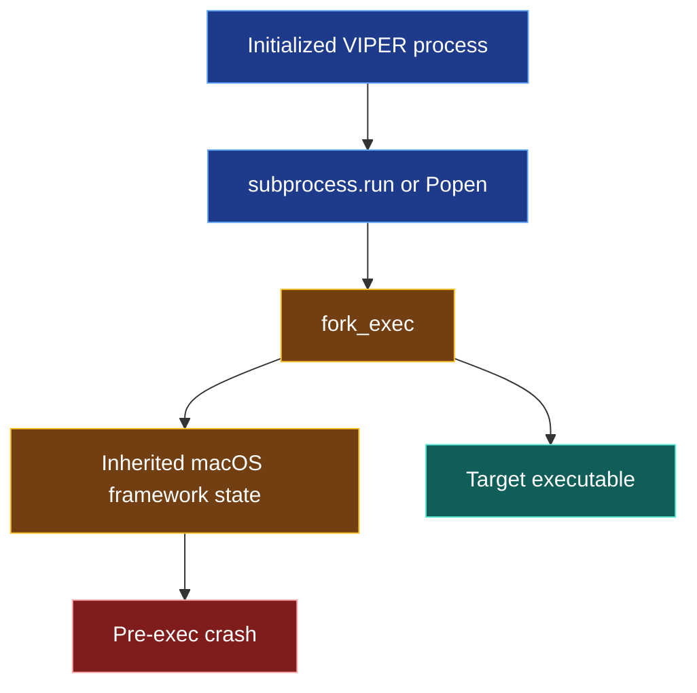
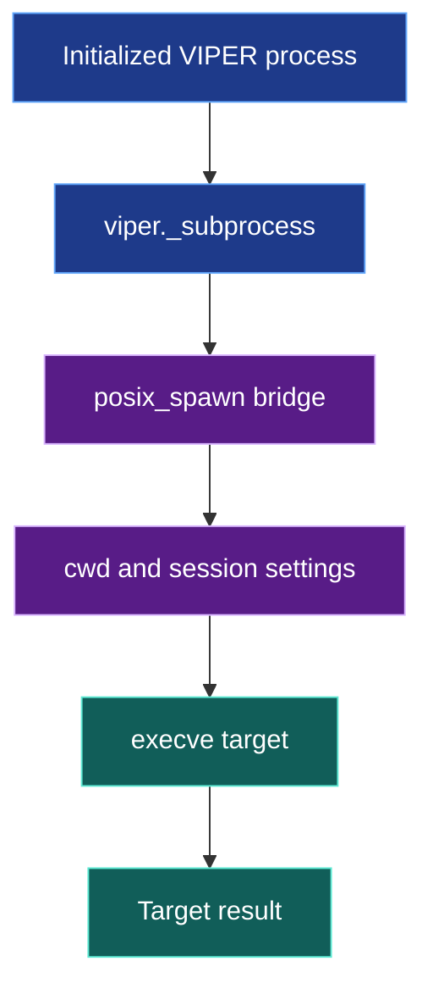
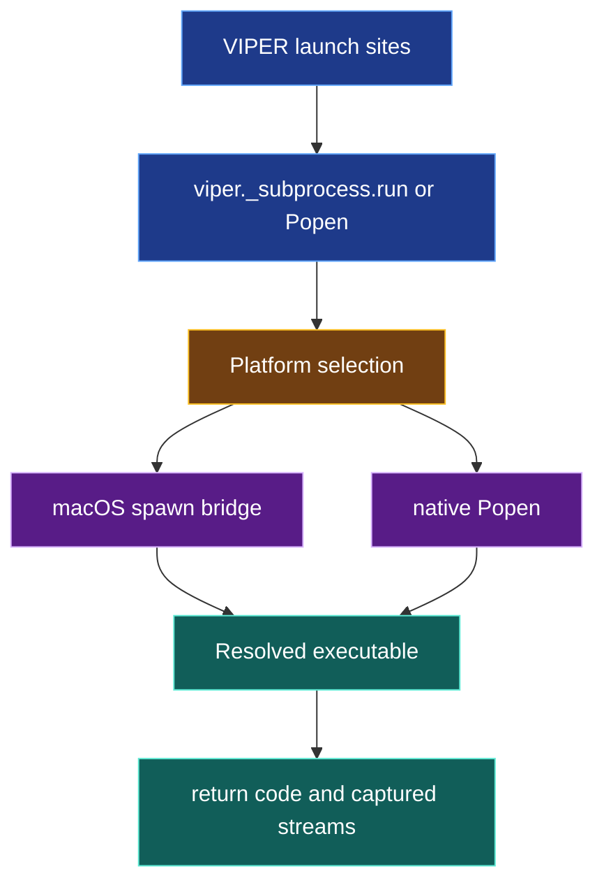

# Child-process launching

VIPER starts Git, CodeQL, project workers, metric workers, stage workers, and
host-inspection commands from a Python process that may already have loaded
threaded macOS frameworks. Those commands must start without calling `fork()`
in that parent process.

## 1. Status

**Contract status:** Complete.

| ID | Implementation obligation |
| --- | --- |
| CPL-01 <!-- contract-requirement: CPL-01 phase=2 test=tests/test_process_startup.py --> | Start every supported macOS child through `viper._subprocess.Popen`, preserve the command's working directory, environment, streams, timeout, result, and process-session behavior, and execute the intended target. |
| CPL-02 <!-- contract-requirement: CPL-02 phase=2 test=tests/test_process_startup.py --> | Route every repository-owned `subprocess.run()` and `subprocess.Popen()` call through `viper._subprocess`; reject new direct standard-library subprocess imports outside the facade and its regression test; do not call `platform.processor()` during runtime observation. |

## 2. Required claim

On macOS, each repository-owned child launch uses CPython's `posix_spawn` path to
start an absolute Python bridge. The bridge applies `cwd` and
`start_new_session`, closes inherited descriptors above standard input,
output, and error, then replaces itself with the resolved target executable.
The parent receives the target's actual output and return code.

On other supported platforms, `viper._subprocess.Popen` delegates to the
standard `subprocess.Popen` implementation. The facade supports the argument
forms used by VIPER: `shell=False`, no `preexec_fn`, no `pass_fds`, and no
separate `executable` override.

The claim does not assert that an arbitrary third-party process launcher is
safe. It covers launch sites beneath `src/viper` and `tests`, except the
regression test's direct access to `_fork_exec`, and the supported arguments
enforced by `viper._subprocess.Popen`. It also excludes
`platform.processor()`, whose macOS implementation starts `uname` through the
standard library's unguarded subprocess path.

## 3. Current gap

Five macOS crash reports showed the same pre-exec path on Python 3.12.6 and
3.14.5: `_posixsubprocess.fork_exec()` called `fork()`, and the child crashed
inside an initialized NetworkExtension framework before `exec()`. A preflight
test masked one occurrence because the resulting nonzero Git command was an
expected failure in that test. A combined acceptance run found the same crash
inside `platform.processor()` after another test had initialized a server
thread.

### Current DAG



### Proposed-change DAG



### Integrated DAG



<!-- contract-worked-example: start -->

The caller retains the familiar API:

```python
from viper import _subprocess as subprocess

completed = subprocess.run(
    ("git", "rev-parse", "HEAD"),
    check=True,
    capture_output=True,
)
```

On macOS, `viper._subprocess.Popen` resolves `git`, starts the bridge through
`posix_spawn`, and the bridge calls `execve()` with the absolute Git path. The
returned `CompletedProcess` contains Git's return code and streams.

<!-- contract-worked-example: end -->

## 4. Launch protocol

`viper._subprocess.Popen` is the production boundary. It accepts one nonempty
argument vector. On macOS it performs these operations in order:

1. Reject `shell=True`, `preexec_fn`, `pass_fds`, and `executable`.
2. Resolve `args[0]` against the supplied environment's `PATH`, or against
   `cwd` when the caller supplied a relative path containing a directory.
3. Encode the absolute target arguments, `cwd`, and `start_new_session` in one
   bridge payload.
4. Start the absolute active Python executable with `close_fds=False`, no
   parent-side `cwd`, and no parent-side session change. These arguments select
   CPython's `posix_spawn` path on the supported Python versions.
5. In the bridge, call `setsid()` when requested, change directory, close
   inherited descriptors above `2`, and call `execve()`.

The bridge retains its process ID when it becomes the target. Existing stage
process-group termination therefore continues to address the target process.

`viper._subprocess.run` uses that `Popen` class and preserves input,
`capture_output`, timeout, and `check=True` behavior. A nonzero target return
code raises `subprocess.CalledProcessError`; a timeout raises
`subprocess.TimeoutExpired`.

## 5. Verification rules

| Rule | Executable condition |
| --- | --- |
| `process.launch.spawn_safe` <!-- verifier-rule: process.launch.spawn_safe requirement=CPL-01 --> | With the standard library's private `_fork_exec` replaced by a rejecting stub, the facade executes the intended command and preserves its working directory, environment, input, streams, return code, and new-session setting. |
| `process.launch.closed_boundary` <!-- verifier-rule: process.launch.closed_boundary requirement=CPL-02 --> | An AST scan finds no direct standard-library subprocess import beneath `src/viper` or `tests` outside the facade and regression test; the previously crashing preflight Git read returns the committed bytes; runtime observation succeeds when `platform.processor()` is replaced by a rejecting stub. |

The `_fork_exec` replacement is a regression oracle, not production behavior.
If CPython stops selecting `posix_spawn` for the bridge arguments, the test
fails before it can count a child-side crash as an acceptable command result.

## 6. Contract-owned PairBlocks

<!-- pair-block-definition: P2-CPL-01 -->
```toml pair-block
id = "P2-CPL-01"
requirements = ["CPL-01"]
targets = [
    "src/viper/_subprocess.py:annotations",
    "src/viper/_subprocess.py:json",
    "src/viper/_subprocess.py:os",
    "src/viper/_subprocess.py:shutil",
    "src/viper/_subprocess.py:_stdlib_subprocess",
    "src/viper/_subprocess.py:sys",
    "src/viper/_subprocess.py:Mapping",
    "src/viper/_subprocess.py:Sequence",
    "src/viper/_subprocess.py:Path",
    "src/viper/_subprocess.py:Any",
    "src/viper/_subprocess.py:TypeVar",
    "src/viper/_subprocess.py:_Text",
    "src/viper/_subprocess.py:_BRIDGE_ARGUMENT",
    "src/viper/_subprocess.py:_use_spawn_bridge",
    "src/viper/_subprocess.py:_command_arguments",
    "src/viper/_subprocess.py:_resolve_executable",
    "src/viper/_subprocess.py:_bridge_command",
    "src/viper/_subprocess.py:Popen",
    "src/viper/_subprocess.py:run",
    "src/viper/_subprocess.py:__getattr__",
    "src/viper/_subprocess.py:_close_inherited_descriptors",
    "src/viper/_subprocess.py:_exec_bridge",
    "tests/test_process_startup.py:ast",
    "tests/test_process_startup.py:os",
    "tests/test_process_startup.py:subprocess",
    "tests/test_process_startup.py:sys",
    "tests/test_process_startup.py:Path",
    "tests/test_process_startup.py:_subprocess",
    "tests/test_process_startup.py:_git_bytes",
    "tests/test_process_startup.py:_run_git",
    "tests/test_process_startup.py:test_run_uses_spawn_bridge_without_fork",
    "tests/test_process_startup.py:test_popen_preserves_new_process_session",
    "tests/test_process_startup.py:test_run_rejects_nonzero_target_result",
    "tests/test_process_startup.py:test_preflight_git_read_executes_without_fork",
]
assets = ["tools/codeql/viper-python-impact/codeql-pack.lock.yml"]
tests = [
    "tests/test_process_startup.py:test_run_uses_spawn_bridge_without_fork",
    "tests/test_process_startup.py:test_popen_preserves_new_process_session",
    "tests/test_process_startup.py:test_run_rejects_nonzero_target_result",
    "tests/test_process_startup.py:test_preflight_git_read_executes_without_fork",
]
gate = "python -m pytest tests/test_process_startup.py -q"
depends_on = []
```

<!-- pair-block-definition: P2-CPL-02 -->
```toml pair-block
id = "P2-CPL-02"
requirements = ["CPL-02"]
targets = [
    "src/viper/preflight.py:subprocess",
    "src/viper/project.py:subprocess",
    "src/viper/runtime.py:subprocess",
    "src/viper/authoring.py:subprocess",
    "src/viper/_system_impact/codeql.py:subprocess",
    "src/viper/_system_impact/check.py:subprocess",
    "src/viper/_verification/storage.py:subprocess",
    "src/viper/execution/_source.py:subprocess",
    "src/viper/execution/_stage.py:subprocess",
    "src/viper/execution/_metric.py:subprocess",
    "src/viper/execution/_process.py:subprocess",
    "tests/git_repository.py:subprocess",
    "tests/test_authoring.py:subprocess",
    "tests/test_cli.py:subprocess",
    "tests/test_execution_signals.py:subprocess",
    "tests/test_generated_project_acceptance.py:subprocess",
    "tests/test_project_init.py:subprocess",
    "tests/test_project_init.py:test_init_generates_importable_five_stage_project",
    "tests/test_system_impact.py:subprocess",
    "tests/test_verification.py:subprocess",
    "tests/test_documentation.py:CHILD_PROCESS_LAUNCHING",
    "tests/test_documentation.py:IMPLEMENTATION_CONTRACTS",
    "src/viper/runtime.py:_observe_execution",
    "tests/test_process_startup.py:runtime",
    "tests/test_process_startup.py:test_runtime_observation_does_not_invoke_platform_processor",
    "tests/test_process_startup.py:test_repository_launch_sites_use_spawn_safe_subprocess",
]
assets = ["docs/README.md", "docs/development/testing.md"]
tests = [
    "tests/test_process_startup.py:test_repository_launch_sites_use_spawn_safe_subprocess",
    "tests/test_process_startup.py:test_preflight_git_read_executes_without_fork",
    "tests/test_project_init.py:test_init_generates_importable_five_stage_project",
    "tests/test_process_startup.py:test_runtime_observation_does_not_invoke_platform_processor",
    "tests/test_documentation.py:test_pair_blocks_map_to_contract_sections_and_derived_status",
    "tests/test_documentation.py:test_contract_requirements_map_to_plan_tasks_and_tests",
]
gate = "python -m pytest tests/test_process_startup.py tests/test_preflight.py tests/test_project_init.py tests/test_system_impact.py tests/test_authoring.py tests/test_verification.py tests/test_run_execution.py tests/test_metric_provenance.py tests/test_worker.py tests/test_documentation.py -q"
depends_on = ["P2-CPL-01"]
```

## 7. ContractTargets

The following declarations are the exact accepted implementation. One fence
may contain several declarations; each `ContractTarget` resolves one named AST
declaration inside that fence.

<!-- contract-target: requirements=CPL-02 block=P2-CPL-02 action=add target=tests/test_documentation.py:CHILD_PROCESS_LAUNCHING -->
<!-- contract-target: requirements=CPL-02 block=P2-CPL-02 action=update target=tests/test_documentation.py:IMPLEMENTATION_CONTRACTS -->
```python contract-target
CHILD_PROCESS_LAUNCHING = ROOT / "docs/development/child-process-launching.md"

IMPLEMENTATION_CONTRACTS = (
    ROOT / "docs/development/contract-traceability.md",
    ROOT / "docs/development/project-data-root.md",
    MODULE_OWNERSHIP,
    SYSTEM_IMPACT_COMPILER,
    CHILD_PROCESS_LAUNCHING,
    ROOT / "docs/development/download-retrieval-artifacts.md",
    ROOT / "docs/development/external-input-roots.md",
    ROOT / "docs/development/unified-metric-drafting.md",
    AUTOMATIC_INPUT_RESOLUTION,
    ROOT / "docs/development/frozen-plan-git-identity.md",
    ROOT / "docs/development/remote-storage.md",
    ROOT / "docs/development/experiment-expansion.md",
    ROOT / "docs/development/provenance-catalog-mcp.md",
    ROOT / "docs/development/stage-reuse.md",
    ROOT / "docs/development/experiment-knowledge-primitives.md",
    RESEARCH_MEMORY,
)
```

<!-- contract-target: requirements=CPL-01 block=P2-CPL-01 action=add target=src/viper/_subprocess.py:annotations -->
<!-- contract-target: requirements=CPL-01 block=P2-CPL-01 action=add target=src/viper/_subprocess.py:json -->
<!-- contract-target: requirements=CPL-01 block=P2-CPL-01 action=add target=src/viper/_subprocess.py:os -->
<!-- contract-target: requirements=CPL-01 block=P2-CPL-01 action=add target=src/viper/_subprocess.py:shutil -->
<!-- contract-target: requirements=CPL-01 block=P2-CPL-01 action=add target=src/viper/_subprocess.py:_stdlib_subprocess -->
<!-- contract-target: requirements=CPL-01 block=P2-CPL-01 action=add target=src/viper/_subprocess.py:sys -->
<!-- contract-target: requirements=CPL-01 block=P2-CPL-01 action=add target=src/viper/_subprocess.py:Mapping -->
<!-- contract-target: requirements=CPL-01 block=P2-CPL-01 action=add target=src/viper/_subprocess.py:Sequence -->
<!-- contract-target: requirements=CPL-01 block=P2-CPL-01 action=add target=src/viper/_subprocess.py:Path -->
<!-- contract-target: requirements=CPL-01 block=P2-CPL-01 action=add target=src/viper/_subprocess.py:Any -->
<!-- contract-target: requirements=CPL-01 block=P2-CPL-01 action=add target=src/viper/_subprocess.py:TypeVar -->
<!-- contract-target: requirements=CPL-01 block=P2-CPL-01 action=add target=src/viper/_subprocess.py:_Text -->
<!-- contract-target: requirements=CPL-01 block=P2-CPL-01 action=add target=src/viper/_subprocess.py:_BRIDGE_ARGUMENT -->
<!-- contract-target: requirements=CPL-01 block=P2-CPL-01 action=add target=src/viper/_subprocess.py:_use_spawn_bridge -->
<!-- contract-target: requirements=CPL-01 block=P2-CPL-01 action=add target=src/viper/_subprocess.py:_command_arguments -->
<!-- contract-target: requirements=CPL-01 block=P2-CPL-01 action=add target=src/viper/_subprocess.py:_resolve_executable -->
<!-- contract-target: requirements=CPL-01 block=P2-CPL-01 action=add target=src/viper/_subprocess.py:_bridge_command -->
<!-- contract-target: requirements=CPL-01 block=P2-CPL-01 action=add target=src/viper/_subprocess.py:Popen -->
<!-- contract-target: requirements=CPL-01 block=P2-CPL-01 action=add target=src/viper/_subprocess.py:run -->
<!-- contract-target: requirements=CPL-01 block=P2-CPL-01 action=add target=src/viper/_subprocess.py:__getattr__ -->
<!-- contract-target: requirements=CPL-01 block=P2-CPL-01 action=add target=src/viper/_subprocess.py:_close_inherited_descriptors -->
<!-- contract-target: requirements=CPL-01 block=P2-CPL-01 action=add target=src/viper/_subprocess.py:_exec_bridge -->
```python contract-target
from __future__ import annotations

import json
import os
import shutil
import subprocess as _stdlib_subprocess
import sys
from collections.abc import Mapping, Sequence
from pathlib import Path
from typing import Any, TypeVar

_Text = TypeVar("_Text", str, bytes)
_BRIDGE_ARGUMENT = "--viper-spawn-bridge"


def _use_spawn_bridge() -> bool:
    """Return whether this interpreter must avoid ``fork()`` child creation."""
    return sys.platform == "darwin"


def _command_arguments(command: Sequence[str | os.PathLike[str]]) -> tuple[str, ...]:
    """Return one nonempty string argument vector."""
    arguments = tuple(os.fsdecode(argument) for argument in command)
    if not arguments:
        raise ValueError("child command must contain an executable")
    return arguments


def _resolve_executable(
    executable: str,
    *,
    cwd: str | os.PathLike[str] | None,
    environment: Mapping[str, str] | None,
) -> str:
    """Resolve the target executable before starting the macOS bridge."""
    if os.path.dirname(executable):
        path = Path(executable)
        if not path.is_absolute():
            path = Path.cwd() / path if cwd is None else Path(cwd) / path
        resolved = path.absolute()
        if not resolved.is_file():
            raise FileNotFoundError(executable)
        return str(resolved)
    search_path = None if environment is None else environment.get("PATH")
    resolved = shutil.which(executable, path=search_path)
    if resolved is None:
        raise FileNotFoundError(executable)
    return str(Path(resolved).absolute())


def _bridge_command(
    command: Sequence[str | os.PathLike[str]],
    *,
    cwd: str | os.PathLike[str] | None,
    environment: Mapping[str, str] | None,
    start_new_session: bool,
) -> tuple[str, ...]:
    """Encode one target command for the spawn-safe bridge process."""
    arguments = _command_arguments(command)
    arguments = (
        _resolve_executable(
            arguments[0],
            cwd=cwd,
            environment=environment,
        ),
        *arguments[1:],
    )
    payload = json.dumps(
        {
            "arguments": arguments,
            "cwd": None if cwd is None else os.fsdecode(cwd),
            "start_new_session": start_new_session,
        },
        separators=(",", ":"),
    )
    return (
        str(Path(sys.executable).absolute()),
        "-m",
        __name__,
        _BRIDGE_ARGUMENT,
        payload,
    )


class Popen(_stdlib_subprocess.Popen[_Text]):
    """Start a child through the macOS spawn bridge or the native platform path."""

    def __init__(
        self,
        args: Sequence[str | os.PathLike[str]],
        *popenargs: Any,
        **kwargs: Any,
    ) -> None:
        """Preserve ``subprocess.Popen`` behavior for VIPER's supported options."""
        original_arguments = _command_arguments(args)
        if _use_spawn_bridge():
            if kwargs.get("shell", False):
                raise ValueError("spawn-safe child commands require shell=False")
            if kwargs.get("preexec_fn") is not None:
                raise ValueError("spawn-safe child commands do not accept preexec_fn")
            if kwargs.get("pass_fds"):
                raise ValueError("spawn-safe child commands do not accept pass_fds")
            if kwargs.get("executable") is not None:
                raise ValueError("spawn-safe child commands do not accept executable")
            cwd = kwargs.pop("cwd", None)
            environment = kwargs.get("env")
            start_new_session = bool(kwargs.pop("start_new_session", False))
            args = _bridge_command(
                original_arguments,
                cwd=cwd,
                environment=environment,
                start_new_session=start_new_session,
            )
            kwargs["close_fds"] = False
        super().__init__(args, *popenargs, **kwargs)
        self.args = original_arguments


def run(
    command: Sequence[str | os.PathLike[str]],
    *,
    input: _Text | None = None,
    capture_output: bool = False,
    timeout: float | None = None,
    check: bool = False,
    **kwargs: Any,
) -> _stdlib_subprocess.CompletedProcess[_Text]:
    """Run one command through :class:`Popen` and return its completed result."""
    if input is not None:
        if kwargs.get("stdin") is not None:
            raise ValueError("stdin and input arguments may not both be used")
        kwargs["stdin"] = _stdlib_subprocess.PIPE
    if capture_output:
        if kwargs.get("stdout") is not None or kwargs.get("stderr") is not None:
            raise ValueError("stdout and stderr may not be used with capture_output")
        kwargs["stdout"] = _stdlib_subprocess.PIPE
        kwargs["stderr"] = _stdlib_subprocess.PIPE

    with Popen(command, **kwargs) as process:
        try:
            stdout, stderr = process.communicate(input, timeout=timeout)
        except _stdlib_subprocess.TimeoutExpired as error:
            process.kill()
            if sys.platform == "win32":
                error.stdout, error.stderr = process.communicate()
            else:
                process.wait()
            raise
        except BaseException:
            process.kill()
            process.wait()
            raise
        return_code = process.poll()
        if return_code is None:
            raise RuntimeError("child process completed without a return code")
        if check and return_code:
            raise _stdlib_subprocess.CalledProcessError(
                return_code,
                process.args,
                output=stdout,
                stderr=stderr,
            )
    return _stdlib_subprocess.CompletedProcess(
        process.args,
        return_code,
        stdout,
        stderr,
    )


def __getattr__(name: str) -> Any:
    """Expose standard subprocess constants and exception classes to callers."""
    return getattr(_stdlib_subprocess, name)


def _close_inherited_descriptors() -> None:
    """Close inheritable descriptors not assigned to standard streams."""
    descriptor_root = Path("/dev/fd")
    if not descriptor_root.is_dir():
        return
    for name in os.listdir(descriptor_root):
        if not name.isdigit():
            continue
        descriptor = int(name)
        if descriptor <= 2:
            continue
        try:
            os.close(descriptor)
        except OSError:
            pass


def _exec_bridge(payload: str) -> None:
    """Apply target process settings and replace the bridge with that target."""
    decoded = json.loads(payload)
    arguments = tuple(str(argument) for argument in decoded["arguments"])
    if decoded["start_new_session"]:
        os.setsid()
    if decoded["cwd"] is not None:
        os.chdir(decoded["cwd"])
    _close_inherited_descriptors()
    os.execve(arguments[0], arguments, os.environ)
```

<!-- contract-target: requirements=CPL-01 block=P2-CPL-01 action=add target=tests/test_process_startup.py:ast -->
<!-- contract-target: requirements=CPL-01 block=P2-CPL-01 action=add target=tests/test_process_startup.py:os -->
<!-- contract-target: requirements=CPL-01 block=P2-CPL-01 action=add target=tests/test_process_startup.py:subprocess -->
<!-- contract-target: requirements=CPL-01 block=P2-CPL-01 action=add target=tests/test_process_startup.py:sys -->
<!-- contract-target: requirements=CPL-01 block=P2-CPL-01 action=add target=tests/test_process_startup.py:Path -->
<!-- contract-target: requirements=CPL-01 block=P2-CPL-01 action=add target=tests/test_process_startup.py:_subprocess -->
<!-- contract-target: requirements=CPL-01 block=P2-CPL-01 action=add target=tests/test_process_startup.py:_git_bytes -->
<!-- contract-target: requirements=CPL-01 block=P2-CPL-01 action=add target=tests/test_process_startup.py:_run_git -->
<!-- contract-target: requirements=CPL-01 block=P2-CPL-01 action=add target=tests/test_process_startup.py:test_run_uses_spawn_bridge_without_fork -->
<!-- contract-target: requirements=CPL-01 block=P2-CPL-01 action=add target=tests/test_process_startup.py:test_popen_preserves_new_process_session -->
<!-- contract-target: requirements=CPL-01 block=P2-CPL-01 action=add target=tests/test_process_startup.py:test_run_rejects_nonzero_target_result -->
<!-- contract-target: requirements=CPL-01 block=P2-CPL-01 action=add target=tests/test_process_startup.py:test_preflight_git_read_executes_without_fork -->
```python contract-target
import ast
import os
import subprocess
import sys
from pathlib import Path

from viper import _subprocess
from viper.preflight import _git_bytes


def _run_git(root: Path, *arguments: str) -> None:
    """Create the committed Git fixture through the spawn-safe facade."""
    _subprocess.run(
        ("git", "-C", str(root), *arguments),
        check=True,
        capture_output=True,
    )


def test_run_uses_spawn_bridge_without_fork(
    tmp_path: Path,
    monkeypatch: pytest.MonkeyPatch,
) -> None:
    """Execute the target with cwd, environment, and input while fork is disabled."""
    monkeypatch.setattr(_subprocess, "_use_spawn_bridge", lambda: True)

    def reject_fork(*args: object, **kwargs: object) -> None:
        raise AssertionError("spawn-safe execution called fork")

    monkeypatch.setattr(subprocess, "_fork_exec", reject_fork)
    environment = {**os.environ, "VIPER_SPAWN_VALUE": "observed"}
    completed = _subprocess.run(
        (
            sys.executable,
            "-c",
            "import os,sys; print(os.getcwd()); "
            "print(os.environ['VIPER_SPAWN_VALUE']); print(sys.stdin.read())",
        ),
        cwd=tmp_path,
        env=environment,
        input="payload",
        capture_output=True,
        text=True,
        check=True,
    )

    assert completed.returncode == 0
    assert completed.stdout.splitlines() == [
        str(tmp_path),
        "observed",
        "payload",
    ]


def test_popen_preserves_new_process_session(
    monkeypatch: pytest.MonkeyPatch,
) -> None:
    """Apply ``start_new_session`` inside the bridge before target execution."""
    monkeypatch.setattr(_subprocess, "_use_spawn_bridge", lambda: True)
    process = _subprocess.Popen(
        (
            sys.executable,
            "-c",
            "import os; print(os.getsid(0) == os.getpid())",
        ),
        stdout=subprocess.PIPE,
        stderr=subprocess.PIPE,
        start_new_session=True,
    )

    stdout, stderr = process.communicate(timeout=10)

    assert process.returncode == 0, stderr.decode(errors="replace")
    assert stdout == b"True\n"


def test_run_rejects_nonzero_target_result(
    monkeypatch: pytest.MonkeyPatch,
) -> None:
    """Require successful target execution when ``check`` is enabled."""
    monkeypatch.setattr(_subprocess, "_use_spawn_bridge", lambda: True)

    with pytest.raises(subprocess.CalledProcessError) as failure:
        _subprocess.run(
            (sys.executable, "-c", "raise SystemExit(7)"),
            capture_output=True,
            check=True,
        )

    assert failure.value.returncode == 7


def test_preflight_git_read_executes_without_fork(
    tmp_path: Path,
    monkeypatch: pytest.MonkeyPatch,
) -> None:
    """Read committed bytes through the migrated preflight process boundary."""
    _run_git(tmp_path, "init", "--quiet")
    _run_git(tmp_path, "config", "user.name", "VIPER test")
    _run_git(tmp_path, "config", "user.email", "test@example.com")
    (tmp_path / "value.txt").write_text("committed\n", encoding="utf-8")
    _run_git(tmp_path, "add", "value.txt")
    _run_git(tmp_path, "commit", "--quiet", "-m", "fixture")
    monkeypatch.setattr(_subprocess, "_use_spawn_bridge", lambda: True)

    def reject_fork(*args: object, **kwargs: object) -> None:
        raise AssertionError("preflight Git read called fork")

    monkeypatch.setattr(subprocess, "_fork_exec", reject_fork)

    assert _git_bytes(tmp_path, "HEAD", "value.txt") == b"committed\n"
```

<!-- contract-target: requirements=CPL-02 block=P2-CPL-02 action=update target=src/viper/preflight.py:subprocess -->
```python contract-target
from . import _subprocess as subprocess
```

<!-- contract-target: requirements=CPL-02 block=P2-CPL-02 action=update target=src/viper/project.py:subprocess -->
```python contract-target
from . import _subprocess as subprocess
```

<!-- contract-target: requirements=CPL-02 block=P2-CPL-02 action=update target=src/viper/runtime.py:subprocess -->
```python contract-target
from . import _subprocess as subprocess
```

<!-- contract-target: requirements=CPL-02 block=P2-CPL-02 action=update target=src/viper/runtime.py:_observe_execution -->
```python contract-target
def _observe_execution(host: HostContext, compute: ComputeSpec) -> ExecutionContext:
    """Capture CPU, backend, and numerical runtime facts for one observed host."""
    architecture = platform.machine() or "unreported"
    processor = (
        architecture
        if platform.system() == "Darwin"
        else platform.processor() or architecture
    )
    return ExecutionContext(
        host=host,
        cpu=CPUContext(
            architecture=architecture,
            model=processor,
            instruction_features=_instruction_features(),
        ),
        backend=(
            _cuda_backend()
            if isinstance(compute, CUDAComputeSpec)
            else CPUBackendContext()
        ),
        numerical_runtime=NumericalRuntimeContext(
            python_version=platform.python_version(),
            pytorch_version=torch.__version__,
            numpy_version=np.__version__,
            blas=_numpy_build_dependency("blas"),
            lapack=_numpy_build_dependency("lapack"),
            native_thread_pools=(
                NativeThreadPoolContext(
                    implementation="pytorch_intraop",
                    version=torch.__version__,
                    threads=torch.get_num_threads(),
                ),
                NativeThreadPoolContext(
                    implementation="pytorch_interop",
                    version=torch.__version__,
                    threads=torch.get_num_interop_threads(),
                ),
            ),
        ),
    )
```

<!-- contract-target: requirements=CPL-02 block=P2-CPL-02 action=update target=src/viper/authoring.py:subprocess -->
```python contract-target
from . import _subprocess as subprocess
```

<!-- contract-target: requirements=CPL-02 block=P2-CPL-02 action=update target=src/viper/_system_impact/codeql.py:subprocess -->
```python contract-target
from .. import _subprocess as subprocess
```

<!-- contract-target: requirements=CPL-02 block=P2-CPL-02 action=update target=src/viper/_system_impact/check.py:subprocess -->
```python contract-target
from .. import _subprocess as subprocess
```

<!-- contract-target: requirements=CPL-02 block=P2-CPL-02 action=update target=src/viper/_verification/storage.py:subprocess -->
```python contract-target
from .. import _subprocess as subprocess
```

<!-- contract-target: requirements=CPL-02 block=P2-CPL-02 action=update target=src/viper/execution/_source.py:subprocess -->
```python contract-target
from .. import _subprocess as subprocess
```

<!-- contract-target: requirements=CPL-02 block=P2-CPL-02 action=update target=src/viper/execution/_stage.py:subprocess -->
```python contract-target
from .. import _subprocess as subprocess
```

<!-- contract-target: requirements=CPL-02 block=P2-CPL-02 action=update target=src/viper/execution/_metric.py:subprocess -->
```python contract-target
from .. import _subprocess as subprocess
```

<!-- contract-target: requirements=CPL-02 block=P2-CPL-02 action=update target=src/viper/execution/_process.py:subprocess -->
```python contract-target
from .. import _subprocess as subprocess
```

<!-- contract-target: requirements=CPL-02 block=P2-CPL-02 action=update target=tests/git_repository.py:subprocess -->
<!-- contract-target: requirements=CPL-02 block=P2-CPL-02 action=update target=tests/test_authoring.py:subprocess -->
<!-- contract-target: requirements=CPL-02 block=P2-CPL-02 action=update target=tests/test_cli.py:subprocess -->
<!-- contract-target: requirements=CPL-02 block=P2-CPL-02 action=update target=tests/test_execution_signals.py:subprocess -->
<!-- contract-target: requirements=CPL-02 block=P2-CPL-02 action=update target=tests/test_generated_project_acceptance.py:subprocess -->
<!-- contract-target: requirements=CPL-02 block=P2-CPL-02 action=update target=tests/test_project_init.py:subprocess -->
<!-- contract-target: requirements=CPL-02 block=P2-CPL-02 action=update target=tests/test_system_impact.py:subprocess -->
<!-- contract-target: requirements=CPL-02 block=P2-CPL-02 action=update target=tests/test_verification.py:subprocess -->
```python contract-target
from viper import _subprocess as subprocess
```

<!-- contract-target: requirements=CPL-02 block=P2-CPL-02 action=update target=tests/test_project_init.py:test_init_generates_importable_five_stage_project -->
```python contract-target
def test_init_generates_importable_five_stage_project(
    tmp_path: Path,
) -> None:
    """Generate the project and execute its focused tests without editing it."""
    target = tmp_path / "starter"
    environment = environ.copy()
    environment["PYTHONPATH"] = str(Path.cwd())

    result = init_project(InitProjectRequest(path=target, package="sample_project"))
    completed = subprocess.run(
        [sys.executable, "-m", "pytest", "-q"],
        cwd=target,
        env=environment,
        check=False,
        capture_output=True,
        text=True,
    )

    assert result.project_root == target
    assert len(result.files) == 21
    assert target / "viper.toml" in result.files
    assert target / "inputs" / ".gitkeep" in result.files
    assert completed.returncode == 0, completed.stdout + completed.stderr
    assert "1 passed" in completed.stdout
```

<!-- contract-target: requirements=CPL-02 block=P2-CPL-02 action=add target=tests/test_process_startup.py:runtime -->
```python contract-target
import viper.runtime as runtime
```

<!-- contract-target: requirements=CPL-02 block=P2-CPL-02 action=add target=tests/test_process_startup.py:test_runtime_observation_does_not_invoke_platform_processor -->
```python contract-target
def test_runtime_observation_does_not_invoke_platform_processor(
    monkeypatch: pytest.MonkeyPatch,
) -> None:
    """Avoid the hidden subprocess used by ``platform.processor()``."""

    def reject_processor_probe() -> str:
        raise AssertionError("runtime observation launched the processor probe")

    monkeypatch.setattr(runtime.platform, "system", lambda: "Darwin")
    monkeypatch.setattr(runtime.platform, "processor", reject_processor_probe)

    observed = runtime.observe_local_execution(CPUComputeSpec())

    assert observed.cpu.model == observed.cpu.architecture
```

<!-- contract-target: requirements=CPL-02 block=P2-CPL-02 action=add target=tests/test_process_startup.py:test_repository_launch_sites_use_spawn_safe_subprocess -->
```python contract-target
def test_repository_launch_sites_use_spawn_safe_subprocess() -> None:
    """Keep repository-owned subprocess calls behind the spawn-safe facade."""
    repository_root = Path(__file__).parents[1]
    search_roots = (repository_root / "src/viper", repository_root / "tests")
    direct_imports: list[str] = []
    for search_root in search_roots:
        for path in sorted(search_root.rglob("*.py")):
            relative_path = path.relative_to(repository_root).as_posix()
            if relative_path in {
                "src/viper/_subprocess.py",
                "tests/test_process_startup.py",
            }:
                continue
            tree = ast.parse(path.read_text(encoding="utf-8"), filename=str(path))
            for node in ast.walk(tree):
                if isinstance(node, ast.Import) and any(
                    alias.name == "subprocess" for alias in node.names
                ):
                    direct_imports.append(relative_path)
                if isinstance(node, ast.ImportFrom) and node.module == "subprocess":
                    direct_imports.append(relative_path)

    assert direct_imports == []
```

## 8. Propagation

A change to the supported `viper._subprocess.Popen` arguments must update the
facade, its direct launch callers, and the spawn-path regression tests in one
PairBlock. A new repository-owned launch site must import `viper._subprocess`
and pass the closed-boundary scan. A standard-library helper that starts a
child process must either route through the facade or receive an explicit
regression test that proves it is not called from an initialized VIPER process.

The exact combined gate matters. It first exercises tests that initialize
threads, then reaches runtime observation and execution. Fresh-interpreter
tests alone cannot reproduce the inherited-framework failure.

## 9. Acceptance and limits

Acceptance requires both PairBlock gates, the exact `ContractTarget`
transitions, no unplanned Python declaration changes, and a passing System
Impact `PlanCheck`. The accepted commit must preserve the same plan and source
digests checked before commit.

The regression verifies CPython's current spawn-path selection mechanically by
making `_fork_exec` fail. CPython's private selector is not a VIPER API. The
test therefore remains required across every supported Python version. A
future interpreter that changes the selector must either keep this test passing
or receive a direct `os.posix_spawn` adapter before support is claimed.

The recorded local acceptance covers Python 3.12.6 on macOS. Before VIPER
claims macOS support for another Python version, that interpreter must run the
spawn-path regression and the combined PairBlock gate without producing a new
crash report.

## 10. Sources

- Python documents that `Popen` may use `os.posix_spawn()` and recommends a
  fully qualified executable path in [subprocess — Subprocess management](https://docs.python.org/3.12/library/subprocess.html).
- Python documents that `fork` is unsafe on macOS because system libraries may
  start threads in [multiprocessing — Contexts and start methods](https://docs.python.org/3.12/library/multiprocessing.html#contexts-and-start-methods).
- The exact selector conditions for the affected interpreter are visible in
  [CPython 3.12.6 `Lib/subprocess.py`](https://github.com/python/cpython/blob/v3.12.6/Lib/subprocess.py).
