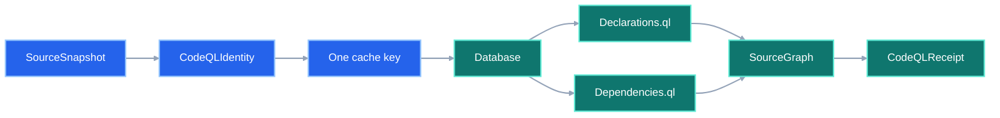
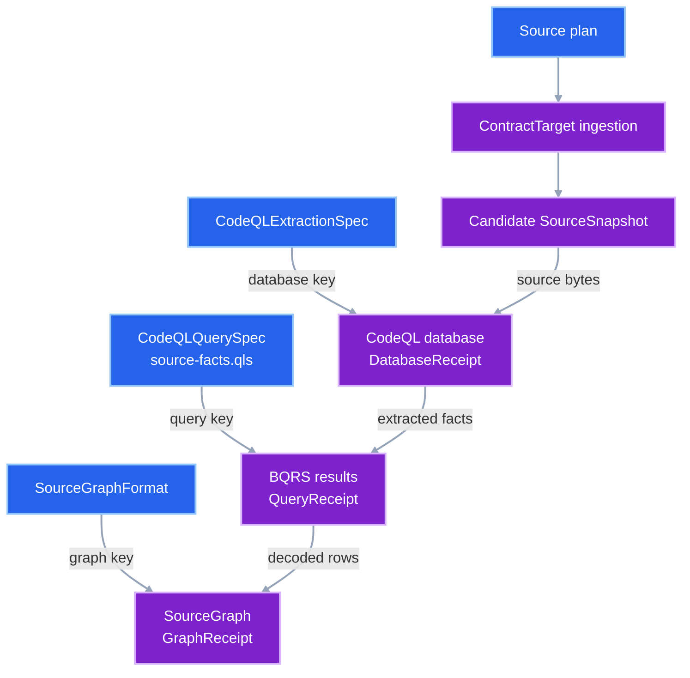
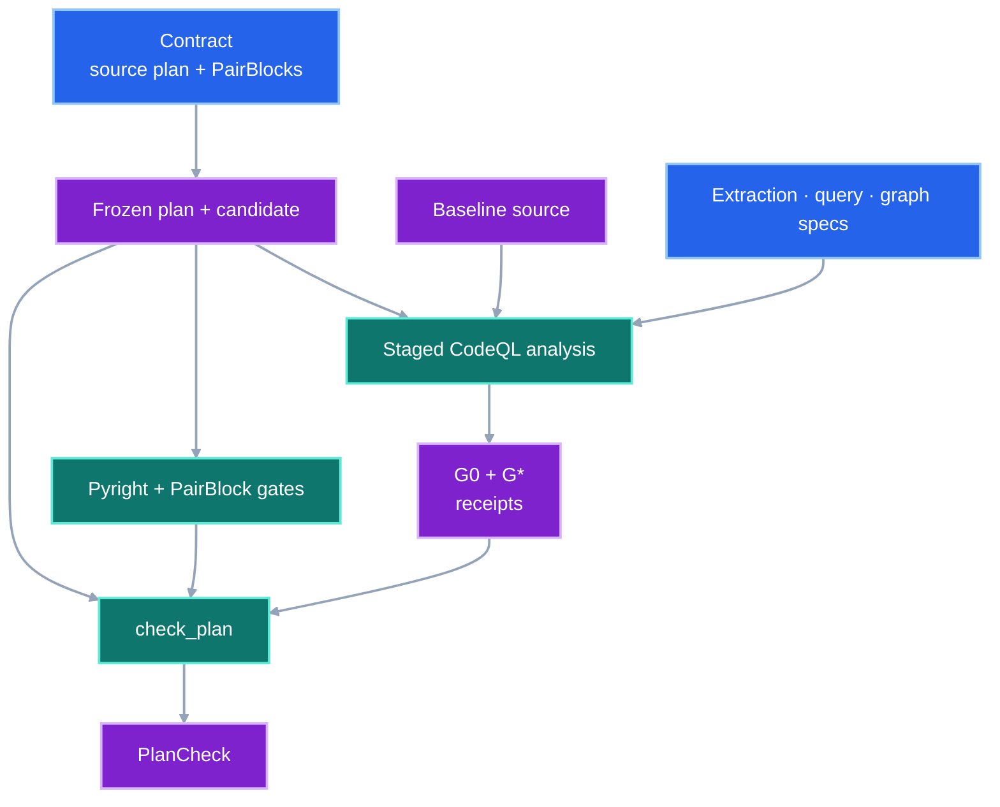

# CodeQL Analysis

## 1. Status

**Contract status:** Design approved. Both source-backed PairBlocks pass their
focused gates. Production remains unchanged pending final review.

| ID | Implementation obligation |
|---|---|
| CQA-01 | Preserve read and write edges, conditional declarations, dotted-import identity, and candidate neighbors for added targets. |
| CQA-02 | Replace `CodeQLIdentity` with separate extraction, query, and graph-format specifications. |
| CQA-03 | Give extraction and query execution independent keys, caches, and receipts; execute `source-facts.qls` once. |
| CQA-04 | Identify graph lowering by the canonical path-and-byte digest of its explicit source manifest. |
| CQA-05 | Require successful, recomputable receipts and exact stage joins; reuse only matching cache entries. |
| CQA-06 | Migrate callers and tests, keep candidate `PYTHONPATH` through `check_plan()`, and remove the retired combined models. |

## 2. Required claim

One source analysis has three independently identified stages:

\[
D = \operatorname{Extract}(S,E), \qquad
R = \operatorname{Query}(D,Q), \qquad
G = \operatorname{Lower}(R,F)
\]

where:

- \(S\) is the digest of the complete analyzed Python source;
- \(E\) identifies the CodeQL executable, Python extractor, language, and
  build mode;
- \(Q\) identifies the query pack and suite;
- \(F\) identifies the `SourceGraph` schema and row-lowering rules.

Each stage key contains exactly the inputs that can change that stage:

\[
k_D = H(S,E)
\]

\[
k_R = H(k_D, H(D), Q)
\]

\[
k_G = H(k_R, H(R), F)
\]

Changing \(Q\) reuses \(D\). Changing \(F\) reuses \(D\) and \(R\). A
`SourceGraph` is accepted only when its three receipts form this exact chain.
Changing only the repository revision also reuses all three stages when \(S\)
is unchanged. The returned `SourceSnapshot` and `DatabaseReceipt` still record
the exact revision requested by that analysis.
The lowering digest is recomputed from an explicit manifest of
repository-relative paths and the loaded file bytes. A caller-supplied digest
cannot select another lowerer.

## 3. Current gap

### Inspected path

The current [`analyze_source()`](../../src/viper/_system_impact/codeql.py)
combines executable identity, query-pack identity, database creation, two query
runs, BQRS decoding, graph construction, and one cache key. The current
[`SourceGraph`](../../src/viper/system_impact/models.py) stores one
`CodeQLIdentity` and one `CodeQLReceipt` for that combined operation.

The inspected CodeQL 2.26.4 command confirms that `database run-queries`
accepts a query suite and stores BQRS results under the database. A local
measurement also showed that query execution changes CodeQL's evaluator cache.
The design therefore preserves the extracted facts in one database and runs
queries against a per-query copy.

### Current DAG

### Missing connector

The combined key makes query-pack changes rebuild the database. The combined
receipt cannot prove which bytes came from extraction, query execution, or
graph lowering. `_QUERY_FILES` also duplicates the query list already owned by
[`source-facts.qls`](../../tools/codeql/viper-python-impact/source-facts.qls).

The separate source plan is not yet a legal `ContractTarget` payload. The
current compiler reads only `python contract-target` fences from Markdown.
That ingestion gap must close before `P0-CQA-01` becomes active work.

### Proposed-change DAG

### Integrated DAG

## 4. Models

The reviewed definitions are in the planned replacement for
[`system_impact/models.py`](../../plans/codeql-analysis/replace/src/viper/system_impact/models.py).

| Model | Meaning |
|---|---|
| `CodeQLExtractionSpec` | CodeQL executable, Python extractor, language, and build mode |
| `CodeQLQuerySpec` | Query pack bytes and authoritative suite |
| `SourceGraphFormat` | Serialized graph schema and digest of the explicit lowering-asset manifest |
| `DatabaseReceipt` | `SourceSnapshot + CodeQLExtractionSpec → database facts` |
| `QueryReceipt` | `DatabaseReceipt + CodeQLQuerySpec → BQRS result set` |
| `GraphReceipt` | `QueryReceipt + SourceGraphFormat → SourceGraph nodes and edges` |

`SourceGraph` stores the three specifications and receipts. Its validator
requires each receipt to name the preceding key and digest and requires the
graph digest to equal the canonical nodes and edges.

## 5. Execution

The planned [`analyze_source()`](../../plans/codeql-analysis/replace/src/viper/_system_impact/codeql.py)
performs these operations:

1. Verify the source digest, CodeQL version, executable digest, Python
   extractor digest, query-pack digest, pack name, pack version, and suite.
2. Reuse or create the database under `databases/<k_D>`.
3. Copy that database to `queries/<k_R>` when the query result is absent.
4. Run `source-facts.qls` once with `codeql database run-queries`.
5. Hash every BQRS file selected by the suite.
6. Decode those BQRS files and lower `Declarations` and `Dependencies` into the
   canonical graph.
7. Recompute the lowering-asset digest and reject a mismatched
   `SourceGraphFormat`.
8. Reuse a graph only when its database and query receipts equal the current
   stage receipts; otherwise rebuild it under `graphs/<k_G>`.

GitHub documents that Python supports `--build-mode=none`, that a `.qls` file
selects queries, and that `database run-queries` executes a suite and writes
its BQRS results under the database. Those documented boundaries determine the
three stages; the key and receipt schema are VIPER's local protocol.

## 6. Persisted evidence

| Path | Contents |
|---|---|
| `databases/<k_D>/receipt.json` | `DatabaseReceipt` and immutable extracted-fact digest |
| `queries/<k_R>/receipt.json` | `QueryReceipt` and complete BQRS digest |
| `queries/<k_R>/database/results/**/*.bqrs` | Suite-selected query results |
| `graphs/<k_G>/source-graph.json` | Canonical graph and complete receipt chain |
| plan result directory | BQRS and decoded JSON copied for publication |

Database hashing excludes `cache`, `log`, `diagnostic`, and `results` because
CodeQL may change those while running queries. It includes the extracted
relations, database schema files, and `src.zip`.

## 7. Verification

| Rule | Executable condition |
|---|---|
| `codeql.analysis.stages` | `DatabaseReceipt`, `QueryReceipt`, and `GraphReceipt` form one uninterrupted key-and-digest chain. |
| `codeql.database.reuse` | A second identical analysis runs neither `database create` nor `database run-queries`. |
| `codeql.database.content_identity` | A revision-only change with the same source digest reuses extraction, query results, and graph rows while returning receipts for the requested revision. |
| `codeql.query.suite` | One `database run-queries` command executes `source-facts.qls`; no `_QUERY_FILES` list remains. |
| `codeql.graph.semantics` | Read-only attributes emit only `reads`; stores emit only `writes`; `+=` emits exactly one of each; conditional declarations, dotted imports, and added-target neighbors retain their identity. |
| `codeql.cache.boundaries` | Query-only changes reuse extraction; format-only changes reuse extraction and BQRS; corrupt cached graphs rebuild or fail closed. |
| `codeql.graph.closure` | `check_plan()` rejects stage-key drift, stage-spec drift, failed stage commands, graph-digest drift, or a mismatched baseline/candidate chain. |
| `codeql.plan.environment` | Candidate `PYTHONPATH` remains active through `check_plan()` and is restored afterward. |
| `codeql.plan.source` | The plan gate materializes the declared baseline, performs each file action once, runs Ruff without mutation, runs Pyright, and runs the focused tests. |

The focused tests are
[`test_codeql_analysis.py`](../../plans/codeql-analysis/add/tests/test_codeql_analysis.py)
and the planned replacement for
[`test_system_impact.py`](../../plans/codeql-analysis/replace/tests/test_system_impact.py).

## 8. Propagation

| Surface | Required change |
|---|---|
| `src/viper/system_impact/models.py` | Replace the combined identity and receipt; update `SourceGraph` closure. |
| `src/viper/_system_impact/codeql.py` | Add the three stages and keys; remove `_QUERY_FILES`; run the suite once. |
| `src/viper/system_impact/check.py` | Validate all stage keys, receipts, and matching baseline/candidate specs. |
| `tools/plan/check.py` | Construct `CodeQLExtractionSpec`, `CodeQLQuerySpec`, and `SourceGraphFormat`. |
| `tests/conftest.py` | Classify the focused migration test. |
| `tests/test_system_impact.py` | Replace combined-identity fixtures and assertions. |
| `tests/test_codeql_analysis.py` | Add direct stage, cache, suite, and rejection tests. |
| `tools/codeql/v2/models.py` | Remove the temporary draft after its definitions move into the package. |
| `docs/development/system-impact-compiler.md` | Replace the old identity and receipt contract after this migration is approved. |
| `docs/development/testing.md` | Replace the old same-identity explanation with matching stage specifications. |
| `tools/plan/publish.py` | Keep publishing the same BQRS and decoded JSON names. |

## 9. Acceptance case

### Success

The same source, extraction spec, query spec, and graph format are analyzed
twice. The first run creates one database, runs one suite, and lowers one graph.
The second run reuses all three results. All receipts and keys are equal.

Changing only `CodeQLQuerySpec` reuses `DatabaseReceipt` and creates a new
`QueryReceipt` and `GraphReceipt`. Changing only `SourceGraphFormat` reuses both
earlier receipts and creates a new graph.

`self.value += 1` produces exactly one `reads` edge and one `writes` edge to
the declared class attribute.

### Rejection

The operation rejects a source digest mismatch, executable or extractor drift,
query-pack or suite drift, lowering-asset drift, changed extracted facts,
missing or duplicate BQRS names, a broken receipt chain, a nonzero stage exit,
or a graph digest that does not match its nodes and edges.

## 10. Implementation order

1. Approve this contract and its source plan.
2. Add source-backed file actions to Contract Traceability without weakening
   declaration ownership.
3. Register `codeql-analysis.md`, `P0-CQA-01`, and `P0-CQA-02` in the CTG and master
   checklist.
4. Run the source-plan gate.
5. Apply the exact reviewed files to production.
6. Update the System Impact contract and testing guide.
7. Run the focused System Impact boundary and one live CodeQL integration.
8. Commit, run `accept()`, publish the evidence, and remove this temporary plan.

## 11. Contract-owned PairBlocks

[`plan.toml`](../../plans/codeql-analysis/plan.toml) owns two ordered blocks.
`P0-CQA-01` repairs graph semantics without changing public models.
`P0-CQA-02` depends on it and replaces the combined receipt protocol. The plan
uses reviewed patches and full files; this contract does not duplicate Python.

## 12. ContractTarget

The source plan defines four file actions:

- `replace`: the destination must exist and is replaced by the reviewed file;
- `add`: the destination must not exist and receives the reviewed file;
- `remove`: the destination must exist and is deleted.
- `patch`: every declared destination must be changed by the reviewed patch.

The source-backed ingestion repair must derive declaration changes from the
baseline and planned files, then require the same requirement, PairBlock, and
rule-edge closure already enforced for Markdown `ContractTarget` records. File
authorization alone is insufficient.

## Sources

- GitHub, [database create](https://docs.github.com/en/code-security/reference/code-scanning/codeql/codeql-cli-manual/database-create), documents Python's `none` build mode.
- GitHub, [database run-queries](https://docs.github.com/en/code-security/reference/code-scanning/codeql/codeql-cli-manual/database-run-queries), documents suite execution and the database result directory.
- GitHub, [Creating CodeQL query suites](https://docs.github.com/en/code-security/tutorials/customize-code-scanning/create-query-suites), documents `.qls` query selection.
