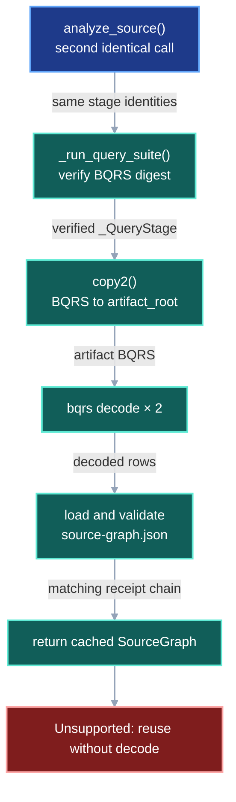
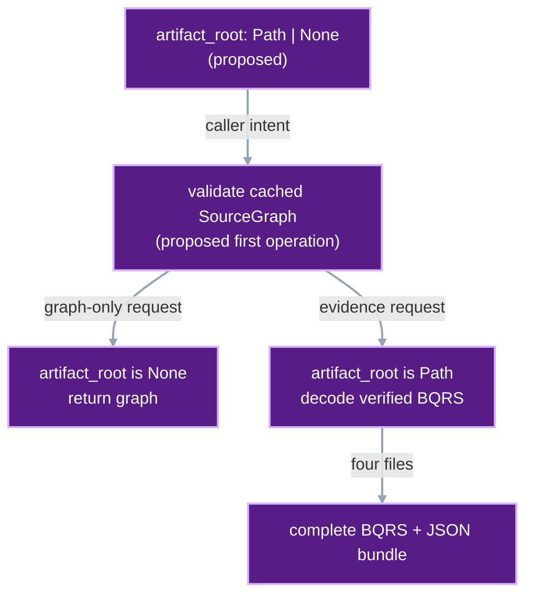
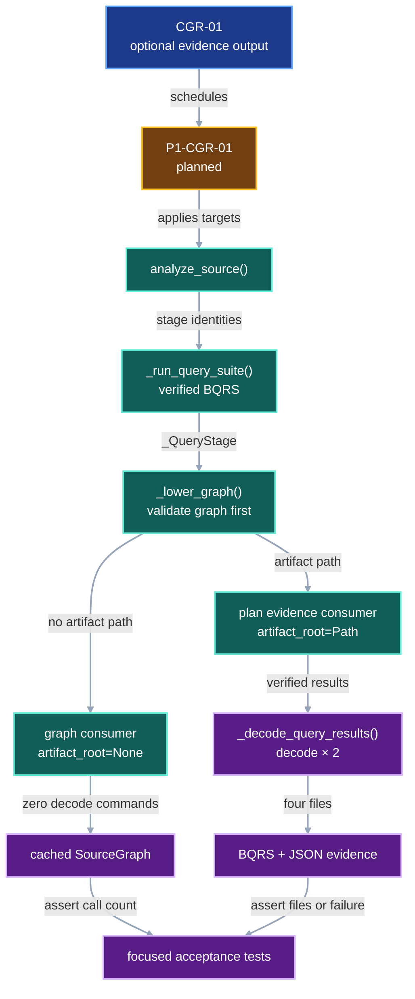

# CodeQL graph cache reuse

## 1. Status

**Contract status:** Planned.

| ID | Implementation obligation |
| --- | --- |
| CGR-01 <!-- contract-requirement: CGR-01 phase=1 test=tests/test_codeql_analysis.py --> | Return a verified cached `SourceGraph` while skipping `codeql bqrs decode` when the caller omits `artifact_root`; when the caller supplies `artifact_root`, regenerate the complete BQRS and decoded JSON evidence before returning. |

## 2. Required claim

`analyze_source()` separates graph reuse from evidence materialization. After
`_run_query_suite()` has verified the cached BQRS digest, `_lower_graph()`
validates `graphs/<k_G>/source-graph.json` before decoding any BQRS. A matching
graph returns immediately when `artifact_root is None`. Supplying
`artifact_root` explicitly requests `Declarations.bqrs`,
`Declarations.json`, `Dependencies.bqrs`, and `Dependencies.json`; every
requested JSON file is decoded from the receipt-bound BQRS during that call.

This contract preserves database, query, and graph-cache validation. It changes
only whether readable publication artifacts are produced during a valid graph
cache hit.

## 3. Current gap

### Inspected path

**Inspected:** [`_run_query_suite()`](../../src/viper/_system_impact/codeql.py)
recomputes the result digest before it returns a cached `_QueryStage`.

**Inspected:** [`_lower_graph()`](../../src/viper/_system_impact/codeql.py)
copies the verified BQRS into `artifact_root` and runs two `codeql bqrs decode`
commands before it loads `graphs/<k_G>/source-graph.json`.

**Inspected:** [`tools.plan.publish.CODEQL_FILES`](../../tools/plan/publish.py)
requires both BQRS files and both decoded JSON files for accepted-plan
publication. [`tools.plan.check._analyze()`](../../tools/plan/check.py) supplies
an artifact directory for that workflow.

**Inspected:** source-graph traversal reads the canonical `SourceGraph`, which
stores the nodes, edges, and complete receipt chain used by impact inspection
and checking. The traversal leaves the decoded JSON files unread.

The fixed scenario in all three DAGs is a second analysis with unchanged
source, extraction, query, and graph-format identities and a valid cached
`SourceGraph`.

### Current DAG



### Missing connector

`artifact_root` currently has one mandatory meaning: every analysis writes a
publication bundle. The call lacks a way to request the smaller operation,
“return the verified graph only.” Graph reuse therefore remains coupled to two
external decode commands whose outputs are irrelevant to traversal.

The lost distinction is consumer intent. `analyze_source()` lacks a value that
distinguishes graph consumption from evidence publication.

### Proposed-change DAG



### Integrated DAG



## 4. Models

Serialized models remain unchanged. `SourceGraph`, `CodeQLAnalysisReceipt`, and
all three stage receipts retain their current declarations.

The callable delta is one optional output path:

| Symbol | Current declaration | Target declaration |
| --- | --- | --- |
| `analyze_source()` | `artifact_root: Path` | `artifact_root: Path | None = None` |
| `_lower_graph()` | `artifact_root: Path` | `artifact_root: Path | None` |

`artifact_root=None` means that the caller requests only the returned
`SourceGraph`. A `Path` means that the caller also requests the four files
listed by `tools.plan.publish.CODEQL_FILES`.

## 5. Execution

`_run_query_suite()` remains the authority for the query-stage cache. It hashes
the cached database facts and every BQRS path and byte sequence before
returning `_QueryStage`.

`_lower_graph()` then performs the following operations:

1. Compute `k_G` and parse `graphs/<k_G>/source-graph.json` when present.
2. Require the cached graph's `DatabaseReceipt`, `QueryReceipt`, graph key, and
   `SourceGraphFormat` to equal the current stage values.
3. Return the cached graph immediately when that validation succeeds and
   `artifact_root is None`.
4. Call `_decode_query_results()` when evidence was requested or graph lowering
   needs decoded rows.
5. Decode into a temporary directory. After every decode and tuple-table check
   succeeds, copy the verified BQRS and decoded JSON into `artifact_root` when
   the caller supplied one.
6. Build and cache a new graph when the matching graph is unavailable.

`tools.plan.check._analyze()` retains its current `artifact_root=artifacts`
call. Accepted-plan checks therefore retain the evidence required by
`tools.plan.publish.CODEQL_FILES`. Graph-search callers may omit the argument.

## 6. Persisted evidence

The cache and receipt schemas remain unchanged.

| Path | Behavior after `P1-CGR-01` |
| --- | --- |
| `queries/<k_R>/database/results/**/*.bqrs` | Remains the receipt-bound query result and is hashed on every query-cache reuse. |
| `graphs/<k_G>/source-graph.json` | Remains the canonical graph cache and is validated before any optional evidence decode. |
| caller-supplied `artifact_root` | Receives both BQRS files and both freshly decoded JSON files only when explicitly requested. |

## 7. Verification

| Rule | Executable condition |
| --- | --- |
| `codeql.graph.warm_reuse` <!-- verifier-rule: codeql.graph.warm_reuse requirement=CGR-01 --> | Two identical graph-only analyses create one database, run one suite, perform two decodes during the cache miss, and perform zero additional decodes during the valid graph-cache hit. |
| `codeql.evidence.requested` <!-- verifier-rule: codeql.evidence.requested requirement=CGR-01 --> | Supplying `artifact_root` performs two decodes from the verified BQRS and writes all four publication files; a failed requested decode raises `CodeQLAnalysisError` before the operation returns the cached graph. |

The strongest claim is an execution claim. Command counts establish which
CodeQL operations ran, and file assertions establish which outputs were
written. Semantic correctness of CodeQL's decoded rows remains outside this
claim and belongs to the pinned CodeQL implementation.

## 8. Propagation

The propagation map comes from inspected imports, calls, persisted paths, and
tests. The current System Impact report predates this proposed contract, so
`P1-CGR-01` must later pass `tools/plan/check.py` and match its candidate graph
before implementation.

| Surface | Required change |
| --- | --- |
| Type | Change only the `artifact_root` annotations and default in `analyze_source()` and `_lower_graph()`; retain every serialized model. |
| Authoring | Let a graph-only caller omit `artifact_root`; retain explicit paths in `tools.plan.check._analyze()`. |
| Runtime | Validate the graph cache before `_decode_query_results()` and invoke decoding only for a graph miss or an explicit evidence request. |
| Persistence | Retain the database, query, and graph cache layouts; decoded JSON remains an invocation output. |
| Verification | Count `database create`, `database run-queries`, and `bqrs decode` commands across miss, warm reuse, and explicit evidence materialization. |
| Test | Add the success and rejection functions in `tests/test_codeql_analysis.py`. |
| Documentation | Add this contract to the development index, contract baseline manifest, and Master Phase 1 checklist. |
| Legacy cleanup | Replace unconditional BQRS copying and decoding at the start of `_lower_graph()`; retain corruption checks and `tools.plan.publish.CODEQL_FILES`. |

### Inspected disposition map

| Path | Disposition | Reason |
| --- | --- | --- |
| `src/viper/_system_impact/codeql.py` | change | Owns graph-cache validation and BQRS decoding. |
| `tests/test_codeql_analysis.py` | change | Owns command-count and staged-cache fixtures. |
| `tools/plan/check.py` | retain | Its explicit artifact path requests publishable evidence. |
| `tools/plan/publish.py` | retain | Publication still requires the same four evidence files. |
| `tests/test_release_tools.py` | retain | Its publication assertions remain correct. |
| `src/viper/system_impact/models.py` | retain | Receipt and graph shapes retain their current declarations. |

## 9. Acceptance case

### Success

The fake CodeQL fixture analyzes the same source three times. The first
graph-only call creates the database, runs `source-facts.qls`, performs two
decodes, and caches the graph. The second graph-only call returns the equal
cached graph and performs zero additional decode commands. The third call supplies `artifact_root`,
performs two decodes, and writes `Declarations.bqrs`, `Declarations.json`,
`Dependencies.bqrs`, and `Dependencies.json`.

### Rejection

The fake CodeQL fixture first creates a valid graph cache. The test then makes
`codeql bqrs decode` raise `CodeQLAnalysisError` and requests an artifact
directory. `test_requested_artifacts_reject_decode_failure()` requires the
stable message fragment `CodeQL command failed` under
`codeql.evidence.requested`. The failed evidence materialization raises before
the operation returns the cached graph.

<!-- contract-worked-example: start -->

The call site selects the operation by supplying or omitting one existing
parameter:

```python
from pathlib import Path
from unittest.mock import Mock


def lower_cached_graph(
    *, artifact_root: Path | None, decode_results: Mock
) -> str:
    cached_graph = "verified SourceGraph"
    if artifact_root is not None:
        decode_results(artifact_root)
    return cached_graph


decode_results = Mock()
search_graph = lower_cached_graph(artifact_root=None, decode_results=decode_results)
assert search_graph == "verified SourceGraph"
assert decode_results.call_count == 0

evidence_root = Path("plan-result/baseline-codeql")
published_graph = lower_cached_graph(
    artifact_root=evidence_root,
    decode_results=decode_results,
)
assert published_graph == search_graph
decode_results.assert_called_once_with(evidence_root)

decode_results.side_effect = RuntimeError("CodeQL command failed")
try:
    lower_cached_graph(artifact_root=evidence_root, decode_results=decode_results)
except RuntimeError as error:
    assert "CodeQL command failed" in str(error)
else:
    raise AssertionError("codeql.evidence.requested accepted a failed decode")
```

The executable acceptance tests use `analyze_source()` and the existing fake
CodeQL process. The compact example isolates the new caller choice and failure
boundary.

<!-- contract-worked-example: end -->

## 10. Implementation order

1. Run the pre-pairing gate from a clean baseline:
   `python tools/plan/check.py --block P1-CGR-01 --codeql <codeql> --query-pack tools/codeql/viper-python-impact --python .venv/bin/python --cache <cache> --results <results>`.
2. Apply `P1-CGR-01` as one implementation increment.
3. Run `python -m pytest tests/test_codeql_analysis.py -q`.
4. Run Ruff and Pyright on the two changed Python files.
5. Run the System Impact check against the frozen contract target set, update
   the checklist evidence, and commit the accepted increment.

## 11. Contract-owned PairBlocks

<!-- pair-block-definition: P1-CGR-01 -->
```toml pair-block
id = "P1-CGR-01"
requirements = ["CGR-01"]
targets = [
    "src/viper/_system_impact/codeql.py:tempfile",
    "src/viper/_system_impact/codeql.py:_decode_query_results",
    "src/viper/_system_impact/codeql.py:_lower_graph",
    "src/viper/_system_impact/codeql.py:analyze_source",
    "tests/test_codeql_analysis.py:test_cached_graph_reuse_decodes_only_requested_artifacts",
    "tests/test_codeql_analysis.py:test_requested_artifacts_reject_decode_failure",
]
tests = [
    "tests/test_codeql_analysis.py:test_cached_graph_reuse_decodes_only_requested_artifacts",
    "tests/test_codeql_analysis.py:test_requested_artifacts_reject_decode_failure",
]
gate = "python -m pytest tests/test_codeql_analysis.py -q"
depends_on = ["P0-SIG-07"]
```

**Context:** `_lower_graph()` currently decodes BQRS before it checks a valid
graph cache. This block makes evidence output optional, validates the graph
first, preserves explicit plan-publication artifacts, and retains every cache
integrity check.

**File: `src/viper/_system_impact/codeql.py`**

<!-- contract-target: requirements=CGR-01 block=P1-CGR-01 action=add target=src/viper/_system_impact/codeql.py:tempfile -->
```python contract-target
import tempfile
```

<!-- contract-target: requirements=CGR-01 block=P1-CGR-01 action=add target=src/viper/_system_impact/codeql.py:_decode_query_results -->
```python contract-target
def _decode_query_results(
    root: Path,
    *,
    results: _QueryStage,
    executable: Path,
    artifact_root: Path | None,
) -> tuple[
    dict[str, list[list[Any]]],
    tuple[tuple[str, ...], ...],
    str,
]:
    """Decode verified BQRS and optionally materialize publication evidence."""

    def decode_to(
        output_root: Path,
    ) -> tuple[
        dict[str, list[list[Any]]],
        tuple[tuple[str, ...], ...],
        str,
    ]:
        """Decode every result into one temporary or caller-owned directory."""
        decoded: dict[str, list[list[Any]]] = {}
        commands: list[tuple[str, ...]] = []
        stderr_parts: list[bytes] = []
        decoded_paths: list[Path] = []
        for result in results.results:
            decoded_path = output_root / f"{result.stem}.json"
            command = (
                str(executable),
                "bqrs",
                "decode",
                str(result),
                "--format=json",
                f"--output={decoded_path}",
            )
            _, stderr = _run(command, cwd=root)
            commands.append(command)
            stderr_parts.extend((result.stem.encode(), stderr))
            rows = _table_rows(json.loads(decoded_path.read_text(encoding="utf-8")))
            rows.sort(
                key=lambda row: json.dumps(
                    row,
                    sort_keys=True,
                    separators=(",", ":"),
                )
            )
            decoded[result.stem] = rows
            decoded_paths.append(decoded_path)

        if artifact_root is not None:
            artifact_root.mkdir(parents=True, exist_ok=True)
            for result in results.results:
                shutil.copy2(result, artifact_root / result.name)
            for decoded_path in decoded_paths:
                shutil.copy2(decoded_path, artifact_root / decoded_path.name)
        return decoded, tuple(commands), _hash_parts(stderr_parts)

    with tempfile.TemporaryDirectory(prefix="viper-codeql-decode.") as directory:
        return decode_to(Path(directory))
```

<!-- contract-target: requirements=CGR-01 block=P1-CGR-01 action=update target=src/viper/_system_impact/codeql.py:_lower_graph -->
```python contract-target
def _lower_graph(
    root: Path,
    *,
    snapshot: SourceSnapshot,
    extraction: CodeQLExtractionSpec,
    query: CodeQLQuerySpec,
    format: SourceGraphFormat,
    database: DatabaseReceipt,
    results: _QueryStage,
    executable: Path,
    cache_root: Path,
    artifact_root: Path | None,
) -> SourceGraph:
    """Reuse or lower a graph and materialize evidence only when requested."""
    key = stage_key(results.receipt.key, results.receipt.sha256, format)
    graph_root = cache_root / "graphs" / key
    graph_path = graph_root / "source-graph.json"
    if graph_path.is_file():
        try:
            graph = SourceGraph.model_validate_json(
                graph_path.read_text(encoding="utf-8")
            )
        except (OSError, UnicodeDecodeError, ValueError):
            graph = None
        if (
            graph is not None
            and graph.receipt.database == database
            and graph.receipt.query == results.receipt
            and graph.receipt.graph.key == key
            and graph.receipt.graph.format == format
        ):
            if artifact_root is not None:
                _decode_query_results(
                    root,
                    results=results,
                    executable=executable,
                    artifact_root=artifact_root,
                )
            return graph

    decoded, commands, stderr_sha256 = _decode_query_results(
        root,
        results=results,
        executable=executable,
        artifact_root=artifact_root,
    )
    try:
        declaration_rows = decoded["Declarations"]
        dependency_rows = decoded["Dependencies"]
    except KeyError as error:
        raise CodeQLAnalysisError(
            "query suite must produce Declarations and Dependencies results"
        ) from error

    nodes = _load_nodes(root, declaration_rows)
    edges = _load_edges(root, dependency_rows, nodes)
    graph_sha256 = hashlib.sha256(
        json.dumps(
            {
                "nodes": [node.model_dump(mode="json") for node in nodes],
                "edges": [edge.model_dump(mode="json") for edge in edges],
            },
            sort_keys=True,
            separators=(",", ":"),
        ).encode()
    ).hexdigest()
    receipt = GraphReceipt(
        query_key=results.receipt.key,
        query_sha256=results.receipt.sha256,
        format=format,
        key=key,
        sha256=graph_sha256,
        commands=commands,
        exit_code=0,
        stderr_sha256=stderr_sha256,
    )
    graph = SourceGraph(
        snapshot=snapshot,
        nodes=nodes,
        edges=edges,
        receipt=CodeQLAnalysisReceipt(
            database=database,
            query=results.receipt,
            graph=receipt,
        ),
    )
    if graph_root.exists():
        shutil.rmtree(graph_root)
    graph_root.mkdir(parents=True)
    graph_path.write_text(graph.model_dump_json(), encoding="utf-8")
    return graph
```

<!-- contract-target: requirements=CGR-01 block=P1-CGR-01 action=update target=src/viper/_system_impact/codeql.py:analyze_source -->
```python contract-target
def analyze_source(
    snapshot_root: Path,
    *,
    snapshot: SourceSnapshot,
    extraction: CodeQLExtractionSpec,
    query: CodeQLQuerySpec,
    format: SourceGraphFormat,
    codeql_executable: Path,
    query_pack: Path,
    cache_root: Path,
    artifact_root: Path | None = None,
) -> SourceGraph:
    """Extract, query, and lower one exact Python source tree."""
    root = snapshot_root.resolve()
    if source_digest(root) != snapshot.source_sha256:
        raise CodeQLAnalysisError(
            "SourceSnapshot.source_sha256 does not match source bytes"
        )
    if format.lowering_sha256 != lowering_digest():
        raise CodeQLAnalysisError(
            "SourceGraphFormat lowering digest differs from loaded assets"
        )
    suite = _check_query_pack(query_pack, query)
    database = _extract_database(
        root,
        snapshot=snapshot,
        extraction=extraction,
        executable=codeql_executable,
        cache_root=cache_root.resolve(),
    )
    results = _run_query_suite(
        root,
        database=database,
        query=query,
        suite=suite,
        executable=codeql_executable,
        cache_root=cache_root.resolve(),
    )
    return _lower_graph(
        root,
        snapshot=snapshot,
        extraction=extraction,
        query=query,
        format=format,
        database=database.receipt,
        results=results,
        executable=codeql_executable,
        cache_root=cache_root.resolve(),
        artifact_root=None if artifact_root is None else artifact_root.resolve(),
    )
```

**File: `tests/test_codeql_analysis.py`**

<!-- contract-target: requirements=CGR-01 block=P1-CGR-01 action=add target=tests/test_codeql_analysis.py:test_cached_graph_reuse_decodes_only_requested_artifacts -->
```python contract-target
def test_cached_graph_reuse_decodes_only_requested_artifacts(tmp_path: Path) -> None:
    """Enforce codeql.graph.warm_reuse and explicit evidence materialization."""
    root = tmp_path / "source"
    _write_source(root)
    query_pack = Path(__file__).parents[1] / "tools/codeql/viper-python-impact"
    calls = tmp_path / "calls.jsonl"
    extractor = tmp_path / "extractor"
    executable = _write_fake_codeql(tmp_path / "codeql", extractor, calls)
    extraction, query, format = _specs(executable, extractor, query_pack)
    snapshot = SourceSnapshot(
        base_revision=_REVISION,
        source_sha256=source_digest(root),
        revision=None,
    )
    arguments = {
        "snapshot_root": root,
        "snapshot": snapshot,
        "extraction": extraction,
        "query": query,
        "format": format,
        "codeql_executable": executable,
        "query_pack": query_pack,
        "cache_root": tmp_path / "cache",
    }

    first = analyze_source(**arguments)
    after_miss = [json.loads(line) for line in calls.read_text().splitlines()]
    second = analyze_source(**arguments)
    after_reuse = [json.loads(line) for line in calls.read_text().splitlines()]

    assert first == second
    assert sum(command[:2] == ["bqrs", "decode"] for command in after_miss) == 2
    assert sum(command[:2] == ["bqrs", "decode"] for command in after_reuse) == 2

    artifact_root = tmp_path / "artifacts"
    third = analyze_source(**arguments, artifact_root=artifact_root)
    after_evidence = [json.loads(line) for line in calls.read_text().splitlines()]

    assert third == first
    assert sum(command[:2] == ["bqrs", "decode"] for command in after_evidence) == 4
    assert {path.name for path in artifact_root.iterdir()} == {
        "Declarations.bqrs",
        "Declarations.json",
        "Dependencies.bqrs",
        "Dependencies.json",
    }
```

<!-- contract-target: requirements=CGR-01 block=P1-CGR-01 action=add target=tests/test_codeql_analysis.py:test_requested_artifacts_reject_decode_failure -->
```python contract-target
def test_requested_artifacts_reject_decode_failure(
    tmp_path: Path,
    monkeypatch: pytest.MonkeyPatch,
) -> None:
    """Enforce codeql.evidence.requested when a cached graph cannot be decoded."""
    root = tmp_path / "source"
    _write_source(root)
    query_pack = Path(__file__).parents[1] / "tools/codeql/viper-python-impact"
    calls = tmp_path / "calls.jsonl"
    extractor = tmp_path / "extractor"
    executable = _write_fake_codeql(tmp_path / "codeql", extractor, calls)
    extraction, query, format = _specs(executable, extractor, query_pack)
    snapshot = SourceSnapshot(
        base_revision=_REVISION,
        source_sha256=source_digest(root),
        revision=None,
    )
    arguments = {
        "snapshot_root": root,
        "snapshot": snapshot,
        "extraction": extraction,
        "query": query,
        "format": format,
        "codeql_executable": executable,
        "query_pack": query_pack,
        "cache_root": tmp_path / "cache",
    }
    analyze_source(**arguments)
    original_run = codeql._run

    def fail_decode(
        command: tuple[str, ...],
        *,
        cwd: Path,
    ) -> tuple[bytes, bytes]:
        if command[1:3] == ("bqrs", "decode"):
            raise CodeQLAnalysisError(
                "CodeQL command failed (bqrs decode): forced failure"
            )
        return original_run(command, cwd=cwd)

    monkeypatch.setattr(codeql, "_run", fail_decode)
    artifact_root = tmp_path / "artifacts"
    with pytest.raises(CodeQLAnalysisError, match="CodeQL command failed"):
        analyze_source(**arguments, artifact_root=artifact_root)
    assert not artifact_root.exists()
```

## Sources

- [`src/viper/_system_impact/codeql.py`](../../src/viper/_system_impact/codeql.py),
  inspected at commit `292bbf3`, defines query-cache validation, graph-cache
  validation, BQRS decoding, and `analyze_source()`.
- [`tools/plan/check.py`](../../tools/plan/check.py), inspected at commit
  `292bbf3`, explicitly requests baseline and candidate CodeQL evidence.
- [`tools/plan/publish.py`](../../tools/plan/publish.py), inspected at commit
  `292bbf3`, defines the four required CodeQL publication files.
- [`tests/test_codeql_analysis.py`](../../tests/test_codeql_analysis.py),
  inspected at commit `292bbf3`, supplies the process-compatible fake CodeQL
  implementation and staged-cache assertions.
