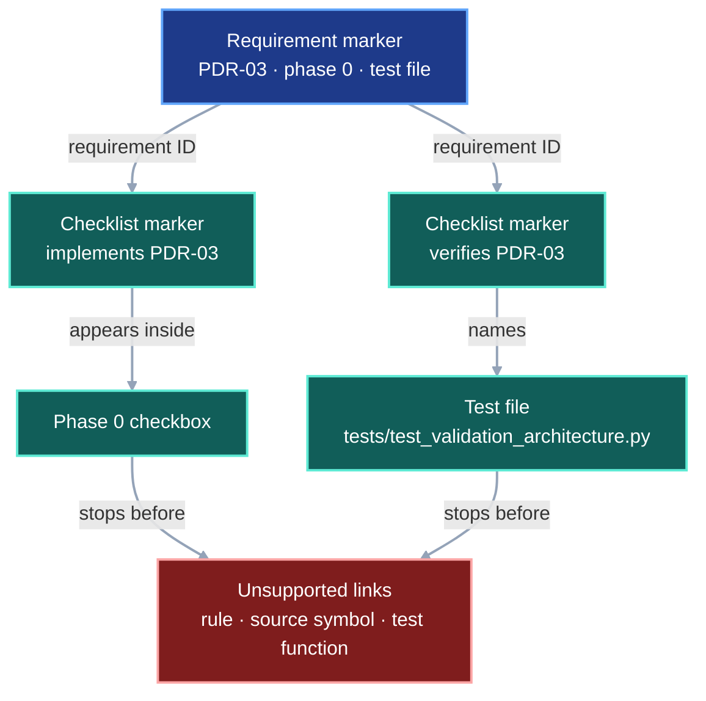
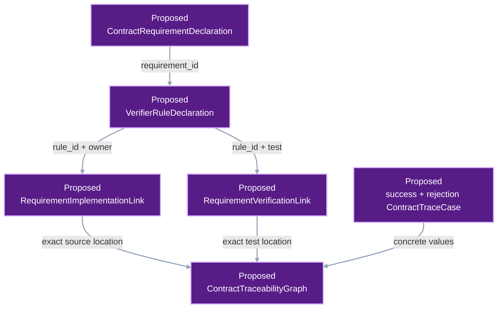
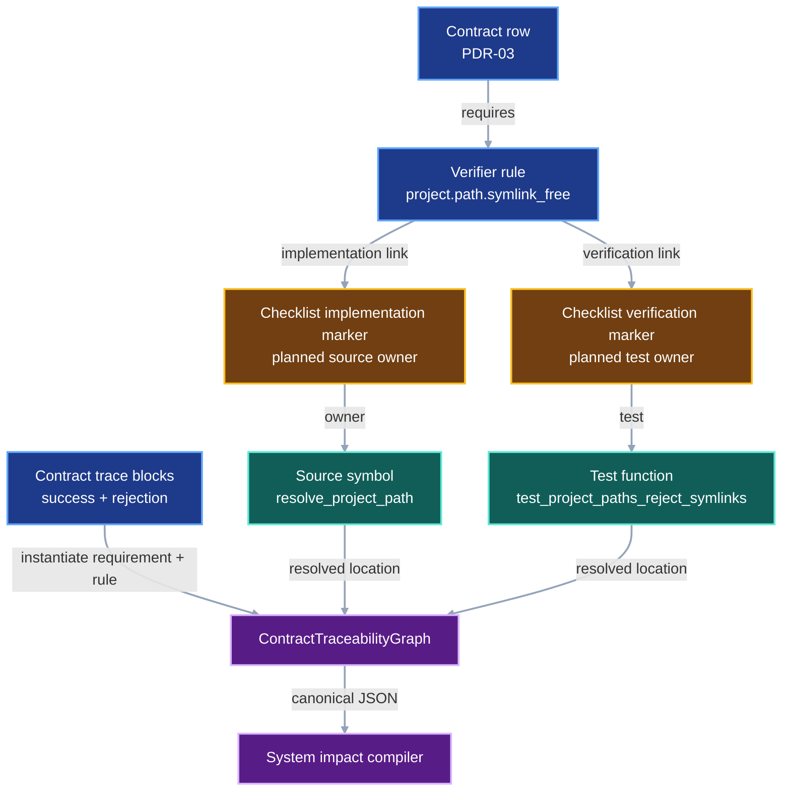

# Contract requirement traceability

VIPER contracts need a mechanical path from each written requirement to the
code and test that enforce it. The current documentation check stops after
linking a requirement to one checklist phase and one test file. The missing
middle consists of the verifier rule and its implementation symbol.

This contract defines that missing middle layer. The deterministic system
impact graph consumes these links after this contract is implemented.

## 1. Status

**Contract status:** draft after change-impact review; owner review pending.

These requirements bind the contract to the master checklist:

| ID | Implementation obligation |
| --- | --- |
| CRT-01 <!-- contract-requirement: CRT-01 phase=0 test=tests/test_documentation.py --> | Parse every contract requirement and named verifier rule into one canonical traceability model. |
| CRT-02 <!-- contract-requirement: CRT-02 phase=0 test=tests/test_documentation.py --> | Require every verifier rule to name one implementation owner and at least one exact acceptance test. |
| CRT-03 <!-- contract-requirement: CRT-03 phase=0 test=tests/test_documentation.py --> | Require every contract-gap specification to include current, proposed-change, and integrated DAGs; one worked example that constructs every contract model; and populated success and rejection traces. |
| CRT-04 <!-- contract-requirement: CRT-04 phase=0 test=tests/test_documentation.py --> | Publish a canonical traceability graph that the system-impact compiler ingests directly. |

## 2. Required claim

For every pending contract requirement, VIPER can answer four questions with
machine-readable repository evidence:

```text
What does the contract require?
-> ContractRequirementDeclaration

Which invariant enforces it?
-> VerifierRuleDeclaration

Which source symbol implements that invariant?
-> RequirementImplementationLink

Which test proves the accepted and rejected behavior?
-> RequirementVerificationLink
```

The resulting chain is:

```text
requirement
-> verifier rule
-> implementation owner
-> acceptance test
```

Each link names an exact file and symbol. While a contract remains planned, the
location is an exact target. Before its phase closes, the link changes to
`state="implemented"` and the compiler resolves the file and symbol in the
candidate source tree. Each complete link names both the test file and test
function.

## 3. Current gap

### Inspected path

`tests/test_documentation.py` currently parses three marker families:

```text
contract-requirement
-> requirement ID + phase + one legacy test file

implements / verifies
-> checklist checkbox + requirement ID

contract-baseline
-> contract file + reviewed SHA-256 digest
```

The test requires each requirement to appear once in an `implements` marker
and once in a `verifies` marker. It also requires the named test file to exist
and appear in the verification checkbox.

That check proves phase placement and document coverage. It leaves two
relationships implicit:

```text
requirement -> named verifier rule
named verifier rule -> exact implementation symbol
```

### Current DAG

The current checker reaches a phase and a test file, then stops before the named
rule, implementation symbol, and exact test function.



### Missing connector

The target parser adds explicit declarations for those relationships:

```text
contract requirement row
-> verifier-rule marker in the contract
-> implementation-link marker in the checklist
-> verification-link marker in the checklist
-> exact source and test symbols
-> canonical ContractTraceabilityGraph
```

The existing `implements`, `verifies`, and baseline markers remain as the
migration oracle until the graph produces the same requirement and phase
coverage.

### Proposed-change DAG

The proposed records make each missing relationship explicit.



### Integrated DAG

The integrated path retains the readable contract and checklist markers. The
compiler turns those markers and trace blocks into one graph that the system
impact compiler can consume.



## 4. Contract models

These development-tool records remain outside the experiment protocol and run
identity.

```python
RequirementId = Annotated[
    str,
    StringConstraints(pattern=r"^[A-Z]{3}-[0-9]{2}$"),
]
VerifierRuleId = Annotated[
    str,
    StringConstraints(pattern=r"^[a-z][a-z0-9_]*(\.[a-z][a-z0-9_]*)+$"),
]
TraceId = Annotated[
    str,
    StringConstraints(pattern=r"^[a-z][a-z0-9-]+$"),
]
TraceState = Literal["planned", "implemented"]


class SourceLocation(BaseModel):
    model_config = ConfigDict(extra="forbid", frozen=True)

    path: RepoRelPath
    symbol: NonEmptyStr
    line: int | None = Field(default=None, ge=1)


class ContractRequirementDeclaration(BaseModel):
    model_config = ConfigDict(extra="forbid", frozen=True)

    requirement_id: RequirementId
    contract: RepoRelPath
    phase: int = Field(ge=0)


class VerifierRuleDeclaration(BaseModel):
    model_config = ConfigDict(extra="forbid", frozen=True)

    rule_id: VerifierRuleId
    requirement_id: RequirementId
    contract: RepoRelPath
    statement: NonEmptyStr


class RequirementImplementationLink(BaseModel):
    model_config = ConfigDict(extra="forbid", frozen=True)

    requirement_id: RequirementId
    rule_id: VerifierRuleId
    phase: int = Field(ge=0)
    checklist_line: int = Field(ge=1)
    state: TraceState
    owner: SourceLocation


class RequirementVerificationLink(BaseModel):
    model_config = ConfigDict(extra="forbid", frozen=True)

    requirement_id: RequirementId
    rule_id: VerifierRuleId
    phase: int = Field(ge=0)
    checklist_line: int = Field(ge=1)
    state: TraceState
    test: SourceLocation


class AcceptedTraceOutcome(BaseModel):
    model_config = ConfigDict(extra="forbid", frozen=True)

    kind: Literal["accepted"] = "accepted"
    result: NonEmptyStr
    persisted_evidence: tuple[NonEmptyStr, ...] = Field(min_length=1)


class RejectedTraceOutcome(BaseModel):
    model_config = ConfigDict(extra="forbid", frozen=True)

    kind: Literal["rejected"] = "rejected"
    rejected_at: SourceLocation
    error_type: NonEmptyStr
    message_match: NonEmptyStr


TraceOutcome = Annotated[
    AcceptedTraceOutcome | RejectedTraceOutcome,
    Field(discriminator="kind"),
]


class ContractTraceCase(BaseModel):
    model_config = ConfigDict(extra="forbid", frozen=True)

    trace_id: TraceId
    requirement_id: RequirementId
    rule_id: VerifierRuleId
    state: TraceState
    scenario: NonEmptyStr
    setup: NonEmptyStr
    declaration: NonEmptyStr
    runtime: NonEmptyStr
    implementation: SourceLocation
    test: SourceLocation
    outcome: TraceOutcome


class ContractTraceabilityGraph(BaseModel):
    model_config = ConfigDict(extra="forbid", frozen=True)

    schema_version: Literal[1] = 1
    requirements: tuple[ContractRequirementDeclaration, ...] = Field(min_length=1)
    rules: tuple[VerifierRuleDeclaration, ...] = Field(min_length=1)
    implementations: tuple[RequirementImplementationLink, ...] = Field(
        min_length=1
    )
    verifications: tuple[RequirementVerificationLink, ...] = Field(min_length=1)
    traces: tuple[ContractTraceCase, ...] = Field(min_length=1)
```

`SourceLocation.symbol` uses the qualified name found in the named file. A
module-level function uses its function name. A method uses
`ClassName.method_name`. A test uses its complete test-function name.

`ContractTraceCase.setup` states the concrete paths, values, and external state
present before VIPER runs. `declaration` names the authored model or marker that
introduces the value. `runtime` names the call that processes it.
`implementation` and `test` identify the source owner and acceptance test.

`AcceptedTraceOutcome` records the returned result and at least one persisted
record or artifact. `RejectedTraceOutcome` records the exact source boundary,
error type, and message fragment expected by the test. The trace's `rule_id`
supplies the verifier statement through `VerifierRuleDeclaration`. That record
is the single owner of the statement.

### Marker syntax

Requirement rows keep the current marker while the old documentation checker
remains active:

```html
<!-- contract-requirement: PDR-03 phase=0 test=tests/test_validation_architecture.py -->
```

Every verification-table row adds one rule marker:

```html
<!-- verifier-rule: project.path.symlink_free requirement=PDR-03 -->
```

The owning checklist task adds a precise implementation marker beside the
current requirement-level marker:

```html
<!-- implements: PDR-03 -->
<!-- contract-implementation: requirement=PDR-03 rule=project.path.symlink_free state=planned owner=src/viper/project.py:resolve_project_path -->
```

The focused-test task adds a precise verification marker:

```html
<!-- verifies: PDR-03 -->
<!-- contract-verification: requirement=PDR-03 rule=project.path.symlink_free state=planned test=tests/test_validation_architecture.py:test_project_paths_reject_symlinks -->
```

The traceability parser derives `contract`, `phase`, and `checklist_line` from
the marker locations. It ignores the legacy requirement-level `test` value.
Exact test ownership comes from `RequirementVerificationLink`.

Marker and TOML values use `path:symbol` strings. The parser splits the first
colon after the repository path and constructs `SourceLocation`.

### Populated trace blocks

Each contract-gap specification contains one success block and one rejection
block using TOML that Python's standard library can parse:

````text
```toml example
trace_id = "project-path-symlink-rejection"
requirement_id = "PDR-03"
rule_id = "project.path.symlink_free"
state = "planned"
scenario = "A local input names a symlink beneath the selected project root."
setup = "ROOT=/tmp/weekend-models; inputs/link.csv is a symlink to /tmp/source.csv"
declaration = "ExternalInputRef(source=LocalSource(path='inputs/link.csv'))"
runtime = "resolve_project_path(ROOT, 'inputs/link.csv', operation='read')"
implementation = "src/viper/project.py:resolve_project_path"
test = "tests/test_validation_architecture.py:test_project_paths_reject_symlinks"
outcome.kind = "rejected"
outcome.rejected_at = "src/viper/project.py:resolve_project_path"
outcome.error_type = "ProjectPathError"
outcome.message_match = "symlink"
```
````

The parser rejects empty values, ellipses, angle-bracket placeholders, and fake
hash padding. A `planned` source location must use a valid repository-relative
path and qualified symbol. An `implemented` source location must also exist in
the candidate source tree. An accepted outcome names at least one persisted
record or artifact. A rejected outcome names the exact source boundary, error
type, and message fragment expected by its test.

### Illustrative worked example

This example constructs every Section 4 model for `PDR-03`. Phase 0 will create
the source and test symbols, so both links begin in the `planned` state.

<!-- contract-worked-example: start -->

```python
import json
from pathlib import Path

from viper._contract_traceability import (
    ContractRequirementDeclaration,
    ContractTraceCase,
    ContractTraceabilityGraph,
    AcceptedTraceOutcome,
    RejectedTraceOutcome,
    RequirementId,
    RequirementImplementationLink,
    RequirementVerificationLink,
    SourceLocation,
    TraceId,
    TraceOutcome,
    TraceState,
    VerifierRuleDeclaration,
    VerifierRuleId,
)


CONTRACT = Path("docs/development/project-data-root.md")
CHECKLIST = Path("docs/development/master-execution-checklist.md")
REQUIREMENT_ID: RequirementId = "PDR-03"
RULE_ID: VerifierRuleId = "project.path.symlink_free"
SUCCESS_TRACE_ID: TraceId = "ordinary-project-file"
REJECTION_TRACE_ID: TraceId = "project-path-symlink-rejection"
LINK_STATE: TraceState = "planned"


def marker_line(path: Path, marker: str) -> int:
    """Return the one-based line containing an exact checklist marker."""
    for line_number, line in enumerate(path.read_text().splitlines(), start=1):
        if marker in line:
            return line_number
    raise ValueError(f"missing marker: {marker}")


requirement = ContractRequirementDeclaration(
    requirement_id=REQUIREMENT_ID,
    contract=CONTRACT.as_posix(),
    phase=0,
)

rule = VerifierRuleDeclaration(
    rule_id=RULE_ID,
    requirement_id=requirement.requirement_id,
    contract=requirement.contract,
    statement=(
        "Reject every symlink from the first descendant of ROOT through the "
        "governed source or target."
    ),
)

implementation_location = SourceLocation(
    path="src/viper/project.py",
    symbol="resolve_project_path",
)
test_location = SourceLocation(
    path="tests/test_validation_architecture.py",
    symbol="test_project_paths_reject_symlinks",
)

implementation = RequirementImplementationLink(
    requirement_id=requirement.requirement_id,
    rule_id=rule.rule_id,
    phase=requirement.phase,
    checklist_line=marker_line(
        CHECKLIST,
        "requirement=PDR-03 rule=project.path.symlink_free",
    ),
    state=LINK_STATE,
    owner=implementation_location,
)

verification = RequirementVerificationLink(
    requirement_id=requirement.requirement_id,
    rule_id=rule.rule_id,
    phase=requirement.phase,
    checklist_line=marker_line(
        CHECKLIST,
        "contract-verification: requirement=PDR-03 "
        "rule=project.path.symlink_free",
    ),
    state=LINK_STATE,
    test=test_location,
)

accepted_outcome: TraceOutcome = AcceptedTraceOutcome(
    result="ROOT/inputs/train.csv",
    persisted_evidence=(
        "ResolvedExternalInputRef.file after capture and publication",
    ),
)
success = ContractTraceCase(
    trace_id=SUCCESS_TRACE_ID,
    requirement_id=requirement.requirement_id,
    rule_id=rule.rule_id,
    state=LINK_STATE,
    scenario="A training input names one ordinary file beneath ROOT.",
    setup="ROOT=/tmp/weekend-models; inputs/train.csv is an ordinary file",
    declaration=(
        "ExternalInputRef(source=LocalSource(path='inputs/train.csv'))"
    ),
    runtime=(
        "resolve_project_path(ROOT, 'inputs/train.csv', operation='read')"
    ),
    implementation=implementation_location,
    test=test_location,
    outcome=accepted_outcome,
)

rejected_outcome: TraceOutcome = RejectedTraceOutcome(
    rejected_at=implementation_location,
    error_type="ProjectPathError",
    message_match="symlink",
)
rejection = ContractTraceCase(
    trace_id=REJECTION_TRACE_ID,
    requirement_id=requirement.requirement_id,
    rule_id=rule.rule_id,
    state=LINK_STATE,
    scenario="A training input names ROOT/inputs/link.csv, which is a symlink.",
    setup=(
        "ROOT=/tmp/weekend-models; inputs/link.csv is a symlink to "
        "/tmp/source.csv"
    ),
    declaration=(
        "ExternalInputRef(source=LocalSource(path='inputs/link.csv'))"
    ),
    runtime=(
        "resolve_project_path(ROOT, 'inputs/link.csv', operation='read')"
    ),
    implementation=implementation_location,
    test=test_location,
    outcome=rejected_outcome,
)

traceability = ContractTraceabilityGraph(
    requirements=(requirement,),
    rules=(rule,),
    implementations=(implementation,),
    verifications=(verification,),
    traces=(success, rejection),
)

canonical_bytes = json.dumps(
    traceability.model_dump(mode="json"),
    sort_keys=True,
    separators=(",", ":"),
).encode()

assert traceability.rules[0].requirement_id == "PDR-03"
assert traceability.implementations[0].owner.symbol == "resolve_project_path"
assert traceability.verifications[0].test.symbol == (
    "test_project_paths_reject_symlinks"
)
assert b'"trace_id":"project-path-symlink-rejection"' in canonical_bytes
```

The compiler reads the corresponding repository data:

```html
<!-- verifier-rule: project.path.symlink_free requirement=PDR-03 -->
<!-- contract-implementation: requirement=PDR-03 rule=project.path.symlink_free state=planned owner=src/viper/project.py:resolve_project_path -->
<!-- contract-verification: requirement=PDR-03 rule=project.path.symlink_free state=planned test=tests/test_validation_architecture.py:test_project_paths_reject_symlinks -->
```

<!-- contract-worked-example: end -->

## 5. Execution

The documentation check compiles the graph in five passes:

```text
1. enumerate implementation contracts
2. parse requirement and verifier-rule declarations
3. parse checklist implementation and verification links
4. parse populated contract-trace blocks
5. validate planned locations and resolve implemented locations against the repository tree
```

It then applies these cardinality rules:

1. A requirement ID belongs to exactly one contract.
2. Each requirement declares at least one verifier rule.
3. A verifier rule belongs to exactly one requirement.
4. Each verifier rule has exactly one implementation owner.
5. Each verifier rule has at least one acceptance-test target.
6. The implementation and test links use the requirement's declared phase.
7. Each contract contains one populated success trace and one populated
   rejection trace for its selected claim.
8. Phase closure requires every implementation, verification, and trace link to
   use `state="implemented"`.

The compiler sorts requirements by ID, rules by rule ID, implementation links
by `(requirement_id, rule_id)`, verification links by
`(requirement_id, rule_id, test.path, test.symbol)`, and traces by `trace_id`.

## 6. Persisted evidence

The first implementation keeps the graph in test memory and serializes its
canonical JSON bytes only for deterministic comparison. The system-impact
compiler later publishes the same bytes at:

```text
.viper/system/contracts/traceability.json
```

The graph records repository-relative source locations. Its digest therefore
changes when a requirement link changes while remaining independent of the
machine's absolute checkout path.

## 7. Verification

| Rule | Executable requirement |
| --- | --- |
| `contract.requirement.unique` <!-- verifier-rule: contract.requirement.unique requirement=CRT-01 --> | Each requirement ID is declared once. |
| `contract.rule.declared` <!-- verifier-rule: contract.rule.declared requirement=CRT-01 --> | Each requirement declares at least one unique verifier rule. |
| `contract.rule.implemented` <!-- verifier-rule: contract.rule.implemented requirement=CRT-02 --> | Each verifier rule names one exact implementation target; every link marked `implemented` resolves to an existing file and symbol. |
| `contract.rule.tested` <!-- verifier-rule: contract.rule.tested requirement=CRT-02 --> | Each verifier rule names at least one exact test target; every link marked `implemented` resolves to an existing test function. |
| `contract.trace.populated` <!-- verifier-rule: contract.trace.populated requirement=CRT-03 --> | Each contract contains parseable success and rejection traces with concrete values and source locations valid for their declared state. |
| `contract.example.complete` <!-- verifier-rule: contract.example.complete requirement=CRT-03 --> | Each contract contains three rendered DAG sources and one marked, syntax-valid worked example that constructs every class and calls every operation declared in Section 4. |
| `contract.graph.canonical` <!-- verifier-rule: contract.graph.canonical requirement=CRT-04 --> | Repeated compilation produces identical ordered JSON bytes. |
| `contract.graph.complete` <!-- verifier-rule: contract.graph.complete requirement=CRT-04 --> | Every requirement and rule reaches its owner and tests. |

These named rules are logical entities only after the parser reads their
markers. Their implementation is ordinary source code. Their proof is the
named test function. The traceability graph joins those three representations.

## 8. Propagation

| Surface | Required statement |
| --- | --- |
| `src/viper/_contract_traceability.py` | Add exact models, marker parsers, TOML trace parsing, symbol resolution, cardinality checks, and canonical serialization for developer tooling. |
| `tests/test_documentation.py` | Compare the compiler output with the current requirement, phase, test-file, and baseline oracle; require each contract's three DAGs and complete Section 4 example. |
| `docs/development/master-execution-checklist.md` | Add the foundational Phase 0 work before project-root and system-graph implementation. |
| `docs/development/*.md` pending contracts | Add verifier-rule markers, three DAGs, one complete worked example, and populated success and rejection traces per contract. |
| `/Users/machina/.agents/skills/contract-gap-specification/SKILL.md` | Require the three-DAG comparison, complete Section 4 example, populated traces, and requirement-rule-owner-test chain. |
| `docs/development/system-impact-graph.md` | Consume `ContractTraceabilityGraph` directly as its contract-coverage input. |
| `docs/development/testing.md` | Document the focused traceability check and the meaning of each marker. |

### Legacy cleanup

| Current occurrence | Disposition |
| --- | --- |
| `_CONTRACT_REQUIREMENT` parser | Retain and construct `ContractRequirementDeclaration` from its matches. |
| `_CHECKLIST_MAPPING` parser | Retain as the requirement-to-phase migration oracle. |
| Requirement-level `implements` and `verifies` markers | Retain through graph parity; remove after confirming that the checklist retains its readable requirement map. |
| Requirement marker `test=` field | Retain only while the old documentation checker remains active; remove after exact `RequirementVerificationLink` parity. |
| System-graph contract's independent contract-marker parser | Replace with `ContractTraceabilityGraph` ingestion. |
| Prose-only verifier rules | Replace sentence-derived identity with stable rule markers. |

## 9. Acceptance case

### Success

````toml contract-trace
trace_id = "requirement-rule-owner-test"
requirement_id = "CRT-02"
rule_id = "contract.rule.implemented"
state = "planned"
scenario = "The traceability compiler records one exact planned source owner for a rule."
setup = "contract and checklist contain matching CRT-02 and contract.rule.implemented markers"
declaration = "verifier-rule marker in contract-requirement-traceability.md"
runtime = "compile_contract_traceability(ROOT)"
implementation = "src/viper/_contract_traceability.py:compile_contract_traceability"
test = "tests/test_documentation.py:test_contract_rules_map_to_owners_and_tests"
outcome.kind = "accepted"
outcome.result = "one RequirementImplementationLink for contract.rule.implemented"
outcome.persisted_evidence = ["canonical ContractTraceabilityGraph JSON bytes"]
````

### Rejection

````toml contract-trace
trace_id = "orphan-verifier-rule"
requirement_id = "CRT-02"
rule_id = "contract.rule.tested"
state = "planned"
scenario = "A verifier rule has no contract-verification marker."
setup = "fixture checklist omits the verification link for contract.rule.tested"
declaration = "verifier-rule marker remains present"
runtime = "compile_contract_traceability(fixture_root)"
implementation = "src/viper/_contract_traceability.py:compile_contract_traceability"
test = "tests/test_documentation.py:test_contract_traceability_rejects_orphan_rule"
outcome.kind = "rejected"
outcome.rejected_at = "src/viper/_contract_traceability.py:compile_contract_traceability"
outcome.error_type = "ContractTraceabilityError"
outcome.message_match = "contract.rule.tested"
````

The function and test symbols in these blocks are target symbols. The first
implementation increment creates them before enabling symbol-resolution
enforcement for this contract.

## 10. Implementation order

1. Add the traceability models and marker parsers beside the current
   documentation oracle.
2. Add fixture contracts that prove every cardinality, state-transition, and
   symbol-resolution failure independently.
3. Add verifier-rule, implementation, verification, populated-trace, DAG, and
   worked-example markers to this contract.
4. Migrate each remaining pending contract one at a time.
5. As each phase is implemented, change its exact links from `planned` to
   `implemented` and require every location to resolve before that phase closes.
6. Compare the new graph with the current requirement, phase, and baseline
   checks.
7. Expose the canonical graph to the system-impact compiler.
8. Remove duplicate parsing only after parity passes.

**Commit boundary:** `Trace contract requirements to code and tests`

## Sources

- [NASA SWE-052: Bidirectional Traceability](https://swehb.nasa.gov/spaces/SWEHBVC/pages/50888903/SWE-052%2B-%2BBidirectional%2BTraceability)
  requires forward and backward links between requirements, design, code, and
  tests.
- [IEEE technical-requirements overview](https://technav.ieee.org/topic/technical-requirements/)
  describes forward traceability from requirements to implementing design
  elements and test cases.
