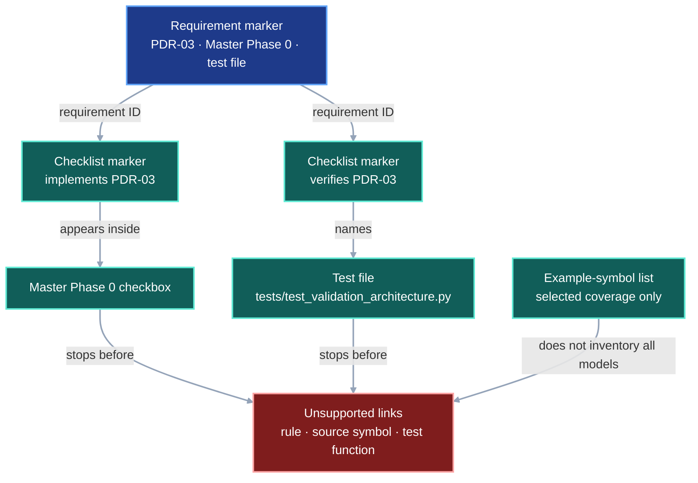
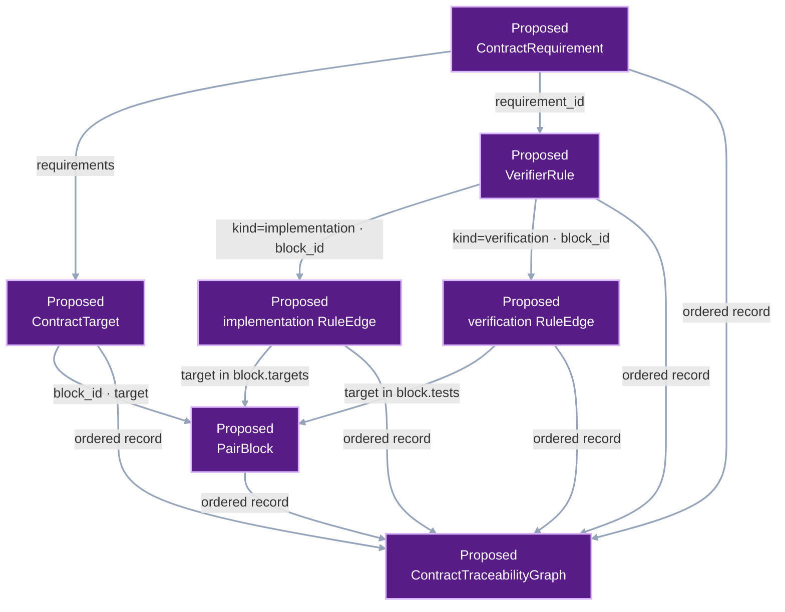
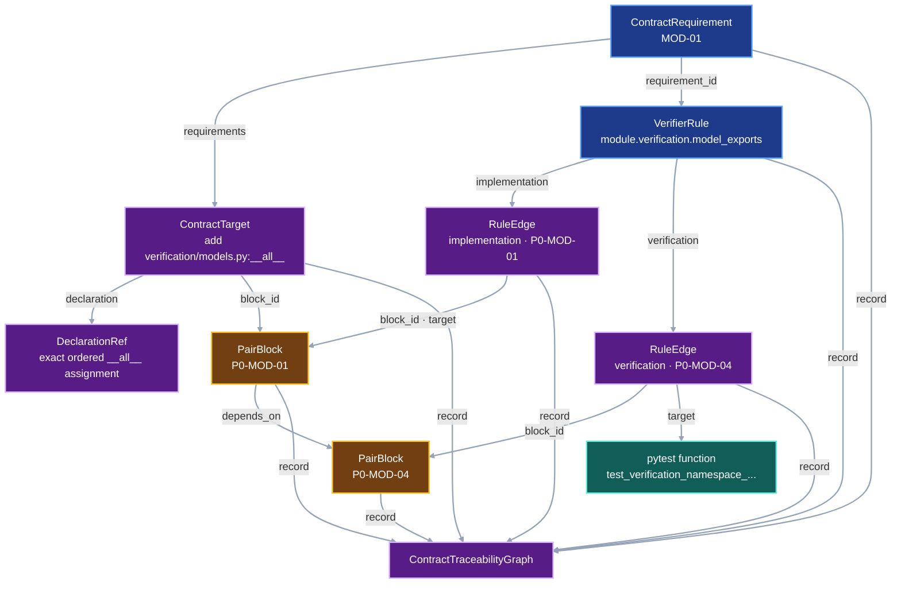

# Contract Traceability

VIPER contracts need a mechanical path from each written requirement to the
code and test that enforce it. The current documentation check stops after
linking a requirement to one checklist phase and one test file. The missing
middle consists of the verifier rule and its implementation symbol.

This contract defines that missing middle layer. The deterministic system
impact graph consumes these links after this contract is implemented.

## 1. Status

**Contract status:** implemented through `CRT-05`; `CRT-06` draft pending
review of the complete target-to-PairBlock closure.

These requirements bind the contract to the master checklist:

| ID | Implementation obligation |
| --- | --- |
| CRT-01 <!-- contract-requirement: CRT-01 phase=0 test=tests/test_contract_traceability.py --> | Parse every contract requirement and named verifier rule into `ContractTraceabilityGraph`, with each collection serialized in canonical order. |
| CRT-02 <!-- contract-requirement: CRT-02 phase=0 test=tests/test_contract_traceability.py --> | Require every verifier rule to name one implementation owner and at least one exact acceptance test. |
| CRT-03 <!-- contract-requirement: CRT-03 phase=0 test=tests/test_contract_traceability.py --> | Require every contract-gap specification to include current, proposed-change, and integrated DAGs plus one explicit example-symbol inventory and one worked example that exercises every inventoried symbol. |
| CRT-04 <!-- contract-requirement: CRT-04 phase=0 test=tests/test_contract_traceability.py --> | Publish a canonical, source-evidenced traceability graph for downstream plan checks. |
| CRT-05 <!-- contract-requirement: CRT-05 phase=0 test=tests/test_contract_traceability.py --> | Inventory every normative Section 4 Python symbol, require every worked-example symbol to belong to that inventory, and publish the inventory in `ContractTraceabilityGraph`. |
| CRT-06 <!-- contract-requirement: CRT-06 phase=0 test=tests/test_contract_traceability.py --> | Compile every `ContractTarget` and `PairBlock` into `ContractTraceabilityGraph`; bind each rule edge to one block; require complete requirement, target, rule, test, and dependency closure; then remove the superseded symbol, export, and example inventories. |

## 2. Required claim

For every pending contract requirement, VIPER can answer four questions with
machine-readable repository evidence:

```text
What does the contract require?
-> ContractRequirement

Which invariant enforces it?
-> VerifierRule

Which source symbol implements that invariant?
-> RuleEdge(kind="implementation")

Which test proves the accepted and rejected behavior?
-> RuleEdge(kind="verification")

Which source declarations does the contract require the implementation to add,
update, or remove?
-> ContractTarget

Which bounded implementation block owns each target and test?
-> PairBlock
```

The resulting chain is:

```text
requirement
-> verifier rule
-> implementation owner
-> acceptance test

requirement
-> contract target
-> PairBlock
-> authored edit and gate
```

Each link names an exact file and symbol. While a contract remains planned, the
location is an exact target. Before its phase closes, the link changes to
`state="implemented"` and the compiler resolves the file and symbol in the
candidate source tree. Each complete link names both the test file and test
function.

## 3. Current gap

### Inspected path

`tests/test_documentation.py` currently parses three marker families:

```text
contract-requirement
-> requirement ID + phase + one legacy test file

implements / verifies
-> checklist checkbox + requirement ID

contract-baseline
-> contract file + reviewed SHA-256 digest
```

The test requires each requirement to appear once in an `implements` marker
and once in a `verifies` marker. It also requires the named test file to exist
and appear in the verification checkbox.

That check proves phase placement and document coverage. The implemented CRT
compiler now adds rules, owners, tests, and documentation-symbol inventories.
It still leaves the executable plan outside the graph:

```text
requirement -> exact source change
exact source change -> one PairBlock
rule edge -> owning PairBlock
PairBlock target -> exact source change
PairBlock test -> verification edge
PairBlock dependency -> known acyclic predecessor
```

### Current DAG

The current checker reaches a phase and a test file, then stops before the named
rule, implementation symbol, and exact test function.



### Missing connector

The target parser adds explicit declarations for those relationships:

```text
contract requirement row
-> verifier-rule marker in the contract
-> implementation-link marker in the checklist
-> verification-link marker in the checklist
-> exact source and test symbols
-> ContractTraceabilityGraph
```

The existing `implements`, `verifies`, and baseline markers remain as the
migration oracle until the graph produces the same requirement and phase
coverage.

### Diagram color contract

The three DAGs use color to identify each node's role. Complete node labels
carry the same meaning independently of color.

| Role | Mermaid classes | Fill | Stroke |
| --- | --- | --- | --- |
| Authored contract or current declaration | `contract`, `current` | `#1e3a8a` | `#60a5fa` |
| Existing implementation or observed evidence | `implementation`, `evidence` | `#115e59` | `#5eead4` |
| Unsupported gap | `gap` | `#7f1d1d` | `#fca5a5` |
| Proposed model or generated output | `proposed`, `output` | `#581c87` | `#d8b4fe` |
| Checklist-owned scheduling | `checklist` | `#713f12` | `#fbbf24` |

Every role uses white text and a two-pixel stroke. Every link uses `#94a3b8`
with a two-pixel stroke. The current DAG uses blue, teal, and red to separate
existing declarations, supporting evidence, and the gap. The proposed-change
DAG uses purple. The integrated DAG uses blue, amber, teal, and purple to show
the contract, checklist, implementation, and generated graph boundaries.

### Proposed-change DAG

`CRT-06` adds the missing plan records and joins them before System Impact sees
the plan.



### Integrated DAG

The integrated path shows one `MOD-01` target. `declaration` identifies the
exact ordered `__all__` assignment required by the PairBlock. The implementation
edge says that the same symbol enforces the rule. The verification edge names
the test that observes it.



## 4. Contract models

These development-tool records remain outside the experiment protocol and run
identity.

```python
RequirementId = Annotated[
    str,
    Field(pattern=r"^[A-Z]{3}-[0-9]{2}$"),
]
VerifierRuleId = Annotated[
    str,
    Field(pattern=r"^[a-z][a-z0-9_]*(\.[a-z][a-z0-9_]*)+$"),
]
RuleEdgeKind = Literal["implementation", "verification"]
TraceState = Literal["planned", "implemented"]
ContractSymbolKind = Literal["model", "alias", "function"]
ContractSymbolName = Annotated[
    str,
    Field(pattern=r"^[A-Za-z_][A-Za-z0-9_]*$"),
]


class DeclarationRef(ProtocolModel):
    """Locate and identify one authored traceability declaration."""

    path: RepoRelPath = Field(
        description="Repository-relative document containing the declaration."
    )
    start_line: int = Field(
        ge=1,
        description="One-based first line occupied by the declaration.",
    )
    end_line: int = Field(
        ge=1,
        description="One-based final line occupied by the declaration.",
    )
    sha256: SHA256 = Field(
        description="SHA-256 digest of the exact UTF-8 declaration bytes."
    )

    @model_validator(mode="after")
    def validate_line_order(self) -> Self:
        """Require the final line to include or follow the first line."""
        if self.end_line < self.start_line:
            raise ValueError("end_line must be greater than or equal to start_line")
        return self


class RepoSymbolRef(ProtocolModel):
    """Reference one qualified symbol in one repository file."""

    path: RepoRelPath = Field(
        description="Repository-relative source file containing the symbol."
    )
    symbol: NonEmptyStr = Field(
        description="Qualified symbol name resolved inside the source file."
    )


class ContractRequirement(ProtocolModel):
    """Identify one requirement declared by one contract."""

    requirement_id: RequirementId = Field(
        description="Stable identifier declared by the owning contract."
    )
    contract: RepoRelPath = Field(
        description="Repository-relative contract that declares the requirement."
    )
    declaration: DeclarationRef = Field(
        description="Exact authored requirement marker used to reconstruct this record."
    )


class VerifierRule(ProtocolModel):
    """Declare one testable rule required by a contract."""

    rule_id: VerifierRuleId = Field(
        description="Stable identifier of the executable invariant."
    )
    requirement_id: RequirementId = Field(
        description="Contract requirement that owns the verifier rule."
    )
    contract: RepoRelPath = Field(
        description="Repository-relative contract that declares the rule."
    )
    statement: NonEmptyStr = Field(
        description="Testable invariant enforced by the rule."
    )
    declaration: DeclarationRef = Field(
        description="Exact authored verifier-rule marker used to reconstruct this record."
    )


class RuleEdge(ProtocolModel):
    """Connect one verifier rule to an implementation or test."""

    kind: RuleEdgeKind = Field(
        description="Relationship from the rule to an implementation or test."
    )
    rule_id: VerifierRuleId = Field(
        description="Verifier rule at the source of this edge."
    )
    phase: int = Field(
        ge=0,
        description="Checklist phase that schedules this relationship.",
    )
    declaration: DeclarationRef = Field(
        description="Exact checklist marker that declares this relationship."
    )
    state: TraceState = Field(
        description="Whether the referenced symbol is planned or implemented."
    )
    target: RepoSymbolRef = Field(
        description="Repository symbol reached by this relationship."
    )


class ContractSymbol(ProtocolModel):
    """Identify one normative Python symbol named by one contract."""

    kind: ContractSymbolKind = Field(
        description="Symbol category declared by the contract inventory."
    )
    name: ContractSymbolName = Field(
        description="Python identifier used for the symbol in the contract."
    )
    contract: RepoRelPath = Field(
        description="Repository-relative contract that inventories the symbol."
    )
    declaration: DeclarationRef = Field(
        description="Exact contract-symbols marker that inventories the symbol."
    )


class ContractTraceabilityGraph(ProtocolModel):
    """Store the complete ordered traceability graph."""

    schema_version: Literal[4] = Field(
        default=4,
        description="Format version of the serialized traceability graph.",
    )
    requirements: tuple[ContractRequirement, ...] = Field(
        min_length=1,
        description="Ordered contract requirements represented by the graph.",
    )
    rules: tuple[VerifierRule, ...] = Field(
        min_length=1,
        description="Ordered verifier rules represented by the graph.",
    )
    edges: tuple[RuleEdge, ...] = Field(
        min_length=1,
        description="Ordered implementation and verification relationships.",
    )
    symbols: tuple[ContractSymbol, ...] = Field(
        min_length=1,
        description="Ordered normative symbols inventoried by the contracts.",
    )
```

The block above is the implemented `CRT-05` baseline. `CRT-06` replaces
`ContractSymbol` and `symbols` with the following exact target model:

```python target-model
PairBlockId = Annotated[
    str,
    Field(pattern=r"^P[0-9]+-[A-Z]{3}-[0-9]{2}$"),
]
TargetAction = Literal["add", "update", "remove"]


class ContractTarget(ProtocolModel):
    """Bind one required source change to one implementation block."""

    requirements: tuple[RequirementId, ...] = Field(
        min_length=1,
        description="Contract requirements that need this source change.",
    )
    block_id: PairBlockId = Field(
        description="PairBlock that applies this source change."
    )
    action: TargetAction = Field(
        description="Whether the PairBlock adds, updates, or removes the target."
    )
    target: RepoSymbolRef = Field(
        description="Repository symbol changed by the PairBlock."
    )
    declaration: DeclarationRef = Field(
        description=(
            "Exact pair-edit code required for an add or update, or the exact "
            "removal marker required for a removal."
        )
    )


class PairBlock(ProtocolModel):
    """Store one bounded, dependency-ordered implementation step."""

    block_id: PairBlockId = Field(
        description="Stable identifier used by checklist and target records."
    )
    requirements: tuple[RequirementId, ...] = Field(
        min_length=1,
        description="Contract requirements implemented by this block."
    )
    targets: tuple[RepoSymbolRef, ...] = Field(
        min_length=1,
        description="Repository symbols this block changes."
    )
    tests: tuple[RepoSymbolRef, ...] = Field(
        min_length=1,
        description="Exact pytest functions that observe this block."
    )
    gate: NonEmptyStr = Field(
        description="Focused command that must pass before the block closes."
    )
    depends_on: tuple[PairBlockId, ...] = Field(
        description="Blocks whose completed results this block consumes."
    )
    declaration: DeclarationRef = Field(
        description="Exact pair-block manifest used to reconstruct this record."
    )


class RuleEdge(ProtocolModel):
    """Connect one verifier rule to its implementation block or test block."""

    kind: RuleEdgeKind = Field(
        description="Relationship from the rule to an implementation or test."
    )
    rule_id: VerifierRuleId = Field(
        description="Verifier rule at the source of this edge."
    )
    block_id: PairBlockId = Field(
        description="PairBlock that owns the target of this relationship."
    )
    phase: int = Field(
        ge=0,
        description="Checklist phase that schedules this relationship."
    )
    declaration: DeclarationRef = Field(
        description="Exact checklist marker that declares this relationship."
    )
    state: TraceState = Field(
        description="Whether the referenced symbol is planned or implemented."
    )
    target: RepoSymbolRef = Field(
        description="Repository symbol reached by this relationship."
    )


class ContractTraceabilityGraph(ProtocolModel):
    """Store the complete ordered contract and implementation plan."""

    schema_version: Literal[5] = Field(
        default=5,
        description="Format version of the serialized traceability graph."
    )
    requirements: tuple[ContractRequirement, ...] = Field(
        min_length=1,
        description="Ordered contract requirements represented by the graph."
    )
    rules: tuple[VerifierRule, ...] = Field(
        min_length=1,
        description="Ordered verifier rules represented by the graph."
    )
    edges: tuple[RuleEdge, ...] = Field(
        min_length=1,
        description="Ordered implementation and verification relationships."
    )
    targets: tuple[ContractTarget, ...] = Field(
        min_length=1,
        description="Ordered source changes required by the contracts."
    )
    blocks: tuple[PairBlock, ...] = Field(
        min_length=1,
        description="Ordered implementation blocks that apply the source changes."
    )
```

`ContractTarget.declaration` locates the authored PairBlock payload. For an
`add` or `update`, it covers the associated `python pair-edit` fence. For a
`remove`, it covers the associated removal marker. It does not claim that the
whole fence is one Python declaration. The System Impact Check later resolves
the target's qualified symbol inside that payload and hashes only the exact
declaration bytes.

`RepoSymbolRef.symbol` uses the qualified name found in the named file. A
module-level function uses its function name. A method uses
`ClassName.method_name`. A test uses its complete test-function name.

`RuleEdge(kind="verification")` names the exact pytest function that owns the
accepted and rejected behavior. The graph records that executable link instead
of copying the test scenario and expected outcome into another prose record.

### Marker syntax

Requirement rows keep the current marker while the old documentation checker
remains active:

```html
<!-- contract-requirement: PDR-03 phase=0 test=tests/test_validation_architecture.py -->
```

Every verification-table row adds one rule marker:

```html
<!-- verifier-rule: project.path.symlink_free requirement=PDR-03 -->
```

The owning checklist task adds a precise implementation marker beside the
current requirement-level marker:

```html
<!-- implements: PDR-03 -->
<!-- contract-implementation: requirement=PDR-03 rule=project.path.symlink_free state=planned owner=src/viper/project.py:resolve_path -->
```

The focused-test task adds a precise verification marker:

```html
<!-- verifies: PDR-03 -->
<!-- contract-verification: requirement=PDR-03 rule=project.path.symlink_free state=planned test=tests/test_validation_architecture.py:test_project_paths_reject_symlinks -->
```

The traceability parser derives `contract` from the requirement marker's file.
It derives `phase` from each precise checklist marker. Every requirement, rule,
and edge also stores one `DeclarationRef` containing the exact source
path, line span, and declaration digest. The
legacy requirement-level `phase` and `test` values remain only until the new
traceability graph passes parity with the existing documentation checker. The
cleanup step then removes both fields.

Marker and TOML values use `path:symbol` strings. The parser splits the first
colon after the repository path and constructs `RepoSymbolRef`.

`CRT-06` derives `RuleEdge.block_id` from the `pair-block` marker in the same
checklist checkbox. Each PairBlock target receives one marker immediately
before the code or removal declaration that owns it:

```html
<!-- contract-target: requirements=MOD-01 action=add target=src/viper/verification/models.py:__all__ -->
```

```python contract-target
__all__ = [
    "StageSnapshot",
    "StorageFetcher",
    "VerificationError",
    "VerificationPolicy",
    "VerifiedArtifact",
    "VerifiedBenchmarkResult",
    "VerifiedInput",
    "VerifiedRunPlan",
    "VerifiedRunResult",
    "VerifiedSnapshotFile",
]
```

The marker supplies `requirements`, `action`, and `target`. The containing
PairBlock supplies `block_id`; the compiler rejects a marker outside a block.
The following file-separated fence supplies `declaration`. Several consecutive
markers may name declarations in the same fence. A removal uses the same
marker followed by `<!-- contract-remove -->`; those marker bytes become the
declaration evidence.

The implemented `contract-symbols` and `contract-example-symbols` markers remain
active only until `P0-CRT-07` migrates every PairBlock target. `CRT-06` then
removes both marker families, `ContractSymbol`, and the MOD-specific
`contract-exports` fences.

Each contract also declares one exact symbol inventory:

```text
contract-symbols:
{"models":["RuleEdge"],"aliases":["RuleEdgeKind"],"functions":[]}
```

The three arrays are sorted and disjoint. They include every top-level model,
alias, and function in Section 4. They may also include symbols imported for
the worked example. Every `contract-example-symbols` entry must appear in this
larger inventory. The compiler rejects an omitted Section 4 declaration, an
unresolved inventory name, or an example-only name.

### Illustrative worked example

The inventory explicitly names the contract symbols this workflow must
exercise. The validator resolves each name to a Python declaration in this
contract, then requires the example to construct classes, call functions, and
reference aliases. Document position does not define coverage.

Master Phase 0 will create the source and test symbols, so both links begin in
the `planned` state.

<!-- contract-symbols:
{"models":["ContractRequirement","ContractSymbol","ContractTraceabilityGraph","DeclarationRef","RepoSymbolRef","RuleEdge","VerifierRule"],"aliases":["ContractSymbolKind","ContractSymbolName","RequirementId","RuleEdgeKind","TraceState","VerifierRuleId"],"functions":[]}
-->

<!-- contract-example-symbols:
["ContractSymbolKind", "ContractSymbolName", "RequirementId", "VerifierRuleId", "RuleEdgeKind", "TraceState", "DeclarationRef", "RepoSymbolRef", "ContractRequirement", "VerifierRule", "RuleEdge", "ContractSymbol", "ContractTraceabilityGraph"]
-->

<!-- contract-worked-example: start -->

```python
import hashlib
import json
from pathlib import Path

from viper._contract_traceability import (
    ContractRequirement,
    ContractSymbol,
    ContractSymbolKind,
    ContractSymbolName,
    ContractTraceabilityGraph,
    DeclarationRef,
    RequirementId,
    RepoSymbolRef,
    RuleEdge,
    RuleEdgeKind,
    TraceState,
    VerifierRule,
    VerifierRuleId,
)


CONTRACT = Path("docs/development/project-data-root.md")
CHECKLIST = Path("docs/development/master-execution-checklist.md")
REQUIREMENT_ID: RequirementId = "PDR-03"
RULE_ID: VerifierRuleId = "project.path.symlink_free"
LINK_STATE: TraceState = "planned"
CHECKLIST_PHASE = 0


def marker_line(path: Path, marker: str) -> int:
    """Return the one-based line containing an exact checklist marker."""
    for line_number, line in enumerate(path.read_text().splitlines(), start=1):
        if marker in line:
            return line_number
    raise ValueError(f"missing marker: {marker}")


def declaration_ref(path: Path, marker: str) -> DeclarationRef:
    """Identify the exact authored line containing one marker."""
    text = path.read_text(encoding="utf-8")
    line = next(value for value in text.splitlines() if marker in value)
    line_number = marker_line(path, marker)
    return DeclarationRef(
        path=path.as_posix(),
        start_line=line_number,
        end_line=line_number,
        sha256=hashlib.sha256(line.encode("utf-8")).hexdigest(),
    )


requirement = ContractRequirement(
    requirement_id=REQUIREMENT_ID,
    contract=CONTRACT.as_posix(),
    declaration=declaration_ref(CONTRACT, "contract-requirement: PDR-03"),
)

rule = VerifierRule(
    rule_id=RULE_ID,
    requirement_id=requirement.requirement_id,
    contract=requirement.contract,
    statement=(
        "Reject every symlink from the first descendant of ROOT through the "
        "governed source or target."
    ),
    declaration=declaration_ref(
        CONTRACT,
        "verifier-rule: project.path.symlink_free",
    ),
)

implementation_location = RepoSymbolRef(
    path="src/viper/project.py",
    symbol="resolve_path",
)
test_location = RepoSymbolRef(
    path="tests/test_validation_architecture.py",
    symbol="test_project_paths_reject_symlinks",
)

implementation_kind: RuleEdgeKind = "implementation"
implementation = RuleEdge(
    kind=implementation_kind,
    rule_id=rule.rule_id,
    phase=CHECKLIST_PHASE,
    declaration=declaration_ref(
        CHECKLIST,
        "requirement=PDR-03 rule=project.path.symlink_free",
    ),
    state=LINK_STATE,
    target=implementation_location,
)

verification_kind: RuleEdgeKind = "verification"
verification = RuleEdge(
    kind=verification_kind,
    rule_id=rule.rule_id,
    phase=CHECKLIST_PHASE,
    declaration=declaration_ref(
        CHECKLIST,
        "contract-verification: requirement=PDR-03 "
        "rule=project.path.symlink_free",
    ),
    state=LINK_STATE,
    target=test_location,
)

symbol_kind: ContractSymbolKind = "model"
symbol_name: ContractSymbolName = "RuleEdge"
symbol = ContractSymbol(
    kind=symbol_kind,
    name=symbol_name,
    contract=requirement.contract,
    declaration=declaration_ref(CONTRACT, "contract-symbols:"),
)

traceability = ContractTraceabilityGraph(
    requirements=(requirement,),
    rules=(rule,),
    edges=(implementation, verification),
    symbols=(symbol,),
)

canonical_bytes = json.dumps(
    traceability.model_dump(mode="json"),
    sort_keys=True,
    separators=(",", ":"),
).encode()

assert traceability.rules[0].requirement_id == "PDR-03"
assert traceability.edges[0].target.symbol == "resolve_path"
assert traceability.edges[1].target.symbol == (
    "test_project_paths_reject_symlinks"
)
assert b'"rule_id":"project.path.symlink_free"' in canonical_bytes
```

The compiler reads the corresponding repository data:

```html
<!-- verifier-rule: project.path.symlink_free requirement=PDR-03 -->
<!-- contract-implementation: requirement=PDR-03 rule=project.path.symlink_free state=planned owner=src/viper/project.py:resolve_path -->
<!-- contract-verification: requirement=PDR-03 rule=project.path.symlink_free state=planned test=tests/test_validation_architecture.py:test_project_paths_reject_symlinks -->
```

<!-- contract-worked-example: end -->

### CRT-06 target example

This example instantiates every model added or changed by `CRT-06`. The
`DeclarationRef` for `target` identifies the exact `__all__` assignment shown
above; it is the value that the later CodeQL-backed plan check must find in the
realized source.

```python target-example
target = ContractTarget(
    requirements=("MOD-01",),
    block_id="P0-MOD-01",
    action="add",
    target=RepoSymbolRef(
        path="src/viper/verification/models.py",
        symbol="__all__",
    ),
    declaration=declaration_ref(
        Path("docs/development/contract-traceability.md"),
        "contract-target: requirements=MOD-01",
    ),
)

build = PairBlock(
    block_id="P0-MOD-01",
    requirements=("MOD-01",),
    targets=(target.target,),
    tests=(
        RepoSymbolRef(
            path="tests/test_public_api.py",
            symbol="test_verification_namespace_separates_operations_and_models",
        ),
    ),
    gate=(
        "conda run -n mantra python -m pytest tests/test_public_api.py "
        "-k verification_namespace -q"
    ),
    depends_on=("P0-CRT-06",),
    declaration=declaration_ref(
        Path("docs/development/module-ownership-pair-coding.md"),
        'id = "P0-MOD-01"',
    ),
)

proof = PairBlock(
    block_id="P0-MOD-04",
    requirements=("MOD-01",),
    targets=build.tests,
    tests=build.tests,
    gate=build.gate,
    depends_on=(build.block_id,),
    declaration=declaration_ref(
        Path("docs/development/module-ownership-pair-coding.md"),
        'id = "P0-MOD-04"',
    ),
)

implementation = RuleEdge(
    kind="implementation",
    rule_id="module.verification.model_exports",
    block_id=build.block_id,
    phase=0,
    declaration=declaration_ref(
        CHECKLIST,
        "rule=module.verification.model_exports state=planned owner=",
    ),
    state="planned",
    target=target.target,
)

verification = RuleEdge(
    kind="verification",
    rule_id="module.verification.model_exports",
    block_id=proof.block_id,
    phase=0,
    declaration=declaration_ref(
        CHECKLIST,
        "rule=module.verification.model_exports state=planned test=",
    ),
    state="planned",
    target=proof.tests[0],
)

traceability = ContractTraceabilityGraph(
    requirements=(
        ContractRequirement(
            requirement_id="MOD-01",
            contract="docs/development/module-ownership.md",
            declaration=declaration_ref(
                Path("docs/development/module-ownership.md"),
                "contract-requirement: MOD-01",
            ),
        ),
    ),
    rules=(
        VerifierRule(
            rule_id="module.verification.model_exports",
            requirement_id="MOD-01",
            contract="docs/development/module-ownership.md",
            statement="The model module exposes the exact approved names.",
            declaration=declaration_ref(
                Path("docs/development/module-ownership.md"),
                "verifier-rule: module.verification.model_exports",
            ),
        ),
    ),
    edges=(implementation, verification),
    targets=(target,),
    blocks=(build, proof),
)

assert target.target in build.targets
assert implementation.target == target.target
assert implementation.block_id == target.block_id
assert verification.target in proof.tests
assert proof.depends_on == (build.block_id,)
```

## 5. Execution

The implemented compiler runs the first five passes. `CRT-06` adds the final
three:

```text
1. enumerate implementation contracts
2. parse requirement and verifier-rule declarations
3. parse checklist implementation and verification links
4. validate complete contract-symbol inventories and worked examples
5. validate planned locations and implemented repository symbols
6. parse PairBlock manifests and their authored target declarations
7. attach each rule edge and contract target to one PairBlock
8. validate target coverage and the acyclic PairBlock dependency graph
```

It then applies these cardinality rules:

1. A requirement ID belongs to exactly one contract.
2. Each requirement declares at least one verifier rule.
3. A verifier rule belongs to exactly one requirement.
4. Each verifier rule has exactly one implementation owner.
5. Each verifier rule has at least one acceptance-test target.
6. Each implementation and test link uses the phase containing its checklist
   marker.
7. Each contract contains the required DAGs and one complete worked example.
8. Every Section 4 declaration is inventoried, and every worked-example symbol
   belongs to that inventory.
9. Phase closure requires every implementation and verification link to
   use `state="implemented"`.
10. Every `ContractTarget` belongs to at least one declared requirement, names
    one known PairBlock, and appears in that block's `targets`.
11. Every PairBlock target has exactly one `ContractTarget` in that block.
12. Every `RuleEdge.block_id` resolves to one PairBlock whose requirements
    contain the rule's requirement.
13. Each implementation edge resolves to a block containing its rule's
    requirement and at least one `ContractTarget` for that requirement. The
    implementation owner need not itself change.
14. Every verification edge target appears in its PairBlock's `tests`.
15. Every PairBlock dependency resolves to one known block, and the dependency
    relation is acyclic.

The compiler sorts requirements by ID, rules by rule ID, implementation links
by `(requirement_id, rule_id)`, verification links by
`(requirement_id, rule_id, test.path, test.symbol)`.

## 6. Persisted evidence

The first implementation keeps the graph in test memory and serializes its
canonical JSON bytes only for deterministic comparison. The system-impact
compiler later publishes the same bytes at:

```text
.viper/system/contracts/traceability.json
```

The graph records repository-relative source locations. Its digest therefore
changes when a requirement link changes while remaining independent of the
machine's absolute checkout path.

## 7. Verification

| Rule | Executable requirement |
| --- | --- |
| `contract.requirement.unique` <!-- verifier-rule: contract.requirement.unique requirement=CRT-01 --> | Each requirement ID is declared once. |
| `contract.rule.declared` <!-- verifier-rule: contract.rule.declared requirement=CRT-01 --> | Each requirement declares at least one unique verifier rule. |
| `contract.rule.implemented` <!-- verifier-rule: contract.rule.implemented requirement=CRT-02 --> | Each verifier rule names one exact implementation target; every link marked `implemented` resolves to an existing file and symbol. |
| `contract.rule.tested` <!-- verifier-rule: contract.rule.tested requirement=CRT-02 --> | Each verifier rule names at least one exact test target; every link marked `implemented` resolves to an existing test function. |
| `contract.example.complete` <!-- verifier-rule: contract.example.complete requirement=CRT-03 --> | Each contract declares one explicit example-symbol inventory and contains three rendered DAG sources plus one marked, syntax-valid worked example that exercises every inventoried class, function, and alias. |
| `contract.diagram.palette` <!-- verifier-rule: contract.diagram.palette requirement=CRT-03 --> | The current, proposed-change, and integrated DAGs use the declared semantic role colors and neutral link style. |
| `contract.model.matches_runtime` <!-- verifier-rule: contract.model.matches_runtime requirement=CRT-03 --> | Every Section 4 traceability class has the same name and direct fields as its Python implementation. |
| `contract.model.documented` <!-- verifier-rule: contract.model.documented requirement=CRT-03 --> | Every direct field in each persisted traceability model has a non-empty generated-schema description that states its role. |
| `contract.graph.canonical` <!-- verifier-rule: contract.graph.canonical requirement=CRT-04 --> | Repeated compilation produces identical ordered JSON bytes. |
| `contract.graph.complete` <!-- verifier-rule: contract.graph.complete requirement=CRT-04 --> | Every requirement and rule reaches its owner and tests. |
| `contract.declaration.anchored` <!-- verifier-rule: contract.declaration.anchored requirement=CRT-04 --> | Every requirement, rule, and edge retains the exact declaration path, line span, and SHA-256 digest used to reconstruct it. |
| `contract.symbol.complete` <!-- verifier-rule: contract.symbol.complete requirement=CRT-05 --> | Until `CRT-06` migration closes, each contract declares one sorted, disjoint `contract-symbols` inventory and every `contract-example-symbols` entry belongs to it. |
| `contract.target.complete` <!-- verifier-rule: contract.target.complete requirement=CRT-06 --> | Every PairBlock target has exactly one requirement-owned `ContractTarget` in that block, with an action and exact declaration. |
| `contract.block.complete` <!-- verifier-rule: contract.block.complete requirement=CRT-06 --> | Every rule edge resolves to one PairBlock whose requirements contain the rule's requirement; each implementation block contains at least one target for that requirement; and every verification target occurs in `PairBlock.tests`. |
| `contract.block.acyclic` <!-- verifier-rule: contract.block.acyclic requirement=CRT-06 --> | Every dependency resolves to a known PairBlock and the complete dependency relation is acyclic. |

These named rules are logical entities only after the parser reads their
markers. Their implementation is ordinary source code. Their proof is the
named test function. The traceability graph joins those three representations.

## 8. Propagation

| Surface | Required statement |
| --- | --- |
| `src/viper/_contract_traceability.py` | Add exact models, marker parsers, symbol resolution, cardinality checks, contract-symbol and example validation, and canonical serialization for developer tooling. |
| `tests/test_contract_traceability.py` and `tests/test_documentation.py` | Compile every baselined contract into one graph, compare the result with the requirement, phase, test-file, and baseline oracle, and require each contract's three DAGs, symbol inventory, and complete worked example. |
| `docs/development/master-execution-checklist.md` | Add the foundational Master Phase 0 work before project-root and system-graph implementation. |
| `docs/development/*.md` implementation contracts | Retain verifier-rule markers, three DAGs, one formal symbol inventory, and one complete worked example per contract. |
| `~/.agents/skills/contract-gap-specification/SKILL.md` | Require the three-DAG comparison, explicit example-symbol inventory, complete worked example, and requirement-rule-owner-test chain. |
| `docs/development/system-impact-compiler.md` | Consume `ContractTraceabilityGraph` directly as its contract-coverage input. |
| `docs/development/testing.md` | Document the focused traceability check and the meaning of each marker. |

### Legacy cleanup

| Current occurrence | Disposition |
| --- | --- |
| `_CONTRACT_REQUIREMENT` parser | Retain and construct `ContractRequirement` from its matches. |
| `_CHECKLIST_MAPPING` parser | Retain as the requirement-to-phase migration oracle. |
| Requirement-level `implements` and `verifies` markers | Retain through graph parity; remove after confirming that the checklist retains its readable requirement map. |
| Requirement marker `test=` field | Retain only while the old documentation checker remains active; remove after exact verification-edge parity. |
| System-graph contract's independent contract-marker parser | Replace with `ContractTraceabilityGraph` ingestion. |
| Prose-only verifier rules | Replace sentence-derived identity with stable rule markers. |
| `contract-symbols`, `contract-example-symbols`, and `contract-exports` | Remove after every PairBlock target has one compiled `ContractTarget`; `ContractTarget` becomes the source-change inventory. |

## 9. Acceptance case

### Success

`tests/test_contract_traceability.py::test_rule_edges_resolve_one_owner_and_tests`
declares one verifier rule and supplies one implementation marker plus one
verification marker. The compiler returns exactly those two edges.

### Rejection

`tests/test_contract_traceability.py::test_rule_edges_reject_missing_symbols`
points an implemented edge at a missing symbol. The test requires
`ContractTraceabilityError` at the symbol-resolution boundary.

These pytest functions own the setup, invocation, assertion, and failure
message. Verification `RuleEdge` records name their exact repository symbols.

`CRT-06` adds focused rejections for an unknown block, a requirement absent
from its block, a missing implementation target, a missing verification test,
and a PairBlock dependency cycle.

## 10. Implementation order

1. Add the traceability models and marker parsers beside the current
   documentation oracle.
2. Add fixture contracts that prove every cardinality, state-transition, and
   symbol-resolution failure independently.
3. Add verifier-rule, implementation, verification, DAG, and
   worked-example markers to this contract.
4. Migrate each remaining pending contract one at a time.
5. As each phase is implemented, change its exact links from `planned` to
   `implemented` and require every location to resolve before that phase closes.
6. Compare the new graph with the current requirement, phase, and baseline
   checks.
7. Expose the canonical graph to the system-impact compiler.
8. Add `ContractTarget`, `PairBlock`, and `RuleEdge.block_id`; compile the
   complete requirement-to-PairBlock closure as `CRT-06`.
9. Classify and repair every existing PairBlock target before enabling strict
   target closure.
10. Remove `ContractSymbol`, `contract-symbols`,
    `contract-example-symbols`, and `contract-exports` after target parity.
11. Remove duplicate parsing only after parity passes.

**Commit boundary:** `Trace contract requirements to code and tests`

## Sources

- [NASA SWE-052: Bidirectional Traceability](https://swehb.nasa.gov/spaces/SWEHBVC/pages/50888903/SWE-052%2B-%2BBidirectional%2BTraceability)
  requires forward and backward links between requirements, design, code, and
  tests.
- [IEEE technical-requirements overview](https://technav.ieee.org/topic/technical-requirements/)
  describes forward traceability from requirements to implementing design
  elements and test cases.
