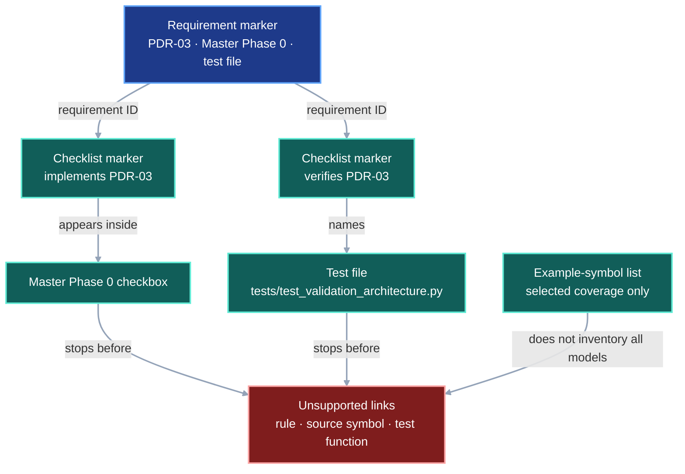
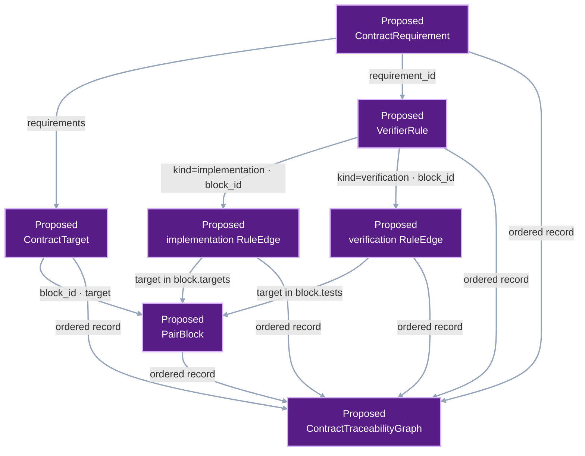
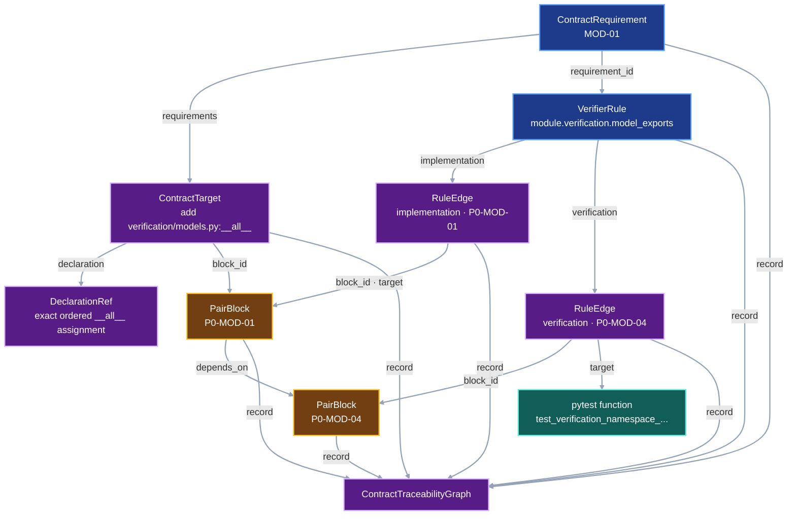

# Contract Traceability

VIPER contracts need a mechanical path from each written requirement to the
code and test that enforce it. The current documentation check stops after
linking a requirement to one checklist phase and one test file. The missing
middle consists of the verifier rule and its implementation symbol.

This contract defines that missing middle layer. The deterministic system
impact graph consumes these links after this contract is implemented.

## 1. Status

**Contract status:** complete.

Later contracts enter the CTG when their PairBlocks gain exact
`ContractTarget` declarations.

These requirements bind the contract to the master checklist:

| ID | Implementation obligation |
| --- | --- |
| CRT-01 <!-- contract-requirement: CRT-01 phase=0 test=tests/test_contract_traceability.py --> | Parse every contract requirement and named verifier rule into `ContractTraceabilityGraph`, with each collection serialized in canonical order. |
| CRT-02 <!-- contract-requirement: CRT-02 phase=0 test=tests/test_contract_traceability.py --> | Require every verifier rule to name one implementation owner and at least one exact acceptance test. |
| CRT-03 <!-- contract-requirement: CRT-03 phase=0 test=tests/test_contract_traceability.py --> | Require every contract-gap specification to include current, proposed-change, and integrated DAGs plus one marked, syntax-valid worked example. |
| CRT-04 <!-- contract-requirement: CRT-04 phase=0 test=tests/test_contract_traceability.py --> | Publish a canonical, source-evidenced traceability graph for downstream plan checks. |
| CRT-05 <!-- contract-requirement: CRT-05 phase=0 test=tests/test_contract_traceability.py --> | Use `ContractTarget` as the sole Python-declaration change inventory and reject the retired symbol, export, and example inventories. |
| CRT-06 <!-- contract-requirement: CRT-06 phase=0 test=tests/test_contract_traceability.py --> | Compile every `ContractTarget` and `PairBlock` into `ContractTraceabilityGraph`; bind each rule edge to one block; require complete requirement, target, supporting-asset, rule, test, and dependency closure; then remove the superseded symbol, export, and example inventories. |

## 2. Required claim

For every pending contract requirement, VIPER can answer four questions with
machine-readable repository evidence:

```text
What does the contract require?
-> ContractRequirement

Which invariant enforces it?
-> VerifierRule

Which source symbol implements that invariant?
-> RuleEdge(kind="implementation")

Which test proves the accepted and rejected behavior?
-> RuleEdge(kind="verification")

Which source declarations does the contract require the implementation to add,
update, or remove?
-> ContractTarget

Which bounded implementation block owns each target and test?
-> PairBlock
```

The resulting chain is:

```text
requirement
-> verifier rule
-> implementation owner
-> acceptance test

requirement
-> contract target
-> PairBlock
-> authored edit and gate
```

Each link names an exact file and symbol. While a contract remains planned, the
location is an exact target. Before its phase closes, the link changes to
`state="implemented"` and the compiler resolves the file and symbol in the
candidate source tree. Each complete link names both the test file and test
function.

## 3. Current gap

### Inspected path

`tests/test_documentation.py` currently parses three marker families:

```text
contract-requirement
-> requirement ID + phase + one legacy test file

implements / verifies
-> checklist checkbox + requirement ID

contract-baseline
-> contract file + reviewed SHA-256 digest
```

The test requires each requirement to appear once in an `implements` marker
and once in a `verifies` marker. It also requires the named test file to exist
and appear in the verification checkbox.

That check proves phase placement and document coverage. The implemented CRT
compiler now adds rules, owners, tests, and documentation-symbol inventories.
It still leaves the executable plan outside the graph:

```text
requirement -> exact source change
exact source change -> one PairBlock
rule edge -> owning PairBlock
PairBlock target -> exact source change
PairBlock test -> verification edge
PairBlock dependency -> known acyclic predecessor
```

### Current DAG

The current checker reaches a phase and a test file, then stops before the named
rule, implementation symbol, and exact test function.



### Missing connector

The target parser adds explicit declarations for those relationships:

```text
contract requirement row
-> verifier-rule marker in the contract
-> implementation-link marker in the checklist
-> verification-link marker in the checklist
-> exact source and test symbols
-> ContractTraceabilityGraph
```

The existing `implements`, `verifies`, and baseline markers remain as the
migration oracle until the graph produces the same requirement and phase
coverage.

### Diagram color contract

The three DAGs use color to identify each node's role. Complete node labels
carry the same meaning independently of color.

| Role | Mermaid classes | Fill | Stroke |
| --- | --- | --- | --- |
| Authored contract or current declaration | `contract`, `current` | `#1e3a8a` | `#60a5fa` |
| Existing implementation or observed evidence | `implementation`, `evidence` | `#115e59` | `#5eead4` |
| Unsupported gap | `gap` | `#7f1d1d` | `#fca5a5` |
| Proposed model or generated output | `proposed`, `output` | `#581c87` | `#d8b4fe` |
| Checklist-owned scheduling | `checklist` | `#713f12` | `#fbbf24` |

Every role uses white text and a two-pixel stroke. Every link uses `#94a3b8`
with a two-pixel stroke. The current DAG uses blue, teal, and red to separate
existing declarations, supporting evidence, and the gap. The proposed-change
DAG uses purple. The integrated DAG uses blue, amber, teal, and purple to show
the contract, checklist, implementation, and generated graph boundaries.

### Proposed-change DAG

`CRT-06` adds the missing plan records and joins them before System Impact sees
the plan.



### Integrated DAG

The integrated path shows one `MOD-01` target. `declaration` identifies the
exact ordered `__all__` assignment required by the PairBlock. The implementation
edge says that the same symbol enforces the rule. The verification edge names
the test that observes it.



## 4. Contract models

These development-tool records remain outside the experiment protocol and run
identity.

<!-- contract-target: requirements=CRT-06 block=P0-CRT-06 action=add target=src/viper/_contract_traceability.py:PairBlockId -->
<!-- contract-target: requirements=CRT-06 block=P0-CRT-06 action=add target=src/viper/_contract_traceability.py:TargetAction -->
<!-- contract-target: requirements=CRT-06 block=P0-CRT-06 action=add target=src/viper/_contract_traceability.py:ContractTarget -->
<!-- contract-target: requirements=CRT-06 block=P0-CRT-06 action=add target=src/viper/_contract_traceability.py:PairBlock -->
<!-- contract-target: requirements=CRT-06 block=P0-CRT-06 action=update target=src/viper/_contract_traceability.py:RuleEdge -->
<!-- contract-target: requirements=CRT-06 block=P0-CRT-06 action=update target=src/viper/_contract_traceability.py:ContractTraceabilityGraph -->

```python contract-target
PairBlockId = Annotated[
    str,
    Field(pattern=r"^P[0-9]+-[A-Z]+-[0-9]{2}$"),
]

class DeclarationRef(ProtocolModel):
    """Locate and identify one authored traceability declaration."""

    path: RepoRelPath = Field(
        description="Repository-relative document containing the declaration."
    )
    start_line: int = Field(
        ge=1,
        description="One-based first line occupied by the declaration.",
    )
    end_line: int = Field(
        ge=1,
        description="One-based final line occupied by the declaration.",
    )
    sha256: SHA256 = Field(
        description="SHA-256 digest of the exact UTF-8 declaration bytes."
    )

    @model_validator(mode="after")
    def validate_line_order(self) -> Self:
        """Require the final line to include or follow the first line."""
        if self.end_line < self.start_line:
            raise ValueError("end_line must be greater than or equal to start_line")
        return self


class RepoSymbolRef(ProtocolModel):
    """Reference one qualified symbol in one repository file."""

    path: RepoRelPath = Field(
        description="Repository-relative source file containing the symbol."
    )
    symbol: NonEmptyStr = Field(
        description="Qualified symbol name resolved inside the source file."
    )


class ContractRequirement(ProtocolModel):
    """Identify one requirement declared by one contract."""

    requirement_id: RequirementId = Field(
        description="Stable identifier declared by the owning contract."
    )
    contract: RepoRelPath = Field(
        description="Repository-relative contract that declares the requirement."
    )
    declaration: DeclarationRef = Field(
        description="Exact authored requirement marker used to reconstruct this record."
    )


class VerifierRule(ProtocolModel):
    """Declare one testable rule required by a contract."""

    rule_id: VerifierRuleId = Field(
        description="Stable identifier of the executable invariant."
    )
    requirement_id: RequirementId = Field(
        description="Contract requirement that owns the verifier rule."
    )
    contract: RepoRelPath = Field(
        description="Repository-relative contract that declares the rule."
    )
    statement: NonEmptyStr = Field(
        description="Testable invariant enforced by the rule."
    )
    declaration: DeclarationRef = Field(
        description=(
            "Exact authored verifier-rule marker used to reconstruct this record."
        )
    )


TargetAction = Literal["add", "update", "remove"]

class ContractTarget(ProtocolModel):
    """Bind one required Python declaration change to one implementation block."""

    requirements: tuple[RequirementId, ...] = Field(
        min_length=1,
        description="Contract requirements that need this Python declaration change.",
    )
    block_id: PairBlockId = Field(
        description="PairBlock that applies this Python declaration change."
    )
    action: TargetAction = Field(
        description="Whether the PairBlock adds, updates, or removes the target."
    )
    target: RepoSymbolRef = Field(
        description="Repository symbol changed by the PairBlock."
    )
    declaration: DeclarationRef = Field(
        description=(
            "Exact contract-owned payload containing the desired declaration "
            "for an add or update, or the removal marker for a removal."
        )
    )

class PairBlock(ProtocolModel):
    """Store one bounded, dependency-ordered implementation step."""

    block_id: PairBlockId = Field(
        description="Stable identifier used by checklist and target records."
    )
    requirements: tuple[RequirementId, ...] = Field(
        min_length=1, description="Contract requirements implemented by this block."
    )
    targets: tuple[RepoSymbolRef, ...] = Field(
        min_length=1, description="Repository symbols this block changes."
    )
    assets: tuple[RepoRelPath, ...] = Field(
        default=(),
        description=(
            "Non-Python implementation files owned by this block and bound by "
            "the consuming protocol's content digest."
        ),
    )
    tests: tuple[RepoSymbolRef, ...] = Field(
        min_length=1, description="Exact pytest functions that observe this block."
    )
    gate: NonEmptyStr = Field(
        description="Focused command that must pass before the block closes."
    )
    depends_on: tuple[PairBlockId, ...] = Field(
        description="Blocks whose completed results this block consumes."
    )
    declaration: DeclarationRef = Field(
        description="Exact pair-block manifest used to reconstruct this record."
    )

class RuleEdge(ProtocolModel):
    """Connect one verifier rule to its implementation block or test block."""

    kind: RuleEdgeKind = Field(
        description="Relationship from the rule to an implementation or test."
    )
    rule_id: VerifierRuleId = Field(
        description="Verifier rule at the source of this edge."
    )
    block_id: PairBlockId = Field(
        description="PairBlock that owns the target of this relationship."
    )
    declaration: DeclarationRef = Field(
        description="Exact checklist marker that declares this relationship."
    )
    state: TraceState = Field(
        description="Whether the referenced symbol is planned or implemented."
    )
    target: RepoSymbolRef = Field(
        description="Repository symbol reached by this relationship."
    )

class ContractTraceabilityGraph(ProtocolModel):
    """Store the complete ordered contract and implementation plan."""

    schema_version: Literal[6] = Field(
        default=6, description="Format version of the serialized traceability graph."
    )
    requirements: tuple[ContractRequirement, ...] = Field(
        min_length=1,
        description="Ordered contract requirements represented by the graph.",
    )
    rules: tuple[VerifierRule, ...] = Field(
        min_length=1, description="Ordered verifier rules represented by the graph."
    )
    edges: tuple[RuleEdge, ...] = Field(
        min_length=1,
        description="Ordered implementation and verification relationships.",
    )
    targets: tuple[ContractTarget, ...] = Field(
        min_length=1,
        description="Ordered Python declaration changes required by the contracts.",
    )
    blocks: tuple[PairBlock, ...] = Field(
        min_length=1,
        description=(
            "Ordered implementation blocks that apply declaration and asset changes."
        ),
    )
```

`RepoSymbolRef.symbol` uses the qualified name found in the named file. A
module-level function uses its function name. A method uses
`ClassName.method_name`. A test uses its complete test-function name.

`RuleEdge(kind="verification")` names the exact pytest function that owns the
accepted and rejected behavior. The graph records that executable link instead
of copying the test scenario and expected outcome into another prose record.

### Marker syntax

Requirement rows keep the current marker while the old documentation checker
remains active:

```html
<!-- contract-requirement: PDR-03 phase=0 test=tests/test_validation_architecture.py -->
```

Every verification-table row adds one rule marker:

```html
<!-- verifier-rule: project.path.symlink_free requirement=PDR-03 -->
```

The owning checklist task adds a precise implementation marker beside the
current requirement-level marker:

```html
<!-- implements: PDR-03 -->
<!-- contract-implementation: requirement=PDR-03 rule=project.path.symlink_free state=planned owner=src/viper/project.py:resolve_path -->
```

The focused-test task adds a precise verification marker:

```html
<!-- verifies: PDR-03 -->
<!-- contract-verification: requirement=PDR-03 rule=project.path.symlink_free state=planned test=tests/test_validation_architecture.py:test_project_paths_reject_symlinks -->
```

The traceability parser derives `contract` from the requirement marker's file.
It derives `phase` from each precise checklist marker. Every requirement, rule,
and edge also stores one `DeclarationRef` containing the exact source
path, line span, and declaration digest. The
legacy requirement-level `phase` and `test` values remain only until the new
traceability graph passes parity with the existing documentation checker. The
cleanup step then removes both fields.

Marker and TOML values use `path:symbol` strings. The parser splits the first
colon after the repository path and constructs `RepoSymbolRef`.

The compiler accepts an explicit contract set. It ignores checklist edges whose
requirement and rule both belong outside that set. An edge that resolves only
one endpoint fails as a malformed cross-contract reference.

`CRT-06` derives `RuleEdge.block_id` from the `pair-block` marker in the same
checklist checkbox. Each PairBlock target receives one marker immediately
before the code or removal declaration that owns it:

```html
<!-- contract-target-example: requirements=MOD-01 block=P0-MOD-01 action=add target=src/viper/verification/models.py:__all__ -->
```

```python contract-target
__all__ = [
    "StageSnapshot",
    "StorageFetcher",
    "VerificationError",
    "VerificationPolicy",
    "VerifiedArtifact",
    "VerifiedBenchmarkResult",
    "VerifiedInput",
    "VerifiedRunPlan",
    "VerifiedRunResult",
    "VerifiedSnapshotFile",
]
```

`ContractTarget.declaration` locates the contract-owned target payload. For an
`add` or `update`, the payload is the following `python contract-target` fence.
For a `remove`, the payload is the following `contract-remove` marker.
Consecutive target markers may share one payload when that payload declares
several named targets. No prose or unrelated declaration may separate those
markers from their shared payload.

The marker supplies `requirements`, `block_id`, `action`, and `target`. The
contract therefore owns the required source transition. The corresponding
PairBlock must name the same target. The `python contract-target` fence is the
single code specification for that transition. The CTG compiler rejects a
missing PairBlock target. The System Impact Check rejects realized source that
differs from the contract-owned declaration.

`ContractTarget` replaces the former symbol, export, and worked-example
inventories. It records code that a PairBlock will add, update, or remove. A
worked example remains explanatory evidence; it no longer doubles as a code
change inventory.

`ContractTarget` continues to name Python declarations whose desired bytes
appear in a `python contract-target` fence. `PairBlock.assets` separately names
QL queries, query suites, YAML manifests, and other implementation files outside
Python source. An omitted `assets` value compiles to an empty tuple. The CTG
rejects an asset path owned by several PairBlocks. Once a checklist edge marks
the block `implemented`, every asset path must identify a repository file. The
protocol consuming the asset binds its exact bytes. For example, the System
Impact Check binds its CodeQL pack through `CodeQLIdentity.pack_sha256`. An
asset path ending in `.py` or `.pyi` fails validation because `ContractTarget`
owns Python declaration changes.

### Illustrative worked example

Master Phase 0 will create the source and test symbols, so both links begin in
the `planned` state.

<!-- contract-worked-example: start -->

```python
import hashlib
import json
from pathlib import Path

from viper._contract_traceability import (
    ContractRequirement,
    ContractTarget,
    ContractTraceabilityGraph,
    DeclarationRef,
    PairBlock,
    RequirementId,
    RepoSymbolRef,
    RuleEdge,
    RuleEdgeKind,
    TraceState,
    VerifierRule,
    VerifierRuleId,
)


CONTRACT = Path("docs/development/project-data-root.md")
CHECKLIST = Path("docs/development/master-execution-checklist.md")
REQUIREMENT_ID: RequirementId = "PDR-03"
RULE_ID: VerifierRuleId = "project.path.symlink_free"
LINK_STATE: TraceState = "planned"


def marker_line(path: Path, marker: str) -> int:
    """Return the one-based line containing an exact checklist marker."""
    for line_number, line in enumerate(path.read_text().splitlines(), start=1):
        if marker in line:
            return line_number
    raise ValueError(f"missing marker: {marker}")


def declaration_ref(path: Path, marker: str) -> DeclarationRef:
    """Identify the exact authored line containing one marker."""
    text = path.read_text(encoding="utf-8")
    line = next(value for value in text.splitlines() if marker in value)
    line_number = marker_line(path, marker)
    return DeclarationRef(
        path=path.as_posix(),
        start_line=line_number,
        end_line=line_number,
        sha256=hashlib.sha256(line.encode("utf-8")).hexdigest(),
    )


requirement = ContractRequirement(
    requirement_id=REQUIREMENT_ID,
    contract=CONTRACT.as_posix(),
    declaration=declaration_ref(CONTRACT, "contract-requirement: PDR-03"),
)

rule = VerifierRule(
    rule_id=RULE_ID,
    requirement_id=requirement.requirement_id,
    contract=requirement.contract,
    statement=(
        "Reject every symlink from the first descendant of ROOT through the "
        "governed source or target."
    ),
    declaration=declaration_ref(
        CONTRACT,
        "verifier-rule: project.path.symlink_free",
    ),
)

implementation_location = RepoSymbolRef(
    path="src/viper/project.py",
    symbol="resolve_path",
)
test_location = RepoSymbolRef(
    path="tests/test_validation_architecture.py",
    symbol="test_project_paths_reject_symlinks",
)

implementation_kind: RuleEdgeKind = "implementation"
implementation = RuleEdge(
    kind=implementation_kind,
    rule_id=rule.rule_id,
    block_id="P0-PDR-06",
    declaration=declaration_ref(
        CHECKLIST,
        "requirement=PDR-03 rule=project.path.symlink_free",
    ),
    state=LINK_STATE,
    target=implementation_location,
)

verification_kind: RuleEdgeKind = "verification"
verification = RuleEdge(
    kind=verification_kind,
    rule_id=rule.rule_id,
    block_id="P0-PROOF-07",
    declaration=declaration_ref(
        CHECKLIST,
        "contract-verification: requirement=PDR-03 "
        "rule=project.path.symlink_free",
    ),
    state=LINK_STATE,
    target=test_location,
)

target = ContractTarget(
    requirements=(REQUIREMENT_ID,),
    block_id="P0-PDR-06",
    action="update",
    target=implementation_location,
    declaration=declaration_ref(CONTRACT, "contract-requirement: PDR-03"),
)

implementation_block = PairBlock(
    block_id="P0-PDR-06",
    requirements=(REQUIREMENT_ID,),
    targets=(implementation_location,),
    tests=(test_location,),
    gate="python -m pytest tests/test_validation_architecture.py -q",
    depends_on=(),
    declaration=declaration_ref(CONTRACT, "contract-requirement: PDR-03"),
)

verification_block = PairBlock(
    block_id="P0-PROOF-07",
    requirements=(REQUIREMENT_ID,),
    targets=(test_location,),
    tests=(test_location,),
    gate="python -m pytest tests/test_validation_architecture.py -q",
    depends_on=("P0-PDR-06",),
    declaration=declaration_ref(CONTRACT, "contract-requirement: PDR-03"),
)

traceability = ContractTraceabilityGraph(
    requirements=(requirement,),
    rules=(rule,),
    edges=(implementation, verification),
    targets=(target,),
    blocks=(implementation_block, verification_block),
)

canonical_bytes = json.dumps(
    traceability.model_dump(mode="json"),
    sort_keys=True,
    separators=(",", ":"),
).encode()

assert traceability.rules[0].requirement_id == "PDR-03"
assert traceability.edges[0].target.symbol == "resolve_path"
assert traceability.edges[1].target.symbol == (
    "test_project_paths_reject_symlinks"
)
assert b'"rule_id":"project.path.symlink_free"' in canonical_bytes
```

The compiler reads the corresponding repository data:

```html
<!-- verifier-rule: project.path.symlink_free requirement=PDR-03 -->
<!-- contract-implementation: requirement=PDR-03 rule=project.path.symlink_free state=planned owner=src/viper/project.py:resolve_path -->
<!-- contract-verification: requirement=PDR-03 rule=project.path.symlink_free state=planned test=tests/test_validation_architecture.py:test_project_paths_reject_symlinks -->
```

<!-- contract-worked-example: end -->

### CRT-06 target example

This example instantiates every model added or changed by `CRT-06`. The
`DeclarationRef` for `target` identifies the exact `__all__` assignment shown
above; it is the value that the later CodeQL-backed plan check must find in the
realized source.

```python target-example
target = ContractTarget(
    requirements=("MOD-01",),
    block_id="P0-MOD-01",
    action="add",
    target=RepoSymbolRef(
        path="src/viper/verification/models.py",
        symbol="__all__",
    ),
    declaration=declaration_ref(
        Path("docs/development/contract-traceability.md"),
        "contract-target: requirements=MOD-01 block=P0-MOD-01",
    ),
)

build = PairBlock(
    block_id="P0-MOD-01",
    requirements=("MOD-01",),
    targets=(target.target,),
    tests=(
        RepoSymbolRef(
            path="tests/test_public_api.py",
            symbol="test_verification_namespace_separates_operations_and_models",
        ),
    ),
    gate=(
        "conda run -n mantra python -m pytest tests/test_public_api.py "
        "-k verification_namespace -q"
    ),
    depends_on=("P0-CRT-06",),
    declaration=declaration_ref(
        Path("docs/development/module-ownership.md"),
        'id = "P0-MOD-01"',
    ),
)

proof = PairBlock(
    block_id="P0-MOD-04",
    requirements=("MOD-01",),
    targets=build.tests,
    tests=build.tests,
    gate=build.gate,
    depends_on=(build.block_id,),
    declaration=declaration_ref(
        Path("docs/development/module-ownership.md"),
        'id = "P0-MOD-04"',
    ),
)

implementation = RuleEdge(
    kind="implementation",
    rule_id="module.verification.model_exports",
    block_id=build.block_id,
    declaration=declaration_ref(
        CHECKLIST,
        "rule=module.verification.model_exports state=planned owner=",
    ),
    state="planned",
    target=target.target,
)

verification = RuleEdge(
    kind="verification",
    rule_id="module.verification.model_exports",
    block_id=proof.block_id,
    declaration=declaration_ref(
        CHECKLIST,
        "rule=module.verification.model_exports state=planned test=",
    ),
    state="planned",
    target=proof.tests[0],
)

traceability = ContractTraceabilityGraph(
    requirements=(
        ContractRequirement(
            requirement_id="MOD-01",
            contract="docs/development/module-ownership.md",
            declaration=declaration_ref(
                Path("docs/development/module-ownership.md"),
                "contract-requirement: MOD-01",
            ),
        ),
    ),
    rules=(
        VerifierRule(
            rule_id="module.verification.model_exports",
            requirement_id="MOD-01",
            contract="docs/development/module-ownership.md",
            statement="The model module exposes the exact approved names.",
            declaration=declaration_ref(
                Path("docs/development/module-ownership.md"),
                "verifier-rule: module.verification.model_exports",
            ),
        ),
    ),
    edges=(implementation, verification),
    targets=(target,),
    blocks=(build, proof),
)

assert target.target in build.targets
assert implementation.target == target.target
assert implementation.block_id == target.block_id
assert verification.target in proof.tests
assert proof.depends_on == (build.block_id,)
```

## 5. Execution

The implemented compiler runs the first five passes. `CRT-06` adds the final
three:

```text
1. enumerate implementation contracts
2. parse requirement and verifier-rule declarations
3. parse checklist implementation and verification links
4. validate contract structure and worked-example syntax
5. validate planned locations and implemented repository symbols
6. parse PairBlock manifests and their authored target declarations
7. attach each rule edge and contract target to one PairBlock
8. validate target coverage, supporting assets, and the acyclic PairBlock
   dependency graph
```

It then applies these cardinality rules:

1. A requirement ID belongs to exactly one contract.
2. Each requirement declares at least one verifier rule.
3. A verifier rule belongs to exactly one requirement.
4. Each verifier rule has exactly one implementation owner.
5. Each verifier rule has at least one acceptance-test target.
6. Each implementation and test link uses the phase containing its checklist
   marker.
7. Each contract contains the required DAGs and one complete worked example.
8. Retired symbol, export, and example inventories are rejected.
9. Phase closure requires every implementation and verification link to
   use `state="implemented"`.
10. Every `ContractTarget` belongs to at least one declared requirement, names
    one known PairBlock, and appears in that block's `targets`.
11. Every PairBlock target has exactly one `ContractTarget` in that block.
12. Every planned `RuleEdge.block_id` resolves to one PairBlock whose
    requirements contain the rule's requirement.
13. Each planned implementation edge resolves to a block containing its rule's
    requirement and at least one `ContractTarget` for that requirement. The
    implementation owner need not itself change.
14. Every planned verification edge target appears in its PairBlock's `tests`.
15. Every PairBlock dependency resolves to an active PairBlock or a block named
    by an implemented edge. The active dependency relation is acyclic.
16. Every asset path has one PairBlock owner and excludes Python source.
    Every asset owned by an implemented PairBlock resolves to a repository
    file.

The compiler sorts requirements by ID, rules by rule ID, implementation links
by `(requirement_id, rule_id)`, verification links by
`(requirement_id, rule_id, test.path, test.symbol)`.

### Contract-owned PairBlocks

The contract owns the executable plan. The master checklist selects and orders
these IDs; the `pair-vibe-coding` skill governs how the pair executes one block.
Completed blocks remain evidenced by source, tests, checklist state, and Git
history rather than duplicated historical edit recipes.

<!-- pair-block-definition: P0-CRT-06 -->
```toml pair-block
id = "P0-CRT-06"
requirements = ["CRT-06"]
targets = [
    "src/viper/_contract_traceability.py:PairBlockId",
    "src/viper/_contract_traceability.py:TargetAction",
    "src/viper/_contract_traceability.py:ContractTarget",
    "src/viper/_contract_traceability.py:PairBlock",
    "src/viper/_contract_traceability.py:RuleEdge",
    "src/viper/_contract_traceability.py:ContractTraceabilityGraph",
    "src/viper/_contract_traceability.py:_validate_plan",
]
tests = ["tests/test_contract_traceability.py:test_contract_traceability_graph_is_canonical", "tests/test_contract_traceability.py:test_contract_targets_require_exact_block_coverage", "tests/test_contract_traceability.py:test_rule_edges_match_pair_blocks", "tests/test_contract_traceability.py:test_pair_block_dependencies_are_acyclic"]
gate = "conda run -n mantra python -m pytest tests/test_contract_traceability.py -k 'canonical or contract_targets or rule_edges_match_pair_blocks or pair_block_dependencies' -q"
depends_on = ["P0-CRT-05"]
```

**Context:** The current graph proves rule ownership but leaves required source
changes and their execution blocks outside the graph. The target models are
declared once in Section 4. Add this closure validator beside them.

`src/viper/_contract_traceability.py`

<!-- contract-target: requirements=CRT-06 block=P0-CRT-06 action=add target=src/viper/_contract_traceability.py:_validate_plan -->
```python contract-target
def _validate_plan(
    root: Path,
    requirements: tuple[ContractRequirement, ...],
    rules: tuple[VerifierRule, ...],
    edges: tuple[RuleEdge, ...],
    targets: tuple[ContractTarget, ...],
    blocks: tuple[PairBlock, ...],
) -> None:
    requirement_ids = {item.requirement_id for item in requirements}
    rule_by_id = {item.rule_id: item for item in rules}
    block_by_id = {item.block_id: item for item in blocks}
    completed_blocks = {edge.block_id for edge in edges if edge.state == "implemented"}

    target_keys = [(item.block_id, item.target) for item in targets]
    if len(target_keys) != len(set(target_keys)):
        raise ContractTraceabilityError("PairBlock target has several ContractTargets")
    asset_paths = [asset for block in blocks for asset in block.assets]
    if _duplicates(asset_paths):
        raise ContractTraceabilityError("PairBlock asset has several owners")

    for target in targets:
        if not set(target.requirements) <= requirement_ids:
            raise ContractTraceabilityError("ContractTarget names unknown requirement")
        block = block_by_id.get(target.block_id)
        if block is None:
            raise ContractTraceabilityError("ContractTarget names unknown PairBlock")
        if not set(target.requirements) <= set(block.requirements):
            raise ContractTraceabilityError(
                "ContractTarget requirement is absent from PairBlock"
            )
        if target.target not in block.targets:
            raise ContractTraceabilityError(
                "ContractTarget is absent from PairBlock.targets"
            )

    for block in blocks:
        if any(Path(asset).suffix in {".py", ".pyi"} for asset in block.assets):
            raise ContractTraceabilityError(
                "PairBlock assets must not name Python source"
            )
        if block.block_id in completed_blocks:
            for asset in block.assets:
                if not (root / asset).is_file():
                    raise ContractTraceabilityError(
                        f"implemented PairBlock asset is missing: {asset}"
                    )
        for target in block.targets:
            if (block.block_id, target) not in target_keys:
                raise ContractTraceabilityError("PairBlock target lacks ContractTarget")
        for dependency in block.depends_on:
            if dependency not in block_by_id and dependency not in completed_blocks:
                raise ContractTraceabilityError("PairBlock names unknown dependency")

    visiting: set[PairBlockId] = set()
    visited: set[PairBlockId] = set()

    def visit(block_id: PairBlockId) -> None:
        if block_id in visiting:
            raise ContractTraceabilityError("PairBlock dependency cycle")
        if block_id in visited:
            return
        visiting.add(block_id)
        for dependency in block_by_id[block_id].depends_on:
            if dependency in block_by_id:
                visit(dependency)
        visiting.remove(block_id)
        visited.add(block_id)

    for block_id in block_by_id:
        visit(block_id)

    for edge in edges:
        rule = rule_by_id[edge.rule_id]
        if edge.state == "implemented":
            continue
        block = block_by_id.get(edge.block_id)
        if block is None:
            raise ContractTraceabilityError("RuleEdge names unknown PairBlock")
        if rule.requirement_id not in block.requirements:
            raise ContractTraceabilityError(
                "RuleEdge requirement is absent from PairBlock"
            )
        if edge.kind == "implementation":
            if not any(
                item.block_id == block.block_id
                and rule.requirement_id in item.requirements
                for item in targets
            ):
                raise ContractTraceabilityError(
                    "implementation block lacks a target for the rule requirement"
                )
        elif edge.target not in block.tests:
            raise ContractTraceabilityError(
                "verification target is absent from PairBlock.tests"
            )
```

**Stop:** the module imports and the three focused closure tests pass.

<!-- pair-block-definition: P0-CRT-07 -->
```toml pair-block
id = "P0-CRT-07"
requirements = ["CRT-05", "CRT-06"]
targets = [
    "src/viper/_contract_traceability.py:_PAIR_BLOCK",
    "src/viper/_contract_traceability.py:_TARGET_MARKER",
    "src/viper/_contract_traceability.py:_TARGET_FENCE",
    "src/viper/_contract_traceability.py:_REMOVE_MARKER",
    "src/viper/_contract_traceability.py:_CHECKBOX",
    "src/viper/_contract_traceability.py:_PAIR_BLOCK_MARKER",
    "src/viper/_contract_traceability.py:_parse_pair_blocks",
    "src/viper/_contract_traceability.py:_parse_contract_targets",
    "src/viper/_contract_traceability.py:_parse_rule_edges",
    "src/viper/_contract_traceability.py:compile_contract_traceability",
]
tests = [
    "tests/test_contract_traceability.py:test_contract_targets_require_exact_block_coverage",
    "tests/test_contract_traceability.py:test_contract_examples_reject_retired_symbol_inventories",
]
gate = "conda run -n mantra python -m pytest tests/test_contract_traceability.py tests/test_documentation.py -k 'contract_target or pair_block' -q"
depends_on = ["P0-CRT-06"]
```

**Context:** Strict closure requires the compiler to read PairBlocks and target
declarations from their owning contracts. This block removes the separate-guide
input and migrates contracts one at a time.

`src/viper/_contract_traceability.py`

<!-- contract-target: requirements=CRT-06 block=P0-CRT-07 action=add target=src/viper/_contract_traceability.py:_PAIR_BLOCK -->
<!-- contract-target: requirements=CRT-06 block=P0-CRT-07 action=add target=src/viper/_contract_traceability.py:_TARGET_MARKER -->
<!-- contract-target: requirements=CRT-06 block=P0-CRT-07 action=add target=src/viper/_contract_traceability.py:_TARGET_FENCE -->
<!-- contract-target: requirements=CRT-06 block=P0-CRT-07 action=add target=src/viper/_contract_traceability.py:_REMOVE_MARKER -->
<!-- contract-target: requirements=CRT-06 block=P0-CRT-07 action=add target=src/viper/_contract_traceability.py:_CHECKBOX -->
<!-- contract-target: requirements=CRT-06 block=P0-CRT-07 action=add target=src/viper/_contract_traceability.py:_PAIR_BLOCK_MARKER -->
<!-- contract-target: requirements=CRT-06 block=P0-CRT-07 action=add target=src/viper/_contract_traceability.py:_parse_pair_blocks -->
<!-- contract-target: requirements=CRT-06 block=P0-CRT-07 action=add target=src/viper/_contract_traceability.py:_parse_contract_targets -->
<!-- contract-target: requirements=CRT-06 block=P0-CRT-07 action=update target=src/viper/_contract_traceability.py:_parse_rule_edges -->
<!-- contract-target: requirements=CRT-06 block=P0-CRT-07 action=update target=src/viper/_contract_traceability.py:compile_contract_traceability -->

```python contract-target
_PAIR_BLOCK = re.compile(
    r"<!-- pair-"
    r"block-definition: (?P<id>P[0-9]+-[A-Z]+-[0-9]{2}) -->\n"
    r"```toml pair-block\n(?P<manifest>.*?)\n```(?P<body>.*?)"
    r"(?=<!-- pair-"
    r"block-definition: |\Z)",
    re.DOTALL,
)

_TARGET_MARKER = re.compile(
    r"<!-- contract-target: requirements=(?P<requirements>[^ ]+) "
    r"block=(?P<block>P[0-9]+-[A-Z]+-[0-9]{2}) "
    r"action=(?P<action>add|update|remove) "
    r"target=(?P<target>[^ ]+) -->"
)

_TARGET_FENCE = re.compile(
    r"```python contract-target\n(?P<body>.*?)\n```",
    re.DOTALL,
)

_REMOVE_MARKER = re.compile(r"<!-- contract-remove -->")

_CHECKBOX = re.compile(
    r"^- \[[ xX]\] .*?(?=^- \[[ xX]\] |^### |^## |\Z)",
    re.MULTILINE | re.DOTALL,
)

_PAIR_BLOCK_MARKER = re.compile(r"<!-- pair-block: (?P<id>P[0-9]+-[A-Z]+-[0-9]{2}) -->")

def _parse_pair_blocks(
    root: Path,
    contracts: tuple[Path, ...],
) -> tuple[PairBlock, ...]:
    """Compile the implementation blocks declared by the contracts."""
    blocks: list[PairBlock] = []
    for contract in contracts:
        text = contract.read_text(encoding="utf-8")
        for match in _PAIR_BLOCK.finditer(text):
            manifest: dict[str, Any] = tomllib.loads(match.group("manifest"))
            block_id = match.group("id")
            if manifest.get("id") != block_id:
                raise ContractTraceabilityError("PairBlock marker and manifest differ")
            requirements = tuple(manifest["requirements"])
            block_targets = tuple(
                _parse_repo_symbol(value) for value in manifest["targets"]
            )
            block = PairBlock(
                block_id=block_id,
                requirements=requirements,
                targets=block_targets,
                assets=tuple(manifest.get("assets", ())),
                tests=tuple(_parse_repo_symbol(value) for value in manifest["tests"]),
                gate=manifest["gate"],
                depends_on=tuple(manifest["depends_on"]),
                declaration=_declaration_ref(
                    root,
                    contract,
                    text,
                    match.start("manifest"),
                    match.end("manifest"),
                ),
            )
            blocks.append(block)
    if _duplicates([block.block_id for block in blocks]):
        raise ContractTraceabilityError("PairBlock ID belongs to several contracts")
    return tuple(sorted(blocks, key=lambda item: item.block_id))

def _parse_contract_targets(
    root: Path,
    contracts: tuple[Path, ...],
) -> tuple[ContractTarget, ...]:
    """Compile each contract-owned source transition."""
    targets: list[ContractTarget] = []
    for contract in contracts:
        text = contract.read_text(encoding="utf-8")
        markers = tuple(_TARGET_MARKER.finditer(text))
        for marker in markers:
            action = cast(TargetAction, marker.group("action"))
            payload_pattern = _REMOVE_MARKER if action == "remove" else _TARGET_FENCE
            payload = payload_pattern.search(text, marker.end())

            if payload is None:
                raise ContractTraceabilityError(
                    "ContractTarget lacks its contract-owned declaration"
                )

            between = text[marker.end() : payload.start()]
            if _TARGET_MARKER.sub("", between).strip():
                raise ContractTraceabilityError(
                    "ContractTarget is not immediately followed by its declaration"
                )

            targets.append(
                ContractTarget(
                    requirements=tuple(marker.group("requirements").split(",")),
                    block_id=marker.group("block"),
                    action=action,
                    target=_parse_repo_symbol(marker.group("target")),
                    declaration=_declaration_ref(
                        root,
                        contract,
                        text,
                        payload.start(),
                        payload.end(),
                    ),
                )
            )
    return tuple(
        sorted(
            targets,
            key=lambda item: (
                item.block_id,
                item.target.path,
                item.target.symbol,
            ),
        )
    )

def _parse_rule_edges(
    root: Path,
    checklist: Path,
    requirements: tuple[_RequirementMarker, ...],
    rules: tuple[VerifierRule, ...],
) -> tuple[RuleEdge, ...]:
    """Compile rule edges and the PairBlock owning each edge target."""
    text = checklist.read_text(encoding="utf-8")
    phases = tuple(_PHASE_HEADING.finditer(text))
    requirement_by_id = {item.requirement.requirement_id: item for item in requirements}
    rule_by_id = {rule.rule_id: rule for rule in rules}
    edges: list[RuleEdge] = []
    for index, phase_match in enumerate(phases):
        phase = int(phase_match.group("phase"))
        end = phases[index + 1].start() if index + 1 < len(phases) else len(text)
        section_start = phase_match.end()
        section = text[section_start:end]
        for checkbox in _CHECKBOX.finditer(section):
            block_markers = tuple(_PAIR_BLOCK_MARKER.finditer(checkbox.group(0)))
            edge_markers = tuple(_RULE_EDGE.finditer(checkbox.group(0)))
            if edge_markers and len(block_markers) != 1:
                raise ContractTraceabilityError(
                    "rule-bearing checklist task requires one PairBlock"
                )
            for match in edge_markers:
                requirement_id = match.group("requirement")
                rule_id = match.group("rule")
                kind = cast(RuleEdgeKind, match.group("kind"))
                expected_label = "owner" if kind == "implementation" else "test"
                if match.group("label") != expected_label:
                    raise ContractTraceabilityError(
                        f"{kind} edge requires {expected_label}= target"
                    )
                requirement_marker = requirement_by_id.get(requirement_id)
                rule = rule_by_id.get(rule_id)
                if requirement_marker is None and rule is None:
                    continue
                if requirement_marker is None or rule is None:
                    raise ContractTraceabilityError(
                        f"unknown requirement-rule edge: {requirement_id}:{rule_id}"
                    )
                if rule.requirement_id != requirement_id:
                    raise ContractTraceabilityError(
                        f"{rule_id} does not belong to {requirement_id}"
                    )
                if requirement_marker.phase != phase:
                    raise ContractTraceabilityError(
                        f"{requirement_id} belongs to phase "
                        f"{requirement_marker.phase}, not {phase}"
                    )
                target = _parse_repo_symbol(match.group("target"))
                state = cast(TraceState, match.group("state"))
                if state == "implemented":
                    _require_python_symbol(root=root, target=target)
                marker_start = section_start + checkbox.start() + match.start()
                marker_end = section_start + checkbox.start() + match.end()
                edges.append(
                    RuleEdge(
                        kind=kind,
                        rule_id=rule_id,
                        block_id=block_markers[0].group("id"),
                        declaration=_declaration_ref(
                            root,
                            checklist,
                            text,
                            marker_start,
                            marker_end,
                        ),
                        state=state,
                        target=target,
                    )
                )
    keys = [(edge.kind, edge.rule_id, edge.target) for edge in edges]
    if len(keys) != len(set(keys)):
        raise ContractTraceabilityError("duplicate rule edge")
    for rule_id in rule_by_id:
        links = tuple(edge for edge in edges if edge.rule_id == rule_id)
        if sum(edge.kind == "implementation" for edge in links) != 1:
            raise ContractTraceabilityError(
                f"{rule_id} requires exactly one implementation edge"
            )
        if sum(edge.kind == "verification" for edge in links) < 1:
            raise ContractTraceabilityError(
                f"{rule_id} requires at least one verification edge"
            )
    order = {"implementation": 0, "verification": 1}
    return tuple(
        sorted(
            edges,
            key=lambda edge: (
                edge.rule_id,
                order[edge.kind],
                edge.target.path,
                edge.target.symbol,
            ),
        )
    )

def compile_contract_traceability(
    root: Path,
    checklist: Path,
    contracts: tuple[Path, ...],
) -> ContractTraceabilityGraph:
    """Compile and validate the complete contract implementation plan."""
    markers = tuple(
        marker
        for contract in contracts
        for marker in _parse_requirement_markers(root, contract)
    )
    requirements = tuple(marker.requirement for marker in markers)
    if _duplicates([item.requirement_id for item in requirements]):
        raise ContractTraceabilityError("requirement ID belongs to several contracts")
    rules = tuple(
        rule
        for contract in contracts
        for rule in _parse_verifier_rules(
            root,
            contract,
            tuple(
                marker
                for marker in markers
                if marker.requirement.contract == contract.relative_to(root).as_posix()
            ),
        )
    )
    if _duplicates([item.rule_id for item in rules]):
        raise ContractTraceabilityError("verifier-rule ID belongs to several contracts")
    blocks = _parse_pair_blocks(root, contracts)
    targets = _parse_contract_targets(root, contracts)
    edges = _parse_rule_edges(root, checklist, markers, rules)
    _validate_plan(root, requirements, rules, edges, targets, blocks)
    graph = ContractTraceabilityGraph(
        requirements=tuple(sorted(requirements, key=lambda item: item.requirement_id)),
        rules=tuple(sorted(rules, key=lambda item: item.rule_id)),
        edges=edges,
        targets=targets,
        blocks=blocks,
    )
    serialize_contract_traceability(graph)
    return graph
```

**Stop:** contract-only compilation passes for every migrated target; no parser
or checklist entry refers to a separate CRT pair-coding guide.

<!-- pair-block-definition: P0-PROOF-08 -->
```toml pair-block
id = "P0-PROOF-08"
requirements = ["CRT-06"]
targets = [
    "tests/test_contract_traceability.py:_write_fixture",
    "tests/test_contract_traceability.py:test_contract_traceability_graph_is_canonical",
    "tests/test_contract_traceability.py:test_contract_targets_require_exact_block_coverage",
    "tests/test_contract_traceability.py:test_rule_edges_match_pair_blocks",
    "tests/test_contract_traceability.py:test_pair_block_dependencies_are_acyclic",
    "tests/test_contract_traceability.py:test_contract_traceability_graph_covers_migrated_contracts",
]
tests = ["tests/test_contract_traceability.py:test_contract_targets_require_exact_block_coverage", "tests/test_contract_traceability.py:test_rule_edges_match_pair_blocks", "tests/test_contract_traceability.py:test_pair_block_dependencies_are_acyclic", "tests/test_contract_traceability.py:test_contract_traceability_graph_covers_migrated_contracts"]
gate = "conda run -n mantra python -m pytest tests/test_contract_traceability.py -k 'contract_targets or rule_edges_match_pair_blocks or pair_block_dependencies or migrated_contracts' -q"
depends_on = ["P0-CRT-07"]
```

**Context:** The shared fixture and canonical test must adopt the new graph
records before the three rejection tests can change one target, rule edge, or
dependency and observe the exact failed join.

`tests/test_contract_traceability.py`

<!-- contract-target: requirements=CRT-06 block=P0-PROOF-08 action=update target=tests/test_contract_traceability.py:_write_fixture -->
<!-- contract-target: requirements=CRT-06 block=P0-PROOF-08 action=update target=tests/test_contract_traceability.py:test_contract_traceability_graph_is_canonical -->
<!-- contract-target: requirements=CRT-06 block=P0-PROOF-08 action=add target=tests/test_contract_traceability.py:test_contract_targets_require_exact_block_coverage -->
<!-- contract-target: requirements=CRT-06 block=P0-PROOF-08 action=add target=tests/test_contract_traceability.py:test_rule_edges_match_pair_blocks -->
<!-- contract-target: requirements=CRT-06 block=P0-PROOF-08 action=add target=tests/test_contract_traceability.py:test_pair_block_dependencies_are_acyclic -->
<!-- contract-target: requirements=CRT-06 block=P0-PROOF-08 action=update target=tests/test_contract_traceability.py:test_contract_traceability_graph_covers_migrated_contracts -->

```python contract-target
def _write_fixture(tmp_path: Path) -> tuple[Path, Path]:
    """Write one connected contract, checklist, source, and test fixture."""
    contract = tmp_path / "docs/development/example.md"
    checklist = tmp_path / "docs/development/master-execution-checklist.md"
    source = tmp_path / "src/owner.py"
    test = tmp_path / "tests/test_owner.py"
    for path in (contract, checklist, source, test):
        path.parent.mkdir(parents=True, exist_ok=True)

    source.write_text(
        "def enforce() -> str:\n    return 'accepted'\n",
        encoding="utf-8",
    )
    test.write_text(
        "def test_enforce() -> None:\n    assert True\n",
        encoding="utf-8",
    )
    checklist.write_text(
        dedent(
            """
            ## 7. Master Phase 0

            - [x] Compile the example contract.
              <!-- pair-block: P0-CRT-01 -->
              [IMPLEMENTATION]
              [VERIFICATION]
            """
        )
        .replace(
            "[IMPLEMENTATION]",
            "<!-- contract-"
            "implementation: requirement=CRT-01 rule=contract.rule "
            "state=implemented owner=src/owner.py:enforce -->",
        )
        .replace(
            "[VERIFICATION]",
            "<!-- contract-"
            "verification: requirement=CRT-01 rule=contract.rule "
            "state=implemented test=tests/test_owner.py:test_enforce -->",
        ),
        encoding="utf-8",
    )
    contract.write_text(
        dedent(
            """
            # Example contract

            ## 1. Status

            | Requirement | Claim |
            |---|---|
            [REQUIREMENT_ROW]

            ## 2. Required claim

            The compiler joins the rule to its owner and test.

            ## 3. Current gap

            ### Current DAG

            [MERMAID]
            flowchart LR
                A["Requirement"]
                B["Missing join"]
                A --> B
            [END]

            ### Proposed-change DAG

            [MERMAID]
            flowchart LR
                C["RuleEdge"]
                D["Resolved symbol"]
                C --> D
            [END]

            ### Integrated DAG

            [MERMAID]
            flowchart LR
                A["Requirement"]
                C["RuleEdge"]
                D["Resolved symbol"]
                A --> C
                C --> D
            [END]

            ## 4. Contract models

            [PYTHON]
            class ExampleRecord:
                def __init__(self, value: str) -> None:
                    self.value = value


            def build_record(value: str) -> ExampleRecord:
                return ExampleRecord(value)
            [END]

            [WORKED_START]
            [PYTHON]
            declared = ExampleRecord("declared")
            built = build_record(declared.value)
            assert built.value == "declared"
            [END]
            [WORKED_END]

            ## 5. Execution

            The compiler parses the rule.

            ## 6. Persisted evidence

            Canonical graph bytes retain the join.

            ## 7. Verification

            | Rule | Statement |
            |---|---|
            [RULE_ROW]

            ## 8. Propagation

            The source and test symbols enter the graph.

            ## 9. Acceptance case

            The accepted case compiles one implementation edge and one
            verification edge. The rejected case removes or corrupts one exact
            marker and requires ContractTraceabilityError in pytest.

            ## 10. Implementation order

            Parse declarations before edges.

            <!-- pair-block-definition: P0-CRT-01 -->
            [PAIR_BLOCK]
            id = "P0-CRT-01"
            requirements = ["CRT-01"]
            targets = ["src/owner.py:enforce"]
            tests = ["tests/test_owner.py:test_enforce"]
            gate = "python -m pytest tests/test_owner.py -q"
            depends_on = []
            [END]

            [TARGET_MARKER]
            [TARGET]
            def enforce() -> str:
                return "accepted"
            [END]
            """
        )
        .replace(
            "[PYTHON]",
            chr(96) * 3 + "python",
        )
        .replace(
            "[MERMAID]",
            chr(96) * 3 + "mermaid",
        )
        .replace(
            "[PAIR_BLOCK]",
            chr(96) * 3 + "toml pair-block",
        )
        .replace(
            "[TARGET]",
            chr(96) * 3 + "python contract-target",
        )
        .replace(
            "[TARGET_MARKER]",
            "<!-- contract-"
            "target: requirements=CRT-01 block=P0-CRT-01 "
            "action=update target=src/owner.py:enforce -->",
        )
        .replace(
            "[WORKED_START]",
            "<!-- contract-worked-example: start -->",
        )
        .replace(
            "[WORKED_END]",
            "<!-- contract-worked-example: end -->",
        )
        .replace(
            "[END]",
            chr(96) * 3,
        )
        .replace(
            "[REQUIREMENT_ROW]",
            "| CRT-01 <!-- contract-requirement: CRT-01 phase=0 "
            "test=tests/test_contract_traceability.py --> | Compile one exact rule. |",
        )
        .replace(
            "[RULE_ROW]",
            "| `contract.rule` <!-- verifier-rule: contract.rule "
            "requirement=CRT-01 --> | One owner and one test exist. |",
        ),
        encoding="utf-8",
    )
    return contract, checklist

def test_contract_traceability_graph_is_canonical(tmp_path: Path) -> None:
    """Require stable graph bytes and source-evidenced declarations."""
    contract, checklist = _write_fixture(tmp_path)
    contracts = (contract,)

    left = compile_contract_traceability(
        tmp_path,
        checklist,
        contracts,
    )
    right = compile_contract_traceability(
        tmp_path,
        checklist,
        contracts,
    )

    assert left == right
    assert serialize_contract_traceability(left) == (
        serialize_contract_traceability(right)
    )
    assert left.schema_version == 6
    for rule in left.rules:
        links = tuple(edge for edge in left.edges if edge.rule_id == rule.rule_id)
        assert sum(edge.kind == "implementation" for edge in links) == 1
        assert sum(edge.kind == "verification" for edge in links) >= 1
    assert [block.block_id for block in left.blocks] == ["P0-CRT-01"]
    assert left.blocks[0].assets == ()
    assert [target.target.symbol for target in left.targets] == ["enforce"]

    declaration = left.requirements[0].declaration
    assert declaration.path == "docs/development/example.md"
    assert declaration.start_line == declaration.end_line
    original_sha256 = declaration.sha256
    contract.write_text(
        contract.read_text(encoding="utf-8").replace(
            "test=tests/test_contract_traceability.py",
            "test=tests/test_changed.py",
            1,
        ),
        encoding="utf-8",
    )
    changed = compile_contract_traceability(
        tmp_path,
        checklist,
        contracts,
    )
    assert changed.requirements[0].declaration.sha256 != original_sha256

def test_contract_targets_require_exact_block_coverage(tmp_path: Path) -> None:
    """Reject a PairBlock target without one matching ContractTarget."""
    contract, checklist = _write_fixture(tmp_path)
    contract.write_text(
        contract.read_text(encoding="utf-8").replace(
            "<!-- contract-target: requirements=CRT-01 block=P0-CRT-01 "
            "action=update target=src/owner.py:enforce -->\n",
            "",
        ),
        encoding="utf-8",
    )

    with pytest.raises(
        ContractTraceabilityError,
        match="PairBlock target lacks ContractTarget",
    ):
        compile_contract_traceability(tmp_path, checklist, (contract,))

def test_rule_edges_match_pair_blocks(tmp_path: Path) -> None:
    """Reject a verification edge absent from its PairBlock tests."""
    contract, checklist = _write_fixture(tmp_path)
    checklist.write_text(
        checklist.read_text(encoding="utf-8").replace(
            "state=implemented test=tests/test_owner.py:test_enforce",
            "state=planned test=tests/test_owner.py:test_enforce",
        ),
        encoding="utf-8",
    )
    contract.write_text(
        contract.read_text(encoding="utf-8").replace(
            'tests = ["tests/test_owner.py:test_enforce"]',
            'tests = ["tests/test_owner.py:test_other"]',
        ),
        encoding="utf-8",
    )

    with pytest.raises(
        ContractTraceabilityError,
        match="verification target is absent from PairBlock.tests",
    ):
        compile_contract_traceability(tmp_path, checklist, (contract,))

def test_pair_block_dependencies_are_acyclic(tmp_path: Path) -> None:
    """Reject a PairBlock dependency cycle."""
    contract, checklist = _write_fixture(tmp_path)
    contract.write_text(
        contract.read_text(encoding="utf-8").replace(
            "depends_on = []",
            'depends_on = ["P0-CRT-01"]',
        ),
        encoding="utf-8",
    )

    with pytest.raises(
        ContractTraceabilityError,
        match="PairBlock dependency cycle",
    ):
        compile_contract_traceability(tmp_path, checklist, (contract,))

def test_contract_traceability_graph_covers_migrated_contracts() -> None:
    """Compile every contract migrated to contract-owned PairBlocks."""
    contracts = (
        ROOT / "docs/development/contract-traceability.md",
        ROOT / "docs/development/module-ownership.md",
    )
    graph = compile_contract_traceability(
        ROOT,
        MASTER_CHECKLIST,
        contracts,
    )

    assert {requirement.contract for requirement in graph.requirements} == {
        contract.relative_to(ROOT).as_posix() for contract in contracts
    }
    assert all(
        any(edge.rule_id == rule.rule_id for edge in graph.edges)
        for rule in graph.rules
    )
```

**Stop:** all three named tests and the focused gate pass.

## 6. Persisted evidence

The first implementation keeps the graph in test memory and serializes its
canonical JSON bytes only for deterministic comparison. The system-impact
compiler later publishes the same bytes at:

```text
.viper/system/contracts/traceability.json
```

The graph records repository-relative source locations. Its digest therefore
changes when a requirement link changes while remaining independent of the
machine's absolute checkout path.

## 7. Verification

| Rule | Executable requirement |
| --- | --- |
| `contract.requirement.unique` <!-- verifier-rule: contract.requirement.unique requirement=CRT-01 --> | Each requirement ID is declared once. |
| `contract.rule.declared` <!-- verifier-rule: contract.rule.declared requirement=CRT-01 --> | Each requirement declares at least one unique verifier rule. |
| `contract.rule.implemented` <!-- verifier-rule: contract.rule.implemented requirement=CRT-02 --> | Each verifier rule names one exact implementation target; every link marked `implemented` resolves to an existing file and symbol. |
| `contract.rule.tested` <!-- verifier-rule: contract.rule.tested requirement=CRT-02 --> | Each verifier rule names at least one exact test target; every link marked `implemented` resolves to an existing test function. |
| `contract.example.complete` <!-- verifier-rule: contract.example.complete requirement=CRT-03 --> | Each contract contains three rendered DAG sources plus one marked, syntax-valid worked example. |
| `contract.diagram.palette` <!-- verifier-rule: contract.diagram.palette requirement=CRT-03 --> | The current, proposed-change, and integrated DAGs use the declared semantic role colors and neutral link style. |
| `contract.model.matches_runtime` <!-- verifier-rule: contract.model.matches_runtime requirement=CRT-03 --> | Every Section 4 traceability class has the same name and direct fields as its Python implementation. |
| `contract.model.documented` <!-- verifier-rule: contract.model.documented requirement=CRT-03 --> | Every direct field in each persisted traceability model has a non-empty generated-schema description that states its role. |
| `contract.graph.canonical` <!-- verifier-rule: contract.graph.canonical requirement=CRT-04 --> | Repeated compilation produces identical ordered JSON bytes. |
| `contract.graph.complete` <!-- verifier-rule: contract.graph.complete requirement=CRT-04 --> | Every requirement and rule reaches its owner and tests. |
| `contract.declaration.anchored` <!-- verifier-rule: contract.declaration.anchored requirement=CRT-04 --> | Every requirement, rule, and edge retains the exact declaration path, line span, and SHA-256 digest used to reconstruct it. |
| `contract.target.authoritative` <!-- verifier-rule: contract.target.authoritative requirement=CRT-05 --> | `ContractTarget` is the sole Python-declaration change inventory; contracts reject the retired symbol, export, and example inventories. |
| `contract.target.complete` <!-- verifier-rule: contract.target.complete requirement=CRT-06 --> | Every PairBlock target has exactly one requirement-owned `ContractTarget` in that block, with an action and exact declaration. |
| `contract.block.complete` <!-- verifier-rule: contract.block.complete requirement=CRT-06 --> | Every rule edge resolves to one PairBlock whose requirements contain the rule's requirement; each implementation block contains at least one target for that requirement; and every verification target occurs in `PairBlock.tests`. |
| `contract.block.acyclic` <!-- verifier-rule: contract.block.acyclic requirement=CRT-06 --> | Every dependency resolves to a known PairBlock and the complete dependency relation is acyclic. |

These named rules are logical entities only after the parser reads their
markers. Their implementation is ordinary source code. Their proof is the
named test function. The traceability graph joins those three representations.

## 8. Propagation

| Surface | Required statement |
| --- | --- |
| `src/viper/_contract_traceability.py` | Add exact models, marker parsers, symbol resolution, cardinality checks, contract structure validation, and canonical serialization for developer tooling. |
| `tests/test_contract_traceability.py` and `tests/test_documentation.py` | Compile every migrated contract into one graph, compare the result with the requirement, phase, test-file, and baseline oracle, and require each contract's three DAGs and marked worked example. |
| `docs/development/master-execution-checklist.md` | Add the foundational Master Phase 0 work before project-root and system-graph implementation. |
| `docs/development/*.md` implementation contracts | Retain verifier-rule markers, three DAGs, and one complete worked example per contract. Add `ContractTarget` records when a PairBlock becomes executable. |
| `~/.agents/skills/contract-gap-specification/SKILL.md` | Require the three-DAG comparison, complete worked example, and requirement-rule-owner-test chain. |
| `docs/development/system-impact-compiler.md` | Consume `ContractTraceabilityGraph` directly as its contract-coverage input. |
| `docs/development/testing.md` | Document the focused traceability check and the meaning of each marker. |

### Legacy cleanup

| Current occurrence | Disposition |
| --- | --- |
| `_CONTRACT_REQUIREMENT` parser | Retain and construct `ContractRequirement` from its matches. |
| `_CHECKLIST_MAPPING` parser | Retain as the requirement-to-phase migration oracle. |
| Requirement-level `implements` and `verifies` markers | Retain through graph parity; remove after confirming that the checklist retains its readable requirement map. |
| Requirement marker `test=` field | Retain only while the old documentation checker remains active; remove after exact verification-edge parity. |
| System-graph contract's independent contract-marker parser | Replace with `ContractTraceabilityGraph` ingestion. |
| Prose-only verifier rules | Replace sentence-derived identity with stable rule markers. |
| Symbol, example, and export inventories | Removed; `ContractTarget` is the Python-declaration change inventory. |

## 9. Acceptance case

### Success

`tests/test_contract_traceability.py::test_rule_edges_resolve_one_owner_and_tests`
declares one verifier rule and supplies one implementation marker plus one
verification marker. The compiler returns exactly those two edges.

### Rejection

`tests/test_contract_traceability.py::test_rule_edges_reject_missing_symbols`
points an implemented edge at a missing symbol. The test requires
`ContractTraceabilityError` at the symbol-resolution boundary.

These pytest functions own the setup, invocation, assertion, and failure
message. Verification `RuleEdge` records name their exact repository symbols.

`CRT-06` adds focused rejections for an unknown block, a requirement absent
from its block, a missing implementation target, a missing verification test,
and a PairBlock dependency cycle.

## 10. Implementation order

1. Add the traceability models and marker parsers beside the current
   documentation oracle.
2. Add fixture contracts that prove every cardinality, state-transition, and
   symbol-resolution failure independently.
3. Add verifier-rule, implementation, verification, DAG, and
   worked-example markers to this contract.
4. Migrate each remaining pending contract one at a time.
5. As each phase is implemented, change its exact links from `planned` to
   `implemented` and require every location to resolve before that phase closes.
6. Compare the new graph with the current requirement, phase, and baseline
   checks.
7. Expose the canonical graph to the system-impact compiler.
8. Add `ContractTarget`, `PairBlock`, and `RuleEdge.block_id`; compile the
   complete requirement-to-PairBlock closure as `CRT-06`.
9. Classify and repair each contract's PairBlock targets before that contract
   enters strict target closure.
10. Remove duplicate parsing only after parity passes.

**Commit boundary:** `Trace contract requirements to code and tests`

## Sources

- [NASA SWE-052: Bidirectional Traceability](https://swehb.nasa.gov/spaces/SWEHBVC/pages/50888903/SWE-052%2B-%2BBidirectional%2BTraceability)
  requires forward and backward links between requirements, design, code, and
  tests.
- [IEEE technical-requirements overview](https://technav.ieee.org/topic/technical-requirements/)
  describes forward traceability from requirements to implementing design
  elements and test cases.
