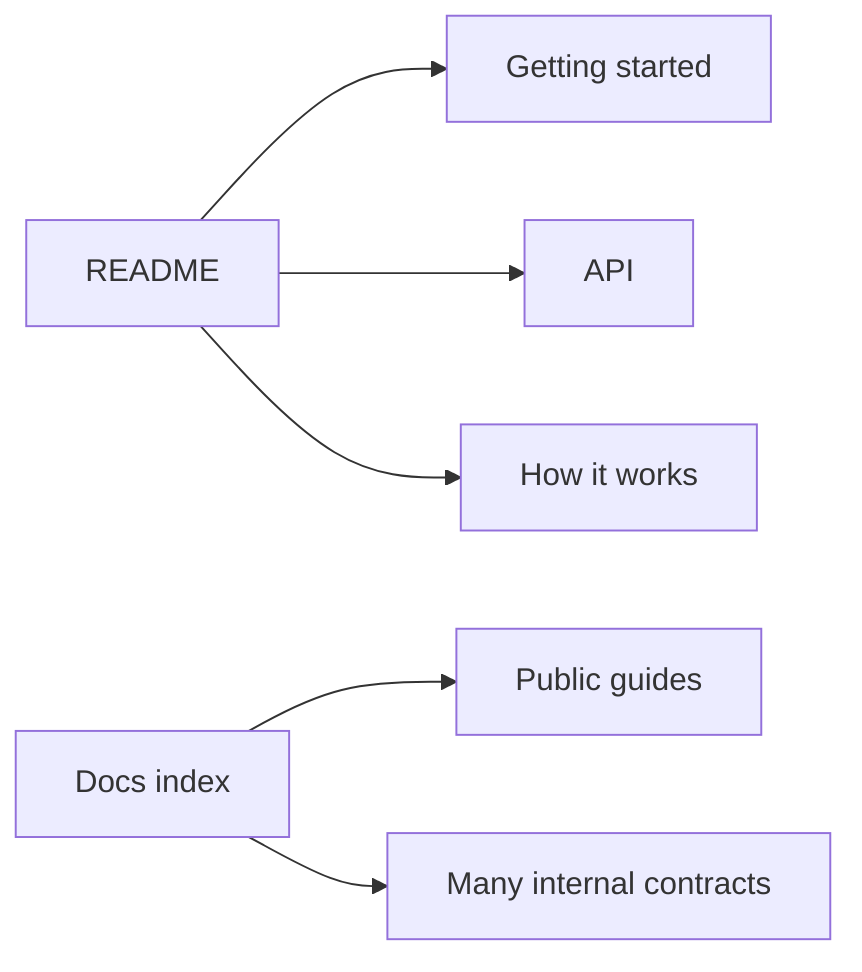
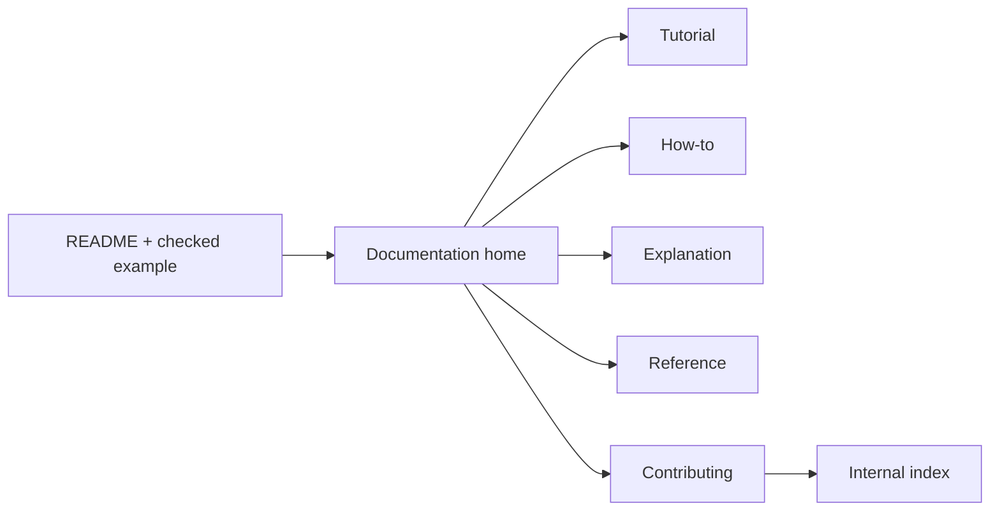
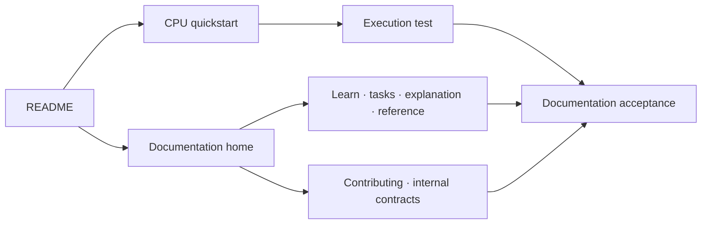

# Documentation Architecture

## 1. Status

**Contract status:** Implemented.

| ID | Requirement |
| --- | --- |
| DOC-01 | The root README runs one checked CPU workflow and links the documentation home. |
| DOC-02 | The documentation home separates tutorial, how-to, explanation, reference, and contributing routes. |
| DOC-03 | Internal contracts remain executable authority behind one maintainer index. |
| DOC-04 | Public workflow prose uses the current `plan() -> execution.run()` API and links the checked example. |
| DOC-05 | A deterministic documentation test rejects missing routes, obsolete workflow names, and direct contract sprawl. |

## 2. Required claim

Let \(D\) be the Markdown documents reachable from the root README and let
\(K = \{T,H,E,R,C\}\) represent tutorial, how-to, explanation, reference, and
contributing content. Let \(I \subset D\) be internal engineering documents.
The public navigation is accepted only when:

\[
\operatorname{Accept}(D)
\Rightarrow
\left(\forall k \in K,\; \exists!\; r_k\right)
\land
\left(\forall i \in I,\; r(i)=r_C/\text{internal}\right)
\land
\operatorname{Runs}(Q)
\]

Here, \(r_k\) is the named route for one reader need and \(Q\) is the CPU
quickstart linked by the README and tutorial. Internal documents may remain
reachable, but they enter through one clearly labeled maintainer route rather
than appearing as ordinary user guides.

This follows the distinction among tutorials, how-to guides, explanations, and
reference described by [Diátaxis](https://diataxis.fr/) and the requirement that
sample code be runnable, concise, and tested in
[Google's sample-code guidance](https://developers.google.com/tech-writing/two/sample-code).

## 3. Current gap

### Current DAG



The root linked three useful pages but not the documentation home. The home
mixed reader guides, formal protocol, active contracts, research plans, and
release evidence in one flat list. The tutorial and execution explanation still
taught retired public interfaces.

### Proposed-change DAG



### Integrated DAG



The executable contracts remain under `docs/development/`. Moving them would
change compiler paths, baselines, and historical links without improving the
reader boundary. The new internal index changes navigation while preserving
their identity.

## 4. Execution

1. Keep `examples/cpu_quickstart.py` as the sole complete introductory workflow.
2. Make `docs/README.md` the public documentation home.
3. Rewrite the tutorial and execution explanation against the checked example.
4. Add task-focused guides for inputs, metrics, expansion, recovery, catalog,
   knowledge, MCP, and troubleshooting.
5. Add separate CLI and configuration reference entry points without copying
   the formal protocol.
6. Route maintainers through `docs/internal/README.md` to contracts and release
   evidence.
7. Repair corrupted contract prose without changing PairBlock authority.

## 5. Verification

| Rule | Executable condition |
| --- | --- |
| `documentation.navigation.complete` | `docs/README.md` contains all five reader routes and links every required landing page. |
| `documentation.internal.separate` | The public home links one internal index and does not enumerate individual product contracts. |
| `documentation.workflow.current` | The tutorial and explanation link the CPU quickstart, use `params` and `execution.run()`, and do not teach the retired `viper.parameters` or `viper.api.run` path. |
| `documentation.example.executes` | `tests/test_readme_workflow.py` runs the example in a clean temporary Git repository and observes a successful terminal result. |
| `documentation.links.resolve` | The documentation link test resolves every repository-local Markdown link and anchor. |

## 6. Acceptance

Run from the repository root with `.venv` active:

```bash
python -m pytest tests/test_readme_workflow.py -q
python -m pytest tests/test_documentation.py -q -k documentation_navigation
```

Acceptance requires both commands to pass and the working tree to contain no
unexplained documentation corruption.
