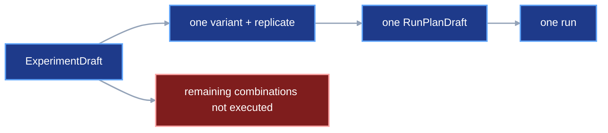
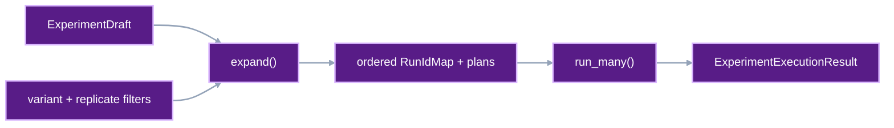

# Experiment expansion and bounded execution

An experiment can declare several variants and replicates. This contract turns
that declaration into one concrete run plan for every selected
variant-replicate pair. It also defines one bounded operation that executes the
frozen plans and returns every outcome.

## 1. Status

**Contract status:** approved for implementation.

These requirements bind the contract to the master checklist:

| ID | Implementation obligation |
| --- | --- |
| EXP-01 <!-- contract-requirement: EXP-01 phase=12 test=tests/test_authoring.py --> | Expand selected variants and replicates into a deterministic tuple of `RunPlanDraft` values. |
| EXP-02 <!-- contract-requirement: EXP-02 phase=12 test=tests/test_run_execution.py --> | Execute frozen run plans with bounded concurrency and retain one typed result for every plan. |
| EXP-03 <!-- contract-requirement: EXP-03 phase=12 test=tests/test_api.py --> | Expose the same batch result through Python, typed API, and CLI surfaces. |

**Current:** `ExperimentDraft` owns variant graphs and replicate seeds.
`viper.authoring.plan()` selects one variant and one replicate. The user must repeat that
call, assign every run ID, freeze every plan, and collect execution failures.

**Target:** `viper.authoring.expand()` creates the complete ordered set of
`RunPlanDraft` values. `viper.execution.run_many()` executes their frozen
paths. Each plan remains an ordinary `RunPlanDraft`. Each run still produces
an ordinary terminal `ResolvedRun`.

## 2. Required claim

Given the same `ExperimentDraft`, selected IDs, run-ID map, benchmark, source,
environment, and reproducibility settings, `viper.authoring.expand()` returns the same
ordered plans.

The order is:

```text
selected variants in ExperimentDraft.variants order
-> selected replicates in ExperimentDraft.replicates order
-> one RunPlanDraft for each pair
```

`viper.execution.run_many()` starts at most `max_concurrency` runs at once. It
returns one `ExperimentRunResult` for every input path in the original order.
A failed run remains failed. Another run can continue when
`stop_on_failure=False`.

## 3. Current gap

The existing single-run authoring path is complete in the target contracts:

```text
ExperimentDraft
-> viper.authoring.plan(variant=..., replicate=...)
-> RunPlanDraft
-> viper.authoring.freeze()
-> FrozenPlanFiles
-> viper.execution.run()
```

The missing operation is the Cartesian expansion:

```text
selected variants x selected replicates
-> one assigned run ID per pair
-> one RunPlanDraft per pair
-> bounded execution
-> one aggregate result
```

This contract keeps `viper.authoring.plan()`, `viper.authoring.freeze()`, and
`viper.execution.run()` as the single-run primitives. Expansion calls those
primitives and preserves the existing frozen run format.

### Current DAG



### Proposed-change DAG



### Integrated DAG


## 4. Models

### Run-ID assignment

The caller assigns every run ID before freezing:

```python
RunIdMap = dict[VariantId, dict[ReplicateId, RunId]]
```

The map must contain exactly one run ID for every selected pair. Run IDs must
be unique across the map. Explicit IDs keep generated paths reviewable before
execution and preserve the existing `RunId` contract.

### Aggregate execution result

The exact public result models are:

```python
ExperimentRunStatus = Literal["succeeded", "failed", "skipped"]


class ExperimentRunFailure(BaseModel):
    model_config = ConfigDict(extra="forbid", frozen=True)

    code: Literal["invalid_document", "execution_failed", "verification_failed"]
    message: str = Field(min_length=1)


class ExperimentRunResult(BaseModel):
    model_config = ConfigDict(extra="forbid", frozen=True)

    variant_id: VariantId
    replicate_id: ReplicateId
    run_id: RunId
    run_spec_path: Path
    status: ExperimentRunStatus
    result: RunResult | None = None
    failure: ExperimentRunFailure | None = None
    skip_reason: NonEmptyStr | None = None


class ExperimentExecutionResult(BaseModel):
    model_config = ConfigDict(extra="forbid", frozen=True)

    runs: tuple[ExperimentRunResult, ...] = Field(min_length=1)
```

`ExperimentRunResult` enforces these complete states:

| `status` | `result` | `failure` | `skip_reason` |
| --- | --- | --- | --- |
| `succeeded` | required | absent | absent |
| `failed` | absent | required | absent |
| `skipped` | absent | absent | required |

`ExperimentExecutionResult.runs` preserves the input plan order.

## 5. Public interface

### Expand one experiment

```python
def expand(
    experiment: ExperimentDraft,
    *,
    run_ids: RunIdMap,
    benchmark: BenchmarkDraft | None = None,
    source: GitSource,
    env: EnvSpec,
    reproducibility: ReproducibilitySpec,
    variants: tuple[VariantId, ...] | None = None,
    replicates: tuple[ReplicateId, ...] | None = None,
) -> tuple[RunPlanDraft, ...]: ...
```

`variants=None` selects every declared variant. `replicates=None` selects every
declared replicate. A supplied tuple acts as a membership filter. Output order
still comes from the declarations in `ExperimentDraft`.

The function rejects an unknown ID, a repeated filter value, a missing run ID,
an extra run-ID entry, and one run ID assigned to two pairs.

### Execute the frozen plans

```python
def run_many(
    repository_root: Path,
    run_spec_paths: tuple[Path, ...],
    *,
    max_concurrency: int = 1,
    timeout_seconds: float | None = None,
    stop_on_failure: bool = False,
) -> ExperimentExecutionResult: ...
```

`max_concurrency` must be at least one. Each worker calls the existing
`viper.execution.run()` operation for one path. Run-level locks, attempt
journals, terminal files, verification, and storage publication remain owned
by that operation.

`timeout_seconds` keeps the existing `viper.execution.run()` meaning. A
positive value is passed unchanged to every run call and limits the wait for
each stage or metric child process. A whole run or batch can last longer. When
a child process reaches the limit, that run's batch
entry receives `status="failed"` and the ordinary typed timeout failure. Other
runs continue unless `stop_on_failure=True`. Python, typed API, and CLI entry
points reject zero and negative values before starting any run.

When `stop_on_failure=True`, the first observed failure prevents further plan
starts. Every plan awaiting start receives `status="skipped"`.
Runs already in progress finish and keep their actual result.

### Complete example
<!-- contract-worked-example: start -->

```python
from pathlib import Path

from viper import execution
from viper.authoring import expand, freeze


plans = expand(
    experiment,
    run_ids={
        "baseline": {
            "replicate_01": "01ARZ3NDEKTSV4RRFFQ69G5FAV",
            "replicate_02": "01ARZ3NDEKTSV4RRFFQ69G5FAW",
        },
        "l2": {
            "replicate_01": "01ARZ3NDEKTSV4RRFFQ69G5FAX",
            "replicate_02": "01ARZ3NDEKTSV4RRFFQ69G5FAY",
        },
    },
    benchmark=benchmark,
    source=source,
    env=env,
    reproducibility=reproducibility,
)

frozen = tuple(freeze(plan) for plan in plans)

# The user commits every path in every FrozenPlanFiles.files tuple here.

results = execution.run_many(
    Path.cwd(),
    tuple(item.run_spec_path for item in frozen),
    max_concurrency=2,
)
```

<!-- contract-worked-example: end -->

## 6. Runtime ownership

`viper.authoring.expand()` validates the selection and constructs `RunPlanDraft` values.
Execution and file writes begin in later operations.

`viper.authoring.freeze()` remains the only operation that writes canonical plan files.
The plan-commit rules in
[`frozen-plan-git-identity.md`](frozen-plan-git-identity.md) apply to every
returned `FrozenPlanFiles` value.

`viper.execution.run_many()` owns scheduling only. Each selected run owns its
normal workspace, lock, journal, attempts, snapshots, terminal record, and
verification result.

## 7. Persistence and verification

| Rule | Executable condition |
| --- | --- |
| `experiment.expansion.canonical` <!-- verifier-rule: experiment.expansion.canonical requirement=EXP-01 --> | Selected variants and replicates expand into one deterministically ordered tuple of run plans. |
| `experiment.batch.complete` <!-- verifier-rule: experiment.batch.complete requirement=EXP-02 --> | Bounded execution retains one typed completion, failure, or skip result for every frozen plan. |
| `experiment.batch.public` <!-- verifier-rule: experiment.batch.public requirement=EXP-03 --> | Python, typed API, and CLI batch execution return the same typed result. |

The batch result exists as a returned operation result. The terminal
`ResolvedRun` records remain the persisted source of truth for this migration.

Verification follows the existing path for every successful run:

```text
ExperimentExecutionResult.runs[i].result
-> RunResult.resolved_run_ref
-> verify_run_result()
```

The aggregate operation checks ordering and identity:

```text
input RunSpec.run_id
== ExperimentRunResult.run_id

input order
== ExperimentExecutionResult.runs order
```

## 8. Acceptance cases

### Complete two-by-two expansion

Two variants and two replicates produce four plans in variant-major order.
Every plan receives the assigned run ID, selected variant, selected replicate,
replicate seed, common benchmark, source, environment, and reproducibility
settings.

### Filtered expansion

Selecting one variant and two replicates produces two plans. Extra run-ID map
entries stop expansion.

### Bounded execution

A test runner records active calls. `max_concurrency=2` records at most two
simultaneous calls. Returned results retain the original plan order even when
the second run finishes first.

### Failure continuation

The second run fails and the third succeeds with `stop_on_failure=False`. The
aggregate result contains succeeded, failed, and succeeded entries in input
order.

### Failure stop

The first run fails with `stop_on_failure=True`. Every run awaiting start
receives `status="skipped"` and a concrete reason.

### Forwarded process timeout

One run's stage process exceeds `timeout_seconds` while another run's processes
complete within it. The first entry contains the typed timeout failure and the
second succeeds. With `stop_on_failure=True`, the timeout prevents any later
unstarted run from starting. Python, typed API, and CLI calls reject
`timeout_seconds <= 0` with the same field error.

## 9. Propagation

| Surface | Required change |
| --- | --- |
| `src/viper/authoring.py` | Add `RunIdMap` and `expand()` while retaining `plan()` as the single-run constructor. |
| `src/viper/execution/results.py` | Add `ExperimentRunResult` and `ExperimentExecutionResult`. |
| `src/viper/execution/_batch.py` | Add bounded scheduling around `execution.run()`. |
| `src/viper/execution/__init__.py` | Export `run_many()`. |
| `src/viper/api.py` | Add typed batch request and success models plus the `run_many` operation. |
| `src/viper/cli.py` | Add one batch command that accepts a list of frozen run-spec paths. |
| `tests/test_authoring.py` | Cover ordering, filters, exact run-ID maps, and duplicate rejection. |
| `tests/test_run_execution.py` | Cover bounded concurrency, order, continuation, and stop behavior. |
| `tests/test_api.py` | Require equal Python, typed-operation, and CLI result shapes. |
| Public documentation | Show expansion after the single-plan path so both APIs remain clear. |

## 10. Legacy cleanup

The implementation removes hand-written loops from generated scaffolding and
examples when those loops only repeat `viper.authoring.plan()` across an experiment.
Single-plan examples remain when they teach one run.

The implementation ends at bounded local scheduling. A scheduler service,
distributed queue, optimizer, and automatic run-ID generator remain future
work.

## 11. Implementation order

1. Add deterministic expansion and its authoring tests.
2. Add aggregate result models.
3. Add bounded local execution around `execution.run()`.
4. Add typed API and CLI entry points.
5. Update the complete authoring example and generated project.
6. Run the contract-to-checklist audit and focused execution tests.

## 12. Contract-owned PairBlocks

<!-- pair-block-definition: P12-EXP-01 -->
```toml pair-block
id = "P12-EXP-01"
requirements = ["EXP-01"]
targets = [
    "src/viper/authoring.py:RunIdMap",
    "src/viper/authoring.py:_plan_with_run_id",
    "src/viper/authoring.py:plan",
    "src/viper/authoring.py:expand",
    "tests/test_authoring.py:RunIdMap",
    "tests/test_authoring.py:expand",
    "tests/test_authoring.py:test_experiment_expansion_is_canonical",
    "tests/test_authoring.py:test_experiment_expansion_rejects_invalid_selection",
]
tests = [
    "tests/test_authoring.py:test_experiment_expansion_is_canonical",
    "tests/test_authoring.py:test_experiment_expansion_rejects_invalid_selection",
]
gate = "python -m pytest tests/test_authoring.py -k experiment_expansion -q"
depends_on = ["P11-AIR-01"]
```

**Context:** `plan()` generates one private run ID, so it cannot implement a
caller-reviewed `RunIdMap`. This block factors the shared constructor behind
`plan()` and lets `expand()` supply each reviewed ID without making run-ID
assignment part of the public single-plan API.

<!-- pair-block-definition: P12-EXP-02 -->
```toml pair-block
id = "P12-EXP-02"
requirements = ["EXP-02"]
targets = [
    "src/viper/execution/results.py:Literal",
    "src/viper/execution/results.py:Field",
    "src/viper/execution/results.py:model_validator",
    "src/viper/execution/results.py:ReplicateId",
    "src/viper/execution/results.py:RunId",
    "src/viper/execution/results.py:VariantId",
    "src/viper/execution/results.py:ExperimentRunFailureCode",
    "src/viper/execution/results.py:ExperimentRunStatus",
    "src/viper/execution/results.py:ExperimentRunFailure",
    "src/viper/execution/results.py:ExperimentRunResult",
    "src/viper/execution/results.py:ExperimentExecutionResult",
    "src/viper/execution/results.py:__all__",
    "src/viper/execution/_batch.py:FIRST_COMPLETED",
    "src/viper/execution/_batch.py:Future",
    "src/viper/execution/_batch.py:ThreadPoolExecutor",
    "src/viper/execution/_batch.py:wait",
    "src/viper/execution/_batch.py:Path",
    "src/viper/execution/_batch.py:RunSpec",
    "src/viper/execution/_batch.py:parse_yaml_bytes",
    "src/viper/execution/_batch.py:execute_run",
    "src/viper/execution/_batch.py:RunError",
    "src/viper/execution/_batch.py:StageExecutionError",
    "src/viper/execution/_batch.py:VerificationError",
    "src/viper/execution/_batch.py:ExperimentExecutionResult",
    "src/viper/execution/_batch.py:ExperimentRunFailure",
    "src/viper/execution/_batch.py:ExperimentRunFailureCode",
    "src/viper/execution/_batch.py:ExperimentRunResult",
    "src/viper/execution/_batch.py:RunResult",
    "src/viper/execution/_batch.py:_load_run_spec",
    "src/viper/execution/_batch.py:_failed_run",
    "src/viper/execution/_batch.py:run_many",
    "src/viper/execution/__init__.py:_run_many",
    "src/viper/execution/__init__.py:ExperimentExecutionResult",
    "src/viper/execution/__init__.py:run_many",
    "src/viper/execution/__init__.py:__all__",
    "tests/test_run_execution.py:time",
    "tests/test_run_execution.py:_batch",
    "tests/test_run_execution.py:RunResult",
    "tests/test_run_execution.py:test_run_many_retains_one_result_per_plan",
    "tests/test_public_api.py:test_execution_namespace_owns_only_operations",
]
tests = [
    "tests/test_run_execution.py:test_run_many_retains_one_result_per_plan",
    "tests/test_public_api.py:test_execution_namespace_owns_only_operations",
]
gate = "python -m pytest tests/test_run_execution.py::test_run_many_retains_one_result_per_plan tests/test_public_api.py::test_execution_namespace_owns_only_operations -q"
depends_on = ["P12-EXP-01"]
```

**Context:** A batch result must retain every input even when completion order
differs or a run fails. This block keeps at most `max_concurrency` futures in
flight and stores each outcome at the input path's original index.

<!-- pair-block-definition: P12-EXP-03 -->
```toml pair-block
id = "P12-EXP-03"
requirements = ["EXP-03"]
targets = [
    "src/viper/api.py:execute_many",
    "src/viper/api.py:ExperimentExecutionResult",
    "src/viper/api.py:OperationName",
    "src/viper/api.py:RunManyRequest",
    "src/viper/api.py:RunManySuccess",
    "src/viper/api.py:SCHEMA_REGISTRY",
    "src/viper/api.py:OPERATIONS",
    "src/viper/api.py:run_many",
    "src/viper/api.py:REQUEST_REGISTRY",
    "src/viper/api.py:HANDLER_REGISTRY",
    "src/viper/api.py:__all__",
    "src/viper/cli.py:build_parser",
    "src/viper/cli.py:_operation_and_payload",
    "src/viper/cli.py:_human_success",
    "tests/test_api.py:RunManyRequest",
    "tests/test_api.py:run_many",
    "tests/test_api.py:ExperimentExecutionResult",
    "tests/test_api.py:ExperimentRunResult",
    "tests/test_api.py:test_run_many_result_matches_python_api_and_cli",
]
tests = [
    "tests/test_api.py:test_run_many_result_matches_python_api_and_cli",
    "tests/test_public_api.py:test_api_exports_and_registries_are_complete",
    "tests/test_public_api.py:test_api_operations_are_locally_defined",
]
gate = "python -m pytest tests/test_api.py::test_run_many_result_matches_python_api_and_cli tests/test_public_api.py::test_api_exports_and_registries_are_complete tests/test_public_api.py::test_api_operations_are_locally_defined -q"
depends_on = ["P12-EXP-02"]
```

**Context:** The Python API, typed operation, and CLI must all invoke the same
batch scheduler and return the same `ExperimentExecutionResult`. This block
adds those adapters and keeps their registries synchronized.

## 13. ContractTarget

<!-- contract-target: requirements=EXP-01 block=P12-EXP-01 action=add target=src/viper/authoring.py:RunIdMap -->
```python contract-target
RunIdMap = dict[VariantId, dict[ReplicateId, RunId]]
```

<!-- contract-target: requirements=EXP-01 block=P12-EXP-01 action=add target=src/viper/authoring.py:_plan_with_run_id -->
```python contract-target
def _plan_with_run_id(
    *,
    experiment: ExperimentDraft,
    variant: VariantId,
    replicate: ReplicateId,
    run_id: RunId,
    benchmark: BenchmarkDraft | None,
    source: GitSource,
    env: EnvSpec,
    reproducibility: ReproducibilitySpec,
) -> RunPlanDraft:
    """Create one plan with an already assigned run ID."""
    if variant not in experiment.variants:
        raise ValueError("variant is absent from the experiment")
    if replicate not in experiment.replicates:
        raise ValueError("replicate is absent from the experiment")
    draft = RunPlanDraft(
        run_id=run_id,
        experiment=experiment,
        variant=variant,
        replicate=replicate,
        benchmark=benchmark,
        source=source,
        env=env,
        reproducibility=reproducibility,
    )
    return _deep_freeze(draft)
```

<!-- contract-target: requirements=EXP-01 block=P12-EXP-01 action=update target=src/viper/authoring.py:plan -->
```python contract-target
def plan(
    *,
    experiment: ExperimentDraft,
    variant: VariantId,
    replicate: ReplicateId,
    benchmark: BenchmarkDraft | None = None,
    source: GitSource,
    env: EnvSpec,
    reproducibility: ReproducibilitySpec,
) -> RunPlanDraft:
    """Create one identified plan detached from mutable caller values."""
    return _plan_with_run_id(
        experiment=experiment,
        variant=variant,
        replicate=replicate,
        run_id=_new_run_id(),
        benchmark=benchmark,
        source=source,
        env=env,
        reproducibility=reproducibility,
    )
```

<!-- contract-target: requirements=EXP-01 block=P12-EXP-01 action=add target=src/viper/authoring.py:expand -->
```python contract-target
def expand(
    experiment: ExperimentDraft,
    *,
    run_ids: RunIdMap,
    benchmark: BenchmarkDraft | None = None,
    source: GitSource,
    env: EnvSpec,
    reproducibility: ReproducibilitySpec,
    variants: tuple[VariantId, ...] | None = None,
    replicates: tuple[ReplicateId, ...] | None = None,
) -> tuple[RunPlanDraft, ...]:
    """Expand selected variants and replicates in declaration order."""
    if variants is not None and len(variants) != len(set(variants)):
        raise ValueError("variant filter contains duplicates")
    if replicates is not None and len(replicates) != len(set(replicates)):
        raise ValueError("replicate filter contains duplicates")

    variant_filter = None if variants is None else set(variants)
    replicate_filter = None if replicates is None else set(replicates)
    if variant_filter is not None and not variant_filter <= set(experiment.variants):
        raise ValueError("variant filter contains an unknown ID")
    if replicate_filter is not None and not replicate_filter <= set(
        experiment.replicates
    ):
        raise ValueError("replicate filter contains an unknown ID")

    selected_variants = tuple(
        variant_id
        for variant_id in experiment.variants
        if variant_filter is None or variant_id in variant_filter
    )
    selected_replicates = tuple(
        replicate_id
        for replicate_id in experiment.replicates
        if replicate_filter is None or replicate_id in replicate_filter
    )
    if set(run_ids) != set(selected_variants) or any(
        set(run_ids[variant_id]) != set(selected_replicates)
        for variant_id in selected_variants
    ):
        raise ValueError("run ID map must match the selected pairs")

    assigned = tuple(
        run_ids[variant_id][replicate_id]
        for variant_id in selected_variants
        for replicate_id in selected_replicates
    )
    if len(assigned) != len(set(assigned)):
        raise ValueError("run IDs must be unique")

    return tuple(
        _plan_with_run_id(
            experiment=experiment,
            variant=variant_id,
            replicate=replicate_id,
            run_id=run_ids[variant_id][replicate_id],
            benchmark=benchmark,
            source=source,
            env=env,
            reproducibility=reproducibility,
        )
        for variant_id in selected_variants
        for replicate_id in selected_replicates
    )
```

<!-- contract-target: requirements=EXP-01 block=P12-EXP-01 action=add target=tests/test_authoring.py:RunIdMap -->
<!-- contract-target: requirements=EXP-01 block=P12-EXP-01 action=add target=tests/test_authoring.py:expand -->
```python contract-target
from viper.authoring import RunIdMap, expand
```

<!-- contract-target: requirements=EXP-01 block=P12-EXP-01 action=add target=tests/test_authoring.py:test_experiment_expansion_is_canonical -->
```python contract-target
def test_experiment_expansion_is_canonical() -> None:
    """Use declaration order and the caller's exact run IDs."""
    single, _ = _immutable_plan()
    baseline = single.experiment.variants["baseline"]
    draft = experiment(
        experiment_id=single.experiment.experiment_id,
        factors=single.experiment.factors,
        variants={"baseline": baseline, "l2": baseline},
        replicates={
            "replicate_01": replicate(seed=42),
            "replicate_02": replicate(seed=43),
        },
    )
    run_ids: RunIdMap = {
        "l2": {
            "replicate_02": "01ARZ3NDEKTSV4RRFFQ69G5FAY",
            "replicate_01": "01ARZ3NDEKTSV4RRFFQ69G5FAX",
        },
        "baseline": {
            "replicate_02": "01ARZ3NDEKTSV4RRFFQ69G5FAW",
            "replicate_01": RUN_ID,
        },
    }

    plans = expand(
        draft,
        run_ids=run_ids,
        source=single.source,
        env=single.env,
        reproducibility=single.reproducibility,
    )

    assert tuple((item.variant, item.replicate) for item in plans) == (
        ("baseline", "replicate_01"),
        ("baseline", "replicate_02"),
        ("l2", "replicate_01"),
        ("l2", "replicate_02"),
    )
    assert tuple(item.run_id for item in plans) == (
        RUN_ID,
        "01ARZ3NDEKTSV4RRFFQ69G5FAW",
        "01ARZ3NDEKTSV4RRFFQ69G5FAX",
        "01ARZ3NDEKTSV4RRFFQ69G5FAY",
    )
```

<!-- contract-target: requirements=EXP-01 block=P12-EXP-01 action=add target=tests/test_authoring.py:test_experiment_expansion_rejects_invalid_selection -->
```python contract-target
def test_experiment_expansion_rejects_invalid_selection() -> None:
    """Reject unknown filters, incomplete maps, and reused run IDs."""
    single, _ = _immutable_plan()
    arguments = {
        "experiment": single.experiment,
        "source": single.source,
        "env": single.env,
        "reproducibility": single.reproducibility,
    }

    with pytest.raises(ValueError, match="unknown ID"):
        expand(**arguments, run_ids={}, variants=("missing",))
    with pytest.raises(ValueError, match="duplicates"):
        expand(
            **arguments,
            run_ids={"baseline": {"replicate_01": RUN_ID}},
            variants=("baseline", "baseline"),
        )
    with pytest.raises(ValueError, match="selected pairs"):
        expand(**arguments, run_ids={})

    duplicate_replicate = replicate(seed=43)
    duplicated = single.experiment.model_copy(
        update={
            "replicates": {
                **single.experiment.replicates,
                "replicate_02": duplicate_replicate,
            }
        }
    )
    with pytest.raises(ValueError, match="unique"):
        expand(
            **{**arguments, "experiment": duplicated},
            run_ids={
                "baseline": {
                    "replicate_01": RUN_ID,
                    "replicate_02": RUN_ID,
                }
            },
        )
```

<!-- contract-target: requirements=EXP-02 block=P12-EXP-02 action=add target=src/viper/execution/results.py:Literal -->
```python contract-target
from typing import Literal
```

<!-- contract-target: requirements=EXP-02 block=P12-EXP-02 action=add target=src/viper/execution/results.py:Field -->
<!-- contract-target: requirements=EXP-02 block=P12-EXP-02 action=add target=src/viper/execution/results.py:model_validator -->
```python contract-target
from pydantic import Field, model_validator
```

<!-- contract-target: requirements=EXP-02 block=P12-EXP-02 action=add target=src/viper/execution/results.py:ReplicateId -->
<!-- contract-target: requirements=EXP-02 block=P12-EXP-02 action=add target=src/viper/execution/results.py:RunId -->
<!-- contract-target: requirements=EXP-02 block=P12-EXP-02 action=add target=src/viper/execution/results.py:VariantId -->
```python contract-target
from ..ids import ReplicateId, RunId, VariantId
```

<!-- contract-target: requirements=EXP-02 block=P12-EXP-02 action=add target=src/viper/execution/results.py:ExperimentRunFailureCode -->
```python contract-target
ExperimentRunFailureCode = Literal[
    "invalid_document",
    "execution_failed",
    "verification_failed",
]
```

<!-- contract-target: requirements=EXP-02 block=P12-EXP-02 action=add target=src/viper/execution/results.py:ExperimentRunStatus -->
```python contract-target
ExperimentRunStatus = Literal["succeeded", "failed", "skipped"]
```

<!-- contract-target: requirements=EXP-02 block=P12-EXP-02 action=add target=src/viper/execution/results.py:ExperimentRunFailure -->
```python contract-target
class ExperimentRunFailure(BaseModel):
    """Describe why one run in a batch failed."""

    model_config = ConfigDict(extra="forbid", frozen=True)

    code: ExperimentRunFailureCode
    message: str = Field(min_length=1)
```

<!-- contract-target: requirements=EXP-02 block=P12-EXP-02 action=add target=src/viper/execution/results.py:ExperimentRunResult -->
```python contract-target
class ExperimentRunResult(BaseModel):
    """Retain one batch entry in its original input position."""

    model_config = ConfigDict(extra="forbid", frozen=True)

    variant_id: VariantId
    replicate_id: ReplicateId
    run_id: RunId
    run_spec_path: Path
    status: ExperimentRunStatus
    result: RunResult | None = None
    failure: ExperimentRunFailure | None = None
    skip_reason: str | None = Field(default=None, min_length=1)

    @model_validator(mode="after")
    def validate_status(self) -> "ExperimentRunResult":
        """Require exactly the fields selected by the result status."""
        states = {
            "succeeded": (
                self.result is not None,
                self.failure is None,
                self.skip_reason is None,
            ),
            "failed": (
                self.result is None,
                self.failure is not None,
                self.skip_reason is None,
            ),
            "skipped": (
                self.result is None,
                self.failure is None,
                self.skip_reason is not None,
            ),
        }
        if not all(states[self.status]):
            raise ValueError("batch result fields differ from status")
        return self
```

<!-- contract-target: requirements=EXP-02 block=P12-EXP-02 action=add target=src/viper/execution/results.py:ExperimentExecutionResult -->
```python contract-target
class ExperimentExecutionResult(BaseModel):
    """Return every batch result in input order."""

    model_config = ConfigDict(extra="forbid", frozen=True)

    runs: tuple[ExperimentRunResult, ...] = Field(min_length=1)
```

<!-- contract-target: requirements=EXP-02 block=P12-EXP-02 action=update target=src/viper/execution/results.py:__all__ -->
```python contract-target
__all__ = [
    "BenchmarkExecutionResult",
    "ExperimentExecutionResult",
    "ExperimentRunFailure",
    "ExperimentRunResult",
    "RunResult",
]
```

<!-- contract-target: requirements=EXP-02 block=P12-EXP-02 action=add target=src/viper/execution/_batch.py:FIRST_COMPLETED -->
<!-- contract-target: requirements=EXP-02 block=P12-EXP-02 action=add target=src/viper/execution/_batch.py:Future -->
<!-- contract-target: requirements=EXP-02 block=P12-EXP-02 action=add target=src/viper/execution/_batch.py:ThreadPoolExecutor -->
<!-- contract-target: requirements=EXP-02 block=P12-EXP-02 action=add target=src/viper/execution/_batch.py:wait -->
```python contract-target
from concurrent.futures import FIRST_COMPLETED, Future, ThreadPoolExecutor, wait
```

<!-- contract-target: requirements=EXP-02 block=P12-EXP-02 action=add target=src/viper/execution/_batch.py:Path -->
```python contract-target
from pathlib import Path
```

<!-- contract-target: requirements=EXP-02 block=P12-EXP-02 action=add target=src/viper/execution/_batch.py:RunSpec -->
```python contract-target
from ..runs import RunSpec
```

<!-- contract-target: requirements=EXP-02 block=P12-EXP-02 action=add target=src/viper/execution/_batch.py:parse_yaml_bytes -->
```python contract-target
from ..serialization import parse_yaml_bytes
```

<!-- contract-target: requirements=EXP-02 block=P12-EXP-02 action=add target=src/viper/execution/_batch.py:VerificationError -->
```python contract-target
from ..verification.models import VerificationError
```

<!-- contract-target: requirements=EXP-02 block=P12-EXP-02 action=add target=src/viper/execution/_batch.py:execute_run -->
```python contract-target
from ._run import run as execute_run
```

<!-- contract-target: requirements=EXP-02 block=P12-EXP-02 action=add target=src/viper/execution/_batch.py:RunError -->
```python contract-target
from .errors import RunError
```

<!-- contract-target: requirements=EXP-02 block=P12-EXP-02 action=add target=src/viper/execution/_batch.py:StageExecutionError -->
```python contract-target
from ._stage import StageExecutionError
```

<!-- contract-target: requirements=EXP-02 block=P12-EXP-02 action=add target=src/viper/execution/_batch.py:ExperimentExecutionResult -->
<!-- contract-target: requirements=EXP-02 block=P12-EXP-02 action=add target=src/viper/execution/_batch.py:ExperimentRunFailure -->
<!-- contract-target: requirements=EXP-02 block=P12-EXP-02 action=add target=src/viper/execution/_batch.py:ExperimentRunFailureCode -->
<!-- contract-target: requirements=EXP-02 block=P12-EXP-02 action=add target=src/viper/execution/_batch.py:ExperimentRunResult -->
<!-- contract-target: requirements=EXP-02 block=P12-EXP-02 action=add target=src/viper/execution/_batch.py:RunResult -->
```python contract-target
from .results import (
    ExperimentExecutionResult,
    ExperimentRunFailure,
    ExperimentRunFailureCode,
    ExperimentRunResult,
    RunResult,
)
```

<!-- contract-target: requirements=EXP-02 block=P12-EXP-02 action=add target=src/viper/execution/_batch.py:_load_run_spec -->
```python contract-target
def _load_run_spec(root: Path, path: Path) -> tuple[Path, RunSpec]:
    """Resolve and parse one batch input before starting any run."""
    selected = path if path.is_absolute() else root / path
    selected = selected.resolve()
    if not selected.is_relative_to(root):
        raise ValueError("run specification is outside the project root")
    return selected, RunSpec.model_validate(parse_yaml_bytes(selected.read_bytes()))
```

<!-- contract-target: requirements=EXP-02 block=P12-EXP-02 action=add target=src/viper/execution/_batch.py:_failed_run -->
```python contract-target
def _failed_run(path: Path, spec: RunSpec, error: Exception) -> ExperimentRunResult:
    """Convert one expected run failure into its batch entry."""
    code: ExperimentRunFailureCode
    if isinstance(error, VerificationError):
        code = "verification_failed"
    elif isinstance(error, (RunError, StageExecutionError)):
        code = "execution_failed"
    else:
        code = "invalid_document"
    return ExperimentRunResult(
        variant_id=spec.variant_id,
        replicate_id=spec.replicate_id,
        run_id=spec.run_id,
        run_spec_path=path,
        status="failed",
        failure=ExperimentRunFailure(
            code=code,
            message=str(error) or type(error).__name__,
        ),
    )
```

<!-- contract-target: requirements=EXP-02 block=P12-EXP-02 action=add target=src/viper/execution/_batch.py:run_many -->
```python contract-target
def run_many(
    repository_root: Path,
    run_spec_paths: tuple[Path, ...],
    *,
    max_concurrency: int = 1,
    timeout_seconds: float | None = None,
    stop_on_failure: bool = False,
) -> ExperimentExecutionResult:
    """Execute frozen plans with bounded concurrency and stable result order."""
    root = repository_root.resolve()
    if not run_spec_paths:
        raise ValueError("run_spec_paths must not be empty")
    if isinstance(max_concurrency, bool) or max_concurrency < 1:
        raise ValueError("max_concurrency must be at least one")
    if timeout_seconds is not None and timeout_seconds <= 0:
        raise ValueError("timeout_seconds must be positive")

    inputs = tuple(_load_run_spec(root, path) for path in run_spec_paths)
    outcomes: list[ExperimentRunResult | None] = [None] * len(inputs)
    next_index = 0
    stop = False

    with ThreadPoolExecutor(max_workers=max_concurrency) as executor:
        pending: dict[Future[RunResult], int] = {}
        while pending or (next_index < len(inputs) and not stop):
            while len(pending) < max_concurrency and next_index < len(inputs):
                path, _ = inputs[next_index]
                pending[
                    executor.submit(
                        execute_run,
                        root,
                        path,
                        timeout_seconds=timeout_seconds,
                    )
                ] = next_index
                next_index += 1

            completed, _ = wait(tuple(pending), return_when=FIRST_COMPLETED)
            for future in sorted(completed, key=pending.__getitem__):
                index = pending.pop(future)
                path, spec = inputs[index]
                try:
                    result = future.result()
                except (
                    OSError,
                    ValueError,
                    RunError,
                    StageExecutionError,
                    VerificationError,
                ) as error:
                    outcomes[index] = _failed_run(path, spec, error)
                    stop = stop_on_failure
                else:
                    outcomes[index] = ExperimentRunResult(
                        variant_id=spec.variant_id,
                        replicate_id=spec.replicate_id,
                        run_id=spec.run_id,
                        run_spec_path=path,
                        status="succeeded",
                        result=result,
                    )

    if stop:
        for index in range(next_index, len(inputs)):
            path, spec = inputs[index]
            outcomes[index] = ExperimentRunResult(
                variant_id=spec.variant_id,
                replicate_id=spec.replicate_id,
                run_id=spec.run_id,
                run_spec_path=path,
                status="skipped",
                skip_reason="stopped after an earlier run failed",
            )
    if any(outcome is None for outcome in outcomes):
        raise RuntimeError("batch execution omitted an input")
    return ExperimentExecutionResult(
        runs=tuple(outcome for outcome in outcomes if outcome is not None)
    )
```

<!-- contract-target: requirements=EXP-02 block=P12-EXP-02 action=add target=src/viper/execution/__init__.py:_run_many -->
```python contract-target
from ._batch import run_many as _run_many
```

<!-- contract-target: requirements=EXP-02 block=P12-EXP-02 action=add target=src/viper/execution/__init__.py:run_many -->
```python contract-target
def run_many(
    repository_root: Path,
    run_spec_paths: tuple[Path, ...],
    *,
    max_concurrency: int = 1,
    timeout_seconds: float | None = None,
    stop_on_failure: bool = False,
) -> ExperimentExecutionResult:
    """Execute several frozen plans with bounded local concurrency."""
    return _run_many(
        repository_root,
        run_spec_paths,
        max_concurrency=max_concurrency,
        timeout_seconds=timeout_seconds,
        stop_on_failure=stop_on_failure,
    )
```

<!-- contract-target: requirements=EXP-02 block=P12-EXP-02 action=add target=src/viper/execution/__init__.py:ExperimentExecutionResult -->
```python contract-target
from .results import ExperimentExecutionResult
```

<!-- contract-target: requirements=EXP-02 block=P12-EXP-02 action=update target=src/viper/execution/__init__.py:__all__ -->
```python contract-target
__all__ = [
    "benchmark",
    "retry",
    "restore",
    "run",
    "run_many",
]
```

<!-- contract-target: requirements=EXP-02 block=P12-EXP-02 action=add target=tests/test_run_execution.py:time -->
```python contract-target
import time
```

<!-- contract-target: requirements=EXP-02 block=P12-EXP-02 action=add target=tests/test_run_execution.py:_batch -->
```python contract-target
from viper.execution import _batch
```

<!-- contract-target: requirements=EXP-02 block=P12-EXP-02 action=add target=tests/test_run_execution.py:RunResult -->
```python contract-target
from viper.execution.results import RunResult
```

<!-- contract-target: requirements=EXP-02 block=P12-EXP-02 action=add target=tests/test_run_execution.py:test_run_many_retains_one_result_per_plan -->
```python contract-target
def test_run_many_retains_one_result_per_plan(
    tmp_path: Path,
    monkeypatch: pytest.MonkeyPatch,
) -> None:
    """Bound active runs and preserve success, failure, and skip positions."""
    paths = tuple(tmp_path / f"{name}.yaml" for name in ("first", "second", "third"))
    run_ids = (
        "01ARZ3NDEKTSV4RRFFQ69G5FAV",
        "01ARZ3NDEKTSV4RRFFQ69G5FAW",
        "01ARZ3NDEKTSV4RRFFQ69G5FAX",
    )
    specs = {
        path: RunSpec.model_construct(
            run_id=run_id,
            variant_id="baseline",
            replicate_id=f"replicate_{index}",
        )
        for index, (path, run_id) in enumerate(zip(paths, run_ids, strict=True), 1)
    }
    monkeypatch.setattr(
        _batch,
        "_load_run_spec",
        lambda root, path: (path, specs[path]),
    )
    lock = threading.Lock()
    active = 0
    maximum = 0

    def execute(root: Path, path: Path, **kwargs) -> RunResult:
        nonlocal active, maximum
        with lock:
            active += 1
            maximum = max(maximum, active)
        time.sleep(0.02 if path == paths[0] else 0.01)
        with lock:
            active -= 1
        if path == paths[1]:
            raise RunError("planned failure")
        return RunResult.model_construct(
            resolved_run_path=path.with_suffix(".resolved.yaml"),
            journal_path=path.with_suffix(".jsonl"),
        )

    monkeypatch.setattr(_batch, "execute_run", execute)

    continued = _batch.run_many(tmp_path, paths, max_concurrency=2)
    assert maximum == 2
    assert tuple(item.status for item in continued.runs) == (
        "succeeded",
        "failed",
        "succeeded",
    )
    assert tuple(item.run_spec_path for item in continued.runs) == paths

    stopped = _batch.run_many(
        tmp_path,
        paths,
        max_concurrency=1,
        stop_on_failure=True,
    )
    assert tuple(item.status for item in stopped.runs) == (
        "succeeded",
        "failed",
        "skipped",
    )
```

<!-- contract-target: requirements=EXP-02 block=P12-EXP-02 action=update target=tests/test_public_api.py:test_execution_namespace_owns_only_operations -->
```python contract-target
def test_execution_namespace_owns_only_operations() -> None:
    """Keep execution records and errors in their defining modules."""
    assert tuple(execution.__all__) == (
        "benchmark",
        "retry",
        "restore",
        "run",
        "run_many",
    )
    assert issubclass(BenchmarkExecutionError, RuntimeError)
    assert issubclass(RunError, RuntimeError)
    assert BenchmarkExecutionResult.__module__ == "viper.execution.results"
    assert RunResult.__module__ == "viper.execution.results"
    assert callable(execution.run)
    assert callable(execution.retry)
    assert callable(execution.benchmark)
    assert callable(execution.restore)
    assert callable(execution.run_many)
```

<!-- contract-target: requirements=EXP-03 block=P12-EXP-03 action=add target=src/viper/api.py:execute_many -->
```python contract-target
from .execution._batch import run_many as execute_many
```

<!-- contract-target: requirements=EXP-03 block=P12-EXP-03 action=add target=src/viper/api.py:ExperimentExecutionResult -->
```python contract-target
from .execution.results import ExperimentExecutionResult
```

<!-- contract-target: requirements=EXP-03 block=P12-EXP-03 action=update target=src/viper/api.py:OperationName -->
```python contract-target
OperationName = Literal[
    "validate_stage",
    "validate_resolved_stage",
    "validate_run_spec",
    "freeze_run",
    "preflight",
    "execute_stage",
    "run",
    "run_many",
    "retry",
    "execute_benchmark",
    "restore",
    "plan_diff",
    "lineage",
    "status",
    "compare_runs",
    "verify_run",
    "verify_benchmark",
    "verify_pointer",
    "get_schema",
    "get_capabilities",
    "init_project",
    "explain_impact",
    "analyze_impact",
]
```

<!-- contract-target: requirements=EXP-03 block=P12-EXP-03 action=add target=src/viper/api.py:RunManyRequest -->
```python contract-target
class RunManyRequest(APIModel):
    """Select frozen plans for bounded execution on the active host."""

    run_specs: tuple[Path, ...] = Field(min_length=1)
    root: Path
    max_concurrency: int = Field(default=1, ge=1)
    timeout_seconds: float | None = Field(default=None, gt=0)
    stop_on_failure: bool = False
```

<!-- contract-target: requirements=EXP-03 block=P12-EXP-03 action=add target=src/viper/api.py:RunManySuccess -->
```python contract-target
class RunManySuccess(SuccessModel):
    """Return every batch outcome in the requested plan order."""

    operation: Literal["run_many"] = "run_many"  # pyright: ignore[reportIncompatibleVariableOverride]
    result: ExperimentExecutionResult
```

<!-- contract-target: requirements=EXP-03 block=P12-EXP-03 action=update target=src/viper/api.py:SCHEMA_REGISTRY -->
```python contract-target
SCHEMA_REGISTRY: dict[str, Any] = {
    "ArtifactPointer": ArtifactPointer,
    "BenchmarkResult": BenchmarkResult,
    "CapabilitiesRequest": CapabilitiesRequest,
    "CapabilitiesSuccess": CapabilitiesSuccess,
    "ExecuteStageRequest": ExecuteStageRequest,
    "ExecuteStageSuccess": ExecuteStageSuccess,
    "ExecuteBenchmarkRequest": ExecuteBenchmarkRequest,
    "ExecuteBenchmarkSuccess": ExecuteBenchmarkSuccess,
    "RestoreRequest": RestoreRequest,
    "RestoreSuccess": RestoreSuccess,
    "ExplainImpactRequest": ExplainImpactRequest,
    "ExplainImpactSuccess": ExplainImpactSuccess,
    "AnalyzeImpactRequest": AnalyzeImpactRequest,
    "AnalyzeImpactSuccess": AnalyzeImpactSuccess,
    "FreezeRunRequest": FreezeRunRequest,
    "FreezeRunSuccess": FreezeRunSuccess,
    "InitProjectRequest": InitProjectRequest,
    "InitProjectSuccess": InitProjectSuccess,
    "LineageRequest": LineageRequest,
    "LineageSuccess": LineageSuccess,
    "CompareRunsRequest": CompareRunsRequest,
    "CompareRunsSuccess": CompareRunsSuccess,
    "PlanDiffRequest": PlanDiffRequest,
    "PlanDiffSuccess": PlanDiffSuccess,
    "StatusRequest": StatusRequest,
    "StatusSuccess": StatusSuccess,
    "PreflightRequest": PreflightRequest,
    "PreflightSuccess": PreflightSuccess,
    "ResolvedRun": ResolvedRun,
    "RunRequest": RunRequest,
    "RunSuccess": RunSuccess,
    "RunManyRequest": RunManyRequest,
    "RunManySuccess": RunManySuccess,
    "RetryRequest": RetryRequest,
    "RetrySuccess": RetrySuccess,
    "RunSpec": RunSpec,
    "SchemaRequest": SchemaRequest,
    "SchemaSuccess": SchemaSuccess,
    "Spec": Spec,
    "ValidateResolvedStageRequest": ValidateResolvedStageRequest,
    "ValidateResolvedStageSuccess": ValidateResolvedStageSuccess,
    "ValidateRunSpecRequest": ValidateRunSpecRequest,
    "ValidateRunSpecSuccess": ValidateRunSpecSuccess,
    "ValidateStageRequest": ValidateStageRequest,
    "ValidateStageSuccess": ValidateStageSuccess,
    "VerifyBenchmarkRequest": VerifyBenchmarkRequest,
    "VerifyBenchmarkSuccess": VerifyBenchmarkSuccess,
    "VerifyPointerRequest": VerifyPointerRequest,
    "VerifyPointerSuccess": VerifyPointerSuccess,
    "VerifyRunRequest": VerifyRunRequest,
    "VerifyRunSuccess": VerifyRunSuccess,
    "ViperFailure": ViperFailure,
}
```

<!-- contract-target: requirements=EXP-03 block=P12-EXP-03 action=update target=src/viper/api.py:OPERATIONS -->
```python contract-target
OPERATIONS: tuple[OperationName, ...] = (
    "validate_stage",
    "validate_resolved_stage",
    "validate_run_spec",
    "freeze_run",
    "preflight",
    "execute_stage",
    "run",
    "run_many",
    "retry",
    "execute_benchmark",
    "restore",
    "plan_diff",
    "lineage",
    "status",
    "compare_runs",
    "verify_run",
    "verify_benchmark",
    "verify_pointer",
    "get_schema",
    "get_capabilities",
    "init_project",
    "explain_impact",
    "analyze_impact",
)
```

<!-- contract-target: requirements=EXP-03 block=P12-EXP-03 action=add target=src/viper/api.py:run_many -->
```python contract-target
def run_many(request: RunManyRequest) -> RunManySuccess:
    """Execute several frozen plans through the shared batch scheduler."""
    project_root = _root(request.root, "run_many")
    try:
        result = execute_many(
            project_root,
            request.run_specs,
            max_concurrency=request.max_concurrency,
            timeout_seconds=request.timeout_seconds,
            stop_on_failure=request.stop_on_failure,
        )
    except (OSError, ValueError, yaml.YAMLError) as exc:
        path = request.run_specs[0]
        raise _document_error("run_many", path, exc) from exc
    return RunManySuccess(result=result)
```

<!-- contract-target: requirements=EXP-03 block=P12-EXP-03 action=update target=src/viper/api.py:REQUEST_REGISTRY -->
```python contract-target
REQUEST_REGISTRY: dict[OperationName, RequestType] = {
    "validate_stage": ValidateStageRequest,
    "validate_resolved_stage": ValidateResolvedStageRequest,
    "validate_run_spec": ValidateRunSpecRequest,
    "freeze_run": FreezeRunRequest,
    "preflight": PreflightRequest,
    "execute_stage": ExecuteStageRequest,
    "run": RunRequest,
    "run_many": RunManyRequest,
    "retry": RetryRequest,
    "execute_benchmark": ExecuteBenchmarkRequest,
    "restore": RestoreRequest,
    "plan_diff": PlanDiffRequest,
    "lineage": LineageRequest,
    "status": StatusRequest,
    "compare_runs": CompareRunsRequest,
    "verify_run": VerifyRunRequest,
    "verify_benchmark": VerifyBenchmarkRequest,
    "verify_pointer": VerifyPointerRequest,
    "get_schema": SchemaRequest,
    "get_capabilities": CapabilitiesRequest,
    "init_project": InitProjectRequest,
    "explain_impact": ExplainImpactRequest,
    "analyze_impact": AnalyzeImpactRequest,
}
```

<!-- contract-target: requirements=EXP-03 block=P12-EXP-03 action=update target=src/viper/api.py:HANDLER_REGISTRY -->
```python contract-target
HANDLER_REGISTRY: dict[OperationName, Handler] = {
    "validate_stage": validate_stage,
    "validate_resolved_stage": validate_resolved_stage,
    "validate_run_spec": validate_run_spec,
    "freeze_run": freeze_run,
    "preflight": preflight,
    "execute_stage": execute_stage,
    "run": run_request,
    "run_many": run_many,
    "retry": retry_request,
    "execute_benchmark": execute_benchmark,
    "restore": restore_artifacts,
    "plan_diff": plan_diff,
    "lineage": lineage,
    "status": status,
    "compare_runs": compare_runs,
    "verify_run": verify_run,
    "verify_benchmark": verify_benchmark,
    "verify_pointer": verify_pointer,
    "get_schema": get_schema,
    "get_capabilities": get_capabilities,
    "init_project": init_project,
    "explain_impact": explain_impact,
    "analyze_impact": analyze_impact,
}
```

<!-- contract-target: requirements=EXP-03 block=P12-EXP-03 action=update target=src/viper/api.py:__all__ -->
```python contract-target
__all__ = [
    "APIModel",
    "AnalyzeImpactRequest",
    "AnalyzeImpactSuccess",
    "CapabilitiesRequest",
    "CapabilitiesSuccess",
    "CompareRunsRequest",
    "CompareRunsSuccess",
    "ExecuteStageRequest",
    "ExecuteStageSuccess",
    "ExecuteBenchmarkRequest",
    "ExecuteBenchmarkSuccess",
    "ExplainImpactRequest",
    "ExplainImpactSuccess",
    "ErrorCode",
    "FailureOrigin",
    "FreezeRunRequest",
    "FreezeRunSuccess",
    "InitProjectRequest",
    "InitProjectSuccess",
    "LineageRequest",
    "LineageSuccess",
    "OperationName",
    "PythonRunError",
    "PlanDiffRequest",
    "PlanDiffSuccess",
    "PreflightRequest",
    "PreflightSuccess",
    "RunRequest",
    "RunSuccess",
    "RunManyRequest",
    "RunManySuccess",
    "RetryRequest",
    "RetrySuccess",
    "RestoreRequest",
    "RestoreRequestReference",
    "RestoreSuccess",
    "LocalRunPath",
    "ViperCloudRunReference",
    "SchemaRequest",
    "SchemaSuccess",
    "StatusRequest",
    "StatusSuccess",
    "SuccessModel",
    "ValidateResolvedStageRequest",
    "ValidateResolvedStageSuccess",
    "ValidateRunSpecRequest",
    "ValidateRunSpecSuccess",
    "ValidateStageRequest",
    "ValidateStageSuccess",
    "VerifyBenchmarkRequest",
    "VerifyBenchmarkSuccess",
    "VerifyPointerRequest",
    "VerifyPointerSuccess",
    "VerifyRunRequest",
    "VerifyRunSuccess",
    "ViperError",
    "ViperFailure",
    "analyze_impact",
    "compare_runs",
    "dispatch",
    "execute_stage",
    "execute_benchmark",
    "explain_impact",
    "restore_artifacts",
    "freeze_run",
    "get_capabilities",
    "init_project",
    "get_schema",
    "lineage",
    "plan_diff",
    "preflight",
    "result_json_bytes",
    "retry",
    "run",
    "run_many",
    "status",
    "validate_resolved_stage",
    "validate_run_spec",
    "validate_stage",
    "verify_benchmark",
    "verify_pointer",
    "verify_run",
]
```

<!-- contract-target: requirements=EXP-03 block=P12-EXP-03 action=update target=src/viper/cli.py:build_parser -->
```python contract-target
def build_parser() -> ArgumentParser:
    """Build the VIPER command parser and its API subcommands."""
    parser = ViperArgumentParser(prog="viper")
    parser.add_argument(
        "--json",
        action="store_true",
        dest="json_output",
        help="emit one machine-readable result document",
    )
    commands = parser.add_subparsers(dest="command", required=True)

    for name, help_text in (
        ("validate-stage", "validate one authored stage specification"),
        ("validate-resolved-stage", "validate one resolved stage specification"),
        ("validate-run", "validate one frozen run specification"),
    ):
        command = commands.add_parser(name, help=help_text)
        command.add_argument("path", type=Path)

    freeze = commands.add_parser(
        "freeze-run",
        help="write canonical stage specs and a hash-bound RunSpec",
    )
    freeze.add_argument("draft", type=Path)
    add_root(freeze)

    preflight = commands.add_parser(
        "preflight",
        help="inspect every applicable check before local execution",
    )
    preflight.add_argument("run_spec", type=Path)
    add_root(preflight)

    execute = commands.add_parser(
        "execute-stage",
        help="run one stage from a frozen local run plan",
    )
    execute.add_argument("run_spec", type=Path)
    execute.add_argument("stage_id")
    add_root(execute)
    execute.add_argument("--timeout-seconds", type=float)

    run_command = commands.add_parser(
        "run",
        help="execute and verify one complete run on this host",
    )
    run_command.add_argument("run_spec", type=Path)
    add_root(run_command)
    run_command.add_argument("--timeout-seconds", type=float)

    run_many = commands.add_parser(
        "run-many",
        help="execute several frozen run plans with bounded concurrency",
    )
    run_many.add_argument("run_specs", nargs="+", type=Path)
    add_root(run_many)
    run_many.add_argument("--max-concurrency", type=int, default=1)
    run_many.add_argument("--timeout-seconds", type=float)
    run_many.add_argument("--stop-on-failure", action="store_true")

    retry_command = commands.add_parser(
        "retry",
        help="append one attempt to a failed frozen run",
    )
    retry_command.add_argument("run_spec", type=Path)
    add_root(retry_command)
    retry_command.add_argument("--timeout-seconds", type=float)

    benchmark_command = commands.add_parser(
        "execute-benchmark",
        help="execute and verify one independent benchmark confirmation",
    )
    benchmark_command.add_argument("resolved_run", type=Path)
    benchmark_command.add_argument("benchmark_spec", type=Path)
    add_root(benchmark_command)
    benchmark_command.add_argument("--timeout-seconds", type=float)

    restore = commands.add_parser(
        "restore",
        help="restore verified artifacts from one successful run",
    )
    restore.add_argument("run_reference")
    add_root(restore)
    restore.add_argument(
        "--artifacts",
        nargs="+",
        default=[],
        type=parse_artifact_selector,
        metavar="STAGE.ARTIFACT",
    )
    restore.add_argument("--output", type=Path)

    plan_diff = commands.add_parser(
        "plan-diff",
        help="compare two complete frozen run plans",
    )
    plan_diff.add_argument("left_run_spec", type=Path)
    plan_diff.add_argument("right_run_spec", type=Path)
    add_root(plan_diff, "left_root")
    add_root(plan_diff, "right_root")

    status = commands.add_parser(
        "status",
        help="read the latest durable state of one local attempt",
    )
    status.add_argument("path", type=Path)

    compare_runs = commands.add_parser(
        "compare-runs",
        help="compare all connected evidence from two verified runs",
    )
    compare_runs.add_argument("left_path", type=Path)
    compare_runs.add_argument("right_path", type=Path)
    add_root(compare_runs, "left_root")
    add_root(compare_runs, "right_root")
    compare_runs.add_argument(
        "--trust-source",
        action="append",
        required=True,
        help="source repository URL approved to supply executable loaders",
    )

    for name, help_text in (
        ("verify-run", "verify one terminal resolved run"),
        ("verify-benchmark", "verify one benchmark result"),
        ("verify-pointer", "verify one promoted artifact pointer"),
        ("lineage", "return the verified upstream lineage of one run"),
    ):
        command = commands.add_parser(name, help=help_text)
        command.add_argument("path", type=Path)
        add_root(command)
        command.add_argument(
            "--trust-source",
            action="append",
            required=True,
            help="source repository URL approved to supply executable loaders",
        )

    schema = commands.add_parser("schema", help="return one public JSON Schema")
    schema.add_argument("name")
    commands.add_parser("capabilities", help="list installed VIPER capabilities")
    initialize = commands.add_parser(
        "init",
        help="create a five-stage starter project",
    )
    initialize.add_argument("path", type=Path)
    initialize.add_argument("--package", required=True)
    impact = commands.add_parser(
        "impact",
        help="inspect verified source-impact evidence",
    )
    impact_commands = impact.add_subparsers(dest="impact_command", required=True)
    explain = impact_commands.add_parser(
        "explain",
        help="join one PlanCheck one-hop result to source locations",
    )
    explain.add_argument("--check", type=Path, required=True)
    explain.add_argument("--baseline-graph", type=Path, required=True)
    explain.add_argument("--realized-graph", type=Path, required=True)
    explain.add_argument(
        "--target",
        action="append",
        dest="targets",
        default=[],
        help="limit evidence to one PATH:SYMBOL target; repeat for several targets",
    )
    analyze = impact_commands.add_parser(
        "analyze",
        help="compile direct impact from one Git baseline to the working tree",
    )
    add_root(analyze)
    analyze.add_argument(
        "--base",
        default="HEAD",
        help="baseline Git revision; defaults to HEAD",
    )
    analyze.add_argument(
        "--target",
        action="append",
        dest="targets",
        required=True,
        help="analyze one PATH:SYMBOL target; repeat for several targets",
    )
    analyze.add_argument("--artifact-root", type=Path)
    analyze.add_argument("--cache-root", type=Path)
    analyze.add_argument("--codeql-executable", type=Path)
    analyze.add_argument("--query-pack", type=Path)
    return parser
```

<!-- contract-target: requirements=EXP-03 block=P12-EXP-03 action=update target=src/viper/cli.py:_operation_and_payload -->
```python contract-target
def _operation_and_payload(
    arguments: argparse.Namespace,
) -> tuple[OperationName, dict[str, Any]]:
    """Map parsed command arguments onto one API operation."""
    values = vars(arguments).copy()
    command = values.pop("command")
    values.pop("json_output")
    if command == "impact":
        command = f"impact-{values.pop('impact_command')}"
    mapping: dict[str, OperationName] = {
        "validate-stage": "validate_stage",
        "validate-resolved-stage": "validate_resolved_stage",
        "validate-run": "validate_run_spec",
        "freeze-run": "freeze_run",
        "preflight": "preflight",
        "execute-stage": "execute_stage",
        "run": "run",
        "run-many": "run_many",
        "retry": "retry",
        "execute-benchmark": "execute_benchmark",
        "restore": "restore",
        "plan-diff": "plan_diff",
        "lineage": "lineage",
        "status": "status",
        "compare-runs": "compare_runs",
        "verify-run": "verify_run",
        "verify-benchmark": "verify_benchmark",
        "verify-pointer": "verify_pointer",
        "schema": "get_schema",
        "capabilities": "get_capabilities",
        "init": "init_project",
        "impact-explain": "explain_impact",
        "impact-analyze": "analyze_impact",
    }
    operation = mapping[command]
    if operation == "restore":
        reference = values.pop("run_reference")
        values["run_reference"] = (
            {"kind": "viper_cloud_uri", "uri": reference}
            if reference.startswith("viper://")
            else {"kind": "local_path", "path": reference}
        )
        selectors = []
        for stage_id, artifact_name in values.pop("artifacts"):
            selectors.append({"stage_id": stage_id, "artifact_name": artifact_name})
        values["artifacts"] = selectors
        values["repository_root"] = values.pop("root")
    trusted = values.pop("trust_source", None)
    if trusted is not None:
        values["trusted_source_repositories"] = trusted
    return operation, values
```

<!-- contract-target: requirements=EXP-03 block=P12-EXP-03 action=update target=src/viper/cli.py:_human_success -->
```python contract-target
def _human_success(result: SuccessModel) -> str:
    """Render one concise human result for an API success."""
    if result.operation == "validate_stage":
        return f"valid {getattr(result, 'stage_kind')} stage"
    if result.operation == "validate_resolved_stage":
        return f"valid resolved {getattr(result, 'stage_kind')} stage"
    if result.operation == "validate_run_spec":
        return "valid run plan"
    if result.operation == "freeze_run":
        files = getattr(result, "files")
        return f"froze run {getattr(result, 'run_id')} in {len(files)} files"
    if result.operation == "preflight":
        checks = getattr(result, "checks")
        failures = sum(check.status == "failure" for check in checks)
        return (
            "preflight ready"
            if failures == 0
            else f"preflight found {failures} failures"
        )
    if result.operation == "execute_stage":
        artifacts = getattr(result, "artifacts")
        count = sum(
            1 if artifact.kind == "file" else len(artifact.members)
            for artifact in artifacts.values()
        )
        return (
            f"executed stage {getattr(result, 'stage_id')} and identified {count} files"
        )
    if result.operation == "run":
        return f"completed and verified run {getattr(result, 'run_id')}"
    if result.operation == "run_many":
        runs = getattr(result, "result").runs
        failures = sum(run.status == "failed" for run in runs)
        return f"completed {len(runs)} runs with {failures} failures"
    if result.operation == "retry":
        return (
            f"completed attempt {getattr(result, 'attempt_id')} for run "
            f"{getattr(result, 'run_id')}"
        )
    if result.operation == "execute_benchmark":
        benchmark = getattr(result, "result")
        return (
            f"benchmark {benchmark.status}: confirmation attempt "
            f"{benchmark.confirmation.stored_at.path}"
        )
    if result.operation == "restore":
        restored = getattr(result, "result")
        file_count = sum(len(artifact.files) for artifact in restored.artifacts)
        return f"restored {file_count} verified files"
    if result.operation == "plan_diff":
        changes = getattr(result, "changes")
        if not changes:
            return "plans are identical"
        return "\n".join(f"{change.kind}: {change.path}" for change in changes)
    if result.operation == "lineage":
        return (
            f"verified lineage with {len(getattr(result, 'nodes'))} nodes and "
            f"{len(getattr(result, 'edges'))} edges"
        )
    if result.operation == "status":
        state = getattr(result, "state")
        entries = getattr(result, "entry_count")
        return f"attempt state {state or 'empty'} after {entries} journal entries"
    if result.operation == "compare_runs":
        changes = getattr(result, "changes")
        if not changes:
            return "verified runs are identical"
        return "\n".join(f"{change.kind}: {change.path}" for change in changes)
    if result.operation == "verify_run":
        return f"verified run {getattr(result, 'run_id')}"
    if result.operation == "verify_benchmark":
        return f"verified benchmark result {getattr(result, 'benchmark_status')}"
    if result.operation == "verify_pointer":
        return f"verified artifact with {getattr(result, 'file_count')} files"
    if result.operation == "get_schema":
        return result.model_dump_json(indent=2)
    if result.operation == "init_project":
        return f"created project at {getattr(result, 'project_root')}"
    if result.operation == "explain_impact":
        evidence = getattr(result, "evidence")
        if not evidence:
            return "no direct dependency evidence"
        return "\n".join(
            f"{item.state} {item.kind}: "
            f"{item.dependent.path}:{item.dependent.symbol} -> "
            f"{item.target.path}:{item.target.symbol} "
            f"at {item.use_path}:{item.use_line}"
            for item in evidence
        )
    if result.operation == "analyze_impact":
        evidence = getattr(result, "evidence")
        if not evidence:
            return "no direct dependency evidence"
        return "\n".join(
            f"{item.state} {item.kind}: "
            f"{item.dependent.path}:{item.dependent.symbol} -> "
            f"{item.target.path}:{item.target.symbol} "
            f"at {item.use_path}:{item.use_line}"
            for item in evidence
        )
    capabilities = getattr(result, "operations")
    return "\n".join(capabilities)
```

<!-- contract-target: requirements=EXP-03 block=P12-EXP-03 action=add target=tests/test_api.py:RunManyRequest -->
<!-- contract-target: requirements=EXP-03 block=P12-EXP-03 action=add target=tests/test_api.py:run_many -->
```python contract-target
from viper.api import RunManyRequest, run_many
```

<!-- contract-target: requirements=EXP-03 block=P12-EXP-03 action=add target=tests/test_api.py:ExperimentExecutionResult -->
<!-- contract-target: requirements=EXP-03 block=P12-EXP-03 action=add target=tests/test_api.py:ExperimentRunResult -->
```python contract-target
from viper.execution.results import ExperimentExecutionResult, ExperimentRunResult
```

<!-- contract-target: requirements=EXP-03 block=P12-EXP-03 action=add target=tests/test_api.py:test_run_many_result_matches_python_api_and_cli -->
```python contract-target
def test_run_many_result_matches_python_api_and_cli(
    tmp_path: Path,
    monkeypatch: pytest.MonkeyPatch,
    capsys: pytest.CaptureFixture[str],
) -> None:
    """Route typed and command batch requests through one execution result."""
    (tmp_path / "viper.toml").write_text(
        "[project]\nschema_version = 1\n",
        encoding="utf-8",
    )
    run_spec = Path("experiments/example/runs/baseline/run/spec.yaml")
    expected = ExperimentExecutionResult(
        runs=(
            ExperimentRunResult(
                variant_id="baseline",
                replicate_id="replicate_01",
                run_id="01ARZ3NDEKTSV4RRFFQ69G5FAV",
                run_spec_path=run_spec,
                status="skipped",
                skip_reason="not started",
            ),
        )
    )
    calls = []

    def fake_run_many(
        repository_root: Path,
        run_specs: tuple[Path, ...],
        *,
        max_concurrency: int,
        timeout_seconds: float | None,
        stop_on_failure: bool,
    ) -> ExperimentExecutionResult:
        """Record normalized batch arguments and return one result."""
        calls.append(
            (
                repository_root,
                run_specs,
                max_concurrency,
                timeout_seconds,
                stop_on_failure,
            )
        )
        return expected

    monkeypatch.setattr("viper.api.execute_many", fake_run_many)
    monkeypatch.setattr("viper.api.resolve_root", lambda root: root.resolve())
    request = RunManyRequest(
        run_specs=(run_spec,),
        root=tmp_path,
        max_concurrency=2,
        timeout_seconds=5.0,
        stop_on_failure=True,
    )

    direct = run_many(request)
    status = main(
        [
            "--json",
            "run-many",
            str(run_spec),
            "--root",
            str(tmp_path),
            "--max-concurrency",
            "2",
            "--timeout-seconds",
            "5",
            "--stop-on-failure",
        ]
    )
    output = capsys.readouterr().out

    assert status == 0
    assert direct.result == expected
    assert json.loads(output) == json.loads(result_json_bytes(direct))
    assert calls == [
        (tmp_path, (run_spec,), 2, 5.0, True),
        (tmp_path, (run_spec,), 2, 5.0, True),
    ]
```
