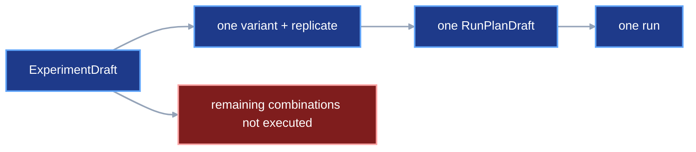
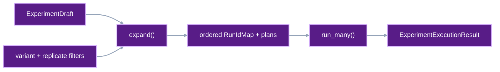

# Experiment expansion and bounded execution

An experiment can declare several variants and replicates. This contract turns
that declaration into one concrete run plan for every selected
variant-replicate pair. It also defines one bounded operation that executes the
frozen plans and returns every outcome.

## 1. Status

**Contract status:** audited; owner approval pending.

These requirements bind the contract to the master checklist:

| ID | Implementation obligation |
| --- | --- |
| EXP-01 <!-- contract-requirement: EXP-01 phase=12 test=tests/test_authoring.py --> | Expand selected variants and replicates into a deterministic tuple of `RunPlanDraft` values. |
| EXP-02 <!-- contract-requirement: EXP-02 phase=12 test=tests/test_run_execution.py --> | Execute frozen run plans with bounded concurrency and retain one typed result for every plan. |
| EXP-03 <!-- contract-requirement: EXP-03 phase=12 test=tests/test_api.py --> | Expose the same batch result through Python, typed API, and CLI surfaces. |

**Current:** `ExperimentDraft` owns variant graphs and replicate seeds.
`viper.authoring.plan()` selects one variant and one replicate. The user must repeat that
call, assign every run ID, freeze every plan, and collect execution failures.

**Target:** `viper.authoring.expand()` creates the complete ordered set of
`RunPlanDraft` values. `viper.execution.run_many()` executes their frozen
paths. Each plan remains an ordinary `RunPlanDraft`. Each run still produces
an ordinary terminal `ResolvedRun`.

## 2. Required claim

Given the same `ExperimentDraft`, selected IDs, run-ID map, benchmark, source,
environment, and reproducibility settings, `viper.authoring.expand()` returns the same
ordered plans.

The order is:

```text
selected variants in ExperimentDraft.variants order
-> selected replicates in ExperimentDraft.replicates order
-> one RunPlanDraft for each pair
```

`viper.execution.run_many()` starts at most `max_concurrency` runs at once. It
returns one `ExperimentRunResult` for every input path in the original order.
A failed run remains failed. Another run can continue when
`stop_on_failure=False`.

## 3. Current gap

The existing single-run authoring path is complete in the target contracts:

```text
ExperimentDraft
-> viper.authoring.plan(variant=..., replicate=...)
-> RunPlanDraft
-> viper.authoring.freeze()
-> FrozenPlanFiles
-> viper.execution.run()
```

The missing operation is the Cartesian expansion:

```text
selected variants x selected replicates
-> one assigned run ID per pair
-> one RunPlanDraft per pair
-> bounded execution
-> one aggregate result
```

This contract keeps `viper.authoring.plan()`, `viper.authoring.freeze()`, and
`viper.execution.run()` as the single-run primitives. Expansion calls those
primitives and preserves the existing frozen run format.

### Current DAG



### Proposed-change DAG



### Integrated DAG


## 4. Contract models

### Run-ID assignment

The caller assigns every run ID before freezing:

```python
RunIdMap = dict[VariantId, dict[ReplicateId, RunId]]
```

The map must contain exactly one run ID for every selected pair. Run IDs must
be unique across the map. Explicit IDs keep generated paths reviewable before
execution and preserve the existing `RunId` contract.

### Aggregate execution result

The exact public result models are:

```python
ExperimentRunStatus = Literal["succeeded", "failed", "skipped"]


class ExperimentRunResult(BaseModel):
    model_config = ConfigDict(extra="forbid", frozen=True)

    variant_id: VariantId
    replicate_id: ReplicateId
    run_id: RunId
    run_spec_path: Path
    status: ExperimentRunStatus
    result: RunResult | None = None
    failure: ViperFailure | None = None
    skip_reason: NonEmptyStr | None = None


class ExperimentExecutionResult(BaseModel):
    model_config = ConfigDict(extra="forbid", frozen=True)

    runs: tuple[ExperimentRunResult, ...] = Field(min_length=1)
```

`ExperimentRunResult` enforces these complete states:

| `status` | `result` | `failure` | `skip_reason` |
| --- | --- | --- | --- |
| `succeeded` | required | absent | absent |
| `failed` | absent | required | absent |
| `skipped` | absent | absent | required |

`ExperimentExecutionResult.runs` preserves the input plan order.

## 5. Public interface

### Expand one experiment

```python
def expand(
    experiment: ExperimentDraft,
    *,
    run_ids: RunIdMap,
    benchmark: BenchmarkDraft | None = None,
    source: GitSource,
    env: EnvSpec,
    reproducibility: ReproducibilitySpec,
    variants: tuple[VariantId, ...] | None = None,
    replicates: tuple[ReplicateId, ...] | None = None,
) -> tuple[RunPlanDraft, ...]: ...
```

`variants=None` selects every declared variant. `replicates=None` selects every
declared replicate. A supplied tuple acts as a membership filter. Output order
still comes from the declarations in `ExperimentDraft`.

The function rejects an unknown ID, a repeated filter value, a missing run ID,
an extra run-ID entry, and one run ID assigned to two pairs.

### Execute the frozen plans

```python
def run_many(
    repository_root: Path,
    run_spec_paths: tuple[Path, ...],
    *,
    max_concurrency: int = 1,
    timeout_seconds: float | None = None,
    stop_on_failure: bool = False,
) -> ExperimentExecutionResult: ...
```

`max_concurrency` must be at least one. Each worker calls the existing
`viper.execution.run()` operation for one path. Run-level locks, attempt
journals, terminal files, verification, and storage publication remain owned
by that operation.

`timeout_seconds` keeps the existing `viper.execution.run()` meaning. A
positive value is passed unchanged to every run call and limits the wait for
each stage or metric child process. A whole run or batch can last longer. When
a child process reaches the limit, that run's batch
entry receives `status="failed"` and the ordinary typed timeout failure. Other
runs continue unless `stop_on_failure=True`. Python, typed API, and CLI entry
points reject zero and negative values before starting any run.

When `stop_on_failure=True`, the first observed failure prevents further plan
starts. Every plan awaiting start receives `status="skipped"`.
Runs already in progress finish and keep their actual result.

### Complete example

<!-- contract-example-symbols: ["execution", "expand", "freeze"] -->
<!-- contract-worked-example: start -->

```python
from pathlib import Path

from viper import execution
from viper.authoring import expand, freeze


plans = expand(
    experiment,
    run_ids={
        "baseline": {
            "replicate_01": "01ARZ3NDEKTSV4RRFFQ69G5FAV",
            "replicate_02": "01ARZ3NDEKTSV4RRFFQ69G5FAW",
        },
        "l2": {
            "replicate_01": "01ARZ3NDEKTSV4RRFFQ69G5FAX",
            "replicate_02": "01ARZ3NDEKTSV4RRFFQ69G5FAY",
        },
    },
    benchmark=benchmark,
    source=source,
    env=env,
    reproducibility=reproducibility,
)

frozen = tuple(freeze(plan) for plan in plans)

# The user commits every path in every FrozenPlanFiles.files tuple here.

results = execution.run_many(
    Path.cwd(),
    tuple(item.run_spec_path for item in frozen),
    max_concurrency=2,
)
```

<!-- contract-worked-example: end -->

## 6. Runtime ownership

`viper.authoring.expand()` validates the selection and constructs `RunPlanDraft` values.
Execution and file writes begin in later operations.

`viper.authoring.freeze()` remains the only operation that writes canonical plan files.
The plan-commit rules in
[`frozen-plan-git-identity.md`](frozen-plan-git-identity.md) apply to every
returned `FrozenPlanFiles` value.

`viper.execution.run_many()` owns scheduling only. Each selected run owns its
normal workspace, lock, journal, attempts, snapshots, terminal record, and
verification result.

## 7. Persistence and verification

| Rule | Executable condition |
| --- | --- |
| `experiment.expansion.canonical` <!-- verifier-rule: experiment.expansion.canonical requirement=EXP-01 --> | Selected variants and replicates expand into one deterministically ordered tuple of run plans. |
| `experiment.batch.complete` <!-- verifier-rule: experiment.batch.complete requirement=EXP-02 --> | Bounded execution retains one typed completion, failure, or skip result for every frozen plan. |
| `experiment.batch.public` <!-- verifier-rule: experiment.batch.public requirement=EXP-03 --> | Python, typed API, and CLI batch execution return the same typed result. |

The batch result exists as a returned operation result. The terminal
`ResolvedRun` records remain the persisted source of truth for this migration.

Verification follows the existing path for every successful run:

```text
ExperimentExecutionResult.runs[i].result
-> RunResult.resolved_run_ref
-> verify_run_result()
```

The aggregate operation checks ordering and identity:

```text
input RunSpec.run_id
== ExperimentRunResult.run_id

input order
== ExperimentExecutionResult.runs order
```

## 8. Acceptance cases

### Complete two-by-two expansion

Two variants and two replicates produce four plans in variant-major order.
Every plan receives the assigned run ID, selected variant, selected replicate,
replicate seed, common benchmark, source, environment, and reproducibility
settings.

### Filtered expansion

Selecting one variant and two replicates produces two plans. Extra run-ID map
entries stop expansion.

### Bounded execution

A test runner records active calls. `max_concurrency=2` records at most two
simultaneous calls. Returned results retain the original plan order even when
the second run finishes first.

### Failure continuation

The second run fails and the third succeeds with `stop_on_failure=False`. The
aggregate result contains succeeded, failed, and succeeded entries in input
order.

### Failure stop

The first run fails with `stop_on_failure=True`. Every run awaiting start
receives `status="skipped"` and a concrete reason.

### Forwarded process timeout

One run's stage process exceeds `timeout_seconds` while another run's processes
complete within it. The first entry contains the typed timeout failure and the
second succeeds. With `stop_on_failure=True`, the timeout prevents any later
unstarted run from starting. Python, typed API, and CLI calls reject
`timeout_seconds <= 0` with the same field error.

## 9. Propagation

| Surface | Required change |
| --- | --- |
| `src/viper/authoring.py` | Add `RunIdMap` and `expand()` while retaining `plan()` as the single-run constructor. |
| `src/viper/execution/results.py` | Add `ExperimentRunResult` and `ExperimentExecutionResult`. |
| `src/viper/execution/_batch.py` | Add bounded scheduling around `execution.run()`. |
| `src/viper/execution/__init__.py` | Export `run_many()`. |
| `src/viper/api.py` | Add typed batch request and success models plus the `run_many` operation. |
| `src/viper/cli.py` | Add one batch command that accepts a list of frozen run-spec paths. |
| `src/viper/__init__.py` | Export `expand` and the aggregate result types. |
| `tests/test_authoring.py` | Cover ordering, filters, exact run-ID maps, and duplicate rejection. |
| `tests/test_run_execution.py` | Cover bounded concurrency, order, continuation, and stop behavior. |
| `tests/test_api.py` | Require equal Python, typed-operation, and CLI result shapes. |
| Public documentation | Show expansion after the single-plan path so both APIs remain clear. |

## 10. Legacy cleanup

The implementation removes hand-written loops from generated scaffolding and
examples when those loops only repeat `viper.authoring.plan()` across an experiment.
Single-plan examples remain when they teach one run.

The implementation ends at bounded local scheduling. A scheduler service,
distributed queue, optimizer, and automatic run-ID generator remain future
work.

## 11. Implementation order

1. Add deterministic expansion and its authoring tests.
2. Add aggregate result models.
3. Add bounded local execution around `execution.run()`.
4. Add typed API and CLI entry points.
5. Update the complete authoring example and generated project.
6. Run the contract-to-checklist audit and focused execution tests.
