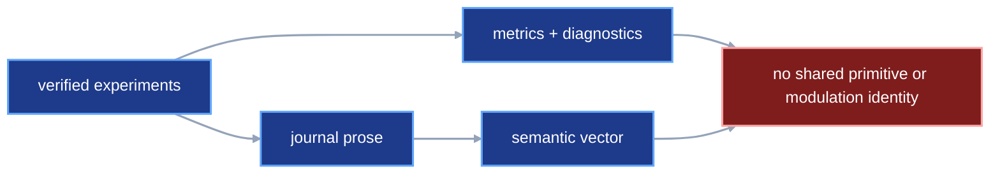
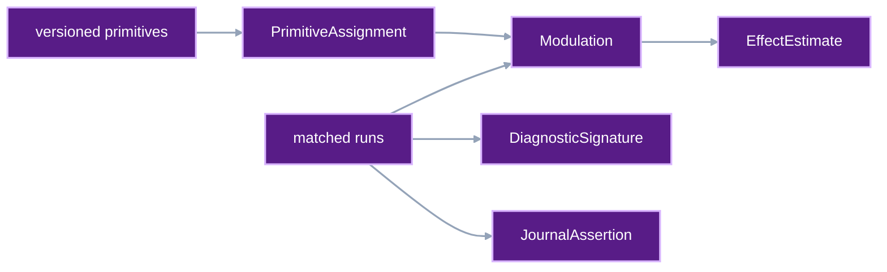

# Experiment knowledge primitives

VIPER records exact runs. This contract adds the scientific labels and
comparisons needed to search those runs as experiments. It preserves the run
records as evidence. The new records state what a run tested, what changed,
what happened, and which evidence supports a written conclusion.

## 1. Status

**Contract status:** planned; Master Phases 16 and 17.

These requirements bind the contract to the master checklist:

| ID | Implementation obligation |
| --- | --- |
| EKP-01 <!-- contract-requirement: EKP-01 phase=16 test=tests/test_protocol.py --> | Define a versioned primitive ontology and declared, inferred, and reviewed assignment records. |
| EKP-02 <!-- contract-requirement: EKP-02 phase=16 test=tests/test_verification_acceptance.py --> | Record controlled modulations, paired effects, impact assessments, diagnostic signatures, and evidence-backed journal assertions as immutable files. |
| EKP-03 <!-- contract-requirement: EKP-03 phase=17 test=tests/test_inspection.py --> | Add vector views, vectors, retrieval judgments, exact graph and filter indexes, and one optional HNSW index for each declared vector view. |
| EKP-04 <!-- contract-requirement: EKP-04 phase=17 test=tests/test_api.py --> | Expose the same knowledge publication and search operations through Python, typed API, CLI, and MCP. |

## 2. Required claim

VIPER can answer a scientific query only when it can return the immutable runs,
measurements, assignments, comparisons, or journal records behind the answer.

The first implementation supports this path:

```text
verified runs and benchmark results
-> versioned primitive assignments
-> controlled run pairs
-> recomputed effect estimates and diagnostic signatures
-> reviewed journal assertions
-> exact graph and field filters
-> optional similarity ranking inside one named vector view
```

Exact run identity and explicit equivalence rules decide whether two
experiments duplicate each other. Similarity search only ranks candidates for
review.

## 3. Current gap

The provenance catalog can find runs by exact fields. The missing records must
represent these claims:

```text
this model uses a gated recurrent functional family
this run changed only the regularization family
this change improved test loss across four matched replicates
this diagnostic pattern preceded divergence
this journal conclusion is supported by these measurements
```

Free text supplies prose while leaving versioned terms, typed evidence links,
and deterministic recomputation unresolved. A vector index supplies a ranking.
Identity, provenance, and experimental effects require exact records.

### Current DAG



### Proposed-change DAG



### Integrated DAG


## 4. Stable identifiers and targets

The ontology defines the allowed scientific terms. A knowledge target identifies
the exact VIPER evidence being labeled.

```python
PrimitiveId = Annotated[str, StringConstraints(min_length=1)]
OntologyId = Annotated[str, StringConstraints(min_length=1)]
OntologyVersion = Annotated[str, StringConstraints(min_length=1)]
AssertionId = Annotated[str, StringConstraints(min_length=1)]
VectorViewId = Annotated[str, StringConstraints(min_length=1)]


class PrimitiveRef(ProtocolModel):
    ontology_id: OntologyId
    ontology_version: OntologyVersion
    primitive_id: PrimitiveId


class RunKnowledgeTarget(ProtocolModel):
    kind: Literal["run"] = "run"
    run: ResolvedRunRef


class StageKnowledgeTarget(ProtocolModel):
    kind: Literal["stage"] = "stage"
    run: ResolvedRunRef
    stage_id: StageId


class ArtifactKnowledgeTarget(ProtocolModel):
    kind: Literal["artifact"] = "artifact"
    run: ResolvedRunRef
    stage_id: StageId
    artifact_name: ArtifactName
    sha256: SHA256


class MeasurementKnowledgeTarget(ProtocolModel):
    kind: Literal["measurement"] = "measurement"
    run: ResolvedRunRef
    stage_id: StageId
    metric_id: MetricId
    measurement: ResolvedFileRef


KnowledgeTarget = Annotated[
    RunKnowledgeTarget
    | StageKnowledgeTarget
    | ArtifactKnowledgeTarget
    | MeasurementKnowledgeTarget,
    Field(discriminator="kind"),
]
```

Every target contains an immutable reference. A stage, artifact, or measurement
target also contains the key needed to find that entity inside the verified
run.

## 5. Versioned ontology

```python
class PrimitiveSpec(ProtocolModel):
    primitive_id: PrimitiveId
    dimension: NonEmptyStr
    label: NonEmptyStr
    definition: NonEmptyStr
    parents: tuple[PrimitiveId, ...] = ()
    examples: tuple[NonEmptyStr, ...] = ()


class OntologySpec(ProtocolModel):
    schema_version: Literal[1] = 1
    ontology_id: OntologyId
    version: OntologyVersion
    primitives: tuple[PrimitiveSpec, ...] = Field(min_length=1)
    created_at: AwareDatetime
```

Primitive IDs are unique within one ontology version. Every parent must exist
in that same version. The parent graph must be acyclic. A published ontology
version is immutable. A correction creates another version.

The first vocabulary covers these dimensions:

```text
model functional family
embedding topology
attention or recurrence topology
loss-term functional family
optimizer family
regularization family
data transformation family
sampling strategy
training schedule
parameter initialization
inference strategy
compute and precision regime
```

New ontology versions can add terms while retaining the protocol schema.

## 6. Primitive assignments

The assignment union keeps authored facts, classifier output, and human review
separate.

```python
class DeclaredPrimitiveAssignment(ProtocolModel):
    origin: Literal["declared"] = "declared"
    target: KnowledgeTarget
    primitive: PrimitiveRef
    assigned_by: NonEmptyStr
    assigned_at: AwareDatetime


class InferredPrimitiveAssignment(ProtocolModel):
    origin: Literal["inferred"] = "inferred"
    target: KnowledgeTarget
    primitive: PrimitiveRef
    classifier: ResolvedArtifactPointerRef
    confidence: float = Field(ge=0.0, le=1.0, allow_inf_nan=False)
    assigned_at: AwareDatetime


class ReviewedPrimitiveAssignment(ProtocolModel):
    origin: Literal["reviewed"] = "reviewed"
    source_assignment: ResolvedFileRef
    target: KnowledgeTarget
    primitive: PrimitiveRef
    decision: Literal["accepted", "corrected"]
    reviewed_by: NonEmptyStr
    reviewed_at: AwareDatetime


PrimitiveAssignment = Annotated[
    DeclaredPrimitiveAssignment
    | InferredPrimitiveAssignment
    | ReviewedPrimitiveAssignment,
    Field(discriminator="origin"),
]
```

A reviewed correction keeps the original inferred assignment. Queries can ask
for declared, inferred, reviewed, or effective labels. An effective label uses
the newest valid review when one exists, then a declared assignment, then an
inferred assignment. Equal timestamps break ties by immutable reference.

## 7. Controlled modulation and paired effects

A modulation compares two verified runs and names every scientific primitive
that changed.

```python
class PrimitiveChange(ProtocolModel):
    dimension: NonEmptyStr
    baseline_assignment: ResolvedFileRef | None = None
    candidate_assignment: ResolvedFileRef | None = None


ComparisonField = Literal[
    "inputs",
    "split",
    "eval_spec",
    "env",
    "reproducibility",
    "compute",
]


class RunComparisonIdentity(ProtocolModel):
    input_sha256: tuple[SHA256, ...] = Field(min_length=1)
    split_sha256: SHA256
    eval_spec_sha256: SHA256
    env_sha256: SHA256
    reproducibility_sha256: SHA256
    compute_sha256: SHA256


class ComparisonContext(ProtocolModel):
    baseline: RunComparisonIdentity
    candidate: RunComparisonIdentity
    matched: tuple[ComparisonField, ...] = Field(min_length=1)


class Modulation(ProtocolModel):
    schema_version: Literal[1] = 1
    baseline_run: ResolvedRunRef
    candidate_run: ResolvedRunRef
    changes: tuple[PrimitiveChange, ...] = Field(min_length=1)
    context: ComparisonContext
    created_at: AwareDatetime


class PairedEffect(ProtocolModel):
    modulation: ResolvedFileRef
    baseline_measurement: ResolvedFileRef
    candidate_measurement: ResolvedFileRef
    baseline_value: float = Field(allow_inf_nan=False)
    candidate_value: float = Field(allow_inf_nan=False)
    improvement: float = Field(allow_inf_nan=False)


class EffectEstimate(ProtocolModel):
    schema_version: Literal[1] = 1
    metric_id: MetricId
    direction: Literal["min", "max"]
    pairs: tuple[PairedEffect, ...] = Field(min_length=1)
    mean_improvement: float = Field(allow_inf_nan=False)
    standard_error: float | None = Field(default=None, ge=0.0, allow_inf_nan=False)
    confidence: float = Field(default=0.95, gt=0.0, lt=1.0)
    interval_low: float | None = Field(default=None, allow_inf_nan=False)
    interval_high: float | None = Field(default=None, allow_inf_nan=False)
    created_at: AwareDatetime
```

`PrimitiveChange` requires at least one assignment and rejects equal assignment
references. The verifier loads each assignment, checks its ontology dimension,
and requires its target to belong to the corresponding baseline or candidate
run. This preserves the exact assignment history used to define the change.
Changes sort by dimension.

`ComparisonContext.matched` names the fields held constant. The verifier
requires equal baseline and candidate values for each one. A compute-regime
modulation can omit `"compute"` from `matched` and preserve the two compute
identities. Every run pair in one estimate must use the same primitive changes
and matched-field set. The effect query groups pairs by the exact values in the
fields selected as controls.

VIPER orients each pair so a positive number means improvement. For pair
`i`, let `b_i` be the baseline measurement and `c_i` the candidate
measurement. Let `s=1` for a metric that should increase and `s=-1` for a
metric that should decrease.

```math
d_i = s(c_i - b_i)
```

For `n` pairs, the reported mean is:

```math
\bar d = \frac{1}{n}\sum_{i=1}^{n} d_i
```

For `n >= 2`, VIPER records the sample standard error and a two-sided normal
interval:

```math
SE(\bar d) = \sqrt{\frac{1}{n(n-1)}\sum_{i=1}^{n}(d_i-\bar d)^2}
```

```math
[\bar d-z_{1-\alpha/2}SE(\bar d),\ \bar d+z_{1-\alpha/2}SE(\bar d)]
```

Here, `alpha = 1 - confidence`, and `z` is the standard-normal quantile. One
pair stores `None` for its standard error and interval. This record is a
descriptive paired estimate. A causal claim requires a separate identification
argument.

### Qualitative impact

High, medium, and low labels come from a published policy for one metric and
comparison scope.

```python
class ImpactPolicy(ProtocolModel):
    schema_version: Literal[1] = 1
    policy_id: NonEmptyStr
    version: NonEmptyStr
    metric_id: MetricId
    context_sha256: SHA256
    minimum_pairs: int = Field(ge=2)
    maximum_interval_width: float = Field(gt=0.0, allow_inf_nan=False)
    low_threshold: float = Field(gt=0.0, allow_inf_nan=False)
    medium_threshold: float = Field(gt=0.0, allow_inf_nan=False)
    high_threshold: float = Field(gt=0.0, allow_inf_nan=False)


class ImpactAssessment(ProtocolModel):
    schema_version: Literal[1] = 1
    effect: ResolvedFileRef
    policy: ResolvedFileRef
    impact: Literal["negative", "none", "low", "medium", "high"]
    assessed_at: AwareDatetime
```

`context_sha256` covers the ordered matched-field names and their shared
values. Thresholds must satisfy `low < medium < high`. The verifier loads the
effect and policy, checks the context digest, pair count, and interval width,
and recomputes the label:

```text
interval_high < 0
-> negative

interval contains zero or mean_improvement < low_threshold
-> none

low_threshold <= mean_improvement < medium_threshold
-> low

medium_threshold <= mean_improvement < high_threshold
-> medium

mean_improvement >= high_threshold
-> high
```

An estimate must have an interval. It must meet the policy's pair count and
maximum interval width before VIPER publishes an assessment.

## 8. Diagnostic signatures

A diagnostic signature is a deterministic ordered view of measurements from
one stage.

```python
class DiagnosticComponent(ProtocolModel):
    metric_id: MetricId
    measurement: ResolvedFileRef
    value: float = Field(allow_inf_nan=False)


class DiagnosticSignature(ProtocolModel):
    schema_version: Literal[1] = 1
    run: ResolvedRunRef
    stage_id: StageId
    components: tuple[DiagnosticComponent, ...] = Field(min_length=1)
    component_sha256: SHA256
    created_at: AwareDatetime
```

Components sort by metric ID and immutable measurement reference. The digest
covers the canonical component tuple. Verification loads each `Measurement`,
checks its run, stage, metric ID, and value, then recomputes the digest.

## 9. Journal assertions

A journal entry states one bounded claim and cites the evidence that supports
it.

```python
JournalEvidenceKind = Literal[
    "run",
    "artifact",
    "measurement",
    "benchmark",
    "assignment",
    "modulation",
    "effect",
    "impact",
    "diagnostic",
    "retrieval_judgment",
]


class JournalEvidence(ProtocolModel):
    kind: JournalEvidenceKind
    reference: ResolvedFileRef


class JournalAssertion(ProtocolModel):
    schema_version: Literal[1] = 1
    assertion_id: AssertionId
    kind: Literal["observation", "hypothesis", "decision", "exclusion"]
    text: NonEmptyStr
    evidence: tuple[JournalEvidence, ...] = Field(min_length=1)
    status: Literal["proposed", "reviewed", "rejected"]
    authored_by: NonEmptyStr
    created_at: AwareDatetime
    reviewed_by: NonEmptyStr | None = None
    reviewed_at: AwareDatetime | None = None
```

`status="reviewed"` and `status="rejected"` require both review fields.
`status="proposed"` rejects them. An exclusion assertion must cite at least one
effect estimate or impact assessment. Verification loads every evidence
reference and checks that its stored record matches `kind`.

The journal text remains separate from its embedding. A new embedding model
creates a new vector while preserving the assertion and its review status.

## 10. Vector views and derived indexes

Each vector belongs to one declared view. Diagnostic values and journal text
use separate views.

```python
class DiagnosticVectorView(ProtocolModel):
    kind: Literal["diagnostic"] = "diagnostic"
    view_id: VectorViewId
    version: NonEmptyStr
    metric_ids: tuple[MetricId, ...] = Field(min_length=1)
    dimensions: int = Field(ge=1)
    distance: Literal["cosine"] = "cosine"


class JournalVectorView(ProtocolModel):
    kind: Literal["journal"] = "journal"
    view_id: VectorViewId
    version: NonEmptyStr
    embedder: ResolvedArtifactPointerRef
    dimensions: int = Field(ge=1)
    distance: Literal["cosine"] = "cosine"


VectorViewSpec = Annotated[
    DiagnosticVectorView | JournalVectorView,
    Field(discriminator="kind"),
]


class KnowledgeVector(ProtocolModel):
    schema_version: Literal[1] = 1
    view: VectorViewSpec
    source: ResolvedFileRef
    values: tuple[float, ...] = Field(min_length=1)
    created_at: AwareDatetime


RetrievalAspect = Literal["primitive", "diagnostic", "journal", "outcome"]


class RetrievalJudgment(ProtocolModel):
    schema_version: Literal[1] = 1
    query_vector: ResolvedFileRef
    candidate_vector: ResolvedFileRef
    aspects: tuple[RetrievalAspect, ...] = Field(min_length=1)
    relevance: int = Field(ge=0, le=3)
    reviewed_by: NonEmptyStr
    reviewed_at: AwareDatetime
```

Master Phase 17 defines `VectorViewSpec` and `KnowledgeVector` before it defines
`RetrievalJudgment`. The judgment consumes two published vector references, so
its verifier can load both vectors and compare their view identity.

`values` must contain exactly `view.dimensions` finite values. A diagnostic
view requires the same ordered metric IDs as its source signature. A journal
view requires a `JournalAssertion` source and records the exact embedder in the
view.

`RetrievalJudgment` loads both `KnowledgeVector` records and requires the same
view ID, version, and digest. Relevance uses a four-point reviewed scale:

```text
0 -> irrelevant
1 -> related but unhelpful
2 -> useful supporting context
3 -> directly answers the retrieval need
```

The aspects state which view of the experiment justified that score. These
records supply held-out retrieval judgments before any learned representation
enters the framework.

The catalog stores exact fields and graph edges in SQLite. It stores an
optional HNSW index for each `(view_id, version, view digest)` under:

```text
.viper/knowledge/<view-sha256>/hnsw.bin
```

These files are derived. The verified `KnowledgeVector` records retain the
evidence needed to rebuild them after deletion.

Similarity search follows this order:

```text
exact experiment, ontology, context, and review-status filters
-> select one vector view
-> HNSW candidate search when that view has an index
-> exact distance calculation over returned candidates
-> stable distance and immutable-reference ordering
```

Small filtered sets use exhaustive distance calculation. HNSW accelerates
larger sets as an approximate nearest-neighbor index. Exact duplicate rejection
uses run identity, primitive identity, or a reviewed equivalence rule. HNSW
distance only ranks candidates.

### Exact query models

```python
class PrimitiveQuery(BaseModel):
    model_config = ConfigDict(extra="forbid", frozen=True)

    ontology_id: OntologyId | None = None
    ontology_versions: tuple[OntologyVersion, ...] = ()
    dimensions: tuple[NonEmptyStr, ...] = ()
    primitive_ids: tuple[PrimitiveId, ...] = ()
    labels: tuple[NonEmptyStr, ...] = ()
    limit: int = Field(default=50, ge=1, le=500)
    cursor: str | None = None


class AssignmentQuery(BaseModel):
    model_config = ConfigDict(extra="forbid", frozen=True)

    run: ResolvedRunRef | None = None
    stage_ids: tuple[StageId, ...] = ()
    origins: tuple[Literal["declared", "inferred", "reviewed"], ...] = ()
    primitive_ids: tuple[PrimitiveId, ...] = ()
    decisions: tuple[Literal["accepted", "corrected"], ...] = ()
    effective_only: bool = False
    limit: int = Field(default=50, ge=1, le=500)
    cursor: str | None = None


class ModulationQuery(BaseModel):
    model_config = ConfigDict(extra="forbid", frozen=True)

    baseline_runs: tuple[ResolvedRunRef, ...] = ()
    candidate_runs: tuple[ResolvedRunRef, ...] = ()
    dimensions: tuple[NonEmptyStr, ...] = ()
    primitive_ids: tuple[PrimitiveId, ...] = ()
    context_sha256: SHA256 | None = None
    limit: int = Field(default=50, ge=1, le=500)
    cursor: str | None = None


class EffectQuery(BaseModel):
    model_config = ConfigDict(extra="forbid", frozen=True)

    metric_ids: tuple[MetricId, ...] = ()
    directions: tuple[Literal["min", "max"], ...] = ()
    primitive_ids: tuple[PrimitiveId, ...] = ()
    context_sha256: SHA256 | None = None
    minimum_improvement: float | None = Field(default=None, allow_inf_nan=False)
    maximum_improvement: float | None = Field(default=None, allow_inf_nan=False)
    limit: int = Field(default=50, ge=1, le=500)
    cursor: str | None = None


class ImpactQuery(BaseModel):
    model_config = ConfigDict(extra="forbid", frozen=True)

    metric_ids: tuple[MetricId, ...] = ()
    impacts: tuple[Literal["negative", "none", "low", "medium", "high"], ...] = ()
    policy_ids: tuple[NonEmptyStr, ...] = ()
    context_sha256: SHA256 | None = None
    limit: int = Field(default=50, ge=1, le=500)
    cursor: str | None = None


class DiagnosticQuery(BaseModel):
    model_config = ConfigDict(extra="forbid", frozen=True)

    runs: tuple[ResolvedRunRef, ...] = ()
    stage_ids: tuple[StageId, ...] = ()
    metric_ids: tuple[MetricId, ...] = ()
    limit: int = Field(default=50, ge=1, le=500)
    cursor: str | None = None


class AssertionQuery(BaseModel):
    model_config = ConfigDict(extra="forbid", frozen=True)

    kinds: tuple[Literal["observation", "hypothesis", "decision", "exclusion"], ...] = ()
    statuses: tuple[Literal["proposed", "reviewed", "rejected"], ...] = ()
    evidence_kinds: tuple[JournalEvidenceKind, ...] = ()
    primitive_ids: tuple[PrimitiveId, ...] = ()
    limit: int = Field(default=50, ge=1, le=500)
    cursor: str | None = None


class RetrievalJudgmentQuery(BaseModel):
    model_config = ConfigDict(extra="forbid", frozen=True)

    view_ids: tuple[VectorViewId, ...] = ()
    aspects: tuple[RetrievalAspect, ...] = ()
    minimum_relevance: int | None = Field(default=None, ge=0, le=3)
    reviewers: tuple[NonEmptyStr, ...] = ()
    limit: int = Field(default=50, ge=1, le=500)
    cursor: str | None = None


class SimilarityQuery(BaseModel):
    model_config = ConfigDict(extra="forbid", frozen=True)

    view_id: VectorViewId
    view_version: NonEmptyStr
    values: tuple[float, ...] = Field(min_length=1)
    primitive_ids: tuple[PrimitiveId, ...] = ()
    metric_ids: tuple[MetricId, ...] = ()
    assertion_statuses: tuple[
        Literal["proposed", "reviewed", "rejected"], ...
    ] = ()
    limit: int = Field(default=20, ge=1, le=500)


class CatalogPrimitive(BaseModel):
    model_config = ConfigDict(extra="forbid", frozen=True)

    ontology: ResolvedFileRef
    primitive: PrimitiveRef
    dimension: NonEmptyStr
    label: NonEmptyStr


class CatalogKnowledgeRecord(BaseModel):
    model_config = ConfigDict(extra="forbid", frozen=True)

    reference: ResolvedFileRef
    record: KnowledgeRecordEnvelope


class SimilarityMatch(BaseModel):
    model_config = ConfigDict(extra="forbid", frozen=True)

    source: CatalogKnowledgeRecord
    vector: ResolvedFileRef
    distance: float = Field(ge=0.0, allow_inf_nan=False)


class PrimitivePage(BaseModel):
    items: tuple[CatalogPrimitive, ...]
    next_cursor: str | None = None


class KnowledgePage(BaseModel):
    items: tuple[CatalogKnowledgeRecord, ...]
    next_cursor: str | None = None


class SimilarityPage(BaseModel):
    items: tuple[SimilarityMatch, ...]
```

Every exact page sorts by its complete typed key, then immutable reference.
Its opaque cursor binds the query and final sort key. `SimilarityPage` returns
one bounded result and omits pagination.

```python
class KnowledgeCatalog:
    def primitives(self, query: PrimitiveQuery = PrimitiveQuery()) -> PrimitivePage: ...
    def assignments(self, query: AssignmentQuery = AssignmentQuery()) -> KnowledgePage: ...
    def modulations(self, query: ModulationQuery = ModulationQuery()) -> KnowledgePage: ...
    def effects(self, query: EffectQuery = EffectQuery()) -> KnowledgePage: ...
    def impacts(self, query: ImpactQuery = ImpactQuery()) -> KnowledgePage: ...
    def diagnostics(self, query: DiagnosticQuery = DiagnosticQuery()) -> KnowledgePage: ...
    def assertions(self, query: AssertionQuery = AssertionQuery()) -> KnowledgePage: ...
    def retrieval_judgments(
        self,
        query: RetrievalJudgmentQuery = RetrievalJudgmentQuery(),
    ) -> KnowledgePage: ...
    def similar(self, query: SimilarityQuery) -> SimilarityPage: ...


# Phase 16 extends the existing Catalog.refresh() method with knowledge heads.
def refresh(
    self,
    *,
    runs: tuple[CatalogRunSource, ...] = (),
    benchmarks: tuple[CatalogBenchmarkSource, ...] = (),
    knowledge: tuple[ResolvedFileRef, ...] = (),
) -> CatalogRefreshResult: ...


# Phase 17 adds this property to Catalog.
@property
def knowledge(self) -> KnowledgeCatalog: ...
```

## 11. Publication, verification, and authority

| Rule | Executable condition |
| --- | --- |
| `knowledge.ontology.complete` <!-- verifier-rule: knowledge.ontology.complete requirement=EKP-01 --> | Ontology versions and declared, inferred, and reviewed primitive assignments preserve exact provenance. |
| `knowledge.evidence.complete` <!-- verifier-rule: knowledge.evidence.complete requirement=EKP-02 --> | Modulations, effects, impact assessments, diagnostic signatures, and journal assertions publish as immutable evidence. |
| `knowledge.retrieval.complete` <!-- verifier-rule: knowledge.retrieval.complete requirement=EKP-03 --> | Exact filters and graph indexes remain authoritative while each vector view uses its declared optional HNSW index. |
| `knowledge.public.complete` <!-- verifier-rule: knowledge.public.complete requirement=EKP-04 --> | Python, typed API, CLI, and MCP expose the same knowledge publication and search operations. |

Knowledge records are standalone immutable files. They use the destination
already bound for the current project:

```text
protocol model
-> canonical JSON bytes
-> publish_resolved_files()
-> ResolvedFileRef
-> catalog refresh
-> exact rows, graph edges, and optional vector index
```

The local catalog and HNSW files remain rebuildable projections. Evidence
references point to immutable protocol records.

```python
KnowledgeRecordKind = Literal[
    "ontology",
    "assignment",
    "modulation",
    "effect",
    "impact_policy",
    "impact",
    "diagnostic",
    "assertion",
    "vector",
    "retrieval_judgment",
]

KnowledgeRecord = (
    OntologySpec
    | PrimitiveAssignment
    | Modulation
    | EffectEstimate
    | ImpactPolicy
    | ImpactAssessment
    | DiagnosticSignature
    | JournalAssertion
    | KnowledgeVector
    | RetrievalJudgment
)


class KnowledgeRecordEnvelope(ProtocolModel):
    schema_version: Literal[1] = 1
    record_kind: KnowledgeRecordKind
    value: KnowledgeRecord


class KnowledgeManifest(ProtocolModel):
    schema_version: Literal[1] = 1
    record: ResolvedFileRef
    previous: ResolvedFileRef | None = None
    published_at: AwareDatetime


class KnowledgePublicationResult(BaseModel):
    model_config = ConfigDict(extra="forbid", frozen=True)

    record: ResolvedFileRef
    manifest: ResolvedFileRef


class KnowledgeStore:
    def publish_ontology(self, value: OntologySpec) -> KnowledgePublicationResult: ...
    def publish_assignment(self, value: PrimitiveAssignment) -> KnowledgePublicationResult: ...
    def publish_modulation(self, value: Modulation) -> KnowledgePublicationResult: ...
    def publish_effect(self, value: EffectEstimate) -> KnowledgePublicationResult: ...
    def publish_impact_policy(self, value: ImpactPolicy) -> KnowledgePublicationResult: ...
    def publish_impact(self, value: ImpactAssessment) -> KnowledgePublicationResult: ...
    def publish_signature(self, value: DiagnosticSignature) -> KnowledgePublicationResult: ...
    def publish_assertion(self, value: JournalAssertion) -> KnowledgePublicationResult: ...
    def publish_vector(self, value: KnowledgeVector) -> KnowledgePublicationResult: ...
    def publish_retrieval_judgment(
        self,
        value: RetrievalJudgment,
    ) -> KnowledgePublicationResult: ...


def knowledge(
    *,
    root: Path | None = None,
    destination: StorageDestination | None = None,
) -> KnowledgeStore: ...
```

Master Phase 16 first implements `KnowledgeRecordKind`, `KnowledgeRecord`, and
`KnowledgeStore` through `JournalAssertion`. Master Phase 17 extends those three
owners with `KnowledgeVector`, `RetrievalJudgment`, `publish_vector()`, and
`publish_retrieval_judgment()` after both vector models exist. The code above
shows the complete target API after both phases.

`destination=None` loads the repository's current `StorageSettings`. An
explicit destination overrides that setting for this store. Every published
reference contains its own local or cloud location, so a later configuration
change leaves old records retrievable. Cross-run knowledge records use the
store destination independently because they belong to several runs.

Every successful publication writes the record, then writes one immutable
`KnowledgeManifest` whose `previous` field points to the prior manifest. The
record bytes contain `KnowledgeRecordEnvelope`; its validator requires the
declared `record_kind` to match the concrete `value` type. VIPER
atomically replaces this local discovery pointer after both writes succeed:

```text
.viper/knowledge/head.json
```

The head file contains the newest manifest's `ResolvedFileRef`. A repository
lock serializes head updates. A crash before the head replacement can leave an
unreachable immutable file. Readers keep the prior complete head. A later
garbage collector may remove the unreachable file after its grace period.

`KnowledgePublicationResult.record` is the reference used by assignments,
modulations, effects, and journals. `manifest` is the portable starting point
for catalog discovery. Every publish method validates referenced records
before writing. Failed validation publishes nothing.

The Phase 16 `Catalog.refresh(knowledge=...)` extension follows the local head
and any supplied manifest heads.

Refresh walks each manifest chain to its first record, rejects a cycle or an
invalid envelope, and deduplicates records by immutable reference. Catalog
results include the validated envelope beside its reference. A remote user can
pass the manifest returned by
`KnowledgePublicationResult` even when this checkout lacks the original local
head.

Python reads use `KnowledgeCatalog` and the exact query models above. The typed
API and CLI expose matching publication and search operations.

MCP read mode adds these tools in name order:

```text
search_assertions
search_assignments
search_diagnostics
search_effects
search_impacts
search_modulations
search_primitives
search_retrieval_judgments
search_similar
```

MCP execute mode adds:

```text
knowledge_refresh
publish_assertion
publish_assignment
publish_diagnostic
publish_effect
publish_impact
publish_impact_policy
publish_modulation
publish_ontology
publish_retrieval_judgment
publish_vector
```

## 12. Acceptance cases
<!-- contract-worked-example: start -->

```python
from datetime import UTC, datetime


created_at = datetime.now(UTC)
primitive = PrimitiveSpec(
    primitive_id="loss.focal",
    dimension="loss-term functional family",
    label="Focal loss",
    definition="Cross-entropy weighted toward hard examples.",
    parents=("loss.classification",),
    examples=("gamma=2",),
)
ontology = OntologySpec(
    ontology_id="viper.ml",
    version="1",
    primitives=(classification_loss, primitive),
    created_at=created_at,
)
primitive_ref = PrimitiveRef(
    ontology_id=ontology.ontology_id,
    ontology_version=ontology.version,
    primitive_id=primitive.primitive_id,
)
target = RunKnowledgeTarget(run=verified_candidate_run)
assignment = DeclaredPrimitiveAssignment(
    target=target,
    primitive=primitive_ref,
    assigned_by="experiment-author",
    assigned_at=created_at,
)

assert assignment.primitive.primitive_id == "loss.focal"
assert assignment.target.run == verified_candidate_run
```

### Ontology and assignment history

Publish two ontology versions, one inferred assignment, and one reviewed
correction. Effective-label search returns the correction. Historical search
returns all records with their original immutable references. A missing parent,
parent cycle, unknown primitive, or review of the wrong record type fails.

### Paired effect verification

Four matched run pairs produce four measurements. VIPER rebuilds every
oriented improvement, mean, standard error, and interval. Changing one
measurement reference, value, direction, context, or stored estimate causes
verification failure.

### Qualitative impact

One effect passes a published policy's pair-count and interval-width rules.
VIPER recomputes its impact label. A threshold-order error, context mismatch,
insufficient pair count, wide interval, or changed label fails.

### Diagnostic signature

The same verified measurements in different input order produce the same
component order and digest. A measurement from another stage or a changed
component value fails verification.

### Journal evidence

A reviewed observation cites one effect and one diagnostic signature. Search
returns the assertion and both source records. A missing reference, wrong
evidence kind, review-field mismatch, or unsupported exclusion fails.

### Manifest discovery and recovery

Two processes publish under the repository lock. The second manifest points to
the first. Catalog refresh from the local head finds both records. Refresh from
the second manifest supplied explicitly returns the same records after the
local head is removed. A cycle, missing prior manifest, non-knowledge record,
or interrupted publication before head replacement fails closed. The prior
head remains readable.

### Exact and vector search

Exact filters run before similarity search. Two HNSW rebuilds over the same
fixture return the same exact filtered set. Final candidates sort by exact
distance and immutable reference. The test records recall against exhaustive
search for the fixed fixture. That measurement applies to the fixture and
declared index settings.

### Reviewed retrieval judgment

One reviewer scores four candidates against a query vector. The verifier
requires one vector view and valid references. Exact search returns the scores
in candidate-reference order. A mixed view, changed score, unknown vector, or
duplicate aspect fails.

### Surface equality

Python, typed API, CLI, and MCP calls return the same ordered references for
one exact query and one vector query. Read-only MCP omits publication and
refresh tools. Execute mode routes them through the same typed handlers.

<!-- contract-worked-example: end -->

## 13. Propagation

| Surface | Required change |
| --- | --- |
| `src/viper/knowledge.py` | Add every ontology, assignment, modulation, effect, impact, diagnostic, journal, vector, retrieval-judgment, and publication model. |
| `src/viper/catalog.py` | Add verified knowledge rows, graph edges, exact queries, vector-view metadata, and HNSW rebuilds. |
| `src/viper/verification/__init__.py` | Dispatch ontology, assignment, comparison, impact, signature, assertion, vector, and retrieval-judgment verification. |
| `src/viper/api.py` | Add typed publication and search request and success models. |
| `src/viper/api.py` | Route knowledge operations through `KnowledgeStore` and `Catalog`. |
| `src/viper/cli.py` | Add `knowledge publish`, `knowledge search`, and `knowledge refresh` commands. |
| `src/viper/mcp.py` | Add read searches and execute-only publication and refresh tools from the typed operation registry. |
| `src/viper/__init__.py` | Export `knowledge` and the public protocol and query models. |
| `pyproject.toml` | Add a compatible optional HNSW dependency group; retain exact search in the base installation. |
| `tests/test_protocol.py` | Cover exact fields, unions, validators, canonical ordering, and JSON round trips. |
| `tests/test_verification_acceptance.py` | Sever every immutable reference and recomputed relationship. |
| `tests/test_inspection.py` | Cover graph extraction, exact filters, rebuild equality, vector views, ordering, and fixed-fixture recall. |
| `tests/test_api.py` | Compare Python, typed API, CLI, and MCP request and result schemas. |
| Public documentation | Explain the evidence layers, controlled comparison limits, and exact-versus-similarity boundary. |

## 14. Legacy cleanup

[`research-memory-roadmap.md`](research-memory-roadmap.md) stops describing the
whole research-memory system as deferred. It points to this contract for the
active deterministic foundation.

Current protocol records remain. The implementation removes any new code that
stores scientific labels only in catalog rows or journals only as untyped text.
Every vector carries its source record and view identity.

## 15. Implementation order

1. Add ontology, targets, and assignment models.
2. Add modulation, paired effect, impact, diagnostic, and journal models.
3. Add canonical publication and verification through `JournalAssertion`.
4. Extend catalog refresh with exact non-vector rows and graph edges.
5. Add vector views and `KnowledgeVector`, then extend publication and
   verification for vectors.
6. Add `RetrievalJudgment` after `KnowledgeVector`, then extend publication,
   verification, and exact retrieval-judgment queries.
7. Add exhaustive exact-distance search.
8. Add one optional HNSW index per view and fixed-fixture recall tests.
9. Add Python, typed API, CLI, and MCP publication and search surfaces.
10. Run the terminal generated-project and full-system gate.

## 16. Research boundary

This contract produces the reviewed scientific labels, effects, diagnostics,
assertions, vectors, and retrieval judgments consumed by
[`Research Memory and Agent Learning`](research-memory-roadmap.md). That
contract owns the decision episode, training dataset, learning update,
evaluation, promotion, and rollback records for:

- primitive classifiers;
- aspect-aware or multi-view representations;
- context-conditioned outcome models;
- experiment-acquisition policies; or
- continual-learning policies from agent traces.

Each model must name its immutable `LearningDatasetManifest`, ontology version,
frozen `AgentEvaluationPlan`, acceptance metrics, retention suite, and review
policy. A reviewed `JournalAssertion` can label an episode, but it does not
substitute for the complete `ResearchEpisode` or `LearningExample` records.

## 17. Research basis

[HNSW](https://arxiv.org/abs/1603.09320) supplies the approximate vector-index
structure. VIPER keeps it behind exact filters and exact final distance
calculation because the index is a search aid.

[USearch](https://pypi.org/project/usearch/) supplies maintained Python wheels
for the optional HNSW accelerator. Exact search remains the base installation.

[Agent Workflow Memory](https://proceedings.mlr.press/v267/wang25bx.html)
shows how reusable procedures can be extracted from prior trajectories. VIPER
adds immutable run and measurement references to each reviewed assertion.

[ResearchGym](https://arxiv.org/abs/2602.15112) evaluates agents on executable
research tasks with objective outcomes. Its broad reliability gap supports
building reviewed evidence records before training a research policy.

[PerTurboAgent](https://proceedings.mlr.press/v311/hao25b.html) provides a
narrow example of iterative experiment selection informed by analysis and
retrieved knowledge. VIPER first records the controlled comparisons and
reviewed decisions needed to evaluate such selection in another domain.

## 18. Phase 16 executable plan

<!-- pair-block-definition: P16-EKP-01 -->
```toml pair-block
id = "P16-EKP-01"
requirements = ["EKP-01", "EKP-02"]
targets = [
    "src/viper/knowledge.py:annotations",
    "src/viper/knowledge.py:hashlib",
    "src/viper/knowledge.py:json",
    "src/viper/knowledge.py:os",
    "src/viper/knowledge.py:tempfile",
    "src/viper/knowledge.py:Iterator",
    "src/viper/knowledge.py:contextmanager",
    "src/viper/knowledge.py:Path",
    "src/viper/knowledge.py:Annotated",
    "src/viper/knowledge.py:Literal",
    "src/viper/knowledge.py:Self",
    "src/viper/knowledge.py:AwareDatetime",
    "src/viper/knowledge.py:BaseModel",
    "src/viper/knowledge.py:ConfigDict",
    "src/viper/knowledge.py:Field",
    "src/viper/knowledge.py:StringConstraints",
    "src/viper/knowledge.py:TypeAdapter",
    "src/viper/knowledge.py:model_validator",
    "src/viper/knowledge.py:SHA256",
    "src/viper/knowledge.py:ArtifactName",
    "src/viper/knowledge.py:NonEmptyStr",
    "src/viper/knowledge.py:ProtocolModel",
    "src/viper/knowledge.py:MetricId",
    "src/viper/knowledge.py:StageId",
    "src/viper/knowledge.py:ResolvedArtifactPointerRef",
    "src/viper/knowledge.py:ResolvedFileRef",
    "src/viper/knowledge.py:ResolvedRunRef",
    "src/viper/knowledge.py:serialize_document",
    "src/viper/knowledge.py:StorageDestination",
    "src/viper/knowledge.py:load_storage_settings",
    "src/viper/knowledge.py:publish_resolved_files",
    "src/viper/knowledge.py:PrimitiveId",
    "src/viper/knowledge.py:OntologyId",
    "src/viper/knowledge.py:OntologyVersion",
    "src/viper/knowledge.py:AssertionId",
    "src/viper/knowledge.py:PrimitiveRef",
    "src/viper/knowledge.py:RunKnowledgeTarget",
    "src/viper/knowledge.py:StageKnowledgeTarget",
    "src/viper/knowledge.py:ArtifactKnowledgeTarget",
    "src/viper/knowledge.py:MeasurementKnowledgeTarget",
    "src/viper/knowledge.py:KnowledgeTarget",
    "src/viper/knowledge.py:PrimitiveSpec",
    "src/viper/knowledge.py:OntologySpec",
    "src/viper/knowledge.py:DeclaredPrimitiveAssignment",
    "src/viper/knowledge.py:InferredPrimitiveAssignment",
    "src/viper/knowledge.py:ReviewedPrimitiveAssignment",
    "src/viper/knowledge.py:PrimitiveAssignment",
    "src/viper/knowledge.py:PrimitiveChange",
    "src/viper/knowledge.py:ComparisonField",
    "src/viper/knowledge.py:RunComparisonIdentity",
    "src/viper/knowledge.py:ComparisonContext",
    "src/viper/knowledge.py:Modulation",
    "src/viper/knowledge.py:PairedEffect",
    "src/viper/knowledge.py:EffectEstimate",
    "src/viper/knowledge.py:ImpactPolicy",
    "src/viper/knowledge.py:ImpactAssessment",
    "src/viper/knowledge.py:DiagnosticComponent",
    "src/viper/knowledge.py:diagnostic_component_sha256",
    "src/viper/knowledge.py:DiagnosticSignature",
    "src/viper/knowledge.py:JournalEvidenceKind",
    "src/viper/knowledge.py:JournalEvidence",
    "src/viper/knowledge.py:JournalAssertion",
    "src/viper/knowledge.py:KnowledgeRecordKind",
    "src/viper/knowledge.py:KnowledgeRecord",
    "src/viper/knowledge.py:_RECORD_TYPES",
    "src/viper/knowledge.py:KnowledgeRecordEnvelope",
    "src/viper/knowledge.py:KnowledgeManifest",
    "src/viper/knowledge.py:KnowledgePublicationResult",
    "src/viper/knowledge.py:_repository_lock",
    "src/viper/knowledge.py:KnowledgeStore",
    "src/viper/knowledge.py:knowledge",
    "src/viper/knowledge.py:__all__",
    "tests/test_protocol.py:UTC",
    "tests/test_protocol.py:datetime",
    "tests/test_protocol.py:DeclaredPrimitiveAssignment",
    "tests/test_protocol.py:OntologySpec",
    "tests/test_protocol.py:PrimitiveRef",
    "tests/test_protocol.py:PrimitiveSpec",
    "tests/test_protocol.py:RunKnowledgeTarget",
    "tests/test_protocol.py:LocalFileRef",
    "tests/test_protocol.py:ResolvedRunRef",
    "tests/test_protocol.py:SnapshotFileRef",
    "tests/test_protocol.py:test_knowledge_ontology_preserves_assignment_provenance",
    "tests/test_verification_acceptance.py:DeclaredPrimitiveAssignment",
    "tests/test_verification_acceptance.py:KnowledgeManifest",
    "tests/test_verification_acceptance.py:KnowledgeRecordEnvelope",
    "tests/test_verification_acceptance.py:OntologySpec",
    "tests/test_verification_acceptance.py:PrimitiveRef",
    "tests/test_verification_acceptance.py:PrimitiveSpec",
    "tests/test_verification_acceptance.py:RunKnowledgeTarget",
    "tests/test_verification_acceptance.py:knowledge",
    "tests/test_verification_acceptance.py:document_digest",
    "tests/test_verification_acceptance.py:parse_yaml_bytes",
    "tests/test_verification_acceptance.py:LocalArtifactStore",
    "tests/test_verification_acceptance.py:test_knowledge_records_preserve_immutable_evidence",
]
tests = [
    "tests/test_protocol.py:test_knowledge_ontology_preserves_assignment_provenance",
    "tests/test_verification_acceptance.py:test_knowledge_records_preserve_immutable_evidence",
]
gate = "python -m pytest tests/test_protocol.py::test_knowledge_ontology_preserves_assignment_provenance tests/test_verification_acceptance.py::test_knowledge_records_preserve_immutable_evidence -q"
depends_on = ["P15-PCM-01"]
```

**Context:** Phase 16 defines the immutable scientific evidence records and one
repository-bound publication chain. The block keeps ontology assignments tied
to exact run references and advances the local knowledge head only after both
the record and its manifest have been published.

## 19. Phase 16 ContractTargets

<!-- contract-target: requirements=EKP-01,EKP-02 block=P16-EKP-01 action=add target=src/viper/knowledge.py:annotations -->
```python contract-target
from __future__ import annotations
```

<!-- contract-target: requirements=EKP-01,EKP-02 block=P16-EKP-01 action=add target=src/viper/knowledge.py:hashlib -->
```python contract-target
import hashlib
```

<!-- contract-target: requirements=EKP-01,EKP-02 block=P16-EKP-01 action=add target=src/viper/knowledge.py:json -->
```python contract-target
import json
```

<!-- contract-target: requirements=EKP-01,EKP-02 block=P16-EKP-01 action=add target=src/viper/knowledge.py:os -->
```python contract-target
import os
```

<!-- contract-target: requirements=EKP-01,EKP-02 block=P16-EKP-01 action=add target=src/viper/knowledge.py:tempfile -->
```python contract-target
import tempfile
```

<!-- contract-target: requirements=EKP-01,EKP-02 block=P16-EKP-01 action=add target=src/viper/knowledge.py:Iterator -->
```python contract-target
from collections.abc import Iterator
```

<!-- contract-target: requirements=EKP-01,EKP-02 block=P16-EKP-01 action=add target=src/viper/knowledge.py:contextmanager -->
```python contract-target
from contextlib import contextmanager
```

<!-- contract-target: requirements=EKP-01,EKP-02 block=P16-EKP-01 action=add target=src/viper/knowledge.py:Path -->
```python contract-target
from pathlib import Path
```

<!-- contract-target: requirements=EKP-01,EKP-02 block=P16-EKP-01 action=add target=src/viper/knowledge.py:Annotated -->
<!-- contract-target: requirements=EKP-01,EKP-02 block=P16-EKP-01 action=add target=src/viper/knowledge.py:Literal -->
<!-- contract-target: requirements=EKP-01,EKP-02 block=P16-EKP-01 action=add target=src/viper/knowledge.py:Self -->
```python contract-target
from typing import Annotated, Literal, Self
```

<!-- contract-target: requirements=EKP-01,EKP-02 block=P16-EKP-01 action=add target=src/viper/knowledge.py:AwareDatetime -->
<!-- contract-target: requirements=EKP-01,EKP-02 block=P16-EKP-01 action=add target=src/viper/knowledge.py:BaseModel -->
<!-- contract-target: requirements=EKP-01,EKP-02 block=P16-EKP-01 action=add target=src/viper/knowledge.py:ConfigDict -->
<!-- contract-target: requirements=EKP-01,EKP-02 block=P16-EKP-01 action=add target=src/viper/knowledge.py:Field -->
<!-- contract-target: requirements=EKP-01,EKP-02 block=P16-EKP-01 action=add target=src/viper/knowledge.py:StringConstraints -->
<!-- contract-target: requirements=EKP-01,EKP-02 block=P16-EKP-01 action=add target=src/viper/knowledge.py:TypeAdapter -->
<!-- contract-target: requirements=EKP-01,EKP-02 block=P16-EKP-01 action=add target=src/viper/knowledge.py:model_validator -->
```python contract-target
from pydantic import (
    AwareDatetime,
    BaseModel,
    ConfigDict,
    Field,
    StringConstraints,
    TypeAdapter,
    model_validator,
)
```

<!-- contract-target: requirements=EKP-01,EKP-02 block=P16-EKP-01 action=add target=src/viper/knowledge.py:SHA256 -->
<!-- contract-target: requirements=EKP-01,EKP-02 block=P16-EKP-01 action=add target=src/viper/knowledge.py:ArtifactName -->
<!-- contract-target: requirements=EKP-01,EKP-02 block=P16-EKP-01 action=add target=src/viper/knowledge.py:NonEmptyStr -->
<!-- contract-target: requirements=EKP-01,EKP-02 block=P16-EKP-01 action=add target=src/viper/knowledge.py:ProtocolModel -->
```python contract-target
from ._schema import SHA256, ArtifactName, NonEmptyStr, ProtocolModel
```

<!-- contract-target: requirements=EKP-01,EKP-02 block=P16-EKP-01 action=add target=src/viper/knowledge.py:MetricId -->
<!-- contract-target: requirements=EKP-01,EKP-02 block=P16-EKP-01 action=add target=src/viper/knowledge.py:StageId -->
```python contract-target
from .ids import MetricId, StageId
```

<!-- contract-target: requirements=EKP-01,EKP-02 block=P16-EKP-01 action=add target=src/viper/knowledge.py:ResolvedArtifactPointerRef -->
<!-- contract-target: requirements=EKP-01,EKP-02 block=P16-EKP-01 action=add target=src/viper/knowledge.py:ResolvedFileRef -->
<!-- contract-target: requirements=EKP-01,EKP-02 block=P16-EKP-01 action=add target=src/viper/knowledge.py:ResolvedRunRef -->
```python contract-target
from .references import (
    ResolvedArtifactPointerRef,
    ResolvedFileRef,
    ResolvedRunRef,
)
```

<!-- contract-target: requirements=EKP-01,EKP-02 block=P16-EKP-01 action=add target=src/viper/knowledge.py:serialize_document -->
```python contract-target
from .serialization import serialize_document
```

<!-- contract-target: requirements=EKP-01,EKP-02 block=P16-EKP-01 action=add target=src/viper/knowledge.py:StorageDestination -->
<!-- contract-target: requirements=EKP-01,EKP-02 block=P16-EKP-01 action=add target=src/viper/knowledge.py:load_storage_settings -->
<!-- contract-target: requirements=EKP-01,EKP-02 block=P16-EKP-01 action=add target=src/viper/knowledge.py:publish_resolved_files -->
```python contract-target
from .storage import (
    StorageDestination,
    load_storage_settings,
    publish_resolved_files,
)
```

<!-- contract-target: requirements=EKP-01,EKP-02 block=P16-EKP-01 action=add target=src/viper/knowledge.py:PrimitiveId -->
```python contract-target
PrimitiveId = Annotated[str, StringConstraints(min_length=1)]
```

<!-- contract-target: requirements=EKP-01,EKP-02 block=P16-EKP-01 action=add target=src/viper/knowledge.py:OntologyId -->
```python contract-target
OntologyId = Annotated[str, StringConstraints(min_length=1)]
```

<!-- contract-target: requirements=EKP-01,EKP-02 block=P16-EKP-01 action=add target=src/viper/knowledge.py:OntologyVersion -->
```python contract-target
OntologyVersion = Annotated[str, StringConstraints(min_length=1)]
```

<!-- contract-target: requirements=EKP-01,EKP-02 block=P16-EKP-01 action=add target=src/viper/knowledge.py:AssertionId -->
```python contract-target
AssertionId = Annotated[str, StringConstraints(min_length=1)]
```

<!-- contract-target: requirements=EKP-01,EKP-02 block=P16-EKP-01 action=add target=src/viper/knowledge.py:PrimitiveRef -->
```python contract-target
class PrimitiveRef(ProtocolModel):
    """Select one term from an exact ontology version."""

    ontology_id: OntologyId
    ontology_version: OntologyVersion
    primitive_id: PrimitiveId
```

<!-- contract-target: requirements=EKP-01,EKP-02 block=P16-EKP-01 action=add target=src/viper/knowledge.py:RunKnowledgeTarget -->
```python contract-target
class RunKnowledgeTarget(ProtocolModel):
    """Identify one immutable run."""

    kind: Literal["run"] = "run"
    run: ResolvedRunRef
```

<!-- contract-target: requirements=EKP-01,EKP-02 block=P16-EKP-01 action=add target=src/viper/knowledge.py:StageKnowledgeTarget -->
```python contract-target
class StageKnowledgeTarget(ProtocolModel):
    """Identify one stage inside an immutable run."""

    kind: Literal["stage"] = "stage"
    run: ResolvedRunRef
    stage_id: StageId
```

<!-- contract-target: requirements=EKP-01,EKP-02 block=P16-EKP-01 action=add target=src/viper/knowledge.py:ArtifactKnowledgeTarget -->
```python contract-target
class ArtifactKnowledgeTarget(ProtocolModel):
    """Identify one artifact inside an immutable run."""

    kind: Literal["artifact"] = "artifact"
    run: ResolvedRunRef
    stage_id: StageId
    artifact_name: ArtifactName
    sha256: SHA256
```

<!-- contract-target: requirements=EKP-01,EKP-02 block=P16-EKP-01 action=add target=src/viper/knowledge.py:MeasurementKnowledgeTarget -->
```python contract-target
class MeasurementKnowledgeTarget(ProtocolModel):
    """Identify one immutable measurement."""

    kind: Literal["measurement"] = "measurement"
    run: ResolvedRunRef
    stage_id: StageId
    metric_id: MetricId
    measurement: ResolvedFileRef
```

<!-- contract-target: requirements=EKP-01,EKP-02 block=P16-EKP-01 action=add target=src/viper/knowledge.py:KnowledgeTarget -->
```python contract-target
KnowledgeTarget = Annotated[
    RunKnowledgeTarget
    | StageKnowledgeTarget
    | ArtifactKnowledgeTarget
    | MeasurementKnowledgeTarget,
    Field(discriminator="kind"),
]
```

<!-- contract-target: requirements=EKP-01,EKP-02 block=P16-EKP-01 action=add target=src/viper/knowledge.py:PrimitiveSpec -->
```python contract-target
class PrimitiveSpec(ProtocolModel):
    """Define one term and its place in the ontology graph."""

    primitive_id: PrimitiveId
    dimension: NonEmptyStr
    label: NonEmptyStr
    definition: NonEmptyStr
    parents: tuple[PrimitiveId, ...] = ()
    examples: tuple[NonEmptyStr, ...] = ()

    @model_validator(mode="after")
    def validate_order(self) -> Self:
        """Require stable parent and example order without duplicates."""
        if self.parents != tuple(sorted(set(self.parents))):
            raise ValueError("primitive parents must be unique and sorted")
        if self.examples != tuple(sorted(set(self.examples))):
            raise ValueError("primitive examples must be unique and sorted")
        return self
```

<!-- contract-target: requirements=EKP-01,EKP-02 block=P16-EKP-01 action=add target=src/viper/knowledge.py:OntologySpec -->
```python contract-target
class OntologySpec(ProtocolModel):
    """Publish one complete acyclic ontology version."""

    schema_version: Literal[1] = 1
    ontology_id: OntologyId
    version: OntologyVersion
    primitives: tuple[PrimitiveSpec, ...] = Field(min_length=1)
    created_at: AwareDatetime

    @model_validator(mode="after")
    def validate_graph(self) -> Self:
        """Require one sorted definition per term and an acyclic parent graph."""
        identifiers = tuple(item.primitive_id for item in self.primitives)
        if identifiers != tuple(sorted(set(identifiers))):
            raise ValueError("ontology primitives must be unique and sorted")
        known = set(identifiers)
        if any(
            parent not in known for item in self.primitives for parent in item.parents
        ):
            raise ValueError("ontology parent is undefined")
        parents = {item.primitive_id: item.parents for item in self.primitives}

        def visit(node: PrimitiveId, path: frozenset[PrimitiveId]) -> None:
            if node in path:
                raise ValueError("ontology parents contain a cycle")
            for parent in parents[node]:
                visit(parent, path | {node})

        for identifier in identifiers:
            visit(identifier, frozenset())
        return self
```

<!-- contract-target: requirements=EKP-01,EKP-02 block=P16-EKP-01 action=add target=src/viper/knowledge.py:DeclaredPrimitiveAssignment -->
```python contract-target
class DeclaredPrimitiveAssignment(ProtocolModel):
    """Record a primitive assigned by an identified author."""

    origin: Literal["declared"] = "declared"
    target: KnowledgeTarget
    primitive: PrimitiveRef
    assigned_by: NonEmptyStr
    assigned_at: AwareDatetime
```

<!-- contract-target: requirements=EKP-01,EKP-02 block=P16-EKP-01 action=add target=src/viper/knowledge.py:InferredPrimitiveAssignment -->
```python contract-target
class InferredPrimitiveAssignment(ProtocolModel):
    """Record a primitive assigned by an immutable classifier."""

    origin: Literal["inferred"] = "inferred"
    target: KnowledgeTarget
    primitive: PrimitiveRef
    classifier: ResolvedArtifactPointerRef
    confidence: float = Field(ge=0.0, le=1.0, allow_inf_nan=False)
    assigned_at: AwareDatetime
```

<!-- contract-target: requirements=EKP-01,EKP-02 block=P16-EKP-01 action=add target=src/viper/knowledge.py:ReviewedPrimitiveAssignment -->
```python contract-target
class ReviewedPrimitiveAssignment(ProtocolModel):
    """Record a human decision about an earlier assignment."""

    origin: Literal["reviewed"] = "reviewed"
    source_assignment: ResolvedFileRef
    target: KnowledgeTarget
    primitive: PrimitiveRef
    decision: Literal["accepted", "corrected"]
    reviewed_by: NonEmptyStr
    reviewed_at: AwareDatetime
```

<!-- contract-target: requirements=EKP-01,EKP-02 block=P16-EKP-01 action=add target=src/viper/knowledge.py:PrimitiveAssignment -->
```python contract-target
PrimitiveAssignment = Annotated[
    DeclaredPrimitiveAssignment
    | InferredPrimitiveAssignment
    | ReviewedPrimitiveAssignment,
    Field(discriminator="origin"),
]
```

<!-- contract-target: requirements=EKP-01,EKP-02 block=P16-EKP-01 action=add target=src/viper/knowledge.py:PrimitiveChange -->
```python contract-target
class PrimitiveChange(ProtocolModel):
    """Identify the assignment transition in one ontology dimension."""

    dimension: NonEmptyStr
    baseline_assignment: ResolvedFileRef | None = None
    candidate_assignment: ResolvedFileRef | None = None

    @model_validator(mode="after")
    def validate_transition(self) -> Self:
        """Require an actual assignment addition, removal, or replacement."""
        if self.baseline_assignment is None and self.candidate_assignment is None:
            raise ValueError("primitive change requires an assignment")
        if self.baseline_assignment == self.candidate_assignment:
            raise ValueError("primitive change assignments must differ")
        return self
```

<!-- contract-target: requirements=EKP-01,EKP-02 block=P16-EKP-01 action=add target=src/viper/knowledge.py:ComparisonField -->
```python contract-target
ComparisonField = Literal[
    "inputs",
    "split",
    "eval_spec",
    "env",
    "reproducibility",
    "compute",
]
```

<!-- contract-target: requirements=EKP-01,EKP-02 block=P16-EKP-01 action=add target=src/viper/knowledge.py:RunComparisonIdentity -->
```python contract-target
class RunComparisonIdentity(ProtocolModel):
    """Store the exact fields that can be held constant between runs."""

    input_sha256: tuple[SHA256, ...] = Field(min_length=1)
    split_sha256: SHA256
    eval_spec_sha256: SHA256
    env_sha256: SHA256
    reproducibility_sha256: SHA256
    compute_sha256: SHA256
```

<!-- contract-target: requirements=EKP-01,EKP-02 block=P16-EKP-01 action=add target=src/viper/knowledge.py:ComparisonContext -->
```python contract-target
class ComparisonContext(ProtocolModel):
    """Declare which run identities a modulation holds constant."""

    baseline: RunComparisonIdentity
    candidate: RunComparisonIdentity
    matched: tuple[ComparisonField, ...] = Field(min_length=1)

    @model_validator(mode="after")
    def validate_matches(self) -> Self:
        """Require every declared control to have the same exact value."""
        if self.matched != tuple(sorted(set(self.matched))):
            raise ValueError("matched fields must be unique and sorted")
        field_names = {
            "inputs": "input_sha256",
            "split": "split_sha256",
            "eval_spec": "eval_spec_sha256",
            "env": "env_sha256",
            "reproducibility": "reproducibility_sha256",
            "compute": "compute_sha256",
        }
        for field in self.matched:
            name = field_names[field]
            if getattr(self.baseline, name) != getattr(self.candidate, name):
                raise ValueError(f"matched comparison field differs: {field}")
        return self
```

<!-- contract-target: requirements=EKP-01,EKP-02 block=P16-EKP-01 action=add target=src/viper/knowledge.py:Modulation -->
```python contract-target
class Modulation(ProtocolModel):
    """Compare two runs and enumerate their scientific changes."""

    schema_version: Literal[1] = 1
    baseline_run: ResolvedRunRef
    candidate_run: ResolvedRunRef
    changes: tuple[PrimitiveChange, ...] = Field(min_length=1)
    context: ComparisonContext
    created_at: AwareDatetime

    @model_validator(mode="after")
    def validate_changes(self) -> Self:
        """Require one change per dimension in stable order."""
        dimensions = tuple(item.dimension for item in self.changes)
        if dimensions != tuple(sorted(set(dimensions))):
            raise ValueError("modulation changes must be unique and sorted")
        if self.baseline_run == self.candidate_run:
            raise ValueError("modulation runs must differ")
        return self
```

<!-- contract-target: requirements=EKP-01,EKP-02 block=P16-EKP-01 action=add target=src/viper/knowledge.py:PairedEffect -->
```python contract-target
class PairedEffect(ProtocolModel):
    """Store one oriented measurement difference for a run pair."""

    modulation: ResolvedFileRef
    baseline_measurement: ResolvedFileRef
    candidate_measurement: ResolvedFileRef
    baseline_value: float = Field(allow_inf_nan=False)
    candidate_value: float = Field(allow_inf_nan=False)
    improvement: float = Field(allow_inf_nan=False)
```

<!-- contract-target: requirements=EKP-01,EKP-02 block=P16-EKP-01 action=add target=src/viper/knowledge.py:EffectEstimate -->
```python contract-target
class EffectEstimate(ProtocolModel):
    """Store a descriptive estimate across matched run pairs."""

    schema_version: Literal[1] = 1
    metric_id: MetricId
    direction: Literal["min", "max"]
    pairs: tuple[PairedEffect, ...] = Field(min_length=1)
    mean_improvement: float = Field(allow_inf_nan=False)
    standard_error: float | None = Field(default=None, ge=0.0, allow_inf_nan=False)
    confidence: float = Field(default=0.95, gt=0.0, lt=1.0)
    interval_low: float | None = Field(default=None, allow_inf_nan=False)
    interval_high: float | None = Field(default=None, allow_inf_nan=False)
    created_at: AwareDatetime

    @model_validator(mode="after")
    def validate_summary(self) -> Self:
        """Require stored improvements and their mean to match the pair values."""
        sign = 1.0 if self.direction == "max" else -1.0
        expected = tuple(
            sign * (pair.candidate_value - pair.baseline_value) for pair in self.pairs
        )
        if any(
            abs(pair.improvement - value) > 1e-12
            for pair, value in zip(self.pairs, expected)
        ):
            raise ValueError("paired improvement does not match its measurements")
        if abs(self.mean_improvement - sum(expected) / len(expected)) > 1e-12:
            raise ValueError("mean improvement does not match its pairs")
        interval = (self.interval_low, self.interval_high)
        if len(self.pairs) == 1 and (
            self.standard_error is not None or interval != (None, None)
        ):
            raise ValueError("one pair cannot report an interval")
        if len(self.pairs) > 1 and (self.standard_error is None or None in interval):
            raise ValueError("several pairs require an interval")
        return self
```

<!-- contract-target: requirements=EKP-01,EKP-02 block=P16-EKP-01 action=add target=src/viper/knowledge.py:ImpactPolicy -->
```python contract-target
class ImpactPolicy(ProtocolModel):
    """Define reproducible thresholds for one qualitative impact label."""

    schema_version: Literal[1] = 1
    policy_id: NonEmptyStr
    version: NonEmptyStr
    metric_id: MetricId
    context_sha256: SHA256
    minimum_pairs: int = Field(ge=2)
    maximum_interval_width: float = Field(gt=0.0, allow_inf_nan=False)
    low_threshold: float = Field(gt=0.0, allow_inf_nan=False)
    medium_threshold: float = Field(gt=0.0, allow_inf_nan=False)
    high_threshold: float = Field(gt=0.0, allow_inf_nan=False)

    @model_validator(mode="after")
    def validate_thresholds(self) -> Self:
        """Require increasing low, medium, and high thresholds."""
        if not self.low_threshold < self.medium_threshold < self.high_threshold:
            raise ValueError("impact thresholds must increase")
        return self
```

<!-- contract-target: requirements=EKP-01,EKP-02 block=P16-EKP-01 action=add target=src/viper/knowledge.py:ImpactAssessment -->
```python contract-target
class ImpactAssessment(ProtocolModel):
    """Apply one immutable policy to one immutable effect estimate."""

    schema_version: Literal[1] = 1
    effect: ResolvedFileRef
    policy: ResolvedFileRef
    impact: Literal["negative", "none", "low", "medium", "high"]
    assessed_at: AwareDatetime
```

<!-- contract-target: requirements=EKP-01,EKP-02 block=P16-EKP-01 action=add target=src/viper/knowledge.py:DiagnosticComponent -->
```python contract-target
class DiagnosticComponent(ProtocolModel):
    """Bind one metric value to its immutable measurement."""

    metric_id: MetricId
    measurement: ResolvedFileRef
    value: float = Field(allow_inf_nan=False)
```

<!-- contract-target: requirements=EKP-01,EKP-02 block=P16-EKP-01 action=add target=src/viper/knowledge.py:diagnostic_component_sha256 -->
```python contract-target
def diagnostic_component_sha256(components: tuple[DiagnosticComponent, ...]) -> str:
    """Hash one ordered diagnostic component tuple."""
    payload = [component.model_dump(mode="json") for component in components]
    raw = json.dumps(payload, sort_keys=True, separators=(",", ":")).encode()
    return hashlib.sha256(raw).hexdigest()
```

<!-- contract-target: requirements=EKP-01,EKP-02 block=P16-EKP-01 action=add target=src/viper/knowledge.py:DiagnosticSignature -->
```python contract-target
class DiagnosticSignature(ProtocolModel):
    """Store a deterministic metric signature for one stage."""

    schema_version: Literal[1] = 1
    run: ResolvedRunRef
    stage_id: StageId
    components: tuple[DiagnosticComponent, ...] = Field(min_length=1)
    component_sha256: SHA256
    created_at: AwareDatetime

    @model_validator(mode="after")
    def validate_components(self) -> Self:
        """Require stable component order and the exact component digest."""
        keys = tuple(
            (str(item.metric_id), item.measurement.sha256) for item in self.components
        )
        if keys != tuple(sorted(set(keys))):
            raise ValueError("diagnostic components must be unique and sorted")
        if self.component_sha256 != diagnostic_component_sha256(self.components):
            raise ValueError("diagnostic component digest differs")
        return self
```

<!-- contract-target: requirements=EKP-01,EKP-02 block=P16-EKP-01 action=add target=src/viper/knowledge.py:JournalEvidenceKind -->
```python contract-target
JournalEvidenceKind = Literal[
    "run",
    "artifact",
    "measurement",
    "benchmark",
    "assignment",
    "modulation",
    "effect",
    "impact",
    "diagnostic",
    "retrieval_judgment",
]
```

<!-- contract-target: requirements=EKP-01,EKP-02 block=P16-EKP-01 action=add target=src/viper/knowledge.py:JournalEvidence -->
```python contract-target
class JournalEvidence(ProtocolModel):
    """Cite one immutable record supporting a journal assertion."""

    kind: JournalEvidenceKind
    reference: ResolvedFileRef
```

<!-- contract-target: requirements=EKP-01,EKP-02 block=P16-EKP-01 action=add target=src/viper/knowledge.py:JournalAssertion -->
```python contract-target
class JournalAssertion(ProtocolModel):
    """State one bounded claim and its immutable evidence."""

    schema_version: Literal[1] = 1
    assertion_id: AssertionId
    kind: Literal["observation", "hypothesis", "decision", "exclusion"]
    text: NonEmptyStr
    evidence: tuple[JournalEvidence, ...] = Field(min_length=1)
    status: Literal["proposed", "reviewed", "rejected"]
    authored_by: NonEmptyStr
    created_at: AwareDatetime
    reviewed_by: NonEmptyStr | None = None
    reviewed_at: AwareDatetime | None = None

    @model_validator(mode="after")
    def validate_review(self) -> Self:
        """Keep review identity and exclusion evidence consistent with status."""
        reviewed = self.reviewed_by is not None and self.reviewed_at is not None
        if (self.reviewed_by is None) != (self.reviewed_at is None):
            raise ValueError("journal review fields must appear together")
        if self.status == "proposed" and reviewed:
            raise ValueError("proposed journal assertion cannot be reviewed")
        if self.status != "proposed" and not reviewed:
            raise ValueError("terminal journal assertion requires a reviewer")
        if self.kind == "exclusion" and not any(
            item.kind in {"effect", "impact"} for item in self.evidence
        ):
            raise ValueError("exclusion requires effect or impact evidence")
        return self
```

<!-- contract-target: requirements=EKP-01,EKP-02 block=P16-EKP-01 action=add target=src/viper/knowledge.py:KnowledgeRecordKind -->
```python contract-target
KnowledgeRecordKind = Literal[
    "ontology",
    "assignment",
    "modulation",
    "effect",
    "impact_policy",
    "impact",
    "diagnostic",
    "assertion",
]
```

<!-- contract-target: requirements=EKP-01,EKP-02 block=P16-EKP-01 action=add target=src/viper/knowledge.py:KnowledgeRecord -->
```python contract-target
KnowledgeRecord = (
    OntologySpec
    | DeclaredPrimitiveAssignment
    | InferredPrimitiveAssignment
    | ReviewedPrimitiveAssignment
    | Modulation
    | EffectEstimate
    | ImpactPolicy
    | ImpactAssessment
    | DiagnosticSignature
    | JournalAssertion
)
```

<!-- contract-target: requirements=EKP-01,EKP-02 block=P16-EKP-01 action=add target=src/viper/knowledge.py:_RECORD_TYPES -->
```python contract-target
_RECORD_TYPES: dict[KnowledgeRecordKind, type[ProtocolModel]] = {
    "ontology": OntologySpec,
    "assignment": DeclaredPrimitiveAssignment,
    "modulation": Modulation,
    "effect": EffectEstimate,
    "impact_policy": ImpactPolicy,
    "impact": ImpactAssessment,
    "diagnostic": DiagnosticSignature,
    "assertion": JournalAssertion,
}
```

<!-- contract-target: requirements=EKP-01,EKP-02 block=P16-EKP-01 action=add target=src/viper/knowledge.py:KnowledgeRecordEnvelope -->
```python contract-target
class KnowledgeRecordEnvelope(ProtocolModel):
    """Pair each record with the discriminator stored on disk."""

    schema_version: Literal[1] = 1
    record_kind: KnowledgeRecordKind
    value: KnowledgeRecord

    @model_validator(mode="after")
    def validate_kind(self) -> Self:
        """Require the discriminator to name the concrete record type."""
        if self.record_kind == "assignment":
            valid = isinstance(
                self.value,
                (
                    DeclaredPrimitiveAssignment,
                    InferredPrimitiveAssignment,
                    ReviewedPrimitiveAssignment,
                ),
            )
        else:
            valid = isinstance(self.value, _RECORD_TYPES[self.record_kind])
        if not valid:
            raise ValueError("knowledge record kind differs from its value")
        return self
```

<!-- contract-target: requirements=EKP-01,EKP-02 block=P16-EKP-01 action=add target=src/viper/knowledge.py:KnowledgeManifest -->
```python contract-target
class KnowledgeManifest(ProtocolModel):
    """Link one published record to the preceding knowledge manifest."""

    schema_version: Literal[1] = 1
    record: ResolvedFileRef
    previous: ResolvedFileRef | None = None
    published_at: AwareDatetime
```

<!-- contract-target: requirements=EKP-01,EKP-02 block=P16-EKP-01 action=add target=src/viper/knowledge.py:KnowledgePublicationResult -->
```python contract-target
class KnowledgePublicationResult(BaseModel):
    """Return the immutable record and manifest references."""

    model_config = ConfigDict(extra="forbid", frozen=True)

    record: ResolvedFileRef
    manifest: ResolvedFileRef
```

<!-- contract-target: requirements=EKP-01,EKP-02 block=P16-EKP-01 action=add target=src/viper/knowledge.py:_repository_lock -->
```python contract-target
def _repository_lock(root: Path) -> Iterator[None]:
    """Reject concurrent knowledge-head writers with one exclusive lock file."""
    path = root / ".viper/knowledge/head.lock"
    path.parent.mkdir(parents=True, exist_ok=True)
    try:
        descriptor = os.open(path, os.O_CREAT | os.O_EXCL | os.O_WRONLY, 0o600)
    except FileExistsError as error:
        raise RuntimeError("knowledge head is locked by another publisher") from error
    os.close(descriptor)
    try:
        yield
    finally:
        path.unlink(missing_ok=True)
```

<!-- contract-target: requirements=EKP-01,EKP-02 block=P16-EKP-01 action=add target=src/viper/knowledge.py:KnowledgeStore -->
```python contract-target
class KnowledgeStore:
    """Publish knowledge records and one immutable manifest chain."""

    def __init__(self, root: Path, destination: StorageDestination):
        """Bind publication to one root and storage destination."""
        self.root = root.resolve(strict=True)
        self.destination = destination
        self.head = self.root / ".viper/knowledge/head.json"

    def _previous(self) -> ResolvedFileRef | None:
        """Load the current manifest reference when a head exists."""
        if not self.head.is_file():
            return None
        return TypeAdapter(ResolvedFileRef).validate_json(self.head.read_bytes())

    def _replace_head(self, reference: ResolvedFileRef) -> None:
        """Atomically replace the local discovery pointer."""
        self.head.parent.mkdir(parents=True, exist_ok=True)
        descriptor, name = tempfile.mkstemp(
            dir=self.head.parent,
            prefix=".head.",
        )
        temporary = Path(name)
        try:
            with os.fdopen(descriptor, "wb") as stream:
                stream.write(reference.model_dump_json().encode())
                stream.flush()
                os.fsync(stream.fileno())
            os.replace(temporary, self.head)
        finally:
            temporary.unlink(missing_ok=True)

    def _publish(
        self,
        kind: KnowledgeRecordKind,
        value: KnowledgeRecord,
        published_at: AwareDatetime,
    ) -> KnowledgePublicationResult:
        """Publish one record, append its manifest, and advance the head."""
        envelope = KnowledgeRecordEnvelope(record_kind=kind, value=value)
        raw = serialize_document(envelope)
        record_path = f"knowledge/records/{hashlib.sha256(raw).hexdigest()}.yaml"
        with _repository_lock(self.root):
            record = publish_resolved_files(
                self.root,
                self.destination,
                {record_path: raw},
            )[record_path]
            manifest = KnowledgeManifest(
                record=record,
                previous=self._previous(),
                published_at=published_at,
            )
            manifest_raw = serialize_document(manifest)
            manifest_path = (
                f"knowledge/manifests/{hashlib.sha256(manifest_raw).hexdigest()}.yaml"
            )
            manifest_ref = publish_resolved_files(
                self.root,
                self.destination,
                {manifest_path: manifest_raw},
            )[manifest_path]
            self._replace_head(manifest_ref)
        return KnowledgePublicationResult(record=record, manifest=manifest_ref)

    def publish_ontology(self, value: OntologySpec) -> KnowledgePublicationResult:
        """Publish one ontology version."""
        return self._publish("ontology", value, value.created_at)

    def publish_assignment(
        self, value: PrimitiveAssignment
    ) -> KnowledgePublicationResult:
        """Publish one declared, inferred, or reviewed assignment."""
        timestamp = (
            value.reviewed_at
            if isinstance(value, ReviewedPrimitiveAssignment)
            else value.assigned_at
        )
        return self._publish("assignment", value, timestamp)

    def publish_modulation(self, value: Modulation) -> KnowledgePublicationResult:
        """Publish one controlled run comparison."""
        return self._publish("modulation", value, value.created_at)

    def publish_effect(self, value: EffectEstimate) -> KnowledgePublicationResult:
        """Publish one paired effect estimate."""
        return self._publish("effect", value, value.created_at)

    def publish_impact_policy(
        self, value: ImpactPolicy, *, published_at: AwareDatetime
    ) -> KnowledgePublicationResult:
        """Publish one qualitative impact policy."""
        return self._publish("impact_policy", value, published_at)

    def publish_impact(self, value: ImpactAssessment) -> KnowledgePublicationResult:
        """Publish one policy-backed impact assessment."""
        return self._publish("impact", value, value.assessed_at)

    def publish_signature(
        self, value: DiagnosticSignature
    ) -> KnowledgePublicationResult:
        """Publish one deterministic diagnostic signature."""
        return self._publish("diagnostic", value, value.created_at)

    def publish_assertion(self, value: JournalAssertion) -> KnowledgePublicationResult:
        """Publish one evidence-backed journal assertion."""
        return self._publish("assertion", value, value.created_at)
```

<!-- contract-target: requirements=EKP-01,EKP-02 block=P16-EKP-01 action=add target=src/viper/knowledge.py:knowledge -->
```python contract-target
def knowledge(
    *,
    root: Path | None = None,
    destination: StorageDestination | None = None,
) -> KnowledgeStore:
    """Open the knowledge store for one repository."""
    project_root = Path.cwd().resolve() if root is None else root.resolve(strict=True)
    selected = destination or load_storage_settings(project_root).destination
    return KnowledgeStore(project_root, selected)
```

<!-- contract-target: requirements=EKP-01,EKP-02 block=P16-EKP-01 action=add target=src/viper/knowledge.py:__all__ -->
```python contract-target
__all__ = [
    "ArtifactKnowledgeTarget",
    "AssertionId",
    "ComparisonContext",
    "ComparisonField",
    "DeclaredPrimitiveAssignment",
    "DiagnosticComponent",
    "DiagnosticSignature",
    "EffectEstimate",
    "ImpactAssessment",
    "ImpactPolicy",
    "InferredPrimitiveAssignment",
    "JournalAssertion",
    "JournalEvidence",
    "JournalEvidenceKind",
    "KnowledgeManifest",
    "KnowledgePublicationResult",
    "KnowledgeRecord",
    "KnowledgeRecordEnvelope",
    "KnowledgeRecordKind",
    "KnowledgeStore",
    "KnowledgeTarget",
    "MeasurementKnowledgeTarget",
    "Modulation",
    "OntologyId",
    "OntologySpec",
    "OntologyVersion",
    "PairedEffect",
    "PrimitiveAssignment",
    "PrimitiveChange",
    "PrimitiveId",
    "PrimitiveRef",
    "PrimitiveSpec",
    "ReviewedPrimitiveAssignment",
    "RunComparisonIdentity",
    "RunKnowledgeTarget",
    "StageKnowledgeTarget",
    "diagnostic_component_sha256",
    "knowledge",
]
```

<!-- contract-target: requirements=EKP-01,EKP-02 block=P16-EKP-01 action=add target=tests/test_protocol.py:UTC -->
<!-- contract-target: requirements=EKP-01,EKP-02 block=P16-EKP-01 action=add target=tests/test_protocol.py:datetime -->
```python contract-target
from datetime import UTC, datetime
```

<!-- contract-target: requirements=EKP-01,EKP-02 block=P16-EKP-01 action=add target=tests/test_protocol.py:DeclaredPrimitiveAssignment -->
<!-- contract-target: requirements=EKP-01,EKP-02 block=P16-EKP-01 action=add target=tests/test_protocol.py:OntologySpec -->
<!-- contract-target: requirements=EKP-01,EKP-02 block=P16-EKP-01 action=add target=tests/test_protocol.py:PrimitiveRef -->
<!-- contract-target: requirements=EKP-01,EKP-02 block=P16-EKP-01 action=add target=tests/test_protocol.py:PrimitiveSpec -->
<!-- contract-target: requirements=EKP-01,EKP-02 block=P16-EKP-01 action=add target=tests/test_protocol.py:RunKnowledgeTarget -->
```python contract-target
from viper.knowledge import (
    DeclaredPrimitiveAssignment,
    OntologySpec,
    PrimitiveRef,
    PrimitiveSpec,
    RunKnowledgeTarget,
)
```

<!-- contract-target: requirements=EKP-01,EKP-02 block=P16-EKP-01 action=add target=tests/test_protocol.py:LocalFileRef -->
<!-- contract-target: requirements=EKP-01,EKP-02 block=P16-EKP-01 action=add target=tests/test_protocol.py:ResolvedRunRef -->
```python contract-target
from viper.references import LocalFileRef, ResolvedRunRef, SnapshotFileRef
```

<!-- contract-target: requirements=EKP-01,EKP-02 block=P16-EKP-01 action=update target=tests/test_protocol.py:SnapshotFileRef -->
```python contract-target
from viper.references import LocalFileRef, ResolvedRunRef, SnapshotFileRef
```

<!-- contract-target: requirements=EKP-01,EKP-02 block=P16-EKP-01 action=add target=tests/test_protocol.py:test_knowledge_ontology_preserves_assignment_provenance -->
```python contract-target
def test_knowledge_ontology_preserves_assignment_provenance() -> None:
    """Keep each assignment bound to one ontology version and immutable run."""
    ontology = OntologySpec(
        ontology_id="viper-core",
        version="1",
        primitives=(
            PrimitiveSpec(
                primitive_id="gated-recurrence",
                dimension="model-family",
                label="Gated recurrence",
                definition="A recurrent state transition with learned gates.",
            ),
        ),
        created_at=datetime(2026, 1, 1, tzinfo=UTC),
    )
    run = ResolvedRunRef(
        sha256=SHA_A,
        bytes=10,
        stored_at=LocalFileRef(commit=SHA_B, path="runs/final.yaml"),
    )
    assignment = DeclaredPrimitiveAssignment(
        target=RunKnowledgeTarget(run=run),
        primitive=PrimitiveRef(
            ontology_id=ontology.ontology_id,
            ontology_version=ontology.version,
            primitive_id=ontology.primitives[0].primitive_id,
        ),
        assigned_by="researcher",
        assigned_at=datetime(2026, 1, 2, tzinfo=UTC),
    )

    restored = DeclaredPrimitiveAssignment.model_validate_json(
        assignment.model_dump_json()
    )
    assert restored == assignment
    assert restored.target.run == run
    assert restored.primitive.ontology_version == ontology.version

    with pytest.raises(ValueError, match="parent is undefined"):
        OntologySpec(
            ontology_id="viper-core",
            version="broken",
            primitives=(
                PrimitiveSpec(
                    primitive_id="child",
                    dimension="model-family",
                    label="Child",
                    definition="Broken parent reference.",
                    parents=("missing",),
                ),
            ),
            created_at=datetime(2026, 1, 1, tzinfo=UTC),
        )
```

<!-- contract-target: requirements=EKP-01,EKP-02 block=P16-EKP-01 action=add target=tests/test_verification_acceptance.py:DeclaredPrimitiveAssignment -->
<!-- contract-target: requirements=EKP-01,EKP-02 block=P16-EKP-01 action=add target=tests/test_verification_acceptance.py:KnowledgeManifest -->
<!-- contract-target: requirements=EKP-01,EKP-02 block=P16-EKP-01 action=add target=tests/test_verification_acceptance.py:KnowledgeRecordEnvelope -->
<!-- contract-target: requirements=EKP-01,EKP-02 block=P16-EKP-01 action=add target=tests/test_verification_acceptance.py:OntologySpec -->
<!-- contract-target: requirements=EKP-01,EKP-02 block=P16-EKP-01 action=add target=tests/test_verification_acceptance.py:PrimitiveRef -->
<!-- contract-target: requirements=EKP-01,EKP-02 block=P16-EKP-01 action=add target=tests/test_verification_acceptance.py:PrimitiveSpec -->
<!-- contract-target: requirements=EKP-01,EKP-02 block=P16-EKP-01 action=add target=tests/test_verification_acceptance.py:RunKnowledgeTarget -->
<!-- contract-target: requirements=EKP-01,EKP-02 block=P16-EKP-01 action=add target=tests/test_verification_acceptance.py:knowledge -->
```python contract-target
from viper.knowledge import (
    DeclaredPrimitiveAssignment,
    KnowledgeManifest,
    KnowledgeRecordEnvelope,
    OntologySpec,
    PrimitiveRef,
    PrimitiveSpec,
    RunKnowledgeTarget,
    knowledge,
)
```

<!-- contract-target: requirements=EKP-01,EKP-02 block=P16-EKP-01 action=update target=tests/test_verification_acceptance.py:document_digest -->
```python contract-target
from viper.serialization import document_digest, parse_yaml_bytes
```

<!-- contract-target: requirements=EKP-01,EKP-02 block=P16-EKP-01 action=add target=tests/test_verification_acceptance.py:parse_yaml_bytes -->
```python contract-target
from viper.serialization import document_digest, parse_yaml_bytes
```

<!-- contract-target: requirements=EKP-01,EKP-02 block=P16-EKP-01 action=add target=tests/test_verification_acceptance.py:LocalArtifactStore -->
```python contract-target
from viper.storage import LocalArtifactStore
```

<!-- contract-target: requirements=EKP-01,EKP-02 block=P16-EKP-01 action=add target=tests/test_verification_acceptance.py:test_knowledge_records_preserve_immutable_evidence -->
```python contract-target
def test_knowledge_records_preserve_immutable_evidence(tmp_path: Path) -> None:
    """Publish records and an immutable manifest chain before advancing the head."""
    (tmp_path / "viper.toml").write_text("[project]\nschema_version = 1\n")
    store = knowledge(root=tmp_path)
    created = datetime(2026, 1, 1, tzinfo=UTC)
    ontology = OntologySpec(
        ontology_id="viper-core",
        version="1",
        primitives=(
            PrimitiveSpec(
                primitive_id="gated-recurrence",
                dimension="model-family",
                label="Gated recurrence",
                definition="A recurrent state transition with learned gates.",
            ),
        ),
        created_at=created,
    )
    first = store.publish_ontology(ontology)
    run = ResolvedRunRef(
        sha256="a" * 64,
        bytes=10,
        stored_at=LocalFileRef(commit="b" * 64, path="runs/final.yaml"),
    )
    assignment = DeclaredPrimitiveAssignment(
        target=RunKnowledgeTarget(run=run),
        primitive=PrimitiveRef(
            ontology_id=ontology.ontology_id,
            ontology_version=ontology.version,
            primitive_id=ontology.primitives[0].primitive_id,
        ),
        assigned_by="researcher",
        assigned_at=datetime(2026, 1, 2, tzinfo=UTC),
    )
    second = store.publish_assignment(assignment)

    local = LocalArtifactStore(tmp_path)
    first_record = KnowledgeRecordEnvelope.model_validate(
        parse_yaml_bytes(local.fetch(first.record.stored_at))
    )
    second_manifest = KnowledgeManifest.model_validate(
        parse_yaml_bytes(local.fetch(second.manifest.stored_at))
    )
    assert first_record.record_kind == "ontology"
    assert first_record.value == ontology
    assert second_manifest.record == second.record
    assert second_manifest.previous == first.manifest
    stored_head = ResolvedFileRef.model_validate_json(store.head.read_bytes())
    assert stored_head == second.manifest

    with pytest.raises(ValueError, match="kind differs"):
        KnowledgeRecordEnvelope(record_kind="impact", value=ontology)
```
