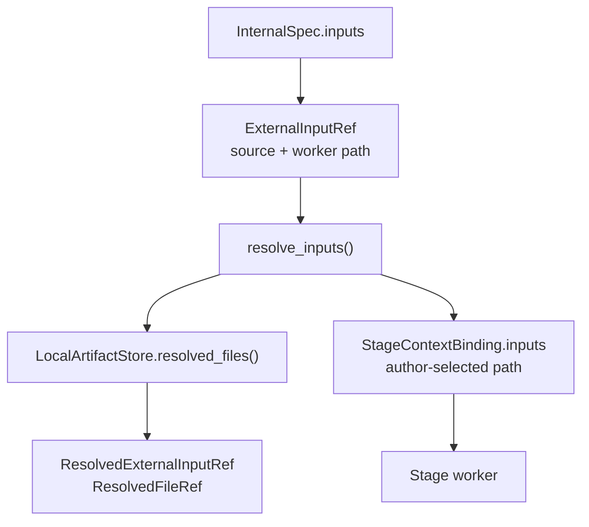
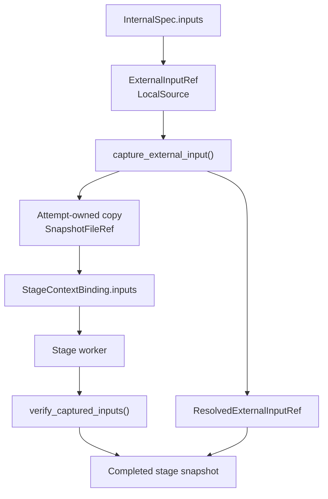
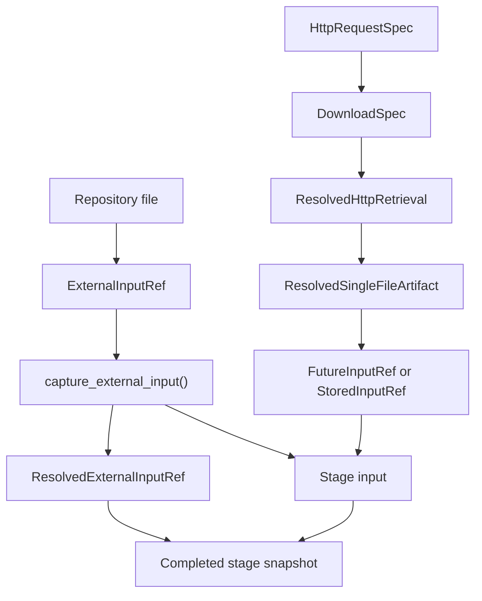

# External input roots

A repository-local input enters VIPER when an internal stage consumes it. The
contract records the selected source, copies its bytes into the attempt
workspace, gives the copied path to the worker, and verifies the copy before
publishing the completed stage snapshot.

## 1. Status and requirements

**Contract status:** Planned; Phase 3 PairBlocks drafted.

| ID | Phase 3 obligation |
| --- | --- |
| EIR-01 <!-- contract-requirement: EIR-01 phase=3 test=tests/test_protocol.py --> | Remove `HttpSource`. `ExternalInputRef` and `ResolvedExternalInputRef` represent repository-local inputs only. |
| EIR-02 <!-- contract-requirement: EIR-02 phase=3 test=tests/test_run_execution.py --> | Reject an invalid local source and copy an accepted source to one attempt-owned path. |
| EIR-03 <!-- contract-requirement: EIR-03 phase=3 test=tests/test_verification_acceptance.py --> | Give the copied path to the worker and verify its path, digest, and byte count before accepting the stage. |

**Required claim:** The file named by `ExternalInputRef.source.path` is a regular,
nonsymlink file beneath the repository root. The worker receives an
attempt-owned copy. `ResolvedExternalInputRef.file`, the stage invocation, and
the completed stage snapshot identify that same copy.

Runner-owned HTTP acquisition is already implemented by `DownloadSpec` and is
defined in
[`download-retrieval-artifacts.md`](download-retrieval-artifacts.md). Phase 3
removes the obsolete HTTP branch from `ExternalInputRef`; it does not redesign
HTTP downloads.

## 2. Current gap and target state

| Surface | Current implementation | Phase 3 target |
| --- | --- | --- |
| Input model | `ExternalInputRef.source` accepts `LocalSource` or `HttpSource`. | It accepts `LocalSource` only. |
| Worker path | The contract author supplies `ExternalInputRef.path`. | `captured_input_path()` derives the attempt-owned path. |
| Source boundary | `RepoRelPath` rejects lexical escapes, but `resolve_inputs()` follows source symlinks. | Capture rejects a symlink, a resolved path outside the repository, and a non-regular file. |
| Evidence | `ResolvedExternalInputRef.file` points to a separate stored file. | It is a `SnapshotFileRef` for the copy in the consuming stage snapshot. |
| Verification | The invocation verifier checks the author-selected path. | The worker and verifier reconstruct and check the attempt-owned path. |

### Current local-input DAG



### Phase 3 local-input DAG



## 3. Phase 3 models

```python
class LocalSource(ProtocolModel):
    kind: Literal["local"] = "local"
    path: RepoRelPath


class ExternalInputRef(ProtocolModel):
    kind: Literal["external"] = "external"
    source: LocalSource
    data_role: DataRole


class ResolvedExternalInputRef(ProtocolModel):
    kind: Literal["external"] = "external"
    source: LocalSource
    file: SnapshotFileRef
    data_role: DataRole
```

`ExternalInputRef.source.path` records the user-selected repository file.
`ResolvedExternalInputRef.file` records the attempt-owned copy as a path,
SHA-256 digest, and byte count in the completed stage snapshot.

One helper derives that copy's path:

```python
def captured_input_path(
    *,
    run_id: RunId,
    attempt_id: int,
    stage_id: StageId,
    input_name: InputName,
    source_path: RepoRelPath,
) -> RepoRelPath: ...
```

The result is:

```text
.viper/workspaces/<run-id>/attempt-<attempt-id>/
inputs/<stage-id>/<input-name><source-suffix>
```

The runner, worker, and verifier use this helper. The runner writes a temporary
file beside the target, flushes it, and atomically replaces the target.

## 4. Integrated input DAG



Before capture, the runner requires all three conditions:

```text
resolved source path is beneath the repository root
source path is not a symbolic link
source path names a regular file
```

After the worker exits, the runner reads the captured file again and requires
its digest and byte count to match `ResolvedExternalInputRef.file`. The stage
snapshot then stores the verified copy.

## 5. Verification and acceptance

| Rule | Executable condition |
| --- | --- |
| `input.local.model` <!-- verifier-rule: input.local.model requirement=EIR-01 --> | The external-input models have no HTTP source branch. |
| `input.local.capture` <!-- verifier-rule: input.local.capture requirement=EIR-02 --> | Capture enforces the three source-boundary conditions and writes one attempt-owned copy. |
| `input.local.identity` <!-- verifier-rule: input.local.identity requirement=EIR-03 --> | The invocation path and snapshot bytes match `ResolvedExternalInputRef.file`. |

Required acceptance cases:

- A regular repository file is copied, delivered to the stage, stored in the
  stage snapshot, and accepted.
- A source symlink is rejected before its target is read.
- A captured file changed by the stage is rejected.
- A changed snapshot digest, byte count, or invocation path is rejected.

## 6. Implementation ownership

| Responsibility | Required owner |
| --- | --- |
| Local-only input records | `viper.inputs.ExternalInputRef` and `ResolvedExternalInputRef` |
| Canonical captured path | `viper.workspace.captured_input_path()` |
| Source validation and capture | `viper.execution._materialization.capture_external_input()` |
| Input materialization result | `viper.execution._materialization.resolve_inputs()` |
| Execution integration and snapshot membership | `viper.execution._attempt.execute_attempt()` |
| Worker reconstruction | `viper._workers.stages._planned_stage_context()` and `main()` |
| Invocation reconstruction | `viper._verification.attempt._logical_input_paths()`, `_verify_stage_invocation()`, and `_verify_unresolved_stage_invocation()` |
| Snapshot verification | `viper._verification.attempt._verify_external_inputs()` and `verify_attempt_stages()` |

The Phase 3 target set must cover every owner in this table. The final guided
reconciliation must also include every changed test declaration before
`check_plan()` freezes the plan.

## 7. Later work

| ID | Later owner |
| --- | --- |
| EIR-04 <!-- contract-requirement: EIR-04 phase=7 test=tests/test_authoring.py --> | [`automatic-input-resolution.md`](automatic-input-resolution.md) adds authoring drafts and compiles local, same-run, and prior-run selections. |
| EIR-05 <!-- contract-requirement: EIR-05 phase=11 test=tests/test_documentation.py --> | Public documentation publishes the final input model after the authoring flow is implemented. |

## 8. Contract-owned PairBlocks

These blocks start from the accepted runner-owned download implementation.
Their `ContractTarget` sets are the initial Phase 3 plan. Guided execution may
add a directly changed caller or test before the final freeze; the final System
Impact check uses the reconciled target set.

<!-- pair-block-definition: P3-EIR-01 -->
```toml pair-block
id = "P3-EIR-01"
requirements = ["EIR-01"]
targets = [
    "src/viper/inputs.py:HttpImplementationSpec",
    "src/viper/inputs.py:HttpRequestSpec",
    "src/viper/inputs.py:HttpRetrievalPolicy",
    "src/viper/inputs.py:HttpSource",
    "src/viper/inputs.py:ExternalInputSource",
    "src/viper/inputs.py:ExternalInputRef",
    "src/viper/inputs.py:ResolvedExternalInputRef",
    "src/viper/inputs.py:ResolvedFileRef",
    "src/viper/inputs.py:SnapshotFileRef",
]
tests = ["tests/test_protocol.py:test_external_inputs_are_local_only"]
gate = "python -m pytest tests/test_protocol.py -q"
depends_on = ["P2-DRA-04"]
```

<!-- pair-block-definition: P3-EIR-02 -->
```toml pair-block
id = "P3-EIR-02"
requirements = ["EIR-02"]
targets = [
    "src/viper/workspace.py:RepoRelPath",
    "src/viper/workspace.py:InputName",
    "src/viper/workspace.py:RunId",
    "src/viper/workspace.py:StageId",
    "src/viper/workspace.py:captured_input_path",
    "src/viper/execution/_materialization.py:capture_external_input",
    "src/viper/execution/_materialization.py:resolve_inputs",
    "src/viper/execution/_materialization.py:verify_captured_inputs",
]
tests = [
    "tests/test_run_execution.py:test_local_input_is_captured_by_attempt",
    "tests/test_run_execution.py:test_local_input_rejects_symlink_escape",
    "tests/test_run_execution.py:test_local_input_mutation_fails_attempt",
]
gate = "python -m pytest tests/test_run_execution.py -k local_input -q"
depends_on = ["P3-EIR-01"]
```

<!-- pair-block-definition: P3-EIR-03 -->
```toml pair-block
id = "P3-EIR-03"
requirements = ["EIR-03"]
targets = [
    "src/viper/_workers/stages.py:_planned_stage_context",
    "src/viper/_verification/attempt.py:_logical_input_paths",
    "src/viper/_verification/attempt.py:_verify_external_inputs",
]
tests = [
    "tests/test_verification_acceptance.py:test_external_input_identity_survives_execution",
    "tests/test_verification_acceptance.py:test_external_input_identity_rejects_tampering",
]
gate = "python -m pytest tests/test_verification_acceptance.py -k external_input -q"
depends_on = ["P3-EIR-02"]
```

## 9. Planned `ContractTarget` declarations

Each marker binds one planned `path:symbol` declaration to its PairBlock. A
single file label applies to every following marker and fence until the next
file label. System Impact resolves each named declaration separately. Guided
execution may revise these declarations; the complete target set is frozen
only when Phase 3 is finished and `check_plan()` runs.


**File: `src/viper/inputs.py`**

<!-- contract-target: requirements=EIR-01 block=P3-EIR-01 action=remove target=src/viper/inputs.py:HttpImplementationSpec -->
<!-- contract-remove -->


<!-- contract-target: requirements=EIR-01 block=P3-EIR-01 action=remove target=src/viper/inputs.py:HttpRequestSpec -->
<!-- contract-remove -->


<!-- contract-target: requirements=EIR-01 block=P3-EIR-01 action=remove target=src/viper/inputs.py:HttpRetrievalPolicy -->
<!-- contract-remove -->


<!-- contract-target: requirements=EIR-01 block=P3-EIR-01 action=remove target=src/viper/inputs.py:HttpSource -->
<!-- contract-remove -->


<!-- contract-target: requirements=EIR-01 block=P3-EIR-01 action=remove target=src/viper/inputs.py:ExternalInputSource -->
<!-- contract-remove -->


<!-- contract-target: requirements=EIR-01 block=P3-EIR-01 action=remove target=src/viper/inputs.py:ResolvedFileRef -->
<!-- contract-remove -->


<!-- contract-target: requirements=EIR-01 block=P3-EIR-01 action=add target=src/viper/inputs.py:SnapshotFileRef -->
```python contract-target
from .references import SnapshotFileRef
```


<!-- contract-target: requirements=EIR-01 block=P3-EIR-01 action=update target=src/viper/inputs.py:ExternalInputRef -->
<!-- contract-target: requirements=EIR-01 block=P3-EIR-01 action=update target=src/viper/inputs.py:ResolvedExternalInputRef -->
```python contract-target
class ExternalInputRef(ProtocolModel):
    """Declare one repository-local value supplied to a stage."""

    kind: Literal["external"] = "external"
    source: LocalSource
    data_role: DataRole


class ResolvedExternalInputRef(ProtocolModel):
    """Record one local input captured in its consuming stage snapshot."""

    kind: Literal["external"] = "external"
    source: LocalSource
    file: SnapshotFileRef
    data_role: DataRole
```


**File: `src/viper/workspace.py`**

<!-- contract-target: requirements=EIR-02 block=P3-EIR-02 action=add target=src/viper/workspace.py:RepoRelPath -->
```python contract-target
from ._schema import RepoRelPath
```


<!-- contract-target: requirements=EIR-02 block=P3-EIR-02 action=add target=src/viper/workspace.py:InputName -->
<!-- contract-target: requirements=EIR-02 block=P3-EIR-02 action=update target=src/viper/workspace.py:RunId -->
<!-- contract-target: requirements=EIR-02 block=P3-EIR-02 action=add target=src/viper/workspace.py:StageId -->
```python contract-target
from .ids import InputName, RunId, StageId
```


<!-- contract-target: requirements=EIR-02 block=P3-EIR-02 action=add target=src/viper/workspace.py:captured_input_path -->
```python contract-target
def captured_input_path(
    *,
    run_id: RunId,
    attempt_id: int,
    stage_id: StageId,
    input_name: InputName,
    source_path: RepoRelPath,
) -> RepoRelPath:
    """Return the canonical attempt-owned path for one local input."""
    suffix = Path(source_path).suffix
    return (
        f".viper/workspaces/{run_id}/attempt-{attempt_id}/"
        f"inputs/{stage_id}/{input_name}{suffix}"
    )
```


**File: `src/viper/execution/_materialization.py`**

<!-- contract-target: requirements=EIR-02 block=P3-EIR-02 action=add target=src/viper/execution/_materialization.py:capture_external_input -->
```python contract-target
def capture_external_input(
    root: Path,
    workspace: AttemptWorkspace,
    *,
    run_id: RunId,
    attempt_id: int,
    stage_id: StageId,
    input_name: InputName,
    input_ref: ExternalInputRef,
) -> tuple[ResolvedExternalInputRef, Path]:
    """Copy one validated local source into attempt-owned custody."""
    declared_source = root / input_ref.source.path
    if declared_source.is_symlink():
        raise RunError("external local input source must not be a symbolic link")
    try:
        source = declared_source.resolve(strict=True)
    except OSError as exc:
        raise RunError("external local input source is unavailable") from exc
    if not source.is_relative_to(root) or not source.is_file():
        raise RunError("external local input source must be a repository file")
    raw = source.read_bytes()
    relative_path = captured_input_path(
        run_id=run_id,
        attempt_id=attempt_id,
        stage_id=stage_id,
        input_name=input_name,
        source_path=input_ref.source.path,
    )
    target = root / relative_path
    if not target.resolve().is_relative_to(workspace.inputs.resolve()):
        raise RunError("captured input path escapes the attempt workspace")
    target.parent.mkdir(parents=True, exist_ok=True)
    temporary: Path | None = None
    try:
        with tempfile.NamedTemporaryFile(
            dir=target.parent,
            prefix=f".{target.name}.",
            delete=False,
        ) as stream:
            temporary = Path(stream.name)
            stream.write(raw)
            stream.flush()
            os.fsync(stream.fileno())
        os.replace(temporary, target)
    finally:
        if temporary is not None:
            temporary.unlink(missing_ok=True)
    reference = snapshot_file(relative_path, raw)
    return (
        ResolvedExternalInputRef(
            source=input_ref.source,
            file=reference,
            data_role=input_ref.data_role,
        ),
        target,
    )
```


<!-- contract-target: requirements=EIR-02 block=P3-EIR-02 action=update target=src/viper/execution/_materialization.py:resolve_inputs -->
```python contract-target
def resolve_inputs(
    root: Path,
    workspace: AttemptWorkspace,
    run_id: RunId,
    attempt_id: int,
    stage_id: StageId,
    stage: InternalSpec,
    completed: Mapping[StageId, ResolvedStageRef],
    stage_specs: Mapping[StageId, BaseSpec],
    fetcher: RunFetcher,
    policy: VerificationPolicy,
) -> tuple[
    dict[InputName, ResolvedInputRef],
    dict[str, Path],
    dict[InputName, SnapshotFileRef],
]:
    """Materialize stage inputs and bind each one to its verified producer."""
    resolved: dict[InputName, ResolvedInputRef] = {}
    paths: dict[str, Path] = {}
    captured: dict[InputName, SnapshotFileRef] = {}
    for name, input_ref in stage.inputs.items():
        if input_ref.kind == "future":
            producer = completed.get(input_ref.producer_stage_id)
            if producer is None:
                raise RunError("future input producer has not completed")
            resolved[name] = ResolvedFutureInputRef(producer=producer)
            producer_spec = stage_specs[input_ref.producer_stage_id]
            artifact = producer_spec.artifacts[input_ref.producer_artifact]
            paths[name] = root / artifact.path
        elif input_ref.kind == "external":
            resolved_input, captured_path = capture_external_input(
                root,
                workspace,
                run_id=run_id,
                attempt_id=attempt_id,
                stage_id=stage_id,
                input_name=name,
                input_ref=input_ref,
            )
            resolved[name] = resolved_input
            paths[name] = captured_path
            captured[name] = resolved_input.file
        elif input_ref.kind == "stored":
            pointer_raw = fetcher(input_ref.pointer)
            pointer = ArtifactPointer.model_validate(parse_yaml_bytes(pointer_raw))
            verified = verify_promoted_artifact(
                pointer,
                policy=policy,
                expected_data_role=input_ref.data_role,
                fetcher=fetcher,
            )
            _materialize_verified_artifact(root, input_ref.path, verified)
            resolved[name] = ResolvedStoredInputRef(
                pointer=ResolvedArtifactPointerRef(
                    sha256=hashlib.sha256(pointer_raw).hexdigest(),
                    bytes=len(pointer_raw),
                    stored_at=input_ref.pointer,
                )
            )
            paths[name] = root / input_ref.path
    return resolved, paths, captured
```


<!-- contract-target: requirements=EIR-02 block=P3-EIR-02 action=add target=src/viper/execution/_materialization.py:verify_captured_inputs -->
```python contract-target
def verify_captured_inputs(
    root: Path,
    captured: Mapping[InputName, SnapshotFileRef],
) -> None:
    """Require every captured local input to retain its pre-execution identity."""
    for input_name, reference in captured.items():
        try:
            raw = (root / reference.path).read_bytes()
        except OSError as exc:
            raise RunError(
                f"captured local input {input_name!r} is unavailable"
            ) from exc
        if snapshot_file(reference.path, raw) != reference:
            raise RunError(f"captured local input {input_name!r} changed")
```


**File: `src/viper/_workers/stages.py`**

<!-- contract-target: requirements=EIR-03 block=P3-EIR-03 action=update target=src/viper/_workers/stages.py:_planned_stage_context -->
```python contract-target
def _planned_stage_context(
    root: Path,
    run: RunSpec,
    stage_id: str,
    attempt_id: int,
) -> tuple[ParameterizedSpec, dict[str, str]]:
    """Load the selected stage and derive its plan-owned logical input paths."""
    loaded: dict[str, BaseSpec] = {}
    selected: ParameterizedSpec | None = None
    expected_inputs: dict[str, str] = {}
    for reference in run.stages:
        path = root / reference.spec
        raw = path.read_bytes()
        if len(raw) != reference.bytes or hashlib.sha256(raw).hexdigest() != (
            reference.sha256
        ):
            raise ValueError("startup.plan: stage spec identity differs")
        candidate = load_stage_spec(path)
        if reference.stage_id == stage_id:
            if not isinstance(candidate, ParameterizedSpec):
                raise ValueError("startup.plan: selected stage is not parameterized")
            selected = candidate
            if isinstance(candidate, InternalSpec):
                for name, input_reference in candidate.inputs.items():
                    if isinstance(input_reference, StoredInputRef):
                        expected_inputs[name] = str(input_reference.path)
                    elif isinstance(input_reference, ExternalInputRef):
                        expected_inputs[name] = str(
                            captured_input_path(
                                run_id=run.run_id,
                                attempt_id=attempt_id,
                                stage_id=reference.stage_id,
                                input_name=name,
                                source_path=input_reference.source.path,
                            )
                        )
                    elif isinstance(input_reference, FutureInputRef):
                        producer = loaded[input_reference.producer_stage_id]
                        expected_inputs[name] = str(
                            producer.artifacts[input_reference.producer_artifact].path
                        )
            break
        loaded[reference.stage_id] = candidate
    if selected is None:
        raise ValueError("startup.plan: context stage ID is absent from RunSpec")
    return selected, expected_inputs
```


**File: `src/viper/_verification/attempt.py`**

<!-- contract-target: requirements=EIR-03 block=P3-EIR-03 action=update target=src/viper/_verification/attempt.py:_logical_input_paths -->
```python contract-target
def _logical_input_paths(
    run: RunSpec,
    attempt_id: int,
    stage_id: StageId,
    stage: BaseSpec,
    stage_specs: Mapping[StageId, BaseSpec],
) -> dict[InputName, RepoRelPath]:
    """Reconstruct the repository-relative input paths delivered to one stage."""
    if not isinstance(stage, InternalSpec):
        return {}
    paths: dict[InputName, RepoRelPath] = {}
    for name, reference in stage.inputs.items():
        if isinstance(reference, FutureInputRef):
            producer = stage_specs[reference.producer_stage_id]
            paths[name] = producer.artifacts[reference.producer_artifact].path
        elif isinstance(reference, ExternalInputRef):
            paths[name] = captured_input_path(
                run_id=run.run_id,
                attempt_id=attempt_id,
                stage_id=stage_id,
                input_name=name,
                source_path=reference.source.path,
            )
        else:
            paths[name] = reference.path
    return paths
```


<!-- contract-target: requirements=EIR-03 block=P3-EIR-03 action=add target=src/viper/_verification/attempt.py:_verify_external_inputs -->
```python contract-target
def _verify_external_inputs(
    attempt: RunAttempt,
    run: RunSpec,
    stage_id: StageId,
    resolved: ResolvedParameterizedSpec,
    snapshot: StageResultSnapshotRef | LocalStageResultSnapshotRef,
    *,
    fetcher: StorageFetcher | None,
) -> None:
    """Verify each local input captured in one completed stage snapshot."""
    for input_name, resolved_input in resolved.inputs.items():
        if not isinstance(resolved_input, ResolvedExternalInputRef):
            continue
        planned_input = resolved.spec.inputs[input_name]
        if not isinstance(planned_input, ExternalInputRef):
            raise VerificationError("resolved local input differs from its plan")
        if (
            resolved_input.source != planned_input.source
            or resolved_input.data_role != planned_input.data_role
        ):
            raise VerificationError("resolved local input provenance differs")
        expected_path = captured_input_path(
            run_id=run.run_id,
            attempt_id=attempt.attempt_id,
            stage_id=stage_id,
            input_name=input_name,
            source_path=planned_input.source.path,
        )
        if resolved_input.file.path != expected_path:
            raise VerificationError("input.local.identity: path differs")
        read_snapshot_file(snapshot, resolved_input.file, fetcher=fetcher)
```
