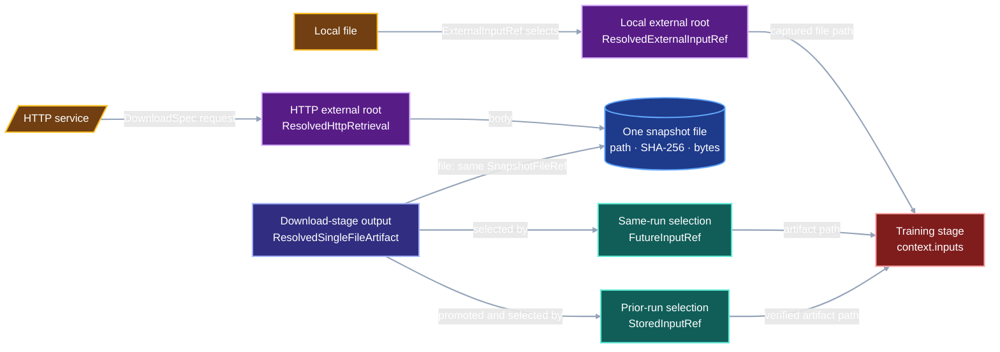

# External input roots and artifact selection

VIPER must answer three separate questions about every input byte sequence:

1. Where did the bytes first enter the provenance graph?
2. Which VIPER stage published the bytes as an artifact?
3. How did the consuming stage select that artifact?

“External input root” names a role in the provenance graph. The Python model
assigns that role to existing records: `ResolvedExternalInputRef` for a local
file and `ResolvedHttpRetrieval` for an HTTP response.

`ResolvedExternalInputRef` records a local external input root.
`ResolvedHttpRetrieval` records an HTTP external input root. One HTTP response
enters VIPER through `ResolvedHttpRetrieval`, becomes the download stage's
`ResolvedSingleFileArtifact`, and reaches a later stage through
`FutureInputRef` or `StoredInputRef`. The retrieval body and artifact share one
`SnapshotFileRef`.

A local file follows the shorter route. Its bytes enter at the consuming-stage
boundary through `ExternalInputRef`. VIPER captures the exact bytes in
`ResolvedExternalInputRef` and supplies the selected path to the stage.

## 1. Status and decision

**Contract status:** audited provenance contract; implementation pending.

**Required claim:** every path in `context.inputs` resolves to exact bytes whose
entry into VIPER and selection by the consuming stage are both verifiable.

The active implementation leaves four connectors unfinished:

- The download executor stores each HTTP body at a retrieval-only path.
  Generated project code and execution fixtures then copy those bytes to a
  separately declared artifact path.
- `HttpSource` repeats the request, policy, transport, and retrieval operation
  inside internal-stage input resolution.
- `ResolvedExternalInputRef` captures a local file, while the verifier lacks a
  local-root identity rule.
- `freeze_run_plan()` preserves internal input references supplied by the
  author. The authoring layer still lacks automatic selection and pointer
  generation.

The target contract removes `HttpSource` and its HTTP branch from
`resolve_inputs()`. `DownloadSpec` remains the sole HTTP acquisition path. A
successful request automatically becomes the same-named single-file download
artifact, and a later stage selects that artifact through the ordinary input
reference model.

The pending work connects these existing owners into one user-facing input
authoring flow and adds the missing local-root verifier. The flow uses the
existing download path, and VIPER creates artifact-pointer files internally.

## 2. Local and HTTP roots use different evidence records

The roles belong to different dimensions of the provenance graph:

For a same-run HTTP input named `dataset`, this contract assigns each role to
one exact record or field:

| Role | Exact record or field | Claim |
| --- | --- | --- |
| External-input-root record | `ResolvedDownloadSpec.retrievals["dataset"]: ResolvedHttpRetrieval` | VIPER performed the request through the recorded transport and received the recorded response. |
| Root payload | `ResolvedHttpRetrieval.body: SnapshotFileRef` | The HTTP response body has this path, SHA-256 digest, and byte count in the completed download-stage snapshot. |
| Artifact view | `ResolvedDownloadSpec.artifacts["dataset"]: ResolvedSingleFileArtifact` | The download stage published those bytes as its named `dataset` output. |
| Consumer selector | `TrainSpec.inputs["dataset"]: FutureInputRef` | The training stage selects the download stage's `dataset` artifact. |
| Identity join | `retrievals["dataset"].body == artifacts["dataset"].file` | The root payload and artifact view identify the same snapshot file. |

The artifact supplies the input bytes. `FutureInputRef` is the `InputRef` value
that selects that artifact for the later stage. Promotion preserves the same
root and artifact records; a later run selects the promoted artifact through
`StoredInputRef`.

| Question | HTTP external input root | Local external input root |
| --- | --- | --- |
| Where did the bytes enter VIPER? | `ResolvedHttpRetrieval` | `ResolvedExternalInputRef` |
| Which stage published them? | `ResolvedSingleFileArtifact` owned by the download stage | Bytes enter at the consumer boundary |
| How did this stage select them? | `FutureInputRef` or `StoredInputRef` | `ExternalInputRef` |

The root variants carry source-specific evidence:

- `ResolvedHttpRetrieval` records the HTTP request, transport, response, body,
  and timestamps.
- `ResolvedExternalInputRef` records the selected local source and captured
  file identity.

The remaining records describe publication and selection:

- `ResolvedSingleFileArtifact` gives the same body a named stage-output
  identity.
- `FutureInputRef` identifies the producer stage and artifact selected by a
  later stage in the same run.
- `StoredInputRef` identifies a promoted artifact selected from a completed
  run.
- `ExternalInputRef` declares the local root before execution.

Both records identify where bytes entered VIPER. The artifact and input
reference records prove publication and selection. Their shared file reference
joins the root, publication, and selection claims.



## 3. Exact contract models

### 3.1 Local declaration and resolved record

The public authoring draft and target local-root records use these complete
declarations:

```python
class FileInputDraft(BaseModel):
    model_config = ConfigDict(extra="forbid", frozen=True)

    path: RepoRelPath
    data_role: DataRole


class LocalSource(ProtocolModel):
    kind: Literal["local"] = "local"
    path: RepoRelPath


class ExternalInputRef(ProtocolModel):
    kind: Literal["external"] = "external"
    source: LocalSource
    data_role: DataRole


class ResolvedExternalInputRef(ProtocolModel):
    kind: Literal["external"] = "external"
    source: LocalSource
    file: ResolvedFileRef
    data_role: DataRole
```

`viper.file_input()` creates `FileInputDraft`. Freezing alone constructs the
`ExternalInputRef` protocol record.
`ExternalInputRef.source.path` is the one repository-relative path selected by
the user and supplied to the worker. `resolve_inputs()` reads that path,
publishes the observed bytes through `publish_resolved_files()` at the
configured storage destination, and writes the returned `ResolvedFileRef` into
`ResolvedExternalInputRef.file`.
The runner copies `ExternalInputRef.data_role` into
`ResolvedExternalInputRef.data_role`.

The target input unions retain the local declaration and resolved record. The
prior-run branch carries an exact pointer-file identity:

```python
class ResolvedArtifactPointerRef(ResolvedFileRef):
    kind: Literal["artifact_pointer"] = "artifact_pointer"


class StoredInputRef(ProtocolModel):
    kind: Literal["stored"] = "stored"
    pointer: ResolvedArtifactPointerRef
    path: RepoRelPath
    data_role: DataRole


class ResolvedStoredInputRef(ProtocolModel):
    kind: Literal["stored"] = "stored"
    pointer: ResolvedArtifactPointerRef


InputRef = Annotated[
    ExternalInputRef | StoredInputRef | FutureInputRef,
    Field(discriminator="kind"),
]

ResolvedInputRef = Annotated[
    ResolvedStoredInputRef | ResolvedFutureInputRef | ResolvedExternalInputRef,
    Field(discriminator="kind"),
]
```

The active-to-target field changes are exact:

| Active model member | Target disposition | Target source of the value |
| --- | --- | --- |
| `HttpSource` | Delete | HTTP declarations remain in `DownloadSpec.inputs`. |
| `ExternalInputSource = LocalSource | HttpSource` | Delete | `ExternalInputRef.source` and `ResolvedExternalInputRef.source` use `LocalSource` directly. |
| `ExternalInputRef.source: ExternalInputSource` | Replace | `ExternalInputRef.source: LocalSource` |
| `ExternalInputRef.path` | Delete | The worker receives `ExternalInputRef.source.path`. |
| `ResolvedExternalInputRef.source: ExternalInputSource` | Replace | `ResolvedExternalInputRef.source: LocalSource` |
| `ResolvedExternalInputRef.file` | Retain | `resolve_inputs()` records the captured `ResolvedFileRef`. |
| Both `data_role` fields | Retain | The resolved record copies the frozen declaration. |
| Public `ExternalInputRef` construction | Replace | `viper.file_input()` returns `FileInputDraft`; freezing writes the protocol record. |
| `StoredInputRef.pointer: ArtifactPointerRef` | Replace | The compiler stores its generated pointer and writes `ResolvedArtifactPointerRef`. |

### 3.2 HTTP root, artifact, and consumer edge

The target HTTP route uses these classes with the following target fields:

```python
class ResolvedHttpRetrieval(ProtocolModel):
    input_name: InputName
    request: HttpRequestSpec
    transport: ResolvedHttpTransport
    response: ObservedHttpResponse
    body: SnapshotFileRef
    started_at: AwareDatetime
    completed_at: AwareDatetime


class ResolvedSingleFileArtifact(ProtocolModel):
    kind: Literal["file"] = "file"
    file: SnapshotFileRef


class FutureInputRef(ProtocolModel):
    kind: Literal["future"] = "future"
    producer_stage_id: StageId
    producer_artifact: ArtifactName
```

The two routes place their declaration and resolved records in different
owners:

| Route | Frozen declaration | Resolved root evidence | Later consumer |
| --- | --- | --- | --- |
| Local file | `InternalSpec.inputs[name]: ExternalInputRef` | `ResolvedInternalSpec.inputs[name]: ResolvedExternalInputRef` | The same internal stage receives `source.path`. |
| HTTP response | `DownloadSpec.inputs[name]: HttpRequestSpec` | `ResolvedDownloadSpec.retrievals[name]: ResolvedHttpRetrieval` | `FutureInputRef` selects the same-named artifact in the active run; `StoredInputRef` selects it from a completed run. |

The local route constructs `ExternalInputRef` and
`ResolvedExternalInputRef`. The HTTP route constructs `ResolvedHttpRetrieval`,
publishes `ResolvedSingleFileArtifact`, and gives a consumer `FutureInputRef` or
`StoredInputRef`. On the HTTP route, `ResolvedHttpRetrieval` is the root record,
`ResolvedSingleFileArtifact` is the publication record, and the input reference
is the selection record. The response bytes occupy all three graph roles
through these records.

## 4. `DownloadSpec` still means "perform a network request"

This contract preserves the job of `DownloadSpec`: freeze HTTP requests,
choose a transport and policy, then have VIPER perform and record each network
exchange. The stage still downloads response bodies. Its responsibility ends
with verified acquisition and publication.

The schema gains one mechanical rule: each request has one same-named
single-file artifact. This complete authoring example uses the built-in HTTPX
transport selected by the default `transport=None` argument:

```python
import csv
from pathlib import Path

import viper
from viper.http import HttpRequestSpec, HttpRetrievalPolicy


DATASET_PATH = (
    "experiments/tiny_http/runs/baseline/"
    "01ARZ3NDEKTSV4RRFFQ69G5FAV/"
    "artifacts/datasets/training_set/dataset.csv"
)


def load_dataset(path: Path) -> list[dict[str, str]]:
    with path.open(newline="", encoding="utf-8") as source:
        return list(csv.DictReader(source))


download = viper.download(
    inputs={
        "dataset": HttpRequestSpec(
            url="http://127.0.0.1:8000/dataset.csv",
            version="tiny-v1",
            expected_body_sha256=(
                "81801ff05409c3cddb57bffa4a856673"
                "06fa92cd48a8437a9aa937f750a7d7c6"
            ),
            expected_body_bytes=22,
        ),
    },
    policy=HttpRetrievalPolicy(
        allowed_schemes=frozenset({"http"}),
        allowed_hosts=frozenset({"127.0.0.1"}),
        allowed_ports=frozenset({8000}),
        accepted_statuses=frozenset({200}),
        max_redirects=0,
        max_body_bytes=1024,
        timeout_seconds=10.0,
    ),
    artifacts={
        "dataset": viper.file_artifact(
            path=DATASET_PATH,
            loader=load_dataset,
            data_role="training",
        ),
    },
)
```

The custom-transport version appears in the complete program in
[`automatic-input-resolution.md`](automatic-input-resolution.md#complete-proposed-authoring-example).

The executor performs this flow:

```text
inputs["dataset"]
-> transport writes the response to bounded attempt scratch space
-> executor verifies the expected digest and byte count
-> executor writes the body at artifacts["dataset"].path
-> completed stage records one shared SnapshotFileRef
```

`DownloadSpec` is runner-owned. It contains the request, transport, policy,
environment override, metric IDs, and artifacts. Build, embed, train, and
evaluate retain decorated project callables and typed parameters. A
project-owned HTTP transport remains available through
`@viper.http_transport` for project-specific transfer behavior.

The completed stage records two views of the same file:

```text
resolved_download.retrievals["dataset"].body
==
resolved_download.artifacts["dataset"].file
```

The retrieval view proves the network exchange. The artifact view lets every
other stage use the response through the standard artifact interface. The
detailed request-to-artifact schema, runner-owned resolved-stage fields,
execution changes, and legacy cleanup live in
[`download-retrieval-artifacts.md`](download-retrieval-artifacts.md).

`DownloadSpec` currently applies one transport and policy to all requests in
the stage. Removing `HttpSource` preserves that rule. A future requirement for
per-request policies or transports belongs in the `DownloadSpec` request
schema, while the download executor remains the only network path.

## 5. A downloaded body becomes an external root and a future input

Consider one run with a `download` stage followed by a `train` stage.

1. `DownloadSpec.inputs["dataset"]` declares the network request.
2. The HTTP response enters VIPER. `ResolvedHttpRetrieval` records that root
   event.
3. The executor writes a `ResolvedSingleFileArtifact` at
   `ResolvedDownloadSpec.artifacts["dataset"]`. Its `file` equals
   `ResolvedHttpRetrieval.body`.
4. `TrainSpec.inputs["dataset"]` stores the following reference. It names the
   download stage and its `dataset` artifact.

```python
FutureInputRef(
    producer_stage_id="download",
    producer_artifact="dataset",
)
```

5. `resolve_inputs()` uses that `FutureInputRef` to find the completed
   download stage's `ResolvedSingleFileArtifact`. It passes the artifact's path
   to `context.inputs["dataset"]`.

The HTTP response is therefore an external provenance root and a produced
artifact. `FutureInputRef` describes the later consumer edge. Both
classifications remain true: the network supplied the bytes, and the download
stage published them.

This removes the previous arbitrary boundary. The executor publishes the
download-stage body directly into the artifact graph. The successful HTTP
request creates the receipt and the artifact together.

## 6. Local roots enter at the consuming-stage boundary

A local file enters VIPER when a stage first selects it. The target local flow
uses one user-selected repository-relative path:

```text
local file selected through ExternalInputRef
-> runner reads the exact bytes
-> configured storage publisher records an independently retrievable ResolvedFileRef
-> ResolvedExternalInputRef records the source and captured identity
-> stage receives the selected path through context.inputs
```

A local root begins outside VIPER's stage graph, so `ExternalInputRef` supplies
the root declaration directly. The user chooses one source path. VIPER passes
that same path to the worker after capturing its byte identity.

The missing verifier must fetch the captured `ResolvedFileRef`, recompute its
SHA-256 digest and byte count, and confirm that the frozen local source is the
path supplied to the consuming stage.

## 7. One user-facing input authoring flow

Users select data through three Python values. VIPER chooses the frozen
protocol reference from the data's provenance position:

| Selected data | Public Python expression | Frozen record |
| --- | --- | --- |
| Local file entering at the consuming-stage boundary | `viper.file_input(...)` | `ExternalInputRef` |
| Artifact produced earlier in the active run | `download.artifacts["dataset"]` | `FutureInputRef` |
| Artifact produced in a completed run | `viper.run_artifact(...)` | Generated `ArtifactPointer` plus `StoredInputRef` |

The three complete selections are:

```python
local_dataset = viper.file_input(
    path="inputs/raw/dataset.csv",
    data_role="training",
)

same_run_dataset = download.artifacts["dataset"]

prior_run_dataset = viper.run_artifact(
    resolved_run=Path(
        "experiments/tiny_http/runs/baseline/"
        "01ARZ3NDEKTSV4RRFFQ69G5FAA/resolved.yaml"
    ),
    stage="download",
    artifact="dataset",
)
```

Each value can occupy the same input slot:

```python
training = viper.stage(
    train,
    params=TRAIN_PARAMS,
    inputs={"dataset": same_run_dataset},
    artifacts={
        "parameters": viper.file_artifact(
            path=WEIGHTS_PATH,
            loader=load_weights,
            data_role="training",
        ),
        "resume_state": viper.file_artifact(
            path=RESUME_STATE_PATH,
            loader=load_resume_state_artifact,
            data_role="training",
        ),
    },
    objective=training_loss_metric,
    metrics=(gradient_norm_metric,),
)
```

`TRAIN_PARAMS`, the two configured metrics, and the artifact loaders are defined
in the
[`automatic-input-resolution.md`](automatic-input-resolution.md#complete-proposed-authoring-example)
program. This section changes only the value assigned to `inputs["dataset"]`.

Replacing `same_run_dataset` with `local_dataset` or `prior_run_dataset`
changes the frozen input reference while preserving the decorated training
function and the `context.inputs["dataset"]` path interface.

This is the unification point. The training decorator still receives ordinary
paths through `context.inputs`, while freezing writes the correct provenance
edge. VIPER constructs `ArtifactPointer`, `FutureInputRef`, and
`StoredInputRef` internally during the ordinary authoring flow.

The active `freeze_run_plan()` preserves explicitly authored references.
Automatic selection and pointer generation remain implementation work.

## 8. Verification rules

The verifier must establish the complete chain appropriate to each route.

### HTTP root selected in the same run

```text
retrieval.body.sha256 == retrieval.request.expected_body_sha256
retrieval.body.bytes  == retrieval.request.expected_body_bytes
retrieval.body        == artifact.file
FutureInputRef names the completed download stage and matching artifact
```

The verifier also checks the frozen request, selected transport, response
policy, timing, stage snapshot, and file bytes.

### Local root

```text
captured bytes hash to resolved_external.file.sha256
captured byte count equals resolved_external.file.bytes
resolved source path equals the path delivered to the stage
```

### Prior-run artifact

The verifier retrieves the digest-bearing `StoredInputRef.pointer`, parses its
generated `ArtifactPointer`, and follows the pointer through the terminal run,
successful attempt, producer stage, and named artifact before materializing
the file for the consumer. The pointer bytes may reside in the local immutable
store, Git, Hugging Face, or Viper Cloud; their SHA-256 digest and byte count
remain part of `ResolvedArtifactPointerRef`.

## 9. Acceptance cases

### Downloaded same-run input

A controlled transport returns `b"prior"` for `inputs["prior"]`. The download
executor publishes those bytes as `artifacts["prior"]`. The completed download
stage satisfies:

```text
retrievals["prior"].body == artifacts["prior"].file
```

The train stage selects that artifact through `FutureInputRef` and reads
`b"prior"` from `context.inputs["prior"]`. `verify_run_result()` accepts the
run. A changed artifact digest triggers
`download.receipt_artifact_identity`.

### Local root

A repository file containing `b"prior"` enters through `ExternalInputRef`.
VIPER records its digest, byte count, and `ResolvedFileRef`, then supplies the
same path to the train stage. `verify_run_result()` accepts the run. Changed
stored bytes trigger `input.local_root_identity`.

### Downloaded prior-run input

A completed producer run publishes `download.artifacts["prior"]`. A second
plan selects it through `viper.run_artifact()`. Freezing publishes one
digest-bearing pointer and writes `StoredInputRef` into the training spec.
`verify_promoted_artifact()` follows the pointer to the producer run's
`ResolvedHttpRetrieval`, shared `ResolvedSingleFileArtifact`, and snapshot
file. The train stage reads `b"prior"` from `context.inputs["prior"]`.

Changing the pointer's artifact name triggers `input.pointer.provenance`.
Changing the selected producer snapshot bytes triggers the existing artifact
identity rule.

## 10. Propagation and implementation order

| Surface | Required change |
| --- | --- |
| Download schema | Require matching request and artifact keys and one `SingleFileArtifactSpec` per request. |
| Download execution | Publish each verified response directly at its declared artifact path and record one shared `SnapshotFileRef`. |
| Download ownership | Delete the project download callable, `DownloadContext`, and `parameters.Download`; execute retrieval and publication in the attempt process. |
| Resolved download schema | Keep runner environment, execution context, retrievals, artifacts, and completion on `ResolvedDownloadSpec`; move project invocation fields to `ResolvedParameterizedSpec`. |
| External source model | Delete `HttpSource` and `ExternalInputSource`; type both local records with `source: LocalSource`. |
| Internal input resolution | Remove HTTP transport invocation from `resolve_inputs()`; resolve local, future, and stored inputs only. |
| Local root model | Delete `ExternalInputRef.path`; supply `ExternalInputRef.source.path` to the worker and retain the captured `ResolvedFileRef`. |
| Verification | Add local-root verification and the HTTP receipt-artifact identity rule. |
| Authoring | Add `viper.file_input()` and `viper.run_artifact()`; convert local files, same-run handles, and prior-run drafts into `ExternalInputRef`, `FutureInputRef`, and `StoredInputRef`. |
| Prior-run pointer schema | Change `StoredInputRef.pointer` to digest-bearing `ResolvedArtifactPointerRef`; let the pointer use any `StorageRef`. |
| Storage publication | Publish captured local roots and generated pointer files at the configured local or Viper Cloud destination; retain the returned self-locating reference. |
| Tests | Cover local roots, same-run downloaded inputs, prior-run downloaded inputs, tampered root bytes, and tampered artifacts. |
| Legacy cleanup | Apply every delete, replace, and retain disposition in [`download-retrieval-artifacts.md`](download-retrieval-artifacts.md); delete `HttpSource` and its tests here. |
| Documentation | Update the protocol reference and generated project examples to teach executor-owned HTTP publication and automatic input selection. |

Implementation order:

The dependency order across the four contracts is:

```text
download-retrieval-artifacts.md
-> external-input-roots.md
-> automatic-input-resolution.md
-> remote-storage.md
```

The download increment establishes one HTTP path and one shared snapshot file.
This increment removes the duplicate HTTP source and completes local-root
verification. The authoring increment then compiles all three input routes.
Direct publication records the selected storage destination in each resulting
file or snapshot reference.

1. Complete the runner-owned request-to-artifact contract in
   [`download-retrieval-artifacts.md`](download-retrieval-artifacts.md),
   including removal of legacy retrieval-body paths, the project download
   callable, and copy loops.
2. Delete `HttpSource`, `ExternalInputSource`, and the duplicate HTTP branch in
   `resolve_inputs()`. Change both local `source` fields to `LocalSource`.
3. Delete `ExternalInputRef.path`, supply `source.path` to the worker, and add
   the local-root verifier.
4. Add `FileInputDraft`, `RunArtifactDraft`, and the three-way authoring
   compiler defined in
   [`automatic-input-resolution.md`](automatic-input-resolution.md).
5. Change the stored-pointer schema and implement deterministic,
   destination-aware pointer publication for prior-run selections.
6. Add end-to-end acceptance cases for all three routes and their tamper
   failures.

## 11. Implementation grounding

The current repository already assigns each part of the target flow to a
specific owner:

| Role | Current owner |
| --- | --- |
| HTTP declaration | [`viper.stages.DownloadSpec`](../../src/viper/stages.py) |
| HTTP external input root | [`viper.http.ResolvedHttpRetrieval`](../../src/viper/http.py) |
| HTTP execution | [`viper.execution._materialization.retrieve_download_inputs`](../../src/viper/execution/_materialization.py) |
| Download-stage validation | [`viper.stages.ResolvedDownloadSpec`](../../src/viper/stages.py) |
| Produced artifact identity | [`viper.execution._stage._resolve_artifact`](../../src/viper/execution/_stage.py) |
| Local external input root declaration and evidence | [`viper.inputs.ExternalInputRef`](../../src/viper/inputs.py) and `ResolvedExternalInputRef` |
| Same-run consumer edge | [`viper.inputs.FutureInputRef`](../../src/viper/inputs.py) |
| Prior-run consumer edge | [`viper.inputs.StoredInputRef`](../../src/viper/inputs.py) and [`viper.artifacts.ArtifactPointer`](../../src/viper/artifacts.py) |
| Input materialization | [`viper.execution._materialization.resolve_inputs`](../../src/viper/execution/_materialization.py) |
| Immutable evidence publication | [`viper.storage.LocalArtifactStore`](../../src/viper/storage.py) and the destination-aware interface in [`remote-storage.md`](remote-storage.md) |

The contract covers byte lineage and selection. Dataset quality, license
status, and semantic suitability remain outside this verifier.
