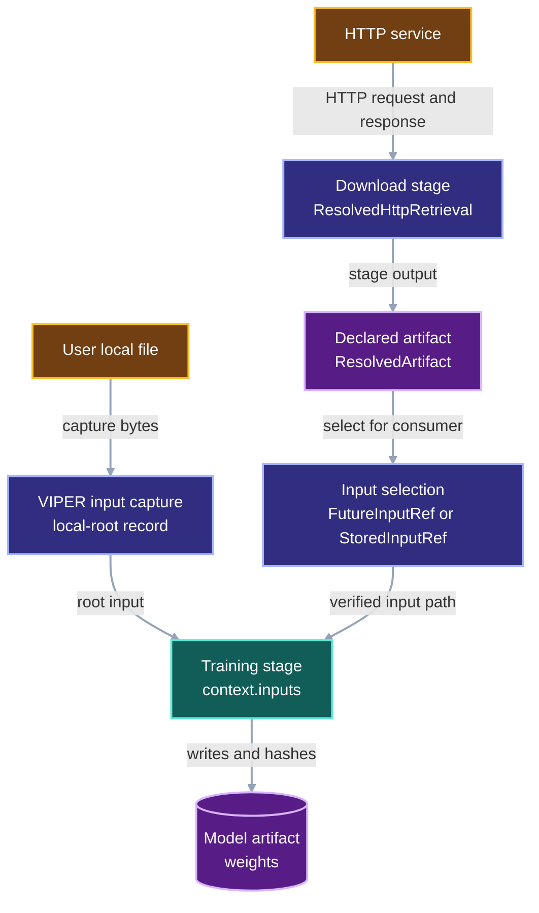

# External inputs, download stages, and provenance roots

VIPER records where every training input entered the provenance graph. A local
file enters through a local-file root. An HTTP response enters through a
download stage and its `ResolvedHttpRetrieval` receipt. Later stages consume
the artifacts produced from those roots through ordinary input references.

## 1. Status and scope

**Contract status:** proposed revision. The active implementation contains a
partial `ExternalInputRef` and `HttpSource` path. This document defines the
target contract for replacing the duplicate HTTP path with the existing
`DownloadSpec` and `ResolvedHttpRetrieval` model.

This document answers one question: how does VIPER show where a model's input
bytes came from while keeping the user's stage code focused on reading input
paths and writing artifacts?

The scope covers local files, HTTP downloads, download artifacts, same-run
inputs, and prior-run inputs. It leaves harness-mode commands, pointer naming,
and remote storage configuration to their owning contracts.

## 2. The user-level model

A person training a model identifies data and writes training code. The
training function receives a `Path` under `context.inputs`. The training
function writes weights under `context.artifacts`.

```python
@viper.train_stage(parameter_model=TrainParameters)
def train(context: viper.StageContext[TrainParameters]) -> None:
    dataset = context.inputs["dataset"]
    weights = context.artifacts["parameters"]
    train_model(dataset, weights, context.params.epochs)
```

Artifact-pointer files and earlier-run records remain internal. VIPER writes
and follows them when an input selects a VIPER-produced artifact.

An input can arrive by one of three routes:

| Route | Source of the bytes | Record that identifies the source |
| --- | --- | --- |
| Local root | A regular file selected by the user | Proposed local-root record with a captured `ResolvedFileRef` |
| Same-run artifact | An earlier stage in the active run | `FutureInputRef` and the producer stage's `ResolvedArtifact` |
| Prior-run artifact | A completed stage in an earlier run | `StoredInputRef`, generated `ArtifactPointer`, and the selected `ResolvedArtifact` |

After a `DownloadSpec` retrieves HTTP data, later stages use the same artifact
routes as every other produced artifact.

## 3. Provenance topology

The diagram shows stable records and responsibilities. A provenance root marks
the point where bytes enter VIPER. A produced artifact has a producer stage.



`ResolvedHttpRetrieval` is an HTTP provenance root because the response body
entered VIPER from the network. `ResolvedArtifact` is a produced node because
the download stage wrote it. The two records may contain identical bytes when a
download stage copies a response body into an artifact. They still describe two
different events: receiving bytes from a server and publishing a stage output.

## 4. One HTTP acquisition contract

### 4.1 Current implementation

`DownloadSpec` already owns the full HTTP request contract:

```python
class DownloadSpec(ParameterizedSpec):
    inputs: dict[InputName, HttpRequestSpec]
    transport: HttpTransportSpec
    policy: HttpRetrievalPolicy
```

The executor retrieves each declared request before the download worker runs.
For each request it writes a `ResolvedHttpRetrieval` containing:

```text
request
resolved transport
observed response
stored body reference
start time
completion time
```

`ResolvedHttpRetrieval` validates the body digest and byte count against the
frozen `HttpRequestSpec`. `ResolvedDownloadSpec` then checks that each receipt
matches the request name, request definition, and transport selected by the
frozen `DownloadSpec`.

The active branch also defines `HttpSource` with `request`, `policy`, and
`transport`, then repeats transport invocation inside `resolve_inputs()`. That
path duplicates the existing HTTP declaration and execution machinery. It also
currently drops the observed response, resolved transport, and timing after it
reads the body.

### 4.2 Proposed contract

`DownloadSpec` remains the sole writer of HTTP retrieval evidence. The
proposed contract removes `HttpSource` from `ExternalInputSource` and removes
the HTTP branch from `resolve_inputs()`.

```text
HttpRequestSpec
-> DownloadSpec
-> ResolvedHttpRetrieval
-> declared download artifact
-> FutureInputRef or StoredInputRef
-> consuming stage
```

The same `ResolvedHttpRetrieval` supports two consumers:

| Consumer | Receives |
| --- | --- |
| Download worker | `DownloadContext.retrievals[input_name]`, including response metadata and the body path |
| Provenance verifier | The request, resolved transport, response, body identity, and timing stored in `ResolvedDownloadSpec.retrievals[input_name]` |

The train worker receives a selected download-artifact path through
`context.inputs`. The preceding `DownloadSpec` performs the HTTP exchange and
stores its receipt.

### 4.3 Per-request policy and transport

`HttpSource` places `policy` and `transport` beside each request. `DownloadSpec`
currently applies one policy and one transport to its map of requests. A future
need for different policies or transports within one download stage belongs in
a `DownloadSpec` request descriptor. The executor still performs every HTTP
request through the same download-stage receipt path.

## 5. Local files enter as roots

A local file lacks an earlier VIPER producer. VIPER therefore captures the
file's observed bytes at the input boundary and records a local provenance
root.

```text
user-selected local file
-> read exact bytes
-> publish bytes through LocalArtifactStore
-> local-root record with ResolvedFileRef
-> supply the selected file path to the consuming stage
```

The proposed local-root record contains the selected source location and the
captured `ResolvedFileRef`. The file reference supplies the SHA-256 digest,
byte count, and immutable local-store location for the bytes actually read.

The user supplies one local source path. The runner captures that file and
passes the same path to `context.inputs`. The contract therefore avoids a
second user-chosen materialization path and avoids copying a local input merely
to satisfy the stage interface.

The local root and the HTTP retrieval have the same graph role: each identifies
bytes that entered before any VIPER producer stage. They use different receipts
because one event reads a local file and the other performs an HTTP exchange.

## 6. Produced artifacts and later inputs

An artifact becomes a new graph node after a stage finishes and VIPER hashes
the file or bundle declared by that stage. A `FutureInputRef` names the edge
from that producer artifact to a later consumer in the same run. A
`StoredInputRef` names the edge from an artifact in an earlier run to a later
consumer.

```text
external root
-> producer stage
-> ResolvedArtifact
-> consumer input reference
-> consuming stage
```

The input reference determines how the consumer finds the artifact:

| Consumer situation | Frozen input record | Resolution path |
| --- | --- | --- |
| Producer runs earlier in the active plan | `FutureInputRef` | Follow the completed producer stage in the active attempt |
| Producer completed in an earlier run | `StoredInputRef` | Read the generated `ArtifactPointer`, verify the selected artifact, then materialize it |

Both routes lead to a declared artifact. Neither route creates a new root.

### Automatic input selection

The proposed authoring layer accepts a user-level selection of a
VIPER-produced artifact. Freezing chooses the internal record:

```text
selected artifact in this run
-> FutureInputRef

selected artifact from a completed run
-> generate ArtifactPointer
-> StoredInputRef
```

The completed download stage publishes `ResolvedArtifact`. Pointer generation
happens when a later plan selects that artifact. The active
`freeze_run_plan()` implementation preserves authored input references.
Automatic pointer creation remains pending.

## 7. Worked HTTP training run

**Proposed example.** A user downloads `dataset.h5ad`, then trains on the
download artifact in the same run.

1. The user declares a `DownloadSpec` request whose `HttpRequestSpec` fixes the
   URL, request method, expected digest, expected byte count, headers, and
   credential reference.
2. VIPER resolves the declared HTTP transport, executes the request, records
   the terminal response, and stores the body bytes.
3. VIPER writes `ResolvedHttpRetrieval` into `ResolvedDownloadSpec.retrievals`.
   That receipt records the network-root evidence for `dataset.h5ad`.
4. The download worker receives the retrieved body through
   `DownloadContext.retrievals["dataset"]` and writes its declared
   `training_dataset` artifact.
5. The input authoring layer selects `download.training_dataset` for the train
   stage and freezes a `FutureInputRef`.
6. The train worker receives the artifact path through
   `context.inputs["dataset"]` and writes its declared model artifact.

The same dataset can enter a later run through a generated `ArtifactPointer`
and `StoredInputRef`. The pointer identifies the completed producing run and
the selected `training_dataset` artifact. The verifier follows that chain
before the later train worker receives the artifact path.

## 8. Verification contract

### 8.1 HTTP retrieval

`ResolvedHttpRetrieval` validates these equalities:

```text
retrieval.body.sha256 == retrieval.request.expected_body_sha256
retrieval.body.bytes  == retrieval.request.expected_body_bytes
```

`ResolvedDownloadSpec` validates that every retrieval name corresponds to a
frozen `DownloadSpec.inputs` entry and that the stored request and transport
match the frozen declaration.

### 8.2 Local roots

The proposed local-root verifier retrieves the root's `ResolvedFileRef`,
checks the stored bytes against its SHA-256 and byte count, and confirms that
the consuming stage received the selected local-file path.

### 8.3 Produced artifacts

VIPER already hashes every declared artifact after the stage process exits.
The existing artifact verifier follows a `StoredInputRef` through its
`ArtifactPointer`, terminal run, successful attempt, selected stage, and
declared artifact. Same-run verification follows `FutureInputRef` to its
earlier producer stage.

## 9. Change impact

| Surface | Current partial branch | Proposed contract | Effect |
| --- | --- | --- |
| HTTP declaration | `DownloadSpec` and `HttpSource` both declare request, policy, and transport | `DownloadSpec` owns all HTTP declarations | One request schema and executor path |
| HTTP evidence | `ResolvedHttpRetrieval` for download stages; incomplete `ResolvedExternalInputRef` for `HttpSource` | `ResolvedHttpRetrieval` remains the HTTP-root receipt | Response metadata, transport identity, timing, and body identity remain connected |
| Internal input resolution | `resolve_inputs()` can run HTTP transport | `resolve_inputs()` handles local roots, future inputs, and stored inputs | HTTP acquisition stays in the download-stage executor |
| Local input API | Partial `ExternalInputRef` contains source and materialization path | Local-root declaration contains one selected source path | The worker uses the selected local path after capture |
| Same-run reuse | Explicit `FutureInputRef` | Authoring layer writes `FutureInputRef` from an artifact selection | User selects an artifact; the authoring layer writes protocol fields |
| Prior-run reuse | Explicit `StoredInputRef` and pointer file | Authoring layer writes a generated pointer and `StoredInputRef` | User avoids pointer authoring |
| Verification | HTTP verification lives in the download path; local-root verification remains absent | Add local-root verification and retain existing HTTP retrieval verification | Each root has a byte-identity check |

## 10. Implementation order

1. Replace the partial external-input contract with a local-root-only
   declaration and resolved local-root record.
2. Remove `HttpSource`, the HTTP branch in `resolve_inputs()`, and its partial
   test surface.
3. Add local-root verification: fetch the recorded `ResolvedFileRef`, check its
   digest and byte count, and check the delivered path.
4. Preserve `DownloadSpec` and `ResolvedHttpRetrieval` as the HTTP-root path.
5. Implement the authoring operation that converts an artifact selection into
   `FutureInputRef` or generated `StoredInputRef`.
6. Add acceptance tests for a local root, a same-run download artifact, a
   prior-run download artifact, and tampered root or artifact bytes.

## 11. Invariants and limits

| Classification | Rule |
| --- | --- |
| Preserved | A stage callable receives input paths through `context.inputs` and writes outputs through `context.artifacts`. |
| Preserved | `DownloadSpec` records request, response, transport, timing, and body identity in `ResolvedHttpRetrieval`. |
| Strengthened | Every local root gains a captured-file identity and an explicit verifier path. |
| Changed | HTTP acquisition moves out of the internal-stage input union and back to `DownloadSpec`. |
| Introduced | Authoring automatically converts an artifact selection into `FutureInputRef` or generated `StoredInputRef`. |

The contract covers byte lineage. Dataset quality, license status, and semantic
suitability belong to the user's data-governance process.

## 12. Implementation grounding

The current implementation already supplies these building blocks:

| Role | Current owner |
| --- | --- |
| HTTP request declaration | `viper.stages.DownloadSpec` |
| HTTP receipt | `viper.http.ResolvedHttpRetrieval` |
| HTTP body publication | `viper.execution._materialization.retrieve_download_inputs` |
| Download-stage receipt validation | `viper.stages.ResolvedDownloadSpec` |
| Stage-output identity | `viper.execution._stage._resolve_artifact` |
| Same-run input edge | `viper.inputs.FutureInputRef` |
| Prior-run input edge | `viper.inputs.StoredInputRef` and `viper.artifacts.ArtifactPointer` |
| Local immutable bytes | `viper.storage.LocalArtifactStore.resolved_files` |

The pending work connects these existing owners into one user-facing input
authoring flow and adds the missing local-root verifier.
