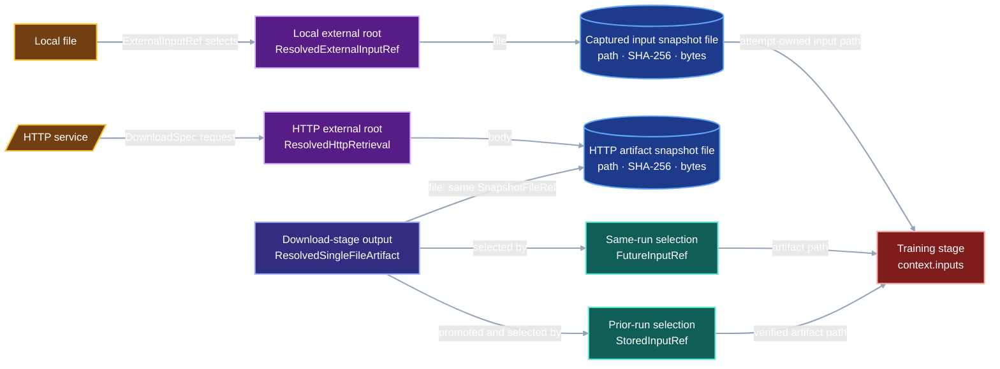
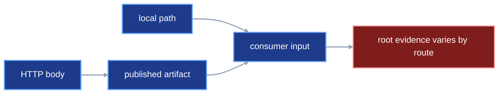
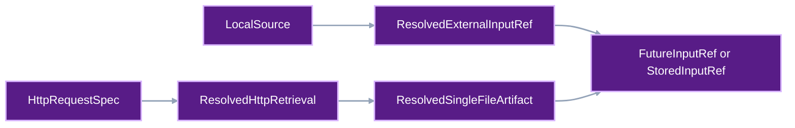

# External input roots and artifact selection

VIPER must answer three separate questions about every input byte sequence:

1. Where did the bytes first enter the provenance graph?
2. Which VIPER stage published the bytes as an artifact?
3. How did the consuming stage select that artifact?

“External input root” names a role in the provenance graph. The Python model
assigns that role to existing records: `ResolvedExternalInputRef` for a local
file and `ResolvedHttpRetrieval` for an HTTP response.

An HTTP response enters VIPER through `ResolvedHttpRetrieval`, becomes the download stage's
`ResolvedSingleFileArtifact`, and reaches a later stage through
`FutureInputRef` or `StoredInputRef`. The retrieval body and artifact share one
`SnapshotFileRef`.

A local file follows the shorter route. Its bytes enter at the consuming-stage
boundary through `ExternalInputRef`. VIPER copies the selected bytes into an
attempt-owned input file, supplies that file to the stage, and records it in
`ResolvedExternalInputRef` as a member of the completed stage snapshot.

## 1. Status

**Contract status:** Planned; Phase 3 PairBlocks in guided execution.

These requirements bind the contract to the master checklist:

| ID | Implementation obligation |
| --- | --- |
| EIR-01 <!-- contract-requirement: EIR-01 phase=3 test=tests/test_protocol.py --> | Remove `HttpSource`; keep `ExternalInputRef` and `ResolvedExternalInputRef` specific to local roots. |
| EIR-02 <!-- contract-requirement: EIR-02 phase=3 test=tests/test_run_execution.py --> | Validate the local source boundary and create one attempt-owned captured input. |
| EIR-03 <!-- contract-requirement: EIR-03 phase=3 test=tests/test_verification_acceptance.py --> | Give the worker the captured path and verify its identity before and after execution. |
| EIR-04 <!-- contract-requirement: EIR-04 phase=7 test=tests/test_authoring.py --> | Compile local, same-run, and prior-run authoring values into their exact input references and pointers. |
| EIR-05 <!-- contract-requirement: EIR-05 phase=11 test=tests/test_documentation.py --> | Remove the retired HTTP-input branch and publish the final input model in public documentation. |

## 2. Required claim

VIPER gives each stage a canonical input path. Before and
after the stage process runs, the file at that path matches the byte identity
recorded for the selected input. The invocation receipt records the same path.

The runner-owned download path is complete: `DownloadSpec` performs each HTTP
request and publishes the response directly as the same-named artifact. Phase
3 closes the remaining local-input gaps:

- `HttpSource` still duplicates HTTP acquisition inside `resolve_inputs()`.
- `ExternalInputRef.path` lets the contract author choose a worker path instead
  of deriving one attempt-owned custody path.
- `ResolvedExternalInputRef.file` still points to separate immutable storage;
  it does not identify the captured file in the consuming stage snapshot.
- worker startup and post-run verification do not reconstruct and verify the
  captured local-input identity.

Phase 3 removes `HttpSource` and its `resolve_inputs()` branch. Phase 7 owns
automatic selection and pointer generation for local, same-run, and prior-run
inputs.

## 3. Current gap

### Inspected path

For a same-run HTTP input named `dataset`, this contract assigns each role to
one exact record or field:

| Role | Exact record or field | Claim |
| --- | --- | --- |
| External-input-root record | `ResolvedDownloadSpec.retrievals["dataset"]: ResolvedHttpRetrieval` | VIPER performed the request through the recorded HTTP implementation and received the recorded response. |
| Root payload | `ResolvedHttpRetrieval.body: SnapshotFileRef` | The HTTP response body has this path, SHA-256 digest, and byte count in the completed download-stage snapshot. |
| Artifact view | `ResolvedDownloadSpec.artifacts["dataset"]: ResolvedSingleFileArtifact` | The download stage published those bytes as its named `dataset` output. |
| Consumer selector | `TrainSpec.inputs["dataset"]: FutureInputRef` | The training stage selects the download stage's `dataset` artifact. |
| Identity join | `retrievals["dataset"].body == artifacts["dataset"].file` | The root payload and artifact view identify the same snapshot file. |

| Question | HTTP external input root | Local external input root |
| --- | --- | --- |
| Where did the bytes enter VIPER? | `ResolvedHttpRetrieval` | `ResolvedExternalInputRef` |
| Which stage published them? | `ResolvedSingleFileArtifact` owned by the download stage | Bytes enter at the consumer boundary |
| How did this stage select them? | `FutureInputRef` or `StoredInputRef` | `ExternalInputRef` |

On the HTTP route, the shared file reference joins the root receipt to the
artifact. On the local route, `ResolvedExternalInputRef.file` identifies the
attempt-owned input in the consuming-stage snapshot.



### Missing connector

The local route does not validate the selected source, derive one
attempt-owned path, or verify the captured bytes after the stage exits.

### Current DAG



### Proposed-change DAG



### Integrated DAG


## 4. Contract models

### 4.1 Local declaration and resolved record

The public authoring draft and target local-root records use these complete
declarations:

```python
class ExternalInputDraft(BaseModel):
    model_config = ConfigDict(extra="forbid", frozen=True)

    path: RepoRelPath
    data_role: DataRole


class LocalSource(ProtocolModel):
    kind: Literal["local"] = "local"
    path: RepoRelPath


class ExternalInputRef(ProtocolModel):
    kind: Literal["external"] = "external"
    source: LocalSource
    data_role: DataRole


class ResolvedExternalInputRef(ProtocolModel):
    kind: Literal["external"] = "external"
    source: LocalSource
    file: SnapshotFileRef
    data_role: DataRole
```

`viper.authoring.input()` creates `ExternalInputDraft`. Freezing constructs the
`ExternalInputRef` protocol record.
`ExternalInputRef.source.path` is the repository-relative source selected by
the user. `resolve_inputs()` reads that file once and writes the same bytes to
an attempt-owned path under `.viper/workspaces`. The worker receives the
attempt-owned path. `resolve_inputs()` writes that path, digest, and byte count
to `ResolvedExternalInputRef.file` as a `SnapshotFileRef`.

`captured_input_path()` derives the attempt path:

```python
def captured_input_path(
    *,
    run_id: RunId,
    attempt_id: int,
    stage_id: StageId,
    input_name: InputName,
    source_path: RepoRelPath,
) -> RepoRelPath: ...
```

The helper returns:

```text
.viper/workspaces/<run-id>/attempt-<attempt-id>/
inputs/<stage-id>/<input-name><source-suffix>
```

`source_path` supplies the filename suffix and remains the provenance locator.
The runner, stage worker, and invocation verifier call the same helper. The
runner writes a temporary sibling file, flushes it, and atomically replaces the
canonical path. The worker receives the canonical path after that move.

Before reading the source, the runner resolves `root / source_path`. The
resolved path must remain beneath the repository root. The source itself must
be a regular, nonsymlink file. A lexical `RepoRelPath` that reaches another
location through a symbolic link fails before VIPER reads any bytes.

After the worker exits, the executor hashes the attempt-owned file again. A
change fails the stage. A successful stage publishes that file inside the same
snapshot as its resolved stage document and artifacts. The enclosing
`ResolvedStageRef.snapshot` supplies the storage location.
The runner copies `ExternalInputRef.data_role` into
`ResolvedExternalInputRef.data_role`.

The target input unions retain the local declaration and resolved record. The
prior-run branch carries an exact pointer-file identity:

```python
class ResolvedArtifactPointerRef(ResolvedFileRef):
    kind: Literal["artifact_pointer"] = "artifact_pointer"


class StoredInputRef(ProtocolModel):
    kind: Literal["stored"] = "stored"
    pointer: ResolvedArtifactPointerRef
    path: RepoRelPath
    data_role: DataRole


class ResolvedStoredInputRef(ProtocolModel):
    kind: Literal["stored"] = "stored"
    pointer: ResolvedArtifactPointerRef


InputRef = Annotated[
    ExternalInputRef | StoredInputRef | FutureInputRef,
    Field(discriminator="kind"),
]

ResolvedInputRef = Annotated[
    ResolvedStoredInputRef | ResolvedFutureInputRef | ResolvedExternalInputRef,
    Field(discriminator="kind"),
]
```

The active-to-target field changes are exact:

| Active model member | Target disposition | Target source of the value |
| --- | --- | --- |
| `HttpSource` | Delete | HTTP declarations remain in `DownloadSpec.inputs`. |
| `ExternalInputSource = LocalSource | HttpSource` | Delete | `ExternalInputRef.source` and `ResolvedExternalInputRef.source` use `LocalSource` directly. |
| `ExternalInputRef.source: ExternalInputSource` | Replace | `ExternalInputRef.source: LocalSource` |
| `ExternalInputRef.path` | Delete | The runner chooses one attempt-owned input path and supplies it to the worker. |
| `ResolvedExternalInputRef.source: ExternalInputSource` | Replace | `ResolvedExternalInputRef.source: LocalSource` |
| `ResolvedExternalInputRef.file: ResolvedFileRef` | Replace | `ResolvedExternalInputRef.file: SnapshotFileRef` identifies the attempt-owned input inside the completed consuming-stage snapshot. |
| Both `data_role` fields | Retain | The resolved record copies the frozen declaration. |
| Public `ExternalInputRef` construction | Replace | `viper.authoring.input()` returns `ExternalInputDraft`; freezing writes the protocol record. |
| `StoredInputRef.pointer: ArtifactPointerRef` | Replace | The compiler stores its generated pointer and writes `ResolvedArtifactPointerRef`. |

### 4.2 HTTP root, artifact, and consumer edge

The target HTTP route uses these classes with the following target fields:

```python
class ResolvedHttpRetrieval(ProtocolModel):
    input_name: InputName
    request: HttpRequestSpec
    http: ResolvedHttpImplementation
    response: ObservedHttpResponse
    body: SnapshotFileRef
    started_at: AwareDatetime
    completed_at: AwareDatetime


class ResolvedSingleFileArtifact(ProtocolModel):
    kind: Literal["file"] = "file"
    file: SnapshotFileRef


class FutureInputRef(ProtocolModel):
    kind: Literal["future"] = "future"
    producer_stage_id: StageId
    producer_artifact: ArtifactName
```

The two routes place their declaration and resolved records in different
owners:

| Route | Frozen declaration | Resolved root evidence | Later consumer |
| --- | --- | --- | --- |
| Local file | `InternalSpec.inputs[name]: ExternalInputRef` | `ResolvedInternalSpec.inputs[name]: ResolvedExternalInputRef` | The same internal stage receives an attempt-owned copy of `source.path`. |
| HTTP response | `DownloadSpec.inputs[name]: HttpRequestSpec` | `ResolvedDownloadSpec.retrievals[name]: ResolvedHttpRetrieval` | `FutureInputRef` selects the same-named artifact in the active run; `StoredInputRef` selects it from a completed run. |

## 5. Execution

### `DownloadSpec` performs the network request
<!-- contract-worked-example: start -->

`DownloadSpec` freezes HTTP requests, selects an HTTP implementation and
policy, and tells VIPER to perform and record each exchange. Its responsibility
ends with verified acquisition and publication.

The schema gains one mechanical rule: each request has one same-named
single-file artifact. This complete authoring example uses the built-in HTTP
implementation selected by the default `http=None` argument:

```python
import csv
from pathlib import Path

from viper import authoring
from viper.artifacts import artifact
from viper.http import HttpRequestSpec, HttpRetrievalPolicy


DATASET_PATH = "artifacts/datasets/training_set/dataset.csv"


def load_dataset(path: Path) -> list[dict[str, str]]:
    with path.open(newline="", encoding="utf-8") as source:
        return list(csv.DictReader(source))


download = authoring.download(
    inputs={
        "dataset": HttpRequestSpec(
            url="http://127.0.0.1:8000/dataset.csv",
            version="tiny-v1",
            expected_body_sha256=(
                "81801ff05409c3cddb57bffa4a856673"
                "06fa92cd48a8437a9aa937f750a7d7c6"
            ),
            expected_body_bytes=22,
        ),
    },
    policy=HttpRetrievalPolicy(
        allowed_schemes=frozenset({"http"}),
        allowed_hosts=frozenset({"127.0.0.1"}),
        allowed_ports=frozenset({8000}),
        accepted_statuses=frozenset({200}),
        max_redirects=0,
        max_body_bytes=1024,
        timeout_seconds=10.0,
    ),
    artifacts={
        "dataset": artifact(
            path=DATASET_PATH,
            loader=load_dataset,
            data_role="training",
        ),
    },
)

assert set(download.spec.inputs) == {"dataset"}
assert set(download.spec.artifacts) == {"dataset"}
```

The custom-HTTP version appears in the complete program in
[`automatic-input-resolution.md`](automatic-input-resolution.md#complete-proposed-authoring-example).

The executor performs this flow:

```text
inputs["dataset"]
-> HTTP function writes the response to bounded attempt scratch space
-> executor verifies the expected digest and byte count
-> freezer prefixes the selected run root onto artifacts["dataset"].path
-> executor writes the body at the frozen artifact path
-> completed stage records one shared SnapshotFileRef
```

`DownloadSpec` is runner-owned. It contains the request, HTTP implementation,
policy, `env` override, metric IDs, and artifacts. Build, embed, train, and eval
stages retain decorated project callables and typed parameters. Projects can
still supply request behavior through `viper.http.http()`.

The completed stage records two views of the same file:

```text
resolved_download.retrievals["dataset"].body
==
resolved_download.artifacts["dataset"].file
```

The retrieval view proves the network exchange. The artifact view lets every
other stage use the response through the standard artifact interface. The
detailed request-to-artifact schema, runner-owned resolved-stage fields,
execution changes, and legacy cleanup live in
[`download-retrieval-artifacts.md`](download-retrieval-artifacts.md).

<!-- contract-worked-example: end -->

### A downloaded body becomes an external root and a future input

Consider one run with a `download` stage followed by a `train` stage.

1. `DownloadSpec.inputs["dataset"]` declares the network request.
2. The HTTP response enters VIPER. `ResolvedHttpRetrieval` records that root
   event.
3. The executor writes a `ResolvedSingleFileArtifact` at
   `ResolvedDownloadSpec.artifacts["dataset"]`. Its `file` equals
   `ResolvedHttpRetrieval.body`.
4. `TrainSpec.inputs["dataset"]` stores the following reference. It names the
   download stage and its `dataset` artifact.

```python
FutureInputRef(
    producer_stage_id="download",
    producer_artifact="dataset",
)
```

5. `resolve_inputs()` uses that `FutureInputRef` to find the completed
   download stage's `ResolvedSingleFileArtifact`. It passes the artifact's path
   to `context.inputs["dataset"]`.

The HTTP response is therefore an external provenance root and a produced
artifact. `FutureInputRef` describes the later consumer edge. Both
classifications remain true: the network supplied the bytes, and the download
stage published them.

The executor publishes the download-stage body directly into the artifact
graph. One successful request creates both the receipt and the artifact.

### Local roots enter at the consuming-stage boundary

A stage can use a repository-local file as input. The user identifies that
file with `ExternalInputRef.source.path`. Before starting the stage, VIPER
copies the file into the attempt workspace. The stage receives the copied
file, not the original repository file.

```text
user selects a repository file
-> VIPER copies it into the attempt workspace
-> ResolvedExternalInputRef records the original source and the copy's identity
-> context.inputs gives the copied path to the stage
-> VIPER checks the copy again after the stage exits
-> the completed stage snapshot stores the verified copy
```

`ResolvedExternalInputRef.file` is a `SnapshotFileRef`. It records the copied
file's path, SHA-256 digest, and byte count.

The verifier locates that file inside the completed stage snapshot, reads its
bytes, and recomputes its digest and byte count. It also confirms that the
stage invocation received the same copied path. The check passes only when
the recorded identity, stored bytes, and path supplied to the stage all agree.

### Later authoring flow

Users select data through three Python values. VIPER chooses the frozen
protocol reference from the data's provenance position:

| Selected data | Public Python expression | Frozen record |
| --- | --- | --- |
| Local file entering at the consuming-stage boundary | `viper.authoring.input(...)` | `ExternalInputRef` |
| Artifact produced earlier in the active run | `download.artifacts["dataset"]` | `FutureInputRef` |
| Artifact produced in a completed run | `viper.authoring.run_artifact(...)` | Generated `ArtifactPointer` plus `StoredInputRef` |

The three complete selections are:

```python
from pathlib import Path

from viper.authoring import input, run_artifact


local_dataset = input(
    path="inputs/raw/dataset.csv",
    data_role="training",
)

same_run_dataset = download.artifacts["dataset"]

prior_run_dataset = run_artifact(
    resolved_run=Path(
        "experiments/tiny_http/runs/baseline/"
        "01ARZ3NDEKTSV4RRFFQ69G5FAA/resolved.yaml"
    ),
    stage="download",
    artifact="dataset",
)
```

Each value can occupy the same input slot:

```python
from viper.artifacts import artifact
from viper.authoring import stage
from viper.keys import Train
from viper.metrics import min


training = stage(
    train,
    params=TRAIN_PARAMS,
    inputs={"dataset": same_run_dataset},
    artifacts={
        Train.MODEL: artifact(
            path=WEIGHTS_PATH,
            loader=load_weights,
            data_role="training",
        ),
        Train.STATE: artifact(
            path=STATE_PATH,
            loader=load_resume_state_artifact,
            data_role="training",
        ),
    },
    objective=min(training_loss_metric),
    metrics=(gradient_norm_metric,),
)
```

`TRAIN_PARAMS`, the two configured metrics, and the artifact loaders are defined
in the
[`automatic-input-resolution.md`](automatic-input-resolution.md#complete-proposed-authoring-example)
program. This section changes only the value assigned to `inputs["dataset"]`.

Replacing `same_run_dataset` with `local_dataset` or `prior_run_dataset`
changes the frozen input reference while preserving the decorated training
function and the `context.inputs["dataset"]` path interface.

The training function continues to receive ordinary paths through
`context.inputs`. The active `freeze_run_plan()` preserves explicitly authored
references. Automatic selection and pointer generation remain Phase 7 work.

## 6. Verification

| Rule | Executable condition |
| --- | --- |
| `input.local.model` <!-- verifier-rule: input.local.model requirement=EIR-01 --> | External input models represent local roots without an HTTP source branch. |
| `input.local.capture` <!-- verifier-rule: input.local.capture requirement=EIR-02 --> | Materialization validates the local source boundary and creates one attempt-owned captured input. |
| `input.local.identity` <!-- verifier-rule: input.local.identity requirement=EIR-03 --> | The worker receives the captured path and verification proves its identity before and after execution. |
| `input.authoring.routes` <!-- verifier-rule: input.authoring.routes requirement=EIR-04 --> | Authoring compiles local, same-run, and prior-run values into their exact references and pointers. |
| `input.docs.current` <!-- verifier-rule: input.docs.current requirement=EIR-05 --> | Protocol and public documentation contain no retired HTTP-input branch. |

### Local source boundary

`input.local.capture` requires all three conditions before capture:

```text
resolved source path is beneath the repository root
source path is not a symbolic link
source path names a regular file
```

This rule prevents a repository-relative declaration from reading bytes
through a symbolic link to a file outside the repository.

### HTTP root selected in the same run

```text
retrieval.body.sha256 == retrieval.request.expected_body_sha256
retrieval.body.bytes  == retrieval.request.expected_body_bytes
retrieval.body        == artifact.file
FutureInputRef names the completed download stage and matching artifact
```

The verifier also checks the frozen request, selected HTTP implementation,
response policy, timing, stage snapshot, and file bytes.

### Local root

```text
stage snapshot bytes hash to resolved_external.file.sha256
stage snapshot byte count equals resolved_external.file.bytes
resolved_external.file.path equals captured_input_path(...)
stage invocation input path equals resolved_external.file.path
frozen source path remains recorded in resolved_external.source.path
```

These checks prove that VIPER supplied the canonical captured file and that its
bytes matched before and after stage execution. Project callable file access
remains outside the observed boundary.

### Prior-run artifact

The verifier retrieves the digest-bearing `StoredInputRef.pointer`, parses its
generated `ArtifactPointer`, and follows the pointer through the terminal run,
successful attempt, producer stage, and named artifact before materializing
the file for the consumer. The pointer bytes may reside in the local immutable
store, Git, Hugging Face, or Viper Cloud; their SHA-256 digest and byte count
remain part of `ResolvedArtifactPointerRef`.

## 7. Acceptance case

### Downloaded same-run input

A controlled HTTP function returns `b"prior"` for `inputs["prior"]`. The download
executor publishes those bytes as `artifacts["prior"]`. The completed download
stage satisfies:

```text
retrievals["prior"].body == artifacts["prior"].file
```

The train stage selects that artifact through `FutureInputRef` and reads
`b"prior"` from `context.inputs["prior"]`. `verify_run_result()` accepts the
run. A changed artifact digest triggers
`download.receipt_artifact_identity`.

### Local root

A repository file containing `b"prior"` enters through `ExternalInputRef`.
VIPER copies it to an attempt-owned input path, gives that path to the train
stage, and stores the captured file in the completed train-stage snapshot.
`verify_run_result()` accepts the run. Changed snapshot bytes or a different
stage-invocation path trigger `input.local_root_identity`.

A companion case makes `inputs/raw/prior.bin` a symbolic link to a file outside
the repository. Capture fails under `input.local.capture` before the
runner reads or copies the target.

### Downloaded prior-run input

A completed producer run publishes `download.artifacts["prior"]`. A second
plan selects it through `viper.authoring.run_artifact()`. Freezing publishes one
digest-bearing pointer and writes `StoredInputRef` into the training spec.
`verify_promoted_artifact()` follows the pointer to the producer run's
`ResolvedHttpRetrieval`, shared `ResolvedSingleFileArtifact`, and snapshot
file. The train stage reads `b"prior"` from `context.inputs["prior"]`.

Changing the pointer's artifact name triggers `input.pointer.provenance`.
Changing the selected producer snapshot bytes triggers the existing artifact
identity rule.

## 8. Propagation

| Surface | Required change |
| --- | --- |
| External source model | Delete `HttpSource` and `ExternalInputSource`; type both local records with `source: LocalSource`. |
| Internal input resolution | Remove HTTP invocation from `resolve_inputs()`; resolve local, future, and stored inputs only. |
| Local root model | Delete `ExternalInputRef.path`; reject symlinks and resolved paths outside the repository; derive one path with `captured_input_path()`, atomically copy `ExternalInputRef.source.path` there, and record a `SnapshotFileRef`. |
| Worker startup | Reconstruct local capture paths with `captured_input_path()` and compare them with `StageContextBinding.inputs`. |
| Verification | Reconstruct capture paths with the same helper and compare the invocation path with `ResolvedExternalInputRef.file.path`. |
| Authoring | Add `viper.authoring.input()` and `viper.authoring.run_artifact()`; convert local files, same-run handles, and prior-run drafts into `ExternalInputRef`, `FutureInputRef`, and `StoredInputRef`. |
| Prior-run pointer schema | Change `StoredInputRef.pointer` to digest-bearing `ResolvedArtifactPointerRef`; let the pointer use any `StorageRef`. |
| Storage publication | Include captured local roots in their consuming-stage snapshots. Publish generated pointer files separately at the configured local or Viper Cloud destination. |
| Tests | Cover local roots and source-boundary rejection in [`tests/test_run_execution.py`](../../tests/test_run_execution.py) and [`tests/test_execution_acceptance.py`](../../tests/test_execution_acceptance.py); cover same-run and prior-run downloaded inputs plus tampering in [`tests/test_verification_acceptance.py`](../../tests/test_verification_acceptance.py). |
| Legacy cleanup | Apply every delete, replace, and retain disposition in [`download-retrieval-artifacts.md`](download-retrieval-artifacts.md); delete `HttpSource` and its tests here. |
| Documentation | Update the protocol reference and generated project examples to teach executor-owned HTTP publication and automatic input selection. |

## 9. Implementation order

The authoritative order is in the
[`master execution checklist`](master-execution-checklist.md#5-dependency-order).
The relevant dependencies are:

```text
remote-storage.md local publication boundary
->
download-retrieval-artifacts.md
-> external-input-roots.md
-> unified-metric-drafting.md
-> automatic-input-resolution.md
-> remote-storage.md cloud backend and restore
```

Phase 2 established one HTTP path and one shared snapshot file. Phase 3 removes
the duplicate HTTP source and completes local-root verification. Phase 7 then
compiles all three input routes. The later cloud backend records the selected
destination in each file or snapshot reference.

1. Use the completed runner-owned request-to-artifact path in
   [`download-retrieval-artifacts.md`](download-retrieval-artifacts.md) as the
   sole HTTP input path.
2. Delete `HttpSource`, `ExternalInputSource`, and the duplicate HTTP branch in
   `resolve_inputs()`. Change both local `source` fields to `LocalSource`.
3. Delete `ExternalInputRef.path`. Add `captured_input_path()` and use it in the
   runner, worker startup check, and invocation verifier. Reject a source that
   is a symlink, resolves outside the repository, or has a file type other than
   regular.
   Atomically copy `source.path` to the capture path, include the captured file
   in the completed stage snapshot, and add the two local-input verifier rules.
4. Add `ExternalInputDraft`, `RunArtifactDraft`, and the three-way authoring
   compiler defined in
   [`automatic-input-resolution.md`](automatic-input-resolution.md).
5. Change the stored-pointer schema and implement deterministic,
   destination-aware pointer publication for prior-run selections.
6. Add end-to-end acceptance cases for all three routes, a local source-link
   escape, and the route-specific tamper failures.

## 10. Implementation grounding

The current repository already assigns each part of the target flow to a
specific owner:

| Role | Current owner |
| --- | --- |
| HTTP declaration | [`viper.stages.DownloadSpec`](../../src/viper/stages.py) |
| HTTP external input root | [`viper.http.ResolvedHttpRetrieval`](../../src/viper/http.py) |
| HTTP execution | [`viper.execution._materialization.retrieve_download_inputs`](../../src/viper/execution/_materialization.py) |
| Download-stage validation | [`viper.stages.ResolvedDownloadSpec`](../../src/viper/stages.py) |
| Produced artifact identity | [`viper.execution._stage._resolve_artifact`](../../src/viper/execution/_stage.py) |
| Local external input root declaration and evidence | [`viper.inputs.ExternalInputRef`](../../src/viper/inputs.py) and `ResolvedExternalInputRef` |
| Same-run consumer edge | [`viper.inputs.FutureInputRef`](../../src/viper/inputs.py) |
| Prior-run consumer edge | [`viper.inputs.StoredInputRef`](../../src/viper/inputs.py) and [`viper.artifacts.ArtifactPointer`](../../src/viper/artifacts.py) |
| Input materialization | [`viper.execution._materialization.resolve_inputs`](../../src/viper/execution/_materialization.py) |
| Immutable evidence publication | [`viper.storage.LocalArtifactStore`](../../src/viper/storage.py) and the destination-aware interface in [`remote-storage.md`](remote-storage.md) |

The contract covers byte lineage and selection. Dataset quality, license
status, and semantic suitability remain outside this verifier.

## 11. Contract-owned PairBlocks

These blocks start from the accepted runner-owned download implementation.
Their `ContractTarget` sets are the initial Phase 3 plan. Guided execution may
add a directly changed caller or test before the final freeze; the final System
Impact check uses the reconciled target set.

<!-- pair-block-definition: P3-EIR-01 -->
```toml pair-block
id = "P3-EIR-01"
requirements = ["EIR-01"]
targets = [
    "src/viper/inputs.py:HttpImplementationSpec",
    "src/viper/inputs.py:HttpRequestSpec",
    "src/viper/inputs.py:HttpRetrievalPolicy",
    "src/viper/inputs.py:HttpSource",
    "src/viper/inputs.py:ExternalInputSource",
    "src/viper/inputs.py:ExternalInputRef",
    "src/viper/inputs.py:ResolvedExternalInputRef",
    "src/viper/inputs.py:ResolvedFileRef",
    "src/viper/inputs.py:SnapshotFileRef",
]
tests = ["tests/test_protocol.py:test_external_inputs_are_local_only"]
gate = "python -m pytest tests/test_protocol.py -q"
depends_on = ["P2-DRA-04"]
```

**Context:** `ExternalInputRef` still contains the retired HTTP branch. This
block makes `ExternalInputRef` and `ResolvedExternalInputRef` local-only and
uses `SnapshotFileRef` for the captured copy.

<!-- pair-block-definition: P3-EIR-02 -->
```toml pair-block
id = "P3-EIR-02"
requirements = ["EIR-02"]
targets = [
    "src/viper/workspace.py:RepoRelPath",
    "src/viper/workspace.py:InputName",
    "src/viper/workspace.py:RunId",
    "src/viper/workspace.py:StageId",
    "src/viper/workspace.py:captured_input_path",
    "src/viper/execution/_materialization.py:capture_external_input",
    "src/viper/execution/_materialization.py:resolve_inputs",
    "src/viper/execution/_materialization.py:verify_captured_inputs",
]
tests = [
    "tests/test_run_execution.py:test_local_input_is_captured_by_attempt",
    "tests/test_run_execution.py:test_local_input_rejects_symlink_escape",
    "tests/test_run_execution.py:test_local_input_mutation_fails_attempt",
]
gate = "python -m pytest tests/test_run_execution.py -k local_input -q"
depends_on = ["P3-EIR-01"]
```

**Context:** Local input materialization still follows source symlinks and
uses a path selected by the contract author. This block validates the source,
derives one attempt-owned path, copies the bytes there, and checks them again
after the stage runs.

<!-- pair-block-definition: P3-EIR-03 -->
```toml pair-block
id = "P3-EIR-03"
requirements = ["EIR-03"]
targets = [
    "src/viper/_workers/stages.py:_planned_stage_context",
    "src/viper/_verification/attempt.py:_logical_input_paths",
    "src/viper/_verification/attempt.py:_verify_external_inputs",
]
tests = [
    "tests/test_verification_acceptance.py:test_external_input_identity_survives_execution",
    "tests/test_verification_acceptance.py:test_external_input_identity_rejects_tampering",
]
gate = "python -m pytest tests/test_verification_acceptance.py -k external_input -q"
depends_on = ["P3-EIR-02"]
```

**Context:** Worker startup and result verification do not reconstruct the
attempt-owned local-input path. This block makes both consumers derive that
path and verify the captured file recorded by `ResolvedExternalInputRef`.

## 12. Accepted `ContractTarget` declarations

Each marker identifies one planned Python declaration as `path:symbol`. The
following fence contains that declaration's accepted Phase 3 bytes. A fence
may contain several declarations from one file; System Impact resolves and
hashes each named declaration separately. The target set is reconciled after
guided execution and frozen before `check_plan()`.

**File: `src/viper/inputs.py`**

<!-- contract-target: requirements=EIR-01 block=P3-EIR-01 action=remove target=src/viper/inputs.py:HttpImplementationSpec -->
<!-- contract-remove -->

<!-- contract-target: requirements=EIR-01 block=P3-EIR-01 action=remove target=src/viper/inputs.py:HttpRequestSpec -->
<!-- contract-remove -->

<!-- contract-target: requirements=EIR-01 block=P3-EIR-01 action=remove target=src/viper/inputs.py:HttpRetrievalPolicy -->
<!-- contract-remove -->

<!-- contract-target: requirements=EIR-01 block=P3-EIR-01 action=remove target=src/viper/inputs.py:HttpSource -->
<!-- contract-remove -->

<!-- contract-target: requirements=EIR-01 block=P3-EIR-01 action=remove target=src/viper/inputs.py:ExternalInputSource -->
<!-- contract-remove -->

<!-- contract-target: requirements=EIR-01 block=P3-EIR-01 action=remove target=src/viper/inputs.py:ResolvedFileRef -->
<!-- contract-remove -->

<!-- contract-target: requirements=EIR-01 block=P3-EIR-01 action=add target=src/viper/inputs.py:SnapshotFileRef -->
```python contract-target
from .references import SnapshotFileRef
```

<!-- contract-target: requirements=EIR-01 block=P3-EIR-01 action=update target=src/viper/inputs.py:ExternalInputRef -->
<!-- contract-target: requirements=EIR-01 block=P3-EIR-01 action=update target=src/viper/inputs.py:ResolvedExternalInputRef -->
```python contract-target
class ExternalInputRef(ProtocolModel):
    """Declare one repository-local value supplied to a stage."""

    kind: Literal["external"] = "external"
    source: LocalSource
    data_role: DataRole


class ResolvedExternalInputRef(ProtocolModel):
    """Record one local input captured in its consuming stage snapshot."""

    kind: Literal["external"] = "external"
    source: LocalSource
    file: SnapshotFileRef
    data_role: DataRole
```

**File: `src/viper/workspace.py`**

<!-- contract-target: requirements=EIR-02 block=P3-EIR-02 action=add target=src/viper/workspace.py:RepoRelPath -->
```python contract-target
from ._schema import RepoRelPath
```

<!-- contract-target: requirements=EIR-02 block=P3-EIR-02 action=add target=src/viper/workspace.py:InputName -->
<!-- contract-target: requirements=EIR-02 block=P3-EIR-02 action=update target=src/viper/workspace.py:RunId -->
<!-- contract-target: requirements=EIR-02 block=P3-EIR-02 action=add target=src/viper/workspace.py:StageId -->
```python contract-target
from .ids import InputName, RunId, StageId
```

<!-- contract-target: requirements=EIR-02 block=P3-EIR-02 action=add target=src/viper/workspace.py:captured_input_path -->
```python contract-target
def captured_input_path(
    *,
    run_id: RunId,
    attempt_id: int,
    stage_id: StageId,
    input_name: InputName,
    source_path: RepoRelPath,
) -> RepoRelPath:
    """Return the canonical attempt-owned path for one local input."""
    suffix = Path(source_path).suffix
    return (
        f".viper/workspaces/{run_id}/attempt-{attempt_id}/"
        f"inputs/{stage_id}/{input_name}{suffix}"
    )
```

**File: `src/viper/execution/_materialization.py`**

<!-- contract-target: requirements=EIR-02 block=P3-EIR-02 action=add target=src/viper/execution/_materialization.py:capture_external_input -->
```python contract-target
def capture_external_input(
    root: Path,
    workspace: AttemptWorkspace,
    *,
    run_id: RunId,
    attempt_id: int,
    stage_id: StageId,
    input_name: InputName,
    input_ref: ExternalInputRef,
) -> tuple[ResolvedExternalInputRef, Path]:
    """Copy one validated local source into attempt-owned custody."""
    declared_source = root / input_ref.source.path
    if declared_source.is_symlink():
        raise RunError("external local input source must not be a symbolic link")
    try:
        source = declared_source.resolve(strict=True)
    except OSError as exc:
        raise RunError("external local input source is unavailable") from exc
    if not source.is_relative_to(root) or not source.is_file():
        raise RunError("external local input source must be a repository file")
    raw = source.read_bytes()
    relative_path = captured_input_path(
        run_id=run_id,
        attempt_id=attempt_id,
        stage_id=stage_id,
        input_name=input_name,
        source_path=input_ref.source.path,
    )
    target = root / relative_path
    if not target.resolve().is_relative_to(workspace.inputs.resolve()):
        raise RunError("captured input path escapes the attempt workspace")
    target.parent.mkdir(parents=True, exist_ok=True)
    temporary: Path | None = None
    try:
        with tempfile.NamedTemporaryFile(
            dir=target.parent,
            prefix=f".{target.name}.",
            delete=False,
        ) as stream:
            temporary = Path(stream.name)
            stream.write(raw)
            stream.flush()
            os.fsync(stream.fileno())
        os.replace(temporary, target)
    finally:
        if temporary is not None:
            temporary.unlink(missing_ok=True)
    reference = snapshot_file(relative_path, raw)
    return (
        ResolvedExternalInputRef(
            source=input_ref.source,
            file=reference,
            data_role=input_ref.data_role,
        ),
        target,
    )
```

<!-- contract-target: requirements=EIR-02 block=P3-EIR-02 action=update target=src/viper/execution/_materialization.py:resolve_inputs -->
```python contract-target
def resolve_inputs(
    root: Path,
    workspace: AttemptWorkspace,
    run_id: RunId,
    attempt_id: int,
    stage_id: StageId,
    stage: InternalSpec,
    completed: Mapping[StageId, ResolvedStageRef],
    stage_specs: Mapping[StageId, BaseSpec],
    fetcher: RunFetcher,
    policy: VerificationPolicy,
) -> tuple[
    dict[InputName, ResolvedInputRef],
    dict[str, Path],
    dict[InputName, SnapshotFileRef],
]:
    """Materialize stage inputs and bind each one to its verified producer."""
    resolved: dict[InputName, ResolvedInputRef] = {}
    paths: dict[str, Path] = {}
    captured: dict[InputName, SnapshotFileRef] = {}
    for name, input_ref in stage.inputs.items():
        if input_ref.kind == "future":
            producer = completed.get(input_ref.producer_stage_id)
            if producer is None:
                raise RunError("future input producer has not completed")
            resolved[name] = ResolvedFutureInputRef(producer=producer)
            producer_spec = stage_specs[input_ref.producer_stage_id]
            artifact = producer_spec.artifacts[input_ref.producer_artifact]
            paths[name] = root / artifact.path
        elif input_ref.kind == "external":
            resolved_input, captured_path = capture_external_input(
                root,
                workspace,
                run_id=run_id,
                attempt_id=attempt_id,
                stage_id=stage_id,
                input_name=name,
                input_ref=input_ref,
            )
            resolved[name] = resolved_input
            paths[name] = captured_path
            captured[name] = resolved_input.file
        elif input_ref.kind == "stored":
            pointer_raw = fetcher(input_ref.pointer)
            pointer = ArtifactPointer.model_validate(parse_yaml_bytes(pointer_raw))
            verified = verify_promoted_artifact(
                pointer,
                policy=policy,
                expected_data_role=input_ref.data_role,
                fetcher=fetcher,
            )
            _materialize_verified_artifact(root, input_ref.path, verified)
            resolved[name] = ResolvedStoredInputRef(
                pointer=ResolvedArtifactPointerRef(
                    sha256=hashlib.sha256(pointer_raw).hexdigest(),
                    bytes=len(pointer_raw),
                    stored_at=input_ref.pointer,
                )
            )
            paths[name] = root / input_ref.path
    return resolved, paths, captured
```

<!-- contract-target: requirements=EIR-02 block=P3-EIR-02 action=add target=src/viper/execution/_materialization.py:verify_captured_inputs -->
```python contract-target
def verify_captured_inputs(
    root: Path,
    captured: Mapping[InputName, SnapshotFileRef],
) -> None:
    """Require every captured local input to retain its pre-execution identity."""
    for input_name, reference in captured.items():
        try:
            raw = (root / reference.path).read_bytes()
        except OSError as exc:
            raise RunError(
                f"captured local input {input_name!r} is unavailable"
            ) from exc
        if snapshot_file(reference.path, raw) != reference:
            raise RunError(f"captured local input {input_name!r} changed")
```

**File: `src/viper/_workers/stages.py`**

<!-- contract-target: requirements=EIR-03 block=P3-EIR-03 action=update target=src/viper/_workers/stages.py:_planned_stage_context -->
```python contract-target
def _planned_stage_context(
    root: Path,
    run: RunSpec,
    stage_id: str,
    attempt_id: int,
) -> tuple[ParameterizedSpec, dict[str, str]]:
    """Load the selected stage and derive its plan-owned logical input paths."""
    loaded: dict[str, BaseSpec] = {}
    selected: ParameterizedSpec | None = None
    expected_inputs: dict[str, str] = {}
    for reference in run.stages:
        path = root / reference.spec
        raw = path.read_bytes()
        if len(raw) != reference.bytes or hashlib.sha256(raw).hexdigest() != (
            reference.sha256
        ):
            raise ValueError("startup.plan: stage spec identity differs")
        candidate = load_stage_spec(path)
        if reference.stage_id == stage_id:
            if not isinstance(candidate, ParameterizedSpec):
                raise ValueError("startup.plan: selected stage is not parameterized")
            selected = candidate
            if isinstance(candidate, InternalSpec):
                for name, input_reference in candidate.inputs.items():
                    if isinstance(input_reference, StoredInputRef):
                        expected_inputs[name] = str(input_reference.path)
                    elif isinstance(input_reference, ExternalInputRef):
                        expected_inputs[name] = str(
                            captured_input_path(
                                run_id=run.run_id,
                                attempt_id=attempt_id,
                                stage_id=reference.stage_id,
                                input_name=name,
                                source_path=input_reference.source.path,
                            )
                        )
                    elif isinstance(input_reference, FutureInputRef):
                        producer = loaded[input_reference.producer_stage_id]
                        expected_inputs[name] = str(
                            producer.artifacts[input_reference.producer_artifact].path
                        )
            break
        loaded[reference.stage_id] = candidate
    if selected is None:
        raise ValueError("startup.plan: context stage ID is absent from RunSpec")
    return selected, expected_inputs
```

**File: `src/viper/_verification/attempt.py`**

<!-- contract-target: requirements=EIR-03 block=P3-EIR-03 action=update target=src/viper/_verification/attempt.py:_logical_input_paths -->
```python contract-target
def _logical_input_paths(
    run: RunSpec,
    attempt_id: int,
    stage_id: StageId,
    stage: BaseSpec,
    stage_specs: Mapping[StageId, BaseSpec],
) -> dict[InputName, RepoRelPath]:
    """Reconstruct the repository-relative input paths delivered to one stage."""
    if not isinstance(stage, InternalSpec):
        return {}
    paths: dict[InputName, RepoRelPath] = {}
    for name, reference in stage.inputs.items():
        if isinstance(reference, FutureInputRef):
            producer = stage_specs[reference.producer_stage_id]
            paths[name] = producer.artifacts[reference.producer_artifact].path
        elif isinstance(reference, ExternalInputRef):
            paths[name] = captured_input_path(
                run_id=run.run_id,
                attempt_id=attempt_id,
                stage_id=stage_id,
                input_name=name,
                source_path=reference.source.path,
            )
        else:
            paths[name] = reference.path
    return paths
```

<!-- contract-target: requirements=EIR-03 block=P3-EIR-03 action=add target=src/viper/_verification/attempt.py:_verify_external_inputs -->
```python contract-target
def _verify_external_inputs(
    attempt: RunAttempt,
    run: RunSpec,
    stage_id: StageId,
    resolved: ResolvedParameterizedSpec,
    snapshot: StageResultSnapshotRef | LocalStageResultSnapshotRef,
    *,
    fetcher: StorageFetcher | None,
) -> None:
    """Verify each local input captured in one completed stage snapshot."""
    for input_name, resolved_input in resolved.inputs.items():
        if not isinstance(resolved_input, ResolvedExternalInputRef):
            continue
        planned_input = resolved.spec.inputs[input_name]
        if not isinstance(planned_input, ExternalInputRef):
            raise VerificationError("resolved local input differs from its plan")
        if (
            resolved_input.source != planned_input.source
            or resolved_input.data_role != planned_input.data_role
        ):
            raise VerificationError("resolved local input provenance differs")
        expected_path = captured_input_path(
            run_id=run.run_id,
            attempt_id=attempt.attempt_id,
            stage_id=stage_id,
            input_name=input_name,
            source_path=planned_input.source.path,
        )
        if resolved_input.file.path != expected_path:
            raise VerificationError("input.local_root_identity: path differs")
        read_snapshot_file(snapshot, resolved_input.file, fetcher=fetcher)
```
