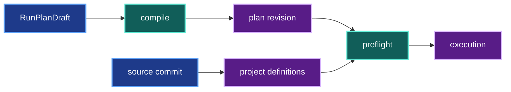

# Immutable plan identity

## 1. Status

**Contract status:** complete.

| ID | Implementation obligation |
| --- | --- |
| FPG-01 <!-- contract-requirement: FPG-01 phase=6 test=tests/test_authoring.py --> | Publish every compiled plan document in one content-addressed revision before execution. |
| FPG-02 <!-- contract-requirement: FPG-02 phase=6 test=tests/test_authoring.py --> | Preflight must verify the working run document against that immutable revision. |
| FPG-03 <!-- contract-requirement: FPG-03 phase=6 test=tests/test_preflight.py --> | Keep project callables and Python definitions bound to `RunSpec.source.commit`. |
| FPG-04 <!-- contract-requirement: FPG-04 phase=6 test=tests/test_verification.py --> | Preserve the plan revision in `ResolvedRun.spec` and use it to verify generated documents. |
| FPG-05 <!-- contract-requirement: FPG-05 phase=6 test=tests/test_benchmark_execution.py --> | Load a selected benchmark from the same plan revision as the candidate run. |

## 2. Required claim

VIPER compiles an immutable `RunPlanDraft`, publishes every generated document
in one content-addressed revision, and passes the resulting
`ResolvedRunSpecRef` into execution. The user does not commit generated YAML.

The source and plan identities remain separate:

```text
RunSpec.source.commit
-> project functions, parameter classes, loaders, and metric implementations

ResolvedRun.spec.stored_at.commit
-> generated experiment, variant, benchmark, stage, and run documents
```

## 3. Current gap

The former workflow wrote generated files and required a second user Git
commit. That made `run(plan)` impossible: execution could not start until the
caller reviewed and committed an intermediate file tree.

The accepted workflow closes that gap:

```text
RunPlanDraft
-> compile all plan bytes in memory
-> publish one immutable revision
-> materialize working files
-> preflight the revision
-> execute
```

### Current DAG


### Proposed-change DAG


### Integrated DAG



## 4. Models

`FrozenPlanFiles` is an internal handoff while the public freezing API is
retired:

```python
class FrozenPlanFiles(BaseModel):
    model_config = ConfigDict(extra="forbid", frozen=True)

    run: RunSpec
    reference: ResolvedRunSpecRef
    files: tuple[Path, ...]
```

`ResolvedRunSpecRef.stored_at` accepts the normal `StorageRef` union. A local
plan therefore uses:

```python
ResolvedRunSpecRef(
    sha256=run_sha256,
    bytes=run_bytes,
    stored_at=LocalFileRef(
        commit=plan_revision,
        path=run_path,
    ),
)
```

## 5. Execution

`freeze_run_plan()` is the internal publication handoff:

```text
_compile_plan(root, draft)
-> LocalArtifactStore.publish(compiled.files)
-> materialize the same bytes at their working paths
-> return the exact ResolvedRunSpecRef
```

`viper.execution.run(root, plan)` calls that handoff before the first attempt.
`execute_attempt()` then uses the plan revision for generated plan documents
and `RunSpec.source.commit` for source code.

## 6. Persisted evidence

One plan revision contains every generated experiment, variant, benchmark,
stage, and run document. `ResolvedRun.spec` retains the run document's path,
digest, byte count, store, and revision.

## 7. Verification

| Rule | Executable condition |
| --- | --- |
| `plan.files.complete` <!-- verifier-rule: plan.files.complete requirement=FPG-01 --> | Every compiled plan file enters one immutable revision before execution. |
| `plan.commit.head` <!-- verifier-rule: plan.commit.head requirement=FPG-02 --> | Preflight matches the working run bytes with the immutable plan reference. |
| `plan.callable.commit` <!-- verifier-rule: plan.callable.commit requirement=FPG-03 --> | Project Python definitions still resolve from `RunSpec.source.commit`. |
| `run.plan.commit` <!-- verifier-rule: run.plan.commit requirement=FPG-04 --> | `ResolvedRun.spec` retains the plan storage reference used by verification. |
| `benchmark.plan.commit` <!-- verifier-rule: benchmark.plan.commit requirement=FPG-05 --> | Benchmark execution reads its specification from the candidate's plan revision. |

## 8. Propagation

| Surface | Required change |
| --- | --- |
| Authoring | Compile every document before publication and return one run reference. |
| Storage | Publish the complete plan with `LocalArtifactStore`. |
| Execution | Pass the immutable plan reference into preflight and the attempt. |
| Verification | Derive sibling plan-document references from the run reference. |
| Benchmark | Use the candidate run's plan reference, not an assumed Git repository. |
| Source checks | Continue to use `RunSpec.source.commit`. |
| Public API | Remove the separate freeze command during the Phase 11 migration. |

## 9. Acceptance

<!-- contract-worked-example: start -->

```python
frozen = freeze_run_plan(root, plan)
run_raw = LocalArtifactStore(root).fetch(frozen.reference.stored_at)

assert run_raw == (root / frozen.reference.stored_at.path).read_bytes()
assert frozen.reference.sha256 == hashlib.sha256(run_raw).hexdigest()
```

Changing a working run document after publication makes preflight fail. A
project callable whose bytes differ from `RunSpec.source.commit` also fails,
even when the plan revision itself remains valid.

<!-- contract-worked-example: end -->

## 10. Implementation order

1. Compile the complete plan in memory.
2. Publish all plan files in one local immutable revision.
3. Pass the plan reference through preflight and execution.
4. Verify generated documents through that reference.
5. Keep source-code verification on `RunSpec.source.commit`.
6. Route benchmarks through the same plan revision.
<!-- pair-block-definition: P6-FPG-01 -->
```toml pair-block
id = "P6-FPG-01"
requirements = ["FPG-01", "FPG-02", "FPG-03", "FPG-04", "FPG-05"]
targets = [
    "src/viper/authoring.py:LocalFileRef",
    "src/viper/authoring.py:ResolvedRunSpecRef",
    "src/viper/authoring.py:LocalArtifactStore",
    "src/viper/authoring.py:FrozenPlanFiles",
    "src/viper/authoring.py:freeze_run_plan",
    "src/viper/references.py:ResolvedRunSpecRef",
    "src/viper/references.py:ResolvedBenchmarkSpecRef",
    "src/viper/references.py:__all__",
    "src/viper/references.py:storage_file",
    "src/viper/_verification/plan.py:StorageModel",
    "src/viper/_verification/plan.py:storage_file",
    "src/viper/_verification/plan.py:_source_file",
    "src/viper/_verification/plan.py:verify_run_spec",
    "src/viper/_verification/plan.py:verify_experiment_and_variant",
    "src/viper/_verification/plan.py:verify_benchmark_spec",
    "src/viper/_verification/plan.py:verify_parameter_model_references",
    "src/viper/_verification/plan.py:verify_stage_plan",
    "src/viper/_verification/plan.py:verify_run_plan",
    "src/viper/preflight.py:LocalFileRef",
    "src/viper/preflight.py:ResolvedRunSpecRef",
    "src/viper/preflight.py:LocalArtifactStore",
    "src/viper/preflight.py:preflight_plan",
    "src/viper/execution/_attempt.py:storage_file",
    "src/viper/execution/_attempt.py:execute_attempt",
    "src/viper/execution/_benchmark.py:fetch_storage_bytes",
    "src/viper/execution/_benchmark.py:LocalFileRef",
    "src/viper/execution/_benchmark.py:RunSpec",
    "src/viper/execution/_benchmark.py:benchmark",
    "tests/test_authoring.py:LocalArtifactStore",
    "tests/test_authoring.py:preflight_plan",
    "tests/test_authoring.py:test_freeze_publishes_one_immutable_plan",
    "tests/test_authoring.py:test_preflight_reads_the_published_plan",
    "tests/test_plan_execution.py:_compiled_plan",
    "tests/test_plan_execution.py:LocalFileRef",
    "tests/test_plan_execution.py:ResolvedBenchmarkSpecRef",
    "tests/test_plan_execution.py:ResolvedRunSpecRef",
    "tests/test_plan_execution.py:storage_file",
    "tests/test_plan_execution.py:test_source_and_plan_revisions_are_independent",
    "tests/test_plan_execution.py:test_plan_documents_share_one_storage_revision",
    "tests/test_plan_execution.py:test_benchmark_spec_accepts_the_plan_revision",
]
tests = [
    "tests/test_authoring.py:test_freeze_publishes_one_immutable_plan",
    "tests/test_authoring.py:test_preflight_reads_the_published_plan",
    "tests/test_plan_execution.py:test_source_and_plan_revisions_are_independent",
    "tests/test_plan_execution.py:test_plan_documents_share_one_storage_revision",
    "tests/test_plan_execution.py:test_benchmark_spec_accepts_the_plan_revision",
]
gate = "python -m pytest tests/test_authoring.py::test_freeze_publishes_one_immutable_plan tests/test_authoring.py::test_preflight_reads_the_published_plan tests/test_plan_execution.py::test_source_and_plan_revisions_are_independent tests/test_plan_execution.py::test_plan_documents_share_one_storage_revision tests/test_plan_execution.py::test_benchmark_spec_accepts_the_plan_revision -q"
depends_on = ["P6-AIR-01"]
```

**Context:** Generated plan files must become immutable before execution without requiring a second user Git commit. This block binds every plan document to one storage revision while source code remains bound to the source commit.

**File: src/viper/authoring.py**
<!-- contract-target: requirements=FPG-01,FPG-02,FPG-03,FPG-04,FPG-05 block=P6-FPG-01 action=add target=src/viper/authoring.py:LocalFileRef -->
<!-- contract-target: requirements=FPG-01,FPG-02,FPG-03,FPG-04,FPG-05 block=P6-FPG-01 action=add target=src/viper/authoring.py:ResolvedRunSpecRef -->
```python contract-target
from .references import GitSource, LocalFileRef, ResolvedRunRef, ResolvedRunSpecRef
```
<!-- contract-target: requirements=FPG-01,FPG-02,FPG-03,FPG-04,FPG-05 block=P6-FPG-01 action=add target=src/viper/authoring.py:LocalArtifactStore -->
```python contract-target
from .storage import LocalArtifactStore
```
<!-- contract-target: requirements=FPG-01,FPG-02,FPG-03,FPG-04,FPG-05 block=P6-FPG-01 action=update target=src/viper/authoring.py:FrozenPlanFiles -->
```python contract-target
class FrozenPlanFiles(BaseModel):
    """Return the validated run plan and every file written for it."""

    model_config = ConfigDict(extra="forbid", frozen=True)

    run: RunSpec
    reference: ResolvedRunSpecRef
    files: tuple[Path, ...]
```
<!-- contract-target: requirements=FPG-01,FPG-02,FPG-03,FPG-04,FPG-05 block=P6-FPG-01 action=update target=src/viper/authoring.py:freeze_run_plan -->
```python contract-target
def freeze_run_plan(root: Path, draft: RunPlanDraft) -> FrozenPlanFiles:
    """Publish one compiled plan and materialize its working files."""
    project_root = resolve_root(root)
    compiled = _compile_plan(project_root, draft)
    commit = LocalArtifactStore(project_root).publish(compiled.files)
    paths = tuple(_target_path(project_root, path) for path in compiled.files)
    for path, raw in zip(paths, compiled.files.values(), strict=True):
        _write_exact_file(path, raw)
    run_raw = compiled.files[compiled.run_path]
    reference = ResolvedRunSpecRef(
        sha256=hashlib.sha256(run_raw).hexdigest(),
        bytes=len(run_raw),
        stored_at=LocalFileRef(commit=commit, path=compiled.run_path),
    )
    return FrozenPlanFiles(run=compiled.run, reference=reference, files=paths)
```

**File: src/viper/references.py**
<!-- contract-target: requirements=FPG-01,FPG-02,FPG-03,FPG-04,FPG-05 block=P6-FPG-01 action=update target=src/viper/references.py:ResolvedRunSpecRef -->
```python contract-target
class ResolvedRunSpecRef(ResolvedFileRef):
    """Identify the exact run specification governing one run."""

    kind: Literal["run_spec"] = "run_spec"
```
<!-- contract-target: requirements=FPG-01,FPG-02,FPG-03,FPG-04,FPG-05 block=P6-FPG-01 action=update target=src/viper/references.py:ResolvedBenchmarkSpecRef -->
```python contract-target
class ResolvedBenchmarkSpecRef(ResolvedFileRef):
    """Identify the exact benchmark specification applied to a run."""

    kind: Literal["benchmark_spec"] = "benchmark_spec"
```
<!-- contract-target: requirements=FPG-01,FPG-02,FPG-03,FPG-04,FPG-05 block=P6-FPG-01 action=update target=src/viper/references.py:__all__ -->
```python contract-target
__all__ = [
    "ArtifactPointerRef",
    "GitFileRef",
    "GitSource",
    "HuggingFaceFileRef",
    "LocalFileRef",
    "LocalStageResultSnapshotRef",
    "ResolvedStageRef",
    "ResolvedStageInvocationRef",
    "ResolvedArtifactPointerRef",
    "ResolvedBenchmarkResultRef",
    "ResolvedBenchmarkSpecRef",
    "ResolvedFileRef",
    "ResolvedGitFileRef",
    "ResolvedRunRef",
    "ResolvedRunSpecRef",
    "SnapshotFileRef",
    "StageResultSnapshot",
    "StageResultSnapshotRef",
    "StorageModel",
    "StorageRef",
    "storage_file",
]
```
<!-- contract-target: requirements=FPG-01,FPG-02,FPG-03,FPG-04,FPG-05 block=P6-FPG-01 action=add target=src/viper/references.py:storage_file -->
```python contract-target
def storage_file(location: StorageModel, path: RepoRelPath) -> StorageModel:
    """Address another file in the same immutable revision."""
    values = location.model_dump()
    values["path"] = path
    return type(location).model_validate(values)
```

**File: src/viper/_verification/plan.py**
<!-- contract-target: requirements=FPG-01,FPG-02,FPG-03,FPG-04,FPG-05 block=P6-FPG-01 action=add target=src/viper/_verification/plan.py:StorageModel -->
<!-- contract-target: requirements=FPG-01,FPG-02,FPG-03,FPG-04,FPG-05 block=P6-FPG-01 action=add target=src/viper/_verification/plan.py:storage_file -->
```python contract-target
from ..references import (
    GitFileRef,
    ResolvedFileRef,
    ResolvedRunSpecRef,
    StorageModel,
    storage_file,
)
```
<!-- contract-target: requirements=FPG-01,FPG-02,FPG-03,FPG-04,FPG-05 block=P6-FPG-01 action=update target=src/viper/_verification/plan.py:verify_run_spec -->
```python contract-target
def verify_run_spec(
    resolved_run: ResolvedRun,
    *,
    fetcher: StorageFetcher | None = None,
) -> RunSpec:
    """Retrieve and verify the RunSpec governing a resolved run."""
    raw = read_resolved_file(resolved_run.spec, fetcher=fetcher)

    try:
        file_run = RunSpec.model_validate(parse_yaml_bytes(raw))
    except (yaml.YAMLError, ValueError) as exc:
        raise VerificationError("resolved run spec is not a valid RunSpec") from exc

    expected_path = f"{run_root(file_run)}/spec.yaml"
    if resolved_run.spec.stored_at.path != expected_path:
        raise VerificationError(
            "resolved run spec reference is outside the canonical run path"
        )
    if (
        isinstance(resolved_run.spec.stored_at, GitFileRef)
        and resolved_run.spec.stored_at.repository != file_run.source.repository
    ):
        raise VerificationError(
            "resolved run spec and source snapshot must use one Git repository"
        )

    return file_run
```
<!-- contract-target: requirements=FPG-01,FPG-02,FPG-03,FPG-04,FPG-05 block=P6-FPG-01 action=update target=src/viper/_verification/plan.py:verify_experiment_and_variant -->
```python contract-target
def verify_experiment_and_variant(
    run: RunSpec,
    *,
    plan: ResolvedRunSpecRef | None = None,
    fetcher: StorageFetcher | None = None,
) -> tuple[ExperimentSpec, VariantSpec]:
    """Load and verify the experiment and variant selected by a run."""
    retrieve = fetch_storage_bytes if fetcher is None else fetcher

    experiment_path = f"experiments/{run.experiment_id}/spec.yaml"
    variant_path = (
        f"experiments/{run.experiment_id}/variants/{run.variant_id}.spec.yaml"
    )
    if plan is None:
        experiment_location: StorageModel = GitFileRef(
            repository=run.source.repository,
            commit=run.source.commit,
            path=experiment_path,
        )
        variant_location: StorageModel = GitFileRef(
            repository=run.source.repository,
            commit=run.source.commit,
            path=variant_path,
        )
    else:
        experiment_location = storage_file(plan.stored_at, experiment_path)
        variant_location = storage_file(plan.stored_at, variant_path)

    try:
        experiment = ExperimentSpec.model_validate(
            parse_yaml_bytes(retrieve(experiment_location))
        )
    except (yaml.YAMLError, ValueError) as exc:
        raise VerificationError(
            "experiment file is not a valid ExperimentSpec document"
        ) from exc

    try:
        variant = VariantSpec.model_validate(
            parse_yaml_bytes(retrieve(variant_location))
        )
    except (yaml.YAMLError, ValueError) as exc:
        raise VerificationError(
            "variant file is not a valid VariantSpec document"
        ) from exc

    for metric in experiment.metrics:
        implementation = metric.implementation
        metric_location = GitFileRef(
            repository=run.source.repository,
            commit=run.source.commit,
            path=implementation.path,
        )
        metric_raw = retrieve(metric_location)
        if len(metric_raw) != implementation.bytes:
            raise VerificationError("metric implementation byte count differs")
        if hashlib.sha256(metric_raw).hexdigest() != implementation.sha256:
            raise VerificationError("metric implementation SHA-256 differs")
        try:
            metric_tree = ast.parse(metric_raw, filename=implementation.path)
        except SyntaxError as exc:
            raise VerificationError(
                f"metric {metric.metric_id!r} implementation is not valid Python"
            ) from exc
        permitted_nodes: tuple[type[ast.AST], ...] = (
            (ast.FunctionDef, ast.AsyncFunctionDef)
            if metric.mode == "recompute"
            else (ast.FunctionDef, ast.AsyncFunctionDef, ast.ClassDef)
        )
        if not any(
            isinstance(node, permitted_nodes) and node.name == implementation.symbol
            for node in metric_tree.body
        ):
            raise VerificationError(
                f"metric {metric.metric_id!r} implementation must define "
                f"{implementation.symbol}"
            )

    if experiment.experiment_id != run.experiment_id:
        raise VerificationError("run and experiment IDs do not match")

    if variant.experiment_id != run.experiment_id:
        raise VerificationError("run and variant experiment IDs do not match")

    if variant.variant_id != run.variant_id:
        raise VerificationError("run and variant IDs do not match")

    if run.variant_id not in experiment.variant_ids:
        raise VerificationError("run variant is not declared by the experiment")

    factors = {factor.factor_id: factor for factor in experiment.factors}
    if set(variant.levels) != set(factors):
        raise VerificationError(
            "variant must assign exactly one level to every experiment factor"
        )

    for factor_id, level_id in variant.levels.items():
        if level_id not in factors[factor_id].levels:
            raise VerificationError(
                f"variant level {level_id!r} is not permitted for factor {factor_id!r}"
            )

    replicates = {
        replicate.replicate_id: replicate for replicate in experiment.replicates
    }
    if run.replicate_id not in replicates:
        raise VerificationError("run replicate is not declared by the experiment")

    if run.seed != replicates[run.replicate_id].seed:
        raise VerificationError("run seed does not match the experiment replicate")

    return experiment, variant
```
<!-- contract-target: requirements=FPG-01,FPG-02,FPG-03,FPG-04,FPG-05 block=P6-FPG-01 action=update target=src/viper/_verification/plan.py:verify_benchmark_spec -->
```python contract-target
def verify_benchmark_spec(
    run: RunSpec,
    *,
    plan: ResolvedRunSpecRef | None = None,
    fetcher: StorageFetcher | None = None,
) -> BenchmarkSpec | None:
    """Load the benchmark selected by a run, when one is selected."""
    if run.benchmark_id is None:
        return None

    retrieve = fetch_storage_bytes if fetcher is None else fetcher
    path = f"benchmarks/{run.benchmark_id}.spec.yaml"
    location: StorageModel
    if plan is None:
        location = GitFileRef(
            repository=run.source.repository,
            commit=run.source.commit,
            path=path,
        )
    else:
        location = storage_file(plan.stored_at, path)
    try:
        benchmark = BenchmarkSpec.model_validate(parse_yaml_bytes(retrieve(location)))
    except (yaml.YAMLError, ValueError) as exc:
        raise VerificationError(
            "benchmark file is not a valid BenchmarkSpec document"
        ) from exc

    if benchmark.benchmark_id != run.benchmark_id:
        raise VerificationError("run and benchmark IDs do not match")
    return benchmark
```
<!-- contract-target: requirements=FPG-01,FPG-02,FPG-03,FPG-04,FPG-05 block=P6-FPG-01 action=update target=src/viper/_verification/plan.py:verify_stage_plan -->
```python contract-target
def verify_stage_plan(
    run: RunSpec,
    run_spec_reference: ResolvedRunSpecRef,
    *,
    fetcher: StorageFetcher | None = None,
) -> dict[StageId, BaseSpec]:
    """Load and verify stage specs from the run-plan snapshot."""
    retrieve = fetch_storage_bytes if fetcher is None else fetcher
    loaded_stages: dict[StageId, BaseSpec] = {}

    for stage in run.stages:
        if stage.spec != stage_spec_path(run, stage.stage_id):
            raise VerificationError(
                f"stage {stage.stage_id!r} spec is outside its canonical run path"
            )

        location = storage_file(run_spec_reference.stored_at, stage.spec)

        stage_reference = ResolvedFileRef(
            sha256=stage.sha256,
            bytes=stage.bytes,
            stored_at=location,
        )
        raw = verify_resolved_file_bytes(stage_reference, retrieve(location))

        try:
            spec = SPEC_ADAPTER.validate_python(parse_yaml_bytes(raw))
        except (yaml.YAMLError, ValueError) as exc:
            raise VerificationError(
                f"stage {stage.stage_id!r} file is not a valid stage spec"
            ) from exc

        if isinstance(spec, ParameterizedSpec):
            implementation = spec.implementation
            implementation_location = GitFileRef(
                repository=run.source.repository,
                commit=run.source.commit,
                path=implementation.path,
            )
            try:
                implementation_raw = retrieve(implementation_location)
                verify_stage_implementation_bytes(implementation, implementation_raw)
                implementation_tree = ast.parse(
                    implementation_raw,
                    filename=implementation.path,
                )
            except (KeyError, OSError, SyntaxError, StageDefinitionError) as exc:
                raise VerificationError(
                    f"implementation of stage {stage.stage_id!r} "
                    "failed source verification"
                ) from exc
            if not any(
                isinstance(node, (ast.FunctionDef, ast.AsyncFunctionDef))
                and node.name == implementation.symbol
                for node in implementation_tree.body
            ):
                raise VerificationError(
                    f"implementation of stage {stage.stage_id!r} must define "
                    f"top-level callable {implementation.symbol!r}"
                )

        artifact_root = f"{run_root(run)}/artifacts/"
        for artifact_name, artifact in spec.artifacts.items():
            if not str(artifact.path).startswith(artifact_root):
                raise VerificationError(
                    f"artifact {artifact_name!r} of stage {stage.stage_id!r} "
                    "is outside the canonical run artifact root"
                )

        if isinstance(spec, InternalSpec):
            for input_name, input_ref in spec.inputs.items():
                if isinstance(input_ref, StoredInputRef) and not str(
                    input_ref.path
                ).startswith("inputs/"):
                    raise VerificationError(
                        f"stored input {input_name!r} of stage "
                        f"{stage.stage_id!r} is outside inputs"
                    )

        if isinstance(spec, InternalSpec):
            stored_inputs = tuple(
                input_ref
                for input_ref in spec.inputs.values()
                if isinstance(input_ref, StoredInputRef)
            )
            future_materialization_paths: dict[RepoRelPath, InputName] = {}

            for input_name, input_ref in spec.inputs.items():
                if not isinstance(input_ref, FutureInputRef):
                    continue

                producer_stage_id = input_ref.producer_stage_id
                if producer_stage_id not in loaded_stages:
                    raise VerificationError(
                        f"future input {input_name!r} of stage {stage.stage_id!r} "
                        "must name an earlier stage"
                    )

                producer_spec = loaded_stages[producer_stage_id]
                producer_artifact = producer_spec.artifacts.get(input_ref.name)
                if producer_artifact is None:
                    raise VerificationError(
                        f"future input {input_name!r} of stage {stage.stage_id!r} "
                        f"selects undeclared artifact "
                        f"{input_ref.name!r}"
                    )

                producer_path = producer_artifact.path

                for (
                    previous_path,
                    previous_name,
                ) in future_materialization_paths.items():
                    if repo_file_paths_overlap(producer_path, previous_path):
                        raise VerificationError(
                            f"future input paths for {previous_name!r} and "
                            f"{input_name!r} of stage {stage.stage_id!r} collide"
                        )
                future_materialization_paths[producer_path] = input_name

                if repo_file_paths_overlap(producer_path, spec.implementation.path):
                    raise VerificationError(
                        f"future input {input_name!r} path collides with the "
                        f"implementation of stage {stage.stage_id!r}"
                    )

                for artifact_name, artifact in spec.artifacts.items():
                    if repo_file_paths_overlap(producer_path, artifact.path):
                        raise VerificationError(
                            f"future input {input_name!r} path collides with "
                            f"artifact {artifact_name!r} of stage "
                            f"{stage.stage_id!r}"
                        )

                for stored_input in stored_inputs:
                    if repo_file_paths_overlap(producer_path, stored_input.path):
                        raise VerificationError(
                            f"future input {input_name!r} path collides with a "
                            f"stored input of stage {stage.stage_id!r}"
                        )

            _verify_stage_data_roles(stage.stage_id, spec, loaded_stages)

        loaded_stages[stage.stage_id] = spec

    return loaded_stages
```
<!-- contract-target: requirements=FPG-01,FPG-02,FPG-03,FPG-04,FPG-05 block=P6-FPG-01 action=update target=src/viper/_verification/plan.py:verify_run_plan -->
```python contract-target
def verify_run_plan(
    resolved_run: ResolvedRun,
    *,
    fetcher: StorageFetcher | None = None,
) -> VerifiedRunPlan:
    """Retrieve and verify every record constituting a frozen run plan."""
    run = verify_run_spec(resolved_run, fetcher=fetcher)
    experiment, variant = verify_experiment_and_variant(
        run,
        plan=resolved_run.spec,
        fetcher=fetcher,
    )
    benchmark = verify_benchmark_spec(
        run,
        plan=resolved_run.spec,
        fetcher=fetcher,
    )
    stages = verify_stage_plan(run, resolved_run.spec, fetcher=fetcher)
    verify_run_plan_relationships(
        run,
        experiment,
        variant,
        benchmark,
        stages,
    )
    verify_parameter_model_references(run, stages, fetcher=fetcher)
    return VerifiedRunPlan(
        run=run,
        experiment=experiment,
        variant=variant,
        benchmark=benchmark,
        stages=stages,
    )
```

**File: src/viper/preflight.py**
<!-- contract-target: requirements=FPG-01,FPG-02,FPG-03,FPG-04,FPG-05 block=P6-FPG-01 action=add target=src/viper/preflight.py:LocalFileRef -->
<!-- contract-target: requirements=FPG-01,FPG-02,FPG-03,FPG-04,FPG-05 block=P6-FPG-01 action=add target=src/viper/preflight.py:ResolvedRunSpecRef -->
```python contract-target
from .references import (
    GitFileRef,
    LocalFileRef,
    ResolvedRunSpecRef,
    StorageModel,
)
```
<!-- contract-target: requirements=FPG-01,FPG-02,FPG-03,FPG-04,FPG-05 block=P6-FPG-01 action=add target=src/viper/preflight.py:LocalArtifactStore -->
```python contract-target
from .storage import LocalArtifactStore
```
<!-- contract-target: requirements=FPG-01,FPG-02,FPG-03,FPG-04,FPG-05 block=P6-FPG-01 action=update target=src/viper/preflight.py:preflight_plan -->
```python contract-target
def preflight_plan(
    repository_root: Path,
    run_spec_path: Path,
    *,
    plan: ResolvedRunSpecRef | None = None,
) -> PreflightReport:
    """Validate plan bytes, host requirements, and same-run dependencies."""
    root = repository_root.resolve()
    checks: list[PreflightCheck] = []
    try:
        run = RunSpec.model_validate(parse_yaml_bytes(run_spec_path.read_bytes()))
    except Exception:
        return PreflightReport(
            run_id=None,
            checks=(
                PreflightCheck(
                    code="plan.document",
                    status="failure",
                    target=run_spec_path.as_posix(),
                    message="run specification failed validation",
                ),
            ),
        )
    checks.append(_check("plan.document", run_spec_path.as_posix(), True, ""))

    def fetch(location: StorageModel) -> bytes:
        """Retrieve source-repository files locally and dispatch other backends."""
        if (
            isinstance(location, GitFileRef)
            and location.repository == run.source.repository
        ):
            return _git_bytes(root, location.commit, location.path)
        if isinstance(location, LocalFileRef):
            return LocalArtifactStore(root, location.store).fetch(location)
        return fetch_storage_bytes(location)

    try:
        if plan is None:
            relative_run_path = run_spec_path.resolve().relative_to(root).as_posix()
            plan_raw = _git_bytes(root, "HEAD", relative_run_path)
        else:
            plan_raw = fetch(plan.stored_at)
        plan_is_frozen = plan_raw == run_spec_path.read_bytes()
    except (OSError, ValueError, subprocess.CalledProcessError):
        plan_is_frozen = False
    checks.append(
        _check(
            "plan.git_identity",
            run_spec_path.as_posix(),
            plan_is_frozen,
            "run specification bytes differ from the immutable plan",
        )
    )

    try:
        origin = subprocess.run(
            ("git", "-C", str(root), "remote", "get-url", "origin"),
            check=True,
            capture_output=True,
            text=True,
        ).stdout.strip()
        source_repository_matches = origin == str(run.source.repository)
    except (OSError, subprocess.CalledProcessError):
        source_repository_matches = False
    checks.append(
        _check(
            "source.repository",
            str(run.source.repository),
            source_repository_matches,
            "local Git origin differs from RunSpec.source.repository",
        )
    )

    active_python_env = observe_python_env()

    loaded: dict[StageId, BaseSpec] = {}
    prior: set[StageId] = set()
    for reference in run.stages:
        target = root / reference.spec
        raw = target.read_bytes() if target.is_file() else b""
        identity_matches = (
            target.is_file()
            and len(raw) == reference.bytes
            and hashlib.sha256(raw).hexdigest() == reference.sha256
        )
        checks.append(
            _check(
                "stage.identity",
                reference.stage_id,
                identity_matches,
                "stage specification bytes differ from RunStageRef",
            )
        )
        if not identity_matches:
            continue
        try:
            stage = load_stage_spec(target)
        except Exception:
            checks.append(
                PreflightCheck(
                    code="stage.document",
                    status="failure",
                    target=reference.stage_id,
                    message="stage specification failed validation",
                )
            )
            continue
        checks.append(_check("stage.document", reference.stage_id, True, ""))
        loaded[reference.stage_id] = stage

        if isinstance(stage, ParameterizedSpec):
            implementation_path = root / stage.implementation.path
            try:
                implementation_raw = implementation_path.read_bytes()
                verify_stage_implementation_bytes(
                    stage.implementation,
                    implementation_raw,
                )
                implementation_exists = (
                    implementation_path.is_file()
                    and implementation_raw
                    == _git_bytes(root, run.source.commit, stage.implementation.path)
                )
            except (OSError, subprocess.CalledProcessError, StageDefinitionError):
                implementation_exists = False
            checks.append(
                _check(
                    "stage.implementation",
                    reference.stage_id,
                    implementation_exists,
                    "stage implementation differs from the frozen source commit",
                )
            )
            callable_valid = False
            if implementation_exists:
                try:
                    validate_stage_definition(root, stage)
                    callable_valid = True
                except (OSError, StageDefinitionError):
                    pass
            checks.append(
                _check(
                    "stage.callable",
                    reference.stage_id,
                    callable_valid,
                    "stage callable decorator differs from the frozen stage contract",
                )
            )
        effective_environment = stage.env or run.env
        checks.append(
            _check(
                "env.python",
                reference.stage_id,
                active_python_env == effective_environment.python_env,
                "installed Python env differs from the frozen plan",
            )
        )
        if isinstance(effective_environment, GCEEnvSpec):
            try:
                observed_gce = observe_gce_execution(effective_environment.compute)
                observed_host = observed_gce.host
                gce_matches = (
                    isinstance(observed_host, GCEHostContext)
                    and observed_host.provisioning == effective_environment.provisioning
                    and observed_host.machine_type == effective_environment.machine_type
                )
            except (OSError, RuntimeError):
                gce_matches = False
            checks.append(
                _check(
                    "env.gce",
                    reference.stage_id,
                    gce_matches,
                    "active GCE host differs from the frozen env",
                )
            )
        checks.append(
            _check(
                "startup.distributed",
                reference.stage_id,
                not (
                    effective_environment.compute.kind == "cuda"
                    and effective_environment.compute.count > 1
                ),
                "VIPER 0.1 supports one CUDA device per stage",
            )
        )
        compute_available = True
        if (
            effective_environment.compute.kind == "cuda"
            and effective_environment.compute.count == 1
        ):
            try:
                select_cuda_device(effective_environment.compute.model)
            except RuntimeError:
                compute_available = False
        checks.append(
            _check(
                "startup.compute",
                reference.stage_id,
                compute_available,
                "requested CUDA device model is unavailable on this host",
            )
        )
        loaders_exist = True
        for artifact in stage.artifacts.values():
            loader = artifact.loader
            loader_path = root / loader.path
            try:
                loader_raw = loader_path.read_bytes()
                if (
                    not loader_path.is_file()
                    or len(loader_raw) != loader.bytes
                    or hashlib.sha256(loader_raw).hexdigest() != loader.sha256
                    or loader_raw != _git_bytes(root, run.source.commit, loader.path)
                ):
                    loaders_exist = False
            except (OSError, subprocess.CalledProcessError):
                loaders_exist = False
        checks.append(
            _check(
                "artifact.loader",
                reference.stage_id,
                loaders_exist,
                "one or more artifact loaders are absent from the source tree",
            )
        )

        if isinstance(stage, ParameterizedSpec):
            parameter_identity_valid = False
            parameter_validation_valid = False
            parameter_reference = stage.parameter_model
            model_path = root / parameter_reference.path
            try:
                local_raw = model_path.read_bytes()
                verify_parameter_model_bytes(parameter_reference, local_raw)
                parameter_identity_valid = local_raw == _git_bytes(
                    root,
                    run.source.commit,
                    parameter_reference.path,
                )
            except (
                OSError,
                subprocess.CalledProcessError,
                ParameterValidationError,
            ):
                parameter_identity_valid = False
            if parameter_identity_valid:
                try:
                    validate_stage_parameters(root, target, stage)
                    parameter_validation_valid = True
                except (ParameterValidationError, OSError):
                    parameter_validation_valid = False
            checks.append(
                _check(
                    "parameter_model.identity",
                    reference.stage_id,
                    parameter_identity_valid,
                    "parameter model differs from its frozen source identity",
                )
            )
            checks.append(
                _check(
                    "parameter_model.validation",
                    reference.stage_id,
                    parameter_validation_valid,
                    "stage parameters failed their project parameter model",
                )
            )

        if isinstance(stage, DownloadSpec):
            request_policy_valid = True
            credentials_available = True
            for request in stage.inputs.values():
                try:
                    validate_request_policy(request, stage.policy)
                except HttpRetrievalError:
                    request_policy_valid = False
                if request.credentials is not None and not os.environ.get(
                    request.credentials.variable
                ):
                    credentials_available = False
            checks.append(
                _check(
                    "http.request",
                    reference.stage_id,
                    request_policy_valid,
                    "one or more frozen HTTP requests violate stage policy",
                )
            )
            checks.append(
                _check(
                    "http.credentials",
                    reference.stage_id,
                    credentials_available,
                    "one or more required HTTP credentials are unavailable",
                )
            )
            implementation_valid = True
            try:
                resolve_http(root, stage.http)
                if isinstance(stage.http, ProjectHttpImplementationSpec):
                    implementation_valid = (
                        root / stage.http.implementation.path
                    ).read_bytes() == _git_bytes(
                        root,
                        run.source.commit,
                        stage.http.implementation.path,
                    ) and (
                        root / stage.http.parameter_model.path
                    ).read_bytes() == _git_bytes(
                        root,
                        run.source.commit,
                        stage.http.parameter_model.path,
                    )
            except (
                HttpRetrievalError,
                OSError,
                subprocess.CalledProcessError,
            ):
                implementation_valid = False
            checks.append(
                _check(
                    "http.implementation",
                    reference.stage_id,
                    implementation_valid,
                    "selected HTTP implementation failed source or executable checks",
                )
            )

        valid_future_inputs = True
        if isinstance(stage, InternalSpec):
            for input_ref in stage.inputs.values():
                if not isinstance(input_ref, FutureInputRef):
                    continue
                producer = loaded.get(input_ref.producer_stage_id)
                if (
                    input_ref.producer_stage_id not in prior
                    or producer is None
                    or input_ref.name not in producer.artifacts
                ):
                    valid_future_inputs = False
        checks.append(
            _check(
                "input.future",
                reference.stage_id,
                valid_future_inputs,
                "future input lacks an earlier declared producer artifact",
            )
        )
        prior.add(reference.stage_id)

    experiment = None
    variant = None
    benchmark = None
    try:
        experiment, variant = verify_experiment_and_variant(
            run,
            plan=plan,
            fetcher=fetch,
        )
        benchmark = verify_benchmark_spec(run, plan=plan, fetcher=fetch)
        plan_records_valid = True
    except (VerificationError, OSError, subprocess.CalledProcessError):
        plan_records_valid = False
    checks.append(
        _check(
            "plan.records",
            str(run.run_id),
            plan_records_valid,
            "experiment, variant, or benchmark records failed verification",
        )
    )

    relationships_valid = False
    if (
        plan_records_valid
        and experiment is not None
        and variant is not None
        and len(loaded) == len(run.stages)
    ):
        try:
            verify_run_plan_relationships(
                run,
                experiment,
                variant,
                benchmark,
                loaded,
            )
            relationships_valid = True
        except VerificationError:
            pass
    checks.append(
        _check(
            "plan.relationships",
            str(run.run_id),
            relationships_valid,
            "run, experiment, variant, benchmark, and stage relationships conflict",
        )
    )

    implementations_valid = experiment is not None
    if experiment is not None:
        selected_metric_ids = {
            metric_id for stage in loaded.values() for metric_id in stage.metric_ids
        }
        metrics = {metric.metric_id: metric for metric in experiment.metrics}
        for metric_id in selected_metric_ids:
            metric = metrics.get(metric_id)
            if metric is None:
                implementations_valid = False
                continue
            implementation = metric.implementation
            implementation_path = root / implementation.path
            try:
                raw = implementation_path.read_bytes()
                if (
                    not implementation_path.is_file()
                    or len(raw) != implementation.bytes
                    or hashlib.sha256(raw).hexdigest() != implementation.sha256
                    or raw != _git_bytes(root, run.source.commit, implementation.path)
                ):
                    implementations_valid = False
                    continue
                validate_metric_definition(root, metric)
            except (OSError, subprocess.CalledProcessError, MetricError):
                implementations_valid = False
    checks.append(
        _check(
            "metric.implementation",
            str(run.run_id),
            implementations_valid,
            "one or more selected metric implementations differ from frozen source",
        )
    )

    return PreflightReport(run_id=run.run_id, checks=tuple(checks))
```

**File: src/viper/execution/_attempt.py**
<!-- contract-target: requirements=FPG-01,FPG-02,FPG-03,FPG-04,FPG-05 block=P6-FPG-01 action=add target=src/viper/execution/_attempt.py:storage_file -->
```python contract-target
from ..references import (
    GitFileRef,
    ResolvedFileRef,
    ResolvedRunSpecRef,
    ResolvedStageInvocationRef,
    ResolvedStageRef,
    SnapshotFileRef,
    storage_file,
)
```
<!-- contract-target: requirements=FPG-01,FPG-02,FPG-03,FPG-04,FPG-05 block=P6-FPG-01 action=update target=src/viper/execution/_attempt.py:execute_attempt -->
```python contract-target
def execute_attempt(
    repository_root: Path,
    run_spec_path: Path,
    *,
    plan: ResolvedRunSpecRef | None = None,
    timeout_seconds: float | None = None,
    retry: bool = False,
    purpose: AttemptPurpose = "run",
) -> RunResult | ConfirmationRunResult:
    """Execute one ordinary or benchmark-confirmation attempt."""
    root = repository_root.resolve()
    run_path = run_spec_path.resolve()
    run_raw = run_path.read_bytes()
    run = RunSpec.model_validate(parse_yaml_bytes(run_raw))
    store = LocalArtifactStore(root)
    fetcher = RunFetcher(root, store, str(run.source.repository))
    origin = run_git(root, "remote", "get-url", "origin").decode().strip()
    if origin != str(run.source.repository):
        raise RunError("Git origin differs from RunSpec.source.repository")
    relative_run_path = run_path.relative_to(root).as_posix()
    if plan is None:
        plan_commit = run_git(root, "rev-parse", "HEAD").decode("ascii").strip()
        if run_git(root, "show", f"{plan_commit}:{relative_run_path}") != run_raw:
            raise RunError("RunSpec bytes are absent from the current Git commit")
        plan_location = GitFileRef(
            repository=run.source.repository,
            commit=plan_commit,
            path=relative_run_path,
        )
    else:
        if plan.stored_at.path != relative_run_path:
            raise RunError("run path differs from the immutable plan reference")
        if fetcher(plan.stored_at) != run_raw:
            raise RunError("RunSpec bytes differ from the immutable plan")
        plan_location = plan.stored_at

    destination = bind_run_destination(
        root,
        run.run_id,
        load_storage_settings(root).destination,
    )
    snapshot_publisher = create_snapshot_publisher(root, destination)
    policy = VerificationPolicy(
        trusted_source_repositories=frozenset({str(run.source.repository)})
    )
    experiment = ExperimentSpec.model_validate(
        parse_yaml_bytes(
            fetcher(
                storage_file(
                    plan_location,
                    f"experiments/{run.experiment_id}/spec.yaml",
                )
            )
        )
    )
    run_root = f"experiments/{run.experiment_id}/runs/{run.variant_id}/{run.run_id}"

    workspace_root = root / ".viper" / "workspaces"
    run_lock = RunWorkspaceLock.for_run(workspace_root, run.run_id)
    run_lock.acquire()
    terminal_path = run_path.parent / "resolved.yaml"
    previous_run: ResolvedRun | None = None
    if terminal_path.is_file():
        previous_run = ResolvedRun.model_validate(
            parse_yaml_bytes(terminal_path.read_bytes())
        )
        if purpose == "run" and not retry:
            run_lock.release()
            raise RunError("run already has terminal attempt history; use retry")
        if purpose == "run" and previous_run.status == "succeeded":
            run_lock.release()
            raise RunError("a successful run cannot be retried")
    elif purpose == "benchmark_confirmation":
        run_lock.release()
        raise RunError("benchmark confirmation requires a terminal candidate run")
    if purpose == "benchmark_confirmation" and previous_run is not None:
        if previous_run.status != "succeeded":
            run_lock.release()
            raise RunError("benchmark confirmation requires a successful candidate run")
    known_attempts = (
        ()
        if previous_run is None
        else tuple(
            read_attempt_reference(reference, run, fetcher=fetcher)
            for reference in previous_run.attempts
        )
    )
    previous_attempts = reconcile_abandoned_attempts(
        root,
        workspace_root,
        run,
        run_root,
        destination,
        known_attempts,
    )
    attempt_id = max(
        next_attempt_id(workspace_root, run.run_id),
        max((attempt.attempt_id for attempt in previous_attempts), default=0) + 1,
    )
    workspace = AttemptWorkspace.create(workspace_root, run.run_id, attempt_id)
    journal = DurableJournal(workspace.control / "journal.jsonl")
    attempt_started = datetime.now(UTC)
    resolved_stage_refs: list[ResolvedStageRef] = []
    invocation_refs: list[ResolvedStageInvocationRef] = []
    completed: dict[StageId, ResolvedStageRef] = {}
    completed_results: dict[StageId, ResolvedBaseSpec] = {}
    loaded_stages: dict[StageId, BaseSpec] = {}
    measurement_paths: list[Path] = []
    metric_verification_paths: list[Path] = []
    log_files: dict[str, bytes] = {}
    active_stage_id: StageId | None = None
    previous_sigint = signal.getsignal(signal.SIGINT)
    previous_sigterm = signal.getsignal(signal.SIGTERM)

    def cancel_attempt(signum: int, frame: object) -> None:
        """Convert an interrupt request into a durable cancellation outcome."""
        del signum, frame
        raise StageProcessInterrupted("cancelled")

    def preempt_attempt(signum: int, frame: object) -> None:
        """Convert host termination into a durable preemption outcome."""
        del signum, frame
        raise StageProcessInterrupted("preempted")

    signal.signal(signal.SIGINT, cancel_attempt)
    signal.signal(signal.SIGTERM, preempt_attempt)
    try:
        journal.append("allocated", "attempt allocated", recorded_at=attempt_started)
        preflight = preflight_plan(root, run_path, plan=plan)
        preflight_path = workspace.control / "preflight.json"
        write_synchronized(
            preflight_path,
            f"{preflight.model_dump_json()}\n".encode(),
        )
        journal.append(
            "preflighting",
            "preflight completed and immutable plan located",
            recorded_at=datetime.now(UTC),
            details={
                "plan_commit": plan_location.commit,
                "report": preflight_path.relative_to(workspace.root).as_posix(),
            },
        )
        if not preflight.ready:
            failed_codes = ", ".join(
                check.code for check in preflight.checks if check.status == "failure"
            )
            raise RunError(f"plan preflight failed: {failed_codes}")
        for stage_reference in run.stages:
            active_stage_id = stage_reference.stage_id
            stage = load_stage_spec(root / stage_reference.spec)
            loaded_stages[stage_reference.stage_id] = stage
            effective_environment = stage.env or run.env
            resolved_inputs: dict[InputName, ResolvedInputRef] | None = None
            resolved_retrievals: dict[InputName, ResolvedHttpRetrieval] | None = None
            captured_inputs: dict[InputName, SnapshotFileRef] = {}
            stored_input_references: dict[InputName, tuple[ResolvedFileRef, ...]] = {}
            input_paths: dict[str, Path] = {}
            process = None
            journal.append(
                "running_stage",
                "stage execution started",
                recorded_at=datetime.now(UTC),
                details={"stage_id": stage_reference.stage_id},
            )

            if isinstance(stage, DownloadSpec):
                runner_environment, execution_context = resolve_runner_env(
                    fetcher,
                    effective_environment,
                )
                (
                    resolved_retrievals,
                    resolved_artifacts,
                    input_paths,
                ) = retrieve_download_inputs(
                    root,
                    workspace,
                    stage_reference.stage_id,
                    stage,
                )
                stage_completed = datetime.now(UTC)
                resolved = resolve_download_stage(
                    stage,
                    env=runner_environment,
                    execution_context=execution_context,
                    artifacts=resolved_artifacts,
                    retrievals=resolved_retrievals,
                    completed_at=stage_completed,
                )
            else:
                if not isinstance(stage, ParameterizedSpec):
                    raise RunError("project stage lacks its parameterized contract")
                source_location = GitFileRef(
                    repository=run.source.repository,
                    commit=run.source.commit,
                    path=stage.implementation.path,
                )
                source = resolve_git_file(fetcher, source_location)
                if (root / stage.implementation.path).read_bytes() != fetcher(
                    source_location
                ):
                    raise RunError("stage source differs from the frozen source")
                if isinstance(stage, InternalSpec):
                    (
                        resolved_inputs,
                        input_paths,
                        captured_inputs,
                        stored_input_references,
                    ) = resolve_inputs(
                        root,
                        workspace,
                        run.run_id,
                        attempt_id,
                        stage_reference.stage_id,
                        stage,
                        completed,
                        loaded_stages,
                        fetcher,
                        policy,
                    )
                try:
                    process = execute_stage_process(
                        root,
                        run,
                        stage_reference,
                        stage,
                        attempt_id=attempt_id,
                        input_paths=input_paths,
                        timeout_seconds=timeout_seconds,
                    )
                except (StageExecutionError, StageProcessInterrupted) as exc:
                    run_log_root = f"{run_root}/attempts/{attempt_id}/logs"
                    log_files[
                        f"{run_log_root}/{stage_reference.stage_id}.stdout.log"
                    ] = exc.stdout
                    log_files[
                        f"{run_log_root}/{stage_reference.stage_id}.stderr.log"
                    ] = exc.stderr
                    if exc.invocation is not None:
                        invocation_path = (
                            f"{run_root}/attempts/{attempt_id}/invocations/"
                            f"{stage_reference.stage_id}.yaml"
                        )
                        invocation_refs.append(
                            publish_invocation_receipt(
                                root,
                                destination,
                                invocation_path,
                                exc.invocation,
                            )
                        )
                    raise
                invocation_path = (
                    f"experiments/{run.experiment_id}/runs/{run.variant_id}/{run.run_id}"
                    f"/attempts/{attempt_id}/invocations/{stage_reference.stage_id}.yaml"
                )
                invocation_ref = publish_invocation_receipt(
                    root,
                    destination,
                    invocation_path,
                    process.invocation,
                )
                invocation_refs.append(invocation_ref)
                stage_completed = datetime.now(UTC)
                resolved = resolve_stage(
                    stage,
                    source=source,
                    env=resolve_env(
                        fetcher,
                        effective_environment,
                        process,
                    ),
                    process=process,
                    invocation=invocation_ref,
                    inputs=resolved_inputs,
                    completed_at=stage_completed,
                )
                resolved_artifacts = process.artifacts
                metric_specs = {
                    metric.metric_id: metric for metric in experiment.metrics
                }
                for metric_id in stage.metric_ids:
                    if metric_specs[metric_id].mode != "live":
                        continue
                    live_path = (
                        root
                        / (
                            f"experiments/{run.experiment_id}/runs/"
                            f"{run.variant_id}/{run.run_id}"
                        )
                        / f"attempts/{attempt_id}/measurements"
                        / f"{stage_reference.stage_id}.{metric_id}.jsonl"
                    )
                    if live_path.is_file() and live_path not in measurement_paths:
                        measurement_paths.append(live_path)
            resolved_path = (
                f"experiments/{run.experiment_id}/runs/{run.variant_id}/{run.run_id}"
                f"/stages/{stage_reference.stage_id}/resolved.yaml"
            )
            resolved_raw = serialize_document(resolved)
            verify_captured_inputs(root, captured_inputs)
            snapshot_paths: dict[str, Path] = {
                reference.path: root / reference.path
                for reference in captured_inputs.values()
            }
            if resolved_retrievals is not None:
                for retrieval in resolved_retrievals.values():
                    retrieval_path = retrieval.body.path
                    snapshot_paths[retrieval_path] = root / retrieval_path
            for artifact in resolved_artifacts.values():
                artifact_references: tuple[SnapshotFileRef, ...]
                if artifact.kind == "file":
                    artifact_references = (artifact.file,)
                else:
                    artifact_references = tuple(
                        member.file for member in artifact.members
                    )
                for reference in artifact_references:
                    snapshot_paths[reference.path] = root / reference.path
            journal.append(
                "publishing_stage",
                "stage snapshot publication started",
                recorded_at=datetime.now(UTC),
                details={"stage_id": stage_reference.stage_id},
            )
            snapshot = snapshot_publisher.publish(
                resolved_stage_path=resolved_path,
                resolved_stage=resolved_raw,
                files=snapshot_paths,
            )
            resolved_stage_ref = ResolvedStageRef(
                stage_id=stage_reference.stage_id,
                snapshot=snapshot,
                resolved_spec=snapshot_file(resolved_path, resolved_raw),
            )
            resolved_stage_refs.append(resolved_stage_ref)
            completed[stage_reference.stage_id] = resolved_stage_ref
            completed_results[stage_reference.stage_id] = resolved
            if isinstance(stage, InternalSpec):
                resolved_internal = ResolvedInternalSpec.model_validate(resolved)
                run_after_stage_metrics(
                    root,
                    run,
                    stage_reference.stage_id,
                    stage,
                    resolved_internal,
                    resolved_stage_ref,
                    completed_results,
                    stored_input_references,
                    experiment,
                    input_paths,
                    measurement_paths,
                    metric_verification_paths,
                    timeout_seconds,
                    attempt_id,
                )
            if process is not None:
                log_files[
                    f"{run_root}/attempts/{attempt_id}/logs/"
                    f"{stage_reference.stage_id}.stdout.log"
                ] = process.stdout
                log_files[
                    f"{run_root}/attempts/{attempt_id}/logs/"
                    f"{stage_reference.stage_id}.stderr.log"
                ] = process.stderr
            active_stage_id = None

        journal.append(
            "closing_attempt",
            "all planned stages completed",
            recorded_at=datetime.now(UTC),
        )
        journal.append(
            "publishing_attempt_files",
            "attempt evidence publication started",
            recorded_at=datetime.now(UTC),
            details={},
        )
        journal.append(
            "terminal",
            "attempt succeeded",
            recorded_at=datetime.now(UTC),
        )
        (
            journal_reference,
            measurement_references,
            metric_verification_references,
            log_references,
        ) = publish_attempt_files(
            root,
            destination,
            run_root,
            attempt_id,
            journal,
            log_files,
            measurement_paths,
            metric_verification_paths,
        )
        attempt_completed = datetime.now(UTC)
        attempt = RunAttempt(
            attempt_id=attempt_id,
            purpose=purpose,
            status="succeeded",
            started_at=attempt_started,
            completed_at=attempt_completed,
            resolved_stages=tuple(resolved_stage_refs),
            invocations=tuple(invocation_refs),
            journal=journal_reference,
            measurement_files=measurement_references,
            metric_verification_files=metric_verification_references,
            log_files=log_references,
            failure=None,
        )
        attempt_reference = write_attempt_document(
            root,
            run_root,
            attempt,
            destination,
        )
        if purpose == "benchmark_confirmation":
            return ConfirmationRunResult(
                attempt=attempt,
                attempt_reference=attempt_reference,
                attempt_path=(
                    root / run_root / "attempts" / str(attempt_id) / "resolved.yaml"
                ),
                journal_path=journal.path,
            )
        attempt_references = tuple(
            write_attempt_document(root, run_root, value, destination)
            for value in previous_attempts
        ) + (attempt_reference,)
        resolved_run = ResolvedRun(
            spec=ResolvedRunSpecRef(
                sha256=hashlib.sha256(run_raw).hexdigest(),
                bytes=len(run_raw),
                stored_at=plan_location,
            ),
            status="succeeded",
            attempts=attempt_references,
            successful_attempt_id=attempt_id,
            completed_at=datetime.now(UTC),
        )
        terminal_raw = serialize_document(resolved_run)
        verify_run_result(resolved_run, policy=policy, fetcher=fetcher)
        replace_synchronized(terminal_path, terminal_raw)
        write_synchronized(workspace.terminal, terminal_raw)
        return RunResult(
            resolved_run=resolved_run,
            resolved_run_path=terminal_path,
            journal_path=journal.path,
        )
    except (Exception, KeyboardInterrupt) as exc:
        failed_at = datetime.now(UTC)
        status: Literal["failed", "cancelled", "preempted"]
        if isinstance(exc, StageProcessInterrupted):
            status = exc.outcome
        elif isinstance(exc, KeyboardInterrupt):
            status = "cancelled"
        else:
            status = "failed"
        latest = journal.latest()
        if latest is not None and latest.state != "terminal":
            journal.append(
                "terminal",
                f"attempt {status}",
                recorded_at=failed_at,
                details={
                    "stage_id": active_stage_id,
                    "exception": type(exc).__name__,
                },
            )
        code = (
            "cancelled"
            if status == "cancelled"
            else "preempted"
            if status == "preempted"
            else "preflight_failed"
            if isinstance(exc, RunError)
            and str(exc).startswith("plan preflight failed")
            else "verification_failed"
            if isinstance(exc, VerificationError)
            else "execution_failed"
            if isinstance(
                exc,
                (StageExecutionError, MetricExecutionError, HttpRetrievalError),
            )
            else "internal_error"
        )
        (
            journal_reference,
            measurement_references,
            metric_verification_references,
            log_references,
        ) = publish_attempt_files(
            root,
            destination,
            run_root,
            attempt_id,
            journal,
            log_files,
            measurement_paths,
            metric_verification_paths,
        )
        completed_at = datetime.now(UTC)
        failed_attempt = RunAttempt(
            attempt_id=attempt_id,
            purpose=purpose,
            status=status,
            started_at=attempt_started,
            completed_at=completed_at,
            resolved_stages=tuple(resolved_stage_refs),
            invocations=tuple(invocation_refs),
            journal=journal_reference,
            measurement_files=measurement_references,
            metric_verification_files=metric_verification_references,
            log_files=log_references,
            failure=AttemptFailure(
                code=code,
                stage_id=active_stage_id,
                message=str(exc) or type(exc).__name__,
                occurred_at=failed_at,
            ),
        )
        failed_attempt_reference = write_attempt_document(
            root,
            run_root,
            failed_attempt,
            destination,
        )
        if purpose == "benchmark_confirmation":
            failed_attempt_path = (
                root / run_root / "attempts" / str(attempt_id) / "resolved.yaml"
            )
            raise RunError(
                f"benchmark confirmation attempt {attempt_id} failed; evidence "
                f"written to {failed_attempt_path}"
            ) from exc
        attempt_references = tuple(
            write_attempt_document(root, run_root, value, destination)
            for value in previous_attempts
        ) + (failed_attempt_reference,)
        failed_run = ResolvedRun(
            spec=ResolvedRunSpecRef(
                sha256=hashlib.sha256(run_raw).hexdigest(),
                bytes=len(run_raw),
                stored_at=plan_location,
            ),
            status="cancelled" if status == "cancelled" else "failed",
            attempts=attempt_references,
            successful_attempt_id=None,
            completed_at=datetime.now(UTC),
        )
        terminal_raw = serialize_document(failed_run)
        replace_synchronized(terminal_path, terminal_raw)
        replace_synchronized(workspace.terminal, terminal_raw)
        raise RunError(
            f"attempt {attempt_id} failed; evidence written to {terminal_path}"
        ) from exc
    finally:
        signal.signal(signal.SIGINT, previous_sigint)
        signal.signal(signal.SIGTERM, previous_sigterm)
        run_lock.release()
```

**File: src/viper/execution/_benchmark.py**
<!-- contract-target: requirements=FPG-01,FPG-02,FPG-03,FPG-04,FPG-05 block=P6-FPG-01 action=add target=src/viper/execution/_benchmark.py:fetch_storage_bytes -->
```python contract-target
from .._verification.storage import fetch_storage_bytes
```
<!-- contract-target: requirements=FPG-01,FPG-02,FPG-03,FPG-04,FPG-05 block=P6-FPG-01 action=add target=src/viper/execution/_benchmark.py:LocalFileRef -->
```python contract-target
from ..references import (
    GitFileRef,
    LocalFileRef,
    ResolvedBenchmarkSpecRef,
    ResolvedFileRef,
    ResolvedRunRef,
)
```
<!-- contract-target: requirements=FPG-01,FPG-02,FPG-03,FPG-04,FPG-05 block=P6-FPG-01 action=add target=src/viper/execution/_benchmark.py:RunSpec -->
```python contract-target
from ..runs import ResolvedRun, RunAttempt, RunSpec
```
<!-- contract-target: requirements=FPG-01,FPG-02,FPG-03,FPG-04,FPG-05 block=P6-FPG-01 action=update target=src/viper/execution/_benchmark.py:benchmark -->
```python contract-target
def benchmark(
    repository_root: Path,
    resolved_run_path: Path,
    benchmark_spec_path: Path,
    *,
    timeout_seconds: float | None = None,
) -> BenchmarkExecutionResult:
    """Execute, assemble, verify, and publish one benchmark confirmation."""
    root = repository_root.resolve()
    candidate_path = resolved_run_path.resolve()
    candidate_raw = candidate_path.read_bytes()
    candidate = ResolvedRun.model_validate(parse_yaml_bytes(candidate_raw))
    run_spec_path = candidate_path.with_name("spec.yaml")
    store = LocalArtifactStore(root)

    run = candidate.spec
    if isinstance(run.stored_at, GitFileRef):
        source_repository = str(run.stored_at.repository)
        run_raw = RunFetcher(root, store, source_repository)(run.stored_at)
    elif isinstance(run.stored_at, LocalFileRef):
        run_raw = store.fetch(run.stored_at)
        source_repository = str(
            RunSpec.model_validate(parse_yaml_bytes(run_raw)).source.repository
        )
    else:
        run_raw = fetch_storage_bytes(run.stored_at)
        source_repository = str(
            RunSpec.model_validate(parse_yaml_bytes(run_raw)).source.repository
        )
    fetcher = RunFetcher(root, store, source_repository)
    policy = VerificationPolicy(
        trusted_source_repositories=frozenset({source_repository})
    )
    verified_candidate = verify_run_result(
        candidate,
        policy=policy,
        fetcher=fetcher,
    )
    plan = verified_candidate.plan
    if plan.benchmark is None or plan.run.benchmark_id is None:
        raise BenchmarkExecutionError("candidate run has no benchmark specification")

    expected_benchmark_path = (
        root / f"benchmarks/{plan.benchmark.benchmark_id}.spec.yaml"
    )
    selected_benchmark_path = benchmark_spec_path.resolve()
    if selected_benchmark_path != expected_benchmark_path.resolve():
        raise BenchmarkExecutionError("benchmark path differs from the frozen plan")
    benchmark_raw = selected_benchmark_path.read_bytes()
    benchmark = BenchmarkSpec.model_validate(parse_yaml_bytes(benchmark_raw))
    if benchmark != plan.benchmark:
        raise BenchmarkExecutionError("benchmark document differs from the frozen plan")
    benchmark_location = GitFileRef(
        repository=plan.run.source.repository,
        commit=plan.run.source.commit,
        path=f"benchmarks/{benchmark.benchmark_id}.spec.yaml",
    )
    if fetcher(benchmark_location) != benchmark_raw:
        raise BenchmarkExecutionError("benchmark bytes differ from the frozen source")

    result_path = candidate_path.with_name("benchmark.result.yaml")
    if result_path.exists():
        raise BenchmarkExecutionError("benchmark result already exists")
    confirmation_result = execute_benchmark_confirmation(
        root,
        run_spec_path,
        timeout_seconds=timeout_seconds,
    )
    confirmation = confirmation_result.attempt
    confirmation_stages = verify_attempt_stages(
        confirmation,
        plan.run,
        plan.stages,
        require_complete=True,
        policy=policy,
        fetcher=fetcher,
    )
    selected_attempt = next(
        attempt
        for attempt in verified_candidate.attempts
        if attempt.attempt_id == candidate.successful_attempt_id
    )
    selected_stage_refs = {
        stage.stage_id: stage for stage in selected_attempt.resolved_stages
    }
    confirmation_stage_refs = {
        stage.stage_id: stage for stage in confirmation.resolved_stages
    }

    eval_stage_ids = tuple(
        stage_id
        for stage_id, stage in plan.stages.items()
        if isinstance(stage, EvalSpec)
    )
    if len(eval_stage_ids) != 1:
        raise BenchmarkExecutionError("benchmark requires one eval stage")
    eval_stage_id = eval_stage_ids[0]
    artifact_selectors = (
        plan.run.estimator,
        StageArtifactRef(
            stage_id=eval_stage_id,
            artifact_name=PREDICTIONS,
        ),
    )
    artifact_receipts: list[ArtifactComparisonReceipt] = []
    for selector in artifact_selectors:
        candidate_artifact = verified_candidate.resolved_stages[
            selector.stage_id
        ].artifacts[selector.artifact_name]
        confirmation_artifact = confirmation_stages[selector.stage_id].artifacts[
            selector.artifact_name
        ]
        candidate_digest = document_digest(candidate_artifact)
        confirmation_digest = document_digest(confirmation_artifact)
        artifact_receipts.append(
            ArtifactComparisonReceipt(
                artifact=selector,
                candidate_stage=selected_stage_refs[selector.stage_id],
                confirmation_stage=confirmation_stage_refs[selector.stage_id],
                candidate_digest=candidate_digest,
                confirmation_digest=confirmation_digest,
                passed=candidate_digest == confirmation_digest,
            )
        )

    candidate_metrics = _metric_receipts(selected_attempt, store, eval_stage_id)
    confirmation_metrics = _metric_receipts(
        confirmation,
        store,
        eval_stage_id,
    )
    metric_receipts: list[MetricCriterionReceipt] = []
    for criterion in benchmark.metrics:
        try:
            candidate_ref, candidate_receipt = candidate_metrics[criterion.metric_id]
            confirmation_ref, confirmation_receipt = confirmation_metrics[
                criterion.metric_id
            ]
        except KeyError as exc:
            raise BenchmarkExecutionError(
                f"benchmark metric {criterion.metric_id!r} lacks verification evidence"
            ) from exc
        values = (
            candidate_receipt.recomputation.value,
            confirmation_receipt.recomputation.value,
        )
        passed = (
            all(value >= criterion.threshold for value in values)
            if criterion.comparison == "ge"
            else all(value <= criterion.threshold for value in values)
        )
        metric_receipts.append(
            MetricCriterionReceipt(
                metric_id=criterion.metric_id,
                candidate_verification=candidate_ref,
                confirmation_verification=confirmation_ref,
                comparison=criterion.comparison,
                threshold=criterion.threshold,
                passed=passed,
            )
        )

    candidate_reference = store.resolved_files(
        {candidate_path.relative_to(root).as_posix(): candidate_raw}
    )[0]
    result = BenchmarkResult(
        benchmark=ResolvedBenchmarkSpecRef(
            sha256=hashlib.sha256(benchmark_raw).hexdigest(),
            bytes=len(benchmark_raw),
            stored_at=benchmark_location,
        ),
        run=ResolvedRunRef(
            sha256=candidate_reference.sha256,
            bytes=candidate_reference.bytes,
            stored_at=candidate_reference.stored_at,
        ),
        confirmation=confirmation_result.attempt_reference,
        artifacts=tuple(artifact_receipts),
        metrics=tuple(metric_receipts),
        status=(
            "passed"
            if all(receipt.passed for receipt in artifact_receipts)
            and all(receipt.passed for receipt in metric_receipts)
            else "failed"
        ),
        completed_at=datetime.now(UTC),
    )
    verify_benchmark_result(result, policy=policy, fetcher=fetcher)
    _write_new(result_path, serialize_document(result))
    return BenchmarkExecutionResult(result=result, result_path=result_path)
```

**File: tests/test_authoring.py**
<!-- contract-target: requirements=FPG-01,FPG-02,FPG-03,FPG-04,FPG-05 block=P6-FPG-01 action=add target=tests/test_authoring.py:LocalArtifactStore -->
```python contract-target
from viper.storage import LocalArtifactStore
```
<!-- contract-target: requirements=FPG-01,FPG-02,FPG-03,FPG-04,FPG-05 block=P6-FPG-01 action=add target=tests/test_authoring.py:preflight_plan -->
```python contract-target
from viper.preflight import preflight_plan
```
<!-- contract-target: requirements=FPG-01,FPG-02,FPG-03,FPG-04,FPG-05 block=P6-FPG-01 action=add target=tests/test_authoring.py:test_freeze_publishes_one_immutable_plan -->
```python contract-target
def test_freeze_publishes_one_immutable_plan(tmp_path: Path) -> None:
    """Bind the working plan files to one content-addressed revision."""
    _, draft = _compiled_plan(tmp_path)

    frozen = freeze_run_plan(tmp_path, draft)
    run_raw = LocalArtifactStore(tmp_path).fetch(frozen.reference.stored_at)

    assert run_raw == (tmp_path / frozen.reference.stored_at.path).read_bytes()
    assert frozen.reference.sha256 == hashlib.sha256(run_raw).hexdigest()
```
<!-- contract-target: requirements=FPG-01,FPG-02,FPG-03,FPG-04,FPG-05 block=P6-FPG-01 action=add target=tests/test_authoring.py:test_preflight_reads_the_published_plan -->
```python contract-target
def test_preflight_reads_the_published_plan(tmp_path: Path) -> None:
    """Check plan identity against the published revision instead of Git HEAD."""
    _, draft = _compiled_plan(tmp_path)
    frozen = freeze_run_plan(tmp_path, draft)
    run_path = tmp_path / frozen.reference.stored_at.path

    report = preflight_plan(tmp_path, run_path, plan=frozen.reference)
    identity = next(
        check for check in report.checks if check.code == "plan.git_identity"
    )

    assert identity.status == "pass"
```

**File: tests/test_plan_execution.py**
<!-- contract-target: requirements=FPG-01,FPG-02,FPG-03,FPG-04,FPG-05 block=P6-FPG-01 action=add target=tests/test_plan_execution.py:_compiled_plan -->
```python contract-target
from tests.test_authoring import _compiled_plan
```
<!-- contract-target: requirements=FPG-01,FPG-02,FPG-03,FPG-04,FPG-05 block=P6-FPG-01 action=add target=tests/test_plan_execution.py:LocalFileRef -->
<!-- contract-target: requirements=FPG-01,FPG-02,FPG-03,FPG-04,FPG-05 block=P6-FPG-01 action=add target=tests/test_plan_execution.py:ResolvedBenchmarkSpecRef -->
<!-- contract-target: requirements=FPG-01,FPG-02,FPG-03,FPG-04,FPG-05 block=P6-FPG-01 action=add target=tests/test_plan_execution.py:ResolvedRunSpecRef -->
<!-- contract-target: requirements=FPG-01,FPG-02,FPG-03,FPG-04,FPG-05 block=P6-FPG-01 action=add target=tests/test_plan_execution.py:storage_file -->
```python contract-target
from viper.references import (
    LocalFileRef,
    ResolvedBenchmarkSpecRef,
    ResolvedRunSpecRef,
    storage_file,
)
```
<!-- contract-target: requirements=FPG-01,FPG-02,FPG-03,FPG-04,FPG-05 block=P6-FPG-01 action=add target=tests/test_plan_execution.py:test_source_and_plan_revisions_are_independent -->
```python contract-target
def test_source_and_plan_revisions_are_independent(tmp_path: Path) -> None:
    """Keep project code in Git while generated documents use plan storage."""
    compiled, draft = _compiled_plan(tmp_path)
    run_raw = compiled.files[compiled.run_path]
    plan = ResolvedRunSpecRef(
        sha256="b" * 64,
        bytes=len(run_raw),
        stored_at=LocalFileRef(commit="c" * 64, path=compiled.run_path),
    )

    assert draft.source.commit != plan.stored_at.commit
    assert plan.stored_at.path == compiled.run_path
```
<!-- contract-target: requirements=FPG-01,FPG-02,FPG-03,FPG-04,FPG-05 block=P6-FPG-01 action=add target=tests/test_plan_execution.py:test_plan_documents_share_one_storage_revision -->
```python contract-target
def test_plan_documents_share_one_storage_revision() -> None:
    """Address every generated document inside the run's plan revision."""
    run = ResolvedRunSpecRef(
        sha256="a" * 64,
        bytes=10,
        stored_at=LocalFileRef(commit="b" * 64, path="runs/run.yaml"),
    )

    stage = storage_file(run.stored_at, "runs/stages/train.yaml")

    assert stage.commit == run.stored_at.commit
    assert stage.path == "runs/stages/train.yaml"
```
<!-- contract-target: requirements=FPG-01,FPG-02,FPG-03,FPG-04,FPG-05 block=P6-FPG-01 action=add target=tests/test_plan_execution.py:test_benchmark_spec_accepts_the_plan_revision -->
```python contract-target
def test_benchmark_spec_accepts_the_plan_revision() -> None:
    """Keep benchmark and run specifications in the same storage union."""
    location = LocalFileRef(commit="b" * 64, path="benchmarks/tiny.yaml")

    benchmark = ResolvedBenchmarkSpecRef(
        sha256="a" * 64,
        bytes=10,
        stored_at=location,
    )

    assert benchmark.stored_at == location
```

<!-- contract-target: requirements=FPG-03 block=P6-FPG-01 action=add target=src/viper/_verification/plan.py:_source_file -->
```python contract-target
def _source_file(run: RunSpec, path: RepoRelPath) -> GitFileRef:
    """Address one project definition in the run's source commit."""
    return GitFileRef(
        repository=run.source.repository,
        commit=run.source.commit,
        path=path,
    )
```

<!-- contract-target: requirements=FPG-03 block=P6-FPG-01 action=update target=src/viper/_verification/plan.py:verify_parameter_model_references -->
```python contract-target
def verify_parameter_model_references(
    run: RunSpec,
    stages: Mapping[StageId, BaseSpec],
    *,
    fetcher: StorageFetcher | None = None,
) -> None:
    """Verify each parameterized stage's class against frozen source bytes."""
    retrieve = fetch_storage_bytes if fetcher is None else fetcher
    for stage_id, stage in stages.items():
        if not isinstance(stage, ParameterizedSpec):
            continue
        reference = stage.parameter_model
        location = _source_file(run, reference.path)
        try:
            raw = retrieve(location)
            verify_parameter_model_bytes(reference, raw)
            tree = ast.parse(raw, filename=reference.path)
        except (KeyError, OSError, SyntaxError, ParameterValidationError) as exc:
            raise VerificationError(
                f"parameter model of stage {stage_id!r} failed source verification"
            ) from exc
        if not any(
            isinstance(node, ast.ClassDef) and node.name == reference.symbol
            for node in tree.body
        ):
            raise VerificationError(
                f"parameter model of stage {stage_id!r} must define {reference.symbol}"
            )
```
