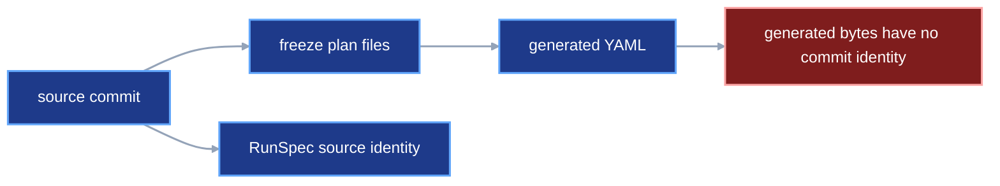

# Frozen plan Git identity

## 1. Status

**Contract status:** audited; owner approval pending.

These requirements bind the contract to the master checklist:

| ID | Implementation obligation |
| --- | --- |
| FPG-01 <!-- contract-requirement: FPG-01 phase=6 test=tests/test_authoring.py --> | Return every generated path, including named run and benchmark paths, from `viper.authoring.freeze()`. |
| FPG-02 <!-- contract-requirement: FPG-02 phase=6 test=tests/test_preflight.py --> | Establish `HEAD` as the plan commit and require every generated plan document to exist there. |
| FPG-03 <!-- contract-requirement: FPG-03 phase=6 test=tests/test_preflight.py --> | Keep project callables and Python definitions bound to `RunSpec.source.commit`. |
| FPG-04 <!-- contract-requirement: FPG-04 phase=6 test=tests/test_verification.py --> | Persist the plan commit in `ResolvedRun.spec` and use it during terminal verification. |
| FPG-05 <!-- contract-requirement: FPG-05 phase=6 test=tests/test_benchmark_execution.py --> | Load and verify the selected benchmark through the candidate run's plan commit. |

The current runner requires the frozen run document to exist in Git before
execution. It calls the current `HEAD` the plan commit and stores that commit
in `ResolvedRun.spec`. Terminal verification already uses that reference for
the run and stage documents. Python authoring now proposes that
`viper.authoring.freeze()` also generate the experiment, variant, and benchmark
documents. This contract completes the Git boundary for the whole generated
plan.

## 2. Required claim

VIPER executes the exact canonical plan files that the user commits after
`viper.authoring.freeze()`. VIPER binds those generated files to one plan commit. It
binds project code, parameter classes, artifact loaders, transports, and metric
implementations to the separate source commit declared by
`RunSpec.source.commit`.

The two commits answer different questions:

```text
source commit
-> which project code and Python definitions did the plan freeze?

plan commit
-> which generated YAML files did the runner execute?
```

The durable guarantee starts at the plan commit. `FrozenPlanFiles` lets the
caller inspect the generated files before committing them. VIPER later proves
the committed bytes and their execution. Precommit versions remain outside the
recorded provenance boundary.

## 3. Current gap

Hold one Python-authored training run fixed.

```text
current HEAD is source commit S
-> viper.authoring.freeze() writes generated plan files
-> execution.run() starts from the generated run path
```

The generated files first appear in the working tree after commit `S`. The
current attempt executor requires the run file to exist in `HEAD`, calls that
revision the plan commit, and stores it in `ResolvedRun.spec`. Terminal stage
verification already reads stage documents through that reference. Two gaps
remain:

1. Preflight checks stage-document digests against the working files. It omits
   the corresponding plan-commit lookup.
2. Experiment, variant, and benchmark verification reads generated documents
   from `RunSpec.source.commit`. Those documents belong to the plan commit.

See [`preflight_plan()`](../../src/viper/preflight.py),
[`execute_attempt()`](../../src/viper/execution/_attempt.py),
[`verify_experiment_and_variant()`](../../src/viper/_verification/plan.py), and
the [benchmark executor](../../src/viper/execution/_benchmark.py).

The missing connector is one complete rule for every document generated after
the source commit. The proposed example otherwise runs uncommitted plan bytes
or asks the source commit for files created later.

Placing the plan commit inside `RunSpec` creates a self-reference because that
commit includes the serialized `RunSpec`.

### Current DAG



### Proposed-change DAG


### Integrated DAG


## 4. Models

`RunSpec.source` keeps its existing meaning. It identifies project source.
The later plan commit identifies generated plan documents.

`viper.authoring.freeze()` returns named paths for the two files used directly by later
public calls:

```python
class FrozenPlanFiles(BaseModel):
    model_config = ConfigDict(extra="forbid", frozen=True)

    run: RunSpec
    files: tuple[Path, ...] = Field(min_length=1)
    run_spec_path: Path
    benchmark_spec_path: Path | None = None
```

`files` contains every generated experiment, variant, benchmark, stage, and run
document written by this freeze operation. `run_spec_path` occurs in `files`.
A present `benchmark_spec_path` also occurs in `files`. Independently published
`ArtifactPointer` documents stay outside this Git file set; frozen stage specs
carry their `ResolvedArtifactPointerRef` values.

The active-to-target field changes are:

| Active field | Target disposition |
| --- | --- |
| `FrozenPlanFiles.run` | Retain. |
| `FrozenPlanFiles.files` | Retain and require at least one path. |
| `FrozenPlanFiles.run_spec_path` | Add the exact path consumed by run execution. |
| `FrozenPlanFiles.benchmark_spec_path` | Add the optional exact path consumed by benchmark execution. |

The terminal run keeps the existing exact reference:

```python
class ResolvedRunSpecRef(ResolvedFileRef):
    kind: Literal["run_spec"] = "run_spec"
```

For a Git-backed plan, its location is:

```python
ResolvedRunSpecRef(
    sha256=run_document_sha256,
    bytes=run_document_bytes,
    stored_at=GitFileRef(
        repository=run.source.repository,
        commit=plan_commit,
        path=run_spec_relative_path,
    ),
)
```

The public freeze signature remains:

```python
def freeze(
    plan: RunPlanDraft,
    *,
    root: Path | None = None,
) -> FrozenPlanFiles: ...
```

## 5. Execution

### Freeze

`viper.authoring.freeze()` performs these operations:

```text
require current HEAD == RunPlanDraft.source.commit
-> verify project definitions against that source commit
-> compile every canonical plan document
-> validate every destination before writing any document
-> write the complete FrozenPlanFiles.files set
-> return run_spec_path and benchmark_spec_path
```

Freeze leaves Git history unchanged. The user reviews and commits every
returned file.

### Plan commit

The user commits the generated files byte-for-byte:

```bash
git add experiments/ benchmarks/
git commit -m "Freeze tiny HTTP run"
```

The resulting `HEAD` is the plan commit. `RunSpec.source.commit` continues to
name the earlier project-source revision.

### Run

`viper.execution.run()` performs these operations before stage work:

```text
read run_spec_path
-> derive its repository-relative path
-> read the same path from HEAD
-> require byte equality
-> call HEAD the plan commit
-> load generated experiment, variant, benchmark, and stage documents from
   that plan commit
-> verify each recorded digest and byte count
-> load project definitions from RunSpec.source.commit
-> execute the plan
```

After execution, VIPER stores the plan commit in
`ResolvedRun.spec.stored_at.commit`. The terminal verifier uses that commit for
generated plan documents. It continues to use `RunSpec.source.commit` for
project definitions.

The benchmark executor reads the benchmark specification from the plan commit
stored in `ResolvedRun.spec`. Project definitions continue to come from
`RunSpec.source.commit`.

## 6. Persisted evidence

The plan commit stores:

```text
ExperimentSpec
VariantSpec
BenchmarkSpec, when present
every generated stage Spec
RunSpec
```

`ResolvedRunSpecRef` stores the run document's path, digest, byte count, and plan
commit. The run document stores `GitSource`, whose commit identifies project
source. Together they preserve both identities and avoid a self-reference.

## 7. Verification

| Rule | Executable condition |
| --- | --- |
| `plan.files.complete` <!-- verifier-rule: plan.files.complete requirement=FPG-01 --> | Freezing returns every generated path, including named run and benchmark paths. |
| `plan.commit.head` <!-- verifier-rule: plan.commit.head requirement=FPG-02 --> | Preflight identifies `HEAD` as the plan commit and finds every generated plan document there. |
| `plan.callable.commit` <!-- verifier-rule: plan.callable.commit requirement=FPG-03 --> | Project callables and Python definitions resolve from `RunSpec.source.commit`. |
| `run.plan.commit` <!-- verifier-rule: run.plan.commit requirement=FPG-04 --> | `ResolvedRun.spec` preserves the plan commit used by terminal verification. |
| `benchmark.plan.commit` <!-- verifier-rule: benchmark.plan.commit requirement=FPG-05 --> | Benchmark execution and verification load the selected benchmark from the candidate run's plan commit. |

### `plan.git_identity`

Before execution, the working run document must equal the file at the same path
in `HEAD`. A missing or changed file stops preflight.

### `plan.document_identity`

Every `RunStageRef` path, digest, and byte count must match the stage document
in the plan commit. The experiment, variant, and benchmark documents loaded for
the run must also come from that commit and match their frozen identities.

### `source.git_identity`

Every project implementation, custom parameter class, artifact loader, custom
transport, and metric implementation must match its byte-addressed reference in
`RunSpec.source.commit`.

### `benchmark.plan_identity`

The benchmark document must come from the same plan commit as
`ResolvedRun.spec`. Its parsed value must equal the benchmark selected by the
verified run plan.

## 8. Propagation and legacy cleanup

| Surface | Required change |
| --- | --- |
| Freeze result | Add `run_spec_path` and `benchmark_spec_path` to `FrozenPlanFiles`; keep the complete `files` manifest. |
| Public example | Stop reconstructing generated paths. Commit `FrozenPlanFiles.files`, then pass the named paths to run and benchmark execution. |
| Preflight | Establish the plan commit from `HEAD` and load every generated plan document from it. |
| Source checks | Keep project code and Python-definition lookup on `RunSpec.source.commit`. |
| Terminal evidence | Store the plan commit in `ResolvedRun.spec.stored_at`. |
| Run verification | Reconstruct generated plan documents from `ResolvedRun.spec.stored_at.commit`. |
| Benchmark execution | Fetch `BenchmarkSpec` from the candidate run's plan commit. |
| CLI and API | Report that execution requires committed frozen files; return the named freeze paths. |
| Tests | Add plan-commit cases to [`tests/test_preflight.py`](../../tests/test_preflight.py), [`tests/test_run_execution.py`](../../tests/test_run_execution.py), [`tests/test_verification.py`](../../tests/test_verification.py), and [`tests/test_benchmark_execution.py`](../../tests/test_benchmark_execution.py). |
| Legacy cleanup | Replace every lookup that uses `RunSpec.source.commit` for a generated experiment, variant, benchmark, stage, or run document. Retain that commit for project definitions. |

## 9. Acceptance cases
<!-- contract-worked-example: start -->

### Success

Commit project code as `S`. Run `viper.authoring.freeze()`. Commit every returned file as
`P`. Execute `frozen.run_spec_path`.

```python
from pathlib import Path

from viper.authoring import freeze
from viper.references import GitFileRef


frozen = freeze(plan, root=Path.cwd())
stored_at = GitFileRef(
    repository=frozen.run.source.repository,
    commit=plan_commit,
    path=frozen.run_spec_path.as_posix(),
)
resolved_spec = ResolvedRunSpecRef(
    sha256=run_document_sha256,
    bytes=run_document_bytes,
    stored_at=stored_at,
)

assert frozen.run_spec_path in frozen.files
assert resolved_spec.stored_at.commit == plan_commit
```

The test asserts:

```text
RunSpec.source.commit == S
ResolvedRun.spec.stored_at.commit == P
all generated plan documents are fetched from P
all project definitions are fetched from S
```

### Rejection: plan is uncommitted

Run `viper.authoring.freeze()` and preserve every generated byte. Start execution before
the Git commit. `plan.git_identity` rejects the run because `HEAD` lacks the
run document.

### Rejection: source changes after freezing

Commit the plan, then change one decorated stage implementation in the working
tree. `source.git_identity` rejects the run because the working source differs
from `RunSpec.source.commit`.

### Rejection: verifier uses the wrong commit

Place different benchmark bytes at the same path in the source and plan
commits. `benchmark.plan_identity` requires the plan-commit bytes and rejects
the source-commit version.

<!-- contract-worked-example: end -->

## 10. Implementation order

1. Add the two named paths to `FrozenPlanFiles` and update freeze tests.
2. Make preflight establish one plan commit from `HEAD` and verify every
   generated document against it.
3. Keep project-definition checks on `RunSpec.source.commit`.
4. Store the plan commit in `ResolvedRunSpecRef` and use it during terminal
   verification.
5. Change experiment, variant, and benchmark lookup to use the plan commit.
6. Update the complete Python-authoring example with the explicit Git step.
7. Add the success case and three targeted rejections.
