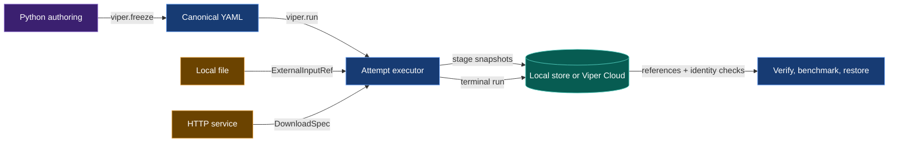

# VIPER contract implementation guide

Start with Phase 1. It preserves current local behavior while creating the
publication boundary required by every later phase.

This document is the build reference for VIPER's approved development
contracts. It explains the target system, records the cross-contract review,
orders the implementation, and names every source, test, and documentation
surface that must change.

## 1. Terminal outcome

The work is complete when a user can write one Python experiment, freeze it,
run it, verify it, benchmark it, and restore its artifacts.

The authoring program uses decorated stage and metric functions:

```python
training = viper.stage(
    train_model,
    params=TrainParams(...),
    inputs={"dataset": downloaded.artifacts["dataset"]},
    artifacts={
        Train.MODEL: viper.file_artifact(...),
        Train.STATE: viper.file_artifact(...),
    },
    objective=viper.min(training_loss),
    metrics=(gradient_norm,),
)

experiment = viper.experiment(
    experiment_id="tiny_http",
    factors=...,
    variants=...,
    replicates=...,
)

run = viper.plan(
    run_id="01ARZ3NDEKTSV4RRFFQ69G5FAV",
    experiment=experiment,
    variant="baseline",
    replicate="replicate_01",
    source=source,
    environment=environment,
    reproducibility=reproducibility,
)

frozen = viper.freeze(run)
result = viper.run(frozen.run)
```

`viper.freeze()` writes canonical YAML. Execution and verification consume that
YAML. The Git commit records the Python authoring program that produced it.

The same frozen run can publish immutable evidence locally or directly to
Viper Cloud:

```toml
[storage]
destination = "local"
```

```toml
[storage]
destination = "viper://machina/weekend_models"
```

Cloud publication streams stage files from their working paths and bypasses
`.viper/store`.

## 2. What the system does

VIPER separates four jobs.

1. Python authoring lets the user connect functions, inputs, artifacts,
   metrics, variants, replicates, and benchmarks.
2. Freezing turns those Python objects into closed protocol records.
3. Execution turns external bytes and stage outputs into immutable evidence.
4. Verification follows the stored references and checks the recorded bytes,
   code, parameters, metrics, and graph relationships.



One downloaded dataset crosses the system like this:

```text
HttpRequestSpec
-> runner performs the request
-> ResolvedHttpRetrieval records request and response evidence
-> ResolvedSingleFileArtifact names the same response body as stage output
-> both records share one SnapshotFileRef
-> FutureInputRef selects it in the same run
-> StoredInputRef selects it from a completed run
-> a consuming stage receives a normal Path
```

One local dataset crosses the shorter route:

```text
FileInputDraft
-> ExternalInputRef records the selected source
-> runner copies the bytes to an attempt-owned input path
-> consuming stage reads that path
-> runner checks the file again
-> ResolvedExternalInputRef identifies it inside the stage snapshot
```

## 3. Contract ownership

| Contract | Status | Owns |
| --- | --- | --- |
| [Module privacy](module-privacy.md) | Implemented | Public modules, shared internal names, and private-module checks |
| [Download retrieval artifacts](download-retrieval-artifacts.md) | Approved; pending | Runner-owned downloads and the shared HTTP-body artifact |
| [External input roots](external-input-roots.md) | Approved; pending | Local root capture, HTTP root evidence, and input-edge meaning |
| [Unified metric drafting](unified-metric-drafting.md) | Approved; pending | Metrics, objectives, diagnostics, experiments, variants, replicates, and benchmarks |
| [Automatic input resolution](automatic-input-resolution.md) | Approved; pending | Python stage authoring and compilation of local, same-run, and prior-run inputs |
| [Direct Viper Cloud publication](remote-storage.md) | Approved; pending | Destination-neutral publication, cloud references, retrieval, and restore |

The contracts share models. One contract owns each shared decision:

| Shared decision | Owner |
| --- | --- |
| HTTP receipt and artifact share one file | Download retrieval artifacts |
| HTTP root is `ResolvedHttpRetrieval` | External input roots |
| Local root is `ResolvedExternalInputRef` | External input roots |
| Stage input edge is `ExternalInputRef`, `FutureInputRef`, or `StoredInputRef` | External input roots |
| Draft input compiles to one of those three edges | Automatic input resolution |
| Metric role comes from `objective=` or `metrics=` | Unified metric drafting |
| Artifact draft paths are relative to the selected run root | Automatic input resolution |
| Immutable location comes from the configured destination | Direct Viper Cloud publication |

## 4. Specification-system review

The review compared all six contracts with the current source, tests, protocol
reference, public API, CLI, and generated project.

### 4.1 Schema gate

All 71 Python contract blocks parse. Repeated target classes have matching
field names, types, and defaults.

The review found and repaired these schema conflicts:

| Conflict | Repair |
| --- | --- |
| `MetricKind` mixed stage location with metric role | Remove it. `objective=` and `metrics=` record role; `MetricMode` records timing. |
| `ArtifactDraft.path` contained one run ID inside a reusable variant | Make it relative to the selected run root. Freezing writes the full `ArtifactSpec.path`. |
| Built-in parameter classes lacked a byte-addressed `ParameterModelRef` | Add `ParameterModelRef.owner` and resolve the source under the project or installed VIPER package root. |
| Local root evidence used a standalone file while the worker read a mutable source | Give the worker an attempt-owned copy and include it in the consuming-stage snapshot. |
| `publish_resolved_files()` returned positional results | Return a map keyed by publication path. |

### 4.2 Value-lifecycle gate

| Value | Declaration | Frozen record | Runtime record | Verifier or consumer |
| --- | --- | --- | --- | --- |
| Local dataset | `FileInputDraft` | `ExternalInputRef` | `ResolvedExternalInputRef` plus stage snapshot | Stage worker and local-root verifier |
| HTTP dataset | `HttpRequestSpec` plus file artifact draft | `DownloadSpec` | `ResolvedHttpRetrieval` and `ResolvedSingleFileArtifact` sharing one file | Download verifier and later input compiler |
| Same-run artifact | `StageDraft.artifacts[name]` | `FutureInputRef` | `ResolvedFutureInputRef` | Materializer and input verifier |
| Prior-run artifact | `RunArtifactDraft` | Published `ArtifactPointer` plus `StoredInputRef` | `ResolvedStoredInputRef` | Materializer, lineage, and pointer verifier |
| Metric | Decorated callable plus `MetricDraft` | `MetricSpec` | `Measurement` and, for recomputation, `MetricExecutionReceipt` | Metric verifier and benchmark |
| Objective | `MetricObjectiveDraft` | `MetricObjectiveSpec` | Final objective measurement | Stage and experiment verifier |
| Variant | `VariantDraft` | `VariantSpec` and selected stage specs | Selected run attempt | Experiment verifier |
| Replicate | `ReplicateDraft` | `ReplicateSpec` and `RunSpec.seed` | Runtime RNG evidence | Run verifier |
| Stage files | Artifact drafts and captured local inputs | `SnapshotFileRef` values | `StageResultSnapshot` | `RunFetcher`, verifier, restore |
| Independent file | Generated document | Owning `ResolvedFileRef` subtype | `LocalFileRef` or `ViperCloudFileRef` | `RunFetcher`, verifier, restore |
| Terminal run | `RunPlanDraft` | `RunSpec` | `ResolvedRun` plus `ResolvedRunRef` | Verify, benchmark, lineage, restore |

Every row has one declaring input, one persisted identity, and one reader.

### 4.3 Behavioral gate

The contracts now agree on these branch rules:

```text
local source
-> ExternalInputRef

same-run stage artifact
-> FutureInputRef

completed-run stage artifact
-> StoredInputRef

downloaded bytes
-> ResolvedHttpRetrieval root
-> same-named ResolvedSingleFileArtifact
-> FutureInputRef or StoredInputRef at a later consumer
```

Training requires a live objective. Evaluation requires a recomputed objective.
Embedding may declare either kind of objective or omit one. Any project-owned
stage can add diagnostics through `metrics=`. A runner-owned download can add
recomputed diagnostics.

A benchmark records every selected metric under fixed data and split inputs.
Criteria add optional thresholds. An empty criteria tuple produces a verified
result.

### 4.4 Verifier gate

Every new claim has a named rejection or acceptance boundary:

| Claim | Detecting rule or acceptance case |
| --- | --- |
| HTTP receipt and artifact identify the same bytes | `download.receipt_artifact_identity` |
| Worker read the captured local file | `input.local_root_identity` |
| Same-run producer precedes consumer | `input.source.order` |
| Prior-run pointer names verified provenance | `input.pointer.identity` and `input.pointer.provenance` |
| Objective was measured | `metric.objective.evidence` |
| Recomputed metric used the frozen class and values | `metric.recompute.invocation_binding` |
| Variant levels match frozen stage parameters | `experiment.variant.parameters` |
| Benchmark records and matches each selected metric | `benchmark.metric.result` and `benchmark.metric.match` |
| Cloud terminal graph is portable | `storage.graph_reachability` |
| Restored bytes match published bytes | SHA-256 and byte-count checks before final move |

### 4.5 Propagation gate

The review traced each changed model through constructors, serializers,
workers, verifiers, CLI handlers, tests, examples, and protocol documentation.
The code-change ledger in Section 18 is the complete propagation map.

### 4.6 Counterexamples

Each contract has one case that must fail:

| Contract | Counterexample |
| --- | --- |
| Download retrieval artifacts | The transport body changes after receipt validation and before snapshot publication. |
| External input roots | The attempt-owned local input changes while the worker runs. |
| Unified metric drafting | Two stages use one metric ID with different parameter values. |
| Automatic input resolution | A same-run input selects an artifact from a later stage. |
| Direct Viper Cloud publication | A cloud terminal run reaches one `LocalFileRef`. |
| Module privacy | A second module imports a leading-underscore symbol. |

## 5. Dependency order

```text
Phase 1 -> Phase 2 -> Phase 3
Phase 1 -> Phase 4
Phase 2 + Phase 4 -> Phase 5 -> Phase 6
Phase 3 + Phase 6 -> Phase 7 -> Phase 8 -> Phase 9 -> Phase 10 -> Phase 11
```

Phases 2 and 4 may occur on separate branches after Phase 1. The pair-coding
sequence in this document keeps one active branch and completes them in order.

## 6. Pair-coding protocol

For each checkbox group:

1. Read the outcome and the first test.
2. Try the edit before opening the hint.
3. Open Hint 1 for the owner and data flow.
4. Open Hint 2 for the exact symbols.
5. Run the focused test.
6. Inspect the diff.
7. Commit at the stated boundary.

Each pair-coding turn changes one bounded behavior. The user writes the code.
Codex inspects the live file, explains the next edit, and chooses the next test
from the observed result.

## 7. Phase 1 — destination-neutral local publication

**Depends on:** Module-privacy work already implemented.

**Contract:** [Direct Viper Cloud publication](remote-storage.md)

**Outcome:** Current local runs produce the same bytes and references through a
new publisher boundary. Cloud implementation begins in Phase 9.

### 7.1 Local publication interface

- [ ] Add `LocalStorageDestination`, `ViperCloudDestination`,
      `StorageDestination`, and `StorageSettings` as closed configuration
      models. Runtime selection remains local in this phase.
- [ ] Add `PublicationSource = bytes | Path`.
- [ ] Add `SnapshotPublisher.publish()` with `resolved_stage_path`,
      `resolved_stage`, and `files`.
- [ ] Implement `LocalSnapshotPublisher` by reading validated paths and calling
      `LocalArtifactStore.snapshot()`.
- [ ] Add `publish_resolved_files()` and return
      `dict[RepoRelPath, ResolvedFileRef]`.
- [ ] Add one local publisher factory or constructor used by the attempt
      executor.

<details>
<summary>Hints</summary>

**Hint 1:** Keep `LocalArtifactStore` unchanged. Wrap it.

**Hint 2:** Keep publication routing separate from retrieval routing. This phase
changes publication calls and preserves every current local reference.

</details>

### 7.2 Replace direct local calls

- [ ] Change `execution/_attempt.py` to obtain a publisher once per attempt.
- [ ] Replace the direct stage `store.snapshot()` call with
      `snapshot_publisher.publish()`.
- [ ] Replace direct standalone `store.resolved_files()` calls in
      `execution/_publication.py` with `publish_resolved_files()`.
- [ ] Keep `LocalArtifactStore.fetch()` and local snapshot retrieval working.

<details>
<summary>Hints</summary>

**Hint 1:** Start with a protocol and one local implementation. A local run
must remain byte-for-byte compatible.

**Hint 2:** The executor already has `resolved_raw` and each artifact path.
Stop constructing the complete `dict[str, bytes]` there. Pass paths to the
publisher.

**Hint 3:** Select a standalone publication result by its path key. Avoid
`references[0]` and scans over `stored_at.path`.

</details>

### 7.3 Focused proof

- [ ] Extend `tests/test_storage.py` for destination parsing, union round trips,
      mapping-return publication, and local snapshot compatibility.
- [ ] Update protocol fixtures in `tests/test_protocol.py`.
- [ ] Run:

```bash
python -m pytest tests/test_storage.py tests/test_protocol.py -q
```

**Commit boundary:** `Add destination-neutral local publication`

## 8. Phase 2 — runner-owned download stages

**Depends on:** Phase 1.

**Contracts:** [Download retrieval artifacts](download-retrieval-artifacts.md),
[external roots](external-input-roots.md)

**Outcome:** A successful HTTP request produces one receipt and one same-named
single-file artifact. Both records identify one snapshot file.

### 8.1 Frozen and resolved models

- [ ] Move `implementation` and `parameter_model` from `BaseSpec` to
      `ParameterizedSpec` in `src/viper/stages.py`.
- [ ] Make `DownloadSpec` inherit `BaseSpec` directly.
- [ ] Require equal `DownloadSpec.inputs` and `DownloadSpec.artifacts` keys.
- [ ] Require every download artifact to be `SingleFileArtifactSpec`.
- [ ] Move project invocation fields from `ResolvedBaseSpec` to
      `ResolvedParameterizedSpec`.
- [ ] Keep `ResolvedDownloadSpec` runner-owned.
- [ ] Change `ResolvedHttpRetrieval.body` to `SnapshotFileRef`.
- [ ] Require `retrievals[name].body == artifacts[name].file`.
- [ ] Delete `parameters.Download`, `DownloadContext`, `DownloadVariantStageParams`,
      `@download_stage`, and their exports.

<details>
<summary>Hints</summary>

**Hint 1:** The runner owns the download stage. The selected HTTP transport is
its sole callable.

**Hint 2:** Keep both resolved maps. The retrieval contains request and response
facts. The artifact supplies the ordinary stage-output interface.

**Hint 3:** Build the one `SnapshotFileRef` first. Put the same object in the
receipt and artifact.

</details>

### 8.2 Execution

- [ ] Change `execution/_materialization.py:retrieve_download_inputs()` to
      write each verified body directly at its frozen artifact path.
- [ ] Remove the separate retrieval-body path from `src/viper/paths.py`.
- [ ] Remove download worker invocation from `execution/_attempt.py`.
- [ ] Construct `ResolvedDownloadSpec` in the runner after retrieval.
- [ ] Publish the resolved stage document and each unique body path once.
- [ ] Remove download handling from `_workers/stages.py`.
- [ ] Add the HTTP receipt-artifact verifier in `_verification/attempt.py`.

### 8.3 Focused proof

- [ ] Update `tests/test_http_retrieval.py` for the shared file.
- [ ] Update `tests/test_run_execution.py` for a runner-owned download.
- [ ] Update `tests/test_execution_acceptance.py` for one snapshot copy.
- [ ] Remove callable-copy fixtures from `tests/fixtures.py` and generated
      project tests.
- [ ] Run:

```bash
python -m pytest \
  tests/test_http_retrieval.py \
  tests/test_run_execution.py \
  tests/test_execution_acceptance.py \
  tests/test_protocol.py -q
```

**Commit boundary:** `Make download stages runner owned`

## 9. Phase 3 — captured local external roots

**Depends on:** Phase 2.

**Contract:** [External input roots](external-input-roots.md)

**Outcome:** A local input keeps one byte identity from provenance capture
through stage consumption. A change fails the stage.

### 9.1 Model cleanup

- [ ] Delete `HttpSource` and `ExternalInputSource` from `src/viper/inputs.py`.
- [ ] Set both local `source` fields to `LocalSource`.
- [ ] Delete `ExternalInputRef.path`.
- [ ] Change `ResolvedExternalInputRef.file` to `SnapshotFileRef`.
- [ ] Remove the HTTP branch and HTTP helper from
      `execution/_materialization.py:resolve_inputs()`.

### 9.2 Capture and custody

- [ ] Add one `AttemptWorkspace` method that returns the capture path for
      `stage_id` and `input_name`.
- [ ] Read the local source once.
- [ ] Write it to that attempt-owned path with the synchronized file helper.
- [ ] Build `SnapshotFileRef` from the attempt-owned path.
- [ ] Give that path to the worker.
- [ ] After the worker exits, hash the path again.
- [ ] Fail `input.local_root_identity` if path, digest, or byte count changed.
- [ ] Add the captured path to `snapshot_paths` before publication.
- [ ] Verify `ResolvedExternalInputRef.file` through its enclosing
      `ResolvedStageRef.snapshot`.

<details>
<summary>Hints</summary>

**Hint 1:** The source path is provenance. The attempt-owned path is custody.

**Hint 2:** `resolve_inputs()` must return enough information for
`execute_attempt()` to add captured files to the snapshot and check them after
the worker exits.

**Hint 3:** A small `ResolvedInputMaterialization` result can carry the resolved
input map, worker path map, and captured-file map. Keep the protocol record
free of runtime-only `Path` objects.

</details>

### 9.3 Focused proof

- [ ] Extend `tests/test_run_execution.py:test_train_stage_captures_local_external_input`.
- [ ] Add a test that changes the captured file during stage execution.
- [ ] Add verifier acceptance and tamper cases.
- [ ] Run:

```bash
python -m pytest \
  tests/test_run_execution.py \
  tests/test_verification.py \
  tests/test_verification_acceptance.py -q
```

**Commit boundary:** `Bind local input bytes to stage custody`

## 10. Phase 4 — unified metric runtime and protocol

**Depends on:** Phase 1.

**Contract:** [Unified metric drafting](unified-metric-drafting.md)

**Outcome:** One configured metric can run live or after a stage. Its frozen
parameter class and values reach the calculation in both modes.

### 10.1 Definitions and drafts

- [ ] Add `PythonSourceRelPath` and `ParameterModelOwner` to
      `src/viper/_schema.py`.
- [ ] Add required `owner` to `ParameterModelRef`.
- [ ] Resolve `owner="project"` from the repository and `owner="viper"` from
      the installed package root in `_parameter/validation.py`.
- [ ] Update parameter workers and preflight checks for both owners.
- [ ] Remove `MetricKind` and the decorator's `kind=` argument from
      `src/viper/metrics.py`.
- [ ] Keep `MetricDefinition.metric_id` and `.mode`.
- [ ] Add `MetricDraft`, `MetricObjectiveDraft`, and `MetricCriterionDraft`.
- [ ] Add `viper.measure()`, `viper.min()`, `viper.max()`, `viper.at_least()`,
      and `viper.at_most()`.
- [ ] Derive the parameter class from `type(MetricDraft.params)`.
- [ ] Write a mandatory `ParameterModelRef` to `MetricSpec` and
      `MetricExecutionReceipt`.

### 10.2 Runtime delivery

- [ ] Make `MetricContext` generic over `viper.params.Metric`.
- [ ] Give it the validated parameter instance and existing dependency paths.
- [ ] Change live metric functions to receive `MetricContext` first.
- [ ] Change stateful metric constructors to receive `MetricContext`.
- [ ] Bind that context once in `MetricHandle`.
- [ ] Keep `MetricHandle.record(values)` free of parameter arguments.
- [ ] Change `_workers/metrics.py` to load the frozen parameter class and build
      the same context for recomputation.
- [ ] Compare production and verification parameter-model references.

<details>
<summary>Hints</summary>

**Hint 1:** Parameters belong in the frozen metric definition. The stage records
observations; the bound metric context supplies parameters.

**Hint 2:** Live and recomputed calculations differ in timing. They use one
context because both need the same validated parameters and named paths.

**Hint 3:** The built-in base model still gets a `ParameterModelRef` with
`owner="viper"`, `path="parameters.py"`, and `symbol="Metric"`.

</details>

### 10.3 Objectives and verification

- [ ] Add `MetricObjectiveSpec`.
- [ ] Add required objectives to `TrainSpec` and `EvaluateSpec`.
- [ ] Add an optional objective to `EmbedSpec`.
- [ ] Put the objective metric first in `metric_ids`.
- [ ] Require live mode for training objectives.
- [ ] Require recompute mode for evaluation objectives.
- [ ] Accept either mode for an embedding objective.
- [ ] Require the final objective measurement.
- [ ] Permit additional diagnostic metric IDs beside the objective in frozen
      stage specs. Phase 5 exposes them through `metrics=`.

### 10.4 Focused proof

- [ ] Expand `tests/test_metric_interface.py` for parameter delivery.
- [ ] Expand `tests/test_metric_provenance.py` for parameter identity.
- [ ] Add objective cases to `tests/test_protocol.py` and
      `tests/test_verification.py`.
- [ ] Run:

```bash
python -m pytest \
  tests/test_metric_interface.py \
  tests/test_metric_provenance.py \
  tests/test_protocol.py \
  tests/test_verification.py -q
```

**Commit boundary:** `Unify metric drafting and runtime context`

## 11. Phase 5 — Python stage, artifact, and transport drafts

**Depends on:** Phases 2 and 4.

**Contract:** [Automatic input resolution](automatic-input-resolution.md)

**Outcome:** Users construct complete stage declarations in Python. They stop
writing stage YAML by hand.

### 11.1 Public names

- [ ] Add `src/viper/keys.py`.
- [ ] Define `Train.MODEL = "model"` and `Train.STATE = "state"`.
- [ ] Define `Eval.MODEL = "model"`, `Eval.TEST = "test"`, and
      `Eval.PREDS = "preds"`.
- [ ] Replace private constants in `src/viper/_schema.py`.
- [ ] Change validators, workers, tests, fixtures, and docs to the new values.
- [ ] Export `viper.keys` and `viper.params` from `src/viper/__init__.py`.

### 11.2 Decorators and declarations

- [ ] Add `@viper.build(params=...)`, `@viper.embed(params=...)`,
      `@viper.train(params=...)`, and `@viper.evaluate(params=...)`.
- [ ] Retain the attached `StageDefinition` and source verification.
- [ ] Change `@viper.http_transport` to use optional `params=`.
- [ ] Add `viper.transport()` for a configured custom transport.
- [ ] Add `RunArtifactPath` validation.
- [ ] Add `SingleFileArtifactDraft` and `BundleArtifactDraft`.
- [ ] Add `viper.file_artifact()` and the bundle constructor.
- [ ] Add `BuiltinHttpTransportSpec | CustomHttpTransportDraft` authoring.

### 11.3 Stage drafts

- [ ] Replace `StageDraft(stage_id, spec_source)` with `StageDraft(spec)`.
- [ ] Add `BaseSpecDraft`, `InternalSpecDraft`, `BuildSpecDraft`,
      `EmbedSpecDraft`, `TrainSpecDraft`, and `EvaluateSpecDraft`.
- [ ] Add `objective` and `metrics` fields to the applicable stage drafts and
      compile them into `MetricObjectiveSpec` and `metric_ids`.
- [ ] Add runner-owned `DownloadSpecDraft` and `viper.download()`.
- [ ] Add `viper.stage()` for a decorated project callable.
- [ ] Add private `StageDraftArtifactRef` values returned by
      `StageDraft.artifacts`.
- [ ] Derive stage kind and parameter class from the decorator.
- [ ] Validate every draft while retaining each callable as an in-memory Python
      object.

<details>
<summary>Hints</summary>

**Hint 1:** A draft may hold Python objects. A frozen spec may hold only closed,
serialized protocol values.

**Hint 2:** `StageDraft.artifacts[name]` needs the producer object and artifact
name. The plan mapping supplies the producer's stage ID later.

**Hint 3:** Prefix `ArtifactDraft.path` only during freezing. Reusing a variant
for a second replicate must leave the draft unchanged.

</details>

### 11.4 Focused proof

- [ ] Rewrite `tests/test_authoring.py` around Python drafts.
- [ ] Add decorator and key tests to `tests/test_public_api.py`.
- [ ] Add two-run path compilation to `tests/test_protocol.py`.
- [ ] Run:

```bash
python -m pytest \
  tests/test_authoring.py \
  tests/test_public_api.py \
  tests/test_protocol.py -q
```

**Commit boundary:** `Add Python stage and artifact drafting`

## 12. Phase 6 — experiments, variants, replicates, and freezing

**Depends on:** Phase 5.

**Contracts:** [Unified metric drafting](unified-metric-drafting.md),
[automatic input resolution](automatic-input-resolution.md)

**Outcome:** One experiment owns reusable variant graphs and replicate seeds.
The plan mapping supplies stage IDs.

### 12.1 Draft graph

- [ ] Add `FactorDraft`, `VariantDraft`, `ReplicateDraft`, and
      `ExperimentDraft` to `src/viper/experiments.py` or a dedicated authoring
      module re-exported there.
- [ ] Add `viper.factor()`, `viper.variant()`, `viper.replicate()`, and
      `viper.experiment()`.
- [ ] Put `levels`, `stages`, and `estimator` on each `VariantDraft`.
- [ ] Put seeds on `ReplicateDraft`.
- [ ] Change `RunPlanDraft` to hold one experiment and selected variant and
      replicate IDs.
- [ ] Add `viper.plan()`.

### 12.2 Compiler

- [ ] Replace YAML-backed `freeze_run_plan()` input with `RunPlanDraft`.
- [ ] Keep canonical serialization and exact-file writes.
- [ ] Derive `RunSpec.experiment_id`, `variant_id`, `replicate_id`, and seed.
- [ ] Derive stage IDs from `VariantDraft.stages` keys.
- [ ] Prefix each draft artifact path with the selected run root.
- [ ] Derive `VariantSpec.stage_params` from project-owned stages only.
- [ ] Derive the experiment metric registry from every variant stage.
- [ ] Reject two configured calculations sharing one metric ID.
- [ ] Keep each variant's estimator inside its own stage graph.
- [ ] Return `FrozenPlanFiles` with the generated paths.

<details>
<summary>Hints</summary>

**Hint 1:** Compile all metric definitions for the experiment, then compile only
the selected variant's stage and run files.

**Hint 2:** Use object identity to map a private stage-output handle back to one
key in the selected variant's `stages` mapping.

**Hint 3:** Freeze one baseline variant twice with different run and replicate
IDs. The two concrete artifact paths must differ.

</details>

### 12.3 Focused proof

- [ ] Add factor, level, variant, and replicate cases to
      `tests/test_authoring.py`.
- [ ] Add cross-variant metric collision and estimator rejection cases.
- [ ] Add two-replicate path isolation.
- [ ] Run:

```bash
python -m pytest \
  tests/test_authoring.py \
  tests/test_protocol.py \
  tests/test_preflight.py -q
```

**Commit boundary:** `Compile experiments and reusable variants`

## 13. Phase 7 — automatic input compilation

**Depends on:** Phases 3 and 6.

**Contracts:** [Automatic input resolution](automatic-input-resolution.md),
[external input roots](external-input-roots.md)

**Outcome:** The user assigns one Python value to an input slot. Freezing writes
the correct provenance edge.

### 13.1 Draft values

- [ ] Add `FileInputDraft` and `viper.file_input()`.
- [ ] Add `RunArtifactDraft` and `viper.run_artifact()`.
- [ ] Define `StageInputDraft = FileInputDraft | StageDraftArtifactRef |
      RunArtifactDraft`.
- [ ] Accept `StageInputDraft` in internal stage drafts.

### 13.2 Compilation

- [ ] Compile `FileInputDraft` to `ExternalInputRef`.
- [ ] Compile a handle from an earlier selected stage to `FutureInputRef`.
- [ ] Load and verify a completed `ResolvedRun` for `RunArtifactDraft`.
- [ ] Locate the selected resolved stage and artifact.
- [ ] Build `ArtifactPointer` with the terminal run and selected artifact.
- [ ] Serialize and publish the pointer through `publish_resolved_files()`.
- [ ] Store the returned `ResolvedArtifactPointerRef` in `StoredInputRef`.
- [ ] Reject missing stages, missing artifacts, future producers, role mismatch,
      and a pointer whose producer graph is unreachable from cloud mode.
- [ ] Update `ResolvedInternalSpec` validation for the new pointer reference.

<details>
<summary>Hints</summary>

**Hint 1:** The input-map key names the consumer slot. The selected value carries
the source identity and data role.

**Hint 2:** `StoredInputRef.pointer` points to the pointer document. The pointer
document points to the terminal run and artifact. Verify both layers.

**Hint 3:** Keep explicit frozen `InputRef` support only as a private or harness
mode. The ordinary API accepts drafts.

</details>

### 13.3 Focused proof

- [ ] Add local, same-run, and prior-run cases to `tests/test_authoring.py`.
- [ ] Add stage-order and missing-artifact rejections.
- [ ] Extend `tests/test_run_execution.py` through actual materialization.
- [ ] Extend pointer and lineage verification tests.
- [ ] Run:

```bash
python -m pytest \
  tests/test_authoring.py \
  tests/test_run_execution.py \
  tests/test_verification.py \
  tests/test_verification_acceptance.py -q
```

**Commit boundary:** `Compile artifact handles into provenance inputs`

## 14. Phase 8 — benchmark drafting and complete results

**Depends on:** Phase 7.

**Contract:** [Unified metric drafting](unified-metric-drafting.md)

**Outcome:** A benchmark records metric results under fixed data and split
conditions. Thresholds remain optional.

### 14.1 Models and authoring

- [ ] Add `BenchmarkDraft` and `viper.benchmark()`.
- [ ] Accept a prior-run evaluation dataset and named split drafts.
- [ ] Add `BenchmarkSpec.metric_ids`.
- [ ] Make `BenchmarkSpec.criteria` optional.
- [ ] Add `BenchmarkMetricResult`.
- [ ] Attach an optional `MetricCriterionResult` to each metric result.
- [ ] Define status as `verified`, `passed`, or `failed` by the contract table.
- [ ] Add the benchmark draft to `RunPlanDraft` and freeze it canonically.

### 14.2 Execution and verification

- [ ] Change `execution/_benchmark.py` to iterate all selected metric IDs.
- [ ] Read candidate and confirmation verification receipts.
- [ ] Record both values and comparator match.
- [ ] Apply a criterion only when one exists for that metric ID.
- [ ] Keep artifact parity as an independent requirement.
- [ ] Update `_verification/plan.py`, `_verification/metrics.py`, and
      `verification.py` for the new result shape.

### 14.3 Focused proof

- [ ] Expand `tests/test_benchmark_execution.py` with:
      one verified benchmark whose criteria tuple is empty, one passed
      threshold, one failed threshold, and one metric mismatch.
- [ ] Add freeze tests in `tests/test_authoring.py`.
- [ ] Run:

```bash
python -m pytest \
  tests/test_benchmark_execution.py \
  tests/test_authoring.py \
  tests/test_verification.py -q
```

**Commit boundary:** `Record complete benchmark metric results`

## 15. Phase 9 — direct Viper Cloud publication

**Depends on:** Phase 8.

**Contract:** [Direct Viper Cloud publication](remote-storage.md)

**Outcome:** Cloud-backed runs publish every immutable payload directly. Local
publication remains the default.

### 15.1 Client and publisher

- [ ] Parse `[storage].destination`; an absent table selects local publication.
- [ ] Add `ViperCloudFileRef` and `ViperCloudStageResultSnapshotRef`.
- [ ] Rename `StageResultSnapshotRef` to
      `HuggingFaceStageResultSnapshotRef`.
- [ ] Expand `StorageRef` and `StageResultSnapshot` unions.
- [ ] Add the `ViperCloudClient` protocol with `upload`, `seal`, `fetch`, and
      `list_files`.
- [ ] Add an in-memory client for contract tests.
- [ ] Add `ViperCloudSnapshotPublisher`.
- [ ] Compute the existing deterministic revision from paths, digests, and
      sizes.
- [ ] Upload each unique path once.
- [ ] Seal the complete manifest before returning a reference.
- [ ] Add bounded transfer and seal retries against the same revision.
- [ ] Create references only after seal succeeds.

### 15.2 Route every immutable file

- [ ] Stage invocation receipts.
- [ ] Generated artifact pointers.
- [ ] Attempt journal.
- [ ] Measurements.
- [ ] Metric verification receipts.
- [ ] Logs.
- [ ] Attempt documents.
- [ ] Terminal resolved run.
- [ ] Benchmark result.
- [ ] Stage snapshots containing resolved stage documents, artifacts, HTTP
      bodies, and captured local inputs.

### 15.3 Retrieval and graph checks

- [ ] Extend `RunFetcher` for `ViperCloudFileRef` and cloud stage snapshots.
- [ ] Extend `_verification/storage.py` fetch and list dispatch.
- [ ] Apply digest and byte-count checks after every cloud fetch.
- [ ] Add run-level destination binding under `.viper/workspaces/<run-id>/`.
- [ ] Reject a destination change before stage work.
- [ ] Walk the terminal graph before cloud terminal publication.
- [ ] Reject every reachable local immutable reference.
- [ ] Add `resolved_run_ref` to `RunResult`.
- [ ] Add `result_ref` to `BenchmarkExecutionResult`.

<details>
<summary>Hints</summary>

**Hint 1:** First make the in-memory cloud client pass all storage tests. The
production HTTP adapter depends on the external service API.

**Hint 2:** A working artifact may remain local. Every persisted immutable
reference inside a cloud terminal graph must use cloud, Hugging Face, or Git
storage.

**Hint 3:** `ResolvedStageRef` appears after a successful seal. The active
publisher may retry a failed seal. A later process may rerun the stage;
cross-process stage resumption belongs to a future contract.

</details>

### 15.4 Focused proof

- [ ] Add cloud references and fake-service cases to `tests/test_storage.py`.
- [ ] Add direct-cloud run cases to `tests/test_execution_acceptance.py`.
- [ ] Add standalone evidence coverage.
- [ ] Add graph reachability and destination-change rejection cases.
- [ ] Run:

```bash
python -m pytest \
  tests/test_storage.py \
  tests/test_execution_acceptance.py \
  tests/test_execution_signals.py \
  tests/test_verification_acceptance.py \
  tests/test_benchmark_execution.py -q
```

**External owner action:** Define the production Viper Cloud endpoint,
authentication exchange, error mapping, and service-side seal semantics.

**Commit boundary:** `Publish immutable evidence directly to Viper Cloud`

## 16. Phase 10 — artifact restore

**Depends on:** Phase 9.

**Contract:** [Direct Viper Cloud publication](remote-storage.md#104-restore)

**Outcome:** The user can restore every artifact, one artifact, or a list.

### 16.1 Restore engine

- [ ] Add a parser for local terminal paths and immutable Viper Cloud run URIs.
- [ ] Load and verify `ResolvedRunRef` before parsing `ResolvedRun`.
- [ ] Select the successful attempt.
- [ ] Resolve selectors in `<stage-id>.<artifact-name>` form.
- [ ] Expand bundle selectors to their members.
- [ ] Validate all output paths before retrieval.
- [ ] Fetch into temporary files.
- [ ] Check SHA-256 digest and byte count.
- [ ] Atomically move verified files into place.
- [ ] Treat an existing exact file as already restored.
- [ ] Reject an existing different file before writing any destination.

### 16.2 Public interface

- [ ] Add `viper restore <run-reference>` to `src/viper/cli.py`.
- [ ] Parse `--artifacts` as one list of selectors.
- [ ] Let `--output` name an exact file only for one single-file artifact.
- [ ] Require `--output` to be a directory for all artifacts, a bundle, or a
      list.
- [ ] Add the matching typed operation in `src/viper/api.py` and
      `_api/handlers.py`.

### 16.3 Focused proof

- [ ] Add local and cloud restore tests.
- [ ] Cover all, one file, one bundle, and a list.
- [ ] Cover exact existing output and conflicting output.
- [ ] Cover a tampered remote object.
- [ ] Run:

```bash
python -m pytest tests/test_storage.py tests/test_cli.py tests/test_api.py -q
```

**Commit boundary:** `Restore complete runs and selected artifacts`

## 17. Phase 11 — public workflow and system gate

**Depends on:** Phases 1–10.

**Contracts:** All.

**Outcome:** The generated project and README teach the same API that the
package executes.

### 17.1 Generated project

- [ ] Rewrite `src/viper/project_init.py` around Python authoring.
- [ ] Generate four project-owned stage decorators and one runner-owned
      download declaration.
- [ ] Generate complete parameters, metrics, diagnostics, loaders, transport,
      experiment, variant, replicate, run, and benchmark declarations.
- [ ] Use `Train` and `Eval` keys.
- [ ] Use run-relative artifact draft paths.
- [ ] Remove `parameters.Download`, `DownloadContext`, and `download_stage`.
- [ ] Make the generated project freeze, execute, verify, benchmark, and
      restore its example.

### 17.2 Public documentation

- [ ] Replace manual YAML authoring in `README.md`.
- [ ] Update `docs/tutorials/getting-started.md`.
- [ ] Update `docs/explanation/how-viper-works.md`.
- [ ] Update `docs/reference/api.md`.
- [ ] Update `docs/reference/protocol.md` with every final model and alias.
- [ ] Update `docs/reference/versioning.md` if alpha compatibility language
      changes.
- [ ] Update `docs/README.md` and release evidence.
- [ ] Remove all retired sync, offload, `HttpSource`, download callable,
      `MetricKind`, and old key references.

### 17.3 Full validation

- [ ] Run the protocol/documentation gate.
- [ ] Run `make check`.
- [ ] Run `make check-integration`.
- [ ] Run `make check-release`.
- [ ] Build the distributions.
- [ ] Install the wheel into a clean environment.
- [ ] Run the generated project from the installed wheel.
- [ ] Record any required live CUDA evidence.

```bash
python -m pytest \
  tests/test_documentation.py \
  tests/test_protocol.py \
  tests/test_validation_architecture.py -q
make check
make check-integration
make check-release
```

**Commit boundary:** `Publish the Python-authored VIPER workflow`

## 18. Complete code-change ledger

This ledger prevents a local implementation from leaving another reader on the
old contract.

| Path | Required work | Phase |
| --- | --- | --- |
| `src/viper/_schema.py` | New parameter-source path scalar; replace old stage-key constants | 4, 5 |
| `src/viper/keys.py` | Add `Train` and `Eval` enums | 5 |
| `src/viper/parameters.py` | Owner-aware `ParameterModelRef`; delete `Download`; public alias support | 2, 4 |
| `src/viper/references.py` | Cloud refs, snapshot rename, union changes | 9 |
| `src/viper/storage.py` | Destinations, publishers, independent publication, cloud client | 1, 9 |
| `src/viper/artifacts.py` | Drafts, run-relative paths, pointer compatibility | 5, 7 |
| `src/viper/artifact_loaders.py` | Replace old fixed artifact keys in loader validation | 5 |
| `src/viper/inputs.py` | Remove HTTP source; local snapshot ref; stored pointer change | 3, 7 |
| `src/viper/http.py` | Shared body ref; optional transport params; custom transport draft | 2, 5 |
| `src/viper/stages.py` | Runner-owned download hierarchy; objectives; draft decorators; key validation | 2, 4, 5 |
| `src/viper/metrics.py` | Remove kind; drafts; context; parameter identity; objectives | 4 |
| `src/viper/experiments.py` | Remove download params; add factor, variant, replicate, experiment drafts | 2, 6 |
| `src/viper/benchmark.py` | Draft, metric IDs, optional criteria, complete results | 8 |
| `src/viper/authoring.py` | Replace YAML draft loading with graph compiler | 5–8 |
| `src/viper/runs.py` | Input/pointer relationships and terminal cloud references | 7, 9 |
| `src/viper/workspace.py` | Captured input paths and destination binding | 3, 9 |
| `src/viper/paths.py` | Remove separate retrieval body path | 2 |
| `src/viper/preflight.py` | Runner-owned download checks, owner-aware parameter refs, and compiled input order | 2, 4, 7 |
| `src/viper/inspection.py` | Render renamed snapshot and result references | 2, 9 |
| `src/viper/execution/_materialization.py` | Runner download output; local capture; stored materialization | 2, 3, 7 |
| `src/viper/execution/_stage.py` | New keys; captured-input post-check | 3, 5 |
| `src/viper/execution/_resolution.py` | New resolved hierarchy and objectives | 2, 4 |
| `src/viper/execution/_attempt.py` | Publisher use; runner download; captures; cloud destination | 1–4, 9 |
| `src/viper/execution/_metric.py` | Typed context and mandatory parameter ref | 4 |
| `src/viper/execution/_benchmark.py` | Complete metric-result loop | 8, 9 |
| `src/viper/execution/_publication.py` | Destination-neutral independent files | 1, 9 |
| `src/viper/execution/_recovery.py` | Destination-neutral failed-attempt closure | 1, 9 |
| `src/viper/execution/_source.py` | Cloud file and snapshot routing | 9 |
| `src/viper/execution/_run.py` | Return terminal refs; restore entry point | 9, 10 |
| `src/viper/execution/results.py` | `resolved_run_ref` and benchmark `result_ref` | 9 |
| `src/viper/_workers/stages.py` | Remove download; new keys; metric context | 2, 4, 5 |
| `src/viper/_workers/metrics.py` | Load parameter ref and build metric context | 4 |
| `src/viper/_workers/parameters.py` | Resolve owner-aware parameter-model references | 4 |
| `src/viper/_workers/artifacts.py` | Consume concrete frozen artifact paths produced by the draft compiler | 5, 6 |
| `src/viper/_parameter/validation.py` | Resolve project and VIPER owners | 4 |
| `src/viper/_verification/attempt.py` | Download equality, local root, objective evidence | 2–4 |
| `src/viper/_verification/plan.py` | Draft-derived graph, keys, objectives, pointers, benchmarks | 4–8 |
| `src/viper/_verification/metrics.py` | Parameter binding and complete benchmark metrics | 4, 8 |
| `src/viper/_verification/storage.py` | Cloud fetch, snapshot list, restore identity | 9, 10 |
| `src/viper/verification.py` | Dispatch every new verifier rule | 2–10 |
| `src/viper/execution/__init__.py` | Export restore and updated result types | 9, 10 |
| `src/viper/api.py` | Python freeze inputs, result refs, restore operation | 5–10 |
| `src/viper/_api/__init__.py` | Export the restore operation models and handler | 10 |
| `src/viper/_api/handlers.py` | Compile drafts, return refs, restore handler | 5–10 |
| `src/viper/cli.py` | Python workflow command changes and restore arguments | 10, 11 |
| `src/viper/project_init.py` | Replace every generated legacy pattern | 11 |
| `src/viper/__init__.py` | Export new public API and remove retired names | 2, 4–10 |
| `tests/fixtures.py` | Canonical target records and complete authored graph | All pending phases |
| `tests/test_protocol.py` | Every schema, union, key, and validator | All pending phases |
| `tests/test_authoring.py` | Draft constructors and compiler | 5–8 |
| `tests/test_http_retrieval.py` | Transport and shared body identity | 2 |
| `tests/test_run_execution.py` | Downloads, local roots, same-run and prior-run inputs | 2, 3, 7 |
| `tests/test_execution_acceptance.py` | Complete local and cloud attempts | 2, 3, 9 |
| `tests/test_execution_signals.py` | Failure, retry, and durable state | 1, 9 |
| `tests/test_metric_interface.py` | Decorator, context, and live parameters | 4 |
| `tests/test_metric_provenance.py` | Recomputed receipt identity | 4 |
| `tests/test_benchmark_execution.py` | Complete results and optional criteria | 8, 9 |
| `tests/test_storage.py` | Publisher and retrieval backends | 1, 9, 10 |
| `tests/test_verification.py` | All new verifier rules | 2–10 |
| `tests/test_verification_acceptance.py` | Tamper and graph rejection cases | 2–10 |
| `tests/test_preflight.py` | Frozen graph and source checks | 5–8 |
| `tests/test_public_api.py` | Exports, decorators, keys, constructors | 4–10 |
| `tests/test_parameter_validation.py` | Project and installed-VIPER parameter-model owners | 4 |
| `tests/test_inspection.py` | New stage and attempt reference shapes | 2, 9 |
| `tests/test_api.py` | Typed operation inputs and outputs | 5–10 |
| `tests/test_api_json.py` | JSON shapes for result references and restore | 9, 10 |
| `tests/test_cli.py` | Commands, JSON results, restore syntax | 10, 11 |
| `tests/test_project_init.py` | Generated source layout | 11 |
| `tests/test_generated_project_acceptance.py` | Installed public workflow | 11 |
| `tests/test_stage_invocation.py` | New keys, objective context, and owner-aware parameter binding | 4, 5 |
| `tests/test_worker.py` | Project-stage worker after download removal and context changes | 2, 4, 5 |
| `tests/test_resume.py` | `Train.STATE` input and artifact names | 5 |
| `tests/test_process_startup.py` | Owner-aware parameter source checks | 4 |
| `tests/test_documentation.py` | Schema mirrors, links, examples, operations | 11 |
| `docs/reference/protocol.md` | Exact final serialized contract | 11 |
| `docs/reference/api.md` | Exact final Python and CLI interface | 11 |
| `docs/explanation/how-viper-works.md` | One causal execution | 11 |
| `docs/tutorials/getting-started.md` | First public run | 11 |
| `README.md` | Complete public example | 11 |

## 19. Deferred work

These items stay outside this implementation sequence:

- Harness mode with explicit `/inputs` promotion.
- Cross-provider migration or mirroring.
- Automatic publication of an older local producer graph into Viper Cloud.
- Resumable stage execution after coordinator-process loss.
- A production Viper Cloud HTTP adapter before its service contract exists.
- Agent or MCP interfaces over the finished authoring, execution, verification,
  benchmark, lineage, and restore operations.

## 20. Current position

The contracts are complete enough to begin implementation. The first missing
result is a local run that passes through `SnapshotPublisher` and
`publish_resolved_files()` while preserving its stored bytes and references.

Once Phase 1 passes, the next pair-coding turn begins Phase 2 with the
`BaseSpec` and `DownloadSpec` inheritance change.

## Implementation sources

- [Current authoring compiler](../../src/viper/authoring.py)
- [Current stage protocol](../../src/viper/stages.py)
- [Current input protocol](../../src/viper/inputs.py)
- [Current metric protocol and runtime](../../src/viper/metrics.py)
- [Current local store](../../src/viper/storage.py)
- [Current attempt executor](../../src/viper/execution/_attempt.py)
- [Current verification entry point](../../src/viper/verification.py)
- [Testing guide](testing.md)
