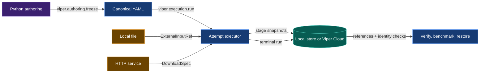

# VIPER contract implementation guide

Start with Phase 1. It preserves current local behavior while creating the
publication boundary required by every later phase.

This document is the build reference for VIPER's current development
contracts. It explains the target system, records the cross-contract review,
orders the implementation, and names every source, test, and documentation
surface that must change.

## 1. Terminal outcome

The work is complete when a user can initialize one project root, write one
Python experiment, expand its variants and replicates into concrete plans,
freeze and run them, reuse an
eligible verified stage, verify and benchmark the results, search them through
the provenance catalog, attach versioned scientific labels and controlled
comparisons, search the resulting evidence graph through a local MCP server,
and restore their artifacts.

Before implementation begins, VIPER compiles the reviewed source and contract
stack into a deterministic system impact graph. Every later phase closes only
after its candidate diff reaches the implementation, verifier, test, contract,
and checklist surfaces reported by that graph.

The authoring program uses decorated stage and metric functions:

```python
from viper import execution
from viper.artifacts import artifact
from viper.authoring import expand, experiment, freeze, plan, stage
from viper.catalog import MeasurementQuery, catalog
from viper.knowledge import knowledge
from viper.metrics import min


training = stage(
    train_model,
    params=TrainParams(...),
    inputs={"dataset": downloaded.artifacts["dataset"]},
    artifacts={
        Train.MODEL: artifact(...),
        Train.STATE: artifact(...),
    },
    objective=min(training_loss),
    metrics=(gradient_norm,),
)

study = experiment(
    experiment_id="tiny_http",
    factors=...,
    variants=...,
    replicates=...,
)

run = plan(
    run_id="01ARZ3NDEKTSV4RRFFQ69G5FAV",
    experiment=study,
    variant="baseline",
    replicate="replicate_01",
    stages={
        "download": downloaded,
        "train": training,
    },
    source=source,
    env=env,
    reproducibility=reproducibility,
    benchmark=benchmark,
)

frozen = freeze(run)
```

The same experiment can produce every selected run:

```python
plans = expand(
    study,
    run_ids={
        "baseline": {
            "replicate_01": "01ARZ3NDEKTSV4RRFFQ69G5FAV",
            "replicate_02": "01ARZ3NDEKTSV4RRFFQ69G5FAW",
        },
    },
    benchmark=benchmark,
    source=source,
    env=env,
    reproducibility=reproducibility,
)

frozen_runs = tuple(freeze(item) for item in plans)
```

`freeze()` from `viper.authoring` writes canonical YAML and returns every generated path. The
user reviews and commits those files. The resulting plan commit identifies the
YAML that VIPER executes. `RunSpec.source.commit` separately identifies the
project code and Python definitions used during freezing.

```python
if frozen.benchmark_spec_path is None:
    raise RuntimeError("the frozen plan has no benchmark")

run_result = execution.run(
    Path.cwd(),
    frozen.run_spec_path,
)

benchmark_result = execution.benchmark(
    Path.cwd(),
    run_result.resolved_run_path,
    frozen.benchmark_spec_path,
)
```

After the plan commit, bounded execution and catalog search use the same
single-run operations and immutable records:

```python
results = execution.run_many(
    Path.cwd(),
    tuple(item.run_spec_path for item in frozen_runs),
    max_concurrency=2,
)

history = catalog(root=Path.cwd())
history.refresh()
losses = history.measurements(
    MeasurementQuery(metric_ids=("test_loss",))
)
```

After verification, the same project can publish scientific labels and
evidence-backed conclusions:

```python
memory = knowledge(root=Path.cwd())
ontology_publication = memory.publish_ontology(ontology)
assignment_publication = memory.publish_assignment(model_family_assignment)
effect_publication = memory.publish_effect(test_loss_effect)
assertion_publication = memory.publish_assertion(test_loss_conclusion)

effect_ref = effect_publication.record
portable_knowledge_head = assertion_publication.manifest
```

`viper mcp --root <project>` exposes verified inspection and catalog tools.
`--access execute` adds run, retry, benchmark, batch-run, and restore tools.

The execution calls begin after every path in `frozen.files` enters the plan
commit.

The same frozen run can publish immutable evidence locally or directly to
Viper Cloud:

```toml
[storage]
destination = "local"
```

```toml
[storage]
destination = "viper://machina/weekend_models"
```

Cloud publication streams stage files from their working paths and bypasses
`.viper/store`.

## 2. What the system does

VIPER separates four jobs.

1. Python authoring lets the user connect functions, inputs, artifacts,
   metrics, variants, replicates, and benchmarks.
2. Freezing turns those Python objects into closed protocol records.
3. Execution turns external bytes and stage outputs into immutable evidence.
4. Verification follows the stored references and checks the recorded bytes,
   code, parameters, metrics, and graph relationships.



One downloaded dataset crosses the system like this:

```text
HttpRequestSpec
-> runner performs the request
-> ResolvedHttpRetrieval records request and response evidence
-> ResolvedSingleFileArtifact names the same response body as stage output
-> both records share one SnapshotFileRef
-> FutureInputRef selects it in the same run
-> StoredInputRef selects it from a completed run
-> a consuming stage receives a normal Path
```

One local dataset crosses the shorter route:

```text
ExternalInputDraft
-> ExternalInputRef records the selected source
-> runner copies the bytes to an attempt-owned input path
-> consuming stage reads that path
-> runner checks the file again
-> ResolvedExternalInputRef identifies it inside the stage snapshot
```

One development change crosses the review system like this:

```text
baseline source + fixed context
-> canonical SystemGraph

contract delta + rule declarations
-> explicit contract delta + normalized rule dependencies
-> conservative impact overlay
-> reverse dependency closure
-> SCC condensation of the affected graph
-> affected implementation, verifier, test, contract, and checklist nodes
-> selected tests cover every affected statement and branch
-> total propagation facts
-> canonical target specification
-> selected repairs packaged as SCC-ordered PairBlocks

implemented source + same fixed context
-> observed SystemGraph
-> target-constraint conformance
```

## 3. Contract ownership

| Contract | Status | Owns |
| --- | --- | --- |
| [Module privacy](module-privacy.md) | Implemented | Public modules, shared internal names, and private-module checks |
| [Contract requirement traceability](contract-requirement-traceability.md) | Draft after audit | Requirement, verifier-rule, implementation-owner, concrete-trace, and acceptance-test links |
| [Project data root](project-data-root.md) | Draft after audit | One selected root for source, protocol paths, working artifacts, and separate local immutable evidence |
| [Public module ownership](module-ownership.md) | Approved design | One defining module for API operations, verification operations, and verification types |
| [Deterministic system impact graph](system-impact-graph.md) | Audited design; implementation pending | Canonical dependency vocabulary, automatic contract-delta compilation, conservative impact overlay, SCC condensation, strict diagnostics, blast coverage, total propagation, and observed conformance |
| [Download retrieval artifacts](download-retrieval-artifacts.md) | Draft after audit | Runner-owned downloads and the shared HTTP-body artifact |
| [External input roots](external-input-roots.md) | Draft after audit | Local root capture, HTTP root evidence, and input-edge meaning |
| [Unified metric drafting](unified-metric-drafting.md) | Draft after audit | Metrics, objectives, diagnostics, experiments, variants, replicates, and benchmarks |
| [Automatic input resolution](automatic-input-resolution.md) | Draft after audit | Python stage authoring and compilation of local, same-run, and prior-run inputs |
| [Frozen plan Git identity](frozen-plan-git-identity.md) | Draft after audit | Separate source and generated-plan commits between freezing and execution |
| [Direct Viper Cloud publication](remote-storage.md) | Draft after audit | Destination-neutral publication, cloud references, retrieval, and restore |
| [Experiment expansion](experiment-expansion.md) | Draft after audit | Deterministic variant-replicate expansion and bounded multi-run execution |
| [Provenance catalog and MCP](provenance-catalog-mcp.md) | Draft after audit | Rebuildable cross-run search and a typed MCP adapter over VIPER operations |
| [Verified stage reuse](stage-reuse.md) | Draft after audit | Opt-in stage skipping with a canonical key, source evidence, and a new target snapshot |
| [Experiment knowledge primitives](experiment-knowledge-primitives.md) | Draft after audit | Versioned scientific labels, controlled comparisons, diagnostic signatures, journals, and knowledge search |
| [Research memory roadmap](research-memory-roadmap.md) | Active foundation; later research deferred | Ordered path from deterministic evidence records to learned retrieval and experiment selection |

The contracts share models. One contract owns each shared decision:

| Shared decision | Owner |
| --- | --- |
| Each contract requirement reaches named verifier rules, exact implementation owners, populated traces, and exact test functions | Contract requirement traceability |
| `viper init ROOT` selects the source, protocol, working-data, and local-state tree | Project data root |
| `.viper/store` remains a separate immutable subtree beneath the selected root | Project data root |
| Public API and verification symbols are implemented in the modules callers import | Public module ownership |
| Explicit contract operations and normalized dependencies define deterministic development impact | Deterministic system impact graph |
| SCCs of the induced affected graph are atomic; their condensation DAG constrains work ordering and later partitioning | Deterministic system impact graph |
| HTTP receipt and artifact share one file | Download retrieval artifacts |
| HTTP root is `ResolvedHttpRetrieval` | External input roots |
| Custom HTTP execution uses `@http(id=...)` from `viper.http` and `DownloadSpec.http` | Automatic input resolution |
| Local root is `ResolvedExternalInputRef` | External input roots |
| Stage input edge is `ExternalInputRef`, `FutureInputRef`, or `StoredInputRef` | External input roots |
| Draft input compiles to one of those three edges | Automatic input resolution |
| Metric role comes from `objective=` or `metrics=` | Unified metric drafting |
| Artifact draft paths are relative to the selected run root | Automatic input resolution |
| Immutable location comes from the configured destination | Direct Viper Cloud publication |
| Generated YAML identity comes from the plan commit; project definitions come from the source commit | Frozen plan Git identity |
| One experiment expands into ordinary `RunPlanDraft` values | Experiment expansion |
| A skipped stage records `StageReuseReceipt` and a new target snapshot | Verified stage reuse |
| Cross-run search rows remain derived from immutable references | Provenance catalog and MCP |
| MCP tool schemas and calls reuse typed API models and registered operations | Provenance catalog and MCP |
| Scientific labels keep declared, inferred, and reviewed origins separate | Experiment knowledge primitives |
| Controlled comparisons use verified run and measurement references | Experiment knowledge primitives |
| Exact filters run before vector ranking; exact identity or reviewed equivalence rejects a duplicate | Experiment knowledge primitives |
| Learned representations and policies begin after reviewed evidence exists | Research memory roadmap |

### 3.1 Deterministic contract coverage

Each pending contract declares stable requirement IDs with an owning phase and
focused test. The matching phase contains one requirement-level `implements`
marker and one requirement-level `verifies` marker for every ID. The contract
traceability phase adds rule-level implementation owners, exact test functions,
and populated traces. The baselines below bind this checklist to the exact
reviewed contract bytes. A contract edit requires another checklist review and
a new digest.

<!-- contract-baseline: contract-requirement-traceability.md sha256=2bf7c2512e5b3a9d993badc393c10c556e9557c16c37930fec544ea398154f72 -->

<!-- contract-baseline: project-data-root.md sha256=74acbb87c68fa1849d6bd82bafe49bb5fd367b046dd47f8a678b3c456c40f8a4 -->
<!-- contract-baseline: module-ownership.md sha256=48f0cc4dd438dd6de4ec7533cc597b42b57f38dec4ef8803bc77af4b0bba6524 -->
<!-- contract-baseline: system-impact-graph.md sha256=67bcd9150a0cb79b1339b36a4a2ba41cccd7b10148827b63873dc6788e0f9188 -->
<!-- contract-baseline: download-retrieval-artifacts.md sha256=176fde192378792f19a19b02afb7ba6c66502dc0206b1596e2030c5422d651e3 -->
<!-- contract-baseline: external-input-roots.md sha256=0666f904e5a2ed7735ddf9f71a5a33bcf2c1cd09d1e3a0994265649636182a70 -->
<!-- contract-baseline: unified-metric-drafting.md sha256=ad7ed3b8fc334bd0f1c5bb0207b90bcafc03b5f0403592b77d7bb0074c9619e1 -->
<!-- contract-baseline: automatic-input-resolution.md sha256=f4c723edccd27bdcc63c49f1ac369f16599eb45c0f7a6a193550efe106e2d29d -->
<!-- contract-baseline: frozen-plan-git-identity.md sha256=361b78746b4f72567517e1672cf2997ede22d8c107e28685ed82125df9586c84 -->
<!-- contract-baseline: remote-storage.md sha256=a38a9a743f488619acee0d55785b9689b41ec78231d8bfb03eb815f9d3fe132c -->
<!-- contract-baseline: experiment-expansion.md sha256=e8edfe2d0c1b4841aaa639b5721bb0eb5612f01d2cf30aade8813e86c2e2c9cb -->
<!-- contract-baseline: provenance-catalog-mcp.md sha256=a31636f188037e335f528c8fe52b79d5d4172e2fa34f549c5e0e8ecb8805134c -->
<!-- contract-baseline: stage-reuse.md sha256=e0b7572ab0e842cdbd24ed93b9cf6776e0abc3acfbef886d3c881d06c62ae231 -->
<!-- contract-baseline: experiment-knowledge-primitives.md sha256=4b5809bde81d46456b62e5c8e541b7bb071c793ec6c022d01f0558b13c53d0d7 -->

## 4. Specification-system review

The review compared all pending implementation contracts with the current
source, tests, protocol reference, public API, CLI, generated project, and
research roadmap.

### 4.1 Schema gate

Every Python contract block parses. Repeated target classes have matching field
names, types, and defaults.

The review found and repaired these schema conflicts:

| Conflict | Repair |
| --- | --- |
| Requirement markers reached a checklist phase and test file while leaving the named verifier rule and implementation symbol implicit | Add a canonical requirement-to-rule-to-owner-to-test graph and populated contract traces before compiling the broader system graph. |
| `viper init` selected a target while later commands independently defaulted to `Path.cwd()` | Add a root marker and resolve one explicit or discovered project root at each public operation boundary. |
| Separate architecture and documentation scans produced separate change-impact views | Compile one fixed-context typed system graph, condense cycles, and connect changes to requirements and tests. |
| `MetricKind` mixed stage location with metric role | Remove it. `objective=` and `metrics=` record role; `MetricMode` records timing. |
| `ArtifactDraft.path` contained one run ID inside a reusable variant | Make it relative to the selected run root. Freezing writes the full `ArtifactSpec.path`. |
| Built-in parameter classes lacked a byte-addressed `ParameterModelRef` | Add `ParameterModelRef.owner` and resolve the source under the project or installed VIPER package root. |
| Local root evidence used a standalone file while the worker read a mutable source | Give the worker an attempt-owned copy and include it in the consuming-stage snapshot. |
| `publish_resolved_files()` returned positional results | Return a map keyed by publication path. |
| Removing `ExternalInputRef.path` removed the worker and verifier's canonical input path | Add `captured_input_path()` and use it in materialization, worker startup, and invocation verification. |
| Metric dependencies were republished as standalone local files | Derive each `ResolvedFileRef` from the dependency's existing stage snapshot. |
| Benchmark test data was separate from the evaluation-stage inputs | Compile `BenchmarkDraft.test` and splits once and reuse their pointers in both records. |
| Freeze-time pointer publication preceded run destination binding | Bind the destination before the first immutable publication in freezing or execution. |
| A local terminal path lacked its immutable `ResolvedRunRef` | Publish the terminal as a one-file revision and derive its local reference before parsing. |
| Download custody lacked an operation whose digest covered the bytes written at the artifact path | Add `publish_download_body()` and reject an HTTP-body change before publication. |
| The public HTTP API named its request function a transport and required a separate transport constructor | Use `@http(id=...)` from `viper.http`, pass the function through `viper.authoring.download(http=...)`, rename the frozen and resolved HTTP records, and delete `viper.transport()`. |
| A repository-relative local input could escape through a symbolic link | Add `input.local_source_boundary` before capture. |
| Live metric evidence left the receipt-to-`MetricSpec` join implicit | Join the measurement, invocation metric IDs, frozen stage, and experiment registry in `metric.live.parameter_delivery`. |
| Python authoring generated plan files after the source commit, and execution searched that source commit for them | Add a separate plan commit and use it for generated documents. |
| Restore CLI behavior lacked exact Python and typed-operation models | Add one selector, result, request, success, and direct execution interface. |
| `ExperimentDraft` declared a run matrix while `viper.authoring.plan()` selected one pair | Add `viper.authoring.expand()` and keep `RunPlanDraft` as the single-run unit. |
| Every resolved project stage required an invocation | Add executed and reused completion variants plus `StageReuseReceipt`. |
| Stage reuse could select a digest from an untrusted cache | Derive candidates from the catalog and fully verify the source run before reuse. |
| Cross-run inspection lacked a source-of-truth boundary | Make the catalog rebuildable and require an immutable source reference on every result. |
| An MCP implementation could duplicate API models and operations | Generate tool schemas from typed API models and route calls through `dispatch()`. |
| Public API modules depended on private modules that imported their public types back | Move public operation bodies and verification types to their final defining modules before compiling the system graph. |
| Catalog promises exceeded its typed query fields | Add source, input, environment, artifact, and benchmark filters plus a typed benchmark query. |
| A reused completion could become the source of another reuse receipt | Restrict reuse sources to verified `ExecutedStageCompletion` records. |
| Batch timeout behavior was undefined | Forward one positive child-process timeout to each existing `execution.run()` call on every surface. |
| Scientific labels and journals lacked immutable models and verification | Add the experiment-knowledge primitive contract and publish each record through the selected storage destination. |
| Similarity search could be mistaken for duplicate proof | Run exact filters first and keep HNSW as a rebuildable ranking aid. |

### 4.2 Value-lifecycle gate

| Value | Declaration | Frozen record | Runtime record | Verifier or consumer |
| --- | --- | --- | --- | --- |
| Project root | `viper init ROOT` or explicit `root=` | Local `viper.toml` marker; absolute path omitted from protocol identity | One resolved absolute root per operation | Root resolver, path-boundary checks, local store, and every local consumer |
| System impact | Baseline repository, fixed `SystemContextManifest`, structured contract delta, rule declarations, and PairBlocks | Canonical `SystemGraph`, contract delta, impact overlay, `ImpactReport`, affected-graph condensation, `PropagationPlan`, target constraints, diagnostics, and blast-coverage report | Automatic reverse closure, SCC-safe work units, selected tests, and post-implementation `G1` conformance | Strict graph, contract, coverage, and conformance verifiers |
| Local dataset | `ExternalInputDraft` | `ExternalInputRef` | `ResolvedExternalInputRef` plus stage snapshot | Stage worker and local-root verifier |
| HTTP dataset | `HttpRequestSpec` plus file artifact draft | `DownloadSpec` | `ResolvedHttpRetrieval` and `ResolvedSingleFileArtifact` sharing one file | Download verifier and later input compiler |
| Same-run artifact | `StageDraft.artifacts[name]` | `FutureInputRef` | `ResolvedFutureInputRef` | Materializer and input verifier |
| Prior-run artifact | `RunArtifactDraft` | Published `ArtifactPointer` plus `StoredInputRef` | `ResolvedStoredInputRef` | Materializer, lineage, and pointer verifier |
| Metric | Decorated callable plus `MetricDraft` | `MetricSpec` | `Measurement` and, for recomputation, `MetricExecutionReceipt` | Metric verifier and benchmark |
| Recomputed metric dependency | `MetricDependency` | `MetricSpec.dependencies` | `ResolvedMetricDependency` derived from an enclosing stage snapshot | Metric worker and receipt verifier |
| Objective | `MetricObjectiveDraft` | `MetricObjectiveSpec` | Final objective measurement | Stage and experiment verifier |
| Variant | `VariantDraft` | `VariantSpec` and selected stage specs | Selected run attempt | Experiment verifier |
| Replicate | `ReplicateDraft` | `ReplicateSpec` and `RunSpec.seed` | Runtime RNG evidence | Run verifier |
| Stage files | Artifact drafts and captured local inputs | `SnapshotFileRef` values | `StageResultSnapshot` | `RunFetcher`, verifier, restore |
| Independent file | Generated document | Owning `ResolvedFileRef` subtype | `LocalFileRef` or `ViperCloudFileRef` | `RunFetcher`, verifier, restore |
| Terminal run | `RunPlanDraft` | `RunSpec` | `ResolvedRun` plus `ResolvedRunRef` | Verify, benchmark, lineage, restore |
| Generated plan files | `RunPlanDraft` | `FrozenPlanFiles.files` committed to Git | `ResolvedRun.spec: ResolvedRunSpecRef` with the plan commit | Preflight, run verifier, and benchmark executor |
| Restore selection | Direct Python values, discriminated typed request references, or CLI strings | `RestoreRequest` | `RestoreResult` and restored files | Python caller, typed API caller, or CLI |
| Experiment expansion | `ExperimentDraft`, filters, and `RunIdMap` | Ordered `RunPlanDraft` values | `ExperimentExecutionResult` | Python, typed API, CLI, and catalog |
| Stage reuse key | Frozen stage, resolved input files, effective environment, reproducibility, and selected metrics | `StageReuseKey` | `StageReuseReceipt` plus `ReusedStageCompletion` | Attempt verifier, lineage, comparison, and catalog |
| Catalog row | Immutable run, artifact, measurement, benchmark, or reuse reference | Derived SQLite row | Ordered query result carrying the source reference | Python, CLI, MCP, and stage-reuse lookup |
| MCP tool | Typed API request and success models | JSON Schema tool definition | `viper.api.dispatch()` result as structured content | MCP client |
| Primitive label | `PrimitiveSpec` plus authored, inferred, or reviewed assignment | Published ontology and assignment files | Effective-label catalog row | Catalog, MCP, and experiment reviewer |
| Controlled modulation | Two verified runs, primitive changes, and one comparison context | Published `Modulation` | `EffectEstimate` and optional `ImpactAssessment` | Verifier, catalog, and journal |
| Diagnostic signature | Verified stage measurements | Published `DiagnosticSignature` | Exact diagnostic vector | Graph and vector search |
| Journal assertion | Typed claim plus immutable evidence references | Published `JournalAssertion` | Separate optional text vector | Reviewer, catalog, and MCP |

Every row has one declaring input, one persisted identity, and one reader.

### 4.3 Behavioral gate

The contracts now agree on these branch rules:

```text
local source
-> ExternalInputRef

same-run stage artifact
-> FutureInputRef

completed-run stage artifact
-> StoredInputRef

downloaded bytes
-> ResolvedHttpRetrieval root
-> same-named ResolvedSingleFileArtifact
-> FutureInputRef or StoredInputRef at a later consumer

selected variants x selected replicates
-> ordered RunPlanDraft values
-> ordinary frozen and resolved runs

reuse="verified" and matching StageReuseKey
-> verified source run
-> StageReuseReceipt
-> new target stage snapshot

immutable terminal references
-> verified catalog rows
-> exact search results
-> typed API or MCP consumer

verified experiments and measurements
-> versioned primitive assignments
-> controlled modulation and paired effect
-> diagnostic signature or journal assertion
-> exact graph filters
-> optional vector ranking
```

Training requires a live objective. Evaluation requires a recomputed objective.
Embedding may declare either kind of objective or omit one. Any project-owned
stage can add diagnostics through `metrics=`. A runner-owned download can add
recomputed diagnostics.

A benchmark records every selected metric under fixed data and split inputs.
Criteria add optional thresholds. An empty criteria tuple produces a verified
result.

### 4.4 Verifier gate

Every new claim has a named rejection or acceptance boundary:

| Claim | Detecting rule or acceptance case |
| --- | --- |
| Every local operation uses the initialized root | `project.root.marker`, `project.root.stability`, and explicit-root relocation acceptance |
| Working artifacts remain separate from local immutable evidence | Publish, mutate the working artifact, and retrieve the original bytes through `LocalFileRef` |
| Development impact uses equal external inputs | `system.context.identity` and `system.delta.context` |
| Dynamic registrations remain observable outcomes | Remove one decorator and require the candidate graph to lose its `registers` edge |
| Every contract requirement reaches code and a test | `system.requirement.coverage` and graph parity with the existing documentation oracle |
| HTTP receipt and artifact identify the same bytes | `download.receipt_artifact_identity` |
| The digest covers the HTTP bytes written at the artifact path | `download.runner_custody` |
| VIPER supplied the canonical captured local path and stable bytes | `input.local_root_identity` |
| A local declaration stays within the repository boundary | `input.local_source_boundary` |
| Same-run producer precedes consumer | `input.source.order` |
| Prior-run pointer names verified provenance | `input.pointer.identity` and `input.pointer.provenance` |
| Objective was measured | `metric.objective.evidence` |
| Recomputed metric used the frozen class and values | `metric.recompute.invocation_binding` |
| A live measurement resolves through the successful invocation to one frozen metric binding | `metric.live.parameter_delivery` |
| Variant levels match frozen stage parameters | `experiment.variant.parameters` |
| Benchmark records and matches each selected metric | `benchmark.metric.result` and `benchmark.metric.match` |
| Benchmark and evaluation use identical test and split pointers | `benchmark.input.identity` |
| Freeze-time and execution-time publications use one destination | `storage.destination_stability` |
| Cloud terminal graph is portable | `storage.graph_reachability` |
| Local restore starts from an immutable terminal reference | Deterministic one-file terminal revision lookup |
| Restored artifact bytes match published bytes | SHA-256 and byte-count checks before final move |
| Generated plan files and project source use their correct Git commits | `plan.git_identity`, `plan.document_identity`, `source.git_identity`, and `benchmark.plan_identity` |
| Python, typed API, and CLI restore share one result contract | `RestoreResult` equality across all three entry points |
| Experiment expansion is deterministic | Exact pair coverage, unique run IDs, declaration order, and aggregate result order |
| A reused stage matches its source | Reconstructed `StageReuseKey`, verified source run, file remapping equality, and source metric evidence |
| A catalog result remains traceable | Every result carries the immutable source reference and rebuild equality holds after database deletion |
| An MCP call preserves the owning operation | MCP input schema equals the request schema and structured content validates as the success model or `ViperFailure` |
| A scientific assignment names valid evidence | Its ontology version, primitive, target run, and target entity all verify |
| A paired effect matches its measurements | The verifier reloads each measurement and recomputes direction, pair values, mean, error, and interval |
| A journal conclusion cites existing evidence | Every reference resolves to the record type declared by `JournalEvidence.kind` |
| A similarity result stays within its declared view | Exact filters run first; vector dimensions, source type, and view identity verify before ranking |

### 4.5 Propagation gate

The review traced each changed model through constructors, serializers,
workers, verifiers, CLI handlers, tests, examples, and protocol documentation.
The code-change ledger in Section 25 is the complete propagation map.

### 4.6 Counterexamples

Each contract has one case that must fail:

| Contract | Counterexample |
| --- | --- |
| Project data root | A child-directory command uses `Path.cwd()` as a second root, or a symlink escapes the selected root before capture. |
| Deterministic system impact graph | A candidate removes a decorator while the comparison incorrectly fixes the old registry output, or strict review proceeds with an unresolved environment input. |
| Download retrieval artifacts | The HTTP result body changes after receipt validation and before artifact publication. |
| External input roots | A local source path escapes through a symlink, the parent supplies a different workspace file than `captured_input_path()`, or the captured file changes while the worker runs. |
| Unified metric drafting | A live receipt selects different metric IDs, a metric dependency creates a second payload publication, two stages use one metric ID with different parameters, or benchmark test pointers differ from evaluation inputs. |
| Automatic input resolution | A same-run input selects an artifact from a later stage, freezing publishes a pointer before binding the run destination, or execution starts before generated files enter the plan commit. |
| Frozen plan Git identity | The verifier loads a generated benchmark from the source commit; `benchmark.plan_identity` requires the plan commit. |
| Direct Viper Cloud publication | A cloud terminal run reaches one `LocalFileRef`, local restore parses a changed working terminal file after immutable revision lookup fails, or the three restore surfaces return different file sets. |
| Experiment expansion | A missing pair silently disappears, a duplicate run ID reaches freezing, or completion order changes the aggregate result order. |
| Verified stage reuse | A catalog digest match skips execution after an input, environment, metric, source run, artifact file, or benchmark-confirmation relationship changed. |
| Provenance catalog and MCP | A derived row loses its immutable source reference, a tampered run remains searchable as verified, or an MCP tool bypasses its typed API handler. |
| Experiment knowledge primitives | An assignment names an unknown primitive, an effect changes a source measurement value, a journal evidence kind mismatches its file, or HNSW distance alone rejects an experiment. |
| Module privacy | A second module imports a leading-underscore symbol. |

## 5. Dependency order

```text
Phase 0 -> Phase 1
Phase 1 -> Phase 2 -> Phase 3
Phase 1 -> Phase 4
Phase 2 + Phase 4 -> Phase 5 -> Phase 6
Phase 3 + Phase 6 -> Phase 7 -> Phase 8 -> Phase 9 -> Phase 10 -> Phase 11
Phase 11 -> Phase 12 -> Phase 13 -> Phase 14 -> Phase 15
Phase 15 -> Phase 16 -> Phase 17 -> Phase 18
```

Phase 0 first establishes contract traceability and the root used by every
later local path. It then gives public API and verification symbols one owner
before compiling those relationships into the system graph. Phases 2 and 4 may
occur on separate branches after Phase 1. The pair-coding sequence in this
document keeps one active branch and completes them in order.

## 6. Pair-coding protocol

The [contract traceability Phase 0 pair-coding
guide](contract-traceability-phase-0-pair-coding.md) owns every `P0-CRT` block
and `P0-PROOF-01` through `P0-PROOF-04`. The
[Phase 0 pair-coding reference](phase-0-pair-coding.md) owns the project-root
and module work. The [SystemGraph Phase 0 and Phase 1 pair-coding
guide](system-impact-phase-0-1-pair-coding.md) owns every `P0-SIG`,
`P0-PROOF-09` through `P0-PROOF-12`, and `P1-SIG` block. Every marked checkbox
resolves to one block containing requirements, prerequisites, targets, tests,
and a completion gate.

For each checkbox group:

1. Read the outcome and the first test.
2. Try the edit before opening the hint.
3. Open Hint 1 for the owner and data flow.
4. Open Hint 2 for the exact symbols.
5. Run the focused test.
6. Inspect the diff.
7. Commit at the stated boundary.

Each pair-coding turn changes one bounded behavior. The user writes the code.
Codex inspects the live file, explains the next edit, and chooses the next test
from the observed result.

## 7. Phase 0 — traceability, project root, module ownership, and system impact

**Depends on:** Module-privacy work already implemented.

**Contracts:** [Contract requirement traceability](contract-requirement-traceability.md),
[project data root](project-data-root.md),
[public module ownership](module-ownership.md), and
[deterministic system impact graph](system-impact-graph.md)

**Outcome:** Every contract requirement has a named rule, exact implementation
owner, populated trace, and exact test. `viper init ROOT` creates the complete
protocol tree and every later local operation resolves that same root. Public
API and verification imports then identify their defining modules. VIPER can
compile that stable source tree under one fixed context, publish canonical
dependency graphs, and return the exact affected requirements and observing
tests before later phases change code.

### 7.1 Contract requirement traceability

- [ ] Add the exact traceability models and parsers in
      `src/viper/_contract_traceability.py`; compile current requirement rows
      and verifier-rule markers into canonical declarations.
      <!-- pair-block: P0-CRT-01 -->
      <!-- implements: CRT-01 -->
      <!-- contract-implementation: requirement=CRT-01 rule=contract.requirement.unique state=planned owner=src/viper/_contract_traceability.py:compile_contract_traceability -->
      <!-- contract-implementation: requirement=CRT-01 rule=contract.rule.declared state=planned owner=src/viper/_contract_traceability.py:compile_contract_traceability -->
- [ ] Resolve every rule to one exact source owner and at least one exact test
      function; reject missing files, symbols, and phase mismatches.
      <!-- pair-block: P0-CRT-02 -->
      <!-- implements: CRT-02 -->
      <!-- contract-implementation: requirement=CRT-02 rule=contract.rule.implemented state=planned owner=src/viper/_contract_traceability.py:compile_contract_traceability -->
      <!-- contract-implementation: requirement=CRT-02 rule=contract.rule.tested state=planned owner=src/viper/_contract_traceability.py:compile_contract_traceability -->
- [ ] Parse `toml contract-trace` blocks and marked worked examples. Require
      current, proposed-change, and integrated DAGs; reject placeholders,
      unresolved source locations, unconstructed Section 4 models, missing
      success cases, and missing rejection cases.
      <!-- pair-block: P0-CRT-03 -->
      <!-- implements: CRT-03 -->
      <!-- contract-implementation: requirement=CRT-03 rule=contract.trace.populated state=planned owner=src/viper/_contract_traceability.py:parse_contract_traces -->
      <!-- contract-implementation: requirement=CRT-03 rule=contract.example.complete state=planned owner=src/viper/_contract_traceability.py:validate_contract_example -->
      <!-- contract-implementation: requirement=CRT-03 rule=contract.diagram.palette state=implemented owner=tests/test_documentation.py:test_contract_traceability_dags_use_semantic_palette -->
      <!-- contract-implementation: requirement=CRT-03 rule=contract.model.matches_runtime state=implemented owner=tests/test_documentation.py:test_contract_traceability_model_block_matches_runtime -->
      <!-- contract-implementation: requirement=CRT-03 rule=contract.model.documented state=implemented owner=tests/test_documentation.py:test_contract_traceability_schema_describes_every_field -->
- [ ] Apply the three-DAG and complete worked-example format to each remaining
      pending contract. Extend the documentation test from
      `PHASE_ZERO_CONTRACTS` to `IMPLEMENTATION_CONTRACTS` before Phase 0
      closes.
      <!-- pair-block: P0-CRT-04 -->
- [ ] Serialize one ordered `ContractTraceabilityGraph` and compare its
      requirement and phase coverage with the current documentation oracle.
      <!-- pair-block: P0-CRT-05 -->
      <!-- implements: CRT-04 -->
      <!-- contract-implementation: requirement=CRT-04 rule=contract.graph.canonical state=planned owner=src/viper/_contract_traceability.py:compile_contract_traceability -->
      <!-- contract-implementation: requirement=CRT-04 rule=contract.graph.complete state=planned owner=src/viper/_contract_traceability.py:compile_contract_traceability -->

<details>
<summary>Hints</summary>

**Hint 1:** Preserve the current requirement, checklist, and baseline parsers as
the migration oracle. Add rule-level links beside them.

**Hint 2:** Use `tomllib` for populated trace blocks. Resolve Python symbols
through the AST. Resolve Markdown requirement and rule symbols through their
stable marker IDs.

**Hint 3:** Compile the traceability graph before the broader system graph. The
system graph consumes its ownership links directly.

</details>

#### Pair-coding blocks

The following blocks define the complete CRT-01 through CRT-04 implementation
sequence. Read all six before starting. Apply one block per pair-coding cycle,
inspect the saved code, and run the named check before advancing.

##### Block 1 — requirement rows

**File:** `src/viper/_contract_traceability.py`

Add `re`, `dataclass`, and `Path` imports. Add
`ContractTraceabilityError`, `_RequirementMarker`, and
`_parse_requirement_markers()` after the persisted models.

```python
class ContractTraceabilityError(ValueError):
    """Report an invalid or incomplete contract traceability declaration."""


@dataclass(frozen=True)
class _RequirementMarker:
    """Retain one requirement row plus its temporary legacy fields."""

    requirement: ContractRequirement
    phase: int
    test_path: str


_REQUIREMENT_ROW = re.compile(
    r"^\| (?P<label>[A-Z]{3}-\d{2}) "
    r"<!-- contract-requirement: (?P<requirement>[A-Z]{3}-\d{2}) "
    r"phase=(?P<phase>\d+) test=(?P<test>tests/[a-z0-9_/]+\.py) -->",
    re.MULTILINE,
)


def _parse_requirement_markers(
    root: Path,
    contract: Path,
) -> tuple[_RequirementMarker, ...]:
    """Parse every requirement row declared by one contract."""
    contract_path = contract.relative_to(root).as_posix()
    markers: list[_RequirementMarker] = []

    for match in _REQUIREMENT_ROW.finditer(contract.read_text()):
        label = match.group("label")
        requirement_id = match.group("requirement")
        if label != requirement_id:
            raise ContractTraceabilityError(
                f"requirement label {label} does not match {requirement_id}"
            )

        markers.append(
            _RequirementMarker(
                requirement=ContractRequirement(
                    requirement_id=requirement_id,
                    contract=contract_path,
                ),
                phase=int(match.group("phase")),
                test_path=match.group("test"),
            )
        )

    if not markers:
        raise ContractTraceabilityError(
            f"{contract_path} declares no contract requirements"
        )

    requirement_ids = [
        marker.requirement.requirement_id for marker in markers
    ]
    duplicate_ids = sorted(
        requirement_id
        for requirement_id in set(requirement_ids)
        if requirement_ids.count(requirement_id) > 1
    )
    if duplicate_ids:
        raise ContractTraceabilityError(
            f"duplicate requirements in {contract_path}: {duplicate_ids}"
        )

    return tuple(
        sorted(
            markers,
            key=lambda marker: marker.requirement.requirement_id,
        )
    )
```

The table-row anchor excludes the illustrative standalone marker from the
requirement set. Keep `_CONTRACT_REQUIREMENT` in
`tests/test_documentation.py` unchanged as the migration oracle.

**Check:** compile `src/viper/_contract_traceability.py` in `mantra`.

##### Block 2 — verifier rules

**File:** `src/viper/_contract_traceability.py`

Add `_VERIFIER_RULE_ROW` and `_parse_verifier_rules()`. The row parser must:

1. require the visible table label to equal the marker's `rule_id`;
2. construct `VerifierRule` with the contract's repository-relative path;
3. reject duplicate `rule_id` values;
4. reject a rule whose `requirement_id` is absent from that contract; and
5. require every requirement to own at least one rule.

```python
_VERIFIER_RULE_ROW = re.compile(
    r"^\| `(?P<label>[a-z][a-z0-9_.]+)` "
    r"<!-- verifier-rule: (?P<rule>[a-z][a-z0-9_.]+) "
    r"requirement=(?P<requirement>[A-Z]{3}-\d{2}) --> "
    r"\| (?P<statement>.+?) \|$",
    re.MULTILINE,
)


def _parse_verifier_rules(
    root: Path,
    contract: Path,
    requirements: tuple[_RequirementMarker, ...],
) -> tuple[VerifierRule, ...]:
    """Parse and join every verifier-rule row in one contract."""
    contract_path = contract.relative_to(root).as_posix()
    requirement_ids = {
        marker.requirement.requirement_id for marker in requirements
    }
    rules: list[VerifierRule] = []

    for match in _VERIFIER_RULE_ROW.finditer(contract.read_text()):
        label = match.group("label")
        rule_id = match.group("rule")
        requirement_id = match.group("requirement")
        if label != rule_id:
            raise ContractTraceabilityError(
                f"verifier-rule label {label} does not match {rule_id}"
            )
        if requirement_id not in requirement_ids:
            raise ContractTraceabilityError(
                f"{rule_id} names unknown requirement {requirement_id}"
            )

        rules.append(
            VerifierRule(
                rule_id=rule_id,
                requirement_id=requirement_id,
                contract=contract_path,
                statement=match.group("statement"),
            )
        )

    rule_ids = [rule.rule_id for rule in rules]
    duplicate_ids = sorted(
        rule_id
        for rule_id in set(rule_ids)
        if rule_ids.count(rule_id) > 1
    )
    if duplicate_ids:
        raise ContractTraceabilityError(
            f"duplicate verifier rules in {contract_path}: {duplicate_ids}"
        )

    covered_requirements = {rule.requirement_id for rule in rules}
    uncovered_requirements = sorted(requirement_ids - covered_requirements)
    if uncovered_requirements:
        raise ContractTraceabilityError(
            "requirements without verifier rules in "
            f"{contract_path}: {uncovered_requirements}"
        )

    return tuple(sorted(rules, key=lambda rule: rule.rule_id))
```

**Check:** parse the four `PHASE_ZERO_CONTRACTS` and inspect their ordered
requirement and rule IDs.

##### Block 3 — checklist edges and Python symbols

**File:** `src/viper/_contract_traceability.py`

Add `_PHASE_HEADING`, `_RULE_EDGE_MARKER`, `_parse_repo_symbol()`,
`_python_symbols()`, `_require_python_symbol()`, and `_parse_rule_edges()`.
The checklist parser reads one current phase while scanning lines. For each
selected requirement, it constructs one `implementation` edge from `owner=`
or one `verification` edge from `test=`.

The parser must reject:

- a marker outside a phase;
- a requirement, rule, or requirement-rule join absent from the selected
  contracts;
- a checklist phase that differs from the requirement row;
- a duplicate implementation edge;
- a rule lacking an implementation edge;
- a rule lacking a verification edge; and
- an `implemented` edge whose file or qualified Python symbol is absent.

Resolve module functions and classes by their top-level names. Resolve methods
as `ClassName.method_name`. Keep planned targets unresolved because their files
or symbols may belong to later implementation blocks.

```python
def _parse_repo_symbol(value: str) -> RepoSymbolRef:
    """Split one repository path and qualified Python symbol."""
    path, separator, symbol = value.partition(":")
    if not separator or not path or not symbol:
        raise ContractTraceabilityError(
            f"source reference must use path:symbol: {value}"
        )
    return RepoSymbolRef(path=path, symbol=symbol)
```

`_parse_rule_edges()` returns edges ordered by requirement, rule, edge kind,
target path, and target symbol. Place implementation before verification for
the same rule.

**Check:** compile Phase 0 edges while every planned location remains valid;
change one implemented test symbol in a temporary checklist and require a
`ContractTraceabilityError`.

##### Block 4 — populated traces and worked examples

**File:** `src/viper/_contract_traceability.py`

Add `tomllib`, `_CONTRACT_TRACE_FENCE`, `parse_contract_traces()`, and
`validate_contract_example()`. `parse_contract_traces()` must:

- parse triple- or quadruple-backtick `toml contract-trace` fences;
- convert `implementation`, `test`, and `outcome.rejected_at` from
  `path:symbol` strings into `RepoSymbolRef`;
- validate each mapping through `ContractTrace`;
- reject duplicate trace IDs, empty values, ellipses, `TBD`, `TODO`, angle
  bracket placeholders, and fake padded hashes;
- require at least one accepted and one rejected trace per contract;
- require each trace's rule to belong to its requirement and contract; and
- resolve every source location carried by an `implemented` trace.

`validate_contract_example()` reads Section 3 and Section 4. It requires three
acyclic Mermaid DAGs in current, proposed-change, and integrated order. It then
parses the one `contract-worked-example` region and requires the example to
construct every Section 4 class, realize every type alias, and call every
Section 4 operation.

Reuse the current AST and Mermaid checks in `tests/test_documentation.py` as
the migration oracle. Move shared parsing into production after the new
functions pass parity. Keep test helpers inside the test suite.

**Check:** run the populated-trace and worked-example tests for all four Phase
0 contracts, including one omitted-trace fixture and one placeholder fixture.

##### Block 5 — canonical compiler and bytes

**File:** `src/viper/_contract_traceability.py`

Add `json`, `compile_contract_traceability()`, and
`serialize_contract_traceability()`. The compiler defaults to the four Phase
0 contracts during bootstrap and accepts explicit contract paths for fixture
tests.

```python
def serialize_contract_traceability(
    graph: ContractTraceabilityGraph,
) -> bytes:
    """Serialize one traceability graph into canonical JSON bytes."""
    return json.dumps(
        graph.model_dump(mode="json"),
        sort_keys=True,
        separators=(",", ":"),
    ).encode("utf-8")
```

`compile_contract_traceability()` performs this exact join:

```text
requirement rows
-> verifier-rule rows
-> checklist implementation and verification markers
-> populated contract traces
-> ContractTraceabilityGraph
-> canonical JSON bytes
```

Sort requirements by `requirement_id`, rules by `rule_id`, edges by the Block 3
key, and traces by `trace_id`. Reject duplicate IDs across contracts. Compare
the resulting requirement IDs, phases, and legacy test files with the current
documentation oracle before returning the graph.

**Check:** compile twice and require identical graph objects and serialized
bytes.

##### Block 6 — acceptance tests and status propagation

**File:** `tests/test_documentation.py`

Add these exact acceptance-test owners:

```python
def test_contract_rules_map_to_owners_and_tests() -> None:
    """Resolve every Phase 0 rule to one owner and one or more tests."""


def test_contract_traceability_rejects_orphan_rule() -> None:
    """Reject a verifier rule without a checklist verification edge."""


def test_contract_traces_are_populated() -> None:
    """Require accepted and rejected traces with concrete values."""


def test_contract_traceability_graph_is_canonical() -> None:
    """Produce identical complete traceability bytes on repeated compilation."""
```

Keep one connected temporary repository builder for rejected compiler cases.
Vary only the marker or symbol under test. Assert the exact rule ID or source
reference so each error identifies the failed relationship.

After the focused tests pass:

1. change the completed CRT checklist boxes to `[x]`;
2. change their precise implementation and verification markers to
   `state=implemented`;
3. compile once more so implemented-state symbol resolution checks the new
   functions themselves;
4. run the contract model parity, schema-description, prose, and complete
   documentation suites; and
5. inspect, commit, and push the complete CRT review cycle.

### 7.2 Project root

- [ ] Add `ProjectSettings`, `ProjectRootError`, `find_project_root()`, and
      `resolve_project_root()` in `src/viper/project.py`.
      <!-- pair-block: P0-PDR-01 -->
      <!-- implements: PDR-01 -->
      <!-- contract-implementation: requirement=PDR-01 rule=project.root.marker state=planned owner=src/viper/project.py:resolve_project_root -->
- [ ] Add `viper.toml`, `inputs/`, `benchmarks/`, and `experiments/` to the
      staged project scaffold in `src/viper/project_init.py`.
      <!-- pair-block: P0-PDR-02 -->
      <!-- contract-implementation: requirement=PDR-01 rule=project.root.layout state=planned owner=src/viper/project_init.py:initialize_project -->
- [ ] Route public default roots through `resolve_project_root()` and pass the
      resolved value into internal operations exactly once.
      <!-- pair-block: P0-PDR-03 -->
      <!-- contract-implementation: requirement=PDR-02 rule=project.root.git state=planned owner=src/viper/project.py:resolve_project_root -->
      <!-- contract-implementation: requirement=PDR-02 rule=project.root.stability state=planned owner=src/viper/project.py:resolve_project_root -->
- [ ] Replace CLI `--repository-root` with `--root` and keep `viper init ROOT`
      as the root-selection operation. <!-- implements: PDR-04 -->
      <!-- pair-block: P0-PDR-04 -->
      <!-- contract-implementation: requirement=PDR-04 rule=project.root.vocabulary state=planned owner=src/viper/cli.py:add_root -->
- [ ] Add `resolve_project_path()` and reject every descendant symlink, logical
      traversal, and final resolved escape before any local read, write,
      capture, publication, or restore. <!-- implements: PDR-03 -->
      <!-- pair-block: P0-PDR-06 -->
      <!-- contract-implementation: requirement=PDR-03 rule=project.path.logical_boundary state=planned owner=src/viper/project.py:resolve_project_path -->
      <!-- contract-implementation: requirement=PDR-03 rule=project.path.symlink_free state=planned owner=src/viper/project.py:resolve_project_path -->
      <!-- contract-implementation: requirement=PDR-03 rule=project.path.resolved_boundary state=planned owner=src/viper/project.py:resolve_project_path -->
- [ ] Bind `LocalArtifactStore` to `ROOT/.viper/store`; keep working artifacts
      at their protocol paths and preserve separate immutable copies.
      <!-- pair-block: P0-PDR-05 -->
      <!-- implements: PDR-02 -->
      <!-- contract-implementation: requirement=PDR-02 rule=project.store.boundary state=planned owner=src/viper/storage.py:LocalArtifactStore.__init__ -->

<details>
<summary>Hints</summary>

**Hint 1:** The root is the directory containing `viper.toml`. Keep the absolute
root path in runtime memory and outside the marker.

**Hint 2:** Resolve the root at the public operation boundary. Internal helpers
receive the resolved value. The public resolver owns parent search.

**Hint 3:** Keep `.viper/store` separate from user-visible artifact paths. One
working-file edit must leave the immutable copy retrievable.

</details>

### 7.3 Public module ownership

- [ ] Move verification errors, policies, result dataclasses, and aliases into
      `src/viper/verification/models.py` while preserving their declarations.
      <!-- pair-block: P0-MOD-01 -->
      <!-- contract-implementation: requirement=MOD-01 rule=module.verification.owner state=planned owner=src/viper/verification/models.py:VerificationPolicy -->
- [ ] Replace `src/viper/verification.py` with the public
      `src/viper/verification/__init__.py` package module. Move every public
      verification operation there and update each importer to use the defining
      operation or model module.
      <!-- pair-block: P0-MOD-02 -->
- [ ] Move every helper and operation body from `src/viper/_api/handlers.py`
      into `src/viper/api.py`. Point `HANDLER_REGISTRY` at those local
      functions, then delete the pass-through wrappers and private handler
      module. <!-- implements: MOD-01 -->
      <!-- pair-block: P0-MOD-03 -->
      <!-- contract-implementation: requirement=MOD-01 rule=module.api.owner state=planned owner=src/viper/api.py:HANDLER_REGISTRY -->

<details>
<summary>Hints</summary>

**Hint 1:** Move verification models first. Both verification operations and
API operations consume those types.

**Hint 2:** Preserve every function signature and body. This refactor changes
the defining module while behavior remains fixed.

**Hint 3:** Delete a retired module only after every direct importer points to
the new owner.

</details>

### 7.4 System graph compiler

- [ ] Add the canonical four-variant `SystemNode` union, stable planned anchors,
      normalized Python signature facts, finite role-kind matrix,
      dependent-to-dependency `SystemEdge` vocabulary, four `GraphFact`
      variants, three target-constraint operators, conformance receipts,
      evidence, dependency-site receipts, and structured diagnostics.
      <!-- implements: SIG-01, SIG-02 -->
      <!-- pair-block: P0-SIG-01 -->
      <!-- contract-implementation: requirement=SIG-01 rule=system.node.vocabulary state=planned owner=src/viper/system_graph.py:SystemNode -->
      <!-- contract-implementation: requirement=SIG-01 rule=system.edge.vocabulary state=planned owner=src/viper/system_graph.py:SystemEdge -->
      <!-- contract-implementation: requirement=SIG-01 rule=system.edge.evidence state=planned owner=src/viper/system_graph.py:SystemEdge -->
      <!-- contract-implementation: requirement=SIG-01 rule=system.signature.canonical state=planned owner=src/viper/system_graph.py:PythonSignatureFact -->
      <!-- contract-implementation: requirement=SIG-02 rule=system.diagnostics.complete state=planned owner=src/viper/system_graph.py:SystemDiagnostic -->
- [ ] Enumerate every tracked file, emit one matching analysis receipt, and
      combine AST coordinates with compiler symbol tables to classify every
      registered Python dependency site.
      <!-- pair-block: P0-SIG-02 -->
      <!-- contract-implementation: requirement=SIG-01 rule=system.inventory.complete state=planned owner=src/viper/system_graph.py:compile_system -->
      <!-- contract-implementation: requirement=SIG-01 rule=system.analysis.total state=planned owner=src/viper/system_graph.py:analyze_python -->
- [ ] Implement the Phase 0 Python extraction matrix for imports, direct calls
      and construction, inheritance, annotations, decorators, registries,
      symbol reads and writes, and exports. Emit unresolved diagnostics for
      star imports and computed targets.
      <!-- pair-block: P0-SIG-03 -->
      <!-- contract-implementation: requirement=SIG-01 rule=system.analysis.anchored state=planned owner=src/viper/system_graph.py:compile_system -->
- [ ] Compile requirements, verifier rules, rule bindings, and fenced
      contract-delta operations directly from repository documents. Lower each
      `RuleEdge` into normalized owner-to-rule or test-to-rule dependency
      edges. Parse bootstrap PairBlocks separately for work traceability.
      <!-- implements: SIG-03, SIG-04 -->
      <!-- pair-block: P0-SIG-04 -->
      <!-- contract-implementation: requirement=SIG-03 rule=system.contract.delta state=planned owner=src/viper/system_graph.py:compile_contract_delta -->
      <!-- contract-implementation: requirement=SIG-04 rule=system.requirement.coverage state=planned owner=src/viper/system_graph.py:compile_contract_delta -->
      <!-- contract-implementation: requirement=SIG-04 rule=system.rule.lowering state=planned owner=src/viper/system_graph.py:lower_rule_edges -->
      <!-- contract-implementation: requirement=SIG-04 rule=system.plan.coverage state=planned owner=src/viper/system_graph.py:compile_work -->
- [ ] Derive `S_delta` and introduced dependency pairs, then build the
      conservative impact overlay from every baseline dependency plus every
      introduced dependency. Retain removed baseline dependencies.
      <!-- pair-block: P0-SIG-05 -->
      <!-- contract-implementation: requirement=SIG-03 rule=system.impact.overlay state=planned owner=src/viper/system_graph.py:compile_impact_overlay -->
- [ ] Compute reverse reachability from `S_delta` in `H_delta` and require the
      result to be the least predecessor-closed superset of the direct support.
      <!-- pair-block: P0-SIG-06 -->
      <!-- contract-implementation: requirement=SIG-03 rule=system.impact.closure state=planned owner=src/viper/system_graph.py:compute_impact -->
- [ ] Collect stable diagnostics across inventory, extraction, contract,
      impact, SCC, and coverage phases. Reject unsupported or unresolved
      dependency sites reached by the blast in strict mode.
      <!-- pair-block: P0-SIG-07 -->
      <!-- contract-implementation: requirement=SIG-02 rule=system.graph.strict state=planned owner=src/viper/system_graph.py:compile_system -->
- [ ] Run deterministic iterative Tarjan over `H_delta[B]`; preserve typed
      crossing-edge witnesses; hash sorted component membership; and require a
      canonical, acyclic condensation order.
      <!-- pair-block: P0-SIG-08 -->
      <!-- contract-implementation: requirement=SIG-03 rule=system.dag.components state=planned owner=src/viper/system_graph.py:condense_system_graph -->
      <!-- contract-implementation: requirement=SIG-03 rule=system.dag.canonical state=planned owner=src/viper/system_graph.py:condense_system_graph -->
      <!-- contract-implementation: requirement=SIG-03 rule=system.dag.acyclic state=planned owner=src/viper/system_graph.py:condense_system_graph -->
- [ ] Validate one typed propagation disposition per affected node; compile the
      three-operator `TargetSpecification` from `(G0, Delta, P)`; and package
      selected repairs as SCC-ordered PairBlocks. Keep admissible implementation
      choices open until repair selection freezes one.
      <!-- pair-block: P0-SIG-09 -->
      <!-- contract-implementation: requirement=SIG-03 rule=system.propagation.coverage state=planned owner=src/viper/system_graph.py:verify_propagation -->
      <!-- contract-implementation: requirement=SIG-03 rule=system.propagation.additions state=planned owner=src/viper/system_graph.py:verify_propagation -->
      <!-- contract-implementation: requirement=SIG-03 rule=system.target.language state=planned owner=src/viper/system_graph.py:TargetConstraint -->
      <!-- contract-implementation: requirement=SIG-03 rule=system.target.canonical state=planned owner=src/viper/system_graph.py:compile_target_constraints -->
- [ ] Select at least one pytest node ID for every executable affected symbol.
      Run selected tests with branch measurement and test contexts; require
      complete statement and branch execution inside every affected span.
      <!-- pair-block: P0-SIG-10 -->
      <!-- contract-implementation: requirement=SIG-04 rule=system.blast.test_selection state=planned owner=src/viper/system_graph.py:select_blast_tests -->
      <!-- contract-implementation: requirement=SIG-04 rule=system.blast.statement_coverage state=planned owner=src/viper/system_graph.py:verify_blast_coverage -->
      <!-- contract-implementation: requirement=SIG-04 rule=system.blast.branch_coverage state=planned owner=src/viper/system_graph.py:verify_blast_coverage -->
- [ ] Orchestrate the strict compiler and serialize canonical graph, contract
      delta, impact, diagnostics, condensation, propagation, target-constraint,
      blast-coverage, and conformance artifacts. Recompile with shuffled input
      order and require byte equality. Emit exactly one terminal conformance
      receipt per target constraint.
      <!-- pair-block: P0-SIG-11 -->
      <!-- contract-implementation: requirement=SIG-02 rule=system.context.identity state=planned owner=src/viper/system_graph.py:compile_system -->
      <!-- contract-implementation: requirement=SIG-02 rule=system.resolution.total state=planned owner=src/viper/system_graph.py:compile_system -->
      <!-- contract-implementation: requirement=SIG-02 rule=system.graph.canonical state=planned owner=src/viper/system_graph.py:compile_system -->
      <!-- contract-implementation: requirement=SIG-02 rule=system.graph.references state=planned owner=src/viper/system_graph.py:SystemGraph -->
      <!-- contract-implementation: requirement=SIG-03 rule=system.delta.context state=planned owner=src/viper/system_graph.py:compare_observed_graph -->
      <!-- contract-implementation: requirement=SIG-03 rule=system.delta.identity state=planned owner=src/viper/system_graph.py:compare_observed_graph -->
      <!-- contract-implementation: requirement=SIG-03 rule=system.conformance.total state=planned owner=src/viper/system_graph.py:evaluate_target_conformance -->

<details>
<summary>Hints</summary>

**Hint 1:** Use the existing AST checks as oracles. Production extraction owns
the parser and receipt ledger.

**Hint 2:** `RuleEdge` is a declaration. Lower it into the canonical dependency
direction before impact traversal.

**Hint 3:** Compute SCCs on `H_delta[B]`. Preserve original edge IDs on every
crossing component edge.

</details>

### 7.5 Focused proof

- [ ] In `tests/test_public_api.py`, require every API registry callable and
      verification operation to belong to its public module; require every
      verification type to belong to `viper.verification.models`; reject both
      retired source files; and preserve existing API and verification results.
      <!-- pair-block: P0-MOD-04 -->
      <!-- verifies: MOD-01 -->
      <!-- contract-verification: requirement=MOD-01 rule=module.api.owner state=planned test=tests/test_public_api.py:test_api_operations_are_locally_defined -->
      <!-- contract-verification: requirement=MOD-01 rule=module.verification.owner state=planned test=tests/test_public_api.py:test_verification_namespace_separates_operations_and_models -->
      <!-- contract-verification: requirement=MOD-01 rule=module.api.owner state=implemented test=tests/test_documentation.py:test_module_ownership_pair_blocks_cover_every_moved_definition -->
      <!-- contract-verification: requirement=MOD-01 rule=module.verification.owner state=implemented test=tests/test_documentation.py:test_module_ownership_pair_blocks_cover_every_moved_definition -->

- [ ] In `tests/test_documentation.py`, reject duplicate requirements and
      orphan rules; require canonical declarations.
      <!-- pair-block: P0-PROOF-01 -->
      <!-- verifies: CRT-01 -->
      <!-- contract-verification: requirement=CRT-01 rule=contract.requirement.unique state=planned test=tests/test_documentation.py:test_contract_rules_map_to_owners_and_tests -->
      <!-- contract-verification: requirement=CRT-01 rule=contract.rule.declared state=planned test=tests/test_documentation.py:test_contract_rules_map_to_owners_and_tests -->
- [ ] In `tests/test_documentation.py`, reject a missing implementation symbol
      and a missing test function.
      <!-- pair-block: P0-PROOF-02 -->
      <!-- verifies: CRT-02 -->
      <!-- contract-verification: requirement=CRT-02 rule=contract.rule.implemented state=planned test=tests/test_documentation.py:test_contract_rules_map_to_owners_and_tests -->
      <!-- contract-verification: requirement=CRT-02 rule=contract.rule.tested state=planned test=tests/test_documentation.py:test_contract_rules_map_to_owners_and_tests -->
- [ ] In `tests/test_documentation.py`, reject an omitted trace, placeholder
      value, unresolved source location, missing DAG, and Section 4 model absent
      from the worked example.
      <!-- pair-block: P0-PROOF-03 -->
      <!-- verifies: CRT-03 -->
      <!-- contract-verification: requirement=CRT-03 rule=contract.trace.populated state=planned test=tests/test_documentation.py:test_contract_traces_are_populated -->
      <!-- contract-verification: requirement=CRT-03 rule=contract.example.complete state=planned test=tests/test_documentation.py:test_phase_zero_contracts_show_three_dags_and_instantiate_models -->
      <!-- contract-verification: requirement=CRT-03 rule=contract.diagram.palette state=implemented test=tests/test_documentation.py:test_contract_traceability_dags_use_semantic_palette -->
      <!-- contract-verification: requirement=CRT-03 rule=contract.model.matches_runtime state=implemented test=tests/test_documentation.py:test_contract_traceability_model_block_matches_runtime -->
      <!-- contract-verification: requirement=CRT-03 rule=contract.model.documented state=implemented test=tests/test_documentation.py:test_contract_traceability_schema_describes_every_field -->
- [ ] In `tests/test_documentation.py`, compile twice, require identical graph
      bytes, and require every rule to reach its owner and tests.
      <!-- pair-block: P0-PROOF-04 -->
      <!-- verifies: CRT-04 -->
      <!-- contract-verification: requirement=CRT-04 rule=contract.graph.canonical state=planned test=tests/test_documentation.py:test_contract_traceability_graph_is_canonical -->
      <!-- contract-verification: requirement=CRT-04 rule=contract.graph.complete state=planned test=tests/test_documentation.py:test_contract_traceability_graph_is_canonical -->

- [ ] In `tests/test_project_init.py`, initialize outside the current directory,
      discover the root from a child directory, and assert the complete tree.
      <!-- pair-block: P0-PROOF-05 -->
      <!-- verifies: PDR-01 -->
      <!-- contract-verification: requirement=PDR-01 rule=project.root.marker state=planned test=tests/test_project_init.py:test_init_project_establishes_discoverable_root -->
      <!-- contract-verification: requirement=PDR-01 rule=project.root.layout state=planned test=tests/test_project_init.py:test_init_project_establishes_discoverable_root -->
- [ ] In `tests/test_storage.py`, publish beneath the selected root, mutate the
      working artifact, retrieve the original immutable bytes, and reject an
      escaping store. In `tests/test_validation_architecture.py`, require each
      operation to resolve every selected root once. <!-- verifies: PDR-02 -->
      <!-- pair-block: P0-PROOF-06 -->
      <!-- contract-verification: requirement=PDR-02 rule=project.root.git state=planned test=tests/test_storage.py:test_store_uses_selected_project_root -->
      <!-- contract-verification: requirement=PDR-02 rule=project.store.boundary state=planned test=tests/test_storage.py:test_store_uses_selected_project_root -->
      <!-- contract-verification: requirement=PDR-02 rule=project.root.stability state=planned test=tests/test_validation_architecture.py:test_operations_resolve_project_root_once -->
- [ ] In `tests/test_validation_architecture.py`, reject descendant symlinks,
      logical traversal, and resolved path escapes.
      <!-- pair-block: P0-PROOF-07 -->
      <!-- verifies: PDR-03 -->
      <!-- contract-verification: requirement=PDR-03 rule=project.path.logical_boundary state=planned test=tests/test_validation_architecture.py:test_project_paths_reject_symlinks -->
      <!-- contract-verification: requirement=PDR-03 rule=project.path.symlink_free state=planned test=tests/test_validation_architecture.py:test_project_paths_reject_symlinks -->
      <!-- contract-verification: requirement=PDR-03 rule=project.path.resolved_boundary state=planned test=tests/test_validation_architecture.py:test_project_paths_reject_symlinks -->
- [ ] Compare root vocabulary and the protocol tree in
      `tests/test_documentation.py`. <!-- verifies: PDR-04 -->
      <!-- pair-block: P0-PROOF-08 -->
      <!-- contract-verification: requirement=PDR-04 rule=project.root.vocabulary state=planned test=tests/test_documentation.py:test_project_root_vocabulary -->
- [ ] Compare the production analyzer with the existing import/privacy AST
      oracle. Delete each expected edge in turn and require the parity or
      dependency-site-totality gate to fail.
      <!-- pair-block: P0-PROOF-09 -->
      <!-- verifies: SIG-01, SIG-02 -->
      <!-- contract-verification: requirement=SIG-01 rule=system.inventory.complete state=planned test=tests/test_validation_architecture.py:test_system_graph_inventory_and_edges_are_auditable -->
      <!-- contract-verification: requirement=SIG-01 rule=system.analysis.anchored state=planned test=tests/test_validation_architecture.py:test_system_graph_inventory_and_edges_are_auditable -->
      <!-- contract-verification: requirement=SIG-01 rule=system.analysis.total state=planned test=tests/test_validation_architecture.py:test_system_graph_ast_oracle_parity -->
      <!-- contract-verification: requirement=SIG-01 rule=system.signature.canonical state=planned test=tests/test_validation_architecture.py:test_system_target_language_is_closed -->
      <!-- contract-verification: requirement=SIG-01 rule=system.node.vocabulary state=planned test=tests/test_validation_architecture.py:test_system_graph_vocabulary_is_closed -->
      <!-- contract-verification: requirement=SIG-01 rule=system.edge.vocabulary state=planned test=tests/test_validation_architecture.py:test_system_graph_vocabulary_is_closed -->
      <!-- contract-verification: requirement=SIG-01 rule=system.edge.evidence state=planned test=tests/test_validation_architecture.py:test_system_graph_inventory_and_edges_are_auditable -->
      <!-- contract-verification: requirement=SIG-02 rule=system.context.identity state=planned test=tests/test_validation_architecture.py:test_system_graph_resolution_is_total_and_strict -->
      <!-- contract-verification: requirement=SIG-02 rule=system.resolution.total state=planned test=tests/test_validation_architecture.py:test_system_graph_resolution_is_total_and_strict -->
      <!-- contract-verification: requirement=SIG-02 rule=system.diagnostics.complete state=planned test=tests/test_validation_architecture.py:test_system_graph_diagnostics_fail_closed -->
      <!-- contract-verification: requirement=SIG-02 rule=system.graph.canonical state=planned test=tests/test_validation_architecture.py:test_system_graph_resolution_is_total_and_strict -->
      <!-- contract-verification: requirement=SIG-02 rule=system.graph.references state=planned test=tests/test_validation_architecture.py:test_system_graph_resolution_is_total_and_strict -->
      <!-- contract-verification: requirement=SIG-02 rule=system.graph.strict state=planned test=tests/test_validation_architecture.py:test_system_graph_resolution_is_total_and_strict -->
- [ ] Replay the local-store fixture and committed `model_support` to `models`
      rename. Require complete reviewed-path reproduction and source evidence
      for every additional path.
      <!-- pair-block: P0-PROOF-10 -->
      <!-- verifies: SIG-03 -->
      <!-- contract-verification: requirement=SIG-03 rule=system.dag.components state=planned test=tests/test_inspection.py:test_system_impact_reaches_local_store_consumers -->
      <!-- contract-verification: requirement=SIG-03 rule=system.dag.canonical state=planned test=tests/test_inspection.py:test_affected_graph_condensation_is_canonical -->
      <!-- contract-verification: requirement=SIG-03 rule=system.dag.acyclic state=planned test=tests/test_inspection.py:test_system_impact_reaches_local_store_consumers -->
      <!-- contract-verification: requirement=SIG-03 rule=system.contract.delta state=planned test=tests/test_inspection.py:test_contract_delta_builds_conservative_overlay -->
      <!-- contract-verification: requirement=SIG-03 rule=system.impact.overlay state=planned test=tests/test_inspection.py:test_contract_delta_builds_conservative_overlay -->
      <!-- contract-verification: requirement=SIG-03 rule=system.delta.context state=planned test=tests/test_inspection.py:test_system_impact_reaches_local_store_consumers -->
      <!-- contract-verification: requirement=SIG-03 rule=system.delta.identity state=planned test=tests/test_inspection.py:test_system_impact_reaches_local_store_consumers -->
      <!-- contract-verification: requirement=SIG-03 rule=system.impact.closure state=planned test=tests/test_inspection.py:test_system_impact_reaches_local_store_consumers -->
      <!-- contract-verification: requirement=SIG-03 rule=system.impact.closure state=planned test=tests/test_inspection.py:test_system_impact_replays_skill_manifest_rename -->
      <!-- contract-verification: requirement=SIG-03 rule=system.propagation.coverage state=planned test=tests/test_inspection.py:test_system_impact_reaches_local_store_consumers -->
      <!-- contract-verification: requirement=SIG-03 rule=system.propagation.additions state=planned test=tests/test_inspection.py:test_system_impact_reaches_local_store_consumers -->
      <!-- contract-verification: requirement=SIG-03 rule=system.target.language state=planned test=tests/test_inspection.py:test_target_compilation_is_canonical -->
      <!-- contract-verification: requirement=SIG-03 rule=system.target.canonical state=planned test=tests/test_inspection.py:test_target_compilation_is_canonical -->
      <!-- contract-verification: requirement=SIG-03 rule=system.conformance.total state=planned test=tests/test_inspection.py:test_target_conformance_is_total -->
- [ ] Require the automatic contract compiler to preserve every requirement,
      rule, owner, test, checklist task, PairBlock, target, gate, and
      prerequisite. Mutate away every declaration class and require a specific
      diagnostic. <!-- verifies: SIG-04 -->
      <!-- pair-block: P0-PROOF-11 -->
      <!-- contract-verification: requirement=SIG-04 rule=system.requirement.coverage state=planned test=tests/test_documentation.py:test_system_graph_preserves_contract_traceability -->
      <!-- contract-verification: requirement=SIG-04 rule=system.rule.lowering state=planned test=tests/test_documentation.py:test_contract_compiler_lowers_delta_and_rule_edges -->
      <!-- contract-verification: requirement=SIG-04 rule=system.plan.coverage state=implemented test=tests/test_documentation.py:test_phase_zero_checkboxes_have_complete_ordered_pair_blocks -->
      <!-- contract-implementation: requirement=SIG-04 rule=system.diagram.topology state=implemented owner=tests/test_documentation.py:test_system_impact_dags_preserve_semantic_topology -->
      <!-- contract-verification: requirement=SIG-04 rule=system.diagram.topology state=implemented test=tests/test_documentation.py:test_system_impact_dags_preserve_semantic_topology -->
- [ ] Use one fixture with an unexecuted affected statement and branch. Require
      independent statement and branch diagnostics, then add the missing test
      inputs and require a complete blast-coverage report.
      <!-- pair-block: P0-PROOF-12 -->
      <!-- contract-verification: requirement=SIG-04 rule=system.blast.test_selection state=planned test=tests/test_inspection.py:test_selected_tests_cover_the_executable_blast -->
      <!-- contract-verification: requirement=SIG-04 rule=system.blast.statement_coverage state=planned test=tests/test_inspection.py:test_blast_coverage_rejects_missing_statement_and_branch -->
      <!-- contract-verification: requirement=SIG-04 rule=system.blast.branch_coverage state=planned test=tests/test_inspection.py:test_blast_coverage_rejects_missing_statement_and_branch -->

```bash
python -m pytest \
  tests/test_project_init.py \
  tests/test_storage.py \
  tests/test_public_api.py \
  tests/test_api.py \
  tests/test_verification.py \
  tests/test_validation_architecture.py \
  tests/test_inspection.py \
  tests/test_documentation.py -q
```

**Commit boundaries:**

1. `Trace contract requirements to code and tests`
2. `Bind every local operation to one project root`
3. `Give public modules one implementation owner`
4. `Compile deterministic system impact graphs`

Every later phase begins by compiling its contract delta against the baseline
graph under the reviewed context manifest. Its selected tests must cover every
executable affected symbol, statement, and branch. The phase closes only after
its `PropagationPlan` covers every affected and introduced node and the observed
`G1` satisfies the compiled target constraints.

## 8. Phase 1 — destination-neutral local publication

**Depends on:** Module-privacy work already implemented.

**Contract:** [Direct Viper Cloud publication](remote-storage.md)

**Outcome:** Current local runs produce the same bytes and references through a
new publisher boundary. Cloud implementation begins in Phase 9.

### 8.0 SystemGraph Phase 1 hardening

- [ ] Observe importlib targets, decorator registrations, literal registries,
      reflection targets, and subprocess entrypoints under the fixed context.
      Require exactly one observation or unresolved outcome per attempt.
      <!-- pair-block: P1-SIG-01 -->
- [ ] Add TOML, YAML, JSON, and non-contract Markdown analyzers only for
      identifiers named by active contracts, protocol models, configuration,
      or tests. Require one registered-site receipt per supported construct.
      <!-- pair-block: P1-SIG-02 -->
- [ ] Publish canonical SystemGraph artifacts and expose one Python inspection
      operation plus `viper system impact` with structured diagnostics.
      <!-- pair-block: P1-SIG-03 -->
- [ ] Record SCC-safe workload metrics and implement a deterministic greedy
      grouping over condensation vertices. Require complete disjoint ownership
      of the blast and prohibit splitting an SCC.
      <!-- pair-block: P1-SIG-04 -->

These blocks are defined in the [SystemGraph Phase 0 and Phase 1 pair-coding
guide](system-impact-phase-0-1-pair-coding.md). Cohesion-aware optimized
partitioning remains a later research comparison over the same condensation
DAG.

### 8.1 Local publication interface

- [ ] Add `LocalStorageDestination`, `ViperCloudDestination`,
      `StorageDestination`, and `StorageSettings` as closed configuration
      models. Runtime selection remains local in this phase.
- [ ] Add `PublicationSource = bytes | Path`.
- [ ] Add `SnapshotPublisher.publish()` with `resolved_stage_path`,
      `resolved_stage`, and `files`. <!-- implements: RSP-01 -->
- [ ] Implement `LocalSnapshotPublisher` by reading validated paths and calling
      `LocalArtifactStore.snapshot()`.
- [ ] Add `publish_resolved_files()` and return
      `dict[RepoRelPath, ResolvedFileRef]`.
- [ ] Add `bind_run_destination(root, run_id, destination)` and persist the
      first selected destination atomically before any immutable publication.
- [ ] Add one local publisher factory or constructor used by the attempt
      executor.

<details>
<summary>Hints</summary>

**Hint 1:** Keep `LocalArtifactStore` unchanged. Wrap it.

**Hint 2:** Keep publication routing separate from retrieval routing. Every
freeze-time and execution-time publisher calls the same destination binding
before its first write.

</details>

### 8.2 Replace direct local calls

- [ ] Change `execution/_attempt.py` to obtain a publisher once per attempt.
      <!-- implements: RSP-02 -->
- [ ] Replace the direct stage `store.snapshot()` call with
      `snapshot_publisher.publish()`.
- [ ] Replace direct standalone `store.resolved_files()` calls in
      `execution/_publication.py` with `publish_resolved_files()`.
- [ ] Keep `LocalArtifactStore.fetch()` and local snapshot retrieval working.

<details>
<summary>Hints</summary>

**Hint 1:** Start with a protocol and one local implementation. A local run
must remain byte-for-byte compatible.

**Hint 2:** The executor already has `resolved_raw` and each artifact path.
Stop constructing the complete `dict[str, bytes]` there. Pass paths to the
publisher.

**Hint 3:** Select a standalone publication result by its path key. Avoid
`references[0]` and scans over `stored_at.path`.

</details>

### 8.3 Focused proof

- [ ] Extend `tests/test_storage.py` for destination parsing, union round trips,
      mapping-return publication, and local snapshot compatibility.
- [ ] Update protocol fixtures in `tests/test_protocol.py`.
- [ ] Run: <!-- verifies: RSP-01, RSP-02 -->

```bash
python -m pytest \
  tests/test_storage.py \
  tests/test_protocol.py \
  tests/test_run_execution.py -q
```

**Commit boundary:** `Add destination-neutral local publication`

## 9. Phase 2 — runner-owned download stages

**Depends on:** Phase 1.

**Contracts:** [Download retrieval artifacts](download-retrieval-artifacts.md),
[external roots](external-input-roots.md)

**Outcome:** A successful HTTP request produces one receipt and one same-named
single-file artifact. Both records identify one snapshot file.

### 9.1 Frozen and resolved models

- [ ] Keep `src/viper/http.py` as the defining public HTTP module. Define the
      `http` decorator and every supported HTTP type there. List only local
      definitions in `viper.http.__all__`.
- [ ] In `src/viper/http.py`, rename `HttpTransportImplementationRef`,
      `BuiltinHttpTransportSpec`, `ProjectHttpTransportSpec`,
      `HttpTransportSpec`, and `ResolvedHttpTransport` to
      `HttpImplementationRef`, `BuiltinHttpImplementationSpec`,
      `ProjectHttpImplementationSpec`, `HttpImplementationSpec`, and
      `ResolvedHttpImplementation`.
- [ ] Rename `transport_id` to `id`, `DownloadSpec.transport` to
      `DownloadSpec.http`, and `ResolvedHttpRetrieval.transport` to
      `ResolvedHttpRetrieval.http`. Regenerate every YAML fixture with the new
      serialized field names.
- [ ] Rename `parameters.HttpTransport` to `parameters.Http` and update its
      validators, parameter-model references, fixtures, and public alias.
- [ ] Move `implementation` and `parameter_model` from `BaseSpec` to
      `ParameterizedSpec` in `src/viper/stages.py`.
- [ ] Make `DownloadSpec` inherit `BaseSpec` directly and complete the
      runner-owned frozen and resolved model hierarchy in Section 8.1.
      <!-- implements: DRA-01 -->
- [ ] Require equal `DownloadSpec.inputs` and `DownloadSpec.artifacts` keys.
- [ ] Require every download artifact to be `SingleFileArtifactSpec`.
- [ ] Move project invocation fields from `ResolvedBaseSpec` to
      `ResolvedParameterizedSpec`.
- [ ] Keep `ResolvedDownloadSpec` runner-owned.
- [ ] Change `ResolvedHttpRetrieval.body` to `SnapshotFileRef`.
- [ ] Require `retrievals[name].body == artifacts[name].file`.
- [ ] Delete `parameters.Download`, `DownloadContext`, `DownloadVariantStageParams`,
      `@download_stage`, and their exports.

<details>
<summary>Hints</summary>

**Hint 1:** The runner owns the download stage. The function selected through
`DownloadSpec.http` is its sole callable.

**Hint 2:** Keep both resolved maps. The retrieval contains request and response
facts. The artifact supplies the ordinary stage-output interface.

**Hint 3:** Build the one `SnapshotFileRef` first. Put the same object in the
receipt and artifact.

</details>

### 9.2 Execution

- [ ] Rename `HttpTransportContext`, `HttpTransportResult`,
      `HttpTransportCallable`, and their definition and type-variable peers to
      `HttpContext`, `HttpResult`, `HttpCallable`, and the matching `Http*`
      names.
- [ ] Rename `resolve_transport()`, `invoke_transport()`, and `_httpx_transport`
      to `resolve_http()`, `invoke_http()`, and `_httpx_request`; update preflight,
      execution, recovery, and verification callers.
- [ ] Change `execution/_materialization.py:retrieve_download_inputs()` to
      write each verified body directly at its frozen artifact path.
- [ ] Add `publish_download_body()`. Stream the HTTP result file into a temporary
      artifact sibling, hash the bytes written, compare the frozen digest and
      byte count, then atomically replace the artifact path.
      <!-- implements: DRA-03 -->
- [ ] Remove the separate retrieval-body path from `src/viper/paths.py`.
- [ ] Remove download worker invocation from `execution/_attempt.py`.
      <!-- implements: DRA-02 -->
- [ ] Construct `ResolvedDownloadSpec` in the runner after retrieval.
- [ ] Publish the resolved stage document and each unique body path once.
- [ ] Remove download handling from `_workers/stages.py`.
- [ ] Add the HTTP receipt-artifact verifier in `_verification/attempt.py`.
      <!-- implements: DRA-04 -->

### 9.3 Focused proof

- [ ] Define `http`, `HttpRequestSpec`, `HttpRetrievalPolicy`,
      `ObservedHttpResponse`, `HttpRetrievalError`, `HttpContext`, and
      `HttpResult` in `src/viper/http.py`. List only those local definitions in
      that module's `__all__`. Keep `src/viper/__init__.py` free of forwarding
      exports. Update `tests/test_public_api.py`, protocol fixtures, and schema
      assertions.
- [ ] Add a repository search assertion that permits `transport` only in the
      migration tables of the development contracts until those tables retire.
- [ ] Update `tests/test_http_retrieval.py` for the shared file.
- [ ] Update `tests/test_run_execution.py` for a runner-owned download.
- [ ] Update `tests/test_execution_acceptance.py` for one snapshot copy.
- [ ] Add a same-byte-count body mutation between HTTP validation and
      artifact publication. Require `download.runner_custody` to reject it.
- [ ] Remove callable-copy fixtures from `tests/fixtures.py` and generated
      project tests. Replace the generated download callable in
      `src/viper/project_init.py` with `viper.authoring.download()` authoring.
      <!-- implements: DRA-05 -->
- [ ] Run: <!-- verifies: DRA-01, DRA-02, DRA-03, DRA-04, DRA-05 -->

```bash
python -m pytest \
  tests/test_http_retrieval.py \
  tests/test_run_execution.py \
  tests/test_execution_acceptance.py \
  tests/test_verification_acceptance.py \
  tests/test_generated_project_acceptance.py \
  tests/test_protocol.py -q
```

**Commit boundary:** `Make download stages runner owned`

## 10. Phase 3 — captured local external roots

**Depends on:** Phase 2.

**Contract:** [External input roots](external-input-roots.md)

**Outcome:** A local input keeps one byte identity from provenance capture
through stage consumption. A change fails the stage.

### 10.1 Model cleanup

- [ ] Delete `HttpSource` and `ExternalInputSource` from `src/viper/inputs.py`.
      <!-- implements: EIR-01 -->
- [ ] Set both local `source` fields to `LocalSource`.
- [ ] Delete `ExternalInputRef.path`.
- [ ] Change `ResolvedExternalInputRef.file` to `SnapshotFileRef`.
- [ ] Remove the HTTP branch and HTTP helper from
      `execution/_materialization.py:resolve_inputs()`.

### 10.2 Capture and custody

- [ ] Reject a local source that is a symlink, resolves outside the repository,
      or has a file type other than regular before reading it.
      <!-- implements: EIR-02 -->
- [ ] Add `captured_input_path()` to `src/viper/paths.py`. Derive the path from
      run ID, attempt ID, stage ID, input name, and the source suffix.
- [ ] Use the helper in `execution/_materialization.py`,
      `_workers/stages.py`, and `_verification/attempt.py`.
      <!-- implements: EIR-03 -->
- [ ] Read the local source once.
- [ ] Write a temporary sibling file, flush it, and atomically replace the
      canonical attempt-owned path.
- [ ] Build `SnapshotFileRef` from the attempt-owned path.
- [ ] Give that path to the worker.
- [ ] After the worker exits, hash the path again.
- [ ] Fail `input.local_root_identity` if path, digest, or byte count changed.
- [ ] Add the captured path to `snapshot_paths` before publication.
- [ ] Verify `ResolvedExternalInputRef.file` through its enclosing
      `ResolvedStageRef.snapshot`.

<details>
<summary>Hints</summary>

**Hint 1:** The source path is provenance. The attempt-owned path is custody.

**Hint 2:** `resolve_inputs()` must return enough information for
`execute_attempt()` to add captured files to the snapshot and check them after
the worker exits.

**Hint 3:** A small `ResolvedInputMaterialization` result can carry the resolved
input map, worker path map, and captured-file map. Keep the protocol record
free of runtime-only `Path` objects.

**Hint 4:** `ExternalInputRef.source.path` locates the user file. The worker
receives the canonical capture path. The worker startup check and invocation
verifier reconstruct that path with the shared helper.

</details>

### 10.3 Focused proof

- [ ] Extend `tests/test_run_execution.py:test_train_stage_captures_local_external_input`.
- [ ] Add a test that changes the captured file during stage execution.
- [ ] Add worker-startup and failed-stage receipt cases that reject a different
      local capture path.
- [ ] Add verifier acceptance and tamper cases.
- [ ] Add an outside-repository symlink case for
      `input.local_source_boundary`.
- [ ] Run: <!-- verifies: EIR-01, EIR-02, EIR-03 -->

```bash
python -m pytest \
  tests/test_run_execution.py \
  tests/test_protocol.py \
  tests/test_verification.py \
  tests/test_verification_acceptance.py -q
```

**Commit boundary:** `Bind local input bytes to stage custody`

## 11. Phase 4 — unified metric runtime and protocol

**Depends on:** Phase 1.

**Contracts:** [Unified metric drafting](unified-metric-drafting.md) and
[direct Viper Cloud publication](remote-storage.md)

**Outcome:** One configured metric can run live or after a stage. Its frozen
parameter class and values reach the calculation in both modes.

### 11.1 Definitions and drafts

- [ ] Add `PythonSourceRelPath` and `ParameterModelOwner` to
      `src/viper/_schema.py`.
- [ ] Add required `owner` to `ParameterModelRef`.
- [ ] Resolve `owner="project"` from the repository and `owner="viper"` from
      the installed package root in `_parameter/validation.py`.
- [ ] Update parameter workers and preflight checks for both owners.
- [ ] Remove `MetricKind` and the decorator's `kind=` argument from
      `src/viper/metrics.py`.
- [ ] Keep `MetricDefinition.metric_id` and `.mode`.
- [ ] Add `MetricDraft`, `MetricObjectiveDraft`, and `MetricCriterionDraft`.
- [ ] Add `viper.metrics.measure()`, `viper.metrics.min()`,
      `viper.metrics.max()`, `viper.benchmark.at_least()`, and
      `viper.benchmark.at_most()`. <!-- implements: UMD-01 -->
- [ ] Derive the parameter class from `type(MetricDraft.params)`.
- [ ] Write a mandatory `ParameterModelRef` to `MetricSpec` and
      `MetricExecutionReceipt`. <!-- implements: UMD-02 -->

### 11.2 Runtime delivery

- [ ] Make `MetricContext` generic over `viper.params.Metric`.
- [ ] Give it the validated parameter instance and existing dependency paths.
- [ ] Change live metric functions to receive `MetricContext` first.
- [ ] Change stateful metric constructors to receive `MetricContext`.
- [ ] Bind that context once in `MetricHandle`.
- [ ] Keep `MetricHandle.record(values)` free of parameter arguments.
- [ ] Change `_workers/metrics.py` to load the frozen parameter class and build
      the same context for recomputation.
- [ ] Compare production and verification parameter-model references.
- [ ] Join each live measurement through
      `StageInvocationReceipt.context.metric_ids`, the frozen stage
      `metric_ids`, and `ExperimentSpec.metrics`.
- [ ] Replace `_publish_metric_dependency()` with snapshot-reference
      derivation. Join each selected `SnapshotFileRef` to its enclosing current,
      producer, or pointer-selected stage snapshot.
      <!-- implements: RSP-03 -->
- [ ] Construct `ResolvedMetricDependency.files` from those snapshot locations
      and reuse the existing dependency payload.

<details>
<summary>Hints</summary>

**Hint 1:** Parameters belong in the frozen metric definition. The stage records
observations; the bound metric context supplies parameters.

**Hint 2:** Live and recomputed calculations differ in timing. They use one
context because both need the same validated parameters and named paths.

**Hint 3:** The built-in base model still gets a `ParameterModelRef` with
`owner="viper"`, `path="parameters.py"`, and `symbol="Metric"`.

**Hint 4:** An artifact dependency uses its stage snapshot. An external input
uses the consuming-stage snapshot. A future input uses the producer snapshot.
A stored input follows its pointer to the producer snapshot.

</details>

### 11.3 Objectives and verification

- [ ] Add `MetricObjectiveSpec`. <!-- implements: UMD-03 -->
- [ ] Add required objectives to `TrainSpec` and `EvalSpec`.
- [ ] Add an optional objective to `EmbedSpec`.
- [ ] Put the objective metric first in `metric_ids`.
- [ ] Require live mode for training objectives.
- [ ] Require recompute mode for evaluation objectives.
- [ ] Accept either mode for an embedding objective.
- [ ] Require the final objective measurement.
- [ ] Permit additional diagnostic metric IDs beside the objective in frozen
      stage specs. Phase 5 exposes them through `metrics=`.

### 11.4 Focused proof

- [ ] Expand `tests/test_metric_interface.py` for parameter delivery.
- [ ] Expand `tests/test_metric_provenance.py` for parameter identity.
- [ ] Reject a successful invocation receipt whose metric IDs differ from the
      frozen stage.
- [ ] Assert that recomputed metric dependencies reuse existing snapshot
      revisions and trigger zero additional payload publications.
- [ ] Add objective cases to `tests/test_protocol.py` and
      `tests/test_verification.py`.
- [ ] Run: <!-- verifies: UMD-01, UMD-02, UMD-03, RSP-03 -->

```bash
python -m pytest \
  tests/test_metric_interface.py \
  tests/test_metric_provenance.py \
  tests/test_protocol.py \
  tests/test_verification.py -q
```

**Commit boundary:** `Unify metric drafting and runtime context`

## 12. Phase 5 — Python stage, artifact, and HTTP drafts

**Depends on:** Phases 2 and 4.

**Contract:** [Automatic input resolution](automatic-input-resolution.md)

**Outcome:** Users construct complete stage declarations in Python. They stop
writing stage YAML by hand.

### 12.1 Public names

- [ ] Add `src/viper/keys.py` and complete the `Train` and `Eval` public key
      migration in Section 11.1. <!-- implements: AIR-01 -->
- [ ] Define `Train.MODEL = "model"` and `Train.STATE = "state"`.
- [ ] Define `Eval.MODEL = "model"`, `Eval.TEST = "test"`, and
      `Eval.PREDS = "preds"`.
- [ ] Replace private constants in `src/viper/_schema.py`.
- [ ] Change validators, workers, tests, fixtures, and docs to the new values.
- [ ] Define `viper.keys` and `viper.params` as public modules. Keep the package
      root free of forwarding exports.
- [ ] Rename `parameters.Evaluate`, `EvaluateSpecDraft`, `EvaluateSpec`,
      `ResolvedEvaluateSpec`, `EvaluateVariantStageParams`, and `EvaluationId`
      to `parameters.Eval`, `EvalSpecDraft`, `EvalSpec`, `ResolvedEvalSpec`,
      `EvalVariantStageParams`, and `EvalId`.
- [ ] Rename `evaluation_id` to `eval_id` and the persisted stage kind from
      `"evaluate"` to `"eval"`.
- [ ] Rename the `DataRole` value `"evaluation"` to `"eval"` and the artifact
      directory `artifacts/evaluations/` to `artifacts/evals/`.
- [ ] Replace `@viper.evaluate(params=...)` with `@viper.stages.eval(params=...)`.
- [ ] Rename example subclasses from `EvaluateParams(viper.params.Evaluate)`
      to `EvalParams(viper.params.Eval)`.
- [ ] Apply the `Eval` vocabulary in `src/viper/parameters.py`,
      `src/viper/stages.py`, `src/viper/experiments.py`,
      `src/viper/_schema.py`, public exports, workers, validators, fixtures,
      tests, and documentation.
- [ ] Delete the retired evaluation-stage names. English prose continues to
      use “evaluation” and the verb “evaluate.”

### 12.2 `env` vocabulary

- [ ] Rename `PythonEnvironmentSpec`, `GCEEnvironmentSpec`,
      `ResolvedGCEEnvironment`, `LocalEnvironmentSpec`,
      `ResolvedLocalEnvironment`, `EnvironmentSpec`, and
      `ResolvedEnvironment` to `PythonEnvSpec`, `GCEEnvSpec`,
      `ResolvedGCEEnv`, `LocalEnvSpec`, `ResolvedLocalEnv`, `EnvSpec`, and
      `ResolvedEnv` in `src/viper/runtime.py`.
- [ ] Rename `EnvironmentSecretRef` to `EnvSecretRef` in
      `src/viper/http.py`. Change its discriminator from `kind="environment"`
      to `kind="env"`.
- [ ] Rename protocol fields from `environment` to `env` on `RunSpec`,
      `BaseSpec`, `ResolvedBaseSpec`, and `ProcessStartupReceipt`.
- [ ] Rename `python_environment` to `python_env` on runtime specs and
      `MetricExecutionReceipt`.
- [ ] Rename `observe_python_environment()` to `observe_python_env()` and
      `resolve_environment()` to `resolve_env()`.
- [ ] Rename parameters and local variables that hold these values to `env`,
      `effective_env`, or `resolved_env` in `src/viper/authoring.py`,
      `src/viper/preflight.py`, `src/viper/execution/`,
      `src/viper/_verification/`, and `src/viper/_workers/`.
- [ ] Change persisted protocol keys from `environment` to `env` and from
      `python_environment` to `python_env` in fixtures and generated YAML.
- [ ] Change verification codes from `environment.*` to `env.*`.
- [ ] Update public exports, tests, and documentation. Keep ordinary English,
      `environment.yml`, and `os.environ` unchanged.
- [ ] Delete the retired names. The alpha API exposes one spelling for each
      concept.

### 12.3 Decorators and declarations

- [ ] Define `build(params=...)`, `embed(params=...)`, `train(params=...)`, and
      `eval(params=...)` in `viper.stages`.
- [ ] Retain the attached `StageDefinition` and source verification.
- [ ] Replace `http_transport(transport_id=..., parameter_model=...)` with
      `http(id=..., params=...)` in `viper.http`.
- [ ] Pass the decorated function and its optional parameter instance through
      `download(http=..., params=...)` from `viper.authoring`; remove
      `transport()`.
- [ ] Add `RunArtifactPath` validation.
- [ ] Add `SingleFileArtifactDraft` and `BundleArtifactDraft`.
- [ ] Add one `artifact()` constructor to `viper.artifacts`. It returns a
      single-file draft by default and a bundle draft when `kind="bundle"`.
- [ ] List `artifact` in `viper.artifacts.__all__`; keep the package root free
      of forwarding exports and omit a second public constructor.
- [ ] Add `BuiltinHttpImplementationSpec | CustomHttpDraft` authoring and
      compile it into `HttpImplementationSpec`.
      <!-- implements: AIR-02 -->

### 12.4 Stage drafts

- [ ] Replace `StageDraft(stage_id, spec_source)` with `StageDraft(spec)`.
- [ ] Add `BaseSpecDraft`, `InternalSpecDraft`, `BuildSpecDraft`,
      `EmbedSpecDraft`, `TrainSpecDraft`, and `EvalSpecDraft`.
      <!-- implements: AIR-03 -->
- [ ] Add `objective` and `metrics` fields to the applicable stage drafts and
      compile them into `MetricObjectiveSpec` and `metric_ids`.
- [ ] Add runner-owned `DownloadSpecDraft` and `download()` to
      `viper.authoring`.
- [ ] Add `stage()` to `viper.authoring` for a decorated project callable.
- [ ] Add private `StageDraftArtifactRef` values returned by
      `StageDraft.artifacts`.
- [ ] Derive stage kind and parameter class from the decorator.
- [ ] Validate every draft while retaining each callable as an in-memory Python
      object.

<details>
<summary>Hints</summary>

**Hint 1:** A draft may hold Python objects. A frozen spec may hold only closed,
serialized protocol values.

**Hint 2:** `StageDraft.artifacts[name]` needs the producer object and artifact
name. The plan mapping supplies the producer's stage ID later.

**Hint 3:** Prefix `ArtifactDraft.path` only during freezing. Reusing a variant
for a second replicate must leave the draft unchanged.

</details>

### 12.5 Focused proof

- [ ] Rewrite `tests/test_authoring.py` around Python drafts.
- [ ] Add decorator and key tests to `tests/test_public_api.py`.
- [ ] Add env type, field, function, serialization, and verification-code
      cases to `tests/test_public_api.py`, `tests/test_protocol.py`,
      `tests/test_preflight.py`, `tests/test_cloud_execution.py`,
      `tests/test_run_execution.py`, and `tests/test_verification.py`.
- [ ] Assert that `artifact()` from `viper.artifacts` returns
      `SingleFileArtifactDraft`, that `artifact(kind="bundle")` returns
      `BundleArtifactDraft`, and that a
      download draft rejects the bundle form.
- [ ] Add two-run path compilation to `tests/test_protocol.py`.
- [ ] Run: <!-- verifies: AIR-01, AIR-02, AIR-03 -->

```bash
python -m pytest \
  tests/test_authoring.py \
  tests/test_cloud_execution.py \
  tests/test_preflight.py \
  tests/test_public_api.py \
  tests/test_protocol.py \
  tests/test_run_execution.py \
  tests/test_verification.py -q
```

**Commit boundary:** `Add Python stage and artifact drafting`

## 13. Phase 6 — experiments, variants, replicates, and freezing

**Depends on:** Phase 5.

**Contracts:** [Unified metric drafting](unified-metric-drafting.md),
[automatic input resolution](automatic-input-resolution.md), and
[frozen plan Git identity](frozen-plan-git-identity.md)

**Outcome:** One experiment owns reusable variant graphs and replicate seeds.
The plan mapping supplies stage IDs.

### 13.1 Draft graph

- [ ] Add `FactorDraft`, `VariantDraft`, `ReplicateDraft`, and
      `ExperimentDraft` to `src/viper/experiments.py`.
      <!-- implements: UMD-04 -->
- [ ] Add `factor()`, `variant()`, `replicate()`, and `experiment()` to
      `viper.authoring`.
- [ ] Put `levels`, `stages`, and `estimator` on each `VariantDraft`.
- [ ] Put seeds on `ReplicateDraft`.
- [ ] Change `RunPlanDraft` to hold one experiment and selected variant and
      replicate IDs.
- [ ] Add `plan()` to `viper.authoring`.

### 13.2 Compiler

- [ ] Replace YAML-backed `freeze_run_plan()` input with `RunPlanDraft`.
      <!-- implements: AIR-04 -->
- [ ] Keep canonical serialization and exact-file writes.
- [ ] Derive `RunSpec.experiment_id`, `variant_id`, `replicate_id`, and seed.
- [ ] Derive stage IDs from `VariantDraft.stages` keys.
- [ ] Prefix each draft artifact path with the selected run root.
- [ ] Derive `VariantSpec.stage_params` from project-owned stages only.
- [ ] Derive the experiment metric registry from every variant stage.
- [ ] Reject two configured calculations sharing one metric ID.
- [ ] Keep each variant's estimator inside its own stage graph.
- [ ] Return `FrozenPlanFiles` with the generated paths.
- [ ] Include `run_spec_path`, `benchmark_spec_path`, and the complete `files`
      manifest in `FrozenPlanFiles`. <!-- implements: FPG-01 -->
- [ ] Require every generated file to enter a later Git plan commit before
      execution.
- [ ] Establish `HEAD` as the plan commit during preflight. Load generated
      experiment, variant, benchmark, stage, and run documents from that
      commit. <!-- implements: FPG-02 -->
- [ ] Keep project callables, parameter classes, artifact loaders, HTTP implementations,
      and metric implementations bound to `RunSpec.source.commit`.
      <!-- implements: FPG-03 -->
- [ ] Store the plan commit in `ResolvedRun.spec.stored_at` and use it during
      terminal verification. <!-- implements: FPG-04 -->
- [ ] Load and verify the selected `BenchmarkSpec` through the same plan commit
      in `execution/_benchmark.py`. <!-- implements: FPG-05 -->

<details>
<summary>Hints</summary>

**Hint 1:** Compile all metric definitions for the experiment, then compile only
the selected variant's stage and run files.

**Hint 2:** Use object identity to map a private stage-output handle back to one
key in the selected variant's `stages` mapping.

**Hint 3:** Freeze one baseline variant twice with different run and replicate
IDs. The two concrete artifact paths must differ.

</details>

### 13.3 Focused proof

- [ ] Add factor, level, variant, and replicate cases to
      `tests/test_authoring.py`.
- [ ] Add cross-variant metric collision and estimator rejection cases.
- [ ] Add two-replicate path isolation.
- [ ] Add committed-plan success, uncommitted-plan rejection, changed-source
      rejection, and wrong-commit benchmark rejection.
- [ ] Run: <!-- verifies: UMD-04, AIR-04, FPG-01, FPG-02, FPG-03, FPG-04, FPG-05 -->

```bash
python -m pytest \
  tests/test_authoring.py \
  tests/test_protocol.py \
  tests/test_preflight.py \
  tests/test_run_execution.py \
  tests/test_verification.py \
  tests/test_benchmark_execution.py -q
```

**Commit boundary:** `Compile experiments and reusable variants`

## 14. Phase 7 — automatic input compilation

**Depends on:** Phases 3 and 6.

**Contracts:** [Automatic input resolution](automatic-input-resolution.md),
[external input roots](external-input-roots.md)

**Outcome:** The user assigns one Python value to an input slot. Freezing writes
the correct provenance edge.

### 14.1 Draft values

- [ ] Add `ExternalInputDraft` and one public `input()` constructor to
      `viper.authoring`.
- [ ] Add `RunArtifactDraft` and `run_artifact()` to `viper.authoring`.
      <!-- implements: EIR-04 -->
- [ ] Define `StageInputDraft = ExternalInputDraft | StageDraftArtifactRef |
      RunArtifactDraft`.
- [ ] List `input` and `run_artifact` in `viper.authoring.__all__`.
- [ ] Accept `StageInputDraft` in internal stage drafts.

### 14.2 Compilation

- [ ] Compile `ExternalInputDraft` to `ExternalInputRef`.
- [ ] Compile a handle from an earlier selected stage to `FutureInputRef`.
- [ ] Load and verify a completed `ResolvedRun` for `RunArtifactDraft`.
- [ ] Locate the selected resolved stage and artifact.
- [ ] Build `ArtifactPointer` with the terminal run and selected artifact.
- [ ] Serialize and publish the pointer through `publish_resolved_files()`.
- [ ] Call `bind_run_destination()` before publishing a producer terminal file
      or generated pointer. Execution must later load the same destination.
- [ ] Store the returned `ResolvedArtifactPointerRef` in `StoredInputRef`.
      <!-- implements: AIR-05 -->
- [ ] Reject missing stages, missing artifacts, future producers, role mismatch,
      and a pointer whose producer graph is unreachable from cloud mode.
- [ ] Update `ResolvedInternalSpec` validation for the new pointer reference.

<details>
<summary>Hints</summary>

**Hint 1:** The input-map key names the consumer slot. The selected value carries
the source identity and data role.

**Hint 2:** `StoredInputRef.pointer` points to the pointer document. The pointer
document points to the terminal run and artifact. Verify both layers.

**Hint 3:** Keep explicit frozen `InputRef` support only as a private or harness
mode. The ordinary API accepts drafts.

</details>

### 14.3 Focused proof

- [ ] Assert that `viper.authoring.input(path=..., data_role=...)` returns the expected
      `ExternalInputDraft`.
- [ ] Add local, same-run, and prior-run cases to `tests/test_authoring.py`.
- [ ] Add stage-order and missing-artifact rejections.
- [ ] Extend `tests/test_run_execution.py` through actual materialization.
- [ ] Extend pointer and lineage verification tests.
- [ ] Run: <!-- verifies: EIR-04, AIR-05 -->

```bash
python -m pytest \
  tests/test_authoring.py \
  tests/test_run_execution.py \
  tests/test_verification.py \
  tests/test_verification_acceptance.py -q
```

**Commit boundary:** `Compile artifact handles into provenance inputs`

## 15. Phase 8 — benchmark drafting and complete results

**Depends on:** Phase 7.

**Contract:** [Unified metric drafting](unified-metric-drafting.md)

**Outcome:** A benchmark records metric results under fixed data and split
conditions. Thresholds remain optional.

### 15.1 Models and authoring

- [ ] Add `BenchmarkDraft` and `benchmark()` in `viper.benchmark`.
      <!-- implements: UMD-05 -->
- [ ] Add `BenchmarkDraft.test` and accept one prior-run test artifact plus
      named split drafts.
- [ ] Add `BenchmarkSpec.metric_ids`.
- [ ] Make `BenchmarkSpec.criteria` optional.
- [ ] Add `BenchmarkMetricResult`.
- [ ] Attach an optional `MetricCriterionResult` to each metric result.
- [ ] Define status as `verified`, `passed`, or `failed` by the contract table.
- [ ] Add the benchmark draft to `RunPlanDraft` and freeze it canonically.
- [ ] Require the evaluation stage to use the same test and split drafts.
- [ ] Compile each draft once. Reuse the resulting `StoredInputRef.pointer` in
      `BenchmarkSpec.test` and `BenchmarkSpec.splits`.

### 15.2 Execution and verification

- [ ] Change `execution/_benchmark.py` to iterate all selected metric IDs.
- [ ] Read candidate and confirmation verification receipts.
- [ ] Record both values and comparator match.
- [ ] Apply a criterion only when one exists for that metric ID.
- [ ] Keep artifact parity as an independent requirement.
- [ ] Update `_verification/plan.py`, `_verification/metrics.py`, and
      `verification.py` for the new result shape.
- [ ] Add `benchmark.input.identity` for exact equality between evaluation
      input pointers and benchmark pointers.

### 15.3 Focused proof

- [ ] Expand `tests/test_benchmark_execution.py` with:
      one verified benchmark whose criteria tuple is empty, one passed
      threshold, one failed threshold, and one metric mismatch.
- [ ] Add freeze tests in `tests/test_authoring.py`.
- [ ] Reject a benchmark whose test or split differs from the evaluation
      stage's selected input.
- [ ] Run: <!-- verifies: UMD-05 -->

```bash
python -m pytest \
  tests/test_benchmark_execution.py \
  tests/test_authoring.py \
  tests/test_verification.py -q
```

**Commit boundary:** `Record complete benchmark metric results`

## 16. Phase 9 — direct Viper Cloud publication

**Depends on:** Phase 8.

**Contract:** [Direct Viper Cloud publication](remote-storage.md)

**Outcome:** Cloud-backed runs publish every immutable payload directly. Local
publication remains the default.

### 16.1 Client and publisher

- [ ] Parse `[storage].destination`; an absent table selects local publication.
- [ ] Add `ViperCloudFileRef` and `ViperCloudStageResultSnapshotRef`.
- [ ] Rename `StageResultSnapshotRef` to
      `HuggingFaceStageResultSnapshotRef`.
- [ ] Expand `StorageRef` and `StageResultSnapshot` unions.
- [ ] Add the `ViperCloudClient` protocol with `upload`, `seal`, `fetch`, and
      `list_files`. <!-- implements: RSP-04 -->
- [ ] Add an in-memory client for contract tests.
- [ ] Add `ViperCloudSnapshotPublisher`.
- [ ] Compute the existing deterministic revision from paths, digests, and
      sizes.
- [ ] Upload each unique path once.
- [ ] Seal the complete manifest before returning a reference.
- [ ] Add bounded transfer and seal retries against the same revision.
- [ ] Create references only after seal succeeds.

### 16.2 Route every immutable file

- [ ] Stage invocation receipts.
- [ ] Generated artifact pointers.
- [ ] Attempt journal.
- [ ] Measurements.
- [ ] Metric verification receipts.
- [ ] Logs.
- [ ] Attempt documents.
- [ ] Terminal resolved run.
- [ ] Benchmark result.
- [ ] Stage snapshots containing resolved stage documents, artifacts, HTTP
      bodies, and captured local inputs. <!-- implements: RSP-05 -->

Metric dependency resolution stays outside this publication list. It derives
`ResolvedFileRef` values from the stage snapshots above and uploads zero bytes.

### 16.3 Retrieval and graph checks

- [ ] Extend `RunFetcher` for `ViperCloudFileRef` and cloud stage snapshots.
- [ ] Extend `_verification/storage.py` fetch and list dispatch.
- [ ] Apply digest and byte-count checks after every cloud fetch.
- [ ] Route cloud freezing and execution through the Phase 1 run-level
      destination binding under `.viper/workspaces/<run-id>/`.
- [ ] Reject a destination change before pointer publication or stage work.
- [ ] Walk the terminal graph before cloud terminal publication.
- [ ] Reject every reachable local immutable reference.
      <!-- implements: RSP-06 -->
- [ ] Add `resolved_run_ref` to `RunResult`.
- [ ] Add `result_ref` to `BenchmarkExecutionResult`.

<details>
<summary>Hints</summary>

**Hint 1:** First make the in-memory cloud client pass all storage tests. The
production HTTP adapter depends on the external service API.

**Hint 2:** A working artifact may remain local. Every persisted immutable
reference inside a cloud terminal graph must use cloud, Hugging Face, or Git
storage.

**Hint 3:** `ResolvedStageRef` appears after a successful seal. The active
publisher may retry a failed seal. A later process may rerun the stage;
cross-process stage resumption belongs to a future contract.

</details>

### 16.4 Focused proof

- [ ] Add cloud references and fake-service cases to `tests/test_storage.py`.
- [ ] Add direct-cloud run cases to `tests/test_execution_acceptance.py`.
- [ ] Add standalone evidence coverage.
- [ ] Add graph reachability and destination-change rejection cases.
- [ ] Run: <!-- verifies: RSP-04, RSP-05, RSP-06 -->

```bash
python -m pytest \
  tests/test_storage.py \
  tests/test_execution_acceptance.py \
  tests/test_execution_signals.py \
  tests/test_verification_acceptance.py \
  tests/test_benchmark_execution.py -q
```

**External owner action:** Define the production Viper Cloud endpoint,
authentication exchange, error mapping, and service-side seal semantics.

**Commit boundary:** `Publish immutable evidence directly to Viper Cloud`

## 17. Phase 10 — artifact restore

**Depends on:** Phase 9.

**Contract:** [Direct Viper Cloud publication](remote-storage.md#104-restore)

**Outcome:** The user can restore every artifact, one artifact, or a list.

### 17.1 Restore engine

- [ ] Add a parser for local terminal paths and immutable Viper Cloud run URIs.
      Complete the retrieval, validation, and atomic-write sequence in Section
      16.1. <!-- implements: RSP-07 -->
- [ ] Publish local terminal `resolved.yaml` as a one-file revision.
- [ ] For a local path, compute that deterministic revision, construct its
      `ResolvedRunRef`, and fetch the matching `.viper/store` file.
- [ ] Load and verify the resulting `ResolvedRunRef` before parsing
      `ResolvedRun`.
- [ ] Select the successful attempt.
- [ ] Resolve selectors in `<stage-id>.<artifact-name>` form.
- [ ] Expand bundle selectors to their members.
- [ ] Validate all output paths before retrieval.
- [ ] Fetch into temporary files.
- [ ] Check SHA-256 digest and byte count.
- [ ] Atomically move verified files into place.
- [ ] Treat an existing exact file as already restored.
- [ ] Reject an existing different file before writing any destination.

### 17.2 Public interface

- [ ] Add `ArtifactRestoreSelector`, `RestoredFile`, `RestoredArtifact`, and
      `RestoreResult`. <!-- implements: RSP-08 -->
- [ ] Add `LocalRunPath`, `ViperCloudRunReference`, and the discriminated
      `RestoreRequestReference` union for the serialized typed API.
- [ ] Add `viper.execution.restore()` and export its result type.
- [ ] Add `viper restore <run-reference>` to `src/viper/cli.py`.
- [ ] Parse `--artifacts` as one list of selectors.
- [ ] Let `--output` name an exact file only for one single-file artifact.
- [ ] Require `--output` to be a directory for all artifacts, a bundle, or a
      list.
- [ ] Add `RestoreRequest`, `RestoreSuccess`, the `restore` operation name, and
      the matching registry entry and operation body in `src/viper/api.py`.
- [ ] Route the Python function, typed handler, and CLI through one restore
      engine and require equal `RestoreResult` file sets.

### 17.3 Focused proof

- [ ] Add local and cloud restore tests.
- [ ] Cover all, one file, one bundle, and a list.
- [ ] Cover exact existing output and conflicting output.
- [ ] Cover a tampered remote object.
- [ ] Run: <!-- verifies: RSP-07, RSP-08 -->

```bash
python -m pytest tests/test_storage.py tests/test_cli.py tests/test_api.py -q
```

**Commit boundary:** `Restore complete runs and selected artifacts`

## 18. Phase 11 — public workflow migration

**Depends on:** Phases 1–10.

**Contracts:** [Download retrieval artifacts](download-retrieval-artifacts.md),
[external input roots](external-input-roots.md),
[unified metric drafting](unified-metric-drafting.md),
[automatic input resolution](automatic-input-resolution.md),
[frozen plan Git identity](frozen-plan-git-identity.md), and
[direct Viper Cloud publication](remote-storage.md).

**Outcome:** The generated project and README teach the single-run API through
freeze, run, benchmark, and restore.

### 18.1 Generated project

- [ ] Rewrite `src/viper/project_init.py` around Python authoring.
- [ ] Generate four project-owned stage decorators and one runner-owned
      download declaration.
- [ ] Generate complete parameters, metrics, diagnostics, loaders, HTTP,
      experiment, variant, replicate, run, and benchmark declarations.
- [ ] Use `Train` and `Eval` keys.
- [ ] Use `env`, `eval`, and `proj` in generated Python and persisted fields.
- [ ] Use run-relative artifact draft paths.
- [ ] Remove `parameters.Download`, `DownloadContext`, and `download_stage`.
- [ ] Make the generated project freeze, execute, verify, benchmark, and
      restore its example.

### 18.2 Public documentation

- [ ] Replace manual YAML authoring in `README.md`.
- [ ] Update `docs/tutorials/getting-started.md`.
- [ ] Update `docs/explanation/how-viper-works.md`.
- [ ] Update `docs/reference/api.md`.
- [ ] Keep the HTTP decorator and public HTTP types in their defining
      `viper.http` module. Keep the package-root namespace free of HTTP aliases.
- [ ] Update `docs/reference/protocol.md` with every model and alias
      implemented through Phase 11.
- [ ] Update `docs/reference/versioning.md` if alpha compatibility language
      changes.
- [ ] Update `docs/README.md` and release evidence.
- [ ] Keep the complete authoring example on `proj_a`, `proj_b`, `proj_bias`,
      `min_proj_norm`, and `proj_norm`. Reject `projection` in Python
      identifiers.
- [ ] Remove all retired sync, offload, `HttpSource`, download callable,
      `MetricKind`, and old key references.
      <!-- implements: DRA-06, EIR-05, UMD-06, AIR-06, RSP-09 -->

### 18.3 Migration validation

- [ ] Run `tests/test_documentation.py` after the contract and public-document
      cleanup. <!-- verifies: DRA-06, EIR-05, UMD-06, AIR-06, RSP-09 -->
- [ ] Run the protocol, generated-project, and documentation tests changed by
      Phases 1–11. Phase 18 owns the full repository and clean-wheel gates.

```bash
python -m pytest \
  tests/test_documentation.py \
  tests/test_protocol.py \
  tests/test_validation_architecture.py \
  tests/test_project_init.py \
  tests/test_generated_project_acceptance.py -q
```

**Commit boundary:** `Publish the Python-authored VIPER workflow`

## 19. Phase 12 — experiment expansion and bounded execution

**Depends on:** Phase 11.

**Contract:** [Experiment expansion](experiment-expansion.md)

**Outcome:** One experiment expands into an ordered run plan for every selected
variant-replicate pair and executes those frozen plans with a fixed concurrency
limit.

### 19.1 Deterministic expansion

- [ ] Add `RunIdMap` and `expand()` to `src/viper/authoring.py`.
      <!-- phase-produces: viper.authoring.expand -->
      <!-- implements: EXP-01 -->
- [ ] Preserve `ExperimentDraft.variants` order and
      `ExperimentDraft.replicates` order.
- [ ] Treat `variants` and `replicates` arguments as filters. Reject unknown or
      repeated IDs.
- [ ] Require `run_ids` to contain exactly the selected Cartesian product.
- [ ] Reject one `RunId` assigned to two pairs.
- [ ] Construct each item by calling the existing `plan()` primitive.
- [ ] List `expand` in `viper.authoring.__all__`.

<details>
<summary>Hints</summary>

**Hint 1:** Start with two nested loops over the experiment mappings. Check
membership in the optional filter sets inside those loops. Derive output order
from the experiment mappings.

**Hint 2:** Build the expected pair set before creating any plan. Compare it
with the nested `run_ids` pair set and report missing and extra pairs together.

**Hint 3:** The returned value is `tuple[RunPlanDraft, ...]`. Freezing owns all
file writes after expansion returns.

</details>

### 19.2 Bounded execution

- [ ] Add `ExperimentRunStatus`, `ExperimentRunResult`, and
      `ExperimentExecutionResult` to `src/viper/execution/results.py`.
- [ ] Enforce the succeeded, failed, and skipped field combinations with a
      model validator.
- [ ] Add `src/viper/execution/_batch.py` and call `execution.run()` once per
      path. <!-- implements: EXP-02 -->
- [ ] Validate `timeout_seconds` as `None` or a positive number before any
      worker starts.
- [ ] Pass the same positive timeout to every `execution.run()` call. Preserve
      its existing stage and metric child-process meaning. Convert one process
      timeout into that run's typed failed result.
- [ ] Limit active calls to `max_concurrency`.
- [ ] Store each completed result by its input index. Return results in input
      order, independent of completion order.
- [ ] Convert each caught run failure into the same public `ViperFailure` shape
      used by the typed API.
- [ ] With `stop_on_failure=True`, stop submitting new paths after the first
      failure and mark every unstarted path as skipped.
- [ ] Let already running calls finish.
- [ ] Define `run_many()` in `viper.execution`. Define its result models in
      `viper.execution.results`.
      <!-- phase-produces: viper.execution.run_many -->

### 19.3 Typed API and CLI

- [ ] Add `RunManyRequest` and `RunManySuccess` to `src/viper/api.py`.
      <!-- implements: EXP-03 -->
- [ ] Add `run_many` to `OperationName`, `OPERATIONS`, the schema registry,
      request registry, and handler registry.
- [ ] Add the operation body to `src/viper/api.py` and return the same
      `ExperimentExecutionResult` as the Python function.
- [ ] Add `viper run-many` with an ordered list of run-spec paths,
      `--max-concurrency`, `--timeout-seconds`, and `--stop-on-failure`.
- [ ] Reject zero and negative timeout values through Python, typed API, and
      CLI validation before execution.
- [ ] Keep stdout deterministic through `result_json_bytes()`.

### 19.4 Focused proof

- [ ] Add complete, filtered, missing-pair, extra-pair, duplicate-ID, and order
      cases to `tests/test_authoring.py`.
- [ ] Add active-call counting, out-of-order completion, continuation, stop,
      forwarded process timeout, and timeout-plus-stop cases to
      `tests/test_run_execution.py`.
- [ ] Compare Python, typed API, and CLI aggregate result shapes in
      `tests/test_api.py` and `tests/test_cli.py`.
- [ ] Reject `timeout_seconds <= 0` through all three surfaces.
- [ ] Run: <!-- verifies: EXP-01, EXP-02, EXP-03 -->

```bash
python -m pytest \
  tests/test_authoring.py \
  tests/test_run_execution.py \
  tests/test_api.py \
  tests/test_cli.py \
  tests/test_public_api.py -q
```

**Commit boundary:** `Expand and execute complete experiments`

## 20. Phase 13 — searchable provenance catalog

**Depends on:** Phase 12.

**Contract:** [Provenance catalog and MCP](provenance-catalog-mcp.md)

**Outcome:** VIPER rebuilds one searchable local database from immutable run
evidence and returns exact references with every result.

### 20.1 Catalog schema and extraction

- [ ] Add `src/viper/catalog.py` with `CatalogRun`, `CatalogFile`,
      `CatalogArtifact`, `CatalogMeasurement`, `CatalogBenchmark`, and
      `CatalogEdge`.
- [ ] Add `RunQuery`, `ArtifactQuery`, `MeasurementQuery`, `BenchmarkQuery`,
      their page models, and `CatalogRefreshResult`.
- [ ] Create schema-version 1 tables for sources, runs, stages, inputs,
      artifacts, files, measurements, benchmarks, and edges.
- [ ] Extract normalized rows from one `VerifiedRunResult`.
- [ ] Share lineage-node and edge extraction with `src/viper/inspection.py`.
- [ ] Resolve discovered local terminal paths to immutable terminal references
      before parsing their contents.
- [ ] Record an invalid source and exclude its derived rows.
- [ ] Build the replacement database under `.viper/`, fsync it, and atomically
      replace `.viper/catalog.sqlite3`. <!-- implements: PCM-01 -->
- [ ] Hold a reader open during replacement and prove every query sees the
      complete old database or the complete new database.

<details>
<summary>Hints</summary>

**Hint 1:** Keep SQLite rows flat. Store the immutable reference JSON and the
columns used by exact filters. Rebuild richer Pydantic results at the query
boundary.

**Hint 2:** Build the complete replacement in one transaction. Readers should
see the old catalog or the new catalog.

**Hint 3:** The catalog is disposable. Keep catalog identifiers inside catalog
storage and out of protocol records.

</details>

### 20.2 Exact queries

- [ ] Add `Catalog.runs()`, `Catalog.artifacts()`,
      `Catalog.measurements()`, and `Catalog.benchmarks()` with every contract
      filter.
      <!-- implements: PCM-02 -->
- [ ] Add stable sort keys, a maximum page size of 500, and opaque cursors that
      bind the query and last sort key.
- [ ] Add `Catalog.lineage()` through the existing verified lineage builder.
- [ ] Add `catalog(root=...)` and export the public query and page models.
      <!-- phase-produces: viper.catalog -->
- [ ] Put numeric epoch and step values before null summaries and include the
      immutable measurement reference as the final tie breaker.
- [ ] Add typed `catalog_refresh`, `search_runs`, `search_artifacts`,
      `search_measurements`, and `search_benchmarks` operations and matching
      CLI commands.

### 20.3 Focused proof

- [ ] Add database deletion and rebuild equality to
      `tests/test_inspection.py`.
- [ ] Add deterministic order, null ordering, pagination, every exact filter,
      and cursor-query mismatch cases.
- [ ] Add same-dataset cross-run and lowest-metric query fixtures.
- [ ] Query artifacts by source commit, measurements by input and environment,
      and benchmark results by evaluated artifact digest.
- [ ] Add invalid-source exclusion and immutable-reference assertions to
      `tests/test_verification_acceptance.py`.
- [ ] Run: <!-- verifies: PCM-01, PCM-02 -->

```bash
python -m pytest \
  tests/test_inspection.py \
  tests/test_verification_acceptance.py \
  tests/test_api.py \
  tests/test_cli.py -q
```

**Commit boundary:** `Index and search verified provenance`

## 21. Phase 14 — verified stage reuse

**Depends on:** Phases 9 and 13.

**Contract:** [Verified stage reuse](stage-reuse.md)

**Outcome:** An opted-in project stage can select a prior verified result,
publish it under the target paths, and record selection separately from a new
stage invocation.

### 21.1 Models and canonical key

- [ ] Add `StageReuseMode` to project-owned stage drafts and frozen specs.
- [ ] Add `reuse=` to `viper.authoring.stage()` and default it to `"never"`.
- [ ] Add `ReuseFileIdentity`, `ReuseInputIdentity`, and `StageReuseKey`.
      <!-- phase-produces: StageReuseKey -->
- [ ] Extend the version-1 catalog with the `stage_reuse_keys` table and a
      private candidate lookup that returns the complete source references and
      metric evidence.
      <!-- phase-consumes: StageReuseKey, viper.catalog -->
- [ ] Normalize artifact paths back to their run-relative draft paths and omit
      the policy field before hashing the stage spec.
- [ ] Include the target stage ID in `StageReuseKey`.
- [ ] Resolve every input to sorted digest and byte-count identities.
- [ ] Include the frozen run seed and hash the effective `env`, complete
      reproducibility record, and complete selected `MetricSpec` records.
- [ ] Add `ReusedStageFile`, `ReusedMetricEvidence`, `StageReuseReceipt`, and
      `ResolvedStageReuseRef`.
- [ ] Add `ExecutedStageCompletion`, `ReusedStageCompletion`, and the
      discriminated `StageCompletion` union. <!-- implements: SRU-01 -->
- [ ] Move project execution-only fields into `ExecutedStageCompletion` and
      leave runner fields on `ResolvedExecutedSpec`.
- [ ] Update `RunAttempt` so actual invocations correspond only to executed
      completions.

<details>
<summary>Hints</summary>

**Hint 1:** Build the target key after input resolution and before the
`running_stage` journal event. At that point every selected byte identity is
available. Child-process startup follows candidate selection.

**Hint 2:** Hash canonical serialized protocol models. Avoid a hand-built
delimiter format.

**Hint 3:** Keep source and target `SnapshotFileRef` values in each
`ReusedStageFile`. Their paths differ; their digests and byte counts match.

</details>

### 21.2 Runtime reuse

- [ ] Query catalog candidates in completion-time order with run and attempt
      tie breakers.
      <!-- phase-consumes: StageReuseKey, viper.catalog -->
- [ ] Select only a source with
      `source_stage.completion.kind == "executed"`. Reused completions remain
      searchable and stay outside the candidate source set.
- [ ] Fully verify each selected source run before accepting the candidate.
- [ ] Rebuild the source key and compare the complete model.
- [ ] Fall back to ordinary execution after a stale, invalid, or absent hit.
- [ ] Publish `StageReuseReceipt` through `publish_resolved_files()`.
- [ ] Add `SnapshotPublisher.publish_reuse()` for local and cloud publishers.
- [ ] Link immutable local files when possible and copy verified bytes as a
      fallback.
- [ ] Seal a cloud target manifest over existing payload objects.
- [ ] Publish one new target snapshot containing target paths and target
      `resolved.yaml`. <!-- implements: SRU-02 -->
- [ ] Record `ReusedStageCompletion` and continue normal future-input
      resolution through the new target snapshot.
- [ ] Ignore reuse during `benchmark_confirmation` attempts.

### 21.3 Metrics, verification, and inspection

- [ ] Link every source stage metric through `ReusedMetricEvidence`.
- [ ] Preserve original measurement identity and expose
      `CatalogMeasurement.origin="reused"`.
- [ ] Accept objective evidence through a verified reuse receipt while
      preserving the source measurement identity.
- [ ] Rebuild both source and target keys during verification.
- [ ] Verify source-run success, source attempt, source stage, file membership,
      target snapshot membership, artifact metadata, and metric coverage.
      <!-- implements: SRU-03 -->
- [ ] Add `reuses` to lineage and include reuse fields in run comparison,
      status, typed API results, and catalog rows. <!-- implements: SRU-04 -->

### 21.4 Focused proof

- [ ] Add model and invalid-state cases to `tests/test_protocol.py`.
- [ ] Add worker-call-count hits, every key miss, invalid-catalog fallback,
      local remapping, and cloud manifest reuse to `tests/test_run_execution.py`
      and `tests/test_storage.py`.
- [ ] Add a newer reused candidate and prove selection reaches the earlier
      executed source. An absent valid executed source triggers ordinary
      execution.
- [ ] Sever every source, key, file, metric, and completion join in
      `tests/test_verification_acceptance.py`.
- [ ] Prove benchmark confirmation executes and publishes new snapshots.
- [ ] Add lineage and comparison cases to `tests/test_inspection.py`.
- [ ] Run: <!-- verifies: SRU-01, SRU-02, SRU-03, SRU-04 -->

```bash
python -m pytest \
  tests/test_protocol.py \
  tests/test_run_execution.py \
  tests/test_storage.py \
  tests/test_verification_acceptance.py \
  tests/test_benchmark_execution.py \
  tests/test_inspection.py -q
```

**Commit boundary:** `Reuse verified stage results with explicit evidence`

## 22. Phase 15 — local MCP server

**Depends on:** Phases 12–14.

**Contract:** [Provenance catalog and MCP](provenance-catalog-mcp.md)

**Outcome:** A local MCP client can inspect and search VIPER by default. An
explicit startup flag adds the existing execution operations.

### 22.1 Dependency and server

- [ ] Add `mcp = ["mcp>=2,<3"]` to project optional dependencies.
- [ ] Add `src/viper/mcp.py` using the stable official Python SDK version 2.
- [ ] Generate one tool for each allowed typed API operation.
- [ ] Use the API request model's JSON Schema as the tool input schema.
- [ ] Use the success model's JSON Schema as the output schema.
- [ ] Route tool calls through `viper.api.dispatch()` and return matching
      structured content and JSON text. <!-- implements: PCM-03 -->
- [ ] Sort the tool list by operation name.
- [ ] Mark read tools as read-only and execution tools as state-changing.
- [ ] Keep the repository root fixed at server startup and reject every path
      that resolves outside it.

<details>
<summary>Hints</summary>

**Hint 1:** Build the tool registry from `REQUEST_REGISTRY`,
`HANDLER_REGISTRY`, and an explicit access allowlist. Import the existing
Pydantic request classes.

**Hint 2:** Test with the SDK's in-process client before testing stdio framing.

**Hint 3:** Python draft objects stay outside MCP. Expose frozen-path
operations and immutable-reference operations.

</details>

### 22.2 Access modes and CLI

- [ ] Add `viper mcp --root <path> --access read|execute`.
      <!-- implements: PCM-04 -->
- [ ] Default to `read`.
- [ ] Expose the exact read and execution tool sets listed in the contract.
- [ ] Put `catalog_refresh` in execute mode and `search_benchmarks` in read
      mode.
- [ ] Write protocol messages only to stdout and logs only to stderr.
- [ ] Keep Streamable HTTP outside this phase.
- [ ] Add MCP installation and client configuration to the README and API
      reference.

### 22.3 Focused proof

- [ ] List tools twice and require equal order and schemas.
- [ ] Compare every tool input schema with its API request schema.
- [ ] Validate every successful structured result with its success model.
- [ ] Validate `ViperFailure` results and credential redaction.
- [ ] Prove read mode omits execution tools.
- [ ] Prove execute mode calls the same mocked operations as typed API dispatch.
- [ ] Prove a path outside the fixed root fails before the handler runs.
- [ ] Exercise one stdio discovery, list, and call sequence.
- [ ] Run: <!-- verifies: PCM-03, PCM-04 -->

```bash
python -m pytest \
  tests/test_api.py \
  tests/test_cli.py \
  tests/test_public_api.py \
  tests/test_documentation.py -q
```

**Commit boundary:** `Expose VIPER through a typed local MCP server`

## 23. Phase 16 — scientific evidence records

**Depends on:** Phases 9, 13, and 15.

**Contract:**
[Experiment knowledge primitives](experiment-knowledge-primitives.md)

**Outcome:** VIPER can publish and verify versioned scientific labels,
controlled comparisons, diagnostic signatures, and evidence-backed journal
assertions while preserving the immutable run records they cite.

### 23.1 Ontology, targets, and assignments

- [ ] Add `src/viper/knowledge.py` with the exact identifier aliases,
      `PrimitiveRef`, four `KnowledgeTarget` variants, `PrimitiveSpec`,
      `OntologySpec`, three assignment variants, and `PrimitiveAssignment`.
      <!-- implements: EKP-01 -->
- [ ] Reject duplicate primitive IDs, unknown parents, parent cycles, unknown
      target entities, unknown primitive references, invalid confidence, and a
      mismatched review source.
- [ ] Sort ontology primitives and parent IDs before canonical publication.
- [ ] Resolve effective assignments in this order: newest valid review,
      declared assignment, inferred assignment. Break equal timestamps by
      immutable reference.

<details>
<summary>Hints</summary>

**Hint 1:** Keep `ResolvedRunRef` inside every target. The immutable run
reference supplies evidence; the catalog key supplies lookup.

**Hint 2:** Put source-specific fields in the three assignment variants. Avoid
one model with nullable classifier, reviewer, and confidence fields.

**Hint 3:** Validate the complete ontology graph before publishing any bytes.

</details>

### 23.2 Modulations, effects, diagnostics, and journals

- [ ] Add `PrimitiveChange`, `ComparisonContext`, `Modulation`,
      `PairedEffect`, and `EffectEstimate` with the exact contract fields.
- [ ] Store baseline and candidate assignment references in every primitive
      change. Verify their ontology dimensions and target-run membership.
- [ ] Add `RunComparisonIdentity` and validate every field named by
      `ComparisonContext.matched`. Preserve separate baseline and candidate
      values for fields changed by the modulation.
- [ ] Orient each pair so positive means improvement. Recompute the mean,
      sample standard error, and normal interval during publication and
      verification.
- [ ] Add `ImpactPolicy` and `ImpactAssessment`. Reject unordered thresholds,
      insufficient pairs, excessive interval width, context mismatch, and a
      changed impact label.
- [ ] Add `DiagnosticComponent` and `DiagnosticSignature`. Sort components and
      hash their canonical tuple.
- [ ] Add `JournalEvidence` and `JournalAssertion`. Enforce review-field states
      and require effect or impact evidence for an exclusion.
- [ ] Add `KnowledgeRecordKind`, `KnowledgeRecord`, and `KnowledgeStore`
      through `JournalAssertion`; add `knowledge()` in `viper.knowledge` and
      the corresponding typed publish methods.
      Validate every referenced record, serialize canonical JSON, call
      `publish_resolved_files()`, and return `KnowledgePublicationResult`.
      <!-- implements: EKP-02 -->
- [ ] Add `KnowledgeManifest`. Publish one record and one manifest, then replace
      `.viper/knowledge/head.json` atomically under a repository lock.
- [ ] Wrap every record in `KnowledgeRecordEnvelope`. Validate its
      `record_kind` against the concrete value before publication and return
      the envelope in catalog results.
- [ ] Add explicit knowledge-manifest heads to `Catalog.refresh()`. Walk the
      local and supplied chains, reject cycles and wrong record types, and
      deduplicate immutable references.
- [ ] Load the repository `StorageSettings` when `destination=None`. Accept an
      explicit local or cloud destination for cross-run knowledge records and
      keep that location in every returned reference.
- [ ] Add verifier dispatch for every Phase 16 knowledge record. Failed
      validation stops before immutable publication.

<details>
<summary>Hints</summary>

**Hint 1:** Start the effect verifier by loading `PairedEffect.modulation`, then
load both measurement references. The stored floats are claims to recompute.

**Hint 2:** Use `statistics.NormalDist().inv_cdf()` for the interval quantile.
One pair stores `None` for the standard error and interval.

**Hint 3:** Journal text and journal vectors are different records. A new
embedder creates another vector and preserves the reviewed assertion.

</details>

### 23.3 Focused proof

- [ ] Add exact field, union, canonical-order, ontology graph, assignment
      history, and JSON round-trip tests. <!-- verifies: EKP-01 -->

```bash
python -m pytest tests/test_protocol.py -q
```

- [ ] In `tests/test_verification_acceptance.py`, sever every modulation,
      measurement, policy, diagnostic, and journal reference. Recompute every
      numeric field and assert each failure occurs before publication.
      <!-- verifies: EKP-02 -->
- [ ] Publish two records under the repository lock. Rebuild from the local
      head and the returned remote-portable manifest. Reject a cycle, missing
      prior manifest, wrong record type, and interrupted head update.

```bash
python -m pytest tests/test_verification_acceptance.py -q
```

**Commit boundary:** `Record verified experiment knowledge`

## 24. Phase 17 — knowledge graph and agent search

**Depends on:** Phase 16.

**Contracts:**
[Experiment knowledge primitives](experiment-knowledge-primitives.md) and
[Provenance catalog and MCP](provenance-catalog-mcp.md)

**Outcome:** Exact queries and graph traversal expose the scientific records.
Optional vector indexes rank nearby diagnostic patterns and journal assertions
as derived search aids outside the evidence and duplicate-rejection rules.

### 24.1 Exact graph and vector views

- [ ] Add `DiagnosticVectorView`, `JournalVectorView`, `VectorViewSpec`, and
      `KnowledgeVector` with exact source and dimension validation.
      <!-- phase-produces: KnowledgeVector -->
- [ ] Add `RetrievalJudgment` after `KnowledgeVector`. Validate its query and
      candidate vector references, shared view identity, aspect labels,
      reviewed relevance score, and reviewer identity.
      <!-- phase-consumes: KnowledgeVector -->
      <!-- phase-produces: RetrievalJudgment -->
- [ ] Extend `KnowledgeRecordKind`, `KnowledgeRecord`, `KnowledgeStore`, and
      verifier dispatch with `KnowledgeVector`, `RetrievalJudgment`,
      `publish_vector()`, and `publish_retrieval_judgment()`.
      <!-- phase-consumes: KnowledgeVector, RetrievalJudgment -->
- [ ] Add verified ontology, primitive, assignment, modulation, effect, impact,
      diagnostic, journal, vector-view, vector, and retrieval-judgment tables
      to catalog refresh.
      <!-- phase-consumes: KnowledgeVector, RetrievalJudgment -->
- [ ] Add typed exact queries for primitive labels, assignment origin and
      review state, comparison context, metric, impact, evidence kind, and
      graph neighbors. Run these filters before vector search.
- [ ] Add exact retrieval-judgment filters by vector view, aspect, relevance,
      and reviewer.
      <!-- phase-consumes: RetrievalJudgment -->
- [ ] Add every exact query, catalog row, page, and `KnowledgeCatalog` method
      declared by the contract. Bind each cursor to the query and final sort
      key.
- [ ] Add exhaustive cosine-distance search with stable distance and immutable
      reference ordering.
- [ ] Add `knowledge = ["usearch>=2.26,<3"]` as an optional dependency. Use
      USearch's HNSW implementation to build one derived index per view digest.
- [ ] Store each index at `.viper/knowledge/<view-sha256>/hnsw.bin`. Rebuild it
      from verified vectors after deletion or corruption.
- [ ] Exact-rerank HNSW candidates. Use exhaustive search for small filtered
      sets. Keep exact identity and reviewed equivalence as the only duplicate
      rejection rules. <!-- implements: EKP-03 -->

<details>
<summary>Hints</summary>

**Hint 1:** Use the immutable vector reference as the integer-index key through
a deterministic side table. Rebuild both files together.

**Hint 2:** A query names exactly one `(view_id, version)`. Reject mixed-view
distance calculations.

**Hint 3:** Compare fixed-fixture HNSW recall with exhaustive search. Scope the
recorded result to that fixture and those index settings.

</details>

### 24.2 Python, API, CLI, and MCP

- [ ] Define `knowledge` and its protocol, query, and result models in the
      public module that owns the knowledge interface. Export only local
      definitions from that module.
- [ ] Add typed knowledge publication, exact search, graph traversal, and
      similarity-search request and success models to `src/viper/api.py`.
- [ ] Define every operation body in `src/viper/api.py` and register that local
      function in `HANDLER_REGISTRY`.
- [ ] Add `viper knowledge publish`, `viper knowledge search`, and
      `viper knowledge refresh` commands with deterministic JSON output.
- [ ] Add knowledge searches to MCP read mode. Add publication and refresh to
      execute mode. Generate every schema from the typed operation registry.
      <!-- implements: EKP-04 -->
- [ ] Match the contract's exact read and execute tool-name lists.
- [ ] Add one complete documentation example that publishes an ontology,
      assigns a primitive, compares matched runs, records a journal assertion,
      refreshes the catalog, and retrieves its complete evidence chain.

### 24.3 Focused proof

- [ ] Add exact vector-view, vector, retrieval-judgment, union, and JSON
      round-trip cases to `tests/test_protocol.py`. Sever each vector source
      and each retrieval-judgment vector reference in
      `tests/test_verification_acceptance.py`.

```bash
python -m pytest \
  tests/test_protocol.py \
  tests/test_verification_acceptance.py -q
```

- [ ] Delete and rebuild exact graph and HNSW files. Cover every exact filter,
      graph edge, view boundary, dimension error, stable ordering, exhaustive
      fallback, and fixed-fixture recall. <!-- verifies: EKP-03 -->

```bash
python -m pytest tests/test_inspection.py -q
```

- [ ] Compare Python, typed API, CLI, and MCP schemas and ordered results.
      Prove read mode omits publication and refresh. <!-- verifies: EKP-04 -->

```bash
python -m pytest \
  tests/test_api.py \
  tests/test_cli.py \
  tests/test_public_api.py \
  tests/test_documentation.py -q
```

**Commit boundary:** `Search experiment knowledge through every public surface`

## 25. Phase 18 — terminal system and release gate

**Depends on:** Phases 1–17.

**Contracts:** All.

**Outcome:** One installed generated project exercises the complete contract
stack, and every repository release check passes after the last implementation
phase.

### 25.1 Generated-project integration

- [ ] Publish the complete workflow in `README.md`, `docs/reference/api.md`,
      `docs/reference/protocol.md`, `docs/explanation/how-viper-works.md`, and
      `docs/tutorials/getting-started.md`. The example covers expansion,
      bounded execution, catalog search, verified stage reuse, knowledge
      publication, and MCP access.
      <!-- phase-consumes: viper.authoring.expand, viper.execution.run_many, viper.catalog, StageReuseKey, KnowledgeVector, RetrievalJudgment -->
- [ ] Extend the generated project with two variants and two replicates.
- [ ] Freeze and execute the complete expansion with bounded concurrency and a
      positive child-process timeout.
- [ ] Produce one executed stage and one eligible reused stage.
- [ ] Verify and benchmark every successful run.
- [ ] Publish one ontology, declared assignment, controlled modulation, paired
      effect, diagnostic signature, and reviewed journal assertion.
- [ ] Rebuild the catalog and retrieve each run, artifact, measurement,
      benchmark, reuse edge, primitive assignment, effect, and assertion.
- [ ] Call one read and one execute MCP operation through an in-process client.
- [ ] Restore one selected artifact and the complete run. Compare every digest.

### 25.2 Deterministic contract gate

- [ ] Run `tests/test_documentation.py`. Require exact contract baselines,
      one implementation and verification marker per requirement, exact
      repeated class fields, exact catalog query fields, producer-before-
      consumer ordering, and a terminal phase after every implementation
      phase.
- [ ] Run the focused tests for every changed source and contract surface.
- [ ] Run the generated-project acceptance test from the source checkout.

### 25.3 Full release proof

- [ ] Run `make check`.
- [ ] Run `make check-integration`.
- [ ] Run `make check-release`.
- [ ] Build both distributions.
- [ ] Install the wheel with the `mcp` and `knowledge` extras in a clean
      supported Python environment.
- [ ] Run the generated project from the installed wheel.
- [ ] Record any required live CUDA and Viper Cloud evidence.
- [ ] Require a clean worktree and synchronized upstream after the final
      implementation commit.

```bash
python -m pytest tests/test_documentation.py -q
make check
make check-integration
make check-release
```

**Commit boundary:** `Complete the VIPER contract migration`

## 26. Complete code-change ledger

This ledger prevents a local implementation from leaving another reader on the
old contract.

| Path | Required work | Phase |
| --- | --- | --- |
| `src/viper/project.py` | Project marker schema, root discovery, explicit-root validation, and path-boundary errors | 0 |
| `src/viper/system_graph.py` | Fixed-context system compiler, typed graph, SCC condensation DAG, graph delta, and impact closure | 0 |
| `src/viper/_schema.py` | New parameter-source path scalar; replace old stage-key constants | 4, 5 |
| `src/viper/keys.py` | Add `Train` and `Eval` enums | 5 |
| `src/viper/parameters.py` | Rename `HttpTransport` to `Http`; owner-aware `ParameterModelRef`; delete `Download`; public alias support | 2, 4 |
| `src/viper/references.py` | Cloud refs, snapshot rename, reuse reference, union changes | 9, 14 |
| `src/viper/storage.py` | Project-root binding, destinations, publishers, independent publication, cloud client, reused snapshot publication | 0, 1, 9, 14 |
| `src/viper/artifacts.py` | Drafts, run-relative paths, pointer compatibility | 5, 7 |
| `src/viper/artifact_loaders.py` | Replace old fixed artifact keys in loader validation | 5 |
| `src/viper/inputs.py` | Remove HTTP source; local snapshot ref; stored pointer change | 3, 7 |
| `src/viper/_http.py` | Rename from `http.py`; own the private HTTP implementation, protocol records, shared body ref, optional HTTP params, and custom HTTP draft | 2, 5 |
| `src/viper/stages.py` | Runner-owned download hierarchy; `DownloadSpec.http`; objectives; draft decorators; key validation; reuse policy and completion union | 2, 4, 5, 14 |
| `src/viper/metrics.py` | Remove kind; drafts; context; parameter identity; objectives | 4 |
| `src/viper/experiments.py` | Remove download params; add factor, variant, replicate, experiment drafts | 2, 6 |
| `src/viper/benchmark.py` | Draft, metric IDs, optional criteria, complete results | 8 |
| `src/viper/authoring.py` | Resolve the project root; replace YAML draft loading with graph compiler; expand experiments into ordered plans | 0, 5–8, 12 |
| `src/viper/runs.py` | Input/pointer relationships, terminal cloud references, executed and reused stage completion | 7, 9, 14 |
| `src/viper/catalog.py` | Rebuildable SQLite catalog, exact queries, lineage rows, stage-reuse lookup, knowledge graph, and vector-view indexes | 13, 14, 17 |
| `src/viper/knowledge.py` | Ontology, assignments, modulations, effects, impacts, diagnostics, journals, vectors, and immutable publication | 16, 17 |
| `src/viper/mcp.py` | Deterministic MCP tools generated from typed API models and registered operations | 15, 17 |
| `src/viper/workspace.py` | Captured input paths and destination binding | 3, 9 |
| `src/viper/paths.py` | Remove separate retrieval body path; add the canonical captured-input path helper | 2, 3 |
| `src/viper/preflight.py` | Renamed HTTP implementation checks, runner-owned download checks, owner-aware parameter refs, compiled input order, and plan-commit identity | 2, 4, 6, 7 |
| `src/viper/inspection.py` | Compile and compare system graphs; render renamed snapshot and result references; share catalog lineage extraction; expose reuse edges | 0, 2, 9, 13, 14 |
| `src/viper/execution/_materialization.py` | `invoke_http()` and runner download output; local capture; stored materialization | 2, 3, 7 |
| `src/viper/execution/_stage.py` | New keys; captured-input post-check | 3, 5 |
| `src/viper/execution/_resolution.py` | New resolved hierarchy, objectives, and executed or reused completion | 2, 4, 14 |
| `src/viper/execution/_attempt.py` | Resolved project root; publisher use; runner download; captures; cloud destination; reuse lookup and fallback | 0–4, 9, 14 |
| `src/viper/execution/_metric.py` | Resolved project root, typed context, mandatory parameter ref, metric dependency references, and reused metric evidence | 0, 4, 14 |
| `src/viper/execution/_benchmark.py` | Complete metric-result loop and benchmark lookup through the plan commit | 6, 8, 9 |
| `src/viper/execution/_publication.py` | Destination-neutral independent files and reused snapshot publication | 1, 9, 14 |
| `src/viper/execution/_recovery.py` | Destination-neutral failed-attempt closure | 1, 9 |
| `src/viper/execution/_source.py` | Cloud file and snapshot routing | 9 |
| `src/viper/execution/_run.py` | Resolve the project root; return terminal refs; restore entry point | 0, 9, 10 |
| `src/viper/execution/_batch.py` | Bounded multi-run scheduling and ordered aggregate results | 12 |
| `src/viper/execution/results.py` | `resolved_run_ref`, benchmark `result_ref`, restore, and aggregate experiment results | 9, 10, 12 |
| `src/viper/_workers/stages.py` | Remove download; reconstruct captured local input paths; new keys; metric context | 2–5 |
| `src/viper/_workers/metrics.py` | Load parameter ref and build metric context | 4 |
| `src/viper/_workers/parameters.py` | Resolve owner-aware parameter-model references | 4 |
| `src/viper/_workers/artifacts.py` | Consume concrete frozen artifact paths produced by the draft compiler | 5, 6 |
| `src/viper/_parameter/validation.py` | Resolve project and VIPER owners | 4 |
| `src/viper/_verification/attempt.py` | Renamed HTTP implementation verification, download equality, canonical local capture path, local-root identity, objective evidence, and stage-reuse receipts | 2–4, 14 |
| `src/viper/_verification/plan.py` | Draft-derived graph, plan/source commit separation, keys, objectives, pointers, benchmarks | 4–8 |
| `src/viper/_verification/metrics.py` | Parameter binding, complete benchmark metrics, and reused source metric evidence | 4, 8, 14 |
| `src/viper/_verification/storage.py` | Explicit project-root reconstruction, cloud fetch, snapshot list, and restore identity | 0, 9, 10 |
| `src/viper/verification/__init__.py` | Define public verification operations and dispatch every new verifier rule | 0, 2–10, 13, 14, 16–17 |
| `src/viper/verification/models.py` | Define public verification errors, policies, result records, and callable aliases | 0 |
| `src/viper/execution/__init__.py` | Define restore and batch operations; keep result types in `execution.results` | 9, 10, 12 |
| `src/viper/api.py` | Root-aware developer graph operations, Python freeze inputs, result refs, restore, batch, catalog, knowledge, and MCP-owned operation schemas | 0, 5–17 |
| `src/viper/cli.py` | `--root`, system graph commands, Python workflow changes, restore, batch, catalog, knowledge, and MCP commands | 0, 10–17 |
| `src/viper/project_init.py` | Add the root marker and complete protocol tree; replace the generated download callable; remove legacy patterns; add the terminal knowledge workflow | 0, 2, 11, 18 |
| `src/viper/__init__.py` | Remain free of forwarding exports | 2, 4–17 |
| `pyproject.toml` | Register system-graph tests and add the optional MCP and knowledge dependency groups | 0, 15, 17 |
| `src/viper/py.typed` | Ship the package's PEP 561 typing marker | Complete |
| `CHANGELOG.md` | Record the contract implementation under the active release | 11 |
| `tests/fixtures.py` | Canonical HTTP names, target records, and complete authored graph | All pending phases |
| `tests/test_protocol.py` | HTTP rename, every schema, union, key, reuse and knowledge model, and validator | All pending phases |
| `tests/test_authoring.py` | Draft constructors, compiler, and experiment expansion | 5–8, 12 |
| `tests/test_http_retrieval.py` | HTTP implementation and shared body identity | 2 |
| `tests/test_run_execution.py` | Downloads, local roots, same-run and prior-run inputs, batch execution, and stage reuse | 2, 3, 7, 12, 14 |
| `tests/test_execution_acceptance.py` | Complete local and cloud attempts | 2, 3, 9 |
| `tests/test_execution_signals.py` | Failure, retry, and durable state | 1, 9 |
| `tests/test_metric_interface.py` | Decorator, context, and live parameters | 4 |
| `tests/test_metric_provenance.py` | Recomputed receipt identity | 4 |
| `tests/test_benchmark_execution.py` | Complete results and optional criteria | 8, 9 |
| `tests/test_storage.py` | Root-bound local storage, publisher, retrieval, restore, and reused-snapshot backends | 0, 1, 9, 10, 14 |
| `tests/test_verification.py` | All new verifier rules | 2–10, 14 |
| `tests/test_verification_acceptance.py` | Tamper, graph, catalog-source, reuse, and knowledge-record rejection cases | 2–10, 13, 14, 16–17 |
| `tests/test_preflight.py` | Frozen graph, plan commit, and source commit checks | 5–8 |
| `tests/test_public_api.py` | `viper.http`, removed transport exports, decorators, keys, constructors, and knowledge exports | 2, 4–10, 17 |
| `tests/test_parameter_validation.py` | Project and installed-VIPER parameter-model owners | 4 |
| `tests/test_inspection.py` | System graph delta and impact closure; stage and attempt references; catalog queries; reuse lineage; knowledge graph; vector search | 0, 2, 9, 13, 14, 17 |
| `tests/test_api.py` | Typed operation, batch, catalog, knowledge, and MCP inputs and outputs | 5–17 |
| `tests/test_api_json.py` | JSON shapes for result references and restore | 9, 10 |
| `tests/test_cli.py` | Commands, JSON results, restore, batch, catalog, knowledge, and MCP syntax | 10–17 |
| `tests/test_project_init.py` | Root marker, discovery, complete protocol tree, rollback, and generated source layout | 0, 11 |
| `tests/test_validation_architecture.py` | Fixed-context system compilation, observed dynamic edges, SCC DAGs, strict unresolved-input failure, and root-resolver boundaries | 0 |
| `tests/test_generated_project_acceptance.py` | Installed public workflow and terminal contract-stack acceptance | 11, 18 |
| `tests/test_stage_invocation.py` | New keys, objective context, and owner-aware parameter binding | 4, 5 |
| `tests/test_worker.py` | Project-stage worker after download removal and context changes | 2, 4, 5 |
| `tests/test_resume.py` | `Train.STATE` input and artifact names | 5 |
| `tests/test_process_startup.py` | Owner-aware parameter source checks | 4 |
| `tests/test_documentation.py` | System-graph coverage parity, root vocabulary, schema mirrors, links, examples, operations, exact contract models, and deterministic contract-to-checklist coverage | 0, 11–18 |
| `docs/development/project-data-root.md` | Root selection, discovery, path custody, verification, propagation, and acceptance cases | 0 |
| `docs/development/system-impact-graph.md` | Fixed context, graph schema, compilation, delta, impact closure, verification, and acceptance cases | 0 |
| `docs/development/experiment-expansion.md` | Expansion, aggregate execution, and acceptance cases | 12 |
| `docs/development/provenance-catalog-mcp.md` | Catalog, MCP tools, access boundary, and acceptance cases | 13, 15 |
| `docs/development/stage-reuse.md` | Reuse key, receipt, runtime, metric, storage, and verifier contract | 14 |
| `docs/development/experiment-knowledge-primitives.md` | Ontology, controlled comparisons, diagnostics, journals, graph, vectors, and agent operations | 16, 17 |
| `docs/development/research-memory-roadmap.md` | Active deterministic foundation and deferred learned research sequence | 16, 17, Deferred |
| `docs/development/frozen-plan-git-identity.md` | Source/plan commit contract and acceptance cases | 6 |
| `docs/reference/protocol.md` | Selected root and reserved tree plus the exact final serialized contract | 0, 11, 16–18 |
| `docs/reference/api.md` | Exact final Python, CLI, catalog, knowledge, and MCP interface | 11–18 |
| `docs/explanation/how-viper-works.md` | One causal execution with expansion, reuse, knowledge publication, and search | 11–18 |
| `docs/tutorials/getting-started.md` | First public run, catalog query, and evidence-backed assertion | 11–18 |
| `README.md` | Complete public example and local MCP setup | 11–18 |

## 27. Deferred work

These items stay outside this implementation sequence:

- Harness mode with explicit `/inputs` promotion.
- Cross-provider migration or mirroring.
- Automatic publication of an older local producer graph into Viper Cloud.
- A production Viper Cloud HTTP adapter before its service contract exists.
- Coordinator recovery from the last sealed stage after process or host loss.
- Typed execution events, event cursors, remote cancellation, and heartbeats.
- Agent filesystem, network, secret, CPU, GPU, memory, and time permissions.
- Reachability-based retention and garbage collection.
- Verified local and cloud archive compression.
- Streamable HTTP MCP deployment and its authentication and authorization
  contract.
- Adaptive optimization and distributed scheduling.
- Literature ingestion, learned primitive classifiers, learned vector
  representations, context-conditioned outcome models, experiment-acquisition
  policies, and continual-learning policies in
  [`research-memory-roadmap.md`](research-memory-roadmap.md).
- Global contract-system extraction after VIPER's contract and checklist
  procedures pass their complete traceability and documentation gates. Classify
  each rule as portable or VIPER-specific, extract the portable contracts,
  schemas, validators, and skill evaluations into `/Users/machina/.agents`, and
  establish parity case by case. Keep VIPER unchanged during the initial
  extraction. Evaluate a project-profile conversion only after the global
  system and VIPER both pass their own checks.

## 28. Current position

The latest system review leaves implementation pending across the active
contract stack.
The experiment-knowledge contract activates the deterministic foundation from
the research-memory roadmap. Learned representations, literature ingestion,
outcome models, acquisition, and continual learning remain deferred.
Implementation remains pending. The first missing result is an initialized
project whose marker, protocol tree, local store, public module ownership, and
strict system impact graph pass the Phase 0 gate.

Once Phase 0 passes, Phase 1 introduces destination-neutral local publication.

## Implementation sources

- [Current authoring compiler](../../src/viper/authoring.py)
- [Current stage protocol](../../src/viper/stages.py)
- [Current input protocol](../../src/viper/inputs.py)
- [Current metric protocol and runtime](../../src/viper/metrics.py)
- [Current local store](../../src/viper/storage.py)
- [Current attempt executor](../../src/viper/execution/_attempt.py)
- [Current verification entry point](../../src/viper/verification.py)
- [Testing guide](testing.md)
