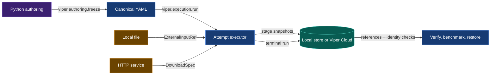
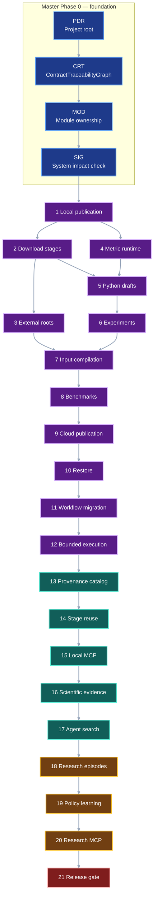

# VIPER Master Execution Checklist

Start with the first open block in Master Phase 3. Master Phase 0 established
the traceability, repository-root, ownership, and impact evidence required by
every later phase.

This document is the build reference for VIPER's current development
contracts. It explains the target system, records the cross-contract review,
orders the implementation, and names every source, test, and documentation
surface that must change.

## 1. Terminal outcome

The work is complete when a user can initialize one project root, write one
Python experiment, expand its variants and replicates into concrete plans,
freeze and run them, reuse an
eligible verified stage, verify and benchmark the results, search them through
the provenance catalog, attach versioned scientific labels and controlled
comparisons, reconstruct one auditable research episode, curate reviewed
learning examples, evaluate a retrieval-memory challenger, search the resulting
evidence graph through a local MCP server, and restore their artifacts.

Before a code-changing contract closes, VIPER compiles its baseline and
candidate source into deterministic `SourceGraph` records. The System Impact
Check compares every declared target with the candidate, reports typed direct
dependents, rejects unplanned declarations, and binds the passing plan and
source bytes to the accepted commit.

The authoring program uses decorated stage and metric functions:

```python
from viper import execution
from viper.artifacts import artifact
from viper.authoring import expand, experiment, freeze, plan, stage
from viper.catalog import MeasurementQuery, catalog
from viper.knowledge import knowledge
from viper.metrics import min


training = stage(
    train_model,
    params=TrainParams(...),
    inputs={"dataset": downloaded.artifacts["dataset"]},
    artifacts={
        Train.MODEL: artifact(...),
        Train.STATE: artifact(...),
    },
    objective=min(training_loss),
    metrics=(gradient_norm,),
)

study = experiment(
    experiment_id="tiny_http",
    factors=...,
    variants=...,
    replicates=...,
)

run = plan(
    run_id="01ARZ3NDEKTSV4RRFFQ69G5FAV",
    experiment=study,
    variant="baseline",
    replicate="replicate_01",
    stages={
        "download": downloaded,
        "train": training,
    },
    source=source,
    env=env,
    reproducibility=reproducibility,
    benchmark=benchmark,
)

frozen = freeze(run)
```

The same experiment can produce every selected run:

```python
plans = expand(
    study,
    run_ids={
        "baseline": {
            "replicate_01": "01ARZ3NDEKTSV4RRFFQ69G5FAV",
            "replicate_02": "01ARZ3NDEKTSV4RRFFQ69G5FAW",
        },
    },
    benchmark=benchmark,
    source=source,
    env=env,
    reproducibility=reproducibility,
)

frozen_runs = tuple(freeze(item) for item in plans)
```

`freeze()` from `viper.authoring` writes canonical YAML and returns every generated path. The
user reviews and commits those files. The resulting plan commit identifies the
YAML that VIPER executes. `RunSpec.source.commit` separately identifies the
project code and Python definitions used during freezing.

```python
if frozen.benchmark_spec_path is None:
    raise RuntimeError("the frozen plan has no benchmark")

run_result = execution.run(
    Path.cwd(),
    frozen.run_spec_path,
)

benchmark_result = execution.benchmark(
    Path.cwd(),
    run_result.resolved_run_path,
    frozen.benchmark_spec_path,
)
```

After the plan commit, bounded execution and catalog search use the same
single-run operations and immutable records:

```python
results = execution.run_many(
    Path.cwd(),
    tuple(item.run_spec_path for item in frozen_runs),
    max_concurrency=2,
)

history = catalog(root=Path.cwd())
history.refresh()
losses = history.measurements(
    MeasurementQuery(metric_ids=("test_loss",))
)
```

After verification, the same project can publish scientific labels and
evidence-backed conclusions:

```python
memory = knowledge(root=Path.cwd())
ontology_publication = memory.publish_ontology(ontology)
assignment_publication = memory.publish_assignment(model_family_assignment)
effect_publication = memory.publish_effect(test_loss_effect)
assertion_publication = memory.publish_assertion(test_loss_conclusion)

effect_ref = effect_publication.record
portable_knowledge_head = assertion_publication.manifest
```

`viper mcp --root <project>` exposes verified inspection and catalog tools.
`--access execute` adds run, retry, benchmark, batch-run, and restore tools.

The execution calls begin after every path in `frozen.files` enters the plan
commit.

The same frozen run can publish immutable evidence locally or directly to
Viper Cloud:

```toml
[storage]
destination = "local"
```

```toml
[storage]
destination = "viper://machina/weekend_models"
```

Cloud publication streams stage files from their working paths and bypasses
`.viper/store`.

## 2. What the system does

VIPER separates four jobs.

1. Python authoring lets the user connect functions, inputs, artifacts,
   metrics, variants, replicates, and benchmarks.
2. Freezing turns those Python objects into closed protocol records.
3. Execution turns external bytes and stage outputs into immutable evidence.
4. Verification follows the stored references and checks the recorded bytes,
   code, parameters, metrics, and graph relationships.



One downloaded dataset crosses the system like this:

```text
HttpRequestSpec
-> runner performs the request
-> ResolvedHttpRetrieval records request and response evidence
-> ResolvedSingleFileArtifact names the same response body as stage output
-> both records share one SnapshotFileRef
-> FutureInputRef selects it in the same run
-> StoredInputRef selects it from a completed run
-> a consuming stage receives a normal Path
```

One local dataset crosses the shorter route:

```text
ExternalInputDraft
-> ExternalInputRef records the selected source
-> runner copies the bytes to an attempt-owned input path
-> consuming stage reads that path
-> runner checks the file again
-> ResolvedExternalInputRef identifies it inside the stage snapshot
```

One development change crosses the review system like this:

```text
contracts with embedded PairBlocks + checklist
-> closed ContractTraceabilityGraph

baseline source + pinned CodeQL identity
-> SourceGraph G0 and receipt
-> change-sensitive direct dependents of the declared targets

edit the selected PairBlocks and source while running focused tests
-> candidate source

freeze selected plan + candidate source once
-> plan digest + immutable candidate snapshot

candidate snapshot + same CodeQL identity
-> SourceGraph G1 and receipt
-> extract and check every exact target declaration
-> reject changed declarations absent from the plan
```

## 3. Contract ownership

### 3.1 Artifact and phase names

The documentation uses one name for each artifact family:

| Artifact | Naming rule | Current example |
| --- | --- | --- |
| Governing contract | Stable capability name | [Contract Traceability](contract-traceability.md) |
| Executable plan | PairBlocks embedded in the governing contract | [Contract Traceability](contract-traceability.md#contract-owned-pairblocks) |
| Cross-contract schedule | `VIPER Master Execution Checklist` | This document |
| Scheduled phase | `Master Phase N` | Master Phase 0 |
| Stable work identity | Existing PairBlock ID | `P0-PDR-01` |
| Contract-local sequence | `Implementation Step N` | Implementation Step 1 |
| Research sequence | `Research Stage N` | Research Stage I |

Only this checklist assigns numbered Master Phases. Contract documents retain
their capability names when the checklist moves them. PairBlock IDs keep their
existing `P0-*` and `P1-*` prefixes because those IDs already identify their
scheduled phase and dependency order.

For contracts with executable PairBlocks, `Planned`, `In progress`, and
`Complete` are derived states. Each `pair-block-contract` marker names the
PairBlock and its governing contract; the containing heading supplies the
checklist section. A block is complete only after its gate passes. A contract
is complete only when every mapped PairBlock and requirement is complete.

| Contract | Status | Owns |
| --- | --- | --- |
| [Module privacy](module-privacy.md) | Complete | Public modules, shared internal names, and private-module checks |
| [Contract Traceability](contract-traceability.md) | Complete | Requirements, rules, exact source targets, PairBlocks, tests, gates, and dependency order |
| [Project data root](project-data-root.md) | Complete | One selected root for source, protocol paths, working artifacts, and separate local immutable evidence |
| [Public module ownership](module-ownership.md) | Complete | One defining module for API operations, verification operations, and verification types |
| [System Impact Check](system-impact-compiler.md) | Complete | Pinned CodeQL observations of baseline and frozen candidate source, exact declaration checks, a two-graph one-hop preflight, and rejection of unplanned source changes |
| [PairBlock scheduling](pair-block-scheduling.md) | Complete | CodeQL-informed dependency projection, write-conflict ordering, SCC condensation, and deterministic parallel execution waves |
| [Child-process launching](child-process-launching.md) | Complete | Spawn-safe repository-owned child processes on macOS and the closed subprocess import boundary |
| [Download retrieval artifacts](download-retrieval-artifacts.md) | In progress; Phase 2 implemented; DRA-06 planned for Master Phase 11 | Runner-owned downloads and the shared HTTP-body artifact |
| [External input roots](external-input-roots.md) | In progress; Phase 3 implemented; EIR-04 and EIR-05 scheduled | Local input capture and identity verification |
| [Unified metric drafting](unified-metric-drafting.md) | In progress | Metrics, objectives, diagnostics, experiments, variants, replicates, and benchmarks |
| [Automatic input resolution](automatic-input-resolution.md) | In progress | Python stage authoring and compilation of local, same-run, and prior-run inputs |
| [Frozen plan Git identity](frozen-plan-git-identity.md) | Complete | Immutable generated plans with source code kept on its source commit |
| [Direct Viper Cloud publication](remote-storage.md) | In progress | Destination-neutral publication, cloud references, retrieval, and restore |
| [Experiment expansion](experiment-expansion.md) | Audited; owner approval pending | Deterministic variant-replicate expansion and bounded multi-run execution |
| [Provenance catalog and MCP](provenance-catalog-mcp.md) | Audited; owner approval pending | Rebuildable cross-run search and a typed MCP adapter over VIPER operations |
| [Verified stage reuse](stage-reuse.md) | Audited; owner approval pending | Opt-in stage skipping with a canonical key, source evidence, and a new target snapshot |
| [Experiment knowledge primitives](experiment-knowledge-primitives.md) | Audited; owner approval pending | Versioned scientific labels, controlled comparisons, diagnostic signatures, journals, and knowledge search |
| [Research Memory and Agent Learning](research-memory-roadmap.md) | Planned; owner approval pending | Research episodes, adaptive experiment selection, learning datasets, policy evaluation and promotion, literature evidence, and the research-facing MCP surface |

The contracts share models. One contract owns each shared decision:

| Shared decision | Owner |
| --- | --- |
| Each contract requirement reaches named verifier rules, exact implementation owners, and exact test functions | Contract Traceability |
| `viper init ROOT` selects the source, protocol, working-data, and local-state tree | Project data root |
| `.viper/store` remains a separate immutable subtree beneath the selected root | Project data root |
| Public API and verification symbols are implemented in the modules callers import | Public module ownership |
| Requirements, targets, rule edges, tests, gates, and dependency order form one closed implementation plan | Contract Traceability |
| Pinned CodeQL observations report policy-selected direct dependents before and after a planned change; Pyright checks the materialized interfaces; and realized source changes must match the closed plan | System Impact Check |
| Explicit dependencies, planned source edges, and shared-file writes determine safe PairBlock execution waves | PairBlock scheduling |
| Repository-owned child processes use the spawn-safe facade on macOS | Child-process launching |
| HTTP receipt and artifact share one file | Download retrieval artifacts |
| HTTP root is `ResolvedHttpRetrieval` | Download retrieval artifacts |
| Custom HTTP execution uses `@http(id=...)` from `viper.http` and `DownloadSpec.http` | Automatic input resolution |
| Local root is `ResolvedExternalInputRef` | External input roots |
| Stage input edge is `ExternalInputRef`, `FutureInputRef`, or `StoredInputRef` | Automatic input resolution |
| Draft input compiles to one of those three edges | Automatic input resolution |
| Metric role comes from `objective=` or `metrics=` | Unified metric drafting |
| Artifact draft paths are relative to the selected run root | Automatic input resolution |
| Immutable location comes from the configured destination | Direct Viper Cloud publication |
| Generated YAML identity comes from the plan commit; project definitions come from the source commit | Frozen plan Git identity |
| One experiment expands into ordinary `RunPlanDraft` values | Experiment expansion |
| A skipped stage records `StageReuseReceipt` and a new target snapshot | Verified stage reuse |
| Cross-run search rows remain derived from immutable references | Provenance catalog and MCP |
| MCP tools, resources, prompts, discovery, subscriptions, MRTR elicitation, Tasks extension calls, and utilities reuse VIPER identities and per-request protocol capabilities | Provenance catalog and MCP |
| Scientific labels keep declared, inferred, and reviewed origins separate | Experiment knowledge primitives |
| Controlled comparisons use verified run and measurement references | Experiment knowledge primitives |
| Exact filters run before vector ranking; exact identity or reviewed equivalence rejects a duplicate | Experiment knowledge primitives |
| Research decisions, learning datasets, policy evaluation, promotion, rollback, and literature provenance | Research Memory and Agent Learning |

### 3.2 Deterministic contract coverage

Each pending contract declares stable requirement IDs with an owning phase and
focused test. The matching phase contains one requirement-level `implements`
marker and one requirement-level `verifies` marker for every ID. The contract
traceability phase adds rule-level implementation owners and exact test
functions. The generated [contract baseline manifest](contract-baselines.json)
binds the checklist to the exact reviewed contract bytes and requirement IDs.
After an approved contract edit, run
`python tools/refresh_contract_baselines.py --write`. The documentation gate
rejects a stale manifest. A contract edit no longer requires copying a digest
into this checklist.

## 4. Specification-system review

**Review baseline:** repository commit `5814cda` and the contract digests in
Section 3.2.

This review covers current source and tests, the protocol reference, the public
API, the CLI, the generated project, and the research roadmap. This section
records current decisions and executable gates. Git history retains superseded
findings and repair records.

### 4.1 Schema gate

The executable schema gate is split between `tests/test_documentation.py` and
`tests/test_contract_documentation.py`:

- `test_public_python_examples_are_syntactically_valid()` parses every
  published Python block.
- `test_repeated_contract_classes_have_identical_declarations()` rejects
  conflicting declarations of one shared class.
- `test_contract_requirements_map_to_plan_tasks_and_tests()` recomputes every
  contract digest and checks requirement, phase, implementation, verification,
  and test coverage.

The generated baseline manifest linked in Section 3.2 identifies the exact
contract revisions under review.

**Current result:** the partitioned documentation boundary completed with 62
tests collected; the contract-baseline digest is refreshed after accepted
contract edits.

### 4.2 Value-lifecycle decisions

| Value | Declaration | Frozen record | Runtime record | Verifier or consumer |
| --- | --- | --- | --- | --- |
| Project root | `viper init ROOT` or explicit `root=` | Local `viper.toml` marker; absolute path omitted from protocol identity | One resolved absolute root per operation | Root resolver, path-boundary checks, local store, and every local consumer |
| System impact | Baseline commit, selected PairBlocks, frozen candidate source, pinned `CodeQLIdentity`, and closed `ContractTraceabilityGraph` | Two `SourceGraph` records and receipts, one `Impact`, resolved target digests and `ChangeKind` values, and one `PlanCheck` | Exact AST declaration extraction, CodeQL source extraction, change classification, typed one-hop edge selection, action and declaration comparison, and unexpected-change detection | Same-identity receipts, frozen-plan digest, exact target transitions, policy-selected direct dependents, no unplanned declaration changes, and successful PairBlock gates |
| Local dataset | `ExternalInputDraft` | `ExternalInputRef` | `ResolvedExternalInputRef` plus stage snapshot | Stage worker and local-root verifier |
| HTTP dataset | `HttpRequestSpec` plus file artifact draft | `DownloadSpec` | `ResolvedHttpRetrieval` and `ResolvedSingleFileArtifact` sharing one file | Download verifier and later input compiler |
| Same-run artifact | `StageDraft.artifacts[name]` | `FutureInputRef` | `ResolvedFutureInputRef` | Materializer and input verifier |
| Prior-run artifact | `RunArtifactDraft` | Published `ArtifactPointer` plus `StoredInputRef` | `ResolvedStoredInputRef` | Materializer, lineage, and pointer verifier |
| Metric | Decorated callable plus `MetricDraft` | `MetricSpec` | `Measurement` and, for recomputation, `MetricExecutionReceipt` | Metric verifier and benchmark |
| Recomputed metric dependency | `MetricDependency` | `MetricSpec.dependencies` | `ResolvedMetricDependency` derived from an enclosing stage snapshot | Metric worker and receipt verifier |
| Objective | `MetricObjectiveDraft` | `MetricObjectiveSpec` | Final objective measurement | Stage and experiment verifier |
| Variant | `VariantDraft` | `VariantSpec` and selected stage specs | Selected run attempt | Experiment verifier |
| Replicate | `ReplicateDraft` | `ReplicateSpec` and `RunSpec.seed` | Runtime RNG evidence | Run verifier |
| Stage files | Artifact drafts and captured local inputs | `SnapshotFileRef` values | `StageResultSnapshot` | `RunFetcher`, verifier, restore |
| Independent file | Generated document | Owning `ResolvedFileRef` subtype | `LocalFileRef` or `ViperCloudFileRef` | `RunFetcher`, verifier, restore |
| Terminal run | `RunPlanDraft` | `RunSpec` | `ResolvedRun` plus `ResolvedRunRef` | Verify, benchmark, lineage, restore |
| Generated plan files | `RunPlanDraft` | `FrozenPlanFiles.files` committed to Git | `ResolvedRun.spec: ResolvedRunSpecRef` with the plan commit | Preflight, run verifier, and benchmark executor |
| Restore selection | Direct Python values, discriminated typed request references, or CLI strings | `RestoreRequest` | `RestoreResult` and restored files | Python caller, typed API caller, or CLI |
| Experiment expansion | `ExperimentDraft`, filters, and `RunIdMap` | Ordered `RunPlanDraft` values | `ExperimentExecutionResult` | Python, typed API, CLI, and catalog |
| Stage reuse key | Frozen stage, resolved input files, effective environment, reproducibility, and selected metrics | `StageReuseKey` | `StageReuseReceipt` plus `ReusedStageCompletion` | Attempt verifier, lineage, comparison, and catalog |
| Catalog row | Immutable run, artifact, measurement, benchmark, or reuse reference | Derived SQLite row | Ordered query result carrying the source reference | Python, CLI, MCP, and stage-reuse lookup |
| MCP tool | Typed API request and success models | JSON Schema tool definition | `viper.api.dispatch()` result as structured content | MCP client |
| Primitive label | `PrimitiveSpec` plus authored, inferred, or reviewed assignment | Published ontology and assignment files | Effective-label catalog row | Catalog, MCP, and experiment reviewer |
| Controlled modulation | Two verified runs, primitive changes, and one comparison context | Published `Modulation` | `EffectEstimate` and optional `ImpactAssessment` | Verifier, catalog, and journal |
| Diagnostic signature | Verified stage measurements | Published `DiagnosticSignature` | Exact diagnostic vector | Graph and vector search |
| Journal assertion | Typed claim plus immutable evidence references | Published `JournalAssertion` | Separate optional text vector | Reviewer, catalog, and MCP |

Every row has one declaring input, one persisted identity, and one reader.

### 4.3 Behavioral decisions

The contracts now agree on these branch rules:

```text
local source
-> ExternalInputRef

same-run stage artifact
-> FutureInputRef

completed-run stage artifact
-> StoredInputRef

downloaded bytes
-> ResolvedHttpRetrieval root
-> same-named ResolvedSingleFileArtifact
-> FutureInputRef or StoredInputRef at a later consumer

selected variants x selected replicates
-> ordered RunPlanDraft values
-> ordinary frozen and resolved runs

reuse="verified" and matching StageReuseKey
-> verified source run
-> StageReuseReceipt
-> new target stage snapshot

immutable terminal references
-> verified catalog rows
-> exact search results
-> typed API or MCP consumer

verified experiments and measurements
-> versioned primitive assignments
-> controlled modulation and paired effect
-> diagnostic signature or journal assertion
-> exact graph filters
-> optional vector ranking
```

Training requires a live objective. Evaluation requires a recomputed objective.
Embedding may declare either kind of objective or omit one. Any project-owned
stage can add diagnostics through `metrics=`. A runner-owned download can add
recomputed diagnostics.

A benchmark records every selected metric under fixed data and split inputs.
Criteria add optional thresholds. An empty criteria tuple produces a verified
result.

### 4.4 Verifier boundaries

Every new claim has a named rejection or acceptance boundary:

| Claim | Detecting rule or acceptance case |
| --- | --- |
| Every local operation uses the initialized root | `project.root.marker`, `project.root.stability`, and explicit-root relocation acceptance |
| Working artifacts remain separate from local immutable evidence | Publish, mutate the working artifact, and retrieve the original bytes through `LocalFileRef` |
| Development impact uses the same external inputs and compiler | `system.context.identity`, `system.compiler.identity`, and `system.delta.context` |
| Dynamic registrations remain observable outcomes | Remove one decorator and require the candidate graph to lose its `registers` edge |
| Every contract requirement reaches code and a test | `system.requirement.coverage` and graph parity with the existing documentation oracle |
| HTTP receipt and artifact identify the same bytes | `download.receipt_artifact_identity` |
| The digest covers the HTTP bytes written at the artifact path | `download.runner_custody` |
| VIPER supplied the canonical captured local path and stable bytes | `input.local.identity` |
| A local declaration stays within the repository boundary | `input.local.capture` |
| Same-run producer precedes consumer | `input.source.order` |
| Prior-run pointer names verified provenance | `input.pointer.identity` and `input.pointer.provenance` |
| Objective was measured | `metric.objective.evidence` |
| Recomputed metric used the frozen class and values | `metric.recompute.invocation_binding` |
| A live measurement resolves through the successful invocation to one frozen metric binding | `metric.live.parameter_delivery` |
| Variant levels match frozen stage parameters | `experiment.variant.parameters` |
| Benchmark records and matches each selected metric | `benchmark.metric.result` and `benchmark.metric.match` |
| Benchmark and evaluation use identical test and split pointers | `benchmark.input.identity` |
| Freeze-time and execution-time publications use one destination | `storage.destination_stability` |
| Cloud terminal graph is portable | `storage.graph_reachability` |
| Local restore starts from an immutable terminal reference | Deterministic one-file terminal revision lookup |
| Restored artifact bytes match published bytes | SHA-256 and byte-count checks before final move |
| Generated plan files and project source use their correct Git commits | `plan.git_identity`, `plan.document_identity`, `source.git_identity`, and `benchmark.plan_identity` |
| Python, typed API, and CLI restore share one result contract | `RestoreResult` equality across all three entry points |
| Experiment expansion is deterministic | Exact pair coverage, unique run IDs, declaration order, and aggregate result order |
| A reused stage matches its source | Reconstructed `StageReuseKey`, verified source run, file remapping equality, and source metric evidence |
| A catalog result remains traceable | Every result carries the immutable source reference and rebuild equality holds after database deletion |
| An MCP call preserves the owning operation | MCP input schema equals the request schema and structured content validates as the success model or `ViperFailure` |
| A scientific assignment names valid evidence | Its ontology version, primitive, target run, and target entity all verify |
| A paired effect matches its measurements | The verifier reloads each measurement and recomputes direction, pair values, mean, error, and interval |
| A journal conclusion cites existing evidence | Every reference resolves to the record type declared by `JournalEvidence.kind` |
| A similarity result stays within its declared view | Exact filters run first; vector dimensions, source type, and view identity verify before ranking |

### 4.5 Counterexamples

Each contract has one case that must fail:

| Contract | Counterexample |
| --- | --- |
| Project data root | A child-directory command uses `Path.cwd()` as a second root, or a symlink escapes the selected root before capture. |
| Deterministic system impact graph | A candidate removes a decorator while the comparison incorrectly fixes the old registry output, or strict review proceeds with an unresolved environment input. |
| Download retrieval artifacts | The HTTP result body changes after receipt validation and before artifact publication. |
| External input roots | A local source path escapes through a symlink, the parent supplies a different workspace file than `captured_input_path()`, or the captured file changes while the worker runs. |
| Unified metric drafting | A live receipt selects different metric IDs, a metric dependency creates a second payload publication, two stages use one metric ID with different parameters, or benchmark test pointers differ from evaluation inputs. |
| Automatic input resolution | A same-run input selects an artifact from a later stage, freezing publishes a pointer before binding the run destination, or execution starts before generated files enter the plan commit. |
| Frozen plan Git identity | The verifier loads a generated benchmark from the source commit; `benchmark.plan_identity` requires the plan commit. |
| Direct Viper Cloud publication | A cloud terminal run reaches one `LocalFileRef`, local restore parses a changed working terminal file after immutable revision lookup fails, or the three restore surfaces return different file sets. |
| Experiment expansion | A missing pair silently disappears, a duplicate run ID reaches freezing, or completion order changes the aggregate result order. |
| Verified stage reuse | A catalog digest match skips execution after an input, environment, metric, source run, artifact file, or benchmark-confirmation relationship changed. |
| Provenance catalog and MCP | A derived row loses its immutable source reference, a tampered run remains searchable as verified, or an MCP tool bypasses its typed API handler. |
| Experiment knowledge primitives | An assignment names an unknown primitive, an effect changes a source measurement value, a journal evidence kind mismatches its file, or HNSW distance alone rejects an experiment. |
| Research Memory and Agent Learning | A late hypothesis is presented as preregistered, one decision candidate is omitted, one source group crosses training and test, or a challenger is promoted after a retention gate fails. |
| Module privacy | A second module imports a leading-underscore symbol. |

## 5. Dependency order



Master Phase 0 establishes the project root first. The
`ContractTraceabilityGraph` then resolves contract requirements to source and
tests inside that root. Module ownership gives each public symbol one defining
module. The System Impact Check compares the closed CTG plan with pinned CodeQL
observations of the baseline and frozen candidate source. Master Phases 2
and 4 may occur on separate branches after Master Phase 1; both feed Master
Phase 5. Master Phases 3 and 6 both feed Master Phase 7.

## 6. Pair-coding protocol

The [Foundation Pair-Coding Guide](foundation-pair-coding.md) owns the
project-root work. [Contract Traceability](contract-traceability.md#contract-owned-pairblocks)
owns its remaining `P0-CRT` blocks. The [Public Module Ownership
contract](module-ownership.md) owns module work. The [System Impact
Check](system-impact-compiler.md#10-implementation-order)
owns every `P0-SIG` block. Every marked checkbox
resolves to one block containing requirements, prerequisites, targets, tests,
and evidence. The [Research Memory Pair-Coding
Guide](research-memory-pair-coding.md) owns the `P18-RML`, `P19-RML`, and
`P20-RML` blocks and their completion gates.

One contract session is the default guided boundary:

1. Synchronize the repository and record the baseline commit.
2. Compile the contract's starting PairBlocks and select its remaining work.
3. Materialize the selected PairBlocks over that clean baseline with
   `conda run -n mantra python tools/check_plan.py --block BLOCK_ID --results
   .viper/checks/BLOCK_ID`. The command resolves the repository Python and
   CodeQL from the login environment. Start source editing only after Pyright
   and the same-identity source-graph check pass. Keep a failure as a contract
   defect; do not work around it in the implementation.
4. Before reading `Impact.affected`, record the selected targets and any other
   declarations already chosen for propagation review in the
   [CodeQL impact observations](codeql-impact-observations.md) ledger.
5. Run `inspect_plan()` against the baseline and review every reported direct
   dependent.
6. Implement one bounded PairBlock edit at a time and run focused tests where
   they provide useful feedback.
7. Preserve intermediate review cycles as checkpoint commits while the
   PairBlocks remain planned.
8. At the end of pair coding, compare the complete Git diff with every selected
   `ContractTarget`.
9. Update the plan for an intentional discovery only after user approval;
   remove accidental changes or move them to a separately approved plan.
10. Freeze the reconciled plan and candidate source, run one strict System
   Impact check, and accept only the blocks whose gates pass.
11. Record the report's novel dependents, resulting actions, review-only cases,
    and dependencies discovered outside the report in the observation ledger.
12. Update each accepted block's checklist checkbox, preserve its governing
   contract in the adjacent `pair-block-contract` marker, refresh the contract
   status in Section 3.1, and update the contract digest in Section 3.2.
13. Run the checklist mapping and documentation checks, then commit and push the
   exact accepted implementation and checklist state together.

The user writes the code during guided PairBlocks. Codex inspects each bounded
edit, explains the next change, and performs the final reconciliation. A user
may request a narrower strict close for one PairBlock that needs independent
acceptance.

Autonomous work freezes the selected PairBlocks before implementation. The
agent stays within that plan. A necessary plan change starts a new freeze
against the same baseline before work continues. Guided and autonomous work
use the same final System Impact check, commit, and acceptance operation.

## 7. Master Phase 0 — project root, traceability, module ownership, and system impact

**Depends on:** Module-privacy work already implemented.

**Contracts:** [Project data root](project-data-root.md),
[Contract Traceability](contract-traceability.md),
[public module ownership](module-ownership.md), and
[System Impact Check](system-impact-compiler.md)

**Outcome:** `viper init ROOT` creates the complete protocol tree and every
later local operation resolves that same root. Every contract requirement then
has a named rule, exact implementation owner, and exact test.
Public API and verification imports identify their defining modules. VIPER can
analyze that source tree with one pinned CodeQL identity, report baseline
direct dependents selected by each declared target's `ChangeKind`, and reject
candidate declarations absent from the CTG plan.

### 7.1 Project root

- [x] Add `Settings`, `RootError`, `find_root()`, and `resolve_root()` in
      `src/viper/project.py`.
      <!-- pair-block: P0-PDR-01 -->
      <!-- pair-block-contract: P0-PDR-01 contract=project-data-root.md -->
      <!-- implements: PDR-01 -->
      <!-- contract-implementation: requirement=PDR-01 rule=project.root.marker state=implemented owner=src/viper/project.py:resolve_root -->
- [x] Add `viper.toml`, `inputs/`, `benchmarks/`, and `experiments/` to the
      staged project scaffold in `src/viper/project.py`.
      <!-- pair-block: P0-PDR-02 -->
      <!-- pair-block-contract: P0-PDR-02 contract=project-data-root.md -->
      <!-- contract-implementation: requirement=PDR-01 rule=project.root.layout state=implemented owner=src/viper/project.py:init -->
- [x] Route public default roots through `resolve_root()` and pass the
      resolved value into internal operations exactly once.
      <!-- pair-block: P0-PDR-03 -->
      <!-- pair-block-contract: P0-PDR-03 contract=project-data-root.md -->
      <!-- contract-implementation: requirement=PDR-02 rule=project.root.git state=implemented owner=src/viper/project.py:resolve_root -->
      <!-- contract-implementation: requirement=PDR-02 rule=project.root.stability state=implemented owner=src/viper/project.py:resolve_root -->
- [x] Replace CLI `--repository-root` with `--root` and keep `viper init ROOT`
      as the root-selection operation. <!-- implements: PDR-04 -->
      <!-- pair-block: P0-PDR-04 -->
      <!-- pair-block-contract: P0-PDR-04 contract=project-data-root.md -->
      <!-- contract-implementation: requirement=PDR-04 rule=project.root.vocabulary state=implemented owner=src/viper/cli.py:add_root -->
- [x] Add `resolve_path()` and reject every descendant symlink, logical
      traversal, and final resolved escape before any local read, write,
      capture, publication, or restore. <!-- implements: PDR-03 -->
      <!-- pair-block: P0-PDR-06 -->
      <!-- pair-block-contract: P0-PDR-06 contract=project-data-root.md -->
      <!-- contract-implementation: requirement=PDR-03 rule=project.path.logical_boundary state=implemented owner=src/viper/project.py:resolve_path -->
      <!-- contract-implementation: requirement=PDR-03 rule=project.path.symlink_free state=implemented owner=src/viper/project.py:resolve_path -->
      <!-- contract-implementation: requirement=PDR-03 rule=project.path.resolved_boundary state=implemented owner=src/viper/project.py:resolve_path -->
- [x] Bind `LocalArtifactStore` to `ROOT/.viper/store`; keep working artifacts
      at their protocol paths and preserve separate immutable copies.
      <!-- pair-block: P0-PDR-05 -->
      <!-- pair-block-contract: P0-PDR-05 contract=project-data-root.md -->
      <!-- implements: PDR-02 -->
      <!-- contract-implementation: requirement=PDR-02 rule=project.store.boundary state=implemented owner=src/viper/storage.py:LocalArtifactStore.__init__ -->

<details>
<summary>Hints</summary>

**Hint 1:** The root is the directory containing `viper.toml`. Keep the absolute
root path in runtime memory and outside the marker.

**Hint 2:** Resolve the root at the public operation boundary. Internal helpers
receive the resolved value. The public resolver owns parent search.

**Hint 3:** Keep `.viper/store` separate from user-visible artifact paths. One
working-file edit must leave the immutable copy retrievable.

</details>

### 7.2 Contract Traceability

- [x] Add the exact traceability models and parsers in
      `src/viper/_contract_traceability.py`; compile current requirement rows
      and verifier-rule markers into canonical declarations.
      <!-- pair-block: P0-CRT-01 -->
      <!-- pair-block-contract: P0-CRT-01 contract=contract-traceability.md -->
      <!-- implements: CRT-01 -->
      <!-- contract-implementation: requirement=CRT-01 rule=contract.requirement.unique state=implemented owner=src/viper/_contract_traceability.py:compile_contract_traceability -->
      <!-- contract-implementation: requirement=CRT-01 rule=contract.rule.declared state=implemented owner=src/viper/_contract_traceability.py:compile_contract_traceability -->
- [x] Resolve every rule to one exact source owner and at least one exact test
      function; reject missing files, symbols, and phase mismatches.
      <!-- pair-block: P0-CRT-02 -->
      <!-- pair-block-contract: P0-CRT-02 contract=contract-traceability.md -->
      <!-- implements: CRT-02 -->
      <!-- contract-implementation: requirement=CRT-02 rule=contract.rule.implemented state=implemented owner=src/viper/_contract_traceability.py:compile_contract_traceability -->
      <!-- contract-implementation: requirement=CRT-02 rule=contract.rule.tested state=implemented owner=src/viper/_contract_traceability.py:compile_contract_traceability -->
- [x] Validate marked worked examples plus current, proposed-change, and
      integrated DAGs.
      <!-- pair-block: P0-CRT-03 -->
      <!-- pair-block-contract: P0-CRT-03 contract=contract-traceability.md -->
      <!-- implements: CRT-03 -->
      <!-- contract-implementation: requirement=CRT-03 rule=contract.example.complete state=implemented owner=src/viper/_contract_traceability.py:validate_contract_example -->
      <!-- contract-implementation: requirement=CRT-03 rule=contract.diagram.palette state=implemented owner=tests/test_contract_documentation.py:test_contract_traceability_dags_use_semantic_palette -->
      <!-- contract-implementation: requirement=CRT-03 rule=contract.model.matches_runtime state=implemented owner=tests/test_contract_documentation.py:test_contract_traceability_model_block_matches_runtime -->
      <!-- contract-implementation: requirement=CRT-03 rule=contract.model.documented state=implemented owner=tests/test_contract_documentation.py:test_contract_traceability_schema_describes_every_field -->
- [x] Apply the three-DAG and complete worked-example format to every
      implementation contract. Validate
      `IMPLEMENTATION_CONTRACTS` as one closed set before Master Phase 0 closes.
      <!-- pair-block: P0-CRT-04 -->
      <!-- pair-block-contract: P0-CRT-04 contract=contract-traceability.md -->
- [x] Serialize one ordered, source-evidenced `ContractTraceabilityGraph` and
      compare its requirement and phase coverage with the current documentation
      oracle. Require every requirement, rule, and edge to retain its
      exact `DeclarationRef` path, line span, and digest.
      <!-- pair-block: P0-CRT-05 -->
      <!-- pair-block-contract: P0-CRT-05 contract=contract-traceability.md -->
      <!-- implements: CRT-04 -->
      <!-- contract-implementation: requirement=CRT-04 rule=contract.graph.canonical state=implemented owner=src/viper/_contract_traceability.py:compile_contract_traceability -->
      <!-- contract-implementation: requirement=CRT-04 rule=contract.graph.complete state=implemented owner=src/viper/_contract_traceability.py:compile_contract_traceability -->
      <!-- contract-implementation: requirement=CRT-04 rule=contract.declaration.anchored state=implemented owner=src/viper/_contract_traceability.py:compile_contract_traceability -->
- [x] Compile `ContractTarget` and `PairBlock` records into the traceability
      graph, derive `RuleEdge.block_id` from each checklist task, and enforce
      complete target, rule, test, and acyclic dependency closure.
      <!-- pair-block: P0-CRT-06 -->
      <!-- pair-block-contract: P0-CRT-06 contract=contract-traceability.md -->
      <!-- implements: CRT-06 -->
      <!-- contract-implementation: requirement=CRT-06 rule=contract.target.complete state=implemented owner=src/viper/_contract_traceability.py:compile_contract_traceability -->
      <!-- contract-implementation: requirement=CRT-06 rule=contract.block.complete state=implemented owner=src/viper/_contract_traceability.py:compile_contract_traceability -->
      <!-- contract-implementation: requirement=CRT-06 rule=contract.block.acyclic state=implemented owner=src/viper/_contract_traceability.py:compile_contract_traceability -->
- [x] Make `ContractTarget` the sole code-change inventory for executable
      PairBlocks and reject the retired symbol, example, and export inventories.
      <!-- pair-block: P0-CRT-07 -->
      <!-- pair-block-contract: P0-CRT-07 contract=contract-traceability.md -->
      <!-- implements: CRT-05 -->
      <!-- verifies: CRT-05 -->
      <!-- contract-implementation: requirement=CRT-05 rule=contract.target.authoritative state=implemented owner=src/viper/_contract_traceability.py:validate_contract_example -->
      <!-- contract-verification: requirement=CRT-05 rule=contract.target.authoritative state=implemented test=tests/test_contract_traceability.py:test_contract_examples_reject_retired_symbol_inventories -->

<details>
<summary>Hints</summary>

**Hint 1:** Preserve the current requirement, checklist, and baseline parsers as
the migration oracle. Add rule-level links beside them.

**Hint 2:** Resolve Python symbols through the AST. Resolve Markdown requirement
and rule identities through their stable marker IDs.

**Hint 3:** Compile the traceability graph before the broader system graph. The
system graph consumes its ownership links directly.

</details>

#### Pair-coding blocks

The [Contract Traceability contract](contract-traceability.md#contract-owned-pairblocks)
owns the remaining exact code and focused gates. This checklist owns their
cross-contract order and state. Completed CRT blocks remain evidenced by the
checked tasks, implementation, tests, and Git history; their old edit recipes
are not duplicated.

### 7.3 Public module ownership

- [x] Stage verification errors, policies, result dataclasses, aliases, and the
      exact model export list in `src/viper/verification/models.py`. Keep
      `verification.py` active until `P0-MOD-02` performs the atomic cutover.
      <!-- pair-block: P0-MOD-01 -->
      <!-- pair-block-contract: P0-MOD-01 contract=module-ownership.md -->
      <!-- contract-implementation: requirement=MOD-01 rule=module.verification.owner state=implemented owner=src/viper/verification/models.py:VerificationPolicy -->
      <!-- contract-implementation: requirement=MOD-01 rule=module.verification.model_exports state=implemented owner=src/viper/verification/models.py:__all__ -->
- [x] Replace `src/viper/verification.py` with the public
      `src/viper/verification/__init__.py` package module. Move every public
      verification operation there and update each importer to use the defining
      operation or model module.
      <!-- pair-block: P0-MOD-02 -->
      <!-- pair-block-contract: P0-MOD-02 contract=module-ownership.md -->
      <!-- contract-implementation: requirement=MOD-01 rule=module.verification.operation_exports state=implemented owner=src/viper/verification/__init__.py:__all__ -->
- [x] Move every helper and operation body from `src/viper/_api/handlers.py`
      into `src/viper/api.py`. Point `HANDLER_REGISTRY` at those local
      functions, then delete the pass-through wrappers and private handler
      module. <!-- implements: MOD-01 -->
      <!-- pair-block: P0-MOD-03 -->
      <!-- pair-block-contract: P0-MOD-03 contract=module-ownership.md -->
      <!-- contract-implementation: requirement=MOD-01 rule=module.api.owner state=implemented owner=src/viper/api.py:HANDLER_REGISTRY -->

<details>
<summary>Hints</summary>

**Hint 1:** Move verification models first. Both verification operations and
API operations consume those types.

**Hint 2:** Preserve every function signature and body. This refactor changes
the defining module while behavior remains fixed.

**Hint 3:** Delete a retired module only after every direct importer points to
the new owner.

</details>

#### Pair-coding blocks

The [Public Module Ownership contract](module-ownership.md#11-contract-owned-pairblocks)
owns the complete `P0-MOD-01` through `P0-MOD-04` edits and focused gates. The
checklist owns their order and completion state.

### 7.4 System impact check

Production source analysis lives in `src/viper/_system_impact/codeql.py`.
The public records and checks live in `src/viper/system_impact.py`.

- [x] Add `CodeQLIdentity`, `SourceSnapshot`, `CodeQLReceipt`, `SourceNode`,
      `SourceEdge`, and `SourceGraph` with canonical serialization.
      <!-- pair-block: P0-SIG-01 -->
      <!-- pair-block-contract: P0-SIG-01 contract=system-impact-compiler.md -->
      <!-- implements: SIG-01, SIG-05 -->
      <!-- verifies: SIG-01 -->
      <!-- contract-implementation: requirement=SIG-01 rule=system.source.canonical state=implemented owner=src/viper/system_impact.py:SourceGraph -->
      <!-- contract-verification: requirement=SIG-01 rule=system.source.canonical state=implemented test=tests/test_system_impact.py:test_source_graph_is_canonical -->
      <!-- contract-implementation: requirement=SIG-05 rule=system.codeql.identity state=implemented owner=src/viper/system_impact.py:CodeQLIdentity -->
- [x] Analyze one immutable source snapshot with the pinned query pack and
      retain the command, identity, source digest, optional commit, exit status,
      database digest, and decoded-row digest.
      <!-- pair-block: P0-SIG-02 -->
      <!-- pair-block-contract: P0-SIG-02 contract=system-impact-compiler.md -->
      <!-- verifies: SIG-05 -->
      <!-- contract-verification: requirement=SIG-05 rule=system.codeql.identity state=implemented test=tests/test_system_impact.py:test_analyze_source_binds_digests_identity_and_database_reuse -->
- [x] Resolve every selected CTG target against the baseline graph; extract the
      exact authored declaration bytes, including decorators and UTF-8 byte
      columns; classify its `ChangeKind`; and report only the direct dependents
      selected by impact-policy version 1 while preserving every PairBlock.
      <!-- pair-block: P0-SIG-03 -->
      <!-- pair-block-contract: P0-SIG-03 contract=system-impact-compiler.md -->
      <!-- implements: SIG-02 -->
      <!-- verifies: SIG-02 -->
      <!-- contract-implementation: requirement=SIG-02 rule=system.plan.resolved state=implemented owner=src/viper/system_impact.py:inspect_plan -->
      <!-- contract-verification: requirement=SIG-01 rule=system.source.canonical state=implemented test=tests/test_system_impact.py:test_declaration_extraction_preserves_exact_decorated_bytes -->
      <!-- contract-verification: requirement=SIG-02 rule=system.plan.resolved state=implemented test=tests/test_system_impact.py:test_change_classifier_distinguishes_interface_and_body_updates -->
      <!-- contract-verification: requirement=SIG-02 rule=system.plan.resolved state=implemented test=tests/test_system_impact.py:test_plan_reports_only_policy_selected_one_hop_dependents -->
      <!-- contract-verification: requirement=SIG-02 rule=system.plan.resolved state=implemented test=tests/test_system_impact.py:test_removed_target_reports_all_represented_direct_dependents -->
      <!-- contract-verification: requirement=SIG-02 rule=system.plan.resolved state=implemented test=tests/test_system_impact.py:test_unclassified_change_uses_conservative_one_hop_edges -->
- [x] Freeze the selected PairBlocks and candidate source once, analyze that
      snapshot with the same CodeQL identity, check every planned transition,
      run each frozen PairBlock gate, validate omitted dependencies against
      their baseline target states,
      reject any unplanned declaration, and bind the passing check to the
      commit containing the checked source and selected plan.
      <!-- pair-block: P0-SIG-04 -->
      <!-- pair-block-contract: P0-SIG-04 contract=system-impact-compiler.md -->
      <!-- implements: SIG-03 -->
      <!-- verifies: SIG-03 -->
      <!-- contract-implementation: requirement=SIG-03 rule=system.plan.realized state=implemented owner=src/viper/system_impact.py:check_plan -->
      <!-- contract-implementation: requirement=SIG-03 rule=system.plan.closed state=implemented owner=src/viper/system_impact.py:accept -->
      <!-- contract-verification: requirement=SIG-03 rule=system.plan.realized state=implemented test=tests/test_system_impact.py:test_plan_check_rejects_unplanned_source_change -->
      <!-- contract-verification: requirement=SIG-03 rule=system.plan.closed state=implemented test=tests/test_system_impact.py:test_plan_check_runs_gates_and_validates_dependencies -->
      <!-- contract-verification: requirement=SIG-03 rule=system.plan.closed state=implemented test=tests/test_system_impact.py:test_acceptance_binds_commit_to_checked_source_and_plan -->
- [x] Replay the committed `model_support` to `models` migration and one
      completed VIPER PairBlock against their exact Git diffs.
      <!-- pair-block: P0-SIG-05 -->
      <!-- pair-block-contract: P0-SIG-05 contract=system-impact-compiler.md -->
      <!-- implements: SIG-04 -->
      <!-- verifies: SIG-04 -->
      <!-- contract-implementation: requirement=SIG-04 rule=system.fixture.replayed state=implemented owner=tests/test_system_impact.py:test_committed_manifest_rename -->
      <!-- contract-verification: requirement=SIG-04 rule=system.fixture.replayed state=implemented test=tests/test_system_impact.py:test_committed_manifest_rename -->
- [x] Emit source-backed `writes` edges for direct writes to declared module
      variables and class attributes.
      <!-- pair-block: P0-SIG-06 -->
      <!-- pair-block-contract: P0-SIG-06 contract=system-impact-compiler.md -->
      <!-- implements: SIG-06 -->
      <!-- verifies: SIG-06 -->
      <!-- contract-implementation: requirement=SIG-06 rule=system.source.writes state=implemented owner=src/viper/_system_impact/codeql.py:analyze_source -->
      <!-- contract-verification: requirement=SIG-06 rule=system.source.writes state=implemented test=tests/test_system_impact.py:test_checked_in_codeql_pack_analyzes_tiny_repository -->
- [x] Derive the policy-selected one-hop edge delta from the baseline and
      materialized source graphs, reject unplanned declaration changes, and
      reject a materialized candidate whose callers fail Pyright.
      <!-- pair-block: P0-SIG-07 -->
      <!-- pair-block-contract: P0-SIG-07 contract=system-impact-compiler.md -->
      <!-- implements: SIG-07 -->
      <!-- verifies: SIG-07 -->
      <!-- contract-implementation: requirement=SIG-07 rule=system.one_hop.recorded state=implemented owner=src/viper/_system_impact/check.py:check_plan -->
      <!-- contract-verification: requirement=SIG-07 rule=system.one_hop.recorded state=implemented test=tests/test_system_impact.py:test_one_hop_records_baseline_and_candidate_neighbors -->
      <!-- contract-implementation: requirement=SIG-07 rule=system.candidate.typed state=implemented owner=tools/check_plan.py:validate -->
      <!-- contract-verification: requirement=SIG-07 rule=system.candidate.typed state=implemented test=tests/test_system_impact.py:test_pre_pairing_pyright_rejects_stale_caller -->

The [System Impact Check](system-impact-compiler.md#10-implementation-order)
defines the exact seven blocks. It consumes the closed CTG produced by
`P0-CRT-07`; it does not own plan construction.

### 7.5 Focused proof

- [x] In `tests/test_public_api.py`, require every API registry callable and
      verification operation to belong to its public module; require every
      verification type to belong to `viper.verification.models`; reject both
      retired source files; and preserve existing API and verification results.
      <!-- pair-block: P0-MOD-04 -->
      <!-- pair-block-contract: P0-MOD-04 contract=module-ownership.md -->
      <!-- verifies: MOD-01 -->
      <!-- contract-verification: requirement=MOD-01 rule=module.api.owner state=implemented test=tests/test_public_api.py:test_api_operations_are_locally_defined -->
      <!-- contract-verification: requirement=MOD-01 rule=module.verification.owner state=implemented test=tests/test_public_api.py:test_verification_namespace_separates_operations_and_models -->
      <!-- contract-verification: requirement=MOD-01 rule=module.verification.model_exports state=implemented test=tests/test_public_api.py:test_verification_namespace_separates_operations_and_models -->
      <!-- contract-verification: requirement=MOD-01 rule=module.verification.operation_exports state=implemented test=tests/test_public_api.py:test_verification_namespace_separates_operations_and_models -->
      <!-- contract-verification: requirement=MOD-01 rule=module.api.owner state=implemented test=tests/test_contract_documentation.py:test_module_ownership_pair_blocks_cover_every_moved_definition -->
      <!-- contract-verification: requirement=MOD-01 rule=module.verification.owner state=implemented test=tests/test_contract_documentation.py:test_module_ownership_pair_blocks_cover_every_moved_definition -->
      <!-- contract-verification: requirement=MOD-01 rule=module.verification.model_exports state=implemented test=tests/test_contract_documentation.py:test_module_ownership_pair_blocks_cover_every_moved_definition -->
      <!-- contract-verification: requirement=MOD-01 rule=module.verification.operation_exports state=implemented test=tests/test_contract_documentation.py:test_module_ownership_pair_blocks_cover_every_moved_definition -->

- [x] In `tests/test_contract_traceability.py`, reject duplicate requirements and
      orphan rules; require canonical declarations.
      <!-- pair-block: P0-PROOF-01 -->
      <!-- pair-block-contract: P0-PROOF-01 contract=contract-traceability.md -->
      <!-- verifies: CRT-01 -->
      <!-- contract-verification: requirement=CRT-01 rule=contract.requirement.unique state=implemented test=tests/test_contract_traceability.py:test_requirement_rows_reject_duplicate_and_orphan_ids -->
      <!-- contract-verification: requirement=CRT-01 rule=contract.rule.declared state=implemented test=tests/test_contract_traceability.py:test_requirement_rows_reject_duplicate_and_orphan_ids -->
- [x] In `tests/test_contract_traceability.py`, reject a missing implementation symbol
      and a missing test function.
      <!-- pair-block: P0-PROOF-02 -->
      <!-- pair-block-contract: P0-PROOF-02 contract=contract-traceability.md -->
      <!-- verifies: CRT-02 -->
      <!-- contract-verification: requirement=CRT-02 rule=contract.rule.implemented state=implemented test=tests/test_contract_traceability.py:test_rule_edges_reject_missing_symbols -->
      <!-- contract-verification: requirement=CRT-02 rule=contract.rule.tested state=implemented test=tests/test_contract_traceability.py:test_rule_edges_reject_missing_symbols -->
- [x] In `tests/test_contract_traceability.py`, reject a missing DAG and an
      invalid worked example.
      <!-- pair-block: P0-PROOF-03 -->
      <!-- pair-block-contract: P0-PROOF-03 contract=contract-traceability.md -->
      <!-- verifies: CRT-03 -->
      <!-- contract-verification: requirement=CRT-03 rule=contract.example.complete state=implemented test=tests/test_contract_traceability.py:test_contract_examples_reject_incomplete_structure -->
      <!-- contract-verification: requirement=CRT-03 rule=contract.diagram.palette state=implemented test=tests/test_contract_documentation.py:test_contract_traceability_dags_use_semantic_palette -->
      <!-- contract-verification: requirement=CRT-03 rule=contract.model.matches_runtime state=implemented test=tests/test_contract_documentation.py:test_contract_traceability_model_block_matches_runtime -->
      <!-- contract-verification: requirement=CRT-03 rule=contract.model.documented state=implemented test=tests/test_contract_documentation.py:test_contract_traceability_schema_describes_every_field -->
- [x] In `tests/test_contract_traceability.py`, compile twice, require identical graph
      bytes, and require every rule to reach its owner and tests.
      <!-- pair-block: P0-PROOF-04 -->
      <!-- pair-block-contract: P0-PROOF-04 contract=contract-traceability.md -->
      <!-- verifies: CRT-04 -->
      <!-- contract-verification: requirement=CRT-04 rule=contract.graph.canonical state=implemented test=tests/test_contract_traceability.py:test_contract_traceability_graph_is_canonical -->
      <!-- contract-verification: requirement=CRT-04 rule=contract.graph.complete state=implemented test=tests/test_contract_traceability.py:test_contract_traceability_graph_rejects_duplicate_ids -->
      <!-- contract-verification: requirement=CRT-04 rule=contract.declaration.anchored state=implemented test=tests/test_contract_traceability.py:test_contract_traceability_graph_is_canonical -->
- [x] In `tests/test_contract_traceability.py`, reject an unknown PairBlock, a
      requirement absent from its block, a missing implementation target, a
      missing verification test, and a dependency cycle.
      <!-- pair-block: P0-PROOF-08 -->
      <!-- pair-block-contract: P0-PROOF-08 contract=contract-traceability.md -->
      <!-- verifies: CRT-06 -->
      <!-- contract-verification: requirement=CRT-06 rule=contract.target.complete state=implemented test=tests/test_contract_traceability.py:test_contract_targets_require_exact_block_coverage -->
      <!-- contract-verification: requirement=CRT-06 rule=contract.block.complete state=implemented test=tests/test_contract_traceability.py:test_rule_edges_match_pair_blocks -->
      <!-- contract-verification: requirement=CRT-06 rule=contract.block.acyclic state=implemented test=tests/test_contract_traceability.py:test_pair_block_dependencies_are_acyclic -->

- [x] In `tests/test_project_init.py`, initialize outside the current directory,
      discover the root from a child directory, and assert the complete tree.
      Run the existing generated-project acceptance test against the public
      `--root` interface. <!-- pair-block: P0-PROOF-05 -->
      <!-- pair-block-contract: P0-PROOF-05 contract=project-data-root.md -->
      <!-- verifies: PDR-01 -->
      <!-- verifies: PDR-04 -->
      <!-- contract-verification: requirement=PDR-01 rule=project.root.marker state=implemented test=tests/test_project_init.py:test_init_establishes_discoverable_root -->
      <!-- contract-verification: requirement=PDR-01 rule=project.root.layout state=implemented test=tests/test_project_init.py:test_init_establishes_discoverable_root -->
      <!-- contract-verification: requirement=PDR-04 rule=project.root.vocabulary state=implemented test=tests/test_generated_project_acceptance.py:test_generated_project_uses_runner_owned_downloads -->
- [x] In `tests/test_storage.py`, publish beneath the selected root, mutate the
      working artifact, retrieve the original immutable bytes, and reject an
      escaping store. In `tests/test_validation_architecture.py`, require each
      operation to resolve every selected root once. <!-- verifies: PDR-02 -->
      <!-- pair-block: P0-PROOF-06 -->
      <!-- pair-block-contract: P0-PROOF-06 contract=project-data-root.md -->
      <!-- contract-verification: requirement=PDR-02 rule=project.root.git state=implemented test=tests/test_storage.py:test_store_uses_selected_project_root -->
      <!-- contract-verification: requirement=PDR-02 rule=project.store.boundary state=implemented test=tests/test_storage.py:test_store_uses_selected_project_root -->
      <!-- contract-verification: requirement=PDR-02 rule=project.root.stability state=implemented test=tests/test_validation_architecture.py:test_operations_resolve_project_root_once -->
- [x] In `tests/test_validation_architecture.py`, reject descendant symlinks,
      logical traversal, and resolved path escapes.
      <!-- pair-block: P0-PROOF-07 -->
      <!-- pair-block-contract: P0-PROOF-07 contract=project-data-root.md -->
      <!-- verifies: PDR-03 -->
      <!-- contract-verification: requirement=PDR-03 rule=project.path.logical_boundary state=implemented test=tests/test_validation_architecture.py:test_project_paths_reject_symlinks -->
      <!-- contract-verification: requirement=PDR-03 rule=project.path.symlink_free state=implemented test=tests/test_validation_architecture.py:test_project_paths_reject_symlinks -->
      <!-- contract-verification: requirement=PDR-03 rule=project.path.resolved_boundary state=implemented test=tests/test_validation_architecture.py:test_project_paths_reject_symlinks -->
```bash
python -m pytest \
  tests/test_project_init.py \
  tests/test_storage.py \
  tests/test_public_api.py \
  tests/test_api.py \
  tests/test_verification.py \
  tests/test_validation_architecture.py \
  tests/test_inspection.py \
  tests/test_documentation.py \
  tests/test_contract_documentation.py \
  tests/test_workflow_documentation.py -q
```

**Commit boundaries:**

1. `Bind every local operation to one project root`
2. `Trace contract requirements to code and tests`
3. `Give public modules one implementation owner`
4. `Check planned source changes against CodeQL observations`

Every later phase begins with a closed CTG plan. System Impact can classify
each planned target change, report its policy-selected direct baseline
dependents, and compare the realized source with the declared target set. The
PairBlock's focused tests remain the behavioral gate.

## 8. Master Phase 1 — destination-neutral local publication

**Depends on:** Module-privacy work already implemented.

**Contracts:** [Contract traceability](contract-traceability.md) and
[Direct Viper Cloud publication](remote-storage.md)

**Outcome:** Current local runs produce the same bytes and references through a
new publisher boundary. Cloud implementation begins in Master Phase 9.

### 8.1 Local publication interface

- [x] Allow `compile_contract_traceability()` to compile a closed requirement
      slice from a multi-phase contract. Derive contract status from both
      PairBlock completion and requirement-edge state.
      <!-- pair-block: P1-CRT-01 -->
      <!-- pair-block-contract: P1-CRT-01 contract=contract-traceability.md -->
      <!-- implements: CRT-07 -->
      <!-- verifies: CRT-07 -->
      <!-- contract-implementation: requirement=CRT-07 rule=contract.graph.selected state=implemented owner=src/viper/_contract_traceability.py:compile_contract_traceability -->
      <!-- contract-verification: requirement=CRT-07 rule=contract.graph.selected state=implemented test=tests/test_contract_traceability.py:test_contract_traceability_compiles_selected_requirement_slice -->
- [x] Add `LocalStorageDestination`, `ViperCloudDestination`,
      `StorageDestination`, and `StorageSettings` as closed configuration
      models. Runtime selection remains local in this phase.
      <!-- pair-block: P1-RSP-01 -->
      <!-- pair-block-contract: P1-RSP-01 contract=remote-storage.md -->
- [x] Add `PublicationSource = bytes | Path`.
- [x] Add `SnapshotPublisher.publish()` with `resolved_stage_path`,
      `resolved_stage`, and `files`. <!-- implements: RSP-01 -->
      <!-- pair-block: P1-RSP-02 -->
      <!-- pair-block-contract: P1-RSP-02 contract=remote-storage.md -->
      <!-- contract-implementation: requirement=RSP-01 rule=storage.publisher.local state=implemented owner=src/viper/storage.py:SnapshotPublisher -->
      <!-- contract-verification: requirement=RSP-01 rule=storage.publisher.local state=implemented test=tests/test_storage.py:test_local_publishers_share_destination_neutral_interface -->
- [x] Implement `LocalSnapshotPublisher` by reading validated paths and calling
      `LocalArtifactStore.snapshot()`.
- [x] Add `publish_resolved_files()` and return
      `dict[RepoRelPath, ResolvedFileRef]`.
- [x] Add `bind_run_destination(root, run_id, destination)` and persist the
      first selected destination atomically before any immutable publication.
      <!-- pair-block: P1-RSP-03 -->
      <!-- pair-block-contract: P1-RSP-03 contract=remote-storage.md -->
- [x] Add `create_snapshot_publisher()` for the local implementation used by
      the attempt
      executor.

<details>
<summary>Hints</summary>

**Hint 1:** Keep `LocalArtifactStore` unchanged. Wrap it.

**Hint 2:** Keep publication routing separate from retrieval routing. Every
freeze-time and execution-time publisher calls the same destination binding
before its first write.

</details>

### 8.2 Replace direct local calls

- [x] Change `execution/_attempt.py` to obtain a publisher once per attempt.
      <!-- implements: RSP-02 -->
      <!-- pair-block: P1-RSP-04 -->
      <!-- pair-block-contract: P1-RSP-04 contract=remote-storage.md -->
      <!-- contract-implementation: requirement=RSP-02 rule=storage.destination.bound state=implemented owner=src/viper/execution/_attempt.py:execute_attempt -->
      <!-- contract-verification: requirement=RSP-02 rule=storage.destination.bound state=implemented test=tests/test_run_execution.py:test_two_stage_local_run_writes_and_verifies_terminal_result -->
- [x] Replace the direct stage `store.snapshot()` call with
      `snapshot_publisher.publish()`.
- [x] Replace direct standalone `store.resolved_files()` calls in
      `execution/_publication.py` with `publish_resolved_files()`.
- [x] Keep `LocalArtifactStore.fetch()` and local snapshot retrieval working.

<details>
<summary>Hints</summary>

**Hint 1:** Start with a protocol and one local implementation. A local run
must remain byte-for-byte compatible.

**Hint 2:** The executor already has `resolved_raw` and each artifact path.
Stop constructing the complete `dict[str, bytes]` there. Pass paths to the
publisher.

**Hint 3:** Select a standalone publication result by its path key. Avoid
`references[0]` and scans over `stored_at.path`.

</details>

### 8.3 Focused proof

- [x] Extend `tests/test_storage.py` for destination parsing, union round trips,
      mapping-return publication, and local snapshot compatibility.
- [x] Preserve the unchanged storage-reference fixtures in
      `tests/test_protocol.py`.
- [x] Run: <!-- verifies: RSP-01, RSP-02 -->

```bash
python -m pytest \
  tests/test_storage.py \
  tests/test_protocol.py \
  tests/test_run_execution.py -q
```

**Commit boundary:** `Add destination-neutral local publication`

## 9. Master Phase 2 — runner-owned download stages

**Depends on:** Master Phase 1.

**Contracts:** [Download retrieval artifacts](download-retrieval-artifacts.md),
[external roots](external-input-roots.md)

**Outcome:** A successful HTTP request produces one receipt and one same-named
single-file artifact. Both records identify one snapshot file.

### 9.1 Frozen and resolved models

- [x] Keep `src/viper/http.py` as the defining public HTTP module. Define the
      `http` decorator and every supported HTTP type there. List only local
      definitions in `viper.http.__all__`.
- [x] In `src/viper/http.py`, rename `HttpTransportImplementationRef`,
      `BuiltinHttpTransportSpec`, `ProjectHttpTransportSpec`,
      `HttpTransportSpec`, and `ResolvedHttpTransport` to
      `HttpImplementationRef`, `BuiltinHttpImplementationSpec`,
      `ProjectHttpImplementationSpec`, `HttpImplementationSpec`, and
      `ResolvedHttpImplementation`.
- [x] Rename `transport_id` to `id`, `DownloadSpec.transport` to
      `DownloadSpec.http`, and `ResolvedHttpRetrieval.transport` to
      `ResolvedHttpRetrieval.http`. Regenerate every YAML fixture with the new
      serialized field names.
- [x] Rename `parameters.HttpTransport` to `parameters.Http` and update its
      validators, parameter-model references, fixtures, and public alias.
- [x] Move `implementation` and `parameter_model` from `BaseSpec` to
      `ParameterizedSpec` in `src/viper/stages.py`.
- [x] Make `DownloadSpec` inherit `BaseSpec` directly and complete the
      runner-owned frozen and resolved model hierarchy in Section 8.1.
      <!-- pair-block: P2-DRA-01 -->
      <!-- pair-block-contract: P2-DRA-01 contract=download-retrieval-artifacts.md -->
      <!-- implements: DRA-01 -->
      <!-- contract-implementation: requirement=DRA-01 rule=download.model.complete state=implemented owner=src/viper/stages.py:DownloadSpec -->
      <!-- contract-verification: requirement=DRA-01 rule=download.model.complete state=implemented test=tests/test_protocol.py:test_download_models_use_runner_owned_hierarchy -->
- [x] Require equal `DownloadSpec.inputs` and `DownloadSpec.artifacts` keys.
- [x] Require every download artifact to be `SingleFileArtifactSpec`.
- [x] Move project invocation fields from `ResolvedBaseSpec` to
      `ResolvedParameterizedSpec`.
- [x] Keep `ResolvedDownloadSpec` runner-owned.
- [x] Change `ResolvedHttpRetrieval.body` to `SnapshotFileRef`.
- [x] Require `retrievals[name].body == artifacts[name].file`.
- [x] Delete `parameters.Download`, `DownloadContext`,
      `DownloadVariantStageParams`, the `download()` stage decorator, and their
      exports.

<details>
<summary>Hints</summary>

**Hint 1:** The runner owns the download stage. The function selected through
`DownloadSpec.http` is its sole callable.

**Hint 2:** Keep both resolved maps. The retrieval contains request and response
facts. The artifact supplies the ordinary stage-output interface.

**Hint 3:** Build the one `SnapshotFileRef` first. Put the same object in the
receipt and artifact.

</details>

### 9.2 Execution

- [x] Rename `HttpTransportContext`, `HttpTransportResult`,
      `HttpTransportCallable`, and their definition and type-variable peers to
      `HttpContext`, `HttpResult`, `HttpCallable`, and the matching `Http*`
      names.
- [x] Rename `resolve_transport()`, `invoke_transport()`, and `_httpx_transport`
      to `resolve_http()`, `invoke_http()`, and `_httpx_request`; update preflight,
      execution, recovery, and verification callers.
- [x] Change `execution/_materialization.py:retrieve_download_inputs()` to
      write each verified body directly at its frozen artifact path.
- [x] Add `publish_download_body()`. Stream the HTTP result file into a temporary
      artifact sibling, hash the bytes written, compare the frozen digest and
      byte count, then atomically replace the artifact path.
      <!-- pair-block: P2-DRA-02 -->
      <!-- pair-block-contract: P2-DRA-02 contract=download-retrieval-artifacts.md -->
      <!-- implements: DRA-03 -->
      <!-- contract-implementation: requirement=DRA-03 rule=download.artifact.identity state=implemented owner=src/viper/execution/_downloads.py:publish_download_body -->
      <!-- contract-verification: requirement=DRA-03 rule=download.artifact.identity state=implemented test=tests/test_execution_acceptance.py:test_download_body_becomes_declared_artifact -->
      <!-- contract-implementation: requirement=DRA-02 rule=download.runner.custody state=implemented owner=src/viper/execution/_attempt.py:execute_attempt -->
      <!-- contract-verification: requirement=DRA-02 rule=download.runner.custody state=implemented test=tests/test_run_execution.py:test_two_stage_local_run_writes_and_verifies_terminal_result -->
- [x] Remove the separate retrieval-body path from `src/viper/paths.py`.
- [x] Remove download worker invocation from `execution/_attempt.py`.
      <!-- implements: DRA-02 -->
- [x] Construct `ResolvedDownloadSpec` in the runner after retrieval.
- [x] Publish the resolved stage document and each unique body path once.
- [x] Remove download handling from `_workers/stages.py`.
- [x] Add the HTTP receipt-artifact verifier in `_verification/attempt.py`.
      <!-- pair-block: P2-DRA-03 -->
      <!-- pair-block-contract: P2-DRA-03 contract=download-retrieval-artifacts.md -->
      <!-- implements: DRA-04 -->
      <!-- contract-implementation: requirement=DRA-04 rule=download.verification.identity state=implemented owner=src/viper/_verification/attempt.py:_verify_download_retrievals -->
      <!-- contract-verification: requirement=DRA-04 rule=download.verification.identity state=implemented test=tests/test_verification_acceptance.py:test_download_verification_binds_receipt_to_artifact -->

### 9.3 Focused proof

- [x] Define `http`, `HttpRequestSpec`, `HttpRetrievalPolicy`,
      `ObservedHttpResponse`, `HttpRetrievalError`, `HttpContext`, and
      `HttpResult` in `src/viper/http.py`. List only those local definitions in
      that module's `__all__`. Keep `src/viper/__init__.py` free of forwarding
      exports. Update `tests/test_public_api.py`, protocol fixtures, and schema
      assertions.
- [x] Add a repository search assertion that permits `transport` only in the
      migration tables of the development contracts until those tables retire.
- [x] Update `tests/test_http_retrieval.py` for the shared file.
- [x] Update `tests/test_run_execution.py` for a runner-owned download.
- [x] Update `tests/test_execution_acceptance.py` for one snapshot copy.
- [x] Add a same-byte-count body mutation between HTTP validation and
      artifact publication. Require `download.runner_custody` to reject it.
- [x] Remove callable-copy fixtures from `tests/fixtures.py` and generated
      project tests. Omit project-owned download code from the generated
      scaffold; Master Phase 6 adds `viper.authoring.download()`.
      <!-- pair-block: P2-DRA-04 -->
      <!-- pair-block-contract: P2-DRA-04 contract=download-retrieval-artifacts.md -->
      <!-- implements: DRA-05 -->
      <!-- contract-implementation: requirement=DRA-05 rule=download.legacy.removed state=implemented owner=src/viper/project.py:_project_files -->
      <!-- contract-verification: requirement=DRA-05 rule=download.legacy.removed state=implemented test=tests/test_generated_project_acceptance.py:test_generated_project_uses_runner_owned_downloads -->
- [x] Run: <!-- verifies: DRA-01, DRA-02, DRA-03, DRA-04, DRA-05 -->

```bash
python -m pytest \
  tests/test_http_retrieval.py \
  tests/test_run_execution.py \
  tests/test_execution_acceptance.py \
  tests/test_verification_acceptance.py \
  tests/test_generated_project_acceptance.py \
  tests/test_protocol.py -q
```

**Commit boundary:** `Make download stages runner owned`

### 9.4 Spawn-safe child processes

- [x] Add `viper._subprocess.Popen` and `viper._subprocess.run`. On macOS,
      resolve the target executable and launch the Python bridge through
      `posix_spawn`; apply `cwd` and `start_new_session` inside the bridge
      before `execve()` replaces it with the target.
      <!-- pair-block: P2-CPL-01 -->
      <!-- pair-block-contract: P2-CPL-01 contract=child-process-launching.md -->
      <!-- implements: CPL-01 -->
      <!-- contract-implementation: requirement=CPL-01 rule=process.launch.spawn_safe state=implemented owner=src/viper/_subprocess.py:Popen -->
      <!-- contract-verification: requirement=CPL-01 rule=process.launch.spawn_safe state=implemented test=tests/test_process_startup.py:test_run_uses_spawn_bridge_without_fork -->
- [x] Preserve captured streams, standard input, timeout, `check=True`, and
      process-session behavior. Require the regression command to execute and
      return its expected output while `_fork_exec` is disabled.
- [x] Route every repository-owned subprocess call through `viper._subprocess`
      and reject later direct standard-library subprocess imports beneath
      `src/viper` and `tests`, except the regression test's `_fork_exec` probe.
      <!-- pair-block: P2-CPL-02 -->
      <!-- pair-block-contract: P2-CPL-02 contract=child-process-launching.md -->
      <!-- implements: CPL-02 -->
      <!-- contract-implementation: requirement=CPL-02 rule=process.launch.closed_boundary state=implemented owner=src/viper/_subprocess.py:run -->
      <!-- contract-verification: requirement=CPL-02 rule=process.launch.closed_boundary state=implemented test=tests/test_process_startup.py:test_repository_launch_sites_use_spawn_safe_subprocess -->
- [x] Avoid the hidden subprocess inside `platform.processor()` during runtime
      observation, and reject any regression that invokes that probe.
- [x] Run both frozen PairBlock gates, including
      `python -m pytest tests/test_process_startup.py -q`, without
      `OBJC_DISABLE_INITIALIZE_FORK_SAFETY`; confirm that the previously
      crashing paths create no new macOS crash report.
      <!-- verifies: CPL-01, CPL-02 -->

**Contract:** [Child-process launching](child-process-launching.md)

**Commit boundary:** `Make macOS child processes spawn safe`

## 10. Master Phase 3 — captured local external roots

**Depends on:** Master Phase 2.

**Contract:** [External input roots](external-input-roots.md)

**Outcome:** A local input keeps one byte identity from provenance capture
through stage consumption. A change fails the stage.

### 10.1 Model cleanup

- [x] Delete `HttpSource` and `ExternalInputSource` from `src/viper/inputs.py`.
      <!-- pair-block: P3-EIR-01 -->
      <!-- pair-block-contract: P3-EIR-01 contract=external-input-roots.md -->
      <!-- implements: EIR-01 -->
      <!-- contract-implementation: requirement=EIR-01 rule=input.local.model state=implemented owner=src/viper/inputs.py:ExternalInputRef -->
      <!-- contract-verification: requirement=EIR-01 rule=input.local.model state=implemented test=tests/test_protocol.py:test_external_inputs_are_local_only -->
- [x] Set both local `source` fields to `LocalSource`.
- [x] Delete `ExternalInputRef.path`.
- [x] Change `ResolvedExternalInputRef.file` to `SnapshotFileRef`.
- [x] Rename `FutureInputRef.producer_artifact` to `FutureInputRef.name` and
      update the Phase 3 consumers owned by the external-input contract.
- [x] Remove the HTTP branch from
      `execution/_materialization.py:resolve_inputs()`; retain the HTTP helper
      used by runner-owned download stages.

### 10.2 Capture and custody

- [x] Reject a local source that is a symlink, resolves outside the repository,
      or has a file type other than regular before reading it.
      <!-- pair-block: P3-EIR-02 -->
      <!-- pair-block-contract: P3-EIR-02 contract=external-input-roots.md -->
      <!-- implements: EIR-02 -->
      <!-- contract-implementation: requirement=EIR-02 rule=input.local.capture state=implemented owner=src/viper/execution/_materialization.py:capture_external_input -->
      <!-- contract-verification: requirement=EIR-02 rule=input.local.capture state=implemented test=tests/test_run_execution.py:test_local_input_is_captured_by_attempt -->
- [x] Add `captured_input_path()` to `src/viper/workspace.py`. Derive the path from
      run ID, attempt ID, stage ID, input name, and the source suffix.
- [x] Use the helper in `execution/_materialization.py`,
      `_workers/stages.py`, and `_verification/attempt.py`.
      <!-- pair-block: P3-EIR-03 -->
      <!-- pair-block-contract: P3-EIR-03 contract=external-input-roots.md -->
      <!-- implements: EIR-03 -->
      <!-- contract-implementation: requirement=EIR-03 rule=input.local.identity state=implemented owner=src/viper/_verification/attempt.py:verify_external_inputs -->
      <!-- contract-verification: requirement=EIR-03 rule=input.local.identity state=implemented test=tests/test_verification_acceptance.py:test_external_input_identity_survives_execution -->
- [x] Read the local source once.
- [x] Write a temporary sibling file, flush it, and atomically replace the
      canonical attempt-owned path.
- [x] Build `SnapshotFileRef` from the attempt-owned path.
- [x] Give that path to the worker.
- [x] After the worker exits, hash the path again.
- [x] Fail `input.local.identity` if path, digest, or byte count changed.
- [x] Add the captured path to `snapshot_paths` before publication.
- [x] Verify `ResolvedExternalInputRef.file` through its enclosing
      `ResolvedStageRef.snapshot`.

<details>
<summary>Hints</summary>

**Hint 1:** The source path is provenance. The attempt-owned path is custody.

**Hint 2:** `resolve_inputs()` must return enough information for
`execute_attempt()` to add captured files to the snapshot and check them after
the worker exits.

**Hint 3:** Return the resolved-input map, worker-path map, and captured-file
map from `resolve_inputs()`. Keep runtime-only `Path` objects out of protocol
records.

**Hint 4:** `ExternalInputRef.source.path` locates the user file. The worker
receives the canonical capture path. The worker startup check and invocation
verifier reconstruct that path with the shared helper.

</details>

### 10.3 Focused proof

- [x] Extend `tests/test_run_execution.py:test_train_stage_captures_local_external_input`.
- [x] Add a test that changes the captured file before the post-execution
      identity check.
- [x] Add worker-startup path derivation, failed-stage custody wiring, and
      verifier cases that reject a different local capture path.
- [x] Add verifier acceptance and tamper cases.
- [x] Add an outside-repository symlink case for `input.local.capture`.
- [x] Statically enforce the post-process identity check and captured-file
      snapshot publication in `execute_attempt()`.
- [x] Run: <!-- verifies: EIR-01, EIR-02, EIR-03 -->

```bash
python -m pytest \
  tests/test_run_execution.py \
  tests/test_protocol.py \
  tests/test_verification.py \
  tests/test_verification_acceptance.py -q
```

**Commit boundary:** `Bind local input bytes to stage custody`

## 11. Master Phase 4 — unified metric runtime and protocol

**Depends on:** Master Phases 1 and 3.

**Contracts:** [PairBlock scheduling](pair-block-scheduling.md),
[Unified metric drafting](unified-metric-drafting.md), and
[direct Viper Cloud publication](remote-storage.md)

**Outcome:** One configured metric can run live or after a stage. Its frozen
parameter class and values reach the calculation in both modes.

### 11.0 PairBlock scheduling

- [x] Compose selected target chains into one terminal planned source tree.
      Require repeated writers of one symbol to have an explicit dependency
      path before CodeQL analyzes the planned source.
      <!-- pair-block: P4-SCH-01 -->
      <!-- pair-block-contract: P4-SCH-01 contract=pair-block-scheduling.md -->
      <!-- implements: SCH-01 -->
      <!-- verifies: SCH-01 -->
      <!-- contract-implementation: requirement=SCH-01 rule=schedule.plan.materialized state=implemented owner=src/viper/scheduling.py:materialize_plan -->
      <!-- contract-verification: requirement=SCH-01 rule=schedule.plan.materialized state=implemented test=tests/test_system_impact.py:test_final_targets_compose_ordered_revisions -->
      <!-- contract-verification: requirement=SCH-01 rule=schedule.plan.materialized state=implemented test=tests/test_system_impact.py:test_materialize_plan_applies_exact_declarations -->
- [x] Project declared dependencies, baseline and planned CodeQL edges, and
      shared-file writes onto the selected PairBlocks.
      <!-- pair-block: P4-SCH-02 -->
      <!-- pair-block-contract: P4-SCH-02 contract=pair-block-scheduling.md -->
      <!-- implements: SCH-02 -->
      <!-- verifies: SCH-02 -->
      <!-- contract-implementation: requirement=SCH-02 rule=schedule.graph.closed state=implemented owner=src/viper/scheduling.py:build_block_graph -->
      <!-- contract-verification: requirement=SCH-02 rule=schedule.graph.closed state=implemented test=tests/test_system_impact.py:test_block_graph_combines_dependencies_and_write_conflicts -->
- [x] Condense graph cycles and emit deterministic execution waves. Run the
      focused scheduler cases in `tests/test_system_impact.py`.
      <!-- pair-block: P4-SCH-03 -->
      <!-- pair-block-contract: P4-SCH-03 contract=pair-block-scheduling.md -->
      <!-- implements: SCH-03 -->
      <!-- verifies: SCH-03 -->
      <!-- contract-implementation: requirement=SCH-03 rule=schedule.waves.complete state=implemented owner=src/viper/scheduling.py:schedule_blocks -->
      <!-- contract-verification: requirement=SCH-03 rule=schedule.waves.complete state=implemented test=tests/test_system_impact.py:test_schedule_blocks_returns_dependency_safe_waves -->

The [PairBlock scheduling contract](pair-block-scheduling.md) owns the complete
code and focused gates. Its generated waves advise checklist order; a reviewed
checklist revision remains the execution authority.

### 11.1 Definitions and drafts

- [ ] Add `PythonSourceRelPath` and `ParameterModelOwner` to
      `src/viper/_schema.py`.
- [ ] Add required `owner` to `ParameterModelRef`.
- [ ] Resolve `owner="project"` from the repository and `owner="viper"` from
      the installed package root in `_parameter/validation.py`.
- [ ] Update parameter workers and preflight checks for both owners.
- [ ] Remove `MetricKind` and the decorator's `kind=` argument from
      `src/viper/metrics.py`.
- [ ] Keep `MetricDefinition.metric_id` and `.mode`.
- [ ] Add `MetricDraft`, `MetricObjectiveDraft`, and `MetricCriterionDraft`.
- [x] Add `viper.metrics.measure()`, `viper.metrics.min()`,
      `viper.metrics.max()`, `viper.benchmark.at_least()`, and
      `viper.benchmark.at_most()`.
      <!-- pair-block: P4-UMD-01 -->
      <!-- pair-block-contract: P4-UMD-01 contract=unified-metric-drafting.md -->
      <!-- implements: UMD-01 -->
      <!-- contract-implementation: requirement=UMD-01 rule=metric.authoring.complete state=implemented owner=src/viper/metrics.py:measure -->
      <!-- contract-verification: requirement=UMD-01 rule=metric.authoring.complete state=implemented test=tests/test_metric_interface.py:test_metric_drafts_freeze_through_public_constructors -->
- [ ] Derive the parameter class from `type(MetricDraft.params)`.
- [x] Write a mandatory `ParameterModelRef` to `MetricSpec` and
      `MetricExecutionReceipt`.
      <!-- pair-block: P4-UMD-02 -->
      <!-- pair-block-contract: P4-UMD-02 contract=unified-metric-drafting.md -->
      <!-- implements: UMD-02 -->
      <!-- contract-implementation: requirement=UMD-02 rule=metric.params.delivered state=implemented owner=src/viper/metrics.py:invoke_metric -->
      <!-- contract-verification: requirement=UMD-02 rule=metric.params.delivered state=implemented test=tests/test_metric_provenance.py:test_metric_params_reach_live_and_recomputed_execution -->

### 11.2 Runtime delivery

- [ ] Make `MetricContext` generic over `viper.params.Metric`.
- [ ] Give it the validated parameter instance and existing dependency paths.
- [ ] Change live metric functions to receive `MetricContext` first.
- [ ] Change stateful metric constructors to receive `MetricContext`.
- [ ] Bind that context once in `MetricHandle`.
- [ ] Keep `MetricHandle.record(values)` free of parameter arguments.
- [ ] Change `_workers/metrics.py` to load the frozen parameter class and build
      the same context for recomputation.
- [ ] Compare production and verification parameter-model references.
- [ ] Join each live measurement through
      `StageInvocationReceipt.context.metric_ids`, the frozen stage
      `metric_ids`, and `ExperimentSpec.metrics`.
- [x] Replace `_publish_metric_dependency()` with snapshot-reference
      derivation. Join each selected `SnapshotFileRef` to its enclosing current,
      producer, or pointer-selected stage snapshot.
      <!-- pair-block: P4-RSP-01 -->
      <!-- pair-block-contract: P4-RSP-01 contract=remote-storage.md -->
      <!-- implements: RSP-03 -->
      <!-- contract-implementation: requirement=RSP-03 rule=metric.reference.reused state=implemented owner=src/viper/execution/_metric.py:_resolve_metric_dependencies -->
      <!-- contract-verification: requirement=RSP-03 rule=metric.reference.reused state=implemented test=tests/test_metric_provenance.py:test_metric_dependencies_reuse_snapshot_references -->
- [ ] Construct `ResolvedMetricDependency.files` from those snapshot locations
      and reuse the existing dependency payload.

<details>
<summary>Hints</summary>

**Hint 1:** Parameters belong in the frozen metric definition. The stage records
observations; the bound metric context supplies parameters.

**Hint 2:** Live and recomputed calculations differ in timing. They use one
context because both need the same validated parameters and named paths.

**Hint 3:** The built-in base model still gets a `ParameterModelRef` with
`owner="viper"`, `path="parameters.py"`, and `symbol="Metric"`.

**Hint 4:** An artifact dependency uses its stage snapshot. An external input
uses the consuming-stage snapshot. A future input uses the producer snapshot.
A stored input follows its pointer to the producer snapshot.

</details>

### 11.3 Objectives and verification

- [x] Add `MetricObjectiveSpec`.
      <!-- pair-block: P4-UMD-03 -->
      <!-- pair-block-contract: P4-UMD-03 contract=unified-metric-drafting.md -->
      <!-- implements: UMD-03 -->
      <!-- contract-implementation: requirement=UMD-03 rule=metric.objective.enforced state=implemented owner=src/viper/_verification/plan.py:verify_stage_objectives -->
      <!-- contract-verification: requirement=UMD-03 rule=metric.objective.enforced state=implemented test=tests/test_verification.py:test_stage_objectives_preserve_identity_and_direction -->
- [ ] Add required objectives to `TrainSpec` and `EvalSpec`.
- [ ] Add an optional objective to `EmbedSpec`.
- [ ] Put the objective metric first in `metric_ids`.
- [ ] Require live mode for training objectives.
- [ ] Require recompute mode for evaluation objectives.
- [ ] Accept either mode for an embedding objective.
- [ ] Require the final objective measurement.
- [ ] Permit additional diagnostic metric IDs beside the objective in frozen
      stage specs. Master Phase 5 exposes them through `metrics=`.

### 11.4 Focused proof

- [ ] Expand `tests/test_metric_interface.py` for parameter delivery.
- [ ] Expand `tests/test_metric_provenance.py` for parameter identity.
- [ ] Reject a successful invocation receipt whose metric IDs differ from the
      frozen stage.
- [ ] Assert that recomputed metric dependencies reuse existing snapshot
      revisions and trigger zero additional payload publications.
- [ ] Add objective cases to `tests/test_protocol.py` and
      `tests/test_verification.py`.
- [ ] Run: <!-- verifies: UMD-01, UMD-02, UMD-03, RSP-03 -->

```bash
python -m pytest \
  tests/test_metric_interface.py \
  tests/test_metric_provenance.py \
  tests/test_protocol.py \
  tests/test_verification.py -q
```

**Commit boundary:** `Unify metric drafting and runtime context`

## 12. Master Phase 5 — Python stage, artifact, and HTTP drafts

**Depends on:** Master Phases 2 and 4.

**Contract:** [Automatic input resolution](automatic-input-resolution.md)

**Outcome:** Users construct complete stage declarations in Python. They stop
writing stage YAML by hand.

### 12.1 Public names

- [x] Add `src/viper/keys.py` and complete the `Train` and `Eval` public key
      migration in Section 11.1.
      <!-- pair-block: P5-AIR-01 -->
      <!-- pair-block-contract: P5-AIR-01 contract=automatic-input-resolution.md -->
      <!-- implements: AIR-01 -->
- [ ] Define `Train.MODEL = "model"` and `Train.STATE = "state"`.
- [ ] Define `Eval.MODEL = "model"`, `Eval.TEST = "test"`, and
      `Eval.PREDS = "preds"`.
- [ ] Replace private constants in `src/viper/_schema.py`.
- [ ] Change validators, workers, tests, fixtures, and docs to the new values.
- [ ] Define `viper.keys` and `viper.params` as public modules. Keep the package
      root free of forwarding exports.
- [ ] Rename `parameters.Evaluate`, `EvaluateSpecDraft`, `EvaluateSpec`,
      `ResolvedEvaluateSpec`, `EvaluateVariantStageParams`, and `EvaluationId`
      to `parameters.Eval`, `EvalSpecDraft`, `EvalSpec`, `ResolvedEvalSpec`,
      `EvalVariantStageParams`, and `EvalId`.
- [ ] Rename `evaluation_id` to `eval_id` and the persisted stage kind from
      `"evaluate"` to `"eval"`.
- [ ] Rename the `DataRole` value `"evaluation"` to `"eval"` and the artifact
      directory `artifacts/evaluations/` to `artifacts/evals/`.
- [ ] Replace `@viper.evaluate(params=...)` with `@viper.stages.eval(params=...)`.
- [ ] Rename example subclasses from `EvaluateParams(viper.params.Evaluate)`
      to `EvalParams(viper.params.Eval)`.
- [ ] Apply the `Eval` vocabulary in `src/viper/parameters.py`,
      `src/viper/stages.py`, `src/viper/experiments.py`,
      `src/viper/_schema.py`, public exports, workers, validators, fixtures,
      tests, and documentation.
- [ ] Delete the retired evaluation-stage names. English prose continues to
      use “evaluation” and the verb “evaluate.”

### 12.2 `env` vocabulary

- [x] Rename `PythonEnvironmentSpec`, `GCEEnvironmentSpec`,
      `ResolvedGCEEnvironment`, `LocalEnvironmentSpec`,
      `ResolvedLocalEnvironment`, `EnvironmentSpec`, and
      `ResolvedEnvironment` to `PythonEnvSpec`, `GCEEnvSpec`,
      `ResolvedGCEEnv`, `LocalEnvSpec`, `ResolvedLocalEnv`, `EnvSpec`, and
      `ResolvedEnv` in `src/viper/runtime.py`.
      <!-- pair-block: P5-AIR-02 -->
      <!-- pair-block-contract: P5-AIR-02 contract=automatic-input-resolution.md -->
      <!-- contract-implementation: requirement=AIR-01 rule=env.vocabulary.complete state=implemented owner=src/viper/runtime.py:EnvSpec -->
      <!-- contract-verification: requirement=AIR-01 rule=env.vocabulary.complete state=implemented test=tests/test_public_api.py:test_env_vocabulary_is_complete -->
- [ ] Rename `EnvironmentSecretRef` to `EnvSecretRef` in
      `src/viper/http.py`. Change its discriminator from `kind="environment"`
      to `kind="env"`.
- [ ] Rename protocol fields from `environment` to `env` on `RunSpec`,
      `BaseSpec`, `ResolvedBaseSpec`, and `ProcessStartupReceipt`.
- [ ] Rename `python_environment` to `python_env` on runtime specs and
      `MetricExecutionReceipt`.
- [ ] Rename `observe_python_environment()` to `observe_python_env()` and
      `resolve_environment()` to `resolve_env()`.
- [ ] Rename parameters and local variables that hold these values to `env`,
      `effective_env`, or `resolved_env` in `src/viper/authoring.py`,
      `src/viper/preflight.py`, `src/viper/execution/`,
      `src/viper/_verification/`, and `src/viper/_workers/`.
- [ ] Change persisted protocol keys from `environment` to `env` and from
      `python_environment` to `python_env` in fixtures and generated YAML.
- [ ] Change verification codes from `environment.*` to `env.*`.
- [ ] Update public exports, tests, and documentation. Keep ordinary English,
      `environment.yml`, and `os.environ` unchanged.
- [ ] Delete the retired names. The alpha API exposes one spelling for each
      concept.

### 12.3 Decorators and declarations

- [ ] Define `build(params=...)`, `embed(params=...)`, `train(params=...)`, and
      `eval(params=...)` in `viper.stages`.
- [ ] Retain the attached `StageDefinition` and source verification.
- [ ] Replace `http_transport(transport_id=..., parameter_model=...)` with
      `http(id=..., params=...)` in `viper.http`.
- [ ] Pass the decorated function and its optional parameter instance through
      `download(http=..., params=...)` from `viper.authoring`; remove
      `transport()`.
- [x] Add `RunArtifactPath` validation.
      <!-- pair-block: P5-AIR-03 -->
      <!-- pair-block-contract: P5-AIR-03 contract=automatic-input-resolution.md -->
      <!-- implements: AIR-02 -->
      <!-- contract-implementation: requirement=AIR-02 rule=artifact.authoring.complete state=implemented owner=src/viper/authoring.py:_freeze_artifact -->
      <!-- contract-verification: requirement=AIR-02 rule=artifact.authoring.complete state=implemented test=tests/test_authoring.py:test_artifact_and_http_drafts_preserve_callable_identity -->
      <!-- contract-implementation: requirement=AIR-02 rule=http.authoring.complete state=implemented owner=src/viper/authoring.py:_freeze_http -->
      <!-- contract-verification: requirement=AIR-02 rule=http.authoring.complete state=implemented test=tests/test_authoring.py:test_artifact_and_http_drafts_preserve_callable_identity -->
- [ ] Add `SingleFileArtifactDraft` and `BundleArtifactDraft`.
- [ ] Add one `artifact()` constructor to `viper.artifacts`. It returns a
      single-file draft by default and a bundle draft when `kind="bundle"`.
- [ ] List `artifact` in `viper.artifacts.__all__`; keep the package root free
      of forwarding exports and omit a second public constructor.
- [ ] Add `BuiltinHttpImplementationSpec | CustomHttpDraft` authoring and
      compile it into `HttpImplementationSpec`.

### 12.4 Stage drafts

- [x] Replace `StageDraft(stage_id, spec_source)` with `StageDraft(spec)`.
      <!-- pair-block: P5-AIR-04 -->
      <!-- pair-block-contract: P5-AIR-04 contract=automatic-input-resolution.md -->
      <!-- contract-implementation: requirement=AIR-01 rule=stage.api.complete state=implemented owner=src/viper/authoring.py:_freeze_stage -->
      <!-- contract-verification: requirement=AIR-01 rule=stage.api.complete state=implemented test=tests/test_public_api.py:test_stage_api_uses_target_decorators_params_and_keys -->
      <!-- implements: AIR-03 -->
      <!-- contract-implementation: requirement=AIR-03 rule=stage.draft.complete state=implemented owner=src/viper/authoring.py:freeze_run_plan -->
      <!-- contract-verification: requirement=AIR-03 rule=stage.draft.complete state=implemented test=tests/test_authoring.py:test_python_stage_drafts_replace_yaml_authoring -->
- [ ] Add `BaseSpecDraft`, `InternalSpecDraft`, `BuildSpecDraft`,
      `EmbedSpecDraft`, `TrainSpecDraft`, and `EvalSpecDraft`.
- [ ] Add `objective` and `metrics` fields to the applicable stage drafts and
      compile them into `MetricObjectiveSpec` and `metric_ids`.
- [ ] Add runner-owned `DownloadSpecDraft` and `download()` to
      `viper.authoring`.
- [ ] Add `stage()` to `viper.authoring` for a decorated project callable.
- [ ] Add private `StageDraftArtifactRef` values returned by
      `StageDraft.artifacts`.
- [ ] Derive stage kind and parameter class from the decorator.
- [ ] Validate every draft while retaining each callable as an in-memory Python
      object.

<details>
<summary>Hints</summary>

**Hint 1:** A draft may hold Python objects. A frozen spec may hold only closed,
serialized protocol values.

**Hint 2:** `StageDraft.artifacts[name]` needs the producer object and artifact
name. The plan mapping supplies the producer's stage ID later.

**Hint 3:** Prefix `ArtifactDraft.path` only during freezing. Reusing a variant
for a second replicate must leave the draft unchanged.

</details>

### 12.5 Focused proof

- [ ] Rewrite `tests/test_authoring.py` around Python drafts.
- [ ] Add decorator and key tests to `tests/test_public_api.py`.
- [ ] Add env type, field, function, serialization, and verification-code
      cases to `tests/test_public_api.py`, `tests/test_protocol.py`,
      `tests/test_preflight.py`, `tests/test_cloud_execution.py`,
      `tests/test_run_execution.py`, and `tests/test_verification.py`.
- [ ] Assert that `artifact()` from `viper.artifacts` returns
      `SingleFileArtifactDraft`, that `artifact(kind="bundle")` returns
      `BundleArtifactDraft`, and that a
      download draft rejects the bundle form.
- [ ] Add two-run path compilation to `tests/test_protocol.py`.
- [ ] Run: <!-- verifies: AIR-01, AIR-02, AIR-03 -->

```bash
python -m pytest \
  tests/test_authoring.py \
  tests/test_cloud_execution.py \
  tests/test_preflight.py \
  tests/test_public_api.py \
  tests/test_protocol.py \
  tests/test_run_execution.py \
  tests/test_verification.py -q
```

**Commit boundary:** `Add Python stage and artifact drafting`

## 13. Master Phase 6 — experiments, immutable plans, and internal compilation

**Depends on:** Master Phase 5.

**Contracts:** [Unified metric drafting](unified-metric-drafting.md),
[automatic input resolution](automatic-input-resolution.md), and
[frozen plan Git identity](frozen-plan-git-identity.md)

**Outcome:** One experiment owns reusable variant graphs and replicate seeds.
`plan()` supplies the immutable run ID and recursively frozen graph. `run(plan)`
compiles and persists that graph internally before execution.

- [x] Freeze the authored experiment graph and generate its run identity.
      <!-- pair-block: P6-UMD-01 -->
      <!-- pair-block-contract: P6-UMD-01 contract=unified-metric-drafting.md -->
      <!-- contract-implementation: requirement=UMD-04 rule=experiment.authoring.complete state=implemented owner=src/viper/authoring.py:ExperimentDraft -->
      <!-- contract-verification: requirement=UMD-04 rule=experiment.authoring.complete state=implemented test=tests/test_authoring.py:test_plan_rejects_every_nested_mutator -->
      <!-- contract-implementation: requirement=UMD-04 rule=plan.identity.generated state=implemented owner=src/viper/authoring.py:plan -->
      <!-- contract-verification: requirement=UMD-04 rule=plan.identity.generated state=implemented test=tests/test_authoring.py:test_plan_generates_read_only_run_id -->
      <!-- contract-implementation: requirement=UMD-04 rule=plan.graph.immutable state=implemented owner=src/viper/authoring.py:_deep_freeze -->
      <!-- contract-verification: requirement=UMD-04 rule=plan.graph.immutable state=implemented test=tests/test_authoring.py:test_plan_rejects_every_nested_mutator -->
- [x] Compile every generated protocol document in memory.
      <!-- pair-block: P6-AIR-01 -->
      <!-- pair-block-contract: P6-AIR-01 contract=automatic-input-resolution.md -->
      <!-- contract-implementation: requirement=AIR-04 rule=plan.freeze.complete state=implemented owner=src/viper/authoring.py:_compile_plan -->
      <!-- contract-verification: requirement=AIR-04 rule=plan.freeze.complete state=implemented test=tests/test_authoring.py:test_plan_compiles_complete_protocol_graph -->
- [x] Publish the complete plan under one immutable storage revision.
      <!-- pair-block: P6-FPG-01 -->
      <!-- pair-block-contract: P6-FPG-01 contract=frozen-plan-git-identity.md -->
      <!-- contract-implementation: requirement=FPG-01 rule=plan.files.complete state=implemented owner=src/viper/authoring.py:freeze_run_plan -->
      <!-- contract-verification: requirement=FPG-01 rule=plan.files.complete state=implemented test=tests/test_authoring.py:test_freeze_publishes_one_immutable_plan -->
      <!-- contract-implementation: requirement=FPG-02 rule=plan.commit.head state=implemented owner=src/viper/preflight.py:preflight_plan -->
      <!-- contract-verification: requirement=FPG-02 rule=plan.commit.head state=implemented test=tests/test_authoring.py:test_preflight_reads_the_published_plan -->
      <!-- contract-implementation: requirement=FPG-03 rule=plan.callable.commit state=implemented owner=src/viper/_verification/plan.py:_source_file -->
      <!-- contract-verification: requirement=FPG-03 rule=plan.callable.commit state=implemented test=tests/test_plan_execution.py:test_source_and_plan_revisions_are_independent -->
      <!-- contract-implementation: requirement=FPG-04 rule=run.plan.commit state=implemented owner=src/viper/_verification/plan.py:verify_run_plan -->
      <!-- contract-verification: requirement=FPG-04 rule=run.plan.commit state=implemented test=tests/test_plan_execution.py:test_plan_documents_share_one_storage_revision -->
      <!-- contract-implementation: requirement=FPG-05 rule=benchmark.plan.commit state=implemented owner=src/viper/execution/_benchmark.py:benchmark -->
      <!-- contract-verification: requirement=FPG-05 rule=benchmark.plan.commit state=implemented test=tests/test_plan_execution.py:test_benchmark_spec_accepts_the_plan_revision -->
- [x] Compile and publish the plan before the first execution attempt.
      <!-- pair-block: P6-UMD-02 -->
      <!-- pair-block-contract: P6-UMD-02 contract=unified-metric-drafting.md -->
      <!-- contract-implementation: requirement=UMD-04 rule=plan.compilation.internal state=implemented owner=src/viper/execution/__init__.py:run -->
      <!-- contract-verification: requirement=UMD-04 rule=plan.compilation.internal state=implemented test=tests/test_plan_execution.py:test_run_compiles_plan_before_first_attempt -->

**Contract-alignment gate:** The automatic-input and immutable-plan contracts
now specify the accepted internal compilation and publication workflow.

### 13.1 Draft graph

- [ ] Add `FactorDraft`, `VariantDraft`, `ReplicateDraft`, and
      `ExperimentDraft` to `src/viper/experiments.py`.
      <!-- implements: UMD-04 -->
- [ ] Add `factor()`, `variant()`, `replicate()`, and `experiment()` to
      `viper.authoring`.
- [ ] Put `levels`, `stages`, and `estimator` on each `VariantDraft`.
- [ ] Put seeds on `ReplicateDraft`.
- [ ] Change `RunPlanDraft` to hold one experiment and selected variant and
      replicate IDs.
- [ ] Add `plan()` to `viper.authoring`; generate one `run_id`, deep-copy the
      authored graph, and recursively freeze it before returning.
- [ ] Add internal `FrozenDict`, `FrozenList`, `_deep_freeze()`, and
      `_new_run_id()` support. Preserve shared-object identity and ordinary
      canonical serialization while rejecting every nested mutator.

### 13.2 Internal compiler

- [ ] Replace YAML-backed `freeze_run_plan()` with internal `_compile_plan()`
      over `RunPlanDraft`.
      <!-- implements: AIR-04 -->
- [ ] Change `viper.execution.run()` to accept `RunPlanDraft`, atomically
      persist the complete compiled set, and call the internal path-based
      executor only after publication succeeds.
- [ ] Remove public `freeze()`, typed `freeze_run()`, public
      `FrozenPlanFiles`, and the `freeze-run` CLI command.
- [ ] Preserve `RunPlanDraft.run_id` through compilation, execution, retry,
      benchmark, restore, and verification. Only `plan()` generates it.
- [ ] Keep canonical serialization and exact-file writes.
- [ ] Derive `RunSpec.experiment_id`, `variant_id`, `replicate_id`, and seed.
- [ ] Derive stage IDs from `VariantDraft.stages` keys.
- [ ] Prefix each draft artifact path with the selected run root.
- [ ] Derive `VariantSpec.stage_params` from project-owned stages only.
- [ ] Derive the experiment metric registry from every variant stage.
- [ ] Reject two configured calculations sharing one metric ID.
- [ ] Keep each variant's estimator inside its own stage graph.
- [ ] Return `FrozenPlanFiles` with the generated paths.
- [ ] Include `run_spec_path`, `benchmark_spec_path`, and the complete `files`
      manifest in `FrozenPlanFiles`. <!-- implements: FPG-01 -->
- [ ] Require every generated file to enter a later Git plan commit before
      execution.
- [ ] Establish `HEAD` as the plan commit during preflight. Load generated
      experiment, variant, benchmark, stage, and run documents from that
      commit. <!-- implements: FPG-02 -->
- [ ] Keep project callables, parameter classes, artifact loaders, HTTP implementations,
      and metric implementations bound to `RunSpec.source.commit`.
      <!-- implements: FPG-03 -->
- [ ] Store the plan commit in `ResolvedRun.spec.stored_at` and use it during
      terminal verification. <!-- implements: FPG-04 -->
- [ ] Load and verify the selected `BenchmarkSpec` through the same plan commit
      in `execution/_benchmark.py`. <!-- implements: FPG-05 -->

<details>
<summary>Hints</summary>

**Hint 1:** Compile all metric definitions for the experiment, then compile only
the selected variant's stage and run files.

**Hint 2:** Use object identity to map a private stage-output handle back to one
key in the selected variant's `stages` mapping.

**Hint 3:** Freeze one baseline variant twice with different run and replicate
IDs. The two concrete artifact paths must differ.

</details>

### 13.3 Focused proof

- [ ] Add factor, level, variant, and replicate cases to
      `tests/test_authoring.py`.
- [ ] Add cross-variant metric collision and estimator rejection cases.
- [ ] Add two-replicate path isolation.
- [ ] Add automatic run-ID, caller-alias isolation, nested-mutator rejection,
      canonical serialization, private-compilation surface, compile-before-run,
      and partial-publication rejection cases.
- [ ] Add committed-plan success, uncommitted-plan rejection, changed-source
      rejection, and wrong-commit benchmark rejection.
- [ ] Run: <!-- verifies: UMD-04, AIR-04, FPG-01, FPG-02, FPG-03, FPG-04, FPG-05 -->

```bash
python -m pytest \
  tests/test_authoring.py \
  tests/test_protocol.py \
  tests/test_preflight.py \
  tests/test_run_execution.py \
  tests/test_verification.py \
  tests/test_benchmark_execution.py -q
```

**Commit boundary:** `Compile immutable experiment plans internally`

## 14. Master Phase 7 — automatic input compilation

<!-- contract-implementation: requirement=EIR-04 rule=input.authoring.routes state=planned owner=src/viper/authoring.py:run_artifact -->
<!-- contract-verification: requirement=EIR-04 rule=input.authoring.routes state=planned test=tests/test_authoring.py:test_input_authoring_compiles_all_three_routes -->
<!-- contract-implementation: requirement=AIR-05 rule=input.pointer.complete state=planned owner=src/viper/authoring.py:compile_input -->
<!-- contract-verification: requirement=AIR-05 rule=input.pointer.complete state=planned test=tests/test_verification_acceptance.py:test_prior_run_input_publishes_verified_pointer -->

**Depends on:** Master Phases 3 and 6.

**Contracts:** [Automatic input resolution](automatic-input-resolution.md),
[external input roots](external-input-roots.md)

**Outcome:** The user assigns one Python value to an input slot. Freezing writes
the correct provenance edge.

### 14.1 Draft values

- [ ] Add `ExternalInputDraft` and one public `input()` constructor to
      `viper.authoring`.
- [ ] Add `RunArtifactDraft` and `run_artifact()` to `viper.authoring`.
      <!-- implements: EIR-04 -->
- [ ] Define `StageInputDraft = ExternalInputDraft | StageDraftArtifactRef |
      RunArtifactDraft`.
- [ ] List `input` and `run_artifact` in `viper.authoring.__all__`.
- [ ] Accept `StageInputDraft` in internal stage drafts.

### 14.2 Compilation

- [ ] Compile `ExternalInputDraft` to `ExternalInputRef`.
- [ ] Compile a handle from an earlier selected stage to `FutureInputRef`.
- [ ] Load and verify a completed `ResolvedRun` for `RunArtifactDraft`.
- [ ] Locate the selected resolved stage and artifact.
- [ ] Build `ArtifactPointer` with the terminal run and selected artifact.
- [ ] Serialize and publish the pointer through `publish_resolved_files()`.
- [ ] Call `bind_run_destination()` before publishing a producer terminal file
      or generated pointer. Execution must later load the same destination.
- [ ] Store the returned `ResolvedArtifactPointerRef` in `StoredInputRef`.
      <!-- implements: AIR-05 -->
- [ ] Reject missing stages, missing artifacts, future producers, role mismatch,
      and a pointer whose producer graph is unreachable from cloud mode.
- [ ] Update `ResolvedInternalSpec` validation for the new pointer reference.

<details>
<summary>Hints</summary>

**Hint 1:** The input-map key names the consumer slot. The selected value carries
the source identity and data role.

**Hint 2:** `StoredInputRef.pointer` points to the pointer document. The pointer
document points to the terminal run and artifact. Verify both layers.

**Hint 3:** Keep explicit frozen `InputRef` support only as a private or harness
mode. The ordinary API accepts drafts.

</details>

### 14.3 Focused proof

- [ ] Assert that `viper.authoring.input(path=..., data_role=...)` returns the expected
      `ExternalInputDraft`.
- [ ] Add local, same-run, and prior-run cases to `tests/test_authoring.py`.
- [ ] Add stage-order and missing-artifact rejections.
- [ ] Extend `tests/test_run_execution.py` through actual materialization.
- [ ] Extend pointer and lineage verification tests.
- [ ] Run: <!-- verifies: EIR-04, AIR-05 -->

```bash
python -m pytest \
  tests/test_authoring.py \
  tests/test_run_execution.py \
  tests/test_verification.py \
  tests/test_verification_acceptance.py -q
```

**Commit boundary:** `Compile artifact handles into provenance inputs`

## 15. Master Phase 8 — benchmark drafting and complete results

<!-- contract-implementation: requirement=UMD-05 rule=benchmark.result.complete state=planned owner=src/viper/benchmark.py:benchmark -->
<!-- contract-verification: requirement=UMD-05 rule=benchmark.result.complete state=planned test=tests/test_benchmark_execution.py:test_benchmark_records_metrics_before_criteria -->

**Depends on:** Master Phase 7.

**Contract:** [Unified metric drafting](unified-metric-drafting.md)

**Outcome:** A benchmark records metric results under fixed data and split
conditions. Thresholds remain optional.

### 15.1 Models and authoring

- [ ] Add `BenchmarkDraft` and `benchmark()` in `viper.benchmark`.
      <!-- implements: UMD-05 -->
- [ ] Add `BenchmarkDraft.test` and accept one prior-run test artifact plus
      named split drafts.
- [ ] Add `BenchmarkSpec.metric_ids`.
- [ ] Make `BenchmarkSpec.criteria` optional.
- [ ] Add `BenchmarkMetricResult`.
- [ ] Attach an optional `MetricCriterionResult` to each metric result.
- [ ] Define status as `verified`, `passed`, or `failed` by the contract table.
- [ ] Add the benchmark draft to `RunPlanDraft` and freeze it canonically.
- [ ] Require the evaluation stage to use the same test and split drafts.
- [ ] Compile each draft once. Reuse the resulting `StoredInputRef.pointer` in
      `BenchmarkSpec.test` and `BenchmarkSpec.splits`.

### 15.2 Execution and verification

- [ ] Change `execution/_benchmark.py` to iterate all selected metric IDs.
- [ ] Read candidate and confirmation verification receipts.
- [ ] Record both values and comparator match.
- [ ] Apply a criterion only when one exists for that metric ID.
- [ ] Keep artifact parity as an independent requirement.
- [ ] Update `_verification/plan.py`, `_verification/metrics.py`, and
      `verification.py` for the new result shape.
- [ ] Add `benchmark.input.identity` for exact equality between evaluation
      input pointers and benchmark pointers.

### 15.3 Focused proof

- [ ] Expand `tests/test_benchmark_execution.py` with:
      one verified benchmark whose criteria tuple is empty, one passed
      threshold, one failed threshold, and one metric mismatch.
- [ ] Add freeze tests in `tests/test_authoring.py`.
- [ ] Reject a benchmark whose test or split differs from the evaluation
      stage's selected input.
- [ ] Run: <!-- verifies: UMD-05 -->

```bash
python -m pytest \
  tests/test_benchmark_execution.py \
  tests/test_authoring.py \
  tests/test_verification.py -q
```

**Commit boundary:** `Record complete benchmark metric results`

## 16. Master Phase 9 — direct Viper Cloud publication

<!-- contract-implementation: requirement=RSP-04 rule=storage.cloud.atomic state=planned owner=src/viper/storage.py:ViperCloudClient -->
<!-- contract-verification: requirement=RSP-04 rule=storage.cloud.atomic state=planned test=tests/test_storage.py:test_cloud_publication_is_atomic_and_retryable -->
<!-- contract-implementation: requirement=RSP-05 rule=storage.cloud.publish state=planned owner=src/viper/storage.py:publish_resolved_files -->
<!-- contract-verification: requirement=RSP-05 rule=storage.cloud.publish state=planned test=tests/test_execution_acceptance.py:test_attempt_publishes_evidence_to_selected_destination -->
<!-- contract-implementation: requirement=RSP-06 rule=storage.cloud.verify state=planned owner=src/viper/verification/__init__.py:verify_run_result -->
<!-- contract-verification: requirement=RSP-06 rule=storage.cloud.verify state=planned test=tests/test_verification_acceptance.py:test_cloud_verification_rejects_local_references -->

**Depends on:** Master Phase 8.

**Contract:** [Direct Viper Cloud publication](remote-storage.md)

**Outcome:** Cloud-backed runs publish every immutable payload directly. Local
publication remains the default.

### 16.1 Client and publisher

- [ ] Parse `[storage].destination`; an absent table selects local publication.
- [ ] Add `ViperCloudFileRef` and `ViperCloudStageResultSnapshotRef`.
- [ ] Rename `StageResultSnapshotRef` to
      `HuggingFaceStageResultSnapshotRef`.
- [ ] Expand `StorageRef` and `StageResultSnapshot` unions.
- [ ] Add the `ViperCloudClient` protocol with `upload`, `seal`, `fetch`, and
      `list_files`. <!-- implements: RSP-04 -->
- [ ] Add an in-memory client for contract tests.
- [ ] Add `ViperCloudSnapshotPublisher`.
- [ ] Compute the existing deterministic revision from paths, digests, and
      sizes.
- [ ] Upload each unique path once.
- [ ] Seal the complete manifest before returning a reference.
- [ ] Add bounded transfer and seal retries against the same revision.
- [ ] Create references only after seal succeeds.

### 16.2 Route every immutable file

- [ ] Stage invocation receipts.
- [ ] Generated artifact pointers.
- [ ] Attempt journal.
- [ ] Measurements.
- [ ] Metric verification receipts.
- [ ] Logs.
- [ ] Attempt documents.
- [ ] Terminal resolved run.
- [ ] Benchmark result.
- [ ] Stage snapshots containing resolved stage documents, artifacts, HTTP
      bodies, and captured local inputs. <!-- implements: RSP-05 -->

Metric dependency resolution stays outside this publication list. It derives
`ResolvedFileRef` values from the stage snapshots above and uploads zero bytes.

### 16.3 Retrieval and graph checks

- [ ] Extend `RunFetcher` for `ViperCloudFileRef` and cloud stage snapshots.
- [ ] Extend `_verification/storage.py` fetch and list dispatch.
- [ ] Apply digest and byte-count checks after every cloud fetch.
- [ ] Route cloud freezing and execution through the Master Phase 1 run-level
      destination binding under `.viper/workspaces/<run-id>/`.
- [ ] Reject a destination change before pointer publication or stage work.
- [ ] Walk the terminal graph before cloud terminal publication.
- [ ] Reject every reachable local immutable reference.
      <!-- implements: RSP-06 -->
- [ ] Add `resolved_run_ref` to `RunResult`.
- [ ] Add `result_ref` to `BenchmarkExecutionResult`.

<details>
<summary>Hints</summary>

**Hint 1:** First make the in-memory cloud client pass all storage tests. The
production HTTP adapter depends on the external service API.

**Hint 2:** A working artifact may remain local. Every persisted immutable
reference inside a cloud terminal graph must use cloud, Hugging Face, or Git
storage.

**Hint 3:** `ResolvedStageRef` appears after a successful seal. The active
publisher may retry a failed seal. A later process may rerun the stage;
cross-process stage resumption belongs to a future contract.

</details>

### 16.4 Focused proof

- [ ] Add cloud references and fake-service cases to `tests/test_storage.py`.
- [ ] Add direct-cloud run cases to `tests/test_execution_acceptance.py`.
- [ ] Add standalone evidence coverage.
- [ ] Add graph reachability and destination-change rejection cases.
- [ ] Run: <!-- verifies: RSP-04, RSP-05, RSP-06 -->

```bash
python -m pytest \
  tests/test_storage.py \
  tests/test_execution_acceptance.py \
  tests/test_execution_signals.py \
  tests/test_verification_acceptance.py \
  tests/test_benchmark_execution.py -q
```

**External owner action:** Define the production Viper Cloud endpoint,
authentication exchange, error mapping, and service-side seal semantics.

**Commit boundary:** `Publish immutable evidence directly to Viper Cloud`

## 17. Master Phase 10 — artifact restore

<!-- contract-implementation: requirement=RSP-07 rule=storage.restore.atomic state=planned owner=src/viper/storage.py:restore -->
<!-- contract-verification: requirement=RSP-07 rule=storage.restore.atomic state=planned test=tests/test_storage.py:test_restore_verifies_before_atomic_write -->
<!-- contract-implementation: requirement=RSP-08 rule=storage.restore.public state=planned owner=src/viper/api.py:restore_artifacts -->
<!-- contract-verification: requirement=RSP-08 rule=storage.restore.public state=planned test=tests/test_api.py:test_restore_result_matches_python_api_and_cli -->

**Depends on:** Master Phase 9.

**Contract:** [Direct Viper Cloud publication](remote-storage.md#104-restore)

**Outcome:** The user can restore every artifact, one artifact, or a list.

### 17.1 Restore engine

- [ ] Add a parser for local terminal paths and immutable Viper Cloud run URIs.
      Complete the retrieval, validation, and atomic-write sequence in Section
      16.1. <!-- implements: RSP-07 -->
- [ ] Publish local terminal `resolved.yaml` as a one-file revision.
- [ ] For a local path, compute that deterministic revision, construct its
      `ResolvedRunRef`, and fetch the matching `.viper/store` file.
- [ ] Load and verify the resulting `ResolvedRunRef` before parsing
      `ResolvedRun`.
- [ ] Select the successful attempt.
- [ ] Resolve selectors in `<stage-id>.<artifact-name>` form.
- [ ] Expand bundle selectors to their members.
- [ ] Validate all output paths before retrieval.
- [ ] Fetch into temporary files.
- [ ] Check SHA-256 digest and byte count.
- [ ] Atomically move verified files into place.
- [ ] Treat an existing exact file as already restored.
- [ ] Reject an existing different file before writing any destination.

### 17.2 Public interface

- [ ] Add `ArtifactRestoreSelector`, `RestoredFile`, `RestoredArtifact`, and
      `RestoreResult`. <!-- implements: RSP-08 -->
- [ ] Add `LocalRunPath`, `ViperCloudRunReference`, and the discriminated
      `RestoreRequestReference` union for the serialized typed API.
- [ ] Add `viper.execution.restore()` and export its result type.
- [ ] Add `viper restore <run-reference>` to `src/viper/cli.py`.
- [ ] Parse `--artifacts` as one list of selectors.
- [ ] Let `--output` name an exact file only for one single-file artifact.
- [ ] Require `--output` to be a directory for all artifacts, a bundle, or a
      list.
- [ ] Add `RestoreRequest`, `RestoreSuccess`, the `restore` operation name, and
      the matching registry entry and operation body in `src/viper/api.py`.
- [ ] Route the Python function, typed handler, and CLI through one restore
      engine and require equal `RestoreResult` file sets.

### 17.3 Focused proof

- [ ] Add local and cloud restore tests.
- [ ] Cover all, one file, one bundle, and a list.
- [ ] Cover exact existing output and conflicting output.
- [ ] Cover a tampered remote object.
- [ ] Run: <!-- verifies: RSP-07, RSP-08 -->

```bash
python -m pytest tests/test_storage.py tests/test_cli.py tests/test_api.py -q
```

**Commit boundary:** `Restore complete runs and selected artifacts`

## 18. Master Phase 11 — public workflow migration

<!-- contract-implementation: requirement=DRA-06 rule=download.docs.current state=planned owner=tests/test_documentation.py:test_public_workflow_uses_target_api -->
<!-- contract-verification: requirement=DRA-06 rule=download.docs.current state=planned test=tests/test_documentation.py:test_public_workflow_uses_target_api -->
<!-- contract-implementation: requirement=EIR-05 rule=input.docs.current state=planned owner=tests/test_documentation.py:test_public_workflow_uses_target_api -->
<!-- contract-verification: requirement=EIR-05 rule=input.docs.current state=planned test=tests/test_documentation.py:test_public_workflow_uses_target_api -->
<!-- contract-implementation: requirement=UMD-06 rule=metric.docs.current state=planned owner=tests/test_documentation.py:test_public_workflow_uses_target_api -->
<!-- contract-verification: requirement=UMD-06 rule=metric.docs.current state=planned test=tests/test_documentation.py:test_public_workflow_uses_target_api -->
<!-- contract-implementation: requirement=AIR-06 rule=authoring.docs.current state=planned owner=tests/test_documentation.py:test_public_workflow_uses_target_api -->
<!-- contract-verification: requirement=AIR-06 rule=authoring.docs.current state=planned test=tests/test_documentation.py:test_public_workflow_uses_target_api -->
<!-- contract-implementation: requirement=RSP-09 rule=storage.docs.current state=planned owner=tests/test_documentation.py:test_public_workflow_uses_target_api -->
<!-- contract-verification: requirement=RSP-09 rule=storage.docs.current state=planned test=tests/test_documentation.py:test_public_workflow_uses_target_api -->

**Depends on:** Master Phases 1–10.

**Contracts:** [Download retrieval artifacts](download-retrieval-artifacts.md),
[external input roots](external-input-roots.md),
[unified metric drafting](unified-metric-drafting.md),
[automatic input resolution](automatic-input-resolution.md),
[frozen plan Git identity](frozen-plan-git-identity.md), and
[direct Viper Cloud publication](remote-storage.md).

**Outcome:** The generated project and README teach the single-run API through
freeze, run, benchmark, and restore.

### 18.1 Generated project

- [ ] Rewrite the scaffold in `src/viper/project.py` around Python authoring.
- [ ] Generate four project-owned stage decorators and one runner-owned
      download declaration.
- [ ] Generate complete parameters, metrics, diagnostics, loaders, HTTP,
      experiment, variant, replicate, run, and benchmark declarations.
- [ ] Use `Train` and `Eval` keys.
- [ ] Use `env`, `eval`, and `proj` in generated Python and persisted fields.
- [ ] Use run-relative artifact draft paths.
- [ ] Remove `parameters.Download`, `DownloadContext`, and `download_stage`.
- [ ] Make the generated project freeze, execute, verify, benchmark, and
      restore its example.

### 18.2 Public documentation

- [ ] Replace manual YAML authoring in `README.md`.
- [ ] Update `docs/tutorials/getting-started.md`.
- [ ] Update `docs/explanation/how-viper-works.md`.
- [ ] Update `docs/reference/api.md`.
- [ ] Keep the HTTP decorator and public HTTP types in their defining
      `viper.http` module. Keep the package-root namespace free of HTTP aliases.
- [ ] Update `docs/reference/protocol.md` with every model and alias
      implemented through Master Phase 11.
- [ ] Update `docs/reference/versioning.md` if alpha compatibility language
      changes.
- [ ] Update `docs/README.md` and release evidence.
- [ ] Keep the complete authoring example on `proj_a`, `proj_b`, `proj_bias`,
      `min_proj_norm`, and `proj_norm`. Reject `projection` in Python
      identifiers.
- [ ] Remove all retired sync, offload, `HttpSource`, download callable,
      `MetricKind`, and old key references.
      <!-- implements: DRA-06, EIR-05, UMD-06, AIR-06, RSP-09 -->

### 18.3 Migration validation

- [ ] Run `tests/test_documentation.py` after the contract and public-document
      cleanup. <!-- verifies: DRA-06, EIR-05, UMD-06, AIR-06, RSP-09 -->
- [ ] Run the protocol, generated-project, and documentation tests changed by
      Master Phases 1–11. Master Phase 21 owns the full repository and clean-wheel gates.

```bash
python -m pytest \
  tests/test_documentation.py \
  tests/test_protocol.py \
  tests/test_validation_architecture.py \
  tests/test_project_init.py \
  tests/test_generated_project_acceptance.py -q
```

**Commit boundary:** `Publish the Python-authored VIPER workflow`

## 19. Master Phase 12 — experiment expansion and bounded execution

<!-- contract-implementation: requirement=EXP-01 rule=experiment.expansion.canonical state=planned owner=src/viper/authoring.py:expand -->
<!-- contract-verification: requirement=EXP-01 rule=experiment.expansion.canonical state=planned test=tests/test_authoring.py:test_experiment_expansion_is_canonical -->
<!-- contract-implementation: requirement=EXP-02 rule=experiment.batch.complete state=planned owner=src/viper/execution/_batch.py:run_many -->
<!-- contract-verification: requirement=EXP-02 rule=experiment.batch.complete state=planned test=tests/test_run_execution.py:test_run_many_retains_one_result_per_plan -->
<!-- contract-implementation: requirement=EXP-03 rule=experiment.batch.public state=planned owner=src/viper/api.py:run_many -->
<!-- contract-verification: requirement=EXP-03 rule=experiment.batch.public state=planned test=tests/test_api.py:test_run_many_result_matches_python_api_and_cli -->

**Depends on:** Master Phase 11.

**Contract:** [Experiment expansion](experiment-expansion.md)

**Outcome:** One experiment expands into an ordered run plan for every selected
variant-replicate pair and executes those frozen plans with a fixed concurrency
limit.

### 19.1 Deterministic expansion

- [ ] Add `RunIdMap` and `expand()` to `src/viper/authoring.py`.
      <!-- phase-produces: viper.authoring.expand -->
      <!-- implements: EXP-01 -->
- [ ] Preserve `ExperimentDraft.variants` order and
      `ExperimentDraft.replicates` order.
- [ ] Treat `variants` and `replicates` arguments as filters. Reject unknown or
      repeated IDs.
- [ ] Require `run_ids` to contain exactly the selected Cartesian product.
- [ ] Reject one `RunId` assigned to two pairs.
- [ ] Construct each item by calling the existing `plan()` primitive.
- [ ] List `expand` in `viper.authoring.__all__`.

<details>
<summary>Hints</summary>

**Hint 1:** Start with two nested loops over the experiment mappings. Check
membership in the optional filter sets inside those loops. Derive output order
from the experiment mappings.

**Hint 2:** Build the expected pair set before creating any plan. Compare it
with the nested `run_ids` pair set and report missing and extra pairs together.

**Hint 3:** The returned value is `tuple[RunPlanDraft, ...]`. Freezing owns all
file writes after expansion returns.

</details>

### 19.2 Bounded execution

- [ ] Add `ExperimentRunStatus`, `ExperimentRunResult`, and
      `ExperimentExecutionResult` to `src/viper/execution/results.py`.
- [ ] Enforce the succeeded, failed, and skipped field combinations with a
      model validator.
- [ ] Add `src/viper/execution/_batch.py` and call `execution.run()` once per
      path. <!-- implements: EXP-02 -->
- [ ] Validate `timeout_seconds` as `None` or a positive number before any
      worker starts.
- [ ] Pass the same positive timeout to every `execution.run()` call. Preserve
      its existing stage and metric child-process meaning. Convert one process
      timeout into that run's typed failed result.
- [ ] Limit active calls to `max_concurrency`.
- [ ] Store each completed result by its input index. Return results in input
      order, independent of completion order.
- [ ] Convert each caught run failure into the same public `ViperFailure` shape
      used by the typed API.
- [ ] With `stop_on_failure=True`, stop submitting new paths after the first
      failure and mark every unstarted path as skipped.
- [ ] Let already running calls finish.
- [ ] Define `run_many()` in `viper.execution`. Define its result models in
      `viper.execution.results`.
      <!-- phase-produces: viper.execution.run_many -->

### 19.3 Typed API and CLI

- [ ] Add `RunManyRequest` and `RunManySuccess` to `src/viper/api.py`.
      <!-- implements: EXP-03 -->
- [ ] Add `run_many` to `OperationName`, `OPERATIONS`, the schema registry,
      request registry, and handler registry.
- [ ] Add the operation body to `src/viper/api.py` and return the same
      `ExperimentExecutionResult` as the Python function.
- [ ] Add `viper run-many` with an ordered list of run-spec paths,
      `--max-concurrency`, `--timeout-seconds`, and `--stop-on-failure`.
- [ ] Reject zero and negative timeout values through Python, typed API, and
      CLI validation before execution.
- [ ] Keep stdout deterministic through `result_json_bytes()`.

### 19.4 Focused proof

- [ ] Add complete, filtered, missing-pair, extra-pair, duplicate-ID, and order
      cases to `tests/test_authoring.py`.
- [ ] Add active-call counting, out-of-order completion, continuation, stop,
      forwarded process timeout, and timeout-plus-stop cases to
      `tests/test_run_execution.py`.
- [ ] Compare Python, typed API, and CLI aggregate result shapes in
      `tests/test_api.py` and `tests/test_cli.py`.
- [ ] Reject `timeout_seconds <= 0` through all three surfaces.
- [ ] Run: <!-- verifies: EXP-01, EXP-02, EXP-03 -->

```bash
python -m pytest \
  tests/test_authoring.py \
  tests/test_run_execution.py \
  tests/test_api.py \
  tests/test_cli.py \
  tests/test_public_api.py -q
```

**Commit boundary:** `Expand and execute complete experiments`

## 20. Master Phase 13 — searchable provenance catalog

<!-- contract-implementation: requirement=PCM-01 rule=catalog.refresh.atomic state=planned owner=src/viper/catalog.py:refresh -->
<!-- contract-verification: requirement=PCM-01 rule=catalog.refresh.atomic state=planned test=tests/test_inspection.py:test_catalog_refresh_is_atomic_and_rebuildable -->
<!-- contract-implementation: requirement=PCM-02 rule=catalog.search.evidenced state=planned owner=src/viper/catalog.py:Catalog -->
<!-- contract-verification: requirement=PCM-02 rule=catalog.search.evidenced state=planned test=tests/test_verification_acceptance.py:test_catalog_results_retain_immutable_sources -->

**Depends on:** Master Phase 12.

**Contract:** [Provenance catalog and MCP](provenance-catalog-mcp.md)

**Outcome:** VIPER rebuilds one searchable local database from immutable run
evidence and returns exact references with every result.

Phase 13 uses Python's `sqlite3` module to build a disposable derived index.
CodeQL remains exclusive to the System Impact Check's source analysis.

### 20.1 Catalog schema and extraction

- [ ] Add `src/viper/catalog.py` with `CatalogRun`, `CatalogFile`,
      `CatalogArtifact`, `CatalogMeasurement`, `CatalogBenchmark`, and
      `CatalogEdge`.
- [ ] Add `RunQuery`, `ArtifactQuery`, `MeasurementQuery`, `BenchmarkQuery`,
      their page models, and `CatalogRefreshResult`.
- [ ] Create schema-version 1 tables for sources, runs, stages, inputs,
      artifacts, files, measurements, benchmarks, and edges.
- [ ] Implement the database with Python's standard-library `sqlite3` module;
      `sqlite3` supplies the complete database dependency.
- [ ] Extract normalized rows from one `VerifiedRunResult`.
- [ ] Share lineage-node and edge extraction with `src/viper/inspection.py`.
- [ ] Resolve discovered local terminal paths to immutable terminal references
      before parsing their contents.
- [ ] Record an invalid source and exclude its derived rows.
- [ ] Build the replacement database under `.viper/`, fsync it, and atomically
      replace `.viper/catalog.sqlite3`. <!-- implements: PCM-01 -->
- [ ] Hold a reader open during replacement and prove every query sees the
      complete old database or the complete new database.

<details>
<summary>Hints</summary>

**Hint 1:** Keep SQLite rows flat. Store the immutable reference JSON and the
columns used by exact filters. Rebuild richer Pydantic results at the query
boundary.

**Hint 2:** Build the complete replacement in one transaction. Readers should
see the old catalog or the new catalog.

**Hint 3:** The catalog is disposable. Keep catalog identifiers inside catalog
storage and out of protocol records.

</details>

### 20.2 Exact queries

- [ ] Add `Catalog.runs()`, `Catalog.artifacts()`,
      `Catalog.measurements()`, and `Catalog.benchmarks()` with every contract
      filter.
      <!-- implements: PCM-02 -->
- [ ] Add stable sort keys, a maximum page size of 500, and opaque cursors that
      bind the query and last sort key.
- [ ] Add `Catalog.lineage()` through the existing verified lineage builder.
- [ ] Add `catalog(root=...)` and export the public query and page models.
      <!-- phase-produces: viper.catalog -->
- [ ] Put numeric epoch and step values before null summaries and include the
      immutable measurement reference as the final tie breaker.
- [ ] Add typed `catalog_refresh`, `search_runs`, `search_artifacts`,
      `search_measurements`, and `search_benchmarks` operations and matching
      CLI commands.

### 20.3 Focused proof

- [ ] Add database deletion and rebuild equality to
      `tests/test_inspection.py`.
- [ ] Add deterministic order, null ordering, pagination, every exact filter,
      and cursor-query mismatch cases.
- [ ] Add same-dataset cross-run and lowest-metric query fixtures.
- [ ] Query artifacts by source commit, measurements by input and environment,
      and benchmark results by evaluated artifact digest.
- [ ] Add invalid-source exclusion and immutable-reference assertions to
      `tests/test_verification_acceptance.py`.
- [ ] Run: <!-- verifies: PCM-01, PCM-02 -->

```bash
python -m pytest \
  tests/test_inspection.py \
  tests/test_verification_acceptance.py \
  tests/test_api.py \
  tests/test_cli.py -q
```

**Commit boundary:** `Index and search verified provenance`

## 21. Master Phase 14 — verified stage reuse

<!-- contract-implementation: requirement=SRU-01 rule=reuse.model.complete state=planned owner=src/viper/protocol.py:StageReuseReceipt -->
<!-- contract-verification: requirement=SRU-01 rule=reuse.model.complete state=planned test=tests/test_protocol.py:test_stage_reuse_models_form_valid_completion_union -->
<!-- contract-implementation: requirement=SRU-02 rule=reuse.execution.verified state=planned owner=src/viper/execution/_attempt.py:reuse_stage -->
<!-- contract-verification: requirement=SRU-02 rule=reuse.execution.verified state=planned test=tests/test_run_execution.py:test_verified_reuse_skips_stage_process -->
<!-- contract-implementation: requirement=SRU-03 rule=reuse.verification.complete state=planned owner=src/viper/verification/__init__.py:verify_stage_reuse -->
<!-- contract-verification: requirement=SRU-03 rule=reuse.verification.complete state=planned test=tests/test_verification_acceptance.py:test_stage_reuse_rejects_each_severed_relationship -->
<!-- contract-implementation: requirement=SRU-04 rule=reuse.inspection.complete state=planned owner=src/viper/inspection.py:lineage -->
<!-- contract-verification: requirement=SRU-04 rule=reuse.inspection.complete state=planned test=tests/test_inspection.py:test_reuse_identity_appears_in_inspection_surfaces -->

**Depends on:** Master Phases 9 and 13.

**Contract:** [Verified stage reuse](stage-reuse.md)

**Outcome:** An opted-in project stage can select a prior verified result,
publish it under the target paths, and record selection separately from a new
stage invocation.

### 21.1 Models and canonical key

- [ ] Add `StageReuseMode` to project-owned stage drafts and frozen specs.
- [ ] Add `reuse=` to `viper.authoring.stage()` and default it to `"never"`.
- [ ] Add `ReuseFileIdentity`, `ReuseInputIdentity`, and `StageReuseKey`.
      <!-- phase-produces: StageReuseKey -->
- [ ] Extend the version-1 catalog with the `stage_reuse_keys` table and a
      private candidate lookup that returns the complete source references and
      metric evidence.
      <!-- phase-consumes: StageReuseKey, viper.catalog -->
- [ ] Normalize artifact paths back to their run-relative draft paths and omit
      the policy field before hashing the stage spec.
- [ ] Include the target stage ID in `StageReuseKey`.
- [ ] Resolve every input to sorted digest and byte-count identities.
- [ ] Include the frozen run seed and hash the effective `env`, complete
      reproducibility record, and complete selected `MetricSpec` records.
- [ ] Add `ReusedStageFile`, `ReusedMetricEvidence`, `StageReuseReceipt`, and
      `ResolvedStageReuseRef`.
- [ ] Add `ExecutedStageCompletion`, `ReusedStageCompletion`, and the
      discriminated `StageCompletion` union. <!-- implements: SRU-01 -->
- [ ] Move project execution-only fields into `ExecutedStageCompletion` and
      leave runner fields on `ResolvedExecutedSpec`.
- [ ] Update `RunAttempt` so actual invocations correspond only to executed
      completions.

<details>
<summary>Hints</summary>

**Hint 1:** Build the target key after input resolution and before the
`running_stage` journal event. At that point every selected byte identity is
available. Child-process startup follows candidate selection.

**Hint 2:** Hash canonical serialized protocol models. Avoid a hand-built
delimiter format.

**Hint 3:** Keep source and target `SnapshotFileRef` values in each
`ReusedStageFile`. Their paths differ; their digests and byte counts match.

</details>

### 21.2 Runtime reuse

- [ ] Query catalog candidates in completion-time order with run and attempt
      tie breakers.
      <!-- phase-consumes: StageReuseKey, viper.catalog -->
- [ ] Select only a source with
      `source_stage.completion.kind == "executed"`. Reused completions remain
      searchable and stay outside the candidate source set.
- [ ] Fully verify each selected source run before accepting the candidate.
- [ ] Rebuild the source key and compare the complete model.
- [ ] Fall back to ordinary execution after a stale, invalid, or absent hit.
- [ ] Publish `StageReuseReceipt` through `publish_resolved_files()`.
- [ ] Add `SnapshotPublisher.publish_reuse()` for local and cloud publishers.
- [ ] Link immutable local files when possible and copy verified bytes as a
      fallback.
- [ ] Seal a cloud target manifest over existing payload objects.
- [ ] Publish one new target snapshot containing target paths and target
      `resolved.yaml`. <!-- implements: SRU-02 -->
- [ ] Record `ReusedStageCompletion` and continue normal future-input
      resolution through the new target snapshot.
- [ ] Ignore reuse during `benchmark_confirmation` attempts.

### 21.3 Metrics, verification, and inspection

- [ ] Link every source stage metric through `ReusedMetricEvidence`.
- [ ] Preserve original measurement identity and expose
      `CatalogMeasurement.origin="reused"`.
- [ ] Accept objective evidence through a verified reuse receipt while
      preserving the source measurement identity.
- [ ] Rebuild both source and target keys during verification.
- [ ] Verify source-run success, source attempt, source stage, file membership,
      target snapshot membership, artifact metadata, and metric coverage.
      <!-- implements: SRU-03 -->
- [ ] Add `reuses` to lineage and include reuse fields in run comparison,
      status, typed API results, and catalog rows. <!-- implements: SRU-04 -->

### 21.4 Focused proof

- [ ] Add model and invalid-state cases to `tests/test_protocol.py`.
- [ ] Add worker-call-count hits, every key miss, invalid-catalog fallback,
      local remapping, and cloud manifest reuse to `tests/test_run_execution.py`
      and `tests/test_storage.py`.
- [ ] Add a newer reused candidate and prove selection reaches the earlier
      executed source. An absent valid executed source triggers ordinary
      execution.
- [ ] Sever every source, key, file, metric, and completion join in
      `tests/test_verification_acceptance.py`.
- [ ] Prove benchmark confirmation executes and publishes new snapshots.
- [ ] Add lineage and comparison cases to `tests/test_inspection.py`.
- [ ] Run: <!-- verifies: SRU-01, SRU-02, SRU-03, SRU-04 -->

```bash
python -m pytest \
  tests/test_protocol.py \
  tests/test_run_execution.py \
  tests/test_storage.py \
  tests/test_verification_acceptance.py \
  tests/test_benchmark_execution.py \
  tests/test_inspection.py -q
```

**Commit boundary:** `Reuse verified stage results with explicit evidence`

## 22. Master Phase 15 — local MCP server

<!-- contract-implementation: requirement=PCM-03 rule=mcp.schema.parity state=planned owner=src/viper/mcp.py:tool_registry -->
<!-- contract-verification: requirement=PCM-03 rule=mcp.schema.parity state=planned test=tests/test_api.py:test_mcp_tool_schemas_match_typed_operations -->
<!-- contract-implementation: requirement=PCM-04 rule=mcp.stdio.access state=planned owner=src/viper/mcp.py:serve_stdio -->
<!-- contract-verification: requirement=PCM-04 rule=mcp.stdio.access state=planned test=tests/test_cli.py:test_mcp_stdio_requires_explicit_execution_access -->
<!-- contract-implementation: requirement=PCM-05 rule=mcp.resources.complete state=planned owner=src/viper/mcp.py:resource_registry -->
<!-- contract-verification: requirement=PCM-05 rule=mcp.resources.complete state=planned test=tests/test_api.py:test_mcp_resources_are_stateless_inside_startup_root -->

**Depends on:** Master Phases 12–14.

**Contract:** [Provenance catalog and MCP](provenance-catalog-mcp.md)

**Outcome:** A local MCP client can inspect verified VIPER evidence through
resources, prompts, and read-only tools by default. An explicit startup flag
adds the existing execution operations.

### 22.1 Dependency and server

- [ ] Add `mcp = ["mcp>=2,<3"]` to project optional dependencies.
- [ ] Add `src/viper/mcp.py` using the stable official Python SDK version 2.
- [ ] Implement stateless request validation, required `resultType` values,
      per-request protocol version and client capability metadata, and
      `server/discover`.
- [ ] Generate one tool for each allowed typed API operation.
- [ ] Use the API request model's JSON Schema as the tool input schema.
- [ ] Use the success model's JSON Schema as the output schema.
- [ ] Route tool calls through `viper.api.dispatch()` and return matching
      structured content and JSON text. <!-- implements: PCM-03 -->
- [ ] Sort the tool list by operation name.
- [ ] Mark read tools as read-only and execution tools as state-changing.
- [ ] Keep the repository root fixed at server startup and reject every path
      that resolves outside it.
- [ ] Add `viper://` immutable resource URIs, typed resource templates, and the
      six user-selected prompts declared by the contract.
- [ ] Add deterministic resource and prompt listings with `ttlMs` and
      `cacheScope`, catalog-head subscriptions through `subscriptions/listen`,
      request-scoped progress, cancellation, and `stderr` diagnostics.
      <!-- implements: PCM-05 -->

<details>
<summary>Hints</summary>

**Hint 1:** Build the tool registry from `REQUEST_REGISTRY`,
`HANDLER_REGISTRY`, and an explicit access allowlist. Import the existing
Pydantic request classes.

**Hint 2:** Test with the SDK's in-process client before testing stdio framing.

**Hint 3:** Python draft objects stay outside MCP. Expose frozen-path
operations and immutable-reference operations.

</details>

### 22.2 Access modes and CLI

- [ ] Add `viper mcp --root <path> --access read|execute`.
      <!-- implements: PCM-04 -->
- [ ] Default to `read`.
- [ ] Expose the exact read and execution tool sets listed in the contract.
- [ ] Put `catalog_refresh` in execute mode and `search_benchmarks` in read
      mode.
- [ ] Write protocol messages only to stdout and logs only to stderr.
- [ ] Keep Streamable HTTP outside this phase.
- [ ] Add MCP installation and client configuration to the README and API
      reference.

### 22.3 Focused proof

- [ ] List tools twice and require equal order and schemas.
- [ ] Compare every tool input schema with its API request schema.
- [ ] Validate every successful structured result with its success model.
- [ ] Validate `ViperFailure` results and credential redaction.
- [ ] Prove read mode omits execution tools.
- [ ] Prove execute mode calls the same mocked operations as typed API dispatch.
- [ ] Prove a path outside the fixed root fails before the handler runs.
- [ ] Exercise one stdio discovery, list, and call sequence.
- [ ] List and read one immutable resource; expand one resource template; get
      one prompt; reject one path outside the startup root; refresh the catalog
      head; and verify equal ordering, cache metadata, one
      `resourcesListChanged` event through `subscriptions/listen`, progress,
      cancellation, and `stderr` custody.
- [ ] Run: <!-- verifies: PCM-03, PCM-04, PCM-05 -->

```bash
python -m pytest \
  tests/test_api.py \
  tests/test_cli.py \
  tests/test_public_api.py \
  tests/test_documentation.py -q
```

**Commit boundary:** `Expose VIPER through a typed local MCP server`

## 23. Master Phase 16 — scientific evidence records

<!-- contract-implementation: requirement=EKP-01 rule=knowledge.ontology.complete state=planned owner=src/viper/knowledge.py:OntologySpec -->
<!-- contract-verification: requirement=EKP-01 rule=knowledge.ontology.complete state=planned test=tests/test_protocol.py:test_knowledge_ontology_preserves_assignment_provenance -->
<!-- contract-implementation: requirement=EKP-02 rule=knowledge.evidence.complete state=planned owner=src/viper/knowledge.py:KnowledgeStore -->
<!-- contract-verification: requirement=EKP-02 rule=knowledge.evidence.complete state=planned test=tests/test_verification_acceptance.py:test_knowledge_records_preserve_immutable_evidence -->

**Depends on:** Master Phases 9, 13, and 15.

**Contract:**
[Experiment knowledge primitives](experiment-knowledge-primitives.md)

**Outcome:** VIPER can publish and verify versioned scientific labels,
controlled comparisons, diagnostic signatures, and evidence-backed journal
assertions while preserving the immutable run records they cite.

### 23.1 Ontology, targets, and assignments

- [ ] Add `src/viper/knowledge.py` with the exact identifier aliases,
      `PrimitiveRef`, four `KnowledgeTarget` variants, `PrimitiveSpec`,
      `OntologySpec`, three assignment variants, and `PrimitiveAssignment`.
      <!-- implements: EKP-01 -->
- [ ] Reject duplicate primitive IDs, unknown parents, parent cycles, unknown
      target entities, unknown primitive references, invalid confidence, and a
      mismatched review source.
- [ ] Sort ontology primitives and parent IDs before canonical publication.
- [ ] Resolve effective assignments in this order: newest valid review,
      declared assignment, inferred assignment. Break equal timestamps by
      immutable reference.

<details>
<summary>Hints</summary>

**Hint 1:** Keep `ResolvedRunRef` inside every target. The immutable run
reference supplies evidence; the catalog key supplies lookup.

**Hint 2:** Put source-specific fields in the three assignment variants. Avoid
one model with nullable classifier, reviewer, and confidence fields.

**Hint 3:** Validate the complete ontology graph before publishing any bytes.

</details>

### 23.2 Modulations, effects, diagnostics, and journals

- [ ] Add `PrimitiveChange`, `ComparisonContext`, `Modulation`,
      `PairedEffect`, and `EffectEstimate` with the exact contract fields.
- [ ] Store baseline and candidate assignment references in every primitive
      change. Verify their ontology dimensions and target-run membership.
- [ ] Add `RunComparisonIdentity` and validate every field named by
      `ComparisonContext.matched`. Preserve separate baseline and candidate
      values for fields changed by the modulation.
- [ ] Orient each pair so positive means improvement. Recompute the mean,
      sample standard error, and normal interval during publication and
      verification.
- [ ] Add `ImpactPolicy` and `ImpactAssessment`. Reject unordered thresholds,
      insufficient pairs, excessive interval width, context mismatch, and a
      changed impact label.
- [ ] Add `DiagnosticComponent` and `DiagnosticSignature`. Sort components and
      hash their canonical tuple.
- [ ] Add `JournalEvidence` and `JournalAssertion`. Enforce review-field states
      and require effect or impact evidence for an exclusion.
- [ ] Add `KnowledgeRecordKind`, `KnowledgeRecord`, and `KnowledgeStore`
      through `JournalAssertion`; add `knowledge()` in `viper.knowledge` and
      the corresponding typed publish methods.
      Validate every referenced record, serialize canonical JSON, call
      `publish_resolved_files()`, and return `KnowledgePublicationResult`.
      <!-- implements: EKP-02 -->
- [ ] Add `KnowledgeManifest`. Publish one record and one manifest, then replace
      `.viper/knowledge/head.json` atomically under a repository lock.
- [ ] Wrap every record in `KnowledgeRecordEnvelope`. Validate its
      `record_kind` against the concrete value before publication and return
      the envelope in catalog results.
- [ ] Add explicit knowledge-manifest heads to `Catalog.refresh()`. Walk the
      local and supplied chains, reject cycles and wrong record types, and
      deduplicate immutable references.
- [ ] Load the repository `StorageSettings` when `destination=None`. Accept an
      explicit local or cloud destination for cross-run knowledge records and
      keep that location in every returned reference.
- [ ] Add verifier dispatch for every Master Phase 16 knowledge record. Failed
      validation stops before immutable publication.

<details>
<summary>Hints</summary>

**Hint 1:** Start the effect verifier by loading `PairedEffect.modulation`, then
load both measurement references. The stored floats are claims to recompute.

**Hint 2:** Use `statistics.NormalDist().inv_cdf()` for the interval quantile.
One pair stores `None` for the standard error and interval.

**Hint 3:** Journal text and journal vectors are different records. A new
embedder creates another vector and preserves the reviewed assertion.

</details>

### 23.3 Focused proof

- [ ] Add exact field, union, canonical-order, ontology graph, assignment
      history, and JSON round-trip tests. <!-- verifies: EKP-01 -->

```bash
python -m pytest tests/test_protocol.py -q
```

- [ ] In `tests/test_verification_acceptance.py`, sever every modulation,
      measurement, policy, diagnostic, and journal reference. Recompute every
      numeric field and assert each failure occurs before publication.
      <!-- verifies: EKP-02 -->
- [ ] Publish two records under the repository lock. Rebuild from the local
      head and the returned remote-portable manifest. Reject a cycle, missing
      prior manifest, wrong record type, and interrupted head update.

```bash
python -m pytest tests/test_verification_acceptance.py -q
```

**Commit boundary:** `Record verified experiment knowledge`

## 24. Master Phase 17 — knowledge graph and agent search

<!-- contract-implementation: requirement=EKP-03 rule=knowledge.retrieval.complete state=planned owner=src/viper/knowledge.py:search -->
<!-- contract-verification: requirement=EKP-03 rule=knowledge.retrieval.complete state=planned test=tests/test_inspection.py:test_knowledge_retrieval_keeps_exact_indexes_authoritative -->
<!-- contract-implementation: requirement=EKP-04 rule=knowledge.public.complete state=planned owner=src/viper/api.py:search_knowledge -->
<!-- contract-verification: requirement=EKP-04 rule=knowledge.public.complete state=planned test=tests/test_api.py:test_knowledge_operations_match_python_cli_and_mcp -->

**Depends on:** Master Phase 16.

**Contracts:**
[Experiment knowledge primitives](experiment-knowledge-primitives.md) and
[Provenance catalog and MCP](provenance-catalog-mcp.md)

**Outcome:** Exact queries and graph traversal expose the scientific records.
Optional vector indexes rank nearby diagnostic patterns and journal assertions
as derived search aids outside the evidence and duplicate-rejection rules.

### 24.1 Exact graph and vector views

- [ ] Add `DiagnosticVectorView`, `JournalVectorView`, `VectorViewSpec`, and
      `KnowledgeVector` with exact source and dimension validation.
      <!-- phase-produces: KnowledgeVector -->
- [ ] Add `RetrievalJudgment` after `KnowledgeVector`. Validate its query and
      candidate vector references, shared view identity, aspect labels,
      reviewed relevance score, and reviewer identity.
      <!-- phase-consumes: KnowledgeVector -->
      <!-- phase-produces: RetrievalJudgment -->
- [ ] Extend `KnowledgeRecordKind`, `KnowledgeRecord`, `KnowledgeStore`, and
      verifier dispatch with `KnowledgeVector`, `RetrievalJudgment`,
      `publish_vector()`, and `publish_retrieval_judgment()`.
      <!-- phase-consumes: KnowledgeVector, RetrievalJudgment -->
- [ ] Add verified ontology, primitive, assignment, modulation, effect, impact,
      diagnostic, journal, vector-view, vector, and retrieval-judgment tables
      to catalog refresh.
      <!-- phase-consumes: KnowledgeVector, RetrievalJudgment -->
- [ ] Add typed exact queries for primitive labels, assignment origin and
      review state, comparison context, metric, impact, evidence kind, and
      graph neighbors. Run these filters before vector search.
- [ ] Add exact retrieval-judgment filters by vector view, aspect, relevance,
      and reviewer.
      <!-- phase-consumes: RetrievalJudgment -->
- [ ] Add every exact query, catalog row, page, and `KnowledgeCatalog` method
      declared by the contract. Bind each cursor to the query and final sort
      key.
- [ ] Add `Catalog.knowledge` after `KnowledgeCatalog` exists.
- [ ] Add exhaustive cosine-distance search with stable distance and immutable
      reference ordering.
- [ ] Add `knowledge = ["usearch>=2.26,<3"]` as an optional dependency. Use
      USearch's HNSW implementation to build one derived index per view digest.
- [ ] Store each index at `.viper/knowledge/<view-sha256>/hnsw.bin`. Rebuild it
      from verified vectors after deletion or corruption.
- [ ] Exact-rerank HNSW candidates. Use exhaustive search for small filtered
      sets. Keep exact identity and reviewed equivalence as the only duplicate
      rejection rules. <!-- implements: EKP-03 -->

<details>
<summary>Hints</summary>

**Hint 1:** Use the immutable vector reference as the integer-index key through
a deterministic side table. Rebuild both files together.

**Hint 2:** A query names exactly one `(view_id, version)`. Reject mixed-view
distance calculations.

**Hint 3:** Compare fixed-fixture HNSW recall with exhaustive search. Scope the
recorded result to that fixture and those index settings.

</details>

### 24.2 Python, API, CLI, and MCP

- [ ] Define `knowledge` and its protocol, query, and result models in the
      public module that owns the knowledge interface. Export only local
      definitions from that module.
- [ ] Add typed knowledge publication, exact search, graph traversal, and
      similarity-search request and success models to `src/viper/api.py`.
- [ ] Define every operation body in `src/viper/api.py` and register that local
      function in `HANDLER_REGISTRY`.
- [ ] Add `viper knowledge publish`, `viper knowledge search`, and
      `viper knowledge refresh` commands with deterministic JSON output.
- [ ] Add knowledge searches to MCP read mode. Add publication and refresh to
      execute mode. Generate every schema from the typed operation registry.
      <!-- implements: EKP-04 -->
- [ ] Match the contract's exact read and execute tool-name lists.
- [ ] Add one complete documentation example that publishes an ontology,
      assigns a primitive, compares matched runs, records a journal assertion,
      refreshes the catalog, and retrieves its complete evidence chain.

### 24.3 Focused proof

- [ ] Add exact vector-view, vector, retrieval-judgment, union, and JSON
      round-trip cases to `tests/test_protocol.py`. Sever each vector source
      and each retrieval-judgment vector reference in
      `tests/test_verification_acceptance.py`.

```bash
python -m pytest \
  tests/test_protocol.py \
  tests/test_verification_acceptance.py -q
```

- [ ] Delete and rebuild exact graph and HNSW files. Cover every exact filter,
      graph edge, view boundary, dimension error, stable ordering, exhaustive
      fallback, and fixed-fixture recall. <!-- verifies: EKP-03 -->

```bash
python -m pytest tests/test_inspection.py -q
```

- [ ] Compare Python, typed API, CLI, and MCP schemas and ordered results.
      Prove read mode omits publication and refresh. <!-- verifies: EKP-04 -->

```bash
python -m pytest \
  tests/test_api.py \
  tests/test_cli.py \
  tests/test_public_api.py \
  tests/test_documentation.py -q
```

**Commit boundary:** `Search experiment knowledge through every public surface`

## 25. Master Phase 18 — research episodes and adaptive experiment validity

<!-- contract-implementation: requirement=RML-01 rule=research.episode.complete state=planned owner=src/viper/research.py:ResearchEpisode -->
<!-- contract-verification: requirement=RML-01 rule=research.episode.complete state=planned test=tests/test_protocol.py:test_research_episode_preserves_complete_decision_record -->
<!-- contract-implementation: requirement=RML-02 rule=research.conclusion.verified state=planned owner=src/viper/verification/__init__.py:verify_research_episode -->
<!-- contract-verification: requirement=RML-02 rule=research.conclusion.verified state=planned test=tests/test_verification_acceptance.py:test_research_conclusion_requires_recomputable_controls -->

**Depends on:** Master Phases 0, 12, and 15–17.

**Contract:**
[Research Memory and Agent Learning](research-memory-roadmap.md)

**Guide:**
[Research Memory Pair-Coding Guide](research-memory-pair-coding.md)

**Outcome:** One research objective becomes a preregistered hypothesis,
complete candidate set, recomputable experiment selection, verified execution,
reviewed conclusion, and immutable `ResearchEpisode`.

### 25.1 Research protocol records

- [ ] Add `ResearchObjectiveId`, `HypothesisId`, `CandidateId`, `EpisodeId`,
      `PolicyId`, `DatasetId`, `ResearchConstraintId`, `ResearchConstraint`,
      `ResearchObjective`, `AnalysisPlan`, `HypothesisSpec`, `ResourceLimit`,
      and `ResourceBudget` to `src/viper/research.py` with the validators from
      the contract.
      <!-- pair-block: P18-RML-01 -->
      <!-- pair-block-contract: P18-RML-01 contract=research-memory-roadmap.md -->
- [ ] Add `ExperimentCandidate`, `SelectionPolicyIdentity`, `CandidateScore`,
      and `ExperimentSelection`. Require complete candidate and score sets,
      selected-candidate membership, eligibility, declared budget coverage,
      and the random seed and selection probability for stochastic policies.
      <!-- pair-block: P18-RML-02 -->
      <!-- pair-block-contract: P18-RML-02 contract=research-memory-roadmap.md -->
- [ ] Add `AgentModelIdentity`, `AgentPolicyIdentity`,
      `AgentModelInvocationReceipt`, `AgentToolInvocationReceipt`,
      `ResearchObservation`, `ResearchReview`, and `ResearchEpisode`. Bind
      code-changing candidates to System Impact
      Compiler records and generated PairBlocks. Bind executed candidates to
      verified `ResolvedRunRef` values. <!-- implements: RML-01 -->
      <!-- pair-block: P18-RML-03 -->
      <!-- pair-block-contract: P18-RML-03 contract=research-memory-roadmap.md -->
- [ ] Add `ResearchRecordKind`, `ResearchRecord`,
      `ResearchRecordEnvelope`, `ResearchManifest`, and canonical publication
      under `.viper/research/head.json`. Extend `Catalog.refresh()` with
      research-manifest discovery, exact rows, closed research edges, and
      immutable source references.
      <!-- pair-block: P18-RML-04 -->
      <!-- pair-block-contract: P18-RML-04 contract=research-memory-roadmap.md -->

### 25.2 Selection and scientific validity

- [ ] Verify registration time, named feasibility and safety constraints,
      supporting evidence, budget totals, and agent/tool receipt identities
      and digests. Recompute fixed-budget and fixed-sample conclusions from
      referenced measurements and effects. Reject optional stopping unless the
      declared interval method is anytime-valid. Validate the selected
      multiplicity rule and preserve exploratory labels.
      <!-- implements: RML-02 -->
      <!-- pair-block: P18-RML-05 -->
      <!-- pair-block-contract: P18-RML-05 contract=research-memory-roadmap.md -->

### 25.3 Focused proof

- [ ] In `tests/test_protocol.py`, round-trip every record and union member.
      Publish, discover, verify, and rebuild one complete fixed-budget research
      episode.
      <!-- verifies: RML-01 -->
      In `tests/test_verification_acceptance.py`, reject a late hypothesis,
      missing candidate score, ineligible selection, budget overrun, unresolved
      receipt, mismatched PairBlock or conformance record, fixed interval under
      optional stopping, and unrecomputed multiplicity claim.
      <!-- verifies: RML-02 -->
      <!-- pair-block: P18-RML-06 -->
      <!-- pair-block-contract: P18-RML-06 contract=research-memory-roadmap.md -->

```bash
python -m pytest \
  tests/test_protocol.py \
  tests/test_verification_acceptance.py \
  tests/test_inspection.py -q
```

**Commit boundary:** `Record auditable research episodes`

## 26. Master Phase 19 — learning datasets and policy promotion

<!-- contract-implementation: requirement=RML-03 rule=learning.dataset.complete state=planned owner=src/viper/research.py:LearningDatasetManifest -->
<!-- contract-verification: requirement=RML-03 rule=learning.dataset.complete state=planned test=tests/test_protocol.py:test_learning_dataset_preserves_lineage_and_group_splits -->
<!-- contract-implementation: requirement=RML-04 rule=learning.promotion.verified state=planned owner=src/viper/verification/__init__.py:verify_policy_promotion -->
<!-- contract-verification: requirement=RML-04 rule=learning.promotion.verified state=planned test=tests/test_verification_acceptance.py:test_policy_promotion_requires_gates_and_rollback -->

**Depends on:** Master Phase 18.

**Contract:**
[Research Memory and Agent Learning](research-memory-roadmap.md)

**Guide:**
[Research Memory Pair-Coding Guide](research-memory-pair-coding.md)

**Outcome:** Reviewed episodes become group-safe learning datasets. A retrieval
or workflow challenger can be trained, evaluated against a frozen baseline,
promoted with explicit approval, and rolled back.

### 26.1 Curation and leakage barriers

- [ ] Add `LearningOrigin`, `LearningTarget`, `LearningExample`,
      `DatasetMember`, `DatasetSplit`, `LeakageCheck`, and
      `LearningDatasetManifest` with origin, synthetic ancestry, policy-time
      context, inclusion decision, group identity, catalog snapshot, and data
      cutoff. Keep every `group_id` inside one split. Reject post-cutoff evidence,
      incomplete source lineage, hidden synthetic ancestry, failed leakage
      checks, and inconsistent origin counts. In `tests/test_protocol.py` and
      `tests/test_verification_acceptance.py`, accept one group-safe manifest
      and reject cross-split family, dataset, paper, and time leakage.
      <!-- implements: RML-03 -->
      <!-- verifies: RML-03 -->
      <!-- pair-block: P19-RML-01 -->
      <!-- pair-block-contract: P19-RML-01 contract=research-memory-roadmap.md -->

### 26.2 Update, evaluation, promotion, and rollback

- [ ] Add `LearningUpdateSpec`, `LearningUpdateReceipt`, `EvaluationMetric`,
      `AgentEvaluationPlan`, `AgentEvaluationResult`, and
      the baseline and challenger `AgentPolicyIdentity` records. Implement
      retrieval-memory publication and workflow induction before any parameter
      update. Evaluate identical task, budget, tool-schema, and seed fixtures.
      Require primary improvement or noninferiority, backward retention,
      leakage, cost, and safety gates by task and context slice.
      <!-- pair-block: P19-RML-02 -->
      <!-- pair-block-contract: P19-RML-02 contract=research-memory-roadmap.md -->
- [ ] Require an explicit `decision="promote"` review and a loadable,
      smoke-tested rollback policy
      before promotion. In `tests/test_verification_acceptance.py`, accept one
      passing promotion, reject aggregate improvement with a failed retention
      slice, and execute the recorded rollback target.
      <!-- implements: RML-04 -->
      <!-- verifies: RML-04 -->
      <!-- pair-block: P19-RML-03 -->
      <!-- pair-block-contract: P19-RML-03 contract=research-memory-roadmap.md -->

### 26.3 Focused gate

```bash
python -m pytest \
  tests/test_protocol.py \
  tests/test_verification_acceptance.py \
  tests/test_inspection.py -q
```

**Commit boundary:** `Evaluate and promote reviewed research memory`

## 27. Master Phase 20 — research MCP and literature evidence

<!-- contract-implementation: requirement=RML-05 rule=research.access.typed state=planned owner=src/viper/api.py:research -->
<!-- contract-verification: requirement=RML-05 rule=research.access.typed state=planned test=tests/test_api.py:test_research_access_uses_typed_operations_and_capabilities -->
<!-- contract-implementation: requirement=RML-06 rule=literature.evidence.complete state=planned owner=src/viper/research.py:LiteratureClaim -->
<!-- contract-verification: requirement=RML-06 rule=literature.evidence.complete state=planned test=tests/test_verification_acceptance.py:test_literature_claims_preserve_versioned_source_evidence -->
<!-- contract-implementation: requirement=PCM-06 rule=mcp.learning.custody state=planned owner=src/viper/mcp.py:learning_registry -->
<!-- contract-verification: requirement=PCM-06 rule=mcp.learning.custody state=planned test=tests/test_api.py:test_mcp_learning_records_model_and_human_receipts -->
<!-- contract-implementation: requirement=PCM-07 rule=mcp.tasks.identity state=planned owner=src/viper/mcp.py:task_registry -->
<!-- contract-verification: requirement=PCM-07 rule=mcp.tasks.identity state=planned test=tests/test_cli.py:test_mcp_tasks_preserve_viper_operation_identity -->

**Depends on:** Master Phases 15, 18, and 19.

**Contracts:**
[Research Memory and Agent Learning](research-memory-roadmap.md) and
[Provenance catalog and MCP](provenance-catalog-mcp.md)

**Outcome:** MCP clients can inspect research evidence, invoke approved
research workflows, and participate in auditable agent and human review. The
catalog also carries anchored, versioned primary-source literature claims.

### 27.1 Research-facing MCP

- [ ] Add `--access learn`. Keep read and execute behavior unchanged. Generate
      learning tools from typed API request and success models.
      Add research resources, templates, and prompts. Add provider-backed model
      invocation with `AgentModelInvocationReceipt` and MRTR form-mode
      elicitation that compiles accepted responses into typed review or
      promotion records.
      <!-- implements: RML-05, PCM-06 -->
      <!-- pair-block: P20-RML-01 -->
      <!-- pair-block-contract: P20-RML-01 contract=research-memory-roadmap.md -->
- [ ] Add the `io.modelcontextprotocol/tasks` extension for `catalog_refresh`,
      `run_many`, `run_learning_update`, and `evaluate_agent_policy`. Map each
      task ID to one durable VIPER operation identity; route `tasks/get`,
      `tasks/update`, and `tasks/cancel` through that identity; preserve the
      ordinary status path for clients that omit the extension.
      <!-- implements: PCM-07 -->
      <!-- pair-block: P20-RML-02 -->
      <!-- pair-block-contract: P20-RML-02 contract=research-memory-roadmap.md -->

### 27.2 Literature evidence

- [ ] Add `LiteratureWork`, `LiteratureVersion`, `EvidenceAnchor`, and
      `LiteratureClaim` with primary-source identity, content digest, exact
      locator, extraction origin and policy, review state, version chain, and
      correction or retraction state.
      Add catalog rows and exact queries for current and historical versions.
      Add `motivates`, `supports`, `qualifies`, and `contradicts` edges to
      hypotheses and observations. <!-- implements: RML-06 -->
      Export a verified research episode and literature bundle as a derived
      RO-Crate while the authoritative VIPER records remain unchanged.
      <!-- pair-block: P20-RML-03 -->
      <!-- pair-block-contract: P20-RML-03 contract=research-memory-roadmap.md -->

### 27.3 Focused proof

- [ ] In `tests/test_api.py`, prove equal schemas and results through Python,
      typed API, CLI, MCP tools, resources, and prompts. Prove capability
      omission, startup-root rejection, model-invocation receipt custody, MRTR
      review decline, approval receipt, and learning-access isolation.
      <!-- verifies: RML-05, PCM-06 -->
      In `tests/test_cli.py`, execute each long operation through direct MCP
      calls and through MCP tasks. Require the same durable VIPER identity,
      terminal status, cancellation effect, and result. <!-- verifies: PCM-07 -->
      In `tests/test_verification_acceptance.py`, ingest one published paper,
      one corrected version, one accepted anchored
      claim, and one retracted claim. Reject a changed content digest, broken
      version chain, missing anchor, and unreviewed claim used as an accepted
      scientific conclusion. <!-- verifies: RML-06 -->
      <!-- pair-block: P20-RML-04 -->
      <!-- pair-block-contract: P20-RML-04 contract=research-memory-roadmap.md -->

```bash
python -m pytest \
  tests/test_api.py \
  tests/test_cli.py \
  tests/test_inspection.py \
  tests/test_verification_acceptance.py \
  tests/test_contract_documentation.py -q
```

**Commit boundary:** `Expose verified research learning through MCP`

## 28. Master Phase 21 — terminal system and release gate

**Depends on:** Master Phases 1–20.

**Contracts:** All.

**Outcome:** One installed generated project exercises the complete contract
stack, and every repository release check passes after the last implementation
phase.

### 28.1 Generated-project integration

- [ ] Publish the complete workflow in `README.md`, `docs/reference/api.md`,
      `docs/reference/protocol.md`, `docs/explanation/how-viper-works.md`, and
      `docs/tutorials/getting-started.md`. The example covers expansion,
      bounded execution, catalog search, verified stage reuse, knowledge
      publication, one reviewed research episode, one group-safe retrieval
      dataset, one challenger evaluation and promotion, one anchored literature
      claim, and read, execute, and learn MCP access.
      <!-- phase-consumes: viper.authoring.expand, viper.execution.run_many, viper.catalog, StageReuseKey, KnowledgeVector, RetrievalJudgment -->
- [ ] Extend the generated project with two variants and two replicates.
- [ ] Freeze and execute the complete expansion with bounded concurrency and a
      positive child-process timeout.
- [ ] Produce one executed stage and one eligible reused stage.
- [ ] Verify and benchmark every successful run.
- [ ] Publish one ontology, declared assignment, controlled modulation, paired
      effect, diagnostic signature, and reviewed journal assertion.
- [ ] Publish one fixed-budget `ResearchEpisode`, curate its reviewed retrieval
      example, build a group-safe dataset, evaluate a retrieval-memory
      challenger, promote it, and verify rollback to the baseline policy.
- [ ] Publish one anchored literature claim and link it to the hypothesis it
      motivates.
- [ ] Rebuild the catalog and retrieve each run, artifact, measurement,
      benchmark, reuse edge, primitive assignment, effect, and assertion.
- [ ] Read one MCP resource, get one prompt, and call one read, execute, and
      learn operation through an in-process client.
- [ ] Restore one selected artifact and the complete run. Compare every digest.

### 28.2 Deterministic contract gate

- [ ] Run the three documentation test modules. Require exact contract baselines,
      one implementation and verification marker per requirement, exact
      repeated class fields, exact catalog query fields, producer-before-
      consumer ordering, and a terminal phase after every implementation
      phase.
- [ ] Run the focused tests for every changed source and contract surface.
- [ ] Run the generated-project acceptance test from the source checkout.

### 28.3 Full release proof

- [ ] Run `make check`.
- [ ] Run `make check-integration`.
- [ ] Run `make check-release`.
- [ ] Build both distributions.
- [ ] Install the wheel with the `mcp`, `knowledge`, and `research` extras in a clean
      supported Python environment.
- [ ] Run the generated project from the installed wheel.
- [ ] Record any required live CUDA and Viper Cloud evidence.
- [ ] Require a clean worktree and synchronized upstream after the final
      implementation commit.

```bash
python -m pytest \
  tests/test_documentation.py \
  tests/test_contract_documentation.py \
  tests/test_workflow_documentation.py -q
make check
make check-integration
make check-release
```

**Commit boundary:** `Complete the VIPER contract migration`

## 29. Deferred work

These items stay outside this implementation sequence:

- Harness mode with explicit `/inputs` promotion.
- Cross-provider migration or mirroring.
- Automatic publication of an older local producer graph into Viper Cloud.
- A production Viper Cloud HTTP adapter before its service contract exists.
- Coordinator recovery from the last sealed stage after process or host loss.
- Typed execution events, event cursors, remote cancellation, and heartbeats.
- Agent filesystem, network, secret, CPU, GPU, memory, and time permissions.
- Reachability-based retention and garbage collection.
- Verified local and cloud archive compression.
- Streamable HTTP MCP deployment and its authentication and authorization
  contract.
- Adaptive optimization and distributed scheduling.
- Weight-updating primitive classifiers, learned vector representations,
  context-conditioned outcome models, and adaptive acquisition policies after
  the retrieval-memory and workflow promotion gates in
  [`Research Memory and Agent Learning`](research-memory-roadmap.md).
- Global contract-system extraction after VIPER's contract and checklist
  procedures pass their complete traceability and documentation gates. Classify
  each rule as portable or VIPER-specific, extract the portable contracts,
  schemas, validators, and skill evaluations into `~/.agents`, and
  establish parity case by case. Keep VIPER unchanged during the initial
  extraction. Evaluate a project-profile conversion only after the global
  system and VIPER both pass their own checks.
