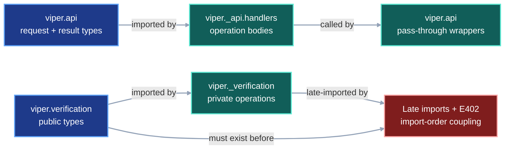
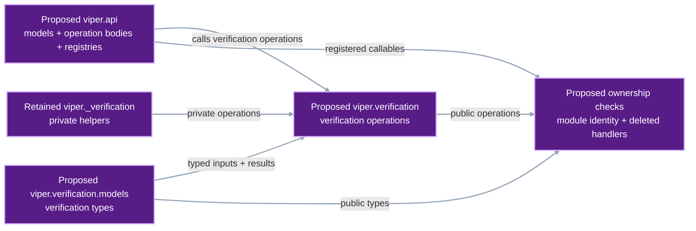
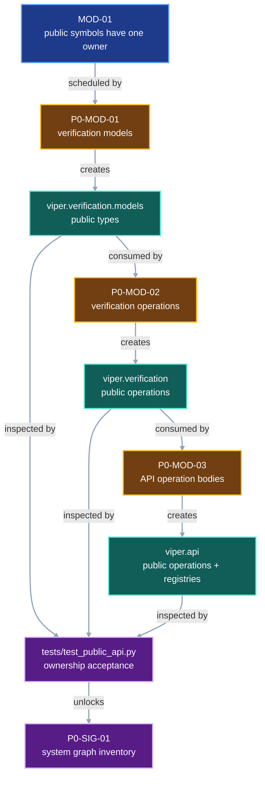

# Public module ownership

VIPER currently exposes public operations through two circular arrangements.
`viper.api` defines request and result types, then delegates every operation to
`viper._api.handlers`. `viper.verification` defines public result types before
late-importing private verifier functions that import those types back from the
public module.

This contract gives each public symbol one defining module. `viper.api` owns
its operation bodies. `viper.verification` owns verification operations, while
`viper.verification.models` owns verification types.

## 1. Status

**Contract status:** complete.

| ID | Implementation obligation |
| --- | --- |
| MOD-01 <!-- contract-requirement: MOD-01 phase=0 test=tests/test_public_api.py --> | Define every public API operation and verification symbol in the public module from which callers import it. Remove pass-through handlers, late imports, and the file-wide `E402` suppressions they require. |

## 2. Required claim

Every public API and verification symbol has one implementation owner:

```text
viper.api operation
-> function body defined in viper.api

viper.verification operation
-> function body defined in viper.verification

viper.verification model or type
-> declaration defined in viper.verification.models
```

The contract preserves request models, result models, function signatures,
operation names, registry order, verification comparisons, and returned
values. It changes module ownership and imports.

## 3. Current gap

### Inspected path

[`api.py`](../../src/viper/api.py) currently imports
`viper._api.handlers` after declaring its models. Each public operation then
returns the result of the same-named private handler. The wrapper and handler
signatures must remain identical. The wrapper only delegates the call.

At the contract baseline, `src/viper/verification.py` declared public
verification types before importing private verifier modules. Those private
modules import the public types back from `verification.py`. The file disables
`E402` because normal top-level import order would expose that cycle.

### Current DAG

The current imports force public declarations to exist before their private
implementations can load.



### Proposed-change DAG

The refactor moves existing declarations and bodies to their final owners.



### Integrated DAG

The checklist moves types first, then verification operations, then API
operations. The focused test checks the final module identities before the
system-graph compiler starts.



The diagrams use the semantic palette enforced by the contract documentation
tests.

## 4. Models

Protocol schemas and serialized fields stay unchanged. This refactor moves
existing Python declarations while preserving their shapes.

The public verification package has this exact ownership boundary:

```text
src/viper/verification/
├── __init__.py   verify_* operation bodies and operation-only __all__
└── models.py     VerificationError, VerificationPolicy, verified-result
                  dataclasses, StorageFetcher, and StageSnapshot
```

`P0-MOD-01` owns the exact model export list. `P0-MOD-02` owns the exact
operation export list. Their `contract-target` declarations below are the only
normative copies.

Callers import operations and types from their defining modules:

```python
from viper.verification import verify_run_result
from viper.verification.models import (
    StorageFetcher,
    VerificationError,
    VerificationPolicy,
    VerifiedRunResult,
)
```

`P0-MOD-03` owns the API operation bodies and exact `HANDLER_REGISTRY` order.

The refactor deletes `src/viper/verification.py`, `src/viper/_api/handlers.py`,
and the empty `src/viper/_api` package after their definitions and importers
move.

### Illustrative worked example

The example uses one existing fixture to prove that ownership changes while
behavior remains stable.

<!-- contract-worked-example: start -->

```python
import inspect
from pathlib import Path

import viper.api as api
import viper.verification as verification
from viper.api import HANDLER_REGISTRY, ValidateStageRequest
from viper.verification.models import VerificationPolicy


fixture = Path("tests/data/download_stage.yaml")
request = ValidateStageRequest(path=fixture)
result = api.validate_stage(request)
policy = VerificationPolicy(trusted_source_repositories=frozenset())

assert result.stage_kind == "download"
assert policy.trusted_source_repositories == frozenset()
assert inspect.getmodule(api.validate_stage) is api
assert api.validate_stage.__module__ == "viper.api"
assert verification.verify_run_result.__module__ == "viper.verification"
assert VerificationPolicy.__module__ == "viper.verification.models"
assert HANDLER_REGISTRY["validate_stage"] is api.validate_stage
assert not Path("src/viper/_api/handlers.py").exists()
assert not Path("src/viper/verification.py").exists()
```

<!-- contract-worked-example: end -->

## 5. Execution

The implementation follows one order:

```text
copy verification types to verification/models.py
-> update private verifier imports
-> move verification operations to verification/__init__.py
-> update public callers and tests
-> delete verification.py
-> move API helpers and operations into api.py
-> point HANDLER_REGISTRY at local functions
-> delete _api/handlers.py
-> run ownership and behavior tests
```

Moving verification first gives `api.py` a stable source for `StorageFetcher`,
`VerificationError`, and `VerificationPolicy` before its operation bodies move.

## 6. Persisted evidence

Runtime provenance records stay unchanged. The committed source tree and
focused test results provide the durable evidence for source ownership:

| Evidence | Proves |
| --- | --- |
| `src/viper/verification/models.py` | Public verification types have one defining module. |
| `src/viper/verification/__init__.py` | Public verification operations have one defining module. |
| `src/viper/api.py` | Public API models, operations, registries, and dispatch share one owner. |
| `tests/test_public_api.py` | Module identity, registry identity, and retired-file rejection remain enforced. |

YAML, JSON, snapshots, run identity, and protocol digests remain identical
because this refactor preserves every runtime model and operation result.

## 7. Verification

| Rule | Executable condition |
| --- | --- |
| `module.api.owner` <!-- verifier-rule: module.api.owner requirement=MOD-01 --> | Every callable in `HANDLER_REGISTRY` has `__module__ == "viper.api"`, and `src/viper/_api/handlers.py` is absent. |
| `module.verification.owner` <!-- verifier-rule: module.verification.owner requirement=MOD-01 --> | Every public verification operation has `__module__ == "viper.verification"`; every public verification type has `__module__ == "viper.verification.models"`; `src/viper/verification.py` is absent. |
| `module.verification.model_exports` <!-- verifier-rule: module.verification.model_exports requirement=MOD-01 --> | `viper.verification.models.__all__` equals the exact ordered type list declared by `P0-MOD-01`. |
| `module.verification.operation_exports` <!-- verifier-rule: module.verification.operation_exports requirement=MOD-01 --> | `viper.verification.__all__` equals the exact ordered operation list declared by `P0-MOD-02`. |

The module-identity checks establish ownership. Existing API and verification
tests establish that each moved body still returns the same value.
`test_module_ownership_pair_blocks_cover_every_moved_definition` compares the
AST of every moved API operation, verification operation, and verification
model with this contract's target declarations.

## 8. Propagation

Manual import and checklist inspection supplies this table while the
system-impact compiler remains pending. The generated impact report must later
match it.

| Path | Disposition | Required change |
| --- | --- | --- |
| `src/viper/api.py` | Change | Move every handler helper and operation body here; remove the late handler import and pass-through wrappers. |
| `src/viper/_api/handlers.py` | Remove | Delete after every body and caller moves to `viper.api`. |
| `src/viper/verification.py` | Remove | Replace the module with the public `verification` package. |
| `src/viper/verification/__init__.py` | Add | Define public verification operations and import shared types from `models.py`. |
| `src/viper/verification/models.py` | Add | Define public verification errors, policies, result dataclasses, and aliases. |
| `src/viper/_verification/attempt.py` | Change | Import public types from `viper.verification.models`. |
| `src/viper/_verification/metrics.py` | Change | Import public types from `viper.verification.models`. |
| `src/viper/_verification/plan.py` | Change | Import public types from `viper.verification.models`. |
| `src/viper/_verification/storage.py` | Change | Import public types from `viper.verification.models`. |
| `src/viper/execution/_attempt.py` | Change | Import operations and models from their defining verification modules. |
| `src/viper/execution/_benchmark.py` | Change | Import `VerificationPolicy` from `viper.verification.models`. |
| `src/viper/execution/_materialization.py` | Change | Import `VerificationPolicy` from `viper.verification.models`. |
| `src/viper/inspection.py` | Change | Import verified result types from `viper.verification.models`. |
| `src/viper/preflight.py` | Change | Import `VerificationError` from `viper.verification.models`. |
| `tests/fixtures.py` | Change | Import `VerificationPolicy` from its defining module. |
| `tests/test_public_api.py` | Change | Replace wrapper parity with exact module-owner and retired-file checks. |
| `tests/test_validation_architecture.py` | Change | Point the root-boundary AST check at `src/viper/api.py`. |
| `tests/test_benchmark_execution.py` | Change | Patch `viper.api.execute_benchmark_run` after the handler body moves. |
| `tests/test_verification.py` | Change | Import operations and models from their defining modules. |
| `tests/test_verification_acceptance.py` | Change | Import operations and models from their defining modules. |
| `tests/test_metric_provenance.py` | Change | Split operation and model imports. |
| `tests/test_run_execution.py` | Change | Split operation and model imports. |
| `tests/test_execution_signals.py` | Change | Split operation and model imports. |
| `tests/test_process_startup.py` | Change | Import `VerificationError` from its defining module. |
| `tests/test_cloud_execution.py` | Change | Import `VerificationError` from its defining module. |
| `tests/test_inspection.py` | Change | Import verified result types from their defining module. |
| `docs/development/module-privacy.md` | Change | Replace the superseded private-handler explanation with the one-owner rule. |
| `docs/development/master-execution-checklist.md` | Change | Insert this contract before the system graph and assign future API operations to `viper.api`. |
| `docs/development/foundation-pair-coding.md` | Change | Link to the dedicated module-ownership guide. |
| `docs/development/module-ownership.md` | Change | Own the exact file-separated verification and API PairBlocks. |

Any additional importer found during implementation receives the same direct
import update before `MOD-01` closes.

## 9. Acceptance case

Success uses the existing download-stage fixture:

```text
ValidateStageRequest(path="tests/data/download_stage.yaml")
-> viper.api.validate_stage()
-> ValidateStageSuccess(stage_kind="download")
-> HANDLER_REGISTRY["validate_stage"] is viper.api.validate_stage
```

The focused test also imports `VerificationPolicy` from
`viper.verification.models` and `verify_run_result` from `viper.verification`,
then checks each symbol's `__module__`.

Rejection recreates either retired arrangement in a temporary package. The
test fails when a registry callable belongs to `viper._api.handlers`, a public
verification type belongs to `viper.verification`, or either retired source
file remains.

## 10. Implementation order

1. Create `viper.verification.models` and move every public verification type
   while preserving its declaration.
2. Create `viper.verification`, move every public verification operation, and
   update private and public importers.
3. Move every API helper and operation body into `viper.api`; delete the
   pass-through wrappers and `_api/handlers.py`.
4. Replace signature-parity tests with defining-module, registry-identity,
   retired-file, and behavior checks.
5. Run the focused public API and verification suites. Commit this refactor
   before starting the system-graph compiler.


## 11. Contract-owned PairBlocks

These four blocks are the executable source for MOD-01. Each target marker binds one source declaration to the block that changes it; the checklist owns order and completion state.

<!-- pair-block-definition: P0-MOD-01 -->
```toml pair-block
id = "P0-MOD-01"
requirements = ["MOD-01"]
targets = ["src/viper/verification/models.py:VerificationPolicy", "src/viper/verification/models.py:VerifiedRunResult", "src/viper/verification/models.py:__all__"]
tests = ["tests/test_contract_documentation.py:test_module_ownership_pair_blocks_cover_every_moved_definition"]
gate = "python -m pytest tests/test_contract_documentation.py -k module_ownership_pair_blocks_cover_every_moved_definition -q"
depends_on = ["P0-CRT-06"]
```

**Context:** `verification.py` mixes public data types with operation code and late imports. Stage the exact type declarations first; the next block activates the package and removes the old module atomically.

Create `src/viper/verification/models.py` without creating `__init__.py` yet.
Copy these declarations exactly. `verification.py` remains active until
`P0-MOD-02` completes the package cutover.

`src/viper/verification/models.py`

<!-- contract-target: requirements=MOD-01 block=P0-MOD-01 action=add target=src/viper/verification/models.py:VerificationPolicy -->
<!-- contract-target: requirements=MOD-01 block=P0-MOD-01 action=add target=src/viper/verification/models.py:VerifiedRunResult -->
<!-- contract-target: requirements=MOD-01 block=P0-MOD-01 action=add target=src/viper/verification/models.py:__all__ -->

```python contract-target
"""Define the public records consumed and returned by verification operations."""

from __future__ import annotations

from collections.abc import Callable
from dataclasses import dataclass

from .._schema import DataRole, RepoRelPath
from ..artifacts import ResolvedArtifact
from ..benchmark import BenchmarkResult, BenchmarkSpec
from ..experiments import ExperimentSpec, VariantSpec
from ..ids import StageId
from ..metrics import Measurement
from ..references import (
    LocalStageResultSnapshotRef,
    ResolvedFileRef,
    SnapshotFileRef,
    StageResultSnapshotRef,
    StorageModel,
)
from ..runs import ResolvedRun, RunAttempt, RunSpec
from ..stages import BaseSpec, ResolvedBaseSpec


class VerificationError(ValueError):
    """A referenced file could not be retrieved or failed verification."""


@dataclass(frozen=True)
class VerificationPolicy:
    """Define which source repositories may execute project-owned code."""

    trusted_source_repositories: frozenset[str]

    def permits_source(self, repository: object) -> bool:
        """Return whether project code from one repository may execute."""
        normalized = str(repository).rstrip("/")
        return normalized in {
            trusted.rstrip("/") for trusted in self.trusted_source_repositories
        }


@dataclass(frozen=True)
class VerifiedSnapshotFile:
    """One snapshot file whose bytes match its recorded identity."""

    reference: SnapshotFileRef
    content: bytes


@dataclass(frozen=True)
class VerifiedArtifact:
    """One resolved artifact and all of its verified files."""

    artifact: ResolvedArtifact
    files: tuple[VerifiedSnapshotFile, ...]
    data_role: DataRole
    references: tuple[ResolvedFileRef, ...] = ()


@dataclass(frozen=True)
class VerifiedInput:
    """A verified artifact and the local path where a stage consumes it."""

    path: RepoRelPath
    data_role: DataRole
    artifact: ResolvedArtifact
    files: tuple[VerifiedSnapshotFile, ...]
    references: tuple[ResolvedFileRef, ...] = ()


@dataclass(frozen=True)
class VerifiedRunPlan:
    """The connected records constituting one verified run plan."""

    run: RunSpec
    experiment: ExperimentSpec
    variant: VariantSpec
    benchmark: BenchmarkSpec | None
    stages: dict[StageId, BaseSpec]


@dataclass(frozen=True)
class VerifiedRunResult:
    """A verified terminal run and its connected records."""

    result: ResolvedRun
    plan: VerifiedRunPlan
    attempts: tuple[RunAttempt, ...]
    resolved_stages: dict[StageId, ResolvedBaseSpec]
    measurements: tuple[Measurement, ...]


@dataclass(frozen=True)
class VerifiedBenchmarkResult:
    """A benchmark result and its verified run and confirmation execution."""

    result: BenchmarkResult
    run: VerifiedRunResult
    confirmation: RunAttempt
    confirmation_stages: dict[StageId, ResolvedBaseSpec]
    confirmation_measurements: tuple[Measurement, ...]


StorageFetcher = Callable[[StorageModel], bytes]
StageSnapshot = StageResultSnapshotRef | LocalStageResultSnapshotRef


__all__ = [
    "StageSnapshot",
    "StorageFetcher",
    "VerificationError",
    "VerificationPolicy",
    "VerifiedArtifact",
    "VerifiedBenchmarkResult",
    "VerifiedInput",
    "VerifiedRunPlan",
    "VerifiedRunResult",
    "VerifiedSnapshotFile",
]
```

<!-- pair-block-definition: P0-MOD-02 -->
```toml pair-block
id = "P0-MOD-02"
requirements = ["MOD-01"]
targets = ["src/viper/verification/__init__.py:verify_run_result", "src/viper/verification/__init__.py:__all__", "src/viper/_api/handlers.py:VerificationPolicy", "src/viper/_verification/attempt.py:VerificationPolicy", "src/viper/_verification/metrics.py:VerifiedRunPlan", "src/viper/_verification/plan.py:VerifiedRunPlan", "src/viper/_verification/storage.py:StageSnapshot", "src/viper/api.py:StorageFetcher", "src/viper/execution/_attempt.py:verify_run_result", "src/viper/execution/_benchmark.py:verify_attempt_stages", "src/viper/execution/_materialization.py:verify_promoted_artifact", "src/viper/inspection.py:VerifiedRunResult", "src/viper/preflight.py:VerificationError", "tests/fixtures.py:VerificationPolicy", "tests/test_cloud_execution.py:VerificationError", "tests/test_execution_signals.py:verify_run_result", "tests/test_inspection.py:VerifiedRunPlan", "tests/test_metric_provenance.py:verify_run_result", "tests/test_process_startup.py:VerificationError", "tests/test_run_execution.py:verify_run_result", "tests/test_verification.py:verify_attempt_future_inputs", "tests/test_verification_acceptance.py:verify_benchmark_result"]
tests = ["tests/test_public_api.py:test_verification_namespace_separates_operations_and_models", "tests/test_verification_acceptance.py:CompleteProvenanceAcceptanceTests.test_complete_dummy_run_passes_full_verification"]
gate = "python -m pytest tests/test_public_api.py::test_verification_namespace_separates_operations_and_models tests/test_verification_acceptance.py::CompleteProvenanceAcceptanceTests::test_complete_dummy_run_passes_full_verification -q"
depends_on = ["P0-MOD-01"]
```

**Context:** Once the types have a stable module, the six public verification operations can move into the package that callers already name. This removes the late-import cycle without changing verification behavior.

Create `src/viper/verification/__init__.py`. Move these six public operation
bodies from `verification.py` while preserving their signatures and statements:
`verify_run_result`, `verify_promoted_artifact`,
`verify_stored_input_selections`, `verify_stored_inputs`,
`verify_attempt_future_inputs`, and `verify_benchmark_result`. Import shared
types from `.models`. Delete `src/viper/verification.py` after every importer
uses the package.

This block contains the complete target operation module.

`src/viper/verification/__init__.py`

<!-- contract-target: requirements=MOD-01 block=P0-MOD-02 action=add target=src/viper/verification/__init__.py:verify_run_result -->
<!-- contract-target: requirements=MOD-01 block=P0-MOD-02 action=add target=src/viper/verification/__init__.py:__all__ -->

```python contract-target
"""Verify connected VIPER provenance records."""

from __future__ import annotations

from collections.abc import Mapping

import yaml

from .._schema import (
    PARAMETERS,
    PARAMETERS_INPUT,
    PREDICTIONS,
    RESUME_STATE,
    RESUME_STATE_INPUT,
    DataRole,
    RepoRelPath,
)
from ..artifacts import ArtifactPointer, StageArtifactRef
from ..benchmark import BenchmarkResult, BenchmarkSpec
from ..ids import InputName, StageId
from ..inputs import (
    FutureInputRef,
    ResolvedFutureInputRef,
    ResolvedStoredInputRef,
    StoredInputRef,
)
from ..metrics import Measurement, MetricVerificationReceipt
from ..references import GitFileRef, ResolvedFileRef
from ..runs import ResolvedRun, RunAttempt, RunSpec
from ..serialization import document_digest, parse_yaml_bytes
from ..stages import (
    EvaluateSpec,
    InternalSpec,
    ResolvedBaseSpec,
    ResolvedInternalSpec,
    TrainSpec,
)
from .models import (
    StorageFetcher,
    VerificationError,
    VerificationPolicy,
    VerifiedArtifact,
    VerifiedBenchmarkResult,
    VerifiedInput,
    VerifiedRunResult,
)

__all__ = [
    "verify_attempt_future_inputs",
    "verify_benchmark_result",
    "verify_promoted_artifact",
    "verify_run_result",
    "verify_stored_input_selections",
    "verify_stored_inputs",
]

# Loading verification models must not initialize the private verifier graph.
# Public operations resolve those private dependencies only when called.


def verify_run_result(
    resolved_run: ResolvedRun,
    *,
    policy: VerificationPolicy,
    fetcher: StorageFetcher | None = None,
) -> VerifiedRunResult:
    """Verify a terminal run from its RunSpec through every completed attempt."""
    from .._verification.attempt import (
        verify_attempt_files,
        verify_attempt_journal,
        verify_attempt_stages,
        verify_measurement_stage_times,
    )
    from .._verification.metrics import verify_recomputed_metrics
    from .._verification.plan import verify_run_plan
    from .._verification.storage import (
        artifact_revision_identity,
        snapshot_identity,
        verify_run_attempt_references,
    )

    plan = verify_run_plan(resolved_run, fetcher=fetcher)
    attempts = verify_run_attempt_references(
        resolved_run,
        plan.run,
        fetcher=fetcher,
    )
    all_measurements: list[Measurement] = []
    successful_stages: dict[StageId, ResolvedBaseSpec] = {}
    stage_result_snapshots: set[tuple[str, ...]] = set()
    attempt_file_snapshots: set[tuple[str, ...]] = set()

    for attempt in attempts:
        current_stage_result_snapshots = {
            snapshot_identity(stage.snapshot) for stage in attempt.resolved_stages
        }
        if stage_result_snapshots & current_stage_result_snapshots:
            raise VerificationError(
                "run attempts must use distinct stage-result snapshots"
            )
        stage_result_snapshots.update(current_stage_result_snapshots)

        current_attempt_file_snapshots = {
            identity
            for reference in (
                attempt.journal,
                *attempt.measurement_files,
                *attempt.metric_verification_files,
                *attempt.log_files,
            )
            if (identity := artifact_revision_identity(reference.stored_at)) is not None
        }
        if attempt_file_snapshots & current_attempt_file_snapshots:
            raise VerificationError(
                "run attempts must use distinct measurement and log snapshots"
            )
        attempt_file_snapshots.update(current_attempt_file_snapshots)

    if stage_result_snapshots & attempt_file_snapshots:
        raise VerificationError(
            "stage-result and attempt-file snapshots must be distinct"
        )

    for attempt in attempts:
        complete = attempt.status == "succeeded"
        verify_attempt_journal(attempt, plan.run, fetcher=fetcher)
        verified_stages = verify_attempt_stages(
            attempt,
            plan.run,
            plan.stages,
            require_complete=complete,
            policy=policy,
            fetcher=fetcher,
        )
        stored_inputs = verify_stored_inputs(
            verified_stages,
            policy=policy,
            fetcher=fetcher,
        )
        future_inputs = verify_attempt_future_inputs(
            attempt,
            plan.run,
            verified_stages,
            fetcher=fetcher,
        )
        attempt_measurements = verify_attempt_files(
            attempt,
            plan.run,
            plan.experiment,
            plan.stages,
            fetcher=fetcher,
        )
        verify_measurement_stage_times(
            verified_stages,
            attempt_measurements,
            plan.experiment,
        )
        verify_recomputed_metrics(
            attempt,
            plan,
            verified_stages,
            attempt_measurements,
            stored_inputs,
            future_inputs,
            policy=policy,
            fetcher=fetcher,
        )
        all_measurements.extend(attempt_measurements)
        if attempt.attempt_id == resolved_run.successful_attempt_id:
            successful_stages = verified_stages

    if resolved_run.status == "succeeded":
        estimator_stage = successful_stages.get(plan.run.estimator.stage_id)
        if estimator_stage is None:
            raise VerificationError("successful run has no estimator-producing stage")
        if plan.run.estimator.artifact_name not in estimator_stage.artifacts:
            raise VerificationError("successful run has no selected estimator artifact")

    return VerifiedRunResult(
        result=resolved_run,
        plan=plan,
        attempts=attempts,
        resolved_stages=successful_stages,
        measurements=tuple(all_measurements),
    )


def verify_promoted_artifact(
    pointer: ArtifactPointer,
    *,
    policy: VerificationPolicy,
    expected_data_role: DataRole | None = None,
    materialization_path: RepoRelPath | None = None,
    fetcher: StorageFetcher | None = None,
) -> VerifiedArtifact:
    """Follow a promoted artifact pointer through its completed producer run."""
    from .._verification.paths import run_root
    from .._verification.storage import (
        load_verified_artifact,
        read_resolved_file,
        verify_snapshot_artifact,
    )

    resolved_run_raw = read_resolved_file(pointer.run, fetcher=fetcher)
    try:
        resolved_run = ResolvedRun.model_validate(parse_yaml_bytes(resolved_run_raw))
    except (yaml.YAMLError, ValueError) as exc:
        raise VerificationError(
            "artifact pointer run is not a valid ResolvedRun document"
        ) from exc

    verified_run = verify_run_result(resolved_run, policy=policy, fetcher=fetcher)
    expected_run_path = f"{run_root(verified_run.plan.run)}/resolved.yaml"
    if pointer.run.stored_at.path != expected_run_path:
        raise VerificationError(
            "artifact pointer run reference is outside the canonical run path"
        )

    if (
        verified_run.plan.run.benchmark_id is not None
        and pointer.artifact == verified_run.plan.run.estimator
        and pointer.benchmark_result is None
    ):
        raise VerificationError(
            "promotion of a benchmarked estimator requires a benchmark result"
        )

    producer_spec = verified_run.resolved_stages.get(pointer.artifact.stage_id)
    if producer_spec is None:
        raise VerificationError("artifact pointer selects an absent producer stage")

    artifact = producer_spec.artifacts.get(pointer.artifact.artifact_name)
    if artifact is None:
        raise VerificationError("artifact pointer selects an undeclared artifact")
    declaration = producer_spec.spec.artifacts[pointer.artifact.artifact_name]

    if pointer.benchmark_result is not None:
        benchmark_result_raw = read_resolved_file(
            pointer.benchmark_result,
            fetcher=fetcher,
        )
        try:
            benchmark_result = BenchmarkResult.model_validate(
                parse_yaml_bytes(benchmark_result_raw)
            )
        except (yaml.YAMLError, ValueError) as exc:
            raise VerificationError(
                "artifact pointer benchmark result is invalid"
            ) from exc

        verify_benchmark_result(
            benchmark_result,
            policy=policy,
            fetcher=fetcher,
        )
        expected_result_path = (
            f"{run_root(verified_run.plan.run)}/benchmark.result.yaml"
        )
        if pointer.benchmark_result.stored_at.path != expected_result_path:
            raise VerificationError(
                "artifact pointer benchmark result is outside the canonical run path"
            )
        if benchmark_result.status != "passed":
            raise VerificationError(
                "artifact pointer benchmark result must have passed"
            )
        if benchmark_result.run != pointer.run:
            raise VerificationError(
                "artifact pointer and benchmark result select different runs"
            )
        if pointer.artifact != verified_run.plan.run.estimator:
            raise VerificationError("benchmark promotion must select the run estimator")

    successful_attempt = next(
        attempt
        for attempt in verified_run.attempts
        if attempt.attempt_id == resolved_run.successful_attempt_id
    )
    producer_stage = next(
        stage
        for stage in successful_attempt.resolved_stages
        if stage.stage_id == pointer.artifact.stage_id
    )
    verified_artifact = verify_snapshot_artifact(
        producer_stage,
        artifact,
        data_role=declaration.data_role,
        fetcher=fetcher,
    )
    if (
        expected_data_role is not None
        and verified_artifact.data_role != expected_data_role
    ):
        raise VerificationError(
            f"selected artifact data_role {verified_artifact.data_role!r} does not "
            f"match stored input data_role {expected_data_role!r}"
        )
    if materialization_path is not None:
        load_verified_artifact(
            verified_run.plan.run,
            declaration,
            pointer.artifact.artifact_name,
            verified_artifact,
            policy=policy,
            materialization_path=materialization_path,
            fetcher=fetcher,
        )
    return verified_artifact


def verify_stored_input_selections(
    stage_id: StageId,
    stage_spec: InternalSpec,
    pointers: Mapping[InputName, ArtifactPointer],
) -> None:
    """Verify relationships among stored pointers consumed by one stage."""
    if isinstance(stage_spec, TrainSpec):
        model_input = stage_spec.inputs.get(PARAMETERS_INPUT)
        state_input = stage_spec.inputs.get(RESUME_STATE_INPUT)
        if isinstance(model_input, StoredInputRef) and isinstance(
            state_input,
            StoredInputRef,
        ):
            model_pointer = pointers[PARAMETERS_INPUT]
            state_pointer = pointers[RESUME_STATE_INPUT]
            if model_pointer.run != state_pointer.run:
                raise VerificationError(
                    f"stored checkpoint inputs of stage {stage_id!r} must select "
                    "one resolved run"
                )
            if model_pointer.artifact.stage_id != state_pointer.artifact.stage_id:
                raise VerificationError(
                    f"stored checkpoint inputs of stage {stage_id!r} must select "
                    "one producer stage"
                )
            if model_pointer.artifact.artifact_name != PARAMETERS:
                raise VerificationError(
                    f"stored checkpoint model input of stage {stage_id!r} must "
                    "select parameters"
                )
            if state_pointer.artifact.artifact_name != RESUME_STATE:
                raise VerificationError(
                    f"stored checkpoint state input of stage {stage_id!r} must "
                    "select resume_state"
                )

    if isinstance(stage_spec, EvaluateSpec):
        model_input = stage_spec.inputs[PARAMETERS_INPUT]
        if isinstance(model_input, StoredInputRef):
            model_pointer = pointers[PARAMETERS_INPUT]
            if model_pointer.artifact.artifact_name != PARAMETERS:
                raise VerificationError(
                    f"stored evaluation model input of stage {stage_id!r} must "
                    "select parameters"
                )


def verify_stored_inputs(
    resolved_stages: Mapping[StageId, ResolvedBaseSpec],
    *,
    policy: VerificationPolicy,
    fetcher: StorageFetcher | None = None,
) -> dict[StageId, dict[InputName, VerifiedInput]]:
    """Verify every promoted artifact consumed by the resolved stages."""
    from .._verification.storage import read_resolved_file

    verified_inputs: dict[StageId, dict[InputName, VerifiedInput]] = {}

    for stage_id, resolved_stage in resolved_stages.items():
        if not isinstance(resolved_stage, ResolvedInternalSpec):
            continue

        stage_inputs: dict[InputName, VerifiedInput] = {}
        parsed_pointers: dict[InputName, ArtifactPointer] = {}

        for input_name, spec_input in resolved_stage.spec.inputs.items():
            if not isinstance(spec_input, StoredInputRef):
                continue

            resolved_input = resolved_stage.inputs.get(input_name)
            if not isinstance(resolved_input, ResolvedStoredInputRef):
                raise VerificationError(
                    f"stored input {input_name!r} of stage {stage_id!r} has no "
                    "resolved stored-input reference"
                )

            if resolved_input.pointer.stored_at != spec_input.pointer:
                raise VerificationError(
                    f"stored input {input_name!r} of stage {stage_id!r} resolved "
                    "a different pointer location than the stage spec"
                )

            pointer_raw = read_resolved_file(
                resolved_input.pointer,
                fetcher=fetcher,
            )
            try:
                pointer = ArtifactPointer.model_validate(parse_yaml_bytes(pointer_raw))
            except (yaml.YAMLError, ValueError) as exc:
                raise VerificationError(
                    f"stored input {input_name!r} of stage {stage_id!r} pointer "
                    "is not a valid ArtifactPointer document"
                ) from exc

            parsed_pointers[input_name] = pointer

            verified_artifact = verify_promoted_artifact(
                pointer,
                policy=policy,
                expected_data_role=spec_input.data_role,
                materialization_path=spec_input.path,
                fetcher=fetcher,
            )
            stage_inputs[input_name] = VerifiedInput(
                path=spec_input.path,
                data_role=spec_input.data_role,
                artifact=verified_artifact.artifact,
                files=verified_artifact.files,
                references=verified_artifact.references,
            )

        verify_stored_input_selections(
            stage_id,
            resolved_stage.spec,
            parsed_pointers,
        )

        if stage_inputs:
            verified_inputs[stage_id] = stage_inputs

    return verified_inputs


def verify_attempt_future_inputs(
    attempt: RunAttempt,
    run: RunSpec,
    resolved_stages: Mapping[StageId, ResolvedBaseSpec],
    *,
    fetcher: StorageFetcher | None = None,
) -> dict[StageId, dict[InputName, VerifiedInput]]:
    """Verify same-attempt inputs consumed by every completed stage."""
    from .._verification.storage import verify_snapshot_artifact

    stage_positions: dict[StageId, int] = {}
    for position, stage_reference in enumerate(run.stages):
        stage_positions[stage_reference.stage_id] = position

    completed_stages = {stage.stage_id: stage for stage in attempt.resolved_stages}

    verified_inputs: dict[StageId, dict[InputName, VerifiedInput]] = {}
    for consumer_stage_id, resolved_consumer_spec in resolved_stages.items():
        # Not checking download specs because they don't have any inputs to verify
        if not isinstance(resolved_consumer_spec, ResolvedInternalSpec):
            continue

        stage_inputs: dict[InputName, VerifiedInput] = {}

        for input_name, spec_input in resolved_consumer_spec.spec.inputs.items():
            if not isinstance(spec_input, FutureInputRef):
                continue

            resolved_input = resolved_consumer_spec.inputs[input_name]

            if not isinstance(resolved_input, ResolvedFutureInputRef):
                raise VerificationError(
                    f"future input {input_name!r} of stage "
                    f"{consumer_stage_id!r} has no resolved future-input "
                    "reference"
                )

            producer_stage_id = spec_input.producer_stage_id

            if consumer_stage_id not in stage_positions:
                raise VerificationError(
                    f"consumer stage {consumer_stage_id!r} is not in the run plan"
                )

            if producer_stage_id not in stage_positions:
                raise VerificationError(
                    f"producer stage {producer_stage_id!r} is not in the run plan"
                )

            if stage_positions[producer_stage_id] >= stage_positions[consumer_stage_id]:
                raise VerificationError(
                    f"future input {input_name!r} must name an earlier stage"
                )

            resolved_producer_spec = resolved_stages.get(producer_stage_id)

            if resolved_producer_spec is None:
                raise VerificationError(
                    f"resolved producer stage {producer_stage_id!r} is missing"
                )

            producer_stage_reference = completed_stages.get(producer_stage_id)
            if producer_stage_reference is None:
                raise VerificationError(
                    f"successful attempt has no resolved stage for "
                    f"{producer_stage_id!r}"
                )

            if resolved_input.producer != producer_stage_reference:
                raise VerificationError(
                    f"future input {input_name!r} of stage "
                    f"{consumer_stage_id!r} does not identify the completed "
                    "producer stage"
                )

            artifact_name = spec_input.name
            artifact = resolved_producer_spec.artifacts.get(artifact_name)
            if artifact is None:
                raise VerificationError(
                    f"producer stage {producer_stage_id!r} has no artifact "
                    f"named {artifact_name!r}"
                )

            declared_artifact = resolved_producer_spec.spec.artifacts.get(artifact_name)
            if declared_artifact is None:
                raise VerificationError(
                    f"producer stage {producer_stage_id!r} did not declare "
                    f"artifact {artifact_name!r}"
                )

            verified_artifact = verify_snapshot_artifact(
                producer_stage_reference,
                artifact,
                data_role=declared_artifact.data_role,
                fetcher=fetcher,
            )
            stage_inputs[input_name] = VerifiedInput(
                path=declared_artifact.path,
                data_role=declared_artifact.data_role,
                artifact=verified_artifact.artifact,
                files=verified_artifact.files,
                references=verified_artifact.references,
            )

        if stage_inputs:
            verified_inputs[consumer_stage_id] = stage_inputs

    return verified_inputs


def verify_benchmark_result(
    result: BenchmarkResult,
    *,
    policy: VerificationPolicy,
    fetcher: StorageFetcher | None = None,
) -> VerifiedBenchmarkResult:
    """Verify benchmark parity and metric criteria across two executions."""
    from .._verification.attempt import (
        verify_attempt_files,
        verify_attempt_stages,
        verify_measurement_stage_times,
    )
    from .._verification.metrics import verify_recomputed_metrics
    from .._verification.paths import run_root
    from .._verification.storage import (
        artifact_revision_identity,
        read_attempt_reference,
        read_resolved_file,
        snapshot_identity,
    )

    benchmark_raw = read_resolved_file(result.benchmark, fetcher=fetcher)
    try:
        benchmark = BenchmarkSpec.model_validate(parse_yaml_bytes(benchmark_raw))
    except (yaml.YAMLError, ValueError) as exc:
        raise VerificationError(
            "benchmark result does not reference a valid BenchmarkSpec"
        ) from exc

    run_raw = read_resolved_file(result.run, fetcher=fetcher)
    try:
        resolved_run = ResolvedRun.model_validate(parse_yaml_bytes(run_raw))
    except (yaml.YAMLError, ValueError) as exc:
        raise VerificationError(
            "benchmark result does not reference a valid ResolvedRun"
        ) from exc

    verified_run = verify_run_result(resolved_run, policy=policy, fetcher=fetcher)

    if result.completed_at < resolved_run.completed_at:
        raise VerificationError(
            "benchmark result cannot precede the selected run completion"
        )

    expected_run_location = f"{run_root(verified_run.plan.run)}/resolved.yaml"
    if result.run.stored_at.path != expected_run_location:
        raise VerificationError(
            "benchmark result run reference is outside the canonical run path"
        )

    expected_benchmark_location = GitFileRef(
        repository=verified_run.plan.run.source.repository,
        commit=verified_run.plan.run.source.commit,
        path=f"benchmarks/{benchmark.benchmark_id}.spec.yaml",
    )
    if result.benchmark.stored_at != expected_benchmark_location:
        raise VerificationError(
            "benchmark result reference does not match the run source snapshot"
        )

    if verified_run.plan.benchmark != benchmark:
        raise VerificationError(
            "benchmark result and run plan select different benchmark specs"
        )

    confirmation = read_attempt_reference(
        result.confirmation,
        verified_run.plan.run,
        fetcher=fetcher,
    )
    if confirmation.status != "succeeded":
        raise VerificationError("benchmark confirmation attempt must succeed")
    if confirmation.purpose != "benchmark_confirmation":
        raise VerificationError("benchmark confirmation has the wrong purpose")
    if result.completed_at < confirmation.completed_at:
        raise VerificationError(
            "benchmark result cannot precede confirmation completion"
        )

    selected_attempt = next(
        attempt
        for attempt in verified_run.attempts
        if attempt.attempt_id == resolved_run.successful_attempt_id
    )
    original_attempt_ids = {attempt.attempt_id for attempt in verified_run.attempts}
    if confirmation.attempt_id in original_attempt_ids:
        raise VerificationError("benchmark confirmation must use a new attempt ID")
    if confirmation.attempt_id <= max(original_attempt_ids):
        raise VerificationError(
            "benchmark confirmation attempt ID must follow the candidate history"
        )

    original_snapshots = {
        snapshot_identity(stage.snapshot)
        for attempt in verified_run.attempts
        for stage in attempt.resolved_stages
    }
    confirmation_snapshots = {
        snapshot_identity(stage.snapshot) for stage in confirmation.resolved_stages
    }
    if original_snapshots & confirmation_snapshots:
        raise VerificationError(
            "benchmark confirmation must use new stage-result snapshots"
        )

    original_attempt_file_snapshots = {
        identity
        for attempt in verified_run.attempts
        for reference in (
            attempt.journal,
            *attempt.measurement_files,
            *attempt.metric_verification_files,
            *attempt.log_files,
        )
        if (identity := artifact_revision_identity(reference.stored_at)) is not None
    }
    confirmation_attempt_file_snapshots = {
        identity
        for reference in (
            confirmation.journal,
            *confirmation.measurement_files,
            *confirmation.metric_verification_files,
            *confirmation.log_files,
        )
        if (identity := artifact_revision_identity(reference.stored_at)) is not None
    }
    if original_attempt_file_snapshots & confirmation_attempt_file_snapshots:
        raise VerificationError(
            "benchmark confirmation must use a new measurement and log snapshot"
        )
    if confirmation_snapshots & confirmation_attempt_file_snapshots:
        raise VerificationError(
            "benchmark confirmation stage-result and attempt-file snapshots "
            "must be distinct"
        )

    confirmation_stages = verify_attempt_stages(
        confirmation,
        verified_run.plan.run,
        verified_run.plan.stages,
        require_complete=True,
        policy=policy,
        fetcher=fetcher,
    )
    confirmation_stored_inputs = verify_stored_inputs(
        confirmation_stages,
        policy=policy,
        fetcher=fetcher,
    )
    confirmation_future_inputs = verify_attempt_future_inputs(
        confirmation,
        verified_run.plan.run,
        confirmation_stages,
        fetcher=fetcher,
    )
    confirmation_measurements = verify_attempt_files(
        confirmation,
        verified_run.plan.run,
        verified_run.plan.experiment,
        verified_run.plan.stages,
        fetcher=fetcher,
    )
    verify_measurement_stage_times(
        confirmation_stages,
        confirmation_measurements,
        verified_run.plan.experiment,
    )
    verify_recomputed_metrics(
        confirmation,
        verified_run.plan,
        confirmation_stages,
        confirmation_measurements,
        confirmation_stored_inputs,
        confirmation_future_inputs,
        policy=policy,
        fetcher=fetcher,
    )

    estimator_ref = verified_run.plan.run.estimator
    selected_estimator = verified_run.resolved_stages[estimator_ref.stage_id].artifacts[
        estimator_ref.artifact_name
    ]
    confirmation_estimator = confirmation_stages[estimator_ref.stage_id].artifacts[
        estimator_ref.artifact_name
    ]
    estimator_parity = selected_estimator == confirmation_estimator

    evaluation_stage_ids = [
        stage_id
        for stage_id, stage in verified_run.plan.stages.items()
        if isinstance(stage, EvaluateSpec)
    ]
    if len(evaluation_stage_ids) != 1:
        raise VerificationError("benchmark verification requires one evaluation stage")
    evaluation_stage_id = evaluation_stage_ids[0]
    selected_predictions = verified_run.resolved_stages[evaluation_stage_id].artifacts[
        PREDICTIONS
    ]
    confirmation_predictions = confirmation_stages[evaluation_stage_id].artifacts[
        PREDICTIONS
    ]
    prediction_parity = selected_predictions == confirmation_predictions

    expected_artifacts = {
        (estimator_ref.stage_id, estimator_ref.artifact_name): (
            estimator_ref,
            next(
                stage
                for stage in selected_attempt.resolved_stages
                if stage.stage_id == estimator_ref.stage_id
            ),
            next(
                stage
                for stage in confirmation.resolved_stages
                if stage.stage_id == estimator_ref.stage_id
            ),
            selected_estimator,
            confirmation_estimator,
        ),
        (evaluation_stage_id, PREDICTIONS): (
            StageArtifactRef(
                stage_id=evaluation_stage_id,
                artifact_name=PREDICTIONS,
            ),
            next(
                stage
                for stage in selected_attempt.resolved_stages
                if stage.stage_id == evaluation_stage_id
            ),
            next(
                stage
                for stage in confirmation.resolved_stages
                if stage.stage_id == evaluation_stage_id
            ),
            selected_predictions,
            confirmation_predictions,
        ),
    }
    received_artifacts = {
        (receipt.artifact.stage_id, receipt.artifact.artifact_name): receipt
        for receipt in result.artifacts
    }
    if set(received_artifacts) != set(expected_artifacts):
        raise VerificationError(
            "benchmark.artifacts: result must compare parameters and predictions"
        )
    for artifact_key, expected in expected_artifacts.items():
        (
            artifact_ref,
            candidate_stage,
            confirmation_stage,
            candidate,
            confirmed,
        ) = expected
        receipt = received_artifacts[artifact_key]
        expected_candidate_digest = document_digest(candidate)
        expected_confirmation_digest = document_digest(confirmed)
        if (
            receipt.candidate_stage != candidate_stage
            or receipt.confirmation_stage != confirmation_stage
            or receipt.candidate_digest != expected_candidate_digest
            or receipt.confirmation_digest != expected_confirmation_digest
            or receipt.passed
            != (expected_candidate_digest == expected_confirmation_digest)
        ):
            raise VerificationError(
                "benchmark.artifacts: artifact comparison receipt differs"
            )

    def metric_receipts(
        attempt: RunAttempt,
    ) -> dict[str, tuple[ResolvedFileRef, MetricVerificationReceipt]]:
        """Load the evaluation metric receipts owned by one attempt."""
        receipts: dict[str, tuple[ResolvedFileRef, MetricVerificationReceipt]] = {}
        for reference in attempt.metric_verification_files:
            raw = read_resolved_file(reference, fetcher=fetcher)
            try:
                receipt = MetricVerificationReceipt.model_validate(
                    parse_yaml_bytes(raw)
                )
            except (yaml.YAMLError, ValueError) as exc:
                raise VerificationError(
                    "benchmark.metrics: metric verification receipt is invalid"
                ) from exc
            if receipt.stage_id != evaluation_stage_id:
                continue
            receipts[receipt.metric_id] = (reference, receipt)
        return receipts

    candidate_metric_receipts = metric_receipts(selected_attempt)
    confirmation_metric_receipts = metric_receipts(confirmation)
    criteria = {criterion.metric_id: criterion for criterion in benchmark.metrics}
    received_metrics = {receipt.metric_id: receipt for receipt in result.metrics}
    if set(received_metrics) != set(criteria):
        raise VerificationError(
            "benchmark.metrics: result metric IDs differ from the benchmark"
        )
    criteria_pass = True
    for metric_id, criterion in criteria.items():
        if (
            metric_id not in candidate_metric_receipts
            or metric_id not in confirmation_metric_receipts
        ):
            raise VerificationError(
                f"benchmark.metrics: metric {metric_id!r} lacks verification evidence"
            )
        candidate_ref, candidate_receipt = candidate_metric_receipts[metric_id]
        confirmation_ref, confirmation_receipt = confirmation_metric_receipts[metric_id]
        values = (
            candidate_receipt.recomputation.value,
            confirmation_receipt.recomputation.value,
        )
        criterion_passed = (
            all(value >= criterion.threshold for value in values)
            if criterion.comparison == "ge"
            else all(value <= criterion.threshold for value in values)
        )
        receipt = received_metrics[metric_id]
        if (
            not candidate_receipt.passed
            or not confirmation_receipt.passed
            or receipt.candidate_verification != candidate_ref
            or receipt.confirmation_verification != confirmation_ref
            or receipt.comparison != criterion.comparison
            or receipt.threshold != criterion.threshold
            or receipt.passed != criterion_passed
        ):
            raise VerificationError(
                "benchmark.metrics: metric criterion receipt differs"
            )
        criteria_pass &= criterion_passed

    passed = estimator_parity and prediction_parity and criteria_pass
    expected_status = "passed" if passed else "failed"
    if result.status != expected_status:
        raise VerificationError(
            "benchmark result status does not match parity and metric checks"
        )

    return VerifiedBenchmarkResult(
        result=result,
        run=verified_run,
        confirmation=confirmation,
        confirmation_stages=confirmation_stages,
        confirmation_measurements=confirmation_measurements,
    )
```

Replace each verification import below during the same cutover. Operations stay
in `viper.verification`; types and aliases come from
`viper.verification.models`.

`src/viper/_api/handlers.py`

<!-- contract-target: requirements=MOD-01 block=P0-MOD-02 action=update target=src/viper/_api/handlers.py:VerificationPolicy -->

```python contract-target
from ..verification import (
    verify_benchmark_result,
    verify_promoted_artifact,
    verify_run_result,
)
from ..verification.models import (
    StorageFetcher,
    VerificationError,
    VerificationPolicy,
)
```

`src/viper/_verification/attempt.py`

<!-- contract-target: requirements=MOD-01 block=P0-MOD-02 action=update target=src/viper/_verification/attempt.py:VerificationPolicy -->

```python contract-target
from ..verification.models import VerificationError, VerificationPolicy
```

`src/viper/_verification/metrics.py`

<!-- contract-target: requirements=MOD-01 block=P0-MOD-02 action=update target=src/viper/_verification/metrics.py:VerifiedRunPlan -->

```python contract-target
from ..verification.models import (
    VerificationError,
    VerificationPolicy,
    VerifiedArtifact,
    VerifiedInput,
    VerifiedRunPlan,
)
```

`src/viper/_verification/plan.py`

<!-- contract-target: requirements=MOD-01 block=P0-MOD-02 action=update target=src/viper/_verification/plan.py:VerifiedRunPlan -->

```python contract-target
from ..verification.models import VerificationError, VerifiedRunPlan
```

`src/viper/_verification/storage.py`

<!-- contract-target: requirements=MOD-01 block=P0-MOD-02 action=update target=src/viper/_verification/storage.py:StageSnapshot -->

```python contract-target
from ..verification.models import (
    StageSnapshot,
    StorageFetcher,
    VerificationError,
    VerificationPolicy,
    VerifiedArtifact,
    VerifiedSnapshotFile,
)
```

`src/viper/api.py`

<!-- contract-target: requirements=MOD-01 block=P0-MOD-02 action=update target=src/viper/api.py:StorageFetcher -->

```python contract-target
from .verification.models import StorageFetcher
```

`src/viper/execution/_attempt.py`

<!-- contract-target: requirements=MOD-01 block=P0-MOD-02 action=update target=src/viper/execution/_attempt.py:verify_run_result -->

```python contract-target
from ..verification import verify_run_result
from ..verification.models import VerificationError, VerificationPolicy
```

`src/viper/execution/_benchmark.py`

<!-- contract-target: requirements=MOD-01 block=P0-MOD-02 action=update target=src/viper/execution/_benchmark.py:verify_attempt_stages -->

```python contract-target
from .._verification.attempt import verify_attempt_stages
from ..verification import verify_benchmark_result, verify_run_result
from ..verification.models import VerificationPolicy
```

`src/viper/execution/_materialization.py`

<!-- contract-target: requirements=MOD-01 block=P0-MOD-02 action=update target=src/viper/execution/_materialization.py:verify_promoted_artifact -->

```python contract-target
from ..verification import verify_promoted_artifact
from ..verification.models import VerificationPolicy, VerifiedArtifact
```

`src/viper/inspection.py`

<!-- contract-target: requirements=MOD-01 block=P0-MOD-02 action=update target=src/viper/inspection.py:VerifiedRunResult -->

```python contract-target
from .verification.models import VerifiedRunResult
```

`src/viper/preflight.py`

<!-- contract-target: requirements=MOD-01 block=P0-MOD-02 action=update target=src/viper/preflight.py:VerificationError -->

```python contract-target
from .verification.models import VerificationError
```

`tests/fixtures.py`

<!-- contract-target: requirements=MOD-01 block=P0-MOD-02 action=update target=tests/fixtures.py:VerificationPolicy -->

```python contract-target
from viper.verification.models import VerificationPolicy
```

`tests/test_cloud_execution.py`

<!-- contract-target: requirements=MOD-01 block=P0-MOD-02 action=update target=tests/test_cloud_execution.py:VerificationError -->

```python contract-target
from viper.verification.models import VerificationError
```

`tests/test_execution_signals.py`

<!-- contract-target: requirements=MOD-01 block=P0-MOD-02 action=update target=tests/test_execution_signals.py:verify_run_result -->

```python contract-target
from viper.verification import verify_run_result
from viper.verification.models import VerificationError, VerificationPolicy
```

`tests/test_inspection.py`

<!-- contract-target: requirements=MOD-01 block=P0-MOD-02 action=update target=tests/test_inspection.py:VerifiedRunPlan -->

```python contract-target
from viper.verification.models import VerifiedRunPlan, VerifiedRunResult
```

`tests/test_metric_provenance.py`

<!-- contract-target: requirements=MOD-01 block=P0-MOD-02 action=update target=tests/test_metric_provenance.py:verify_run_result -->

```python contract-target
from viper.verification import verify_run_result
from viper.verification.models import VerificationError
```

`tests/test_process_startup.py`

<!-- contract-target: requirements=MOD-01 block=P0-MOD-02 action=update target=tests/test_process_startup.py:VerificationError -->

```python contract-target
from viper.verification.models import VerificationError
```

`tests/test_run_execution.py`

<!-- contract-target: requirements=MOD-01 block=P0-MOD-02 action=update target=tests/test_run_execution.py:verify_run_result -->

```python contract-target
from viper.verification import verify_run_result
from viper.verification.models import VerificationError, VerificationPolicy
```

`tests/test_verification.py`

<!-- contract-target: requirements=MOD-01 block=P0-MOD-02 action=update target=tests/test_verification.py:verify_attempt_future_inputs -->

```python contract-target
from viper.verification import (
    verify_attempt_future_inputs,
    verify_stored_input_selections,
)
from viper.verification.models import (
    VerificationError,
    VerificationPolicy,
    VerifiedArtifact,
    VerifiedSnapshotFile,
)
```

`tests/test_verification_acceptance.py`

<!-- contract-target: requirements=MOD-01 block=P0-MOD-02 action=update target=tests/test_verification_acceptance.py:verify_benchmark_result -->

```python contract-target
from viper.verification import (
    verify_benchmark_result,
    verify_promoted_artifact,
    verify_run_result,
)
from viper.verification.models import VerificationError
```

<!-- pair-block-definition: P0-MOD-03 -->
```toml pair-block
id = "P0-MOD-03"
requirements = ["MOD-01"]
targets = ["src/viper/api.py:validate_stage", "src/viper/api.py:HANDLER_REGISTRY", "tests/test_validation_architecture.py:test_operations_resolve_project_root_once", "tests/test_benchmark_execution.py:test_api_returns_the_verified_benchmark_result"]
tests = ["tests/test_public_api.py:test_api_operations_are_locally_defined", "tests/test_api.py:test_validate_stage_returns_typed_success", "tests/test_validation_architecture.py:test_operations_resolve_project_root_once", "tests/test_benchmark_execution.py:test_api_returns_the_verified_benchmark_result"]
gate = "python -m pytest tests/test_public_api.py tests/test_api.py tests/test_validation_architecture.py tests/test_benchmark_execution.py -k 'api_operations_are_locally_defined or validate_stage_returns_typed_success or operations_resolve_project_root_once or api_returns_the_verified_benchmark_result' -q"
depends_on = ["P0-MOD-02"]
```

**Context:** `api.py` currently delegates every public call to an identical private handler. Move the real bodies into `api.py` so each operation and its registry entry share one owner.

Move `_load_model`, `_document_error`, `_policy`, and all nineteen public
operation bodies from `_api/handlers.py` into `api.py`. Delete the late
`_handlers` import and every pass-through wrapper. Preserve this exact registry
order, then delete `_api/handlers.py` and the empty `_api` package.

`src/viper/api.py`

<!-- contract-target: requirements=MOD-01 block=P0-MOD-03 action=update target=src/viper/api.py:validate_stage -->
<!-- contract-target: requirements=MOD-01 block=P0-MOD-03 action=update target=src/viper/api.py:HANDLER_REGISTRY -->

```python contract-target
import yaml
from pydantic import TypeAdapter

from .authoring import freeze_run_plan, load_run_plan_draft
from .execution._benchmark import benchmark as execute_benchmark_run
from .execution._run import run as execute_run
from .execution._stage import StageExecutionError, execute_stage_process
from .execution.errors import BenchmarkExecutionError, RunError
from .inspection import InspectionError
from .inspection import attempt_status as inspect_attempt_status
from .inspection import compare_runs as compare_verified_runs
from .inspection import lineage as build_lineage
from .inspection import plan_diff as compare_frozen_plans
from .preflight import preflight_plan
from .project import InitError, RootError, init, resolve_root
from .serialization import load_resolved_stage
from .storage import LocalArtifactStore
from .verification import (
    verify_benchmark_result,
    verify_promoted_artifact,
    verify_run_result,
)
from .verification.models import (
    StorageFetcher,
    VerificationError,
    VerificationPolicy,
)


def _load_model(path: Path, model_type: type[BaseModel]) -> BaseModel:
    """Load one local YAML document through its concrete Pydantic model."""
    return model_type.model_validate(parse_yaml_bytes(path.read_bytes()))


def _document_error(
    operation: OperationName,
    path: Path,
    exc: Exception,
) -> ViperError:
    """Translate a local document failure into the stable API model."""
    if isinstance(exc, FileNotFoundError):
        code: ErrorCode = "not_found"
        message = "document path does not exist"
    elif isinstance(exc, OSError):
        code = "io_failed"
        message = "document could not be read"
    else:
        code = "invalid_document"
        message = "document failed schema validation"
    return ViperError(
        ViperFailure(
            operation=operation,
            origin="application",
            code=code,
            message=message,
            details={"path": path.as_posix()},
        )
    )


def _root(root: Path, operation: OperationName) -> Path:
    """Resolve one operation root or raise its stable API failure."""
    try:
        return resolve_root(root)
    except RootError as error:
        raise ViperError(
            ViperFailure(
                operation=operation,
                origin="application",
                code="invalid_document",
                message="project root is invalid",
                details={
                    "root": root.as_posix(),
                },
            )
        ) from error


def _local_fetcher(
    project_root: Path,
    fetcher: StorageFetcher | None,
) -> StorageFetcher:
    """Use an injected fetcher or bind the selected project's local store."""
    if fetcher is not None:
        return fetcher
    return LocalArtifactStore(project_root).fetch


def validate_stage(request: ValidateStageRequest) -> ValidateStageSuccess:
    """Validate one authored stage document."""
    try:
        stage = load_stage_spec(request.path)
    except (OSError, ValueError, yaml.YAMLError) as exc:
        raise _document_error("validate_stage", request.path, exc) from exc
    return ValidateStageSuccess(path=request.path, stage_kind=stage.kind)


def validate_resolved_stage(
    request: ValidateResolvedStageRequest,
) -> ValidateResolvedStageSuccess:
    """Validate one resolved stage document."""
    try:
        stage = load_resolved_stage(request.path)
    except (OSError, ValueError, yaml.YAMLError) as exc:
        raise _document_error("validate_resolved_stage", request.path, exc) from exc
    return ValidateResolvedStageSuccess(path=request.path, stage_kind=stage.kind)


def validate_run_spec(request: ValidateRunSpecRequest) -> ValidateRunSpecSuccess:
    """Validate one RunSpec document and return its ordered stage identities."""
    try:
        run = _load_model(request.path, RunSpec)
    except (OSError, ValueError, yaml.YAMLError) as exc:
        raise _document_error("validate_run_spec", request.path, exc) from exc
    assert isinstance(run, RunSpec)
    return ValidateRunSpecSuccess(
        path=request.path,
        run_id=run.run_id,
        stage_ids=tuple(stage.stage_id for stage in run.stages),
    )


def freeze_run(request: FreezeRunRequest) -> FreezeRunSuccess:
    """Freeze one draft into canonical stage and run documents."""
    project_root = _root(request.root, "freeze_run")
    try:
        draft = load_run_plan_draft(request.draft)
        frozen = freeze_run_plan(project_root, draft)
    except (OSError, ValueError, yaml.YAMLError) as exc:
        raise _document_error("freeze_run", request.draft, exc) from exc
    return FreezeRunSuccess(run_id=frozen.run.run_id, files=frozen.files)


def preflight(request: PreflightRequest) -> PreflightSuccess:
    """Inspect one complete local plan before allocating a run attempt."""
    project_root = _root(request.root, "preflight")
    report = preflight_plan(project_root, request.run_spec)
    return PreflightSuccess(
        run_id=report.run_id,
        ready=report.ready,
        checks=report.checks,
    )


def execute_stage(request: ExecuteStageRequest) -> ExecuteStageSuccess:
    """Execute one selected stage and identify its declared outputs."""
    project_root = _root(request.root, "execute_stage")
    try:
        run = _load_model(request.run_spec, RunSpec)
        assert isinstance(run, RunSpec)
        reference = next(
            (stage for stage in run.stages if stage.stage_id == request.stage_id),
            None,
        )
        if reference is None:
            raise ValueError("selected stage is absent from the run plan")
        stage = load_stage_spec(project_root / reference.spec)
        result = execute_stage_process(
            project_root,
            run,
            reference,
            stage,
            timeout_seconds=request.timeout_seconds,
        )
    except StageExecutionError as exc:
        raise ViperError(
            ViperFailure(
                operation="execute_stage",
                origin="application",
                code="execution_failed",
                message="stage process failed",
                details={"stage_id": request.stage_id},
            )
        ) from exc
    except (OSError, ValueError, yaml.YAMLError) as exc:
        raise _document_error("execute_stage", request.run_spec, exc) from exc
    return ExecuteStageSuccess(
        stage_id=request.stage_id,
        command=result.command,
        artifacts=result.artifacts,
        stdout=result.stdout,
        stderr=result.stderr,
    )


def run_request(request: RunRequest) -> RunSuccess:
    """Execute, publish, and verify one complete run on the active host."""
    project_root = _root(request.root, "run")
    try:
        result = execute_run(
            project_root,
            request.run_spec,
            timeout_seconds=request.timeout_seconds,
        )
    except (RunError, StageExecutionError) as exc:
        raise ViperError(
            ViperFailure(
                operation="run",
                origin="application",
                code="execution_failed",
                message="run failed",
            )
        ) from exc
    except VerificationError as exc:
        raise ViperError(
            ViperFailure(
                operation="run",
                origin="application",
                code="verification_failed",
                message="run verification failed",
            )
        ) from exc
    except (OSError, ValueError, yaml.YAMLError) as exc:
        raise _document_error("run", request.run_spec, exc) from exc
    run = RunSpec.model_validate(parse_yaml_bytes(request.run_spec.read_bytes()))
    attempt_id = result.resolved_run.successful_attempt_id
    assert attempt_id is not None
    return RunSuccess(
        run_id=run.run_id,
        attempt_id=attempt_id,
        resolved_attempt=(
            result.resolved_run_path.parent
            / "attempts"
            / str(attempt_id)
            / "resolved.yaml"
        ),
        resolved_run=result.resolved_run_path,
        journal=result.journal_path,
    )


def retry_request(request: RetryRequest) -> RetrySuccess:
    """Append one attempt to a failed frozen run and verify its terminal result."""
    project_root = _root(request.root, "retry")
    try:
        result = execute_run(
            project_root,
            request.run_spec,
            timeout_seconds=request.timeout_seconds,
            retry=True,
        )
    except (RunError, StageExecutionError) as exc:
        raise ViperError(
            ViperFailure(
                operation="retry",
                origin="application",
                code="execution_failed",
                message="retry failed",
            )
        ) from exc
    except VerificationError as exc:
        raise ViperError(
            ViperFailure(
                operation="retry",
                origin="application",
                code="verification_failed",
                message="retry verification failed",
            )
        ) from exc
    except (OSError, ValueError, yaml.YAMLError) as exc:
        raise _document_error("retry", request.run_spec, exc) from exc
    run_spec = RunSpec.model_validate(parse_yaml_bytes(request.run_spec.read_bytes()))
    attempt_id = result.resolved_run.successful_attempt_id
    assert attempt_id is not None
    return RetrySuccess(
        run_id=run_spec.run_id,
        attempt_id=attempt_id,
        resolved_run=result.resolved_run_path,
        journal=result.journal_path,
    )


def execute_benchmark(
    request: ExecuteBenchmarkRequest,
) -> ExecuteBenchmarkSuccess:
    """Execute and verify one independent benchmark confirmation."""
    project_root = _root(request.root, "execute_benchmark")
    try:
        execution = execute_benchmark_run(
            project_root,
            request.resolved_run,
            request.benchmark_spec,
            timeout_seconds=request.timeout_seconds,
        )
    except BenchmarkExecutionError as exc:
        raise ViperError(
            ViperFailure(
                operation="execute_benchmark",
                origin="application",
                code="verification_failed",
                message="benchmark execution failed",
            )
        ) from exc
    except (RunError, StageExecutionError) as exc:
        raise ViperError(
            ViperFailure(
                operation="execute_benchmark",
                origin="application",
                code="execution_failed",
                message="benchmark confirmation failed",
            )
        ) from exc
    except VerificationError as exc:
        raise ViperError(
            ViperFailure(
                operation="execute_benchmark",
                origin="application",
                code="verification_failed",
                message="benchmark verification failed",
            )
        ) from exc
    except (OSError, ValueError, yaml.YAMLError) as exc:
        raise _document_error("execute_benchmark", request.resolved_run, exc) from exc
    return ExecuteBenchmarkSuccess(
        result=execution.result,
        result_path=execution.result_path,
    )


def plan_diff(request: PlanDiffRequest) -> PlanDiffSuccess:
    """Compare two frozen plans, including their referenced stage specs."""
    left_root = _root(request.left_root, "plan_diff")
    right_root = _root(request.right_root, "plan_diff")
    try:
        result = compare_frozen_plans(
            left_root,
            request.left_run_spec,
            right_root,
            request.right_run_spec,
        )
    except (InspectionError, OSError, ValueError, yaml.YAMLError) as exc:
        raise ViperError(
            ViperFailure(
                operation="plan_diff",
                origin="application",
                code="invalid_document",
                message="frozen plans could not be compared",
                details={
                    "left_run_spec": request.left_run_spec.as_posix(),
                    "right_run_spec": request.right_run_spec.as_posix(),
                },
            )
        ) from exc
    return PlanDiffSuccess(
        left_run_id=result.left_run_id,
        right_run_id=result.right_run_id,
        identical=result.identical,
        changes=result.changes,
    )


def status(request: StatusRequest) -> StatusSuccess:
    """Return the latest durable state recorded by one attempt journal."""
    try:
        result = inspect_attempt_status(request.path)
    except (OSError, ValueError) as exc:
        raise _document_error("status", request.path, exc) from exc
    return StatusSuccess(
        path=result.journal,
        entry_count=result.entry_count,
        state=result.state,
        event=result.event,
        recorded_at=result.recorded_at,
        details=result.details,
        next_states=result.next_states,
        terminal=result.terminal,
    )


def _policy(repositories: frozenset[str]) -> VerificationPolicy:
    """Construct the verifier policy carried by one API request."""
    return VerificationPolicy(trusted_source_repositories=repositories)


def verify_run(
    request: VerifyRunRequest,
    *,
    fetcher: StorageFetcher | None = None,
) -> VerifyRunSuccess:
    """Verify one terminal run and summarize the connected evidence."""
    project_root = _root(request.root, "verify_run")
    fetcher = _local_fetcher(project_root, fetcher)
    try:
        resolved = _load_model(request.path, ResolvedRun)
        assert isinstance(resolved, ResolvedRun)
        verified = verify_run_result(
            resolved,
            policy=_policy(request.trusted_source_repositories),
            fetcher=fetcher,
        )
    except VerificationError as exc:
        raise ViperError(
            ViperFailure(
                operation="verify_run",
                origin="application",
                code="verification_failed",
                message="run verification failed",
            )
        ) from exc
    except (OSError, ValueError, yaml.YAMLError) as exc:
        raise _document_error("verify_run", request.path, exc) from exc
    return VerifyRunSuccess(
        run_id=verified.plan.run.run_id,
        run_status=resolved.status,
        successful_attempt_id=resolved.successful_attempt_id,
        stage_ids=tuple(verified.resolved_stages),
        measurement_count=len(verified.measurements),
    )


def lineage(
    request: LineageRequest,
    *,
    fetcher: StorageFetcher | None = None,
) -> LineageSuccess:
    """Verify one terminal run and return its upstream lineage graph."""
    project_root = _root(request.root, "lineage")
    fetcher = _local_fetcher(project_root, fetcher)
    try:
        resolved = _load_model(request.path, ResolvedRun)
        assert isinstance(resolved, ResolvedRun)
        verified = verify_run_result(
            resolved,
            policy=_policy(request.trusted_source_repositories),
            fetcher=fetcher,
        )
    except VerificationError as exc:
        raise ViperError(
            ViperFailure(
                operation="lineage",
                origin="application",
                code="verification_failed",
                message="run verification failed before lineage construction",
            )
        ) from exc
    except (OSError, ValueError, yaml.YAMLError) as exc:
        raise _document_error("lineage", request.path, exc) from exc
    result = build_lineage(verified)
    return LineageSuccess(
        run_id=result.run_id,
        nodes=result.nodes,
        edges=result.edges,
    )


def compare_runs(
    request: CompareRunsRequest,
    *,
    left_fetcher: StorageFetcher | None = None,
    right_fetcher: StorageFetcher | None = None,
) -> CompareRunsSuccess:
    """Verify two terminal runs and compare all of their connected evidence."""
    left_root = _root(request.left_root, "compare_runs")
    right_root = _root(request.right_root, "compare_runs")
    left_fetcher = _local_fetcher(
        left_root,
        left_fetcher,
    )
    right_fetcher = _local_fetcher(
        right_root,
        right_fetcher,
    )
    try:
        left_resolved = _load_model(request.left_path, ResolvedRun)
        right_resolved = _load_model(request.right_path, ResolvedRun)
        assert isinstance(left_resolved, ResolvedRun)
        assert isinstance(right_resolved, ResolvedRun)
        policy = _policy(request.trusted_source_repositories)
        left = verify_run_result(
            left_resolved,
            policy=policy,
            fetcher=left_fetcher,
        )
        right = verify_run_result(
            right_resolved,
            policy=policy,
            fetcher=right_fetcher,
        )
    except VerificationError as exc:
        raise ViperError(
            ViperFailure(
                operation="compare_runs",
                origin="application",
                code="verification_failed",
                message="run verification failed before comparison",
                details={
                    "left_path": request.left_path.as_posix(),
                    "right_path": request.right_path.as_posix(),
                },
            )
        ) from exc
    except (OSError, ValueError, yaml.YAMLError) as exc:
        raise ViperError(
            ViperFailure(
                operation="compare_runs",
                origin="application",
                code="invalid_document",
                message="terminal runs could not be loaded",
                details={
                    "left_path": request.left_path.as_posix(),
                    "right_path": request.right_path.as_posix(),
                },
            )
        ) from exc
    result = compare_verified_runs(left, right)
    return CompareRunsSuccess(
        left_run_id=result.left_run_id,
        right_run_id=result.right_run_id,
        identical=result.identical,
        changes=result.changes,
    )


def verify_benchmark(
    request: VerifyBenchmarkRequest,
    *,
    fetcher: StorageFetcher | None = None,
) -> VerifyBenchmarkSuccess:
    """Verify one benchmark result and summarize its confirmation."""
    project_root = _root(request.root, "verify_benchmark")
    fetcher = _local_fetcher(project_root, fetcher)
    try:
        result = _load_model(request.path, BenchmarkResult)
        assert isinstance(result, BenchmarkResult)
        verified = verify_benchmark_result(
            result,
            policy=_policy(request.trusted_source_repositories),
            fetcher=fetcher,
        )
    except VerificationError as exc:
        raise ViperError(
            ViperFailure(
                operation="verify_benchmark",
                origin="application",
                code="verification_failed",
                message="benchmark verification failed",
            )
        ) from exc
    except (OSError, ValueError, yaml.YAMLError) as exc:
        raise _document_error("verify_benchmark", request.path, exc) from exc
    benchmark = verified.run.plan.benchmark
    assert benchmark is not None
    return VerifyBenchmarkSuccess(
        benchmark_id=benchmark.benchmark_id,
        run_id=verified.run.plan.run.run_id,
        benchmark_status=result.status,
        confirmation_attempt_id=verified.confirmation.attempt_id,
    )


def verify_pointer(
    request: VerifyPointerRequest,
    *,
    fetcher: StorageFetcher | None = None,
) -> VerifyPointerSuccess:
    """Verify one promoted artifact and report its physical file count."""
    project_root = _root(request.root, "verify_pointer")
    fetcher = _local_fetcher(project_root, fetcher)
    try:
        pointer = _load_model(request.path, ArtifactPointer)
        assert isinstance(pointer, ArtifactPointer)
        artifact = verify_promoted_artifact(
            pointer,
            policy=_policy(request.trusted_source_repositories),
            fetcher=fetcher,
        )
    except VerificationError as exc:
        raise ViperError(
            ViperFailure(
                operation="verify_pointer",
                origin="application",
                code="verification_failed",
                message="artifact verification failed",
            )
        ) from exc
    except (OSError, ValueError, yaml.YAMLError) as exc:
        raise _document_error("verify_pointer", request.path, exc) from exc
    return VerifyPointerSuccess(file_count=len(artifact.files))


def get_schema(request: SchemaRequest) -> SchemaSuccess:
    """Return JSON Schema for one explicitly registered public type."""
    model = SCHEMA_REGISTRY.get(request.name)
    if model is None:
        raise ViperError(
            ViperFailure(
                operation="get_schema",
                origin="application",
                code="invalid_request",
                message="schema name is not registered",
                details={"name": request.name},
            )
        )
    return SchemaSuccess(
        name=request.name,
        json_schema=TypeAdapter(model).json_schema(),
    )


def get_capabilities(request: CapabilitiesRequest) -> CapabilitiesSuccess:
    """Return installed operations and available execution backends."""
    del request
    return CapabilitiesSuccess(
        protocol_version=1,
        operations=OPERATIONS,
        schemas=tuple(sorted(SCHEMA_REGISTRY)),
        execution_backends=("trusted_local",),
    )


def init_project(request: InitProjectRequest) -> InitProjectSuccess:
    """Generate one runnable five-stage starter project."""
    try:
        files = init(request.path, request.package)
    except InitError as exc:
        occupied = request.path.exists() and (
            not request.path.is_dir() or any(request.path.iterdir())
        )
        code: ErrorCode = "write_conflict" if occupied else "io_failed"
        raise ViperError(
            ViperFailure(
                operation="init_project",
                origin="application",
                code=code,
                message=str(exc),
                details={"path": request.path.as_posix()},
            )
        ) from exc
    return InitProjectSuccess(
        project_root=request.path.resolve(),
        files=files,
    )


HANDLER_REGISTRY: dict[OperationName, Handler] = {
    "validate_stage": validate_stage,
    "validate_resolved_stage": validate_resolved_stage,
    "validate_run_spec": validate_run_spec,
    "freeze_run": freeze_run,
    "preflight": preflight,
    "execute_stage": execute_stage,
    "run": run_request,
    "retry": retry_request,
    "execute_benchmark": execute_benchmark,
    "plan_diff": plan_diff,
    "lineage": lineage,
    "status": status,
    "compare_runs": compare_runs,
    "verify_run": verify_run,
    "verify_benchmark": verify_benchmark,
    "verify_pointer": verify_pointer,
    "get_schema": get_schema,
    "get_capabilities": get_capabilities,
    "init_project": init_project,
}
```

Point the root-boundary AST check at the new operation owner.

`tests/test_validation_architecture.py`

<!-- contract-target: requirements=MOD-01 block=P0-MOD-03 action=update target=tests/test_validation_architecture.py:test_operations_resolve_project_root_once -->

```python contract-target
def test_operations_resolve_project_root_once() -> None:
    """Resolve each selected project root once at its operation boundary."""
    source = ast.parse(
        (ROOT / "src/viper/api.py").read_text(encoding="utf-8")
    )
    expected_calls = {
        "freeze_run": 1,
        "preflight": 1,
        "execute_stage": 1,
        "run_request": 1,
        "retry_request": 1,
        "execute_benchmark": 1,
        "plan_diff": 2,
        "verify_run": 1,
        "lineage": 1,
        "compare_runs": 2,
        "verify_benchmark": 1,
        "verify_pointer": 1,
    }
    functions = {
        node.name: node for node in source.body if isinstance(node, ast.FunctionDef)
    }
    for name, expected in expected_calls.items():
        calls = tuple(
            node
            for node in ast.walk(functions[name])
            if isinstance(node, ast.Call)
            and isinstance(node.func, ast.Name)
            and node.func.id == "_root"
        )
        assert len(calls) == expected, name
```

Point the benchmark monkeypatch at the moved implementation dependency.

`tests/test_benchmark_execution.py`

<!-- contract-target: requirements=MOD-01 block=P0-MOD-03 action=update target=tests/test_benchmark_execution.py:test_api_returns_the_verified_benchmark_result -->

```python contract-target
def test_api_returns_the_verified_benchmark_result(
    tmp_path: Path,
    monkeypatch: pytest.MonkeyPatch,
) -> None:
    """Return the result and canonical path produced by the benchmark executor."""
    (tmp_path / "viper.toml").write_text(
        "[project]\nschema_version = 1\n",
        encoding="utf-8",
    )
    run_git(tmp_path, "init")
    result, _, _ = build_benchmark_fixture()
    result_path = tmp_path / "benchmark.result.yaml"
    monkeypatch.setattr(
        "viper.api.execute_benchmark_run",
        lambda *args, **kwargs: BenchmarkExecutionResult(
            result=result,
            result_path=result_path,
        ),
    )

    response = execute_benchmark_application(
        ExecuteBenchmarkRequest(
            resolved_run=tmp_path / "resolved.yaml",
            benchmark_spec=tmp_path / "benchmark.spec.yaml",
            root=tmp_path,
        )
    )

    assert response.result == result
    assert response.result_path == result_path
```

The block contains every moved helper and operation body. The focused ownership
test compares the complete operation set with `OPERATIONS`; an omitted body or
stale private callable fails the block.

<!-- pair-block-definition: P0-MOD-04 -->
```toml pair-block
id = "P0-MOD-04"
requirements = ["MOD-01"]
targets = ["tests/test_public_api.py:test_api_operations_are_locally_defined", "tests/test_public_api.py:test_verification_namespace_separates_operations_and_models", "tests/test_contract_documentation.py:test_module_ownership_pair_blocks_cover_every_moved_definition"]
tests = ["tests/test_public_api.py:test_api_operations_are_locally_defined", "tests/test_public_api.py:test_verification_namespace_separates_operations_and_models", "tests/test_contract_documentation.py:test_module_ownership_pair_blocks_cover_every_moved_definition"]
gate = "python -m pytest tests/test_public_api.py::test_api_operations_are_locally_defined tests/test_public_api.py::test_verification_namespace_separates_operations_and_models tests/test_api.py::test_validate_stage_returns_typed_success tests/test_verification_acceptance.py::CompleteProvenanceAcceptanceTests::test_complete_dummy_run_passes_full_verification tests/test_contract_documentation.py::test_module_ownership_pair_blocks_cover_every_moved_definition -q"
depends_on = ["P0-MOD-03"]
```

**Context:** The final checks prove that each public symbol is defined by its advertised module, both export lists are exact, retired forwarding files are gone, and every moved body remains unchanged.

Replace the wrapper-signature test with these ownership checks. Keep the
existing behavior tests in `test_api.py` and `test_verification.py`.

`tests/test_public_api.py`

<!-- contract-target: requirements=MOD-01 block=P0-MOD-04 action=add target=tests/test_public_api.py:test_api_operations_are_locally_defined -->
<!-- contract-target: requirements=MOD-01 block=P0-MOD-04 action=add target=tests/test_public_api.py:test_verification_namespace_separates_operations_and_models -->

```python contract-target
def test_api_operations_are_locally_defined() -> None:
    """Require each registered API operation to be defined by viper.api."""
    assert tuple(api.HANDLER_REGISTRY) == api.OPERATIONS
    for operation in api.HANDLER_REGISTRY.values():
        assert operation.__module__ == "viper.api"
    package = Path(api.__file__).parent
    assert not package.joinpath("_api", "handlers.py").exists()


def test_verification_namespace_separates_operations_and_models() -> None:
    """Keep verification operations and types in their defining modules."""
    operations = (
        verification.verify_run_result,
        verification.verify_promoted_artifact,
        verification.verify_stored_input_selections,
        verification.verify_stored_inputs,
        verification.verify_attempt_future_inputs,
        verification.verify_benchmark_result,
    )
    models = (
        verification_models.VerificationError,
        verification_models.VerificationPolicy,
        verification_models.VerifiedArtifact,
        verification_models.VerifiedBenchmarkResult,
        verification_models.VerifiedInput,
        verification_models.VerifiedRunPlan,
        verification_models.VerifiedRunResult,
        verification_models.VerifiedSnapshotFile,
    )
    assert all(value.__module__ == "viper.verification" for value in operations)
    assert all(
        value.__module__ == "viper.verification.models" for value in models
    )
    assert verification.__all__ == [
        "verify_attempt_future_inputs",
        "verify_benchmark_result",
        "verify_promoted_artifact",
        "verify_run_result",
        "verify_stored_input_selections",
        "verify_stored_inputs",
    ]
    assert verification_models.__all__ == [
        "StageSnapshot",
        "StorageFetcher",
        "VerificationError",
        "VerificationPolicy",
        "VerifiedArtifact",
        "VerifiedBenchmarkResult",
        "VerifiedInput",
        "VerifiedRunPlan",
        "VerifiedRunResult",
        "VerifiedSnapshotFile",
    ]
    package = Path(viper.__file__).parent
    assert not package.joinpath("verification.py").exists()

```

`tests/test_contract_documentation.py`

<!-- contract-target: requirements=MOD-01 block=P0-MOD-04 action=update target=tests/test_contract_documentation.py:test_module_ownership_pair_blocks_cover_every_moved_definition -->

```python contract-target
def test_module_ownership_pair_blocks_cover_every_moved_definition() -> None:
    """Keep each realized owner equal to its reviewed PairBlock."""
    reference = MODULE_OWNERSHIP.read_text(encoding="utf-8")

    def exports(tree: ast.Module) -> tuple[str, ...]:
        assignment = next(
            node
            for node in tree.body
            if isinstance(node, ast.Assign)
            and any(
                isinstance(target, ast.Name) and target.id == "__all__"
                for target in node.targets
            )
        )
        assert isinstance(assignment.value, (ast.List, ast.Tuple))
        return tuple(
            value.value
            for value in assignment.value.elts
            if isinstance(value, ast.Constant) and isinstance(value.value, str)
        )

    def planned_tree(block_id: str) -> ast.Module:
        definition = next(
            match
            for match in _PAIR_BLOCK_DEFINITION.finditer(reference)
            if match.group("id") == block_id
        )
        edit = _TRACEABILITY_MODEL_FENCE.search(definition.group("body"))
        assert edit is not None
        return ast.parse(edit.group("body"))

    model_target = planned_tree("P0-MOD-01")
    model_source = ast.parse(
        (ROOT / "src/viper/verification/models.py").read_text(encoding="utf-8")
    )
    model_names = {
        "VerificationError",
        "VerificationPolicy",
        "VerifiedSnapshotFile",
        "VerifiedArtifact",
        "VerifiedInput",
        "VerifiedRunPlan",
        "VerifiedRunResult",
        "VerifiedBenchmarkResult",
    }
    target_models = {
        node.name: node
        for node in model_target.body
        if isinstance(node, ast.ClassDef) and node.name in model_names
    }
    source_models = {
        node.name: node
        for node in model_source.body
        if isinstance(node, ast.ClassDef) and node.name in model_names
    }
    assert source_models.keys() == target_models.keys()
    assert {name: _normalized(node) for name, node in source_models.items()} == {
        name: _normalized(node) for name, node in target_models.items()
    }
    assert exports(model_source) == exports(model_target)

    verification_target = planned_tree("P0-MOD-02")
    verification_source = ast.parse(
        (ROOT / "src/viper/verification/__init__.py").read_text(encoding="utf-8")
    )
    target_operations = {
        node.name: node
        for node in verification_target.body
        if isinstance(node, ast.FunctionDef) and node.name.startswith("verify_")
    }
    source_operations = {
        node.name: node
        for node in verification_source.body
        if isinstance(node, ast.FunctionDef) and node.name.startswith("verify_")
    }
    assert source_operations.keys() == target_operations.keys()
    assert {
        name: _normalized(node) for name, node in source_operations.items()
    } == {
        name: _normalized(node) for name, node in target_operations.items()
    }
    assert exports(verification_source) == exports(verification_target)

    api_target = planned_tree("P0-MOD-03")
    api_source = ast.parse(
        (ROOT / "src/viper/api.py").read_text(encoding="utf-8")
    )
    target_handlers = {
        node.name: node
        for node in api_target.body
        if isinstance(node, ast.FunctionDef)
    }
    source_handlers = {
        node.name: node
        for node in api_source.body
        if isinstance(node, ast.FunctionDef) and node.name in target_handlers
    }
    assert source_handlers.keys() == target_handlers.keys()
    assert {name: _normalized(node) for name, node in source_handlers.items()} == {
        name: _normalized(node) for name, node in target_handlers.items()
    }
```
