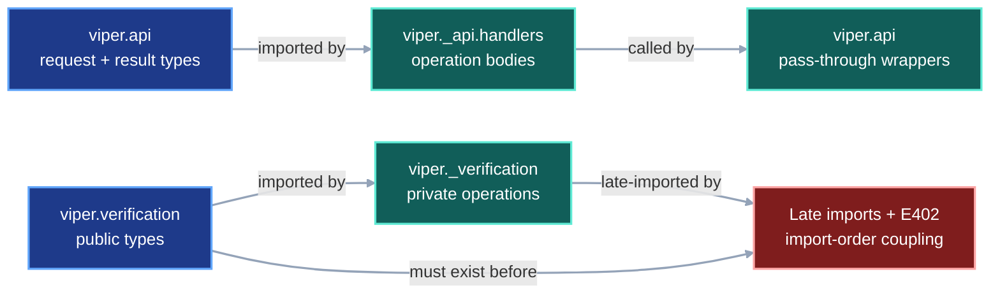
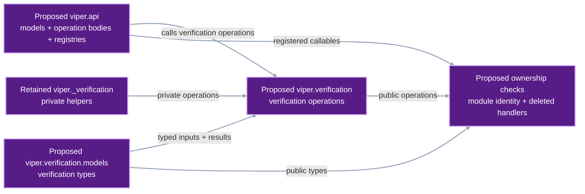
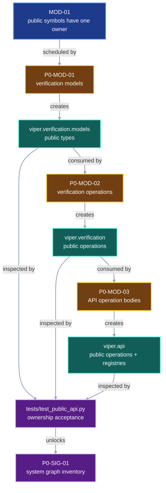

# Public module ownership

VIPER currently exposes public operations through two circular arrangements.
`viper.api` defines request and result types, then delegates every operation to
`viper._api.handlers`. `viper.verification` defines public result types before
late-importing private verifier functions that import those types back from the
public module.

This contract gives each public symbol one defining module. `viper.api` owns
its operation bodies. `viper.verification` owns verification operations, while
`viper.verification.models` owns verification types.

## 1. Status

**Contract status:** approved design; implementation pending.

| ID | Implementation obligation |
| --- | --- |
| MOD-01 <!-- contract-requirement: MOD-01 phase=0 test=tests/test_public_api.py --> | Define every public API operation and verification symbol in the public module from which callers import it. Remove pass-through handlers, late imports, and the file-wide `E402` suppressions they require. |

## 2. Required claim

Every public API and verification symbol has one implementation owner:

```text
viper.api operation
-> function body defined in viper.api

viper.verification operation
-> function body defined in viper.verification

viper.verification model or type
-> declaration defined in viper.verification.models
```

The contract preserves request models, result models, function signatures,
operation names, registry order, verification comparisons, and returned
values. It changes module ownership and imports.

## 3. Current gap

### Inspected path

[`api.py`](../../src/viper/api.py) currently imports
`viper._api.handlers` after declaring its models. Each public operation then
returns the result of the same-named private handler. The wrapper and handler
signatures must remain identical. The wrapper only delegates the call.

[`verification.py`](../../src/viper/verification.py) currently declares public
verification types before importing private verifier modules. Those private
modules import the public types back from `verification.py`. The file disables
`E402` because normal top-level import order would expose that cycle.

### Current DAG

The current imports force public declarations to exist before their private
implementations can load.



### Proposed-change DAG

The refactor moves existing declarations and bodies to their final owners.



### Integrated DAG

The checklist moves types first, then verification operations, then API
operations. The focused test checks the final module identities before the
system-graph compiler starts.



The diagrams use the semantic palette defined by the
[contract-gap method](contract-traceability.md#diagram-color-contract).

## 4. Contract models

Protocol schemas and serialized fields stay unchanged. This refactor moves
existing Python declarations while preserving their shapes.

The public verification package has this exact ownership boundary:

```text
src/viper/verification/
├── __init__.py   verify_* operation bodies and operation-only __all__
└── models.py     VerificationError, VerificationPolicy, verified-result
                  dataclasses, StorageFetcher, and StageSnapshot
```

Callers import operations and types from their defining modules:

```python
from viper.verification import verify_run_result
from viper.verification.models import (
    StorageFetcher,
    VerificationError,
    VerificationPolicy,
    VerifiedRunResult,
)
```

`viper.api` keeps its existing request and result declarations, moves the
operation bodies from `viper._api.handlers` below those declarations, and keeps
the existing registries pointed at those local functions:

```python
HANDLER_REGISTRY: dict[OperationName, Handler] = {
    "validate_stage": validate_stage,
    "validate_resolved_stage": validate_resolved_stage,
    "validate_run_spec": validate_run_spec,
    "freeze_run": freeze_run,
    "preflight": preflight,
    "execute_stage": execute_stage,
    "run": run_request,
    "retry": retry_request,
    "execute_benchmark": execute_benchmark,
    "plan_diff": plan_diff,
    "lineage": lineage,
    "status": status,
    "compare_runs": compare_runs,
    "verify_run": verify_run,
    "verify_benchmark": verify_benchmark,
    "verify_pointer": verify_pointer,
    "get_schema": get_schema,
    "get_capabilities": get_capabilities,
    "init_project": init_project,
}
```

The refactor deletes `src/viper/verification.py` after creating the
`verification` package. It deletes `src/viper/_api/handlers.py` after moving
every operation body. `src/viper/_api/__init__.py` remains only if later
private API helpers need that package.

### Illustrative worked example

The example uses one existing fixture to prove that ownership changes while
behavior remains stable.

<!-- contract-example-symbols: ["HANDLER_REGISTRY"] -->

<!-- contract-worked-example: start -->

```python
import inspect
from pathlib import Path

import viper.api as api
import viper.verification as verification
from viper.api import HANDLER_REGISTRY, ValidateStageRequest
from viper.verification.models import VerificationPolicy


fixture = Path("tests/data/download_stage.yaml")
request = ValidateStageRequest(path=fixture)
result = api.validate_stage(request)
policy = VerificationPolicy(trusted_source_repositories=frozenset())

assert result.stage_kind == "download"
assert policy.trusted_source_repositories == frozenset()
assert inspect.getmodule(api.validate_stage) is api
assert api.validate_stage.__module__ == "viper.api"
assert verification.verify_run_result.__module__ == "viper.verification"
assert VerificationPolicy.__module__ == "viper.verification.models"
assert HANDLER_REGISTRY["validate_stage"] is api.validate_stage
assert not Path("src/viper/_api/handlers.py").exists()
assert not Path("src/viper/verification.py").exists()
```

<!-- contract-worked-example: end -->

## 5. Execution

The implementation follows one order:

```text
copy verification types to verification/models.py
-> update private verifier imports
-> move verification operations to verification/__init__.py
-> update public callers and tests
-> delete verification.py
-> move API helpers and operations into api.py
-> point HANDLER_REGISTRY at local functions
-> delete _api/handlers.py
-> run ownership and behavior tests
```

Moving verification first gives `api.py` a stable source for `StorageFetcher`,
`VerificationError`, and `VerificationPolicy` before its operation bodies move.

## 6. Persisted evidence

Runtime provenance records stay unchanged. The committed source tree and
focused test results provide the durable evidence for source ownership:

| Evidence | Proves |
| --- | --- |
| `src/viper/verification/models.py` | Public verification types have one defining module. |
| `src/viper/verification/__init__.py` | Public verification operations have one defining module. |
| `src/viper/api.py` | Public API models, operations, registries, and dispatch share one owner. |
| `tests/test_public_api.py` | Module identity, registry identity, and retired-file rejection remain enforced. |

YAML, JSON, snapshots, run identity, and protocol digests remain identical
because this refactor preserves every runtime model and operation result.

## 7. Verification

| Rule | Executable condition |
| --- | --- |
| `module.api.owner` <!-- verifier-rule: module.api.owner requirement=MOD-01 --> | Every callable in `HANDLER_REGISTRY` has `__module__ == "viper.api"`, and `src/viper/_api/handlers.py` is absent. |
| `module.verification.owner` <!-- verifier-rule: module.verification.owner requirement=MOD-01 --> | Every public verification operation has `__module__ == "viper.verification"`; every public verification type has `__module__ == "viper.verification.models"`; `src/viper/verification.py` is absent. |

The module-identity checks establish ownership. Existing API and verification
tests establish that each moved body still returns the same value.
`test_module_ownership_pair_blocks_cover_every_moved_definition` compares the
AST of every current handler, verification operation, and verification model
with the complete target declarations in the pair-coding appendix. A missing
or edited definition fails before implementation begins.

## 8. Propagation

Manual import and checklist inspection supplies this table while the
system-impact compiler remains pending. The generated impact report must later
match it.

| Path | Disposition | Required change |
| --- | --- | --- |
| `src/viper/api.py` | Change | Move every handler helper and operation body here; remove the late handler import and pass-through wrappers. |
| `src/viper/_api/handlers.py` | Remove | Delete after every body and caller moves to `viper.api`. |
| `src/viper/verification.py` | Remove | Replace the module with the public `verification` package. |
| `src/viper/verification/__init__.py` | Add | Define public verification operations and import shared types from `models.py`. |
| `src/viper/verification/models.py` | Add | Define public verification errors, policies, result dataclasses, and aliases. |
| `src/viper/_verification/attempt.py` | Change | Import public types from `viper.verification.models`. |
| `src/viper/_verification/metrics.py` | Change | Import public types from `viper.verification.models`. |
| `src/viper/_verification/plan.py` | Change | Import public types from `viper.verification.models`. |
| `src/viper/_verification/storage.py` | Change | Import public types from `viper.verification.models`. |
| `src/viper/execution/_attempt.py` | Change | Import operations and models from their defining verification modules. |
| `src/viper/execution/_benchmark.py` | Change | Import `VerificationPolicy` from `viper.verification.models`. |
| `src/viper/execution/_materialization.py` | Change | Import `VerificationPolicy` from `viper.verification.models`. |
| `src/viper/inspection.py` | Change | Import verified result types from `viper.verification.models`. |
| `src/viper/preflight.py` | Change | Import `VerificationError` from `viper.verification.models`. |
| `tests/fixtures.py` | Change | Import `VerificationPolicy` from its defining module. |
| `tests/test_public_api.py` | Change | Replace wrapper parity with exact module-owner and retired-file checks. |
| `tests/test_verification.py` | Change | Import operations and models from their defining modules. |
| `tests/test_verification_acceptance.py` | Change | Import operations and models from their defining modules. |
| `tests/test_metric_provenance.py` | Change | Split operation and model imports. |
| `tests/test_run_execution.py` | Change | Split operation and model imports. |
| `tests/test_execution_signals.py` | Change | Split operation and model imports. |
| `tests/test_process_startup.py` | Change | Import `VerificationError` from its defining module. |
| `tests/test_cloud_execution.py` | Change | Import `VerificationError` from its defining module. |
| `tests/test_inspection.py` | Change | Import verified result types from their defining module. |
| `docs/development/module-privacy.md` | Change | Replace the superseded private-handler explanation with the one-owner rule. |
| `docs/development/master-execution-checklist.md` | Change | Insert this contract before the system graph and assign future API operations to `viper.api`. |
| `docs/development/foundation-pair-coding.md` | Change | Supply the exact verification and API migration blocks. |

Any additional importer found during implementation receives the same direct
import update before `MOD-01` closes.

## 9. Acceptance case

Success uses the existing download-stage fixture:

```text
ValidateStageRequest(path="tests/data/download_stage.yaml")
-> viper.api.validate_stage()
-> ValidateStageSuccess(stage_kind="download")
-> HANDLER_REGISTRY["validate_stage"] is viper.api.validate_stage
```

The focused test also imports `VerificationPolicy` from
`viper.verification.models` and `verify_run_result` from `viper.verification`,
then checks each symbol's `__module__`.

Rejection recreates either retired arrangement in a temporary package. The
test fails when a registry callable belongs to `viper._api.handlers`, a public
verification type belongs to `viper.verification`, or either retired source
file remains.

```toml contract-trace
trace_id = "public-module-owner"
requirement_id = "MOD-01"
rule_id = "module.api.owner"
state = "planned"
scenario = "The typed API validates one authored download stage through its locally defined operation."
setup = "tests/data/download_stage.yaml contains the existing valid download-stage fixture"
input = "ValidateStageRequest(path=Path('tests/data/download_stage.yaml'))"
invocation = "viper.api.validate_stage(request)"
implementation = "src/viper/api.py:validate_stage"
test = "tests/test_public_api.py:test_api_operations_are_locally_defined"
outcome.kind = "accepted"
outcome.result = "ValidateStageSuccess(stage_kind='download')"
outcome.evidence = ["src/viper/api.py", "tests/test_public_api.py"]
```

```toml contract-trace
trace_id = "private-handler-owner"
requirement_id = "MOD-01"
rule_id = "module.api.owner"
state = "planned"
scenario = "The ownership check encounters a registry callable defined by the retired private handler module."
setup = "HANDLER_REGISTRY['validate_stage'] references a function whose __module__ is viper._api.handlers"
input = "HANDLER_REGISTRY['validate_stage']"
invocation = "test_api_operations_are_locally_defined()"
implementation = "src/viper/api.py:HANDLER_REGISTRY"
test = "tests/test_public_api.py:test_api_operations_are_locally_defined"
outcome.kind = "rejected"
outcome.rejected_at = "tests/test_public_api.py:test_api_operations_are_locally_defined"
outcome.error_type = "AssertionError"
outcome.message_match = "viper._api.handlers"
```

## 10. Implementation order

1. Create `viper.verification.models` and move every public verification type
   while preserving its declaration.
2. Create `viper.verification`, move every public verification operation, and
   update private and public importers.
3. Move every API helper and operation body into `viper.api`; delete the
   pass-through wrappers and `_api/handlers.py`.
4. Replace signature-parity tests with defining-module, registry-identity,
   retired-file, and behavior checks.
5. Run the focused public API and verification suites. Commit this refactor
   before starting the system-graph compiler.
