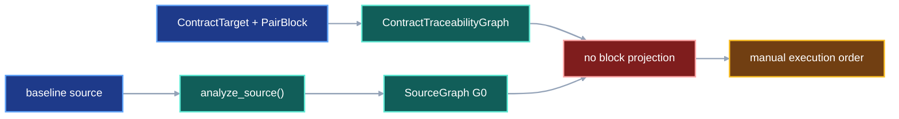
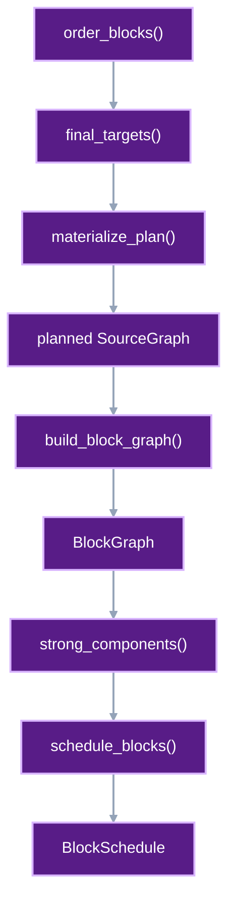
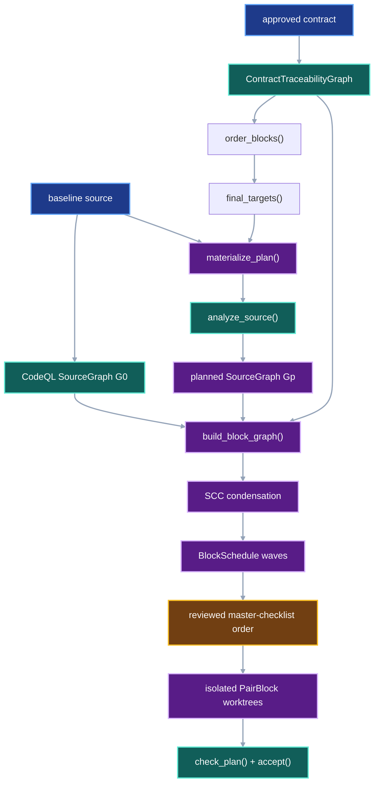

# PairBlock scheduling contract

## 1. Status

**Contract status:** Planned.

| ID | Implementation obligation |
| --- | --- |
| SCH-01 <!-- contract-requirement: SCH-01 phase=4 test=tests/test_system_impact.py --> | Compose dependency-ordered `ContractTarget` records into one terminal planned source tree so the existing CodeQL adapter can analyze the plan before implementation. |
| SCH-02 <!-- contract-requirement: SCH-02 phase=4 test=tests/test_system_impact.py --> | Project explicit PairBlock dependencies, planned source dependencies, and overlapping target files into one deterministic block graph. |
| SCH-03 <!-- contract-requirement: SCH-03 phase=4 test=tests/test_system_impact.py --> | Condense strongly connected blocks and return deterministic execution waves whose groups may run concurrently. |

## 2. Required claim

Given one closed `ContractTraceabilityGraph`, one baseline `SourceGraph`, and
the CodeQL `SourceGraph` produced from the selected target declarations, VIPER
returns a deterministic sequence of execution waves. Blocks in one wave have
no unresolved dependency or write conflict between groups. Every selected
block appears exactly once.

The first version schedules work. It does not estimate duration, token use, or
agent quality, and it does not merge candidate commits automatically.

## 3. Current gap

### Inspected path

The current stack already supplies:

```text
contract Markdown
-> compile_contract_traceability()
-> ContractTarget + PairBlock records

repository source
-> analyze_source()
-> SourceGraph

implemented candidate
-> check_plan()
-> accept()
```

The fixed example selects four blocks. `P-A` adds `parse()`. `P-B` changes
`load()` to call `parse()`. `P-C` and `P-D` edit different declarations in one
file. The scheduler must place `P-A` before `P-B` and serialize `P-C` before
`P-D` to avoid concurrent writes to the same file.

### Current DAG



### Missing connector

VIPER does not compose repeated changes to one declaration, materialize the
terminal planned source before implementation, project source dependencies
onto their owning PairBlocks, or condense the result into a dependency-safe
execution order.

### Proposed-change DAG



### Integrated DAG



## 4. Contract models

| Object | Role |
| --- | --- |
| `ScheduleEdge` | One prerequisite-to-consumer relation and its evidence. |
| `BlockGraph` | Selected blocks plus explicit, source-derived, and file-conflict edges. |
| `WorkGroup` | One SCC that must remain one execution unit. |
| `WorkWave` | Groups whose predecessor groups have already completed. |
| `BlockSchedule` | Complete deterministic assignment of selected blocks to waves. |

The executable declarations appear once, under Accepted `ContractTarget`
declarations.

## 5. Execution

`order_blocks()` orders the selected dependency closure. `final_targets()`
then composes repeated changes to one symbol. Repeated writers must already be
ordered by `PairBlock.depends_on`; otherwise the plan is ambiguous and fails.
The final target is an `add`, `update`, or `remove` relative to the baseline,
regardless of how many intermediate declarations the PairBlocks specify.

`materialize_plan()` copies the baseline Python tree, replaces or removes
existing declarations by the exact byte spans in `SourceGraph`, and appends
new top-level declarations. Version 1 rejects nested additions because
`ContractTarget` does not yet carry a class-body insertion point.

The existing `analyze_source()` operation analyzes that materialized tree with
the same pinned `CodeQLIdentity` used for the baseline. `build_block_graph()`
then adds three edge classes:

1. `PairBlock.depends_on`: the dependency block precedes its consumer.
2. `SourceEdge`: the block owning the depended-on declaration precedes the
   block owning the dependent declaration.
3. Same-file writes: an existing dependency determines their direction;
   otherwise the lower PairBlock ID runs first.

`schedule_blocks()` computes SCCs, replaces each SCC with one group, and uses
the zero-indegree frontier of the condensation DAG as one execution wave.

## 6. Persisted evidence

The scheduler returns canonical protocol records. The existing CodeQL receipts
bind both source graphs to their snapshots and analyzer identity. The master
checklist remains the reviewed scheduling authority; `BlockSchedule` is the
evidence used to update it, not an automatic checklist mutation.

## 7. Verification

| Rule | Executable condition |
| --- | --- |
| `schedule.plan.materialized` <!-- verifier-rule: schedule.plan.materialized requirement=SCH-01 --> | Dependency-ordered additions, updates, and removals compose into the exact terminal planned source without changing the baseline tree; unordered repeat writers fail. |
| `schedule.graph.closed` <!-- verifier-rule: schedule.graph.closed requirement=SCH-02 --> | Every graph endpoint is selected; explicit and planned source dependencies point prerequisite-first; blocks writing one file receive one deterministic serial order. |
| `schedule.waves.complete` <!-- verifier-rule: schedule.waves.complete requirement=SCH-03 --> | Every selected block occurs in exactly one SCC group and one wave; every predecessor group occurs in an earlier wave. |

## 8. Propagation

| Surface | Required change |
| --- | --- |
| `system-impact-compiler.md` | Replace the exploratory scheduler appendix with a link to this governing contract. |
| Master checklist | Add the scheduler blocks after the existing System Impact blocks; retain human approval of the generated order. |
| Contract execution | Use a schedule only after all selected contracts compile into one CTG and both source graphs share one CodeQL identity. |
| Parallel worktrees | Give one group exclusive ownership of its PairBlock targets; integrate accepted commits sequentially. |

## 9. Acceptance case

### Success

For the four-block fixture, the first wave contains `(P-A,)` and `(P-C,)`.
The second wave contains `(P-B,)` and `(P-D,)`. Repeating the operation returns
byte-identical JSON.

<!-- contract-worked-example: start -->
```python
traceability, baseline, planned = _schedule_fixture()
graph = build_block_graph(
    traceability,
    ("P0-TST-02", "P0-TST-03", "P0-TST-04"),
    baseline,
    planned,
)
result = schedule_blocks(graph)
groups = {group.group_id: group.blocks for group in result.groups}
waves = tuple(
    tuple(groups[group_id] for group_id in wave.groups)
    for wave in result.waves
)
assert set(waves[0]) == {("P0-TST-01",), ("P0-TST-03",)}
assert set(waves[1]) == {("P0-TST-02",), ("P0-TST-04",)}
```
<!-- contract-worked-example: end -->

### Rejection

Materialization rejects a nested added target, an impossible action sequence,
and repeat writers without an explicit dependency path. Graph construction
rejects an unknown block or a source edge whose selected endpoint cannot be
resolved uniquely.

## 10. Implementation order

1. Order selected blocks, compose their final declarations, and analyze the
   planned tree.
2. Project explicit, source, and same-file relationships onto PairBlocks.
3. Condense SCCs and emit deterministic execution waves.
4. Replay the four-block fixture and one completed contract slice before using
   the schedule to revise checklist order.

## 11. Contract-owned PairBlocks

<!-- pair-block-definition: P4-SCH-01 -->
```toml pair-block
id = "P4-SCH-01"
requirements = ["SCH-01"]
targets = [
    "src/viper/scheduling.py:ScheduleError",
    "src/viper/scheduling.py:select_blocks",
    "src/viper/scheduling.py:order_blocks",
    "src/viper/scheduling.py:_precedes",
    "src/viper/scheduling.py:final_targets",
    "src/viper/scheduling.py:materialize_plan",
    "tests/test_system_impact.py:test_final_targets_compose_ordered_revisions",
    "tests/test_system_impact.py:test_materialize_plan_applies_exact_declarations",
]
tests = [
    "tests/test_system_impact.py:test_final_targets_compose_ordered_revisions",
    "tests/test_system_impact.py:test_materialize_plan_applies_exact_declarations",
]
gate = "python -m pytest tests/test_system_impact.py -k materialize_plan -q"
depends_on = ["P0-SIG-06"]
```

**Context:** System Impact can inspect approved declaration bytes and analyze
an implemented candidate, but it cannot compose several planned revisions of
one symbol or analyze the terminal planned code before implementation. This
block orders those revisions and creates one isolated planned source tree.

<!-- pair-block-definition: P4-SCH-02 -->
```toml pair-block
id = "P4-SCH-02"
requirements = ["SCH-02"]
targets = [
    "src/viper/scheduling.py:ScheduleEdgeKind",
    "src/viper/scheduling.py:ScheduleEdge",
    "src/viper/scheduling.py:BlockGraph",
    "src/viper/scheduling.py:build_block_graph",
    "tests/test_system_impact.py:_schedule_fixture",
    "tests/test_system_impact.py:test_block_graph_combines_dependencies_and_write_conflicts",
]
tests = ["tests/test_system_impact.py:test_block_graph_combines_dependencies_and_write_conflicts"]
gate = "python -m pytest tests/test_system_impact.py -k block_graph -q"
depends_on = ["P4-SCH-01"]
```

**Context:** PairBlock dependencies and CodeQL source edges currently remain
separate records. This block projects both relations onto selected blocks and
orders blocks that would write the same file.

<!-- pair-block-definition: P4-SCH-03 -->
```toml pair-block
id = "P4-SCH-03"
requirements = ["SCH-03"]
targets = [
    "src/viper/scheduling.py:WorkGroup",
    "src/viper/scheduling.py:WorkWave",
    "src/viper/scheduling.py:BlockSchedule",
    "src/viper/scheduling.py:strong_components",
    "src/viper/scheduling.py:schedule_blocks",
    "tests/test_system_impact.py:test_schedule_blocks_returns_dependency_safe_waves",
]
tests = ["tests/test_system_impact.py:test_schedule_blocks_returns_dependency_safe_waves"]
gate = "python -m pytest tests/test_system_impact.py -k schedule_blocks -q"
depends_on = ["P4-SCH-02"]
```

**Context:** A directed block graph states precedence and coupling but does not
assign executable work. This block condenses cycles and returns the maximal
deterministic frontier available at each step.

## 12. Accepted `ContractTarget` declarations

### P4-SCH-01 — planned source

**File: `src/viper/scheduling.py`**

<!-- contract-target: requirements=SCH-01 block=P4-SCH-01 action=add target=src/viper/scheduling.py:ScheduleError -->
<!-- contract-target: requirements=SCH-01 block=P4-SCH-01 action=add target=src/viper/scheduling.py:select_blocks -->
<!-- contract-target: requirements=SCH-01 block=P4-SCH-01 action=add target=src/viper/scheduling.py:order_blocks -->
<!-- contract-target: requirements=SCH-01 block=P4-SCH-01 action=add target=src/viper/scheduling.py:_precedes -->
<!-- contract-target: requirements=SCH-01 block=P4-SCH-01 action=add target=src/viper/scheduling.py:final_targets -->
<!-- contract-target: requirements=SCH-01 block=P4-SCH-01 action=add target=src/viper/scheduling.py:materialize_plan -->
```python contract-target
class ScheduleError(ValueError):
    """Report an invalid planned source or block schedule."""


def select_blocks(
    traceability: ContractTraceabilityGraph,
    requested: tuple[PairBlockId, ...],
    *,
    completed: frozenset[PairBlockId] = frozenset(),
) -> tuple[PairBlockId, ...]:
    """Return the incomplete transitive dependency closure of requested blocks."""
    blocks = {block.block_id: block for block in traceability.blocks}
    selected: set[PairBlockId] = set()

    def include(block_id: PairBlockId) -> None:
        if block_id in completed or block_id in selected:
            return
        block = blocks.get(block_id)
        if block is None:
            raise ScheduleError(f"unknown PairBlock: {block_id}")
        selected.add(block_id)
        for dependency in block.depends_on:
            include(dependency)

    for block_id in requested:
        include(block_id)
    return tuple(sorted(selected))


def order_blocks(
    traceability: ContractTraceabilityGraph,
    selected: tuple[PairBlockId, ...],
) -> tuple[PairBlockId, ...]:
    """Return one canonical order that respects declared dependencies."""
    blocks = {block.block_id: block for block in traceability.blocks}
    known = set(selected)
    if len(known) != len(selected) or any(block not in blocks for block in known):
        raise ScheduleError("selected PairBlocks must be unique and known")
    successors = {block: set() for block in known}
    indegree = {block: 0 for block in known}
    for block in known:
        for dependency in blocks[block].depends_on:
            if dependency not in known:
                continue
            successors[dependency].add(block)
            indegree[block] += 1

    ordered: list[PairBlockId] = []
    while len(ordered) < len(known):
        ready = sorted(
            block
            for block in known - set(ordered)
            if indegree[block] == 0
        )
        if not ready:
            raise ScheduleError("selected PairBlocks contain a dependency cycle")
        for block in ready:
            ordered.append(block)
            for consumer in successors[block]:
                indegree[consumer] -= 1
    return tuple(ordered)


def _precedes(
    traceability: ContractTraceabilityGraph,
    prerequisite: PairBlockId,
    consumer: PairBlockId,
) -> bool:
    """Return whether a declared dependency path orders two PairBlocks."""
    blocks = {block.block_id: block for block in traceability.blocks}
    pending = list(blocks[consumer].depends_on)
    visited: set[PairBlockId] = set()
    while pending:
        block = pending.pop()
        if block == prerequisite:
            return True
        if block in visited or block not in blocks:
            continue
        visited.add(block)
        pending.extend(blocks[block].depends_on)
    return False


def final_targets(
    traceability: ContractTraceabilityGraph,
    ordered: tuple[PairBlockId, ...],
    baseline: SourceGraph,
) -> tuple[ContractTarget, ...]:
    """Compose each ordered target chain into one baseline-relative change."""
    positions = {block: index for index, block in enumerate(ordered)}
    chains: dict[tuple[str, str], list[ContractTarget]] = defaultdict(list)
    for target in traceability.targets:
        if target.block_id in positions:
            chains[(target.target.path, target.target.symbol)].append(target)
    baseline_targets = {(node.path, node.symbol) for node in baseline.nodes}
    resolved: list[ContractTarget] = []
    for identity, chain in sorted(chains.items()):
        chain.sort(key=lambda target: positions[target.block_id])
        for earlier, later in zip(chain, chain[1:], strict=False):
            if not _precedes(traceability, earlier.block_id, later.block_id):
                raise ScheduleError(
                    "repeat target writers require an explicit dependency path: "
                    f"{identity[0]}:{identity[1]}"
                )

        initially_present = identity in baseline_targets
        present = initially_present
        for target in chain:
            if target.action == "add":
                if present:
                    raise ScheduleError(f"added target already exists: {target.target}")
                present = True
            elif target.action == "update":
                if not present:
                    raise ScheduleError(f"updated target is absent: {target.target}")
            else:
                if not present:
                    raise ScheduleError(f"removed target is absent: {target.target}")
                present = False

        if not initially_present and not present:
            continue
        last = chain[-1]
        action: TargetAction
        if present:
            action = "update" if initially_present else "add"
        else:
            action = "remove"
        resolved.append(last.model_copy(update={"action": action}))
    return tuple(resolved)


def materialize_plan(
    baseline_root: Path,
    plan_root: Path,
    traceability: ContractTraceabilityGraph,
    block_ids: tuple[PairBlockId, ...],
    baseline: SourceGraph,
    destination: Path,
    *,
    completed: frozenset[PairBlockId] = frozenset(),
) -> None:
    """Write selected target declarations over an isolated baseline tree."""
    if destination.exists():
        raise ScheduleError("planned source destination already exists")
    shutil.copytree(
        baseline_root,
        destination,
        ignore=shutil.ignore_patterns(".git", ".venv", "__pycache__"),
    )
    selected = select_blocks(traceability, block_ids, completed=completed)
    ordered = order_blocks(traceability, selected)
    targets = final_targets(traceability, ordered, baseline)
    if not targets:
        raise ScheduleError("selected PairBlocks contain no ContractTargets")
    nodes = {(node.path, node.symbol): node for node in baseline.nodes}
    by_path: dict[str, list[ContractTarget]] = defaultdict(list)
    for target in targets:
        by_path[target.target.path].append(target)

    for relative_path, file_targets in sorted(by_path.items()):
        output = destination / relative_path
        source = output.read_bytes() if output.exists() else b""
        lines = source.splitlines(keepends=True)
        starts = [0]
        for line in lines:
            starts.append(starts[-1] + len(line))
        replacements: list[tuple[int, int, bytes]] = []
        additions: list[bytes] = []
        for target in sorted(file_targets, key=lambda item: item.target.symbol):
            node = nodes.get((target.target.path, target.target.symbol))
            if target.action == "add":
                if node is not None:
                    raise ScheduleError(f"added target already exists: {target.target}")
                if "." in target.target.symbol:
                    raise ScheduleError("version 1 cannot place a nested added target")
                payload = _declaration_payload(plan_root, target)
                assert payload is not None
                additions.append(payload)
                continue
            if node is None:
                raise ScheduleError(f"baseline target is absent: {target.target}")
            start = starts[node.start_line - 1] + node.start_col
            end = starts[node.end_line - 1] + node.end_col
            payload = (
                b"" if target.action == "remove" else _declaration_payload(plan_root, target)
            )
            assert payload is not None or target.action == "remove"
            replacements.append((start, end, b"" if payload is None else payload))

        ordered_replacements = sorted(replacements)
        if any(
            current[0] < previous[1]
            for previous, current in zip(
                ordered_replacements,
                ordered_replacements[1:],
                strict=False,
            )
        ):
            raise ScheduleError("planned declaration replacements overlap")
        for start, end, payload in reversed(ordered_replacements):
            source = source[:start] + payload + source[end:]
        if additions:
            separator = b"" if not source else (b"\n" if source.endswith(b"\n") else b"\n\n")
            source += separator + b"\n\n".join(additions) + b"\n"
        output.parent.mkdir(parents=True, exist_ok=True)
        output.write_bytes(source)
```

**File: `tests/test_system_impact.py`**

<!-- contract-target: requirements=SCH-01 block=P4-SCH-01 action=add target=tests/test_system_impact.py:test_final_targets_compose_ordered_revisions -->
```python contract-target
def test_final_targets_compose_ordered_revisions() -> None:
    """Use the last explicitly ordered declaration as the terminal target."""
    first = "P0-TST-01"
    second = "P0-TST-02"
    declaration = _declaration_ref()
    final_declaration = declaration.model_copy(update={"sha256": "1" * 64})
    target = RepoSymbolRef(path="module.py", symbol="load")
    targets = (
        ContractTarget.model_construct(
            requirements=("SCH-01",),
            block_id=first,
            action="update",
            target=target,
            declaration=declaration,
        ),
        ContractTarget.model_construct(
            requirements=("SCH-01",),
            block_id=second,
            action="update",
            target=target,
            declaration=final_declaration,
        ),
    )
    blocks = (
        PairBlock.model_construct(
            block_id=first,
            requirements=("SCH-01",),
            targets=(target,),
            assets=(),
            tests=(),
            gate="true",
            depends_on=(),
            declaration=declaration,
        ),
        PairBlock.model_construct(
            block_id=second,
            requirements=("SCH-01",),
            targets=(target,),
            assets=(),
            tests=(),
            gate="true",
            depends_on=(first,),
            declaration=declaration,
        ),
    )
    traceability = ContractTraceabilityGraph.model_construct(
        requirements=(),
        rules=(),
        edges=(),
        targets=targets,
        blocks=blocks,
    )
    baseline = _source_graph(
        nodes=(_node(path="module.py", symbol="load", kind="function"),)
    )

    resolved = final_targets(traceability, (first, second), baseline)

    assert len(resolved) == 1
    assert resolved[0].block_id == second
    assert resolved[0].action == "update"
    assert resolved[0].declaration == final_declaration

    unordered = traceability.model_copy(
        update={
            "blocks": (
                blocks[0],
                blocks[1].model_copy(update={"depends_on": ()}),
            )
        }
    )
    with pytest.raises(ScheduleError, match="explicit dependency path"):
        final_targets(unordered, (first, second), baseline)
```

<!-- contract-target: requirements=SCH-01 block=P4-SCH-01 action=add target=tests/test_system_impact.py:test_materialize_plan_applies_exact_declarations -->
```python contract-target
def test_materialize_plan_applies_exact_declarations(tmp_path: Path) -> None:
    """Apply one update, removal, and top-level addition to an isolated tree."""
    baseline_root = tmp_path / "baseline"
    baseline_root.mkdir()
    source = b"def old():\n    return 1\n\ndef removed():\n    return 2\n"
    (baseline_root / "module.py").write_bytes(source)
    plan_root = tmp_path / "plan"
    updated = b"def old():\n    return 3"
    added = b"def added():\n    return old()"
    update_ref = _write_target_fence(plan_root, updated + b"\n\n" + added)
    add_ref = update_ref
    remove_ref = DeclarationRef(
        path="contract.md",
        start_line=1,
        end_line=1,
        sha256=hashlib.sha256(b"<!-- contract-remove -->").hexdigest(),
    )
    graph = _source_graph(
        nodes=(
            SourceNode(
                node_id="module.py:old",
                path="module.py",
                symbol="old",
                kind="function",
                start_line=1,
                start_col=0,
                end_line=2,
                end_col=12,
                sha256=hashlib.sha256(b"def old():\n    return 1").hexdigest(),
            ),
            SourceNode(
                node_id="module.py:removed",
                path="module.py",
                symbol="removed",
                kind="function",
                start_line=4,
                start_col=0,
                end_line=5,
                end_col=12,
                sha256=hashlib.sha256(b"def removed():\n    return 2").hexdigest(),
            ),
        ),
    )
    traceability = _traceability(
        targets=(
            _target(
                action="update",
                path="module.py",
                symbol="old",
                declaration=update_ref,
            ),
            _target(
                action="remove",
                path="module.py",
                symbol="removed",
                declaration=remove_ref,
            ),
            _target(
                action="add",
                path="module.py",
                symbol="added",
                declaration=add_ref,
            ),
        ),
    )

    destination = tmp_path / "planned"
    materialize_plan(
        baseline_root,
        plan_root,
        traceability,
        (_BLOCK_ID,),
        graph,
        destination,
    )

    assert (destination / "module.py").read_text() == (
        "def old():\n    return 3\n\n\n\ndef added():\n    return old()\n"
    )
    assert (baseline_root / "module.py").read_bytes() == source
```

### P4-SCH-02 — block graph

**File: `src/viper/scheduling.py`**

<!-- contract-target: requirements=SCH-02 block=P4-SCH-02 action=add target=src/viper/scheduling.py:ScheduleEdgeKind -->
<!-- contract-target: requirements=SCH-02 block=P4-SCH-02 action=add target=src/viper/scheduling.py:ScheduleEdge -->
<!-- contract-target: requirements=SCH-02 block=P4-SCH-02 action=add target=src/viper/scheduling.py:BlockGraph -->
<!-- contract-target: requirements=SCH-02 block=P4-SCH-02 action=add target=src/viper/scheduling.py:build_block_graph -->
```python contract-target
ScheduleEdgeKind = Literal["declared", "source", "write_conflict"]


class ScheduleEdge(ProtocolModel):
    """Require one PairBlock to precede or remain coupled to another."""

    prerequisite: PairBlockId
    consumer: PairBlockId
    kind: ScheduleEdgeKind
    evidence: NonEmptyStr


class BlockGraph(ProtocolModel):
    """Store the complete dependency graph for selected PairBlocks."""

    blocks: tuple[PairBlockId, ...] = Field(min_length=1)
    edges: tuple[ScheduleEdge, ...]

    @model_validator(mode="after")
    def validate_graph(self) -> Self:
        """Require unique blocks, known endpoints, and canonical order."""
        if self.blocks != tuple(sorted(set(self.blocks))):
            raise ValueError("blocks must be unique and sorted")
        known = set(self.blocks)
        if any(
            edge.prerequisite not in known or edge.consumer not in known
            for edge in self.edges
        ):
            raise ValueError("schedule edge names an unselected PairBlock")
        ordered = tuple(
            sorted(
                self.edges,
                key=lambda edge: (
                    edge.prerequisite,
                    edge.consumer,
                    edge.kind,
                    edge.evidence,
                ),
            )
        )
        identities = tuple(
            (edge.prerequisite, edge.consumer, edge.kind, edge.evidence)
            for edge in self.edges
        )
        if self.edges != ordered or len(identities) != len(set(identities)):
            raise ValueError("schedule edges must be unique and sorted")
        return self


def build_block_graph(
    traceability: ContractTraceabilityGraph,
    requested: tuple[PairBlockId, ...],
    baseline: SourceGraph,
    planned: SourceGraph,
    *,
    completed: frozenset[PairBlockId] = frozenset(),
) -> BlockGraph:
    """Project plan, source, and write-conflict edges onto selected blocks."""
    blocks = {block.block_id: block for block in traceability.blocks}
    selected = set(select_blocks(traceability, requested, completed=completed))

    ordered = order_blocks(traceability, tuple(sorted(selected)))
    positions = {block: index for index, block in enumerate(ordered)}
    targets = tuple(
        target for target in traceability.targets if target.block_id in selected
    )
    writers: dict[tuple[str, str], list[PairBlockId]] = defaultdict(list)
    for target in targets:
        writers[(target.target.path, target.target.symbol)].append(target.block_id)
    for blocks_for_target in writers.values():
        blocks_for_target.sort(key=positions.__getitem__)
    baseline_owners = {identity: values[0] for identity, values in writers.items()}
    planned_owners = {identity: values[-1] for identity, values in writers.items()}
    nodes = {
        node.node_id: (node.path, node.symbol)
        for graph in (baseline, planned)
        for node in graph.nodes
    }
    edges: set[tuple[PairBlockId, PairBlockId, ScheduleEdgeKind, str]] = set()
    for block_id in selected:
        for dependency in blocks[block_id].depends_on:
            if dependency in selected:
                edges.add((dependency, block_id, "declared", dependency))
    for graph, owners in (
        (baseline, baseline_owners),
        (planned, planned_owners),
    ):
        for edge in graph.edges:
            consumer = owners.get(nodes.get(edge.source, ("", "")))
            prerequisite = owners.get(nodes.get(edge.target, ("", "")))
            if prerequisite is not None and consumer is not None:
                if prerequisite != consumer:
                    edges.add((prerequisite, consumer, "source", edge.edge_id))

    paths: dict[str, set[PairBlockId]] = defaultdict(set)
    for target in targets:
        paths[target.target.path].add(target.block_id)
    for path, path_writers in paths.items():
        ordered_writers = sorted(path_writers)
        for left_index, left in enumerate(ordered_writers):
            for right in ordered_writers[left_index + 1 :]:
                if _precedes(traceability, left, right):
                    prerequisite, consumer = left, right
                elif _precedes(traceability, right, left):
                    prerequisite, consumer = right, left
                else:
                    prerequisite, consumer = left, right
                edges.add((prerequisite, consumer, "write_conflict", path))

    records = tuple(
        ScheduleEdge(
            prerequisite=prerequisite,
            consumer=consumer,
            kind=kind,
            evidence=evidence,
        )
        for prerequisite, consumer, kind, evidence in sorted(edges)
    )
    return BlockGraph(blocks=tuple(sorted(selected)), edges=records)
```

**File: `tests/test_system_impact.py`**

<!-- contract-target: requirements=SCH-02 block=P4-SCH-02 action=add target=tests/test_system_impact.py:_schedule_fixture -->
```python contract-target
def _schedule_fixture() -> tuple[ContractTraceabilityGraph, SourceGraph, SourceGraph]:
    """Build four blocks with one dependency and one shared-file conflict."""
    declaration = _declaration_ref()
    definitions = (
        ("P0-TST-01", "src/parse.py", "parse", ()),
        ("P0-TST-02", "src/load.py", "load", ("P0-TST-01",)),
        ("P0-TST-03", "src/shared.py", "left", ()),
        ("P0-TST-04", "src/shared.py", "right", ()),
    )
    targets = tuple(
        ContractTarget.model_construct(
            requirements=("SCH-02",),
            block_id=block_id,
            action="update",
            target=RepoSymbolRef(path=path, symbol=symbol),
            declaration=declaration,
        )
        for block_id, path, symbol, _dependencies in definitions
    )
    blocks = tuple(
        PairBlock.model_construct(
            block_id=block_id,
            requirements=("SCH-02",),
            targets=(RepoSymbolRef(path=path, symbol=symbol),),
            assets=(),
            tests=(
                RepoSymbolRef(
                    path="tests/test_system_impact.py",
                    symbol="test_schedule_blocks_returns_dependency_safe_waves",
                ),
            ),
            gate="python -m pytest tests/test_system_impact.py",
            depends_on=dependencies,
            declaration=declaration,
        )
        for block_id, path, symbol, dependencies in definitions
    )
    traceability = ContractTraceabilityGraph.model_construct(
        requirements=(),
        rules=(),
        edges=(),
        targets=targets,
        blocks=blocks,
    )
    parse = _node(path="src/parse.py", symbol="parse", kind="function")
    load = _node(path="src/load.py", symbol="load", kind="function")
    left = _node(path="src/shared.py", symbol="left", kind="function")
    right = _node(path="src/shared.py", symbol="right", kind="function")
    baseline = _source_graph(nodes=(parse, load, left, right))
    planned = _source_graph(
        nodes=(parse, load, left, right),
        edges=(_edge(index=1, source=load, target=parse, kind="calls"),),
        source_sha256="8" * 64,
        revision=None,
    )
    return traceability, baseline, planned
```

<!-- contract-target: requirements=SCH-02 block=P4-SCH-02 action=add target=tests/test_system_impact.py:test_block_graph_combines_dependencies_and_write_conflicts -->
```python contract-target
def test_block_graph_combines_dependencies_and_write_conflicts() -> None:
    """Project explicit, source, and same-file relations onto PairBlocks."""
    traceability, baseline, planned = _schedule_fixture()

    graph = build_block_graph(
        traceability,
        ("P0-TST-02", "P0-TST-03", "P0-TST-04"),
        baseline,
        planned,
    )

    relations = {
        (edge.prerequisite, edge.consumer, edge.kind) for edge in graph.edges
    }
    assert ("P0-TST-01", "P0-TST-02", "declared") in relations
    assert ("P0-TST-01", "P0-TST-02", "source") in relations
    assert ("P0-TST-03", "P0-TST-04", "write_conflict") in relations
    assert ("P0-TST-04", "P0-TST-03", "write_conflict") not in relations
```

### P4-SCH-03 — execution waves

**File: `src/viper/scheduling.py`**

<!-- contract-target: requirements=SCH-03 block=P4-SCH-03 action=add target=src/viper/scheduling.py:WorkGroup -->
<!-- contract-target: requirements=SCH-03 block=P4-SCH-03 action=add target=src/viper/scheduling.py:WorkWave -->
<!-- contract-target: requirements=SCH-03 block=P4-SCH-03 action=add target=src/viper/scheduling.py:BlockSchedule -->
<!-- contract-target: requirements=SCH-03 block=P4-SCH-03 action=add target=src/viper/scheduling.py:strong_components -->
<!-- contract-target: requirements=SCH-03 block=P4-SCH-03 action=add target=src/viper/scheduling.py:schedule_blocks -->
```python contract-target
class WorkGroup(ProtocolModel):
    """Keep one strongly connected set of PairBlocks together."""

    group_id: SHA256
    blocks: tuple[PairBlockId, ...] = Field(min_length=1)


class WorkWave(ProtocolModel):
    """List groups eligible after all earlier waves complete."""

    index: int = Field(ge=0)
    groups: tuple[SHA256, ...] = Field(min_length=1)


class BlockSchedule(ProtocolModel):
    """Assign every selected PairBlock to one ordered execution wave."""

    graph: BlockGraph
    groups: tuple[WorkGroup, ...] = Field(min_length=1)
    waves: tuple[WorkWave, ...] = Field(min_length=1)


def strong_components(graph: BlockGraph) -> tuple[WorkGroup, ...]:
    """Return Tarjan strongly connected components in canonical order."""
    adjacent = {block: [] for block in graph.blocks}
    for edge in graph.edges:
        adjacent[edge.prerequisite].append(edge.consumer)
    for values in adjacent.values():
        values.sort()

    index = 0
    indices: dict[PairBlockId, int] = {}
    lowlinks: dict[PairBlockId, int] = {}
    stack: list[PairBlockId] = []
    active: set[PairBlockId] = set()
    components: list[tuple[PairBlockId, ...]] = []

    def visit(block: PairBlockId) -> None:
        nonlocal index
        indices[block] = index
        lowlinks[block] = index
        index += 1
        stack.append(block)
        active.add(block)
        for consumer in adjacent[block]:
            if consumer not in indices:
                visit(consumer)
                lowlinks[block] = min(lowlinks[block], lowlinks[consumer])
            elif consumer in active:
                lowlinks[block] = min(lowlinks[block], indices[consumer])
        if lowlinks[block] != indices[block]:
            return
        component: list[PairBlockId] = []
        while True:
            member = stack.pop()
            active.remove(member)
            component.append(member)
            if member == block:
                break
        components.append(tuple(sorted(component)))

    for block in graph.blocks:
        if block not in indices:
            visit(block)

    return tuple(
        WorkGroup(
            group_id=hashlib.sha256("\0".join(blocks).encode()).hexdigest(),
            blocks=blocks,
        )
        for blocks in sorted(components)
    )


def schedule_blocks(graph: BlockGraph) -> BlockSchedule:
    """Condense block cycles and return deterministic zero-indegree waves."""
    groups = strong_components(graph)
    owner = {block: group.group_id for group in groups for block in group.blocks}
    successors = {group.group_id: set() for group in groups}
    indegree = {group.group_id: 0 for group in groups}
    for edge in graph.edges:
        prerequisite = owner[edge.prerequisite]
        consumer = owner[edge.consumer]
        if prerequisite == consumer or consumer in successors[prerequisite]:
            continue
        successors[prerequisite].add(consumer)
        indegree[consumer] += 1

    waves: list[WorkWave] = []
    remaining = set(indegree)
    while remaining:
        ready = tuple(sorted(group for group in remaining if indegree[group] == 0))
        if not ready:
            raise ScheduleError("condensed block graph contains a cycle")
        waves.append(WorkWave(index=len(waves), groups=ready))
        for group in ready:
            remaining.remove(group)
            for consumer in successors[group]:
                indegree[consumer] -= 1
    return BlockSchedule(graph=graph, groups=groups, waves=tuple(waves))
```

**File: `tests/test_system_impact.py`**

<!-- contract-target: requirements=SCH-03 block=P4-SCH-03 action=add target=tests/test_system_impact.py:test_schedule_blocks_returns_dependency_safe_waves -->
```python contract-target
def test_schedule_blocks_returns_dependency_safe_waves() -> None:
    """Place independent groups together and their consumer in the next wave."""
    traceability, baseline, planned = _schedule_fixture()
    graph = build_block_graph(
        traceability,
        ("P0-TST-02", "P0-TST-03", "P0-TST-04"),
        baseline,
        planned,
    )

    schedule = schedule_blocks(graph)
    groups = {group.group_id: group.blocks for group in schedule.groups}
    waves = tuple(
        tuple(groups[group_id] for group_id in wave.groups)
        for wave in schedule.waves
    )

    assert set(waves[0]) == {("P0-TST-01",), ("P0-TST-03",)}
    assert set(waves[1]) == {("P0-TST-02",), ("P0-TST-04",)}
```

## Sources

- GitHub, [Functions in Python](https://codeql.github.com/docs/codeql-language-guides/functions-in-python/), documents CodeQL's Python declaration and call representations.
- Robert Tarjan, [Depth-First Search and Linear Graph Algorithms](https://doi.org/10.1137/0201010), supplies the linear-time SCC algorithm used here.
- Arthur Kahn, [Topological Sorting of Large Networks](https://doi.org/10.1145/368996.369025), supplies the zero-indegree ordering used for execution waves.
- Andrey Mokhov, Neil Mitchell, and Simon Peyton Jones, [Build Systems à la Carte](https://www.microsoft.com/en-us/research/wp-content/uploads/2018/03/build-systems.pdf), separates dependency-respecting scheduling from rebuild decisions and motivates executing independent tasks concurrently.
