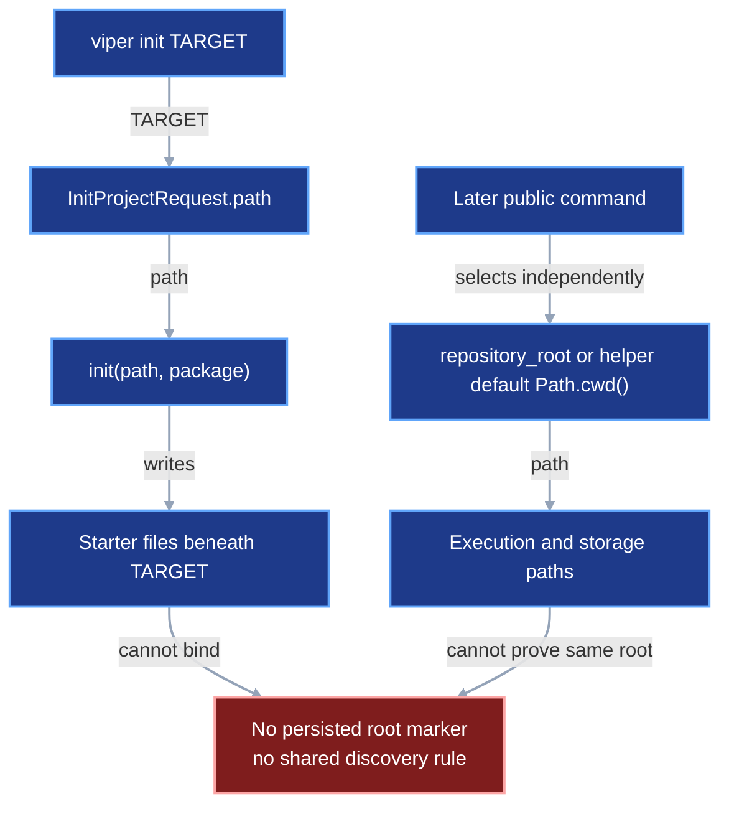
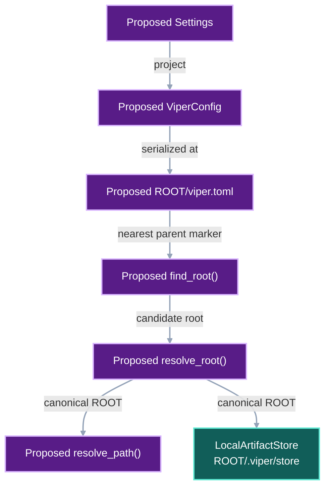
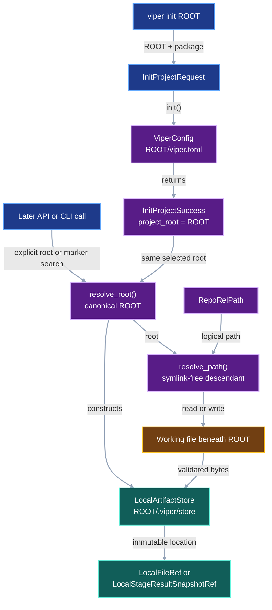

# Project data root

VIPER uses one project root for source, authored inputs, frozen plans, run
records, working artifacts, and local immutable evidence. The user selects that
root when creating the project. Later commands rediscover the same root instead
of treating the current working directory as an unrelated default.

## 1. Status

**Contract status:** audited; owner approval pending.

These requirements bind the contract to the master checklist:

| ID | Context | Implementation obligation |
| --- | --- | --- |
| PDR-01 <!-- contract-requirement: PDR-01 phase=0 test=tests/test_project_init.py --> | Later commands must rediscover the directory created by `viper init`. | Make `viper init ROOT` create the complete protocol tree and one root marker at the selected location. |
| PDR-02 <!-- contract-requirement: PDR-02 phase=0 test=tests/test_storage.py --> | Working files and immutable copies share one root and occupy separate locations. | Resolve explicit and discovered roots through one function and bind local immutable publication to `ROOT/.viper/store`. |
| PDR-03 <!-- contract-requirement: PDR-03 phase=0 test=tests/test_validation_architecture.py --> | A relative file name can escape `ROOT` through traversal or a symlink. | Reject every symlink below the canonical project root and require every logical and resolved filesystem path to remain beneath it. |
| PDR-04 <!-- contract-requirement: PDR-04 phase=0 test=tests/test_documentation.py --> | The same project-root input currently appears under several public names. | Publish one root vocabulary across the protocol, Python API, typed operations, CLI, generated project, and documentation. |

## 2. Required claim

After the user runs:

```bash
viper init /Volumes/research/weekend-models --package weekend_models
```

VIPER treats `/Volumes/research/weekend-models` as the root of that project.
The project source and the reserved protocol tree live beneath that root:

```text
/Volumes/research/weekend-models/
├── viper.toml
├── pyproject.toml
├── src/
├── tests/
├── inputs/
├── benchmarks/
├── experiments/
└── .viper/
    ├── store/
    ├── workspaces/
    ├── journals/
    ├── catalog.sqlite3
    └── knowledge/
```

VIPER stores source-controlled experiment records and user-visible artifacts in
the protocol tree. VIPER stores immutable local copies beneath `.viper/store`.
The two sets of files share one root and retain separate paths.

## 3. Current gap

### Inspected path

`viper init` already accepts a target path. `InitProjectRequest.path` reaches
`init(path, package)`, which writes the starter project under that
path. Runtime functions separately receive `repository_root` or default a
public helper's `repository_root` argument to `Path.cwd()`.

```text
viper init TARGET
-> InitProjectRequest.path
-> init(path, package)
-> starter files beneath TARGET

later command
-> explicit repository_root or helper default Path.cwd()
-> execution and storage paths beneath that independently selected value
```

Current initialization leaves root discovery undefined. A later command chooses
its root independently through `repository_root` or a helper's `Path.cwd()`
default. The starter
project also creates only portions of the reserved protocol tree. The current
code therefore uses one conceptual root through several selection rules.

### Current DAG

Initialization and later execution currently start from separate path values.



### Missing connector

The initialized target path must become the root selected by every later local
operation:

```text
viper init ROOT
-> write ROOT/viper.toml
-> write the reserved protocol directories
-> later operation receives ROOT explicitly or discovers ROOT/viper.toml
-> all RepoRelPath values resolve beneath ROOT
-> LocalArtifactStore publishes beneath ROOT/.viper/store
```

### Proposed-change DAG

The proposed root marker and resolvers turn the initialized target into one
runtime value shared by later operations.



### Integrated DAG

The integrated path uses the root selected during initialization for source
files, working artifacts, and immutable local publication.



## 4. Contract models

### Root marker

`viper.toml` marks the root. It contains portable project settings and omits the
machine-specific absolute root path. The marker's parent directory is the root.

```toml
[project]
schema_version = 1
```

The `[project]` table uses this complete model:

```python
class Settings(BaseModel):
    model_config = ConfigDict(extra="forbid", frozen=True)

    schema_version: Literal[1]


class ViperConfig(BaseModel):
    model_config = ConfigDict(extra="forbid", frozen=True)

    project: Settings
    storage: StorageSettings = Field(default_factory=StorageSettings)
```

`StorageSettings` retains the exact model owned by
[`remote-storage.md`](remote-storage.md). The local configuration file owns one
`ViperConfig` outside the serialized protocol and run identity. Its filesystem
location binds the project to one machine-local absolute root.

### Initialization request and result

The public operation keeps its current serialized fields. `path` is the root
selected by the caller.

```python
class InitProjectRequest(APIModel):
    path: Path
    package: str = Field(pattern=r"^[a-z][a-z0-9_]*$")


class InitProjectSuccess(SuccessModel):
    operation: Literal["init_project"] = "init_project"
    project_root: Path
    files: tuple[Path, ...]
```

The CLI calls the same operation:

```text
viper init ROOT --package PACKAGE
```

`ROOT` maps to `InitProjectRequest.path`.
`InitProjectSuccess.project_root` returns the resolved absolute root.

Other local requests require roots with one vocabulary. The CLI supplies the
current directory when the user omits a root option, and the operation resolves
that path to the canonical project root:

| Request shape | Public field | Resolved runtime value |
| --- | --- | --- |
| One project | `root` | `project_root` |
| Two projects | `left_root`, `right_root` | `left_root`, `right_root` after independent resolution |

`FreezeRunRequest`, `PreflightRequest`, `ExecuteStageRequest`, `RunRequest`,
`ExecuteBenchmarkRequest`, and `VerificationRequest` use `root`.
`PlanDiffRequest` and `CompareRunsRequest` use `left_root` and `right_root`.

### Runtime root resolution

The root resolver returns one runtime path. Protocol serializers receive
relative paths only.

```python
def find_root(start: Path) -> Path:
    """Return the nearest parent containing viper.toml."""


def resolve_root(root: Path | None = None) -> Path:
    """Return a root with a valid marker at its Git work-tree boundary."""


def resolve_path(
    root: Path,
    path: RepoRelPath,
    *,
    operation: Literal["read", "write"],
) -> Path:
    """Return one symlink-free path beneath the canonical project root."""
```

`resolve_root()` applies this order:

1. An explicit `root` wins.
2. Otherwise, `find_root(start)` uses `Path.cwd()` when `start` is
   absent, then walks from the resolved starting path through its parents.
3. The selected directory must contain a valid `viper.toml`.
4. The selected directory must be a Git work tree before freezing, source
   verification, or execution begins.
5. Failure raises `RootError` before reading or writing experiment data.

The resolver canonicalizes the selected root once with `Path.resolve()`. VIPER
then rejects any symlink in a governed descendant path. This applies to local
inputs, working artifacts, bundles, immutable-store members, restore targets,
and their existing parent directories.

VIPER treats every governed descendant as an ordinary file-tree location. The
symlink check handles both an accidental link and a link created to escape the
project tree. The resolved-boundary check supplies a final defense after
symlink rejection.

`resolve_path()` applies the same rule to every governed descendant.
For a read, each component through the final source must exist as an ordinary
file-tree location. For a write, every existing parent and target must also be
an ordinary file-tree location. The function resolves the candidate after
those checks and requires the result to remain beneath the canonical root.

### Local immutable store

The existing storage-reference fields remain unchanged:

```python
class LocalFileRef(ProtocolModel):
    kind: Literal["local"] = "local"
    store: RepoRelPath = ".viper/store"
    commit: SHA256
    path: RepoRelPath


class LocalStageResultSnapshotRef(ProtocolModel):
    kind: Literal["local"] = "local"
    store: RepoRelPath = ".viper/store"
    commit: SHA256
```

`LocalArtifactStore(project_root, store=".viper/store")` resolves the immutable
store beneath the selected root. The visible artifact and immutable publication
retain distinct files.

### Illustrative worked example

This target workflow initializes one temporary project, rediscovers its root
from a child directory, resolves one ordinary input, and publishes the same
artifact bytes through both local reference types.

<!-- contract-worked-example: start -->

```python
from pathlib import Path
from tempfile import TemporaryDirectory

import pytest

from viper.api import InitProjectRequest, InitProjectSuccess
from viper.project import (
    PathError,
    Settings,
    ViperConfig,
    find_root,
    init,
    resolve_path,
    resolve_root,
)
from viper.references import LocalFileRef, LocalStageResultSnapshotRef
from viper.storage import (
    LocalArtifactStore,
    LocalStorageDestination,
    StorageSettings,
)


with TemporaryDirectory() as temporary_directory:
    root = Path(temporary_directory) / "weekend-models"

    request = InitProjectRequest(
        path=root,
        package="weekend_models",
    )
    created_files = init(request.path, request.package)
    success = InitProjectSuccess(
        project_root=request.path.resolve(),
        files=created_files,
    )

    project_settings = Settings(schema_version=1)
    storage_settings = StorageSettings(
        destination=LocalStorageDestination(),
    )
    config = ViperConfig(
        project=project_settings,
        storage=storage_settings,
    )

    # init() writes this exact configuration in the target API.
    assert config.project.schema_version == 1
    assert config.storage.destination.kind == "local"
    assert success.project_root == root.resolve()

    package_directory = root / "src" / "weekend_models"
    discovered_root = find_root(package_directory)
    selected_root = resolve_root(package_directory)
    assert discovered_root == selected_root == success.project_root

    source_path = root / "inputs" / "train.csv"
    source_path.parent.mkdir(parents=True, exist_ok=True)
    source_path.write_bytes(b"feature,label\n1,0\n")
    governed_source = resolve_path(
        selected_root,
        "inputs/train.csv",
        operation="read",
    )
    assert governed_source == source_path

    artifact_path = "experiments/tiny/model.pt"
    artifact_bytes = b"weights-v1"
    working_artifact = resolve_path(
        selected_root,
        artifact_path,
        operation="write",
    )
    working_artifact.parent.mkdir(parents=True, exist_ok=True)
    working_artifact.write_bytes(artifact_bytes)

    store = LocalArtifactStore(selected_root)
    resolved_file = store.resolved_files(
        {artifact_path: artifact_bytes}
    )[0]
    stage_snapshot = store.snapshot(
        {artifact_path: artifact_bytes}
    )

    assert isinstance(resolved_file.stored_at, LocalFileRef)
    local_file = LocalFileRef(
        store=resolved_file.stored_at.store,
        commit=resolved_file.stored_at.commit,
        path=resolved_file.stored_at.path,
    )
    local_snapshot = LocalStageResultSnapshotRef(
        store=stage_snapshot.store,
        commit=stage_snapshot.commit,
    )

    assert store.fetch(local_file) == artifact_bytes
    assert store.list_snapshot_files(local_snapshot) == (artifact_path,)
    assert local_file.commit == local_snapshot.commit
    assert resolved_file.sha256 == (
        "c0ab742f68a24ef362b5529351eb13561e746b70a0f815efe7b64b570b477851"
    )
    assert resolved_file.bytes == 10

    outside = Path(temporary_directory) / "outside.csv"
    outside.write_bytes(b"outside")
    linked_input = root / "inputs" / "link.csv"
    linked_input.symlink_to(outside)

    with pytest.raises(PathError):
        resolve_path(
            selected_root,
            "inputs/link.csv",
            operation="read",
        )
```

The root marker written by the target initializer contains:

```toml
[project]
schema_version = 1

[storage]
destination = "local"
```

<!-- contract-worked-example: end -->

## 5. Execution

### Initialization

`init()` receives the selected root and performs one staged
write:

```python
def init(path: Path, package: str) -> tuple[Path, ...]: ...
```

The target operation is:

```text
validate package name
-> require ROOT to be absent or empty
-> write the complete scaffold to a sibling temporary directory
-> include viper.toml and the reserved protocol directories
-> atomically replace ROOT with the staged project
-> return every created file
```

The visible protocol directories contain a tracked `README.md` or `.gitkeep`
until the user creates their first record. Initialization creates the reserved
`.viper/` directories and keeps them ignored. State files such as
`.viper/catalog.sqlite3` appear when the owning operation first writes them.

### Later operations

Every local public entry point follows one root path:

```text
explicit root or marker discovery from the current directory
-> resolve_root()
-> validated absolute project root
-> authoring, freezing, execution, verification, catalog, knowledge, or restore
```

Internal functions receive the resolved root explicitly. Only the public
operation boundary searches parent directories.

### File custody

A training stage that declares this working artifact:

```text
experiments/tiny/runs/baseline/<run-id>/artifacts/models/model/params.pt
```

produces two paths:

```text
ROOT/experiments/.../params.pt
-> user-visible working artifact

ROOT/.viper/store/<snapshot-sha256>/experiments/.../params.pt
-> immutable local publication
```

Editing the working artifact makes the working tree differ from the published
snapshot. Verification and restore use the immutable snapshot reference.
Editing `.viper/store` damages immutable evidence and causes retrieval or digest
verification to fail.

## 6. Persisted evidence

The selected absolute root is machine-local configuration. VIPER excludes it
from frozen run identity and scientific experiment identity.

Persisted protocol records retain `RepoRelPath` values. A local storage
reference records:

```text
store + commit + path
```

The runtime joins that reference with the selected root:

```text
ROOT
+ LocalFileRef.store
+ LocalFileRef.commit
+ LocalFileRef.path
-> local immutable file
```

Moving an unchanged project tree to another absolute root leaves its protocol
records and experiment identity unchanged.

## 7. Verification

The implementation adds these checks:

| Rule | Executable requirement |
| --- | --- |
| `project.root.marker` <!-- verifier-rule: project.root.marker requirement=PDR-01 --> | The selected root contains one valid `viper.toml`. |
| `project.root.layout` <!-- verifier-rule: project.root.layout requirement=PDR-01 --> | Initialization creates the complete reserved protocol tree beneath the selected root. |
| `project.root.git` <!-- verifier-rule: project.root.git requirement=PDR-02 --> | Freeze, source verification, and execution use a root that belongs to one Git work tree. |
| `project.path.logical_boundary` <!-- verifier-rule: project.path.logical_boundary requirement=PDR-03 --> | Every `RepoRelPath` rejects absolute paths and `..` traversal. |
| `project.path.symlink_free` <!-- verifier-rule: project.path.symlink_free requirement=PDR-03 --> | After canonicalizing `ROOT`, reject every symlink from its first descendant component through the governed source or target. |
| `project.path.resolved_boundary` <!-- verifier-rule: project.path.resolved_boundary requirement=PDR-03 --> | Resolve the symlink-free candidate as a final defense and require it to remain beneath the canonical `ROOT`. |
| `project.store.boundary` <!-- verifier-rule: project.store.boundary requirement=PDR-02 --> | `LocalArtifactStore.store_root` stays beneath `ROOT`. |
| `project.root.stability` <!-- verifier-rule: project.root.stability requirement=PDR-02 --> | One operation resolves each selected root once and passes the canonical value to every internal consumer. |
| `project.root.vocabulary` <!-- verifier-rule: project.root.vocabulary requirement=PDR-04 --> | The protocol, API, CLI, typed operations, scaffold, and documentation use `root`, `ROOT`, or `project_root` according to their declared scope. |

The verifier reconstructs local paths from the explicit root supplied for
verification and the persisted relative reference. The verifier compares file
digests and byte counts through the existing storage rules.

## 8. Propagation

| Surface | Required statement |
| --- | --- |
| `src/viper/project.py` | Add `viper.toml`, complete the reserved protocol tree, and preserve staged atomic initialization. |
| `src/viper/project.py` | Add `Settings`, `RootError`, `PathError`, `find_root()`, `resolve_root()`, `resolve_path()`, and `init()`. |
| `src/viper/api.py` | Keep `InitProjectRequest.path` and `InitProjectSuccess.project_root`; expose `root`, `left_root`, and `right_root`; resolve each selected root at the operation boundary. |
| `src/viper/_api/handlers.py` | Receive the first root-aware operation bodies during `P0-PDR-03`; `P0-MOD-03` moves those bodies into `api.py` unchanged and deletes this transitional module. |
| `src/viper/cli.py` | Document the `init` positional argument as `ROOT`; use `--root` on commands that need an explicit override. |
| `src/viper/storage.py` | Construct `LocalArtifactStore` from the resolved project root and preserve `.viper/store` as a separate subtree. |
| `src/viper/_verification/storage.py` | Replace `Path.cwd()` reconstruction with the explicit verified root. |
| `src/viper/authoring.py` | Resolve default roots through `resolve_root()` before freezing. |
| `src/viper/execution/_attempt.py` | Pass one resolved root through attempt execution and every stage boundary. |
| `src/viper/execution/_run.py` | Resolve the public run and restore root once before attempt execution. |
| `src/viper/execution/_metric.py` | Use the attempt's resolved root for metric inputs and implementations. |
| `src/viper/inspection.py` | Resolve catalog, lineage, comparison, and plan-diff paths from the selected root. |
| `tests/test_project_init.py` | Cover explicit-root initialization, root marker discovery, complete tree creation, and occupied-target rollback. |
| `tests/test_storage.py` | Publish and retrieve beneath a non-current project root; reject an escaping store. |
| `tests/test_validation_architecture.py` | Require public operation boundaries to use the shared root resolver and internal functions to receive resolved roots. |
| `tests/test_documentation.py` | Compare the protocol tree, CLI vocabulary, contract requirements, and checklist coverage. |
| Public documentation | Explain that `ROOT` contains both the visible protocol tree and the separate `.viper/store` subtree. |

### Legacy cleanup

| Current occurrence | Disposition |
| --- | --- |
| Public request models that default roots from `Path.cwd()` | Require `root`, `left_root`, or `right_root`; let the CLI supply `Path.cwd()` for discovery. |
| CLI `--repository-root` spelling | Replace with `--root`; delete the old spelling during this alpha migration. |
| `_verification/storage.py` use of `Path.cwd()` | Delete and require the verifier's resolved root. |
| Internal `repository_root` parameters | Retain where the name distinguishes the resolved Git/project root from another runtime path. |
| `LocalFileRef.store=".viper/store"` | Retain; the configured root supplies its absolute parent. |
| `.viper/` in generated `.gitignore` | Retain; immutable local evidence and attempt state remain local by default. |

## 9. Acceptance case

### Success

1. Initialize `/tmp/weekend-models` while the shell is elsewhere.
2. Require `viper.toml`, `inputs/`, `benchmarks/`, `experiments/`, `src/`, and
   `tests/` beneath that root.
3. Run a command from `/tmp/weekend-models/src/weekend_models` and let root
   discovery select the project.
4. Require root discovery to return `/tmp/weekend-models`.
5. Publish one working artifact and require its immutable copy beneath
   `/tmp/weekend-models/.viper/store`.
6. Change the working artifact and require retrieval of the original published
   bytes through its `LocalFileRef`.

```toml contract-trace
trace_id = "selected-root-local-publication"
requirement_id = "PDR-02"
rule_id = "project.root.stability"
state = "planned"
scenario = "A command launched from a package child directory publishes one artifact."
setup = "start=/tmp/weekend-models/src/weekend_models; artifact=experiments/tiny/model.pt; bytes=weights-v1"
input = "viper.toml at /tmp/weekend-models/viper.toml"
invocation = "resolve_root(start) returns /tmp/weekend-models once and passes it to LocalArtifactStore"
implementation = "src/viper/project.py:resolve_root"
test = "tests/test_storage.py:test_store_uses_selected_project_root"
outcome.kind = "accepted"
outcome.result = "working bytes and immutable bytes resolve beneath /tmp/weekend-models"
outcome.evidence = ["LocalFileRef returned by LocalArtifactStore.publish()", "artifact SHA-256 c0ab742f68a24ef362b5529351eb13561e746b70a0f815efe7b64b570b477851"]
```

### Rejection

Create `ROOT/inputs/link` as a symbolic link to a file outside `ROOT`. A plan
selects `inputs/link`. `project.path.symlink_free` rejects the source before
capture or publication. The same rule rejects a link whose target remains
inside `ROOT`; one recorded project path must identify one ordinary file-tree
location.

```toml contract-trace
trace_id = "project-path-symlink-rejection"
requirement_id = "PDR-03"
rule_id = "project.path.symlink_free"
state = "planned"
scenario = "A local training input names a symlink beneath the selected root."
setup = "ROOT=/tmp/weekend-models; inputs/link.csv is a symlink to /tmp/source.csv"
input = "ExternalInputRef(source=LocalSource(path='inputs/link.csv'))"
invocation = "resolve_path(ROOT, 'inputs/link.csv', operation='read')"
implementation = "src/viper/project.py:resolve_path"
test = "tests/test_validation_architecture.py:test_project_paths_reject_symlinks"
outcome.kind = "rejected"
outcome.rejected_at = "src/viper/project.py:resolve_path"
outcome.error_type = "PathError"
outcome.message_match = "symlink"
```

## 10. Implementation order

1. Add the root marker, `Settings`, and root resolver with unit tests.
2. Complete the generated protocol tree and acceptance test.
3. Replace public request and CLI root names, then resolve each selected root
   once at the current operation boundary.
4. Add the shared project-path boundary before constructing local storage.
5. Route authoring, execution, verification, inspection, and storage through
   the resolved root.
6. Add boundary and relocation tests.
7. Update the protocol tree and public documentation.
8. Run the Master Phase 0 gate from the master execution checklist.

**Commit boundary:** `Bind every local operation to one project root`
