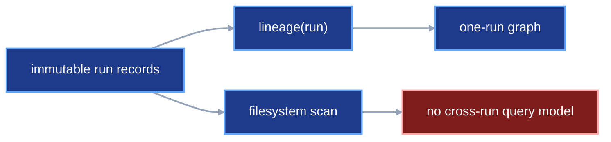
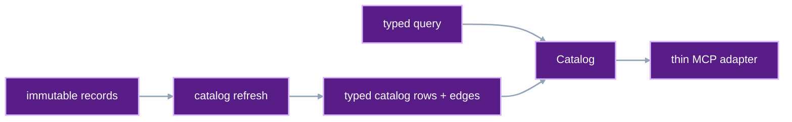
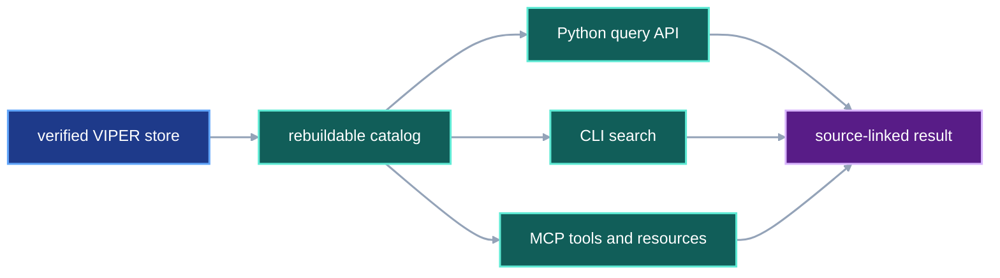
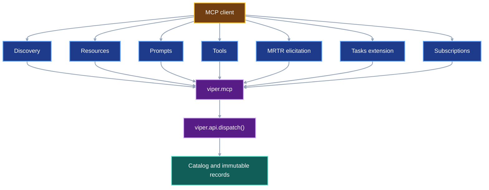

# Provenance catalog and MCP server

VIPER already verifies one resolved run at a time. This contract adds a
rebuildable catalog that can search across verified runs. It then exposes the
catalog and the existing VIPER operations through one local Model Context
Protocol server.

## 1. Status

**Contract status:** in progress; Phase 13 implemented; Phase 15 planned.

These requirements bind the contract to the master checklist:

| ID | Implementation obligation |
| --- | --- |
| PCM-01 <!-- contract-requirement: PCM-01 phase=13 test=tests/test_inspection.py --> | Build and atomically refresh a local catalog from immutable VIPER evidence. |
| PCM-02 <!-- contract-requirement: PCM-02 phase=13 test=tests/test_inspection.py --> | Search runs, artifacts, measurements, benchmarks, and lineage edges while keeping immutable records authoritative. |
| PCM-03 <!-- contract-requirement: PCM-03 phase=15 test=tests/test_api.py --> | Generate deterministic MCP tool schemas from VIPER's typed operation models and route calls through the same handlers. |
| PCM-04 <!-- contract-requirement: PCM-04 phase=15 test=tests/test_cli.py --> | Ship a local stdio MCP command with read-only default access and explicit execution access. |
| PCM-05 <!-- contract-requirement: PCM-05 phase=15 test=tests/test_api.py --> | Expose immutable evidence as `viper://` resources, typed resource templates, and user-selected prompts through stateless MCP requests, `server/discover`, cacheable listings, and `subscriptions/listen`; keep the startup `--root` as the only repository boundary. |
| PCM-06 <!-- contract-requirement: PCM-06 phase=20 test=tests/test_api.py --> | Add explicit learning access, provider-backed model invocation through typed VIPER operations, and structured MRTR review elicitation with immutable VIPER receipts for every model call and human decision. |
| PCM-07 <!-- contract-requirement: PCM-07 phase=20 test=tests/test_cli.py --> | Add the official MCP Tasks extension for declared long-running operations, map `tasks/get`, `tasks/update`, and `tasks/cancel` to durable VIPER operation identity, and preserve the ordinary VIPER status path when the extension is unavailable. |

**Current:** `verify_run_result()` returns one connected verified run.
`lineage()` builds one graph from that result. `compare_runs()` compares two
verified runs. Current inspection covers one or two selected runs.

**Target:** `catalog()` from `viper.catalog` opens the derived SQLite database
at `.viper/catalog.sqlite3`. `Catalog.refresh()` uses Python's `sqlite3` module
to rebuild searchable rows from terminal run references. Search results always
retain the immutable reference that supplied each fact. Deleting the database
and refreshing it produces the same searchable facts. CodeQL belongs only to
the developer-facing System Impact Check; catalog refresh and queries use
SQLite exclusively.

The MCP server is an adapter. It validates tool arguments with the same
Pydantic request models used by `viper.api.dispatch()`. It returns the same
typed result as structured content. Existing VIPER components retain execution,
storage, and verification ownership.

## 2. Required claim

The catalog can answer these questions from verified evidence:

- Which runs used one input digest?
- Which artifacts came from one source commit?
- Which measurements belong to one metric, variant, dataset, or environment?
- Which benchmark results evaluated one model artifact?

Every answer includes a `ResolvedRunRef` or another immutable reference that
the caller can verify. The SQLite row itself proves nothing.

The MCP server exposes the same answers and operations to an MCP client. Every
tool call passes through VIPER request validation, path boundaries,
verification, and execution locks.

## 3. Current gap

The existing inspection path starts with a run already selected by the caller:

```text
ResolvedRun
-> verify_run_result()
-> VerifiedRunResult
-> lineage() or compare_runs()
```

The missing path starts with a question:

```text
metric_id="test_loss" and variant="l2"
-> catalog query
-> matching immutable run and measurement references
-> optional full verification of the selected result
```

An MCP server built directly over filesystem searches would create a second,
weaker model of VIPER. This contract adds the catalog first. MCP calls the
catalog and typed API after both interfaces exist.

### Current DAG



### Proposed-change DAG



### Integrated DAG



## 4. Catalog models

Catalog models use `BaseModel` and carry derived query results. Protocol models
remain the evidence records.

```python
class CatalogRun(BaseModel):
    model_config = ConfigDict(extra="forbid", frozen=True)

    run: ResolvedRunRef
    run_id: RunId
    experiment_id: ExperimentId
    variant_id: VariantId
    replicate_id: ReplicateId
    status: Literal["succeeded", "failed", "cancelled"]
    source_commit: GitCommit
    env_sha256: SHA256
    reproducibility_sha256: SHA256
    benchmark_id: BenchmarkId | None
    verification: Literal["verified"] = "verified"
    completed_at: AwareDatetime


class CatalogFile(BaseModel):
    model_config = ConfigDict(extra="forbid", frozen=True)

    snapshot: StageResultSnapshot
    file: SnapshotFileRef


class CatalogArtifact(BaseModel):
    model_config = ConfigDict(extra="forbid", frozen=True)

    run: ResolvedRunRef
    run_id: RunId
    stage_id: StageId
    artifact_name: ArtifactName
    kind: Literal["file", "bundle"]
    data_role: DataRole
    files: tuple[CatalogFile, ...] = Field(min_length=1)


class CatalogMeasurement(BaseModel):
    model_config = ConfigDict(extra="forbid", frozen=True)

    run: ResolvedRunRef
    measurement: ResolvedFileRef
    run_id: RunId
    stage_id: StageId
    metric_id: MetricId
    value: float = Field(allow_inf_nan=False)
    epoch: int | None = Field(default=None, ge=0)
    step: int | None = Field(default=None, ge=0)
    origin: Literal["executed", "reused"]
    measured_at: AwareDatetime


class CatalogBenchmark(BaseModel):
    model_config = ConfigDict(extra="forbid", frozen=True)

    result: ResolvedBenchmarkResultRef
    run: ResolvedRunRef
    benchmark_id: BenchmarkId
    status: Literal["verified", "passed", "failed"]
    metrics: tuple[BenchmarkMetricResult, ...] = Field(min_length=1)


class CatalogEdge(BaseModel):
    model_config = ConfigDict(extra="forbid", frozen=True)

    run: ResolvedRunRef
    source: str
    target: str
    relation: Literal["produces", "selects", "consumes", "reuses"]
```

`CatalogMeasurement.origin="reused"` means a `StageReuseReceipt` selected the
measurement from an earlier verified run. The measurement keeps its original
immutable reference and original run identity.

## 5. Query models

Each query has a stable sort and bounded page size:

```python
class RunQuery(BaseModel):
    model_config = ConfigDict(extra="forbid", frozen=True)

    experiment_id: ExperimentId | None = None
    variant_ids: tuple[VariantId, ...] = ()
    replicate_ids: tuple[ReplicateId, ...] = ()
    statuses: tuple[Literal["succeeded", "failed", "cancelled"], ...] = ()
    source_commit: GitCommit | None = None
    env_sha256: SHA256 | None = None
    reproducibility_sha256: SHA256 | None = None
    benchmark_id: BenchmarkId | None = None
    input_sha256: SHA256 | None = None
    artifact_sha256: SHA256 | None = None
    limit: int = Field(default=50, ge=1, le=500)
    cursor: str | None = None


class ArtifactQuery(BaseModel):
    model_config = ConfigDict(extra="forbid", frozen=True)

    experiment_id: ExperimentId | None = None
    variant_ids: tuple[VariantId, ...] = ()
    stage_ids: tuple[StageId, ...] = ()
    artifact_names: tuple[ArtifactName, ...] = ()
    data_roles: tuple[DataRole, ...] = ()
    sha256: SHA256 | None = None
    source_commit: GitCommit | None = None
    limit: int = Field(default=50, ge=1, le=500)
    cursor: str | None = None


class MeasurementQuery(BaseModel):
    model_config = ConfigDict(extra="forbid", frozen=True)

    experiment_id: ExperimentId | None = None
    variant_ids: tuple[VariantId, ...] = ()
    stage_ids: tuple[StageId, ...] = ()
    metric_ids: tuple[MetricId, ...] = ()
    input_sha256: SHA256 | None = None
    env_sha256: SHA256 | None = None
    minimum: float | None = Field(default=None, allow_inf_nan=False)
    maximum: float | None = Field(default=None, allow_inf_nan=False)
    origins: tuple[Literal["executed", "reused"], ...] = ()
    limit: int = Field(default=50, ge=1, le=500)
    cursor: str | None = None


class BenchmarkQuery(BaseModel):
    model_config = ConfigDict(extra="forbid", frozen=True)

    experiment_id: ExperimentId | None = None
    variant_ids: tuple[VariantId, ...] = ()
    benchmark_ids: tuple[BenchmarkId, ...] = ()
    statuses: tuple[Literal["verified", "passed", "failed"], ...] = ()
    metric_ids: tuple[MetricId, ...] = ()
    source_commit: GitCommit | None = None
    env_sha256: SHA256 | None = None
    input_sha256: SHA256 | None = None
    artifact_sha256: SHA256 | None = None
    limit: int = Field(default=50, ge=1, le=500)
    cursor: str | None = None
```

The result models are `RunPage`, `ArtifactPage`, `MeasurementPage`, and
`BenchmarkPage`. Each contains an `items` tuple and
`next_cursor: str | None`. Runs sort by
`completed_at`, then `run_id`. Artifacts sort by `run_id`, `stage_id`, and
`artifact_name`. Measurements sort by `run_id`, `stage_id`, `metric_id`, then
by non-null epoch, non-null step, `measured_at`, and the immutable measurement
reference. An aggregate measurement with `epoch=None` or `step=None` follows
measurements with a numeric value in that position. Benchmarks sort by
`benchmark_id`, `run_id`, and immutable result reference.

## 6. Catalog storage and refresh

VIPER stores the derived database at:

```text
.viper/catalog.sqlite3
```

The database has these version-1 tables:

| Table | One row represents |
| --- | --- |
| `sources` | One immutable terminal reference considered during refresh |
| `runs` | One verified terminal run |
| `stages` | One completed stage in one run |
| `inputs` | One resolved stage input |
| `artifacts` | One named stage artifact |
| `files` | One file identity inside an artifact or captured input |
| `measurements` | One measured metric value |
| `benchmarks` | One benchmark result |
| `edges` | One lineage relation |

The typed API resolves local terminal paths, verifies their connected records,
and pairs each verified value with its immutable terminal reference.
`Catalog.refresh()` then follows this procedure:

```text
receive CatalogRunSource and CatalogBenchmarkSource values
-> confirm each verified value matches its immutable terminal reference
-> extract normalized rows
-> write a new database in .viper/
-> fsync the database
-> atomically replace catalog.sqlite3
```

An invalid run enters `sources` with its rejection. Trusted run, artifact,
measurement, benchmark, lineage, and reuse-key tables accept verified sources.

Catalog writes stay inside its SQLite database. A stale or corrupt catalog can
be deleted and rebuilt from immutable VIPER run records.

## 7. Public catalog interface

```python
class Catalog:
    def refresh(
        self,
        *,
        runs: tuple[CatalogRunSource, ...] = (),
        benchmarks: tuple[CatalogBenchmarkSource, ...] = (),
    ) -> CatalogRefreshResult: ...

    def runs(self, query: RunQuery = RunQuery()) -> RunPage: ...

    def artifacts(
        self,
        query: ArtifactQuery = ArtifactQuery(),
    ) -> ArtifactPage: ...

    def measurements(
        self,
        query: MeasurementQuery = MeasurementQuery(),
    ) -> MeasurementPage: ...

    def benchmarks(
        self,
        query: BenchmarkQuery = BenchmarkQuery(),
    ) -> BenchmarkPage: ...

    def lineage(self, run: ResolvedRunRef) -> RunLineage: ...

def catalog(*, root: Path | None = None) -> Catalog: ...
```

This is the Phase 13 interface. Phase 16 adds explicit knowledge-manifest heads
to `Catalog.refresh()`. Phase 17 adds `Catalog.knowledge` after
`KnowledgeCatalog` exists.

The typed API adds `catalog_refresh`, `search_runs`, `search_artifacts`,
`search_measurements`, and `search_benchmarks`. Their request and success
models contain the same query and page models.

## 8. MCP server

The MCP server exposes the existing VIPER system through the protocol's full
layout. It does not define another catalog, executor, verifier, learning
record, or authorization model.



The [MCP 2026-07-28
specification](https://modelcontextprotocol.io/specification/2026-07-28) uses
stateless, self-contained requests. Every request carries the protocol version,
client identity, and client capabilities in `_meta`. `viper.mcp` implements
`server/discover`, returns `resultType` on every result, and advertises only the
resources, prompts, tools, subscriptions, elicitation, and extensions it can
serve. There is no initialization session or `Mcp-Session-Id`.

The first server uses stdio:

```bash
viper mcp --root /absolute/project/path
```

The command starts with read access. Execution and learning access are
explicit:

```bash
viper mcp --root /absolute/project/path --access execute

viper mcp --root /absolute/project/path --access learn
```

The server uses the official Python SDK's stable version-2 line. The package
declares it as an optional dependency:

```toml
[project.optional-dependencies]
mcp = ["mcp>=2,<3"]
```

The [official MCP tool
contract](https://modelcontextprotocol.io/specification/2026-07-28/server/tools)
requires valid input schemas and supports output schemas, structured content,
resource links, and tool annotations. Annotations are untrusted hints; VIPER's
access mode and handler validation remain authoritative. The
[official Python SDK](https://github.com/modelcontextprotocol/python-sdk)
generates protocol schemas from Python types. VIPER still compares every
generated schema with the owning request or success model in tests.

### Repository custody

The server starts with one explicit `--root`. That path is the sole repository
boundary for the process. Every path-bearing resource URI, prompt argument, and
tool argument passes through `resolve_path()` before dispatch. The MCP
2026-07-28 revision deprecates Roots for new implementations; VIPER therefore
does not accept a second client-supplied root model.

### Evidence resources

Immutable and derived records use a custom, typed URI scheme:

```text
viper://run/{sha256}
viper://artifact/{sha256}
viper://measurement/{sha256}
viper://benchmark/{sha256}
viper://knowledge/{sha256}
viper://research/episode/{sha256}
viper://research/policy/{sha256}
viper://literature/work/{work_id}/version/{version}
viper://catalog/head
```

`resources/list` returns bounded, currently discoverable resources.
`resources/templates/list` returns the parameterized forms above.
`resources/read` resolves the URI through typed VIPER references and verifies
immutable evidence before returning bytes. `viper://catalog/head` is explicitly
derived and includes the catalog identity and refresh sources. The server emits
one `resourcesListChanged` event through `subscriptions/listen` after a
successful catalog replacement and accepts resource subscriptions only for
mutable derived heads. Immutable digest resources never change under one URI.
Every list and read result includes the required `ttlMs` and `cacheScope`;
immutable evidence may use a long private cache lifetime, while the derived
catalog head uses a short private lifetime.

The [MCP resource
contract](https://modelcontextprotocol.io/specification/2026-07-28/server/resources)
defines URI identity, templates, pagination, optional subscriptions, and list
change notifications. VIPER maps those mechanisms onto its existing immutable
and derived records.

### User-selected prompts

The first prompt set is small and typed:

```text
review_run
compare_runs
investigate_failure
review_experiment_proposal
compare_agent_policies
review_literature_claim
```

Each prompt argument validates through an existing query or reference model.
The prompt body contains resolved resource links and a plain-language review
task. Prompts never execute work or approve a result. They are user-selected
views, consistent with the [MCP prompt interaction
model](https://modelcontextprotocol.io/specification/2026-07-28/server/prompts).

### Read-access tools

The read server exposes these typed operations in deterministic name order:

```text
compare_runs
get_capabilities
get_schema
lineage
plan_diff
search_artifacts
search_benchmarks
search_measurements
search_runs
status
verify_benchmark
verify_pointer
verify_run
```

### Execution-access tools

Execution access adds:

```text
catalog_refresh
execute_benchmark
preflight
restore
retry
run
run_many
```

### Learning-access tools

Learning access includes the read and execution sets, then adds the operations
owned by [Research Memory and Agent Learning](research-memory-roadmap.md):

```text
curate_learning_example
publish_learning_dataset
run_learning_update
evaluate_agent_policy
promote_agent_policy
publish_literature_claim
```

Python draft objects remain inside the user's authoring process. The MCP server
therefore begins with frozen plan paths and immutable references. Python
authoring files execute in the user's authoring process.

Each tool follows one route:

```text
MCP arguments
-> owning API request model
-> viper.api.dispatch()
-> owning handler
-> owning success model or ViperFailure
-> MCP structuredContent and matching JSON text
```

The default server exposes the read tool set. `--access execute` adds the
execution tool set. `--access learn` adds the learning tool set. Each mode
grants the local MCP client no more authority than the user running the CLI
process. `catalog_refresh` belongs to execution access because it replaces the
local derived database. `promote_agent_policy` belongs to learning access and
also requires a structured human approval receipt.

### Model invocation and elicitation

VIPER invokes a configured model provider through a typed research operation.
Provider credentials stay in the server process and never enter an MCP request,
resource, prompt, or receipt. Every completed call publishes the
`AgentModelInvocationReceipt` defined by the research contract. MCP Sampling is
deprecated for new implementations in revision 2026-07-28, so `viper.mcp` does
not expose or depend on it.

When a request needs a structured research review or policy-promotion decision,
the server returns an MRTR `InputRequiredResult`. The client retries the original
request with `inputResponses` and the server-owned `requestState`. Form-mode
elicitation remains reviewable and declineable and never requests credentials.
An accepted response compiles into the corresponding typed review or promotion
record before publication. A declined or cancelled request publishes no
approval and authorizes no promotion.

### Long-running tasks and utilities

The official [MCP Tasks
extension](https://modelcontextprotocol.io/extensions/tasks/overview) is
opt-in. VIPER advertises `io.modelcontextprotocol/tasks` only
for operations whose API handler already returns a durable operation identity:

```text
catalog_refresh
run_many
run_learning_update
evaluate_agent_policy
```

The MCP task ID maps one-to-one to that VIPER identity. `tasks/get` reads the
same durable state used by Python and CLI callers. `tasks/update` supplies
mid-flight typed input. `tasks/cancel` invokes the owning VIPER cancellation
path. Clients without the extension receive the ordinary typed operation
response and can use the existing VIPER `status` operation. Request-scoped
progress carries the same operation identity. Stdio diagnostics go to `stderr`;
distributed tracing may use OpenTelemetry. VIPER does not implement deprecated
MCP Logging. A disconnected client never changes evidence state or makes a task
receipt authoritative.

Streamable HTTP stays deferred until VIPER defines authentication,
authorization, rate limits, and deployment ownership. The MCP specification
defines stdio and HTTP transports; stdio preserves VIPER's current local trust
boundary.

## 9. Stage-reuse dependency

[`stage-reuse.md`](stage-reuse.md) extends the version-1 catalog in Master Phase 14
after it defines `StageReuseKey`. That extension adds the `stage_reuse_keys`
table and the private candidate lookup. Each row stores the complete
`StageReuseKey`, the candidate `ResolvedRunRef`, successful attempt reference,
stage reference, metric evidence, and completion time.

The executor verifies the selected candidate again before reuse. A matching
catalog row supplies a candidate. Full source verification grants permission
to skip execution.

## 10. Acceptance cases

| Rule | Executable condition |
| --- | --- |
| `catalog.refresh.atomic` <!-- verifier-rule: catalog.refresh.atomic requirement=PCM-01 --> | Catalog refresh rebuilds from immutable evidence and atomically replaces the local index. |
| `catalog.search.evidenced` <!-- verifier-rule: catalog.search.evidenced requirement=PCM-02 --> | Every run, artifact, measurement, benchmark, and lineage result retains its immutable source reference. |
| `mcp.schema.parity` <!-- verifier-rule: mcp.schema.parity requirement=PCM-03 --> | MCP tool schemas derive from typed operation models and dispatch through the same handlers. |
| `mcp.stdio.access` <!-- verifier-rule: mcp.stdio.access requirement=PCM-04 --> | The local stdio server defaults to read-only access and requires explicit execution access. |
| `mcp.resources.complete` <!-- verifier-rule: mcp.resources.complete requirement=PCM-05 --> | MCP resources, templates, prompts, discovery, caching, and subscriptions remain stateless inside the startup root. |
| `mcp.learning.custody` <!-- verifier-rule: mcp.learning.custody requirement=PCM-06 --> | Learning access records every provider call and human decision as immutable VIPER evidence. |
| `mcp.tasks.identity` <!-- verifier-rule: mcp.tasks.identity requirement=PCM-07 --> | MCP task operations retain durable VIPER operation identity and preserve ordinary status fallback. |
<!-- contract-worked-example: start -->

```python
from pathlib import Path


index = catalog(root=Path.cwd())
index.refresh(runs=(verified_run,))
runs = index.runs(RunQuery(input_sha256=dataset_sha256))
measurements = index.measurements(
    MeasurementQuery(
        metric_ids=("test_loss",),
        input_sha256=dataset_sha256,
        env_sha256=env_sha256,
    )
)
artifacts = index.artifacts(ArtifactQuery(source_commit=source_commit))
benchmarks = index.benchmarks(BenchmarkQuery(artifact_sha256=model_sha256))

assert runs.items
assert measurements.items
assert artifacts.items
assert benchmarks.items
```

### Rebuild equality

The test indexes three fixture runs, records every query result, deletes the
database, rebuilds it, and receives equal ordered results.

### Tampered source

A catalog source points to a terminal run whose referenced stage bytes changed.
Refresh records the invalid source and excludes its derived rows.

### Cross-run query

Two variants use the same dataset digest and produce different test-loss
measurements. `RunQuery(input_sha256=...)` finds both runs.
`MeasurementQuery(metric_ids=("test_loss",))` returns both values with their
variant IDs and immutable run references.

`ArtifactQuery(source_commit=...)` finds artifacts produced from one source
commit. `MeasurementQuery(input_sha256=..., env_sha256=...)` finds metric
values observed with one input and environment.
`BenchmarkQuery(artifact_sha256=...)` finds every benchmark result that
evaluated one artifact.

### Null ordering

One fixture contains step measurements, an epoch summary, and a stage summary
for the same metric. Two catalog rebuilds return the numeric steps first, then
the epoch summary, then the stage summary. Pagination across those boundaries
returns each measurement once.

### Atomic replacement

A reader holds the old catalog open while refresh builds and replaces the new
database. Every query sees either the complete old database or the complete
new database. The replacement keeps partial state invisible to readers.

### MCP schema equality

The MCP client lists tools twice and receives the same order. Every tool input
schema equals the JSON Schema of its API request model. Every successful call's
structured content validates against its API success model.

### Access boundary

The read server omits `run`, `retry`, `run_many`, `execute_benchmark`, and
`restore`. The execution server exposes them and omits every learning tool. The
learning server exposes all three sets. Every mode rejects a repository path
outside the startup root.

### Resource and prompt equality

Two server starts over the same catalog list equal resources, resource
templates, prompts, argument schemas, and order. Reading one immutable resource
verifies its source reference. Every list and read result has deterministic
cache metadata. Refreshing the catalog updates the derived head and emits
exactly one `resourcesListChanged` event through `subscriptions/listen` without
changing an immutable resource URI.

### Model invocation and review custody

A configured provider returns one proposed experiment and VIPER publishes its
exact `AgentModelInvocationReceipt`. A request whose client omits elicitation
capability returns no input request. A supporting client completes one MRTR
review. VIPER publishes the typed review record. Decline and cancellation
publish no approval and authorize no promotion.

### Task fallback

One `run_many` call executes once through a task-capable client and once through
the ordinary typed response. Both paths expose the same VIPER operation
identity, terminal status, cancellation behavior, and result. The task path
adds MCP polling metadata only.

<!-- contract-worked-example: end -->

## 11. Propagation

| Surface | Required change |
| --- | --- |
| `src/viper/catalog.py` | Add the derived models, SQLite schema, refresh, exact run, artifact, measurement, and benchmark queries, and stage-reuse lookup. |
| `src/viper/inspection.py` | Share normalized lineage extraction with catalog refresh. |
| `src/viper/api.py` | Add catalog refresh and run, artifact, measurement, and benchmark search request and success models. |
| `src/viper/api.py` | Route catalog requests through `Catalog`. |
| `src/viper/mcp.py` | Generate tools from typed operation registries; implement stateless request metadata, `server/discover`, verified resources, cache metadata, `subscriptions/listen`, typed templates, user-selected prompts, MRTR elicitation, and the Tasks extension. |
| `src/viper/research.py` | Own provider-backed model invocation receipts, review records, learning records, and policy-promotion semantics consumed by MCP. |
| `src/viper/cli.py` | Add `catalog refresh`, catalog search commands, and `mcp --access read|execute|learn`. |
| `src/viper/__init__.py` | Export `catalog` and public query and result models. |
| `pyproject.toml` | Add the optional `mcp` dependency group. |
| `tests/test_inspection.py` | Cover rebuild equality, ordering, pagination, filters, and lineage extraction. |
| `tests/test_verification_acceptance.py` | Reject invalid sources and require source references on every result. |
| `tests/test_api.py` | Compare API and MCP schemas, resources, prompts, per-request metadata, discovery, cache metadata, subscriptions, MRTR receipts, and structured results. |
| `tests/test_cli.py` | Cover catalog commands, stdio startup, three access modes, startup-root custody, task fallback, progress, cancellation, and `stderr` diagnostics. |
| Public documentation | Explain local MCP setup, tool authority, and exact catalog queries. |

## 12. Legacy cleanup

Cross-run filesystem scans inside inspection commands move behind `Catalog`.
Single-run `lineage()` and `compare_runs()` remain public and continue to
operate directly on verified runs.

The MCP implementation imports request models, result models, verifiers,
storage clients, and execution functions from their existing owners. A tool
wrapper converts only the MCP result envelope.

## 13. Implementation order

1. Add catalog models and version-1 SQLite schema.
2. Extract rows from one verified run.
3. Add atomic rebuild, concurrent-reader proof, pagination, null ordering, and exact queries.
4. Add catalog typed operations and CLI commands.
5. Add the optional MCP dependency and stdio server.
6. Generate tools from the typed operation registry.
7. Add `server/discover`, immutable resources, cache metadata, resource
   templates, prompts, `subscriptions/listen`, progress, cancellation, and
   `stderr` diagnostics.
8. Add access-mode, schema-equality, structured-result, resource, prompt, and
   path-boundary tests.
9. After the research records exist, add learning access, provider-backed model
   invocation receipts, MRTR review elicitation, and the task-capable
   operations.
10. Prove per-request capability omission, decline, cancellation, task
    fallback, and equal operation identities through the in-process client.

The verified-stage-reuse contract adds reuse-key indexing and lookup in Phase
14. The catalog contract supplies the database, refresh, and query machinery
that extension uses.

## 14. Executable PairBlocks

<!-- pair-block-definition: P13-PCM-01 -->
```toml pair-block
id = "P13-PCM-01"
requirements = ["PCM-01", "PCM-02"]
targets = [
    "src/viper/catalog.py:annotations",
    "src/viper/catalog.py:base64",
    "src/viper/catalog.py:hashlib",
    "src/viper/catalog.py:json",
    "src/viper/catalog.py:os",
    "src/viper/catalog.py:sqlite3",
    "src/viper/catalog.py:tempfile",
    "src/viper/catalog.py:dataclass",
    "src/viper/catalog.py:Path",
    "src/viper/catalog.py:Generic",
    "src/viper/catalog.py:Literal",
    "src/viper/catalog.py:TypeVar",
    "src/viper/catalog.py:AwareDatetime",
    "src/viper/catalog.py:BaseModel",
    "src/viper/catalog.py:ConfigDict",
    "src/viper/catalog.py:Field",
    "src/viper/catalog.py:SHA256",
    "src/viper/catalog.py:ArtifactName",
    "src/viper/catalog.py:BenchmarkId",
    "src/viper/catalog.py:DataRole",
    "src/viper/catalog.py:GitCommit",
    "src/viper/catalog.py:BenchmarkMetricResult",
    "src/viper/catalog.py:ExperimentId",
    "src/viper/catalog.py:MetricId",
    "src/viper/catalog.py:ReplicateId",
    "src/viper/catalog.py:RunId",
    "src/viper/catalog.py:StageId",
    "src/viper/catalog.py:VariantId",
    "src/viper/catalog.py:RunLineage",
    "src/viper/catalog.py:lineage",
    "src/viper/catalog.py:ResolvedBenchmarkResultRef",
    "src/viper/catalog.py:ResolvedFileRef",
    "src/viper/catalog.py:ResolvedRunRef",
    "src/viper/catalog.py:SnapshotFileRef",
    "src/viper/catalog.py:StageResultSnapshot",
    "src/viper/catalog.py:RunAttempt",
    "src/viper/catalog.py:document_digest",
    "src/viper/catalog.py:serialize_document",
    "src/viper/catalog.py:DownloadSpec",
    "src/viper/catalog.py:InternalSpec",
    "src/viper/catalog.py:VerifiedBenchmarkResult",
    "src/viper/catalog.py:VerifiedRunResult",
    "src/viper/catalog.py:CatalogRunStatus",
    "src/viper/catalog.py:CatalogBenchmarkStatus",
    "src/viper/catalog.py:MeasurementOrigin",
    "src/viper/catalog.py:CatalogRun",
    "src/viper/catalog.py:CatalogFile",
    "src/viper/catalog.py:CatalogArtifact",
    "src/viper/catalog.py:CatalogMeasurement",
    "src/viper/catalog.py:CatalogBenchmark",
    "src/viper/catalog.py:CatalogEdge",
    "src/viper/catalog.py:RunQuery",
    "src/viper/catalog.py:ArtifactQuery",
    "src/viper/catalog.py:MeasurementQuery",
    "src/viper/catalog.py:BenchmarkQuery",
    "src/viper/catalog.py:ItemT",
    "src/viper/catalog.py:CatalogPage",
    "src/viper/catalog.py:RunPage",
    "src/viper/catalog.py:ArtifactPage",
    "src/viper/catalog.py:MeasurementPage",
    "src/viper/catalog.py:BenchmarkPage",
    "src/viper/catalog.py:CatalogRefreshResult",
    "src/viper/catalog.py:CatalogRunSource",
    "src/viper/catalog.py:CatalogBenchmarkSource",
    "src/viper/catalog.py:_SCHEMA",
    "src/viper/catalog.py:_json",
    "src/viper/catalog.py:_reference_key",
    "src/viper/catalog.py:_source_error",
    "src/viper/catalog.py:_benchmark_error",
    "src/viper/catalog.py:_digests",
    "src/viper/catalog.py:_successful_attempt",
    "src/viper/catalog.py:_run_row",
    "src/viper/catalog.py:_artifact_rows",
    "src/viper/catalog.py:_measurement_rows",
    "src/viper/catalog.py:_query_digest",
    "src/viper/catalog.py:_cursor_offset",
    "src/viper/catalog.py:_next_cursor",
    "src/viper/catalog.py:Catalog",
    "src/viper/catalog.py:catalog",
    "src/viper/catalog.py:__all__",
    "tests/test_inspection.py:sqlite3",
    "tests/test_inspection.py:replace",
    "tests/test_inspection.py:timedelta",
    "tests/test_inspection.py:Catalog",
    "tests/test_inspection.py:CatalogRunSource",
    "tests/test_inspection.py:RunQuery",
    "tests/test_inspection.py:ResolvedRunRef",
    "tests/test_inspection.py:DownloadSpec",
    "tests/test_inspection.py:_run",
    "tests/test_inspection.py:_write_plan",
    "tests/test_inspection.py:_catalog_source",
    "tests/test_inspection.py:test_catalog_refresh_is_atomic_and_rebuildable",
    "tests/test_inspection.py:test_catalog_results_retain_immutable_sources",
]
tests = [
    "tests/test_inspection.py:test_catalog_refresh_is_atomic_and_rebuildable",
    "tests/test_inspection.py:test_catalog_results_retain_immutable_sources",
]
gate = "python -m pytest tests/test_inspection.py::test_catalog_refresh_is_atomic_and_rebuildable tests/test_inspection.py::test_catalog_results_retain_immutable_sources -q"
depends_on = ["P12-EXP-03"]
```

**Context:** Phase 13 needs one trusted catalog boundary before later reuse and
MCP work can consume it. This block adds the disposable SQLite index, exact
source-linked queries, and the two focused proofs for atomic rebuild and
immutable-reference retention.

<!-- pair-block-definition: P13-PCM-02 -->
```toml pair-block
id = "P13-PCM-02"
requirements = ["PCM-02"]
targets = [
    "src/viper/api.py:sqlite3",
    "src/viper/api.py:ArtifactPage",
    "src/viper/api.py:ArtifactQuery",
    "src/viper/api.py:BenchmarkPage",
    "src/viper/api.py:BenchmarkQuery",
    "src/viper/api.py:CatalogRefreshResult",
    "src/viper/api.py:CatalogRunSource",
    "src/viper/api.py:MeasurementPage",
    "src/viper/api.py:MeasurementQuery",
    "src/viper/api.py:RunPage",
    "src/viper/api.py:RunQuery",
    "src/viper/api.py:catalog",
    "src/viper/api.py:LocalFileRef",
    "src/viper/api.py:content_revision",
    "src/viper/api.py:OperationName",
    "src/viper/api.py:CatalogRefreshRequest",
    "src/viper/api.py:CatalogRefreshSuccess",
    "src/viper/api.py:SearchRunsRequest",
    "src/viper/api.py:SearchRunsSuccess",
    "src/viper/api.py:SearchArtifactsRequest",
    "src/viper/api.py:SearchArtifactsSuccess",
    "src/viper/api.py:SearchMeasurementsRequest",
    "src/viper/api.py:SearchMeasurementsSuccess",
    "src/viper/api.py:SearchBenchmarksRequest",
    "src/viper/api.py:SearchBenchmarksSuccess",
    "src/viper/api.py:SCHEMA_REGISTRY",
    "src/viper/api.py:OPERATIONS",
    "src/viper/api.py:_catalog_run_source",
    "src/viper/api.py:catalog_refresh",
    "src/viper/api.py:search_runs",
    "src/viper/api.py:search_artifacts",
    "src/viper/api.py:search_measurements",
    "src/viper/api.py:search_benchmarks",
    "src/viper/api.py:REQUEST_REGISTRY",
    "src/viper/api.py:HANDLER_REGISTRY",
    "src/viper/api.py:__all__",
    "src/viper/cli.py:json",
    "src/viper/cli.py:parse_query",
    "src/viper/cli.py:build_parser",
    "src/viper/cli.py:_operation_and_payload",
    "src/viper/cli.py:_human_success",
    "tests/test_api.py:CatalogRefreshRequest",
    "tests/test_api.py:SearchRunsRequest",
    "tests/test_api.py:catalog_refresh",
    "tests/test_api.py:search_runs",
    "tests/test_api.py:Catalog",
    "tests/test_api.py:CatalogRefreshResult",
    "tests/test_api.py:test_api_schema_and_capability_discovery",
    "tests/test_api.py:test_catalog_result_matches_python_api_and_cli",
]
tests = [
    "tests/test_api.py:test_api_schema_and_capability_discovery",
    "tests/test_api.py:test_catalog_result_matches_python_api_and_cli",
]
gate = "python -m pytest tests/test_api.py::test_api_schema_and_capability_discovery tests/test_api.py::test_catalog_result_matches_python_api_and_cli -q"
depends_on = ["P13-PCM-01"]
```

**Context:** The catalog becomes public only through the same typed operation
registry used by every existing Python and CLI command. This block adds those
adapters and proves that direct and command-line calls return the same models.

## 15. ContractTarget

<!-- contract-target: requirements=PCM-02 block=P13-PCM-02 action=add target=src/viper/api.py:sqlite3 -->
```python contract-target
import sqlite3
```

<!-- contract-target: requirements=PCM-02 block=P13-PCM-02 action=add target=src/viper/api.py:ArtifactPage -->
<!-- contract-target: requirements=PCM-02 block=P13-PCM-02 action=add target=src/viper/api.py:ArtifactQuery -->
<!-- contract-target: requirements=PCM-02 block=P13-PCM-02 action=add target=src/viper/api.py:BenchmarkPage -->
<!-- contract-target: requirements=PCM-02 block=P13-PCM-02 action=add target=src/viper/api.py:BenchmarkQuery -->
<!-- contract-target: requirements=PCM-02 block=P13-PCM-02 action=add target=src/viper/api.py:CatalogRefreshResult -->
<!-- contract-target: requirements=PCM-02 block=P13-PCM-02 action=add target=src/viper/api.py:CatalogRunSource -->
<!-- contract-target: requirements=PCM-02 block=P13-PCM-02 action=add target=src/viper/api.py:MeasurementPage -->
<!-- contract-target: requirements=PCM-02 block=P13-PCM-02 action=add target=src/viper/api.py:MeasurementQuery -->
<!-- contract-target: requirements=PCM-02 block=P13-PCM-02 action=add target=src/viper/api.py:RunPage -->
<!-- contract-target: requirements=PCM-02 block=P13-PCM-02 action=add target=src/viper/api.py:RunQuery -->
<!-- contract-target: requirements=PCM-02 block=P13-PCM-02 action=add target=src/viper/api.py:catalog -->
```python contract-target
from .catalog import (
    ArtifactPage,
    ArtifactQuery,
    BenchmarkPage,
    BenchmarkQuery,
    CatalogRefreshResult,
    CatalogRunSource,
    MeasurementPage,
    MeasurementQuery,
    RunPage,
    RunQuery,
    catalog,
)
```

<!-- contract-target: requirements=PCM-02 block=P13-PCM-02 action=add target=src/viper/api.py:LocalFileRef -->
```python contract-target
from .references import LocalFileRef
```

<!-- contract-target: requirements=PCM-02 block=P13-PCM-02 action=add target=src/viper/api.py:content_revision -->
```python contract-target
from .storage import content_revision
```

<!-- contract-target: requirements=PCM-02 block=P13-PCM-02 action=update target=src/viper/api.py:OperationName -->
```python contract-target
OperationName = Literal[
    "validate_stage",
    "validate_resolved_stage",
    "validate_run_spec",
    "freeze_run",
    "preflight",
    "execute_stage",
    "run",
    "run_many",
    "retry",
    "execute_benchmark",
    "restore",
    "plan_diff",
    "lineage",
    "status",
    "compare_runs",
    "verify_run",
    "verify_benchmark",
    "verify_pointer",
    "get_schema",
    "get_capabilities",
    "init_project",
    "explain_impact",
    "analyze_impact",
    "catalog_refresh",
    "search_runs",
    "search_artifacts",
    "search_measurements",
    "search_benchmarks",
]
```

<!-- contract-target: requirements=PCM-02 block=P13-PCM-02 action=add target=src/viper/api.py:CatalogRefreshRequest -->
```python contract-target
class CatalogRefreshRequest(APIModel):
    """Select terminal run files for one complete catalog rebuild."""

    root: Path
    run_paths: tuple[Path, ...]
    trusted_source_repositories: frozenset[str] = Field(min_length=1)
```

<!-- contract-target: requirements=PCM-02 block=P13-PCM-02 action=add target=src/viper/api.py:CatalogRefreshSuccess -->
```python contract-target
class CatalogRefreshSuccess(SuccessModel):
    """Return the accepted and rejected source counts for one rebuild."""

    operation: Literal["catalog_refresh"] = "catalog_refresh"  # pyright: ignore[reportIncompatibleVariableOverride]
    result: CatalogRefreshResult
```

<!-- contract-target: requirements=PCM-02 block=P13-PCM-02 action=add target=src/viper/api.py:SearchRunsRequest -->
```python contract-target
class SearchRunsRequest(APIModel):
    """Select one project catalog and exact run query."""

    root: Path
    query: RunQuery = RunQuery()
```

<!-- contract-target: requirements=PCM-02 block=P13-PCM-02 action=add target=src/viper/api.py:SearchRunsSuccess -->
```python contract-target
class SearchRunsSuccess(SuccessModel):
    """Return one page of source-linked run results."""

    operation: Literal["search_runs"] = "search_runs"  # pyright: ignore[reportIncompatibleVariableOverride]
    page: RunPage
```

<!-- contract-target: requirements=PCM-02 block=P13-PCM-02 action=add target=src/viper/api.py:SearchArtifactsRequest -->
```python contract-target
class SearchArtifactsRequest(APIModel):
    """Select one project catalog and exact artifact query."""

    root: Path
    query: ArtifactQuery = ArtifactQuery()
```

<!-- contract-target: requirements=PCM-02 block=P13-PCM-02 action=add target=src/viper/api.py:SearchArtifactsSuccess -->
```python contract-target
class SearchArtifactsSuccess(SuccessModel):
    """Return one page of source-linked artifact results."""

    operation: Literal["search_artifacts"] = "search_artifacts"  # pyright: ignore[reportIncompatibleVariableOverride]
    page: ArtifactPage
```

<!-- contract-target: requirements=PCM-02 block=P13-PCM-02 action=add target=src/viper/api.py:SearchMeasurementsRequest -->
```python contract-target
class SearchMeasurementsRequest(APIModel):
    """Select one project catalog and exact measurement query."""

    root: Path
    query: MeasurementQuery = MeasurementQuery()
```

<!-- contract-target: requirements=PCM-02 block=P13-PCM-02 action=add target=src/viper/api.py:SearchMeasurementsSuccess -->
```python contract-target
class SearchMeasurementsSuccess(SuccessModel):
    """Return one page of source-linked measurement results."""

    operation: Literal["search_measurements"] = "search_measurements"  # pyright: ignore[reportIncompatibleVariableOverride]
    page: MeasurementPage
```

<!-- contract-target: requirements=PCM-02 block=P13-PCM-02 action=add target=src/viper/api.py:SearchBenchmarksRequest -->
```python contract-target
class SearchBenchmarksRequest(APIModel):
    """Select one project catalog and exact benchmark query."""

    root: Path
    query: BenchmarkQuery = BenchmarkQuery()
```

<!-- contract-target: requirements=PCM-02 block=P13-PCM-02 action=add target=src/viper/api.py:SearchBenchmarksSuccess -->
```python contract-target
class SearchBenchmarksSuccess(SuccessModel):
    """Return one page of source-linked benchmark results."""

    operation: Literal["search_benchmarks"] = "search_benchmarks"  # pyright: ignore[reportIncompatibleVariableOverride]
    page: BenchmarkPage
```

<!-- contract-target: requirements=PCM-02 block=P13-PCM-02 action=update target=src/viper/api.py:SCHEMA_REGISTRY -->
```python contract-target
SCHEMA_REGISTRY: dict[str, Any] = {
    "ArtifactPointer": ArtifactPointer,
    "BenchmarkResult": BenchmarkResult,
    "CapabilitiesRequest": CapabilitiesRequest,
    "CapabilitiesSuccess": CapabilitiesSuccess,
    "CatalogRefreshRequest": CatalogRefreshRequest,
    "CatalogRefreshSuccess": CatalogRefreshSuccess,
    "ExecuteStageRequest": ExecuteStageRequest,
    "ExecuteStageSuccess": ExecuteStageSuccess,
    "ExecuteBenchmarkRequest": ExecuteBenchmarkRequest,
    "ExecuteBenchmarkSuccess": ExecuteBenchmarkSuccess,
    "RestoreRequest": RestoreRequest,
    "RestoreSuccess": RestoreSuccess,
    "ExplainImpactRequest": ExplainImpactRequest,
    "ExplainImpactSuccess": ExplainImpactSuccess,
    "AnalyzeImpactRequest": AnalyzeImpactRequest,
    "AnalyzeImpactSuccess": AnalyzeImpactSuccess,
    "FreezeRunRequest": FreezeRunRequest,
    "FreezeRunSuccess": FreezeRunSuccess,
    "InitProjectRequest": InitProjectRequest,
    "InitProjectSuccess": InitProjectSuccess,
    "LineageRequest": LineageRequest,
    "LineageSuccess": LineageSuccess,
    "CompareRunsRequest": CompareRunsRequest,
    "CompareRunsSuccess": CompareRunsSuccess,
    "PlanDiffRequest": PlanDiffRequest,
    "PlanDiffSuccess": PlanDiffSuccess,
    "StatusRequest": StatusRequest,
    "StatusSuccess": StatusSuccess,
    "PreflightRequest": PreflightRequest,
    "PreflightSuccess": PreflightSuccess,
    "ResolvedRun": ResolvedRun,
    "RunRequest": RunRequest,
    "RunSuccess": RunSuccess,
    "RunManyRequest": RunManyRequest,
    "RunManySuccess": RunManySuccess,
    "RetryRequest": RetryRequest,
    "RetrySuccess": RetrySuccess,
    "RunSpec": RunSpec,
    "SchemaRequest": SchemaRequest,
    "SchemaSuccess": SchemaSuccess,
    "SearchArtifactsRequest": SearchArtifactsRequest,
    "SearchArtifactsSuccess": SearchArtifactsSuccess,
    "SearchBenchmarksRequest": SearchBenchmarksRequest,
    "SearchBenchmarksSuccess": SearchBenchmarksSuccess,
    "SearchMeasurementsRequest": SearchMeasurementsRequest,
    "SearchMeasurementsSuccess": SearchMeasurementsSuccess,
    "SearchRunsRequest": SearchRunsRequest,
    "SearchRunsSuccess": SearchRunsSuccess,
    "Spec": Spec,
    "ValidateResolvedStageRequest": ValidateResolvedStageRequest,
    "ValidateResolvedStageSuccess": ValidateResolvedStageSuccess,
    "ValidateRunSpecRequest": ValidateRunSpecRequest,
    "ValidateRunSpecSuccess": ValidateRunSpecSuccess,
    "ValidateStageRequest": ValidateStageRequest,
    "ValidateStageSuccess": ValidateStageSuccess,
    "VerifyBenchmarkRequest": VerifyBenchmarkRequest,
    "VerifyBenchmarkSuccess": VerifyBenchmarkSuccess,
    "VerifyPointerRequest": VerifyPointerRequest,
    "VerifyPointerSuccess": VerifyPointerSuccess,
    "VerifyRunRequest": VerifyRunRequest,
    "VerifyRunSuccess": VerifyRunSuccess,
    "ViperFailure": ViperFailure,
}
```

<!-- contract-target: requirements=PCM-02 block=P13-PCM-02 action=update target=src/viper/api.py:OPERATIONS -->
```python contract-target
OPERATIONS: tuple[OperationName, ...] = (
    "validate_stage",
    "validate_resolved_stage",
    "validate_run_spec",
    "freeze_run",
    "preflight",
    "execute_stage",
    "run",
    "run_many",
    "retry",
    "execute_benchmark",
    "restore",
    "plan_diff",
    "lineage",
    "status",
    "compare_runs",
    "verify_run",
    "verify_benchmark",
    "verify_pointer",
    "get_schema",
    "get_capabilities",
    "init_project",
    "explain_impact",
    "analyze_impact",
    "catalog_refresh",
    "search_runs",
    "search_artifacts",
    "search_measurements",
    "search_benchmarks",
)
```

<!-- contract-target: requirements=PCM-02 block=P13-PCM-02 action=add target=src/viper/api.py:_catalog_run_source -->
```python contract-target
def _catalog_run_source(
    project_root: Path,
    path: Path,
    repositories: frozenset[str],
    fetcher: StorageFetcher,
) -> CatalogRunSource:
    """Verify one local terminal file and recover its immutable store reference."""
    selected = path if path.is_absolute() else project_root / path
    selected = selected.resolve(strict=True)
    try:
        relative = selected.relative_to(project_root).as_posix()
    except ValueError as error:
        raise ValueError("catalog run path is outside the project root") from error
    raw = selected.read_bytes()
    resolved = ResolvedRun.model_validate(parse_yaml_bytes(raw))
    verified = verify_run_result(
        resolved,
        policy=_policy(repositories),
        fetcher=fetcher,
    )
    reference = ResolvedRunRef(
        sha256=hashlib.sha256(raw).hexdigest(),
        bytes=len(raw),
        stored_at=LocalFileRef(
            commit=content_revision({relative: raw}),
            path=relative,
        ),
    )
    return CatalogRunSource(reference=reference, verified=verified)
```

<!-- contract-target: requirements=PCM-02 block=P13-PCM-02 action=add target=src/viper/api.py:catalog_refresh -->
```python contract-target
def catalog_refresh(
    request: CatalogRefreshRequest,
    *,
    fetcher: StorageFetcher | None = None,
) -> CatalogRefreshSuccess:
    """Verify selected terminal runs and atomically rebuild the local catalog."""
    project_root = _root(request.root, "catalog_refresh")
    fetcher = _local_fetcher(project_root, fetcher)
    try:
        sources = tuple(
            _catalog_run_source(
                project_root,
                path,
                request.trusted_source_repositories,
                fetcher,
            )
            for path in request.run_paths
        )
        result = catalog(root=project_root).refresh(runs=sources)
    except VerificationError as error:
        raise ViperError(
            ViperFailure(
                operation="catalog_refresh",
                origin="application",
                code="verification_failed",
                message="catalog source verification failed",
            )
        ) from error
    except (OSError, ValueError, yaml.YAMLError, sqlite3.Error) as error:
        raise ViperError(
            ViperFailure(
                operation="catalog_refresh",
                origin="application",
                code="invalid_document",
                message="catalog refresh failed",
            )
        ) from error
    return CatalogRefreshSuccess(result=result)
```

<!-- contract-target: requirements=PCM-02 block=P13-PCM-02 action=add target=src/viper/api.py:search_runs -->
```python contract-target
def search_runs(request: SearchRunsRequest) -> SearchRunsSuccess:
    """Return one exact page from the selected project's run catalog."""
    project_root = _root(request.root, "search_runs")
    return SearchRunsSuccess(page=catalog(root=project_root).runs(request.query))
```

<!-- contract-target: requirements=PCM-02 block=P13-PCM-02 action=add target=src/viper/api.py:search_artifacts -->
```python contract-target
def search_artifacts(request: SearchArtifactsRequest) -> SearchArtifactsSuccess:
    """Return one exact page from the selected project's artifact catalog."""
    project_root = _root(request.root, "search_artifacts")
    return SearchArtifactsSuccess(
        page=catalog(root=project_root).artifacts(request.query)
    )
```

<!-- contract-target: requirements=PCM-02 block=P13-PCM-02 action=add target=src/viper/api.py:search_measurements -->
```python contract-target
def search_measurements(
    request: SearchMeasurementsRequest,
) -> SearchMeasurementsSuccess:
    """Return one exact page from the selected project's measurement catalog."""
    project_root = _root(request.root, "search_measurements")
    return SearchMeasurementsSuccess(
        page=catalog(root=project_root).measurements(request.query)
    )
```

<!-- contract-target: requirements=PCM-02 block=P13-PCM-02 action=add target=src/viper/api.py:search_benchmarks -->
```python contract-target
def search_benchmarks(
    request: SearchBenchmarksRequest,
) -> SearchBenchmarksSuccess:
    """Return one exact page from the selected project's benchmark catalog."""
    project_root = _root(request.root, "search_benchmarks")
    return SearchBenchmarksSuccess(
        page=catalog(root=project_root).benchmarks(request.query)
    )
```

<!-- contract-target: requirements=PCM-02 block=P13-PCM-02 action=update target=src/viper/api.py:REQUEST_REGISTRY -->
```python contract-target
REQUEST_REGISTRY: dict[OperationName, RequestType] = {
    "validate_stage": ValidateStageRequest,
    "validate_resolved_stage": ValidateResolvedStageRequest,
    "validate_run_spec": ValidateRunSpecRequest,
    "freeze_run": FreezeRunRequest,
    "preflight": PreflightRequest,
    "execute_stage": ExecuteStageRequest,
    "run": RunRequest,
    "run_many": RunManyRequest,
    "retry": RetryRequest,
    "execute_benchmark": ExecuteBenchmarkRequest,
    "restore": RestoreRequest,
    "plan_diff": PlanDiffRequest,
    "lineage": LineageRequest,
    "status": StatusRequest,
    "compare_runs": CompareRunsRequest,
    "verify_run": VerifyRunRequest,
    "verify_benchmark": VerifyBenchmarkRequest,
    "verify_pointer": VerifyPointerRequest,
    "get_schema": SchemaRequest,
    "get_capabilities": CapabilitiesRequest,
    "init_project": InitProjectRequest,
    "explain_impact": ExplainImpactRequest,
    "analyze_impact": AnalyzeImpactRequest,
    "catalog_refresh": CatalogRefreshRequest,
    "search_runs": SearchRunsRequest,
    "search_artifacts": SearchArtifactsRequest,
    "search_measurements": SearchMeasurementsRequest,
    "search_benchmarks": SearchBenchmarksRequest,
}
```

<!-- contract-target: requirements=PCM-02 block=P13-PCM-02 action=update target=src/viper/api.py:HANDLER_REGISTRY -->
```python contract-target
HANDLER_REGISTRY: dict[OperationName, Handler] = {
    "validate_stage": validate_stage,
    "validate_resolved_stage": validate_resolved_stage,
    "validate_run_spec": validate_run_spec,
    "freeze_run": freeze_run,
    "preflight": preflight,
    "execute_stage": execute_stage,
    "run": run_request,
    "run_many": run_many,
    "retry": retry_request,
    "execute_benchmark": execute_benchmark,
    "restore": restore_artifacts,
    "plan_diff": plan_diff,
    "lineage": lineage,
    "status": status,
    "compare_runs": compare_runs,
    "verify_run": verify_run,
    "verify_benchmark": verify_benchmark,
    "verify_pointer": verify_pointer,
    "get_schema": get_schema,
    "get_capabilities": get_capabilities,
    "init_project": init_project,
    "explain_impact": explain_impact,
    "analyze_impact": analyze_impact,
    "catalog_refresh": catalog_refresh,
    "search_runs": search_runs,
    "search_artifacts": search_artifacts,
    "search_measurements": search_measurements,
    "search_benchmarks": search_benchmarks,
}
```

<!-- contract-target: requirements=PCM-02 block=P13-PCM-02 action=update target=src/viper/api.py:__all__ -->
```python contract-target
__all__ = [
    "APIModel",
    "AnalyzeImpactRequest",
    "AnalyzeImpactSuccess",
    "CapabilitiesRequest",
    "CapabilitiesSuccess",
    "CatalogRefreshRequest",
    "CatalogRefreshSuccess",
    "CompareRunsRequest",
    "CompareRunsSuccess",
    "ExecuteStageRequest",
    "ExecuteStageSuccess",
    "ExecuteBenchmarkRequest",
    "ExecuteBenchmarkSuccess",
    "ExplainImpactRequest",
    "ExplainImpactSuccess",
    "ErrorCode",
    "FailureOrigin",
    "FreezeRunRequest",
    "FreezeRunSuccess",
    "InitProjectRequest",
    "InitProjectSuccess",
    "LineageRequest",
    "LineageSuccess",
    "OperationName",
    "PythonRunError",
    "PlanDiffRequest",
    "PlanDiffSuccess",
    "PreflightRequest",
    "PreflightSuccess",
    "RunRequest",
    "RunSuccess",
    "RunManyRequest",
    "RunManySuccess",
    "RetryRequest",
    "RetrySuccess",
    "RestoreRequest",
    "RestoreRequestReference",
    "RestoreSuccess",
    "LocalRunPath",
    "ViperCloudRunReference",
    "SchemaRequest",
    "SchemaSuccess",
    "SearchArtifactsRequest",
    "SearchArtifactsSuccess",
    "SearchBenchmarksRequest",
    "SearchBenchmarksSuccess",
    "SearchMeasurementsRequest",
    "SearchMeasurementsSuccess",
    "SearchRunsRequest",
    "SearchRunsSuccess",
    "StatusRequest",
    "StatusSuccess",
    "SuccessModel",
    "ValidateResolvedStageRequest",
    "ValidateResolvedStageSuccess",
    "ValidateRunSpecRequest",
    "ValidateRunSpecSuccess",
    "ValidateStageRequest",
    "ValidateStageSuccess",
    "VerifyBenchmarkRequest",
    "VerifyBenchmarkSuccess",
    "VerifyPointerRequest",
    "VerifyPointerSuccess",
    "VerifyRunRequest",
    "VerifyRunSuccess",
    "ViperError",
    "ViperFailure",
    "analyze_impact",
    "catalog_refresh",
    "compare_runs",
    "dispatch",
    "execute_stage",
    "execute_benchmark",
    "explain_impact",
    "restore_artifacts",
    "freeze_run",
    "get_capabilities",
    "init_project",
    "get_schema",
    "lineage",
    "plan_diff",
    "preflight",
    "result_json_bytes",
    "retry",
    "run",
    "run_many",
    "search_artifacts",
    "search_benchmarks",
    "search_measurements",
    "search_runs",
    "status",
    "validate_resolved_stage",
    "validate_run_spec",
    "validate_stage",
    "verify_benchmark",
    "verify_pointer",
    "verify_run",
]
```

<!-- contract-target: requirements=PCM-02 block=P13-PCM-02 action=add target=src/viper/cli.py:json -->
```python contract-target
import json
```

<!-- contract-target: requirements=PCM-02 block=P13-PCM-02 action=add target=src/viper/cli.py:parse_query -->
```python contract-target
def parse_query(value: str) -> dict[str, Any]:
    """Parse one catalog query object from the command line."""
    try:
        query = json.loads(value)
    except json.JSONDecodeError as error:
        raise argparse.ArgumentTypeError("query must be valid JSON") from error
    if not isinstance(query, dict):
        raise argparse.ArgumentTypeError("query must be a JSON object")
    return query
```

<!-- contract-target: requirements=PCM-02 block=P13-PCM-02 action=update target=src/viper/cli.py:build_parser -->
```python contract-target
def build_parser() -> ArgumentParser:
    """Build the VIPER command parser and its API subcommands."""
    parser = ViperArgumentParser(prog="viper")
    parser.add_argument(
        "--json",
        action="store_true",
        dest="json_output",
        help="emit one machine-readable result document",
    )
    commands = parser.add_subparsers(dest="command", required=True)

    for name, help_text in (
        ("validate-stage", "validate one authored stage specification"),
        ("validate-resolved-stage", "validate one resolved stage specification"),
        ("validate-run", "validate one frozen run specification"),
    ):
        command = commands.add_parser(name, help=help_text)
        command.add_argument("path", type=Path)

    freeze = commands.add_parser(
        "freeze-run",
        help="write canonical stage specs and a hash-bound RunSpec",
    )
    freeze.add_argument("draft", type=Path)
    add_root(freeze)

    preflight = commands.add_parser(
        "preflight",
        help="inspect every applicable check before local execution",
    )
    preflight.add_argument("run_spec", type=Path)
    add_root(preflight)

    execute = commands.add_parser(
        "execute-stage",
        help="run one stage from a frozen local run plan",
    )
    execute.add_argument("run_spec", type=Path)
    execute.add_argument("stage_id")
    add_root(execute)
    execute.add_argument("--timeout-seconds", type=float)

    run_command = commands.add_parser(
        "run",
        help="execute and verify one complete run on this host",
    )
    run_command.add_argument("run_spec", type=Path)
    add_root(run_command)
    run_command.add_argument("--timeout-seconds", type=float)

    run_many = commands.add_parser(
        "run-many",
        help="execute several frozen run plans with bounded concurrency",
    )
    run_many.add_argument("run_specs", nargs="+", type=Path)
    add_root(run_many)
    run_many.add_argument("--max-concurrency", type=int, default=1)
    run_many.add_argument("--timeout-seconds", type=float)
    run_many.add_argument("--stop-on-failure", action="store_true")

    catalog_refresh = commands.add_parser(
        "catalog-refresh",
        help="verify terminal runs and rebuild the local catalog",
    )
    catalog_refresh.add_argument("run_paths", nargs="+", type=Path)
    add_root(catalog_refresh)
    catalog_refresh.add_argument(
        "--trust-source",
        action="append",
        required=True,
        help="source repository URL approved to supply executable loaders",
    )

    for name, help_text in (
        ("search-runs", "query verified runs"),
        ("search-artifacts", "query verified artifacts"),
        ("search-measurements", "query verified measurements"),
        ("search-benchmarks", "query verified benchmark results"),
    ):
        search = commands.add_parser(name, help=help_text)
        add_root(search)
        search.add_argument(
            "--query",
            type=parse_query,
            default={},
            help="exact query model as one JSON object",
        )

    retry_command = commands.add_parser(
        "retry",
        help="append one attempt to a failed frozen run",
    )
    retry_command.add_argument("run_spec", type=Path)
    add_root(retry_command)
    retry_command.add_argument("--timeout-seconds", type=float)

    benchmark_command = commands.add_parser(
        "execute-benchmark",
        help="execute and verify one independent benchmark confirmation",
    )
    benchmark_command.add_argument("resolved_run", type=Path)
    benchmark_command.add_argument("benchmark_spec", type=Path)
    add_root(benchmark_command)
    benchmark_command.add_argument("--timeout-seconds", type=float)

    restore = commands.add_parser(
        "restore",
        help="restore verified artifacts from one successful run",
    )
    restore.add_argument("run_reference")
    add_root(restore)
    restore.add_argument(
        "--artifacts",
        nargs="+",
        default=[],
        type=parse_artifact_selector,
        metavar="STAGE.ARTIFACT",
    )
    restore.add_argument("--output", type=Path)

    plan_diff = commands.add_parser(
        "plan-diff",
        help="compare two complete frozen run plans",
    )
    plan_diff.add_argument("left_run_spec", type=Path)
    plan_diff.add_argument("right_run_spec", type=Path)
    add_root(plan_diff, "left_root")
    add_root(plan_diff, "right_root")

    status = commands.add_parser(
        "status",
        help="read the latest durable state of one local attempt",
    )
    status.add_argument("path", type=Path)

    compare_runs = commands.add_parser(
        "compare-runs",
        help="compare all connected evidence from two verified runs",
    )
    compare_runs.add_argument("left_path", type=Path)
    compare_runs.add_argument("right_path", type=Path)
    add_root(compare_runs, "left_root")
    add_root(compare_runs, "right_root")
    compare_runs.add_argument(
        "--trust-source",
        action="append",
        required=True,
        help="source repository URL approved to supply executable loaders",
    )

    for name, help_text in (
        ("verify-run", "verify one terminal resolved run"),
        ("verify-benchmark", "verify one benchmark result"),
        ("verify-pointer", "verify one promoted artifact pointer"),
        ("lineage", "return the verified upstream lineage of one run"),
    ):
        command = commands.add_parser(name, help=help_text)
        command.add_argument("path", type=Path)
        add_root(command)
        command.add_argument(
            "--trust-source",
            action="append",
            required=True,
            help="source repository URL approved to supply executable loaders",
        )

    schema = commands.add_parser("schema", help="return one public JSON Schema")
    schema.add_argument("name")
    commands.add_parser("capabilities", help="list installed VIPER capabilities")
    initialize = commands.add_parser(
        "init",
        help="create a five-stage starter project",
    )
    initialize.add_argument("path", type=Path)
    initialize.add_argument("--package", required=True)
    impact = commands.add_parser(
        "impact",
        help="inspect verified source-impact evidence",
    )
    impact_commands = impact.add_subparsers(dest="impact_command", required=True)
    explain = impact_commands.add_parser(
        "explain",
        help="join one PlanCheck one-hop result to source locations",
    )
    explain.add_argument("--check", type=Path, required=True)
    explain.add_argument("--baseline-graph", type=Path, required=True)
    explain.add_argument("--realized-graph", type=Path, required=True)
    explain.add_argument(
        "--target",
        action="append",
        dest="targets",
        default=[],
        help="limit evidence to one PATH:SYMBOL target; repeat for several targets",
    )
    analyze = impact_commands.add_parser(
        "analyze",
        help="compile direct impact from one Git baseline to the working tree",
    )
    add_root(analyze)
    analyze.add_argument(
        "--base",
        default="HEAD",
        help="baseline Git revision; defaults to HEAD",
    )
    analyze.add_argument(
        "--target",
        action="append",
        dest="targets",
        required=True,
        help="analyze one PATH:SYMBOL target; repeat for several targets",
    )
    analyze.add_argument("--artifact-root", type=Path)
    analyze.add_argument("--cache-root", type=Path)
    analyze.add_argument("--codeql-executable", type=Path)
    analyze.add_argument("--query-pack", type=Path)
    return parser
```

<!-- contract-target: requirements=PCM-02 block=P13-PCM-02 action=update target=src/viper/cli.py:_operation_and_payload -->
```python contract-target
def _operation_and_payload(
    arguments: argparse.Namespace,
) -> tuple[OperationName, dict[str, Any]]:
    """Map parsed command arguments onto one API operation."""
    values = vars(arguments).copy()
    command = values.pop("command")
    values.pop("json_output")
    if command == "impact":
        command = f"impact-{values.pop('impact_command')}"
    mapping: dict[str, OperationName] = {
        "validate-stage": "validate_stage",
        "validate-resolved-stage": "validate_resolved_stage",
        "validate-run": "validate_run_spec",
        "freeze-run": "freeze_run",
        "preflight": "preflight",
        "execute-stage": "execute_stage",
        "run": "run",
        "run-many": "run_many",
        "catalog-refresh": "catalog_refresh",
        "search-runs": "search_runs",
        "search-artifacts": "search_artifacts",
        "search-measurements": "search_measurements",
        "search-benchmarks": "search_benchmarks",
        "retry": "retry",
        "execute-benchmark": "execute_benchmark",
        "restore": "restore",
        "plan-diff": "plan_diff",
        "lineage": "lineage",
        "status": "status",
        "compare-runs": "compare_runs",
        "verify-run": "verify_run",
        "verify-benchmark": "verify_benchmark",
        "verify-pointer": "verify_pointer",
        "schema": "get_schema",
        "capabilities": "get_capabilities",
        "init": "init_project",
        "impact-explain": "explain_impact",
        "impact-analyze": "analyze_impact",
    }
    operation = mapping[command]
    if operation == "restore":
        reference = values.pop("run_reference")
        values["run_reference"] = (
            {"kind": "viper_cloud_uri", "uri": reference}
            if reference.startswith("viper://")
            else {"kind": "local_path", "path": reference}
        )
        selectors = []
        for stage_id, artifact_name in values.pop("artifacts"):
            selectors.append({"stage_id": stage_id, "artifact_name": artifact_name})
        values["artifacts"] = selectors
        values["repository_root"] = values.pop("root")
    trusted = values.pop("trust_source", None)
    if trusted is not None:
        values["trusted_source_repositories"] = trusted
    return operation, values
```

<!-- contract-target: requirements=PCM-02 block=P13-PCM-02 action=update target=src/viper/cli.py:_human_success -->
```python contract-target
def _human_success(result: SuccessModel) -> str:
    """Render one concise human result for an API success."""
    if result.operation == "validate_stage":
        return f"valid {getattr(result, 'stage_kind')} stage"
    if result.operation == "validate_resolved_stage":
        return f"valid resolved {getattr(result, 'stage_kind')} stage"
    if result.operation == "validate_run_spec":
        return "valid run plan"
    if result.operation == "freeze_run":
        files = getattr(result, "files")
        return f"froze run {getattr(result, 'run_id')} in {len(files)} files"
    if result.operation == "preflight":
        checks = getattr(result, "checks")
        failures = sum(check.status == "failure" for check in checks)
        return (
            "preflight ready"
            if failures == 0
            else f"preflight found {failures} failures"
        )
    if result.operation == "execute_stage":
        artifacts = getattr(result, "artifacts")
        count = sum(
            1 if artifact.kind == "file" else len(artifact.members)
            for artifact in artifacts.values()
        )
        return (
            f"executed stage {getattr(result, 'stage_id')} and identified {count} files"
        )
    if result.operation == "run":
        return f"completed and verified run {getattr(result, 'run_id')}"
    if result.operation == "run_many":
        runs = getattr(result, "result").runs
        failures = sum(run.status == "failed" for run in runs)
        return f"completed {len(runs)} runs with {failures} failures"
    if result.operation == "catalog_refresh":
        refreshed = getattr(result, "result")
        return f"cataloged {refreshed.accepted} sources; rejected {refreshed.rejected}"
    if result.operation.startswith("search_"):
        page = getattr(result, "page")
        return f"returned {len(page.items)} catalog results"
    if result.operation == "retry":
        return (
            f"completed attempt {getattr(result, 'attempt_id')} for run "
            f"{getattr(result, 'run_id')}"
        )
    if result.operation == "execute_benchmark":
        benchmark = getattr(result, "result")
        return (
            f"benchmark {benchmark.status}: confirmation attempt "
            f"{benchmark.confirmation.stored_at.path}"
        )
    if result.operation == "restore":
        restored = getattr(result, "result")
        file_count = sum(len(artifact.files) for artifact in restored.artifacts)
        return f"restored {file_count} verified files"
    if result.operation == "plan_diff":
        changes = getattr(result, "changes")
        if not changes:
            return "plans are identical"
        return "\n".join(f"{change.kind}: {change.path}" for change in changes)
    if result.operation == "lineage":
        return (
            f"verified lineage with {len(getattr(result, 'nodes'))} nodes and "
            f"{len(getattr(result, 'edges'))} edges"
        )
    if result.operation == "status":
        state = getattr(result, "state")
        entries = getattr(result, "entry_count")
        return f"attempt state {state or 'empty'} after {entries} journal entries"
    if result.operation == "compare_runs":
        changes = getattr(result, "changes")
        if not changes:
            return "verified runs are identical"
        return "\n".join(f"{change.kind}: {change.path}" for change in changes)
    if result.operation == "verify_run":
        return f"verified run {getattr(result, 'run_id')}"
    if result.operation == "verify_benchmark":
        return f"verified benchmark result {getattr(result, 'benchmark_status')}"
    if result.operation == "verify_pointer":
        return f"verified artifact with {getattr(result, 'file_count')} files"
    if result.operation == "get_schema":
        return result.model_dump_json(indent=2)
    if result.operation == "init_project":
        return f"created project at {getattr(result, 'project_root')}"
    if result.operation == "explain_impact":
        evidence = getattr(result, "evidence")
        if not evidence:
            return "no direct dependency evidence"
        return "\n".join(
            f"{item.state} {item.kind}: "
            f"{item.dependent.path}:{item.dependent.symbol} -> "
            f"{item.target.path}:{item.target.symbol} "
            f"at {item.use_path}:{item.use_line}"
            for item in evidence
        )
    if result.operation == "analyze_impact":
        evidence = getattr(result, "evidence")
        if not evidence:
            return "no direct dependency evidence"
        return "\n".join(
            f"{item.state} {item.kind}: "
            f"{item.dependent.path}:{item.dependent.symbol} -> "
            f"{item.target.path}:{item.target.symbol} "
            f"at {item.use_path}:{item.use_line}"
            for item in evidence
        )
    capabilities = getattr(result, "operations")
    return "\n".join(capabilities)
```

<!-- contract-target: requirements=PCM-02 block=P13-PCM-02 action=add target=tests/test_api.py:CatalogRefreshRequest -->
<!-- contract-target: requirements=PCM-02 block=P13-PCM-02 action=add target=tests/test_api.py:SearchRunsRequest -->
<!-- contract-target: requirements=PCM-02 block=P13-PCM-02 action=add target=tests/test_api.py:catalog_refresh -->
<!-- contract-target: requirements=PCM-02 block=P13-PCM-02 action=add target=tests/test_api.py:search_runs -->
```python contract-target
from viper.api import (
    CatalogRefreshRequest,
    SearchRunsRequest,
    catalog_refresh,
    search_runs,
)
```

<!-- contract-target: requirements=PCM-02 block=P13-PCM-02 action=add target=tests/test_api.py:Catalog -->
<!-- contract-target: requirements=PCM-02 block=P13-PCM-02 action=add target=tests/test_api.py:CatalogRefreshResult -->
```python contract-target
from viper.catalog import Catalog, CatalogRefreshResult
```

<!-- contract-target: requirements=PCM-02 block=P13-PCM-02 action=update target=tests/test_api.py:test_api_schema_and_capability_discovery -->
```python contract-target
def test_api_schema_and_capability_discovery() -> None:
    """Return registered schemas and the installed operation inventory."""
    schema = get_schema(SchemaRequest(name="RunSpec"))
    impact_schema = get_schema(SchemaRequest(name="AnalyzeImpactSuccess"))
    capabilities = get_capabilities(CapabilitiesRequest())

    assert schema.name == "RunSpec"
    assert schema.json_schema["title"] == "RunSpec"
    assert "path_search" in impact_schema.json_schema["properties"]
    assert "validate_run_spec" in capabilities.operations
    assert "preflight" in capabilities.operations
    assert "run" in capabilities.operations
    assert "execute_benchmark" in capabilities.operations
    assert "init_project" in capabilities.operations
    assert "plan_diff" in capabilities.operations
    assert "lineage" in capabilities.operations
    assert "status" in capabilities.operations
    assert "compare_runs" in capabilities.operations
    assert "explain_impact" in capabilities.operations
    assert "analyze_impact" in capabilities.operations
    assert "catalog_refresh" in capabilities.operations
    assert "search_runs" in capabilities.operations
    assert "RunSpec" in capabilities.schemas
    assert "CompareRunsRequest" in capabilities.schemas
    assert "ExecuteBenchmarkRequest" in capabilities.schemas
    assert "InitProjectRequest" in capabilities.schemas
    assert "ExplainImpactRequest" in capabilities.schemas
    assert "AnalyzeImpactRequest" in capabilities.schemas
    assert "CatalogRefreshRequest" in capabilities.schemas
    assert "SearchRunsRequest" in capabilities.schemas
    assert capabilities.execution_backends == ("trusted_local",)
```

<!-- contract-target: requirements=PCM-02 block=P13-PCM-02 action=add target=tests/test_api.py:test_catalog_result_matches_python_api_and_cli -->
```python contract-target
def test_catalog_result_matches_python_api_and_cli(
    tmp_path: Path,
    monkeypatch: pytest.MonkeyPatch,
    capsys: pytest.CaptureFixture[str],
) -> None:
    """Route catalog refresh and search through the same typed operations."""
    (tmp_path / "viper.toml").write_text(
        "[project]\nschema_version = 1\n",
        encoding="utf-8",
    )
    run_path = Path("runs/example/resolved.yaml")
    expected = CatalogRefreshResult(
        database=tmp_path / ".viper/catalog.sqlite3",
        sha256="a" * 64,
        accepted=1,
        rejected=0,
    )
    calls: list[tuple[Path, ...]] = []

    class FakeCatalog:
        """Record refresh inputs and return the fixed catalog result."""

        def refresh(self, *, runs: tuple[object, ...]) -> CatalogRefreshResult:
            """Return the fixed result after recording one source tuple."""
            calls.append(tuple(Path(str(item)) for item in runs))
            return expected

    monkeypatch.setattr("viper.api.resolve_root", lambda root: root.resolve())
    monkeypatch.setattr("viper.api._local_fetcher", lambda root, fetcher: object())
    monkeypatch.setattr(
        "viper.api._catalog_run_source",
        lambda root, path, repositories, fetcher: path,
    )
    monkeypatch.setattr("viper.api.catalog", lambda root: FakeCatalog())
    request = CatalogRefreshRequest(
        root=tmp_path,
        run_paths=(run_path,),
        trusted_source_repositories=frozenset({"https://example.test/source"}),
    )

    direct = catalog_refresh(request)
    status_code = main(
        [
            "--json",
            "catalog-refresh",
            str(run_path),
            "--root",
            str(tmp_path),
            "--trust-source",
            "https://example.test/source",
        ]
    )
    output = capsys.readouterr().out

    assert status_code == 0
    assert json.loads(output) == json.loads(result_json_bytes(direct))
    assert calls == [(run_path,), (run_path,)]

    monkeypatch.setattr("viper.api.catalog", lambda root: Catalog(root))
    actual_catalog = Catalog(tmp_path)
    actual_catalog.refresh()
    search = search_runs(SearchRunsRequest(root=tmp_path))
    status_code = main(
        ["--json", "search-runs", "--root", str(tmp_path), "--query", "{}"]
    )
    output = capsys.readouterr().out
    assert status_code == 0
    assert json.loads(output) == json.loads(result_json_bytes(search))
```


<!-- contract-target: requirements=PCM-01,PCM-02 block=P13-PCM-01 action=add target=src/viper/catalog.py:annotations -->
```python contract-target
from __future__ import annotations
```

<!-- contract-target: requirements=PCM-01,PCM-02 block=P13-PCM-01 action=add target=src/viper/catalog.py:base64 -->
```python contract-target
import base64
```

<!-- contract-target: requirements=PCM-01,PCM-02 block=P13-PCM-01 action=add target=src/viper/catalog.py:hashlib -->
```python contract-target
import hashlib
```

<!-- contract-target: requirements=PCM-01,PCM-02 block=P13-PCM-01 action=add target=src/viper/catalog.py:json -->
```python contract-target
import json
```

<!-- contract-target: requirements=PCM-01,PCM-02 block=P13-PCM-01 action=add target=src/viper/catalog.py:os -->
```python contract-target
import os
```

<!-- contract-target: requirements=PCM-01,PCM-02 block=P13-PCM-01 action=add target=src/viper/catalog.py:sqlite3 -->
```python contract-target
import sqlite3
```

<!-- contract-target: requirements=PCM-01,PCM-02 block=P13-PCM-01 action=add target=src/viper/catalog.py:tempfile -->
```python contract-target
import tempfile
```

<!-- contract-target: requirements=PCM-01,PCM-02 block=P13-PCM-01 action=add target=src/viper/catalog.py:dataclass -->
```python contract-target
from dataclasses import dataclass
```

<!-- contract-target: requirements=PCM-01,PCM-02 block=P13-PCM-01 action=add target=src/viper/catalog.py:Path -->
```python contract-target
from pathlib import Path
```

<!-- contract-target: requirements=PCM-01,PCM-02 block=P13-PCM-01 action=add target=src/viper/catalog.py:Generic -->
<!-- contract-target: requirements=PCM-01,PCM-02 block=P13-PCM-01 action=add target=src/viper/catalog.py:Literal -->
<!-- contract-target: requirements=PCM-01,PCM-02 block=P13-PCM-01 action=add target=src/viper/catalog.py:TypeVar -->
```python contract-target
from typing import Generic, Literal, TypeVar
```

<!-- contract-target: requirements=PCM-01,PCM-02 block=P13-PCM-01 action=add target=src/viper/catalog.py:AwareDatetime -->
<!-- contract-target: requirements=PCM-01,PCM-02 block=P13-PCM-01 action=add target=src/viper/catalog.py:BaseModel -->
<!-- contract-target: requirements=PCM-01,PCM-02 block=P13-PCM-01 action=add target=src/viper/catalog.py:ConfigDict -->
<!-- contract-target: requirements=PCM-01,PCM-02 block=P13-PCM-01 action=add target=src/viper/catalog.py:Field -->
```python contract-target
from pydantic import AwareDatetime, BaseModel, ConfigDict, Field
```

<!-- contract-target: requirements=PCM-01,PCM-02 block=P13-PCM-01 action=add target=src/viper/catalog.py:SHA256 -->
<!-- contract-target: requirements=PCM-01,PCM-02 block=P13-PCM-01 action=add target=src/viper/catalog.py:ArtifactName -->
<!-- contract-target: requirements=PCM-01,PCM-02 block=P13-PCM-01 action=add target=src/viper/catalog.py:BenchmarkId -->
<!-- contract-target: requirements=PCM-01,PCM-02 block=P13-PCM-01 action=add target=src/viper/catalog.py:DataRole -->
<!-- contract-target: requirements=PCM-01,PCM-02 block=P13-PCM-01 action=add target=src/viper/catalog.py:GitCommit -->
```python contract-target
from ._schema import (
    SHA256,
    ArtifactName,
    BenchmarkId,
    DataRole,
    GitCommit,
)
```

<!-- contract-target: requirements=PCM-01,PCM-02 block=P13-PCM-01 action=add target=src/viper/catalog.py:BenchmarkMetricResult -->
```python contract-target
from .benchmark import BenchmarkMetricResult
```

<!-- contract-target: requirements=PCM-01,PCM-02 block=P13-PCM-01 action=add target=src/viper/catalog.py:ExperimentId -->
<!-- contract-target: requirements=PCM-01,PCM-02 block=P13-PCM-01 action=add target=src/viper/catalog.py:MetricId -->
<!-- contract-target: requirements=PCM-01,PCM-02 block=P13-PCM-01 action=add target=src/viper/catalog.py:ReplicateId -->
<!-- contract-target: requirements=PCM-01,PCM-02 block=P13-PCM-01 action=add target=src/viper/catalog.py:RunId -->
<!-- contract-target: requirements=PCM-01,PCM-02 block=P13-PCM-01 action=add target=src/viper/catalog.py:StageId -->
<!-- contract-target: requirements=PCM-01,PCM-02 block=P13-PCM-01 action=add target=src/viper/catalog.py:VariantId -->
```python contract-target
from .ids import ExperimentId, MetricId, ReplicateId, RunId, StageId, VariantId
```

<!-- contract-target: requirements=PCM-01,PCM-02 block=P13-PCM-01 action=add target=src/viper/catalog.py:RunLineage -->
<!-- contract-target: requirements=PCM-01,PCM-02 block=P13-PCM-01 action=add target=src/viper/catalog.py:lineage -->
```python contract-target
from .inspection import RunLineage, lineage
```

<!-- contract-target: requirements=PCM-01,PCM-02 block=P13-PCM-01 action=add target=src/viper/catalog.py:ResolvedBenchmarkResultRef -->
<!-- contract-target: requirements=PCM-01,PCM-02 block=P13-PCM-01 action=add target=src/viper/catalog.py:ResolvedFileRef -->
<!-- contract-target: requirements=PCM-01,PCM-02 block=P13-PCM-01 action=add target=src/viper/catalog.py:ResolvedRunRef -->
<!-- contract-target: requirements=PCM-01,PCM-02 block=P13-PCM-01 action=add target=src/viper/catalog.py:SnapshotFileRef -->
<!-- contract-target: requirements=PCM-01,PCM-02 block=P13-PCM-01 action=add target=src/viper/catalog.py:StageResultSnapshot -->
```python contract-target
from .references import (
    ResolvedBenchmarkResultRef,
    ResolvedFileRef,
    ResolvedRunRef,
    SnapshotFileRef,
    StageResultSnapshot,
)
```

<!-- contract-target: requirements=PCM-01,PCM-02 block=P13-PCM-01 action=add target=src/viper/catalog.py:RunAttempt -->
```python contract-target
from .runs import RunAttempt
```

<!-- contract-target: requirements=PCM-01,PCM-02 block=P13-PCM-01 action=add target=src/viper/catalog.py:document_digest -->
<!-- contract-target: requirements=PCM-01,PCM-02 block=P13-PCM-01 action=add target=src/viper/catalog.py:serialize_document -->
```python contract-target
from .serialization import document_digest, serialize_document
```

<!-- contract-target: requirements=PCM-01,PCM-02 block=P13-PCM-01 action=add target=src/viper/catalog.py:DownloadSpec -->
<!-- contract-target: requirements=PCM-01,PCM-02 block=P13-PCM-01 action=add target=src/viper/catalog.py:InternalSpec -->
```python contract-target
from .stages import DownloadSpec, InternalSpec
```

<!-- contract-target: requirements=PCM-01,PCM-02 block=P13-PCM-01 action=add target=src/viper/catalog.py:VerifiedBenchmarkResult -->
<!-- contract-target: requirements=PCM-01,PCM-02 block=P13-PCM-01 action=add target=src/viper/catalog.py:VerifiedRunResult -->
```python contract-target
from .verification.models import VerifiedBenchmarkResult, VerifiedRunResult
```

<!-- contract-target: requirements=PCM-01,PCM-02 block=P13-PCM-01 action=add target=src/viper/catalog.py:CatalogRunStatus -->
```python contract-target
CatalogRunStatus = Literal["succeeded", "failed", "cancelled"]
```

<!-- contract-target: requirements=PCM-01,PCM-02 block=P13-PCM-01 action=add target=src/viper/catalog.py:CatalogBenchmarkStatus -->
```python contract-target
CatalogBenchmarkStatus = Literal["verified", "passed", "failed"]
```

<!-- contract-target: requirements=PCM-01,PCM-02 block=P13-PCM-01 action=add target=src/viper/catalog.py:MeasurementOrigin -->
```python contract-target
MeasurementOrigin = Literal["executed", "reused"]
```

<!-- contract-target: requirements=PCM-01,PCM-02 block=P13-PCM-01 action=add target=src/viper/catalog.py:CatalogRun -->
```python contract-target
class CatalogRun(BaseModel):
    """Return one verified run with its immutable terminal reference."""

    model_config = ConfigDict(extra="forbid", frozen=True)

    run: ResolvedRunRef
    run_id: RunId
    experiment_id: ExperimentId
    variant_id: VariantId
    replicate_id: ReplicateId
    status: CatalogRunStatus
    source_commit: GitCommit
    env_sha256: SHA256
    reproducibility_sha256: SHA256
    benchmark_id: BenchmarkId | None
    verification: Literal["verified"] = "verified"
    completed_at: AwareDatetime
```

<!-- contract-target: requirements=PCM-01,PCM-02 block=P13-PCM-01 action=add target=src/viper/catalog.py:CatalogFile -->
```python contract-target
class CatalogFile(BaseModel):
    """Identify one file inside a verified stage snapshot."""

    model_config = ConfigDict(extra="forbid", frozen=True)

    snapshot: StageResultSnapshot
    file: SnapshotFileRef
```

<!-- contract-target: requirements=PCM-01,PCM-02 block=P13-PCM-01 action=add target=src/viper/catalog.py:CatalogArtifact -->
```python contract-target
class CatalogArtifact(BaseModel):
    """Return one verified artifact and all of its file identities."""

    model_config = ConfigDict(extra="forbid", frozen=True)

    run: ResolvedRunRef
    run_id: RunId
    stage_id: StageId
    artifact_name: ArtifactName
    kind: Literal["file", "bundle"]
    data_role: DataRole
    files: tuple[CatalogFile, ...] = Field(min_length=1)
```

<!-- contract-target: requirements=PCM-01,PCM-02 block=P13-PCM-01 action=add target=src/viper/catalog.py:CatalogMeasurement -->
```python contract-target
class CatalogMeasurement(BaseModel):
    """Return one verified metric value and its immutable file reference."""

    model_config = ConfigDict(extra="forbid", frozen=True)

    run: ResolvedRunRef
    measurement: ResolvedFileRef
    run_id: RunId
    stage_id: StageId
    metric_id: MetricId
    value: float = Field(allow_inf_nan=False)
    epoch: int | None = Field(default=None, ge=0)
    step: int | None = Field(default=None, ge=0)
    origin: MeasurementOrigin
    measured_at: AwareDatetime
```

<!-- contract-target: requirements=PCM-01,PCM-02 block=P13-PCM-01 action=add target=src/viper/catalog.py:CatalogBenchmark -->
```python contract-target
class CatalogBenchmark(BaseModel):
    """Return one independently verified benchmark result."""

    model_config = ConfigDict(extra="forbid", frozen=True)

    result: ResolvedBenchmarkResultRef
    run: ResolvedRunRef
    benchmark_id: BenchmarkId
    status: CatalogBenchmarkStatus
    metrics: tuple[BenchmarkMetricResult, ...] = Field(min_length=1)
```

<!-- contract-target: requirements=PCM-01,PCM-02 block=P13-PCM-01 action=add target=src/viper/catalog.py:CatalogEdge -->
```python contract-target
class CatalogEdge(BaseModel):
    """Retain one lineage relationship from a verified run."""

    model_config = ConfigDict(extra="forbid", frozen=True)

    run: ResolvedRunRef
    source: str
    target: str
    relation: Literal["produces", "selects", "consumes", "reuses"]
```

<!-- contract-target: requirements=PCM-01,PCM-02 block=P13-PCM-01 action=add target=src/viper/catalog.py:RunQuery -->
```python contract-target
class RunQuery(BaseModel):
    """Filter verified runs by exact recorded identities."""

    model_config = ConfigDict(extra="forbid", frozen=True)

    experiment_id: ExperimentId | None = None
    variant_ids: tuple[VariantId, ...] = ()
    replicate_ids: tuple[ReplicateId, ...] = ()
    statuses: tuple[CatalogRunStatus, ...] = ()
    source_commit: GitCommit | None = None
    env_sha256: SHA256 | None = None
    reproducibility_sha256: SHA256 | None = None
    benchmark_id: BenchmarkId | None = None
    input_sha256: SHA256 | None = None
    artifact_sha256: SHA256 | None = None
    limit: int = Field(default=50, ge=1, le=500)
    cursor: str | None = None
```

<!-- contract-target: requirements=PCM-01,PCM-02 block=P13-PCM-01 action=add target=src/viper/catalog.py:ArtifactQuery -->
```python contract-target
class ArtifactQuery(BaseModel):
    """Filter verified artifacts by run, stage, role, or file identity."""

    model_config = ConfigDict(extra="forbid", frozen=True)

    experiment_id: ExperimentId | None = None
    variant_ids: tuple[VariantId, ...] = ()
    stage_ids: tuple[StageId, ...] = ()
    artifact_names: tuple[ArtifactName, ...] = ()
    data_roles: tuple[DataRole, ...] = ()
    sha256: SHA256 | None = None
    source_commit: GitCommit | None = None
    limit: int = Field(default=50, ge=1, le=500)
    cursor: str | None = None
```

<!-- contract-target: requirements=PCM-01,PCM-02 block=P13-PCM-01 action=add target=src/viper/catalog.py:MeasurementQuery -->
```python contract-target
class MeasurementQuery(BaseModel):
    """Filter verified measurements by run context and scalar value."""

    model_config = ConfigDict(extra="forbid", frozen=True)

    experiment_id: ExperimentId | None = None
    variant_ids: tuple[VariantId, ...] = ()
    stage_ids: tuple[StageId, ...] = ()
    metric_ids: tuple[MetricId, ...] = ()
    input_sha256: SHA256 | None = None
    env_sha256: SHA256 | None = None
    minimum: float | None = Field(default=None, allow_inf_nan=False)
    maximum: float | None = Field(default=None, allow_inf_nan=False)
    origins: tuple[MeasurementOrigin, ...] = ()
    limit: int = Field(default=50, ge=1, le=500)
    cursor: str | None = None
```

<!-- contract-target: requirements=PCM-01,PCM-02 block=P13-PCM-01 action=add target=src/viper/catalog.py:BenchmarkQuery -->
```python contract-target
class BenchmarkQuery(BaseModel):
    """Filter verified benchmark results by run and evaluated evidence."""

    model_config = ConfigDict(extra="forbid", frozen=True)

    experiment_id: ExperimentId | None = None
    variant_ids: tuple[VariantId, ...] = ()
    benchmark_ids: tuple[BenchmarkId, ...] = ()
    statuses: tuple[CatalogBenchmarkStatus, ...] = ()
    metric_ids: tuple[MetricId, ...] = ()
    source_commit: GitCommit | None = None
    env_sha256: SHA256 | None = None
    input_sha256: SHA256 | None = None
    artifact_sha256: SHA256 | None = None
    limit: int = Field(default=50, ge=1, le=500)
    cursor: str | None = None
```

<!-- contract-target: requirements=PCM-01,PCM-02 block=P13-PCM-01 action=add target=src/viper/catalog.py:ItemT -->
```python contract-target
ItemT = TypeVar("ItemT", bound=BaseModel)
```

<!-- contract-target: requirements=PCM-01,PCM-02 block=P13-PCM-01 action=add target=src/viper/catalog.py:CatalogPage -->
```python contract-target
class CatalogPage(BaseModel, Generic[ItemT]):
    """Return one deterministic page from an exact catalog query."""

    model_config = ConfigDict(extra="forbid", frozen=True)

    items: tuple[ItemT, ...]
    next_cursor: str | None = None
```

<!-- contract-target: requirements=PCM-01,PCM-02 block=P13-PCM-01 action=add target=src/viper/catalog.py:RunPage -->
```python contract-target
class RunPage(CatalogPage[CatalogRun]):
    """Return one page of verified runs."""
```

<!-- contract-target: requirements=PCM-01,PCM-02 block=P13-PCM-01 action=add target=src/viper/catalog.py:ArtifactPage -->
```python contract-target
class ArtifactPage(CatalogPage[CatalogArtifact]):
    """Return one page of verified artifacts."""
```

<!-- contract-target: requirements=PCM-01,PCM-02 block=P13-PCM-01 action=add target=src/viper/catalog.py:MeasurementPage -->
```python contract-target
class MeasurementPage(CatalogPage[CatalogMeasurement]):
    """Return one page of verified measurements."""
```

<!-- contract-target: requirements=PCM-01,PCM-02 block=P13-PCM-01 action=add target=src/viper/catalog.py:BenchmarkPage -->
```python contract-target
class BenchmarkPage(CatalogPage[CatalogBenchmark]):
    """Return one page of verified benchmark results."""
```

<!-- contract-target: requirements=PCM-01,PCM-02 block=P13-PCM-01 action=add target=src/viper/catalog.py:CatalogRefreshResult -->
```python contract-target
class CatalogRefreshResult(BaseModel):
    """Describe one complete atomic catalog replacement."""

    model_config = ConfigDict(extra="forbid", frozen=True)

    database: Path
    sha256: SHA256
    accepted: int = Field(ge=0)
    rejected: int = Field(ge=0)
```

<!-- contract-target: requirements=PCM-01,PCM-02 block=P13-PCM-01 action=add target=src/viper/catalog.py:CatalogRunSource -->
```python contract-target
@dataclass(frozen=True)
class CatalogRunSource:
    """Pair one immutable terminal reference with its verified contents."""

    reference: ResolvedRunRef
    verified: VerifiedRunResult
```

<!-- contract-target: requirements=PCM-01,PCM-02 block=P13-PCM-01 action=add target=src/viper/catalog.py:CatalogBenchmarkSource -->
```python contract-target
@dataclass(frozen=True)
class CatalogBenchmarkSource:
    """Pair one immutable benchmark reference with its verified contents."""

    reference: ResolvedBenchmarkResultRef
    verified: VerifiedBenchmarkResult
```

<!-- contract-target: requirements=PCM-01,PCM-02 block=P13-PCM-01 action=add target=src/viper/catalog.py:_SCHEMA -->
```python contract-target
_SCHEMA = """
PRAGMA user_version = 1;
CREATE TABLE sources (
    source_key TEXT PRIMARY KEY,
    reference_json TEXT NOT NULL,
    accepted INTEGER NOT NULL,
    error TEXT
);
CREATE TABLE runs (
    source_key TEXT PRIMARY KEY,
    payload_json TEXT NOT NULL,
    lineage_json TEXT NOT NULL
);
CREATE TABLE stages (source_key TEXT NOT NULL, stage_id TEXT NOT NULL);
CREATE TABLE inputs (source_key TEXT NOT NULL, sha256 TEXT NOT NULL);
CREATE TABLE artifacts (
    source_key TEXT NOT NULL,
    payload_json TEXT NOT NULL
);
CREATE TABLE files (
    source_key TEXT NOT NULL,
    artifact_name TEXT NOT NULL,
    sha256 TEXT NOT NULL
);
CREATE TABLE measurements (
    source_key TEXT NOT NULL,
    payload_json TEXT NOT NULL
);
CREATE TABLE benchmarks (
    source_key TEXT NOT NULL,
    payload_json TEXT NOT NULL
);
CREATE TABLE edges (
    source_key TEXT NOT NULL,
    payload_json TEXT NOT NULL
);
"""
```

<!-- contract-target: requirements=PCM-01,PCM-02 block=P13-PCM-01 action=add target=src/viper/catalog.py:_json -->
```python contract-target
def _json(value: BaseModel) -> str:
    """Serialize one model for deterministic SQLite storage."""
    return json.dumps(
        value.model_dump(mode="json"),
        ensure_ascii=False,
        separators=(",", ":"),
        sort_keys=True,
    )
```

<!-- contract-target: requirements=PCM-01,PCM-02 block=P13-PCM-01 action=add target=src/viper/catalog.py:_reference_key -->
```python contract-target
def _reference_key(reference: BaseModel) -> str:
    """Return one stable key for an immutable reference."""
    return hashlib.sha256(_json(reference).encode()).hexdigest()
```

<!-- contract-target: requirements=PCM-01,PCM-02 block=P13-PCM-01 action=add target=src/viper/catalog.py:_source_error -->
```python contract-target
def _source_error(source: CatalogRunSource) -> str | None:
    """Return why a verified result does not match its terminal reference."""
    raw = serialize_document(source.verified.result)
    if len(raw) != source.reference.bytes:
        return "terminal run byte count differs from its immutable reference"
    if hashlib.sha256(raw).hexdigest() != source.reference.sha256:
        return "terminal run digest differs from its immutable reference"
    return None
```

<!-- contract-target: requirements=PCM-01,PCM-02 block=P13-PCM-01 action=add target=src/viper/catalog.py:_benchmark_error -->
```python contract-target
def _benchmark_error(
    source: CatalogBenchmarkSource,
    accepted_runs: set[str],
) -> str | None:
    """Return why a benchmark cannot enter the current catalog."""
    raw = serialize_document(source.verified.result)
    if len(raw) != source.reference.bytes:
        return "benchmark byte count differs from its immutable reference"
    if hashlib.sha256(raw).hexdigest() != source.reference.sha256:
        return "benchmark digest differs from its immutable reference"
    if _reference_key(source.verified.result.run) not in accepted_runs:
        return "benchmark run is absent from the accepted catalog sources"
    return None
```

<!-- contract-target: requirements=PCM-01,PCM-02 block=P13-PCM-01 action=add target=src/viper/catalog.py:_digests -->
```python contract-target
def _digests(value: object) -> tuple[str, ...]:
    """Collect SHA-256 fields from one resolved input tree."""
    if isinstance(value, BaseModel):
        value = value.model_dump(mode="json")
    if isinstance(value, dict):
        found = [
            str(item)
            for key, item in value.items()
            if key == "sha256" and isinstance(item, str)
        ]
        for item in value.values():
            found.extend(_digests(item))
        return tuple(found)
    if isinstance(value, (list, tuple)):
        return tuple(digest for item in value for digest in _digests(item))
    return ()
```

<!-- contract-target: requirements=PCM-01,PCM-02 block=P13-PCM-01 action=add target=src/viper/catalog.py:_successful_attempt -->
```python contract-target
def _successful_attempt(verified: VerifiedRunResult) -> RunAttempt | None:
    """Return the attempt selected by the terminal run."""
    selected = verified.result.successful_attempt_id
    return next(
        (attempt for attempt in verified.attempts if attempt.attempt_id == selected),
        None,
    )
```

<!-- contract-target: requirements=PCM-01,PCM-02 block=P13-PCM-01 action=add target=src/viper/catalog.py:_run_row -->
```python contract-target
def _run_row(source: CatalogRunSource) -> CatalogRun:
    """Build one searchable run row from verified evidence."""
    run = source.verified.plan.run
    return CatalogRun(
        run=source.reference,
        run_id=run.run_id,
        experiment_id=run.experiment_id,
        variant_id=run.variant_id,
        replicate_id=run.replicate_id,
        status=source.verified.result.status,
        source_commit=run.source.commit,
        env_sha256=document_digest(run.env),
        reproducibility_sha256=document_digest(run.reproducibility),
        benchmark_id=run.benchmark_id,
        completed_at=source.verified.result.completed_at,
    )
```

<!-- contract-target: requirements=PCM-01,PCM-02 block=P13-PCM-01 action=add target=src/viper/catalog.py:_artifact_rows -->
```python contract-target
def _artifact_rows(source: CatalogRunSource) -> tuple[CatalogArtifact, ...]:
    """Build artifact rows from the successful verified stage snapshots."""
    attempt = _successful_attempt(source.verified)
    if attempt is None:
        return ()
    snapshots = {stage.stage_id: stage.snapshot for stage in attempt.resolved_stages}
    rows: list[CatalogArtifact] = []
    for stage_id, resolved in sorted(source.verified.resolved_stages.items()):
        snapshot = snapshots[stage_id]
        for name, artifact in sorted(resolved.artifacts.items()):
            declared = resolved.spec.artifacts[name]
            if artifact.kind == "file":
                files = (CatalogFile(snapshot=snapshot, file=artifact.file),)
            else:
                files = tuple(
                    CatalogFile(snapshot=snapshot, file=member.file)
                    for member in artifact.members
                )
            rows.append(
                CatalogArtifact(
                    run=source.reference,
                    run_id=source.verified.plan.run.run_id,
                    stage_id=stage_id,
                    artifact_name=name,
                    kind=artifact.kind,
                    data_role=declared.data_role,
                    files=files,
                )
            )
    return tuple(rows)
```

<!-- contract-target: requirements=PCM-01,PCM-02 block=P13-PCM-01 action=add target=src/viper/catalog.py:_measurement_rows -->
```python contract-target
def _measurement_rows(source: CatalogRunSource) -> tuple[CatalogMeasurement, ...]:
    """Pair each verified measurement with its immutable measurement file."""
    files = {
        attempt.attempt_id: attempt.measurement_files
        for attempt in source.verified.attempts
    }
    counts: dict[int, int] = {}
    rows: list[CatalogMeasurement] = []
    for measurement in source.verified.measurements:
        position = counts.get(measurement.attempt_id, 0)
        available = files.get(measurement.attempt_id, ())
        if position >= len(available):
            raise ValueError("measurement is missing its immutable file reference")
        reference = available[position]
        counts[measurement.attempt_id] = position + 1
        rows.append(
            CatalogMeasurement(
                run=source.reference,
                measurement=reference,
                run_id=measurement.run_id,
                stage_id=measurement.stage_id,
                metric_id=measurement.metric_id,
                value=measurement.value,
                epoch=measurement.epoch,
                step=measurement.step,
                origin="executed",
                measured_at=measurement.measured_at,
            )
        )
    if any(
        counts.get(attempt_id, 0) != len(available)
        for attempt_id, available in files.items()
    ):
        raise ValueError("measurement file has no verified measurement")
    return tuple(rows)
```

<!-- contract-target: requirements=PCM-01,PCM-02 block=P13-PCM-01 action=add target=src/viper/catalog.py:_query_digest -->
```python contract-target
def _query_digest(query: BaseModel) -> str:
    """Bind one cursor to every filter except its current cursor value."""
    payload = query.model_dump(mode="json", exclude={"cursor"})
    raw = json.dumps(payload, sort_keys=True, separators=(",", ":")).encode()
    return hashlib.sha256(raw).hexdigest()
```

<!-- contract-target: requirements=PCM-01,PCM-02 block=P13-PCM-01 action=add target=src/viper/catalog.py:_cursor_offset -->
```python contract-target
def _cursor_offset(query: BaseModel) -> int:
    """Decode a cursor and reject one issued for another query."""
    cursor = getattr(query, "cursor")
    if cursor is None:
        return 0
    try:
        payload = json.loads(base64.urlsafe_b64decode(cursor.encode()))
    except (ValueError, json.JSONDecodeError) as error:
        raise ValueError("catalog cursor is invalid") from error
    if not isinstance(payload, dict) or set(payload) != {"query", "offset"}:
        raise ValueError("catalog cursor is invalid")
    if payload["query"] != _query_digest(query):
        raise ValueError("catalog cursor belongs to another query")
    offset = payload["offset"]
    if not isinstance(offset, int) or offset < 0:
        raise ValueError("catalog cursor offset is invalid")
    return offset
```

<!-- contract-target: requirements=PCM-01,PCM-02 block=P13-PCM-01 action=add target=src/viper/catalog.py:_next_cursor -->
```python contract-target
def _next_cursor(query: BaseModel, offset: int) -> str:
    """Encode the next offset with the exact query identity."""
    raw = json.dumps(
        {"query": _query_digest(query), "offset": offset},
        sort_keys=True,
        separators=(",", ":"),
    ).encode()
    return base64.urlsafe_b64encode(raw).decode()
```

<!-- contract-target: requirements=PCM-01,PCM-02 block=P13-PCM-01 action=add target=src/viper/catalog.py:Catalog -->
```python contract-target
class Catalog:
    """Refresh and query one derived SQLite catalog."""

    def __init__(self, root: Path):
        """Bind the catalog to one project root."""
        self.root = root.resolve()
        self.path = self.root / ".viper/catalog.sqlite3"

    def refresh(
        self,
        *,
        runs: tuple[CatalogRunSource, ...] = (),
        benchmarks: tuple[CatalogBenchmarkSource, ...] = (),
    ) -> CatalogRefreshResult:
        """Rebuild the complete catalog and atomically replace the old index."""
        self.path.parent.mkdir(parents=True, exist_ok=True)
        descriptor, temporary = tempfile.mkstemp(
            prefix=".catalog.",
            suffix=".sqlite3",
            dir=self.path.parent,
        )
        os.close(descriptor)
        temporary_path = Path(temporary)
        accepted = 0
        rejected = 0
        accepted_runs: set[str] = set()
        try:
            connection = sqlite3.connect(temporary_path)
            try:
                connection.executescript(_SCHEMA)
                for source in runs:
                    key = _reference_key(source.reference)
                    error = _source_error(source)
                    connection.execute(
                        "INSERT INTO sources VALUES (?, ?, ?, ?)",
                        (key, _json(source.reference), error is None, error),
                    )
                    if error is not None:
                        rejected += 1
                        continue
                    accepted += 1
                    accepted_runs.add(key)
                    row = _run_row(source)
                    run_lineage = lineage(source.verified)
                    connection.execute(
                        "INSERT INTO runs VALUES (?, ?, ?)",
                        (key, _json(row), _json(run_lineage)),
                    )
                    for stage_id in source.verified.resolved_stages:
                        connection.execute(
                            "INSERT INTO stages VALUES (?, ?)",
                            (key, str(stage_id)),
                        )
                    resolved_stages = source.verified.resolved_stages.values()
                    for digest in sorted(
                        set(
                            _digests(
                                tuple(
                                    stage.spec.inputs
                                    for stage in resolved_stages
                                    if isinstance(
                                        stage.spec,
                                        (DownloadSpec, InternalSpec),
                                    )
                                )
                            )
                        )
                    ):
                        connection.execute(
                            "INSERT INTO inputs VALUES (?, ?)",
                            (key, digest),
                        )
                    for artifact in _artifact_rows(source):
                        connection.execute(
                            "INSERT INTO artifacts VALUES (?, ?)",
                            (key, _json(artifact)),
                        )
                        for item in artifact.files:
                            connection.execute(
                                "INSERT INTO files VALUES (?, ?, ?)",
                                (key, str(artifact.artifact_name), item.file.sha256),
                            )
                    for measurement in _measurement_rows(source):
                        connection.execute(
                            "INSERT INTO measurements VALUES (?, ?)",
                            (key, _json(measurement)),
                        )
                    for edge in run_lineage.edges:
                        catalog_edge = CatalogEdge(
                            run=source.reference,
                            source=edge.source,
                            target=edge.target,
                            relation=edge.relation,
                        )
                        connection.execute(
                            "INSERT INTO edges VALUES (?, ?)",
                            (key, _json(catalog_edge)),
                        )
                for source in benchmarks:
                    key = _reference_key(source.reference)
                    error = _benchmark_error(source, accepted_runs)
                    connection.execute(
                        "INSERT INTO sources VALUES (?, ?, ?, ?)",
                        (key, _json(source.reference), error is None, error),
                    )
                    if error is not None:
                        rejected += 1
                        continue
                    accepted += 1
                    result = source.verified.result
                    benchmark_id = source.verified.run.plan.run.benchmark_id
                    if benchmark_id is None:
                        raise ValueError("verified benchmark run has no benchmark ID")
                    benchmark = CatalogBenchmark(
                        result=source.reference,
                        run=result.run,
                        benchmark_id=benchmark_id,
                        status=result.status,
                        metrics=result.metrics,
                    )
                    connection.execute(
                        "INSERT INTO benchmarks VALUES (?, ?)",
                        (key, _json(benchmark)),
                    )
                connection.commit()
            finally:
                connection.close()
            with temporary_path.open("rb") as stream:
                os.fsync(stream.fileno())
            os.replace(temporary_path, self.path)
            directory = os.open(self.path.parent, os.O_RDONLY)
            try:
                os.fsync(directory)
            finally:
                os.close(directory)
        finally:
            temporary_path.unlink(missing_ok=True)
        return CatalogRefreshResult(
            database=self.path,
            sha256=hashlib.sha256(self.path.read_bytes()).hexdigest(),
            accepted=accepted,
            rejected=rejected,
        )

    def _payloads(self, table: str, model: type[ItemT]) -> tuple[ItemT, ...]:
        """Load typed rows from one fixed catalog table."""
        statements = {
            "runs": "SELECT payload_json FROM runs",
            "artifacts": "SELECT payload_json FROM artifacts",
            "measurements": "SELECT payload_json FROM measurements",
            "benchmarks": "SELECT payload_json FROM benchmarks",
        }
        statement = statements.get(table)
        if statement is None:
            raise ValueError("unknown catalog table")
        with sqlite3.connect(self.path) as connection:
            rows = connection.execute(statement).fetchall()
        return tuple(model.model_validate_json(row[0]) for row in rows)

    def _run_context(self) -> dict[str, CatalogRun]:
        """Index catalog runs by immutable reference identity."""
        return {
            _reference_key(item.run): item
            for item in self._payloads("runs", CatalogRun)
        }

    def _run_digests(self, table: str) -> dict[str, set[str]]:
        """Load input or artifact file digests for each run."""
        statements = {
            "inputs": "SELECT source_key, sha256 FROM inputs",
            "files": "SELECT source_key, sha256 FROM files",
        }
        statement = statements.get(table)
        if statement is None:
            raise ValueError("unknown catalog digest table")
        with sqlite3.connect(self.path) as connection:
            rows = connection.execute(statement).fetchall()
        grouped: dict[str, set[str]] = {}
        for key, digest in rows:
            grouped.setdefault(key, set()).add(digest)
        return grouped

    @staticmethod
    def _page_values(
        query: BaseModel,
        values: tuple[ItemT, ...],
    ) -> tuple[tuple[ItemT, ...], str | None]:
        """Return one cursor-bound slice of already sorted results."""
        offset = _cursor_offset(query)
        limit = getattr(query, "limit")
        items = values[offset : offset + limit]
        next_offset = offset + len(items)
        cursor = _next_cursor(query, next_offset) if next_offset < len(values) else None
        return items, cursor

    def runs(self, query: RunQuery = RunQuery()) -> RunPage:
        """Return verified runs matching every exact filter."""
        inputs = self._run_digests("inputs")
        artifacts = self._run_digests("files")
        values = tuple(
            sorted(
                (
                    item
                    for item in self._payloads("runs", CatalogRun)
                    if (
                        query.experiment_id is None
                        or item.experiment_id == query.experiment_id
                    )
                    and (not query.variant_ids or item.variant_id in query.variant_ids)
                    and (
                        not query.replicate_ids
                        or item.replicate_id in query.replicate_ids
                    )
                    and (not query.statuses or item.status in query.statuses)
                    and (
                        query.source_commit is None
                        or item.source_commit == query.source_commit
                    )
                    and (
                        query.env_sha256 is None or item.env_sha256 == query.env_sha256
                    )
                    and (
                        query.reproducibility_sha256 is None
                        or item.reproducibility_sha256 == query.reproducibility_sha256
                    )
                    and (
                        query.benchmark_id is None
                        or item.benchmark_id == query.benchmark_id
                    )
                    and (
                        query.input_sha256 is None
                        or query.input_sha256
                        in inputs.get(_reference_key(item.run), set())
                    )
                    and (
                        query.artifact_sha256 is None
                        or query.artifact_sha256
                        in artifacts.get(_reference_key(item.run), set())
                    )
                ),
                key=lambda item: (item.completed_at, str(item.run_id)),
            )
        )
        items, cursor = self._page_values(query, values)
        return RunPage(items=items, next_cursor=cursor)

    def artifacts(self, query: ArtifactQuery = ArtifactQuery()) -> ArtifactPage:
        """Return verified artifacts matching every exact filter."""
        runs = self._run_context()
        values = tuple(
            sorted(
                (
                    item
                    for item in self._payloads("artifacts", CatalogArtifact)
                    if (
                        query.experiment_id is None
                        or runs[_reference_key(item.run)].experiment_id
                        == query.experiment_id
                    )
                    and (
                        not query.variant_ids
                        or runs[_reference_key(item.run)].variant_id
                        in query.variant_ids
                    )
                    and (not query.stage_ids or item.stage_id in query.stage_ids)
                    and (
                        not query.artifact_names
                        or item.artifact_name in query.artifact_names
                    )
                    and (not query.data_roles or item.data_role in query.data_roles)
                    and (
                        query.sha256 is None
                        or any(file.file.sha256 == query.sha256 for file in item.files)
                    )
                    and (
                        query.source_commit is None
                        or runs[_reference_key(item.run)].source_commit
                        == query.source_commit
                    )
                ),
                key=lambda item: (
                    str(item.run_id),
                    str(item.stage_id),
                    str(item.artifact_name),
                ),
            )
        )
        items, cursor = self._page_values(query, values)
        return ArtifactPage(items=items, next_cursor=cursor)

    def measurements(
        self,
        query: MeasurementQuery = MeasurementQuery(),
    ) -> MeasurementPage:
        """Return verified measurements matching every exact filter."""
        runs = self._run_context()
        inputs = self._run_digests("inputs")
        values = tuple(
            sorted(
                (
                    item
                    for item in self._payloads("measurements", CatalogMeasurement)
                    if (
                        query.experiment_id is None
                        or runs[_reference_key(item.run)].experiment_id
                        == query.experiment_id
                    )
                    and (
                        not query.variant_ids
                        or runs[_reference_key(item.run)].variant_id
                        in query.variant_ids
                    )
                    and (not query.stage_ids or item.stage_id in query.stage_ids)
                    and (not query.metric_ids or item.metric_id in query.metric_ids)
                    and (
                        query.input_sha256 is None
                        or query.input_sha256
                        in inputs.get(_reference_key(item.run), set())
                    )
                    and (
                        query.env_sha256 is None
                        or runs[_reference_key(item.run)].env_sha256 == query.env_sha256
                    )
                    and (query.minimum is None or item.value >= query.minimum)
                    and (query.maximum is None or item.value <= query.maximum)
                    and (not query.origins or item.origin in query.origins)
                ),
                key=lambda item: (
                    str(item.run_id),
                    str(item.stage_id),
                    str(item.metric_id),
                    item.epoch is None,
                    -1 if item.epoch is None else item.epoch,
                    item.step is None,
                    -1 if item.step is None else item.step,
                    item.measured_at,
                    _reference_key(item.measurement),
                ),
            )
        )
        items, cursor = self._page_values(query, values)
        return MeasurementPage(items=items, next_cursor=cursor)

    def benchmarks(
        self,
        query: BenchmarkQuery = BenchmarkQuery(),
    ) -> BenchmarkPage:
        """Return verified benchmark results matching every exact filter."""
        runs = self._run_context()
        inputs = self._run_digests("inputs")
        artifacts = self._run_digests("files")
        values = tuple(
            sorted(
                (
                    item
                    for item in self._payloads("benchmarks", CatalogBenchmark)
                    if (
                        query.experiment_id is None
                        or runs[_reference_key(item.run)].experiment_id
                        == query.experiment_id
                    )
                    and (
                        not query.variant_ids
                        or runs[_reference_key(item.run)].variant_id
                        in query.variant_ids
                    )
                    and (
                        not query.benchmark_ids
                        or item.benchmark_id in query.benchmark_ids
                    )
                    and (not query.statuses or item.status in query.statuses)
                    and (
                        not query.metric_ids
                        or any(
                            metric.metric_id in query.metric_ids
                            for metric in item.metrics
                        )
                    )
                    and (
                        query.source_commit is None
                        or runs[_reference_key(item.run)].source_commit
                        == query.source_commit
                    )
                    and (
                        query.env_sha256 is None
                        or runs[_reference_key(item.run)].env_sha256 == query.env_sha256
                    )
                    and (
                        query.input_sha256 is None
                        or query.input_sha256
                        in inputs.get(_reference_key(item.run), set())
                    )
                    and (
                        query.artifact_sha256 is None
                        or query.artifact_sha256
                        in artifacts.get(_reference_key(item.run), set())
                    )
                ),
                key=lambda item: (
                    str(item.benchmark_id),
                    str(runs[_reference_key(item.run)].run_id),
                    _reference_key(item.result),
                ),
            )
        )
        items, cursor = self._page_values(query, values)
        return BenchmarkPage(items=items, next_cursor=cursor)

    def lineage(self, run: ResolvedRunRef) -> RunLineage:
        """Return the stored lineage graph for one immutable run reference."""
        key = _reference_key(run)
        with sqlite3.connect(self.path) as connection:
            row = connection.execute(
                "SELECT lineage_json FROM runs WHERE source_key = ?",
                (key,),
            ).fetchone()
        if row is None:
            raise KeyError("run is absent from the catalog")
        return RunLineage.model_validate_json(row[0])
```

<!-- contract-target: requirements=PCM-01,PCM-02 block=P13-PCM-01 action=add target=src/viper/catalog.py:catalog -->
```python contract-target
def catalog(*, root: Path | None = None) -> Catalog:
    """Open the derived catalog beneath one project root."""
    return Catalog(Path.cwd() if root is None else root)
```

<!-- contract-target: requirements=PCM-01,PCM-02 block=P13-PCM-01 action=add target=src/viper/catalog.py:__all__ -->
```python contract-target
__all__ = [
    "ArtifactPage",
    "ArtifactQuery",
    "BenchmarkPage",
    "BenchmarkQuery",
    "Catalog",
    "CatalogArtifact",
    "CatalogBenchmark",
    "CatalogBenchmarkSource",
    "CatalogEdge",
    "CatalogFile",
    "CatalogMeasurement",
    "CatalogRefreshResult",
    "CatalogRun",
    "CatalogRunSource",
    "MeasurementPage",
    "MeasurementQuery",
    "RunPage",
    "RunQuery",
    "catalog",
]
```

<!-- contract-target: requirements=PCM-01,PCM-02 block=P13-PCM-01 action=add target=tests/test_inspection.py:sqlite3 -->
```python contract-target
import sqlite3
```

<!-- contract-target: requirements=PCM-01,PCM-02 block=P13-PCM-01 action=add target=tests/test_inspection.py:replace -->
```python contract-target
from dataclasses import replace
```

<!-- contract-target: requirements=PCM-01,PCM-02 block=P13-PCM-01 action=add target=tests/test_inspection.py:timedelta -->
```python contract-target
from datetime import timedelta
```

<!-- contract-target: requirements=PCM-01,PCM-02 block=P13-PCM-01 action=add target=tests/test_inspection.py:Catalog -->
<!-- contract-target: requirements=PCM-01,PCM-02 block=P13-PCM-01 action=add target=tests/test_inspection.py:CatalogRunSource -->
<!-- contract-target: requirements=PCM-01,PCM-02 block=P13-PCM-01 action=add target=tests/test_inspection.py:RunQuery -->
```python contract-target
from viper.catalog import Catalog, CatalogRunSource, RunQuery
```

<!-- contract-target: requirements=PCM-01,PCM-02 block=P13-PCM-01 action=add target=tests/test_inspection.py:ResolvedRunRef -->
```python contract-target
from viper.references import ResolvedRunRef
```

<!-- contract-target: requirements=PCM-01,PCM-02 block=P13-PCM-01 action=add target=tests/test_inspection.py:DownloadSpec -->
```python contract-target
from viper.stages import DownloadSpec
```

<!-- contract-target: requirements=PCM-01,PCM-02 block=P13-PCM-01 action=update target=tests/test_inspection.py:_run -->
```python contract-target
def _run(stage_raw: bytes, *, seed: int) -> RunSpec:
    """Build one valid plan bound to the supplied stage bytes."""
    return RunSpec.model_validate(
        {
            "run_id": RUN_ID,
            "experiment_id": "inspection",
            "variant_id": "baseline",
            "replicate_id": "replicate_01",
            "seed": seed,
            "source": {
                "kind": "git",
                "repository": "https://github.com/example/project",
                "commit": COMMIT,
            },
            "env": {
                "kind": "local",
                "compute": {"kind": "cpu"},
                "python_env": python_environment().model_dump(mode="json"),
                "lockfile": {
                    "kind": "git",
                    "repository": "https://github.com/example/project",
                    "commit": COMMIT,
                    "path": "environment.yml",
                },
            },
            "reproducibility": {
                "determinism": {
                    "deterministic_algorithms": True,
                    "deterministic_warn_only": False,
                    "cudnn_deterministic": True,
                    "cudnn_benchmark": False,
                    "cublas_workspace_config": ":4096:8",
                },
                "precision": {
                    "float32_matmul_precision": "highest",
                    "cudnn_allow_tf32": False,
                    "autocast_enabled": False,
                    "autocast_dtype": None,
                },
                "parallelism": {
                    "process_count": 1,
                    "torch_intraop_threads": 1,
                    "torch_interop_threads": 1,
                    "dataloader": {
                        "workers": 0,
                        "prefetch_factor": None,
                        "persistent_workers": False,
                        "in_order": True,
                    },
                },
                "numpy_randomness": {
                    "generators": {"training": "PCG64"},
                    "capture_legacy_global": True,
                },
            },
            "stages": [
                {
                    "stage_id": "download",
                    "spec": f"{RUN_ROOT}/stages/download/spec.yaml",
                    "sha256": hashlib.sha256(stage_raw).hexdigest(),
                    "bytes": len(stage_raw),
                }
            ],
            "estimator": {
                "stage_id": "download",
                "artifact_name": "model",
            },
        }
    )
```

<!-- contract-target: requirements=PCM-01,PCM-02 block=P13-PCM-01 action=update target=tests/test_inspection.py:_write_plan -->
```python contract-target
def _write_plan(root: Path, *, seed: int) -> Path:
    """Write one complete frozen plan beneath a temporary repository root."""
    stage_data = parse_yaml_bytes(EXAMPLE_STAGE.read_bytes())
    stage_data.pop("environment")
    for artifact in stage_data["artifacts"].values():
        if artifact["data_role"] == "evaluation":
            artifact["data_role"] = "eval"
    stage_raw = serialize_document(DownloadSpec.model_validate(stage_data))
    stage_path = root / RUN_ROOT / "stages/download/spec.yaml"
    stage_path.parent.mkdir(parents=True)
    stage_path.write_bytes(stage_raw)
    run_path = root / RUN_ROOT / "spec.yaml"
    run_path.write_bytes(serialize_document(_run(stage_raw, seed=seed)))
    return run_path
```

<!-- contract-target: requirements=PCM-01,PCM-02 block=P13-PCM-01 action=add target=tests/test_inspection.py:_catalog_source -->
```python contract-target
def _catalog_source(verified: VerifiedRunResult) -> CatalogRunSource:
    """Bind the verified terminal document to its exact immutable reference."""
    raw = serialize_document(verified.result)
    reference = ResolvedRunRef(
        sha256=hashlib.sha256(raw).hexdigest(),
        bytes=len(raw),
        stored_at=GitFileRef.model_validate(
            {
                "repository": "https://github.com/example/project",
                "commit": COMMIT,
                "path": f"{RUN_ROOT}/resolved.yaml",
            }
        ),
    )
    return CatalogRunSource(reference=reference, verified=verified)
```

<!-- contract-target: requirements=PCM-01,PCM-02 block=P13-PCM-01 action=add target=tests/test_inspection.py:test_catalog_refresh_is_atomic_and_rebuildable -->
```python contract-target
def test_catalog_refresh_is_atomic_and_rebuildable(
    tmp_path: Path,
) -> None:
    """Replace the index atomically and retain each run's immutable source."""
    root = tmp_path / "project"
    run_path = _write_plan(root, seed=42)
    source = _catalog_source(_verified_result(root, run_path))
    index = Catalog(root)

    first = index.refresh(runs=(source,))
    page = index.runs()
    assert first.accepted == 1
    assert first.rejected == 0
    assert page.items[0].run == source.reference

    reader = sqlite3.connect(first.database)
    try:
        reader.execute("BEGIN")
        assert reader.execute("SELECT COUNT(*) FROM runs").fetchone() == (1,)
        second = index.refresh(runs=(source,))
        assert reader.execute("SELECT COUNT(*) FROM runs").fetchone() == (1,)
    finally:
        reader.close()
    assert second.sha256 == first.sha256

    first.database.unlink()
    rebuilt = index.refresh(runs=(source,))
    assert rebuilt.sha256 == first.sha256
    assert index.runs() == page

    invalid = CatalogRunSource(
        reference=source.reference.model_copy(update={"sha256": "c" * 64}),
        verified=source.verified,
    )
    rejected = index.refresh(runs=(invalid,))
    assert rejected.accepted == 0
    assert rejected.rejected == 1
    assert index.runs().items == ()
```

<!-- contract-target: requirements=PCM-01,PCM-02 block=P13-PCM-01 action=add target=tests/test_inspection.py:test_catalog_results_retain_immutable_sources -->
```python contract-target
def test_catalog_results_retain_immutable_sources(tmp_path: Path) -> None:
    """Page stable rows and reject a cursor reused with different filters."""
    root = tmp_path / "project"
    run_path = _write_plan(root, seed=42)
    first_verified = _verified_result(root, run_path)
    first = _catalog_source(first_verified)
    second_verified = replace(
        first_verified,
        result=first_verified.result.model_copy(
            update={
                "completed_at": first_verified.result.completed_at
                + timedelta(minutes=1)
            }
        ),
        plan=replace(
            first_verified.plan,
            run=first_verified.plan.run.model_copy(
                update={
                    "run_id": "01ARZ3NDEKTSV4RRFFQ69G5FAW",
                    "variant_id": "candidate",
                }
            ),
        ),
    )
    second = _catalog_source(second_verified)
    index = Catalog(root)
    index.refresh(runs=(second, first))

    page = index.runs(RunQuery(limit=1))
    assert tuple(item.run_id for item in page.items) == (RUN_ID,)
    assert page.next_cursor is not None
    next_page = index.runs(RunQuery(limit=1, cursor=page.next_cursor))
    assert tuple(item.run_id for item in next_page.items) == (
        "01ARZ3NDEKTSV4RRFFQ69G5FAW",
    )
    assert tuple(
        item.variant_id
        for item in index.runs(RunQuery(variant_ids=("candidate",))).items
    ) == ("candidate",)

    try:
        index.runs(RunQuery(statuses=("succeeded",), cursor=page.next_cursor))
    except ValueError as error:
        assert "another query" in str(error)
    else:
        raise AssertionError("a cursor was accepted under different filters")
```
