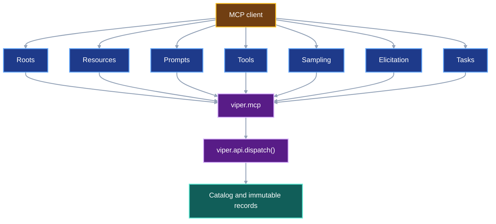

# Provenance catalog and MCP server

VIPER already verifies one resolved run at a time. This contract adds a
rebuildable catalog that can search across verified runs. It then exposes the
catalog and the existing VIPER operations through one local Model Context
Protocol server.

## 1. Status

**Contract status:** draft after system review; owner review pending.

These requirements bind the contract to the master checklist:

| ID | Implementation obligation |
| --- | --- |
| PCM-01 <!-- contract-requirement: PCM-01 phase=13 test=tests/test_inspection.py --> | Build and atomically refresh a local catalog from immutable VIPER evidence. |
| PCM-02 <!-- contract-requirement: PCM-02 phase=13 test=tests/test_verification_acceptance.py --> | Search runs, artifacts, measurements, benchmarks, and lineage edges while keeping immutable records authoritative. |
| PCM-03 <!-- contract-requirement: PCM-03 phase=15 test=tests/test_api.py --> | Generate deterministic MCP tool schemas from VIPER's typed operation models and route calls through the same handlers. |
| PCM-04 <!-- contract-requirement: PCM-04 phase=15 test=tests/test_cli.py --> | Ship a local stdio MCP command with read-only default access and explicit execution access. |
| PCM-05 <!-- contract-requirement: PCM-05 phase=15 test=tests/test_api.py --> | Expose immutable evidence as `viper://` resources, typed resource templates, and user-selected prompts; negotiate roots and utilities without creating a second path or authority model. |
| PCM-06 <!-- contract-requirement: PCM-06 phase=20 test=tests/test_api.py --> | Add explicit learning access, client-controlled sampling, and structured review elicitation with immutable VIPER receipts for every model call and human decision. |
| PCM-07 <!-- contract-requirement: PCM-07 phase=20 test=tests/test_cli.py --> | Add MCP tasks for declared long-running operations only behind 2025-11-25 capability negotiation, and preserve ordinary VIPER operation identity, status, cancellation, and result retrieval when tasks are unavailable. |

**Current:** `verify_run_result()` returns one connected verified run.
`lineage()` builds one graph from that result. `compare_runs()` compares two
verified runs. Current inspection covers one or two selected runs.

**Target:** `catalog()` from `viper.catalog` opens `.viper/catalog.sqlite3`.
`Catalog.refresh()`
rebuilds searchable rows from terminal run references. Search results always
retain the immutable reference that supplied each fact. Deleting the database
and refreshing it produces the same searchable facts.

The MCP server is an adapter. It validates tool arguments with the same
Pydantic request models used by `viper.api.dispatch()`. It returns the same
typed result as structured content. Existing VIPER components retain execution,
storage, and verification ownership.

## 2. Required claim

The catalog can answer these questions from verified evidence:

- Which runs used one input digest?
- Which artifacts came from one source commit?
- Which measurements belong to one metric, variant, dataset, or environment?
- Which benchmark results evaluated one model artifact?

Every answer includes a `ResolvedRunRef` or another immutable reference that
the caller can verify. The SQLite row itself proves nothing.

The MCP server exposes the same answers and operations to an MCP client. Every
tool call passes through VIPER request validation, path boundaries,
verification, and execution locks.

## 3. Current gap

The existing inspection path starts with a run already selected by the caller:

```text
ResolvedRun
-> verify_run_result()
-> VerifiedRunResult
-> lineage() or compare_runs()
```

The missing path starts with a question:

```text
metric_id="test_loss" and variant="l2"
-> catalog query
-> matching immutable run and measurement references
-> optional full verification of the selected result
```

An MCP server built directly over filesystem searches would create a second,
weaker model of VIPER. This contract adds the catalog first. MCP calls the
catalog and typed API after both interfaces exist.

## 4. Catalog models

Catalog models use `BaseModel` and carry derived query results. Protocol models
remain the evidence records.

```python
class CatalogRun(BaseModel):
    model_config = ConfigDict(extra="forbid", frozen=True)

    run: ResolvedRunRef
    run_id: RunId
    experiment_id: ExperimentId
    variant_id: VariantId
    replicate_id: ReplicateId
    status: Literal["succeeded", "failed", "cancelled"]
    source_commit: GitCommit
    env_sha256: SHA256
    reproducibility_sha256: SHA256
    benchmark_id: BenchmarkId | None
    verification: Literal["verified"] = "verified"
    completed_at: AwareDatetime


class CatalogFile(BaseModel):
    model_config = ConfigDict(extra="forbid", frozen=True)

    snapshot: StageResultSnapshot
    file: SnapshotFileRef


class CatalogArtifact(BaseModel):
    model_config = ConfigDict(extra="forbid", frozen=True)

    run: ResolvedRunRef
    run_id: RunId
    stage_id: StageId
    artifact_name: ArtifactName
    kind: Literal["file", "bundle"]
    data_role: DataRole
    files: tuple[CatalogFile, ...] = Field(min_length=1)


class CatalogMeasurement(BaseModel):
    model_config = ConfigDict(extra="forbid", frozen=True)

    run: ResolvedRunRef
    measurement: ResolvedFileRef
    run_id: RunId
    stage_id: StageId
    metric_id: MetricId
    value: float = Field(allow_inf_nan=False)
    epoch: int | None = Field(default=None, ge=0)
    step: int | None = Field(default=None, ge=0)
    origin: Literal["executed", "reused"]
    measured_at: AwareDatetime


class CatalogBenchmark(BaseModel):
    model_config = ConfigDict(extra="forbid", frozen=True)

    result: ResolvedBenchmarkResultRef
    run: ResolvedRunRef
    benchmark_id: BenchmarkId
    status: Literal["verified", "passed", "failed"]
    metrics: tuple[BenchmarkMetricResult, ...] = Field(min_length=1)


class CatalogEdge(BaseModel):
    model_config = ConfigDict(extra="forbid", frozen=True)

    run: ResolvedRunRef
    source: str
    target: str
    relation: Literal["produces", "selects", "consumes", "reuses"]
```

`CatalogMeasurement.origin="reused"` means a `StageReuseReceipt` selected the
measurement from an earlier verified run. The measurement keeps its original
immutable reference and original run identity.

## 5. Query models

Each query has a stable sort and bounded page size:

```python
class RunQuery(BaseModel):
    model_config = ConfigDict(extra="forbid", frozen=True)

    experiment_id: ExperimentId | None = None
    variant_ids: tuple[VariantId, ...] = ()
    replicate_ids: tuple[ReplicateId, ...] = ()
    statuses: tuple[Literal["succeeded", "failed", "cancelled"], ...] = ()
    source_commit: GitCommit | None = None
    env_sha256: SHA256 | None = None
    reproducibility_sha256: SHA256 | None = None
    benchmark_id: BenchmarkId | None = None
    input_sha256: SHA256 | None = None
    artifact_sha256: SHA256 | None = None
    limit: int = Field(default=50, ge=1, le=500)
    cursor: str | None = None


class ArtifactQuery(BaseModel):
    model_config = ConfigDict(extra="forbid", frozen=True)

    experiment_id: ExperimentId | None = None
    variant_ids: tuple[VariantId, ...] = ()
    stage_ids: tuple[StageId, ...] = ()
    artifact_names: tuple[ArtifactName, ...] = ()
    data_roles: tuple[DataRole, ...] = ()
    sha256: SHA256 | None = None
    source_commit: GitCommit | None = None
    limit: int = Field(default=50, ge=1, le=500)
    cursor: str | None = None


class MeasurementQuery(BaseModel):
    model_config = ConfigDict(extra="forbid", frozen=True)

    experiment_id: ExperimentId | None = None
    variant_ids: tuple[VariantId, ...] = ()
    stage_ids: tuple[StageId, ...] = ()
    metric_ids: tuple[MetricId, ...] = ()
    input_sha256: SHA256 | None = None
    env_sha256: SHA256 | None = None
    minimum: float | None = Field(default=None, allow_inf_nan=False)
    maximum: float | None = Field(default=None, allow_inf_nan=False)
    origins: tuple[Literal["executed", "reused"], ...] = ()
    limit: int = Field(default=50, ge=1, le=500)
    cursor: str | None = None


class BenchmarkQuery(BaseModel):
    model_config = ConfigDict(extra="forbid", frozen=True)

    experiment_id: ExperimentId | None = None
    variant_ids: tuple[VariantId, ...] = ()
    benchmark_ids: tuple[BenchmarkId, ...] = ()
    statuses: tuple[Literal["verified", "passed", "failed"], ...] = ()
    metric_ids: tuple[MetricId, ...] = ()
    source_commit: GitCommit | None = None
    env_sha256: SHA256 | None = None
    input_sha256: SHA256 | None = None
    artifact_sha256: SHA256 | None = None
    limit: int = Field(default=50, ge=1, le=500)
    cursor: str | None = None
```

The result models are `RunPage`, `ArtifactPage`, `MeasurementPage`, and
`BenchmarkPage`. Each contains an `items` tuple and
`next_cursor: str | None`. Runs sort by
`completed_at`, then `run_id`. Artifacts sort by `run_id`, `stage_id`, and
`artifact_name`. Measurements sort by `run_id`, `stage_id`, `metric_id`, then
by non-null epoch, non-null step, `measured_at`, and the immutable measurement
reference. An aggregate measurement with `epoch=None` or `step=None` follows
measurements with a numeric value in that position. Benchmarks sort by
`benchmark_id`, `run_id`, and immutable result reference.

## 6. Catalog storage and refresh

VIPER stores the derived database at:

```text
.viper/catalog.sqlite3
```

The database has these version-1 tables:

| Table | One row represents |
| --- | --- |
| `sources` | One immutable terminal reference considered during refresh |
| `runs` | One verified terminal run |
| `stages` | One completed stage in one run |
| `inputs` | One resolved stage input |
| `artifacts` | One named stage artifact |
| `files` | One file identity inside an artifact or captured input |
| `measurements` | One measured metric value |
| `benchmarks` | One benchmark result |
| `edges` | One lineage relation |

`Catalog.refresh()` follows this procedure:

```text
discover canonical local terminal paths and supplied ResolvedRunRef values
-> discover the local knowledge head and supplied knowledge manifest heads
-> verify each run and walk each manifest chain
-> extract normalized rows
-> write a new database in .viper/
-> fsync the database
-> atomically replace catalog.sqlite3
```

An invalid run enters `sources` with its rejection. Trusted run, artifact,
measurement, benchmark, lineage, and reuse-key tables accept verified sources.

Catalog writes stay inside its SQLite database and derived vector-index
directory. A stale or corrupt catalog can be deleted and rebuilt from immutable
VIPER records and knowledge manifest heads.

## 7. Public catalog interface

```python
class Catalog:
    def refresh(
        self,
        *,
        runs: tuple[ResolvedRunRef, ...] = (),
        knowledge: tuple[ResolvedFileRef, ...] = (),
    ) -> CatalogRefreshResult: ...

    def runs(self, query: RunQuery = RunQuery()) -> RunPage: ...

    def artifacts(
        self,
        query: ArtifactQuery = ArtifactQuery(),
    ) -> ArtifactPage: ...

    def measurements(
        self,
        query: MeasurementQuery = MeasurementQuery(),
    ) -> MeasurementPage: ...

    def benchmarks(
        self,
        query: BenchmarkQuery = BenchmarkQuery(),
    ) -> BenchmarkPage: ...

    def lineage(self, run: ResolvedRunRef) -> RunLineage: ...

    @property
    def knowledge(self) -> KnowledgeCatalog: ...


def catalog(*, root: Path | None = None) -> Catalog: ...
```

The typed API adds `catalog_refresh`, `search_runs`, `search_artifacts`,
`search_measurements`, and `search_benchmarks`. Their request and success
models contain the same query and page models.

## 8. MCP server

The MCP server exposes the existing VIPER system through the protocol's full
layout. It does not define another catalog, executor, verifier, learning
record, or authorization model.



The official MCP specification distinguishes server features—resources,
prompts, and tools—from client features—roots, sampling, and elicitation. The
2025-11-25 revision also defines experimental tasks and the shared progress,
cancellation, and logging utilities. VIPER negotiates each capability during
initialization and omits every unsupported path.

The first server uses stdio:

```bash
viper mcp --root /absolute/project/path
```

The command starts with read access. Execution and learning access are
explicit:

```bash
viper mcp --root /absolute/project/path --access execute

viper mcp --root /absolute/project/path --access learn
```

The server uses the official Python SDK's stable version-2 line. The package
declares it as an optional dependency:

```toml
[project.optional-dependencies]
mcp = ["mcp>=2,<3"]
```

The [official MCP tool
contract](https://modelcontextprotocol.io/specification/2025-11-25/server/tools)
requires valid input schemas and supports output schemas, structured content,
resource links, and tool annotations. Annotations are untrusted hints; VIPER's
access mode and handler validation remain authoritative. The
[official Python SDK](https://github.com/modelcontextprotocol/python-sdk)
generates protocol schemas from Python types. VIPER still compares every
generated schema with the owning request or success model in tests.

### Roots and repository custody

The server starts with one explicit `--root`. If the client supports
[roots](https://modelcontextprotocol.io/specification/2025-11-25/client/roots),
`viper.mcp` requests `roots/list` and intersects the returned `file://` roots
with that startup root. Client roots may narrow the visible tree. They never
widen startup custody. A root-list change invalidates cached path decisions and
triggers another intersection before the next path-bearing operation.

### Evidence resources

Immutable and derived records use a custom, typed URI scheme:

```text
viper://run/{sha256}
viper://artifact/{sha256}
viper://measurement/{sha256}
viper://benchmark/{sha256}
viper://knowledge/{sha256}
viper://research/episode/{sha256}
viper://research/policy/{sha256}
viper://literature/work/{work_id}/version/{version}
viper://catalog/head
```

`resources/list` returns bounded, currently discoverable resources.
`resources/templates/list` returns the parameterized forms above.
`resources/read` resolves the URI through typed VIPER references and verifies
immutable evidence before returning bytes. `viper://catalog/head` is explicitly
derived and includes the catalog identity and refresh sources. The server emits
list-changed notifications after a successful catalog replacement and supports
subscriptions only for mutable derived heads. Immutable digest resources never
change under one URI.

The [MCP resource
contract](https://modelcontextprotocol.io/specification/2025-11-25/server/resources)
defines URI identity, templates, pagination, optional subscriptions, and list
change notifications. VIPER maps those mechanisms onto its existing immutable
and derived records.

### User-selected prompts

The first prompt set is small and typed:

```text
review_run
compare_runs
investigate_failure
review_experiment_proposal
compare_agent_policies
review_literature_claim
```

Each prompt argument validates through an existing query or reference model.
The prompt body contains resolved resource links and a plain-language review
task. Prompts never execute work or approve a result. They are user-selected
views, consistent with the [MCP prompt interaction
model](https://modelcontextprotocol.io/specification/2025-11-25/server/prompts).

### Read-access tools

The read server exposes these typed operations in deterministic name order:

```text
compare_runs
get_capabilities
get_schema
lineage
plan_diff
search_artifacts
search_benchmarks
search_measurements
search_runs
status
verify_benchmark
verify_pointer
verify_run
```

### Execution-access tools

Execution access adds:

```text
catalog_refresh
execute_benchmark
preflight
restore
retry
run
run_many
```

### Learning-access tools

Learning access includes the read and execution sets, then adds the operations
owned by [Research Memory and Agent Learning](research-memory-roadmap.md):

```text
curate_learning_example
publish_learning_dataset
run_learning_update
evaluate_agent_policy
promote_agent_policy
publish_literature_claim
```

Python draft objects remain inside the user's authoring process. The MCP server
therefore begins with frozen plan paths and immutable references. Python
authoring files execute in the user's authoring process.

Each tool follows one route:

```text
MCP arguments
-> owning API request model
-> viper.api.dispatch()
-> owning handler
-> owning success model or ViperFailure
-> MCP structuredContent and matching JSON text
```

The default server exposes the read tool set. `--access execute` adds the
execution tool set. `--access learn` adds the learning tool set. Each mode
grants the local MCP client no more authority than the user running the CLI
process. `catalog_refresh` belongs to execution access because it replaces the
local derived database. `promote_agent_policy` belongs to learning access and
also requires a structured human approval receipt.

### Sampling and elicitation

When the client declares `sampling`, VIPER may ask the client's model to
propose candidates, critique a plan, or summarize verified evidence. The
[sampling contract](https://modelcontextprotocol.io/specification/2025-11-25/client/sampling)
keeps model access, selection, and permissions in the client and requires
separate negotiation for tool-enabled sampling. VIPER sends no tool-enabled
request without `sampling.tools` and does not use the soft-deprecated automatic
context-inclusion path. Every completed request publishes the
`AgentModelInvocationReceipt` defined by the research contract.

When the client declares form-mode `elicitation`, VIPER may request a flat,
structured research review or policy-promotion decision. The
[elicitation contract](https://modelcontextprotocol.io/specification/2025-11-25/client/elicitation)
requires reviewable, declineable requests and prohibits secrets in form mode.
VIPER never requests credentials through elicitation. Accepted responses
compile into the corresponding typed review or promotion record before
publication.

### Long-running tasks and utilities

MCP [tasks](https://modelcontextprotocol.io/specification/2025-11-25/basic/utilities/tasks)
are experimental in revision 2025-11-25. VIPER advertises task support only
for operations whose API handler already returns a durable operation identity:

```text
catalog_refresh
run_many
run_learning_update
evaluate_agent_policy
```

The MCP task ID maps one-to-one to that VIPER identity. Task status and result
retrieval read the same durable state used by Python and CLI callers. Clients
without task support receive the ordinary typed operation response and can use
the existing VIPER status operation. Progress, cancellation, and logging carry
the same operation identity. Losing an MCP session never changes the evidence
state or makes a task receipt authoritative.

Streamable HTTP stays deferred until VIPER defines authentication,
authorization, rate limits, and deployment ownership. The MCP specification
defines stdio and HTTP transports; stdio preserves VIPER's current local trust
boundary.

## 9. Stage-reuse dependency

[`stage-reuse.md`](stage-reuse.md) extends the version-1 catalog in Master Phase 14
after it defines `StageReuseKey`. That extension adds the `stage_reuse_keys`
table and the private candidate lookup. Each row stores the complete
`StageReuseKey`, the candidate `ResolvedRunRef`, successful attempt reference,
stage reference, metric evidence, and completion time.

The executor verifies the selected candidate again before reuse. A matching
catalog row supplies a candidate. Full source verification grants permission
to skip execution.

## 10. Acceptance cases

### Rebuild equality

The test indexes three fixture runs, records every query result, deletes the
database, rebuilds it, and receives equal ordered results.

### Tampered source

A catalog source points to a terminal run whose referenced stage bytes changed.
Refresh records the invalid source and excludes its derived rows.

### Cross-run query

Two variants use the same dataset digest and produce different test-loss
measurements. `RunQuery(input_sha256=...)` finds both runs.
`MeasurementQuery(metric_ids=("test_loss",))` returns both values with their
variant IDs and immutable run references.

`ArtifactQuery(source_commit=...)` finds artifacts produced from one source
commit. `MeasurementQuery(input_sha256=..., env_sha256=...)` finds metric
values observed with one input and environment.
`BenchmarkQuery(artifact_sha256=...)` finds every benchmark result that
evaluated one artifact.

### Null ordering

One fixture contains step measurements, an epoch summary, and a stage summary
for the same metric. Two catalog rebuilds return the numeric steps first, then
the epoch summary, then the stage summary. Pagination across those boundaries
returns each measurement once.

### Atomic replacement

A reader holds the old catalog open while refresh builds and replaces the new
database. Every query sees either the complete old database or the complete
new database. The replacement keeps partial state invisible to readers.

### MCP schema equality

The MCP client lists tools twice and receives the same order. Every tool input
schema equals the JSON Schema of its API request model. Every successful call's
structured content validates against its API success model.

### Access boundary

The read server omits `run`, `retry`, `run_many`, `execute_benchmark`, and
`restore`. The execution server exposes them and omits every learning tool. The
learning server exposes all three sets. Every mode rejects a repository path
outside the intersection of the startup root and current client roots.

### Resource and prompt equality

Two server starts over the same catalog list equal resources, resource
templates, prompts, argument schemas, and order. Reading one immutable resource
verifies its source reference. Refreshing the catalog updates the derived head
and emits exactly one list-changed notification without changing an immutable
resource URI.

### Sampling and review custody

A client without sampling or elicitation capabilities receives no request of
either kind. A supporting client returns one proposed experiment and one
review. VIPER publishes the exact `AgentModelInvocationReceipt` and typed
review record. Decline and cancellation publish no approval and authorize no
promotion.

### Task fallback

One `run_many` call executes once through a task-capable client and once through
the ordinary typed response. Both paths expose the same VIPER operation
identity, terminal status, cancellation behavior, and result. The task path
adds MCP polling metadata only.

## 11. Propagation

| Surface | Required change |
| --- | --- |
| `src/viper/catalog.py` | Add the derived models, SQLite schema, refresh, exact run, artifact, measurement, and benchmark queries, and stage-reuse lookup. |
| `src/viper/inspection.py` | Share normalized lineage extraction with catalog refresh. |
| `src/viper/api.py` | Add catalog refresh and run, artifact, measurement, and benchmark search request and success models. |
| `src/viper/_api/handlers.py` | Route catalog requests through `Catalog`. |
| `src/viper/mcp.py` | Generate tools from typed operation registries; expose verified resources, typed templates, and user-selected prompts; negotiate roots, sampling, elicitation, tasks, progress, cancellation, and logging. |
| `src/viper/research.py` | Own sampling receipts, review records, learning records, and policy promotion semantics consumed by MCP. |
| `src/viper/cli.py` | Add `catalog refresh`, catalog search commands, and `mcp --access read|execute|learn`. |
| `src/viper/__init__.py` | Export `catalog` and public query and result models. |
| `pyproject.toml` | Add the optional `mcp` dependency group. |
| `tests/test_inspection.py` | Cover rebuild equality, ordering, pagination, filters, and lineage extraction. |
| `tests/test_verification_acceptance.py` | Reject invalid sources and require source references on every result. |
| `tests/test_api.py` | Compare API and MCP schemas, resources, prompts, capability negotiation, receipts, and structured results. |
| `tests/test_cli.py` | Cover catalog commands, stdio startup, three access modes, roots, task fallback, progress, cancellation, and logging. |
| Public documentation | Explain local MCP setup, tool authority, and exact catalog queries. |

## 12. Legacy cleanup

Cross-run filesystem scans inside inspection commands move behind `Catalog`.
Single-run `lineage()` and `compare_runs()` remain public and continue to
operate directly on verified runs.

The MCP implementation imports request models, result models, verifiers,
storage clients, and execution functions from their existing owners. A tool
wrapper converts only the MCP result envelope.

## 13. Implementation order

1. Add catalog models and version-1 SQLite schema.
2. Extract rows from one verified run.
3. Add atomic rebuild, concurrent-reader proof, pagination, null ordering, and exact queries.
4. Add catalog typed operations and CLI commands.
5. Add the optional MCP dependency and stdio server.
6. Generate tools from the typed operation registry.
7. Add roots, immutable resources, resource templates, prompts, progress,
   cancellation, and logging.
8. Add access-mode, schema-equality, structured-result, resource, prompt, and
   path-boundary tests.
9. After the research records exist, add learning access, sampling receipts,
   review elicitation, and the task-capable operations.
10. Prove capability omission, decline, cancellation, task fallback, and
    equal operation identities through the in-process client.

The verified-stage-reuse contract adds reuse-key indexing and lookup in Phase
14. The catalog contract supplies the database, refresh, and query machinery
that extension uses.
