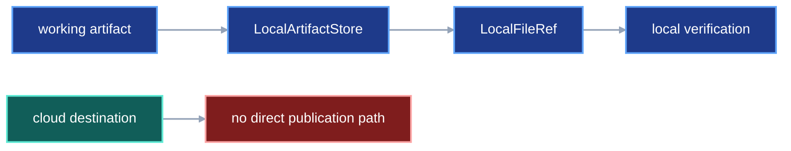
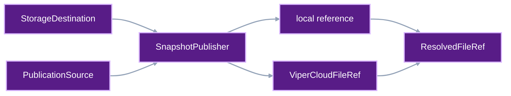
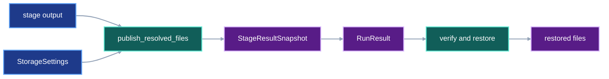

# Direct Viper Cloud publication

VIPER saves copies of the files and records needed to verify a run. The saved
bytes stay fixed. This contract calls that step publication.

Local publication writes the copies beneath `.viper/store`. Viper Cloud
publication uploads them from their working paths. In cloud mode,
`.viper/store` receives zero payload copies.

The user chooses each run-relative working path through `ArtifactDraft.path`.
Freezing prefixes the selected run root and writes the concrete
`ArtifactSpec.path`. Storage configuration only chooses where VIPER publishes
the immutable copy.

## 1. Status

**Contract status:** in progress.

These requirements bind the contract to the master checklist:

| ID | Implementation obligation |
| --- | --- |
| RSP-01 <!-- contract-requirement: RSP-01 phase=1 test=tests/test_storage.py --> | Add destination-neutral stage and standalone publication with local implementations. |
| RSP-02 <!-- contract-requirement: RSP-02 phase=1 test=tests/test_run_execution.py --> | Route current local publication through the new interfaces and bind one destination per run. |
| RSP-03 <!-- contract-requirement: RSP-03 phase=4 test=tests/test_metric_provenance.py --> | Derive metric dependency references from existing stage snapshots and publish zero duplicate payloads. |
| RSP-04 <!-- contract-requirement: RSP-04 phase=9 test=tests/test_storage.py --> | Add Viper Cloud references, the cloud client, atomic sealing, and retry behavior. |
| RSP-05 <!-- contract-requirement: RSP-05 phase=9 test=tests/test_execution_acceptance.py --> | Publish every stage snapshot and standalone evidence file directly to the selected destination. |
| RSP-06 <!-- contract-requirement: RSP-06 phase=9 test=tests/test_storage.py --> | Retrieve cloud evidence, verify byte identity, reject local references in cloud graphs, and return terminal handles. |
| RSP-07 <!-- contract-requirement: RSP-07 phase=10 test=tests/test_storage.py --> | Restore all or selected artifacts through verified temporary files and atomic final writes. |
| RSP-08 <!-- contract-requirement: RSP-08 phase=10 test=tests/test_api.py --> | Expose one restore result through Python, typed API, and CLI surfaces. |
| RSP-09 <!-- contract-requirement: RSP-09 phase=11 test=tests/test_documentation.py --> | Remove retired sync and mirroring concepts and publish the final storage workflow. |

The current implementation writes every immutable copy through
`LocalArtifactStore`. It uses two references:

- `SnapshotFileRef` records a file's path, SHA-256 digest, and byte count.
- `ResolvedStageRef.snapshot` tells VIPER where the enclosing stage snapshot
  lives.

The cloud design keeps that split. It adds references that point to Viper
Cloud. Each saved record tells VIPER where to retrieve its files.

These storage-related contracts divide ownership as follows:

| Contract | Owned decision |
| --- | --- |
| [`download-retrieval-artifacts.md`](download-retrieval-artifacts.md) | One successful HTTP body becomes the same-named single-file artifact through one shared `SnapshotFileRef`. |
| [`external-input-roots.md`](external-input-roots.md) | A repository-local file is copied into attempt custody and verified through `ResolvedExternalInputRef`. |
| [`automatic-input-resolution.md`](automatic-input-resolution.md) | Python authoring compiles local files, same-run handles, and prior-run selections into frozen input references. |
| [`frozen-plan-git-identity.md`](frozen-plan-git-identity.md) | Generated plan documents use a Git plan commit; project definitions use the earlier source commit. |
| [`project-data-root.md`](project-data-root.md) | `viper init ROOT` selects the root that contains the protocol tree and the separate local `.viper/store` subtree. |
| This contract | Every immutable file and stage snapshot publishes directly to the configured local or Viper Cloud destination. |

## 2. Required claim

When a project selects Viper Cloud, VIPER uploads each completed stage directly
from the files the stage wrote or consumed under runner custody. A stage
snapshot contains the resolved stage YAML, stage artifacts, HTTP bodies, and
captured local inputs owned by that stage. `ResolvedStageRef.snapshot` stores
the cloud location. Each `SnapshotFileRef` stores a path, SHA-256 digest, and
byte count.

VIPER must be able to retrieve and check the same bytes later:

```text
declared working file
-> verified path, SHA-256 digest, and byte count
-> immutable publication at the configured destination
-> persisted reference to that destination
-> retrieval through the persisted reference
-> repeated SHA-256 and byte-count verification
```

Both storage modes preserve the same stage graph, parameters, artifact
declarations, and working paths. A plan containing a generated prior-run
pointer records that pointer's storage location during freezing, so freezing
and execution use the same bound destination.

## 3. Current gap

### Inspected path

A training stage declares this artifact:

```text
experiments/tiny/runs/baseline/<run-id>/artifacts/model/parameters.bin
```

The stage writes 400 MiB of model weights at that path and exits successfully.

**Current local path**

The attempt executor performs this sequence:

```text
stage writes parameters.bin
-> execute_stage_process() checks the declared output
-> _resolve_artifact() hashes the file
-> _execute_attempt() reads the entire file into memory
-> LocalArtifactStore.snapshot() writes a second copy beneath .viper/store
-> ResolvedStageRef.snapshot records LocalStageResultSnapshotRef
```

[`_resolve_artifact()`](../../src/viper/execution/_stage.py) creates the
`SnapshotFileRef`. [`_execute_attempt()`](../../src/viper/execution/_attempt.py)
collects the resolved stage document and artifact bytes.
[`LocalArtifactStore.snapshot()`](../../src/viper/storage.py) publishes the
immutable local snapshot.

**Observed missing connector**

`LocalArtifactStore.snapshot()` accepts paths mapped to bytes. It writes those
bytes locally and returns `LocalStageResultSnapshotRef`. Cloud publication
needs a second publisher. The cloud publisher accepts existing file paths,
uploads their bytes, seals the snapshot, and returns
`ViperCloudStageResultSnapshotRef`.

The target cloud path is:

```text
stage writes parameters.bin at its declared path
-> stage exits successfully
-> VIPER hashes and validates parameters.bin
-> Viper Cloud publisher streams parameters.bin from that path
-> Viper Cloud atomically seals the stage snapshot
-> ResolvedStageRef.snapshot records ViperCloudStageResultSnapshotRef
-> attempt execution continues
```

Cloud publication leaves the declared working file in place. VIPER can use
that file again if the upload fails. `.viper/store` receives zero payload
copies.

### Current DAG



### Missing connector

The current storage API cannot turn one snapshot location and one
`SnapshotFileRef` into a retrievable `ResolvedFileRef` without publishing the
same payload again.

### Proposed-change DAG



### Integrated DAG



## 4. Storage configuration

### 4.1 Public configuration

One field selects the immutable publication destination:

```toml
[storage]
destination = "local"
```

`local` publishes immutable evidence beneath `ROOT/.viper/store`, where `ROOT`
is the explicit or discovered project root defined by
[`project-data-root.md`](project-data-root.md).

```toml
[storage]
destination = "viper://machina/weekend_models"
```

The Viper Cloud URI contains:

```text
scheme:   viper
owner:    machina
project:  weekend_models
```

This value uploads immutable copies into the `machina/weekend_models` cloud
project. Each frozen `ArtifactSpec.path` still controls the concrete working
output path.

An absent `[storage]` table has the same effect as `destination = "local"`.
The single destination field replaces separate placement, mirror, sync, and
offload modes.

`viper init ROOT` selects the protocol and working-data tree. The storage
destination separately selects where VIPER publishes immutable copies of files
from that tree.

### 4.2 Parsed configuration

The parser converts the public string into this internal union:

```python
class LocalStorageDestination(BaseModel):
    model_config = ConfigDict(extra="forbid", frozen=True)

    kind: Literal["local"] = "local"


class ViperCloudDestination(BaseModel):
    model_config = ConfigDict(extra="forbid", frozen=True)

    kind: Literal["viper_cloud"] = "viper_cloud"
    owner: HumanId
    project: HumanId


StorageDestination = Annotated[
    LocalStorageDestination | ViperCloudDestination,
    Field(discriminator="kind"),
]


class StorageSettings(BaseModel):
    model_config = ConfigDict(extra="forbid", frozen=True)

    destination: StorageDestination = Field(
        default_factory=LocalStorageDestination
    )
```

VIPER reads cloud credentials from the active CLI session.

## 5. Storage reference models

### 5.1 File stored outside a stage snapshot

`ViperCloudFileRef` identifies one cloud file by owner, project, sealed
revision, and path. Its authoritative declaration is in `P9-RSP-01`.

`ResolvedFileRef` adds the expected digest and size:

```python
class ResolvedFileRef(ProtocolModel):
    sha256: SHA256
    bytes: int = Field(ge=0)
    stored_at: StorageRef
```

`ResolvedFileRef` stores the check values beside the cloud location:

```text
ResolvedFileRef.sha256
ResolvedFileRef.bytes
ResolvedFileRef.stored_at = ViperCloudFileRef(...)
```

VIPER bundles each completed stage record and its artifacts into a stage
snapshot. VIPER publishes files that require independent retrieval as
standalone files. The configured storage destination controls where each file
lives:

| Standalone file | Owning field or reference | Local destination | Viper Cloud destination |
| --- | --- | --- | --- |
| Stage invocation receipt | `RunAttempt.invocations[]: ResolvedStageInvocationRef` | `stored_at: LocalFileRef` | `stored_at: ViperCloudFileRef` |
| Generated artifact pointer | `StoredInputRef.pointer: ResolvedArtifactPointerRef` | `stored_at: LocalFileRef` | `stored_at: ViperCloudFileRef` |
| Attempt journal | `RunAttempt.journal: AttemptJournalRef` | `stored_at: LocalFileRef` | `stored_at: ViperCloudFileRef` |
| Measurement | `RunAttempt.measurement_files[]: ResolvedFileRef` | `stored_at: LocalFileRef` | `stored_at: ViperCloudFileRef` |
| Metric-verification receipt | `RunAttempt.metric_verification_files[]: ResolvedFileRef` | `stored_at: LocalFileRef` | `stored_at: ViperCloudFileRef` |
| Stage log | `RunAttempt.log_files[]: ResolvedFileRef` | `stored_at: LocalFileRef` | `stored_at: ViperCloudFileRef` |
| Attempt record | `ResolvedRun.attempts[]: ResolvedAttemptRef` | `stored_at: LocalFileRef` | `stored_at: ViperCloudFileRef` |
| Benchmark result | `BenchmarkExecutionResult.result_ref: ResolvedBenchmarkResultRef` | `stored_at: LocalFileRef` | `stored_at: ViperCloudFileRef` |
| Terminal run document | `RunResult.resolved_run_ref: ResolvedRunRef` | `stored_at: LocalFileRef` | `stored_at: ViperCloudFileRef` |

Each row uses a `ResolvedFileRef` subtype or field. Its `sha256` and `bytes`
fields identify the expected content. Its `stored_at` field identifies the
local-store file or Viper Cloud file that holds those bytes.

Stage artifacts, HTTP response bodies, captured local inputs, and resolved stage
documents use `SnapshotFileRef` because they belong to a completed stage
snapshot. Frozen run and benchmark specifications use Git-backed references.
Neither group appears in this standalone-file table.

Recomputed metric dependencies reuse those stage snapshots. VIPER converts the
selected `SnapshotFileRef` and its enclosing snapshot into a `ResolvedFileRef`:

| Dependency file owner | Local destination | Viper Cloud destination |
| --- | --- | --- |
| Current-stage artifact or captured input | `LocalFileRef` with the current stage snapshot commit and selected path | `ViperCloudFileRef` with the current stage snapshot revision and selected path |
| Earlier same-run stage artifact | `LocalFileRef` with the producer snapshot commit and selected path | `ViperCloudFileRef` with the producer snapshot revision and selected path |
| Prior-run stored artifact | Existing producer `StorageRef` reached through `ArtifactPointer` | Existing producer `StorageRef` reached through `ArtifactPointer` |

The conversion has one operation:

```python
def resolve_snapshot_file_ref(
    snapshot: StageResultSnapshot,
    file: SnapshotFileRef,
) -> ResolvedFileRef:
    ...
```

It copies `SnapshotFileRef.sha256` and `SnapshotFileRef.bytes` into the returned
`ResolvedFileRef`. It combines the file path with the enclosing snapshot's
storage address. It publishes zero bytes. A metric receipt can retrieve its
dependency independently while the payload remains stored once.

#### Example: captured local input

VIPER copies `inputs/raw/dataset.csv` to an attempt-owned input path and gives
that path to the training stage. The completed resolved train record stores:

```python
ResolvedExternalInputRef(
    source=LocalSource(path="inputs/raw/dataset.csv"),
    file=SnapshotFileRef(
        path=(
            ".viper/workspaces/<run-id>/attempt-<attempt-id>/inputs/"
            "train/dataset/dataset.csv"
        ),
        sha256=dataset_sha256,
        bytes=dataset_bytes,
    ),
    data_role="training",
)
```

The local input uses the same snapshot-scoped retrieval rule as a model
artifact:

```text
ResolvedStageRef.snapshot
+ ResolvedExternalInputRef.file
-> retrieve the captured input from the completed stage snapshot

ResolvedStageRef.snapshot
+ ResolvedSingleFileArtifact.file
-> retrieve a produced artifact from the completed stage snapshot
```

### 5.2 Cloud stage snapshot

`ViperCloudStageResultSnapshotRef` identifies one sealed stage snapshot by
owner, project, and revision. `P9-RSP-01` adds it to `StageResultSnapshot`.

`StageResultSnapshotRef` is currently misnamed. It contains Hugging Face fields
and uses `kind="huggingface"`. Rename the Python class to
`HuggingFaceStageResultSnapshotRef`. Keep the YAML fields and `kind` value the
same.

`P9-RSP-01` also adds `ViperCloudFileRef` to the general `StorageRef` union.

### 5.3 Snapshot-scoped file identity

`SnapshotFileRef` has the same fields for every storage provider:

```python
class SnapshotFileRef(ProtocolModel):
    path: RepoRelPath
    sha256: SHA256
    bytes: int = Field(ge=0)
```

`SnapshotFileRef.path` names a file inside
`ResolvedStageRef.snapshot`. VIPER needs both values to retrieve the file:

```text
ResolvedStageRef.snapshot
+ SnapshotFileRef.path
-> immutable file bytes
```

The digest and byte count verify those bytes after retrieval.

### 5.4 Terminal run handle

When a run finishes, VIPER publishes its terminal `resolved.yaml` as a separate
file. `ResolvedRunRef` points to that file:

```python
class ResolvedRunRef(ResolvedFileRef):
    kind: Literal["resolved_run"] = "resolved_run"
```

`RunResult` returns that handle as `resolved_run_ref` beside the parsed run and
its local control paths. `P9-RSP-01` owns the exact model declaration.

In cloud mode, `resolved_run_ref.stored_at` is a `ViperCloudFileRef`. The CLI
uses that reference to print a restore URI. The terminal run contains the
references needed to find the rest of the run.

### 5.5 Benchmark result handle

When a benchmark finishes, VIPER publishes its result document as a standalone
file. `ResolvedBenchmarkResultRef` points to that file:

```python
class ResolvedBenchmarkResultRef(ResolvedFileRef):
    kind: Literal["benchmark_result"] = "benchmark_result"
```

`BenchmarkExecutionResult` returns the reference as `result_ref` beside the
parsed result and its local control path. `P9-RSP-01` owns the exact model
declaration.

An `ArtifactPointer` for a benchmarked estimator copies this exact reference
into `benchmark_result`. The pointer therefore reaches the same immutable
benchmark result that the benchmark command returned.

## 6. Publication interface

### 6.1 Sources

The publisher accepts generated bytes and existing files:

```python
PublicationSource = bytes | Path
```

- `bytes` serves small documents that VIPER has already serialized in memory.
- `Path` serves stage outputs and other existing files. A cloud publisher
  streams from that path and avoids a second full in-memory copy.

Every source is paired with its repository-relative destination path. Before
publication, VIPER checks that each `Path` remains beneath the repository
root, names a regular file, and matches its resolved digest and byte count.

The storage layer uses the provider-neutral `ViperCloudClient` boundary owned
by `P9-RSP-01`. It has four operations: upload a checked file, seal one complete
manifest, fetch one file, and list the `SnapshotFileRef` records in a sealed
revision.

The client receives credentials when VIPER creates it from the active CLI
session. The repository can implement and test publication against an in-memory
client before the Viper Cloud service fixes its HTTP endpoint and token format.
The production adapter remains blocked on that external API.

### 6.2 Publisher functions

VIPER chooses a `SnapshotPublisher` from `StorageDestination`. The stage
executor calls its `publish()` method:

```python
class SnapshotPublisher(Protocol):
    def publish(
        self,
        *,
        resolved_stage_path: RepoRelPath,
        resolved_stage: bytes,
        files: Mapping[RepoRelPath, Path],
    ) -> StageResultSnapshot: ...
```

Files outside stage snapshots use a separate function:

```python
def publish_resolved_files(
    root: Path,
    destination: StorageDestination,
    files: Mapping[RepoRelPath, PublicationSource],
) -> dict[RepoRelPath, ResolvedFileRef]: ...


def bind_run_destination(
    root: Path,
    run_id: RunId,
    destination: StorageDestination,
) -> StorageDestination: ...
```

The local publisher calls `LocalArtifactStore`. The cloud publisher uploads
each source and seals one revision. It returns `ViperCloudFileRef` for a
separate file or `ViperCloudStageResultSnapshotRef` for a stage snapshot.

The later [`stage-reuse.md`](stage-reuse.md) contract extends this protocol with
`publish_reuse()` when Master Phase 14 implements stage reuse.

The stage executor uses this exact call:

```python
snapshot = snapshot_publisher.publish(
    resolved_stage_path=resolved_path,
    resolved_stage=resolved_raw,
    files=snapshot_paths,
)
```

`resolved_stage_path` supplies the repository-relative path of the completed
stage document.
`resolved_stage` supplies the serialized `resolved.yaml` bytes.
`snapshot_paths` maps each snapshot member path to its existing working `Path`.
The map contains declared artifacts and captured local inputs. Before upload,
the publisher parses `resolved_stage`, matches every member to its
`SnapshotFileRef`, and checks the source file's SHA-256 digest and byte count.
It then computes one manifest, uploads each unique path once, and returns the
sealed snapshot reference.

Files outside a stage snapshot use `publish_resolved_files()`. The returned map
uses each publication path as its key. Each value supplies `sha256`, `bytes`,
and `stored_at`. The caller selects the result by path and constructs the exact
reference named in the standalone-file table in section 5.1.

`bind_run_destination()` atomically creates or loads the run-level destination
record. `viper.authoring.freeze()` calls it before publishing a generated artifact
pointer. Run execution calls it before stage work or any immutable publication.
Both callers receive the stored destination and reject a different configured
value with `storage_destination_changed`.

## 7. Stage execution

### 7.1 Successful project stage

For the fixed model-weight scenario:

```text
1. The worker writes parameters.bin at ArtifactSpec.path.
2. The worker exits successfully.
3. VIPER confirms the declared file exists.
4. VIPER computes its SHA-256 digest and byte count.
5. VIPER builds ResolvedSingleFileArtifact with SnapshotFileRef.
6. VIPER serializes the completed resolved stage document.
7. The publisher streams parameters.bin from its working path.
8. The publisher uploads the resolved stage document.
9. The publisher atomically seals the snapshot manifest.
10. The publisher returns ViperCloudStageResultSnapshotRef.
11. VIPER constructs ResolvedStageRef(snapshot=<returned reference>).
12. The attempt records the completed stage and continues.
```

The worker finishes at step 2. The stage finishes at step 11, after VIPER has
published the snapshot and created `ResolvedStageRef`.

### 7.2 Download stage

The download contract gives the HTTP receipt and artifact one shared
`SnapshotFileRef`:

```text
HTTP function writes response into attempt scratch space
-> runner verifies the body
-> runner moves or writes the body at the declared artifact path
-> ResolvedHttpRetrieval.body receives SnapshotFileRef
-> ResolvedSingleFileArtifact.file receives the same SnapshotFileRef
-> publisher streams that declared path once
-> publisher seals the download-stage snapshot
```

`ResolvedHttpRetrieval` records where the response entered VIPER.
`ResolvedSingleFileArtifact` records the same bytes as a stage output. Cloud
publication only changes where VIPER stores their shared snapshot.

### 7.3 Files outside stage snapshots

VIPER publishes these files when it creates them:

```text
generate ArtifactPointer for a prior-run selection
-> publish pointer document through publish_resolved_files()
-> StoredInputRef.pointer records the returned storage location

finish an attempt
-> publish journal, measurements, metric-verification receipts, and logs
   through one publish_resolved_files() call
-> publish the RunAttempt document through publish_resolved_files()
-> ResolvedRun.attempts records the returned ResolvedAttemptRef

finish a benchmark
-> publish the BenchmarkResult document through publish_resolved_files()
-> BenchmarkExecutionResult.result_ref records the returned storage location

complete terminal ResolvedRun
-> publish resolved.yaml through publish_resolved_files()
-> RunResult.resolved_run_ref records the returned storage location
```

Stage invocation receipts use the same function when each stage process ends.
`RunAttempt.invocations` records the returned `ResolvedStageInvocationRef`.

Captured local inputs follow the stage-snapshot path instead. The runner copies
the source to an attempt-owned input path, the stage reads that path, and the
snapshot publisher stores the verified file with the consuming stage.

Each resulting reference tells VIPER where to retrieve its file. Restore and
verification follow those references.

## 8. Atomicity, failure, and recovery

### 8.1 Deterministic revision

VIPER uses the revision algorithm already implemented by
`LocalArtifactStore._content_commit()`. It sorts files by repository-relative
path. For each file, it hashes this exact sequence:

```text
8-byte big-endian path length
UTF-8 path bytes
8-byte big-endian file length
32 raw SHA-256 digest bytes for the file
```

The revision is the SHA-256 digest of every framed entry concatenated in sorted
path order. Viper Cloud uses the same algorithm. Existing local revision IDs
therefore remain stable. Stage snapshots and standalone-file batches both use
this rule.

Publishing the same manifest again targets the same revision. A retry can skip
objects the service already accepted.

### 8.2 Atomic seal

The cloud service hides uploaded files until it accepts the complete manifest.
The seal operation makes the revision available for retrieval. VIPER creates
`ViperCloudStageResultSnapshotRef` after the seal succeeds.

### 8.3 Failed publication

When cloud publication fails after a worker succeeds:

```text
declared working artifacts remain in place
attempt workspace remains in place
journal records publishing_stage failure
ResolvedStageRef is absent
attempt stops before dependent stages execute
```

The publisher retries transfer and seal operations against the same
deterministic revision while the coordinator remains active. Each retry reads
the same verified working paths. If the coordinator exits, the ordinary run
retry may execute the stage again. Resumable execution across coordinator
processes belongs to a future contract.

Standalone publication follows the same seal rule. VIPER writes each generated
document to its canonical local control path before upload. Existing source
files remain at their working paths. VIPER creates the corresponding
`ResolvedFileRef` only after the cloud revision is sealed. A retry republishes
the same verified path. The existing document bytes remain fixed.

The stable failure codes are:

| Code | Condition |
| --- | --- |
| `storage_authentication_failed` | The active Viper session lacks publication authority for the configured owner and project. |
| `storage_source_invalid` | A publication source escapes the repository, is missing, is a symbolic link, or names a non-regular file. |
| `storage_source_identity_mismatch` | A source differs from its expected SHA-256 digest or byte count. |
| `storage_upload_failed` | Object transfer fails before sealing. |
| `storage_seal_failed` | The service rejects or fails to seal the complete manifest. |
| `storage_remote_identity_mismatch` | Retrieved bytes differ from the persisted digest or byte count. |
| `storage_destination_changed` | A later attempt selects a different destination from the run’s first immutable publication. |
| `storage_graph_unreachable` | A Viper Cloud terminal graph reaches machine-local immutable evidence. |

### 8.4 Destination stability

Before the first immutable publication, VIPER writes the parsed
`StorageDestination` to:

```text
.viper/workspaces/<run-id>/storage-destination.json
```

`bind_run_destination()` creates that run-level control file atomically. The
first immutable publisher owns the first call. A prior-run input may make
`viper.authoring.freeze()` the first caller because freezing publishes its generated
`ArtifactPointer`. A plan whose freeze step publishes zero immutable files
binds the destination when execution begins.

Every retry and later attempt loads the record before stage work and compares
it with the current configuration. A different value produces
`storage_destination_changed`. A frozen plan that embeds a generated pointer is
already bound to that pointer's destination. Plans whose freeze step generates
zero pointers retain destination choice until their first execution.

## 9. Local control and recovery evidence

VIPER keeps these working files on the machine running the attempt:

```text
.viper/workspaces/<run-id>/<attempt-id>/
.viper/workspaces/<run-id>/storage-destination.json
.viper/journals/<run-id>/<attempt-id>.jsonl
canonical terminal resolved.yaml at the run path
user-declared artifact paths
```

VIPER uses these files to run, diagnose, and retry the attempt. Persisted
references point to the immutable copies.

The local destination publishes immutable evidence beneath
`ROOT/.viper/store`.
The Viper Cloud destination publishes immutable evidence to the cloud and
places zero payload copies beneath `.viper/store`. User-declared output files
and attempt recovery files remain in place.

## 10. Retrieval, verification, and restore

| Rule | Executable condition |
| --- | --- |
| `storage.publisher.local` <!-- verifier-rule: storage.publisher.local requirement=RSP-01 --> | Destination-neutral stage and standalone publishers preserve current local behavior. |
| `storage.destination.bound` <!-- verifier-rule: storage.destination.bound requirement=RSP-02 --> | Each run binds one destination and routes local publication through it. |
| `metric.reference.reused` <!-- verifier-rule: metric.reference.reused requirement=RSP-03 --> | Metric dependencies reuse existing snapshot references and publish no duplicate payload bytes. |
| `storage.cloud.atomic` <!-- verifier-rule: storage.cloud.atomic requirement=RSP-04 --> | Viper Cloud publication retries safely and exposes artifacts only after atomic sealing. |
| `storage.cloud.publish` <!-- verifier-rule: storage.cloud.publish requirement=RSP-05 --> | Every stage snapshot and standalone evidence file is published directly to the selected destination. |
| `storage.cloud.verify` <!-- verifier-rule: storage.cloud.verify requirement=RSP-06 --> | Cloud retrieval verifies byte identity, rejects reachable local references, and returns terminal handles. |
| `storage.restore.atomic` <!-- verifier-rule: storage.restore.atomic requirement=RSP-07 --> | Restore verifies temporary files before atomically writing all selected artifacts. |
| `storage.restore.public` <!-- verifier-rule: storage.restore.public requirement=RSP-08 --> | Python, typed API, and CLI restoration return the same typed result. |
| `storage.docs.current` <!-- verifier-rule: storage.docs.current requirement=RSP-09 --> | Public documentation contains the final storage workflow and no retired sync or mirroring concepts. |

### 10.1 Stage file retrieval

The verifier receives a `ResolvedStageRef` and one `SnapshotFileRef`:

```text
ResolvedStageRef.snapshot.kind == "local"
-> LocalArtifactStore retrieves snapshot revision + file path

ResolvedStageRef.snapshot.kind == "huggingface"
-> Hugging Face fetcher retrieves repository + commit + file path

ResolvedStageRef.snapshot.kind == "viper_cloud"
-> Viper Cloud client retrieves owner + project + revision + file path
```

After retrieval, the verifier checks:

```text
len(bytes) == SnapshotFileRef.bytes
sha256(bytes) == SnapshotFileRef.sha256
```

### 10.2 Files outside stage snapshots

`RunFetcher` reads `ResolvedFileRef.stored_at` and chooses the named storage
backend. A `ViperCloudFileRef` supplies the owner, project, revision, and path.
`RunFetcher` checks the retrieved bytes against `ResolvedFileRef.sha256` and
`ResolvedFileRef.bytes`.

### 10.3 Cloud graph reachability

A Viper Cloud run must work on another machine. Before VIPER publishes the
terminal `ResolvedRun`, it follows every attempt, stage, file, input, and
artifact reference.

The accepted storage locations are:

```text
ViperCloudFileRef
ViperCloudStageResultSnapshotRef
HuggingFaceFileRef
HuggingFaceStageResultSnapshotRef
GitFileRef
```

Reaching `LocalFileRef` or `LocalStageResultSnapshotRef` produces
`storage_graph_unreachable`. The run keeps its local recovery files and stops
before terminal cloud publication.

This rule also covers an artifact from an earlier local run. The user must
publish or migrate the producer first. The user runs that migration as a
separate step before freezing the consumer.

### 10.4 Restore

The run command returns and prints the terminal `ResolvedRunRef`. The
`viper restore` command accepts a local terminal-run path or this cloud form:

```text
viper://machina/weekend_models@<revision>/<path-to-resolved.yaml>
```

The cloud revision identifies a sealed manifest. The manifest entry supplies
the terminal file's path, SHA-256 digest, and byte count. VIPER constructs the
`ResolvedRunRef` from that entry and requires the retrieved terminal file to
match it before following the run.

A local terminal path follows the same trust sequence. VIPER requires terminal
`resolved.yaml` to be published as a one-file local revision. Restore validates
the canonical repository-relative path, reads the working file, and computes
the local content revision from `{terminal_path: terminal_bytes}`. It constructs
this reference:

```text
ResolvedRunRef(
    sha256=sha256(terminal_bytes),
    bytes=len(terminal_bytes),
    stored_at=LocalFileRef(
        commit=<computed one-file revision>,
        path=terminal_path,
    ),
)
```

Restore then fetches that `LocalFileRef` from `.viper/store` and requires the
stored bytes to match. A changed working file computes a revision absent from
the local store and fails before parsing.

Restore accepts terminal runs with `status="succeeded"`. Omitting
`--artifacts` selects every artifact from the successful attempt. Supplying
`--artifacts` selects one or more values in this form:

```text
<stage-id>.<artifact-name>
```

The period is unambiguous because `StageId` and `ArtifactName` exclude periods.
A bundle selector restores every member of that bundle.

The output rules are:

| Selection | `--output` meaning |
| --- | --- |
| All artifacts | Directory beneath which VIPER recreates declared repository-relative paths |
| One single-file artifact | Exact output file |
| One bundle artifact | Directory containing the restored bundle |
| Several artifacts | Directory beneath which VIPER recreates declared repository-relative paths |

Omitting `--output` restores each selected artifact to its declared path beneath
`--root`. VIPER requires every selected destination path to be
unique and nonoverlapping. A conflicting selection fails before retrieval.

Restore performs this sequence:

```text
parse terminal-run path or immutable URI
-> retrieve terminal resolved.yaml
-> check ResolvedRunRef digest and byte count
-> parse ResolvedRun
-> follow attempt, stage, snapshot, input, and artifact references
-> resolve the successful attempt and selected artifacts
-> validate every destination path and existing file
-> retrieve selected files into temporary paths
-> verify every SHA-256 digest and byte count
-> move each verified file into place
```

An absent destination receives the restored file. A destination containing the
expected bytes remains in place and is reported as already restored. A
destination containing different bytes fails the operation before VIPER writes
any file. Each final move is atomic.

Restore parses records, follows references, retrieves bytes, and checks file
identity. Stage callables, artifact loaders, and metric implementations remain
unexecuted.

Restore starts from `ResolvedRunRef`; the terminal run and all reachable
references carry their own storage locations.

The Python and typed-operation interfaces use these exact models:

```python
ViperCloudRunUri = Annotated[
    str,
    AfterValidator(validate_viper_cloud_run_uri),
]


class ArtifactRestoreSelector(BaseModel):
    model_config = ConfigDict(extra="forbid", frozen=True)

    stage_id: StageId
    artifact_name: ArtifactName


class RestoredFile(BaseModel):
    model_config = ConfigDict(extra="forbid", frozen=True)

    path: Path
    status: Literal["restored", "already_present"]


class RestoredArtifact(BaseModel):
    model_config = ConfigDict(extra="forbid", frozen=True)

    selector: ArtifactRestoreSelector
    files: tuple[RestoredFile, ...] = Field(min_length=1)


class RestoreResult(BaseModel):
    model_config = ConfigDict(extra="forbid", frozen=True)

    run: ResolvedRunRef
    artifacts: tuple[RestoredArtifact, ...] = Field(min_length=1)


RestoreRunReference = Path | ViperCloudRunUri | ResolvedRunRef


class LocalRunPath(APIModel):
    kind: Literal["local_path"] = "local_path"
    path: Path


class ViperCloudRunReference(APIModel):
    kind: Literal["viper_cloud_uri"] = "viper_cloud_uri"
    uri: ViperCloudRunUri


RestoreRequestReference = Annotated[
    LocalRunPath | ViperCloudRunReference | ResolvedRunRef,
    Field(discriminator="kind"),
]
```

`validate_viper_cloud_run_uri()` accepts only the
`viper://<owner>/<project>@<revision>/<terminal-path>` form defined above. The
CLI parses each `<stage-id>.<artifact-name>` value into
`ArtifactRestoreSelector` before calling the restore engine. The direct Python
function accepts ordinary `Path` and URI values. The serialized typed request
uses `RestoreRequestReference` to give each JSON value exactly one local-path,
cloud-URI, or resolved-reference meaning.

The direct execution function is:

```python
def restore(
    repository_root: Path,
    run_reference: RestoreRunReference,
    *,
    artifacts: tuple[ArtifactRestoreSelector, ...] = (),
    output: Path | None = None,
) -> RestoreResult: ...
```

The typed operation uses the same values:

```python
OperationName = Literal[
    "validate_stage",
    "validate_resolved_stage",
    "validate_run_spec",
    "freeze_run",
    "preflight",
    "execute_stage",
    "run",
    "retry",
    "execute_benchmark",
    "restore",
    "plan_diff",
    "lineage",
    "status",
    "compare_runs",
    "verify_run",
    "verify_benchmark",
    "verify_pointer",
    "get_schema",
    "get_capabilities",
    "init_project",
]


class RestoreRequest(APIModel):
    run_reference: RestoreRequestReference
    repository_root: Path
    artifacts: tuple[ArtifactRestoreSelector, ...] = ()
    output: Path | None = None


class RestoreSuccess(SuccessModel):
    operation: Literal["restore"] = "restore"
    result: RestoreResult
```

`restore` joins `OperationName`, `REQUEST_REGISTRY`, `HANDLER_REGISTRY`, and the
CLI operation table. The typed handler converts `LocalRunPath` or
`ViperCloudRunReference` to the corresponding direct-function value. The
direct function, typed handler, and CLI then call one restore engine.

## 11. Public workflow
<!-- contract-worked-example: start -->

```python
from pathlib import Path


root = Path.cwd()
local = StorageSettings(destination=LocalStorageDestination())
cloud = StorageSettings(
    destination=ViperCloudDestination(
        owner="machina",
        project="weekend_models",
    )
)
destination = bind_run_destination(root, run_id, cloud.destination)
published = publish_resolved_files(
    root,
    destination,
    {resolved_run_path: resolved_run_bytes},
)

assert local.destination.kind == "local"
assert published[resolved_run_path].bytes == len(resolved_run_bytes)
```

### Local immutable publication

```toml
[storage]
destination = "local"
```

```bash
viper run experiments/tiny/runs/baseline/<run-id>/spec.yaml \
  --root .
```

The command returns a `ResolvedRunRef` whose `stored_at` value is a
`LocalFileRef`.

### Direct Viper Cloud publication

```toml
[storage]
destination = "viper://machina/weekend_models"
```

```bash
viper run experiments/tiny/runs/baseline/<run-id>/spec.yaml \
  --root .
```

The stage writes its normal local output files. VIPER streams each completed
snapshot directly to Viper Cloud. The command returns a `ResolvedRunRef` whose
`stored_at` value is a `ViperCloudFileRef`.

```bash
viper restore \
  "viper://machina/weekend_models@<revision>/<path-to-resolved.yaml>" \
  --root restored-project
```

The command above restores every artifact to its declared path. The user can
restore one artifact to a chosen file:

```bash
viper restore <run-reference> \
  --artifacts train.model \
  --output recovered/model.bin
```

The user can restore several artifacts beneath one directory:

```bash
viper restore <run-reference> \
  --artifacts \
    train.model \
    train.state \
    evaluate.preds \
  --output recovered/
```

<!-- contract-worked-example: end -->

## 12. Propagation and legacy cleanup

### 12.1 Required changes

| Surface | Required change |
| --- | --- |
| Configuration | Parse one `[storage].destination` value into `LocalStorageDestination` or `ViperCloudDestination`. |
| File references | Add `ViperCloudFileRef` to `StorageRef`. |
| Snapshot references | Add `ViperCloudStageResultSnapshotRef`; rename the Python Hugging Face snapshot class while preserving its serialized form. |
| Publication | Replace hard-coded local publication calls with `SnapshotPublisher.publish()` and `publish_resolved_files()`. |
| Stage reuse | Add `SnapshotPublisher.publish_reuse()` so a target stage receives a new snapshot while its callable remains uncalled. |
| Stage execution | Pass resolved-stage bytes and declared artifact paths to the snapshot publisher after artifact validation. |
| Download execution | Publish the shared retrieval/artifact path once in the configured stage snapshot. |
| Local roots | Copy each source to an attempt-owned input path, verify it after stage execution, and include its `SnapshotFileRef` in the consuming-stage snapshot. |
| Pointer generation | Publish generated `ArtifactPointer` documents through `publish_resolved_files()`. |
| Attempt evidence | Publish invocation receipts, journals, measurements, metric-verification receipts, logs, and attempt documents through `publish_resolved_files()`. |
| Benchmark result | Publish the completed result and return `BenchmarkExecutionResult.result_ref`. |
| Terminal run | Publish terminal `resolved.yaml` and return `RunResult.resolved_run_ref`. |
| Destination stability | Call `bind_run_destination()` before the first immutable publication during freezing or execution; reject every later configured change. |
| Metric dependencies | Derive `ResolvedMetricDependency.files` from each selected `SnapshotFileRef` and its enclosing stage snapshot; reuse that snapshot payload. |
| Retrieval | Route Viper Cloud file and snapshot variants through the cloud client. |
| Recovery | Retry transfer and seal against the same deterministic revision while the coordinator remains active; preserve working files for an ordinary run retry after process loss. |
| CLI | Print the terminal run reference; derive the local immutable reference from a canonical one-file terminal publication; add full and artifact-selected restore from that local path or an immutable Viper Cloud URI. |
| Python and typed API | Add `ArtifactRestoreSelector`, `RestoreResult`, `viper.execution.restore()`, the discriminated typed request references, `RestoreRequest`, and `RestoreSuccess`; route all three public surfaces through one restore engine. |
| Verification | Apply existing path, digest, and byte-count rules to both destination variants. |
| Tests | Cover publishers and restore in [`tests/test_storage.py`](../../tests/test_storage.py), execution in [`tests/test_run_execution.py`](../../tests/test_run_execution.py), public surfaces in [`tests/test_public_api.py`](../../tests/test_public_api.py) and [`tests/test_cli.py`](../../tests/test_cli.py), and tamper rejection in [`tests/test_verification_acceptance.py`](../../tests/test_verification_acceptance.py). |

### 12.2 Removed design

Delete these proposed concepts from the implementation plan and documentation:

| Removed concept | Replacement |
| --- | --- |
| `RunSyncState` | `ResolvedRunRef` locates the terminal run; every reachable reference locates its own evidence. |
| `.viper/sync/` | `ResolvedRunRef` serves as the terminal restore handle. |
| `viper sync` | The active publisher retries the deterministic revision; a later `viper retry` follows ordinary attempt execution. |
| `viper offload` | Cloud mode bypasses local immutable payload publication from the start. |
| Terminal-run closure upload | VIPER publishes each stage snapshot and separate file when it creates them. |
| Remote fallback for missing `LocalFileRef` bytes | Cloud-published records contain `ViperCloudFileRef` directly. |
| Staged Hugging Face directory upload | The Viper Cloud publisher streams declared paths and seals a manifest. |
| Mirrored local-and-remote payload mode | One configured destination owns each new immutable publication. |

Existing `HuggingFaceFileRef` and Hugging Face stage-snapshot records remain
valid retrieval references. This contract removes the proposed post-run
Hugging Face mirroring workflow. It leaves migration or replication between
storage providers for a separate contract.

## 13. Acceptance cases

### 13.1 Direct cloud model-weight publication

The fixture configures Viper Cloud and runs one training stage:

```text
stage writes parameters.bin at the declared path
-> VIPER creates SnapshotFileRef(path, sha256, bytes)
-> fake cloud publisher receives that same filesystem Path
-> publisher streams the bytes once
-> publisher seals the manifest
-> ResolvedStageRef.snapshot is ViperCloudStageResultSnapshotRef
-> .viper/store contains no parameters.bin payload
-> verifier retrieves the file and accepts its digest and byte count
```

The test also asserts that the declared working `parameters.bin` remains
available after the run.

### 13.2 Local publication compatibility

The same frozen run executes with `destination = "local"`:

```text
stage writes parameters.bin
-> local publisher creates LocalStageResultSnapshotRef
-> .viper/store contains the immutable snapshot
-> verifier retrieves and accepts the same bytes
```

The stage specification and artifact path remain identical across both cases.

### 13.3 Failed seal and retry

The fake cloud service accepts artifact objects and rejects the first seal:

```text
working artifacts remain available
ResolvedStageRef remains absent
journal records storage_seal_failed
dependent stage does not start
publisher retry reuses the working paths
publisher retry seals the same deterministic revision
the active attempt continues
```

### 13.4 Self-contained prior-run selection

A cloud-backed producer run publishes its terminal document, generated pointer
document, stage snapshot, and selected artifact through cloud references. A
later run consumes that artifact through `StoredInputRef`.

```text
StoredInputRef.pointer.stored_at
-> ViperCloudFileRef for ArtifactPointer

ArtifactPointer.run.stored_at
-> ViperCloudFileRef for producer ResolvedRun

producer ResolvedStageRef.snapshot
-> ViperCloudStageResultSnapshotRef
```

Restore and verification succeed on a machine with an empty `.viper/store`.
Removing any referenced cloud object makes the corresponding retrieval fail.

The rejection companion selects a producer whose terminal graph contains a
`LocalFileRef` while the consumer uses Viper Cloud. Freezing produces
`storage_graph_unreachable` before it writes the consumer pointer.

### 13.5 Standalone cloud evidence

One cloud-backed run emits every run-owned standalone file listed in section
5.1. The test follows each owning field and requires its `stored_at` value to
be a `ViperCloudFileRef`. It retrieves every file, checks its SHA-256 digest and
byte count, and confirms that `.viper/store` contains none of those payload
copies. A companion stage-snapshot assertion retrieves one captured local input
through `ResolvedExternalInputRef.file`.

A benchmark companion covers the remaining row. It requires
`BenchmarkExecutionResult.result_ref` to retrieve the same bytes parsed as
`BenchmarkExecutionResult.result`.

### 13.6 Destination change

The first attempt writes the selected destination and publishes one immutable
file. A retry changes `viper.toml`. VIPER emits
`storage_destination_changed` before starting a stage or uploading a file.

The freeze companion selects one prior-run artifact. Freezing binds the run
destination before publishing the generated pointer. Changing the destination
before execution also produces `storage_destination_changed`.

### 13.7 Metric dependency reuse

A recomputed evaluation metric depends on a prediction artifact in the
evaluation-stage snapshot. The metric receipt contains a `ResolvedFileRef` with
the same snapshot revision, path, SHA-256 digest, and byte count. The fake
publisher observes zero uploads for dependency resolution.

### 13.8 Local terminal restore identity

A local run publishes terminal `resolved.yaml` as a one-file revision. Restore
derives its `LocalFileRef`, fetches the immutable file, and restores one model
artifact. Changing the working `resolved.yaml` makes the derived revision
unavailable and stops restore before parsing.

The typed-operation companion passes a list of two
`ArtifactRestoreSelector` values. `RestoreSuccess.result` lists both artifacts
and every output file. Repeating the operation marks each unchanged output as
`already_present`.

## 14. Implementation order

1. Add `SnapshotPublisher` and `publish_resolved_files()`. Use
   `LocalArtifactStore` for the first implementations.
2. Change local stage and standalone publication to use those interfaces.
3. Add destination parsing, `bind_run_destination()`, and exact configuration
   tests. Call the binding before every freeze-time or execution-time
   publication.
4. Add Viper Cloud file and snapshot references, the snapshot-class rename,
   serialization tests, and union round-trip tests.
5. Change cloud stage publication to pass paths and stream each payload.
   Add the direct-cloud and local-compatibility cases.
6. Route every file in the section 5.1 table through
   `publish_resolved_files()`. Return the terminal-run and benchmark-result
   references from their public result objects.
7. Derive metric dependency references from their enclosing snapshots. Add
   cloud retrieval and apply existing identity checks.
8. Add seal-failure recovery and deterministic retry.
9. Route cloud publication through the destination binding already used by
   freezing. Add destination-stability and cloud-graph-reachability checks.
10. Add terminal-run restore through `ResolvedRunRef`, the direct Python
    function, the typed operation, and the CLI.
11. Remove every sync-state, closure-upload, offload, and remote-fallback design
   reference from the repository.
12. Update the public README after the complete cloud acceptance path passes.

## 15. Invariants

The implementation is complete when all of these statements hold:

```text
one immutable publication has one configured destination

frozen artifact paths remain unchanged by storage placement

cloud-backed stage payloads bypass .viper/store

SnapshotFileRef identifies bytes inside one enclosing stage snapshot

ResolvedStageRef.snapshot identifies that snapshot's storage location

ResolvedFileRef.stored_at identifies independently published evidence

ResolvedRunRef identifies the terminal run and starts restore

ResolvedBenchmarkResultRef identifies the published benchmark result

every persisted reference contains enough information to route retrieval

a Viper Cloud terminal graph reaches zero machine-local immutable references

every retrieved file passes its persisted SHA-256 and byte-count checks

a stage becomes complete after its snapshot is sealed and ResolvedStageRef exists

a failed seal preserves the working files required for retry

the first immutable publication fixes the run's destination before stage work
```

## 16. Contract-owned PairBlocks

<!-- pair-block-definition: P1-RSP-01 -->
```toml pair-block
id = "P1-RSP-01"
requirements = ["RSP-01"]
targets = [
    "src/viper/storage.py:json",
    "src/viper/storage.py:tomllib",
    "src/viper/storage.py:Annotated",
    "src/viper/storage.py:Literal",
    "src/viper/storage.py:Protocol",
    "src/viper/storage.py:Field",
    "src/viper/storage.py:TypeAdapter",
    "src/viper/storage.py:ValidationError",
    "src/viper/storage.py:ProtocolModel",
    "src/viper/storage.py:RepoRelPath",
    "src/viper/storage.py:HumanId",
    "src/viper/storage.py:RunId",
    "src/viper/storage.py:StorageConfigurationError",
    "src/viper/storage.py:LocalStorageDestination",
    "src/viper/storage.py:ViperCloudDestination",
    "src/viper/storage.py:StorageDestination",
    "src/viper/storage.py:StorageSettings",
    "src/viper/storage.py:_parse_storage_destination",
    "src/viper/storage.py:load_storage_settings",
    "tests/test_storage.py:test_storage_settings_parse_local_and_cloud_destinations",
]
tests = ["tests/test_storage.py:test_storage_settings_parse_local_and_cloud_destinations"]
gate = "python -m pytest tests/test_storage.py -k storage_settings -q"
depends_on = ["P1-CRT-01"]
```

<!-- pair-block-definition: P1-RSP-02 -->
```toml pair-block
id = "P1-RSP-02"
requirements = ["RSP-01"]
targets = [
    "src/viper/storage.py:LocalFileRef",
    "src/viper/storage.py:LocalStageResultSnapshotRef",
    "src/viper/storage.py:ResolvedFileRef",
    "src/viper/storage.py:SnapshotFileRef",
    "src/viper/storage.py:StageResultSnapshot",
    "src/viper/storage.py:StorageModel",
    "src/viper/storage.py:PublicationSource",
    "src/viper/storage.py:SnapshotPublisher",
    "src/viper/storage.py:LocalSnapshotPublisher",
    "src/viper/storage.py:_read_publication_source",
    "src/viper/storage.py:create_snapshot_publisher",
    "src/viper/storage.py:publish_resolved_files",
    "tests/test_storage.py:LocalFileRef",
    "tests/test_storage.py:LocalStageResultSnapshotRef",
    "tests/test_storage.py:LocalArtifactStore",
    "tests/test_storage.py:LocalSnapshotPublisher",
    "tests/test_storage.py:LocalStorageDestination",
    "tests/test_storage.py:LocalStoreError",
    "tests/test_storage.py:StorageConfigurationError",
    "tests/test_storage.py:StorageSettings",
    "tests/test_storage.py:ViperCloudDestination",
    "tests/test_storage.py:bind_run_destination",
    "tests/test_storage.py:create_snapshot_publisher",
    "tests/test_storage.py:load_storage_settings",
    "tests/test_storage.py:publish_resolved_files",
    "tests/test_storage.py:test_local_publishers_share_destination_neutral_interface",
]
tests = ["tests/test_storage.py:test_local_publishers_share_destination_neutral_interface"]
gate = "python -m pytest tests/test_storage.py -k local_publishers -q"
depends_on = ["P1-RSP-01"]
```

<!-- pair-block-definition: P1-RSP-03 -->
```toml pair-block
id = "P1-RSP-03"
requirements = ["RSP-02"]
targets = [
    "src/viper/storage.py:bind_run_destination",
    "tests/test_storage.py:RUN_ID",
    "tests/test_storage.py:test_bind_run_destination_is_idempotent_and_rejects_change",
]
tests = ["tests/test_storage.py:test_bind_run_destination_is_idempotent_and_rejects_change"]
gate = "python -m pytest tests/test_storage.py -k bind_run_destination -q"
depends_on = ["P1-RSP-01"]
```

<!-- pair-block-definition: P1-RSP-04 -->
```toml pair-block
id = "P1-RSP-04"
requirements = ["RSP-02"]
targets = [
    "src/viper/execution/_publication.py:LocalArtifactStore",
    "src/viper/execution/_publication.py:StorageDestination",
    "src/viper/execution/_publication.py:publish_resolved_files",
    "src/viper/execution/_publication.py:publish_attempt_files",
    "src/viper/execution/_publication.py:write_attempt_document",
    "src/viper/execution/_publication.py:publish_invocation_receipt",
    "src/viper/execution/_recovery.py:LocalArtifactStore",
    "src/viper/execution/_recovery.py:StorageDestination",
    "src/viper/execution/_recovery.py:reconcile_abandoned_attempts",
    "src/viper/execution/_attempt.py:LocalArtifactStore",
    "src/viper/execution/_attempt.py:bind_run_destination",
    "src/viper/execution/_attempt.py:create_snapshot_publisher",
    "src/viper/execution/_attempt.py:load_storage_settings",
    "src/viper/execution/_attempt.py:snapshot_file",
    "src/viper/execution/_attempt.py:execute_attempt",
    "tests/test_run_execution.py:test_two_stage_local_run_writes_and_verifies_terminal_result",
    "tests/test_run_execution.py:test_train_stage_captures_local_external_input",
]
tests = ["tests/test_run_execution.py:test_two_stage_local_run_writes_and_verifies_terminal_result", "tests/test_run_execution.py:test_train_stage_captures_local_external_input"]
gate = "python -m pytest tests/test_run_execution.py -q"
depends_on = ["P1-RSP-02", "P1-RSP-03"]
```

<!-- pair-block-definition: P4-RSP-01 -->
```toml pair-block
id = "P4-RSP-01"
requirements = ["RSP-03"]
targets = [
    "src/viper/references.py:resolve_snapshot_file_ref",
    "src/viper/execution/_materialization.py:ResolvedArtifactPointerRef",
    "src/viper/execution/_materialization.py:ResolvedFileRef",
    "src/viper/execution/_materialization.py:ResolvedStageRef",
    "src/viper/execution/_materialization.py:SnapshotFileRef",
    "src/viper/execution/_materialization.py:resolve_inputs",
    "src/viper/execution/_attempt.py:ResolvedFileRef",
    "src/viper/execution/_attempt.py:ResolvedBaseSpec",
    "src/viper/execution/_attempt.py:ResolvedInternalSpec",
    "src/viper/execution/_attempt.py:execute_attempt",
    "src/viper/execution/_metric.py:ResolvedArtifact",
    "src/viper/execution/_metric.py:ResolvedSingleFileArtifact",
    "src/viper/execution/_metric.py:FutureInputRef",
    "src/viper/execution/_metric.py:ResolvedExternalInputRef",
    "src/viper/execution/_metric.py:ResolvedFutureInputRef",
    "src/viper/execution/_metric.py:ResolvedStoredInputRef",
    "src/viper/execution/_metric.py:ResolvedFileRef",
    "src/viper/execution/_metric.py:ResolvedStageRef",
    "src/viper/execution/_metric.py:SnapshotFileRef",
    "src/viper/execution/_metric.py:resolve_snapshot_file_ref",
    "src/viper/execution/_metric.py:BaseSpec",
    "src/viper/execution/_metric.py:InternalSpec",
    "src/viper/execution/_metric.py:ResolvedBaseSpec",
    "src/viper/execution/_metric.py:ResolvedInternalSpec",
    "src/viper/execution/_metric.py:LocalArtifactStore",
    "src/viper/execution/_metric.py:_publish_metric_dependency",
    "src/viper/execution/_metric.py:_artifact_files",
    "src/viper/execution/_metric.py:_resolve_metric_dependencies",
    "src/viper/execution/_metric.py:run_after_stage_metrics",
    "src/viper/_verification/storage.py:GitFileRef",
    "src/viper/_verification/storage.py:HuggingFaceFileRef",
    "src/viper/_verification/storage.py:LocalFileRef",
    "src/viper/_verification/storage.py:LocalStageResultSnapshotRef",
    "src/viper/_verification/storage.py:ResolvedFileRef",
    "src/viper/_verification/storage.py:ResolvedStageRef",
    "src/viper/_verification/storage.py:SnapshotFileRef",
    "src/viper/_verification/storage.py:StageResultSnapshotRef",
    "src/viper/_verification/storage.py:StorageModel",
    "src/viper/_verification/storage.py:resolve_snapshot_file_ref",
    "src/viper/_verification/storage.py:verify_snapshot_artifact",
    "src/viper/_verification/metrics.py:MetricId",
    "src/viper/_verification/metrics.py:verify_metric_dependency_references",
    "src/viper/_verification/metrics.py:verify_recomputed_metrics",
    "tests/test_metric_provenance.py:SimpleNamespace",
    "tests/test_metric_provenance.py:artifacts",
    "tests/test_metric_provenance.py:metric_execution",
    "tests/test_metric_provenance.py:metrics",
    "tests/test_metric_provenance.py:references",
    "tests/test_metric_provenance.py:metric_verification",
    "tests/test_metric_provenance.py:test_metric_dependencies_reuse_snapshot_references",
    "tests/test_metric_provenance.py:test_metric_dependency_rejects_republished_payload",
]
tests = [
    "tests/test_metric_provenance.py:test_metric_dependencies_reuse_snapshot_references",
    "tests/test_metric_provenance.py:test_metric_dependency_rejects_republished_payload",
]
gate = "python -m pytest tests/test_metric_provenance.py -q"
depends_on = ["P4-SCH-03"]
```

**Context:** Recomputed metrics currently read dependency paths and publish the
same bytes into a new local revision. This block carries the references already
owned by current, producer, or pointer-selected stage snapshots and makes the
verifier compare the complete storage location as well as content identity.

<!-- contract-target: requirements=RSP-01 block=P1-RSP-01 action=add target=src/viper/storage.py:json -->
<!-- contract-target: requirements=RSP-01 block=P1-RSP-01 action=add target=src/viper/storage.py:tomllib -->
<!-- contract-target: requirements=RSP-01 block=P1-RSP-01 action=add target=src/viper/storage.py:Annotated -->
<!-- contract-target: requirements=RSP-01 block=P1-RSP-01 action=add target=src/viper/storage.py:Literal -->
<!-- contract-target: requirements=RSP-01 block=P1-RSP-01 action=add target=src/viper/storage.py:Protocol -->
<!-- contract-target: requirements=RSP-01 block=P1-RSP-01 action=add target=src/viper/storage.py:Field -->
<!-- contract-target: requirements=RSP-01 block=P1-RSP-01 action=add target=src/viper/storage.py:TypeAdapter -->
<!-- contract-target: requirements=RSP-01 block=P1-RSP-01 action=add target=src/viper/storage.py:ValidationError -->
<!-- contract-target: requirements=RSP-01 block=P1-RSP-01 action=add target=src/viper/storage.py:ProtocolModel -->
<!-- contract-target: requirements=RSP-01 block=P1-RSP-01 action=update target=src/viper/storage.py:RepoRelPath -->
<!-- contract-target: requirements=RSP-01 block=P1-RSP-01 action=add target=src/viper/storage.py:HumanId -->
<!-- contract-target: requirements=RSP-01 block=P1-RSP-01 action=add target=src/viper/storage.py:RunId -->
<!-- contract-target: requirements=RSP-01 block=P1-RSP-02 action=update target=src/viper/storage.py:LocalFileRef -->
<!-- contract-target: requirements=RSP-01 block=P1-RSP-02 action=update target=src/viper/storage.py:LocalStageResultSnapshotRef -->
<!-- contract-target: requirements=RSP-01 block=P1-RSP-02 action=update target=src/viper/storage.py:ResolvedFileRef -->
<!-- contract-target: requirements=RSP-01 block=P1-RSP-02 action=update target=src/viper/storage.py:SnapshotFileRef -->
<!-- contract-target: requirements=RSP-01 block=P1-RSP-02 action=add target=src/viper/storage.py:StageResultSnapshot -->
<!-- contract-target: requirements=RSP-01 block=P1-RSP-02 action=update target=src/viper/storage.py:StorageModel -->
<!-- contract-target: requirements=RSP-01 block=P1-RSP-01 action=add target=src/viper/storage.py:StorageConfigurationError -->
<!-- contract-target: requirements=RSP-01 block=P1-RSP-01 action=add target=src/viper/storage.py:LocalStorageDestination -->
<!-- contract-target: requirements=RSP-01 block=P1-RSP-01 action=add target=src/viper/storage.py:ViperCloudDestination -->
<!-- contract-target: requirements=RSP-01 block=P1-RSP-01 action=add target=src/viper/storage.py:StorageDestination -->
<!-- contract-target: requirements=RSP-01 block=P1-RSP-01 action=add target=src/viper/storage.py:StorageSettings -->
<!-- contract-target: requirements=RSP-01 block=P1-RSP-02 action=add target=src/viper/storage.py:PublicationSource -->
<!-- contract-target: requirements=RSP-01 block=P1-RSP-02 action=add target=src/viper/storage.py:SnapshotPublisher -->
<!-- contract-target: requirements=RSP-01 block=P1-RSP-02 action=add target=src/viper/storage.py:LocalSnapshotPublisher -->
<!-- contract-target: requirements=RSP-01 block=P1-RSP-01 action=add target=src/viper/storage.py:_parse_storage_destination -->
<!-- contract-target: requirements=RSP-01 block=P1-RSP-01 action=add target=src/viper/storage.py:load_storage_settings -->
<!-- contract-target: requirements=RSP-01 block=P1-RSP-02 action=add target=src/viper/storage.py:_read_publication_source -->
<!-- contract-target: requirements=RSP-01 block=P1-RSP-02 action=add target=src/viper/storage.py:create_snapshot_publisher -->
<!-- contract-target: requirements=RSP-01 block=P1-RSP-02 action=add target=src/viper/storage.py:publish_resolved_files -->
<!-- contract-target: requirements=RSP-02 block=P1-RSP-03 action=add target=src/viper/storage.py:bind_run_destination -->

```python contract-target
from typing import Annotated, Literal, Protocol

from pydantic import Field, TypeAdapter, ValidationError

from .ids import HumanId, RunId

class LocalStorageDestination(ProtocolModel):
    """Select repository-local immutable publication."""

    kind: Literal["local"] = Field(
        default="local",
        description="Discriminator selecting ROOT/.viper/store publication.",
    )

from ._schema import ProtocolModel, RepoRelPath

class StorageConfigurationError(RuntimeError):
    """Report invalid storage configuration or a changed run destination."""

StorageDestination = Annotated[
    LocalStorageDestination | ViperCloudDestination,
    Field(discriminator="kind"),
]

class StorageSettings(ProtocolModel):
    """Store the immutable-publication settings parsed from viper.toml."""

    destination: StorageDestination = Field(
        default_factory=LocalStorageDestination,
        description="Destination used for every immutable publication in one run.",
    )

class ViperCloudDestination(ProtocolModel):
    """Select one Viper Cloud project for immutable publication."""

    kind: Literal["viper_cloud"] = Field(
        default="viper_cloud",
        description="Discriminator selecting Viper Cloud publication.",
    )
    owner: HumanId = Field(description="Viper Cloud account owning the project.")
    project: HumanId = Field(description="Viper Cloud project receiving the files.")

def _parse_storage_destination(value: object) -> StorageDestination:
    """Parse one public storage destination string into its protocol model."""
    if value == "local":
        return LocalStorageDestination()
    if not isinstance(value, str) or not value.startswith("viper://"):
        raise StorageConfigurationError("storage destination is invalid")
    address = value.removeprefix("viper://")
    if any(token in address for token in ("?", "#")):
        raise StorageConfigurationError("storage destination is invalid")
    parts = address.split("/")
    if len(parts) != 2 or not all(parts):
        raise StorageConfigurationError("storage destination is invalid")
    try:
        return ViperCloudDestination(owner=parts[0], project=parts[1])
    except ValidationError as error:
        raise StorageConfigurationError("storage destination is invalid") from error

import json

def load_storage_settings(root: Path) -> StorageSettings:
    """Load the storage table from the selected project's viper.toml file."""
    try:
        marker = resolve_path(root, "viper.toml", operation="read")
        document = tomllib.loads(marker.read_text(encoding="utf-8"))
        storage = document.get("storage", {})
        if not isinstance(storage, dict):
            raise StorageConfigurationError("storage table is invalid")
        payload = dict(storage)
        payload["destination"] = _parse_storage_destination(
            payload.get("destination", "local")
        )
        return StorageSettings.model_validate(payload)
    except (OSError, PathError, tomllib.TOMLDecodeError, ValidationError) as error:
        raise StorageConfigurationError("storage settings are invalid") from error

import tomllib

from .references import (
    LocalFileRef,
    LocalStageResultSnapshotRef,
    ResolvedFileRef,
    SnapshotFileRef,
    StageResultSnapshot,
    StorageModel,
)

class LocalSnapshotPublisher:
    """Publish stage snapshots through one repository-local artifact store."""

    def __init__(self, root: Path):
        """Bind publication to the selected project root."""
        self.root = root.resolve(strict=True)
        self.store = LocalArtifactStore(self.root)

    def publish(
        self,
        *,
        resolved_stage_path: RepoRelPath,
        resolved_stage: bytes,
        files: Mapping[RepoRelPath, Path],
    ) -> LocalStageResultSnapshotRef:
        """Read validated member paths and publish one local stage snapshot."""
        payload: dict[RepoRelPath, bytes] = {resolved_stage_path: resolved_stage}
        for path, source in files.items():
            payload[path] = _read_publication_source(self.root, source)
        return self.store.snapshot(payload)

PublicationSource = bytes | Path

class SnapshotPublisher(Protocol):
    """Publish one completed stage snapshot to a selected destination."""

    def publish(
        self,
        *,
        resolved_stage_path: RepoRelPath,
        resolved_stage: bytes,
        files: Mapping[RepoRelPath, Path],
    ) -> StageResultSnapshot:
        """Publish one resolved stage document and its existing member files."""
        ...

def _read_publication_source(root: Path, source: PublicationSource) -> bytes:
    """Return bytes from one in-memory or root-confined publication source."""
    if isinstance(source, bytes):
        return source
    project_root = root.resolve(strict=True)
    candidate = source if source.is_absolute() else project_root / source
    try:
        relative = candidate.relative_to(project_root).as_posix()
        validated = resolve_path(project_root, relative, operation="read")
    except (OSError, ValueError, PathError) as error:
        raise StorageConfigurationError(
            "storage publication source is invalid"
        ) from error
    return validated.read_bytes()

def create_snapshot_publisher(
    root: Path,
    destination: StorageDestination,
) -> SnapshotPublisher:
    """Create the stage publisher for one implemented storage destination."""
    if isinstance(destination, LocalStorageDestination):
        return LocalSnapshotPublisher(root)
    raise StorageConfigurationError("viper_cloud publication is not implemented")

def publish_resolved_files(
    root: Path,
    destination: StorageDestination,
    files: Mapping[RepoRelPath, PublicationSource],
) -> dict[RepoRelPath, ResolvedFileRef]:
    """Publish standalone files and return references keyed by requested path."""
    if not isinstance(destination, LocalStorageDestination):
        raise StorageConfigurationError("viper_cloud publication is not implemented")
    payload = {
        path: _read_publication_source(root, source) for path, source in files.items()
    }
    references = LocalArtifactStore(root).resolved_files(payload)
    return {
        reference.stored_at.path: reference
        for reference in references
        if isinstance(reference.stored_at, LocalFileRef)
    }

def bind_run_destination(
    root: Path,
    run_id: RunId,
    destination: StorageDestination,
) -> StorageDestination:
    """Create or validate the immutable publication destination for one run."""
    relative = f".viper/workspaces/{run_id}/storage-destination.json"
    try:
        target = resolve_path(root, relative, operation="write")
    except PathError as error:
        raise StorageConfigurationError(
            "storage destination path is invalid"
        ) from error
    target.parent.mkdir(parents=True, exist_ok=True)
    raw = (
        json.dumps(
            destination.model_dump(mode="json"),
            sort_keys=True,
            separators=(",", ":"),
        ).encode("utf-8")
        + b"\n"
    )

    descriptor, temporary_name = tempfile.mkstemp(
        dir=target.parent,
        prefix=f".{target.name}.",
    )
    temporary = Path(temporary_name)
    try:
        with os.fdopen(descriptor, "wb") as temporary_file:
            temporary_file.write(raw)
            temporary_file.flush()
            os.fsync(temporary_file.fileno())
        try:
            os.link(temporary, target)
        except FileExistsError:
            pass
    finally:
        temporary.unlink(missing_ok=True)

    try:
        stored = TypeAdapter(StorageDestination).validate_json(target.read_bytes())
    except (OSError, ValidationError) as error:
        raise StorageConfigurationError("stored run destination is invalid") from error
    if stored != destination:
        raise StorageConfigurationError("storage_destination_changed")
    return stored
```

<!-- contract-target: requirements=RSP-01 block=P1-RSP-02 action=update target=tests/test_storage.py:LocalFileRef -->
<!-- contract-target: requirements=RSP-01 block=P1-RSP-02 action=add target=tests/test_storage.py:LocalStageResultSnapshotRef -->
<!-- contract-target: requirements=RSP-01 block=P1-RSP-02 action=update target=tests/test_storage.py:LocalArtifactStore -->
<!-- contract-target: requirements=RSP-01 block=P1-RSP-02 action=add target=tests/test_storage.py:LocalSnapshotPublisher -->
<!-- contract-target: requirements=RSP-01 block=P1-RSP-02 action=add target=tests/test_storage.py:LocalStorageDestination -->
<!-- contract-target: requirements=RSP-01 block=P1-RSP-02 action=update target=tests/test_storage.py:LocalStoreError -->
<!-- contract-target: requirements=RSP-01 block=P1-RSP-02 action=add target=tests/test_storage.py:StorageConfigurationError -->
<!-- contract-target: requirements=RSP-01 block=P1-RSP-02 action=add target=tests/test_storage.py:StorageSettings -->
<!-- contract-target: requirements=RSP-01 block=P1-RSP-02 action=add target=tests/test_storage.py:ViperCloudDestination -->
<!-- contract-target: requirements=RSP-01 block=P1-RSP-02 action=add target=tests/test_storage.py:bind_run_destination -->
<!-- contract-target: requirements=RSP-01 block=P1-RSP-02 action=add target=tests/test_storage.py:create_snapshot_publisher -->
<!-- contract-target: requirements=RSP-01 block=P1-RSP-02 action=add target=tests/test_storage.py:load_storage_settings -->
<!-- contract-target: requirements=RSP-01 block=P1-RSP-02 action=add target=tests/test_storage.py:publish_resolved_files -->
<!-- contract-target: requirements=RSP-02 block=P1-RSP-03 action=add target=tests/test_storage.py:RUN_ID -->
<!-- contract-target: requirements=RSP-01 block=P1-RSP-01 action=add target=tests/test_storage.py:test_storage_settings_parse_local_and_cloud_destinations -->
<!-- contract-target: requirements=RSP-01 block=P1-RSP-02 action=add target=tests/test_storage.py:test_local_publishers_share_destination_neutral_interface -->
<!-- contract-target: requirements=RSP-02 block=P1-RSP-03 action=add target=tests/test_storage.py:test_bind_run_destination_is_idempotent_and_rejects_change -->

```python contract-target
def test_storage_settings_parse_local_and_cloud_destinations(tmp_path: Path) -> None:
    """Parse the two destination forms and preserve their closed model shape."""
    marker = tmp_path / "viper.toml"
    marker.write_text("[project]\nschema_version = 1\n", encoding="utf-8")

    local = load_storage_settings(tmp_path)
    assert local == StorageSettings(destination=LocalStorageDestination())
    assert StorageSettings.model_validate_json(local.model_dump_json()) == local

    marker.write_text(
        "[project]\nschema_version = 1\n"
        '[storage]\ndestination = "viper://machina/weekend_models"\n',
        encoding="utf-8",
    )
    cloud = load_storage_settings(tmp_path)
    assert cloud.destination == ViperCloudDestination(
        owner="machina",
        project="weekend_models",
    )
    assert StorageSettings.model_validate_json(cloud.model_dump_json()) == cloud

    marker.write_text(
        "[project]\nschema_version = 1\n"
        '[storage]\ndestination = "https://example.com/project"\n',
        encoding="utf-8",
    )
    with pytest.raises(StorageConfigurationError, match="destination is invalid"):
        load_storage_settings(tmp_path)

from viper.storage import (
    LocalArtifactStore,
    LocalSnapshotPublisher,
    LocalStorageDestination,
    LocalStoreError,
    StorageConfigurationError,
    StorageSettings,
    ViperCloudDestination,
    bind_run_destination,
    create_snapshot_publisher,
    load_storage_settings,
    publish_resolved_files,
)

from viper.references import LocalFileRef, LocalStageResultSnapshotRef

def test_local_publishers_share_destination_neutral_interface(
    tmp_path: Path,
) -> None:
    """Publish stage and standalone bytes through the local destination boundary."""
    marker = tmp_path / "viper.toml"
    marker.write_text("[project]\nschema_version = 1\n", encoding="utf-8")
    artifact = tmp_path / "artifacts" / "model.bin"
    artifact.parent.mkdir()
    artifact.write_bytes(b"parameters")
    destination = LocalStorageDestination()

    publisher = create_snapshot_publisher(tmp_path, destination)
    assert isinstance(publisher, LocalSnapshotPublisher)
    snapshot = publisher.publish(
        resolved_stage_path="runs/example/stages/train/resolved.yaml",
        resolved_stage=b"stage_id: train\n",
        files={"artifacts/model.bin": artifact},
    )
    assert isinstance(snapshot, LocalStageResultSnapshotRef)
    store = LocalArtifactStore(tmp_path)
    assert set(store.list_snapshot_files(snapshot)) == {
        "artifacts/model.bin",
        "runs/example/stages/train/resolved.yaml",
    }

    references = publish_resolved_files(
        tmp_path,
        destination,
        {
            "runs/example/journal.jsonl": b'{"state":"terminal"}\n',
            "artifacts/model.bin": artifact,
        },
    )
    assert set(references) == {
        "artifacts/model.bin",
        "runs/example/journal.jsonl",
    }
    assert store.fetch(references["artifacts/model.bin"].stored_at) == b"parameters"

RUN_ID = "01ARZ3NDEKTSV4RRFFQ69G5FAV"

def test_bind_run_destination_is_idempotent_and_rejects_change(
    tmp_path: Path,
) -> None:
    """Persist the first run destination and reject a later different value."""
    (tmp_path / "viper.toml").write_text(
        "[project]\nschema_version = 1\n",
        encoding="utf-8",
    )
    local = LocalStorageDestination()

    assert bind_run_destination(tmp_path, RUN_ID, local) == local
    assert bind_run_destination(tmp_path, RUN_ID, local) == local
    destination_path = (
        tmp_path / ".viper" / "workspaces" / RUN_ID / "storage-destination.json"
    )
    assert destination_path.read_bytes() == b'{"kind":"local"}\n'

    with pytest.raises(StorageConfigurationError, match="storage_destination_changed"):
        bind_run_destination(
            tmp_path,
            RUN_ID,
            ViperCloudDestination(owner="machina", project="weekend_models"),
        )
```

<!-- contract-target: requirements=RSP-02 block=P1-RSP-04 action=remove target=src/viper/execution/_publication.py:LocalArtifactStore -->
<!-- contract-remove -->

<!-- contract-target: requirements=RSP-02 block=P1-RSP-04 action=add target=src/viper/execution/_publication.py:StorageDestination -->
<!-- contract-target: requirements=RSP-02 block=P1-RSP-04 action=add target=src/viper/execution/_publication.py:publish_resolved_files -->
<!-- contract-target: requirements=RSP-02 block=P1-RSP-04 action=update target=src/viper/execution/_publication.py:publish_attempt_files -->
<!-- contract-target: requirements=RSP-02 block=P1-RSP-04 action=update target=src/viper/execution/_publication.py:write_attempt_document -->
<!-- contract-target: requirements=RSP-02 block=P1-RSP-04 action=update target=src/viper/execution/_publication.py:publish_invocation_receipt -->

```python contract-target
from ..storage import StorageDestination, publish_resolved_files

def publish_attempt_files(
    root: Path,
    destination: StorageDestination,
    run_root: str,
    attempt_id: int,
    journal: DurableJournal,
    log_files: Mapping[str, bytes],
    measurement_paths: list[Path],
    metric_verification_paths: list[Path],
) -> tuple[
    AttemptJournalRef,
    tuple[ResolvedFileRef, ...],
    tuple[ResolvedFileRef, ...],
    tuple[ResolvedFileRef, ...],
]:
    """Publish one terminal journal and every available attempt-owned file."""
    files = dict(log_files)
    for path in (*measurement_paths, *metric_verification_paths):
        files[path.relative_to(root).as_posix()] = path.read_bytes()
    journal_path = f"{run_root}/attempts/{attempt_id}/journal.jsonl"
    files[journal_path] = journal.path.read_bytes()
    references = publish_resolved_files(root, destination, files)
    journal_file = references[journal_path]
    return (
        AttemptJournalRef(
            sha256=journal_file.sha256,
            bytes=journal_file.bytes,
            stored_at=journal_file.stored_at,
        ),
        tuple(
            reference
            for path, reference in references.items()
            if "/measurements/" in path
        ),
        tuple(
            reference
            for path, reference in references.items()
            if "/metric_verification/" in path
        ),
        tuple(reference for path, reference in references.items() if "/logs/" in path),
    )

def publish_invocation_receipt(
    root: Path,
    destination: StorageDestination,
    path: str,
    receipt: StageInvocationReceipt,
) -> ResolvedStageInvocationRef:
    """Publish one stage invocation receipt at its canonical attempt path."""
    raw = serialize_document(receipt)
    reference = publish_resolved_files(root, destination, {path: raw})[path]
    return ResolvedStageInvocationRef(
        sha256=reference.sha256,
        bytes=reference.bytes,
        stored_at=reference.stored_at,
    )

def write_attempt_document(
    root: Path,
    run_root: str,
    attempt: RunAttempt,
    destination: StorageDestination,
) -> ResolvedAttemptRef:
    """Publish one canonical attempt document and return its immutable reference."""
    path = root / run_root / "attempts" / str(attempt.attempt_id) / "resolved.yaml"
    raw = serialize_document(attempt)
    write_synchronized(path, raw)
    relative_path = path.relative_to(root).as_posix()
    reference = publish_resolved_files(
        root,
        destination,
        {relative_path: raw},
    )[relative_path]
    return ResolvedAttemptRef(
        sha256=reference.sha256,
        bytes=reference.bytes,
        stored_at=reference.stored_at,
    )
```

<!-- contract-target: requirements=RSP-02 block=P1-RSP-04 action=remove target=src/viper/execution/_recovery.py:LocalArtifactStore -->
<!-- contract-remove -->

<!-- contract-target: requirements=RSP-02 block=P1-RSP-04 action=add target=src/viper/execution/_recovery.py:StorageDestination -->
<!-- contract-target: requirements=RSP-02 block=P1-RSP-04 action=update target=src/viper/execution/_recovery.py:reconcile_abandoned_attempts -->

```python contract-target
from ..storage import StorageDestination

def reconcile_abandoned_attempts(
    root: Path,
    workspace_root: Path,
    run: RunSpec,
    run_root: str,
    destination: StorageDestination,
    known_attempts: tuple[RunAttempt, ...],
) -> tuple[RunAttempt, ...]:
    """Close every durable workspace omitted from the current run head."""
    recovered = {attempt.attempt_id: attempt for attempt in known_attempts}
    local_run_root = workspace_root.resolve() / str(run.run_id)
    if not local_run_root.is_dir():
        return known_attempts
    for workspace_path in sorted(local_run_root.glob("attempt-*")):
        suffix = workspace_path.name.removeprefix("attempt-")
        if not suffix.isdecimal():
            continue
        attempt_id = int(suffix)
        if attempt_id in recovered:
            continue
        attempt_document = (
            root / run_root / "attempts" / str(attempt_id) / "resolved.yaml"
        )
        if attempt_document.is_file():
            recovered[attempt_id] = RunAttempt.model_validate(
                parse_yaml_bytes(attempt_document.read_bytes())
            )
            continue
        journal = DurableJournal(workspace_path / "control" / "journal.jsonl")
        entries = journal.read()
        if not entries:
            continue
        if entries[-1].state != "terminal":
            lost_at = datetime.now(UTC)
            journal.append(
                "terminal",
                "attempt failed after coordinator loss",
                recorded_at=lost_at,
                details={"exception": "coordinator_lost"},
            )
        else:
            lost_at = entries[-1].recorded_at
        journal_reference, measurements, metric_receipts, logs = publish_attempt_files(
            root,
            destination,
            run_root,
            attempt_id,
            journal,
            {},
            [],
            [],
        )
        recovered_attempt = RunAttempt(
            attempt_id=attempt_id,
            purpose="run",
            status="failed",
            started_at=entries[0].recorded_at,
            completed_at=datetime.now(UTC),
            resolved_stages=(),
            invocations=(),
            journal=journal_reference,
            measurement_files=measurements,
            metric_verification_files=metric_receipts,
            log_files=logs,
            failure=AttemptFailure(
                code="coordinator_lost",
                stage_id=None,
                message="coordinator exited before terminal attempt publication",
                occurred_at=lost_at,
            ),
        )
        write_attempt_document(root, run_root, recovered_attempt, destination)
        recovered[attempt_id] = recovered_attempt
    return tuple(recovered[key] for key in sorted(recovered))
```

<!-- contract-target: requirements=RSP-02 block=P1-RSP-04 action=update target=src/viper/execution/_attempt.py:LocalArtifactStore -->
<!-- contract-target: requirements=RSP-02 block=P1-RSP-04 action=add target=src/viper/execution/_attempt.py:bind_run_destination -->
<!-- contract-target: requirements=RSP-02 block=P1-RSP-04 action=add target=src/viper/execution/_attempt.py:create_snapshot_publisher -->
<!-- contract-target: requirements=RSP-02 block=P1-RSP-04 action=add target=src/viper/execution/_attempt.py:load_storage_settings -->
<!-- contract-target: requirements=RSP-02 block=P1-RSP-04 action=update target=src/viper/execution/_attempt.py:snapshot_file -->

```python contract-target
from ..storage import (
    LocalArtifactStore,
    bind_run_destination,
    create_snapshot_publisher,
    load_storage_settings,
    snapshot_file,
)
```

<!-- contract-target: requirements=RSP-02 block=P1-RSP-04 action=update target=src/viper/execution/_attempt.py:execute_attempt -->

```python contract-target
def execute_attempt(
    repository_root: Path,
    run_spec_path: Path,
    *,
    timeout_seconds: float | None = None,
    retry: bool = False,
    purpose: AttemptPurpose = "run",
) -> RunResult | ConfirmationRunResult:
    """Execute one ordinary or benchmark-confirmation attempt."""
    root = repository_root.resolve()
    run_path = run_spec_path.resolve()
    run_raw = run_path.read_bytes()
    run = RunSpec.model_validate(parse_yaml_bytes(run_raw))
    origin = run_git(root, "remote", "get-url", "origin").decode().strip()
    if origin != str(run.source.repository):
        raise RunError("Git origin differs from RunSpec.source.repository")
    plan_commit = run_git(root, "rev-parse", "HEAD").decode("ascii").strip()
    relative_run_path = run_path.relative_to(root).as_posix()
    if run_git(root, "show", f"{plan_commit}:{relative_run_path}") != run_raw:
        raise RunError("RunSpec bytes are absent from the current Git commit")

    store = LocalArtifactStore(root)
    destination = bind_run_destination(
        root,
        run.run_id,
        load_storage_settings(root).destination,
    )
    snapshot_publisher = create_snapshot_publisher(root, destination)
    fetcher = RunFetcher(root, store, str(run.source.repository))
    policy = VerificationPolicy(
        trusted_source_repositories=frozenset({str(run.source.repository)})
    )
    experiment = ExperimentSpec.model_validate(
        parse_yaml_bytes(
            fetcher(
                GitFileRef(
                    repository=run.source.repository,
                    commit=run.source.commit,
                    path=f"experiments/{run.experiment_id}/spec.yaml",
                )
            )
        )
    )
    run_root = f"experiments/{run.experiment_id}/runs/{run.variant_id}/{run.run_id}"

    workspace_root = root / ".viper" / "workspaces"
    run_lock = RunWorkspaceLock.for_run(workspace_root, run.run_id)
    run_lock.acquire()
    terminal_path = run_path.parent / "resolved.yaml"
    previous_run: ResolvedRun | None = None
    if terminal_path.is_file():
        previous_run = ResolvedRun.model_validate(
            parse_yaml_bytes(terminal_path.read_bytes())
        )
        if purpose == "run" and not retry:
            run_lock.release()
            raise RunError("run already has terminal attempt history; use retry")
        if purpose == "run" and previous_run.status == "succeeded":
            run_lock.release()
            raise RunError("a successful run cannot be retried")
    elif purpose == "benchmark_confirmation":
        run_lock.release()
        raise RunError("benchmark confirmation requires a terminal candidate run")
    if purpose == "benchmark_confirmation" and previous_run is not None:
        if previous_run.status != "succeeded":
            run_lock.release()
            raise RunError("benchmark confirmation requires a successful candidate run")
    known_attempts = (
        ()
        if previous_run is None
        else tuple(
            read_attempt_reference(reference, run, fetcher=fetcher)
            for reference in previous_run.attempts
        )
    )
    previous_attempts = reconcile_abandoned_attempts(
        root,
        workspace_root,
        run,
        run_root,
        destination,
        known_attempts,
    )
    attempt_id = max(
        next_attempt_id(workspace_root, run.run_id),
        max((attempt.attempt_id for attempt in previous_attempts), default=0) + 1,
    )
    workspace = AttemptWorkspace.create(workspace_root, run.run_id, attempt_id)
    journal = DurableJournal(workspace.control / "journal.jsonl")
    attempt_started = datetime.now(UTC)
    resolved_stage_refs: list[ResolvedStageRef] = []
    invocation_refs: list[ResolvedStageInvocationRef] = []
    completed: dict[StageId, ResolvedStageRef] = {}
    loaded_stages: dict[StageId, BaseSpec] = {}
    measurement_paths: list[Path] = []
    metric_verification_paths: list[Path] = []
    log_files: dict[str, bytes] = {}
    active_stage_id: StageId | None = None
    previous_sigint = signal.getsignal(signal.SIGINT)
    previous_sigterm = signal.getsignal(signal.SIGTERM)

    def cancel_attempt(signum: int, frame: object) -> None:
        """Convert an interrupt request into a durable cancellation outcome."""
        del signum, frame
        raise StageProcessInterrupted("cancelled")

    def preempt_attempt(signum: int, frame: object) -> None:
        """Convert host termination into a durable preemption outcome."""
        del signum, frame
        raise StageProcessInterrupted("preempted")

    signal.signal(signal.SIGINT, cancel_attempt)
    signal.signal(signal.SIGTERM, preempt_attempt)
    try:
        journal.append("allocated", "attempt allocated", recorded_at=attempt_started)
        preflight = preflight_plan(root, run_path)
        preflight_path = workspace.control / "preflight.json"
        write_synchronized(
            preflight_path,
            f"{preflight.model_dump_json()}\n".encode(),
        )
        journal.append(
            "preflighting",
            "preflight completed and frozen plan located in Git",
            recorded_at=datetime.now(UTC),
            details={
                "plan_commit": plan_commit,
                "report": preflight_path.relative_to(workspace.root).as_posix(),
            },
        )
        if not preflight.ready:
            failed_codes = ", ".join(
                check.code for check in preflight.checks if check.status == "failure"
            )
            raise RunError(f"plan preflight failed: {failed_codes}")
        for stage_reference in run.stages:
            active_stage_id = stage_reference.stage_id
            stage = load_stage_spec(root / stage_reference.spec)
            loaded_stages[stage_reference.stage_id] = stage
            effective_environment = stage.environment or run.environment
            source_location = GitFileRef(
                repository=run.source.repository,
                commit=run.source.commit,
                path=stage.implementation.path,
            )
            source = resolve_git_file(fetcher, source_location)
            if (root / stage.implementation.path).read_bytes() != fetcher(
                source_location
            ):
                raise RunError("stage source differs from the frozen source")

            resolved_inputs: dict[InputName, ResolvedInputRef] | None = None
            resolved_retrievals: dict[InputName, ResolvedHttpRetrieval] | None = None
            input_paths: dict[str, Path] = {}
            if isinstance(stage, DownloadSpec):
                resolved_retrievals, input_paths = retrieve_download_inputs(
                    root,
                    workspace,
                    run,
                    stage_reference.stage_id,
                    stage,
                    store,
                )
            elif isinstance(stage, InternalSpec):
                resolved_inputs, input_paths = resolve_inputs(
                    root,
                    workspace,
                    stage_reference.stage_id,
                    stage,
                    completed,
                    loaded_stages,
                    fetcher,
                    policy,
                    store,
                )

            journal.append(
                "running_stage",
                "stage process started",
                recorded_at=datetime.now(UTC),
                details={"stage_id": stage_reference.stage_id},
            )
            try:
                process = execute_stage_process(
                    root,
                    run,
                    stage_reference,
                    stage,
                    attempt_id=attempt_id,
                    input_paths=input_paths,
                    retrievals=resolved_retrievals,
                    timeout_seconds=timeout_seconds,
                )
            except (StageExecutionError, StageProcessInterrupted) as exc:
                run_log_root = f"{run_root}/attempts/{attempt_id}/logs"
                log_files[f"{run_log_root}/{stage_reference.stage_id}.stdout.log"] = (
                    exc.stdout
                )
                log_files[f"{run_log_root}/{stage_reference.stage_id}.stderr.log"] = (
                    exc.stderr
                )
                if exc.invocation is not None:
                    invocation_path = (
                        f"{run_root}/attempts/{attempt_id}/invocations/"
                        f"{stage_reference.stage_id}.yaml"
                    )
                    invocation_refs.append(
                        publish_invocation_receipt(
                            root,
                            destination,
                            invocation_path,
                            exc.invocation,
                        )
                    )
                raise
            metric_specs = {metric.metric_id: metric for metric in experiment.metrics}
            for metric_id in stage.metric_ids:
                if metric_specs[metric_id].mode != "live":
                    continue
                live_path = (
                    root
                    / (
                        f"experiments/{run.experiment_id}/runs/"
                        f"{run.variant_id}/{run.run_id}"
                    )
                    / f"attempts/{attempt_id}/measurements"
                    / f"{stage_reference.stage_id}.{metric_id}.jsonl"
                )
                if live_path.is_file() and live_path not in measurement_paths:
                    measurement_paths.append(live_path)
            invocation_path = (
                f"experiments/{run.experiment_id}/runs/{run.variant_id}/{run.run_id}"
                f"/attempts/{attempt_id}/invocations/{stage_reference.stage_id}.yaml"
            )
            invocation_ref = publish_invocation_receipt(
                root,
                destination,
                invocation_path,
                process.invocation,
            )
            invocation_refs.append(invocation_ref)
            stage_completed = datetime.now(UTC)
            resolved = resolve_stage(
                stage,
                source=source,
                environment=resolve_environment(
                    fetcher,
                    effective_environment,
                    process,
                ),
                process=process,
                invocation=invocation_ref,
                inputs=resolved_inputs,
                retrievals=resolved_retrievals,
                completed_at=stage_completed,
            )
            resolved_path = (
                f"experiments/{run.experiment_id}/runs/{run.variant_id}/{run.run_id}"
                f"/stages/{stage_reference.stage_id}/resolved.yaml"
            )
            resolved_raw = serialize_document(resolved)
            snapshot_paths: dict[str, Path] = {}
            if resolved_retrievals is not None:
                for retrieval in resolved_retrievals.values():
                    retrieval_path = retrieval.body.stored_at.path
                    snapshot_paths[retrieval_path] = root / retrieval_path
            for artifact in process.artifacts.values():
                artifact_references: tuple[SnapshotFileRef, ...]
                if artifact.kind == "file":
                    artifact_references = (artifact.file,)
                else:
                    artifact_references = tuple(
                        member.file for member in artifact.members
                    )
                for reference in artifact_references:
                    snapshot_paths[reference.path] = root / reference.path
            journal.append(
                "publishing_stage",
                "stage snapshot publication started",
                recorded_at=datetime.now(UTC),
                details={"stage_id": stage_reference.stage_id},
            )
            snapshot = snapshot_publisher.publish(
                resolved_stage_path=resolved_path,
                resolved_stage=resolved_raw,
                files=snapshot_paths,
            )
            resolved_stage_ref = ResolvedStageRef(
                stage_id=stage_reference.stage_id,
                snapshot=snapshot,
                resolved_spec=snapshot_file(resolved_path, resolved_raw),
            )
            resolved_stage_refs.append(resolved_stage_ref)
            completed[stage_reference.stage_id] = resolved_stage_ref
            run_after_stage_metrics(
                root,
                run,
                stage_reference.stage_id,
                stage,
                experiment,
                input_paths,
                measurement_paths,
                metric_verification_paths,
                store,
                timeout_seconds,
                attempt_id,
            )
            log_files[
                f"{run_root}/attempts/{attempt_id}/logs/"
                f"{stage_reference.stage_id}.stdout.log"
            ] = process.stdout
            log_files[
                f"{run_root}/attempts/{attempt_id}/logs/"
                f"{stage_reference.stage_id}.stderr.log"
            ] = process.stderr
            active_stage_id = None

        journal.append(
            "closing_attempt",
            "all planned stages completed",
            recorded_at=datetime.now(UTC),
        )
        journal.append(
            "publishing_attempt_files",
            "attempt evidence publication started",
            recorded_at=datetime.now(UTC),
            details={},
        )
        journal.append(
            "terminal",
            "attempt succeeded",
            recorded_at=datetime.now(UTC),
        )
        (
            journal_reference,
            measurement_references,
            metric_verification_references,
            log_references,
        ) = publish_attempt_files(
            root,
            destination,
            run_root,
            attempt_id,
            journal,
            log_files,
            measurement_paths,
            metric_verification_paths,
        )
        attempt_completed = datetime.now(UTC)
        attempt = RunAttempt(
            attempt_id=attempt_id,
            purpose=purpose,
            status="succeeded",
            started_at=attempt_started,
            completed_at=attempt_completed,
            resolved_stages=tuple(resolved_stage_refs),
            invocations=tuple(invocation_refs),
            journal=journal_reference,
            measurement_files=measurement_references,
            metric_verification_files=metric_verification_references,
            log_files=log_references,
            failure=None,
        )
        run_reference = GitFileRef(
            repository=run.source.repository,
            commit=plan_commit,
            path=relative_run_path,
        )
        attempt_reference = write_attempt_document(
            root,
            run_root,
            attempt,
            destination,
        )
        if purpose == "benchmark_confirmation":
            return ConfirmationRunResult(
                attempt=attempt,
                attempt_reference=attempt_reference,
                attempt_path=(
                    root / run_root / "attempts" / str(attempt_id) / "resolved.yaml"
                ),
                journal_path=journal.path,
            )
        attempt_references = tuple(
            write_attempt_document(root, run_root, value, destination)
            for value in previous_attempts
        ) + (attempt_reference,)
        resolved_run = ResolvedRun(
            spec=ResolvedRunSpecRef(
                sha256=hashlib.sha256(run_raw).hexdigest(),
                bytes=len(run_raw),
                stored_at=run_reference,
            ),
            status="succeeded",
            attempts=attempt_references,
            successful_attempt_id=attempt_id,
            completed_at=datetime.now(UTC),
        )
        terminal_raw = serialize_document(resolved_run)
        verify_run_result(resolved_run, policy=policy, fetcher=fetcher)
        replace_synchronized(terminal_path, terminal_raw)
        write_synchronized(workspace.terminal, terminal_raw)
        return RunResult(
            resolved_run=resolved_run,
            resolved_run_path=terminal_path,
            journal_path=journal.path,
        )
    except (Exception, KeyboardInterrupt) as exc:
        failed_at = datetime.now(UTC)
        status: Literal["failed", "cancelled", "preempted"]
        if isinstance(exc, StageProcessInterrupted):
            status = exc.outcome
        elif isinstance(exc, KeyboardInterrupt):
            status = "cancelled"
        else:
            status = "failed"
        latest = journal.latest()
        if latest is not None and latest.state != "terminal":
            journal.append(
                "terminal",
                f"attempt {status}",
                recorded_at=failed_at,
                details={
                    "stage_id": active_stage_id,
                    "exception": type(exc).__name__,
                },
            )
        code = (
            "cancelled"
            if status == "cancelled"
            else "preempted"
            if status == "preempted"
            else "preflight_failed"
            if isinstance(exc, RunError)
            and str(exc).startswith("plan preflight failed")
            else "verification_failed"
            if isinstance(exc, VerificationError)
            else "execution_failed"
            if isinstance(
                exc,
                (StageExecutionError, MetricExecutionError, HttpRetrievalError),
            )
            else "internal_error"
        )
        (
            journal_reference,
            measurement_references,
            metric_verification_references,
            log_references,
        ) = publish_attempt_files(
            root,
            destination,
            run_root,
            attempt_id,
            journal,
            log_files,
            measurement_paths,
            metric_verification_paths,
        )
        completed_at = datetime.now(UTC)
        failed_attempt = RunAttempt(
            attempt_id=attempt_id,
            purpose=purpose,
            status=status,
            started_at=attempt_started,
            completed_at=completed_at,
            resolved_stages=tuple(resolved_stage_refs),
            invocations=tuple(invocation_refs),
            journal=journal_reference,
            measurement_files=measurement_references,
            metric_verification_files=metric_verification_references,
            log_files=log_references,
            failure=AttemptFailure(
                code=code,
                stage_id=active_stage_id,
                message=str(exc) or type(exc).__name__,
                occurred_at=failed_at,
            ),
        )
        run_reference = GitFileRef(
            repository=run.source.repository,
            commit=plan_commit,
            path=relative_run_path,
        )
        failed_attempt_reference = write_attempt_document(
            root,
            run_root,
            failed_attempt,
            destination,
        )
        if purpose == "benchmark_confirmation":
            failed_attempt_path = (
                root / run_root / "attempts" / str(attempt_id) / "resolved.yaml"
            )
            raise RunError(
                f"benchmark confirmation attempt {attempt_id} failed; evidence "
                f"written to {failed_attempt_path}"
            ) from exc
        attempt_references = tuple(
            write_attempt_document(root, run_root, value, destination)
            for value in previous_attempts
        ) + (failed_attempt_reference,)
        failed_run = ResolvedRun(
            spec=ResolvedRunSpecRef(
                sha256=hashlib.sha256(run_raw).hexdigest(),
                bytes=len(run_raw),
                stored_at=run_reference,
            ),
            status="cancelled" if status == "cancelled" else "failed",
            attempts=attempt_references,
            successful_attempt_id=None,
            completed_at=datetime.now(UTC),
        )
        terminal_raw = serialize_document(failed_run)
        replace_synchronized(terminal_path, terminal_raw)
        replace_synchronized(workspace.terminal, terminal_raw)
        raise RunError(
            f"attempt {attempt_id} failed; evidence written to {terminal_path}"
        ) from exc
    finally:
        signal.signal(signal.SIGINT, previous_sigint)
        signal.signal(signal.SIGTERM, previous_sigterm)
        run_lock.release()
```

<!-- contract-target: requirements=RSP-02 block=P1-RSP-04 action=update target=tests/test_run_execution.py:test_two_stage_local_run_writes_and_verifies_terminal_result -->
<!-- contract-target: requirements=RSP-02 block=P1-RSP-04 action=update target=tests/test_run_execution.py:test_train_stage_captures_local_external_input -->

```python contract-target
def test_train_stage_captures_local_external_input(
    tmp_path: Path,
) -> None:
    """Execute source-frozen stages through immutable local publication."""
    root = tmp_path / "project"
    root.mkdir()
    run_git(root, "init", "--quiet")
    run_git(root, "config", "user.email", "viper@example.com")
    run_git(root, "config", "user.name", "VIPER Test")
    run_git(root, "remote", "add", "origin", REPOSITORY)

    train_params = parameters.Train.model_validate(
        {"epochs": 1, "batch_size": 1, "learning_rate": 0.1}
    )
    metric_source = (
        b"from viper.metrics import metric\n\n"
        b'@metric(metric_id="parameter_bytes", kind="diagnostic", '
        b'mode="recompute")\n'
        b"def compute(context):\n"
        b"    return float(len(context.artifacts['parameters'].read_bytes()))\n"
    )
    live_metric_source = (
        b"from viper.metrics import StatefulMetric, metric\n\n"
        b'@metric(metric_id="epoch_mean", kind="training", mode="live")\n'
        b"class EpochMean(StatefulMetric):\n"
        b"    def __init__(self):\n"
        b"        self.values = []\n"
        b"    def update(self, value):\n"
        b"        self.values.append(float(value))\n"
        b"    def compute(self):\n"
        b"        return sum(self.values) / len(self.values)\n"
    )
    parameter_bytes = MetricSpec(
        metric_id="parameter_bytes",
        kind="diagnostic",
        implementation=MetricImplementationRef(
            path="project/metrics/parameter_bytes.py",
            symbol="compute",
            sha256=hashlib.sha256(metric_source).hexdigest(),
            bytes=len(metric_source),
        ),
        params=parameters.Metric(),
        mode="recompute",
        dependencies=(
            MetricDependency(
                source="artifact",
                name=PARAMETERS,
                required_data_role="training",
            ),
        ),
        comparator=FloatComparator(),
    )
    epoch_mean = MetricSpec(
        metric_id="epoch_mean",
        kind="training",
        implementation=MetricImplementationRef(
            path="project/metrics/epoch_mean.py",
            symbol="EpochMean",
            sha256=hashlib.sha256(live_metric_source).hexdigest(),
            bytes=len(live_metric_source),
        ),
        params=parameters.Metric(),
        mode="live",
    )
    experiment = ExperimentSpec(
        experiment_id="example",
        factors=(),
        variant_ids=("baseline",),
        replicates=(ReplicateSpec(replicate_id="r1", seed=7),),
        metrics=(parameter_bytes, epoch_mean),
    )
    variant = VariantSpec(
        experiment_id="example",
        variant_id="baseline",
        levels={},
        stage_params=(TrainVariantStageParams(stage_id="train", params=train_params),),
    )
    source_files = {
        "viper.toml": b"[project]\nschema_version = 1\n",
        "environment.yml": b"name: viper-test\n",
        "project/loaders/bytes_file.py": (
            b"def load(path):\n    return path.read_bytes()\n"
        ),
        "project/loaders/resume_state.py": (
            "def load(path):\n"
            f"    return {resume_state().model_dump(mode='python')!r}\n"
        ).encode(),
        "project/metrics/parameter_bytes.py": metric_source,
        "project/metrics/epoch_mean.py": live_metric_source,
        "project/parameters/train.py": (
            b"from pydantic import Field\n"
            b"from viper import parameters\n\n"
            b"class TinyTrainParameters(parameters.Train):\n"
            b"    epochs: int = Field(gt=0)\n"
            b"    batch_size: int = Field(gt=0)\n"
            b"    learning_rate: float = Field(gt=0)\n"
        ),
        "jobs/train.py": (
            b"from project.parameters.train import TinyTrainParameters\n"
            b"from viper.stages import train\n\n"
            b"@train(params=TinyTrainParameters)\n"
            b"def train(context):\n"
            b"    assert context.params.epochs == 1\n"
            b"    assert context.params.batch_size == 1\n"
            b"    assert context.params.learning_rate == 0.1\n"
            b"    assert context.inputs['prior'].read_bytes() == b'prior'\n"
            b"    context.artifacts['parameters'].parent.mkdir(\n"
            b"        parents=True, exist_ok=True\n"
            b"    )\n"
            b"    context.artifacts['parameters'].write_bytes(b'parameters')\n"
            b"    context.artifacts['resume_state'].write_bytes(b'resume')\n"
            b"    live_metric = context.metrics['epoch_mean']\n"
            b"    live_metric.update(1.0)\n"
            b"    live_metric.update(3.0)\n"
            b"    live_metric.record(epoch=0, step=1)\n"
        ),
        "inputs/raw/prior.bin": b"prior",
        "experiments/example/spec.yaml": serialize_document(experiment),
        "experiments/example/variants/baseline.spec.yaml": serialize_document(variant),
    }
    for relative_path, raw in source_files.items():
        path = root / relative_path
        path.parent.mkdir(parents=True, exist_ok=True)
        path.write_bytes(raw)
    run_git(root, "add", ".")
    run_git(root, "commit", "--quiet", "-m", "source")
    source_commit = run_git(root, "rev-parse", "HEAD")

    source = GitSource.model_validate(
        {"repository": REPOSITORY, "commit": source_commit}
    )
    lockfile = GitFileRef.model_validate(
        {
            "repository": REPOSITORY,
            "commit": source_commit,
            "path": "environment.yml",
        }
    )
    if os.environ.get("VIPER_LIVE_GCE") == "1":
        environment = GCEEnvironmentSpec(
            provisioning=observe_gce_provisioning(),
            machine_type="g2-standard-12",
            compute=CUDAComputeSpec(model="NVIDIA L4", count=1),
            lockfile=lockfile,
            python_environment=python_environment(),
        )
    else:
        environment = LocalEnvironmentSpec(
            lockfile=lockfile,
            python_environment=python_environment(),
        )

    train = TrainSpec(
        implementation=StageImplementationRef(
            path="jobs/train.py",
            symbol="train",
            sha256=hashlib.sha256(source_files["jobs/train.py"]).hexdigest(),
            bytes=len(source_files["jobs/train.py"]),
        ),
        parameter_model=ParameterModelRef(
            path="project/parameters/train.py",
            symbol="TinyTrainParameters",
            sha256=hashlib.sha256(
                source_files["project/parameters/train.py"]
            ).hexdigest(),
            bytes=len(source_files["project/parameters/train.py"]),
        ),
        metric_ids=("parameter_bytes", "epoch_mean"),
        inputs={
            "prior": ExternalInputRef(
                source=LocalSource(path="inputs/raw/prior.bin"),
                path="inputs/datasets/tiny/prior.bin",
                data_role="training",
            )
        },
        params=train_params,
        artifacts={
            PARAMETERS: SingleFileArtifactSpec(
                path=f"{RUN_ROOT}/artifacts/models/tiny/parameters.bin",
                loader=ArtifactLoaderRef(
                    path="project/loaders/bytes_file.py",
                    symbol="load",
                    sha256=hashlib.sha256(
                        source_files["project/loaders/bytes_file.py"]
                    ).hexdigest(),
                    bytes=len(source_files["project/loaders/bytes_file.py"]),
                ),
                data_role="training",
            ),
            RESUME_STATE: SingleFileArtifactSpec(
                path=f"{RUN_ROOT}/artifacts/models/tiny/resume_state.bin",
                loader=ArtifactLoaderRef(
                    path="project/loaders/resume_state.py",
                    symbol="load",
                    sha256=hashlib.sha256(
                        source_files["project/loaders/resume_state.py"]
                    ).hexdigest(),
                    bytes=len(source_files["project/loaders/resume_state.py"]),
                ),
                data_role="training",
            ),
        },
    )
    draft_root = tmp_path / "drafts"
    draft_root.mkdir()
    train_draft = draft_root / "train.yaml"
    train_draft.write_bytes(serialize_document(train))
    frozen = freeze_run_plan(
        root,
        RunPlanDraft(
            run_id=RUN_ID,
            experiment_id="example",
            variant_id="baseline",
            replicate_id="r1",
            seed=7,
            source=source,
            environment=environment,
            reproducibility=reproducibility(),
            stages=(StageDraft(stage_id="train", spec_source=train_draft),),
            estimator=StageArtifactRef(
                stage_id="train",
                artifact_name=PARAMETERS,
            ),
        ),
    )
    run_git(root, "add", "experiments/example/runs")
    run_git(root, "commit", "--quiet", "-m", "plan")

    result = execute_run(root, frozen.files[-1])

    assert result.resolved_run.status == "succeeded"
    assert (root / "inputs/datasets/tiny/prior.bin").read_bytes() == b"prior"

    store = LocalArtifactStore(root)
    verified = verify_run_result(
        result.resolved_run,
        policy=VerificationPolicy(trusted_source_repositories=frozenset({REPOSITORY})),
        fetcher=RunFetcher(root, store, REPOSITORY),
    )

    resolved_train = verified.resolved_stages["train"]
    assert isinstance(resolved_train, ResolvedTrainSpec)
    resolved_input = resolved_train.inputs["prior"]

    assert isinstance(resolved_input, ResolvedExternalInputRef)
    assert store.fetch(resolved_input.file.stored_at) == b"prior"

def test_two_stage_local_run_writes_and_verifies_terminal_result(
    tmp_path: Path,
    monkeypatch: pytest.MonkeyPatch,
    http_source: tuple[str, int],
) -> None:
    """Execute source-frozen stages through immutable local publication."""
    root = tmp_path / "project"
    root.mkdir()
    run_git(root, "init", "--quiet")
    run_git(root, "config", "user.email", "viper@example.com")
    run_git(root, "config", "user.name", "VIPER Test")
    run_git(root, "remote", "add", "origin", REPOSITORY)

    train_params = parameters.Train.model_validate(
        {"epochs": 1, "batch_size": 1, "learning_rate": 0.1}
    )
    metric_source = (
        b"from viper.metrics import metric\n\n"
        b'@metric(metric_id="parameter_bytes", kind="diagnostic", '
        b'mode="recompute")\n'
        b"def compute(context):\n"
        b"    return float(len(context.artifacts['parameters'].read_bytes()))\n"
    )
    live_metric_source = (
        b"from viper.metrics import StatefulMetric, metric\n\n"
        b'@metric(metric_id="epoch_mean", kind="training", mode="live")\n'
        b"class EpochMean(StatefulMetric):\n"
        b"    def __init__(self):\n"
        b"        self.values = []\n"
        b"    def update(self, value):\n"
        b"        self.values.append(float(value))\n"
        b"    def compute(self):\n"
        b"        return sum(self.values) / len(self.values)\n"
    )
    parameter_bytes = MetricSpec(
        metric_id="parameter_bytes",
        kind="diagnostic",
        implementation=MetricImplementationRef(
            path="project/metrics/parameter_bytes.py",
            symbol="compute",
            sha256=hashlib.sha256(metric_source).hexdigest(),
            bytes=len(metric_source),
        ),
        params=parameters.Metric(),
        mode="recompute",
        dependencies=(
            MetricDependency(
                source="artifact",
                name=PARAMETERS,
                required_data_role="training",
            ),
        ),
        comparator=FloatComparator(),
    )
    epoch_mean = MetricSpec(
        metric_id="epoch_mean",
        kind="training",
        implementation=MetricImplementationRef(
            path="project/metrics/epoch_mean.py",
            symbol="EpochMean",
            sha256=hashlib.sha256(live_metric_source).hexdigest(),
            bytes=len(live_metric_source),
        ),
        params=parameters.Metric(),
        mode="live",
    )
    experiment = ExperimentSpec(
        experiment_id="example",
        factors=(),
        variant_ids=("baseline",),
        replicates=(ReplicateSpec(replicate_id="r1", seed=7),),
        metrics=(parameter_bytes, epoch_mean),
    )
    variant = VariantSpec(
        experiment_id="example",
        variant_id="baseline",
        levels={},
        stage_params=(
            DownloadVariantStageParams(
                stage_id="download",
                params=parameters.Download(),
            ),
            TrainVariantStageParams(stage_id="train", params=train_params),
        ),
    )
    source_files = {
        "viper.toml": b"[project]\nschema_version = 1\n",
        "environment.yml": b"name: viper-test\n",
        "project/loaders/bytes_file.py": (
            b"def load(path):\n    return path.read_bytes()\n"
        ),
        "project/loaders/resume_state.py": (
            "def load(path):\n"
            f"    return {resume_state().model_dump(mode='python')!r}\n"
        ).encode(),
        "project/metrics/parameter_bytes.py": metric_source,
        "project/metrics/epoch_mean.py": live_metric_source,
        "project/parameters/train.py": (
            b"from pydantic import Field\n"
            b"from viper import parameters\n\n"
            b"class TinyTrainParameters(parameters.Train):\n"
            b"    epochs: int = Field(gt=0)\n"
            b"    batch_size: int = Field(gt=0)\n"
            b"    learning_rate: float = Field(gt=0)\n"
        ),
        "project/parameters/download.py": (
            b"from viper import parameters\n\n"
            b"class TinyDownloadParameters(parameters.Download):\n"
            b'    """Validate the download parameters used by this project."""\n'
        ),
        "jobs/download.py": (
            b"from project.parameters.download import TinyDownloadParameters\n"
            b"from viper.stages import download\n\n"
            b"@download(params=TinyDownloadParameters)\n"
            b"def download(context):\n"
            b"    path = context.artifacts['prior']\n"
            b"    path.parent.mkdir(parents=True, exist_ok=True)\n"
            b"    body = context.retrievals['source'].body\n"
            b"    path.write_bytes(body.read_bytes())\n"
        ),
        "jobs/train.py": (
            b"from project.parameters.train import TinyTrainParameters\n"
            b"from viper.stages import train\n\n"
            b"@train(params=TinyTrainParameters)\n"
            b"def train(context):\n"
            b"    assert context.params.epochs == 1\n"
            b"    assert context.params.batch_size == 1\n"
            b"    assert context.params.learning_rate == 0.1\n"
            b"    assert context.inputs['prior'].read_bytes() == b'prior'\n"
            b"    context.artifacts['parameters'].parent.mkdir(\n"
            b"        parents=True, exist_ok=True\n"
            b"    )\n"
            b"    context.artifacts['parameters'].write_bytes(b'parameters')\n"
            b"    context.artifacts['resume_state'].write_bytes(b'resume')\n"
            b"    live_metric = context.metrics['epoch_mean']\n"
            b"    live_metric.update(1.0)\n"
            b"    live_metric.update(3.0)\n"
            b"    live_metric.record(epoch=0, step=1)\n"
        ),
        "experiments/example/spec.yaml": serialize_document(experiment),
        "experiments/example/variants/baseline.spec.yaml": serialize_document(variant),
    }
    for relative_path, raw in source_files.items():
        path = root / relative_path
        path.parent.mkdir(parents=True, exist_ok=True)
        path.write_bytes(raw)
    run_git(root, "add", ".")
    run_git(root, "commit", "--quiet", "-m", "source")
    source_commit = run_git(root, "rev-parse", "HEAD")

    source = GitSource.model_validate(
        {"repository": REPOSITORY, "commit": source_commit}
    )
    lockfile = GitFileRef.model_validate(
        {
            "repository": REPOSITORY,
            "commit": source_commit,
            "path": "environment.yml",
        }
    )
    if os.environ.get("VIPER_LIVE_GCE") == "1":
        environment = GCEEnvironmentSpec(
            provisioning=observe_gce_provisioning(),
            machine_type="g2-standard-12",
            compute=CUDAComputeSpec(model="NVIDIA L4", count=1),
            lockfile=lockfile,
            python_environment=python_environment(),
        )
    else:
        environment = LocalEnvironmentSpec(
            lockfile=lockfile,
            python_environment=python_environment(),
        )
    host, port = http_source
    download = DownloadSpec(
        implementation=StageImplementationRef(
            path="jobs/download.py",
            symbol="download",
            sha256=hashlib.sha256(source_files["jobs/download.py"]).hexdigest(),
            bytes=len(source_files["jobs/download.py"]),
        ),
        parameter_model=ParameterModelRef(
            path="project/parameters/download.py",
            symbol="TinyDownloadParameters",
            sha256=hashlib.sha256(
                source_files["project/parameters/download.py"]
            ).hexdigest(),
            bytes=len(source_files["project/parameters/download.py"]),
        ),
        inputs={
            "source": http_request(
                url=f"http://{host}:{port}/redirect",
                body=b"prior",
            )
        },
        transport=builtin_http_transport(),
        policy=http_policy(
            hosts=frozenset({host}),
            ports=frozenset({port}),
        ),
        artifacts={
            "prior": SingleFileArtifactSpec(
                path=f"{RUN_ROOT}/artifacts/datasets/tiny/prior.bin",
                loader=ArtifactLoaderRef(
                    path="project/loaders/bytes_file.py",
                    symbol="load",
                    sha256=hashlib.sha256(
                        source_files["project/loaders/bytes_file.py"]
                    ).hexdigest(),
                    bytes=len(source_files["project/loaders/bytes_file.py"]),
                ),
                data_role="training",
            )
        },
        params=parameters.Download(),
    )
    train = TrainSpec(
        implementation=StageImplementationRef(
            path="jobs/train.py",
            symbol="train",
            sha256=hashlib.sha256(source_files["jobs/train.py"]).hexdigest(),
            bytes=len(source_files["jobs/train.py"]),
        ),
        parameter_model=ParameterModelRef(
            path="project/parameters/train.py",
            symbol="TinyTrainParameters",
            sha256=hashlib.sha256(
                source_files["project/parameters/train.py"]
            ).hexdigest(),
            bytes=len(source_files["project/parameters/train.py"]),
        ),
        metric_ids=("parameter_bytes", "epoch_mean"),
        inputs={
            "prior": FutureInputRef(
                producer_stage_id="download",
                name="prior",
            )
        },
        params=train_params,
        artifacts={
            PARAMETERS: SingleFileArtifactSpec(
                path=f"{RUN_ROOT}/artifacts/models/tiny/parameters.bin",
                loader=ArtifactLoaderRef(
                    path="project/loaders/bytes_file.py",
                    symbol="load",
                    sha256=hashlib.sha256(
                        source_files["project/loaders/bytes_file.py"]
                    ).hexdigest(),
                    bytes=len(source_files["project/loaders/bytes_file.py"]),
                ),
                data_role="training",
            ),
            RESUME_STATE: SingleFileArtifactSpec(
                path=f"{RUN_ROOT}/artifacts/models/tiny/resume_state.bin",
                loader=ArtifactLoaderRef(
                    path="project/loaders/resume_state.py",
                    symbol="load",
                    sha256=hashlib.sha256(
                        source_files["project/loaders/resume_state.py"]
                    ).hexdigest(),
                    bytes=len(source_files["project/loaders/resume_state.py"]),
                ),
                data_role="training",
            ),
        },
    )
    draft_root = tmp_path / "drafts"
    draft_root.mkdir()
    download_draft = draft_root / "download.yaml"
    train_draft = draft_root / "train.yaml"
    download_draft.write_bytes(serialize_document(download))
    train_draft.write_bytes(serialize_document(train))
    frozen = freeze_run_plan(
        root,
        RunPlanDraft(
            run_id=RUN_ID,
            experiment_id="example",
            variant_id="baseline",
            replicate_id="r1",
            seed=7,
            source=source,
            environment=environment,
            reproducibility=reproducibility(),
            stages=(
                StageDraft(stage_id="download", spec_source=download_draft),
                StageDraft(stage_id="train", spec_source=train_draft),
            ),
            estimator=StageArtifactRef(
                stage_id="train",
                artifact_name=PARAMETERS,
            ),
        ),
    )
    run_git(root, "add", "experiments/example/runs")
    run_git(root, "commit", "--quiet", "-m", "plan")

    requests = []

    def fake_run_request(request):
        requests.append(request)
        return RunSuccess(
            run_id=RUN_ID,
            attempt_id=1,
            resolved_attempt=root / RUN_ROOT / "attempts/1/resolved.yaml",
            resolved_run=root / RUN_ROOT / "resolved.yaml",
            journal=root / ".viper" / "attempt.jsonl",
        )

    monkeypatch.setattr("viper.api.run_request", fake_run_request)
    train_callable = load_stage_callable(
        root / train.implementation.path,
        train.implementation,
        import_root=root,
    )
    run_stage(
        train_callable,
        argv=(
            "--run",
            str(frozen.files[-1]),
            "--stage",
            "train",
            "--root",
            str(root),
        ),
    )
    assert len(requests) == 1
    assert requests[0].run_spec == frozen.files[-1].resolve()

    orphan = AttemptWorkspace.create(
        root / ".viper" / "workspaces",
        RUN_ID,
        1,
    )
    orphan_journal = DurableJournal(orphan.control / "journal.jsonl")
    orphan_started = datetime.now(UTC)
    orphan_journal.append(
        "allocated",
        "attempt allocated",
        recorded_at=orphan_started,
    )
    orphan_journal.append(
        "preflighting",
        "coordinator exited during preflight",
        recorded_at=datetime.now(UTC),
    )

    def fail_first_train(*args, **kwargs):
        """Return real child evidence, then simulate one transient train failure ."""
        process = execute_stage_process(*args, **kwargs)
        stage_reference = args[2]

        if stage_reference.stage_id == "train":
            raise StageExecutionError(
                "transient train failure",
                invocation=process.invocation.model_copy(update={"outcome": "failed"}),
                stdout=process.stdout,
                stderr=b"transient train failure\n",
            )

        return process

    monkeypatch.setattr(
        "viper.execution._attempt.execute_stage_process",
        fail_first_train,
    )

    with pytest.raises(RunError, match="attempt 2 failed"):
        execute_run(root, frozen.files[-1])

    failed_run = ResolvedRun.model_validate(
        parse_yaml_bytes((root / RUN_ROOT / "resolved.yaml").read_bytes())
    )
    run_plan = RunSpec.model_validate(parse_yaml_bytes(frozen.files[-1].read_bytes()))
    store = LocalArtifactStore(root)
    fetcher = RunFetcher(root, store, REPOSITORY)
    failed_attempts = tuple(
        read_attempt_reference(reference, run_plan, fetcher=fetcher)
        for reference in failed_run.attempts
    )
    assert failed_run.status == "failed"
    assert failed_attempts[0].failure is not None
    assert failed_attempts[0].failure.code == "coordinator_lost"
    failed_attempt = failed_attempts[1]
    assert failed_attempt.failure is not None
    assert failed_attempt.failure.code == "execution_failed"
    assert len(failed_attempt.resolved_stages) == 1
    assert len(failed_attempt.invocations) == 2
    assert (root / RUN_ROOT / "attempts/1/resolved.yaml").is_file()
    assert (root / RUN_ROOT / "attempts/2/resolved.yaml").is_file()

    monkeypatch.setattr(
        "viper.execution._attempt.execute_stage_process",
        execute_stage_process,
    )
    result = execute_retry(root, frozen.files[-1])

    assert result.resolved_run.status == "succeeded"
    destination_path = (
        root / ".viper" / "workspaces" / RUN_ID / "storage-destination.json"
    )
    assert destination_path.read_bytes() == b'{"kind":"local"}\n'
    assert result.resolved_run_path.is_file()
    attempts = tuple(
        read_attempt_reference(reference, run_plan, fetcher=fetcher)
        for reference in result.resolved_run.attempts
    )
    assert [attempt.attempt_id for attempt in attempts] == [1, 2, 3]
    assert (root / RUN_ROOT / "attempts/3/resolved.yaml").is_file()
    successful_attempt = attempts[2]
    assert len(successful_attempt.resolved_stages) == 2
    assert len(successful_attempt.measurement_files) == 2
    assert len(successful_attempt.metric_verification_files) == 1
    assert result.journal_path.is_file()
    assert (result.journal_path.parent / "preflight.json").is_file()
    metric_runtime = root / ".viper" / "runtime"
    production_result = MetricWorkerResult.model_validate_json(
        next(
            metric_runtime.glob("*.parameter_bytes.measurement.result.json")
        ).read_text(encoding="utf-8")
    )
    assert production_result.receipt is not None
    assert production_result.receipt.purpose == "measurement"
    assert tuple(
        entry.state for entry in DurableJournal(result.journal_path).read()
    ) == (
        "allocated",
        "preflighting",
        "running_stage",
        "publishing_stage",
        "running_stage",
        "publishing_stage",
        "closing_attempt",
        "publishing_attempt_files",
        "terminal",
    )

    live_reference = next(
        reference
        for reference in successful_attempt.measurement_files
        if str(reference.stored_at.path).endswith("train.epoch_mean.jsonl")
    )
    live_measurement = Measurement.model_validate_json(
        fetcher(live_reference.stored_at)
    )
    assert live_measurement.value == 2.0
    assert live_measurement.epoch == 0
    assert live_measurement.step == 1
    comparison = compare_runs_application(
        CompareRunsRequest(
            left_path=result.resolved_run_path,
            right_path=result.resolved_run_path,
            left_root=root,
            right_root=root,
            trusted_source_repositories=frozenset({REPOSITORY}),
        ),
        left_fetcher=fetcher,
        right_fetcher=fetcher,
    )
    assert comparison.identical is True
    assert comparison.changes == ()

    candidate_run_raw = result.resolved_run_path.read_bytes()
    confirmation = execute_benchmark_confirmation(root, frozen.files[-1])
    assert confirmation.attempt.attempt_id == 4
    assert confirmation.attempt.purpose == "benchmark_confirmation"
    assert confirmation.attempt.status == "succeeded"
    assert confirmation.attempt_path.is_file()
    assert result.resolved_run_path.read_bytes() == candidate_run_raw
    candidate_snapshots = {
        stage.snapshot.commit for stage in successful_attempt.resolved_stages
    }
    confirmation_snapshots = {
        stage.snapshot.commit for stage in confirmation.attempt.resolved_stages
    }
    assert candidate_snapshots.isdisjoint(confirmation_snapshots)

    first_snapshot = attempts[1].resolved_stages[0].snapshot
    assert first_snapshot.kind == "local"
    stored_artifact = (
        root
        / first_snapshot.store
        / first_snapshot.commit
        / f"{RUN_ROOT}/artifacts/datasets/tiny/prior.bin"
    )
    stored_artifact.write_bytes(b"tampered")
    with pytest.raises(VerificationError, match="byte-count mismatch"):
        verify_run_result(
            result.resolved_run,
            policy=VerificationPolicy(
                trusted_source_repositories=frozenset({REPOSITORY})
            ),
            fetcher=RunFetcher(root, store, REPOSITORY),
        )
    stored_artifact.write_bytes(b"prior")
    stored_retrieval = (
        root
        / first_snapshot.store
        / first_snapshot.commit
        / f"{RUN_ROOT}/stages/download/retrievals/source/body"
    )
    stored_retrieval.write_bytes(b"PRIOR")
    with pytest.raises(VerificationError, match="SHA-256 mismatch"):
        verify_run_result(
            result.resolved_run,
            policy=VerificationPolicy(
                trusted_source_repositories=frozenset({REPOSITORY})
            ),
            fetcher=RunFetcher(root, store, REPOSITORY),
        )
```

### P4-RSP-01 — reuse metric dependency snapshots

**File: `src/viper/references.py`**

<!-- contract-target: requirements=RSP-03 block=P4-RSP-01 action=add target=src/viper/references.py:resolve_snapshot_file_ref -->
```python contract-target
def resolve_snapshot_file_ref(
    snapshot: StageResultSnapshot,
    file: SnapshotFileRef,
) -> ResolvedFileRef:
    """Address one snapshot member without reading or republishing its bytes."""
    stored_at: StorageModel
    if isinstance(snapshot, LocalStageResultSnapshotRef):
        stored_at = LocalFileRef(
            store=snapshot.store,
            commit=snapshot.commit,
            path=file.path,
        )
    else:
        stored_at = HuggingFaceFileRef(
            repository=snapshot.repository,
            commit=snapshot.commit,
            path=file.path,
            repo_type=snapshot.repo_type,
        )
    return ResolvedFileRef(
        sha256=file.sha256,
        bytes=file.bytes,
        stored_at=stored_at,
    )
```

**File: `src/viper/execution/_materialization.py`**

<!-- contract-target: requirements=RSP-03 block=P4-RSP-01 action=update target=src/viper/execution/_materialization.py:ResolvedArtifactPointerRef -->
<!-- contract-target: requirements=RSP-03 block=P4-RSP-01 action=add target=src/viper/execution/_materialization.py:ResolvedFileRef -->
<!-- contract-target: requirements=RSP-03 block=P4-RSP-01 action=update target=src/viper/execution/_materialization.py:ResolvedStageRef -->
<!-- contract-target: requirements=RSP-03 block=P4-RSP-01 action=update target=src/viper/execution/_materialization.py:SnapshotFileRef -->
```python contract-target
from ..references import (
    ResolvedArtifactPointerRef,
    ResolvedFileRef,
    ResolvedStageRef,
    SnapshotFileRef,
)
```

<!-- contract-target: requirements=RSP-03 block=P4-RSP-01 action=update target=src/viper/execution/_materialization.py:resolve_inputs -->
```python contract-target
def resolve_inputs(
    root: Path,
    workspace: AttemptWorkspace,
    run_id: RunId,
    attempt_id: int,
    stage_id: StageId,
    stage: InternalSpec,
    completed: Mapping[StageId, ResolvedStageRef],
    stage_specs: Mapping[StageId, BaseSpec],
    fetcher: RunFetcher,
    policy: VerificationPolicy,
) -> tuple[
    dict[InputName, ResolvedInputRef],
    dict[str, Path],
    dict[InputName, SnapshotFileRef],
    dict[InputName, tuple[ResolvedFileRef, ...]],
]:
    """Materialize inputs and retain their existing immutable references."""
    resolved: dict[InputName, ResolvedInputRef] = {}
    paths: dict[str, Path] = {}
    captured: dict[InputName, SnapshotFileRef] = {}
    stored: dict[InputName, tuple[ResolvedFileRef, ...]] = {}
    for name, input_ref in stage.inputs.items():
        if input_ref.kind == "future":
            producer = completed.get(input_ref.producer_stage_id)
            if producer is None:
                raise RunError("future input producer has not completed")
            resolved[name] = ResolvedFutureInputRef(producer=producer)
            producer_spec = stage_specs[input_ref.producer_stage_id]
            artifact = producer_spec.artifacts[input_ref.name]
            paths[name] = root / artifact.path
        elif input_ref.kind == "external":
            resolved_input, captured_path = capture_external_input(
                root,
                workspace,
                run_id=run_id,
                attempt_id=attempt_id,
                stage_id=stage_id,
                input_name=name,
                input_ref=input_ref,
            )
            resolved[name] = resolved_input
            paths[name] = captured_path
            captured[name] = resolved_input.file
        elif input_ref.kind == "stored":
            pointer_raw = fetcher(input_ref.pointer)
            pointer = ArtifactPointer.model_validate(parse_yaml_bytes(pointer_raw))
            verified = verify_promoted_artifact(
                pointer,
                policy=policy,
                expected_data_role=input_ref.data_role,
                fetcher=fetcher,
            )
            _materialize_verified_artifact(root, input_ref.path, verified)
            resolved[name] = ResolvedStoredInputRef(
                pointer=ResolvedArtifactPointerRef(
                    sha256=hashlib.sha256(pointer_raw).hexdigest(),
                    bytes=len(pointer_raw),
                    stored_at=input_ref.pointer,
                )
            )
            paths[name] = root / input_ref.path
            stored[name] = verified.references
    return resolved, paths, captured, stored
```

**File: `src/viper/execution/_attempt.py`**

<!-- contract-target: requirements=RSP-03 block=P4-RSP-01 action=add target=src/viper/execution/_attempt.py:ResolvedFileRef -->
```python contract-target
from ..references import (
    GitFileRef,
    ResolvedFileRef,
    ResolvedRunSpecRef,
    ResolvedStageInvocationRef,
    ResolvedStageRef,
    SnapshotFileRef,
)
```

<!-- contract-target: requirements=RSP-03 block=P4-RSP-01 action=add target=src/viper/execution/_attempt.py:ResolvedBaseSpec -->
<!-- contract-target: requirements=RSP-03 block=P4-RSP-01 action=add target=src/viper/execution/_attempt.py:ResolvedInternalSpec -->
```python contract-target
from ..stages import (
    BaseSpec,
    DownloadSpec,
    InternalSpec,
    ParameterizedSpec,
    ResolvedBaseSpec,
    ResolvedInternalSpec,
)
```

<!-- contract-target: requirements=RSP-03 block=P4-RSP-01 action=update target=src/viper/execution/_attempt.py:execute_attempt -->
```python contract-target
def execute_attempt(
    repository_root: Path,
    run_spec_path: Path,
    *,
    timeout_seconds: float | None = None,
    retry: bool = False,
    purpose: AttemptPurpose = "run",
) -> RunResult | ConfirmationRunResult:
    """Execute one ordinary or benchmark-confirmation attempt."""
    root = repository_root.resolve()
    run_path = run_spec_path.resolve()
    run_raw = run_path.read_bytes()
    run = RunSpec.model_validate(parse_yaml_bytes(run_raw))
    origin = run_git(root, "remote", "get-url", "origin").decode().strip()
    if origin != str(run.source.repository):
        raise RunError("Git origin differs from RunSpec.source.repository")
    plan_commit = run_git(root, "rev-parse", "HEAD").decode("ascii").strip()
    relative_run_path = run_path.relative_to(root).as_posix()
    if run_git(root, "show", f"{plan_commit}:{relative_run_path}") != run_raw:
        raise RunError("RunSpec bytes are absent from the current Git commit")

    store = LocalArtifactStore(root)
    destination = bind_run_destination(
        root,
        run.run_id,
        load_storage_settings(root).destination,
    )
    snapshot_publisher = create_snapshot_publisher(root, destination)
    fetcher = RunFetcher(root, store, str(run.source.repository))
    policy = VerificationPolicy(
        trusted_source_repositories=frozenset({str(run.source.repository)})
    )
    experiment = ExperimentSpec.model_validate(
        parse_yaml_bytes(
            fetcher(
                GitFileRef(
                    repository=run.source.repository,
                    commit=run.source.commit,
                    path=f"experiments/{run.experiment_id}/spec.yaml",
                )
            )
        )
    )
    run_root = f"experiments/{run.experiment_id}/runs/{run.variant_id}/{run.run_id}"

    workspace_root = root / ".viper" / "workspaces"
    run_lock = RunWorkspaceLock.for_run(workspace_root, run.run_id)
    run_lock.acquire()
    terminal_path = run_path.parent / "resolved.yaml"
    previous_run: ResolvedRun | None = None
    if terminal_path.is_file():
        previous_run = ResolvedRun.model_validate(
            parse_yaml_bytes(terminal_path.read_bytes())
        )
        if purpose == "run" and not retry:
            run_lock.release()
            raise RunError("run already has terminal attempt history; use retry")
        if purpose == "run" and previous_run.status == "succeeded":
            run_lock.release()
            raise RunError("a successful run cannot be retried")
    elif purpose == "benchmark_confirmation":
        run_lock.release()
        raise RunError("benchmark confirmation requires a terminal candidate run")
    if purpose == "benchmark_confirmation" and previous_run is not None:
        if previous_run.status != "succeeded":
            run_lock.release()
            raise RunError("benchmark confirmation requires a successful candidate run")
    known_attempts = (
        ()
        if previous_run is None
        else tuple(
            read_attempt_reference(reference, run, fetcher=fetcher)
            for reference in previous_run.attempts
        )
    )
    previous_attempts = reconcile_abandoned_attempts(
        root,
        workspace_root,
        run,
        run_root,
        destination,
        known_attempts,
    )
    attempt_id = max(
        next_attempt_id(workspace_root, run.run_id),
        max((attempt.attempt_id for attempt in previous_attempts), default=0) + 1,
    )
    workspace = AttemptWorkspace.create(workspace_root, run.run_id, attempt_id)
    journal = DurableJournal(workspace.control / "journal.jsonl")
    attempt_started = datetime.now(UTC)
    resolved_stage_refs: list[ResolvedStageRef] = []
    invocation_refs: list[ResolvedStageInvocationRef] = []
    completed: dict[StageId, ResolvedStageRef] = {}
    completed_results: dict[StageId, ResolvedBaseSpec] = {}
    loaded_stages: dict[StageId, BaseSpec] = {}
    measurement_paths: list[Path] = []
    metric_verification_paths: list[Path] = []
    log_files: dict[str, bytes] = {}
    active_stage_id: StageId | None = None
    previous_sigint = signal.getsignal(signal.SIGINT)
    previous_sigterm = signal.getsignal(signal.SIGTERM)

    def cancel_attempt(signum: int, frame: object) -> None:
        """Convert an interrupt request into a durable cancellation outcome."""
        del signum, frame
        raise StageProcessInterrupted("cancelled")

    def preempt_attempt(signum: int, frame: object) -> None:
        """Convert host termination into a durable preemption outcome."""
        del signum, frame
        raise StageProcessInterrupted("preempted")

    signal.signal(signal.SIGINT, cancel_attempt)
    signal.signal(signal.SIGTERM, preempt_attempt)
    try:
        journal.append("allocated", "attempt allocated", recorded_at=attempt_started)
        preflight = preflight_plan(root, run_path)
        preflight_path = workspace.control / "preflight.json"
        write_synchronized(
            preflight_path,
            f"{preflight.model_dump_json()}\n".encode(),
        )
        journal.append(
            "preflighting",
            "preflight completed and frozen plan located in Git",
            recorded_at=datetime.now(UTC),
            details={
                "plan_commit": plan_commit,
                "report": preflight_path.relative_to(workspace.root).as_posix(),
            },
        )
        if not preflight.ready:
            failed_codes = ", ".join(
                check.code for check in preflight.checks if check.status == "failure"
            )
            raise RunError(f"plan preflight failed: {failed_codes}")
        for stage_reference in run.stages:
            active_stage_id = stage_reference.stage_id
            stage = load_stage_spec(root / stage_reference.spec)
            loaded_stages[stage_reference.stage_id] = stage
            effective_environment = stage.environment or run.environment
            resolved_inputs: dict[InputName, ResolvedInputRef] | None = None
            resolved_retrievals: dict[InputName, ResolvedHttpRetrieval] | None = None
            captured_inputs: dict[InputName, SnapshotFileRef] = {}
            stored_input_references: dict[InputName, tuple[ResolvedFileRef, ...]] = {}
            input_paths: dict[str, Path] = {}
            process = None
            journal.append(
                "running_stage",
                "stage execution started",
                recorded_at=datetime.now(UTC),
                details={"stage_id": stage_reference.stage_id},
            )

            if isinstance(stage, DownloadSpec):
                runner_environment, execution_context = resolve_runner_environment(
                    fetcher,
                    effective_environment,
                )
                (
                    resolved_retrievals,
                    resolved_artifacts,
                    input_paths,
                ) = retrieve_download_inputs(
                    root,
                    workspace,
                    stage_reference.stage_id,
                    stage,
                )
                stage_completed = datetime.now(UTC)
                resolved = resolve_download_stage(
                    stage,
                    environment=runner_environment,
                    execution_context=execution_context,
                    artifacts=resolved_artifacts,
                    retrievals=resolved_retrievals,
                    completed_at=stage_completed,
                )
            else:
                if not isinstance(stage, ParameterizedSpec):
                    raise RunError("project stage lacks its parameterized contract")
                source_location = GitFileRef(
                    repository=run.source.repository,
                    commit=run.source.commit,
                    path=stage.implementation.path,
                )
                source = resolve_git_file(fetcher, source_location)
                if (root / stage.implementation.path).read_bytes() != fetcher(
                    source_location
                ):
                    raise RunError("stage source differs from the frozen source")
                if isinstance(stage, InternalSpec):
                    (
                        resolved_inputs,
                        input_paths,
                        captured_inputs,
                        stored_input_references,
                    ) = resolve_inputs(
                        root,
                        workspace,
                        run.run_id,
                        attempt_id,
                        stage_reference.stage_id,
                        stage,
                        completed,
                        loaded_stages,
                        fetcher,
                        policy,
                    )
                try:
                    process = execute_stage_process(
                        root,
                        run,
                        stage_reference,
                        stage,
                        attempt_id=attempt_id,
                        input_paths=input_paths,
                        timeout_seconds=timeout_seconds,
                    )
                except (StageExecutionError, StageProcessInterrupted) as exc:
                    run_log_root = f"{run_root}/attempts/{attempt_id}/logs"
                    log_files[
                        f"{run_log_root}/{stage_reference.stage_id}.stdout.log"
                    ] = exc.stdout
                    log_files[
                        f"{run_log_root}/{stage_reference.stage_id}.stderr.log"
                    ] = exc.stderr
                    if exc.invocation is not None:
                        invocation_path = (
                            f"{run_root}/attempts/{attempt_id}/invocations/"
                            f"{stage_reference.stage_id}.yaml"
                        )
                        invocation_refs.append(
                            publish_invocation_receipt(
                                root,
                                destination,
                                invocation_path,
                                exc.invocation,
                            )
                        )
                    raise
                invocation_path = (
                    f"experiments/{run.experiment_id}/runs/{run.variant_id}/{run.run_id}"
                    f"/attempts/{attempt_id}/invocations/{stage_reference.stage_id}.yaml"
                )
                invocation_ref = publish_invocation_receipt(
                    root,
                    destination,
                    invocation_path,
                    process.invocation,
                )
                invocation_refs.append(invocation_ref)
                stage_completed = datetime.now(UTC)
                resolved = resolve_stage(
                    stage,
                    source=source,
                    environment=resolve_environment(
                        fetcher,
                        effective_environment,
                        process,
                    ),
                    process=process,
                    invocation=invocation_ref,
                    inputs=resolved_inputs,
                    completed_at=stage_completed,
                )
                resolved_artifacts = process.artifacts
                metric_specs = {
                    metric.metric_id: metric for metric in experiment.metrics
                }
                for metric_id in stage.metric_ids:
                    if metric_specs[metric_id].mode != "live":
                        continue
                    live_path = (
                        root
                        / (
                            f"experiments/{run.experiment_id}/runs/"
                            f"{run.variant_id}/{run.run_id}"
                        )
                        / f"attempts/{attempt_id}/measurements"
                        / f"{stage_reference.stage_id}.{metric_id}.jsonl"
                    )
                    if live_path.is_file() and live_path not in measurement_paths:
                        measurement_paths.append(live_path)
            resolved_path = (
                f"experiments/{run.experiment_id}/runs/{run.variant_id}/{run.run_id}"
                f"/stages/{stage_reference.stage_id}/resolved.yaml"
            )
            resolved_raw = serialize_document(resolved)
            verify_captured_inputs(root, captured_inputs)
            snapshot_paths: dict[str, Path] = {
                reference.path: root / reference.path
                for reference in captured_inputs.values()
            }
            if resolved_retrievals is not None:
                for retrieval in resolved_retrievals.values():
                    retrieval_path = retrieval.body.path
                    snapshot_paths[retrieval_path] = root / retrieval_path
            for artifact in resolved_artifacts.values():
                artifact_references: tuple[SnapshotFileRef, ...]
                if artifact.kind == "file":
                    artifact_references = (artifact.file,)
                else:
                    artifact_references = tuple(
                        member.file for member in artifact.members
                    )
                for reference in artifact_references:
                    snapshot_paths[reference.path] = root / reference.path
            journal.append(
                "publishing_stage",
                "stage snapshot publication started",
                recorded_at=datetime.now(UTC),
                details={"stage_id": stage_reference.stage_id},
            )
            snapshot = snapshot_publisher.publish(
                resolved_stage_path=resolved_path,
                resolved_stage=resolved_raw,
                files=snapshot_paths,
            )
            resolved_stage_ref = ResolvedStageRef(
                stage_id=stage_reference.stage_id,
                snapshot=snapshot,
                resolved_spec=snapshot_file(resolved_path, resolved_raw),
            )
            resolved_stage_refs.append(resolved_stage_ref)
            completed[stage_reference.stage_id] = resolved_stage_ref
            completed_results[stage_reference.stage_id] = resolved
            if isinstance(stage, InternalSpec):
                assert isinstance(resolved, ResolvedInternalSpec)
                run_after_stage_metrics(
                    root,
                    run,
                    stage_reference.stage_id,
                    stage,
                    resolved,
                    resolved_stage_ref,
                    completed_results,
                    stored_input_references,
                    experiment,
                    input_paths,
                    measurement_paths,
                    metric_verification_paths,
                    timeout_seconds,
                    attempt_id,
                )
            if process is not None:
                log_files[
                    f"{run_root}/attempts/{attempt_id}/logs/"
                    f"{stage_reference.stage_id}.stdout.log"
                ] = process.stdout
                log_files[
                    f"{run_root}/attempts/{attempt_id}/logs/"
                    f"{stage_reference.stage_id}.stderr.log"
                ] = process.stderr
            active_stage_id = None

        journal.append(
            "closing_attempt",
            "all planned stages completed",
            recorded_at=datetime.now(UTC),
        )
        journal.append(
            "publishing_attempt_files",
            "attempt evidence publication started",
            recorded_at=datetime.now(UTC),
            details={},
        )
        journal.append(
            "terminal",
            "attempt succeeded",
            recorded_at=datetime.now(UTC),
        )
        (
            journal_reference,
            measurement_references,
            metric_verification_references,
            log_references,
        ) = publish_attempt_files(
            root,
            destination,
            run_root,
            attempt_id,
            journal,
            log_files,
            measurement_paths,
            metric_verification_paths,
        )
        attempt_completed = datetime.now(UTC)
        attempt = RunAttempt(
            attempt_id=attempt_id,
            purpose=purpose,
            status="succeeded",
            started_at=attempt_started,
            completed_at=attempt_completed,
            resolved_stages=tuple(resolved_stage_refs),
            invocations=tuple(invocation_refs),
            journal=journal_reference,
            measurement_files=measurement_references,
            metric_verification_files=metric_verification_references,
            log_files=log_references,
            failure=None,
        )
        run_reference = GitFileRef(
            repository=run.source.repository,
            commit=plan_commit,
            path=relative_run_path,
        )
        attempt_reference = write_attempt_document(
            root,
            run_root,
            attempt,
            destination,
        )
        if purpose == "benchmark_confirmation":
            return ConfirmationRunResult(
                attempt=attempt,
                attempt_reference=attempt_reference,
                attempt_path=(
                    root / run_root / "attempts" / str(attempt_id) / "resolved.yaml"
                ),
                journal_path=journal.path,
            )
        attempt_references = tuple(
            write_attempt_document(root, run_root, value, destination)
            for value in previous_attempts
        ) + (attempt_reference,)
        resolved_run = ResolvedRun(
            spec=ResolvedRunSpecRef(
                sha256=hashlib.sha256(run_raw).hexdigest(),
                bytes=len(run_raw),
                stored_at=run_reference,
            ),
            status="succeeded",
            attempts=attempt_references,
            successful_attempt_id=attempt_id,
            completed_at=datetime.now(UTC),
        )
        terminal_raw = serialize_document(resolved_run)
        verify_run_result(resolved_run, policy=policy, fetcher=fetcher)
        replace_synchronized(terminal_path, terminal_raw)
        write_synchronized(workspace.terminal, terminal_raw)
        return RunResult(
            resolved_run=resolved_run,
            resolved_run_path=terminal_path,
            journal_path=journal.path,
        )
    except (Exception, KeyboardInterrupt) as exc:
        failed_at = datetime.now(UTC)
        status: Literal["failed", "cancelled", "preempted"]
        if isinstance(exc, StageProcessInterrupted):
            status = exc.outcome
        elif isinstance(exc, KeyboardInterrupt):
            status = "cancelled"
        else:
            status = "failed"
        latest = journal.latest()
        if latest is not None and latest.state != "terminal":
            journal.append(
                "terminal",
                f"attempt {status}",
                recorded_at=failed_at,
                details={
                    "stage_id": active_stage_id,
                    "exception": type(exc).__name__,
                },
            )
        code = (
            "cancelled"
            if status == "cancelled"
            else "preempted"
            if status == "preempted"
            else "preflight_failed"
            if isinstance(exc, RunError)
            and str(exc).startswith("plan preflight failed")
            else "verification_failed"
            if isinstance(exc, VerificationError)
            else "execution_failed"
            if isinstance(
                exc,
                (StageExecutionError, MetricExecutionError, HttpRetrievalError),
            )
            else "internal_error"
        )
        (
            journal_reference,
            measurement_references,
            metric_verification_references,
            log_references,
        ) = publish_attempt_files(
            root,
            destination,
            run_root,
            attempt_id,
            journal,
            log_files,
            measurement_paths,
            metric_verification_paths,
        )
        completed_at = datetime.now(UTC)
        failed_attempt = RunAttempt(
            attempt_id=attempt_id,
            purpose=purpose,
            status=status,
            started_at=attempt_started,
            completed_at=completed_at,
            resolved_stages=tuple(resolved_stage_refs),
            invocations=tuple(invocation_refs),
            journal=journal_reference,
            measurement_files=measurement_references,
            metric_verification_files=metric_verification_references,
            log_files=log_references,
            failure=AttemptFailure(
                code=code,
                stage_id=active_stage_id,
                message=str(exc) or type(exc).__name__,
                occurred_at=failed_at,
            ),
        )
        run_reference = GitFileRef(
            repository=run.source.repository,
            commit=plan_commit,
            path=relative_run_path,
        )
        failed_attempt_reference = write_attempt_document(
            root,
            run_root,
            failed_attempt,
            destination,
        )
        if purpose == "benchmark_confirmation":
            failed_attempt_path = (
                root / run_root / "attempts" / str(attempt_id) / "resolved.yaml"
            )
            raise RunError(
                f"benchmark confirmation attempt {attempt_id} failed; evidence "
                f"written to {failed_attempt_path}"
            ) from exc
        attempt_references = tuple(
            write_attempt_document(root, run_root, value, destination)
            for value in previous_attempts
        ) + (failed_attempt_reference,)
        failed_run = ResolvedRun(
            spec=ResolvedRunSpecRef(
                sha256=hashlib.sha256(run_raw).hexdigest(),
                bytes=len(run_raw),
                stored_at=run_reference,
            ),
            status="cancelled" if status == "cancelled" else "failed",
            attempts=attempt_references,
            successful_attempt_id=None,
            completed_at=datetime.now(UTC),
        )
        terminal_raw = serialize_document(failed_run)
        replace_synchronized(terminal_path, terminal_raw)
        replace_synchronized(workspace.terminal, terminal_raw)
        raise RunError(
            f"attempt {attempt_id} failed; evidence written to {terminal_path}"
        ) from exc
    finally:
        signal.signal(signal.SIGINT, previous_sigint)
        signal.signal(signal.SIGTERM, previous_sigterm)
        run_lock.release()
```

**File: `src/viper/execution/_metric.py`**

<!-- contract-target: requirements=RSP-03 block=P4-RSP-01 action=add target=src/viper/execution/_metric.py:ResolvedArtifact -->
<!-- contract-target: requirements=RSP-03 block=P4-RSP-01 action=add target=src/viper/execution/_metric.py:ResolvedSingleFileArtifact -->
```python contract-target
from ..artifacts import ResolvedArtifact, ResolvedSingleFileArtifact
```

<!-- contract-target: requirements=RSP-03 block=P4-RSP-01 action=add target=src/viper/execution/_metric.py:FutureInputRef -->
<!-- contract-target: requirements=RSP-03 block=P4-RSP-01 action=add target=src/viper/execution/_metric.py:ResolvedExternalInputRef -->
<!-- contract-target: requirements=RSP-03 block=P4-RSP-01 action=add target=src/viper/execution/_metric.py:ResolvedFutureInputRef -->
<!-- contract-target: requirements=RSP-03 block=P4-RSP-01 action=add target=src/viper/execution/_metric.py:ResolvedStoredInputRef -->
```python contract-target
from ..inputs import (
    FutureInputRef,
    ResolvedExternalInputRef,
    ResolvedFutureInputRef,
    ResolvedStoredInputRef,
)
```

<!-- contract-target: requirements=RSP-03 block=P4-RSP-01 action=update target=src/viper/execution/_metric.py:ResolvedFileRef -->
<!-- contract-target: requirements=RSP-03 block=P4-RSP-01 action=add target=src/viper/execution/_metric.py:ResolvedStageRef -->
<!-- contract-target: requirements=RSP-03 block=P4-RSP-01 action=add target=src/viper/execution/_metric.py:SnapshotFileRef -->
<!-- contract-target: requirements=RSP-03 block=P4-RSP-01 action=add target=src/viper/execution/_metric.py:resolve_snapshot_file_ref -->
```python contract-target
from ..references import (
    ResolvedFileRef,
    ResolvedStageRef,
    SnapshotFileRef,
    resolve_snapshot_file_ref,
)
```

<!-- contract-target: requirements=RSP-03 block=P4-RSP-01 action=update target=src/viper/execution/_metric.py:BaseSpec -->
<!-- contract-target: requirements=RSP-03 block=P4-RSP-01 action=add target=src/viper/execution/_metric.py:InternalSpec -->
<!-- contract-target: requirements=RSP-03 block=P4-RSP-01 action=add target=src/viper/execution/_metric.py:ResolvedBaseSpec -->
<!-- contract-target: requirements=RSP-03 block=P4-RSP-01 action=add target=src/viper/execution/_metric.py:ResolvedInternalSpec -->
```python contract-target
from ..stages import BaseSpec, InternalSpec, ResolvedBaseSpec, ResolvedInternalSpec
```

<!-- contract-target: requirements=RSP-03 block=P4-RSP-01 action=remove target=src/viper/execution/_metric.py:LocalArtifactStore -->
<!-- contract-remove -->

<!-- contract-target: requirements=RSP-03 block=P4-RSP-01 action=remove target=src/viper/execution/_metric.py:_publish_metric_dependency -->
<!-- contract-remove -->

<!-- contract-target: requirements=RSP-03 block=P4-RSP-01 action=add target=src/viper/execution/_metric.py:_artifact_files -->
<!-- contract-target: requirements=RSP-03 block=P4-RSP-01 action=update target=src/viper/execution/_metric.py:_resolve_metric_dependencies -->
<!-- contract-target: requirements=RSP-03 block=P4-RSP-01 action=update target=src/viper/execution/_metric.py:run_after_stage_metrics -->
```python contract-target
def _artifact_files(artifact: ResolvedArtifact) -> tuple[SnapshotFileRef, ...]:
    """Return every snapshot member represented by one resolved artifact."""
    if isinstance(artifact, ResolvedSingleFileArtifact):
        return (artifact.file,)
    return tuple(member.file for member in artifact.members)


def _resolve_metric_dependencies(
    stage: InternalSpec,
    resolved_stage: ResolvedInternalSpec,
    current_stage: ResolvedStageRef,
    completed_results: Mapping[StageId, ResolvedBaseSpec],
    metric: MetricSpec,
    stored_inputs: Mapping[InputName, tuple[ResolvedFileRef, ...]],
) -> tuple[ResolvedMetricDependency, ...]:
    """Reuse the immutable snapshot references selected by each dependency."""
    resolved: list[ResolvedMetricDependency] = []
    for dependency in metric.dependencies:
        if dependency.source == "artifact":
            files = tuple(
                resolve_snapshot_file_ref(current_stage.snapshot, file)
                for file in _artifact_files(resolved_stage.artifacts[dependency.name])
            )
        else:
            declared = stage.inputs[dependency.name]
            realized = resolved_stage.inputs[dependency.name]
            if isinstance(realized, ResolvedExternalInputRef):
                files = (
                    resolve_snapshot_file_ref(
                        current_stage.snapshot,
                        realized.file,
                    ),
                )
            elif isinstance(realized, ResolvedFutureInputRef):
                assert isinstance(declared, FutureInputRef)
                producer = completed_results[declared.producer_stage_id]
                files = tuple(
                    resolve_snapshot_file_ref(realized.producer.snapshot, file)
                    for file in _artifact_files(producer.artifacts[declared.name])
                )
            elif isinstance(realized, ResolvedStoredInputRef):
                files = stored_inputs[dependency.name]
            else:
                raise TypeError(
                    f"unsupported resolved input: {type(realized).__name__}"
                )
        resolved.append(
            ResolvedMetricDependency(
                dependency=dependency,
                files=files,
            )
        )
    return tuple(resolved)


def run_after_stage_metrics(
    root: Path,
    run: RunSpec,
    stage_id: StageId,
    stage: InternalSpec,
    resolved_stage: ResolvedInternalSpec,
    current_stage: ResolvedStageRef,
    completed_results: Mapping[StageId, ResolvedBaseSpec],
    stored_inputs: Mapping[InputName, tuple[ResolvedFileRef, ...]],
    experiment: ExperimentSpec,
    input_paths: Mapping[str, Path],
    measurement_paths: list[Path],
    metric_verification_paths: list[Path],
    timeout_seconds: float | None,
    attempt_id: int,
) -> None:
    """Invoke selected recomputed metrics with existing immutable references."""
    metrics = {metric.metric_id: metric for metric in experiment.metrics}
    for metric_id in stage.metric_ids:
        metric = metrics[metric_id]
        if metric.mode != "recompute":
            continue
        dependencies = _resolve_metric_dependencies(
            stage,
            resolved_stage,
            current_stage,
            completed_results,
            metric,
            stored_inputs,
        )
        available_artifacts = _artifact_paths(root, stage)
        metric_inputs = {
            dependency.name: input_paths[dependency.name]
            for dependency in metric.dependencies
            if dependency.source == "input"
        }
        metric_artifacts = {
            dependency.name: available_artifacts[dependency.name]
            for dependency in metric.dependencies
            if dependency.source == "artifact"
        }
        try:
            production = execute_metric_process(
                root,
                run,
                stage_id,
                stage,
                metric,
                purpose="measurement",
                attempt_id=attempt_id,
                input_paths=metric_inputs,
                artifact_paths=metric_artifacts,
                dependencies=dependencies,
                timeout_seconds=timeout_seconds,
            )
        except MetricExecutionError as exc:
            raise RunError(f"metric {metric_id!r} invocation failed") from exc
        path = (
            root
            / f"experiments/{run.experiment_id}/runs/{run.variant_id}/{run.run_id}"
            / f"attempts/{attempt_id}/measurements"
            / f"{stage_id}.{metric_id}.jsonl"
        )
        measurement = MeasurementSink(
            path,
            run_id=run.run_id,
            attempt_id=attempt_id,
            stage_id=stage_id,
            metric_id=metric_id,
        ).append(production.receipt.value)
        measurement_paths.append(path)
        try:
            recomputation = execute_metric_process(
                root,
                run,
                stage_id,
                stage,
                metric,
                purpose="verification",
                attempt_id=attempt_id,
                input_paths=metric_inputs,
                artifact_paths=metric_artifacts,
                dependencies=dependencies,
                timeout_seconds=timeout_seconds,
            )
        except MetricExecutionError as exc:
            raise RunError(f"metric {metric_id!r} verification failed") from exc
        comparator = cast(FloatComparator, metric.comparator)
        passed = compare_metric_values(
            measurement.value,
            recomputation.receipt.value,
            comparator,
        )
        receipt = MetricVerificationReceipt(
            metric_id=metric_id,
            stage_id=stage_id,
            measurement=measurement,
            production=production.receipt,
            recomputation=recomputation.receipt,
            comparator=comparator,
            passed=passed,
            completed_at=datetime.now(UTC),
        )
        receipt_path = (
            root
            / f"experiments/{run.experiment_id}/runs/{run.variant_id}/{run.run_id}"
            / f"attempts/{attempt_id}/metric_verification"
            / f"{stage_id}.{metric_id}.yaml"
        )
        write_synchronized(receipt_path, serialize_document(receipt))
        metric_verification_paths.append(receipt_path)
        if not passed:
            raise RunError(f"metric {metric_id!r} failed independent recomputation")
```

**File: `src/viper/_verification/storage.py`**

<!-- contract-target: requirements=RSP-03 block=P4-RSP-01 action=update target=src/viper/_verification/storage.py:GitFileRef -->
<!-- contract-target: requirements=RSP-03 block=P4-RSP-01 action=update target=src/viper/_verification/storage.py:HuggingFaceFileRef -->
<!-- contract-target: requirements=RSP-03 block=P4-RSP-01 action=update target=src/viper/_verification/storage.py:LocalFileRef -->
<!-- contract-target: requirements=RSP-03 block=P4-RSP-01 action=update target=src/viper/_verification/storage.py:LocalStageResultSnapshotRef -->
<!-- contract-target: requirements=RSP-03 block=P4-RSP-01 action=update target=src/viper/_verification/storage.py:ResolvedFileRef -->
<!-- contract-target: requirements=RSP-03 block=P4-RSP-01 action=update target=src/viper/_verification/storage.py:ResolvedStageRef -->
<!-- contract-target: requirements=RSP-03 block=P4-RSP-01 action=update target=src/viper/_verification/storage.py:SnapshotFileRef -->
<!-- contract-target: requirements=RSP-03 block=P4-RSP-01 action=update target=src/viper/_verification/storage.py:StageResultSnapshotRef -->
<!-- contract-target: requirements=RSP-03 block=P4-RSP-01 action=update target=src/viper/_verification/storage.py:StorageModel -->
<!-- contract-target: requirements=RSP-03 block=P4-RSP-01 action=add target=src/viper/_verification/storage.py:resolve_snapshot_file_ref -->
```python contract-target
from ..references import (
    GitFileRef,
    HuggingFaceFileRef,
    LocalFileRef,
    LocalStageResultSnapshotRef,
    ResolvedFileRef,
    ResolvedStageRef,
    SnapshotFileRef,
    StageResultSnapshotRef,
    StorageModel,
    resolve_snapshot_file_ref,
)
```

<!-- contract-target: requirements=RSP-03 block=P4-RSP-01 action=update target=src/viper/_verification/storage.py:verify_snapshot_artifact -->
```python contract-target
def verify_snapshot_artifact(
    stage: ResolvedStageRef,
    artifact: ResolvedArtifact,
    *,
    data_role: DataRole,
    fetcher: StorageFetcher | None = None,
) -> VerifiedArtifact:
    """Verify every file representing one artifact in a stage snapshot."""
    if isinstance(artifact, ResolvedSingleFileArtifact):
        references = (artifact.file,)
    elif isinstance(artifact, ResolvedBundleArtifact):
        roots: set[str] = set()
        for member in artifact.members:
            full_path = str(member.file.path)
            relative_path = str(member.relative_path)
            suffix = f"/{relative_path}"
            if not full_path.endswith(suffix):
                raise VerificationError(
                    "artifact.bundle: member path differs from its relative path"
                )
            roots.add(full_path[: -len(suffix)])
        if len(roots) != 1:
            raise VerificationError(
                "artifact.bundle: members do not share one bundle root"
            )
        bundle_root = next(iter(roots))
        declared_paths = tuple(member.file.path for member in artifact.members)
        published_paths = tuple(
            path
            for path in list_snapshot_files(stage.snapshot, fetcher=fetcher)
            if str(path).startswith(f"{bundle_root}/")
        )
        if published_paths != declared_paths:
            raise VerificationError(
                "artifact.bundle: published members differ from the resolved list"
            )
        references = tuple(member.file for member in artifact.members)
    else:
        raise TypeError(f"unsupported resolved artifact: {type(artifact).__name__}")

    files = tuple(
        VerifiedSnapshotFile(
            reference=reference,
            content=read_snapshot_file(
                stage.snapshot,
                reference,
                fetcher=fetcher,
            ),
        )
        for reference in references
    )
    resolved_references = tuple(
        resolve_snapshot_file_ref(stage.snapshot, reference) for reference in references
    )
    return VerifiedArtifact(
        artifact=artifact,
        files=files,
        data_role=data_role,
        references=resolved_references,
    )
```

**File: `src/viper/_verification/metrics.py`**

<!-- contract-target: requirements=RSP-03 block=P4-RSP-01 action=add target=src/viper/_verification/metrics.py:MetricId -->
```python contract-target
from ..ids import InputName, MetricId, StageId
```

<!-- contract-target: requirements=RSP-03 block=P4-RSP-01 action=add target=src/viper/_verification/metrics.py:verify_metric_dependency_references -->
```python contract-target
def verify_metric_dependency_references(
    received: ResolvedMetricDependency,
    expected: ResolvedMetricDependency,
    metric_id: MetricId,
) -> None:
    """Require one metric dependency to retain its exact storage references."""
    if received.files != expected.files:
        raise VerificationError(f"metric {metric_id!r} dependency references differ")
```

<!-- contract-target: requirements=RSP-03 block=P4-RSP-01 action=update target=src/viper/_verification/metrics.py:verify_recomputed_metrics -->
```python contract-target
def verify_recomputed_metrics(
    attempt: RunAttempt,
    plan: VerifiedRunPlan,
    resolved_stages: Mapping[StageId, ResolvedBaseSpec],
    measurements: tuple[Measurement, ...],
    stored_inputs: Mapping[StageId, Mapping[InputName, VerifiedInput]],
    future_inputs: Mapping[StageId, Mapping[InputName, VerifiedInput]],
    *,
    policy: VerificationPolicy,
    fetcher: StorageFetcher | None = None,
) -> None:
    """Verify persisted production and recomputation evidence for each metric."""
    del policy
    metric_specs = {metric.metric_id: metric for metric in plan.experiment.metrics}
    stage_refs = {stage.stage_id: stage for stage in attempt.resolved_stages}
    expected_keys = {
        (stage_id, metric_id)
        for stage_id, stage in plan.stages.items()
        if stage_id in stage_refs
        for metric_id in stage.metric_ids
        if metric_specs[metric_id].mode == "recompute"
    }
    if len(attempt.metric_verification_files) != len(expected_keys):
        raise VerificationError(
            "recomputed metrics require one immutable verification receipt each"
        )
    receipts: dict[tuple[StageId, str], MetricVerificationReceipt] = {}
    root_path = run_root(plan.run)
    for reference in attempt.metric_verification_files:
        if not isinstance(reference.stored_at, (HuggingFaceFileRef, LocalFileRef)):
            raise VerificationError(
                "metric verification files must use immutable artifact storage"
            )
        raw = read_resolved_file(reference, fetcher=fetcher)
        try:
            receipt = MetricVerificationReceipt.model_validate(parse_yaml_bytes(raw))
        except (yaml.YAMLError, ValueError) as exc:
            raise VerificationError("metric verification receipt is invalid") from exc
        expected_path = (
            f"{root_path}/attempts/{attempt.attempt_id}/metric_verification/"
            f"{receipt.stage_id}.{receipt.metric_id}.yaml"
        )
        if reference.stored_at.path != expected_path:
            raise VerificationError(
                "metric verification receipt is outside its canonical path"
            )
        key = (receipt.stage_id, receipt.metric_id)
        if key in receipts:
            raise VerificationError(
                "metric verification receipt identity is duplicated"
            )
        receipts[key] = receipt
    if set(receipts) != expected_keys:
        raise VerificationError("metric verification receipts select different metrics")

    for stage_id, stage in plan.stages.items():
        if stage_id not in stage_refs:
            continue
        for metric_id in stage.metric_ids:
            metric = metric_specs[metric_id]
            if metric.mode != "recompute":
                continue
            recorded = tuple(
                measurement
                for measurement in measurements
                if measurement.stage_id == stage_id
                and measurement.metric_id == metric_id
            )
            if len(recorded) != 1:
                raise VerificationError(
                    f"recomputed metric {metric_id!r} of stage {stage_id!r} "
                    "requires exactly one measurement"
                )
            receipt = receipts[(stage_id, metric_id)]
            if receipt.measurement != recorded[0]:
                raise VerificationError(
                    f"metric {metric_id!r} receipt embeds a different measurement"
                )
            if receipt.production.implementation != metric.implementation:
                raise VerificationError(
                    f"metric {metric_id!r} production implementation differs"
                )
            if receipt.production.params != metric.params:
                raise VerificationError(
                    f"metric {metric_id!r} production parameters differ"
                )
            if receipt.comparator != metric.comparator:
                raise VerificationError(
                    f"metric {metric_id!r} comparator differs from MetricSpec"
                )
            resolved_stage = resolved_stages[stage_id]
            stage_ref = stage_refs[stage_id]
            verified_artifacts = {
                name: verify_snapshot_artifact(
                    stage_ref,
                    resolved_artifact,
                    data_role=stage.artifacts[name].data_role,
                    fetcher=fetcher,
                )
                for name, resolved_artifact in resolved_stage.artifacts.items()
            }
            inputs = {
                **stored_inputs.get(stage_id, {}),
                **future_inputs.get(stage_id, {}),
            }
            metric_inputs: dict[str, VerifiedInput] = {}
            metric_artifacts: dict[str, VerifiedArtifact] = {}
            for dependency in metric.dependencies:
                if dependency.source == "input":
                    selected_input = inputs.get(dependency.name)
                    if selected_input is None:
                        raise VerificationError(
                            f"metric dependency {dependency.name!r} is absent"
                        )
                    if selected_input.data_role != dependency.required_data_role:
                        raise VerificationError(
                            f"metric dependency {dependency.name!r} data role differs"
                        )
                    metric_inputs[dependency.name] = selected_input
                else:
                    selected_artifact = verified_artifacts.get(dependency.name)
                    if selected_artifact is None:
                        raise VerificationError(
                            f"metric dependency {dependency.name!r} is absent"
                        )
                    if selected_artifact.data_role != dependency.required_data_role:
                        raise VerificationError(
                            f"metric dependency {dependency.name!r} data role differs"
                        )
                    metric_artifacts[dependency.name] = selected_artifact
            expected_dependencies = tuple(
                ResolvedMetricDependency(
                    dependency=dependency,
                    files=(
                        metric_inputs[dependency.name].references
                        if dependency.source == "input"
                        else metric_artifacts[dependency.name].references
                    ),
                )
                for dependency in metric.dependencies
            )
            if tuple(
                value.dependency for value in receipt.production.dependencies
            ) != tuple(value.dependency for value in expected_dependencies):
                raise VerificationError(
                    f"metric {metric_id!r} dependency declarations differ"
                )
            for received, expected in zip(
                receipt.production.dependencies,
                expected_dependencies,
                strict=True,
            ):
                verify_metric_dependency_references(received, expected, metric_id)
                for reference in received.files:
                    read_resolved_file(reference, fetcher=fetcher)
            for worker in (receipt.production, receipt.recomputation):
                _verify_metric_worker_runtime(plan.run, stage, worker)
            if not (
                resolved_stage.completed_at
                <= receipt.production.started_at
                < receipt.production.completed_at
                <= recorded[0].measured_at
                <= receipt.recomputation.started_at
                < receipt.recomputation.completed_at
                <= receipt.completed_at
                <= attempt.completed_at
            ):
                raise VerificationError(
                    f"metric {metric_id!r} execution timing is inconsistent"
                )
            if not compare_metric_values(
                recorded[0].value,
                receipt.recomputation.value,
                cast(FloatComparator, metric.comparator),
            ):
                raise VerificationError(
                    f"recomputed metric {metric_id!r} does not match its measurement"
                )
            if not receipt.passed:
                raise VerificationError(
                    f"metric {metric_id!r} verification receipt records failure"
                )
```

**File: `tests/test_metric_provenance.py`**

<!-- contract-target: requirements=RSP-03 block=P4-RSP-01 action=add target=tests/test_metric_provenance.py:SimpleNamespace -->
```python contract-target
from types import SimpleNamespace
```

<!-- contract-target: requirements=RSP-03 block=P4-RSP-01 action=add target=tests/test_metric_provenance.py:artifacts -->
```python contract-target
import viper.artifacts as artifacts
```

<!-- contract-target: requirements=RSP-03 block=P4-RSP-01 action=add target=tests/test_metric_provenance.py:metric_execution -->
```python contract-target
import viper.execution._metric as metric_execution
```

<!-- contract-target: requirements=RSP-03 block=P4-RSP-01 action=add target=tests/test_metric_provenance.py:metrics -->
```python contract-target
import viper.metrics as metrics
```

<!-- contract-target: requirements=RSP-03 block=P4-RSP-01 action=add target=tests/test_metric_provenance.py:references -->
```python contract-target
import viper.references as references
```

<!-- contract-target: requirements=RSP-03 block=P4-RSP-01 action=add target=tests/test_metric_provenance.py:metric_verification -->
```python contract-target
import viper._verification.metrics as metric_verification
```

<!-- contract-target: requirements=RSP-03 block=P4-RSP-01 action=add target=tests/test_metric_provenance.py:test_metric_dependencies_reuse_snapshot_references -->
<!-- contract-target: requirements=RSP-03 block=P4-RSP-01 action=add target=tests/test_metric_provenance.py:test_metric_dependency_rejects_republished_payload -->
```python contract-target
def test_metric_dependencies_reuse_snapshot_references() -> None:
    """Derive a metric artifact reference from its enclosing stage snapshot."""
    file = references.SnapshotFileRef(
        path="artifacts/predictions.bin", sha256="a" * 64, bytes=4
    )
    stage_ref = references.ResolvedStageRef(
        stage_id="eval",
        snapshot=references.LocalStageResultSnapshotRef(commit="b" * 64),
        resolved_spec=references.SnapshotFileRef(
            path="stages/eval/resolved.yaml",
            sha256="c" * 64,
            bytes=10,
        ),
    )
    dependency = metrics.MetricDependency(
        source="artifact",
        name="predictions",
        required_data_role="evaluation",
    )
    resolved = metric_execution._resolve_metric_dependencies(
        SimpleNamespace(inputs={}),
        SimpleNamespace(
            inputs={},
            artifacts={"predictions": artifacts.ResolvedSingleFileArtifact(file=file)},
        ),
        stage_ref,
        {},
        SimpleNamespace(dependencies=(dependency,)),
        {},
    )

    assert resolved[0].files[0].stored_at == references.LocalFileRef(
        commit="b" * 64,
        path=file.path,
    )


def test_metric_dependency_rejects_republished_payload() -> None:
    """Treat equal bytes at another immutable revision as a different reference."""
    expected = references.ResolvedFileRef(
        sha256="a" * 64,
        bytes=4,
        stored_at=references.LocalFileRef(commit="b" * 64, path="predictions.bin"),
    )
    republished = expected.model_copy(
        update={
            "stored_at": references.LocalFileRef(
                commit="c" * 64,
                path="predictions.bin",
            )
        }
    )

    dependency = metrics.MetricDependency(
        source="artifact",
        name="predictions",
        required_data_role="evaluation",
    )
    with pytest.raises(VerificationError, match="dependency references differ"):
        metric_verification.verify_metric_dependency_references(
            metrics.ResolvedMetricDependency(
                dependency=dependency,
                files=(republished,),
            ),
            metrics.ResolvedMetricDependency(
                dependency=dependency,
                files=(expected,),
            ),
            "accuracy",
        )
```

The first three blocks define and verify the destination boundary. The fourth
block routes the existing local executor through that boundary. `P4-RSP-01`
then reuses those immutable stage references for metric dependencies. Master
Phases 9, 10, and 11 retain the remaining requirements in this contract.

### P9-RSP-01 — direct cloud publication

<!-- pair-block-definition: P9-RSP-01 -->
```toml pair-block
id = "P9-RSP-01"
requirements = ["RSP-04", "RSP-05", "RSP-06"]
targets = [
    "src/viper/references.py:HumanId",
    "src/viper/references.py:HuggingFaceStageResultSnapshotRef",
    "src/viper/references.py:StageResultSnapshotRef",
    "src/viper/references.py:ViperCloudFileRef",
    "src/viper/references.py:ViperCloudStageResultSnapshotRef",
    "src/viper/references.py:StageResultSnapshot",
    "src/viper/references.py:StorageModel",
    "src/viper/references.py:__all__",
    "src/viper/references.py:resolve_snapshot_file_ref",
    "src/viper/storage.py:SHA256",
    "src/viper/storage.py:ViperCloudFileRef",
    "src/viper/storage.py:ViperCloudStageResultSnapshotRef",
    "src/viper/storage.py:ViperCloudClient",
    "src/viper/storage.py:_manifest_revision",
    "src/viper/storage.py:_source_file",
    "src/viper/storage.py:_cloud_publish",
    "src/viper/storage.py:ViperCloudSnapshotPublisher",
    "src/viper/storage.py:create_snapshot_publisher",
    "src/viper/storage.py:publish_resolved_files",
    "src/viper/execution/_source.py:HuggingFaceStageResultSnapshotRef",
    "src/viper/execution/_source.py:LocalStageResultSnapshotRef",
    "src/viper/execution/_source.py:StageResultSnapshot",
    "src/viper/execution/_source.py:StageResultSnapshotRef",
    "src/viper/execution/_source.py:ViperCloudFileRef",
    "src/viper/execution/_source.py:ViperCloudStageResultSnapshotRef",
    "src/viper/execution/_source.py:ViperCloudClient",
    "src/viper/execution/_source.py:RunFetcher",
    "src/viper/_verification/attempt.py:LocalStageResultSnapshotRef",
    "src/viper/_verification/attempt.py:StageResultSnapshot",
    "src/viper/_verification/attempt.py:StageResultSnapshotRef",
    "src/viper/_verification/attempt.py:_verify_download_retrievals",
    "src/viper/_verification/attempt.py:verify_external_inputs",
    "src/viper/verification/models.py:LocalStageResultSnapshotRef",
    "src/viper/verification/models.py:StageResultSnapshot",
    "src/viper/verification/models.py:StageResultSnapshotRef",
    "src/viper/verification/models.py:StageSnapshot",
    "src/viper/runs.py:LocalStageResultSnapshotRef",
    "src/viper/runs.py:StageResultSnapshot",
    "src/viper/runs.py:StageResultSnapshotRef",
    "src/viper/runs.py:RunAttempt",
    "src/viper/verification/__init__.py:BaseModel",
    "src/viper/verification/__init__.py:LocalFileRef",
    "src/viper/verification/__init__.py:LocalStageResultSnapshotRef",
    "src/viper/verification/__init__.py:ViperCloudFileRef",
    "src/viper/verification/__init__.py:ViperCloudStageResultSnapshotRef",
    "src/viper/verification/__init__.py:verify_run_result",
    "src/viper/verification/__init__.py:_stored_locations",
    "src/viper/verification/__init__.py:_verify_cloud_graph",
    "src/viper/_verification/storage.py:HuggingFaceStageResultSnapshotRef",
    "src/viper/_verification/storage.py:StageResultSnapshot",
    "src/viper/_verification/storage.py:StageResultSnapshotRef",
    "src/viper/_verification/storage.py:ViperCloudFileRef",
    "src/viper/_verification/storage.py:fetch_storage_bytes",
    "src/viper/_verification/storage.py:list_huggingface_snapshot_files",
    "src/viper/_verification/storage.py:list_snapshot_files",
    "src/viper/_verification/storage.py:read_snapshot_file",
    "src/viper/_verification/storage.py:snapshot_identity",
    "src/viper/_verification/storage.py:artifact_revision_identity",
    "src/viper/execution/results.py:ResolvedBenchmarkResultRef",
    "src/viper/execution/results.py:ResolvedRunRef",
    "src/viper/execution/results.py:RunResult",
    "src/viper/execution/results.py:BenchmarkExecutionResult",
    "src/viper/execution/_publication.py:ViperCloudClient",
    "src/viper/execution/_publication.py:publish_attempt_files",
    "src/viper/execution/_publication.py:write_attempt_document",
    "src/viper/execution/_publication.py:publish_invocation_receipt",
    "src/viper/execution/_attempt.py:ResolvedRunRef",
    "src/viper/execution/_attempt.py:ViperCloudFileRef",
    "src/viper/execution/_attempt.py:ViperCloudClient",
    "src/viper/execution/_attempt.py:publish_resolved_files",
    "src/viper/execution/_attempt.py:execute_attempt",
    "src/viper/execution/_run.py:ViperCloudClient",
    "src/viper/execution/_run.py:run",
    "src/viper/execution/_run.py:retry",
    "src/viper/execution/_run.py:execute_benchmark_confirmation",
    "src/viper/execution/__init__.py:ViperCloudClient",
    "src/viper/execution/__init__.py:run",
    "src/viper/execution/__init__.py:retry",
    "src/viper/execution/__init__.py:benchmark",
    "src/viper/execution/_benchmark.py:ResolvedBenchmarkResultRef",
    "src/viper/execution/_benchmark.py:ViperCloudClient",
    "src/viper/execution/_benchmark.py:bind_run_destination",
    "src/viper/execution/_benchmark.py:load_storage_settings",
    "src/viper/execution/_benchmark.py:publish_resolved_files",
    "src/viper/execution/_benchmark.py:_metric_receipts",
    "src/viper/execution/_benchmark.py:benchmark",
    "src/viper/authoring.py:LocalStorageDestination",
    "src/viper/authoring.py:StorageDestination",
    "src/viper/authoring.py:ViperCloudClient",
    "src/viper/authoring.py:ViperCloudDestination",
    "src/viper/authoring.py:bind_run_destination",
    "src/viper/authoring.py:load_storage_settings",
    "src/viper/authoring.py:publish_resolved_files",
    "src/viper/authoring.py:_freeze_input",
    "src/viper/authoring.py:_freeze_stage",
    "src/viper/authoring.py:_compile_plan",
    "src/viper/authoring.py:freeze_run_plan",
    "tests/test_storage.py:hashlib",
    "tests/test_storage.py:UTC",
    "tests/test_storage.py:datetime",
    "tests/test_storage.py:RepoRelPath",
    "tests/test_storage.py:SHA256",
    "tests/test_storage.py:RunFetcher",
    "tests/test_storage.py:HumanId",
    "tests/test_storage.py:ResolvedRunSpecRef",
    "tests/test_storage.py:SnapshotFileRef",
    "tests/test_storage.py:ViperCloudFileRef",
    "tests/test_storage.py:ViperCloudStageResultSnapshotRef",
    "tests/test_storage.py:ResolvedAttemptRef",
    "tests/test_storage.py:ResolvedRun",
    "tests/test_storage.py:PublicationSource",
    "tests/test_storage.py:ViperCloudClient",
    "tests/test_storage.py:ViperCloudSnapshotPublisher",
    "tests/test_storage.py:verify_run_result",
    "tests/test_storage.py:VerificationError",
    "tests/test_storage.py:VerificationPolicy",
    "tests/test_storage.py:InMemoryViperCloudClient",
    "tests/test_storage.py:test_cloud_publication_is_atomic_and_retryable",
    "tests/test_storage.py:test_cloud_fetcher_retrieves_the_selected_sealed_file",
    "tests/test_storage.py:test_cloud_verification_rejects_local_references",
    "tests/test_prior_run_inputs.py:pytest",
    "tests/test_prior_run_inputs.py:InMemoryViperCloudClient",
    "tests/test_prior_run_inputs.py:ViperCloudFileRef",
    "tests/test_prior_run_inputs.py:ViperCloudDestination",
    "tests/test_prior_run_inputs.py:test_prior_run_pointer_uses_the_selected_cloud_destination",
    "tests/test_prior_run_inputs.py:test_cloud_pointer_rejects_a_local_producer",
    "tests/test_benchmark_execution.py:test_api_returns_the_verified_benchmark_result",
    "tests/test_execution_acceptance.py:InMemoryViperCloudClient",
    "tests/test_execution_acceptance.py:publish_attempt_files",
    "tests/test_execution_acceptance.py:DurableJournal",
    "tests/test_execution_acceptance.py:ViperCloudFileRef",
    "tests/test_execution_acceptance.py:ViperCloudDestination",
    "tests/test_execution_acceptance.py:test_attempt_publishes_evidence_to_selected_destination",
    "tests/test_verification.py:HuggingFaceStageResultSnapshotRef",
    "tests/test_verification.py:StageResultSnapshotRef",
    "tests/test_verification.py:snapshot",
    "tests/test_verification_acceptance.py:HuggingFaceStageResultSnapshotRef",
    "tests/test_verification_acceptance.py:StageResultSnapshotRef",
    "tests/test_verification_acceptance.py:DocumentStore",
    "tests/test_verification_acceptance.py:snapshot",
]
tests = [
    "tests/test_storage.py:test_cloud_publication_is_atomic_and_retryable",
    "tests/test_storage.py:test_cloud_fetcher_retrieves_the_selected_sealed_file",
    "tests/test_storage.py:test_cloud_verification_rejects_local_references",
    "tests/test_prior_run_inputs.py:test_prior_run_pointer_uses_the_selected_cloud_destination",
    "tests/test_prior_run_inputs.py:test_cloud_pointer_rejects_a_local_producer",
    "tests/test_execution_acceptance.py:test_attempt_publishes_evidence_to_selected_destination",
    "tests/test_benchmark_execution.py:test_api_returns_the_verified_benchmark_result",
]
gate = "python -m pytest tests/test_storage.py tests/test_prior_run_inputs.py tests/test_execution_acceptance.py tests/test_benchmark_execution.py -q"
depends_on = ["P8-UMD-01"]
```

**Context:** Phase 1 bound each run to one storage destination. This block
adds the cloud references and client, routes immutable run evidence to that
destination, and rejects a cloud result that still reaches local storage.

<!-- contract-target: requirements=RSP-04 block=P9-RSP-01 action=add target=src/viper/references.py:HumanId -->
```python contract-target
from .ids import HumanId, StageId
```

<!-- contract-target: requirements=RSP-04 block=P9-RSP-01 action=add target=src/viper/references.py:HuggingFaceStageResultSnapshotRef -->
```python contract-target
class HuggingFaceStageResultSnapshotRef(ProtocolModel):
    """The immutable repository revision containing one completed stage."""

    kind: Literal["huggingface"] = "huggingface"
    repository: NonEmptyStr
    commit: GitCommit
    repo_type: Literal["model", "dataset", "space"]
```

<!-- contract-target: requirements=RSP-04 block=P9-RSP-01 action=remove target=src/viper/references.py:StageResultSnapshotRef -->
<!-- contract-remove -->

<!-- contract-target: requirements=RSP-04 block=P9-RSP-01 action=add target=src/viper/references.py:ViperCloudFileRef -->
```python contract-target
class ViperCloudFileRef(ProtocolModel):
    """A file in one sealed Viper Cloud revision."""

    kind: Literal["viper_cloud"] = "viper_cloud"
    owner: HumanId
    project: HumanId
    revision: SHA256
    path: RepoRelPath
```

<!-- contract-target: requirements=RSP-04 block=P9-RSP-01 action=add target=src/viper/references.py:ViperCloudStageResultSnapshotRef -->
```python contract-target
class ViperCloudStageResultSnapshotRef(ProtocolModel):
    """One sealed stage snapshot in Viper Cloud."""

    kind: Literal["viper_cloud"] = "viper_cloud"
    owner: HumanId
    project: HumanId
    revision: SHA256
```

<!-- contract-target: requirements=RSP-04 block=P9-RSP-01 action=update target=src/viper/references.py:StageResultSnapshot -->
```python contract-target
StageResultSnapshot = Annotated[
    HuggingFaceStageResultSnapshotRef
    | LocalStageResultSnapshotRef
    | ViperCloudStageResultSnapshotRef,
    Field(discriminator="kind"),
]
```

<!-- contract-target: requirements=RSP-04 block=P9-RSP-01 action=update target=src/viper/references.py:StorageModel -->
```python contract-target
StorageModel = GitFileRef | HuggingFaceFileRef | LocalFileRef | ViperCloudFileRef
```

<!-- contract-target: requirements=RSP-04 block=P9-RSP-01 action=update target=src/viper/references.py:__all__ -->
```python contract-target
__all__ = [
    "ArtifactPointerRef",
    "GitFileRef",
    "GitSource",
    "HuggingFaceFileRef",
    "HuggingFaceStageResultSnapshotRef",
    "LocalFileRef",
    "LocalStageResultSnapshotRef",
    "ResolvedStageRef",
    "ResolvedStageInvocationRef",
    "ResolvedArtifactPointerRef",
    "ResolvedBenchmarkResultRef",
    "ResolvedBenchmarkSpecRef",
    "ResolvedFileRef",
    "ResolvedGitFileRef",
    "ResolvedRunRef",
    "ResolvedRunSpecRef",
    "SnapshotFileRef",
    "StageResultSnapshot",
    "StorageModel",
    "StorageRef",
    "ViperCloudFileRef",
    "ViperCloudStageResultSnapshotRef",
    "storage_file",
]
```

<!-- contract-target: requirements=RSP-04 block=P9-RSP-01 action=update target=src/viper/references.py:resolve_snapshot_file_ref -->
```python contract-target
def resolve_snapshot_file_ref(
    snapshot: StageResultSnapshot,
    file: SnapshotFileRef,
) -> ResolvedFileRef:
    """Address one snapshot member without reading or republishing its bytes."""
    stored_at: StorageModel
    if isinstance(snapshot, LocalStageResultSnapshotRef):
        stored_at = LocalFileRef(
            store=snapshot.store,
            commit=snapshot.commit,
            path=file.path,
        )
    elif isinstance(snapshot, HuggingFaceStageResultSnapshotRef):
        stored_at = HuggingFaceFileRef(
            repository=snapshot.repository,
            commit=snapshot.commit,
            path=file.path,
            repo_type=snapshot.repo_type,
        )
    else:
        stored_at = ViperCloudFileRef(
            owner=snapshot.owner,
            project=snapshot.project,
            revision=snapshot.revision,
            path=file.path,
        )
    return ResolvedFileRef(
        sha256=file.sha256,
        bytes=file.bytes,
        stored_at=stored_at,
    )
```

<!-- contract-target: requirements=RSP-04 block=P9-RSP-01 action=add target=src/viper/storage.py:SHA256 -->
```python contract-target
from ._schema import SHA256, ProtocolModel, RepoRelPath
```

<!-- contract-target: requirements=RSP-04 block=P9-RSP-01 action=add target=src/viper/storage.py:ViperCloudFileRef -->
<!-- contract-target: requirements=RSP-04 block=P9-RSP-01 action=add target=src/viper/storage.py:ViperCloudStageResultSnapshotRef -->
```python contract-target
from .references import (
    LocalFileRef,
    LocalStageResultSnapshotRef,
    ResolvedFileRef,
    SnapshotFileRef,
    StageResultSnapshot,
    StorageModel,
    ViperCloudFileRef,
    ViperCloudStageResultSnapshotRef,
)
```

<!-- contract-target: requirements=RSP-04 block=P9-RSP-01 action=add target=src/viper/storage.py:ViperCloudClient -->
```python contract-target
class ViperCloudClient(Protocol):
    """Transfer files and seal immutable Viper Cloud revisions."""

    def upload(
        self,
        *,
        owner: HumanId,
        project: HumanId,
        revision: SHA256,
        path: RepoRelPath,
        source: PublicationSource,
        sha256: SHA256,
        bytes: int,
    ) -> None:
        """Upload one file without exposing the revision."""
        ...

    def seal(
        self,
        *,
        owner: HumanId,
        project: HumanId,
        revision: SHA256,
        files: tuple[SnapshotFileRef, ...],
    ) -> None:
        """Expose one complete immutable revision."""
        ...

    def fetch(
        self,
        *,
        owner: HumanId,
        project: HumanId,
        revision: SHA256,
        path: RepoRelPath,
    ) -> bytes:
        """Retrieve one file from a sealed revision."""
        ...

    def list_files(
        self,
        *,
        owner: HumanId,
        project: HumanId,
        revision: SHA256,
    ) -> tuple[SnapshotFileRef, ...]:
        """List every verified file in a sealed revision."""
        ...
```

<!-- contract-target: requirements=RSP-04 block=P9-RSP-01 action=add target=src/viper/storage.py:_manifest_revision -->
```python contract-target
def _manifest_revision(files: tuple[SnapshotFileRef, ...]) -> SHA256:
    """Derive the shared local and cloud revision from file identities."""
    digest = hashlib.sha256()
    for file in sorted(files, key=lambda item: item.path):
        encoded_path = str(file.path).encode("utf-8")
        digest.update(len(encoded_path).to_bytes(8, "big"))
        digest.update(encoded_path)
        digest.update(file.bytes.to_bytes(8, "big"))
        digest.update(bytes.fromhex(file.sha256))
    return digest.hexdigest()
```

<!-- contract-target: requirements=RSP-04 block=P9-RSP-01 action=add target=src/viper/storage.py:_source_file -->
```python contract-target
def _source_file(
    root: Path, path: RepoRelPath, source: PublicationSource
) -> SnapshotFileRef:
    """Read one source and record the identity sent to the cloud client."""
    raw = _read_publication_source(root, source)
    return SnapshotFileRef(
        path=path,
        sha256=hashlib.sha256(raw).hexdigest(),
        bytes=len(raw),
    )
```

<!-- contract-target: requirements=RSP-04 block=P9-RSP-01 action=add target=src/viper/storage.py:_cloud_publish -->
```python contract-target
def _cloud_publish(
    *,
    root: Path,
    destination: ViperCloudDestination,
    client: ViperCloudClient,
    sources: Mapping[RepoRelPath, PublicationSource],
    attempts: int,
) -> tuple[SHA256, tuple[SnapshotFileRef, ...]]:
    """Upload and seal one deterministic revision with bounded retries."""
    if attempts < 1:
        raise ValueError("attempts must be positive")
    files = tuple(
        _source_file(root, path, source) for path, source in sorted(sources.items())
    )
    revision = _manifest_revision(files)
    identities = {file.path: file for file in files}

    for path, source in sorted(sources.items()):
        identity = identities[path]
        for attempt in range(attempts):
            try:
                client.upload(
                    owner=destination.owner,
                    project=destination.project,
                    revision=revision,
                    path=path,
                    source=source,
                    sha256=identity.sha256,
                    bytes=identity.bytes,
                )
                break
            except Exception as error:
                if attempt + 1 == attempts:
                    raise StorageConfigurationError("storage_upload_failed") from error

    for attempt in range(attempts):
        try:
            client.seal(
                owner=destination.owner,
                project=destination.project,
                revision=revision,
                files=files,
            )
            break
        except Exception as error:
            if attempt + 1 == attempts:
                raise StorageConfigurationError("storage_seal_failed") from error
    return revision, files
```

<!-- contract-target: requirements=RSP-04 block=P9-RSP-01 action=add target=src/viper/storage.py:ViperCloudSnapshotPublisher -->
```python contract-target
class ViperCloudSnapshotPublisher:
    """Publish stage snapshots directly to one Viper Cloud project."""

    def __init__(
        self,
        root: Path,
        destination: ViperCloudDestination,
        client: ViperCloudClient,
        *,
        attempts: int = 3,
    ) -> None:
        """Bind publication to one root, destination, and cloud client."""
        self.root = root.resolve(strict=True)
        self.destination = destination
        self.client = client
        self.attempts = attempts

    def publish(
        self,
        *,
        resolved_stage_path: RepoRelPath,
        resolved_stage: bytes,
        files: Mapping[RepoRelPath, Path],
    ) -> ViperCloudStageResultSnapshotRef:
        """Upload one stage and return a reference only after sealing it."""
        sources: dict[RepoRelPath, PublicationSource] = {
            resolved_stage_path: resolved_stage,
            **files,
        }
        revision, _ = _cloud_publish(
            root=self.root,
            destination=self.destination,
            client=self.client,
            sources=sources,
            attempts=self.attempts,
        )
        return ViperCloudStageResultSnapshotRef(
            owner=self.destination.owner,
            project=self.destination.project,
            revision=revision,
        )
```

<!-- contract-target: requirements=RSP-04 block=P9-RSP-01 action=update target=src/viper/storage.py:create_snapshot_publisher -->
```python contract-target
def create_snapshot_publisher(
    root: Path,
    destination: StorageDestination,
    *,
    cloud_client: ViperCloudClient | None = None,
) -> SnapshotPublisher:
    """Create the stage publisher for one implemented storage destination."""
    if isinstance(destination, LocalStorageDestination):
        return LocalSnapshotPublisher(root)
    if cloud_client is None:
        raise StorageConfigurationError("viper_cloud client is required")
    return ViperCloudSnapshotPublisher(root, destination, cloud_client)
```

<!-- contract-target: requirements=RSP-04 block=P9-RSP-01 action=update target=src/viper/storage.py:publish_resolved_files -->
```python contract-target
def publish_resolved_files(
    root: Path,
    destination: StorageDestination,
    files: Mapping[RepoRelPath, PublicationSource],
    *,
    cloud_client: ViperCloudClient | None = None,
) -> dict[RepoRelPath, ResolvedFileRef]:
    """Publish standalone files and return references keyed by requested path."""
    if isinstance(destination, LocalStorageDestination):
        payload = {
            path: _read_publication_source(root, source)
            for path, source in files.items()
        }
        references = LocalArtifactStore(root).resolved_files(payload)
        return {
            reference.stored_at.path: reference
            for reference in references
            if isinstance(reference.stored_at, LocalFileRef)
        }
    if cloud_client is None:
        raise StorageConfigurationError("viper_cloud client is required")
    revision, identities = _cloud_publish(
        root=root,
        destination=destination,
        client=cloud_client,
        sources=files,
        attempts=3,
    )
    return {
        identity.path: ResolvedFileRef(
            sha256=identity.sha256,
            bytes=identity.bytes,
            stored_at=ViperCloudFileRef(
                owner=destination.owner,
                project=destination.project,
                revision=revision,
                path=identity.path,
            ),
        )
        for identity in identities
    }
```

<!-- contract-target: requirements=RSP-06 block=P9-RSP-01 action=add target=src/viper/execution/_source.py:HuggingFaceStageResultSnapshotRef -->
```python contract-target
from ..references import (
    GitFileRef,
    HuggingFaceFileRef,
    HuggingFaceStageResultSnapshotRef,
    ResolvedGitFileRef,
    StageResultSnapshot,
    StorageModel,
    ViperCloudFileRef,
    ViperCloudStageResultSnapshotRef,
)
```

<!-- contract-target: requirements=RSP-06 block=P9-RSP-01 action=remove target=src/viper/execution/_source.py:LocalStageResultSnapshotRef -->
<!-- contract-remove -->

<!-- contract-target: requirements=RSP-06 block=P9-RSP-01 action=add target=src/viper/execution/_source.py:StageResultSnapshot -->
```python contract-target
from ..references import (
    GitFileRef,
    HuggingFaceFileRef,
    HuggingFaceStageResultSnapshotRef,
    ResolvedGitFileRef,
    StageResultSnapshot,
    StorageModel,
    ViperCloudFileRef,
    ViperCloudStageResultSnapshotRef,
)
```

<!-- contract-target: requirements=RSP-06 block=P9-RSP-01 action=remove target=src/viper/execution/_source.py:StageResultSnapshotRef -->
<!-- contract-remove -->

<!-- contract-target: requirements=RSP-06 block=P9-RSP-01 action=add target=src/viper/execution/_source.py:ViperCloudFileRef -->
<!-- contract-target: requirements=RSP-06 block=P9-RSP-01 action=add target=src/viper/execution/_source.py:ViperCloudStageResultSnapshotRef -->
```python contract-target
from ..references import (
    GitFileRef,
    HuggingFaceFileRef,
    HuggingFaceStageResultSnapshotRef,
    ResolvedGitFileRef,
    StageResultSnapshot,
    StorageModel,
    ViperCloudFileRef,
    ViperCloudStageResultSnapshotRef,
)
```

<!-- contract-target: requirements=RSP-06 block=P9-RSP-01 action=add target=src/viper/execution/_source.py:ViperCloudClient -->
```python contract-target
from ..storage import LocalArtifactStore, ViperCloudClient
```

<!-- contract-target: requirements=RSP-06 block=P9-RSP-01 action=update target=src/viper/execution/_source.py:RunFetcher -->
```python contract-target
class RunFetcher:
    """Retrieve frozen Git source and repository-local immutable outputs."""

    def __init__(
        self,
        repository_root: Path,
        store: LocalArtifactStore,
        source_repository: str,
        cloud_client: ViperCloudClient | None = None,
    ) -> None:
        """Bind retrieval to one local Git checkout and output store."""
        self.repository_root = repository_root.resolve()
        self.store = store
        self.source_repository = source_repository
        self.cloud_client = cloud_client

    def __call__(self, location: StorageModel) -> bytes:
        """Retrieve one file from its declared immutable backend."""
        if isinstance(location, GitFileRef):
            if str(location.repository) != self.source_repository:
                return fetch_git_file_bytes(location)
            return run_git(
                self.repository_root,
                "show",
                f"{location.commit}:{location.path}",
            )
        if isinstance(location, HuggingFaceFileRef):
            return fetch_huggingface_file_bytes(location)
        if isinstance(location, ViperCloudFileRef):
            if self.cloud_client is None:
                raise RunError("Viper Cloud retrieval requires a client")
            return self.cloud_client.fetch(
                owner=location.owner,
                project=location.project,
                revision=location.revision,
                path=location.path,
            )
        return self.store.fetch(location)

    def list_snapshot_files(
        self,
        snapshot: StageResultSnapshot,
    ) -> tuple[RepoRelPath, ...]:
        """List every regular file in one immutable stage snapshot."""
        if isinstance(snapshot, HuggingFaceStageResultSnapshotRef):
            return list_huggingface_snapshot_files(snapshot)
        if isinstance(snapshot, ViperCloudStageResultSnapshotRef):
            if self.cloud_client is None:
                raise RunError("Viper Cloud snapshot listing requires a client")
            return tuple(
                file.path
                for file in self.cloud_client.list_files(
                    owner=snapshot.owner,
                    project=snapshot.project,
                    revision=snapshot.revision,
                )
            )
        return self.store.list_snapshot_files(snapshot)
```

<!-- contract-target: requirements=RSP-06 block=P9-RSP-01 action=remove target=src/viper/_verification/attempt.py:LocalStageResultSnapshotRef -->
<!-- contract-remove -->

<!-- contract-target: requirements=RSP-06 block=P9-RSP-01 action=add target=src/viper/_verification/attempt.py:StageResultSnapshot -->
```python contract-target
from ..references import (
    GitFileRef,
    HuggingFaceFileRef,
    LocalFileRef,
    ResolvedStageInvocationRef,
    StageResultSnapshot,
)
```

<!-- contract-target: requirements=RSP-06 block=P9-RSP-01 action=remove target=src/viper/_verification/attempt.py:StageResultSnapshotRef -->
<!-- contract-remove -->

<!-- contract-target: requirements=RSP-06 block=P9-RSP-01 action=update target=src/viper/_verification/attempt.py:_verify_download_retrievals -->
```python contract-target
def _verify_download_retrievals(
    attempt: RunAttempt,
    run: RunSpec,
    stage_id: StageId,
    resolved: ResolvedDownloadSpec,
    snapshot: StageResultSnapshot,
    *,
    fetcher: StorageFetcher | None,
) -> None:
    """Verify each HTTP request, response, implementation, and artifact body."""
    retrieve = fetch_storage_bytes if fetcher is None else fetcher
    for input_name, retrieval in resolved.retrievals.items():
        try:
            validate_request_policy(retrieval.request, resolved.spec.policy)
            terminal_request = retrieval.request.model_copy(
                update={"url": retrieval.response.response_url}
            )
            validate_request_policy(terminal_request, resolved.spec.policy)
        except HttpRetrievalError as exc:
            raise VerificationError(
                f"HTTP retrieval {input_name!r} violates its frozen policy"
            ) from exc
        if retrieval.response.status not in resolved.spec.policy.accepted_statuses:
            raise VerificationError(
                f"HTTP retrieval {input_name!r} has an unaccepted status"
            )
        expected_path = resolved.spec.artifacts[input_name].path
        if retrieval.body.path != expected_path:
            raise VerificationError(
                f"HTTP retrieval {input_name!r} body uses another path"
            )
        body_raw = read_snapshot_file(
            snapshot,
            retrieval.body,
            fetcher=fetcher,
        )
        artifact = resolved.artifacts[input_name]
        if artifact.kind != "file" or artifact.file != retrieval.body:
            raise VerificationError(
                f"HTTP retrieval {input_name!r} differs from its artifact"
            )
        if (
            hashlib.sha256(body_raw).hexdigest()
            != retrieval.request.expected_body_sha256
            or len(body_raw) != retrieval.request.expected_body_bytes
        ):
            raise VerificationError(
                f"HTTP retrieval {input_name!r} body differs from its request"
            )
        if not (
            attempt.started_at
            <= retrieval.started_at
            < retrieval.completed_at
            <= resolved.completed_at
        ):
            raise VerificationError(
                f"HTTP retrieval {input_name!r} timing falls outside its stage"
            )

        http = retrieval.http
        if isinstance(http.spec, ProjectHttpImplementationSpec):
            implementation = http.spec.implementation
            implementation_raw = retrieve(
                GitFileRef(
                    repository=run.source.repository,
                    commit=run.source.commit,
                    path=implementation.path,
                )
            )
            if (
                len(implementation_raw) != implementation.bytes
                or hashlib.sha256(implementation_raw).hexdigest()
                != implementation.sha256
            ):
                raise VerificationError(
                    f"HTTP retrieval {input_name!r} implementation source differs"
                )
            parameter_reference = http.spec.parameter_model
            parameter_raw = retrieve(
                GitFileRef(
                    repository=run.source.repository,
                    commit=run.source.commit,
                    path=parameter_reference.path,
                )
            )
            try:
                verify_parameter_model_bytes(parameter_reference, parameter_raw)
            except ParameterValidationError as exc:
                raise VerificationError(
                    f"HTTP retrieval {input_name!r} HTTP parameter model differs"
                ) from exc
            for executable in http.external_executables:
                try:
                    executable_raw = executable.path.read_bytes()
                except OSError as exc:
                    raise VerificationError(
                        f"HTTP retrieval {input_name!r} executable is unavailable"
                    ) from exc
                if (
                    len(executable_raw) != executable.spec.bytes
                    or hashlib.sha256(executable_raw).hexdigest()
                    != executable.spec.sha256
                ):
                    raise VerificationError(
                        f"HTTP retrieval {input_name!r} executable identity differs"
                    )
```

<!-- contract-target: requirements=RSP-06 block=P9-RSP-01 action=update target=src/viper/_verification/attempt.py:verify_external_inputs -->
```python contract-target
def verify_external_inputs(
    attempt: RunAttempt,
    run: RunSpec,
    stage_id: StageId,
    resolved: ResolvedInternalSpec,
    snapshot: StageResultSnapshot,
    *,
    fetcher: StorageFetcher | None,
) -> None:
    """Verify each local input captured in one completed stage snapshot."""
    for input_name, resolved_input in resolved.inputs.items():
        if not isinstance(resolved_input, ResolvedExternalInputRef):
            continue
        planned_input = resolved.spec.inputs[input_name]
        if not isinstance(planned_input, ExternalInputRef):
            raise VerificationError(
                "input.local.identity: resolved input differs from its plan"
            )
        if (
            resolved_input.source != planned_input.source
            or resolved_input.data_role != planned_input.data_role
        ):
            raise VerificationError(
                "input.local.identity: resolved input provenance differs"
            )
        expected_path = captured_input_path(
            run_id=run.run_id,
            attempt_id=attempt.attempt_id,
            stage_id=stage_id,
            input_name=input_name,
            source_path=planned_input.source.path,
        )
        if resolved_input.file.path != expected_path:
            raise VerificationError("input.local.identity: path differs")
        try:
            read_snapshot_file(snapshot, resolved_input.file, fetcher=fetcher)
        except VerificationError as exc:
            raise VerificationError(
                f"input.local.identity: captured input {input_name!r} differs"
            ) from exc
```

<!-- contract-target: requirements=RSP-06 block=P9-RSP-01 action=remove target=src/viper/verification/models.py:LocalStageResultSnapshotRef -->
<!-- contract-remove -->

<!-- contract-target: requirements=RSP-06 block=P9-RSP-01 action=add target=src/viper/verification/models.py:StageResultSnapshot -->
```python contract-target
from ..references import (
    ResolvedFileRef,
    SnapshotFileRef,
    StageResultSnapshot,
    StorageModel,
)
```

<!-- contract-target: requirements=RSP-06 block=P9-RSP-01 action=remove target=src/viper/verification/models.py:StageResultSnapshotRef -->
<!-- contract-remove -->

<!-- contract-target: requirements=RSP-06 block=P9-RSP-01 action=update target=src/viper/verification/models.py:StageSnapshot -->
```python contract-target
StageSnapshot = StageResultSnapshot
```

<!-- contract-target: requirements=RSP-06 block=P9-RSP-01 action=remove target=src/viper/runs.py:LocalStageResultSnapshotRef -->
<!-- contract-remove -->

<!-- contract-target: requirements=RSP-06 block=P9-RSP-01 action=add target=src/viper/runs.py:StageResultSnapshot -->
```python contract-target
from .references import (
    GitSource,
    ResolvedFileRef,
    ResolvedRunSpecRef,
    ResolvedStageInvocationRef,
    ResolvedStageRef,
    StageResultSnapshot,
)
```

<!-- contract-target: requirements=RSP-06 block=P9-RSP-01 action=remove target=src/viper/runs.py:StageResultSnapshotRef -->
<!-- contract-remove -->

<!-- contract-target: requirements=RSP-06 block=P9-RSP-01 action=update target=src/viper/runs.py:RunAttempt -->
```python contract-target
class RunAttempt(ProtocolModel):
    """Record the status and published files of one run attempt."""

    schema_version: Literal[1] = 1
    attempt_id: int = Field(ge=1)
    purpose: AttemptPurpose
    status: AttemptStatus

    started_at: AwareDatetime
    completed_at: AwareDatetime

    resolved_stages: tuple[ResolvedStageRef, ...]
    invocations: tuple[ResolvedStageInvocationRef, ...]
    journal: AttemptJournalRef
    measurement_files: tuple[ResolvedFileRef, ...]
    metric_verification_files: tuple[ResolvedFileRef, ...] = ()
    log_files: tuple[ResolvedFileRef, ...]

    failure: AttemptFailure | None

    @model_validator(mode="after")
    def validate_common_invariants(self) -> RunAttempt:
        """Enforce attempt outcome, timing, stage, and file invariants."""
        if self.status == "succeeded" and self.failure is not None:
            raise ValueError("successful attempts must not have failure evidence")

        if self.status == "succeeded" and not self.resolved_stages:
            raise ValueError("successful attempts must contain a completed stage")

        if self.status != "succeeded" and self.failure is None:
            raise ValueError(
                "failed, preempted, and cancelled attempts require failure evidence"
            )

        if self.failure is not None:
            if self.failure.occurred_at > self.completed_at:
                raise ValueError("attempt failure cannot follow attempt completion")
            if self.failure.occurred_at < self.started_at:
                raise ValueError("attempt failure cannot precede attempt start")
            expected_code = {
                "failed": {
                    "preflight_failed",
                    "execution_failed",
                    "verification_failed",
                    "publication_failed",
                    "coordinator_lost",
                    "internal_error",
                },
                "cancelled": {"cancelled"},
                "preempted": {"preempted"},
            }
            if (
                self.status != "succeeded"
                and self.failure.code not in expected_code[self.status]
            ):
                raise ValueError("attempt failure code differs from terminal status")

        if self.completed_at <= self.started_at:
            raise ValueError("attempt completion must be after attempt start")

        unique = set()
        snapshots: set[StageResultSnapshot] = set()
        for stage in self.resolved_stages:
            if stage.stage_id in unique:
                raise ValueError("resolved stage IDs must be unique")
            unique.add(stage.stage_id)

            if stage.snapshot in snapshots:
                raise ValueError("resolved stages must use distinct snapshots")
            snapshots.add(stage.snapshot)

        measurement_locations = tuple(
            reference.stored_at for reference in self.measurement_files
        )
        if len(set(measurement_locations)) != len(measurement_locations):
            raise ValueError("measurement file storage locations must be unique")

        log_locations = tuple(reference.stored_at for reference in self.log_files)
        if len(set(log_locations)) != len(log_locations):
            raise ValueError("log file storage locations must be unique")

        if set(measurement_locations) & set(log_locations):
            raise ValueError("measurement and log storage locations must be disjoint")

        metric_locations = tuple(
            reference.stored_at for reference in self.metric_verification_files
        )
        if len(set(metric_locations)) != len(metric_locations):
            raise ValueError("metric verification file locations must be unique")
        if set(metric_locations) & (set(measurement_locations) | set(log_locations)):
            raise ValueError(
                "metric verification, measurement, and log locations must be disjoint"
            )

        journal_location = self.journal.stored_at
        if journal_location in (
            set(measurement_locations) | set(log_locations) | set(metric_locations)
        ):
            raise ValueError("attempt journal location must be distinct")

        invocation_locations = tuple(
            reference.stored_at for reference in self.invocations
        )
        if len(set(invocation_locations)) != len(invocation_locations):
            raise ValueError("invocation receipt storage locations must be unique")

        return self
```

<!-- contract-target: requirements=RSP-06 block=P9-RSP-01 action=add target=src/viper/verification/__init__.py:BaseModel -->
```python contract-target
from pydantic import BaseModel
```

<!-- contract-target: requirements=RSP-06 block=P9-RSP-01 action=add target=src/viper/verification/__init__.py:LocalFileRef -->
<!-- contract-target: requirements=RSP-06 block=P9-RSP-01 action=add target=src/viper/verification/__init__.py:LocalStageResultSnapshotRef -->
<!-- contract-target: requirements=RSP-06 block=P9-RSP-01 action=add target=src/viper/verification/__init__.py:ViperCloudFileRef -->
<!-- contract-target: requirements=RSP-06 block=P9-RSP-01 action=add target=src/viper/verification/__init__.py:ViperCloudStageResultSnapshotRef -->
```python contract-target
from ..references import (
    GitFileRef,
    LocalFileRef,
    LocalStageResultSnapshotRef,
    ResolvedFileRef,
    ViperCloudFileRef,
    ViperCloudStageResultSnapshotRef,
)
```

<!-- contract-target: requirements=RSP-06 block=P9-RSP-01 action=update target=src/viper/verification/__init__.py:verify_run_result -->
```python contract-target
def verify_run_result(
    resolved_run: ResolvedRun,
    *,
    policy: VerificationPolicy,
    fetcher: StorageFetcher | None = None,
) -> VerifiedRunResult:
    """Verify a terminal run from its RunSpec through every completed attempt."""
    _verify_cloud_graph(resolved_run)
    plan = _plan.verify_run_plan(resolved_run, fetcher=fetcher)
    attempts = _storage.verify_run_attempt_references(
        resolved_run,
        plan.run,
        fetcher=fetcher,
    )
    all_measurements: list[Measurement] = []
    successful_stages: dict[StageId, ResolvedBaseSpec] = {}
    stage_result_snapshots: set[tuple[str, ...]] = set()
    attempt_file_snapshots: set[tuple[str, ...]] = set()

    for attempt in attempts:
        current_stage_result_snapshots = {
            _storage.snapshot_identity(stage.snapshot)
            for stage in attempt.resolved_stages
        }
        if stage_result_snapshots & current_stage_result_snapshots:
            raise VerificationError(
                "run attempts must use distinct stage-result snapshots"
            )
        stage_result_snapshots.update(current_stage_result_snapshots)

        current_attempt_file_snapshots = {
            identity
            for reference in (
                attempt.journal,
                *attempt.measurement_files,
                *attempt.metric_verification_files,
                *attempt.log_files,
            )
            if (identity := _storage.artifact_revision_identity(reference.stored_at))
            is not None
        }
        if attempt_file_snapshots & current_attempt_file_snapshots:
            raise VerificationError(
                "run attempts must use distinct measurement and log snapshots"
            )
        attempt_file_snapshots.update(current_attempt_file_snapshots)

    if stage_result_snapshots & attempt_file_snapshots:
        raise VerificationError(
            "stage-result and attempt-file snapshots must be distinct"
        )

    for attempt in attempts:
        complete = attempt.status == "succeeded"
        _attempt.verify_attempt_journal(attempt, plan.run, fetcher=fetcher)
        verified_stages = _attempt.verify_attempt_stages(
            attempt,
            plan.run,
            plan.stages,
            require_complete=complete,
            policy=policy,
            fetcher=fetcher,
        )
        stored_inputs = verify_stored_inputs(
            verified_stages,
            policy=policy,
            fetcher=fetcher,
        )
        future_inputs = verify_attempt_future_inputs(
            attempt,
            plan.run,
            verified_stages,
            fetcher=fetcher,
        )
        attempt_measurements = _attempt.verify_attempt_files(
            attempt,
            plan.run,
            plan.experiment,
            plan.stages,
            fetcher=fetcher,
        )
        _attempt.verify_measurement_stage_times(
            verified_stages,
            attempt_measurements,
            plan.experiment,
        )
        _metrics.verify_recomputed_metrics(
            attempt,
            plan,
            verified_stages,
            attempt_measurements,
            stored_inputs,
            future_inputs,
            policy=policy,
            fetcher=fetcher,
        )
        all_measurements.extend(attempt_measurements)
        if attempt.attempt_id == resolved_run.successful_attempt_id:
            successful_stages = verified_stages

    if resolved_run.status == "succeeded":
        estimator_stage = successful_stages.get(plan.run.estimator.stage_id)
        if estimator_stage is None:
            raise VerificationError("successful run has no estimator-producing stage")
        if plan.run.estimator.artifact_name not in estimator_stage.artifacts:
            raise VerificationError("successful run has no selected estimator artifact")

    return VerifiedRunResult(
        result=resolved_run,
        plan=plan,
        attempts=attempts,
        resolved_stages=successful_stages,
        measurements=tuple(all_measurements),
    )
```

<!-- contract-target: requirements=RSP-06 block=P9-RSP-01 action=add target=src/viper/verification/__init__.py:_stored_locations -->
```python contract-target
def _stored_locations(value: object) -> tuple[object, ...]:
    """Collect storage references from one nested protocol record."""
    if isinstance(
        value,
        (
            GitFileRef,
            LocalFileRef,
            LocalStageResultSnapshotRef,
            ViperCloudFileRef,
            ViperCloudStageResultSnapshotRef,
        ),
    ):
        return (value,)
    if isinstance(value, BaseModel):
        return tuple(
            location
            for field in value.__dict__.values()
            for location in _stored_locations(field)
        )
    if isinstance(value, Mapping):
        return tuple(
            location for item in value.values() for location in _stored_locations(item)
        )
    if isinstance(value, (tuple, list)):
        return tuple(location for item in value for location in _stored_locations(item))
    return ()
```

<!-- contract-target: requirements=RSP-06 block=P9-RSP-01 action=add target=src/viper/verification/__init__.py:_verify_cloud_graph -->
```python contract-target
def _verify_cloud_graph(resolved_run: ResolvedRun) -> None:
    """Reject local immutable references in a cloud-backed terminal run."""
    locations = _stored_locations(resolved_run)
    cloud = any(
        isinstance(
            location,
            (ViperCloudFileRef, ViperCloudStageResultSnapshotRef),
        )
        for location in locations
    )
    local = any(
        isinstance(location, (LocalFileRef, LocalStageResultSnapshotRef))
        for location in locations
    )
    if cloud and local:
        raise VerificationError("storage_graph_unreachable")
```

<!-- contract-target: requirements=RSP-06 block=P9-RSP-01 action=add target=src/viper/_verification/storage.py:HuggingFaceStageResultSnapshotRef -->
<!-- contract-target: requirements=RSP-06 block=P9-RSP-01 action=add target=src/viper/_verification/storage.py:StageResultSnapshot -->
```python contract-target
from ..references import (
    GitFileRef,
    HuggingFaceFileRef,
    HuggingFaceStageResultSnapshotRef,
    LocalFileRef,
    LocalStageResultSnapshotRef,
    ResolvedFileRef,
    ResolvedStageRef,
    SnapshotFileRef,
    StageResultSnapshot,
    StorageModel,
    ViperCloudFileRef,
    resolve_snapshot_file_ref,
)
```

<!-- contract-target: requirements=RSP-06 block=P9-RSP-01 action=remove target=src/viper/_verification/storage.py:StageResultSnapshotRef -->
<!-- contract-remove -->

<!-- contract-target: requirements=RSP-06 block=P9-RSP-01 action=add target=src/viper/_verification/storage.py:ViperCloudFileRef -->
```python contract-target
from ..references import (
    GitFileRef,
    HuggingFaceFileRef,
    HuggingFaceStageResultSnapshotRef,
    LocalFileRef,
    LocalStageResultSnapshotRef,
    ResolvedFileRef,
    ResolvedStageRef,
    SnapshotFileRef,
    StageResultSnapshot,
    StorageModel,
    ViperCloudFileRef,
    resolve_snapshot_file_ref,
)
```

<!-- contract-target: requirements=RSP-06 block=P9-RSP-01 action=update target=src/viper/_verification/storage.py:fetch_storage_bytes -->
```python contract-target
def fetch_storage_bytes(location: StorageModel) -> bytes:
    """Dispatch an immutable storage reference to its retrieval backend."""
    if isinstance(location, GitFileRef):
        return fetch_git_file_bytes(location)
    if isinstance(location, HuggingFaceFileRef):
        return fetch_huggingface_file_bytes(location)
    if isinstance(location, LocalFileRef):
        return fetch_local_file_bytes(location)
    if isinstance(location, ViperCloudFileRef):
        raise VerificationError("Viper Cloud retrieval requires a client")
    raise TypeError(f"unsupported storage reference: {type(location).__name__}")
```

<!-- contract-target: requirements=RSP-06 block=P9-RSP-01 action=update target=src/viper/_verification/storage.py:list_huggingface_snapshot_files -->
```python contract-target
def list_huggingface_snapshot_files(
    snapshot: HuggingFaceStageResultSnapshotRef,
) -> tuple[RepoRelPath, ...]:
    """List every regular file in one immutable Hugging Face snapshot."""
    repo_type = None if snapshot.repo_type == "model" else snapshot.repo_type
    try:
        entries = HfApi().list_repo_tree(
            repo_id=snapshot.repository,
            recursive=True,
            revision=snapshot.commit,
            repo_type=repo_type,
        )
        return tuple(
            sorted(entry.path for entry in entries if isinstance(entry, RepoFile))
        )
    except (OSError, ValueError) as exc:
        raise VerificationError("artifact.bundle: snapshot listing failed") from exc
```

<!-- contract-target: requirements=RSP-06 block=P9-RSP-01 action=update target=src/viper/_verification/storage.py:list_snapshot_files -->
```python contract-target
def list_snapshot_files(
    snapshot: StageSnapshot,
    *,
    fetcher: StorageFetcher | None = None,
) -> tuple[RepoRelPath, ...]:
    """List one snapshot through its custom or installed storage backend."""
    owner = None if fetcher is None else getattr(fetcher, "__self__", fetcher)
    custom = None if owner is None else getattr(owner, "list_snapshot_files", None)
    if callable(custom):
        try:
            custom_listing = cast(
                Callable[[StageSnapshot], tuple[RepoRelPath, ...]],
                custom,
            )
            return tuple(custom_listing(snapshot))
        except Exception as exc:
            raise VerificationError(
                "artifact.bundle: custom snapshot listing failed"
            ) from exc
    if isinstance(snapshot, HuggingFaceStageResultSnapshotRef):
        return list_huggingface_snapshot_files(snapshot)
    if isinstance(snapshot, LocalStageResultSnapshotRef):
        return list_local_snapshot_files(snapshot)
    raise VerificationError("Viper Cloud snapshot listing requires a client")
```

<!-- contract-target: requirements=RSP-06 block=P9-RSP-01 action=update target=src/viper/_verification/storage.py:read_snapshot_file -->
```python contract-target
def read_snapshot_file(
    snapshot: StageResultSnapshot,
    reference: SnapshotFileRef,
    *,
    fetcher: StorageFetcher | None = None,
) -> bytes:
    """Retrieve and verify one file from a stage-result snapshot."""
    retrieve = fetch_storage_bytes if fetcher is None else fetcher
    if isinstance(snapshot, HuggingFaceStageResultSnapshotRef):
        location: StorageModel = HuggingFaceFileRef(
            repository=snapshot.repository,
            commit=snapshot.commit,
            path=reference.path,
            repo_type=snapshot.repo_type,
        )
    elif isinstance(snapshot, LocalStageResultSnapshotRef):
        location = LocalFileRef(
            store=snapshot.store,
            commit=snapshot.commit,
            path=reference.path,
        )
    else:
        location = ViperCloudFileRef(
            owner=snapshot.owner,
            project=snapshot.project,
            revision=snapshot.revision,
            path=reference.path,
        )
    try:
        raw = retrieve(location)
    except Exception as exc:
        raise VerificationError(
            f"artifact.representation: snapshot file is unavailable: {reference.path}"
        ) from exc

    resolved_reference = ResolvedFileRef(
        sha256=reference.sha256,
        bytes=reference.bytes,
        stored_at=location,
    )
    return verify_resolved_file_bytes(resolved_reference, raw)
```

<!-- contract-target: requirements=RSP-06 block=P9-RSP-01 action=update target=src/viper/_verification/storage.py:snapshot_identity -->
```python contract-target
def snapshot_identity(
    snapshot: StageResultSnapshot,
) -> tuple[str, ...]:
    """Return a backend-qualified identity for one immutable stage snapshot."""
    if isinstance(snapshot, HuggingFaceStageResultSnapshotRef):
        return (
            snapshot.kind,
            snapshot.repository,
            snapshot.commit,
            snapshot.repo_type,
        )
    if isinstance(snapshot, LocalStageResultSnapshotRef):
        return (snapshot.kind, snapshot.store, snapshot.commit)
    return (snapshot.kind, snapshot.owner, snapshot.project, snapshot.revision)
```

<!-- contract-target: requirements=RSP-06 block=P9-RSP-01 action=update target=src/viper/_verification/storage.py:artifact_revision_identity -->
```python contract-target
def artifact_revision_identity(location: StorageModel) -> tuple[str, ...] | None:
    """Return the immutable output revision containing one stored file."""
    if isinstance(location, HuggingFaceFileRef):
        return (
            location.kind,
            location.repository,
            location.commit,
            location.repo_type,
        )
    if isinstance(location, LocalFileRef):
        return (location.kind, location.store, location.commit)
    if isinstance(location, ViperCloudFileRef):
        return (
            location.kind,
            location.owner,
            location.project,
            location.revision,
        )
    return None
```

<!-- contract-target: requirements=RSP-05 block=P9-RSP-01 action=add target=src/viper/execution/results.py:ResolvedBenchmarkResultRef -->
<!-- contract-target: requirements=RSP-05 block=P9-RSP-01 action=add target=src/viper/execution/results.py:ResolvedRunRef -->
```python contract-target
from ..references import ResolvedBenchmarkResultRef, ResolvedRunRef
```

<!-- contract-target: requirements=RSP-05 block=P9-RSP-01 action=update target=src/viper/execution/results.py:RunResult -->
```python contract-target
class RunResult(BaseModel):
    """Return one verified terminal run and its local output path."""

    model_config = ConfigDict(extra="forbid", frozen=True)

    resolved_run: ResolvedRun
    resolved_run_ref: ResolvedRunRef
    resolved_run_path: Path
    journal_path: Path
```

<!-- contract-target: requirements=RSP-05 block=P9-RSP-01 action=update target=src/viper/execution/results.py:BenchmarkExecutionResult -->
```python contract-target
class BenchmarkExecutionResult(BaseModel):
    """Return one verified benchmark result and its canonical local path."""

    model_config = ConfigDict(extra="forbid", frozen=True)

    result: BenchmarkResult
    result_ref: ResolvedBenchmarkResultRef
    result_path: Path
```

<!-- contract-target: requirements=RSP-05 block=P9-RSP-01 action=add target=src/viper/execution/_publication.py:ViperCloudClient -->
```python contract-target
from ..storage import StorageDestination, ViperCloudClient, publish_resolved_files
```

<!-- contract-target: requirements=RSP-05 block=P9-RSP-01 action=update target=src/viper/execution/_publication.py:publish_attempt_files -->
```python contract-target
def publish_attempt_files(
    root: Path,
    destination: StorageDestination,
    run_root: str,
    attempt_id: int,
    journal: DurableJournal,
    log_files: Mapping[str, bytes],
    measurement_paths: list[Path],
    metric_verification_paths: list[Path],
    cloud_client: ViperCloudClient | None = None,
) -> tuple[
    AttemptJournalRef,
    tuple[ResolvedFileRef, ...],
    tuple[ResolvedFileRef, ...],
    tuple[ResolvedFileRef, ...],
]:
    """Publish one terminal journal and every available attempt-owned file."""
    files = dict(log_files)
    for path in (*measurement_paths, *metric_verification_paths):
        files[path.relative_to(root).as_posix()] = path.read_bytes()
    journal_path = f"{run_root}/attempts/{attempt_id}/journal.jsonl"
    files[journal_path] = journal.path.read_bytes()
    references = publish_resolved_files(
        root,
        destination,
        files,
        cloud_client=cloud_client,
    )
    journal_file = references[journal_path]
    return (
        AttemptJournalRef(
            sha256=journal_file.sha256,
            bytes=journal_file.bytes,
            stored_at=journal_file.stored_at,
        ),
        tuple(
            reference
            for path, reference in references.items()
            if "/measurements/" in path
        ),
        tuple(
            reference
            for path, reference in references.items()
            if "/metric_verification/" in path
        ),
        tuple(reference for path, reference in references.items() if "/logs/" in path),
    )
```

<!-- contract-target: requirements=RSP-05 block=P9-RSP-01 action=update target=src/viper/execution/_publication.py:write_attempt_document -->
```python contract-target
def write_attempt_document(
    root: Path,
    run_root: str,
    attempt: RunAttempt,
    destination: StorageDestination,
    cloud_client: ViperCloudClient | None = None,
) -> ResolvedAttemptRef:
    """Publish one canonical attempt document and return its immutable reference."""
    path = root / run_root / "attempts" / str(attempt.attempt_id) / "resolved.yaml"
    raw = serialize_document(attempt)
    write_synchronized(path, raw)
    relative_path = path.relative_to(root).as_posix()
    reference = publish_resolved_files(
        root,
        destination,
        {relative_path: raw},
        cloud_client=cloud_client,
    )[relative_path]
    return ResolvedAttemptRef(
        sha256=reference.sha256,
        bytes=reference.bytes,
        stored_at=reference.stored_at,
    )
```

<!-- contract-target: requirements=RSP-05 block=P9-RSP-01 action=update target=src/viper/execution/_publication.py:publish_invocation_receipt -->
```python contract-target
def publish_invocation_receipt(
    root: Path,
    destination: StorageDestination,
    path: str,
    receipt: StageInvocationReceipt,
    cloud_client: ViperCloudClient | None = None,
) -> ResolvedStageInvocationRef:
    """Publish one stage invocation receipt at its canonical attempt path."""
    raw = serialize_document(receipt)
    reference = publish_resolved_files(
        root,
        destination,
        {path: raw},
        cloud_client=cloud_client,
    )[path]
    return ResolvedStageInvocationRef(
        sha256=reference.sha256,
        bytes=reference.bytes,
        stored_at=reference.stored_at,
    )
```

<!-- contract-target: requirements=RSP-05 block=P9-RSP-01 action=add target=src/viper/execution/_attempt.py:ResolvedRunRef -->
<!-- contract-target: requirements=RSP-05 block=P9-RSP-01 action=add target=src/viper/execution/_attempt.py:ViperCloudFileRef -->
```python contract-target
from ..references import (
    GitFileRef,
    ResolvedFileRef,
    ResolvedRunRef,
    ResolvedRunSpecRef,
    ResolvedStageInvocationRef,
    ResolvedStageRef,
    SnapshotFileRef,
    ViperCloudFileRef,
    storage_file,
)
```

<!-- contract-target: requirements=RSP-05 block=P9-RSP-01 action=add target=src/viper/execution/_attempt.py:ViperCloudClient -->
<!-- contract-target: requirements=RSP-05 block=P9-RSP-01 action=add target=src/viper/execution/_attempt.py:publish_resolved_files -->
```python contract-target
from ..storage import (
    LocalArtifactStore,
    ViperCloudClient,
    bind_run_destination,
    create_snapshot_publisher,
    load_storage_settings,
    publish_resolved_files,
    snapshot_file,
)
```

<!-- contract-target: requirements=RSP-05 block=P9-RSP-01 action=update target=src/viper/execution/_attempt.py:execute_attempt -->
```python contract-target
def execute_attempt(
    repository_root: Path,
    run_spec_path: Path,
    *,
    plan: ResolvedRunSpecRef | None = None,
    timeout_seconds: float | None = None,
    retry: bool = False,
    purpose: AttemptPurpose = "run",
    cloud_client: ViperCloudClient | None = None,
) -> RunResult | ConfirmationRunResult:
    """Execute one ordinary or benchmark-confirmation attempt."""
    root = repository_root.resolve()
    run_path = run_spec_path.resolve()
    run_raw = run_path.read_bytes()
    run = RunSpec.model_validate(parse_yaml_bytes(run_raw))
    store = LocalArtifactStore(root)
    fetcher = RunFetcher(
        root,
        store,
        str(run.source.repository),
        cloud_client=cloud_client,
    )
    origin = run_git(root, "remote", "get-url", "origin").decode().strip()
    if origin != str(run.source.repository):
        raise RunError("Git origin differs from RunSpec.source.repository")
    relative_run_path = run_path.relative_to(root).as_posix()
    if plan is None:
        plan_commit = run_git(root, "rev-parse", "HEAD").decode("ascii").strip()
        if run_git(root, "show", f"{plan_commit}:{relative_run_path}") != run_raw:
            raise RunError("RunSpec bytes are absent from the current Git commit")
        plan_location = GitFileRef(
            repository=run.source.repository,
            commit=plan_commit,
            path=relative_run_path,
        )
    else:
        if plan.stored_at.path != relative_run_path:
            raise RunError("run path differs from the immutable plan reference")
        if fetcher(plan.stored_at) != run_raw:
            raise RunError("RunSpec bytes differ from the immutable plan")
        plan_location = plan.stored_at
    plan_revision = (
        plan_location.revision
        if isinstance(plan_location, ViperCloudFileRef)
        else plan_location.commit
    )

    destination = bind_run_destination(
        root,
        run.run_id,
        load_storage_settings(root).destination,
    )
    snapshot_publisher = create_snapshot_publisher(
        root,
        destination,
        cloud_client=cloud_client,
    )
    policy = VerificationPolicy(
        trusted_source_repositories=frozenset({str(run.source.repository)})
    )
    experiment = ExperimentSpec.model_validate(
        parse_yaml_bytes(
            fetcher(
                storage_file(
                    plan_location,
                    f"experiments/{run.experiment_id}/spec.yaml",
                )
            )
        )
    )
    run_root = f"experiments/{run.experiment_id}/runs/{run.variant_id}/{run.run_id}"

    workspace_root = root / ".viper" / "workspaces"
    run_lock = RunWorkspaceLock.for_run(workspace_root, run.run_id)
    run_lock.acquire()
    terminal_path = run_path.parent / "resolved.yaml"
    previous_run: ResolvedRun | None = None
    if terminal_path.is_file():
        previous_run = ResolvedRun.model_validate(
            parse_yaml_bytes(terminal_path.read_bytes())
        )
        if purpose == "run" and not retry:
            run_lock.release()
            raise RunError("run already has terminal attempt history; use retry")
        if purpose == "run" and previous_run.status == "succeeded":
            run_lock.release()
            raise RunError("a successful run cannot be retried")
    elif purpose == "benchmark_confirmation":
        run_lock.release()
        raise RunError("benchmark confirmation requires a terminal candidate run")
    if purpose == "benchmark_confirmation" and previous_run is not None:
        if previous_run.status != "succeeded":
            run_lock.release()
            raise RunError("benchmark confirmation requires a successful candidate run")
    known_attempts = (
        ()
        if previous_run is None
        else tuple(
            read_attempt_reference(reference, run, fetcher=fetcher)
            for reference in previous_run.attempts
        )
    )
    previous_attempts = reconcile_abandoned_attempts(
        root,
        workspace_root,
        run,
        run_root,
        destination,
        known_attempts,
    )
    attempt_id = max(
        next_attempt_id(workspace_root, run.run_id),
        max((attempt.attempt_id for attempt in previous_attempts), default=0) + 1,
    )
    workspace = AttemptWorkspace.create(workspace_root, run.run_id, attempt_id)
    journal = DurableJournal(workspace.control / "journal.jsonl")
    attempt_started = datetime.now(UTC)
    resolved_stage_refs: list[ResolvedStageRef] = []
    invocation_refs: list[ResolvedStageInvocationRef] = []
    completed: dict[StageId, ResolvedStageRef] = {}
    completed_results: dict[StageId, ResolvedBaseSpec] = {}
    loaded_stages: dict[StageId, BaseSpec] = {}
    measurement_paths: list[Path] = []
    metric_verification_paths: list[Path] = []
    log_files: dict[str, bytes] = {}
    active_stage_id: StageId | None = None
    previous_sigint = signal.getsignal(signal.SIGINT)
    previous_sigterm = signal.getsignal(signal.SIGTERM)

    def cancel_attempt(signum: int, frame: object) -> None:
        """Convert an interrupt request into a durable cancellation outcome."""
        del signum, frame
        raise StageProcessInterrupted("cancelled")

    def preempt_attempt(signum: int, frame: object) -> None:
        """Convert host termination into a durable preemption outcome."""
        del signum, frame
        raise StageProcessInterrupted("preempted")

    signal.signal(signal.SIGINT, cancel_attempt)
    signal.signal(signal.SIGTERM, preempt_attempt)
    try:
        journal.append("allocated", "attempt allocated", recorded_at=attempt_started)
        preflight = preflight_plan(root, run_path, plan=plan)
        preflight_path = workspace.control / "preflight.json"
        write_synchronized(
            preflight_path,
            f"{preflight.model_dump_json()}\n".encode(),
        )
        journal.append(
            "preflighting",
            "preflight completed and immutable plan located",
            recorded_at=datetime.now(UTC),
            details={
                "plan_commit": plan_revision,
                "report": preflight_path.relative_to(workspace.root).as_posix(),
            },
        )
        if not preflight.ready:
            failed_codes = ", ".join(
                check.code for check in preflight.checks if check.status == "failure"
            )
            raise RunError(f"plan preflight failed: {failed_codes}")
        for stage_reference in run.stages:
            active_stage_id = stage_reference.stage_id
            stage = load_stage_spec(root / stage_reference.spec)
            loaded_stages[stage_reference.stage_id] = stage
            effective_environment = stage.env or run.env
            resolved_inputs: dict[InputName, ResolvedInputRef] | None = None
            resolved_retrievals: dict[InputName, ResolvedHttpRetrieval] | None = None
            captured_inputs: dict[InputName, SnapshotFileRef] = {}
            stored_input_references: dict[InputName, tuple[ResolvedFileRef, ...]] = {}
            input_paths: dict[str, Path] = {}
            process = None
            journal.append(
                "running_stage",
                "stage execution started",
                recorded_at=datetime.now(UTC),
                details={"stage_id": stage_reference.stage_id},
            )

            if isinstance(stage, DownloadSpec):
                runner_environment, execution_context = resolve_runner_env(
                    fetcher,
                    effective_environment,
                )
                (
                    resolved_retrievals,
                    resolved_artifacts,
                    input_paths,
                ) = retrieve_download_inputs(
                    root,
                    workspace,
                    stage_reference.stage_id,
                    stage,
                )
                stage_completed = datetime.now(UTC)
                resolved = resolve_download_stage(
                    stage,
                    env=runner_environment,
                    execution_context=execution_context,
                    artifacts=resolved_artifacts,
                    retrievals=resolved_retrievals,
                    completed_at=stage_completed,
                )
            else:
                if not isinstance(stage, ParameterizedSpec):
                    raise RunError("project stage lacks its parameterized contract")
                source_location = GitFileRef(
                    repository=run.source.repository,
                    commit=run.source.commit,
                    path=stage.implementation.path,
                )
                source = resolve_git_file(fetcher, source_location)
                if (root / stage.implementation.path).read_bytes() != fetcher(
                    source_location
                ):
                    raise RunError("stage source differs from the frozen source")
                if isinstance(stage, InternalSpec):
                    (
                        resolved_inputs,
                        input_paths,
                        captured_inputs,
                        stored_input_references,
                    ) = resolve_inputs(
                        root,
                        workspace,
                        run.run_id,
                        attempt_id,
                        stage_reference.stage_id,
                        stage,
                        completed,
                        loaded_stages,
                        fetcher,
                        policy,
                    )
                try:
                    process = execute_stage_process(
                        root,
                        run,
                        stage_reference,
                        stage,
                        attempt_id=attempt_id,
                        input_paths=input_paths,
                        timeout_seconds=timeout_seconds,
                    )
                except (StageExecutionError, StageProcessInterrupted) as exc:
                    run_log_root = f"{run_root}/attempts/{attempt_id}/logs"
                    log_files[
                        f"{run_log_root}/{stage_reference.stage_id}.stdout.log"
                    ] = exc.stdout
                    log_files[
                        f"{run_log_root}/{stage_reference.stage_id}.stderr.log"
                    ] = exc.stderr
                    if exc.invocation is not None:
                        invocation_path = (
                            f"{run_root}/attempts/{attempt_id}/invocations/"
                            f"{stage_reference.stage_id}.yaml"
                        )
                        invocation_refs.append(
                            publish_invocation_receipt(
                                root,
                                destination,
                                invocation_path,
                                exc.invocation,
                                cloud_client=cloud_client,
                            )
                        )
                    raise
                invocation_path = (
                    f"experiments/{run.experiment_id}/runs/{run.variant_id}/{run.run_id}"
                    f"/attempts/{attempt_id}/invocations/{stage_reference.stage_id}.yaml"
                )
                invocation_ref = publish_invocation_receipt(
                    root,
                    destination,
                    invocation_path,
                    process.invocation,
                    cloud_client=cloud_client,
                )
                invocation_refs.append(invocation_ref)
                stage_completed = datetime.now(UTC)
                resolved = resolve_stage(
                    stage,
                    source=source,
                    env=resolve_env(
                        fetcher,
                        effective_environment,
                        process,
                    ),
                    process=process,
                    invocation=invocation_ref,
                    inputs=resolved_inputs,
                    completed_at=stage_completed,
                )
                resolved_artifacts = process.artifacts
                metric_specs = {
                    metric.metric_id: metric for metric in experiment.metrics
                }
                for metric_id in stage.metric_ids:
                    if metric_specs[metric_id].mode != "live":
                        continue
                    live_path = (
                        root
                        / (
                            f"experiments/{run.experiment_id}/runs/"
                            f"{run.variant_id}/{run.run_id}"
                        )
                        / f"attempts/{attempt_id}/measurements"
                        / f"{stage_reference.stage_id}.{metric_id}.jsonl"
                    )
                    if live_path.is_file() and live_path not in measurement_paths:
                        measurement_paths.append(live_path)
            resolved_path = (
                f"experiments/{run.experiment_id}/runs/{run.variant_id}/{run.run_id}"
                f"/stages/{stage_reference.stage_id}/resolved.yaml"
            )
            resolved_raw = serialize_document(resolved)
            verify_captured_inputs(root, captured_inputs)
            snapshot_paths: dict[str, Path] = {
                reference.path: root / reference.path
                for reference in captured_inputs.values()
            }
            if resolved_retrievals is not None:
                for retrieval in resolved_retrievals.values():
                    retrieval_path = retrieval.body.path
                    snapshot_paths[retrieval_path] = root / retrieval_path
            for artifact in resolved_artifacts.values():
                artifact_references: tuple[SnapshotFileRef, ...]
                if artifact.kind == "file":
                    artifact_references = (artifact.file,)
                else:
                    artifact_references = tuple(
                        member.file for member in artifact.members
                    )
                for reference in artifact_references:
                    snapshot_paths[reference.path] = root / reference.path
            journal.append(
                "publishing_stage",
                "stage snapshot publication started",
                recorded_at=datetime.now(UTC),
                details={"stage_id": stage_reference.stage_id},
            )
            snapshot = snapshot_publisher.publish(
                resolved_stage_path=resolved_path,
                resolved_stage=resolved_raw,
                files=snapshot_paths,
            )
            resolved_stage_ref = ResolvedStageRef(
                stage_id=stage_reference.stage_id,
                snapshot=snapshot,
                resolved_spec=snapshot_file(resolved_path, resolved_raw),
            )
            resolved_stage_refs.append(resolved_stage_ref)
            completed[stage_reference.stage_id] = resolved_stage_ref
            completed_results[stage_reference.stage_id] = resolved
            if isinstance(stage, InternalSpec):
                resolved_internal = ResolvedInternalSpec.model_validate(resolved)
                run_after_stage_metrics(
                    root,
                    run,
                    stage_reference.stage_id,
                    stage,
                    resolved_internal,
                    resolved_stage_ref,
                    completed_results,
                    stored_input_references,
                    experiment,
                    input_paths,
                    measurement_paths,
                    metric_verification_paths,
                    timeout_seconds,
                    attempt_id,
                )
            if process is not None:
                log_files[
                    f"{run_root}/attempts/{attempt_id}/logs/"
                    f"{stage_reference.stage_id}.stdout.log"
                ] = process.stdout
                log_files[
                    f"{run_root}/attempts/{attempt_id}/logs/"
                    f"{stage_reference.stage_id}.stderr.log"
                ] = process.stderr
            active_stage_id = None

        journal.append(
            "closing_attempt",
            "all planned stages completed",
            recorded_at=datetime.now(UTC),
        )
        journal.append(
            "publishing_attempt_files",
            "attempt evidence publication started",
            recorded_at=datetime.now(UTC),
            details={},
        )
        journal.append(
            "terminal",
            "attempt succeeded",
            recorded_at=datetime.now(UTC),
        )
        (
            journal_reference,
            measurement_references,
            metric_verification_references,
            log_references,
        ) = publish_attempt_files(
            root,
            destination,
            run_root,
            attempt_id,
            journal,
            log_files,
            measurement_paths,
            metric_verification_paths,
            cloud_client=cloud_client,
        )
        attempt_completed = datetime.now(UTC)
        attempt = RunAttempt(
            attempt_id=attempt_id,
            purpose=purpose,
            status="succeeded",
            started_at=attempt_started,
            completed_at=attempt_completed,
            resolved_stages=tuple(resolved_stage_refs),
            invocations=tuple(invocation_refs),
            journal=journal_reference,
            measurement_files=measurement_references,
            metric_verification_files=metric_verification_references,
            log_files=log_references,
            failure=None,
        )
        attempt_reference = write_attempt_document(
            root,
            run_root,
            attempt,
            destination,
            cloud_client=cloud_client,
        )
        if purpose == "benchmark_confirmation":
            return ConfirmationRunResult(
                attempt=attempt,
                attempt_reference=attempt_reference,
                attempt_path=(
                    root / run_root / "attempts" / str(attempt_id) / "resolved.yaml"
                ),
                journal_path=journal.path,
            )
        attempt_references = tuple(
            write_attempt_document(
                root,
                run_root,
                value,
                destination,
                cloud_client=cloud_client,
            )
            for value in previous_attempts
        ) + (attempt_reference,)
        resolved_run = ResolvedRun(
            spec=ResolvedRunSpecRef(
                sha256=hashlib.sha256(run_raw).hexdigest(),
                bytes=len(run_raw),
                stored_at=plan_location,
            ),
            status="succeeded",
            attempts=attempt_references,
            successful_attempt_id=attempt_id,
            completed_at=datetime.now(UTC),
        )
        terminal_raw = serialize_document(resolved_run)
        verify_run_result(resolved_run, policy=policy, fetcher=fetcher)
        replace_synchronized(terminal_path, terminal_raw)
        write_synchronized(workspace.terminal, terminal_raw)
        terminal_reference = publish_resolved_files(
            root,
            destination,
            {terminal_path.relative_to(root).as_posix(): terminal_raw},
            cloud_client=cloud_client,
        )[terminal_path.relative_to(root).as_posix()]
        return RunResult(
            resolved_run=resolved_run,
            resolved_run_ref=ResolvedRunRef(
                sha256=terminal_reference.sha256,
                bytes=terminal_reference.bytes,
                stored_at=terminal_reference.stored_at,
            ),
            resolved_run_path=terminal_path,
            journal_path=journal.path,
        )
    except (Exception, KeyboardInterrupt) as exc:
        failed_at = datetime.now(UTC)
        status: Literal["failed", "cancelled", "preempted"]
        if isinstance(exc, StageProcessInterrupted):
            status = exc.outcome
        elif isinstance(exc, KeyboardInterrupt):
            status = "cancelled"
        else:
            status = "failed"
        latest = journal.latest()
        if latest is not None and latest.state != "terminal":
            journal.append(
                "terminal",
                f"attempt {status}",
                recorded_at=failed_at,
                details={
                    "stage_id": active_stage_id,
                    "exception": type(exc).__name__,
                },
            )
        code = (
            "cancelled"
            if status == "cancelled"
            else "preempted"
            if status == "preempted"
            else "preflight_failed"
            if isinstance(exc, RunError)
            and str(exc).startswith("plan preflight failed")
            else "verification_failed"
            if isinstance(exc, VerificationError)
            else "execution_failed"
            if isinstance(
                exc,
                (StageExecutionError, MetricExecutionError, HttpRetrievalError),
            )
            else "internal_error"
        )
        (
            journal_reference,
            measurement_references,
            metric_verification_references,
            log_references,
        ) = publish_attempt_files(
            root,
            destination,
            run_root,
            attempt_id,
            journal,
            log_files,
            measurement_paths,
            metric_verification_paths,
            cloud_client=cloud_client,
        )
        completed_at = datetime.now(UTC)
        failed_attempt = RunAttempt(
            attempt_id=attempt_id,
            purpose=purpose,
            status=status,
            started_at=attempt_started,
            completed_at=completed_at,
            resolved_stages=tuple(resolved_stage_refs),
            invocations=tuple(invocation_refs),
            journal=journal_reference,
            measurement_files=measurement_references,
            metric_verification_files=metric_verification_references,
            log_files=log_references,
            failure=AttemptFailure(
                code=code,
                stage_id=active_stage_id,
                message=str(exc) or type(exc).__name__,
                occurred_at=failed_at,
            ),
        )
        failed_attempt_reference = write_attempt_document(
            root,
            run_root,
            failed_attempt,
            destination,
            cloud_client=cloud_client,
        )
        if purpose == "benchmark_confirmation":
            failed_attempt_path = (
                root / run_root / "attempts" / str(attempt_id) / "resolved.yaml"
            )
            raise RunError(
                f"benchmark confirmation attempt {attempt_id} failed; evidence "
                f"written to {failed_attempt_path}"
            ) from exc
        attempt_references = tuple(
            write_attempt_document(
                root,
                run_root,
                value,
                destination,
                cloud_client=cloud_client,
            )
            for value in previous_attempts
        ) + (failed_attempt_reference,)
        failed_run = ResolvedRun(
            spec=ResolvedRunSpecRef(
                sha256=hashlib.sha256(run_raw).hexdigest(),
                bytes=len(run_raw),
                stored_at=plan_location,
            ),
            status="cancelled" if status == "cancelled" else "failed",
            attempts=attempt_references,
            successful_attempt_id=None,
            completed_at=datetime.now(UTC),
        )
        terminal_raw = serialize_document(failed_run)
        replace_synchronized(terminal_path, terminal_raw)
        replace_synchronized(workspace.terminal, terminal_raw)
        raise RunError(
            f"attempt {attempt_id} failed; evidence written to {terminal_path}"
        ) from exc
    finally:
        signal.signal(signal.SIGINT, previous_sigint)
        signal.signal(signal.SIGTERM, previous_sigterm)
        run_lock.release()
```

<!-- contract-target: requirements=RSP-05 block=P9-RSP-01 action=add target=src/viper/execution/_run.py:ViperCloudClient -->
```python contract-target
from ..storage import ViperCloudClient
```

<!-- contract-target: requirements=RSP-05 block=P9-RSP-01 action=update target=src/viper/execution/_run.py:run -->
```python contract-target
def run(
    repository_root: Path,
    run_spec_path: Path,
    *,
    plan: ResolvedRunSpecRef | None = None,
    timeout_seconds: float | None = None,
    retry: bool = False,
    cloud_client: ViperCloudClient | None = None,
) -> RunResult:
    """Execute one frozen plan and verify its terminal resolved run."""
    result = execute_attempt(
        repository_root,
        run_spec_path,
        plan=plan,
        timeout_seconds=timeout_seconds,
        retry=retry,
        purpose="run",
        cloud_client=cloud_client,
    )
    assert isinstance(result, RunResult)
    return result
```

<!-- contract-target: requirements=RSP-05 block=P9-RSP-01 action=update target=src/viper/execution/_run.py:retry -->
```python contract-target
def retry(
    repository_root: Path,
    run_spec_path: Path,
    *,
    plan: ResolvedRunSpecRef | None = None,
    timeout_seconds: float | None = None,
    cloud_client: ViperCloudClient | None = None,
) -> RunResult:
    """Append one attempt to a failed frozen run and verify its result."""
    return run(
        repository_root,
        run_spec_path,
        plan=plan,
        timeout_seconds=timeout_seconds,
        retry=True,
        cloud_client=cloud_client,
    )
```

<!-- contract-target: requirements=RSP-05 block=P9-RSP-01 action=update target=src/viper/execution/_run.py:execute_benchmark_confirmation -->
```python contract-target
def execute_benchmark_confirmation(
    repository_root: Path,
    run_spec_path: Path,
    *,
    timeout_seconds: float | None = None,
    cloud_client: ViperCloudClient | None = None,
) -> ConfirmationRunResult:
    """Execute one independent confirmation of a successful frozen run."""
    result = execute_attempt(
        repository_root,
        run_spec_path,
        timeout_seconds=timeout_seconds,
        purpose="benchmark_confirmation",
        cloud_client=cloud_client,
    )
    assert isinstance(result, ConfirmationRunResult)
    return result
```

<!-- contract-target: requirements=RSP-05 block=P9-RSP-01 action=add target=src/viper/execution/__init__.py:ViperCloudClient -->
```python contract-target
from ..storage import ViperCloudClient
```

<!-- contract-target: requirements=RSP-05 block=P9-RSP-01 action=update target=src/viper/execution/__init__.py:run -->
```python contract-target
def run(
    repository_root: Path,
    plan: RunPlanDraft | Path,
    *,
    timeout_seconds: float | None = None,
    cloud_client: ViperCloudClient | None = None,
) -> RunResult:
    """Compile one authored plan, then execute its immutable files."""
    if isinstance(plan, Path):
        return _run(
            repository_root,
            plan,
            timeout_seconds=timeout_seconds,
            cloud_client=cloud_client,
        )
    frozen = freeze_run_plan(
        repository_root,
        plan,
        cloud_client=cloud_client,
    )
    run_path = repository_root.resolve() / frozen.reference.stored_at.path
    return _run(
        repository_root,
        run_path,
        plan=frozen.reference,
        timeout_seconds=timeout_seconds,
        cloud_client=cloud_client,
    )
```

<!-- contract-target: requirements=RSP-05 block=P9-RSP-01 action=update target=src/viper/execution/__init__.py:retry -->
```python contract-target
def retry(
    repository_root: Path,
    run_spec_path: Path,
    *,
    timeout_seconds: float | None = None,
    cloud_client: ViperCloudClient | None = None,
) -> RunResult:
    """Append one attempt to a failed frozen run and verify its result."""
    return _retry(
        repository_root,
        run_spec_path,
        timeout_seconds=timeout_seconds,
        cloud_client=cloud_client,
    )
```

<!-- contract-target: requirements=RSP-05 block=P9-RSP-01 action=update target=src/viper/execution/__init__.py:benchmark -->
```python contract-target
def benchmark(
    repository_root: Path,
    resolved_run_path: Path,
    benchmark_spec_path: Path,
    *,
    timeout_seconds: float | None = None,
    cloud_client: ViperCloudClient | None = None,
) -> BenchmarkExecutionResult:
    """Execute and verify one independent benchmark confirmation."""
    return _benchmark(
        repository_root,
        resolved_run_path,
        benchmark_spec_path,
        timeout_seconds=timeout_seconds,
        cloud_client=cloud_client,
    )
```

<!-- contract-target: requirements=RSP-05 block=P9-RSP-01 action=add target=src/viper/execution/_benchmark.py:ResolvedBenchmarkResultRef -->
```python contract-target
from ..references import (
    GitFileRef,
    LocalFileRef,
    ResolvedBenchmarkResultRef,
    ResolvedBenchmarkSpecRef,
    ResolvedFileRef,
    ResolvedRunRef,
)
```

<!-- contract-target: requirements=RSP-05 block=P9-RSP-01 action=add target=src/viper/execution/_benchmark.py:ViperCloudClient -->
<!-- contract-target: requirements=RSP-05 block=P9-RSP-01 action=add target=src/viper/execution/_benchmark.py:bind_run_destination -->
<!-- contract-target: requirements=RSP-05 block=P9-RSP-01 action=add target=src/viper/execution/_benchmark.py:load_storage_settings -->
<!-- contract-target: requirements=RSP-05 block=P9-RSP-01 action=add target=src/viper/execution/_benchmark.py:publish_resolved_files -->
```python contract-target
from ..storage import (
    LocalArtifactStore,
    ViperCloudClient,
    bind_run_destination,
    load_storage_settings,
    publish_resolved_files,
)
```

<!-- contract-target: requirements=RSP-05 block=P9-RSP-01 action=update target=src/viper/execution/_benchmark.py:_metric_receipts -->
```python contract-target
def _metric_receipts(
    attempt: RunAttempt,
    fetcher: RunFetcher,
    eval_stage_id: str,
) -> dict[str, tuple[ResolvedFileRef, MetricVerificationReceipt]]:
    """Load the recomputation receipt for each eval metric."""
    receipts: dict[str, tuple[ResolvedFileRef, MetricVerificationReceipt]] = {}
    for reference in attempt.metric_verification_files:
        receipt = MetricVerificationReceipt.model_validate(
            parse_yaml_bytes(fetcher(reference.stored_at))
        )
        if receipt.stage_id == eval_stage_id:
            receipts[receipt.metric_id] = (reference, receipt)
    return receipts
```

<!-- contract-target: requirements=RSP-05 block=P9-RSP-01 action=update target=src/viper/execution/_benchmark.py:benchmark -->
```python contract-target
def benchmark(
    repository_root: Path,
    resolved_run_path: Path,
    benchmark_spec_path: Path,
    *,
    timeout_seconds: float | None = None,
    cloud_client: ViperCloudClient | None = None,
) -> BenchmarkExecutionResult:
    """Execute, assemble, verify, and publish one benchmark confirmation."""
    root = repository_root.resolve()
    candidate_path = resolved_run_path.resolve()
    candidate_raw = candidate_path.read_bytes()
    candidate = ResolvedRun.model_validate(parse_yaml_bytes(candidate_raw))
    run_spec_path = candidate_path.with_name("spec.yaml")
    store = LocalArtifactStore(root)

    run = candidate.spec
    if isinstance(run.stored_at, GitFileRef):
        source_repository = str(run.stored_at.repository)
        run_raw = RunFetcher(root, store, source_repository)(run.stored_at)
    elif isinstance(run.stored_at, LocalFileRef):
        run_raw = store.fetch(run.stored_at)
        source_repository = str(
            RunSpec.model_validate(parse_yaml_bytes(run_raw)).source.repository
        )
    else:
        run_raw = fetch_storage_bytes(run.stored_at)
        source_repository = str(
            RunSpec.model_validate(parse_yaml_bytes(run_raw)).source.repository
        )
    fetcher = RunFetcher(
        root,
        store,
        source_repository,
        cloud_client=cloud_client,
    )
    policy = VerificationPolicy(
        trusted_source_repositories=frozenset({source_repository})
    )
    verified_candidate = verify_run_result(
        candidate,
        policy=policy,
        fetcher=fetcher,
    )
    plan = verified_candidate.plan
    destination = bind_run_destination(
        root,
        plan.run.run_id,
        load_storage_settings(root).destination,
    )
    if plan.benchmark is None or plan.run.benchmark_id is None:
        raise BenchmarkExecutionError("candidate run has no benchmark specification")

    expected_benchmark_path = (
        root / f"benchmarks/{plan.benchmark.benchmark_id}.spec.yaml"
    )
    selected_benchmark_path = benchmark_spec_path.resolve()
    if selected_benchmark_path != expected_benchmark_path.resolve():
        raise BenchmarkExecutionError("benchmark path differs from the frozen plan")
    benchmark_raw = selected_benchmark_path.read_bytes()
    benchmark = BenchmarkSpec.model_validate(parse_yaml_bytes(benchmark_raw))
    if benchmark != plan.benchmark:
        raise BenchmarkExecutionError("benchmark document differs from the frozen plan")
    benchmark_location = GitFileRef(
        repository=plan.run.source.repository,
        commit=plan.run.source.commit,
        path=f"benchmarks/{benchmark.benchmark_id}.spec.yaml",
    )
    if fetcher(benchmark_location) != benchmark_raw:
        raise BenchmarkExecutionError("benchmark bytes differ from the frozen source")

    result_path = candidate_path.with_name("benchmark.result.yaml")
    if result_path.exists():
        raise BenchmarkExecutionError("benchmark result already exists")
    confirmation_result = execute_benchmark_confirmation(
        root,
        run_spec_path,
        timeout_seconds=timeout_seconds,
        cloud_client=cloud_client,
    )
    confirmation = confirmation_result.attempt
    confirmation_stages = verify_attempt_stages(
        confirmation,
        plan.run,
        plan.stages,
        require_complete=True,
        policy=policy,
        fetcher=fetcher,
    )
    selected_attempt = next(
        attempt
        for attempt in verified_candidate.attempts
        if attempt.attempt_id == candidate.successful_attempt_id
    )
    selected_stage_refs = {
        stage.stage_id: stage for stage in selected_attempt.resolved_stages
    }
    confirmation_stage_refs = {
        stage.stage_id: stage for stage in confirmation.resolved_stages
    }

    eval_stage_ids = tuple(
        stage_id
        for stage_id, stage in plan.stages.items()
        if isinstance(stage, EvalSpec)
    )
    if len(eval_stage_ids) != 1:
        raise BenchmarkExecutionError("benchmark requires one eval stage")
    eval_stage_id = eval_stage_ids[0]
    artifact_selectors = (
        plan.run.estimator,
        StageArtifactRef(
            stage_id=eval_stage_id,
            artifact_name=PREDICTIONS,
        ),
    )
    artifact_receipts: list[ArtifactComparisonReceipt] = []
    for selector in artifact_selectors:
        candidate_artifact = verified_candidate.resolved_stages[
            selector.stage_id
        ].artifacts[selector.artifact_name]
        confirmation_artifact = confirmation_stages[selector.stage_id].artifacts[
            selector.artifact_name
        ]
        candidate_digest = document_digest(candidate_artifact)
        confirmation_digest = document_digest(confirmation_artifact)
        artifact_receipts.append(
            ArtifactComparisonReceipt(
                artifact=selector,
                candidate_stage=selected_stage_refs[selector.stage_id],
                confirmation_stage=confirmation_stage_refs[selector.stage_id],
                candidate_digest=candidate_digest,
                confirmation_digest=confirmation_digest,
                passed=candidate_digest == confirmation_digest,
            )
        )

    candidate_metrics = _metric_receipts(selected_attempt, fetcher, eval_stage_id)
    confirmation_metrics = _metric_receipts(
        confirmation,
        fetcher,
        eval_stage_id,
    )
    metric_receipts = _benchmark_metric_results(
        benchmark,
        candidate_metrics,
        confirmation_metrics,
    )

    candidate_relative_path = candidate_path.relative_to(root).as_posix()
    candidate_reference = publish_resolved_files(
        root,
        destination,
        {candidate_relative_path: candidate_raw},
        cloud_client=cloud_client,
    )[candidate_relative_path]
    result = BenchmarkResult(
        benchmark=ResolvedBenchmarkSpecRef(
            sha256=hashlib.sha256(benchmark_raw).hexdigest(),
            bytes=len(benchmark_raw),
            stored_at=benchmark_location,
        ),
        run=ResolvedRunRef(
            sha256=candidate_reference.sha256,
            bytes=candidate_reference.bytes,
            stored_at=candidate_reference.stored_at,
        ),
        confirmation=confirmation_result.attempt_reference,
        artifacts=tuple(artifact_receipts),
        metrics=metric_receipts,
        status=_benchmark_status(benchmark, tuple(artifact_receipts), metric_receipts),
        completed_at=datetime.now(UTC),
    )
    verify_benchmark_result(result, policy=policy, fetcher=fetcher)
    result_raw = serialize_document(result)
    _write_new(result_path, result_raw)
    result_relative_path = result_path.relative_to(root).as_posix()
    result_reference = publish_resolved_files(
        root,
        destination,
        {result_relative_path: result_raw},
        cloud_client=cloud_client,
    )[result_relative_path]
    return BenchmarkExecutionResult(
        result=result,
        result_ref=ResolvedBenchmarkResultRef(
            sha256=result_reference.sha256,
            bytes=result_reference.bytes,
            stored_at=result_reference.stored_at,
        ),
        result_path=result_path,
    )
```

<!-- contract-target: requirements=RSP-05 block=P9-RSP-01 action=add target=src/viper/authoring.py:LocalStorageDestination -->
<!-- contract-target: requirements=RSP-05 block=P9-RSP-01 action=add target=src/viper/authoring.py:StorageDestination -->
<!-- contract-target: requirements=RSP-05 block=P9-RSP-01 action=add target=src/viper/authoring.py:ViperCloudClient -->
<!-- contract-target: requirements=RSP-05 block=P9-RSP-01 action=add target=src/viper/authoring.py:ViperCloudDestination -->
<!-- contract-target: requirements=RSP-05 block=P9-RSP-01 action=add target=src/viper/authoring.py:bind_run_destination -->
<!-- contract-target: requirements=RSP-05 block=P9-RSP-01 action=add target=src/viper/authoring.py:load_storage_settings -->
<!-- contract-target: requirements=RSP-05 block=P9-RSP-01 action=add target=src/viper/authoring.py:publish_resolved_files -->
```python contract-target
from .storage import (
    LocalArtifactStore,
    LocalStorageDestination,
    StorageDestination,
    ViperCloudClient,
    ViperCloudDestination,
    bind_run_destination,
    load_storage_settings,
    publish_resolved_files,
)
```

<!-- contract-target: requirements=RSP-05 block=P9-RSP-01 action=update target=src/viper/authoring.py:_freeze_input -->
```python contract-target
def _freeze_input(
    root: Path,
    stages: Mapping[StageId, StageDraft],
    draft: StageInputDraft,
    cache: dict[int, InputRef] | None = None,
    *,
    destination: StorageDestination | None = None,
    cloud_client: ViperCloudClient | None = None,
) -> InputRef:
    """Compile one input draft into its frozen reference."""
    selected_destination = destination or LocalStorageDestination()
    cached = None if cache is None else cache.get(id(draft))
    if cached is not None:
        return cached
    if isinstance(draft, ExternalInputDraft):
        path = resolve_path(root, draft.path, operation="read")
        return ExternalInputRef(
            source=LocalSource(path=path.relative_to(root).as_posix()),
            data_role=draft.data_role,
        )
    if isinstance(draft, StageDraftArtifactRef):
        owners = [name for name, stage in stages.items() if stage is draft.producer]
        if len(owners) != 1:
            raise ValueError("stage artifact must have one producer in this plan")
        return FutureInputRef(
            producer_stage_id=owners[0],
            name=draft.artifact_name,
        )
    if isinstance(selected_destination, ViperCloudDestination) and isinstance(
        draft.run.stored_at,
        LocalFileRef,
    ):
        raise ValueError("storage_graph_unreachable")
    pointer = ArtifactPointer(run=draft.run, artifact=draft.artifact)
    raw = serialize_document(pointer)
    parts = draft.path.split("/")
    if len(parts) < 4 or parts[0] != "inputs":
        raise ValueError("prior-run input path must include category and entity")
    selection = f"{draft.artifact.artifact_name}_{draft.run.sha256}"
    pointer_path = "/".join((*parts[:3], f"{selection}.pointer.yaml"))
    published = publish_resolved_files(
        root,
        selected_destination,
        {pointer_path: raw},
        cloud_client=cloud_client,
    )[pointer_path]
    reference = ResolvedArtifactPointerRef(
        sha256=hashlib.sha256(raw).hexdigest(),
        bytes=len(raw),
        stored_at=published.stored_at,
    )
    stored = StoredInputRef(
        pointer=reference,
        path=draft.path,
        data_role=draft.data_role,
    )
    if cache is not None:
        cache[id(draft)] = stored
    return stored
```

<!-- contract-target: requirements=RSP-05 block=P9-RSP-01 action=update target=src/viper/authoring.py:_freeze_stage -->
```python contract-target
def _freeze_stage(
    root: Path,
    run_root: str,
    stages: Mapping[StageId, StageDraft],
    draft: StageSpecDraft,
    input_cache: dict[int, InputRef] | None = None,
    *,
    destination: StorageDestination | None = None,
    cloud_client: ViperCloudClient | None = None,
) -> Spec:
    """Freeze one Python stage draft into its protocol declaration."""
    artifacts: dict[ArtifactName, ArtifactSpec] = {
        name: _freeze_artifact(root, run_root, artifact)
        for name, artifact in draft.artifacts.items()
    }
    if isinstance(draft, DownloadSpecDraft):
        return DownloadSpec(
            artifacts=artifacts,
            env=draft.env,
            inputs=draft.inputs,
            http=_freeze_http(root, draft.http),
            policy=draft.policy,
        )
    definition = stage_definition(draft.implementation)
    source = inspect.getsourcefile(draft.implementation)
    parameter_source = inspect.getsourcefile(definition.parameter_model)
    if source is None or parameter_source is None:
        raise ValueError("stage callable or parameter model has no Python source")
    source_path = Path(source).resolve()
    parameter_path = Path(parameter_source).resolve()
    source_raw = source_path.read_bytes()
    parameter_raw = parameter_path.read_bytes()
    if definition.parameter_model.__module__ == params.__name__:
        parameter = params.model_ref(definition.parameter_model)
    else:
        if not parameter_path.is_relative_to(root):
            raise ValueError("stage parameter model is outside the project root")
        parameter = ParameterModelRef(
            owner="project",
            path=parameter_path.relative_to(root).as_posix(),
            symbol=definition.parameter_model.__name__,
            sha256=hashlib.sha256(parameter_raw).hexdigest(),
            bytes=len(parameter_raw),
        )
    common = {
        "artifacts": artifacts,
        "env": draft.env,
        "implementation": StageImplementationRef(
            path=source_path.relative_to(root).as_posix(),
            symbol=draft.implementation.__name__,
            sha256=hashlib.sha256(source_raw).hexdigest(),
            bytes=len(source_raw),
        ),
        "parameter_model": parameter,
        "params": draft.params,
        "inputs": {
            name: _freeze_input(
                root,
                stages,
                value,
                input_cache,
                destination=destination,
                cloud_client=cloud_client,
            )
            for name, value in draft.inputs.items()
        },
        "metric_ids": tuple(
            metric_definition(metric.implementation).metric_id
            for metric in draft.metrics
        ),
    }
    if isinstance(draft, BuildSpecDraft):
        return BuildSpec(**common)
    objective = (
        None
        if draft.objective is None
        else MetricObjectiveSpec(
            metric_id=metric_definition(
                draft.objective.metric.implementation
            ).metric_id,
            direction=draft.objective.direction,
        )
    )
    if isinstance(draft, EmbedSpecDraft):
        return EmbedSpec(**common, objective=objective)
    if objective is None:
        raise ValueError("train and eval stages require an objective")
    if isinstance(draft, TrainSpecDraft):
        return TrainSpec(**common, objective=objective)
    return EvalSpec(
        **common,
        objective=objective,
        eval_id=draft.eval_id,
        split_inputs=draft.split_inputs,
    )
```

<!-- contract-target: requirements=RSP-05 block=P9-RSP-01 action=update target=src/viper/authoring.py:_compile_plan -->
```python contract-target
def _compile_plan(
    root: Path,
    draft: RunPlanDraft,
    *,
    destination: StorageDestination | None = None,
    cloud_client: ViperCloudClient | None = None,
) -> _CompiledPlan:
    """Compile one immutable draft into a complete in-memory protocol graph."""
    project_root = resolve_root(root)
    experiment_draft = draft.experiment
    variant_draft = experiment_draft.variants[draft.variant]
    replicate_draft = experiment_draft.replicates[draft.replicate]
    metrics = _compile_metrics(project_root, experiment_draft)
    experiment_spec = ExperimentSpec(
        experiment_id=experiment_draft.experiment_id,
        factors=tuple(
            FactorSpec(factor_id=factor_id, levels=factor.levels)
            for factor_id, factor in sorted(experiment_draft.factors.items())
        ),
        variant_ids=tuple(sorted(experiment_draft.variants)),
        replicates=tuple(
            ReplicateSpec(replicate_id=replicate_id, seed=replicate.seed)
            for replicate_id, replicate in sorted(experiment_draft.replicates.items())
        ),
        metrics=metrics,
    )
    variants = tuple(
        _compile_variant(experiment_draft.experiment_id, variant_id, value)
        for variant_id, value in sorted(experiment_draft.variants.items())
    )
    run_root = (
        f"experiments/{experiment_draft.experiment_id}/runs/"
        f"{draft.variant}/{draft.run_id}"
    )
    files: dict[RepoRelPath, bytes] = {
        f"experiments/{experiment_draft.experiment_id}/spec.yaml": serialize_document(
            experiment_spec
        )
    }
    for variant_spec in variants:
        path = (
            f"experiments/{experiment_draft.experiment_id}/variants/"
            f"{variant_spec.variant_id}.spec.yaml"
        )
        files[path] = serialize_document(variant_spec)

    stage_refs: list[RunStageRef] = []
    stage_specs: dict[StageId, Spec] = {}
    input_cache: dict[int, InputRef] = {}
    for stage_id, stage_draft in variant_draft.stages.items():
        stage_spec = _freeze_stage(
            project_root,
            run_root,
            variant_draft.stages,
            stage_draft.spec,
            input_cache,
            destination=destination,
            cloud_client=cloud_client,
        )
        stage_specs[stage_id] = stage_spec
        raw = serialize_document(stage_spec)
        path = f"{run_root}/stages/{stage_id}/spec.yaml"
        files[path] = raw
        stage_refs.append(
            RunStageRef(
                stage_id=stage_id,
                spec=path,
                sha256=hashlib.sha256(raw).hexdigest(),
                bytes=len(raw),
            )
        )
    estimator_stage = next(
        (
            stage_id
            for stage_id, stage_draft in variant_draft.stages.items()
            if stage_draft is variant_draft.estimator.producer
        ),
        None,
    )
    if estimator_stage is None:
        raise ValueError("estimator producer is absent from the plan")
    benchmark_spec: BenchmarkSpec | None = None
    if draft.benchmark is not None:
        benchmark_draft = draft.benchmark
        test = _freeze_input(
            project_root,
            variant_draft.stages,
            benchmark_draft.test,
            input_cache,
            destination=destination,
            cloud_client=cloud_client,
        )
        splits = {
            name: _freeze_input(
                project_root,
                variant_draft.stages,
                split,
                input_cache,
                destination=destination,
                cloud_client=cloud_client,
            )
            for name, split in benchmark_draft.splits.items()
        }
        if not isinstance(test, StoredInputRef) or not isinstance(
            test.pointer, ResolvedArtifactPointerRef
        ):
            raise ValueError("benchmark inputs must select completed-run artifacts")
        resolved_splits: dict[InputName, ResolvedArtifactPointerRef] = {}
        for name, split in splits.items():
            if not isinstance(split, StoredInputRef) or not isinstance(
                split.pointer, ResolvedArtifactPointerRef
            ):
                raise ValueError("benchmark inputs must select completed-run artifacts")
            resolved_splits[name] = split.pointer
        eval_stages = [
            stage for stage in stage_specs.values() if isinstance(stage, EvalSpec)
        ]
        if len(eval_stages) != 1:
            raise ValueError("benchmark plans require exactly one eval stage")
        eval_stage = eval_stages[0]
        eval_test = eval_stage.inputs.get("eval_dataset")
        if (
            not isinstance(eval_test, StoredInputRef)
            or eval_test.pointer != test.pointer
        ):
            raise ValueError("benchmark test must match the eval test input")
        if set(eval_stage.split_inputs) != set(splits):
            raise ValueError("benchmark splits must match the eval split inputs")
        for name in splits:
            eval_split = eval_stage.inputs.get(name)
            if (
                not isinstance(eval_split, StoredInputRef)
                or eval_split.pointer != resolved_splits[name]
            ):
                raise ValueError(f"benchmark split {name!r} must match the eval input")
        benchmark_spec = BenchmarkSpec(
            benchmark_id=benchmark_draft.benchmark_id,
            eval_id=benchmark_draft.eval_id,
            test=test.pointer,
            splits=resolved_splits,
            metric_ids=tuple(
                metric_definition(metric.implementation).metric_id
                for metric in benchmark_draft.metrics
            ),
            criteria=tuple(
                MetricCriterion(
                    metric_id=metric_definition(
                        criterion.metric.implementation
                    ).metric_id,
                    comparison=criterion.comparison,
                    threshold=criterion.threshold,
                )
                for criterion in benchmark_draft.criteria
            ),
        )
        if set(eval_stage.metric_ids) != set(benchmark_spec.metric_ids):
            raise ValueError("benchmark metrics must match the eval metrics")
        files[f"benchmarks/{benchmark_spec.benchmark_id}.spec.yaml"] = (
            serialize_document(benchmark_spec)
        )

    run = RunSpec(
        run_id=draft.run_id,
        experiment_id=experiment_draft.experiment_id,
        variant_id=draft.variant,
        replicate_id=draft.replicate,
        benchmark_id=(None if benchmark_spec is None else benchmark_spec.benchmark_id),
        seed=replicate_draft.seed,
        source=draft.source,
        env=draft.env,
        reproducibility=draft.reproducibility,
        stages=tuple(stage_refs),
        estimator=StageArtifactRef(
            stage_id=estimator_stage,
            artifact_name=variant_draft.estimator.artifact_name,
        ),
    )
    run_path = f"{run_root}/spec.yaml"
    files[run_path] = serialize_document(run)
    return _CompiledPlan(run=run, run_path=run_path, files=files)
```

<!-- contract-target: requirements=RSP-05 block=P9-RSP-01 action=update target=src/viper/authoring.py:freeze_run_plan -->
```python contract-target
def freeze_run_plan(
    root: Path,
    draft: RunPlanDraft,
    *,
    cloud_client: ViperCloudClient | None = None,
) -> FrozenPlanFiles:
    """Publish one compiled plan and materialize its working files."""
    project_root = resolve_root(root)
    destination = bind_run_destination(
        project_root,
        draft.run_id,
        load_storage_settings(project_root).destination,
    )
    compiled = _compile_plan(
        project_root,
        draft,
        destination=destination,
        cloud_client=cloud_client,
    )
    commit = LocalArtifactStore(project_root).publish(compiled.files)
    paths = tuple(_target_path(project_root, path) for path in compiled.files)
    for path, raw in zip(paths, compiled.files.values(), strict=True):
        _write_exact_file(path, raw)
    run_raw = compiled.files[compiled.run_path]
    reference = ResolvedRunSpecRef(
        sha256=hashlib.sha256(run_raw).hexdigest(),
        bytes=len(run_raw),
        stored_at=LocalFileRef(commit=commit, path=compiled.run_path),
    )
    return FrozenPlanFiles(run=compiled.run, reference=reference, files=paths)
```

<!-- contract-target: requirements=RSP-04 block=P9-RSP-01 action=add target=tests/test_storage.py:hashlib -->
```python contract-target
import hashlib
```

<!-- contract-target: requirements=RSP-04 block=P9-RSP-01 action=add target=tests/test_storage.py:UTC -->
<!-- contract-target: requirements=RSP-04 block=P9-RSP-01 action=add target=tests/test_storage.py:datetime -->
```python contract-target
from datetime import UTC, datetime
```

<!-- contract-target: requirements=RSP-04 block=P9-RSP-01 action=add target=tests/test_storage.py:RepoRelPath -->
<!-- contract-target: requirements=RSP-04 block=P9-RSP-01 action=add target=tests/test_storage.py:SHA256 -->
```python contract-target
from viper._schema import SHA256, RepoRelPath
```

<!-- contract-target: requirements=RSP-04 block=P9-RSP-01 action=add target=tests/test_storage.py:RunFetcher -->
```python contract-target
from viper.execution._source import RunFetcher
```

<!-- contract-target: requirements=RSP-04 block=P9-RSP-01 action=add target=tests/test_storage.py:HumanId -->
```python contract-target
from viper.ids import HumanId
```

<!-- contract-target: requirements=RSP-04 block=P9-RSP-01 action=add target=tests/test_storage.py:ResolvedRunSpecRef -->
<!-- contract-target: requirements=RSP-04 block=P9-RSP-01 action=add target=tests/test_storage.py:SnapshotFileRef -->
<!-- contract-target: requirements=RSP-04 block=P9-RSP-01 action=add target=tests/test_storage.py:ViperCloudFileRef -->
<!-- contract-target: requirements=RSP-04 block=P9-RSP-01 action=add target=tests/test_storage.py:ViperCloudStageResultSnapshotRef -->
```python contract-target
from viper.references import (
    LocalFileRef,
    LocalStageResultSnapshotRef,
    ResolvedRunSpecRef,
    SnapshotFileRef,
    ViperCloudFileRef,
    ViperCloudStageResultSnapshotRef,
)
```

<!-- contract-target: requirements=RSP-04 block=P9-RSP-01 action=add target=tests/test_storage.py:ResolvedAttemptRef -->
<!-- contract-target: requirements=RSP-04 block=P9-RSP-01 action=add target=tests/test_storage.py:ResolvedRun -->
```python contract-target
from viper.runs import ResolvedAttemptRef, ResolvedRun
```

<!-- contract-target: requirements=RSP-04 block=P9-RSP-01 action=add target=tests/test_storage.py:PublicationSource -->
<!-- contract-target: requirements=RSP-04 block=P9-RSP-01 action=add target=tests/test_storage.py:ViperCloudClient -->
<!-- contract-target: requirements=RSP-04 block=P9-RSP-01 action=add target=tests/test_storage.py:ViperCloudSnapshotPublisher -->
```python contract-target
from viper.storage import (
    LocalArtifactStore,
    LocalSnapshotPublisher,
    LocalStorageDestination,
    LocalStoreError,
    PublicationSource,
    StorageConfigurationError,
    StorageSettings,
    ViperCloudClient,
    ViperCloudDestination,
    ViperCloudSnapshotPublisher,
    bind_run_destination,
    create_snapshot_publisher,
    load_storage_settings,
    publish_resolved_files,
)
```

<!-- contract-target: requirements=RSP-04 block=P9-RSP-01 action=add target=tests/test_storage.py:verify_run_result -->
```python contract-target
from viper.verification import verify_run_result
```

<!-- contract-target: requirements=RSP-04 block=P9-RSP-01 action=add target=tests/test_storage.py:VerificationError -->
<!-- contract-target: requirements=RSP-04 block=P9-RSP-01 action=add target=tests/test_storage.py:VerificationPolicy -->
```python contract-target
from viper.verification.models import VerificationError, VerificationPolicy
```

<!-- contract-target: requirements=RSP-04 block=P9-RSP-01 action=add target=tests/test_storage.py:InMemoryViperCloudClient -->
```python contract-target
class InMemoryViperCloudClient(ViperCloudClient):
    """Hold unsealed uploads separately from retrievable revisions."""

    def __init__(self, *, rejected_seals: int = 0) -> None:
        """Configure how many seal calls fail before the revision appears."""
        self.uploads: dict[tuple[str, str, str, str], bytes] = {}
        self.sealed: dict[tuple[str, str, str], tuple[SnapshotFileRef, ...]] = {}
        self.rejected_seals = rejected_seals
        self.seal_calls = 0

    def upload(
        self,
        *,
        owner: HumanId,
        project: HumanId,
        revision: SHA256,
        path: RepoRelPath,
        source: PublicationSource,
        sha256: SHA256,
        bytes: int,
    ) -> None:
        """Save an upload without making it retrievable."""
        raw = source.read_bytes() if isinstance(source, Path) else source
        assert len(raw) == bytes
        assert hashlib.sha256(raw).hexdigest() == sha256
        key = (owner, project, revision, path)
        existing = self.uploads.setdefault(key, raw)
        assert existing == raw

    def seal(
        self,
        *,
        owner: HumanId,
        project: HumanId,
        revision: SHA256,
        files: tuple[SnapshotFileRef, ...],
    ) -> None:
        """Expose all uploaded files after the configured failures."""
        self.seal_calls += 1
        if self.seal_calls <= self.rejected_seals:
            raise RuntimeError("seal unavailable")
        self.sealed[(owner, project, revision)] = files

    def fetch(
        self,
        *,
        owner: HumanId,
        project: HumanId,
        revision: SHA256,
        path: RepoRelPath,
    ) -> bytes:
        """Read a file only when its revision is sealed."""
        if (owner, project, revision) not in self.sealed:
            raise FileNotFoundError("revision is not sealed")
        return self.uploads[(owner, project, revision, path)]

    def list_files(
        self,
        *,
        owner: HumanId,
        project: HumanId,
        revision: SHA256,
    ) -> tuple[SnapshotFileRef, ...]:
        """List the files exposed by a sealed revision."""
        return self.sealed[(owner, project, revision)]
```

<!-- contract-target: requirements=RSP-04 block=P9-RSP-01 action=add target=tests/test_storage.py:test_cloud_publication_is_atomic_and_retryable -->
```python contract-target
def test_cloud_publication_is_atomic_and_retryable(tmp_path: Path) -> None:
    """Expose cloud files only after sealing one deterministic revision."""
    artifact = tmp_path / "artifacts" / "model.bin"
    artifact.parent.mkdir()
    artifact.write_bytes(b"parameters")
    destination = ViperCloudDestination(owner="machina", project="weekend_models")
    client = InMemoryViperCloudClient(rejected_seals=1)

    publisher = create_snapshot_publisher(
        tmp_path,
        destination,
        cloud_client=client,
    )
    assert isinstance(publisher, ViperCloudSnapshotPublisher)
    snapshot = publisher.publish(
        resolved_stage_path="runs/example/stages/train/resolved.yaml",
        resolved_stage=b"stage_id: train\n",
        files={"artifacts/model.bin": artifact},
    )

    assert isinstance(snapshot, ViperCloudStageResultSnapshotRef)
    assert client.seal_calls == 2
    listed = client.list_files(
        owner=snapshot.owner,
        project=snapshot.project,
        revision=snapshot.revision,
    )
    assert tuple(file.path for file in listed) == (
        "artifacts/model.bin",
        "runs/example/stages/train/resolved.yaml",
    )
    assert listed[0].sha256 == hashlib.sha256(b"parameters").hexdigest()
    assert listed[0].bytes == len(b"parameters")

    references = publish_resolved_files(
        tmp_path,
        destination,
        {"runs/example/journal.jsonl": b'{"state":"terminal"}\n'},
        cloud_client=client,
    )
    location = references["runs/example/journal.jsonl"].stored_at
    assert isinstance(location, ViperCloudFileRef)
    assert (
        client.fetch(
            owner=location.owner,
            project=location.project,
            revision=location.revision,
            path=location.path,
        )
        == b'{"state":"terminal"}\n'
    )
```

<!-- contract-target: requirements=RSP-04 block=P9-RSP-01 action=add target=tests/test_storage.py:test_cloud_fetcher_retrieves_the_selected_sealed_file -->
```python contract-target
def test_cloud_fetcher_retrieves_the_selected_sealed_file(tmp_path: Path) -> None:
    """Retrieve a cloud file through the same fetcher used by verification."""
    client = InMemoryViperCloudClient()
    raw = b"evidence"
    location = ViperCloudFileRef(
        owner="machina",
        project="weekend_models",
        revision="0" * 64,
        path="runs/example/evidence.yaml",
    )
    client.upload(
        owner=location.owner,
        project=location.project,
        revision=location.revision,
        path=location.path,
        source=raw,
        sha256=hashlib.sha256(raw).hexdigest(),
        bytes=len(raw),
    )
    client.seal(
        owner=location.owner,
        project=location.project,
        revision=location.revision,
        files=(),
    )
    fetcher = RunFetcher(
        tmp_path,
        LocalArtifactStore(tmp_path),
        "https://example.com/source.git",
        cloud_client=client,
    )

    assert fetcher(location) == raw
```

<!-- contract-target: requirements=RSP-04 block=P9-RSP-01 action=add target=tests/test_storage.py:test_cloud_verification_rejects_local_references -->
```python contract-target
def test_cloud_verification_rejects_local_references() -> None:
    """Reject a cloud terminal graph that still reaches local evidence."""
    resolved_run = ResolvedRun.model_construct(
        spec=ResolvedRunSpecRef.model_construct(
            stored_at=ViperCloudFileRef(
                owner="machina",
                project="weekend_models",
                revision="0" * 64,
                path="runs/example/spec.yaml",
            )
        ),
        status="succeeded",
        attempts=(
            ResolvedAttemptRef.model_construct(
                stored_at=LocalFileRef(
                    commit="1" * 64,
                    path="runs/example/attempt.yaml",
                )
            ),
        ),
        successful_attempt_id=1,
        completed_at=datetime.now(UTC),
    )

    with pytest.raises(VerificationError, match="storage_graph_unreachable"):
        verify_run_result(
            resolved_run,
            policy=VerificationPolicy(trusted_source_repositories=frozenset()),
        )
```

<!-- contract-target: requirements=RSP-05 block=P9-RSP-01 action=add target=tests/test_prior_run_inputs.py:pytest -->
```python contract-target
import pytest
```

<!-- contract-target: requirements=RSP-05 block=P9-RSP-01 action=add target=tests/test_prior_run_inputs.py:InMemoryViperCloudClient -->
```python contract-target
from tests.test_storage import InMemoryViperCloudClient
```

<!-- contract-target: requirements=RSP-05 block=P9-RSP-01 action=add target=tests/test_prior_run_inputs.py:ViperCloudFileRef -->
```python contract-target
from viper.references import (
    LocalFileRef,
    ResolvedArtifactPointerRef,
    ResolvedRunRef,
    ViperCloudFileRef,
)
```

<!-- contract-target: requirements=RSP-05 block=P9-RSP-01 action=add target=tests/test_prior_run_inputs.py:ViperCloudDestination -->
```python contract-target
from viper.storage import LocalArtifactStore, ViperCloudDestination
```

<!-- contract-target: requirements=RSP-05 block=P9-RSP-01 action=add target=tests/test_prior_run_inputs.py:test_prior_run_pointer_uses_the_selected_cloud_destination -->
```python contract-target
def test_prior_run_pointer_uses_the_selected_cloud_destination(tmp_path) -> None:
    """Publish a generated pointer directly to the bound cloud project."""
    run = ResolvedRunRef(
        sha256="a" * 64,
        bytes=10,
        stored_at=ViperCloudFileRef(
            owner="machina",
            project="source_models",
            revision="b" * 64,
            path="experiments/source/runs/base/run/resolved.yaml",
        ),
    )
    draft = RunArtifactDraft(
        run=run,
        artifact=StageArtifactRef(stage_id="download", artifact_name="dataset"),
        path="inputs/datasets/toy/current.bin",
        data_role="training",
    )
    destination = ViperCloudDestination(owner="machina", project="weekend_models")
    client = InMemoryViperCloudClient()

    frozen = _freeze_input(
        tmp_path,
        {},
        draft,
        destination=destination,
        cloud_client=client,
    )

    assert isinstance(frozen, StoredInputRef)
    assert isinstance(frozen.pointer.stored_at, ViperCloudFileRef)
    assert frozen.pointer.stored_at.owner == destination.owner
    assert frozen.pointer.stored_at.project == destination.project
```

<!-- contract-target: requirements=RSP-05 block=P9-RSP-01 action=add target=tests/test_prior_run_inputs.py:test_cloud_pointer_rejects_a_local_producer -->
```python contract-target
def test_cloud_pointer_rejects_a_local_producer(tmp_path) -> None:
    """Stop before publishing a pointer that cannot work off-machine."""
    draft = RunArtifactDraft(
        run=ResolvedRunRef(
            sha256="a" * 64,
            bytes=10,
            stored_at=LocalFileRef(
                commit="b" * 64,
                path="experiments/source/runs/base/run/resolved.yaml",
            ),
        ),
        artifact=StageArtifactRef(stage_id="download", artifact_name="dataset"),
        path="inputs/datasets/toy/current.bin",
        data_role="training",
    )

    with pytest.raises(ValueError, match="storage_graph_unreachable"):
        _freeze_input(
            tmp_path,
            {},
            draft,
            destination=ViperCloudDestination(
                owner="machina",
                project="weekend_models",
            ),
            cloud_client=InMemoryViperCloudClient(),
        )
```

<!-- contract-target: requirements=RSP-05 block=P9-RSP-01 action=update target=tests/test_benchmark_execution.py:test_api_returns_the_verified_benchmark_result -->
```python contract-target
def test_api_returns_the_verified_benchmark_result(
    tmp_path: Path,
    monkeypatch: pytest.MonkeyPatch,
) -> None:
    """Return the result and canonical path produced by the benchmark executor."""
    (tmp_path / "viper.toml").write_text(
        "[project]\nschema_version = 1\n",
        encoding="utf-8",
    )
    run_git(tmp_path, "init")
    result = BenchmarkResult.model_construct(
        benchmark=ResolvedBenchmarkSpecRef.model_construct(),
        run=ResolvedRunRef.model_construct(),
        confirmation=ResolvedAttemptRef.model_construct(),
        artifacts=(),
        metrics=(),
        status="verified",
        completed_at=datetime.now(UTC),
    )
    result_path = tmp_path / "benchmark.result.yaml"
    monkeypatch.setattr(
        "viper.api.execute_benchmark_run",
        lambda *args, **kwargs: BenchmarkExecutionResult(
            result=result,
            result_ref=ResolvedBenchmarkResultRef.model_construct(),
            result_path=result_path,
        ),
    )

    response = execute_benchmark_application(
        ExecuteBenchmarkRequest(
            resolved_run=tmp_path / "resolved.yaml",
            benchmark_spec=tmp_path / "benchmark.spec.yaml",
            root=tmp_path,
        )
    )

    assert response.result == result
    assert response.result_path == result_path
```

<!-- contract-target: requirements=RSP-05 block=P9-RSP-01 action=add target=tests/test_execution_acceptance.py:InMemoryViperCloudClient -->
```python contract-target
from tests.test_storage import InMemoryViperCloudClient
```

<!-- contract-target: requirements=RSP-05 block=P9-RSP-01 action=add target=tests/test_execution_acceptance.py:publish_attempt_files -->
```python contract-target
from viper.execution._publication import publish_attempt_files
```

<!-- contract-target: requirements=RSP-05 block=P9-RSP-01 action=add target=tests/test_execution_acceptance.py:DurableJournal -->
```python contract-target
from viper.journal import DurableJournal
```

<!-- contract-target: requirements=RSP-05 block=P9-RSP-01 action=add target=tests/test_execution_acceptance.py:ViperCloudFileRef -->
```python contract-target
from viper.references import ViperCloudFileRef
```

<!-- contract-target: requirements=RSP-05 block=P9-RSP-01 action=add target=tests/test_execution_acceptance.py:ViperCloudDestination -->
```python contract-target
from viper.storage import ViperCloudDestination
```

<!-- contract-target: requirements=RSP-05 block=P9-RSP-01 action=add target=tests/test_execution_acceptance.py:test_attempt_publishes_evidence_to_selected_destination -->
```python contract-target
def test_attempt_publishes_evidence_to_selected_destination(tmp_path: Path) -> None:
    """Publish journal, metric, verification, and log bytes directly to cloud."""
    run_root = "experiments/example/runs/run"
    journal = DurableJournal(tmp_path / run_root / "attempts/1/journal.jsonl")
    journal.path.parent.mkdir(parents=True)
    journal.path.write_bytes(b'{"state":"terminal"}\n')
    measurement = tmp_path / run_root / "attempts/1/measurements/score.json"
    verification = tmp_path / run_root / "attempts/1/metric_verification/score.json"
    measurement.parent.mkdir(parents=True)
    verification.parent.mkdir(parents=True)
    measurement.write_bytes(b'{"value":1}\n')
    verification.write_bytes(b'{"verified":true}\n')
    client = InMemoryViperCloudClient()

    journal_ref, measurements, verifications, logs = publish_attempt_files(
        tmp_path,
        ViperCloudDestination(owner="machina", project="weekend_models"),
        run_root,
        1,
        journal,
        {f"{run_root}/attempts/1/logs/stage.log": b"complete\n"},
        [measurement],
        [verification],
        cloud_client=client,
    )

    stored = (
        journal_ref.stored_at,
        measurements[0].stored_at,
        verifications[0].stored_at,
        logs[0].stored_at,
    )
    assert all(isinstance(item, ViperCloudFileRef) for item in stored)
    assert not (tmp_path / ".viper/store").exists()
```

<!-- contract-target: requirements=RSP-06 block=P9-RSP-01 action=add target=tests/test_verification.py:HuggingFaceStageResultSnapshotRef -->
```python contract-target
from viper.references import (
    ArtifactPointerRef,
    GitFileRef,
    GitSource,
    HuggingFaceFileRef,
    HuggingFaceStageResultSnapshotRef,
    ResolvedArtifactPointerRef,
    ResolvedFileRef,
    ResolvedGitFileRef,
    ResolvedRunRef,
    ResolvedRunSpecRef,
    ResolvedStageInvocationRef,
    ResolvedStageRef,
    SnapshotFileRef,
)
```

<!-- contract-target: requirements=RSP-06 block=P9-RSP-01 action=remove target=tests/test_verification.py:StageResultSnapshotRef -->
<!-- contract-remove -->

<!-- contract-target: requirements=RSP-06 block=P9-RSP-01 action=update target=tests/test_verification.py:snapshot -->
```python contract-target
def snapshot(*, commit: str = SNAPSHOT_COMMIT) -> HuggingFaceStageResultSnapshotRef:
    """Build one immutable stage-result snapshot reference."""
    return HuggingFaceStageResultSnapshotRef(
        repository=HF_REPOSITORY,
        commit=commit,
        repo_type="dataset",
    )
```

<!-- contract-target: requirements=RSP-06 block=P9-RSP-01 action=add target=tests/test_verification_acceptance.py:HuggingFaceStageResultSnapshotRef -->
```python contract-target
from viper.references import (
    ArtifactPointerRef,
    GitFileRef,
    GitSource,
    HuggingFaceFileRef,
    HuggingFaceStageResultSnapshotRef,
    LocalFileRef,
    LocalStageResultSnapshotRef,
    ResolvedArtifactPointerRef,
    ResolvedBenchmarkSpecRef,
    ResolvedFileRef,
    ResolvedGitFileRef,
    ResolvedRunRef,
    ResolvedRunSpecRef,
    ResolvedStageRef,
    SnapshotFileRef,
    StorageModel,
)
```

<!-- contract-target: requirements=RSP-06 block=P9-RSP-01 action=remove target=tests/test_verification_acceptance.py:StageResultSnapshotRef -->
<!-- contract-remove -->

<!-- contract-target: requirements=RSP-06 block=P9-RSP-01 action=update target=tests/test_verification_acceptance.py:DocumentStore -->
```python contract-target
class DocumentStore:
    """Store immutable test documents by their complete storage identity."""

    def __init__(self) -> None:
        """Initialize an empty in-memory document store."""
        self.documents: dict[tuple[str, str, str, str, str], bytes] = {}

    @staticmethod
    def key(location: StorageModel) -> tuple[str, str, str, str, str]:
        """Return the immutable storage identity used as the document key."""
        if isinstance(location, LocalFileRef):
            return (
                location.kind,
                str(location.store),
                location.commit,
                str(location.path),
                "",
            )
        repo_type = getattr(location, "repo_type", "")
        return (
            location.kind,
            str(location.repository),
            location.commit,
            str(location.path),
            repo_type,
        )

    def put(self, location: StorageModel, raw: bytes) -> None:
        """Store exact bytes at one immutable location."""
        self.documents[self.key(location)] = raw

    def fetch(self, location: StorageModel) -> bytes:
        """Retrieve exact bytes from one immutable location."""
        return self.documents[self.key(location)]

    def list_snapshot_files(
        self,
        snapshot: HuggingFaceStageResultSnapshotRef | LocalStageResultSnapshotRef,
    ) -> tuple[str, ...]:
        """List every file stored in one simulated immutable snapshot."""
        if isinstance(snapshot, LocalStageResultSnapshotRef):
            prefix = (snapshot.kind, str(snapshot.store), snapshot.commit)
        else:
            prefix = (
                snapshot.kind,
                str(snapshot.repository),
                snapshot.commit,
            )
        return tuple(sorted(key[3] for key in self.documents if key[:3] == prefix))
```

<!-- contract-target: requirements=RSP-06 block=P9-RSP-01 action=update target=tests/test_verification_acceptance.py:snapshot -->
```python contract-target
def snapshot(commit: str) -> HuggingFaceStageResultSnapshotRef:
    """Build one immutable stage-result snapshot reference."""
    return HuggingFaceStageResultSnapshotRef(
        repository=ARTIFACT_REPOSITORY,
        commit=commit,
        repo_type="dataset",
    )
```
## Implementation sources

- [Local store implementation](../../src/viper/storage.py)
- [Storage reference schemas](../../src/viper/references.py)
- [Stage artifact resolution](../../src/viper/execution/_stage.py)
- [Attempt publication](../../src/viper/execution/_attempt.py)
- [Run result model](../../src/viper/execution/results.py)
- [Storage retrieval and verification](../../src/viper/_verification/storage.py)
