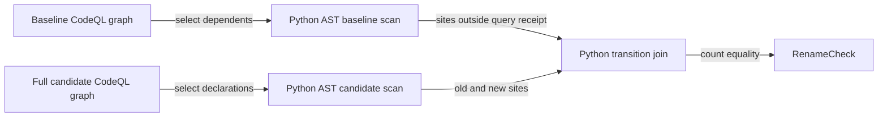
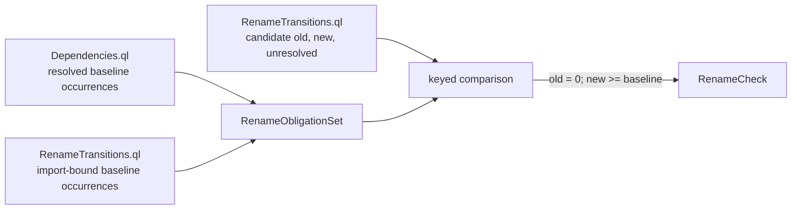
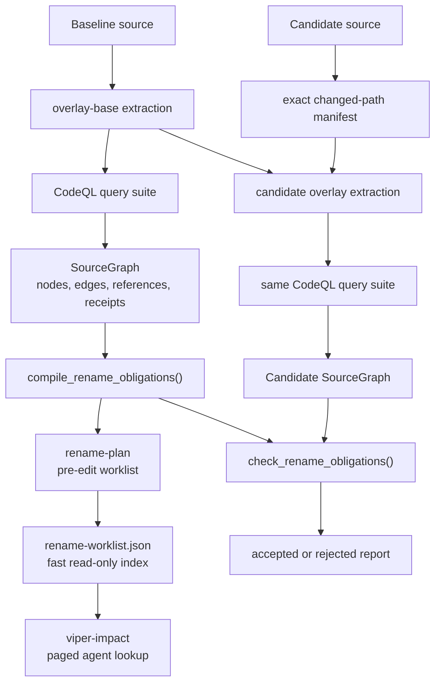

# Rename Obligation Check

## 1. Status

**Contract status:** Implemented and validated on branch.

`P0-ROC-01` introduced the rename protocol. `P0-ROC-02` replaces the
authoritative Python AST scan with receipt-bound CodeQL relations and restricts
candidate overlays to the rename workflow. Checklist activation still awaits
source-backed `ContractTarget` ingestion.

| ID | Implementation obligation |
|---|---|
| ROC-01 <!-- contract-requirement: ROC-01 phase=0 test=tests/test_rename_obligations.py --> | Compile every governed baseline occurrence into one source-located obligation. |
| ROC-02 <!-- contract-requirement: ROC-02 phase=0 test=tests/test_rename_obligations.py --> | Compare references by imported module, symbol, dependent, operation, line, and column. |
| ROC-03 <!-- contract-requirement: ROC-03 phase=0 test=tests/test_rename_obligations.py --> | Accept only complete replacement under the frozen analysis and checker identities. |
| ROC-04 <!-- contract-requirement: ROC-04 phase=0 test=tests/test_rename_obligations.py --> | Report every unresolved dependent and failure. |
| ROC-05 <!-- contract-requirement: ROC-05 phase=0 test=tests/test_codeql_analysis.py --> | Persist exact dependency and import-bound reference relations in the receipt-bound graph. |
| ROC-06 <!-- contract-requirement: ROC-06 phase=0 test=tests/test_codeql_analysis.py --> | Bind an overlay candidate to its overlay-base receipt and exact changed-path manifest. |
| ROC-07 <!-- contract-requirement: ROC-07 phase=0 test=tests/test_rename_obligations.py --> | Permit added replacement uses while requiring zero old uses and at least the baseline replacement count per dependent. |
| ROC-08 <!-- contract-requirement: ROC-08 phase=0 test=tests/test_rename_obligations.py --> | Publish the frozen baseline obligations as a source-located worklist before candidate editing begins. |
| ROC-09 <!-- contract-requirement: ROC-09 phase=0 test=tests/test_impact_cli.py --> | Serve a precomputed, digest-bound worklist without loading VIPER, running CodeQL, or writing repository state. |

## 2. Required claim

For `RenameSpec` $\rho=(o,n,K)$, baseline graph $G_0$, and candidate graph
$G_1$, VIPER accepts exactly when:

```math
\begin{aligned}
O &= \operatorname{CompileRename}(\rho,G_0), \\
T &= \operatorname{CheckRename}(O,G_1), \\
\operatorname{Accept}(T) \iff{}& I(G_0)=I(G_1) \\
&\land H(C)=O.\mathrm{checker\_sha256} \\
&\land o\in V_0 \land o\notin V_1 \land n\in V_1 \\
&\land T.\mathrm{unresolved}=\varnothing \\
&\land \forall q\in O:\
 |\operatorname{OldSites}(q,G_1)|=0 \\
&\qquad\land |\operatorname{NewSites}(q,G_1)|
 \ge |q.\operatorname{baseline\_sites}|.
\end{aligned}
```

`I(G)` is the extraction, query-pack, and lowering identity. `C` is the loaded
checker. An overlay candidate also requires a valid overlay-base receipt and
the digest of the exact changed Python paths. The lower bound permits valid new
uses of the replacement without weakening the zero-old-reference requirement.

## 3. Current gap

Before `P0-ROC-02`, CodeQL selected baseline dependents, but Python AST code
rescanned source to decide whether the candidate contained the old or new
binding. That duplicated language semantics and left the decisive rows outside
the CodeQL query receipt. Candidate analysis also rebuilt a complete database.

The historical Supervision 0.27 refactor exposed two further requirements:
import nodes change identity during a rename, so imports need a file-level
obligation; and count equality rejects valid patches that add replacement uses.

### Current DAG



### Proposed-change DAG



### Integrated DAG



## 4. Models

| Model | Role |
|---|---|
| `SourceEdge` | Resolved dependency occurrence with exact line and column |
| `SourceReference` | Import-bound occurrence retained when its target is absent |
| `DatabaseReceipt` | Full, overlay-base, or overlay extraction provenance |
| `RenameSpec` | Old target, replacement target, and governed operations |
| `ReferenceSite` | One exact governed occurrence |
| `RenameObligation` | Baseline sites for one dependent and operation |
| `RenameObligationSet` | Frozen duties plus graph and checker identities |
| `DependencyTransition` | Candidate sites, status, and reason |
| `RenameCheck` | Complete derived decision |

An import obligation uses `<module imports>` and its source path. Calls, reads,
and writes retain their containing declaration.

## 5. Execution

1. `Dependencies.ql` emits resolved baseline occurrences and evidence columns.
2. The rename-only `rename-facts.qls` suite adds `RenameTransitions.ql`, which
   emits imported module, symbol, operation, owner, location, binding form, and
   resolution state. The default `source-facts.qls` suite remains unchanged so
   normal impact analysis does not pay for this relation.
3. Lowering validates every row, converts columns to UTF-8 byte offsets, hashes
   records, and includes references in the graph digest.
4. `compile_rename_obligations()` unions both relations and deduplicates by
   `(path, line, column)`.
5. `viper impact rename-plan` renders those frozen baseline sites before the
   replacement declaration or candidate graph exists and writes a flattened
   `rename-worklist.json` beside the authoritative obligations.
6. `check_rename_obligations()` joins candidate rows by dependent, operation,
   imported module, and symbol. Star imports, dynamic lookup, and relevant
   alias rebinding fail closed.
7. Rename-check orchestration builds an overlay base, computes changed Python paths
   from byte digests, builds the overlay, and records its base and manifest.
8. Ordinary impact analysis retains full databases because the tested overlay
   preserved rename-reference tuples but not the broader dependency relation.
9. `viper-impact` reads one page from `rename-worklist.json` with only the
   Python standard library. It verifies that the adjacent obligation bytes
   still match the digest recorded by the index. It does not invoke CodeQL,
   import the VIPER application, or write files. This lookup is advisory;
   `rename-check` remains the acceptance authority.

The Python joins use hash maps and are linear in selected occurrences. CodeQL
performs the language-aware relation evaluation.

## 6. Persisted evidence

| Evidence | Contents |
|---|---|
| `SourceGraph.references` | Import-bound rows, including unresolved forms |
| `GraphReceipt.sha256` | Digest of nodes, edges, and nonempty references |
| overlay `DatabaseReceipt` | Snapshot, base key and digest, changes digest, command, and result digest |
| `RenameObligationSet` | Baseline sites and frozen identities |
| `rename-plan.txt` | Compact pre-edit list of required paths, locations, operations, and owners |
| `rename-worklist.json` | Flattened, paged agent index bound to the adjacent obligation-file digest |
| `RenameCheck` | Candidate snapshot, graph digest, transitions, unresolved rows, and verdict |

## 7. Verification

| Rule | Executable condition |
|---|---|
| `rename.query.compiled` | All QL queries compile under the checked-in pack. |
| `rename.rows.bound` | Malformed rows, missing owners, duplicate IDs, and digest drift are rejected. |
| `rename.transition.complete` | Old declaration absent, new declaration present, old sites empty, replacement count at least baseline. |
| `rename.analysis.closed` | Relevant star imports, dynamic attributes, and alias rebinding reject completion. |
| `rename.overlay.bound` | Overlay receipt names a valid base and exact changes digest. |
| `rename.overlay.parity` | Historical and toy cases produce identical rename-reference tuples under overlay and full extraction. |
| `rename.scope.boundary` | Ordinary impact does not consume overlays until dependency-edge parity is established. |
| `rename.plan.complete` | The pre-edit report contains every compiled baseline site exactly once. |
| `rename.worklist.read_only` | The fast command returns the indexed sites, rejects stale obligation bytes, and creates no files. |

## 8. Propagation

| Surface | Change |
|---|---|
| Query pack | Add `RenameTransitions.ql`, evidence columns, and a new version. |
| Graph protocol | Add `SourceReference`, edge columns, and digest coverage. |
| Checker | Compile and verify query relations; support cross-module top-level replacements. |
| Database protocol | Add full, overlay-base, and overlay receipt modes. |
| Orchestration | Expose baseline-only `plan_working_tree_rename()` and use overlays only in candidate checking. |
| Agent interface | Add `viper impact rename-plan` for offline compilation, `viper-impact` for fast lookup, and retain `rename-check` as the completion gate. |
| Tests | Cover lowering, provenance, reuse, stale uses, ambiguity, and completion. |
| Evidence | Retain toy timing/parity and historical Supervision results. |

## 9. Acceptance cases

### Complete rename

The candidate has no `sample.tools.run`, has at least the baseline number of
`sample.tools.run_checked` uses in each governed dependent, and has no
unresolved matching binding. The candidate is accepted.

### Stale use after deletion

The old declaration disappears, so its semantic edge may disappear. The
import-bound relation still emits `sample.tools.run`; the checker rejects it.

### Valid added use

The candidate replaces every old decorator use and adds another use of the new
decorator. The new count exceeds baseline and the candidate remains valid.

## 10. Implementation order

1. Add query relations and graph rows.
2. Move compilation and verification onto those rows.
3. Add overlay receipts, exact changes manifests, and parallel extraction.
4. Restrict overlays to rename verification and test full-result parity.
5. Run a historical refactor and repair measured false rejections.
6. Expose baseline obligations before editing and measure agent localization separately from completion checking.
7. Flatten the frozen obligations into a stdlib-only, digest-bound worklist for the interactive edit loop.

## 11. Contract-owned PairBlocks

- `P0-ROC-01` owns the initial protocol and agent operation.
- `P0-ROC-02` depends on it and owns ROC-05 through ROC-09: CodeQL transition
  rows, overlay provenance, query-derived checking, pre-edit planning, fast
  indexed lookup, and historical validation.

## 12. ContractTarget

`P0-ROC-02` changes the query pack, graph and database receipts, checker,
orchestration, tests, and this contract. Its source plan names each destination.
Registration in `contract-baselines.json` remains blocked by the existing
source-backed `ContractTarget` ingestion prerequisite.

## 13. External constraints

CodeQL incremental analysis requires an overlay-base database, a changes file,
`build-mode=none` for Python, and a sufficiently recent CLI. See GitHub's
[incremental analysis documentation](https://docs.github.com/en/code-security/how-tos/find-and-fix-code-vulnerabilities/scan-from-the-command-line/incremental-analysis).
The suite runs through `database run-queries`, which stores BQRS results in the
database copy; see the [CodeQL CLI manual](https://docs.github.com/en/enterprise-server@3.19/code-security/reference/code-scanning/codeql/codeql-cli-manual/database-run-queries).
