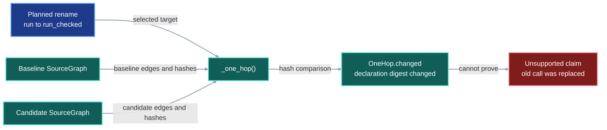
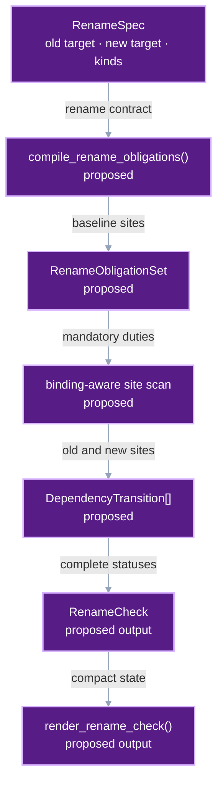
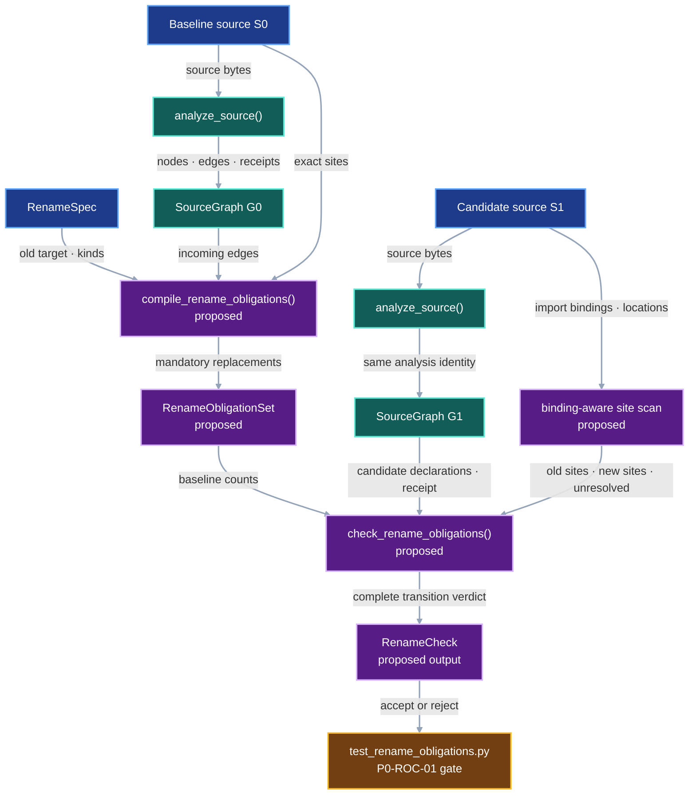

# Rename Obligation Check

## 1. Status

**Contract status:** Source-backed implementation planned.

`P0-ROC-01` passes its isolated Ruff, Pyright, unit-test, and same-identity CodeQL gate. Production
activation follows the CodeQL Analysis migration and source-backed
`ContractTarget` ingestion.

| ID | Implementation obligation |
|---|---|
| ROC-01 <!-- contract-requirement: ROC-01 phase=0 test=tests/test_rename_obligations.py --> | Compile every selected baseline dependency on the old declaration into an exact, source-located obligation. |
| ROC-02 <!-- contract-requirement: ROC-02 phase=0 test=tests/test_rename_obligations.py --> | Check old and replacement references by import binding, dependent declaration, operation, line, and column. |
| ROC-03 <!-- contract-requirement: ROC-03 phase=0 test=tests/test_rename_obligations.py --> | Accept only a complete replacement under the baseline analysis identity and the loaded checker digest. |
| ROC-04 <!-- contract-requirement: ROC-04 phase=0 test=tests/test_rename_obligations.py --> | Return a compact report that names every unresolved dependent and its exact failure. |

## 2. Required claim

VIPER guarantees that an accepted `RenameCheck` replaces every governed
baseline reference to one repository declaration with a binding-equivalent
reference to its declared replacement.

```math
\begin{aligned}
O &= \operatorname{CompileRename}(\rho, G_0, S_0), \\
T &= \operatorname{CheckRename}(O, G_1, S_1, C), \\
\operatorname{Accept}(T)
&\iff I(G_0)=I(G_1) \\
&\quad \land H(C)=O.\mathrm{checker\_sha256} \\
&\quad \land o\in V_0 \land o\notin V_1 \land n\in V_1 \\
&\quad \land T.\mathrm{unresolved}=\varnothing \\
&\quad \land \forall q\in O:\;
  |\operatorname{OldSites}(q,S_1)|=0 \\
&\quad \land |\operatorname{NewSites}(q,S_1)|
  =|q.\operatorname{baseline\_sites}|.
\end{aligned}
```

where:

- $\rho=(o,n,K)$ is the `RenameSpec`; $o$ is `old_target`, $n$ is
  `new_target`, and $K$ is the nonempty set of governed `edge_kinds`;
- $S_0$ and $S_1$ are the baseline and candidate Python source bytes;
- $G_0=(V_0,E_0)$ and $G_1=(V_1,E_1)$ are receipt-valid baseline and
  candidate `SourceGraph` values;
- $I(G)$ is the graph's `CodeQLExtractionSpec`, `CodeQLQuerySpec`, and
  `SourceGraphFormat` tuple;
- $O$ is the `RenameObligationSet` compiled from the incoming edges in $E_0$;
- $C$ is the loaded `system_impact/rename.py` implementation, and $H$ is
  SHA-256; and
- $T$ is the `RenameCheck` containing one `DependencyTransition` for every
  obligation $q$.

A changed comment leaves this predicate false. The candidate must remove the old
binding, create the new declaration, and replace the governed references. The
checker treats every dynamic or ambiguous binding as an unresolved obligation.

## 3. Current gap

### Inspected path

The current [`_one_hop()`](../../src/viper/system_impact/check.py) selects
incoming baseline and candidate `SourceEdge` records. It fills
`OneHop.changed` by comparing the containing declaration's SHA-256 digest.
[`explain_one_hop()`](../../src/viper/system_impact/explain.py) joins those edge
IDs to symbols and use lines for inspection.

That path answers which direct dependents changed. Establishing whether each
dependent replaced the old relationship requires occurrence-level evidence. A
comment edit changes the declaration digest. A removed target may also make a
stale expression disappear from CodeQL's semantic edge set because the
expression loses its connection to the deleted declaration.

The fixed scenario is
`src/viper/_subprocess.py:run` to
`src/viper/_subprocess.py:run_checked`. The repository contains both
`import viper._subprocess as subprocess` and
`from viper import _subprocess as subprocess` bindings. Genuine
`import subprocess` references to Python's standard-library module remain
outside this rename.

### Current DAG



### Missing connector

The first missing connector is a transformation-specific comparison between
the baseline dependency sites and the candidate dependency sites.
`OneHop.changed` records changed bytes. The required old-to-new edge transition
needs a separate record.

`SourceEdge` currently stores only the use line. Two calls on one line can
therefore collapse to one edge ID. `P0-ROC-01` keeps CodeQL as the
authority that selects governed dependents and uses a binding-aware Python AST
scan to produce exact line-and-column sites inside those declarations.

### Proposed-change DAG



### Integrated DAG



## 4. Models

The complete proposed declarations live in the planned
[`system_impact/rename.py`](../../plans/rename-obligation-check/add/src/viper/system_impact/rename.py).

| Model | Role |
|---|---|
| `RenameSpec` | Authored old target, replacement target, and governed operations |
| `ReferenceSite` | One binding-aware dependent, operation, path, line, and column |
| `RenameObligation` | All baseline sites for one dependent and operation |
| `RenameObligationSet` | Obligations plus baseline graph, analysis, and checker identities |
| `DependencyTransition` | Candidate old sites, new sites, status, and reason for one obligation |
| `RenameCheck` | Complete candidate snapshot, graph digest, transitions, unresolved bindings, and acceptance decision |

`RenameSpec` initially accepts top-level same-module Python renames and the
`imports`, `calls`, `reads`, and `writes` edge kinds. The checker rejects a
cross-file move, nested symbol, star import, dynamic target attribute lookup,
or relevant alias rebinding as unsupported analysis.

## 5. Execution

1. `compile_rename_obligations()` recomputes `source_digest(baseline_root)` and
   requires equality with `G0.snapshot.source_sha256`.
2. The compiler resolves `RenameSpec.old_target` once and selects incoming
   CodeQL edges whose kinds belong to `RenameSpec.edge_kinds`.
3. The binding-aware scanner resolves imports within each selected dependent's
   declaration span and records exact `ReferenceSite` values.
4. The compiler stores the baseline graph digest, three CodeQL stage
   specifications, and `rename_checker_digest()` in `RenameObligationSet`.
5. `check_rename_obligations()` recomputes the candidate source digest,
   requires the same CodeQL stage specifications and checker digest, requires
   the old declaration absent and new declaration present, and scans the same
   dependents for old and replacement sites.
6. A hash-map join keyed by `(dependent.path, dependent.symbol, kind)` creates
   one `DependencyTransition` per obligation in linear time over the selected
   edges and sites.
7. `RenameCheck.passed` is true only when every transition is `satisfied` and
   the unresolved set is empty. `render_rename_check()` then presents the
   presents the remaining failures while preserving that verdict.

## 6. Persisted evidence

| Record or path | Exact evidence |
|---|---|
| `RenameObligationSet` | `RenameSpec`, baseline `SourceSnapshot`, graph digest, CodeQL stage specifications, checker digest, and exact baseline sites |
| `RenameCheck` | Candidate `SourceSnapshot`, graph digest, one transition per obligation, unresolved binding reasons, and derived `passed` value |
| `plans/rename-obligation-check/result.json` output | Static commands, focused test result, baseline and candidate graph digests, shared analysis identity, and graph-observed implementation targets |

The plan checker writes `result.json` beneath its caller-selected result
directory. Acceptance and publication begin after the source-backed
`ContractTarget` ingestion prerequisite closes.

## 7. Verification

| Rule | Executable condition |
|---|---|
| `rename.obligation.compiled` | Every selected incoming CodeQL edge resolves to at least one exact baseline `ReferenceSite`; unresolved baseline analysis raises `RenameAnalysisError`. |
| `rename.analysis.bound` | Both scanned roots equal their graph snapshots; the CodeQL stage specifications and checker digest equal the values stored in `RenameObligationSet`. |
| `rename.transition.complete` | The old declaration and old sites are absent, the new declaration exists, and every obligation has exactly the baseline number of replacement sites. |
| `rename.analysis.closed` | Star imports, dynamic target lookups, and relevant alias rebinding populate `unresolved` and reject completion. |
| `rename.report.derived` | `RenameCheck` covers each obligation once, derives `passed` from its transitions, and `render_rename_check()` reports the same decision. |
| `rename.plan.source` | The plan materializes the exact baseline outside the worktree, applies each action once, runs Ruff, Pyright, six focused tests, and same-identity baseline/candidate CodeQL analysis. |

The accepted and rejected tests are in the planned
[`test_rename_obligations.py`](../../plans/rename-obligation-check/add/tests/test_rename_obligations.py).

## 8. Propagation

| Surface | Required change |
|---|---|
| Type | Add the six complete rename records and `RenameTransitionStatus` in `system_impact/rename.py`. |
| Authoring | Construct `RenameSpec` with one old target, one replacement target, and selected operations. |
| Runtime | Add the compiler, binding-aware scanner, exact checker, and compact renderer in `system_impact/rename.py`. |
| Persistence | Serialize `RenameObligationSet` before editing and `RenameCheck` after candidate analysis. |
| Verification | Derive acceptance from complete dependency transitions, shared analysis identities, source digests, and the checker digest. |
| Test | Add the accepted rename, stale old call, standard-library separation, alias ambiguity, unrelated local alias, and stale graph cases. |
| Test infrastructure | Register `test_rename_obligations.py` as a unit, protocol-domain test module. |
| Documentation | Add this contract and one planned Master Phase 0 checklist block. |
| Legacy cleanup | Keep `OneHop.changed` as descriptive evidence; remove it from any future transformation-completion decision. |

This plan adds `system_impact/rename.py` as a new owner. Existing `OneHop`,
`explain_one_hop()`, and ranked impact paths remain valid advisory interfaces.

## 9. Acceptance case

### Success

The baseline defines `viper._subprocess.run`. A dependent imports
`viper._subprocess` as `subprocess` and calls `subprocess.run()` once. CodeQL
selects that dependent. The candidate defines `run_checked`, removes `run`, and
calls `subprocess.run_checked()` once. The checker records one satisfied
transition, an empty unresolved-binding set, and `passed=True`.

The candidate may also contain `import subprocess` followed by the real
standard-library `subprocess.run(...)`. Import identity keeps that call outside
the VIPER rename.

### Rejection

The candidate removes the `run` declaration and leaves `subprocess.run()` in
the governed dependent. CodeQL loses the ability to resolve that
expression to the removed declaration, so the candidate graph may omit the old
edge. The binding-aware scan still resolves the import to
`viper._subprocess`, records the old site, and returns
`still_uses_old_target`. Rule `rename.transition.complete` rejects the
candidate, and `render_rename_check()` prints `Completion: rejected`.

## 10. Implementation order

1. Apply and close `P0-CQA-01` and `P0-CQA-02` so production owns the staged
   CodeQL identity and receipt protocol already consumed by this plan.
2. Add source-backed `ContractTarget` ingestion so the CTG can compile file
   actions directly from `plan.toml`.
3. Rebase this source plan onto that accepted baseline and rerun `check.py`.
4. Apply `P0-ROC-01`, run the focused tests and one live CodeQL gate, then
   serialize the accepted `RenameObligationSet` and `RenameCheck` fixture.
5. Register this contract in `contract-baselines.json`, close the checklist
   block, run the contract-documentation and checklist validators, and publish
   the accepted System Impact evidence.

## 11. Contract-owned PairBlocks

[`plan.toml`](../../plans/rename-obligation-check/plan.toml) owns
`P0-ROC-01`. The block adds the exact checker and its focused tests, then makes
the bounded test-classification edit. Its gate is
`python -m pytest tests/test_rename_obligations.py -q`; the plan checker adds
Ruff, Pyright, and same-identity CodeQL validation before the block becomes
execution-ready.

**Context:** The current graph reports changed dependent declarations. Proving
the required old-to-new reference transition needs additional evidence.
`P0-ROC-01` adds one
receipt-bound obligation set and a fail-closed checker that decides that exact
transition.

## 12. ContractTarget

The source plan is the sole authority for implementation bytes. `add` requires
an absent destination and copies one complete reviewed file. `patch` requires
the patch's changed paths to equal its declared destination set before
application.

The plan compiles these targets after source-backed ingestion is available:

| Action | Planned target | Requirements |
|---|---|---|
| `add` | [`system_impact/rename.py`](../../plans/rename-obligation-check/add/src/viper/system_impact/rename.py): complete module | ROC-01, ROC-02, ROC-03, ROC-04 |
| `add` | [`test_rename_obligations.py`](../../plans/rename-obligation-check/add/tests/test_rename_obligations.py): six test functions | ROC-01, ROC-02, ROC-03, ROC-04 |
| `patch` | [`P0-ROC-01.patch`](../../plans/rename-obligation-check/blocks/P0-ROC-01.patch): `tests/conftest.py` test classifications | ROC-03 |

Each declaration difference must compile to one `ContractTarget` in
`P0-ROC-01`. Production application remains blocked until the CTG enforces
that one-to-one mapping for source-backed plans.

## Future work

`RenameCheck.transitions` can later feed a proposed `NodeSignalSet` containing
graph distance, semantic similarity, co-change history, churn, test evidence,
and a hub penalty. A bounded best-first traversal can rank unresolved
obligations with a heap, and reciprocal-rank fusion can combine independent
signals while preserving the completion predicate.

The active contract closes independently because ranking decides presentation
order, while `RenameCheck` decides mandatory completion. Promotion requires a
localization fixture set that measures recall, irrelevant candidates, tokens,
and elapsed time. A separate ranking contract would own the signals, cache
identity, benchmark, CLI or MCP surface, and acceptance thresholds.

## Sources

- [System Impact Check](system-impact-compiler.md) defines the current
  `SourceGraph`, one-hop comparison, plan check, and acceptance boundary.
- [CodeQL Analysis](codeql-analysis.md) defines the staged extraction, query,
  and graph-lowering identities consumed by this plan.
