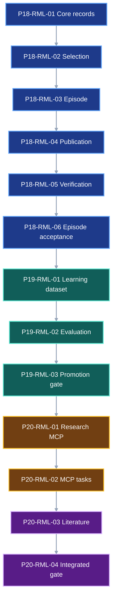

# Research Memory Pair-Coding Guide

Use this guide to implement Master Phases 18–20 of the
[VIPER Master Execution Checklist](master-execution-checklist.md). The
governing contract is
[Research Memory and Agent Learning](research-memory-roadmap.md). The MCP
boundary also follows [Provenance catalog and MCP](provenance-catalog-mcp.md).

## 1. Status and prerequisite gate

**Status:** ready for implementation after Master Phase 17 passes.

Tomorrow's first repository action remains the first open block in the master
checklist. Do not start `P18-RML-01` until these facts are true:

```text
Master Phase 0 System Impact Compiler passes
Master Phase 12 experiment expansion and bounded execution pass
Master Phase 15 MCP server passes
Master Phase 16 scientific evidence records pass
Master Phase 17 knowledge graph and agent search pass
```

This ordering is functional, not administrative. `ResearchEpisode` cites the
verified runs, knowledge records, catalog snapshots, MCP receipts, System
Impact Compiler records, and PairBlocks produced by those phases.

Run repository-owned Python commands through:

```bash
/Users/machina/miniconda3/bin/conda run -n mantra python ...
```

Before each PairBlock, confirm the interpreter is:

```text
/Users/machina/miniconda3/envs/mantra/bin/python
```

## 2. Pair cycle

For each PairBlock:

1. Read the named contract section and current target files.
2. Apply only the bounded edit in that block.
3. Run the focused check.
4. Inspect the actual result together.
5. Update the master-checklist box only after the check passes.
6. Commit at the stated boundary after every block in that boundary passes.

Do not combine a failing block with the next block. Record a contract gap when
the implementation cannot represent or verify a required value.

## 3. Dependency graph



## 4. Research episodes (Master Phase 18)

### P18-RML-01 — core research records

```toml pair-block
id = "P18-RML-01"
master_phase = 18
requirements = ["RML-01"]
depends_on = ["P17 terminal gate"]
targets = ["src/viper/research.py", "tests/test_protocol.py"]
produces = ["ResearchConstraint", "ResearchObjective", "AnalysisPlan", "HypothesisSpec", "ResourceLimit", "ResourceBudget"]
tests = ["tests/test_protocol.py"]
gate = "conda run -n mantra python -m pytest tests/test_protocol.py -q"
```

Add the exact identifier aliases and six models from Sections 6 and 7 of the
contract. Keep them in `viper.research`; do not re-export them from
`viper.__init__`. Add field, frozen-model, invalid-enum, finite-number, and JSON
round-trip tests.

Focused check:

```bash
conda run -n mantra python -m pytest tests/test_protocol.py -q
```

Stop if the existing schema owners require a different exact reference type.
Record that mismatch in the contract before changing the public name.

### P18-RML-02 — candidates and selection

```toml pair-block
id = "P18-RML-02"
master_phase = 18
requirements = ["RML-01", "RML-02"]
depends_on = ["P18-RML-01"]
targets = ["src/viper/research.py", "tests/test_protocol.py"]
produces = ["ExperimentCandidate", "SelectionPolicyIdentity", "CandidateScore", "ExperimentSelection"]
tests = ["tests/test_protocol.py"]
gate = "conda run -n mantra python -m pytest tests/test_protocol.py -q"
```

Implement the candidate and selection models. Add validators for unique
candidate IDs, one score per candidate, selected-candidate membership,
eligibility, selection probability for randomized or learned policies, and the
declared `ResourceBudget`. Resolve every candidate constraint to its objective
and record the seed for each stochastic selector.

The fixture contains three candidates: one selected, one eligible and
unselected, and one ineligible with a rejection reason. Preserve all three.

Focused check:

```bash
conda run -n mantra python -m pytest tests/test_protocol.py -q
```

### P18-RML-03 — invocation receipts and complete episode

```toml pair-block
id = "P18-RML-03"
master_phase = 18
requirements = ["RML-01"]
depends_on = ["P18-RML-02"]
targets = ["src/viper/research.py", "tests/test_protocol.py"]
produces = ["AgentPolicyIdentity", "AgentModelInvocationReceipt", "AgentToolInvocationReceipt", "ResearchObservation", "ResearchReview", "ResearchEpisode"]
tests = ["tests/test_protocol.py"]
gate = "conda run -n mantra python -m pytest tests/test_protocol.py -q"
```

Implement the exact policy, invocation, observation, review, and episode
models. The complete fixture must reference:

```text
one ResearchObjective
one preregistered HypothesisSpec
one ExperimentSelection
one AgentPolicyIdentity, policy bundle, and memory manifest
one model receipt
at least one tool receipt with server version and tool-schema digest
one generated PairBlock reference
at least one verified ResolvedRunRef
all measurement, effect, diagnostic, and failure references
one terminal ResearchReview
recomputed cost and wall time
```

Focused check:

```bash
conda run -n mantra python -m pytest tests/test_protocol.py -q
```

### P18-RML-04 — immutable publication

```toml pair-block
id = "P18-RML-04"
master_phase = 18
requirements = ["RML-01"]
depends_on = ["P18-RML-03"]
targets = ["src/viper/research.py", "src/viper/catalog.py", "tests/test_inspection.py"]
produces = ["ResearchRecordEnvelope", "ResearchManifest", "research head"]
tests = ["tests/test_inspection.py"]
gate = "conda run -n mantra python -m pytest tests/test_inspection.py -q"
```

Implement the closed `ResearchRecordKind` and `ResearchRecord` unions.
Canonicalize and publish each envelope through the existing immutable-file
publisher. Write one `ResearchManifest`, then replace
`.viper/research/head.json` atomically under the repository lock.

Extend `Catalog.refresh()` to walk local and supplied research heads, reject
cycles and wrong record kinds, keep every source `ResolvedFileRef`, and rebuild
equal rows after deletion.

Focused check:

```bash
conda run -n mantra python -m pytest tests/test_inspection.py -q
```

### P18-RML-05 — research verification

```toml pair-block
id = "P18-RML-05"
master_phase = 18
requirements = ["RML-01", "RML-02"]
depends_on = ["P18-RML-04"]
targets = ["src/viper/verification/__init__.py", "src/viper/_verification/research.py", "tests/test_verification_acceptance.py"]
produces = ["research verifier dispatch"]
tests = ["tests/test_verification_acceptance.py"]
gate = "conda run -n mantra python -m pytest tests/test_verification_acceptance.py -q"
```

Verify every nested reference and every recomputable value. Add the exact
rejection cases from Section 15 of the contract through `ResearchEpisode`.
Particularly test:

```text
registered_at after a result
candidate or score set mismatch
ineligible selection
budget mismatch
missing selection probability
receipt digest mismatch
unresolved PairBlock or run
fixed interval with anytime stopping
unrecomputed multiplicity claim
```

Focused check:

```bash
conda run -n mantra python -m pytest tests/test_verification_acceptance.py -q
```

### P18-RML-06 — complete episode acceptance

```toml pair-block
id = "P18-RML-06"
master_phase = 18
requirements = ["RML-01", "RML-02"]
depends_on = ["P18-RML-05"]
targets = ["tests/test_protocol.py", "tests/test_inspection.py", "tests/test_verification_acceptance.py", "docs/development/master-execution-checklist.md"]
produces = ["Master Phase 18 gate"]
tests = ["tests/test_protocol.py", "tests/test_inspection.py", "tests/test_verification_acceptance.py"]
gate = "conda run -n mantra python -m pytest tests/test_protocol.py tests/test_inspection.py tests/test_verification_acceptance.py -q"
```

Publish and verify the complete fixed-budget fixture. Delete and rebuild the
catalog. Query the episode from the question, selected candidate, run,
diagnostic, and policy directions. Then run:

```bash
conda run -n mantra python -m pytest \
  tests/test_protocol.py \
  tests/test_inspection.py \
  tests/test_verification_acceptance.py -q
```

**Commit boundary:** `Record auditable research episodes`

## 5. Learning and promotion (Master Phase 19)

### P19-RML-01 — group-safe learning dataset

```toml pair-block
id = "P19-RML-01"
master_phase = 19
requirements = ["RML-03"]
depends_on = ["P18-RML-06"]
targets = ["src/viper/research.py", "src/viper/catalog.py", "tests/test_protocol.py", "tests/test_verification_acceptance.py"]
produces = ["LearningExample", "DatasetMember", "DatasetSplit", "LeakageCheck", "LearningDatasetManifest"]
tests = ["tests/test_protocol.py", "tests/test_verification_acceptance.py"]
gate = "conda run -n mantra python -m pytest tests/test_protocol.py tests/test_verification_acceptance.py -q"
```

Implement curation and manifest records. Group by research question, source
dataset, benchmark family, and paper-replication task before assigning splits.
Reject any group crossing a split, any post-cutoff record, any unreviewed
label, and any synthetic example without complete ancestors and origin counts.

Focused check:

```bash
conda run -n mantra python -m pytest tests/test_protocol.py tests/test_verification_acceptance.py -q
```

### P19-RML-02 — baseline and challenger evaluation

```toml pair-block
id = "P19-RML-02"
master_phase = 19
requirements = ["RML-04"]
depends_on = ["P19-RML-01"]
targets = ["src/viper/research.py", "tests/test_protocol.py", "tests/test_verification_acceptance.py"]
produces = ["LearningUpdateSpec", "LearningUpdateReceipt", "AgentEvaluationPlan", "AgentEvaluationResult"]
tests = ["tests/test_protocol.py", "tests/test_verification_acceptance.py"]
gate = "conda run -n mantra python -m pytest tests/test_protocol.py tests/test_verification_acceptance.py -q"
```

Implement `memory_publish` first. Freeze the baseline and challenger policy,
task set, tool schemas, budgets, seeds, primary metrics, retention metrics, and
context slices. Run both policies on the same fixtures. Store task-level
results and recompute every gate.

Focused check:

```bash
conda run -n mantra python -m pytest tests/test_protocol.py tests/test_verification_acceptance.py -q
```

### P19-RML-03 — promotion and rollback

```toml pair-block
id = "P19-RML-03"
master_phase = 19
requirements = ["RML-04"]
depends_on = ["P19-RML-02"]
targets = ["src/viper/research.py", "tests/test_verification_acceptance.py", "docs/development/master-execution-checklist.md"]
produces = ["PolicyPromotionDecision", "Master Phase 19 gate"]
tests = ["tests/test_verification_acceptance.py"]
gate = "conda run -n mantra python -m pytest tests/test_verification_acceptance.py -q"
```

Require a passing evaluation, explicit promotion reviewer, and loadable rollback policy.
Reject a challenger that improves the aggregate while one retention slice
fails. Promote the passing retrieval-memory challenger, load it, then load and
smoke-test the recorded rollback policy.

Focused check:

```bash
conda run -n mantra python -m pytest tests/test_verification_acceptance.py -q
```

**Commit boundary:** `Evaluate and promote reviewed research memory`

## 6. Research MCP and literature (Master Phase 20)

### P20-RML-01 — research resources, prompts, sampling, and elicitation

```toml pair-block
id = "P20-RML-01"
master_phase = 20
requirements = ["RML-05", "PCM-06"]
depends_on = ["P19-RML-03"]
targets = ["src/viper/api.py", "src/viper/mcp.py", "src/viper/cli.py", "tests/test_api.py", "tests/test_cli.py"]
produces = ["learn access", "research resources", "research prompts", "sampling receipts", "review elicitation"]
tests = ["tests/test_api.py", "tests/test_cli.py"]
gate = "conda run -n mantra python -m pytest tests/test_api.py tests/test_cli.py -q"
```

Add the exact research operations to the typed API registry. Add `learn`
access, research `viper://` resources and templates, research prompts,
client-controlled sampling, and form-mode review elicitation. Prove omission
when capabilities or access are absent. Decline authorizes nothing.
The CLI boundary is `viper mcp --root <path> --access learn`.

Focused check:

```bash
conda run -n mantra python -m pytest tests/test_api.py tests/test_cli.py -q
```

### P20-RML-02 — task parity

```toml pair-block
id = "P20-RML-02"
master_phase = 20
requirements = ["PCM-07"]
depends_on = ["P20-RML-01"]
targets = ["src/viper/mcp.py", "tests/test_api.py", "tests/test_cli.py"]
produces = ["task augmentation", "ordinary status fallback"]
tests = ["tests/test_api.py", "tests/test_cli.py"]
gate = "conda run -n mantra python -m pytest tests/test_api.py tests/test_cli.py -q"
```

Add task augmentation only to the four operations named by the MCP contract.
Map each MCP task to the existing durable VIPER operation ID. Execute each
fixture with and without tasks and compare status, cancellation, result, and
side effects.

Focused check:

```bash
conda run -n mantra python -m pytest tests/test_api.py tests/test_cli.py -q
```

### P20-RML-03 — anchored literature

```toml pair-block
id = "P20-RML-03"
master_phase = 20
requirements = ["RML-06"]
depends_on = ["P20-RML-02"]
targets = ["src/viper/research.py", "src/viper/catalog.py", "tests/test_inspection.py", "tests/test_verification_acceptance.py"]
produces = ["LiteratureWork", "LiteratureVersion", "EvidenceAnchor", "LiteratureClaim"]
tests = ["tests/test_inspection.py", "tests/test_verification_acceptance.py"]
gate = "conda run -n mantra python -m pytest tests/test_inspection.py tests/test_verification_acceptance.py -q"
```

Implement literature records, version chains, exact source anchors, extraction
origin, review state, correction and retraction state, catalog queries, and the
four literature-to-research edges. Export one verified bundle as a derived
RO-Crate and verify that deleting the export changes no VIPER evidence.

Focused check:

```bash
conda run -n mantra python -m pytest tests/test_inspection.py tests/test_verification_acceptance.py -q
```

### P20-RML-04 — integrated gate

```toml pair-block
id = "P20-RML-04"
master_phase = 20
requirements = ["RML-05", "RML-06", "PCM-06", "PCM-07"]
depends_on = ["P20-RML-03"]
targets = ["tests/test_api.py", "tests/test_cli.py", "tests/test_inspection.py", "tests/test_verification_acceptance.py", "tests/test_documentation.py", "docs/development/master-execution-checklist.md"]
produces = ["Master Phase 20 gate"]
tests = ["tests/test_api.py", "tests/test_cli.py", "tests/test_inspection.py", "tests/test_verification_acceptance.py", "tests/test_documentation.py"]
gate = "conda run -n mantra python -m pytest tests/test_api.py tests/test_cli.py tests/test_inspection.py tests/test_verification_acceptance.py tests/test_documentation.py -q"
```

Run the complete research/MCP boundary:

```bash
conda run -n mantra python -m pytest \
  tests/test_api.py \
  tests/test_cli.py \
  tests/test_inspection.py \
  tests/test_verification_acceptance.py \
  tests/test_documentation.py -q
```

Then run the change-aware test boundary reported for the final diff. Fix every
in-scope failure before closing Master Phase 20.

**Commit boundary:** `Expose verified research learning through MCP`

## 7. Tomorrow's shutdown handoff

Record:

```text
last completed PairBlock
focused command and exact result
changed files
first failing assertion, if any
next PairBlock
uncommitted paths
current commit and upstream status
```

The next session starts from that exact PairBlock boundary, not from a prose
summary of the intended system.
