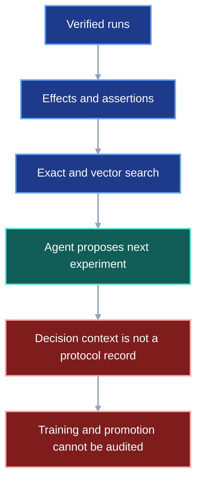
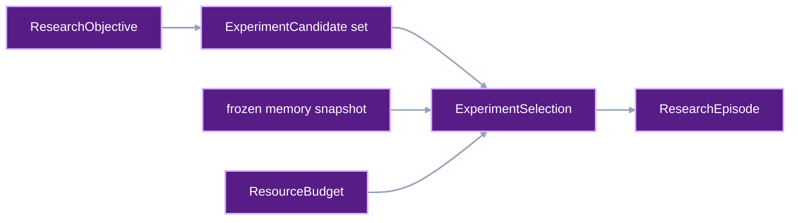
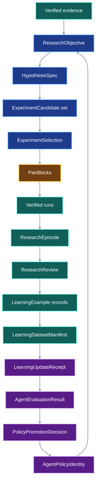
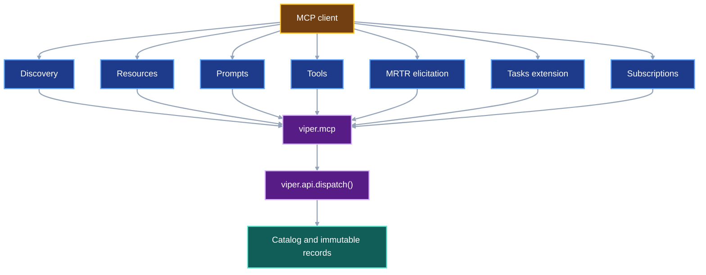

# Research Memory and Agent Learning

VIPER turns verified experiment history into inspectable research memory, then
uses that memory to choose and evaluate later experiments. The system preserves
the boundary between evidence, interpretation, agent behavior, and a learned
policy. A successful experiment can improve retrieval immediately. It cannot
silently retrain or promote the agent that proposed it.

## 1. Status

**Contract status:** audited; owner approval pending.

These requirements bind this contract to the master checklist:

| ID | Implementation obligation |
| --- | --- |
| RML-01 <!-- contract-requirement: RML-01 phase=18 test=tests/test_protocol.py --> | Publish an immutable `ResearchEpisode` that preserves the question, preregistered hypothesis, candidate set, selection decision, agent/tool receipts, executed runs, observations, costs, and terminal review. |
| RML-02 <!-- contract-requirement: RML-02 phase=18 test=tests/test_verification_acceptance.py --> | Reject an experiment selection or scientific conclusion when its declared feasibility, safety, scope, budget, comparison, stopping, multiplicity, or evidence rules cannot be recomputed from verified records. |
| RML-03 <!-- contract-requirement: RML-03 phase=19 test=tests/test_protocol.py --> | Curate reviewed `LearningExample` records into an immutable `LearningDatasetManifest` that preserves origin, policy-time context, group-safe splits, synthetic lineage, inclusion decisions, and leakage checks. |
| RML-04 <!-- contract-requirement: RML-04 phase=19 test=tests/test_verification_acceptance.py --> | Publish `LearningUpdateReceipt`, `AgentEvaluationResult`, and `PolicyPromotionDecision` records; promote a challenger only after frozen evaluation gates pass, and preserve a tested rollback target. |
| RML-05 <!-- contract-requirement: RML-05 phase=20 test=tests/test_api.py --> | Expose research evidence through typed catalog queries, MCP resources, and user-selected prompts; expose provider-backed model invocation, MRTR review elicitation, and learning operations only through typed operations, per-request capabilities, and explicit access. |
| RML-06 <!-- contract-requirement: RML-06 phase=20 test=tests/test_verification_acceptance.py --> | Ingest versioned primary-source literature records with claim-level anchors, source and extraction provenance, review state, correction/retraction state, and explicit links to the experiments they motivate or qualify. |

The concrete classes in this document are planned additions to
`viper.research`. Existing names such as `ResolvedRunRef`, `ResolvedRunSpecRef`,
`ResolvedFileRef`, `TargetSpecification`, and `TargetConformanceReport` retain
their current or separately contracted meanings.

## 2. Required claim

Given a research objective and the evidence visible at decision time, VIPER can
reconstruct:

1. which experiment candidates were admissible;
2. why one candidate was selected;
3. what agent, memory, tools, code, and budget produced that decision;
4. which verified runs and observations resulted;
5. which conclusion a reviewer accepted;
6. which memory or policy update consumed that episode; and
7. whether the updated policy improved a frozen evaluation suite without
   violating retention, cost, safety, or validity gates.

The claim is provenance and controlled evaluation. It does not claim that an
agent-generated hypothesis is scientifically true, that a selected experiment
is globally optimal, or that one benchmark predicts every research domain.

## 3. Why the current records are insufficient

The present contracts can publish verified runs, controlled effects,
diagnostic signatures, journal assertions, and retrieval judgments. They do
not persist the complete decision context that connects one research question
to one next experiment.

### Current DAG



`JournalAssertion(kind="decision")` records prose and evidence after a
decision. It does not identify the full candidate set, selection policy,
selection probability, available memory snapshot, prompt and tool contract,
budget, or rejected alternatives. A collection of such assertions is useful
scientific memory. It is not yet a learning dataset or an off-policy decision
log.

### Proposed-change DAG



### Integrated DAG


## 4. Architectural decision

VIPER uses four learning rates, each with a separate authority boundary:

| Layer | What changes | First admissible evidence | Promotion rule |
| --- | --- | --- | --- |
| Retrieval memory | Which verified records enter context | Reviewed `LearningExample` records | Retrieval evaluation passes |
| Procedural memory | Which reviewed workflow guides an episode | Several successful and failed episodes in a bounded context | Challenger workflow passes frozen tasks |
| Predictive models | Primitive, outcome, cost, or acquisition estimates | Immutable training manifest with held-out groups | Model-specific evaluation passes |
| Agent policy | Model, prompt, workflow, retrieval, and tool-selection configuration | Frozen challenger artifact plus complete evaluation | Explicit `PolicyPromotionDecision` |

This order follows the practical distinction made by language-agent memory
work: [Reflexion](https://papers.neurips.cc/paper_files/paper/2023/hash/1b44b878bb782e6954cd888628510e90-Abstract-Conference.html)
stores verbal feedback without changing model weights;
[ExpeL](https://doi.org/10.1609/aaai.v38i17.29936) extracts reusable lessons
from prior tasks; and [Agent Workflow
Memory](https://proceedings.mlr.press/v267/wang25bx.html) retrieves induced
workflows for later trajectories. These systems support retrieval-first
learning. They do not remove VIPER's obligation to verify the underlying
experiment and to test transfer and negative transfer in VIPER's domains.

Parametric updates enter only after replay and retention tests exist.
[Experience replay](https://proceedings.neurips.cc/paper_files/paper/2019/hash/fa7cdfad1a5aaf8370ebeda47a1ff1c3-Abstract.html),
[Gradient Episodic Memory](https://papers.nips.cc/paper/2017/hash/f87522788a2be2d171666752f97ddebb-Abstract.html),
and [elastic weight consolidation](https://doi.org/10.1073/pnas.1611835114)
show distinct ways to reduce catastrophic forgetting. VIPER treats the
algorithm as a declared choice and requires direct retention measurements;
none of those methods grants a universal no-forgetting guarantee.

## 5. Complete research loop



The loop has two independent feedback channels:

- Scientific feedback updates findings about the experiment domain.
- Agent feedback updates retrieval, workflows, predictive models, or the
  complete agent policy.

A scientific improvement is not automatically an agent-policy improvement. A
lucky proposal may produce a strong run. A sound policy must improve expected
performance across frozen tasks and replicates.

## 6. Research objectives and preregistered hypotheses

The first records state what the episode is trying to learn before the result
is visible.

```python
ResearchObjectiveId = Annotated[str, StringConstraints(min_length=1)]
HypothesisId = Annotated[str, StringConstraints(min_length=1)]
CandidateId = Annotated[str, StringConstraints(min_length=1)]
EpisodeId = Annotated[str, StringConstraints(min_length=1)]
PolicyId = Annotated[str, StringConstraints(min_length=1)]
DatasetId = Annotated[str, StringConstraints(min_length=1)]
ResearchConstraintId = Annotated[str, StringConstraints(min_length=1)]


class ResearchConstraint(ProtocolModel):
    constraint_id: ResearchConstraintId
    kind: Literal["feasibility", "safety", "ethics", "resource", "environment", "scope"]
    statement: NonEmptyStr
    enforcement: Literal["preflight", "runtime", "review"]
    verifier_rule: NonEmptyStr
    evidence: tuple[ResolvedFileRef, ...]


class ResearchObjective(ProtocolModel):
    schema_version: Literal[1] = 1
    objective_id: ResearchObjectiveId
    question: NonEmptyStr
    target_metrics: tuple[MetricId, ...] = Field(min_length=1)
    admissible_evidence: tuple[ResolvedFileRef, ...]
    constraints: tuple[ResearchConstraint, ...]
    created_by: NonEmptyStr
    created_at: AwareDatetime


class AnalysisPlan(ProtocolModel):
    estimand: NonEmptyStr
    comparison: Literal["paired", "independent", "descriptive", "benchmark"]
    metric_id: MetricId
    direction: Literal["min", "max"]
    minimum_effect: float | None = Field(default=None, allow_inf_nan=False)
    interval_method: Literal["fixed_normal", "bootstrap", "confidence_sequence"]
    confidence: float = Field(gt=0.0, lt=1.0)
    stopping_rule: Literal["fixed_budget", "fixed_sample", "anytime_valid"]
    maximum_looks: int | None = Field(default=None, ge=1)
    multiplicity_family: NonEmptyStr | None = None
    multiplicity_rule: Literal["none", "holm", "alpha_investing"] = "none"


class HypothesisSpec(ProtocolModel):
    schema_version: Literal[1] = 1
    hypothesis_id: HypothesisId
    objective: ResolvedFileRef
    null_claim: NonEmptyStr
    alternative_claim: NonEmptyStr
    intervention: NonEmptyStr
    control: NonEmptyStr
    population: NonEmptyStr
    analysis: AnalysisPlan
    registered_at: AwareDatetime
```

`HypothesisSpec.registered_at` must precede the first candidate result used to
evaluate it. A later change creates a new immutable version and records the
earlier version as prior evidence; it never rewrites the preregistration.

The analysis plan separates three valid operating modes:

- `fixed_budget` chooses the best result after a declared experiment budget;
- `fixed_sample` tests a declared comparison after a fixed replicate count;
- `anytime_valid` permits data-dependent stopping only with a compatible
  sequential method.

This distinction is necessary because repeated inspection changes the
statistical problem. The [reusable holdout](https://doi.org/10.1126/science.aaa9375)
addresses adaptively chosen analyses over a holdout, and [confidence
sequences](https://doi.org/10.1214/20-AOS1991) provide intervals that remain
valid uniformly over time. VIPER does not relabel a conventional fixed-sample
interval as anytime-valid.

## 7. Candidate generation and experiment selection

Candidate generation and candidate selection are separate activities. The
generator proposes admissible interventions. The selector compares the
complete set it received.

```python
class ResourceLimit(ProtocolModel):
    resource: NonEmptyStr
    maximum: Decimal = Field(ge=0)
    unit: NonEmptyStr


class ResourceBudget(ProtocolModel):
    maximum_runs: int = Field(ge=1)
    maximum_wall_seconds: float = Field(gt=0.0, allow_inf_nan=False)
    maximum_cost_usd: Decimal = Field(ge=0)
    maximum_gpu_seconds: float | None = Field(default=None, ge=0.0)
    resource_limits: tuple[ResourceLimit, ...] = ()


class ExperimentCandidate(ProtocolModel):
    schema_version: Literal[1] = 1
    candidate_id: CandidateId
    hypothesis: ResolvedFileRef
    plan: ResolvedRunSpecRef
    parent_plan: ResolvedRunSpecRef | None = None
    expected_information_gain: float | None = Field(default=None, allow_inf_nan=False)
    expected_utility: float | None = Field(default=None, allow_inf_nan=False)
    expected_cost_usd: Decimal = Field(ge=0)
    constraint_ids: tuple[ResearchConstraintId, ...]
    supporting_evidence: tuple[ResolvedFileRef, ...]
    system_change_report: ResolvedFileRef | None = None


class SelectionPolicyIdentity(ProtocolModel):
    policy_id: PolicyId
    version: NonEmptyStr
    artifact: ResolvedArtifactPointerRef
    configuration_sha256: SHA256
    algorithm: Literal[
        "rule",
        "randomized",
        "bayesian_optimization",
        "best_arm_identification",
        "learned_ranker",
        "agent",
    ]


class CandidateScore(ProtocolModel):
    candidate_id: CandidateId
    feasibility: Literal["eligible", "ineligible"]
    utility: float | None = Field(default=None, allow_inf_nan=False)
    information_gain: float | None = Field(default=None, allow_inf_nan=False)
    expected_cost_usd: Decimal = Field(ge=0)
    selection_probability: float | None = Field(default=None, gt=0.0, le=1.0)
    rejection_reasons: tuple[NonEmptyStr, ...] = ()


class ExperimentSelection(ProtocolModel):
    schema_version: Literal[1] = 1
    objective: ResolvedFileRef
    hypothesis: ResolvedFileRef
    candidates: tuple[ResolvedFileRef, ...] = Field(min_length=1)
    scores: tuple[CandidateScore, ...] = Field(min_length=1)
    selected: tuple[CandidateId, ...] = Field(min_length=1)
    policy: SelectionPolicyIdentity
    evidence_snapshot: ResolvedFileRef
    budget: ResourceBudget
    random_seed: int | None = None
    selected_at: AwareDatetime
```

The verifier requires one score per candidate, rejects duplicate candidate IDs,
rejects an ineligible selection, and recomputes declared budget totals. A
randomized or learned policy must record `selection_probability`. That field
supports later propensity-aware evaluation; it does not make a biased policy
log equivalent to a randomized controlled trial. A stochastic selector also
records `random_seed`; its versioned policy artifact fixes the generator and
draw procedure needed to replay the choice.

The loop follows the established autonomous-experiment pattern: analyze prior
data, predict candidate outcomes, select an experiment, execute it, and feed
the observation into the next decision. The Robot Scientist Adam demonstrated
hypothesis generation and testing with explicit logical representations
([King et al., 2009](https://doi.org/10.1126/science.1165620)). Self-driving
laboratory work makes the closed loop explicit
([Häse, Roch, and Aspuru-Guzik, 2019](https://doi.org/10.1016/j.trechm.2019.02.007))
and has shown physics-informed Bayesian active learning in a live materials
campaign ([Kusne et al., 2020](https://doi.org/10.1038/s41467-020-19597-w)).
VIPER's `ResearchConstraint`, `ResourceBudget`, receipts, and review gate make
the corresponding limits and interventions inspectable. They do not grant a
software agent unreviewed authority over a physical instrument.

Bayesian experimental design chooses controllable conditions to improve
inference about declared quantities of interest
([Chaloner and Verdinelli, 1995](https://doi.org/10.1214/ss/1177009939)).
That is why `ExperimentCandidate` stores information gain separately from
utility and cost. A selector may optimize discovery, parameter information, or
operational utility, but it must declare which objective it used.

Bayesian optimization is one admissible selector for expensive black-box
objectives. The canonical formulation maintains uncertainty over an unknown
objective and selects points through an acquisition function. Snoek,
Larochelle, and Adams also model variable experiment cost and parallel
execution in [Practical Bayesian Optimization of Machine Learning
Algorithms](https://papers.nips.cc/paper_files/paper/2012/hash/05311655a15b75fab86956663e1819cd-Abstract.html).
Fixed-confidence best-arm identification is a different objective: identify
the best candidate with a declared error probability while minimizing samples
([Garivier and Kaufmann, 2016](https://proceedings.mlr.press/v49/garivier16a.html)).
VIPER stores the selector identity because those objectives and guarantees are
not interchangeable.

## 8. Agent and tool execution receipts

An agent policy includes more than a model name. It fixes the components that
can change the generated decision.

```python
class AgentModelIdentity(ProtocolModel):
    provider: NonEmptyStr
    model: NonEmptyStr
    revision: NonEmptyStr | None = None
    parameters_sha256: SHA256 | None = None


class AgentPolicyIdentity(ProtocolModel):
    schema_version: Literal[1] = 1
    policy_id: PolicyId
    version: NonEmptyStr
    model: AgentModelIdentity
    system_prompt_sha256: SHA256
    workflow_sha256: SHA256
    retrieval_policy_sha256: SHA256
    tool_schema_sha256: SHA256
    memory_manifest: ResolvedFileRef
    policy_bundle: ResolvedArtifactPointerRef
    implementation_commit: GitCommit


class AgentModelInvocationReceipt(ProtocolModel):
    schema_version: Literal[1] = 1
    policy: AgentPolicyIdentity
    request_sha256: SHA256
    response_sha256: SHA256
    input_tokens: int | None = Field(default=None, ge=0)
    output_tokens: int | None = Field(default=None, ge=0)
    cost_usd: Decimal | None = Field(default=None, ge=0)
    started_at: AwareDatetime
    ended_at: AwareDatetime
    terminal_status: Literal["succeeded", "failed", "cancelled"]


class AgentToolInvocationReceipt(ProtocolModel):
    schema_version: Literal[1] = 1
    server: NonEmptyStr
    server_version: NonEmptyStr
    operation: NonEmptyStr
    tool_schema_sha256: SHA256
    request_sha256: SHA256
    result_sha256: SHA256 | None = None
    task_id: NonEmptyStr | None = None
    started_at: AwareDatetime
    ended_at: AwareDatetime
    terminal_status: Literal["succeeded", "failed", "cancelled"]
    evidence: tuple[ResolvedFileRef, ...]
```

The hashes bind private or large prompt and response artifacts without forcing
them into every catalog row. Publication policy decides whether the underlying
bytes remain local, remote, redacted, or unavailable. The immutable receipt
still states which bytes and policy produced the episode.

Code changes use the System Impact Compiler at both ends. A research episode
links its initial `SystemGraph`, `ContractDelta`, impact report,
`TargetSpecification`, PairBlocks, observed `SystemGraph`, and
`TargetConformanceReport`. CodeQL supplies the independently extracted source
facts. It does not evaluate the scientific hypothesis.

## 9. Episode and review records

```python
class ResearchObservation(ProtocolModel):
    run: ResolvedRunRef
    measurements: tuple[ResolvedFileRef, ...]
    effects: tuple[ResolvedFileRef, ...]
    diagnostics: tuple[ResolvedFileRef, ...]
    failures: tuple[ResolvedFileRef, ...]


class ResearchReview(ProtocolModel):
    schema_version: Literal[1] = 1
    decision: Literal["accepted", "qualified", "rejected", "inconclusive"]
    conclusions: tuple[NonEmptyStr, ...]
    evidence: tuple[ResolvedFileRef, ...] = Field(min_length=1)
    deviations: tuple[NonEmptyStr, ...]
    validity_limits: tuple[NonEmptyStr, ...]
    reviewed_by: NonEmptyStr
    reviewed_at: AwareDatetime


class ResearchEpisode(ProtocolModel):
    schema_version: Literal[1] = 1
    episode_id: EpisodeId
    objective: ResolvedFileRef
    hypothesis: ResolvedFileRef
    selection: ResolvedFileRef
    agent_policy: AgentPolicyIdentity
    model_invocations: tuple[ResolvedFileRef, ...]
    tool_invocations: tuple[ResolvedFileRef, ...]
    pair_blocks: tuple[ResolvedFileRef, ...]
    observations: tuple[ResearchObservation, ...] = Field(min_length=1)
    total_cost_usd: Decimal = Field(ge=0)
    total_wall_seconds: float = Field(ge=0.0, allow_inf_nan=False)
    review: ResolvedFileRef
    started_at: AwareDatetime
    ended_at: AwareDatetime
```

`ResearchEpisode` is the smallest complete learning episode. A trajectory log
without verified observations is an execution trace. A set of measurements
without the selection and policy context is experiment evidence. The episode
joins both while preserving their separate records.

This mirrors the useful core of W3C PROV: immutable things are entities,
executions are activities, and people or software bear responsibility as
agents. [PROV-O](https://www.w3.org/TR/prov-o/) also treats plans as entities
and supports generation, use, derivation, attribution, and association.
VIPER keeps its domain types instead of exposing generic RDF as its Python API,
then maps each record to those provenance roles for export.

## 10. Learning examples and dataset manifests

A reviewed episode does not enter training automatically. Curation creates a
new record with a declared target and inclusion decision.

```python
LearningOrigin = Literal["human", "agent", "environment", "hybrid"]
LearningTarget = Literal[
    "retrieval",
    "workflow",
    "primitive_classification",
    "outcome_prediction",
    "cost_prediction",
    "acquisition",
    "agent_policy",
]


class LearningExample(ProtocolModel):
    schema_version: Literal[1] = 1
    episode: ResolvedFileRef
    target: LearningTarget
    origin: LearningOrigin
    context: tuple[ResolvedFileRef, ...]
    action: ResolvedFileRef
    outcome: tuple[ResolvedFileRef, ...]
    label: ResolvedFileRef
    synthetic_ancestors: tuple[ResolvedFileRef, ...]
    group_id: NonEmptyStr
    inclusion: Literal["included", "excluded"]
    weight: float = Field(default=1.0, gt=0.0, allow_inf_nan=False)
    rationale: NonEmptyStr
    reviewed_by: NonEmptyStr
    reviewed_at: AwareDatetime


class DatasetMember(ProtocolModel):
    example: ResolvedFileRef
    group_id: NonEmptyStr


class DatasetSplit(ProtocolModel):
    name: Literal["train", "validation", "test", "retention", "canary"]
    members: tuple[DatasetMember, ...]


class LeakageCheck(ProtocolModel):
    check_id: NonEmptyStr
    status: Literal["passed", "failed"]
    compared_splits: tuple[NonEmptyStr, NonEmptyStr]
    overlapping_groups: tuple[NonEmptyStr, ...]
    evidence: ResolvedFileRef


class LearningDatasetManifest(ProtocolModel):
    schema_version: Literal[1] = 1
    dataset_id: DatasetId
    version: NonEmptyStr
    target: LearningTarget
    ontology: ResolvedFileRef
    catalog_snapshot: ResolvedFileRef
    cutoff_at: AwareDatetime
    splits: tuple[DatasetSplit, ...] = Field(min_length=2)
    leakage_checks: tuple[LeakageCheck, ...] = Field(min_length=1)
    origin_counts: dict[LearningOrigin, int]
    examples_sha256: SHA256
```

`examples_sha256` covers the canonically ordered example references and their
split assignments; it does not hash the manifest that contains it. All records
with the same `group_id` stay in one split. A group covers one
research question, source dataset, benchmark family, paper-replication task,
or other unit whose duplication would leak the answer. Time-dependent
evaluation also enforces `cutoff_at`: a policy may not retrieve or train on
records created after its evaluation task became visible.

`origin` and `synthetic_ancestors` are mandatory because model-generated data
and environment-observed outcomes have different evidentiary roles. The Nature
study on recursive generated-data training found loss of distribution tails
under indiscriminate replacement of original data
([Shumailov et al., 2024](https://doi.org/10.1038/s41586-024-07566-y)).
VIPER therefore retains origin and lineage and requires performance tests by
origin stratum. It does not categorically reject synthetic examples.

## 11. Learning updates, evaluation, promotion, and rollback

```python
class LearningUpdateSpec(ProtocolModel):
    schema_version: Literal[1] = 1
    base_policy: AgentPolicyIdentity
    dataset: ResolvedFileRef
    target: LearningTarget
    algorithm: Literal[
        "memory_publish",
        "workflow_induction",
        "supervised_finetune",
        "parameter_efficient_finetune",
        "experience_replay",
        "gradient_episodic_memory",
        "elastic_weight_consolidation",
        "offline_policy_learning",
    ]
    configuration_sha256: SHA256
    budget: ResourceBudget


class LearningUpdateReceipt(ProtocolModel):
    schema_version: Literal[1] = 1
    spec: ResolvedFileRef
    output_policy: AgentPolicyIdentity
    training_runs: tuple[ResolvedRunRef, ...]
    logs: tuple[ResolvedFileRef, ...]
    actual_cost_usd: Decimal = Field(ge=0)
    terminal_status: Literal["succeeded", "failed", "cancelled"]
    started_at: AwareDatetime
    ended_at: AwareDatetime


class EvaluationMetric(ProtocolModel):
    metric_id: MetricId
    direction: Literal["min", "max"]
    baseline: float = Field(allow_inf_nan=False)
    challenger: float = Field(allow_inf_nan=False)
    margin: float = Field(ge=0.0, allow_inf_nan=False)
    gate: Literal["improvement", "noninferiority", "maximum"]
    passed: bool


class AgentEvaluationPlan(ProtocolModel):
    schema_version: Literal[1] = 1
    baseline_policy: AgentPolicyIdentity
    challenger_policy: AgentPolicyIdentity
    dataset: ResolvedFileRef
    replicate_seeds: tuple[int, ...] = Field(min_length=2)
    primary_metrics: tuple[MetricId, ...] = Field(min_length=1)
    retention_metrics: tuple[MetricId, ...] = Field(min_length=1)
    slices: tuple[NonEmptyStr, ...] = Field(min_length=1)
    maximum_cost_usd: Decimal = Field(ge=0)


class AgentEvaluationResult(ProtocolModel):
    schema_version: Literal[1] = 1
    plan: ResolvedFileRef
    baseline_episodes: tuple[ResolvedFileRef, ...] = Field(min_length=1)
    challenger_episodes: tuple[ResolvedFileRef, ...] = Field(min_length=1)
    metrics: tuple[EvaluationMetric, ...] = Field(min_length=1)
    slice_results: tuple[ResolvedFileRef, ...]
    leakage_checks: tuple[LeakageCheck, ...] = Field(min_length=1)
    terminal_status: Literal["passed", "failed"]


class PolicyPromotionDecision(ProtocolModel):
    schema_version: Literal[1] = 1
    baseline_policy: AgentPolicyIdentity
    challenger_policy: AgentPolicyIdentity
    evaluation: ResolvedFileRef
    decision: Literal["promote", "reject", "canary"]
    rollback_policy: AgentPolicyIdentity
    decided_by: NonEmptyStr
    decided_at: AwareDatetime
```

Evaluation reports at least:

- verified task success and objective improvement;
- experiment cost, wall time, agent tokens, and failed runs;
- proposal feasibility and duplicate rate;
- calibration of outcome and cost predictions;
- retrieval precision and negative transfer by context slice;
- forward transfer to new tasks;
- backward retention on prior tasks; and
- structural conformance of agent-written code through the System Impact
  Compiler.

The baseline and challenger run the same frozen tasks, budgets, tool schemas,
and replicate seeds. The evaluation suite keeps task-level results because an
aggregate can hide catastrophic regressions. `rollback_policy` must already be
loadable and must pass its own smoke check before promotion.

Research-agent benchmarks support this component-level approach.
[MLAgentBench](https://proceedings.mlr.press/v235/huang24y.html) measures agents
that edit files, execute code, and inspect results. [MLE-bench](https://proceedings.iclr.cc/paper_files/paper/2025/hash/7e3767db483c942b883eb4f8cfb74e31-Abstract-Conference.html)
uses 75 real competitions and human leaderboard baselines.
[ScienceAgentBench](https://proceedings.iclr.cc/paper_files/paper/2025/hash/f12b4df26344f3be803c06b555252efe-Abstract-Conference.html)
scores executable programs, results, and cost on 102 expert-validated tasks.
[PaperBench](https://openai.com/index/paperbench/) separates agent rollout,
fresh-environment reproduction, and hierarchical grading. The 2026
[ResearchGym](https://arxiv.org/abs/2602.15112) preprint reports a large gap
between occasional research wins and reliable end-to-end performance. VIPER
therefore records partial scientific progress and operational failure modes,
not only a final score.

## 12. Literature records

Literature is evidence about external work. It remains distinct from VIPER's
own experiment observations.

```python
class LiteratureWork(ProtocolModel):
    schema_version: Literal[1] = 1
    work_id: NonEmptyStr
    title: NonEmptyStr
    authors: tuple[NonEmptyStr, ...] = Field(min_length=1)
    venue: NonEmptyStr | None = None
    doi: NonEmptyStr | None = None
    primary_url: AnyUrl


class LiteratureVersion(ProtocolModel):
    schema_version: Literal[1] = 1
    work: ResolvedFileRef
    version_label: NonEmptyStr
    publication_state: Literal["preprint", "published", "corrected", "retracted"]
    retrieved_at: AwareDatetime
    content_sha256: SHA256
    content: ResolvedFileRef
    prior_version: ResolvedFileRef | None = None


class EvidenceAnchor(ProtocolModel):
    source: ResolvedFileRef
    locator_kind: Literal["page", "section", "figure", "table", "line", "fragment"]
    locator: NonEmptyStr
    excerpt_sha256: SHA256


class LiteratureClaim(ProtocolModel):
    schema_version: Literal[1] = 1
    work_version: ResolvedFileRef
    claim: NonEmptyStr
    claim_kind: Literal["method", "result", "limitation", "dataset", "metric"]
    anchors: tuple[EvidenceAnchor, ...] = Field(min_length=1)
    method_primitives: tuple[PrimitiveRef, ...]
    extraction_origin: Literal["authored", "machine", "reviewed"]
    extraction_policy: AgentPolicyIdentity | None = None
    review_status: Literal["unreviewed", "accepted", "corrected", "rejected"]
    reviewed_by: NonEmptyStr | None = None
    reviewed_at: AwareDatetime | None = None
```

A correction or retraction publishes a new `LiteratureVersion` linked through
`prior_version`; it never rewrites the stable `LiteratureWork`. Catalog queries
default to current, non-retracted versions but preserve historical results. A
literature claim may `motivates` a
`HypothesisSpec`; a verified `ResearchObservation` may `supports`, `qualifies`,
or `contradicts` the claim in a stated context.

For interchange, VIPER can export one episode or literature bundle as
[RO-Crate 1.2](https://www.researchobject.org/ro-crate/specification/1.2/introduction.html).
RO-Crate aggregates research data, software, workflows, people, and contextual
metadata in JSON-LD. VIPER's immutable records remain authoritative; the crate
is a portable projection. This supports the machine-actionable discovery and
detailed provenance goals of the [FAIR
principles](https://doi.org/10.1038/sdata.2016.18).

## 13. MCP layout

All records publish through one manifest chain before MCP or the catalog reads
them:

```python
ResearchRecordKind = Literal[
    "objective",
    "hypothesis",
    "candidate",
    "selection",
    "model_invocation",
    "tool_invocation",
    "review",
    "episode",
    "learning_example",
    "learning_dataset",
    "learning_update_spec",
    "learning_update_receipt",
    "evaluation_plan",
    "evaluation_result",
    "promotion",
    "literature_work",
    "literature_version",
    "literature_claim",
]


ResearchRecord = (
    ResearchObjective
    | HypothesisSpec
    | ExperimentCandidate
    | ExperimentSelection
    | AgentModelInvocationReceipt
    | AgentToolInvocationReceipt
    | ResearchReview
    | ResearchEpisode
    | LearningExample
    | LearningDatasetManifest
    | LearningUpdateSpec
    | LearningUpdateReceipt
    | AgentEvaluationPlan
    | AgentEvaluationResult
    | PolicyPromotionDecision
    | LiteratureWork
    | LiteratureVersion
    | LiteratureClaim
)


class ResearchRecordEnvelope(ProtocolModel):
    schema_version: Literal[1] = 1
    record_kind: ResearchRecordKind
    record: ResearchRecord


class ResearchManifest(ProtocolModel):
    schema_version: Literal[1] = 1
    records: tuple[ResolvedFileRef, ...] = Field(min_length=1)
    prior: ResolvedFileRef | None = None
    created_at: AwareDatetime
```

`ResearchRecordEnvelope.record_kind` must match the concrete record. Publication
writes the record and manifest immutably, then atomically replaces
`.viper/research/head.json` under the repository lock. `Catalog.refresh()`
walks local and supplied `ResearchManifest` heads, rejects cycles and wrong
record kinds, verifies every reference, and then derives rows.

MCP carries VIPER records and operations. It does not become their source of
truth.



| MCP feature | VIPER use | Authority rule |
| --- | --- | --- |
| Discovery | Advertise the protocol version, server identity, capabilities, and extensions through `server/discover` | Every request still carries its own version, identity, and capabilities |
| Resources | Read immutable evidence and catalog snapshots through `viper://` URIs | Resource bytes come from verified records or identified derived projections |
| Resource templates | Address runs, episodes, policies, literature, and catalog heads | URI arguments validate through typed reference models |
| Prompts | User-selected review and comparison workflows | A prompt is a convenience view, never a verifier rule |
| Tools | Typed search, execution, publication, evaluation, and promotion operations | Schemas come from API request/success models and calls use `dispatch()` |
| Model invocation | Call a configured provider through a typed VIPER research operation | Every call creates `AgentModelInvocationReceipt`; credentials remain outside MCP messages and receipts |
| Elicitation | Collect structured review and promotion decisions through MRTR | Form responses never carry secrets; review is published as a typed receipt |
| Tasks | Poll long-running experiments, catalog rebuilds, and learning updates | Official extension; `tasks/get`, `tasks/update`, and `tasks/cancel` map to one VIPER operation identity |
| Subscriptions | Observe mutable catalog heads through `subscriptions/listen` | Immutable digest resources never change under one URI |
| Progress and cancellation | Report and control long operations | Messages point to the same VIPER operation or task identity; stdio diagnostics use `stderr` |

The [MCP 2026-07-28
specification](https://modelcontextprotocol.io/specification/2026-07-28) makes
requests stateless and self-contained, requires `server/discover`, uses MRTR
for additional client input, and defines Tasks as an opt-in extension. It
deprecates Roots, Sampling, and MCP Logging for new implementations. VIPER uses
the startup `--root` as its sole repository boundary, calls model providers
through its typed research API, and writes stdio diagnostics to `stderr`.
Evidence validity never depends on MCP task support.

The server has three cumulative access modes:

```text
read
-> verified resources, prompts, and read-only tools

execute
-> read plus experiment execution and evidence publication

learn
-> execute plus dataset curation, learning updates, evaluation, and promotion
```

`learn` still requires an elicited approval for `PolicyPromotionDecision`.
Server startup authority and a model's tool choice are separate checks.

## 14. Catalog integration

The provenance catalog adds normalized rows and exact queries for every record
in this contract. At minimum it stores:

```text
research_objectives
hypotheses
experiment_candidates
experiment_selections
agent_model_invocations
agent_tool_invocations
research_episodes
research_reviews
learning_examples
learning_datasets
learning_updates
agent_evaluations
policy_promotions
literature_works
literature_versions
literature_claims
```

Every row keeps the `ResolvedFileRef` for its source record. Catalog edges use
these closed relations:

```text
motivates
proposes
selects
executes
observes
reviews
curates
trains
evaluates
promotes
rolls_back_to
supports
qualifies
contradicts
derived_from
```

Exact filters run before vector retrieval or a learned ranker. A learned
ranking score can order evidence; only verified identity, a declared
equivalence rule, or a reviewed exclusion rule may suppress it.

## 15. Verification rules

| Rule | Executable condition |
| --- | --- |
| `research.episode.complete` <!-- verifier-rule: research.episode.complete requirement=RML-01 --> | Each research episode preserves its question, plan, decisions, receipts, executions, observations, costs, and review. |
| `research.conclusion.verified` <!-- verifier-rule: research.conclusion.verified requirement=RML-02 --> | Scientific conclusions publish only when feasibility, safety, scope, budget, comparison, stopping, multiplicity, and evidence rules recompute. |
| `learning.dataset.complete` <!-- verifier-rule: learning.dataset.complete requirement=RML-03 --> | Learning datasets preserve reviewed origin, policy-time context, group-safe splits, lineage, inclusion decisions, and leakage checks. |
| `learning.promotion.verified` <!-- verifier-rule: learning.promotion.verified requirement=RML-04 --> | A challenger promotes only after frozen evaluation gates pass and a tested rollback target exists. |
| `research.access.typed` <!-- verifier-rule: research.access.typed requirement=RML-05 --> | Catalog, MCP, provider, review, and learning access occurs through typed operations and explicit capabilities. |
| `literature.evidence.complete` <!-- verifier-rule: literature.evidence.complete requirement=RML-06 --> | Literature records preserve versioned primary-source identity, claim anchors, provenance, review, corrections, and experiment links. |

The verifier rejects:

- a hypothesis registered after any result used to evaluate it;
- a candidate whose referenced frozen plan does not verify;
- a selection without one score for every candidate;
- a selected candidate marked ineligible or outside the budget;
- a candidate whose named constraint is absent, unresolved, or fails its
  declared preflight, runtime, or review rule;
- an adaptive stop paired with a fixed-sample interval;
- a conclusion whose measurements, effects, or multiplicity rule do not
  recompute;
- an episode whose receipts, PairBlocks, runs, costs, or review do not resolve;
- a learning example without a reviewed episode and exact target label;
- a dataset split with repeated `group_id` values across partitions;
- evaluation data newer than the declared cutoff;
- hidden or uncounted synthetic ancestry;
- a learning receipt whose output policy does not match its published artifact;
- a passed evaluation with any failed primary, retention, leakage, cost, or
  safety gate;
- a promotion without an approved evaluation and loadable rollback policy;
- a literature claim without an exact source anchor; and
- an MCP learning operation outside `learn` access or without negotiated
  capability support.

## 16. Acceptance traces

<!-- contract-symbols:
{"models":["AnalysisPlan","HypothesisSpec","ResearchConstraint","ResearchObjective"],"aliases":[],"functions":[]}
-->

<!-- contract-example-symbols:
["ResearchConstraint", "ResearchObjective", "AnalysisPlan", "HypothesisSpec"]
-->
<!-- contract-worked-example: start -->

```python
from datetime import UTC, datetime


registered_at = datetime.now(UTC)
constraint = ResearchConstraint(
    constraint_id="same-heldout-split",
    kind="scope",
    statement="Compare both variants on the same held-out split.",
    enforcement="preflight",
    verifier_rule="research.split.fixed",
    evidence=(heldout_split_ref,),
)
objective = ResearchObjective(
    objective_id="reduce-heldout-loss",
    question="Does focal loss reduce held-out loss under fixed conditions?",
    target_metrics=("evaluation_loss",),
    admissible_evidence=(baseline_run_ref,),
    constraints=(constraint,),
    created_by="experiment-author",
    created_at=registered_at,
)
analysis = AnalysisPlan(
    estimand="paired mean change in held-out loss",
    comparison="paired",
    metric_id="evaluation_loss",
    direction="min",
    minimum_effect=0.01,
    interval_method="fixed_normal",
    confidence=0.95,
    stopping_rule="fixed_sample",
    maximum_looks=1,
)
hypothesis = HypothesisSpec(
    hypothesis_id="focal-loss-v1",
    objective=objective_ref,
    null_claim="Focal loss does not reduce held-out loss by 0.01.",
    alternative_claim="Focal loss reduces held-out loss by at least 0.01.",
    intervention="Replace cross-entropy with focal loss.",
    control="Keep cross-entropy.",
    population="Matched seeds under the fixed dataset and model family.",
    analysis=analysis,
    registered_at=registered_at,
)

assert objective.constraints[0].constraint_id == "same-heldout-split"
assert hypothesis.analysis.stopping_rule == "fixed_sample"
```

### Successful retrieval-memory update

```text
reviewed ResearchEpisode
-> LearningExample(target="retrieval")
-> group-safe LearningDatasetManifest
-> LearningUpdateSpec(algorithm="memory_publish")
-> baseline and challenger retrieval evaluation
-> AgentEvaluationResult(status="passed")
-> PolicyPromotionDecision(decision="promote")
-> new AgentPolicyIdentity references the published memory manifest
```

The test then reruns a held-out research question. It verifies every returned
record, records retrieval precision and experiment cost, and confirms that the
prior policy remains loadable as `rollback_policy`.

### Rejected contaminated update

```text
paper-replication episode E1
-> derived examples E1a and E1b
-> E1a assigned to train
-> E1b assigned to test
-> shared group_id crosses splits
-> LeakageCheck(status="failed")
-> LearningDatasetManifest publication rejected
```

### Rejected optional stopping

```text
AnalysisPlan(stopping_rule="anytime_valid", interval_method="fixed_normal")
-> verifier detects incompatible inference
-> no ResearchReview can accept the claimed effect
```

### Rejected policy promotion

```text
challenger improves objective score
-> retention slice regresses beyond its noninferiority margin
-> AgentEvaluationResult(status="failed")
-> PolicyPromotionDecision(decision="promote") rejected
```

<!-- contract-worked-example: end -->

## 17. Propagation

| Surface | Required change |
| --- | --- |
| `src/viper/research.py` | Define research, learning, evaluation, promotion, literature, envelope, manifest, publication, and query models. |
| `src/viper/catalog.py` | Discover research heads; derive exact rows and closed edges; preserve every source reference. |
| `src/viper/api.py` | Add typed research publication, curation, evaluation, promotion, literature, and query operations. |
| `src/viper/mcp.py` | Add research resources, templates, prompts, learning tools, stateless discovery, MRTR review elicitation, subscriptions, and Tasks extension parity. |
| `src/viper/cli.py` | Add research commands and `mcp --access learn`. |
| `src/viper/verification/__init__.py` | Dispatch every research record verifier. |
| `src/viper/_verification/research.py` | Recompute links, budgets, validity rules, leakage, evaluation gates, promotion, rollback, and literature anchors. |
| `tests/test_protocol.py` | Cover exact fields, unions, validators, and canonical JSON round trips. |
| `tests/test_inspection.py` | Cover manifest discovery, catalog rebuilds, exact queries, graph edges, and RO-Crate projection. |
| `tests/test_verification_acceptance.py` | Sever each reference and reject every invalid scientific, learning, promotion, and literature claim before publication. |
| `tests/test_api.py` | Compare Python, typed API, and MCP schemas and structured results. |
| `tests/test_cli.py` | Cover research commands, access modes, startup-root custody, provider-backed model invocation, MRTR elicitation, tasks, and fallback. |
| `tests/test_documentation.py` | Bind requirement coverage, exact model shapes, MCP feature ownership, PairBlocks, and contract baselines. |
| `pyproject.toml` | Add any optional learning dependencies only when their first implemented algorithm requires them. |

## 18. Implementation order

1. Implement `ResearchObjective`, `HypothesisSpec`, candidate, selection,
   receipt, review, and `ResearchEpisode` records.
2. Add publication, verification, catalog rows, exact queries, and one complete
   fixed-budget episode fixture.
3. Add adaptive-analysis compatibility checks and one anytime-valid fixture.
4. Implement `LearningExample`, group-safe splits, leakage checks, and
   `LearningDatasetManifest`.
5. Implement learning-update, evaluation, promotion, and rollback records.
6. Add retrieval-memory and workflow challengers before any weight update.
7. Extend MCP resources, templates, prompts, discovery, access modes,
   provider-backed model-invocation receipts, MRTR review elicitation,
   subscriptions, progress, cancellation, and `stderr` diagnostics.
8. Add the Tasks extension behind per-request capability negotiation and
   preserve the ordinary VIPER status fallback.
9. Implement literature work, version, anchor, and claim records; then add
   primary-source ingestion and review queues.
10. Measure learned classifiers, outcome models, acquisition policies, and
    parametric agent updates one target at a time.

## 19. Research program and limits

The first public learning claim should be narrow:

> On a frozen, versioned task suite, reviewed VIPER retrieval memory improves a
> declared research metric or reduces cost while meeting retention, leakage,
> and safety gates.

Later claims can address workflow transfer, primitive classification, outcome
prediction, acquisition efficiency, and parametric policy learning. Each claim
needs its own immutable dataset, baseline, metric, comparison, and acceptance
threshold.

The plan deliberately leaves these questions empirical:

- which memory abstraction transfers across scientific domains;
- how much negative-result evidence improves experiment selection;
- which acquisition strategy works under sparse, noisy, multi-objective
  results;
- when workflow memory outperforms direct episode retrieval;
- when a parameter update is worth its retention risk and cost; and
- how CodeQL-derived source structure improves the prediction and diagnosis of
  agent-generated code changes.

## 20. Literature map

| Source | Established primitive | VIPER consequence |
| --- | --- | --- |
| [CoALA](https://openreview.net/forum?id=1i6ZCyf1QJ) | Working and long-term memory, internal and external actions, decision loop | Keep memory, action, and policy identities separate |
| [Reflexion](https://papers.neurips.cc/paper_files/paper/2023/hash/1b44b878bb782e6954cd888628510e90-Abstract-Conference.html) | Episodic verbal feedback without weight updates | Implement reviewed retrieval memory first |
| [ExpeL](https://doi.org/10.1609/aaai.v38i17.29936) | Experience collection, lesson extraction, and inference-time recall | Preserve episodes and derived lessons as different records |
| [Agent Workflow Memory](https://proceedings.mlr.press/v267/wang25bx.html) | Offline and online induction of reusable workflows | Version workflow artifacts and evaluate transfer |
| [Experience Replay](https://proceedings.neurips.cc/paper_files/paper/2019/hash/fa7cdfad1a5aaf8370ebeda47a1ff1c3-Abstract.html), [GEM](https://papers.nips.cc/paper/2017/hash/f87522788a2be2d171666752f97ddebb-Abstract.html), [EWC](https://doi.org/10.1073/pnas.1611835114) | Replay or constraints that reduce forgetting | Retention suite and algorithm identity are mandatory |
| [Reusable holdout](https://doi.org/10.1126/science.aaa9375), [confidence sequences](https://doi.org/10.1214/20-AOS1991), [alpha-investing](https://doi.org/10.1111/j.1467-9868.2007.00643.x) | Validity under adaptive queries, stopping, and sequential hypotheses | Freeze data access and encode stopping and multiplicity rules |
| [Bayesian optimization](https://papers.nips.cc/paper_files/paper/2012/hash/05311655a15b75fab86956663e1819cd-Abstract.html), [best-arm identification](https://proceedings.mlr.press/v49/garivier16a.html) | Cost-aware acquisition and fixed-confidence selection | Store selector objective, scores, budget, and probabilities |
| [Bayesian experimental design](https://doi.org/10.1214/ss/1177009939), [Robot Scientist Adam](https://doi.org/10.1126/science.1165620), [self-driving laboratories](https://doi.org/10.1016/j.trechm.2019.02.007), and [CAMEO](https://doi.org/10.1038/s41467-020-19597-w) | Utility-based design and closed-loop hypothesis, selection, execution, and observation | Separate the candidate set, selector, constraints, execution receipts, observations, and review |
| [Safe self-driving laboratories](https://doi.org/10.1038/s41570-025-00747-x) and the [2026 field review](https://doi.org/10.1038/s41570-026-00847-2) | Safety must span the autonomous stack; scalable systems need provenance-complete experimentation | Bind safety and scope constraints to named verifier rules and retain a complete decision trace |
| [W3C PROV-O](https://www.w3.org/TR/prov-o/), [RO-Crate 1.2](https://www.researchobject.org/ro-crate/specification/1.2/introduction.html), [FAIR](https://doi.org/10.1038/sdata.2016.18) | Typed provenance, portable research objects, machine-actionable reuse | Preserve immutable domain records and export standard projections |
| [MLAgentBench](https://proceedings.mlr.press/v235/huang24y.html), [MLE-bench](https://proceedings.iclr.cc/paper_files/paper/2025/hash/7e3767db483c942b883eb4f8cfb74e31-Abstract-Conference.html), [ScienceAgentBench](https://proceedings.iclr.cc/paper_files/paper/2025/hash/f12b4df26344f3be803c06b555252efe-Abstract-Conference.html), [PaperBench](https://openai.com/index/paperbench/), [ResearchGym](https://arxiv.org/abs/2602.15112) | Executable, costed, component-level and end-to-end research-agent evaluation | Preserve tasks, partial outcomes, costs, fresh execution, and human baselines |
| [Model collapse under recursive generated data](https://doi.org/10.1038/s41586-024-07566-y) | Uncontrolled synthetic replacement can erase distribution tails | Record origin and ancestry; retain real evidence; test every source stratum |

The canonical sources establish individual primitives. The VIPER contribution
is their composition with immutable experiment evidence, the System Impact
Compiler, PairBlocks, typed MCP boundaries, and independently verified
post-implementation conformance.
