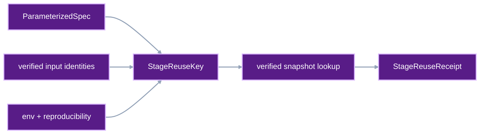
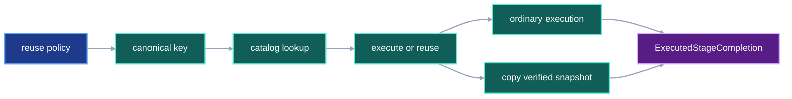

# Verified stage reuse

VIPER can skip a project-owned stage when a prior verified stage received the
same execution-relevant inputs and declared the same reusable behavior. The
new run records the skip and the exact prior evidence it selected.

## 1. Status

**Contract status:** Complete.

These requirements bind the contract to the master checklist:

| ID | Implementation obligation |
| --- | --- |
| SRU-01 <!-- contract-requirement: SRU-01 phase=14 test=tests/test_protocol.py --> | Add the reuse policy, canonical key, receipt, completion union, and persisted references. |
| SRU-02 <!-- contract-requirement: SRU-02 phase=14 test=tests/test_run_execution.py --> | Find one verified candidate, remap its artifacts into a new stage snapshot, and skip the stage process. |
| SRU-03 <!-- contract-requirement: SRU-03 phase=14 test=tests/test_verification_acceptance.py --> | Rebuild the key, verify the source run and metric evidence, and reject every severed reuse relationship. |
| SRU-04 <!-- contract-requirement: SRU-04 phase=14 test=tests/test_inspection.py --> | Expose reuse through lineage, comparison, catalog results, and attempt status. |

**Current:** Every planned stage starts a worker. A retry retains completed
stages within its failed attempt. Cross-run selection is absent.

**Target:** A project-owned stage can set `reuse="verified"`. Before starting
its worker, VIPER computes a `StageReuseKey` and asks the provenance catalog for
matching completed stages. VIPER verifies the selected source run. A valid hit
creates a new target stage snapshot and a `StageReuseReceipt`. The project stage
callable remains uncalled.

## 2. Required claim

A reuse receipt establishes this exact statement:

```text
VIPER skipped this target stage.
VIPER selected this completed stage from this verified source run.
Both stages have the same StageReuseKey.
The target snapshot contains the selected artifact bytes under the target paths.
The receipt identifies the source metric evidence used by the target run.
```

Reuse claims selection of prior verified bytes. Rerun parity remains outside
that claim. The user makes the policy decision with `reuse="verified"`. This
distinction matters when deterministic BLAS settings or other reproducibility
controls are disabled.

## 3. Scope

The first implementation supports `BuildSpec`, `EmbedSpec`, `TrainSpec`, and
`EvalSpec`. It excludes `DownloadSpec` because a download receipt proves a
network request that happened at a specific time. A later run can consume the
old download artifact through `StoredInputRef` when it wants those exact bytes.

Benchmark-confirmation attempts always execute their stages. Reusing candidate
stage evidence would defeat the independent confirmation required by the
benchmark contract.

The user opts in per stage. `reuse="never"` preserves ordinary execution.

### Current DAG


### Proposed-change DAG



### Integrated DAG



## 4. Frozen policy

The policy is part of Python authoring and the frozen project-owned stage spec:

```python
StageReuseMode = Literal["never", "verified"]


class ParameterizedSpecDraft(BaseSpecDraft):
    implementation: DecoratedStage
    params: parameters.ParameterSet
    reuse: StageReuseMode = "never"


class ParameterizedSpec(BaseSpec):
    implementation: StageImplementationRef
    parameter_model: ParameterModelRef
    reuse: StageReuseMode = "never"
```

`viper.authoring.stage()` adds the same argument:

```python
def stage(
    implementation: DecoratedStage,
    *,
    params: parameters.ParameterSet,
    inputs: dict[InputName, StageInputDraft],
    artifacts: dict[ArtifactName, ArtifactDraft],
    env: EnvSpec | None = None,
    objective: MetricObjectiveDraft | None = None,
    metrics: tuple[MetricDraft, ...] = (),
    eval_id: EvalId | None = None,
    split_inputs: tuple[InputName, ...] = (),
    reuse: StageReuseMode = "never",
) -> StageDraft: ...
```

The frozen policy records the user's permission. The stage-reuse key omits the
policy because changing permission leaves the stage's produced value unchanged.

## 5. Canonical reuse key

The key contains the values that can change a stage result:

```python
class ReuseFileIdentity(ProtocolModel):
    relative_path: RepoRelPath
    sha256: SHA256
    bytes: int = Field(ge=0)


class ReuseInputIdentity(ProtocolModel):
    input_name: InputName
    data_role: DataRole
    files: tuple[ReuseFileIdentity, ...] = Field(min_length=1)


class StageReuseKey(ProtocolModel):
    schema_version: Literal[1] = 1
    stage_id: StageId
    stage_sha256: SHA256
    inputs: tuple[ReuseInputIdentity, ...]
    seed: RNGSeed
    env_sha256: SHA256
    reproducibility_sha256: SHA256
    metric_sha256s: tuple[SHA256, ...]
```

`stage_sha256` hashes the canonical frozen stage spec after two normalizations:

1. Every artifact path loses its selected run-root prefix and retains its
   run-relative `ArtifactDraft.path` value.
2. The `reuse` field is omitted.

The canonical stage bytes still contain the stage kind, implementation
identity, parameter-model identity, parameter values, objective, metric IDs,
artifact names, artifact kinds, artifact loaders, data roles, and other
stage-specific fields.

Each input identity replaces its source reference with the exact selected file
digests. Bundle member paths are relative to the bundle root. Input identities
sort by input name. Files sort by relative path.

`env_sha256` hashes the canonical serialized effective environment. The
effective environment is `stage.env` when present and `run.env` otherwise.
`seed` is the selected replicate's frozen run seed.
`reproducibility_sha256` hashes the complete frozen run reproducibility record.
`metric_sha256s` hashes the complete selected `MetricSpec` records in stage
metric order.

The catalog indexes the SHA-256 digest of the canonical serialized
`StageReuseKey`. It also retains the complete key for verifier reconstruction.

By choosing `reuse="verified"`, the user declares that the stage's reusable
outputs depend only on this key. A dependency on `run_id`, `attempt_id`,
wall-clock time, undeclared files, mutable network state, or unrecorded external
side effects violates that declaration. VIPER verifies recorded inputs and
outputs. The user remains responsible for dependencies hidden inside arbitrary
project code.

## 6. Reuse receipt and completion models

### Artifact remapping

Run-relative artifact paths become different concrete paths in different
runs. The receipt records the source and target path for each file:

```python
class ReusedStageFile(ProtocolModel):
    artifact_name: ArtifactName
    source: SnapshotFileRef
    target: SnapshotFileRef

    @model_validator(mode="after")
    def validate_identity(self) -> Self:
        if self.source.sha256 != self.target.sha256:
            raise ValueError("reused file digests must match")
        if self.source.bytes != self.target.bytes:
            raise ValueError("reused file byte counts must match")
        return self
```

The source path belongs to the source stage snapshot. The target path belongs
to the new run. File and bundle artifact names come from the target stage spec.

### Metric evidence

```python
class ReusedMetricEvidence(ProtocolModel):
    metric_id: MetricId
    measurement: ResolvedFileRef
    verification: ResolvedFileRef | None = None
```

A live metric has a source measurement. Its recomputation receipt is optional
and appears only when the metric contract created one. A recomputed metric
includes its source `MetricVerificationReceipt`. The receipt contains one entry
for every metric selected by the stage, including its objective.

### Receipt

```python
class StageReuseReceipt(ProtocolModel):
    schema_version: Literal[1] = 1
    stage_id: StageId
    key: StageReuseKey
    source_run: ResolvedRunRef
    source_attempt: ResolvedAttemptRef
    source_stage: ResolvedStageRef
    files: tuple[ReusedStageFile, ...] = Field(min_length=1)
    metrics: tuple[ReusedMetricEvidence, ...]
    completed_at: AwareDatetime


class ResolvedStageReuseRef(ResolvedFileRef):
    kind: Literal["stage_reuse"] = "stage_reuse"
```

### Executed or reused completion

The resolved project-stage model must state how the stage completed:

```python
class ExecutedStageCompletion(ProtocolModel):
    kind: Literal["executed"] = "executed"
    source: ResolvedGitFileRef
    env: ResolvedEnv
    execution_context: ExecutionContext
    startup: ProcessStartupReceipt
    invocation: ResolvedStageInvocationRef
    command: tuple[str, ...] = Field(min_length=1)


class ReusedStageCompletion(ProtocolModel):
    kind: Literal["reused"] = "reused"
    receipt: ResolvedStageReuseRef


StageCompletion = Annotated[
    ExecutedStageCompletion | ReusedStageCompletion,
    Field(discriminator="kind"),
]


class ResolvedBaseSpec(ProtocolModel):
    schema_version: Literal[1] = 1
    kind: str
    spec: BaseSpec
    artifacts: dict[ArtifactName, ResolvedArtifact] = Field(min_length=1)
    completed_at: AwareDatetime


class ResolvedExecutedSpec(ResolvedBaseSpec):
    env: ResolvedEnv
    execution_context: ExecutionContext


class ResolvedParameterizedSpec(ResolvedBaseSpec):
    spec: ParameterizedSpec
    completion: StageCompletion


class ResolvedDownloadSpec(ResolvedExecutedSpec):
    kind: Literal["download"] = "download"
    spec: DownloadSpec
    retrievals: dict[InputName, ResolvedHttpRetrieval]
```

`ResolvedBaseSpec` retains `spec`, `artifacts`, and `completed_at`.
Execution-only fields move into `ExecutedStageCompletion`. The target hierarchy
already separates runner-owned `ResolvedDownloadSpec` from project-owned
`ResolvedParameterizedSpec`; `ResolvedExecutedSpec` keeps the runner's
environment and execution context on `ResolvedDownloadSpec`.

`RunAttempt.invocations` contains only actual invocations. The one-invocation-
per-resolved-stage rule changes to:

```text
ResolvedParameterizedSpec.completion.kind == "executed"
-> one matching invocation reference

ResolvedParameterizedSpec.completion.kind == "reused"
-> one matching StageReuseReceipt reference
```

## 7. Runtime flow

For a stage with `reuse="verified"`, the attempt executor runs this path:

```text
resolve and verify current stage inputs
-> build StageReuseKey
-> query Catalog.stage_reuse_keys
-> choose the newest completed candidate; break ties by run ID and attempt ID
-> verify the complete source run
-> require source_stage.completion.kind == "executed"
-> rebuild and compare the source StageReuseKey
-> map each source artifact file to the target artifact path
-> publish StageReuseReceipt as a standalone file
-> publish a new target stage snapshot from the source snapshot files
-> record ReusedStageCompletion
-> continue to the next stage
```

The catalog row supplies a candidate. Full source verification grants reuse.
A reused completion remains searchable lineage evidence. Candidate lookup
accepts only an executed completion as its source. This rule keeps every reuse receipt joined directly to
one stage process that actually produced the selected bytes. A stale row or a
failed candidate verification causes ordinary execution. Refresh removes the
invalid row the next time it rebuilds the catalog.

### Snapshot publication

Stage reuse extends the storage publisher with one operation:

```python
class ReuseSnapshotPublisher(SnapshotPublisher, Protocol):
    def publish_reuse(
        self,
        *,
        resolved_stage_path: RepoRelPath,
        resolved_stage: bytes,
        source_snapshot: StageResultSnapshot,
        files: tuple[ReusedStageFile, ...],
    ) -> StageResultSnapshot: ...
```

The local publisher hard-links immutable source-store files into the new
revision when the filesystem permits it. Its fallback copies verified bytes.
The cloud publisher seals a new manifest whose target paths reference the
existing payload objects. Both publishers return a new snapshot identity for
the target stage.

The new snapshot contains the target `resolved.yaml` and every target artifact
path. Every stored path belongs to the target run. A later `FutureInputRef`
therefore resolves through the current run exactly as it does after normal
execution.

## 8. Metric and benchmark rules

A reused stage preserves the source `Measurement` identity.
`StageReuseReceipt.metrics` links that source measurement and its verification
evidence to the target stage.

The run verifier treats those linked values as reused evidence when checking
the stage objective and selected diagnostics. Catalog results expose
`origin="reused"`. Comparisons can therefore separate newly observed values
from selected prior values.

An attempt with `purpose="benchmark_confirmation"` ignores `reuse="verified"`
and executes every stage. The benchmark verifier keeps its existing rule that
candidate and confirmation stage snapshots must differ.

## 9. Verification

| Rule | Executable condition |
| --- | --- |
| `reuse.model.complete` <!-- verifier-rule: reuse.model.complete requirement=SRU-01 --> | The reuse policy, canonical key, receipt, completion union, and persisted references validate as one protocol. |
| `reuse.execution.verified` <!-- verifier-rule: reuse.execution.verified requirement=SRU-02 --> | A verified candidate is remapped into a new snapshot and the target stage process does not run. |
| `reuse.verification.complete` <!-- verifier-rule: reuse.verification.complete requirement=SRU-03 --> | Verification rebuilds the key and proves every source-run, artifact, and metric relationship. |
| `reuse.inspection.complete` <!-- verifier-rule: reuse.inspection.complete requirement=SRU-04 --> | Lineage, comparison, catalog results, and attempt status expose the same reuse identity. |

The verifier accepts a reused stage only after all of these checks pass:

1. The target frozen spec permits `reuse="verified"`.
2. `StageReuseReceipt.stage_id` equals the target `ResolvedStageRef.stage_id`.
3. `source_run` verifies completely and succeeded.
4. `source_attempt` is that run's successful attempt.
5. `source_stage` occurs in that attempt.
6. `source_stage.completion.kind` equals `"executed"`.
7. Rebuilding the key from the source stage equals `StageReuseReceipt.key`.
8. Rebuilding the key from the target stage and resolved target inputs equals
   the same key.
9. Every source file belongs to `source_stage.snapshot`.
10. Every target file belongs to the target stage snapshot.
11. Source and target digest and byte count match.
12. Artifact names, kinds, loaders, data roles, and normalized paths match.
13. Metric evidence covers every target metric ID exactly once.
14. Every source measurement and verification receipt belongs to the verified
    source attempt and matches the target `MetricSpec` digest.

## 10. Acceptance cases
<!-- contract-worked-example: start -->

```python
from viper.authoring import stage


training = stage(
    train,
    params=train_params,
    inputs=train_inputs,
    artifacts=train_artifacts,
    objective=training_objective,
    metrics=training_metrics,
    reuse="verified",
)
dataset_file = ReuseFileIdentity(
    relative_path="training.csv",
    sha256=dataset_sha256,
    bytes=dataset_bytes,
)
dataset_input = ReuseInputIdentity(
    input_name="dataset",
    data_role="training",
    files=(dataset_file,),
)
reuse_key = StageReuseKey(
    stage_id="train",
    stage_sha256=stage_sha256,
    inputs=(dataset_input,),
    seed=7,
    env_sha256=env_sha256,
    reproducibility_sha256=reproducibility_sha256,
    metric_sha256s=metric_sha256s,
)

assert training.spec.reuse == "verified"
assert reuse_key.inputs[0].files[0].sha256 == dataset_sha256
```

### Training reuse

Two run plans select different run IDs and the same training behavior and input
digests. The first run executes training. The second run sets
`reuse="verified"`.

```text
second training worker call count == 0
second run has a new stage snapshot
second artifact path belongs to the second run root
second artifact digest equals the source digest
second resolved stage has ReusedStageCompletion
receipt points to the first verified run and training stage
lineage contains one reuses edge
```

### Changed input

One input byte changes. The target `StageReuseKey.inputs` differs. VIPER runs
the stage normally and writes `ExecutedStageCompletion`.

### Changed implementation or parameters

One implementation digest or parameter value changes. `stage_sha256` differs.
VIPER runs the stage.

### Changed environment or reproducibility

One environment or reproducibility value changes. The matching digest differs.
VIPER runs the stage.

### Catalog false positive

The catalog row carries a matching digest and points to a tampered source run.
Full verification rejects the candidate. VIPER runs the target stage.

### Benchmark confirmation

The candidate run used reuse. The independent confirmation executes every
stage and publishes new stage snapshots.

### Reused source candidate

The catalog contains an executed completion and a newer reused completion with
the same key. Candidate selection skips the reused completion and selects the
executed completion. An absent valid executed completion sends the target stage
through ordinary execution.

<!-- contract-worked-example: end -->

## 11. Propagation

| Surface | Required change |
| --- | --- |
| `src/viper/stages.py` | Add `StageReuseMode`, frozen policy, completion union, and resolved hierarchy changes. |
| `src/viper/references.py` | Add `ResolvedStageReuseRef`. |
| `src/viper/runs.py` | Permit executed and reused completion evidence while retaining ordered stage completion. |
| `src/viper/catalog.py` | Extend the version-1 catalog with reuse-key rows, then compute, index, and query canonical reuse keys. |
| `src/viper/execution/_attempt.py` | Look up candidates before worker startup and fall back to execution. |
| `src/viper/execution/_resolution.py` | Build executed or reused resolved project-stage records. |
| `src/viper/execution/_publication.py` | Publish reuse receipts and remapped target snapshots. |
| `src/viper/execution/_metric.py` | Link source metric evidence while preserving its original measurement identity. |
| `src/viper/_verification/attempt.py` | Dispatch executed and reused completion checks. |
| `src/viper/_verification/metrics.py` | Accept source metric evidence only through a verified reuse receipt. |
| `src/viper/verification/__init__.py` | Verify source runs, key equality, file remapping, and reuse lineage. |
| `src/viper/inspection.py` | Add `reuses` lineage edges and comparison fields. |
| `src/viper/api.py` | Include reuse status in run, status, lineage, and comparison results. |
| `tests/test_protocol.py` | Cover exact models, discriminators, and invalid states. |
| `tests/test_run_execution.py` | Cover hits, misses, fallback, remapping, and worker call counts. |
| `tests/test_verification_acceptance.py` | Sever each receipt, key, file, metric, and source-run relationship. |
| `tests/test_inspection.py` | Cover catalog lookup, reuse lineage, and run comparison. |
| Public documentation | Explain opt-in semantics and the absence of a rerun-parity claim. |

## 12. Legacy cleanup

The implementation replaces verifier assumptions that every resolved project
stage has one invocation. It preserves that requirement for
`ExecutedStageCompletion`.

The implementation keeps retry behavior distinct. A retry starts a new
attempt after failure. Stage reuse selects a completed stage from a verified
run and records that selection.

The provenance catalog finds candidates. The stage snapshot and reuse receipt
remain the durable evidence. Stage reuse uses the existing catalog and snapshot
stores in place of another cache directory.

## 13. Implementation order

1. Add the policy, key, receipt, file mapping, and completion models.
2. Extend the version-1 catalog with the `stage_reuse_keys` table and private
   candidate lookup, then add canonical key construction and indexing.
3. Add candidate lookup and full source verification.
4. Add local and cloud target-snapshot publication from source files.
5. Add source metric-evidence linking.
6. Update attempt and run verification.
7. Add lineage, comparison, API, and documentation output.
8. Run hit, miss, tamper, metric, benchmark, and storage acceptance cases.

## 14. Executable PairBlocks

<!-- pair-block-definition: P14-SRU-01 -->
```toml pair-block
id = "P14-SRU-01"
requirements = [
    "SRU-01",
    "SRU-04",
]
targets = [
    "src/viper/api.py:catalog_reuse_candidates",
    "src/viper/api.py:_catalog_run_source",
    "src/viper/authoring.py:StageReuseMode",
    "src/viper/authoring.py:ParameterizedSpecDraft",
    "src/viper/authoring.py:_freeze_stage",
    "src/viper/authoring.py:stage",
    "src/viper/catalog.py:StageReuseCandidate",
    "src/viper/catalog.py:StageReuseKey",
    "src/viper/catalog.py:stage_reuse_key_sha256",
    "src/viper/catalog.py:CatalogRunSource",
    "src/viper/catalog.py:_SCHEMA",
    "src/viper/catalog.py:_validate_reuse_candidate",
    "src/viper/catalog.py:Catalog",
    "src/viper/inspection.py:Mapping",
    "src/viper/inspection.py:SHA256",
    "src/viper/inspection.py:RunId",
    "src/viper/inspection.py:StageId",
    "src/viper/inspection.py:StageReuseReceipt",
    "src/viper/inspection.py:document_digest",
    "src/viper/inspection.py:load_stage_spec",
    "src/viper/inspection.py:parse_yaml_bytes",
    "src/viper/inspection.py:LineageNode",
    "src/viper/inspection.py:LineageEdge",
    "src/viper/inspection.py:_verified_run_document",
    "src/viper/inspection.py:compare_runs",
    "src/viper/inspection.py:lineage",
    "src/viper/params.py:ParameterSet",
    "src/viper/reuse.py:annotations",
    "src/viper/reuse.py:hashlib",
    "src/viper/reuse.py:json",
    "src/viper/reuse.py:Mapping",
    "src/viper/reuse.py:Sequence",
    "src/viper/reuse.py:Path",
    "src/viper/reuse.py:TYPE_CHECKING",
    "src/viper/reuse.py:Annotated",
    "src/viper/reuse.py:Literal",
    "src/viper/reuse.py:Self",
    "src/viper/reuse.py:cast",
    "src/viper/reuse.py:AwareDatetime",
    "src/viper/reuse.py:BaseModel",
    "src/viper/reuse.py:Field",
    "src/viper/reuse.py:model_validator",
    "src/viper/reuse.py:SHA256",
    "src/viper/reuse.py:ArtifactName",
    "src/viper/reuse.py:DataRole",
    "src/viper/reuse.py:ProtocolModel",
    "src/viper/reuse.py:RepoRelPath",
    "src/viper/reuse.py:RNGSeed",
    "src/viper/reuse.py:InputName",
    "src/viper/reuse.py:MetricId",
    "src/viper/reuse.py:StageId",
    "src/viper/reuse.py:MetricSpec",
    "src/viper/reuse.py:ResolvedFileRef",
    "src/viper/reuse.py:ResolvedGitFileRef",
    "src/viper/reuse.py:ResolvedRunRef",
    "src/viper/reuse.py:ResolvedStageInvocationRef",
    "src/viper/reuse.py:ResolvedStageRef",
    "src/viper/reuse.py:SnapshotFileRef",
    "src/viper/reuse.py:ResolvedAttemptRef",
    "src/viper/reuse.py:EnvSpec",
    "src/viper/reuse.py:ExecutionContext",
    "src/viper/reuse.py:ProcessStartupReceipt",
    "src/viper/reuse.py:ReproducibilitySpec",
    "src/viper/reuse.py:ResolvedEnv",
    "src/viper/reuse.py:ParameterizedSpec",
    "src/viper/reuse.py:VerifiedInput",
    "src/viper/reuse.py:VerifiedRunResult",
    "src/viper/reuse.py:StageReuseMode",
    "src/viper/reuse.py:ReuseFileIdentity",
    "src/viper/reuse.py:ReuseInputIdentity",
    "src/viper/reuse.py:StageReuseKey",
    "src/viper/reuse.py:ReusedStageFile",
    "src/viper/reuse.py:ReusedMetricEvidence",
    "src/viper/reuse.py:StageReuseReceipt",
    "src/viper/reuse.py:ResolvedStageReuseRef",
    "src/viper/reuse.py:ExecutedStageCompletion",
    "src/viper/reuse.py:ReusedStageCompletion",
    "src/viper/reuse.py:StageCompletion",
    "src/viper/reuse.py:StageReuseCandidate",
    "src/viper/reuse.py:_canonical_sha256",
    "src/viper/reuse.py:_normalized_stage",
    "src/viper/reuse.py:input_identity",
    "src/viper/reuse.py:verified_input_identity",
    "src/viper/reuse.py:build_stage_reuse_key",
    "src/viper/reuse.py:stage_reuse_key_sha256",
    "src/viper/reuse.py:catalog_reuse_candidates",
    "src/viper/reuse.py:__all__",
    "src/viper/stages.py:StageCompletion",
    "src/viper/stages.py:StageReuseMode",
    "src/viper/stages.py:EnvSpec",
    "src/viper/stages.py:ExecutionContext",
    "src/viper/stages.py:GCEEnvSpec",
    "src/viper/stages.py:GCEHostContext",
    "src/viper/stages.py:ResolvedEnv",
    "src/viper/stages.py:ResolvedGCEEnv",
    "src/viper/stages.py:ParameterizedSpec",
    "src/viper/stages.py:ResolvedBaseSpec",
    "src/viper/stages.py:ResolvedExecutedSpec",
    "src/viper/stages.py:ResolvedDownloadSpec",
    "src/viper/stages.py:ResolvedParameterizedSpec",
    "src/viper/stages.py:validate_stage_definition",
    "src/viper/stages.py:ProcessStartupReceipt",
    "src/viper/stages.py:ResolvedGitFileRef",
    "src/viper/stages.py:ResolvedStageInvocationRef",
    "src/viper/verification/models.py:dataclass",
    "src/viper/verification/models.py:field",
    "src/viper/verification/models.py:InputName",
    "src/viper/verification/models.py:StageId",
    "src/viper/verification/models.py:StageReuseReceipt",
    "src/viper/verification/models.py:VerifiedRunResult",
    "tests/test_inspection.py:GitFileRef",
    "tests/test_inspection.py:LocalFileRef",
    "tests/test_inspection.py:LocalStageResultSnapshotRef",
    "tests/test_inspection.py:ResolvedRunRef",
    "tests/test_inspection.py:ResolvedRunSpecRef",
    "tests/test_inspection.py:ResolvedStageRef",
    "tests/test_inspection.py:SnapshotFileRef",
    "tests/test_inspection.py:ReusedStageFile",
    "tests/test_inspection.py:StageReuseCandidate",
    "tests/test_inspection.py:StageReuseKey",
    "tests/test_inspection.py:StageReuseReceipt",
    "tests/test_inspection.py:stage_reuse_key_sha256",
    "tests/test_inspection.py:ResolvedAttemptRef",
    "tests/test_inspection.py:ResolvedRun",
    "tests/test_inspection.py:RunSpec",
    "tests/test_inspection.py:document_digest",
    "tests/test_inspection.py:load_stage_spec",
    "tests/test_inspection.py:parse_yaml_bytes",
    "tests/test_inspection.py:serialize_document",
    "tests/test_inspection.py:_reuse_receipt",
    "tests/test_inspection.py:test_reuse_identity_appears_in_inspection_surfaces",
    "tests/test_inspection.py:test_catalog_returns_an_exact_stage_reuse_candidate",
    "tests/test_protocol.py:current_params",
    "tests/test_protocol.py:ReusedStageFile",
    "tests/test_protocol.py:ReuseFileIdentity",
    "tests/test_protocol.py:ReuseInputIdentity",
    "tests/test_protocol.py:build_stage_reuse_key",
    "tests/test_protocol.py:stage_reuse_key_sha256",
    "tests/test_protocol.py:CUDABackendContext",
    "tests/test_protocol.py:ReproducibilitySpec",
    "tests/test_protocol.py:test_stage_reuse_models_form_valid_completion_union",
]
tests = [
    "tests/test_protocol.py:test_stage_reuse_models_form_valid_completion_union",
    "tests/test_inspection.py:test_catalog_returns_an_exact_stage_reuse_candidate",
    "tests/test_inspection.py:test_reuse_identity_appears_in_inspection_surfaces",
]
gate = "python -m pytest tests/test_protocol.py::test_stage_reuse_models_form_valid_completion_union tests/test_inspection.py::test_catalog_returns_an_exact_stage_reuse_candidate tests/test_inspection.py::test_reuse_identity_appears_in_inspection_surfaces -q"
depends_on = [
    "P13-PCM-02",
]
```

**Context:** This block defines the reuse policy, canonical key, receipt, completion union, catalog rows, and inspection surfaces before execution consumes them.

<!-- pair-block-definition: P14-SRU-02 -->
```toml pair-block
id = "P14-SRU-02"
requirements = [
    "SRU-02",
]
targets = [
    "src/viper/_parameter/validation.py:validate_parameters",
    "src/viper/_parameter/validation.py:instantiate_parameters",
    "src/viper/_parameter/validation.py:_installed_parameter_model",
    "src/viper/_verification/plan.py:Path",
    "src/viper/_verification/plan.py:params",
    "src/viper/_verification/plan.py:verify_parameter_model_references",
    "src/viper/_workers/parameters.py:ParameterValidationContext",
    "src/viper/_workers/parameters.py:parameter_model_path",
    "src/viper/_workers/parameters.py:validate_parameters",
    "src/viper/_workers/parameters.py:main",
    "src/viper/_workers/stages.py:main",
    "src/viper/execution/_attempt.py:Catalog",
    "src/viper/execution/_attempt.py:ExternalInputRef",
    "src/viper/execution/_attempt.py:FutureInputRef",
    "src/viper/execution/_attempt.py:ResolvedInputRef",
    "src/viper/execution/_attempt.py:StoredInputRef",
    "src/viper/execution/_attempt.py:ReuseInputIdentity",
    "src/viper/execution/_attempt.py:build_stage_reuse_key",
    "src/viper/execution/_attempt.py:input_identity",
    "src/viper/execution/_attempt.py:reuse_stage",
    "src/viper/execution/_attempt.py:_reuse_input_identities",
    "src/viper/execution/_attempt.py:execute_attempt",
    "src/viper/execution/_resolution.py:ExecutedStageCompletion",
    "src/viper/execution/_resolution.py:resolve_stage",
    "src/viper/execution/_reuse.py:annotations",
    "src/viper/execution/_reuse.py:json",
    "src/viper/execution/_reuse.py:dataclass",
    "src/viper/execution/_reuse.py:UTC",
    "src/viper/execution/_reuse.py:datetime",
    "src/viper/execution/_reuse.py:Path",
    "src/viper/execution/_reuse.py:cast",
    "src/viper/execution/_reuse.py:yaml",
    "src/viper/execution/_reuse.py:ArtifactName",
    "src/viper/execution/_reuse.py:RepoRelPath",
    "src/viper/execution/_reuse.py:read_snapshot_file",
    "src/viper/execution/_reuse.py:ResolvedArtifact",
    "src/viper/execution/_reuse.py:ResolvedBundleArtifact",
    "src/viper/execution/_reuse.py:ResolvedBundleMember",
    "src/viper/execution/_reuse.py:ResolvedSingleFileArtifact",
    "src/viper/execution/_reuse.py:Catalog",
    "src/viper/execution/_reuse.py:InputName",
    "src/viper/execution/_reuse.py:MetricId",
    "src/viper/execution/_reuse.py:StageId",
    "src/viper/execution/_reuse.py:ResolvedInputRef",
    "src/viper/execution/_reuse.py:Measurement",
    "src/viper/execution/_reuse.py:MetricSpec",
    "src/viper/execution/_reuse.py:ResolvedFileRef",
    "src/viper/execution/_reuse.py:SnapshotFileRef",
    "src/viper/execution/_reuse.py:StageResultSnapshot",
    "src/viper/execution/_reuse.py:StorageModel",
    "src/viper/execution/_reuse.py:ExecutedStageCompletion",
    "src/viper/execution/_reuse.py:ResolvedStageReuseRef",
    "src/viper/execution/_reuse.py:ReusedMetricEvidence",
    "src/viper/execution/_reuse.py:ReusedStageCompletion",
    "src/viper/execution/_reuse.py:ReusedStageFile",
    "src/viper/execution/_reuse.py:StageReuseKey",
    "src/viper/execution/_reuse.py:StageReuseReceipt",
    "src/viper/execution/_reuse.py:catalog_reuse_candidates",
    "src/viper/execution/_reuse.py:ResolvedRun",
    "src/viper/execution/_reuse.py:parse_yaml_bytes",
    "src/viper/execution/_reuse.py:serialize_document",
    "src/viper/execution/_reuse.py:ParameterizedSpec",
    "src/viper/execution/_reuse.py:ResolvedBuildSpec",
    "src/viper/execution/_reuse.py:ResolvedEmbedSpec",
    "src/viper/execution/_reuse.py:ResolvedEvalSpec",
    "src/viper/execution/_reuse.py:ResolvedInternalSpec",
    "src/viper/execution/_reuse.py:ResolvedParameterizedSpec",
    "src/viper/execution/_reuse.py:ResolvedTrainSpec",
    "src/viper/execution/_reuse.py:SnapshotPublisher",
    "src/viper/execution/_reuse.py:StorageDestination",
    "src/viper/execution/_reuse.py:ViperCloudClient",
    "src/viper/execution/_reuse.py:publish_resolved_files",
    "src/viper/execution/_reuse.py:snapshot_file",
    "src/viper/execution/_reuse.py:verify_run_result",
    "src/viper/execution/_reuse.py:StorageFetcher",
    "src/viper/execution/_reuse.py:VerificationPolicy",
    "src/viper/execution/_reuse.py:ReuseStageResult",
    "src/viper/execution/_reuse.py:_remap_artifacts",
    "src/viper/execution/_reuse.py:_metric_evidence",
    "src/viper/execution/_reuse.py:_resolved_stage",
    "src/viper/execution/_reuse.py:reuse_stage",
    "src/viper/preflight.py:ParameterValidationError",
    "src/viper/preflight.py:parameter_model_path",
    "src/viper/preflight.py:validate_stage_parameters",
    "src/viper/preflight.py:verify_parameter_model_bytes",
    "src/viper/preflight.py:preflight_plan",
    "src/viper/storage.py:SnapshotPublisher",
    "src/viper/storage.py:LocalSnapshotPublisher",
    "src/viper/storage.py:ViperCloudClient",
    "src/viper/storage.py:_verify_reuse_source",
    "src/viper/storage.py:_cloud_upload_file",
    "src/viper/storage.py:_cloud_seal",
    "src/viper/storage.py:_cloud_publish",
    "src/viper/storage.py:ViperCloudSnapshotPublisher",
    "tests/test_execution_signals.py:test_live_l4_stage_records_requested_backend",
    "tests/test_run_execution.py:importlib.util",
    "tests/test_run_execution.py:current_params",
    "tests/test_run_execution.py:ArtifactLoaderRef",
    "tests/test_run_execution.py:SingleFileArtifactSpec",
    "tests/test_run_execution.py:StageArtifactRef",
    "tests/test_run_execution.py:artifact",
    "tests/test_run_execution.py:RunPlanDraft",
    "tests/test_run_execution.py:StageDraft",
    "tests/test_run_execution.py:experiment",
    "tests/test_run_execution.py:freeze_run_plan",
    "tests/test_run_execution.py:plan",
    "tests/test_run_execution.py:replicate",
    "tests/test_run_execution.py:stage",
    "tests/test_run_execution.py:variant",
    "tests/test_run_execution.py:external_input",
    "tests/test_run_execution.py:Catalog",
    "tests/test_run_execution.py:CatalogRunSource",
    "tests/test_run_execution.py:FloatComparator",
    "tests/test_run_execution.py:Measurement",
    "tests/test_run_execution.py:MetricDependency",
    "tests/test_run_execution.py:MetricImplementationRef",
    "tests/test_run_execution.py:MetricSpec",
    "tests/test_run_execution.py:measure",
    "tests/test_run_execution.py:minimize",
    "tests/test_run_execution.py:ReusedStageCompletion",
    "tests/test_run_execution.py:catalog_reuse_candidates",
    "tests/test_run_execution.py:CUDAComputeSpec",
    "tests/test_run_execution.py:LocalEnvSpec",
    "tests/test_run_execution.py:observe_gce_provisioning",
    "tests/test_run_execution.py:test_verified_reuse_skips_stage_process",
    "tests/test_storage.py:InMemoryViperCloudClient",
    "tests/test_storage.py:test_local_snapshot_reuse_remaps_source_files",
    "tests/test_storage.py:test_cloud_snapshot_reuse_copies_existing_payload",
]
tests = [
    "tests/test_run_execution.py:test_verified_reuse_skips_stage_process",
    "tests/test_storage.py:test_local_snapshot_reuse_remaps_source_files",
    "tests/test_storage.py:test_cloud_snapshot_reuse_copies_existing_payload",
]
gate = "python -m pytest tests/test_run_execution.py::test_verified_reuse_skips_stage_process tests/test_storage.py::test_local_snapshot_reuse_remaps_source_files tests/test_storage.py::test_cloud_snapshot_reuse_copies_existing_payload -q"
depends_on = [
    "P14-SRU-01",
]
```

**Context:** This block verifies a catalog candidate, publishes its artifacts and current inputs under the target snapshot, and skips the stage process only after every reuse identity matches.

<!-- pair-block-definition: P14-SRU-03 -->
```toml pair-block
id = "P14-SRU-03"
requirements = [
    "SRU-03",
]
targets = [
    "src/viper/_verification/attempt.py:ResolvedSingleFileArtifact",
    "src/viper/_verification/attempt.py:ExecutedStageCompletion",
    "src/viper/_verification/attempt.py:VerificationError",
    "src/viper/_verification/attempt.py:VerificationPolicy",
    "src/viper/_verification/attempt.py:VerifiedInput",
    "src/viper/_verification/attempt.py:VerifiedSnapshotFile",
    "src/viper/_verification/attempt.py:_executed_completion",
    "src/viper/_verification/attempt.py:_verify_stage_invocation",
    "src/viper/_verification/attempt.py:verify_attempt_stages",
    "src/viper/_verification/attempt.py:verify_external_inputs",
    "src/viper/_verification/metrics.py:ReusedStageCompletion",
    "src/viper/_verification/metrics.py:verify_recomputed_metrics",
    "src/viper/verification/__init__.py:Mapping",
    "src/viper/verification/__init__.py:Sequence",
    "src/viper/verification/__init__.py:ArtifactPointer",
    "src/viper/verification/__init__.py:ResolvedBundleArtifact",
    "src/viper/verification/__init__.py:ResolvedSingleFileArtifact",
    "src/viper/verification/__init__.py:StageArtifactRef",
    "src/viper/verification/__init__.py:InputName",
    "src/viper/verification/__init__.py:MetricId",
    "src/viper/verification/__init__.py:StageId",
    "src/viper/verification/__init__.py:GitFileRef",
    "src/viper/verification/__init__.py:LocalFileRef",
    "src/viper/verification/__init__.py:LocalStageResultSnapshotRef",
    "src/viper/verification/__init__.py:ResolvedFileRef",
    "src/viper/verification/__init__.py:ResolvedRunRef",
    "src/viper/verification/__init__.py:ResolvedStageRef",
    "src/viper/verification/__init__.py:SnapshotFileRef",
    "src/viper/verification/__init__.py:ViperCloudFileRef",
    "src/viper/verification/__init__.py:ViperCloudStageResultSnapshotRef",
    "src/viper/verification/__init__.py:ReusedStageCompletion",
    "src/viper/verification/__init__.py:ReuseInputIdentity",
    "src/viper/verification/__init__.py:StageReuseKey",
    "src/viper/verification/__init__.py:StageReuseReceipt",
    "src/viper/verification/__init__.py:build_stage_reuse_key",
    "src/viper/verification/__init__.py:verified_input_identity",
    "src/viper/verification/__init__.py:EvalSpec",
    "src/viper/verification/__init__.py:InternalSpec",
    "src/viper/verification/__init__.py:ParameterizedSpec",
    "src/viper/verification/__init__.py:ResolvedBaseSpec",
    "src/viper/verification/__init__.py:ResolvedInternalSpec",
    "src/viper/verification/__init__.py:ResolvedParameterizedSpec",
    "src/viper/verification/__init__.py:TrainSpec",
    "src/viper/verification/__init__.py:StorageFetcher",
    "src/viper/verification/__init__.py:VerificationError",
    "src/viper/verification/__init__.py:VerificationPolicy",
    "src/viper/verification/__init__.py:VerifiedArtifact",
    "src/viper/verification/__init__.py:VerifiedBenchmarkResult",
    "src/viper/verification/__init__.py:VerifiedInput",
    "src/viper/verification/__init__.py:VerifiedRunPlan",
    "src/viper/verification/__init__.py:VerifiedRunResult",
    "src/viper/verification/__init__.py:__all__",
    "src/viper/verification/__init__.py:_stage_artifact_files",
    "src/viper/verification/__init__.py:_artifact_relative_path",
    "src/viper/verification/__init__.py:_expected_reused_files",
    "src/viper/verification/__init__.py:_metric_references",
    "src/viper/verification/__init__.py:_rebuilt_reuse_key",
    "src/viper/verification/__init__.py:verify_stage_reuse",
    "src/viper/verification/__init__.py:_merge_stage_inputs",
    "src/viper/verification/__init__.py:_input_identities",
    "src/viper/verification/__init__.py:_verify_reused_stages",
    "src/viper/verification/__init__.py:verify_run_result",
    "src/viper/verification/__init__.py:_verify_run_result",
    "tests/test_verification.py:ExecutedStageCompletion",
    "tests/test_verification.py:RunAndStageVerificationTests",
    "tests/test_verification.py:FutureInputVerificationTests",
    "tests/test_verification_acceptance.py:current_params",
    "tests/test_verification_acceptance.py:BuildVariantStageParams",
    "tests/test_verification_acceptance.py:ExperimentSpec",
    "tests/test_verification_acceptance.py:ReplicateSpec",
    "tests/test_verification_acceptance.py:TrainVariantStageParams",
    "tests/test_verification_acceptance.py:VariantSpec",
    "tests/test_verification_acceptance.py:EvaluateVariantStageParams",
    "tests/test_verification_acceptance.py:FloatComparator",
    "tests/test_verification_acceptance.py:Measurement",
    "tests/test_verification_acceptance.py:MetricExecutionReceipt",
    "tests/test_verification_acceptance.py:MetricImplementationRef",
    "tests/test_verification_acceptance.py:MetricObjectiveSpec",
    "tests/test_verification_acceptance.py:MetricSpec",
    "tests/test_verification_acceptance.py:MetricVerificationReceipt",
    "tests/test_verification_acceptance.py:ResolvedMetricDependency",
    "tests/test_verification_acceptance.py:CurrentParameterModelRef",
    "tests/test_verification_acceptance.py:ArtifactPointerRef",
    "tests/test_verification_acceptance.py:GitFileRef",
    "tests/test_verification_acceptance.py:GitSource",
    "tests/test_verification_acceptance.py:HuggingFaceFileRef",
    "tests/test_verification_acceptance.py:HuggingFaceStageResultSnapshotRef",
    "tests/test_verification_acceptance.py:LocalFileRef",
    "tests/test_verification_acceptance.py:LocalStageResultSnapshotRef",
    "tests/test_verification_acceptance.py:ResolvedArtifactPointerRef",
    "tests/test_verification_acceptance.py:ResolvedBenchmarkSpecRef",
    "tests/test_verification_acceptance.py:ResolvedFileRef",
    "tests/test_verification_acceptance.py:ResolvedGitFileRef",
    "tests/test_verification_acceptance.py:ResolvedRunRef",
    "tests/test_verification_acceptance.py:ResolvedRunSpecRef",
    "tests/test_verification_acceptance.py:ResolvedStageInvocationRef",
    "tests/test_verification_acceptance.py:ResolvedStageRef",
    "tests/test_verification_acceptance.py:SnapshotFileRef",
    "tests/test_verification_acceptance.py:StageResultSnapshot",
    "tests/test_verification_acceptance.py:StorageModel",
    "tests/test_verification_acceptance.py:ViperCloudFileRef",
    "tests/test_verification_acceptance.py:ViperCloudStageResultSnapshotRef",
    "tests/test_verification_acceptance.py:ExecutedStageCompletion",
    "tests/test_verification_acceptance.py:ReusedMetricEvidence",
    "tests/test_verification_acceptance.py:ReusedStageFile",
    "tests/test_verification_acceptance.py:ReuseFileIdentity",
    "tests/test_verification_acceptance.py:ReuseInputIdentity",
    "tests/test_verification_acceptance.py:StageReuseReceipt",
    "tests/test_verification_acceptance.py:build_stage_reuse_key",
    "tests/test_verification_acceptance.py:CPUBackendContext",
    "tests/test_verification_acceptance.py:CPUComputeSpec",
    "tests/test_verification_acceptance.py:CPUContext",
    "tests/test_verification_acceptance.py:ExecutionContext",
    "tests/test_verification_acceptance.py:GCEBootImageRef",
    "tests/test_verification_acceptance.py:GCEHostContext",
    "tests/test_verification_acceptance.py:GeneratorInitializationReceipt",
    "tests/test_verification_acceptance.py:NativeLibraryContext",
    "tests/test_verification_acceptance.py:NativeThreadPoolContext",
    "tests/test_verification_acceptance.py:NumericalRuntimeContext",
    "tests/test_verification_acceptance.py:NumPyRandomnessSpec",
    "tests/test_verification_acceptance.py:ParallelismSpec",
    "tests/test_verification_acceptance.py:ProcessStartupReceipt",
    "tests/test_verification_acceptance.py:ReproducibilitySpec",
    "tests/test_verification_acceptance.py:TorchDeterminismSpec",
    "tests/test_verification_acceptance.py:TorchPrecisionSpec",
    "tests/test_verification_acceptance.py:process_environment",
    "tests/test_verification_acceptance.py:GCEEnvironmentSpec",
    "tests/test_verification_acceptance.py:ResolvedGCEEnvironment",
    "tests/test_verification_acceptance.py:BaseSpec",
    "tests/test_verification_acceptance.py:BuildSpec",
    "tests/test_verification_acceptance.py:DownloadSpec",
    "tests/test_verification_acceptance.py:ParameterizedStageSpec",
    "tests/test_verification_acceptance.py:ResolvedBuildSpec",
    "tests/test_verification_acceptance.py:ResolvedDownloadSpec",
    "tests/test_verification_acceptance.py:ResolvedTrainSpec",
    "tests/test_verification_acceptance.py:StageContextBinding",
    "tests/test_verification_acceptance.py:StageInvocationReceipt",
    "tests/test_verification_acceptance.py:TrainSpec",
    "tests/test_verification_acceptance.py:EvaluateSpec",
    "tests/test_verification_acceptance.py:ResolvedEvaluateSpec",
    "tests/test_verification_acceptance.py:verify_benchmark_result",
    "tests/test_verification_acceptance.py:verify_promoted_artifact",
    "tests/test_verification_acceptance.py:verify_run_result",
    "tests/test_verification_acceptance.py:verify_stage_reuse",
    "tests/test_verification_acceptance.py:VerificationError",
    "tests/test_verification_acceptance.py:VerifiedRunPlan",
    "tests/test_verification_acceptance.py:VerifiedRunResult",
    "tests/test_verification_acceptance.py:environment",
    "tests/test_verification_acceptance.py:publish_metric_verification",
    "tests/test_verification_acceptance.py:resolved_environment",
    "tests/test_verification_acceptance.py:publish_producer_run",
    "tests/test_verification_acceptance.py:build_complete_fixture",
    "tests/test_verification_acceptance.py:test_stage_reuse_rejects_each_severed_relationship",
]
tests = [
    "tests/test_verification_acceptance.py:test_stage_reuse_rejects_each_severed_relationship",
]
gate = "python -m pytest tests/test_verification_acceptance.py::test_stage_reuse_rejects_each_severed_relationship -q"
depends_on = [
    "P14-SRU-02",
]
```

**Context:** This block verifies the source run, rebuilt key, completion, files, inputs, and metric evidence, then rejects every severed relationship.

## 15. ContractTarget

<!-- contract-target: requirements=SRU-01,SRU-04 block=P14-SRU-01 action=add target=src/viper/api.py:catalog_reuse_candidates -->
```python contract-target
from .reuse import catalog_reuse_candidates
```

<!-- contract-target: requirements=SRU-01,SRU-04 block=P14-SRU-01 action=update target=src/viper/api.py:_catalog_run_source -->
```python contract-target
def _catalog_run_source(
    project_root: Path,
    path: Path,
    repositories: frozenset[str],
    fetcher: StorageFetcher,
) -> CatalogRunSource:
    """Verify one local terminal file and recover its immutable store reference."""
    selected = path if path.is_absolute() else project_root / path
    selected = selected.resolve(strict=True)
    try:
        relative = selected.relative_to(project_root).as_posix()
    except ValueError as error:
        raise ValueError("catalog run path is outside the project root") from error
    raw = selected.read_bytes()
    resolved = ResolvedRun.model_validate(parse_yaml_bytes(raw))
    verified = verify_run_result(
        resolved,
        policy=_policy(repositories),
        fetcher=fetcher,
    )
    reference = ResolvedRunRef(
        sha256=hashlib.sha256(raw).hexdigest(),
        bytes=len(raw),
        stored_at=LocalFileRef(
            commit=content_revision({relative: raw}),
            path=relative,
        ),
    )
    return CatalogRunSource(
        reference=reference,
        verified=verified,
        reuse_candidates=catalog_reuse_candidates(reference, verified),
    )
```

<!-- contract-target: requirements=SRU-01,SRU-04 block=P14-SRU-01 action=add target=src/viper/authoring.py:StageReuseMode -->
```python contract-target
from .reuse import StageReuseMode
```

<!-- contract-target: requirements=SRU-01,SRU-04 block=P14-SRU-01 action=update target=src/viper/authoring.py:ParameterizedSpecDraft -->
```python contract-target
class ParameterizedSpecDraft(BaseSpecDraft):
    """Hold one decorated project stage and its parameter values."""

    implementation: Callable[[Context[Any]], None]
    params: params.ParameterSet
    metrics: tuple[MetricDraft[Any], ...] = ()
    reuse: StageReuseMode = "never"
```

<!-- contract-target: requirements=SRU-01,SRU-04 block=P14-SRU-01 action=update target=src/viper/authoring.py:_freeze_stage -->
```python contract-target
def _freeze_stage(
    root: Path,
    run_root: str,
    stages: Mapping[StageId, StageDraft],
    draft: StageSpecDraft,
    input_cache: dict[int, InputRef] | None = None,
    *,
    destination: StorageDestination | None = None,
    cloud_client: ViperCloudClient | None = None,
) -> Spec:
    """Freeze one Python stage draft into its protocol declaration."""
    artifacts: dict[ArtifactName, ArtifactSpec] = {
        name: _freeze_artifact(root, run_root, artifact)
        for name, artifact in draft.artifacts.items()
    }
    if isinstance(draft, DownloadSpecDraft):
        return DownloadSpec(
            artifacts=artifacts,
            env=draft.env,
            inputs=draft.inputs,
            http=_freeze_http(root, draft.http),
            policy=draft.policy,
        )
    definition = stage_definition(draft.implementation)
    source = inspect.getsourcefile(draft.implementation)
    parameter_source = inspect.getsourcefile(definition.parameter_model)
    if source is None or parameter_source is None:
        raise ValueError("stage callable or parameter model has no Python source")
    source_path = Path(source).resolve()
    parameter_path = Path(parameter_source).resolve()
    source_raw = source_path.read_bytes()
    parameter_raw = parameter_path.read_bytes()
    if definition.parameter_model.__module__ == params.__name__:
        parameter = params.model_ref(definition.parameter_model)
    else:
        if not parameter_path.is_relative_to(root):
            raise ValueError("stage parameter model is outside the project root")
        parameter = ParameterModelRef(
            owner="project",
            path=parameter_path.relative_to(root).as_posix(),
            symbol=definition.parameter_model.__name__,
            sha256=hashlib.sha256(parameter_raw).hexdigest(),
            bytes=len(parameter_raw),
        )
    common = {
        "artifacts": artifacts,
        "env": draft.env,
        "implementation": StageImplementationRef(
            path=source_path.relative_to(root).as_posix(),
            symbol=draft.implementation.__name__,
            sha256=hashlib.sha256(source_raw).hexdigest(),
            bytes=len(source_raw),
        ),
        "parameter_model": parameter,
        "params": draft.params,
        "reuse": draft.reuse,
        "inputs": {
            name: _freeze_input(
                root,
                stages,
                value,
                input_cache,
                destination=destination,
                cloud_client=cloud_client,
            )
            for name, value in draft.inputs.items()
        },
        "metric_ids": tuple(
            metric_definition(metric.implementation).metric_id
            for metric in draft.metrics
        ),
    }
    if isinstance(draft, BuildSpecDraft):
        return BuildSpec(**common)
    objective = (
        None
        if draft.objective is None
        else MetricObjectiveSpec(
            metric_id=metric_definition(
                draft.objective.metric.implementation
            ).metric_id,
            direction=draft.objective.direction,
        )
    )
    if isinstance(draft, EmbedSpecDraft):
        return EmbedSpec(**common, objective=objective)
    if objective is None:
        raise ValueError("train and eval stages require an objective")
    if isinstance(draft, TrainSpecDraft):
        return TrainSpec(**common, objective=objective)
    return EvalSpec(
        **common,
        objective=objective,
        eval_id=draft.eval_id,
        split_inputs=draft.split_inputs,
    )
```

<!-- contract-target: requirements=SRU-01,SRU-04 block=P14-SRU-01 action=update target=src/viper/authoring.py:stage -->
```python contract-target
def stage(
    implementation: Callable[[Context[Any]], None],
    *,
    params: params.ParameterSet,
    inputs: dict[InputName, StageInputDraft],
    artifacts: dict[ArtifactName, ArtifactDraft],
    metrics: tuple[MetricDraft[Any], ...] = (),
    objective: MetricObjectiveDraft | None = None,
    env: EnvSpec | None = None,
    eval_id: EvalId | None = None,
    split_inputs: tuple[InputName, ...] = (),
    reuse: StageReuseMode = "never",
) -> StageDraft:
    """Build the draft class selected by one decorated project callable."""
    definition = stage_definition(implementation)
    values = {
        "implementation": implementation,
        "params": params,
        "inputs": inputs,
        "artifacts": artifacts,
        "metrics": metrics,
        "env": env,
        "reuse": reuse,
    }
    if definition.kind == "build":
        spec: StageSpecDraft = BuildSpecDraft(**values)
    elif definition.kind == "embed":
        spec = EmbedSpecDraft(**values, objective=objective)
    elif definition.kind == "train":
        if objective is None:
            raise ValueError("training stages require an objective")
        spec = TrainSpecDraft(**values, objective=objective)
    elif definition.kind == "eval":
        if objective is None or eval_id is None:
            raise ValueError("evaluation stages require an ID and objective")
        spec = EvalSpecDraft(
            **values, objective=objective, eval_id=eval_id, split_inputs=split_inputs
        )
    else:
        raise ValueError(f"unsupported stage kind: {definition.kind}")
    return StageDraft(spec=spec)
```

<!-- contract-target: requirements=SRU-01,SRU-04 block=P14-SRU-01 action=add target=src/viper/catalog.py:StageReuseCandidate -->
<!-- contract-target: requirements=SRU-01,SRU-04 block=P14-SRU-01 action=add target=src/viper/catalog.py:StageReuseKey -->
<!-- contract-target: requirements=SRU-01,SRU-04 block=P14-SRU-01 action=add target=src/viper/catalog.py:stage_reuse_key_sha256 -->
```python contract-target
from .reuse import StageReuseCandidate, StageReuseKey, stage_reuse_key_sha256
```

<!-- contract-target: requirements=SRU-01,SRU-04 block=P14-SRU-01 action=update target=src/viper/catalog.py:CatalogRunSource -->
```python contract-target
@dataclass(frozen=True)
class CatalogRunSource:
    """Pair one immutable terminal reference with its verified contents."""

    reference: ResolvedRunRef
    verified: VerifiedRunResult
    reuse_candidates: tuple[StageReuseCandidate, ...] = ()
```

<!-- contract-target: requirements=SRU-01,SRU-04 block=P14-SRU-01 action=update target=src/viper/catalog.py:_SCHEMA -->
```python contract-target
_SCHEMA = """
PRAGMA user_version = 1;
CREATE TABLE sources (
    source_key TEXT PRIMARY KEY,
    reference_json TEXT NOT NULL,
    accepted INTEGER NOT NULL,
    error TEXT
);
CREATE TABLE runs (
    source_key TEXT PRIMARY KEY,
    payload_json TEXT NOT NULL,
    lineage_json TEXT NOT NULL
);
CREATE TABLE stages (source_key TEXT NOT NULL, stage_id TEXT NOT NULL);
CREATE TABLE inputs (source_key TEXT NOT NULL, sha256 TEXT NOT NULL);
CREATE TABLE artifacts (
    source_key TEXT NOT NULL,
    payload_json TEXT NOT NULL
);
CREATE TABLE files (
    source_key TEXT NOT NULL,
    artifact_name TEXT NOT NULL,
    sha256 TEXT NOT NULL
);
CREATE TABLE measurements (
    source_key TEXT NOT NULL,
    payload_json TEXT NOT NULL
);
CREATE TABLE benchmarks (
    source_key TEXT NOT NULL,
    payload_json TEXT NOT NULL
);
CREATE TABLE edges (
    source_key TEXT NOT NULL,
    payload_json TEXT NOT NULL
);
CREATE TABLE stage_reuse_keys (
    key_sha256 TEXT NOT NULL,
    source_key TEXT NOT NULL,
    completed_at TEXT NOT NULL,
    run_id TEXT NOT NULL,
    attempt_id INTEGER NOT NULL,
    payload_json TEXT NOT NULL,
    PRIMARY KEY (key_sha256, source_key)
);
"""
```

<!-- contract-target: requirements=SRU-01,SRU-04 block=P14-SRU-01 action=add target=src/viper/catalog.py:_validate_reuse_candidate -->
```python contract-target
def _validate_reuse_candidate(
    source: CatalogRunSource,
    candidate: StageReuseCandidate,
) -> None:
    """Keep every indexed candidate inside its verified successful attempt."""
    if candidate.source_run != source.reference:
        raise ValueError("reuse candidate belongs to another run")
    successful_id = source.verified.result.successful_attempt_id
    if candidate.source_attempt not in source.verified.result.attempts:
        raise ValueError("reuse candidate attempt is absent from its run")
    attempt = next(
        (
            item
            for item in source.verified.attempts
            if item.attempt_id == candidate.attempt_id
        ),
        None,
    )
    if attempt is None or attempt.attempt_id != successful_id:
        raise ValueError("reuse candidate does not use the successful attempt")
    if candidate.source_stage not in attempt.resolved_stages:
        raise ValueError("reuse candidate stage is absent from its attempt")
```

<!-- contract-target: requirements=SRU-01,SRU-04 block=P14-SRU-01 action=update target=src/viper/catalog.py:Catalog -->
```python contract-target
class Catalog:
    """Refresh and query one derived SQLite catalog."""

    def __init__(self, root: Path):
        """Bind the catalog to one project root."""
        self.root = root.resolve()
        self.path = self.root / ".viper/catalog.sqlite3"

    def refresh(
        self,
        *,
        runs: tuple[CatalogRunSource, ...] = (),
        benchmarks: tuple[CatalogBenchmarkSource, ...] = (),
    ) -> CatalogRefreshResult:
        """Rebuild the complete catalog and atomically replace the old index."""
        self.path.parent.mkdir(parents=True, exist_ok=True)
        descriptor, temporary = tempfile.mkstemp(
            prefix=".catalog.",
            suffix=".sqlite3",
            dir=self.path.parent,
        )
        os.close(descriptor)
        temporary_path = Path(temporary)
        accepted = 0
        rejected = 0
        accepted_runs: set[str] = set()
        try:
            connection = sqlite3.connect(temporary_path)
            try:
                connection.executescript(_SCHEMA)
                for source in runs:
                    key = _reference_key(source.reference)
                    error = _source_error(source)
                    connection.execute(
                        "INSERT INTO sources VALUES (?, ?, ?, ?)",
                        (key, _json(source.reference), error is None, error),
                    )
                    if error is not None:
                        rejected += 1
                        continue
                    accepted += 1
                    accepted_runs.add(key)
                    row = _run_row(source)
                    run_lineage = lineage(source.verified)
                    connection.execute(
                        "INSERT INTO runs VALUES (?, ?, ?)",
                        (key, _json(row), _json(run_lineage)),
                    )
                    for stage_id in source.verified.resolved_stages:
                        connection.execute(
                            "INSERT INTO stages VALUES (?, ?)",
                            (key, str(stage_id)),
                        )
                    resolved_stages = source.verified.resolved_stages.values()
                    for digest in sorted(
                        set(
                            _digests(
                                tuple(
                                    stage.spec.inputs
                                    for stage in resolved_stages
                                    if isinstance(
                                        stage.spec,
                                        (DownloadSpec, InternalSpec),
                                    )
                                )
                            )
                        )
                    ):
                        connection.execute(
                            "INSERT INTO inputs VALUES (?, ?)",
                            (key, digest),
                        )
                    for artifact in _artifact_rows(source):
                        connection.execute(
                            "INSERT INTO artifacts VALUES (?, ?)",
                            (key, _json(artifact)),
                        )
                        for item in artifact.files:
                            connection.execute(
                                "INSERT INTO files VALUES (?, ?, ?)",
                                (key, str(artifact.artifact_name), item.file.sha256),
                            )
                    for measurement in _measurement_rows(source):
                        connection.execute(
                            "INSERT INTO measurements VALUES (?, ?)",
                            (key, _json(measurement)),
                        )
                    for edge in run_lineage.edges:
                        catalog_edge = CatalogEdge(
                            run=source.reference,
                            source=edge.source,
                            target=edge.target,
                            relation=edge.relation,
                        )
                        connection.execute(
                            "INSERT INTO edges VALUES (?, ?)",
                            (key, _json(catalog_edge)),
                        )
                    for candidate in source.reuse_candidates:
                        _validate_reuse_candidate(source, candidate)
                        connection.execute(
                            "INSERT INTO stage_reuse_keys VALUES (?, ?, ?, ?, ?, ?)",
                            (
                                stage_reuse_key_sha256(candidate.key),
                                key,
                                candidate.completed_at.isoformat(),
                                str(row.run_id),
                                candidate.attempt_id,
                                _json(candidate),
                            ),
                        )
                for source in benchmarks:
                    key = _reference_key(source.reference)
                    error = _benchmark_error(source, accepted_runs)
                    connection.execute(
                        "INSERT INTO sources VALUES (?, ?, ?, ?)",
                        (key, _json(source.reference), error is None, error),
                    )
                    if error is not None:
                        rejected += 1
                        continue
                    accepted += 1
                    result = source.verified.result
                    benchmark_id = source.verified.run.plan.run.benchmark_id
                    if benchmark_id is None:
                        raise ValueError("verified benchmark run has no benchmark ID")
                    benchmark = CatalogBenchmark(
                        result=source.reference,
                        run=result.run,
                        benchmark_id=benchmark_id,
                        status=result.status,
                        metrics=result.metrics,
                    )
                    connection.execute(
                        "INSERT INTO benchmarks VALUES (?, ?)",
                        (key, _json(benchmark)),
                    )
                connection.commit()
            finally:
                connection.close()
            with temporary_path.open("rb") as stream:
                os.fsync(stream.fileno())
            os.replace(temporary_path, self.path)
            directory = os.open(self.path.parent, os.O_RDONLY)
            try:
                os.fsync(directory)
            finally:
                os.close(directory)
        finally:
            temporary_path.unlink(missing_ok=True)
        return CatalogRefreshResult(
            database=self.path,
            sha256=hashlib.sha256(self.path.read_bytes()).hexdigest(),
            accepted=accepted,
            rejected=rejected,
        )

    def _payloads(self, table: str, model: type[ItemT]) -> tuple[ItemT, ...]:
        """Load typed rows from one fixed catalog table."""
        statements = {
            "runs": "SELECT payload_json FROM runs",
            "artifacts": "SELECT payload_json FROM artifacts",
            "measurements": "SELECT payload_json FROM measurements",
            "benchmarks": "SELECT payload_json FROM benchmarks",
        }
        statement = statements.get(table)
        if statement is None:
            raise ValueError("unknown catalog table")
        with sqlite3.connect(self.path) as connection:
            rows = connection.execute(statement).fetchall()
        return tuple(model.model_validate_json(row[0]) for row in rows)

    def _run_context(self) -> dict[str, CatalogRun]:
        """Index catalog runs by immutable reference identity."""
        return {
            _reference_key(item.run): item
            for item in self._payloads("runs", CatalogRun)
        }

    def _run_digests(self, table: str) -> dict[str, set[str]]:
        """Load input or artifact file digests for each run."""
        statements = {
            "inputs": "SELECT source_key, sha256 FROM inputs",
            "files": "SELECT source_key, sha256 FROM files",
        }
        statement = statements.get(table)
        if statement is None:
            raise ValueError("unknown catalog digest table")
        with sqlite3.connect(self.path) as connection:
            rows = connection.execute(statement).fetchall()
        grouped: dict[str, set[str]] = {}
        for key, digest in rows:
            grouped.setdefault(key, set()).add(digest)
        return grouped

    @staticmethod
    def _page_values(
        query: BaseModel,
        values: tuple[ItemT, ...],
    ) -> tuple[tuple[ItemT, ...], str | None]:
        """Return one cursor-bound slice of already sorted results."""
        offset = _cursor_offset(query)
        limit = getattr(query, "limit")
        items = values[offset : offset + limit]
        next_offset = offset + len(items)
        cursor = _next_cursor(query, next_offset) if next_offset < len(values) else None
        return items, cursor

    def runs(self, query: RunQuery = RunQuery()) -> RunPage:
        """Return verified runs matching every exact filter."""
        inputs = self._run_digests("inputs")
        artifacts = self._run_digests("files")
        values = tuple(
            sorted(
                (
                    item
                    for item in self._payloads("runs", CatalogRun)
                    if (
                        query.experiment_id is None
                        or item.experiment_id == query.experiment_id
                    )
                    and (not query.variant_ids or item.variant_id in query.variant_ids)
                    and (
                        not query.replicate_ids
                        or item.replicate_id in query.replicate_ids
                    )
                    and (not query.statuses or item.status in query.statuses)
                    and (
                        query.source_commit is None
                        or item.source_commit == query.source_commit
                    )
                    and (
                        query.env_sha256 is None or item.env_sha256 == query.env_sha256
                    )
                    and (
                        query.reproducibility_sha256 is None
                        or item.reproducibility_sha256 == query.reproducibility_sha256
                    )
                    and (
                        query.benchmark_id is None
                        or item.benchmark_id == query.benchmark_id
                    )
                    and (
                        query.input_sha256 is None
                        or query.input_sha256
                        in inputs.get(_reference_key(item.run), set())
                    )
                    and (
                        query.artifact_sha256 is None
                        or query.artifact_sha256
                        in artifacts.get(_reference_key(item.run), set())
                    )
                ),
                key=lambda item: (item.completed_at, str(item.run_id)),
            )
        )
        items, cursor = self._page_values(query, values)
        return RunPage(items=items, next_cursor=cursor)

    def artifacts(self, query: ArtifactQuery = ArtifactQuery()) -> ArtifactPage:
        """Return verified artifacts matching every exact filter."""
        runs = self._run_context()
        values = tuple(
            sorted(
                (
                    item
                    for item in self._payloads("artifacts", CatalogArtifact)
                    if (
                        query.experiment_id is None
                        or runs[_reference_key(item.run)].experiment_id
                        == query.experiment_id
                    )
                    and (
                        not query.variant_ids
                        or runs[_reference_key(item.run)].variant_id
                        in query.variant_ids
                    )
                    and (not query.stage_ids or item.stage_id in query.stage_ids)
                    and (
                        not query.artifact_names
                        or item.artifact_name in query.artifact_names
                    )
                    and (not query.data_roles or item.data_role in query.data_roles)
                    and (
                        query.sha256 is None
                        or any(file.file.sha256 == query.sha256 for file in item.files)
                    )
                    and (
                        query.source_commit is None
                        or runs[_reference_key(item.run)].source_commit
                        == query.source_commit
                    )
                ),
                key=lambda item: (
                    str(item.run_id),
                    str(item.stage_id),
                    str(item.artifact_name),
                ),
            )
        )
        items, cursor = self._page_values(query, values)
        return ArtifactPage(items=items, next_cursor=cursor)

    def measurements(
        self,
        query: MeasurementQuery = MeasurementQuery(),
    ) -> MeasurementPage:
        """Return verified measurements matching every exact filter."""
        runs = self._run_context()
        inputs = self._run_digests("inputs")
        values = tuple(
            sorted(
                (
                    item
                    for item in self._payloads("measurements", CatalogMeasurement)
                    if (
                        query.experiment_id is None
                        or runs[_reference_key(item.run)].experiment_id
                        == query.experiment_id
                    )
                    and (
                        not query.variant_ids
                        or runs[_reference_key(item.run)].variant_id
                        in query.variant_ids
                    )
                    and (not query.stage_ids or item.stage_id in query.stage_ids)
                    and (not query.metric_ids or item.metric_id in query.metric_ids)
                    and (
                        query.input_sha256 is None
                        or query.input_sha256
                        in inputs.get(_reference_key(item.run), set())
                    )
                    and (
                        query.env_sha256 is None
                        or runs[_reference_key(item.run)].env_sha256 == query.env_sha256
                    )
                    and (query.minimum is None or item.value >= query.minimum)
                    and (query.maximum is None or item.value <= query.maximum)
                    and (not query.origins or item.origin in query.origins)
                ),
                key=lambda item: (
                    str(item.run_id),
                    str(item.stage_id),
                    str(item.metric_id),
                    item.epoch is None,
                    -1 if item.epoch is None else item.epoch,
                    item.step is None,
                    -1 if item.step is None else item.step,
                    item.measured_at,
                    _reference_key(item.measurement),
                ),
            )
        )
        items, cursor = self._page_values(query, values)
        return MeasurementPage(items=items, next_cursor=cursor)

    def benchmarks(
        self,
        query: BenchmarkQuery = BenchmarkQuery(),
    ) -> BenchmarkPage:
        """Return verified benchmark results matching every exact filter."""
        runs = self._run_context()
        inputs = self._run_digests("inputs")
        artifacts = self._run_digests("files")
        values = tuple(
            sorted(
                (
                    item
                    for item in self._payloads("benchmarks", CatalogBenchmark)
                    if (
                        query.experiment_id is None
                        or runs[_reference_key(item.run)].experiment_id
                        == query.experiment_id
                    )
                    and (
                        not query.variant_ids
                        or runs[_reference_key(item.run)].variant_id
                        in query.variant_ids
                    )
                    and (
                        not query.benchmark_ids
                        or item.benchmark_id in query.benchmark_ids
                    )
                    and (not query.statuses or item.status in query.statuses)
                    and (
                        not query.metric_ids
                        or any(
                            metric.metric_id in query.metric_ids
                            for metric in item.metrics
                        )
                    )
                    and (
                        query.source_commit is None
                        or runs[_reference_key(item.run)].source_commit
                        == query.source_commit
                    )
                    and (
                        query.env_sha256 is None
                        or runs[_reference_key(item.run)].env_sha256 == query.env_sha256
                    )
                    and (
                        query.input_sha256 is None
                        or query.input_sha256
                        in inputs.get(_reference_key(item.run), set())
                    )
                    and (
                        query.artifact_sha256 is None
                        or query.artifact_sha256
                        in artifacts.get(_reference_key(item.run), set())
                    )
                ),
                key=lambda item: (
                    str(item.benchmark_id),
                    str(runs[_reference_key(item.run)].run_id),
                    _reference_key(item.result),
                ),
            )
        )
        items, cursor = self._page_values(query, values)
        return BenchmarkPage(items=items, next_cursor=cursor)

    def lineage(self, run: ResolvedRunRef) -> RunLineage:
        """Return the stored lineage graph for one immutable run reference."""
        key = _reference_key(run)
        with sqlite3.connect(self.path) as connection:
            row = connection.execute(
                "SELECT lineage_json FROM runs WHERE source_key = ?",
                (key,),
            ).fetchone()
        if row is None:
            raise KeyError("run is absent from the catalog")
        return RunLineage.model_validate_json(row[0])

    def reuse_candidate(self, key: StageReuseKey) -> StageReuseCandidate | None:
        """Return the newest verified candidate for one exact reuse key."""
        if not self.path.is_file():
            return None
        try:
            with sqlite3.connect(self.path) as connection:
                row = connection.execute(
                    """
                    SELECT payload_json
                    FROM stage_reuse_keys
                    WHERE key_sha256 = ?
                    ORDER BY completed_at DESC, run_id DESC, attempt_id DESC
                    LIMIT 1
                    """,
                    (stage_reuse_key_sha256(key),),
                ).fetchone()
        except sqlite3.OperationalError:
            return None
        if row is None:
            return None
        candidate = StageReuseCandidate.model_validate_json(row[0])
        if candidate.key != key:
            raise ValueError("catalog reuse-key digest collision")
        return candidate
```

<!-- contract-target: requirements=SRU-01,SRU-04 block=P14-SRU-01 action=add target=src/viper/inspection.py:Mapping -->
```python contract-target
from collections.abc import Mapping
```

<!-- contract-target: requirements=SRU-01,SRU-04 block=P14-SRU-01 action=add target=src/viper/inspection.py:SHA256 -->
```python contract-target
from ._schema import SHA256
```

<!-- contract-target: requirements=SRU-01,SRU-04 block=P14-SRU-01 action=update target=src/viper/inspection.py:RunId -->
```python contract-target
from .ids import RunId, StageId
```

<!-- contract-target: requirements=SRU-01,SRU-04 block=P14-SRU-01 action=add target=src/viper/inspection.py:StageId -->
```python contract-target
from .ids import RunId, StageId
```

<!-- contract-target: requirements=SRU-01,SRU-04 block=P14-SRU-01 action=add target=src/viper/inspection.py:StageReuseReceipt -->
```python contract-target
from .reuse import StageReuseReceipt
```

<!-- contract-target: requirements=SRU-01,SRU-04 block=P14-SRU-01 action=add target=src/viper/inspection.py:document_digest -->
```python contract-target
from .serialization import document_digest, load_stage_spec, parse_yaml_bytes
```

<!-- contract-target: requirements=SRU-01,SRU-04 block=P14-SRU-01 action=update target=src/viper/inspection.py:load_stage_spec -->
<!-- contract-target: requirements=SRU-01,SRU-04 block=P14-SRU-01 action=update target=src/viper/inspection.py:parse_yaml_bytes -->
```python contract-target
from .serialization import document_digest, load_stage_spec, parse_yaml_bytes
```

<!-- contract-target: requirements=SRU-01,SRU-04 block=P14-SRU-01 action=update target=src/viper/inspection.py:LineageNode -->
```python contract-target
class LineageNode(BaseModel):
    """Identify one stage, input, artifact, or promoted selection in a run."""

    model_config = ConfigDict(extra="forbid", frozen=True)

    node_id: str
    kind: Literal[
        "stage",
        "input",
        "artifact",
        "promoted_selection",
        "source_run",
    ]
    data_role: str | None = None
    path: str | None = None
    reuse_key_sha256: SHA256 | None = None
```

<!-- contract-target: requirements=SRU-01,SRU-04 block=P14-SRU-01 action=update target=src/viper/inspection.py:LineageEdge -->
```python contract-target
class LineageEdge(BaseModel):
    """Describe one directed production, selection, or consumption relation."""

    model_config = ConfigDict(extra="forbid", frozen=True)

    source: str
    target: str
    relation: Literal["produces", "selects", "consumes", "reuses"]
```

<!-- contract-target: requirements=SRU-01,SRU-04 block=P14-SRU-01 action=update target=src/viper/inspection.py:_verified_run_document -->
```python contract-target
def _verified_run_document(
    verified: VerifiedRunResult,
    reuse: Mapping[StageId, StageReuseReceipt] | None = None,
) -> dict[str, Any]:
    """Convert one verified terminal run into a stable comparison document."""
    reuse = verified.reuse if reuse is None else reuse
    plan = verified.plan
    measurements = sorted(
        (measurement.model_dump(mode="json") for measurement in verified.measurements),
        key=lambda measurement: (
            measurement["attempt_id"],
            measurement["stage_id"],
            measurement["metric_id"],
            -1 if measurement["epoch"] is None else measurement["epoch"],
            -1 if measurement["step"] is None else measurement["step"],
            measurement["measured_at"],
        ),
    )
    return {
        "terminal_run": verified.result.model_dump(mode="json"),
        "run_spec": plan.run.model_dump(mode="json"),
        "experiment_spec": plan.experiment.model_dump(mode="json"),
        "variant_spec": plan.variant.model_dump(mode="json"),
        "benchmark_spec": (
            None if plan.benchmark is None else plan.benchmark.model_dump(mode="json")
        ),
        "stage_specs": {
            str(stage_id): plan.stages[stage_id].model_dump(mode="json")
            for stage_id in sorted(plan.stages, key=str)
        },
        "resolved_stages": {
            str(stage_id): verified.resolved_stages[stage_id].model_dump(mode="json")
            for stage_id in sorted(verified.resolved_stages, key=str)
        },
        "measurements": measurements,
        "stage_reuse": {
            str(stage_id): receipt.model_dump(mode="json")
            for stage_id, receipt in sorted(reuse.items())
        },
    }
```

<!-- contract-target: requirements=SRU-01,SRU-04 block=P14-SRU-01 action=update target=src/viper/inspection.py:compare_runs -->
```python contract-target
def compare_runs(
    left: VerifiedRunResult,
    right: VerifiedRunResult,
    *,
    left_reuse: Mapping[StageId, StageReuseReceipt] | None = None,
    right_reuse: Mapping[StageId, StageReuseReceipt] | None = None,
) -> RunComparison:
    """Compare every connected value in two verified terminal runs."""
    left_values = _flatten(_verified_run_document(left, left_reuse))
    right_values = _flatten(_verified_run_document(right, right_reuse))
    changes: list[RunChange] = []
    for path in sorted(left_values.keys() | right_values.keys()):
        left_value = left_values.get(path, _MISSING)
        right_value = right_values.get(path, _MISSING)
        if left_value is _MISSING:
            changes.append(RunChange(path=path, kind="added", right=right_value))
        elif right_value is _MISSING:
            changes.append(RunChange(path=path, kind="removed", left=left_value))
        elif left_value != right_value:
            changes.append(
                RunChange(
                    path=path,
                    kind="changed",
                    left=left_value,
                    right=right_value,
                )
            )
    return RunComparison(
        left_run_id=left.plan.run.run_id,
        right_run_id=right.plan.run.run_id,
        identical=not changes,
        changes=tuple(changes),
    )
```

<!-- contract-target: requirements=SRU-01,SRU-04 block=P14-SRU-01 action=update target=src/viper/inspection.py:lineage -->
```python contract-target
def lineage(
    verified: VerifiedRunResult,
    *,
    reuse: Mapping[StageId, StageReuseReceipt] | None = None,
) -> RunLineage:
    """Build a stable lineage graph from one completely verified run result."""
    reuse = verified.reuse if reuse is None else reuse
    planned_stage_ids = {stage.stage_id for stage in verified.plan.run.stages}
    if set(reuse) - planned_stage_ids:
        raise InspectionError("reuse receipt selects an absent stage")
    nodes: dict[str, LineageNode] = {}
    edges: list[LineageEdge] = []
    for stage_reference in verified.plan.run.stages:
        stage_id = str(stage_reference.stage_id)
        stage = verified.plan.stages[stage_reference.stage_id]
        stage_node = f"stage:{stage_id}"
        nodes[stage_node] = LineageNode(
            node_id=stage_node,
            kind="stage",
            path=stage_reference.spec,
            reuse_key_sha256=(
                document_digest(reuse[stage_reference.stage_id].key)
                if stage_reference.stage_id in reuse
                else None
            ),
        )

        receipt = reuse.get(stage_reference.stage_id)
        if receipt is not None:
            source_node = f"source-run:{receipt.source_run.sha256}"
            nodes[source_node] = LineageNode(
                node_id=source_node,
                kind="source_run",
                path=str(receipt.source_run.stored_at.path),
            )
            edges.append(
                LineageEdge(
                    source=source_node,
                    target=stage_node,
                    relation="reuses",
                )
            )

        if isinstance(stage, InternalSpec):
            for input_name, input_ref in sorted(stage.inputs.items()):
                input_node = f"input:{stage_id}:{input_name}"
                if isinstance(input_ref, FutureInputRef):
                    producer_stage = verified.plan.stages[input_ref.producer_stage_id]
                    producer_artifact = producer_stage.artifacts[input_ref.name]
                    data_role = producer_artifact.data_role
                    input_path = producer_artifact.path
                elif isinstance(input_ref, ExternalInputRef):
                    data_role = input_ref.data_role
                    input_path = input_ref.source.path
                else:
                    data_role = input_ref.data_role
                    input_path = input_ref.path
                nodes[input_node] = LineageNode(
                    node_id=input_node,
                    kind="input",
                    data_role=data_role,
                    path=input_path,
                )
                edges.append(
                    LineageEdge(
                        source=input_node,
                        target=stage_node,
                        relation="consumes",
                    )
                )
                if isinstance(input_ref, FutureInputRef):
                    source = f"artifact:{input_ref.producer_stage_id}:{input_ref.name}"
                elif isinstance(input_ref, StoredInputRef):
                    source = f"promoted:{stage_id}:{input_name}"
                    nodes[source] = LineageNode(
                        node_id=source,
                        kind="promoted_selection",
                        data_role=input_ref.data_role,
                        path=pointer_path(input_ref.pointer),
                    )
                else:
                    continue
                edges.append(
                    LineageEdge(
                        source=source,
                        target=input_node,
                        relation="selects",
                    )
                )

        for artifact_name, artifact in sorted(stage.artifacts.items()):
            artifact_node = f"artifact:{stage_id}:{artifact_name}"
            nodes[artifact_node] = LineageNode(
                node_id=artifact_node,
                kind="artifact",
                data_role=artifact.data_role,
                path=artifact.path,
            )
            edges.append(
                LineageEdge(
                    source=stage_node,
                    target=artifact_node,
                    relation="produces",
                )
            )

    return RunLineage(
        run_id=verified.plan.run.run_id,
        nodes=tuple(nodes[node_id] for node_id in sorted(nodes)),
        edges=tuple(sorted(edges, key=lambda edge: (edge.source, edge.target))),
    )
```

<!-- contract-target: requirements=SRU-01,SRU-04 block=P14-SRU-01 action=update target=src/viper/params.py:ParameterSet -->
```python contract-target
class ParameterSet(BaseModel):
    """A versioned JSON parameter mapping that project classes may specialize."""

    model_config = ConfigDict(extra="allow", frozen=True)

    __pydantic_extra__: dict[str, JsonValue] = Field(  # pyright: ignore[reportIncompatibleVariableOverride]
        init=False,
        exclude=True,
    )
    schema_version: Literal[1] = 1
```

<!-- contract-target: requirements=SRU-01,SRU-04 block=P14-SRU-01 action=add target=src/viper/reuse.py:annotations -->
```python contract-target
from __future__ import annotations
```

<!-- contract-target: requirements=SRU-01,SRU-04 block=P14-SRU-01 action=add target=src/viper/reuse.py:hashlib -->
```python contract-target
import hashlib
```

<!-- contract-target: requirements=SRU-01,SRU-04 block=P14-SRU-01 action=add target=src/viper/reuse.py:json -->
```python contract-target
import json
```

<!-- contract-target: requirements=SRU-01,SRU-04 block=P14-SRU-01 action=add target=src/viper/reuse.py:Mapping -->
<!-- contract-target: requirements=SRU-01,SRU-04 block=P14-SRU-01 action=add target=src/viper/reuse.py:Sequence -->
```python contract-target
from collections.abc import Mapping, Sequence
```

<!-- contract-target: requirements=SRU-01,SRU-04 block=P14-SRU-01 action=add target=src/viper/reuse.py:Path -->
```python contract-target
from pathlib import Path
```

<!-- contract-target: requirements=SRU-01,SRU-04 block=P14-SRU-01 action=add target=src/viper/reuse.py:TYPE_CHECKING -->
<!-- contract-target: requirements=SRU-01,SRU-04 block=P14-SRU-01 action=add target=src/viper/reuse.py:Annotated -->
<!-- contract-target: requirements=SRU-01,SRU-04 block=P14-SRU-01 action=add target=src/viper/reuse.py:Literal -->
<!-- contract-target: requirements=SRU-01,SRU-04 block=P14-SRU-01 action=add target=src/viper/reuse.py:Self -->
<!-- contract-target: requirements=SRU-01,SRU-04 block=P14-SRU-01 action=add target=src/viper/reuse.py:cast -->
```python contract-target
from typing import TYPE_CHECKING, Annotated, Literal, Self, cast
```

<!-- contract-target: requirements=SRU-01,SRU-04 block=P14-SRU-01 action=add target=src/viper/reuse.py:AwareDatetime -->
<!-- contract-target: requirements=SRU-01,SRU-04 block=P14-SRU-01 action=add target=src/viper/reuse.py:BaseModel -->
<!-- contract-target: requirements=SRU-01,SRU-04 block=P14-SRU-01 action=add target=src/viper/reuse.py:Field -->
<!-- contract-target: requirements=SRU-01,SRU-04 block=P14-SRU-01 action=add target=src/viper/reuse.py:model_validator -->
```python contract-target
from pydantic import AwareDatetime, BaseModel, Field, model_validator
```

<!-- contract-target: requirements=SRU-01,SRU-04 block=P14-SRU-01 action=add target=src/viper/reuse.py:SHA256 -->
<!-- contract-target: requirements=SRU-01,SRU-04 block=P14-SRU-01 action=add target=src/viper/reuse.py:ArtifactName -->
<!-- contract-target: requirements=SRU-01,SRU-04 block=P14-SRU-01 action=add target=src/viper/reuse.py:DataRole -->
<!-- contract-target: requirements=SRU-01,SRU-04 block=P14-SRU-01 action=add target=src/viper/reuse.py:ProtocolModel -->
<!-- contract-target: requirements=SRU-01,SRU-04 block=P14-SRU-01 action=add target=src/viper/reuse.py:RepoRelPath -->
<!-- contract-target: requirements=SRU-01,SRU-04 block=P14-SRU-01 action=add target=src/viper/reuse.py:RNGSeed -->
```python contract-target
from ._schema import (
    SHA256,
    ArtifactName,
    DataRole,
    ProtocolModel,
    RepoRelPath,
    RNGSeed,
)
```

<!-- contract-target: requirements=SRU-01,SRU-04 block=P14-SRU-01 action=add target=src/viper/reuse.py:InputName -->
<!-- contract-target: requirements=SRU-01,SRU-04 block=P14-SRU-01 action=add target=src/viper/reuse.py:MetricId -->
<!-- contract-target: requirements=SRU-01,SRU-04 block=P14-SRU-01 action=add target=src/viper/reuse.py:StageId -->
```python contract-target
from .ids import InputName, MetricId, StageId
```

<!-- contract-target: requirements=SRU-01,SRU-04 block=P14-SRU-01 action=add target=src/viper/reuse.py:MetricSpec -->
```python contract-target
from .metrics import MetricSpec
```

<!-- contract-target: requirements=SRU-01,SRU-04 block=P14-SRU-01 action=add target=src/viper/reuse.py:ResolvedFileRef -->
<!-- contract-target: requirements=SRU-01,SRU-04 block=P14-SRU-01 action=add target=src/viper/reuse.py:ResolvedGitFileRef -->
<!-- contract-target: requirements=SRU-01,SRU-04 block=P14-SRU-01 action=add target=src/viper/reuse.py:ResolvedRunRef -->
<!-- contract-target: requirements=SRU-01,SRU-04 block=P14-SRU-01 action=add target=src/viper/reuse.py:ResolvedStageInvocationRef -->
<!-- contract-target: requirements=SRU-01,SRU-04 block=P14-SRU-01 action=add target=src/viper/reuse.py:ResolvedStageRef -->
<!-- contract-target: requirements=SRU-01,SRU-04 block=P14-SRU-01 action=add target=src/viper/reuse.py:SnapshotFileRef -->
```python contract-target
from .references import (
    ResolvedFileRef,
    ResolvedGitFileRef,
    ResolvedRunRef,
    ResolvedStageInvocationRef,
    ResolvedStageRef,
    SnapshotFileRef,
)
```

<!-- contract-target: requirements=SRU-01,SRU-04 block=P14-SRU-01 action=add target=src/viper/reuse.py:ResolvedAttemptRef -->
```python contract-target
from .runs import ResolvedAttemptRef
```

<!-- contract-target: requirements=SRU-01,SRU-04 block=P14-SRU-01 action=add target=src/viper/reuse.py:EnvSpec -->
<!-- contract-target: requirements=SRU-01,SRU-04 block=P14-SRU-01 action=add target=src/viper/reuse.py:ExecutionContext -->
<!-- contract-target: requirements=SRU-01,SRU-04 block=P14-SRU-01 action=add target=src/viper/reuse.py:ProcessStartupReceipt -->
<!-- contract-target: requirements=SRU-01,SRU-04 block=P14-SRU-01 action=add target=src/viper/reuse.py:ReproducibilitySpec -->
<!-- contract-target: requirements=SRU-01,SRU-04 block=P14-SRU-01 action=add target=src/viper/reuse.py:ResolvedEnv -->
```python contract-target
from .runtime import (
    EnvSpec,
    ExecutionContext,
    ProcessStartupReceipt,
    ReproducibilitySpec,
    ResolvedEnv,
)
```

<!-- contract-target: requirements=SRU-01,SRU-04 block=P14-SRU-01 action=add target=src/viper/reuse.py:ParameterizedSpec -->
<!-- contract-target: requirements=SRU-01,SRU-04 block=P14-SRU-01 action=add target=src/viper/reuse.py:VerifiedInput -->
<!-- contract-target: requirements=SRU-01,SRU-04 block=P14-SRU-01 action=add target=src/viper/reuse.py:VerifiedRunResult -->
```python contract-target
if TYPE_CHECKING:
    from .stages import ParameterizedSpec
    from .verification.models import VerifiedInput, VerifiedRunResult
```

<!-- contract-target: requirements=SRU-01,SRU-04 block=P14-SRU-01 action=add target=src/viper/reuse.py:StageReuseMode -->
```python contract-target
StageReuseMode = Literal["never", "verified"]
```

<!-- contract-target: requirements=SRU-01,SRU-04 block=P14-SRU-01 action=add target=src/viper/reuse.py:ReuseFileIdentity -->
```python contract-target
class ReuseFileIdentity(ProtocolModel):
    """Identify one input file independently of its run-specific path."""

    relative_path: RepoRelPath
    sha256: SHA256
    bytes: int = Field(ge=0)
```

<!-- contract-target: requirements=SRU-01,SRU-04 block=P14-SRU-01 action=add target=src/viper/reuse.py:ReuseInputIdentity -->
```python contract-target
class ReuseInputIdentity(ProtocolModel):
    """Identify every file selected for one named stage input."""

    input_name: InputName
    data_role: DataRole
    files: tuple[ReuseFileIdentity, ...] = Field(min_length=1)
```

<!-- contract-target: requirements=SRU-01,SRU-04 block=P14-SRU-01 action=add target=src/viper/reuse.py:StageReuseKey -->
```python contract-target
class StageReuseKey(ProtocolModel):
    """Describe every recorded value allowed to affect a reusable stage."""

    schema_version: Literal[1] = 1
    stage_id: StageId
    stage_sha256: SHA256
    inputs: tuple[ReuseInputIdentity, ...]
    seed: RNGSeed
    env_sha256: SHA256
    reproducibility_sha256: SHA256
    metric_sha256s: tuple[SHA256, ...]
```

<!-- contract-target: requirements=SRU-01,SRU-04 block=P14-SRU-01 action=add target=src/viper/reuse.py:ReusedStageFile -->
```python contract-target
class ReusedStageFile(ProtocolModel):
    """Map one verified source file to its target snapshot path."""

    artifact_name: ArtifactName
    source: SnapshotFileRef
    target: SnapshotFileRef

    @model_validator(mode="after")
    def validate_identity(self) -> Self:
        """Keep source and target byte identities equal."""
        if self.source.sha256 != self.target.sha256:
            raise ValueError("reused file digests must match")
        if self.source.bytes != self.target.bytes:
            raise ValueError("reused file byte counts must match")
        return self
```

<!-- contract-target: requirements=SRU-01,SRU-04 block=P14-SRU-01 action=add target=src/viper/reuse.py:ReusedMetricEvidence -->
```python contract-target
class ReusedMetricEvidence(ProtocolModel):
    """Link one reused metric to its original measurement evidence."""

    metric_id: MetricId
    measurement: ResolvedFileRef
    verification: ResolvedFileRef | None = None
```

<!-- contract-target: requirements=SRU-01,SRU-04 block=P14-SRU-01 action=add target=src/viper/reuse.py:StageReuseReceipt -->
```python contract-target
class StageReuseReceipt(ProtocolModel):
    """Record the verified source and remapping for one reused stage."""

    schema_version: Literal[1] = 1
    stage_id: StageId
    key: StageReuseKey
    source_run: ResolvedRunRef
    source_attempt: ResolvedAttemptRef
    source_stage: ResolvedStageRef
    files: tuple[ReusedStageFile, ...] = Field(min_length=1)
    metrics: tuple[ReusedMetricEvidence, ...]
    completed_at: AwareDatetime
```

<!-- contract-target: requirements=SRU-01,SRU-04 block=P14-SRU-01 action=add target=src/viper/reuse.py:ResolvedStageReuseRef -->
```python contract-target
class ResolvedStageReuseRef(ResolvedFileRef):
    """Identify one immutable stage-reuse receipt."""

    kind: Literal["stage_reuse"] = "stage_reuse"
```

<!-- contract-target: requirements=SRU-01,SRU-04 block=P14-SRU-01 action=add target=src/viper/reuse.py:ExecutedStageCompletion -->
```python contract-target
class ExecutedStageCompletion(ProtocolModel):
    """Record evidence created by an actual project stage process."""

    kind: Literal["executed"] = "executed"
    source: ResolvedGitFileRef
    env: ResolvedEnv
    execution_context: ExecutionContext
    startup: ProcessStartupReceipt
    invocation: ResolvedStageInvocationRef
    command: tuple[str, ...] = Field(min_length=1)
```

<!-- contract-target: requirements=SRU-01,SRU-04 block=P14-SRU-01 action=add target=src/viper/reuse.py:ReusedStageCompletion -->
```python contract-target
class ReusedStageCompletion(ProtocolModel):
    """Record that a project stage selected verified prior output."""

    kind: Literal["reused"] = "reused"
    receipt: ResolvedStageReuseRef
```

<!-- contract-target: requirements=SRU-01,SRU-04 block=P14-SRU-01 action=add target=src/viper/reuse.py:StageCompletion -->
```python contract-target
StageCompletion = Annotated[
    ExecutedStageCompletion | ReusedStageCompletion,
    Field(discriminator="kind"),
]
```

<!-- contract-target: requirements=SRU-01,SRU-04 block=P14-SRU-01 action=add target=src/viper/reuse.py:StageReuseCandidate -->
```python contract-target
class StageReuseCandidate(ProtocolModel):
    """Retain one catalog candidate and every source reference needed to verify it."""

    key: StageReuseKey
    source_run: ResolvedRunRef
    source_attempt: ResolvedAttemptRef
    attempt_id: int = Field(ge=1)
    source_stage: ResolvedStageRef
    completed_at: AwareDatetime
```

<!-- contract-target: requirements=SRU-01,SRU-04 block=P14-SRU-01 action=add target=src/viper/reuse.py:_canonical_sha256 -->
```python contract-target
def _canonical_sha256(value: BaseModel | dict[str, object]) -> SHA256:
    """Hash one model or mapping through canonical JSON bytes."""
    payload = value.model_dump(mode="json") if isinstance(value, BaseModel) else value
    raw = json.dumps(payload, sort_keys=True, separators=(",", ":")).encode()
    return hashlib.sha256(raw).hexdigest()
```

<!-- contract-target: requirements=SRU-01,SRU-04 block=P14-SRU-01 action=add target=src/viper/reuse.py:_normalized_stage -->
```python contract-target
def _normalized_stage(stage: ParameterizedSpec) -> dict[str, object]:
    """Remove run-specific paths and the permission flag from a stage spec."""
    payload = stage.model_dump(mode="json")
    payload.pop("reuse", None)
    artifacts = payload["artifacts"]
    if not isinstance(artifacts, dict):
        raise ValueError("stage artifacts are invalid")
    for artifact in artifacts.values():
        if not isinstance(artifact, dict) or not isinstance(artifact.get("path"), str):
            raise ValueError("stage artifact path is invalid")
        path = artifact["path"]
        marker = "/artifacts/"
        if marker not in path:
            raise ValueError("stage artifact path has no run-relative boundary")
        artifact["path"] = f"artifacts/{path.split(marker, 1)[1]}"
    return payload
```

<!-- contract-target: requirements=SRU-01,SRU-04 block=P14-SRU-01 action=add target=src/viper/reuse.py:input_identity -->
```python contract-target
def input_identity(
    input_name: InputName,
    data_role: DataRole,
    root: Path,
) -> ReuseInputIdentity:
    """Hash one materialized input file or directory in stable path order."""
    selected = root.resolve(strict=True)
    paths = (selected,) if selected.is_file() else tuple(sorted(selected.rglob("*")))
    files = []
    for path in paths:
        if not path.is_file() or path.is_symlink():
            continue
        raw = path.read_bytes()
        relative = (
            path.name if selected.is_file() else path.relative_to(selected).as_posix()
        )
        files.append(
            ReuseFileIdentity(
                relative_path=relative,
                sha256=hashlib.sha256(raw).hexdigest(),
                bytes=len(raw),
            )
        )
    if not files:
        raise ValueError(f"stage input {input_name!r} has no regular files")
    return ReuseInputIdentity(
        input_name=input_name,
        data_role=data_role,
        files=tuple(files),
    )
```

<!-- contract-target: requirements=SRU-01,SRU-04 block=P14-SRU-01 action=add target=src/viper/reuse.py:verified_input_identity -->
```python contract-target
def verified_input_identity(
    input_name: InputName,
    value: VerifiedInput,
) -> ReuseInputIdentity:
    """Build one reuse identity from input bytes already accepted by verification."""
    files = []
    for file in value.files:
        path = Path(file.reference.path)
        root = Path(value.path)
        try:
            relative = path.relative_to(root).as_posix()
        except ValueError:
            relative = path.name
        files.append(
            ReuseFileIdentity(
                relative_path=relative,
                sha256=file.reference.sha256,
                bytes=file.reference.bytes,
            )
        )
    return ReuseInputIdentity(
        input_name=input_name,
        data_role=value.data_role,
        files=tuple(sorted(files, key=lambda item: item.relative_path)),
    )
```

<!-- contract-target: requirements=SRU-01,SRU-04 block=P14-SRU-01 action=add target=src/viper/reuse.py:build_stage_reuse_key -->
```python contract-target
def build_stage_reuse_key(
    *,
    stage_id: StageId,
    stage: ParameterizedSpec,
    inputs: Sequence[ReuseInputIdentity],
    seed: RNGSeed,
    env: EnvSpec,
    reproducibility: ReproducibilitySpec,
    metrics: Mapping[MetricId, MetricSpec],
) -> StageReuseKey:
    """Build the canonical key for one frozen stage and its selected inputs."""
    selected_metrics = tuple(metrics[metric_id] for metric_id in stage.metric_ids)
    return StageReuseKey(
        stage_id=stage_id,
        stage_sha256=_canonical_sha256(_normalized_stage(stage)),
        inputs=tuple(sorted(inputs, key=lambda item: item.input_name)),
        seed=seed,
        env_sha256=_canonical_sha256(env),
        reproducibility_sha256=_canonical_sha256(reproducibility),
        metric_sha256s=tuple(_canonical_sha256(metric) for metric in selected_metrics),
    )
```

<!-- contract-target: requirements=SRU-01,SRU-04 block=P14-SRU-01 action=add target=src/viper/reuse.py:stage_reuse_key_sha256 -->
```python contract-target
def stage_reuse_key_sha256(key: StageReuseKey) -> SHA256:
    """Return the catalog identity for one complete reuse key."""
    return _canonical_sha256(key)
```

<!-- contract-target: requirements=SRU-01,SRU-04 block=P14-SRU-01 action=add target=src/viper/reuse.py:catalog_reuse_candidates -->
```python contract-target
def catalog_reuse_candidates(
    source_run: ResolvedRunRef,
    verified: VerifiedRunResult,
) -> tuple[StageReuseCandidate, ...]:
    """Build catalog candidates from one fully verified successful run."""
    successful_id = verified.result.successful_attempt_id
    if successful_id is None:
        return ()
    attempt_pairs = tuple(zip(verified.attempts, verified.result.attempts, strict=True))
    selected = next(
        (
            (attempt, reference)
            for attempt, reference in attempt_pairs
            if attempt.attempt_id == successful_id
        ),
        None,
    )
    if selected is None:
        raise ValueError("verified run has no successful attempt reference")
    attempt, attempt_reference = selected
    stage_references = {item.stage_id: item for item in attempt.resolved_stages}
    metrics = {item.metric_id: item for item in verified.plan.experiment.metrics}
    candidates = []
    for stage_id, resolved in verified.resolved_stages.items():
        completion = getattr(resolved, "completion", None)
        if not isinstance(completion, ExecutedStageCompletion):
            continue
        stage = cast("ParameterizedSpec", resolved.spec)
        source_stage = stage_references.get(stage_id)
        if source_stage is None:
            raise ValueError("verified stage has no successful attempt reference")
        inputs = tuple(
            verified_input_identity(name, value)
            for name, value in sorted(verified.inputs.get(stage_id, {}).items())
        )
        declared_inputs = getattr(stage, "inputs", {})
        if len(inputs) != len(declared_inputs):
            continue
        key = build_stage_reuse_key(
            stage_id=stage_id,
            stage=stage,
            inputs=inputs,
            seed=verified.plan.run.seed,
            env=stage.env or verified.plan.run.env,
            reproducibility=verified.plan.run.reproducibility,
            metrics=metrics,
        )
        candidates.append(
            StageReuseCandidate(
                key=key,
                source_run=source_run,
                source_attempt=attempt_reference,
                attempt_id=attempt.attempt_id,
                source_stage=source_stage,
                completed_at=resolved.completed_at,
            )
        )
    return tuple(candidates)
```

<!-- contract-target: requirements=SRU-01,SRU-04 block=P14-SRU-01 action=add target=src/viper/reuse.py:__all__ -->
```python contract-target
__all__ = [
    "ExecutedStageCompletion",
    "ResolvedStageReuseRef",
    "ReuseFileIdentity",
    "ReuseInputIdentity",
    "ReusedMetricEvidence",
    "ReusedStageCompletion",
    "ReusedStageFile",
    "StageCompletion",
    "StageReuseCandidate",
    "StageReuseKey",
    "StageReuseMode",
    "StageReuseReceipt",
    "build_stage_reuse_key",
    "catalog_reuse_candidates",
    "input_identity",
    "stage_reuse_key_sha256",
    "verified_input_identity",
]
```

<!-- contract-target: requirements=SRU-01,SRU-04 block=P14-SRU-01 action=add target=src/viper/stages.py:StageCompletion -->
<!-- contract-target: requirements=SRU-01,SRU-04 block=P14-SRU-01 action=add target=src/viper/stages.py:StageReuseMode -->
```python contract-target
from .reuse import StageCompletion, StageReuseMode
```

<!-- contract-target: requirements=SRU-01,SRU-04 block=P14-SRU-01 action=update target=src/viper/stages.py:EnvSpec -->
<!-- contract-target: requirements=SRU-01,SRU-04 block=P14-SRU-01 action=update target=src/viper/stages.py:ExecutionContext -->
<!-- contract-target: requirements=SRU-01,SRU-04 block=P14-SRU-01 action=update target=src/viper/stages.py:GCEEnvSpec -->
<!-- contract-target: requirements=SRU-01,SRU-04 block=P14-SRU-01 action=update target=src/viper/stages.py:GCEHostContext -->
<!-- contract-target: requirements=SRU-01,SRU-04 block=P14-SRU-01 action=update target=src/viper/stages.py:ResolvedEnv -->
<!-- contract-target: requirements=SRU-01,SRU-04 block=P14-SRU-01 action=update target=src/viper/stages.py:ResolvedGCEEnv -->
```python contract-target
from .runtime import (
    EnvSpec,
    ExecutionContext,
    GCEEnvSpec,
    GCEHostContext,
    ResolvedEnv,
    ResolvedGCEEnv,
)
```

<!-- contract-target: requirements=SRU-01,SRU-04 block=P14-SRU-01 action=update target=src/viper/stages.py:ParameterizedSpec -->
```python contract-target
class ParameterizedSpec(BaseSpec):
    """Request an operation governed by one project-defined parameter model."""

    implementation: StageImplementationRef
    parameter_model: ParameterModelRef
    reuse: StageReuseMode = "never"

    @model_validator(mode="after")
    def validate_implementation_path(self) -> ParameterizedSpec:
        """Keep the project callable outside every declared artifact root."""
        for name, artifact in self.artifacts.items():
            if repo_file_paths_overlap(artifact.path, self.implementation.path):
                raise ValueError(
                    f"artifact {name!r} path collides with the stage implementation"
                )
        return self
```

<!-- contract-target: requirements=SRU-01,SRU-04 block=P14-SRU-01 action=update target=src/viper/stages.py:ResolvedBaseSpec -->
```python contract-target
class ResolvedBaseSpec(ProtocolModel):
    """Record an execution and the exact output files it produced."""

    schema_version: Literal[1] = 1
    kind: str

    spec: BaseSpec
    artifacts: dict[ArtifactName, ResolvedArtifact] = Field(min_length=1)
    completed_at: AwareDatetime

    @model_validator(mode="after")
    def validate_common_invariants(self) -> ResolvedBaseSpec:
        """Match realized source, artifacts, env, and context to the request."""
        if set(self.artifacts) != set(self.spec.artifacts):
            raise ValueError(
                "resolved artifact names must match declared artifact names"
            )

        for name, resolved_artifact in self.artifacts.items():
            declared_artifact = self.spec.artifacts[name]

            if resolved_artifact.kind != declared_artifact.kind:
                raise ValueError(
                    f"resolved artifact {name!r} kind must match its declaration"
                )

            if declared_artifact.kind == "file" and resolved_artifact.kind == "file":
                if resolved_artifact.file.path != declared_artifact.path:
                    raise ValueError(
                        f"resolved artifact {name!r} path must match its declaration"
                    )
                continue

            if (
                declared_artifact.kind == "bundle"
                and resolved_artifact.kind == "bundle"
            ):
                for member in resolved_artifact.members:
                    expected_path = f"{declared_artifact.path}/{member.relative_path}"
                    if member.file.path != expected_path:
                        raise ValueError(
                            f"resolved artifact {name!r} member path must equal "
                            "its declared bundle root plus relative path"
                        )

        return self
```

<!-- contract-target: requirements=SRU-01,SRU-04 block=P14-SRU-01 action=add target=src/viper/stages.py:ResolvedExecutedSpec -->
```python contract-target
class ResolvedExecutedSpec(ResolvedBaseSpec):
    """Record environment evidence created by a runner-owned execution."""

    env: ResolvedEnv
    execution_context: ExecutionContext

    @model_validator(mode="after")
    def validate_execution_environment(self) -> ResolvedExecutedSpec:
        """Match the resolved environment to its request and observed host."""
        requested_environment = self.spec.env
        if requested_environment is not None:
            if self.env.kind != requested_environment.kind:
                raise ValueError("resolved env kind must match its request")

            if isinstance(self.env, ResolvedGCEEnv) and isinstance(
                requested_environment,
                GCEEnvSpec,
            ):
                if self.env.provisioning != requested_environment.provisioning:
                    raise ValueError(
                        "resolved GCE provisioning source must match the stage "
                        "env override"
                    )
                if self.env.machine_type != requested_environment.machine_type:
                    raise ValueError(
                        "resolved machine type must match the stage env override"
                    )

            if self.env.compute != requested_environment.compute:
                raise ValueError("resolved compute must match the stage env override")

            if self.env.python_env != requested_environment.python_env:
                raise ValueError(
                    "resolved Python env must match the stage env override"
                )

            resolved_lockfile = self.env.lockfile
            requested_lockfile = requested_environment.lockfile

            if (
                resolved_lockfile.stored_at.repository != requested_lockfile.repository
                or resolved_lockfile.stored_at.commit != requested_lockfile.commit
                or resolved_lockfile.stored_at.path != requested_lockfile.path
            ):
                raise ValueError("resolved lockfile must match the stage env override")

        host = self.execution_context.host
        if self.env.kind != host.provider:
            raise ValueError("resolved env kind must match the observed host")
        if isinstance(self.env, ResolvedGCEEnv) and isinstance(
            host,
            GCEHostContext,
        ):
            if self.env.provisioning != host.provisioning:
                raise ValueError(
                    "resolved GCE provisioning source must match the observed host"
                )
            if self.env.machine_type != host.machine_type:
                raise ValueError(
                    "resolved machine type must match the observed host machine type"
                )

        compute = self.env.compute
        backend = self.execution_context.backend

        if compute.kind != backend.kind:
            raise ValueError("resolved compute kind must match the observed backend")

        if compute.kind == "cuda" and backend.kind == "cuda":
            if len(backend.gpu_devices) != compute.count:
                raise ValueError(
                    "observed CUDA device count must match the resolved compute"
                )
            if any(device.model != compute.model for device in backend.gpu_devices):
                raise ValueError(
                    "observed CUDA device models must match the resolved compute"
                )

        return self
```

<!-- contract-target: requirements=SRU-01,SRU-04 block=P14-SRU-01 action=update target=src/viper/stages.py:ResolvedDownloadSpec -->
```python contract-target
class ResolvedDownloadSpec(ResolvedExecutedSpec):
    """Bind every frozen HTTP input to its completed retrieval evidence."""

    kind: Literal["download"] = "download"  # pyright: ignore[reportIncompatibleVariableOverride]
    spec: DownloadSpec  # pyright: ignore[reportIncompatibleVariableOverride]

    retrievals: dict[InputName, ResolvedHttpRetrieval]

    @model_validator(mode="after")
    def validate_download_retrievals(self) -> ResolvedDownloadSpec:
        """Match each retrieval to its request, HTTP implementation, and timing."""
        if set(self.retrievals) != set(self.spec.inputs):
            raise ValueError("resolved retrieval names must match download inputs")
        if set(self.artifacts) != set(self.retrievals):
            raise ValueError("resolved download artifacts must match retrievals")
        for input_name, retrieval in self.retrievals.items():
            if retrieval.input_name != input_name:
                raise ValueError("resolved retrieval input name differs from its key")
            if retrieval.request != self.spec.inputs[input_name]:
                raise ValueError(
                    "resolved retrieval request differs from download input"
                )
            if retrieval.http.spec != self.spec.http:
                raise ValueError("resolved HTTP implementation differs from stage spec")
            artifact = self.artifacts[input_name]
            if not isinstance(artifact, ResolvedSingleFileArtifact):
                raise ValueError("resolved download artifacts must be single files")
            if retrieval.body != artifact.file:
                raise ValueError("retrieval body must equal its resolved artifact file")
            if retrieval.completed_at > self.completed_at:
                raise ValueError("download retrieval cannot follow stage completion")
        return self
```

<!-- contract-target: requirements=SRU-01,SRU-04 block=P14-SRU-01 action=update target=src/viper/stages.py:ResolvedParameterizedSpec -->
```python contract-target
class ResolvedParameterizedSpec(ResolvedBaseSpec):
    """Record an executed or verified-reused project stage."""

    spec: ParameterizedSpec  # pyright: ignore[reportIncompatibleVariableOverride]
    completion: StageCompletion

    @model_validator(mode="before")
    @classmethod
    def migrate_legacy_execution(cls, value: object) -> object:
        """Read existing stage documents into the explicit completion union."""
        if not isinstance(value, dict) or "completion" in value:
            return value
        legacy = {
            "source",
            "env",
            "execution_context",
            "startup",
            "invocation",
            "command",
        }
        if not legacy <= set(value):
            return value
        payload = dict(value)
        payload["completion"] = {
            "kind": "executed",
            **{name: payload.pop(name) for name in legacy},
        }
        return payload

    @model_validator(mode="after")
    def validate_project_invocation(self) -> ResolvedParameterizedSpec:
        """Match the resolved source to the selected project callable."""
        if self.completion.kind == "reused":
            return self
        if self.completion.source.stored_at.path != self.spec.implementation.path:
            raise ValueError(
                "resolved source entrypoint must match the stage implementation path"
            )
        return self
```

<!-- contract-target: requirements=SRU-01,SRU-04 block=P14-SRU-01 action=update target=src/viper/stages.py:validate_stage_definition -->
```python contract-target
def validate_stage_definition(
    repository_root: Path,
    stage: ParameterizedSpec,
) -> None:
    """Match one decorated callable with its frozen stage and parameter class."""
    root = repository_root.resolve()
    implementation_path = root / stage.implementation.path
    function = load_stage_callable(
        implementation_path,
        stage.implementation,
        import_root=root,
    )
    definition = stage_definition(function)
    if definition.kind != stage.kind:
        raise StageDefinitionError("stage decorator kind differs from the stage spec")
    if definition.parameter_model.__name__ != stage.parameter_model.symbol:
        raise StageDefinitionError(
            "stage decorator parameter class differs from ParameterModelRef"
        )
    source_file = getattr(function, "__viper_parameter_source__", None)
    if (
        source_file is None
        or Path(source_file).resolve()
        != (
            root / stage.parameter_model.path
            if stage.parameter_model.owner == "project"
            else Path(params.__file__).resolve().parent / stage.parameter_model.path
        ).resolve()
    ):
        raise StageDefinitionError(
            "stage decorator parameter class comes from a different source file"
        )
```

<!-- contract-target: requirements=SRU-01,SRU-04 block=P14-SRU-01 action=remove target=src/viper/stages.py:ProcessStartupReceipt -->
<!-- contract-target: requirements=SRU-01,SRU-04 block=P14-SRU-01 action=remove target=src/viper/stages.py:ResolvedGitFileRef -->
<!-- contract-target: requirements=SRU-01,SRU-04 block=P14-SRU-01 action=remove target=src/viper/stages.py:ResolvedStageInvocationRef -->
<!-- contract-remove -->

<!-- contract-target: requirements=SRU-01,SRU-04 block=P14-SRU-01 action=update target=src/viper/verification/models.py:dataclass -->
```python contract-target
from dataclasses import dataclass, field
```

<!-- contract-target: requirements=SRU-01,SRU-04 block=P14-SRU-01 action=add target=src/viper/verification/models.py:field -->
```python contract-target
from dataclasses import dataclass, field
```

<!-- contract-target: requirements=SRU-01,SRU-04 block=P14-SRU-01 action=add target=src/viper/verification/models.py:InputName -->
```python contract-target
from ..ids import InputName, StageId
```

<!-- contract-target: requirements=SRU-01,SRU-04 block=P14-SRU-01 action=update target=src/viper/verification/models.py:StageId -->
```python contract-target
from ..ids import InputName, StageId
```

<!-- contract-target: requirements=SRU-01,SRU-04 block=P14-SRU-01 action=add target=src/viper/verification/models.py:StageReuseReceipt -->
```python contract-target
from ..reuse import StageReuseReceipt
```

<!-- contract-target: requirements=SRU-01,SRU-04 block=P14-SRU-01 action=update target=src/viper/verification/models.py:VerifiedRunResult -->
```python contract-target
@dataclass(frozen=True)
class VerifiedRunResult:
    """A verified terminal run and its connected records."""

    result: ResolvedRun
    plan: VerifiedRunPlan
    attempts: tuple[RunAttempt, ...]
    resolved_stages: dict[StageId, ResolvedBaseSpec]
    measurements: tuple[Measurement, ...]
    inputs: dict[StageId, dict[InputName, VerifiedInput]] = field(default_factory=dict)
    reuse: dict[StageId, StageReuseReceipt] = field(default_factory=dict)
```

<!-- contract-target: requirements=SRU-01,SRU-04 block=P14-SRU-01 action=update target=tests/test_inspection.py:GitFileRef -->
<!-- contract-target: requirements=SRU-01,SRU-04 block=P14-SRU-01 action=update target=tests/test_inspection.py:ResolvedRunRef -->
<!-- contract-target: requirements=SRU-01,SRU-04 block=P14-SRU-01 action=update target=tests/test_inspection.py:ResolvedRunSpecRef -->
```python contract-target
from viper.references import (
    GitFileRef,
    LocalFileRef,
    LocalStageResultSnapshotRef,
    ResolvedRunRef,
    ResolvedRunSpecRef,
    ResolvedStageRef,
    SnapshotFileRef,
)
```

<!-- contract-target: requirements=SRU-01,SRU-04 block=P14-SRU-01 action=add target=tests/test_inspection.py:LocalFileRef -->
<!-- contract-target: requirements=SRU-01,SRU-04 block=P14-SRU-01 action=add target=tests/test_inspection.py:LocalStageResultSnapshotRef -->
<!-- contract-target: requirements=SRU-01,SRU-04 block=P14-SRU-01 action=add target=tests/test_inspection.py:ResolvedStageRef -->
<!-- contract-target: requirements=SRU-01,SRU-04 block=P14-SRU-01 action=add target=tests/test_inspection.py:SnapshotFileRef -->
```python contract-target
from viper.references import (
    GitFileRef,
    LocalFileRef,
    LocalStageResultSnapshotRef,
    ResolvedRunRef,
    ResolvedRunSpecRef,
    ResolvedStageRef,
    SnapshotFileRef,
)
```

<!-- contract-target: requirements=SRU-01,SRU-04 block=P14-SRU-01 action=add target=tests/test_inspection.py:ReusedStageFile -->
<!-- contract-target: requirements=SRU-01,SRU-04 block=P14-SRU-01 action=add target=tests/test_inspection.py:StageReuseCandidate -->
<!-- contract-target: requirements=SRU-01,SRU-04 block=P14-SRU-01 action=add target=tests/test_inspection.py:StageReuseKey -->
<!-- contract-target: requirements=SRU-01,SRU-04 block=P14-SRU-01 action=add target=tests/test_inspection.py:StageReuseReceipt -->
<!-- contract-target: requirements=SRU-01,SRU-04 block=P14-SRU-01 action=add target=tests/test_inspection.py:stage_reuse_key_sha256 -->
```python contract-target
from viper.reuse import (
    ReusedStageFile,
    StageReuseCandidate,
    StageReuseKey,
    StageReuseReceipt,
    stage_reuse_key_sha256,
)
```

<!-- contract-target: requirements=SRU-01,SRU-04 block=P14-SRU-01 action=add target=tests/test_inspection.py:ResolvedAttemptRef -->
```python contract-target
from viper.runs import (
    ResolvedAttemptRef,
    ResolvedRun,
    RunSpec,
)
```

<!-- contract-target: requirements=SRU-01,SRU-04 block=P14-SRU-01 action=update target=tests/test_inspection.py:ResolvedRun -->
<!-- contract-target: requirements=SRU-01,SRU-04 block=P14-SRU-01 action=update target=tests/test_inspection.py:RunSpec -->
```python contract-target
from viper.runs import (
    ResolvedAttemptRef,
    ResolvedRun,
    RunSpec,
)
```

<!-- contract-target: requirements=SRU-01,SRU-04 block=P14-SRU-01 action=add target=tests/test_inspection.py:document_digest -->
```python contract-target
from viper.serialization import (
    document_digest,
    load_stage_spec,
    parse_yaml_bytes,
    serialize_document,
)
```

<!-- contract-target: requirements=SRU-01,SRU-04 block=P14-SRU-01 action=update target=tests/test_inspection.py:load_stage_spec -->
<!-- contract-target: requirements=SRU-01,SRU-04 block=P14-SRU-01 action=update target=tests/test_inspection.py:parse_yaml_bytes -->
<!-- contract-target: requirements=SRU-01,SRU-04 block=P14-SRU-01 action=update target=tests/test_inspection.py:serialize_document -->
```python contract-target
from viper.serialization import (
    document_digest,
    load_stage_spec,
    parse_yaml_bytes,
    serialize_document,
)
```

<!-- contract-target: requirements=SRU-01,SRU-04 block=P14-SRU-01 action=add target=tests/test_inspection.py:_reuse_receipt -->
```python contract-target
def _reuse_receipt() -> StageReuseReceipt:
    """Build one valid reuse receipt for inspection tests."""
    resolved_file = SnapshotFileRef(
        path=f"{RUN_ROOT}/artifacts/datasets/toy/dataset.bin",
        sha256="c" * 64,
        bytes=1,
    )
    return StageReuseReceipt(
        stage_id="download",
        key=StageReuseKey(
            stage_id="download",
            stage_sha256="d" * 64,
            inputs=(),
            seed=42,
            env_sha256="e" * 64,
            reproducibility_sha256="f" * 64,
            metric_sha256s=(),
        ),
        source_run=ResolvedRunRef(
            sha256="1" * 64,
            bytes=1,
            stored_at=LocalFileRef(
                commit="2" * 64,
                path=f"{RUN_ROOT}/resolved.yaml",
            ),
        ),
        source_attempt=ResolvedAttemptRef(
            sha256="3" * 64,
            bytes=1,
            stored_at=LocalFileRef(
                commit="4" * 64,
                path=f"{RUN_ROOT}/attempts/1/resolved.yaml",
            ),
        ),
        source_stage=ResolvedStageRef(
            stage_id="download",
            snapshot=LocalStageResultSnapshotRef(commit="5" * 64),
            resolved_spec=SnapshotFileRef(
                path=f"{RUN_ROOT}/stages/download/resolved.yaml",
                sha256="6" * 64,
                bytes=1,
            ),
        ),
        files=(
            ReusedStageFile(
                artifact_name="dataset",
                source=resolved_file,
                target=resolved_file,
            ),
        ),
        metrics=(),
        completed_at=datetime(2026, 8, 22, tzinfo=UTC),
    )
```

<!-- contract-target: requirements=SRU-01,SRU-04 block=P14-SRU-01 action=add target=tests/test_inspection.py:test_reuse_identity_appears_in_inspection_surfaces -->
```python contract-target
def test_reuse_identity_appears_in_inspection_surfaces(tmp_path: Path) -> None:
    """Expose one verified reuse receipt in lineage and run comparison."""
    run_path = _write_plan(tmp_path, seed=42)
    verified = _verified_result(tmp_path, run_path)
    receipt = _reuse_receipt()
    reuse = {receipt.stage_id: receipt}

    result = lineage(verified, reuse=reuse)
    key_sha256 = document_digest(receipt.key)
    stage = next(node for node in result.nodes if node.node_id == "stage:download")
    source = next(node for node in result.nodes if node.kind == "source_run")
    assert stage.reuse_key_sha256 == key_sha256
    assert source.node_id == f"source-run:{receipt.source_run.sha256}"
    assert any(edge.relation == "reuses" for edge in result.edges)

    comparison = compare_runs(verified, verified, right_reuse=reuse)
    assert comparison.identical is False
    assert all(
        change.path == "stage_reuse" or change.path.startswith("stage_reuse.download")
        for change in comparison.changes
    )
```

<!-- contract-target: requirements=SRU-01,SRU-04 block=P14-SRU-01 action=add target=tests/test_inspection.py:test_catalog_returns_an_exact_stage_reuse_candidate -->
```python contract-target
def test_catalog_returns_an_exact_stage_reuse_candidate(tmp_path: Path) -> None:
    """Index one successful stage by its complete canonical reuse key."""
    root = tmp_path / "project"
    run_path = _write_plan(root, seed=42)
    source = _catalog_source(_verified_result(root, run_path))
    key = StageReuseKey(
        stage_id="download",
        stage_sha256="a" * 64,
        inputs=(),
        seed=source.verified.plan.run.seed,
        env_sha256="b" * 64,
        reproducibility_sha256="c" * 64,
        metric_sha256s=(),
    )
    candidate = StageReuseCandidate(
        key=key,
        source_run=source.reference,
        source_attempt=ResolvedAttemptRef(
            sha256="d" * 64,
            bytes=1,
            stored_at=LocalFileRef(commit="e" * 64, path="attempt.yaml"),
        ),
        attempt_id=1,
        source_stage=ResolvedStageRef(
            stage_id="download",
            snapshot=LocalStageResultSnapshotRef(commit="f" * 64),
            resolved_spec=SnapshotFileRef(
                path="resolved.yaml",
                sha256="0" * 64,
                bytes=1,
            ),
        ),
        completed_at=source.verified.result.completed_at,
    )
    catalog = Catalog(root)

    catalog.refresh(runs=(source,))
    with sqlite3.connect(catalog.path) as connection:
        connection.execute(
            "INSERT INTO stage_reuse_keys VALUES (?, ?, ?, ?, ?, ?)",
            (
                stage_reuse_key_sha256(key),
                "source",
                candidate.completed_at.isoformat(),
                RUN_ID,
                1,
                candidate.model_dump_json(),
            ),
        )

    assert catalog.reuse_candidate(key) == candidate
    assert catalog.reuse_candidate(key.model_copy(update={"seed": 43})) is None
```

<!-- contract-target: requirements=SRU-01,SRU-04 block=P14-SRU-01 action=add target=tests/test_protocol.py:current_params -->
```python contract-target
from viper import params as current_params
```

<!-- contract-target: requirements=SRU-01,SRU-04 block=P14-SRU-01 action=add target=tests/test_protocol.py:ReusedStageFile -->
<!-- contract-target: requirements=SRU-01,SRU-04 block=P14-SRU-01 action=add target=tests/test_protocol.py:ReuseFileIdentity -->
<!-- contract-target: requirements=SRU-01,SRU-04 block=P14-SRU-01 action=add target=tests/test_protocol.py:ReuseInputIdentity -->
<!-- contract-target: requirements=SRU-01,SRU-04 block=P14-SRU-01 action=add target=tests/test_protocol.py:build_stage_reuse_key -->
<!-- contract-target: requirements=SRU-01,SRU-04 block=P14-SRU-01 action=add target=tests/test_protocol.py:stage_reuse_key_sha256 -->
```python contract-target
from viper.reuse import (
    ReusedStageFile,
    ReuseFileIdentity,
    ReuseInputIdentity,
    build_stage_reuse_key,
    stage_reuse_key_sha256,
)
```

<!-- contract-target: requirements=SRU-01,SRU-04 block=P14-SRU-01 action=update target=tests/test_protocol.py:CUDABackendContext -->
```python contract-target
from viper.runtime import CUDABackendContext, ReproducibilitySpec
```

<!-- contract-target: requirements=SRU-01,SRU-04 block=P14-SRU-01 action=add target=tests/test_protocol.py:ReproducibilitySpec -->
```python contract-target
from viper.runtime import CUDABackendContext, ReproducibilitySpec
```

<!-- contract-target: requirements=SRU-01,SRU-04 block=P14-SRU-01 action=add target=tests/test_protocol.py:test_stage_reuse_models_form_valid_completion_union -->
```python contract-target
def test_stage_reuse_models_form_valid_completion_union() -> None:
    """Bind reuse permission, canonical inputs, and remapped file identity."""
    payload = train_payload()
    payload["artifacts"]["model"] = payload["artifacts"].pop(PARAMETERS)
    payload["artifacts"]["state"] = payload["artifacts"].pop(RESUME_STATE)
    payload["metric_ids"] = ["loss"]
    payload["objective"] = {"metric_id": "loss", "direction": "min"}
    stage = TrainSpec.model_validate(payload)
    enabled = stage.model_copy(update={"reuse": "verified"})
    selected_input = ReuseInputIdentity(
        input_name="training_dataset",
        data_role="training",
        files=(
            ReuseFileIdentity(
                relative_path="dataset.h5ad",
                sha256=SHA_A,
                bytes=7,
            ),
        ),
    )
    source = b"def compute(context):\n    return 0.0\n"
    metric = MetricSpec(
        parameter_model=current_params.model_ref(current_params.Metric),
        metric_id="loss",
        implementation=MetricImplementationRef(
            path="analysis/loss.py",
            symbol="compute",
            sha256=hashlib.sha256(source).hexdigest(),
            bytes=len(source),
        ),
        params=current_params.Metric(),
        mode="in_stage",
    )
    env_payload = environment()
    env_payload["python_env"] = env_payload.pop("python_environment")
    key = build_stage_reuse_key(
        stage_id="train",
        stage=enabled,
        inputs=(selected_input,),
        seed=42,
        env=GCEEnvironmentSpec.model_validate(env_payload),
        reproducibility=ReproducibilitySpec.model_validate(reproducibility()),
        metrics={metric.metric_id: metric},
    )

    assert stage.reuse == "never"
    assert enabled.reuse == "verified"
    assert len(stage_reuse_key_sha256(key)) == 64
    assert key.inputs == (selected_input,)

    source_file = SnapshotFileRef(path="old/model.bin", sha256=SHA_A, bytes=7)
    target = SnapshotFileRef(path="new/model.bin", sha256=SHA_A, bytes=7)
    assert (
        ReusedStageFile(
            artifact_name="model",
            source=source_file,
            target=target,
        ).target
        == target
    )
    with pytest.raises(ValidationError, match="digests must match"):
        ReusedStageFile(
            artifact_name="model",
            source=source_file,
            target=target.model_copy(update={"sha256": SHA_B}),
        )
```

<!-- contract-target: requirements=SRU-02 block=P14-SRU-02 action=update target=src/viper/_parameter/validation.py:validate_parameters -->
```python contract-target
def validate_parameters(
    path: Path,
    reference: ParameterModelRef,
    params: params.ParameterSet,
    expected_base: type[params.ParameterSet],
) -> dict[str, JsonValue]:
    """Validate one frozen parameter mapping with its selected project class."""
    raw = path.read_bytes()
    verify_parameter_model_bytes(reference, raw)
    model = (
        load_parameter_model(path, reference.symbol, expected_base)
        if reference.owner == "project"
        else _installed_parameter_model(reference.symbol, expected_base)
    )
    frozen = cast(dict[str, JsonValue], params.model_dump(mode="json"))
    validated = model.model_validate(frozen, strict=True)
    effective = cast(dict[str, JsonValue], validated.model_dump(mode="json"))
    if effective != frozen:
        raise ParameterValidationError(
            "frozen parameters must contain every effective project-model value"
        )
    return effective
```

<!-- contract-target: requirements=SRU-02 block=P14-SRU-02 action=update target=src/viper/_parameter/validation.py:instantiate_parameters -->
```python contract-target
def instantiate_parameters(
    path: Path,
    reference: ParameterModelRef,
    params: params.ParameterSet,
    expected_base: type[params.ParameterSet],
) -> params.ParameterSet:
    """Construct the exact project parameter class from one frozen mapping."""
    raw = path.read_bytes()
    verify_parameter_model_bytes(reference, raw)
    model = (
        load_parameter_model(path, reference.symbol, expected_base)
        if reference.owner == "project"
        else _installed_parameter_model(reference.symbol, expected_base)
    )
    frozen = cast(dict[str, JsonValue], params.model_dump(mode="json"))
    validated = model.model_validate(frozen, strict=True)
    effective = cast(dict[str, JsonValue], validated.model_dump(mode="json"))
    if effective != frozen:
        raise ParameterValidationError(
            "frozen parameters must contain every effective project-model value"
        )
    return validated
```

<!-- contract-target: requirements=SRU-02 block=P14-SRU-02 action=add target=src/viper/_parameter/validation.py:_installed_parameter_model -->
```python contract-target
def _installed_parameter_model(
    symbol: str,
    expected_base: type[params.ParameterSet],
) -> type[params.ParameterSet]:
    """Resolve a built-in parameter model from the installed VIPER package."""
    value = getattr(params, symbol, None)
    if not isinstance(value, type) or not issubclass(value, expected_base):
        raise ParameterValidationError(
            f"parameter model must subclass {expected_base.__name__}"
        )
    return cast(type[params.ParameterSet], value)
```

<!-- contract-target: requirements=SRU-02 block=P14-SRU-02 action=add target=src/viper/_verification/plan.py:Path -->
```python contract-target
from pathlib import Path
```

<!-- contract-target: requirements=SRU-02 block=P14-SRU-02 action=add target=src/viper/_verification/plan.py:params -->
```python contract-target
from .. import params
```

<!-- contract-target: requirements=SRU-02 block=P14-SRU-02 action=update target=src/viper/_verification/plan.py:verify_parameter_model_references -->
```python contract-target
def verify_parameter_model_references(
    run: RunSpec,
    stages: Mapping[StageId, BaseSpec],
    *,
    fetcher: StorageFetcher | None = None,
) -> None:
    """Verify each parameterized stage's class against frozen source bytes."""
    retrieve = fetch_storage_bytes if fetcher is None else fetcher
    for stage_id, stage in stages.items():
        if not isinstance(stage, ParameterizedSpec):
            continue
        reference = stage.parameter_model
        try:
            installed_path = Path(params.__file__).resolve().parent / reference.path
            raw = (
                retrieve(_source_file(run, reference.path))
                if reference.owner == "project"
                else installed_path.read_bytes()
            )
            verify_parameter_model_bytes(reference, raw)
            tree = ast.parse(raw, filename=reference.path)
        except (KeyError, OSError, SyntaxError, ParameterValidationError) as exc:
            raise VerificationError(
                f"parameter model of stage {stage_id!r} failed source verification"
            ) from exc
        if not any(
            isinstance(node, ast.ClassDef) and node.name == reference.symbol
            for node in tree.body
        ):
            raise VerificationError(
                f"parameter model of stage {stage_id!r} must define {reference.symbol}"
            )
```

<!-- contract-target: requirements=SRU-02 block=P14-SRU-02 action=update target=src/viper/_workers/parameters.py:ParameterValidationContext -->
<!-- contract-target: requirements=SRU-02 block=P14-SRU-02 action=update target=src/viper/_workers/parameters.py:validate_parameters -->
```python contract-target
from .._parameter.validation import (
    ParameterValidationContext,
    parameter_model_path,
    validate_parameters,
)
```

<!-- contract-target: requirements=SRU-02 block=P14-SRU-02 action=add target=src/viper/_workers/parameters.py:parameter_model_path -->
```python contract-target
from .._parameter.validation import (
    ParameterValidationContext,
    parameter_model_path,
    validate_parameters,
)
```

<!-- contract-target: requirements=SRU-02 block=P14-SRU-02 action=update target=src/viper/_workers/parameters.py:main -->
```python contract-target
def main() -> int:
    """Validate frozen stage parameters and write their effective JSON mapping."""
    context_path = os.environ.get("VIPER_CONTEXT_PATH")
    if context_path is None:
        raise ValueError("VIPER_CONTEXT_PATH is required")
    context = ParameterValidationContext.model_validate_json(
        Path(context_path).read_text(encoding="utf-8")
    )
    stage = load_stage_spec(context.stage_spec_path)
    if not isinstance(stage, ParameterizedSpec):
        raise ValueError("parameter validation requires a parameterized stage")
    reference = stage.parameter_model
    validated = validate_parameters(
        parameter_model_path(Path.cwd(), reference),
        reference,
        stage.params,
        type(stage.params),
    )
    context.result_path.write_text(
        json.dumps(validated, sort_keys=True, separators=(",", ":")),
        encoding="utf-8",
    )
    return 0
```

<!-- contract-target: requirements=SRU-02 block=P14-SRU-02 action=update target=src/viper/_workers/stages.py:main -->
```python contract-target
def main(argv: list[str] | None = None) -> int:
    """Apply controls, construct the typed context, and invoke one callable."""
    arguments = list(sys.argv[1:] if argv is None else argv)
    if arguments:
        raise ValueError("stage worker accepts its context through VIPER_CONTEXT_PATH")
    context_path_value = os.environ.get("VIPER_CONTEXT_PATH")
    if context_path_value is None:
        raise ValueError("VIPER_CONTEXT_PATH is required")
    worker_context = StageWorkerContext.model_validate_json(
        Path(context_path_value).read_text(encoding="utf-8")
    )
    root = worker_context.repository_root.resolve()
    run = RunSpec.model_validate(
        parse_yaml_bytes(worker_context.run_spec_path.read_bytes())
    )
    stage = load_stage_spec(worker_context.stage_spec_path)
    binding = worker_context.binding
    started_at = datetime.now(UTC)
    initialization = None
    execution_context = None
    python_env = None
    if not isinstance(stage, ParameterizedSpec):
        raise ValueError("stage worker requires a parameterized stage")
    try:
        planned_stage, expected_inputs = _planned_stage_context(
            root,
            run,
            binding.stage_id,
            binding.attempt_id,
        )
        if stage != planned_stage:
            raise ValueError("startup.plan: selected stage differs from RunSpec")
        if (
            worker_context.stage_spec_path.resolve()
            != (
                root
                / next(
                    reference.spec
                    for reference in run.stages
                    if reference.stage_id == binding.stage_id
                )
            ).resolve()
        ):
            raise ValueError("startup.plan: selected stage path differs")
        if binding.run_id != run.run_id:
            raise ValueError("startup.plan: context run ID differs from RunSpec")
        if binding.parameter_model != stage.parameter_model:
            raise ValueError("startup.context: parameter model differs")
        if binding.parameter_digest != document_digest(stage.params):
            raise ValueError("startup.context: parameter digest differs")
        if binding.inputs != expected_inputs:
            raise ValueError("startup.context: input paths differ")
        expected_artifacts = {
            name: str(artifact.path) for name, artifact in stage.artifacts.items()
        }
        if binding.artifacts != expected_artifacts:
            raise ValueError("startup.context: artifact paths differ")
        if binding.metric_ids != stage.metric_ids:
            raise ValueError("startup.context: metric IDs differ")

        effective_environment = stage.env or run.env
        initialization = apply_reproducibility(run.seed, run.reproducibility)
        generator_names = tuple(sorted(initialization.numpy_generators))
        if generator_names != binding.numpy_generator_names:
            raise ValueError("startup.context: NumPy generator names differ")
        python_env = observe_python_env()
        if python_env != effective_environment.python_env:
            raise ValueError("startup.python: installed Python env differs")
        execution_context = observe_execution(effective_environment)

        params = instantiate_parameters(
            parameter_model_path(root, stage.parameter_model),
            stage.parameter_model,
            stage.params,
            type(stage.params),
        )
        function = load_stage_callable(
            root / stage.implementation.path,
            stage.implementation,
            import_root=root,
        )
        definition = stage_definition(function)
        if definition.kind != stage.kind:
            raise ValueError("startup.callable: decorator kind differs")
        if definition.parameter_model.__name__ != stage.parameter_model.symbol:
            raise ValueError("startup.callable: decorator parameter class differs")
        parameter_source = getattr(function, "__viper_parameter_source__", None)
        if parameter_source is None or Path(
            parameter_source
        ).resolve() != parameter_model_path(root, stage.parameter_model):
            raise ValueError("startup.callable: parameter model source differs")

        context = Context(
            run_id=binding.run_id,
            attempt_id=binding.attempt_id,
            stage_id=binding.stage_id,
            params=params,
            inputs=MappingProxyType(_workspace_paths(root, binding.inputs)),
            artifacts=MappingProxyType(_workspace_paths(root, binding.artifacts)),
            metrics=MappingProxyType(_live_metric_handles(root, run, stage, binding)),
            numpy_generators=MappingProxyType(initialization.numpy_generators),
        )
        with autocast_context(run.reproducibility):
            function(context)
    except Exception as exc:
        completed_at = datetime.now(UTC)
        invocation = StageInvocationReceipt(
            implementation=stage.implementation,
            context=binding,
            context_digest=document_digest(binding),
            started_at=started_at,
            completed_at=completed_at,
            outcome="failed",
        )
        _write_result(
            worker_context.result_path,
            StageWorkerResult(
                execution_context=execution_context,
                python_env=python_env,
                startup=None if initialization is None else initialization.receipt,
                invocation=invocation,
                error=f"{type(exc).__name__}: {exc}",
            ),
        )
        return 1

    completed_at = datetime.now(UTC)
    invocation = StageInvocationReceipt(
        implementation=stage.implementation,
        context=binding,
        context_digest=document_digest(binding),
        started_at=started_at,
        completed_at=completed_at,
        outcome="succeeded",
    )
    assert initialization is not None
    assert execution_context is not None
    assert python_env is not None
    _write_result(
        worker_context.result_path,
        StageWorkerResult(
            execution_context=execution_context,
            python_env=python_env,
            startup=initialization.receipt,
            invocation=invocation,
        ),
    )
    return 0
```

<!-- contract-target: requirements=SRU-02 block=P14-SRU-02 action=add target=src/viper/execution/_attempt.py:Catalog -->
```python contract-target
from ..catalog import Catalog
```

<!-- contract-target: requirements=SRU-02 block=P14-SRU-02 action=add target=src/viper/execution/_attempt.py:ExternalInputRef -->
<!-- contract-target: requirements=SRU-02 block=P14-SRU-02 action=add target=src/viper/execution/_attempt.py:FutureInputRef -->
<!-- contract-target: requirements=SRU-02 block=P14-SRU-02 action=add target=src/viper/execution/_attempt.py:StoredInputRef -->
```python contract-target
from ..inputs import ExternalInputRef, FutureInputRef, ResolvedInputRef, StoredInputRef
```

<!-- contract-target: requirements=SRU-02 block=P14-SRU-02 action=update target=src/viper/execution/_attempt.py:ResolvedInputRef -->
```python contract-target
from ..inputs import ExternalInputRef, FutureInputRef, ResolvedInputRef, StoredInputRef
```

<!-- contract-target: requirements=SRU-02 block=P14-SRU-02 action=add target=src/viper/execution/_attempt.py:ReuseInputIdentity -->
<!-- contract-target: requirements=SRU-02 block=P14-SRU-02 action=add target=src/viper/execution/_attempt.py:build_stage_reuse_key -->
<!-- contract-target: requirements=SRU-02 block=P14-SRU-02 action=add target=src/viper/execution/_attempt.py:input_identity -->
```python contract-target
from ..reuse import ReuseInputIdentity, build_stage_reuse_key, input_identity
```

<!-- contract-target: requirements=SRU-02 block=P14-SRU-02 action=add target=src/viper/execution/_attempt.py:reuse_stage -->
```python contract-target
from ._reuse import reuse_stage
```

<!-- contract-target: requirements=SRU-02 block=P14-SRU-02 action=add target=src/viper/execution/_attempt.py:_reuse_input_identities -->
```python contract-target
def _reuse_input_identities(
    stage: InternalSpec,
    paths: dict[str, Path],
    loaded_stages: dict[StageId, BaseSpec],
) -> tuple[ReuseInputIdentity, ...]:
    """Hash materialized inputs with the roles declared by their producers."""
    identities = []
    for name, reference in stage.inputs.items():
        if isinstance(reference, (ExternalInputRef, StoredInputRef)):
            role = reference.data_role
        elif isinstance(reference, FutureInputRef):
            producer = loaded_stages[reference.producer_stage_id]
            role = producer.artifacts[reference.name].data_role
        else:
            raise RunError("stage input has no reuse role")
        identities.append(input_identity(name, role, paths[str(name)]))
    return tuple(sorted(identities, key=lambda item: item.input_name))
```

<!-- contract-target: requirements=SRU-02 block=P14-SRU-02 action=update target=src/viper/execution/_attempt.py:execute_attempt -->
```python contract-target
def execute_attempt(
    repository_root: Path,
    run_spec_path: Path,
    *,
    plan: ResolvedRunSpecRef | None = None,
    timeout_seconds: float | None = None,
    retry: bool = False,
    purpose: AttemptPurpose = "run",
    cloud_client: ViperCloudClient | None = None,
) -> RunResult | ConfirmationRunResult:
    """Execute one ordinary or benchmark-confirmation attempt."""
    root = repository_root.resolve()
    run_path = run_spec_path.resolve()
    run_raw = run_path.read_bytes()
    run = RunSpec.model_validate(parse_yaml_bytes(run_raw))
    store = LocalArtifactStore(root)
    fetcher = RunFetcher(
        root,
        store,
        str(run.source.repository),
        cloud_client=cloud_client,
    )
    origin = run_git(root, "remote", "get-url", "origin").decode().strip()
    if origin != str(run.source.repository):
        raise RunError("Git origin differs from RunSpec.source.repository")
    relative_run_path = run_path.relative_to(root).as_posix()
    if plan is None:
        plan_commit = run_git(root, "rev-parse", "HEAD").decode("ascii").strip()
        if run_git(root, "show", f"{plan_commit}:{relative_run_path}") != run_raw:
            raise RunError("RunSpec bytes are absent from the current Git commit")
        plan_location = GitFileRef(
            repository=run.source.repository,
            commit=plan_commit,
            path=relative_run_path,
        )
    else:
        if plan.stored_at.path != relative_run_path:
            raise RunError("run path differs from the immutable plan reference")
        if fetcher(plan.stored_at) != run_raw:
            raise RunError("RunSpec bytes differ from the immutable plan")
        plan_location = plan.stored_at
    plan_revision = (
        plan_location.revision
        if isinstance(plan_location, ViperCloudFileRef)
        else plan_location.commit
    )

    destination = bind_run_destination(
        root,
        run.run_id,
        load_storage_settings(root).destination,
    )
    snapshot_publisher = create_snapshot_publisher(
        root,
        destination,
        cloud_client=cloud_client,
    )
    policy = VerificationPolicy(
        trusted_source_repositories=frozenset({str(run.source.repository)})
    )
    experiment = ExperimentSpec.model_validate(
        parse_yaml_bytes(
            fetcher(
                storage_file(
                    plan_location,
                    f"experiments/{run.experiment_id}/spec.yaml",
                )
            )
        )
    )
    run_root = f"experiments/{run.experiment_id}/runs/{run.variant_id}/{run.run_id}"

    workspace_root = root / ".viper" / "workspaces"
    run_lock = RunWorkspaceLock.for_run(workspace_root, run.run_id)
    run_lock.acquire()
    terminal_path = run_path.parent / "resolved.yaml"
    previous_run: ResolvedRun | None = None
    if terminal_path.is_file():
        previous_run = ResolvedRun.model_validate(
            parse_yaml_bytes(terminal_path.read_bytes())
        )
        if purpose == "run" and not retry:
            run_lock.release()
            raise RunError("run already has terminal attempt history; use retry")
        if purpose == "run" and previous_run.status == "succeeded":
            run_lock.release()
            raise RunError("a successful run cannot be retried")
    elif purpose == "benchmark_confirmation":
        run_lock.release()
        raise RunError("benchmark confirmation requires a terminal candidate run")
    if purpose == "benchmark_confirmation" and previous_run is not None:
        if previous_run.status != "succeeded":
            run_lock.release()
            raise RunError("benchmark confirmation requires a successful candidate run")
    known_attempts = (
        ()
        if previous_run is None
        else tuple(
            read_attempt_reference(reference, run, fetcher=fetcher)
            for reference in previous_run.attempts
        )
    )
    previous_attempts = reconcile_abandoned_attempts(
        root,
        workspace_root,
        run,
        run_root,
        destination,
        known_attempts,
    )
    attempt_id = max(
        next_attempt_id(workspace_root, run.run_id),
        max((attempt.attempt_id for attempt in previous_attempts), default=0) + 1,
    )
    workspace = AttemptWorkspace.create(workspace_root, run.run_id, attempt_id)
    journal = DurableJournal(workspace.control / "journal.jsonl")
    attempt_started = datetime.now(UTC)
    resolved_stage_refs: list[ResolvedStageRef] = []
    invocation_refs: list[ResolvedStageInvocationRef] = []
    completed: dict[StageId, ResolvedStageRef] = {}
    completed_results: dict[StageId, ResolvedBaseSpec] = {}
    loaded_stages: dict[StageId, BaseSpec] = {}
    measurement_paths: list[Path] = []
    metric_verification_paths: list[Path] = []
    log_files: dict[str, bytes] = {}
    active_stage_id: StageId | None = None
    previous_sigint = signal.getsignal(signal.SIGINT)
    previous_sigterm = signal.getsignal(signal.SIGTERM)

    def cancel_attempt(signum: int, frame: object) -> None:
        """Convert an interrupt request into a durable cancellation outcome."""
        del signum, frame
        raise StageProcessInterrupted("cancelled")

    def preempt_attempt(signum: int, frame: object) -> None:
        """Convert host termination into a durable preemption outcome."""
        del signum, frame
        raise StageProcessInterrupted("preempted")

    signal.signal(signal.SIGINT, cancel_attempt)
    signal.signal(signal.SIGTERM, preempt_attempt)
    try:
        journal.append("allocated", "attempt allocated", recorded_at=attempt_started)
        preflight = preflight_plan(root, run_path, plan=plan)
        preflight_path = workspace.control / "preflight.json"
        write_synchronized(
            preflight_path,
            f"{preflight.model_dump_json()}\n".encode(),
        )
        journal.append(
            "preflighting",
            "preflight completed and immutable plan located",
            recorded_at=datetime.now(UTC),
            details={
                "plan_commit": plan_revision,
                "report": preflight_path.relative_to(workspace.root).as_posix(),
            },
        )
        if not preflight.ready:
            failed_codes = ", ".join(
                check.code for check in preflight.checks if check.status == "failure"
            )
            raise RunError(f"plan preflight failed: {failed_codes}")
        for stage_reference in run.stages:
            active_stage_id = stage_reference.stage_id
            stage = load_stage_spec(root / stage_reference.spec)
            loaded_stages[stage_reference.stage_id] = stage
            effective_environment = stage.env or run.env
            resolved_inputs: dict[InputName, ResolvedInputRef] | None = None
            resolved_retrievals: dict[InputName, ResolvedHttpRetrieval] | None = None
            captured_inputs: dict[InputName, SnapshotFileRef] = {}
            stored_input_references: dict[InputName, tuple[ResolvedFileRef, ...]] = {}
            input_paths: dict[str, Path] = {}
            process = None
            journal.append(
                "running_stage",
                "stage execution started",
                recorded_at=datetime.now(UTC),
                details={"stage_id": stage_reference.stage_id},
            )

            if isinstance(stage, DownloadSpec):
                runner_environment, execution_context = resolve_runner_env(
                    fetcher,
                    effective_environment,
                )
                (
                    resolved_retrievals,
                    resolved_artifacts,
                    input_paths,
                ) = retrieve_download_inputs(
                    root,
                    workspace,
                    stage_reference.stage_id,
                    stage,
                )
                stage_completed = datetime.now(UTC)
                resolved = resolve_download_stage(
                    stage,
                    env=runner_environment,
                    execution_context=execution_context,
                    artifacts=resolved_artifacts,
                    retrievals=resolved_retrievals,
                    completed_at=stage_completed,
                )
            else:
                if not isinstance(stage, ParameterizedSpec):
                    raise RunError("project stage lacks its parameterized contract")
                source_location = GitFileRef(
                    repository=run.source.repository,
                    commit=run.source.commit,
                    path=stage.implementation.path,
                )
                source = resolve_git_file(fetcher, source_location)
                if (root / stage.implementation.path).read_bytes() != fetcher(
                    source_location
                ):
                    raise RunError("stage source differs from the frozen source")
                if isinstance(stage, InternalSpec):
                    (
                        resolved_inputs,
                        input_paths,
                        captured_inputs,
                        stored_input_references,
                    ) = resolve_inputs(
                        root,
                        workspace,
                        run.run_id,
                        attempt_id,
                        stage_reference.stage_id,
                        stage,
                        completed,
                        loaded_stages,
                        fetcher,
                        policy,
                    )
                if (
                    isinstance(stage, InternalSpec)
                    and stage.reuse == "verified"
                    and purpose == "run"
                ):
                    metric_specs = {
                        metric.metric_id: metric for metric in experiment.metrics
                    }
                    key = build_stage_reuse_key(
                        stage_id=stage_reference.stage_id,
                        stage=stage,
                        inputs=_reuse_input_identities(
                            stage,
                            input_paths,
                            loaded_stages,
                        ),
                        seed=run.seed,
                        env=effective_environment,
                        reproducibility=run.reproducibility,
                        metrics=metric_specs,
                    )
                    resolved_path = (
                        f"experiments/{run.experiment_id}/runs/{run.variant_id}/"
                        f"{run.run_id}/stages/{stage_reference.stage_id}/resolved.yaml"
                    )
                    reused = reuse_stage(
                        root=root,
                        catalog=Catalog(root),
                        key=key,
                        stage=stage,
                        inputs=resolved_inputs or {},
                        captured_inputs=captured_inputs,
                        resolved_stage_path=resolved_path,
                        fetcher=fetcher,
                        policy=policy,
                        publisher=snapshot_publisher,
                        destination=destination,
                        cloud_client=cloud_client,
                        metrics=metric_specs,
                    )
                    if reused is not None:
                        journal.append(
                            "publishing_stage",
                            "verified stage reuse published",
                            recorded_at=datetime.now(UTC),
                            details={"stage_id": stage_reference.stage_id},
                        )
                        resolved_raw = serialize_document(reused.resolved)
                        resolved_stage_ref = ResolvedStageRef(
                            stage_id=stage_reference.stage_id,
                            snapshot=reused.snapshot,
                            resolved_spec=snapshot_file(resolved_path, resolved_raw),
                        )
                        resolved_stage_refs.append(resolved_stage_ref)
                        completed[stage_reference.stage_id] = resolved_stage_ref
                        completed_results[stage_reference.stage_id] = reused.resolved
                        active_stage_id = None
                        continue
                try:
                    process = execute_stage_process(
                        root,
                        run,
                        stage_reference,
                        stage,
                        attempt_id=attempt_id,
                        input_paths=input_paths,
                        timeout_seconds=timeout_seconds,
                    )
                except (StageExecutionError, StageProcessInterrupted) as exc:
                    run_log_root = f"{run_root}/attempts/{attempt_id}/logs"
                    log_files[
                        f"{run_log_root}/{stage_reference.stage_id}.stdout.log"
                    ] = exc.stdout
                    log_files[
                        f"{run_log_root}/{stage_reference.stage_id}.stderr.log"
                    ] = exc.stderr
                    if exc.invocation is not None:
                        invocation_path = (
                            f"{run_root}/attempts/{attempt_id}/invocations/"
                            f"{stage_reference.stage_id}.yaml"
                        )
                        invocation_refs.append(
                            publish_invocation_receipt(
                                root,
                                destination,
                                invocation_path,
                                exc.invocation,
                                cloud_client=cloud_client,
                            )
                        )
                    raise
                invocation_path = (
                    f"experiments/{run.experiment_id}/runs/{run.variant_id}/{run.run_id}"
                    f"/attempts/{attempt_id}/invocations/{stage_reference.stage_id}.yaml"
                )
                invocation_ref = publish_invocation_receipt(
                    root,
                    destination,
                    invocation_path,
                    process.invocation,
                    cloud_client=cloud_client,
                )
                invocation_refs.append(invocation_ref)
                stage_completed = datetime.now(UTC)
                resolved = resolve_stage(
                    stage,
                    source=source,
                    env=resolve_env(
                        fetcher,
                        effective_environment,
                        process,
                    ),
                    process=process,
                    invocation=invocation_ref,
                    inputs=resolved_inputs,
                    completed_at=stage_completed,
                )
                resolved_artifacts = process.artifacts
                metric_specs = {
                    metric.metric_id: metric for metric in experiment.metrics
                }
                for metric_id in stage.metric_ids:
                    if metric_specs[metric_id].mode != "in_stage":
                        continue
                    live_path = (
                        root
                        / (
                            f"experiments/{run.experiment_id}/runs/"
                            f"{run.variant_id}/{run.run_id}"
                        )
                        / f"attempts/{attempt_id}/measurements"
                        / f"{stage_reference.stage_id}.{metric_id}.jsonl"
                    )
                    if live_path.is_file() and live_path not in measurement_paths:
                        measurement_paths.append(live_path)
            resolved_path = (
                f"experiments/{run.experiment_id}/runs/{run.variant_id}/{run.run_id}"
                f"/stages/{stage_reference.stage_id}/resolved.yaml"
            )
            resolved_raw = serialize_document(resolved)
            verify_captured_inputs(root, captured_inputs)
            snapshot_paths: dict[str, Path] = {
                reference.path: root / reference.path
                for reference in captured_inputs.values()
            }
            if resolved_retrievals is not None:
                for retrieval in resolved_retrievals.values():
                    retrieval_path = retrieval.body.path
                    snapshot_paths[retrieval_path] = root / retrieval_path
            for artifact in resolved_artifacts.values():
                artifact_references: tuple[SnapshotFileRef, ...]
                if artifact.kind == "file":
                    artifact_references = (artifact.file,)
                else:
                    artifact_references = tuple(
                        member.file for member in artifact.members
                    )
                for reference in artifact_references:
                    snapshot_paths[reference.path] = root / reference.path
            journal.append(
                "publishing_stage",
                "stage snapshot publication started",
                recorded_at=datetime.now(UTC),
                details={"stage_id": stage_reference.stage_id},
            )
            snapshot = snapshot_publisher.publish(
                resolved_stage_path=resolved_path,
                resolved_stage=resolved_raw,
                files=snapshot_paths,
            )
            resolved_stage_ref = ResolvedStageRef(
                stage_id=stage_reference.stage_id,
                snapshot=snapshot,
                resolved_spec=snapshot_file(resolved_path, resolved_raw),
            )
            resolved_stage_refs.append(resolved_stage_ref)
            completed[stage_reference.stage_id] = resolved_stage_ref
            completed_results[stage_reference.stage_id] = resolved
            if isinstance(stage, InternalSpec):
                resolved_internal = ResolvedInternalSpec.model_validate(resolved)
                run_after_stage_metrics(
                    root,
                    run,
                    stage_reference.stage_id,
                    stage,
                    resolved_internal,
                    resolved_stage_ref,
                    completed_results,
                    stored_input_references,
                    experiment,
                    input_paths,
                    measurement_paths,
                    metric_verification_paths,
                    timeout_seconds,
                    attempt_id,
                )
            if process is not None:
                log_files[
                    f"{run_root}/attempts/{attempt_id}/logs/"
                    f"{stage_reference.stage_id}.stdout.log"
                ] = process.stdout
                log_files[
                    f"{run_root}/attempts/{attempt_id}/logs/"
                    f"{stage_reference.stage_id}.stderr.log"
                ] = process.stderr
            active_stage_id = None

        journal.append(
            "closing_attempt",
            "all planned stages completed",
            recorded_at=datetime.now(UTC),
        )
        journal.append(
            "publishing_attempt_files",
            "attempt evidence publication started",
            recorded_at=datetime.now(UTC),
            details={},
        )
        journal.append(
            "terminal",
            "attempt succeeded",
            recorded_at=datetime.now(UTC),
        )
        (
            journal_reference,
            measurement_references,
            metric_verification_references,
            log_references,
        ) = publish_attempt_files(
            root,
            destination,
            run_root,
            attempt_id,
            journal,
            log_files,
            measurement_paths,
            metric_verification_paths,
            cloud_client=cloud_client,
        )
        attempt_completed = datetime.now(UTC)
        attempt = RunAttempt(
            attempt_id=attempt_id,
            purpose=purpose,
            status="succeeded",
            started_at=attempt_started,
            completed_at=attempt_completed,
            resolved_stages=tuple(resolved_stage_refs),
            invocations=tuple(invocation_refs),
            journal=journal_reference,
            measurement_files=measurement_references,
            metric_verification_files=metric_verification_references,
            log_files=log_references,
            failure=None,
        )
        attempt_reference = write_attempt_document(
            root,
            run_root,
            attempt,
            destination,
            cloud_client=cloud_client,
        )
        if purpose == "benchmark_confirmation":
            return ConfirmationRunResult(
                attempt=attempt,
                attempt_reference=attempt_reference,
                attempt_path=(
                    root / run_root / "attempts" / str(attempt_id) / "resolved.yaml"
                ),
                journal_path=journal.path,
            )
        attempt_references = tuple(
            write_attempt_document(
                root,
                run_root,
                value,
                destination,
                cloud_client=cloud_client,
            )
            for value in previous_attempts
        ) + (attempt_reference,)
        resolved_run = ResolvedRun(
            spec=ResolvedRunSpecRef(
                sha256=hashlib.sha256(run_raw).hexdigest(),
                bytes=len(run_raw),
                stored_at=plan_location,
            ),
            status="succeeded",
            attempts=attempt_references,
            successful_attempt_id=attempt_id,
            completed_at=datetime.now(UTC),
        )
        terminal_raw = serialize_document(resolved_run)
        verify_run_result(resolved_run, policy=policy, fetcher=fetcher)
        replace_synchronized(terminal_path, terminal_raw)
        write_synchronized(workspace.terminal, terminal_raw)
        terminal_reference = publish_resolved_files(
            root,
            destination,
            {terminal_path.relative_to(root).as_posix(): terminal_raw},
            cloud_client=cloud_client,
        )[terminal_path.relative_to(root).as_posix()]
        return RunResult(
            resolved_run=resolved_run,
            resolved_run_ref=ResolvedRunRef(
                sha256=terminal_reference.sha256,
                bytes=terminal_reference.bytes,
                stored_at=terminal_reference.stored_at,
            ),
            resolved_run_path=terminal_path,
            journal_path=journal.path,
        )
    except (Exception, KeyboardInterrupt) as exc:
        failed_at = datetime.now(UTC)
        status: Literal["failed", "cancelled", "preempted"]
        if isinstance(exc, StageProcessInterrupted):
            status = exc.outcome
        elif isinstance(exc, KeyboardInterrupt):
            status = "cancelled"
        else:
            status = "failed"
        latest = journal.latest()
        if latest is not None and latest.state != "terminal":
            journal.append(
                "terminal",
                f"attempt {status}",
                recorded_at=failed_at,
                details={
                    "stage_id": active_stage_id,
                    "exception": type(exc).__name__,
                },
            )
        code = (
            "cancelled"
            if status == "cancelled"
            else "preempted"
            if status == "preempted"
            else "preflight_failed"
            if isinstance(exc, RunError)
            and str(exc).startswith("plan preflight failed")
            else "verification_failed"
            if isinstance(exc, VerificationError)
            else "execution_failed"
            if isinstance(
                exc,
                (StageExecutionError, MetricExecutionError, HttpRetrievalError),
            )
            else "internal_error"
        )
        (
            journal_reference,
            measurement_references,
            metric_verification_references,
            log_references,
        ) = publish_attempt_files(
            root,
            destination,
            run_root,
            attempt_id,
            journal,
            log_files,
            measurement_paths,
            metric_verification_paths,
            cloud_client=cloud_client,
        )
        completed_at = datetime.now(UTC)
        failed_attempt = RunAttempt(
            attempt_id=attempt_id,
            purpose=purpose,
            status=status,
            started_at=attempt_started,
            completed_at=completed_at,
            resolved_stages=tuple(resolved_stage_refs),
            invocations=tuple(invocation_refs),
            journal=journal_reference,
            measurement_files=measurement_references,
            metric_verification_files=metric_verification_references,
            log_files=log_references,
            failure=AttemptFailure(
                code=code,
                stage_id=active_stage_id,
                message=str(exc) or type(exc).__name__,
                occurred_at=failed_at,
            ),
        )
        failed_attempt_reference = write_attempt_document(
            root,
            run_root,
            failed_attempt,
            destination,
            cloud_client=cloud_client,
        )
        if purpose == "benchmark_confirmation":
            failed_attempt_path = (
                root / run_root / "attempts" / str(attempt_id) / "resolved.yaml"
            )
            raise RunError(
                f"benchmark confirmation attempt {attempt_id} failed; evidence "
                f"written to {failed_attempt_path}"
            ) from exc
        attempt_references = tuple(
            write_attempt_document(
                root,
                run_root,
                value,
                destination,
                cloud_client=cloud_client,
            )
            for value in previous_attempts
        ) + (failed_attempt_reference,)
        failed_run = ResolvedRun(
            spec=ResolvedRunSpecRef(
                sha256=hashlib.sha256(run_raw).hexdigest(),
                bytes=len(run_raw),
                stored_at=plan_location,
            ),
            status="cancelled" if status == "cancelled" else "failed",
            attempts=attempt_references,
            successful_attempt_id=None,
            completed_at=datetime.now(UTC),
        )
        terminal_raw = serialize_document(failed_run)
        replace_synchronized(terminal_path, terminal_raw)
        replace_synchronized(workspace.terminal, terminal_raw)
        raise RunError(
            f"attempt {attempt_id} failed; evidence written to {terminal_path}"
        ) from exc
    finally:
        signal.signal(signal.SIGINT, previous_sigint)
        signal.signal(signal.SIGTERM, previous_sigterm)
        run_lock.release()
```

<!-- contract-target: requirements=SRU-02 block=P14-SRU-02 action=add target=src/viper/execution/_resolution.py:ExecutedStageCompletion -->
```python contract-target
from ..reuse import ExecutedStageCompletion
```

<!-- contract-target: requirements=SRU-02 block=P14-SRU-02 action=update target=src/viper/execution/_resolution.py:resolve_stage -->
```python contract-target
def resolve_stage(
    stage: ParameterizedSpec,
    *,
    source: ResolvedGitFileRef,
    env: ResolvedLocalEnv | ResolvedGCEEnv,
    process: StageProcessResult,
    invocation: ResolvedStageInvocationRef,
    inputs: dict[InputName, ResolvedInputRef] | None,
    completed_at: datetime,
) -> ResolvedSpec:
    """Construct the resolved subtype for one completed project stage."""
    result = process
    common = {
        "spec": stage,
        "completion": ExecutedStageCompletion(
            source=source,
            env=env,
            execution_context=result.execution_context,
            startup=result.startup,
            invocation=invocation,
            command=result.command,
        ),
        "artifacts": result.artifacts,
        "completed_at": completed_at,
    }
    assert inputs is not None
    if stage.kind == "build":
        return ResolvedBuildSpec(**common, inputs=inputs)
    if stage.kind == "embed":
        return ResolvedEmbedSpec(**common, inputs=inputs)
    if stage.kind == "train":
        return ResolvedTrainSpec(**common, inputs=inputs)
    return ResolvedEvalSpec(**common, inputs=inputs)
```

<!-- contract-target: requirements=SRU-02 block=P14-SRU-02 action=add target=src/viper/execution/_reuse.py:annotations -->
```python contract-target
from __future__ import annotations
```

<!-- contract-target: requirements=SRU-02 block=P14-SRU-02 action=add target=src/viper/execution/_reuse.py:json -->
```python contract-target
import json
```

<!-- contract-target: requirements=SRU-02 block=P14-SRU-02 action=add target=src/viper/execution/_reuse.py:dataclass -->
```python contract-target
from dataclasses import dataclass
```

<!-- contract-target: requirements=SRU-02 block=P14-SRU-02 action=add target=src/viper/execution/_reuse.py:UTC -->
<!-- contract-target: requirements=SRU-02 block=P14-SRU-02 action=add target=src/viper/execution/_reuse.py:datetime -->
```python contract-target
from datetime import UTC, datetime
```

<!-- contract-target: requirements=SRU-02 block=P14-SRU-02 action=add target=src/viper/execution/_reuse.py:Path -->
```python contract-target
from pathlib import Path
```

<!-- contract-target: requirements=SRU-02 block=P14-SRU-02 action=add target=src/viper/execution/_reuse.py:cast -->
```python contract-target
from typing import cast
```

<!-- contract-target: requirements=SRU-02 block=P14-SRU-02 action=add target=src/viper/execution/_reuse.py:yaml -->
```python contract-target
import yaml
```

<!-- contract-target: requirements=SRU-02 block=P14-SRU-02 action=add target=src/viper/execution/_reuse.py:ArtifactName -->
<!-- contract-target: requirements=SRU-02 block=P14-SRU-02 action=add target=src/viper/execution/_reuse.py:RepoRelPath -->
```python contract-target
from .._schema import ArtifactName, RepoRelPath
```

<!-- contract-target: requirements=SRU-02 block=P14-SRU-02 action=add target=src/viper/execution/_reuse.py:read_snapshot_file -->
```python contract-target
from .._verification.storage import read_snapshot_file
```

<!-- contract-target: requirements=SRU-02 block=P14-SRU-02 action=add target=src/viper/execution/_reuse.py:ResolvedArtifact -->
<!-- contract-target: requirements=SRU-02 block=P14-SRU-02 action=add target=src/viper/execution/_reuse.py:ResolvedBundleArtifact -->
<!-- contract-target: requirements=SRU-02 block=P14-SRU-02 action=add target=src/viper/execution/_reuse.py:ResolvedBundleMember -->
<!-- contract-target: requirements=SRU-02 block=P14-SRU-02 action=add target=src/viper/execution/_reuse.py:ResolvedSingleFileArtifact -->
```python contract-target
from ..artifacts import (
    ResolvedArtifact,
    ResolvedBundleArtifact,
    ResolvedBundleMember,
    ResolvedSingleFileArtifact,
)
```

<!-- contract-target: requirements=SRU-02 block=P14-SRU-02 action=add target=src/viper/execution/_reuse.py:Catalog -->
```python contract-target
from ..catalog import Catalog
```

<!-- contract-target: requirements=SRU-02 block=P14-SRU-02 action=add target=src/viper/execution/_reuse.py:InputName -->
<!-- contract-target: requirements=SRU-02 block=P14-SRU-02 action=add target=src/viper/execution/_reuse.py:MetricId -->
<!-- contract-target: requirements=SRU-02 block=P14-SRU-02 action=add target=src/viper/execution/_reuse.py:StageId -->
```python contract-target
from ..ids import InputName, MetricId, StageId
```

<!-- contract-target: requirements=SRU-02 block=P14-SRU-02 action=add target=src/viper/execution/_reuse.py:ResolvedInputRef -->
```python contract-target
from ..inputs import ResolvedInputRef
```

<!-- contract-target: requirements=SRU-02 block=P14-SRU-02 action=add target=src/viper/execution/_reuse.py:Measurement -->
<!-- contract-target: requirements=SRU-02 block=P14-SRU-02 action=add target=src/viper/execution/_reuse.py:MetricSpec -->
```python contract-target
from ..metrics import Measurement, MetricSpec
```

<!-- contract-target: requirements=SRU-02 block=P14-SRU-02 action=add target=src/viper/execution/_reuse.py:ResolvedFileRef -->
<!-- contract-target: requirements=SRU-02 block=P14-SRU-02 action=add target=src/viper/execution/_reuse.py:SnapshotFileRef -->
<!-- contract-target: requirements=SRU-02 block=P14-SRU-02 action=add target=src/viper/execution/_reuse.py:StageResultSnapshot -->
<!-- contract-target: requirements=SRU-02 block=P14-SRU-02 action=add target=src/viper/execution/_reuse.py:StorageModel -->
```python contract-target
from ..references import (
    ResolvedFileRef,
    SnapshotFileRef,
    StageResultSnapshot,
    StorageModel,
)
```

<!-- contract-target: requirements=SRU-02 block=P14-SRU-02 action=add target=src/viper/execution/_reuse.py:ExecutedStageCompletion -->
<!-- contract-target: requirements=SRU-02 block=P14-SRU-02 action=add target=src/viper/execution/_reuse.py:ResolvedStageReuseRef -->
<!-- contract-target: requirements=SRU-02 block=P14-SRU-02 action=add target=src/viper/execution/_reuse.py:ReusedMetricEvidence -->
<!-- contract-target: requirements=SRU-02 block=P14-SRU-02 action=add target=src/viper/execution/_reuse.py:ReusedStageCompletion -->
<!-- contract-target: requirements=SRU-02 block=P14-SRU-02 action=add target=src/viper/execution/_reuse.py:ReusedStageFile -->
<!-- contract-target: requirements=SRU-02 block=P14-SRU-02 action=add target=src/viper/execution/_reuse.py:StageReuseKey -->
<!-- contract-target: requirements=SRU-02 block=P14-SRU-02 action=add target=src/viper/execution/_reuse.py:StageReuseReceipt -->
<!-- contract-target: requirements=SRU-02 block=P14-SRU-02 action=add target=src/viper/execution/_reuse.py:catalog_reuse_candidates -->
```python contract-target
from ..reuse import (
    ExecutedStageCompletion,
    ResolvedStageReuseRef,
    ReusedMetricEvidence,
    ReusedStageCompletion,
    ReusedStageFile,
    StageReuseKey,
    StageReuseReceipt,
    catalog_reuse_candidates,
)
```

<!-- contract-target: requirements=SRU-02 block=P14-SRU-02 action=add target=src/viper/execution/_reuse.py:ResolvedRun -->
```python contract-target
from ..runs import ResolvedRun
```

<!-- contract-target: requirements=SRU-02 block=P14-SRU-02 action=add target=src/viper/execution/_reuse.py:parse_yaml_bytes -->
<!-- contract-target: requirements=SRU-02 block=P14-SRU-02 action=add target=src/viper/execution/_reuse.py:serialize_document -->
```python contract-target
from ..serialization import parse_yaml_bytes, serialize_document
```

<!-- contract-target: requirements=SRU-02 block=P14-SRU-02 action=add target=src/viper/execution/_reuse.py:ParameterizedSpec -->
<!-- contract-target: requirements=SRU-02 block=P14-SRU-02 action=add target=src/viper/execution/_reuse.py:ResolvedBuildSpec -->
<!-- contract-target: requirements=SRU-02 block=P14-SRU-02 action=add target=src/viper/execution/_reuse.py:ResolvedEmbedSpec -->
<!-- contract-target: requirements=SRU-02 block=P14-SRU-02 action=add target=src/viper/execution/_reuse.py:ResolvedEvalSpec -->
<!-- contract-target: requirements=SRU-02 block=P14-SRU-02 action=add target=src/viper/execution/_reuse.py:ResolvedInternalSpec -->
<!-- contract-target: requirements=SRU-02 block=P14-SRU-02 action=add target=src/viper/execution/_reuse.py:ResolvedParameterizedSpec -->
<!-- contract-target: requirements=SRU-02 block=P14-SRU-02 action=add target=src/viper/execution/_reuse.py:ResolvedTrainSpec -->
```python contract-target
from ..stages import (
    ParameterizedSpec,
    ResolvedBuildSpec,
    ResolvedEmbedSpec,
    ResolvedEvalSpec,
    ResolvedInternalSpec,
    ResolvedParameterizedSpec,
    ResolvedTrainSpec,
)
```

<!-- contract-target: requirements=SRU-02 block=P14-SRU-02 action=add target=src/viper/execution/_reuse.py:SnapshotPublisher -->
<!-- contract-target: requirements=SRU-02 block=P14-SRU-02 action=add target=src/viper/execution/_reuse.py:StorageDestination -->
<!-- contract-target: requirements=SRU-02 block=P14-SRU-02 action=add target=src/viper/execution/_reuse.py:ViperCloudClient -->
<!-- contract-target: requirements=SRU-02 block=P14-SRU-02 action=add target=src/viper/execution/_reuse.py:publish_resolved_files -->
<!-- contract-target: requirements=SRU-02 block=P14-SRU-02 action=add target=src/viper/execution/_reuse.py:snapshot_file -->
```python contract-target
from ..storage import (
    SnapshotPublisher,
    StorageDestination,
    ViperCloudClient,
    publish_resolved_files,
    snapshot_file,
)
```

<!-- contract-target: requirements=SRU-02 block=P14-SRU-02 action=add target=src/viper/execution/_reuse.py:verify_run_result -->
```python contract-target
from ..verification import verify_run_result
```

<!-- contract-target: requirements=SRU-02 block=P14-SRU-02 action=add target=src/viper/execution/_reuse.py:StorageFetcher -->
<!-- contract-target: requirements=SRU-02 block=P14-SRU-02 action=add target=src/viper/execution/_reuse.py:VerificationPolicy -->
```python contract-target
from ..verification.models import StorageFetcher, VerificationPolicy
```

<!-- contract-target: requirements=SRU-02 block=P14-SRU-02 action=add target=src/viper/execution/_reuse.py:ReuseStageResult -->
```python contract-target
@dataclass(frozen=True)
class ReuseStageResult:
    """Return the resolved target stage and its source-file mapping."""

    resolved: ResolvedInternalSpec
    snapshot: StageResultSnapshot
    files: dict[RepoRelPath, SnapshotFileRef]
```

<!-- contract-target: requirements=SRU-02 block=P14-SRU-02 action=add target=src/viper/execution/_reuse.py:_remap_artifacts -->
```python contract-target
def _remap_artifacts(
    source: ResolvedParameterizedSpec,
    target: ParameterizedSpec,
) -> tuple[
    dict[ArtifactName, ResolvedArtifact],
    tuple[ReusedStageFile, ...],
    dict[RepoRelPath, SnapshotFileRef],
]:
    """Map source artifact bytes onto the target run's declared paths."""
    if set(source.artifacts) != set(target.artifacts):
        raise ValueError("reuse source artifact names differ from the target")
    artifacts: dict[ArtifactName, ResolvedArtifact] = {}
    receipt_files = []
    publication_files: dict[RepoRelPath, SnapshotFileRef] = {}
    for name, source_artifact in source.artifacts.items():
        target_spec = target.artifacts[name]
        if source_artifact.kind != target_spec.kind:
            raise ValueError("reuse source artifact kind differs from the target")
        if isinstance(source_artifact, ResolvedSingleFileArtifact):
            target_file = source_artifact.file.model_copy(
                update={"path": target_spec.path}
            )
            artifacts[name] = ResolvedSingleFileArtifact(file=target_file)
            receipt_files.append(
                ReusedStageFile(
                    artifact_name=name,
                    source=source_artifact.file,
                    target=target_file,
                )
            )
            publication_files[target_file.path] = source_artifact.file
            continue
        if not isinstance(source_artifact, ResolvedBundleArtifact):
            raise ValueError("reuse source artifact is unsupported")
        members = []
        for member in source_artifact.members:
            target_file = member.file.model_copy(
                update={"path": f"{target_spec.path}/{member.relative_path}"}
            )
            members.append(
                ResolvedBundleMember(
                    relative_path=member.relative_path,
                    file=target_file,
                )
            )
            receipt_files.append(
                ReusedStageFile(
                    artifact_name=name,
                    source=member.file,
                    target=target_file,
                )
            )
            publication_files[target_file.path] = member.file
        artifacts[name] = ResolvedBundleArtifact(members=tuple(members))
    return artifacts, tuple(receipt_files), publication_files
```

<!-- contract-target: requirements=SRU-02 block=P14-SRU-02 action=add target=src/viper/execution/_reuse.py:_metric_evidence -->
```python contract-target
def _metric_evidence(
    stage_id: StageId,
    metrics: dict[MetricId, MetricSpec],
    measurement_files: tuple[ResolvedFileRef, ...],
    verification_files: tuple[ResolvedFileRef, ...],
    fetcher: StorageFetcher,
) -> tuple[ReusedMetricEvidence, ...]:
    """Link each selected source metric to the file containing its measurement."""
    found: dict[MetricId, ResolvedFileRef] = {}
    for reference in measurement_files:
        raw = fetcher(cast(StorageModel, reference.stored_at))
        for line in raw.decode("utf-8").splitlines():
            if not line.strip():
                continue
            measurement = Measurement.model_validate(json.loads(line))
            if measurement.stage_id == stage_id and measurement.metric_id in metrics:
                found.setdefault(measurement.metric_id, reference)
    missing = set(metrics) - set(found)
    if missing:
        raise ValueError("reuse source is missing selected metric evidence")
    verifications: dict[MetricId, ResolvedFileRef] = {}
    prefix = f"/metric_verification/{stage_id}."
    for reference in verification_files:
        path = str(reference.stored_at.path)
        if prefix in path and path.endswith(".yaml"):
            metric_id = path.split(prefix, 1)[1].removesuffix(".yaml")
            if metric_id in metrics:
                verifications[metric_id] = reference
    if any(
        metric.mode == "post_stage" and metric_id not in verifications
        for metric_id, metric in metrics.items()
    ):
        raise ValueError("reuse source is missing metric verification evidence")
    return tuple(
        ReusedMetricEvidence(
            metric_id=metric_id,
            measurement=found[metric_id],
            verification=(
                verifications.get(metric_id)
                if metrics[metric_id].mode == "post_stage"
                else None
            ),
        )
        for metric_id in metrics
    )
```

<!-- contract-target: requirements=SRU-02 block=P14-SRU-02 action=add target=src/viper/execution/_reuse.py:_resolved_stage -->
```python contract-target
def _resolved_stage(
    stage: ParameterizedSpec,
    *,
    completion: ReusedStageCompletion,
    artifacts: dict[ArtifactName, ResolvedArtifact],
    inputs: dict[InputName, ResolvedInputRef],
    completed_at: datetime,
) -> ResolvedInternalSpec:
    """Construct the resolved subtype selected by the target stage kind."""
    values = {
        "spec": stage,
        "completion": completion,
        "artifacts": artifacts,
        "inputs": inputs,
        "completed_at": completed_at,
    }
    if stage.kind == "build":
        return ResolvedBuildSpec(**values)
    if stage.kind == "embed":
        return ResolvedEmbedSpec(**values)
    if stage.kind == "train":
        return ResolvedTrainSpec(**values)
    return ResolvedEvalSpec(**values)
```

<!-- contract-target: requirements=SRU-02 block=P14-SRU-02 action=add target=src/viper/execution/_reuse.py:reuse_stage -->
```python contract-target
def reuse_stage(
    *,
    root: Path,
    catalog: Catalog,
    key: StageReuseKey,
    stage: ParameterizedSpec,
    inputs: dict[InputName, ResolvedInputRef],
    captured_inputs: dict[InputName, SnapshotFileRef],
    resolved_stage_path: str,
    fetcher: StorageFetcher,
    policy: VerificationPolicy,
    publisher: SnapshotPublisher,
    destination: StorageDestination,
    cloud_client: ViperCloudClient | None,
    metrics: dict[MetricId, MetricSpec],
) -> ReuseStageResult | None:
    """Verify one catalog hit and materialize it without running a worker."""
    candidate = catalog.reuse_candidate(key)
    if candidate is None:
        return None
    try:
        raw = fetcher(cast(StorageModel, candidate.source_run.stored_at))
        source_run = ResolvedRun.model_validate(parse_yaml_bytes(raw))
        verified = verify_run_result(source_run, policy=policy, fetcher=fetcher)
        rebuilt = next(
            (
                item
                for item in catalog_reuse_candidates(candidate.source_run, verified)
                if item.source_stage == candidate.source_stage
            ),
            None,
        )
        if rebuilt is None or rebuilt.key != key:
            return None
        source = verified.resolved_stages.get(key.stage_id)
        if not isinstance(source, ResolvedParameterizedSpec):
            return None
        if not isinstance(source.completion, ExecutedStageCompletion):
            return None
        artifacts, receipt_files, publication_files = _remap_artifacts(source, stage)
        attempt = next(
            item
            for item in verified.attempts
            if item.attempt_id == candidate.attempt_id
        )
        metric_evidence = _metric_evidence(
            key.stage_id,
            {metric_id: metrics[metric_id] for metric_id in stage.metric_ids},
            attempt.measurement_files,
            attempt.metric_verification_files,
            fetcher,
        )
        source_bytes = {
            target_path: read_snapshot_file(
                candidate.source_stage.snapshot,
                source_file,
                fetcher=fetcher,
            )
            for target_path, source_file in publication_files.items()
        }
        for captured in captured_inputs.values():
            if captured.path in publication_files:
                raise ValueError("captured input conflicts with a reused artifact")
            raw = (root / captured.path).read_bytes()
            if snapshot_file(captured.path, raw) != captured:
                raise ValueError("captured input changed before reuse publication")
            publication_files[captured.path] = captured
            source_bytes[captured.path] = raw
    except (
        KeyError,
        OSError,
        StopIteration,
        UnicodeDecodeError,
        ValueError,
        yaml.YAMLError,
    ):
        return None
    completed_at = datetime.now(UTC)
    receipt = StageReuseReceipt(
        stage_id=key.stage_id,
        key=key,
        source_run=candidate.source_run,
        source_attempt=candidate.source_attempt,
        source_stage=candidate.source_stage,
        files=receipt_files,
        metrics=metric_evidence,
        completed_at=completed_at,
    )
    receipt_path = resolved_stage_path.replace("resolved.yaml", "reuse.yaml")
    published = publish_resolved_files(
        root,
        destination,
        {receipt_path: serialize_document(receipt)},
        cloud_client=cloud_client,
    )[receipt_path]
    receipt_reference = ResolvedStageReuseRef.model_validate(
        published.model_dump(mode="json")
    )
    resolved = _resolved_stage(
        stage,
        completion=ReusedStageCompletion(receipt=receipt_reference),
        artifacts=artifacts,
        inputs=inputs,
        completed_at=completed_at,
    )
    snapshot = publisher.publish_reuse(
        resolved_stage_path=resolved_stage_path,
        resolved_stage=serialize_document(resolved),
        source_snapshot=candidate.source_stage.snapshot,
        files=publication_files,
        source_bytes=source_bytes,
    )
    return ReuseStageResult(
        resolved=resolved,
        snapshot=snapshot,
        files=publication_files,
    )
```

<!-- contract-target: requirements=SRU-02 block=P14-SRU-02 action=update target=src/viper/preflight.py:ParameterValidationError -->
<!-- contract-target: requirements=SRU-02 block=P14-SRU-02 action=update target=src/viper/preflight.py:validate_stage_parameters -->
<!-- contract-target: requirements=SRU-02 block=P14-SRU-02 action=update target=src/viper/preflight.py:verify_parameter_model_bytes -->
```python contract-target
from ._parameter.validation import (
    ParameterValidationError,
    parameter_model_path,
    validate_stage_parameters,
    verify_parameter_model_bytes,
)
```

<!-- contract-target: requirements=SRU-02 block=P14-SRU-02 action=add target=src/viper/preflight.py:parameter_model_path -->
```python contract-target
from ._parameter.validation import (
    ParameterValidationError,
    parameter_model_path,
    validate_stage_parameters,
    verify_parameter_model_bytes,
)
```

<!-- contract-target: requirements=SRU-02 block=P14-SRU-02 action=update target=src/viper/preflight.py:preflight_plan -->
```python contract-target
def preflight_plan(
    repository_root: Path,
    run_spec_path: Path,
    *,
    plan: ResolvedRunSpecRef | None = None,
) -> PreflightReport:
    """Validate plan bytes, host requirements, and same-run dependencies."""
    root = repository_root.resolve()
    checks: list[PreflightCheck] = []
    try:
        run = RunSpec.model_validate(parse_yaml_bytes(run_spec_path.read_bytes()))
    except Exception:
        return PreflightReport(
            run_id=None,
            checks=(
                PreflightCheck(
                    code="plan.document",
                    status="failure",
                    target=run_spec_path.as_posix(),
                    message="run specification failed validation",
                ),
            ),
        )
    checks.append(_check("plan.document", run_spec_path.as_posix(), True, ""))

    def fetch(location: StorageModel) -> bytes:
        """Retrieve source-repository files locally and dispatch other backends."""
        if (
            isinstance(location, GitFileRef)
            and location.repository == run.source.repository
        ):
            return _git_bytes(root, location.commit, location.path)
        if isinstance(location, LocalFileRef):
            return LocalArtifactStore(root, location.store).fetch(location)
        return fetch_storage_bytes(location)

    try:
        if plan is None:
            relative_run_path = run_spec_path.resolve().relative_to(root).as_posix()
            plan_raw = _git_bytes(root, "HEAD", relative_run_path)
        else:
            plan_raw = fetch(plan.stored_at)
        plan_is_frozen = plan_raw == run_spec_path.read_bytes()
    except (OSError, ValueError, subprocess.CalledProcessError):
        plan_is_frozen = False
    checks.append(
        _check(
            "plan.git_identity",
            run_spec_path.as_posix(),
            plan_is_frozen,
            "run specification bytes differ from the immutable plan",
        )
    )

    try:
        origin = subprocess.run(
            ("git", "-C", str(root), "remote", "get-url", "origin"),
            check=True,
            capture_output=True,
            text=True,
        ).stdout.strip()
        source_repository_matches = origin == str(run.source.repository)
    except (OSError, subprocess.CalledProcessError):
        source_repository_matches = False
    checks.append(
        _check(
            "source.repository",
            str(run.source.repository),
            source_repository_matches,
            "local Git origin differs from RunSpec.source.repository",
        )
    )

    active_python_env = observe_python_env()

    loaded: dict[StageId, BaseSpec] = {}
    prior: set[StageId] = set()
    for reference in run.stages:
        target = root / reference.spec
        raw = target.read_bytes() if target.is_file() else b""
        identity_matches = (
            target.is_file()
            and len(raw) == reference.bytes
            and hashlib.sha256(raw).hexdigest() == reference.sha256
        )
        checks.append(
            _check(
                "stage.identity",
                reference.stage_id,
                identity_matches,
                "stage specification bytes differ from RunStageRef",
            )
        )
        if not identity_matches:
            continue
        try:
            stage = load_stage_spec(target)
        except Exception:
            checks.append(
                PreflightCheck(
                    code="stage.document",
                    status="failure",
                    target=reference.stage_id,
                    message="stage specification failed validation",
                )
            )
            continue
        checks.append(_check("stage.document", reference.stage_id, True, ""))
        loaded[reference.stage_id] = stage

        if isinstance(stage, ParameterizedSpec):
            implementation_path = root / stage.implementation.path
            try:
                implementation_raw = implementation_path.read_bytes()
                verify_stage_implementation_bytes(
                    stage.implementation,
                    implementation_raw,
                )
                implementation_exists = (
                    implementation_path.is_file()
                    and implementation_raw
                    == _git_bytes(root, run.source.commit, stage.implementation.path)
                )
            except (OSError, subprocess.CalledProcessError, StageDefinitionError):
                implementation_exists = False
            checks.append(
                _check(
                    "stage.implementation",
                    reference.stage_id,
                    implementation_exists,
                    "stage implementation differs from the frozen source commit",
                )
            )
            callable_valid = False
            if implementation_exists:
                try:
                    validate_stage_definition(root, stage)
                    callable_valid = True
                except (OSError, StageDefinitionError):
                    pass
            checks.append(
                _check(
                    "stage.callable",
                    reference.stage_id,
                    callable_valid,
                    "stage callable decorator differs from the frozen stage contract",
                )
            )
        effective_environment = stage.env or run.env
        checks.append(
            _check(
                "env.python",
                reference.stage_id,
                active_python_env == effective_environment.python_env,
                "installed Python env differs from the frozen plan",
            )
        )
        if isinstance(effective_environment, GCEEnvSpec):
            try:
                observed_gce = observe_gce_execution(effective_environment.compute)
                observed_host = observed_gce.host
                gce_matches = (
                    isinstance(observed_host, GCEHostContext)
                    and observed_host.provisioning == effective_environment.provisioning
                    and observed_host.machine_type == effective_environment.machine_type
                )
            except (OSError, RuntimeError):
                gce_matches = False
            checks.append(
                _check(
                    "env.gce",
                    reference.stage_id,
                    gce_matches,
                    "active GCE host differs from the frozen env",
                )
            )
        checks.append(
            _check(
                "startup.distributed",
                reference.stage_id,
                not (
                    effective_environment.compute.kind == "cuda"
                    and effective_environment.compute.count > 1
                ),
                "VIPER 0.1 supports one CUDA device per stage",
            )
        )
        compute_available = True
        if (
            effective_environment.compute.kind == "cuda"
            and effective_environment.compute.count == 1
        ):
            try:
                select_cuda_device(effective_environment.compute.model)
            except RuntimeError:
                compute_available = False
        checks.append(
            _check(
                "startup.compute",
                reference.stage_id,
                compute_available,
                "requested CUDA device model is unavailable on this host",
            )
        )
        loaders_exist = True
        for artifact in stage.artifacts.values():
            loader = artifact.loader
            loader_path = root / loader.path
            try:
                loader_raw = loader_path.read_bytes()
                if (
                    not loader_path.is_file()
                    or len(loader_raw) != loader.bytes
                    or hashlib.sha256(loader_raw).hexdigest() != loader.sha256
                    or loader_raw != _git_bytes(root, run.source.commit, loader.path)
                ):
                    loaders_exist = False
            except (OSError, subprocess.CalledProcessError):
                loaders_exist = False
        checks.append(
            _check(
                "artifact.loader",
                reference.stage_id,
                loaders_exist,
                "one or more artifact loaders are absent from the source tree",
            )
        )

        if isinstance(stage, ParameterizedSpec):
            parameter_identity_valid = False
            parameter_validation_valid = False
            parameter_reference = stage.parameter_model
            model_path = parameter_model_path(root, parameter_reference)
            try:
                local_raw = model_path.read_bytes()
                verify_parameter_model_bytes(parameter_reference, local_raw)
                parameter_identity_valid = parameter_reference.owner == "viper" or (
                    local_raw
                    == _git_bytes(
                        root,
                        run.source.commit,
                        parameter_reference.path,
                    )
                )
            except (
                OSError,
                subprocess.CalledProcessError,
                ParameterValidationError,
            ):
                parameter_identity_valid = False
            if parameter_identity_valid:
                try:
                    validate_stage_parameters(root, target, stage)
                    parameter_validation_valid = True
                except (ParameterValidationError, OSError):
                    parameter_validation_valid = False
            checks.append(
                _check(
                    "parameter_model.identity",
                    reference.stage_id,
                    parameter_identity_valid,
                    "parameter model differs from its frozen source identity",
                )
            )
            checks.append(
                _check(
                    "parameter_model.validation",
                    reference.stage_id,
                    parameter_validation_valid,
                    "stage parameters failed their project parameter model",
                )
            )

        if isinstance(stage, DownloadSpec):
            request_policy_valid = True
            credentials_available = True
            for request in stage.inputs.values():
                try:
                    validate_request_policy(request, stage.policy)
                except HttpRetrievalError:
                    request_policy_valid = False
                if request.credentials is not None and not os.environ.get(
                    request.credentials.variable
                ):
                    credentials_available = False
            checks.append(
                _check(
                    "http.request",
                    reference.stage_id,
                    request_policy_valid,
                    "one or more frozen HTTP requests violate stage policy",
                )
            )
            checks.append(
                _check(
                    "http.credentials",
                    reference.stage_id,
                    credentials_available,
                    "one or more required HTTP credentials are unavailable",
                )
            )
            implementation_valid = True
            try:
                resolve_http(root, stage.http)
                if isinstance(stage.http, ProjectHttpImplementationSpec):
                    implementation_valid = (
                        root / stage.http.implementation.path
                    ).read_bytes() == _git_bytes(
                        root,
                        run.source.commit,
                        stage.http.implementation.path,
                    ) and (
                        root / stage.http.parameter_model.path
                    ).read_bytes() == _git_bytes(
                        root,
                        run.source.commit,
                        stage.http.parameter_model.path,
                    )
            except (
                HttpRetrievalError,
                OSError,
                subprocess.CalledProcessError,
            ):
                implementation_valid = False
            checks.append(
                _check(
                    "http.implementation",
                    reference.stage_id,
                    implementation_valid,
                    "selected HTTP implementation failed source or executable checks",
                )
            )

        valid_future_inputs = True
        if isinstance(stage, InternalSpec):
            for input_ref in stage.inputs.values():
                if not isinstance(input_ref, FutureInputRef):
                    continue
                producer = loaded.get(input_ref.producer_stage_id)
                if (
                    input_ref.producer_stage_id not in prior
                    or producer is None
                    or input_ref.name not in producer.artifacts
                ):
                    valid_future_inputs = False
        checks.append(
            _check(
                "input.future",
                reference.stage_id,
                valid_future_inputs,
                "future input lacks an earlier declared producer artifact",
            )
        )
        prior.add(reference.stage_id)

    experiment = None
    variant = None
    benchmark = None
    try:
        experiment, variant = verify_experiment_and_variant(
            run,
            plan=plan,
            fetcher=fetch,
        )
        benchmark = verify_benchmark_spec(run, plan=plan, fetcher=fetch)
        plan_records_valid = True
    except (VerificationError, OSError, subprocess.CalledProcessError):
        plan_records_valid = False
    checks.append(
        _check(
            "plan.records",
            str(run.run_id),
            plan_records_valid,
            "experiment, variant, or benchmark records failed verification",
        )
    )

    relationships_valid = False
    if (
        plan_records_valid
        and experiment is not None
        and variant is not None
        and len(loaded) == len(run.stages)
    ):
        try:
            verify_run_plan_relationships(
                run,
                experiment,
                variant,
                benchmark,
                loaded,
            )
            relationships_valid = True
        except VerificationError:
            pass
    checks.append(
        _check(
            "plan.relationships",
            str(run.run_id),
            relationships_valid,
            "run, experiment, variant, benchmark, and stage relationships conflict",
        )
    )

    implementations_valid = experiment is not None
    if experiment is not None:
        selected_metric_ids = {
            metric_id for stage in loaded.values() for metric_id in stage.metric_ids
        }
        metrics = {metric.metric_id: metric for metric in experiment.metrics}
        for metric_id in selected_metric_ids:
            metric = metrics.get(metric_id)
            if metric is None:
                implementations_valid = False
                continue
            implementation = metric.implementation
            implementation_path = root / implementation.path
            try:
                raw = implementation_path.read_bytes()
                if (
                    not implementation_path.is_file()
                    or len(raw) != implementation.bytes
                    or hashlib.sha256(raw).hexdigest() != implementation.sha256
                    or raw != _git_bytes(root, run.source.commit, implementation.path)
                ):
                    implementations_valid = False
                    continue
                validate_metric_definition(root, metric)
            except (OSError, subprocess.CalledProcessError, MetricError):
                implementations_valid = False
    checks.append(
        _check(
            "metric.implementation",
            str(run.run_id),
            implementations_valid,
            "one or more selected metric implementations differ from frozen source",
        )
    )

    return PreflightReport(run_id=run.run_id, checks=tuple(checks))
```

<!-- contract-target: requirements=SRU-02 block=P14-SRU-02 action=update target=src/viper/storage.py:SnapshotPublisher -->
```python contract-target
class SnapshotPublisher(Protocol):
    """Publish one completed stage snapshot to a selected destination."""

    def publish(
        self,
        *,
        resolved_stage_path: RepoRelPath,
        resolved_stage: bytes,
        files: Mapping[RepoRelPath, Path],
    ) -> StageResultSnapshot:
        """Publish one resolved stage document and its existing member files."""
        ...

    def publish_reuse(
        self,
        *,
        resolved_stage_path: RepoRelPath,
        resolved_stage: bytes,
        source_snapshot: StageResultSnapshot,
        files: Mapping[RepoRelPath, SnapshotFileRef],
        source_bytes: Mapping[RepoRelPath, bytes],
    ) -> StageResultSnapshot:
        """Publish a target stage document and remapped source snapshot files."""
        ...
```

<!-- contract-target: requirements=SRU-02 block=P14-SRU-02 action=update target=src/viper/storage.py:LocalSnapshotPublisher -->
```python contract-target
class LocalSnapshotPublisher:
    """Publish stage snapshots through one repository-local artifact store."""

    def __init__(self, root: Path):
        """Bind publication to the selected project root."""
        self.root = root.resolve(strict=True)
        self.store = LocalArtifactStore(self.root)

    def publish(
        self,
        *,
        resolved_stage_path: RepoRelPath,
        resolved_stage: bytes,
        files: Mapping[RepoRelPath, Path],
    ) -> LocalStageResultSnapshotRef:
        """Read validated member paths and publish one local stage snapshot."""
        payload: dict[RepoRelPath, bytes] = {resolved_stage_path: resolved_stage}
        for path, source in files.items():
            payload[path] = _read_publication_source(self.root, source)
        return self.store.snapshot(payload)

    def publish_reuse(
        self,
        *,
        resolved_stage_path: RepoRelPath,
        resolved_stage: bytes,
        source_snapshot: StageResultSnapshot,
        files: Mapping[RepoRelPath, SnapshotFileRef],
        source_bytes: Mapping[RepoRelPath, bytes],
    ) -> LocalStageResultSnapshotRef:
        """Publish verified local snapshot files under their target paths."""
        payload: dict[RepoRelPath, bytes] = {resolved_stage_path: resolved_stage}
        for target_path, source_file in files.items():
            if target_path == resolved_stage_path:
                raise StorageConfigurationError("reused file replaces resolved stage")
            raw = source_bytes[target_path]
            _verify_reuse_source(source_file, raw)
            payload[target_path] = raw
        return self.store.snapshot(payload)
```

<!-- contract-target: requirements=SRU-02 block=P14-SRU-02 action=update target=src/viper/storage.py:ViperCloudClient -->
```python contract-target
class ViperCloudClient(Protocol):
    """Transfer files and seal immutable Viper Cloud revisions."""

    def upload(
        self,
        *,
        owner: HumanId,
        project: HumanId,
        revision: SHA256,
        path: RepoRelPath,
        source: PublicationSource,
        sha256: SHA256,
        bytes: int,
    ) -> None:
        """Upload one file without exposing the revision."""
        ...

    def copy(
        self,
        *,
        source: ViperCloudFileRef,
        target: ViperCloudFileRef,
        sha256: SHA256,
        bytes: int,
    ) -> None:
        """Copy one sealed payload to a path in an unsealed revision."""
        ...

    def seal(
        self,
        *,
        owner: HumanId,
        project: HumanId,
        revision: SHA256,
        files: tuple[SnapshotFileRef, ...],
    ) -> None:
        """Expose one complete immutable revision."""
        ...

    def fetch(
        self,
        *,
        owner: HumanId,
        project: HumanId,
        revision: SHA256,
        path: RepoRelPath,
    ) -> bytes:
        """Retrieve one file from a sealed revision."""
        ...

    def list_files(
        self,
        *,
        owner: HumanId,
        project: HumanId,
        revision: SHA256,
    ) -> tuple[SnapshotFileRef, ...]:
        """List every verified file in a sealed revision."""
        ...
```

<!-- contract-target: requirements=SRU-02 block=P14-SRU-02 action=add target=src/viper/storage.py:_verify_reuse_source -->
```python contract-target
def _verify_reuse_source(source: SnapshotFileRef, raw: bytes) -> None:
    """Reject source bytes that do not match their snapshot identity."""
    if len(raw) != source.bytes or hashlib.sha256(raw).hexdigest() != source.sha256:
        raise StorageConfigurationError("reused snapshot file identity changed")
```

<!-- contract-target: requirements=SRU-02 block=P14-SRU-02 action=add target=src/viper/storage.py:_cloud_upload_file -->
```python contract-target
def _cloud_upload_file(
    *,
    destination: ViperCloudDestination,
    client: ViperCloudClient,
    revision: SHA256,
    path: RepoRelPath,
    source: PublicationSource,
    identity: SnapshotFileRef,
    attempts: int,
) -> None:
    """Upload one cloud file with the configured retry limit."""
    for attempt in range(attempts):
        try:
            client.upload(
                owner=destination.owner,
                project=destination.project,
                revision=revision,
                path=path,
                source=source,
                sha256=identity.sha256,
                bytes=identity.bytes,
            )
            return
        except Exception as error:
            if attempt + 1 == attempts:
                raise StorageConfigurationError("storage_upload_failed") from error
```

<!-- contract-target: requirements=SRU-02 block=P14-SRU-02 action=add target=src/viper/storage.py:_cloud_seal -->
```python contract-target
def _cloud_seal(
    *,
    destination: ViperCloudDestination,
    client: ViperCloudClient,
    revision: SHA256,
    files: tuple[SnapshotFileRef, ...],
    attempts: int,
) -> None:
    """Seal one cloud revision with the configured retry limit."""
    for attempt in range(attempts):
        try:
            client.seal(
                owner=destination.owner,
                project=destination.project,
                revision=revision,
                files=files,
            )
            return
        except Exception as error:
            if attempt + 1 == attempts:
                raise StorageConfigurationError("storage_seal_failed") from error
```

<!-- contract-target: requirements=SRU-02 block=P14-SRU-02 action=update target=src/viper/storage.py:_cloud_publish -->
```python contract-target
def _cloud_publish(
    *,
    root: Path,
    destination: ViperCloudDestination,
    client: ViperCloudClient,
    sources: Mapping[RepoRelPath, PublicationSource],
    attempts: int,
) -> tuple[SHA256, tuple[SnapshotFileRef, ...]]:
    """Upload and seal one deterministic revision with bounded retries."""
    if attempts < 1:
        raise ValueError("attempts must be positive")
    files = tuple(
        _source_file(root, path, source) for path, source in sorted(sources.items())
    )
    revision = _manifest_revision(files)
    identities = {file.path: file for file in files}

    for path, source in sorted(sources.items()):
        _cloud_upload_file(
            destination=destination,
            client=client,
            revision=revision,
            path=path,
            source=source,
            identity=identities[path],
            attempts=attempts,
        )

    _cloud_seal(
        destination=destination,
        client=client,
        revision=revision,
        files=files,
        attempts=attempts,
    )
    return revision, files
```

<!-- contract-target: requirements=SRU-02 block=P14-SRU-02 action=update target=src/viper/storage.py:ViperCloudSnapshotPublisher -->
```python contract-target
class ViperCloudSnapshotPublisher:
    """Publish stage snapshots directly to one Viper Cloud project."""

    def __init__(
        self,
        root: Path,
        destination: ViperCloudDestination,
        client: ViperCloudClient,
        *,
        attempts: int = 3,
    ) -> None:
        """Bind publication to one root, destination, and cloud client."""
        self.root = root.resolve(strict=True)
        self.destination = destination
        self.client = client
        self.attempts = attempts

    def publish(
        self,
        *,
        resolved_stage_path: RepoRelPath,
        resolved_stage: bytes,
        files: Mapping[RepoRelPath, Path],
    ) -> ViperCloudStageResultSnapshotRef:
        """Upload one stage and return a reference only after sealing it."""
        sources: dict[RepoRelPath, PublicationSource] = {
            resolved_stage_path: resolved_stage,
            **files,
        }
        revision, _ = _cloud_publish(
            root=self.root,
            destination=self.destination,
            client=self.client,
            sources=sources,
            attempts=self.attempts,
        )
        return ViperCloudStageResultSnapshotRef(
            owner=self.destination.owner,
            project=self.destination.project,
            revision=revision,
        )

    def publish_reuse(
        self,
        *,
        resolved_stage_path: RepoRelPath,
        resolved_stage: bytes,
        source_snapshot: StageResultSnapshot,
        files: Mapping[RepoRelPath, SnapshotFileRef],
        source_bytes: Mapping[RepoRelPath, bytes],
    ) -> ViperCloudStageResultSnapshotRef:
        """Copy cloud payloads into a sealed target stage snapshot."""
        source_files = {}
        if isinstance(source_snapshot, ViperCloudStageResultSnapshotRef):
            source_files = {
                file.path: file
                for file in self.client.list_files(
                    owner=source_snapshot.owner,
                    project=source_snapshot.project,
                    revision=source_snapshot.revision,
                )
            }
        resolved_file = snapshot_file(resolved_stage_path, resolved_stage)
        target_files: list[SnapshotFileRef] = [resolved_file]
        for target_path, source_file in sorted(files.items()):
            if target_path == resolved_stage_path:
                raise StorageConfigurationError("reused file replaces resolved stage")
            target_files.append(
                SnapshotFileRef(
                    path=target_path,
                    sha256=source_file.sha256,
                    bytes=source_file.bytes,
                )
            )

        manifest = tuple(sorted(target_files, key=lambda file: file.path))
        revision = _manifest_revision(manifest)
        _cloud_upload_file(
            destination=self.destination,
            client=self.client,
            revision=revision,
            path=resolved_stage_path,
            source=resolved_stage,
            identity=resolved_file,
            attempts=self.attempts,
        )

        for target_path, source_file in sorted(files.items()):
            if (
                isinstance(source_snapshot, ViperCloudStageResultSnapshotRef)
                and source_files.get(source_file.path) == source_file
            ):
                source = ViperCloudFileRef(
                    owner=source_snapshot.owner,
                    project=source_snapshot.project,
                    revision=source_snapshot.revision,
                    path=source_file.path,
                )
                target = ViperCloudFileRef(
                    owner=self.destination.owner,
                    project=self.destination.project,
                    revision=revision,
                    path=target_path,
                )
                for attempt in range(self.attempts):
                    try:
                        self.client.copy(
                            source=source,
                            target=target,
                            sha256=source_file.sha256,
                            bytes=source_file.bytes,
                        )
                        break
                    except Exception as error:
                        if attempt + 1 == self.attempts:
                            raise StorageConfigurationError(
                                "storage_copy_failed"
                            ) from error
                continue
            _cloud_upload_file(
                destination=self.destination,
                client=self.client,
                revision=revision,
                path=target_path,
                source=source_bytes[target_path],
                identity=SnapshotFileRef(
                    path=target_path,
                    sha256=source_file.sha256,
                    bytes=source_file.bytes,
                ),
                attempts=self.attempts,
            )

        _cloud_seal(
            destination=self.destination,
            client=self.client,
            revision=revision,
            files=manifest,
            attempts=self.attempts,
        )
        return ViperCloudStageResultSnapshotRef(
            owner=self.destination.owner,
            project=self.destination.project,
            revision=revision,
        )
```

<!-- contract-target: requirements=SRU-02 block=P14-SRU-02 action=update target=tests/test_execution_signals.py:test_live_l4_stage_records_requested_backend -->
```python contract-target
@pytest.mark.live_cuda
@pytest.mark.skipif(
    os.environ.get("VIPER_LIVE_CUDA") != "1",
    reason="set VIPER_LIVE_CUDA=1 to run live CUDA acceptance",
)
@pytest.mark.parametrize(
    ("compute", "expected_backend_type", "expected_artifact"),
    (
        (CPUComputeSpec(), CPUBackendContext, b"cpu:13.0"),
        (
            CUDAComputeSpec(model="NVIDIA L4", count=1),
            CUDABackendContext,
            b"cuda:13.0",
        ),
    ),
    ids=("cpu-on-l4-host", "cuda-on-l4"),
)
def test_live_l4_stage_records_requested_backend(
    tmp_path: Path,
    signal_http_source: tuple[str, int],
    compute: CPUComputeSpec | CUDAComputeSpec,
    expected_backend_type: type[CPUBackendContext] | type[CUDABackendContext],
    expected_artifact: bytes,
) -> None:
    """Execute and verify separate CPU and CUDA plans on the L4 host."""
    assert torch.cuda.is_available()

    root = tmp_path / compute.kind
    root.mkdir()
    _git(root, "init", "--quiet")
    _git(root, "config", "user.email", "viper@example.com")
    _git(root, "config", "user.name", "VIPER Test")
    _git(root, "remote", "add", "origin", REPOSITORY)

    source_files = _write_source_files(root, blocking=False)
    run_path = _freeze_signal_plan(
        root,
        source_files,
        *signal_http_source,
        compute=compute,
    )

    result = execute_run(root, run_path)
    store = LocalArtifactStore(root)
    fetcher = RunFetcher(root, store, REPOSITORY)
    verified = verify_run_result(
        result.resolved_run,
        policy=VerificationPolicy(trusted_source_repositories=frozenset({REPOSITORY})),
        fetcher=fetcher,
    )

    train_result = verified.resolved_stages["train"]
    assert isinstance(train_result, ResolvedTrainSpec)
    assert train_result.completion.kind == "executed"
    backend = train_result.completion.execution_context.backend

    assert result.resolved_run.status == "succeeded"
    assert verified.attempts[-1].status == "succeeded"
    assert isinstance(backend, expected_backend_type)
    assert train_result.completion.startup.environment["CUDA_VISIBLE_DEVICES"] == (
        "" if compute.kind == "cpu" else "0"
    )

    if isinstance(backend, CUDABackendContext):
        assert len(backend.gpu_devices) == 1
        assert backend.gpu_devices[0].model == "NVIDIA L4"

    parameters_path = root / RUN_ROOT / "artifacts/models/tiny/parameters.bin"
    assert parameters_path.read_bytes() == expected_artifact
```

<!-- contract-target: requirements=SRU-02 block=P14-SRU-02 action=add target=tests/test_run_execution.py:importlib.util -->
```python contract-target
import importlib.util
```

<!-- contract-target: requirements=SRU-02 block=P14-SRU-02 action=add target=tests/test_run_execution.py:current_params -->
```python contract-target
import viper.params as current_params
```

<!-- contract-target: requirements=SRU-02 block=P14-SRU-02 action=update target=tests/test_run_execution.py:ArtifactLoaderRef -->
<!-- contract-target: requirements=SRU-02 block=P14-SRU-02 action=update target=tests/test_run_execution.py:SingleFileArtifactSpec -->
<!-- contract-target: requirements=SRU-02 block=P14-SRU-02 action=update target=tests/test_run_execution.py:StageArtifactRef -->
```python contract-target
from viper.artifacts import (
    ArtifactLoaderRef,
    SingleFileArtifactSpec,
    StageArtifactRef,
    artifact,
)
```

<!-- contract-target: requirements=SRU-02 block=P14-SRU-02 action=add target=tests/test_run_execution.py:artifact -->
```python contract-target
from viper.artifacts import (
    ArtifactLoaderRef,
    SingleFileArtifactSpec,
    StageArtifactRef,
    artifact,
)
```

<!-- contract-target: requirements=SRU-02 block=P14-SRU-02 action=update target=tests/test_run_execution.py:RunPlanDraft -->
<!-- contract-target: requirements=SRU-02 block=P14-SRU-02 action=update target=tests/test_run_execution.py:StageDraft -->
<!-- contract-target: requirements=SRU-02 block=P14-SRU-02 action=update target=tests/test_run_execution.py:freeze_run_plan -->
```python contract-target
from viper.authoring import (
    RunPlanDraft,
    StageDraft,
    experiment,
    freeze_run_plan,
    plan,
    replicate,
    stage,
    variant,
)
```

<!-- contract-target: requirements=SRU-02 block=P14-SRU-02 action=add target=tests/test_run_execution.py:experiment -->
<!-- contract-target: requirements=SRU-02 block=P14-SRU-02 action=add target=tests/test_run_execution.py:plan -->
<!-- contract-target: requirements=SRU-02 block=P14-SRU-02 action=add target=tests/test_run_execution.py:replicate -->
<!-- contract-target: requirements=SRU-02 block=P14-SRU-02 action=add target=tests/test_run_execution.py:stage -->
<!-- contract-target: requirements=SRU-02 block=P14-SRU-02 action=add target=tests/test_run_execution.py:variant -->
```python contract-target
from viper.authoring import (
    RunPlanDraft,
    StageDraft,
    experiment,
    freeze_run_plan,
    plan,
    replicate,
    stage,
    variant,
)
```

<!-- contract-target: requirements=SRU-02 block=P14-SRU-02 action=add target=tests/test_run_execution.py:external_input -->
```python contract-target
from viper.authoring import input as external_input
```

<!-- contract-target: requirements=SRU-02 block=P14-SRU-02 action=add target=tests/test_run_execution.py:Catalog -->
<!-- contract-target: requirements=SRU-02 block=P14-SRU-02 action=add target=tests/test_run_execution.py:CatalogRunSource -->
```python contract-target
from viper.catalog import Catalog, CatalogRunSource
```

<!-- contract-target: requirements=SRU-02 block=P14-SRU-02 action=update target=tests/test_run_execution.py:FloatComparator -->
<!-- contract-target: requirements=SRU-02 block=P14-SRU-02 action=update target=tests/test_run_execution.py:Measurement -->
<!-- contract-target: requirements=SRU-02 block=P14-SRU-02 action=update target=tests/test_run_execution.py:MetricDependency -->
<!-- contract-target: requirements=SRU-02 block=P14-SRU-02 action=update target=tests/test_run_execution.py:MetricImplementationRef -->
<!-- contract-target: requirements=SRU-02 block=P14-SRU-02 action=update target=tests/test_run_execution.py:MetricSpec -->
```python contract-target
from viper.metrics import (
    FloatComparator,
    Measurement,
    MetricDependency,
    MetricImplementationRef,
    MetricSpec,
    measure,
)
```

<!-- contract-target: requirements=SRU-02 block=P14-SRU-02 action=add target=tests/test_run_execution.py:measure -->
```python contract-target
from viper.metrics import (
    FloatComparator,
    Measurement,
    MetricDependency,
    MetricImplementationRef,
    MetricSpec,
    measure,
)
```

<!-- contract-target: requirements=SRU-02 block=P14-SRU-02 action=add target=tests/test_run_execution.py:minimize -->
```python contract-target
from viper.metrics import (
    min as minimize,
)
```

<!-- contract-target: requirements=SRU-02 block=P14-SRU-02 action=add target=tests/test_run_execution.py:ReusedStageCompletion -->
<!-- contract-target: requirements=SRU-02 block=P14-SRU-02 action=add target=tests/test_run_execution.py:catalog_reuse_candidates -->
```python contract-target
from viper.reuse import (
    ReusedStageCompletion,
    catalog_reuse_candidates,
)
```

<!-- contract-target: requirements=SRU-02 block=P14-SRU-02 action=update target=tests/test_run_execution.py:CUDAComputeSpec -->
<!-- contract-target: requirements=SRU-02 block=P14-SRU-02 action=update target=tests/test_run_execution.py:observe_gce_provisioning -->
```python contract-target
from viper.runtime import (
    CUDAComputeSpec,
    LocalEnvSpec,
    observe_gce_provisioning,
)
```

<!-- contract-target: requirements=SRU-02 block=P14-SRU-02 action=add target=tests/test_run_execution.py:LocalEnvSpec -->
```python contract-target
from viper.runtime import (
    CUDAComputeSpec,
    LocalEnvSpec,
    observe_gce_provisioning,
)
```

<!-- contract-target: requirements=SRU-02 block=P14-SRU-02 action=add target=tests/test_run_execution.py:test_verified_reuse_skips_stage_process -->
```python contract-target
def test_verified_reuse_skips_stage_process(tmp_path: Path) -> None:
    """Reuse verified output without invoking the project stage a second time."""
    root = tmp_path / "project"
    root.mkdir()
    run_git(root, "init", "--quiet")
    run_git(root, "config", "user.email", "viper@example.com")
    run_git(root, "config", "user.name", "VIPER Test")
    run_git(root, "remote", "add", "origin", REPOSITORY)

    source = root / "project/plan.py"
    source.parent.mkdir()
    source.write_text(
        "from pathlib import Path\n"
        "from viper import params\n"
        "from viper.metrics import metric\n"
        "from viper.stages import Context, train\n\n"
        "@metric(metric_id='loss', mode='in_stage')\n"
        "def loss(context, values):\n"
        "    return sum(values) / len(values)\n\n"
        "@train(params=params.Train)\n"
        "def train_model(context: Context[params.Train]):\n"
        "    marker = Path('worker_calls.txt')\n"
        "    marker.write_text(marker.read_text() + '1\\n' if marker.exists() "
        "else '1\\n')\n"
        "    model = context.artifacts['model']\n"
        "    model.parent.mkdir(parents=True, exist_ok=True)\n"
        "    model.write_bytes(context.inputs['dataset'].read_bytes())\n"
        "    context.artifacts['state'].write_bytes(b'state')\n"
        "    context.metrics['loss'].record([1.0], epoch=0, step=1)\n\n"
        "def load(path):\n"
        "    return path.read_bytes()\n\n"
        "def load_state(path):\n"
        "    return path.read_bytes()\n",
        encoding="utf-8",
    )
    dataset = root / "inputs/raw/dataset.bin"
    dataset.parent.mkdir(parents=True)
    dataset.write_bytes(b"dataset")
    (root / "environment.yml").write_text("name: viper-test\n", encoding="utf-8")
    (root / "viper.toml").write_text("[project]\nschema_version = 1\n")
    run_git(root, "add", ".")
    run_git(root, "commit", "--quiet", "-m", "source")
    source_commit = run_git(root, "rev-parse", "HEAD")

    module_spec = importlib.util.spec_from_file_location("project.plan", source)
    assert module_spec is not None and module_spec.loader is not None
    module = importlib.util.module_from_spec(module_spec)
    module_spec.loader.exec_module(module)
    loss = measure(module.loss, params=current_params.Metric())
    trained = stage(
        module.train_model,
        params=current_params.Train(),
        inputs={
            "dataset": external_input(
                path="inputs/raw/dataset.bin",
                data_role="training",
            )
        },
        artifacts={
            "model": artifact(
                path="artifacts/models/toy/model.bin",
                loader=module.load,
                data_role="training",
            ),
            "state": artifact(
                path="artifacts/models/toy/state.bin",
                loader=module.load_state,
                data_role="training",
            ),
        },
        metrics=(loss,),
        objective=minimize(loss),
        reuse="verified",
    )
    authored = experiment(
        experiment_id="reuse",
        variants={
            "baseline": variant(
                levels={},
                stages={"train": trained},
                estimator=trained.artifacts["model"],
            )
        },
        replicates={"r1": replicate(seed=7)},
    )
    source_ref = GitSource.model_validate(
        {"repository": REPOSITORY, "commit": source_commit}
    )
    environment = LocalEnvSpec(
        lockfile=GitFileRef(
            repository=source_ref.repository,
            commit=source_commit,
            path="environment.yml",
        ),
        python_env=python_environment(),
    )

    first_plan = plan(
        experiment=authored,
        variant="baseline",
        replicate="r1",
        source=source_ref,
        env=environment,
        reproducibility=reproducibility(),
    )
    first_frozen = freeze_run_plan(root, first_plan)
    first = execute_attempt(
        root,
        first_frozen.files[-1],
        plan=first_frozen.reference,
    )
    assert isinstance(first, RunResult)
    store = LocalArtifactStore(root)
    fetcher = RunFetcher(root, store, REPOSITORY)
    policy = VerificationPolicy(trusted_source_repositories=frozenset({REPOSITORY}))
    first_verified = verify_run_result(
        first.resolved_run,
        policy=policy,
        fetcher=fetcher,
    )
    Catalog(root).refresh(
        runs=(
            CatalogRunSource(
                reference=first.resolved_run_ref,
                verified=first_verified,
                reuse_candidates=catalog_reuse_candidates(
                    first.resolved_run_ref,
                    first_verified,
                ),
            ),
        )
    )

    second_plan = plan(
        experiment=authored,
        variant="baseline",
        replicate="r1",
        source=source_ref,
        env=environment,
        reproducibility=reproducibility(),
    )
    second_frozen = freeze_run_plan(root, second_plan)
    second = execute_attempt(
        root,
        second_frozen.files[-1],
        plan=second_frozen.reference,
    )
    assert isinstance(second, RunResult)
    second_verified = verify_run_result(
        second.resolved_run,
        policy=policy,
        fetcher=fetcher,
    )
    reused_train = second_verified.resolved_stages["train"]
    assert isinstance(reused_train, ResolvedTrainSpec)
    completion = reused_train.completion

    assert isinstance(completion, ReusedStageCompletion)
    assert second_verified.attempts[-1].invocations == ()
    assert (root / "worker_calls.txt").read_text(encoding="utf-8") == "1\n"
    assert tuple(second_verified.reuse) == ("train",)
```

<!-- contract-target: requirements=SRU-02 block=P14-SRU-02 action=update target=tests/test_storage.py:InMemoryViperCloudClient -->
```python contract-target
class InMemoryViperCloudClient(ViperCloudClient):
    """Hold unsealed uploads separately from retrievable revisions."""

    def __init__(self, *, rejected_seals: int = 0) -> None:
        """Configure how many seal calls fail before the revision appears."""
        self.uploads: dict[tuple[str, str, str, str], bytes] = {}
        self.sealed: dict[tuple[str, str, str], tuple[SnapshotFileRef, ...]] = {}
        self.upload_calls: list[tuple[str, str, str, str]] = []
        self.copy_calls: list[tuple[ViperCloudFileRef, ViperCloudFileRef]] = []
        self.rejected_seals = rejected_seals
        self.seal_calls = 0

    def upload(
        self,
        *,
        owner: HumanId,
        project: HumanId,
        revision: SHA256,
        path: RepoRelPath,
        source: PublicationSource,
        sha256: SHA256,
        bytes: int,
    ) -> None:
        """Save an upload without making it retrievable."""
        raw = source.read_bytes() if isinstance(source, Path) else source
        assert len(raw) == bytes
        assert hashlib.sha256(raw).hexdigest() == sha256
        key = (owner, project, revision, path)
        self.upload_calls.append(key)
        existing = self.uploads.setdefault(key, raw)
        assert existing == raw

    def copy(
        self,
        *,
        source: ViperCloudFileRef,
        target: ViperCloudFileRef,
        sha256: SHA256,
        bytes: int,
    ) -> None:
        """Reuse one sealed payload under a target revision and path."""
        assert (source.owner, source.project, source.revision) in self.sealed
        raw = self.uploads[(source.owner, source.project, source.revision, source.path)]
        assert len(raw) == bytes
        assert hashlib.sha256(raw).hexdigest() == sha256
        self.uploads[(target.owner, target.project, target.revision, target.path)] = raw
        self.copy_calls.append((source, target))

    def seal(
        self,
        *,
        owner: HumanId,
        project: HumanId,
        revision: SHA256,
        files: tuple[SnapshotFileRef, ...],
    ) -> None:
        """Expose all uploaded files after the configured failures."""
        self.seal_calls += 1
        if self.seal_calls <= self.rejected_seals:
            raise RuntimeError("seal unavailable")
        self.sealed[(owner, project, revision)] = files

    def fetch(
        self,
        *,
        owner: HumanId,
        project: HumanId,
        revision: SHA256,
        path: RepoRelPath,
    ) -> bytes:
        """Read a file only when its revision is sealed."""
        if (owner, project, revision) not in self.sealed:
            raise FileNotFoundError("revision is not sealed")
        return self.uploads[(owner, project, revision, path)]

    def list_files(
        self,
        *,
        owner: HumanId,
        project: HumanId,
        revision: SHA256,
    ) -> tuple[SnapshotFileRef, ...]:
        """List the files exposed by a sealed revision."""
        return self.sealed[(owner, project, revision)]
```

<!-- contract-target: requirements=SRU-02 block=P14-SRU-02 action=add target=tests/test_storage.py:test_local_snapshot_reuse_remaps_source_files -->
```python contract-target
def test_local_snapshot_reuse_remaps_source_files(tmp_path: Path) -> None:
    """Publish verified local bytes under the target run's artifact paths."""
    source_artifact = tmp_path / "source" / "model.bin"
    source_artifact.parent.mkdir()
    source_artifact.write_bytes(b"parameters")
    publisher = LocalSnapshotPublisher(tmp_path)
    source_snapshot = publisher.publish(
        resolved_stage_path="runs/source/stages/train/resolved.yaml",
        resolved_stage=b"stage_id: train\n",
        files={"runs/source/artifacts/model.bin": source_artifact},
    )
    source_file = SnapshotFileRef(
        path="runs/source/artifacts/model.bin",
        sha256=hashlib.sha256(b"parameters").hexdigest(),
        bytes=len(b"parameters"),
    )

    target_snapshot = publisher.publish_reuse(
        resolved_stage_path="runs/target/stages/train/resolved.yaml",
        resolved_stage=b"stage_id: train\ncompletion: reused\n",
        source_snapshot=source_snapshot,
        files={"runs/target/artifacts/model.bin": source_file},
        source_bytes={"runs/target/artifacts/model.bin": b"parameters"},
    )

    store = LocalArtifactStore(tmp_path)
    assert store.list_snapshot_files(target_snapshot) == (
        "runs/target/artifacts/model.bin",
        "runs/target/stages/train/resolved.yaml",
    )
    assert (
        store.fetch(
            LocalFileRef(
                commit=target_snapshot.commit,
                path="runs/target/artifacts/model.bin",
            )
        )
        == b"parameters"
    )
```

<!-- contract-target: requirements=SRU-02 block=P14-SRU-02 action=add target=tests/test_storage.py:test_cloud_snapshot_reuse_copies_existing_payload -->
```python contract-target
def test_cloud_snapshot_reuse_copies_existing_payload(tmp_path: Path) -> None:
    """Copy a sealed cloud payload and upload only the target stage document."""
    artifact = tmp_path / "source" / "model.bin"
    artifact.parent.mkdir()
    artifact.write_bytes(b"parameters")
    destination = ViperCloudDestination(owner="machina", project="weekend_models")
    client = InMemoryViperCloudClient()
    publisher = ViperCloudSnapshotPublisher(tmp_path, destination, client)
    source_snapshot = publisher.publish(
        resolved_stage_path="runs/source/stages/train/resolved.yaml",
        resolved_stage=b"stage_id: train\n",
        files={"runs/source/artifacts/model.bin": artifact},
    )
    source_files = client.list_files(
        owner=source_snapshot.owner,
        project=source_snapshot.project,
        revision=source_snapshot.revision,
    )
    source_file = next(
        file for file in source_files if file.path.endswith("artifacts/model.bin")
    )
    source_uploads = len(client.upload_calls)

    target_snapshot = publisher.publish_reuse(
        resolved_stage_path="runs/target/stages/train/resolved.yaml",
        resolved_stage=b"stage_id: train\ncompletion: reused\n",
        source_snapshot=source_snapshot,
        files={"runs/target/artifacts/model.bin": source_file},
        source_bytes={"runs/target/artifacts/model.bin": b"parameters"},
    )

    assert len(client.upload_calls) == source_uploads + 1
    assert len(client.copy_calls) == 1
    source, target = client.copy_calls[0]
    assert source.path == "runs/source/artifacts/model.bin"
    assert target.path == "runs/target/artifacts/model.bin"
    assert (
        client.uploads[(target.owner, target.project, target.revision, target.path)]
        is client.uploads[(source.owner, source.project, source.revision, source.path)]
    )
    assert (
        client.fetch(
            owner=target_snapshot.owner,
            project=target_snapshot.project,
            revision=target_snapshot.revision,
            path=target.path,
        )
        == b"parameters"
    )
```

<!-- contract-target: requirements=SRU-03 block=P14-SRU-03 action=add target=src/viper/_verification/attempt.py:ResolvedSingleFileArtifact -->
```python contract-target
from ..artifacts import ResolvedSingleFileArtifact
```

<!-- contract-target: requirements=SRU-03 block=P14-SRU-03 action=add target=src/viper/_verification/attempt.py:ExecutedStageCompletion -->
```python contract-target
from ..reuse import ExecutedStageCompletion
```

<!-- contract-target: requirements=SRU-03 block=P14-SRU-03 action=update target=src/viper/_verification/attempt.py:VerificationError -->
<!-- contract-target: requirements=SRU-03 block=P14-SRU-03 action=update target=src/viper/_verification/attempt.py:VerificationPolicy -->
```python contract-target
from ..verification.models import (
    VerificationError,
    VerificationPolicy,
    VerifiedInput,
    VerifiedSnapshotFile,
)
```

<!-- contract-target: requirements=SRU-03 block=P14-SRU-03 action=add target=src/viper/_verification/attempt.py:VerifiedInput -->
<!-- contract-target: requirements=SRU-03 block=P14-SRU-03 action=add target=src/viper/_verification/attempt.py:VerifiedSnapshotFile -->
```python contract-target
from ..verification.models import (
    VerificationError,
    VerificationPolicy,
    VerifiedInput,
    VerifiedSnapshotFile,
)
```

<!-- contract-target: requirements=SRU-03 block=P14-SRU-03 action=add target=src/viper/_verification/attempt.py:_executed_completion -->
```python contract-target
def _executed_completion(
    resolved: ResolvedParameterizedSpec,
) -> ExecutedStageCompletion:
    """Return project-process evidence or reject a reused stage on this path."""
    if not isinstance(resolved.completion, ExecutedStageCompletion):
        raise VerificationError("project stage did not execute")
    return resolved.completion
```

<!-- contract-target: requirements=SRU-03 block=P14-SRU-03 action=update target=src/viper/_verification/attempt.py:_verify_stage_invocation -->
```python contract-target
def _verify_stage_invocation(
    reference: ResolvedStageInvocationRef,
    *,
    attempt: RunAttempt,
    run: RunSpec,
    stage_id: StageId,
    stage: ParameterizedStageSpec,
    stage_specs: Mapping[StageId, BaseSpec],
    resolved_stage: ResolvedParameterizedSpec,
    fetcher: StorageFetcher | None,
) -> StageInvocationReceipt:
    """Verify one invocation receipt against its plan, context, and startup facts."""
    if reference.stored_at.path != stage_invocation_path(
        run, attempt.attempt_id, stage_id
    ):
        raise VerificationError(
            f"stage {stage_id!r} invocation receipt is outside its canonical path"
        )
    raw = read_resolved_file(reference, fetcher=fetcher)
    try:
        receipt = StageInvocationReceipt.model_validate(parse_yaml_bytes(raw))
    except (yaml.YAMLError, ValueError) as exc:
        raise VerificationError(
            f"stage {stage_id!r} invocation receipt is invalid"
        ) from exc
    expected_binding = StageContextBinding(
        run_id=run.run_id,
        attempt_id=attempt.attempt_id,
        stage_id=stage_id,
        parameter_model=stage.parameter_model,
        parameter_digest=document_digest(stage.params),
        inputs=_logical_input_paths(
            run,
            attempt.attempt_id,
            stage_id,
            stage,
            stage_specs,
        ),
        artifacts={name: value.path for name, value in stage.artifacts.items()},
        metric_ids=stage.metric_ids,
        numpy_generator_names=tuple(
            sorted(run.reproducibility.numpy_randomness.generators)
        ),
    )
    if receipt.implementation != stage.implementation:
        raise VerificationError(
            f"stage {stage_id!r} invocation used a different implementation"
        )
    if receipt.context != expected_binding:
        raise VerificationError(
            f"stage {stage_id!r} invocation context differs from the plan"
        )
    expected_digest = document_digest(expected_binding)
    if receipt.context_digest != expected_digest:
        raise VerificationError(f"stage {stage_id!r} invocation context digest differs")
    if receipt.outcome != "succeeded":
        raise VerificationError(
            f"resolved stage {stage_id!r} requires a successful invocation"
        )
    if not (
        attempt.started_at
        <= receipt.started_at
        < receipt.completed_at
        <= resolved_stage.completed_at
    ):
        raise VerificationError(
            f"stage {stage_id!r} invocation timing falls outside its stage"
        )

    completion = _executed_completion(resolved_stage)
    startup = completion.startup
    if startup.reproducibility != run.reproducibility:
        raise VerificationError(
            f"stage {stage_id!r} startup controls differ from the run plan"
        )
    compute = (stage.env or run.env).compute
    recorded_cuda = startup.env.get("CUDA_VISIBLE_DEVICES")
    if compute.kind == "cuda":
        if recorded_cuda is None or not recorded_cuda.isdigit():
            raise VerificationError(
                f"stage {stage_id!r} startup omitted its selected CUDA device"
            )
        expected_environment = process_environment(
            run.seed,
            run.reproducibility,
            compute,
            cuda_ordinal=int(recorded_cuda),
        )
    else:
        expected_environment = process_environment(
            run.seed,
            run.reproducibility,
            compute,
        )
    if startup.env != expected_environment:
        raise VerificationError(f"stage {stage_id!r} startup env differs from the plan")
    _verify_startup_backend(
        stage_id,
        compute,
        completion.execution_context.backend,
    )

    generators = startup.generators
    if any(generator.seed != run.seed for generator in generators):
        raise VerificationError(
            f"stage {stage_id!r} generator receipt uses a different seed"
        )
    family_counts = Counter(generator.family for generator in generators)
    if family_counts["python"] != 1 or family_counts["torch_cpu"] != 1:
        raise VerificationError(
            f"stage {stage_id!r} startup requires one Python and one CPU Torch "
            "generator receipt"
        )
    configured_names = set(expected_binding.numpy_generator_names)
    received_names = {
        generator.name
        for generator in generators
        if generator.family == "numpy_generator"
    }
    if received_names != configured_names:
        raise VerificationError(
            f"stage {stage_id!r} named NumPy generator receipts differ"
        )
    if family_counts["numpy_generator"] != len(configured_names):
        raise VerificationError(
            f"stage {stage_id!r} named NumPy generator receipts are duplicated"
        )
    legacy_count = sum(generator.family == "numpy_legacy" for generator in generators)
    if legacy_count != int(run.reproducibility.numpy_randomness.capture_legacy_global):
        raise VerificationError(
            f"stage {stage_id!r} legacy NumPy generator receipt differs"
        )
    cuda_receipts = tuple(
        generator for generator in generators if generator.family == "torch_cuda"
    )
    if compute.kind == "cpu" and cuda_receipts:
        raise VerificationError(
            f"stage {stage_id!r} CPU startup includes a CUDA generator receipt"
        )
    if compute.kind == "cuda" and (
        len(cuda_receipts) != 1 or cuda_receipts[0].device_index != 0
    ):
        raise VerificationError(
            f"stage {stage_id!r} CUDA startup requires one visible-device receipt"
        )
    return receipt
```

<!-- contract-target: requirements=SRU-03 block=P14-SRU-03 action=update target=src/viper/_verification/attempt.py:verify_attempt_stages -->
```python contract-target
def verify_attempt_stages(
    attempt: RunAttempt,
    run: RunSpec,
    stage_specs: Mapping[StageId, BaseSpec],
    *,
    require_complete: bool,
    policy: VerificationPolicy,
    fetcher: StorageFetcher | None = None,
) -> dict[StageId, ResolvedBaseSpec]:
    """Verify the ordered resolved-stage prefix retained by one attempt."""
    expected_stage_ids = tuple(stage.stage_id for stage in run.stages)
    resolved_stage_ids = tuple(stage.stage_id for stage in attempt.resolved_stages)
    if resolved_stage_ids != expected_stage_ids[: len(resolved_stage_ids)]:
        raise VerificationError(
            "attempt resolved stages must form an ordered run-stage prefix"
        )
    if require_complete and resolved_stage_ids != expected_stage_ids:
        raise VerificationError("successful attempt must contain every run stage")

    if set(stage_specs) != set(expected_stage_ids):
        raise VerificationError("loaded stage specs do not match the run stage plan")
    planned_parameterized_ids = tuple(
        stage_id
        for stage_id in expected_stage_ids
        if isinstance(stage_specs[stage_id], ParameterizedSpec)
    )
    if len(attempt.invocations) > len(planned_parameterized_ids):
        raise VerificationError("attempt contains more invocations than planned stages")

    verified_stages: dict[StageId, ResolvedBaseSpec] = {}
    invocation_index = 0

    for stage_index, stage_reference in enumerate(attempt.resolved_stages):
        expected_resolved_path = resolved_stage_spec_path(
            run,
            stage_reference.stage_id,
        )
        if stage_reference.resolved_spec.path != expected_resolved_path:
            raise VerificationError(
                f"stage {stage_reference.stage_id!r} resolved spec is outside "
                "its canonical run path"
            )

        raw = read_snapshot_file(
            stage_reference.snapshot,
            stage_reference.resolved_spec,
            fetcher=fetcher,
        )
        try:
            resolved_spec = RESOLVED_SPEC_ADAPTER.validate_python(parse_yaml_bytes(raw))
        except (yaml.YAMLError, ValueError) as exc:
            raise VerificationError(
                f"stage {stage_reference.stage_id!r} file is not a valid "
                "resolved stage spec"
            ) from exc

        stage_spec = stage_specs[stage_reference.stage_id]

        for artifact_name, artifact_spec in stage_spec.artifacts.items():
            if repo_file_paths_overlap(
                stage_reference.resolved_spec.path,
                artifact_spec.path,
            ):
                raise VerificationError(
                    f"stage {stage_reference.stage_id!r} resolved spec collides "
                    f"with artifact {artifact_name!r}"
                )

        if resolved_spec.spec != stage_spec:
            raise VerificationError(
                f"stage {stage_reference.stage_id!r} does not embed its stage spec"
            )

        if isinstance(stage_spec, ParameterizedSpec):
            if not isinstance(resolved_spec, ResolvedParameterizedSpec):
                raise VerificationError("project stage omitted invocation evidence")
            if resolved_spec.completion.kind == "reused":
                invocation_reference = None
            elif invocation_index >= len(attempt.invocations):
                raise VerificationError(
                    "executed project stage omitted its invocation receipt"
                )
            else:
                invocation_reference = attempt.invocations[invocation_index]
                invocation_index += 1
            if invocation_reference is not None and (
                _executed_completion(resolved_spec).invocation != invocation_reference
            ):
                raise VerificationError(
                    f"stage {stage_reference.stage_id!r} invocation reference differs "
                    "from its attempt"
                )
            if invocation_reference is not None:
                expected_path = stage_invocation_path(
                    run,
                    attempt.attempt_id,
                    stage_reference.stage_id,
                )
                if invocation_reference.stored_at.path != expected_path:
                    raise VerificationError(
                        "attempt invocation receipt does not match its executed stage"
                    )
                _verify_stage_invocation(
                    invocation_reference,
                    attempt=attempt,
                    run=run,
                    stage_id=stage_reference.stage_id,
                    stage=cast(ParameterizedStageSpec, stage_spec),
                    stage_specs=stage_specs,
                    resolved_stage=resolved_spec,
                    fetcher=fetcher,
                )

                completion = _executed_completion(resolved_spec)
                source_location = completion.source.stored_at
                if (
                    source_location.repository != run.source.repository
                    or source_location.commit != run.source.commit
                ):
                    raise VerificationError(
                        f"stage {stage_reference.stage_id!r} source does not match the "
                        "run source snapshot"
                    )

        if not (
            attempt.started_at < resolved_spec.completed_at <= attempt.completed_at
        ):
            raise VerificationError(
                f"stage {stage_reference.stage_id!r} completion time falls outside "
                "its containing attempt"
            )

        if isinstance(resolved_spec, ResolvedDownloadSpec):
            _verify_download_retrievals(
                attempt,
                run,
                stage_reference.stage_id,
                resolved_spec,
                stage_reference.snapshot,
                fetcher=fetcher,
            )

        if verified_stages:
            previous_completed_at = next(
                reversed(verified_stages.values())
            ).completed_at
            if resolved_spec.completed_at < previous_completed_at:
                raise VerificationError(
                    f"stage {stage_reference.stage_id!r} completed before its "
                    "preceding stage"
                )

        if isinstance(resolved_spec, ResolvedDownloadSpec):
            resolved_environment = resolved_spec.env
            execution_context = resolved_spec.execution_context
        elif isinstance(resolved_spec, ResolvedParameterizedSpec):
            if resolved_spec.completion.kind == "reused":
                resolved_environment = None
                execution_context = None
            else:
                completion = _executed_completion(resolved_spec)
                read_resolved_file(completion.source, fetcher=fetcher)
                resolved_environment = completion.env
                execution_context = completion.execution_context
        else:
            resolved_environment = None
            execution_context = None

        if resolved_environment is not None and execution_context is not None:
            read_resolved_file(resolved_environment.lockfile, fetcher=fetcher)
            _verify_effective_env(
                stage_reference.stage_id,
                stage_spec.env or run.env,
                resolved_environment,
                execution_context,
            )

        if (
            isinstance(resolved_spec, ResolvedParameterizedSpec)
            and resolved_spec.completion.kind == "executed"
        ):
            expected_command = (
                "python",
                "-m",
                "viper._workers.stages",
            )
            if resolved_spec.completion.command != expected_command:
                raise VerificationError(
                    f"stage {stage_reference.stage_id!r} command does not match "
                    "the run plan"
                )

        for artifact_name, artifact in resolved_spec.artifacts.items():
            declaration = stage_spec.artifacts[artifact_name]
            verified_artifact = verify_snapshot_artifact(
                stage_reference,
                artifact,
                data_role=declaration.data_role,
                fetcher=fetcher,
            )
            load_verified_artifact(
                run,
                declaration,
                artifact_name,
                verified_artifact,
                policy=policy,
                fetcher=fetcher,
            )

        verified_stages[stage_reference.stage_id] = resolved_spec

    remaining_invocations = len(attempt.invocations) - invocation_index
    if require_complete and remaining_invocations:
        raise VerificationError("successful attempt contains an unused invocation")
    if remaining_invocations > 1:
        raise VerificationError("attempt contains invocations after its active stage")
    if remaining_invocations == 1:
        stage_id = expected_stage_ids[len(attempt.resolved_stages)]
        stage_spec = stage_specs[stage_id]
        if not isinstance(stage_spec, ParameterizedSpec):
            raise VerificationError("unresolved stage invocation is not parameterized")
        _verify_unresolved_stage_invocation(
            attempt.invocations[invocation_index],
            attempt=attempt,
            run=run,
            stage_id=stage_id,
            stage=cast(ParameterizedStageSpec, stage_spec),
            stage_specs=stage_specs,
            fetcher=fetcher,
        )

    return verified_stages
```

<!-- contract-target: requirements=SRU-03 block=P14-SRU-03 action=update target=src/viper/_verification/attempt.py:verify_external_inputs -->
```python contract-target
def verify_external_inputs(
    attempt: RunAttempt,
    run: RunSpec,
    stage_id: StageId,
    resolved: ResolvedInternalSpec,
    snapshot: StageResultSnapshot,
    *,
    fetcher: StorageFetcher | None,
) -> dict[InputName, VerifiedInput]:
    """Verify and return each local input captured by one completed stage."""
    verified: dict[InputName, VerifiedInput] = {}
    for input_name, resolved_input in resolved.inputs.items():
        if not isinstance(resolved_input, ResolvedExternalInputRef):
            continue
        planned_input = resolved.spec.inputs[input_name]
        if not isinstance(planned_input, ExternalInputRef):
            raise VerificationError(
                "input.local.identity: resolved input differs from its plan"
            )
        if (
            resolved_input.source != planned_input.source
            or resolved_input.data_role != planned_input.data_role
        ):
            raise VerificationError(
                "input.local.identity: resolved input provenance differs"
            )
        expected_path = captured_input_path(
            run_id=run.run_id,
            attempt_id=attempt.attempt_id,
            stage_id=stage_id,
            input_name=input_name,
            source_path=planned_input.source.path,
        )
        if resolved_input.file.path != expected_path:
            raise VerificationError("input.local.identity: path differs")
        try:
            content = read_snapshot_file(snapshot, resolved_input.file, fetcher=fetcher)
        except VerificationError as exc:
            raise VerificationError(
                f"input.local.identity: captured input {input_name!r} differs"
            ) from exc
        verified[input_name] = VerifiedInput(
            path=planned_input.source.path,
            data_role=planned_input.data_role,
            artifact=ResolvedSingleFileArtifact(file=resolved_input.file),
            files=(
                VerifiedSnapshotFile(
                    reference=resolved_input.file,
                    content=content,
                ),
            ),
        )
    return verified
```

<!-- contract-target: requirements=SRU-03 block=P14-SRU-03 action=add target=src/viper/_verification/metrics.py:ReusedStageCompletion -->
```python contract-target
from ..reuse import ReusedStageCompletion
```

<!-- contract-target: requirements=SRU-03 block=P14-SRU-03 action=update target=src/viper/_verification/metrics.py:verify_recomputed_metrics -->
```python contract-target
def verify_recomputed_metrics(
    attempt: RunAttempt,
    plan: VerifiedRunPlan,
    resolved_stages: Mapping[StageId, ResolvedBaseSpec],
    measurements: tuple[Measurement, ...],
    stored_inputs: Mapping[StageId, Mapping[InputName, VerifiedInput]],
    future_inputs: Mapping[StageId, Mapping[InputName, VerifiedInput]],
    *,
    policy: VerificationPolicy,
    fetcher: StorageFetcher | None = None,
) -> None:
    """Verify persisted production and recomputation evidence for each metric."""
    del policy
    metric_specs = {metric.metric_id: metric for metric in plan.experiment.metrics}
    stage_refs = {stage.stage_id: stage for stage in attempt.resolved_stages}
    expected_keys = {
        (stage_id, metric_id)
        for stage_id, stage in plan.stages.items()
        if stage_id in stage_refs
        if not isinstance(
            getattr(resolved_stages[stage_id], "completion", None),
            ReusedStageCompletion,
        )
        for metric_id in stage.metric_ids
        if metric_specs[metric_id].mode == "post_stage"
    }
    if len(attempt.metric_verification_files) != len(expected_keys):
        raise VerificationError(
            "recomputed metrics require one immutable verification receipt each"
        )
    receipts: dict[tuple[StageId, str], MetricVerificationReceipt] = {}
    root_path = run_root(plan.run)
    for reference in attempt.metric_verification_files:
        if not isinstance(reference.stored_at, (HuggingFaceFileRef, LocalFileRef)):
            raise VerificationError(
                "metric verification files must use immutable artifact storage"
            )
        raw = read_resolved_file(reference, fetcher=fetcher)
        try:
            receipt = MetricVerificationReceipt.model_validate(parse_yaml_bytes(raw))
        except (yaml.YAMLError, ValueError) as exc:
            raise VerificationError("metric verification receipt is invalid") from exc
        expected_path = (
            f"{root_path}/attempts/{attempt.attempt_id}/metric_verification/"
            f"{receipt.stage_id}.{receipt.metric_id}.yaml"
        )
        if reference.stored_at.path != expected_path:
            raise VerificationError(
                "metric verification receipt is outside its canonical path"
            )
        key = (receipt.stage_id, receipt.metric_id)
        if key in receipts:
            raise VerificationError(
                "metric verification receipt identity is duplicated"
            )
        receipts[key] = receipt
    if set(receipts) != expected_keys:
        raise VerificationError("metric verification receipts select different metrics")

    for stage_id, stage in plan.stages.items():
        if stage_id not in stage_refs:
            continue
        if isinstance(
            getattr(resolved_stages[stage_id], "completion", None),
            ReusedStageCompletion,
        ):
            continue
        for metric_id in stage.metric_ids:
            metric = metric_specs[metric_id]
            if metric.mode != "post_stage":
                continue
            recorded = tuple(
                measurement
                for measurement in measurements
                if measurement.stage_id == stage_id
                and measurement.metric_id == metric_id
            )
            if len(recorded) != 1:
                raise VerificationError(
                    f"recomputed metric {metric_id!r} of stage {stage_id!r} "
                    "requires exactly one measurement"
                )
            receipt = receipts[(stage_id, metric_id)]
            if receipt.measurement != recorded[0]:
                raise VerificationError(
                    f"metric {metric_id!r} receipt embeds a different measurement"
                )
            if receipt.production.implementation != metric.implementation:
                raise VerificationError(
                    f"metric {metric_id!r} production implementation differs"
                )
            if receipt.production.params != metric.params:
                raise VerificationError(
                    f"metric {metric_id!r} production parameters differ"
                )
            if receipt.comparator != metric.comparator:
                raise VerificationError(
                    f"metric {metric_id!r} comparator differs from MetricSpec"
                )
            resolved_stage = resolved_stages[stage_id]
            stage_ref = stage_refs[stage_id]
            verified_artifacts = {
                name: verify_snapshot_artifact(
                    stage_ref,
                    resolved_artifact,
                    data_role=stage.artifacts[name].data_role,
                    fetcher=fetcher,
                )
                for name, resolved_artifact in resolved_stage.artifacts.items()
            }
            inputs = {
                **stored_inputs.get(stage_id, {}),
                **future_inputs.get(stage_id, {}),
            }
            metric_inputs: dict[str, VerifiedInput] = {}
            metric_artifacts: dict[str, VerifiedArtifact] = {}
            for dependency in metric.dependencies:
                if dependency.source == "input":
                    selected_input = inputs.get(dependency.name)
                    if selected_input is None:
                        raise VerificationError(
                            f"metric dependency {dependency.name!r} is absent"
                        )
                    if selected_input.data_role != dependency.required_data_role:
                        raise VerificationError(
                            f"metric dependency {dependency.name!r} data role differs"
                        )
                    metric_inputs[dependency.name] = selected_input
                else:
                    selected_artifact = verified_artifacts.get(dependency.name)
                    if selected_artifact is None:
                        raise VerificationError(
                            f"metric dependency {dependency.name!r} is absent"
                        )
                    if selected_artifact.data_role != dependency.required_data_role:
                        raise VerificationError(
                            f"metric dependency {dependency.name!r} data role differs"
                        )
                    metric_artifacts[dependency.name] = selected_artifact
            expected_dependencies = tuple(
                ResolvedMetricDependency(
                    dependency=dependency,
                    files=(
                        metric_inputs[dependency.name].references
                        if dependency.source == "input"
                        else metric_artifacts[dependency.name].references
                    ),
                )
                for dependency in metric.dependencies
            )
            if tuple(
                value.dependency for value in receipt.production.dependencies
            ) != tuple(value.dependency for value in expected_dependencies):
                raise VerificationError(
                    f"metric {metric_id!r} dependency declarations differ"
                )
            for received, expected in zip(
                receipt.production.dependencies,
                expected_dependencies,
                strict=True,
            ):
                received_identities = tuple(
                    (reference.sha256, reference.bytes) for reference in received.files
                )
                expected_identities = tuple(
                    (reference.sha256, reference.bytes) for reference in expected.files
                )
                if received_identities != expected_identities:
                    raise VerificationError(
                        f"metric {metric_id!r} dependency file identities differ"
                    )
                for reference in received.files:
                    read_resolved_file(reference, fetcher=fetcher)
            for worker in (receipt.production, receipt.recomputation):
                _verify_metric_worker_runtime(plan.run, stage, worker)
            if not (
                resolved_stage.completed_at
                <= receipt.production.started_at
                < receipt.production.completed_at
                <= recorded[0].measured_at
                <= receipt.recomputation.started_at
                < receipt.recomputation.completed_at
                <= receipt.completed_at
                <= attempt.completed_at
            ):
                raise VerificationError(
                    f"metric {metric_id!r} execution timing is inconsistent"
                )
            if not compare_metric_values(
                recorded[0].value,
                receipt.recomputation.value,
                cast(FloatComparator, metric.comparator),
            ):
                raise VerificationError(
                    f"recomputed metric {metric_id!r} does not match its measurement"
                )
            if not receipt.passed:
                raise VerificationError(
                    f"metric {metric_id!r} verification receipt records failure"
                )
```

<!-- contract-target: requirements=SRU-03 block=P14-SRU-03 action=update target=src/viper/verification/__init__.py:Mapping -->
```python contract-target
from collections.abc import Mapping, Sequence
```

<!-- contract-target: requirements=SRU-03 block=P14-SRU-03 action=add target=src/viper/verification/__init__.py:Sequence -->
```python contract-target
from collections.abc import Mapping, Sequence
```

<!-- contract-target: requirements=SRU-03 block=P14-SRU-03 action=update target=src/viper/verification/__init__.py:ArtifactPointer -->
<!-- contract-target: requirements=SRU-03 block=P14-SRU-03 action=update target=src/viper/verification/__init__.py:StageArtifactRef -->
```python contract-target
from ..artifacts import (
    ArtifactPointer,
    ResolvedBundleArtifact,
    ResolvedSingleFileArtifact,
    StageArtifactRef,
)
```

<!-- contract-target: requirements=SRU-03 block=P14-SRU-03 action=add target=src/viper/verification/__init__.py:ResolvedBundleArtifact -->
<!-- contract-target: requirements=SRU-03 block=P14-SRU-03 action=add target=src/viper/verification/__init__.py:ResolvedSingleFileArtifact -->
```python contract-target
from ..artifacts import (
    ArtifactPointer,
    ResolvedBundleArtifact,
    ResolvedSingleFileArtifact,
    StageArtifactRef,
)
```

<!-- contract-target: requirements=SRU-03 block=P14-SRU-03 action=update target=src/viper/verification/__init__.py:InputName -->
<!-- contract-target: requirements=SRU-03 block=P14-SRU-03 action=update target=src/viper/verification/__init__.py:StageId -->
```python contract-target
from ..ids import InputName, MetricId, StageId
```

<!-- contract-target: requirements=SRU-03 block=P14-SRU-03 action=add target=src/viper/verification/__init__.py:MetricId -->
```python contract-target
from ..ids import InputName, MetricId, StageId
```

<!-- contract-target: requirements=SRU-03 block=P14-SRU-03 action=update target=src/viper/verification/__init__.py:GitFileRef -->
<!-- contract-target: requirements=SRU-03 block=P14-SRU-03 action=update target=src/viper/verification/__init__.py:LocalFileRef -->
<!-- contract-target: requirements=SRU-03 block=P14-SRU-03 action=update target=src/viper/verification/__init__.py:LocalStageResultSnapshotRef -->
<!-- contract-target: requirements=SRU-03 block=P14-SRU-03 action=update target=src/viper/verification/__init__.py:ResolvedFileRef -->
<!-- contract-target: requirements=SRU-03 block=P14-SRU-03 action=update target=src/viper/verification/__init__.py:ViperCloudFileRef -->
<!-- contract-target: requirements=SRU-03 block=P14-SRU-03 action=update target=src/viper/verification/__init__.py:ViperCloudStageResultSnapshotRef -->
```python contract-target
from ..references import (
    GitFileRef,
    LocalFileRef,
    LocalStageResultSnapshotRef,
    ResolvedFileRef,
    ResolvedRunRef,
    ResolvedStageRef,
    SnapshotFileRef,
    ViperCloudFileRef,
    ViperCloudStageResultSnapshotRef,
)
```

<!-- contract-target: requirements=SRU-03 block=P14-SRU-03 action=add target=src/viper/verification/__init__.py:ResolvedRunRef -->
<!-- contract-target: requirements=SRU-03 block=P14-SRU-03 action=add target=src/viper/verification/__init__.py:ResolvedStageRef -->
<!-- contract-target: requirements=SRU-03 block=P14-SRU-03 action=add target=src/viper/verification/__init__.py:SnapshotFileRef -->
```python contract-target
from ..references import (
    GitFileRef,
    LocalFileRef,
    LocalStageResultSnapshotRef,
    ResolvedFileRef,
    ResolvedRunRef,
    ResolvedStageRef,
    SnapshotFileRef,
    ViperCloudFileRef,
    ViperCloudStageResultSnapshotRef,
)
```

<!-- contract-target: requirements=SRU-03 block=P14-SRU-03 action=add target=src/viper/verification/__init__.py:ReusedStageCompletion -->
<!-- contract-target: requirements=SRU-03 block=P14-SRU-03 action=add target=src/viper/verification/__init__.py:ReuseInputIdentity -->
<!-- contract-target: requirements=SRU-03 block=P14-SRU-03 action=add target=src/viper/verification/__init__.py:StageReuseKey -->
<!-- contract-target: requirements=SRU-03 block=P14-SRU-03 action=add target=src/viper/verification/__init__.py:StageReuseReceipt -->
<!-- contract-target: requirements=SRU-03 block=P14-SRU-03 action=add target=src/viper/verification/__init__.py:build_stage_reuse_key -->
<!-- contract-target: requirements=SRU-03 block=P14-SRU-03 action=add target=src/viper/verification/__init__.py:verified_input_identity -->
```python contract-target
from ..reuse import (
    ReusedStageCompletion,
    ReuseInputIdentity,
    StageReuseKey,
    StageReuseReceipt,
    build_stage_reuse_key,
    verified_input_identity,
)
```

<!-- contract-target: requirements=SRU-03 block=P14-SRU-03 action=update target=src/viper/verification/__init__.py:EvalSpec -->
<!-- contract-target: requirements=SRU-03 block=P14-SRU-03 action=update target=src/viper/verification/__init__.py:InternalSpec -->
<!-- contract-target: requirements=SRU-03 block=P14-SRU-03 action=update target=src/viper/verification/__init__.py:ResolvedBaseSpec -->
<!-- contract-target: requirements=SRU-03 block=P14-SRU-03 action=update target=src/viper/verification/__init__.py:ResolvedInternalSpec -->
<!-- contract-target: requirements=SRU-03 block=P14-SRU-03 action=update target=src/viper/verification/__init__.py:TrainSpec -->
```python contract-target
from ..stages import (
    EvalSpec,
    InternalSpec,
    ParameterizedSpec,
    ResolvedBaseSpec,
    ResolvedInternalSpec,
    ResolvedParameterizedSpec,
    TrainSpec,
)
```

<!-- contract-target: requirements=SRU-03 block=P14-SRU-03 action=add target=src/viper/verification/__init__.py:ParameterizedSpec -->
<!-- contract-target: requirements=SRU-03 block=P14-SRU-03 action=add target=src/viper/verification/__init__.py:ResolvedParameterizedSpec -->
```python contract-target
from ..stages import (
    EvalSpec,
    InternalSpec,
    ParameterizedSpec,
    ResolvedBaseSpec,
    ResolvedInternalSpec,
    ResolvedParameterizedSpec,
    TrainSpec,
)
```

<!-- contract-target: requirements=SRU-03 block=P14-SRU-03 action=update target=src/viper/verification/__init__.py:StorageFetcher -->
<!-- contract-target: requirements=SRU-03 block=P14-SRU-03 action=update target=src/viper/verification/__init__.py:VerificationError -->
<!-- contract-target: requirements=SRU-03 block=P14-SRU-03 action=update target=src/viper/verification/__init__.py:VerificationPolicy -->
<!-- contract-target: requirements=SRU-03 block=P14-SRU-03 action=update target=src/viper/verification/__init__.py:VerifiedArtifact -->
<!-- contract-target: requirements=SRU-03 block=P14-SRU-03 action=update target=src/viper/verification/__init__.py:VerifiedBenchmarkResult -->
<!-- contract-target: requirements=SRU-03 block=P14-SRU-03 action=update target=src/viper/verification/__init__.py:VerifiedInput -->
<!-- contract-target: requirements=SRU-03 block=P14-SRU-03 action=update target=src/viper/verification/__init__.py:VerifiedRunResult -->
```python contract-target
from .models import (
    StorageFetcher,
    VerificationError,
    VerificationPolicy,
    VerifiedArtifact,
    VerifiedBenchmarkResult,
    VerifiedInput,
    VerifiedRunPlan,
    VerifiedRunResult,
)
```

<!-- contract-target: requirements=SRU-03 block=P14-SRU-03 action=add target=src/viper/verification/__init__.py:VerifiedRunPlan -->
```python contract-target
from .models import (
    StorageFetcher,
    VerificationError,
    VerificationPolicy,
    VerifiedArtifact,
    VerifiedBenchmarkResult,
    VerifiedInput,
    VerifiedRunPlan,
    VerifiedRunResult,
)
```

<!-- contract-target: requirements=SRU-03 block=P14-SRU-03 action=update target=src/viper/verification/__init__.py:__all__ -->
```python contract-target
__all__ = [
    "verify_attempt_future_inputs",
    "verify_benchmark_result",
    "verify_promoted_artifact",
    "verify_run_result",
    "verify_stage_reuse",
    "verify_stored_input_selections",
    "verify_stored_inputs",
]
```

<!-- contract-target: requirements=SRU-03 block=P14-SRU-03 action=add target=src/viper/verification/__init__.py:_stage_artifact_files -->
```python contract-target
def _stage_artifact_files(
    stage: ResolvedBaseSpec,
) -> dict[str, tuple[SnapshotFileRef, ...]]:
    """Index every resolved artifact file by artifact name."""
    files: dict[str, tuple[SnapshotFileRef, ...]] = {}
    for artifact_name, artifact in stage.artifacts.items():
        if isinstance(artifact, ResolvedSingleFileArtifact):
            files[artifact_name] = (artifact.file,)
        elif isinstance(artifact, ResolvedBundleArtifact):
            files[artifact_name] = tuple(member.file for member in artifact.members)
    return files
```

<!-- contract-target: requirements=SRU-03 block=P14-SRU-03 action=add target=src/viper/verification/__init__.py:_artifact_relative_path -->
```python contract-target
def _artifact_relative_path(path: str) -> str:
    """Return the stable portion of an artifact path after its run root."""
    marker = "/artifacts/"
    if marker not in path:
        raise VerificationError("reused artifact file has no artifact path boundary")
    return path.split(marker, 1)[1]
```

<!-- contract-target: requirements=SRU-03 block=P14-SRU-03 action=add target=src/viper/verification/__init__.py:_expected_reused_files -->
```python contract-target
def _expected_reused_files(
    source: ResolvedBaseSpec,
    target: ResolvedBaseSpec,
) -> tuple[tuple[str, SnapshotFileRef, SnapshotFileRef], ...]:
    """Join source and target files by artifact name and relative path."""
    source_files = _stage_artifact_files(source)
    target_files = _stage_artifact_files(target)
    if set(source_files) != set(target_files):
        raise VerificationError("reused source and target artifacts differ")

    pairs: list[tuple[str, SnapshotFileRef, SnapshotFileRef]] = []
    for artifact_name in sorted(source_files):
        source_by_path = {
            _artifact_relative_path(str(file.path)): file
            for file in source_files[artifact_name]
        }
        target_by_path = {
            _artifact_relative_path(str(file.path)): file
            for file in target_files[artifact_name]
        }
        if set(source_by_path) != set(target_by_path):
            raise VerificationError("reused source and target file paths differ")
        pairs.extend(
            (artifact_name, source_by_path[path], target_by_path[path])
            for path in sorted(source_by_path)
        )
    return tuple(pairs)
```

<!-- contract-target: requirements=SRU-03 block=P14-SRU-03 action=add target=src/viper/verification/__init__.py:_metric_references -->
```python contract-target
def _metric_references(
    references: Sequence[ResolvedFileRef],
    *,
    stage_id: StageId,
    directory: str,
) -> dict[MetricId, ResolvedFileRef]:
    """Index one stage's measurement or verification references by metric ID."""
    selected: dict[MetricId, ResolvedFileRef] = {}
    prefix = f"/{directory}/{stage_id}."
    suffix = ".jsonl" if directory == "measurements" else ".yaml"
    for reference in references:
        path = str(reference.stored_at.path)
        if prefix not in path or not path.endswith(suffix):
            continue
        metric_id = path.split(prefix, 1)[1].removesuffix(suffix)
        if metric_id in selected:
            raise VerificationError("reused metric evidence is duplicated")
        selected[metric_id] = reference
    return selected
```

<!-- contract-target: requirements=SRU-03 block=P14-SRU-03 action=add target=src/viper/verification/__init__.py:_rebuilt_reuse_key -->
```python contract-target
def _rebuilt_reuse_key(
    plan: VerifiedRunPlan,
    stage_id: StageId,
    inputs: Sequence[ReuseInputIdentity],
) -> StageReuseKey:
    """Rebuild one stage key from its verified plan values and input files."""
    stage = plan.stages.get(stage_id)
    if not isinstance(stage, ParameterizedSpec):
        raise VerificationError("stage reuse requires a parameterized stage")
    metrics = {metric.metric_id: metric for metric in plan.experiment.metrics}
    try:
        return build_stage_reuse_key(
            stage_id=stage_id,
            stage=stage,
            inputs=inputs,
            seed=plan.run.seed,
            env=stage.env or plan.run.env,
            reproducibility=plan.run.reproducibility,
            metrics=metrics,
        )
    except (KeyError, ValueError) as exc:
        raise VerificationError("stage reuse key cannot be rebuilt") from exc
```

<!-- contract-target: requirements=SRU-03 block=P14-SRU-03 action=add target=src/viper/verification/__init__.py:verify_stage_reuse -->
```python contract-target
def verify_stage_reuse(
    receipt: StageReuseReceipt,
    *,
    source_reference: ResolvedRunRef,
    source: VerifiedRunResult,
    source_inputs: Sequence[ReuseInputIdentity],
    target_plan: VerifiedRunPlan,
    target_stage: ResolvedStageRef,
    target_result: ResolvedBaseSpec,
    target_inputs: Sequence[ReuseInputIdentity],
) -> StageReuseReceipt:
    """Verify one reuse receipt across its source, key, files, and metrics."""
    if receipt.stage_id != target_stage.stage_id:
        raise VerificationError("reuse receipt and target stage IDs differ")
    if receipt.source_run != source_reference:
        raise VerificationError("reuse receipt selects a different source run")
    if source.result.status != "succeeded":
        raise VerificationError("reused source run did not succeed")
    expected_source_path = f"{_paths.run_root(source.plan.run)}/resolved.yaml"
    if source_reference.stored_at.path != expected_source_path:
        raise VerificationError("reuse receipt source run path differs")

    try:
        attempt_index = next(
            index
            for index, attempt in enumerate(source.attempts)
            if attempt.attempt_id == source.result.successful_attempt_id
        )
    except StopIteration as exc:
        raise VerificationError("reused source run has no successful attempt") from exc
    source_attempt = source.attempts[attempt_index]
    if receipt.source_attempt != source.result.attempts[attempt_index]:
        raise VerificationError("reuse receipt selects a different source attempt")

    source_stage = next(
        (
            stage
            for stage in source_attempt.resolved_stages
            if stage.stage_id == receipt.stage_id
        ),
        None,
    )
    if source_stage is None or receipt.source_stage != source_stage:
        raise VerificationError("reuse receipt selects a different source stage")
    source_result = source.resolved_stages.get(receipt.stage_id)
    if source_result is None:
        raise VerificationError("reused source stage has no verified result")
    if isinstance(getattr(source_result, "completion", None), ReusedStageCompletion):
        raise VerificationError("a reused stage cannot be another reuse source")

    source_key = _rebuilt_reuse_key(source.plan, receipt.stage_id, source_inputs)
    target_key = _rebuilt_reuse_key(target_plan, receipt.stage_id, target_inputs)
    if target_result.spec != target_plan.stages.get(receipt.stage_id):
        raise VerificationError("reuse target result differs from its plan")
    if receipt.key != source_key or receipt.key != target_key:
        raise VerificationError("reuse receipt key differs from source or target")

    expected_files = _expected_reused_files(source_result, target_result)
    received_files = tuple(
        (file.artifact_name, file.source, file.target) for file in receipt.files
    )
    if received_files != expected_files:
        raise VerificationError("reuse receipt file remapping differs")

    expected_metric_ids = tuple(target_result.spec.metric_ids)
    received_metric_ids = tuple(metric.metric_id for metric in receipt.metrics)
    if received_metric_ids != expected_metric_ids:
        raise VerificationError("reuse receipt metric coverage differs")
    measurements = _metric_references(
        source_attempt.measurement_files,
        stage_id=receipt.stage_id,
        directory="measurements",
    )
    verifications = _metric_references(
        source_attempt.metric_verification_files,
        stage_id=receipt.stage_id,
        directory="metric_verification",
    )
    source_metrics = {
        metric.metric_id: metric for metric in source.plan.experiment.metrics
    }
    for evidence in receipt.metrics:
        if measurements.get(evidence.metric_id) != evidence.measurement:
            raise VerificationError("reuse receipt measurement differs")
        metric = source_metrics.get(evidence.metric_id)
        if metric is None:
            raise VerificationError("reuse receipt metric is absent from source plan")
        expected_verification = (
            verifications.get(evidence.metric_id)
            if metric.mode == "post_stage"
            else None
        )
        if metric.mode == "post_stage" and expected_verification is None:
            raise VerificationError("reused metric has no verification evidence")
        if evidence.verification != expected_verification:
            raise VerificationError("reuse receipt metric verification differs")
        if not any(
            measurement.attempt_id == source_attempt.attempt_id
            and measurement.stage_id == receipt.stage_id
            and measurement.metric_id == evidence.metric_id
            for measurement in source.measurements
        ):
            raise VerificationError("reuse receipt metric has no verified measurement")
    return receipt
```

<!-- contract-target: requirements=SRU-03 block=P14-SRU-03 action=add target=src/viper/verification/__init__.py:_merge_stage_inputs -->
```python contract-target
def _merge_stage_inputs(
    *groups: Mapping[StageId, Mapping[InputName, VerifiedInput]],
) -> dict[StageId, dict[InputName, VerifiedInput]]:
    """Combine independently verified input kinds without overwriting a name."""
    merged: dict[StageId, dict[InputName, VerifiedInput]] = {}
    for group in groups:
        for stage_id, inputs in group.items():
            stage_inputs = merged.setdefault(stage_id, {})
            duplicate = set(stage_inputs) & set(inputs)
            if duplicate:
                raise VerificationError("verified stage input appears more than once")
            stage_inputs.update(inputs)
    return merged
```

<!-- contract-target: requirements=SRU-03 block=P14-SRU-03 action=add target=src/viper/verification/__init__.py:_input_identities -->
```python contract-target
def _input_identities(
    inputs: Mapping[InputName, VerifiedInput],
) -> tuple[ReuseInputIdentity, ...]:
    """Convert verified input bytes into the stable identity used by reuse."""
    return tuple(
        verified_input_identity(input_name, value)
        for input_name, value in sorted(inputs.items())
    )
```

<!-- contract-target: requirements=SRU-03 block=P14-SRU-03 action=add target=src/viper/verification/__init__.py:_verify_reused_stages -->
```python contract-target
def _verify_reused_stages(
    *,
    result: ResolvedRun,
    plan: VerifiedRunPlan,
    attempts: tuple[RunAttempt, ...],
    stages: Mapping[StageId, ResolvedBaseSpec],
    inputs: Mapping[StageId, Mapping[InputName, VerifiedInput]],
    policy: VerificationPolicy,
    fetcher: StorageFetcher | None,
    ancestors: frozenset[str],
) -> dict[StageId, StageReuseReceipt]:
    """Follow and verify each reuse receipt in the successful attempt."""
    if result.successful_attempt_id is None:
        return {}
    attempt = next(
        item for item in attempts if item.attempt_id == result.successful_attempt_id
    )
    receipts: dict[StageId, StageReuseReceipt] = {}
    for stage_reference in attempt.resolved_stages:
        target = stages[stage_reference.stage_id]
        if not isinstance(target, ResolvedParameterizedSpec) or not isinstance(
            target.completion, ReusedStageCompletion
        ):
            continue
        raw = _storage.read_resolved_file(target.completion.receipt, fetcher=fetcher)
        try:
            receipt = StageReuseReceipt.model_validate(parse_yaml_bytes(raw))
        except (yaml.YAMLError, ValueError) as exc:
            raise VerificationError("stage reuse receipt is invalid") from exc
        source_id = receipt.source_run.sha256
        if source_id in ancestors:
            raise VerificationError("stage reuse sources form a cycle")
        source_raw = _storage.read_resolved_file(receipt.source_run, fetcher=fetcher)
        try:
            source_run = ResolvedRun.model_validate(parse_yaml_bytes(source_raw))
        except (yaml.YAMLError, ValueError) as exc:
            raise VerificationError("stage reuse source run is invalid") from exc
        source = _verify_run_result(
            source_run,
            policy=policy,
            fetcher=fetcher,
            ancestors=ancestors | {source_id},
        )
        verify_stage_reuse(
            receipt,
            source_reference=receipt.source_run,
            source=source,
            source_inputs=_input_identities(
                source.inputs.get(stage_reference.stage_id, {})
            ),
            target_plan=plan,
            target_stage=stage_reference,
            target_result=target,
            target_inputs=_input_identities(inputs.get(stage_reference.stage_id, {})),
        )
        receipts[stage_reference.stage_id] = receipt
    return receipts
```

<!-- contract-target: requirements=SRU-03 block=P14-SRU-03 action=update target=src/viper/verification/__init__.py:verify_run_result -->
```python contract-target
def verify_run_result(
    resolved_run: ResolvedRun,
    *,
    policy: VerificationPolicy,
    fetcher: StorageFetcher | None = None,
) -> VerifiedRunResult:
    """Verify a terminal run from its RunSpec through every completed attempt."""
    return _verify_run_result(
        resolved_run,
        policy=policy,
        fetcher=fetcher,
        ancestors=frozenset(),
    )
```

<!-- contract-target: requirements=SRU-03 block=P14-SRU-03 action=add target=src/viper/verification/__init__.py:_verify_run_result -->
```python contract-target
def _verify_run_result(
    resolved_run: ResolvedRun,
    *,
    policy: VerificationPolicy,
    fetcher: StorageFetcher | None,
    ancestors: frozenset[str],
) -> VerifiedRunResult:
    """Verify one run while retaining the reuse chain already visited."""
    _verify_cloud_graph(resolved_run)
    plan = _plan.verify_run_plan(resolved_run, fetcher=fetcher)
    attempts = _storage.verify_run_attempt_references(
        resolved_run,
        plan.run,
        fetcher=fetcher,
    )
    all_measurements: list[Measurement] = []
    successful_stages: dict[StageId, ResolvedBaseSpec] = {}
    successful_inputs: dict[StageId, dict[InputName, VerifiedInput]] = {}
    stage_result_snapshots: set[tuple[str, ...]] = set()
    attempt_file_snapshots: set[tuple[str, ...]] = set()

    for attempt in attempts:
        current_stage_result_snapshots = {
            _storage.snapshot_identity(stage.snapshot)
            for stage in attempt.resolved_stages
        }
        if stage_result_snapshots & current_stage_result_snapshots:
            raise VerificationError(
                "run attempts must use distinct stage-result snapshots"
            )
        stage_result_snapshots.update(current_stage_result_snapshots)

        current_attempt_file_snapshots = {
            identity
            for reference in (
                attempt.journal,
                *attempt.measurement_files,
                *attempt.metric_verification_files,
                *attempt.log_files,
            )
            if (identity := _storage.artifact_revision_identity(reference.stored_at))
            is not None
        }
        if attempt_file_snapshots & current_attempt_file_snapshots:
            raise VerificationError(
                "run attempts must use distinct measurement and log snapshots"
            )
        attempt_file_snapshots.update(current_attempt_file_snapshots)

    if stage_result_snapshots & attempt_file_snapshots:
        raise VerificationError(
            "stage-result and attempt-file snapshots must be distinct"
        )

    for attempt in attempts:
        complete = attempt.status == "succeeded"
        _attempt.verify_attempt_journal(attempt, plan.run, fetcher=fetcher)
        verified_stages = _attempt.verify_attempt_stages(
            attempt,
            plan.run,
            plan.stages,
            require_complete=complete,
            policy=policy,
            fetcher=fetcher,
        )
        stored_inputs = verify_stored_inputs(
            verified_stages,
            policy=policy,
            fetcher=fetcher,
        )
        future_inputs = verify_attempt_future_inputs(
            attempt,
            plan.run,
            verified_stages,
            fetcher=fetcher,
        )
        external_inputs: dict[StageId, dict[InputName, VerifiedInput]] = {}
        stage_references = {item.stage_id: item for item in attempt.resolved_stages}
        for stage_id, resolved_stage in verified_stages.items():
            if not isinstance(resolved_stage, ResolvedInternalSpec):
                continue
            verified_external = _attempt.verify_external_inputs(
                attempt,
                plan.run,
                stage_id,
                resolved_stage,
                stage_references[stage_id].snapshot,
                fetcher=fetcher,
            )
            if verified_external:
                external_inputs[stage_id] = verified_external
        attempt_inputs = _merge_stage_inputs(
            stored_inputs,
            future_inputs,
            external_inputs,
        )
        attempt_measurements = _attempt.verify_attempt_files(
            attempt,
            plan.run,
            plan.experiment,
            plan.stages,
            fetcher=fetcher,
        )
        _attempt.verify_measurement_stage_times(
            verified_stages,
            attempt_measurements,
            plan.experiment,
        )
        _metrics.verify_recomputed_metrics(
            attempt,
            plan,
            verified_stages,
            attempt_measurements,
            stored_inputs,
            future_inputs,
            policy=policy,
            fetcher=fetcher,
        )
        all_measurements.extend(attempt_measurements)
        if attempt.attempt_id == resolved_run.successful_attempt_id:
            successful_stages = verified_stages
            successful_inputs = attempt_inputs

    if resolved_run.status == "succeeded":
        estimator_stage = successful_stages.get(plan.run.estimator.stage_id)
        if estimator_stage is None:
            raise VerificationError("successful run has no estimator-producing stage")
        if plan.run.estimator.artifact_name not in estimator_stage.artifacts:
            raise VerificationError("successful run has no selected estimator artifact")

    reuse = _verify_reused_stages(
        result=resolved_run,
        plan=plan,
        attempts=attempts,
        stages=successful_stages,
        inputs=successful_inputs,
        policy=policy,
        fetcher=fetcher,
        ancestors=ancestors,
    )

    return VerifiedRunResult(
        result=resolved_run,
        plan=plan,
        attempts=attempts,
        resolved_stages=successful_stages,
        measurements=tuple(all_measurements),
        inputs=successful_inputs,
        reuse=reuse,
    )
```

<!-- contract-target: requirements=SRU-03 block=P14-SRU-03 action=add target=tests/test_verification.py:ExecutedStageCompletion -->
```python contract-target
from viper.reuse import ExecutedStageCompletion
```

<!-- contract-target: requirements=SRU-03 block=P14-SRU-03 action=update target=tests/test_verification.py:RunAndStageVerificationTests -->
```python contract-target
class RunAndStageVerificationTests(unittest.TestCase):
    """Verify resolved run, stage, attempt, measurement, and log relationships."""

    def test_resolved_run_spec_is_loaded_from_its_reference(self) -> None:
        """Verify that resolved run spec is loaded from its reference."""
        spec = train_spec()
        run, _ = run_spec([("train", spec)])
        raw = yaml_bytes(run)
        run_reference = ResolvedRunSpecRef(
            sha256=sha256(raw),
            bytes=len(raw),
            stored_at=git_file(f"{RUN_ROOT}/spec.yaml"),
        )
        record = ResolvedRun.model_construct(spec=run_reference)

        self.assertEqual(
            verify_run_spec(record, fetcher=lambda _: raw),
            run,
        )

        duplicate_raw = raw + b"seed: 43\n"
        duplicate_record = record.model_copy(
            update={
                "spec": run_reference.model_copy(
                    update={
                        "sha256": sha256(duplicate_raw),
                        "bytes": len(duplicate_raw),
                    }
                )
            }
        )
        with self.assertRaisesRegex(VerificationError, "not a valid RunSpec"):
            verify_run_spec(duplicate_record, fetcher=lambda _: duplicate_raw)

    def test_resolved_run_spec_uses_the_source_repository(self) -> None:
        """Verify that resolved run spec uses the source repository."""
        spec = train_spec()
        run, _ = run_spec([("train", spec)])
        raw = yaml_bytes(run)
        location = git_file(f"{RUN_ROOT}/spec.yaml").model_copy(
            update={"repository": "https://github.com/example/other"}
        )
        record = ResolvedRun.model_construct(
            spec=ResolvedRunSpecRef(
                sha256=sha256(raw),
                bytes=len(raw),
                stored_at=location,
            )
        )

        with self.assertRaisesRegex(VerificationError, "one Git repository"):
            verify_run_spec(record, fetcher=lambda _: raw)

    def test_stage_plan_loads_named_future_artifact(self) -> None:
        """Verify that stage plan loads named future artifact."""
        build = build_spec()
        train = train_spec(future_prior=True)
        run, documents = run_spec([("build", build), ("train", train)])
        run_reference = ResolvedRunSpecRef(
            sha256="f" * 64,
            bytes=1,
            stored_at=git_file(f"{RUN_ROOT}/spec.yaml"),
        )

        loaded = verify_stage_plan(
            run,
            run_reference,
            fetcher=lambda location: documents[location.path],
        )

        self.assertEqual(set(loaded), {"build", "train"})
        self.assertIn("prior", loaded["build"].artifacts)

        outside_ref = run.stages[0].model_copy(
            update={"spec": "stages/build/spec.yaml"}
        )
        outside_run = run.model_copy(update={"stages": (outside_ref, *run.stages[1:])})
        with self.assertRaisesRegex(VerificationError, "canonical run path"):
            verify_stage_plan(
                outside_run,
                run_reference,
                fetcher=lambda location: documents[location.path],
            )

    def test_distinct_stage_snapshots_may_reuse_artifact_paths(self) -> None:
        """Verify that distinct stage snapshots may reuse artifact paths."""
        first = train_spec()
        second = train_spec()
        run, documents = run_spec([("train", first), ("train_02", second)])
        run_reference = ResolvedRunSpecRef(
            sha256="f" * 64,
            bytes=1,
            stored_at=git_file(f"{RUN_ROOT}/spec.yaml"),
        )

        loaded = verify_stage_plan(
            run,
            run_reference,
            fetcher=lambda location: documents[location.path],
        )

        self.assertEqual(set(loaded), {"train", "train_02"})

    def test_consumer_rejects_colliding_same_run_input_paths(self) -> None:
        """Verify that consumer rejects colliding same run input paths."""
        first = train_spec()
        second = train_spec()
        consumer_payload = build_spec().model_dump(mode="python")
        consumer_payload["inputs"] = {
            "first_model": {
                "kind": "future",
                "producer_stage_id": "train",
                "name": PARAMETERS,
            },
            "second_model": {
                "kind": "future",
                "producer_stage_id": "train_02",
                "name": PARAMETERS,
            },
        }
        consumer = BuildSpec.model_validate(consumer_payload)
        run, documents = run_spec(
            [("train", first), ("train_02", second), ("build", consumer)]
        )
        run_reference = ResolvedRunSpecRef(
            sha256="f" * 64,
            bytes=1,
            stored_at=git_file(f"{RUN_ROOT}/spec.yaml"),
        )

        with self.assertRaisesRegex(VerificationError, "future input paths"):
            verify_stage_plan(
                run,
                run_reference,
                fetcher=lambda location: documents[location.path],
            )

    def test_resolved_stage_checks_run_controls_and_snapshot_files(self) -> None:
        """Verify that resolved stage checks run controls and snapshot files."""
        spec = train_spec()
        run, _ = run_spec([("train", spec)])
        source_raw = b"def fit(context):\n    pass\n"
        lock_raw = b"lockfile"
        model_raw = b"model parameters"
        resume_raw = b"optimizer rng sampler"

        resume_value = resume_state().model_dump(mode="python")
        loader_raw = (
            "def load(path):\n"
            "    if path.name == 'resume_state.pt':\n"
            f"        return {resume_value!r}\n"
            "    return path.read_bytes()\n"
        ).encode()
        artifacts = dict(spec.artifacts)
        artifacts[PARAMETERS] = artifacts[PARAMETERS].model_copy(
            update={"loader": loader_ref("parameters", loader_raw)}
        )
        artifacts[RESUME_STATE] = artifacts[RESUME_STATE].model_copy(
            update={"loader": loader_ref("resume_state", loader_raw)}
        )
        spec = spec.model_copy(update={"artifacts": artifacts})
        run, _ = run_spec([("train", spec)])

        invocation, invocation_raw = invocation_evidence(
            run,
            "train",
            spec,
            inputs={"training_dataset": "inputs/datasets/replogle/dataset.h5ad"},
            started_at=datetime(2026, 8, 21, 12, 5, tzinfo=UTC),
            completed_at=datetime(2026, 8, 21, 12, 25, tzinfo=UTC),
        )
        resolved = ResolvedTrainSpec(
            spec=spec,
            completion=ExecutedStageCompletion(
                source=resolved_git(source_raw, str(spec.implementation.path)),
                env=resolved_environment(lock_raw),
                execution_context=execution_context(),
                startup=startup_receipt(run),
                invocation=invocation,
                command=("python", "-m", "viper._workers.stages"),
            ),
            inputs={
                "training_dataset": ResolvedStoredInputRef(
                    kind="stored",
                    pointer=resolved_pointer(
                        "inputs/datasets/replogle/current.pointer.yaml"
                    ),
                )
            },
            artifacts={
                PARAMETERS: ResolvedSingleFileArtifact(
                    kind="file",
                    file=SnapshotFileRef(
                        path=f"{RUN_ROOT}/artifacts/models/strand/parameters.safetensors",
                        sha256=sha256(model_raw),
                        bytes=len(model_raw),
                    ),
                ),
                RESUME_STATE: ResolvedSingleFileArtifact(
                    kind="file",
                    file=SnapshotFileRef(
                        path=f"{RUN_ROOT}/artifacts/models/strand/resume_state.pt",
                        sha256=sha256(resume_raw),
                        bytes=len(resume_raw),
                    ),
                ),
            },
            completed_at=datetime(2026, 8, 21, 12, 30, tzinfo=UTC),
        )
        resolved_raw = yaml_bytes(resolved)
        stage = ResolvedStageRef(
            stage_id="train",
            snapshot=snapshot(),
            resolved_spec=SnapshotFileRef(
                path=f"{RUN_ROOT}/stages/train/resolved.yaml",
                sha256=sha256(resolved_raw),
                bytes=len(resolved_raw),
            ),
        )
        attempt = RunAttempt(
            attempt_id=1,
            purpose="run",
            status="succeeded",
            started_at=datetime(2026, 8, 21, 12, tzinfo=UTC),
            completed_at=datetime(2026, 8, 21, 13, tzinfo=UTC),
            resolved_stages=(stage,),
            invocations=(invocation,),
            journal=attempt_journal(1),
            measurement_files=(),
            log_files=(),
            failure=None,
        )
        attempt_ref, attempt_raw = attempt_reference(attempt)
        documents = {
            f"{RUN_ROOT}/stages/train/resolved.yaml": resolved_raw,
            str(spec.implementation.path): source_raw,
            invocation.stored_at.path: invocation_raw,
            "uv.lock": lock_raw,
            (f"{RUN_ROOT}/artifacts/models/strand/parameters.safetensors"): model_raw,
            (f"{RUN_ROOT}/artifacts/models/strand/resume_state.pt"): resume_raw,
            "project/loaders/parameters.py": loader_raw,
            "project/loaders/resume_state.py": loader_raw,
            attempt_ref.stored_at.path: attempt_raw,
        }

        changed_precision = run.reproducibility.precision.model_copy(
            update={"float32_matmul_precision": "high"}
        )
        changed_controls = run.reproducibility.model_copy(
            update={"precision": changed_precision}
        )
        completion = resolved.completion
        assert isinstance(completion, ExecutedStageCompletion)
        changed_resolved = resolved.model_copy(
            update={
                "completion": completion.model_copy(
                    update={
                        "startup": completion.startup.model_copy(
                            update={"reproducibility": changed_controls}
                        )
                    }
                )
            }
        )
        changed_resolved_raw = yaml_bytes(changed_resolved)
        changed_stage = stage.model_copy(
            update={
                "resolved_spec": stage.resolved_spec.model_copy(
                    update={
                        "sha256": sha256(changed_resolved_raw),
                        "bytes": len(changed_resolved_raw),
                    }
                )
            }
        )
        changed_attempt = attempt.model_copy(
            update={"resolved_stages": (changed_stage,)}
        )
        changed_attempt_ref, changed_attempt_raw = attempt_reference(changed_attempt)
        changed_documents = dict(documents)
        changed_documents[f"{RUN_ROOT}/stages/train/resolved.yaml"] = (
            changed_resolved_raw
        )
        changed_documents[changed_attempt_ref.stored_at.path] = changed_attempt_raw

    def test_attempt_measurements_and_logs_are_verified(self) -> None:
        """Verify that attempt measurements and logs are verified."""
        spec = train_spec().model_copy(update={"metric_ids": ("training_loss",)})
        run, _ = run_spec([("train", spec)])
        measured_at = datetime(2026, 8, 21, 12, 30, tzinfo=UTC)
        measurement_raw = (
            '{"run_id":"01ARZ3NDEKTSV4RRFFQ69G5FAV",'
            '"attempt_id":1,"stage_id":"train",'
            '"metric_id":"training_loss","value":0.1,'
            f'"measured_at":"{measured_at.isoformat()}"}}\n'
        ).encode()
        log_raw = b"training complete\n"
        stage = ResolvedStageRef(
            stage_id="train",
            snapshot=snapshot(),
            resolved_spec=SnapshotFileRef(
                path=f"{RUN_ROOT}/stages/train/resolved.yaml",
                sha256="e" * 64,
                bytes=10,
            ),
        )
        attempt = RunAttempt(
            attempt_id=1,
            purpose="run",
            status="succeeded",
            started_at=datetime(2026, 8, 21, 12, tzinfo=UTC),
            completed_at=datetime(2026, 8, 21, 13, tzinfo=UTC),
            resolved_stages=(stage,),
            invocations=(),
            journal=attempt_journal(1),
            measurement_files=(
                ResolvedFileRef(
                    sha256=sha256(measurement_raw),
                    bytes=len(measurement_raw),
                    stored_at=HuggingFaceFileRef(
                        repository=HF_REPOSITORY,
                        commit=SNAPSHOT_COMMIT,
                        path=(
                            f"{RUN_ROOT}/attempts/1/measurements/"
                            "train.training_loss.jsonl"
                        ),
                        repo_type="dataset",
                    ),
                ),
            ),
            log_files=(
                ResolvedFileRef(
                    sha256=sha256(log_raw),
                    bytes=len(log_raw),
                    stored_at=HuggingFaceFileRef(
                        repository=HF_REPOSITORY,
                        commit=SNAPSHOT_COMMIT,
                        path=f"{RUN_ROOT}/attempts/1/logs/train.stdout.log",
                        repo_type="dataset",
                    ),
                ),
            ),
            failure=None,
        )
        experiment = ExperimentSpec(
            experiment_id="e001_strand",
            factors=(),
            variant_ids=("baseline",),
            replicates=(ReplicateSpec(replicate_id="replicate_01", seed=42),),
            metrics=(metric_spec("training_loss", "training"),),
        )
        documents = {
            f"{RUN_ROOT}/attempts/1/measurements/"
            "train.training_loss.jsonl": measurement_raw,
            f"{RUN_ROOT}/attempts/1/logs/train.stdout.log": log_raw,
        }

        measurements = verify_attempt_files(
            attempt,
            run,
            experiment,
            {"train": spec},
            fetcher=lambda location: documents[location.path],
        )

        self.assertEqual(len(measurements), 1)
        self.assertEqual(measurements[0].value, 0.1)

        split_snapshot = attempt.model_copy(
            update={
                "log_files": (
                    attempt.log_files[0].model_copy(
                        update={
                            "stored_at": attempt.log_files[0].stored_at.model_copy(
                                update={"commit": "d" * 40}
                            )
                        }
                    ),
                )
            }
        )
        with self.assertRaisesRegex(VerificationError, "one immutable snapshot"):
            verify_attempt_files(
                split_snapshot,
                run,
                experiment,
                {"train": spec},
                fetcher=lambda location: documents[location.path],
            )

    def test_failed_attempt_may_retain_log_for_interrupted_stage(self) -> None:
        """Verify that failed attempt may retain log for interrupted stage."""
        spec = train_spec().model_copy(update={"metric_ids": ("training_loss",)})
        run, _ = run_spec([("train", spec)])
        log_raw = b"training failed\n"
        attempt = RunAttempt(
            attempt_id=1,
            purpose="run",
            status="failed",
            started_at=datetime(2026, 8, 21, 12, tzinfo=UTC),
            completed_at=datetime(2026, 8, 21, 13, tzinfo=UTC),
            resolved_stages=(),
            invocations=(),
            journal=attempt_journal(1),
            measurement_files=(),
            log_files=(
                ResolvedFileRef(
                    sha256=sha256(log_raw),
                    bytes=len(log_raw),
                    stored_at=HuggingFaceFileRef(
                        repository=HF_REPOSITORY,
                        commit=SNAPSHOT_COMMIT,
                        path=f"{RUN_ROOT}/attempts/1/logs/train.stderr.log",
                        repo_type="dataset",
                    ),
                ),
            ),
            failure=AttemptFailure(
                code="execution_failed",
                stage_id="train",
                message="training process exited with status 1",
                occurred_at=datetime(2026, 8, 21, 12, 30, tzinfo=UTC),
            ),
        )
        experiment = ExperimentSpec(
            experiment_id="e001_strand",
            factors=(),
            variant_ids=("baseline",),
            replicates=(ReplicateSpec(replicate_id="replicate_01", seed=42),),
            metrics=(metric_spec("training_loss", "training"),),
        )

        measurements = verify_attempt_files(
            attempt,
            run,
            experiment,
            {"train": spec},
            fetcher=lambda _: log_raw,
        )

        self.assertEqual(measurements, ())
```

<!-- contract-target: requirements=SRU-03 block=P14-SRU-03 action=update target=tests/test_verification.py:FutureInputVerificationTests -->
```python contract-target
class FutureInputVerificationTests(unittest.TestCase):
    """Verify same-run artifact selections from completed producer stages."""

    def test_future_input_selects_named_artifact_from_recorded_producer(self) -> None:
        """Verify that future input selects named artifact from recorded producer."""
        build = build_spec()
        train = train_spec(future_prior=True)
        run, _ = run_spec([("build", build), ("train", train)])
        lock_raw = b"lockfile"
        prior_raw = b"prior tensor"
        build_source_raw = b"def build_prior(context):\n    pass\n"
        train_source_raw = b"def fit(context):\n    pass\n"

        producer_stage = ResolvedStageRef(
            stage_id="build",
            snapshot=snapshot(),
            resolved_spec=SnapshotFileRef(
                path=f"{RUN_ROOT}/stages/build/resolved.yaml",
                sha256="e" * 64,
                bytes=100,
            ),
        )
        consumer_stage = ResolvedStageRef(
            stage_id="train",
            snapshot=snapshot(commit="d" * 40),
            resolved_spec=SnapshotFileRef(
                path=f"{RUN_ROOT}/stages/train/resolved.yaml",
                sha256="f" * 64,
                bytes=100,
            ),
        )

        build_invocation, build_invocation_raw = invocation_evidence(
            run,
            "build",
            build,
            inputs={"depmap": "inputs/priors/depmap/prior.parquet"},
            started_at=datetime(2026, 8, 21, 12, 5, tzinfo=UTC),
            completed_at=datetime(2026, 8, 21, 12, 15, tzinfo=UTC),
        )
        train_invocation, train_invocation_raw = invocation_evidence(
            run,
            "train",
            train,
            inputs={"prior": f"{RUN_ROOT}/artifacts/priors/depmap/prior.pt"},
            started_at=datetime(2026, 8, 21, 12, 25, tzinfo=UTC),
            completed_at=datetime(2026, 8, 21, 12, 35, tzinfo=UTC),
        )
        resolved_build = ResolvedBuildSpec(
            spec=build,
            completion=ExecutedStageCompletion(
                source=resolved_git(
                    build_source_raw,
                    str(build.implementation.path),
                ),
                env=resolved_environment(lock_raw),
                execution_context=execution_context(),
                startup=startup_receipt(run),
                invocation=build_invocation,
                command=("python", "-m", "viper._workers.stages"),
            ),
            inputs={
                "depmap": ResolvedStoredInputRef(
                    kind="stored",
                    pointer=resolved_pointer(
                        "inputs/priors/depmap/current.pointer.yaml"
                    ),
                )
            },
            artifacts={
                "prior": ResolvedSingleFileArtifact(
                    kind="file",
                    file=SnapshotFileRef(
                        path=f"{RUN_ROOT}/artifacts/priors/depmap/prior.pt",
                        sha256=sha256(prior_raw),
                        bytes=len(prior_raw),
                    ),
                )
            },
            completed_at=datetime(2026, 8, 21, 12, 20, tzinfo=UTC),
        )
        resolved_train = ResolvedTrainSpec(
            spec=train,
            completion=ExecutedStageCompletion(
                source=resolved_git(
                    train_source_raw,
                    str(train.implementation.path),
                ),
                env=resolved_environment(lock_raw),
                execution_context=execution_context(),
                startup=startup_receipt(run),
                invocation=train_invocation,
                command=("python", "-m", "viper._workers.stages"),
            ),
            inputs={
                "prior": ResolvedFutureInputRef(producer=producer_stage),
            },
            artifacts={
                PARAMETERS: ResolvedSingleFileArtifact(
                    kind="file",
                    file=SnapshotFileRef(
                        path=f"{RUN_ROOT}/artifacts/models/strand/parameters.safetensors",
                        sha256="1" * 64,
                        bytes=1,
                    ),
                ),
                RESUME_STATE: ResolvedSingleFileArtifact(
                    kind="file",
                    file=SnapshotFileRef(
                        path=f"{RUN_ROOT}/artifacts/models/strand/resume_state.pt",
                        sha256="2" * 64,
                        bytes=1,
                    ),
                ),
            },
            completed_at=datetime(2026, 8, 21, 12, 40, tzinfo=UTC),
        )
        attempt = RunAttempt(
            attempt_id=1,
            purpose="run",
            status="succeeded",
            started_at=datetime(2026, 8, 21, 12, tzinfo=UTC),
            completed_at=datetime(2026, 8, 21, 13, tzinfo=UTC),
            resolved_stages=(producer_stage, consumer_stage),
            invocations=(build_invocation, train_invocation),
            journal=attempt_journal(1),
            measurement_files=(),
            log_files=(),
            failure=None,
        )

        failed_attempt = attempt.model_copy(
            update={
                "status": "failed",
                "failure": AttemptFailure(
                    code="execution_failed",
                    stage_id=None,
                    message="later stage failed",
                    occurred_at=datetime(2026, 8, 21, 12, 59, tzinfo=UTC),
                ),
            }
        )
        failed_verified = verify_attempt_future_inputs(
            failed_attempt,
            run,
            {"build": resolved_build, "train": resolved_train},
            fetcher=lambda location: {
                f"{RUN_ROOT}/artifacts/priors/depmap/prior.pt": prior_raw
            }[location.path],
        )
        self.assertEqual(
            failed_verified["train"]["prior"].files[0].content,
            prior_raw,
        )
```

<!-- contract-target: requirements=SRU-03 block=P14-SRU-03 action=add target=tests/test_verification_acceptance.py:current_params -->
```python contract-target
from viper import params as current_params
```

<!-- contract-target: requirements=SRU-03 block=P14-SRU-03 action=update target=tests/test_verification_acceptance.py:BuildVariantStageParams -->
<!-- contract-target: requirements=SRU-03 block=P14-SRU-03 action=update target=tests/test_verification_acceptance.py:ExperimentSpec -->
<!-- contract-target: requirements=SRU-03 block=P14-SRU-03 action=update target=tests/test_verification_acceptance.py:ReplicateSpec -->
<!-- contract-target: requirements=SRU-03 block=P14-SRU-03 action=update target=tests/test_verification_acceptance.py:TrainVariantStageParams -->
<!-- contract-target: requirements=SRU-03 block=P14-SRU-03 action=update target=tests/test_verification_acceptance.py:VariantSpec -->
```python contract-target
from viper.experiments import (
    BuildVariantStageParams,
    ExperimentSpec,
    ReplicateSpec,
    TrainVariantStageParams,
    VariantSpec,
)
```

<!-- contract-target: requirements=SRU-03 block=P14-SRU-03 action=update target=tests/test_verification_acceptance.py:EvaluateVariantStageParams -->
```python contract-target
from viper.experiments import EvalVariantStageParams as EvaluateVariantStageParams
```

<!-- contract-target: requirements=SRU-03 block=P14-SRU-03 action=add target=tests/test_verification_acceptance.py:FloatComparator -->
<!-- contract-target: requirements=SRU-03 block=P14-SRU-03 action=add target=tests/test_verification_acceptance.py:MetricImplementationRef -->
<!-- contract-target: requirements=SRU-03 block=P14-SRU-03 action=add target=tests/test_verification_acceptance.py:MetricObjectiveSpec -->
```python contract-target
from viper.metrics import (
    FloatComparator,
    Measurement,
    MetricExecutionReceipt,
    MetricImplementationRef,
    MetricObjectiveSpec,
    MetricSpec,
    MetricVerificationReceipt,
    ResolvedMetricDependency,
)
```

<!-- contract-target: requirements=SRU-03 block=P14-SRU-03 action=update target=tests/test_verification_acceptance.py:Measurement -->
<!-- contract-target: requirements=SRU-03 block=P14-SRU-03 action=update target=tests/test_verification_acceptance.py:MetricExecutionReceipt -->
<!-- contract-target: requirements=SRU-03 block=P14-SRU-03 action=update target=tests/test_verification_acceptance.py:MetricSpec -->
<!-- contract-target: requirements=SRU-03 block=P14-SRU-03 action=update target=tests/test_verification_acceptance.py:MetricVerificationReceipt -->
<!-- contract-target: requirements=SRU-03 block=P14-SRU-03 action=update target=tests/test_verification_acceptance.py:ResolvedMetricDependency -->
```python contract-target
from viper.metrics import (
    FloatComparator,
    Measurement,
    MetricExecutionReceipt,
    MetricImplementationRef,
    MetricObjectiveSpec,
    MetricSpec,
    MetricVerificationReceipt,
    ResolvedMetricDependency,
)
```

<!-- contract-target: requirements=SRU-03 block=P14-SRU-03 action=add target=tests/test_verification_acceptance.py:CurrentParameterModelRef -->
```python contract-target
from viper.params import ParameterModelRef as CurrentParameterModelRef
```

<!-- contract-target: requirements=SRU-03 block=P14-SRU-03 action=update target=tests/test_verification_acceptance.py:ArtifactPointerRef -->
<!-- contract-target: requirements=SRU-03 block=P14-SRU-03 action=update target=tests/test_verification_acceptance.py:GitFileRef -->
<!-- contract-target: requirements=SRU-03 block=P14-SRU-03 action=update target=tests/test_verification_acceptance.py:GitSource -->
<!-- contract-target: requirements=SRU-03 block=P14-SRU-03 action=update target=tests/test_verification_acceptance.py:HuggingFaceFileRef -->
<!-- contract-target: requirements=SRU-03 block=P14-SRU-03 action=update target=tests/test_verification_acceptance.py:HuggingFaceStageResultSnapshotRef -->
<!-- contract-target: requirements=SRU-03 block=P14-SRU-03 action=update target=tests/test_verification_acceptance.py:LocalFileRef -->
<!-- contract-target: requirements=SRU-03 block=P14-SRU-03 action=update target=tests/test_verification_acceptance.py:LocalStageResultSnapshotRef -->
<!-- contract-target: requirements=SRU-03 block=P14-SRU-03 action=update target=tests/test_verification_acceptance.py:ResolvedArtifactPointerRef -->
<!-- contract-target: requirements=SRU-03 block=P14-SRU-03 action=update target=tests/test_verification_acceptance.py:ResolvedBenchmarkSpecRef -->
<!-- contract-target: requirements=SRU-03 block=P14-SRU-03 action=update target=tests/test_verification_acceptance.py:ResolvedFileRef -->
<!-- contract-target: requirements=SRU-03 block=P14-SRU-03 action=update target=tests/test_verification_acceptance.py:ResolvedGitFileRef -->
<!-- contract-target: requirements=SRU-03 block=P14-SRU-03 action=update target=tests/test_verification_acceptance.py:ResolvedRunRef -->
<!-- contract-target: requirements=SRU-03 block=P14-SRU-03 action=update target=tests/test_verification_acceptance.py:ResolvedRunSpecRef -->
<!-- contract-target: requirements=SRU-03 block=P14-SRU-03 action=update target=tests/test_verification_acceptance.py:ResolvedStageInvocationRef -->
<!-- contract-target: requirements=SRU-03 block=P14-SRU-03 action=update target=tests/test_verification_acceptance.py:ResolvedStageRef -->
<!-- contract-target: requirements=SRU-03 block=P14-SRU-03 action=update target=tests/test_verification_acceptance.py:SnapshotFileRef -->
<!-- contract-target: requirements=SRU-03 block=P14-SRU-03 action=update target=tests/test_verification_acceptance.py:StageResultSnapshot -->
<!-- contract-target: requirements=SRU-03 block=P14-SRU-03 action=update target=tests/test_verification_acceptance.py:StorageModel -->
<!-- contract-target: requirements=SRU-03 block=P14-SRU-03 action=update target=tests/test_verification_acceptance.py:ViperCloudFileRef -->
<!-- contract-target: requirements=SRU-03 block=P14-SRU-03 action=update target=tests/test_verification_acceptance.py:ViperCloudStageResultSnapshotRef -->
```python contract-target
from viper.references import (
    ArtifactPointerRef,
    GitFileRef,
    GitSource,
    HuggingFaceFileRef,
    HuggingFaceStageResultSnapshotRef,
    LocalFileRef,
    LocalStageResultSnapshotRef,
    ResolvedArtifactPointerRef,
    ResolvedBenchmarkSpecRef,
    ResolvedFileRef,
    ResolvedGitFileRef,
    ResolvedRunRef,
    ResolvedRunSpecRef,
    ResolvedStageInvocationRef,
    ResolvedStageRef,
    SnapshotFileRef,
    StageResultSnapshot,
    StorageModel,
    ViperCloudFileRef,
    ViperCloudStageResultSnapshotRef,
)
```

<!-- contract-target: requirements=SRU-03 block=P14-SRU-03 action=add target=tests/test_verification_acceptance.py:ExecutedStageCompletion -->
<!-- contract-target: requirements=SRU-03 block=P14-SRU-03 action=add target=tests/test_verification_acceptance.py:ReusedMetricEvidence -->
<!-- contract-target: requirements=SRU-03 block=P14-SRU-03 action=add target=tests/test_verification_acceptance.py:ReusedStageFile -->
<!-- contract-target: requirements=SRU-03 block=P14-SRU-03 action=add target=tests/test_verification_acceptance.py:ReuseFileIdentity -->
<!-- contract-target: requirements=SRU-03 block=P14-SRU-03 action=add target=tests/test_verification_acceptance.py:ReuseInputIdentity -->
<!-- contract-target: requirements=SRU-03 block=P14-SRU-03 action=add target=tests/test_verification_acceptance.py:StageReuseReceipt -->
<!-- contract-target: requirements=SRU-03 block=P14-SRU-03 action=add target=tests/test_verification_acceptance.py:build_stage_reuse_key -->
```python contract-target
from viper.reuse import (
    ExecutedStageCompletion,
    ReusedMetricEvidence,
    ReusedStageFile,
    ReuseFileIdentity,
    ReuseInputIdentity,
    StageReuseReceipt,
    build_stage_reuse_key,
)
```

<!-- contract-target: requirements=SRU-03 block=P14-SRU-03 action=update target=tests/test_verification_acceptance.py:CPUBackendContext -->
<!-- contract-target: requirements=SRU-03 block=P14-SRU-03 action=update target=tests/test_verification_acceptance.py:CPUComputeSpec -->
<!-- contract-target: requirements=SRU-03 block=P14-SRU-03 action=update target=tests/test_verification_acceptance.py:CPUContext -->
<!-- contract-target: requirements=SRU-03 block=P14-SRU-03 action=update target=tests/test_verification_acceptance.py:ExecutionContext -->
<!-- contract-target: requirements=SRU-03 block=P14-SRU-03 action=update target=tests/test_verification_acceptance.py:GCEBootImageRef -->
<!-- contract-target: requirements=SRU-03 block=P14-SRU-03 action=update target=tests/test_verification_acceptance.py:GCEHostContext -->
<!-- contract-target: requirements=SRU-03 block=P14-SRU-03 action=update target=tests/test_verification_acceptance.py:GeneratorInitializationReceipt -->
<!-- contract-target: requirements=SRU-03 block=P14-SRU-03 action=update target=tests/test_verification_acceptance.py:NativeLibraryContext -->
<!-- contract-target: requirements=SRU-03 block=P14-SRU-03 action=update target=tests/test_verification_acceptance.py:NativeThreadPoolContext -->
<!-- contract-target: requirements=SRU-03 block=P14-SRU-03 action=update target=tests/test_verification_acceptance.py:NumericalRuntimeContext -->
<!-- contract-target: requirements=SRU-03 block=P14-SRU-03 action=update target=tests/test_verification_acceptance.py:NumPyRandomnessSpec -->
<!-- contract-target: requirements=SRU-03 block=P14-SRU-03 action=update target=tests/test_verification_acceptance.py:ParallelismSpec -->
<!-- contract-target: requirements=SRU-03 block=P14-SRU-03 action=update target=tests/test_verification_acceptance.py:ProcessStartupReceipt -->
<!-- contract-target: requirements=SRU-03 block=P14-SRU-03 action=update target=tests/test_verification_acceptance.py:ReproducibilitySpec -->
<!-- contract-target: requirements=SRU-03 block=P14-SRU-03 action=update target=tests/test_verification_acceptance.py:TorchDeterminismSpec -->
<!-- contract-target: requirements=SRU-03 block=P14-SRU-03 action=update target=tests/test_verification_acceptance.py:TorchPrecisionSpec -->
<!-- contract-target: requirements=SRU-03 block=P14-SRU-03 action=update target=tests/test_verification_acceptance.py:process_environment -->
```python contract-target
from viper.runtime import (
    CPUBackendContext,
    CPUComputeSpec,
    CPUContext,
    ExecutionContext,
    GCEBootImageRef,
    GCEHostContext,
    GeneratorInitializationReceipt,
    NativeLibraryContext,
    NativeThreadPoolContext,
    NumericalRuntimeContext,
    NumPyRandomnessSpec,
    ParallelismSpec,
    ProcessStartupReceipt,
    ReproducibilitySpec,
    TorchDeterminismSpec,
    TorchPrecisionSpec,
    process_environment,
)
```

<!-- contract-target: requirements=SRU-03 block=P14-SRU-03 action=update target=tests/test_verification_acceptance.py:GCEEnvironmentSpec -->
```python contract-target
from viper.runtime import GCEEnvSpec as GCEEnvironmentSpec
```

<!-- contract-target: requirements=SRU-03 block=P14-SRU-03 action=update target=tests/test_verification_acceptance.py:ResolvedGCEEnvironment -->
```python contract-target
from viper.runtime import ResolvedGCEEnv as ResolvedGCEEnvironment
```

<!-- contract-target: requirements=SRU-03 block=P14-SRU-03 action=update target=tests/test_verification_acceptance.py:BaseSpec -->
<!-- contract-target: requirements=SRU-03 block=P14-SRU-03 action=update target=tests/test_verification_acceptance.py:BuildSpec -->
<!-- contract-target: requirements=SRU-03 block=P14-SRU-03 action=update target=tests/test_verification_acceptance.py:DownloadSpec -->
<!-- contract-target: requirements=SRU-03 block=P14-SRU-03 action=update target=tests/test_verification_acceptance.py:ParameterizedStageSpec -->
<!-- contract-target: requirements=SRU-03 block=P14-SRU-03 action=update target=tests/test_verification_acceptance.py:ResolvedBuildSpec -->
<!-- contract-target: requirements=SRU-03 block=P14-SRU-03 action=update target=tests/test_verification_acceptance.py:ResolvedDownloadSpec -->
<!-- contract-target: requirements=SRU-03 block=P14-SRU-03 action=update target=tests/test_verification_acceptance.py:ResolvedTrainSpec -->
<!-- contract-target: requirements=SRU-03 block=P14-SRU-03 action=update target=tests/test_verification_acceptance.py:StageContextBinding -->
<!-- contract-target: requirements=SRU-03 block=P14-SRU-03 action=update target=tests/test_verification_acceptance.py:StageInvocationReceipt -->
<!-- contract-target: requirements=SRU-03 block=P14-SRU-03 action=update target=tests/test_verification_acceptance.py:TrainSpec -->
```python contract-target
from viper.stages import (
    BaseSpec,
    BuildSpec,
    DownloadSpec,
    ParameterizedStageSpec,
    ResolvedBuildSpec,
    ResolvedDownloadSpec,
    ResolvedTrainSpec,
    StageContextBinding,
    StageInvocationReceipt,
    TrainSpec,
)
```

<!-- contract-target: requirements=SRU-03 block=P14-SRU-03 action=update target=tests/test_verification_acceptance.py:EvaluateSpec -->
```python contract-target
from viper.stages import EvalSpec as EvaluateSpec
```

<!-- contract-target: requirements=SRU-03 block=P14-SRU-03 action=update target=tests/test_verification_acceptance.py:ResolvedEvaluateSpec -->
```python contract-target
from viper.stages import ResolvedEvalSpec as ResolvedEvaluateSpec
```

<!-- contract-target: requirements=SRU-03 block=P14-SRU-03 action=update target=tests/test_verification_acceptance.py:verify_benchmark_result -->
<!-- contract-target: requirements=SRU-03 block=P14-SRU-03 action=update target=tests/test_verification_acceptance.py:verify_promoted_artifact -->
<!-- contract-target: requirements=SRU-03 block=P14-SRU-03 action=update target=tests/test_verification_acceptance.py:verify_run_result -->
```python contract-target
from viper.verification import (
    verify_benchmark_result,
    verify_promoted_artifact,
    verify_run_result,
    verify_stage_reuse,
)
```

<!-- contract-target: requirements=SRU-03 block=P14-SRU-03 action=add target=tests/test_verification_acceptance.py:verify_stage_reuse -->
```python contract-target
from viper.verification import (
    verify_benchmark_result,
    verify_promoted_artifact,
    verify_run_result,
    verify_stage_reuse,
)
```

<!-- contract-target: requirements=SRU-03 block=P14-SRU-03 action=update target=tests/test_verification_acceptance.py:VerificationError -->
```python contract-target
from viper.verification.models import (
    VerificationError,
    VerifiedRunPlan,
    VerifiedRunResult,
)
```

<!-- contract-target: requirements=SRU-03 block=P14-SRU-03 action=add target=tests/test_verification_acceptance.py:VerifiedRunPlan -->
<!-- contract-target: requirements=SRU-03 block=P14-SRU-03 action=add target=tests/test_verification_acceptance.py:VerifiedRunResult -->
```python contract-target
from viper.verification.models import (
    VerificationError,
    VerifiedRunPlan,
    VerifiedRunResult,
)
```

<!-- contract-target: requirements=SRU-03 block=P14-SRU-03 action=update target=tests/test_verification_acceptance.py:environment -->
```python contract-target
def environment(source_commit: str) -> GCEEnvironmentSpec:
    """Build the shared requested execution environment."""
    return GCEEnvironmentSpec(
        kind="gce",
        provisioning=GCEBootImageRef(
            project="viper-project",
            name="viper-image",
            id="123456789",
        ),
        machine_type="n2-standard-8",
        compute=CPUComputeSpec(kind="cpu"),
        lockfile=git_file(source_commit, "environment.yml"),
        python_env=python_environment(),
    )
```

<!-- contract-target: requirements=SRU-03 block=P14-SRU-03 action=update target=tests/test_verification_acceptance.py:publish_metric_verification -->
```python contract-target
def publish_metric_verification(
    store: DocumentStore,
    *,
    run: RunSpec,
    attempt_id: int,
    stage_id: str,
    metric: MetricSpec,
    measurement_raw: bytes,
    stage_completed_at: datetime,
    dependency_files: tuple[ResolvedFileRef, ...],
    commit: str,
) -> ResolvedFileRef:
    """Publish one complete synthetic metric-verification receipt."""
    measurement = Measurement.model_validate_json(measurement_raw)
    assert metric.comparator is not None
    dependencies = tuple(
        ResolvedMetricDependency(
            dependency=dependency,
            files=dependency_files,
        )
        for dependency in metric.dependencies
    )
    production = MetricExecutionReceipt(
        run_id=run.run_id,
        attempt_id=attempt_id,
        metric_id=metric.metric_id,
        stage_id=stage_id,
        purpose="measurement",
        implementation=metric.implementation,
        parameter_model=metric.parameter_model,
        params=metric.params,
        dependencies=dependencies,
        startup=startup_receipt(run),
        execution_context=execution_context(),
        python_env=python_environment(),
        value=measurement.value,
        started_at=stage_completed_at + timedelta(seconds=10),
        completed_at=stage_completed_at + timedelta(seconds=20),
    )
    recomputation = production.model_copy(
        update={
            "purpose": "verification",
            "started_at": measurement.measured_at + timedelta(seconds=10),
            "completed_at": measurement.measured_at + timedelta(seconds=20),
        }
    )
    receipt = MetricVerificationReceipt(
        metric_id=metric.metric_id,
        stage_id=stage_id,
        measurement=measurement,
        production=production,
        recomputation=recomputation,
        comparator=metric.comparator,
        passed=True,
        completed_at=measurement.measured_at + timedelta(seconds=30),
    )
    path = (
        f"experiments/{run.experiment_id}/runs/{run.variant_id}/{run.run_id}/"
        f"attempts/{attempt_id}/metric_verification/"
        f"{stage_id}.{metric.metric_id}.yaml"
    )
    raw = yaml_bytes(receipt)
    location = hf_file(commit, path)
    store.put(location, raw)
    return ResolvedFileRef(
        sha256=sha256(raw),
        bytes=len(raw),
        stored_at=location,
    )
```

<!-- contract-target: requirements=SRU-03 block=P14-SRU-03 action=update target=tests/test_verification_acceptance.py:resolved_environment -->
```python contract-target
def resolved_environment(
    store: DocumentStore,
    source_commit: str,
) -> ResolvedGCEEnvironment:
    """Bind the requested environment to resolved image and lockfile identities."""
    lock_raw = b"name: mantra\n"
    lockfile = add_source_file(store, source_commit, "environment.yml", lock_raw)
    return ResolvedGCEEnvironment(
        kind="gce",
        provisioning=GCEBootImageRef(
            project="viper-project",
            name="viper-image",
            id="123456789",
        ),
        machine_type="n2-standard-8",
        compute=CPUComputeSpec(kind="cpu"),
        lockfile=lockfile,
        python_env=python_environment(),
    )
```

<!-- contract-target: requirements=SRU-03 block=P14-SRU-03 action=update target=tests/test_verification_acceptance.py:publish_producer_run -->
```python contract-target
def publish_producer_run(
    store: DocumentStore,
    *,
    evaluation_role: DataRole = "evaluation",
) -> tuple[ResolvedRunRef, dict[str, Any]]:
    """Publish a complete upstream run for stored-input verification."""
    run_root = "experiments/source_data/runs/baseline/01ARZ3NDEKTSV4RRFFQ69G5FAA"
    training_dataset_raw = b"fixed training dataset bytes"
    evaluation_dataset_raw = b"fixed evaluation dataset bytes"
    split_raw = b'{"test":[0,1]}\n'
    download = DownloadSpec(
        inputs={
            "dataset": http_request(
                url="https://example.com/toy-v1.tar.gz",
                body=training_dataset_raw,
            ),
            "evaluation_dataset": http_request(
                url="https://example.com/toy-evaluation-v1.bin",
                body=evaluation_dataset_raw,
            ),
            "split": http_request(
                url="https://example.com/toy-split-v1.json",
                body=split_raw,
            ),
        },
        http=builtin_http(),
        policy=http_policy(),
        artifacts={
            "dataset": SingleFileArtifactSpec(
                kind="file",
                path=f"{run_root}/artifacts/datasets/toy/dataset.bin",
                loader=loader_ref("bytes_file"),
                data_role="training",
            ),
            "evaluation_dataset": SingleFileArtifactSpec(
                kind="file",
                path=f"{run_root}/artifacts/datasets/toy/evaluation.bin",
                loader=loader_ref("bytes_file"),
                data_role=evaluation_role,
            ),
            "split": SingleFileArtifactSpec(
                kind="file",
                path=f"{run_root}/artifacts/datasets/toy/split.json",
                loader=loader_ref("bytes_file"),
                data_role=evaluation_role,
            ),
        },
    )
    train = TrainSpec(
        implementation=stage_implementation_ref(
            "training/fit.py",
            TRAIN_SOURCE,
            symbol="fit",
        ),
        parameter_model=parameter_model_ref("train"),
        inputs={
            "training_dataset": FutureInputRef(
                kind="future",
                producer_stage_id="download",
                name="dataset",
            )
        },
        params=parameters.Train.model_validate(
            {"epochs": 1, "batch_size": 2, "learning_rate": 0.01}
        ),
        artifacts={
            PARAMETERS: SingleFileArtifactSpec(
                kind="file",
                path=f"{run_root}/artifacts/models/toy/parameters.bin",
                loader=loader_ref("bytes_file"),
                data_role="training",
            ),
            RESUME_STATE: SingleFileArtifactSpec(
                kind="file",
                path=f"{run_root}/artifacts/models/toy/resume_state.bin",
                loader=loader_ref("resume_state"),
                data_role="training",
            ),
        },
    )
    stage_specs: list[tuple[str, BaseSpec]] = [
        ("download", download),
        ("train", train),
    ]
    run = make_run(
        experiment_id="source_data",
        run_id="01ARZ3NDEKTSV4RRFFQ69G5FAA",
        source_commit=PRODUCER_SOURCE_COMMIT,
        plan_commit=PRODUCER_PLAN_COMMIT,
        stage_specs=stage_specs,
        estimator_stage_id="train",
    )
    experiment = ExperimentSpec(
        experiment_id="source_data",
        factors=(),
        variant_ids=("baseline",),
        replicates=(ReplicateSpec(replicate_id="replicate_01", seed=42),),
        metrics=(),
    )
    variant = VariantSpec(
        experiment_id="source_data",
        variant_id="baseline",
        levels={},
        stage_params=(
            TrainVariantStageParams(
                kind="train", stage_id="train", params=train.params
            ),
        ),
    )
    run_reference = add_plan_records(
        store,
        run=run,
        stage_specs=stage_specs,
        experiment=experiment,
        variant=variant,
        plan_commit=PRODUCER_PLAN_COMMIT,
    )

    add_loader(store, PRODUCER_SOURCE_COMMIT, "bytes_file")
    add_loader(store, PRODUCER_SOURCE_COMMIT, "resume_state")
    add_source_file(
        store,
        PRODUCER_SOURCE_COMMIT,
        parameter_model_ref("train").path,
        parameter_model_source("train"),
    )
    resolved_env = resolved_environment(store, PRODUCER_SOURCE_COMMIT)
    train_source = add_source_file(
        store,
        PRODUCER_SOURCE_COMMIT,
        str(train.implementation.path),
        TRAIN_SOURCE,
    )

    download_commit = "7" * 40
    resolved_download_artifacts = {
        "dataset": add_single_artifact(
            store,
            download_commit,
            str(download.artifacts["dataset"].path),
            training_dataset_raw,
        ),
        "evaluation_dataset": add_single_artifact(
            store,
            download_commit,
            str(download.artifacts["evaluation_dataset"].path),
            evaluation_dataset_raw,
        ),
        "split": add_single_artifact(
            store,
            download_commit,
            str(download.artifacts["split"].path),
            split_raw,
        ),
    }
    retrievals = {
        name: ResolvedHttpRetrieval(
            input_name=name,
            request=download.inputs[name],
            http=ResolvedHttpImplementation(spec=download.http),
            response=ObservedHttpResponse(
                response_url=download.inputs[name].url,
                status=200,
                response_headers={"content-length": str(artifact.file.bytes)},
            ),
            body=artifact.file,
            started_at=datetime(2026, 8, 20, 20, 2, tzinfo=UTC),
            completed_at=datetime(2026, 8, 20, 20, 5, tzinfo=UTC),
        )
        for name, artifact in resolved_download_artifacts.items()
    }
    resolved_download = ResolvedDownloadSpec(
        spec=download,
        env=resolved_env,
        execution_context=execution_context(),
        retrievals=retrievals,
        artifacts=cast(dict[str, ResolvedArtifact], resolved_download_artifacts),
        completed_at=datetime(2026, 8, 20, 20, 10, tzinfo=UTC),
    )
    download_stage = publish_resolved_stage(
        store,
        run_root_path=run_root,
        stage_id="download",
        snapshot_commit=download_commit,
        resolved_spec=resolved_download,
    )

    train_commit = "8" * 40
    train_invocation = publish_invocation(
        store,
        run=run,
        stage_id="train",
        stage=train,
        input_paths={
            "training_dataset": str(download.artifacts["dataset"].path),
        },
        started_at=datetime(2026, 8, 20, 20, 11, tzinfo=UTC),
        completed_at=datetime(2026, 8, 20, 20, 29, tzinfo=UTC),
        commit=PRODUCER_RESULT_COMMIT,
    )
    resolved_train = ResolvedTrainSpec(
        spec=train,
        completion=ExecutedStageCompletion(
            source=train_source,
            env=resolved_env,
            execution_context=execution_context(),
            startup=startup_receipt(run),
            invocation=train_invocation,
            command=("python", "-m", "viper._workers.stages"),
        ),
        inputs={
            "training_dataset": ResolvedFutureInputRef(producer=download_stage),
        },
        artifacts={
            PARAMETERS: add_single_artifact(
                store,
                train_commit,
                str(train.artifacts[PARAMETERS].path),
                b"producer model",
            ),
            RESUME_STATE: add_single_artifact(
                store,
                train_commit,
                str(train.artifacts[RESUME_STATE].path),
                resume_state_bytes(),
            ),
        },
        completed_at=datetime(2026, 8, 20, 20, 30, tzinfo=UTC),
    )
    train_stage = publish_resolved_stage(
        store,
        run_root_path=run_root,
        stage_id="train",
        snapshot_commit=train_commit,
        resolved_spec=resolved_train,
    )
    attempt = RunAttempt(
        attempt_id=1,
        purpose="run",
        status="succeeded",
        started_at=datetime(2026, 8, 20, 20, tzinfo=UTC),
        completed_at=datetime(2026, 8, 20, 20, 35, tzinfo=UTC),
        resolved_stages=(download_stage, train_stage),
        invocations=(train_invocation,),
        journal=publish_attempt_journal(
            store,
            run_root_path=run_root,
            attempt_id=1,
            commit=PRODUCER_RESULT_COMMIT,
        ),
        measurement_files=(),
        log_files=(),
        failure=None,
    )
    resolved_run = ResolvedRun(
        spec=run_reference,
        status="succeeded",
        attempts=(
            publish_attempt(
                store,
                run_root_path=run_root,
                attempt=attempt,
                commit=PRODUCER_RESULT_COMMIT,
            ),
        ),
        successful_attempt_id=1,
        completed_at=datetime(2026, 8, 20, 20, 36, tzinfo=UTC),
    )
    resolved_run_raw = yaml_bytes(resolved_run)
    resolved_run_location = hf_file(
        PRODUCER_RESULT_COMMIT,
        f"{run_root}/resolved.yaml",
    )
    store.put(resolved_run_location, resolved_run_raw)
    reference = ResolvedRunRef(
        sha256=sha256(resolved_run_raw),
        bytes=len(resolved_run_raw),
        stored_at=resolved_run_location,
    )
    return reference, {
        "dataset": training_dataset_raw,
        "dataset_ref": download_stage,
        "run": resolved_run,
    }
```

<!-- contract-target: requirements=SRU-03 block=P14-SRU-03 action=update target=tests/test_verification_acceptance.py:build_complete_fixture -->
```python contract-target
def build_complete_fixture(
    *,
    benchmark_enabled: bool = False,
    benchmark_threshold: float = 0.9,
    producer_evaluation_role: DataRole | None = None,
) -> tuple[
    ResolvedRun,
    DocumentStore,
    HuggingFaceFileRef,
]:
    """Publish one complete valid provenance chain and return its roots."""
    store = DocumentStore()
    evaluation_role = "benchmark" if benchmark_enabled else "evaluation"
    producer_run_ref, _ = publish_producer_run(
        store,
        evaluation_role=producer_evaluation_role or evaluation_role,
    )

    training_dataset_pointer = ArtifactPointer(
        run=producer_run_ref,
        artifact=StageArtifactRef(stage_id="download", artifact_name="dataset"),
    )
    evaluation_dataset_pointer = ArtifactPointer(
        run=producer_run_ref,
        artifact=StageArtifactRef(
            stage_id="download",
            artifact_name="evaluation_dataset",
        ),
    )
    split_pointer = ArtifactPointer(
        run=producer_run_ref,
        artifact=StageArtifactRef(stage_id="download", artifact_name="split"),
    )
    training_dataset_pointer_path = "inputs/datasets/toy/training.pointer.yaml"
    evaluation_dataset_pointer_path = "inputs/datasets/toy/evaluation.pointer.yaml"
    split_pointer_path = "inputs/benchmarks/toy/test_split.pointer.yaml"
    resolved_training_dataset_pointer = resolved_pointer(
        store,
        MAIN_SOURCE_COMMIT,
        training_dataset_pointer_path,
        training_dataset_pointer,
    )
    resolved_evaluation_dataset_pointer = resolved_pointer(
        store,
        MAIN_SOURCE_COMMIT,
        evaluation_dataset_pointer_path,
        evaluation_dataset_pointer,
    )
    resolved_split_pointer = resolved_pointer(
        store,
        MAIN_SOURCE_COMMIT,
        split_pointer_path,
        split_pointer,
    )

    run_id = "01ARZ3NDEKTSV4RRFFQ69G5FAB"
    run_root = f"experiments/model_eval/runs/baseline/{run_id}"
    build = BuildSpec(
        implementation=stage_implementation_ref(
            "features/build_prior.py",
            BUILD_SOURCE,
            symbol="build_prior",
        ),
        parameter_model=parameter_model_ref("build"),
        inputs={
            "dataset": StoredInputRef(
                kind="stored",
                pointer=resolved_training_dataset_pointer,
                path="inputs/datasets/toy/current.bin",
                data_role="training",
            )
        },
        params=parameters.Build(),
        artifacts={
            "prior": BundleArtifactSpec(
                kind="bundle",
                path=f"{run_root}/artifacts/priors/toy",
                loader=loader_ref("prior_bundle", bundle=True),
                data_role="training",
            )
        },
    )
    train = TrainSpec(
        implementation=stage_implementation_ref(
            "training/fit.py",
            TRAIN_SOURCE,
            symbol="fit",
        ),
        parameter_model=parameter_model_ref("train"),
        inputs={
            "prior": FutureInputRef(
                kind="future",
                producer_stage_id="build",
                name="prior",
            )
        },
        params=parameters.Train.model_validate(
            {"epochs": 2, "batch_size": 2, "learning_rate": 0.01}
        ),
        artifacts={
            PARAMETERS: SingleFileArtifactSpec(
                kind="file",
                path=f"{run_root}/artifacts/models/toy/parameters.bin",
                loader=loader_ref("bytes_file"),
                data_role="training",
            ),
            RESUME_STATE: SingleFileArtifactSpec(
                kind="file",
                path=f"{run_root}/artifacts/models/toy/resume_state.bin",
                loader=loader_ref("resume_state"),
                data_role="training",
            ),
        },
    )
    evaluate = EvaluateSpec(
        implementation=stage_implementation_ref(
            "evaluation/predict.py",
            EVALUATE_SOURCE,
            symbol="predict",
        ),
        parameter_model=current_params.model_ref(current_params.Eval),
        eval_id="toy_predictions",
        metric_ids=("pearson_correlation",),
        objective=MetricObjectiveSpec(
            metric_id="pearson_correlation",
            direction="max",
        ),
        split_inputs=("test_split",),
        inputs={
            "parameters": FutureInputRef(
                kind="future",
                producer_stage_id="train",
                name=PARAMETERS,
            ),
            "evaluation_dataset": StoredInputRef(
                kind="stored",
                pointer=resolved_evaluation_dataset_pointer,
                path="inputs/datasets/toy/evaluation.bin",
                data_role=evaluation_role,
            ),
            "test_split": StoredInputRef(
                kind="stored",
                pointer=resolved_split_pointer,
                path="inputs/benchmarks/toy/test_split.json",
                data_role=evaluation_role,
            ),
        },
        params=current_params.Eval(),
        artifacts={
            "predictions": SingleFileArtifactSpec(
                kind="file",
                path=(
                    f"{run_root}/artifacts/evaluations/toy_predictions/predictions.json"
                ),
                loader=loader_ref("json_file"),
                data_role=evaluation_role,
            )
        },
    )
    stage_specs: list[tuple[str, BaseSpec]] = [
        ("build", build),
        ("train", train),
        ("evaluate", evaluate),
    ]
    run = make_run(
        experiment_id="model_eval",
        run_id=run_id,
        source_commit=MAIN_SOURCE_COMMIT,
        plan_commit=MAIN_PLAN_COMMIT,
        stage_specs=stage_specs,
        estimator_stage_id="train",
    )
    benchmark = None
    if benchmark_enabled:
        benchmark = BenchmarkSpec(
            benchmark_id="toy_strict",
            eval_id="toy_predictions",
            test=resolved_evaluation_dataset_pointer,
            splits={"test_split": resolved_split_pointer},
            metric_ids=("pearson_correlation",),
            criteria=(
                MetricCriterion(
                    metric_id="pearson_correlation",
                    comparison="ge",
                    threshold=benchmark_threshold,
                ),
            ),
        )
        run = run.model_copy(update={"benchmark_id": benchmark.benchmark_id})
    experiment = ExperimentSpec(
        experiment_id="model_eval",
        factors=(),
        variant_ids=("baseline",),
        replicates=(ReplicateSpec(replicate_id="replicate_01", seed=42),),
        metrics=(
            metric_spec(
                "pearson_correlation",
                "evaluation",
                required_data_role=evaluation_role,
            ),
        ),
    )
    variant = VariantSpec(
        experiment_id="model_eval",
        variant_id="baseline",
        levels={},
        stage_params=(
            BuildVariantStageParams(
                kind="build", stage_id="build", params=build.params
            ),
            TrainVariantStageParams(
                kind="train", stage_id="train", params=train.params
            ),
            EvaluateVariantStageParams(
                kind="eval",
                stage_id="evaluate",
                params=evaluate.params,
            ),
        ),
    )
    run_reference = add_plan_records(
        store,
        run=run,
        stage_specs=stage_specs,
        experiment=experiment,
        variant=variant,
        plan_commit=MAIN_PLAN_COMMIT,
        benchmark=benchmark,
    )

    add_loader(store, MAIN_SOURCE_COMMIT, "prior_bundle", bundle=True)
    add_loader(store, MAIN_SOURCE_COMMIT, "bytes_file")
    add_loader(store, MAIN_SOURCE_COMMIT, "resume_state")
    add_loader(store, MAIN_SOURCE_COMMIT, "json_file")
    for parameter_kind in ("build", "train", "evaluate"):
        add_source_file(
            store,
            MAIN_SOURCE_COMMIT,
            parameter_model_ref(parameter_kind).path,
            parameter_model_source(parameter_kind),
        )
    resolved_env = resolved_environment(store, MAIN_SOURCE_COMMIT)
    build_source = add_source_file(
        store,
        MAIN_SOURCE_COMMIT,
        str(build.implementation.path),
        BUILD_SOURCE,
    )
    train_source = add_source_file(
        store,
        MAIN_SOURCE_COMMIT,
        str(train.implementation.path),
        TRAIN_SOURCE,
    )
    evaluate_source = add_source_file(
        store,
        MAIN_SOURCE_COMMIT,
        str(evaluate.implementation.path),
        EVALUATE_SOURCE,
    )

    build_commit = "9" * 40
    prior_members = {
        "adjacency.bin": b"adjacency",
        "metadata.json": b'{"genes":2}\n',
    }
    prior_artifact = add_bundle_artifact(
        store,
        build_commit,
        str(build.artifacts["prior"].path),
        prior_members,
    )
    build_invocation = publish_invocation(
        store,
        run=run,
        stage_id="build",
        stage=build,
        input_paths={"dataset": "inputs/datasets/toy/current.bin"},
        started_at=datetime(2026, 8, 20, 21, 1, tzinfo=UTC),
        completed_at=datetime(2026, 8, 20, 21, 9, tzinfo=UTC),
        commit=MAIN_FILES_COMMIT,
    )
    resolved_build = ResolvedBuildSpec(
        spec=build,
        completion=ExecutedStageCompletion(
            source=build_source,
            env=resolved_env,
            execution_context=execution_context(),
            startup=startup_receipt(run),
            invocation=build_invocation,
            command=("python", "-m", "viper._workers.stages"),
        ),
        inputs={
            "dataset": ResolvedStoredInputRef(
                kind="stored", pointer=resolved_training_dataset_pointer
            ),
        },
        artifacts={"prior": prior_artifact},
        completed_at=datetime(2026, 8, 20, 21, 10, tzinfo=UTC),
    )
    build_stage = publish_resolved_stage(
        store,
        run_root_path=run_root,
        stage_id="build",
        snapshot_commit=build_commit,
        resolved_spec=resolved_build,
    )

    train_commit = "a" * 40
    train_invocation = publish_invocation(
        store,
        run=run,
        stage_id="train",
        stage=train,
        input_paths={"prior": str(build.artifacts["prior"].path)},
        started_at=datetime(2026, 8, 20, 21, 11, tzinfo=UTC),
        completed_at=datetime(2026, 8, 20, 21, 29, tzinfo=UTC),
        commit=MAIN_FILES_COMMIT,
    )
    resolved_train = ResolvedTrainSpec(
        spec=train,
        completion=ExecutedStageCompletion(
            source=train_source,
            env=resolved_env,
            execution_context=execution_context(),
            startup=startup_receipt(run),
            invocation=train_invocation,
            command=("python", "-m", "viper._workers.stages"),
        ),
        inputs={"prior": ResolvedFutureInputRef(producer=build_stage)},
        artifacts={
            PARAMETERS: add_single_artifact(
                store,
                train_commit,
                str(train.artifacts[PARAMETERS].path),
                b"final model parameters",
            ),
            RESUME_STATE: add_single_artifact(
                store,
                train_commit,
                str(train.artifacts[RESUME_STATE].path),
                resume_state_bytes(),
            ),
        },
        completed_at=datetime(2026, 8, 20, 21, 30, tzinfo=UTC),
    )
    train_stage = publish_resolved_stage(
        store,
        run_root_path=run_root,
        stage_id="train",
        snapshot_commit=train_commit,
        resolved_spec=resolved_train,
    )

    evaluate_commit = "b" * 40
    evaluate_invocation = publish_invocation(
        store,
        run=run,
        stage_id="evaluate",
        stage=evaluate,
        input_paths={
            "parameters": str(train.artifacts[PARAMETERS].path),
            "evaluation_dataset": "inputs/datasets/toy/evaluation.bin",
            "test_split": "inputs/benchmarks/toy/test_split.json",
        },
        started_at=datetime(2026, 8, 20, 21, 31, tzinfo=UTC),
        completed_at=datetime(2026, 8, 20, 21, 39, tzinfo=UTC),
        commit=MAIN_FILES_COMMIT,
    )
    resolved_evaluate = ResolvedEvaluateSpec(
        spec=evaluate,
        completion=ExecutedStageCompletion(
            source=evaluate_source,
            env=resolved_env,
            execution_context=execution_context(),
            startup=startup_receipt(run),
            invocation=evaluate_invocation,
            command=("python", "-m", "viper._workers.stages"),
        ),
        inputs={
            "parameters": ResolvedFutureInputRef(producer=train_stage),
            "evaluation_dataset": ResolvedStoredInputRef(
                kind="stored",
                pointer=resolved_evaluation_dataset_pointer,
            ),
            "test_split": ResolvedStoredInputRef(
                kind="stored", pointer=resolved_split_pointer
            ),
        },
        artifacts={
            "predictions": add_single_artifact(
                store,
                evaluate_commit,
                str(evaluate.artifacts["predictions"].path),
                b"fixed predictions",
            )
        },
        completed_at=datetime(2026, 8, 20, 21, 40, tzinfo=UTC),
    )
    evaluate_stage = publish_resolved_stage(
        store,
        run_root_path=run_root,
        stage_id="evaluate",
        snapshot_commit=evaluate_commit,
        resolved_spec=resolved_evaluate,
    )

    measurement_raw = (
        b'{"run_id":"01ARZ3NDEKTSV4RRFFQ69G5FAB",'
        b'"attempt_id":1,"stage_id":"evaluate",'
        b'"metric_id":"pearson_correlation","value":0.91,'
        b'"measured_at":"2026-08-20T21:41:00Z"}\n'
    )
    measurement_location = hf_file(
        MAIN_FILES_COMMIT,
        f"{run_root}/attempts/1/measurements/evaluate.pearson_correlation.jsonl",
    )
    store.put(measurement_location, measurement_raw)
    measurement_reference = ResolvedFileRef(
        sha256=sha256(measurement_raw),
        bytes=len(measurement_raw),
        stored_at=measurement_location,
    )
    predictions = resolved_evaluate.artifacts["predictions"]
    assert isinstance(predictions, ResolvedSingleFileArtifact)
    metric_verification_reference = publish_metric_verification(
        store,
        run=run,
        attempt_id=1,
        stage_id="evaluate",
        metric=experiment.metrics[0],
        measurement_raw=measurement_raw,
        stage_completed_at=resolved_evaluate.completed_at,
        dependency_files=(
            ResolvedFileRef(
                sha256=predictions.file.sha256,
                bytes=predictions.file.bytes,
                stored_at=hf_file(evaluate_commit, str(predictions.file.path)),
            ),
        ),
        commit=MAIN_FILES_COMMIT,
    )
    attempt = RunAttempt(
        attempt_id=1,
        purpose="run",
        status="succeeded",
        started_at=datetime(2026, 8, 20, 21, tzinfo=UTC),
        completed_at=datetime(2026, 8, 20, 21, 45, tzinfo=UTC),
        resolved_stages=(build_stage, train_stage, evaluate_stage),
        invocations=(build_invocation, train_invocation, evaluate_invocation),
        journal=publish_attempt_journal(
            store,
            run_root_path=run_root,
            attempt_id=1,
            commit=MAIN_FILES_COMMIT,
        ),
        measurement_files=(measurement_reference,),
        metric_verification_files=(metric_verification_reference,),
        log_files=(),
        failure=None,
    )
    resolved_run = ResolvedRun(
        spec=run_reference,
        status="succeeded",
        attempts=(
            publish_attempt(
                store,
                run_root_path=run_root,
                attempt=attempt,
                commit=MAIN_FILES_COMMIT,
            ),
        ),
        successful_attempt_id=1,
        completed_at=datetime(2026, 8, 20, 21, 46, tzinfo=UTC),
    )
    tamper_location = hf_file(
        build_commit,
        f"{build.artifacts['prior'].path}/adjacency.bin",
    )
    return resolved_run, store, tamper_location
```

<!-- contract-target: requirements=SRU-03 block=P14-SRU-03 action=add target=tests/test_verification_acceptance.py:test_stage_reuse_rejects_each_severed_relationship -->
```python contract-target
def test_stage_reuse_rejects_each_severed_relationship() -> None:
    """Reject source, key, file, and metric evidence changed after reuse."""
    artifact_file = SnapshotFileRef(
        path="experiments/reuse/runs/source/run/artifacts/evals/score/predictions.json",
        sha256="a" * 64,
        bytes=1,
    )
    artifact = ResolvedSingleFileArtifact(file=artifact_file)
    parameter_model = CurrentParameterModelRef(
        owner="project",
        path="project/params/eval.py",
        symbol="EvalParameters",
        sha256="b" * 64,
        bytes=1,
    )
    metric = MetricSpec.model_construct(
        schema_version=1,
        metric_id="score",
        implementation=MetricImplementationRef(
            path="project/metrics/score.py",
            symbol="compute",
            sha256="c" * 64,
            bytes=1,
        ),
        parameter_model=parameter_model,
        params=current_params.Metric(),
        mode="post_stage",
        dependencies=(),
        comparator=FloatComparator(),
    )
    stage = EvaluateSpec.model_construct(
        schema_version=1,
        kind="eval",
        env=None,
        metric_ids=(metric.metric_id,),
        artifacts={
            "predictions": SingleFileArtifactSpec(
                path=artifact_file.path,
                loader=loader_ref("json_file"),
                data_role="eval",
            )
        },
        implementation=stage_implementation_ref(
            "evaluation/predict.py",
            EVALUATE_SOURCE,
            symbol="predict",
        ),
        parameter_model=parameter_model,
        inputs={},
        eval_id="reuse_score",
        split_inputs=(),
        objective=MetricObjectiveSpec(metric_id=metric.metric_id, direction="max"),
        params=current_params.Eval(),
    )
    env = GCEEnvironmentSpec(
        provisioning=GCEBootImageRef(
            project="viper-project",
            name="viper-image",
            id="123456789",
        ),
        machine_type="n2-standard-8",
        compute=CPUComputeSpec(),
        lockfile=git_file(MAIN_SOURCE_COMMIT, "environment.yml"),
        python_env=python_environment(),
    )
    run = RunSpec.model_construct(
        run_id="01ARZ3NDEKTSV4RRFFQ69G5FAB",
        experiment_id="model_eval",
        variant_id="baseline",
        seed=42,
        env=env,
        reproducibility=reproducibility(),
    )
    plan = VerifiedRunPlan(
        run=run,
        experiment=ExperimentSpec.model_construct(metrics=(metric,)),
        variant=VariantSpec.model_construct(),
        benchmark=None,
        stages={"evaluate": stage},
    )
    source_stage = ResolvedStageRef(
        stage_id="evaluate",
        snapshot=snapshot("d" * 40),
        resolved_spec=SnapshotFileRef(
            path="experiments/reuse/runs/source/run/stages/evaluate/resolved.yaml",
            sha256="e" * 64,
            bytes=1,
        ),
    )
    source_result = ResolvedEvaluateSpec.model_construct(
        spec=stage,
        artifacts={"predictions": artifact},
        completed_at=datetime(2026, 8, 20, 21, 40, tzinfo=UTC),
    )
    measurement_reference = ResolvedFileRef(
        sha256="f" * 64,
        bytes=1,
        stored_at=hf_file(
            MAIN_FILES_COMMIT,
            "experiments/reuse/runs/source/run/attempts/1/"
            "measurements/evaluate.score.jsonl",
        ),
    )
    verification_reference = ResolvedFileRef(
        sha256="1" * 64,
        bytes=1,
        stored_at=hf_file(
            MAIN_FILES_COMMIT,
            "experiments/reuse/runs/source/run/attempts/1/"
            "metric_verification/evaluate.score.yaml",
        ),
    )
    source_attempt = RunAttempt.model_construct(
        attempt_id=1,
        resolved_stages=(source_stage,),
        measurement_files=(measurement_reference,),
        metric_verification_files=(verification_reference,),
    )
    attempt_reference = ResolvedAttemptRef(
        sha256="2" * 64,
        bytes=1,
        stored_at=hf_file(
            MAIN_FILES_COMMIT,
            "experiments/reuse/runs/source/run/attempts/1/resolved.yaml",
        ),
    )
    resolved_run = ResolvedRun.model_construct(
        status="succeeded",
        attempts=(attempt_reference,),
        successful_attempt_id=1,
    )
    source = VerifiedRunResult(
        result=resolved_run,
        plan=plan,
        attempts=(source_attempt,),
        resolved_stages={"evaluate": source_result},
        measurements=(
            Measurement(
                run_id=run.run_id,
                attempt_id=1,
                stage_id="evaluate",
                metric_id=metric.metric_id,
                value=0.9,
                measured_at=datetime(2026, 8, 20, 21, 41, tzinfo=UTC),
            ),
        ),
    )
    input_identity = ReuseInputIdentity(
        input_name="parameters",
        data_role="training",
        files=(
            ReuseFileIdentity(
                relative_path="parameters.bin",
                sha256="d" * 64,
                bytes=16,
            ),
        ),
    )
    key = build_stage_reuse_key(
        stage_id="evaluate",
        stage=stage,
        inputs=(input_identity,),
        seed=run.seed,
        env=env,
        reproducibility=run.reproducibility,
        metrics={metric.metric_id: metric},
    )
    source_reference = ResolvedRunRef(
        sha256="e" * 64,
        bytes=1,
        stored_at=hf_file(
            MAIN_FILES_COMMIT,
            "experiments/model_eval/runs/baseline/"
            "01ARZ3NDEKTSV4RRFFQ69G5FAB/resolved.yaml",
        ),
    )
    receipt = StageReuseReceipt(
        stage_id="evaluate",
        key=key,
        source_run=source_reference,
        source_attempt=resolved_run.attempts[0],
        source_stage=source_stage,
        files=(
            ReusedStageFile(
                artifact_name="predictions",
                source=artifact.file,
                target=artifact.file,
            ),
        ),
        metrics=(
            ReusedMetricEvidence(
                metric_id=metric.metric_id,
                measurement=measurement_reference,
                verification=verification_reference,
            ),
        ),
        completed_at=datetime(2026, 8, 20, 21, 46, tzinfo=UTC),
    )
    arguments = {
        "source_reference": source_reference,
        "source": source,
        "source_inputs": (input_identity,),
        "target_plan": plan,
        "target_stage": source_stage,
        "target_result": source_result,
        "target_inputs": (input_identity,),
    }

    assert verify_stage_reuse(receipt, **arguments) == receipt

    severed_source = receipt.model_copy(
        update={"source_run": source_reference.model_copy(update={"sha256": "f" * 64})}
    )
    with pytest.raises(VerificationError, match="source run"):
        verify_stage_reuse(severed_source, **arguments)

    severed_key = receipt.model_copy(
        update={"key": key.model_copy(update={"seed": key.seed + 1})}
    )
    with pytest.raises(VerificationError, match="key differs"):
        verify_stage_reuse(severed_key, **arguments)

    severed_file = receipt.files[0].model_copy(
        update={
            "source": receipt.files[0].source.model_copy(
                update={"path": "experiments/other/artifacts/evals/other.json"}
            )
        }
    )
    with pytest.raises(VerificationError, match="file remapping"):
        verify_stage_reuse(
            receipt.model_copy(update={"files": (severed_file,)}),
            **arguments,
        )

    severed_measurement = measurement_reference.model_copy(update={"sha256": "9" * 64})
    severed_metric = receipt.metrics[0].model_copy(
        update={"measurement": severed_measurement}
    )
    with pytest.raises(VerificationError, match="measurement differs"):
        verify_stage_reuse(
            receipt.model_copy(update={"metrics": (severed_metric,)}),
            **arguments,
        )
```
