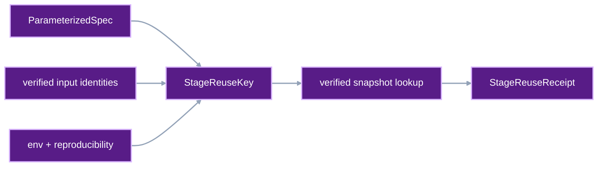
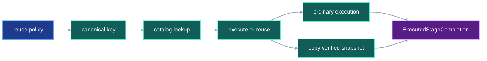

# Verified stage reuse

VIPER can skip a project-owned stage when a prior verified stage received the
same execution-relevant inputs and declared the same reusable behavior. The
new run records the skip and the exact prior evidence it selected.

## 1. Status

**Contract status:** audited; owner approval pending.

These requirements bind the contract to the master checklist:

| ID | Implementation obligation |
| --- | --- |
| SRU-01 <!-- contract-requirement: SRU-01 phase=14 test=tests/test_protocol.py --> | Add the reuse policy, canonical key, receipt, completion union, and persisted references. |
| SRU-02 <!-- contract-requirement: SRU-02 phase=14 test=tests/test_run_execution.py --> | Find one verified candidate, remap its artifacts into a new stage snapshot, and skip the stage process. |
| SRU-03 <!-- contract-requirement: SRU-03 phase=14 test=tests/test_verification_acceptance.py --> | Rebuild the key, verify the source run and metric evidence, and reject every severed reuse relationship. |
| SRU-04 <!-- contract-requirement: SRU-04 phase=14 test=tests/test_inspection.py --> | Expose reuse through lineage, comparison, catalog results, and attempt status. |

**Current:** Every planned stage starts a worker. A retry retains completed
stages within its failed attempt. Cross-run selection is absent.

**Target:** A project-owned stage can set `reuse="verified"`. Before starting
its worker, VIPER computes a `StageReuseKey` and asks the provenance catalog for
matching completed stages. VIPER verifies the selected source run. A valid hit
creates a new target stage snapshot and a `StageReuseReceipt`. The project stage
callable remains uncalled.

## 2. Required claim

A reuse receipt establishes this exact statement:

```text
VIPER skipped this target stage.
VIPER selected this completed stage from this verified source run.
Both stages have the same StageReuseKey.
The target snapshot contains the selected artifact bytes under the target paths.
The receipt identifies the source metric evidence used by the target run.
```

Reuse claims selection of prior verified bytes. Rerun parity remains outside
that claim. The user makes the policy decision with `reuse="verified"`. This
distinction matters when deterministic BLAS settings or other reproducibility
controls are disabled.

## 3. Scope

The first implementation supports `BuildSpec`, `EmbedSpec`, `TrainSpec`, and
`EvalSpec`. It excludes `DownloadSpec` because a download receipt proves a
network request that happened at a specific time. A later run can consume the
old download artifact through `StoredInputRef` when it wants those exact bytes.

Benchmark-confirmation attempts always execute their stages. Reusing candidate
stage evidence would defeat the independent confirmation required by the
benchmark contract.

The user opts in per stage. `reuse="never"` preserves ordinary execution.

### Current DAG


### Proposed-change DAG



### Integrated DAG



## 4. Frozen policy

The policy is part of Python authoring and the frozen project-owned stage spec:

```python
StageReuseMode = Literal["never", "verified"]


class ParameterizedSpecDraft(BaseSpecDraft):
    implementation: DecoratedStage
    params: parameters.ParameterSet
    reuse: StageReuseMode = "never"


class ParameterizedSpec(BaseSpec):
    implementation: StageImplementationRef
    parameter_model: ParameterModelRef
    reuse: StageReuseMode = "never"
```

`viper.authoring.stage()` adds the same argument:

```python
def stage(
    implementation: DecoratedStage,
    *,
    params: parameters.ParameterSet,
    inputs: dict[InputName, StageInputDraft],
    artifacts: dict[ArtifactName, ArtifactDraft],
    env: EnvSpec | None = None,
    objective: MetricObjectiveDraft | None = None,
    metrics: tuple[MetricDraft, ...] = (),
    eval_id: EvalId | None = None,
    split_inputs: tuple[InputName, ...] = (),
    reuse: StageReuseMode = "never",
) -> StageDraft: ...
```

The frozen policy records the user's permission. The stage-reuse key omits the
policy because changing permission leaves the stage's produced value unchanged.

## 5. Canonical reuse key

The key contains the values that can change a stage result:

```python
class ReuseFileIdentity(ProtocolModel):
    relative_path: RepoRelPath
    sha256: SHA256
    bytes: int = Field(ge=0)


class ReuseInputIdentity(ProtocolModel):
    input_name: InputName
    data_role: DataRole
    files: tuple[ReuseFileIdentity, ...] = Field(min_length=1)


class StageReuseKey(ProtocolModel):
    schema_version: Literal[1] = 1
    stage_id: StageId
    stage_sha256: SHA256
    inputs: tuple[ReuseInputIdentity, ...]
    seed: RNGSeed
    env_sha256: SHA256
    reproducibility_sha256: SHA256
    metric_sha256s: tuple[SHA256, ...]
```

`stage_sha256` hashes the canonical frozen stage spec after two normalizations:

1. Every artifact path loses its selected run-root prefix and retains its
   run-relative `ArtifactDraft.path` value.
2. The `reuse` field is omitted.

The canonical stage bytes still contain the stage kind, implementation
identity, parameter-model identity, parameter values, objective, metric IDs,
artifact names, artifact kinds, artifact loaders, data roles, and other
stage-specific fields.

Each input identity replaces its source reference with the exact selected file
digests. Bundle member paths are relative to the bundle root. Input identities
sort by input name. Files sort by relative path.

`env_sha256` hashes the canonical serialized effective environment. The
effective environment is `stage.env` when present and `run.env` otherwise.
`seed` is the selected replicate's frozen run seed.
`reproducibility_sha256` hashes the complete frozen run reproducibility record.
`metric_sha256s` hashes the complete selected `MetricSpec` records in stage
metric order.

The catalog indexes the SHA-256 digest of the canonical serialized
`StageReuseKey`. It also retains the complete key for verifier reconstruction.

By choosing `reuse="verified"`, the user declares that the stage's reusable
outputs depend only on this key. A dependency on `run_id`, `attempt_id`,
wall-clock time, undeclared files, mutable network state, or unrecorded external
side effects violates that declaration. VIPER verifies recorded inputs and
outputs. The user remains responsible for dependencies hidden inside arbitrary
project code.

## 6. Reuse receipt and completion models

### Artifact remapping

Run-relative artifact paths become different concrete paths in different
runs. The receipt records the source and target path for each file:

```python
class ReusedStageFile(ProtocolModel):
    artifact_name: ArtifactName
    source: SnapshotFileRef
    target: SnapshotFileRef

    @model_validator(mode="after")
    def validate_identity(self) -> Self:
        if self.source.sha256 != self.target.sha256:
            raise ValueError("reused file digests must match")
        if self.source.bytes != self.target.bytes:
            raise ValueError("reused file byte counts must match")
        return self
```

The source path belongs to the source stage snapshot. The target path belongs
to the new run. File and bundle artifact names come from the target stage spec.

### Metric evidence

```python
class ReusedMetricEvidence(ProtocolModel):
    metric_id: MetricId
    measurement: ResolvedFileRef
    verification: ResolvedFileRef | None = None
```

A live metric has a source measurement. Its recomputation receipt is optional
and appears only when the metric contract created one. A recomputed metric
includes its source `MetricVerificationReceipt`. The receipt contains one entry
for every metric selected by the stage, including its objective.

### Receipt

```python
class StageReuseReceipt(ProtocolModel):
    schema_version: Literal[1] = 1
    stage_id: StageId
    key: StageReuseKey
    source_run: ResolvedRunRef
    source_attempt: ResolvedAttemptRef
    source_stage: ResolvedStageRef
    files: tuple[ReusedStageFile, ...] = Field(min_length=1)
    metrics: tuple[ReusedMetricEvidence, ...]
    completed_at: AwareDatetime


class ResolvedStageReuseRef(ResolvedFileRef):
    kind: Literal["stage_reuse"] = "stage_reuse"
```

### Executed or reused completion

The resolved project-stage model must state how the stage completed:

```python
class ExecutedStageCompletion(ProtocolModel):
    kind: Literal["executed"] = "executed"
    source: ResolvedGitFileRef
    env: ResolvedEnv
    execution_context: ExecutionContext
    startup: ProcessStartupReceipt
    invocation: ResolvedStageInvocationRef
    command: tuple[str, ...] = Field(min_length=1)


class ReusedStageCompletion(ProtocolModel):
    kind: Literal["reused"] = "reused"
    receipt: ResolvedStageReuseRef


StageCompletion = Annotated[
    ExecutedStageCompletion | ReusedStageCompletion,
    Field(discriminator="kind"),
]


class ResolvedBaseSpec(ProtocolModel):
    schema_version: Literal[1] = 1
    kind: str
    spec: BaseSpec
    artifacts: dict[ArtifactName, ResolvedArtifact] = Field(min_length=1)
    completed_at: AwareDatetime


class ResolvedExecutedSpec(ResolvedBaseSpec):
    env: ResolvedEnv
    execution_context: ExecutionContext


class ResolvedParameterizedSpec(ResolvedBaseSpec):
    spec: ParameterizedSpec
    completion: StageCompletion


class ResolvedDownloadSpec(ResolvedExecutedSpec):
    kind: Literal["download"] = "download"
    spec: DownloadSpec
    retrievals: dict[InputName, ResolvedHttpRetrieval]
```

`ResolvedBaseSpec` retains `spec`, `artifacts`, and `completed_at`.
Execution-only fields move into `ExecutedStageCompletion`. The target hierarchy
already separates runner-owned `ResolvedDownloadSpec` from project-owned
`ResolvedParameterizedSpec`; `ResolvedExecutedSpec` keeps the runner's
environment and execution context on `ResolvedDownloadSpec`.

`RunAttempt.invocations` contains only actual invocations. The one-invocation-
per-resolved-stage rule changes to:

```text
ResolvedParameterizedSpec.completion.kind == "executed"
-> one matching invocation reference

ResolvedParameterizedSpec.completion.kind == "reused"
-> one matching StageReuseReceipt reference
```

## 7. Runtime flow

For a stage with `reuse="verified"`, the attempt executor runs this path:

```text
resolve and verify current stage inputs
-> build StageReuseKey
-> query Catalog.stage_reuse_keys
-> choose the newest completed candidate; break ties by run ID and attempt ID
-> verify the complete source run
-> require source_stage.completion.kind == "executed"
-> rebuild and compare the source StageReuseKey
-> map each source artifact file to the target artifact path
-> publish StageReuseReceipt as a standalone file
-> publish a new target stage snapshot from the source snapshot files
-> record ReusedStageCompletion
-> continue to the next stage
```

The catalog row supplies a candidate. Full source verification grants reuse.
A reused completion remains searchable lineage evidence. Candidate lookup
accepts only an executed completion as its source. This rule keeps every reuse receipt joined directly to
one stage process that actually produced the selected bytes. A stale row or a
failed candidate verification causes ordinary execution. Refresh removes the
invalid row the next time it rebuilds the catalog.

### Snapshot publication

The storage publisher adds one operation:

```python
class SnapshotPublisher(Protocol):
    def publish(
        self,
        *,
        resolved_stage_path: RepoRelPath,
        resolved_stage: bytes,
        files: Mapping[RepoRelPath, Path],
    ) -> StageResultSnapshot: ...

    def publish_reuse(
        self,
        *,
        resolved_stage_path: RepoRelPath,
        resolved_stage: bytes,
        source_snapshot: StageResultSnapshot,
        files: tuple[ReusedStageFile, ...],
    ) -> StageResultSnapshot: ...
```

The local publisher hard-links immutable source-store files into the new
revision when the filesystem permits it. Its fallback copies verified bytes.
The cloud publisher seals a new manifest whose target paths reference the
existing payload objects. Both publishers return a new snapshot identity for
the target stage.

The new snapshot contains the target `resolved.yaml` and every target artifact
path. Every stored path belongs to the target run. A later `FutureInputRef`
therefore resolves through the current run exactly as it does after normal
execution.

## 8. Metric and benchmark rules

A reused stage preserves the source `Measurement` identity.
`StageReuseReceipt.metrics` links that source measurement and its verification
evidence to the target stage.

The run verifier treats those linked values as reused evidence when checking
the stage objective and selected diagnostics. Catalog results expose
`origin="reused"`. Comparisons can therefore separate newly observed values
from selected prior values.

An attempt with `purpose="benchmark_confirmation"` ignores `reuse="verified"`
and executes every stage. The benchmark verifier keeps its existing rule that
candidate and confirmation stage snapshots must differ.

## 9. Verification

The verifier accepts a reused stage only after all of these checks pass:

1. The target frozen spec permits `reuse="verified"`.
2. `StageReuseReceipt.stage_id` equals the target `ResolvedStageRef.stage_id`.
3. `source_run` verifies completely and succeeded.
4. `source_attempt` is that run's successful attempt.
5. `source_stage` occurs in that attempt.
6. `source_stage.completion.kind` equals `"executed"`.
7. Rebuilding the key from the source stage equals `StageReuseReceipt.key`.
8. Rebuilding the key from the target stage and resolved target inputs equals
   the same key.
9. Every source file belongs to `source_stage.snapshot`.
10. Every target file belongs to the target stage snapshot.
11. Source and target digest and byte count match.
12. Artifact names, kinds, loaders, data roles, and normalized paths match.
13. Metric evidence covers every target metric ID exactly once.
14. Every source measurement and verification receipt belongs to the verified
    source attempt and matches the target `MetricSpec` digest.

## 10. Acceptance cases

<!-- contract-example-symbols:
["stage", "ReuseFileIdentity", "ReuseInputIdentity", "StageReuseKey"]
-->
<!-- contract-worked-example: start -->

```python
from viper.authoring import stage


training = stage(
    train,
    params=train_params,
    inputs=train_inputs,
    artifacts=train_artifacts,
    objective=training_objective,
    metrics=training_metrics,
    reuse="verified",
)
dataset_file = ReuseFileIdentity(
    relative_path="training.csv",
    sha256=dataset_sha256,
    bytes=dataset_bytes,
)
dataset_input = ReuseInputIdentity(
    input_name="dataset",
    data_role="training",
    files=(dataset_file,),
)
reuse_key = StageReuseKey(
    stage_id="train",
    stage_sha256=stage_sha256,
    inputs=(dataset_input,),
    seed=7,
    env_sha256=env_sha256,
    reproducibility_sha256=reproducibility_sha256,
    metric_sha256s=metric_sha256s,
)

assert training.spec.reuse == "verified"
assert reuse_key.inputs[0].files[0].sha256 == dataset_sha256
```

### Training reuse

Two run plans select different run IDs and the same training behavior and input
digests. The first run executes training. The second run sets
`reuse="verified"`.

```text
second training worker call count == 0
second run has a new stage snapshot
second artifact path belongs to the second run root
second artifact digest equals the source digest
second resolved stage has ReusedStageCompletion
receipt points to the first verified run and training stage
lineage contains one reuses edge
```

### Changed input

One input byte changes. The target `StageReuseKey.inputs` differs. VIPER runs
the stage normally and writes `ExecutedStageCompletion`.

### Changed implementation or parameters

One implementation digest or parameter value changes. `stage_sha256` differs.
VIPER runs the stage.

### Changed environment or reproducibility

One environment or reproducibility value changes. The matching digest differs.
VIPER runs the stage.

### Catalog false positive

The catalog row carries a matching digest and points to a tampered source run.
Full verification rejects the candidate. VIPER runs the target stage.

### Benchmark confirmation

The candidate run used reuse. The independent confirmation executes every
stage and publishes new stage snapshots.

### Reused source candidate

The catalog contains an executed completion and a newer reused completion with
the same key. Candidate selection skips the reused completion and selects the
executed completion. An absent valid executed completion sends the target stage
through ordinary execution.

<!-- contract-worked-example: end -->

## 11. Propagation

| Surface | Required change |
| --- | --- |
| `src/viper/stages.py` | Add `StageReuseMode`, frozen policy, completion union, and resolved hierarchy changes. |
| `src/viper/references.py` | Add `ResolvedStageReuseRef`. |
| `src/viper/runs.py` | Permit executed and reused completion evidence while retaining ordered stage completion. |
| `src/viper/catalog.py` | Extend the version-1 catalog with reuse-key rows, then compute, index, and query canonical reuse keys. |
| `src/viper/execution/_attempt.py` | Look up candidates before worker startup and fall back to execution. |
| `src/viper/execution/_resolution.py` | Build executed or reused resolved project-stage records. |
| `src/viper/execution/_publication.py` | Publish reuse receipts and remapped target snapshots. |
| `src/viper/execution/_metric.py` | Link source metric evidence while preserving its original measurement identity. |
| `src/viper/_verification/attempt.py` | Dispatch executed and reused completion checks. |
| `src/viper/_verification/metrics.py` | Accept source metric evidence only through a verified reuse receipt. |
| `src/viper/verification.py` | Verify source runs, key equality, file remapping, and reuse lineage. |
| `src/viper/inspection.py` | Add `reuses` lineage edges and comparison fields. |
| `src/viper/api.py` | Include reuse status in run, status, lineage, and comparison results. |
| `tests/test_protocol.py` | Cover exact models, discriminators, and invalid states. |
| `tests/test_run_execution.py` | Cover hits, misses, fallback, remapping, and worker call counts. |
| `tests/test_verification_acceptance.py` | Sever each receipt, key, file, metric, and source-run relationship. |
| `tests/test_inspection.py` | Cover catalog lookup, reuse lineage, and run comparison. |
| Public documentation | Explain opt-in semantics and the absence of a rerun-parity claim. |

## 12. Legacy cleanup

The implementation replaces verifier assumptions that every resolved project
stage has one invocation. It preserves that requirement for
`ExecutedStageCompletion`.

The implementation keeps retry behavior distinct. A retry starts a new
attempt after failure. Stage reuse selects a completed stage from a verified
run and records that selection.

The provenance catalog finds candidates. The stage snapshot and reuse receipt
remain the durable evidence. Stage reuse uses the existing catalog and snapshot
stores in place of another cache directory.

## 13. Implementation order

1. Add the policy, key, receipt, file mapping, and completion models.
2. Extend the version-1 catalog with the `stage_reuse_keys` table and private
   candidate lookup, then add canonical key construction and indexing.
3. Add candidate lookup and full source verification.
4. Add local and cloud target-snapshot publication from source files.
5. Add source metric-evidence linking.
6. Update attempt and run verification.
7. Add lineage, comparison, API, and documentation output.
8. Run hit, miss, tamper, metric, benchmark, and storage acceptance cases.
