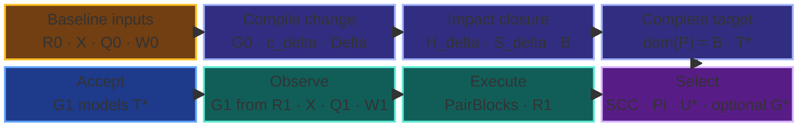
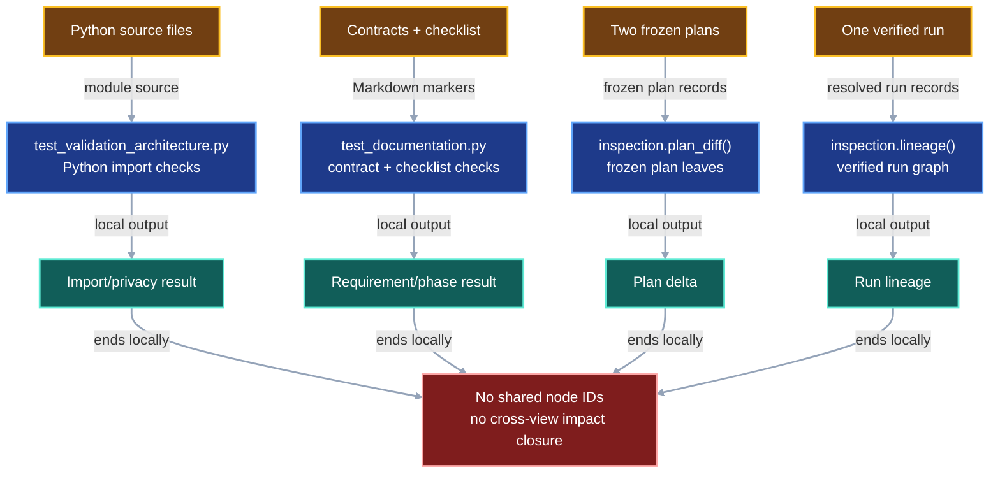
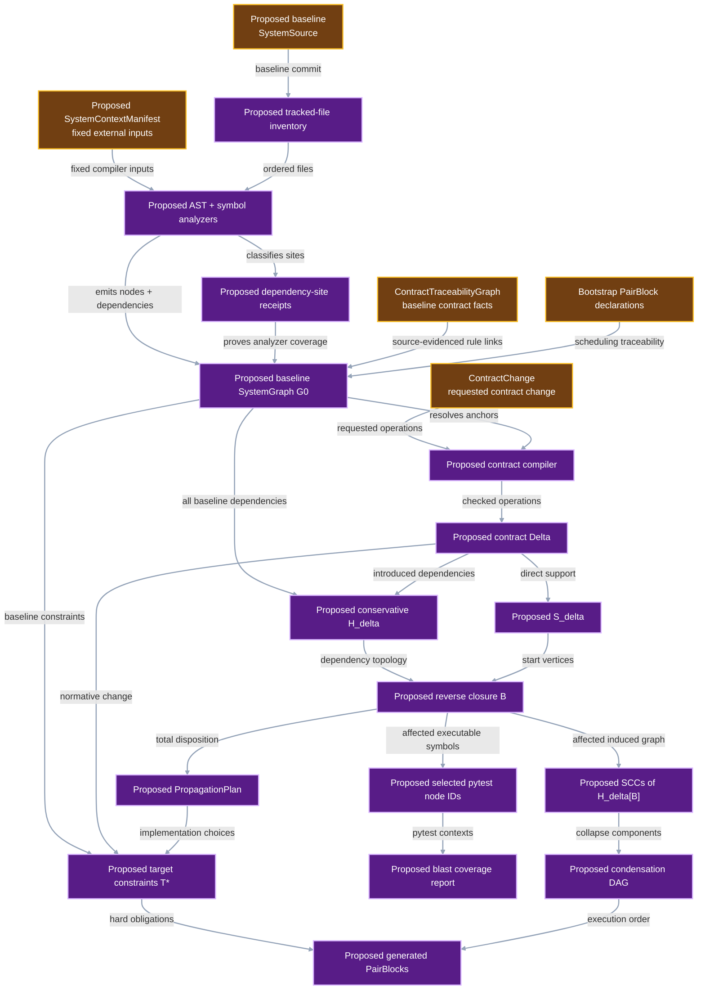
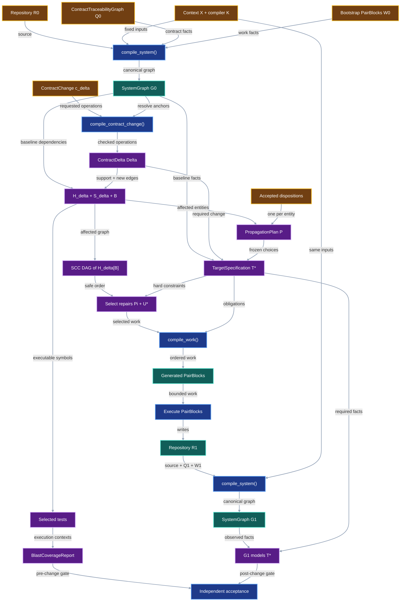

# System Impact Compiler

This document is the single source of truth for the System Impact Compiler. It
owns the normative requirements, graph vocabulary, compilation stages, complete
proof, implementation PairBlocks, diagnostics, verification rules, acceptance
gates, and research boundary. The
[master execution checklist](master-execution-checklist.md) schedules these
requirements and inherits their definitions from this document.

**Status:** audited design; implementation and owner approval pending.

The compiler follows one end-to-end protocol:



In plain English, VIPER compiles the current repository, identifies every
represented entity that the declared change can affect, records one decision
for each affected entity, selects bounded implementation work, and recompiles
the changed repository to verify the result. Sections 1–11 define the
executable contract. Sections 12–13 prove its formal claims. Section 14 owns
the implementation sequence and gates. Section 15 contains the research
program that begins only after Master Phase 0 clears its kill gate.

## 1. Status

**Contract status:** audited design; implementation and owner approval pending.

These requirements bind the contract to the master checklist:

| ID | Implementation obligation |
| --- | --- |
| SIG-01 <!-- contract-requirement: SIG-01 phase=0 test=tests/test_validation_architecture.py --> | Inventory every tracked file; emit canonical, source-anchored nodes and dependency edges; and classify every supported Python dependency site. |
| SIG-02 <!-- contract-requirement: SIG-02 phase=0 test=tests/test_validation_architecture.py --> | Produce stable diagnostics, hold declared external inputs fixed, and fail closed on unsupported or unresolved dependencies in the affected surface. |
| SIG-03 <!-- contract-requirement: SIG-03 phase=0 test=tests/test_inspection.py --> | Compile a `ContractChange` into a `ContractDelta`, then derive the conservative impact overlay, reverse closure, affected-graph SCC condensation, and total propagation plan. |
| SIG-04 <!-- contract-requirement: SIG-04 phase=0 test=tests/test_documentation.py --> | Ingest canonical requirements, verifier rules, and rule bindings from CRT; compile checklist tasks and bootstrap PairBlocks into $G_0$; select tests for every executable affected node; and require complete statement and branch execution over that surface. |

The master checklist carries one marker for each block named below. Section 14
defines each block's exact targets, dependencies, tests, and executable gate.
Section 7 defines every verifier rule in the named verifier family.

| Requirement | Runtime PairBlocks | Proof and verification PairBlocks | Verifier family |
| --- | --- | --- | --- |
| `SIG-01` | `P0-SIG-01`–`P0-SIG-03`, `P0-SIG-11` | `P0-PROOF-09` | `system.node.*`, `system.edge.*`, `system.inventory.*`, `system.analysis.*`, `system.signature.*` |
| `SIG-02` | `P0-SIG-01`, `P0-SIG-07`, `P0-SIG-11` | `P0-PROOF-09` | `system.context.*`, `system.resolution.*`, `system.graph.*`, `system.diagnostics.*` |
| `SIG-03` | `P0-SIG-04`–`P0-SIG-09`, `P0-SIG-11` | `P0-PROOF-10` | `system.contract.*`, `system.delta.*`, `system.impact.*`, `system.dag.*`, `system.propagation.*`, `system.target.*`, `system.conformance.*` |
| `SIG-04` | `P0-SIG-04`, `P0-SIG-09`–`P0-SIG-11` | `P0-PROOF-11`, `P0-PROOF-12` | `system.requirement.*`, `system.rule.*`, `system.plan.*`, `system.blast.*`, `system.diagram.*` |

## 2. Required claim

Given one baseline repository, one `ContractChange`, one fixed context,
and one deterministic compiler version, VIPER produces the same canonical
baseline graph, impact overlay, affected surface, SCC condensation, test
selection, and target constraints on every conforming execution.

Let `R0` identify the baseline repository, `X` the fixed compilation context,
and `K` the fixed `SystemCompilerIdentity`. Two front ends read the selected
repository revision:

```math
Q_0=\operatorname{CompileTraceability}(R_0),
\qquad
W_0=\operatorname{CompilePairBlocks}(R_0),
```

where $Q_0$ is a `ContractTraceabilityGraph` and $W_0$ contains the bootstrap
`PairBlock` records. Baseline compilation then constructs one `SystemGraph`:

```math
G_0 = \mathcal C_{X,K}(R_0,Q_0,W_0).
```

```math
\Delta
=
\operatorname{CompileContractChange}(c_\Delta,G_0),
\qquad c_\Delta\in\mathsf{ContractChange}.
```

Here `ContractChange` is the authored request. The planned
`compile_contract_change()` function resolves that request against `G0` and
returns a validated `ContractDelta`, represented by $\Delta$. The implemented
[`ContractTraceabilityGraph`](../../src/viper/_contract_traceability.py)
records the requirements, verifier rules, implementation owners, tests, and
worked traces extracted from the contract and checklist files in `R0`.
`compile_system()` lowers those records alongside the source inventory, AST
results, resolved dependencies, context `X`, and bootstrap `PairBlock` records
into the same `SystemGraph`, `G0`. `ContractChange` then requests a change to
that baseline.

The specification uses implementation names at each boundary:

| Pipeline value | Python owner | Status |
| --- | --- | --- |
| Contract facts extracted from `R0` | [`ContractTraceabilityGraph`](../../src/viper/_contract_traceability.py) | Implemented in `src/viper/_contract_traceability.py`; lowered into `G0` with the other baseline inputs. |
| Requested contract change $c_\Delta$ | `viper.system_graph.ContractChange` | Planned by `P0-SIG-04`. |
| Validated graph operations $\Delta$ | `viper.system_graph.ContractDelta` | Planned by `P0-SIG-04`. |
| Change compiler | `viper.system_graph.compile_contract_change()` | Planned by `P0-SIG-04`; accepts `(ContractChange, SystemGraph)` and returns `ContractDelta`. |

The mathematical names refer to instances of those types: $G_0$ is a
`SystemGraph`, $c_\Delta$ is a `ContractChange`, and $\Delta$ is a
`ContractDelta`.

The conservative impact graph retains every baseline dependency and adds every
dependency introduced by the delta:

```math
H_\Delta = (V_0 \cup V_\Delta^+,\; D_0 \cup D_\Delta^+)
```

The affected surface is reverse reachability from the delta support:

```math
B = \{x \in V_{H_\Delta} \mid \exists s \in S_\Delta:\; x \leadsto s\}.
```

Removed dependencies remain in `H_delta` because they existed before the
change and can identify dependents that require migration. A candidate
repository `R1` is compiled only after implementation. The same front ends
first derive $Q_1$ and $W_1$ from `R1`:

```math
Q_1=\operatorname{CompileTraceability}(R_1),
\qquad
W_1=\operatorname{CompilePairBlocks}(R_1),
\qquad
G_1 = \mathcal C_{X,K}(R_1,Q_1,W_1).
```

`G1` is compared with the target constraints compiled from `(G0, Delta, P)`.
`Delta` alone generally underdetermines one complete future graph. An accepted
propagation plan `P` supplies the required, forbidden, and preserved graph
facts that the delta leaves open. After target compilation and any bounded
repair selection, `CompileWork` packages the selected work as ordered
`PairBlock` records.

The guarantee is conditional on `X`. It identifies impact under the declared
Python runtime, dependencies, environment variables, fixture files, command
inputs, and external responses.

The compiler's completeness claim is bounded by the source inventory and
declared analyzers. It proves that every tracked file received an analysis
receipt and that every supported construct produced a node, edge, or unresolved
dependency. Observed resolution supplies the execution-specific relationships
that static syntax leaves open.

## 3. Current gap

### Inspected path

The repository has several deterministic checks with separate, hard-coded
views:

```text
tests/test_validation_architecture.py
-> parses Python imports for privacy rules

tests/test_documentation.py
-> parses contract requirements, checklist markers, schemas, links, and examples

inspection.plan_diff()
-> compares frozen plan JSON leaves

inspection.lineage()
-> constructs one verified run graph
```

These checks establish separate local relationships. The system lacks one graph
that connects a changed protocol field to its constructor, runtime consumer,
persisted record, verifier, contract requirement, checklist task, and test.

### Diagram color contract

The three diagrams use the shared semantic palette from
[Contract Traceability](contract-traceability.md#diagram-color-contract).
Node labels preserve the same meaning in monochrome.

| Color | Mermaid classes | Meaning |
| --- | --- | --- |
| Amber | `input` | Source revisions, fixed context, or other compiler inputs. |
| Blue | `current`, `consumer` | Existing tools or operations that consume graph results. |
| Teal | `evidence` | Existing or persisted results. |
| Red | `gap` | A relationship missing from the current system. |
| Purple | `proposed`, `output` | Proposed records, compiler stages, or generated outputs. |

Every node uses white text and a two-pixel stroke. Every link uses `#94a3b8`
with a two-pixel stroke.

### Current DAG

The current tools produce four separate dependency views. Each output uses a
private identity namespace and local edge evidence.



### Missing connector

The missing path is:

```text
source revision + fixed context
-> complete tracked-file inventory
-> one analysis receipt per file
-> source-backed nodes, auditable edges, and dependency-site receipts
-> canonical baseline SystemGraph G0
-> automatic contract and RuleEdge compilation
-> ContractChange
-> conservative H_delta and reverse closure B
-> SCC condensation of H_delta[B]
-> affected contracts, checklist tasks, and tests
-> complete statement and branch execution over B_exec
-> total propagation plan and target constraints
-> observed G1 conformance
```

The CRT compiler derives `ContractTraceabilityGraph` from the declarations
owned by
[`contract-traceability.md`](contract-traceability.md).
Baseline `compile_system()` lowers that graph into normalized requirement,
rule, owner, and test dependencies in $G_0$. `compile_contract_change()` is a
later stage that resolves one `ContractChange` against $G_0$ and returns a
`ContractDelta`.

### Proposed-change DAG

The proposed compiler derives source-backed nodes and dependency-site receipts
from the baseline inventory, compiles the declared delta, computes impact, and
proves test execution over the affected surface before implementation.



### Integrated DAG

The integrated path connects the pre-implementation compiler with the observed
repository and conformance verifier.



## 4. Contract models

### Identifiers and kinds

```python
SystemNodeId = Annotated[str, StringConstraints(min_length=1)]
SystemComponentId = SHA256
PairBlockId = Annotated[
    str,
    StringConstraints(pattern=r"^P0-[A-Z]+-[0-9]{2}$"),
]

SystemNodeKind = Literal[
    "repository_file",
    "python_symbol",
    "document_anchor",
    "external_symbol",
]

SystemNodeRole = Literal[
    "python_module",
    "python_test_module",
    "class",
    "function",
    "async_function",
    "method",
    "async_method",
    "field",
    "variable",
    "public_export",
    "configuration",
    "fixture",
    "generated_source",
    "protocol_model",
    "protocol_field",
    "api_operation",
    "cli_command",
    "runtime_operation",
    "persisted_document",
    "contract",
    "checklist_document",
    "contract_requirement",
    "verifier_rule",
    "checklist_task",
    "pair_block",
    "completion_gate",
    "acceptance_test",
    "installed_package",
    "external_module",
    "environment_variable",
    "context_file",
    "context_command",
    "runtime_target",
]

SystemEdgeKind = Literal[
    "contained_by",
    "imports_module",
    "imports_symbol",
    "calls",
    "constructs",
    "inherits_from",
    "uses_type",
    "reads_symbol",
    "writes_symbol",
    "decorated_by",
    "registers_with",
    "exports_symbol",
    "declared_by",
    "implements_rule",
    "verifies_rule",
    "scheduled_by",
    "targets",
    "gated_by",
    "block_depends_on",
    "reads_context",
    "launches",
]

ResolutionKind = Literal[
    "dynamic_import",
    "decorator_registration",
    "registry_entry",
    "reflection_target",
    "subprocess_entrypoint",
]

EdgeOrigin = Literal["declared", "static", "observed"]
FileAnalysisStatus = Literal["parsed", "opaque", "excluded"]
```

`SystemNodeKind` determines the node's identity grammar and required fields.
`SystemNodeRole` adds a finite semantic tag. The compiler accepts the listed
role-kind combinations.

| Node kind | Canonical identity | Required source fields | Admissible role families |
| --- | --- | --- | --- |
| `repository_file` | `file:<repo-relative-path>` | path and complete-file digest | module, test module, contract, checklist, configuration, fixture, generated source |
| `python_symbol` | `python:<path>:<qualified-name>` | path, qualified name, four AST coordinates, exact-span digest | Python declaration kind plus optional protocol, API, CLI, runtime, fixture, test, or export role |
| `document_anchor` | `anchor:<path>:<anchor-kind>:<stable-id>` | path, stable marker ID, line range, exact-span digest | requirement, verifier rule, checklist task, PairBlock, or completion gate |
| `external_symbol` | `external:<external-kind>:<context-identity>` | external kind and fixed-context identity | package, module, variable, file, command, or runtime target |

Every member of `SystemEdgeKind` denotes a dependency and uses one direction:
the source depends on the target. Descriptive relationships, provenance joins,
and traversal results belong in evidence records or reports, outside the edge
set. The vocabulary therefore contains one containment direction. The inverse
`defines`/`defined_in` pair belongs to the superseded vocabulary.

`RuleEdge` remains the traceability compiler's declaration that a verifier rule
has an implementation owner or observing test. The dependency graph receives
its mechanically lowered `SystemEdge`:

| `RuleEdge.kind` | Emitted dependency edge |
| --- | --- |
| `implementation` | `RuleEdge.target -> verifier-rule`, kind `implements_rule` |
| `verification` | `RuleEdge.target -> verifier-rule`, kind `verifies_rule` |

Each verifier rule has exactly one implementation binding and at least one
verification binding. Duplicate bindings, unknown rules, unresolved target
symbols, and a binding whose checklist phase differs from its requirement are
compiler errors.

### Fixed context

`SystemContextManifest` contains external values held equal across the two
compilations. Every collection uses canonical lexical ordering.

```python
class ContextPackage(ProtocolModel):
    name: NonEmptyStr
    version: NonEmptyStr


class ContextVariable(ProtocolModel):
    name: NonEmptyStr
    value: str


class ContextFile(ProtocolModel):
    path: RepoRelPath
    sha256: SHA256
    bytes: int = Field(ge=0)


class ContextCommand(ProtocolModel):
    command_id: NonEmptyStr
    executable: NonEmptyStr
    argv: tuple[str, ...]
    stdin_sha256: SHA256 | None = None
    response: ContextFile | None = None


class SystemContextManifest(ProtocolModel):
    schema_version: Literal[1] = 1
    python_version: NonEmptyStr
    platform: NonEmptyStr
    packages: tuple[ContextPackage, ...]
    variables: tuple[ContextVariable, ...]
    files: tuple[ContextFile, ...]
    commands: tuple[ContextCommand, ...]
```

The manifest contains serializable values and excludes process handles and
secrets. A test or review that needs a credential supplies a deterministic
fixture value with zero external authority.

The manifest fixes exogenous inputs. The compiler observes dynamic outcomes
produced by the source revision: decorator registrations, registry contents,
reflection targets, resolved imports, and subprocess entrypoints.

### Source identity

```python
class SystemSource(ProtocolModel):
    repository: HttpUrl
    commit: GitCommit


class SystemCompilerIdentity(ProtocolModel):
    schema_version: Literal[1] = 1
    symbol: Literal["viper.system_graph.compile_system"]
    package_version: NonEmptyStr
    implementation_sha256: SHA256
```

The baseline and candidate graphs may use different `SystemSource.commit`
values. Both graphs must use the same context-manifest digest and the same
`SystemCompilerIdentity`. `implementation_sha256` covers the source files and
registered adapters that can change `compile_system()` output. The verifier
rebuilds this identity before recompiling either repository revision.

`SystemCompilerIdentity.schema_version = 1` is the frozen initial identity
format. The field set is subject to review before `P0-SIG-01` closes. Any
approved change increments `schema_version`; it never silently changes the
meaning of version 1.

### Repository inventory

The compiler begins with the tracked files in the selected Git commit. The
selected source revision excludes untracked working-tree files.

```python
class RepositoryFile(ProtocolModel):
    path: RepoRelPath
    sha256: SHA256
    bytes: int = Field(ge=0)


class FileAnalysisReceipt(ProtocolModel):
    path: RepoRelPath
    file_sha256: SHA256
    analyzer: NonEmptyStr
    status: FileAnalysisStatus
    emitted_nodes: tuple[SystemNodeId, ...]
    emitted_edges: tuple[SHA256, ...]
    reason: NonEmptyStr | None = None
```

Every `RepositoryFile` has exactly one `FileAnalysisReceipt`. A supported
source, configuration, contract, or test file uses `status="parsed"`. A binary
asset uses `status="opaque"` and records its analyzer boundary. A file excluded
by an explicit repository rule uses `status="excluded"` and records that rule.
Strict review accepts opaque and excluded files only when their roles remain
outside package behavior, protocol behavior, execution, verification, tests,
and contract coverage.

### Dependency-site coverage and diagnostics

File coverage and dependency coverage are separate claims. The Python analyzer
records one `DependencySiteReceipt` for every AST construct in its
declared dependency-site registry.

```python
DependencySiteOutcome = Literal[
    "emitted",
    "self_contained",
    "unresolved",
    "unsupported",
]

DiagnosticSeverity = Literal["info", "warning", "error"]


class DependencySiteReceipt(ProtocolModel):
    site_id: SHA256
    path: RepoRelPath
    ast_kind: NonEmptyStr
    start_line: int = Field(ge=1)
    start_column: int = Field(ge=0)
    end_line: int = Field(ge=1)
    end_column: int = Field(ge=0)
    outcome: DependencySiteOutcome
    emitted_edges: tuple[SHA256, ...]
    rule_id: NonEmptyStr
    detail: NonEmptyStr


class SystemDiagnostic(ProtocolModel):
    diagnostic_id: SHA256
    code: NonEmptyStr
    severity: DiagnosticSeverity
    phase: Literal["inventory", "extract", "contract", "impact", "scc", "coverage", "conformance"]
    message: NonEmptyStr
    path: RepoRelPath | None = None
    start_line: int | None = Field(default=None, ge=1)
    node_ids: tuple[SystemNodeId, ...]
    edge_ids: tuple[SHA256, ...]
    remediation: NonEmptyStr
```

Master Phase 0 registers `Import`, `ImportFrom`, `Call`, class bases, decorators,
function and variable annotations, `Name` and `Attribute` loads and stores,
literal registries, and `__all__` exports. The analyzer combines Python's AST
coordinates with the compiler symbol table so aliases, local names, globals,
nonlocals, and imported names retain distinct namespaces. A star import,
computed import target, computed registry key, or call target that the analyzer
fails to resolve as `unresolved` or `unsupported`. Every registered site emits
an edge-bearing or terminal receipt.

`self_contained` means the construct's dependencies remain inside its owning
symbol, such as a local literal assignment. It differs from an absent receipt.
Strict Master Phase 0 requires every registered site to have exactly
one receipt and rejects `unresolved` or `unsupported` outcomes in the affected
surface.

Diagnostic codes are stable API values. Master Phase 0 reserves these families:

| Family | Required examples |
| --- | --- |
| `SGI` inventory | missing receipt, duplicate path, digest mismatch, unsupported tracked file |
| `SGX` extraction | Python parse failure, unsupported AST site, unresolved import, ambiguous name, dynamic call target |
| `SGC` contract | malformed declaration, duplicate ID, unknown anchor, missing rule owner, missing rule test, delta conflict |
| `SGG` graph | invalid endpoint, invalid direction, duplicate edge, missing evidence, noncanonical ordering |
| `SGB` blast | incomplete reverse closure, uncovered affected node, absent selected test, missing statement or branch |
| `SGS` SCC | missing member, duplicate member, crossing-edge mismatch, cyclic condensation, unstable component ID |

Tests assert diagnostic codes and structured locations. Messages provide
context; codes and fields form the stable interface.

### Contract declarations and automatic lowering

The CRT compiler reads `contract-requirement`, `verifier-rule`,
`contract-implementation`, `contract-verification`, and `contract-trace`
declarations and emits `ContractTraceabilityGraph`. Baseline `compile_system()`
consumes that graph and parses bootstrap `PairBlock` records as a separate
scheduling input. The planned `compile_contract_change()` function reads one
`ContractChange` only after `G0` exists. `PairBlock` records do not create
delta operations or impact edges.

```toml contract-change
change_id = "artifact-source"
baseline_graph_sha256 = "aaaaaaaaaaaaaaaaaaaaaaaaaaaaaaaaaaaaaaaaaaaaaaaaaaaaaaaaaaaaaaaa"

[[operations]]
operation_id = "remove-artifact-path"
op = "remove_node"
target.kind = "python_symbol"
target.node_id = "python:models.py:ArtifactRef.path"
target.path = "models.py"
target.symbol = "ArtifactRef.path"
target.symbol_kind = "field"
expected_node_sha256 = "bbbbbbbbbbbbbbbbbbbbbbbbbbbbbbbbbbbbbbbbbbbbbbbbbbbbbbbbbbbbbbbb"

[[operations]]
operation_id = "add-artifact-source"
op = "add_node"
node.introduced_by = "add-artifact-source"
node.anchor.kind = "python_symbol"
node.anchor.node_id = "python:models.py:ArtifactRef.source"
node.anchor.path = "models.py"
node.anchor.symbol = "ArtifactRef.source"
node.anchor.symbol_kind = "field"

[[operations]]
operation_id = "load-reads-source"
op = "add_edge"
edge.source = "python:storage.py:LocalArtifactStore.load"
edge.kind = "reads_symbol"
edge.target = "python:models.py:ArtifactRef.source"
```

The normative operation set is closed:

```python
DeltaOperationKind = Literal[
    "add_node",
    "remove_node",
    "update_node",
    "add_edge",
    "remove_edge",
    "update_edge",
]
```

Each removal or update carries the expected baseline identity. Each node
addition carries a `PlannedNodeAnchor`, which supplies stable identity fields
without claiming source coordinates or a source digest. The compiler rejects
an unknown target, stale precondition, duplicate operation, incompatible pair
of operations, or value outside the defined node, edge, and graph-fact types.

`ContractChange.precedence` names the required order between operation IDs. The
compiler rejects unknown IDs, self-dependencies, precedence cycles, and every
noncommuting operation pair whose order remains unspecified. It then performs
a deterministic topological sort, choosing the lexically smallest ready
`operation_id` at each step. `ContractDelta.operations` stores that canonical
linear extension in application order. Before hashing `ContractChange`, the
compiler sorts operation declarations by `operation_id` and precedence pairs
by `(before, after)`; source-file order has no semantic effect.

The CRT compiler derives `ContractTraceabilityGraph`. Baseline `compile_system()`
lowers that graph and bootstrap `PairBlock` records into $G_0$.
`compile_contract_change(change, g0)` validates a `ContractChange`, resolves
its anchors against `g0`, compiles `ContractChange.precedence` into the ordered
`ContractDelta.operations` tuple, and returns `ContractDelta`.
Subsequent stages derive `S_delta`,
`D_delta_plus`, `H_delta`, `B`, and the initial propagation obligations.
Graph expansion, reverse reachability, SCC condensation, test selection, and
completeness checks are mechanical. An accepted propagation plan supplies the
implementation decisions that the delta leaves open.

### Pair-coding plan

```python
class PairBlock(ProtocolModel):
    block_id: PairBlockId
    document: RepoRelPath
    start_line: int = Field(ge=1)
    end_line: int = Field(ge=1)
    sha256: SHA256
    requirements: tuple[RequirementId, ...] = Field(min_length=1)
    targets: tuple[RepoSymbolRef, ...] = Field(min_length=1)
    tests: tuple[RepoSymbolRef, ...] = Field(min_length=1)
    gate: NonEmptyStr
    depends_on: tuple[PairBlockId, ...]
```

`PairBlock` is one executable unit produced from target obligations, selected
repairs, and the SCC-safe work order. The compiler hashes the complete marked
block, validates its source and test references, and topologically orders
`depends_on`. Its system-graph node uses
`roles=("pair_block",)`. The gate becomes a document anchor with
`roles=("completion_gate",)`.

The PairBlocks in the Master Phase 0 guide are bootstrap records authored before
`CompileWork` exists. They implement the compiler itself and serve as fixtures
for the future parser. Production impact compilation never reads those
bootstrap blocks to derive `ContractDelta`, `S_delta`, or `H_delta`.

### Nodes and edge evidence

```python
PythonParameterKind = Literal[
    "positional_only",
    "positional_or_keyword",
    "var_positional",
    "keyword_only",
    "var_keyword",
]


class PythonParameterFact(ProtocolModel):
    name: NonEmptyStr
    kind: PythonParameterKind
    annotation_ast: NonEmptyStr | None = None
    default_ast: NonEmptyStr | None = None


class PythonSignatureFact(ProtocolModel):
    kind: Literal["python_signature"] = "python_signature"
    node_id: SystemNodeId
    is_async: bool
    parameters: tuple[PythonParameterFact, ...]
    return_annotation_ast: NonEmptyStr | None = None


class RepositoryFileNode(ProtocolModel):
    node_id: SystemNodeId
    kind: Literal["repository_file"] = "repository_file"
    roles: tuple[SystemNodeRole, ...] = Field(min_length=1)
    path: RepoRelPath
    sha256: SHA256


class PythonSymbolNode(ProtocolModel):
    node_id: SystemNodeId
    kind: Literal["python_symbol"] = "python_symbol"
    roles: tuple[SystemNodeRole, ...] = Field(min_length=1)
    path: RepoRelPath
    symbol: NonEmptyStr
    symbol_kind: Literal[
        "class",
        "function",
        "async_function",
        "method",
        "async_method",
        "field",
        "variable",
    ]
    start_line: int = Field(ge=1)
    start_column: int = Field(ge=0)
    end_line: int = Field(ge=1)
    end_column: int = Field(ge=0)
    sha256: SHA256
    signature: PythonSignatureFact | None = None


class DocumentAnchorNode(ProtocolModel):
    node_id: SystemNodeId
    kind: Literal["document_anchor"] = "document_anchor"
    roles: tuple[SystemNodeRole, ...] = Field(min_length=1)
    path: RepoRelPath
    symbol: NonEmptyStr
    anchor_kind: Literal[
        "contract_requirement",
        "verifier_rule",
        "checklist_task",
        "pair_block",
        "completion_gate",
    ]
    start_line: int = Field(ge=1)
    end_line: int = Field(ge=1)
    sha256: SHA256


class ExternalSymbolNode(ProtocolModel):
    node_id: SystemNodeId
    kind: Literal["external_symbol"] = "external_symbol"
    roles: tuple[SystemNodeRole, ...] = Field(min_length=1)
    external_kind: Literal[
        "package",
        "module",
        "environment_variable",
        "file",
        "command",
        "runtime_target",
    ]
    symbol: NonEmptyStr


SystemNode = Annotated[
    RepositoryFileNode
    | PythonSymbolNode
    | DocumentAnchorNode
    | ExternalSymbolNode,
    Field(discriminator="kind"),
]


class RepositoryFileAnchor(ProtocolModel):
    node_id: SystemNodeId
    kind: Literal["repository_file"] = "repository_file"
    path: RepoRelPath


class PythonSymbolAnchor(ProtocolModel):
    node_id: SystemNodeId
    kind: Literal["python_symbol"] = "python_symbol"
    path: RepoRelPath
    symbol: NonEmptyStr
    symbol_kind: Literal[
        "class",
        "function",
        "async_function",
        "method",
        "async_method",
        "field",
        "variable",
    ]


class DocumentAnchorRef(ProtocolModel):
    node_id: SystemNodeId
    kind: Literal["document_anchor"] = "document_anchor"
    path: RepoRelPath
    anchor_kind: Literal[
        "contract_requirement",
        "verifier_rule",
        "checklist_task",
        "pair_block",
        "completion_gate",
    ]
    symbol: NonEmptyStr


class ExternalSymbolAnchor(ProtocolModel):
    node_id: SystemNodeId
    kind: Literal["external_symbol"] = "external_symbol"
    external_kind: Literal[
        "package",
        "module",
        "environment_variable",
        "file",
        "command",
        "runtime_target",
    ]
    symbol: NonEmptyStr


SystemNodeAnchor = Annotated[
    RepositoryFileAnchor
    | PythonSymbolAnchor
    | DocumentAnchorRef
    | ExternalSymbolAnchor,
    Field(discriminator="kind"),
]


class PlannedNodeAnchor(ProtocolModel):
    anchor: SystemNodeAnchor
    introduced_by: NonEmptyStr


class SystemEdgeAnchor(ProtocolModel):
    source: SystemNodeId
    kind: SystemEdgeKind
    target: SystemNodeId


class NodeIdentityFact(ProtocolModel):
    kind: Literal["node_identity"] = "node_identity"
    anchor: SystemNodeAnchor


class NodeRolesFact(ProtocolModel):
    kind: Literal["node_roles"] = "node_roles"
    node_id: SystemNodeId
    roles: tuple[SystemNodeRole, ...] = Field(min_length=1)


class EdgeFact(ProtocolModel):
    kind: Literal["edge"] = "edge"
    edge: SystemEdgeAnchor


GraphFact = Annotated[
    NodeIdentityFact | NodeRolesFact | PythonSignatureFact | EdgeFact,
    Field(discriminator="kind"),
]


class AddNodeOperation(ProtocolModel):
    operation_id: NonEmptyStr
    op: Literal["add_node"] = "add_node"
    node: PlannedNodeAnchor


class RemoveNodeOperation(ProtocolModel):
    operation_id: NonEmptyStr
    op: Literal["remove_node"] = "remove_node"
    target: SystemNodeAnchor
    expected_node_sha256: SHA256


class UpdateNodeOperation(ProtocolModel):
    operation_id: NonEmptyStr
    op: Literal["update_node"] = "update_node"
    target: SystemNodeAnchor
    expected_node_sha256: SHA256
    required_facts: tuple[GraphFact, ...] = Field(min_length=1)


class AddEdgeOperation(ProtocolModel):
    operation_id: NonEmptyStr
    op: Literal["add_edge"] = "add_edge"
    edge: SystemEdgeAnchor


class RemoveEdgeOperation(ProtocolModel):
    operation_id: NonEmptyStr
    op: Literal["remove_edge"] = "remove_edge"
    edge: SystemEdgeAnchor
    expected_edge_id: SHA256


class UpdateEdgeOperation(ProtocolModel):
    operation_id: NonEmptyStr
    op: Literal["update_edge"] = "update_edge"
    baseline: SystemEdgeAnchor
    replacement: SystemEdgeAnchor
    expected_edge_id: SHA256


DeltaOperation = Annotated[
    AddNodeOperation
    | RemoveNodeOperation
    | UpdateNodeOperation
    | AddEdgeOperation
    | RemoveEdgeOperation
    | UpdateEdgeOperation,
    Field(discriminator="op"),
]


class OperationPrecedence(ProtocolModel):
    before: NonEmptyStr
    after: NonEmptyStr


class ContractChange(ProtocolModel):
    """Store one authored request to change the baseline contract graph."""

    schema_version: Literal[1] = 1
    change_id: NonEmptyStr
    baseline_graph_sha256: SHA256
    operations: tuple[DeltaOperation, ...] = Field(min_length=1)
    precedence: tuple[OperationPrecedence, ...] = ()


class ContractDelta(ProtocolModel):
    """Store graph operations in their canonical application order."""

    schema_version: Literal[1] = 1
    delta_id: NonEmptyStr
    source_change_sha256: SHA256
    baseline_graph_sha256: SHA256
    operations: tuple[DeltaOperation, ...] = Field(min_length=1)


class TargetConstraintOrigin(ProtocolModel):
    kind: Literal["delta_operation", "propagation_disposition"]
    source_id: NonEmptyStr


class PresenceConstraint(ProtocolModel):
    constraint_id: SHA256
    kind: Literal["presence"] = "presence"
    fact: GraphFact
    origins: tuple[TargetConstraintOrigin, ...] = Field(min_length=1)


class AbsenceConstraint(ProtocolModel):
    constraint_id: SHA256
    kind: Literal["absence"] = "absence"
    fact: GraphFact
    origins: tuple[TargetConstraintOrigin, ...] = Field(min_length=1)


class PreservationConstraint(ProtocolModel):
    constraint_id: SHA256
    kind: Literal["preservation"] = "preservation"
    fact: GraphFact
    origins: tuple[TargetConstraintOrigin, ...] = Field(min_length=1)


TargetConstraint = Annotated[
    PresenceConstraint | AbsenceConstraint | PreservationConstraint,
    Field(discriminator="kind"),
]


class TargetSpecification(ProtocolModel):
    schema_version: Literal[1] = 1
    baseline_graph_sha256: SHA256
    contract_delta_sha256: SHA256
    propagation_plan_sha256: SHA256
    context_sha256: SHA256
    compiler_sha256: SHA256
    constraints: tuple[TargetConstraint, ...] = Field(min_length=1)


ConstraintOutcome = Literal["satisfied", "violated", "unevaluable"]


class ConstraintConformanceReceipt(ProtocolModel):
    constraint_id: SHA256
    outcome: ConstraintOutcome
    observed_fact_sha256: tuple[SHA256, ...]
    diagnostic_id: SHA256 | None = None


class TargetConformanceReport(ProtocolModel):
    schema_version: Literal[1] = 1
    target_specification_sha256: SHA256
    observed_graph_sha256: SHA256
    context_sha256: SHA256
    compiler_sha256: SHA256
    receipts: tuple[ConstraintConformanceReceipt, ...]
    conforms: bool


class SourceEvidence(ProtocolModel):
    kind: Literal["source"] = "source"
    path: RepoRelPath
    start_line: int = Field(ge=1)
    end_line: int = Field(ge=1)
    expression: NonEmptyStr


class ResolutionEvidence(ProtocolModel):
    kind: Literal["resolution"] = "resolution"
    resolution_id: SHA256


EdgeEvidence = Annotated[
    SourceEvidence | ResolutionEvidence,
    Field(discriminator="kind"),
]


class SystemEdge(ProtocolModel):
    edge_id: SHA256
    source: SystemNodeId
    target: SystemNodeId
    kind: SystemEdgeKind
    origin: EdgeOrigin
    evidence: EdgeEvidence


class ResolutionAttempt(ProtocolModel):
    resolution_id: SHA256
    kind: ResolutionKind
    source: SystemNodeId
    expression: NonEmptyStr


class ResolutionObservation(ProtocolModel):
    attempt: ResolutionAttempt
    target: SystemNodeId
    edge: SystemEdge


class UnresolvedDependency(ProtocolModel):
    attempt: ResolutionAttempt
    reason: NonEmptyStr
```

`PresenceConstraint`, `AbsenceConstraint`, and `PreservationConstraint` form
VIPER's local atomic target language. The names are project conventions, not
standard algebraic-graph-transformation class names. Algebraic graph
transformation supplies graph constraints, application conditions, and the
satisfaction relation; VIPER normalizes its Master Phase 0 postconditions to presence,
absence, and baseline preservation of typed `GraphFact` values. This three-kind
constraint vocabulary stays independent of node and edge categories. Adding a
new fact kind therefore does not add another logical operator.

The `GraphFact` union is closed for Master Phase 0: node identity, node roles, typed
dependency edge, and normalized Python signature. A constraint ID hashes its
kind and canonical fact. Equal constraints merge their sorted, unique origins.
The compiler rejects a fact that is both required present and required absent.
A preservation fact must occur in `G0`; otherwise the preservation request is
undefined and compilation fails.

`TargetSpecification` is the concrete representation of $T^*$. Its digest
covers canonical JSON with constraints sorted by `constraint_id` and origins
sorted by `(kind, source_id)`. `ConstraintConformanceReceipt` is the result of
evaluating one constraint against `G1`. A report contains exactly one receipt
per target constraint. `conforms=True` holds exactly when every receipt is
`satisfied`; `violated` and `unevaluable` both reject strict conformance.

`SystemNode` applies these field rules:

- A `repository_file` node requires `path` and `sha256`, omits line fields, and
  matches one `RepositoryFile`.
- A `python_symbol` node requires `path`, `symbol`, `start_line`, `end_line`,
  and the AST column coordinates carried in its source evidence. Its digest
  covers the exact UTF-8 source span. A function or method also carries one
  `PythonSignatureFact`; other Python symbol kinds set `signature=None`.
- A `document_anchor` node requires `path`, a stable marker ID in `symbol`, a
  line range, and the exact-span digest.
- An `external_symbol` node requires a context-qualified `symbol` and omits
  repository path, line, and source digest fields.
- Every Python symbol and document anchor has one outgoing `contained_by` edge
  to its immediate owner. The owner chain terminates at a repository file.

`PythonSignatureFact` records the structurally relevant public-call boundary
without binding that boundary to a function body's source digest. Parameter
order in the tuple is significant. `annotation_ast`, `default_ast`, and
`return_annotation_ast` store `ast.dump(..., include_attributes=False)` for the
corresponding expression. Master Phase 0 therefore checks structural syntax equality;
it does not claim runtime equivalence between two annotation or default
expressions.

`SystemNodeAnchor` contains only the fields required to derive a stable node
identity. It can identify a baseline node or a future node. A
`PlannedNodeAnchor` wraps a future anchor and records the delta operation that
first introduced it. Source coordinates, source digests, and resolution
evidence belong only to an observed `SystemNode` compiled from a repository.
The contract compiler must never manufacture those observed fields for source
that does not yet exist.

Node IDs use these canonical forms:

```text
file:<repository path>
python:<repository path>:<qualified symbol>
anchor:<repository path>:<anchor kind>:<stable marker ID>
external:<external kind>:<fixed-context identity>
```

Each edge explains why it exists. A declared or statically inferred edge cites
the exact source expression through `SourceEvidence`. An observed edge cites
the `ResolutionAttempt` that produced it through `ResolutionEvidence`.

Every edge points from the dependent node to the node it depends on. For
example, a function points to the function it calls, a verifier rule points to
the requirement it enforces, an implementation symbol points to the rule it
implements, and a test points to the rule it tests. Reverse traversal from a
changed dependency therefore finds every affected dependent.

`ResolutionAttempt.expression` stores the exact lookup being resolved, such as
`os.environ["VIPER_BACKEND"]`, `OPERATIONS["run"]`, or
`python -m viper._workers.stages`. Its `resolution_id` is the SHA-256 digest of
canonical JSON containing `kind`, `source`, and `expression`.

For an observation, `edge.origin` is `"observed"`, the edge's resolution ID
matches `attempt.resolution_id`, and `edge.target` equals `target`. An unresolved
dependency produces zero edges.

Every `SystemEdge.source` and `SystemEdge.target` must name a node in the same
graph. Duplicate `(source, target, kind, origin, evidence)` tuples fail
validation. `edge_id` hashes that complete tuple.

### Complete system graph

```python
class SystemGraph(ProtocolModel):
    schema_version: Literal[1] = 1
    source: SystemSource
    compiler: SystemCompilerIdentity
    context_sha256: SHA256
    contract_traceability_sha256: SHA256
    inventory: tuple[RepositoryFile, ...] = Field(min_length=1)
    analyses: tuple[FileAnalysisReceipt, ...] = Field(min_length=1)
    nodes: tuple[SystemNode, ...] = Field(min_length=1)
    edges: tuple[SystemEdge, ...]
    observations: tuple[ResolutionObservation, ...]
    unresolved: tuple[UnresolvedDependency, ...]
```

The planned baseline compiler has this boundary:

```text
def compile_system(
    source: SystemSource,
    compiler: SystemCompilerIdentity,
    context: SystemContextManifest,
    contract_traceability: ContractTraceabilityGraph,
    pair_blocks: tuple[PairBlock, ...],
    *,
    strict: bool = True,
) -> SystemGraph: ...
```

`contract_traceability` contributes `ContractRequirement`, `VerifierRule`,
`RuleEdge`, and `ContractTrace` facts. Repository inventory and Python
analysis contribute file, symbol, import, call, type, and other code-dependency
facts. `pair_blocks` contributes scheduling dependencies. `compile_system()`
normalizes all three sources into the `nodes` and `edges` fields of one
`SystemGraph`; it does not run any one source as a stand-alone impact graph.

Inventory and analyses sort by path. Nodes sort by `node_id`. Edges sort by
`edge_id`. Observations and unresolved dependencies sort by
`attempt.resolution_id`.

Across `observations` and `unresolved`, each `resolution_id` appears exactly
once. That rule makes a successful observation and an unresolved dependency
the two possible outcomes of the same resolution operation.

The graph digest is the SHA-256 digest of canonical JSON bytes. The stored graph
uses `ResolvedFileRef` as its immutable reference.

### Condensation DAG

Python imports and calls may contain cycles. The compiler collapses each
strongly connected component into one component node:

```python
class SystemComponent(ProtocolModel):
    component_id: SystemComponentId
    members: tuple[SystemNodeId, ...] = Field(min_length=1)


class SystemComponentEdge(ProtocolModel):
    source: SystemComponentId
    target: SystemComponentId
    relations: tuple[SystemEdgeKind, ...] = Field(min_length=1)


class SystemCondensationDAG(ProtocolModel):
    schema_version: Literal[1] = 1
    graph: ResolvedFileRef
    components: tuple[SystemComponent, ...] = Field(min_length=1)
    edges: tuple[SystemComponentEdge, ...]
```

Master Phase 0 computes SCCs over the induced affected graph `H_delta[B]`. The set `B`
alone and an independently filtered import graph are invalid SCC inputs. The implementation
uses iterative Tarjan traversal with lexically sorted vertices and adjacency.
An explicit frame stack avoids dependence on Python's recursion limit.

`component_id` hashes the canonical JSON array of sorted member IDs. A component
is cyclic when it contains more than one member or its sole member has a
self-edge. Every affected node belongs to exactly one component. Each crossing
component edge records the sorted source `SystemEdge.edge_id` witnesses and
their kinds; internal edges remain available in the full affected graph.

The component graph must be acyclic. A deterministic Kahn traversal schedules
ready components by `component_id`. Python's `graphlib.TopologicalSorter` may
serve as an independent acyclicity oracle. VIPER's lexically tied order owns
canonical serialization.

SCCs are atomic scheduling units. Master Phase 0 may group adjacent SCCs with one
deterministic greedy heuristic after condensation; each SCC remains whole. The
cohesion-aware graph-partition objective in the research plan operates on the
condensation DAG in a later phase. SCC computation remains its required input.

### Graph delta and impact report

```python
class ChangedNode(ProtocolModel):
    node_id: SystemNodeId
    baseline: SystemNode
    candidate: SystemNode


class SystemGraphDelta(ProtocolModel):
    schema_version: Literal[1] = 1
    baseline: ResolvedFileRef
    candidate: ResolvedFileRef
    context_sha256: SHA256
    compiler_sha256: SHA256
    added_nodes: tuple[SystemNode, ...]
    removed_nodes: tuple[SystemNode, ...]
    changed_nodes: tuple[ChangedNode, ...]
    added_edges: tuple[SystemEdge, ...]
    removed_edges: tuple[SystemEdge, ...]


class ImpactReport(ProtocolModel):
    schema_version: Literal[1] = 1
    delta: ResolvedFileRef
    affected_nodes: tuple[SystemNodeId, ...]
    affected_requirements: tuple[RequirementId, ...]
    affected_implementations: tuple[RuleEdge, ...]
    observing_tests: tuple[RuleEdge, ...]
    unresolved: tuple[UnresolvedDependency, ...]
    complete: bool


PropagationAction = Literal["change", "remove", "retain"]


class PropagationDisposition(ProtocolModel):
    disposition_id: NonEmptyStr
    path: RepoRelPath
    action: PropagationAction
    affected_nodes: tuple[SystemNodeId, ...] = Field(min_length=1)
    statement: NonEmptyStr
    required_facts: tuple[GraphFact, ...]
    forbidden_facts: tuple[GraphFact, ...]
    preserved_facts: tuple[GraphFact, ...]


class PlannedAddition(ProtocolModel):
    node: PlannedNodeAnchor
    purpose: NonEmptyStr
    requirements: tuple[RequirementId, ...] = Field(min_length=1)


class PropagationPlan(ProtocolModel):
    schema_version: Literal[1] = 1
    impact: ResolvedFileRef
    dispositions: tuple[PropagationDisposition, ...] = Field(min_length=1)
    planned_additions: tuple[PlannedAddition, ...]
```

`SystemGraphDelta` is the observed comparison between two compiled repository
graphs. `ContractDelta` is compiled from `ContractChange` before an
implementation exists. These records serve distinct lifecycle roles.

For impact analysis, project every typed dependency edge to its endpoint pair:

```math
D_0 = \{(u,v) \in V_0 \times V_0 \mid \exists k:\; (u,k,v) \in E_0\}.
```

Let `D_delta_plus` contain the endpoint pair of every dependency introduced or
replaced by the contract delta. The conservative overlay is:

```math
D_{H_\Delta} = D_0 \cup D_\Delta^+.
```

The compiler retains removed baseline dependencies in this overlay. This choice
preserves the predecessor path needed to find migration work.
The direct support `S_delta` contains every baseline endpoint named by an
operation and every introduced node. The blast radius `B` is the reverse
reachability closure of that support in `H_delta`.

### Blast test coverage

`B_exec` is the subset of affected `python_symbol` nodes with executable
statements. The selected pytest node IDs must satisfy three separate gates:

1. Every node in `B_exec` is reached by at least one `verifies_rule`, test
   import, test call, or fixture dependency path.
2. Running only the selected tests executes every coverage.py statement in
   each affected symbol span.
3. Running only the selected tests executes every coverage.py branch arc whose
   source line lies in each affected symbol span.

```python
class AffectedSymbolCoverage(ProtocolModel):
    node_id: SystemNodeId
    selected_tests: tuple[NonEmptyStr, ...] = Field(min_length=1)
    statement_lines: tuple[int, ...]
    missing_statement_lines: tuple[int, ...]
    branch_arcs: tuple[tuple[int, int], ...]
    missing_branch_arcs: tuple[tuple[int, int], ...]


class BlastCoverageReport(ProtocolModel):
    impact_sha256: SHA256
    coverage_data_sha256: SHA256
    affected_symbols: tuple[AffectedSymbolCoverage, ...]
    complete: bool
```

The Master Phase 0 gate requires empty missing-statement and missing-branch
collections. Test contexts retain the exact pytest node ID that executed each
line and arc. This gate proves execution of the affected surface. Assertion
quality, behavioral correctness, and dependency-extraction soundness remain
separate verifier obligations.

`ImpactReport.complete` is `True` when the baseline graph and every affected
dependency site have resolved, supported outcomes under the fixed context.
Strict compilation rejects an incomplete graph before
publishing an implementation gate. Post-implementation conformance applies the
same condition to `G1`.

`RequirementId` and `RuleEdge` come from the contract-traceability models.
`affected_implementations` contains edges whose `kind` is `"implementation"`.
`observing_tests` contains edges whose `kind` is `"verification"`.
`contract_traceability_sha256` binds the source graph to the exact requirement
links it ingested. The impact report therefore preserves whether each reached
owner or test remains `planned` or already resolves as `implemented`.

`PropagationPlan` gives every affected repository path one action. `change`
states the required edit and supplies at least one required, forbidden, or
preserved fact. `remove` supplies at least one forbidden fact. `retain`
supplies at least one preserved fact. The free-text `statement` explains the
decision; `CompileTarget` consumes the typed fact collections. The union of
every `PropagationDisposition.affected_nodes` must equal
`ImpactReport.affected_nodes`, and each affected node appears once.

`PlannedAddition` records a required future node before implementation creates
it. A completed candidate graph must contain an observed node matching each
planned anchor. Each added repository node must either match one planned
addition or carry a review explanation before the phase closes.

### Target compilation and conformance

`CompileTarget(G0, Delta, P)` emits the local atomic constraint normal form by
these total translation rules:

| Input record | Emitted target constraint |
| --- | --- |
| `AddNodeOperation` | presence of its `NodeIdentityFact` |
| `RemoveNodeOperation` | absence of its baseline `NodeIdentityFact` |
| `UpdateNodeOperation` | presence of the target identity and every `required_facts` member |
| `AddEdgeOperation` | presence of its `EdgeFact` |
| `RemoveEdgeOperation` | absence of its `EdgeFact` |
| `UpdateEdgeOperation` | absence of the baseline `EdgeFact` and presence of the replacement `EdgeFact` |
| disposition `required_facts` | presence of each fact |
| disposition `forbidden_facts` | absence of each fact |
| disposition `preserved_facts` | preservation of each baseline fact |
| `PlannedAddition.node` | presence of its `NodeIdentityFact` |

These rule names and Python class names are VIPER conventions. The established
mathematical basis is graph-constraint satisfaction: graph constraints express
properties that a graph must satisfy, while application conditions restrict a
transformation rule's applicability. VIPER uses graph constraints for
post-change acceptance and retains DPO application conditions for applying
delta rules;
see [Ehrig et al., *Fundamentals of Algebraic Graph
Transformation*](https://doi.org/10.1007/3-540-31188-2) and [Ehrig, Ehrig,
Habel, and Pennemann, “Theory of Constraints and Application
Conditions”](https://doi.org/10.3233/FUN-2006-74107).

Compilation resolves every baseline anchor in `G0`, validates every fresh
anchor, expands the table, merges identical constraints, and records all
origins. It rejects contradictory presence and absence constraints. Canonical
ordering then determines one `TargetSpecification` for equal `(G0, Delta, P)`.

Conformance compiles `R1` under the same `SystemContextManifest` and
`SystemCompilerIdentity`, verifies both digests against `TargetSpecification`,
projects the four Master Phase 0 `GraphFact` variants from `G1`, and evaluates
every target constraint. Presence requires a matching observed fact. Absence
requires no matching observed fact. Preservation requires the canonical
baseline fact and the observed fact to be equal. Each evaluation emits one
`ConstraintConformanceReceipt`.

### Illustrative worked example

This example builds a real two-commit Git fixture. The candidate changes
`LocalFileRef.store`. The program constructs every Section 4 model, records one
successful dynamic resolution, records one unresolved resolution for the
exploratory path, publishes both graphs, creates their condensation DAG, and
builds the resulting impact report. It then assigns every affected path a
disposition and reconciles one planned addition with the candidate delta.

<!-- contract-worked-example: start -->

```python
from __future__ import annotations

import hashlib
import json
import subprocess
from pathlib import Path
from tempfile import TemporaryDirectory
from typing import Any

from viper._contract_traceability import (
    DeclarationRef,
    RepoSymbolRef,
    RuleEdge,
)
from viper.references import ResolvedFileRef
from viper.storage import LocalArtifactStore
from viper.system_graph import (
    AbsenceConstraint,
    AddEdgeOperation,
    AddNodeOperation,
    AffectedSymbolCoverage,
    BlastCoverageReport,
    ChangedNode,
    ConstraintConformanceReceipt,
    ConstraintOutcome,
    ContractChange,
    ContractDelta,
    ContextCommand,
    ContextFile,
    ContextPackage,
    ContextVariable,
    DeltaOperationKind,
    DependencySiteOutcome,
    DependencySiteReceipt,
    DiagnosticSeverity,
    DocumentAnchorRef,
    DocumentAnchorNode,
    EdgeFact,
    EdgeEvidence,
    EdgeOrigin,
    FileAnalysisStatus,
    FileAnalysisReceipt,
    ExternalSymbolNode,
    ExternalSymbolAnchor,
    GraphFact,
    ImpactReport,
    NodeIdentityFact,
    NodeRolesFact,
    OperationPrecedence,
    PairBlock,
    PairBlockId,
    PlannedAddition,
    PlannedNodeAnchor,
    PresenceConstraint,
    PreservationConstraint,
    PropagationAction,
    PropagationDisposition,
    PropagationPlan,
    PythonParameterFact,
    PythonParameterKind,
    PythonSignatureFact,
    PythonSymbolAnchor,
    PythonSymbolNode,
    RemoveEdgeOperation,
    RemoveNodeOperation,
    RepositoryFile,
    RepositoryFileAnchor,
    RepositoryFileNode,
    ResolutionKind,
    ResolutionAttempt,
    ResolutionEvidence,
    ResolutionObservation,
    SourceEvidence,
    SystemComponent,
    SystemComponentId,
    SystemComponentEdge,
    SystemCompilerIdentity,
    SystemCondensationDAG,
    SystemContextManifest,
    SystemDiagnostic,
    SystemEdge,
    SystemEdgeAnchor,
    SystemEdgeKind,
    SystemGraph,
    SystemGraphDelta,
    SystemNode,
    SystemNodeAnchor,
    SystemNodeId,
    SystemNodeKind,
    SystemNodeRole,
    SystemSource,
    TargetConformanceReport,
    TargetConstraint,
    TargetConstraintOrigin,
    TargetSpecification,
    UnresolvedDependency,
    UpdateEdgeOperation,
    UpdateNodeOperation,
    DeltaOperation,
)


BASELINE_REFERENCES = b"""from typing import Literal

class LocalFileRef:
    kind: Literal[\"local\"] = \"local\"
    store: str = \".viper/store\"
"""

CANDIDATE_REFERENCES = BASELINE_REFERENCES.replace(
    b'\".viper/store\"',
    b'\".viper/objects\"',
)

STORAGE_SOURCE = b"""from .references import LocalFileRef

class LocalArtifactStore:
    def __init__(self, root):
        self.store = LocalFileRef.store
"""

TEST_SOURCE = b"""from viper.storage import LocalArtifactStore

def test_store_uses_declared_location(tmp_path):
    store = LocalArtifactStore(tmp_path)
    assert store.store == \".viper/store\"
"""

MIGRATION_TEST_SOURCE = b"""from viper.references import LocalFileRef

def test_prior_local_reference_keeps_declared_store():
    reference = LocalFileRef(store=".viper/store")
    assert reference.store == ".viper/store"
"""

CONTRACT_SOURCE = b"""| PDR-02 | Bind LocalArtifactStore to ROOT/.viper/store. |

| project.store.boundary | LocalArtifactStore stays beneath ROOT. |
"""

CHECKLIST_SOURCE = b"""- [ ] Bind LocalArtifactStore to ROOT/.viper/store.
  <!-- contract-implementation: requirement=PDR-02 rule=project.store.boundary state=implemented owner=src/viper/storage.py:LocalArtifactStore.__init__ -->
  <!-- contract-verification: requirement=PDR-02 rule=project.store.boundary state=implemented test=tests/test_storage.py:test_store_uses_declared_location -->
"""


def canonical_bytes(value: Any) -> bytes:
    """Return deterministic JSON bytes for a model or JSON-compatible value."""
    if hasattr(value, "model_dump"):
        value = value.model_dump(mode="json")
    return json.dumps(
        value,
        sort_keys=True,
        separators=(",", ":"),
    ).encode()


def digest(value: Any) -> str:
    """Hash canonical JSON, or hash bytes without another encoding layer."""
    raw = value if isinstance(value, bytes) else canonical_bytes(value)
    return hashlib.sha256(raw).hexdigest()


def run_git(root: Path, *arguments: str) -> str:
    """Run one Git command in the fixture repository."""
    completed = subprocess.run(
        ("git", *arguments),
        cwd=root,
        check=True,
        stdout=subprocess.PIPE,
        stderr=subprocess.PIPE,
    )
    return completed.stdout.decode().strip()


def commit(root: Path, message: str) -> str:
    """Commit the complete fixture tree and return its real Git identity."""
    run_git(root, "add", ".")
    run_git(root, "commit", "-m", message)
    return run_git(root, "rev-parse", "HEAD")


def read_commit_file(root: Path, revision: str, path: str) -> bytes:
    """Read one tracked file exactly as stored in a fixture commit."""
    return subprocess.run(
        ("git", "show", f"{revision}:{path}"),
        cwd=root,
        check=True,
        stdout=subprocess.PIPE,
        stderr=subprocess.PIPE,
    ).stdout


def line_number(raw: bytes, text: bytes) -> int:
    """Return the one-based line containing text."""
    for number, line in enumerate(raw.splitlines(), start=1):
        if text in line:
            return number
    raise ValueError(text.decode())


def line_digest(raw: bytes, number: int) -> str:
    """Hash the exact source line named by a span node."""
    return hashlib.sha256(raw.splitlines(keepends=True)[number - 1]).hexdigest()


def file_node(file: RepositoryFile) -> SystemNode:
    """Construct the source-backed node for one tracked file."""
    node_kind: SystemNodeKind = "repository_file"
    role: SystemNodeRole
    if file.path.endswith("project-data-root.md"):
        role = "contract"
    elif file.path.endswith("master-execution-checklist.md"):
        role = "checklist_document"
    else:
        role = "python_module"
    return RepositoryFileNode(
        node_id=f"file:{file.path}",
        kind=node_kind,
        roles=(role,),
        path=file.path,
        sha256=file.sha256,
    )


def span_node(
    path: str,
    symbol: str,
    role: SystemNodeRole,
    raw: bytes,
    text: bytes,
) -> SystemNode:
    """Construct one named source span from an exact fixture line."""
    number = line_number(raw, text)
    document_roles = {
        "contract_requirement",
        "verifier_rule",
        "checklist_task",
        "pair_block",
        "completion_gate",
    }
    node_kind: SystemNodeKind = (
        "document_anchor" if role in document_roles else "python_symbol"
    )
    prefix = "anchor" if node_kind == "document_anchor" else "python"
    node_id = (
        f"{prefix}:{path}:{role}:{symbol}"
        if node_kind == "document_anchor"
        else f"{prefix}:{path}:{symbol}"
    )
    if node_kind == "document_anchor":
        return DocumentAnchorNode(
            node_id=node_id,
            roles=(role,),
            path=path,
            symbol=symbol,
            anchor_kind=role,
            start_line=number,
            end_line=number,
            sha256=line_digest(raw, number),
        )
    symbol_kind = "field" if role == "protocol_field" else "function"
    return PythonSymbolNode(
        node_id=node_id,
        roles=(role,),
        path=path,
        symbol=symbol,
        symbol_kind=symbol_kind,
        start_line=number,
        start_column=0,
        end_line=number,
        end_column=len(raw.splitlines()[number - 1]),
        sha256=line_digest(raw, number),
    )


def source_evidence(
    path: str,
    raw: bytes,
    text: bytes,
) -> SourceEvidence:
    """Name the exact fixture expression that establishes one edge."""
    number = line_number(raw, text)
    return SourceEvidence(
        path=path,
        start_line=number,
        end_line=number,
        expression=text.decode().strip(),
    )


def make_edge(
    source: SystemNodeId,
    target: SystemNodeId,
    kind: SystemEdgeKind,
    origin: EdgeOrigin,
    evidence: EdgeEvidence,
) -> SystemEdge:
    """Construct one edge and derive its identity from every edge field."""
    identity = {
        "source": source,
        "target": target,
        "kind": kind,
        "origin": origin,
        "evidence": evidence.model_dump(mode="json"),
    }
    return SystemEdge(
        edge_id=digest(identity),
        source=source,
        target=target,
        kind=kind,
        origin=origin,
        evidence=evidence,
    )


def publish_model(
    store: LocalArtifactStore,
    path: str,
    value: Any,
) -> ResolvedFileRef:
    """Publish one canonical model document and return its immutable ref."""
    return store.resolved_files({path: canonical_bytes(value)})[0]


pair_block_id: PairBlockId = "P0-PDR-05"
pair_block = PairBlock(
    block_id=pair_block_id,
    document="docs/development/foundation-pair-coding.md",
    start_line=658,
    end_line=687,
    sha256=digest(
        {
            "block_id": pair_block_id,
            "document": "docs/development/foundation-pair-coding.md",
            "start_line": 658,
            "end_line": 687,
        }
    ),
    requirements=("PDR-02",),
    targets=(
        RepoSymbolRef(
            path="src/viper/storage.py",
            symbol="LocalArtifactStore.__init__",
        ),
    ),
    tests=(
        RepoSymbolRef(
            path="tests/test_storage.py",
            symbol="test_store_uses_selected_project_root",
        ),
    ),
    gate=(
        "conda run -n mantra python -m pytest tests/test_storage.py "
        "-k uses_selected_project_root -q"
    ),
    depends_on=("P0-PDR-01", "P0-PDR-03"),
)


with TemporaryDirectory() as temporary_directory:
    fixture_root = Path(temporary_directory) / "system-graph-fixture"
    fixture_root.mkdir()
    run_git(fixture_root, "init")
    run_git(fixture_root, "config", "user.name", "VIPER fixture")
    run_git(fixture_root, "config", "user.email", "fixture@example.invalid")

    fixture_files = {
        "src/viper/references.py": BASELINE_REFERENCES,
        "src/viper/storage.py": STORAGE_SOURCE,
        "tests/test_storage.py": TEST_SOURCE,
        "docs/development/project-data-root.md": CONTRACT_SOURCE,
        "docs/development/master-execution-checklist.md": CHECKLIST_SOURCE,
    }
    for relative_path, raw in fixture_files.items():
        destination = fixture_root / relative_path
        destination.parent.mkdir(parents=True, exist_ok=True)
        destination.write_bytes(raw)

    baseline_commit = commit(fixture_root, "baseline local store")
    (fixture_root / "src/viper/references.py").write_bytes(
        CANDIDATE_REFERENCES
    )
    migration_test_path = fixture_root / "tests/test_storage_migration.py"
    migration_test_path.write_bytes(MIGRATION_TEST_SOURCE)
    candidate_commit = commit(fixture_root, "change local store directory")

    baseline_paths = tuple(sorted(fixture_files))
    candidate_paths = tuple(
        sorted((*fixture_files, "tests/test_storage_migration.py"))
    )
    baseline_raw = {
        path: read_commit_file(fixture_root, baseline_commit, path)
        for path in baseline_paths
    }
    candidate_raw = {
        path: read_commit_file(fixture_root, candidate_commit, path)
        for path in candidate_paths
    }

    baseline_inventory = tuple(
        RepositoryFile(
            path=path,
            sha256=hashlib.sha256(baseline_raw[path]).hexdigest(),
            bytes=len(baseline_raw[path]),
        )
        for path in baseline_paths
    )
    candidate_inventory = tuple(
        RepositoryFile(
            path=path,
            sha256=hashlib.sha256(candidate_raw[path]).hexdigest(),
            bytes=len(candidate_raw[path]),
        )
        for path in candidate_paths
    )

    baseline_file_nodes = tuple(file_node(file) for file in baseline_inventory)
    candidate_file_nodes = tuple(file_node(file) for file in candidate_inventory)
    candidate_migration_file = next(
        node
        for node in candidate_file_nodes
        if node.path == "tests/test_storage_migration.py"
    )

    baseline_field = span_node(
        "src/viper/references.py",
        "LocalFileRef.store",
        "protocol_field",
        baseline_raw["src/viper/references.py"],
        b"store: str",
    )
    candidate_field = span_node(
        "src/viper/references.py",
        "LocalFileRef.store",
        "protocol_field",
        candidate_raw["src/viper/references.py"],
        b"store: str",
    )
    store_constructor = span_node(
        "src/viper/storage.py",
        "LocalArtifactStore.__init__",
        "runtime_operation",
        STORAGE_SOURCE,
        b"def __init__",
    )
    acceptance_test = span_node(
        "tests/test_storage.py",
        "test_store_uses_declared_location",
        "acceptance_test",
        TEST_SOURCE,
        b"def test_store_uses_declared_location",
    )
    requirement_node = span_node(
        "docs/development/project-data-root.md",
        "PDR-02",
        "contract_requirement",
        CONTRACT_SOURCE,
        b"PDR-02",
    )
    rule_node = span_node(
        "docs/development/project-data-root.md",
        "project.store.boundary",
        "verifier_rule",
        CONTRACT_SOURCE,
        b"project.store.boundary",
    )
    checklist_task = span_node(
        "docs/development/master-execution-checklist.md",
        "bind-local-store",
        "checklist_task",
        CHECKLIST_SOURCE,
        b"Bind LocalArtifactStore",
    )
    package_node = ExternalSymbolNode(
        node_id="external:installed_package:pydantic==2.12.5",
        roles=("installed_package",),
        external_kind="package",
        symbol="pydantic==2.12.5",
    )

    common_spans = (
        store_constructor,
        acceptance_test,
        requirement_node,
        rule_node,
        checklist_task,
        package_node,
    )
    baseline_nodes = tuple(
        sorted(
            (*baseline_file_nodes, baseline_field, *common_spans),
            key=lambda node: node.node_id,
        )
    )
    candidate_nodes = tuple(
        sorted(
            (*candidate_file_nodes, candidate_field, *common_spans),
            key=lambda node: node.node_id,
        )
    )

    field_read = make_edge(
        store_constructor.node_id,
        baseline_field.node_id,
        "reads_symbol",
        "static",
        source_evidence(
            "src/viper/storage.py",
            STORAGE_SOURCE,
            b"self.store = LocalFileRef.store",
        ),
    )
    rule_requirement = make_edge(
        rule_node.node_id,
        requirement_node.node_id,
        "declared_by",
        "declared",
        source_evidence(
            "docs/development/project-data-root.md",
            CONTRACT_SOURCE,
            b"project.store.boundary",
        ),
    )
    implementation_rule = make_edge(
        store_constructor.node_id,
        rule_node.node_id,
        "implements_rule",
        "declared",
        source_evidence(
            "docs/development/master-execution-checklist.md",
            CHECKLIST_SOURCE,
            b"contract-implementation:",
        ),
    )
    test_rule = make_edge(
        acceptance_test.node_id,
        rule_node.node_id,
        "verifies_rule",
        "declared",
        source_evidence(
            "docs/development/master-execution-checklist.md",
            CHECKLIST_SOURCE,
            b"contract-verification:",
        ),
    )

    observed_kind: ResolutionKind = "dynamic_import"
    attempt_identity = {
        "kind": observed_kind,
        "source": store_constructor.node_id,
        "expression": 'import_module("pydantic")',
    }
    observed_attempt = ResolutionAttempt(
        resolution_id=digest(attempt_identity),
        kind=observed_kind,
        source=store_constructor.node_id,
        expression='import_module("pydantic")',
    )
    observed_evidence = ResolutionEvidence(
        resolution_id=observed_attempt.resolution_id,
    )
    observed_edge = make_edge(
        store_constructor.node_id,
        package_node.node_id,
        "imports_module",
        "observed",
        observed_evidence,
    )
    observation = ResolutionObservation(
        attempt=observed_attempt,
        target=package_node.node_id,
        edge=observed_edge,
    )

    unresolved_kind: ResolutionKind = "registry_entry"
    unresolved_identity = {
        "kind": unresolved_kind,
        "source": store_constructor.node_id,
        "expression": 'os.environ["VIPER_BACKEND"]',
    }
    unresolved_attempt = ResolutionAttempt(
        resolution_id=digest(unresolved_identity),
        kind=unresolved_kind,
        source=store_constructor.node_id,
        expression='os.environ["VIPER_BACKEND"]',
    )
    unresolved = UnresolvedDependency(
        attempt=unresolved_attempt,
        reason="VIPER_BACKEND is absent from SystemContextManifest.variables",
    )

    edges = tuple(
        sorted(
            (
                field_read,
                rule_requirement,
                implementation_rule,
                test_rule,
                observed_edge,
            ),
            key=lambda edge: edge.edge_id,
        )
    )

    analysis_status: FileAnalysisStatus = "parsed"

    def analyses_for(
        inventory: tuple[RepositoryFile, ...],
        nodes: tuple[SystemNode, ...],
    ) -> tuple[FileAnalysisReceipt, ...]:
        """Create one complete analysis receipt per tracked file."""
        return tuple(
            FileAnalysisReceipt(
                path=file.path,
                file_sha256=file.sha256,
                analyzer=(
                    "python-ast"
                    if file.path.endswith(".py")
                    else "markdown-contract"
                ),
                status=analysis_status,
                emitted_nodes=tuple(
                    node.node_id for node in nodes if node.path == file.path
                ),
                emitted_edges=tuple(
                    edge.edge_id
                    for edge in edges
                    if (
                        isinstance(edge.evidence, SourceEvidence)
                        and edge.evidence.path == file.path
                    )
                    or (
                        isinstance(edge.evidence, ResolutionEvidence)
                        and file.path == "src/viper/storage.py"
                    )
                ),
            )
            for file in inventory
        )

    response_bytes = b'{"operations":["run"]}\n'
    context_response = ContextFile(
        path="tests/fixtures/registry.json",
        sha256=hashlib.sha256(response_bytes).hexdigest(),
        bytes=len(response_bytes),
    )
    package = ContextPackage(name="pydantic", version="2.12.5")
    variable = ContextVariable(name="VIPER_MODE", value="review")
    command = ContextCommand(
        command_id="inspect-operation-registry",
        executable="/usr/bin/python3",
        argv=("-m", "viper._workers.inspect_registry"),
        stdin_sha256=hashlib.sha256(b"").hexdigest(),
        response=context_response,
    )
    context = SystemContextManifest(
        python_version="3.12.11",
        platform="macOS-arm64",
        packages=(package,),
        variables=(variable,),
        files=(context_response,),
        commands=(command,),
    )
    context_sha256 = digest(context)
    compiler = SystemCompilerIdentity(
        symbol="viper.system_graph.compile_system",
        package_version="0.1.0a2",
        implementation_sha256=hashlib.sha256(
            b"system-compiler-fixture"
        ).hexdigest(),
    )
    compiler_sha256 = digest(compiler)

    implementation_location = RepoSymbolRef(
        path="src/viper/storage.py",
        symbol="LocalArtifactStore.__init__",
    )
    test_location = RepoSymbolRef(
        path="tests/test_storage.py",
        symbol="test_store_uses_declared_location",
    )
    implementation_declaration = DeclarationRef(
        path="docs/development/master-execution-checklist.md",
        start_line=2,
        end_line=2,
        sha256=hashlib.sha256(b"implementation-link").hexdigest(),
    )
    verification_declaration = DeclarationRef(
        path="docs/development/master-execution-checklist.md",
        start_line=3,
        end_line=3,
        sha256=hashlib.sha256(b"verification-link").hexdigest(),
    )
    implementation_link = RuleEdge(
        kind="implementation",
        rule_id="project.store.boundary",
        phase=0,
        declaration=implementation_declaration,
        state="implemented",
        target=implementation_location,
    )
    verification_link = RuleEdge(
        kind="verification",
        rule_id="project.store.boundary",
        phase=0,
        declaration=verification_declaration,
        state="implemented",
        target=test_location,
    )
    traceability_sha256 = digest(
        {
            "edges": [
                implementation_link.model_dump(mode="json"),
                verification_link.model_dump(mode="json"),
            ],
        }
    )

    baseline_source = SystemSource(
        repository="https://example.invalid/viper-system-graph-fixture",
        commit=baseline_commit,
    )
    candidate_source = SystemSource(
        repository="https://example.invalid/viper-system-graph-fixture",
        commit=candidate_commit,
    )
    baseline_graph = SystemGraph(
        source=baseline_source,
        compiler=compiler,
        context_sha256=context_sha256,
        contract_traceability_sha256=traceability_sha256,
        inventory=baseline_inventory,
        analyses=analyses_for(baseline_inventory, baseline_nodes),
        nodes=baseline_nodes,
        edges=edges,
        observations=(observation,),
        unresolved=(),
    )
    candidate_graph = SystemGraph(
        source=candidate_source,
        compiler=compiler,
        context_sha256=context_sha256,
        contract_traceability_sha256=traceability_sha256,
        inventory=candidate_inventory,
        analyses=analyses_for(candidate_inventory, candidate_nodes),
        nodes=candidate_nodes,
        edges=edges,
        observations=(observation,),
        unresolved=(),
    )
    exploratory_graph = SystemGraph(
        source=candidate_source,
        compiler=compiler,
        context_sha256=context_sha256,
        contract_traceability_sha256=traceability_sha256,
        inventory=candidate_inventory,
        analyses=analyses_for(candidate_inventory, candidate_nodes),
        nodes=candidate_nodes,
        edges=edges,
        observations=(observation,),
        unresolved=(unresolved,),
    )

    store = LocalArtifactStore(fixture_root)
    baseline_ref = publish_model(
        store,
        ".viper/system/baseline/graph.json",
        baseline_graph,
    )
    candidate_ref = publish_model(
        store,
        ".viper/system/candidate/graph.json",
        candidate_graph,
    )

    components = tuple(
        SystemComponent(
            component_id=digest((node.node_id,)),
            members=(node.node_id,),
        )
        for node in baseline_graph.nodes
    )
    component_by_node: dict[SystemNodeId, SystemComponentId] = {
        component.members[0]: component.component_id
        for component in components
    }
    component_edges = tuple(
        SystemComponentEdge(
            source=component_by_node[edge.source],
            target=component_by_node[edge.target],
            relations=(edge.kind,),
        )
        for edge in baseline_graph.edges
    )
    condensation = SystemCondensationDAG(
        graph=baseline_ref,
        components=components,
        edges=component_edges,
    )

    changed_field = ChangedNode(
        node_id=baseline_field.node_id,
        baseline=baseline_field,
        candidate=candidate_field,
    )
    delta = SystemGraphDelta(
        baseline=baseline_ref,
        candidate=candidate_ref,
        context_sha256=context_sha256,
        compiler_sha256=compiler_sha256,
        added_nodes=(candidate_migration_file,),
        removed_nodes=(),
        changed_nodes=(changed_field,),
        added_edges=(),
        removed_edges=(),
    )
    delta_ref = publish_model(
        store,
        ".viper/system/baseline..candidate/system-delta.json",
        delta,
    )

    impact = ImpactReport(
        delta=delta_ref,
        affected_nodes=(
            baseline_field.node_id,
            store_constructor.node_id,
            rule_node.node_id,
            requirement_node.node_id,
            acceptance_test.node_id,
        ),
        affected_requirements=("PDR-02",),
        affected_implementations=(implementation_link,),
        observing_tests=(verification_link,),
        unresolved=(),
        complete=True,
    )
    incomplete_impact = ImpactReport(
        delta=delta_ref,
        affected_nodes=impact.affected_nodes,
        affected_requirements=impact.affected_requirements,
        affected_implementations=impact.affected_implementations,
        observing_tests=impact.observing_tests,
        unresolved=exploratory_graph.unresolved,
        complete=False,
    )
    impact_ref = publish_model(
        store,
        ".viper/system/baseline..candidate/impact.json",
        impact,
    )

    change_action: PropagationAction = "change"
    dispositions = (
        PropagationDisposition(
            path="src/viper/references.py",
            action=change_action,
            affected_nodes=(baseline_field.node_id,),
            statement="Change the LocalFileRef.store default to .viper/objects.",
        ),
        PropagationDisposition(
            path="src/viper/storage.py",
            action="retain",
            affected_nodes=(store_constructor.node_id,),
            statement=(
                "Retain the constructor because it reads LocalFileRef.store "
                "instead of repeating the default."
            ),
        ),
        PropagationDisposition(
            path="docs/development/project-data-root.md",
            action="change",
            affected_nodes=(requirement_node.node_id, rule_node.node_id),
            statement="Update PDR-02 and project.store.boundary for the new path.",
        ),
        PropagationDisposition(
            path="tests/test_storage.py",
            action="change",
            affected_nodes=(acceptance_test.node_id,),
            statement="Expect .viper/objects for newly constructed references.",
        ),
    )
    migration_test = PlannedAddition(
        path="tests/test_storage_migration.py",
        purpose="Verify that an existing LocalFileRef keeps its recorded store.",
        requirements=("PDR-02",),
    )
    propagation = PropagationPlan(
        impact=impact_ref,
        dispositions=dispositions,
        planned_additions=(migration_test,),
    )
    propagation_ref = publish_model(
        store,
        ".viper/system/baseline..candidate/propagation.json",
        propagation,
    )

    references_file_anchor = RepositoryFileAnchor(
        node_id="file:src/viper/references.py",
        path="src/viper/references.py",
    )
    field_anchor = PythonSymbolAnchor(
        node_id=baseline_field.node_id,
        path="src/viper/references.py",
        symbol="LocalFileRef.store",
        symbol_kind="field",
    )
    requirement_anchor = DocumentAnchorRef(
        node_id=requirement_node.node_id,
        path="docs/development/project-data-root.md",
        anchor_kind="contract_requirement",
        symbol="PDR-02",
    )
    package_anchor = ExternalSymbolAnchor(
        node_id=package_node.node_id,
        external_kind="package",
        symbol="pydantic==2.12.5",
    )
    node_anchors: tuple[SystemNodeAnchor, ...] = (
        references_file_anchor,
        field_anchor,
        requirement_anchor,
        package_anchor,
    )
    migration_file_anchor = RepositoryFileAnchor(
        node_id=candidate_migration_file.node_id,
        path="tests/test_storage_migration.py",
    )
    planned_migration_node = PlannedNodeAnchor(
        anchor=migration_file_anchor,
        introduced_by="delta-add-migration-test",
    )
    parameter_kind: PythonParameterKind = "positional_or_keyword"
    root_parameter = PythonParameterFact(
        name="root",
        kind=parameter_kind,
    )
    constructor_signature = PythonSignatureFact(
        node_id=store_constructor.node_id,
        is_async=False,
        parameters=(root_parameter,),
    )
    field_read_anchor = SystemEdgeAnchor(
        source=field_read.source,
        kind=field_read.kind,
        target=field_read.target,
    )
    replacement_edge_anchor = SystemEdgeAnchor(
        source=field_read.source,
        kind="reads_symbol",
        target=field_anchor.node_id,
    )
    migration_identity = NodeIdentityFact(anchor=migration_file_anchor)
    field_identity = NodeIdentityFact(anchor=field_anchor)
    field_roles = NodeRolesFact(
        node_id=field_anchor.node_id,
        roles=("protocol_field",),
    )
    field_read_fact = EdgeFact(edge=field_read_anchor)
    target_facts: tuple[GraphFact, ...] = (
        migration_identity,
        field_identity,
        field_roles,
        constructor_signature,
        field_read_fact,
    )

    add_node = AddNodeOperation(
        operation_id="delta-add-migration-test",
        node=planned_migration_node,
    )
    remove_node = RemoveNodeOperation(
        operation_id="delta-remove-old-file",
        target=references_file_anchor,
        expected_node_sha256=baseline_file_nodes[0].sha256,
    )
    update_node = UpdateNodeOperation(
        operation_id="delta-update-store-field",
        target=field_anchor,
        expected_node_sha256=baseline_field.sha256,
        required_facts=(field_identity, field_roles),
    )
    add_edge = AddEdgeOperation(
        operation_id="delta-add-field-read",
        edge=replacement_edge_anchor,
    )
    remove_edge = RemoveEdgeOperation(
        operation_id="delta-remove-field-read",
        edge=field_read_anchor,
        expected_edge_id=field_read.edge_id,
    )
    update_edge = UpdateEdgeOperation(
        operation_id="delta-update-field-read",
        baseline=field_read_anchor,
        replacement=replacement_edge_anchor,
        expected_edge_id=field_read.edge_id,
    )
    example_operations: tuple[DeltaOperation, ...] = (
        add_node,
        remove_node,
        update_node,
        add_edge,
        remove_edge,
        update_edge,
    )
    delta_operations: tuple[DeltaOperation, ...] = (
        add_node,
        update_node,
        update_edge,
    )
    update_before_edge = OperationPrecedence(
        before=update_node.operation_id,
        after=update_edge.operation_id,
    )
    contract_change = ContractChange(
        change_id="local-store-migration",
        baseline_graph_sha256=digest(baseline_graph),
        operations=delta_operations,
        precedence=(update_before_edge,),
    )
    contract_delta = ContractDelta(
        delta_id=contract_change.change_id,
        source_change_sha256=digest(contract_change),
        baseline_graph_sha256=contract_change.baseline_graph_sha256,
        operations=(add_node, update_node, update_edge),
    )

    delta_origin = TargetConstraintOrigin(
        kind="delta_operation",
        source_id=add_node.operation_id,
    )
    disposition_origin = TargetConstraintOrigin(
        kind="propagation_disposition",
        source_id="retain-constructor-signature",
    )
    require_migration = PresenceConstraint(
        constraint_id=digest(
            {
                "kind": "presence",
                "fact": migration_identity.model_dump(mode="json"),
            }
        ),
        fact=migration_identity,
        origins=(delta_origin,),
    )
    forbid_old_read = AbsenceConstraint(
        constraint_id=digest(
            {
                "kind": "absence",
                "fact": field_read_fact.model_dump(mode="json"),
            }
        ),
        fact=field_read_fact,
        origins=(delta_origin,),
    )
    preserve_constructor_signature = PreservationConstraint(
        constraint_id=digest(
            {
                "kind": "preservation",
                "fact": constructor_signature.model_dump(mode="json"),
            }
        ),
        fact=constructor_signature,
        origins=(disposition_origin,),
    )
    target_constraints: tuple[TargetConstraint, ...] = (
        require_migration,
        forbid_old_read,
        preserve_constructor_signature,
    )
    target_specification = TargetSpecification(
        baseline_graph_sha256=digest(baseline_graph),
        contract_delta_sha256=digest(contract_delta),
        propagation_plan_sha256=digest(propagation),
        context_sha256=context_sha256,
        compiler_sha256=compiler_sha256,
        constraints=target_constraints,
    )
    satisfied: ConstraintOutcome = "satisfied"
    conformance_receipts = tuple(
        ConstraintConformanceReceipt(
            constraint_id=constraint.constraint_id,
            outcome=satisfied,
            observed_fact_sha256=(digest(constraint.fact),),
        )
        for constraint in target_constraints
    )
    conformance_report = TargetConformanceReport(
        target_specification_sha256=digest(target_specification),
        observed_graph_sha256=digest(candidate_graph),
        context_sha256=context_sha256,
        compiler_sha256=compiler_sha256,
        receipts=conformance_receipts,
        conforms=True,
    )

    covered_nodes = {
        node_id
        for disposition in propagation.dispositions
        for node_id in disposition.affected_nodes
    }
    realized_additions = {
        node.path
        for node in delta.added_nodes
        if node.kind == "repository_file" and node.path is not None
    }
    planned_additions = {
        addition.path for addition in propagation.planned_additions
    }

    dependency_outcome: DependencySiteOutcome = "emitted"
    diagnostic_severity: DiagnosticSeverity = "info"
    delta_operation_kind: DeltaOperationKind = "update_node"
    site_receipt = DependencySiteReceipt(
        site_id=digest("site:LocalArtifactStore.__init__:reads_symbol"),
        path="src/viper/storage.py",
        ast_kind="Attribute",
        start_line=4,
        start_column=21,
        end_line=4,
        end_column=39,
        outcome=dependency_outcome,
        emitted_edges=(field_read.edge_id,),
        rule_id="python.attribute.load",
        detail="Resolved LocalFileRef.store through the imported class.",
    )
    diagnostic = SystemDiagnostic(
        diagnostic_id=digest("SGG001:example"),
        code="SGG001",
        severity=diagnostic_severity,
        phase="conformance",
        message="Example diagnostic record.",
        node_ids=(baseline_field.node_id,),
        edge_ids=(),
        remediation="Recompute the node identity from canonical fields.",
    )
    affected_symbol_coverage = AffectedSymbolCoverage(
        node_id=store_constructor.node_id,
        selected_tests=(
            "tests/test_storage.py::test_store_uses_declared_location",
        ),
        statement_lines=(3, 4),
        missing_statement_lines=(),
        branch_arcs=(),
        missing_branch_arcs=(),
    )
    blast_coverage = BlastCoverageReport(
        impact_sha256=digest(impact),
        coverage_data_sha256=digest("fixture coverage data"),
        affected_symbols=(affected_symbol_coverage,),
        complete=True,
    )

    assert baseline_source.commit != candidate_source.commit
    assert baseline_field.sha256 != candidate_field.sha256
    assert delta.changed_nodes == (changed_field,)
    assert impact.affected_requirements == ("PDR-02",)
    assert impact.observing_tests == (verification_link,)
    assert covered_nodes == set(impact.affected_nodes)
    assert planned_additions == realized_additions
    assert store.fetch(propagation_ref.stored_at) == canonical_bytes(propagation)
    assert len(node_anchors) == 4
    assert len(target_facts) == 5
    assert len(contract_delta.operations) == 6
    assert conformance_report.conforms is True
    assert condensation.components
    assert incomplete_impact.unresolved == (unresolved,)
    assert incomplete_impact.complete is False
    assert site_receipt.outcome == dependency_outcome
    assert diagnostic.code == "SGG001"
    assert delta_operation_kind == "update_node"
    assert blast_coverage.complete is True
```

The fixed context used by the example has this external shape:

```toml
python_version = "3.12.11"
platform = "macOS-arm64"

[[packages]]
name = "pydantic"
version = "2.12.5"

[[variables]]
name = "VIPER_MODE"
value = "review"

[[commands]]
command_id = "inspect-operation-registry"
executable = "/usr/bin/python3"
argv = ["-m", "viper._workers.inspect_registry"]
```

<!-- contract-worked-example: end -->

## 5. Compilation

### Static pass

The compiler asks Git for the complete tracked file tree at the source commit.
It hashes each file and emits one `repository_file` node before semantic
analysis begins.

It then selects an analyzer from the path and content:

```text
Git tree
-> RepositoryFile for every tracked file
-> repository_file node for every RepositoryFile

Python analyzer
-> AST declarations with four source coordinates
-> compiler symbol tables for lexical binding
-> one DependencySiteReceipt per registered dependency site
-> typed imports, calls, construction, inheritance, type, decorator, registry,
   export, and symbol-access dependencies

public __all__ and package imports
-> public-export edges

TOML and configuration analyzer
-> configuration spans and declared relationships

Markdown contract analyzer
-> contract file and document-anchor nodes
-> requirements and verifier rules
-> RuleEdge declarations lowered to normalized dependency edges

pytest analyzer
-> test and fixture spans

Contract-delta compiler
-> closed delta-operation set with checked baseline preconditions
-> S_delta and D_delta_plus
-> H_delta and reverse closure B

Master Phase 0 PairBlock manifests
-> one implementation-block span per checklist task
-> targets edges to exact source targets
-> block_depends_on edges to prerequisite PairBlocks
-> gated_by edges to focused tests and completion gates

Coverage analyzer
-> selected pytest node IDs reached from B
-> statement and branch obligations intersected with B_exec
-> per-test coverage contexts and BlastCoverageReport

typed operation and CLI registries
-> API-operation and CLI-command edges
```

The first implementation supports direct names, attributes, literal
collections, and repository-owned helper calls evaluated solely from declared
repository inputs.

A planned implementation marker produces a checklist-task anchor and a
`RuleEdge` declaration. The compiler resolves the target when its state is
`implemented`; a planned future target receives a declared node whose identity
must match its PairBlock target. Lowering emits `target -> rule` with kind
`implements_rule` or `verifies_rule`. The graph therefore represents complete
planned ownership while preserving its declared state outside the dependency
edge.

Every analyzer emits a `FileAnalysisReceipt`. Strict validation requires one
receipt whose digest matches each inventory file, one inventoried file for each
source-backed node, and every emitted edge to appear in its owning receipt.
This gives VIPER exact inventory coverage over the finite source tree.
`DependencySiteReceipt` supplies the separate extraction-coverage claim. The
strict unresolved boundary below handles supported constructs whose target
remains unresolved after static analysis.

### Observed pass

The compiler then runs discovery under the fixed context:

```text
source revision + SystemContextManifest
-> isolated discovery process
-> import modules and inspect declared registries
-> record decorator registrations
-> resolve configured reflection targets
-> intercept declared subprocess launches
-> create one ResolutionAttempt per lookup
-> emit one ResolutionObservation or UnresolvedDependency per attempt
```

The source revision determines the observed outcomes. The context manifest
supplies equal external inputs to both revisions.

A resolution observation answers: “under this fixed context, what target did
this exact expression resolve to?” An unresolved dependency answers: “which
exact expression reached outside the fixed context or supported resolver?” The
shared `resolution_id` proves that both records describe the same kind of
attempt and lets the graph enforce one outcome per attempt.

### Unresolved boundary

When discovery reaches an input absent from the context manifest or a construct
outside the declared resolver, it emits `UnresolvedDependency`. Examples
include an undeclared environment variable, a network response omitted from
the fixtures, or an executable omitted from the declared command identities.

```text
strict=True
-> reject before graph publication

strict=False
-> publish graph with unresolved nodes
-> ImpactReport.complete = False
```

The specification-system review gate requires strict mode.

## 6. Persisted evidence

One review stores these files:

```text
.viper/system/<compiler-sha256>/<context-sha256>/<source-commit>/graph.json
.viper/system/<compiler-sha256>/<context-sha256>/<source-commit>/dag.json
.viper/system/<compiler-sha256>/<context-sha256>/<baseline>/changes/<change-id>/change.json
.viper/system/<compiler-sha256>/<context-sha256>/<baseline>/changes/<change-id>/contract-delta.json
.viper/system/<compiler-sha256>/<context-sha256>/<baseline>..<candidate>/system-delta.json
.viper/system/<compiler-sha256>/<context-sha256>/<baseline>..<candidate>/impact.json
.viper/system/<compiler-sha256>/<context-sha256>/<baseline>..<candidate>/propagation.json
.viper/system/<compiler-sha256>/<context-sha256>/<baseline>..<candidate>/target.json
.viper/system/<compiler-sha256>/<context-sha256>/<baseline>..<candidate>/coverage.json
.viper/system/<compiler-sha256>/<context-sha256>/<baseline>..<candidate>/conformance.json
```

Each file publishes through `publish_resolved_files()` and receives one
`ResolvedFileRef`. The path is a discovery aid. The reference and content
digest provide identity.

The context manifest and compiler identity are published once. Both graphs
store their digests. The delta verifier loads both graphs and requires equal
context and compiler digests.

## 7. Verification

The implementation adds these checks:

| Rule | Executable requirement |
| --- | --- |
| `system.node.vocabulary` <!-- verifier-rule: system.node.vocabulary requirement=SIG-01 --> | Recompute every node ID and require its kind, fields, and finite roles to satisfy the compatibility table. |
| `system.edge.vocabulary` <!-- verifier-rule: system.edge.vocabulary requirement=SIG-01 --> | Require every graph edge to use one canonical dependency kind and dependent-to-dependency direction. |
| `system.inventory.complete` <!-- verifier-rule: system.inventory.complete requirement=SIG-01 --> | Require one file node and one analysis receipt for every tracked file in the source commit. |
| `system.analysis.anchored` <!-- verifier-rule: system.analysis.anchored requirement=SIG-01 --> | Require every source-backed node and source-evidenced edge to cite one inventoried file and exact span. |
| `system.analysis.total` <!-- verifier-rule: system.analysis.total requirement=SIG-01 --> | Require exactly one receipt for every registered dependency-bearing AST site. |
| `system.signature.canonical` <!-- verifier-rule: system.signature.canonical requirement=SIG-01 --> | Require each function and method to carry one normalized structural signature fact independent of body coordinates and digest. |
| `system.edge.evidence` <!-- verifier-rule: system.edge.evidence requirement=SIG-01 --> | Recompute every edge ID from its endpoints, relation, origin, and evidence. |
| `system.context.identity` <!-- verifier-rule: system.context.identity requirement=SIG-02 --> | Recompute the canonical manifest digest. |
| `system.compiler.identity` <!-- verifier-rule: system.compiler.identity requirement=SIG-02 --> | Rebuild `SystemCompilerIdentity`; require schema version 1, the `compile_system` symbol, package version, and implementation digest to match across `G0`, `T*`, `G1`, and the conformance report. |
| `system.resolution.total` <!-- verifier-rule: system.resolution.total requirement=SIG-02 --> | Require each resolution attempt to produce exactly one observation or unresolved dependency. |
| `system.graph.canonical` <!-- verifier-rule: system.graph.canonical requirement=SIG-02 --> | Recompile the source revision and require identical ordered inventory, analyses, nodes, edges, observations, and unresolved dependencies. |
| `system.graph.references` <!-- verifier-rule: system.graph.references requirement=SIG-02 --> | Require every edge and observation endpoint to exist. |
| `system.diagnostics.complete` <!-- verifier-rule: system.diagnostics.complete requirement=SIG-02 --> | Require each rejected or degraded analysis outcome to emit one stable diagnostic code with an exact location and remediation. |
| `system.graph.strict` <!-- verifier-rule: system.graph.strict requirement=SIG-02 --> | Reject unsupported or unresolved dependency sites in the affected surface. |
| `system.contract.delta` <!-- verifier-rule: system.contract.delta requirement=SIG-03 --> | Parse the structured contract delta, validate every operation and precondition, and reject ambiguous or conflicting operations. |
| `system.impact.overlay` <!-- verifier-rule: system.impact.overlay requirement=SIG-03 --> | Recompute `H_delta` as all baseline dependencies plus every dependency introduced by the contract delta, retaining removed baseline dependencies. |
| `system.dag.components` <!-- verifier-rule: system.dag.components requirement=SIG-03 --> | Recompute SCCs over `H_delta[B]`, component IDs, cyclic flags, and crossing-edge witnesses. |
| `system.dag.canonical` <!-- verifier-rule: system.dag.canonical requirement=SIG-03 --> | Require stable component and edge ordering independent of input insertion order. |
| `system.dag.acyclic` <!-- verifier-rule: system.dag.acyclic requirement=SIG-03 --> | Require deterministic topological ordering to visit every component once. |
| `system.delta.context` <!-- verifier-rule: system.delta.context requirement=SIG-03 --> | Require the baseline and candidate graphs to use the same context and compiler digests. |
| `system.delta.identity` <!-- verifier-rule: system.delta.identity requirement=SIG-03 --> | Recompute every added, removed, and changed node and edge. |
| `system.impact.closure` <!-- verifier-rule: system.impact.closure requirement=SIG-03 --> | Recompute reverse reachability from `S_delta` in `H_delta`. |
| `system.propagation.coverage` <!-- verifier-rule: system.propagation.coverage requirement=SIG-03 --> | Require every affected node to appear in exactly one propagation disposition. |
| `system.propagation.additions` <!-- verifier-rule: system.propagation.additions requirement=SIG-03 --> | Require planned additions to equal the candidate delta's added repository paths before the phase closes. |
| `system.target.language` <!-- verifier-rule: system.target.language requirement=SIG-03 --> | Require every target constraint to use one Master Phase 0 graph fact and one presence, absence, or preservation operator. |
| `system.target.canonical` <!-- verifier-rule: system.target.canonical requirement=SIG-03 --> | Recompile `(G0, Delta, P)`, merge identical origins, reject contradictions, and require byte-identical `TargetSpecification` output. |
| `system.conformance.total` <!-- verifier-rule: system.conformance.total requirement=SIG-03 --> | Require exactly one conformance receipt per target constraint and set `conforms` exactly when every receipt is satisfied. |
| `system.requirement.coverage` <!-- verifier-rule: system.requirement.coverage requirement=SIG-04 --> | Compile each requirement, verifier rule, implementation binding, and verification binding directly from the contract and checklist declarations. |
| `system.rule.lowering` <!-- verifier-rule: system.rule.lowering requirement=SIG-04 --> | Require exactly one implementation binding and at least one verification binding per rule, then lower each binding to a normalized dependency edge. |
| `system.plan.coverage` <!-- verifier-rule: system.plan.coverage requirement=SIG-04 --> | Require each Master Phase 0 checklist task to reach exactly one PairBlock, every changed source target, every focused test, one completion gate, and every declared prerequisite block. |
| `system.blast.test_selection` <!-- verifier-rule: system.blast.test_selection requirement=SIG-04 --> | Require every executable affected symbol to map to at least one selected pytest node ID. |
| `system.blast.statement_coverage` <!-- verifier-rule: system.blast.statement_coverage requirement=SIG-04 --> | Require the selected tests to execute every coverage.py statement in every affected executable symbol. |
| `system.blast.branch_coverage` <!-- verifier-rule: system.blast.branch_coverage requirement=SIG-04 --> | Require the selected tests to execute every coverage.py branch arc sourced inside every affected executable symbol. |
| `system.diagram.topology` <!-- verifier-rule: system.diagram.topology requirement=SIG-04 --> | Require the current, proposed-change, and integrated DAGs to preserve their exact semantic edges, node roles, palette, and link style. |

## 8. Propagation

Until Master Phase 0 implements `PropagationPlan`, this table states the reviewed
target paths and actions. After Master Phase 0, the documentation check renders the
table from the plan and requires every affected node to appear in exactly one
row. New paths come from `planned_additions` and must match the candidate delta
before the phase closes.

| Surface | Required statement |
| --- | --- |
| `src/viper/system_graph.py` | Add repository inventory, analysis receipts, source-backed graph models, edge evidence, resolution attempts, canonical serialization, observed discovery, SCC condensation, graph comparison, impact closure, propagation planning, and plan reconciliation. |
| `src/viper/inspection.py` | Add `compile_system()`, `system_diff()`, and `system_impact()` inspection functions. |
| `src/viper/api.py` | Add typed compile, diff, and impact request and success models for developer tooling. |
| `src/viper/_api/handlers.py` | Route developer operations through the same compiler and serializers. |
| `src/viper/cli.py` | Add `viper system compile`, `viper system diff`, and `viper system impact` with deterministic JSON output. |
| `src/viper/storage.py` | Publish manifests, graphs, DAGs, deltas, and reports through the independent-file publisher. |
| `tests/test_validation_architecture.py` | Cover complete file inventory, per-file analysis receipts, source anchoring, edge evidence, observed registries, fixed context, one outcome per resolution attempt, unresolved targets, canonical ordering, SCC condensation, and strict failure. |
| `tests/test_inspection.py` | Cover graph delta, reverse closure, stable impact ordering, one disposition per affected node, and planned-addition reconciliation. |
| `tests/test_documentation.py` | Supply `ContractTraceabilityGraph`; compare its system-graph paths with the focused documentation oracle during migration. |
| `docs/development/master-execution-checklist.md` | Produce the compiler in Master Phase 0 and require its strict impact report before every later master phase. |
| `docs/development/testing.md` | Define the fixed review context and the strict system-impact gate. |
| `pyproject.toml` | Register the new tests and any optional graph implementation dependency; the base implementation uses the standard library. |

### Legacy cleanup

| Current occurrence | Disposition |
| --- | --- |
| Independent import-privacy AST scan | Retain as a focused assertion until graph parity passes, then implement it as a query over `SystemGraph`. |
| Independent contract requirement and checklist parser | Retain as an oracle until graph parity passes, then query `implements_rule` and `verifies_rule` edges. |
| `plan_diff()` | Retain; it compares user experiment plans and belongs to the later experiment-graph contract. |
| `lineage()` | Retain; it compiles verified user-run provenance, while `SystemGraph` compiles VIPER source dependencies. |
| Manual propagation tables | Generate their paths, actions, and statements from `PropagationPlan`; retain author judgment only in each disposition statement and planned-addition purpose. |

## 9. Acceptance case

### Success

1. Compile the current source revision under fixture context `X` twice.
2. Require identical graph bytes, DAG bytes, digests, and empty unresolved
   collections.
3. Change `LocalFileRef.store` from `.viper/store` to `.viper/objects` in a
   candidate fixture revision.
4. Compile the candidate under the same `X`.
5. Require the delta to include
   `span:src/viper/references.py:LocalFileRef.store`.
6. Require the reverse closure to include these exact nodes:

```text
span:src/viper/references.py:LocalFileRef.store
<- documents - span:docs/development/project-data-root.md:PDR-02
<- enforces  - span:docs/development/project-data-root.md:project.store.boundary
<- implements - span:src/viper/storage.py:LocalArtifactStore.__init__
<- tests      - span:tests/test_storage.py:test_storage_publishes_and_retrieves_one_content_revision
```

The static source graph also reaches:

```text
span:src/viper/storage.py:LocalArtifactStore.resolved_files
span:src/viper/storage.py:LocalArtifactStore.fetch
span:src/viper/_verification/storage.py:fetch_local_file_bytes
span:src/viper/execution/_source.py:RunFetcher.__call__
span:docs/reference/protocol.md:LocalFileRef
```

7. Assign every affected node to one `PropagationDisposition`.
8. Add `tests/test_storage_migration.py` through `PlannedAddition` and require
   the candidate delta to contain the same added path.

The populated case distinguishes a detected syntactic dependency from a
declared contract dependency. `LocalArtifactStore.fetch()` reads
`location.store`, which static analysis can observe. PDR-02's relationship to
the same field comes from the contract traceability graph.

```toml contract-trace
trace_id = "local-store-default-impact"
requirement_id = "SIG-03"
rule_id = "system.impact.closure"
state = "planned"
scenario = "The candidate changes LocalFileRef.store from .viper/store to .viper/objects."
setup = "baseline LocalFileRef.store='.viper/store'; candidate LocalFileRef.store='.viper/objects'; context=tests/fixtures/system-context.toml"
input = "LocalFileRef.store: RepoRelPath = '.viper/store'"
invocation = "system_diff(baseline, candidate, context) followed by reverse reachability"
implementation = "src/viper/system_graph.py:compute_impact"
test = "tests/test_inspection.py:test_system_impact_reaches_local_store_consumers"
outcome.kind = "accepted"
outcome.result = "affected nodes include PDR-02, project.store.boundary, LocalArtifactStore.__init__, LocalArtifactStore.fetch, fetch_local_file_bytes, RunFetcher.__call__, and the storage test"
outcome.evidence = ["SystemGraphDelta.changed_nodes contains span:src/viper/references.py:LocalFileRef.store", "PropagationPlan covers every affected node"]
```

### Rejection

A candidate reads `VIPER_BACKEND` during decorator registration. The context
manifest omits that variable. Strict compilation emits an
`UnresolvedDependency` whose `attempt.kind` is `"registry_entry"` and rejects
the impact report through `system.graph.strict`.

```toml contract-trace
trace_id = "undeclared-registry-input"
requirement_id = "SIG-02"
rule_id = "system.graph.strict"
state = "planned"
scenario = "Decorator registration reads an environment variable absent from the fixed context."
setup = "candidate expression=os.environ['VIPER_BACKEND']; SystemContextManifest.variables=()"
input = "candidate fixture decorator branches on VIPER_BACKEND"
invocation = "compile_system(candidate, context, strict=True)"
implementation = "src/viper/system_graph.py:compile_system"
test = "tests/test_validation_architecture.py:test_system_graph_rejects_unfixed_environment_resolution"
outcome.kind = "rejected"
outcome.rejected_at = "src/viper/system_graph.py:compile_system"
outcome.error_type = "SystemGraphError"
outcome.message_match = "VIPER_BACKEND"
```

### Dynamic-change case

The baseline decorator registers operation `run`. The candidate removes the
decorator while the context remains equal. The observed candidate registry
omits `run`. The graph delta removes the `registers_with` edge and reaches the API,
CLI, MCP, documentation, and test consumers. The test proves that registry
contents belong to observed outcomes and stay outside the fixed context values.

### Committed manifest-field rename fixture

The system-graph implementation must replay one completed change from the
global agent-skills repository. The change renamed the serialized skill
manifest field `model_support` to `models` and advanced the manifest from
version 2 to version 3.

The fixture fixes these Git revisions:

```text
repository: https://github.com/pvd232/agents.git
baseline:   6eb74b8e8bba2ddf2f2f9fa3822e11c5d9a3d06b
candidate:  18083057eeb92c755ead031122afd48e8a77d653
patch:      4a012e32f583c1c4c9664f67c3d3ef0472b99893938a958ac49898db20ebc2ba
```

The patch value is the SHA-256 digest of the exact full-index binary diff:

```bash
git diff --binary --full-index \
  6eb74b8e8bba2ddf2f2f9fa3822e11c5d9a3d06b \
  18083057eeb92c755ead031122afd48e8a77d653 \
  | shasum -a 256
```

The delta removes
`field:schemas/skill-evaluation.schema.json:properties.model_support` and adds
`field:schemas/skill-evaluation.schema.json:properties.models`. Reverse closure
over both endpoints must reach these exact paths:

```text
contracts/skill-evaluation.md
evals/code-documentation/skill-contract.json
evals/contract-gap-specification/skill-contract.json
evals/master-execution-checklist/checklist.json
evals/master-execution-checklist/skill-contract.json
evals/technical-nomenclature/skill-contract.json
schemas/skill-evaluation.schema.json
scripts/run-skill-evaluations.py
scripts/validate-skill-contract.py
scripts/validate-skill-evaluation-run.py
tests/test_run_skill_evaluations.py
tests/test_skill_contract.py
```

This command reconstructs the exact path delta from Git:

```bash
git diff --name-status \
  6eb74b8e8bba2ddf2f2f9fa3822e11c5d9a3d06b \
  18083057eeb92c755ead031122afd48e8a77d653
```

The original review cycle used this command trace from the clean baseline:

```bash
git fetch --prune origin
git rev-parse HEAD
git rev-parse origin/main
git status --short
rg -n 'model_support|modelSupport' . \
  --glob '!eval-results/**' \
  --glob '!.git/**'
shasum -a 256 contracts/skill-evaluation.md
./scripts/validate-master-checklist.py \
  evals/master-execution-checklist/checklist.json
for manifest in evals/*/skill-contract.json; do
  ./scripts/validate-skill-contract.py "$manifest"
done
python3 -m unittest \
  tests.test_skill_contract \
  tests.test_run_skill_evaluations
git diff --check
git diff --name-status \
  6eb74b8e8bba2ddf2f2f9fa3822e11c5d9a3d06b \
  18083057eeb92c755ead031122afd48e8a77d653
git diff --binary --full-index \
  6eb74b8e8bba2ddf2f2f9fa3822e11c5d9a3d06b \
  18083057eeb92c755ead031122afd48e8a77d653 \
  | shasum -a 256
```

The fixture passes when the compiled reverse closure equals the committed path
set. A missing path proves an extraction gap. An extra path requires an
inspectable edge with source evidence. The test must also require the retired
name to remain only in the explicit rejection case that proves version 3
rejects `model_support`.

## 10. Implementation order

1. Implement
   [`contract-traceability.md`](contract-traceability.md)
   and produce `ContractTraceabilityGraph` with canonically ordered fields.
2. Enumerate the Git tree and emit one `RepositoryFile`, file node, and
   `FileAnalysisReceipt` per tracked file.
3. Add source-span nodes, typed roles, source evidence, and statically supported
   edges one analyzer at a time.
4. Ingest the traceability graph and preserve its requirement, rule, owner, and
   test paths.
5. Add resolution attempts, observed edges, one-outcome validation, and strict
   unresolved-input handling.
6. Add canonical graph serialization only after inventory and edge-evidence
   checks pass.
7. Add SCC condensation and canonical DAG serialization.
8. Add typed graph comparison and reverse impact closure.
9. Add propagation dispositions, planned additions, and candidate-delta
   reconciliation.
10. Compare graph-backed coverage with the focused documentation and
   architecture-test oracles.
11. Add Python, typed API, and CLI developer operations.
12. Require one strict impact report and reconciled propagation plan before
    each later checklist phase closes.

**Commit boundary:** `Compile deterministic system impact graphs`

## 11. Design basis

The exact VIPER model is a local design. The literature supplies the component
ideas. VIPER defines the `SystemNodeRole` and `SystemEdgeKind` vocabulary.

### 11.1 From files to dependence edges

[Ferrante, Ottenstein, and Warren's program dependence graph](https://doi.org/10.1145/24039.24041)
makes data and control dependencies explicit between program operations. VIPER
uses the same core move: replace an implicit “this may affect that” claim with
a typed edge that a traversal can follow.

[Horwitz, Reps, and Binkley's system dependence graph](https://doi.org/10.1145/77606.77608)
extends dependence reasoning across procedure calls and computes slices by
graph reachability. VIPER uses reverse reachability for impact closure across
files, symbols, contracts, rules, and tests.

[Yamaguchi et al.'s code property graph](https://www.ieee-security.org/TC/SP2014/papers/ModelingandDiscoveringVulnerabilitieswithCodePropertyGraphs.pdf)
combines several program-analysis views in one typed property graph. VIPER
extends that pattern with documentation and verification relationships.

### 11.2 Why edges carry evidence

[W3C PROV-O](https://www.w3.org/TR/prov-o/) represents different kinds of
entities and activities with relationship-specific provenance. It also permits
a relationship to be qualified with evidence about how that relationship was
established. VIPER applies that pattern to graph edges: source evidence explains
a declared or static edge, while a resolution attempt explains an observed
edge.

The graph therefore answers both questions:

```text
What depends on this node?
Why does VIPER believe that dependency exists?
```

### 11.3 Static extraction and observed resolution

Python's [`ast` documentation](https://docs.python.org/3/library/ast.html)
defines the concrete syntax-node classes and their one-based line and UTF-8
column coordinates. Python's
[`symtable` documentation](https://docs.python.org/3/library/symtable.html)
explains that the compiler builds symbol tables from the AST to determine the
scope of each identifier. Master Phase 0 uses both interfaces: AST nodes locate
evidence; symbol tables resolve lexical ownership.

[Ernst's account of static and dynamic analysis](https://homes.cs.washington.edu/~mernst/pubs/staticdynamic-woda2003-abstract.html)
describes them as complementary views over possible executions.
[Build Systems à la Carte](https://users.cs.northwestern.edu/~robby/icfp2018/icfp18/icfp18main-p46-p.pdf)
shows why some dependencies appear only while a task runs with concrete inputs.

VIPER fixes the external context and separates the two results:

```text
tracked file
-> static analyzer
-> source-backed nodes and edges

source-backed lookup + fixed context
-> ResolutionAttempt
-> ResolutionObservation or UnresolvedDependency
```

A `ResolutionObservation` records the target produced by one exact expression
under the fixed context. An `UnresolvedDependency` records why the attempt
ended before producing an auditable target. Their shared `resolution_id` makes
the outcome check mechanical.

### 11.4 From the system graph to the condensation DAG

The full graph may contain import, call, registration, or contract cycles.
[Tarjan's strongly connected-component algorithm](https://www.cs.cmu.edu/~cdm/resources/Tarjan1972-sccs.pdf)
partitions a directed graph into maximal cyclic components in linear time.
Collapsing each component produces the condensation DAG.

Python's [`graphlib` documentation](https://docs.python.org/3/library/graphlib.html)
states that a complete topological order exists exactly for an acyclic directed
graph and notes that ready-node ordering depends on insertion order.
VIPER therefore uses `TopologicalSorter` as an independent acyclicity check and
serializes its own lexically tied order.

```text
Git tree
-> RepositoryFile inventory
-> file and span nodes
-> static edges with source evidence
-> observed edges with resolution evidence
-> complete SystemGraph
-> strongly connected components
-> SystemCondensationDAG
-> graph delta
-> reverse impact closure
```

The DAG preserves the graph's evidence and groups nodes that participate in a
cycle so the impact traversal has an acyclic summary.

### 11.5 What coverage means

VIPER reports three separate coverage claims:

| Coverage | Mechanical evidence | Limitation |
| --- | --- | --- |
| File coverage | Every tracked Git-tree file has a file node and analysis receipt. | Untracked files are outside the selected source revision. |
| Extractor coverage | Every supported construct emits a node, edge, or unresolved dependency. | A construct absent from the analyzer contract remains unsupported. |
| Resolution coverage | Every attempted dynamic lookup has exactly one observed or unresolved outcome. | The result is conditional on the fixed context manifest. |
| Blast statement coverage | Selected tests execute every coverage.py statement inside every affected executable symbol. | Assertion sufficiency remains a separate obligation. |
| Blast branch coverage | Selected tests execute every coverage.py branch arc sourced inside every affected executable symbol. | Semantic correctness and graph completeness remain separate obligations. |

Strict review requires complete file coverage, complete supported-extractor
coverage, zero unresolved dependencies in the affected surface, and complete
statement and branch execution over `B_exec`.

[Coverage.py's branch documentation](https://coverage.readthedocs.io/en/latest/branch.html)
defines branch opportunities as source-to-destination line transitions and
compares possible arcs with executed arcs. [pytest-cov's context
documentation](https://pytest-cov.readthedocs.io/en/stable/contexts.html)
records the pytest node ID and execution phase for each measured context. These
two mechanisms support the mechanical blast-coverage report.

The later partition research begins after SCC condensation. [Co-Coder's
cohesion-aware task partitioning](https://arxiv.org/abs/2606.00953) supplies a
communication-versus-computation objective for grouping condensation vertices.
Master Phase 0 records SCC-safe graph statistics and supplies a deterministic baseline
for the later optimization comparison.

### 11.6 Target-language and compiler design basis

VIPER derives its target language from the claims the verifier must decide.
The derivation is local and explicit:

| Required decision | Smallest represented object | Compiler consequence |
| --- | --- | --- |
| Does a future repository contain a required entity or relationship? | `PresenceConstraint(GraphFact)` | resolve the anchor and find one equal fact in `G1` |
| Did implementation remove a forbidden entity or relationship? | `AbsenceConstraint(GraphFact)` | resolve the anchor and require zero equal facts in `G1` |
| Did an affected surface retain a reviewed baseline property? | `PreservationConstraint(GraphFact)` | require the fact in `G0` and the equal fact in `G1` |
| Can a future node be named before source exists? | `PlannedNodeAnchor` | carry stable identity while withholding coordinates and source digest |
| Can a public signature remain stable while a body changes? | `PythonSignatureFact` | compare normalized signature syntax independently of the body span |
| Can verification account for every obligation? | `ConstraintConformanceReceipt` | emit exactly one terminal outcome per constraint |

This table establishes the necessity of the three operators for Master Phase 0. It
does not establish that the Python class names are field-wide standards.

The algebraic graph-transformation literature separates transformation rules,
application conditions, and graph constraints. The DPO rule span supplies
deletion, preservation, and addition semantics; graph constraints describe the
graphs accepted after transformation. [Ehrig et al.'s textbook](https://doi.org/10.1007/3-540-31188-2)
develops both layers, and [Ehrig, Ehrig, Habel, and Pennemann](https://doi.org/10.3233/FUN-2006-74107)
give a general theory of graph constraints and application conditions. VIPER's
presence and absence predicates are a finite atomic fragment of graph-condition
satisfaction. Preservation is a relational postcondition over the fact
projection shared by `G0` and `G1`.

Compiler infrastructure supplies engineering controls for that formal core.
The [MLIR language reference](https://mlir.llvm.org/docs/LangRef/) uses an
unambiguous, round-trippable IR with explicit operations, values, types, and
verification constraints. [MLIR's operation-definition
specification](https://mlir.llvm.org/docs/DefiningDialects/Operations/) derives
verification from declared constraints and orders structural verification
before custom verification. Its [diagnostic
infrastructure](https://mlir.llvm.org/docs/Diagnostics/) retains source
locations for actionable failures. VIPER applies those controls through a
closed discriminated IR, staged validators, exact source anchors, structured
diagnostics, and canonical serialization. MLIR explicitly describes its
canonicalizer as best-effort rather than a uniquely defined normal form;
VIPER's byte-determinism requirement is therefore a local stronger rule, not a
claim borrowed from MLIR.

Open repository-planning systems provide comparison points. [CodePlan](https://arxiv.org/abs/2309.12499)
combines incremental dependency analysis, change-may-impact analysis, and
adaptive multi-step planning. [Archbird's public specification](https://archbird.org/)
separates a canonical repository map, exhaustive constraint verification, an
editable plan, isolated candidate transitions, and a fresh map-and-verify
pass; it also preserves unknown relationships instead of silently promoting
them to facts. VIPER does not import either system's schemas or operation
names. These systems test the boundary conditions: impact must be derived from
dependency evidence, planning must remain distinct from verification, unknowns
must remain visible, and after-state verification must rebuild evidence from
the candidate repository.

The resulting contribution is the composition specific to VIPER:

```text
contract delta
-> conservative dependency impact
-> total propagation facts
-> canonical target specification
-> SCC-safe executable work
-> fresh observed graph
-> one conformance receipt per target constraint
```
    NodeIdentityFact,
    NodeRolesFact,
    PresenceConstraint,
    PreservationConstraint,
    PythonParameterFact,
    PythonParameterKind,
    PythonSignatureFact,
    PythonSymbolAnchor,
    SystemEdgeAnchor,
    SystemNodeAnchor,
    TargetConformanceReport,
    TargetConstraint,
    TargetConstraintOrigin,
    TargetSpecification,
    UpdateEdgeOperation,
    UpdateNodeOperation,
    DeltaOperation,

---

## 12. Core proof

This section proves the complete protocol stated in the opening diagram. Every
result identifies its definitions, assumptions, and conclusion.

### 12.1 Compile the baseline repository

Let $R_0$ be the repository before the proposed change. The repository compiler
runs under one frozen context $X$. Its other inputs are a
`ContractTraceabilityGraph` and the parsed bootstrap `PairBlock` records from
the same repository revision:

```math
\mathcal C_{X,K}:
\mathcal R\times\mathcal{CT}\times\mathcal{PB}
\rightarrow\mathcal G.
```

Write $Q_0=\operatorname{CompileTraceability}(R_0)$ and
$W_0=\operatorname{CompilePairBlocks}(R_0)$. The compiler produces:

```math
G_0=\mathcal C_{X,K}(R_0,Q_0,W_0).
```

The reachability proof uses these concrete data types:

```python
VertexId = str
EdgeKind = str
TypedEdge = tuple[VertexId, EdgeKind, VertexId]

V_0: set[VertexId]
E_0: set[TypedEdge]
```

Let $\mathcal K_E$ be the finite set of allowed dependency kinds. The
reachability portion of the baseline graph is:

```math
G_0=(V_0,E_0),
\qquad
E_0\subseteq V_0\times\mathcal K_E\times V_0.
```

Here $V_0$ is a finite set of vertex identifiers. Every edge
$(u,k,v)\in E_0$ means that vertex $u$ depends on vertex $v$
through relationship kind $k$. The direction is always
`dependent -> dependency`. For example:

```python
("api.verify", "calls", "Runner.verify")
```

means that `api.verify` depends on `Runner.verify` through a call.

Reachability uses the untyped dependency projection:

```math
D_{G_0}
=
\left\{
(u,v)\in V_0\times V_0
\;\middle|\;
\exists k\in\mathcal K_E:\;(u,k,v)\in E_0
\right\}.
```

Mechanically:

```python
D_0 = {
    (source, target)
    for source, kind, target in E_0
}
```

Every typed dependency edge contributes. The type remains in $E_0$ so exact
verification can distinguish removal of an import from removal of a call.

#### 2.1 Place CRT and delta compilation in the proof pipeline

Let $Q_0$ be the `ContractTraceabilityGraph` compiled from the baseline
repository:

```math
Q_0=\operatorname{CompileTraceability}(R_0).
```

Let $W_0=\operatorname{CompilePairBlocks}(R_0)$. The repository compiler
lowers the requirements, verifier rules, owners, and tests in $Q_0$ into
source-evidenced vertices and typed dependencies while it lowers the source
inventory, Python analysis, context observations, and scheduling relationships
from $W_0$. The result is the single graph
$G_0=\mathcal C_{X,K}(R_0,Q_0,W_0)$.

Let $c_\Delta$ be an instance of the planned `ContractChange` class. The
change compiler runs after $G_0$ exists:

```math
\Delta
=
\operatorname{CompileContractChange}(c_\Delta,G_0).
```

The two stages are:

```text
R0 -> compile_contract_traceability() -> Q0: ContractTraceabilityGraph
R0 -> compile_pair_blocks() -> W0: tuple[PairBlock, ...]
(R0, K, X, Q0, W0) -> compile_system() -> G0: SystemGraph

(c_Delta: ContractChange, G0) -> compile_contract_change() -> Delta: ContractDelta
```

$Q_0$ supplies baseline traceability facts. $c_\Delta$ supplies the requested
change operations. `compile_contract_change()` validates $c_\Delta$ against
$G_0$.
Bootstrap PairBlocks contribute scheduling traceability only to $G_0$; every
delta operation, member of $S_\Delta$, and introduced edge in $H_\Delta$ comes
from `ContractChange`.

### 12.2 Five-file baseline trace

The complete toy repository contains `models.py`, `storage.py`, `runner.py`,
`api.py`, and `tests/test_api.py`. At symbol granularity, the relevant baseline
dependencies are:

```text
test_verify
    |
    v
api.verify
    +----------------> ArtifactRef.path
    |
    v
Runner.verify
    |
    v
LocalArtifactStore.load
    |
    v
ArtifactRef.path
```

Therefore $D_{G_0}$ contains at least:

```python
D_0 = {
    ("test_verify", "api.verify"),
    ("api.verify", "Runner.verify"),
    ("api.verify", "ArtifactRef.path"),
    ("Runner.verify", "LocalArtifactStore.load"),
    ("LocalArtifactStore.load", "ArtifactRef.path"),
}
```

The [detailed formal foundation](#a6-why-the-contract-delta-is-insufficient)
contains all five source files and the typed dependency trace.

### 12.3 Represent the direct contract change

The authored `ContractChange` is a finite family of explicit graph operations
with a partial order that records only required precedence:

```math
c_\Delta=(O_\Delta,\prec_\Delta).
```

The toy change contains these direct requirements:

```text
REMOVE ArtifactRef.path
ADD ArtifactRef.source
ADD LocalSource
CHANGE LocalArtifactStore.load return type
ADD LoadedArtifact
```

`compile_contract_change()` validates that partial order and deterministically
topologically sorts it. The returned `ContractDelta`, denoted $\Delta$, stores
the resulting operation tuple in application order. This preserves independent
operations in the authored form and gives execution, hashing, and replay one
unambiguous sequence.

The closed primitive operation set adds, removes, or updates nodes and typed
edges. The formal appendix defines the preconditions and DPO application
semantics for each operation.

The delta leaves the adaptations of `Runner.verify`, `api.verify`, and
`test_verify` open for propagation planning.

For each operation $o\in O_\Delta$, the vertex support
$\operatorname{support}_V(o)$ contains every vertex identifier that the
operation creates, removes, reads, updates, or names as an edge endpoint. The
delta-induced initial vertex set is:

```math
S_\Delta
=
\bigcup_{o\in O_\Delta}\operatorname{support}_V(o).
```

$S_\Delta$ contains the direct operation anchors. Reverse reachability expands
those anchors into the complete represented affected set $B$.

### 12.4 Construct the impact-analysis overlay

Let $V_\Delta^+$ contain the vertices directly added by $\Delta$. Let
$D_\Delta^+$ contain the untyped dependency pairs directly added or introduced
by updated edges in $\Delta$. Define:

```math
H_\Delta=(V_{H_\Delta},D_{H_\Delta}),
```

where:

```math
V_{H_\Delta}=V_0\cup V_\Delta^+,
\qquad
D_{H_\Delta}=D_{G_0}\cup D_\Delta^+.
```

$H_\Delta$ serves impact analysis. Target compilation occurs later. The overlay
retains baseline dependencies that the delta removes and adds dependencies that
the delta directly introduces. Traversal therefore covers both the old
structure being disrupted and the new structure being introduced.

Let $D_\Delta^-$ contain the baseline dependency pairs directly removed or
replaced by $\Delta$. Applying only the direct removals and additions would
yield:

```math
D_{\mathrm{direct}}
=
(D_{G_0}\setminus D_\Delta^-)\cup D_\Delta^+.
```

$D_{\mathrm{direct}}$ still omits the propagation changes selected later by
$P$ and can remove an old path before impact analysis has considered its
dependents.

### 12.5 Compute the blast radius

Write $x\leadsto_{H_\Delta}s$ when $x$ reaches $s$ through zero or more edges
in $D_{H_\Delta}$. A zero-edge path lets every initial vertex reach itself.

Define the blast radius:

```math
B
=
\left\{
x\in V_{H_\Delta}
\;\middle|\;
\exists s\in S_\Delta:\;x\leadsto_{H_\Delta}s
\right\}.
```

In the toy repository, the changed fields and types pull in their represented
dependents:

```text
changed fields and types
        ^
        |
LocalArtifactStore.load
        ^
        |
Runner.verify
        ^
        |
api.verify
        ^
        |
test_verify
```

$B$ therefore contains the directly changed vertices, `Runner.verify`,
`api.verify`, and `test_verify`.

### 12.6 Prove graph-relative minimality

A set $C\subseteq V_{H_\Delta}$ is an admissible predecessor-closed set when:

```math
S_\Delta\subseteq C,
```

and:

```math
(u,v)\in D_{H_\Delta}
\text{ and }v\in C
\quad\Longrightarrow\quad
u\in C.
```

Let $\mathfrak C$ contain every such set:

```math
\mathfrak C
=
\left\{
C\subseteq V_{H_\Delta}
\;\middle|\;
S_\Delta\subseteq C
\text{ and }C\text{ is predecessor-closed}
\right\}.
```

The requirement $S_\Delta\subseteq C$ matters: every admissible comparison set
must contain the vertices named directly by the delta. The full set
$V_{H_\Delta}$ is admissible, so $\mathfrak C$ is nonempty.

First, $B\in\mathfrak C$. Every $s\in S_\Delta$ reaches itself, so
$S_\Delta\subseteq B$. If $(u,v)\in D_{H_\Delta}$ and $v\in B$, then a path
$v\leadsto_{H_\Delta}s$ exists for some $s\in S_\Delta$. Prefixing that path
with $u\rightarrow v$ gives $u\leadsto_{H_\Delta}s$, so $u\in B$.

Second, choose any $C\in\mathfrak C$ and any $x\in B$. By the definition of
$B$, a path exists:

```math
x=v_0\rightarrow v_1\rightarrow\cdots\rightarrow v_n=s,
\qquad
s\in S_\Delta.
```

Because $S_\Delta\subseteq C$, the final vertex $v_n=s$ belongs to $C$.
Predecessor closure then forces $v_{n-1}\in C$, followed by $v_{n-2}\in C$,
and continuing backward until $v_0=x\in C$. Hence:

```math
\forall C\in\mathfrak C,\qquad B\subseteq C.
```

Since $B\in\mathfrak C$ and $B$ is contained in every member of
$\mathfrak C$:

```math
B=\bigcap_{C\in\mathfrak C}C.
```

Therefore $B$ is the unique least predecessor-closed superset of $S_\Delta$
under set inclusion. This theorem proves minimality relative to
$H_\Delta$. Section 8 states the separate assumption that connects
$H_\Delta$ to real semantic dependencies.

### 12.7 Prove conservative soundness

Let $D_X^{\mathrm{sem}}\subseteq
V_{H_\Delta}\times V_{H_\Delta}$ be the semantic dependency relation under
context $X$. A pair $(u,v)\in D_X^{\mathrm{sem}}$ means that a
contract-relevant change to $v$ may require changing or checking $u$.

Define the semantically affected set:

```math
A_\Delta
=
\left\{
x\in V_{H_\Delta}
\;\middle|\;
\exists s\in S_\Delta:\;x\leadsto_{\mathrm{sem}}s
\right\}.
```

The proof assumes that the compiler conservatively represents every semantic
dependency relevant to the contract:

```math
D_X^{\mathrm{sem}}\subseteq D_{H_\Delta}.
```

Take any $x\in A_\Delta$. A semantic path exists from $x$ to some
$s\in S_\Delta$. The edge-inclusion assumption places every edge in that
vertex sequence in $D_{H_\Delta}$. The same sequence is therefore an impact
path, so $x\in B$. Hence:

```math
A_\Delta\subseteq B.
```

This is the conservative blast-radius theorem. Extra represented edges can make
$B$ larger than $A_\Delta$. Omitting a semantic edge invalidates the
edge-inclusion assumption. An alternate represented path can still preserve
reachability for a particular vertex. The theorem-level guarantee fails once
the edge-inclusion assumption fails.

### 12.8 Assign a total propagation plan

$B$ determines which vertices require decisions. $P$ supplies those decisions.

A proof-level disposition contains the selected decision and the facts that the
future implementation must require, forbid, or preserve:

```python
Disposition = (
    decision,
    required_postconditions,
    forbidden_postconditions,
    preservation_predicates,
    rationale,
)
```

Let $\mathcal D$ be the set of admissible dispositions. A propagation plan is
a function:

```math
P:B\rightarrow\mathcal D.
```

The total-disposition validation rule is:

```math
\operatorname{dom}(P)=B.
```

Mechanically:

```python
set(P.keys()) == B
```

Because $P$ is a function, every affected vertex has exactly one disposition:

```math
\forall v\in B,\quad
\exists!d\in\mathcal D:\;P(v)=d.
```

The protocol validator enforces this property. The definition of $B$ alone
establishes only which vertices need dispositions.

The toy delta permits at least two different propagation plans:

```text
Plan A:
propagate LoadedArtifact through
LocalArtifactStore.load -> Runner.verify -> api.verify

Plan B:
LocalArtifactStore.load returns LoadedArtifact,
but Runner.verify extracts and returns bytes
```

The direct delta permits both plans. Selecting $P_A$ or $P_B$ determines how
the represented dependents must be treated.

### 12.9 Compile target constraints

The target compiler consumes the baseline graph, direct delta, and accepted
propagation plan:

```math
T^*=\operatorname{CompileTarget}(G_0,\Delta,P).
```

For the toy change, $T^*$ may contain:

```text
REQUIRE ArtifactRef.source
FORBID ArtifactRef.path
REQUIRE LocalSource
REQUIRE LoadedArtifact
REQUIRE LocalArtifactStore.load returns LoadedArtifact

REQUIRE the selected Runner.verify propagation behavior
REQUIRE the selected api.verify propagation behavior
REQUIRE the selected test_verify obligation
```

The central correction is:

```math
(G_0,\Delta)
\text{ generally does not determine one complete }G^*.
```

$\Delta$ defines the direct contract change. $P$ defines the required treatment
of the represented consequences. Even fixed $(G_0,\Delta,P)$ may permit several
implementation structures. Define:

```math
\mathcal A(T^*)
=
\left\{
G\;\middle|\;G\models T^*
\right\}.
```

A helper function and direct construction can produce different graphs while
both satisfy the same constraints. Therefore $T^*$ is authoritative unless
repair selection explicitly freezes one planned graph $G^*$.

### 12.10 Establish deterministic target derivation

The same $(G_0,\Delta,P)$ produces the same $T^*$ when all of these protocol
conditions hold:

1. $G_0$ has a canonical representation.
2. Compiler context $X$ is frozen.
3. Every node and edge anchor resolves uniquely.
4. $\Delta$ has explicit operations, preconditions, application order, and
   conflict handling.
5. $P$ is total and single-valued over $B$.
6. `CompileTarget` uses a fixed translation and canonical ordering.
7. Every unordered operation pair either commutes or has a deterministic
   conflict rule.

These conditions establish deterministic constraint derivation:

```math
(G_0,\Delta,P)\longmapsto T^*.
```

These conditions determine $T^*$ only. A unique $G^*$ requires a selector that
freezes every relevant structural alternative, deterministic graph-rewrite
application, and canonical graph serialization.

### 12.11 Decompose, select, and compile PairBlocks

Completeness is fixed once $T^*$ contains every hard obligation induced by the
total plan. The later stages choose and schedule an implementation that
satisfies those obligations.

First, condense the strongly connected components of the affected graph
$H_\Delta[B]$ and partition the resulting acyclic component graph into work
units $\Pi$. Candidate generation produces repair operation sets
$\{U_1,U_2,\ldots\}$. Every surviving candidate must satisfy:

```math
\operatorname{Apply}(G_0,U)\models T^*.
```

Least-change, structural, semantic, cost, and risk filters may reduce the
hard-valid candidate set. A selector agent may choose $U^*$ only among the
remaining candidates. If the protocol freezes that selection, it defines:

```math
G^*=\operatorname{Apply}(G_0,U^*).
```

Selection succeeds only when the hard-valid candidate set is nonempty. An
empty candidate set rejects the plan. Repair determinism requires fixed filter
objectives, canonical tie handling, and a deterministic selector.
Target determinism establishes the same $T^*$ for the same inputs; it leaves
repair selection as a separate obligation.

The selected work compiles into PairBlocks containing:

```text
owned dispositions
source targets
originating deltas
required postconditions
forbidden postconditions
execution dependencies
tests
verification requirements
```

The artifact roles are distinct:

```text
P
-> defines the required treatment of every member of B

T*
-> compiles those decisions into authoritative target constraints

PairBlocks
-> assign the selected implementation work to bounded executions
```

Executing the PairBlocks transforms the repository:

```math
R_0\xrightarrow{\text{PairBlocks}}R_1.
```

The work compiler must assign every hard obligation in $T^*$ to at least one
generated PairBlock and reject contradictory ownership. This coverage theorem
is a remaining implementation proof obligation. The blast-radius, minimality,
and target-determinism results establish its inputs.

### 12.12 Independently reconstruct and verify the result

After implementation, the same frozen repository compiler independently
reconstructs the observed graph. It first recompiles the traceability and
PairBlock inputs from $R_1$:

```math
Q_1=\operatorname{CompileTraceability}(R_1),
\qquad
W_1=\operatorname{CompilePairBlocks}(R_1),
\qquad
G_1=\mathcal C_{X,K}(R_1,Q_1,W_1).
```

The compiler inspects $R_1$ directly. Independent reconstruction keeps the
verification evidence separate from agent reports and from the plan that the
verifier checks.

The authoritative structural acceptance condition is:

```math
G_1\models T^*.
```

General acceptance requires $G_1\models T^*$. When repair selection freezes one
$G^*$, the protocol may also require equality over a declared comparison scope.

When a planned graph is frozen, let $\Sigma$ be the declared comparison scope
and let $\mathcal F_\Sigma(G)$ extract the represented facts inside that scope.
Compare:

```math
\mathcal F_\Sigma(G_1)
\quad\text{with}\quad
\mathcal F_\Sigma(G^*).
```

The comparison identifies:

```math
\operatorname{missing}
=
\mathcal F_\Sigma(G^*)\setminus\mathcal F_\Sigma(G_1),
```

```math
\operatorname{unexpected}
=
\mathcal F_\Sigma(G_1)\setminus\mathcal F_\Sigma(G^*),
```

and:

```math
\operatorname{convergent}
=
\mathcal F_\Sigma(G_1)\cap\mathcal F_\Sigma(G^*).
```

This comparison proves only represented structural conformance inside $\Sigma$.
Behavioral correctness, security, and performance require separate evidence.
Properties outside the observation boundary of $\mathcal C_{X,K}$ remain outside
the structural proof. Behavioral tests supply a separate acceptance layer.

### 12.13 Complete claim

Under the dependency-conservativeness assumption:

```math
A_\Delta\subseteq B.
```

By graph construction:

```math
B
=
\text{the unique least predecessor-closed superset of }S_\Delta.
```

By plan validation:

```math
\operatorname{dom}(P)=B.
```

By deterministic target compilation:

```math
T^*=\operatorname{CompileTarget}(G_0,\Delta,P).
```

By implementation and independent reconstruction:

```math
R_1\longrightarrow(Q_1,W_1),
\qquad
G_1=\mathcal C_{X,K}(R_1,Q_1,W_1).
```

Acceptance requires:

```math
G_1\models T^*.
```

Conditional on successful repair selection and work compilation, the complete
VIPER synthesis is:

```math
\begin{aligned}
R_0&\longrightarrow(Q_0,W_0)\longrightarrow G_0, \\
(G_0,\Delta)&\longrightarrow(H_\Delta,S_\Delta)\longrightarrow B, \\
(\Delta,B)&\longrightarrow P, \\
(G_0,\Delta,P)&\longrightarrow T^*, \\
H_\Delta[B]&\longrightarrow D_B\longrightarrow\Pi, \\
(T^*,\Pi)&\longrightarrow\{U_i\}\longrightarrow U^*, \\
U^*&\longrightarrow G^*\ \text{ when selection is frozen}, \\
(T^*,\Pi,U^*)&\longrightarrow\text{PairBlocks}\longrightarrow R_1, \\
R_1&\longrightarrow(Q_1,W_1)\longrightarrow G_1, \\
G_1&\models T^*.
\end{aligned}
```

Clarke, Helvensteijn, and Schaefer supply the
[explicit-delta foundation](https://doi.org/10.1145/1868294.1868298). Ehrig
and the algebraic graph-transformation literature supply
[rewrite application conditions](https://doi.org/10.1007/3-540-31188-2).
Horwitz, Reps, and Binkley supply
[dependence-graph slicing](https://doi.org/10.1145/77606.77608). Murphy,
Notkin, and Sullivan supply
[intended-versus-observed structural comparison](https://doi.org/10.1109/32.917525).
The
[prior-work foundation](#a9-relationship-to-prior-work) maps each
cited primitive to this VIPER-specific composition.

---

## 13. Detailed graph-transformation foundations

### A.1 Proof contract

The proof has four targets:

1. **Soundness:** the blast radius contains every entity that the contract
   change can affect, subject to a conservative dependency-extraction
   assumption.
2. **Minimality:** reverse reachability returns the least
   predecessor-closed set that contains the delta-induced initial vertices.
3. **Target determinism:** fixed, valid inputs produce one canonical target
   constraint set; a concrete planned graph is deterministic only after repair
   selection fixes every required structural choice.
4. **Conformance:** the observed graph satisfies the target constraints;
   planned-versus-observed fact comparison applies when selection fixed a
   concrete planned graph.

The domain contains finite repository states, finite typed attributed graphs,
finite graph-operation sequences, and finite propagation plans. Finiteness
ensures that graph compilation, closure, plan ordering, and operation
application terminate. The theorems remain conditional on the compiler's
declared analysis boundary.

The proof dependency structure is:

```text
conservative blast-radius theorem
├── dependency orientation
├── impact overlay
├── delta-induced initial vertex set
└── dependency-conservativeness assumption

minimal-closure theorem
├── reverse-reachability definition
└── predecessor-closed-set definition

target-determinism theorem
├── total propagation plan
├── canonical target-constraint compilation
└── optional deterministic repair selection

post-implementation conformance
├── common compiler and context
├── target-constraint satisfaction
└── optional canonical represented-fact projection
```

The resulting lifecycle preserves the decomposition developed before this
appendix:

```text
1. Baseline front ends          R0 -> (Q0: ContractTraceabilityGraph, W0: PairBlocks)
2. Repository compilation       (R0, K, X, Q0, W0) -> G0: SystemGraph
3. Change compilation           (ContractChange, G0) -> ContractDelta
4. Conservative impact          (G0, Delta) -> B
5. Total propagation planning   (Delta, B) -> P
6. Target compilation           (G0, Delta, P) -> T*
7. Decomposition and selection  T* -> Pi -> U* -> optional G*
8. Execution compilation        (T*, Pi, U*) -> PairBlocks
9. Implementation               PairBlocks -> R1
10. Candidate front ends        R1 -> (Q1, W1)
11. Repository recompilation    (R1, X, Q1, W1) -> G1
12. Conformance                 G1 models T*
```

Stages 3 and 4 are separate obligations. Impact analysis discovers what must
be considered. The propagation plan decides what each affected surface should
become.

### A.2 Repository states and compiled graphs

Let $\mathcal P$ be the set of repository-relative paths and $\mathbb B^*$ the
set of finite byte strings.

**Definition A.1 (repository state).** A repository state is a finite partial
map

```math
R : \mathcal P \rightharpoonup \mathbb B^*.
```

The baseline repository is $R_0$. The implemented repository is $R_1$.
Repository identity also includes the selected Git revision, because two maps
with equal current files and different committed histories may identify
different review inputs.

Let $\mathcal I$ be a universe of stable entity identifiers, $\mathcal K_V$ a
finite set of node kinds, $\mathcal K_E$ a finite set of dependency kinds, and
$\mathcal A$ a set of canonical attribute maps.

**Definition A.2 (system graph).** A system graph is a finite typed attributed
directed graph

```math
G=(V,E,\tau_V,\alpha_V,\alpha_E),
```

with:

- $V\subseteq\mathcal I$, a finite set of node identifiers;
- $E\subseteq V\times\mathcal K_E\times V$, a finite set of typed dependency
  edges;
- $\tau_V:V\rightarrow\mathcal K_V$, the node type function; and
- $\alpha_V:V\rightarrow\mathcal A$ and
  $\alpha_E:E\rightarrow\mathcal A$, the canonical attribute functions.

An edge $(u,k,v)\in E$ means that $u$ depends on $v$ through dependency kind
$k$. Edge attributes retain the evidence and provenance supporting that
relationship. Stable node identifiers preserve exact revision comparison.

Define the untyped dependency projection used for reachability:

```math
D_G
=
\left\{
(u,v)\in V\times V
\;\middle|\;
\exists k\in\mathcal K_E:\;(u,k,v)\in E
\right\}.
```

Every member of $E$ contributes to $D_G$. Repository evidence that does not
assert dependency belongs in a separate evidence relation rather than being
inserted into $E$ and filtered during reachability.

Let $X$ be one fixed `SystemContextManifest` and $K$ one fixed
`SystemCompilerIdentity`. Let $\mathcal C_{X,K}$ be `compile_system()` under
those identities. Its explicit inputs are a repository revision, a
`ContractTraceabilityGraph`, and the `PairBlock` records parsed from that same
revision.

**Definition A.3 (baseline and observed graphs).** When strict compilation
succeeds,

```math
Q_i=\operatorname{CompileTraceability}(R_i),
\qquad
W_i=\operatorname{CompilePairBlocks}(R_i),
\qquad
G_i=\mathcal C_{X,K}(R_i,Q_i,W_i)
\quad\text{for }i\in\{0,1\}.
```

The compilation result must include the analyzed inventory, coverage evidence,
dependency evidence, resolution observations, and an unresolved set. The
strict proof boundary requires the unresolved set to be empty. Equal inputs
must produce equal canonical graphs; target determinism otherwise fails before
transformation begins.

#### Compiler staging for traceability and normative change

Let $Q_0$ be the `ContractTraceabilityGraph` derived from $R_0$:

```math
Q_0=\operatorname{CompileTraceability}(R_0).
```

$\mathcal C_{X,K}$ lowers $Q_0$ into the requirement, rule, owner, and test vertices and
dependency edges represented in $G_0$. It also lowers source-analysis facts,
context observations, and the scheduling relationships in $W_0$. These inputs
jointly produce $G_0=\mathcal C_{X,K}(R_0,Q_0,W_0)$; $Q_0$ is not compiled as a stand-alone
`SystemGraph`.

Let $c_\Delta$ be a `ContractChange`. Change compilation is the later
operation:

```math
\Delta
=
\operatorname{CompileContractChange}(c_\Delta,G_0).
```

Therefore `compile_contract_change()` resolves and validates `ContractChange`
against $G_0$ and returns `ContractDelta`; it does not compile $Q_0$.
Bootstrap `PairBlock` declarations
may contribute scheduling-traceability facts to $G_0$, but they do not create
delta operations, $S_\Delta$, or $H_\Delta$.

#### Dependency orientation

**Definition A.4 (dependency relation).** For vertices $x,y\in V$, write
$x\rightarrow_G y$ exactly when $(x,y)\in D_G$. The source $x$ is the
dependent and the target $y$ is the dependency. Every compiler adapter must
normalize its source-level relation into this orientation before emitting an
edge in $E$.

Let $\rightarrow_G^*$ denote the reflexive transitive closure of
$\rightarrow_G$.

### A.3 Contract delta and initial vertices

Let $\mathcal O$ contain these primitive operations over stable anchors:

```text
AddNode(id, kind, attributes)
RemoveNode(id, expected-kind, expected-attributes)
SetNodeAttributes(id, expected, replacement)
AddEdge(source, kind, target, attributes)
RemoveEdge(source, kind, target, expected-attributes)
SetEdgeAttributes(source, kind, target, expected, replacement)
```

The algebraic interpretation compiles each primitive operation or compatible
operation group into a double-pushout (DPO) rule

```math
q=\left(L\xleftarrow{\ell}K\xrightarrow{r}R,\mathsf{ac}_q\right).
```

Here $L$ is the pre-change fragment, $K$ is the preserved fragment, $R$ is the
replacement fragment, and $\mathsf{ac}_q$ is the application condition. A
match $m:L\rightarrow G$ may apply when it satisfies $\mathsf{ac}_q$ and the
pushout complement exists. The DPO gluing conditions include the dangling
condition: deleting a node requires the rule to delete each incident edge that
would otherwise become endpointless. The first pushout removes
$L\setminus\ell(K)$ while preserving $K$; the second adds
$R\setminus r(K)$. Typed attributed rules carry node, edge, and attribute
constraints through the same construction
([Ehrig et al. 2006](https://doi.org/10.1007/3-540-31188-2), Chapters 2–4).

The stable-anchor operation list is VIPER's authoring syntax. DPO rules supply
the semantics of `Apply`. This separation permits concise contract deltas while
retaining explicit match, preservation, deletion, addition, application, and
dangling conditions.

Every destructive or updating operation carries an expected old value. That
precondition prevents the operation from silently applying to a different
baseline fact.

**Definition A.5 (authored change and compiled delta).** A `ContractChange`
$c_\Delta$ contains a finite operation set and precedence relation:

```math
c_\Delta=(O_\Delta,\prec_\Delta).
```

Here $O_\Delta\subseteq\mathcal O$ contains the mandatory graph operations and
$\prec_\Delta$ contains the required order between operation IDs. The authored
change is valid for $G_0$ when every anchor resolves uniquely, every operation
precondition holds, $\prec_\Delta$ is acyclic, and each noncommuting operation
pair has an explicit order or a deterministic conflict rule.

`compile_contract_change()` computes the canonical linear extension of
$\prec_\Delta$ by repeatedly selecting the lexically smallest ready operation
ID. The resulting `ContractDelta` is the ordered tuple

```math
\Delta=(o_1,o_2,\ldots,o_n),
```

where every $o_i\in O_\Delta$, every operation occurs exactly once, and
$o_i\prec_\Delta o_j$ implies $i<j$. `ContractDelta.operations` stores this
tuple. Applying $\Delta$ means applying $o_1$ through $o_n$ in that order.

**Definition A.6 (delta-induced initial vertex set).** The vertex support of an
operation is the set of node anchors that it creates, removes, reads, updates,
or names as an edge endpoint. The initial vertex set is

```math
S_\Delta
=
\bigcup_{o\in O_\Delta}\operatorname{support}_V(o).
```

An edge edit contributes both endpoints. A removal retains its old anchor and
old incident dependencies during impact analysis so the overlay still
represents the structure being disrupted.

#### Impact overlay

Let $V_\Delta^+$ be the nodes added by $\Delta$, and let
$D_\Delta^+$ be the dependency pairs introduced by added or updated edges in
$\Delta$ after removing their dependency-kind component.

**Definition A.7 (impact overlay).** The impact overlay
$H_\Delta=(V_H,D_H)$ is the dependency graph with

```math
V_H=V_0\cup V_\Delta^+,
\qquad
D_H=D_{G_0}\cup D_\Delta^+.
```

The union retains baseline edges that $\Delta$ removes and adds new contract
relationships. The overlay serves impact analysis only. Section A.7 defines
target compilation and optional planned-graph selection.

### A.4 Blast radius

**Definition A.8 (blast radius).** The blast radius of $\Delta$ relative to
$G_0$ and $X$ is

```math
B(G_0,\Delta,X)
=
\left\{
x\in V_H
\;\middle|\;
\exists s\in S_\Delta:\;x\rightarrow_{H_\Delta}^*s
\right\}.
```

Write $B$ when the inputs are fixed. Membership in $B$ requires the plan to
consider the entity. The plan may assign `retain` after that review.

Let $D_X^{\mathrm{sem}}\subseteq V_H\times V_H$ be the semantic dependency
relation under context $X$. A pair $(x,y)\in D_X^{\mathrm{sem}}$ means that a
contract-relevant change to $y$ may require changing or checking $x$. Write
$x\rightarrow_{\mathrm{sem}}y$ for membership in this relation and
$\rightarrow_{\mathrm{sem}}^*$ for its reflexive transitive closure.

**Definition A.9 (potentially affected entity).** The semantic affected set is

```math
A_\Delta
=
\left\{
x\in V_H
\;\middle|\;
\exists s\in S_\Delta:\;x\rightarrow_{\mathrm{sem}}^*s
\right\}.
```

The relation includes possible changes to existence, type, represented
attributes, and represented relationships. It is a semantic proof primitive;
the algorithm computes $B$ from extracted graph dependencies.

**Assumption A.1 (dependency conservativeness).** The impact overlay contains
every semantic dependency edge:

```math
D_X^{\mathrm{sem}}\subseteq D_H.
```

Per-input analysis receipts, resolution attempts, and explicit unresolved
records establish the evidence boundary for this assumption. Empty unresolved
output establishes total resolution for the compiler's declared analyzers and
fixed context. Completeness over arbitrary Python semantics requires the
analyzer set to model every relevant dependency.

#### Theorem A.1: conservative blast radius

Under Assumption A.1,

```math
A_\Delta\subseteq B.
```

**Proof.** Let $x\in A_\Delta$. Definition A.9 supplies a semantic path
$x=v_0\rightarrow_{\mathrm{sem}}v_1\rightarrow_{\mathrm{sem}}\cdots
\rightarrow_{\mathrm{sem}}v_n=s$ with $s\in S_\Delta$. Assumption A.1 places
every edge of that path in $D_H$, so the same vertex sequence is an
$H_\Delta$ path from $x$ to $s$. Definition A.8 gives $x\in B$. Since $x$
was arbitrary, $A_\Delta\subseteq B$. $\square$

Reverse reachability is exact for the extracted dependency relation. Missing
reflection targets, registry edges, subprocess entrypoints, generated
artifacts, contract links, or other semantic dependencies can invalidate
Assumption A.1.

#### Theorem A.2: minimal predecessor-closed set

**Definition A.10 (predecessor closed).** A set $Q\subseteq V_H$ is
predecessor closed when

```math
\forall(x,y)\in D_H:\;y\in Q\Longrightarrow x\in Q.
```

The blast radius $B$ is the unique least predecessor-closed subset of
$V_H$ that contains $S_\Delta$.

**Proof.** Reflexivity of $\rightarrow^*$ gives $S_\Delta\subseteq B$. If
$y\in B$ and $(x,y)\in D_H$, then $y\rightarrow^*s$ for some
$s\in S_\Delta$.
Prepending $(x,y)$ gives $x\rightarrow^*s$, so $x\in B$. Thus $B$ is
predecessor closed.

Let $Q$ be any predecessor-closed set with $S_\Delta\subseteq Q$. For any
$x\in B$, choose a path
$x=v_0\rightarrow v_1\rightarrow\cdots\rightarrow v_n=s$ with
$s\in S_\Delta$. Since $s\in Q$, predecessor closure applied backward along
the finite path gives $v_{n-1},\ldots,v_0=x\in Q$. Hence $B\subseteq Q$.
Every admissible $Q$ contains $B$, so $B$ is a least element under set
inclusion. If $L$ were another least element, then $B\subseteq L$ and
$L\subseteq B$, hence $B=L$ by set extensionality. $\square$

Minimality is relative to $H_\Delta$. Adding a conservative dependency edge
can enlarge $B$. Removing a real dependency edge can make the computed set
unsound even though it remains minimal for the defective overlay.

### A.5 Propagation plan and PairBlocks

Let $\mathcal D$ be the set of admissible disposition records. A disposition
record contains:

```text
vertex
decision in {add, change, remove, retain}
required postconditions
forbidden postconditions
preservation predicates
rationale
```

The record states the required treatment of one affected vertex. It does not
specify agent ownership or execution order.

**Definition A.11 (propagation plan and total disposition).** A candidate
propagation plan is a finite partial function

```math
P:V_H\rightharpoonup\mathcal D.
```

The plan is accepted exactly when

```math
\operatorname{dom}(P)=B
```

and each record $P(v)$ identifies $v$ as its subject. The equality requires a
plan entry for every affected vertex and excludes disposition keys outside the
computed blast radius. A disposition may still require additional target
structure through its postconditions.

**Proposition A.3 (total-disposition property).** Every vertex in $B$ receives
exactly one disposition in an accepted plan.

**Proof.** Domain equality gives existence: for every $b\in B$, $P(b)$ is
defined. A function has at most one value for each input, which gives
uniqueness. $\square$

Total disposition establishes planning coverage. It does not establish that
the selected decisions are mutually consistent, that their postconditions are
satisfiable, or that every vertex requires a source edit. Target compilation
checks consistency and satisfiability; a `retain` disposition can discharge an
affected vertex through a preservation predicate.

PairBlocks appear after target compilation, decomposition, and repair
selection. Section A.7 defines that execution connector.

### A.6 Why the contract delta is insufficient

The following five-file repository supplies one counterexample to the claim
that $\Delta$ alone always determines $G^*$.

```text
repo/
├── models.py
├── storage.py
├── runner.py
├── api.py
└── tests/
    └── test_api.py
```

`models.py`:

```python
from dataclasses import dataclass
from pathlib import Path


@dataclass(frozen=True)
class ArtifactRef:
    path: Path
```

`storage.py`:

```python
from models import ArtifactRef


class LocalArtifactStore:
    def load(self, ref: ArtifactRef) -> bytes:
        return ref.path.read_bytes()
```

`runner.py`:

```python
from models import ArtifactRef
from storage import LocalArtifactStore


class Runner:
    def __init__(self, store: LocalArtifactStore):
        self.store = store

    def verify(self, ref: ArtifactRef) -> bytes:
        return self.store.load(ref)
```

`api.py`:

```python
from pathlib import Path

from models import ArtifactRef
from runner import Runner
from storage import LocalArtifactStore


def verify(path: Path) -> bytes:
    ref = ArtifactRef(path=path)
    return Runner(LocalArtifactStore()).verify(ref)
```

`tests/test_api.py`:

```python
from api import verify


def test_verify(tmp_path):
    path = tmp_path / "model.bin"
    path.write_bytes(b"abc")

    assert verify(path) == b"abc"
```

With dependency direction `dependent -> dependency`, the relevant part of
$G_0$ is:

```text
test_verify
    |
    v
api.verify
    |---------------------> ArtifactRef.path
    v
Runner.verify
    |
    v
LocalArtifactStore.load
    |
    v
ArtifactRef.path
```

Suppose the contract replaces `ArtifactRef.path: Path` with
`ArtifactRef.source: LocalSource` and changes
`LocalArtifactStore.load(...) -> bytes` into
`LocalArtifactStore.load(...) -> LoadedArtifact`, where:

```python
@dataclass(frozen=True)
class LoadedArtifact:
    data: bytes
    sha256: str
```

The mandatory delta contains operations equivalent to:

```text
REMOVE  ArtifactRef.path

ADD     LocalSource
ADD     ArtifactRef.source
ADD     ArtifactRef.source --typed_by--> LocalSource

ADD     LoadedArtifact
UPDATE  LocalArtifactStore.load.return_type:
            bytes -> LoadedArtifact

REMOVE  LocalArtifactStore.load --reads--> ArtifactRef.path
ADD     LocalArtifactStore.load --reads--> ArtifactRef.source
```

The impact overlay retains the old `reads` relationship while adding the new
relationships. Reverse traversal from $S_\Delta$ reaches:

```text
ArtifactRef.path
      ^
      |-- LocalArtifactStore.load
      |          ^
      |          |
      |      Runner.verify
      |          ^
      |          |
      |       api.verify
      |          ^
      |          |
      |      test_verify
      |
      `-- api.verify
```

The delta-induced initial vertices are approximately:

```text
ArtifactRef.path
ArtifactRef.source
LocalSource
LocalArtifactStore.load.return_type
LoadedArtifact
```

The resulting blast radius includes the changed model fields and types,
`LocalArtifactStore.load`, `Runner.verify`, `api.verify`, and `test_verify`.
Every member needs a disposition, and the delta leaves at least two valid
propagation choices.

Plan $P_A$ propagates the new return type:

```python
def verify(self, ref: ArtifactRef) -> LoadedArtifact:
    return self.store.load(ref)
```

The public `api.verify` then also returns `LoadedArtifact`.

Plan $P_B$ contains the new return type inside `Runner`:

```python
def verify(self, ref: ArtifactRef) -> bytes:
    loaded = self.store.load(ref)
    return loaded.data
```

The public `api.verify(path) -> bytes` and its existing test can remain valid.
Both plans satisfy the stated mandatory delta, while their planned graph facts
for `Runner.verify` and `api.verify` differ. Therefore

```math
\operatorname{Apply}(G_0,\Delta)
```

fails to define a total single-valued target derivation for this example. The
complete definition requires $P_A$ or $P_B$.

The constructor has the same ambiguity. The delta requires `api.verify` to stop
constructing `ArtifactRef(path=path)` and leaves the choice among
`ArtifactRef(source=LocalSource(path))`, changing the public API to accept a
`LocalSource`, or another contract-compatible boundary. The propagation plan
must state the target obligation, and repair selection must choose a concrete
construction when bounded execution requires one.

### A.7 Target compilation, decomposition, and repair selection

Let $\mathcal F$ be the finite Master Phase 0 graph-fact universe induced by node
identities, node roles, typed edges, and normalized Python signatures. For
$f\in\mathcal F$, define three atomic predicates over a candidate graph $G$:

```math
\begin{aligned}
\operatorname{Present}(f)(G)
&\iff f\in\mathcal F(G),\\
\operatorname{Absent}(f)(G)
&\iff f\notin\mathcal F(G),\\
\operatorname{Preserved}_{G_0}(f)(G)
&\iff f\in\mathcal F(G_0)\cap\mathcal F(G),
\end{aligned}
```

where $\mathcal F(G)$ is the canonical fact projection of $G$.

**Definition A.12 (target specification).** Target compilation translates the
canonical baseline graph, valid delta, and accepted propagation plan into a
finite canonical conjunction of the three atomic predicates:

```math
T^*=\operatorname{CompileTarget}(G_0,\Delta,P).
```

Node and edge additions produce presence predicates. Removals produce absence
predicates. An edge update produces absence of the baseline edge and presence
of the replacement edge. Each propagation disposition supplies typed required,
forbidden, and preserved facts. Define the admissible future graph family

```math
\mathcal A(T^*)=\left\{G\;\middle|\;G\models T^*\right\}.
```

Target consistency requires $\mathcal A(T^*)\neq\varnothing$.

The atomic predicate names are VIPER conventions. Graph-constraint
satisfaction is the imported mathematical mechanism; the three-kind normal
form is the local Master Phase 0 design. It is complete for the stated target language
because every accepted input record translates to a finite conjunction of
presence, absence, and baseline-preservation predicates over $\mathcal F$.

#### Theorem A.4: deterministic target-constraint derivation

Fixed inputs $(G_0,\Delta,P)$ determine one canonical $T^*$ when all of these
conditions hold:

1. $\mathcal C_{X,K}$ is deterministic and $G_0$ is canonical.
2. Every node and typed-edge anchor referenced by $\Delta$ or $P$ either
   resolves uniquely against $G_0$ or is declared fresh under a canonical
   identifier.
3. $\Delta$ is valid for $G_0$ and every operation precondition is explicit.
4. $P$ satisfies $\operatorname{dom}(P)=B$.
5. Every delta operation and typed disposition fact has the total translation
   stated in Definition A.12.
6. Target normalization rejects contradictory predicates and applies a fixed
   canonical ordering.

**Proof.** Conditions 1 and 2 fix the baseline facts and every referenced
entity. Conditions 3 and 4 fix the accepted delta and plan inputs. Condition 5
maps each input record to a unique finite predicate multiset. Condition 6
merges equal predicates with their origins, rejects the simultaneous presence
and absence of one fact, and gives every consistent predicate set one canonical
representation. `CompileTarget` therefore returns the same $T^*$ for equal
inputs. $\square$

The theorem establishes deterministic constraint derivation. It does not
assert that $\mathcal A(T^*)$ contains one graph.

**Definition A.13 (affected work graph and partition).** Restrict the impact
overlay to the blast radius:

```math
H_\Delta[B]
=
\left(B,D_H\cap(B\times B)\right).
```

Compute its strongly connected components and condensation DAG:

```math
D_B=\operatorname{Condensation}\!\left(H_\Delta[B]\right).
```

A work partition $\Pi=\{C_1,\ldots,C_m\}$ partitions the vertices of $D_B$.
Each vertex of $D_B$ represents one SCC and remains atomic for scheduling.
The partition selects agent ownership and execution boundaries; it does not
select the future repository structure.

Let $\lambda(c)\subseteq B$ be the original vertices represented by
condensation vertex $c$. Lift each work component back to repository vertices:

```math
W_i
=
\bigcup_{c\in C_i}\lambda(c).
```

The sets $W_1,\ldots,W_m$ partition $B$. Let $\Gamma_i\subseteq V_H\setminus
W_i$ contain every boundary vertex named by a crossing dependency or by a
target predicate owned by component $i$.

An ownership function $\omega:T^*\rightarrow\{1,\ldots,m\}$ assigns every
target predicate to one component, and

```math
T_i^*=\{t\in T^*\mid\omega(t)=i\}.
```

Let $N_i$ be the fresh vertex anchors introduced by predicates in $T_i^*$
that were not already present in $V_H$. Target compilation requires the
$N_i$ sets to be pairwise disjoint. Define the writable ownership set

```math
\widehat W_i=W_i\cup N_i.
```

The boundary $\Gamma_i$ remains read-only.

For an operation sequence $U$, $\operatorname{write}_V(U)$ contains every
vertex anchor it creates, removes, or updates, including endpoints of changed
edges. The set $\operatorname{read}_V(U)$ contains every additional vertex
anchor used by a match, precondition, or postcondition.

**Definition A.14 (component repair space).** The admissible repair space for
component $i$ is

```math
\mathcal R_i
=
\left\{
U\;\middle|\;
\begin{array}{l}
\operatorname{write}_V(U)\subseteq\widehat W_i,\\
\operatorname{read}_V(U)\subseteq\widehat W_i\cup\Gamma_i,\\
\operatorname{Apply}(G_0,U)\text{ exists, and}\\
\operatorname{Apply}(G_0,U)\models T_i^*
\end{array}
\right\}.
```

Hard validity removes every $U\notin\mathcal R_i$. Least-change and structural
dominance may remove formally inferior survivors. If several admissible,
non-dominated candidates remain, a bounded selector $\sigma_i$ chooses one
repair using repository evidence, operation estimates, tests, contracts, and
recorded tradeoffs:

```math
U_i^*=\sigma_i(\mathcal R_i,T_i^*,X).
```

An agent may generate candidates and compare the surviving alternatives. The
hard-validity layer determines membership in $\mathcal R_i$ and remains
authoritative.

When selected local repairs are conflict-free and interface-compatible, define

```math
U^*=\bigoplus_{i=1}^{m}U_i^*
```

and, when the selected repairs fix a complete structural realization,

```math
G^*=\operatorname{Apply}(G_0,U^*).
```

Selection must verify $G^*\models T^*$. A canonical $G^*$ requires unique
anchors, satisfied DPO application and gluing conditions,
termination, deterministic conflict resolution or confluence, and canonical
serialization. Without complete structural selection, $T^*$ remains the
authoritative target and no singleton $G^*$ is asserted.

#### Execution compilation

The master checklist already uses a parseable
[`PairBlock` contract](foundation-pair-coding.md#1-pairblock-contract) to bind
each checklist item to its requirements, dependencies, source targets, tests,
and completion gate. This appendix keeps that established execution unit and
defines the additional information required when graph-derived repair
selection produces its contents.

Let $\mathcal Q$ be the ordered PairBlocks produced from the target,
partition, and selected repairs:

```math
\mathcal Q
=
\operatorname{CompileWork}(T^*,\Pi,\{U_i^*\}_{i=1}^{m}).
```

Each PairBlock records owned dispositions, selected repair operations, source
targets, originating deltas, required and forbidden postconditions, execution
dependencies, tests, verification requirements, and effort estimates. The
owned repair-operation sets must partition the operations in $U^*$, and the
PairBlocks must collectively carry every hard obligation in $T^*.

PairBlock dependency order constrains execution scheduling. It does not prove
repair confluence or select the architecture.

### A.8 Implemented repository and observed graph

Implementation applies the selected PairBlocks to $R_0$ and produces $R_1$.
Strict recompilation derives $Q_1$ and $W_1$ from $R_1$, then uses the same
context to produce $G_1=\mathcal C_{X,K}(R_1,Q_1,W_1)$.

**Definition A.15 (target conformance).** The observed graph conforms to the
authoritative target specification exactly when

```math
G_1\models T^*.
```

This judgment evaluates every required, forbidden, and preservation predicate
in $T^*$ against facts reconstructed from $R_1$. It remains defined when
$\mathcal A(T^*)$ contains several graphs and no concrete $G^*$ was selected.

**Proposition A.5 (represented target conformance).** Assume that $\mathcal C_{X,K}$
soundly extracts every graph fact referenced by $T^*$ and that the target
predicate evaluator implements the semantics assigned by `CompileTarget`.
Then $G_1\models T^*$ establishes that every represented target obligation is
realized in $R_1$.

**Proof.** Each member of $T^*$ is an executable predicate over represented
graph facts. By the definition of satisfaction, $G_1\models T^*$ holds exactly
when every predicate evaluates to true on $G_1$. Sound extraction maps those
true graph predicates to the corresponding represented facts in $R_1$.
$\square$

Target conformance does not require one fully selected planned graph. When
repair selection fixed a concrete $G^*$, VIPER may compare the planned and
observed represented facts that selection intended to freeze.

Let $\Sigma$ be the declared conformance scope, and let
$\mathcal F_\Sigma(G)$ be the canonical set of represented facts inside that
scope. A fact records one of these forms:

```text
node(id, kind, canonical attributes)
edge(dependent, kind, dependency, canonical attributes)
```

The scope excludes evidence fields whose values may legitimately differ
between planned and observed compilation, such as source line numbers, while
retaining every field that the plan claims as a postcondition.

**Definition A.16 (optional planned-versus-observed partition).** When $G^*$
exists, let

```math
F^*=\mathcal F_\Sigma(G^*)
\qquad\text{and}\qquad
F_1=\mathcal F_\Sigma(G_1).
```

Then define:

```math
\operatorname{Conv}=F^*\cap F_1,
```

```math
\operatorname{Abs}=F^*\setminus F_1,
```

```math
\operatorname{Div}=F_1\setminus F^*.
```

Convergences are frozen planned facts observed after implementation. Absences
are frozen planned facts missing from the implementation. Divergences are
observed facts outside the frozen planned projection.

**Proposition A.6 (scoped planned-graph equality).** The observed graph equals
the selected planned graph in scope $\Sigma$ exactly when

```math
\operatorname{Abs}=\varnothing
\qquad\text{and}\qquad
\operatorname{Div}=\varnothing.
```

**Proof.** Both differences are empty exactly when $F^*\subseteq F_1$ and
$F_1\subseteq F^*$. By set extensionality, those inclusions hold exactly when
$F^*=F_1$. $\square$

Master Phase 0 uses stable identities and exact set difference. A comparison without
shared identities requires an explicit correspondence map or a normalized
graph isomorphism before computing the partition.

#### Limits of the comparison

Target satisfaction and optional planned-graph comparison cover only facts
emitted by $\mathcal C_{X,K}$ and predicates implemented by the verifier. Arbitrary
functional correctness, program termination, numerical correctness, security,
and behavior under an undeclared context remain outside those results. A
compiler omission leaves the corresponding implementation defect
unobservable.

The same compiler and context must produce $G_0$ and $G_1$. A compiler-version
change or context change introduces another independent delta and makes a raw
set comparison ambiguous. `TargetSpecification` and
`TargetConformanceReport` therefore persist both digests, and
`system.compiler.identity` plus `system.delta.context` reject a mismatch.

Absence and divergence also require an explicit comparison policy. Some
observed implementation facts may be intentionally unconstrained by the
selected plan. They are failures only when $\Sigma$ declares them frozen.
Every claimed selected-graph postcondition must remain inside $\Sigma$.
Behavioral acceptance continues through builds, tests, runtime checks, and
benchmarks outside structural conformance.

### A.9 Relationship to prior work

The proof imports one primitive from each source family:

| Source | Imported primitive | VIPER proof role |
| --- | --- | --- |
| [Clarke, Helvensteijn, and Schaefer 2010](https://doi.org/10.1145/1868294.1868298) | Explicit deltas, composition, conflict resolution, and unambiguous derivation | Definition of $\Delta$ and target-determinism Conditions 3, 5, and 6 |
| [Ehrig et al. 2006](https://doi.org/10.1007/3-540-31188-2) | DPO rule application, application and gluing conditions, preservation, constraints, confluence, and termination | Semantics of applying $\Delta$ and selected repair operations $U^*$ |
| [Ehrig, Ehrig, Habel, and Pennemann 2006](https://doi.org/10.3233/FUN-2006-74107) | Graph constraints, application conditions, and their translations in adhesive high-level replacement systems | Satisfaction semantics for the target specification $T^*$ |
| [Horwitz, Reps, and Binkley 1990](https://doi.org/10.1145/77606.77608) | Dependence-graph representation and interprocedural slicing | Dependency relation, reverse closure, and blast-radius argument |
| [Murphy, Notkin, and Sullivan 2001](https://doi.org/10.1109/32.917525) | Intended-versus-extracted structural comparison | Optional convergence, absence, and divergence for selected $G^*$ versus observed $G_1$ |

Delta modeling supplies the core-plus-modifications structure. Clarke,
Helvensteijn, and Schaefer define deltas as modifications applied incrementally
to a core product and study conflict-resolving deltas and conditions for
unambiguous product generation. VIPER borrows that separation while using one
reviewed repository as the core and one contract change plus propagation plan
as the modification family
([Clarke, Helvensteijn, and Schaefer 2010](https://doi.org/10.1145/1868294.1868298),
Sections 1–4).

Algebraic graph transformation supplies the DPO rule span, application and
gluing conditions, graph constraints, local confluence, and termination. This
appendix compiles stable-anchor operations into that rule form. A later
contract must define the exact typed attributed graph category and the
operation-to-rule compiler before VIPER can claim a complete DPO instantiation
([Ehrig et al. 2006](https://doi.org/10.1007/3-540-31188-2), Chapters 2–4).

Graph constraints state conditions satisfied by graphs, while application
conditions state conditions for applying transformations. VIPER uses graph
constraints for $T^*$ and application conditions for delta and repair
applicability. Presence and absence are the Master Phase 0 atomic fragment;
preservation compares a projected baseline fact with the observed fact
([Ehrig, Ehrig, Habel, and Pennemann 2006](https://doi.org/10.3233/FUN-2006-74107)).

Horwitz, Reps, and Binkley introduced the system dependence graph to represent
interprocedural dependencies and compute slices across procedure boundaries.
VIPER generalizes the dependency-closure pattern to heterogeneous repository
entities, including code, tests, contracts, checklist tasks, and external
resolution evidence. The conservative theorem in this appendix is a local
result under VIPER's declared dependency policy, distinct from the paper's
interprocedural slicing algorithm
([Horwitz, Reps, and Binkley 1990](https://doi.org/10.1145/77606.77608),
Sections 2–4).

Software reflexion models compare an expected high-level model with an
extracted source model and classify relations as convergence, absence, or
divergence. VIPER applies that comparison vocabulary when repair selection
freezes a planned graph projection. The authoritative general comparison is
$G_1\models T^*$; planned-versus-observed equality remains limited to the
represented scope
([Murphy, Notkin, and Sullivan 2001](https://doi.org/10.1109/32.917525),
Sections 2–3).

These sources establish separate primitives. The complete VIPER construction
is a local synthesis whose composition this appendix must prove:

```math
\begin{aligned}
R_0&\longrightarrow G_0, \\
(G_0,\Delta)&\longrightarrow(H_\Delta,S_\Delta)\longrightarrow B, \\
(\Delta,B)&\longrightarrow P, \\
(G_0,\Delta,P)&\longrightarrow T^*, \\
H_\Delta[B]&\longrightarrow D_B\longrightarrow\Pi
\longrightarrow\{\mathcal R_i\}\longrightarrow\{U_i^*\}, \\
(T^*,\Pi,\{U_i^*\})&\longrightarrow\mathcal Q
\longrightarrow R_1\longrightarrow G_1, \\
G_1&\models T^*.
\end{aligned}
```

When selection freezes all structural choices, the additional branch is

```math
\{U_i^*\}\longrightarrow U^*\longrightarrow G^*,
\qquad
G^*\models T^*,
\qquad
\mathcal F_\Sigma(G_1)=\mathcal F_\Sigma(G^*).
```

### A.10 Implementation connector status

The specification now defines every connector needed by the proof. The
connectors remain planned code until their owning PairBlocks close:

| Connector | Specified boundary | Implementation owner |
| --- | --- | --- |
| Baseline lowering | `compile_system(R, K, X, Q, W) -> SystemGraph` normalizes every `SystemEdge` in dependent-to-dependency direction. | `P0-SIG-01`–`P0-SIG-03` |
| Change compilation | `compile_contract_change(ContractChange, SystemGraph) -> ContractDelta` resolves anchors and emits one canonical operation order. | `P0-SIG-04` |
| Impact and planning | `ContractDelta -> (H_delta, S_delta, B)` followed by the total `PropagationPlan` check. | `P0-SIG-05`–`P0-SIG-08` |
| Target and work compilation | `compile_target_constraints(G0, Delta, P) -> TargetSpecification` and `compile_work(T*, Pi, U*) -> PairBlocks`. | `P0-SIG-09` |
| Independent conformance | `evaluate_target_conformance(TargetSpecification, G1) -> TargetConformanceReport`, plus scoped `G1`/`G*` comparison when selection freezes `G*`. | `P0-SIG-11` |

`ContractDelta` and `SystemGraphDelta` remain separate: the first expresses the
requested change before implementation; the second records the observed
difference between two compiled repository graphs.

### Works cited

Clarke, Dave, Michiel Helvensteijn, and Ina Schaefer. “Abstract Delta
Modeling.” In *Proceedings of the Ninth International Conference on Generative
Programming and Component Engineering (GPCE 2010)*, 13–22. ACM, 2010.
[https://doi.org/10.1145/1868294.1868298](https://doi.org/10.1145/1868294.1868298).

Ehrig, Hartmut, Karsten Ehrig, Ulrike Prange, and Gabriele Taentzer.
*Fundamentals of Algebraic Graph Transformation*. Berlin: Springer, 2006.
[https://doi.org/10.1007/3-540-31188-2](https://doi.org/10.1007/3-540-31188-2).

Horwitz, Susan, Thomas Reps, and David Binkley. “Interprocedural Slicing Using
Dependence Graphs.” *ACM Transactions on Programming Languages and Systems*
12, issue 1 (1990): 26–60.
[https://doi.org/10.1145/77606.77608](https://doi.org/10.1145/77606.77608).

Murphy, Gail C., David Notkin, and Kevin J. Sullivan. “Software Reflexion
Models: Bridging the Gap between Design and Implementation.” *IEEE
Transactions on Software Engineering* 27, issue 4 (2001): 364–380.
[https://doi.org/10.1109/32.917525](https://doi.org/10.1109/32.917525).

---

## 14. Implementation plan and verification gates

The PairBlocks in this section are the only active SystemGraph implementation blocks.

### 14.1 Locked vocabulary

#### SystemNode set

The implementation uses a discriminated node union whose variants carry their
own required fields.

| Kind | Stable ID | Required evidence |
| --- | --- | --- |
| `repository_file` | `file:<path>` | Git path, byte count, complete-file SHA-256 |
| `python_symbol` | `python:<path>:<qualified-name>` | declaration kind, four AST coordinates, exact-span SHA-256 |
| `document_anchor` | `anchor:<path>:<anchor-kind>:<stable-id>` | marker kind, stable ID, line range, exact-span SHA-256 |
| `external_symbol` | `external:<external-kind>:<context-identity>` | external kind and identity present in `SystemContextManifest` |

The finite role vocabulary and compatibility matrix live in
[the canonical role table](#identifiers-and-kinds). A
validator recomputes every ID and rejects an inadmissible role-kind pair.

#### SystemEdge set

Every `SystemEdge` means `source depends on target`. Master Phase 0 accepts only:

```text
contained_by
imports_module       imports_symbol
calls                constructs
inherits_from        uses_type
reads_symbol         writes_symbol
decorated_by         registers_with
exports_symbol
declared_by          implements_rule       verifies_rule
scheduled_by         targets               gated_by
block_depends_on
reads_context        launches
```

The edge identity hashes source, kind, target, origin, and evidence. Node
attributes, evidence, and reports carry descriptive relationships.

#### RuleEdge set

`RuleEdgeKind` remains exactly `implementation | verification`. `RuleEdge`
serves as a parsed declaration whose lowered result enters the dependency
graph. The compiler requires exactly one
implementation binding and at least one verification binding for every
`VerifierRule`, then lowers the declarations as follows:

```text
implementation binding(rule, owner) -> owner --implements_rule--> rule
verification binding(rule, test)    -> test  --verifies_rule----> rule
```

This inversion is required because the stored dependency direction is
dependent to dependency.

#### Target-constraint set

VIPER uses three local atomic constraint operators:

```text
presence       the fact must occur in G1
absence        the fact must not occur in G1
preservation   the fact projected from G0 must occur unchanged in G1
```

The Master Phase 0 `GraphFact` union contains exactly:

```text
node_identity
node_roles
python_signature
edge
```

These Python names are VIPER conventions. Algebraic graph transformation
supplies the established graph-constraint and satisfaction semantics; it does
not prescribe these class names.

`SystemNodeAnchor` carries stable identity fields without observed source
evidence. `PlannedNodeAnchor` identifies one future node and the delta
operation that introduced it. `SystemNode` carries the coordinates and digest
observed after repository compilation.

### 14.2 Master Phase 0 diagnostics contract

Every diagnostic contains `code`, `severity`, `phase`, exact source location
when available, related node and edge IDs, a concrete message, and remediation.
Tests assert the stable code and structured fields.

| Code | Trigger | Strict result |
| --- | --- | --- |
| `SGI001` | tracked file lacks an analysis receipt | reject |
| `SGI002` | inventory or receipt digest mismatch | reject |
| `SGI003` | behavior-bearing tracked file is opaque or excluded | reject |
| `SGX001` | Python parse failure | reject |
| `SGX002` | registered AST dependency site lacks a receipt | reject |
| `SGX003` | unresolved import or name | reject when in `B` |
| `SGX004` | dynamic call, star import, or computed registry target is unsupported | reject when in `B` |
| `SGC001` | malformed or duplicate contract declaration | reject |
| `SGC002` | unknown requirement, rule, target, test, or PairBlock | reject |
| `SGC003` | verifier rule lacks one owner or any observing test | reject |
| `SGC004` | delta precondition is stale or operations conflict | reject |
| `SGG001` | node ID, role, or required field is invalid | reject |
| `SGG002` | edge endpoint, direction, kind, evidence, or ID is invalid | reject |
| `SGG003` | canonical ordering or repeated compilation differs | reject |
| `SGB001` | affected executable node lacks a selected test | reject |
| `SGB002` | unexecuted affected statement | reject |
| `SGB003` | unexecuted affected branch arc | reject |
| `SGS001` | SCC membership or component identity differs | reject |
| `SGS002` | crossing-edge witnesses differ or condensation remains cyclic | reject |

Exploratory mode may serialize unresolved diagnostics. Complete impact,
coverage, and implementation-gate outputs require strict mode.

### 14.3 Master Phase 0 PairBlocks

Each turn implements one block, runs its focused gate, and stops for inspection.

<!-- pair-block-definition: P0-SIG-01 -->
```toml pair-block
id = "P0-SIG-01"
requirements = ["SIG-01", "SIG-02"]
targets = ["src/viper/system_graph.py:SystemNode", "src/viper/system_graph.py:SystemNodeAnchor", "src/viper/system_graph.py:PlannedNodeAnchor", "src/viper/system_graph.py:SystemEdge", "src/viper/system_graph.py:GraphFact", "src/viper/system_graph.py:TargetConstraint", "src/viper/system_graph.py:TargetSpecification", "src/viper/system_graph.py:ConstraintConformanceReceipt", "src/viper/system_graph.py:SystemDiagnostic"]
tests = ["tests/test_validation_architecture.py:test_system_graph_vocabulary_is_closed", "tests/test_validation_architecture.py:test_system_target_language_is_closed"]
gate = "conda run -n mantra python -m pytest tests/test_validation_architecture.py -k 'system_graph_vocabulary_is_closed or system_target_language_is_closed' -q"
depends_on = []
```

Add the four node variants, finite roles, canonical dependency kinds, evidence
variants, dependency-site receipts, diagnostics, stable anchors, four graph
fact variants, three target operators, normalized Python signatures, target
specification, conformance receipts, and canonical ID helpers. Write
table-driven failures for every invalid kind-field, role-kind, fact-constraint,
and signature combination.

<!-- pair-block-definition: P0-SIG-02 -->
```toml pair-block
id = "P0-SIG-02"
requirements = ["SIG-01"]
targets = ["src/viper/system_graph.py:inventory_repository", "src/viper/system_graph.py:analyze_python"]
tests = ["tests/test_validation_architecture.py:test_system_graph_inventory_and_sites_are_total"]
gate = "conda run -n mantra python -m pytest tests/test_validation_architecture.py -k system_graph_inventory_and_sites_are_total -q"
depends_on = ["P0-SIG-01"]
```

Enumerate the selected Git tree, hash exact bytes, and emit one receipt per
file. Move the existing AST parsing pattern from
`tests/test_validation_architecture.py` behind `analyze_python()`. Combine AST
coordinates with `symtable` scope information. Emit one
`DependencySiteReceipt` for every registered site.

<!-- pair-block-definition: P0-SIG-03 -->
```toml pair-block
id = "P0-SIG-03"
requirements = ["SIG-01"]
targets = ["src/viper/system_graph.py:extract_python_dependencies"]
tests = ["tests/test_validation_architecture.py:test_python_dependency_matrix_is_complete"]
gate = "conda run -n mantra python -m pytest tests/test_validation_architecture.py -k python_dependency_matrix_is_complete -q"
depends_on = ["P0-SIG-02"]
```

Implement the Master Phase 0 extraction matrix:

| Python site | Required result |
| --- | --- |
| `Import`, `ImportFrom` | module or symbol edge with alias and relative level resolved |
| direct `Call` | `calls` or `constructs`; unresolved computed target emits `SGX004` |
| class bases | `inherits_from` |
| decorators | `decorated_by`; known registry decorators also emit `registers_with` |
| annotations | `uses_type`, including postponed annotations |
| `Name` and resolvable `Attribute` loads/stores | `reads_symbol` or `writes_symbol` |
| `__all__` and package re-exports | `exports_symbol` |
| local literal confined to its owning symbol | `self_contained` receipt |
| star import or computed import/registry target | unresolved receipt and diagnostic |

The fixture matrix covers absolute and relative imports, aliases, nested
scopes, closures, class methods, decorators, annotations, registries, exports,
star imports, `importlib.import_module`, and an intentionally unresolved target.

<!-- pair-block-definition: P0-SIG-04 -->
```toml pair-block
id = "P0-SIG-04"
requirements = ["SIG-03", "SIG-04"]
targets = ["src/viper/system_graph.py:ContractChange", "src/viper/system_graph.py:ContractDelta", "src/viper/system_graph.py:ingest_contract_traceability", "src/viper/system_graph.py:compile_pair_blocks", "src/viper/system_graph.py:ingest_pair_blocks", "src/viper/system_graph.py:compile_contract_change"]
tests = ["tests/test_documentation.py:test_system_graph_preserves_contract_traceability", "tests/test_documentation.py:test_contract_delta_compiles_against_g0", "tests/test_documentation.py:test_phase_zero_checkboxes_have_complete_ordered_pair_blocks"]
gate = "conda run -n mantra python -m pytest tests/test_documentation.py -k 'system_graph_preserves_contract_traceability or contract_delta_compiles_against_g0 or complete_ordered_pair_blocks' -q"
depends_on = ["P0-CRT-05", "P0-SIG-03"]
```

Consume the `ContractTraceabilityGraph` produced by `P0-CRT-05`.
Lower its source-evidenced requirement, rule, owner, and test bindings into
baseline nodes and dependencies while compiling `G0`; do not parse those
declarations again. Parse bootstrap PairBlocks separately and lower their work
traceability into `G0`.

After `G0` exists, parse the fenced `contract-change` TOML into
`ContractChange`. Resolve each
baseline anchor against `G0` or each addition against an explicit
`PlannedNodeAnchor`. Reject unknown anchors, stale digests, duplicate or
conflicting operations, and invalid application order. This stage emits
`ContractDelta` through `compile_contract_change()`; `P0-SIG-05` derives
`S_delta`, `D_delta_plus`, and the impact overlay.

<!-- pair-block-definition: P0-SIG-05 -->
```toml pair-block
id = "P0-SIG-05"
requirements = ["SIG-03"]
targets = ["src/viper/system_graph.py:compile_impact_overlay"]
tests = ["tests/test_inspection.py:test_contract_delta_builds_conservative_overlay"]
gate = "conda run -n mantra python -m pytest tests/test_inspection.py -k contract_delta_builds_conservative_overlay -q"
depends_on = ["P0-SIG-03", "P0-SIG-04"]
```

Project every typed edge in `G0` to `D0`, derive `S_delta` and
`D_delta_plus`, and build `D_H_delta = D0 union D_delta_plus`. A removal fixture
must prove that the removed baseline pair remains in the overlay. An introduced
node and edge fixture must prove that both enter the overlay.

<!-- pair-block-definition: P0-SIG-06 -->
```toml pair-block
id = "P0-SIG-06"
requirements = ["SIG-03"]
targets = ["src/viper/system_graph.py:compute_impact"]
tests = ["tests/test_inspection.py:test_reverse_impact_is_least_predecessor_closed_superset"]
gate = "conda run -n mantra python -m pytest tests/test_inspection.py -k least_predecessor_closed_superset -q"
depends_on = ["P0-SIG-05"]
```

Compute reverse reachability from `S_delta` in `H_delta`. The test checks seed
inclusion, predecessor closure, minimality against enumerated closed supersets
in small graphs, introduced vertices, removed edges, self-reachability, and one
mutant with an omitted semantic dependency.

<!-- pair-block-definition: P0-SIG-07 -->
```toml pair-block
id = "P0-SIG-07"
requirements = ["SIG-02"]
targets = ["src/viper/system_graph.py:validate_strict_impact"]
tests = ["tests/test_validation_architecture.py:test_system_graph_diagnostics_fail_closed"]
gate = "conda run -n mantra python -m pytest tests/test_validation_architecture.py -k system_graph_diagnostics_fail_closed -q"
depends_on = ["P0-SIG-05", "P0-SIG-06"]
```

Collect diagnostics across the complete file set. Sort by code, path, line, and
diagnostic ID. Strict validation rejects any error and specifically
rejects unresolved or unsupported dependency sites reached by `B`. Golden
tests assert every Master Phase 0 diagnostic code and its fields.

<!-- pair-block-definition: P0-SIG-08 -->
```toml pair-block
id = "P0-SIG-08"
requirements = ["SIG-03"]
targets = ["src/viper/system_graph.py:strongly_connected_components", "src/viper/system_graph.py:condense_affected_graph"]
tests = ["tests/test_inspection.py:test_affected_graph_condensation_is_canonical"]
gate = "conda run -n mantra python -m pytest tests/test_inspection.py -k affected_graph_condensation_is_canonical -q"
depends_on = ["P0-SIG-06"]
```

Run iterative Tarjan on `H_delta[B]` with sorted vertices and adjacency. Hash
sorted component members, preserve typed crossing-edge witnesses, mark
multi-member and self-loop components as cyclic, and apply deterministic Kahn
ordering. Test an import cycle, call cycle, self-loop, disconnected component,
parallel crossing edge, shuffled input order, and a mutant that drops one SCC
member.

<!-- pair-block-definition: P0-SIG-09 -->
```toml pair-block
id = "P0-SIG-09"
requirements = ["SIG-03", "SIG-04"]
targets = ["src/viper/system_graph.py:compile_propagation_plan", "src/viper/system_graph.py:compile_target_constraints", "src/viper/system_graph.py:compile_work"]
tests = ["tests/test_inspection.py:test_propagation_plan_is_total", "tests/test_inspection.py:test_target_compilation_is_canonical"]
gate = "conda run -n mantra python -m pytest tests/test_inspection.py -k 'propagation_plan_is_total or target_compilation_is_canonical' -q"
depends_on = ["P0-SIG-06", "P0-SIG-08"]
```

Require one disposition for each baseline affected node and one planned-addition
record for each introduced node. Each disposition supplies typed required,
forbidden, and preserved facts. Compile `T* = CompileTarget(G0, Delta, P)`,
reject contradictory constraints, and merge identical constraints with all
origins. Preserve alternative admissible implementations unless repair
selection freezes one choice. `compile_work()` packages selected repairs and
hard constraints into SCC-ordered PairBlocks.

<!-- pair-block-definition: P0-SIG-10 -->
```toml pair-block
id = "P0-SIG-10"
requirements = ["SIG-04"]
targets = ["src/viper/system_graph.py:select_blast_tests", "src/viper/system_graph.py:verify_blast_coverage"]
tests = ["tests/test_inspection.py:test_selected_tests_cover_the_executable_blast"]
gate = "conda run -n mantra python -m pytest tests/test_inspection.py -k selected_tests_cover_the_executable_blast -q"
depends_on = ["P0-SIG-06", "P0-SIG-07"]
```

Select pytest node IDs reached from each executable affected symbol. Run those
tests with branch measurement and per-test contexts. Intersect coverage.py
statements and possible arcs with each affected symbol span. Require zero
missing statements, zero missing arcs, and at least one test context per symbol.
Add `coverage` and `pytest-cov` to the test extra in this block.

<!-- pair-block-definition: P0-SIG-11 -->
```toml pair-block
id = "P0-SIG-11"
requirements = ["SIG-01", "SIG-02", "SIG-03", "SIG-04"]
targets = ["src/viper/system_graph.py:compile_system_change", "src/viper/system_graph.py:evaluate_target_conformance"]
tests = ["tests/test_inspection.py:test_system_change_compilation_is_deterministic", "tests/test_inspection.py:test_target_conformance_is_total"]
gate = "conda run -n mantra python -m pytest tests/test_validation_architecture.py tests/test_inspection.py tests/test_documentation.py -k 'system_graph or contract_compiler or target or blast or condensation' -q"
depends_on = ["P0-SIG-07", "P0-SIG-08", "P0-SIG-09", "P0-SIG-10"]
```

Orchestrate Master Phase 0 and serialize `graph.json`, `contract-delta.json`,
`system-delta.json`, `impact.json`,
`diagnostics.json`, `condensation.json`, `propagation.json`,
`target-constraints.json`, and `blast-coverage.json` with canonical JSON. Compile
twice from shuffled input order and require byte equality. Recompile `R1` under
the same context and emit exactly one satisfied, violated, or unevaluable
receipt per target constraint. Strict conformance accepts only all-satisfied
reports.

### 14.4 Master Phase 0 proof blocks

<!-- pair-block-definition: P0-PROOF-09 -->
```toml pair-block
id = "P0-PROOF-09"
requirements = ["SIG-01", "SIG-02"]
targets = ["tests/test_validation_architecture.py:test_system_graph_ast_oracle_parity", "tests/test_validation_architecture.py:test_system_target_language_is_closed"]
tests = ["tests/test_validation_architecture.py:test_system_graph_ast_oracle_parity", "tests/test_validation_architecture.py:test_system_target_language_is_closed"]
gate = "conda run -n mantra python -m pytest tests/test_validation_architecture.py -k 'system_graph_ast_oracle_parity or system_target_language_is_closed' -q"
depends_on = ["P0-SIG-03", "P0-SIG-07"]
```

Compare the production analyzer with the existing import/privacy AST oracle.
Delete each expected emitted edge in turn and require the parity or total-site
gate to fail. Mutate each anchor, signature, graph-fact, and target-constraint
variant and require the closed-vocabulary test to reject it.

<!-- pair-block-definition: P0-PROOF-10 -->
```toml pair-block
id = "P0-PROOF-10"
requirements = ["SIG-03"]
targets = ["tests/test_inspection.py:test_system_impact_replays_committed_changes", "tests/test_inspection.py:test_target_compilation_is_canonical", "tests/test_inspection.py:test_target_conformance_is_total"]
tests = ["tests/test_inspection.py:test_system_impact_replays_committed_changes", "tests/test_inspection.py:test_target_compilation_is_canonical", "tests/test_inspection.py:test_target_conformance_is_total"]
gate = "conda run -n mantra python -m pytest tests/test_inspection.py -k 'system_impact_replays_committed_changes or target_compilation_is_canonical or target_conformance_is_total' -q"
depends_on = ["P0-SIG-09", "P0-SIG-11"]
```

Replay the local-store fixture and the fixed skill-manifest rename. Compare the
computed affected paths with the reviewed path sets. Record and justify every
extra path through source evidence; fail on any missing path. Translate every
delta and disposition fact, reject one presence/absence contradiction, shuffle
input order, and require canonical target bytes. Mutate one observed fact and
require exactly one violated conformance receipt.

<!-- pair-block-definition: P0-PROOF-11 -->
```toml pair-block
id = "P0-PROOF-11"
requirements = ["SIG-04"]
targets = ["tests/test_documentation.py:test_system_graph_contract_compiler_is_total"]
tests = ["tests/test_documentation.py:test_system_graph_contract_compiler_is_total"]
gate = "conda run -n mantra python -m pytest tests/test_documentation.py -k system_graph_contract_compiler_is_total -q"
depends_on = ["P0-SIG-04", "P0-SIG-09"]
```

Require every requirement and verifier rule to reach its owner, tests,
checklist task, PairBlock, targets, gate, and prerequisites. Mutate away each
declaration class and require a specific `SGC` failure.

<!-- pair-block-definition: P0-PROOF-12 -->
```toml pair-block
id = "P0-PROOF-12"
requirements = ["SIG-04"]
targets = ["tests/test_inspection.py:test_blast_coverage_rejects_missing_statement_and_branch"]
tests = ["tests/test_inspection.py:test_blast_coverage_rejects_missing_statement_and_branch"]
gate = "conda run -n mantra python -m pytest tests/test_inspection.py -k blast_coverage_rejects_missing_statement_and_branch -q"
depends_on = ["P0-SIG-10"]
```

Use a fixture with one unexecuted statement and one unexecuted branch. Prove
`SGB002` and `SGB003` independently, then add the missing test cases and require
a complete `BlastCoverageReport`.

### 14.5 Master Phase 0 kill gate

Master Phase 0 closes only when all conditions hold:

- every tracked behavior-bearing file has one matching receipt;
- every registered Python dependency site has one terminal receipt;
- every graph edge uses the canonical dependency direction and carries exact
  evidence;
- the contract compiler resolves contract and rule declarations and generates
  the delta, overlay, impact closure, and rule lowering without reading a
  manually enumerated dependency or PairBlock list;
- strict diagnostics are empty in `B`;
- SCC condensation is canonical and acyclic;
- the propagation plan covers every affected and introduced node exactly once;
- target compilation emits only the three atomic operators over the four Phase
  0 graph facts, rejects contradictions, and produces canonical bytes;
- conformance emits exactly one receipt per target constraint;
- selected tests execute every affected statement and branch arc;
- both committed replay fixtures reproduce every reviewed affected path;
- two compiles produce identical bytes.

The kill-gate report records missed surfaces, false-positive paths, selected
test count, statement and branch obligations, unresolved sites, SCC sizes,
condensation depth, wall time, and peak memory. Master Phase 1 begins only if the
compiler improves missed-surface detection or review completeness at an
acceptable analysis cost on the replay fixtures.

### 14.6 Master Phase 1 high-return PairBlocks

<!-- pair-block-definition: P1-SIG-01 -->
```toml pair-block
id = "P1-SIG-01"
requirements = ["SIG-02"]
targets = ["src/viper/system_graph.py:observe_dynamic_dependencies"]
tests = ["tests/test_validation_architecture.py:test_dynamic_dependency_observation_is_total"]
gate = "conda run -n mantra python -m pytest tests/test_validation_architecture.py -k dynamic_dependency_observation_is_total -q"
depends_on = ["P0-SIG-11"]
```

Observe importlib targets, decorator registrations, literal registries,
reflection targets, and subprocess entrypoints under `SystemContextManifest`.
Require exactly one observation or unresolved outcome per attempt.

<!-- pair-block-definition: P1-SIG-02 -->
```toml pair-block
id = "P1-SIG-02"
requirements = ["SIG-01", "SIG-04"]
targets = ["src/viper/system_graph.py:analyze_structured_documents"]
tests = ["tests/test_documentation.py:test_structured_document_dependencies_are_anchored"]
gate = "conda run -n mantra python -m pytest tests/test_documentation.py -k structured_document_dependencies_are_anchored -q"
depends_on = ["P0-SIG-11"]
```

Add TOML, YAML, JSON, and non-contract Markdown analyzers only for identifiers
already named by active contracts, protocol models, configuration, or tests.
Each analyzer declares its supported site registry and emits receipts.

<!-- pair-block-definition: P1-SIG-03 -->
```toml pair-block
id = "P1-SIG-03"
requirements = ["SIG-02", "SIG-03"]
targets = ["src/viper/inspection.py:system_impact", "src/viper/cli.py:add_system_graph"]
tests = ["tests/test_inspection.py:test_system_impact_artifacts_are_reproducible", "tests/test_cli.py:test_system_impact_command_emits_diagnostics"]
gate = "conda run -n mantra python -m pytest tests/test_inspection.py tests/test_cli.py -k system_impact -q"
depends_on = ["P1-SIG-01", "P1-SIG-02"]
```

Publish canonical artifacts and expose one inspection operation plus `viper
system impact`. The CLI renders diagnostics for humans and returns the same
machine JSON as the Python operation.

<!-- pair-block-definition: P1-SIG-04 -->
```toml pair-block
id = "P1-SIG-04"
requirements = ["SIG-03"]
targets = ["src/viper/system_graph.py:partition_condensation_baseline"]
tests = ["tests/test_inspection.py:test_partition_baseline_preserves_scc_atomicity"]
gate = "conda run -n mantra python -m pytest tests/test_inspection.py -k partition_baseline_preserves_scc_atomicity -q"
depends_on = ["P1-SIG-03"]
```

Record SCC size, condensation depth, fan-in, fan-out, cut edges, and affected
statement count. Apply a deterministic greedy grouping over condensation
vertices. Require complete, disjoint ownership of `B`, whole-SCC work units,
and stable output. Preserve the metrics needed to compare this baseline with Co-Coder-style
cohesion-aware partitioning later.

### 14.7 Commit boundaries

1. `Define canonical SystemGraph vocabulary and diagnostics`
2. `Extract source-evidenced Python dependencies`
3. `Compile contract deltas into conservative impact graphs`
4. `Condense affected cycles and compile target constraints`
5. `Require selected tests to cover the executable blast`
6. `Add observed and persisted SystemGraph tooling`

### 14.8 Design sources

- Python [`ast`](https://docs.python.org/3/library/ast.html) supplies syntax
  classes and exact source coordinates.
- Python [`symtable`](https://docs.python.org/3/library/symtable.html) supplies
  compiler-derived identifier scopes.
- Tarjan's [depth-first search and SCC
  algorithm](https://doi.org/10.1137/0201010) supplies the linear-time cycle
  decomposition.
- Python [`graphlib`](https://docs.python.org/3/library/graphlib.html) supplies
  an independent DAG/topological-order oracle and documents insertion-sensitive
  ready ordering.
- [Coverage.py branch
  measurement](https://coverage.readthedocs.io/en/latest/branch.html) supplies
  possible and executed line arcs.
- [pytest-cov test
  contexts](https://pytest-cov.readthedocs.io/en/stable/contexts.html) associate
  executed lines and arcs with exact pytest node IDs.
- Horwitz, Reps, and Binkley's [system dependence graph and interprocedural
  slicing](https://doi.org/10.1145/77606.77608) supplies the conservative
  reachability foundation.
- Clarke, Helvensteijn, and Schaefer's [abstract delta
  modeling](https://doi.org/10.1145/1868294.1868298) supplies explicit,
  composable modification semantics.
- Murphy, Notkin, and Sullivan's [software reflexion
  models](https://doi.org/10.1109/32.917525) supplies intended-versus-observed
  structural comparison.
- [Co-Coder](https://arxiv.org/abs/2606.00953) supplies the later
  communication-versus-computation partition objective.

---

## 15. Research program

### Research objective

Repository-scale software changes fail differently from isolated coding tasks. A seemingly local request such as renaming `viper.file_artifact` to `viper.artifact` can propagate through implementation code, public exports, type references, tests, documentation, contract examples, serialization schemas, runtime registries, and downstream constructors. In a conventional agentic workflow, one agent is asked to discover these effects, decide what should change, perform the edits, run tests, and then decide whether the work is complete. This places impact discovery, planning, implementation, and completion judgment inside a single probabilistic reasoning loop.

VIPER separates those responsibilities. The system should transform a current repository and one or more explicit proposed changes into a complete, executable map of implementation obligations before implementation begins. Coding agents should receive bounded obligations rather than being asked to rediscover the global task from source. After implementation, the repository should be recompiled independently into the same structural representation and checked against the pre-implementation obligations.

At the highest level, the intended research protocol is

$$
\begin{aligned}
R_0&\longrightarrow(Q_0,W_0)
\xrightarrow{\mathcal C_{X,K}}G_0, \\
(G_0,\Delta)&\longrightarrow(H_\Delta,S_\Delta)\longrightarrow B, \\
(G_0,\Delta,P)&\xrightarrow{\operatorname{CompileTarget}}T^*, \\
H_\Delta[B]&\longrightarrow D_B\longrightarrow\Pi
\longrightarrow\{\mathcal R_i\}\longrightarrow\{U_i^*\}, \\
(T^*,\Pi,\{U_i^*\})&\xrightarrow{\operatorname{CompileWork}}\mathcal Q
\longrightarrow R_1\longrightarrow(Q_1,W_1)
\xrightarrow{\mathcal C_{X,K}}G_1, \\
G_1&\models T^*.
\end{aligned}
$$

Here, $R_0$ is the current repository, $G_0$ is its compiled system graph,
$\Delta$ is the composed family of proposed contract-owned changes,
$H_\Delta$ is the impact overlay, $S_\Delta$ is the delta-induced initial
vertex set, $B$ is the conservative represented impact closure, $P$ is a
total disposition map over $B$, $T^*$ is an executable target specification,
$D_B$ is the SCC condensation of the affected graph, $\Pi$ is its work
partition, $\mathcal R_i$ is a component repair space, $U_i^*$ is a selected
repair, $\mathcal Q$ is the ordered PairBlock work, $R_1$ is the implemented
repository, and $G_1$ is the independently reconstructed graph.

The core hypothesis is deliberately narrower than the full research program. A proposed change should be expanded into a conservative represented impact set, and every entity in that set should receive exactly one explicit disposition before coding begins. Let $\mathcal D$ be the set of disposition records:

$$
B = \operatorname{ImpactClosure}(G_0,\Delta),
$$

$$
P:V_H\rightharpoonup\mathcal D,
$$

$$
\boxed{\operatorname{dom}(P)=B.}
$$

No affected represented entity may disappear from planning silently. Everything downstream is justified only if this first mechanism proves useful in practice.

---

### Conceptual derivation

#### From two DAGs to a pre-implementation change compiler

The original intuition was to compare a graph of the current implemented system with a graph of the intended system and derive the implementation work from their difference. The important temporal constraint is that the intended representation must exist before implementation. A graph extracted from an already implemented candidate repository is useful for verification, but it cannot serve as the implementation plan that precedes the implementation.

Accordingly, the current repository must first be compiled into a system graph:

$$
R_0 \xrightarrow{\mathcal C} G_0.
$$

The proposed change is represented explicitly as one or more deltas $\Delta_1,\ldots,\Delta_k$. Their identities and provenance are preserved even when their effects overlap.

#### Why a delta does not generally determine a unique future graph

An early formulation assumed that the proposed delta could be applied directly to the baseline graph to obtain a single future graph:

$$
G^* = \operatorname{Apply}(G_0,\Delta).
$$

That is generally too strong. A contract can determine a required local semantic transformation without determining every downstream implementation choice. If `LocalArtifactStore.load(...) -> bytes` becomes `LocalArtifactStore.load(...) -> LoadedArtifact`, for example, a downstream `Runner.verify` may either propagate `LoadedArtifact` or unwrap `LoadedArtifact.data` and preserve its existing `bytes` interface. Both may satisfy the original change intent.

The logically prior object is therefore a target specification $T^*$ whose models are the admissible future graphs:

$$
\mathcal A(T^*) = \{G \mid G\models T^*\}.
$$

A singleton future graph is only the special case

$$
|\mathcal A(T^*)|=1.
$$

In general, implementation freedom should be preserved wherever the specification does not require a particular structural choice. Later phases may select a specific planned realization $G^*\in\mathcal A(T^*)$ when deterministic bounded execution requires one.

#### Five distinct jobs

The full system separates five jobs:

$$
\textbf{Completeness:}\qquad (G_0,\Delta)\rightarrow(H_\Delta,S_\Delta)\rightarrow B\rightarrow P,
$$

$$
\textbf{Target compilation:}\qquad (G_0,\Delta,P)\rightarrow T^*,
$$

$$
\textbf{Decomposition:}\qquad H_\Delta[B]\rightarrow D_B\rightarrow\Pi,
$$

$$
\textbf{Choice:}\qquad (T^*,\Pi)\rightarrow\{\mathcal R_i\}\rightarrow\{U_i^*\},
$$

$$
\textbf{Execution and verification:}\qquad
(T^*,\Pi,\{U_i^*\})\rightarrow\mathcal Q\rightarrow R_1\rightarrow G_1
\models T^*.
$$

Master Phase 0 implements a deliberately simple version of all five jobs so that the end-to-end proposition can be tested before the research program expands.

---

### Research Stage I — Formal Completeness and Richer Repository Semantics

Research Stage I generalizes the Master Phase 0 graph and turns its conditional guarantees into an explicit proof boundary. It does not change the total-disposition protocol; it improves the repository representation and the strength of the assumptions under which completeness is claimed.

#### Research Stage I.1 — Repository graph

Let the research graph be

$$
G=(V,E,X),
$$

where $V$ contains represented repository entities,
$E\subseteq V\times\mathcal K_E\times V$ contains typed dependency edges,
and $X$ contains source-evidenced semantic state and non-dependency evidence
attached to nodes and edges. The complete graph may include files, modules,
classes, functions, methods, fields, parameters, public symbols, schemas,
serialization surfaces, tests, assertions, contract requirements,
documentation examples, runtime registrations, build targets, generated
artifacts, external interfaces, and PairBlock obligations.

Possible relationship types include imports, calls, reads, writes, construction, typing, implementation, exposure, serialization, observation, testing, documentation, contract constraints, registration, dynamic resolution, generation, and general dependency. Each relationship must retain provenance sufficient to explain why it exists. Runtime-dependent relationships should be represented through explicit resolution attempts and observations rather than silently inferred.

The central limitation remains visible: no graph algorithm can recover a dependency the repository compiler fails to represent. Analysis receipts, unresolved dependencies, runtime-resolution observations, and source provenance therefore belong to the proof boundary rather than being treated as incidental metadata.

#### Research Stage I.2 — Multi-delta semantics

For $\Delta_1,\ldots,\Delta_k$, the compiler should distinguish disjoint,
commuting, reinforcing, overlapping, and conflicting changes. The combined
delta-induced initial vertex set is

$$
S_{\Delta}=\bigcup_i S_{\Delta_i},
$$

but provenance must remain attached to every affected obligation. Conflicting postconditions must be detected before repair synthesis or execution.

#### Research Stage I.3 — Formal target semantics

The combination of $G_0$, $\{\Delta_i\}$, and the complete disposition map $P$ compiles into

$$
T^*=\operatorname{CompileTarget}(G_0,\{\Delta_i\},P).
$$

$T^*$ is the authoritative set of structural constraints for the future repository. Its model set is

$$
\mathcal A(T^*)=\{G\mid G\models T^*\}.
$$

The target is intentionally constraint-based. A unique future graph is not required unless later selection policies or additional requirements reduce the admissible set to one member.

#### Research Stage I.4 — Proof obligations for completeness

##### Research Theorem I.1 — Impact soundness

Under conservative dependency extraction,

$$
\operatorname{Affected}(\Delta)\subseteq B.
$$

##### Research Theorem I.2 — Impact minimality

$B$ is the least predecessor-closed set containing $S_{\Delta}$.

##### Research Theorem I.3 — Plan completeness

For every accepted plan,

$$
\operatorname{dom}(P)=B
$$

and

$$
\forall v\in B,\ \exists!d\in\mathcal D:\;P(v)=d.
$$

These theorems formalize the first research claim: all represented potentially affected entities are considered, and none can disappear from the plan silently.

---

### Research Stage II — Repository-Conditioned Semantic Representation and Calibrated Projections

Research Stage II replaces the crude Master Phase 0 context and ordinal estimates with a reusable repository-conditioned representation and separately calibrated operation-conditioned projections. The semantic layer remains downstream of formal completeness: it may influence decomposition and choice, but it cannot redefine the impact closure or waive a hard target constraint.

#### Research Stage II.1 — Persistent semantic state

For each node $v$, collect a source-evidenced bundle $X(v)$ containing source or signature information, comments and docstrings, node type, language, file role, public/private status, callers, callees, tests, contracts, graph neighborhood, native/CUDA/generated status, complexity features, SCC membership, fan-in, fan-out, and provenance. Construct

$$
e(v)=\operatorname{Encode}(X(v)).
$$

The representation may be a pretrained code embedding, a structured feature vector, an agent-generated semantic summary, or a hybrid. The representation is not itself an engineering cost and should not replace explicit hard facts such as `cuda=True`, `public_api=True`, or `native_boundary=True`.

#### Research Stage II.2 — Operation-conditioned representation

Let $q(\Delta)$ represent change intent. For an operation $\delta_v$ proposed on node $v$, define

$$
z(v,\delta_v)=\operatorname{Condition}\bigl(e(v),q(\Delta),\delta_v,\text{typed graph context}\bigr).
$$

This distinction matters because a node can be expensive to rewrite but nearly free to retain.

#### Research Stage II.3 — Separate semantic projections

Do not collapse engineering consequence into one universal scalar. Derive separate projections:

$$
w(v,\delta_v)=\mathbb E[\text{implementation effort}\mid z(v,\delta_v)],
$$

$$
r(v,\delta_v)=\mathbb E[\text{mutation or regression risk}\mid z(v,\delta_v)],
$$

$$
h(v,\delta_v)=\mathbb E[\text{verification burden}\mid z(v,\delta_v)],
$$

and, for edge $u\rightarrow v$,

$$
c(u,v,\delta_u,\delta_v)=\mathbb E[\text{coordination burden}\mid z_u,z_v,\operatorname{type}(u,v)].
$$

Effort primarily informs scheduling, coordination cost informs partition boundaries, risk informs repair selection, and verification burden informs acceptance planning.

#### Research Stage II.4 — Representation roadmap

The progression should be empirical rather than aspirational. Master Phase 0 uses explicit static features plus an agent role summary and coarse estimates. The first research upgrade adds a pretrained code embedding while retaining the explicit features. The next stage learns small prediction heads for $w$, $r$, $h$, and $c$ from execution traces. Only if those additions demonstrate value should VIPER learn typed repository-neighborhood aggregation or a joint repository/change representation.

The intended progression is

$$
\text{explicit features + role summary}
\rightarrow
\text{pretrained code representation}
\rightarrow
\text{learned task-specific projections}
\rightarrow
\text{typed repository-aware aggregation}.
$$

The telemetry emitted by Master Phase 0 supplies the initial supervision: actual implementation time, token use, changed symbols and LOC, repair iterations, test failures, verification cost, cross-agent communication, and final outcomes.

---

### Research Stage III — Optimized SCC-Safe Decomposition

Research Stage III replaces the Master Phase 0 greedy partition with a principled optimization over SCC-condensed work. The purpose is execution decomposition, not final architecture selection.

#### Research Stage III.1 — SCC-safe work graph

For the induced affected graph

$$
H_\Delta[B]
=
\left(B,D_H\cap(B\times B)\right),
$$

compute

$$
D_B=\operatorname{Condensation}\!\left(H_\Delta[B]\right).
$$

The SCCs remain atomic scheduling units. Candidate future graphs are not required to preserve the same SCC structure; breaking a large cycle may itself be a desirable repair.

#### Research Stage III.2 — Partition objective

Let

$$
\Pi=\{C_1,\ldots,C_m\}
$$

be a partition of the SCC-condensed work graph. Following the communication-to-computation formulation established in distributed scheduling and applied to multi-agent coding by Co-Coder, define $W(\Pi;w)$ as predicted critical-path implementation cost and $C(\Pi;c)$ as predicted cross-partition coordination cost. The research objective is

$$
\Pi^*=\arg\min_{\Pi}\left[W(\Pi;w)+\alpha C(\Pi;c)\right].
$$

VIPER's contribution is not this objective itself. The intended extension is to derive its node and edge weights from operation-conditioned repository semantics over a richer typed dependency graph. If $\alpha$ cannot be calibrated to actual communication/computation costs, $W$ and $C$ should remain a multiobjective/Pareto problem rather than being combined through an arbitrary aesthetic weight.

#### Research Stage III.3 — Structural diagnostics

Useful graph statistics include $|V|$, $|E|$, edge density, SCC count, mean and maximum SCC size, condensation-DAG depth, fan-in and fan-out distributions, cut weight, component-size distribution, and workload imbalance. These are diagnostics rather than automatic objectives. Maximizing connected components can reward pathological fragmentation, and minimizing density can be gamed by adding irrelevant structure.

A more directly meaningful architecture statistic is change-propagation geometry. For each node $v$, define

$$
b(v)=|\operatorname{Pred}^*(v)|.
$$

Under future-change distribution $p(v)$,

$$
\mathbb E[\operatorname{BlastRadius}]
=\sum_v p(v)b(v).
$$

If no prior is known, the uniform distribution provides a topology-derived baseline. Worst-case blast radius and the concentration or variance of $b(v)$ summarize dependency hubs without generating explicit counterfactual changes.

---

### Research Stage IV — Formal Repair Spaces and Repository-Local Selection

Research Stage IV addresses the implementation freedom left after completeness and decomposition. It treats each work component as a constrained repair problem, removes formally inferior alternatives, and uses repository-aware semantic judgment only for the residual choices that formal information does not order.

#### Research Stage IV.1 — Component repair spaces

For partition component $C_i$, use its writable ownership set
$\widehat W_i=W_i\cup N_i$, read-only boundary $\Gamma_i$, and assigned target
predicates $T_i^*$. Define

$$
\mathcal R_i=
\left\{
U\;\middle|\;
\begin{array}{l}
\operatorname{write}_V(U)\subseteq\widehat W_i,\\
\operatorname{read}_V(U)\subseteq\widehat W_i\cup\Gamma_i,\\
\operatorname{Apply}(G_0,U)\text{ exists},\\
\operatorname{Apply}(G_0,U)\models T_i^*
\end{array}
\right\}.
$$

Three cases are possible:

$$
|\mathcal R_i|=0
$$

indicates an inconsistent or unsatisfied specification,

$$
|\mathcal R_i|=1
$$

indicates a unique local repair, and

$$
|\mathcal R_i|>1
$$

indicates genuine implementation underdetermination. The design should reuse established graph-repair formalisms where possible rather than inventing a new repair semantics merely for VIPER.

#### Research Stage IV.2 — Formal filtering hierarchy

Candidate reduction should remain ordered. Hard validity first removes every repair that violates $T_i^*$. Least-change dominance then removes any repair that has a strict valid sub-update. Structural Pareto dominance can compare interface disturbance, dependency disturbance, SCC effects, blast-radius geometry, cross-component coupling, critical-path consequences, and verification obligations without prematurely forcing these dimensions into one scalar objective.

The local repair validity and minimality obligations are:

$$
U\in\mathcal R_i\Rightarrow \operatorname{Apply}(G_0,U)\models T_i^*,
$$

and for every retained least-changing repair $U$ there exists no strict valid sub-update $U'\subset U$ satisfying the same local constraints.

#### Research Stage IV.3 — Semantic repair selection

Topology and cardinality cannot fully order engineering choices. A repair that changes one custom CUDA kernel may be less desirable than one that changes three ordinary Python utilities, even when the first touches fewer graph entities. For every surviving repair, aggregate the operation-conditioned risk, verification burden, architectural sensitivity, performance sensitivity, and any other evidence-supported semantic consequences.

The semantic system may eliminate candidates that are clearly dominated under these repository-local measures, but it must not override hard validity or impact completeness.

#### Research Stage IV.4 — Residual agent comparator

If several formally admissible and non-dominated candidates remain, the final selector agent receives the current repository evidence, original specification, candidate transformations, structural summaries, semantic projections, relevant tests and contracts, and the evidence supporting prior eliminations. Pairwise or small-set comparison is preferred to asking the model for an uncalibrated universal architecture score.

A final selection should record whether it was logically forced, least-change dominant, structurally dominant, semantically dominant, chosen by contextual agent preference, supported by empirical realization evidence, or selected only by a canonical tie-break. Canonical selection provides reproducibility, not a claim of semantic optimality.

#### Research Stage IV.5 — Composition of local repairs

For selected repairs $U_1^*,\ldots,U_m^*$, propose

$$
U^*=\bigoplus_i U_i^*,
$$

and

$$
G^*=\operatorname{Apply}(G_0,U^*).
$$

Local validity does not imply global validity automatically. Composition must verify interface compatibility, conflict freedom, shared-resource constraints, contract provenance, cross-component dependencies, and global target satisfaction. Under explicit compatibility conditions, the desired composition theorem is

$$
G^*\models T^*.
$$

---

### Research Stage V — Realization, Independent Reconstruction, and Conformance

Research Stage V generalizes the Master Phase 0 verifier to the richer target and selected repair structure. It preserves the critical independence boundary: the observed implementation graph is reconstructed from repository evidence, not from the plan.

#### Research Stage V.1 — Planned target and selected realization

Maintain both concepts:

$$
T^*=\text{complete executable target constraints},
$$

and

$$
G^*=\text{one selected planned structural realization when selection is required}.
$$

The relation

$$
G^*\in\mathcal A(T^*)
$$

must hold. Exact singleton selection is not necessary when the implementation can be accepted against $T^*$ alone, but freezing selected structural choices into $G^*$ can be useful for deterministic bounded execution.

#### Research Stage V.2 — Independent realization

After implementation,

$$
R_1\xrightarrow{\mathcal C}G_1.
$$

The same source-evidenced compiler should be used wherever practical. The graph is reconstructed from the implemented repository, not from implementation reports.

#### Research Stage V.3 — Conformance theorem

Under sound post-implementation extraction,

$$
G_1\models T^*
$$

establishes structural realization of all represented target obligations. If $G^*$ fixed additional structural choices, those choices must also be checked. Exact equality

$$
\mathcal F_\Sigma(G_1)=\mathcal F_\Sigma(G^*)
$$

applies only to the represented facts in the declared scope $\Sigma$ that
selection intended to freeze. Structural conformance remains distinct from
behavioral correctness, so builds, tests, runtime checks, and benchmarks remain
separate acceptance evidence.

---

#### Research Stage V.4 — Full research architecture

The complete research architecture is

$$
\begin{aligned}
R_0&\longrightarrow(Q_0,W_0)
\xrightarrow{\mathcal C_{X,K}}G_0, \\
(G_0,\Delta)&\longrightarrow(H_\Delta,S_\Delta)\longrightarrow B, \\
(G_0,\Delta,P)&\longrightarrow T^*, \\
H_\Delta[B]&\longrightarrow D_B\longrightarrow\Pi^*
\longrightarrow\{\mathcal R_i\}\longrightarrow\{U_i^*\}, \\
(T^*,\Pi^*,\{U_i^*\})&\longrightarrow\mathcal Q
\longrightarrow R_1\longrightarrow(Q_1,W_1)
\xrightarrow{\mathcal C_{X,K}}G_1, \\
G_1&\models T^*.
\end{aligned}
$$

A fully frozen repair selection also defines

$$
U^*=\bigoplus_i U_i^*,
\qquad
G^*=\operatorname{Apply}(G_0,U^*),
\qquad
G^*\models T^*.
$$

Expanded operationally:

```text
contract-owned changes
    ↓
source-evidenced baseline repository graph
    ↓
conservative impact closure
    ↓
total disposition map
    ↓
executable target specification
    ↓
repository-conditioned obligation representation
    ↓
operation-conditioned effort / risk / verification / coordination estimates
    ↓
SCC condensation of the induced affected graph
    ↓
cohesion-aware optimized partition
    ↓
component repair spaces
    ↓
hard validity
    ↓
least-change filtering
    ↓
structural Pareto filtering
    ↓
semantic filtering
    ↓
residual repository-aware agent selection
    ↓
selected local repairs
    ↓
global composition
    ↓
optional planned structural realization
    ↓
PairBlocks and bounded implementation
    ↓
independent repository reconstruction
    ↓
structural + behavioral conformance
```

The formal system determines what must be considered and what is admissible. The semantic system estimates what is difficult, risky, or costly to coordinate. Agents resolve only the remaining underdetermined engineering choices. The verifier independently determines whether the realized repository satisfies the frozen obligations.

---

#### Research Stage V.5 — Determinism and reproducibility

The system distinguishes mathematical determinism, policy determinism, and model reproducibility. Graph extraction, stable identifiers, reachability, SCC computation, canonicalization, and constraint checking should be mathematically deterministic. Partitioning, repair selection, and tie-breaking are deterministic only relative to a fixed policy. Semantic summaries, embeddings, effort estimates, and agent judgments require model and context freezing if reproducibility is claimed.

A run should record the repository snapshot, graph-compiler version, model identity, prompt or context-builder version, decoding configuration where applicable, semantic extractor version, selection policy, and canonical tie-breaking rules. A stochastic semantic judgment must not be presented as a theorem.

Future selected repairs should carry a selection receipt such as:

```text
FORCED_BY_CONSTRAINT
LEAST_CHANGE_DOMINANCE
STRUCTURAL_DOMINANCE
SEMANTIC_COST_DOMINANCE
AGENT_CONTEXTUAL_PREFERENCE
EMPIRICAL_REALIZATION_EVIDENCE
CANONICAL_TIE_BREAK
```

This distinguishes mathematically necessary decisions from engineering preferences and reproducibility-only choices.

---

#### Research Stage V.6 — Prior-art boundary and contribution hypothesis

The architecture intentionally composes established ideas rather than renaming them. Dependency-based impact analysis and slicing are established in the program-dependence literature. Delta modeling formalizes explicit modifications applied to a core model. Algebraic graph transformation provides formal semantics for graph updates, applicability, and composition. Graph-repair research provides formal repair spaces, least-changing repairs, and the fact that multiple minimal repairs may remain. Software reflexion models provide intended-versus-observed structural comparison. CodePlan combines repository dependency analysis, change-impact propagation, planning, and LLM repository editing. Archbird provides a close deterministic repository `Map -> Plan -> isolated Act -> fresh Map/Verify -> Apply` workflow. Co-Coder formalizes repository-level multi-agent coding as a graph-partitioning problem balancing critical-path computation against cross-agent communication.

Accordingly, VIPER should not claim novelty for dependency graphs, reverse-reachability impact analysis, delta modeling, graph transformation, graph repair, repair planning, graph partitioning, multi-agent scheduling, intended-versus-observed architecture comparison, deterministic repository IR, or closed plan/verify loops.

The current candidate contribution is the composed protocol. It begins with
the explicit pre-implementation invariant

$$
B=\operatorname{ConservativeImpactClosure}(G_0,\Delta),
$$

$$
P:V_H\rightharpoonup\mathcal D,
$$

$$
\operatorname{dom}(P)=B,
$$

and continues through target compilation, SCC-safe repository-weighted work
decomposition, formally admissible repair candidates, bounded agent selection,
PairBlock execution, and independent reconstruction. Formal machinery
determines completeness and admissibility. Repository-aware semantic machinery
estimates effort, risk, verification burden, and coordination cost. Agents
resolve residual underdetermined choices. The verifier independently checks
realization. Co-Coder's communication-to-computation partition objective is the
decomposition baseline; VIPER's hypothesis concerns this full change-planning
and verification composition plus its operation-conditioned repository
evidence.

These remain contribution hypotheses, not established novelty claims. Novelty should be treated as a hypothesis to falsify continuously against prior work.

---

#### Research Stage V.7 — Principal prior work and sources

The following sources provide the principal theoretical and systems foundations for the specification.

1. **Horwitz, Susan; Reps, Thomas; Binkley, David.** [“Interprocedural Slicing Using Dependence Graphs.”](https://doi.org/10.1145/77606.77608) *ACM Transactions on Programming Languages and Systems*, 12(1), 1990. This work provides the dependence-graph and slicing foundation for conservative impact reasoning.
2. **Clarke, Dave; Helvensteijn, Michiel; Schaefer, Ina.** [“Abstract Delta Modeling.”](https://doi.org/10.1145/1868294.1868298) *GPCE*, 2010. This work formalizes a core model plus explicit deltas and addresses composition and ambiguity.
3. **Ehrig, Hartmut; Ehrig, Karsten; Prange, Ulrike; Taentzer, Gabriele.** [*Fundamentals of Algebraic Graph Transformation.*](https://doi.org/10.1007/3-540-31188-2) Springer, 2006. The double-pushout framework provides graph-rewrite rules, preservation, applicability and gluing conditions, dangling conditions, confluence, and composition.
4. **Murphy, Gail C.; Notkin, David; Sullivan, Kevin.** [“Software Reflexion Models: Bridging the Gap between Design and Implementation.”](https://doi.org/10.1109/32.917525) *IEEE Transactions on Software Engineering*, 27(4), 2001. This line of work provides the intended-versus-observed structural comparison primitive.
5. **Dam, Hoa Khanh; Winikoff, Michael.** “Generation of Repair Plans for Change Propagation.” This work establishes automated repair-plan generation for consistency-preserving change propagation.
6. **Logic-based graph-repair literature.** Modern graph-repair work establishes sound and complete repair generation under graph constraints, least-changing repair notions, delta-preserving repairs, and the possibility of multiple incomparable minimal repairs.
7. **Bairi et al.** “CodePlan: Repository-level Coding using LLMs and Planning.” arXiv:2309.12499. CodePlan provides a close repository-level precedent for dependency analysis, may-impact propagation, planning, and LLM editing.
8. **Archbird.** Public system documentation, 2026. Archbird provides a close contemporary systems comparator for deterministic repository mapping, planning, isolated candidate realization, fresh remapping, and verification.
9. **Yang, Xu; Nie, Lunyiu; Chandra, Ethan; Gannutin, Stanislav; Lin, Fangru; Chaudhuri, Swarat.** [“When Parallelism Pays Off: Cohesion-Aware Task Partitioning for Multi-Agent Coding.”](https://arxiv.org/abs/2606.00953) arXiv:2606.00953, 2026. Co-Coder formalizes repository-level task partitioning as a communication-to-computation tradeoff and supplies the immediate baseline for VIPER's decomposition layer.
10. **Code-representation and repository-graph representation literature.** GraphCodeBERT, UniXcoder, CodeT5+, RepoGraph, and recent code-graph models establish practical baselines for combining code semantics with structural context. VIPER should reuse pretrained representations before considering custom model training.

---

#### Research Stage V.8 — Empirical validation program

The research program should be evaluated by ablation rather than by implementing the entire architecture at once. Comparisons should include a strong sequential coding agent, simple file-parallel agents, impact analysis without total disposition, impact analysis with total disposition, SCC-safe partitioning, Co-Coder-style structural partitioning, topology plus semantic effort estimates, and the full semantic repair-selection system.

Primary completeness metrics are missed affected surfaces, stale structures, and omitted contract obligations. Minimality metrics include unnecessary files or symbols changed and dependency churn. Quality metrics include test and build success, structural conformance, regressions, and benchmark behavior where relevant. Agent-efficiency metrics include token use, wall-clock time, repair iterations, context size, and cross-agent communication. Partition metrics include critical path, workload balance, cut weight, and SCC violations. Semantic-model quality should be assessed by the relationship between predicted and observed implementation effort, token use, verification cost, repair iterations, regressions, performance sensitivity, and coordination burden.

The ablation sequence is itself a scope-control mechanism. If total disposition does not improve the Master Phase 0 baseline, downstream semantic sophistication is not justified. If explicit static semantic metadata performs as well as learned embeddings, the learned representation should not be built. If bounded agent candidate generation performs as well as formal repair-space enumeration, exhaustive synthesis should remain out of scope.

---

#### Research Stage V.9 — Remaining research and engineering work

The immediate engineering work is the Master Phase 0 implementation order defined above. The broader research agenda should proceed only after Master Phase 0 clears its kill gate. Remaining tasks include:

1. defining the complete heterogeneous repository graph schema and exact evidence boundary;
2. strengthening dynamic-resolution coverage and unresolved-dependency semantics;
3. formalizing multi-delta conflict, compatibility, and provenance semantics;
4. completing the soundness, minimality, and total-disposition proofs against the implemented graph model;
5. defining precise semantics and evidence requirements for `ADD`, `CHANGE`,
   `REMOVE`, and especially `RETAIN`;
6. testing whether prior work already states the exact global total-disposition invariant over a conservative repository impact closure;
7. defining and evaluating persistent repository-context representations $e(v)$;
8. calibrating operation-conditioned effort $w$, risk $r$, verification burden $h$, and coordination cost $c$ from collected traces;
9. replacing the greedy partition baseline with an SCC-safe optimized or Pareto decomposition based on measured computation and coordination costs;
10. defining component repair spaces using established graph-repair theory where practical;
11. determining tractable repair-search strategies without assuming that all admissible graphs can be enumerated;
12. defining structural Pareto metrics and the ordering in which they should be applied;
13. designing the residual pairwise agent-comparison protocol and handling preference cycles or low-confidence decisions;
14. defining when isolated candidate implementation should be used to obtain empirical selection evidence;
15. proving local-repair composition conditions and global target satisfaction;
16. defining selection receipts and exact policy-determinism requirements;
17. completing post-implementation conformance semantics and the boundary between $T^*$ satisfaction and exact $G^*$ conformance;
18. expanding the canonical worked example to include multiple deltas, a dependency cycle, multiple valid repairs, a specialized high-risk component, and the full derivation from $R_0$ to $G_1$; and
19. continuing novelty falsification against change-impact analysis, graph repair, bidirectional transformations, architecture repair, model synchronization, repository planning, CodePlan, Archbird, and adjacent agentic software-engineering systems.

---

#### Research Stage V.10 — Research statement

VIPER is intended to function as a software-change compiler. Given a current repository and declarative proposed changes, it derives a conservative represented impact closure, assigns exactly one explicit disposition to every affected represented entity, enriches the resulting obligations with repository-local semantic context, decomposes the complete work into dependency-safe implementation units, permits agents to resolve only those engineering choices left underdetermined by formal constraints, and independently reconstructs the implemented repository to verify structural and behavioral conformance.

Master Phase 0 is the non-negotiable baseline. It tests whether the simple protocol

$$
\Delta
\rightarrow B
\rightarrow P
\rightarrow \text{simple semantic context}
\rightarrow \text{bounded choice}
\rightarrow \text{implementation}
\rightarrow \text{independent verification}
$$

is useful before the project invests in learned representations, optimized partitioning, or formal repair synthesis.

The formal system determines what must be considered and what is admissible. The semantic system estimates what is difficult, risky, or costly to coordinate. The implementation agent determines how to realize bounded admissible obligations. The verifier determines whether the resulting repository actually satisfies them.

The first research bet is not that graph transformation, change-impact analysis, repair planning, or multi-agent partitioning is new. It is that a source-evidenced change compiler with a total-disposition invariant can make repository-scale agentic software changes more complete, auditable, and independently verifiable than an agent that must infer, execute, and self-audit the entire task in one loop.
