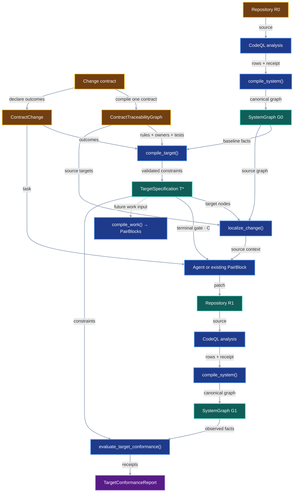
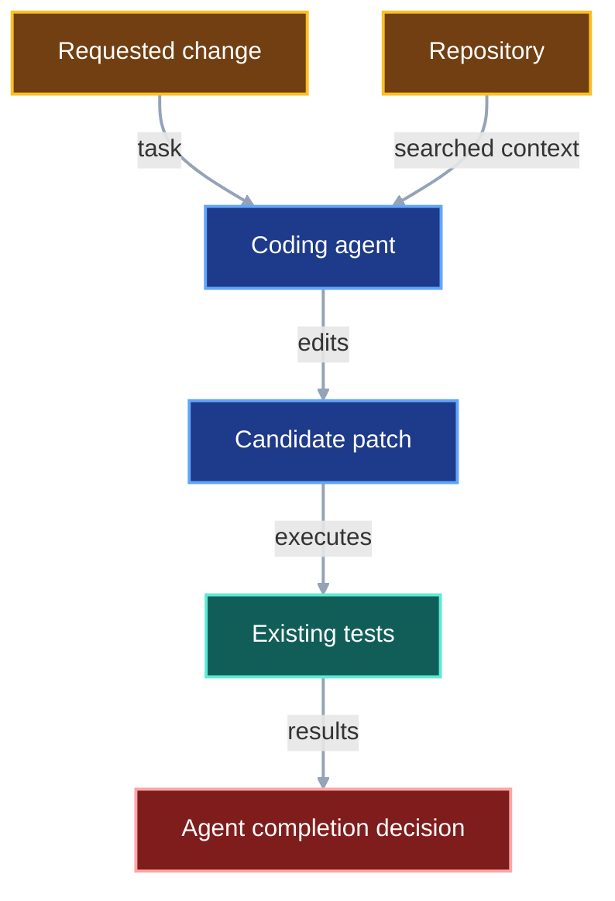
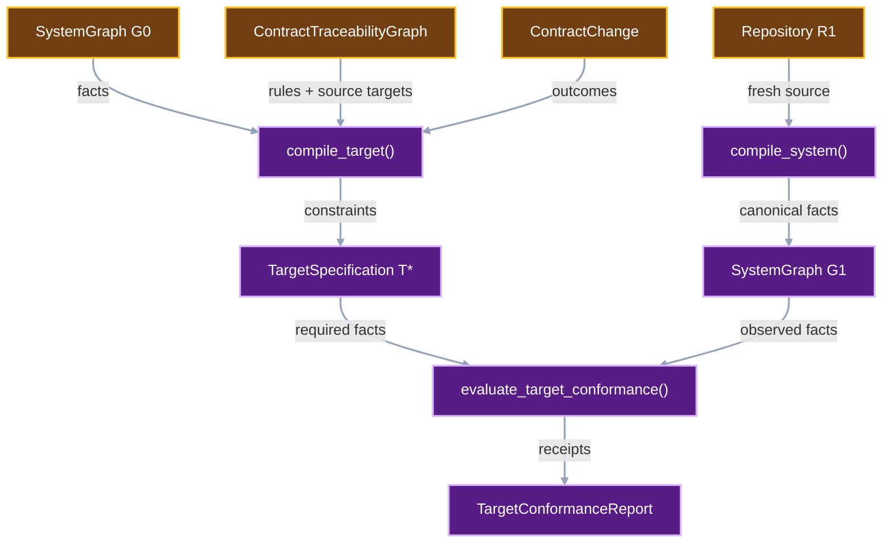
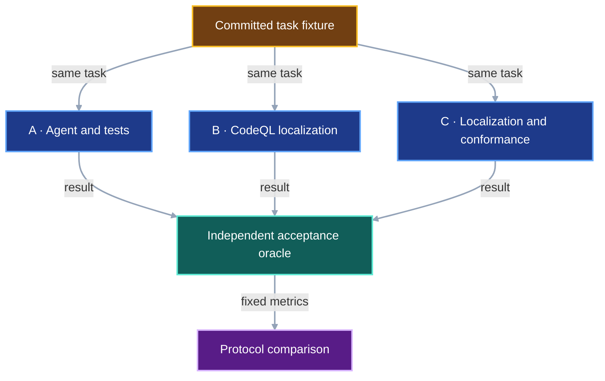

# System Impact Compiler

This document is the single source of truth for VIPER's first System Impact
experiment. The experiment tests one narrow claim: a CodeQL-derived graph and
an independently evaluated target specification can catch structural contract
violations that ordinary agent execution and the repository's existing tests
leave behind.

The experiment does not compute a complete blast radius. It does not require a
total propagation plan, condense strongly connected components, generate work,
or replan after each edit. Those mechanisms remain research candidates until
this smaller experiment establishes that external structural conformance adds
enough value to justify more protocol machinery.



## 1. Status

**Contract status:** draft experiment; owner review required before implementation.

The contract contains four requirements and four implementation PairBlocks.
No source implementation exists on this branch.

| ID | Implementation obligation |
| --- | --- |
| SIG-01 <!-- contract-requirement: SIG-01 phase=0 test=tests/test_system_graph.py --> | Run one pinned CodeQL query pack over a selected repository revision and lower the validated source rows into a canonical `SystemGraph`, including defining-module facts. |
| SIG-02 <!-- contract-requirement: SIG-02 phase=0 test=tests/test_system_impact.py --> | Compile one `ContractChange` and the `ContractTraceabilityGraph` for its single change contract against `G0`, producing a canonical `TargetSpecification` and bounded source context. |
| SIG-03 <!-- contract-requirement: SIG-03 phase=0 test=tests/test_system_impact.py --> | Compile the resulting repository independently and emit one terminal `ConstraintConformanceReceipt` for every target constraint. |
| SIG-04 <!-- contract-requirement: SIG-04 phase=0 test=tests/test_system_impact_experiment.py --> | Compare ordinary agent execution, CodeQL localization, and CodeQL localization plus target conformance on the same committed tasks, inputs, tests, and acceptance oracle. |

The exact implementation order is:

1. `P0-SIG-01`: CodeQL extraction and `SystemGraph` compilation.
2. `P0-SIG-02`: `ContractChange` and `TargetSpecification` compilation.
3. `P0-SIG-03`: independent observed-state compilation and conformance.
4. `P0-SIG-04`: the controlled three-protocol experiment.

## 2. Required claim

For a repository revision accepted by the supported Python profile, VIPER can
compile the same normalized graph whenever the source revision, CodeQL CLI,
query pack, supported profile, and lowering version are unchanged.
Defining-module facts are part of the CodeQL-derived source rows.

Let `G0` be the `SystemGraph` compiled from the repository before an agent
edits it. Let `T*` be the `TargetSpecification` compiled from one
`ContractChange`, its `ContractTraceabilityGraph`, and `G0`. Let `G1` be a
fresh `SystemGraph` compiled from the repository after the agent finishes. The
acceptance relation is:

```math
G_1 \models T^*.
```

This means that every constraint in `T*` evaluates to `pass` against facts in
`G1`. It does not mean that `G1` equals `T*`; one is an observed graph and the
other is a set of requirements. It also does not require `G1` to equal one
preselected future graph. Implementations may add helpers or choose another
internal structure when every declared constraint still passes.

This contract supports six constraint kinds:

| `TargetConstraint.kind` | Required observation in `G1` |
| --- | --- |
| `symbol_exists` | `subject` identifies one `SystemNode`. |
| `symbol_absent` | `subject` identifies no `SystemNode`. |
| `signature_equals` | The subject node's normalized `signature` equals `expected`. |
| `return_annotation_equals` | The subject node's normalized `return_annotation` equals `expected`. |
| `edge_exists` | One `SystemEdge(subject, edge_kind, object)` exists. |
| `edge_absent` | No `SystemEdge(subject, edge_kind, object)` exists. |

The claim is intentionally conditional. It covers facts represented by the
locked queries and lowering rules. It does not prove behavioral correctness,
security, performance, or completeness for Python features outside the
supported profile.

## 3. Current gap

### Current DAG

Today the coding agent chooses context, edits source, and judges completion in
one probabilistic loop. Tests observe only the behaviors they execute.



The unsupported claim is that passing tests and agent review establish every
requested structural outcome. A test can pass while an obsolete symbol
remains, a public signature drifts, or a forbidden dependency survives.

### Proposed-change DAG

The experiment adds a small target language and a fresh structural observation
after implementation.



### Integrated DAG

The experiment holds the task and tests fixed across three protocols. Each
successive protocol adds one mechanism whose marginal value can be measured.



## 4. Contract models

These are planned public protocol models for the experiment. The design uses
nine new classes. Existing `ContractTraceabilityGraph` is imported from
`viper._contract_traceability` during Phase 0 and moves only if the public
module-ownership contract assigns it a different owner.

One active change contract supplies two records. `ContractTraceabilityGraph`
records each requirement, verifier rule, implementation owner, and observing
test. `ContractChange` records the six kinds of source facts that the change
requires or forbids. The records bind through `ContractChange.contract`,
`ContractChange.traceability_sha256`, and each `TargetConstraint.rule_id`.
`SystemGraph G0` supplies the current source nodes against which VIPER resolves
those contract references.

`SystemNodeId` is deterministic text with the form
`python:<path>:<qualified-name>`. `SystemEdge` always points from the dependent
to its dependency. Contract declarations remain in `ContractTraceabilityGraph`;
they are not `SystemNode` records.

The initial implementation pins CodeQL CLI `2.26.4`. Owner review may change
that choice before `P0-SIG-01`; after approval, every trial uses the approved
version and records it in `CodeQLAnalysisReceipt`.

```python
from pathlib import Path
from typing import Annotated, Literal, Self

from pydantic import Field, model_validator

from viper._contract_traceability import ContractTraceabilityGraph, VerifierRuleId
from viper._schema import GitCommit, SHA256, NonEmptyStr, ProtocolModel, RepoRelPath

SystemNodeId = Annotated[
    str,
    Field(pattern=r"^python:[^:\n]+:[^:\n]+$"),
]
CodeQLCliVersion = Literal["2.26.4"]
SystemNodeKind = Literal[
    "repository_file",
    "python_symbol",
    "test_symbol",
]
SystemEdgeKind = Literal[
    "defined_in",
    "imports",
    "calls",
    "reads_symbol",
    "constructs",
    "uses_type",
]
TargetConstraintKind = Literal[
    "symbol_exists",
    "symbol_absent",
    "signature_equals",
    "return_annotation_equals",
    "edge_exists",
    "edge_absent",
]
ConstraintOutcome = Literal["pass", "fail", "error"]
AnalysisProfile = Literal["python-static-v1"]


class SystemNode(ProtocolModel):
    """One source entity in a compiled repository revision."""

    node_id: SystemNodeId = Field(description="Stable repository-local identity.")
    kind: SystemNodeKind = Field(description="Closed entity category.")
    qualified_name: NonEmptyStr = Field(description="Normalized entity name.")
    path: RepoRelPath = Field(description="Repository-relative evidence path.")
    start_line: int = Field(ge=1, description="First source-evidence line.")
    end_line: int = Field(ge=1, description="Final source-evidence line.")
    signature: NonEmptyStr | None = Field(
        default=None,
        description="Canonical parameter signature when the node is callable.",
    )
    return_annotation: NonEmptyStr | None = Field(
        default=None,
        description="Canonical return annotation when one is declared.",
    )

    @model_validator(mode="after")
    def validate_line_order(self) -> Self:
        """Require the evidence span to end at or after its first line."""
        if self.end_line < self.start_line:
            raise ValueError("end_line must be greater than or equal to start_line")
        return self


class SystemEdge(ProtocolModel):
    """One evidenced dependent-to-dependency relationship."""

    source: SystemNodeId = Field(description="Dependent node.")
    kind: SystemEdgeKind = Field(description="Relationship category.")
    target: SystemNodeId = Field(description="Dependency node.")
    evidence_path: RepoRelPath = Field(description="File that proves the edge.")
    evidence_line: int = Field(ge=1, description="First proving source line.")


class CodeQLAnalysisReceipt(ProtocolModel):
    """Bind one source analysis to its revision, toolchain, queries, and rows."""

    source_commit: GitCommit = Field(description="Analyzed Git commit.")
    cli_version: CodeQLCliVersion = Field(description="Executed CodeQL CLI version.")
    query_pack_sha256: SHA256 = Field(description="Digest of the VIPER QL pack.")
    analysis_profile: AnalysisProfile = Field(description="Supported query profile.")
    database_key_sha256: SHA256 = Field(
        description="Digest of canonical database-construction inputs."
    )
    result_sha256: SHA256 = Field(description="Digest of canonical decoded rows.")


class SystemGraph(ProtocolModel):
    """Canonical source facts for one repository revision."""

    schema_version: Literal[1] = 1
    lowering_version: NonEmptyStr = Field(description="VIPER lowering version.")
    compiler_sha256: SHA256 = Field(
        description="Digest of CLI, query pack, profile, and lowering identity."
    )
    analysis: CodeQLAnalysisReceipt = Field(description="CodeQL execution evidence.")
    nodes: tuple[SystemNode, ...] = Field(description="Sorted unique graph nodes.")
    edges: tuple[SystemEdge, ...] = Field(description="Sorted unique graph edges.")
    graph_sha256: SHA256 = Field(description="Digest of canonical graph content.")

    @model_validator(mode="after")
    def validate_topology(self) -> Self:
        """Require canonical records, unique node IDs, and internal endpoints."""
        node_ids = tuple(node.node_id for node in self.nodes)
        if node_ids != tuple(sorted(node_ids)) or len(node_ids) != len(set(node_ids)):
            raise ValueError("nodes must have unique IDs in sorted order")
        node_id_set = set(node_ids)
        edge_keys = tuple(
            (
                edge.source,
                edge.kind,
                edge.target,
                edge.evidence_path,
                edge.evidence_line,
            )
            for edge in self.edges
        )
        if edge_keys != tuple(sorted(edge_keys)) or len(edge_keys) != len(
            set(edge_keys)
        ):
            raise ValueError("edges must be unique and sorted")
        unknown = {
            endpoint
            for edge in self.edges
            for endpoint in (edge.source, edge.target)
            if endpoint not in node_id_set
        }
        if unknown:
            raise ValueError(f"edge endpoints are missing nodes: {sorted(unknown)}")
        return self


class TargetConstraint(ProtocolModel):
    """One structural fact required or forbidden in the observed graph."""

    constraint_id: NonEmptyStr = Field(description="Stable change-local identity.")
    rule_id: VerifierRuleId = Field(
        description="VerifierRule that requires this structural outcome."
    )
    kind: TargetConstraintKind = Field(description="Closed comparison operator.")
    subject: SystemNodeId = Field(description="Primary node identity.")
    edge_kind: SystemEdgeKind | None = Field(
        default=None,
        description="Relationship kind for an edge constraint.",
    )
    object: SystemNodeId | None = Field(
        default=None,
        description="Dependency identity for an edge constraint.",
    )
    expected: NonEmptyStr | None = Field(
        default=None,
        description="Expected normalized value for a value constraint.",
    )

    @model_validator(mode="after")
    def validate_operands(self) -> Self:
        """Require exactly the operands used by the selected constraint kind."""
        if not self.subject.startswith("python:") or (
            self.object is not None and not self.object.startswith("python:")
        ):
            raise ValueError("target constraints accept only Python node IDs")
        edge_kind = self.edge_kind is not None
        object_node = self.object is not None
        expected = self.expected is not None
        if self.kind in {"symbol_exists", "symbol_absent"}:
            valid = not edge_kind and not object_node and not expected
        elif self.kind in {"signature_equals", "return_annotation_equals"}:
            valid = not edge_kind and not object_node and expected
        else:
            valid = edge_kind and object_node and not expected
        if not valid:
            raise ValueError(f"invalid operands for {self.kind}")
        return self


class ContractChange(ProtocolModel):
    """Author one contract's structural outcomes for one baseline graph."""

    change_id: NonEmptyStr = Field(description="Stable experiment-task identity.")
    contract: RepoRelPath = Field(description="Contract that requests the change.")
    traceability_sha256: SHA256 = Field(
        description="Digest of that contract's ContractTraceabilityGraph."
    )
    baseline_graph_sha256: SHA256 = Field(description="Required baseline graph digest.")
    constraints: tuple[TargetConstraint, ...] = Field(
        min_length=1,
        description="Authored structural outcomes in declaration order.",
    )


class TargetSpecification(ProtocolModel):
    """Store validated canonical constraints for one baseline graph."""

    schema_version: Literal[1] = 1
    change_id: NonEmptyStr = Field(description="Originating change identity.")
    contract: RepoRelPath = Field(description="Contract that requests the change.")
    traceability_sha256: SHA256 = Field(
        description="Validated ContractTraceabilityGraph digest."
    )
    baseline_graph_sha256: SHA256 = Field(description="Validated baseline graph digest.")
    compiler_sha256: SHA256 = Field(description="Required observed-graph compiler identity.")
    constraints: tuple[TargetConstraint, ...] = Field(
        min_length=1,
        description="Constraints sorted by constraint_id.",
    )
    target_sha256: SHA256 = Field(description="Digest of canonical target content.")

    @model_validator(mode="after")
    def validate_constraint_order(self) -> Self:
        """Require unique constraint IDs in canonical order."""
        ids = tuple(item.constraint_id for item in self.constraints)
        if ids != tuple(sorted(ids)) or len(ids) != len(set(ids)):
            raise ValueError("constraints must have unique IDs in sorted order")
        return self


class ConstraintConformanceReceipt(ProtocolModel):
    """Record one terminal constraint evaluation against one observed graph."""

    constraint_id: NonEmptyStr = Field(description="Evaluated target constraint.")
    outcome: ConstraintOutcome = Field(description="Terminal evaluation result.")
    observed: tuple[str, ...] = Field(description="Canonical facts used by the check.")
    diagnostic: NonEmptyStr | None = Field(
        description="Failure or evaluation-error detail."
    )

    @model_validator(mode="after")
    def validate_diagnostic(self) -> Self:
        """Keep successful receipts silent and explain every non-pass outcome."""
        if (self.outcome == "pass") != (self.diagnostic is None):
            raise ValueError("diagnostic must be absent only for a pass")
        return self


class TargetConformanceReport(ProtocolModel):
    """Collect complete target evaluation for one observed graph."""

    target_sha256: SHA256 = Field(description="Evaluated target digest.")
    observed_graph_sha256: SHA256 = Field(description="Observed graph digest.")
    receipts: tuple[ConstraintConformanceReceipt, ...] = Field(
        min_length=1,
        description="One receipt per target constraint."
    )
    accepted: bool = Field(description="True exactly when every receipt passes.")

    @model_validator(mode="after")
    def validate_receipts(self) -> Self:
        """Require canonical unique receipts and derive the acceptance truth."""
        ids = tuple(receipt.constraint_id for receipt in self.receipts)
        if ids != tuple(sorted(ids)) or len(ids) != len(set(ids)):
            raise ValueError("receipts must have unique IDs in sorted order")
        if self.accepted != all(item.outcome == "pass" for item in self.receipts):
            raise ValueError("accepted must equal whether every receipt passes")
        return self


def compile_system(
    root: Path,
    source_commit: GitCommit,
) -> SystemGraph:
    """Run CodeQL and lower source facts."""
    raise NotImplementedError


def compile_target(
    change: ContractChange,
    baseline: SystemGraph,
    traceability: ContractTraceabilityGraph,
) -> TargetSpecification:
    """Resolve one change contract and canonicalize its structural target."""
    raise NotImplementedError


def localize_change(
    baseline: SystemGraph,
    target: TargetSpecification,
    traceability: ContractTraceabilityGraph,
) -> tuple[SystemNodeId, ...]:
    """Return source context for one traced target specification."""
    raise NotImplementedError


def evaluate_target_conformance(
    target: TargetSpecification,
    observed: SystemGraph,
) -> TargetConformanceReport:
    """Check every target constraint against an independent graph."""
    raise NotImplementedError
```

`TargetConstraint.validate_operands()` must enforce this matrix:

| Kind | `edge_kind` | `object` | `expected` |
| --- | --- | --- | --- |
| `symbol_exists`, `symbol_absent` | absent | absent | absent |
| `signature_equals`, `return_annotation_equals` | absent | absent | required |
| `edge_exists`, `edge_absent` | required | required | absent |

`P0-SIG-02` must implement this matrix and validator behavior verbatim.

`P0-SIG-01` must also implement these normalization rules:

- A Python symbol ID is `python:<RepoRelPath>:<qualified-name>`. IDs containing
  an empty component or a newline are invalid.
- `SystemNode.signature` contains the parameters only. It preserves source
  order, `/` and `*` separators, parameter names, `*` and `**` prefixes,
  canonical annotations, and the presence of a default as `=<default>`. It
  never records a default value or a return annotation.
- An annotation resolved by CodeQL uses its fully qualified name. An unresolved
  annotation uses its exact source tokens with comments removed and whitespace
  collapsed to one space. An absent annotation is the literal `<unannotated>`.
- `SystemNode.return_annotation` uses the same annotation normalizer and is
  `None` when no return annotation is declared.

For example, `def load(ref: ArtifactRef, *, raw=False) -> bytes` becomes
`(ref:models.ArtifactRef, *, raw:<unannotated>=<default>)` in `signature` and
`builtins.bytes` in `return_annotation`.

The edge vocabulary follows one direction: changing the target may require
checking the source.

| `SystemNode.kind` | Represented entity |
| --- | --- |
| `repository_file` | One analyzed Python file. |
| `python_symbol` | One module, class, function, method, field, or other resolved Python declaration. |
| `test_symbol` | One resolved pytest test function or method. |

| `SystemEdge.kind` | `source` → `target` |
| --- | --- |
| `defined_in` | symbol → defining file |
| `imports` | importing module or symbol → imported module or symbol |
| `calls` | caller → callee |
| `reads_symbol` | reader → referenced symbol |
| `constructs` | constructor caller → constructed type |
| `uses_type` | annotated symbol → referenced type |

No other CodeQL relationship enters `SystemGraph` under `python-static-v1`.
An unrecognized supported-row kind is an error; the lowerer cannot silently
discard it. `ContractTraceabilityGraph` remains a separate input to
`compile_target()` and `localize_change()`.

<!-- contract-symbols:
{"models":["CodeQLAnalysisReceipt","ConstraintConformanceReceipt","ContractChange","SystemEdge","SystemGraph","SystemNode","TargetConformanceReport","TargetConstraint","TargetSpecification"],"aliases":["AnalysisProfile","CodeQLCliVersion","ConstraintOutcome","SystemEdgeKind","SystemNodeId","SystemNodeKind","TargetConstraintKind"],"functions":["compile_system","compile_target","evaluate_target_conformance","localize_change"]}
-->

### Worked example

The fixture changes `ArtifactRef.path` to `ArtifactRef.source`, introduces
`LocalSource` and `LoadedArtifact`, changes `LocalArtifactStore.load()` to
return `LoadedArtifact`, and preserves the public `bytes` return types of
`Runner.verify()` and `api.verify()`.

<!-- contract-example-symbols: ["AnalysisProfile", "CodeQLCliVersion", "SystemNodeId", "SystemNodeKind", "SystemEdgeKind", "TargetConstraintKind", "ConstraintOutcome", "SystemNode", "SystemEdge", "CodeQLAnalysisReceipt", "SystemGraph", "TargetConstraint", "ContractChange", "TargetSpecification", "ConstraintConformanceReceipt", "TargetConformanceReport", "compile_system", "compile_target", "evaluate_target_conformance", "localize_change"] -->
<!-- contract-worked-example: start -->
```python
baseline_node_id: SystemNodeId = "python:models.py:ArtifactRef.path"
future_node_id: SystemNodeId = "python:models.py:ArtifactRef.source"
cli_version: CodeQLCliVersion = "2.26.4"
analysis_profile: AnalysisProfile = "python-static-v1"
node_kind: SystemNodeKind = "python_symbol"
edge_kind: SystemEdgeKind = "reads_symbol"
constraint_kind: TargetConstraintKind = "symbol_exists"
outcome: ConstraintOutcome = "pass"

path_node = SystemNode(
    node_id=baseline_node_id,
    kind=node_kind,
    qualified_name="ArtifactRef.path",
    path="models.py",
    start_line=5,
    end_line=5,
)
source_node = SystemNode(
    node_id=future_node_id,
    kind=node_kind,
    qualified_name="ArtifactRef.source",
    path="models.py",
    start_line=5,
    end_line=5,
)
load_node = SystemNode(
    node_id="python:storage.py:LocalArtifactStore.load",
    kind="python_symbol",
    qualified_name="LocalArtifactStore.load",
    path="storage.py",
    start_line=4,
    end_line=5,
    signature="(ref:models.ArtifactRef)",
    return_annotation="builtins.bytes",
)
read_path_edge = SystemEdge(
    source="python:storage.py:LocalArtifactStore.load",
    kind=edge_kind,
    target=baseline_node_id,
    evidence_path="storage.py",
    evidence_line=5,
)
read_source_edge = SystemEdge(
    source="python:storage.py:LocalArtifactStore.load",
    kind=edge_kind,
    target=future_node_id,
    evidence_path="storage.py",
    evidence_line=5,
)
receipt_g0 = CodeQLAnalysisReceipt(
    source_commit="0" * 40,
    cli_version=cli_version,
    query_pack_sha256="1" * 64,
    analysis_profile=analysis_profile,
    database_key_sha256="2" * 64,
    result_sha256="3" * 64,
)
g0 = SystemGraph(
    lowering_version="1",
    compiler_sha256="8" * 64,
    analysis=receipt_g0,
    nodes=(path_node, load_node),
    edges=(read_path_edge,),
    graph_sha256="6" * 64,
)
constraint = TargetConstraint(
    constraint_id="source-exists",
    rule_id="fixture.source_exists",
    kind=constraint_kind,
    subject=future_node_id,
)
change = ContractChange(
    change_id="artifact-source",
    contract="change-contract.md",
    traceability_sha256="4" * 64,
    baseline_graph_sha256=g0.graph_sha256,
    constraints=(constraint,),
)
target = TargetSpecification(
    change_id=change.change_id,
    contract=change.contract,
    traceability_sha256=change.traceability_sha256,
    baseline_graph_sha256=g0.graph_sha256,
    compiler_sha256=g0.compiler_sha256,
    constraints=change.constraints,
    target_sha256="7" * 64,
)
receipt_g1 = receipt_g0.model_copy(
    update={"source_commit": "a" * 40, "result_sha256": "9" * 64}
)
g1 = SystemGraph(
    lowering_version=g0.lowering_version,
    compiler_sha256=g0.compiler_sha256,
    analysis=receipt_g1,
    nodes=(source_node, load_node),
    edges=(read_source_edge,),
    graph_sha256="b" * 64,
)
constraint_receipt = ConstraintConformanceReceipt(
    constraint_id=constraint.constraint_id,
    outcome=outcome,
    observed=(f"node:{future_node_id}",),
    diagnostic=None,
)
report = TargetConformanceReport(
    target_sha256=target.target_sha256,
    observed_graph_sha256=g1.graph_sha256,
    receipts=(constraint_receipt,),
    accepted=True,
)

traceability: ContractTraceabilityGraph = ...
compiled_g0 = compile_system(Path("."), "0" * 40)
compiled_target = compile_target(change, compiled_g0, traceability)
localized = localize_change(compiled_g0, compiled_target, traceability)
compiled_g1 = compile_system(Path("."), "a" * 40)
checked = evaluate_target_conformance(compiled_target, compiled_g1)
assert localized and report.accepted and checked.accepted
```
<!-- contract-worked-example: end -->

The example is illustrative Python, not executable repository code. The
implemented fixture must construct a real `ContractTraceabilityGraph` instance
and derive every digest from serialized content.

## 5. Execution

### 5.1 Compile `G0`

`compile_system()` requires `root` to be a clean checkout whose `HEAD` equals
`source_commit`; it never changes that checkout. It creates the CodeQL database
outside `root`, runs the pinned CodeQL CLI and VIPER QL pack, decodes the result
rows, and rejects malformed or unresolved rows in the supported query profile.
It then:

1. derives `SystemNode` and `SystemEdge` records from the CodeQL rows;
2. records each source symbol's defining path in `SystemNode.path`;
3. sorts and deduplicates nodes and edges; and
4. computes `SystemGraph.graph_sha256` from all content except that field.

The QL pack emits three named result sets. The internal adapter validates these
columns before constructing a public model:

| Result set | Ordered columns |
| --- | --- |
| `nodes` | `node_id`, `kind`, `qualified_name`, `path`, `start_line`, `end_line`, `signature`, `return_annotation` |
| `edges` | `source`, `kind`, `target`, `evidence_path`, `evidence_line` |
| `unresolved` | `path`, `line`, `reference_kind`, `source_text` |

`python-static-v1` covers Python files for which every import, call target,
attribute read, constructed type, and annotation referenced by these result
sets resolves. Any `unresolved` row rejects compilation with its path, line,
reference kind, and source text. This strict rule makes an absence result a
closed-world statement within the pilot profile. Broader dynamic-Python
support is outside this experiment.

`query_pack_sha256` covers the QL sources, `qlpack.yml`, and
`codeql-pack.lock.yml`. `database_key_sha256` covers `source_commit`, the CLI
version, language, and extraction settings. `compiler_sha256` covers the CLI
version, query-pack digest, analysis profile, and VIPER lowering version.

The module-ownership contract makes `SystemNode.path` unambiguous for public
symbols: each public symbol has one defining module. `SystemGraph` does not
introduce a second ownership registry or duplicate those paths in another
digest.

### 5.2 Compile `T*`

The harness compiles exactly one change contract for each experiment run. Its
fixture-local checklist contains only that contract's markers:

```python
traceability = compile_contract_traceability(root, checklist, (contract,))
```

`compile_target()` verifies that every requirement, rule, and symbol in
`traceability` belongs to `ContractChange.contract` and that every `RuleEdge`
refers to one of those rules. It also requires the SHA-256 digest of
`serialize_contract_traceability(traceability)` to equal
`ContractChange.traceability_sha256` and requires every
`TargetConstraint.rule_id` to identify one `VerifierRule` in `traceability`.
These checks connect each structural constraint to the requirement, owner, and
test recorded by the active change contract.

`compile_target()` also requires
`ContractChange.baseline_graph_sha256 == SystemGraph.graph_sha256`. It validates
the operand matrix, rejects duplicate constraint IDs and duplicate semantic
constraints, sorts constraints by `constraint_id`, copies the contract path,
traceability digest, and `SystemGraph.compiler_sha256`, and computes
`target_sha256` from every target field except that digest.

Reference validation is operator-specific:

- `symbol_absent`, `signature_equals`, and `return_annotation_equals` require
  `subject` to identify a node in `G0`;
- `edge_absent` requires the named typed edge to exist in `G0`;
- `symbol_exists` may name an existing or future deterministic node ID; and
- `edge_exists` may name existing or future deterministic endpoint IDs.

Every future ID must name a file already represented by a `repository_file`
node in `G0`. The constraint supplies the future identity directly. This
experiment does not need a `PlannedNodeAnchor` class.

`compile_target()` rejects these contradictions:

- `symbol_exists` and `symbol_absent` for the same node;
- two `signature_equals` constraints with different values for one node;
- two `return_annotation_equals` constraints with different values for one
  node;
- `edge_exists` and `edge_absent` for the same typed edge;
- `symbol_absent` together with a value constraint on that node; and
- `symbol_absent` together with an `edge_exists` constraint incident to that
  node.

These checks establish that at least one graph can satisfy the target's local
predicates. They do not prove that the requested Python implementation exists.

### 5.3 Build the Protocol B and C context

`localize_change()` first verifies that `TargetSpecification.traceability_sha256`
matches the supplied `ContractTraceabilityGraph`. It starts from every existing
`subject` and `object` named by `TargetSpecification`. When an ID names a future
symbol, it starts from that symbol's existing repository-file node. It also
resolves the implementation and verification `RuleEdge.target` values for the
rules named by `TargetConstraint.rule_id`. An existing target resolves to its
`SystemNode`; a planned target resolves to its existing repository-file node.
The function returns:

1. each starting node;
2. both endpoints of every edge incident to a starting node; and
3. every resolved implementation owner and observing test named by the active
   contract; and
4. each `test_symbol` that depends on a starting node, plus the nodes on one
   shortest dependency path between them.

Shortest-path ties resolve by `SystemNodeId`, and the returned tuple is sorted
and unique. This is a bounded context-selection rule, not a complete-impact
claim. Protocol A receives none of this generated context. Protocols B and C
receive the selected source spans and the incident edges that justified each
selection.

### 5.4 Produce `R1`

The ordinary coding agent or an existing PairBlock execution edits the fixture
repository. `TargetSpecification` is the target input for future
`compile_work()` and generated PairBlocks. This experiment passes the same
`TargetSpecification` to an ordinary agent or existing PairBlock and uses it as
the terminal gate; it does not implement `compile_work()`.

### 5.5 Compile `G1` and check it

After execution, `compile_system()` analyzes the committed `R1` revision with
the same CodeQL CLI version, query-pack digest, lowering version, and supported
profile used for `G0`. It produces `G1` from the observed `R1` source without
applying `ContractChange` or `TargetSpecification` to `G0`.

`evaluate_target_conformance()` emits exactly one receipt per constraint. Any
`fail` or `error` outcome sets `TargetConformanceReport.accepted` to `False`.
If `TargetSpecification.compiler_sha256` differs from
`SystemGraph.compiler_sha256`, every constraint receives an `error` receipt
that names both digests. The evaluator checks that the returned receipt IDs
equal the target constraint IDs before constructing the report; a duplicate or
missing receipt is an internal error, never a partial report.

Each `ConstraintConformanceReceipt.observed` item uses one of these canonical
strings:

```text
node:<node_id>
signature:<node_id>=<canonical-signature>
return_annotation:<node_id>=<canonical-annotation>
edge:<source>|<kind>|<target>
```

An absence constraint that passes has an empty `observed` tuple. A failed
absence constraint records every forbidden matching fact. A failed required
constraint has an empty tuple when no matching fact exists and records each
conflicting fact when a node or edge exists with the wrong value. Each `fail`
or `error` receipt carries a nonempty `diagnostic`; a `pass` receipt carries
none.

## 6. Persisted evidence

Each experiment run stores:

| Artifact | Required content |
| --- | --- |
| `g0.json` | Canonical `SystemGraph` before execution. |
| `contract-traceability.json` | `ContractTraceabilityGraph` compiled from the single active change contract. |
| `contract-change.json` | Authored `ContractChange`. |
| `localization.json` | Sorted node IDs and supporting edges supplied to Protocol B or C. |
| `target-specification.json` | Canonical `TargetSpecification`. |
| `agent-request.json` | Exact task prompt, protocol assignment, model, and tool settings. |
| `agent-result.json` | Exit state, patch commit, wall time, token use when available, and test commands. |
| `g1.json` | Independently compiled `SystemGraph` after execution. |
| `target-conformance.json` | Complete `TargetConformanceReport`. |
| `oracle-result.json` | Independent test and structural acceptance result. |

Every artifact records the fixture ID, trial ID, protocol, source commit, and
schema version. Canonical JSON uses sorted keys, UTF-8, and no insignificant
whitespace. The run directory is immutable after its terminal result is
written.

## 7. Verification

| Rule | Statement |
| --- | --- |
| `system.graph.canonical` <!-- verifier-rule: system.graph.canonical requirement=SIG-01 --> | Equal source, toolchain, query-pack, profile, and lowering inputs produce byte-identical `SystemGraph` artifacts. |
| `system.graph.evidenced` <!-- verifier-rule: system.graph.evidenced requirement=SIG-01 --> | Every node and edge has a repository-relative source location, and every edge endpoint exists in the same graph. |
| `system.localization.canonical` <!-- verifier-rule: system.localization.canonical requirement=SIG-02 --> | `localize_change()` resolves one active contract's owners and tests against `G0`, then returns them with the sorted direct nodes, one-edge neighborhood, and shortest paths to observing tests. |
| `system.target.closed` <!-- verifier-rule: system.target.closed requirement=SIG-02 --> | `TargetConstraint` accepts only the six declared kinds and exactly the operands required by its kind. |
| `system.target.canonical` <!-- verifier-rule: system.target.canonical requirement=SIG-02 --> | `compile_target()` rejects baseline or traceability drift, unknown verifier rules, duplicate obligations, and the declared contradictions, then emits constraints in canonical order with a reproducible digest. |
| `system.conformance.total` <!-- verifier-rule: system.conformance.total requirement=SIG-03 --> | The report contains exactly one terminal receipt for every target constraint and no receipt for an unknown constraint. |
| `system.conformance.independent` <!-- verifier-rule: system.conformance.independent requirement=SIG-03 --> | `G1` comes from a fresh CodeQL analysis of `R1` under the same compiler identity used for `G0`. |
| `system.experiment.controlled` <!-- verifier-rule: system.experiment.controlled requirement=SIG-04 --> | Protocols A, B, and C receive the same committed fixture, requested outcomes, tests, model settings, and independent oracle. |
| `system.experiment.reported` <!-- verifier-rule: system.experiment.reported requirement=SIG-04 --> | The result reports correctness, missed obligations, false rejections, wall time, token use when available, files read, and repair iterations for every trial. |

The experiment has two validation layers:

1. Deterministic fixtures prove that each constraint operator accepts one
   conforming graph and rejects one graph with the named violation.
2. Controlled agent trials measure whether the mechanism catches violations
   that survive the agent's normal loop and existing tests.

The current AST-based documentation and import checks remain independent test
oracles. They do not serve as the production source-fact provider.

## 8. Propagation

This contract changes four documentation surfaces and, after approval, three
implementation surfaces.

| Consumer | Required update |
| --- | --- |
| [Master execution checklist](master-execution-checklist.md) | Schedule only `P0-SIG-01` through `P0-SIG-04`; remove complete-impact and SCC obligations from the active path. |
| [Documentation index](../README.md) | Describe System Impact as a target-conformance experiment. |
| [Testing guide](testing.md) | Name the CodeQL, target-language, conformance, and experiment gates. |
| `src/viper/system_graph.py` | Add the nine protocol models and four public functions after owner approval. |
| `src/viper/_system_graph/codeql.py` | Own CodeQL invocation, query execution, decoding, and internal row validation. |
| `tools/codeql/viper-system-graph/` | Own the pinned QL pack and its declared result schemas. |
| `tests/test_system_graph.py` | Verify CodeQL receipts, graph canonicalization, evidence, and supported-row rejection. |
| `tests/test_system_impact.py` | Verify target compilation and complete conformance receipts. |
| `tests/test_system_impact_experiment.py` | Verify deterministic fixtures and the controlled trial contract. |

`ContractTraceabilityGraph` records the active change contract's requirements,
verifier rules, implementation owners, and tests. `compile_target()` binds its
rules to `TargetConstraint` records, and `localize_change()` resolves its owner
and test references against `G0`. `compile_system()` receives only repository
source and CodeQL identity. The completed module-ownership work ensures that
each public symbol observed by CodeQL has one defining path.

## 9. Acceptance case

### 9.1 Deterministic fixture

`P0-SIG-04` adds three tracked fixture templates beneath
`tests/fixtures/system_impact/`. The harness copies one template into a new
temporary directory, initializes a Git repository with fixed author and time
metadata, compiles a `ContractTraceabilityGraph` from that fixture's one change
contract, and records the baseline commit. Each protocol receives a separate
copy with the same commit ID and bytes.

| Fixture ID | Source change | Structural target |
| --- | --- | --- |
| `artifact-source` | In `models.py`, replace `ArtifactRef.path` with `ArtifactRef.source`, add `LocalSource` and `LoadedArtifact`, and change `LocalArtifactStore.load()` while preserving the public `bytes` API. | Require the three new symbols and the new load return annotation; forbid `ArtifactRef.path`; preserve the `Runner.verify()` and `api.verify()` signatures and return annotations. |
| `options-models` | In `models.py`, rename `RunOptions.model_support` to `RunOptions.models` and update `loader.py`, `report.py`, and `api.py`. | Require `RunOptions.models`; forbid `RunOptions.model_support`; require the new read edges; forbid the old read edges; preserve the public callable signatures. |
| `codec-owner` | Move `encode()` from `legacy_codec.py` to the existing `codec.py` and update `service.py` and `api.py`. | Require `codec.encode`; forbid `legacy_codec.encode`; require calls to the new symbol; forbid calls and imports that retain the old dependency. |

Each template contains its Python source, visible behavioral tests, one small
contract, and the checklist markers needed by
`compile_contract_traceability()`. The hidden oracle uses direct Python AST and
import inspection plus behavioral tests. It does not call `compile_system()`,
`compile_target()`, or `evaluate_target_conformance()`.

The `artifact-source` fixture starts with:

```text
test_verify
    -> api.verify
    -> Runner.verify
    -> LocalArtifactStore.load
    -> ArtifactRef.path
```

The requested outcomes are:

```text
FORBID  ArtifactRef.path
REQUIRE ArtifactRef.source
REQUIRE LocalSource
REQUIRE LoadedArtifact
REQUIRE LocalArtifactStore.load returns LoadedArtifact
REQUIRE Runner.verify returns bytes
REQUIRE api.verify returns bytes
```

Its visible test checks only that `api.verify(path)` returns the
original bytes. The deterministic variants include:

- one conforming implementation;
- one implementation that retains `ArtifactRef.path`;
- one implementation that changes `Runner.verify()` to return
  `LoadedArtifact` while adapting the test; and
- one implementation that keeps a forbidden typed dependency.

Each fixture has one conforming deterministic variant and at least one variant
for every constraint kind that it uses. Across the three fixtures, the variants
exercise all six constraint kinds as both passing and failing cases. Each
variant must produce the expected constraint receipt before agent performance
is measured.

### 9.2 Controlled protocol comparison

The experiment uses three protocols:

| Protocol | Agent input and gate |
| --- | --- |
| A | Repository search, the requested change, and existing tests. |
| B | Protocol A plus CodeQL-selected symbols, edges, and observing tests from `G0`. |
| C | Protocol B plus the authored `TargetSpecification`; after execution, `G1` must satisfy every constraint. |

Use the three tracked cross-file fixtures and one trial per protocol. Run all
nine initial trials with the same model, reasoning effort, tool policy, time
limit, and starting commit for each fixture. Each trial starts in a fresh
temporary repository without cross-trial messages or memory. Randomize
protocol order within each fixture.
The independent oracle remains hidden from the agent and evaluates every
declared structural outcome plus existing tests.

Protocol C performs one terminal conformance check and records its diagnostics;
it does not start an automatic repair loop. A later experiment may test repair
from those diagnostics if this detection layer passes its kill gates.

The harness compiles `G0`, `T*`, and `G1` for every protocol so each result has
the same structural measurements. Protocol A receives none of those artifacts.
Protocol B receives only the localization derived from `G0`. Protocol C
receives that localization and `T*`; its terminal gate uses the conformance
report. Offline compilation time remains separate from agent time and from the
protocol-visible overhead.

Each trial result defines its metrics mechanically:

| Field | Definition |
| --- | --- |
| `oracle_passed` | All hidden AST/import checks and behavioral tests pass. |
| `protocol_gate_passed` | Protocol A or B reaches agent-declared completion; Protocol C also has `TargetConformanceReport.accepted == True`. |
| `missed_obligation` | The agent declared completion and `oracle_passed == False`. |
| `detected_violation` | The protocol gate rejected a result for which `oracle_passed == False`. |
| `false_rejection` | The protocol gate rejected a result for which `oracle_passed == True`. |
| `agent_wall_seconds` | Time from the agent request to its terminal response. |
| `protocol_wall_seconds` | CodeQL, localization, target compilation, and gate time visible to that protocol. |
| `total_wall_seconds` | Fixture preparation, agent time, protocol-visible work, and offline measurement. |
| `files_read` | Distinct fixture-relative files returned by read or search tool events. |
| `repair_iterations` | A failed visible test or validation event followed by another source edit. |

The result also records input and output tokens when the execution host reports
them. Missing token telemetry is `null`, not zero.

This is an exploratory feasibility experiment, not a publication-level effect
estimate. It succeeds as an engineering pilot when:

1. every deterministic constraint fixture produces the expected receipt;
2. the offline `TargetConformanceReport` rejects at least one Protocol A or B
   result that the agent declared complete, the visible tests accepted, and the
   hidden oracle rejected;
3. Protocol C never accepts a fixture rejected by the independent structural
   oracle;
4. target conformance has zero false rejections across conforming deterministic
   variants and oracle-passing agent results; and
5. median Protocol C `agent_wall_seconds + protocol_wall_seconds` is no more
   than twice median Protocol A `agent_wall_seconds`.

If no Protocol A or B run misses an obligation, the marginal-detection result
is inconclusive; add harder fixtures or repeats before promotion. If condition
3 or 4 fails, reject the conformance implementation. If the latency gate fails,
measure database reuse before deciding whether to continue. Report Protocol B's
correctness, context size, and cost separately; this pilot does not set a
promotion threshold for localization.

## 10. Implementation order

<!-- pair-block-definition: P0-SIG-01 -->
```toml pair-block
id = "P0-SIG-01"
requirements = ["SIG-01"]
targets = ["src/viper/system_graph.py:SystemNode", "src/viper/system_graph.py:SystemEdge", "src/viper/system_graph.py:CodeQLAnalysisReceipt", "src/viper/system_graph.py:SystemGraph", "src/viper/system_graph.py:compile_system", "src/viper/_system_graph/codeql.py:analyze_source_with_codeql", "tests/test_system_graph.py:test_compile_system_is_canonical", "tests/test_system_graph.py:test_python_fact_normalization_is_canonical", "tests/test_system_graph.py:test_compile_system_rejects_unresolved_supported_rows"]
tests = ["tests/test_system_graph.py:test_compile_system_is_canonical", "tests/test_system_graph.py:test_python_fact_normalization_is_canonical", "tests/test_system_graph.py:test_compile_system_rejects_unresolved_supported_rows"]
gate = "conda run -n mantra python -m pytest tests/test_system_graph.py -q"
depends_on = ["P0-CRT-05", "P0-MOD-04"]
```

Implement the four graph and analysis models, the internal CodeQL adapter, and
`compile_system()`. Pin the toolchain and QL-pack identities in the test
fixture. Cover canonical serialization, endpoint integrity, source locations,
defining-module observations, and supported-row rejection.

<!-- pair-block-definition: P0-SIG-02 -->
```toml pair-block
id = "P0-SIG-02"
requirements = ["SIG-02"]
targets = ["src/viper/system_graph.py:TargetConstraint", "src/viper/system_graph.py:ContractChange", "src/viper/system_graph.py:TargetSpecification", "src/viper/system_graph.py:compile_target", "src/viper/system_graph.py:localize_change", "tests/test_system_impact.py:test_target_constraint_operand_matrix", "tests/test_system_impact.py:test_compile_target_is_canonical", "tests/test_system_impact.py:test_localize_change_is_canonical"]
tests = ["tests/test_system_impact.py:test_target_constraint_operand_matrix", "tests/test_system_impact.py:test_compile_target_is_canonical", "tests/test_system_impact.py:test_localize_change_is_canonical"]
gate = "conda run -n mantra python -m pytest tests/test_system_impact.py -q"
depends_on = ["P0-SIG-01"]
```

Implement the six constraint operators in one validated class. Compile one
change contract's traceability graph and authored constraints against `G0`,
permit deterministic future symbol IDs, reject baseline or traceability drift,
unknown verifier rules, duplicate obligations, and declared contradictions,
and serialize one canonical target. Verify the bounded localization rule.

<!-- pair-block-definition: P0-SIG-03 -->
```toml pair-block
id = "P0-SIG-03"
requirements = ["SIG-03"]
targets = ["src/viper/system_graph.py:ConstraintConformanceReceipt", "src/viper/system_graph.py:TargetConformanceReport", "src/viper/system_graph.py:evaluate_target_conformance", "tests/test_system_impact.py:test_each_constraint_accepts_and_rejects", "tests/test_system_impact.py:test_target_conformance_is_total_and_independent"]
tests = ["tests/test_system_impact.py:test_each_constraint_accepts_and_rejects", "tests/test_system_impact.py:test_target_conformance_is_total_and_independent"]
gate = "conda run -n mantra python -m pytest tests/test_system_graph.py tests/test_system_impact.py -q"
depends_on = ["P0-SIG-02"]
```

Check each constraint against a freshly compiled `G1`. Emit one receipt per
constraint, reject compiler-identity drift, and derive `accepted` only from the
complete receipt set.

<!-- pair-block-definition: P0-SIG-04 -->
```toml pair-block
id = "P0-SIG-04"
requirements = ["SIG-04"]
targets = ["tests/test_system_impact_experiment.py:test_deterministic_conformance_fixtures", "tests/test_system_impact_experiment.py:test_protocol_comparison_contract", "tests/fixtures/system_impact/run_experiment.py:main"]
tests = ["tests/test_system_impact_experiment.py:test_deterministic_conformance_fixtures", "tests/test_system_impact_experiment.py:test_protocol_comparison_contract"]
gate = "conda run -n mantra python -m pytest tests/test_system_impact_experiment.py -q"
depends_on = ["P0-SIG-03"]
```

Build the three committed fixtures, deterministic violation variants, trial
manifest, run harness, and immutable result schema. Execute the autonomous
trials on a separate experiment branch only after the implementation review.
Write the result report from persisted run artifacts and apply the kill gates
without changing them after results are visible.

**Review gate:** owner approval of this document precedes `P0-SIG-01`.

**Implementation review gate:** owner approval of the `P0-SIG-01` through
`P0-SIG-03` implementation and focused test results precedes `P0-SIG-04`.

**Implementation commit boundary:** `Add structural target conformance`.

**Experiment commit boundary:** `Report System Impact protocol comparison`.

## 11. Design basis and deferred hypotheses

CodeQL supplies a mature queryable representation of source. The pilot pins
[CodeQL CLI 2.26.4](https://codeql.github.com/docs/codeql-overview/codeql-changelog/codeql-cli-2.26.4/),
released on August 26, 2026. GitHub documents
database creation as the extraction step required before querying code and the
CLI's BQRS commands as the mechanism for storing and decoding query results.
VIPER keeps its own stable node IDs, evidence rules, schema, and acceptance
decision so the protocol does not expose CodeQL's internal database model as a
public API. See [CodeQL database creation](https://docs.github.com/en/code-security/reference/code-scanning/codeql/codeql-cli-manual/database-create),
[running queries](https://docs.github.com/en/code-security/reference/code-scanning/codeql/codeql-cli-manual/database-run-queries),
and [BQRS decoding](https://docs.github.com/en/code-security/reference/code-scanning/codeql/codeql-cli-manual/bqrs-decode).

[RepoGraph](https://arxiv.org/abs/2410.14684) provides empirical evidence that
repository graphs can improve repository-level software-engineering agents
when used as a plug-in context mechanism. Protocol B tests that localization
claim under VIPER's own tasks and costs.

[CodePlan](https://arxiv.org/abs/2309.12499) combines incremental dependency
analysis, change-may-impact analysis, and adaptive planning for repository-wide
edits. Its reported advantage motivates a later comparison; it does not
establish that VIPER should require complete impact closure or a total
disposition map. This contract therefore measures the smaller localization and
conformance mechanisms first.

[Murphy, Notkin, and Sullivan's software reflexion models](https://doi.org/10.1109/32.917525)
compare an intended structural model with an extracted implementation model.
VIPER applies that general separation through `TargetSpecification` and the
independently compiled `SystemGraph G1`. The six constraint operators and the
receipt schema are VIPER-specific design choices.

The following hypotheses are outside the active contract:

- change-sensitive dependency traversal and a computed impact set;
- one disposition for every affected entity;
- target compilation from graph deltas and propagation decisions;
- SCC condensation and graph-partition scheduling;
- generated PairBlocks and per-PairBlock graph refresh; and
- frozen-epoch or adaptive replanning.

Git history retains the prior full-system design. Reintroduce any item only
through a new measured requirement after this experiment reports its result.
