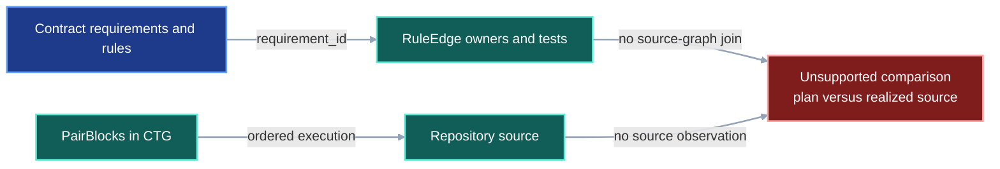
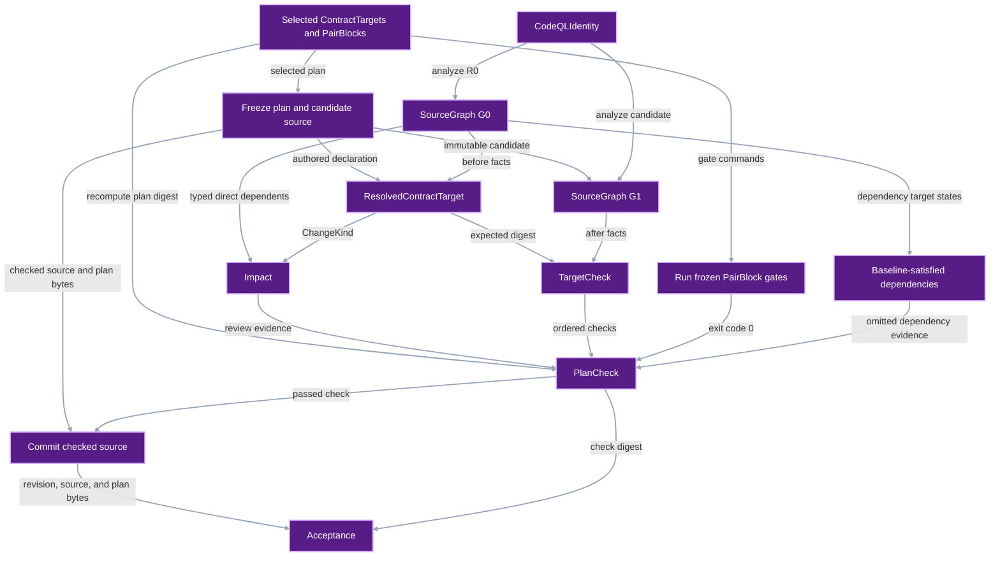
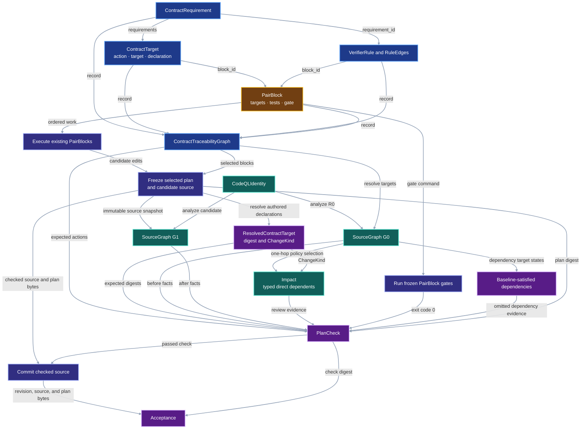
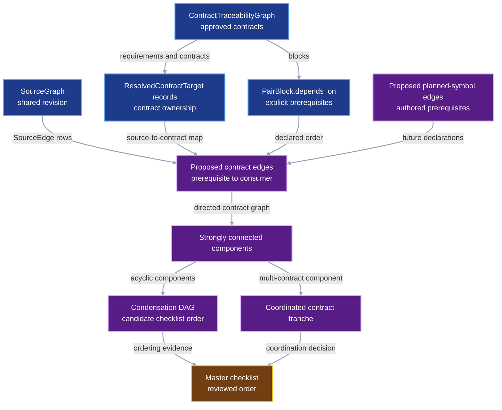
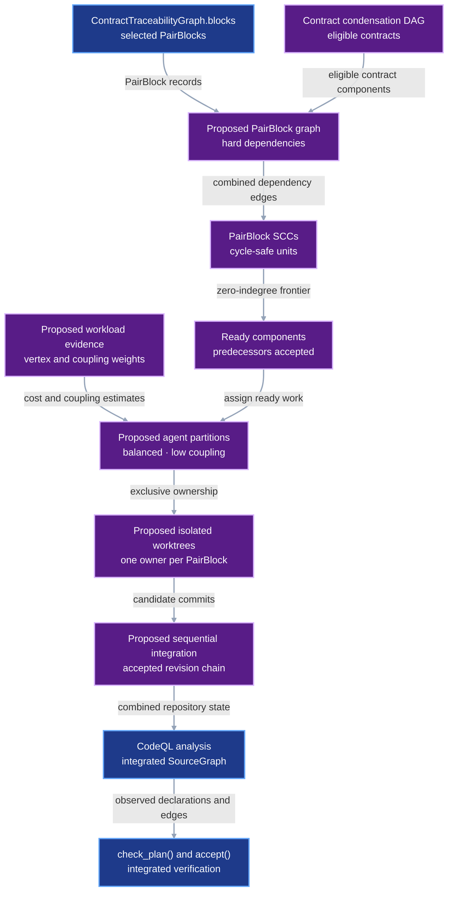

# System Impact Check

This contract verifies an existing implementation plan. Contract Traceability
owns requirements, rules, exact source targets, PairBlocks, tests, gates, and
dependency order. The System Impact Check uses CodeQL to inspect the source
before and after those PairBlocks run.

The check has one bounded job:

```text
validated ContractTraceabilityGraph
+ CodeQL baseline source graph
+ CodeQL candidate source graph
-> impact report
-> one check per declared target
-> reject unplanned source changes
```

The check does not generate a plan. `ContractTraceabilityGraph` supplies the
selected PairBlocks, and each PairBlock gate remains the behavioral acceptance
boundary.

## 1. Status

**Contract status:** complete.

| ID | Implementation obligation |
| --- | --- |
| SIG-01 <!-- contract-requirement: SIG-01 phase=0 test=tests/test_system_impact.py --> | Run one pinned CodeQL query pack over an immutable source snapshot and return a canonical `SourceGraph` whose nodes retain exact UTF-8 byte spans and declaration digests. |
| SIG-02 <!-- contract-requirement: SIG-02 phase=0 test=tests/test_system_impact.py --> | Resolve every `ContractTarget` against the baseline `SourceGraph`, classify its planned declaration change, reject an impossible action, and report every direct baseline dependent connected through an `EdgeKind` selected by impact-policy version 1. |
| SIG-03 <!-- contract-requirement: SIG-03 phase=0 test=tests/test_system_impact.py --> | Freeze the selected PairBlocks and candidate source once; verify their plan digest, dependencies, gates, target actions, and exact declarations; reject unplanned source changes; and bind a passing check to the commit containing the checked source and selected plan. |
| SIG-04 <!-- contract-requirement: SIG-04 phase=0 test=tests/test_system_impact.py --> | Replay the check over the committed `model_support` to `models` migration and one completed VIPER PairBlock, then compare its result with the exact Git diff. |
| SIG-05 <!-- contract-requirement: SIG-05 phase=0 test=tests/test_system_impact.py --> | Persist the CodeQL command, version, query-pack digest, source-snapshot digest, optional commit, exit status, and decoded-result digest for both source graphs; reject identity or receipt drift. |
| SIG-06 <!-- contract-requirement: SIG-06 phase=0 test=tests/test_system_impact.py --> | Emit `writes` edges for direct name and attribute assignments whose writing declaration and assignment target both resolve to `SourceNode` records, retaining the assignment location as edge evidence. |

## 2. Required claim

Given a validated `ContractTraceabilityGraph` $Q$, baseline snapshot $R_0$,
frozen candidate snapshot $R_1$, and one pinned CodeQL identity $K$, VIPER can
answer:

```text
Did every planned add, update, or removal occur?
Did the realized declaration equal the declaration required by the plan?
Did implementation change any source declaration absent from the plan?
Which direct baseline source declarations may be affected by each planned target change?
Did both observations use the same CodeQL identity?
```

CodeQL produces one graph for each immutable source snapshot:

$$
G_0=\operatorname{Analyze}_{K}(R_0),
\qquad
G_1=\operatorname{Analyze}_{K}(R_1).
$$

The CTG supplies the plan:

$$
P=(Q.\mathrm{targets},Q.\mathrm{blocks},Q.\mathrm{edges}).
$$

The check derives the observed source delta and evaluates it against $P$:

$$
C=\operatorname{CheckPlan}(P,G_0,G_1).
$$

For the `ContractTarget` records owned by `PlanCheck.blocks`,
`PlanCheck.passed` is true exactly when:

1. every `add` target is absent from $G_0$ and present in $G_1$;
2. every `update` target is present in both graphs and its realized declaration
   equals the declared target value;
3. every `remove` target is present in $G_0$ and absent from $G_1$;
4. every changed source declaration belongs to a `ContractTarget` whose
   `block_id` appears in `PlanCheck.blocks`;
5. VIPER runs every frozen selected `PairBlock.gate` once and every command
   exits with code `0`;
6. every omitted PairBlock dependency already has all of its declared target
   states in $G_0$;
7. `plan_sha256` equals the digest recomputed from the frozen selected blocks,
   targets, dependencies, tests, gates, and supporting-asset bytes; and
8. both graphs have valid receipts for the same $K$.

The check applies only to the selected PairBlocks. A selected block may omit a
dependency when every `ContractTarget` owned by that dependency already matches
the baseline graph. `PlanCheck.baseline_dependencies` records those satisfied
dependencies. `PlanCheck.unsatisfied_dependencies` records the rest and makes
the check fail. The source graph, not checklist status, decides whether an
omitted dependency is satisfied.

`PlanCheck` evaluates the frozen candidate before commit. After commit,
`accept()` recomputes the source digest and selected-plan digest from the
committed tree. Both values must equal `PlanCheck.realized.source_sha256` and
`PlanCheck.plan_sha256`. The plan digest also binds each selected
`PairBlock.assets` path and its exact bytes. Equality produces an `Acceptance`;
either mismatch rejects the commit. The accepted commit becomes the baseline
for the next block or contract.

The impact report identifies direct source declarations that may need
attention. `classify_target_change()` compares each baseline declaration with
its authored replacement. Impact-policy version 1 selects the `SourceEdge.kind`
values that can carry that kind of change. The report is complete only over
the direct edges present in the pinned baseline `SourceGraph`. Runtime
dependency coverage remains outside this guarantee. A `ContractTarget`
identifies each dependent declaration that must change.
The realized-delta check supplies the enforceable boundary: if implementation
does change a dependent, that declaration must already be a `ContractTarget`.

## 3. Current gap

### Current DAG

The input boundary before this contract contains a closed CTG plan and source
files, but no operation joins declared targets to independently observed source
facts.



### Proposed-change DAG

The replacement introduces source observation, dependency reporting, plan
conformance, and one post-commit acceptance record.



### Integrated DAG

`CRT-06` closes the plan first. System Impact then observes the baseline,
implementation runs the existing PairBlocks, and the same CodeQL identity
observes the result.



The diagrams use the contract-wide semantic palette: blue for authored
contract data, amber for checklist scheduling, teal for observed evidence,
purple for proposed or generated records, and red for an unsupported gap.

## 4. Contract models

These records belong to developer tooling, not the experiment protocol.

<!-- contract-target: requirements=SIG-01,SIG-05 block=P0-SIG-01 action=add target=src/viper/system_impact.py:CodeQLIdentity -->
<!-- contract-target: requirements=SIG-01,SIG-05 block=P0-SIG-01 action=add target=src/viper/system_impact.py:SourceSnapshot -->
<!-- contract-target: requirements=SIG-01,SIG-05 block=P0-SIG-01 action=add target=src/viper/system_impact.py:CodeQLReceipt -->
<!-- contract-target: requirements=SIG-01 block=P0-SIG-01 action=add target=src/viper/system_impact.py:SourceNode -->
<!-- contract-target: requirements=SIG-01 block=P0-SIG-01 action=add target=src/viper/system_impact.py:SourceEdge -->
<!-- contract-target: requirements=SIG-01 block=P0-SIG-01 action=add target=src/viper/system_impact.py:SourceGraph -->
<!-- contract-target: requirements=SIG-01,SIG-05 block=P0-SIG-02 action=update target=src/viper/system_impact.py:CodeQLReceipt -->
<!-- contract-target: requirements=SIG-01 block=P0-SIG-02 action=add target=src/viper/system_impact.py:SourceNodeKind -->
<!-- contract-target: requirements=SIG-01 block=P0-SIG-02 action=update target=src/viper/system_impact.py:SourceNode -->
<!-- contract-target: requirements=SIG-01 block=P0-SIG-02 action=update target=src/viper/system_impact.py:SourceGraph -->
<!-- contract-target: requirements=SIG-02 block=P0-SIG-03 action=add target=src/viper/system_impact.py:ChangeKind -->
<!-- contract-target: requirements=SIG-02 block=P0-SIG-03 action=add target=src/viper/system_impact.py:Impact -->
<!-- contract-target: requirements=SIG-02 block=P0-SIG-03 action=add target=src/viper/system_impact.py:ResolvedContractTarget -->
<!-- contract-target: requirements=SIG-02 block=P0-SIG-03 action=add target=src/viper/system_impact.py:PlanInspection -->
<!-- contract-target: requirements=SIG-02 block=P0-SIG-03 action=add target=src/viper/system_impact.py:inspect_plan -->
<!-- contract-target: requirements=SIG-03 block=P0-SIG-04 action=add target=src/viper/system_impact.py:CheckState -->
<!-- contract-target: requirements=SIG-03 block=P0-SIG-04 action=add target=src/viper/system_impact.py:TargetCheck -->
<!-- contract-target: requirements=SIG-03 block=P0-SIG-04 action=add target=src/viper/system_impact.py:GateCheck -->
<!-- contract-target: requirements=SIG-03 block=P0-SIG-04 action=add target=src/viper/system_impact.py:PlanCheck -->
<!-- contract-target: requirements=SIG-03 block=P0-SIG-04 action=add target=src/viper/system_impact.py:Acceptance -->
<!-- contract-target: requirements=SIG-03 block=P0-SIG-04 action=add target=src/viper/system_impact.py:check_plan -->
<!-- contract-target: requirements=SIG-03 block=P0-SIG-04 action=add target=src/viper/system_impact.py:accept -->
<!-- contract-target: requirements=SIG-03 block=P0-SIG-04 action=update target=src/viper/system_impact.py:__all__ -->

```python contract-target
"""Define public source-analysis records for System Impact checks."""

from __future__ import annotations

import hashlib
import json
from pathlib import Path
from typing import Annotated, Literal

from pydantic import Field, field_validator, model_validator

from ._contract_traceability import (
    ContractTarget,
    ContractTraceabilityGraph,
    PairBlockId,
    RepoSymbolRef,
)
from ._schema import SHA256, NonEmptyStr, ProtocolModel, RepoRelPath

CommitId = Annotated[str, Field(pattern=r"^[0-9a-f]{40}$")]
NodeId = NonEmptyStr
EdgeKind = Literal["imports", "calls", "constructs", "inherits", "reads", "writes"]
SourceNodeKind = Literal["function", "method", "class", "assignment", "import"]
ChangeKind = Literal[
    "added",
    "removed",
    "callable_interface_changed",
    "type_interface_changed",
    "implementation_changed",
    "unclassified",
]
CheckState = Literal["passed", "failed"]


class CodeQLIdentity(ProtocolModel):
    """Fix the analyzer and query pack used for both source snapshots."""

    version: NonEmptyStr = Field(description="Required CodeQL CLI version.")
    platform: NonEmptyStr = Field(description="CodeQL bundle platform identifier.")
    executable_sha256: SHA256 = Field(
        description="Digest of the exact CodeQL launcher executable."
    )
    pack: NonEmptyStr = Field(description="Name and version of the VIPER query pack.")
    pack_sha256: SHA256 = Field(description="Digest of the exact query-pack bytes.")


class SourceSnapshot(ProtocolModel):
    """Identify one immutable repository source tree."""

    base_revision: CommitId = Field(
        description="Committed baseline from which this source was derived."
    )
    source_sha256: SHA256 = Field(
        description="Digest of the complete analyzed source-file set and bytes."
    )
    revision: CommitId | None = Field(
        description="Exact commit when the snapshot is committed; otherwise absent."
    )


class CodeQLReceipt(ProtocolModel):
    """Record one completed source-analysis invocation."""

    snapshot: SourceSnapshot = Field(
        description="Immutable source snapshot analyzed by CodeQL."
    )
    identity: CodeQLIdentity = Field(
        description="Exact CodeQL and query-pack identity used by every command."
    )
    commands: tuple[tuple[NonEmptyStr, ...], ...] = Field(
        min_length=1,
        description="Ordered argument vectors executed for this analysis.",
    )
    exit_code: int = Field(description="Terminal process exit code.")
    database_sha256: SHA256 = Field(
        description="Digest of the CodeQL database's relative paths and file bytes."
    )
    result_sha256: SHA256 = Field(description="Digest of the decoded canonical rows.")
    stderr_sha256: SHA256 = Field(
        description=(
            "Digest of the ordered query labels and captured standard error bytes."
        )
    )


class SourceNode(ProtocolModel):
    """Identify one Python declaration observed in one source snapshot."""

    node_id: NodeId = Field(description="Stable path-and-symbol node identifier.")
    path: RepoRelPath = Field(description="Repository-relative Python source path.")
    symbol: NonEmptyStr = Field(description="Qualified Python symbol name.")
    kind: SourceNodeKind = Field(description="Observed Python declaration kind.")
    start_line: int = Field(
        ge=1,
        description="First source line of the declaration.",
    )
    start_col: int = Field(
        ge=0,
        description="UTF-8 byte offset on the first line.",
    )
    end_line: int = Field(
        ge=1,
        description="Final source line of the declaration.",
    )
    end_col: int = Field(
        ge=0,
        description="UTF-8 byte offset after the declaration.",
    )
    sha256: SHA256 = Field(description="Digest of the exact declaration bytes.")


class SourceEdge(ProtocolModel):
    """Record one source declaration's dependency on another declaration."""

    edge_id: SHA256 = Field(description="Digest of the complete edge identity.")
    source: NodeId = Field(description="Declaration that depends on the target.")
    target: NodeId = Field(description="Declaration consumed by the source.")
    kind: EdgeKind = Field(description="Observed dependency operation.")
    query: NonEmptyStr = Field(description="CodeQL query that emitted the edge.")
    path: NonEmptyStr = Field(
        description="Repository-relative path containing the use."
    )
    line: int = Field(
        ge=1,
        description="One-based source line containing the use.",
    )


class SourceGraph(ProtocolModel):
    """Store one canonical CodeQL observation of a source snapshot."""

    schema_version: Literal[1] = Field(
        default=1,
        description="Source-graph format version.",
    )
    snapshot: SourceSnapshot = Field(
        description="Immutable source snapshot represented by the graph."
    )
    identity: CodeQLIdentity = Field(
        description="Analyzer identity used for this graph."
    )
    nodes: tuple[SourceNode, ...] = Field(
        description="Nodes sorted by stable identifier."
    )
    edges: tuple[SourceEdge, ...] = Field(
        description="Edges sorted by stable identifier."
    )
    receipt: CodeQLReceipt = Field(
        description="Evidence for the completed analysis run."
    )

    @field_validator("nodes")
    @classmethod
    def order_nodes(cls, nodes: tuple[SourceNode, ...]) -> tuple[SourceNode, ...]:
        """Order nodes by their stable identifiers before serialization."""
        return tuple(sorted(nodes, key=lambda node: node.node_id))

    @field_validator("edges")
    @classmethod
    def order_edges(cls, edges: tuple[SourceEdge, ...]) -> tuple[SourceEdge, ...]:
        """Order edges by their stable identifiers before serialization."""
        return tuple(sorted(edges, key=lambda edge: edge.edge_id))

    @model_validator(mode="after")
    def validate_graph(self) -> SourceGraph:
        """Reject duplicate identities, dangling edges, and receipt drift."""
        node_ids = tuple(node.node_id for node in self.nodes)
        edge_ids = tuple(edge.edge_id for edge in self.edges)
        if len(node_ids) != len(set(node_ids)):
            raise ValueError("SourceGraph contains duplicate node IDs")
        if len(edge_ids) != len(set(edge_ids)):
            raise ValueError("SourceGraph contains duplicate edge IDs")
        known = set(node_ids)
        if any(
            edge.source not in known or edge.target not in known for edge in self.edges
        ):
            raise ValueError("SourceGraph contains an edge with an unknown endpoint")
        if self.receipt.snapshot != self.snapshot:
            raise ValueError("CodeQLReceipt snapshot differs from SourceGraph snapshot")
        if self.receipt.identity != self.identity:
            raise ValueError("CodeQLReceipt identity differs from SourceGraph identity")
        result_payload = json.dumps(
            {
                "nodes": [node.model_dump(mode="json") for node in self.nodes],
                "edges": [edge.model_dump(mode="json") for edge in self.edges],
            },
            sort_keys=True,
            separators=(",", ":"),
        ).encode()
        if hashlib.sha256(result_payload).hexdigest() != self.receipt.result_sha256:
            raise ValueError(
                "CodeQLReceipt result digest differs from SourceGraph rows"
            )
        return self


class Impact(ProtocolModel):
    """Report direct baseline dependents selected by policy version 1."""

    policy_version: Literal[1] = Field(
        default=1,
        description="Change-kind-to-edge-kind policy version used for this report.",
    )
    baseline: SourceSnapshot = Field(
        description="Baseline source snapshot whose direct edges were inspected."
    )
    targets: tuple[NodeId, ...] = Field(
        description="Existing baseline nodes resolved from the selected targets."
    )
    affected: tuple[NodeId, ...] = Field(
        description="Unique direct dependents selected by the impact policy."
    )
    edges: tuple[SHA256, ...] = Field(
        description="SourceEdge identifiers that support the affected-node report."
    )


class ResolvedContractTarget(ProtocolModel):
    """Bind one authored target to baseline and expected declaration bytes."""

    target: ContractTarget = Field(description="Selected CTG target being resolved.")
    baseline_node: NodeId | None = Field(
        description="Resolved baseline node identifier, or absent for an addition."
    )
    baseline_sha256: SHA256 | None = Field(
        description="Baseline declaration digest, or absent for an addition."
    )
    expected_sha256: SHA256 | None = Field(
        description="Authored declaration digest, or absent for a removal."
    )
    change_kind: ChangeKind = Field(
        description="Planned transition used to select direct dependency edges."
    )


class TargetCheck(ProtocolModel):
    """Record whether one realized declaration matches its authored target."""

    resolved: ResolvedContractTarget = Field(
        description="Authored target resolved against the baseline source graph."
    )
    after_sha256: SHA256 | None = Field(
        description=(
            "Realized declaration digest, or absent when no declaration remains."
        )
    )
    state: CheckState = Field(
        description="Whether the realized declaration has the required target state."
    )
    message: NonEmptyStr = Field(description="Specific reason for the target result.")


class GateCheck(ProtocolModel):
    """Record one selected PairBlock gate invocation."""

    block_id: PairBlockId = Field(
        description="Selected PairBlock whose frozen gate was executed."
    )
    command: tuple[NonEmptyStr, ...] = Field(
        min_length=1,
        description="Exact argument vector executed without a command shell.",
    )
    exit_code: int = Field(description="Terminal process exit code.")
    stdout_sha256: SHA256 = Field(
        description="Digest of the gate's captured standard output bytes."
    )
    stderr_sha256: SHA256 = Field(
        description="Digest of the gate's captured standard error bytes."
    )


class PlanCheck(ProtocolModel):
    """Record the complete result of checking selected PairBlocks."""

    schema_version: Literal[1] = Field(
        default=1,
        description="Plan-check record format version.",
    )
    baseline: SourceSnapshot = Field(
        description="Source state inspected before the selected PairBlocks ran."
    )
    realized: SourceSnapshot = Field(
        description=(
            "Candidate source state inspected after the selected PairBlocks ran."
        )
    )
    blocks: tuple[PairBlockId, ...] = Field(
        min_length=1,
        description="Selected PairBlocks covered by this check.",
    )
    contracts: tuple[RepoRelPath, ...] = Field(
        min_length=1,
        description="Contract files needed to reconstruct the selected plan.",
    )
    baseline_dependencies: tuple[PairBlockId, ...] = Field(
        default=(),
        description=(
            "Omitted dependencies whose target state already exists in the baseline."
        ),
    )
    unsatisfied_dependencies: tuple[PairBlockId, ...] = Field(
        default=(),
        description=(
            "Omitted dependencies whose target state is absent from the baseline."
        ),
    )
    plan_sha256: SHA256 = Field(
        description=(
            "Digest of the selected PairBlock and ContractTarget records plus "
            "the selected asset paths and bytes."
        )
    )
    impact: Impact = Field(
        description="Direct advisory dependency report for the selected targets."
    )
    targets: tuple[TargetCheck, ...] = Field(
        description="One realized result for every selected ContractTarget."
    )
    unexpected: tuple[RepoSymbolRef, ...] = Field(
        description="Changed declarations that no selected ContractTarget owns."
    )
    gates: tuple[GateCheck, ...] = Field(
        description="One gate result for every selected PairBlock."
    )
    receipts_valid: bool = Field(
        description=(
            "Whether both graphs have successful receipts with one analyzer identity."
        )
    )
    plan_valid: bool = Field(
        description=(
            "Whether the post-gate contract files retain the checked plan digest."
        )
    )
    source_valid: bool = Field(
        description="Whether both source roots retain their checked source digests."
    )
    passed: bool = Field(
        description=(
            "Whether every target, dependency, gate, source, plan, and receipt check "
            "passed."
        )
    )


class Acceptance(ProtocolModel):
    """Bind a passing plan check to its exact committed source and plan."""

    check: SHA256 = Field(
        description="Digest of the exact passing PlanCheck accepted for reuse."
    )
    revision: CommitId = Field(
        description="Commit whose Python source and selected plan match the PlanCheck."
    )


class PlanInspection(ProtocolModel):
    """Return resolved selected targets and their direct advisory impact."""

    targets: tuple[ResolvedContractTarget, ...] = Field(
        description="Selected targets resolved against their baseline declarations."
    )
    impact: Impact = Field(
        description="Direct advisory impact derived from the resolved targets."
    )


def inspect_plan(
    *,
    plan_root: Path,
    baseline_root: Path,
    traceability: ContractTraceabilityGraph,
    block_ids: tuple[PairBlockId, ...],
    baseline: SourceGraph,
) -> PlanInspection:
    """Resolve selected targets and report their policy-selected direct impact."""
    from ._system_impact.plan import inspect_plan as _inspect_plan

    return _inspect_plan(
        plan_root=plan_root,
        baseline_root=baseline_root,
        traceability=traceability,
        block_ids=block_ids,
        baseline=baseline,
    )


def check_plan(
    *,
    root: Path,
    baseline_root: Path,
    traceability: ContractTraceabilityGraph,
    block_ids: tuple[PairBlockId, ...],
    baseline: SourceGraph,
    realized: SourceGraph,
    gate_timeout_seconds: float = 900.0,
) -> PlanCheck:
    """Check selected PairBlocks against independently observed source graphs."""
    from ._system_impact.check import check_plan as _check_plan

    return _check_plan(
        root=root,
        baseline_root=baseline_root,
        traceability=traceability,
        block_ids=block_ids,
        baseline=baseline,
        realized=realized,
        gate_timeout_seconds=gate_timeout_seconds,
    )


def accept(
    *,
    root: Path,
    check: PlanCheck,
    revision: CommitId,
) -> Acceptance:
    """Bind a passing plan check to identical committed source and plan bytes."""
    from ._system_impact.check import accept as _accept

    return _accept(root=root, check=check, revision=revision)


__all__ = [
    "Acceptance",
    "CodeQLIdentity",
    "CodeQLReceipt",
    "ChangeKind",
    "CheckState",
    "CommitId",
    "EdgeKind",
    "GateCheck",
    "Impact",
    "NodeId",
    "PlanCheck",
    "PlanInspection",
    "ResolvedContractTarget",
    "SourceEdge",
    "SourceGraph",
    "SourceNode",
    "SourceNodeKind",
    "SourceSnapshot",
    "TargetCheck",
    "accept",
    "check_plan",
    "inspect_plan",
]
```

Baseline and expected digests are optional because additions have no baseline
declaration and removals have no expected or realized declaration.

### Illustrative worked example

The example checks the completed manifest migration that renamed
`model_support` to `models` in the global skills repository.

<!-- contract-worked-example: start -->

```python
baseline_id: CommitId = "6eb74b8e8bba2ddf2f2f9fa3822e11c5d9a3d06b"
realized_id: CommitId = "18083057eeb92c755ead031122afd48e8a77d653"
identity = CodeQLIdentity(
    version="2.26.4",
    platform="osx64",
    executable_sha256="1" * 64,
    pack="viper/python-impact@1.0.0",
    pack_sha256="2" * 64,
)
baseline_snapshot = SourceSnapshot(
    base_revision=baseline_id,
    source_sha256="a" * 64,
    revision=baseline_id,
)
realized_snapshot = SourceSnapshot(
    base_revision=baseline_id,
    source_sha256="b" * 64,
    revision=realized_id,
)
empty_result_sha256 = hashlib.sha256(b'{"edges":[],"nodes":[]}').hexdigest()
baseline_receipt = CodeQLReceipt(
    snapshot=baseline_snapshot,
    identity=identity,
    commands=(("codeql", "query", "run"),),
    exit_code=0,
    database_sha256="3" * 64,
    result_sha256=empty_result_sha256,
    stderr_sha256="4" * 64,
)
realized_receipt = CodeQLReceipt(
    snapshot=realized_snapshot,
    identity=identity,
    commands=(("codeql", "query", "run"),),
    exit_code=0,
    database_sha256="5" * 64,
    result_sha256=empty_result_sha256,
    stderr_sha256="4" * 64,
)
baseline = SourceGraph(
    snapshot=baseline_snapshot,
    identity=identity,
    nodes=(),
    edges=(),
    receipt=baseline_receipt,
)
realized = SourceGraph(
    snapshot=realized_snapshot,
    identity=identity,
    nodes=(),
    edges=(),
    receipt=realized_receipt,
)
declaration = DeclarationRef(
    path="docs/development/example.md",
    start_line=1,
    end_line=3,
    sha256="6" * 64,
)
planned = ContractTarget(
    requirements=("SKE-01",),
    block_id="P0-SKE-01",
    action="remove",
    target=RepoSymbolRef(
        path="scripts/validate-skill-contract.py",
        symbol="compile_manifest",
    ),
    declaration=declaration,
)
resolved = ResolvedContractTarget(
    target=planned,
    baseline_node="scripts/validate-skill-contract.py:compile_manifest",
    baseline_sha256="7" * 64,
    expected_sha256=None,
    change_kind="removed",
)
target = TargetCheck(
    resolved=resolved,
    after_sha256=None,
    state="passed",
    message="target declaration is absent",
)
gate = GateCheck(
    block_id="P0-SKE-01",
    command=("python", "-m", "pytest"),
    exit_code=0,
    stdout_sha256="8" * 64,
    stderr_sha256="9" * 64,
)
result = PlanCheck(
    baseline=baseline.snapshot,
    realized=realized.snapshot,
    blocks=(planned.block_id,),
    contracts=("docs/development/example.md",),
    baseline_dependencies=(),
    unsatisfied_dependencies=(),
    plan_sha256="c" * 64,
    impact=Impact(
        baseline=baseline.snapshot,
        targets=(resolved.baseline_node,),
        affected=(),
        edges=(),
    ),
    targets=(target,),
    unexpected=(),
    gates=(gate,),
    receipts_valid=True,
    plan_valid=True,
    source_valid=True,
    passed=True,
)
acceptance = Acceptance(check="f" * 64, revision=realized_id)

assert baseline.identity == realized.identity
assert result.targets[0].state == "passed"
assert result.unsatisfied_dependencies == ()
assert result.passed
assert acceptance.revision == result.realized.revision
```

<!-- contract-worked-example: end -->

## 5. Execution

```text
compile_contract_traceability() -> closed CTG plan
analyze_source(R0, K) -> G0 + receipt
inspect_plan(CTG, G0) -> action checks + typed one-hop impact report
execute the selected PairBlocks and their focused tests -> candidate source
freeze selected plan + candidate source -> plan_sha256 + R1
analyze_source(R1, K) -> G1 + receipt
check_plan(selected CTG, G0, G1) -> PlanCheck
commit the exact frozen R1 source -> revision
accept(repository root, PlanCheck, revision) -> Acceptance
```

CodeQL emits declaration nodes and dependency edges. VIPER canonicalizes those
rows, hashes each declaration span, classifies each planned change, selects
its direct dependency edges, and performs equality checks.
CodeQL never authors requirements, targets, or PairBlocks.

`analyze_source()` receives an exact `snapshot_root`, `SourceSnapshot`,
`CodeQLIdentity`, CodeQL executable path, query-pack path, cache root, and
artifact root. It verifies the source manifest, query-pack tree, CLI version,
and launcher digest before analysis. An exact source-and-identity cache key may
reuse a database only when its recorded content digest still matches the cached
database. A missing or altered cache manifest or database forces a full
rebuild. The receipt records every executed argument vector, the analyzed
database digest, and the canonical result digest.

`CodeQLIdentity` does not hash every file in the installed CodeQL distribution.
Phase 0 binds the reported CLI version, launcher bytes, and query-pack bytes,
and trusts the verified distribution installed behind that identity.

Query-pack version `1.0.0` emits `calls`, `constructs`, `inherits`, `imports`,
`reads`, and `writes`. A `writes` edge is emitted only when the writing scope
and the canonical module or class assignment both resolve to `SourceNode`
records. Local variables and attributes without an existing assignment node
remain outside the Phase 0 graph.

CodeQL identifies repository declarations and dependency evidence. Python's
AST selects the exact original byte span for each CodeQL declaration row and
each declaration inside a Markdown `contract-target` fence. This local AST pass
does not resolve repository dependencies or replace CodeQL identity.

`check_plan()` recomputes `plan_sha256`, verifies omitted dependencies against
their declared baseline target states, and runs every frozen selected
`PairBlock.gate`. A gate passes when its process exits with code `0`.
`accept()` requires `PlanCheck.passed`, rebuilds the canonical source manifest
and selected plan, including supporting-asset bytes, from `revision`. It
compares both digests with
`PlanCheck.realized.source_sha256` and `PlanCheck.plan_sha256` before returning
`Acceptance`.

### Exact declaration extraction

One operation computes both planned and observed declaration digests:

```python
def extract_declaration_bytes(
    source: bytes,
    qualified_symbol: str,
) -> bytes:
    """Return one declaration exactly as encoded in UTF-8 source."""
```

The operation decodes UTF-8, parses the module, and resolves exactly one AST
declaration for `qualified_symbol`. A decorated function or class starts at
the `@` token of its first decorator. The declaration ends at the AST node's
`end_lineno` and `end_col_offset`. The extractor converts those UTF-8 byte
offsets back into one slice of the original `source` bytes. It never reformats
code or normalizes newlines. Zero matches, several matches, invalid UTF-8, or
a missing end position fail the check.

For an `add` or `update`, the extractor runs once on the PairBlock's authored
fence and once on the candidate source file. A fence may contain several
declarations; the qualified symbol selects one. For a `remove`, the planned
digest is absent and the candidate graph must omit the baseline symbol.

### Change-sensitive direct impact

One internal operation classifies the planned transition before PairBlock
execution:

```python
def classify_target_change(
    *,
    action: Literal["add", "update", "remove"],
    baseline: bytes | None,
    expected: bytes | None,
) -> ChangeKind:
    """Classify one planned declaration transition."""
```

`add` returns `added`, and `remove` returns `removed`. For `update`, the
operation parses the baseline and expected declarations and applies these
rules in order:

1. A function or method whose synchronous or asynchronous form, decorators,
   type parameters, parameters, or return annotation changed returns
   `callable_interface_changed`.
2. A class whose decorators, type parameters, bases, keywords, directly
   declared field names or annotations, or directly declared method headers
   changed returns `type_interface_changed`.
3. An assignment whose target or annotation changed returns
   `type_interface_changed`.
4. A supported declaration with the same interface and different body returns
   `implementation_changed`.
5. An unsupported, ambiguous, or kind-changing comparison returns
   `unclassified`.

Interface changes take precedence when the same declaration also changes its
body. Impact-policy version 1 maps each `ChangeKind` to the existing
`EdgeKind` vocabulary:

```python
IMPACT_EDGE_KINDS_V1: dict[ChangeKind, frozenset[EdgeKind]] = {
    "added": frozenset(),
    "removed": frozenset(
        {"imports", "calls", "constructs", "inherits", "reads", "writes"}
    ),
    "callable_interface_changed": frozenset({"calls", "constructs"}),
    "type_interface_changed": frozenset(
        {"constructs", "inherits", "reads", "writes"}
    ),
    "implementation_changed": frozenset({"calls", "reads"}),
    "unclassified": frozenset(
        {"imports", "calls", "constructs", "inherits", "reads", "writes"}
    ),
}
```

For each `ResolvedContractTarget` $r$ with a baseline node,
`inspect_plan()` selects exactly these incoming baseline edges:

```python
{
    edge
    for edge in baseline.edges
    if edge.target == r.baseline_node
    and edge.kind in IMPACT_EDGE_KINDS_V1[r.change_kind]
}
```

`Impact.edges` stores the selected edge identifiers. `Impact.affected` stores
their unique `source` node identifiers. The operation stops after this direct
step. If review adds one reported dependent as another `ContractTarget`, that
target receives its own classification and direct-impact report.

The [CodeQL impact observations](codeql-impact-observations.md) ledger records
whether this report supplies a direct dependent absent from the pre-report
plan, whether that dependent changes source or tests, and which relevant
dependencies later prove absent from the report. The ledger evaluates the
report's practical value while preserving this contract's acceptance claim.

This work is linear in the bytes of each selected fence and source file. Cache
the parsed declaration index by file digest, so several targets in one file
pay the parse cost once. In practice, CodeQL analysis and pytest dominate this
small local AST pass.

`SourceSnapshot.source_sha256` hashes a canonical manifest of every `.py` file
beneath `snapshot_root`, except files beneath the explicit cache and environment
directories in `IGNORED_PARTS`. Each row contains the repository-relative path
and raw-file digest. `analyze_source()` rejects a root whose current manifest
differs from the snapshot. The caller may provide an immutable copy or a stable
working tree; the digest check establishes the same input boundary.

Phase 0 does not represent `.pyi` declarations. A plan that changes a stub file
cannot pass System Impact until a source-fact provider emits nodes for that
file type.

### Guided work and strict closure

The default guided boundary is one contract session. At the start, the
developer synchronizes the repository, records baseline commit
$R_0$, compiles the starting contract and PairBlocks, and selects the contract's
remaining blocks. PairBlocks retain the edit order inside the session.

During guided work, the developer may revise any selected PairBlock and its
source while running focused tests and reviewing Git diffs. AST extraction and
CodeQL run during strict closure. Intermediate commits preserve review
checkpoints while each PairBlock and the contract remain planned.

After pair coding, the agent reconciles the complete difference from $R_0$ to
the candidate. Every changed declaration receives one result:

1. An existing `ContractTarget` already describes the change.
2. An intentional discovery requires an updated `ContractTarget` and explicit
   user approval.
3. An accidental or unrelated change leaves this candidate or enters a
   separately approved plan.

The reconciliation updates PairBlocks, targets, dependencies, tests, and gates
before acceptance. An observed source change enters the approved plan only
after explicit user approval.

Strict closure then runs once for the reconciled contract:

```text
fix baseline R0
-> select the contract's remaining PairBlocks
-> edit PairBlocks and source
-> run focused tests
-> reconcile every changed declaration with the selected plan
-> freeze selected PairBlock bytes and candidate source bytes
-> compute plan_sha256
-> extract exact planned and candidate declarations
-> analyze R0 and frozen R1 with one CodeQLIdentity
-> check_plan()
-> commit the exact checked candidate bytes
-> accept() the commit only when its source and selected-plan digests match the check
```

Changing a selected PairBlock, target declaration, dependency, gate, test, or
candidate source file after the freeze changes its digest and invalidates the
`PlanCheck`. A change made between `check_plan()` and commit causes `accept()`
to reject the committed revision. The next strict attempt reuses $R_0$, freezes
the revised plan and candidate once, and reruns the closing checks. Strict
closure supplies the completion evidence. Guided work reduces iteration cost
while preserving that final guarantee.
The developer may request a narrower PairBlock-level strict close when one
block needs independent acceptance before the rest of the contract continues.

### Autonomous work

Autonomous work freezes the selected PairBlocks before implementation. The
agent stays within those targets, tests, dependencies, and gates. A necessary
plan change starts a new freeze against the same baseline $R_0$ before work
continues. The final `check_plan()`, commit, and `accept()` operations are
identical to guided work.

Guided and autonomous work therefore differ only during implementation:

```text
guided: start check -> flexible pair coding -> final check -> commit -> accept
autonomous: freeze plan -> constrained execution -> final check -> commit -> accept
```

## 6. Serializable evidence

The implemented records serialize into this logical bundle:

```text
.viper/system/<check-id>/
├── plan.json
├── baseline.json
├── baseline-receipt.json
├── impact.json
├── realized.json
├── realized-receipt.json
├── plan-check.json
└── acceptance.json
```

Each model uses sorted, compact JSON and repository-relative paths.
`plan_sha256` binds the selected `PairBlock` and `ContractTarget` records plus
the exact bytes of every selected `PairBlock.assets` path. `accept()` returns
`Acceptance` only after it reconstructs those values from the committed tree.
Writing this logical bundle to `.viper/system` belongs to a later storage API;
the Phase 0 checker returns the complete records to its caller.

## 7. Verification

| Rule | Executable requirement |
| --- | --- |
| `system.source.canonical` <!-- verifier-rule: system.source.canonical requirement=SIG-01 --> | Repeated analysis of one immutable source snapshot with one identity produces byte-identical `SourceGraph` JSON; each declaration span includes exact UTF-8 byte columns and hashes the original bytes. |
| `system.plan.resolved` <!-- verifier-rule: system.plan.resolved requirement=SIG-02 --> | Every CTG target has a baseline state compatible with its action and one `ChangeKind`; `Impact` contains exactly the direct incoming baseline edges permitted by impact-policy version 1 and their source nodes. |
| `system.plan.realized` <!-- verifier-rule: system.plan.realized requirement=SIG-03 --> | Every selected target has the required after-state and exact declaration digest. |
| `system.plan.closed` <!-- verifier-rule: system.plan.closed requirement=SIG-03 --> | `check_plan()` recomputes `plan_sha256`, requires every selected PairBlock gate to exit with code `0`, and accepts an omitted dependency only when all of its target states exist in the baseline; `accept()` then requires the committed source, selected-plan, and supporting-asset bytes to equal the checked values. |
| `system.fixture.replayed` <!-- verifier-rule: system.fixture.replayed requirement=SIG-04 --> | Both committed fixtures reproduce their reviewed changed-path sets and target results. |
| `system.codeql.identity` <!-- verifier-rule: system.codeql.identity requirement=SIG-05 --> | Baseline and candidate receipts contain the same pinned CodeQL identity and their exact source-snapshot and result digests. |
| `system.source.writes` <!-- verifier-rule: system.source.writes requirement=SIG-06 --> | The checked-in CodeQL pack emits `writes` edges for a function writing a declared module variable and a method writing a declared class attribute; every emitted edge retains the assignment location. |

## 8. Propagation

| Surface | Required change |
| --- | --- |
| `src/viper/system_impact.py` | Add the public records, baseline inspection, realized-plan checking, and post-commit `accept()` operation. |
| `src/viper/_system_impact/codeql.py` | Create and query CodeQL databases and return validated canonical rows. |
| `src/viper/_system_impact/source.py` | Resolve qualified Python symbols, extract exact UTF-8 declaration bytes including decorators, and implement `classify_target_change()`. |
| `tests/test_system_impact.py` | Cover exact declaration extraction, change classification, typed one-hop impact selection, action transitions, unexpected changes, plan-digest validation, gate execution, accepted dependencies, committed source-and-plan binding, identity drift, and both committed fixtures. |
| `docs/development/contract-traceability.md` | Make `CRT-06` the sole owner of targets, PairBlocks, rule-block joins, and plan closure. |
| `docs/development/master-execution-checklist.md` | Replace the old graph-transformation blocks with the six bounded blocks below. |

### Removed design

This replacement removes `ContractChange`, `ContractDelta`,
`TargetSpecification`, generated PairBlocks, total propagation dispositions,
SCC condensation, coverage.py blast certification, observed dynamic-resolution
manifests, and the research program from Master Phase 0. Appendix A retains the
cross-contract scheduling extension and the evidence required to reconsider it.

## 9. Acceptance case

### Success

Two committed fixtures define the initial boundary:

| Fixture | Baseline | Realized | Expected changed Python declarations |
| --- | --- | --- | --- |
| `.agents` manifest-key migration | `6eb74b8e8bba2ddf2f2f9fa3822e11c5d9a3d06b` | `18083057eeb92c755ead031122afd48e8a77d653` | `run-skill-evaluations.py:main`; `validate-skill-contract.py:compile_manifest`; `validate-skill-evaluation-run.py:validate_run`; the changed runner-test class and setup; the changed skill-contract test class and new rejection test |
| VIPER `P0-PROOF-05` | `1e33d9a7bd12327702397c0e7aaf96e490dec46e` | `5c78ff5d33bdfa9c7b92b7bb9ff5c0fefdc7eef8` | `test_documentation.py:_CHECKBOX_BLOCK`; `test_documentation.py:test_contract_requirements_map_to_plan_tasks_and_tests`; imports of `find_project_root`, `resolve_project_root`, and `initialize_project`; `test_project_init.py:test_init_project_establishes_discoverable_root` |

The fixture plan must name every declaration in its expected set. Every target
transition must match, every selected PairBlock gate must exit with code `0`,
every dependency must be selected or already match its baseline target state, and
the Git diff must expose no additional changed Python declaration.
`PlanCheck.passed` is then true.
`accept()` binds that result to the fixture's realized commit.

### Rejection

A focused fixture changes one additional function outside the selected target
set.
`check_plan()` places that function in `PlanCheck.unexpected` and returns
`passed=False`. Separate tests cover a stale baseline action, wrong declaration
digest, missing target, failed gate, invalid plan digest, unsatisfied
dependency, CodeQL identity drift, and a commit whose source or selected plan
differs from the checked candidate.

The focused impact fixtures use `A -> B -> C` with `C` as the planned target.
Policy-selected direct impact contains `B` and excludes `A`. Separate fixtures
require a callable-interface update to select `calls`, a removal to select all
six represented edge kinds, and an `unclassified` update to use the same
conservative direct-edge fallback.

## 10. Implementation order

<!-- pair-block-definition: P0-SIG-01 -->
```toml pair-block
id = "P0-SIG-01"
requirements = ["SIG-01", "SIG-05"]
targets = ["src/viper/system_impact.py:CodeQLIdentity", "src/viper/system_impact.py:SourceSnapshot", "src/viper/system_impact.py:CodeQLReceipt", "src/viper/system_impact.py:SourceNode", "src/viper/system_impact.py:SourceEdge", "src/viper/system_impact.py:SourceGraph"]
tests = ["tests/test_system_impact.py:test_source_graph_is_canonical"]
gate = "conda run -n mantra python -m pytest tests/test_system_impact.py -k source_graph_is_canonical -q"
depends_on = ["P0-CRT-07"]
```

<!-- pair-block-definition: P0-SIG-02 -->
```toml pair-block
id = "P0-SIG-02"
requirements = ["SIG-01", "SIG-05"]
targets = ["src/viper/_system_impact/codeql.py:IGNORED_PARTS", "src/viper/_system_impact/codeql.py:CodeQLAnalysisError", "src/viper/_system_impact/codeql.py:source_digest", "src/viper/_system_impact/codeql.py:analyze_source", "src/viper/system_impact.py:CodeQLReceipt", "src/viper/system_impact.py:SourceNodeKind", "src/viper/system_impact.py:SourceNode", "src/viper/system_impact.py:SourceGraph"]
assets = ["tools/codeql/viper-python-impact/qlpack.yml", "tools/codeql/viper-python-impact/codeql-pack.lock.yml", "tools/codeql/viper-python-impact/source-facts.qls", "tools/codeql/viper-python-impact/Declarations.ql", "tools/codeql/viper-python-impact/Dependencies.ql"]
tests = ["tests/test_system_impact.py:test_analyze_source_binds_digests_identity_and_database_reuse", "tests/test_system_impact.py:test_analyze_source_rebuilds_tampered_cache_manifest", "tests/test_system_impact.py:test_analyze_source_rejects_source_pack_and_cli_identity_drift", "tests/test_system_impact.py:test_checked_in_codeql_pack_analyzes_tiny_repository"]
gate = "conda run -n mantra python -m pytest tests/test_system_impact.py -k 'analyze_source or checked_in_codeql_pack' -q"
depends_on = ["P0-SIG-01"]
```

<!-- pair-block-definition: P0-SIG-03 -->
```toml pair-block
id = "P0-SIG-03"
requirements = ["SIG-01", "SIG-02"]
targets = ["src/viper/_system_impact/source.py:SourceDeclarationError", "src/viper/_system_impact/source.py:extract_declaration_bytes", "src/viper/_system_impact/source.py:classify_target_change", "src/viper/_system_impact/plan.py:IMPACT_EDGE_KINDS_V1", "src/viper/_system_impact/plan.py:PlanInspectionError", "src/viper/_system_impact/plan.py:inspect_plan", "src/viper/system_impact.py:ChangeKind", "src/viper/system_impact.py:Impact", "src/viper/system_impact.py:ResolvedContractTarget", "src/viper/system_impact.py:PlanInspection", "src/viper/system_impact.py:inspect_plan"]
tests = ["tests/test_system_impact.py:test_declaration_extraction_preserves_exact_decorated_bytes", "tests/test_system_impact.py:test_change_classifier_distinguishes_interface_and_body_updates", "tests/test_system_impact.py:test_plan_reports_only_policy_selected_one_hop_dependents", "tests/test_system_impact.py:test_removed_target_reports_all_represented_direct_dependents", "tests/test_system_impact.py:test_unclassified_change_uses_conservative_one_hop_edges"]
gate = "conda run -n mantra python -m pytest tests/test_system_impact.py -k 'declaration_extraction or change_classifier or policy_selected_one_hop or removed_target or unclassified_change' -q"
depends_on = ["P0-SIG-02"]
```

<!-- pair-block-definition: P0-SIG-04 -->
```toml pair-block
id = "P0-SIG-04"
requirements = ["SIG-03"]
targets = ["src/viper/_contract_traceability.py:compile_contract_plan", "src/viper/_system_impact/check.py:SystemImpactCheckError", "src/viper/_system_impact/check.py:check_plan", "src/viper/_system_impact/check.py:accept", "src/viper/system_impact.py:CheckState", "src/viper/system_impact.py:TargetCheck", "src/viper/system_impact.py:GateCheck", "src/viper/system_impact.py:PlanCheck", "src/viper/system_impact.py:Acceptance", "src/viper/system_impact.py:check_plan", "src/viper/system_impact.py:accept", "src/viper/system_impact.py:__all__"]
tests = ["tests/test_system_impact.py:test_plan_check_rejects_unplanned_source_change", "tests/test_system_impact.py:test_plan_check_rejects_wrong_target_and_receipt_identity", "tests/test_system_impact.py:test_plan_check_runs_gates_and_validates_dependencies", "tests/test_system_impact.py:test_plan_check_rejects_asset_changed_by_gate", "tests/test_system_impact.py:test_acceptance_binds_commit_to_checked_source_and_plan"]
gate = "conda run -n mantra python -m pytest tests/test_system_impact.py -k 'plan_check or acceptance' -q"
depends_on = ["P0-SIG-03"]
```

<!-- pair-block-definition: P0-SIG-05 -->
```toml pair-block
id = "P0-SIG-05"
requirements = ["SIG-04"]
targets = ["tests/test_system_impact.py:test_committed_manifest_rename", "tests/test_system_impact.py:test_completed_viper_pair_block"]
assets = ["tests/data/system_impact/agents_manifest_migration/metadata.json", "tests/data/system_impact/agents_manifest_migration/baseline/scripts/run-skill-evaluations.py.source", "tests/data/system_impact/agents_manifest_migration/baseline/scripts/validate-skill-contract.py.source", "tests/data/system_impact/agents_manifest_migration/baseline/scripts/validate-skill-evaluation-run.py.source", "tests/data/system_impact/agents_manifest_migration/baseline/tests/test_run_skill_evaluations.py.source", "tests/data/system_impact/agents_manifest_migration/baseline/tests/test_skill_contract.py.source", "tests/data/system_impact/agents_manifest_migration/realized/scripts/run-skill-evaluations.py.source", "tests/data/system_impact/agents_manifest_migration/realized/scripts/validate-skill-contract.py.source", "tests/data/system_impact/agents_manifest_migration/realized/scripts/validate-skill-evaluation-run.py.source", "tests/data/system_impact/agents_manifest_migration/realized/tests/test_run_skill_evaluations.py.source", "tests/data/system_impact/agents_manifest_migration/realized/tests/test_skill_contract.py.source", "tests/data/system_impact/viper_p0_proof_05/metadata.json", "tests/data/system_impact/viper_p0_proof_05/baseline/tests/test_documentation.py.source", "tests/data/system_impact/viper_p0_proof_05/baseline/tests/test_project_init.py.source", "tests/data/system_impact/viper_p0_proof_05/realized/tests/test_documentation.py.source", "tests/data/system_impact/viper_p0_proof_05/realized/tests/test_project_init.py.source"]
tests = ["tests/test_system_impact.py:test_committed_manifest_rename", "tests/test_system_impact.py:test_completed_viper_pair_block"]
gate = "conda run -n mantra python -m pytest tests/test_system_impact.py -k 'committed_manifest_rename or completed_viper_pair_block' -q"
depends_on = ["P0-SIG-04"]
```


<!-- pair-block-definition: P0-SIG-06 -->
```toml pair-block
id = "P0-SIG-06"
requirements = ["SIG-06"]
targets = ["tests/test_system_impact.py:test_checked_in_codeql_pack_analyzes_tiny_repository"]
assets = ["tools/codeql/viper-python-impact/Dependencies.ql"]
tests = ["tests/test_system_impact.py:test_checked_in_codeql_pack_analyzes_tiny_repository"]
gate = "conda run -n mantra env VIPER_RUN_CODEQL_TESTS=1 python -m pytest tests/test_system_impact.py::test_checked_in_codeql_pack_analyzes_tiny_repository -q"
depends_on = ["P0-SIG-05"]
```

The implementation closes after all six focused gates pass, the complete test
module passes, and the review-cycle commit is synchronized with its upstream.

## 11. Contract-owned internal declarations

These declarations are the exact implementation values owned by the internal
PairBlocks. The public records and wrappers remain in Section 4.

### CodeQL adapter

<!-- contract-target: requirements=SIG-01,SIG-05 block=P0-SIG-02 action=add target=src/viper/_system_impact/codeql.py:IGNORED_PARTS -->
<!-- contract-target: requirements=SIG-01,SIG-05 block=P0-SIG-02 action=add target=src/viper/_system_impact/codeql.py:CodeQLAnalysisError -->
<!-- contract-target: requirements=SIG-01,SIG-05 block=P0-SIG-02 action=add target=src/viper/_system_impact/codeql.py:source_digest -->
<!-- contract-target: requirements=SIG-01,SIG-05 block=P0-SIG-02 action=add target=src/viper/_system_impact/codeql.py:analyze_source -->

```python contract-target
IGNORED_PARTS = frozenset(
    {".git", ".mypy_cache", ".pytest_cache", ".ruff_cache", ".venv", "node_modules"}
)

class CodeQLAnalysisError(RuntimeError):
    """Report a failed or internally inconsistent CodeQL analysis."""

def source_digest(root: Path) -> str:
    rows = [
        {
            "path": path.relative_to(root).as_posix(),
            "sha256": hashlib.sha256(path.read_bytes()).hexdigest(),
        }
        for path in _python_files(root)
    ]
    return hashlib.sha256(
        json.dumps(rows, sort_keys=True, separators=(",", ":")).encode()
    ).hexdigest()

def analyze_source(
    snapshot_root: Path,
    *,
    snapshot: SourceSnapshot,
    identity: CodeQLIdentity,
    codeql_executable: Path,
    query_pack: Path,
    cache_root: Path,
    artifact_root: Path,
) -> SourceGraph:
    """Analyze one exact Python source tree with a pinned CodeQL query pack."""
    root = snapshot_root.resolve()
    if source_digest(root) != snapshot.source_sha256:
        raise CodeQLAnalysisError(
            "SourceSnapshot.source_sha256 does not match source bytes"
        )
    if _tree_digest(query_pack.resolve()) != identity.pack_sha256:
        raise CodeQLAnalysisError(
            "CodeQLIdentity.pack_sha256 does not match query-pack bytes"
        )

    version_stdout, version_stderr = _run(
        (str(codeql_executable), "version", "--format=json"), cwd=root
    )
    version_payload = json.loads(version_stdout)
    if version_payload.get("version") != identity.version:
        raise CodeQLAnalysisError(
            "CodeQL executable version does not match CodeQLIdentity"
        )
    if hashlib.sha256(codeql_executable.read_bytes()).hexdigest() != (
        identity.executable_sha256
    ):
        raise CodeQLAnalysisError(
            "CodeQL executable digest does not match CodeQLIdentity"
        )

    key = _hash_parts(
        (
            snapshot.source_sha256.encode(),
            identity.version.encode(),
            identity.executable_sha256.encode(),
            identity.pack_sha256.encode(),
        )
    )
    database = cache_root.resolve() / key / "database"
    manifest = database.parent / "viper-database.json"
    commands: list[tuple[str, ...]] = [
        (str(codeql_executable), "version", "--format=json")
    ]
    stderr_parts: list[bytes] = [b"version", version_stderr]
    if not _database_is_reusable(
        database,
        manifest,
        key=key,
        source_sha256=snapshot.source_sha256,
    ):
        if database.parent.exists():
            shutil.rmtree(database.parent)
        database.parent.mkdir(parents=True)
        command = (
            str(codeql_executable),
            "database",
            "create",
            str(database),
            "--language=python",
            f"--source-root={root}",
            "--overwrite",
        )
        _, stderr = _run(command, cwd=root)
        commands.append(command)
        stderr_parts.extend((b"database-create", stderr))
    artifact_root.mkdir(parents=True, exist_ok=True)
    decoded: dict[str, list[list[Any]]] = {}
    for query_name in _QUERY_FILES:
        query = query_pack / query_name
        bqrs = artifact_root / f"{query.stem}.bqrs"
        decoded_path = artifact_root / f"{query.stem}.json"
        run_command = (
            str(codeql_executable),
            "query",
            "run",
            str(query),
            f"--database={database}",
            f"--output={bqrs}",
        )
        _, stderr = _run(run_command, cwd=root)
        commands.append(run_command)
        stderr_parts.extend((query_name.encode(), stderr))
        decode_command = (
            str(codeql_executable),
            "bqrs",
            "decode",
            str(bqrs),
            "--format=json",
            f"--output={decoded_path}",
        )
        _, stderr = _run(decode_command, cwd=root)
        commands.append(decode_command)
        stderr_parts.extend((f"decode:{query_name}".encode(), stderr))
        rows = _table_rows(json.loads(decoded_path.read_text(encoding="utf-8")))
        rows.sort(
            key=lambda row: json.dumps(row, sort_keys=True, separators=(",", ":"))
        )
        decoded[query.stem] = rows

    nodes = _load_nodes(root, decoded["Declarations"])
    edges = _load_edges(decoded["Dependencies"], nodes)
    result_payload = json.dumps(
        {
            "nodes": [node.model_dump(mode="json") for node in nodes],
            "edges": [edge.model_dump(mode="json") for edge in edges],
        },
        sort_keys=True,
        separators=(",", ":"),
    ).encode()
    database_sha256 = _tree_digest(database)
    manifest.write_text(
        json.dumps(
            {
                "key": key,
                "source_sha256": snapshot.source_sha256,
                "database_sha256": database_sha256,
            },
            sort_keys=True,
        ),
        encoding="utf-8",
    )
    receipt = CodeQLReceipt(
        snapshot=snapshot,
        identity=identity,
        commands=tuple(commands),
        exit_code=0,
        database_sha256=database_sha256,
        result_sha256=hashlib.sha256(result_payload).hexdigest(),
        stderr_sha256=_hash_parts(stderr_parts),
    )
    return SourceGraph(
        snapshot=snapshot,
        identity=identity,
        nodes=nodes,
        edges=edges,
        receipt=receipt,
    )
```

### Declaration resolution and impact

<!-- contract-target: requirements=SIG-02 block=P0-SIG-03 action=add target=src/viper/_system_impact/source.py:SourceDeclarationError -->
<!-- contract-target: requirements=SIG-01 block=P0-SIG-03 action=add target=src/viper/_system_impact/source.py:extract_declaration_bytes -->
<!-- contract-target: requirements=SIG-02 block=P0-SIG-03 action=add target=src/viper/_system_impact/source.py:classify_target_change -->

```python contract-target
class SourceDeclarationError(ValueError):
    """Report an absent, ambiguous, malformed, or impossible declaration change."""

def extract_declaration_bytes(
    source: bytes,
    qualified_symbol: str,
) -> bytes:
    """Return one declaration exactly as encoded in UTF-8 source.

    Module declarations and class members may be functions, classes,
    assignments, annotated assignments, or import statements. The operation
    raises ``SourceDeclarationError`` when the source or symbol cannot identify
    one exact declaration.
    """
    try:
        text = source.decode("utf-8")
    except UnicodeDecodeError as error:
        raise SourceDeclarationError("Python source is not valid UTF-8") from error

    try:
        tree = ast.parse(text, type_comments=True)
    except SyntaxError as error:
        raise SourceDeclarationError("Python source cannot be parsed") from error

    node = _resolve_declaration(tree, qualified_symbol)
    if (
        getattr(node, "lineno", None) is None
        or getattr(node, "col_offset", None) is None
        or node.end_lineno is None
        or node.end_col_offset is None
    ):
        raise SourceDeclarationError(
            f"Python declaration lacks a complete source span: {qualified_symbol}"
        )

    lines, offsets = _line_offsets(source)
    try:
        start_line, start_column = _declaration_start(node, lines)
        start = offsets[start_line - 1] + start_column
        end = offsets[node.end_lineno - 1] + node.end_col_offset
    except (IndexError, ValueError) as error:
        raise SourceDeclarationError(
            f"Python declaration has an invalid source span: {qualified_symbol}"
        ) from error

    if start < 0 or end < start or end > len(source):
        raise SourceDeclarationError(
            f"Python declaration has an invalid source span: {qualified_symbol}"
        )
    return source[start:end]

def classify_target_change(
    *,
    action: TargetAction,
    baseline: bytes | None,
    expected: bytes | None,
) -> ChangeKind:
    """Classify one valid planned declaration transition.

    The operation raises ``SourceDeclarationError`` when the declared action
    contradicts declaration presence or an update repeats the baseline bytes.
    """
    if action == "add":
        if baseline is not None or expected is None:
            raise SourceDeclarationError(
                "add requires an absent baseline and a present expected declaration"
            )
        _parse_single_declaration(expected, "expected")
        return "added"

    if action == "remove":
        if baseline is None or expected is not None:
            raise SourceDeclarationError(
                "remove requires a present baseline and no expected declaration"
            )
        _parse_single_declaration(baseline, "baseline")
        return "removed"

    if action != "update":
        raise SourceDeclarationError(f"unsupported target action: {action!r}")
    if baseline is None or expected is None:
        raise SourceDeclarationError(
            "update requires baseline and expected declarations"
        )
    if baseline == expected:
        raise SourceDeclarationError(
            "update requires different baseline and expected declaration bytes"
        )

    before = _parse_single_declaration(baseline, "baseline")
    after = _parse_single_declaration(expected, "expected")
    if type(before) is not type(after):
        return "unclassified"

    if isinstance(before, (ast.FunctionDef, ast.AsyncFunctionDef)) and isinstance(
        after, (ast.FunctionDef, ast.AsyncFunctionDef)
    ):
        if _callable_interface(before) != _callable_interface(after):
            return "callable_interface_changed"
        return "implementation_changed"

    if isinstance(before, ast.ClassDef) and isinstance(after, ast.ClassDef):
        if _class_interface(before) != _class_interface(after):
            return "type_interface_changed"
        return "implementation_changed"

    if isinstance(before, (ast.Assign, ast.AnnAssign)) and isinstance(
        after, (ast.Assign, ast.AnnAssign)
    ):
        if _assignment_interface(before) != _assignment_interface(after):
            return "type_interface_changed"
        return "implementation_changed"

    if not isinstance(before, _SupportedDeclaration) or not isinstance(
        after, _SupportedDeclaration
    ):
        return "unclassified"
    return "unclassified"
```

<!-- contract-target: requirements=SIG-02 block=P0-SIG-03 action=add target=src/viper/_system_impact/plan.py:IMPACT_EDGE_KINDS_V1 -->
<!-- contract-target: requirements=SIG-02 block=P0-SIG-03 action=add target=src/viper/_system_impact/plan.py:PlanInspectionError -->
<!-- contract-target: requirements=SIG-02 block=P0-SIG-03 action=add target=src/viper/_system_impact/plan.py:inspect_plan -->

```python contract-target
IMPACT_EDGE_KINDS_V1: dict[str, frozenset[EdgeKind]] = {
    "added": frozenset(),
    "removed": frozenset(
        {"imports", "calls", "constructs", "inherits", "reads", "writes"}
    ),
    "callable_interface_changed": frozenset({"calls", "constructs"}),
    "type_interface_changed": frozenset({"constructs", "inherits", "reads", "writes"}),
    "implementation_changed": frozenset({"calls", "reads"}),
    "unclassified": frozenset(
        {"imports", "calls", "constructs", "inherits", "reads", "writes"}
    ),
}

class PlanInspectionError(ValueError):
    """Report an absent, duplicate, stale, or impossible selected target."""

def inspect_plan(
    *,
    plan_root: Path,
    baseline_root: Path,
    traceability: ContractTraceabilityGraph,
    block_ids: tuple[PairBlockId, ...],
    baseline: SourceGraph,
) -> PlanInspection:
    """Resolve selected targets and return policy-selected incoming edges."""
    if not block_ids or len(block_ids) != len(set(block_ids)):
        raise PlanInspectionError("block_ids must contain unique selected PairBlocks")
    known_blocks = {block.block_id for block in traceability.blocks}
    missing = sorted(set(block_ids) - known_blocks)
    if missing:
        raise PlanInspectionError(f"selected PairBlocks are absent: {missing}")

    selected = set(block_ids)
    targets = tuple(
        sorted(
            (target for target in traceability.targets if target.block_id in selected),
            key=lambda item: (item.block_id, item.target.path, item.target.symbol),
        )
    )
    nodes = _node_index(baseline)
    resolved: list[ResolvedContractTarget] = []
    impacted_edges = {}
    target_ids: set[str] = set()
    for target in targets:
        key = (target.target.path, target.target.symbol)
        baseline_node = nodes.get(key)
        before = None
        if baseline_node is not None:
            source = (baseline_root / baseline_node.path).read_bytes()
            before = extract_declaration_bytes(source, baseline_node.symbol)
            if hashlib.sha256(before).hexdigest() != baseline_node.sha256:
                raise PlanInspectionError(f"baseline digest is stale for {key!r}")
        expected = _payload(plan_root, target)
        change_kind = classify_target_change(
            action=target.action,
            baseline=before,
            expected=expected,
        )
        item = ResolvedContractTarget(
            target=target,
            baseline_node=None if baseline_node is None else baseline_node.node_id,
            baseline_sha256=None if baseline_node is None else baseline_node.sha256,
            expected_sha256=None
            if expected is None
            else hashlib.sha256(expected).hexdigest(),
            change_kind=change_kind,
        )
        resolved.append(item)
        if baseline_node is None:
            continue
        target_ids.add(baseline_node.node_id)
        permitted = IMPACT_EDGE_KINDS_V1[change_kind]
        for edge in baseline.edges:
            if edge.target == baseline_node.node_id and edge.kind in permitted:
                impacted_edges[edge.edge_id] = edge

    edges = tuple(sorted(impacted_edges.values(), key=lambda edge: edge.edge_id))
    return PlanInspection(
        targets=tuple(resolved),
        impact=Impact(
            baseline=baseline.snapshot,
            targets=tuple(sorted(target_ids)),
            affected=tuple(sorted({edge.source for edge in edges})),
            edges=tuple(edge.edge_id for edge in edges),
        ),
    )
```

### Plan reconstruction

<!-- contract-target: requirements=SIG-03 block=P0-SIG-04 action=add target=src/viper/_contract_traceability.py:compile_contract_plan -->

```python contract-target
def compile_contract_plan(
    root: Path,
    contracts: tuple[Path, ...],
) -> tuple[tuple[PairBlock, ...], tuple[ContractTarget, ...]]:
    """Compile the PairBlocks and ContractTargets declared by exact contracts."""
    return _parse_pair_blocks(root, contracts), _parse_contract_targets(root, contracts)
```

### Plan checking and acceptance

<!-- contract-target: requirements=SIG-03 block=P0-SIG-04 action=add target=src/viper/_system_impact/check.py:SystemImpactCheckError -->
<!-- contract-target: requirements=SIG-03 block=P0-SIG-04 action=add target=src/viper/_system_impact/check.py:check_plan -->
<!-- contract-target: requirements=SIG-03 block=P0-SIG-04 action=add target=src/viper/_system_impact/check.py:accept -->

```python contract-target
class SystemImpactCheckError(ValueError):
    """Report malformed check inputs or a failed acceptance binding."""

def check_plan(
    *,
    root: Path,
    baseline_root: Path,
    traceability: ContractTraceabilityGraph,
    block_ids: tuple[PairBlockId, ...],
    baseline: SourceGraph,
    realized: SourceGraph,
    gate_timeout_seconds: float = 900.0,
) -> PlanCheck:
    """Check selected PairBlocks against independently observed source graphs."""
    root = root.resolve()
    baseline_root = baseline_root.resolve()
    if gate_timeout_seconds <= 0:
        raise SystemImpactCheckError("gate timeout must be greater than zero")

    blocks, targets = _selected_records(traceability, block_ids)
    baseline_nodes = _node_index(baseline)
    realized_nodes = _node_index(realized)
    inspection = inspect_plan(
        plan_root=root,
        baseline_root=baseline_root,
        traceability=traceability,
        block_ids=tuple(block.block_id for block in blocks),
        baseline=baseline,
    )
    target_checks = _target_checks(
        resolved_targets=inspection.targets,
        realized_nodes=realized_nodes,
    )
    unexpected = _unexpected_changes(
        baseline_nodes=baseline_nodes,
        realized_nodes=realized_nodes,
        targets=targets,
    )
    baseline_dependencies, unsatisfied_dependencies = _dependency_results(
        root=root,
        traceability=traceability,
        blocks=blocks,
        selected={block.block_id for block in blocks},
        baseline_nodes=baseline_nodes,
    )
    plan_sha256 = _plan_sha256(
        blocks,
        targets,
        _asset_manifest_sha256(root=root, blocks=blocks),
    )
    contracts = tuple(sorted({item.declaration.path for item in (*blocks, *targets)}))
    gates = tuple(
        _run_gate(
            root=root,
            block=block,
            timeout_seconds=gate_timeout_seconds,
        )
        for block in blocks
    )
    receipt_valid = _receipt_pair_is_valid(baseline, realized)
    try:
        plan_valid = (
            _current_plan_sha256(
                root=root,
                contracts=contracts,
                block_ids=tuple(block.block_id for block in blocks),
            )
            == plan_sha256
        )
    except SystemImpactCheckError:
        plan_valid = False
    source_valid = (
        source_digest(baseline_root) == baseline.snapshot.source_sha256
        and source_digest(root) == realized.snapshot.source_sha256
    )
    passed = (
        receipt_valid
        and plan_valid
        and source_valid
        and all(target.state == "passed" for target in target_checks)
        and not unexpected
        and not unsatisfied_dependencies
        and all(gate.exit_code == 0 for gate in gates)
    )
    return PlanCheck(
        baseline=baseline.snapshot,
        realized=realized.snapshot,
        blocks=tuple(block.block_id for block in blocks),
        contracts=contracts,
        baseline_dependencies=baseline_dependencies,
        unsatisfied_dependencies=unsatisfied_dependencies,
        plan_sha256=plan_sha256,
        impact=inspection.impact,
        targets=target_checks,
        unexpected=unexpected,
        gates=gates,
        receipts_valid=receipt_valid,
        plan_valid=plan_valid,
        source_valid=source_valid,
        passed=passed,
    )

def accept(
    *,
    root: Path,
    check: PlanCheck,
    revision: CommitId,
) -> Acceptance:
    """Bind one passing check to identical committed source and plan bytes."""
    root = root.resolve()
    check_is_passing = (
        check.passed
        and check.receipts_valid
        and check.plan_valid
        and check.source_valid
        and all(target.state == "passed" for target in check.targets)
        and not check.unexpected
        and not check.unsatisfied_dependencies
        and all(gate.exit_code == 0 for gate in check.gates)
        and tuple(sorted(gate.block_id for gate in check.gates)) == check.blocks
    )
    if not check_is_passing:
        raise SystemImpactCheckError("cannot accept a failed PlanCheck")
    if check.realized.revision is not None and check.realized.revision != revision:
        raise SystemImpactCheckError(
            "accepted commit differs from the committed realized snapshot"
        )
    resolved_revision = (
        _git(
            root,
            ("rev-parse", "--verify", f"{revision}^{{commit}}"),
        )
        .decode("ascii")
        .strip()
    )
    if resolved_revision != revision:
        raise SystemImpactCheckError("accept requires one exact full commit ID")
    ancestry = subprocess.run(  # noqa: S603
        (
            "git",
            "merge-base",
            "--is-ancestor",
            check.baseline.revision or check.baseline.base_revision,
            revision,
        ),
        cwd=root,
        check=False,
        capture_output=True,
        shell=False,
    )
    if ancestry.returncode != 0:
        raise SystemImpactCheckError(
            "accepted commit does not descend from the checked baseline"
        )

    source_sha256 = _snapshot_source_sha256(root, revision)
    if source_sha256 != check.realized.source_sha256:
        raise SystemImpactCheckError(
            "accepted commit source differs from the checked candidate"
        )
    plan_sha256, committed_targets = _committed_plan(
        root=root,
        revision=revision,
        contracts=check.contracts,
        block_ids=check.blocks,
    )
    if plan_sha256 != check.plan_sha256:
        raise SystemImpactCheckError(
            "accepted commit plan differs from the checked PairBlocks"
        )
    checked_targets = tuple(
        sorted(
            (
                target.resolved.target.block_id,
                target.resolved.target.target.path,
                target.resolved.target.target.symbol,
            )
            for target in check.targets
        )
    )
    expected_targets = tuple(
        sorted(
            (target.block_id, target.target.path, target.target.symbol)
            for target in committed_targets
        )
    )
    if checked_targets != expected_targets:
        raise SystemImpactCheckError(
            "accepted PlanCheck does not cover every committed ContractTarget"
        )

    check_sha256 = _sha256(_canonical_json(check.model_dump(mode="json")))
    return Acceptance(check=check_sha256, revision=revision)
```

### Historical replay tests

<!-- contract-target: requirements=SIG-04 block=P0-SIG-05 action=add target=tests/test_system_impact.py:test_committed_manifest_rename -->
<!-- contract-target: requirements=SIG-04 block=P0-SIG-05 action=add target=tests/test_system_impact.py:test_completed_viper_pair_block -->

```python contract-target
def test_committed_manifest_rename(tmp_path: Path) -> None:
    """Replay the global skills manifest-field migration fixture."""
    _assert_historical_fixture(
        "agents_manifest_migration",
        "6eb74b8e8bba2ddf2f2f9fa3822e11c5d9a3d06b",
        "18083057eeb92c755ead031122afd48e8a77d653",
        tmp_path,
    )

def test_completed_viper_pair_block(tmp_path: Path) -> None:
    """Replay the accepted VIPER P0-PROOF-05 fixture."""
    _assert_historical_fixture(
        "viper_p0_proof_05",
        "1e33d9a7bd12327702397c0e7aaf96e490dec46e",
        "5c78ff5d33bdfa9c7b92b7bb9ff5c0fefdc7eef8",
        tmp_path,
    )
```

### CodeQL write-edge integration test

<!-- contract-target: requirements=SIG-06 block=P0-SIG-06 action=update target=tests/test_system_impact.py:test_checked_in_codeql_pack_analyzes_tiny_repository -->

```python contract-target
@pytest.mark.integration
def test_checked_in_codeql_pack_analyzes_tiny_repository(tmp_path: Path) -> None:
    """Compile the checked-in QL pack and verify call and write dependencies."""
    if os.environ.get("VIPER_RUN_CODEQL_TESTS") != "1":
        pytest.skip("set VIPER_RUN_CODEQL_TESTS=1 to run the real CodeQL check")

    configured = os.environ.get("VIPER_CODEQL")
    executable_value = configured or shutil.which("codeql")
    assert executable_value is not None, "CodeQL is unavailable"
    executable = Path(executable_value).resolve()

    checked_in_pack = Path(__file__).parents[1] / "tools/codeql/viper-python-impact"
    query_pack = tmp_path / "query-pack"
    shutil.copytree(checked_in_pack, query_pack)

    installed = subprocess.run(
        (str(executable), "pack", "install", str(query_pack)),
        check=False,
        capture_output=True,
        text=True,
    )
    assert installed.returncode == 0, installed.stdout + installed.stderr

    version = subprocess.run(
        (str(executable), "version", "--format=json"),
        check=True,
        capture_output=True,
        text=True,
    )

    root = tmp_path / "source"
    _sig02_source_fixture(root)
    (root / "src/writes.py").write_text(
        "state = 0\n"
        "\n"
        "def update_state(value: int) -> None:\n"
        "    global state\n"
        "    state = value\n"
        "\n"
        "class Counter:\n"
        "    value = 0\n"
        "\n"
        "    def update(self, value: int) -> None:\n"
        "        self.value = value\n",
        encoding="utf-8",
    )

    snapshot = SourceSnapshot(
        base_revision=_REVISION,
        source_sha256=source_digest(root),
        revision=None,
    )
    identity = CodeQLIdentity(
        version=json.loads(version.stdout)["version"],
        platform=sys.platform,
        executable_sha256=_sha256(executable.read_bytes()),
        pack="viper/python-impact@1.0.0",
        pack_sha256=_tree_digest(query_pack),
    )

    graph = analyze_source(
        root,
        snapshot=snapshot,
        identity=identity,
        codeql_executable=executable,
        query_pack=query_pack,
        cache_root=tmp_path / "cache",
        artifact_root=tmp_path / "artifacts",
    )

    assert {node.symbol for node in graph.nodes} >= {
        "dependency",
        "dependent",
        "state",
        "update_state",
        "Counter",
        "Counter.value",
        "Counter.update",
    }
    assert any(
        edge.source == "src/example.py:dependent"
        and edge.target == "src/example.py:dependency"
        and edge.kind == "calls"
        for edge in graph.edges
    )

    write_edges = {
        (edge.source, edge.target): (edge.path, edge.line)
        for edge in graph.edges
        if edge.kind == "writes"
    }
    assert write_edges[("src/writes.py:update_state", "src/writes.py:state")] == (
        "src/writes.py",
        5,
    )
    assert write_edges[
        ("src/writes.py:Counter.update", "src/writes.py:Counter.value")
    ] == ("src/writes.py", 11)
```


## Appendix A. Future work: cross-contract scheduling

This appendix records a possible scheduler for later evaluation. Master Phase
0 excludes this scheduler. A later promotion must assign its requirement,
verifier rule, PairBlock, and acceptance claim.

The operating model would remain:

```text
approve contracts
-> connect their dependency evidence
-> review their order in the master checklist
-> execute one contract or independent branch
-> run its final System Impact check
-> accept its commit
-> use that accepted revision as the next dependent contract's baseline
```

### Project source dependencies onto contracts

The future operation would consume one `SourceGraph` for a shared repository
revision and one `ContractTraceabilityGraph` compiled from the approved
contract paths. `compile_contract_traceability()` already accepts
`contracts: tuple[Path, ...]`, so the graph can retain requirements, targets,
and PairBlocks from several contracts while preserving their source records.

Each `ContractTarget.requirements` value identifies `ContractRequirement`
records. `ContractRequirement.contract` identifies the contract that owns the
target. Each `PairBlock.block_id` identifies the block that performs the edit.
These joins assign source declarations and explicit block dependencies to
their owning contracts. A separate edge establishes that one contract supplies
a value consumed by another contract.

The combined contract graph needs three edge sources:

1. `PairBlock.depends_on` supplies authored execution prerequisites.
2. `SourceEdge` records supply CodeQL-observed dependencies between declarations
   present in the shared revision.
3. A future authored relationship must identify a planned symbol from one
   contract that another contract consumes. CodeQL observes the symbol after
   its declaration exists.

The current `ContractTraceabilityGraph` contains the first source and the
ownership joins needed by the second. The gap contract that promotes this
scheduler must define the planned-symbol relationship and its validation rule.

For each `SourceEdge`, let contract B own a target that resolves to
`SourceEdge.source`, and let contract A own a target that resolves to
`SourceEdge.target`. The source edge says that B's declaration depends on A's
declaration. The projected schedule therefore adds the edge A to B, meaning
that A should execute before B. A cross-contract
`PairBlock.depends_on` relationship adds the same prerequisite-first edge from
the dependency block's contract to the consuming block's contract.



When a direct dependent lacks an approved contract owner, the projection emits
an uncovered-scheduling diagnostic. A `ContractTarget` and owning requirement
convert that diagnostic into a contract edge.

### Condense cycles and propose order

Strongly connected components partition the projected contract graph. A
single-contract component can retain ordinary checklist ordering. A component
containing several contracts means that each contract consumes a declaration
changed by another contract in the same component. The checklist should treat
that component as one coordinated tranche: establish the shared interface,
close the contracts together, or revise a contract boundary to remove the
cycle.

Replacing each component with one node produces a condensation DAG. A
topological ordering of that DAG places every prerequisite component before
its consumers. The generated order would serve as review evidence for the
master checklist. The master checklist would remain the scheduling authority
until a separate contract defines and verifies automatic checklist updates.

`CRT-06` requires the explicit `PairBlock.depends_on` graph to remain acyclic.
A cycle discovered through source or planned-symbol edges therefore stays
outside that field. A multi-contract SCC identifies a
coordination problem. The future scheduler must either freeze a shared
interface and compile one acyclic block order for the tranche, accept the
contracts through one combined plan, or revise the contract boundaries to
remove the cycle.

### Partition PairBlock work across agents

The contract condensation DAG supplies the order among contracts. Agent
assignment requires a second graph whose vertices are the selected `PairBlock`
records. This lower-level graph would combine `PairBlock.depends_on` with the
source and planned-symbol relationships projected onto each block's
`PairBlock.targets`.

SCC condensation and workload partitioning perform different operations. SCC
condensation collapses dependency cycles and produces an acyclic scheduling
graph. Workload partitioning assigns the ready components of that graph to
agents while balancing expected work and limiting dependencies that cross
agent boundaries. Hard dependency edges determine legal execution order.
Weights influence the performance of a legal assignment.

The first scheduler should derive vertex weights from observed PairBlock
duration, token use, and focused-test runtime. It should derive coupling
weights from shared source files, overlapping `RepoSymbolRef` targets,
source-dependency edges, and required context transfer. These weights are
proposed scheduler inputs. The current `PairBlock` schema omits them.



The proposed execution protocol must enforce five invariants:

1. **Assignment coverage.** Each selected `PairBlock.block_id` belongs to
   exactly one agent partition in one execution epoch.
2. **Precedence.** A component becomes ready only after the accepted results of
   every predecessor are present in its baseline revision.
3. **Cycle containment.** One SCC remains one coordinated execution unit unless
   a reviewed shared interface removes the cycle before assignment.
4. **Write ownership.** PairBlocks with overlapping `PairBlock.targets` execute
   in one partition or under an explicit serial order. File-level overlap that
   falls outside the declared targets must also block parallel integration.
5. **Integrated acceptance.** Candidate commits enter the accepted revision
   chain sequentially. CodeQL then constructs the integrated `SourceGraph`,
   and `check_plan()` plus `accept()` verify that state before dependent work
   begins.

Independent branches of the ready-component DAG may run concurrently in
separate worktrees. Components inside an unresolved SCC require one coordinated
tranche. The master checklist continues to govern contract-level order; the
proposed runtime partitions eligible PairBlock work beneath that order.

The scheduler remains useful only when parallel execution improves a measured
outcome. Its promotion fixture must compare the same accepted PairBlocks under
sequential and partitioned execution and record correctness, wall time, token
or API cost, merge conflicts, and cross-agent context transfers. A recent
preprint reports gains from cohesion-aware partitioning on repository coding
tasks. The result motivates this controlled comparison. VIPER requires direct
evidence from its own contracts and execution protocol.

### Execute independent contracts from accepted revisions

Two contracts may perform implementation work in parallel when the projected
graph contains zero paths between them and their `ContractTarget.target` sets
are disjoint. Those conditions support parallel work. Runtime discovery or a
new planned-symbol edge may still expose a dependency during integration.

Final acceptance remains sequential. Suppose contracts B and C start from
accepted repository revision $R_i$, whose analyzed graph is $G_i$. Integrate B
into $R_{i+1}$, analyze $G_{i+1}$, run `check_plan()` over B's selected plan,
$G_i$, and $G_{i+1}$, then run `accept()` on $R_{i+1}$. Apply C's candidate
changes to $R_{i+1}$ and analyze $G_{i+2}$. C's final `check_plan()` uses
$G_{i+1}$ as the baseline graph and $G_{i+2}$ as the candidate graph before
`accept()` binds the result to $R_{i+2}$. This recheck tests C against the
source state that downstream contracts will actually consume.

### Promotion evidence

Implementation should begin only after completed System Impact runs establish
all of these conditions:

1. `SourceNode.node_id` resolves the same declaration across the shared
   baseline used by every included contract.
2. The one-hop `Impact` reports expose useful cross-contract dependencies on
   several completed contracts while irrelevant-edge volume remains within a
   reviewed tolerance.
3. The projected edges reproduce explicit `PairBlock.depends_on` order and
   identify at least one previously implicit dependency or cycle worth acting
   on.
4. A reviewed fixture defines the expected contract edges, strongly connected
   components, condensation DAG, and checklist order.
5. A new gap contract assigns the projection, diagnostics, scheduling output,
   and checklist integration to exact implementation symbols and tests.

Evaluation should proceed in four increments:

1. Complete `CRT-06` and validate the authored `PairBlock.depends_on` order.
2. Complete the CodeQL adapter and compare source-derived contract edges with
   that authored order.
3. Specify the planned-symbol relationship when added declarations create
   dependencies absent from the baseline `SourceGraph`.
4. Compute SCCs and a condensation DAG after the combined edge set proves
   useful on completed contracts.

These observations determine whether contract-level SCC scheduling earns its
implementation and maintenance cost. Until then, reviewers may use the
one-hop `Impact` records when updating the master checklist manually.

### Boundary with autonomous repair selection

`ContractTarget` records freeze exact declarations selected for an approved
PairBlock. The current System Impact check therefore answers whether the
implementation faithfully executed that selected plan.

A future autonomous change compiler needs a different input when several
implementations can satisfy the same outcome. A proposed
`TargetSpecification` would describe the admissible outcomes. A repair selector
could choose one satisfying implementation and compile that choice into exact
`ContractTarget` and `PairBlock` records before System Impact runs. Contract
scheduling would operate on those selected targets because their source
identities and dependencies are concrete.

This separation retains two different guarantees:

- `TargetSpecification` would constrain which implementation choices are
  acceptable.
- `ContractTarget` and `PlanCheck` verify the exact choice that entered
  execution.

`TargetSpecification`, repair generation, and repair selection remain future
contract work.

## Sources

- GitHub, [About CodeQL](https://codeql.github.com/docs/codeql-overview/about-codeql/),
  defines CodeQL databases as relational representations of source code that
  queries can inspect.
- GitHub, [CodeQL library for Python](https://codeql.github.com/codeql-standard-libraries/python/),
  documents Python declarations, calls, imports, and data-flow relations.
- Python Software Foundation,
  [Abstract Syntax Trees](https://docs.python.org/3.14/library/ast.html#ast.AST),
  defines AST line positions and UTF-8 byte offsets. VIPER widens decorated
  function and class spans to the first decorator before slicing source bytes.
- Git,
  [`merge-base --is-ancestor`](https://git-scm.com/docs/git-merge-base#Documentation/git-merge-base.txt---is-ancestor),
  provides the ancestry check used by `accept()` to require the candidate
  commit to descend from the checked baseline.
- Ramakrishna Bairi et al.,
  [CodePlan: Repository-level Coding using LLMs and Planning](https://arxiv.org/abs/2309.12499),
  provides the change-classification and dependency-relation selection pattern.
  VIPER uses a deterministic one-hop advisory policy. Adaptive plan generation
  remains outside Master Phase 0.
- Gregg Rothermel and Mary Jean Harrold,
  [A Safe, Efficient Regression Test Selection Technique](https://doi.org/10.1145/248233.248262),
  provides the dependency-based regression-selection framing. VIPER uses the
  typed direct-impact set as review evidence. Safe test selection under that
  paper's proof conditions remains outside this contract.
- Robert Tarjan,
  [Depth-First Search and Linear Graph Algorithms](https://doi.org/10.1137/0201010),
  gives the linear-time strongly connected component algorithm used by the
  proposed condensation step.
- George Karypis and Vipin Kumar,
  [Multilevel k-way Partitioning Scheme for Irregular Graphs](https://www.maths.tcd.ie/~eoin/index/karypis.kumar_metis96.html),
  supplies the workload-balancing and edge-cut foundation for the proposed
  partitioning objective.
- Grzegorz Malewicz et al.,
  [Pregel: A System for Large-Scale Graph Processing](https://research.google/pubs/pregel-a-system-for-large-scale-graph-processing/),
  provides a distributed graph-execution precedent based on partitioned graph
  state and coordinated iterations. VIPER requires separate evidence for
  multi-agent coding correctness.
- Xu Yang et al.,
  [When Parallelism Pays Off: Cohesion-Aware Task Partitioning for Multi-Agent Coding](https://arxiv.org/abs/2606.00953),
  models repository-level multi-agent coding as a weighted dependency-graph
  partitioning problem. The 2026 result is a preprint and supplies motivation
  for VIPER's proposed comparison. VIPER must measure its own gains.
