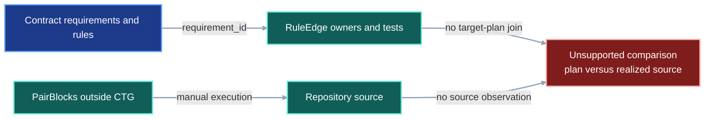
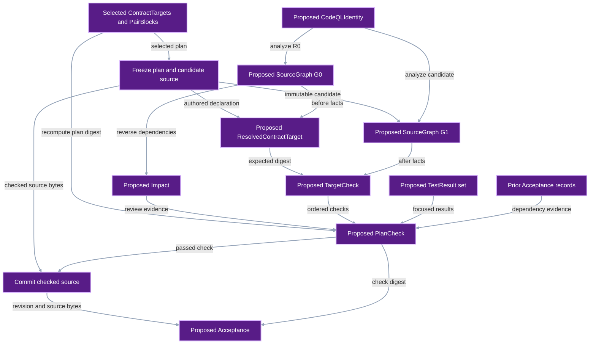
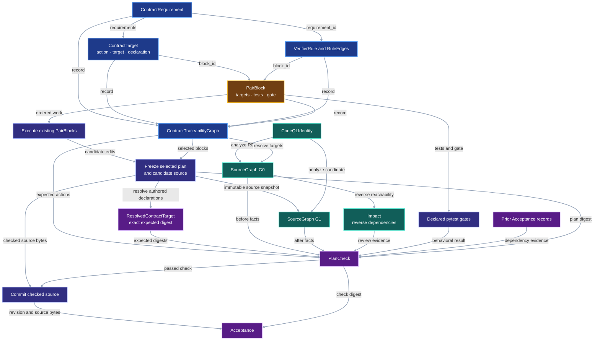

# System Impact Check

This contract verifies an existing implementation plan. Contract Traceability
owns requirements, rules, exact source targets, PairBlocks, tests, gates, and
dependency order. The System Impact Check uses CodeQL to inspect the source
before and after those PairBlocks run.

The check has one bounded job:

```text
validated ContractTraceabilityGraph
+ CodeQL baseline source graph
+ CodeQL candidate source graph
-> impact report
-> one check per declared target
-> reject unplanned source changes
```

The check does not generate a plan, choose repairs, rewrite PairBlocks, or claim
that static source analysis proves runtime behavior. Pytest remains the
behavioral acceptance boundary.

## 1. Status

**Contract status:** draft replacement design; acceptance-boundary update
pending review.

| ID | Implementation obligation |
| --- | --- |
| SIG-01 <!-- contract-requirement: SIG-01 phase=0 test=tests/test_system_impact.py --> | Run one pinned CodeQL query pack over an immutable source snapshot and return a canonical `SourceGraph` whose nodes retain exact UTF-8 byte spans and declaration digests. |
| SIG-02 <!-- contract-requirement: SIG-02 phase=0 test=tests/test_system_impact.py --> | Resolve every `ContractTarget` against the baseline graph, reject an impossible action, and report every baseline source node that depends on an existing target. |
| SIG-03 <!-- contract-requirement: SIG-03 phase=0 test=tests/test_system_impact.py --> | Freeze the selected PairBlocks and candidate source once; verify their plan digest, dependencies, tests, target actions, and exact declarations; reject unplanned source changes; and bind a passing check to the commit containing the checked source. |
| SIG-04 <!-- contract-requirement: SIG-04 phase=0 test=tests/test_system_impact.py --> | Replay the check over the committed `model_support` to `models` migration and one completed VIPER PairBlock, then compare its result with the exact Git diff. |
| SIG-05 <!-- contract-requirement: SIG-05 phase=0 test=tests/test_system_impact.py --> | Persist the CodeQL command, version, query-pack digest, source-snapshot digest, optional commit, exit status, and decoded-result digest for both source graphs; reject identity or receipt drift. |

## 2. Required claim

Given a validated `ContractTraceabilityGraph` $Q$, baseline snapshot $R_0$,
frozen candidate snapshot $R_1$, and one pinned CodeQL identity $K$, VIPER can
answer:

```text
Did every planned add, update, or removal occur?
Did the realized declaration equal the declaration required by the plan?
Did implementation change any source declaration absent from the plan?
Which baseline source declarations depended on the planned targets?
Did both observations use the same CodeQL identity?
```

CodeQL produces one graph for each immutable source snapshot:

$$
G_0=\operatorname{Analyze}_{K}(R_0),
\qquad
G_1=\operatorname{Analyze}_{K}(R_1).
$$

The CTG supplies the plan:

$$
P=(Q.\mathrm{targets},Q.\mathrm{blocks},Q.\mathrm{edges}).
$$

The check derives the observed source delta and evaluates it against $P$:

$$
C=\operatorname{CheckPlan}(P,G_0,G_1).
$$

`PlanCheck.passed` is true exactly when:

1. every `add` target is absent from $G_0$ and present in $G_1$;
2. every `update` target is present in both graphs and its realized declaration
   equals the declared target value;
3. every `remove` target is present in $G_0$ and absent from $G_1$;
4. every changed source declaration belongs to `Q.targets`;
5. every selected PairBlock test has exactly one passing `TestResult`;
6. every omitted PairBlock dependency is supported by a referenced
   `Acceptance` whose commit is an ancestor of $R_0$;
7. `plan_sha256` equals the digest recomputed from the frozen selected blocks,
   targets, dependencies, tests, and gates; and
8. both graphs have valid receipts for the same $K$.

The check applies only to the selected PairBlocks. A selected block may omit a
dependency only when `PlanCheck.acceptances` references an `Acceptance` whose
`PlanCheck.blocks` contains that dependency and whose `revision` is an ancestor
of $R_0$. A checked checklist box supplies documented status; the referenced
`Acceptance` supplies the required Git evidence.

`PlanCheck` evaluates the frozen candidate before commit. After commit,
`accept()` hashes the committed source with the same source-manifest rule and
compares that digest with `PlanCheck.realized.source_sha256`. Equality produces
an `Acceptance`; a mismatch rejects the commit. This final operation binds the
passing check to the exact revision consumed by later dependency checks.

The reverse dependency set identifies source declarations that may need
attention. The set supports review. A `ContractTarget` identifies each
dependent declaration that must change.
The realized-delta check supplies the enforceable boundary: if implementation
does change a dependent, that declaration must already be a `ContractTarget`.

## 3. Current gap

### Current DAG

The CTG can validate requirements, rules, owners, and tests. CodeQL is not yet
connected to that plan, so the repository cannot compare declared targets with
realized source changes.



### Proposed-change DAG

The replacement introduces source observation, dependency reporting, plan
conformance, and one post-commit acceptance record.



### Integrated DAG

`CRT-06` closes the plan first. System Impact then observes the baseline,
implementation runs the existing PairBlocks, and the same CodeQL identity
observes the result.



The diagrams use the contract-wide semantic palette: blue for authored
contract data, amber for checklist scheduling, teal for observed evidence,
purple for proposed or generated records, and red for an unsupported gap.

## 4. Contract models

These records belong to developer tooling, not the experiment protocol.

```python
from typing import Annotated, Literal

from pydantic import Field

from viper._contract_traceability import (
    ContractTarget,
    DeclarationRef,
    RepoSymbolRef,
)
from viper._schema import NonEmptyStr, ProtocolModel, RepoRelPath, SHA256


CommitId = Annotated[str, Field(pattern=r"^[0-9a-f]{40}$")]
NodeId = NonEmptyStr
EdgeKind = Literal["imports", "calls", "constructs", "inherits", "reads", "writes"]
CheckState = Literal["passed", "failed", "unresolved"]


class CodeQLIdentity(ProtocolModel):
    """Fix the analyzer and query pack used for both source snapshots."""

    version: NonEmptyStr = Field(description="Required CodeQL CLI version.")
    platform: NonEmptyStr = Field(description="CodeQL bundle platform identifier.")
    bundle_sha256: SHA256 = Field(description="Digest of the installed CodeQL bundle.")
    pack: NonEmptyStr = Field(description="Name and version of the VIPER query pack.")
    pack_sha256: SHA256 = Field(description="Digest of the exact query-pack bytes.")


class SourceSnapshot(ProtocolModel):
    """Identify one immutable repository source tree."""

    base_revision: CommitId = Field(description="Committed baseline from which this source was derived.")
    source_sha256: SHA256 = Field(description="Digest of the complete analyzed source-file set and bytes.")
    revision: CommitId | None = Field(description="Exact commit when the snapshot is committed; otherwise absent.")


class CodeQLReceipt(ProtocolModel):
    """Record one completed source-analysis invocation."""

    snapshot: SourceSnapshot = Field(description="Immutable source snapshot analyzed by CodeQL.")
    command: tuple[NonEmptyStr, ...] = Field(min_length=1, description="Exact analyzer argument vector.")
    exit_code: int = Field(description="Terminal process exit code.")
    database_sha256: SHA256 = Field(description="Digest identifying the CodeQL database.")
    result_sha256: SHA256 = Field(description="Digest of the decoded canonical rows.")
    stderr_sha256: SHA256 = Field(description="Digest of captured standard error bytes.")


class SourceNode(ProtocolModel):
    """Identify one Python declaration observed in one source snapshot."""

    node_id: NodeId = Field(description="Stable path-and-symbol node identifier.")
    path: RepoRelPath = Field(description="Repository-relative Python source path.")
    symbol: NonEmptyStr = Field(description="Qualified Python symbol name.")
    kind: NonEmptyStr = Field(description="Observed Python declaration kind.")
    start_line: int = Field(ge=1, description="First source line of the declaration.")
    start_col: int = Field(ge=0, description="UTF-8 byte offset on the first line.")
    end_line: int = Field(ge=1, description="Final source line of the declaration.")
    end_col: int = Field(ge=0, description="UTF-8 byte offset after the declaration.")
    sha256: SHA256 = Field(description="Digest of the exact declaration bytes.")


class SourceEdge(ProtocolModel):
    """Record one source declaration's dependency on another declaration."""

    edge_id: SHA256 = Field(description="Digest of the complete edge identity.")
    source: NodeId = Field(description="Declaration that depends on the target.")
    target: NodeId = Field(description="Declaration consumed by the source.")
    kind: EdgeKind = Field(description="Observed dependency operation.")
    query: NonEmptyStr = Field(description="CodeQL query that emitted the edge.")
    path: NonEmptyStr = Field(description="Repository-relative path containing the use.")
    line: int = Field(ge=1, description="One-based source line containing the use.")


class SourceGraph(ProtocolModel):
    """Store one canonical CodeQL observation of a source snapshot."""

    schema_version: Literal[1] = Field(default=1, description="Source-graph format version.")
    snapshot: SourceSnapshot = Field(description="Immutable source snapshot represented by the graph.")
    identity: CodeQLIdentity = Field(description="Analyzer identity used for this graph.")
    nodes: tuple[SourceNode, ...] = Field(description="Nodes sorted by stable identifier.")
    edges: tuple[SourceEdge, ...] = Field(description="Edges sorted by stable identifier.")
    receipt: CodeQLReceipt = Field(description="Evidence for the completed analysis run.")


class Impact(ProtocolModel):
    """Report baseline declarations that depend on planned existing targets."""

    baseline: SourceSnapshot = Field(description="Baseline source snapshot used for traversal.")
    targets: tuple[NodeId, ...] = Field(description="Resolved existing CTG target nodes.")
    affected: tuple[NodeId, ...] = Field(description="Reverse-reachable baseline nodes.")
    edges: tuple[SHA256, ...] = Field(description="Source edges proving the paths.")
    unresolved: tuple[RepoSymbolRef, ...] = Field(description="Targets absent from the baseline graph.")


class ResolvedContractTarget(ProtocolModel):
    """Resolve one authored target into the bytes required at acceptance."""

    target: ContractTarget = Field(description="Selected CTG target being resolved.")
    baseline_node: NodeId | None = Field(description="Baseline node, absent for an addition.")
    baseline_sha256: SHA256 | None = Field(description="Baseline declaration digest, absent for an addition.")
    expected_sha256: SHA256 | None = Field(description="Authored declaration digest, absent for a removal.")


class TargetCheck(ProtocolModel):
    """Check one declared source change against both source graphs."""

    resolved: ResolvedContractTarget = Field(description="Frozen target and expected declaration digest.")
    after_sha256: SHA256 | None = Field(description="Realized digest, absent for a removal.")
    state: CheckState = Field(description="Result of checking this target transition.")
    message: NonEmptyStr = Field(description="Concrete reason for the check state.")


class TestResult(ProtocolModel):
    """Record one focused test executed for plan acceptance."""

    test: RepoSymbolRef = Field(description="Declared pytest function observed by this result.")
    command: tuple[NonEmptyStr, ...] = Field(min_length=1, description="Exact test argument vector.")
    exit_code: int = Field(description="Terminal test-process exit code.")
    stdout_sha256: SHA256 = Field(description="Digest of captured standard output bytes.")
    stderr_sha256: SHA256 = Field(description="Digest of captured standard error bytes.")
    passed: bool = Field(description="True only when this declared test completed successfully.")


class PlanCheck(ProtocolModel):
    """Return the complete result of checking one CTG plan."""

    schema_version: Literal[1] = Field(default=1, description="Plan-check format version.")
    baseline: SourceSnapshot = Field(description="Source snapshot inspected before implementation.")
    realized: SourceSnapshot = Field(description="Frozen candidate source snapshot inspected after implementation.")
    blocks: tuple[NonEmptyStr, ...] = Field(min_length=1, description="Selected PairBlocks checked in this run.")
    acceptances: tuple[SHA256, ...] = Field(default=(), description="Prior Acceptance digests used to satisfy omitted dependencies.")
    plan_sha256: SHA256 = Field(description="Digest of the frozen selected blocks, targets, dependencies, tests, and gates.")
    impact: Impact = Field(description="Baseline reverse-dependency report.")
    targets: tuple[TargetCheck, ...] = Field(description="One result per ContractTarget.")
    unexpected: tuple[RepoSymbolRef, ...] = Field(description="Changed declarations absent from the CTG plan.")
    tests: tuple[TestResult, ...] = Field(min_length=1, description="Results for every selected PairBlock test.")
    passed: bool = Field(description="True only when targets, tests, dependencies, plan identity, and source receipts pass.")


class Acceptance(ProtocolModel):
    """Bind a passing plan check to the commit containing its checked source."""

    check: SHA256 = Field(description="Digest of the accepted PlanCheck bytes.")
    revision: CommitId = Field(description="Commit whose source digest equals the checked realized source digest.")
```

Baseline and expected digests are optional because additions have no baseline
declaration and removals have no expected or realized declaration.

<!-- contract-symbols:
{"models":["Acceptance","CodeQLIdentity","CodeQLReceipt","Impact","PlanCheck","ResolvedContractTarget","SourceEdge","SourceGraph","SourceNode","SourceSnapshot","TargetCheck","TestResult"],"aliases":["CheckState","CommitId","EdgeKind","NodeId"],"functions":[]}
-->

<!-- contract-example-symbols:
["CommitId", "NodeId", "EdgeKind", "CheckState", "CodeQLIdentity", "SourceSnapshot", "CodeQLReceipt", "SourceNode", "SourceEdge", "SourceGraph", "Impact", "ResolvedContractTarget", "TargetCheck", "TestResult", "PlanCheck", "Acceptance"]
-->

### Illustrative worked example

The example checks the completed manifest migration that renamed
`model_support` to `models` in the global skills repository.

<!-- contract-worked-example: start -->

```python
baseline_id: CommitId = "6eb74b8e8bba2ddf2f2f9fa3822e11c5d9a3d06b"
realized_id: CommitId = "18083057eeb92c755ead031122afd48e8a77d653"
node_id: NodeId = "scripts/validate-skill-contract.py:compile_manifest"
edge_kind: EdgeKind = "calls"
check_state: CheckState = "passed"
target_declaration = DeclarationRef(
    path="docs/development/skill-evaluation-pair-coding.md",
    start_line=100,
    end_line=120,
    sha256="8" * 64,
)

identity = CodeQLIdentity(version="2.26.4", platform="osx64", bundle_sha256="1" * 64, pack="viper/python-impact@1.0.0", pack_sha256="2" * 64)
baseline_snapshot = SourceSnapshot(base_revision=baseline_id, source_sha256="a" * 64, revision=baseline_id)
realized_snapshot = SourceSnapshot(base_revision=baseline_id, source_sha256="c" * 64, revision=realized_id)
baseline_receipt = CodeQLReceipt(snapshot=baseline_snapshot, command=("codeql", "database", "analyze", baseline_id), exit_code=0, database_sha256="3" * 64, result_sha256="4" * 64, stderr_sha256="5" * 64)
realized_receipt = CodeQLReceipt(snapshot=realized_snapshot, command=("codeql", "database", "analyze", realized_id), exit_code=0, database_sha256="6" * 64, result_sha256="7" * 64, stderr_sha256="5" * 64)

old_node = SourceNode(node_id=node_id, path="scripts/validate-skill-contract.py", symbol="compile_manifest", kind="function", start_line=283, start_col=0, end_line=561, end_col=1, sha256="6d6a7fc57ec0da60ad7fc9a3606614fac78532511ace9b3c46dff9d89e24f894")
new_node = SourceNode(node_id=node_id, path="scripts/validate-skill-contract.py", symbol="compile_manifest", kind="function", start_line=283, start_col=0, end_line=561, end_col=1, sha256="08f47fbe49e99b5161b76af7574fa568c81bc2514f509290bcd9c1a816eabc82")
consumer = SourceNode(node_id="scripts/validate-skill-contract.py:validate_manifest", path="scripts/validate-skill-contract.py", symbol="validate_manifest", kind="function", start_line=564, start_col=0, end_line=567, end_col=1, sha256="61858254334fb762d313a24cdcea32e9a29c9c25505c48880c36dcf1bc00ffd2")
dependency = SourceEdge(edge_id="b" * 64, source=consumer.node_id, target=old_node.node_id, kind=edge_kind, query="viper/python-impact/calls", path=consumer.path, line=567)

baseline = SourceGraph(snapshot=baseline_snapshot, identity=identity, nodes=(consumer, old_node), edges=(dependency,), receipt=baseline_receipt)
realized = SourceGraph(snapshot=realized_snapshot, identity=identity, nodes=(new_node,), edges=(), receipt=realized_receipt)
impact = Impact(baseline=baseline.snapshot, targets=(old_node.node_id,), affected=(consumer.node_id, old_node.node_id), edges=(dependency.edge_id,), unresolved=())
planned = ContractTarget(requirements=("SKE-01",), block_id="P0-SKE-01", action="update", target=RepoSymbolRef(path=new_node.path, symbol=new_node.symbol), declaration=target_declaration)
resolved = ResolvedContractTarget(target=planned, baseline_node=old_node.node_id, baseline_sha256=old_node.sha256, expected_sha256=new_node.sha256)
target = TargetCheck(resolved=resolved, after_sha256=new_node.sha256, state=check_state, message="The realized field declaration matches the planned replacement.")
test_result = TestResult(test=RepoSymbolRef(path="tests/test_skill_contract.py", symbol="test_models_field_replaces_model_support"), command=("python", "-m", "pytest", "tests/test_skill_contract.py", "-q"), exit_code=0, stdout_sha256="d" * 64, stderr_sha256="e" * 64, passed=True)
result = PlanCheck(baseline=baseline.snapshot, realized=realized.snapshot, blocks=(planned.block_id,), acceptances=(), plan_sha256="9" * 64, impact=impact, targets=(target,), unexpected=(), tests=(test_result,), passed=True)
acceptance = Acceptance(check="f" * 64, revision=realized_id)

assert baseline.identity == realized.identity
assert result.targets[0].state == "passed"
assert result.unexpected == ()
assert result.passed
assert acceptance.revision == result.realized.revision
```

<!-- contract-worked-example: end -->

## 5. Execution

```text
compile_contract_traceability() -> closed CTG plan
analyze_source(R0, K) -> G0 + receipt
inspect_plan(CTG, G0) -> baseline action checks + reverse dependency report
execute the selected PairBlocks and their focused tests -> candidate source
freeze selected plan + candidate source -> plan_sha256 + R1
analyze_source(R1, K) -> G1 + receipt
check_plan(selected CTG, G0, G1, test results) -> PlanCheck
commit the exact frozen R1 source -> revision
accept(repository root, PlanCheck, revision) -> Acceptance
```

CodeQL emits declaration nodes and dependency edges. VIPER canonicalizes those
rows, hashes each declaration span, and performs traversal and equality checks.
CodeQL never authors requirements, targets, or PairBlocks.

`check_plan()` recomputes `plan_sha256`, resolves every referenced prior
`Acceptance`, checks its Git ancestry, and evaluates every declared
`TestResult`. `accept()` requires `PlanCheck.passed`, rebuilds the canonical
source manifest from `revision`, and compares its digest with
`PlanCheck.realized.source_sha256` before returning `Acceptance`.

### Exact declaration extraction

One operation computes both planned and observed declaration digests:

```python
def extract_declaration_bytes(
    source: bytes,
    qualified_symbol: str,
) -> bytes:
    """Return one declaration exactly as encoded in UTF-8 source."""
```

The operation decodes UTF-8, parses the module, and resolves exactly one AST
declaration for `qualified_symbol`. A decorated function or class starts at
the `@` token of its first decorator. The declaration ends at the AST node's
`end_lineno` and `end_col_offset`. The extractor converts those UTF-8 byte
offsets back into one slice of the original `source` bytes. It never reformats
code or normalizes newlines. Zero matches, several matches, invalid UTF-8, or
a missing end position fail the check.

For an `add` or `update`, the extractor runs once on the PairBlock's authored
fence and once on the candidate source file. A fence may contain several
declarations; the qualified symbol selects one. For a `remove`, the planned
digest is absent and the candidate graph must omit the baseline symbol.

This work is linear in the bytes of each selected fence and source file. Cache
the parsed declaration index by file digest, so several targets in one file
pay the parse cost once. In practice, CodeQL analysis and pytest dominate this
small local AST pass.

`SourceSnapshot.source_sha256` hashes a canonical manifest of every Python file
under the configured source and test roots, including untracked files named by
`add` targets. Each row contains the repository-relative path and raw-file
digest. The freeze copies exactly that manifest into an immutable temporary
directory. CodeQL and declaration extraction read that immutable copy.

### Guided work and strict closure

The default guided boundary is one contract session. At the start, the
developer synchronizes the repository, records baseline commit
$R_0$, compiles the starting contract and PairBlocks, and selects the contract's
remaining blocks. PairBlocks retain the edit order inside the session.

During guided work, the developer may revise any selected PairBlock and its
source while running focused tests and reviewing Git diffs. AST extraction and
CodeQL run during strict closure. Intermediate commits preserve review
checkpoints while each PairBlock and the contract remain planned.

After pair coding, the agent reconciles the complete difference from $R_0$ to
the candidate. Every changed declaration receives one result:

1. An existing `ContractTarget` already describes the change.
2. An intentional discovery requires an updated `ContractTarget` and explicit
   user approval.
3. An accidental or unrelated change leaves this candidate or enters a
   separately approved plan.

The reconciliation updates PairBlocks, targets, dependencies, tests, and gates
before acceptance. An observed source change enters the approved plan only
after explicit user approval.

Strict closure then runs once for the reconciled contract:

```text
fix baseline R0
-> select the contract's remaining PairBlocks
-> edit PairBlocks and source
-> run focused tests
-> reconcile every changed declaration with the selected plan
-> freeze selected PairBlock bytes and candidate source bytes
-> compute plan_sha256
-> extract exact planned and candidate declarations
-> analyze R0 and frozen R1 with one CodeQLIdentity
-> check_plan()
-> commit the exact checked candidate bytes
-> accept() the commit only when its source digest still equals R1
```

Changing a selected PairBlock, target declaration, dependency, gate, test, or
candidate source file after the freeze changes its digest and invalidates the
`PlanCheck`. A change made between `check_plan()` and commit causes `accept()`
to reject the committed revision. The next strict attempt reuses $R_0$, freezes
the revised plan and candidate once, and reruns the closing checks. Strict
closure supplies the completion evidence. Guided work reduces iteration cost
while preserving that final guarantee.
The developer may request a narrower PairBlock-level strict close when one
block needs independent acceptance before the rest of the contract continues.

## 6. Persisted evidence

One check writes:

```text
.viper/system/<check-id>/
├── plan.json
├── baseline.json
├── baseline-receipt.json
├── impact.json
├── realized.json
├── realized-receipt.json
├── plan-check.json
└── acceptance.json
```

Each file uses sorted, compact JSON and repository-relative paths.
`plan_sha256` is the digest of `plan.json`. `acceptance.json` is written only
after `accept()` verifies the resulting commit. A later `PlanCheck` stores the
digests of any prior acceptance records used to satisfy omitted dependencies.

## 7. Verification

| Rule | Executable requirement |
| --- | --- |
| `system.source.canonical` <!-- verifier-rule: system.source.canonical requirement=SIG-01 --> | Repeated analysis of one immutable source snapshot with one identity produces byte-identical `SourceGraph` JSON; each declaration span includes exact UTF-8 byte columns and hashes the original bytes. |
| `system.plan.resolved` <!-- verifier-rule: system.plan.resolved requirement=SIG-02 --> | Every CTG target has a baseline state compatible with its action, and every existing target has one reverse-dependency result. |
| `system.plan.realized` <!-- verifier-rule: system.plan.realized requirement=SIG-03 --> | Every selected target has the required after-state and exact declaration digest. |
| `system.plan.closed` <!-- verifier-rule: system.plan.closed requirement=SIG-03 --> | `check_plan()` recomputes `plan_sha256`, requires every selected test to pass, and accepts an omitted dependency only through an ancestral `Acceptance`; `accept()` then requires the committed source digest to equal `PlanCheck.realized.source_sha256`. |
| `system.fixture.replayed` <!-- verifier-rule: system.fixture.replayed requirement=SIG-04 --> | Both committed fixtures reproduce their reviewed changed-path sets and target results. |
| `system.codeql.identity` <!-- verifier-rule: system.codeql.identity requirement=SIG-05 --> | Baseline and candidate receipts contain the same pinned CodeQL identity and their exact source-snapshot and result digests. |

## 8. Propagation

| Surface | Required change |
| --- | --- |
| `src/viper/system_impact.py` | Add the public records, baseline inspection, realized-plan checking, and post-commit `accept()` operation. |
| `src/viper/_system_impact/codeql.py` | Create and query CodeQL databases and return validated canonical rows. |
| `src/viper/_system_impact/source.py` | Resolve qualified Python symbols and extract exact UTF-8 declaration bytes, including decorators. |
| `tests/test_system_impact.py` | Cover exact declaration extraction, action transitions, unexpected changes, reverse dependency reporting, plan-digest validation, focused tests, accepted dependencies, committed-source binding, identity drift, and both committed fixtures. |
| `docs/development/contract-traceability.md` | Make `CRT-06` the sole owner of targets, PairBlocks, rule-block joins, and plan closure. |
| `docs/development/master-execution-checklist.md` | Replace the old graph-transformation blocks with the five bounded blocks below. |

### Removed design

This replacement removes `ContractChange`, `ContractDelta`,
`TargetSpecification`, generated PairBlocks, total propagation dispositions,
SCC condensation, coverage.py blast certification, observed dynamic-resolution
manifests, and the research program from Master Phase 0. Git history retains
the former design for later research.

## 9. Acceptance case

### Success

Two committed fixtures define the initial boundary:

| Fixture | Baseline | Realized | Expected changed Python declarations |
| --- | --- | --- | --- |
| `.agents` manifest-key migration | `6eb74b8e8bba2ddf2f2f9fa3822e11c5d9a3d06b` | `18083057eeb92c755ead031122afd48e8a77d653` | `run-skill-evaluations.py:main`; `validate-skill-contract.py:compile_manifest`; `validate-skill-evaluation-run.py:validate_run`; the changed runner-test class and setup; the changed skill-contract test class and new rejection test |
| VIPER `P0-PROOF-05` | `1e33d9a7bd12327702397c0e7aaf96e490dec46e` | `5c78ff5d33bdfa9c7b92b7bb9ff5c0fefdc7eef8` | `test_documentation.py:test_contract_requirements_map_to_plan_tasks_and_tests`; `test_project_init.py:test_init_project_establishes_discoverable_root` |

The fixture plan must name every declaration in its expected set. Every target
transition must match, the focused tests must pass, every dependency must be
selected or supported by ancestral acceptance, and the Git diff must expose no
additional changed Python declaration. `PlanCheck.passed` is then true.
`accept()` binds that result to the fixture's realized commit.

### Rejection

A focused fixture changes one additional function outside the CTG target set.
`check_plan()` places that function in `PlanCheck.unexpected` and returns
`passed=False`. Separate tests cover a stale baseline action, wrong declaration
digest, missing target, failed test, invalid plan digest, unsatisfied
dependency, CodeQL identity drift, and a commit whose source differs from the
checked candidate.

## 10. Implementation order

<!-- pair-block-definition: P0-SIG-01 -->
```toml pair-block
id = "P0-SIG-01"
requirements = ["SIG-01", "SIG-05"]
targets = ["src/viper/system_impact.py:CodeQLIdentity", "src/viper/system_impact.py:SourceSnapshot", "src/viper/system_impact.py:CodeQLReceipt", "src/viper/system_impact.py:SourceNode", "src/viper/system_impact.py:SourceEdge", "src/viper/system_impact.py:SourceGraph"]
tests = ["tests/test_system_impact.py:test_source_graph_is_canonical"]
gate = "conda run -n mantra python -m pytest tests/test_system_impact.py -k source_graph_is_canonical -q"
depends_on = ["P0-CRT-07"]
```

<!-- pair-block-definition: P0-SIG-02 -->
```toml pair-block
id = "P0-SIG-02"
requirements = ["SIG-01", "SIG-05"]
targets = ["src/viper/_system_impact/codeql.py:analyze_source"]
tests = ["tests/test_system_impact.py:test_codeql_receipt_binds_revision_and_identity"]
gate = "conda run -n mantra python -m pytest tests/test_system_impact.py -k codeql_receipt -q"
depends_on = ["P0-SIG-01"]
```

<!-- pair-block-definition: P0-SIG-03 -->
```toml pair-block
id = "P0-SIG-03"
requirements = ["SIG-01", "SIG-02"]
targets = ["src/viper/_system_impact/source.py:extract_declaration_bytes", "src/viper/system_impact.py:Impact", "src/viper/system_impact.py:ResolvedContractTarget", "src/viper/system_impact.py:inspect_plan"]
tests = ["tests/test_system_impact.py:test_declaration_extraction_preserves_exact_decorated_bytes", "tests/test_system_impact.py:test_plan_targets_resolve_and_report_dependents"]
gate = "conda run -n mantra python -m pytest tests/test_system_impact.py -k 'declaration_extraction or plan_targets_resolve' -q"
depends_on = ["P0-SIG-02"]
```

<!-- pair-block-definition: P0-SIG-04 -->
```toml pair-block
id = "P0-SIG-04"
requirements = ["SIG-03"]
targets = ["src/viper/system_impact.py:TargetCheck", "src/viper/system_impact.py:TestResult", "src/viper/system_impact.py:PlanCheck", "src/viper/system_impact.py:Acceptance", "src/viper/system_impact.py:check_plan", "src/viper/system_impact.py:accept"]
tests = ["tests/test_system_impact.py:test_plan_check_rejects_unplanned_source_change", "tests/test_system_impact.py:test_plan_check_requires_tests_dependencies_and_digest", "tests/test_system_impact.py:test_acceptance_binds_commit_to_checked_source"]
gate = "conda run -n mantra python -m pytest tests/test_system_impact.py -k 'plan_check or acceptance' -q"
depends_on = ["P0-SIG-03"]
```

<!-- pair-block-definition: P0-SIG-05 -->
```toml pair-block
id = "P0-SIG-05"
requirements = ["SIG-04"]
targets = ["tests/test_system_impact.py:test_committed_manifest_rename", "tests/test_system_impact.py:test_completed_viper_pair_block"]
tests = ["tests/test_system_impact.py:test_committed_manifest_rename", "tests/test_system_impact.py:test_completed_viper_pair_block"]
gate = "conda run -n mantra python -m pytest tests/test_system_impact.py -k 'committed_manifest_rename or completed_viper_pair_block' -q"
depends_on = ["P0-SIG-04"]
```

The implementation closes after all five focused gates pass, the complete test
module passes, and the review-cycle commit is synchronized with its upstream.

## Sources

- GitHub, [About CodeQL](https://codeql.github.com/docs/codeql-overview/about-codeql/),
  defines CodeQL databases as relational representations of source code that
  queries can inspect.
- GitHub, [CodeQL library for Python](https://codeql.github.com/codeql-standard-libraries/python/),
  documents Python declarations, calls, imports, and data-flow relations.
- Python Software Foundation,
  [Abstract Syntax Trees](https://docs.python.org/3.14/library/ast.html#ast.AST),
  defines AST line positions and UTF-8 byte offsets. VIPER widens decorated
  function and class spans to the first decorator before slicing source bytes.
- Git,
  [`merge-base --is-ancestor`](https://git-scm.com/docs/git-merge-base#Documentation/git-merge-base.txt---is-ancestor),
  provides the ancestry check used when a selected block consumes an earlier
  accepted block without rerunning it.
- Gregg Rothermel and Mary Jean Harrold,
  [A Safe, Efficient Regression Test Selection Technique](https://doi.org/10.1145/248233.248262),
  provides the dependency-based regression-selection framing. VIPER uses the
  reverse dependency set as review evidence and does not claim safe test
  selection under that paper's proof conditions.
