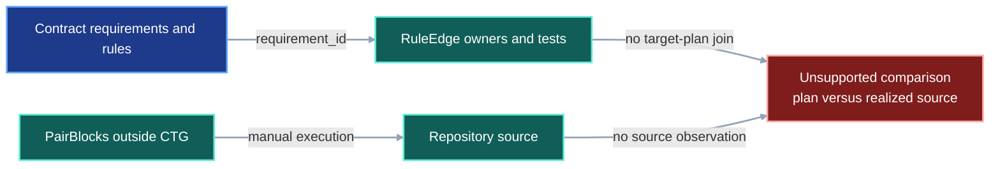
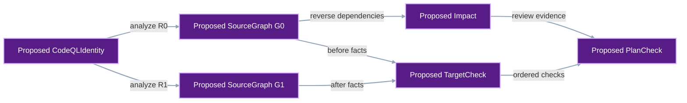
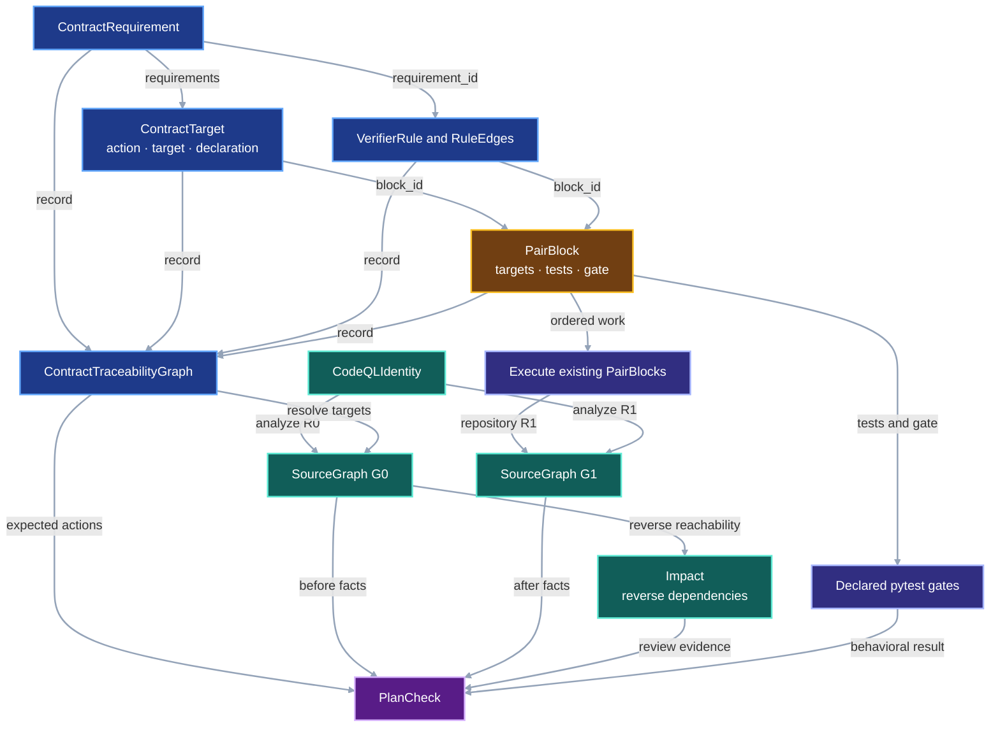

# System Impact Check

This contract verifies an existing implementation plan. Contract Traceability
owns requirements, rules, exact source targets, PairBlocks, tests, gates, and
dependency order. The System Impact Check uses CodeQL to inspect the source
before and after those PairBlocks run.

The check has one bounded job:

```text
validated ContractTraceabilityGraph
+ CodeQL baseline source graph
+ CodeQL realized source graph
-> impact report
-> one check per declared target
-> reject unplanned source changes
```

The check does not generate a plan, choose repairs, rewrite PairBlocks, or claim
that static source analysis proves runtime behavior. Pytest remains the
behavioral acceptance boundary.

## 1. Status

**Contract status:** approved replacement design; implementation pending.

| ID | Implementation obligation |
| --- | --- |
| SIG-01 <!-- contract-requirement: SIG-01 phase=0 test=tests/test_system_impact.py --> | Run one pinned CodeQL query pack over an exact Git revision and return a canonical `SourceGraph` whose nodes retain source spans and declaration digests. |
| SIG-02 <!-- contract-requirement: SIG-02 phase=0 test=tests/test_system_impact.py --> | Resolve every `ContractTarget` against the baseline graph, reject an impossible action, and report every baseline source node that depends on an existing target. |
| SIG-03 <!-- contract-requirement: SIG-03 phase=0 test=tests/test_system_impact.py --> | Run the same CodeQL identity over the realized revision; verify every target action and declaration; and reject every changed source declaration absent from the CTG target set. |
| SIG-04 <!-- contract-requirement: SIG-04 phase=0 test=tests/test_system_impact.py --> | Replay the check over the committed `model_support` to `models` migration and one completed VIPER PairBlock, then compare its result with the exact Git diff. |
| SIG-05 <!-- contract-requirement: SIG-05 phase=0 test=tests/test_system_impact.py --> | Persist the CodeQL command, version, query-pack digest, revision, exit status, and decoded-result digest for both source graphs; reject identity or receipt drift. |

## 2. Required claim

Given a validated `ContractTraceabilityGraph` $Q$, baseline revision $R_0$,
realized revision $R_1$, and one pinned CodeQL identity $K$, VIPER can answer:

```text
Did every planned add, update, or removal occur?
Did the realized declaration equal the declaration required by the plan?
Did implementation change any source declaration absent from the plan?
Which baseline source declarations depended on the planned targets?
Did both observations use the same CodeQL identity?
```

CodeQL produces one graph for each revision:

$$
G_0=\operatorname{Analyze}_{K}(R_0),
\qquad
G_1=\operatorname{Analyze}_{K}(R_1).
$$

The CTG supplies the plan:

$$
P=(Q.\mathrm{targets},Q.\mathrm{blocks},Q.\mathrm{edges}).
$$

The check derives the observed source delta and evaluates it against $P$:

$$
C=\operatorname{CheckPlan}(P,G_0,G_1).
$$

`PlanCheck.passed` is true exactly when:

1. every `add` target is absent from $G_0$ and present in $G_1$;
2. every `update` target is present in both graphs and its realized declaration
   equals the declared target value;
3. every `remove` target is present in $G_0$ and absent from $G_1$;
4. every changed source declaration belongs to `Q.targets`; and
5. both graphs have valid receipts for the same $K$.

The reverse dependency set is review evidence. It identifies source declarations
that may need attention, but it does not claim that every dependent must change.
The realized-delta check supplies the enforceable boundary: if implementation
does change a dependent, that declaration must already be a `ContractTarget`.

## 3. Current gap

### Current DAG

The CTG can validate requirements, rules, owners, and tests. CodeQL is not yet
connected to that plan, so the repository cannot compare declared targets with
realized source changes.



### Proposed-change DAG

The replacement introduces only source observation, dependency reporting, and
plan conformance.



### Integrated DAG

`CRT-06` closes the plan first. System Impact then observes the baseline,
implementation runs the existing PairBlocks, and the same CodeQL identity
observes the result.



The diagrams use the contract-wide semantic palette: blue for authored
contract data, amber for checklist scheduling, teal for observed evidence,
purple for proposed or generated records, and red for an unsupported gap.

## 4. Contract models

These records belong to developer tooling, not the experiment protocol.

```python
from typing import Annotated, Literal

from pydantic import Field

from viper._contract_traceability import RepoSymbolRef, RequirementId
from viper._models import ProtocolModel
from viper._typing import NonEmptyStr, SHA256


CommitId = Annotated[str, Field(pattern=r"^[0-9a-f]{40}$")]
NodeId = NonEmptyStr
EdgeKind = Literal["imports", "calls", "constructs", "inherits", "reads", "writes"]
CheckState = Literal["passed", "failed", "unresolved"]


class CodeQLIdentity(ProtocolModel):
    """Fix the analyzer and query pack used for both revisions."""

    version: NonEmptyStr = Field(description="Required CodeQL CLI version.")
    platform: NonEmptyStr = Field(description="CodeQL bundle platform identifier.")
    bundle_sha256: SHA256 = Field(description="Digest of the installed CodeQL bundle.")
    pack: NonEmptyStr = Field(description="Name and version of the VIPER query pack.")
    pack_sha256: SHA256 = Field(description="Digest of the exact query-pack bytes.")


class CodeQLReceipt(ProtocolModel):
    """Record one completed source-analysis invocation."""

    revision: CommitId = Field(description="Git revision analyzed by CodeQL.")
    command: tuple[NonEmptyStr, ...] = Field(min_length=1, description="Exact analyzer argument vector.")
    exit_code: int = Field(description="Terminal process exit code.")
    database_sha256: SHA256 = Field(description="Digest identifying the CodeQL database.")
    result_sha256: SHA256 = Field(description="Digest of the decoded canonical rows.")
    stderr_sha256: SHA256 = Field(description="Digest of captured standard error bytes.")


class SourceNode(ProtocolModel):
    """Identify one Python declaration observed in one revision."""

    node_id: NodeId = Field(description="Stable path-and-symbol node identifier.")
    path: NonEmptyStr = Field(description="Repository-relative Python source path.")
    symbol: NonEmptyStr = Field(description="Qualified Python symbol name.")
    kind: NonEmptyStr = Field(description="Observed Python declaration kind.")
    start_line: int = Field(ge=1, description="First source line of the declaration.")
    end_line: int = Field(ge=1, description="Final source line of the declaration.")
    sha256: SHA256 = Field(description="Digest of the exact declaration bytes.")


class SourceEdge(ProtocolModel):
    """Record one source declaration's dependency on another declaration."""

    edge_id: SHA256 = Field(description="Digest of the complete edge identity.")
    source: NodeId = Field(description="Declaration that depends on the target.")
    target: NodeId = Field(description="Declaration consumed by the source.")
    kind: EdgeKind = Field(description="Observed dependency operation.")
    query: NonEmptyStr = Field(description="CodeQL query that emitted the edge.")
    path: NonEmptyStr = Field(description="Repository-relative path containing the use.")
    line: int = Field(ge=1, description="One-based source line containing the use.")


class SourceGraph(ProtocolModel):
    """Store one canonical CodeQL observation of a repository revision."""

    schema_version: Literal[1] = Field(default=1, description="Source-graph format version.")
    revision: CommitId = Field(description="Git revision represented by the graph.")
    identity: CodeQLIdentity = Field(description="Analyzer identity used for this graph.")
    nodes: tuple[SourceNode, ...] = Field(description="Nodes sorted by stable identifier.")
    edges: tuple[SourceEdge, ...] = Field(description="Edges sorted by stable identifier.")
    receipt: CodeQLReceipt = Field(description="Evidence for the completed analysis run.")


class Impact(ProtocolModel):
    """Report baseline declarations that depend on planned existing targets."""

    baseline: CommitId = Field(description="Baseline revision used for traversal.")
    targets: tuple[NodeId, ...] = Field(description="Resolved existing CTG target nodes.")
    affected: tuple[NodeId, ...] = Field(description="Reverse-reachable baseline nodes.")
    edges: tuple[SHA256, ...] = Field(description="Source edges proving the paths.")
    unresolved: tuple[RepoSymbolRef, ...] = Field(description="Targets absent from the baseline graph.")


class TargetCheck(ProtocolModel):
    """Check one declared source change against both source graphs."""

    requirement_id: RequirementId = Field(description="Requirement that needs the change.")
    block_id: NonEmptyStr = Field(description="PairBlock that owns the change.")
    action: Literal["add", "update", "remove"] = Field(description="Required target transition.")
    target: RepoSymbolRef = Field(description="Repository symbol being checked.")
    before_sha256: SHA256 | None = Field(description="Baseline digest, absent for an addition.")
    after_sha256: SHA256 | None = Field(description="Realized digest, absent for a removal.")
    expected_sha256: SHA256 | None = Field(description="Required digest, absent for a removal.")
    state: CheckState = Field(description="Result of checking this target transition.")
    message: NonEmptyStr = Field(description="Concrete reason for the check state.")


class PlanCheck(ProtocolModel):
    """Return the complete result of checking one CTG plan."""

    schema_version: Literal[1] = Field(default=1, description="Plan-check format version.")
    baseline: CommitId = Field(description="Revision inspected before implementation.")
    realized: CommitId = Field(description="Revision inspected after implementation.")
    impact: Impact = Field(description="Baseline reverse-dependency report.")
    targets: tuple[TargetCheck, ...] = Field(description="One result per ContractTarget.")
    unexpected: tuple[RepoSymbolRef, ...] = Field(description="Changed declarations absent from the CTG plan.")
    tests: tuple[RepoSymbolRef, ...] = Field(description="PairBlock tests executed for acceptance.")
    passed: bool = Field(description="True only when every required check passes.")
```

`before_sha256` and `after_sha256` are optional because additions have no
baseline declaration and removals have no realized declaration.

<!-- contract-symbols:
{"models":["CodeQLIdentity","CodeQLReceipt","Impact","PlanCheck","SourceEdge","SourceGraph","SourceNode","TargetCheck"],"aliases":["CheckState","CommitId","EdgeKind","NodeId"],"functions":[]}
-->

<!-- contract-example-symbols:
["CommitId", "NodeId", "EdgeKind", "CheckState", "CodeQLIdentity", "CodeQLReceipt", "SourceNode", "SourceEdge", "SourceGraph", "Impact", "TargetCheck", "PlanCheck"]
-->

### Illustrative worked example

The example checks the completed manifest migration that renamed
`model_support` to `models` in the global skills repository.

<!-- contract-worked-example: start -->

```python
baseline_id: CommitId = "6eb74b8e8bba2ddf2f2f9fa3822e11c5d9a3d06b"
realized_id: CommitId = "18083057eeb92c755ead031122afd48e8a77d653"
node_id: NodeId = "scripts/validate-skill-contract.py:compile_manifest"
edge_kind: EdgeKind = "calls"
check_state: CheckState = "passed"

identity = CodeQLIdentity(version="2.26.4", platform="osx64", bundle_sha256="1" * 64, pack="viper/python-impact@1.0.0", pack_sha256="2" * 64)
baseline_receipt = CodeQLReceipt(revision=baseline_id, command=("codeql", "database", "analyze", baseline_id), exit_code=0, database_sha256="3" * 64, result_sha256="4" * 64, stderr_sha256="5" * 64)
realized_receipt = CodeQLReceipt(revision=realized_id, command=("codeql", "database", "analyze", realized_id), exit_code=0, database_sha256="6" * 64, result_sha256="7" * 64, stderr_sha256="5" * 64)

old_node = SourceNode(node_id=node_id, path="scripts/validate-skill-contract.py", symbol="compile_manifest", kind="function", start_line=283, end_line=561, sha256="6d6a7fc57ec0da60ad7fc9a3606614fac78532511ace9b3c46dff9d89e24f894")
new_node = SourceNode(node_id=node_id, path="scripts/validate-skill-contract.py", symbol="compile_manifest", kind="function", start_line=283, end_line=561, sha256="08f47fbe49e99b5161b76af7574fa568c81bc2514f509290bcd9c1a816eabc82")
consumer = SourceNode(node_id="scripts/validate-skill-contract.py:validate_manifest", path="scripts/validate-skill-contract.py", symbol="validate_manifest", kind="function", start_line=564, end_line=567, sha256="61858254334fb762d313a24cdcea32e9a29c9c25505c48880c36dcf1bc00ffd2")
dependency = SourceEdge(edge_id="b" * 64, source=consumer.node_id, target=old_node.node_id, kind=edge_kind, query="viper/python-impact/calls", path=consumer.path, line=567)

baseline = SourceGraph(revision=baseline_id, identity=identity, nodes=(consumer, old_node), edges=(dependency,), receipt=baseline_receipt)
realized = SourceGraph(revision=realized_id, identity=identity, nodes=(new_node,), edges=(), receipt=realized_receipt)
impact = Impact(baseline=baseline.revision, targets=(old_node.node_id,), affected=(consumer.node_id, old_node.node_id), edges=(dependency.edge_id,), unresolved=())
target = TargetCheck(requirement_id="SKE-01", block_id="P0-SKE-01", action="update", target=RepoSymbolRef(path=new_node.path, symbol=new_node.symbol), before_sha256=old_node.sha256, after_sha256=new_node.sha256, expected_sha256=new_node.sha256, state=check_state, message="The realized field declaration matches the planned replacement.")
result = PlanCheck(baseline=baseline.revision, realized=realized.revision, impact=impact, targets=(target,), unexpected=(), tests=(RepoSymbolRef(path="tests/test_skill_contract.py", symbol="test_models_field_replaces_model_support"),), passed=True)

assert baseline.identity == realized.identity
assert result.targets[0].state == "passed"
assert result.unexpected == ()
assert result.passed
```

<!-- contract-worked-example: end -->

## 5. Execution

```text
compile_contract_traceability() -> closed CTG plan
analyze_source(R0, K) -> G0 + receipt
inspect_plan(CTG, G0) -> baseline action checks + reverse dependency report
execute the existing PairBlocks and their gates -> R1
analyze_source(R1, K) -> G1 + receipt
check_plan(CTG, G0, G1, test results) -> PlanCheck
```

CodeQL emits declaration nodes and dependency edges. VIPER canonicalizes those
rows, hashes each declaration span, and performs traversal and equality checks.
CodeQL never authors requirements, targets, or PairBlocks.

## 6. Persisted evidence

One check writes:

```text
.viper/system/<check-id>/
├── baseline.json
├── baseline-receipt.json
├── impact.json
├── realized.json
├── realized-receipt.json
└── plan-check.json
```

Each file uses sorted, compact JSON and repository-relative paths.

## 7. Verification

| Rule | Executable requirement |
| --- | --- |
| `system.source.canonical` <!-- verifier-rule: system.source.canonical requirement=SIG-01 --> | Repeated analysis of one revision with one identity produces byte-identical `SourceGraph` JSON. |
| `system.plan.resolved` <!-- verifier-rule: system.plan.resolved requirement=SIG-02 --> | Every CTG target has a baseline state compatible with its action, and every existing target has one reverse-dependency result. |
| `system.plan.realized` <!-- verifier-rule: system.plan.realized requirement=SIG-03 --> | Every target has the required after-state and declaration digest. |
| `system.plan.closed` <!-- verifier-rule: system.plan.closed requirement=SIG-03 --> | Every changed source declaration belongs to the CTG target set and every declared test passes. |
| `system.fixture.replayed` <!-- verifier-rule: system.fixture.replayed requirement=SIG-04 --> | Both committed fixtures reproduce their reviewed changed-path sets and target results. |
| `system.codeql.identity` <!-- verifier-rule: system.codeql.identity requirement=SIG-05 --> | Baseline and realized receipts contain the same pinned CodeQL identity and their exact revisions and result digests. |

## 8. Propagation

| Surface | Required change |
| --- | --- |
| `src/viper/system_impact.py` | Add the public records plus baseline inspection and realized-plan checking. |
| `src/viper/_system_impact/codeql.py` | Create and query CodeQL databases and return validated canonical rows. |
| `tests/test_system_impact.py` | Cover action transitions, unexpected changes, reverse dependency reporting, identity drift, and both committed fixtures. |
| `docs/development/contract-traceability.md` | Make `CRT-06` the sole owner of targets, PairBlocks, rule-block joins, and plan closure. |
| `docs/development/master-execution-checklist.md` | Replace the old graph-transformation blocks with the five bounded blocks below. |

### Removed design

This replacement removes `ContractChange`, `ContractDelta`,
`TargetSpecification`, generated PairBlocks, total propagation dispositions,
SCC condensation, coverage.py blast certification, observed dynamic-resolution
manifests, and the research program from Master Phase 0. Git history retains
the former design for later research.

## 9. Acceptance case

### Success

Two committed fixtures define the initial boundary:

| Fixture | Baseline | Realized | Expected changed Python declarations |
| --- | --- | --- | --- |
| `.agents` manifest-key migration | `6eb74b8e8bba2ddf2f2f9fa3822e11c5d9a3d06b` | `18083057eeb92c755ead031122afd48e8a77d653` | `run-skill-evaluations.py:main`; `validate-skill-contract.py:compile_manifest`; `validate-skill-evaluation-run.py:validate_run`; the changed runner-test class and setup; the changed skill-contract test class and new rejection test |
| VIPER `P0-PROOF-05` | `1e33d9a7bd12327702397c0e7aaf96e490dec46e` | `5c78ff5d33bdfa9c7b92b7bb9ff5c0fefdc7eef8` | `test_documentation.py:test_contract_requirements_map_to_plan_tasks_and_tests`; `test_project_init.py:test_init_project_establishes_discoverable_root` |

The fixture plan must name every declaration in its expected set. Every target
transition must match, the focused tests must pass, and the Git diff must expose
no additional changed Python declaration. `PlanCheck.passed` is then true.

### Rejection

A focused fixture changes one additional function outside the CTG target set.
`check_plan()` places that function in `PlanCheck.unexpected` and returns
`passed=False`. Separate tests cover a stale baseline action, wrong declaration
digest, missing target, failed test, and CodeQL identity drift.

## 10. Implementation order

<!-- pair-block-definition: P0-SIG-01 -->
```toml pair-block
id = "P0-SIG-01"
requirements = ["SIG-01", "SIG-05"]
targets = ["src/viper/system_impact.py:CodeQLIdentity", "src/viper/system_impact.py:CodeQLReceipt", "src/viper/system_impact.py:SourceNode", "src/viper/system_impact.py:SourceEdge", "src/viper/system_impact.py:SourceGraph"]
tests = ["tests/test_system_impact.py:test_source_graph_is_canonical"]
gate = "conda run -n mantra python -m pytest tests/test_system_impact.py -k source_graph_is_canonical -q"
depends_on = ["P0-CRT-07"]
```

<!-- pair-block-definition: P0-SIG-02 -->
```toml pair-block
id = "P0-SIG-02"
requirements = ["SIG-01", "SIG-05"]
targets = ["src/viper/_system_impact/codeql.py:analyze_source"]
tests = ["tests/test_system_impact.py:test_codeql_receipt_binds_revision_and_identity"]
gate = "conda run -n mantra python -m pytest tests/test_system_impact.py -k codeql_receipt -q"
depends_on = ["P0-SIG-01"]
```

<!-- pair-block-definition: P0-SIG-03 -->
```toml pair-block
id = "P0-SIG-03"
requirements = ["SIG-02"]
targets = ["src/viper/system_impact.py:Impact", "src/viper/system_impact.py:inspect_plan"]
tests = ["tests/test_system_impact.py:test_plan_targets_resolve_and_report_dependents"]
gate = "conda run -n mantra python -m pytest tests/test_system_impact.py -k plan_targets_resolve -q"
depends_on = ["P0-SIG-02"]
```

<!-- pair-block-definition: P0-SIG-04 -->
```toml pair-block
id = "P0-SIG-04"
requirements = ["SIG-03"]
targets = ["src/viper/system_impact.py:TargetCheck", "src/viper/system_impact.py:PlanCheck", "src/viper/system_impact.py:check_plan"]
tests = ["tests/test_system_impact.py:test_plan_check_rejects_unplanned_source_change"]
gate = "conda run -n mantra python -m pytest tests/test_system_impact.py -k plan_check -q"
depends_on = ["P0-SIG-03"]
```

<!-- pair-block-definition: P0-SIG-05 -->
```toml pair-block
id = "P0-SIG-05"
requirements = ["SIG-04"]
targets = ["tests/test_system_impact.py:test_committed_manifest_rename", "tests/test_system_impact.py:test_completed_viper_pair_block"]
tests = ["tests/test_system_impact.py:test_committed_manifest_rename", "tests/test_system_impact.py:test_completed_viper_pair_block"]
gate = "conda run -n mantra python -m pytest tests/test_system_impact.py -k 'committed_manifest_rename or completed_viper_pair_block' -q"
depends_on = ["P0-SIG-04"]
```

The implementation closes after all five focused gates pass, the complete test
module passes, and the review-cycle commit is synchronized with its upstream.

## Sources

- GitHub, [About CodeQL](https://codeql.github.com/docs/codeql-overview/about-codeql/),
  defines CodeQL databases as relational representations of source code that
  queries can inspect.
- GitHub, [CodeQL library for Python](https://codeql.github.com/codeql-standard-libraries/python/),
  documents Python declarations, calls, imports, and data-flow relations.
- Gregg Rothermel and Mary Jean Harrold,
  [A Safe, Efficient Regression Test Selection Technique](https://doi.org/10.1145/248233.248262),
  provides the dependency-based regression-selection framing. VIPER uses the
  reverse dependency set as review evidence and does not claim safe test
  selection under that paper's proof conditions.
