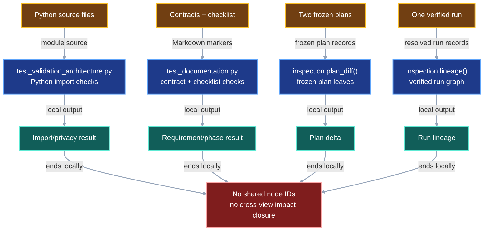
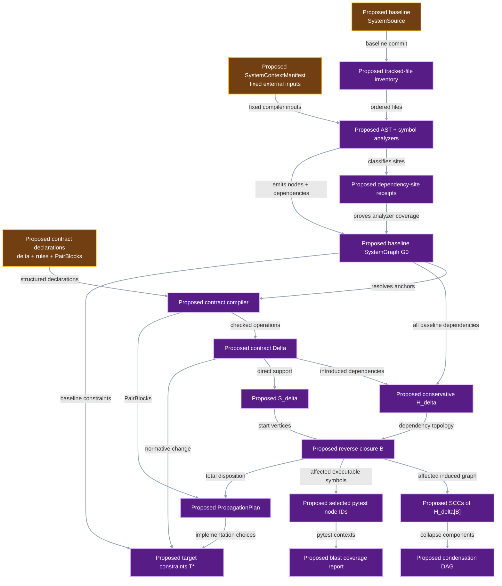
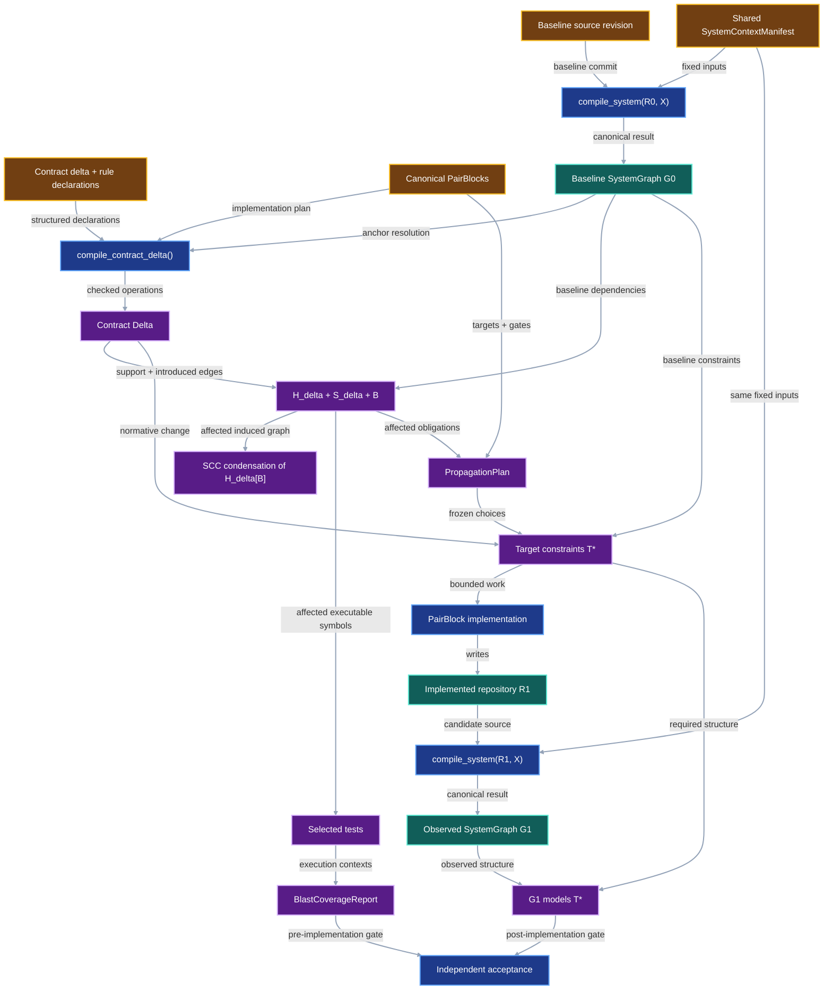

# Deterministic system impact graph

VIPER needs a repeatable way to identify which implementation, protocol,
verifier, test, contract, and checklist surfaces a proposed change can affect.
This contract compiles the codebase and specification stack into one typed
directed dependency graph under a fixed execution context. It compiles an
explicit contract delta into the conservative impact overlay, computes the
affected surface, condenses affected dependency cycles, and selects tests that
execute the affected Python surface. A later source revision supplies observed
conformance evidence for the intended change.

## 1. Status

**Contract status:** audited design; implementation and owner approval pending.

These requirements bind the contract to the master checklist:

| ID | Implementation obligation |
| --- | --- |
| SIG-01 <!-- contract-requirement: SIG-01 phase=0 test=tests/test_validation_architecture.py --> | Inventory every tracked file; emit canonical, source-anchored nodes and dependency edges; and classify every supported Python dependency site. |
| SIG-02 <!-- contract-requirement: SIG-02 phase=0 test=tests/test_validation_architecture.py --> | Produce stable diagnostics, hold declared external inputs fixed, and fail closed on unsupported or unresolved dependencies in the affected surface. |
| SIG-03 <!-- contract-requirement: SIG-03 phase=0 test=tests/test_inspection.py --> | Compile the declared contract delta into the conservative impact overlay, reverse closure, affected-graph SCC condensation, and total propagation plan. |
| SIG-04 <!-- contract-requirement: SIG-04 phase=0 test=tests/test_documentation.py --> | Compile requirements, verifier rules, rule bindings, checklist tasks, and PairBlocks automatically; select tests for every executable affected node; and require complete statement and branch execution over that surface. |

## 2. Required claim

Given one baseline repository, one explicit contract delta, one fixed context,
and one deterministic compiler version, VIPER produces the same canonical
baseline graph, impact overlay, affected surface, SCC condensation, test
selection, and target constraints on every conforming execution.

Let `R0` identify the baseline repository and `X` the fixed compilation
context. The compiler constructs:

```math
G_0 = \mathcal C_X(R_0)
```

```math
\Delta = \operatorname{CompileContract}(R_0, G_0, \text{contract declarations})
```

The conservative impact graph retains every baseline dependency and adds every
dependency introduced by the delta:

```math
H_\Delta = (V_0 \cup V_\Delta^+,\; D_0 \cup D_\Delta^+)
```

The affected surface is reverse reachability from the delta support:

```math
B = \{x \in V_{H_\Delta} \mid \exists s \in S_\Delta:\; x \leadsto s\}.
```

Removed dependencies remain in `H_delta` because they existed before the
change and can identify dependents that require migration. A candidate
repository `R1` is compiled only after implementation:

```math
G_1 = \mathcal C_X(R_1).
```

`G1` is compared with the target constraints compiled from `(G0, Delta, P)`.
`Delta` alone generally underdetermines one complete future graph. PairBlocks,
implementation policy, and any frozen repair choice supply the propagation
plan `P` that determines the admissible target constraints.

The guarantee is conditional on `X`. It identifies impact under the declared
Python runtime, dependencies, environment variables, fixture files, command
inputs, and external responses.

The compiler's completeness claim is bounded by the source inventory and
declared analyzers. It proves that every tracked file received an analysis
receipt and that every supported construct produced a node, edge, or unresolved
dependency. Observed resolution supplies the execution-specific relationships
that static syntax leaves open.

## 3. Current gap

### Inspected path

The repository has several deterministic checks with separate, hard-coded
views:

```text
tests/test_validation_architecture.py
-> parses Python imports for privacy rules

tests/test_documentation.py
-> parses contract requirements, checklist markers, schemas, links, and examples

inspection.plan_diff()
-> compares frozen plan JSON leaves

inspection.lineage()
-> constructs one verified run graph
```

These checks establish separate local relationships. The system lacks one graph
that connects a changed protocol field to its constructor, runtime consumer,
persisted record, verifier, contract requirement, checklist task, and test.

### Diagram color contract

The three diagrams use the shared semantic palette from
[contract requirement traceability](contract-requirement-traceability.md#diagram-color-contract).
Node labels preserve the same meaning in monochrome.

| Color | Mermaid classes | Meaning |
| --- | --- | --- |
| Amber | `input` | Source revisions, fixed context, or other compiler inputs. |
| Blue | `current`, `consumer` | Existing tools or operations that consume graph results. |
| Teal | `evidence` | Existing or persisted results. |
| Red | `gap` | A relationship missing from the current system. |
| Purple | `proposed`, `output` | Proposed records, compiler stages, or generated outputs. |

Every node uses white text and a two-pixel stroke. Every link uses `#94a3b8`
with a two-pixel stroke.

### Current DAG

The current tools produce four separate dependency views. Each output uses a
private identity namespace and local edge evidence.



### Missing connector

The missing path is:

```text
source revision + fixed context
-> complete tracked-file inventory
-> one analysis receipt per file
-> source-backed nodes, auditable edges, and dependency-site receipts
-> canonical baseline SystemGraph G0
-> automatic contract and RuleEdge compilation
-> explicit contract delta
-> conservative H_delta and reverse closure B
-> SCC condensation of H_delta[B]
-> affected contracts, checklist tasks, and tests
-> complete statement and branch execution over B_exec
-> total propagation plan and target constraints
-> observed G1 conformance
```

The compiler derives `ContractTraceabilityGraph` from the declarations owned by
[`contract-requirement-traceability.md`](contract-requirement-traceability.md)
and lowers its `RuleEdge` declarations into normalized dependencies.

### Proposed-change DAG

The proposed compiler derives source-backed nodes and dependency-site receipts
from the baseline inventory, compiles the declared delta, computes impact, and
proves test execution over the affected surface before implementation.



### Integrated DAG

The integrated path connects the pre-implementation compiler with the observed
repository and conformance verifier.



## 4. Contract models

### Identifiers and kinds

```python
SystemNodeId = Annotated[str, StringConstraints(min_length=1)]
SystemComponentId = SHA256
PairBlockId = Annotated[
    str,
    StringConstraints(pattern=r"^P0-[A-Z]+-[0-9]{2}$"),
]

SystemNodeKind = Literal[
    "repository_file",
    "python_symbol",
    "document_anchor",
    "external_symbol",
]

SystemNodeRole = Literal[
    "python_module",
    "python_test_module",
    "class",
    "function",
    "async_function",
    "method",
    "async_method",
    "field",
    "variable",
    "public_export",
    "configuration",
    "fixture",
    "generated_source",
    "protocol_model",
    "protocol_field",
    "api_operation",
    "cli_command",
    "runtime_operation",
    "persisted_document",
    "contract",
    "checklist_document",
    "contract_requirement",
    "verifier_rule",
    "checklist_task",
    "pair_block",
    "completion_gate",
    "acceptance_test",
    "installed_package",
    "external_module",
    "environment_variable",
    "context_file",
    "context_command",
    "runtime_target",
]

SystemEdgeKind = Literal[
    "contained_by",
    "imports_module",
    "imports_symbol",
    "calls",
    "constructs",
    "inherits_from",
    "uses_type",
    "reads_symbol",
    "writes_symbol",
    "decorated_by",
    "registers_with",
    "exports_symbol",
    "declared_by",
    "implements_rule",
    "verifies_rule",
    "scheduled_by",
    "targets",
    "gated_by",
    "block_depends_on",
    "reads_context",
    "launches",
]

ResolutionKind = Literal[
    "dynamic_import",
    "decorator_registration",
    "registry_entry",
    "reflection_target",
    "subprocess_entrypoint",
]

EdgeOrigin = Literal["declared", "static", "observed"]
FileAnalysisStatus = Literal["parsed", "opaque", "excluded"]
```

`SystemNodeKind` determines the node's identity grammar and required fields.
`SystemNodeRole` adds a finite semantic tag. The compiler accepts the listed
role-kind combinations.

| Node kind | Canonical identity | Required source fields | Admissible role families |
| --- | --- | --- | --- |
| `repository_file` | `file:<repo-relative-path>` | path and complete-file digest | module, test module, contract, checklist, configuration, fixture, generated source |
| `python_symbol` | `python:<path>:<qualified-name>` | path, qualified name, four AST coordinates, exact-span digest | Python declaration kind plus optional protocol, API, CLI, runtime, fixture, test, or export role |
| `document_anchor` | `anchor:<path>:<anchor-kind>:<stable-id>` | path, stable marker ID, line range, exact-span digest | requirement, verifier rule, checklist task, PairBlock, or completion gate |
| `external_symbol` | `external:<external-kind>:<context-identity>` | external kind and fixed-context identity | package, module, variable, file, command, or runtime target |

Every member of `SystemEdgeKind` denotes a dependency and uses one direction:
the source depends on the target. Descriptive relationships, provenance joins,
and traversal results belong in evidence records or reports, outside the edge
set. The vocabulary therefore contains one containment direction. The inverse
`defines`/`defined_in` pair belongs to the superseded vocabulary.

`RuleEdge` remains the traceability compiler's declaration that a verifier rule
has an implementation owner or observing test. The dependency graph receives
its mechanically lowered `SystemEdge`:

| `RuleEdge.kind` | Emitted dependency edge |
| --- | --- |
| `implementation` | `RuleEdge.target -> verifier-rule`, kind `implements_rule` |
| `verification` | `RuleEdge.target -> verifier-rule`, kind `verifies_rule` |

Each verifier rule has exactly one implementation binding and at least one
verification binding. Duplicate bindings, unknown rules, unresolved target
symbols, and a binding whose checklist phase differs from its requirement are
compiler errors.

### Fixed context

`SystemContextManifest` contains external values held equal across the two
compilations. Every collection uses canonical lexical ordering.

```python
class ContextPackage(ProtocolModel):
    name: NonEmptyStr
    version: NonEmptyStr


class ContextVariable(ProtocolModel):
    name: NonEmptyStr
    value: str


class ContextFile(ProtocolModel):
    path: RepoRelPath
    sha256: SHA256
    bytes: int = Field(ge=0)


class ContextCommand(ProtocolModel):
    command_id: NonEmptyStr
    executable: NonEmptyStr
    argv: tuple[str, ...]
    stdin_sha256: SHA256 | None = None
    response: ContextFile | None = None


class SystemContextManifest(ProtocolModel):
    schema_version: Literal[1] = 1
    python_version: NonEmptyStr
    platform: NonEmptyStr
    packages: tuple[ContextPackage, ...]
    variables: tuple[ContextVariable, ...]
    files: tuple[ContextFile, ...]
    commands: tuple[ContextCommand, ...]
```

The manifest contains serializable values and excludes process handles and
secrets. A test or review that needs a credential supplies a deterministic
fixture value with zero external authority.

The manifest fixes exogenous inputs. The compiler observes dynamic outcomes
produced by the source revision: decorator registrations, registry contents,
reflection targets, resolved imports, and subprocess entrypoints.

### Source identity

```python
class SystemSource(ProtocolModel):
    repository: HttpUrl
    commit: GitCommit
```

The baseline and candidate graphs may use different `SystemSource.commit`
values. Both graphs must use the same context-manifest digest.

### Repository inventory

The compiler begins with the tracked files in the selected Git commit. The
selected source revision excludes untracked working-tree files.

```python
class RepositoryFile(ProtocolModel):
    path: RepoRelPath
    sha256: SHA256
    bytes: int = Field(ge=0)


class FileAnalysisReceipt(ProtocolModel):
    path: RepoRelPath
    file_sha256: SHA256
    analyzer: NonEmptyStr
    status: FileAnalysisStatus
    emitted_nodes: tuple[SystemNodeId, ...]
    emitted_edges: tuple[SHA256, ...]
    reason: NonEmptyStr | None = None
```

Every `RepositoryFile` has exactly one `FileAnalysisReceipt`. A supported
source, configuration, contract, or test file uses `status="parsed"`. A binary
asset uses `status="opaque"` and records its analyzer boundary. A file excluded
by an explicit repository rule uses `status="excluded"` and records that rule.
Strict review accepts opaque and excluded files only when their roles remain
outside package behavior, protocol behavior, execution, verification, tests,
and contract coverage.

### Dependency-site coverage and diagnostics

File coverage and dependency coverage are separate claims. The Python analyzer
records one `DependencySiteReceipt` for every AST construct in its
declared dependency-site registry.

```python
DependencySiteOutcome = Literal[
    "emitted",
    "self_contained",
    "unresolved",
    "unsupported",
]

DiagnosticSeverity = Literal["info", "warning", "error"]


class DependencySiteReceipt(ProtocolModel):
    site_id: SHA256
    path: RepoRelPath
    ast_kind: NonEmptyStr
    start_line: int = Field(ge=1)
    start_column: int = Field(ge=0)
    end_line: int = Field(ge=1)
    end_column: int = Field(ge=0)
    outcome: DependencySiteOutcome
    emitted_edges: tuple[SHA256, ...]
    rule_id: NonEmptyStr
    detail: NonEmptyStr


class SystemDiagnostic(ProtocolModel):
    diagnostic_id: SHA256
    code: NonEmptyStr
    severity: DiagnosticSeverity
    phase: Literal["inventory", "extract", "contract", "impact", "scc", "coverage", "conformance"]
    message: NonEmptyStr
    path: RepoRelPath | None = None
    start_line: int | None = Field(default=None, ge=1)
    node_ids: tuple[SystemNodeId, ...]
    edge_ids: tuple[SHA256, ...]
    remediation: NonEmptyStr
```

Phase 0 registers `Import`, `ImportFrom`, `Call`, class bases, decorators,
function and variable annotations, `Name` and `Attribute` loads and stores,
literal registries, and `__all__` exports. The analyzer combines Python's AST
coordinates with the compiler symbol table so aliases, local names, globals,
nonlocals, and imported names retain distinct namespaces. A star import,
computed import target, computed registry key, or call target that the analyzer
fails to resolve as `unresolved` or `unsupported`. Every registered site emits
an edge-bearing or terminal receipt.

`self_contained` means the construct's dependencies remain inside its owning
symbol, such as a local literal assignment. It differs from an absent receipt.
Strict Phase 0 requires every registered site to have exactly
one receipt and rejects `unresolved` or `unsupported` outcomes in the affected
surface.

Diagnostic codes are stable API values. Phase 0 reserves these families:

| Family | Required examples |
| --- | --- |
| `SGI` inventory | missing receipt, duplicate path, digest mismatch, unsupported tracked file |
| `SGX` extraction | Python parse failure, unsupported AST site, unresolved import, ambiguous name, dynamic call target |
| `SGC` contract | malformed declaration, duplicate ID, unknown anchor, missing rule owner, missing rule test, delta conflict |
| `SGG` graph | invalid endpoint, invalid direction, duplicate edge, missing evidence, noncanonical ordering |
| `SGB` blast | incomplete reverse closure, uncovered affected node, absent selected test, missing statement or branch |
| `SGS` SCC | missing member, duplicate member, crossing-edge mismatch, cyclic condensation, unstable component ID |

Tests assert diagnostic codes and structured locations. Messages provide
context; codes and fields form the stable interface.

### Contract declarations and automatic lowering

The compiler reads contracts, the master checklist, and PairBlock documents
directly. The input grammar consists of the existing `contract-requirement`,
`verifier-rule`, `contract-implementation`, `contract-verification`,
`pair-block`, and `pair-block-definition` declarations plus one structured
delta block:

```toml contract-delta
id = "local-store-layout"
baseline_graph_sha256 = "aaaaaaaaaaaaaaaaaaaaaaaaaaaaaaaaaaaaaaaaaaaaaaaaaaaaaaaaaaaaaaaa"

[[operations]]
op = "update_node"
target = "python:src/viper/references.py:LocalFileRef.store"
expected_sha256 = "bbbbbbbbbbbbbbbbbbbbbbbbbbbbbbbbbbbbbbbbbbbbbbbbbbbbbbbbbbbbbbbb"

[[operations]]
op = "add_edge"
source = "python:src/viper/storage.py:LocalArtifactStore.__init__"
kind = "reads_symbol"
target = "python:src/viper/references.py:LocalFileRef.store"
```

The normative operation set is closed:

```python
DeltaOperationKind = Literal[
    "add_node",
    "remove_node",
    "update_node",
    "add_edge",
    "remove_edge",
    "update_edge",
]
```

Each removal or update carries the expected baseline identity. Each addition
names every field required to derive its canonical identity. The compiler
rejects an unknown target, stale precondition, duplicate operation, incompatible
pair of operations, unresolved PairBlock reference, or declaration outside the
canonical node and edge vocabulary.

The compiler derives `ContractTraceabilityGraph`, `Delta`, `S_delta`,
`D_delta_plus`, `H_delta`, `B`, and the initial propagation obligations from the
declared contract inputs. Human authors declare the intended contract
change and PairBlock choices. Graph expansion, reverse reachability, SCC
condensation, test selection, and completeness checks are mechanical.

### Pair-coding plan

```python
class PairBlock(ProtocolModel):
    block_id: PairBlockId
    document: RepoRelPath
    start_line: int = Field(ge=1)
    end_line: int = Field(ge=1)
    sha256: SHA256
    requirements: tuple[RequirementId, ...] = Field(min_length=1)
    targets: tuple[RepoSymbolRef, ...] = Field(min_length=1)
    tests: tuple[RepoSymbolRef, ...] = Field(min_length=1)
    gate: NonEmptyStr
    depends_on: tuple[PairBlockId, ...]
```

`PairBlock` is the parsed form of one Phase 0 coding block. The compiler hashes
the complete marked block, validates its source and test references, and
topologically orders `depends_on`. Its system-graph node uses
`roles=("pair_block",)`. The gate becomes a document anchor with
`roles=("completion_gate",)`.

### Nodes and edge evidence

```python
class RepositoryFileNode(ProtocolModel):
    node_id: SystemNodeId
    kind: Literal["repository_file"] = "repository_file"
    roles: tuple[SystemNodeRole, ...] = Field(min_length=1)
    path: RepoRelPath
    sha256: SHA256


class PythonSymbolNode(ProtocolModel):
    node_id: SystemNodeId
    kind: Literal["python_symbol"] = "python_symbol"
    roles: tuple[SystemNodeRole, ...] = Field(min_length=1)
    path: RepoRelPath
    symbol: NonEmptyStr
    symbol_kind: Literal[
        "class",
        "function",
        "async_function",
        "method",
        "async_method",
        "field",
        "variable",
    ]
    start_line: int = Field(ge=1)
    start_column: int = Field(ge=0)
    end_line: int = Field(ge=1)
    end_column: int = Field(ge=0)
    sha256: SHA256


class DocumentAnchorNode(ProtocolModel):
    node_id: SystemNodeId
    kind: Literal["document_anchor"] = "document_anchor"
    roles: tuple[SystemNodeRole, ...] = Field(min_length=1)
    path: RepoRelPath
    symbol: NonEmptyStr
    anchor_kind: Literal[
        "contract_requirement",
        "verifier_rule",
        "checklist_task",
        "pair_block",
        "completion_gate",
    ]
    start_line: int = Field(ge=1)
    end_line: int = Field(ge=1)
    sha256: SHA256


class ExternalSymbolNode(ProtocolModel):
    node_id: SystemNodeId
    kind: Literal["external_symbol"] = "external_symbol"
    roles: tuple[SystemNodeRole, ...] = Field(min_length=1)
    external_kind: Literal[
        "package",
        "module",
        "environment_variable",
        "file",
        "command",
        "runtime_target",
    ]
    symbol: NonEmptyStr


SystemNode = Annotated[
    RepositoryFileNode
    | PythonSymbolNode
    | DocumentAnchorNode
    | ExternalSymbolNode,
    Field(discriminator="kind"),
]


class SourceEvidence(ProtocolModel):
    kind: Literal["source"] = "source"
    path: RepoRelPath
    start_line: int = Field(ge=1)
    end_line: int = Field(ge=1)
    expression: NonEmptyStr


class ResolutionEvidence(ProtocolModel):
    kind: Literal["resolution"] = "resolution"
    resolution_id: SHA256


EdgeEvidence = Annotated[
    SourceEvidence | ResolutionEvidence,
    Field(discriminator="kind"),
]


class SystemEdge(ProtocolModel):
    edge_id: SHA256
    source: SystemNodeId
    target: SystemNodeId
    kind: SystemEdgeKind
    origin: EdgeOrigin
    evidence: EdgeEvidence


class ResolutionAttempt(ProtocolModel):
    resolution_id: SHA256
    kind: ResolutionKind
    source: SystemNodeId
    expression: NonEmptyStr


class ResolutionObservation(ProtocolModel):
    attempt: ResolutionAttempt
    target: SystemNodeId
    edge: SystemEdge


class UnresolvedDependency(ProtocolModel):
    attempt: ResolutionAttempt
    reason: NonEmptyStr
```

`SystemNode` applies these field rules:

- A `repository_file` node requires `path` and `sha256`, omits line fields, and
  matches one `RepositoryFile`.
- A `python_symbol` node requires `path`, `symbol`, `start_line`, `end_line`,
  and the AST column coordinates carried in its source evidence. Its digest
  covers the exact UTF-8 source span.
- A `document_anchor` node requires `path`, a stable marker ID in `symbol`, a
  line range, and the exact-span digest.
- An `external_symbol` node requires a context-qualified `symbol` and omits
  repository path, line, and source digest fields.
- Every Python symbol and document anchor has one outgoing `contained_by` edge
  to its immediate owner. The owner chain terminates at a repository file.

Node IDs use these canonical forms:

```text
file:<repository path>
python:<repository path>:<qualified symbol>
anchor:<repository path>:<anchor kind>:<stable marker ID>
external:<external kind>:<fixed-context identity>
```

Each edge explains why it exists. A declared or statically inferred edge cites
the exact source expression through `SourceEvidence`. An observed edge cites
the `ResolutionAttempt` that produced it through `ResolutionEvidence`.

Every edge points from the dependent node to the node it depends on. For
example, a function points to the function it calls, a verifier rule points to
the requirement it enforces, an implementation symbol points to the rule it
implements, and a test points to the rule it tests. Reverse traversal from a
changed dependency therefore finds every affected dependent.

`ResolutionAttempt.expression` stores the exact lookup being resolved, such as
`os.environ["VIPER_BACKEND"]`, `OPERATIONS["run"]`, or
`python -m viper._workers.stages`. Its `resolution_id` is the SHA-256 digest of
canonical JSON containing `kind`, `source`, and `expression`.

For an observation, `edge.origin` is `"observed"`, the edge's resolution ID
matches `attempt.resolution_id`, and `edge.target` equals `target`. An unresolved
dependency produces zero edges.

Every `SystemEdge.source` and `SystemEdge.target` must name a node in the same
graph. Duplicate `(source, target, kind, origin, evidence)` tuples fail
validation. `edge_id` hashes that complete tuple.

### Complete system graph

```python
class SystemGraph(ProtocolModel):
    schema_version: Literal[1] = 1
    source: SystemSource
    context_sha256: SHA256
    contract_traceability_sha256: SHA256
    inventory: tuple[RepositoryFile, ...] = Field(min_length=1)
    analyses: tuple[FileAnalysisReceipt, ...] = Field(min_length=1)
    nodes: tuple[SystemNode, ...] = Field(min_length=1)
    edges: tuple[SystemEdge, ...]
    observations: tuple[ResolutionObservation, ...]
    unresolved: tuple[UnresolvedDependency, ...]
```

Inventory and analyses sort by path. Nodes sort by `node_id`. Edges sort by
`edge_id`. Observations and unresolved dependencies sort by
`attempt.resolution_id`.

Across `observations` and `unresolved`, each `resolution_id` appears exactly
once. That rule makes a successful observation and an unresolved dependency
the two possible outcomes of the same resolution operation.

The graph digest is the SHA-256 digest of canonical JSON bytes. The stored graph
uses `ResolvedFileRef` as its immutable reference.

### Condensation DAG

Python imports and calls may contain cycles. The compiler collapses each
strongly connected component into one component node:

```python
class SystemComponent(ProtocolModel):
    component_id: SystemComponentId
    members: tuple[SystemNodeId, ...] = Field(min_length=1)


class SystemComponentEdge(ProtocolModel):
    source: SystemComponentId
    target: SystemComponentId
    relations: tuple[SystemEdgeKind, ...] = Field(min_length=1)


class SystemCondensationDAG(ProtocolModel):
    schema_version: Literal[1] = 1
    graph: ResolvedFileRef
    components: tuple[SystemComponent, ...] = Field(min_length=1)
    edges: tuple[SystemComponentEdge, ...]
```

Phase 0 computes SCCs over the induced affected graph `H_delta[B]`. The set `B`
alone and an independently filtered import graph are invalid SCC inputs. The implementation
uses iterative Tarjan traversal with lexically sorted vertices and adjacency.
An explicit frame stack avoids dependence on Python's recursion limit.

`component_id` hashes the canonical JSON array of sorted member IDs. A component
is cyclic when it contains more than one member or its sole member has a
self-edge. Every affected node belongs to exactly one component. Each crossing
component edge records the sorted source `SystemEdge.edge_id` witnesses and
their kinds; internal edges remain available in the full affected graph.

The component graph must be acyclic. A deterministic Kahn traversal schedules
ready components by `component_id`. Python's `graphlib.TopologicalSorter` may
serve as an independent acyclicity oracle. VIPER's lexically tied order owns
canonical serialization.

SCCs are atomic scheduling units. Phase 0 may group adjacent SCCs with one
deterministic greedy heuristic after condensation; each SCC remains whole. The
cohesion-aware graph-partition objective in the research plan operates on the
condensation DAG in a later phase. SCC computation remains its required input.

### Graph delta and impact report

```python
class ChangedNode(ProtocolModel):
    node_id: SystemNodeId
    baseline: SystemNode
    candidate: SystemNode


class SystemGraphDelta(ProtocolModel):
    schema_version: Literal[1] = 1
    baseline: ResolvedFileRef
    candidate: ResolvedFileRef
    context_sha256: SHA256
    added_nodes: tuple[SystemNode, ...]
    removed_nodes: tuple[SystemNode, ...]
    changed_nodes: tuple[ChangedNode, ...]
    added_edges: tuple[SystemEdge, ...]
    removed_edges: tuple[SystemEdge, ...]


class ImpactReport(ProtocolModel):
    schema_version: Literal[1] = 1
    delta: ResolvedFileRef
    affected_nodes: tuple[SystemNodeId, ...]
    affected_requirements: tuple[RequirementId, ...]
    affected_implementations: tuple[RuleEdge, ...]
    observing_tests: tuple[RuleEdge, ...]
    unresolved: tuple[UnresolvedDependency, ...]
    complete: bool


PropagationAction = Literal["change", "remove", "retain"]


class PropagationDisposition(ProtocolModel):
    path: RepoRelPath
    action: PropagationAction
    affected_nodes: tuple[SystemNodeId, ...] = Field(min_length=1)
    statement: NonEmptyStr


class PlannedAddition(ProtocolModel):
    path: RepoRelPath
    purpose: NonEmptyStr
    requirements: tuple[RequirementId, ...] = Field(min_length=1)


class PropagationPlan(ProtocolModel):
    schema_version: Literal[1] = 1
    impact: ResolvedFileRef
    dispositions: tuple[PropagationDisposition, ...] = Field(min_length=1)
    planned_additions: tuple[PlannedAddition, ...]
```

`SystemGraphDelta` is the observed comparison between two compiled repository
graphs. The normative `ContractDelta` is compiled from the contract before an
implementation exists. These records serve distinct lifecycle roles.

For impact analysis, project every typed dependency edge to its endpoint pair:

```math
D_0 = \{(u,v) \in V_0 \times V_0 \mid \exists k:\; (u,k,v) \in E_0\}.
```

Let `D_delta_plus` contain the endpoint pair of every dependency introduced or
replaced by the contract delta. The conservative overlay is:

```math
D_{H_\Delta} = D_0 \cup D_\Delta^+.
```

The compiler retains removed baseline dependencies in this overlay. This choice
preserves the predecessor path needed to find migration work.
The direct support `S_delta` contains every baseline endpoint named by an
operation and every introduced node. The blast radius `B` is the reverse
reachability closure of that support in `H_delta`.

### Blast test coverage

`B_exec` is the subset of affected `python_symbol` nodes with executable
statements. The selected pytest node IDs must satisfy three separate gates:

1. Every node in `B_exec` is reached by at least one `verifies_rule`, test
   import, test call, or fixture dependency path.
2. Running only the selected tests executes every coverage.py statement in
   each affected symbol span.
3. Running only the selected tests executes every coverage.py branch arc whose
   source line lies in each affected symbol span.

```python
class AffectedSymbolCoverage(ProtocolModel):
    node_id: SystemNodeId
    selected_tests: tuple[NonEmptyStr, ...] = Field(min_length=1)
    statement_lines: tuple[int, ...]
    missing_statement_lines: tuple[int, ...]
    branch_arcs: tuple[tuple[int, int], ...]
    missing_branch_arcs: tuple[tuple[int, int], ...]


class BlastCoverageReport(ProtocolModel):
    impact_sha256: SHA256
    coverage_data_sha256: SHA256
    affected_symbols: tuple[AffectedSymbolCoverage, ...]
    complete: bool
```

The Phase 0 gate requires empty missing-statement and missing-branch
collections. Test contexts retain the exact pytest node ID that executed each
line and arc. This gate proves execution of the affected surface. Assertion
quality, behavioral correctness, and dependency-extraction soundness remain
separate verifier obligations.

`ImpactReport.complete` is `True` when the baseline graph and every affected
dependency site have resolved, supported outcomes under the fixed context.
Strict compilation rejects an incomplete graph before
publishing an implementation gate. Post-implementation conformance applies the
same condition to `G1`.

`RequirementId` and `RuleEdge` come from the contract-traceability models.
`affected_implementations` contains edges whose `kind` is `"implementation"`.
`observing_tests` contains edges whose `kind` is `"verification"`.
`contract_traceability_sha256` binds the source graph to the exact requirement
links it ingested. The impact report therefore preserves whether each reached
owner or test remains `planned` or already resolves as `implemented`.

`PropagationPlan` gives every affected repository path one action. `change`
states the required edit. `remove` states what the candidate deletes. `retain`
states why the affected path remains valid as written. The union of every
`PropagationDisposition.affected_nodes` must equal
`ImpactReport.affected_nodes`, and each affected node appears once.

`PlannedAddition` records a required path before implementation creates it. A
completed candidate graph must contain each planned path among the file nodes
in `SystemGraphDelta.added_nodes`. Each added repository path must either match
one planned addition or carry a review explanation before the phase closes.

### Illustrative worked example

This example builds a real two-commit Git fixture. The candidate changes
`LocalFileRef.store`. The program constructs every Section 4 model, records one
successful dynamic resolution, records one unresolved resolution for the
exploratory path, publishes both graphs, creates their condensation DAG, and
builds the resulting impact report. It then assigns every affected path a
disposition and reconciles one planned addition with the candidate delta.

<!-- contract-worked-example: start -->

```python
from __future__ import annotations

import hashlib
import json
import subprocess
from pathlib import Path
from tempfile import TemporaryDirectory
from typing import Any

from viper._contract_traceability import (
    RepoSymbolRef,
    RuleEdge,
)
from viper.references import ResolvedFileRef
from viper.storage import LocalArtifactStore
from viper.system_graph import (
    AffectedSymbolCoverage,
    BlastCoverageReport,
    ChangedNode,
    ContextCommand,
    ContextFile,
    ContextPackage,
    ContextVariable,
    DeltaOperationKind,
    DependencySiteOutcome,
    DependencySiteReceipt,
    DiagnosticSeverity,
    DocumentAnchorNode,
    EdgeEvidence,
    EdgeOrigin,
    FileAnalysisStatus,
    FileAnalysisReceipt,
    ExternalSymbolNode,
    ImpactReport,
    PairBlock,
    PairBlockId,
    PlannedAddition,
    PropagationAction,
    PropagationDisposition,
    PropagationPlan,
    RepositoryFile,
    RepositoryFileNode,
    ResolutionKind,
    ResolutionAttempt,
    ResolutionEvidence,
    ResolutionObservation,
    SourceEvidence,
    SystemComponent,
    SystemComponentId,
    SystemComponentEdge,
    SystemCondensationDAG,
    SystemContextManifest,
    SystemDiagnostic,
    SystemEdge,
    SystemEdgeKind,
    SystemGraph,
    SystemGraphDelta,
    SystemNode,
    SystemNodeId,
    SystemNodeKind,
    SystemNodeRole,
    SystemSource,
    PythonSymbolNode,
    UnresolvedDependency,
)


BASELINE_REFERENCES = b"""from typing import Literal

class LocalFileRef:
    kind: Literal[\"local\"] = \"local\"
    store: str = \".viper/store\"
"""

CANDIDATE_REFERENCES = BASELINE_REFERENCES.replace(
    b'\".viper/store\"',
    b'\".viper/objects\"',
)

STORAGE_SOURCE = b"""from .references import LocalFileRef

class LocalArtifactStore:
    def __init__(self, root):
        self.store = LocalFileRef.store
"""

TEST_SOURCE = b"""from viper.storage import LocalArtifactStore

def test_store_uses_declared_location(tmp_path):
    store = LocalArtifactStore(tmp_path)
    assert store.store == \".viper/store\"
"""

MIGRATION_TEST_SOURCE = b"""from viper.references import LocalFileRef

def test_prior_local_reference_keeps_declared_store():
    reference = LocalFileRef(store=".viper/store")
    assert reference.store == ".viper/store"
"""

CONTRACT_SOURCE = b"""| PDR-02 | Bind LocalArtifactStore to ROOT/.viper/store. |

| project.store.boundary | LocalArtifactStore stays beneath ROOT. |
"""

CHECKLIST_SOURCE = b"""- [ ] Bind LocalArtifactStore to ROOT/.viper/store.
  <!-- contract-implementation: requirement=PDR-02 rule=project.store.boundary state=implemented owner=src/viper/storage.py:LocalArtifactStore.__init__ -->
  <!-- contract-verification: requirement=PDR-02 rule=project.store.boundary state=implemented test=tests/test_storage.py:test_store_uses_declared_location -->
"""


def canonical_bytes(value: Any) -> bytes:
    """Return deterministic JSON bytes for a model or JSON-compatible value."""
    if hasattr(value, "model_dump"):
        value = value.model_dump(mode="json")
    return json.dumps(
        value,
        sort_keys=True,
        separators=(",", ":"),
    ).encode()


def digest(value: Any) -> str:
    """Hash canonical JSON, or hash bytes without another encoding layer."""
    raw = value if isinstance(value, bytes) else canonical_bytes(value)
    return hashlib.sha256(raw).hexdigest()


def run_git(root: Path, *arguments: str) -> str:
    """Run one Git command in the fixture repository."""
    completed = subprocess.run(
        ("git", *arguments),
        cwd=root,
        check=True,
        stdout=subprocess.PIPE,
        stderr=subprocess.PIPE,
    )
    return completed.stdout.decode().strip()


def commit(root: Path, message: str) -> str:
    """Commit the complete fixture tree and return its real Git identity."""
    run_git(root, "add", ".")
    run_git(root, "commit", "-m", message)
    return run_git(root, "rev-parse", "HEAD")


def read_commit_file(root: Path, revision: str, path: str) -> bytes:
    """Read one tracked file exactly as stored in a fixture commit."""
    return subprocess.run(
        ("git", "show", f"{revision}:{path}"),
        cwd=root,
        check=True,
        stdout=subprocess.PIPE,
        stderr=subprocess.PIPE,
    ).stdout


def line_number(raw: bytes, text: bytes) -> int:
    """Return the one-based line containing text."""
    for number, line in enumerate(raw.splitlines(), start=1):
        if text in line:
            return number
    raise ValueError(text.decode())


def line_digest(raw: bytes, number: int) -> str:
    """Hash the exact source line named by a span node."""
    return hashlib.sha256(raw.splitlines(keepends=True)[number - 1]).hexdigest()


def file_node(file: RepositoryFile) -> SystemNode:
    """Construct the source-backed node for one tracked file."""
    node_kind: SystemNodeKind = "repository_file"
    role: SystemNodeRole
    if file.path.endswith("project-data-root.md"):
        role = "contract"
    elif file.path.endswith("master-execution-checklist.md"):
        role = "checklist_document"
    else:
        role = "python_module"
    return RepositoryFileNode(
        node_id=f"file:{file.path}",
        kind=node_kind,
        roles=(role,),
        path=file.path,
        sha256=file.sha256,
    )


def span_node(
    path: str,
    symbol: str,
    role: SystemNodeRole,
    raw: bytes,
    text: bytes,
) -> SystemNode:
    """Construct one named source span from an exact fixture line."""
    number = line_number(raw, text)
    document_roles = {
        "contract_requirement",
        "verifier_rule",
        "checklist_task",
        "pair_block",
        "completion_gate",
    }
    node_kind: SystemNodeKind = (
        "document_anchor" if role in document_roles else "python_symbol"
    )
    prefix = "anchor" if node_kind == "document_anchor" else "python"
    node_id = (
        f"{prefix}:{path}:{role}:{symbol}"
        if node_kind == "document_anchor"
        else f"{prefix}:{path}:{symbol}"
    )
    if node_kind == "document_anchor":
        return DocumentAnchorNode(
            node_id=node_id,
            roles=(role,),
            path=path,
            symbol=symbol,
            anchor_kind=role,
            start_line=number,
            end_line=number,
            sha256=line_digest(raw, number),
        )
    symbol_kind = "field" if role == "protocol_field" else "function"
    return PythonSymbolNode(
        node_id=node_id,
        roles=(role,),
        path=path,
        symbol=symbol,
        symbol_kind=symbol_kind,
        start_line=number,
        start_column=0,
        end_line=number,
        end_column=len(raw.splitlines()[number - 1]),
        sha256=line_digest(raw, number),
    )


def source_evidence(
    path: str,
    raw: bytes,
    text: bytes,
) -> SourceEvidence:
    """Name the exact fixture expression that establishes one edge."""
    number = line_number(raw, text)
    return SourceEvidence(
        path=path,
        start_line=number,
        end_line=number,
        expression=text.decode().strip(),
    )


def make_edge(
    source: SystemNodeId,
    target: SystemNodeId,
    kind: SystemEdgeKind,
    origin: EdgeOrigin,
    evidence: EdgeEvidence,
) -> SystemEdge:
    """Construct one edge and derive its identity from every edge field."""
    identity = {
        "source": source,
        "target": target,
        "kind": kind,
        "origin": origin,
        "evidence": evidence.model_dump(mode="json"),
    }
    return SystemEdge(
        edge_id=digest(identity),
        source=source,
        target=target,
        kind=kind,
        origin=origin,
        evidence=evidence,
    )


def publish_model(
    store: LocalArtifactStore,
    path: str,
    value: Any,
) -> ResolvedFileRef:
    """Publish one canonical model document and return its immutable ref."""
    return store.resolved_files({path: canonical_bytes(value)})[0]


pair_block_id: PairBlockId = "P0-PDR-05"
pair_block = PairBlock(
    block_id=pair_block_id,
    document="docs/development/phase-0-pair-coding.md",
    start_line=658,
    end_line=687,
    sha256=digest(
        {
            "block_id": pair_block_id,
            "document": "docs/development/phase-0-pair-coding.md",
            "start_line": 658,
            "end_line": 687,
        }
    ),
    requirements=("PDR-02",),
    targets=(
        RepoSymbolRef(
            path="src/viper/storage.py",
            symbol="LocalArtifactStore.__init__",
        ),
    ),
    tests=(
        RepoSymbolRef(
            path="tests/test_storage.py",
            symbol="test_store_uses_selected_project_root",
        ),
    ),
    gate=(
        "conda run -n mantra python -m pytest tests/test_storage.py "
        "-k uses_selected_project_root -q"
    ),
    depends_on=("P0-PDR-01", "P0-PDR-03"),
)


with TemporaryDirectory() as temporary_directory:
    fixture_root = Path(temporary_directory) / "system-graph-fixture"
    fixture_root.mkdir()
    run_git(fixture_root, "init")
    run_git(fixture_root, "config", "user.name", "VIPER fixture")
    run_git(fixture_root, "config", "user.email", "fixture@example.invalid")

    fixture_files = {
        "src/viper/references.py": BASELINE_REFERENCES,
        "src/viper/storage.py": STORAGE_SOURCE,
        "tests/test_storage.py": TEST_SOURCE,
        "docs/development/project-data-root.md": CONTRACT_SOURCE,
        "docs/development/master-execution-checklist.md": CHECKLIST_SOURCE,
    }
    for relative_path, raw in fixture_files.items():
        destination = fixture_root / relative_path
        destination.parent.mkdir(parents=True, exist_ok=True)
        destination.write_bytes(raw)

    baseline_commit = commit(fixture_root, "baseline local store")
    (fixture_root / "src/viper/references.py").write_bytes(
        CANDIDATE_REFERENCES
    )
    migration_test_path = fixture_root / "tests/test_storage_migration.py"
    migration_test_path.write_bytes(MIGRATION_TEST_SOURCE)
    candidate_commit = commit(fixture_root, "change local store directory")

    baseline_paths = tuple(sorted(fixture_files))
    candidate_paths = tuple(
        sorted((*fixture_files, "tests/test_storage_migration.py"))
    )
    baseline_raw = {
        path: read_commit_file(fixture_root, baseline_commit, path)
        for path in baseline_paths
    }
    candidate_raw = {
        path: read_commit_file(fixture_root, candidate_commit, path)
        for path in candidate_paths
    }

    baseline_inventory = tuple(
        RepositoryFile(
            path=path,
            sha256=hashlib.sha256(baseline_raw[path]).hexdigest(),
            bytes=len(baseline_raw[path]),
        )
        for path in baseline_paths
    )
    candidate_inventory = tuple(
        RepositoryFile(
            path=path,
            sha256=hashlib.sha256(candidate_raw[path]).hexdigest(),
            bytes=len(candidate_raw[path]),
        )
        for path in candidate_paths
    )

    baseline_file_nodes = tuple(file_node(file) for file in baseline_inventory)
    candidate_file_nodes = tuple(file_node(file) for file in candidate_inventory)
    candidate_migration_file = next(
        node
        for node in candidate_file_nodes
        if node.path == "tests/test_storage_migration.py"
    )

    baseline_field = span_node(
        "src/viper/references.py",
        "LocalFileRef.store",
        "protocol_field",
        baseline_raw["src/viper/references.py"],
        b"store: str",
    )
    candidate_field = span_node(
        "src/viper/references.py",
        "LocalFileRef.store",
        "protocol_field",
        candidate_raw["src/viper/references.py"],
        b"store: str",
    )
    store_constructor = span_node(
        "src/viper/storage.py",
        "LocalArtifactStore.__init__",
        "runtime_operation",
        STORAGE_SOURCE,
        b"def __init__",
    )
    acceptance_test = span_node(
        "tests/test_storage.py",
        "test_store_uses_declared_location",
        "acceptance_test",
        TEST_SOURCE,
        b"def test_store_uses_declared_location",
    )
    requirement_node = span_node(
        "docs/development/project-data-root.md",
        "PDR-02",
        "contract_requirement",
        CONTRACT_SOURCE,
        b"PDR-02",
    )
    rule_node = span_node(
        "docs/development/project-data-root.md",
        "project.store.boundary",
        "verifier_rule",
        CONTRACT_SOURCE,
        b"project.store.boundary",
    )
    checklist_task = span_node(
        "docs/development/master-execution-checklist.md",
        "bind-local-store",
        "checklist_task",
        CHECKLIST_SOURCE,
        b"Bind LocalArtifactStore",
    )
    package_node = ExternalSymbolNode(
        node_id="external:installed_package:pydantic==2.12.5",
        roles=("installed_package",),
        external_kind="package",
        symbol="pydantic==2.12.5",
    )

    common_spans = (
        store_constructor,
        acceptance_test,
        requirement_node,
        rule_node,
        checklist_task,
        package_node,
    )
    baseline_nodes = tuple(
        sorted(
            (*baseline_file_nodes, baseline_field, *common_spans),
            key=lambda node: node.node_id,
        )
    )
    candidate_nodes = tuple(
        sorted(
            (*candidate_file_nodes, candidate_field, *common_spans),
            key=lambda node: node.node_id,
        )
    )

    field_read = make_edge(
        store_constructor.node_id,
        baseline_field.node_id,
        "reads_symbol",
        "static",
        source_evidence(
            "src/viper/storage.py",
            STORAGE_SOURCE,
            b"self.store = LocalFileRef.store",
        ),
    )
    rule_requirement = make_edge(
        rule_node.node_id,
        requirement_node.node_id,
        "declared_by",
        "declared",
        source_evidence(
            "docs/development/project-data-root.md",
            CONTRACT_SOURCE,
            b"project.store.boundary",
        ),
    )
    implementation_rule = make_edge(
        store_constructor.node_id,
        rule_node.node_id,
        "implements_rule",
        "declared",
        source_evidence(
            "docs/development/master-execution-checklist.md",
            CHECKLIST_SOURCE,
            b"contract-implementation:",
        ),
    )
    test_rule = make_edge(
        acceptance_test.node_id,
        rule_node.node_id,
        "verifies_rule",
        "declared",
        source_evidence(
            "docs/development/master-execution-checklist.md",
            CHECKLIST_SOURCE,
            b"contract-verification:",
        ),
    )

    observed_kind: ResolutionKind = "dynamic_import"
    attempt_identity = {
        "kind": observed_kind,
        "source": store_constructor.node_id,
        "expression": 'import_module("pydantic")',
    }
    observed_attempt = ResolutionAttempt(
        resolution_id=digest(attempt_identity),
        kind=observed_kind,
        source=store_constructor.node_id,
        expression='import_module("pydantic")',
    )
    observed_evidence = ResolutionEvidence(
        resolution_id=observed_attempt.resolution_id,
    )
    observed_edge = make_edge(
        store_constructor.node_id,
        package_node.node_id,
        "imports_module",
        "observed",
        observed_evidence,
    )
    observation = ResolutionObservation(
        attempt=observed_attempt,
        target=package_node.node_id,
        edge=observed_edge,
    )

    unresolved_kind: ResolutionKind = "registry_entry"
    unresolved_identity = {
        "kind": unresolved_kind,
        "source": store_constructor.node_id,
        "expression": 'os.environ["VIPER_BACKEND"]',
    }
    unresolved_attempt = ResolutionAttempt(
        resolution_id=digest(unresolved_identity),
        kind=unresolved_kind,
        source=store_constructor.node_id,
        expression='os.environ["VIPER_BACKEND"]',
    )
    unresolved = UnresolvedDependency(
        attempt=unresolved_attempt,
        reason="VIPER_BACKEND is absent from SystemContextManifest.variables",
    )

    edges = tuple(
        sorted(
            (
                field_read,
                rule_requirement,
                implementation_rule,
                test_rule,
                observed_edge,
            ),
            key=lambda edge: edge.edge_id,
        )
    )

    analysis_status: FileAnalysisStatus = "parsed"

    def analyses_for(
        inventory: tuple[RepositoryFile, ...],
        nodes: tuple[SystemNode, ...],
    ) -> tuple[FileAnalysisReceipt, ...]:
        """Create one complete analysis receipt per tracked file."""
        return tuple(
            FileAnalysisReceipt(
                path=file.path,
                file_sha256=file.sha256,
                analyzer=(
                    "python-ast"
                    if file.path.endswith(".py")
                    else "markdown-contract"
                ),
                status=analysis_status,
                emitted_nodes=tuple(
                    node.node_id for node in nodes if node.path == file.path
                ),
                emitted_edges=tuple(
                    edge.edge_id
                    for edge in edges
                    if (
                        isinstance(edge.evidence, SourceEvidence)
                        and edge.evidence.path == file.path
                    )
                    or (
                        isinstance(edge.evidence, ResolutionEvidence)
                        and file.path == "src/viper/storage.py"
                    )
                ),
            )
            for file in inventory
        )

    response_bytes = b'{"operations":["run"]}\n'
    context_response = ContextFile(
        path="tests/fixtures/registry.json",
        sha256=hashlib.sha256(response_bytes).hexdigest(),
        bytes=len(response_bytes),
    )
    package = ContextPackage(name="pydantic", version="2.12.5")
    variable = ContextVariable(name="VIPER_MODE", value="review")
    command = ContextCommand(
        command_id="inspect-operation-registry",
        executable="/usr/bin/python3",
        argv=("-m", "viper._workers.inspect_registry"),
        stdin_sha256=hashlib.sha256(b"").hexdigest(),
        response=context_response,
    )
    context = SystemContextManifest(
        python_version="3.12.11",
        platform="macOS-arm64",
        packages=(package,),
        variables=(variable,),
        files=(context_response,),
        commands=(command,),
    )
    context_sha256 = digest(context)

    implementation_location = RepoSymbolRef(
        path="src/viper/storage.py",
        symbol="LocalArtifactStore.__init__",
    )
    test_location = RepoSymbolRef(
        path="tests/test_storage.py",
        symbol="test_store_uses_declared_location",
    )
    implementation_link = RuleEdge(
        kind="implementation",
        rule_id="project.store.boundary",
        phase=0,
        checklist_line=2,
        state="implemented",
        target=implementation_location,
    )
    verification_link = RuleEdge(
        kind="verification",
        rule_id="project.store.boundary",
        phase=0,
        checklist_line=3,
        state="implemented",
        target=test_location,
    )
    traceability_sha256 = digest(
        {
            "edges": [
                implementation_link.model_dump(mode="json"),
                verification_link.model_dump(mode="json"),
            ],
        }
    )

    baseline_source = SystemSource(
        repository="https://example.invalid/viper-system-graph-fixture",
        commit=baseline_commit,
    )
    candidate_source = SystemSource(
        repository="https://example.invalid/viper-system-graph-fixture",
        commit=candidate_commit,
    )
    baseline_graph = SystemGraph(
        source=baseline_source,
        context_sha256=context_sha256,
        contract_traceability_sha256=traceability_sha256,
        inventory=baseline_inventory,
        analyses=analyses_for(baseline_inventory, baseline_nodes),
        nodes=baseline_nodes,
        edges=edges,
        observations=(observation,),
        unresolved=(),
    )
    candidate_graph = SystemGraph(
        source=candidate_source,
        context_sha256=context_sha256,
        contract_traceability_sha256=traceability_sha256,
        inventory=candidate_inventory,
        analyses=analyses_for(candidate_inventory, candidate_nodes),
        nodes=candidate_nodes,
        edges=edges,
        observations=(observation,),
        unresolved=(),
    )
    exploratory_graph = SystemGraph(
        source=candidate_source,
        context_sha256=context_sha256,
        contract_traceability_sha256=traceability_sha256,
        inventory=candidate_inventory,
        analyses=analyses_for(candidate_inventory, candidate_nodes),
        nodes=candidate_nodes,
        edges=edges,
        observations=(observation,),
        unresolved=(unresolved,),
    )

    store = LocalArtifactStore(fixture_root)
    baseline_ref = publish_model(
        store,
        ".viper/system/baseline/graph.json",
        baseline_graph,
    )
    candidate_ref = publish_model(
        store,
        ".viper/system/candidate/graph.json",
        candidate_graph,
    )

    components = tuple(
        SystemComponent(
            component_id=digest((node.node_id,)),
            members=(node.node_id,),
        )
        for node in baseline_graph.nodes
    )
    component_by_node: dict[SystemNodeId, SystemComponentId] = {
        component.members[0]: component.component_id
        for component in components
    }
    component_edges = tuple(
        SystemComponentEdge(
            source=component_by_node[edge.source],
            target=component_by_node[edge.target],
            relations=(edge.kind,),
        )
        for edge in baseline_graph.edges
    )
    condensation = SystemCondensationDAG(
        graph=baseline_ref,
        components=components,
        edges=component_edges,
    )

    changed_field = ChangedNode(
        node_id=baseline_field.node_id,
        baseline=baseline_field,
        candidate=candidate_field,
    )
    delta = SystemGraphDelta(
        baseline=baseline_ref,
        candidate=candidate_ref,
        context_sha256=context_sha256,
        added_nodes=(candidate_migration_file,),
        removed_nodes=(),
        changed_nodes=(changed_field,),
        added_edges=(),
        removed_edges=(),
    )
    delta_ref = publish_model(
        store,
        ".viper/system/baseline..candidate/delta.json",
        delta,
    )

    impact = ImpactReport(
        delta=delta_ref,
        affected_nodes=(
            baseline_field.node_id,
            store_constructor.node_id,
            rule_node.node_id,
            requirement_node.node_id,
            acceptance_test.node_id,
        ),
        affected_requirements=("PDR-02",),
        affected_implementations=(implementation_link,),
        observing_tests=(verification_link,),
        unresolved=(),
        complete=True,
    )
    incomplete_impact = ImpactReport(
        delta=delta_ref,
        affected_nodes=impact.affected_nodes,
        affected_requirements=impact.affected_requirements,
        affected_implementations=impact.affected_implementations,
        observing_tests=impact.observing_tests,
        unresolved=exploratory_graph.unresolved,
        complete=False,
    )
    impact_ref = publish_model(
        store,
        ".viper/system/baseline..candidate/impact.json",
        impact,
    )

    change_action: PropagationAction = "change"
    dispositions = (
        PropagationDisposition(
            path="src/viper/references.py",
            action=change_action,
            affected_nodes=(baseline_field.node_id,),
            statement="Change the LocalFileRef.store default to .viper/objects.",
        ),
        PropagationDisposition(
            path="src/viper/storage.py",
            action="retain",
            affected_nodes=(store_constructor.node_id,),
            statement=(
                "Retain the constructor because it reads LocalFileRef.store "
                "instead of repeating the default."
            ),
        ),
        PropagationDisposition(
            path="docs/development/project-data-root.md",
            action="change",
            affected_nodes=(requirement_node.node_id, rule_node.node_id),
            statement="Update PDR-02 and project.store.boundary for the new path.",
        ),
        PropagationDisposition(
            path="tests/test_storage.py",
            action="change",
            affected_nodes=(acceptance_test.node_id,),
            statement="Expect .viper/objects for newly constructed references.",
        ),
    )
    migration_test = PlannedAddition(
        path="tests/test_storage_migration.py",
        purpose="Verify that an existing LocalFileRef keeps its recorded store.",
        requirements=("PDR-02",),
    )
    propagation = PropagationPlan(
        impact=impact_ref,
        dispositions=dispositions,
        planned_additions=(migration_test,),
    )
    propagation_ref = publish_model(
        store,
        ".viper/system/baseline..candidate/propagation.json",
        propagation,
    )

    covered_nodes = {
        node_id
        for disposition in propagation.dispositions
        for node_id in disposition.affected_nodes
    }
    realized_additions = {
        node.path
        for node in delta.added_nodes
        if node.kind == "repository_file" and node.path is not None
    }
    planned_additions = {
        addition.path for addition in propagation.planned_additions
    }

    dependency_outcome: DependencySiteOutcome = "emitted"
    diagnostic_severity: DiagnosticSeverity = "info"
    delta_operation_kind: DeltaOperationKind = "update_node"
    site_receipt = DependencySiteReceipt(
        site_id=digest("site:LocalArtifactStore.__init__:reads_symbol"),
        path="src/viper/storage.py",
        ast_kind="Attribute",
        start_line=4,
        start_column=21,
        end_line=4,
        end_column=39,
        outcome=dependency_outcome,
        emitted_edges=(field_read.edge_id,),
        rule_id="python.attribute.load",
        detail="Resolved LocalFileRef.store through the imported class.",
    )
    diagnostic = SystemDiagnostic(
        diagnostic_id=digest("SGG001:example"),
        code="SGG001",
        severity=diagnostic_severity,
        phase="conformance",
        message="Example diagnostic record.",
        node_ids=(baseline_field.node_id,),
        edge_ids=(),
        remediation="Recompute the node identity from canonical fields.",
    )
    affected_symbol_coverage = AffectedSymbolCoverage(
        node_id=store_constructor.node_id,
        selected_tests=(
            "tests/test_storage.py::test_store_uses_declared_location",
        ),
        statement_lines=(3, 4),
        missing_statement_lines=(),
        branch_arcs=(),
        missing_branch_arcs=(),
    )
    blast_coverage = BlastCoverageReport(
        impact_sha256=digest(impact),
        coverage_data_sha256=digest("fixture coverage data"),
        affected_symbols=(affected_symbol_coverage,),
        complete=True,
    )

    assert baseline_source.commit != candidate_source.commit
    assert baseline_field.sha256 != candidate_field.sha256
    assert delta.changed_nodes == (changed_field,)
    assert impact.affected_requirements == ("PDR-02",)
    assert impact.observing_tests == (verification_link,)
    assert covered_nodes == set(impact.affected_nodes)
    assert planned_additions == realized_additions
    assert store.fetch(propagation_ref.stored_at) == canonical_bytes(propagation)
    assert condensation.components
    assert incomplete_impact.unresolved == (unresolved,)
    assert incomplete_impact.complete is False
    assert site_receipt.outcome == dependency_outcome
    assert diagnostic.code == "SGG001"
    assert delta_operation_kind == "update_node"
    assert blast_coverage.complete is True
```

The fixed context used by the example has this external shape:

```toml
python_version = "3.12.11"
platform = "macOS-arm64"

[[packages]]
name = "pydantic"
version = "2.12.5"

[[variables]]
name = "VIPER_MODE"
value = "review"

[[commands]]
command_id = "inspect-operation-registry"
executable = "/usr/bin/python3"
argv = ["-m", "viper._workers.inspect_registry"]
```

<!-- contract-worked-example: end -->

## 5. Compilation

### Static pass

The compiler asks Git for the complete tracked file tree at the source commit.
It hashes each file and emits one `repository_file` node before semantic
analysis begins.

It then selects an analyzer from the path and content:

```text
Git tree
-> RepositoryFile for every tracked file
-> repository_file node for every RepositoryFile

Python analyzer
-> AST declarations with four source coordinates
-> compiler symbol tables for lexical binding
-> one DependencySiteReceipt per registered dependency site
-> typed imports, calls, construction, inheritance, type, decorator, registry,
   export, and symbol-access dependencies

public __all__ and package imports
-> public-export edges

TOML and configuration analyzer
-> configuration spans and declared relationships

Markdown contract analyzer
-> contract file and document-anchor nodes
-> requirements and verifier rules
-> RuleEdge declarations lowered to normalized dependency edges

pytest analyzer
-> test and fixture spans

Contract-delta compiler
-> closed delta-operation set with checked baseline preconditions
-> S_delta and D_delta_plus
-> H_delta and reverse closure B

Phase 0 PairBlock manifests
-> one implementation-block span per checklist task
-> targets edges to exact source targets
-> block_depends_on edges to prerequisite PairBlocks
-> gated_by edges to focused tests and completion gates

Coverage analyzer
-> selected pytest node IDs reached from B
-> statement and branch obligations intersected with B_exec
-> per-test coverage contexts and BlastCoverageReport

typed operation and CLI registries
-> API-operation and CLI-command edges
```

The first implementation supports direct names, attributes, literal
collections, and repository-owned helper calls evaluated solely from declared
repository inputs.

A planned implementation marker produces a checklist-task anchor and a
`RuleEdge` declaration. The compiler resolves the target when its state is
`implemented`; a planned future target receives a declared node whose identity
must match its PairBlock target. Lowering emits `target -> rule` with kind
`implements_rule` or `verifies_rule`. The graph therefore represents complete
planned ownership while preserving its declared state outside the dependency
edge.

Every analyzer emits a `FileAnalysisReceipt`. Strict validation requires one
receipt whose digest matches each inventory file, one inventoried file for each
source-backed node, and every emitted edge to appear in its owning receipt.
This gives VIPER exact inventory coverage over the finite source tree.
`DependencySiteReceipt` supplies the separate extraction-coverage claim. The
strict unresolved boundary below handles supported constructs whose target
remains unresolved after static analysis.

### Observed pass

The compiler then runs discovery under the fixed context:

```text
source revision + SystemContextManifest
-> isolated discovery process
-> import modules and inspect declared registries
-> record decorator registrations
-> resolve configured reflection targets
-> intercept declared subprocess launches
-> create one ResolutionAttempt per lookup
-> emit one ResolutionObservation or UnresolvedDependency per attempt
```

The source revision determines the observed outcomes. The context manifest
supplies equal external inputs to both revisions.

A resolution observation answers: “under this fixed context, what target did
this exact expression resolve to?” An unresolved dependency answers: “which
exact expression reached outside the fixed context or supported resolver?” The
shared `resolution_id` proves that both records describe the same kind of
attempt and lets the graph enforce one outcome per attempt.

### Unresolved boundary

When discovery reaches an input absent from the context manifest or a construct
outside the declared resolver, it emits `UnresolvedDependency`. Examples
include an undeclared environment variable, a network response omitted from
the fixtures, or an executable omitted from the declared command identities.

```text
strict=True
-> reject before graph publication

strict=False
-> publish graph with unresolved nodes
-> ImpactReport.complete = False
```

The specification-system review gate requires strict mode.

## 6. Persisted evidence

One review stores these files:

```text
.viper/system/<context-sha256>/<source-commit>/graph.json
.viper/system/<context-sha256>/<source-commit>/dag.json
.viper/system/<context-sha256>/<baseline>..<candidate>/delta.json
.viper/system/<context-sha256>/<baseline>..<candidate>/impact.json
.viper/system/<context-sha256>/<baseline>..<candidate>/propagation.json
```

Each file publishes through `publish_resolved_files()` and receives one
`ResolvedFileRef`. The path is a discovery aid. The reference and content
digest provide identity.

The context manifest is published once. Both graphs store its digest. The
delta verifier loads both graphs and requires equal context digests.

## 7. Verification

The implementation adds these checks:

| Rule | Executable requirement |
| --- | --- |
| `system.node.vocabulary` <!-- verifier-rule: system.node.vocabulary requirement=SIG-01 --> | Recompute every node ID and require its kind, fields, and finite roles to satisfy the compatibility table. |
| `system.edge.vocabulary` <!-- verifier-rule: system.edge.vocabulary requirement=SIG-01 --> | Require every graph edge to use one canonical dependency kind and dependent-to-dependency direction. |
| `system.inventory.complete` <!-- verifier-rule: system.inventory.complete requirement=SIG-01 --> | Require one file node and one analysis receipt for every tracked file in the source commit. |
| `system.analysis.anchored` <!-- verifier-rule: system.analysis.anchored requirement=SIG-01 --> | Require every source-backed node and source-evidenced edge to cite one inventoried file and exact span. |
| `system.analysis.total` <!-- verifier-rule: system.analysis.total requirement=SIG-01 --> | Require exactly one receipt for every registered dependency-bearing AST site. |
| `system.edge.evidence` <!-- verifier-rule: system.edge.evidence requirement=SIG-01 --> | Recompute every edge ID from its endpoints, relation, origin, and evidence. |
| `system.context.identity` <!-- verifier-rule: system.context.identity requirement=SIG-02 --> | Recompute the canonical manifest digest. |
| `system.resolution.total` <!-- verifier-rule: system.resolution.total requirement=SIG-02 --> | Require each resolution attempt to produce exactly one observation or unresolved dependency. |
| `system.graph.canonical` <!-- verifier-rule: system.graph.canonical requirement=SIG-02 --> | Recompile the source revision and require identical ordered inventory, analyses, nodes, edges, observations, and unresolved dependencies. |
| `system.graph.references` <!-- verifier-rule: system.graph.references requirement=SIG-02 --> | Require every edge and observation endpoint to exist. |
| `system.diagnostics.complete` <!-- verifier-rule: system.diagnostics.complete requirement=SIG-02 --> | Require each rejected or degraded analysis outcome to emit one stable diagnostic code with an exact location and remediation. |
| `system.graph.strict` <!-- verifier-rule: system.graph.strict requirement=SIG-02 --> | Reject unsupported or unresolved dependency sites in the affected surface. |
| `system.contract.delta` <!-- verifier-rule: system.contract.delta requirement=SIG-03 --> | Parse the structured contract delta, validate every operation and precondition, and reject ambiguous or conflicting operations. |
| `system.impact.overlay` <!-- verifier-rule: system.impact.overlay requirement=SIG-03 --> | Recompute `H_delta` as all baseline dependencies plus every dependency introduced by the contract delta, retaining removed baseline dependencies. |
| `system.dag.components` <!-- verifier-rule: system.dag.components requirement=SIG-03 --> | Recompute SCCs over `H_delta[B]`, component IDs, cyclic flags, and crossing-edge witnesses. |
| `system.dag.canonical` <!-- verifier-rule: system.dag.canonical requirement=SIG-03 --> | Require stable component and edge ordering independent of input insertion order. |
| `system.dag.acyclic` <!-- verifier-rule: system.dag.acyclic requirement=SIG-03 --> | Require deterministic topological ordering to visit every component once. |
| `system.delta.context` <!-- verifier-rule: system.delta.context requirement=SIG-03 --> | Require the baseline and candidate graphs to use the same context digest. |
| `system.delta.identity` <!-- verifier-rule: system.delta.identity requirement=SIG-03 --> | Recompute every added, removed, and changed node and edge. |
| `system.impact.closure` <!-- verifier-rule: system.impact.closure requirement=SIG-03 --> | Recompute reverse reachability from `S_delta` in `H_delta`. |
| `system.propagation.coverage` <!-- verifier-rule: system.propagation.coverage requirement=SIG-03 --> | Require every affected node to appear in exactly one propagation disposition. |
| `system.propagation.additions` <!-- verifier-rule: system.propagation.additions requirement=SIG-03 --> | Require planned additions to equal the candidate delta's added repository paths before the phase closes. |
| `system.requirement.coverage` <!-- verifier-rule: system.requirement.coverage requirement=SIG-04 --> | Compile each requirement, verifier rule, implementation binding, and verification binding directly from the contract and checklist declarations. |
| `system.rule.lowering` <!-- verifier-rule: system.rule.lowering requirement=SIG-04 --> | Require exactly one implementation binding and at least one verification binding per rule, then lower each binding to a normalized dependency edge. |
| `system.plan.coverage` <!-- verifier-rule: system.plan.coverage requirement=SIG-04 --> | Require each Phase 0 checklist task to reach exactly one PairBlock, every changed source target, every focused test, one completion gate, and every declared prerequisite block. |
| `system.blast.test_selection` <!-- verifier-rule: system.blast.test_selection requirement=SIG-04 --> | Require every executable affected symbol to map to at least one selected pytest node ID. |
| `system.blast.statement_coverage` <!-- verifier-rule: system.blast.statement_coverage requirement=SIG-04 --> | Require the selected tests to execute every coverage.py statement in every affected executable symbol. |
| `system.blast.branch_coverage` <!-- verifier-rule: system.blast.branch_coverage requirement=SIG-04 --> | Require the selected tests to execute every coverage.py branch arc sourced inside every affected executable symbol. |
| `system.diagram.topology` <!-- verifier-rule: system.diagram.topology requirement=SIG-04 --> | Require the current, proposed-change, and integrated DAGs to preserve their exact semantic edges, node roles, palette, and link style. |

## 8. Propagation

Until Phase 0 implements `PropagationPlan`, this table states the reviewed
target paths and actions. After Phase 0, the documentation check renders the
table from the plan and requires every affected node to appear in exactly one
row. New paths come from `planned_additions` and must match the candidate delta
before the phase closes.

| Surface | Required statement |
| --- | --- |
| `src/viper/system_graph.py` | Add repository inventory, analysis receipts, source-backed graph models, edge evidence, resolution attempts, canonical serialization, observed discovery, SCC condensation, graph comparison, impact closure, propagation planning, and plan reconciliation. |
| `src/viper/inspection.py` | Add `compile_system()`, `system_diff()`, and `system_impact()` inspection functions. |
| `src/viper/api.py` | Add typed compile, diff, and impact request and success models for developer tooling. |
| `src/viper/_api/handlers.py` | Route developer operations through the same compiler and serializers. |
| `src/viper/cli.py` | Add `viper system compile`, `viper system diff`, and `viper system impact` with deterministic JSON output. |
| `src/viper/storage.py` | Publish manifests, graphs, DAGs, deltas, and reports through the independent-file publisher. |
| `tests/test_validation_architecture.py` | Cover complete file inventory, per-file analysis receipts, source anchoring, edge evidence, observed registries, fixed context, one outcome per resolution attempt, unresolved targets, canonical ordering, SCC condensation, and strict failure. |
| `tests/test_inspection.py` | Cover graph delta, reverse closure, stable impact ordering, one disposition per affected node, and planned-addition reconciliation. |
| `tests/test_documentation.py` | Supply the canonical `ContractTraceabilityGraph`; compare its system-graph paths with the focused documentation oracle during migration. |
| `docs/development/master-execution-checklist.md` | Produce the compiler in Phase 0 and require its strict impact report before every later phase. |
| `docs/development/testing.md` | Define the fixed review context and the strict system-impact gate. |
| `pyproject.toml` | Register the new tests and any optional graph implementation dependency; the base implementation uses the standard library. |

### Legacy cleanup

| Current occurrence | Disposition |
| --- | --- |
| Independent import-privacy AST scan | Retain as a focused assertion until graph parity passes, then implement it as a query over `SystemGraph`. |
| Independent contract requirement and checklist parser | Retain as an oracle until graph parity passes, then query `implements_rule` and `verifies_rule` edges. |
| `plan_diff()` | Retain; it compares user experiment plans and belongs to the later experiment-graph contract. |
| `lineage()` | Retain; it compiles verified user-run provenance, while `SystemGraph` compiles VIPER source dependencies. |
| Manual propagation tables | Generate their paths, actions, and statements from `PropagationPlan`; retain author judgment only in each disposition statement and planned-addition purpose. |

## 9. Acceptance case

### Success

1. Compile the current source revision under fixture context `X` twice.
2. Require identical graph bytes, DAG bytes, digests, and empty unresolved
   collections.
3. Change `LocalFileRef.store` from `.viper/store` to `.viper/objects` in a
   candidate fixture revision.
4. Compile the candidate under the same `X`.
5. Require the delta to include
   `span:src/viper/references.py:LocalFileRef.store`.
6. Require the reverse closure to include these exact nodes:

```text
span:src/viper/references.py:LocalFileRef.store
<- documents - span:docs/development/project-data-root.md:PDR-02
<- enforces  - span:docs/development/project-data-root.md:project.store.boundary
<- implements - span:src/viper/storage.py:LocalArtifactStore.__init__
<- tests      - span:tests/test_storage.py:test_storage_publishes_and_retrieves_one_content_revision
```

The static source graph also reaches:

```text
span:src/viper/storage.py:LocalArtifactStore.resolved_files
span:src/viper/storage.py:LocalArtifactStore.fetch
span:src/viper/_verification/storage.py:fetch_local_file_bytes
span:src/viper/execution/_source.py:RunFetcher.__call__
span:docs/reference/protocol.md:LocalFileRef
```

7. Assign every affected node to one `PropagationDisposition`.
8. Add `tests/test_storage_migration.py` through `PlannedAddition` and require
   the candidate delta to contain the same added path.

The populated case distinguishes a detected syntactic dependency from a
declared contract dependency. `LocalArtifactStore.fetch()` reads
`location.store`, which static analysis can observe. PDR-02's relationship to
the same field comes from the contract traceability graph.

```toml contract-trace
trace_id = "local-store-default-impact"
requirement_id = "SIG-03"
rule_id = "system.impact.closure"
state = "planned"
scenario = "The candidate changes LocalFileRef.store from .viper/store to .viper/objects."
setup = "baseline LocalFileRef.store='.viper/store'; candidate LocalFileRef.store='.viper/objects'; context=tests/fixtures/system-context.toml"
input = "LocalFileRef.store: RepoRelPath = '.viper/store'"
invocation = "system_diff(baseline, candidate, context) followed by reverse reachability"
implementation = "src/viper/system_graph.py:compute_impact"
test = "tests/test_inspection.py:test_system_impact_reaches_local_store_consumers"
outcome.kind = "accepted"
outcome.result = "affected nodes include PDR-02, project.store.boundary, LocalArtifactStore.__init__, LocalArtifactStore.fetch, fetch_local_file_bytes, RunFetcher.__call__, and the storage test"
outcome.evidence = ["SystemGraphDelta.changed_nodes contains span:src/viper/references.py:LocalFileRef.store", "PropagationPlan covers every affected node"]
```

### Rejection

A candidate reads `VIPER_BACKEND` during decorator registration. The context
manifest omits that variable. Strict compilation emits an
`UnresolvedDependency` whose `attempt.kind` is `"registry_entry"` and rejects
the impact report through `system.graph.strict`.

```toml contract-trace
trace_id = "undeclared-registry-input"
requirement_id = "SIG-02"
rule_id = "system.graph.strict"
state = "planned"
scenario = "Decorator registration reads an environment variable absent from the fixed context."
setup = "candidate expression=os.environ['VIPER_BACKEND']; SystemContextManifest.variables=()"
input = "candidate fixture decorator branches on VIPER_BACKEND"
invocation = "compile_system(candidate, context, strict=True)"
implementation = "src/viper/system_graph.py:compile_system"
test = "tests/test_validation_architecture.py:test_system_graph_rejects_unfixed_environment_resolution"
outcome.kind = "rejected"
outcome.rejected_at = "src/viper/system_graph.py:compile_system"
outcome.error_type = "SystemGraphError"
outcome.message_match = "VIPER_BACKEND"
```

### Dynamic-change case

The baseline decorator registers operation `run`. The candidate removes the
decorator while the context remains equal. The observed candidate registry
omits `run`. The graph delta removes the `registers_with` edge and reaches the API,
CLI, MCP, documentation, and test consumers. The test proves that registry
contents belong to observed outcomes and stay outside the fixed context values.

### Committed manifest-field rename fixture

The system-graph implementation must replay one completed change from the
global agent-skills repository. The change renamed the serialized skill
manifest field `model_support` to `models` and advanced the manifest from
version 2 to version 3.

The fixture fixes these Git revisions:

```text
repository: https://github.com/pvd232/agents.git
baseline:   6eb74b8e8bba2ddf2f2f9fa3822e11c5d9a3d06b
candidate:  18083057eeb92c755ead031122afd48e8a77d653
patch:      4a012e32f583c1c4c9664f67c3d3ef0472b99893938a958ac49898db20ebc2ba
```

The patch value is the SHA-256 digest of the exact full-index binary diff:

```bash
git diff --binary --full-index \
  6eb74b8e8bba2ddf2f2f9fa3822e11c5d9a3d06b \
  18083057eeb92c755ead031122afd48e8a77d653 \
  | shasum -a 256
```

The delta removes
`field:schemas/skill-evaluation.schema.json:properties.model_support` and adds
`field:schemas/skill-evaluation.schema.json:properties.models`. Reverse closure
over both endpoints must reach these exact paths:

```text
contracts/skill-evaluation.md
evals/code-documentation/skill-contract.json
evals/contract-gap-specification/skill-contract.json
evals/master-execution-checklist/checklist.json
evals/master-execution-checklist/skill-contract.json
evals/technical-nomenclature/skill-contract.json
schemas/skill-evaluation.schema.json
scripts/run-skill-evaluations.py
scripts/validate-skill-contract.py
scripts/validate-skill-evaluation-run.py
tests/test_run_skill_evaluations.py
tests/test_skill_contract.py
```

This command reconstructs the exact path delta from Git:

```bash
git diff --name-status \
  6eb74b8e8bba2ddf2f2f9fa3822e11c5d9a3d06b \
  18083057eeb92c755ead031122afd48e8a77d653
```

The original review cycle used this command trace from the clean baseline:

```bash
git fetch --prune origin
git rev-parse HEAD
git rev-parse origin/main
git status --short
rg -n 'model_support|modelSupport' . \
  --glob '!eval-results/**' \
  --glob '!.git/**'
shasum -a 256 contracts/skill-evaluation.md
./scripts/validate-master-checklist.py \
  evals/master-execution-checklist/checklist.json
for manifest in evals/*/skill-contract.json; do
  ./scripts/validate-skill-contract.py "$manifest"
done
python3 -m unittest \
  tests.test_skill_contract \
  tests.test_run_skill_evaluations
git diff --check
git diff --name-status \
  6eb74b8e8bba2ddf2f2f9fa3822e11c5d9a3d06b \
  18083057eeb92c755ead031122afd48e8a77d653
git diff --binary --full-index \
  6eb74b8e8bba2ddf2f2f9fa3822e11c5d9a3d06b \
  18083057eeb92c755ead031122afd48e8a77d653 \
  | shasum -a 256
```

The fixture passes when the compiled reverse closure equals the committed path
set. A missing path proves an extraction gap. An extra path requires an
inspectable edge with source evidence. The test must also require the retired
name to remain only in the explicit rejection case that proves version 3
rejects `model_support`.

## 10. Implementation order

1. Implement
   [`contract-requirement-traceability.md`](contract-requirement-traceability.md)
   and produce one canonical `ContractTraceabilityGraph`.
2. Enumerate the Git tree and emit one `RepositoryFile`, file node, and
   `FileAnalysisReceipt` per tracked file.
3. Add source-span nodes, typed roles, source evidence, and statically supported
   edges one analyzer at a time.
4. Ingest the traceability graph and preserve its requirement, rule, owner, and
   test paths.
5. Add resolution attempts, observed edges, one-outcome validation, and strict
   unresolved-input handling.
6. Add canonical graph serialization only after inventory and edge-evidence
   checks pass.
7. Add SCC condensation and canonical DAG serialization.
8. Add typed graph comparison and reverse impact closure.
9. Add propagation dispositions, planned additions, and candidate-delta
   reconciliation.
10. Compare graph-backed coverage with the focused documentation and
   architecture-test oracles.
11. Add Python, typed API, and CLI developer operations.
12. Require one strict impact report and reconciled propagation plan before
    each later checklist phase closes.

**Commit boundary:** `Compile deterministic system impact graphs`

## 11. Design basis

The exact VIPER model is a local design. The literature supplies the component
ideas. VIPER defines the `SystemNodeRole` and `SystemEdgeKind` vocabulary.

### 11.1 From files to dependence edges

[Ferrante, Ottenstein, and Warren's program dependence graph](https://doi.org/10.1145/24039.24041)
makes data and control dependencies explicit between program operations. VIPER
uses the same core move: replace an implicit “this may affect that” claim with
a typed edge that a traversal can follow.

[Horwitz, Reps, and Binkley's system dependence graph](https://doi.org/10.1145/77606.77608)
extends dependence reasoning across procedure calls and computes slices by
graph reachability. VIPER uses reverse reachability for impact closure across
files, symbols, contracts, rules, and tests.

[Yamaguchi et al.'s code property graph](https://www.ieee-security.org/TC/SP2014/papers/ModelingandDiscoveringVulnerabilitieswithCodePropertyGraphs.pdf)
combines several program-analysis views in one typed property graph. VIPER
extends that pattern with documentation and verification relationships.

### 11.2 Why edges carry evidence

[W3C PROV-O](https://www.w3.org/TR/prov-o/) represents different kinds of
entities and activities with relationship-specific provenance. It also permits
a relationship to be qualified with evidence about how that relationship was
established. VIPER applies that pattern to graph edges: source evidence explains
a declared or static edge, while a resolution attempt explains an observed
edge.

The graph therefore answers both questions:

```text
What depends on this node?
Why does VIPER believe that dependency exists?
```

### 11.3 Static extraction and observed resolution

Python's [`ast` documentation](https://docs.python.org/3/library/ast.html)
defines the concrete syntax-node classes and their one-based line and UTF-8
column coordinates. Python's
[`symtable` documentation](https://docs.python.org/3/library/symtable.html)
explains that the compiler builds symbol tables from the AST to determine the
scope of each identifier. Phase 0 uses both interfaces: AST nodes locate
evidence; symbol tables resolve lexical ownership.

[Ernst's account of static and dynamic analysis](https://homes.cs.washington.edu/~mernst/pubs/staticdynamic-woda2003-abstract.html)
describes them as complementary views over possible executions.
[Build Systems à la Carte](https://users.cs.northwestern.edu/~robby/icfp2018/icfp18/icfp18main-p46-p.pdf)
shows why some dependencies appear only while a task runs with concrete inputs.

VIPER fixes the external context and separates the two results:

```text
tracked file
-> static analyzer
-> source-backed nodes and edges

source-backed lookup + fixed context
-> ResolutionAttempt
-> ResolutionObservation or UnresolvedDependency
```

A `ResolutionObservation` records the target produced by one exact expression
under the fixed context. An `UnresolvedDependency` records why the attempt
ended before producing an auditable target. Their shared `resolution_id` makes
the outcome check mechanical.

### 11.4 From the system graph to the condensation DAG

The full graph may contain import, call, registration, or contract cycles.
[Tarjan's strongly connected-component algorithm](https://www.cs.cmu.edu/~cdm/resources/Tarjan1972-sccs.pdf)
partitions a directed graph into maximal cyclic components in linear time.
Collapsing each component produces the condensation DAG.

Python's [`graphlib` documentation](https://docs.python.org/3/library/graphlib.html)
states that a complete topological order exists exactly for an acyclic directed
graph and notes that ready-node ordering depends on insertion order.
VIPER therefore uses `TopologicalSorter` as an independent acyclicity check and
serializes its own lexically tied order.

```text
Git tree
-> RepositoryFile inventory
-> file and span nodes
-> static edges with source evidence
-> observed edges with resolution evidence
-> complete SystemGraph
-> strongly connected components
-> SystemCondensationDAG
-> graph delta
-> reverse impact closure
```

The DAG preserves the graph's evidence and groups nodes that participate in a
cycle so the impact traversal has an acyclic summary.

### 11.5 What coverage means

VIPER reports three separate coverage claims:

| Coverage | Mechanical evidence | Limitation |
| --- | --- | --- |
| File coverage | Every tracked Git-tree file has a file node and analysis receipt. | Untracked files are outside the selected source revision. |
| Extractor coverage | Every supported construct emits a node, edge, or unresolved dependency. | A construct absent from the analyzer contract remains unsupported. |
| Resolution coverage | Every attempted dynamic lookup has exactly one observed or unresolved outcome. | The result is conditional on the fixed context manifest. |
| Blast statement coverage | Selected tests execute every coverage.py statement inside every affected executable symbol. | Assertion sufficiency remains a separate obligation. |
| Blast branch coverage | Selected tests execute every coverage.py branch arc sourced inside every affected executable symbol. | Semantic correctness and graph completeness remain separate obligations. |

Strict review requires complete file coverage, complete supported-extractor
coverage, zero unresolved dependencies in the affected surface, and complete
statement and branch execution over `B_exec`.

[Coverage.py's branch documentation](https://coverage.readthedocs.io/en/latest/branch.html)
defines branch opportunities as source-to-destination line transitions and
compares possible arcs with executed arcs. [pytest-cov's context
documentation](https://pytest-cov.readthedocs.io/en/stable/contexts.html)
records the pytest node ID and execution phase for each measured context. These
two mechanisms support the mechanical blast-coverage report.

The later partition research begins after SCC condensation. [Co-Coder's
cohesion-aware task partitioning](https://arxiv.org/abs/2606.00953) supplies a
communication-versus-computation objective for grouping condensation vertices.
Phase 0 records SCC-safe graph statistics and supplies a deterministic baseline
for the later optimization comparison.
