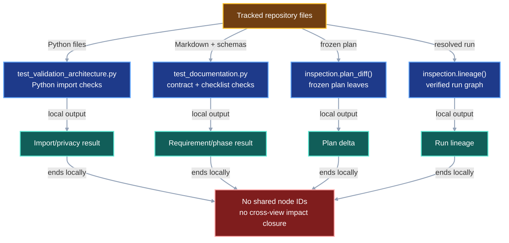
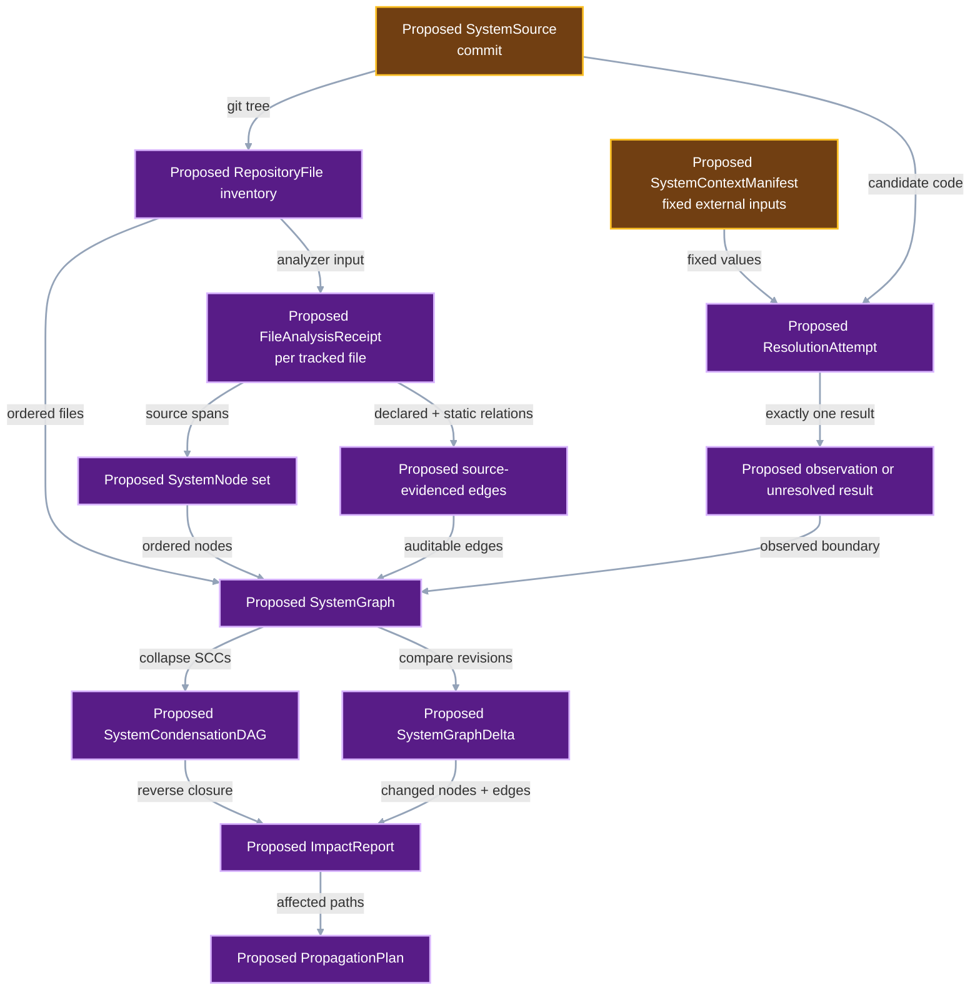
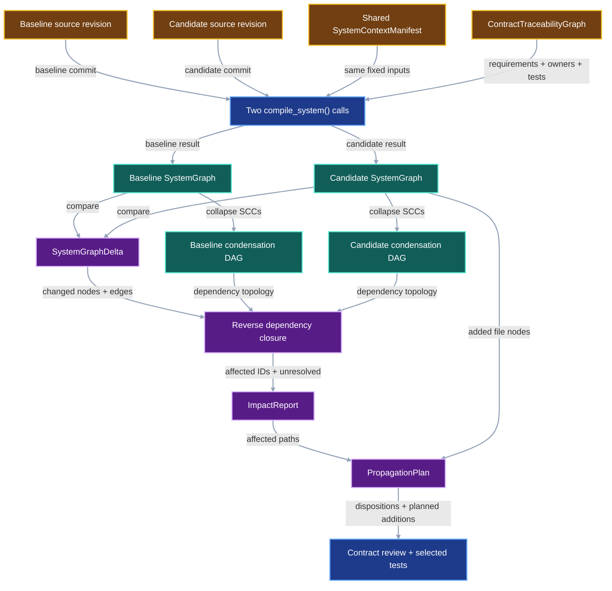

# Deterministic system impact graph

VIPER needs a repeatable way to identify which implementation, protocol,
verifier, test, contract, and checklist surfaces a proposed change can affect.
This contract compiles the codebase and specification stack into one typed
directed graph under a fixed execution context. It then condenses dependency
cycles into a DAG and computes the exact graph delta between two source
revisions.

## 1. Status

**Contract status:** draft after change-impact review; owner review pending.

These requirements bind the contract to the master checklist:

| ID | Implementation obligation |
| --- | --- |
| SIG-01 <!-- contract-requirement: SIG-01 phase=0 test=tests/test_validation_architecture.py --> | Inventory every tracked repository file, derive source-backed nodes from exact file spans, and record one analysis receipt per file. |
| SIG-02 <!-- contract-requirement: SIG-02 phase=0 test=tests/test_validation_architecture.py --> | Hold declared external inputs fixed, observe dynamic resolution under each source revision, and fail closed on unresolved dependencies in strict mode. |
| SIG-03 <!-- contract-requirement: SIG-03 phase=0 test=tests/test_inspection.py --> | Condense dependency cycles into a DAG, compute a canonical typed delta plus reverse impact closure, and reconcile every affected path with one propagation disposition. |
| SIG-04 <!-- contract-requirement: SIG-04 phase=0 test=tests/test_documentation.py --> | Ingest the canonical contract traceability graph and preserve each requirement-to-rule-to-owner-to-test path in the system graph. |

## 2. Required claim

Given two source revisions and one fixed context manifest, VIPER produces the
same canonical dependency graphs, graph delta, affected-surface report, and
propagation plan on every conforming execution.

Let `C0` and `C1` identify the baseline and candidate source revisions. Let `X`
identify the fixed context manifest. The compiler constructs:

```math
G_0 = \operatorname{compile}(C_0 \mid X)
```

```math
G_1 = \operatorname{compile}(C_1 \mid X)
```

The comparator returns:

```math
\Delta G = \operatorname{diff}(G_0, G_1)
```

and the reverse dependency closure of every changed node and edge.

The guarantee is conditional on `X`. It identifies impact under the declared
Python runtime, dependencies, environment variables, fixture files, command
inputs, and external responses.

The compiler's completeness claim is bounded by the source inventory and
declared analyzers. It proves that every tracked file received an analysis
receipt and that every supported construct produced a node, edge, or unresolved
dependency. Observed resolution supplies the execution-specific relationships
that static syntax leaves open.

## 3. Current gap

### Inspected path

The repository has several deterministic checks with separate, hard-coded
views:

```text
tests/test_validation_architecture.py
-> parses Python imports for privacy rules

tests/test_documentation.py
-> parses contract requirements, checklist markers, schemas, links, and examples

inspection.plan_diff()
-> compares frozen plan JSON leaves

inspection.lineage()
-> constructs one verified run graph
```

These checks establish separate local relationships. The system lacks one graph
that connects a changed protocol field to its constructor, runtime consumer,
persisted record, verifier, contract requirement, checklist task, and test.

### Current DAG

The current tools produce four separate dependency views. Each output uses a
private identity namespace and local edge evidence.



### Missing connector

The missing path is:

```text
source revision + fixed context
-> complete tracked-file inventory
-> one analysis receipt per file
-> source-backed nodes and auditable edges
-> observed resolution attempts
-> canonical typed SystemGraph
-> strongly connected components
-> SystemCondensationDAG
-> graph delta
-> reverse dependency closure
-> affected contracts, checklist tasks, and tests
-> one disposition per affected path plus planned additions
-> explicit unresolved boundary
```

Contract coverage enters through the separate
[`ContractTraceabilityGraph`](contract-requirement-traceability.md). The system
compiler consumes those ownership links directly.

### Proposed-change DAG

The proposed compiler derives every source-backed node from the tracked file
inventory and records one visible result for every supported resolution
attempt.



### Integrated DAG

The integrated path turns one changed source span into an auditable list of
affected requirements, implementation owners, and tests.



## 4. Contract models

### Identifiers and kinds

```python
SystemNodeId = Annotated[str, StringConstraints(min_length=1)]
SystemComponentId = SHA256

SystemNodeKind = Literal[
    "file",
    "span",
    "external",
]

SystemNodeRole = Literal[
    "python_module",
    "python_symbol",
    "python_field",
    "public_export",
    "configuration",
    "fixture",
    "generated_source",
    "protocol_model",
    "protocol_field",
    "api_operation",
    "cli_command",
    "runtime_operation",
    "persisted_document",
    "verifier_rule",
    "contract",
    "contract_requirement",
    "checklist_task",
    "acceptance_test",
    "installed_package",
    "context_variable",
    "context_file",
    "context_command",
]

SystemEdgeKind = Literal[
    "defines",
    "contains",
    "imports",
    "calls",
    "registers",
    "exports",
    "constructs",
    "reads",
    "writes",
    "serializes",
    "retrieves",
    "verifies",
    "enforces",
    "implements",
    "tests",
    "documents",
    "resolves",
    "launches",
]

ResolutionKind = Literal[
    "dynamic_import",
    "decorator_registration",
    "registry_entry",
    "reflection_target",
    "subprocess_entrypoint",
]

EdgeOrigin = Literal["declared", "static", "observed"]
FileAnalysisStatus = Literal["parsed", "opaque", "excluded"]
```

`SystemNodeKind` answers where the node's identity comes from. A `file` is one
tracked Git-tree entry. A `span` is a named declaration or exact line range in
one tracked file. An `external` node is a package, variable, command, file, or
runtime target outside that tree.

`SystemNodeRole` answers what the node means to VIPER. One span may be both a
`python_symbol` and an `api_operation`. This separates structural identity from
semantic use and keeps every source-backed role anchored to a finite file.

### Fixed context

`SystemContextManifest` contains external values held equal across the two
compilations. Every collection uses canonical lexical ordering.

```python
class ContextPackage(ProtocolModel):
    name: NonEmptyStr
    version: NonEmptyStr


class ContextVariable(ProtocolModel):
    name: NonEmptyStr
    value: str


class ContextFile(ProtocolModel):
    path: RepoRelPath
    sha256: SHA256
    bytes: int = Field(ge=0)


class ContextCommand(ProtocolModel):
    command_id: NonEmptyStr
    executable: NonEmptyStr
    argv: tuple[str, ...]
    stdin_sha256: SHA256 | None = None
    response: ContextFile | None = None


class SystemContextManifest(ProtocolModel):
    schema_version: Literal[1] = 1
    python_version: NonEmptyStr
    platform: NonEmptyStr
    packages: tuple[ContextPackage, ...]
    variables: tuple[ContextVariable, ...]
    files: tuple[ContextFile, ...]
    commands: tuple[ContextCommand, ...]
```

The manifest contains serializable values and excludes process handles and
secrets. A test or review that needs a credential supplies a deterministic
fixture value with zero external authority.

The manifest fixes exogenous inputs. The compiler observes dynamic outcomes
produced by the source revision: decorator registrations, registry contents,
reflection targets, resolved imports, and subprocess entrypoints.

### Source identity

```python
class SystemSource(ProtocolModel):
    repository: HttpUrl
    commit: GitCommit
```

The baseline and candidate graphs may use different `SystemSource.commit`
values. Both graphs must use the same context-manifest digest.

### Repository inventory

The compiler begins with the tracked files in the selected Git commit. The
selected source revision excludes untracked working-tree files.

```python
class RepositoryFile(ProtocolModel):
    path: RepoRelPath
    sha256: SHA256
    bytes: int = Field(ge=0)


class FileAnalysisReceipt(ProtocolModel):
    path: RepoRelPath
    file_sha256: SHA256
    analyzer: NonEmptyStr
    status: FileAnalysisStatus
    emitted_nodes: tuple[SystemNodeId, ...]
    emitted_edges: tuple[SHA256, ...]
    reason: NonEmptyStr | None = None
```

Every `RepositoryFile` has exactly one `FileAnalysisReceipt`. A supported
source, configuration, contract, or test file uses `status="parsed"`. A binary
asset uses `status="opaque"` and records its analyzer boundary. A file excluded
by an explicit repository rule uses `status="excluded"` and records that rule.
Strict review accepts opaque and excluded files only when their roles remain
outside package behavior, protocol behavior, execution, verification, tests,
and contract coverage.

### Nodes and edge evidence

```python
class SystemNode(ProtocolModel):
    node_id: SystemNodeId
    kind: SystemNodeKind
    roles: tuple[SystemNodeRole, ...] = Field(min_length=1)
    path: RepoRelPath | None = None
    symbol: NonEmptyStr | None = None
    start_line: int | None = Field(default=None, ge=1)
    end_line: int | None = Field(default=None, ge=1)
    sha256: SHA256 | None = None


class SourceEvidence(ProtocolModel):
    kind: Literal["source"] = "source"
    path: RepoRelPath
    start_line: int = Field(ge=1)
    end_line: int = Field(ge=1)
    expression: NonEmptyStr


class ResolutionEvidence(ProtocolModel):
    kind: Literal["resolution"] = "resolution"
    resolution_id: SHA256


EdgeEvidence = Annotated[
    SourceEvidence | ResolutionEvidence,
    Field(discriminator="kind"),
]


class SystemEdge(ProtocolModel):
    edge_id: SHA256
    source: SystemNodeId
    target: SystemNodeId
    kind: SystemEdgeKind
    origin: EdgeOrigin
    evidence: EdgeEvidence


class ResolutionAttempt(ProtocolModel):
    resolution_id: SHA256
    kind: ResolutionKind
    source: SystemNodeId
    expression: NonEmptyStr


class ResolutionObservation(ProtocolModel):
    attempt: ResolutionAttempt
    target: SystemNodeId
    edge: SystemEdge


class UnresolvedDependency(ProtocolModel):
    attempt: ResolutionAttempt
    reason: NonEmptyStr
```

`SystemNode` applies these field rules:

- A `file` node requires `path` and `sha256`, omits line fields, and matches one
  `RepositoryFile`.
- A `span` node requires `path`, `symbol`, `start_line`, `end_line`, and a digest
  of the exact source bytes in that span. Its path names an inventoried file.
- An `external` node requires `symbol` and omits repository path, line, and
  source digest fields.
- Every `span` has one incoming `contains` edge from its owning `file` node.

Node IDs use these canonical forms:

```text
file:<repository path>
span:<repository path>:<qualified symbol>
external:<role>:<fixed-context identity>
```

Each edge explains why it exists. A declared or statically inferred edge cites
the exact source expression through `SourceEvidence`. An observed edge cites
the `ResolutionAttempt` that produced it through `ResolutionEvidence`.

Every edge points from the dependent node to the node it depends on. For
example, a function points to the function it calls, a verifier rule points to
the requirement it enforces, an implementation symbol points to the rule it
implements, and a test points to the rule it tests. Reverse traversal from a
changed dependency therefore finds every affected dependent.

`ResolutionAttempt.expression` stores the exact lookup being resolved, such as
`os.environ["VIPER_BACKEND"]`, `OPERATIONS["run"]`, or
`python -m viper._workers.stages`. Its `resolution_id` is the SHA-256 digest of
canonical JSON containing `kind`, `source`, and `expression`.

For an observation, `edge.origin` is `"observed"`, the edge's resolution ID
matches `attempt.resolution_id`, and `edge.target` equals `target`. An unresolved
dependency produces zero edges.

Every `SystemEdge.source` and `SystemEdge.target` must name a node in the same
graph. Duplicate `(source, target, kind, origin, evidence)` tuples fail
validation. `edge_id` hashes that complete tuple.

### Complete system graph

```python
class SystemGraph(ProtocolModel):
    schema_version: Literal[1] = 1
    source: SystemSource
    context_sha256: SHA256
    contract_traceability_sha256: SHA256
    inventory: tuple[RepositoryFile, ...] = Field(min_length=1)
    analyses: tuple[FileAnalysisReceipt, ...] = Field(min_length=1)
    nodes: tuple[SystemNode, ...] = Field(min_length=1)
    edges: tuple[SystemEdge, ...]
    observations: tuple[ResolutionObservation, ...]
    unresolved: tuple[UnresolvedDependency, ...]
```

Inventory and analyses sort by path. Nodes sort by `node_id`. Edges sort by
`edge_id`. Observations and unresolved dependencies sort by
`attempt.resolution_id`.

Across `observations` and `unresolved`, each `resolution_id` appears exactly
once. That rule makes a successful observation and an unresolved dependency
the two possible outcomes of the same resolution operation.

The graph digest is the SHA-256 digest of canonical JSON bytes. The stored graph
uses `ResolvedFileRef` as its immutable reference.

### Condensation DAG

Python imports and calls may contain cycles. The compiler collapses each
strongly connected component into one component node:

```python
class SystemComponent(ProtocolModel):
    component_id: SystemComponentId
    members: tuple[SystemNodeId, ...] = Field(min_length=1)


class SystemComponentEdge(ProtocolModel):
    source: SystemComponentId
    target: SystemComponentId
    relations: tuple[SystemEdgeKind, ...] = Field(min_length=1)


class SystemCondensationDAG(ProtocolModel):
    schema_version: Literal[1] = 1
    graph: ResolvedFileRef
    components: tuple[SystemComponent, ...] = Field(min_length=1)
    edges: tuple[SystemComponentEdge, ...]
```

`component_id` hashes the ordered member IDs. The component graph must be
acyclic. An edge retains every relationship kind crossing the same component
pair. The DAG remains unweighted.

### Graph delta and impact report

```python
class ChangedNode(ProtocolModel):
    node_id: SystemNodeId
    baseline: SystemNode
    candidate: SystemNode


class SystemGraphDelta(ProtocolModel):
    schema_version: Literal[1] = 1
    baseline: ResolvedFileRef
    candidate: ResolvedFileRef
    context_sha256: SHA256
    added_nodes: tuple[SystemNode, ...]
    removed_nodes: tuple[SystemNode, ...]
    changed_nodes: tuple[ChangedNode, ...]
    added_edges: tuple[SystemEdge, ...]
    removed_edges: tuple[SystemEdge, ...]


class ImpactReport(ProtocolModel):
    schema_version: Literal[1] = 1
    delta: ResolvedFileRef
    affected_nodes: tuple[SystemNodeId, ...]
    affected_requirements: tuple[RequirementId, ...]
    affected_implementations: tuple[RequirementImplementationLink, ...]
    observing_tests: tuple[RequirementVerificationLink, ...]
    unresolved: tuple[UnresolvedDependency, ...]
    complete: bool


PropagationAction = Literal["change", "remove", "retain"]


class PropagationDisposition(ProtocolModel):
    path: RepoRelPath
    action: PropagationAction
    affected_nodes: tuple[SystemNodeId, ...] = Field(min_length=1)
    statement: NonEmptyStr


class PlannedAddition(ProtocolModel):
    path: RepoRelPath
    purpose: NonEmptyStr
    requirements: tuple[RequirementId, ...] = Field(min_length=1)


class PropagationPlan(ProtocolModel):
    schema_version: Literal[1] = 1
    impact: ResolvedFileRef
    dispositions: tuple[PropagationDisposition, ...] = Field(min_length=1)
    planned_additions: tuple[PlannedAddition, ...]
```

`complete` is `True` only when both source graphs have empty `unresolved`
collections. Strict compilation rejects an incomplete graph before publishing
an `ImpactReport`.

`RequirementId`, `RequirementImplementationLink`, and
`RequirementVerificationLink` come from the contract-traceability models.
`contract_traceability_sha256` binds the source graph to the exact requirement
links it ingested. The impact report therefore preserves whether each reached
owner or test remains `planned` or already resolves as `implemented`.

`PropagationPlan` gives every affected repository path one action. `change`
states the required edit. `remove` states what the candidate deletes. `retain`
states why the affected path remains valid as written. The union of every
`PropagationDisposition.affected_nodes` must equal
`ImpactReport.affected_nodes`, and each affected node appears once.

`PlannedAddition` records a required path before implementation creates it. A
completed candidate graph must contain each planned path among the file nodes
in `SystemGraphDelta.added_nodes`. Each added repository path must either match
one planned addition or carry a review explanation before the phase closes.

### Illustrative worked example

This example builds a real two-commit Git fixture. The candidate changes
`LocalFileRef.store`. The program constructs every Section 4 model, records one
successful dynamic resolution, records one unresolved resolution for the
exploratory path, publishes both graphs, creates their condensation DAG, and
builds the resulting impact report. It then assigns every affected path a
disposition and reconciles one planned addition with the candidate delta.

<!-- contract-worked-example: start -->

```python
from __future__ import annotations

import hashlib
import json
import subprocess
from pathlib import Path
from tempfile import TemporaryDirectory
from typing import Any

from viper._contract_traceability import (
    RequirementImplementationLink,
    RequirementVerificationLink,
    SourceLocation,
)
from viper.references import ResolvedFileRef
from viper.storage import LocalArtifactStore
from viper.system_graph import (
    ChangedNode,
    ContextCommand,
    ContextFile,
    ContextPackage,
    ContextVariable,
    EdgeEvidence,
    EdgeOrigin,
    FileAnalysisStatus,
    FileAnalysisReceipt,
    ImpactReport,
    PlannedAddition,
    PropagationAction,
    PropagationDisposition,
    PropagationPlan,
    RepositoryFile,
    ResolutionKind,
    ResolutionAttempt,
    ResolutionEvidence,
    ResolutionObservation,
    SourceEvidence,
    SystemComponent,
    SystemComponentId,
    SystemComponentEdge,
    SystemCondensationDAG,
    SystemContextManifest,
    SystemEdge,
    SystemEdgeKind,
    SystemGraph,
    SystemGraphDelta,
    SystemNode,
    SystemNodeId,
    SystemNodeKind,
    SystemNodeRole,
    SystemSource,
    UnresolvedDependency,
)


BASELINE_REFERENCES = b"""from typing import Literal

class LocalFileRef:
    kind: Literal[\"local\"] = \"local\"
    store: str = \".viper/store\"
"""

CANDIDATE_REFERENCES = BASELINE_REFERENCES.replace(
    b'\".viper/store\"',
    b'\".viper/objects\"',
)

STORAGE_SOURCE = b"""from .references import LocalFileRef

class LocalArtifactStore:
    def __init__(self, root):
        self.store = LocalFileRef.store
"""

TEST_SOURCE = b"""from viper.storage import LocalArtifactStore

def test_store_uses_declared_location(tmp_path):
    store = LocalArtifactStore(tmp_path)
    assert store.store == \".viper/store\"
"""

MIGRATION_TEST_SOURCE = b"""from viper.references import LocalFileRef

def test_prior_local_reference_keeps_declared_store():
    reference = LocalFileRef(store=".viper/store")
    assert reference.store == ".viper/store"
"""

CONTRACT_SOURCE = b"""| PDR-02 | Bind LocalArtifactStore to ROOT/.viper/store. |

| project.store.boundary | LocalArtifactStore stays beneath ROOT. |
"""

CHECKLIST_SOURCE = b"""- [ ] Bind LocalArtifactStore to ROOT/.viper/store.
  <!-- contract-implementation: requirement=PDR-02 rule=project.store.boundary state=implemented owner=src/viper/storage.py:LocalArtifactStore.__init__ -->
  <!-- contract-verification: requirement=PDR-02 rule=project.store.boundary state=implemented test=tests/test_storage.py:test_store_uses_declared_location -->
"""


def canonical_bytes(value: Any) -> bytes:
    """Return deterministic JSON bytes for a model or JSON-compatible value."""
    if hasattr(value, "model_dump"):
        value = value.model_dump(mode="json")
    return json.dumps(
        value,
        sort_keys=True,
        separators=(",", ":"),
    ).encode()


def digest(value: Any) -> str:
    """Hash canonical JSON, or hash bytes without another encoding layer."""
    raw = value if isinstance(value, bytes) else canonical_bytes(value)
    return hashlib.sha256(raw).hexdigest()


def run_git(root: Path, *arguments: str) -> str:
    """Run one Git command in the fixture repository."""
    completed = subprocess.run(
        ("git", *arguments),
        cwd=root,
        check=True,
        stdout=subprocess.PIPE,
        stderr=subprocess.PIPE,
    )
    return completed.stdout.decode().strip()


def commit(root: Path, message: str) -> str:
    """Commit the complete fixture tree and return its real Git identity."""
    run_git(root, "add", ".")
    run_git(root, "commit", "-m", message)
    return run_git(root, "rev-parse", "HEAD")


def read_commit_file(root: Path, revision: str, path: str) -> bytes:
    """Read one tracked file exactly as stored in a fixture commit."""
    return subprocess.run(
        ("git", "show", f"{revision}:{path}"),
        cwd=root,
        check=True,
        stdout=subprocess.PIPE,
        stderr=subprocess.PIPE,
    ).stdout


def line_number(raw: bytes, text: bytes) -> int:
    """Return the one-based line containing text."""
    for number, line in enumerate(raw.splitlines(), start=1):
        if text in line:
            return number
    raise ValueError(text.decode())


def line_digest(raw: bytes, number: int) -> str:
    """Hash the exact source line named by a span node."""
    return hashlib.sha256(raw.splitlines(keepends=True)[number - 1]).hexdigest()


def file_node(file: RepositoryFile) -> SystemNode:
    """Construct the source-backed node for one tracked file."""
    node_kind: SystemNodeKind = "file"
    role: SystemNodeRole
    if file.path.endswith("project-data-root.md"):
        role = "contract"
    elif file.path.endswith("master-execution-checklist.md"):
        role = "checklist_task"
    else:
        role = "python_module"
    return SystemNode(
        node_id=f"file:{file.path}",
        kind=node_kind,
        roles=(role,),
        path=file.path,
        sha256=file.sha256,
    )


def span_node(
    path: str,
    symbol: str,
    role: SystemNodeRole,
    raw: bytes,
    text: bytes,
) -> SystemNode:
    """Construct one named source span from an exact fixture line."""
    number = line_number(raw, text)
    node_kind: SystemNodeKind = "span"
    return SystemNode(
        node_id=f"span:{path}:{symbol}",
        kind=node_kind,
        roles=(role,),
        path=path,
        symbol=symbol,
        start_line=number,
        end_line=number,
        sha256=line_digest(raw, number),
    )


def source_evidence(
    path: str,
    raw: bytes,
    text: bytes,
) -> SourceEvidence:
    """Name the exact fixture expression that establishes one edge."""
    number = line_number(raw, text)
    return SourceEvidence(
        path=path,
        start_line=number,
        end_line=number,
        expression=text.decode().strip(),
    )


def make_edge(
    source: SystemNodeId,
    target: SystemNodeId,
    kind: SystemEdgeKind,
    origin: EdgeOrigin,
    evidence: EdgeEvidence,
) -> SystemEdge:
    """Construct one edge and derive its identity from every edge field."""
    identity = {
        "source": source,
        "target": target,
        "kind": kind,
        "origin": origin,
        "evidence": evidence.model_dump(mode="json"),
    }
    return SystemEdge(
        edge_id=digest(identity),
        source=source,
        target=target,
        kind=kind,
        origin=origin,
        evidence=evidence,
    )


def publish_model(
    store: LocalArtifactStore,
    path: str,
    value: Any,
) -> ResolvedFileRef:
    """Publish one canonical model document and return its immutable ref."""
    return store.resolved_files({path: canonical_bytes(value)})[0]


with TemporaryDirectory() as temporary_directory:
    fixture_root = Path(temporary_directory) / "system-graph-fixture"
    fixture_root.mkdir()
    run_git(fixture_root, "init")
    run_git(fixture_root, "config", "user.name", "VIPER fixture")
    run_git(fixture_root, "config", "user.email", "fixture@example.invalid")

    fixture_files = {
        "src/viper/references.py": BASELINE_REFERENCES,
        "src/viper/storage.py": STORAGE_SOURCE,
        "tests/test_storage.py": TEST_SOURCE,
        "docs/development/project-data-root.md": CONTRACT_SOURCE,
        "docs/development/master-execution-checklist.md": CHECKLIST_SOURCE,
    }
    for relative_path, raw in fixture_files.items():
        destination = fixture_root / relative_path
        destination.parent.mkdir(parents=True, exist_ok=True)
        destination.write_bytes(raw)

    baseline_commit = commit(fixture_root, "baseline local store")
    (fixture_root / "src/viper/references.py").write_bytes(
        CANDIDATE_REFERENCES
    )
    migration_test_path = fixture_root / "tests/test_storage_migration.py"
    migration_test_path.write_bytes(MIGRATION_TEST_SOURCE)
    candidate_commit = commit(fixture_root, "change local store directory")

    baseline_paths = tuple(sorted(fixture_files))
    candidate_paths = tuple(
        sorted((*fixture_files, "tests/test_storage_migration.py"))
    )
    baseline_raw = {
        path: read_commit_file(fixture_root, baseline_commit, path)
        for path in baseline_paths
    }
    candidate_raw = {
        path: read_commit_file(fixture_root, candidate_commit, path)
        for path in candidate_paths
    }

    baseline_inventory = tuple(
        RepositoryFile(
            path=path,
            sha256=hashlib.sha256(baseline_raw[path]).hexdigest(),
            bytes=len(baseline_raw[path]),
        )
        for path in baseline_paths
    )
    candidate_inventory = tuple(
        RepositoryFile(
            path=path,
            sha256=hashlib.sha256(candidate_raw[path]).hexdigest(),
            bytes=len(candidate_raw[path]),
        )
        for path in candidate_paths
    )

    baseline_file_nodes = tuple(file_node(file) for file in baseline_inventory)
    candidate_file_nodes = tuple(file_node(file) for file in candidate_inventory)
    candidate_migration_file = next(
        node
        for node in candidate_file_nodes
        if node.path == "tests/test_storage_migration.py"
    )

    baseline_field = span_node(
        "src/viper/references.py",
        "LocalFileRef.store",
        "protocol_field",
        baseline_raw["src/viper/references.py"],
        b"store: str",
    )
    candidate_field = span_node(
        "src/viper/references.py",
        "LocalFileRef.store",
        "protocol_field",
        candidate_raw["src/viper/references.py"],
        b"store: str",
    )
    store_constructor = span_node(
        "src/viper/storage.py",
        "LocalArtifactStore.__init__",
        "runtime_operation",
        STORAGE_SOURCE,
        b"def __init__",
    )
    acceptance_test = span_node(
        "tests/test_storage.py",
        "test_store_uses_declared_location",
        "acceptance_test",
        TEST_SOURCE,
        b"def test_store_uses_declared_location",
    )
    requirement_node = span_node(
        "docs/development/project-data-root.md",
        "PDR-02",
        "contract_requirement",
        CONTRACT_SOURCE,
        b"PDR-02",
    )
    rule_node = span_node(
        "docs/development/project-data-root.md",
        "project.store.boundary",
        "verifier_rule",
        CONTRACT_SOURCE,
        b"project.store.boundary",
    )
    checklist_task = span_node(
        "docs/development/master-execution-checklist.md",
        "bind-local-store",
        "checklist_task",
        CHECKLIST_SOURCE,
        b"Bind LocalArtifactStore",
    )
    external_kind: SystemNodeKind = "external"
    package_node = SystemNode(
        node_id="external:installed_package:pydantic==2.12.5",
        kind=external_kind,
        roles=("installed_package",),
        symbol="pydantic==2.12.5",
    )

    common_spans = (
        store_constructor,
        acceptance_test,
        requirement_node,
        rule_node,
        checklist_task,
        package_node,
    )
    baseline_nodes = tuple(
        sorted(
            (*baseline_file_nodes, baseline_field, *common_spans),
            key=lambda node: node.node_id,
        )
    )
    candidate_nodes = tuple(
        sorted(
            (*candidate_file_nodes, candidate_field, *common_spans),
            key=lambda node: node.node_id,
        )
    )

    field_read = make_edge(
        store_constructor.node_id,
        baseline_field.node_id,
        "reads",
        "static",
        source_evidence(
            "src/viper/storage.py",
            STORAGE_SOURCE,
            b"self.store = LocalFileRef.store",
        ),
    )
    rule_requirement = make_edge(
        rule_node.node_id,
        requirement_node.node_id,
        "enforces",
        "declared",
        source_evidence(
            "docs/development/project-data-root.md",
            CONTRACT_SOURCE,
            b"project.store.boundary",
        ),
    )
    implementation_rule = make_edge(
        store_constructor.node_id,
        rule_node.node_id,
        "implements",
        "declared",
        source_evidence(
            "docs/development/master-execution-checklist.md",
            CHECKLIST_SOURCE,
            b"contract-implementation:",
        ),
    )
    test_rule = make_edge(
        acceptance_test.node_id,
        rule_node.node_id,
        "tests",
        "declared",
        source_evidence(
            "docs/development/master-execution-checklist.md",
            CHECKLIST_SOURCE,
            b"contract-verification:",
        ),
    )

    observed_kind: ResolutionKind = "dynamic_import"
    attempt_identity = {
        "kind": observed_kind,
        "source": store_constructor.node_id,
        "expression": 'import_module("pydantic")',
    }
    observed_attempt = ResolutionAttempt(
        resolution_id=digest(attempt_identity),
        kind=observed_kind,
        source=store_constructor.node_id,
        expression='import_module("pydantic")',
    )
    observed_evidence = ResolutionEvidence(
        resolution_id=observed_attempt.resolution_id,
    )
    observed_edge = make_edge(
        store_constructor.node_id,
        package_node.node_id,
        "resolves",
        "observed",
        observed_evidence,
    )
    observation = ResolutionObservation(
        attempt=observed_attempt,
        target=package_node.node_id,
        edge=observed_edge,
    )

    unresolved_kind: ResolutionKind = "registry_entry"
    unresolved_identity = {
        "kind": unresolved_kind,
        "source": store_constructor.node_id,
        "expression": 'os.environ["VIPER_BACKEND"]',
    }
    unresolved_attempt = ResolutionAttempt(
        resolution_id=digest(unresolved_identity),
        kind=unresolved_kind,
        source=store_constructor.node_id,
        expression='os.environ["VIPER_BACKEND"]',
    )
    unresolved = UnresolvedDependency(
        attempt=unresolved_attempt,
        reason="VIPER_BACKEND is absent from SystemContextManifest.variables",
    )

    edges = tuple(
        sorted(
            (
                field_read,
                rule_requirement,
                implementation_rule,
                test_rule,
                observed_edge,
            ),
            key=lambda edge: edge.edge_id,
        )
    )

    analysis_status: FileAnalysisStatus = "parsed"

    def analyses_for(
        inventory: tuple[RepositoryFile, ...],
        nodes: tuple[SystemNode, ...],
    ) -> tuple[FileAnalysisReceipt, ...]:
        """Create one complete analysis receipt per tracked file."""
        return tuple(
            FileAnalysisReceipt(
                path=file.path,
                file_sha256=file.sha256,
                analyzer=(
                    "python-ast"
                    if file.path.endswith(".py")
                    else "markdown-contract"
                ),
                status=analysis_status,
                emitted_nodes=tuple(
                    node.node_id for node in nodes if node.path == file.path
                ),
                emitted_edges=tuple(
                    edge.edge_id
                    for edge in edges
                    if (
                        isinstance(edge.evidence, SourceEvidence)
                        and edge.evidence.path == file.path
                    )
                    or (
                        isinstance(edge.evidence, ResolutionEvidence)
                        and file.path == "src/viper/storage.py"
                    )
                ),
            )
            for file in inventory
        )

    response_bytes = b'{"operations":["run"]}\n'
    context_response = ContextFile(
        path="tests/fixtures/registry.json",
        sha256=hashlib.sha256(response_bytes).hexdigest(),
        bytes=len(response_bytes),
    )
    package = ContextPackage(name="pydantic", version="2.12.5")
    variable = ContextVariable(name="VIPER_MODE", value="review")
    command = ContextCommand(
        command_id="inspect-operation-registry",
        executable="/usr/bin/python3",
        argv=("-m", "viper._workers.inspect_registry"),
        stdin_sha256=hashlib.sha256(b"").hexdigest(),
        response=context_response,
    )
    context = SystemContextManifest(
        python_version="3.12.11",
        platform="macOS-arm64",
        packages=(package,),
        variables=(variable,),
        files=(context_response,),
        commands=(command,),
    )
    context_sha256 = digest(context)

    implementation_location = SourceLocation(
        path="src/viper/storage.py",
        symbol="LocalArtifactStore.__init__",
        line=3,
    )
    test_location = SourceLocation(
        path="tests/test_storage.py",
        symbol="test_store_uses_declared_location",
        line=3,
    )
    implementation_link = RequirementImplementationLink(
        requirement_id="PDR-02",
        rule_id="project.store.boundary",
        phase=0,
        checklist_line=2,
        state="implemented",
        owner=implementation_location,
    )
    verification_link = RequirementVerificationLink(
        requirement_id="PDR-02",
        rule_id="project.store.boundary",
        phase=0,
        checklist_line=3,
        state="implemented",
        test=test_location,
    )
    traceability_sha256 = digest(
        {
            "implementations": [
                implementation_link.model_dump(mode="json")
            ],
            "verifications": [verification_link.model_dump(mode="json")],
        }
    )

    baseline_source = SystemSource(
        repository="https://example.invalid/viper-system-graph-fixture",
        commit=baseline_commit,
    )
    candidate_source = SystemSource(
        repository="https://example.invalid/viper-system-graph-fixture",
        commit=candidate_commit,
    )
    baseline_graph = SystemGraph(
        source=baseline_source,
        context_sha256=context_sha256,
        contract_traceability_sha256=traceability_sha256,
        inventory=baseline_inventory,
        analyses=analyses_for(baseline_inventory, baseline_nodes),
        nodes=baseline_nodes,
        edges=edges,
        observations=(observation,),
        unresolved=(),
    )
    candidate_graph = SystemGraph(
        source=candidate_source,
        context_sha256=context_sha256,
        contract_traceability_sha256=traceability_sha256,
        inventory=candidate_inventory,
        analyses=analyses_for(candidate_inventory, candidate_nodes),
        nodes=candidate_nodes,
        edges=edges,
        observations=(observation,),
        unresolved=(),
    )
    exploratory_graph = SystemGraph(
        source=candidate_source,
        context_sha256=context_sha256,
        contract_traceability_sha256=traceability_sha256,
        inventory=candidate_inventory,
        analyses=analyses_for(candidate_inventory, candidate_nodes),
        nodes=candidate_nodes,
        edges=edges,
        observations=(observation,),
        unresolved=(unresolved,),
    )

    store = LocalArtifactStore(fixture_root)
    baseline_ref = publish_model(
        store,
        ".viper/system/baseline/graph.json",
        baseline_graph,
    )
    candidate_ref = publish_model(
        store,
        ".viper/system/candidate/graph.json",
        candidate_graph,
    )

    components = tuple(
        SystemComponent(
            component_id=digest((node.node_id,)),
            members=(node.node_id,),
        )
        for node in baseline_graph.nodes
    )
    component_by_node: dict[SystemNodeId, SystemComponentId] = {
        component.members[0]: component.component_id
        for component in components
    }
    component_edges = tuple(
        SystemComponentEdge(
            source=component_by_node[edge.source],
            target=component_by_node[edge.target],
            relations=(edge.kind,),
        )
        for edge in baseline_graph.edges
    )
    condensation = SystemCondensationDAG(
        graph=baseline_ref,
        components=components,
        edges=component_edges,
    )

    changed_field = ChangedNode(
        node_id=baseline_field.node_id,
        baseline=baseline_field,
        candidate=candidate_field,
    )
    delta = SystemGraphDelta(
        baseline=baseline_ref,
        candidate=candidate_ref,
        context_sha256=context_sha256,
        added_nodes=(candidate_migration_file,),
        removed_nodes=(),
        changed_nodes=(changed_field,),
        added_edges=(),
        removed_edges=(),
    )
    delta_ref = publish_model(
        store,
        ".viper/system/baseline..candidate/delta.json",
        delta,
    )

    impact = ImpactReport(
        delta=delta_ref,
        affected_nodes=(
            baseline_field.node_id,
            store_constructor.node_id,
            rule_node.node_id,
            requirement_node.node_id,
            acceptance_test.node_id,
        ),
        affected_requirements=("PDR-02",),
        affected_implementations=(implementation_link,),
        observing_tests=(verification_link,),
        unresolved=(),
        complete=True,
    )
    incomplete_impact = ImpactReport(
        delta=delta_ref,
        affected_nodes=impact.affected_nodes,
        affected_requirements=impact.affected_requirements,
        affected_implementations=impact.affected_implementations,
        observing_tests=impact.observing_tests,
        unresolved=exploratory_graph.unresolved,
        complete=False,
    )
    impact_ref = publish_model(
        store,
        ".viper/system/baseline..candidate/impact.json",
        impact,
    )

    change_action: PropagationAction = "change"
    dispositions = (
        PropagationDisposition(
            path="src/viper/references.py",
            action=change_action,
            affected_nodes=(baseline_field.node_id,),
            statement="Change the LocalFileRef.store default to .viper/objects.",
        ),
        PropagationDisposition(
            path="src/viper/storage.py",
            action="retain",
            affected_nodes=(store_constructor.node_id,),
            statement=(
                "Retain the constructor because it reads LocalFileRef.store "
                "instead of repeating the default."
            ),
        ),
        PropagationDisposition(
            path="docs/development/project-data-root.md",
            action="change",
            affected_nodes=(requirement_node.node_id, rule_node.node_id),
            statement="Update PDR-02 and project.store.boundary for the new path.",
        ),
        PropagationDisposition(
            path="tests/test_storage.py",
            action="change",
            affected_nodes=(acceptance_test.node_id,),
            statement="Expect .viper/objects for newly constructed references.",
        ),
    )
    migration_test = PlannedAddition(
        path="tests/test_storage_migration.py",
        purpose="Verify that an existing LocalFileRef keeps its recorded store.",
        requirements=("PDR-02",),
    )
    propagation = PropagationPlan(
        impact=impact_ref,
        dispositions=dispositions,
        planned_additions=(migration_test,),
    )
    propagation_ref = publish_model(
        store,
        ".viper/system/baseline..candidate/propagation.json",
        propagation,
    )

    covered_nodes = {
        node_id
        for disposition in propagation.dispositions
        for node_id in disposition.affected_nodes
    }
    realized_additions = {
        node.path
        for node in delta.added_nodes
        if node.kind == "file" and node.path is not None
    }
    planned_additions = {
        addition.path for addition in propagation.planned_additions
    }

    assert baseline_source.commit != candidate_source.commit
    assert baseline_field.sha256 != candidate_field.sha256
    assert delta.changed_nodes == (changed_field,)
    assert impact.affected_requirements == ("PDR-02",)
    assert impact.observing_tests == (verification_link,)
    assert covered_nodes == set(impact.affected_nodes)
    assert planned_additions == realized_additions
    assert store.fetch(propagation_ref.stored_at) == canonical_bytes(propagation)
    assert condensation.components
    assert incomplete_impact.unresolved == (unresolved,)
    assert incomplete_impact.complete is False
```

The fixed context used by the example has this external shape:

```toml
python_version = "3.12.11"
platform = "macOS-arm64"

[[packages]]
name = "pydantic"
version = "2.12.5"

[[variables]]
name = "VIPER_MODE"
value = "review"

[[commands]]
command_id = "inspect-operation-registry"
executable = "/usr/bin/python3"
argv = ["-m", "viper._workers.inspect_registry"]
```

<!-- contract-worked-example: end -->

## 5. Compilation

### Static pass

The compiler asks Git for the complete tracked file tree at the source commit.
It hashes each file and emits one `file` node before semantic analysis begins.

It then selects an analyzer from the path and content:

```text
Git tree
-> RepositoryFile for every tracked file
-> file node for every RepositoryFile

Python analyzer
-> named spans for symbols and fields
-> imports, calls, decorators, and literal registrations

public __all__ and package imports
-> public-export edges

TOML and configuration analyzer
-> configuration spans and declared relationships

Markdown contract analyzer
-> contract, requirement, verifier-rule, and checklist-task spans

pytest analyzer
-> test and fixture spans

ContractTraceabilityGraph
-> exact requirement, rule, implementation-owner, and acceptance-test edges

typed operation and CLI registries
-> API-operation and CLI-command edges
```

The first implementation supports direct names, attributes, literal
collections, and repository-owned helper calls evaluated solely from declared
repository inputs.

A planned implementation marker produces a checklist-task span and an
`implements` edge to its verifier rule. The edge's source evidence contains the
exact future owner path and symbol. An implemented marker also requires that
owner to resolve to an inventoried source span and emits an `implements` edge
from that span to the rule. Verification links follow the same transition. The
graph therefore represents complete planned ownership while preserving its
`planned` state.

Every analyzer emits a `FileAnalysisReceipt`. Strict validation requires one
receipt whose digest matches each inventory file, one inventoried file for each
source-backed node, and every emitted edge to appear in its owning receipt.
This gives VIPER exact syntactic coverage over the finite source tree. The
strict unresolved boundary below handles supported constructs whose runtime
target remains unresolved after static analysis.

### Observed pass

The compiler then runs discovery under the fixed context:

```text
source revision + SystemContextManifest
-> isolated discovery process
-> import modules and inspect declared registries
-> record decorator registrations
-> resolve configured reflection targets
-> intercept declared subprocess launches
-> create one ResolutionAttempt per lookup
-> emit one ResolutionObservation or UnresolvedDependency per attempt
```

The source revision determines the observed outcomes. The context manifest
supplies equal external inputs to both revisions.

A resolution observation answers: “under this fixed context, what target did
this exact expression resolve to?” An unresolved dependency answers: “which
exact expression reached outside the fixed context or supported resolver?” The
shared `resolution_id` proves that both records describe the same kind of
attempt and lets the graph enforce one outcome per attempt.

### Unresolved boundary

When discovery reaches an input absent from the context manifest or a construct
outside the declared resolver, it emits `UnresolvedDependency`. Examples
include an undeclared environment variable, a network response omitted from
the fixtures, or an executable omitted from the declared command identities.

```text
strict=True
-> reject before graph publication

strict=False
-> publish graph with unresolved nodes
-> ImpactReport.complete = False
```

The specification-system review gate requires strict mode.

## 6. Persisted evidence

One review stores these files:

```text
.viper/system/<context-sha256>/<source-commit>/graph.json
.viper/system/<context-sha256>/<source-commit>/dag.json
.viper/system/<context-sha256>/<baseline>..<candidate>/delta.json
.viper/system/<context-sha256>/<baseline>..<candidate>/impact.json
.viper/system/<context-sha256>/<baseline>..<candidate>/propagation.json
```

Each file publishes through `publish_resolved_files()` and receives one
`ResolvedFileRef`. The path is a discovery aid. The reference and content
digest provide identity.

The context manifest is published once. Both graphs store its digest. The
delta verifier loads both graphs and requires equal context digests.

## 7. Verification

The implementation adds these checks:

| Rule | Executable requirement |
| --- | --- |
| `system.inventory.complete` <!-- verifier-rule: system.inventory.complete requirement=SIG-01 --> | Require one file node and one analysis receipt for every tracked file in the source commit. |
| `system.analysis.anchored` <!-- verifier-rule: system.analysis.anchored requirement=SIG-01 --> | Require every source-backed node and source-evidenced edge to cite one inventoried file and exact span. |
| `system.edge.evidence` <!-- verifier-rule: system.edge.evidence requirement=SIG-01 --> | Recompute every edge ID from its endpoints, relation, origin, and evidence. |
| `system.context.identity` <!-- verifier-rule: system.context.identity requirement=SIG-02 --> | Recompute the canonical manifest digest. |
| `system.resolution.total` <!-- verifier-rule: system.resolution.total requirement=SIG-02 --> | Require each resolution attempt to produce exactly one observation or unresolved dependency. |
| `system.graph.canonical` <!-- verifier-rule: system.graph.canonical requirement=SIG-02 --> | Recompile the source revision and require identical ordered inventory, analyses, nodes, edges, observations, and unresolved dependencies. |
| `system.graph.references` <!-- verifier-rule: system.graph.references requirement=SIG-02 --> | Require every edge and observation endpoint to exist. |
| `system.graph.strict` <!-- verifier-rule: system.graph.strict requirement=SIG-02 --> | Reject unresolved dependencies in the specification-system review path. |
| `system.dag.components` <!-- verifier-rule: system.dag.components requirement=SIG-03 --> | Recompute strongly connected components and component IDs. |
| `system.dag.acyclic` <!-- verifier-rule: system.dag.acyclic requirement=SIG-03 --> | Require topological ordering to visit every component once. |
| `system.delta.context` <!-- verifier-rule: system.delta.context requirement=SIG-03 --> | Require the baseline and candidate graphs to use the same context digest. |
| `system.delta.identity` <!-- verifier-rule: system.delta.identity requirement=SIG-03 --> | Recompute every added, removed, and changed node and edge. |
| `system.impact.closure` <!-- verifier-rule: system.impact.closure requirement=SIG-03 --> | Recompute reverse reachability from every changed node and edge endpoint. |
| `system.propagation.coverage` <!-- verifier-rule: system.propagation.coverage requirement=SIG-03 --> | Require every affected node to appear in exactly one propagation disposition. |
| `system.propagation.additions` <!-- verifier-rule: system.propagation.additions requirement=SIG-03 --> | Require planned additions to equal the candidate delta's added repository paths before the phase closes. |
| `system.requirement.coverage` <!-- verifier-rule: system.requirement.coverage requirement=SIG-04 --> | Require each contract requirement to reach every declared verifier rule, each rule's implementation owner, and each observing test from `ContractTraceabilityGraph`. |

## 8. Propagation

Until Phase 0 implements `PropagationPlan`, this table states the reviewed
target paths and actions. After Phase 0, the documentation check renders the
table from the plan and requires every affected node to appear in exactly one
row. New paths come from `planned_additions` and must match the candidate delta
before the phase closes.

| Surface | Required statement |
| --- | --- |
| `src/viper/system_graph.py` | Add repository inventory, analysis receipts, source-backed graph models, edge evidence, resolution attempts, canonical serialization, observed discovery, SCC condensation, graph comparison, impact closure, propagation planning, and plan reconciliation. |
| `src/viper/inspection.py` | Add `compile_system()`, `system_diff()`, and `system_impact()` inspection functions. |
| `src/viper/api.py` | Add typed compile, diff, and impact request and success models for developer tooling. |
| `src/viper/_api/handlers.py` | Route developer operations through the same compiler and serializers. |
| `src/viper/cli.py` | Add `viper system compile`, `viper system diff`, and `viper system impact` with deterministic JSON output. |
| `src/viper/storage.py` | Publish manifests, graphs, DAGs, deltas, and reports through the independent-file publisher. |
| `tests/test_validation_architecture.py` | Cover complete file inventory, per-file analysis receipts, source anchoring, edge evidence, observed registries, fixed context, one outcome per resolution attempt, unresolved targets, canonical ordering, SCC condensation, and strict failure. |
| `tests/test_inspection.py` | Cover graph delta, reverse closure, stable impact ordering, one disposition per affected node, and planned-addition reconciliation. |
| `tests/test_documentation.py` | Supply the canonical `ContractTraceabilityGraph`; compare its system-graph paths with the focused documentation oracle during migration. |
| `docs/development/master-execution-checklist.md` | Produce the compiler in Phase 0 and require its strict impact report before every later phase. |
| `docs/development/testing.md` | Define the fixed review context and the strict system-impact gate. |
| `pyproject.toml` | Register the new tests and any optional graph implementation dependency; the base implementation uses the standard library. |

### Legacy cleanup

| Current occurrence | Disposition |
| --- | --- |
| Independent import-privacy AST scan | Retain as a focused assertion until graph parity passes, then implement it as a query over `SystemGraph`. |
| Independent contract requirement and checklist parser | Retain as an oracle until graph parity passes, then query `implements` and `tests` edges. |
| `plan_diff()` | Retain; it compares user experiment plans and belongs to the later experiment-graph contract. |
| `lineage()` | Retain; it compiles verified user-run provenance, while `SystemGraph` compiles VIPER source dependencies. |
| Manual propagation tables | Generate their paths, actions, and statements from `PropagationPlan`; retain author judgment only in each disposition statement and planned-addition purpose. |

## 9. Acceptance case

### Success

1. Compile the current source revision under fixture context `X` twice.
2. Require identical graph bytes, DAG bytes, digests, and empty unresolved
   collections.
3. Change `LocalFileRef.store` from `.viper/store` to `.viper/objects` in a
   candidate fixture revision.
4. Compile the candidate under the same `X`.
5. Require the delta to include
   `span:src/viper/references.py:LocalFileRef.store`.
6. Require the reverse closure to include these exact nodes:

```text
span:src/viper/references.py:LocalFileRef.store
<- documents - span:docs/development/project-data-root.md:PDR-02
<- enforces  - span:docs/development/project-data-root.md:project.store.boundary
<- implements - span:src/viper/storage.py:LocalArtifactStore.__init__
<- tests      - span:tests/test_storage.py:test_storage_publishes_and_retrieves_one_content_revision
```

The static source graph also reaches:

```text
span:src/viper/storage.py:LocalArtifactStore.resolved_files
span:src/viper/storage.py:LocalArtifactStore.fetch
span:src/viper/_verification/storage.py:fetch_local_file_bytes
span:src/viper/execution/_source.py:RunFetcher.__call__
span:docs/reference/protocol.md:LocalFileRef
```

7. Assign every affected node to one `PropagationDisposition`.
8. Add `tests/test_storage_migration.py` through `PlannedAddition` and require
   the candidate delta to contain the same added path.

The populated case distinguishes a detected syntactic dependency from a
declared contract dependency. `LocalArtifactStore.fetch()` reads
`location.store`, which static analysis can observe. PDR-02's relationship to
the same field comes from the contract traceability graph.

```toml contract-trace
trace_id = "local-store-default-impact"
requirement_id = "SIG-03"
rule_id = "system.impact.closure"
state = "planned"
scenario = "The candidate changes LocalFileRef.store from .viper/store to .viper/objects."
setup = "baseline LocalFileRef.store='.viper/store'; candidate LocalFileRef.store='.viper/objects'; context=tests/fixtures/system-context.toml"
declaration = "LocalFileRef.store: RepoRelPath = '.viper/store'"
runtime = "system_diff(baseline, candidate, context) followed by reverse reachability"
implementation = "src/viper/system_graph.py:compute_impact"
test = "tests/test_inspection.py:test_system_impact_reaches_local_store_consumers"
outcome.kind = "accepted"
outcome.result = "affected nodes include PDR-02, project.store.boundary, LocalArtifactStore.__init__, LocalArtifactStore.fetch, fetch_local_file_bytes, RunFetcher.__call__, and the storage test"
outcome.persisted_evidence = ["SystemGraphDelta.changed_nodes contains span:src/viper/references.py:LocalFileRef.store", "PropagationPlan covers every affected node"]
```

### Rejection

A candidate reads `VIPER_BACKEND` during decorator registration. The context
manifest omits that variable. Strict compilation emits an
`UnresolvedDependency` whose `attempt.kind` is `"registry_entry"` and rejects
the impact report through `system.graph.strict`.

```toml contract-trace
trace_id = "undeclared-registry-input"
requirement_id = "SIG-02"
rule_id = "system.graph.strict"
state = "planned"
scenario = "Decorator registration reads an environment variable absent from the fixed context."
setup = "candidate expression=os.environ['VIPER_BACKEND']; SystemContextManifest.variables=()"
declaration = "candidate fixture decorator branches on VIPER_BACKEND"
runtime = "compile_system(candidate, context, strict=True)"
implementation = "src/viper/system_graph.py:compile_system"
test = "tests/test_validation_architecture.py:test_system_graph_rejects_unfixed_environment_resolution"
outcome.kind = "rejected"
outcome.rejected_at = "src/viper/system_graph.py:compile_system"
outcome.error_type = "SystemGraphError"
outcome.message_match = "VIPER_BACKEND"
```

### Dynamic-change case

The baseline decorator registers operation `run`. The candidate removes the
decorator while the context remains equal. The observed candidate registry
omits `run`. The graph delta removes the `registers` edge and reaches the API,
CLI, MCP, documentation, and test consumers. The test proves that registry
contents belong to observed outcomes and stay outside the fixed context values.

## 10. Implementation order

1. Implement
   [`contract-requirement-traceability.md`](contract-requirement-traceability.md)
   and produce one canonical `ContractTraceabilityGraph`.
2. Enumerate the Git tree and emit one `RepositoryFile`, file node, and
   `FileAnalysisReceipt` per tracked file.
3. Add source-span nodes, typed roles, source evidence, and statically supported
   edges one analyzer at a time.
4. Ingest the traceability graph and preserve its requirement, rule, owner, and
   test paths.
5. Add resolution attempts, observed edges, one-outcome validation, and strict
   unresolved-input handling.
6. Add canonical graph serialization only after inventory and edge-evidence
   checks pass.
7. Add SCC condensation and canonical DAG serialization.
8. Add typed graph comparison and reverse impact closure.
9. Add propagation dispositions, planned additions, and candidate-delta
   reconciliation.
10. Compare graph-backed coverage with the focused documentation and
   architecture-test oracles.
11. Add Python, typed API, and CLI developer operations.
12. Require one strict impact report and reconciled propagation plan before
    each later checklist phase closes.

**Commit boundary:** `Compile deterministic system impact graphs`

## 11. Design basis

The exact VIPER model is a local design. The literature supplies the component
ideas. VIPER defines the `SystemNodeRole` and `SystemEdgeKind` vocabulary.

### 11.1 From files to dependence edges

[Ferrante, Ottenstein, and Warren's program dependence graph](https://doi.org/10.1145/24039.24041)
makes data and control dependencies explicit between program operations. VIPER
uses the same core move: replace an implicit “this may affect that” claim with
a typed edge that a traversal can follow.

[Horwitz, Reps, and Binkley's system dependence graph](https://doi.org/10.1145/77606.77608)
extends dependence reasoning across procedure calls and computes slices by
graph reachability. VIPER uses reverse reachability for impact closure across
files, symbols, contracts, rules, and tests.

[Yamaguchi et al.'s code property graph](https://www.ieee-security.org/TC/SP2014/papers/ModelingandDiscoveringVulnerabilitieswithCodePropertyGraphs.pdf)
combines several program-analysis views in one typed property graph. VIPER
extends that pattern with documentation and verification relationships.

### 11.2 Why edges carry evidence

[W3C PROV-O](https://www.w3.org/TR/prov-o/) represents different kinds of
entities and activities with relationship-specific provenance. It also permits
a relationship to be qualified with evidence about how that relationship was
established. VIPER applies that pattern to graph edges: source evidence explains
a declared or static edge, while a resolution attempt explains an observed
edge.

The graph therefore answers both questions:

```text
What depends on this node?
Why does VIPER believe that dependency exists?
```

### 11.3 Static extraction and observed resolution

[Ernst's account of static and dynamic analysis](https://homes.cs.washington.edu/~mernst/pubs/staticdynamic-woda2003-abstract.html)
describes them as complementary views over possible executions.
[Build Systems à la Carte](https://users.cs.northwestern.edu/~robby/icfp2018/icfp18/icfp18main-p46-p.pdf)
shows why some dependencies appear only while a task runs with concrete inputs.

VIPER fixes the external context and separates the two results:

```text
tracked file
-> static analyzer
-> source-backed nodes and edges

source-backed lookup + fixed context
-> ResolutionAttempt
-> ResolutionObservation or UnresolvedDependency
```

A `ResolutionObservation` records the target produced by one exact expression
under the fixed context. An `UnresolvedDependency` records why the attempt
ended before producing an auditable target. Their shared `resolution_id` makes
the outcome check mechanical.

### 11.4 From the system graph to the condensation DAG

The full graph may contain import, call, registration, or contract cycles.
[Tarjan's strongly connected-component algorithm](https://www.cs.cmu.edu/~cdm/resources/Tarjan1972-sccs.pdf)
partitions a directed graph into maximal cyclic components in linear time.
Collapsing each component produces the condensation DAG.

```text
Git tree
-> RepositoryFile inventory
-> file and span nodes
-> static edges with source evidence
-> observed edges with resolution evidence
-> complete SystemGraph
-> strongly connected components
-> SystemCondensationDAG
-> graph delta
-> reverse impact closure
```

The DAG preserves the graph's evidence and groups nodes that participate in a
cycle so the impact traversal has an acyclic summary.

### 11.5 What coverage means

VIPER reports three separate coverage claims:

| Coverage | Mechanical evidence | Limitation |
| --- | --- | --- |
| File coverage | Every tracked Git-tree file has a file node and analysis receipt. | Untracked files are outside the selected source revision. |
| Extractor coverage | Every supported construct emits a node, edge, or unresolved dependency. | A construct absent from the analyzer contract remains unsupported. |
| Resolution coverage | Every attempted dynamic lookup has exactly one observed or unresolved outcome. | The result is conditional on the fixed context manifest. |

Strict review requires complete file coverage, complete supported-extractor
coverage, and zero unresolved dependencies. This bounded deterministic claim
covers executions under the fixed context and declared analyzers.
