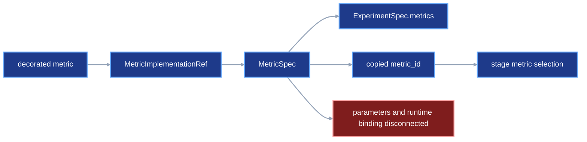
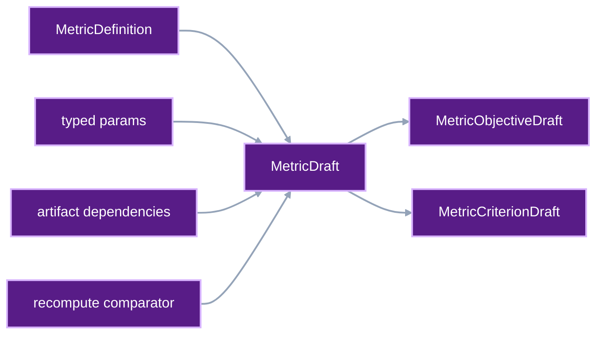
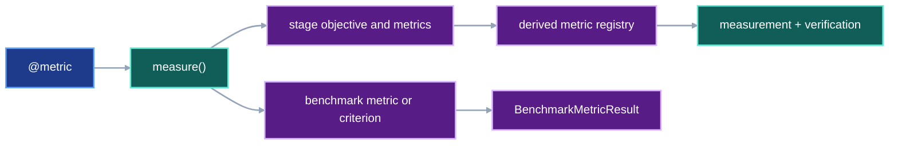

# Unified metric, experiment, and benchmark drafting

Users define each metric calculation once. They configure that calculation for
an experiment, select it from stages, and apply optional benchmark criteria to
the verified result. VIPER writes the exact metric, experiment, stage, and
benchmark records required by execution and verification.

This contract owns metric drafting, objective direction, experiment assembly,
and benchmark authoring. The complete model-run example remains in
[`automatic-input-resolution.md`](automatic-input-resolution.md#complete-proposed-authoring-example).
[`frozen-plan-git-identity.md`](frozen-plan-git-identity.md) owns the later Git
commit that identifies the generated experiment, variant, benchmark, stage,
and run documents.

## 1. Status

**Contract status:** planned; Phase 4 code specified.

These requirements bind the contract to the master checklist:

| ID | Implementation obligation |
| --- | --- |
| UMD-01 <!-- contract-requirement: UMD-01 phase=4 test=tests/test_metric_interface.py --> | Add metric drafts, objective drafts, criterion drafts, and their public constructors. |
| UMD-02 <!-- contract-requirement: UMD-02 phase=4 test=tests/test_metric_provenance.py --> | Deliver frozen parameter classes and values to live and recomputed metrics while reusing existing dependency snapshots. |
| UMD-03 <!-- contract-requirement: UMD-03 phase=4 test=tests/test_verification.py --> | Persist objective identity and direction and enforce stage-specific objective rules. |
| UMD-04 <!-- contract-requirement: UMD-04 phase=6 test=tests/test_authoring.py --> | Add experiment, factor, variant, and replicate drafting with a derived metric registry. |
| UMD-05 <!-- contract-requirement: UMD-05 phase=8 test=tests/test_benchmark_execution.py --> | Record every benchmark metric under fixed inputs and apply optional criteria. |
| UMD-06 <!-- contract-requirement: UMD-06 phase=11 test=tests/test_documentation.py --> | Remove retired metric shapes and publish the final metric, experiment, and benchmark API. |

**Current:** `@viper.metrics.metric` attaches `metric_id`, `kind`, and `mode` to a
function or stateful class. `MetricSpec` stores the exact implementation,
parameter values, dependencies, and recomputation comparator. Project code or
fixtures construct `MetricSpec` directly. Stages select metrics through bare
`metric_ids`. See [`src/viper/metrics.py`](../../src/viper/metrics.py),
[`src/viper/stages.py`](../../src/viper/stages.py), and
[`src/viper/experiments.py`](../../src/viper/experiments.py).

**Current:** `ExperimentSpec.metrics` stores complete `MetricSpec` records.
`BenchmarkSpec.metrics` stores `MetricCriterion` records. The benchmark executor
records only metrics that have thresholds. See
[`src/viper/benchmark.py`](../../src/viper/benchmark.py) and
[`src/viper/execution/_benchmark.py`](../../src/viper/execution/_benchmark.py).

**Proposed:** `viper.metrics.measure()` creates one configured `MetricDraft`.
`viper.metrics.min()` or `viper.metrics.max()` gives that metric an objective
direction. `viper.authoring.experiment()` defines factors, variants, and
replicates. `viper.authoring.freeze()` derives the experiment's metric registry
from the selected stages. `benchmark()` from `viper.benchmark` fixes the
evaluation data, splits, metrics, and optional criteria.

The benchmark model follows four observations from primary sources:

- MLPerf defines a benchmark, a run, a run result, and a benchmark result as
  separate entities. Its quality threshold belongs to one particular
  time-to-train procedure. [MLPerf Training Benchmark](https://arxiv.org/abs/1910.01500)
  and [MLPerf Training rules](https://github.com/mlcommons/training_policies/blob/master/training_rules.adoc)
- GLUE defines a benchmark through fixed tasks, datasets, metrics, and an
  evaluation platform. Its diagnostic set supplies additional analysis beyond
  one leaderboard score. [GLUE](https://aclanthology.org/W18-5446/)
- Changing the selected benchmark tasks can change the relative ranking of
  methods. A stored result therefore needs the exact benchmark identity and
  evaluation inputs. [The Benchmark Lottery](https://arxiv.org/abs/2107.07002)
- A best score alone omits the model-selection work that produced it. VIPER's
  run and experiment records retain the selected parameters, seeds, and run
  evidence beside the benchmark result. [Show Your Work](https://aclanthology.org/D19-1224/)

The project-specific conclusion is direct: `BenchmarkResult` is the primary
record. A threshold criterion is an optional interpretation of one recorded
metric result.

## 2. Required claim

When a user selects a configured metric as a stage objective, diagnostic, or
benchmark measurement, VIPER freezes one exact `MetricSpec`, delivers its
validated parameters to the metric implementation, records each produced
value, and verifies every recomputed value from its declared files.

When a user freezes an experiment, VIPER derives `ExperimentSpec.metrics` from
the metrics reachable through the experiment's stage drafts.
`viper.authoring.experiment()` therefore lists factors, variants, and replicates once.

When a user runs a benchmark, VIPER records the exact evaluation dataset,
splits, metric values, candidate evidence, and confirmation evidence. Optional
criteria add pass or fail judgments. VIPER stores every selected metric result
before it evaluates those criteria.

## 3. Current gap

### Inspected path

Hold this evaluation fixed:

```text
evaluate one model on holdout.csv
-> write predictions.csv
-> compute evaluation_loss and evaluation_accuracy
-> confirm the run independently
-> record both verified metric values
-> require accuracy >= 0.90 when the user supplied that criterion
```

The current metric authoring path is:

```text
decorated metric function
-> user constructs MetricImplementationRef
-> user constructs MetricSpec
-> user inserts MetricSpec into ExperimentSpec.metrics
-> user copies metric_id into EvalSpec.metric_ids
```

The current benchmark path is:

```text
BenchmarkSpec.metrics
-> tuple[MetricCriterion, ...]
-> benchmark executor iterates criteria
-> BenchmarkResult.metrics contains criterion receipts only
```

Three connectors are missing.

First, Python authoring lacks an object that carries one decorated metric
together with its parameter values, dependencies, and recomputation comparator.

Second, a live metric can declare custom parameters in the proposed draft. The
current `MetricHandle` calls a function with only the arguments supplied to
`record()` and constructs a stateful metric with zero arguments. The frozen
parameter object remains disconnected from both implementations.

Third, `BenchmarkSpec.metrics` makes every recorded benchmark metric carry a
threshold. The executor requires `ge` or `le` before it can record a verified
score.

### Current DAG



### Missing connector

No contract-owned object joins the decorated implementation, frozen parameter
class and values, runtime context, objective role, and optional benchmark
criterion into one verified path.

### Proposed-change DAG



### Integrated DAG



## 4. Contract models

### Metric definition and configuration

The decorator defines stable metric metadata. `viper.metrics.measure()` supplies the
values that can change between experiments.

```python
MetricMode = Literal["recompute", "live"]
ObjectiveDirection = Literal["min", "max"]

MetricParamsT = TypeVar("MetricParamsT", bound=parameters.Metric)
DecoratedMetricT = TypeVar(
    "DecoratedMetricT",
    bound=Callable[..., float] | type[Any],
)


@dataclass(frozen=True)
class MetricDefinition:
    metric_id: MetricId
    mode: MetricMode


DecoratedMetric = Callable[..., float] | type[Any]


class MetricDraft(BaseModel):
    model_config = ConfigDict(
        arbitrary_types_allowed=True,
        extra="forbid",
        frozen=True,
    )

    implementation: DecoratedMetric
    params: parameters.Metric
    dependencies: tuple[MetricDependency, ...] = ()
    comparator: FloatComparator | None = None


class MetricObjectiveDraft(BaseModel):
    model_config = ConfigDict(extra="forbid", frozen=True)

    metric: MetricDraft
    direction: ObjectiveDirection


class MetricCriterionDraft(BaseModel):
    model_config = ConfigDict(extra="forbid", frozen=True)

    metric: MetricDraft
    comparison: Literal["ge", "le"]
    threshold: float = Field(allow_inf_nan=False)
```

`MetricDraft` is one configured calculation. `MetricObjectiveDraft` states how
an objective should improve. `MetricCriterionDraft` states one optional
threshold applied by a benchmark. These objects share one `MetricDraft` and its
implementation and parameter values.

The public constructors are:

```python
def metric(
    *,
    metric_id: MetricId,
    mode: MetricMode,
) -> Callable[[DecoratedMetricT], DecoratedMetricT]: ...


def measure(
    implementation: DecoratedMetric,
    *,
    params: parameters.Metric | None = None,
    dependencies: tuple[MetricDependency, ...] = (),
    comparator: FloatComparator | None = None,
) -> MetricDraft: ...


def min(metric: MetricDraft) -> MetricObjectiveDraft: ...


def max(metric: MetricDraft) -> MetricObjectiveDraft: ...


def at_least(metric: MetricDraft, threshold: float) -> MetricCriterionDraft: ...


def at_most(metric: MetricDraft, threshold: float) -> MetricCriterionDraft: ...
```

The decorator metadata follows the existing implementation pattern:

```python
def metric_definition(
    implementation: DecoratedMetric,
) -> MetricDefinition: ...
```

```text
@viper.metrics.metric(...)
-> construct MetricDefinition
-> attach it to the function or class as __viper_metric__

viper.metrics.measure(implementation, ...)
-> call metric_definition(implementation)
-> validate mode, dependencies, and comparator
-> return MetricDraft containing the implementation and configured values

viper.authoring.freeze(plan)
-> call metric_definition(MetricDraft.implementation)
-> inspect type(MetricDraft.params)
-> hash the implementation and custom parameter-model source
-> write MetricSpec
```

`viper.metrics.measure()` constructs `viper.params.Metric()` when the caller omits
`params`. A supplied instance must subclass `viper.params.Metric`. Freezing
derives the parameter class from `type(MetricDraft.params)`.

Recomputed metrics require at least one dependency and one comparator. Live
metrics carry neither. Evaluation metrics use `mode="recompute"`.

`FloatComparator` compares one recorded value with independent recomputation.
`MetricCriterionDraft` compares a verified benchmark value with a target. The
two objects keep separate fields and separate consumers.

### Naming decisions

| Name | Stable role |
| --- | --- |
| `MetricDraft` | One configured calculation before freezing |
| `MetricObjectiveDraft` | One metric plus its desired direction of improvement |
| `MetricCriterionDraft` | One metric plus one optional benchmark threshold |
| `MetricObjectiveSpec` | The frozen metric-and-direction pair stored on a stage |
| `metrics` | The stage argument that selects additional measurements, including diagnostics |
| `FactorDraft` | One experimental dimension and its permitted level IDs |
| `VariantDraft` | One factor-level selection plus the complete stage graph and estimator for that selection |
| `ReplicateDraft` | One repeated execution seed |

The stage field is `objective`. Its `MetricObjectiveSpec` value carries the
metric ID and direction together. A metric selected through `metrics=` is an
additional measurement. That selection makes it a diagnostic when the result
helps explain the stage.

### Live and recomputed metrics

`mode` determines when VIPER calculates a metric and which values the metric
can use.

| Mode | When VIPER calculates it | What the metric receives | Typical use |
| --- | --- | --- | --- |
| `live` | While the stage callable is running | Values held in memory and passed through `MetricHandle.record()` or `MetricHandle.update()` | Batch loss, gradient norm, memory use, and timing |
| `recompute` | After the stage has persisted its inputs and artifacts | File paths selected by `MetricDependency` | Evaluation loss, accuracy, and other results derived from saved predictions and labels |

A live metric records information that exists during execution. For example,
the training function can pass one epoch's gradient norms to
`context.metrics["gradient_norm"].record(...)`. VIPER calculates the scalar and
appends a `Measurement` while the stage process is active.

A recomputed metric reads persisted files in a separate metric process. For
example, an evaluation metric can read saved predictions and evaluation labels,
calculate accuracy, and store the result. The verifier runs the calculation
again and uses `FloatComparator` to compare the two values.

Use `live` when the required values exist only while the stage is running. Use
`recompute` when persisted inputs and artifacts contain everything required for
the calculation.

### Diagnostics

A diagnostic is a `MetricDraft` selected through a stage's `metrics=` argument.
Its result explains that stage. The `objective` field separately names the
primary metric for a stage that declares one.

A live diagnostic uses the stage's `Measurement` and invocation receipt. A
recomputed diagnostic also uses declared dependencies, a comparator, and a
`MetricVerificationReceipt`.

```python
from viper import params
from viper.authoring import stage
from viper.metrics import MetricContext, measure, metric, min


@metric(
    metric_id="gradient_norm",
    mode="live",
)
def gradient_norm(
    _context: MetricContext[params.Metric],
    batch_norms: list[float],
) -> float:
    return max(batch_norms)


gradient_norm_metric = measure(gradient_norm)

training = stage(
    train,
    params=TRAIN_PARAMS,
    inputs=TRAIN_INPUTS,
    artifacts=TRAIN_ARTIFACTS,
    objective=min(training_loss_metric),
    metrics=(gradient_norm_metric,),
)
```

Selection makes the diagnostic available through `Context.metrics`. The
training function produces one diagnostic measurement after each epoch:

```python
context.metrics["training_loss"].record(
    batch_losses,
    epoch=epoch,
)
context.metrics["gradient_norm"].record(
    batch_gradient_norms,
    epoch=epoch,
)
```

The complete training function computes `batch_losses` and
`batch_gradient_norms` inside its optimizer loop in
[`automatic-input-resolution.md`](automatic-input-resolution.md#complete-proposed-authoring-example).

`objective` identifies the primary metric and its direction. `metrics` selects
additional measurements, including diagnostics. A fixed embedding stage can
select `embedding_reconstruction_loss` and `embedding_spread` as diagnostics
while leaving `objective=None`.

A diagnostic can use `mode="live"` when the stage already holds the required
values. It can use `mode="recompute"` when the calculation reads persisted
inputs or artifacts. Build, embed, train, and eval stages can select live
or recomputed diagnostics. A runner-owned download stage selects recomputed
diagnostics; live `MetricHandle` values come from project stage callables.

### One context for live and recomputed metrics

Both metric modes receive the same typed `MetricContext`:

```python
class MetricContext(BaseModel, Generic[MetricParamsT]):
    model_config = ConfigDict(
        arbitrary_types_allowed=True,
        extra="forbid",
        frozen=True,
    )

    inputs: Mapping[str, Path] = Field(default_factory=dict)
    artifacts: Mapping[str, Path] = Field(default_factory=dict)
    params: MetricParamsT
```

A recomputed metric keeps its current context-first call:

```python
from viper.metrics import MetricContext


def evaluation_loss(
    context: MetricContext[LossMetricParams],
) -> float:
    ...
```

A stateless live metric receives the same context before the observations
supplied to `record()`:

```python
from viper import params
from viper.metrics import MetricContext


def training_loss(
    context: MetricContext[params.Metric],
    batch_losses: list[float],
) -> float:
    ...
```

A stateful live metric receives the context once:

```python
from viper.metrics import MetricContext, StatefulMetric


class RunningAccuracy(StatefulMetric[AccuracyMetricParams]):
    def __init__(
        self,
        context: MetricContext[AccuracyMetricParams],
    ) -> None:
        self.params = context.params
        self.correct = 0
        self.total = 0

    def update(self, predicted: int, expected: int) -> None:
        self.correct += int(predicted == expected)
        self.total += 1

    def compute(self) -> float:
        return self.correct / self.total
```

The live binding operation is:

```text
MetricSpec.parameter_model + MetricSpec.params
-> validate and construct parameters.Metric subclass

active stage input and artifact paths + validated metric params
-> construct MetricContext

bind_live_metric(..., context)
-> MetricHandle retains MetricContext

MetricHandle.record(*args, **kwargs)
-> stateless implementation(context, *args, **kwargs)
-> Measurement

MetricHandle construction for StatefulMetric
-> implementation(context)
-> update(...)
-> record()
-> compute()
-> Measurement
```

The target runtime interfaces are:

```python
class StatefulMetric(ABC, Generic[MetricParamsT]):
    @abstractmethod
    def __init__(self, context: MetricContext[MetricParamsT]) -> None: ...

    @abstractmethod
    def update(self, *args: Any, **kwargs: Any) -> None: ...

    @abstractmethod
    def compute(self) -> float: ...


class MetricHandle:
    def __init__(
        self,
        implementation: Callable[..., Any] | type[Any],
        sink: MeasurementSink,
        context: MetricContext[Any],
    ) -> None: ...

    def update(self, *args: Any, **kwargs: Any) -> None: ...

    def record(
        self,
        *args: Any,
        epoch: int | None = None,
        step: int | None = None,
        **kwargs: Any,
    ) -> Measurement: ...


def bind_live_metric(
    repository_root: Path,
    spec: MetricSpec,
    sink: MeasurementSink,
    context: MetricContext[Any],
) -> MetricHandle: ...
```

One shared `MetricContext` gives both modes the same invocation context and
parameter-delivery rule.

The alternatives fail at a specific boundary:

| Alternative | Benefit | Contract cost |
| --- | --- | --- |
| Pass `params=` to `MetricHandle.record()` | Small runtime edit | Stage code can supply values that differ from the frozen `MetricSpec.params`. |
| Decorate a factory that returns a configured metric | Parameters stay inside the returned callable | The returned closure can capture unrecorded values, and its generated identity is harder to bind to one source symbol. |
| Permit custom parameters only on `StatefulMetric` classes | Constructor delivery is simple | A stateless calculation must become a class solely to receive parameters. |
| Store parameters on `MetricHandle.params` | Preserves the current metric function signature | Stage code must manually read and forward the values, so the metric invocation itself lacks a required parameter handoff. |
| Add `LiveMetricContext` | Makes the mode visible in the type | It duplicates the role already carried by `MetricContext` and creates two parameter-delivery APIs. |

### Frozen metric records

`MetricSpec` records the parameter values and the class used to interpret them:

```python
ParameterModelOwner = Literal["project", "viper"]
PythonSourceRelPath = Annotated[
    str,
    AfterValidator(validate_repo_rel_path),
    AfterValidator(validate_python_file_path),
]


class ParameterModelRef(ProtocolModel):
    owner: ParameterModelOwner
    path: PythonSourceRelPath
    symbol: PythonSymbol
    sha256: SHA256
    bytes: int = Field(gt=0)


class MetricSpec(ProtocolModel):
    schema_version: Literal[1] = 1
    metric_id: MetricId
    implementation: MetricImplementationRef
    parameter_model: ParameterModelRef
    params: parameters.Metric
    mode: MetricMode
    dependencies: tuple[MetricDependency, ...] = ()
    comparator: FloatComparator | None = None
```

`ParameterModelRef.owner` chooses the root used to resolve `path`. `project`
means the active repository root. `viper` means the installed VIPER package
root. The built-in default points to `parameters.py:Metric`. A custom class
points to its project file and symbol. Both forms record the source file's
SHA-256 digest and byte count.

Recomputed metric executions repeat the selected class and values:

```python
class MetricExecutionReceipt(ProtocolModel):
    schema_version: Literal[1] = 1
    run_id: RunId
    attempt_id: int = Field(ge=1)
    metric_id: MetricId
    stage_id: StageId
    purpose: Literal["measurement", "verification"]
    implementation: MetricImplementationRef
    parameter_model: ParameterModelRef
    params: parameters.Metric
    dependencies: tuple[ResolvedMetricDependency, ...] = Field(min_length=1)
    startup: ProcessStartupReceipt
    execution_context: ExecutionContext
    python_env: PythonEnvSpec
    value: float = Field(allow_inf_nan=False)
    started_at: AwareDatetime
    completed_at: AwareDatetime
    outcome: Literal["succeeded"] = "succeeded"
```

Live metrics run inside the controlled stage process. Their `Measurement`
selects the stage and metric ID. The verifier follows that ID to `MetricSpec`
and follows the resolved stage to the stage invocation receipt. One
stage-process receipt covers the live metric binding:

```text
Measurement.metric_id
-> StageInvocationReceipt.context.metric_ids
-> frozen stage metric_ids
-> ExperimentSpec.metrics[metric_id]
-> MetricSpec.parameter_model + MetricSpec.params

StageInvocationReceipt.context_digest
-> exact StageContextBinding used by the successful stage process
```

The stage worker resolves every listed `MetricSpec`, validates its source and
parameter model, constructs its `MetricContext`, and only then invokes the
project stage. The successful `StageInvocationReceipt` records the exact
context that selected those metric IDs. This join supports the claim that the
controlled worker supplied the frozen metric binding. The stored `Measurement`
rows establish each handle call that produced a value and its cadence.

The frozen objective is one object because the metric identity and improvement
direction have one consumer:

```python
class MetricObjectiveSpec(ProtocolModel):
    metric_id: MetricId
    direction: ObjectiveDirection
```

The field is named `objective`. Its value contains two facts: which metric is
primary and how that metric should improve. `MetricObjectiveDraft` is the
Python authoring form. `MetricObjectiveSpec` is the frozen protocol form. The
same `MetricDraft` type serves objectives and additional measurements; the
stage field records the role.

The target stage models are:

```python
class BaseSpec(ProtocolModel):
    kind: str
    schema_version: Literal[1] = 1
    env: EnvSpec | None = None
    metric_ids: tuple[MetricId, ...] = ()
    artifacts: dict[ArtifactName, ArtifactSpec] = Field(min_length=1)


class ParameterizedSpec(BaseSpec):
    implementation: StageImplementationRef
    parameter_model: ParameterModelRef
    reuse: StageReuseMode = "never"


class InternalSpec(ParameterizedSpec):
    inputs: dict[InputName, InputRef] = Field(min_length=1)


class BuildSpec(InternalSpec):
    kind: Literal["build"] = "build"
    params: parameters.Build


class EmbedSpec(InternalSpec):
    kind: Literal["embed"] = "embed"
    objective: MetricObjectiveSpec | None = None
    params: parameters.Embed


class TrainSpec(InternalSpec):
    kind: Literal["train"] = "train"
    metric_ids: tuple[MetricId, ...] = Field(min_length=1)
    objective: MetricObjectiveSpec
    params: parameters.Train


class EvalSpec(InternalSpec):
    kind: Literal["eval"] = "eval"
    eval_id: EvalId
    metric_ids: tuple[MetricId, ...] = Field(min_length=1)
    objective: MetricObjectiveSpec
    split_inputs: tuple[InputName, ...] = Field(min_length=1)
    params: parameters.Eval
```

The objective metric ID must occur in the same stage's `metric_ids`. A training
objective uses a live metric. An evaluation objective uses a recomputed metric.
An optional embedding objective can use either mode, according to whether the
embedding implementation records the value during execution or VIPER derives
the value from persisted files.

VIPER records objective direction for experiment comparison and agentic model
selection. The runner continues to leave gradient updates and early stopping
to project stage code.

### Experiment drafts

An experiment names factors, variants, and replicates. Its metric registry is
derived from the stage graph of each frozen plan.

Every artifact draft stores a path relative to the selected run root. Freezing
prefixes `experiments/<experiment-id>/runs/<variant-id>/<run-id>/` and writes
the resulting repository-relative path to `ArtifactSpec.path`. One variant
graph can therefore serve every declared replicate.

```python
class FactorDraft(BaseModel):
    model_config = ConfigDict(extra="forbid", frozen=True)

    levels: tuple[LevelId, ...] = Field(min_length=2)


class VariantDraft(BaseModel):
    model_config = ConfigDict(
        arbitrary_types_allowed=True,
        extra="forbid",
        frozen=True,
    )

    levels: dict[FactorId, LevelId]
    stages: dict[StageId, StageDraft] = Field(min_length=1)
    estimator: StageDraftArtifactRef


class ReplicateDraft(BaseModel):
    model_config = ConfigDict(extra="forbid", frozen=True)

    seed: RNGSeed


class ExperimentDraft(BaseModel):
    model_config = ConfigDict(extra="forbid", frozen=True)

    experiment_id: ExperimentId
    factors: dict[FactorId, FactorDraft] = Field(default_factory=dict)
    variants: dict[VariantId, VariantDraft] = Field(min_length=1)
    replicates: dict[ReplicateId, ReplicateDraft] = Field(min_length=1)
```

`ExperimentDraft` omits `metrics`. Every configured metric must be selected by
at least one stage in one declared variant. `viper.authoring.freeze()` walks every
variant's stage objectives and metrics, produces one `MetricSpec` per metric ID,
and writes those records into `ExperimentSpec.metrics`.

The public constructors are:

```python
def factor(*, levels: tuple[LevelId, ...]) -> FactorDraft: ...


def variant(
    *,
    levels: dict[FactorId, LevelId],
    stages: dict[StageId, StageDraft],
    estimator: StageDraftArtifactRef,
) -> VariantDraft: ...


def replicate(*, seed: RNGSeed) -> ReplicateDraft: ...


def experiment(
    *,
    experiment_id: ExperimentId,
    factors: dict[FactorId, FactorDraft] | None = None,
    variants: dict[VariantId, VariantDraft],
    replicates: dict[ReplicateId, ReplicateDraft],
) -> ExperimentDraft: ...
```

The mapping keys carry all factor, variant, and replicate IDs. The draft values
carry each entity's remaining fields.

The run plan selects one declared variant and replicate:

```python
class RunPlanDraft(BaseModel):
    model_config = ConfigDict(
        arbitrary_types_allowed=True,
        extra="forbid",
        frozen=True,
    )

    schema_version: Literal[1] = 1
    run_id: RunId
    experiment: ExperimentDraft
    variant: VariantId
    replicate: ReplicateId
    benchmark: BenchmarkDraft | None = None
    source: GitSource
    env: EnvSpec
    reproducibility: ReproducibilitySpec
```

[`experiment-expansion.md`](experiment-expansion.md) owns the operation that
creates one `RunPlanDraft` for every selected variant-replicate pair. This
contract keeps `RunPlanDraft` as the single-run unit and derives each run's
metric registry from the same `ExperimentDraft`.

[`stage-reuse.md`](stage-reuse.md) owns reused metric evidence. A reused stage
links the source measurement and verification receipt through
`StageReuseReceipt` while preserving the source `Measurement` identity.

`viper.authoring.freeze()` derives these persisted values:

```text
RunSpec.experiment_id
<- RunPlanDraft.experiment.experiment_id

RunSpec.variant_id
<- RunPlanDraft.variant

RunSpec.replicate_id
<- RunPlanDraft.replicate

RunSpec.seed
<- RunPlanDraft.experiment.replicates[RunPlanDraft.replicate].seed

ExperimentSpec.factors
<- RunPlanDraft.experiment.factors

ExperimentSpec.variant_ids
<- RunPlanDraft.experiment.variants.keys()

ExperimentSpec.replicates
<- RunPlanDraft.experiment.replicates

ExperimentSpec.metrics
<- all MetricDraft values reachable from every ExperimentDraft variant

VariantSpec.levels
<- RunPlanDraft.experiment.variants[RunPlanDraft.variant].levels

VariantSpec.stage_params
<- parameterized stages in RunPlanDraft.experiment.variants[RunPlanDraft.variant]

RunSpec.stages
<- stage mapping in RunPlanDraft.experiment.variants[RunPlanDraft.variant]

RunSpec.estimator
<- estimator in RunPlanDraft.experiment.variants[RunPlanDraft.variant]
```

The persisted experiment and variant shapes remain:

```python
class ExperimentSpec(ProtocolModel):
    schema_version: Literal[1] = 1
    experiment_id: ExperimentId
    factors: tuple[FactorSpec, ...]
    variant_ids: tuple[VariantId, ...] = Field(min_length=1)
    replicates: tuple[ReplicateSpec, ...] = Field(min_length=1)
    metrics: tuple[MetricSpec, ...]


class BuildVariantStageParams(ProtocolModel):
    kind: Literal["build"] = "build"
    stage_id: StageId
    params: parameters.Build


class EmbedVariantStageParams(ProtocolModel):
    kind: Literal["embed"] = "embed"
    stage_id: StageId
    params: parameters.Embed


class TrainVariantStageParams(ProtocolModel):
    kind: Literal["train"] = "train"
    stage_id: StageId
    params: parameters.Train


class EvalVariantStageParams(ProtocolModel):
    kind: Literal["eval"] = "eval"
    stage_id: StageId
    params: parameters.Eval


VariantStageParams = Annotated[
    BuildVariantStageParams
    | EmbedVariantStageParams
    | TrainVariantStageParams
    | EvalVariantStageParams,
    Field(discriminator="kind"),
]


class VariantSpec(ProtocolModel):
    schema_version: Literal[1] = 1
    experiment_id: ExperimentId
    variant_id: VariantId
    levels: dict[FactorId, LevelId]
    stage_params: tuple[VariantStageParams, ...] = Field(min_length=1)
```

`DownloadVariantStageParams` leaves the union because the runner-owned
`DownloadSpec` stores request, policy, and transport settings directly. Variant
parameter records cover project-owned stage parameter objects.

Freezing the first plan for a variant fixes that variant's complete stage
parameters. A later plan using the same experiment and variant must produce the
same `VariantSpec`. Different stage parameters require a different variant ID.

The experiment constructor accepts factors, variants, and replicates. The
compiler derives its metric registry from the stages, which gives each metric
one authoring location.

The factor levels and variant stages appear together at authoring time. This
example continues the
[`automatic-input-resolution.md`](automatic-input-resolution.md#complete-proposed-authoring-example)
program. It reuses that program's `train`, `TrainParams`, artifact loaders,
metric drafts, `source`, `env`, and `reproducibility` objects. The two
training stages read the same checked-in
`inputs/training_embeddings.csv` file. The code below defines every
variant-specific stage and every run value it uses.

```python
from viper.artifacts import artifact
from viper.authoring import (
    experiment,
    factor,
    input,
    plan,
    replicate,
    stage,
    variant,
)
from viper.metrics import min


baseline_training = stage(
    train,
    params=TrainParams(
        epochs=40,
        batch_size=4,
        learning_rate=0.15,
        momentum=0.9,
        weight_decay=0.001,
        max_gradient_norm=1.0,
    ),
    inputs={
        "dataset": input(
            path="inputs/training_embeddings.csv",
            data_role="training",
        ),
    },
    artifacts={
        Train.MODEL: artifact(
            path="artifacts/models/logistic_regression/model.pt",
            loader=load_weights,
            data_role="training",
        ),
        Train.STATE: artifact(
            path="artifacts/models/logistic_regression/state.pt",
            loader=load_resume_state_artifact,
            data_role="training",
        ),
    },
    objective=min(training_loss_metric),
    metrics=(gradient_norm_metric,),
)

high_rate_training = stage(
    train,
    params=TrainParams(
        epochs=40,
        batch_size=4,
        learning_rate=0.30,
        momentum=0.9,
        weight_decay=0.001,
        max_gradient_norm=1.0,
    ),
    inputs={
        "dataset": input(
            path="inputs/training_embeddings.csv",
            data_role="training",
        ),
    },
    artifacts={
        Train.MODEL: artifact(
            path="artifacts/models/logistic_regression/model.pt",
            loader=load_weights,
            data_role="training",
        ),
        Train.STATE: artifact(
            path="artifacts/models/logistic_regression/state.pt",
            loader=load_resume_state_artifact,
            data_role="training",
        ),
    },
    objective=min(training_loss_metric),
    metrics=(gradient_norm_metric,),
)

study = experiment(
    experiment_id="tiny_http",
    factors={
        "learning_rate": factor(
            levels=("baseline", "high"),
        ),
    },
    variants={
        "baseline": variant(
            levels={"learning_rate": "baseline"},
            stages={
                "train": baseline_training,
            },
            estimator=baseline_training.artifacts[Train.MODEL],
        ),
        "high_learning_rate": variant(
            levels={"learning_rate": "high"},
            stages={
                "train": high_rate_training,
            },
            estimator=high_rate_training.artifacts[Train.MODEL],
        ),
    },
    replicates={
        "replicate_01": replicate(seed=7),
        "replicate_02": replicate(seed=19),
    },
)


baseline_plan = plan(
    run_id="01ARZ3NDEKTSV4RRFFQ69G5FAV",
    experiment=study,
    variant="baseline",
    replicate="replicate_01",
    source=source,
    env=env,
    reproducibility=reproducibility,
)

high_rate_plan = plan(
    run_id="01ARZ3NDEKTSV4RRFFQ69G5FAW",
    experiment=study,
    variant="high_learning_rate",
    replicate="replicate_01",
    source=source,
    env=env,
    reproducibility=reproducibility,
)

baseline_replicate_02_plan = plan(
    run_id="01ARZ3NDEKTSV4RRFFQ69G5FAX",
    experiment=study,
    variant="baseline",
    replicate="replicate_02",
    source=source,
    env=env,
    reproducibility=reproducibility,
)
```

`FactorDraft.levels` names the experimental labels. The selected
`VariantDraft.stages` contains the concrete parameter values associated with
those labels. `VariantSpec` persists both the labels and the complete stage
parameter records. VIPER checks their association by freezing them from the
same `VariantDraft`. VIPER treats `high` as an opaque label and records the
concrete parameter values from the variant's stages.

The two baseline plans reuse `baseline_training`. Freezing gives each plan a
different run root and writes different concrete artifact paths. The draft
remains the same object.

### Benchmark drafts and frozen records

A benchmark fixes the evaluation conditions and names every metric that the
benchmark will record. Criteria select a subset of those metrics.

```python
class BenchmarkDraft(BaseModel):
    model_config = ConfigDict(
        arbitrary_types_allowed=True,
        extra="forbid",
        frozen=True,
    )

    benchmark_id: BenchmarkId
    eval_id: EvalId
    test: RunArtifactDraft
    splits: dict[InputName, RunArtifactDraft] = Field(min_length=1)
    metrics: tuple[MetricDraft, ...] = Field(min_length=1)
    criteria: tuple[MetricCriterionDraft, ...] = ()
    execution_count: Literal[2] = 2
```

The target persisted records are:

```python
class MetricCriterion(ProtocolModel):
    metric_id: MetricId
    comparison: Literal["ge", "le"]
    threshold: float = Field(allow_inf_nan=False)


class BenchmarkSpec(ProtocolModel):
    schema_version: Literal[1] = 1
    benchmark_id: BenchmarkId
    eval_id: EvalId
    test: ResolvedArtifactPointerRef
    splits: dict[InputName, ResolvedArtifactPointerRef] = Field(min_length=1)
    metric_ids: tuple[MetricId, ...] = Field(min_length=1)
    criteria: tuple[MetricCriterion, ...] = ()
    execution_count: Literal[2] = 2


class MetricCriterionResult(ProtocolModel):
    criterion: MetricCriterion
    candidate_passed: bool
    confirmation_passed: bool
    passed: bool


class BenchmarkMetricResult(ProtocolModel):
    metric_id: MetricId
    candidate_verification: ResolvedFileRef
    confirmation_verification: ResolvedFileRef
    candidate_value: float = Field(allow_inf_nan=False)
    confirmation_value: float = Field(allow_inf_nan=False)
    matched: bool
    criterion: MetricCriterionResult | None = None


class BenchmarkResult(ProtocolModel):
    schema_version: Literal[1] = 1
    benchmark: ResolvedBenchmarkSpecRef
    run: ResolvedRunRef
    confirmation: ResolvedAttemptRef
    artifacts: tuple[ArtifactComparisonReceipt, ...] = Field(min_length=2)
    metrics: tuple[BenchmarkMetricResult, ...] = Field(min_length=1)
    status: Literal["verified", "passed", "failed"]
    completed_at: AwareDatetime
```

`BenchmarkSpec.metric_ids` declares results to record. `BenchmarkSpec.criteria`
declares optional thresholds. Every criterion metric ID must occur in
`metric_ids`. Each metric ID and criterion metric ID is unique.

`MetricCriterionResult.passed` equals
`candidate_passed and confirmation_passed`. `BenchmarkMetricResult.matched`
records the cross-execution comparison produced by the metric's frozen
`FloatComparator`.

`BenchmarkResult.status` follows these rules:

```text
artifact parity or metric matching fails
-> failed

all parity and matching checks pass, and criteria is empty
-> verified

all parity and matching checks pass, and every criterion passes
-> passed

all parity and matching checks pass, and one criterion fails
-> failed
```

The public constructor is:

```python
def benchmark(
    *,
    benchmark_id: BenchmarkId,
    eval_id: EvalId,
    test: RunArtifactDraft,
    splits: dict[InputName, RunArtifactDraft],
    metrics: tuple[MetricDraft, ...],
    criteria: tuple[MetricCriterionDraft, ...] = (),
) -> BenchmarkDraft: ...
```

`RunPlanDraft.benchmark` carries the complete authoring object. Freezing writes
`BenchmarkSpec` and writes `RunSpec.benchmark_id`. `BenchmarkResult.run` joins
the reusable benchmark definition to one candidate run and its experiment.

The evaluation stage and benchmark reuse the same draft objects:

```text
BenchmarkDraft.test
== EvalSpecDraft.inputs[Eval.TEST]

BenchmarkDraft.splits[name]
== EvalSpecDraft.inputs[name]
```

Freezing resolves each `RunArtifactDraft` once. It writes the resulting
`StoredInputRef` into the evaluation stage and reuses that input's
`ResolvedArtifactPointerRef` in `BenchmarkSpec`. The candidate, confirmation
execution, and benchmark record therefore share one test-data identity.

## 5. Execution

### Freezing metrics and objectives

For each `MetricDraft`, `viper.authoring.freeze()` performs these operations:

```text
call metric_definition(MetricDraft.implementation)
-> inspect type(MetricDraft.params)
-> hash implementation source
-> hash a custom parameter-model source
-> construct MetricSpec
-> merge by metric_id into ExperimentSpec.metrics
```

When multiple stages select the same `metric_id`, freezing compiles each
selected `MetricDraft` into a `MetricSpec` and compares the complete records.
The implementation, parameter class, parameter values, dependencies, mode, and
comparator must match. A mismatch raises an error because each metric ID
identifies exactly one configured calculation.

For each `MetricObjectiveDraft`, the compiler writes one
`MetricObjectiveSpec`. It places the objective metric ID first in the stage's
`metric_ids`, followed by the IDs supplied through `metrics=`.

### Executing live metrics

The stage worker loads every selected live `MetricSpec`. It verifies the metric
implementation bytes and custom parameter-model bytes. It validates
`MetricSpec.params`, constructs one `MetricContext`, and binds one
`MetricHandle`.

Project code continues to use:

```python
context.metrics["training_loss"].record(
    batch_losses,
    epoch=epoch,
)
```

`MetricHandle` adds its retained context before calling the metric function.
The project passes observations through `record()`; the handle supplies the
frozen parameters.

### Executing recomputed metrics

The metric worker resolves each `MetricDependency` to exact input or artifact
files. It constructs `MetricContext` with those paths and the validated metric
parameters. It calls the metric function and writes one `Measurement` and one
`MetricExecutionReceipt`.

The dependency resolver reuses each file's published snapshot:

```text
MetricDependency selects a stage artifact
-> use that stage's ResolvedStageRef.snapshot
-> join it with the artifact's SnapshotFileRef
-> construct ResolvedFileRef

MetricDependency selects a stage input
-> ExternalInputRef: use the consuming-stage snapshot
-> FutureInputRef: use the producer-stage snapshot
-> StoredInputRef: follow the pointer to the producer-stage snapshot
-> join the selected snapshot with its SnapshotFileRef
-> construct ResolvedFileRef
```

For a local snapshot, the derived reference is `LocalFileRef(commit, path)`.
For Hugging Face or Viper Cloud, the derived reference carries the same
repository or cloud revision and file path. `ResolvedMetricDependency.files`
remains independently retrievable while each dependency payload is published
once.

Verification repeats that operation in a separate worker and writes
`MetricVerificationReceipt` after applying `FloatComparator`.

### Freezing experiments

`viper.authoring.freeze()` validates every factor level, selected variant, replicate, and
stage parameter set. It writes `ExperimentSpec`, the selected `VariantSpec`, all
stage specs, and `RunSpec`.

The writer merges metrics into an existing experiment by `metric_id`. It
preserves identical records and rejects conflicting records. Stage selections
remain the user's only metric list.

### Executing benchmarks

The benchmark executor verifies the candidate run, performs the independent
confirmation execution, compares estimator and prediction artifacts, and loads
the verification receipt for every `BenchmarkSpec.metric_ids` member.

For each metric, it writes `BenchmarkMetricResult`. A matching criterion causes
the executor to evaluate both candidate and confirmation values and attach
`MetricCriterionResult`.

## 6. Persisted evidence

The successful example produces this evidence chain:

```text
ExperimentSpec.metrics["evaluation_accuracy"]
-> exact implementation, params, dependencies, comparator

EvalSpec.metric_ids
-> selects evaluation_accuracy

MetricVerificationReceipt from candidate
-> candidate verified value

MetricVerificationReceipt from confirmation
-> confirmation verified value

BenchmarkSpec.metric_ids
-> requires both values in the benchmark result

BenchmarkMetricResult
-> stores both values and both receipt references
-> stores cross-execution match
-> optionally stores threshold outcome
```

This evidence supports four claims:

- the named metric used the frozen implementation and parameters;
- the metric worker received paths whose files matched the declared identities;
- independent recomputation reproduced each recorded value; and
- the candidate and confirmation runs produced matching benchmark values.

An objective record proves selection, direction, and measurement. Gradient
updates remain project-owned, so their relationship to the objective remains
outside this contract. VIPER would need to own the optimizer step or provide a
differentiable objective interface to prove that relationship.

## 7. Verification

| Rule | Executable condition |
| --- | --- |
| `metric.authoring.complete` <!-- verifier-rule: metric.authoring.complete requirement=UMD-01 --> | Metric, objective, and criterion drafts freeze through their public constructors. |
| `metric.params.delivered` <!-- verifier-rule: metric.params.delivered requirement=UMD-02 --> | Live and recomputed metric execution receives the frozen parameter class, values, and dependency snapshots. |
| `metric.objective.enforced` <!-- verifier-rule: metric.objective.enforced requirement=UMD-03 --> | Frozen objectives preserve metric identity and direction, and each stage satisfies its objective rule. |
| `experiment.authoring.complete` <!-- verifier-rule: experiment.authoring.complete requirement=UMD-04 --> | Experiment, factor, variant, and replicate drafts freeze with one derived metric registry. |
| `benchmark.result.complete` <!-- verifier-rule: benchmark.result.complete requirement=UMD-05 --> | Each benchmark records every metric under fixed inputs before applying optional criteria. |
| `metric.docs.current` <!-- verifier-rule: metric.docs.current requirement=UMD-06 --> | Protocol and public documentation contain only the final metric, experiment, and benchmark shapes. |

### `metric.definition.binding`

`metric_definition()` retrieves the `MetricDefinition` attached to the loaded
implementation. Its metric ID and mode equal the values represented by
`MetricSpec`.

### `metric.draft.parameter_capture`

`type(MetricDraft.params)` subclasses `viper.params.Metric`. Freezing writes
a `ParameterModelRef` for that exact class. The built-in class uses
`owner="viper"`; a project subclass uses `owner="project"`. The worker resolves
the named source root, checks the source digest and byte count, loads the
symbol, and reconstructs the instance from `MetricSpec.params`.

### `metric.live.parameter_delivery`

The stage worker validates `MetricSpec.params` through the frozen parameter
class. The `MetricContext.params` object supplied by `MetricHandle` equals that
validated object. The verifier also requires
`StageInvocationReceipt.context.metric_ids` to equal the frozen stage's
`metric_ids`. Every live `Measurement.metric_id` must occur in that tuple and
resolve to exactly one `MetricSpec` in `ExperimentSpec.metrics`.

### `metric.recompute.invocation_binding`

The production and recomputation `MetricExecutionReceipt` records carry equal
`implementation`, `parameter_model`, `params`, and `dependencies` fields. Their
`parameter_model` fields also equal `MetricSpec.parameter_model`. A mismatch
fails metric verification.

### `metric.objective.selection`

Every train and eval stage has one `MetricObjectiveSpec`. Embed stages may
have one. `MetricObjectiveSpec.metric_id` occurs exactly once in the stage's
`metric_ids`.

### `metric.objective.role`

A training objective selects `mode="live"`. An evaluation objective selects
`mode="recompute"`. An embedding objective can select either mode. In every
case, the stage's `objective` field gives the metric its objective role.

### `metric.objective.evidence`

A successful stage contains at least one measurement for its objective metric.
This rule proves that the stage recorded the objective. Measurement cadence
remains project-owned.

### `experiment.metric.registry`

Every stage metric ID resolves to one `MetricSpec` in the selected
`ExperimentSpec`. Reusing an ID with a different `MetricSpec` stops freezing and
verification.

### `experiment.selection`

`RunPlanDraft.variant` and `RunPlanDraft.replicate` exist in the selected
`ExperimentDraft`. The selected variant has one declared level for every factor,
and every level belongs to that factor.

### `experiment.variant.graph`

Every `StageDraftArtifactRef` used by a variant names a producer in that same
variant's `stages` mapping. The producer appears before its consumer. The
variant estimator names an artifact from one train stage in the same mapping.
Freezing writes that stage and artifact to `RunSpec.estimator`.

The frozen verifier confirms that every `FutureInputRef` names an earlier run
stage and that `RunSpec.estimator` names a declared artifact from a train stage.

### `experiment.variant.parameters`

`VariantSpec.stage_params` contains one entry for every build, embed, train, and
eval stage in the selected variant. It contains zero download entries.
Each entry repeats the selected stage ID, kind, and frozen parameters.

### `benchmark.metric.selection`

`BenchmarkSpec.metric_ids` equals the metric IDs selected by the benchmark's
evaluation stage. Every benchmark metric uses `mode="recompute"`.

### `benchmark.input.identity`

The evaluation stage uses `StoredInputRef` at `Eval.TEST` and at every name in
`split_inputs`. `BenchmarkSpec.test` equals the pointer in
`EvalSpec.inputs[Eval.TEST]`. Each `BenchmarkSpec.splits[name]` equals the
pointer in `EvalSpec.inputs[name]`.

### `benchmark.metric.result`

`BenchmarkResult.metrics` contains exactly one `BenchmarkMetricResult` for each
`BenchmarkSpec.metric_ids` member. Each stored value equals the recomputation
value in its referenced `MetricVerificationReceipt`.

### `benchmark.metric.match`

The verifier applies the frozen metric comparator to the candidate and
confirmation values. `BenchmarkMetricResult.matched` equals that result.

### `benchmark.criterion.result`

A metric result uses `criterion=None` when the benchmark selects the metric for
recording alone. A populated nested criterion equals the unique frozen
criterion and records the candidate, confirmation, and combined outcomes.

### `benchmark.status`

The verifier derives `BenchmarkResult.status` from artifact parity, metric
matching, criterion presence, and criterion outcomes using the status rules in
Section 4.

## 8. Propagation and legacy cleanup

| Surface | Change |
| --- | --- |
| Public metric API | Add typed metric decorators, preserve `MetricDefinition` attachment and retrieval, remove `MetricKind`, and add `viper.metrics.measure()`, `viper.metrics.min()`, `viper.metrics.max()`, `viper.benchmark.at_least()`, and `viper.benchmark.at_most()`. |
| Live metric runtime | Pass validated `MetricContext` through `MetricHandle`; functions receive it first and stateful classes receive it at construction. |
| Metric protocol | Add `parameter_model` to `MetricSpec` and `MetricExecutionReceipt`. |
| Parameter-model identity | Add `ParameterModelRef.owner` and resolve `path` relative to either the project or installed VIPER package root. |
| Shared path scalar | Add `PythonSourceRelPath`; it applies the existing relative Python-file checks and resolves against the owner named by `ParameterModelRef`. |
| Metric verifier | Reconstruct metric parameters through `MetricSpec.parameter_model`; compare `parameter_model` across production and recomputation receipts. |
| Stage drafts | Replace objective `MetricDraft` values with `MetricObjectiveDraft`. |
| Stage protocol | Add `MetricObjectiveSpec` to embed, train, and evaluate specs. |
| Experiment API | Add `FactorDraft`, `VariantDraft`, `ReplicateDraft`, `ExperimentDraft`, and public constructors. Each variant owns level labels, stages, and its estimator. Draft artifact paths remain relative to the selected run root. Derive metrics from all variant stages. |
| Experiment protocol | Remove `DownloadVariantStageParams` from `VariantStageParams`; derive entries from build, embed, train, and eval stages. |
| Run-plan API | Replace repeated experiment, variant, replicate, seed, stages, and estimator values with `ExperimentDraft` plus selected variant and replicate IDs. |
| Benchmark API | Add `BenchmarkDraft`; separate selected metrics from optional criteria. |
| Benchmark protocol | Add `metric_ids` and `criteria`; replace criterion-only metric receipts with `BenchmarkMetricResult`. |
| Benchmark executor | Iterate `metric_ids`, store every verified result, and apply criteria by metric ID when present. |
| Verifier | Add the named metric, objective, experiment, and benchmark checks in Section 7. |
| Tests | Add live invocation binding to [`tests/test_metric_interface.py`](../../tests/test_metric_interface.py) and [`tests/test_metric_provenance.py`](../../tests/test_metric_provenance.py); add tamper rejection to [`tests/test_verification_acceptance.py`](../../tests/test_verification_acceptance.py). |
| Generated project | Replace manual `MetricSpec`, `ExperimentSpec`, `VariantSpec`, and `BenchmarkSpec` construction with the public draft API. |
| Documentation | Keep the complete model-run program in `automatic-input-resolution.md`; link its metric and experiment rules to this contract. |

The superseded behavior has these dispositions:

| Existing occurrence | Disposition |
| --- | --- |
| Undefined proposed `MetricDecorator` return type | Replace with `Callable[[DecoratedMetricT], DecoratedMetricT]`. |
| Implicit `MetricDefinition` handoff | Preserve `__viper_metric__` attachment and `metric_definition()` retrieval for metric ID and mode. |
| `MetricKind` and the decorator's `kind=` argument | Delete them. The stage's `objective=` or `metrics=` field records the metric's role; `MetricMode` records when VIPER calculates it. |
| Public examples that construct `MetricImplementationRef` and `MetricSpec` | Replace with `@viper.metrics.metric` and `viper.metrics.measure()`. |
| Python stage authoring that accepts `metric_ids=` | Replace with `objective=` and `metrics=`. |
| Proposed `LiveMetricContext` | Delete; `MetricContext` serves both modes. |
| Live metric functions whose first parameter is an observation | Add `MetricContext` first and update `MetricHandle`. |
| Parameterless `StatefulMetric` subclasses | Replace constructors with `MetricContext`. |
| Manual `ExperimentSpec` and `VariantSpec` construction in public examples | Replace with `viper.authoring.experiment()`, `viper.authoring.variant()`, and `viper.authoring.replicate()`. |
| `DownloadVariantStageParams` and its `VariantStageParams` union member | Delete with `parameters.Download`; derive variant parameters from project-owned stages. |
| `BenchmarkSpec.metrics: tuple[MetricCriterion, ...]` | Replace with `metric_ids` and optional `criteria`. |
| `MetricCriterionReceipt` | Delete after `BenchmarkMetricResult` and `MetricCriterionResult` cover recorded values and optional criteria. |
| Benchmark fixtures that require one threshold per metric | Replace with one criterion-free result case and one threshold case. |

## 9. Acceptance cases
<!-- contract-worked-example: start -->

### Complete success

The acceptance program defines two live embedding diagnostics, one live training
objective, one live gradient diagnostic, one recomputed evaluation objective,
and one recomputed evaluation accuracy metric.

It creates:

```python
from viper.authoring import experiment, replicate, run_artifact, stage, variant
from viper.benchmark import at_least, benchmark
from viper.metrics import min


training = stage(
    train,
    params=TRAIN_PARAMS,
    inputs={"dataset": training_embeddings.artifacts["embeddings"]},
    artifacts=TRAIN_ARTIFACTS,
    objective=min(training_loss_metric),
    metrics=(gradient_norm_metric,),
)

benchmark_test = run_artifact(
    resolved_run=BENCHMARK_DATA_RUN,
    stage="embed_test",
    artifact="embeddings",
)

benchmark_split = run_artifact(
    resolved_run=BENCHMARK_DATA_RUN,
    stage="split_test",
    artifact="holdout",
)

eval_stage = stage(
    eval_model,
    params=EVAL_PARAMS,
    inputs={
        Eval.MODEL: training.artifacts[Train.MODEL],
        Eval.TEST: benchmark_test,
        "holdout": benchmark_split,
    },
    artifacts=EVAL_ARTIFACTS,
    objective=min(evaluation_loss_metric),
    metrics=(evaluation_accuracy_metric,),
    eval_id="holdout",
    split_inputs=("holdout",),
)

study = experiment(
    experiment_id="tiny_http",
    variants={
        "baseline": variant(
            levels={},
            stages={
                "download": download,
                "embed_training": training_embeddings,
                "train": training,
                "eval": eval_stage,
            },
            estimator=training.artifacts[Train.MODEL],
        ),
    },
    replicates={
        "replicate_01": replicate(seed=7),
    },
)

benchmark_draft = benchmark(
    benchmark_id="tiny_holdout",
    eval_id="holdout",
    test=benchmark_test,
    splits={"holdout": benchmark_split},
    metrics=(evaluation_loss_metric, evaluation_accuracy_metric),
    criteria=(
        at_least(evaluation_accuracy_metric, 0.90),
    ),
)
```

`viper.authoring.plan(benchmark=benchmark_draft, ...)` attaches the benchmark
to the candidate run. Freezing compiles `benchmark_test` and `benchmark_split` once, writes
them as `StoredInputRef` values in the evaluation stage, and reuses their
pointer references in `BenchmarkSpec.test` and `BenchmarkSpec.splits`.

The test asserts:

- `type(evaluation_loss_metric.params)` is `LossMetricParams`;
- the frozen evaluation-loss `MetricSpec.parameter_model` identifies that exact
  class;
- `ExperimentSpec.metrics` contains each selected metric once;
- the train objective is `training_loss` with direction `min`;
- the evaluate objective is `evaluation_loss` with direction `min`;
- live metric contexts contain the frozen parameter object;
- the successful stage invocation context selects the same live metric IDs as
  the frozen stage;
- production and recomputation receipts carry the same parameter-model
  reference as the frozen metric;
- candidate and confirmation metric receipts verify;
- `BenchmarkResult.metrics` contains loss and accuracy;
- the loss result uses `criterion=None`;
- the accuracy result contains the `ge 0.90` criterion outcome; and
- benchmark status follows parity, matching, and the accuracy criterion.

### Factor, variant, and replicate selection

Freeze the `baseline` and `high_learning_rate` plans from the experiment example
in Section 4. The acceptance test asserts:

- `FactorSpec(factor_id="learning_rate")` permits `baseline` and `high`;
- the baseline `VariantSpec.levels` selects `baseline`;
- the high-rate `VariantSpec.levels` selects `high`;
- each `VariantSpec.stage_params` contains the concrete training parameters
  from its own `VariantDraft.stages` mapping;
- each `VariantSpec.stage_params` excludes the runner-owned download stage;
- each run uses the stage graph and estimator from its selected variant; and
- selecting `replicate_01` writes seed `7`, while selecting `replicate_02`
  writes seed `19`;
- the two baseline plans reuse one `VariantDraft`; and
- each baseline run receives concrete artifact paths beneath its own run root.

Changing the selected level label while retaining the old stage parameters
creates a different `VariantSpec` and fails the existing variant identity
check for that variant ID.

Selecting an artifact or estimator from another variant fails
`experiment.variant.graph`.

Adding `DownloadVariantStageParams` fails `experiment.variant.parameters`.

### Targeted rejections

Changing a live metric parameter after freezing fails
`metric.live.parameter_delivery`.

Changing `StageInvocationReceipt.context.metric_ids` while retaining the old
measurement fails `metric.live.parameter_delivery`.

Removing the metric decorator metadata fails `metric.definition.binding`.

Changing the parameter-model reference in one recomputation receipt fails
`metric.recompute.invocation_binding`.

Removing the training objective measurement from an otherwise successful stage
fails `metric.objective.evidence`.

Reusing `evaluation_accuracy` with a different dependency fails
`experiment.metric.registry`.

Omitting `evaluation_loss` from `BenchmarkResult.metrics` fails
`benchmark.metric.result`; its criterion remains `None`.

Changing the holdout pointer while keeping the same benchmark ID fails the
existing benchmark input-identity checks before execution.

<!-- contract-worked-example: end -->

## 10. Implementation order

### Implementation Step 1 — Metric drafts and typed contexts

- [ ] Add `MetricDraft`, `MetricObjectiveDraft`, and `MetricCriterionDraft`.
- [ ] Add the public metric, objective, and criterion constructors.
- [ ] Remove `MetricKind` and `kind=`; preserve `MetricDefinition.metric_id`,
      `MetricDefinition.mode`, `__viper_metric__` attachment, and
      `metric_definition()` retrieval.
- [ ] Derive the parameter class from `type(MetricDraft.params)`.
- [ ] Add mandatory `parameter_model` to the frozen metric records and add the
      project-or-VIPER owner to `ParameterModelRef`.
- [ ] Compare parameter-model references during parameter reconstruction and
      recomputation verification.
- [ ] Make `MetricContext` generic.
- [ ] Deliver `MetricContext` through live functions and stateful constructors.
- [ ] Join live measurements to
      `StageInvocationReceipt.context.metric_ids`, frozen stage `metric_ids`,
      and `ExperimentSpec.metrics` during verification.
- [ ] Add focused decorator, draft, live-parameter, and invocation-binding
      tests.

**Commit boundary:** one configured live or recomputed metric receives its exact
frozen parameter object.

### Implementation Step 2 — Stage objectives

- [ ] Add `MetricObjectiveSpec` to frozen stage models.
- [ ] Validate objective mode, direction, and membership in frozen stage metric
      IDs.
- [ ] Add `MetricObjectiveDraft` to the Python stage drafts when
      [`automatic-input-resolution.md`](automatic-input-resolution.md) adds
      those models.
- [ ] Derive stage metric IDs from the objective and additional metric drafts
      during Python-plan compilation.
- [ ] Verify objective mode, direction, and measurement evidence.
- [ ] Update the complete train and eval example.

**Commit boundary:** train and eval stages identify a measured objective and
its improvement direction.

### Implementation Step 3 — Experiment authoring

- [ ] Add factor, variant, replicate, and experiment drafts.
- [ ] Compile each run-relative artifact draft path beneath the selected run
      root so one variant graph can serve every replicate.
- [ ] Change `RunPlanDraft` to select one experiment draft, variant, and
      replicate.
- [ ] Make each variant own its level labels, stage graph, and estimator.
- [ ] Validate same-variant artifact handles, stage order, and estimator
      ownership before freezing.
- [ ] Remove `DownloadVariantStageParams` from `VariantStageParams` and update
      variant-parameter verification.
- [ ] Derive seed, experiment records, selected stage graph, variant
      parameters, estimator, and metric registry.
- [ ] Reject duplicate experiment declarations and conflicting metric specs.
- [ ] Replace manual experiment construction in generated projects and examples.

**Commit boundary:** Python authoring freezes one complete experiment and run
with one compiler-derived metric registry.

### Implementation Step 4 — Benchmark metric results

- [ ] Add `BenchmarkDraft` and its public constructor.
- [ ] Name the fixed evaluation input `test` in `BenchmarkDraft`,
      `BenchmarkSpec`, and `benchmark()` from `viper.benchmark`.
- [ ] Compile the benchmark's test and split drafts once; reuse the resulting
      pointers in the evaluation stage and benchmark specification.
- [ ] Split `BenchmarkSpec.metric_ids` from optional `criteria`.
- [ ] Replace `MetricCriterionReceipt` with `BenchmarkMetricResult` and
      `MetricCriterionResult`.
- [ ] Record every selected metric in candidate and confirmation executions.
- [ ] Derive `verified`, `passed`, or `failed` status.
- [ ] Update benchmark verification, fixtures, protocol documentation, API
      examples, restore behavior, and generated scaffolding.

**Commit boundary:** a benchmark records verified metric results under exact
evaluation conditions, with optional threshold judgments.

### Implementation Step 5 — System review

- [ ] Compare every repeated target model mechanically.
- [ ] Parse every Python example.
- [ ] Trace each metric value from draft through measurement and verification.
- [ ] Trace each benchmark input from pointer through both executions.
- [ ] Trace each recomputed metric dependency to its enclosing stage snapshot
      and assert that one snapshot revision owns the payload.
- [ ] Run metric, authoring, benchmark, protocol, verification, documentation,
      and generated-project tests selected from the final code diff.

**Commit boundary:** the metric, experiment, stage, benchmark, verifier, and
documentation surfaces describe one implemented contract.

## 11. Contract-owned PairBlocks

<!-- pair-block-definition: P4-UMD-01 -->
```toml pair-block
id = "P4-UMD-01"
requirements = ["UMD-01"]
targets = [
    "src/viper/metrics.py:DecoratedMetricT",
    "src/viper/metrics.py:ObjectiveDirection",
    "src/viper/metrics.py:MetricDefinition",
    "src/viper/metrics.py:DecoratedMetric",
    "src/viper/metrics.py:MetricDraft",
    "src/viper/metrics.py:MetricObjectiveDraft",
    "src/viper/metrics.py:MetricCriterionDraft",
    "src/viper/metrics.py:metric",
    "src/viper/metrics.py:metric_definition",
    "src/viper/metrics.py:measure",
    "src/viper/metrics.py:min",
    "src/viper/metrics.py:max",
    "src/viper/benchmark.py:at_least",
    "src/viper/benchmark.py:at_most",
    "src/viper/benchmark.py:Any",
    "src/viper/benchmark.py:MetricDraft",
    "src/viper/benchmark.py:MetricCriterionDraft",
    "tests/test_metric_interface.py:test_metric_drafts_freeze_through_public_constructors",
]
tests = ["tests/test_metric_interface.py:test_metric_drafts_freeze_through_public_constructors"]
gate = "python -m pytest tests/test_metric_interface.py -q"
depends_on = ["P4-SCH-03"]
```

**Context:** Metrics currently expose decorator metadata but require callers to
construct protocol records by hand. This block adds the public draft objects
and constructors while retaining one decorated implementation identity.

<!-- pair-block-definition: P4-UMD-02 -->
```toml pair-block
id = "P4-UMD-02"
requirements = ["UMD-02"]
targets = [
    "src/viper/_schema.py:PythonSourceRelPath",
    "src/viper/parameters.py:ParameterModelOwner",
    "src/viper/parameters.py:PythonSourceRelPath",
    "src/viper/parameters.py:ParameterModelRef",
    "src/viper/parameters.py:model_ref",
    "src/viper/_parameter/validation.py:parameter_model_path",
    "src/viper/metrics.py:MetricSpec",
    "src/viper/metrics.py:MetricExecutionReceipt",
    "src/viper/metrics.py:MetricVerificationReceipt",
    "src/viper/metrics.py:MetricContext",
    "src/viper/metrics.py:StatefulMetric",
    "src/viper/metrics.py:invoke_metric",
    "src/viper/metrics.py:MetricHandle",
    "src/viper/metrics.py:bind_live_metric",
    "src/viper/_workers/stages.py:_live_metric_handles",
    "src/viper/_workers/stages.py:parameters",
    "src/viper/_workers/stages.py:parameter_model_path",
    "src/viper/_workers/stages.py:MetricContext",
    "src/viper/_workers/metrics.py:main",
    "src/viper/_workers/metrics.py:parameters",
    "src/viper/_workers/metrics.py:instantiate_parameters",
    "src/viper/_workers/metrics.py:parameter_model_path",
    "src/viper/_workers/metrics.py:invoke_metric",
    "tests/test_metric_provenance.py:Path",
    "tests/test_metric_provenance.py:test_metric_params_reach_live_and_recomputed_execution",
]
tests = ["tests/test_metric_provenance.py:test_metric_params_reach_live_and_recomputed_execution"]
gate = "python -m pytest tests/test_metric_interface.py tests/test_metric_provenance.py -q"
depends_on = ["P4-UMD-01"]
```

**Context:** Live handles currently omit the frozen parameter object, while the
recompute worker receives only its serialized base-model shape. This block
records the parameter class, reconstructs it from the correct source root, and
passes one typed `MetricContext` through both invocation paths.

<!-- pair-block-definition: P4-UMD-03 -->
```toml pair-block
id = "P4-UMD-03"
requirements = ["UMD-03"]
targets = [
    "src/viper/metrics.py:MetricObjectiveSpec",
    "src/viper/stages.py:EmbedSpec",
    "src/viper/stages.py:TrainSpec",
    "src/viper/stages.py:EvaluateSpec",
    "src/viper/stages.py:MetricObjectiveSpec",
    "src/viper/_verification/plan.py:verify_stage_objectives",
    "src/viper/_verification/plan.py:verify_run_plan_relationships",
    "tests/test_verification.py:test_stage_objectives_preserve_identity_and_direction",
]
tests = ["tests/test_verification.py:test_stage_objectives_preserve_identity_and_direction"]
gate = "python -m pytest tests/test_protocol.py tests/test_verification.py -k objective -q"
depends_on = ["P4-UMD-02"]
```

**Context:** Stage metric IDs currently say only which values to record. This
block stores the primary metric and direction together, requires that metric
to be selected by the stage, and checks the stage-specific live or recompute
mode against the frozen experiment registry.

## 12. Accepted `ContractTarget` declarations

Each payload below is the reviewed Phase 4 declaration for one PairBlock
target. A later guided edit may add a directly changed caller before the final
plan freeze; it may not weaken the requirement or omit a changed declaration.

### P4-UMD-01 — metric drafts

**File: `src/viper/metrics.py`**

<!-- contract-target: requirements=UMD-01 block=P4-UMD-01 action=add target=src/viper/metrics.py:DecoratedMetricT -->
<!-- contract-target: requirements=UMD-01 block=P4-UMD-01 action=add target=src/viper/metrics.py:ObjectiveDirection -->
<!-- contract-target: requirements=UMD-01 block=P4-UMD-01 action=update target=src/viper/metrics.py:MetricDefinition -->
<!-- contract-target: requirements=UMD-01 block=P4-UMD-01 action=add target=src/viper/metrics.py:DecoratedMetric -->
<!-- contract-target: requirements=UMD-01 block=P4-UMD-01 action=add target=src/viper/metrics.py:MetricDraft -->
<!-- contract-target: requirements=UMD-01 block=P4-UMD-01 action=add target=src/viper/metrics.py:MetricObjectiveDraft -->
<!-- contract-target: requirements=UMD-01 block=P4-UMD-01 action=add target=src/viper/metrics.py:MetricCriterionDraft -->
```python contract-target
DecoratedMetricT = TypeVar(
    "DecoratedMetricT",
    bound=Callable[..., Any] | type[Any],
)
ObjectiveDirection = Literal["min", "max"]


@dataclass(frozen=True)
class MetricDefinition:
    """Store authoring metadata attached to one metric implementation."""

    metric_id: MetricId
    mode: MetricMode


DecoratedMetric = Callable[..., Any] | type[Any]


class MetricDraft[MetricParamsT: parameters.Metric](BaseModel):
    """Hold one configured metric before protocol freezing."""

    model_config = ConfigDict(arbitrary_types_allowed=True, extra="forbid", frozen=True)

    implementation: DecoratedMetric
    params: MetricParamsT
    dependencies: tuple[MetricDependency, ...] = ()
    comparator: FloatComparator | None = None


class MetricObjectiveDraft(BaseModel):
    """Select one metric and its desired direction of improvement."""

    model_config = ConfigDict(arbitrary_types_allowed=True, extra="forbid", frozen=True)

    metric: MetricDraft[Any]
    direction: ObjectiveDirection


class MetricCriterionDraft(BaseModel):
    """Apply one optional threshold to a configured metric."""

    model_config = ConfigDict(arbitrary_types_allowed=True, extra="forbid", frozen=True)

    metric: MetricDraft[Any]
    comparison: Literal["ge", "le"]
    threshold: float = Field(allow_inf_nan=False)
```

<!-- contract-target: requirements=UMD-01 block=P4-UMD-01 action=update target=src/viper/metrics.py:metric -->
<!-- contract-target: requirements=UMD-01 block=P4-UMD-01 action=update target=src/viper/metrics.py:metric_definition -->
<!-- contract-target: requirements=UMD-01 block=P4-UMD-01 action=add target=src/viper/metrics.py:measure -->
<!-- contract-target: requirements=UMD-01 block=P4-UMD-01 action=add target=src/viper/metrics.py:min -->
<!-- contract-target: requirements=UMD-01 block=P4-UMD-01 action=add target=src/viper/metrics.py:max -->
```python contract-target
def metric(
    *,
    metric_id: MetricId,
    mode: MetricMode,
) -> Callable[[DecoratedMetricT], DecoratedMetricT]:
    """Attach one metric identity and invocation mode to an implementation."""
    definition = MetricDefinition(metric_id=metric_id, mode=mode)

    def decorate(value: DecoratedMetricT) -> DecoratedMetricT:
        """Store the immutable definition on the selected Python object."""
        setattr(value, "__viper_metric__", definition)
        return value

    return decorate


def metric_definition(implementation: DecoratedMetric) -> MetricDefinition:
    """Return the metric definition attached to one implementation."""
    definition = getattr(implementation, "__viper_metric__", None)
    if not isinstance(definition, MetricDefinition):
        raise MetricError("metric implementation lacks a VIPER metric decorator")
    return definition


def measure[MetricParamsT: parameters.Metric](
    implementation: DecoratedMetric,
    *,
    params: MetricParamsT | None = None,
    dependencies: tuple[MetricDependency, ...] = (),
    comparator: FloatComparator | None = None,
) -> MetricDraft[MetricParamsT | parameters.Metric]:
    """Configure one decorated metric for later freezing."""
    definition = metric_definition(implementation)
    selected_params = parameters.Metric() if params is None else params
    identities = tuple((item.source, item.name) for item in dependencies)
    if len(set(identities)) != len(identities):
        raise MetricError("metric dependencies must be unique")
    if definition.mode == "recompute":
        if not dependencies:
            raise MetricError("recomputed metrics require dependencies")
        if comparator is None:
            raise MetricError("recomputed metrics require a comparator")
    elif dependencies or comparator is not None:
        raise MetricError("live metrics do not declare dependencies or a comparator")
    return MetricDraft(
        implementation=implementation,
        params=selected_params,
        dependencies=dependencies,
        comparator=comparator,
    )


def min(metric: MetricDraft[Any]) -> MetricObjectiveDraft:
    """Make one configured metric a minimization objective."""
    return MetricObjectiveDraft(metric=metric, direction="min")


def max(metric: MetricDraft[Any]) -> MetricObjectiveDraft:
    """Make one configured metric a maximization objective."""
    return MetricObjectiveDraft(metric=metric, direction="max")
```

**File: `src/viper/benchmark.py`**

<!-- contract-target: requirements=UMD-01 block=P4-UMD-01 action=add target=src/viper/benchmark.py:Any -->
<!-- contract-target: requirements=UMD-01 block=P4-UMD-01 action=add target=src/viper/benchmark.py:MetricDraft -->
<!-- contract-target: requirements=UMD-01 block=P4-UMD-01 action=add target=src/viper/benchmark.py:MetricCriterionDraft -->
```python contract-target
from typing import Any

from .metrics import MetricCriterionDraft, MetricDraft
```

<!-- contract-target: requirements=UMD-01 block=P4-UMD-01 action=add target=src/viper/benchmark.py:at_least -->
<!-- contract-target: requirements=UMD-01 block=P4-UMD-01 action=add target=src/viper/benchmark.py:at_most -->
```python contract-target
def at_least(metric: MetricDraft[Any], threshold: float) -> MetricCriterionDraft:
    """Require a benchmark metric value at or above one threshold."""
    return MetricCriterionDraft(metric=metric, comparison="ge", threshold=threshold)


def at_most(metric: MetricDraft[Any], threshold: float) -> MetricCriterionDraft:
    """Require a benchmark metric value at or below one threshold."""
    return MetricCriterionDraft(metric=metric, comparison="le", threshold=threshold)
```

**File: `tests/test_metric_interface.py`**

<!-- contract-target: requirements=UMD-01 block=P4-UMD-01 action=add target=tests/test_metric_interface.py:test_metric_drafts_freeze_through_public_constructors -->
```python contract-target
def test_metric_drafts_freeze_through_public_constructors() -> None:
    """Build metric, objective, and criterion drafts from one decorated callable."""
    from viper.benchmark import at_least
    from viper.metrics import FloatComparator, MetricContext, max, measure, metric

    @metric(metric_id="accuracy", mode="recompute")
    def accuracy(context: MetricContext[parameters.Metric]) -> float:
        return float(context.params.model_dump()["value"])

    draft = measure(
        accuracy,
        params=parameters.Metric.model_validate({"value": 0.9}),
        dependencies=(
            MetricDependency(
                source="artifact",
                name="predictions",
                required_data_role="evaluation",
            ),
        ),
        comparator=FloatComparator(),
    )

    assert max(draft).metric is draft
    assert at_least(draft, 0.8).threshold == 0.8
    assert draft.implementation is accuracy
```

### P4-UMD-02 — frozen parameter delivery

**File: `src/viper/_schema.py`**

<!-- contract-target: requirements=UMD-02 block=P4-UMD-02 action=add target=src/viper/_schema.py:PythonSourceRelPath -->
```python contract-target
PythonSourceRelPath = Annotated[
    str,
    AfterValidator(validate_repo_rel_path),
    AfterValidator(validate_python_file_path),
]
```

**File: `src/viper/parameters.py`**

<!-- contract-target: requirements=UMD-02 block=P4-UMD-02 action=add target=src/viper/parameters.py:PythonSourceRelPath -->
```python contract-target
from ._schema import PythonSourceRelPath
```

<!-- contract-target: requirements=UMD-02 block=P4-UMD-02 action=add target=src/viper/parameters.py:ParameterModelOwner -->
<!-- contract-target: requirements=UMD-02 block=P4-UMD-02 action=update target=src/viper/parameters.py:ParameterModelRef -->
```python contract-target
ParameterModelOwner = Literal["project", "viper"]


class ParameterModelRef(ProtocolModel):
    """Identify one parameter class by owner, source bytes, and symbol."""

    owner: ParameterModelOwner
    path: PythonSourceRelPath
    symbol: PythonSymbol
    sha256: SHA256
    bytes: int = Field(gt=0)
```

<!-- contract-target: requirements=UMD-02 block=P4-UMD-02 action=add target=src/viper/parameters.py:model_ref -->
```python contract-target
def model_ref(model: type[ParameterSet]) -> ParameterModelRef:
    """Identify one built-in parameter class by its installed source bytes."""
    import hashlib
    from pathlib import Path

    path = Path(__file__).resolve()
    raw = path.read_bytes()
    return ParameterModelRef(
        owner="viper",
        path=path.name,
        symbol=model.__name__,
        sha256=hashlib.sha256(raw).hexdigest(),
        bytes=len(raw),
    )
```

**File: `src/viper/_parameter/validation.py`**

<!-- contract-target: requirements=UMD-02 block=P4-UMD-02 action=add target=src/viper/_parameter/validation.py:parameter_model_path -->
```python contract-target
def parameter_model_path(
    project_root: Path,
    reference: ParameterModelRef,
) -> Path:
    """Resolve a parameter-model path against its declared source owner."""
    base = (
        project_root.resolve()
        if reference.owner == "project"
        else Path(parameters.__file__).resolve().parent
    )
    path = (base / reference.path).resolve()
    if not path.is_relative_to(base):
        raise ParameterValidationError("parameter model escapes its source root")
    return path
```

**File: `src/viper/metrics.py`**

<!-- contract-target: requirements=UMD-02 block=P4-UMD-02 action=update target=src/viper/metrics.py:MetricSpec -->
<!-- contract-target: requirements=UMD-02 block=P4-UMD-02 action=update target=src/viper/metrics.py:MetricExecutionReceipt -->
```python contract-target
class MetricSpec(ProtocolModel):
    """Bind one metric identity to its implementation and frozen parameters."""

    schema_version: Literal[1] = 1
    metric_id: MetricId
    implementation: MetricImplementationRef
    parameter_model: parameters.ParameterModelRef
    params: parameters.Metric
    mode: MetricMode
    dependencies: tuple[MetricDependency, ...] = ()
    comparator: FloatComparator | None = None

    @model_validator(mode="after")
    def validate_lifecycle(self) -> MetricSpec:
        """Require one complete live or recomputed metric configuration."""
        identities = tuple((item.source, item.name) for item in self.dependencies)
        if len(set(identities)) != len(identities):
            raise ValueError("metric dependencies must be unique")
        if self.mode == "recompute":
            if not self.dependencies:
                raise ValueError("recomputed metrics require dependencies")
            if self.comparator is None:
                raise ValueError("recomputed metrics require a comparator")
        elif self.dependencies or self.comparator is not None:
            raise ValueError("live metrics do not declare dependencies or a comparator")
        return self


class MetricExecutionReceipt(ProtocolModel):
    """Record one controlled metric worker execution and its scalar result."""

    schema_version: Literal[1] = 1
    run_id: RunId
    attempt_id: int = Field(ge=1)
    metric_id: MetricId
    stage_id: StageId
    purpose: Literal["measurement", "verification"]
    implementation: MetricImplementationRef
    parameter_model: parameters.ParameterModelRef
    params: parameters.Metric
    dependencies: tuple[ResolvedMetricDependency, ...] = Field(min_length=1)
    startup: ProcessStartupReceipt
    execution_context: ExecutionContext
    python_environment: PythonEnvironmentSpec
    value: float = Field(allow_inf_nan=False)
    started_at: AwareDatetime
    completed_at: AwareDatetime
    outcome: Literal["succeeded"] = "succeeded"
```

<!-- contract-target: requirements=UMD-02 block=P4-UMD-02 action=update target=src/viper/metrics.py:MetricVerificationReceipt -->
```python contract-target
class MetricVerificationReceipt(ProtocolModel):
    """Bind one measurement to independent recomputation evidence."""

    schema_version: Literal[1] = 1
    metric_id: MetricId
    stage_id: StageId
    measurement: Measurement
    production: MetricExecutionReceipt
    recomputation: MetricExecutionReceipt
    comparator: FloatComparator
    passed: bool
    completed_at: AwareDatetime

    @model_validator(mode="after")
    def validate_execution_ownership(self) -> MetricVerificationReceipt:
        """Require both workers to select one frozen metric invocation."""
        expected = (
            self.measurement.run_id,
            self.measurement.attempt_id,
            self.stage_id,
            self.metric_id,
        )
        if self.measurement.stage_id != self.stage_id:
            raise ValueError("verification stage ID differs from its measurement")
        if self.measurement.metric_id != self.metric_id:
            raise ValueError("verification metric ID differs from its measurement")
        for receipt in (self.production, self.recomputation):
            received = (
                receipt.run_id,
                receipt.attempt_id,
                receipt.stage_id,
                receipt.metric_id,
            )
            if received != expected:
                raise ValueError("metric worker identity differs from its measurement")
        if self.production.purpose != "measurement":
            raise ValueError("production receipt must use measurement purpose")
        if self.recomputation.purpose != "verification":
            raise ValueError("recomputation receipt must use verification purpose")
        bindings = (
            "implementation",
            "parameter_model",
            "params",
            "dependencies",
        )
        if any(
            getattr(self.production, field) != getattr(self.recomputation, field)
            for field in bindings
        ):
            raise ValueError("metric worker invocation bindings differ")
        if self.production.value != self.measurement.value:
            raise ValueError("production value differs from its measurement")
        latest = self.production.completed_at
        if self.recomputation.completed_at > latest:
            latest = self.recomputation.completed_at
        if self.completed_at < latest:
            raise ValueError("verification completion precedes a worker receipt")
        return self
```

<!-- contract-target: requirements=UMD-02 block=P4-UMD-02 action=update target=src/viper/metrics.py:MetricContext -->
<!-- contract-target: requirements=UMD-02 block=P4-UMD-02 action=update target=src/viper/metrics.py:StatefulMetric -->
<!-- contract-target: requirements=UMD-02 block=P4-UMD-02 action=add target=src/viper/metrics.py:invoke_metric -->
<!-- contract-target: requirements=UMD-02 block=P4-UMD-02 action=update target=src/viper/metrics.py:MetricHandle -->
<!-- contract-target: requirements=UMD-02 block=P4-UMD-02 action=update target=src/viper/metrics.py:bind_live_metric -->
```python contract-target
class MetricContext[MetricParamsT: parameters.Metric](BaseModel):
    """Supply verified paths and frozen parameters to one metric invocation."""

    model_config = ConfigDict(extra="forbid", frozen=True)

    inputs: Mapping[str, Path] = Field(default_factory=dict)
    artifacts: Mapping[str, Path] = Field(default_factory=dict)
    params: MetricParamsT


class StatefulMetric[MetricParamsT: parameters.Metric](ABC):
    """Accumulate metric state under one frozen invocation context."""

    @abstractmethod
    def __init__(self, context: MetricContext[MetricParamsT]) -> None:
        """Bind the frozen invocation context once."""

    @abstractmethod
    def update(self, *args: Any, **kwargs: Any) -> None:
        """Consume one stage observation and update internal state."""

    @abstractmethod
    def compute(self) -> float:
        """Return the metric represented by the accumulated state."""


def invoke_metric(
    implementation: Callable[..., Any],
    context: MetricContext[Any],
    *args: Any,
    **kwargs: Any,
) -> float:
    """Invoke one stateless metric with its frozen context first."""
    return float(implementation(context, *args, **kwargs))


class MetricHandle:
    """Bind one live metric implementation, context, and measurement sink."""

    def __init__(
        self,
        implementation: Callable[..., Any] | type[Any],
        sink: MeasurementSink,
        context: MetricContext[Any],
    ) -> None:
        """Instantiate a stateful metric or retain one stateless function."""
        self._sink = sink
        self._context = context
        self._function: Callable[..., Any] | None = None
        self._stateful: StatefulMetric[Any] | None = None
        if inspect.isclass(implementation):
            if not issubclass(implementation, StatefulMetric):
                raise MetricError("live metric class must subclass StatefulMetric")
            self._stateful = implementation(context)
        else:
            self._function = implementation

    def update(self, *args: Any, **kwargs: Any) -> None:
        """Advance one stateful metric with a stage observation."""
        if self._stateful is None:
            raise MetricError("stateless metric handles do not support update")
        self._stateful.update(*args, **kwargs)

    def record(
        self,
        *args: Any,
        epoch: int | None = None,
        step: int | None = None,
        **kwargs: Any,
    ) -> Measurement:
        """Compute and persist one live measurement."""
        if self._stateful is not None:
            if args or kwargs:
                raise MetricError("stateful metric record uses accumulated state only")
            value = self._stateful.compute()
        else:
            assert self._function is not None
            value = invoke_metric(self._function, self._context, *args, **kwargs)
        return self._sink.append(value, epoch=epoch, step=step)


def bind_live_metric(
    repository_root: Path,
    spec: MetricSpec,
    sink: MeasurementSink,
    context: MetricContext[Any],
) -> MetricHandle:
    """Validate and bind one frozen live metric to its context and sink."""
    if spec.mode != "live":
        raise MetricError("metric handle requires live mode")
    validate_metric_definition(repository_root, spec)
    implementation = load_metric_object(
        repository_root.resolve() / spec.implementation.path,
        spec.implementation.symbol,
    )
    return MetricHandle(implementation, sink, context)
```

**File: `src/viper/_workers/stages.py`**

<!-- contract-target: requirements=UMD-02 block=P4-UMD-02 action=add target=src/viper/_workers/stages.py:parameters -->
<!-- contract-target: requirements=UMD-02 block=P4-UMD-02 action=add target=src/viper/_workers/stages.py:parameter_model_path -->
<!-- contract-target: requirements=UMD-02 block=P4-UMD-02 action=add target=src/viper/_workers/stages.py:MetricContext -->
```python contract-target
from .. import parameters
from .._parameter.validation import parameter_model_path
from ..metrics import MetricContext
```

<!-- contract-target: requirements=UMD-02 block=P4-UMD-02 action=update target=src/viper/_workers/stages.py:_live_metric_handles -->
```python contract-target
def _live_metric_handles(
    root: Path,
    run: RunSpec,
    stage: ParameterizedSpec,
    binding: StageContextBinding,
) -> dict[str, MetricHandle]:
    """Bind every selected live metric to frozen parameters and stage paths."""
    if not stage.metric_ids:
        return {}

    experiment_path = root / f"experiments/{run.experiment_id}/spec.yaml"
    experiment = ExperimentSpec.model_validate(
        parse_yaml_bytes(experiment_path.read_bytes())
    )
    if experiment.experiment_id != run.experiment_id:
        raise ValueError("startup.plan: experiment ID differs from RunSpec")
    metrics = {metric.metric_id: metric for metric in experiment.metrics}
    inputs = MappingProxyType(_workspace_paths(root, binding.inputs))
    artifacts = MappingProxyType(_workspace_paths(root, binding.artifacts))
    handles: dict[str, MetricHandle] = {}
    for metric_id in stage.metric_ids:
        spec = metrics.get(metric_id)
        if spec is None:
            raise ValueError("startup.plan: stage selects an undeclared metric")
        if spec.mode != "live":
            continue
        params = instantiate_parameters(
            parameter_model_path(root, spec.parameter_model),
            spec.parameter_model,
            spec.params,
            parameters.Metric,
        )
        path = (
            root
            / f"experiments/{run.experiment_id}/runs/{run.variant_id}/{run.run_id}"
            / f"attempts/{binding.attempt_id}/measurements"
            / f"{binding.stage_id}.{metric_id}.jsonl"
        )
        handles[metric_id] = bind_live_metric(
            root,
            spec,
            MeasurementSink(
                path,
                run_id=run.run_id,
                attempt_id=binding.attempt_id,
                stage_id=binding.stage_id,
                metric_id=metric_id,
            ),
            MetricContext(inputs=inputs, artifacts=artifacts, params=params),
        )
    return handles
```

**File: `src/viper/_workers/metrics.py`**

<!-- contract-target: requirements=UMD-02 block=P4-UMD-02 action=add target=src/viper/_workers/metrics.py:parameters -->
<!-- contract-target: requirements=UMD-02 block=P4-UMD-02 action=add target=src/viper/_workers/metrics.py:instantiate_parameters -->
<!-- contract-target: requirements=UMD-02 block=P4-UMD-02 action=add target=src/viper/_workers/metrics.py:parameter_model_path -->
<!-- contract-target: requirements=UMD-02 block=P4-UMD-02 action=add target=src/viper/_workers/metrics.py:invoke_metric -->
```python contract-target
from .. import parameters
from .._parameter.validation import instantiate_parameters, parameter_model_path
from ..metrics import invoke_metric
```

<!-- contract-target: requirements=UMD-02 block=P4-UMD-02 action=update target=src/viper/_workers/metrics.py:main -->
```python contract-target
def main(argv: list[str] | None = None) -> int:
    """Apply controls, invoke one metric, and emit its execution receipt."""
    arguments = list(sys.argv[1:] if argv is None else argv)
    if arguments:
        raise ValueError(
            "metric worker accepts context through VIPER_METRIC_CONTEXT_PATH"
        )
    context_value = os.environ.get("VIPER_METRIC_CONTEXT_PATH")
    if context_value is None:
        raise ValueError("VIPER_METRIC_CONTEXT_PATH is required")
    context = MetricWorkerContext.model_validate_json(
        Path(context_value).read_text(encoding="utf-8")
    )
    root = context.repository_root.resolve()
    started_at = datetime.now(UTC)
    try:
        if context.metric.metric_id not in context.stage.metric_ids:
            raise ValueError("metric is absent from the selected stage")
        if tuple(value.dependency for value in context.dependencies) != tuple(
            context.metric.dependencies
        ):
            raise ValueError("metric dependency bindings differ from MetricSpec")
        validate_metric_definition(root, context.metric)
        implementation = load_metric(
            root / context.metric.implementation.path,
            context.metric.implementation.symbol,
        )
        if metric_definition(implementation).mode != "recompute":
            raise ValueError("dedicated metric worker requires recompute mode")

        initialization = apply_reproducibility(
            context.run.seed,
            context.run.reproducibility,
        )
        effective_environment = context.stage.environment or context.run.environment
        python_environment = observe_python_environment()
        if python_environment != effective_environment.python_environment:
            raise ValueError("startup.python: installed Python environment differs")
        execution_context = observe_execution(effective_environment)
        input_paths = _validated_paths(root, context.input_paths)
        artifact_paths = _validated_paths(root, context.artifact_paths)
        for binding in context.dependencies:
            path = (
                input_paths[binding.dependency.name]
                if binding.dependency.source == "input"
                else artifact_paths[binding.dependency.name]
            )
            recorded = tuple((file.sha256, file.bytes) for file in binding.files)
            if _path_identities(path) != recorded:
                raise ValueError("metric dependency bytes differ from their receipt")
        params = instantiate_parameters(
            parameter_model_path(root, context.metric.parameter_model),
            context.metric.parameter_model,
            context.metric.params,
            parameters.Metric,
        )
        metric_context = MetricContext(
            inputs=input_paths,
            artifacts=artifact_paths,
            params=params,
        )
        with autocast_context(context.run.reproducibility):
            value = invoke_metric(implementation, metric_context)
        completed_at = datetime.now(UTC)
        receipt = MetricExecutionReceipt(
            run_id=context.run.run_id,
            attempt_id=context.attempt_id,
            metric_id=context.metric.metric_id,
            stage_id=context.stage_id,
            purpose=context.purpose,
            implementation=context.metric.implementation,
            parameter_model=context.metric.parameter_model,
            params=context.metric.params,
            dependencies=context.dependencies,
            startup=initialization.receipt,
            execution_context=execution_context,
            python_environment=python_environment,
            value=value,
            started_at=started_at,
            completed_at=completed_at,
        )
    except Exception as exc:
        _write_result(
            context.result_path,
            MetricWorkerResult(error=f"{type(exc).__name__}: {exc}"),
        )
        return 1
    _write_result(context.result_path, MetricWorkerResult(receipt=receipt))
    return 0
```

**File: `tests/test_metric_provenance.py`**

<!-- contract-target: requirements=UMD-02 block=P4-UMD-02 action=add target=tests/test_metric_provenance.py:Path -->
```python contract-target
from pathlib import Path
```

<!-- contract-target: requirements=UMD-02 block=P4-UMD-02 action=add target=tests/test_metric_provenance.py:test_metric_params_reach_live_and_recomputed_execution -->
```python contract-target
def test_metric_params_reach_live_and_recomputed_execution(tmp_path: Path) -> None:
    """Pass one custom parameter instance through both metric invocation paths."""
    from pydantic import Field

    from viper import parameters
    from viper.metrics import (
        MeasurementSink,
        MetricContext,
        MetricHandle,
        invoke_metric,
    )

    class Scale(parameters.Metric):
        factor: float = Field(gt=0)

    received: list[Scale] = []

    def scaled(context: MetricContext[Scale], value: float) -> float:
        received.append(context.params)
        return value * context.params.factor

    params = Scale(factor=2.0)
    context = MetricContext(params=params)
    sink = MeasurementSink(
        tmp_path / "scaled.jsonl",
        run_id="01JABCDEFGHJKMNPQRSTVWXYZ0",
        attempt_id=1,
        stage_id="train",
        metric_id="scaled",
    )

    assert MetricHandle(scaled, sink, context).record(3.0).value == 6.0
    assert invoke_metric(scaled, context, 4.0) == 8.0
    assert received == [params, params]
```

### P4-UMD-03 — stage objectives

**File: `src/viper/metrics.py`**

<!-- contract-target: requirements=UMD-03 block=P4-UMD-03 action=add target=src/viper/metrics.py:MetricObjectiveSpec -->
```python contract-target
class MetricObjectiveSpec(ProtocolModel):
    """Persist one objective metric and its direction of improvement."""

    metric_id: MetricId
    direction: ObjectiveDirection
```

**File: `src/viper/stages.py`**

<!-- contract-target: requirements=UMD-03 block=P4-UMD-03 action=add target=src/viper/stages.py:MetricObjectiveSpec -->
```python contract-target
from .metrics import MetricObjectiveSpec
```

<!-- contract-target: requirements=UMD-03 block=P4-UMD-03 action=update target=src/viper/stages.py:EmbedSpec -->
<!-- contract-target: requirements=UMD-03 block=P4-UMD-03 action=update target=src/viper/stages.py:TrainSpec -->
<!-- contract-target: requirements=UMD-03 block=P4-UMD-03 action=update target=src/viper/stages.py:EvaluateSpec -->
```python contract-target
class EmbedSpec(InternalSpec):
    """Request construction of a project-defined embedding artifact."""

    kind: Literal["embed"] = "embed"  # pyright: ignore[reportIncompatibleVariableOverride]
    objective: MetricObjectiveSpec | None = None
    params: parameters.Embed

    @model_validator(mode="after")
    def validate_objective(self) -> EmbedSpec:
        """Require a selected embedding objective to occur in metric_ids."""
        if self.objective is not None and self.objective.metric_id not in self.metric_ids:
            raise ValueError("embedding objective must occur in stage metric IDs")
        return self


class TrainSpec(InternalSpec):
    """Request training with a measured minimization or maximization objective."""

    kind: Literal["train"] = "train"  # pyright: ignore[reportIncompatibleVariableOverride]
    metric_ids: tuple[MetricId, ...] = Field(  # pyright: ignore[reportGeneralTypeIssues]
        min_length=1
    )
    objective: MetricObjectiveSpec
    params: parameters.Train

    @model_validator(mode="after")
    def validate_training_contract(self) -> TrainSpec:
        """Require the objective and canonical terminal checkpoint contract."""
        if self.objective.metric_id not in self.metric_ids:
            raise ValueError("training objective must occur in stage metric IDs")
        required_artifacts = {PARAMETERS, RESUME_STATE}
        missing = required_artifacts - set(self.artifacts)
        if missing:
            raise ValueError(
                "training stages must declare terminal checkpoint artifacts: "
                + ", ".join(sorted(missing))
            )
        model_input = self.inputs.get(PARAMETERS_INPUT)
        state_input = self.inputs.get(RESUME_STATE_INPUT)
        if (model_input is None) != (state_input is None):
            raise ValueError("checkpoint inputs must be declared together")
        if model_input is None or state_input is None:
            return self
        if model_input.kind != state_input.kind:
            raise ValueError("checkpoint inputs must use the same input kind")
        if model_input.kind == "stored" and state_input.kind == "stored":
            if any(
                value.pointer.path.split("/")[1] != "models"
                for value in (model_input, state_input)
            ):
                raise ValueError("stored checkpoint inputs must use inputs/models")
        if model_input.kind == "future" and state_input.kind == "future":
            if model_input.producer_stage_id != state_input.producer_stage_id:
                raise ValueError("checkpoint inputs must select one producer stage")
            if model_input.producer_artifact != PARAMETERS:
                raise ValueError("parameters input must select parameters")
            if state_input.producer_artifact != RESUME_STATE:
                raise ValueError("resume_state input must select resume_state")
        return self


class EvaluateSpec(InternalSpec):
    """Request prediction and recomputed metrics for one fixed evaluation."""

    kind: Literal["evaluate"] = "evaluate"  # pyright: ignore[reportIncompatibleVariableOverride]
    evaluation_id: EvaluationId
    metric_ids: tuple[MetricId, ...] = Field(  # pyright: ignore[reportGeneralTypeIssues]
        min_length=1
    )
    objective: MetricObjectiveSpec
    split_inputs: tuple[InputName, ...] = Field(min_length=1)
    params: parameters.Evaluate

    @model_validator(mode="after")
    def validate_evaluation_contract(self) -> EvaluateSpec:
        """Require the objective, fixed inputs, splits, and prediction artifact."""
        if self.objective.metric_id not in self.metric_ids:
            raise ValueError("evaluation objective must occur in stage metric IDs")
        if len(set(self.metric_ids)) != len(self.metric_ids):
            raise ValueError("evaluation metric IDs must be unique")
        if len(set(self.split_inputs)) != len(self.split_inputs):
            raise ValueError("evaluation split input names must be unique")
        if PARAMETERS_INPUT not in self.inputs:
            raise ValueError("evaluation requires a parameters input")
        dataset = self.inputs.get(EVALUATION_DATASET_INPUT)
        if dataset is None:
            raise ValueError("evaluation requires an evaluation_dataset input")
        if dataset.kind != "stored":
            raise ValueError("evaluation_dataset must be a stored input")
        if dataset.pointer.path.split("/")[1] != "datasets":
            raise ValueError("evaluation_dataset must use inputs/datasets")
        if dataset.data_role not in {"evaluation", "benchmark"}:
            raise ValueError("evaluation_dataset has an invalid data role")
        reserved = {PARAMETERS_INPUT, EVALUATION_DATASET_INPUT}
        if reserved & set(self.split_inputs):
            raise ValueError("evaluation splits must differ from reserved inputs")
        if any(name not in self.inputs for name in self.split_inputs):
            raise ValueError("evaluation split input is absent")
        predictions = self.artifacts.get(PREDICTIONS)
        if predictions is None:
            raise ValueError("evaluation requires a predictions artifact")
        return self
```

**File: `src/viper/_verification/plan.py`**

<!-- contract-target: requirements=UMD-03 block=P4-UMD-03 action=add target=src/viper/_verification/plan.py:verify_stage_objectives -->
```python contract-target
def verify_stage_objectives(
    stages: Mapping[StageId, BaseSpec],
    experiment: ExperimentSpec,
) -> None:
    """Match every stage objective with one selected metric of an allowed mode."""
    metrics = {metric.metric_id: metric for metric in experiment.metrics}
    for stage_id, stage in stages.items():
        objective = getattr(stage, "objective", None)
        if isinstance(stage, (TrainSpec, EvaluateSpec)) and objective is None:
            raise VerificationError(f"stage {stage_id!r} requires an objective")
        if objective is None:
            continue
        if objective.metric_id not in stage.metric_ids:
            raise VerificationError(
                f"objective of stage {stage_id!r} is absent from metric IDs"
            )
        metric = metrics.get(objective.metric_id)
        if metric is None:
            raise VerificationError(
                f"objective of stage {stage_id!r} is absent from the experiment"
            )
        if isinstance(stage, TrainSpec) and metric.mode != "live":
            raise VerificationError("training objectives require live metrics")
        if isinstance(stage, EvaluateSpec) and metric.mode != "recompute":
            raise VerificationError("evaluation objectives require recomputed metrics")
```

<!-- contract-target: requirements=UMD-03 block=P4-UMD-03 action=update target=src/viper/_verification/plan.py:verify_run_plan_relationships -->
```python contract-target
def verify_run_plan_relationships(
    run: RunSpec,
    experiment: ExperimentSpec,
    variant: VariantSpec,
    benchmark: BenchmarkSpec | None,
    stages: Mapping[StageId, BaseSpec],
) -> None:
    """Verify plan relationships spanning experiment, variant, and stages."""

    def require_source_snapshot(location: GitFileRef, label: str) -> None:
        if (
            location.repository != run.source.repository
            or location.commit != run.source.commit
        ):
            raise VerificationError(f"{label} must belong to the run source snapshot")

    require_source_snapshot(run.environment.lockfile, "shared lockfile")

    for stage_id, stage in stages.items():
        if stage.environment is not None:
            require_source_snapshot(
                stage.environment.lockfile,
                f"environment lockfile of stage {stage_id!r}",
            )

    prior_stages: dict[StageId, BaseSpec] = {}
    prior_stages_by_id: dict[StageId, dict[StageId, BaseSpec]] = {}
    for stage_reference in run.stages:
        stage = stages[stage_reference.stage_id]
        prior_stages_by_id[stage_reference.stage_id] = dict(prior_stages)
        _verify_stage_data_roles(stage_reference.stage_id, stage, prior_stages)
        prior_stages[stage_reference.stage_id] = stage

    parameterized_stages = {
        stage_id: stage
        for stage_id, stage in stages.items()
        if isinstance(stage, (BuildSpec, EmbedSpec, TrainSpec, EvaluateSpec))
    }
    variant_params = {stage.stage_id: stage for stage in variant.stage_params}

    if set(variant_params) != set(parameterized_stages):
        raise VerificationError(
            "variant stage parameters must match all parameterized run stages"
        )

    for stage_id, stage in parameterized_stages.items():
        selected = variant_params[stage_id]
        if selected.kind != stage.kind or selected.params != stage.params:
            raise VerificationError(
                f"variant parameters do not match stage {stage_id!r}"
            )

    estimator_stage = stages.get(run.estimator.stage_id)
    if not isinstance(estimator_stage, TrainSpec):
        raise VerificationError("run estimator must select a training stage")

    experiment_metrics = {metric.metric_id: metric for metric in experiment.metrics}
    for stage_id, stage in stages.items():
        undeclared_metrics = set(stage.metric_ids) - set(experiment_metrics)
        if undeclared_metrics:
            raise VerificationError(f"stage {stage_id!r} selects undeclared metrics")

    verify_stage_objectives(stages, experiment)

    evaluation_stages = [
        stage for stage in stages.values() if isinstance(stage, EvaluateSpec)
    ]
    expected_evaluation_role: DataRole = (
        "benchmark" if benchmark is not None else "evaluation"
    )
    for evaluation in evaluation_stages:
        dataset_input = evaluation.inputs["evaluation_dataset"]
        assert isinstance(dataset_input, StoredInputRef)
        if dataset_input.data_role != expected_evaluation_role:
            raise VerificationError(
                f"evaluation {evaluation.evaluation_id!r} must use "
                f"{expected_evaluation_role!r} data_role"
            )

    for stage_id, stage in stages.items():
        input_roles = (
            _stage_input_roles(stage_id, stage, prior_stages_by_id[stage_id])
            if isinstance(stage, InternalSpec)
            else {}
        )
        for metric_id in stage.metric_ids:
            metric = experiment_metrics[metric_id]
            for dependency in metric.dependencies:
                if dependency.source == "input":
                    role = input_roles.get(dependency.name)
                else:
                    artifact = stage.artifacts.get(dependency.name)
                    role = None if artifact is None else artifact.data_role
                if role is None:
                    raise VerificationError(
                        f"metric {metric_id!r} selects absent {dependency.source} "
                        f"dependency {dependency.name!r}"
                    )
                if role != dependency.required_data_role:
                    raise VerificationError(
                        f"metric {metric_id!r} dependency {dependency.name!r} "
                        "data role differs from its stage declaration"
                    )

    if benchmark is None:
        return

    if len(evaluation_stages) != 1:
        raise VerificationError("benchmark runs require exactly one evaluation stage")

    evaluation = evaluation_stages[0]
    model_input = evaluation.inputs[PARAMETERS_INPUT]
    if not isinstance(model_input, FutureInputRef):
        raise VerificationError(
            "benchmark evaluation model must select the run estimator"
        )
    if (
        model_input.producer_stage_id != run.estimator.stage_id
        or model_input.producer_artifact != run.estimator.artifact_name
    ):
        raise VerificationError(
            "benchmark evaluation model must select the run estimator"
        )

    if evaluation.evaluation_id != benchmark.evaluation_id:
        raise VerificationError(
            "evaluation stage ID does not match the benchmark evaluation ID"
        )

    dataset_input = evaluation.inputs["evaluation_dataset"]
    if not isinstance(dataset_input, StoredInputRef):
        raise VerificationError("benchmark evaluation dataset must be stored")
    if dataset_input.pointer != benchmark.evaluation_dataset:
        raise VerificationError(
            "evaluation dataset does not match the benchmark specification"
        )

    if set(evaluation.split_inputs) != set(benchmark.splits):
        raise VerificationError(
            "evaluation split names do not match the benchmark specification"
        )
    for split_name, pointer in benchmark.splits.items():
        split_input = evaluation.inputs[split_name]
        if not isinstance(split_input, StoredInputRef):
            raise VerificationError(f"benchmark split {split_name!r} must be stored")
        if split_input.pointer != pointer:
            raise VerificationError(
                f"evaluation split {split_name!r} does not match the benchmark"
            )

    benchmark_metric_ids = {criterion.metric_id for criterion in benchmark.metrics}
    if set(evaluation.metric_ids) != benchmark_metric_ids:
        raise VerificationError(
            "evaluation metrics do not match the benchmark specification"
        )
    for criterion in benchmark.metrics:
        metric = experiment_metrics[criterion.metric_id]
        if metric.mode != "recompute":
            raise VerificationError(
                f"benchmark criterion {criterion.metric_id!r} must select a "
                "recomputed metric"
            )
```

**File: `tests/test_verification.py`**

<!-- contract-target: requirements=UMD-03 block=P4-UMD-03 action=add target=tests/test_verification.py:test_stage_objectives_preserve_identity_and_direction -->
```python contract-target
def test_stage_objectives_preserve_identity_and_direction() -> None:
    """Accept matching objective modes and reject a mismatched training metric."""
    from viper._verification.plan import verify_stage_objectives
    from viper.experiments import ExperimentSpec
    from viper.metrics import MetricObjectiveSpec, MetricSpec
    from viper.stages import TrainSpec

    stage = TrainSpec.model_construct(
        metric_ids=("training_loss",),
        objective=MetricObjectiveSpec(
            metric_id="training_loss",
            direction="min",
        ),
    )
    live = MetricSpec.model_construct(
        metric_id="training_loss",
        mode="live",
    )
    experiment = ExperimentSpec.model_construct(
        metrics=(live,),
    )

    verify_stage_objectives({"train": stage}, experiment)
    assert stage.objective.direction == "min"

    recomputed = MetricSpec.model_construct(
        metric_id="training_loss",
        mode="recompute",
    )
    invalid = ExperimentSpec.model_construct(
        metrics=(recomputed,),
    )
    with pytest.raises(VerificationError, match="training objectives require live"):
        verify_stage_objectives({"train": stage}, invalid)
```
