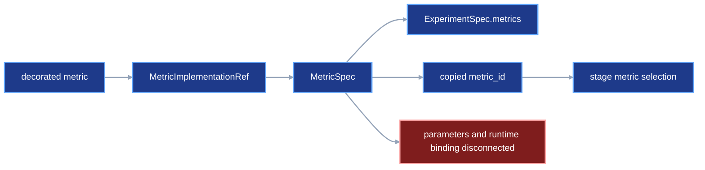
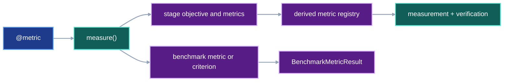

# Unified metric, experiment, and benchmark drafting

Users define each metric calculation once. They configure that calculation for
an experiment, select it from stages, and apply optional benchmark criteria to
the verified result. VIPER writes the exact metric, experiment, stage, and
benchmark records required by execution and verification.

This contract owns metric drafting, objective direction, experiment assembly,
immutable run-plan construction, and benchmark authoring. The complete model-run example remains in
[`automatic-input-resolution.md`](automatic-input-resolution.md#complete-proposed-authoring-example).
[`frozen-plan-git-identity.md`](frozen-plan-git-identity.md) must be revised so
the internal compiler persists generated experiment, variant, benchmark,
stage, and run documents without requiring a public freezing step.

## 1. Status

**Contract status:** in progress.

These requirements bind the contract to the master checklist:

| ID | Implementation obligation |
| --- | --- |
| UMD-01 <!-- contract-requirement: UMD-01 phase=4 test=tests/test_metric_interface.py --> | Add metric drafts, objective drafts, criterion drafts, and their public constructors. |
| UMD-02 <!-- contract-requirement: UMD-02 phase=4 test=tests/test_metric_provenance.py --> | Dein_stager frozen parameter classes and values to in_stage and recomputed metrics while reusing existing dependency snapshots. |
| UMD-03 <!-- contract-requirement: UMD-03 phase=4 test=tests/test_verification.py --> | Persist objective identity and direction and enforce stage-specific objective rules. |
| UMD-04 <!-- contract-requirement: UMD-04 phase=6 test=tests/test_authoring.py --> | Add experiment, factor, variant, and replicate drafting with a derived metric registry; generate an immutable run identity; recursively freeze each returned plan; and compile it internally when execution begins. |
| UMD-05 <!-- contract-requirement: UMD-05 phase=8 test=tests/test_benchmark_execution.py --> | Record every benchmark metric under fixed inputs and apply optional criteria. |
| UMD-06 <!-- contract-requirement: UMD-06 phase=11 test=tests/test_documentation.py --> | Remove retired metric shapes and publish the final metric, experiment, and benchmark API. |

**Current:** `@viper.metrics.metric` attaches `metric_id`, `kind`, and `mode` to a
function or stateful class. `MetricSpec` stores the exact implementation,
parameter values, dependencies, and recomputation comparator. Project code or
fixtures construct `MetricSpec` directly. Stages select metrics through bare
`metric_ids`. See [`src/viper/metrics.py`](../../src/viper/metrics.py),
[`src/viper/stages.py`](../../src/viper/stages.py), and
[`src/viper/experiments.py`](../../src/viper/experiments.py).

**Current:** `ExperimentSpec.metrics` stores complete `MetricSpec` records.
`BenchmarkSpec.metrics` stores `MetricCriterion` records. The benchmark executor
records only metrics that have thresholds. See
[`src/viper/benchmark.py`](../../src/viper/benchmark.py) and
[`src/viper/execution/_benchmark.py`](../../src/viper/execution/_benchmark.py).

**Proposed:** `viper.metrics.measure()` creates one configured `MetricDraft`.
`viper.metrics.min()` or `viper.metrics.max()` gives that metric an objective
direction. `viper.authoring.experiment()` defines factors, variants, and
replicates. `viper.authoring.plan()` assigns the run identity and returns a
recursively immutable plan. `viper.execution.run(plan)` internally derives the
experiment's metric registry from the selected stages and persists the
compiled protocol records before execution. `benchmark()` from
`viper.benchmark` fixes the evaluation data, splits, metrics, and optional
criteria.

The benchmark model follows four observations from primary sources:

- MLPerf defines a benchmark, a run, a run result, and a benchmark result as
  separate entities. Its quality threshold belongs to one particular
  time-to-train procedure. [MLPerf Training Benchmark](https://arxiv.org/abs/1910.01500)
  and [MLPerf Training rules](https://github.com/mlcommons/training_policies/blob/master/training_rules.adoc)
- GLUE defines a benchmark through fixed tasks, datasets, metrics, and an
  evaluation platform. Its diagnostic set supplies additional analysis beyond
  one leaderboard score. [GLUE](https://aclanthology.org/W18-5446/)
- Changing the selected benchmark tasks can change the relative ranking of
  methods. A stored result therefore needs the exact benchmark identity and
  evaluation inputs. [The Benchmark Lottery](https://arxiv.org/abs/2107.07002)
- A best score alone omits the model-selection work that produced it. VIPER's
  run and experiment records retain the selected parameters, seeds, and run
  evidence beside the benchmark result. [Show Your Work](https://aclanthology.org/D19-1224/)

The project-specific conclusion is direct: `BenchmarkResult` is the primary
record. A threshold criterion is an optional interpretation of one recorded
metric result.

## 2. Required claim

When a user selects a configured metric as a stage objective, diagnostic, or
benchmark measurement, VIPER freezes one exact `MetricSpec`, dein_stagers its
validated parameters to the metric implementation, records each produced
value, and verifies every recomputed value from its declared files.

When a user constructs a run plan, VIPER generates its `run_id`, copies and
recursively freezes the complete draft graph, and derives
`ExperimentSpec.metrics` from the metrics reachable through the experiment's
stage drafts. `viper.authoring.experiment()` therefore lists factors, variants,
and replicates once. `viper.execution.run(plan)` preserves that identity,
compiles and persists the protocol records atomically, and only then starts
execution. Public authoring, typed-API, and CLI surfaces expose no separate
freezing operation.

When a user runs a benchmark, VIPER records the exact evaluation dataset,
splits, metric values, candidate evidence, and confirmation evidence. Optional
criteria add pass or fail judgments. VIPER stores every selected metric result
before it evaluates those criteria.

## 3. Current gap

### Inspected path

Hold this evaluation fixed:

```text
evaluate one model on holdout.csv
-> write predictions.csv
-> compute evaluation_loss and evaluation_accuracy
-> confirm the run independently
-> record both verified metric values
-> require accuracy >= 0.90 when the user supplied that criterion
```

The current metric authoring path is:

```text
decorated metric function
-> user constructs MetricImplementationRef
-> user constructs MetricSpec
-> user inserts MetricSpec into ExperimentSpec.metrics
-> user copies metric_id into EvalSpec.metric_ids
```

The current benchmark path is:

```text
BenchmarkSpec.metrics
-> tuple[MetricCriterion, ...]
-> benchmark executor iterates criteria
-> BenchmarkResult.metrics contains criterion receipts only
```

Three connectors are missing.

First, Python authoring lacks an object that carries one decorated metric
together with its parameter values, dependencies, and recomputation comparator.

Second, an `in_stage` metric can declare custom parameters in the proposed draft. The
current `MetricHandle` calls a function with only the arguments supplied to
`record()` and constructs a stateful metric with zero arguments. The frozen
parameter object remains disconnected from both implementations.

Third, `BenchmarkSpec.metrics` makes every recorded benchmark metric carry a
threshold. The executor requires `ge` or `le` before it can record a verified
score.

### Current DAG



### Missing connector

No contract-owned object joins the decorated implementation, frozen parameter
class and values, runtime context, objective role, and optional benchmark
criterion into one verified path.

### Proposed-change DAG


### Integrated DAG



## 4. Models

### Metric definition and configuration

The decorator defines stable metric metadata. `viper.metrics.measure()` supplies the
values that can change between experiments.

```python
MetricMode = Literal["post_stage", "in_stage"]
ObjectiveDirection = Literal["min", "max"]

MetricParamsT = TypeVar("MetricParamsT", bound=parameters.Metric)
DecoratedMetricT = TypeVar(
    "DecoratedMetricT",
    bound=Callable[..., float] | type[Any],
)


@dataclass(frozen=True)
class MetricDefinition:
    metric_id: MetricId
    mode: MetricMode


DecoratedMetric = Callable[..., float] | type[Any]


class MetricDraft(BaseModel):
    model_config = ConfigDict(
        arbitrary_types_allowed=True,
        extra="forbid",
        frozen=True,
    )

    implementation: DecoratedMetric
    params: parameters.Metric
    dependencies: tuple[MetricDependency, ...] = ()
    comparator: FloatComparator | None = None


class MetricObjectiveDraft(BaseModel):
    model_config = ConfigDict(extra="forbid", frozen=True)

    metric: MetricDraft
    direction: ObjectiveDirection


class MetricCriterionDraft(BaseModel):
    model_config = ConfigDict(extra="forbid", frozen=True)

    metric: MetricDraft
    comparison: Literal["ge", "le"]
    threshold: float = Field(allow_inf_nan=False)
```

`MetricDraft` is one configured calculation. `MetricObjectiveDraft` states how
an objective should improve. `MetricCriterionDraft` states one optional
threshold applied by a benchmark. These objects share one `MetricDraft` and its
implementation and parameter values.

The public constructors are:

```python
def metric(
    *,
    metric_id: MetricId,
    mode: MetricMode,
) -> Callable[[DecoratedMetricT], DecoratedMetricT]: ...


def measure(
    implementation: DecoratedMetric,
    *,
    params: parameters.Metric | None = None,
    dependencies: tuple[MetricDependency, ...] = (),
    comparator: FloatComparator | None = None,
) -> MetricDraft: ...


def min(metric: MetricDraft) -> MetricObjectiveDraft: ...


def max(metric: MetricDraft) -> MetricObjectiveDraft: ...


def at_least(metric: MetricDraft, threshold: float) -> MetricCriterionDraft: ...


def at_most(metric: MetricDraft, threshold: float) -> MetricCriterionDraft: ...
```

The decorator metadata follows the existing implementation pattern:

```python
def metric_definition(
    implementation: DecoratedMetric,
) -> MetricDefinition: ...
```

```text
@viper.metrics.metric(...)
-> construct MetricDefinition
-> attach it to the function or class as __viper_metric__

viper.metrics.measure(implementation, ...)
-> call metric_definition(implementation)
-> validate mode, dependencies, and comparator
-> return MetricDraft containing the implementation and configured values

internal plan compiler invoked by viper.execution.run(plan)
-> call metric_definition(MetricDraft.implementation)
-> inspect type(MetricDraft.params)
-> hash the implementation and custom parameter-model source
-> write MetricSpec
```

`viper.metrics.measure()` constructs `viper.params.Metric()` when the caller omits
`params`. A supplied instance must subclass `viper.params.Metric`. Compilation
derives the parameter class from `type(MetricDraft.params)`.

Recomputed metrics require at least one dependency and one comparator. in_stage
metrics carry neither. Evaluation metrics use `mode="post_stage"`.

`FloatComparator` compares one recorded value with independent recomputation.
`MetricCriterionDraft` compares a verified benchmark value with a target. The
two objects keep separate fields and separate consumers.

### Naming decisions

| Name | Stable role |
| --- | --- |
| `MetricDraft` | One configured calculation before protocol compilation |
| `MetricObjectiveDraft` | One metric plus its desired direction of improvement |
| `MetricCriterionDraft` | One metric plus one optional benchmark threshold |
| `MetricObjectiveSpec` | The frozen metric-and-direction pair stored on a stage |
| `metrics` | The stage argument that selects additional measurements, including diagnostics |
| `FactorDraft` | One experimental dimension and its permitted level IDs |
| `VariantDraft` | One factor-level selection plus the complete stage graph and estimator for that selection |
| `ReplicateDraft` | One repeated execution seed |

The stage field is `objective`. Its `MetricObjectiveSpec` value carries the
metric ID and direction together. A metric selected through `metrics=` is an
additional measurement. That selection makes it a diagnostic when the result
helps explain the stage.

### in_stage and recomputed metrics

`mode` determines when VIPER calculates a metric and which values the metric
can use.

| Mode | When VIPER calculates it | What the metric receives | Typical use |
| --- | --- | --- | --- |
| `in_stage` | While the stage callable is running | Values held in memory and passed through `MetricHandle.record()` or `MetricHandle.update()` | Batch loss, gradient norm, memory use, and timing |
| `post_stage` | After the stage has persisted its inputs and artifacts | File paths selected by `MetricDependency` | Evaluation loss, accuracy, and other results derived from saved predictions and labels |

An in_stage metric records information that exists during execution. For example,
the training function can pass one epoch's gradient norms to
`context.metrics["gradient_norm"].record(...)`. VIPER calculates the scalar and
appends a `Measurement` while the stage process is active.

A recomputed metric reads persisted files in a separate metric process. For
example, an evaluation metric can read saved predictions and evaluation labels,
calculate accuracy, and store the result. The verifier runs the calculation
again and uses `FloatComparator` to compare the two values.

Use `in_stage` when the required values exist only while the stage is running. Use
`post_stage` when persisted inputs and artifacts contain everything required for
the calculation.

### Diagnostics

A diagnostic is a `MetricDraft` selected through a stage's `metrics=` argument.
Its result explains that stage. The `objective` field separately names the
primary metric for a stage that declares one.

An in_stage diagnostic uses the stage's `Measurement` and invocation receipt. A
recomputed diagnostic also uses declared dependencies, a comparator, and a
`MetricVerificationReceipt`.

```python
from viper import params
from viper.authoring import stage
from viper.metrics import MetricContext, measure, metric, min


@metric(
    metric_id="gradient_norm",
    mode="in_stage",
)
def gradient_norm(
    _context: MetricContext[params.Metric],
    batch_norms: list[float],
) -> float:
    return max(batch_norms)


gradient_norm_metric = measure(gradient_norm)

training = stage(
    train,
    params=TRAIN_PARAMS,
    inputs=TRAIN_INPUTS,
    artifacts=TRAIN_ARTIFACTS,
    objective=min(training_loss_metric),
    metrics=(gradient_norm_metric,),
)
```

Selection makes the diagnostic available through `Context.metrics`. The
training function produces one diagnostic measurement after each epoch:

```python
context.metrics["training_loss"].record(
    batch_losses,
    epoch=epoch,
)
context.metrics["gradient_norm"].record(
    batch_gradient_norms,
    epoch=epoch,
)
```

The complete training function computes `batch_losses` and
`batch_gradient_norms` inside its optimizer loop in
[`automatic-input-resolution.md`](automatic-input-resolution.md#complete-proposed-authoring-example).

`objective` identifies the primary metric and its direction. `metrics` selects
additional measurements, including diagnostics. A fixed embedding stage can
select `embedding_reconstruction_loss` and `embedding_spread` as diagnostics
while leaving `objective=None`.

A diagnostic can use `mode="in_stage"` when the stage already holds the required
values. It can use `mode="post_stage"` when the calculation reads persisted
inputs or artifacts. Build, embed, train, and eval stages can select in_stage
or recomputed diagnostics. A runner-owned download stage selects recomputed
diagnostics; in_stage `MetricHandle` values come from project stage callables.

### One context for in_stage and recomputed metrics

Both metric modes receive the same typed `MetricContext`:

```python
class MetricContext(BaseModel, Generic[MetricParamsT]):
    model_config = ConfigDict(
        arbitrary_types_allowed=True,
        extra="forbid",
        frozen=True,
    )

    inputs: Mapping[str, Path] = Field(default_factory=dict)
    artifacts: Mapping[str, Path] = Field(default_factory=dict)
    params: MetricParamsT
```

A recomputed metric keeps its current context-first call:

```python
from viper.metrics import MetricContext


def evaluation_loss(
    context: MetricContext[LossMetricParams],
) -> float:
    ...
```

A stateless in_stage metric receives the same context before the observations
supplied to `record()`:

```python
from viper import params
from viper.metrics import MetricContext


def training_loss(
    context: MetricContext[params.Metric],
    batch_losses: list[float],
) -> float:
    ...
```

A stateful in_stage metric receives the context once:

```python
from viper.metrics import MetricContext, StatefulMetric


class RunningAccuracy(StatefulMetric[AccuracyMetricParams]):
    def __init__(
        self,
        context: MetricContext[AccuracyMetricParams],
    ) -> None:
        self.params = context.params
        self.correct = 0
        self.total = 0

    def update(self, predicted: int, expected: int) -> None:
        self.correct += int(predicted == expected)
        self.total += 1

    def compute(self) -> float:
        return self.correct / self.total
```

The in_stage binding operation is:

```text
MetricSpec.parameter_model + MetricSpec.params
-> validate and construct parameters.Metric subclass

active stage input and artifact paths + validated metric params
-> construct MetricContext

bind_live_metric(..., context)
-> MetricHandle retains MetricContext

MetricHandle.record(*args, **kwargs)
-> stateless implementation(context, *args, **kwargs)
-> Measurement

MetricHandle construction for StatefulMetric
-> implementation(context)
-> update(...)
-> record()
-> compute()
-> Measurement
```

The target runtime interfaces are:

```python
class StatefulMetric(ABC, Generic[MetricParamsT]):
    @abstractmethod
    def __init__(self, context: MetricContext[MetricParamsT]) -> None: ...

    @abstractmethod
    def update(self, *args: Any, **kwargs: Any) -> None: ...

    @abstractmethod
    def compute(self) -> float: ...


class MetricHandle:
    def __init__(
        self,
        implementation: Callable[..., Any] | type[Any],
        sink: MeasurementSink,
        context: MetricContext[Any],
    ) -> None: ...

    def update(self, *args: Any, **kwargs: Any) -> None: ...

    def record(
        self,
        *args: Any,
        epoch: int | None = None,
        step: int | None = None,
        **kwargs: Any,
    ) -> Measurement: ...


def bind_live_metric(
    repository_root: Path,
    spec: MetricSpec,
    sink: MeasurementSink,
    context: MetricContext[Any],
) -> MetricHandle: ...
```

One shared `MetricContext` gives both modes the same invocation context and
parameter-dein_stagery rule.

The alternatives fail at a specific boundary:

| Alternative | Benefit | Contract cost |
| --- | --- | --- |
| Pass `params=` to `MetricHandle.record()` | Small runtime edit | Stage code can supply values that differ from the frozen `MetricSpec.params`. |
| Decorate a factory that returns a configured metric | Parameters stay inside the returned callable | The returned closure can capture unrecorded values, and its generated identity is harder to bind to one source symbol. |
| Permit custom parameters only on `StatefulMetric` classes | Constructor dein_stagery is simple | A stateless calculation must become a class solely to receive parameters. |
| Store parameters on `MetricHandle.params` | Preserves the current metric function signature | Stage code must manually read and forward the values, so the metric invocation itself lacks a required parameter handoff. |
| Add `in_stageMetricContext` | Makes the mode visible in the type | It duplicates the role already carried by `MetricContext` and creates two parameter-dein_stagery APIs. |

### Frozen metric records

`MetricSpec` records the parameter values and the class used to interpret them:

```python
ParameterModelOwner = Literal["project", "viper"]
PythonSourceRelPath = Annotated[
    str,
    AfterValidator(validate_repo_rel_path),
    AfterValidator(validate_python_file_path),
]


class ParameterModelRef(ProtocolModel):
    owner: ParameterModelOwner
    path: PythonSourceRelPath
    symbol: PythonSymbol
    sha256: SHA256
    bytes: int = Field(gt=0)


class MetricSpec(ProtocolModel):
    schema_version: Literal[1] = 1
    metric_id: MetricId
    implementation: MetricImplementationRef
    parameter_model: ParameterModelRef
    params: parameters.Metric
    mode: MetricMode
    dependencies: tuple[MetricDependency, ...] = ()
    comparator: FloatComparator | None = None
```

`ParameterModelRef.owner` chooses the root used to resolve `path`. `project`
means the active repository root. `viper` means the installed VIPER package
root. The built-in default points to `parameters.py:Metric`. A custom class
points to its project file and symbol. Both forms record the source file's
SHA-256 digest and byte count.

Recomputed metric executions repeat the selected class and values:

```python
class MetricExecutionReceipt(ProtocolModel):
    schema_version: Literal[1] = 1
    run_id: RunId
    attempt_id: int = Field(ge=1)
    metric_id: MetricId
    stage_id: StageId
    purpose: Literal["measurement", "verification"]
    implementation: MetricImplementationRef
    parameter_model: ParameterModelRef
    params: parameters.Metric
    dependencies: tuple[ResolvedMetricDependency, ...] = Field(min_length=1)
    startup: ProcessStartupReceipt
    execution_context: ExecutionContext
    python_env: PythonEnvSpec
    value: float = Field(allow_inf_nan=False)
    started_at: AwareDatetime
    completed_at: AwareDatetime
    outcome: Literal["succeeded"] = "succeeded"
```

in_stage metrics run inside the controlled stage process. Their `Measurement`
selects the stage and metric ID. The verifier follows that ID to `MetricSpec`
and follows the resolved stage to the stage invocation receipt. One
stage-process receipt covers the in_stage metric binding:

```text
Measurement.metric_id
-> StageInvocationReceipt.context.metric_ids
-> frozen stage metric_ids
-> ExperimentSpec.metrics[metric_id]
-> MetricSpec.parameter_model + MetricSpec.params

StageInvocationReceipt.context_digest
-> exact StageContextBinding used by the successful stage process
```

The stage worker resolves every listed `MetricSpec`, validates its source and
parameter model, constructs its `MetricContext`, and only then invokes the
project stage. The successful `StageInvocationReceipt` records the exact
context that selected those metric IDs. This join supports the claim that the
controlled worker supplied the frozen metric binding. The stored `Measurement`
rows establish each handle call that produced a value and its cadence.

The frozen objective is one object because the metric identity and improvement
direction have one consumer:

```python
class MetricObjectiveSpec(ProtocolModel):
    metric_id: MetricId
    direction: ObjectiveDirection
```

The field is named `objective`. Its value contains two facts: which metric is
primary and how that metric should improve. `MetricObjectiveDraft` is the
Python authoring form. `MetricObjectiveSpec` is the frozen protocol form. The
same `MetricDraft` type serves objectives and additional measurements; the
stage field records the role.

The target stage models are:

```python
class BaseSpec(ProtocolModel):
    kind: str
    schema_version: Literal[1] = 1
    env: EnvSpec | None = None
    metric_ids: tuple[MetricId, ...] = ()
    artifacts: dict[ArtifactName, ArtifactSpec] = Field(min_length=1)


class ParameterizedSpec(BaseSpec):
    implementation: StageImplementationRef
    parameter_model: ParameterModelRef
    reuse: StageReuseMode = "never"


class InternalSpec(ParameterizedSpec):
    inputs: dict[InputName, InputRef] = Field(min_length=1)


class BuildSpec(InternalSpec):
    kind: Literal["build"] = "build"
    params: parameters.Build


class EmbedSpec(InternalSpec):
    kind: Literal["embed"] = "embed"
    objective: MetricObjectiveSpec | None = None
    params: parameters.Embed


class TrainSpec(InternalSpec):
    kind: Literal["train"] = "train"
    metric_ids: tuple[MetricId, ...] = Field(min_length=1)
    objective: MetricObjectiveSpec
    params: parameters.Train


class EvalSpec(InternalSpec):
    kind: Literal["eval"] = "eval"
    eval_id: EvalId
    metric_ids: tuple[MetricId, ...] = Field(min_length=1)
    objective: MetricObjectiveSpec
    split_inputs: tuple[InputName, ...] = Field(min_length=1)
    params: parameters.Eval
```

The objective metric ID must occur in the same stage's `metric_ids`. A training
objective uses an `in_stage` metric. An evaluation objective uses a recomputed metric.
An optional embedding objective can use either mode, according to whether the
embedding implementation records the value during execution or VIPER derives
the value from persisted files.

VIPER records objective direction for experiment comparison and agentic model
selection. The runner continues to leave gradient updates and early stopping
to project stage code.

### Experiment drafts

An experiment names factors, variants, and replicates. Its metric registry is
derived from the stage graph of each compiled plan.

Every artifact draft stores a path relative to the selected run root. Compilation
prefixes `experiments/<experiment-id>/runs/<variant-id>/<run-id>/` and writes
the resulting repository-relative path to `ArtifactSpec.path`. One variant
graph can therefore serve every declared replicate.

```python
class FactorDraft(BaseModel):
    model_config = ConfigDict(extra="forbid", frozen=True)

    levels: tuple[LevelId, ...] = Field(min_length=2)


class VariantDraft(BaseModel):
    model_config = ConfigDict(
        arbitrary_types_allowed=True,
        extra="forbid",
        frozen=True,
    )

    levels: dict[FactorId, LevelId]
    stages: dict[StageId, StageDraft] = Field(min_length=1)
    estimator: StageDraftArtifactRef


class ReplicateDraft(BaseModel):
    model_config = ConfigDict(extra="forbid", frozen=True)

    seed: RNGSeed


class ExperimentDraft(BaseModel):
    model_config = ConfigDict(extra="forbid", frozen=True)

    experiment_id: ExperimentId
    factors: dict[FactorId, FactorDraft] = Field(default_factory=dict)
    variants: dict[VariantId, VariantDraft] = Field(min_length=1)
    replicates: dict[ReplicateId, ReplicateDraft] = Field(min_length=1)
```

`ExperimentDraft` omits `metrics`. Every configured metric must be selected by
at least one stage in one declared variant. The internal compiler walks every
variant's stage objectives and metrics, produces one `MetricSpec` per metric
ID, and writes those records into `ExperimentSpec.metrics`.

The public constructors are:

```python
def factor(*, levels: tuple[LevelId, ...]) -> FactorDraft: ...


def variant(
    *,
    levels: dict[FactorId, LevelId],
    stages: dict[StageId, StageDraft],
    estimator: StageDraftArtifactRef,
) -> VariantDraft: ...


def replicate(*, seed: RNGSeed) -> ReplicateDraft: ...


def experiment(
    *,
    experiment_id: ExperimentId,
    factors: dict[FactorId, FactorDraft] | None = None,
    variants: dict[VariantId, VariantDraft],
    replicates: dict[ReplicateId, ReplicateDraft],
) -> ExperimentDraft: ...
```

The mapping keys carry all factor, variant, and replicate IDs. The draft values
carry each entity's remaining fields.

The run plan selects one declared variant and replicate:

```python
class RunPlanDraft(BaseModel):
    model_config = ConfigDict(
        arbitrary_types_allowed=True,
        extra="forbid",
        frozen=True,
    )

    schema_version: Literal[1] = 1
    run_id: RunId
    experiment: ExperimentDraft
    variant: VariantId
    replicate: ReplicateId
    benchmark: BenchmarkDraft | None = None
    source: GitSource
    env: EnvSpec
    reproducibility: ReproducibilitySpec
```

`run_id` is readable protocol identity, not caller configuration. The supported
constructor omits it:

```python
def plan(
    *,
    experiment: ExperimentDraft,
    variant: VariantId,
    replicate: ReplicateId,
    benchmark: BenchmarkDraft | None = None,
    source: GitSource,
    env: EnvSpec,
    reproducibility: ReproducibilitySpec,
) -> RunPlanDraft: ...
```

`plan()` calls one internal `_new_run_id()` operation, writes that value into
`RunPlanDraft.run_id`, and returns the completed plan. Deserializing a
`RunPlanDraft` still requires an explicit `run_id`; the model field does not use
a default factory. That distinction prevents loading incomplete stored plans
from silently assigning new identities.

`ConfigDict(frozen=True)` protects model attributes but does not protect a
dictionary or list stored inside a model. Before `plan()` returns, it therefore
deep-copies the authored graph and applies one internal `_deep_freeze()` walk:

```text
dict       -> FrozenDict
list       -> FrozenList
set        -> frozenset
tuple      -> tuple of recursively frozen values
BaseModel  -> same model type with every field recursively frozen
scalar     -> unchanged
```

`FrozenDict` and `FrozenList` retain normal mapping, sequence, equality, and
Pydantic serialization behavior. Every mutating method raises `TypeError`,
including item assignment and deletion, `clear`, `pop`, `popitem`, `setdefault`,
`update`, `append`, `extend`, `insert`, `remove`, `reverse`, `sort`, and in-place
addition or multiplication. `_deep_freeze()` memoizes objects by identity so
two references to one stage remain two references to the same frozen stage and
a recursive project value cannot cause an unbounded walk.

The copy severs caller aliases before the frozen containers are installed.
Mutating a dictionary, list, set, nested parameter value, or draft model that
was passed to `experiment()`, `variant()`, `stage()`, or `plan()` cannot change
the returned plan. Direct mutation through the returned plan also fails. The
canonical serialization used by the compiler remains ordinary JSON arrays and
objects; the private frozen-container types never enter the protocol schema.

[`experiment-expansion.md`](experiment-expansion.md) owns the operation that
creates one `RunPlanDraft` for every selected variant-replicate pair. This
contract keeps `RunPlanDraft` as the single-run unit and derives each run's
metric registry from the same `ExperimentDraft`.

[`stage-reuse.md`](stage-reuse.md) owns reused metric evidence. A reused stage
links the source measurement and verification receipt through
`StageReuseReceipt` while preserving the source `Measurement` identity.

The internal compiler invoked by `viper.execution.run(plan)` derives these
persisted values:

```text
RunSpec.experiment_id
<- RunPlanDraft.experiment.experiment_id

RunSpec.variant_id
<- RunPlanDraft.variant

RunSpec.replicate_id
<- RunPlanDraft.replicate

RunSpec.seed
<- RunPlanDraft.experiment.replicates[RunPlanDraft.replicate].seed

ExperimentSpec.factors
<- RunPlanDraft.experiment.factors

ExperimentSpec.variant_ids
<- RunPlanDraft.experiment.variants.keys()

ExperimentSpec.replicates
<- RunPlanDraft.experiment.replicates

ExperimentSpec.metrics
<- all MetricDraft values reachable from every ExperimentDraft variant

VariantSpec.levels
<- RunPlanDraft.experiment.variants[RunPlanDraft.variant].levels

VariantSpec.stage_params
<- parameterized stages in RunPlanDraft.experiment.variants[RunPlanDraft.variant]

RunSpec.stages
<- stage mapping in RunPlanDraft.experiment.variants[RunPlanDraft.variant]

RunSpec.estimator
<- estimator in RunPlanDraft.experiment.variants[RunPlanDraft.variant]
```

The persisted experiment and variant shapes remain:

```python
class ExperimentSpec(ProtocolModel):
    schema_version: Literal[1] = 1
    experiment_id: ExperimentId
    factors: tuple[FactorSpec, ...]
    variant_ids: tuple[VariantId, ...] = Field(min_length=1)
    replicates: tuple[ReplicateSpec, ...] = Field(min_length=1)
    metrics: tuple[MetricSpec, ...]


class BuildVariantStageParams(ProtocolModel):
    kind: Literal["build"] = "build"
    stage_id: StageId
    params: parameters.Build


class EmbedVariantStageParams(ProtocolModel):
    kind: Literal["embed"] = "embed"
    stage_id: StageId
    params: parameters.Embed


class TrainVariantStageParams(ProtocolModel):
    kind: Literal["train"] = "train"
    stage_id: StageId
    params: parameters.Train


class EvalVariantStageParams(ProtocolModel):
    kind: Literal["eval"] = "eval"
    stage_id: StageId
    params: parameters.Eval


VariantStageParams = Annotated[
    BuildVariantStageParams
    | EmbedVariantStageParams
    | TrainVariantStageParams
    | EvalVariantStageParams,
    Field(discriminator="kind"),
]


class VariantSpec(ProtocolModel):
    schema_version: Literal[1] = 1
    experiment_id: ExperimentId
    variant_id: VariantId
    levels: dict[FactorId, LevelId]
    stage_params: tuple[VariantStageParams, ...] = Field(min_length=1)
```

`DownloadVariantStageParams` leaves the union because the runner-owned
`DownloadSpec` stores request, policy, and transport settings directly. Variant
parameter records cover project-owned stage parameter objects.

Compiling the first plan for a variant fixes that variant's complete stage
parameters. A later plan using the same experiment and variant must produce the
same `VariantSpec`. Different stage parameters require a different variant ID.

The experiment constructor accepts factors, variants, and replicates. The
compiler derives its metric registry from the stages, which gives each metric
one authoring location.

The factor levels and variant stages appear together at authoring time. This
example continues the
[`automatic-input-resolution.md`](automatic-input-resolution.md#complete-proposed-authoring-example)
program. It reuses that program's `train`, `TrainParams`, artifact loaders,
metric drafts, `source`, `env`, and `reproducibility` objects. The two
training stages read the same checked-in
`inputs/training_embeddings.csv` file. The code below defines every
variant-specific stage and every run value it uses.

```python
from viper.artifacts import artifact
from viper.authoring import (
    experiment,
    factor,
    input,
    plan,
    replicate,
    stage,
    variant,
)
from viper.metrics import min


baseline_training = stage(
    train,
    params=TrainParams(
        epochs=40,
        batch_size=4,
        learning_rate=0.15,
        momentum=0.9,
        weight_decay=0.001,
        max_gradient_norm=1.0,
    ),
    inputs={
        "dataset": input(
            path="inputs/training_embeddings.csv",
            data_role="training",
        ),
    },
    artifacts={
        Train.MODEL: artifact(
            path="artifacts/models/logistic_regression/model.pt",
            loader=load_weights,
            data_role="training",
        ),
        Train.STATE: artifact(
            path="artifacts/models/logistic_regression/state.pt",
            loader=load_resume_state_artifact,
            data_role="training",
        ),
    },
    objective=min(training_loss_metric),
    metrics=(gradient_norm_metric,),
)

high_rate_training = stage(
    train,
    params=TrainParams(
        epochs=40,
        batch_size=4,
        learning_rate=0.30,
        momentum=0.9,
        weight_decay=0.001,
        max_gradient_norm=1.0,
    ),
    inputs={
        "dataset": input(
            path="inputs/training_embeddings.csv",
            data_role="training",
        ),
    },
    artifacts={
        Train.MODEL: artifact(
            path="artifacts/models/logistic_regression/model.pt",
            loader=load_weights,
            data_role="training",
        ),
        Train.STATE: artifact(
            path="artifacts/models/logistic_regression/state.pt",
            loader=load_resume_state_artifact,
            data_role="training",
        ),
    },
    objective=min(training_loss_metric),
    metrics=(gradient_norm_metric,),
)

study = experiment(
    experiment_id="tiny_http",
    factors={
        "learning_rate": factor(
            levels=("baseline", "high"),
        ),
    },
    variants={
        "baseline": variant(
            levels={"learning_rate": "baseline"},
            stages={
                "train": baseline_training,
            },
            estimator=baseline_training.artifacts[Train.MODEL],
        ),
        "high_learning_rate": variant(
            levels={"learning_rate": "high"},
            stages={
                "train": high_rate_training,
            },
            estimator=high_rate_training.artifacts[Train.MODEL],
        ),
    },
    replicates={
        "replicate_01": replicate(seed=7),
        "replicate_02": replicate(seed=19),
    },
)


baseline_plan = plan(
    run_id="01ARZ3NDEKTSV4RRFFQ69G5FAV",
    experiment=study,
    variant="baseline",
    replicate="replicate_01",
    source=source,
    env=env,
    reproducibility=reproducibility,
)

high_rate_plan = plan(
    run_id="01ARZ3NDEKTSV4RRFFQ69G5FAW",
    experiment=study,
    variant="high_learning_rate",
    replicate="replicate_01",
    source=source,
    env=env,
    reproducibility=reproducibility,
)

baseline_replicate_02_plan = plan(
    run_id="01ARZ3NDEKTSV4RRFFQ69G5FAX",
    experiment=study,
    variant="baseline",
    replicate="replicate_02",
    source=source,
    env=env,
    reproducibility=reproducibility,
)
```

`FactorDraft.levels` names the experimental labels. The selected
`VariantDraft.stages` contains the concrete parameter values associated with
those labels. `VariantSpec` persists both the labels and the complete stage
parameter records. VIPER checks their association by compiling them from the
same `VariantDraft`.

The two baseline plans reuse `baseline_training`. Compilation gives each plan a
different run root and writes different concrete artifact paths. The draft
remains the same object.

### Benchmark drafts and frozen records

A benchmark fixes the evaluation conditions and names every metric that the
benchmark will record. Criteria select a subset of those metrics.

```python
class BenchmarkDraft(BaseModel):
    model_config = ConfigDict(
        arbitrary_types_allowed=True,
        extra="forbid",
        frozen=True,
    )

    benchmark_id: BenchmarkId
    eval_id: EvalId
    test: RunArtifactDraft
    splits: dict[InputName, RunArtifactDraft] = Field(min_length=1)
    metrics: tuple[MetricDraft, ...] = Field(min_length=1)
    criteria: tuple[MetricCriterionDraft, ...] = ()
    execution_count: Literal[2] = 2
```

The target persisted records are:

```python
class MetricCriterion(ProtocolModel):
    metric_id: MetricId
    comparison: Literal["ge", "le"]
    threshold: float = Field(allow_inf_nan=False)


class BenchmarkSpec(ProtocolModel):
    schema_version: Literal[1] = 1
    benchmark_id: BenchmarkId
    eval_id: EvalId
    test: ResolvedArtifactPointerRef
    splits: dict[InputName, ResolvedArtifactPointerRef] = Field(min_length=1)
    metric_ids: tuple[MetricId, ...] = Field(min_length=1)
    criteria: tuple[MetricCriterion, ...] = ()
    execution_count: Literal[2] = 2


class MetricCriterionResult(ProtocolModel):
    criterion: MetricCriterion
    candidate_passed: bool
    confirmation_passed: bool
    passed: bool


class BenchmarkMetricResult(ProtocolModel):
    metric_id: MetricId
    candidate_verification: ResolvedFileRef
    confirmation_verification: ResolvedFileRef
    candidate_value: float = Field(allow_inf_nan=False)
    confirmation_value: float = Field(allow_inf_nan=False)
    matched: bool
    criterion: MetricCriterionResult | None = None


class BenchmarkResult(ProtocolModel):
    schema_version: Literal[1] = 1
    benchmark: ResolvedBenchmarkSpecRef
    run: ResolvedRunRef
    confirmation: ResolvedAttemptRef
    artifacts: tuple[ArtifactComparisonReceipt, ...] = Field(min_length=2)
    metrics: tuple[BenchmarkMetricResult, ...] = Field(min_length=1)
    status: Literal["verified", "passed", "failed"]
    completed_at: AwareDatetime
```

`BenchmarkSpec.metric_ids` declares results to record. `BenchmarkSpec.criteria`
declares optional thresholds. Every criterion metric ID must occur in
`metric_ids`. Each metric ID and criterion metric ID is unique.

`MetricCriterionResult.passed` equals
`candidate_passed and confirmation_passed`. `BenchmarkMetricResult.matched`
records the cross-execution comparison produced by the metric's frozen
`FloatComparator`.

`BenchmarkResult.status` follows these rules:

```text
artifact parity or metric matching fails
-> failed

all parity and matching checks pass, and criteria is empty
-> verified

all parity and matching checks pass, and every criterion passes
-> passed

all parity and matching checks pass, and one criterion fails
-> failed
```

The public constructor is:

```python
def benchmark(
    *,
    benchmark_id: BenchmarkId,
    eval_id: EvalId,
    test: RunArtifactDraft,
    splits: dict[InputName, RunArtifactDraft],
    metrics: tuple[MetricDraft, ...],
    criteria: tuple[MetricCriterionDraft, ...] = (),
) -> BenchmarkDraft: ...
```

`RunPlanDraft.benchmark` carries the complete authoring object. Internal
compilation writes `BenchmarkSpec` and writes `RunSpec.benchmark_id`.
`BenchmarkResult.run` joins the reusable benchmark definition to one candidate
run and its experiment.

The evaluation stage and benchmark reuse the same draft objects:

```text
BenchmarkDraft.test
== EvalSpecDraft.inputs[Eval.TEST]

BenchmarkDraft.splits[name]
== EvalSpecDraft.inputs[name]
```

Internal compilation resolves each `RunArtifactDraft` once. It writes the resulting
`StoredInputRef` into the evaluation stage and reuses that input's
`ResolvedArtifactPointerRef` in `BenchmarkSpec`. The candidate, confirmation
execution, and benchmark record therefore share one test-data identity.

## 5. Execution

### Constructing and compiling an immutable plan

The public execution boundary accepts the authored plan:

```python
def run(
    plan: RunPlanDraft,
    *,
    repository_root: Path,
    timeout_seconds: float | None = None,
) -> RunResult: ...
```

`viper.execution.run(plan)` performs these operations in order:

```text
accept the already generated RunPlanDraft.run_id
-> compile the draft graph into protocol models in memory
-> serialize every protocol model canonically
-> validate the complete serialized set
-> persist the complete compiled-plan set atomically
-> invoke the internal path-based executor
-> create the first attempt
```

Compilation is an architectural boundary, not a public workflow step. The
compiler remains one internal operation, `_compile_plan()`, so tests and future
storage backends can exercise a single plan-to-protocol handoff. The public
package exports no `freeze()`, the typed API exposes no `freeze_run()`, and the
CLI exposes no `freeze-run` command. The internal compiled-files value is also
not a public return type.

Compilation finishes before execution creates an attempt or launches a stage.
If model construction, serialization, validation, or persistence fails,
`run()` raises a pre-execution error, publishes no authoritative partial plan,
and creates no attempt. The persistence mechanism defined by the revised
[`frozen-plan-git-identity.md`](frozen-plan-git-identity.md) must make the
compiled set retrievable by `RunPlanDraft.run_id` without requiring a user to
commit generated files between `plan()` and `run()`.

`RunSpec.run_id`, every attempt, terminal `ResolvedRun`, benchmark execution,
and retry retain the `run_id` assigned by `plan()`. Neither compilation nor
execution calls `_new_run_id()`. Retry loads the persisted compiled plan and
does not recompile the caller's draft graph.

### Compiling metrics and objectives

For each `MetricDraft`, `_compile_plan()` performs these operations:

```text
call metric_definition(MetricDraft.implementation)
-> inspect type(MetricDraft.params)
-> hash implementation source
-> hash a custom parameter-model source
-> construct MetricSpec
-> merge by metric_id into ExperimentSpec.metrics
```

When multiple stages select the same `metric_id`, compilation converts each
selected `MetricDraft` into a `MetricSpec` and compares the complete records.
The implementation, parameter class, parameter values, dependencies, mode, and
comparator must match. A mismatch raises an error because each metric ID
identifies exactly one configured calculation.

For each `MetricObjectiveDraft`, the compiler writes one
`MetricObjectiveSpec`. It places the objective metric ID first in the stage's
`metric_ids`, followed by the IDs supplied through `metrics=`.

### Executing in_stage metrics

The stage worker loads every selected in_stage `MetricSpec`. It verifies the metric
implementation bytes and custom parameter-model bytes. It validates
`MetricSpec.params`, constructs one `MetricContext`, and binds one
`MetricHandle`.

Project code continues to use:

```python
context.metrics["training_loss"].record(
    batch_losses,
    epoch=epoch,
)
```

`MetricHandle` adds its retained context before calling the metric function.
The project passes observations through `record()`; the handle supplies the
frozen parameters.

### Executing recomputed metrics

The metric worker resolves each `MetricDependency` to exact input or artifact
files. It constructs `MetricContext` with those paths and the validated metric
parameters. It calls the metric function and writes one `Measurement` and one
`MetricExecutionReceipt`.

The dependency resolver reuses each file's published snapshot:

```text
MetricDependency selects a stage artifact
-> use that stage's ResolvedStageRef.snapshot
-> join it with the artifact's SnapshotFileRef
-> construct ResolvedFileRef

MetricDependency selects a stage input
-> ExternalInputRef: use the consuming-stage snapshot
-> FutureInputRef: use the producer-stage snapshot
-> StoredInputRef: follow the pointer to the producer-stage snapshot
-> join the selected snapshot with its SnapshotFileRef
-> construct ResolvedFileRef
```

For a local snapshot, the derived reference is `LocalFileRef(commit, path)`.
For Hugging Face or Viper Cloud, the derived reference carries the same
repository or cloud revision and file path. `ResolvedMetricDependency.files`
remains independently retrievable while each dependency payload is published
once.

Verification repeats that operation in a separate worker and writes
`MetricVerificationReceipt` after applying `FloatComparator`.

### Compiling experiments

`_compile_plan()` validates every factor level, selected variant, replicate,
and stage parameter set. It writes `ExperimentSpec`, the selected
`VariantSpec`, all stage specs, and `RunSpec`.

The writer merges metrics into an existing experiment by `metric_id`. It
preserves identical records and rejects conflicting records. Stage selections
remain the user's only metric list.

### Executing benchmarks

The benchmark executor verifies the candidate run, performs the independent
confirmation execution, compares estimator and prediction artifacts, and loads
the verification receipt for every `BenchmarkSpec.metric_ids` member.

For each metric, it writes `BenchmarkMetricResult`. A matching criterion causes
the executor to evaluate both candidate and confirmation values and attach
`MetricCriterionResult`.

## 6. Persisted evidence

The successful example produces this evidence chain:

```text
plan()
-> generates one RunPlanDraft.run_id
-> returns one recursively immutable draft graph

_compile_plan()
-> preserves RunPlanDraft.run_id in RunSpec.run_id
-> persists the complete canonical protocol set before execution

execution.run(plan)
-> executes only that persisted protocol set
-> preserves the same run_id in attempts and terminal results

ExperimentSpec.metrics["evaluation_accuracy"]
-> exact implementation, params, dependencies, comparator

EvalSpec.metric_ids
-> selects evaluation_accuracy

MetricVerificationReceipt from candidate
-> candidate verified value

MetricVerificationReceipt from confirmation
-> confirmation verified value

BenchmarkSpec.metric_ids
-> requires both values in the benchmark result

BenchmarkMetricResult
-> stores both values and both receipt references
-> stores cross-execution match
-> optionally stores threshold outcome
```

This evidence supports four claims:

- the named metric used the frozen implementation and parameters;
- the metric worker received paths whose files matched the declared identities;
- independent recomputation reproduced each recorded value; and
- the candidate and confirmation runs produced matching benchmark values.

An objective record proves selection, direction, and measurement. Gradient
updates remain project-owned, so their relationship to the objective remains
outside this contract. VIPER would need to own the optimizer step or provide a
differentiable objective interface to prove that relationship.

## 7. Verification

| Rule | Executable condition |
| --- | --- |
| `metric.authoring.complete` <!-- verifier-rule: metric.authoring.complete requirement=UMD-01 --> | Metric, objective, and criterion drafts freeze through their public constructors. |
| `metric.params.delivered` <!-- verifier-rule: metric.params.delivered requirement=UMD-02 --> | in_stage and recomputed metric execution receives the frozen parameter class, values, and dependency snapshots. |
| `metric.objective.enforced` <!-- verifier-rule: metric.objective.enforced requirement=UMD-03 --> | Frozen objectives preserve metric identity and direction, and each stage satisfies its objective rule. |
| `experiment.authoring.complete` <!-- verifier-rule: experiment.authoring.complete requirement=UMD-04 --> | Experiment, factor, variant, and replicate drafts compile with one derived metric registry. |
| `plan.identity.generated` <!-- verifier-rule: plan.identity.generated requirement=UMD-04 --> | `plan()` generates one valid run ID, exposes it read-only, and every compiled or executed record preserves it. |
| `plan.graph.immutable` <!-- verifier-rule: plan.graph.immutable requirement=UMD-04 --> | Caller aliases cannot alter a returned plan, and every direct nested mutation fails without changing canonical serialization. |
| `plan.compilation.internal` <!-- verifier-rule: plan.compilation.internal requirement=UMD-04 --> | `execution.run(plan)` persists one complete compiled plan before starting an attempt, while public Python and CLI surfaces expose no freezing operation. |
| `benchmark.result.complete` <!-- verifier-rule: benchmark.result.complete requirement=UMD-05 --> | Each benchmark records every metric under fixed inputs before applying optional criteria. |
| `metric.docs.current` <!-- verifier-rule: metric.docs.current requirement=UMD-06 --> | Protocol and public documentation contain only the final metric, experiment, and benchmark shapes. |

### `metric.definition.binding`

`metric_definition()` retrieves the `MetricDefinition` attached to the loaded
implementation. Its metric ID and mode equal the values represented by
`MetricSpec`.

### `metric.draft.parameter_capture`

`type(MetricDraft.params)` subclasses `viper.params.Metric`. Compilation writes
a `ParameterModelRef` for that exact class. The built-in class uses
`owner="viper"`; a project subclass uses `owner="project"`. The worker resolves
the named source root, checks the source digest and byte count, loads the
symbol, and reconstructs the instance from `MetricSpec.params`.

### `metric.in_stage.parameter_dein_stagery`

The stage worker validates `MetricSpec.params` through the frozen parameter
class. The `MetricContext.params` object supplied by `MetricHandle` equals that
validated object. The verifier also requires
`StageInvocationReceipt.context.metric_ids` to equal the frozen stage's
`metric_ids`. Every in_stage `Measurement.metric_id` must occur in that tuple and
resolve to exactly one `MetricSpec` in `ExperimentSpec.metrics`.

### `metric.post_stage.invocation_binding`

The production and recomputation `MetricExecutionReceipt` records carry equal
`implementation`, `parameter_model`, `params`, and `dependencies` fields. Their
`parameter_model` fields also equal `MetricSpec.parameter_model`. A mismatch
fails metric verification.

### `metric.objective.selection`

Every train and eval stage has one `MetricObjectiveSpec`. Embed stages may
have one. `MetricObjectiveSpec.metric_id` occurs exactly once in the stage's
`metric_ids`.

### `metric.objective.role`

A training objective selects `mode="in_stage"`. An evaluation objective selects
`mode="post_stage"`. An embedding objective can select either mode. In every
case, the stage's `objective` field gives the metric its objective role.

### `metric.objective.evidence`

A successful stage contains at least one measurement for its objective metric.
This rule proves that the stage recorded the objective. Measurement cadence
remains project-owned.

### `experiment.metric.registry`

Every stage metric ID resolves to one `MetricSpec` in the selected
`ExperimentSpec`. Reusing an ID with a different `MetricSpec` stops compilation and
verification.

### `experiment.selection`

`RunPlanDraft.variant` and `RunPlanDraft.replicate` exist in the selected
`ExperimentDraft`. The selected variant has one declared level for every factor,
and every level belongs to that factor.

### `plan.identity.generated`

Two independent `plan()` calls produce distinct values accepted by the current
`RunId` validator. Each returned `run_id` remains equal to `RunSpec.run_id`, the
attempt's run ID, and the terminal result's run ID. Assigning a replacement
value through the returned plan raises `ValidationError`; compilation and
execution never generate a second value.

### `plan.graph.immutable`

The test retains every mutable object supplied to the public constructors and
records `plan.model_dump_json()` immediately after construction. It mutates the
retained source objects and confirms that the serialized plan is unchanged. It
then exercises every mutator owned by `FrozenDict` and `FrozenList`, plus a
nested set and nested project parameter value, and requires `TypeError` without
changing the serialized plan. Shared stage references remain identical after
the copy-and-freeze operation.

### `plan.compilation.internal`

The public `authoring`, typed-API, CLI, and package export tests reject
`freeze`, `freeze_run`, and `freeze-run`. `execution.run(plan)` calls the
internal compiler exactly once, persists every canonical document before it
creates the first attempt, and passes the persisted run-spec path to the
internal executor. Injecting a failure before the complete-set publication
leaves no authoritative plan and no attempt. Injecting a failure after
publication leaves the complete plan retrievable under the original `run_id`.

### `experiment.variant.graph`

Every `StageDraftArtifactRef` used by a variant names a producer in that same
variant's `stages` mapping. The producer appears before its consumer. The
variant estimator names an artifact from one train stage in the same mapping.
Compilation writes that stage and artifact to `RunSpec.estimator`.

The frozen verifier confirms that every `FutureInputRef` names an earlier run
stage and that `RunSpec.estimator` names a declared artifact from a train stage.

### `experiment.variant.parameters`

`VariantSpec.stage_params` contains one entry for every build, embed, train, and
eval stage in the selected variant. It contains zero download entries.
Each entry repeats the selected stage ID, kind, and frozen parameters.

### `benchmark.metric.selection`

`BenchmarkSpec.metric_ids` equals the metric IDs selected by the benchmark's
evaluation stage. Every benchmark metric uses `mode="post_stage"`.

### `benchmark.input.identity`

The evaluation stage uses `StoredInputRef` at `Eval.TEST` and at every name in
`split_inputs`. `BenchmarkSpec.test` equals the pointer in
`EvalSpec.inputs[Eval.TEST]`. Each `BenchmarkSpec.splits[name]` equals the
pointer in `EvalSpec.inputs[name]`.

### `benchmark.metric.result`

`BenchmarkResult.metrics` contains exactly one `BenchmarkMetricResult` for each
`BenchmarkSpec.metric_ids` member. Each stored value equals the recomputation
value in its referenced `MetricVerificationReceipt`.

### `benchmark.metric.match`

The verifier applies the frozen metric comparator to the candidate and
confirmation values. `BenchmarkMetricResult.matched` equals that result.

### `benchmark.criterion.result`

A metric result uses `criterion=None` when the benchmark selects the metric for
recording alone. A populated nested criterion equals the unique frozen
criterion and records the candidate, confirmation, and combined outcomes.

### `benchmark.status`

The verifier derives `BenchmarkResult.status` from artifact parity, metric
matching, criterion presence, and criterion outcomes using the status rules in
Section 4.

## 8. Propagation and legacy cleanup

| Surface | Change |
| --- | --- |
| Public metric API | Add typed metric decorators, preserve `MetricDefinition` attachment and retrieval, remove `MetricKind`, and add `viper.metrics.measure()`, `viper.metrics.min()`, `viper.metrics.max()`, `viper.benchmark.at_least()`, and `viper.benchmark.at_most()`. |
| in_stage metric runtime | Pass validated `MetricContext` through `MetricHandle`; functions receive it first and stateful classes receive it at construction. |
| Metric protocol | Add `parameter_model` to `MetricSpec` and `MetricExecutionReceipt`. |
| Parameter-model identity | Add `ParameterModelRef.owner` and resolve `path` relative to either the project or installed VIPER package root. |
| Shared path scalar | Add `PythonSourceRelPath`; it applies the existing relative Python-file checks and resolves against the owner named by `ParameterModelRef`. |
| Metric verifier | Reconstruct metric parameters through `MetricSpec.parameter_model`; compare `parameter_model` across production and recomputation receipts. |
| Stage drafts | Replace objective `MetricDraft` values with `MetricObjectiveDraft`. |
| Stage protocol | Add `MetricObjectiveSpec` to embed, train, and evaluate specs. |
| Experiment API | Add `FactorDraft`, `VariantDraft`, `ReplicateDraft`, `ExperimentDraft`, and public constructors. Each variant owns level labels, stages, and its estimator. Draft artifact paths remain relative to the selected run root. Derive metrics from all variant stages. |
| Experiment protocol | Remove `DownloadVariantStageParams` from `VariantStageParams`; derive entries from build, embed, train, and eval stages. |
| Run-plan API | Replace repeated experiment, variant, replicate, seed, stages, and estimator values with `ExperimentDraft` plus selected variant and replicate IDs. Make `plan()` the only supported constructor, generate `run_id` internally, deep-copy caller values, and recursively freeze the returned graph. |
| Immutable containers | Add internal `FrozenDict`, `FrozenList`, `_deep_freeze()`, and `_new_run_id()` support. Preserve ordinary lookup, equality, iteration, and canonical Pydantic serialization while rejecting every mutation path. |
| Execution API | Change `viper.execution.run()` to accept `RunPlanDraft`, invoke `_compile_plan()` once, persist the complete compiled set, and then call the internal path-based executor. Retries consume the persisted plan. |
| Compilation API | Keep the plan-to-protocol compiler internal. Remove public `freeze()`, typed `freeze_run()`, the `freeze-run` CLI command, and public `FrozenPlanFiles`. |
| Plan identity and storage | Revise [`frozen-plan-git-identity.md`](frozen-plan-git-identity.md) and [`automatic-input-resolution.md`](automatic-input-resolution.md) so compiled records are atomically retrievable by the generated `run_id` without an intervening user Git commit. |
| Experiment expansion | Revise [`experiment-expansion.md`](experiment-expansion.md) so each expanded variant-replicate plan receives its identity from `plan()` and no caller supplies a `RunIdMap`. |
| Benchmark API | Add `BenchmarkDraft`; separate selected metrics from optional criteria. |
| Benchmark protocol | Add `metric_ids` and `criteria`; replace criterion-only metric receipts with `BenchmarkMetricResult`. |
| Benchmark executor | Iterate `metric_ids`, store every verified result, and apply criteria by metric ID when present. |
| Verifier | Add the named metric, objective, experiment, and benchmark checks in Section 7. |
| Tests | Add in_stage invocation binding to [`tests/test_metric_interface.py`](../../tests/test_metric_interface.py) and [`tests/test_metric_provenance.py`](../../tests/test_metric_provenance.py); add tamper rejection to [`tests/test_verification_acceptance.py`](../../tests/test_verification_acceptance.py). |
| Generated project | Replace manual `MetricSpec`, `ExperimentSpec`, `VariantSpec`, and `BenchmarkSpec` construction with the public draft API. |
| Documentation | Keep the complete model-run program in `automatic-input-resolution.md`; link its metric and experiment rules to this contract. |

The superseded behavior has these dispositions:

| Existing occurrence | Disposition |
| --- | --- |
| Undefined proposed `MetricDecorator` return type | Replace with `Callable[[DecoratedMetricT], DecoratedMetricT]`. |
| Implicit `MetricDefinition` handoff | Preserve `__viper_metric__` attachment and `metric_definition()` retrieval for metric ID and mode. |
| `MetricKind` and the decorator's `kind=` argument | Delete them. The stage's `objective=` or `metrics=` field records the metric's role; `MetricMode` records when VIPER calculates it. |
| Public examples that construct `MetricImplementationRef` and `MetricSpec` | Replace with `@viper.metrics.metric` and `viper.metrics.measure()`. |
| Python stage authoring that accepts `metric_ids=` | Replace with `objective=` and `metrics=`. |
| Proposed `in_stageMetricContext` | Delete; `MetricContext` serves both modes. |
| in_stage metric functions whose first parameter is an observation | Add `MetricContext` first and update `MetricHandle`. |
| Parameterless `StatefulMetric` subclasses | Replace constructors with `MetricContext`. |
| Manual `ExperimentSpec` and `VariantSpec` construction in public examples | Replace with `viper.authoring.experiment()`, `viper.authoring.variant()`, and `viper.authoring.replicate()`. |
| Caller-supplied `RunPlanDraft.run_id` in public examples | Remove the argument and assert the generated, read-only `plan.run_id`. Explicit IDs remain required only when validating an already persisted `RunPlanDraft`. |
| Public `viper.authoring.freeze()`, typed `freeze_run()`, and `freeze-run` CLI | Delete. `viper.execution.run(plan)` invokes the same compiler boundary internally. |
| Public `FrozenPlanFiles` | Make the compiler result internal; callers receive `RunResult` from `execution.run(plan)`. |
| Git commit between plan compilation and execution | Replace with one atomic, runner-owned persisted plan set in the revised frozen-plan identity contract. Do not create a Git commit as an implicit side effect of `run()`. |
| `DownloadVariantStageParams` and its `VariantStageParams` union member | Delete with `parameters.Download`; derive variant parameters from project-owned stages. |
| `BenchmarkSpec.metrics: tuple[MetricCriterion, ...]` | Replace with `metric_ids` and optional `criteria`. |
| `MetricCriterionReceipt` | Delete after `BenchmarkMetricResult` and `MetricCriterionResult` cover recorded values and optional criteria. |
| Benchmark fixtures that require one threshold per metric | Replace with one criterion-free result case and one threshold case. |

## 9. Acceptance cases
<!-- contract-worked-example: start -->

### Complete success

The acceptance program defines two in_stage embedding diagnostics, one in_stage training
objective, one in_stage gradient diagnostic, one recomputed evaluation objective,
and one recomputed evaluation accuracy metric.

It creates:

```python
from viper.authoring import experiment, replicate, run_artifact, stage, variant
from viper.benchmark import at_least, benchmark
from viper.metrics import min


training = stage(
    train,
    params=TRAIN_PARAMS,
    inputs={"dataset": training_embeddings.artifacts["embeddings"]},
    artifacts=TRAIN_ARTIFACTS,
    objective=min(training_loss_metric),
    metrics=(gradient_norm_metric,),
)

benchmark_test = run_artifact(
    resolved_run=BENCHMARK_DATA_RUN,
    stage="embed_test",
    artifact="embeddings",
)

benchmark_split = run_artifact(
    resolved_run=BENCHMARK_DATA_RUN,
    stage="split_test",
    artifact="holdout",
)

eval_stage = stage(
    eval_model,
    params=EVAL_PARAMS,
    inputs={
        Eval.MODEL: training.artifacts[Train.MODEL],
        Eval.TEST: benchmark_test,
        "holdout": benchmark_split,
    },
    artifacts=EVAL_ARTIFACTS,
    objective=min(evaluation_loss_metric),
    metrics=(evaluation_accuracy_metric,),
    eval_id="holdout",
    split_inputs=("holdout",),
)

study = experiment(
    experiment_id="tiny_http",
    variants={
        "baseline": variant(
            levels={},
            stages={
                "download": download,
                "embed_training": training_embeddings,
                "train": training,
                "eval": eval_stage,
            },
            estimator=training.artifacts[Train.MODEL],
        ),
    },
    replicates={
        "replicate_01": replicate(seed=7),
    },
)

benchmark_draft = benchmark(
    benchmark_id="tiny_holdout",
    eval_id="holdout",
    test=benchmark_test,
    splits={"holdout": benchmark_split},
    metrics=(evaluation_loss_metric, evaluation_accuracy_metric),
    criteria=(
        at_least(evaluation_accuracy_metric, 0.90),
    ),
)
```

`viper.authoring.plan(benchmark=benchmark_draft, ...)` generates the candidate
run ID and attaches the benchmark. `viper.execution.run(plan)` internally
compiles `benchmark_test` and `benchmark_split` once, writes them as
`StoredInputRef` values in the evaluation stage, and reuses their pointer
references in `BenchmarkSpec.test` and `BenchmarkSpec.splits`.

The test asserts:

- `type(evaluation_loss_metric.params)` is `LossMetricParams`;
- the frozen evaluation-loss `MetricSpec.parameter_model` identifies that exact
  class;
- `ExperimentSpec.metrics` contains each selected metric once;
- the train objective is `training_loss` with direction `min`;
- the evaluate objective is `evaluation_loss` with direction `min`;
- in_stage metric contexts contain the frozen parameter object;
- the successful stage invocation context selects the same in_stage metric IDs as
  the frozen stage;
- production and recomputation receipts carry the same parameter-model
  reference as the frozen metric;
- candidate and confirmation metric receipts verify;
- `BenchmarkResult.metrics` contains loss and accuracy;
- the loss result uses `criterion=None`;
- the accuracy result contains the `ge 0.90` criterion outcome; and
- benchmark status follows parity, matching, and the accuracy criterion.

### Automatic identity, immutable plan, and internal compilation

Construct the baseline plan from mutable dictionaries and a project parameter
model containing a mutable list. Retain the original dictionaries, list, and
stage objects. The acceptance test asserts:

- the caller does not pass `run_id`;
- `plan.run_id` is a valid `RunId`, differs from the ID of a second plan, and
  cannot be assigned;
- mutating any retained caller object does not change the plan;
- assigning or deleting nested mapping entries fails with `TypeError`;
- every other `FrozenDict` and `FrozenList` mutator fails with `TypeError`;
- nested parameter dictionaries, lists, and sets cannot mutate;
- shared references to one stage remain shared after construction;
- `plan.model_dump_json()` uses ordinary JSON objects and arrays and remains
  byte-for-byte unchanged after every rejected mutation;
- `viper.execution.run(plan)` invokes `_compile_plan()` once and preserves
  `plan.run_id` through `RunSpec`, the first attempt, and `RunResult`; and
- `viper.authoring.freeze`, typed `freeze_run`, public `FrozenPlanFiles`, and
  the `freeze-run` command do not exist.

Force canonical serialization to fail for one compiled document. The test
asserts that `run()` creates neither an authoritative compiled plan nor an
attempt. Force stage execution to fail after publication. The test asserts
that the complete compiled plan remains retrievable by the original `run_id`.

### Factor, variant, and replicate selection

Run the `baseline` and `high_learning_rate` plans from the experiment example
in Section 4. The acceptance test asserts:

- `FactorSpec(factor_id="learning_rate")` permits `baseline` and `high`;
- the baseline `VariantSpec.levels` selects `baseline`;
- the high-rate `VariantSpec.levels` selects `high`;
- each `VariantSpec.stage_params` contains the concrete training parameters
  from its own `VariantDraft.stages` mapping;
- each `VariantSpec.stage_params` excludes the runner-owned download stage;
- each run uses the stage graph and estimator from its selected variant; and
- selecting `replicate_01` writes seed `7`, while selecting `replicate_02`
  writes seed `19`;
- the two baseline plans reuse one `VariantDraft`; and
- each baseline run receives concrete artifact paths beneath its own run root.

Changing the selected level label while retaining the old stage parameters
creates a different `VariantSpec` and fails the existing variant identity
check for that variant ID.

Selecting an artifact or estimator from another variant fails
`experiment.variant.graph`.

Adding `DownloadVariantStageParams` fails `experiment.variant.parameters`.

### Targeted rejections

Changing an in_stage metric parameter after compilation fails
`metric.in_stage.parameter_dein_stagery`.

Changing `StageInvocationReceipt.context.metric_ids` while retaining the old
measurement fails `metric.in_stage.parameter_dein_stagery`.

Removing the metric decorator metadata fails `metric.definition.binding`.

Changing the parameter-model reference in one recomputation receipt fails
`metric.post_stage.invocation_binding`.

Removing the training objective measurement from an otherwise successful stage
fails `metric.objective.evidence`.

Reusing `evaluation_accuracy` with a different dependency fails
`experiment.metric.registry`.

Omitting `evaluation_loss` from `BenchmarkResult.metrics` fails
`benchmark.metric.result`; its criterion remains `None`.

Changing the holdout pointer while keeping the same benchmark ID fails the
existing benchmark input-identity checks before execution.

<!-- contract-worked-example: end -->

## 10. Implementation order

### Implementation Step 1 — Metric drafts and typed contexts

- [ ] Add `MetricDraft`, `MetricObjectiveDraft`, and `MetricCriterionDraft`.
- [ ] Add the public metric, objective, and criterion constructors.
- [ ] Remove `MetricKind` and `kind=`; preserve `MetricDefinition.metric_id`,
      `MetricDefinition.mode`, `__viper_metric__` attachment, and
      `metric_definition()` retrieval.
- [ ] Derive the parameter class from `type(MetricDraft.params)`.
- [ ] Add mandatory `parameter_model` to the frozen metric records and add the
      project-or-VIPER owner to `ParameterModelRef`.
- [ ] Compare parameter-model references during parameter reconstruction and
      recomputation verification.
- [ ] Make `MetricContext` generic.
- [ ] Dein_stager `MetricContext` through in_stage functions and stateful constructors.
- [ ] Join in_stage measurements to
      `StageInvocationReceipt.context.metric_ids`, frozen stage `metric_ids`,
      and `ExperimentSpec.metrics` during verification.
- [ ] Add focused decorator, draft, in_stage-parameter, and invocation-binding
      tests.

**Commit boundary:** one configured in_stage or recomputed metric receives its exact
frozen parameter object.

### Implementation Step 2 — Stage objectives

- [ ] Add `MetricObjectiveSpec` to frozen stage models.
- [ ] Validate objective mode, direction, and membership in frozen stage metric
      IDs.
- [ ] Add `MetricObjectiveDraft` to the Python stage drafts when
      [`automatic-input-resolution.md`](automatic-input-resolution.md) adds
      those models.
- [ ] Derive stage metric IDs from the objective and additional metric drafts
      during Python-plan compilation.
- [ ] Verify objective mode, direction, and measurement evidence.
- [ ] Update the complete train and eval example.

**Commit boundary:** train and eval stages identify a measured objective and
its improvement direction.

### Implementation Step 3 — Experiment authoring

- [ ] Add factor, variant, replicate, and experiment drafts.
- [ ] Compile each run-relative artifact draft path beneath the selected run
      root so one variant graph can serve every replicate.
- [ ] Change `RunPlanDraft` to select one experiment draft, variant, and
      replicate.
- [ ] Make each variant own its level labels, stage graph, and estimator.
- [ ] Validate same-variant artifact handles, stage order, and estimator
      ownership before compilation.
- [ ] Remove `DownloadVariantStageParams` from `VariantStageParams` and update
      variant-parameter verification.
- [ ] Derive seed, experiment records, selected stage graph, variant
      parameters, estimator, and metric registry.
- [ ] Reject duplicate experiment declarations and conflicting metric specs.
- [ ] Replace manual experiment construction in generated projects and examples.

**Commit boundary:** Python authoring describes one complete experiment and run
with one compiler-derived metric registry.

### Implementation Step 4 — Immutable plans and internal compilation

- [ ] Add internal `FrozenDict`, `FrozenList`, and `_deep_freeze()` support with
      identity memoization and complete mutator rejection.
- [ ] Make `plan()` deep-copy the authored graph, generate one `RunId`, install
      recursively frozen values, and return the completed `RunPlanDraft`.
- [ ] Preserve ordinary Pydantic validation, equality, lookup, and canonical
      JSON serialization for frozen containers.
- [ ] Change `viper.execution.run()` to accept `RunPlanDraft`, invoke one
      internal `_compile_plan()`, atomically persist the complete protocol set,
      and only then call the internal path-based executor.
- [ ] Preserve `plan.run_id` through compilation, attempts, terminal results,
      benchmarks, and retries. Never regenerate it outside `plan()`.
- [ ] Remove public `freeze()`, typed `freeze_run()`, public
      `FrozenPlanFiles`, and the `freeze-run` CLI command.
- [ ] Revise `frozen-plan-git-identity.md`, `automatic-input-resolution.md`,
      `experiment-expansion.md`, generated-project instructions, and the master
      checklist before implementing this step. The revised identity contract
      must define atomic runner-owned persistence and must not make `run()`
      create a Git commit.
- [ ] Add
      `tests/test_authoring.py:test_plan_generates_read_only_run_id`,
      `tests/test_authoring.py:test_plan_severs_mutable_caller_aliases`,
      `tests/test_authoring.py:test_plan_rejects_every_nested_mutator`,
      `tests/test_authoring.py:test_frozen_plan_serializes_canonically`,
      `tests/test_public_api.py:test_freezing_is_not_public`,
      `tests/test_run_execution.py:test_run_compiles_plan_before_first_attempt`,
      and
      `tests/test_run_execution.py:test_compile_failure_leaves_no_partial_plan`.

**Commit boundary:** `plan()` returns one identified immutable graph, and
`run(plan)` atomically compiles it without a public freezing workflow.

### Implementation Step 5 — Benchmark metric results

- [ ] Add `BenchmarkDraft` and its public constructor.
- [ ] Name the fixed evaluation input `test` in `BenchmarkDraft`,
      `BenchmarkSpec`, and `benchmark()` from `viper.benchmark`.
- [ ] Compile the benchmark's test and split drafts once; reuse the resulting
      pointers in the evaluation stage and benchmark specification.
- [ ] Split `BenchmarkSpec.metric_ids` from optional `criteria`.
- [ ] Replace `MetricCriterionReceipt` with `BenchmarkMetricResult` and
      `MetricCriterionResult`.
- [ ] Record every selected metric in candidate and confirmation executions.
- [ ] Derive `verified`, `passed`, or `failed` status.
- [ ] Update benchmark verification, fixtures, protocol documentation, API
      examples, restore behavior, and generated scaffolding.

**Commit boundary:** a benchmark records verified metric results under exact
evaluation conditions, with optional threshold judgments.

### Implementation Step 6 — System review

- [ ] Compare every repeated target model mechanically.
- [ ] Parse every Python example.
- [ ] Trace each metric value from draft through measurement and verification.
- [ ] Trace each benchmark input from pointer through both executions.
- [ ] Trace each recomputed metric dependency to its enclosing stage snapshot
      and assert that one snapshot revision owns the payload.
- [ ] Assert that every accepted run ID originates in `plan()` and survives
      plan serialization, compilation, execution, retry, benchmark, and restore.
- [ ] Search public exports, typed APIs, CLI commands, examples, and generated
      projects for a remaining public freezing operation.
- [ ] Run metric, authoring, benchmark, protocol, verification, documentation,
      and generated-project tests selected from the final code diff.

**Commit boundary:** the metric, experiment, stage, benchmark, verifier, and
documentation surfaces describe one implemented contract.

## 11. Contract-owned PairBlocks

<!-- pair-block-definition: P4-UMD-01 -->
```toml pair-block
id = "P4-UMD-01"
requirements = ["UMD-01"]
targets = [
    "src/viper/metrics.py:DecoratedMetricT",
    "src/viper/metrics.py:ObjectiveDirection",
    "src/viper/metrics.py:MetricDefinition",
    "src/viper/metrics.py:DecoratedMetric",
    "src/viper/metrics.py:MetricDraft",
    "src/viper/metrics.py:MetricObjectiveDraft",
    "src/viper/metrics.py:MetricCriterionDraft",
    "src/viper/metrics.py:metric",
    "src/viper/metrics.py:metric_definition",
    "src/viper/metrics.py:measure",
    "src/viper/metrics.py:min",
    "src/viper/metrics.py:max",
    "src/viper/benchmark.py:at_least",
    "src/viper/benchmark.py:at_most",
    "src/viper/benchmark.py:Any",
    "src/viper/benchmark.py:MetricDraft",
    "src/viper/benchmark.py:MetricCriterionDraft",
    "tests/test_metric_interface.py:test_metric_drafts_freeze_through_public_constructors",
    "src/viper/metrics.py:validate_metric_definition",
    "tests/fixtures.py:metric_source",
    "tests/test_metric_interface.py:mean_value",
    "tests/test_metric_interface.py:RunningMean",
    "tests/test_metric_interface.py:at_least",
    "tests/test_metric_interface.py:measure",
    "tests/test_verification_acceptance.py:add_plan_records",
]
tests = ["tests/test_metric_interface.py:test_metric_drafts_freeze_through_public_constructors"]
gate = "python -m pytest tests/test_metric_interface.py -q"
depends_on = ["P4-SCH-03"]
```

**Context:** Metrics currently expose decorator metadata but require callers to
construct protocol records by hand. This block adds the public draft objects
and constructors while retaining one decorated implementation identity.

<!-- pair-block-definition: P4-UMD-02 -->
```toml pair-block
id = "P4-UMD-02"
requirements = ["UMD-02"]
targets = [
    "src/viper/_schema.py:PythonSourceRelPath",
    "src/viper/_parameter/validation.py:TypeVar",
    "src/viper/_parameter/validation.py:ParameterSetT",
    "src/viper/metrics.py:Generic",
    "src/viper/metrics.py:MetricParamsT",
    "src/viper/parameters.py:hashlib",
    "src/viper/parameters.py:Path",
    "src/viper/parameters.py:PythonRepoRelPath",
    "src/viper/parameters.py:ParameterModelOwner",
    "src/viper/parameters.py:PythonSourceRelPath",
    "src/viper/parameters.py:ParameterModelRef",
    "src/viper/parameters.py:model_ref",
    "src/viper/_parameter/validation.py:parameter_model_path",
    "src/viper/metrics.py:MetricSpec",
    "src/viper/metrics.py:MetricExecutionReceipt",
    "src/viper/metrics.py:MetricVerificationReceipt",
    "src/viper/metrics.py:MetricContext",
    "src/viper/metrics.py:StatefulMetric",
    "src/viper/metrics.py:invoke_metric",
    "src/viper/metrics.py:MetricHandle",
    "src/viper/metrics.py:bind_live_metric",
    "src/viper/_workers/stages.py:_live_metric_handles",
    "src/viper/_workers/stages.py:parameters",
    "src/viper/_workers/stages.py:parameter_model_path",
    "src/viper/_workers/stages.py:MetricContext",
    "src/viper/_workers/metrics.py:main",
    "src/viper/_workers/metrics.py:parameters",
    "src/viper/_workers/metrics.py:instantiate_parameters",
    "src/viper/_workers/metrics.py:parameter_model_path",
    "src/viper/_workers/metrics.py:invoke_metric",
    "tests/test_metric_provenance.py:Path",
    "tests/test_metric_provenance.py:Field",
    "tests/test_metric_provenance.py:parameters",
    "tests/test_metric_provenance.py:MetricContext",
    "tests/test_metric_provenance.py:test_metric_params_reach_live_and_recomputed_execution",
    "src/viper/_parameter/validation.py:instantiate_parameters",
    "tests/fixtures.py:parameter_model_ref",
    "tests/fixtures.py:metric_spec",
    "tests/test_authoring.py:RunPlanAuthoringTests.test_freeze_run_plan_writes_hash_bound_stage_and_run_files",
    "tests/test_authoring.py:RunPlanAuthoringTests.test_experiment_and_variant_writers_use_identity_paths",
    "tests/test_execution_signals.py:_freeze_signal_plan",
    "tests/test_generated_project_acceptance.py:_parameter_model",
    "tests/test_generated_project_acceptance.py:test_generated_project_uses_runner_owned_downloads",
    "tests/test_http_retrieval.py:conforming_http",
    "tests/test_http_retrieval.py:test_project_http_receives_typed_parameters_and_exact_destination",
    "tests/test_http_retrieval.py:test_project_http_rejects_returned_path_escape",
    "tests/test_metric_interface.py:test_frozen_metric_matches_decorator_metadata",
    "tests/test_parameter_validation.py:_reference",
    "tests/test_parameter_validation.py:test_parameter_model_rejects_implicit_defaults",
    "tests/test_protocol.py:ParameterContractTests.test_metric_implementation_accepts_user_repository_path",
    "tests/test_protocol.py:ParameterContractTests.test_metric_implementation_requires_python_file",
    "tests/test_run_execution.py:test_train_stage_captures_local_external_input",
    "tests/test_run_execution.py:test_two_stage_local_run_writes_and_verifies_terminal_result",
    "tests/test_verification_acceptance.py:publish_metric_verification",
]
tests = ["tests/test_metric_provenance.py:test_metric_params_reach_live_and_recomputed_execution"]
gate = "python -m pytest tests/test_metric_interface.py tests/test_metric_provenance.py -q"
depends_on = ["P4-UMD-01"]
```

**Context:** in_stage handles currently omit the frozen parameter object, while the
post_stage worker receives only its serialized base-model shape. This block
records the parameter class, reconstructs it from the correct source root, and
passes one typed `MetricContext` through both invocation paths.

<!-- pair-block-definition: P4-UMD-03 -->
```toml pair-block
id = "P4-UMD-03"
requirements = ["UMD-03"]
targets = [
    "src/viper/metrics.py:MetricObjectiveSpec",
    "src/viper/stages.py:EmbedSpec",
    "src/viper/stages.py:TrainSpec",
    "src/viper/stages.py:EvaluateSpec",
    "src/viper/stages.py:MetricObjectiveSpec",
    "src/viper/_verification/plan.py:verify_stage_objectives",
    "src/viper/_verification/plan.py:verify_run_plan_relationships",
    "tests/test_verification.py:test_stage_objectives_preserve_identity_and_direction",
    "tests/test_verification.py:pytest",
    "tests/test_verification.py:verify_stage_objectives",
    "tests/test_verification.py:MetricSpec",
]
tests = ["tests/test_verification.py:test_stage_objectives_preserve_identity_and_direction"]
gate = "python -m pytest tests/test_protocol.py tests/test_verification.py -k objective -q"
depends_on = ["P4-UMD-02"]
```

**Context:** Stage metric IDs currently say only which values to record. This
block stores the primary metric and direction together, requires that metric
to be selected by the stage, and checks the stage-specific in_stage or post_stage
mode against the frozen experiment registry.

## 12. ContractTarget

Each payload below is the reviewed Phase 4 declaration for one PairBlock
target. A later guided edit may add a directly changed caller before the final
plan freeze; it may not weaken the requirement or omit a changed declaration.

### P4-UMD-01 — metric drafts

**File: `src/viper/metrics.py`**

<!-- contract-target: requirements=UMD-01 block=P4-UMD-01 action=add target=src/viper/metrics.py:DecoratedMetricT -->
<!-- contract-target: requirements=UMD-01 block=P4-UMD-01 action=add target=src/viper/metrics.py:ObjectiveDirection -->
<!-- contract-target: requirements=UMD-01 block=P4-UMD-01 action=update target=src/viper/metrics.py:MetricDefinition -->
<!-- contract-target: requirements=UMD-01 block=P4-UMD-01 action=add target=src/viper/metrics.py:DecoratedMetric -->
<!-- contract-target: requirements=UMD-01 block=P4-UMD-01 action=add target=src/viper/metrics.py:MetricDraft -->
<!-- contract-target: requirements=UMD-01 block=P4-UMD-01 action=add target=src/viper/metrics.py:MetricObjectiveDraft -->
<!-- contract-target: requirements=UMD-01 block=P4-UMD-01 action=add target=src/viper/metrics.py:MetricCriterionDraft -->
```python contract-target
DecoratedMetricT = TypeVar(
    "DecoratedMetricT",
    bound=Callable[..., Any] | type[Any],
)
ObjectiveDirection = Literal["min", "max"]


@dataclass(frozen=True)
class MetricDefinition:
    """Store authoring metadata attached to one metric implementation."""

    metric_id: MetricId
    mode: MetricMode


DecoratedMetric = Callable[..., Any] | type[Any]


class MetricDraft(BaseModel, Generic[MetricParamsT]):
    """Hold one configured metric before protocol freezing."""

    model_config = ConfigDict(arbitrary_types_allowed=True, extra="forbid", frozen=True)

    implementation: DecoratedMetric
    params: MetricParamsT
    dependencies: tuple[MetricDependency, ...] = ()
    comparator: FloatComparator | None = None


class MetricObjectiveDraft(BaseModel):
    """Select one metric and its desired direction of improvement."""

    model_config = ConfigDict(arbitrary_types_allowed=True, extra="forbid", frozen=True)

    metric: MetricDraft[Any]
    direction: ObjectiveDirection


class MetricCriterionDraft(BaseModel):
    """Apply one optional threshold to a configured metric."""

    model_config = ConfigDict(arbitrary_types_allowed=True, extra="forbid", frozen=True)

    metric: MetricDraft[Any]
    comparison: Literal["ge", "le"]
    threshold: float = Field(allow_inf_nan=False)
```

<!-- contract-target: requirements=UMD-01 block=P4-UMD-01 action=update target=src/viper/metrics.py:metric -->
<!-- contract-target: requirements=UMD-01 block=P4-UMD-01 action=update target=src/viper/metrics.py:metric_definition -->
<!-- contract-target: requirements=UMD-01 block=P4-UMD-01 action=add target=src/viper/metrics.py:measure -->
<!-- contract-target: requirements=UMD-01 block=P4-UMD-01 action=add target=src/viper/metrics.py:min -->
<!-- contract-target: requirements=UMD-01 block=P4-UMD-01 action=add target=src/viper/metrics.py:max -->
```python contract-target
def metric(
    *,
    metric_id: MetricId,
    mode: MetricMode,
) -> Callable[[DecoratedMetricT], DecoratedMetricT]:
    """Attach one metric identity and invocation mode to an implementation."""
    definition = MetricDefinition(metric_id=metric_id, mode=mode)

    def decorate(value: DecoratedMetricT) -> DecoratedMetricT:
        """Store the immutable definition on the selected Python object."""
        setattr(value, "__viper_metric__", definition)
        return value

    return decorate


def metric_definition(implementation: DecoratedMetric) -> MetricDefinition:
    """Return the metric definition attached to one implementation."""
    definition = getattr(implementation, "__viper_metric__", None)
    if not isinstance(definition, MetricDefinition):
        raise MetricError("metric implementation lacks a VIPER metric decorator")
    return definition


def measure(
    implementation: DecoratedMetric,
    *,
    params: MetricParamsT | None = None,
    dependencies: tuple[MetricDependency, ...] = (),
    comparator: FloatComparator | None = None,
) -> MetricDraft[MetricParamsT | parameters.Metric]:
    """Configure one decorated metric for later freezing."""
    definition = metric_definition(implementation)
    selected_params = parameters.Metric() if params is None else params
    identities = tuple((item.source, item.name) for item in dependencies)
    if len(set(identities)) != len(identities):
        raise MetricError("metric dependencies must be unique")
    if definition.mode == "recompute":
        if not dependencies:
            raise MetricError("recomputed metrics require dependencies")
        if comparator is None:
            raise MetricError("recomputed metrics require a comparator")
    elif dependencies or comparator is not None:
        raise MetricError("live metrics do not declare dependencies or a comparator")
    return MetricDraft(
        implementation=implementation,
        params=selected_params,
        dependencies=dependencies,
        comparator=comparator,
    )


def min(metric: MetricDraft[Any]) -> MetricObjectiveDraft:
    """Make one configured metric a minimization objective."""
    return MetricObjectiveDraft(metric=metric, direction="min")


def max(metric: MetricDraft[Any]) -> MetricObjectiveDraft:
    """Make one configured metric a maximization objective."""
    return MetricObjectiveDraft(metric=metric, direction="max")
```

**File: `src/viper/benchmark.py`**

<!-- contract-target: requirements=UMD-01 block=P4-UMD-01 action=add target=src/viper/benchmark.py:Any -->
<!-- contract-target: requirements=UMD-01 block=P4-UMD-01 action=add target=src/viper/benchmark.py:MetricDraft -->
<!-- contract-target: requirements=UMD-01 block=P4-UMD-01 action=add target=src/viper/benchmark.py:MetricCriterionDraft -->
```python contract-target
from typing import Any, Literal

from .metrics import MetricCriterionDraft, MetricDraft
```

<!-- contract-target: requirements=UMD-01 block=P4-UMD-01 action=add target=src/viper/benchmark.py:at_least -->
<!-- contract-target: requirements=UMD-01 block=P4-UMD-01 action=add target=src/viper/benchmark.py:at_most -->
```python contract-target
def at_least(metric: MetricDraft[Any], threshold: float) -> MetricCriterionDraft:
    """Require a benchmark metric value at or above one threshold."""
    return MetricCriterionDraft(metric=metric, comparison="ge", threshold=threshold)


def at_most(metric: MetricDraft[Any], threshold: float) -> MetricCriterionDraft:
    """Require a benchmark metric value at or below one threshold."""
    return MetricCriterionDraft(metric=metric, comparison="le", threshold=threshold)
```

**File: `tests/test_metric_interface.py`**

<!-- contract-target: requirements=UMD-01 block=P4-UMD-01 action=add target=tests/test_metric_interface.py:at_least -->
```python contract-target
from viper.benchmark import at_least
```

<!-- contract-target: requirements=UMD-01 block=P4-UMD-01 action=add target=tests/test_metric_interface.py:measure -->
```python contract-target
from viper.metrics import (
    FloatComparator,
    MeasurementSink,
    MetricContext,
    MetricDependency,
    MetricError,
    MetricImplementationRef,
    MetricSpec,
    StatefulMetric,
    compare_metric_values,
    load_metric,
    max,
    measure,
    metric,
    validate_metric_definition,
)
```

<!-- contract-target: requirements=UMD-01 block=P4-UMD-01 action=add target=tests/test_metric_interface.py:test_metric_drafts_freeze_through_public_constructors -->
```python contract-target
def test_metric_drafts_freeze_through_public_constructors() -> None:
    """Build metric, objective, and criterion drafts from one decorated callable."""

    @metric(metric_id="accuracy", mode="recompute")
    def accuracy(context: MetricContext[parameters.Metric]) -> float:
        return float(context.params.model_dump()["value"])

    draft = measure(
        accuracy,
        params=parameters.Metric.model_validate({"value": 0.9}),
        dependencies=(
            MetricDependency(
                source="artifact",
                name="predictions",
                required_data_role="evaluation",
            ),
        ),
        comparator=FloatComparator(),
    )

    assert max(draft).metric == draft
    assert at_least(draft, 0.8).threshold == 0.8
    assert draft.implementation is accuracy
```

### P4-UMD-02 — frozen parameter identity

**File: `src/viper/_schema.py`**

<!-- contract-target: requirements=UMD-02 block=P4-UMD-02 action=add target=src/viper/_schema.py:PythonSourceRelPath -->
```python contract-target
PythonSourceRelPath = Annotated[
    str,
    AfterValidator(validate_repo_rel_path),
    AfterValidator(validate_python_file_path),
]
```

**File: `src/viper/parameters.py`**

<!-- contract-target: requirements=UMD-02 block=P4-UMD-02 action=add target=src/viper/parameters.py:hashlib -->
```python contract-target
import hashlib
```

<!-- contract-target: requirements=UMD-02 block=P4-UMD-02 action=add target=src/viper/parameters.py:Path -->
```python contract-target
from pathlib import Path
```

<!-- contract-target: requirements=UMD-02 block=P4-UMD-02 action=remove target=src/viper/parameters.py:PythonRepoRelPath -->
<!-- contract-remove -->

<!-- contract-target: requirements=UMD-02 block=P4-UMD-02 action=add target=src/viper/parameters.py:PythonSourceRelPath -->
```python contract-target
from ._schema import SHA256, ProtocolModel, PythonSourceRelPath, PythonSymbol
```

<!-- contract-target: requirements=UMD-02 block=P4-UMD-02 action=add target=src/viper/parameters.py:ParameterModelOwner -->
<!-- contract-target: requirements=UMD-02 block=P4-UMD-02 action=update target=src/viper/parameters.py:ParameterModelRef -->
```python contract-target
ParameterModelOwner = Literal["project", "viper"]


class ParameterModelRef(ProtocolModel):
    """Identify one parameter class by owner, source bytes, and symbol."""

    owner: ParameterModelOwner
    path: PythonSourceRelPath
    symbol: PythonSymbol
    sha256: SHA256
    bytes: int = Field(gt=0)
```

<!-- contract-target: requirements=UMD-02 block=P4-UMD-02 action=add target=src/viper/parameters.py:model_ref -->
```python contract-target
def model_ref(model: type[ParameterSet]) -> ParameterModelRef:
    """Identify one built-in parameter class by its installed source bytes."""
    path = Path(__file__).resolve()
    raw = path.read_bytes()
    return ParameterModelRef(
        owner="viper",
        path=path.name,
        symbol=model.__name__,
        sha256=hashlib.sha256(raw).hexdigest(),
        bytes=len(raw),
    )
```

**File: `src/viper/_parameter/validation.py`**

<!-- contract-target: requirements=UMD-02 block=P4-UMD-02 action=add target=src/viper/_parameter/validation.py:TypeVar -->
```python contract-target
from typing import TypeVar, cast
```

<!-- contract-target: requirements=UMD-02 block=P4-UMD-02 action=add target=src/viper/_parameter/validation.py:ParameterSetT -->
```python contract-target
ParameterSetT = TypeVar("ParameterSetT", bound=parameters.ParameterSet)
```

<!-- contract-target: requirements=UMD-02 block=P4-UMD-02 action=add target=src/viper/_parameter/validation.py:parameter_model_path -->
```python contract-target
def parameter_model_path(
    project_root: Path,
    reference: ParameterModelRef,
) -> Path:
    """Resolve a parameter-model path against its declared source owner."""
    base = (
        project_root.resolve()
        if reference.owner == "project"
        else Path(parameters.__file__).resolve().parent
    )
    path = (base / reference.path).resolve()
    if not path.is_relative_to(base):
        raise ParameterValidationError("parameter model escapes its source root")
    return path
```

**File: `src/viper/metrics.py`**

<!-- contract-target: requirements=UMD-02 block=P4-UMD-02 action=add target=src/viper/metrics.py:Generic -->
```python contract-target
from typing import Any, Generic, Literal, TypeVar, cast
```

<!-- contract-target: requirements=UMD-02 block=P4-UMD-02 action=add target=src/viper/metrics.py:MetricParamsT -->
```python contract-target
MetricParamsT = TypeVar("MetricParamsT", bound=parameters.Metric)
```

<!-- contract-target: requirements=UMD-02 block=P4-UMD-02 action=update target=src/viper/metrics.py:MetricSpec -->
<!-- contract-target: requirements=UMD-02 block=P4-UMD-02 action=update target=src/viper/metrics.py:MetricExecutionReceipt -->
```python contract-target
class MetricSpec(ProtocolModel):
    """Bind one metric identity to its implementation and frozen parameters."""

    schema_version: Literal[1] = 1
    metric_id: MetricId
    implementation: MetricImplementationRef
    parameter_model: parameters.ParameterModelRef
    params: parameters.Metric
    mode: MetricMode
    dependencies: tuple[MetricDependency, ...] = ()
    comparator: FloatComparator | None = None

    @model_validator(mode="after")
    def validate_lifecycle(self) -> MetricSpec:
        """Require one complete live or recomputed metric configuration."""
        identities = tuple((item.source, item.name) for item in self.dependencies)
        if len(set(identities)) != len(identities):
            raise ValueError("metric dependencies must be unique")
        if self.mode == "recompute":
            if not self.dependencies:
                raise ValueError("recomputed metrics require dependencies")
            if self.comparator is None:
                raise ValueError("recomputed metrics require a comparator")
        elif self.dependencies or self.comparator is not None:
            raise ValueError("live metrics do not declare dependencies or a comparator")
        return self


class MetricExecutionReceipt(ProtocolModel):
    """Record one controlled metric worker execution and its scalar result."""

    schema_version: Literal[1] = 1
    run_id: RunId
    attempt_id: int = Field(ge=1)
    metric_id: MetricId
    stage_id: StageId
    purpose: Literal["measurement", "verification"]
    implementation: MetricImplementationRef
    parameter_model: parameters.ParameterModelRef
    params: parameters.Metric
    dependencies: tuple[ResolvedMetricDependency, ...] = Field(min_length=1)
    startup: ProcessStartupReceipt
    execution_context: ExecutionContext
    python_environment: PythonEnvironmentSpec
    value: float = Field(allow_inf_nan=False)
    started_at: AwareDatetime
    completed_at: AwareDatetime
    outcome: Literal["succeeded"] = "succeeded"
```

<!-- contract-target: requirements=UMD-02 block=P4-UMD-02 action=update target=src/viper/metrics.py:MetricVerificationReceipt -->
```python contract-target
class MetricVerificationReceipt(ProtocolModel):
    """Bind one measurement to independent recomputation evidence."""

    schema_version: Literal[1] = 1
    metric_id: MetricId
    stage_id: StageId
    measurement: Measurement
    production: MetricExecutionReceipt
    recomputation: MetricExecutionReceipt
    comparator: FloatComparator
    passed: bool
    completed_at: AwareDatetime

    @model_validator(mode="after")
    def validate_execution_ownership(self) -> MetricVerificationReceipt:
        """Require both workers to select one frozen metric invocation."""
        expected = (
            self.measurement.run_id,
            self.measurement.attempt_id,
            self.stage_id,
            self.metric_id,
        )
        if self.measurement.stage_id != self.stage_id:
            raise ValueError("verification stage ID differs from its measurement")
        if self.measurement.metric_id != self.metric_id:
            raise ValueError("verification metric ID differs from its measurement")
        for receipt in (self.production, self.recomputation):
            received = (
                receipt.run_id,
                receipt.attempt_id,
                receipt.stage_id,
                receipt.metric_id,
            )
            if received != expected:
                raise ValueError("metric worker identity differs from its measurement")
        if self.production.purpose != "measurement":
            raise ValueError("production receipt must use measurement purpose")
        if self.recomputation.purpose != "verification":
            raise ValueError("recomputation receipt must use verification purpose")
        bindings = (
            "implementation",
            "parameter_model",
            "params",
            "dependencies",
        )
        if any(
            getattr(self.production, field) != getattr(self.recomputation, field)
            for field in bindings
        ):
            raise ValueError("metric worker invocation bindings differ")
        if self.production.value != self.measurement.value:
            raise ValueError("production value differs from its measurement")
        latest = self.production.completed_at
        if self.recomputation.completed_at > latest:
            latest = self.recomputation.completed_at
        if self.completed_at < latest:
            raise ValueError("verification completion precedes a worker receipt")
        return self
```

<!-- contract-target: requirements=UMD-02 block=P4-UMD-02 action=update target=src/viper/metrics.py:MetricContext -->
<!-- contract-target: requirements=UMD-02 block=P4-UMD-02 action=update target=src/viper/metrics.py:StatefulMetric -->
<!-- contract-target: requirements=UMD-02 block=P4-UMD-02 action=add target=src/viper/metrics.py:invoke_metric -->
<!-- contract-target: requirements=UMD-02 block=P4-UMD-02 action=update target=src/viper/metrics.py:MetricHandle -->
<!-- contract-target: requirements=UMD-02 block=P4-UMD-02 action=update target=src/viper/metrics.py:bind_live_metric -->
```python contract-target
class MetricContext(BaseModel, Generic[MetricParamsT]):
    """Supply verified paths and frozen parameters to one metric invocation."""

    model_config = ConfigDict(extra="forbid", frozen=True)

    inputs: Mapping[str, Path] = Field(default_factory=dict)
    artifacts: Mapping[str, Path] = Field(default_factory=dict)
    params: MetricParamsT


class StatefulMetric(ABC, Generic[MetricParamsT]):
    """Accumulate metric state under one frozen invocation context."""

    @abstractmethod
    def __init__(self, context: MetricContext[MetricParamsT]) -> None:
        """Bind the frozen invocation context once."""

    @abstractmethod
    def update(self, *args: Any, **kwargs: Any) -> None:
        """Consume one stage observation and update internal state."""

    @abstractmethod
    def compute(self) -> float:
        """Return the metric represented by the accumulated state."""


def invoke_metric(
    implementation: Callable[..., Any],
    context: MetricContext[Any],
    *args: Any,
    **kwargs: Any,
) -> float:
    """Invoke one stateless metric with its frozen context first."""
    return float(implementation(context, *args, **kwargs))


class MetricHandle:
    """Bind one live metric implementation, context, and measurement sink."""

    def __init__(
        self,
        implementation: Callable[..., Any] | type[Any],
        sink: MeasurementSink,
        context: MetricContext[Any],
    ) -> None:
        """Instantiate a stateful metric or retain one stateless function."""
        self._sink = sink
        self._context = context
        self._function: Callable[..., Any] | None = None
        self._stateful: StatefulMetric[Any] | None = None
        if inspect.isclass(implementation):
            if not issubclass(implementation, StatefulMetric):
                raise MetricError("live metric class must subclass StatefulMetric")
            self._stateful = implementation(context)
        else:
            self._function = implementation

    def update(self, *args: Any, **kwargs: Any) -> None:
        """Advance one stateful metric with a stage observation."""
        if self._stateful is None:
            raise MetricError("stateless metric handles do not support update")
        self._stateful.update(*args, **kwargs)

    def record(
        self,
        *args: Any,
        epoch: int | None = None,
        step: int | None = None,
        **kwargs: Any,
    ) -> Measurement:
        """Compute and persist one live measurement."""
        if self._stateful is not None:
            if args or kwargs:
                raise MetricError("stateful metric record uses accumulated state only")
            value = self._stateful.compute()
        else:
            assert self._function is not None
            value = invoke_metric(self._function, self._context, *args, **kwargs)
        return self._sink.append(value, epoch=epoch, step=step)


def bind_live_metric(
    repository_root: Path,
    spec: MetricSpec,
    sink: MeasurementSink,
    context: MetricContext[Any],
) -> MetricHandle:
    """Validate and bind one frozen live metric to its context and sink."""
    if spec.mode != "live":
        raise MetricError("metric handle requires live mode")
    validate_metric_definition(repository_root, spec)
    implementation = load_metric_object(
        repository_root.resolve() / spec.implementation.path,
        spec.implementation.symbol,
    )
    return MetricHandle(implementation, sink, context)
```

**File: `src/viper/_workers/stages.py`**

<!-- contract-target: requirements=UMD-02 block=P4-UMD-02 action=add target=src/viper/_workers/stages.py:parameters -->
<!-- contract-target: requirements=UMD-02 block=P4-UMD-02 action=add target=src/viper/_workers/stages.py:parameter_model_path -->
<!-- contract-target: requirements=UMD-02 block=P4-UMD-02 action=add target=src/viper/_workers/stages.py:MetricContext -->
```python contract-target
from .. import parameters
from .._parameter.validation import instantiate_parameters, parameter_model_path
from ..metrics import MeasurementSink, MetricContext, MetricHandle, bind_live_metric
```

<!-- contract-target: requirements=UMD-02 block=P4-UMD-02 action=update target=src/viper/_workers/stages.py:_live_metric_handles -->
```python contract-target
def _live_metric_handles(
    root: Path,
    run: RunSpec,
    stage: ParameterizedSpec,
    binding: StageContextBinding,
) -> dict[str, MetricHandle]:
    """Bind every selected live metric to frozen parameters and stage paths."""
    if not stage.metric_ids:
        return {}

    experiment_path = root / f"experiments/{run.experiment_id}/spec.yaml"
    experiment = ExperimentSpec.model_validate(
        parse_yaml_bytes(experiment_path.read_bytes())
    )
    if experiment.experiment_id != run.experiment_id:
        raise ValueError("startup.plan: experiment ID differs from RunSpec")
    metrics = {metric.metric_id: metric for metric in experiment.metrics}
    inputs = MappingProxyType(_workspace_paths(root, binding.inputs))
    artifacts = MappingProxyType(_workspace_paths(root, binding.artifacts))
    handles: dict[str, MetricHandle] = {}
    for metric_id in stage.metric_ids:
        spec = metrics.get(metric_id)
        if spec is None:
            raise ValueError("startup.plan: stage selects an undeclared metric")
        if spec.mode != "live":
            continue
        params = instantiate_parameters(
            parameter_model_path(root, spec.parameter_model),
            spec.parameter_model,
            spec.params,
            parameters.Metric,
        )
        path = (
            root
            / f"experiments/{run.experiment_id}/runs/{run.variant_id}/{run.run_id}"
            / f"attempts/{binding.attempt_id}/measurements"
            / f"{binding.stage_id}.{metric_id}.jsonl"
        )
        handles[metric_id] = bind_live_metric(
            root,
            spec,
            MeasurementSink(
                path,
                run_id=run.run_id,
                attempt_id=binding.attempt_id,
                stage_id=binding.stage_id,
                metric_id=metric_id,
            ),
            MetricContext(inputs=inputs, artifacts=artifacts, params=params),
        )
    return handles
```

**File: `src/viper/_workers/metrics.py`**

<!-- contract-target: requirements=UMD-02 block=P4-UMD-02 action=add target=src/viper/_workers/metrics.py:parameters -->
<!-- contract-target: requirements=UMD-02 block=P4-UMD-02 action=add target=src/viper/_workers/metrics.py:instantiate_parameters -->
<!-- contract-target: requirements=UMD-02 block=P4-UMD-02 action=add target=src/viper/_workers/metrics.py:parameter_model_path -->
<!-- contract-target: requirements=UMD-02 block=P4-UMD-02 action=add target=src/viper/_workers/metrics.py:invoke_metric -->
```python contract-target
from .. import parameters
from .._parameter.validation import instantiate_parameters, parameter_model_path
from ..metrics import (
    MetricContext,
    MetricExecutionReceipt,
    invoke_metric,
    load_metric,
    metric_definition,
    validate_metric_definition,
)
```

<!-- contract-target: requirements=UMD-02 block=P4-UMD-02 action=update target=src/viper/_workers/metrics.py:main -->
```python contract-target
def main(argv: list[str] | None = None) -> int:
    """Apply controls, invoke one metric, and emit its execution receipt."""
    arguments = list(sys.argv[1:] if argv is None else argv)
    if arguments:
        raise ValueError(
            "metric worker accepts context through VIPER_METRIC_CONTEXT_PATH"
        )
    context_value = os.environ.get("VIPER_METRIC_CONTEXT_PATH")
    if context_value is None:
        raise ValueError("VIPER_METRIC_CONTEXT_PATH is required")
    context = MetricWorkerContext.model_validate_json(
        Path(context_value).read_text(encoding="utf-8")
    )
    root = context.repository_root.resolve()
    started_at = datetime.now(UTC)
    try:
        if context.metric.metric_id not in context.stage.metric_ids:
            raise ValueError("metric is absent from the selected stage")
        if tuple(value.dependency for value in context.dependencies) != tuple(
            context.metric.dependencies
        ):
            raise ValueError("metric dependency bindings differ from MetricSpec")
        validate_metric_definition(root, context.metric)
        implementation = load_metric(
            root / context.metric.implementation.path,
            context.metric.implementation.symbol,
        )
        if metric_definition(implementation).mode != "recompute":
            raise ValueError("dedicated metric worker requires recompute mode")

        initialization = apply_reproducibility(
            context.run.seed,
            context.run.reproducibility,
        )
        effective_environment = context.stage.environment or context.run.environment
        python_environment = observe_python_environment()
        if python_environment != effective_environment.python_environment:
            raise ValueError("startup.python: installed Python environment differs")
        execution_context = observe_execution(effective_environment)
        input_paths = _validated_paths(root, context.input_paths)
        artifact_paths = _validated_paths(root, context.artifact_paths)
        for binding in context.dependencies:
            path = (
                input_paths[binding.dependency.name]
                if binding.dependency.source == "input"
                else artifact_paths[binding.dependency.name]
            )
            recorded = tuple((file.sha256, file.bytes) for file in binding.files)
            if _path_identities(path) != recorded:
                raise ValueError("metric dependency bytes differ from their receipt")
        params = instantiate_parameters(
            parameter_model_path(root, context.metric.parameter_model),
            context.metric.parameter_model,
            context.metric.params,
            parameters.Metric,
        )
        metric_context = MetricContext(
            inputs=input_paths,
            artifacts=artifact_paths,
            params=params,
        )
        with autocast_context(context.run.reproducibility):
            value = invoke_metric(implementation, metric_context)
        completed_at = datetime.now(UTC)
        receipt = MetricExecutionReceipt(
            run_id=context.run.run_id,
            attempt_id=context.attempt_id,
            metric_id=context.metric.metric_id,
            stage_id=context.stage_id,
            purpose=context.purpose,
            implementation=context.metric.implementation,
            parameter_model=context.metric.parameter_model,
            params=context.metric.params,
            dependencies=context.dependencies,
            startup=initialization.receipt,
            execution_context=execution_context,
            python_environment=python_environment,
            value=value,
            started_at=started_at,
            completed_at=completed_at,
        )
    except Exception as exc:
        _write_result(
            context.result_path,
            MetricWorkerResult(error=f"{type(exc).__name__}: {exc}"),
        )
        return 1
    _write_result(context.result_path, MetricWorkerResult(receipt=receipt))
    return 0
```

**File: `tests/test_metric_provenance.py`**

<!-- contract-target: requirements=UMD-02 block=P4-UMD-02 action=add target=tests/test_metric_provenance.py:Field -->
```python contract-target
from pydantic import Field
```

<!-- contract-target: requirements=UMD-02 block=P4-UMD-02 action=add target=tests/test_metric_provenance.py:parameters -->
```python contract-target
from viper import parameters
```

<!-- contract-target: requirements=UMD-02 block=P4-UMD-02 action=add target=tests/test_metric_provenance.py:MetricContext -->
```python contract-target
from viper.metrics import (
    MeasurementSink,
    MetricContext,
    MetricHandle,
    MetricVerificationReceipt,
    invoke_metric,
)
```

<!-- contract-target: requirements=UMD-02 block=P4-UMD-02 action=add target=tests/test_metric_provenance.py:Path -->
```python contract-target
from pathlib import Path
```

<!-- contract-target: requirements=UMD-02 block=P4-UMD-02 action=add target=tests/test_metric_provenance.py:test_metric_params_reach_live_and_recomputed_execution -->
```python contract-target
def test_metric_params_reach_live_and_recomputed_execution(tmp_path: Path) -> None:
    """Pass one custom parameter instance through both metric invocation paths."""

    class Scale(parameters.Metric):
        factor: float = Field(gt=0)

    received: list[Scale] = []

    def scaled(context: MetricContext[Scale], value: float) -> float:
        received.append(context.params)
        return value * context.params.factor

    params = Scale(factor=2.0)
    context = MetricContext(params=params)
    sink = MeasurementSink(
        tmp_path / "scaled.jsonl",
        run_id="01JABCDEFGHJKMNPQRSTVWXYZ0",
        attempt_id=1,
        stage_id="train",
        metric_id="scaled",
    )

    assert MetricHandle(scaled, sink, context).record(3.0).value == 6.0
    assert invoke_metric(scaled, context, 4.0) == 8.0
    assert received == [params, params]
```

### P4-UMD-03 — stage objectives

**File: `src/viper/metrics.py`**

<!-- contract-target: requirements=UMD-03 block=P4-UMD-03 action=add target=src/viper/metrics.py:MetricObjectiveSpec -->
```python contract-target
class MetricObjectiveSpec(ProtocolModel):
    """Persist one objective metric and its direction of improvement."""

    metric_id: MetricId
    direction: ObjectiveDirection
```

**File: `src/viper/stages.py`**

<!-- contract-target: requirements=UMD-03 block=P4-UMD-03 action=add target=src/viper/stages.py:MetricObjectiveSpec -->
```python contract-target
from .metrics import MetricHandle, MetricObjectiveSpec
```

<!-- contract-target: requirements=UMD-03 block=P4-UMD-03 action=update target=src/viper/stages.py:EmbedSpec -->
<!-- contract-target: requirements=UMD-03 block=P4-UMD-03 action=update target=src/viper/stages.py:TrainSpec -->
<!-- contract-target: requirements=UMD-03 block=P4-UMD-03 action=update target=src/viper/stages.py:EvaluateSpec -->
```python contract-target
class EmbedSpec(InternalSpec):
    """Request construction of a project-defined embedding artifact."""

    kind: Literal["embed"] = "embed"  # pyright: ignore[reportIncompatibleVariableOverride]
    objective: MetricObjectiveSpec | None = None
    params: parameters.Embed

    @model_validator(mode="after")
    def validate_objective(self) -> EmbedSpec:
        """Require a selected embedding objective to occur in metric_ids."""
        if (
            self.objective is not None
            and self.objective.metric_id not in self.metric_ids
        ):
            raise ValueError("embedding objective must occur in stage metric IDs")
        return self


class TrainSpec(InternalSpec):
    """Request training with an optional measured objective."""

    kind: Literal["train"] = "train"  # pyright: ignore[reportIncompatibleVariableOverride]
    objective: MetricObjectiveSpec | None = None
    params: parameters.Train

    @model_validator(mode="after")
    def validate_training_contract(self) -> TrainSpec:
        """Validate any objective and the terminal checkpoint contract."""
        if (
            self.objective is not None
            and self.objective.metric_id not in self.metric_ids
        ):
            raise ValueError("training objective must occur in stage metric IDs")
        required_artifacts = {PARAMETERS, RESUME_STATE}
        missing = required_artifacts - set(self.artifacts)
        if missing:
            raise ValueError(
                "training stages must declare terminal checkpoint artifacts: "
                + ", ".join(sorted(missing))
            )
        model_input = self.inputs.get(PARAMETERS_INPUT)
        state_input = self.inputs.get(RESUME_STATE_INPUT)
        if (model_input is None) != (state_input is None):
            raise ValueError("checkpoint inputs must be declared together")
        if model_input is None or state_input is None:
            return self
        if model_input.kind != state_input.kind:
            raise ValueError("checkpoint inputs must use the same input kind")
        if model_input.kind == "stored" and state_input.kind == "stored":
            if any(
                value.pointer.path.split("/")[1] != "models"
                for value in (model_input, state_input)
            ):
                raise ValueError("stored checkpoint inputs must use inputs/models")
        if model_input.kind == "future" and state_input.kind == "future":
            if model_input.producer_stage_id != state_input.producer_stage_id:
                raise ValueError("checkpoint inputs must select one producer stage")
            if model_input.name != PARAMETERS:
                raise ValueError("parameters input must select parameters")
            if state_input.name != RESUME_STATE:
                raise ValueError("resume_state input must select resume_state")
        return self


class EvaluateSpec(InternalSpec):
    """Request prediction and recomputed metrics for one fixed evaluation."""

    kind: Literal["evaluate"] = "evaluate"  # pyright: ignore[reportIncompatibleVariableOverride]
    evaluation_id: EvaluationId
    metric_ids: tuple[MetricId, ...] = Field(  # pyright: ignore[reportGeneralTypeIssues]
        min_length=1
    )
    objective: MetricObjectiveSpec | None = None
    split_inputs: tuple[InputName, ...] = Field(min_length=1)
    params: parameters.Evaluate

    @model_validator(mode="after")
    def validate_evaluation_contract(self) -> EvaluateSpec:
        """Require the objective, fixed inputs, splits, and prediction artifact."""
        if (
            self.objective is not None
            and self.objective.metric_id not in self.metric_ids
        ):
            raise ValueError("evaluation objective must occur in stage metric IDs")
        if len(set(self.metric_ids)) != len(self.metric_ids):
            raise ValueError("evaluation metric IDs must be unique")
        if len(set(self.split_inputs)) != len(self.split_inputs):
            raise ValueError("evaluation split input names must be unique")
        if PARAMETERS_INPUT not in self.inputs:
            raise ValueError("evaluation requires a parameters input")
        dataset = self.inputs.get(EVALUATION_DATASET_INPUT)
        if dataset is None:
            raise ValueError("evaluation requires an evaluation_dataset input")
        if dataset.kind != "stored":
            raise ValueError("evaluation_dataset must be a stored input")
        if dataset.pointer.path.split("/")[1] != "datasets":
            raise ValueError("evaluation_dataset must use inputs/datasets")
        if dataset.data_role not in {"evaluation", "benchmark"}:
            raise ValueError("evaluation_dataset has an invalid data role")
        reserved = {PARAMETERS_INPUT, EVALUATION_DATASET_INPUT}
        if reserved & set(self.split_inputs):
            raise ValueError("evaluation splits must differ from reserved inputs")
        if any(name not in self.inputs for name in self.split_inputs):
            raise ValueError("evaluation split input is absent")
        predictions = self.artifacts.get(PREDICTIONS)
        if predictions is None:
            raise ValueError("evaluation requires a predictions artifact")
        return self
```

**File: `src/viper/_verification/plan.py`**

<!-- contract-target: requirements=UMD-03 block=P4-UMD-03 action=add target=src/viper/_verification/plan.py:verify_stage_objectives -->
```python contract-target
def verify_stage_objectives(
    stages: Mapping[StageId, BaseSpec],
    experiment: ExperimentSpec,
) -> None:
    """Match every stage objective with one selected metric of an allowed mode."""
    metrics = {metric.metric_id: metric for metric in experiment.metrics}
    for stage_id, stage in stages.items():
        objective = getattr(stage, "objective", None)
        if objective is None:
            continue
        if objective.metric_id not in stage.metric_ids:
            raise VerificationError(
                f"objective of stage {stage_id!r} is absent from metric IDs"
            )
        metric = metrics.get(objective.metric_id)
        if metric is None:
            raise VerificationError(
                f"objective of stage {stage_id!r} is absent from the experiment"
            )
        if isinstance(stage, TrainSpec) and metric.mode != "live":
            raise VerificationError("training objectives require live metrics")
        if isinstance(stage, EvaluateSpec) and metric.mode != "recompute":
            raise VerificationError("evaluation objectives require recomputed metrics")
```

<!-- contract-target: requirements=UMD-03 block=P4-UMD-03 action=update target=src/viper/_verification/plan.py:verify_run_plan_relationships -->
```python contract-target
def verify_run_plan_relationships(
    run: RunSpec,
    experiment: ExperimentSpec,
    variant: VariantSpec,
    benchmark: BenchmarkSpec | None,
    stages: Mapping[StageId, BaseSpec],
) -> None:
    """Verify plan relationships spanning experiment, variant, and stages."""

    def require_source_snapshot(location: GitFileRef, label: str) -> None:
        if (
            location.repository != run.source.repository
            or location.commit != run.source.commit
        ):
            raise VerificationError(f"{label} must belong to the run source snapshot")

    require_source_snapshot(run.environment.lockfile, "shared lockfile")

    for stage_id, stage in stages.items():
        if stage.environment is not None:
            require_source_snapshot(
                stage.environment.lockfile,
                f"environment lockfile of stage {stage_id!r}",
            )

    prior_stages: dict[StageId, BaseSpec] = {}
    prior_stages_by_id: dict[StageId, dict[StageId, BaseSpec]] = {}
    for stage_reference in run.stages:
        stage = stages[stage_reference.stage_id]
        prior_stages_by_id[stage_reference.stage_id] = dict(prior_stages)
        _verify_stage_data_roles(stage_reference.stage_id, stage, prior_stages)
        prior_stages[stage_reference.stage_id] = stage

    parameterized_stages = {
        stage_id: stage
        for stage_id, stage in stages.items()
        if isinstance(stage, (BuildSpec, EmbedSpec, TrainSpec, EvaluateSpec))
    }
    variant_params = {stage.stage_id: stage for stage in variant.stage_params}

    if set(variant_params) != set(parameterized_stages):
        raise VerificationError(
            "variant stage parameters must match all parameterized run stages"
        )

    for stage_id, stage in parameterized_stages.items():
        selected = variant_params[stage_id]
        if selected.kind != stage.kind or selected.params != stage.params:
            raise VerificationError(
                f"variant parameters do not match stage {stage_id!r}"
            )

    estimator_stage = stages.get(run.estimator.stage_id)
    if not isinstance(estimator_stage, TrainSpec):
        raise VerificationError("run estimator must select a training stage")

    experiment_metrics = {metric.metric_id: metric for metric in experiment.metrics}
    for stage_id, stage in stages.items():
        undeclared_metrics = set(stage.metric_ids) - set(experiment_metrics)
        if undeclared_metrics:
            raise VerificationError(f"stage {stage_id!r} selects undeclared metrics")

    verify_stage_objectives(stages, experiment)

    evaluation_stages = [
        stage for stage in stages.values() if isinstance(stage, EvaluateSpec)
    ]
    expected_evaluation_role: DataRole = (
        "benchmark" if benchmark is not None else "evaluation"
    )
    for evaluation in evaluation_stages:
        dataset_input = evaluation.inputs["evaluation_dataset"]
        assert isinstance(dataset_input, StoredInputRef)
        if dataset_input.data_role != expected_evaluation_role:
            raise VerificationError(
                f"evaluation {evaluation.evaluation_id!r} must use "
                f"{expected_evaluation_role!r} data_role"
            )

    for stage_id, stage in stages.items():
        input_roles = (
            _stage_input_roles(stage_id, stage, prior_stages_by_id[stage_id])
            if isinstance(stage, InternalSpec)
            else {}
        )
        for metric_id in stage.metric_ids:
            metric = experiment_metrics[metric_id]
            for dependency in metric.dependencies:
                if dependency.source == "input":
                    role = input_roles.get(dependency.name)
                else:
                    artifact = stage.artifacts.get(dependency.name)
                    role = None if artifact is None else artifact.data_role
                if role is None:
                    raise VerificationError(
                        f"metric {metric_id!r} selects absent {dependency.source} "
                        f"dependency {dependency.name!r}"
                    )
                if role != dependency.required_data_role:
                    raise VerificationError(
                        f"metric {metric_id!r} dependency {dependency.name!r} "
                        "data role differs from its stage declaration"
                    )

    if benchmark is None:
        return

    if len(evaluation_stages) != 1:
        raise VerificationError("benchmark runs require exactly one evaluation stage")

    evaluation = evaluation_stages[0]
    model_input = evaluation.inputs[PARAMETERS_INPUT]
    if not isinstance(model_input, FutureInputRef):
        raise VerificationError(
            "benchmark evaluation model must select the run estimator"
        )
    if (
        model_input.producer_stage_id != run.estimator.stage_id
        or model_input.name != run.estimator.artifact_name
    ):
        raise VerificationError(
            "benchmark evaluation model must select the run estimator"
        )

    if evaluation.evaluation_id != benchmark.evaluation_id:
        raise VerificationError(
            "evaluation stage ID does not match the benchmark evaluation ID"
        )

    dataset_input = evaluation.inputs["evaluation_dataset"]
    if not isinstance(dataset_input, StoredInputRef):
        raise VerificationError("benchmark evaluation dataset must be stored")
    if dataset_input.pointer != benchmark.evaluation_dataset:
        raise VerificationError(
            "evaluation dataset does not match the benchmark specification"
        )

    if set(evaluation.split_inputs) != set(benchmark.splits):
        raise VerificationError(
            "evaluation split names do not match the benchmark specification"
        )
    for split_name, pointer in benchmark.splits.items():
        split_input = evaluation.inputs[split_name]
        if not isinstance(split_input, StoredInputRef):
            raise VerificationError(f"benchmark split {split_name!r} must be stored")
        if split_input.pointer != pointer:
            raise VerificationError(
                f"evaluation split {split_name!r} does not match the benchmark"
            )

    benchmark_metric_ids = {criterion.metric_id for criterion in benchmark.metrics}
    if set(evaluation.metric_ids) != benchmark_metric_ids:
        raise VerificationError(
            "evaluation metrics do not match the benchmark specification"
        )
    for criterion in benchmark.metrics:
        metric = experiment_metrics[criterion.metric_id]
        if metric.mode != "recompute":
            raise VerificationError(
                f"benchmark criterion {criterion.metric_id!r} must select a "
                "recomputed metric"
            )
```

**File: `tests/test_verification.py`**

<!-- contract-target: requirements=UMD-03 block=P4-UMD-03 action=add target=tests/test_verification.py:pytest -->
```python contract-target
import pytest
```

<!-- contract-target: requirements=UMD-03 block=P4-UMD-03 action=add target=tests/test_verification.py:verify_stage_objectives -->
```python contract-target
from viper._verification.plan import (
    verify_parameter_model_references,
    verify_run_plan_relationships,
    verify_run_spec,
    verify_stage_objectives,
    verify_stage_plan,
)
```

<!-- contract-target: requirements=UMD-03 block=P4-UMD-03 action=add target=tests/test_verification.py:MetricSpec -->
```python contract-target
from viper.metrics import MetricObjectiveSpec, MetricSpec
```

<!-- contract-target: requirements=UMD-03 block=P4-UMD-03 action=add target=tests/test_verification.py:test_stage_objectives_preserve_identity_and_direction -->
```python contract-target
def test_stage_objectives_preserve_identity_and_direction() -> None:
    """Accept matching objective modes and reject a mismatched training metric."""
    stage = TrainSpec.model_construct(
        metric_ids=("training_loss",),
        objective=MetricObjectiveSpec(
            metric_id="training_loss",
            direction="min",
        ),
    )
    live = MetricSpec.model_construct(
        metric_id="training_loss",
        mode="live",
    )
    experiment = ExperimentSpec.model_construct(
        metrics=(live,),
    )

    verify_stage_objectives({"train": stage}, experiment)
    assert stage.objective is not None
    assert stage.objective.direction == "min"

    recomputed = MetricSpec.model_construct(
        metric_id="training_loss",
        mode="recompute",
    )
    invalid = ExperimentSpec.model_construct(
        metrics=(recomputed,),
    )
    with pytest.raises(VerificationError, match="training objectives require live"):
        verify_stage_objectives({"train": stage}, invalid)
```

## 13. Propagated Phase 4 declarations

### P4-UMD-01

**File: `src/viper/metrics.py`**

<!-- contract-target: requirements=UMD-01 block=P4-UMD-01 action=update target=src/viper/metrics.py:validate_metric_definition -->
```python contract-target
def validate_metric_definition(repository_root: Path, spec: MetricSpec) -> None:
    """Match one decorated metric callable with its frozen metric specification."""
    path = repository_root.resolve() / spec.implementation.path
    raw = path.read_bytes()
    if len(raw) != spec.implementation.bytes:
        raise MetricError("metric implementation byte count differs")
    if hashlib.sha256(raw).hexdigest() != spec.implementation.sha256:
        raise MetricError("metric implementation SHA-256 differs")
    definition = metric_definition(load_metric_object(path, spec.implementation.symbol))
    if definition.metric_id != spec.metric_id:
        raise MetricError("metric decorator ID differs from MetricSpec")
    if definition.mode != spec.mode:
        raise MetricError("metric decorator mode differs from MetricSpec")
```

**File: `tests/fixtures.py`**

<!-- contract-target: requirements=UMD-01 block=P4-UMD-01 action=update target=tests/fixtures.py:metric_source -->
```python contract-target
def metric_source(metric_id: str, kind: MetricKind) -> bytes:
    """Build one decorated metric implementation matched by ``metric_spec``."""
    mode = "recompute" if kind == "evaluation" else "live"
    return (
        "from viper.metrics import metric\n\n"
        f'@metric(metric_id="{metric_id}", mode="{mode}")\n'
        "def compute(context):\n"
        "    return 0.91\n"
    ).encode()
```

**File: `tests/test_metric_interface.py`**

<!-- contract-target: requirements=UMD-01 block=P4-UMD-01 action=update target=tests/test_metric_interface.py:mean_value -->
<!-- contract-target: requirements=UMD-01 block=P4-UMD-01 action=update target=tests/test_metric_interface.py:RunningMean -->
```python contract-target
@metric(metric_id="mean_value", mode="recompute")
def mean_value(context: MetricContext) -> float:
    """Return the frozen scalar supplied through metric parameters."""
    return float(context.params.model_dump()["value"])


@metric(metric_id="running_mean", mode="live")
class RunningMean(StatefulMetric):
    """Accumulate a scalar mean across training updates."""

    def __init__(self) -> None:
        """Initialize an empty accumulator."""
        self.total = 0.0
        self.count = 0

    def update(self, value: float) -> None:
        """Add one scalar observation."""
        self.total += value
        self.count += 1

    def compute(self) -> float:
        """Return the accumulated arithmetic mean."""
        return self.total / self.count
```

**File: `tests/test_verification_acceptance.py`**

<!-- contract-target: requirements=UMD-01 block=P4-UMD-01 action=update target=tests/test_verification_acceptance.py:add_plan_records -->
```python contract-target
def add_plan_records(
    store: DocumentStore,
    *,
    run: RunSpec,
    stage_specs: list[tuple[str, BaseSpec]],
    experiment: ExperimentSpec,
    variant: VariantSpec,
    plan_commit: str,
    benchmark: BenchmarkSpec | None = None,
) -> ResolvedRunSpecRef:
    """Publish the experiment, variant, metrics, stage specs, and run plan."""
    source_commit = run.source.commit
    store.put(
        git_file(source_commit, f"experiments/{run.experiment_id}/spec.yaml"),
        yaml_bytes(experiment),
    )
    store.put(
        git_file(
            source_commit,
            f"experiments/{run.experiment_id}/variants/{run.variant_id}.spec.yaml",
        ),
        yaml_bytes(variant),
    )
    if benchmark is not None:
        store.put(
            git_file(
                source_commit,
                f"benchmarks/{benchmark.benchmark_id}.spec.yaml",
            ),
            yaml_bytes(benchmark),
        )

    for metric in experiment.metrics:
        store.put(
            git_file(source_commit, metric.implementation.path),
            metric_source(
                metric.metric_id,
                "training" if metric.mode == "live" else "evaluation",
            ),
        )

    for run_stage, (_, spec) in zip(run.stages, stage_specs, strict=True):
        store.put(git_file(plan_commit, str(run_stage.spec)), yaml_bytes(spec))

    run_path = (
        f"experiments/{run.experiment_id}/runs/{run.variant_id}/{run.run_id}/spec.yaml"
    )
    run_raw = yaml_bytes(run)
    run_location = git_file(plan_commit, run_path)
    store.put(run_location, run_raw)
    return ResolvedRunSpecRef(
        sha256=sha256(run_raw),
        bytes=len(run_raw),
        stored_at=run_location,
    )
```

### P4-UMD-02

**File: `src/viper/_parameter/validation.py`**

<!-- contract-target: requirements=UMD-02 block=P4-UMD-02 action=update target=src/viper/_parameter/validation.py:instantiate_parameters -->
```python contract-target
def instantiate_parameters(
    path: Path,
    reference: ParameterModelRef,
    params: parameters.ParameterSet,
    expected_base: type[ParameterSetT],
) -> ParameterSetT:
    """Construct the exact project parameter class from one frozen mapping."""
    raw = path.read_bytes()
    verify_parameter_model_bytes(reference, raw)
    model = load_parameter_model(path, reference.symbol, expected_base)
    frozen = cast(dict[str, JsonValue], params.model_dump(mode="json"))
    validated = model.model_validate(frozen, strict=True)
    effective = cast(dict[str, JsonValue], validated.model_dump(mode="json"))
    if effective != frozen:
        raise ParameterValidationError(
            "frozen parameters must contain every effective project-model value"
        )
    return cast(ParameterSetT, validated)
```

**File: `tests/fixtures.py`**

<!-- contract-target: requirements=UMD-02 block=P4-UMD-02 action=update target=tests/fixtures.py:parameter_model_ref -->
<!-- contract-target: requirements=UMD-02 block=P4-UMD-02 action=update target=tests/fixtures.py:metric_spec -->
```python contract-target
def parameter_model_ref(kind: str) -> ParameterModelRef:
    """Build one exact synthetic parameter-model identity for model tests."""
    raw = parameter_model_source(kind)
    class_name = f"{kind.title()}Parameters"
    return ParameterModelRef(
        owner="project",
        path=f"project/parameters/{kind}.py",
        symbol=class_name,
        sha256=hashlib.sha256(raw).hexdigest(),
        bytes=len(raw),
    )


def metric_spec(
    metric_id: str,
    kind: MetricKind,
    required_data_role: DataRole = "evaluation",
) -> MetricSpec:
    """Build one metric bound to an exact user-repository implementation path."""
    source = metric_source(metric_id, kind)
    implementation = MetricImplementationRef(
        path=f"project/metrics/{kind}/{metric_id}.py",
        symbol="compute",
        sha256=hashlib.sha256(source).hexdigest(),
        bytes=len(source),
    )
    if kind == "evaluation":
        return MetricSpec(
            parameter_model=parameters.model_ref(parameters.Metric),
            metric_id=metric_id,
            implementation=implementation,
            params=parameters.Metric(),
            mode="recompute",
            dependencies=(
                MetricDependency(
                    source="artifact",
                    name="predictions",
                    required_data_role=required_data_role,
                ),
            ),
            comparator=FloatComparator(),
        )
    return MetricSpec(
        parameter_model=parameters.model_ref(parameters.Metric),
        metric_id=metric_id,
        implementation=implementation,
        params=parameters.Metric(),
        mode="live",
    )
```

**File: `tests/test_authoring.py`**

<!-- contract-target: requirements=UMD-02 block=P4-UMD-02 action=update target=tests/test_authoring.py:RunPlanAuthoringTests.test_freeze_run_plan_writes_hash_bound_stage_and_run_files -->
<!-- contract-target: requirements=UMD-02 block=P4-UMD-02 action=update target=tests/test_authoring.py:RunPlanAuthoringTests.test_experiment_and_variant_writers_use_identity_paths -->
```python contract-target
class RunPlanAuthoringTests:
    def test_freeze_run_plan_writes_hash_bound_stage_and_run_files(self) -> None:
        """Write canonical files whose RunStageRef matches exact stage bytes."""
        with TemporaryDirectory() as directory:
            root = Path(directory).resolve()
            _git(root, "init", "--quiet")
            _git(root, "config", "user.email", "viper@example.com")
            _git(root, "config", "user.name", "VIPER Test")
            _git(
                root,
                "remote",
                "add",
                "origin",
                "https://github.com/example/viper-project",
            )
            parameter_raw = (
                b"from pydantic import Field\n"
                b"from viper import parameters\n\n"
                b"class StrandTrainParameters(parameters.Train):\n"
                b"    epochs: int = Field(gt=0)\n"
            )
            parameter_path = root / "project/parameters/train.py"
            parameter_path.parent.mkdir(parents=True)
            parameter_path.write_bytes(parameter_raw)
            implementation_raw = (
                b"from project.parameters.train import StrandTrainParameters\n"
                b"from viper.stages import train\n\n"
                b"@train(params=StrandTrainParameters)\n"
                b"def fit(context):\n"
                b"    pass\n"
            )
            implementation_path = root / "project_code/strand/fit.py"
            implementation_path.parent.mkdir(parents=True)
            implementation_path.write_bytes(implementation_raw)
            environment_path = root / "environment.yml"
            environment_path.write_text("name: viper-test\n", encoding="utf-8")
            pointer_path = root / "inputs/datasets/replogle/current.pointer.yaml"
            pointer_path.parent.mkdir(parents=True)
            pointer_path.write_text("schema_version: 1\n", encoding="utf-8")
            for relative_path in (
                "project_code/loaders/parameters.py",
                "project_code/loaders/resume_state.py",
            ):
                loader_path = root / relative_path
                loader_path.parent.mkdir(parents=True, exist_ok=True)
                loader_path.write_bytes(LOADER_RAW)
            _git(root, "add", ".")
            _git(root, "commit", "--quiet", "-m", "source")
            source_commit = _git(root, "rev-parse", "HEAD")
            parameter_model = ParameterModelRef(
                owner="project",
                path="project/parameters/train.py",
                symbol="StrandTrainParameters",
                sha256=hashlib.sha256(parameter_raw).hexdigest(),
                bytes=len(parameter_raw),
            )
            implementation = StageImplementationRef(
                path="project_code/strand/fit.py",
                symbol="fit",
                sha256=hashlib.sha256(implementation_raw).hexdigest(),
                bytes=len(implementation_raw),
            )
            draft_stage = root / "drafts/train.yaml"
            draft_stage.parent.mkdir(parents=True)
            draft_stage.write_bytes(
                serialize_document(
                    training_spec(
                        parameter_model,
                        implementation,
                        commit=source_commit,
                    )
                )
            )
            draft = RunPlanDraft.model_validate(
                {
                    "run_id": RUN_ID,
                    "experiment_id": "e001_strand",
                    "variant_id": "baseline",
                    "replicate_id": "replicate_01",
                    "seed": 42,
                    "source": {
                        "kind": "git",
                        "repository": "https://github.com/example/viper-project",
                        "commit": source_commit,
                    },
                    "environment": environment_payload(source_commit),
                    "reproducibility": reproducibility_payload(),
                    "stages": [
                        {"stage_id": "train", "spec_source": "drafts/train.yaml"}
                    ],
                    "estimator": {
                        "stage_id": "train",
                        "artifact_name": PARAMETERS,
                    },
                }
            )

            frozen = freeze_run_plan(root, draft)
            stage_path, run_path = frozen.files
            stage_raw = stage_path.read_bytes()
            loaded_run = RunSpec.model_validate(parse_yaml_bytes(run_path.read_bytes()))

        self.assertEqual(
            loaded_run.stages[0].sha256,
            hashlib.sha256(stage_raw).hexdigest(),
        )
        self.assertEqual(loaded_run.stages[0].bytes, len(stage_raw))
        self.assertEqual(
            stage_path.relative_to(root).as_posix(),
            f"{RUN_ROOT}/stages/train/spec.yaml",
        )
        self.assertEqual(run_path.relative_to(root).as_posix(), f"{RUN_ROOT}/spec.yaml")

    def test_experiment_and_variant_writers_use_identity_paths(self) -> None:
        """Write experiment and variant records under one experiment identity."""
        metric = MetricSpec(
            parameter_model=parameters.model_ref(parameters.Metric),
            metric_id="training_loss",
            implementation=MetricImplementationRef(
                path="project_code/metrics/training_loss.py",
                symbol="compute",
                sha256="a" * 64,
                bytes=1,
            ),
            params=parameters.Metric(),
            mode="live",
        )
        experiment = ExperimentSpec(
            experiment_id="e001_strand",
            factors=(FactorSpec(factor_id="rank", levels=("full", "low")),),
            variant_ids=("baseline",),
            replicates=(ReplicateSpec(replicate_id="replicate_01", seed=42),),
            metrics=(metric,),
        )
        variant = VariantSpec(
            experiment_id="e001_strand",
            variant_id="baseline",
            levels={"rank": "full"},
            stage_params=(
                TrainVariantStageParams(
                    stage_id="train",
                    params=parameters.Train.model_validate({"epochs": 2}),
                ),
            ),
        )

        with TemporaryDirectory() as directory:
            root = Path(directory).resolve()
            experiment_path = write_experiment_spec(root, experiment)
            variant_path = write_variant_spec(root, variant)

            self.assertTrue(yaml.safe_load(experiment_path.read_text()))
            self.assertTrue(yaml.safe_load(variant_path.read_text()))
            self.assertEqual(
                experiment_path.relative_to(root).as_posix(),
                "experiments/e001_strand/spec.yaml",
            )
            self.assertEqual(
                variant_path.relative_to(root).as_posix(),
                "experiments/e001_strand/variants/baseline.spec.yaml",
            )
```

**File: `tests/test_execution_signals.py`**

<!-- contract-target: requirements=UMD-02 block=P4-UMD-02 action=update target=tests/test_execution_signals.py:_freeze_signal_plan -->
```python contract-target
def _freeze_signal_plan(
    root: Path,
    source_files: dict[str, bytes],
    host: str,
    port: int,
    *,
    compute: CPUComputeSpec | CUDAComputeSpec | None = None,
) -> Path:
    """Freeze one download-then-blocking-train plan for a real coordinator."""
    experiment = ExperimentSpec(
        experiment_id="signals",
        factors=(),
        variant_ids=("baseline",),
        replicates=(ReplicateSpec(replicate_id="r1", seed=7),),
        metrics=(),
    )
    variant = VariantSpec(
        experiment_id="signals",
        variant_id="baseline",
        levels={},
        stage_params=(
            TrainVariantStageParams(stage_id="train", params=parameters.Train()),
        ),
    )
    experiment_path = root / "experiments/signals/spec.yaml"
    variant_path = root / "experiments/signals/variants/baseline.spec.yaml"
    experiment_path.parent.mkdir(parents=True, exist_ok=True)
    variant_path.parent.mkdir(parents=True, exist_ok=True)
    experiment_path.write_bytes(serialize_document(experiment))
    variant_path.write_bytes(serialize_document(variant))
    _git(root, "add", ".")
    _git(root, "commit", "--quiet", "-m", "source")
    source_commit = _git(root, "rev-parse", "HEAD")

    source = GitSource.model_validate(
        {"repository": REPOSITORY, "commit": source_commit}
    )
    environment = LocalEnvironmentSpec(
        compute=CPUComputeSpec() if compute is None else compute,
        lockfile=GitFileRef.model_validate(
            {
                "repository": REPOSITORY,
                "commit": source_commit,
                "path": "environment.yml",
            }
        ),
        python_environment=python_environment(),
    )
    bytes_loader = ArtifactLoaderRef(
        path="project/loaders/bytes_file.py",
        symbol="load",
        sha256=hashlib.sha256(
            source_files["project/loaders/bytes_file.py"]
        ).hexdigest(),
        bytes=len(source_files["project/loaders/bytes_file.py"]),
    )
    resume_loader = ArtifactLoaderRef(
        path="project/loaders/resume_state.py",
        symbol="load",
        sha256=hashlib.sha256(
            source_files["project/loaders/resume_state.py"]
        ).hexdigest(),
        bytes=len(source_files["project/loaders/resume_state.py"]),
    )
    download = DownloadSpec(
        inputs={
            "prior": http_request(
                url=f"http://{host}:{port}/prior",
                body=b"prior",
            )
        },
        http=builtin_http(),
        policy=http_policy(
            hosts=frozenset({host}),
            ports=frozenset({port}),
        ),
        artifacts={
            "prior": SingleFileArtifactSpec(
                path=f"{RUN_ROOT}/artifacts/datasets/tiny/prior.bin",
                loader=bytes_loader,
                data_role="training",
            )
        },
    )
    train = TrainSpec(
        implementation=StageImplementationRef(
            path="jobs/train.py",
            symbol="train",
            sha256=hashlib.sha256(source_files["jobs/train.py"]).hexdigest(),
            bytes=len(source_files["jobs/train.py"]),
        ),
        parameter_model=ParameterModelRef(
            owner="project",
            path="project/parameters/train.py",
            symbol="SignalTrainParameters",
            sha256=hashlib.sha256(
                source_files["project/parameters/train.py"]
            ).hexdigest(),
            bytes=len(source_files["project/parameters/train.py"]),
        ),
        inputs={
            "prior": FutureInputRef(
                producer_stage_id="download",
                name="prior",
            )
        },
        params=parameters.Train(),
        artifacts={
            PARAMETERS: SingleFileArtifactSpec(
                path=f"{RUN_ROOT}/artifacts/models/tiny/parameters.bin",
                loader=bytes_loader,
                data_role="training",
            ),
            RESUME_STATE: SingleFileArtifactSpec(
                path=f"{RUN_ROOT}/artifacts/models/tiny/resume_state.bin",
                loader=resume_loader,
                data_role="training",
            ),
        },
    )
    draft_root = root.parent / "drafts"
    draft_root.mkdir()
    download_draft = draft_root / "download.yaml"
    train_draft = draft_root / "train.yaml"
    download_draft.write_bytes(serialize_document(download))
    train_draft.write_bytes(serialize_document(train))
    frozen = freeze_run_plan(
        root,
        RunPlanDraft(
            run_id=RUN_ID,
            experiment_id="signals",
            variant_id="baseline",
            replicate_id="r1",
            seed=7,
            source=source,
            environment=environment,
            reproducibility=reproducibility(),
            stages=(
                StageDraft(stage_id="download", spec_source=download_draft),
                StageDraft(stage_id="train", spec_source=train_draft),
            ),
            estimator=StageArtifactRef(
                stage_id="train",
                artifact_name=PARAMETERS,
            ),
        ),
    )
    _git(root, "add", f"experiments/signals/runs/baseline/{RUN_ID}")
    _git(root, "commit", "--quiet", "-m", "plan")
    return frozen.files[-1]
```

**File: `tests/test_generated_project_acceptance.py`**

<!-- contract-target: requirements=UMD-02 block=P4-UMD-02 action=update target=tests/test_generated_project_acceptance.py:_parameter_model -->
<!-- contract-target: requirements=UMD-02 block=P4-UMD-02 action=update target=tests/test_generated_project_acceptance.py:test_generated_project_uses_runner_owned_downloads -->
```python contract-target
def _parameter_model(root: Path, symbol: str) -> ParameterModelRef:
    """Identify one class in the generated parameter module."""
    path = "src/sample_project/parameters.py"
    raw = (root / path).read_bytes()
    return ParameterModelRef(
        owner="project",
        path=path,
        symbol=symbol,
        sha256=hashlib.sha256(raw).hexdigest(),
        bytes=len(raw),
    )


def test_generated_project_uses_runner_owned_downloads(
    tmp_path: Path,
    http_source: tuple[str, int],
) -> None:
    """Run generated code through acquisition, training, and confirmation."""
    root = tmp_path / "generated"
    init(root, "sample_project")
    assert not (root / "src/sample_project/stages/download.py").exists()
    assert "DownloadParameters" not in (
        root / "src/sample_project/parameters.py"
    ).read_text(encoding="utf-8")
    run_git(root, "init", "--quiet")
    run_git(root, "config", "user.email", "viper@example.com")
    run_git(root, "config", "user.name", "VIPER Test")
    run_git(root, "remote", "add", "origin", REPOSITORY)
    host, port = http_source

    train_params = parameters.Train.model_validate({"epochs": 1})
    write_experiment_spec(
        root,
        ExperimentSpec(
            experiment_id="acquisition",
            factors=(),
            variant_ids=("baseline",),
            replicates=(ReplicateSpec(replicate_id="r1", seed=11),),
            metrics=(),
        ),
    )
    write_variant_spec(
        root,
        VariantSpec(
            experiment_id="acquisition",
            variant_id="baseline",
            levels={},
            stage_params=(
                TrainVariantStageParams(stage_id="train", params=train_params),
            ),
        ),
    )
    run_git(root, "add", ".")
    run_git(root, "commit", "--quiet", "-m", "generated acquisition source")
    acquisition_source_commit = run_git(root, "rev-parse", "HEAD")
    acquisition_root = f"experiments/acquisition/runs/baseline/{ACQUISITION_RUN_ID}"
    acquisition_download = DownloadSpec(
        inputs={
            name: http_request(
                url=f"http://{host}:{port}/prior",
                body=b"prior",
                version=f"{name}-v1",
            )
            for name in ("seed_training", "evaluation_dataset", "test_split")
        },
        http=builtin_http(),
        policy=http_policy(hosts=frozenset({host}), ports=frozenset({port})),
        artifacts={
            "seed_training": _artifact(
                root,
                f"{acquisition_root}/artifacts/datasets/starter/seed.bin",
                "training",
            ),
            "evaluation_dataset": _artifact(
                root,
                f"{acquisition_root}/artifacts/datasets/starter/evaluation.bin",
                "benchmark",
            ),
            "test_split": _artifact(
                root,
                f"{acquisition_root}/artifacts/datasets/starter/test_split.bin",
                "benchmark",
            ),
        },
    )
    acquisition_train = TrainSpec(
        implementation=_stage_implementation(root, "train"),
        parameter_model=_parameter_model(root, "TrainParameters"),
        inputs={
            "dataset": FutureInputRef(
                producer_stage_id="download",
                name="seed_training",
            )
        },
        params=train_params,
        artifacts={
            PARAMETERS: _artifact(
                root,
                f"{acquisition_root}/artifacts/models/starter/parameters.bin",
                "training",
            ),
            RESUME_STATE: _artifact(
                root,
                f"{acquisition_root}/artifacts/models/starter/resume_state.bin",
                "training",
                loader_name="resume_state",
            ),
        },
    )
    acquisition_plan = _freeze(
        root,
        run_id=ACQUISITION_RUN_ID,
        experiment_id="acquisition",
        seed=11,
        source_commit=acquisition_source_commit,
        stages={"download": acquisition_download, "train": acquisition_train},
    )
    child_environment = _child_environment(root)
    acquisition_process = subprocess.run(
        (
            sys.executable,
            "-m",
            "viper.cli",
            "--json",
            "run",
            str(acquisition_plan),
            "--root",
            str(root),
        ),
        cwd=root,
        env=child_environment,
        check=False,
        capture_output=True,
    )
    assert acquisition_process.returncode == 0, acquisition_process.stderr.decode()
    acquisition_result_path = root / acquisition_root / "resolved.yaml"
    acquisition_result = ResolvedRun.model_validate(
        parse_yaml_bytes(acquisition_result_path.read_bytes())
    )
    assert acquisition_result.status == "succeeded"

    store = LocalArtifactStore(root)
    resolved_run_raw = acquisition_result_path.read_bytes()
    resolved_run_file = store.resolved_files(
        {acquisition_result_path.relative_to(root).as_posix(): resolved_run_raw}
    )[0]
    producer = ResolvedRunRef.model_validate(resolved_run_file.model_dump())
    evaluation_pointer_path = "inputs/datasets/starter/evaluation.pointer.yaml"
    split_pointer_path = "inputs/benchmarks/starter/test_split.pointer.yaml"
    pointer_documents = {
        evaluation_pointer_path: ArtifactPointer(
            run=producer,
            artifact=StageArtifactRef(
                stage_id="download",
                artifact_name="evaluation_dataset",
            ),
        ),
        split_pointer_path: ArtifactPointer(
            run=producer,
            artifact=StageArtifactRef(
                stage_id="download",
                artifact_name="test_split",
            ),
        ),
    }
    for path, pointer in pointer_documents.items():
        target = root / path
        target.parent.mkdir(parents=True, exist_ok=True)
        target.write_bytes(serialize_document(pointer))
    run_git(root, "add", *pointer_documents)
    run_git(root, "commit", "--quiet", "-m", "promote benchmark inputs")
    pointer_commit = run_git(root, "rev-parse", "HEAD")
    evaluation_pointer = _pointer_ref(pointer_commit, evaluation_pointer_path)
    split_pointer = _pointer_ref(pointer_commit, split_pointer_path)

    metric_path = "src/sample_project/metrics/evaluation.py"
    metric_raw = (root / metric_path).read_bytes()
    metric = MetricSpec(
        parameter_model=parameters.model_ref(parameters.Metric),
        metric_id="prediction_bytes",
        implementation=MetricImplementationRef(
            path=metric_path,
            symbol="prediction_bytes",
            sha256=hashlib.sha256(metric_raw).hexdigest(),
            bytes=len(metric_raw),
        ),
        params=parameters.Metric(),
        mode="recompute",
        dependencies=(
            MetricDependency(
                source="artifact",
                name=PREDICTIONS,
                required_data_role="benchmark",
            ),
        ),
        comparator=FloatComparator(),
    )
    build_params = parameters.Build.model_validate({"delimiter": ","})
    embed_params = parameters.Embed.model_validate({"dimensions": 2})
    evaluate_params = parameters.Evaluate.model_validate({"label": "baseline"})
    write_experiment_spec(
        root,
        ExperimentSpec(
            experiment_id="starter",
            factors=(),
            variant_ids=("baseline",),
            replicates=(ReplicateSpec(replicate_id="r1", seed=17),),
            metrics=(metric,),
        ),
    )
    write_variant_spec(
        root,
        VariantSpec(
            experiment_id="starter",
            variant_id="baseline",
            levels={},
            stage_params=(
                BuildVariantStageParams(stage_id="build", params=build_params),
                EmbedVariantStageParams(stage_id="embed", params=embed_params),
                TrainVariantStageParams(stage_id="train", params=train_params),
                EvaluateVariantStageParams(
                    stage_id="evaluate",
                    params=evaluate_params,
                ),
            ),
        ),
    )
    benchmark_path = write_benchmark_spec(
        root,
        BenchmarkSpec(
            benchmark_id="starter",
            evaluation_id="starter_eval",
            evaluation_dataset=evaluation_pointer,
            splits={"test_split": split_pointer},
            metrics=(
                MetricCriterion(
                    metric_id="prediction_bytes",
                    comparison="ge",
                    threshold=1.0,
                ),
            ),
        ),
    )
    run_git(root, "add", "experiments/starter", "benchmarks/starter.spec.yaml")
    run_git(root, "commit", "--quiet", "-m", "define benchmark candidate")
    candidate_source_commit = run_git(root, "rev-parse", "HEAD")
    candidate_root = f"experiments/starter/runs/baseline/{CANDIDATE_RUN_ID}"
    candidate_download = DownloadSpec(
        inputs={
            "dataset": http_request(
                url=f"http://{host}:{port}/prior",
                body=b"prior",
                version="training-v1",
            )
        },
        http=builtin_http(),
        policy=http_policy(hosts=frozenset({host}), ports=frozenset({port})),
        artifacts={
            "dataset": _artifact(
                root,
                f"{candidate_root}/artifacts/datasets/starter/dataset.bin",
                "training",
            )
        },
    )
    candidate_build = BuildSpec(
        implementation=_stage_implementation(root, "build"),
        parameter_model=_parameter_model(root, "BuildParameters"),
        inputs={
            "dataset": FutureInputRef(
                producer_stage_id="download",
                name="dataset",
            )
        },
        params=build_params,
        artifacts={
            "prior": _artifact(
                root,
                f"{candidate_root}/artifacts/priors/starter/prior.bin",
                "training",
            )
        },
    )
    candidate_embed = EmbedSpec(
        implementation=_stage_implementation(root, "embed"),
        parameter_model=_parameter_model(root, "EmbedParameters"),
        inputs={
            "prior": FutureInputRef(
                producer_stage_id="build",
                name="prior",
            )
        },
        params=embed_params,
        artifacts={
            "embedding": _artifact(
                root,
                f"{candidate_root}/artifacts/models/starter/embedding.bin",
                "training",
            )
        },
    )
    candidate_train = TrainSpec(
        implementation=_stage_implementation(root, "train"),
        parameter_model=_parameter_model(root, "TrainParameters"),
        inputs={
            "embedding": FutureInputRef(
                producer_stage_id="embed",
                name="embedding",
            )
        },
        params=train_params,
        artifacts={
            PARAMETERS: _artifact(
                root,
                f"{candidate_root}/artifacts/models/starter/parameters.bin",
                "training",
            ),
            RESUME_STATE: _artifact(
                root,
                f"{candidate_root}/artifacts/models/starter/resume_state.bin",
                "training",
                loader_name="resume_state",
            ),
        },
    )
    candidate_evaluate = EvaluateSpec(
        implementation=_stage_implementation(root, "evaluate"),
        parameter_model=_parameter_model(root, "EvaluateParameters"),
        evaluation_id="starter_eval",
        metric_ids=("prediction_bytes",),
        split_inputs=("test_split",),
        inputs={
            PARAMETERS: FutureInputRef(
                producer_stage_id="train",
                name=PARAMETERS,
            ),
            "evaluation_dataset": StoredInputRef(
                pointer=evaluation_pointer,
                path="inputs/datasets/starter/evaluation.bin",
                data_role="benchmark",
            ),
            "test_split": StoredInputRef(
                pointer=split_pointer,
                path="inputs/benchmarks/starter/test_split.bin",
                data_role="benchmark",
            ),
        },
        params=evaluate_params,
        artifacts={
            PREDICTIONS: _artifact(
                root,
                (
                    f"{candidate_root}/artifacts/evaluations/"
                    "starter_eval/predictions.bin"
                ),
                "benchmark",
            )
        },
    )
    candidate_plan = _freeze(
        root,
        run_id=CANDIDATE_RUN_ID,
        experiment_id="starter",
        seed=17,
        source_commit=candidate_source_commit,
        benchmark_id="starter",
        stages={
            "download": candidate_download,
            "build": candidate_build,
            "embed": candidate_embed,
            "train": candidate_train,
            "evaluate": candidate_evaluate,
        },
    )
    subprocess.run(
        (
            sys.executable,
            "train.py",
            "--run",
            str(candidate_plan),
            "--stage",
            "train",
            "--root",
            str(root),
        ),
        cwd=root,
        env=child_environment,
        check=True,
        capture_output=True,
    )
    candidate_result_path = root / candidate_root / "resolved.yaml"
    candidate_result = ResolvedRun.model_validate(
        parse_yaml_bytes(candidate_result_path.read_bytes())
    )
    subprocess.run(
        (
            sys.executable,
            "-m",
            "viper.cli",
            "--json",
            "execute-benchmark",
            str(candidate_result_path),
            str(benchmark_path),
            "--root",
            str(root),
        ),
        cwd=root,
        env=child_environment,
        check=True,
        capture_output=True,
    )
    benchmark_result = BenchmarkResult.model_validate(
        parse_yaml_bytes(
            (candidate_result_path.parent / "benchmark.result.yaml").read_bytes()
        )
    )

    assert candidate_result.status == "succeeded"
    assert benchmark_result.status == "passed"
    assert len(benchmark_result.artifacts) == 2
    assert len(benchmark_result.metrics) == 1
```

**File: `tests/test_http_retrieval.py`**

<!-- contract-target: requirements=UMD-02 block=P4-UMD-02 action=update target=tests/test_http_retrieval.py:conforming_http -->
<!-- contract-target: requirements=UMD-02 block=P4-UMD-02 action=update target=tests/test_http_retrieval.py:test_project_http_receives_typed_parameters_and_exact_destination -->
<!-- contract-target: requirements=UMD-02 block=P4-UMD-02 action=update target=tests/test_http_retrieval.py:test_project_http_rejects_returned_path_escape -->
```python contract-target
@pytest.fixture(params=("builtin", "project"))
def conforming_http(request: pytest.FixtureRequest) -> TransportFactory:
    """Return each HTTP implementation subject to the shared contract."""
    if request.param == "builtin":
        return lambda root: resolve_http(root, BuiltinHttpImplementationSpec())

    parameter_raw = (
        b"from viper import parameters\n\n"
        b"class ConformingTransportParameters(parameters.Http):\n"
        b'    """Validate the conformance transport parameters."""\n'
    )
    implementation_raw = (
        b"import httpx\n"
        b"from project.transport_params import ConformingTransportParameters\n"
        b"from viper.http import (\n"
        b"    HttpRetrievalError,\n"
        b"    HttpResult,\n"
        b"    ObservedHttpResponse,\n"
        b"    http,\n"
        b")\n\n"
        b"@http(id='conforming', "
        b"parameter_model=ConformingTransportParameters)\n"
        b"def transfer(context):\n"
        b"    try:\n"
        b"        response = httpx.get(\n"
        b"            str(context.request.url),\n"
        b"            follow_redirects=True,\n"
        b"            timeout=context.policy.timeout_seconds,\n"
        b"            trust_env=False,\n"
        b"        )\n"
        b"    except httpx.TimeoutException as exc:\n"
        b"        raise HttpRetrievalError(\n"
        b"            'HTTP retrieval exceeded its timeout'\n"
        b"        ) from exc\n"
        b"    context.destination.parent.mkdir(parents=True, exist_ok=True)\n"
        b"    context.destination.write_bytes(response.content)\n"
        b"    headers = {}\n"
        b"    if 'content-length' in response.headers:\n"
        b"        headers['content-length'] = response.headers['content-length']\n"
        b"    return HttpResult(\n"
        b"        body=context.destination,\n"
        b"        response=ObservedHttpResponse(\n"
        b"            response_url=str(response.url),\n"
        b"            status=response.status_code,\n"
        b"            response_headers=headers,\n"
        b"        ),\n"
        b"    )\n"
    )

    def create(root: Path) -> ResolvedHttpImplementation:
        """Write and resolve one exact project-owned HTTP implementation."""
        parameter_path = root / "project/transport_params.py"
        implementation_path = root / "project/conforming_transport.py"
        parameter_path.parent.mkdir(parents=True, exist_ok=True)
        parameter_path.write_bytes(parameter_raw)
        implementation_path.write_bytes(implementation_raw)
        return resolve_http(
            root,
            ProjectHttpImplementationSpec(
                id="conforming",
                implementation=HttpImplementationRef(
                    path="project/conforming_transport.py",
                    symbol="transfer",
                    sha256=hashlib.sha256(implementation_raw).hexdigest(),
                    bytes=len(implementation_raw),
                ),
                parameter_model=ParameterModelRef(
                    owner="project",
                    path="project/transport_params.py",
                    symbol="ConformingTransportParameters",
                    sha256=hashlib.sha256(parameter_raw).hexdigest(),
                    bytes=len(parameter_raw),
                ),
                params=parameters.Http(),
            ),
        )

    return create


def test_project_http_receives_typed_parameters_and_exact_destination(
    tmp_path: Path,
    local_http_server: tuple[str, int, list[tuple[str, str | None]]],
) -> None:
    """Load one decorated project HTTP callable and verify its completed body."""
    host, port, _ = local_http_server
    body = b"verified response"
    parameter_raw = (
        b"from pydantic import Field\n"
        b"from viper import parameters\n\n"
        b"class ProjectTransportParameters(parameters.Http):\n"
        b"    chunk_size: int = Field(gt=0)\n"
    )
    implementation_raw = (
        b"import httpx\n"
        b"from project.transport_params import ProjectTransportParameters\n"
        b"from viper.http import (\n"
        b"    HttpResult,\n"
        b"    ObservedHttpResponse,\n"
        b"    http,\n"
        b")\n\n"
        b"@http(id='project_http', "
        b"parameter_model=ProjectTransportParameters)\n"
        b"def transfer(context):\n"
        b"    assert context.params.chunk_size == 4\n"
        b"    response = httpx.get(str(context.request.url), "
        b"headers={'Range': 'bytes=0-'}, "
        b"follow_redirects=False, trust_env=False)\n"
        b"    context.destination.write_bytes(response.content)\n"
        b"    return HttpResult(\n"
        b"        body=context.destination,\n"
        b"        response=ObservedHttpResponse(\n"
        b"            response_url=str(response.url),\n"
        b"            status=response.status_code,\n"
        b"            response_headers={\n"
        b"                'content-length': response.headers['content-length']\n"
        b"            },\n"
        b"        ),\n"
        b"    )\n"
    )
    parameter_path = tmp_path / "project/transport_params.py"
    implementation_path = tmp_path / "project/transport.py"
    parameter_path.parent.mkdir(parents=True)
    parameter_path.write_bytes(parameter_raw)
    implementation_path.write_bytes(implementation_raw)
    spec = ProjectHttpImplementationSpec(
        id="project_http",
        implementation=HttpImplementationRef(
            path="project/transport.py",
            symbol="transfer",
            sha256=hashlib.sha256(implementation_raw).hexdigest(),
            bytes=len(implementation_raw),
        ),
        parameter_model=ParameterModelRef(
            owner="project",
            path="project/transport_params.py",
            symbol="ProjectTransportParameters",
            sha256=hashlib.sha256(parameter_raw).hexdigest(),
            bytes=len(parameter_raw),
        ),
        params=parameters.Http.model_validate({"chunk_size": 4}),
    )
    request = _request(
        url=f"http://{host}:{port}/body",
        expected_body_sha256=hashlib.sha256(body).hexdigest(),
        expected_body_bytes=len(body),
    )
    transport = resolve_http(tmp_path, spec)
    workspace = tmp_path / "retrieval"
    workspace.mkdir()
    policy = _policy(host=host, port=port).model_copy(
        update={"accepted_statuses": frozenset({206})}
    )

    result = invoke_http(
        tmp_path,
        transport,
        request,
        policy,
        workspace,
        workspace / "body",
    )

    assert result.body.read_bytes() == body
    assert result.response.status == 206

    missing_executable = spec.model_copy(
        update={
            "executables": (
                ExternalExecutableSpec(
                    executable_id="missing",
                    command="viper-definitely-absent-executable",
                    sha256="a" * 64,
                    bytes=1,
                ),
            )
        }
    )
    with pytest.raises(HttpRetrievalError, match="unavailable"):
        resolve_http(tmp_path, missing_executable)

    implementation_path.write_bytes(implementation_raw + b"# modified\n")
    with pytest.raises(HttpRetrievalError, match="byte count"):
        resolve_http(tmp_path, spec)


def test_project_http_rejects_returned_path_escape(tmp_path: Path) -> None:
    """Reject a project HTTP callable that returns a file outside its workspace."""
    parameter_raw = (
        b"from viper import parameters\n\n"
        b"class EscapeParameters(parameters.Http):\n"
        b'    """Validate the empty escape-test parameter mapping."""\n'
    )
    implementation_raw = (
        b"from project.params import EscapeParameters\n"
        b"from viper.http import (\n"
        b"    HttpResult,\n"
        b"    ObservedHttpResponse,\n"
        b"    http,\n"
        b")\n\n"
        b"@http(id='escape', parameter_model=EscapeParameters)\n"
        b"def transfer(context):\n"
        b"    escaped = context.workspace.parent / 'escaped'\n"
        b"    escaped.write_bytes(b'x')\n"
        b"    return HttpResult(\n"
        b"        body=escaped,\n"
        b"        response=ObservedHttpResponse(\n"
        b"            response_url=context.request.url,\n"
        b"            status=200,\n"
        b"            response_headers={},\n"
        b"        ),\n"
        b"    )\n"
    )
    parameter_path = tmp_path / "project/params.py"
    implementation_path = tmp_path / "project/escape.py"
    parameter_path.parent.mkdir(parents=True)
    parameter_path.write_bytes(parameter_raw)
    implementation_path.write_bytes(implementation_raw)
    spec = ProjectHttpImplementationSpec(
        id="escape",
        implementation=HttpImplementationRef(
            path="project/escape.py",
            symbol="transfer",
            sha256=hashlib.sha256(implementation_raw).hexdigest(),
            bytes=len(implementation_raw),
        ),
        parameter_model=ParameterModelRef(
            owner="project",
            path="project/params.py",
            symbol="EscapeParameters",
            sha256=hashlib.sha256(parameter_raw).hexdigest(),
            bytes=len(parameter_raw),
        ),
        params=parameters.Http(),
    )
    workspace = tmp_path / "retrieval"
    workspace.mkdir()

    with pytest.raises(HttpRetrievalError, match="another body path"):
        invoke_http(
            tmp_path,
            resolve_http(tmp_path, spec),
            _request(
                url="https://example.com/body",
                expected_body_sha256=hashlib.sha256(b"x").hexdigest(),
                expected_body_bytes=1,
            ),
            HttpRetrievalPolicy(
                allowed_schemes=frozenset({"https"}),
                allowed_hosts=frozenset({"example.com"}),
                allowed_ports=frozenset({443}),
                max_redirects=0,
                max_body_bytes=1,
                timeout_seconds=5,
            ),
            workspace,
            workspace / "body",
        )
```

**File: `tests/test_metric_interface.py`**

<!-- contract-target: requirements=UMD-02 block=P4-UMD-02 action=update target=tests/test_metric_interface.py:test_frozen_metric_matches_decorator_metadata -->
```python contract-target
def test_frozen_metric_matches_decorator_metadata(tmp_path: Path) -> None:
    """Match the metric ID and mode declared in source and MetricSpec."""
    source = (
        b"from viper.metrics import metric\n\n"
        b'@metric(metric_id="accuracy", mode="recompute")\n'
        b"def compute(context):\n"
        b"    return 1.0\n"
    )
    path = tmp_path / "accuracy.py"
    path.write_bytes(source)
    spec = MetricSpec(
        parameter_model=parameters.model_ref(parameters.Metric),
        metric_id="accuracy",
        implementation=MetricImplementationRef(
            path="accuracy.py",
            symbol="compute",
            sha256=hashlib.sha256(source).hexdigest(),
            bytes=len(source),
        ),
        params=parameters.Metric(),
        mode="recompute",
        dependencies=(
            MetricDependency(
                source="artifact",
                name="predictions",
                required_data_role="evaluation",
            ),
        ),
        comparator=FloatComparator(),
    )

    validate_metric_definition(tmp_path, spec)
    with pytest.raises(MetricError, match="decorator ID differs"):
        validate_metric_definition(
            tmp_path,
            spec.model_copy(update={"metric_id": "other_metric"}),
        )
```

**File: `tests/test_parameter_validation.py`**

<!-- contract-target: requirements=UMD-02 block=P4-UMD-02 action=update target=tests/test_parameter_validation.py:_reference -->
<!-- contract-target: requirements=UMD-02 block=P4-UMD-02 action=update target=tests/test_parameter_validation.py:test_parameter_model_rejects_implicit_defaults -->
```python contract-target
def _reference(raw: bytes) -> ParameterModelRef:
    """Identify the exact parameter-model bytes written by the test."""
    return ParameterModelRef(
        owner="project",
        path="project/parameters/tiny_train.py",
        symbol="TinyTrainParameters",
        sha256=hashlib.sha256(raw).hexdigest(),
        bytes=len(raw),
    )


def test_parameter_model_rejects_implicit_defaults(tmp_path: Path) -> None:
    """Require every effective project-model value in the frozen mapping."""
    raw = (
        b"from viper import parameters\n\n"
        b"class DefaultedTrainParameters(parameters.Train):\n"
        b"    epochs: int\n"
        b"    dropout: float = 0.1\n"
    )
    path = tmp_path / "defaulted.py"
    path.write_bytes(raw)
    reference = ParameterModelRef(
        owner="project",
        path="project/parameters/defaulted.py",
        symbol="DefaultedTrainParameters",
        sha256=hashlib.sha256(raw).hexdigest(),
        bytes=len(raw),
    )

    with pytest.raises(ParameterValidationError, match="every effective"):
        validate_parameters(
            path,
            reference,
            parameters.Train.model_validate({"epochs": 2}),
            parameters.Train,
        )
```

**File: `tests/test_protocol.py`**

<!-- contract-target: requirements=UMD-02 block=P4-UMD-02 action=update target=tests/test_protocol.py:ParameterContractTests.test_metric_implementation_accepts_user_repository_path -->
<!-- contract-target: requirements=UMD-02 block=P4-UMD-02 action=update target=tests/test_protocol.py:ParameterContractTests.test_metric_implementation_requires_python_file -->
```python contract-target
class ParameterContractTests:
    def test_metric_implementation_accepts_user_repository_path(self) -> None:
        """Bind a metric to any exact Python file in the user repository."""
        source = b"def compute(context):\n    return 0.0\n"
        metric = MetricSpec(
            parameter_model=parameters.model_ref(parameters.Metric),
            metric_id="pearson_correlation",
            implementation=MetricImplementationRef(
                path="analysis/quality/correlation.py",
                symbol="compute",
                sha256=hashlib.sha256(source).hexdigest(),
                bytes=len(source),
            ),
            params=parameters.Metric.model_validate({"dim": 1}),
            mode="recompute",
            dependencies=(
                MetricDependency(
                    source="artifact",
                    name="predictions",
                    required_data_role="evaluation",
                ),
            ),
            comparator=FloatComparator(mode="exact", tolerance=0),
        )

        self.assertEqual(metric.params.model_dump()["dim"], 1)

    def test_metric_implementation_requires_python_file(self) -> None:
        """Reject a metric path that does not identify a Python file."""
        with self.assertRaisesRegex(ValidationError, "Python file"):
            MetricSpec(
                parameter_model=parameters.model_ref(parameters.Metric),
                metric_id="pearson_correlation",
                implementation=MetricImplementationRef(
                    path="analysis/quality/correlation.yaml",
                    symbol="compute",
                    sha256="a" * 64,
                    bytes=1,
                ),
                params=parameters.Metric(),
                mode="recompute",
                dependencies=(
                    MetricDependency(
                        source="artifact",
                        name="predictions",
                        required_data_role="evaluation",
                    ),
                ),
                comparator=FloatComparator(mode="exact", tolerance=0),
            )
```

**File: `tests/test_run_execution.py`**

<!-- contract-target: requirements=UMD-02 block=P4-UMD-02 action=update target=tests/test_run_execution.py:test_train_stage_captures_local_external_input -->
<!-- contract-target: requirements=UMD-02 block=P4-UMD-02 action=update target=tests/test_run_execution.py:test_two_stage_local_run_writes_and_verifies_terminal_result -->
```python contract-target
def test_train_stage_captures_local_external_input(
    tmp_path: Path,
) -> None:
    """Execute source-frozen stages through immutable local publication."""
    root = tmp_path / "project"
    root.mkdir()
    run_git(root, "init", "--quiet")
    run_git(root, "config", "user.email", "viper@example.com")
    run_git(root, "config", "user.name", "VIPER Test")
    run_git(root, "remote", "add", "origin", REPOSITORY)

    train_params = parameters.Train.model_validate(
        {"epochs": 1, "batch_size": 1, "learning_rate": 0.1}
    )
    metric_source = (
        b"from viper.metrics import metric\n\n"
        b'@metric(metric_id="parameter_bytes", kind="diagnostic", '
        b'mode="recompute")\n'
        b"def compute(context):\n"
        b"    return float(len(context.artifacts['parameters'].read_bytes()))\n"
    )
    live_metric_source = (
        b"from viper.metrics import StatefulMetric, metric\n\n"
        b'@metric(metric_id="epoch_mean", kind="training", mode="live")\n'
        b"class EpochMean(StatefulMetric):\n"
        b"    def __init__(self):\n"
        b"        self.values = []\n"
        b"    def update(self, value):\n"
        b"        self.values.append(float(value))\n"
        b"    def compute(self):\n"
        b"        return sum(self.values) / len(self.values)\n"
    )
    parameter_bytes = MetricSpec(
        parameter_model=parameters.model_ref(parameters.Metric),
        metric_id="parameter_bytes",
        implementation=MetricImplementationRef(
            path="project/metrics/parameter_bytes.py",
            symbol="compute",
            sha256=hashlib.sha256(metric_source).hexdigest(),
            bytes=len(metric_source),
        ),
        params=parameters.Metric(),
        mode="recompute",
        dependencies=(
            MetricDependency(
                source="artifact",
                name=PARAMETERS,
                required_data_role="training",
            ),
        ),
        comparator=FloatComparator(),
    )
    epoch_mean = MetricSpec(
        parameter_model=parameters.model_ref(parameters.Metric),
        metric_id="epoch_mean",
        implementation=MetricImplementationRef(
            path="project/metrics/epoch_mean.py",
            symbol="EpochMean",
            sha256=hashlib.sha256(live_metric_source).hexdigest(),
            bytes=len(live_metric_source),
        ),
        params=parameters.Metric(),
        mode="live",
    )
    experiment = ExperimentSpec(
        experiment_id="example",
        factors=(),
        variant_ids=("baseline",),
        replicates=(ReplicateSpec(replicate_id="r1", seed=7),),
        metrics=(parameter_bytes, epoch_mean),
    )
    variant = VariantSpec(
        experiment_id="example",
        variant_id="baseline",
        levels={},
        stage_params=(TrainVariantStageParams(stage_id="train", params=train_params),),
    )
    source_files = {
        "viper.toml": b"[project]\nschema_version = 1\n",
        "environment.yml": b"name: viper-test\n",
        "project/loaders/bytes_file.py": (
            b"def load(path):\n    return path.read_bytes()\n"
        ),
        "project/loaders/resume_state.py": (
            "def load(path):\n"
            f"    return {resume_state().model_dump(mode='python')!r}\n"
        ).encode(),
        "project/metrics/parameter_bytes.py": metric_source,
        "project/metrics/epoch_mean.py": live_metric_source,
        "project/parameters/train.py": (
            b"from pydantic import Field\n"
            b"from viper import parameters\n\n"
            b"class TinyTrainParameters(parameters.Train):\n"
            b"    epochs: int = Field(gt=0)\n"
            b"    batch_size: int = Field(gt=0)\n"
            b"    learning_rate: float = Field(gt=0)\n"
        ),
        "jobs/train.py": (
            b"from project.parameters.train import TinyTrainParameters\n"
            b"from viper.stages import train\n\n"
            b"@train(params=TinyTrainParameters)\n"
            b"def train(context):\n"
            b"    assert context.params.epochs == 1\n"
            b"    assert context.params.batch_size == 1\n"
            b"    assert context.params.learning_rate == 0.1\n"
            b"    assert context.inputs['prior'].read_bytes() == b'prior'\n"
            b"    context.artifacts['parameters'].parent.mkdir(\n"
            b"        parents=True, exist_ok=True\n"
            b"    )\n"
            b"    context.artifacts['parameters'].write_bytes(b'parameters')\n"
            b"    context.artifacts['resume_state'].write_bytes(b'resume')\n"
            b"    live_metric = context.metrics['epoch_mean']\n"
            b"    live_metric.update(1.0)\n"
            b"    live_metric.update(3.0)\n"
            b"    live_metric.record(epoch=0, step=1)\n"
        ),
        "inputs/raw/prior.bin": b"prior",
        "experiments/example/spec.yaml": serialize_document(experiment),
        "experiments/example/variants/baseline.spec.yaml": serialize_document(variant),
    }
    for relative_path, raw in source_files.items():
        path = root / relative_path
        path.parent.mkdir(parents=True, exist_ok=True)
        path.write_bytes(raw)
    run_git(root, "add", ".")
    run_git(root, "commit", "--quiet", "-m", "source")
    source_commit = run_git(root, "rev-parse", "HEAD")

    source = GitSource.model_validate(
        {"repository": REPOSITORY, "commit": source_commit}
    )
    lockfile = GitFileRef.model_validate(
        {
            "repository": REPOSITORY,
            "commit": source_commit,
            "path": "environment.yml",
        }
    )
    if os.environ.get("VIPER_LIVE_GCE") == "1":
        environment = GCEEnvironmentSpec(
            provisioning=observe_gce_provisioning(),
            machine_type="g2-standard-12",
            compute=CUDAComputeSpec(model="NVIDIA L4", count=1),
            lockfile=lockfile,
            python_environment=python_environment(),
        )
    else:
        environment = LocalEnvironmentSpec(
            lockfile=lockfile,
            python_environment=python_environment(),
        )

    train = TrainSpec(
        implementation=StageImplementationRef(
            path="jobs/train.py",
            symbol="train",
            sha256=hashlib.sha256(source_files["jobs/train.py"]).hexdigest(),
            bytes=len(source_files["jobs/train.py"]),
        ),
        parameter_model=ParameterModelRef(
            owner="project",
            path="project/parameters/train.py",
            symbol="TinyTrainParameters",
            sha256=hashlib.sha256(
                source_files["project/parameters/train.py"]
            ).hexdigest(),
            bytes=len(source_files["project/parameters/train.py"]),
        ),
        metric_ids=("parameter_bytes", "epoch_mean"),
        inputs={
            "prior": ExternalInputRef(
                source=LocalSource(path="inputs/raw/prior.bin"),
                data_role="training",
            )
        },
        params=train_params,
        artifacts={
            PARAMETERS: SingleFileArtifactSpec(
                path=f"{RUN_ROOT}/artifacts/models/tiny/parameters.bin",
                loader=ArtifactLoaderRef(
                    path="project/loaders/bytes_file.py",
                    symbol="load",
                    sha256=hashlib.sha256(
                        source_files["project/loaders/bytes_file.py"]
                    ).hexdigest(),
                    bytes=len(source_files["project/loaders/bytes_file.py"]),
                ),
                data_role="training",
            ),
            RESUME_STATE: SingleFileArtifactSpec(
                path=f"{RUN_ROOT}/artifacts/models/tiny/resume_state.bin",
                loader=ArtifactLoaderRef(
                    path="project/loaders/resume_state.py",
                    symbol="load",
                    sha256=hashlib.sha256(
                        source_files["project/loaders/resume_state.py"]
                    ).hexdigest(),
                    bytes=len(source_files["project/loaders/resume_state.py"]),
                ),
                data_role="training",
            ),
        },
    )
    draft_root = tmp_path / "drafts"
    draft_root.mkdir()
    train_draft = draft_root / "train.yaml"
    train_draft.write_bytes(serialize_document(train))
    frozen = freeze_run_plan(
        root,
        RunPlanDraft(
            run_id=RUN_ID,
            experiment_id="example",
            variant_id="baseline",
            replicate_id="r1",
            seed=7,
            source=source,
            environment=environment,
            reproducibility=reproducibility(),
            stages=(StageDraft(stage_id="train", spec_source=train_draft),),
            estimator=StageArtifactRef(
                stage_id="train",
                artifact_name=PARAMETERS,
            ),
        ),
    )
    run_git(root, "add", "experiments/example/runs")
    run_git(root, "commit", "--quiet", "-m", "plan")

    result = execute_run(root, frozen.files[-1])

    assert result.resolved_run.status == "succeeded"
    store = LocalArtifactStore(root)
    verified = verify_run_result(
        result.resolved_run,
        policy=VerificationPolicy(trusted_source_repositories=frozenset({REPOSITORY})),
        fetcher=RunFetcher(root, store, REPOSITORY),
    )

    resolved_train = verified.resolved_stages["train"]
    assert isinstance(resolved_train, ResolvedTrainSpec)
    resolved_input = resolved_train.inputs["prior"]

    assert isinstance(resolved_input, ResolvedExternalInputRef)
    expected_path = captured_input_path(
        run_id=RUN_ID,
        attempt_id=verified.attempts[-1].attempt_id,
        stage_id="train",
        input_name="prior",
        source_path="inputs/raw/prior.bin",
    )
    assert resolved_input.file.path == expected_path
    assert (root / expected_path).read_bytes() == b"prior"


def test_two_stage_local_run_writes_and_verifies_terminal_result(
    tmp_path: Path,
    monkeypatch: pytest.MonkeyPatch,
    http_source: tuple[str, int],
) -> None:
    """Execute source-frozen stages through immutable local publication."""
    root = tmp_path / "project"
    root.mkdir()
    run_git(root, "init", "--quiet")
    run_git(root, "config", "user.email", "viper@example.com")
    run_git(root, "config", "user.name", "VIPER Test")
    run_git(root, "remote", "add", "origin", REPOSITORY)

    train_params = parameters.Train.model_validate(
        {"epochs": 1, "batch_size": 1, "learning_rate": 0.1}
    )
    metric_source = (
        b"from viper.metrics import metric\n\n"
        b'@metric(metric_id="parameter_bytes", kind="diagnostic", '
        b'mode="recompute")\n'
        b"def compute(context):\n"
        b"    return float(len(context.artifacts['parameters'].read_bytes()))\n"
    )
    live_metric_source = (
        b"from viper.metrics import StatefulMetric, metric\n\n"
        b'@metric(metric_id="epoch_mean", kind="training", mode="live")\n'
        b"class EpochMean(StatefulMetric):\n"
        b"    def __init__(self):\n"
        b"        self.values = []\n"
        b"    def update(self, value):\n"
        b"        self.values.append(float(value))\n"
        b"    def compute(self):\n"
        b"        return sum(self.values) / len(self.values)\n"
    )
    parameter_bytes = MetricSpec(
        parameter_model=parameters.model_ref(parameters.Metric),
        metric_id="parameter_bytes",
        implementation=MetricImplementationRef(
            path="project/metrics/parameter_bytes.py",
            symbol="compute",
            sha256=hashlib.sha256(metric_source).hexdigest(),
            bytes=len(metric_source),
        ),
        params=parameters.Metric(),
        mode="recompute",
        dependencies=(
            MetricDependency(
                source="artifact",
                name=PARAMETERS,
                required_data_role="training",
            ),
        ),
        comparator=FloatComparator(),
    )
    epoch_mean = MetricSpec(
        parameter_model=parameters.model_ref(parameters.Metric),
        metric_id="epoch_mean",
        implementation=MetricImplementationRef(
            path="project/metrics/epoch_mean.py",
            symbol="EpochMean",
            sha256=hashlib.sha256(live_metric_source).hexdigest(),
            bytes=len(live_metric_source),
        ),
        params=parameters.Metric(),
        mode="live",
    )
    experiment = ExperimentSpec(
        experiment_id="example",
        factors=(),
        variant_ids=("baseline",),
        replicates=(ReplicateSpec(replicate_id="r1", seed=7),),
        metrics=(parameter_bytes, epoch_mean),
    )
    variant = VariantSpec(
        experiment_id="example",
        variant_id="baseline",
        levels={},
        stage_params=(TrainVariantStageParams(stage_id="train", params=train_params),),
    )
    source_files = {
        "viper.toml": b"[project]\nschema_version = 1\n",
        "environment.yml": b"name: viper-test\n",
        "project/loaders/bytes_file.py": (
            b"def load(path):\n    return path.read_bytes()\n"
        ),
        "project/loaders/resume_state.py": (
            "def load(path):\n"
            f"    return {resume_state().model_dump(mode='python')!r}\n"
        ).encode(),
        "project/metrics/parameter_bytes.py": metric_source,
        "project/metrics/epoch_mean.py": live_metric_source,
        "project/parameters/train.py": (
            b"from pydantic import Field\n"
            b"from viper import parameters\n\n"
            b"class TinyTrainParameters(parameters.Train):\n"
            b"    epochs: int = Field(gt=0)\n"
            b"    batch_size: int = Field(gt=0)\n"
            b"    learning_rate: float = Field(gt=0)\n"
        ),
        "jobs/train.py": (
            b"from project.parameters.train import TinyTrainParameters\n"
            b"from viper.stages import train\n\n"
            b"@train(params=TinyTrainParameters)\n"
            b"def train(context):\n"
            b"    assert context.params.epochs == 1\n"
            b"    assert context.params.batch_size == 1\n"
            b"    assert context.params.learning_rate == 0.1\n"
            b"    assert context.inputs['prior'].read_bytes() == b'prior'\n"
            b"    context.artifacts['parameters'].parent.mkdir(\n"
            b"        parents=True, exist_ok=True\n"
            b"    )\n"
            b"    context.artifacts['parameters'].write_bytes(b'parameters')\n"
            b"    context.artifacts['resume_state'].write_bytes(b'resume')\n"
            b"    live_metric = context.metrics['epoch_mean']\n"
            b"    live_metric.update(1.0)\n"
            b"    live_metric.update(3.0)\n"
            b"    live_metric.record(epoch=0, step=1)\n"
        ),
        "experiments/example/spec.yaml": serialize_document(experiment),
        "experiments/example/variants/baseline.spec.yaml": serialize_document(variant),
    }
    for relative_path, raw in source_files.items():
        path = root / relative_path
        path.parent.mkdir(parents=True, exist_ok=True)
        path.write_bytes(raw)
    run_git(root, "add", ".")
    run_git(root, "commit", "--quiet", "-m", "source")
    source_commit = run_git(root, "rev-parse", "HEAD")

    source = GitSource.model_validate(
        {"repository": REPOSITORY, "commit": source_commit}
    )
    lockfile = GitFileRef.model_validate(
        {
            "repository": REPOSITORY,
            "commit": source_commit,
            "path": "environment.yml",
        }
    )
    if os.environ.get("VIPER_LIVE_GCE") == "1":
        environment = GCEEnvironmentSpec(
            provisioning=observe_gce_provisioning(),
            machine_type="g2-standard-12",
            compute=CUDAComputeSpec(model="NVIDIA L4", count=1),
            lockfile=lockfile,
            python_environment=python_environment(),
        )
    else:
        environment = LocalEnvironmentSpec(
            lockfile=lockfile,
            python_environment=python_environment(),
        )
    host, port = http_source
    download = DownloadSpec(
        inputs={
            "prior": http_request(
                url=f"http://{host}:{port}/redirect",
                body=b"prior",
            )
        },
        http=builtin_http(),
        policy=http_policy(
            hosts=frozenset({host}),
            ports=frozenset({port}),
        ),
        artifacts={
            "prior": SingleFileArtifactSpec(
                path=f"{RUN_ROOT}/artifacts/datasets/tiny/prior.bin",
                loader=ArtifactLoaderRef(
                    path="project/loaders/bytes_file.py",
                    symbol="load",
                    sha256=hashlib.sha256(
                        source_files["project/loaders/bytes_file.py"]
                    ).hexdigest(),
                    bytes=len(source_files["project/loaders/bytes_file.py"]),
                ),
                data_role="training",
            )
        },
    )
    train = TrainSpec(
        implementation=StageImplementationRef(
            path="jobs/train.py",
            symbol="train",
            sha256=hashlib.sha256(source_files["jobs/train.py"]).hexdigest(),
            bytes=len(source_files["jobs/train.py"]),
        ),
        parameter_model=ParameterModelRef(
            owner="project",
            path="project/parameters/train.py",
            symbol="TinyTrainParameters",
            sha256=hashlib.sha256(
                source_files["project/parameters/train.py"]
            ).hexdigest(),
            bytes=len(source_files["project/parameters/train.py"]),
        ),
        metric_ids=("parameter_bytes", "epoch_mean"),
        inputs={
            "prior": FutureInputRef(
                producer_stage_id="download",
                name="prior",
            )
        },
        params=train_params,
        artifacts={
            PARAMETERS: SingleFileArtifactSpec(
                path=f"{RUN_ROOT}/artifacts/models/tiny/parameters.bin",
                loader=ArtifactLoaderRef(
                    path="project/loaders/bytes_file.py",
                    symbol="load",
                    sha256=hashlib.sha256(
                        source_files["project/loaders/bytes_file.py"]
                    ).hexdigest(),
                    bytes=len(source_files["project/loaders/bytes_file.py"]),
                ),
                data_role="training",
            ),
            RESUME_STATE: SingleFileArtifactSpec(
                path=f"{RUN_ROOT}/artifacts/models/tiny/resume_state.bin",
                loader=ArtifactLoaderRef(
                    path="project/loaders/resume_state.py",
                    symbol="load",
                    sha256=hashlib.sha256(
                        source_files["project/loaders/resume_state.py"]
                    ).hexdigest(),
                    bytes=len(source_files["project/loaders/resume_state.py"]),
                ),
                data_role="training",
            ),
        },
    )
    draft_root = tmp_path / "drafts"
    draft_root.mkdir()
    download_draft = draft_root / "download.yaml"
    train_draft = draft_root / "train.yaml"
    download_draft.write_bytes(serialize_document(download))
    train_draft.write_bytes(serialize_document(train))
    frozen = freeze_run_plan(
        root,
        RunPlanDraft(
            run_id=RUN_ID,
            experiment_id="example",
            variant_id="baseline",
            replicate_id="r1",
            seed=7,
            source=source,
            environment=environment,
            reproducibility=reproducibility(),
            stages=(
                StageDraft(stage_id="download", spec_source=download_draft),
                StageDraft(stage_id="train", spec_source=train_draft),
            ),
            estimator=StageArtifactRef(
                stage_id="train",
                artifact_name=PARAMETERS,
            ),
        ),
    )
    run_git(root, "add", "experiments/example/runs")
    run_git(root, "commit", "--quiet", "-m", "plan")

    requests = []

    def fake_run_request(request):
        requests.append(request)
        return RunSuccess(
            run_id=RUN_ID,
            attempt_id=1,
            resolved_attempt=root / RUN_ROOT / "attempts/1/resolved.yaml",
            resolved_run=root / RUN_ROOT / "resolved.yaml",
            journal=root / ".viper" / "attempt.jsonl",
        )

    monkeypatch.setattr("viper.api.run_request", fake_run_request)
    train_callable = load_stage_callable(
        root / train.implementation.path,
        train.implementation,
        import_root=root,
    )
    run_stage(
        train_callable,
        argv=(
            "--run",
            str(frozen.files[-1]),
            "--stage",
            "train",
            "--root",
            str(root),
        ),
    )
    assert len(requests) == 1
    assert requests[0].run_spec == frozen.files[-1].resolve()

    orphan = AttemptWorkspace.create(
        root / ".viper" / "workspaces",
        RUN_ID,
        1,
    )
    orphan_journal = DurableJournal(orphan.control / "journal.jsonl")
    orphan_started = datetime.now(UTC)
    orphan_journal.append(
        "allocated",
        "attempt allocated",
        recorded_at=orphan_started,
    )
    orphan_journal.append(
        "preflighting",
        "coordinator exited during preflight",
        recorded_at=datetime.now(UTC),
    )

    def fail_first_train(*args, **kwargs):
        """Return real child evidence, then simulate one transient train failure ."""
        process = execute_stage_process(*args, **kwargs)
        stage_reference = args[2]

        if stage_reference.stage_id == "train":
            raise StageExecutionError(
                "transient train failure",
                invocation=process.invocation.model_copy(update={"outcome": "failed"}),
                stdout=process.stdout,
                stderr=b"transient train failure\n",
            )

        return process

    monkeypatch.setattr(
        "viper.execution._attempt.execute_stage_process",
        fail_first_train,
    )

    with pytest.raises(RunError, match="attempt 2 failed"):
        execute_run(root, frozen.files[-1])

    failed_run = ResolvedRun.model_validate(
        parse_yaml_bytes((root / RUN_ROOT / "resolved.yaml").read_bytes())
    )
    run_plan = RunSpec.model_validate(parse_yaml_bytes(frozen.files[-1].read_bytes()))
    store = LocalArtifactStore(root)
    fetcher = RunFetcher(root, store, REPOSITORY)
    failed_attempts = tuple(
        read_attempt_reference(reference, run_plan, fetcher=fetcher)
        for reference in failed_run.attempts
    )
    assert failed_run.status == "failed"
    assert failed_attempts[0].failure is not None
    assert failed_attempts[0].failure.code == "coordinator_lost"
    failed_attempt = failed_attempts[1]
    assert failed_attempt.failure is not None
    assert failed_attempt.failure.code == "execution_failed"
    assert len(failed_attempt.resolved_stages) == 1
    assert len(failed_attempt.invocations) == 1
    assert (root / RUN_ROOT / "attempts/1/resolved.yaml").is_file()
    assert (root / RUN_ROOT / "attempts/2/resolved.yaml").is_file()

    monkeypatch.setattr(
        "viper.execution._attempt.execute_stage_process",
        execute_stage_process,
    )
    result = execute_retry(root, frozen.files[-1])

    assert result.resolved_run.status == "succeeded"
    destination_path = (
        root / ".viper" / "workspaces" / RUN_ID / "storage-destination.json"
    )
    assert destination_path.read_bytes() == b'{"kind":"local"}\n'
    assert result.resolved_run_path.is_file()
    attempts = tuple(
        read_attempt_reference(reference, run_plan, fetcher=fetcher)
        for reference in result.resolved_run.attempts
    )
    assert [attempt.attempt_id for attempt in attempts] == [1, 2, 3]
    assert (root / RUN_ROOT / "attempts/3/resolved.yaml").is_file()
    successful_attempt = attempts[2]
    assert len(successful_attempt.resolved_stages) == 2
    assert len(successful_attempt.measurement_files) == 2
    assert len(successful_attempt.metric_verification_files) == 1
    assert result.journal_path.is_file()
    assert (result.journal_path.parent / "preflight.json").is_file()
    metric_runtime = root / ".viper" / "runtime"
    production_result = MetricWorkerResult.model_validate_json(
        next(
            metric_runtime.glob("*.parameter_bytes.measurement.result.json")
        ).read_text(encoding="utf-8")
    )
    assert production_result.receipt is not None
    assert production_result.receipt.purpose == "measurement"
    assert tuple(
        entry.state for entry in DurableJournal(result.journal_path).read()
    ) == (
        "allocated",
        "preflighting",
        "running_stage",
        "publishing_stage",
        "running_stage",
        "publishing_stage",
        "closing_attempt",
        "publishing_attempt_files",
        "terminal",
    )

    live_reference = next(
        reference
        for reference in successful_attempt.measurement_files
        if str(reference.stored_at.path).endswith("train.epoch_mean.jsonl")
    )
    live_measurement = Measurement.model_validate_json(
        fetcher(live_reference.stored_at)
    )
    assert live_measurement.value == 2.0
    assert live_measurement.epoch == 0
    assert live_measurement.step == 1
    comparison = compare_runs_application(
        CompareRunsRequest(
            left_path=result.resolved_run_path,
            right_path=result.resolved_run_path,
            left_root=root,
            right_root=root,
            trusted_source_repositories=frozenset({REPOSITORY}),
        ),
        left_fetcher=fetcher,
        right_fetcher=fetcher,
    )
    assert comparison.identical is True
    assert comparison.changes == ()

    candidate_run_raw = result.resolved_run_path.read_bytes()
    confirmation = execute_benchmark_confirmation(root, frozen.files[-1])
    assert confirmation.attempt.attempt_id == 4
    assert confirmation.attempt.purpose == "benchmark_confirmation"
    assert confirmation.attempt.status == "succeeded"
    assert confirmation.attempt_path.is_file()
    assert result.resolved_run_path.read_bytes() == candidate_run_raw
    candidate_snapshots = {
        stage.snapshot.commit for stage in successful_attempt.resolved_stages
    }
    confirmation_snapshots = {
        stage.snapshot.commit for stage in confirmation.attempt.resolved_stages
    }
    assert candidate_snapshots.isdisjoint(confirmation_snapshots)

    first_snapshot = attempts[1].resolved_stages[0].snapshot
    assert first_snapshot.kind == "local"
    stored_artifact = (
        root
        / first_snapshot.store
        / first_snapshot.commit
        / f"{RUN_ROOT}/artifacts/datasets/tiny/prior.bin"
    )
    stored_artifact.write_bytes(b"tampered")
    with pytest.raises(VerificationError, match="byte-count mismatch"):
        verify_run_result(
            result.resolved_run,
            policy=VerificationPolicy(
                trusted_source_repositories=frozenset({REPOSITORY})
            ),
            fetcher=RunFetcher(root, store, REPOSITORY),
        )
    stored_artifact.write_bytes(b"prior")
```

**File: `tests/test_verification_acceptance.py`**

<!-- contract-target: requirements=UMD-02 block=P4-UMD-02 action=update target=tests/test_verification_acceptance.py:publish_metric_verification -->
```python contract-target
def publish_metric_verification(
    store: DocumentStore,
    *,
    run: RunSpec,
    attempt_id: int,
    stage_id: str,
    metric: MetricSpec,
    measurement_raw: bytes,
    stage_completed_at: datetime,
    dependency_files: tuple[ResolvedFileRef, ...],
    commit: str,
) -> ResolvedFileRef:
    """Publish one complete synthetic metric-verification receipt."""
    measurement = Measurement.model_validate_json(measurement_raw)
    assert metric.comparator is not None
    dependencies = tuple(
        ResolvedMetricDependency(
            dependency=dependency,
            files=dependency_files,
        )
        for dependency in metric.dependencies
    )
    production = MetricExecutionReceipt(
        run_id=run.run_id,
        attempt_id=attempt_id,
        metric_id=metric.metric_id,
        stage_id=stage_id,
        purpose="measurement",
        implementation=metric.implementation,
        parameter_model=metric.parameter_model,
        params=metric.params,
        dependencies=dependencies,
        startup=startup_receipt(run),
        execution_context=execution_context(),
        python_environment=python_environment(),
        value=measurement.value,
        started_at=stage_completed_at + timedelta(seconds=10),
        completed_at=stage_completed_at + timedelta(seconds=20),
    )
    recomputation = production.model_copy(
        update={
            "purpose": "verification",
            "started_at": measurement.measured_at + timedelta(seconds=10),
            "completed_at": measurement.measured_at + timedelta(seconds=20),
        }
    )
    receipt = MetricVerificationReceipt(
        metric_id=metric.metric_id,
        stage_id=stage_id,
        measurement=measurement,
        production=production,
        recomputation=recomputation,
        comparator=metric.comparator,
        passed=True,
        completed_at=measurement.measured_at + timedelta(seconds=30),
    )
    path = (
        f"experiments/{run.experiment_id}/runs/{run.variant_id}/{run.run_id}/"
        f"attempts/{attempt_id}/metric_verification/"
        f"{stage_id}.{metric.metric_id}.yaml"
    )
    raw = yaml_bytes(receipt)
    location = hf_file(commit, path)
    store.put(location, raw)
    return ResolvedFileRef(
        sha256=sha256(raw),
        bytes=len(raw),
        stored_at=location,
    )
```
+
<!-- pair-block-definition: P6-UMD-01 -->
```toml pair-block
id = "P6-UMD-01"
requirements = ["UMD-04"]
targets = [
    "src/viper/authoring.py:secrets",
    "src/viper/authoring.py:time",
    "src/viper/authoring.py:Never",
    "src/viper/authoring.py:model_validator",
    "src/viper/authoring.py:FactorId",
    "src/viper/authoring.py:LevelId",
    "src/viper/authoring.py:FactorDraft",
    "src/viper/authoring.py:VariantDraft",
    "src/viper/authoring.py:ReplicateDraft",
    "src/viper/authoring.py:ExperimentDraft",
    "src/viper/authoring.py:RunPlanDraft",
    "src/viper/authoring.py:_FrozenDict",
    "src/viper/authoring.py:_FrozenList",
    "src/viper/authoring.py:_ULID_ALPHABET",
    "src/viper/authoring.py:_new_run_id",
    "src/viper/authoring.py:_deep_freeze",
    "src/viper/authoring.py:factor",
    "src/viper/authoring.py:variant",
    "src/viper/authoring.py:replicate",
    "src/viper/authoring.py:experiment",
    "src/viper/authoring.py:plan",
    "src/viper/authoring.py:freeze_run_plan",
    "tests/test_authoring.py:pytest",
    "tests/test_authoring.py:TypeAdapter",
    "tests/test_authoring.py:ValidationError",
    "tests/test_authoring.py:VariantDraft",
    "tests/test_authoring.py:experiment",
    "tests/test_authoring.py:factor",
    "tests/test_authoring.py:plan",
    "tests/test_authoring.py:replicate",
    "tests/test_authoring.py:variant",
    "tests/test_authoring.py:GitSource",
    "tests/test_authoring.py:EnvSpec",
    "tests/test_authoring.py:ReproducibilitySpec",
    "tests/test_authoring.py:_immutable_plan",
    "tests/test_authoring.py:test_plan_generates_read_only_run_id",
    "tests/test_authoring.py:test_plan_rejects_every_nested_mutator",
]
tests = [
    "tests/test_authoring.py:test_plan_generates_read_only_run_id",
    "tests/test_authoring.py:test_plan_rejects_every_nested_mutator",
]
gate = "python -m pytest tests/test_authoring.py::test_plan_generates_read_only_run_id tests/test_authoring.py::test_plan_rejects_every_nested_mutator -q"
depends_on = ["P5-AIR-04"]
```

**Context:** One variant graph should serve several replicates without letting later caller mutation alter an approved run. This block gives the authored graph one generated run ID and freezes every nested container before returning it.

**File: `src/viper/authoring.py`**

<!-- contract-target: requirements=UMD-04 block=P6-UMD-01 action=add target=src/viper/authoring.py:secrets -->
```python contract-target
import secrets
```

<!-- contract-target: requirements=UMD-04 block=P6-UMD-01 action=add target=src/viper/authoring.py:time -->
```python contract-target
import time
```

<!-- contract-target: requirements=UMD-04 block=P6-UMD-01 action=add target=src/viper/authoring.py:Never -->
```python contract-target
from typing import Annotated, Any, Literal, Never
```

<!-- contract-target: requirements=UMD-04 block=P6-UMD-01 action=add target=src/viper/authoring.py:model_validator -->
```python contract-target
from pydantic import BaseModel, ConfigDict, Field, HttpUrl, TypeAdapter, model_validator
```

<!-- contract-target: requirements=UMD-04 block=P6-UMD-01 action=add target=src/viper/authoring.py:FactorId -->
<!-- contract-target: requirements=UMD-04 block=P6-UMD-01 action=add target=src/viper/authoring.py:LevelId -->
```python contract-target
from .ids import (
    EvalId,
    ExperimentId,
    FactorId,
    InputName,
    LevelId,
    ReplicateId,
    RunId,
    StageId,
    VariantId,
)
```

<!-- contract-target: requirements=UMD-04 block=P6-UMD-01 action=add target=src/viper/authoring.py:FactorDraft -->
```python contract-target
class FactorDraft(BaseModel):
    """Hold the levels available for one experimental factor."""

    model_config = ConfigDict(extra="forbid", frozen=True)

    levels: tuple[LevelId, ...] = Field(min_length=2)

    @model_validator(mode="after")
    def validate_levels(self) -> FactorDraft:
        """Reject duplicate levels within one factor."""
        if len(set(self.levels)) != len(self.levels):
            raise ValueError("factor levels must be unique")
        return self
```

<!-- contract-target: requirements=UMD-04 block=P6-UMD-01 action=add target=src/viper/authoring.py:VariantDraft -->
```python contract-target
class VariantDraft(BaseModel):
    """Hold one variant's factor levels, stages, and estimator."""

    model_config = ConfigDict(arbitrary_types_allowed=True, extra="forbid", frozen=True)

    levels: dict[FactorId, LevelId]
    stages: dict[StageId, StageDraft] = Field(min_length=1)
    estimator: StageDraftArtifactRef

    @model_validator(mode="after")
    def validate_estimator(self) -> VariantDraft:
        """Require the estimator to come from this variant's stage graph."""
        if not any(stage is self.estimator.producer for stage in self.stages.values()):
            raise ValueError("estimator producer is absent from the variant")
        return self
```

<!-- contract-target: requirements=UMD-04 block=P6-UMD-01 action=add target=src/viper/authoring.py:ReplicateDraft -->
```python contract-target
class ReplicateDraft(BaseModel):
    """Hold the seed assigned to one experiment replicate."""

    model_config = ConfigDict(extra="forbid", frozen=True)

    seed: RNGSeed
```

<!-- contract-target: requirements=UMD-04 block=P6-UMD-01 action=add target=src/viper/authoring.py:ExperimentDraft -->
```python contract-target
class ExperimentDraft(BaseModel):
    """Hold the reusable variants and replicates in one experiment."""

    model_config = ConfigDict(arbitrary_types_allowed=True, extra="forbid", frozen=True)

    experiment_id: ExperimentId
    factors: dict[FactorId, FactorDraft] = Field(default_factory=dict)
    variants: dict[VariantId, VariantDraft] = Field(min_length=1)
    replicates: dict[ReplicateId, ReplicateDraft] = Field(min_length=1)

    @model_validator(mode="after")
    def validate_variants(self) -> ExperimentDraft:
        """Require every variant level to belong to its declared factor."""
        for variant in self.variants.values():
            if set(variant.levels) != set(self.factors):
                raise ValueError("variant factors differ from the experiment")
            for factor_id, level_id in variant.levels.items():
                if level_id not in self.factors[factor_id].levels:
                    raise ValueError("variant level is absent from its factor")
        return self
```

<!-- contract-target: requirements=UMD-04 block=P6-UMD-01 action=update target=src/viper/authoring.py:RunPlanDraft -->
```python contract-target
class RunPlanDraft(BaseModel):
    """Select one immutable experiment variant and replicate for execution."""

    model_config = ConfigDict(arbitrary_types_allowed=True, extra="forbid", frozen=True)

    schema_version: Literal[1] = 1
    run_id: RunId
    experiment: ExperimentDraft
    variant: VariantId
    replicate: ReplicateId
    source: GitSource
    env: EnvSpec
    reproducibility: ReproducibilitySpec
```

<!-- contract-target: requirements=UMD-04 block=P6-UMD-01 action=add target=src/viper/authoring.py:_FrozenDict -->
```python contract-target
class _FrozenDict(dict[Any, Any]):
    """Keep mapping behavior while rejecting every mutation."""

    def _reject(self, *args: object, **kwargs: object) -> Never:
        raise TypeError("frozen plan values cannot be changed")

    __delitem__ = _reject
    __ior__ = _reject
    __setitem__ = _reject
    clear = _reject
    pop = _reject
    popitem = _reject
    setdefault = _reject  # pyright: ignore[reportAssignmentType]
    update = _reject  # pyright: ignore[reportAssignmentType]
```

<!-- contract-target: requirements=UMD-04 block=P6-UMD-01 action=add target=src/viper/authoring.py:_FrozenList -->
```python contract-target
class _FrozenList(list[Any]):
    """Keep sequence behavior while rejecting every mutation."""

    def _reject(self, *args: object, **kwargs: object) -> Never:
        raise TypeError("frozen plan values cannot be changed")

    __delitem__ = _reject
    __iadd__ = _reject
    __imul__ = _reject
    __setitem__ = _reject
    append = _reject
    clear = _reject
    extend = _reject
    insert = _reject
    pop = _reject
    remove = _reject
    reverse = _reject
    sort = _reject  # pyright: ignore[reportAssignmentType]
```

<!-- contract-target: requirements=UMD-04 block=P6-UMD-01 action=add target=src/viper/authoring.py:_ULID_ALPHABET -->
```python contract-target
_ULID_ALPHABET = "0123456789ABCDEFGHJKMNPQRSTVWXYZ"
```

<!-- contract-target: requirements=UMD-04 block=P6-UMD-01 action=add target=src/viper/authoring.py:_new_run_id -->
```python contract-target
def _new_run_id() -> RunId:
    """Generate one sortable 128-bit run identity."""
    value = (time.time_ns() // 1_000_000 << 80) | int.from_bytes(
        secrets.token_bytes(10), "big"
    )
    encoded = "".join(
        _ULID_ALPHABET[(value >> shift) & 31] for shift in range(125, -1, -5)
    )
    return TypeAdapter(RunId).validate_python(encoded)
```

<!-- contract-target: requirements=UMD-04 block=P6-UMD-01 action=add target=src/viper/authoring.py:_deep_freeze -->
```python contract-target
def _deep_freeze(
    value: Any,
    memo: dict[int, Any] | None = None,
    active: set[int] | None = None,
) -> Any:
    """Replace nested mutable values while preserving shared references."""
    frozen = {} if memo is None else memo
    visiting = set() if active is None else active
    identity = id(value)
    if identity in frozen:
        return frozen[identity]
    if identity in visiting:
        raise TypeError("recursive plan values are not supported")
    if isinstance(value, (str, bytes, int, float, bool, type(None))):
        return value

    visiting.add(identity)
    try:
        if isinstance(value, StageDraftArtifactRef):
            result = StageDraftArtifactRef(
                producer=_deep_freeze(value.producer, frozen, visiting),
                artifact_name=value.artifact_name,
            )
        elif isinstance(value, BaseModel):
            updates = {
                name: _deep_freeze(field, frozen, visiting)
                for name, field in value.__dict__.items()
            }
            result = value.model_copy(update=updates)
        elif isinstance(value, dict):
            result = _FrozenDict(
                (
                    _deep_freeze(key, frozen, visiting),
                    _deep_freeze(item, frozen, visiting),
                )
                for key, item in value.items()
            )
        elif isinstance(value, list):
            result = _FrozenList(_deep_freeze(item, frozen, visiting) for item in value)
        elif isinstance(value, tuple):
            result = tuple(_deep_freeze(item, frozen, visiting) for item in value)
        elif isinstance(value, (set, frozenset)):
            result = frozenset(_deep_freeze(item, frozen, visiting) for item in value)
        else:
            result = value
    finally:
        visiting.remove(identity)
    frozen[identity] = result
    return result
```

<!-- contract-target: requirements=UMD-04 block=P6-UMD-01 action=add target=src/viper/authoring.py:factor -->
```python contract-target
def factor(*, levels: tuple[LevelId, ...]) -> FactorDraft:
    """Declare one experimental factor."""
    return FactorDraft(levels=levels)
```

<!-- contract-target: requirements=UMD-04 block=P6-UMD-01 action=add target=src/viper/authoring.py:variant -->
```python contract-target
def variant(
    *,
    levels: dict[FactorId, LevelId],
    stages: dict[StageId, StageDraft],
    estimator: StageDraftArtifactRef,
) -> VariantDraft:
    """Declare one reusable variant graph."""
    return VariantDraft(levels=levels, stages=stages, estimator=estimator)
```

<!-- contract-target: requirements=UMD-04 block=P6-UMD-01 action=add target=src/viper/authoring.py:replicate -->
```python contract-target
def replicate(*, seed: RNGSeed) -> ReplicateDraft:
    """Declare one reproducible experiment replicate."""
    return ReplicateDraft(seed=seed)
```

<!-- contract-target: requirements=UMD-04 block=P6-UMD-01 action=add target=src/viper/authoring.py:experiment -->
```python contract-target
def experiment(
    *,
    experiment_id: ExperimentId,
    variants: dict[VariantId, VariantDraft],
    replicates: dict[ReplicateId, ReplicateDraft],
    factors: dict[FactorId, FactorDraft] | None = None,
) -> ExperimentDraft:
    """Declare one experiment over reusable variants and replicates."""
    return ExperimentDraft(
        experiment_id=experiment_id,
        factors={} if factors is None else factors,
        variants=variants,
        replicates=replicates,
    )
```

<!-- contract-target: requirements=UMD-04 block=P6-UMD-01 action=add target=src/viper/authoring.py:plan -->
```python contract-target
def plan(
    *,
    experiment: ExperimentDraft,
    variant: VariantId,
    replicate: ReplicateId,
    source: GitSource,
    env: EnvSpec,
    reproducibility: ReproducibilitySpec,
) -> RunPlanDraft:
    """Create one identified plan detached from mutable caller values."""
    if variant not in experiment.variants:
        raise ValueError("variant is absent from the experiment")
    if replicate not in experiment.replicates:
        raise ValueError("replicate is absent from the experiment")
    draft = RunPlanDraft(
        run_id=_new_run_id(),
        experiment=experiment,
        variant=variant,
        replicate=replicate,
        source=source,
        env=env,
        reproducibility=reproducibility,
    )
    return _deep_freeze(draft)
```

<!-- contract-target: requirements=UMD-04 block=P6-UMD-01 action=update target=src/viper/authoring.py:freeze_run_plan -->
```python contract-target
def freeze_run_plan(root: Path, draft: RunPlanDraft) -> FrozenPlanFiles:
    """Freeze the selected immutable draft through the Phase 5 file adapter."""
    project_root = resolve_root(root)
    experiment_draft = draft.experiment
    variant_draft = experiment_draft.variants[draft.variant]
    replicate_draft = experiment_draft.replicates[draft.replicate]
    run_root = (
        f"experiments/{experiment_draft.experiment_id}/runs/"
        f"{draft.variant}/{draft.run_id}"
    )
    files: list[tuple[Path, bytes]] = []
    stage_refs: list[RunStageRef] = []
    for stage_id, stage in variant_draft.stages.items():
        spec = _freeze_stage(
            project_root,
            run_root,
            variant_draft.stages,
            stage.spec,
        )
        raw = serialize_document(spec)
        relative = f"{run_root}/stages/{stage_id}/spec.yaml"
        files.append((_target_path(project_root, relative), raw))
        stage_refs.append(
            RunStageRef(
                stage_id=stage_id,
                spec=relative,
                sha256=hashlib.sha256(raw).hexdigest(),
                bytes=len(raw),
            )
        )
    estimator_stage = next(
        (
            name
            for name, stage in variant_draft.stages.items()
            if stage is variant_draft.estimator.producer
        ),
        None,
    )
    if estimator_stage is None:
        raise ValueError("estimator producer is absent from the plan")
    run = RunSpec(
        run_id=draft.run_id,
        experiment_id=experiment_draft.experiment_id,
        variant_id=draft.variant,
        replicate_id=draft.replicate,
        benchmark_id=None,
        seed=replicate_draft.seed,
        source=draft.source,
        env=draft.env,
        reproducibility=draft.reproducibility,
        stages=tuple(stage_refs),
        estimator=StageArtifactRef(
            stage_id=estimator_stage,
            artifact_name=variant_draft.estimator.artifact_name,
        ),
    )
    files.append(
        (_target_path(project_root, f"{run_root}/spec.yaml"), serialize_document(run))
    )
    for path, raw in files:
        _write_exact_file(path, raw)
    return FrozenPlanFiles(run=run, files=tuple(path for path, _ in files))
```

**File: `tests/test_authoring.py`**

<!-- contract-target: requirements=UMD-04 block=P6-UMD-01 action=add target=tests/test_authoring.py:pytest -->
```python contract-target
import pytest
```

<!-- contract-target: requirements=UMD-04 block=P6-UMD-01 action=add target=tests/test_authoring.py:TypeAdapter -->
<!-- contract-target: requirements=UMD-04 block=P6-UMD-01 action=add target=tests/test_authoring.py:ValidationError -->
```python contract-target
from pydantic import TypeAdapter, ValidationError
```

<!-- contract-target: requirements=UMD-04 block=P6-UMD-01 action=add target=tests/test_authoring.py:VariantDraft -->
<!-- contract-target: requirements=UMD-04 block=P6-UMD-01 action=add target=tests/test_authoring.py:experiment -->
<!-- contract-target: requirements=UMD-04 block=P6-UMD-01 action=add target=tests/test_authoring.py:factor -->
<!-- contract-target: requirements=UMD-04 block=P6-UMD-01 action=add target=tests/test_authoring.py:plan -->
<!-- contract-target: requirements=UMD-04 block=P6-UMD-01 action=add target=tests/test_authoring.py:replicate -->
<!-- contract-target: requirements=UMD-04 block=P6-UMD-01 action=add target=tests/test_authoring.py:variant -->
```python contract-target
from viper.authoring import (
    RunPlanDraft,
    VariantDraft,
    expand_http_url,
    experiment,
    factor,
    freeze_run_plan,
    plan,
    replicate,
    stage,
    variant,
    write_experiment_spec,
    write_variant_spec,
)
```

<!-- contract-target: requirements=UMD-04 block=P6-UMD-01 action=add target=tests/test_authoring.py:GitSource -->
```python contract-target
from viper.references import GitSource
```

<!-- contract-target: requirements=UMD-04 block=P6-UMD-01 action=add target=tests/test_authoring.py:EnvSpec -->
<!-- contract-target: requirements=UMD-04 block=P6-UMD-01 action=add target=tests/test_authoring.py:ReproducibilitySpec -->
```python contract-target
from viper.runtime import EnvSpec, ReproducibilitySpec
```

<!-- contract-target: requirements=UMD-04 block=P6-UMD-01 action=add target=tests/test_authoring.py:_immutable_plan -->
```python contract-target
def _immutable_plan() -> tuple[RunPlanDraft, dict[str, VariantDraft]]:
    """Build one small plan and retain its caller-owned variant mapping."""

    @metric(metric_id="training_loss", mode="live")
    def training_loss(context) -> float:
        return 1.0

    @train(params=params.Train)
    def fit(context: Context[params.Train]) -> None:
        context.artifacts["model"].write_bytes(b"model")

    loss = measure(training_loss, params=params.Metric())
    train_stage = stage(
        fit,
        params=params.Train(),
        inputs={
            "dataset": external_input(
                path="inputs/raw/dataset.csv",
                data_role="training",
            )
        },
        artifacts={
            "model": artifact(
                path="artifacts/model.bin",
                loader=lambda path: path.read_bytes(),
                data_role="training",
            )
        },
        metrics=(loss,),
        objective=min(loss),
    )
    variants = {
        "baseline": variant(
            levels={"rank": "full"},
            stages={"train": train_stage},
            estimator=train_stage.artifacts["model"],
        )
    }
    authored = experiment(
        experiment_id="e001_strand",
        factors={"rank": factor(levels=("full", "low"))},
        variants=variants,
        replicates={"replicate_01": replicate(seed=42)},
    )
    env_payload = environment_payload()
    env_payload["python_env"] = env_payload.pop("python_environment")
    return (
        plan(
            experiment=authored,
            variant="baseline",
            replicate="replicate_01",
            source=GitSource(
                repository="https://github.com/example/viper-project",
                commit=COMMIT,
            ),
            env=TypeAdapter(EnvSpec).validate_python(env_payload),
            reproducibility=ReproducibilitySpec.model_validate(
                reproducibility_payload()
            ),
        ),
        variants,
    )
```

<!-- contract-target: requirements=UMD-04 block=P6-UMD-01 action=add target=tests/test_authoring.py:test_plan_generates_read_only_run_id -->
```python contract-target
def test_plan_generates_read_only_run_id() -> None:
    """Generate one valid identity that callers cannot replace afterward."""
    draft, _ = _immutable_plan()

    assert len(draft.run_id) == 26
    with pytest.raises(ValidationError):
        draft.run_id = RUN_ID
```

<!-- contract-target: requirements=UMD-04 block=P6-UMD-01 action=add target=tests/test_authoring.py:test_plan_rejects_every_nested_mutator -->
```python contract-target
def test_plan_rejects_every_nested_mutator() -> None:
    """Detach the plan from caller aliases and reject nested mutation."""
    draft, variants = _immutable_plan()
    variants.clear()

    assert tuple(draft.experiment.variants) == ("baseline",)
    with pytest.raises(TypeError, match="frozen plan"):
        draft.experiment.variants.clear()
    with pytest.raises(TypeError, match="frozen plan"):
        draft.experiment.variants["baseline"].stages.update({})
```
<!-- pair-block-definition: P6-UMD-02 -->
```toml pair-block
id = "P6-UMD-02"
requirements = ["UMD-04"]
targets = [
    "src/viper/execution/__init__.py:importlib",
    "src/viper/worker.py:os",
    "src/viper/worker.py:UTC",
    "src/viper/worker.py:datetime",
    "src/viper/worker.py:Path",
    "src/viper/worker.py:Literal",
    "src/viper/worker.py:BaseModel",
    "src/viper/worker.py:ConfigDict",
    "src/viper/worker.py:Field",
    "src/viper/worker.py:model_validator",
    "src/viper/worker.py:subprocess",
    "src/viper/worker.py:WorkerError",
    "src/viper/worker.py:ExecutionPolicy",
    "src/viper/worker.py:WorkerRequest",
    "src/viper/worker.py:WorkerResult",
    "src/viper/worker.py:execute_worker",
    "src/viper/worker.py:__all__",
    "src/viper/_parameter/validation.py:ExecutionPolicy",
    "src/viper/_parameter/validation.py:WorkerRequest",
    "src/viper/_parameter/validation.py:execute_worker",
    "src/viper/artifact_loaders.py:ExecutionPolicy",
    "src/viper/artifact_loaders.py:WorkerRequest",
    "src/viper/artifact_loaders.py:execute_worker",
    "tests/test_worker.py:ExecutionPolicy",
    "tests/test_worker.py:WorkerError",
    "tests/test_worker.py:WorkerRequest",
    "tests/test_worker.py:execute_worker",
    "src/viper/execution/__init__.py:RunPlanDraft",
    "src/viper/execution/__init__.py:freeze_run_plan",
    "src/viper/execution/__init__.py:_benchmark",
    "src/viper/execution/__init__.py:_retry",
    "src/viper/execution/__init__.py:_run",
    "src/viper/execution/__init__.py:run",
    "src/viper/execution/__init__.py:retry",
    "src/viper/execution/__init__.py:benchmark",
    "src/viper/execution/_run.py:ResolvedRunSpecRef",
    "src/viper/execution/_run.py:run",
    "src/viper/execution/_run.py:retry",
    "tests/conftest.py:TIER_BY_MODULE",
    "tests/conftest.py:DOMAIN_BY_MODULE",
    "tests/test_plan_execution.py:Path",
    "tests/test_plan_execution.py:SimpleNamespace",
    "tests/test_plan_execution.py:pytest",
    "tests/test_plan_execution.py:execution",
    "tests/test_plan_execution.py:RunPlanDraft",
    "tests/test_plan_execution.py:test_run_compiles_plan_before_first_attempt",
]
tests = [
    "tests/test_worker.py:test_worker_executes_one_bounded_command",
    "tests/test_plan_execution.py:test_run_compiles_plan_before_first_attempt",
]
gate = "python -m pytest tests/test_worker.py tests/test_plan_execution.py::test_run_compiles_plan_before_first_attempt -q"
depends_on = ["P6-FPG-01"]
```

**Context:** Execution must import cleanly before it can accept an authored plan. This block moves the worker primitive out of the execution package, removes the import cycle, and makes run() compile the plan before the first attempt.

**File: src/viper/execution/__init__.py**
<!-- contract-target: requirements=UMD-04 block=P6-UMD-02 action=remove target=src/viper/execution/__init__.py:importlib -->
<!-- contract-remove -->

**File: src/viper/worker.py**
<!-- contract-target: requirements=UMD-04 block=P6-UMD-02 action=add target=src/viper/worker.py:os -->
```python contract-target
import os
```
<!-- contract-target: requirements=UMD-04 block=P6-UMD-02 action=add target=src/viper/worker.py:UTC -->
<!-- contract-target: requirements=UMD-04 block=P6-UMD-02 action=add target=src/viper/worker.py:datetime -->
```python contract-target
from datetime import UTC, datetime
```
<!-- contract-target: requirements=UMD-04 block=P6-UMD-02 action=add target=src/viper/worker.py:Path -->
```python contract-target
from pathlib import Path
```
<!-- contract-target: requirements=UMD-04 block=P6-UMD-02 action=add target=src/viper/worker.py:Literal -->
```python contract-target
from typing import Literal
```
<!-- contract-target: requirements=UMD-04 block=P6-UMD-02 action=add target=src/viper/worker.py:BaseModel -->
<!-- contract-target: requirements=UMD-04 block=P6-UMD-02 action=add target=src/viper/worker.py:ConfigDict -->
<!-- contract-target: requirements=UMD-04 block=P6-UMD-02 action=add target=src/viper/worker.py:Field -->
<!-- contract-target: requirements=UMD-04 block=P6-UMD-02 action=add target=src/viper/worker.py:model_validator -->
```python contract-target
from pydantic import BaseModel, ConfigDict, Field, model_validator
```
<!-- contract-target: requirements=UMD-04 block=P6-UMD-02 action=add target=src/viper/worker.py:subprocess -->
```python contract-target
import viper._subprocess as subprocess
```
<!-- contract-target: requirements=UMD-04 block=P6-UMD-02 action=add target=src/viper/worker.py:WorkerError -->
```python contract-target
class WorkerError(RuntimeError):
    """Report a rejected, timed-out, or failed worker invocation."""
```
<!-- contract-target: requirements=UMD-04 block=P6-UMD-02 action=add target=src/viper/worker.py:ExecutionPolicy -->
```python contract-target
class ExecutionPolicy(BaseModel):
    """Select the worker backend and process timeout."""

    model_config = ConfigDict(extra="forbid", frozen=True)

    backend: Literal["trusted_local"] = "trusted_local"
    timeout_seconds: float | None = Field(default=None, gt=0)
```
<!-- contract-target: requirements=UMD-04 block=P6-UMD-02 action=add target=src/viper/worker.py:WorkerRequest -->
```python contract-target
class WorkerRequest(BaseModel):
    """Describe one command and its bounded local context."""

    model_config = ConfigDict(extra="forbid", frozen=True)

    workspace_root: Path
    working_directory: Path
    context_path: Path
    command: tuple[str, ...] = Field(min_length=1)
    environment: dict[str, str] = Field(default_factory=dict)
    policy: ExecutionPolicy = Field(default_factory=ExecutionPolicy)

    @model_validator(mode="after")
    def validate_paths(self) -> WorkerRequest:
        """Keep the command's files beneath its workspace."""
        root = self.workspace_root.resolve()
        for path in (self.working_directory, self.context_path):
            if not path.resolve().is_relative_to(root):
                raise ValueError("worker path escapes the workspace root")
        return self
```
<!-- contract-target: requirements=UMD-04 block=P6-UMD-02 action=add target=src/viper/worker.py:WorkerResult -->
```python contract-target
class WorkerResult(BaseModel):
    """Record the observable result of one worker process."""

    model_config = ConfigDict(
        extra="forbid",
        frozen=True,
        ser_json_bytes="base64",
    )

    backend: Literal["trusted_local"] = "trusted_local"
    command: tuple[str, ...]
    started_at: datetime
    completed_at: datetime
    returncode: int
    stdout: bytes
    stderr: bytes
```
<!-- contract-target: requirements=UMD-04 block=P6-UMD-02 action=add target=src/viper/worker.py:execute_worker -->
```python contract-target
def execute_worker(request: WorkerRequest) -> WorkerResult:
    """Run one command after validating its workspace."""
    request.working_directory.mkdir(parents=True, exist_ok=True)
    if not request.context_path.is_file():
        raise WorkerError("worker context file is missing")
    environment = os.environ.copy()
    environment.update(request.environment)
    environment["VIPER_CONTEXT_PATH"] = str(request.context_path)
    started_at = datetime.now(UTC)
    try:
        process = subprocess.run(
            request.command,
            cwd=request.working_directory,
            env=environment,
            capture_output=True,
            timeout=request.policy.timeout_seconds,
            check=False,
        )
    except subprocess.TimeoutExpired as exc:
        raise WorkerError("worker command exceeded its timeout") from exc
    completed_at = datetime.now(UTC)
    result = WorkerResult(
        command=request.command,
        started_at=started_at,
        completed_at=completed_at,
        returncode=process.returncode,
        stdout=process.stdout,
        stderr=process.stderr,
    )
    if result.returncode != 0:
        raise WorkerError(f"worker command exited with status {result.returncode}")
    return result
```
<!-- contract-target: requirements=UMD-04 block=P6-UMD-02 action=add target=src/viper/worker.py:__all__ -->
```python contract-target
__all__ = [
    "ExecutionPolicy",
    "WorkerError",
    "WorkerRequest",
    "WorkerResult",
    "execute_worker",
]
```

**File: src/viper/_parameter/validation.py**
<!-- contract-target: requirements=UMD-04 block=P6-UMD-02 action=update target=src/viper/_parameter/validation.py:ExecutionPolicy -->
<!-- contract-target: requirements=UMD-04 block=P6-UMD-02 action=update target=src/viper/_parameter/validation.py:WorkerRequest -->
<!-- contract-target: requirements=UMD-04 block=P6-UMD-02 action=update target=src/viper/_parameter/validation.py:execute_worker -->
```python contract-target
from ..worker import ExecutionPolicy, WorkerRequest, execute_worker
```

**File: src/viper/artifact_loaders.py**
<!-- contract-target: requirements=UMD-04 block=P6-UMD-02 action=update target=src/viper/artifact_loaders.py:ExecutionPolicy -->
<!-- contract-target: requirements=UMD-04 block=P6-UMD-02 action=update target=src/viper/artifact_loaders.py:WorkerRequest -->
<!-- contract-target: requirements=UMD-04 block=P6-UMD-02 action=update target=src/viper/artifact_loaders.py:execute_worker -->
```python contract-target
from .worker import ExecutionPolicy, WorkerRequest, execute_worker
```

**File: tests/test_worker.py**
<!-- contract-target: requirements=UMD-04 block=P6-UMD-02 action=update target=tests/test_worker.py:ExecutionPolicy -->
<!-- contract-target: requirements=UMD-04 block=P6-UMD-02 action=update target=tests/test_worker.py:WorkerError -->
<!-- contract-target: requirements=UMD-04 block=P6-UMD-02 action=update target=tests/test_worker.py:WorkerRequest -->
<!-- contract-target: requirements=UMD-04 block=P6-UMD-02 action=update target=tests/test_worker.py:execute_worker -->
```python contract-target
from viper.worker import (
    ExecutionPolicy,
    WorkerError,
    WorkerRequest,
    execute_worker,
)
```

**File: src/viper/execution/__init__.py**
<!-- contract-target: requirements=UMD-04 block=P6-UMD-02 action=add target=src/viper/execution/__init__.py:RunPlanDraft -->
<!-- contract-target: requirements=UMD-04 block=P6-UMD-02 action=add target=src/viper/execution/__init__.py:freeze_run_plan -->
```python contract-target
from ..authoring import RunPlanDraft, freeze_run_plan
```
<!-- contract-target: requirements=UMD-04 block=P6-UMD-02 action=add target=src/viper/execution/__init__.py:_benchmark -->
```python contract-target
from ._benchmark import benchmark as _benchmark
```
<!-- contract-target: requirements=UMD-04 block=P6-UMD-02 action=add target=src/viper/execution/__init__.py:_retry -->
```python contract-target
from ._run import retry as _retry
```
<!-- contract-target: requirements=UMD-04 block=P6-UMD-02 action=add target=src/viper/execution/__init__.py:_run -->
```python contract-target
from ._run import run as _run
```
<!-- contract-target: requirements=UMD-04 block=P6-UMD-02 action=update target=src/viper/execution/__init__.py:run -->
```python contract-target
def run(
    repository_root: Path,
    plan: RunPlanDraft | Path,
    *,
    timeout_seconds: float | None = None,
) -> RunResult:
    """Compile one authored plan, then execute its immutable files."""
    if isinstance(plan, Path):
        return _run(
            repository_root,
            plan,
            timeout_seconds=timeout_seconds,
        )
    frozen = freeze_run_plan(repository_root, plan)
    run_path = repository_root.resolve() / frozen.reference.stored_at.path
    return _run(
        repository_root,
        run_path,
        plan=frozen.reference,
        timeout_seconds=timeout_seconds,
    )
```
<!-- contract-target: requirements=UMD-04 block=P6-UMD-02 action=update target=src/viper/execution/__init__.py:retry -->
```python contract-target
def retry(
    repository_root: Path,
    run_spec_path: Path,
    *,
    timeout_seconds: float | None = None,
) -> RunResult:
    """Append one attempt to a failed frozen run and verify its result."""
    return _retry(
        repository_root,
        run_spec_path,
        timeout_seconds=timeout_seconds,
    )
```
<!-- contract-target: requirements=UMD-04 block=P6-UMD-02 action=update target=src/viper/execution/__init__.py:benchmark -->
```python contract-target
def benchmark(
    repository_root: Path,
    resolved_run_path: Path,
    benchmark_spec_path: Path,
    *,
    timeout_seconds: float | None = None,
) -> BenchmarkExecutionResult:
    """Execute and verify one independent benchmark confirmation."""
    return _benchmark(
        repository_root,
        resolved_run_path,
        benchmark_spec_path,
        timeout_seconds=timeout_seconds,
    )
```

**File: src/viper/execution/_run.py**
<!-- contract-target: requirements=UMD-04 block=P6-UMD-02 action=add target=src/viper/execution/_run.py:ResolvedRunSpecRef -->
```python contract-target
from ..references import ResolvedRunSpecRef
```
<!-- contract-target: requirements=UMD-04 block=P6-UMD-02 action=update target=src/viper/execution/_run.py:run -->
```python contract-target
def run(
    repository_root: Path,
    run_spec_path: Path,
    *,
    plan: ResolvedRunSpecRef | None = None,
    timeout_seconds: float | None = None,
    retry: bool = False,
) -> RunResult:
    """Execute one frozen plan and verify its terminal resolved run."""
    result = execute_attempt(
        repository_root,
        run_spec_path,
        plan=plan,
        timeout_seconds=timeout_seconds,
        retry=retry,
        purpose="run",
    )
    assert isinstance(result, RunResult)
    return result
```
<!-- contract-target: requirements=UMD-04 block=P6-UMD-02 action=update target=src/viper/execution/_run.py:retry -->
```python contract-target
def retry(
    repository_root: Path,
    run_spec_path: Path,
    *,
    plan: ResolvedRunSpecRef | None = None,
    timeout_seconds: float | None = None,
) -> RunResult:
    """Append one attempt to a failed frozen run and verify its result."""
    return run(
        repository_root,
        run_spec_path,
        plan=plan,
        timeout_seconds=timeout_seconds,
        retry=True,
    )
```

**File: tests/conftest.py**
<!-- contract-target: requirements=UMD-04 block=P6-UMD-02 action=update target=tests/conftest.py:TIER_BY_MODULE -->
```python contract-target
TIER_BY_MODULE = {
    "test_api": "contract",
    "test_api_json": "unit",
    "test_artifact_validation": "contract",
    "test_authoring": "contract",
    "test_benchmark_execution": "contract",
    "test_cli": "integration",
    "test_cloud_execution": "contract",
    "test_contract_documentation": "contract",
    "test_contract_traceability": "contract",
    "test_documentation": "contract",
    "test_execution_acceptance": "integration",
    "test_generated_project_acceptance": "release",
    "test_http_retrieval": "contract",
    "test_inspection": "contract",
    "test_live_process_startup": "integration",
    "test_storage": "unit",
    "test_system_impact": "unit",
    "test_metric_interface": "contract",
    "test_metric_provenance": "integration",
    "test_parameter_validation": "contract",
    "test_plan_execution": "contract",
    "test_preflight": "contract",
    "test_process_startup": "unit",
    "test_project_init": "contract",
    "test_protocol": "contract",
    "test_public_api": "contract",
    "test_release_tools": "unit",
    "test_resume": "integration",
    "test_run_execution": "integration",
    "test_execution_signals": "integration",
    "test_stage_invocation": "contract",
    "test_validation_architecture": "contract",
    "test_verification": "contract",
    "test_verification_acceptance": "integration",
    "test_worker": "integration",
    "test_workflow_documentation": "contract",
}
```
<!-- contract-target: requirements=UMD-04 block=P6-UMD-02 action=update target=tests/conftest.py:DOMAIN_BY_MODULE -->
```python contract-target
DOMAIN_BY_MODULE = {
    "test_api": "domain_application",
    "test_api_json": "domain_application",
    "test_artifact_validation": "domain_artifacts",
    "test_authoring": "domain_authoring",
    "test_benchmark_execution": "domain_execution",
    "test_cli": "domain_application",
    "test_cloud_execution": "domain_execution",
    "test_contract_documentation": "domain_protocol",
    "test_contract_traceability": "domain_protocol",
    "test_documentation": "domain_protocol",
    "test_execution_acceptance": "domain_execution",
    "test_generated_project_acceptance": "domain_release",
    "test_http_retrieval": "domain_http",
    "test_inspection": "domain_verification",
    "test_live_process_startup": "domain_execution",
    "test_storage": "domain_storage",
    "test_system_impact": "domain_protocol",
    "test_metric_interface": "domain_metrics",
    "test_metric_provenance": "domain_metrics",
    "test_parameter_validation": "domain_parameters",
    "test_plan_execution": "domain_execution",
    "test_preflight": "domain_verification",
    "test_process_startup": "domain_execution",
    "test_project_init": "domain_application",
    "test_protocol": "domain_protocol",
    "test_public_api": "domain_application",
    "test_release_tools": "domain_release",
    "test_resume": "domain_execution",
    "test_run_execution": "domain_execution",
    "test_execution_signals": "domain_execution",
    "test_stage_invocation": "domain_execution",
    "test_validation_architecture": "domain_protocol",
    "test_verification": "domain_verification",
    "test_verification_acceptance": "domain_verification",
    "test_worker": "domain_execution",
    "test_workflow_documentation": "domain_release",
}
```

**File: tests/test_plan_execution.py**
<!-- contract-target: requirements=UMD-04 block=P6-UMD-02 action=add target=tests/test_plan_execution.py:Path -->
```python contract-target
from pathlib import Path
```
<!-- contract-target: requirements=UMD-04 block=P6-UMD-02 action=add target=tests/test_plan_execution.py:SimpleNamespace -->
```python contract-target
from types import SimpleNamespace
```
<!-- contract-target: requirements=UMD-04 block=P6-UMD-02 action=add target=tests/test_plan_execution.py:pytest -->
```python contract-target
import pytest
```
<!-- contract-target: requirements=UMD-04 block=P6-UMD-02 action=add target=tests/test_plan_execution.py:execution -->
```python contract-target
import viper.execution as execution
```
<!-- contract-target: requirements=UMD-04 block=P6-UMD-02 action=add target=tests/test_plan_execution.py:RunPlanDraft -->
```python contract-target
from viper.authoring import RunPlanDraft
```
<!-- contract-target: requirements=UMD-04 block=P6-UMD-02 action=add target=tests/test_plan_execution.py:test_run_compiles_plan_before_first_attempt -->
```python contract-target
def test_run_compiles_plan_before_first_attempt(
    tmp_path: Path,
    monkeypatch: pytest.MonkeyPatch,
) -> None:
    """Publish the plan before handing its exact reference to the runner."""
    draft = RunPlanDraft.model_construct()
    reference = SimpleNamespace(stored_at=SimpleNamespace(path="run.yaml"))
    frozen = SimpleNamespace(reference=reference)
    result = object()
    calls: list[str] = []

    def freeze(root: Path, selected: RunPlanDraft):
        calls.append("freeze")
        assert root == tmp_path
        assert selected is draft
        return frozen

    def run(root: Path, path: Path, **kwargs: object):
        calls.append("run")
        assert root == tmp_path
        assert path == tmp_path / "run.yaml"
        assert kwargs["plan"] is reference
        return result

    monkeypatch.setattr(execution, "freeze_run_plan", freeze)
    monkeypatch.setattr(execution, "_run", run)

    assert execution.run(tmp_path, draft) is result
    assert calls == ["freeze", "run"]
```
