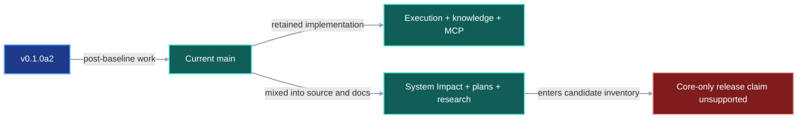

# VIPER 0.1.0a3 Core Release Contract

## 1. Status

**Contract status:** In progress against commit
`0ba64497a6ad060c1981d0256ec6a7b5a5f337c6` and the published
`v0.1.0a2` baseline.

This contract is the self-contained checklist for the `0.1.0a3` cleanup. It
replaces the repository's previous master checklist and source-plan compiler
for this release because the cleanup removes both artifacts. The user approved
that exemption on 2026-09-07. Git history and the preservation branch retain
their content.

| ID | Implementation obligation |
|---|---|
| `CRB-01` | Preserve the complete pre-cleanup repository state at `codex/archive-v0.1.0a3-pre-cleanup`. |
| `CRB-02` | Remove the System Impact, CodeQL, graph-localization, contract-plan, scheduling, research-memory, fixture, and workday-journal surfaces listed in this contract. |
| `CRB-03` | Remove their API, CLI, MCP, documentation, packaging, and test references while preserving similarly named scientific knowledge records. |
| `CRB-04` | Retain and verify core execution, verification, storage, restoration, catalog, knowledge, and MCP behavior added after `v0.1.0a2`. |
| `CRB-05` | Build wheel and source distributions whose inventories exclude every removed experimental path and symbol. |
| `CRB-06` | Install the candidate outside the checkout and pass the public API, CLI, generated-project, CPU quickstart, and supported-Python gates. |
| `CRB-07` | Run the candidate wheel through the applicable Mantra GPU acceptance path before PyPI publication. |
| `CRB-08` | Publish the exact validated `0.1.0a3` artifacts through the signed-tag release workflow and record their identities. |

## 2. Required claim

VIPER guarantees that the `0.1.0a3` wheel and source distribution contain the
retained public library and exclude the experimental subsystem preserved by
`codex/archive-v0.1.0a3-pre-cleanup`.

```math
E \cap W = \varnothing, \qquad
E \cap S = \varnothing, \qquad
\operatorname{Accept}(C) = L(C) \land I(C) \land M(C)
```

where:

- $E$ is the exact removed-path and removed-symbol set in Section 8;
- $W$ is the path and public-symbol inventory of the candidate wheel;
- $S$ is the path and public-symbol inventory of the candidate source
  distribution;
- $C$ is the candidate built from the release commit;
- $L(C)$ means the local formatting, lint, type, unit, contract, and integration
  gates pass;
- $I(C)$ means a clean environment installs the candidate and passes its public
  API, CLI, generated-project, and CPU quickstart checks; and
- $M(C)$ means the applicable Mantra execution passes on the designated GPU
  host using the same candidate wheel.

The repository can build and inspect $C$ before GPU access is available. PyPI
publication waits for $M(C)$ unless the user explicitly narrows the advertised
GPU boundary before tagging the release.

## 3. Current gap

### Inspected path

The current `main` branch combines retained experiment execution with source
analysis and contract-planning machinery. [`viper.api`](../../src/viper/api.py)
imports `analyze_working_tree_impact()` and exposes `analyze_impact` and
`explain_impact`. [`viper.cli`](../../src/viper/cli.py) exposes the matching
`viper impact` commands. [`MANIFEST.in`](../../MANIFEST.in) includes all
development contracts in the source distribution.

The knowledge path is distinct. [`KnowledgeVector`](../../src/viper/knowledge.py)
records a vector and its view identity, while
[`KnowledgeCatalog.similar()`](../../src/viper/catalog.py) applies exact filters
and calculates cosine distance exhaustively. Six focused tests passed on
2026-09-07 while Python reported `usearch` as absent, including the Python, CLI, and MCP
round trip in
[`test_knowledge_operations_match_python_cli_and_mcp()`](../../tests/test_api.py).

### Current DAG



### Missing connector

The current release workflow builds whatever the repository and package
configuration contain. It lacks an inventory rule that compares the wheel and
source distribution with an approved experimental-path set. A green build
therefore leaves the core-only release claim unsupported.

### Proposed-change DAG


### Integrated DAG

```mermaid
flowchart LR
    Baseline["Current main"] -->|"branch at exact commit"| Archive["Preserved experiment state"]
    Baseline -->|"apply CRB inventory"| Cleanup["Cleaned source"]
    Cleanup -->|"build once"| Dist["Wheel + source distribution"]
    Dist -->|"inspect paths and imports"| Local["Local release gates"]
    Dist -->|"install same wheel"| Mantra["Mantra GPU acceptance"]
    Local -->|"passed evidence"| Release["Signed v0.1.0a3 tag"]
    Mantra -->|"passed evidence"| Release
    Release -->|"trusted publisher"| PyPI["TestPyPI then PyPI"]

    class Baseline current
    class Archive checklist
    class Cleanup,Dist implementation
    class Local,Mantra,Release,PyPI proposed
    classDef current fill:#1e3a8a,stroke:#60a5fa,color:#ffffff,stroke-width:2px
    classDef checklist fill:#713f12,stroke:#fbbf24,color:#ffffff,stroke-width:2px
    classDef implementation fill:#115e59,stroke:#5eead4,color:#ffffff,stroke-width:2px
    classDef proposed fill:#581c87,stroke:#d8b4fe,color:#ffffff,stroke-width:2px
    linkStyle default stroke:#94a3b8,stroke-width:2px
```



## 4. Models

This cleanup preserves every runtime protocol model, serialized run field, and
serialized discriminator.

| Existing object | Release role |
|---|---|
| [`KnowledgeVector`](../../src/viper/knowledge.py) | Retained record that binds finite values to one source record and vector view. |
| [`SimilarityQuery`](../../src/viper/knowledge.py) | Retained query that selects one view, exact filters, query values, and a result limit. |
| [`KnowledgeCatalog.similar()`](../../src/viper/catalog.py) | Retained exact implementation that filters records, computes cosine distance, and applies stable ordering. |
| [`OPERATIONS`](../../src/viper/api.py) | Public operation inventory that must lose `analyze_impact` and `explain_impact` while retaining scientific knowledge operations such as `search_impacts`. |
| [`tool_registry()`](../../src/viper/mcp.py) | MCP tool inventory that must retain knowledge queries and publications while losing removed System Impact tools. |
| [`pyproject.toml`](../../pyproject.toml) | Distribution identity, dependencies, extras, Python support, and `0.1.0a3` version. |

`ImpactAssessment`, `ImpactPolicy`, `search_impacts`, `publish_impact`, and
`publish_impact_policy` describe scientific experiment effects in the
knowledge subsystem. Their shared word `impact` identifies a scientific
experiment result. They remain public.

## 5. Execution

1. Create `codex/archive-v0.1.0a3-pre-cleanup` at the exact pre-cleanup commit
   and push it before deleting tracked files.
2. Create the cleanup branch from that same commit and record the removal
   inventory from Section 8.
3. Remove the experimental owners, tests, fixtures, historical execution
   plans, internal research documents, editor settings, and workday journals.
4. Remove `analyze_impact` and `explain_impact` from `viper.api`, `viper.cli`,
   `viper.mcp`, schemas, capabilities, documentation, and tests.
5. Retain plan comparison through `viper.inspection.plan_diff`; this operation
   compares frozen run plans independently of source-graph analysis.
6. Retain the knowledge models and operations, remove the unused `knowledge`
   extra from `pyproject.toml`, and document knowledge as base functionality.
7. Remove development contracts from `MANIFEST.in` and add a release test that
   rejects every removed path and symbol in both distribution inventories.
8. Run focused tests for every retained surface touched by the cleanup, then
   run the repository's formatting, lint, type, unit, contract, integration,
   generated-project, CPU quickstart, build, metadata, archive, and clean-install
   gates.
9. Install the same candidate wheel on the Mantra GPU host and run the agreed
   project acceptance command with the installed distribution as its only
   VIPER import source.
10. Update `CHANGELOG.md`, add the `0.1.0a3` release evidence, merge after green
    CI, create the signed `v0.1.0a3` tag, and let the release workflow publish
    the already validated distributions.

## 6. Persisted evidence

| Evidence | Required contents |
|---|---|
| Preservation branch | Local and remote `codex/archive-v0.1.0a3-pre-cleanup` both resolved to `0ba64497a6ad060c1981d0256ec6a7b5a5f337c6` on 2026-09-07. |
| Cleanup commit | `P0-CRB-02` removes 91 approved tracked paths and repairs the Python API, CLI, MCP assertions, documentation, and retained tests. Ruff and Pyright pass; 60 focused tests and 18 CLI subtests pass. Three unrelated stale retained-test assertions remain assigned to the later full retained-surface review. |
| Knowledge and archive gate | `P0-CRB-03` keeps exact knowledge queries and Python, CLI, and MCP publication paths; Python reports `usearch` absent. The built wheel and source distribution retain `knowledge.py`, `catalog.py`, and `mcp.py`, omit every forbidden path, and contain no `knowledge` extra or `usearch` requirement. Twenty-five focused tests pass. The wider release-marker run reaches one pre-existing generated-project fixture mismatch assigned to `P0-CRB-04`. |
| Distribution inventories | Every wheel and source-distribution path plus a comparison with the removal inventory. |
| Local gate output | Commands, exit status, test counts, Python version, and candidate version. |
| Mantra receipt | Candidate wheel hash, remote revision, GPU identity, command, terminal status, and retained VIPER result paths. |
| Proposed `docs/releases/0.1.0a3.md` in the [release directory](../releases/) | Commit, tag, filenames, byte counts, SHA-256 digests, CI run, TestPyPI result, PyPI result, and hardware acceptance. |

## 7. Verification

| Rule | Executable condition |
|---|---|
| `release.archive.preserved` | The remote preservation branch resolves to the exact pre-cleanup commit. |
| `release.experimental.absent` | Both built archives exclude every Section 8 removed path plus `viper.system_impact`, `viper._system_impact`, `viper.scheduling`, and `viper._contract_traceability`. |
| `release.public.surface` | Installed-wheel API, CLI, and MCP inventories omit `analyze_impact` and `explain_impact` and retain all approved knowledge operations. |
| `release.knowledge.exact` | The existing ontology, vector, immutable-publication, exact-filter, similarity, API, CLI, and MCP tests pass while Python reports `usearch` as absent. |
| `release.local.accepted` | `make check`, `make check-integration`, `make check-release`, the CPU quickstart, and clean-install checks pass for the candidate. |
| `release.python.compatible` | CI passes under every Python version declared in `pyproject.toml`. |
| `release.mantra.accepted` | Mantra installs the candidate wheel by path or digest and completes the agreed GPU acceptance execution. |
| `release.identity.equal` | Local, CI, TestPyPI, and PyPI filenames and SHA-256 digests identify the same wheel and source distribution. |

## 8. Propagation

| Surface | Required change |
|---|---|
| Preservation | Add and push `codex/archive-v0.1.0a3-pre-cleanup` before removal. |
| Runtime removal | Remove `src/viper/system_impact/`, `src/viper/_system_impact/`, `src/viper/scheduling.py`, and `src/viper/_contract_traceability.py`. |
| Analysis tools | Remove `tools/codeql/`, `tools/plan/`, `tools/refresh_contract_baselines.py`, and `plans/`. |
| Experimental tests | Remove `tests/data/system_impact/`, `tests/test_codeql_analysis.py`, `tests/test_codeql_graph_semantics.py`, `tests/test_contract_documentation.py`, `tests/test_contract_target_parity.py`, `tests/test_contract_traceability.py`, `tests/test_plan_check.py`, `tests/test_system_impact.py`, and `tests/test_system_impact_explain.py`. |
| Historical internal plans | Remove every pre-existing file in `docs/development/` except `documentation-architecture.md`, `testing.md`, and this contract. Public how-to, explanation, reference, tutorial, and release documents remain. |
| Local work records | Remove `.vscode/settings.json`, `workday-08-31/`, `workday-09-01/`, and `workday-09-03/` after the preservation branch is confirmed. |
| Python API | Remove only the request, result, handler, registry, schema, capability, and export entries owned by `analyze_impact` and `explain_impact`. Retain `plan_diff` and all scientific knowledge-impact operations. |
| CLI and MCP | Remove `viper impact explain`, `viper impact analyze`, and their MCP tools. Retain knowledge search and publication commands and tools. |
| Packaging | Set version `0.1.0a3`, remove the unused `knowledge = ["usearch..."]` extra, and exclude development contracts from the source distribution. Retain the `mcp` extra because `viper.mcp` imports the external MCP package. |
| Public documentation | Remove source-impact claims and present knowledge search as exact base functionality. Keep the CPU quickstart and public workflow as the primary acceptance path. |
| Retained tests | Update API, CLI, public-import, documentation, workflow, and release tests only where they mention removed surfaces or the retired `knowledge` extra. |
| Distribution tests | Add explicit wheel and source-distribution inventory rejection for every removed path and module. |
| Release workflow | Preserve build-once, TestPyPI verification, identical-artifact PyPI publication, and recovery behavior. |
| External acceptance | Add the Mantra command and receipt fields after remote access and the project entry point are known. |

## 9. Acceptance case

### Success

A clean environment installs the `0.1.0a3` wheel. It imports the retained public
modules, runs `examples/cpu_quickstart.py`, publishes one `OntologySpec` and one
`KnowledgeVector`, refreshes the catalog, returns the expected
`KnowledgeCatalog.similar()` ordering, and obtains the same knowledge result
through Python, CLI, and MCP. The wheel and source-distribution inventories
contain none of the Section 8 removed paths. The same wheel then completes the
agreed Mantra GPU run.

### Rejection

The archive checker opens a candidate wheel containing
`viper/system_impact/models.py`. Rule `release.experimental.absent` rejects the
candidate before tagging, even when every ordinary test passes. The rejection
reports the archive name and offending member path.

## 10. Implementation order

- [x] `P0-CRB-01`: Push the preservation branch and verify its remote commit.
- [x] `P0-CRB-02`: Remove the Section 8 experimental paths and repair all
  imports, registries, tests, and documentation that they owned.
- [x] `P0-CRB-03`: Retain and retest knowledge/MCP, remove the unused `usearch`
  extra, and add archive-absence assertions.
- [ ] `P0-CRB-04`: Run local and CI release gates against version `0.1.0a3` and
  record the candidate artifact identities.
- [ ] `P0-CRB-05`: Run the same wheel in Mantra, complete release evidence, sign
  `v0.1.0a3`, and verify TestPyPI and PyPI artifact identity.

Each checked block requires its Section 7 gate. Each block ends in one focused,
recoverable commit. The cleanup branch may merge only after all local blocks
through `P0-CRB-04` pass; the release tag waits for `P0-CRB-05`.

## 11. Contract-owned PairBlocks

| PairBlock | Requirements | Depends on | Gate |
|---|---|---|---|
| `P0-CRB-01` | `CRB-01` | None | `release.archive.preserved` |
| `P0-CRB-02` | `CRB-02`, `CRB-03` | `P0-CRB-01` | Focused imports, API, CLI, MCP, and documentation tests |
| `P0-CRB-03` | `CRB-04`, `CRB-05` | `P0-CRB-02` | `release.experimental.absent`, `release.public.surface`, and `release.knowledge.exact` |
| `P0-CRB-04` | `CRB-06` | `P0-CRB-03` | `release.local.accepted` and `release.python.compatible` |
| `P0-CRB-05` | `CRB-07`, `CRB-08` | `P0-CRB-04` | `release.mantra.accepted` and `release.identity.equal` |

## 12. ContractTarget

This contract uses `ContractTarget` as a manual release-planning record. The
cleanup excludes these targets from the soon-to-be-removed contract compiler.
Section 8 is the authoritative path-level target inventory; its action verbs
mean:

| Action | Meaning |
|---|---|
| `remove` | Delete the named tracked path after the preservation branch is verified. |
| `update` | Remove references owned by the deleted subsystem while retaining unrelated behavior in the same file. |
| `retain` | Keep the named behavior and require its focused test before release. |
| `add` | Introduce the archive-inventory test or `0.1.0a3` release evidence. |

| PairBlock | Action | Authoritative targets |
|---|---|---|
| `P0-CRB-01` | `add` | Remote branch `codex/archive-v0.1.0a3-pre-cleanup` at the inspected pre-cleanup commit |
| `P0-CRB-02` | `remove` | Every path in the Runtime removal, Analysis tools, Experimental tests, Historical internal plans, and Local work records rows of Section 8 |
| `P0-CRB-02` | `update` | [`api.py`](../../src/viper/api.py), [`cli.py`](../../src/viper/cli.py), [`mcp.py`](../../src/viper/mcp.py), public documentation, and retained tests that reference `analyze_impact` or `explain_impact` |
| `P0-CRB-03` | `retain` | [`knowledge.py`](../../src/viper/knowledge.py), [`catalog.py`](../../src/viper/catalog.py), scientific knowledge-impact operations, and `plan_diff` |
| `P0-CRB-03` | `update` | [`pyproject.toml`](../../pyproject.toml), [`MANIFEST.in`](../../MANIFEST.in), public knowledge documentation, and distribution tests |
| `P0-CRB-04` | `update` | Version-bearing documentation, `CHANGELOG.md`, CI checks, and proposed local release evidence |
| `P0-CRB-05` | `add` | Mantra acceptance receipt and proposed `docs/releases/0.1.0a3.md` |

The implementation review must map every changed file to one Section 8 row and
one PairBlock before staging. Any unmatched change returns the cleanup to
review.

## Future work

### Optional USearch acceleration

The current implementation performs an exhaustive cosine-distance calculation
after applying exact knowledge filters. USearch can accelerate that operation
in two different ways:

1. `usearch.index.search(..., exact=True)` performs exhaustive search through
   native SIMD code while skipping persistent-index construction.
2. `usearch.index.Index(metric="cos")` builds an HNSW index for approximate
   nearest-neighbor search and can save, load, or memory-map that index.

The exact adapter changes few source lines. A release-quality change also needs
distance-parity and stable-tie tests, supported-Python wheel checks, an
optional-dependency fallback, and a benchmark that establishes a corpus size
where the native call improves end-to-end latency. The HNSW adapter also
needs a stable integer-key mapping, index identity and invalidation rules,
filter-aware candidate retrieval, recall thresholds, deterministic final
reranking, and persisted-cache tests.

For `0.1.0a3`, remove the unused extra and retain exhaustive Python search. A
later acceleration contract should begin with representative VIPER knowledge
corpora and compare latency, memory, recall, distance parity, and installation
coverage. Reintroduce the optional dependency only when that evidence selects
an exact or approximate adapter.

## Sources

1. [USearch Python documentation](https://unum-cloud.github.io/USearch/python/reference.html)
   defines exact exhaustive search, approximate `Index.search()`, cosine
   metrics, integer keys, and index serialization.
2. [USearch Python README](https://github.com/unum-cloud/usearch/blob/main/python/README.md)
   shows the Python index construction, exact-versus-approximate evaluation,
   and save, load, and view operations.
