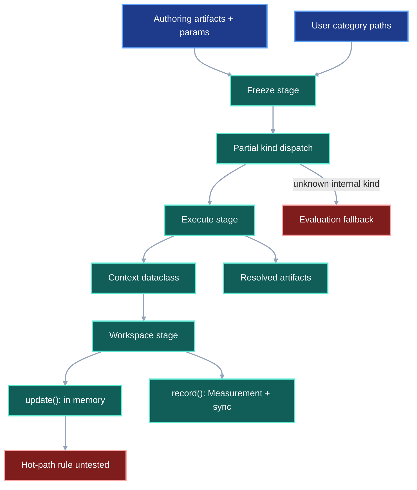
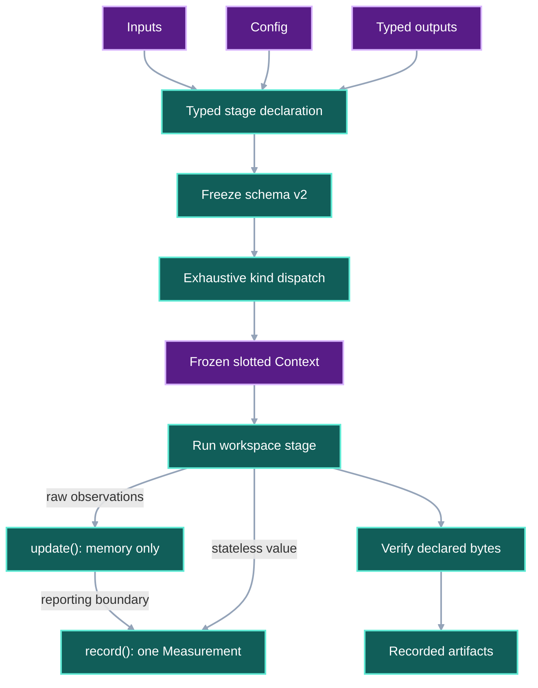
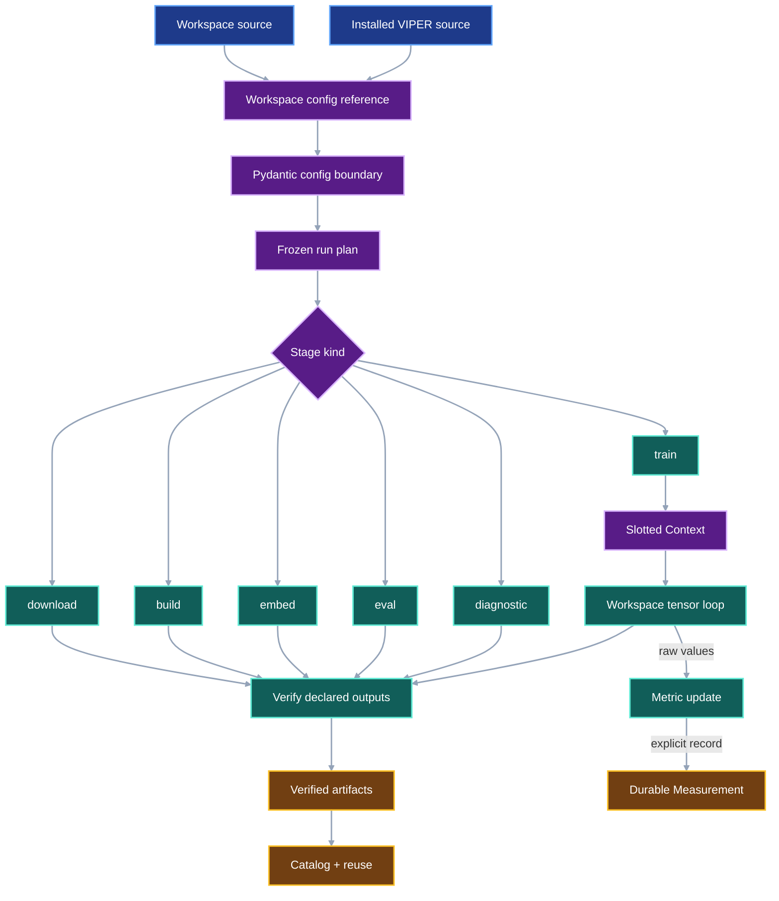

# VIPER 0.1.0a3 Public Authoring Contract

## 1. Status

**Contract status:** Planned against commit
`85a65181e147874bcdfc2d6e90571ca8977ac60e`.

**Checklist variant:** Self-contained

This contract is the implementation charter for the final public-authoring
cleanup before `0.1.0a3`. It replaces overloaded parameter, artifact-category,
and project vocabulary with one lifecycle-based API, adds diagnostic stages,
and fixes the validation boundary around workspace computation. It does not
authorize merging, tagging, TestPyPI publication, or PyPI publication.

| ID | Implementation obligation |
|---|---|
| `PAC-01` | Replace the public and serialized parameter vocabulary with `config` and reject the retired spellings. |
| `PAC-02` | Declare stage writes as typed outputs and retain `artifact` only for completed, recorded bytes. |
| `PAC-03` | Remove public artifact categories and generate output and pointer locations from stage and output identity. |
| `PAC-04` | Add `diagnostic` as a terminal stage kind through authoring, resolution, execution, verification, schemas, and tests. |
| `PAC-05` | Replace VIPER-owned `project` terminology with `workspace` or `repository`, while retaining names imposed by external standards. |
| `PAC-06` | Make every stage-kind dispatch exhaustive and make affected version-1 documents fail with an explicit migration error. |
| `PAC-10` | Keep Pydantic validation at configuration and persistence boundaries while live runtime contexts use frozen slotted dataclasses and metric updates remain in memory. |
| `PAC-07` | Migrate documentation, examples, generated-workspace example content, and the final public inventory to the approved vocabulary. |
| `PAC-08` | Rebuild and validate the release candidate locally, in clean installs, in CI, and through the Mantra GPU acceptance path. |
| `PAC-09` | Prepare the exact signed-tag release trigger and wait for the user's explicit publication approval. |

## 2. Required claim

VIPER guarantees that one stage declaration uses one vocabulary from authoring
through verification: a stage reads inputs, receives a config, declares
outputs, runs workspace computation without per-observation protocol validation,
and leaves verified artifacts and explicitly recorded measurements.

```math
S = (I, C, O), \qquad
A = \operatorname{Record}(\operatorname{Run}(S)), \qquad
U_{t+1} = \operatorname{Update}(U_t, x_t), \qquad
M_t = \operatorname{RecordMetric}(U_t),
\qquad
\operatorname{Accept}(S,A) = V_C(C) \land V_O(S,O) \land V_A(O,A)
\land N_P(\operatorname{Update}) = 0
\land N_W(\operatorname{Update}) = 0
\land N_M(\operatorname{RecordMetric}) = 1
```

where:

- $S$ is one frozen stage with inputs $I$, config $C$, and declared outputs
  $O$;
- $A$ is the completed artifact record created from the bytes the stage wrote;
- $V_C$ verifies the config type reference, exact source bytes, and values;
- $V_O$ verifies the output names and generated locations allowed for the
  stage kind;
- $V_A$ verifies that each declared output became exactly one recorded file or
  bundle artifact with the expected identity;
- $U_t$ is one stateful metric's in-memory aggregate before observation $x_t$;
- $N_P$ counts VIPER-owned Pydantic model constructions performed by one
  metric operation;
- $N_W$ counts VIPER-owned durable writes performed by one metric operation;
  and
- $N_M$ counts `Measurement` records produced by one metric operation.

The public API uses `config` before and during execution. It uses `output` for
what a stage promises to write. It uses `artifact` only after VIPER observes
the resulting bytes. Output names describe semantic roles such as
`parameters`, `resume_state`, and `predictions`; they are not storage
categories.

VIPER validates $C$ before it constructs the live stage context. The workspace
then operates directly on tensors and other runtime values. `MetricHandle.update()`
changes only $U_t$; `MetricHandle.record()` creates and persists exactly one
`Measurement` at a reporting boundary chosen by the workspace.

## 3. Current gap

### Inspected path

The former `src/viper/params.py` defines `ParameterSet` and
`ParameterModelRef`, while stage models and variant models serialize
`parameter_model`, `params`, and `stage_params`. The authoring path in
[`viper.authoring`](../../src/viper/authoring.py) accepts `artifacts={...}` and
freezes user-supplied paths. [`BaseSpec`](../../src/viper/stages.py) derives an
artifact category from the stage kind, including `build -> priors`, and rejects
paths that do not repeat that category.

[`viper.keys`](../../src/viper/keys.py) calls the required training results
`model` and `state`, even though those names mean learned parameters and the
state needed to resume training. [`viper.project`](../../src/viper/project.py)
uses `project` for the Git root, generated workspace, source ownership, and
HTTP implementation ownership. This word does not distinguish those roles.

The public stage union ends at `eval`. Resolution and reuse dispatch handle
known kinds and then treat the remaining internal stage as evaluation. Adding
a stage without repairing that fallthrough can construct the wrong resolved
model instead of rejecting the missing branch.

[`Context`](../../src/viper/stages.py) is already a frozen standard-library
dataclass, and the stage worker constructs it once before invoking workspace
code. [`MetricHandle.update()`](../../src/viper/metrics.py) forwards raw values
to a stateful metric without persistence. `MetricContext` remains a Pydantic
model even though it carries live invocation values, while
`MeasurementSink.append()` constructs a `Measurement`, writes it, flushes the
file, and synchronizes the file descriptor for every `record()` call. The
implementation lacks a testable rule that keeps validation and persistence out
of `update()`, and checkpoint serialization cost has not been measured on the
Mantra workload.

### Current DAG



### Missing connector

VIPER lacks one explicit lifecycle transition from a declared output to a
recorded artifact. Storage paths currently carry stage semantics that belong
in typed stage models, and partial dispatch hides missing stage support. The
same concepts also change names between public Python, serialized plans,
execution, and verification. The runtime boundary is implemented by convention
rather than enforced by an acceptance test: config validation belongs before
invocation, metric accumulation belongs in memory, and durable measurement
creation belongs at an explicit `record()` call.

### Proposed-change DAG



### Integrated DAG



## 4. Models

| Approved object | Role |
|---|---|
| `Config` | Frozen Pydantic base for all stage configuration values. |
| `BuildConfig`, `EmbedConfig`, `TrainConfig`, `EvalConfig`, `MetricConfig`, `HttpConfig`, `DiagnosticConfig` | Stage-owned config bases exposed from `viper.config`. |
| `ConfigTypeRef` | Exact reference to a config class owned by `workspace` or `viper`. |
| `StageOutputs[T]` | Common typed collection that maps output names to values of `T`; flexible stages may declare any valid output name. |
| `TrainOutputs[T]` | Requires `parameters: T` and `resume_state: T`. |
| `EvalOutputs[T]` | Requires `predictions: T`. |
| `OutputDraft` and `OutputSpec` | Callable-backed and frozen declarations of bytes a stage must write. |
| `ResolvedArtifact` | Existing completed file or bundle evidence; it remains an artifact because VIPER has observed it. |
| `DiagnosticSpec` and `ResolvedDiagnosticSpec` | Frozen and resolved forms of a terminal diagnostic stage. |
| `WorkspaceHttpImplementationSpec` | A user-authored HTTP implementation and its `ConfigTypeRef`. |
| `RepositorySettings` | The versioned `[workspace]` marker in `viper.toml` at a Git repository root. |
| `Context[ConfigT, OutputsT]` | Frozen slotted dataclass carrying one validated config, live paths, metric handles, and random generators into a stage invocation. |
| `MetricContext[ConfigT]` | Frozen slotted dataclass carrying live input paths, artifact paths, and one already validated metric config. |
| `Measurement` | Pydantic protocol record created only when `MetricHandle.record()` publishes a metric value. |

`frozen=True` and `slots=True` express separate requirements. `PAC-10` retains
`frozen=True` wherever reassignment must fail and adds `slots=True` only when
the class uses fixed field storage, supports slotted inheritance, and requires
neither an instance dictionary nor weak references. Eligible classes use both
flags together.

`TrainOutputs[T]` and `EvalOutputs[T]` inherit the collection behavior of
`StageOutputs[T]`. A declaration binds `T` to `OutputDraft`; an execution
context binds `T` to `Path`; a frozen stage binds the same names to
`OutputSpec`; and a completed stage binds them to `ResolvedArtifact`. Their
field names are the canonical identifiers, so the public API does not add a
second `StrEnum` that repeats those names. `download`, `build`, `embed`, and
`diagnostic` use `StageOutputs[T]` because VIPER imposes no universal output
vocabulary on those stages.

Public examples import the symbols they use from the owning plural modules:

```python
from viper.config import TrainConfig
from viper.outputs import TrainOutputs, output
from viper.stages import Context, train


class RidgeTrainConfig(TrainConfig):
    learning_rate: float
    epochs: int


training_outputs = TrainOutputs(
    parameters=output(
        path="parameters.json",
        loader=load_parameters,
        data_role="training",
    ),
    resume_state=output(
        path="resume_state.pt",
        loader=load_resume_state,
        data_role="training",
    ),
)


@train(config=RidgeTrainConfig, outputs=training_outputs)
def fit(context: Context[RidgeTrainConfig, TrainOutputs]):
    context.outputs.parameters.write_bytes(...)
```

The output declaration's relative path names the file within that output. The
stage ID and output field already provide identity; users do not repeat
`artifacts/models/...` in the declaration.

## 5. Execution

1. Freeze the accepted names and the version-2 serialized shapes before
   changing implementation.
2. Rename `viper.params` to `viper.config`; rename public classes, fields,
   internal helpers, worker bindings, variant records, and verification rules
   in the same change.
3. Validate each config before stage invocation. Construct `Context` and
   `MetricContext` as frozen slotted dataclasses that retain the already
   validated config and live runtime values without revalidation.
4. Keep `MetricHandle.update()` as the stateful metric's high-frequency
   operation: it accepts raw workspace values, changes only the in-memory
   aggregate, constructs no Pydantic model, and performs no file operation.
5. Keep `MetricHandle.record()` as the explicit persistence boundary. A
   stateful metric computes its accumulated value without new observations; a
   stateless metric computes from the supplied arguments. Each call constructs
   and durably appends exactly one `Measurement`.
6. Audit standard-library dataclasses under `src/viper/`. Add `slots=True` to
   fixed-shape runtime records that do not require an instance `__dict__`, weak
   references, or unslotted subclassing. Record a test-backed reason for every
   retained unslotted runtime dataclass.
7. Replace authoring `artifact()` and `artifacts=` with `output()` and
   `outputs=`. Replace `context.params` with `context.config` and pre-run
   `context.artifacts` with `context.outputs`.
8. Generate each run location as
   `artifacts/<stage_id>/<output_name>/<relative_path>`. Keep `artifacts/` as
   the persisted run root because bytes at that location are completed run
   products.
9. Generate reusable pointer locations from run, stage, and output identity.
   Use
   `.viper/pointers/<run_digest>/<producer_stage_id>/<output_name>.pointer.yaml`;
   the stored input's declared path remains its materialization destination.
   The pointer namespace never derives from `datasets`, `models`, `priors`, or
   another user-supplied category.
10. Make `build` accept every valid workspace-defined output name. Enforce
   `parameters` and `resume_state` only in `TrainOutputs`, and `predictions`
   only in `EvalOutputs`.
11. Add `diagnostic` to the authoring decorator, draft and frozen unions,
   resolved unions, config variants, execution, reuse, schema generation,
   capabilities, and verification.
12. Require diagnostic stages to consume only earlier stage outputs, allow
   descriptive metrics and diagnostic artifacts, forbid optimization
   objectives, exclude them from estimator and benchmark selection, and
   forbid later stages from consuming their outputs.
13. Replace every stage-kind fallback with an exhaustive branch whose default
   raises an unsupported-kind error naming the received discriminator.
14. Replace VIPER-owned `project` symbols and prose with `workspace` for
    user-owned code and `repository` for Git or root-path operations. Retain
    PEP 621 `[project]`, Google Cloud project identifiers, and third-party
    names whose spelling VIPER does not own.
15. During `PAC-01` through `PAC-06`, update the Python API, serialized schemas,
    CLI and MCP protocol surfaces, generator implementation, and focused tests
    required to keep each implementation block runnable. During `PAC-07`,
    update documentation, examples, generated-workspace example content, and
    the final public inventory. Do not add compatibility aliases for the
    retired alpha API.
16. Build one new candidate and validate it outside the checkout. Run that
    exact wheel through Mantra, including a checkpoint-serialization profile
    that reports elapsed time, peak host memory, checkpoint size, optimizer
    state size, and DataLoader state size. Hold the signed tag until the user
    approves publication.

## 6. Persisted evidence

| Evidence | Required contents |
|---|---|
| Contract package | This Markdown file and its adjacent `.checklist.json`, with a matching SHA-256 digest and requirement set. |
| Schema fixtures | Accepted version-2 config, output, diagnostic, pointer, run, and variant documents plus targeted version-1 rejection fixtures. |
| Public inventory | Exact import, schema, capability, CLI, MCP, generated-workspace, and documentation names after migration. |
| Terminology audit | Search result classifying every retained `params`, `parameter_model`, `artifacts=` authoring use, and VIPER-owned `project` use as removed or explicitly exempt. |
| Runtime-boundary tests | Tests proving that runtime contexts are frozen slotted dataclasses, `MetricHandle.update()` performs no Pydantic construction or persistence, and `MetricHandle.record()` appends exactly one validated `Measurement`. |
| Test output | Focused checks for each requirement followed by full formatting, lint, type, unit, integration, generated-workspace, and release checks. |
| Distribution receipt | Wheel and source archive names, sizes, SHA-256 digests, member inventories, metadata, and clean-install results. |
| Mantra receipt | Mantra commit, wheel SHA-256, environment, GPU identity, command, numerical result, tolerance, clean-worktree status, and checkpoint-serialization profile. |
| Publication hold | Prepared tag and workflow inputs plus a recorded statement that neither was triggered without user approval. |

The wheel and Mantra receipt recorded by the core release contract remain valid
evidence for commit `0ee1764`, but they do not validate a candidate containing
this contract's API and protocol changes.

## 7. Verification

| Rule | Executable condition |
|---|---|
| `authoring.config.only` | Public Python imports, serialized schemas, CLI and MCP protocol surfaces, and the workspace generator implementation expose `config`; rejected fixtures prove that `params`, `parameter_model`, and `stage_params` are not accepted in affected version-2 documents. Documentation and executable examples close under `PAC-07`. |
| `authoring.output.lifecycle` | A declared output receives a generated path, execution writes it, verification records it as an artifact, and catalog and reuse read that artifact identity. |
| `authoring.category.absent` | No public declaration accepts or derives an artifact category; `build` accepts two unrelated workspace-defined output names. |
| `authoring.output.required` | Missing `parameters` or `resume_state` rejects a training declaration; missing `predictions` rejects an evaluation declaration. |
| `authoring.diagnostic.terminal` | A diagnostic stage runs and records reports; an objective, estimator selection, benchmark selection, or downstream consumer of its output is rejected. |
| `authoring.dispatch.exhaustive` | Every supported stage kind resolves and reuses through its own model; an unknown discriminator raises the explicit unsupported-kind error. |
| `authoring.workspace.vocabulary` | A repository-wide lexical audit finds no VIPER-owned public `project` identifier or prose; only enumerated external-standard uses remain. |
| `authoring.runtime.boundary` | Stage and metric configs are validated before invocation; fixed-shape runtime contexts are frozen slotted dataclasses; `MetricHandle.update()` constructs no Pydantic model and touches no persistence sink; each `MetricHandle.record()` call constructs and appends exactly one `Measurement`. |
| `authoring.clean.install` | The built wheel passes public imports, CLI and MCP capability checks, generated-workspace execution, and the CPU quickstart outside the checkout. |
| `authoring.mantra.accepted` | Mantra installs the same wheel digest and passes the agreed GPU numerical acceptance path. |
| `authoring.resume.profiled` | The Mantra receipt reports checkpoint serialization elapsed time, peak host memory, checkpoint size, optimizer state size, and DataLoader state size for the accepted wheel. |
| `authoring.publication.held` | No merge, release tag, TestPyPI upload, or PyPI upload occurs before explicit user approval. |

`PAC-10` binds `authoring.runtime.boundary` to `Context`, `MetricContext`,
`MetricHandle.update()`, `MetricHandle.record()`, and `MeasurementSink.append()`.
Its planned acceptance functions are
`test_runtime_contexts_are_frozen_slotted_dataclasses`,
`test_metric_update_does_not_validate_or_persist`, and
`test_metric_record_persists_one_measurement`. `PAC-08` binds
`authoring.resume.profiled` to the Mantra acceptance receipt for the exact
candidate wheel digest.

## 8. Propagation

| Surface | Required change |
|---|---|
| Config module | Rename `src/viper/params.py` and `_parameter/` to config-owned equivalents; update `Config`, stage config classes, `ConfigTypeRef`, imports, helpers, errors, and `__all__`. |
| Stage protocol | Rename `params` to `config`, `parameter_model` to `config_type`, and `stage_params` to `stage_configs`; update draft, frozen, resolved, metric, HTTP, worker, attempt, and variant models. |
| Output authoring | Add `viper.output`, `StageOutputs`, `TrainOutputs`, and `EvalOutputs`; rename authoring fields and context access from artifacts to outputs. |
| Artifact evidence | Retain artifact terminology for resolved files, bundles, pointers, restoration, catalog records, comparison receipts, and on-disk `artifacts/`. |
| Output paths | Remove category validation and category-derived pointers; derive storage from stage ID, output name, and output-relative path. |
| Built-in names | Replace training `model` and `state` outputs with `parameters` and `resume_state`; replace evaluation `preds` with `predictions`. |
| Diagnostic stage | Add decorator, config, draft, frozen and resolved models, variants, dispatch, reuse, verifier rules, capabilities, schemas, examples, and tests. |
| Workspace ownership | Replace reference owner `project` with `workspace`; replace `ProjectHttpImplementationSpec` with `WorkspaceHttpImplementationSpec`. |
| Repository boundary | Rename `project.py` to `repository.py`, `[project]` in `viper.toml` to `[workspace]`, `Settings` to `RepositorySettings`, and public `init_project` operations to `init_workspace`. |
| Cloud storage | Rename VIPER Cloud's own `project` field to `workspace`; retain provider-owned Google Cloud project identifiers. |
| Generated workspace | Generate concise domain names such as `TrainConfig`; remove `Project*`, `*Parameters`, `prior`, and category-shaped output paths. |
| Dispatch | Replace evaluation fallthroughs in resolution and reuse and audit every discriminator dispatch for exhaustive rejection. |
| Protocol versions | Increment every affected serialized model to version 2 and return a targeted migration error for affected version-1 documents. |
| Runtime contexts | Keep configuration and persisted protocol records in Pydantic; use frozen slotted dataclasses for fixed-shape live invocation records, including `Context` and `MetricContext`. |
| Metric operations | Preserve `update()` as an in-memory state transition and `record()` as the operation that constructs and durably appends one `Measurement`; teach the reporting cadence in public examples. |
| Resume profiling | Measure `ResumeState.model_dump()` and `torch.save()` together on Mantra without moving opaque optimizer or DataLoader state out of the validated checkpoint envelope in this release. |
| Documentation | Migrate README, tutorials, how-to guides, API reference, explanations, internal formalism, examples, and release notes; use direct imports from plural owner modules in public examples; explain the output-to-artifact transition once. |
| Tests and schemas | Rename fixtures and assertions, add the rejection cases in Section 9, regenerate checked-in schemas, and retain exact public-surface checks. |
| Release evidence | Amend the core release gate, rebuild the candidate, rerun clean installs and Mantra, and record the new artifact identities. |

## 9. Acceptance case

### Success

A workspace defines `RidgeTrainConfig`, supplies a `TrainOutputs` instance with
`parameters` and `resume_state`, and decorates `fit` with `config=` and
`outputs=`. VIPER freezes a version-2 training stage, generates both run paths,
executes the callable, verifies the two outputs, records them as artifacts,
and allows a later evaluation stage to consume the recorded parameters. The
stage worker validates `RidgeTrainConfig` once and supplies it through a frozen
slotted `Context`. A stateful training metric consumes raw batch values through
`update()` without constructing a Pydantic model or touching its sink; one
subsequent `record()` call appends one validated `Measurement`. A terminal
diagnostic stage consumes the evaluation artifact and records a plot and a
report without an objective.

### Rejection

A version-2 plan contains a diagnostic stage whose output feeds a later build
stage. Verification rejects the plan with the diagnostic stage ID, output
name, and downstream stage ID. A separate version-1 plan containing
`parameter_model`, `params`, or authoring `artifacts` fails with an explicit
migration message; VIPER does not reinterpret it as version 2.

An instrumented metric sink raises if `MetricHandle.update()` accesses it, and
a patched `Measurement` constructor raises if `update()` constructs it. The
runtime-boundary rejection test feeds one observation through `update()` and
fails if either sentinel runs. A second test calls `record()` once and fails
unless the sink receives exactly one valid `Measurement`.

## 10. Implementation order

1. Approve and commit this contract package, then link it as a prerequisite of
   the core release contract.
2. Complete `PAC-01` before output or stage changes so later models use the
   final config vocabulary.
3. Complete `PAC-02` and `PAC-03` in order so category removal operates on the
   final output model.
4. Complete `PAC-04` only after exhaustive output ownership exists.
5. Complete `PAC-05` after public model names settle, then run the full lexical
   audit once.
6. Complete `PAC-06` before migrating docs and generated workspaces so every
   example targets the final schema.
7. Complete `PAC-10` after the protocol models settle so the runtime audit
   classifies final model and context roles.
8. Complete `PAC-07`, then run all local, distribution, clean-install, CI, and
   Mantra gates, including the checkpoint profile, in `PAC-08`.
9. Prepare `PAC-09` and stop. Publication remains a separate user-approved
   action.

## 11. Master checklist

Every requirement is one review cycle and one Git phase. Before starting an
ID, report the requirement, current branch, `HEAD`, upstream commit, and
working-tree state. After its gate passes, inspect the complete requirement
diff, commit only its owned changes, push normally, confirm local/upstream
equality, and report the commit and evidence. The next requirement may begin
after that check-in unless the user pauses execution. Never combine two IDs in
one implementation commit.

### Phase 0: Contract baseline

- [ ] `P0-PAC-01` / `PAC-01`: Migrate the config vocabulary across public
  Python, serialized, runtime, verification, CLI/MCP protocol, and workspace
  generator surfaces. Gate:
  `authoring.config.only` plus focused config and protocol tests. Commit:
  config migration only.

### Phase 1: Output lifecycle

- [ ] `P1-PAC-02` / `PAC-02`: Add typed output declarations and the explicit
  output-to-artifact transition. Gate: `authoring.output.lifecycle` and
  `authoring.output.required`. Commit: output model and lifecycle only.
- [ ] `P1-PAC-03` / `PAC-03`: Remove categories, generalize build outputs, and
  generate output and pointer paths. Gate: `authoring.category.absent` plus
  path, pointer, promotion, reuse, and restoration tests. Commit: category and
  path migration only.

### Phase 2: Stage and terminology completion

- [ ] `P2-PAC-04` / `PAC-04`: Add terminal diagnostic stages end to end. Gate:
  `authoring.diagnostic.terminal` plus schema, execution, reuse, and verifier
  tests. Commit: diagnostic stage only.
- [ ] `P2-PAC-05` / `PAC-05`: Replace VIPER-owned project vocabulary with
  workspace or repository. Gate: `authoring.workspace.vocabulary` plus
  repository-root, HTTP, cloud-destination, and generated-workspace tests.
  Commit: workspace terminology only.
- [ ] `P2-PAC-06` / `PAC-06`: Finish exhaustive dispatch and version-1
  rejection. Gate: `authoring.dispatch.exhaustive` plus complete schema and
  protocol tests. Commit: dispatch and migration enforcement only.

### Phase 3: Public release candidate

- [ ] `P3-PAC-10` / `PAC-10`: Enforce the Pydantic/runtime boundary, convert
  eligible runtime contexts to frozen slotted dataclasses, and bind metric
  `update()` and `record()` to their in-memory and durable operations. Gate:
  `authoring.runtime.boundary` plus focused stage, metric, and resume tests.
  Commit: runtime boundary only.
- [ ] `P3-PAC-07` / `PAC-07`: Update documentation, examples,
  generated-workspace example content, and the final public inventory. Public
  examples use direct imports such as `from viper.stages import train` and
  `from viper.outputs import TrainOutputs`. Gate:
  documentation checks, generated-workspace acceptance, CPU quickstart, and
  the repository-wide vocabulary audit. Commit: documentation, examples, and
  final public inventory only.
- [ ] `P3-PAC-08` / `PAC-08`: Run full repository checks, build fresh
  distributions, install the wheel outside the checkout, pass CI, and rerun
  Mantra with the same digest. Gate: `authoring.clean.install` and
  `authoring.mantra.accepted` plus `authoring.resume.profiled`. Commit: release
  evidence only.

### Phase 4: Publication hold

- [ ] `P4-PAC-09` / `PAC-09`: Prepare the merge, signed tag, and release
  workflow inputs without triggering them. Gate: `authoring.publication.held`
  and explicit user review. Commit: final release-evidence preparation only.

### Owner actions and deferred scope

- The user reviews commits asynchronously and may pause execution after any
  before-or-after check-in.
- The user alone authorizes merge, tag creation, TestPyPI, and PyPI publication.
- USearch acceleration, new category analytics, compatibility aliases, and
  additional stage kinds are deferred beyond `0.1.0a3`.

## 12. Contract-owned PairBlocks

| PairBlock | Requirement | Depends on | Gate |
|---|---|---|---|
| `P0-PAC-01` | `PAC-01` | None | `authoring.config.only` |
| `P1-PAC-02` | `PAC-02` | `PAC-01` | `authoring.output.lifecycle`, `authoring.output.required` |
| `P1-PAC-03` | `PAC-03` | `PAC-02` | `authoring.category.absent` |
| `P2-PAC-04` | `PAC-04` | `PAC-03` | `authoring.diagnostic.terminal` |
| `P2-PAC-05` | `PAC-05` | `PAC-04` | `authoring.workspace.vocabulary` |
| `P2-PAC-06` | `PAC-06` | `PAC-05` | `authoring.dispatch.exhaustive` |
| `P3-PAC-10` | `PAC-10` | `PAC-06` | `authoring.runtime.boundary` |
| `P3-PAC-07` | `PAC-07` | `PAC-10` | Documentation, generated-workspace, quickstart, and final public-inventory acceptance |
| `P3-PAC-08` | `PAC-08` | `PAC-07` | `authoring.clean.install`, `authoring.mantra.accepted`, `authoring.resume.profiled` |
| `P4-PAC-09` | `PAC-09` | `PAC-08` | `authoring.publication.held` and user approval |

Each PairBlock is an implementation boundary rather than a precomputed patch.
The defining models, callers, verifier branches, tests, generated schemas, and
documentation named in Sections 4 and 8 form its reviewed target closure.

## 13. ContractTarget

This contract uses five actions:

| Action | Meaning |
|---|---|
| `rename` | Change the owning public symbol, serialized field, implementation symbol, callers, tests, schemas, and documentation together. |
| `add` | Introduce one new model, stage branch, verification rule, acceptance fixture, or evidence record. |
| `update` | Change an existing runtime operation or representation without changing its public name or persisted schema. |
| `remove` | Delete a semantic constraint or retired spelling and prove that no active surface still depends on it. |
| `retain` | Keep a term or object because it describes completed run evidence or an externally owned standard. |

| PairBlock | Actions | Authoritative targets |
|---|---|---|
| `P0-PAC-01` | `rename` | `params.py`, `_parameter/`, stage definitions, contexts, experiments, metrics, HTTP, workers, preflight, verification, API schemas, and tests |
| `P1-PAC-02` | `add`, `rename`, `retain` | `artifacts.py`, `authoring.py`, `stages.py`, `keys.py`, execution, verification, restoration, catalog, and public imports |
| `P1-PAC-03` | `remove`, `add` | Stage category validators, reference pointer paths, input promotion, run storage paths, generated workspace, and path tests |
| `P2-PAC-04` | `add` | Stage kind, config, drafts, frozen and resolved unions, variants, resolution, reuse, verification, API, CLI, MCP, schemas, and tests |
| `P2-PAC-05` | `rename`, `retain` | `project.py`, `viper.toml`, API init operation, ownership discriminators, HTTP specs, Viper Cloud destination, docs, fixtures, and external-name exemptions |
| `P2-PAC-06` | `add`, `remove` | Every stage discriminator dispatch, affected schema versions, migration errors, and rejection fixtures |
| `P3-PAC-10` | `update`, `retain` | Runtime dataclasses under `src/viper/`, `Context`, `MetricContext`, `MetricHandle.update()`, `MetricHandle.record()`, `MeasurementSink`, the `ResumeState` protocol envelope, and focused stage, metric, and resume tests |
| `P3-PAC-07` | `rename`, `add`, `remove` | README, public docs, internal formalism, examples, generated workspace, API reference, capabilities, schemas, CLI, MCP, and changelog |
| `P3-PAC-08` | `add` | Test outputs, distribution inventories, clean-install receipt, CI results, release evidence, Mantra receipt, and `ResumeState` checkpoint profile |
| `P4-PAC-09` | `add`, `retain` | Merge readiness, signed-tag inputs, release-workflow inputs, and unchanged publication hold |

For every changed declaration, the implementation review follows its imports,
constructors, serialization, deserialization, runtime consumers, verifier
rules, tests, schemas, generated code, and documentation. An unmatched change
or an unexplained retired spelling fails the owning PairBlock gate.
